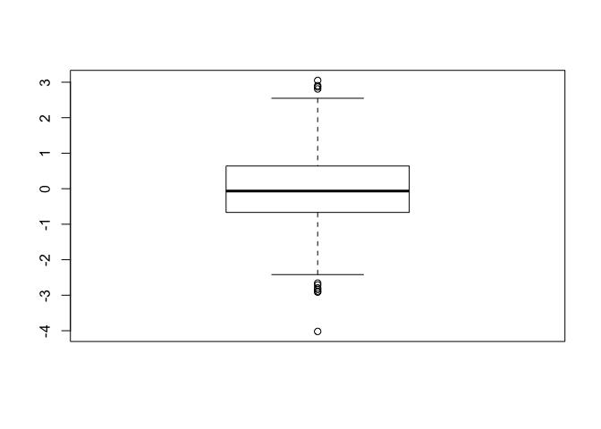
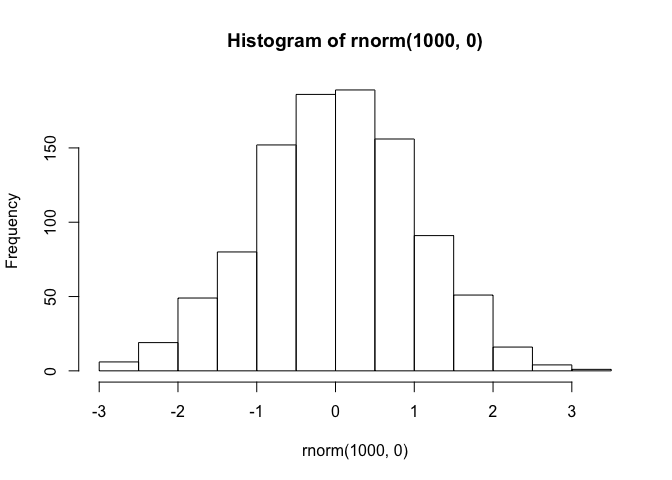
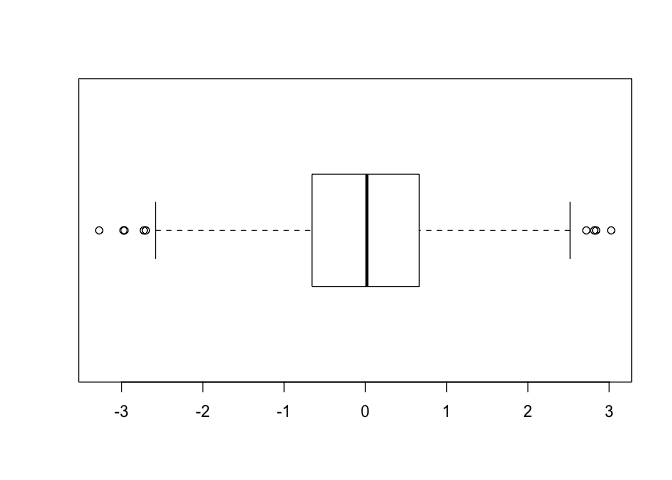
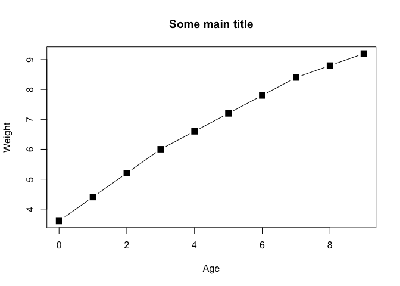
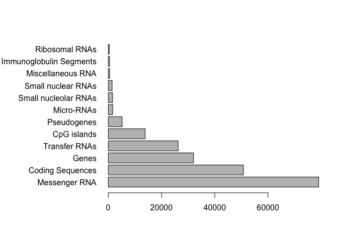
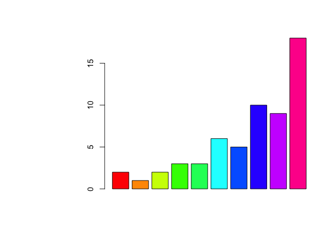
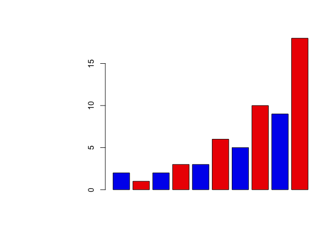
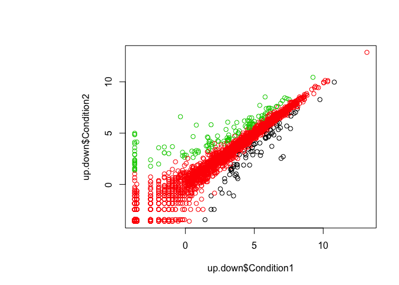
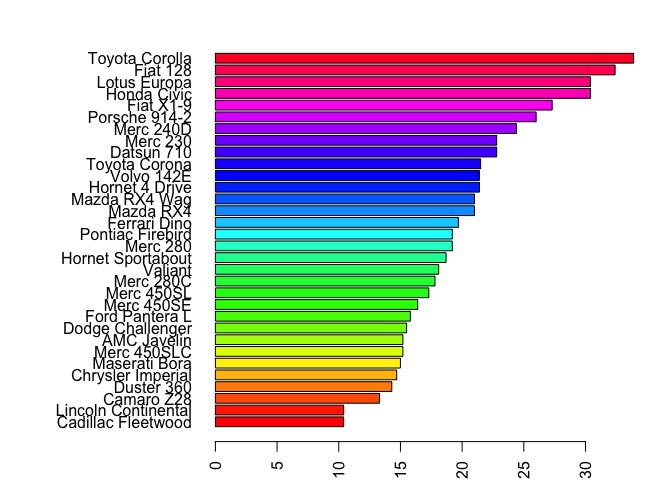
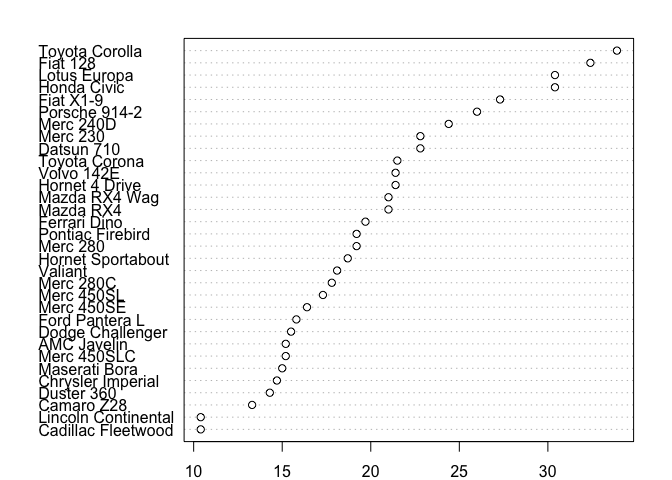

# Class 5 graphs
We can enter text and comments using the hash/pound symbol (#) at the start of a line


```r
# boxplot
boxplot( rnorm(1000,0) )
```

<!-- -->

```r
hist( rnorm(1000,0) )
```

<!-- -->

```r
summary( rnorm(1000,0) )
```

```
##      Min.   1st Qu.    Median      Mean   3rd Qu.      Max. 
## -3.369958 -0.708090  0.008897 -0.009261  0.669077  3.346555
```

```r
# Flip my boxplot
boxplot( rnorm(1000,0), horizontal = TRUE )
```

<!-- -->

```r
# Read first data file.
baby <- read.table("bimm143_05_rstats/weight_chart.txt", header = TRUE)

# Point and line plot
plot(baby, type="b", pch=15, cex=1.5, main="Some main title" )
```

<!-- -->

```r
# 1B ----
# Read another tab seperated file
feat <- read.table("bimm143_05_rstats/feature_counts.txt", 
                   sep="\t", header = TRUE)

# Make a barplot
par(mar=c(5,11,4,2))
barplot( feat[,2], horiz=TRUE,  
         names.arg=feat[,1], las=1 )
```

<!-- -->

```r
## Section 2. ----
file <- "bimm143_05_rstats/male_female_counts.txt"
mf_counts <- read.table(file, sep="\t", header=TRUE)

# Make a barplot
barplot(mf_counts$Count, col=rainbow( nrow(mf_counts)) )
```

<!-- -->

```r
## color by male and female
mycols=c("blue2","red2")
barplot(mf_counts$Count, col=mycols)
```

<!-- -->

```r
## Section2B. ----
file_2b <- "bimm143_05_rstats/up_down_expression.txt"
up.down <- read.delim(file_2b)

plot(up.down$Condition1, up.down$Condition2, col=up.down$State)
```

<!-- -->

```r
# How many genes are up and down regulated?
table(up.down$State)
```

```
## 
##       down unchanging         up 
##         72       4997        127
```

```r
## Plot of mtcars
par(mar=c(2,11,2,2))
ord <- order(mtcars$mpg)
barplot(mtcars$mpg[ord], names.arg = rownames(mtcars)[ord], 
        horiz = TRUE, las=2, col=rainbow(nrow(mtcars)))
```

<!-- -->

```r
## Dot plots are a reasonable substitute for bar plots.
dotchart(mtcars$mpg[ord], labels = rownames(mtcars)[ord], xlab="MPG")
```

<!-- -->

### Add a session info
It is a good practice to add a session info at the end of your document. It will increase reproducibility and costs only one line of code


```r
sessionInfo()
```

```
## R version 3.4.1 (2017-06-30)
## Platform: x86_64-apple-darwin15.6.0 (64-bit)
## Running under: macOS High Sierra 10.13.4
## 
## Matrix products: default
## BLAS: /Library/Frameworks/R.framework/Versions/3.4/Resources/lib/libRblas.0.dylib
## LAPACK: /Library/Frameworks/R.framework/Versions/3.4/Resources/lib/libRlapack.dylib
## 
## locale:
## [1] en_US.UTF-8/en_US.UTF-8/en_US.UTF-8/C/en_US.UTF-8/en_US.UTF-8
## 
## attached base packages:
## [1] stats     graphics  grDevices utils     datasets  methods   base     
## 
## loaded via a namespace (and not attached):
##  [1] compiler_3.4.1  backports_1.1.2 magrittr_1.5    rprojroot_1.3-2
##  [5] tools_3.4.1     htmltools_0.3.6 yaml_2.1.18     Rcpp_0.12.16   
##  [9] stringi_1.1.7   rmarkdown_1.9   knitr_1.20      stringr_1.3.0  
## [13] digest_0.6.14   evaluate_0.10.1
```

```r
## Section 2C.

map.colors <- function (value,high.low,palette) {
  proportion <- ((value-high.low[1])/(high.low[2]-high.low[1]))
  index <- round ((length(palette)-1)*proportion)+1
  return (palette[index])
}

map.colors2 <- function (value,high.low,palette) {
  proportion <- ((value-high.low[1])/(high.low[2]-high.low[1]))
  index <- round ((length(palette)-1)*proportion)+1
  return (palette[index])
}
```


---
title: "graphs.R"
author: "barry"
date: "Wed May  2 22:48:27 2018"
---
