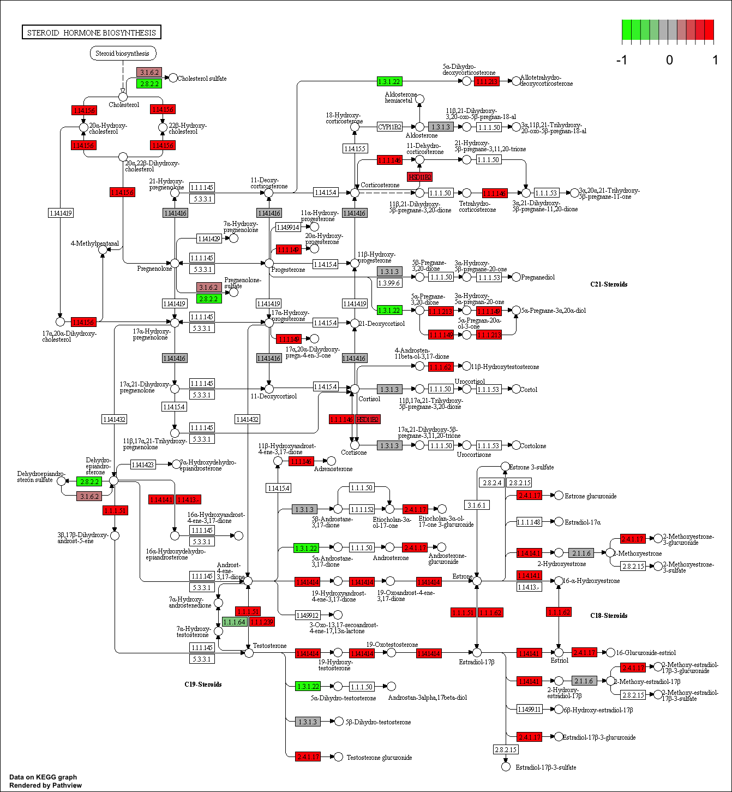
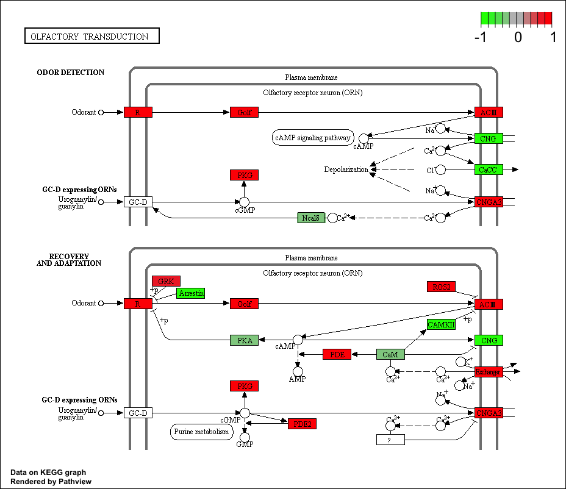

```{r setup, include=FALSE}
knitr::opts_chunk$set(echo = TRUE)
```

## Differential Expression Analysis

Import data files for DESeq analysis (countData and colData).

```{r}
library(DESeq2)
```

```{r}
metaFile <- "data/GSE37704_metadata.csv"
countFile <- "data/GSE37704_featurecounts.csv"

# Import metadata and take a peak
colData <-  read.csv(metaFile, row.names=1)
head(colData)
```

```{r}
# Import countdata
countData <- read.csv(countFile, row.names=1)
head(countData)
```

Remove the first `length` col from the `countData` data.frame

```{r}
# Note we need to remove the odd first $length col
countData <- as.matrix(countData[,-1])
head(countData)
```

This looks better but there are lots of zero entries in there so let’s get rid of them as we have no data for these.

```{r}
# Filter count data where you have 0 read count across all samples.
countData = countData[rowSums(countData)>1, ]
head(countData)
```


Setup the DESeqDataSet object required for the DESeq() function and then run the DESeq pipeline. This is again similar to our last days hands-on session.

```{r}
dds = DESeqDataSetFromMatrix(countData=countData,
                             colData=colData,
                             design=~condition)
```


```{r}
dds = DESeq(dds)
```

```{r}
dim(countData)
```


```{r}
dds
```

Next, get results for the HoxA1 knockdown versus control siRNA (remember we labeled these as “hoxa1_kd” and “control_sirna” in our original colData metaFile input to DESeq, you can check this above and by running resultsNames(dds) command).

```{r}
res = results(dds, contrast=c("condition", "hoxa1_kd", "control_sirna"))
```


```{r}
res
```


Let’s reorder these results by p-value and call summary() on the results object to get a sense of how many genes are up or down-regulated at the default FDR of 0.1.


```{r}
res = res[order(res$pvalue),]
summary(res)
```

Since we mapped and counted against the Ensembl annotation, our results only have information about Ensembl gene IDs. However, our pathway analysis downstream will use KEGG pathways, and genes in KEGG pathways are annotated with Entrez gene IDs. So lets add them as we did the last day.

```{r}
library("AnnotationDbi")
library("org.Hs.eg.db")

columns(org.Hs.eg.db)
```

```{r}
res$symbol = mapIds(org.Hs.eg.db,
                    keys=row.names(res), 
                    column="SYMBOL",
                    keytype="ENSEMBL",
                    multiVals="first")

res$entrez = mapIds(org.Hs.eg.db,
                    keys=row.names(res), 
                    column="ENTREZID",
                    keytype="ENSEMBL",
                    multiVals="first")

res$name =   mapIds(org.Hs.eg.db,
                    keys=row.names(res), 
                    column="GENENAME",
                    keytype="ENSEMBL",
                    multiVals="first")

head(res, 10)
```
Great, this is looking good so far. Now lets see how pathway analysis can help us make further sense out of this ranked list of differentially expressed genes.


## Pathway Analysis

Here we are going to use the gage package for pathway analysis. Once we have a list of enriched pathways, we’re going to use the pathview package to draw pathway diagrams, shading the molecules in the pathway by their degree of up/down-regulation.

### KEGG

```{r}
#source("http://bioconductor.org/biocLite.R")
#biocLite( c("pathview", "gage", "gageData") )
```


```{r}
library(pathview)
library(gage)
library(gageData)
```


```{r}
data(kegg.sets.hs)
data(sigmet.idx.hs)

kegg.sets.hs = kegg.sets.hs[sigmet.idx.hs]
head(kegg.sets.hs, 3)
```

The main `gage()` function requires a named vector of fold changes, where the names of the values are the Entrez gene IDs.


```{r}
foldchanges = res$log2FoldChange
names(foldchanges) = res$entrez
head(foldchanges)
```

Run the pathway analysis...

```{r}
# Get the results
keggres = gage(foldchanges, gsets=kegg.sets.hs, same.dir=TRUE)
```

Look at results

```{r}
attributes(keggres)
```

```{r}
head(keggres$greater)
```

Each keggres$greater and keggres$less object is data matrix with gene sets as rows sorted by p-value. Lets look at both up (greater), down (less), and statistics by calling head() with the lapply() function. As always if you want to find out more about a particular function or its return values use the R help system (e.g. ?gage or ?lapply).

```{r}
lapply(keggres, head)
```

Now, let’s try out the pathview() function from the pathview package to make a pathway plot with our result shown in color. To begin with lets manually supply a pathway.id (namely the first part of the "hsa04110 Cell cycle") that we could see from the print out above.

```{r}
pathview(gene.data=foldchanges, pathway.id="hsa04110")
```

Here is the default low resolution raster PNG output from the first pathview() call above:


Note how many of the genes in this pathway are pertubed (i.e. colored) in our results.

Now, let's process our results a bit more to automagicaly pull out the top 5 upregulated pathways, then further process that just to get the IDs needed by the **pathview()** function. We'll use these KEGG pathway IDs for plotting below.

```{r}
## Focus on top 5 upregulated pathways here for demo purposes only
keggrespathways <- rownames(keggres$greater)[1:5]

# Extract the IDs part of each string
keggresids = substr(keggrespathways, start=1, stop=8)
keggresids
```

Finally, lets pass these IDs in `keggresids` to the **pathview()** function to draw plots for all the top 5 pathways.

```{r, warning=FALSE, results=FALSE, message=FALSE}
pathview(gene.data=foldchanges, pathway.id=keggresids, species="hsa")
```

Here are the plots:







# Section 3. Gene Ontology (GO)
We can also do a similar procedure with gene ontology. Similar to above, go.sets.hs has all GO terms. go.subs.hs is a named list containing indexes for the BP, CC, and MF ontologies. Let’s only do Biological Process.

```{r}
data(go.sets.hs)
data(go.subs.hs)
gobpsets = go.sets.hs[go.subs.hs$BP]

gobpres = gage(foldchanges, gsets=gobpsets, same.dir=TRUE)

lapply(gobpres, head)
```

# Reactome Pathway Analysis Online

Reactome, such as many other tools, has an online software available (https://reactome.org/) and R package 

Write out our list for use online

```{r}
sig_genes <- res[res$padj <= 0.05 & !is.na(res$padj), "symbol"]
print(paste("Total number of significant genes:", length(sig_genes)))

write.table(sig_genes, file="significant_genes.txt", 
            row.names=FALSE, col.names=FALSE, quote=FALSE)
```


