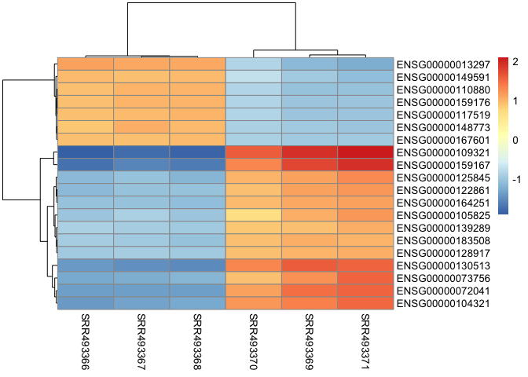
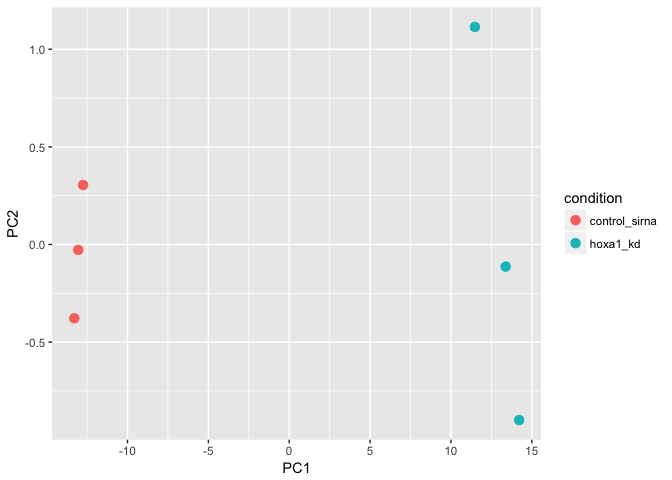

## Differential Expression Analysis

Import data files for DESeq analysis (countData and colData).


```r
library(DESeq2)
```

```
## Warning: package 'DESeq2' was built under R version 3.4.2
```

```
## Loading required package: S4Vectors
```

```
## Warning: package 'S4Vectors' was built under R version 3.4.2
```

```
## Loading required package: stats4
```

```
## Loading required package: BiocGenerics
```

```
## Warning: package 'BiocGenerics' was built under R version 3.4.2
```

```
## Loading required package: parallel
```

```
## 
## Attaching package: 'BiocGenerics'
```

```
## The following objects are masked from 'package:parallel':
## 
##     clusterApply, clusterApplyLB, clusterCall, clusterEvalQ,
##     clusterExport, clusterMap, parApply, parCapply, parLapply,
##     parLapplyLB, parRapply, parSapply, parSapplyLB
```

```
## The following objects are masked from 'package:stats':
## 
##     IQR, mad, sd, var, xtabs
```

```
## The following objects are masked from 'package:base':
## 
##     anyDuplicated, append, as.data.frame, cbind, colMeans,
##     colnames, colSums, do.call, duplicated, eval, evalq, Filter,
##     Find, get, grep, grepl, intersect, is.unsorted, lapply,
##     lengths, Map, mapply, match, mget, order, paste, pmax,
##     pmax.int, pmin, pmin.int, Position, rank, rbind, Reduce,
##     rowMeans, rownames, rowSums, sapply, setdiff, sort, table,
##     tapply, union, unique, unsplit, which, which.max, which.min
```

```
## 
## Attaching package: 'S4Vectors'
```

```
## The following object is masked from 'package:base':
## 
##     expand.grid
```

```
## Loading required package: IRanges
```

```
## Warning: package 'IRanges' was built under R version 3.4.2
```

```
## Loading required package: GenomicRanges
```

```
## Warning: package 'GenomicRanges' was built under R version 3.4.3
```

```
## Loading required package: GenomeInfoDb
```

```
## Warning: package 'GenomeInfoDb' was built under R version 3.4.2
```

```
## Loading required package: SummarizedExperiment
```

```
## Warning: package 'SummarizedExperiment' was built under R version 3.4.3
```

```
## Loading required package: Biobase
```

```
## Warning: package 'Biobase' was built under R version 3.4.2
```

```
## Welcome to Bioconductor
## 
##     Vignettes contain introductory material; view with
##     'browseVignettes()'. To cite Bioconductor, see
##     'citation("Biobase")', and for packages 'citation("pkgname")'.
```

```
## Loading required package: DelayedArray
```

```
## Warning: package 'DelayedArray' was built under R version 3.4.2
```

```
## Loading required package: matrixStats
```

```
## 
## Attaching package: 'matrixStats'
```

```
## The following objects are masked from 'package:Biobase':
## 
##     anyMissing, rowMedians
```

```
## 
## Attaching package: 'DelayedArray'
```

```
## The following objects are masked from 'package:matrixStats':
## 
##     colMaxs, colMins, colRanges, rowMaxs, rowMins, rowRanges
```

```
## The following object is masked from 'package:base':
## 
##     apply
```


```r
metaFile <- "data/GSE37704_metadata.csv"
countFile <- "data/GSE37704_featurecounts.csv"

# Import metadata and take a peak
colData <-  read.csv(metaFile, row.names=1)
head(colData)
```

```
##               condition
## SRR493366 control_sirna
## SRR493367 control_sirna
## SRR493368 control_sirna
## SRR493369      hoxa1_kd
## SRR493370      hoxa1_kd
## SRR493371      hoxa1_kd
```


```r
# Import countdata
countData <- read.csv(countFile, row.names=1)
head(countData)
```

```
##                 length SRR493366 SRR493367 SRR493368 SRR493369 SRR493370
## ENSG00000186092    918         0         0         0         0         0
## ENSG00000279928    718         0         0         0         0         0
## ENSG00000279457   1982        23        28        29        29        28
## ENSG00000278566    939         0         0         0         0         0
## ENSG00000273547    939         0         0         0         0         0
## ENSG00000187634   3214       124       123       205       207       212
##                 SRR493371
## ENSG00000186092         0
## ENSG00000279928         0
## ENSG00000279457        46
## ENSG00000278566         0
## ENSG00000273547         0
## ENSG00000187634       258
```

Remove the first `length` col from the `countData` data.frame


```r
# Note we need to remove the odd first $length col
countData <- as.matrix(countData[,-1])
head(countData)
```

```
##                 SRR493366 SRR493367 SRR493368 SRR493369 SRR493370
## ENSG00000186092         0         0         0         0         0
## ENSG00000279928         0         0         0         0         0
## ENSG00000279457        23        28        29        29        28
## ENSG00000278566         0         0         0         0         0
## ENSG00000273547         0         0         0         0         0
## ENSG00000187634       124       123       205       207       212
##                 SRR493371
## ENSG00000186092         0
## ENSG00000279928         0
## ENSG00000279457        46
## ENSG00000278566         0
## ENSG00000273547         0
## ENSG00000187634       258
```

This looks better but there are lots of zero entries in there so let’s get rid of them as we have no data for these.


```r
# Filter count data where you have 0 read count across all samples.
countData = countData[rowSums(countData)>1, ]
head(countData)
```

```
##                 SRR493366 SRR493367 SRR493368 SRR493369 SRR493370
## ENSG00000279457        23        28        29        29        28
## ENSG00000187634       124       123       205       207       212
## ENSG00000188976      1637      1831      2383      1226      1326
## ENSG00000187961       120       153       180       236       255
## ENSG00000187583        24        48        65        44        48
## ENSG00000187642         4         9        16        14        16
##                 SRR493371
## ENSG00000279457        46
## ENSG00000187634       258
## ENSG00000188976      1504
## ENSG00000187961       357
## ENSG00000187583        64
## ENSG00000187642        16
```


Setup the DESeqDataSet object required for the DESeq() function and then run the DESeq pipeline. This is again similar to our last days hands-on session.


```r
dds = DESeqDataSetFromMatrix(countData=countData,
                             colData=colData,
                             design=~condition)
```

## -- CUT HERE --##


```r
dds = DESeq(dds)
```

```
## estimating size factors
```

```
## estimating dispersions
```

```
## gene-wise dispersion estimates
```

```
## mean-dispersion relationship
```

```
## final dispersion estimates
```

```
## fitting model and testing
```


```r
dim(countData)
```

```
## [1] 15280     6
```


```r
dds
```

```
## class: DESeqDataSet 
## dim: 15280 6 
## metadata(1): version
## assays(3): counts mu cooks
## rownames(15280): ENSG00000279457 ENSG00000187634 ...
##   ENSG00000276345 ENSG00000271254
## rowData names(21): baseMean baseVar ... deviance maxCooks
## colnames(6): SRR493366 SRR493367 ... SRR493370 SRR493371
## colData names(2): condition sizeFactor
```

Next, get results for the HoxA1 knockdown versus control siRNA (remember we labeled these as “hoxa1_kd” and “control_sirna” in our original colData metaFile input to DESeq, you can check this above and by running resultsNames(dds) command).


```r
res = results(dds, contrast=c("condition", "hoxa1_kd", "control_sirna"))
```


```r
res
```

```
## log2 fold change (MLE): condition hoxa1_kd vs control_sirna 
## Wald test p-value: condition hoxa1 kd vs control sirna 
## DataFrame with 15280 rows and 6 columns
##                   baseMean log2FoldChange      lfcSE        stat
##                  <numeric>      <numeric>  <numeric>   <numeric>
## ENSG00000279457   29.91358     0.17927483 0.32459294   0.5523066
## ENSG00000187634  183.22965     0.42644724 0.14017817   3.0421802
## ENSG00000188976 1651.18808    -0.69272061 0.05484412 -12.6307173
## ENSG00000187961  209.63794     0.72975918 0.13178350   5.5375609
## ENSG00000187583   47.25512     0.04055411 0.27169055   0.1492658
## ...                    ...            ...        ...         ...
## ENSG00000273748  35.302652      0.6743994  0.3034582   2.2223801
## ENSG00000278817   2.423024     -0.3889516  1.1295943  -0.3443286
## ENSG00000278384   1.101796      0.3328870  1.6590966   0.2006435
## ENSG00000276345  73.644956     -0.3561673  0.2075751  -1.7158482
## ENSG00000271254 181.595903     -0.6096640  0.1412340  -4.3166951
##                       pvalue         padj
##                    <numeric>    <numeric>
## ENSG00000279457 5.807383e-01 6.846746e-01
## ENSG00000187634 2.348712e-03 5.109223e-03
## ENSG00000188976 1.429690e-36 1.745815e-35
## ENSG00000187961 3.067131e-08 1.109758e-07
## ENSG00000187583 8.813439e-01 9.191354e-01
## ...                      ...          ...
## ENSG00000273748 2.625763e-02 4.756160e-02
## ENSG00000278817 7.305992e-01 8.086868e-01
## ENSG00000278384 8.409773e-01 8.927559e-01
## ENSG00000276345 8.618983e-02 1.389975e-01
## ENSG00000271254 1.583827e-05 4.470014e-05
```


Let’s reorder these results by p-value and call summary() on the results object to get a sense of how many genes are up or down-regulated at the default FDR of 0.1.


```r
res = res[order(res$pvalue),]
summary(res)
```

```
## 
## out of 15280 with nonzero total read count
## adjusted p-value < 0.1
## LFC > 0 (up)     : 4352, 28% 
## LFC < 0 (down)   : 4400, 29% 
## outliers [1]     : 0, 0% 
## low counts [2]   : 590, 3.9% 
## (mean count < 1)
## [1] see 'cooksCutoff' argument of ?results
## [2] see 'independentFiltering' argument of ?results
```

--- 

## Big Insert

### Running DESeq
Once we have our `DESeqDataSet` setup we can run differential expression analtsis with *DESeq*:


```r
dds <- DESeq(dds)
```

```
## using pre-existing size factors
```

```
## estimating dispersions
```

```
## found already estimated dispersions, replacing these
```

```
## gene-wise dispersion estimates
```

```
## mean-dispersion relationship
```

```
## final dispersion estimates
```

```
## fitting model and testing
```

A new `DESeqDataSet` is returned that contains all the results (and the input `DESeqDataSet` parameters) within it.  

Extracting out the tables of results we actually want from this object can be a bit tricky. The next section describes one common way to do this. 

### Extracting our results table
Calling the *DESeq* packages **results()** function on our `DESeqDataSet` without any arguments will extract the estimated log2 fold changes and p values like so:


```r
res <- results(dds)
res
```

```
## log2 fold change (MLE): condition hoxa1 kd vs control sirna 
## Wald test p-value: condition hoxa1 kd vs control sirna 
## DataFrame with 15280 rows and 6 columns
##                   baseMean log2FoldChange      lfcSE        stat
##                  <numeric>      <numeric>  <numeric>   <numeric>
## ENSG00000279457   29.91358     0.17927483 0.32459294   0.5523066
## ENSG00000187634  183.22965     0.42644724 0.14017817   3.0421802
## ENSG00000188976 1651.18808    -0.69272061 0.05484412 -12.6307173
## ENSG00000187961  209.63794     0.72975918 0.13178350   5.5375609
## ENSG00000187583   47.25512     0.04055411 0.27169055   0.1492658
## ...                    ...            ...        ...         ...
## ENSG00000273748  35.302652      0.6743994  0.3034582   2.2223801
## ENSG00000278817   2.423024     -0.3889516  1.1295943  -0.3443286
## ENSG00000278384   1.101796      0.3328870  1.6590966   0.2006435
## ENSG00000276345  73.644956     -0.3561673  0.2075751  -1.7158482
## ENSG00000271254 181.595903     -0.6096640  0.1412340  -4.3166951
##                       pvalue         padj
##                    <numeric>    <numeric>
## ENSG00000279457 5.807383e-01 6.846746e-01
## ENSG00000187634 2.348712e-03 5.109223e-03
## ENSG00000188976 1.429690e-36 1.745815e-35
## ENSG00000187961 3.067131e-08 1.109758e-07
## ENSG00000187583 8.813439e-01 9.191354e-01
## ...                      ...          ...
## ENSG00000273748 2.625763e-02 4.756160e-02
## ENSG00000278817 7.305992e-01 8.086868e-01
## ENSG00000278384 8.409773e-01 8.927559e-01
## ENSG00000276345 8.618983e-02 1.389975e-01
## ENSG00000271254 1.583827e-05 4.470014e-05
```

The returned `res` object is not a standard R data.frame but one that carries extra meatadata on the meaning of the columns:


```r
mcols(res, use.names = TRUE)
```

```
## DataFrame with 6 rows and 2 columns
##                        type
##                 <character>
## baseMean       intermediate
## log2FoldChange      results
## lfcSE               results
## stat                results
## pvalue              results
## padj                results
##                                                                description
##                                                                <character>
## baseMean                         mean of normalized counts for all samples
## log2FoldChange log2 fold change (MLE): condition hoxa1 kd vs control sirna
## lfcSE                  standard error: condition hoxa1 kd vs control sirna
## stat                   Wald statistic: condition hoxa1 kd vs control sirna
## pvalue              Wald test p-value: condition hoxa1 kd vs control sirna
## padj                                                  BH adjusted p-values
```

The column `log2FoldChange` is the effect size estimate. It tells us how much the gene's expression seems to have changed due to treatment with dexamethasone in comparison to untreated samples.  This value is reported on a logarithmic scale to base 2: for example, a log2 fold change of 1.5 means that the gene's expression is increased by a multiplicative factor of \(2^{1.5} \approx 2.82\).

*DESeq2* performs for each gene a *hypothesis test* to see whether evidence is sufficient to decide against the *null hypothesis* that there is zero effect of the treatment on the gene and that the observed difference between treatment and
control was merely caused by experimental variability (i.e., the type of variability that you can expect between different
samples in the same treatment group). As usual in statistics, the result of this test is reported as a *p* value, and it is found in the column `pvalue`. Remember that a *p* value indicates the probability that a fold change as strong as the observed one, or even stronger, would be seen under the situation described by the null hypothesis.  

We can also summarize the results with the *DESeq2* specific version of the **summary()** function. This will report some additional useful information: 


```r
summary(res)
```

```
## 
## out of 15280 with nonzero total read count
## adjusted p-value < 0.1
## LFC > 0 (up)     : 4352, 28% 
## LFC < 0 (down)   : 4400, 29% 
## outliers [1]     : 0, 0% 
## low counts [2]   : 590, 3.9% 
## (mean count < 1)
## [1] see 'cooksCutoff' argument of ?results
## [2] see 'independentFiltering' argument of ?results
```

Note that there are many many genes with differential expression reported above. Let's therefore be more strict about which set of genes are considered 'significant'. There are two main ways we can do this:

* Lower the false discovery rate threshold (i.e. the threshold on the adjusted p-value (`padj`) in the results table)
* Raise the log2 fold change threshold from 0 to a higher value.


> **Q.** In the summary of our results printed above (and by default) the FDR level is set to 10% (i.e. adjusted p-value < 0.1) and the log2 fold change threshold is set to 0. Use the `alpha` and `lfcThreshold` input arguments to the **results()** function to change these to an FDR of 5% and a log2 fold change threshold of 2. Then use the **summary()** function to find out how many genes are up and down at these thresholds.  


```
## 
## out of 15280 with nonzero total read count
## adjusted p-value < 0.05
## LFC > 0 (up)     : 99, 0.65% 
## LFC < 0 (down)   : 134, 0.88% 
## outliers [1]     : 0, 0% 
## low counts [2]   : 1482, 9.7% 
## (mean count < 2)
## [1] see 'cooksCutoff' argument of ?results
## [2] see 'independentFiltering' argument of ?results
```

You could also use the ever useful **table()** function on your output of the **results()** function like so:


```r
table(res$padj < 0.05)
```

```
## 
## FALSE  TRUE 
## 13565   233
```


```r
table(res$log2FoldChange > 2)
```

```
## 
## FALSE  TRUE 
## 14723   557
```

Then combining to determine the number of genes that meet both the *p* value and log2 fold change thresholds (*UP* genes: 99; and *DOWN* genes: 134): 


```r
table( res$padj < 0.05, res$log2FoldChange > 2)
```

```
##        
##         FALSE  TRUE
##   FALSE 13292   273
##   TRUE    134    99
```


> **Side-Note:** In high-throughput biology, we are careful to not use the *p* values directly as evidence against the null, but to correct for **multiple testing**.  
>
> What would happen if we were to simply threshold the *p* values at a low value, say 0.05? There are 326 genes with a *p* value below 0.05 among the 15280 genes for which the test succeeded in reporting a *p* value:


```r
table(res$pvalue < 0.05)
```

```
## 
## FALSE  TRUE 
## 14954   326
```

> *DESeq2* uses the Benjamini-Hochberg (BH) adjustment as implemented in the base R **p.adjust()** function; in brief, this method calculates for each gene an adjusted *p* value that answers the following question: if one called significant all genes with an adjusted *p* value less than or equal to this gene's adjusted *p* value threshold, what would be the fraction of false positives (the *false discovery rate*, FDR) among them, in the sense of the calculation outlined above? These values, called the BH-adjusted *p* values, are given in the column `padj` of the `res` object.  
>
> The FDR is a useful statistic for many high-throughput experiments, as we are often interested in reporting or focusing on a set of interesting genes, and we would like to put an upper bound on the percent of false positives in this set.  
>
> Hence, if we consider a fraction of 5% false positives acceptable, we can consider all genes with an adjusted *p* value below 5% = 0.05 as significant. How many such genes are there?  


```r
table(res$padj < 0.05)
```

```
## 
## FALSE  TRUE 
## 13565   233
```


We can now subset the results table to extract the genes with adjusted *p* value less than 0.05 and then sort them by their log2 fold change estimate to get the significant genes with the strongest down-regulation:


```r
# Make a new results object 'resSig' with only significant genes
resSig <- subset(res, padj < 0.05)

# Print the first 10 strongest DOWN genes
ord.down <- order(resSig$log2FoldChange)
head(resSig[ ord.down, ], 10)
```

```
## log2 fold change (MLE): condition hoxa1 kd vs control sirna 
## Wald test p-value: condition hoxa1 kd vs control sirna 
## DataFrame with 10 rows and 6 columns
##                  baseMean log2FoldChange     lfcSE       stat       pvalue
##                 <numeric>      <numeric> <numeric>  <numeric>    <numeric>
## ENSG00000152779  20.47585      -4.159774 0.6372338  -3.389295 7.007247e-04
## ENSG00000139269  34.67082      -3.707145 0.4489612  -3.802434 1.432814e-04
## ENSG00000100526 104.74410      -3.670758 0.2538387  -6.581965 4.642702e-11
## ENSG00000162520 248.71515      -3.522675 0.1645404  -9.254111 2.160200e-20
## ENSG00000117650 126.83830      -3.436330 0.2201916  -6.523092 6.887258e-11
## ENSG00000183287 603.48721      -3.436112 0.1129688 -12.712465 5.041941e-37
## ENSG00000013293 186.24913      -3.419521 0.1869698  -7.592247 3.144050e-14
## ENSG00000183763  46.40721      -3.398924 0.3586012  -3.901059 9.577266e-05
## ENSG00000157456 291.43640      -3.380308 0.1501209  -9.194645 3.762361e-20
## ENSG00000171320  49.47850      -3.368015 0.3462612  -3.950819 7.788429e-05
##                         padj
##                    <numeric>
## ENSG00000152779 4.259295e-02
## ENSG00000139269 9.643890e-03
## ENSG00000100526 6.536735e-09
## ENSG00000162520 6.931729e-18
## ENSG00000117650 9.599029e-09
## ENSG00000183287 3.864928e-34
## ENSG00000013293 5.633974e-12
## ENSG00000183763 6.955111e-03
## ENSG00000157456 1.128545e-17
## ENSG00000171320 5.746778e-03
```

> **Q.** Do the same as above but print out the top 10 strongest up-regulated genes. HINT: see the help for the **order()** function to see how to return the decreasing ordered indices you will want for accesing your `resSig` result.  


```
## log2 fold change (MLE): condition hoxa1 kd vs control sirna 
## Wald test p-value: condition hoxa1 kd vs control sirna 
## DataFrame with 10 rows and 6 columns
##                   baseMean log2FoldChange     lfcSE      stat       pvalue
##                  <numeric>      <numeric> <numeric> <numeric>    <numeric>
## ENSG00000128052  158.24955       8.822086 1.0347214  6.593162 4.305562e-11
## ENSG00000141668   43.94156       8.820638 1.2040490  5.664751 1.472384e-08
## ENSG00000004799   97.26023       8.117454 1.0373919  5.896956 3.702688e-09
## ENSG00000109321 3907.19054       7.479166 0.2880675 19.020423 1.155483e-80
## ENSG00000162892   25.27893       7.052106 1.2210031  4.137669 3.508527e-05
## ENSG00000073756 1357.62707       6.337747 0.3399843 12.758671 2.789195e-37
## ENSG00000125845 1172.23868       5.525337 0.2077712 16.967397 1.431378e-64
## ENSG00000163739   89.96993       5.356228 0.8223964  4.081034 4.483576e-05
## ENSG00000163734   33.68060       5.218578 0.6984361  4.608263 4.060459e-06
## ENSG00000072041 2369.28278       5.097353 0.1868148 16.579804 9.754639e-62
##                         padj
##                    <numeric>
## ENSG00000128052 6.124551e-09
## ENSG00000141668 1.751376e-06
## ENSG00000004799 4.561579e-07
## ENSG00000109321 3.188670e-77
## ENSG00000162892 2.719700e-03
## ENSG00000073756 2.263842e-34
## ENSG00000125845 2.821451e-61
## ENSG00000163739 3.399142e-03
## ENSG00000163734 3.591424e-04
## ENSG00000072041 1.495495e-58
```


## Bounus: Gene clustering, heatmaps and PCA

Many statistical methods for analysis of multidimensional data, for example *clustering* and *principal components analysis* (PCA), work best for data that generally has the same range of variance at different ranges of the mean values.  

However, for counts from RNA-seq the expected variance grows with the mean. For example, if one performs PCA or clustering directly on a matrix of counts then the results will be heavely influenced by the genes with the highest counts (because they show the largest absolute differences between samples).  To address this problem the *DESeq2* package offers the **vst()** function (that stands for Variance Stabilizing Transformation) that stabilizes the variance of count data across different mean values. We will use **vst()** here as input for our clustering.


```r
vsd <- vst(dds, blind = FALSE)
```

Since gene clustering is only really relevant for genes that actually carry a signal, one usually would only cluster a subset of the most highly variable genes. Here, for demonstration purposes we select the 20 genes with the highest variance across samples.


```r
library("genefilter")
```

```
## Warning: package 'genefilter' was built under R version 3.4.2
```

```
## 
## Attaching package: 'genefilter'
```

```
## The following objects are masked from 'package:matrixStats':
## 
##     rowSds, rowVars
```

```r
#row.variance <- apply(assay(vsd), 1, var)
row.variance <- rowVars(assay(vsd))
ord.variance <- order( row.variance, decreasing = TRUE) 

# Focus on top 20 most variable genes for demo purposes
mat  <- assay(vsd)[ ord.variance[1:20], ]
```

The heatmap becomes more interesting if we do not look at absolute expression strength but rather at the amount by which each gene deviates in a specific sample from the gene’s average across all samples. To do this we center each genes’ values across samples by subtracting their mean values, and then plot the heatmap (figure below). 


```r
library(pheatmap)
mat.center  <- mat - rowMeans(mat)
pheatmap(mat.center)
```

<!-- -->


> **Side-note:** We can do PCA with our `vsd` object.


```r
pcaData <- plotPCA(vsd, intgroup="condition", returnData = TRUE)
pcaData
```

```
##                 PC1        PC2         group     condition      name
## SRR493366 -12.74667  0.3046597 control_sirna control_sirna SRR493366
## SRR493367 -13.04690 -0.0278821 control_sirna control_sirna SRR493367
## SRR493368 -13.28760 -0.3782467 control_sirna control_sirna SRR493368
## SRR493369  13.38297 -0.1131647      hoxa1_kd      hoxa1_kd SRR493369
## SRR493370  11.48330  1.1139575      hoxa1_kd      hoxa1_kd SRR493370
## SRR493371  14.21490 -0.8993238      hoxa1_kd      hoxa1_kd SRR493371
```


```r
library(ggplot2)

ggplot(pcaData, aes(x = PC1, y = PC2, color = condition) ) +
  geom_point(size =3) 
```

<!-- -->


## Annotating our genes and mapping to Entrez IDs


```r
#res = res[order(res$pvalue),]
#summary(res)

#resSig = resSig[order(resSig$pvalue),]
#summary(resSig)

res = (resSig[order(resSig$pvalue),])
```

Since we mapped and counted against the Ensembl annotation, our results only have information about Ensembl gene IDs. However, our pathway analysis downstream will use KEGG pathways, and genes in KEGG pathways are annotated with Entrez gene IDs. So lets add them as we did the last day.


```r
library("AnnotationDbi")
```

```
## Warning: package 'AnnotationDbi' was built under R version 3.4.2
```

```r
library("org.Hs.eg.db")
```

```
## 
```

```r
columns(org.Hs.eg.db)
```

```
##  [1] "ACCNUM"       "ALIAS"        "ENSEMBL"      "ENSEMBLPROT" 
##  [5] "ENSEMBLTRANS" "ENTREZID"     "ENZYME"       "EVIDENCE"    
##  [9] "EVIDENCEALL"  "GENENAME"     "GO"           "GOALL"       
## [13] "IPI"          "MAP"          "OMIM"         "ONTOLOGY"    
## [17] "ONTOLOGYALL"  "PATH"         "PFAM"         "PMID"        
## [21] "PROSITE"      "REFSEQ"       "SYMBOL"       "UCSCKG"      
## [25] "UNIGENE"      "UNIPROT"
```


```r
res$symbol = mapIds(org.Hs.eg.db,
                    keys=row.names(res), 
                    column="SYMBOL",
                    keytype="ENSEMBL",
                    multiVals="first")
```

```
## 'select()' returned 1:many mapping between keys and columns
```

```r
res$entrez = mapIds(org.Hs.eg.db,
                    keys=row.names(res), 
                    column="ENTREZID",
                    keytype="ENSEMBL",
                    multiVals="first")
```

```
## 'select()' returned 1:many mapping between keys and columns
```

```r
res$name =   mapIds(org.Hs.eg.db,
                    keys=row.names(res), 
                    column="GENENAME",
                    keytype="ENSEMBL",
                    multiVals="first")
```

```
## 'select()' returned 1:many mapping between keys and columns
```

```r
head(res, 10)
```

```
## log2 fold change (MLE): condition hoxa1 kd vs control sirna 
## Wald test p-value: condition hoxa1 kd vs control sirna 
## DataFrame with 10 rows and 9 columns
##                  baseMean log2FoldChange      lfcSE      stat
##                 <numeric>      <numeric>  <numeric> <numeric>
## ENSG00000128917 1307.3425       3.858254 0.08651226  21.47965
## ENSG00000104081  804.8385       4.434136 0.12162138  20.01405
## ENSG00000164251 2348.7701       3.344508 0.06907610  19.46416
## ENSG00000110002  899.5044       4.439075 0.12630244  19.31139
## ENSG00000109321 3907.1905       7.479166 0.28806750  19.02042
## ENSG00000153234  635.9392       4.326405 0.13700960  16.97986
## ENSG00000125845 1172.2387       5.525337 0.20777121  16.96740
## ENSG00000183508 2053.8814       3.201955 0.07241968  16.59707
## ENSG00000072041 2369.2828       5.097353 0.18681483  16.57980
## ENSG00000130513 4665.5222       4.226703 0.13933311  15.98115
##                        pvalue         padj      symbol      entrez
##                     <numeric>    <numeric> <character> <character>
## ENSG00000128917 2.412948e-102 3.329386e-98        DLL4       54567
## ENSG00000104081  4.154952e-89 2.866502e-85         BMF       90427
## ENSG00000164251  2.211012e-84 1.016918e-80       F2RL1        2150
## ENSG00000110002  4.308356e-83 1.486167e-79       VWA5A        4013
## ENSG00000109321  1.155483e-80 3.188670e-77        AREG         374
## ENSG00000153234  1.157523e-64 2.661917e-61       NR4A2        4929
## ENSG00000125845  1.431378e-64 2.821451e-61        BMP2         650
## ENSG00000183508  7.317148e-62 1.262025e-58      FAM46C       54855
## ENSG00000072041  9.754639e-62 1.495495e-58     SLC6A15       55117
## ENSG00000130513  1.729289e-57 2.386074e-54       GDF15        9518
##                                                          name
##                                                   <character>
## ENSG00000128917           delta like canonical Notch ligand 4
## ENSG00000104081                         Bcl2 modifying factor
## ENSG00000164251                   F2R like trypsin receptor 1
## ENSG00000110002  von Willebrand factor A domain containing 5A
## ENSG00000109321                                  amphiregulin
## ENSG00000153234 nuclear receptor subfamily 4 group A member 2
## ENSG00000125845                  bone morphogenetic protein 2
## ENSG00000183508   family with sequence similarity 46 member C
## ENSG00000072041             solute carrier family 6 member 15
## ENSG00000130513              growth differentiation factor 15
```
Great, this is looking good so far. Now lets see how pathway analysis can help us make further sense out of this ranked list of differentially expressed genes.


## Pathway Analysis

Here we are going to use the gage package for pathway analysis. Once we have a list of enriched pathways, we’re going to use the pathview package to draw pathway diagrams, shading the molecules in the pathway by their degree of up/down-regulation.

### KEGG


```r
#source("http://bioconductor.org/biocLite.R")
#biocLite( c("pathview", "gage", "gageData") )
```


```r
library(pathview)
```

```
## Warning: package 'pathview' was built under R version 3.4.3
```

```
## ##############################################################################
## Pathview is an open source software package distributed under GNU General
## Public License version 3 (GPLv3). Details of GPLv3 is available at
## http://www.gnu.org/licenses/gpl-3.0.html. Particullary, users are required to
## formally cite the original Pathview paper (not just mention it) in publications
## or products. For details, do citation("pathview") within R.
## 
## The pathview downloads and uses KEGG data. Non-academic uses may require a KEGG
## license agreement (details at http://www.kegg.jp/kegg/legal.html).
## ##############################################################################
```

```r
library(gage)
```

```
## Warning: package 'gage' was built under R version 3.4.3
```

```r
library(gageData)
```


```r
data(kegg.sets.hs)
data(sigmet.idx.hs)

kegg.sets.hs = kegg.sets.hs[sigmet.idx.hs]
head(kegg.sets.hs, 3)
```

```
## $`hsa00232 Caffeine metabolism`
## [1] "10"   "1544" "1548" "1549" "1553" "7498" "9"   
## 
## $`hsa00983 Drug metabolism - other enzymes`
##  [1] "10"     "1066"   "10720"  "10941"  "151531" "1548"   "1549"  
##  [8] "1551"   "1553"   "1576"   "1577"   "1806"   "1807"   "1890"  
## [15] "221223" "2990"   "3251"   "3614"   "3615"   "3704"   "51733" 
## [22] "54490"  "54575"  "54576"  "54577"  "54578"  "54579"  "54600" 
## [29] "54657"  "54658"  "54659"  "54963"  "574537" "64816"  "7083"  
## [36] "7084"   "7172"   "7363"   "7364"   "7365"   "7366"   "7367"  
## [43] "7371"   "7372"   "7378"   "7498"   "79799"  "83549"  "8824"  
## [50] "8833"   "9"      "978"   
## 
## $`hsa00230 Purine metabolism`
##   [1] "100"    "10201"  "10606"  "10621"  "10622"  "10623"  "107"   
##   [8] "10714"  "108"    "10846"  "109"    "111"    "11128"  "11164" 
##  [15] "112"    "113"    "114"    "115"    "122481" "122622" "124583"
##  [22] "132"    "158"    "159"    "1633"   "171568" "1716"   "196883"
##  [29] "203"    "204"    "205"    "221823" "2272"   "22978"  "23649" 
##  [36] "246721" "25885"  "2618"   "26289"  "270"    "271"    "27115" 
##  [43] "272"    "2766"   "2977"   "2982"   "2983"   "2984"   "2986"  
##  [50] "2987"   "29922"  "3000"   "30833"  "30834"  "318"    "3251"  
##  [57] "353"    "3614"   "3615"   "3704"   "377841" "471"    "4830"  
##  [64] "4831"   "4832"   "4833"   "4860"   "4881"   "4882"   "4907"  
##  [71] "50484"  "50940"  "51082"  "51251"  "51292"  "5136"   "5137"  
##  [78] "5138"   "5139"   "5140"   "5141"   "5142"   "5143"   "5144"  
##  [85] "5145"   "5146"   "5147"   "5148"   "5149"   "5150"   "5151"  
##  [92] "5152"   "5153"   "5158"   "5167"   "5169"   "51728"  "5198"  
##  [99] "5236"   "5313"   "5315"   "53343"  "54107"  "5422"   "5424"  
## [106] "5425"   "5426"   "5427"   "5430"   "5431"   "5432"   "5433"  
## [113] "5434"   "5435"   "5436"   "5437"   "5438"   "5439"   "5440"  
## [120] "5441"   "5471"   "548644" "55276"  "5557"   "5558"   "55703" 
## [127] "55811"  "55821"  "5631"   "5634"   "56655"  "56953"  "56985" 
## [134] "57804"  "58497"  "6240"   "6241"   "64425"  "646625" "654364"
## [141] "661"    "7498"   "8382"   "84172"  "84265"  "84284"  "84618" 
## [148] "8622"   "8654"   "87178"  "8833"   "9060"   "9061"   "93034" 
## [155] "953"    "9533"   "954"    "955"    "956"    "957"    "9583"  
## [162] "9615"
```

The main `gage()` function requires a named vector of fold changes, where the names of the values are the Entrez gene IDs.


```r
foldchanges = res$log2FoldChange
names(foldchanges) = res$entrez
head(foldchanges)
```

```
##    54567    90427     2150     4013      374     4929 
## 3.858254 4.434136 3.344508 4.439075 7.479166 4.326405
```

Run the pathway analysis...


```r
# Get the results
keggres = gage(foldchanges, gsets=kegg.sets.hs, same.dir=TRUE)
```

Look at results


```r
attributes(keggres)
```

```
## $names
## [1] "greater" "less"    "stats"
```


```r
head(keggres$greater)
```

```
##                                          p.geomean stat.mean     p.val
## hsa04110 Cell cycle                      0.9948353 -3.029326 0.9948353
## hsa00232 Caffeine metabolism                    NA       NaN        NA
## hsa00983 Drug metabolism - other enzymes        NA       NaN        NA
## hsa00230 Purine metabolism                      NA       NaN        NA
## hsa04514 Cell adhesion molecules (CAMs)         NA       NaN        NA
## hsa04010 MAPK signaling pathway                 NA       NaN        NA
##                                              q.val set.size      exp1
## hsa04110 Cell cycle                      0.9948353       13 0.9948353
## hsa00232 Caffeine metabolism                    NA        0        NA
## hsa00983 Drug metabolism - other enzymes        NA        1        NA
## hsa00230 Purine metabolism                      NA        2        NA
## hsa04514 Cell adhesion molecules (CAMs)         NA        3        NA
## hsa04010 MAPK signaling pathway                 NA        6        NA
```

Each keggres$greater and keggres$less object is data matrix with gene sets as rows sorted by p-value. Lets look at both up (greater), down (less), and statistics by calling head() with the lapply() function. As always if you want to find out more about a particular function or its return values use the R help system (e.g. ?gage or ?lapply).


```r
lapply(keggres, head)
```

```
## $greater
##                                          p.geomean stat.mean     p.val
## hsa04110 Cell cycle                      0.9948353 -3.029326 0.9948353
## hsa00232 Caffeine metabolism                    NA       NaN        NA
## hsa00983 Drug metabolism - other enzymes        NA       NaN        NA
## hsa00230 Purine metabolism                      NA       NaN        NA
## hsa04514 Cell adhesion molecules (CAMs)         NA       NaN        NA
## hsa04010 MAPK signaling pathway                 NA       NaN        NA
##                                              q.val set.size      exp1
## hsa04110 Cell cycle                      0.9948353       13 0.9948353
## hsa00232 Caffeine metabolism                    NA        0        NA
## hsa00983 Drug metabolism - other enzymes        NA        1        NA
## hsa00230 Purine metabolism                      NA        2        NA
## hsa04514 Cell adhesion molecules (CAMs)         NA        3        NA
## hsa04010 MAPK signaling pathway                 NA        6        NA
## 
## $less
##                                            p.geomean stat.mean       p.val
## hsa04110 Cell cycle                      0.005164654 -3.029326 0.005164654
## hsa00232 Caffeine metabolism                      NA       NaN          NA
## hsa00983 Drug metabolism - other enzymes          NA       NaN          NA
## hsa00230 Purine metabolism                        NA       NaN          NA
## hsa04514 Cell adhesion molecules (CAMs)           NA       NaN          NA
## hsa04010 MAPK signaling pathway                   NA       NaN          NA
##                                                q.val set.size        exp1
## hsa04110 Cell cycle                      0.005164654       13 0.005164654
## hsa00232 Caffeine metabolism                      NA        0          NA
## hsa00983 Drug metabolism - other enzymes          NA        1          NA
## hsa00230 Purine metabolism                        NA        2          NA
## hsa04514 Cell adhesion molecules (CAMs)           NA        3          NA
## hsa04010 MAPK signaling pathway                   NA        6          NA
## 
## $stats
##                                          stat.mean      exp1
## hsa04110 Cell cycle                      -3.029326 -3.029326
## hsa00232 Caffeine metabolism                   NaN        NA
## hsa00983 Drug metabolism - other enzymes       NaN        NA
## hsa00230 Purine metabolism                     NaN        NA
## hsa04514 Cell adhesion molecules (CAMs)        NaN        NA
## hsa04010 MAPK signaling pathway                NaN        NA
```

Now, let’s try out the pathview() function from the pathview package to make a pathway plot with our result shown in color. To begin with lets manually supply a pathway.id (namely the first part of the "hsa04110 Cell cycle") that we could see from the print out above.


```r
pathview(gene.data=foldchanges, pathway.id="hsa04110")
```

```
## 'select()' returned 1:1 mapping between keys and columns
```

```
## Info: Working in directory /Users/barry/Desktop/courses/bimm143_S18/bimm143_github/class15
```

```
## Info: Writing image file hsa04110.pathview.png
```

Here is the default low resolution raster PNG output from the first pathview() call above:


Note how many of the genes in this pathway are pertubed (i.e. colored) in our results.

Now, let's process our results a bit more to automagicaly pull out the top 5 upregulated pathways, then further process that just to get the IDs needed by the **pathview()** function. We'll use these KEGG pathway IDs for plotting below.


```r
## Focus on top 5 upregulated pathways here for demo purposes only
keggrespathways <- rownames(keggres$greater)[1:5]

# Extract the IDs part of each string
keggresids = substr(keggrespathways, start=1, stop=8)
keggresids
```

```
## [1] "hsa04110" "hsa00232" "hsa00983" "hsa00230" "hsa04514"
```

Finally, lets pass these IDs in `keggresids` to the **pathview()** function to draw plots for all the top 5 pathways.


```r
pathview(gene.data=foldchanges, pathway.id=keggresids, species="hsa")
```

Here are the plots:


# Section 3. Gene Ontology (GO)
We can also do a similar procedure with gene ontology. Similar to above, go.sets.hs has all GO terms. go.subs.hs is a named list containing indexes for the BP, CC, and MF ontologies. Let’s only do Biological Process.


```r
data(go.sets.hs)
data(go.subs.hs)
gobpsets = go.sets.hs[go.subs.hs$BP]

gobpres = gage(foldchanges, gsets=gobpsets, same.dir=TRUE)

head(gobpres$less, 10)
```

```
##                                             p.geomean stat.mean
## GO:0022403 cell cycle phase              7.482339e-08 -5.637344
## GO:0000279 M phase                       3.332551e-07 -5.369005
## GO:0000278 mitotic cell cycle            1.029951e-06 -5.005709
## GO:0000087 M phase of mitotic cell cycle 1.244130e-06 -5.070562
## GO:0000280 nuclear division              1.726638e-06 -4.993142
## GO:0007067 mitosis                       1.726638e-06 -4.993142
## GO:0048285 organelle fission             1.726638e-06 -4.993142
## GO:0022402 cell cycle process            2.818686e-06 -4.730024
## GO:0006996 organelle organization        1.767988e-05 -4.275135
## GO:0051301 cell division                 2.854432e-05 -4.235438
##                                                 p.val        q.val
## GO:0022403 cell cycle phase              7.482339e-08 3.531664e-05
## GO:0000279 M phase                       3.332551e-07 7.864820e-05
## GO:0000278 mitotic cell cycle            1.029951e-06 1.164247e-04
## GO:0000087 M phase of mitotic cell cycle 1.244130e-06 1.164247e-04
## GO:0000280 nuclear division              1.726638e-06 1.164247e-04
## GO:0007067 mitosis                       1.726638e-06 1.164247e-04
## GO:0048285 organelle fission             1.726638e-06 1.164247e-04
## GO:0022402 cell cycle process            2.818686e-06 1.663025e-04
## GO:0006996 organelle organization        1.767988e-05 9.272114e-04
## GO:0051301 cell division                 2.854432e-05 1.228539e-03
##                                          set.size         exp1
## GO:0022403 cell cycle phase                    74 7.482339e-08
## GO:0000279 M phase                             63 3.332551e-07
## GO:0000278 mitotic cell cycle                  73 1.029951e-06
## GO:0000087 M phase of mitotic cell cycle       58 1.244130e-06
## GO:0000280 nuclear division                    57 1.726638e-06
## GO:0007067 mitosis                             57 1.726638e-06
## GO:0048285 organelle fission                   57 1.726638e-06
## GO:0022402 cell cycle process                  81 2.818686e-06
## GO:0006996 organelle organization              80 1.767988e-05
## GO:0051301 cell division                       55 2.854432e-05
```

```r
#lapply(gobpres, head)
```

# Reactome Pathway Analysis Online

Reactome, such as many other tools, has an online software available (https://reactome.org/) and R package 

Write out our list for use online


```r
sig_genes <- res[res$padj <= 0.05 & !is.na(res$padj), "symbol"]
print(paste("Total number of significant genes:", length(sig_genes)))
```

```
## [1] "Total number of significant genes: 233"
```

```r
write.table(sig_genes, file="significant_genes.txt", 
            row.names=FALSE, col.names=FALSE, quote=FALSE)
```

