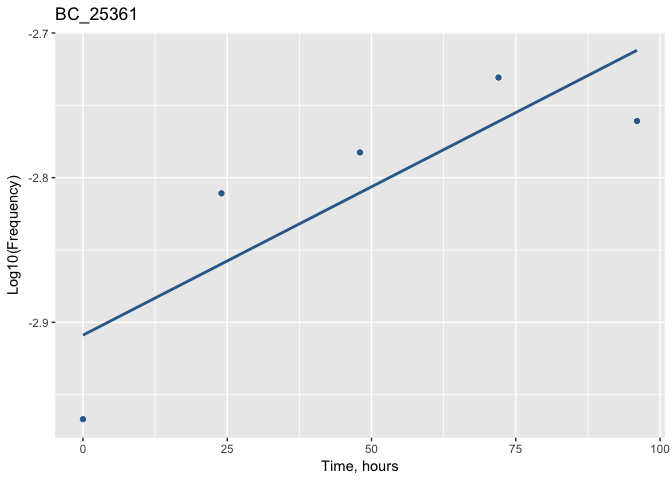

Lets load the libraries we are going to use in this practice section


```r
library(tidyr)
```

```
## Warning: package 'tidyr' was built under R version 3.4.2
```

```r
library(dplyr)
```

```
## Warning: package 'dplyr' was built under R version 3.4.2
```

```
## 
## Attaching package: 'dplyr'
```

```
## The following objects are masked from 'package:stats':
## 
##     filter, lag
```

```
## The following objects are masked from 'package:base':
## 
##     intersect, setdiff, setequal, union
```

```r
library(ggplot2)
library(readr)
library(plotly)
```

```
## 
## Attaching package: 'plotly'
```

```
## The following object is masked from 'package:ggplot2':
## 
##     last_plot
```

```
## The following object is masked from 'package:stats':
## 
##     filter
```

```
## The following object is masked from 'package:graphics':
## 
##     layout
```

Lets load the file with experimental results from TnSeq experiment

The path to the file is different for you. Please make sure to specify a correct path. Let Alena know if you have any problems with that.

```r
# Note: tbl_df function forwards the argument to "as_data_frame""

exp_data <- read.csv("Experimental_results.csv")
head(exp_data)
```

```
##   X BC_ID       H_0      H_24      H_48      H_72      H_96 Mut_ID Strain
## 1 1     1 -5.430079 -6.142158        NA -6.159939        NA    185 DivAnc
## 2 2    10 -5.731109        NA        NA        NA        NA    655 DivAnc
## 3 3    16 -5.731109 -6.443188        NA -6.460969        NA    648 DivAnc
## 4 4    18        NA -6.443188        NA        NA        NA    109 DivAnc
## 5 5    23        NA        NA -6.159156        NA        NA    421 DivAnc
## 6 6    30 -3.762626 -3.634977 -3.862490 -4.093613 -4.425554   1012 DivAnc
##   Environment
## 1      SC_3.0
## 2      SC_3.0
## 3      SC_3.0
## 4      SC_3.0
## 5      SC_3.0
## 6      SC_3.0
```
As you see, this table has several columns. Column "Strain" shows which strain was used in the experiment. "Environment" shows conditions in which microorganisms were propagated. Columns "Mut_ID" and "BC_ID" give information about type of mutations and barcodes that correspond to them. Columns "H_0": "H_96" show frequenfy of each barcode over time.

Lets modify a table:

First, remove the column "X". We are not going to use the information contained in it.
For this we are going to use function "select"

```r
# Remove column "X" from a dataframe:
exp_data <- select(exp_data, -X)

# Look at first 6 rows
head(exp_data)
```

```
##   BC_ID       H_0      H_24      H_48      H_72      H_96 Mut_ID Strain
## 1     1 -5.430079 -6.142158        NA -6.159939        NA    185 DivAnc
## 2    10 -5.731109        NA        NA        NA        NA    655 DivAnc
## 3    16 -5.731109 -6.443188        NA -6.460969        NA    648 DivAnc
## 4    18        NA -6.443188        NA        NA        NA    109 DivAnc
## 5    23        NA        NA -6.159156        NA        NA    421 DivAnc
## 6    30 -3.762626 -3.634977 -3.862490 -4.093613 -4.425554   1012 DivAnc
##   Environment
## 1      SC_3.0
## 2      SC_3.0
## 3      SC_3.0
## 4      SC_3.0
## 5      SC_3.0
## 6      SC_3.0
```

Lets get ready for plotting:

We are going to use ggplot2 package. Please check the syntax that is commonly used for plotting with this package. Does everything make sense? 


```r
# It is dificult to plot in a normal way with base plot
col.ind <- grep("H_", colnames(exp_data))

# Something like this coud do it but it is clunky and unelegent
plot(1:length(col.ind), exp_data[1, col.ind], typ = "b", ylim = c(0, max(exp_data[, col.ind], na.rm = T)))

for (i in 2:6) { # nrow(exp_data)) {
  points(1:length(col.ind), exp_data[i, col.ind], typ = "b")
}
```

<!-- -->


To make a graph, we need two give a function 2 variables (2 columns) to plot them against each other.

What variables are we going to use?

Lets rearrange our table to be able to plot the data easily.
Instead on keeping information about barcode frequency in rows, we are going to create a column "Time" with time points and a column "Frequency" with corresponding barcode frequencies.

* Explanation on the board.


```r
# First, check how function "gather" works
exp_rearranged <- gather(exp_data, Generation, Frequency, H_0:H_96)

head(exp_rearranged)
```

```
##   BC_ID Mut_ID Strain Environment Generation Frequency
## 1     1    185 DivAnc      SC_3.0        H_0 -5.430079
## 2    10    655 DivAnc      SC_3.0        H_0 -5.731109
## 3    16    648 DivAnc      SC_3.0        H_0 -5.731109
## 4    18    109 DivAnc      SC_3.0        H_0        NA
## 5    23    421 DivAnc      SC_3.0        H_0        NA
## 6    30   1012 DivAnc      SC_3.0        H_0 -3.762626
```

You might have noticed that "Generation" column contains both "H" that stands for "hours" and numbers. Lets remove "H_" part from this column.

All because we want numbers to plot with (i.e. Time!)

Check the syntax of "separate" function.


```r
# Separate values in "Generation" column into 2 columns
table_for_graph <- separate(exp_rearranged, Generation, into = c("H", "Time"))

head(table_for_graph)
```

```
##   BC_ID Mut_ID Strain Environment H Time Frequency
## 1     1    185 DivAnc      SC_3.0 H    0 -5.430079
## 2    10    655 DivAnc      SC_3.0 H    0 -5.731109
## 3    16    648 DivAnc      SC_3.0 H    0 -5.731109
## 4    18    109 DivAnc      SC_3.0 H    0        NA
## 5    23    421 DivAnc      SC_3.0 H    0        NA
## 6    30   1012 DivAnc      SC_3.0 H    0 -3.762626
```

```r
# Remove column "H" using function "select"
table_for_graph <- select(table_for_graph, -H)

head(table_for_graph)
```

```
##   BC_ID Mut_ID Strain Environment Time Frequency
## 1     1    185 DivAnc      SC_3.0    0 -5.430079
## 2    10    655 DivAnc      SC_3.0    0 -5.731109
## 3    16    648 DivAnc      SC_3.0    0 -5.731109
## 4    18    109 DivAnc      SC_3.0    0        NA
## 5    23    421 DivAnc      SC_3.0    0        NA
## 6    30   1012 DivAnc      SC_3.0    0 -3.762626
```

You might have noticed that our table contains a lot of "NA" values.
Go ahead and remove them with na.omit function. Don't forget to check it's syntax first!


```r
table_cleaned <- na.omit(table_for_graph)
table_cleaned$Time <- as.numeric(table_cleaned$Time)

head(table_cleaned)
```

```
##   BC_ID Mut_ID Strain Environment Time Frequency
## 1     1    185 DivAnc      SC_3.0    0 -5.430079
## 2    10    655 DivAnc      SC_3.0    0 -5.731109
## 3    16    648 DivAnc      SC_3.0    0 -5.731109
## 6    30   1012 DivAnc      SC_3.0    0 -3.762626
## 7    38    333 DivAnc      SC_3.0    0 -5.430079
## 8    45     71 DivAnc      SC_3.0    0 -3.143398
```


Now the table is ready.

How are we going to plot all the values? Do we need to separate them in any way? If yes, then how?


```r
# We might need to plot data for each strain separately..
DivAnc <- filter(table_cleaned, table_cleaned$Strain == "DivAnc")
L013 <- filter(table_cleaned, table_cleaned$Strain == "L013")
```


```r
# make a plot for DivAnc strain
DivAnc_plot <- ggplot(DivAnc, aes(x = Time, y = Frequency, group = BC_ID) ) +
  geom_line(alpha = .2, colour = "#000033") + 
  ggtitle("DivAnc_SC3") + 
  theme(plot.title = element_text(hjust = 0.5)) + 
  xlab("Time, hours") + ylab("Log10(Barcode frequency)")

DivAnc_plot
```

<!-- -->

Can do a cool interactive plotly graph that we can brush over to see tren line IDs


```r
ggplotly(DivAnc_plot)
```

```
## We recommend that you use the dev version of ggplot2 with `ggplotly()`
## Install it with: `devtools::install_github('hadley/ggplot2')`
```

<!--html_preserve--><div id="33f6707c83f6" style="width:672px;height:480px;" class="plotly html-widget"></div>
<script type="application/json" data-for="33f6707c83f6">{"x":{"data":[{"x":[0,24,72,null,0,null,0,24,72,null,24,null,48,null,0,24,48,72,96,null,0,24,72,null,0,24,48,72,96,null,0,24,72,96,null,0,48,72,96,null,0,24,48,72,96,null,0,24,48,72,96,null,0,48,null,0,null,0,24,72,96,null,0,24,48,72,96,null,0,24,48,96,null,0,24,48,72,96,null,96,null,0,24,48,96,null,0,24,48,72,96,null,24,null,0,24,48,72,96,null,0,24,48,72,96,null,0,72,96,null,0,24,48,72,96,null,0,24,48,72,96,null,0,24,48,72,96,null,0,24,72,96,null,0,24,48,72,96,null,0,24,48,72,96,null,0,24,48,72,96,null,0,24,48,72,96,null,0,24,48,72,96,null,24,72,null,0,24,48,72,96,null,0,24,48,72,96,null,48,null,0,24,48,72,96,null,72,null,0,96,null,0,24,null,0,24,48,72,96,null,0,24,48,72,96,null,24,72,null,0,24,48,72,96,null,24,48,72,96,null,48,null,96,null,0,24,96,null,0,24,null,0,48,null,0,24,48,72,96,null,24,null,0,24,48,72,96,null,0,24,48,72,96,null,0,24,48,72,96,null,0,24,48,72,96,null,0,24,48,72,96,null,0,null,96,null,0,null,0,24,48,72,96,null,0,24,48,72,96,null,0,24,48,72,96,null,0,24,72,96,null,0,24,72,null,0,24,48,72,96,null,48,72,96,null,24,null,0,24,48,96,null,0,72,96,null,0,24,48,72,96,null,0,96,null,0,24,48,72,96,null,0,24,48,72,96,null,0,24,48,72,96,null,0,24,48,72,96,null,0,24,null,96,null,0,24,48,null,0,24,48,72,null,0,24,48,72,96,null,0,24,96,null,48,72,null,96,null,72,null,48,null,48,null,0,24,null,0,24,48,72,96,null,0,24,48,72,null,24,48,72,96,null,72,null,0,null,0,24,48,72,96,null,0,48,null,0,72,null,24,72,null,0,24,72,null,0,24,48,72,96,null,0,null,0,24,48,null,0,24,48,72,96,null,0,24,48,72,null,96,null,0,24,48,72,96,null,0,24,48,72,96,null,0,null,0,24,72,null,24,null,0,24,48,72,96,null,0,null,0,null,0,24,48,72,96,null,0,24,48,72,96,null,0,24,null,0,null,0,24,48,72,96,null,0,48,72,null,0,72,null,48,null,24,48,null,0,24,48,72,96,null,0,24,48,72,96,null,0,24,48,72,96,null,0,48,null,0,24,48,72,96,null,24,null,0,24,48,72,96,null,72,null,0,24,48,72,96,null,0,24,48,72,96,null,0,null,0,24,48,72,96,null,0,24,48,72,96,null,0,24,72,null,0,24,48,72,96,null,48,null,0,24,48,72,96,null,0,24,48,72,96,null,0,24,72,null,0,24,48,72,96,null,24,48,72,96,null,0,72,null,0,24,48,72,96,null,0,24,48,72,96,null,0,24,48,72,96,null,48,72,null,0,24,null,0,24,48,72,96,null,0,null,0,24,48,72,96,null,0,24,48,72,96,null,72,null,0,24,72,96,null,24,48,null,48,72,null,0,24,48,96,null,72,null,0,24,48,72,96,null,48,null,0,24,48,72,96,null,0,24,48,72,96,null,0,24,48,72,96,null,0,24,48,72,96,null,0,48,72,96,null,0,48,72,null,0,48,72,null,48,72,96,null,0,24,48,72,96,null,0,24,48,72,96,null,0,24,48,96,null,0,24,48,72,96,null,0,96,null,0,24,48,72,96,null,24,null,0,24,48,null,0,72,null,24,48,null,0,24,48,72,96,null,0,24,null,96,null,0,24,48,72,96,null,0,24,48,72,96,null,0,24,48,72,96,null,72,null,0,24,48,72,96,null,0,24,48,72,96,null,0,48,72,96,null,0,72,96,null,96,null,0,72,null,0,24,48,72,96,null,0,24,48,72,96,null,48,null,0,24,48,72,96,null,0,48,null,48,72,null,0,24,48,72,96,null,0,24,48,72,96,null,48,null,0,24,48,72,96,null,0,null,24,48,72,null,0,24,48,72,96,null,0,24,48,72,96,null,72,null,72,null,0,24,48,72,96,null,0,24,48,72,96,null,0,24,48,72,96,null,0,24,48,72,96,null,0,24,48,72,96,null,0,24,48,72,96,null,0,24,48,96,null,0,48,72,null,0,24,48,72,96,null,0,null,24,48,96,null,0,24,48,72,96,null,0,null,0,24,48,72,96,null,0,24,48,72,96,null,0,24,72,null,72,null,0,24,48,72,96,null,24,null,0,24,48,72,96,null,48,null,0,24,48,72,96,null,0,24,48,72,96,null,0,24,48,72,96,null,0,48,72,96,null,0,24,48,72,96,null,24,null,0,24,48,72,96,null,0,24,null,24,null,24,48,72,96,null,0,24,48,72,96,null,0,24,48,72,96,null,0,24,48,72,null,96,null,0,24,48,null,0,24,48,72,96,null,48,null,0,24,48,72,96,null,72,null,0,24,48,72,96,null,0,24,96,null,72,null,72,96,null,0,24,72,null,0,24,48,72,96,null,0,24,48,72,96,null,0,24,48,72,96,null,0,72,null,0,null,24,null,0,24,48,72,null,0,24,48,72,96,null,0,24,48,72,96,null,24,null,0,24,48,null,0,48,72,96,null,72,null,0,24,48,72,96,null,24,48,72,null,0,24,48,72,null,72,96,null,48,null,0,96,null,0,24,48,72,96,null,0,72,null,0,24,48,72,null,0,24,48,72,96,null,0,24,48,96,null,0,null,0,null,0,48,72,96,null,0,24,72,null,0,24,48,72,96,null,0,24,48,72,96,null,0,null,0,24,48,72,96,null,0,24,48,72,96,null,0,24,48,96,null,72,null,24,96,null,0,24,48,72,96,null,0,24,null,24,null,0,48,72,96,null,0,24,48,72,96,null,0,24,48,72,96,null,0,24,48,72,96,null,0,24,null,72,null,24,72,null,0,null,0,24,48,72,96,null,0,24,48,null,0,24,48,72,96,null,24,96,null,0,24,72,null,0,24,48,72,96,null,24,null,72,null,0,24,48,72,96,null,0,24,48,72,96,null,0,null,0,24,48,72,null,72,96,null,0,72,null,72,null,0,24,72,null,0,24,48,72,96,null,0,48,null,72,96,null,24,48,96,null,0,24,48,72,96,null,0,24,null,24,48,72,null,0,24,72,null,48,null,24,48,null,0,24,48,72,96,null,0,24,48,72,96,null,0,72,null,24,72,null,0,24,48,72,96,null,24,72,null,24,72,96,null,48,null,0,48,96,null,0,24,48,72,96,null,0,24,48,72,96,null,0,null,0,24,48,72,null,0,null,0,24,48,72,96,null,24,null,24,48,null,0,24,null,0,24,72,96,null,0,48,72,null,24,48,null,72,null,0,24,48,72,96,null,24,null,0,24,48,72,96,null,0,24,48,72,96,null,0,24,48,72,96,null,72,null,72,null,0,24,48,72,96,null,0,24,48,72,96,null,24,null,0,24,48,72,96,null,0,24,48,72,96,null,0,24,48,72,96,null,0,24,48,72,96,null,0,24,48,72,96,null,72,null,0,24,48,72,96,null,24,null,0,24,72,null,48,null,24,null,0,24,48,72,96,null,0,96,null,0,24,48,72,96,null,24,null,0,null,0,24,48,72,96,null,0,24,48,72,96,null,0,24,48,72,96,null,24,48,null,0,24,48,72,96,null,0,24,48,null,0,24,48,72,96,null,0,24,48,72,96,null,0,24,48,72,96,null,0,24,48,72,96,null,0,24,48,null,0,24,48,72,96,null,0,24,48,72,96,null,24,null,0,96,null,0,72,96,null,0,48,72,96,null,24,48,null,0,24,48,72,96,null,0,24,48,72,96,null,0,48,72,null,0,24,48,72,96,null,0,24,48,72,96,null,24,48,72,96,null,0,72,null,24,null,0,24,72,null,0,24,48,72,96,null,48,null,0,24,48,72,96,null,96,null,48,null,0,24,48,72,96,null,0,72,null,0,24,48,72,96,null,0,24,48,72,96,null,0,24,48,72,96,null,24,48,null,0,24,48,72,96,null,24,48,null,72,96,null,0,24,48,72,96,null,0,24,48,72,96,null,0,null,0,24,48,72,96,null,0,48,72,96,null,96,null,0,24,48,72,96,null,0,24,72,96,null,0,24,72,null,0,24,48,72,96,null,0,24,72,96,null,0,48,null,0,24,96,null,0,24,48,72,96,null,0,null,0,24,48,72,96,null,24,48,72,96,null,24,null,0,24,48,72,96,null,0,24,48,72,96,null,0,48,null,0,null,0,24,48,72,null,0,96,null,0,24,48,72,96,null,0,24,96,null,0,24,48,72,96,null,24,null,0,24,48,72,96,null,24,72,null,0,48,null,0,null,0,24,48,72,96,null,0,24,null,0,24,48,72,96,null,0,24,null,24,72,96,null,0,48,72,null,0,48,null,0,24,48,72,96,null,0,null,0,24,48,72,96,null,0,24,48,72,96,null,24,48,null,0,24,48,72,96,null,0,24,48,72,96,null,24,null,0,24,48,72,96,null,0,24,48,72,96,null,0,24,48,72,96,null,0,24,48,72,96,null,24,48,72,null,0,24,48,72,96,null,0,48,null,0,24,48,72,null,0,24,48,72,96,null,0,24,48,72,96,null,0,24,48,72,96,null,48,72,null,0,null,0,72,null,0,24,null,0,24,48,72,96,null,24,48,72,null,0,24,48,72,96,null,0,24,48,72,null,0,null,72,null,0,24,48,72,96,null,0,24,48,72,96,null,0,null,0,24,48,72,96,null,72,null,0,24,48,72,96,null,0,24,48,72,96,null,48,72,96,null,0,24,48,72,96,null,0,24,48,72,96,null,0,24,48,72,96,null,0,24,48,72,96,null,0,24,48,72,96,null,72,null,24,48,null,0,24,72,null,0,24,48,72,96,null,0,24,48,72,96,null,24,48,96,null,0,48,72,null,0,24,48,72,96,null,24,48,72,null,0,24,48,72,96,null,0,24,48,72,96,null,0,72,96,null,0,24,48,72,96,null,0,null,0,72,null,24,null,0,24,72,null,24,72,null,0,24,48,72,96,null,48,null,24,96,null,48,null,0,24,48,72,96,null,0,24,48,72,96,null,0,24,48,72,null,48,72,null,0,null,72,96,null,0,24,48,72,96,null,0,24,48,72,96,null,72,null,24,72,null,96,null,48,null,0,24,48,null,48,null,0,24,null,0,24,48,72,96,null,0,24,48,72,96,null,0,null,0,24,48,72,96,null,24,72,96,null,0,24,48,72,96,null,0,24,48,72,96,null,0,24,48,null,0,null,48,null,0,24,48,72,96,null,24,72,null,0,null,0,24,48,72,96,null,0,24,48,72,96,null,0,24,48,72,96,null,0,96,null,24,null,0,24,48,72,96,null,0,24,48,72,96,null,0,72,null,24,null,24,48,72,null,0,24,null,24,72,96,null,0,24,48,96,null,0,24,48,72,96,null,0,24,48,72,96,null,48,72,null,0,48,72,null,0,null,24,48,null,0,72,null,24,null,0,24,48,72,96,null,24,48,null,0,24,96,null,72,null,0,24,48,72,96,null,0,24,48,72,96,null,0,24,48,72,96,null,0,24,48,72,96,null,0,24,48,72,96,null,0,24,72,96,null,0,24,48,72,96,null,24,null,72,96,null,0,48,null,0,24,48,72,96,null,0,24,48,72,96,null,0,24,48,72,null,0,24,48,72,96,null,0,24,48,72,96,null,0,24,48,72,96,null,0,24,48,72,96,null,24,48,null,0,24,48,72,96,null,72,96,null,0,24,48,72,96,null,0,24,48,72,96,null,0,24,48,72,96,null,0,24,48,72,96,null,0,24,48,72,96,null,0,24,48,72,96,null,0,48,72,96,null,0,24,48,72,96,null,0,48,96,null,24,null,0,24,48,72,96,null,0,24,72,96,null,0,null,0,24,48,null,0,24,48,72,96,null,0,24,null,24,96,null,0,24,null,0,48,72,96,null,0,24,null,0,null,0,72,null,0,24,48,72,96,null,72,null,0,24,48,72,96,null,0,48,96,null,0,24,null,0,72,null,48,null,0,24,48,72,96,null,0,24,null,0,24,48,72,96,null,48,72,null,48,72,null,0,24,48,72,96,null,96,null,0,24,48,null,0,null,72,null,0,24,48,72,96,null,48,null,48,null,0,72,96,null,0,null,96,null,48,96,null,0,24,48,96,null,72,96,null,0,24,72,null,0,24,48,72,96,null,24,48,72,96,null,0,24,48,72,96,null,72,null,0,24,72,96,null,0,24,48,72,96,null,48,null,0,24,48,72,96,null,72,null,0,null,24,null,0,72,null,24,null,0,24,48,72,96,null,0,24,48,72,96,null,96,null,24,null,0,48,72,null,0,48,72,null,0,null,0,24,48,72,96,null,0,24,48,72,96,null,0,24,48,72,96,null,0,48,null,0,24,48,72,96,null,0,24,48,72,96,null,0,24,48,72,96,null,72,null,0,24,48,72,96,null,96,null,0,24,48,72,96,null,72,null,0,24,48,72,96,null,24,72,null,0,24,96,null,0,72,null,0,24,48,72,96,null,0,24,48,72,96,null,0,24,48,72,96,null,0,24,48,72,96,null,0,24,48,72,96,null,0,null,0,24,48,72,96,null,0,24,48,72,96,null,0,24,48,72,96,null,0,24,48,72,96,null,0,24,48,72,96,null,0,24,48,72,96,null,48,null,48,null,0,24,72,null,24,null,0,72,96,null,48,72,96,null,0,null,0,24,48,72,96,null,24,null,0,24,48,72,96,null,0,24,48,72,96,null,0,24,48,72,96,null,0,24,null,0,24,48,72,96,null,0,24,48,72,96,null,0,24,48,72,96,null,48,96,null,24,48,72,null,48,72,null,0,24,48,72,96,null,0,24,48,72,96,null,48,96,null,0,24,48,72,96,null,24,null,0,96,null,24,48,72,96,null,0,24,48,null,0,24,48,72,96,null,96,null,0,72,null,48,72,null,0,24,72,96,null,0,null,0,72,null,0,24,48,null,0,24,48,72,96,null,0,24,48,null,0,24,48,72,96,null,0,null,0,48,null,0,24,48,72,96,null,0,24,48,72,96,null,72,null,0,24,null,72,null,0,24,48,72,96,null,0,null,48,null,0,24,48,72,96,null,0,24,96,null,48,72,null,0,24,48,72,96,null,0,24,48,72,96,null,0,24,48,72,96,null,24,null,48,72,null,0,24,48,72,96,null,0,24,48,72,96,null,0,24,48,72,96,null,0,null,0,24,48,null,0,24,48,72,96,null,0,24,48,72,96,null,48,null,0,24,48,72,96,null,0,24,48,72,96,null,0,24,48,72,96,null,0,24,48,72,96,null,0,24,48,72,96,null,48,72,96,null,0,24,48,72,96,null,0,24,48,72,96,null,96,null,0,24,72,96,null,0,null,0,null,24,72,null,0,24,48,72,96,null,0,24,48,72,96,null,48,null,48,null,0,24,48,72,96,null,0,null,72,null,24,96,null,24,48,72,null,0,24,48,null,0,24,48,72,96,null,72,null,24,48,null,0,null,0,24,48,72,96,null,0,24,48,72,null,0,24,48,72,96,null,0,null,0,24,72,96,null,0,24,72,null,72,null,0,24,72,null,0,24,48,72,96,null,0,48,null,0,24,48,72,96,null,0,24,48,72,96,null,0,24,48,72,96,null,0,null,0,24,48,72,96,null,48,96,null,0,24,48,72,96,null,0,24,48,72,96,null,0,24,48,72,96,null,0,24,48,72,96,null,48,96,null,0,null,0,24,48,72,96,null,72,96,null,0,48,null,24,72,null,72,null,0,24,72,96,null,72,null,0,null,48,72,null,96,null,0,24,48,72,96,null,96,null,0,96,null,24,72,96,null,0,48,96,null,0,24,48,72,96,null,0,24,48,72,96,null,0,24,72,96,null,0,24,96,null,0,24,48,72,96,null,48,72,null,24,48,72,null,48,null,0,24,48,72,96,null,0,96,null,0,24,null,0,24,48,72,96,null,0,24,48,72,96,null,48,null,48,96,null,0,24,48,72,96,null,0,24,48,72,96,null,0,24,48,72,96,null,0,48,72,null,0,null,0,24,48,72,96,null,0,24,null,48,72,null,0,24,48,96,null,0,72,96,null,72,null,0,24,48,72,96,null,48,null,24,null,0,24,48,72,null,96,null,0,null,0,24,48,72,96,null,0,48,72,null,0,24,48,72,96,null,0,72,96,null,0,24,48,72,96,null,0,48,96,null,24,null,0,48,null,0,24,48,72,96,null,72,null,72,null,0,24,48,96,null,0,24,null,0,24,48,72,96,null,24,48,72,null,0,24,48,72,96,null,0,24,48,72,96,null,0,null,0,24,48,72,96,null,0,24,48,72,96,null,0,null,0,24,48,72,96,null,0,48,null,0,24,48,72,96,null,0,24,96,null,72,96,null,0,24,48,96,null,24,48,null,0,24,48,72,96,null,0,24,48,72,96,null,0,24,48,72,96,null,0,null,0,48,72,null,0,24,48,72,96,null,0,null,48,null,0,24,48,72,96,null,0,24,48,72,96,null,24,48,72,null,48,72,null,24,null,24,null,0,24,48,72,96,null,24,72,96,null,72,null,48,72,96,null,0,24,48,72,96,null,0,24,48,72,96,null,0,24,48,72,96,null,0,48,72,null,0,24,48,96,null,24,48,null,24,null,0,48,72,96,null,0,24,48,72,96,null,0,24,null,0,null,0,24,48,72,96,null,0,48,72,null,0,24,48,72,96,null,0,24,48,72,96,null,72,null,0,24,48,72,null,0,72,null,0,24,48,72,96,null,72,null,0,48,72,null,0,24,48,72,96,null,0,24,null,0,24,null,0,24,48,72,96,null,96,null,0,48,72,null,24,null,48,null,0,24,48,72,96,null,0,null,0,48,72,96,null,0,null,0,24,48,72,96,null,0,24,48,72,null,72,96,null,0,48,72,null,0,24,48,null,0,24,48,72,96,null,0,24,48,72,96,null,72,null,0,24,48,null,0,null,96,null,0,null,0,24,48,72,96,null,0,24,48,72,96,null,0,72,null,0,24,48,72,96,null,0,24,48,72,96,null,0,24,48,72,96,null,0,24,48,72,96,null,72,null,0,24,48,72,96,null,0,24,48,72,96,null,48,null,0,24,48,72,96,null,0,24,48,72,96,null,24,72,null,0,96,null,0,24,48,72,96,null,0,24,48,72,96,null,0,24,96,null,0,24,48,72,96,null,72,null,0,null,0,24,48,72,96,null,0,24,48,72,96,null,0,48,72,null,24,72,null,0,24,48,null,48,72,null,48,72,null,0,48,null,0,24,48,72,96,null,72,null,0,72,null,0,24,48,72,96,null,72,null,0,24,48,72,96,null,0,24,48,72,96,null,0,24,48,72,null,0,24,48,72,96,null,0,null,0,24,48,72,96,null,0,72,96,null,24,null,0,24,72,96,null,48,null,0,24,48,72,96,null,24,null,0,72,96,null,0,24,48,72,96,null,48,96,null,0,24,48,72,96,null,0,24,48,72,96,null,0,72,null,0,24,72,96,null,0,null,24,null,0,24,48,72,96,null,0,24,48,72,96,null,0,null,0,24,48,72,96,null,0,24,48,72,96,null,24,48,72,96,null,0,null,0,24,48,72,96,null,72,null,0,24,48,72,96,null,0,24,48,72,96,null,0,null,0,72,96,null,0,24,48,72,96,null,0,24,48,72,96,null,0,24,48,72,96,null,72,null,0,null,0,24,48,72,96,null,0,24,48,72,null,0,24,48,96,null,24,null,72,null,0,null,0,24,48,72,96,null,0,24,72,96,null,0,48,null,0,24,48,72,96,null,0,24,72,null,0,24,48,72,96,null,0,24,48,72,96,null,0,24,48,72,96,null,0,72,null,0,24,48,72,96,null,0,24,48,72,96,null,96,null,48,72,null,24,72,null,48,96,null,72,null,72,null,0,48,72,null,0,72,null,24,null,48,null,0,null,0,null,96,null,24,48,96,null,0,24,48,72,96,null,0,24,48,72,96,null,48,72,96,null,72,96,null,24,48,96,null,0,null,0,24,48,72,null,0,24,48,72,null,0,24,48,72,96,null,24,null,72,null,0,24,48,72,null,72,null,24,72,96,null,0,72,null,0,24,48,72,96,null,0,24,48,72,96,null,0,24,48,72,96,null,0,24,48,72,96,null,0,24,48,72,96,null,0,24,48,96,null,0,null,0,24,48,72,96,null,0,24,48,72,96,null,0,24,48,72,96,null,0,48,72,null,0,null,0,24,48,72,96,null,0,24,48,72,96,null,0,24,48,72,96,null,0,24,48,72,96,null,72,null,48,72,null,0,null,72,null,24,48,72,null,48,null,0,24,48,72,96,null,96,null,72,null,0,24,48,72,96,null,0,24,48,72,96,null,0,24,48,72,null,48,72,null,24,null,0,24,48,72,96,null,0,24,48,72,96,null,0,24,48,72,96,null,0,24,48,72,96,null,48,null,0,24,48,null,0,24,48,72,96,null,0,24,48,72,96,null,0,24,48,72,96,null,0,48,72,96,null,0,24,48,72,96,null,0,null,48,null,0,24,48,null,24,72,96,null,0,24,48,72,96,null,0,24,48,72,96,null,0,24,48,72,96,null,48,null,0,24,72,96,null,0,24,48,72,96,null,0,24,48,72,96,null,0,24,null,0,72,96,null,24,48,null,0,24,48,72,96,null,0,24,48,72,96,null,0,24,48,72,96,null,72,null,24,72,96,null,0,24,48,72,96,null,24,null,72,null,0,24,48,72,96,null,96,null,0,24,48,72,96,null,0,24,48,72,96,null,0,24,48,72,96,null,48,null,0,24,48,72,96,null,0,24,48,72,96,null,0,72,null,0,24,48,72,96,null,0,24,48,72,96,null,24,48,null,0,24,48,72,96,null,0,24,48,72,96,null,24,null,0,48,72,96,null,24,48,null,0,24,48,72,96,null,72,null,0,24,48,72,96,null,0,24,48,72,96,null,0,24,48,72,96,null,0,24,48,72,96,null,0,24,48,72,96,null,0,24,null,0,24,48,72,96,null,0,48,null,0,24,48,72,96,null,0,24,48,72,96,null,0,24,48,72,null,0,72,96,null,0,24,48,72,96,null,0,24,48,72,96,null,0,24,48,72,96,null,0,24,48,72,96,null,0,24,48,72,96,null,0,24,48,72,96,null,0,24,48,72,96,null,0,24,48,72,null,0,24,48,72,96,null,48,72,null,0,24,48,72,96,null,0,24,48,72,96,null,0,24,48,72,null,0,24,48,72,96,null,0,24,72,96,null,0,24,48,72,96,null,72,null,0,24,48,72,96,null,0,24,48,72,96,null,0,24,48,72,96,null,24,72,null,0,96,null,0,24,48,72,null,0,24,48,72,96,null,96,null,48,null,0,null,0,24,48,72,96,null,72,null,96,null,0,24,48,72,96,null,0,24,48,72,96,null,0,24,48,72,96,null,48,null,0,24,48,72,96,null,24,48,72,null,0,24,72,96,null,0,24,48,72,96,null,0,24,48,72,96,null,0,24,48,72,96,null,0,24,48,72,96,null,0,24,48,72,96,null,0,24,48,72,96,null,0,null,24,null,24,null,0,24,48,72,96,null,0,24,48,72,96,null,0,24,null,0,24,48,72,96,null,24,96,null,0,72,null,0,24,72,null,0,24,48,72,96,null,0,24,48,null,0,24,48,72,96,null,0,24,48,72,96,null,0,null,24,null,0,null,24,null,0,24,48,72,96,null,0,24,48,72,96,null,0,24,48,72,96,null,0,24,48,72,96,null,48,null,24,72,null,0,24,48,72,96,null,0,24,48,null,0,24,48,72,96,null,0,24,48,72,96,null,0,24,48,72,96,null,0,48,null,0,24,null,0,24,48,72,96,null,0,24,48,72,96,null,0,null,0,24,48,72,96,null,0,24,48,72,96,null,0,48,72,null,24,null,24,96,null,0,null,0,24,48,72,96,null,0,48,null,24,null,72,null,0,24,72,96,null,0,24,48,72,96,null,0,48,96,null,72,null,72,null,0,24,48,72,96,null,0,24,48,72,96,null,0,24,48,null,0,24,48,72,96,null,0,24,48,72,96,null,72,null,0,24,48,72,96,null,0,24,48,72,96,null,0,null,0,24,null,48,null,48,null,48,null,0,null,0,24,48,72,96,null,0,null,0,24,48,72,96,null,0,24,48,72,96,null,0,24,48,72,96,null,0,24,48,72,96,null,0,24,48,72,96,null,0,24,48,72,96,null,0,48,72,null,48,72,null,0,24,48,72,null,0,24,48,72,96,null,0,24,72,96,null,0,24,48,72,96,null,72,null,24,null,0,24,48,72,96,null,0,24,48,72,null,0,24,96,null,0,24,48,null,0,24,48,72,96,null,24,null,0,24,48,72,null,0,24,48,72,96,null,72,null,0,24,48,72,96,null,0,24,null,24,48,96,null,0,24,48,72,96,null,72,null,0,24,48,72,96,null,48,null,0,24,48,72,96,null,0,24,48,72,96,null,0,24,48,72,null,0,24,48,72,96,null,0,24,72,null,24,72,96,null,0,24,48,72,96,null,0,24,72,null,0,24,48,72,96,null,72,null,0,24,48,72,96,null,0,24,48,72,96,null,0,null,24,48,72,96,null,0,24,48,72,96,null,24,72,null,24,null,0,24,96,null,48,null,0,24,48,72,96,null,24,96,null,0,24,48,72,96,null,0,24,48,72,96,null,0,48,96,null,0,24,48,72,96,null,0,24,48,72,96,null,0,24,72,null,0,null,0,24,48,72,96,null,0,24,48,72,96,null,0,24,48,72,96,null,0,24,48,72,96,null,0,24,72,null,48,72,null,24,48,null,24,null,0,24,48,72,96,null,0,24,48,72,96,null,24,null,48,null,24,48,72,96,null,0,24,48,72,96,null,0,24,48,72,96,null,24,48,96,null,0,24,null,0,24,48,72,96,null,0,24,48,72,96,null,0,24,48,72,96,null,24,null,0,24,48,72,96,null,0,null,0,24,48,72,96,null,0,24,48,72,96,null,72,null,24,null,0,24,48,72,null,72,null,0,24,48,72,null,0,24,48,72,96,null,0,72,null,0,24,48,72,null,24,72,null,72,null,0,24,48,72,96,null,24,null,0,96,null,24,48,72,96,null,0,24,48,72,96,null,0,24,48,72,null,0,24,48,72,96,null,0,24,48,72,96,null,0,72,96,null,24,null,0,48,96,null,0,24,48,72,96,null,0,48,null,0,24,48,72,96,null,24,48,null,0,24,48,72,96,null,0,null,0,24,48,72,96,null,0,24,48,72,96,null,0,24,48,72,96,null,0,24,48,72,96,null,96,null,0,24,48,72,96,null,24,72,96,null,48,null,24,null,0,24,48,72,96,null,0,24,72,null,0,24,48,72,96,null,0,24,48,72,null,0,72,null,72,null,0,24,48,72,96,null,0,72,null,0,24,72,null,0,72,null,96,null,0,24,null,72,null,24,48,null,0,24,48,72,96,null,0,24,48,72,96,null,48,72,null,0,24,48,72,96,null,0,24,48,72,96,null,48,null,0,24,48,null,24,null,96,null,0,24,72,96,null,0,24,null,0,24,48,72,96,null,0,48,null,0,24,48,72,96,null,0,24,48,72,96,null,0,24,48,72,96,null,0,48,null,0,24,null,0,24,48,72,96,null,0,24,48,72,96,null,0,24,48,72,96,null,96,null,0,24,48,72,96,null,24,48,null,24,72,null,0,48,72,96,null,0,24,96,null,0,24,48,72,96,null,0,24,48,72,96,null,0,72,96,null,0,24,48,72,96,null,0,24,48,72,96,null,0,24,48,72,96,null,0,24,48,72,96,null,0,24,72,null,0,24,48,72,96,null,48,72,null,0,24,48,72,96,null,0,24,72,null,0,null,0,24,48,72,96,null,0,24,48,72,96,null,48,null,72,null,0,24,48,72,96,null,0,24,48,null,48,null,0,24,48,72,96,null,0,null,0,48,72,96,null,0,24,48,72,96,null,0,96,null,24,null,0,24,48,72,96,null,0,24,48,72,96,null,0,24,48,72,96,null,0,24,null,24,72,96,null,0,null,0,24,48,72,96,null,0,24,48,72,96,null,0,24,48,72,96,null,24,null,0,24,48,96,null,0,24,48,72,96,null,48,null,0,24,48,72,96,null,0,24,72,96,null,24,null,24,48,72,96,null,0,24,48,72,96,null,0,24,null,0,24,48,72,96,null,0,24,null,24,72,null,0,24,48,72,96,null,0,24,48,72,96,null,24,null,48,96,null,48,null,48,null,24,72,null,24,48,null,24,null,0,24,48,72,96,null,0,24,48,72,96,null,0,24,48,72,96,null,0,96,null,0,72,null,0,24,48,72,96,null,72,null,0,48,null,0,24,48,72,96,null,96,null,0,24,48,72,96,null,0,24,48,null,24,48,72,null,0,24,48,72,96,null,0,24,48,72,96,null,48,72,96,null,0,24,48,72,96,null,0,24,48,72,96,null,0,24,72,96,null,24,72,96,null,72,null,0,48,null,0,null,0,24,48,72,96,null,0,24,96,null,0,24,48,72,96,null,0,24,48,72,96,null,0,48,72,96,null,0,24,48,72,96,null,0,24,48,72,96,null,0,96,null,0,24,48,72,96,null,96,null,0,24,72,96,null,24,48,null,0,24,48,72,96,null,0,24,72,null,24,96,null,24,72,null,24,null,0,48,null,48,96,null,0,24,48,72,96,null,0,48,96,null,0,24,48,72,96,null,0,24,48,72,96,null,0,24,48,72,96,null,0,24,72,96,null,24,48,null,0,24,48,72,96,null,0,24,48,72,96,null,24,48,null,0,24,48,72,null,72,null,24,72,96,null,0,24,48,72,96,null,0,24,48,72,96,null,0,24,48,72,96,null,0,24,72,null,0,24,48,72,96,null,0,24,48,72,96,null,0,24,48,72,96,null,96,null,48,null,0,24,48,72,96,null,0,24,48,72,96,null,72,null,0,72,null,24,96,null,0,48,72,null,96,null,24,null,24,72,null,0,72,null,48,72,96,null,0,24,48,72,96,null,72,96,null,0,24,48,72,96,null,48,null,0,24,48,72,96,null,0,24,48,72,96,null,0,24,48,72,96,null,24,72,96,null,0,24,48,72,96,null,0,24,48,72,null,0,24,48,72,96,null,0,24,48,72,96,null,0,24,48,72,96,null,24,72,null,72,null,0,48,72,null,0,24,48,72,96,null,0,24,48,72,96,null,0,24,48,72,96,null,0,24,48,72,null,0,24,48,72,96,null,0,24,48,72,96,null,0,24,48,72,96,null,0,24,48,72,96,null,24,96,null,0,24,48,72,96,null,0,24,48,72,96,null,24,null,0,24,48,72,96,null,24,null,24,48,72,null,0,24,48,72,96,null,72,null,72,null,0,72,null,0,24,48,72,96,null,0,24,48,72,96,null,0,null,0,null,0,24,48,72,96,null,48,null,24,48,72,96,null,0,24,48,72,96,null,48,null,72,null,0,72,null,0,72,null,0,24,null,0,24,null,0,24,48,72,96,null,96,null,72,null,0,24,48,72,96,null,72,null,0,24,48,72,96,null,0,24,48,72,96,null,24,48,72,96,null,0,24,72,null,0,24,96,null,24,null,0,null,0,24,48,72,96,null,0,24,48,72,96,null,0,24,null,0,24,48,72,96,null,24,96,null,0,24,48,72,96,null,0,24,48,72,null,0,24,48,72,null,0,24,48,72,96,null,0,24,48,72,96,null,0,48,null,24,null,0,null,48,null,0,24,48,72,96,null,0,24,null,0,24,48,72,96,null,0,null,24,72,null,24,48,72,null,0,24,null,0,24,48,72,96,null,0,null,0,24,48,72,96,null,0,72,null,24,72,null,0,72,96,null,0,24,48,72,96,null,0,24,48,72,96,null,0,24,48,72,96,null,24,null,0,24,48,72,96,null,72,null,0,24,48,72,96,null,0,48,72,96,null,0,24,48,72,96,null,0,24,48,72,96,null,0,24,48,null,0,24,48,72,96,null,24,96,null,24,72,96,null,0,null,0,24,48,72,96,null,24,48,72,null,0,24,96,null,24,96,null,0,24,48,72,96,null,0,24,48,72,96,null,0,24,48,96,null,0,24,72,null,24,48,null,0,24,48,null,0,24,48,72,96,null,0,24,48,72,96,null,0,24,48,72,96,null,0,null,0,48,72,null,0,24,48,72,96,null,72,null,96,null,0,24,48,72,null,0,24,48,72,null,0,24,48,72,96,null,24,48,72,null,96,null,0,null,48,null,24,48,72,96,null,48,null,0,24,48,72,96,null,24,48,72,null,24,null,0,24,48,72,96,null,0,24,48,72,96,null,24,null,0,24,null,72,96,null,0,null,0,24,48,72,96,null,0,24,96,null,0,null,0,24,48,72,96,null,0,24,48,72,96,null,0,24,48,72,96,null,24,null,0,24,72,96,null,0,24,48,72,96,null,0,24,null,24,null,0,24,48,72,96,null,0,24,48,72,96,null,0,72,96,null,48,72,null,24,48,null,0,24,48,72,96,null,0,24,48,72,96,null,24,null,0,96,null,72,null,0,96,null,0,24,48,72,96,null,0,48,72,96,null,0,null,0,24,48,72,96,null,48,null,0,24,48,72,96,null,24,72,null,48,72,96,null,0,24,48,72,96,null,0,24,null,0,24,48,72,96,null,0,24,48,72,96,null,0,24,48,72,96,null,0,24,48,72,96,null,0,null,0,24,48,72,96,null,24,96,null,0,24,48,72,96,null,0,24,null,0,24,48,72,96,null,24,72,null,0,72,96,null,48,72,null,48,72,null,0,24,48,72,96,null,0,24,48,72,96,null,48,null,24,null,0,24,48,72,96,null,24,null,0,24,48,72,96,null,48,null,24,72,null,72,null,24,48,96,null,0,24,48,null,0,24,48,null,0,24,null,0,24,null,0,24,48,72,96,null,96,null,0,24,48,72,96,null,0,24,48,72,96,null,24,null,0,24,48,72,96,null,96,null,0,null,0,24,72,96,null,72,null,0,null,0,24,48,72,96,null,0,24,48,72,96,null,0,24,48,72,96,null,24,72,null,0,24,48,72,96,null,0,24,48,72,96,null,24,48,null,24,null,0,24,null,48,null,24,72,96,null,0,72,96,null,0,null,0,24,48,72,96,null,0,null,0,24,48,72,96,null,48,null,0,24,48,72,96,null,72,null,0,24,48,72,96,null,0,24,48,72,96,null,0,null,0,24,48,72,96,null,48,null,24,96,null,24,null,0,24,48,72,96,null,0,24,48,72,96,null,0,24,48,72,96,null,0,48,null,0,24,48,72,96,null,96,null,0,24,48,72,96,null,0,24,48,72,96,null,48,null,0,24,72,null,0,24,48,72,96,null,0,24,48,72,96,null,24,48,96,null,72,null,0,24,48,72,96,null,24,null,0,24,48,72,96,null,24,72,96,null,72,null,96,null,0,24,72,null,0,24,48,72,96,null,24,null,0,null,0,24,48,72,96,null,0,null,72,null,48,null,0,24,48,72,96,null,0,null,0,24,48,72,96,null,0,24,48,72,96,null,0,24,48,72,null,0,24,48,72,96,null,0,24,48,72,null,0,24,48,72,96,null,72,null,72,null,0,24,48,72,96,null,0,24,48,null,48,72,96,null,48,null,0,24,48,72,96,null,24,48,72,null,0,24,48,72,96,null,0,24,48,72,96,null,0,24,null,24,null,0,24,null,0,24,48,96,null,0,24,48,72,96,null,0,24,48,72,96,null,24,48,96,null,0,24,48,72,96,null,0,24,48,72,96,null,72,null,0,24,48,72,96,null,0,null,24,48,72,null,48,72,null,24,72,96,null,0,24,48,72,null,72,null,24,48,72,96,null,0,24,48,72,96,null,0,24,48,72,96,null,48,null,24,null,48,null,48,72,null,0,24,48,72,96,null,0,24,48,72,96,null,0,24,48,72,96,null,0,48,72,null,0,24,48,72,96,null,0,24,48,72,96,null,0,24,72,null,0,24,48,96,null,0,24,48,72,96,null,24,72,96,null,0,24,48,72,96,null,0,24,72,null,0,24,48,72,96,null,48,null,72,null,0,null,0,24,48,72,96,null,0,24,48,72,null,24,72,null,0,24,48,72,96,null,0,24,48,72,96,null,72,96,null,0,24,48,72,96,null,0,24,96,null,72,null,0,24,48,72,96,null,0,24,48,72,96,null,0,24,48,72,null,24,null,72,96,null,0,24,48,72,96,null,0,24,48,72,96,null,0,24,48,72,96,null,0,24,48,72,96,null,0,24,48,72,96,null,0,24,48,72,96,null,0,48,72,null,0,48,null,0,24,48,72,96,null,0,48,72,null,0,24,48,72,null,0,24,48,72,96,null,0,24,96,null,0,24,48,72,96,null,0,24,48,72,96,null,0,24,72,null,24,72,null,0,24,48,72,96,null,0,24,48,72,96,null,48,null,72,null,0,24,48,null,0,24,48,72,96,null,48,72,null,0,24,48,null,24,48,72,96,null,24,48,72,96,null,0,24,48,72,96,null,0,24,48,72,96,null,0,24,48,72,96,null,0,24,48,72,96,null,24,null,0,24,48,72,null,0,48,96,null,72,null,0,24,48,72,96,null,48,null,0,null,72,null,0,24,null,24,null,0,24,48,72,96,null,72,null,0,24,48,72,96,null,0,24,48,72,96,null,0,24,48,72,96,null,0,24,48,72,96,null,0,null,0,24,48,72,96,null,48,null,72,null,0,24,48,72,96,null,24,72,null,24,null,48,null,0,24,48,72,96,null,0,null,0,24,48,72,96,null,48,null,0,24,48,72,96,null,0,72,96,null,0,24,48,72,96,null,0,24,48,72,96,null,48,null,24,48,72,null,24,96,null,0,24,48,72,96,null,0,24,48,72,96,null,0,48,null,0,24,48,72,96,null,0,null,0,24,48,72,96,null,0,24,48,72,96,null,96,null,0,24,48,72,null,0,null,0,48,null,0,24,48,72,96,null,0,48,72,96,null,0,24,48,72,96,null,0,24,48,72,96,null,0,96,null,24,72,null,0,24,72,96,null,0,48,72,96,null,0,48,72,96,null,0,24,48,72,96,null,0,24,48,null,24,72,null,48,null,0,24,48,72,96,null,24,96,null,24,48,null,0,24,48,72,96,null,0,null,0,24,48,72,96,null,48,null,72,null,0,24,48,72,96,null,0,24,48,72,96,null,0,24,48,72,96,null,0,24,48,72,96,null,24,72,null,0,24,48,72,96,null,0,24,48,72,96,null,0,48,72,null,0,null,24,48,96,null,24,48,96,null,72,null,0,72,null,0,24,48,72,96,null,0,24,48,72,96,null,48,null,96,null,0,24,48,72,96,null,0,48,96,null,0,24,48,72,96,null,0,24,48,72,96,null,0,24,48,null,0,null,0,24,48,72,96,null,0,48,null,24,48,96,null,0,24,48,72,96,null,0,24,null,0,24,48,72,96,null,0,24,48,72,96,null,24,null,0,48,72,null,0,null,72,null,48,null,0,24,48,72,96,null,0,null,0,24,48,72,96,null,0,24,48,72,96,null,0,null,0,null,0,48,null,72,null,48,null,0,24,null,0,24,48,72,96,null,24,null,0,24,48,72,96,null,0,24,48,null,0,24,48,72,96,null,0,24,48,72,96,null,0,24,48,72,96,null,0,24,48,96,null,24,null,0,72,null,72,null,72,null,0,24,48,72,96,null,24,48,72,null,0,24,48,72,96,null,0,24,72,null,0,24,48,72,96,null,0,24,48,72,96,null,0,24,72,96,null,0,24,48,72,96,null,0,24,96,null,0,null,48,72,null,0,24,null,0,24,48,72,null,24,72,null,0,24,48,72,null,0,24,48,72,96,null,0,72,96,null,0,24,48,null,0,24,48,72,96,null,48,null,0,24,48,72,96,null,72,null,0,24,48,72,96,null,0,24,48,72,96,null,0,null,0,24,null,24,72,null,24,72,null,0,24,48,72,96,null,48,72,null,24,96,null,0,24,48,72,96,null,0,24,48,72,96,null,0,24,48,72,96,null,0,24,48,72,96,null,24,96,null,24,96,null,24,null,0,null,24,72,null,0,24,72,96,null,0,24,48,null,0,null,24,null,0,24,72,96,null,0,24,48,72,null,48,null,24,48,null,72,96,null,48,72,96,null,0,24,48,72,96,null,0,48,72,96,null,48,null,24,null,0,24,48,72,96,null,0,24,48,72,96,null,0,24,48,72,96,null,0,null,0,48,null,0,24,48,72,96,null,0,24,48,72,96,null,0,24,48,72,96,null,0,48,null,0,24,48,72,96,null,0,24,48,72,96,null,0,24,48,72,96,null,0,null,24,48,null,0,24,48,72,96,null,0,48,72,null,0,24,48,72,96,null,0,24,48,72,96,null,0,24,48,72,96,null,0,24,null,0,24,48,72,96,null,72,null,0,24,48,96,null,0,24,48,72,96,null,0,24,48,72,96,null,24,48,72,null,24,48,72,96,null,0,48,72,96,null,0,24,48,72,96,null,0,24,48,72,96,null,0,24,48,72,96,null,24,48,72,96,null,0,96,null,48,null,0,24,48,72,96,null,0,96,null,0,24,72,96,null,0,24,48,72,96,null,0,24,48,null,48,72,96,null,0,24,48,null,0,24,null,0,48,72,null,24,null,0,24,72,null,0,null,72,null,0,24,48,72,96,null,0,72,null,0,24,48,72,96,null,0,24,48,72,96,null,24,null,0,24,48,72,96,null,24,null,0,24,48,72,96,null,0,24,48,72,null,72,null,0,null,72,null,0,null,0,48,72,null,0,24,48,72,96,null,0,24,48,72,96,null,24,48,72,96,null,0,24,48,72,96,null,0,72,null,0,24,null,0,24,48,72,96,null,0,24,48,72,96,null,0,24,48,72,null,24,null,0,24,null,0,72,null,0,24,48,72,96,null,0,24,48,72,96,null,0,24,48,72,96,null,0,24,48,72,96,null,0,24,null,0,24,48,72,96,null,0,24,48,72,96,null,0,24,48,72,96,null,0,72,96,null,96,null,0,null,72,null,24,48,null,0,24,48,72,null,0,24,48,72,null,0,24,48,72,96,null,0,24,48,72,96,null,0,72,96,null,0,48,72,96,null,24,72,null,24,48,72,null,0,24,48,72,96,null,0,24,48,72,96,null,24,null,0,24,72,null,0,24,48,72,96,null,0,48,72,96,null,0,24,48,72,96,null,0,null,0,null,0,96,null,96,null,48,null,0,24,48,72,96,null,48,null,0,72,null,0,24,48,72,96,null,0,24,48,72,96,null,0,24,48,72,null,72,null,0,24,48,72,96,null,48,72,null,0,24,48,72,96,null,0,24,48,72,96,null,0,24,72,null,0,24,48,72,96,null,0,24,null,0,24,48,72,96,null,0,24,null,0,24,48,72,96,null,0,24,48,72,96,null,48,72,96,null,0,24,96,null,0,24,48,72,96,null,48,null,24,48,null,48,72,96,null,0,24,48,72,96,null,0,24,48,null,0,24,72,96,null,0,24,48,null,0,null,72,96,null,0,24,48,72,null,48,null,0,24,48,72,96,null,0,72,96,null,48,null,0,24,48,72,96,null,0,24,48,72,96,null,72,null,0,24,48,72,96,null,0,24,48,72,96,null,0,24,72,null,24,48,72,null,0,24,48,72,96,null,0,24,48,72,96,null,0,24,48,72,96,null,0,24,48,72,null,72,null,48,72,null,0,null,24,null,0,24,48,72,96,null,0,24,48,72,96,null,0,24,48,72,96,null,24,48,96,null,0,72,null,0,24,48,72,96,null,0,24,48,72,96,null,0,24,48,72,96,null,0,24,48,72,96,null,0,24,48,72,96,null,0,null,0,24,48,72,96,null,0,24,48,72,96,null,24,72,96,null,24,null,0,48,72,null,0,48,null,24,72,null,0,24,48,72,96,null,24,48,96,null,0,24,72,null,0,24,48,72,96,null,0,24,72,96,null,0,24,48,72,96,null,0,24,72,null,0,24,48,null,0,24,48,72,96,null,72,null,0,24,48,72,96,null,0,null,24,null,0,24,48,72,96,null,24,48,72,null,0,48,72,null,96,null,0,48,96,null,0,24,null,0,24,72,96,null,0,24,48,72,96,null,0,24,null,0,24,48,72,96,null,24,72,null,0,24,48,72,96,null,0,24,48,72,96,null,72,96,null,24,48,null,0,24,48,72,96,null,0,24,48,null,0,24,48,72,96,null,0,null,96,null,24,null,0,24,48,72,96,null,0,24,48,72,96,null,0,null,0,24,48,72,96,null,0,24,48,72,96,null,24,72,null,24,72,96,null,0,24,48,72,96,null,0,24,48,72,96,null,0,null,0,24,48,72,96,null,24,null,0,24,48,null,48,72,96,null,0,24,48,72,96,null,0,24,48,72,96,null,0,24,48,72,96,null,0,24,null,0,24,48,72,96,null,0,24,72,96,null,0,24,48,72,96,null,0,48,null,24,48,72,null,48,null,72,null,0,24,48,72,96,null,0,24,72,96,null,24,72,96,null,0,24,48,72,96,null,0,24,48,72,96,null,48,null,24,48,72,96,null,0,null,0,96,null,48,72,null,0,24,48,72,96,null,24,null,0,24,48,72,96,null,0,24,48,72,96,null,0,48,null,0,24,96,null,0,24,48,72,96,null,0,24,48,72,96,null,0,24,48,72,96,null,0,24,48,72,96,null,0,null,0,24,48,72,96,null,0,24,48,72,96,null,0,24,48,72,96,null,0,null,0,24,48,72,96,null,0,24,48,72,96,null,0,24,48,72,96,null,0,24,48,72,96,null,0,96,null,48,null,48,96,null,0,24,48,72,96,null,0,48,72,null,96,null,0,72,null,0,24,48,72,96,null,72,null,48,null,48,96,null,0,24,48,72,96,null,0,24,48,72,96,null,24,null,0,24,48,72,96,null,48,72,null,0,24,48,72,null,24,null,0,24,48,72,96,null,0,24,48,72,96,null,0,24,48,72,96,null,0,24,48,72,96,null,0,24,48,72,96,null,0,24,48,72,96,null,24,48,96,null,0,24,48,72,96,null,0,24,48,72,96,null,24,48,96,null,0,24,48,72,96,null,24,96,null,0,24,48,96,null,0,24,48,72,96,null,0,24,48,72,96,null,24,null,0,24,48,72,96,null,0,48,72,null,0,24,48,72,96,null,96,null,0,24,96,null,96,null,0,24,48,72,null,24,null,48,null,24,null,0,24,48,72,96,null,24,48,96,null,0,48,72,96,null,0,24,48,72,96,null,0,48,null,0,null,24,72,96,null,0,24,null,24,null,24,null,0,24,48,72,96,null,0,24,48,72,96,null,24,null,0,24,48,72,96,null,24,null,0,72,null,72,null,0,24,48,72,96,null,0,24,null,0,24,48,72,96,null,48,null,0,48,null,0,24,48,null,0,24,48,null,72,null,0,24,48,72,96,null,0,null,0,48,72,null,24,48,96,null,0,24,48,72,96,null,24,48,72,96,null,0,24,48,72,96,null,24,48,null,96,null,48,null,0,24,48,72,96,null,24,null,48,72,null,96,null,96,null,0,24,48,72,96,null,0,24,48,72,96,null,0,null,24,null,24,96,null,0,48,72,96,null,48,null,24,48,72,null,0,24,48,72,96,null,0,24,48,72,96,null,0,24,48,null,24,72,null,48,72,null,24,48,null,72,null,0,24,48,72,96,null,0,24,48,72,96,null,0,24,48,72,96,null,0,24,48,72,96,null,0,24,48,72,96,null,72,null,0,24,48,72,96,null,48,72,null,0,72,null,96,null,0,24,48,72,null,0,24,72,96,null,0,24,48,72,96,null,24,null,0,null,0,24,48,72,96,null,0,24,48,72,96,null,0,24,48,72,96,null,0,24,72,null,48,null,0,24,48,72,96,null,0,24,48,72,96,null,0,48,72,96,null,48,96,null,0,24,48,72,96,null,48,null,0,null,0,24,48,72,96,null,0,24,72,null,0,48,null,24,null,0,24,48,72,96,null,0,48,72,null,0,null,0,24,48,72,96,null,0,24,null,72,null,0,24,48,72,96,null,24,96,null,0,48,null,0,48,72,null,24,48,null,0,24,48,72,96,null,24,72,null,0,24,48,72,96,null,0,null,72,null,0,24,48,72,96,null,0,24,48,72,96,null,48,null,0,24,48,72,96,null,0,48,96,null,24,null,0,96,null,0,24,48,72,96,null,0,48,72,96,null,0,24,48,72,96,null,0,24,48,72,null,0,24,48,72,96,null,24,72,null,0,24,48,72,96,null,0,24,48,72,96,null,0,24,48,72,96,null,0,24,48,72,96,null,72,null,72,null,24,48,72,96,null,72,null,0,null,48,72,null,24,72,null,0,null,0,48,null,0,24,48,72,96,null,0,48,null,24,null,0,24,48,72,96,null,72,null,24,null,0,72,null,24,48,96,null,0,24,48,72,null,0,24,48,72,96,null,0,24,48,72,96,null,0,24,48,72,96,null,24,48,72,null,0,24,48,72,96,null,72,null,24,72,null,0,24,48,72,96,null,24,null,0,72,96,null,0,24,48,72,96,null,0,24,48,72,96,null,0,24,48,72,96,null,24,null,0,24,48,72,96,null,0,24,72,96,null,0,24,48,72,null,0,48,96,null,0,96,null,0,48,null,0,24,48,null,24,null,48,null,24,null,0,24,72,null,0,24,48,72,96,null,24,48,null,24,48,72,96,null,48,null,0,24,48,72,96,null,0,24,48,72,96,null,0,72,null,0,24,48,72,96,null,48,null,24,96,null,48,null,0,48,72,null,0,24,null,0,24,48,72,null,96,null,0,24,96,null,0,24,48,72,96,null,0,null,0,null,0,24,48,null,0,24,48,72,96,null,24,null,0,24,48,72,96,null,0,24,48,72,96,null,0,24,48,72,96,null,48,72,null,0,24,48,72,96,null,0,24,48,72,96,null,0,24,48,72,96,null,48,null,0,24,72,null,0,null,96,null,72,null,0,24,48,72,96,null,96,null,72,null,0,48,72,null,24,72,null,0,24,48,72,96,null,0,24,48,72,96,null,24,48,null,0,24,48,null,24,72,null,0,null,0,null,24,null,0,48,null,48,72,null,0,24,48,null,0,24,48,72,96,null,24,48,72,null,72,96,null,0,96,null,0,24,48,72,96,null,24,72,null,0,24,48,null,0,24,48,72,null,24,null,0,null,0,null,0,24,48,72,96,null,0,72,null,0,null,0,null,24,null,0,null,0,24,48,72,null,0,24,72,null,0,24,48,72,96,null,72,null,0,24,48,72,96,null,0,24,48,72,null,24,72,null,0,24,48,72,96,null,0,24,48,72,96,null,72,96,null,0,24,48,96,null,0,24,48,72,96,null,96,null,0,24,48,72,96,null,24,48,null,0,24,48,72,96,null,24,72,null,24,72,96,null,0,24,null,24,null,0,24,48,null,0,24,48,72,96,null,24,null,0,24,null,0,24,48,72,96,null,0,24,48,72,96,null,0,24,null,48,null,0,24,72,96,null,0,24,48,72,96,null,0,24,48,96,null,0,24,48,72,null,0,24,48,72,96,null,0,24,48,72,96,null,24,48,72,null,0,72,null,0,24,48,72,96,null,0,48,72,96,null,96,null,0,24,48,72,96,null,0,24,48,72,96,null,0,24,48,72,96,null,0,24,48,72,96,null,0,96,null,0,24,48,72,96,null,0,24,48,72,96,null,0,24,48,72,96,null,96,null,0,24,null,24,null,0,24,48,72,96,null,0,24,48,72,96,null,0,24,48,72,96,null,0,null,0,24,48,72,96,null,0,24,96,null,24,48,null,0,24,48,72,96,null,0,24,48,72,96,null,0,24,48,72,96,null,72,null,0,null,0,24,48,72,null,0,24,48,72,96,null,0,24,48,72,96,null,0,24,48,72,96,null,0,24,48,72,96,null,0,24,96,null,72,null,0,24,48,72,96,null,0,24,48,72,96,null,0,24,48,72,96,null,0,24,48,72,96,null,0,24,48,72,96,null,48,72,96,null,0,72,96,null,48,null,0,24,null,0,24,null,0,null,0,48,72,96,null,72,null,0,24,48,72,96,null,0,24,72,96,null,0,24,48,72,96,null,0,24,null,0,24,48,72,96,null,0,24,48,72,96,null,0,24,48,72,96,null,0,24,96,null,0,24,48,72,96,null,0,24,48,72,96,null,48,72,96,null,0,24,48,72,96,null,0,24,48,72,96,null,24,48,null,0,24,48,72,96,null,24,null,0,24,72,null,48,96,null,0,72,null,0,null,0,null,0,24,48,72,96,null,0,24,48,72,96,null,0,24,48,72,96,null,0,24,48,72,96,null,72,null,0,24,48,72,96,null,0,24,48,72,96,null,0,24,48,72,96,null,48,null,24,48,null,0,48,72,96,null,0,24,48,72,96,null,0,24,72,null,0,24,48,72,96,null,0,24,48,72,96,null,0,24,48,72,96,null,0,24,48,72,96,null,24,48,96,null,24,null,0,72,null,72,null,48,null,72,null,0,24,null,24,48,96,null,48,null,0,24,48,72,96,null,72,null,48,null,72,null,0,24,48,72,96,null,0,24,48,72,96,null,24,96,null,0,72,96,null,24,null,0,48,72,96,null,72,null,0,48,null,0,24,48,72,96,null,24,48,72,null,0,72,null,48,72,null,0,72,null,0,24,48,72,96,null,0,72,96,null,0,24,48,72,96,null,0,24,48,72,96,null,0,24,48,72,96,null,0,24,72,96,null,24,null,0,24,48,72,96,null,0,24,48,72,96,null,0,24,48,72,96,null,0,24,48,72,96,null,0,24,48,72,96,null,0,24,96,null,0,24,48,72,96,null,0,48,72,null,0,24,48,72,96,null,0,24,96,null,72,null,24,48,72,null,24,null,0,24,48,72,96,null,0,24,48,72,96,null,0,48,null,0,24,48,72,96,null,0,null,0,24,48,72,96,null,0,24,48,72,96,null,24,96,null,0,24,48,72,96,null,72,null,0,24,48,72,96,null,24,72,96,null,0,24,48,72,96,null,24,null,0,null,72,null,24,null,0,24,48,72,96,null,0,48,72,96,null,0,24,48,72,96,null,0,24,48,72,96,null,48,null,0,24,48,72,96,null,0,24,48,72,96,null,0,24,48,72,null,0,24,48,72,96,null,0,72,null,24,72,null,0,24,48,72,96,null,0,null,48,72,null,0,null,0,48,null,0,24,48,72,96,null,0,72,null,72,null,24,48,null,24,48,72,null,0,24,48,72,96,null,24,48,null,0,24,72,96,null,0,24,48,72,96,null,0,72,96,null,0,24,48,72,96,null,0,24,48,72,96,null,24,96,null,0,72,null,0,24,48,72,96,null,0,72,null,0,24,48,72,96,null,0,24,48,72,96,null,0,72,null,0,null,72,null,0,24,48,72,null,0,24,48,72,96,null,0,24,96,null,96,null,0,24,48,72,96,null,0,24,48,72,96,null,0,24,48,72,96,null,0,24,72,96,null,0,24,48,72,96,null,48,72,96,null,48,null,72,null,0,null,0,24,48,96,null,96,null,0,24,48,72,96,null,72,null,0,24,72,96,null,0,24,72,null,0,72,null,72,null,0,24,48,72,96,null,0,24,48,72,96,null,24,null,0,null,72,null,0,24,72,96,null,24,48,96,null,48,null,0,96,null,48,72,null,0,24,48,72,96,null,48,null,0,24,48,72,96,null,24,48,72,null,0,24,48,72,96,null,0,24,null,0,24,48,72,96,null,0,24,72,96,null,24,48,72,null,0,24,48,72,96,null,0,24,48,72,96,null,0,24,48,72,96,null,48,72,null,0,24,48,72,96,null,24,72,null,0,24,48,72,96,null,0,24,48,72,96,null,0,24,48,72,96,null,0,24,48,72,96,null,0,24,48,72,96,null,48,null,48,null,24,null,0,24,48,72,96,null,0,24,48,72,96,null,24,null,24,72,null,0,24,48,72,96,null,24,null,0,24,48,72,96,null,0,24,48,72,96,null,0,96,null,48,null,0,24,48,72,96,null,0,72,96,null,0,48,null,0,24,48,72,96,null,0,24,48,72,96,null,48,null,0,48,72,null,0,24,48,72,96,null,0,24,48,72,96,null,0,24,48,72,96,null,0,24,48,72,96,null,0,48,null,0,24,48,72,96,null,0,24,48,72,96,null,0,96,null,0,24,48,72,96,null,0,24,48,72,96,null,24,48,null,0,24,96,null,24,null,72,null,0,24,48,72,96,null,24,null,0,24,null,96,null,0,72,96,null,72,null,48,null,0,24,48,72,96,null,0,24,48,72,96,null,0,24,48,72,96,null,0,48,96,null,48,null,0,48,null,0,24,48,72,96,null,0,24,48,72,96,null,0,24,48,72,96,null,0,null,0,24,48,null,0,24,48,72,96,null,0,24,48,72,96,null,0,24,48,null,48,null,24,48,null,0,24,72,null,0,24,48,72,96,null,96,null,0,24,48,72,96,null,0,24,null,24,48,72,null,0,24,48,72,null,48,null,0,24,48,72,96,null,48,null,0,null,0,24,48,null,0,24,72,null,96,null,0,48,null,0,24,48,72,96,null,24,null,0,null,24,72,null,0,null,0,24,48,72,96,null,0,72,null,0,24,48,72,96,null,0,24,48,72,96,null,0,24,48,72,96,null,96,null,0,48,72,null,24,48,96,null,0,24,48,72,96,null,0,24,48,72,96,null,0,24,null,0,48,72,null,24,null,0,null,0,24,48,72,96,null,0,24,48,72,96,null,0,24,48,72,96,null,0,24,48,72,96,null,0,48,72,null,24,48,72,96,null,0,48,null,0,24,48,72,96,null,24,null,24,null,0,72,null,24,48,null,0,24,48,72,96,null,0,24,null,72,null,48,null,24,48,72,null,0,24,48,72,96,null,48,null,0,24,48,96,null,0,24,72,null,96,null,0,24,48,72,96,null,0,24,48,72,96,null,0,24,48,72,96,null,0,24,48,72,96,null,0,null,0,24,48,72,96,null,0,24,48,72,96,null,0,null,0,null,24,48,72,null,24,null,0,24,48,72,96,null,0,24,96,null,48,null,72,null,0,24,48,72,null,0,24,48,72,96,null,24,72,null,0,null,0,24,null,0,72,96,null,24,48,null,0,24,48,72,96,null,0,24,48,72,96,null,0,24,48,72,96,null,96,null,0,24,48,72,null,0,24,48,72,96,null,24,72,null,72,96,null,0,24,72,96,null,0,24,48,72,96,null,0,24,48,72,96,null,0,24,96,null,0,24,48,72,96,null,24,96,null,0,24,48,72,96,null,0,24,null,0,24,48,72,96,null,72,null,48,null,72,null,48,null,48,null,0,48,96,null,0,null,0,24,48,72,96,null,0,null,24,48,null,24,null,24,72,null,48,null,72,null,0,48,null,0,24,48,72,96,null,0,24,48,null,0,48,72,null,0,24,48,72,96,null,24,null,0,24,48,72,96,null,0,48,72,96,null,0,24,null,0,null,0,24,48,96,null,72,null,0,24,48,72,96,null,0,null,0,24,48,72,96,null,0,24,48,72,96,null,0,24,null,0,72,null,0,24,48,72,96,null,0,null,0,24,72,96,null,0,24,48,72,96,null,24,null,0,null,0,24,48,72,96,null,48,null,72,96,null,24,72,null,0,24,48,72,96,null,24,72,96,null,0,null,96,null,0,24,48,72,96,null,0,24,48,72,96,null,0,24,48,72,null,0,24,48,72,96,null,0,null,0,24,48,72,96,null,48,72,96,null,0,24,48,72,96,null,0,24,48,72,96,null,0,24,48,72,96,null,0,null,0,24,48,72,96,null,0,24,48,72,96,null,24,48,72,96,null,0,24,48,72,96,null,0,24,48,72,96,null,96,null,0,24,48,72,96,null,0,24,48,72,96,null,0,24,48,96,null,0,24,48,72,96,null,24,null,24,null,0,null,0,24,48,72,96,null,0,24,48,72,96,null,0,24,48,72,96,null,0,24,48,72,96,null,0,48,72,null,0,24,48,72,96,null,24,48,null,0,24,48,72,96,null,0,24,48,72,96,null,72,null,72,null,0,24,48,72,96,null,0,24,48,72,96,null,0,24,48,72,96,null,0,24,48,72,96,null,24,48,null,48,72,null,24,48,null,0,24,48,72,96,null,0,24,48,72,96,null,0,24,48,72,96,null,0,48,null,0,24,48,72,96,null,0,48,72,null,0,24,48,72,96,null,24,null,0,24,48,72,96,null,72,null,0,24,72,null,0,72,null,0,24,48,72,96,null,24,48,72,96,null,0,24,48,96,null,48,96,null,48,96,null,0,48,72,null,0,24,48,72,96,null,0,72,null,48,null,0,null,0,48,72,null,0,24,48,96,null,0,24,48,72,96,null,0,24,72,null,0,24,48,96,null,72,null,0,24,48,72,96,null,48,null,0,24,null,24,72,null,0,24,48,72,96,null,0,24,48,72,96,null,0,24,48,72,null,48,72,null,0,24,48,72,96,null,0,24,48,72,96,null,24,48,null,0,24,48,72,96,null,0,24,48,null,0,24,48,72,null,0,24,48,72,96,null,24,48,null,0,24,48,72,96,null,48,null,0,24,48,72,null,0,48,72,null,0,24,96,null,0,72,null,24,null,0,24,48,null,0,24,48,72,96,null,0,24,48,72,96,null,0,48,null,0,24,48,72,96,null,0,72,null,0,24,72,null,0,48,72,null,48,null,0,24,72,96,null,24,null,72,null,24,null,0,24,48,72,96,null,72,null,0,24,48,72,96,null,0,24,48,72,96,null,0,48,null,96,null,48,null,0,72,null,0,null,0,24,48,72,96,null,0,24,72,null,0,24,48,72,96,null,0,24,48,72,96,null,0,72,96,null,48,null,0,null,0,24,48,72,96,null,0,24,48,72,null,24,48,null,24,48,null,0,24,48,72,96,null,0,48,72,null,0,24,72,null,0,48,72,null,48,null,0,24,48,72,96,null,72,null,0,24,null,48,null,48,null,0,24,72,null,0,24,48,72,96,null,96,null,0,24,48,72,96,null,0,48,72,null,48,72,null,0,24,48,72,null,0,24,48,72,96,null,0,24,48,72,96,null,96,null,24,48,72,null,0,null,0,48,72,null,0,24,null,0,null,0,24,48,72,96,null,48,null,0,24,48,72,96,null,24,48,null,72,null,0,24,48,72,96,null,0,null,0,24,48,72,96,null,24,72,null,0,72,null,0,null,24,48,null,0,24,72,96,null,0,null,24,72,null,72,null,0,96,null,0,24,48,null,48,null,96,null,0,24,48,72,96,null,48,null,0,24,48,72,96,null,24,48,96,null,0,24,48,72,null,0,48,72,null,0,24,48,72,96,null,0,24,72,96,null,0,24,48,72,96,null,0,24,48,72,96,null,48,96,null,0,72,96,null,0,null,0,24,null,24,48,72,null,48,72,null,0,null,72,96,null,0,24,null,0,24,48,72,96,null,0,24,48,72,96,null,0,24,48,72,96,null,24,48,72,96,null,0,24,48,72,96,null,0,24,48,72,96,null,72,null,0,24,48,72,96,null,0,24,48,72,96,null,0,24,48,72,96,null,0,24,48,72,96,null,0,24,48,72,96,null,0,48,72,96,null,0,24,48,72,96,null,0,24,48,72,96,null,0,24,48,72,96,null,0,null,0,24,48,72,96,null,0,24,48,72,96,null,0,24,48,72,96,null,0,24,48,72,null,0,24,48,72,96,null,0,24,48,72,96,null,24,null,48,null,0,24,48,72,96,null,24,48,96,null,48,null,0,24,48,72,null,0,24,null,0,24,72,null,0,24,48,72,96,null,0,null,0,24,48,72,96,null,0,72,null,24,48,null,0,24,48,72,96,null,0,72,null,0,24,48,72,96,null,0,24,48,72,null,0,24,48,72,96,null,0,24,72,null,0,48,null,24,null,0,48,72,96,null,0,24,72,null,0,24,48,72,96,null,48,null,0,24,48,72,96,null,0,24,48,null,0,24,48,96,null,48,72,null,24,72,96,null,48,72,null,0,48,72,96,null,48,null,0,24,48,72,96,null,0,24,48,72,96,null,0,24,48,72,96,null,0,24,48,72,96,null,0,null,0,72,null,0,24,48,72,96,null,0,72,null,48,72,null,0,24,48,72,96,null,24,null,48,null,72,96,null,0,24,48,72,null,0,24,48,72,96,null,72,null,0,24,72,96,null,0,24,48,72,96,null,24,48,null,0,72,null,48,null,0,24,96,null,72,null,0,24,48,72,96,null,72,null,96,null,0,null,0,96,null,0,24,48,72,96,null,0,24,48,72,96,null,0,null,0,48,72,null,0,24,48,72,96,null,0,96,null,0,24,48,72,96,null,0,24,48,72,96,null,24,72,null,0,72,null,96,null,48,72,null,72,null,0,24,72,96,null,48,null,48,72,96,null,0,null,48,null,24,null,0,24,48,72,96,null,0,null,0,24,48,72,96,null,0,24,48,72,96,null,0,24,48,72,96,null,48,null,0,24,48,72,96,null,0,24,48,72,96,null,96,null,0,24,null,0,24,null,0,24,72,null,0,24,48,72,96,null,0,96,null,0,24,48,72,96,null,0,96,null,0,null,0,24,48,72,96,null,0,24,96,null,24,48,null,0,24,48,72,96,null,0,24,null,0,24,48,72,96,null,24,72,null,48,72,null,0,48,72,96,null,0,24,48,72,96,null,0,24,48,72,96,null,24,72,null,0,24,48,null,72,null,0,24,48,72,96,null,0,24,48,72,96,null,0,24,48,72,96,null,0,96,null,0,24,48,72,96,null,72,null,48,96,null,0,24,72,96,null,0,24,48,72,96,null,24,null,0,null,0,24,48,72,96,null,0,null,0,null,0,null,72,null,48,null,72,96,null,0,24,48,72,96,null,0,24,null,0,24,48,72,96,null,0,24,48,null,24,96,null,0,24,48,72,96,null,48,72,null,0,24,48,72,96,null,0,24,48,72,96,null,0,24,48,96,null,24,48,72,null,0,24,48,72,96,null,0,72,null,48,null,0,null,24,48,null,0,24,48,72,96,null,0,24,48,72,96,null,0,24,48,96,null,0,72,null,72,null,0,24,48,72,96,null,0,24,48,72,96,null,0,null,0,24,48,null,0,72,null,0,24,48,72,96,null,0,24,48,72,96,null,0,48,72,96,null,0,24,48,72,96,null,0,24,48,72,96,null,0,24,48,72,96,null,0,24,96,null,0,24,48,72,96,null,0,24,null,0,null,24,48,null,24,72,null,48,null,24,72,null,96,null,0,24,48,72,96,null,0,48,72,96,null,0,48,null,0,24,48,72,96,null,72,null,24,null,0,24,48,72,96,null,24,48,null,0,24,72,null,24,null,0,24,48,72,96,null,48,96,null,0,24,48,72,null,0,24,48,72,96,null,0,24,48,72,96,null,0,24,48,72,null,0,24,72,null,0,null,0,24,48,72,96,null,0,24,48,72,96,null,0,24,48,72,96,null,0,24,72,96,null,48,72,96,null,0,24,48,72,96,null,0,24,48,null,48,null,0,24,48,72,96,null,0,24,72,null,24,null,48,96,null,0,48,96,null,0,24,48,96,null,0,24,48,72,96,null,24,48,null,0,24,48,72,96,null,24,null,48,null,0,24,48,72,96,null,0,24,72,null,0,24,48,72,null,48,null,0,24,48,72,96,null,0,72,null,0,48,72,96,null,0,24,48,72,96,null,0,24,48,72,96,null,0,24,48,72,96,null,0,24,48,72,96,null,0,24,48,72,96,null,0,24,48,72,96,null,0,24,48,72,96,null,0,24,48,72,96],"y":[-5.430079089,-6.142158334,-6.159938771,null,-5.731109084,null,-5.731109084,-6.443188329,-6.460968767,null,-6.443188329,null,-6.159155561,null,-3.762626136,-3.634977356,-3.862490371,-4.093612846,-4.425553861,null,-5.430079089,-5.966067075,-6.159938771,null,-3.143398119,-3.163293349,-3.1265368,-3.105517247,-3.033089995,null,-5.430079089,-6.443188329,-6.460968767,-6.043601958,null,-5.430079089,-6.159155561,-6.159938771,-5.742571962,null,-3.18952984,-3.187915824,-3.410967534,-3.476891733,-3.295801867,null,-5.430079089,-5.966067075,-6.159155561,-6.159938771,-6.344631954,null,-5.731109084,-6.159155561,null,-5.731109084,null,-5.731109084,-5.966067075,-5.983847512,-6.344631954,null,-3.114108743,-3.008140688,-3.110713758,-3.176087052,-3.240486403,null,-5.731109084,-6.142158334,-6.159155561,-6.043601958,null,-3.781719078,-4.110749869,-4.346242205,-4.200897379,-4.58120396,null,-6.344631954,null,-5.731109084,-6.142158334,-5.858125566,-6.344631954,null,-2.782696119,-2.752549318,-2.665558112,-2.619484157,-2.524167763,null,-6.142158334,null,-2.803225674,-2.861238671,-2.927431178,-2.96390083,-3.122956957,null,-3.705803219,-3.760141291,-3.745855797,-4.03608713,-4.035001786,null,-5.731109084,-5.858908775,-6.344631954,null,-3.072144242,-2.981990041,-3.122926017,-3.004602734,-3.00817222,null,-3.097640629,-3.086780002,-3.128555839,-3.049685854,-2.975045063,null,-3.225959106,-3.092552721,-3.118948934,-3.267287737,-3.337311001,null,-5.731109084,-5.966067075,-6.159938771,-6.344631954,null,-3.879850736,-4.562374737,-4.250670542,-4.492485818,-4.753567347,null,-5.731109084,-6.443188329,-6.159155561,-6.159938771,-6.344631954,null,-3.249666456,-3.15337649,-3.241125225,-3.258208079,-3.17613447,null,-3.375083227,-3.233941481,-3.18834395,-3.188662922,-3.241170332,null,-3.150184109,-2.996961928,-3.009936449,-2.937482434,-3.008372402,null,-6.443188329,-6.460968767,null,-4.283951053,-4.57395661,-5.682034307,-5.615870727,-5.867510699,null,-3.443307354,-3.370570853,-3.395727568,-3.487840913,-3.499533914,null,-6.159155561,null,-2.873776588,-2.852569381,-2.928962182,-2.903943044,-2.880142406,null,-6.460968767,null,-5.731109084,-6.344631954,null,-5.731109084,-6.142158334,null,-3.681891062,-4.098796056,-4.546371705,-4.983847512,-5.140511971,null,-3.184566421,-3.261344741,-3.371695087,-3.370358059,-3.438836073,null,-6.142158334,-6.460968767,null,-3.483135818,-3.530435026,-3.339611626,-3.292176746,-3.614657668,null,-6.443188329,-5.858125566,-5.682817516,-6.043601958,null,-6.159155561,null,-6.344631954,null,-5.731109084,-6.443188329,-6.043601958,null,-5.731109084,-6.443188329,null,-5.731109084,-6.159155561,null,-4.140044477,-4.744218325,-4.487057703,-4.955818788,-4.982904118,null,-6.443188329,null,-3.443307354,-3.362561842,-3.284094298,-3.219422286,-3.125047428,null,-2.832383903,-2.772849688,-2.811240375,-2.862944694,-2.82427945,null,-3.511000996,-3.363645322,-3.430801779,-3.361979127,-3.358308177,null,-5.430079089,-6.443188329,-5.682034307,-5.858908775,-6.344631954,null,-3.034752696,-3.101358272,-2.961048562,-3.008415703,-2.963878183,null,-5.731109084,null,-6.344631954,null,-5.731109084,null,-5.25398783,-6.443188329,-6.159155561,-5.983847512,-6.043601958,null,-3.033879742,-2.897015961,-2.841092226,-2.840208277,-2.882084225,null,-2.823697724,-2.723111757,-2.74518559,-2.719187071,-2.707442532,null,-4.886011044,-5.744218325,-5.381787521,-6.344631954,null,-5.731109084,-6.443188329,-6.460968767,null,-3.056247944,-2.911709412,-2.926159451,-2.84565011,-2.708244368,null,-5.858125566,-6.460968767,-6.043601958,null,-6.443188329,null,-5.25398783,-6.443188329,-6.159155561,-5.867510699,null,-5.430079089,-5.983847512,-6.344631954,null,-3.419355223,-3.397865351,-3.472519292,-3.596457686,-3.728681902,null,-5.430079089,-6.344631954,null,-2.845182745,-2.915300763,-2.802556126,-2.884051811,-3.002801897,null,-3.406826629,-3.398648569,-3.273794341,-3.235142775,-3.294639097,null,-2.994712582,-2.882086946,-3.011479237,-2.994546044,-2.986506669,null,-3.083726114,-2.952247124,-2.812802587,-2.80544617,-2.749797598,null,-5.430079089,-6.443188329,null,-6.344631954,null,-5.129049093,-6.142158334,-6.159155561,null,-5.430079089,-6.443188329,-5.858125566,-6.159938771,null,-4.776866575,-6.142158334,-5.314057521,-5.615870727,-5.645661949,null,-5.731109084,-6.443188329,-6.344631954,null,-4.451585385,-6.460968767,null,-6.344631954,null,-6.460968767,null,-6.159155561,null,-6.159155561,null,-5.25398783,-5.401795644,null,-3.425757715,-3.628275148,-3.77894432,-3.851374358,-3.844944871,null,-5.25398783,-6.443188329,-6.159155561,-5.983847512,null,-6.443188329,-6.159155561,-6.159938771,-6.043601958,null,-6.460968767,null,-5.731109084,null,-3.044472815,-3.003066726,-3.05535184,-2.931666769,-2.918771809,null,-5.731109084,-6.159155561,null,-5.731109084,-6.460968767,null,-5.966067075,-6.159938771,null,-5.731109084,-6.443188329,-6.460968767,null,-4.25398783,-5.062977088,-4.71199753,-4.892767043,-5.168540695,null,-4.952957834,null,-5.731109084,-6.443188329,-6.159155561,null,-3.623899115,-3.621674801,-3.744182213,-3.656148088,-3.683766476,null,-5.25398783,-6.142158334,-5.858125566,-5.858908775,null,-6.344631954,null,-3.203479184,-3.033424225,-3.108775805,-3.151338599,-3.048845014,null,-3.238348695,-3.099779736,-2.966588108,-2.884973147,-2.948083916,null,-5.731109084,null,-5.430079089,-6.443188329,-6.159938771,null,-6.443188329,null,-4.316135736,-3.95322985,-3.926159451,-4.337117126,-4.34031058,null,-5.731109084,null,-5.430079089,null,-3.155921239,-3.124916249,-3.129366091,-3.282855514,-3.336884176,null,-3.288629315,-3.25397884,-3.462799173,-3.365799415,-3.314842483,null,-5.731109084,-6.443188329,null,-5.25398783,null,-5.430079089,-5.841128338,-5.858125566,-6.460968767,-6.344631954,null,-5.129049093,-6.159155561,-6.159938771,null,-5.25398783,-6.460968767,null,-6.159155561,null,-6.443188329,-6.159155561,null,-3.726787711,-3.58105695,-3.49357457,-3.464895112,-3.384161176,null,-3.471037696,-3.313498437,-3.365365177,-3.506243976,-3.589519687,null,-5.430079089,-6.142158334,-6.159155561,-6.159938771,-6.043601958,null,-5.731109084,-6.159155561,null,-3.731109084,-4.390109886,-4.079974315,-4.333863968,-4.62862861,null,-6.142158334,null,-4.430079089,-4.579865469,-4.77894432,-4.904666266,-4.654435874,null,-6.460968767,null,-3.215235241,-3.069724608,-3.143376805,-3.115203074,-3.201617154,null,-3.319489378,-3.287245311,-3.410967534,-3.452368595,-3.570845509,null,-5.731109084,null,-2.94935371,-2.846921203,-2.883383661,-2.847655605,-2.917632995,null,-3.171202459,-3.102545952,-3.292277747,-3.19662326,-3.142143637,null,-5.731109084,-6.443188329,-6.460968767,null,-4.776866575,-5.364007083,-5.314057521,-5.419576082,-6.344631954,null,-6.159155561,null,-2.977526026,-2.897633822,-2.966030963,-2.896302702,-2.896544287,null,-5.129049093,-6.142158334,-5.858125566,-5.761998762,-6.043601958,null,-5.731109084,-6.443188329,-6.460968767,null,-3.610535153,-3.536853288,-3.734273925,-4.03608713,-3.749135732,null,-5.744218325,-6.159155561,-5.858908775,-5.867510699,null,-5.731109084,-5.284877508,null,-5.03213908,-6.142158334,-5.381004311,-5.858908775,-6.043601958,null,-3.194550642,-3.349066734,-3.303031117,-3.183359552,-3.33306151,null,-4.006833215,-4.735618153,-4.359815012,-4.615870727,-4.882233956,null,-6.159155561,-5.983847512,null,-5.731109084,-6.142158334,null,-4.18704104,-3.884479759,-4.366763872,-4.431584989,-3.971719951,null,-5.430079089,null,-3.898600172,-4.465464724,-4.106077118,-4.465333572,-4.637061778,null,-5.25398783,-5.744218325,-5.858125566,-6.159938771,-6.344631954,null,-6.460968767,null,-5.25398783,-6.142158334,-6.159938771,-5.867510699,null,-6.443188329,-6.159155561,null,-6.159155561,-6.460968767,null,-5.731109084,-6.443188329,-5.858125566,-6.344631954,null,-6.460968767,null,-3.975234229,-3.759241199,-3.803129704,-3.992621436,-3.950180273,null,-5.858125566,null,-3.157077817,-3.11379045,-3.167929486,-3.142905432,-3.234042244,null,-3.056247944,-3.040754983,-3.116973967,-3.103796509,-3.164219321,null,-5.430079089,-6.443188329,-5.858125566,-5.983847512,-6.043601958,null,-2.748837851,-2.776576761,-2.856824633,-2.914426103,-2.978956813,null,-5.430079089,-6.159155561,-5.858908775,-6.344631954,null,-5.430079089,-6.159155561,-6.460968767,null,-5.731109084,-6.159155561,-6.460968767,null,-6.159155561,-6.460968767,-6.344631954,null,-3.108895061,-3.001022244,-2.990363541,-2.927196708,-2.946865698,null,-3.597570176,-3.674550228,-3.92870664,-4.128530307,-4.512123041,null,-5.25398783,-6.443188329,-5.858125566,-6.344631954,null,-3.748837851,-3.662871017,-3.731020767,-3.638800687,-3.645661949,null,-5.430079089,-6.344631954,null,-3.178440868,-3.05562055,-3.060511836,-3.042004936,-3.013609783,null,-6.443188329,null,-5.731109084,-6.443188329,-6.159155561,null,-5.731109084,-6.460968767,null,-6.443188329,-6.159155561,null,-3.709919785,-3.642471251,-3.701273665,-3.676351474,-3.667938344,null,-5.731109084,-6.443188329,null,-6.344631954,null,-3.203479184,-3.068806631,-3.100350075,-3.14583845,-3.244606224,null,-3.555017825,-3.608132228,-3.695262572,-3.638800687,-3.696271943,null,-3.607257443,-3.742484612,-3.491702608,-3.487840913,-3.699209684,null,-6.460968767,null,-4.107859794,-4.852123722,-4.546371705,-4.969607073,-5.043601958,null,-5.430079089,-5.841128338,-6.159155561,-5.682817516,-6.344631954,null,-5.731109084,-6.159155561,-6.460968767,-6.344631954,null,-5.430079089,-6.460968767,-6.344631954,null,-6.344631954,null,-4.828019097,-6.460968767,null,-3.701725307,-4.371306322,-4.125731806,-4.423542269,-4.545291404,null,-5.03213908,-5.966067075,-6.159155561,-5.858908775,-6.344631954,null,-6.159155561,null,-3.212595145,-3.228344481,-3.51079555,-3.469299759,-3.654435874,null,-5.731109084,-5.858125566,null,-6.159155561,-6.460968767,null,-2.98759932,-2.901484306,-2.883844207,-2.93372565,-2.933517535,null,-4.886011044,-5.48894582,-5.460185557,-5.761998762,-5.566480703,null,-6.159155561,null,-3.828019097,-4.417882464,-4.087273554,-4.501927374,-4.77643023,null,-5.731109084,null,-6.142158334,-5.858125566,-6.159938771,null,-3.213913186,-3.272340126,-3.336987482,-3.273730147,-3.315654249,null,-5.25398783,-6.443188329,-6.159155561,-6.159938771,-5.742571962,null,-6.460968767,null,-6.460968767,null,-4.059011226,-4.610679417,-4.250670542,-4.71278074,-4.839481975,null,-2.420840718,-2.333812298,-2.385954419,-2.402011588,-2.340009688,null,-2.515471521,-2.484242397,-2.487335001,-2.52040248,-2.515972057,null,-3.378926566,-3.591318729,-3.24587166,-3.23851243,-3.287346309,null,-3.421478917,-3.453738512,-3.522667665,-3.614013442,-3.654435874,null,-4.03213908,-4.579865469,-4.320306471,-4.628459854,-4.813153037,null,-5.430079089,-6.443188329,-6.159155561,-5.867510699,null,-5.731109084,-5.858125566,-6.460968767,null,-2.982921057,-2.984852703,-3.073151856,-3.039858637,-3.058624832,null,-5.731109084,null,-5.966067075,-5.858125566,-6.043601958,null,-3.159400253,-3.235553962,-3.267618104,-3.294242711,-3.164506079,null,-5.731109084,null,-3.321175961,-3.273807834,-3.556011189,-3.446028417,-3.342465892,null,-4.212595145,-4.911709412,-4.579371965,-4.892767043,-5.140511971,null,-5.731109084,-6.142158334,-6.460968767,null,-6.460968767,null,-3.456951235,-3.232602304,-3.148431696,-3.073223107,-3.023447927,null,-6.443188329,null,-2.620856167,-2.568648532,-2.630753123,-2.687036119,-2.679050963,null,-6.159155561,null,-4.886011044,-6.142158334,-5.858125566,-6.460968767,-6.344631954,null,-3.369381248,-3.218914315,-3.413300366,-3.462273608,-3.432941795,null,-3.165261266,-2.975432278,-3.009320865,-2.966814173,-2.982338016,null,-5.25398783,-6.159155561,-5.858908775,-6.043601958,null,-3.033008539,-2.909289229,-2.858125566,-2.791558899,-2.777135063,null,-6.443188329,null,-4.140044477,-4.863404733,-4.568090954,-4.690116755,-5.065878353,null,-5.731109084,-6.443188329,null,-6.142158334,null,-6.443188329,-6.159155561,-6.159938771,-6.344631954,null,-2.958054391,-2.894676073,-2.811825546,-2.916652625,-2.90719851,null,-3.931768535,-4.393970307,-4.403280706,-4.516486095,-4.788329453,null,-5.731109084,-6.142158334,-6.159155561,-6.460968767,null,-6.344631954,null,-5.430079089,-6.443188329,-6.159155561,null,-5.25398783,-5.598090289,-5.314057521,-5.615870727,-5.867510699,null,-6.159155561,null,-3.126883031,-2.976024363,-2.868898292,-2.886937499,-2.86333268,null,-6.460968767,null,-3.185801968,-3.294894232,-3.32346499,-3.302304786,-3.293865643,null,-5.731109084,-6.443188329,-6.344631954,null,-6.460968767,null,-6.159938771,-6.344631954,null,-5.731109084,-6.142158334,-6.460968767,null,-3.56379175,-4.164434728,-3.643281718,-3.896302702,-3.960816588,null,-3.555017825,-3.550537295,-3.722992914,-4.22544032,-4.34031058,null,-3.452355483,-3.486060132,-3.806973043,-3.942454827,-4.148732301,null,-5.731109084,-4.460968767,null,-5.731109084,null,-6.443188329,null,-5.731109084,-6.142158334,-5.682034307,-6.460968767,null,-3.140044477,-3.027213918,-3.106461619,-2.994842896,-2.891925727,null,-3.197082978,-3.082784275,-3.09134105,-3.126515016,-3.14268889,null,-6.443188329,null,-5.731109084,-5.966067075,-5.858125566,null,-5.129049093,-5.314057521,-5.682817516,-5.742571962,null,-6.460968767,null,-2.990746395,-2.947366576,-3.005645572,-3.044994355,-3.00023968,null,-6.443188329,-6.159155561,-5.983847512,null,-5.731109084,-6.443188329,-6.159155561,-6.159938771,null,-6.460968767,-6.344631954,null,-5.858125566,null,-5.731109084,-6.344631954,null,-3.850295492,-4.451962254,-4.163520367,-4.501927374,-4.604269264,null,-5.731109084,-5.983847512,null,-5.731109084,-6.443188329,-6.159155561,-6.460968767,null,-3.557922816,-3.590708336,-3.994802706,-4.147101546,-4.436146935,null,-5.731109084,-6.443188329,-5.858125566,-5.742571962,null,-5.731109084,null,-5.731109084,null,-5.731109084,-6.159155561,-6.460968767,-6.344631954,null,-5.731109084,-6.443188329,-6.159938771,null,-3.044472815,-3.063520295,-3.274926792,-3.332246482,-3.359654827,null,-2.968430521,-2.983343687,-2.902437815,-2.886358825,-2.91006305,null,-5.731109084,null,-3.46159614,-3.365820424,-3.469846702,-3.587067169,-3.605851395,null,-4.776866575,-5.598090289,-5.079974315,-5.682817516,-5.499533914,null,-5.129049093,-5.966067075,-6.159155561,-6.344631954,null,-6.460968767,null,-6.443188329,-6.344631954,null,-5.129049093,-6.142158334,-5.381004311,-5.682817516,-6.344631954,null,-5.25398783,-6.443188329,null,-6.443188329,null,-5.731109084,-5.858125566,-5.983847512,-6.344631954,null,-3.177226058,-3.119317723,-3.163520367,-3.14562829,-3.022205901,null,-3.427913027,-3.308373959,-3.428373286,-3.276561281,-3.165367489,null,-2.467946619,-2.451563595,-2.489931687,-2.492205719,-2.406863387,null,-5.731109084,-6.142158334,null,-6.159938771,null,-6.443188329,-6.460968767,null,-5.731109084,null,-3.118325228,-2.937902655,-3.045212209,-2.963624386,-2.966597631,null,-5.430079089,-5.966067075,-6.159155561,null,-4.151325488,-4.911709412,-4.568090954,-4.807756253,-5.114183032,null,-6.443188329,-6.344631954,null,-5.731109084,-6.443188329,-5.983847512,null,-3.508392613,-4.200150281,-3.894337738,-4.243484823,-4.376149005,null,-6.443188329,null,-6.460968767,null,-3.326275368,-3.262202749,-3.441485058,-3.320775088,-3.36010464,null,-2.920204804,-2.985306433,-2.972199226,-3.013655658,-2.9143956,null,-5.731109084,null,-4.651927838,-6.443188329,-6.159155561,-6.460968767,null,-6.460968767,-6.344631954,null,-5.430079089,-6.460968767,null,-6.460968767,null,-5.731109084,-6.142158334,-6.460968767,null,-2.858370257,-2.900114094,-3.050928905,-3.063028758,-3.127674746,null,-5.731109084,-6.159155561,null,-6.159938771,-6.344631954,null,-5.966067075,-6.159155561,-6.344631954,null,-3.149045721,-3.248119333,-3.133849696,-3.116380024,-3.269815513,null,-5.731109084,-6.443188329,null,-6.443188329,-6.159155561,-6.460968767,null,-5.731109084,-6.443188329,-6.159938771,null,-6.159155561,null,-6.443188329,-6.159155561,null,-3.591229998,-3.591929981,-3.849525394,-3.86990416,-3.964420712,null,-5.03213908,-6.142158334,-6.159155561,-5.858908775,-5.867510699,null,-5.731109084,-6.159938771,null,-6.443188329,-6.460968767,null,-2.931079725,-2.792201235,-2.839841257,-2.851267664,-2.838126921,null,-6.142158334,-6.159938771,null,-6.443188329,-6.159938771,-6.344631954,null,-6.159155561,null,-5.731109084,-6.159155561,-6.344631954,null,-3.817295232,-4.356828499,-4.535906271,-5.381787521,-5.742571962,null,-3.662923223,-3.473306686,-3.588612621,-3.480056829,-3.493985719,null,-5.25398783,null,-5.430079089,-6.443188329,-6.159155561,-6.460968767,null,-5.731109084,null,-2.773980887,-2.593830348,-2.658096299,-2.617051129,-2.498109285,null,-5.966067075,null,-5.966067075,-6.159155561,null,-5.731109084,-6.443188329,null,-4.952957834,-5.841128338,-5.983847512,-6.043601958,null,-5.731109084,-6.159155561,-6.159938771,null,-6.443188329,-6.159155561,null,-6.460968767,null,-2.947920393,-3.002121923,-2.971634841,-3.012571663,-3.09862605,null,-5.966067075,null,-3.129049093,-3.118905874,-3.300017264,-3.189359465,-3.039710792,null,-4.828019097,-5.364007083,-5.159155561,-5.419576082,-5.344631954,null,-3.312807793,-3.388958419,-3.453291849,-3.565546221,-3.560014661,null,-6.460968767,null,-6.460968767,null,-3.14791031,-3.162154962,-3.271538261,-3.317641637,-3.151507355,null,-3.757981231,-3.792880806,-3.764703881,-3.800103289,-3.891313614,null,-6.142158334,null,-5.731109084,-6.443188329,-5.858125566,-6.159938771,-6.344631954,null,-3.070243606,-3.118700096,-3.181889349,-3.229754119,-3.209181254,null,-3.367497105,-3.260488426,-3.274360197,-3.299900381,-3.388944204,null,-5.129049093,-5.744218325,-5.858125566,-5.682817516,-6.344631954,null,-3.960257073,-4.665037079,-4.352975587,-4.654788793,-4.882233956,null,-5.983847512,null,-3.873776588,-4.695000302,-4.366763872,-4.736692897,-4.964420712,null,-6.443188329,null,-5.731109084,-6.443188329,-6.460968767,null,-6.159155561,null,-6.443188329,null,-3.975234229,-4.819939039,-4.451585385,-4.81751609,-4.929658606,null,-5.731109084,-6.344631954,null,-3.354532127,-3.967517141,-3.616330134,-3.504800336,-3.723455672,null,-6.443188329,null,-5.430079089,null,-3.285504881,-3.438007817,-3.628955863,-3.617735989,-3.431348052,null,-2.963211468,-3.029050967,-3.085070872,-3.113833984,-3.033726324,null,-5.03213908,-5.48894582,-5.460185557,-5.682817516,-5.645661949,null,-6.443188329,-6.159155561,null,-3.23695449,-3.193745368,-3.086170817,-3.113638751,-3.263284646,null,-5.430079089,-6.443188329,-5.460185557,null,-3.064591104,-3.027213918,-3.022434994,-3.046998795,-3.117259512,null,-2.770162889,-2.672851888,-2.674998137,-2.625214799,-2.62472089,null,-5.731109084,-6.443188329,-5.858125566,-6.159938771,-6.344631954,null,-4.068351253,-4.752992249,-4.477914324,-4.736692897,-4.882233956,null,-3.776866575,-4.094883466,-4.667793868,null,-2.754759105,-2.590525385,-2.667093957,-2.647121012,-2.59143204,null,-4.584981049,-5.443188329,-5.314057521,-5.284877508,-5.390389444,null,-6.443188329,null,-5.731109084,-6.344631954,null,-5.731109084,-5.761998762,-6.344631954,null,-5.129049093,-5.858125566,-6.460968767,-6.344631954,null,-6.443188329,-5.858125566,null,-5.25398783,-6.142158334,-5.682034307,-5.858908775,-6.344631954,null,-3.493062981,-3.290594251,-3.301220297,-3.250382742,-3.28355663,null,-5.731109084,-6.159155561,-6.460968767,null,-3.003567827,-2.922181077,-2.977026347,-2.973406206,-3.031397662,null,-3.38475611,-3.207912453,-3.126134117,-3.065292981,-3.11290757,null,-5.966067075,-5.682034307,-6.159938771,-6.043601958,null,-5.731109084,-6.460968767,null,-5.966067075,null,-4.584981049,-4.911709412,-6.460968767,null,-4.29974532,-4.980790331,-4.654005583,-4.983847512,-5.168540695,null,-6.159155561,null,-3.31780932,-3.46182282,-3.607705563,-3.971010287,-4.094211952,null,-5.867510699,null,-5.858125566,null,-3.078862743,-2.966211864,-2.947234477,-2.992178505,-3.01911629,null,-5.731109084,-6.460968767,null,-3.445551775,-3.808711059,-3.808907543,-4.026399863,-4.039280584,null,-4.952957834,-6.142158334,-5.858125566,-6.460968767,-6.043601958,null,-4.475836579,-5.120969035,-4.71199753,-4.955818788,-5.566480703,null,-6.443188329,-6.159155561,null,-4.952957834,-5.48894582,-5.159155561,-5.506726257,-5.566480703,null,-6.443188329,-6.159155561,null,-6.159938771,-6.344631954,null,-2.96544053,-2.921919454,-2.931011954,-2.917645866,-2.917308167,null,-4.068351253,-4.830404473,-4.568090954,-4.761998762,-4.897473922,null,-5.731109084,null,-2.86423127,-2.843196152,-2.873598252,-2.865252147,-2.803427263,null,-5.430079089,-6.159155561,-6.460968767,-6.344631954,null,-6.344631954,null,-3.990746395,-4.210192219,-4.320306471,-4.753398591,-6.043601958,null,-4.952957834,-6.443188329,-6.159938771,-6.043601958,null,-5.25398783,-6.443188329,-6.460968767,null,-2.886011044,-2.823260619,-2.844445868,-2.827197421,-2.82480396,null,-5.03213908,-6.443188329,-6.159938771,-6.344631954,null,-5.731109084,-6.159155561,null,-5.430079089,-6.443188329,-6.344631954,null,-3.293358522,-3.201641849,-3.452437779,-3.297509215,-3.348558299,null,-5.731109084,null,-3.796610633,-3.859989555,-4.06925045,-3.957178084,-3.698228228,null,-5.966067075,-5.460185557,-5.983847512,-6.344631954,null,-6.443188329,null,-3.018459383,-2.961459132,-3.166160463,-3.243484823,-3.232362185,null,-4.526989102,-5.364007083,-4.836936267,-5.045995419,-5.303239269,null,-5.731109084,-6.159155561,null,-5.731109084,null,-5.430079089,-5.966067075,-5.682034307,-6.460968767,null,-5.430079089,-6.344631954,null,-3.23695449,-3.218137633,-3.170150946,-3.087505045,-3.166230612,null,-5.731109084,-6.443188329,-6.344631954,null,-3.648323714,-3.506172222,-3.499239361,-3.537206806,-3.654435874,null,-6.443188329,null,-3.276264224,-3.1341973,-3.212703296,-3.232311809,-3.422945478,null,-6.443188329,-6.460968767,null,-5.731109084,-6.159155561,null,-5.731109084,null,-5.25398783,-5.966067075,-6.159155561,-5.983847512,-6.344631954,null,-5.731109084,-6.443188329,null,-3.731109084,-4.033255206,-4.26152847,-4.308680422,-4.826118014,null,-5.731109084,-6.443188329,null,-6.443188329,-6.460968767,-6.344631954,null,-5.25398783,-5.858125566,-6.159938771,null,-5.731109084,-6.159155561,null,-3.438853013,-3.438007817,-3.515702885,-3.484160429,-3.638768242,null,-5.430079089,null,-3.16290736,-3.073601439,-3.050252434,-2.988358569,-2.964058951,null,-3.438853013,-3.352225253,-3.487982719,-3.430773981,-3.448657221,null,-6.443188329,-5.858125566,null,-4.03213908,-4.761947092,-4.395727568,-4.720606077,-4.929658606,null,-3.198354705,-3.232602304,-3.150981377,-3.332892754,-3.180576662,null,-6.443188329,null,-4.500660163,-5.212739408,-5.045212209,-5.284877508,-5.390389444,null,-3.753385479,-3.72468664,-3.634110754,-3.638800687,-3.445358766,null,-5.731109084,-6.443188329,-5.682034307,-6.159938771,-6.344631954,null,-3.74433735,-4.015053535,-4.568090954,-5.983847512,-6.344631954,null,-6.142158334,-6.159155561,-6.460968767,null,-3.312807793,-3.336317785,-3.366763872,-3.451517871,-3.472475681,null,-5.430079089,-6.159155561,null,-5.129049093,-6.443188329,-5.55709557,-6.159938771,null,-3.082749073,-2.986366981,-3.056378946,-2.992030961,-3.005578218,null,-3.020991719,-3.111761033,-3.25715267,-3.303511999,-3.357412724,null,-4.430079089,-4.966067075,-4.696757563,-4.998570769,-5.344631954,null,-6.159155561,-6.460968767,null,-5.430079089,null,-5.731109084,-6.159938771,null,-5.430079089,-5.966067075,null,-3.195814964,-3.15026803,-3.324734858,-3.198992575,-3.240144843,null,-6.443188329,-6.159155561,-6.460968767,null,-5.430079089,-4.297060294,-4.159155561,-4.144998421,-4.109103507,null,-5.731109084,-6.142158334,-6.159155561,-6.460968767,null,-5.731109084,null,-6.460968767,null,-3.998715325,-4.657858494,-4.240077469,-4.60363627,-4.672534096,null,-3.990746395,-3.863404733,-4.117762876,-4.203290192,-4.327598615,null,-5.731109084,null,-3.879850736,-4.562374737,-4.256065574,-4.641424831,-4.672534096,null,-6.460968767,null,-4.129049093,-4.938038351,-4.640641621,-4.827500311,-5.022412659,null,-4.006833215,-4.735618153,-4.395727568,-4.563341675,-4.897473922,null,-6.159155561,-6.159938771,-6.344631954,null,-2.913543715,-2.816950644,-2.887081774,-2.882444161,-2.984986161,null,-3.617165732,-3.537932281,-3.676281978,-3.625912665,-3.548751936,null,-4.059011226,-4.938038351,-4.654005583,-4.81751609,-5.022412659,null,-3.116211868,-3.087928424,-3.10225071,-2.986169948,-3.085277027,null,-4.283951053,-5.120969035,-4.71199753,-4.92948985,-5.344631954,null,-6.460968767,null,-6.443188329,-6.159155561,null,-5.731109084,-6.142158334,-6.460968767,null,-3.493062981,-3.460917096,-3.460185557,-3.56998917,-3.618720322,null,-3.279322649,-3.27116952,-3.308509326,-3.522949669,-3.615467164,null,-6.443188329,-5.858125566,-6.344631954,null,-5.731109084,-6.159155561,-6.460968767,null,-3.623899115,-3.977805478,-4.615087517,-4.761998762,-5.441541967,null,-6.443188329,-5.858125566,-6.159938771,null,-2.409510654,-2.40405193,-2.425476906,-2.412332778,-2.440132798,null,-3.238348695,-3.097031027,-3.097326254,-3.035923892,-2.912785908,null,-5.731109084,-6.460968767,-6.344631954,null,-3.338412131,-3.126798578,-3.202506982,-3.211525805,-3.170863131,null,-5.731109084,null,-5.731109084,-5.284877508,null,-6.142158334,null,-5.731109084,-6.142158334,-6.460968767,null,-6.443188329,-6.460968767,null,-3.062723168,-3.07713912,-3.057065036,-3.037722893,-3.044253889,null,-6.159155561,null,-6.142158334,-6.344631954,null,-6.159155561,null,-5.731109084,-6.142158334,-5.858125566,-5.858908775,-5.645661949,null,-2.737672854,-2.644952153,-2.626146539,-2.595450248,-2.491298849,null,-5.731109084,-5.966067075,-5.858125566,-6.460968767,null,-5.460185557,-6.460968767,null,-5.731109084,null,-6.460968767,-6.344631954,null,-4.828019097,-5.401795644,-5.55709557,-5.506726257,-5.441541967,null,-5.129049093,-6.443188329,-6.159155561,-5.615870727,-5.566480703,null,-6.460968767,null,-6.443188329,-6.460968767,null,-6.344631954,null,-6.159155561,null,-5.430079089,-5.966067075,-5.858125566,null,-6.159155561,null,-4.369381248,-4.874986605,null,-4.29974532,-4.980790331,-4.797427725,-4.88118517,-5.168540695,null,-3.080801561,-3.031736987,-3.151407783,-3.19662326,-3.092993733,null,-5.731109084,null,-4.059011226,-4.752992249,-4.515702885,-4.682817516,-4.839481975,null,-6.443188329,-6.460968767,-6.344631954,null,-2.972197192,-2.917495805,-2.888942706,-2.807563276,-2.823755572,null,-3.16644302,-2.943638703,-2.938002239,-2.845966152,-2.937581139,null,-4.174806584,-4.735618153,-5.013027526,null,-5.731109084,null,-6.159155561,null,-4.952957834,-5.966067075,-5.314057521,-6.460968767,-6.043601958,null,-6.443188329,-6.159938771,null,-5.731109084,null,-4.316135736,-4.938038351,-4.682034307,-5.063028758,-5.168540695,null,-3.584981049,-3.504168553,-3.453291849,-3.298105773,-3.494598696,null,-3.160566145,-3.128058012,-3.116186488,-3.128530307,-3.188385763,null,-5.430079089,-6.344631954,null,-6.443188329,null,-3.483135818,-3.268837732,-3.289337353,-3.221419046,-3.231357261,null,-3.306227448,-3.14150738,-3.151407783,-3.116380024,-2.994771872,null,-5.731109084,-6.460968767,null,-6.443188329,null,-6.443188329,-6.159155561,-6.460968767,null,-5.430079089,-6.443188329,null,-6.443188329,-6.460968767,-5.742571962,null,-5.731109084,-6.443188329,-5.858125566,-6.344631954,null,-3.131226012,-2.892837657,-2.752274891,-2.663147455,-2.583682002,null,-2.998715325,-3.05704622,-2.991542889,-2.966535868,-2.930494592,null,-6.159155561,-6.460968767,null,-5.129049093,-6.159155561,-6.159938771,null,-5.731109084,null,-6.142158334,-6.159155561,null,-5.731109084,-6.460968767,null,-6.142158334,null,-3.394649351,-3.481292856,-3.701273665,-3.591737047,-3.617904745,null,-6.443188329,-6.159155561,null,-5.430079089,-6.142158334,-6.344631954,null,-6.460968767,null,-3.822624066,-3.590098799,-3.622597119,-3.507209075,-3.560014661,null,-4.952957834,-5.401795644,-5.079974315,-5.682817516,-5.867510699,null,-5.430079089,-5.966067075,-5.858125566,-6.460968767,-6.043601958,null,-4.452355483,-5.443188329,-5.117762876,-5.118546086,-5.742571962,null,-3.434443894,-3.504668604,-3.830775958,-4.130554993,-4.082180864,null,-5.430079089,-6.443188329,-6.460968767,-6.344631954,null,-3.029541099,-3.074529617,-3.130584309,-3.081119588,-3.064736974,null,-6.142158334,null,-6.460968767,-6.344631954,null,-5.731109084,-6.159155561,null,-4.16290736,-4.799735653,-4.55709557,-4.969607073,-5.114183032,null,-3.319489378,-3.335300304,-3.512751835,-3.702056874,-3.815715254,null,-5.731109084,-6.443188329,-6.159155561,-6.159938771,null,-2.702131379,-2.615108739,-2.576297099,-2.593030116,-2.572970994,null,-4.886011044,-6.142158334,-6.159155561,-6.159938771,-6.344631954,null,-3.243970709,-3.044033995,-3.070310999,-3.103605736,-3.045560694,null,-5.430079089,-6.443188329,-6.159155561,-6.460968767,-6.344631954,null,-6.443188329,-5.858125566,null,-2.911565149,-2.813167478,-2.830572112,-2.813292453,-2.781506993,null,-6.460968767,-6.344631954,null,-3.161735175,-2.988343469,-2.976740909,-3.024329135,-2.956708487,null,-4.555017825,-5.297060294,-5.159155561,-5.205696262,-5.441541967,null,-3.975234229,-4.727184986,-4.381004311,-4.634893964,-4.897473922,null,-3.136716534,-3.139560353,-3.149279928,-3.151551541,-3.209499302,null,-3.037382135,-2.97131013,-2.934104865,-2.966396782,-2.95281503,null,-4.283951053,-4.938038351,-4.682034307,-4.942454827,-4.982904118,null,-5.731109084,-5.858125566,-6.460968767,-6.043601958,null,-3.613837789,-3.848795779,-3.980178614,-3.910740414,-4.12714801,null,-5.731109084,-6.159155561,-6.344631954,null,-6.443188329,null,-3.026958568,-2.934389364,-3.015516326,-3.100375353,-3.200057746,null,-5.25398783,-5.966067075,-6.159938771,-6.043601958,null,-5.731109084,null,-5.731109084,-6.443188329,-5.858125566,null,-3.182105822,-3.350117023,-3.057752211,-3.198280422,-3.245296676,null,-4.500660163,-5.329244977,null,-5.48894582,-6.344631954,null,-5.430079089,-5.966067075,null,-5.731109084,-6.159155561,-6.460968767,-6.344631954,null,-5.731109084,-6.443188329,null,-5.731109084,null,-5.731109084,-6.159938771,null,-3.122583051,-2.892837657,-2.742847974,-2.634116819,-2.627377641,null,-6.159938771,null,-3.195814964,-3.146962042,-3.162206313,-3.113638751,-3.177019281,null,-5.430079089,-5.858125566,-6.344631954,null,-5.430079089,-6.443188329,null,-5.731109084,-6.460968767,null,-6.159155561,null,-3.038262165,-2.957183143,-3.015828431,-3.052220161,-3.02531765,null,-5.731109084,-6.443188329,null,-5.731109084,-6.443188329,-6.159155561,-6.460968767,-6.344631954,null,-6.159155561,-6.460968767,null,-6.159155561,-6.460968767,null,-3.185801968,-3.265940493,-3.206363118,-3.316705993,-3.378020967,null,-6.043601958,null,-5.731109084,-6.142158334,-6.159155561,null,-5.430079089,null,-6.460968767,null,-3.739883009,-3.827238278,-3.843185216,-3.674927556,-3.643928237,null,-6.159155561,null,-6.159155561,null,-5.430079089,-5.983847512,-6.344631954,null,-5.430079089,null,-6.344631954,null,-6.159155561,-6.344631954,null,-5.25398783,-5.966067075,-5.858125566,-6.043601958,null,-6.460968767,-6.344631954,null,-5.731109084,-6.443188329,-6.159938771,null,-4.689716399,-5.26709707,-5.079974315,-5.138749472,-5.441541967,null,-6.443188329,-6.159155561,-6.460968767,-6.043601958,null,-4.040913004,-4.841128338,-4.602853061,-4.92948985,-5.043601958,null,-6.460968767,null,-5.25398783,-6.443188329,-6.460968767,-6.043601958,null,-4.828019097,-5.329244977,-5.117762876,-5.314840731,-5.441541967,null,-6.159155561,null,-3.078862743,-3.093328247,-3.114615801,-3.163208256,-3.186873068,null,-6.460968767,null,-5.731109084,null,-6.443188329,null,-5.430079089,-6.460968767,null,-6.443188329,null,-5.731109084,-6.142158334,-5.858125566,-6.159938771,-6.043601958,null,-3.822624066,-3.578677248,-3.545313739,-3.712005905,-3.95902568,null,-6.344631954,null,-6.443188329,null,-5.25398783,-5.858125566,-6.460968767,null,-5.25398783,-5.858125566,-5.983847512,null,-5.731109084,null,-3.806829798,-4.585855833,-4.10225071,-4.526470315,-4.672534096,null,-5.129049093,-6.142158334,-6.159155561,-6.159938771,-5.645661949,null,-5.430079089,-5.744218325,-5.682034307,-6.159938771,-6.043601958,null,-5.731109084,-6.159155561,null,-3.311153336,-3.090234418,-3.138794279,-3.071448301,-2.914234362,null,-4.151325488,-3.973366313,-4.426761802,-4.452368595,-4.946691945,null,-4.239747391,-3.770167422,-4.209765555,-4.296615911,-5.390389444,null,-6.460968767,null,-3.078862743,-3.032917365,-3.18834395,-3.20449156,-3.124523866,null,-6.344631954,null,-3.931768535,-4.65079664,-4.418792872,-4.661628217,-4.897473922,null,-6.159938771,null,-3.122583051,-3.072305313,-3.167044074,-3.193562348,-3.299308975,null,-6.443188329,-6.460968767,null,-5.731109084,-6.142158334,-6.043601958,null,-5.430079089,-6.460968767,null,-3.356360738,-3.304885631,-3.271538261,-3.291294333,-3.302056441,null,-3.118325228,-2.997272915,-3.001396675,-3.07607797,-3.119839997,null,-4.268711086,-5.081460493,-4.640641621,-5.045995419,-5.344631954,null,-3.035627408,-3.067159148,-3.057408487,-3.086403706,-3.232697677,null,-3.095625338,-3.166496801,-3.255523045,-3.378901832,-3.517262681,null,-5.430079089,null,-3.267216095,-3.326248683,-3.443988203,-3.486917864,-3.417775245,null,-3.197082978,-3.20039852,-3.418792872,-3.409044851,-3.597220146,null,-3.931768535,-4.591929981,-4.284094298,-4.568874164,-4.867510699,null,-2.855469147,-2.822427839,-2.883844207,-2.945359817,-3.020349499,null,-4.776866575,-6.142158334,-5.55709557,-5.682817516,-5.645661949,null,-4.212595145,-4.809719874,-4.602853061,-4.955818788,-5.198503918,null,-5.858125566,null,-6.159155561,null,-4.828019097,-4.899120285,-6.460968767,null,-6.443188329,null,-5.731109084,-6.159938771,-6.344631954,null,-5.858125566,-6.460968767,-6.344631954,null,-5.731109084,null,-3.018459383,-2.945982149,-3.033999732,-2.988066115,-2.903722872,null,-6.443188329,null,-2.934534751,-2.861807641,-2.866235262,-2.898437998,-2.776899991,null,-3.839014482,-3.890520113,-3.731020767,-3.50769243,-3.547364413,null,-3.46159614,-3.473306686,-3.839009275,-3.722188208,-4.116745249,null,-5.430079089,-6.142158334,null,-3.898600172,-4.562374737,-4.267060959,-4.585907503,-4.69141944,null,-5.731109084,-6.443188329,-6.159155561,-6.460968767,-6.344631954,null,-3.681891062,-4.364007083,-4.181431956,-4.411750744,-4.531718597,null,-6.159155561,-6.344631954,null,-6.443188329,-5.858125566,-6.460968767,null,-6.159155561,-6.460968767,null,-2.844054706,-2.730875421,-2.655773498,-2.561202965,-2.542885335,null,-3.177226058,-3.023893608,-3.008399121,-3.022901316,-2.942026712,null,-5.858125566,-6.344631954,null,-4.689716399,-4.852123722,-5.117762876,-6.460968767,-6.043601958,null,-6.443188329,null,-5.25398783,-6.344631954,null,-6.443188329,-5.682034307,-6.159938771,-6.043601958,null,-5.731109084,-6.443188329,-6.159155561,null,-3.445551775,-3.542821201,-3.432428352,-3.454075059,-3.512123041,null,-6.344631954,null,-5.430079089,-6.460968767,null,-6.159155561,-6.460968767,null,-5.731109084,-6.142158334,-5.761998762,-6.344631954,null,-5.03213908,null,-5.731109084,-6.460968767,null,-5.731109084,-5.120969035,-5.858125566,null,-5.25398783,-6.142158334,-6.159155561,-5.983847512,-6.043601958,null,-5.129049093,-6.443188329,-6.159155561,null,-2.947920393,-2.955625769,-3.130177856,-3.187273179,-3.576734338,null,-5.731109084,null,-5.25398783,-6.159155561,null,-5.129049093,-5.966067075,-6.159155561,-6.159938771,-6.043601958,null,-3.122583051,-3.111154052,-3.155695029,-3.202810573,-3.29155351,null,-6.460968767,null,-5.731109084,-6.443188329,null,-6.460968767,null,-3.220564074,-3.069908436,-3.073508273,-3.079673144,-3.202555493,null,-5.731109084,null,-5.858125566,null,-3.235564747,-3.156956475,-3.162206313,-3.207873181,-3.246334417,null,-5.731109084,-6.443188329,-6.344631954,null,-6.159155561,-6.460968767,null,-3.193289989,-3.115625069,-3.175529274,-3.165181826,-3.024485668,null,-2.784165814,-2.538310562,-2.477281439,-2.46036118,-2.415724264,null,-3.120448921,-3.136977821,-2.987136752,-2.948417774,-2.894382845,null,-6.443188329,null,-6.159155561,-6.159938771,null,-2.970686601,-2.841889019,-2.913642894,-2.91245651,-2.991870762,null,-4.151325488,-4.695000302,-4.505943048,-4.807756253,-4.882233956,null,-3.801690159,-4.397865351,-4.0909697,-4.411750744,-4.499533914,null,-5.731109084,null,-5.731109084,-6.142158334,-6.159155561,null,-5.129049093,-4.568127066,-4.836936267,-4.827500311,-4.964420712,null,-3.118325228,-3.018633353,-3.048229319,-3.018018897,-2.979331205,null,-5.858125566,null,-3.960257073,-4.021584402,-3.974464131,-3.865472545,-3.946691945,null,-3.432256008,-4.171346723,-3.871353831,-4.18912716,-4.331794729,null,-5.731109084,-6.443188329,-5.682034307,-6.460968767,-6.344631954,null,-3.03213908,-2.957183143,-3.027216266,-2.986169948,-3.065421441,null,-2.912883191,-2.796196792,-2.769458013,-2.716754042,-2.796488316,null,-5.858125566,-6.460968767,-6.344631954,null,-4.023538908,-4.71079457,-4.434879692,-4.568874164,-5.065878353,null,-4.886011044,-4.371306322,-4.019276475,-3.950423757,-4.116745249,null,-6.344631954,null,-5.731109084,-6.443188329,-6.460968767,-5.742571962,null,-5.731109084,null,-5.731109084,null,-6.443188329,-6.460968767,null,-3.594388517,-3.71079457,-3.737551634,-3.727771502,-3.632824725,null,-2.969933271,-2.891006991,-3.016766095,-2.978667,-3.015234074,null,-6.159155561,null,-6.159155561,null,-3.324568904,-3.22125273,-3.272101183,-3.391670755,-3.372429115,null,-5.731109084,null,-6.460968767,null,-6.443188329,-6.344631954,null,-5.966067075,-5.858125566,-5.983847512,null,-5.25398783,-6.443188329,-6.159155561,null,-5.129049093,-6.443188329,-6.159155561,-6.460968767,-6.344631954,null,-6.159938771,null,-6.443188329,-6.159155561,null,-5.731109084,null,-2.587157968,-2.380643948,-2.405342778,-2.390118513,-2.35185759,null,-5.731109084,-6.443188329,-6.159155561,-5.983847512,null,-4.952957834,-5.598090289,-5.045212209,-5.761998762,-6.043601958,null,-5.731109084,null,-5.03213908,-5.966067075,-5.983847512,-6.344631954,null,-5.731109084,-6.443188329,-6.460968767,null,-5.983847512,null,-5.25398783,-6.443188329,-5.858908775,null,-3.005197452,-2.914271629,-3.004427354,-2.999320199,-3.002604266,null,-5.731109084,-6.159155561,null,-3.423613046,-3.390494387,-3.526698269,-3.523450875,-3.608235452,null,-3.844618359,-4.591929981,-4.326646649,-4.580155174,-4.742571962,null,-2.978292653,-2.994327484,-3.095822202,-3.168269764,-3.138886413,null,-5.430079089,null,-3.557922816,-3.497227626,-3.498290083,-3.535141192,-3.43187865,null,-6.159155561,-6.344631954,null,-2.997911819,-3.054022245,-3.157854628,-3.018645811,-3.094211952,null,-3.180880731,-3.246459607,-3.403280706,-3.306240559,-3.399163369,null,-3.833481993,-4.092940311,-4.234876275,-4.378183396,-4.764848357,null,-5.25398783,-6.443188329,-5.682034307,-6.159938771,-5.867510699,null,-6.159155561,-6.043601958,null,-5.731109084,null,-3.29974532,-3.217104213,-3.289337353,-3.233596324,-3.30840241,null,-6.460968767,-6.344631954,null,-5.731109084,-6.159155561,null,-6.443188329,-6.460968767,null,-6.460968767,null,-5.25398783,-6.443188329,-6.159938771,-6.344631954,null,-6.460968767,null,-5.731109084,null,-6.159155561,-6.460968767,null,-6.344631954,null,-2.809943034,-2.774429788,-2.908979613,-2.950155756,-2.906564503,null,-5.867510699,null,-5.731109084,-6.344631954,null,-6.443188329,-6.460968767,-6.344631954,null,-5.731109084,-6.159155561,-6.344631954,null,-3.543588364,-3.546662112,-3.448192442,-3.443518037,-3.365995005,null,-3.030405367,-2.940351691,-2.930498603,-2.949887921,-2.942542603,null,-5.731109084,-6.443188329,-6.460968767,-6.043601958,null,-5.731109084,-6.443188329,-6.043601958,null,-3.46159614,-3.432040969,-3.197734467,-3.04716625,-3.072326109,null,-6.159155561,-6.460968767,null,-6.443188329,-5.858125566,-6.460968767,null,-6.159155561,null,-5.731109084,-5.841128338,-5.682034307,-5.55787878,-6.344631954,null,-5.430079089,-6.344631954,null,-5.731109084,-6.443188329,null,-3.29974532,-3.276462274,-3.180518613,-3.170266523,-3.249113911,null,-4.369381248,-4.284825837,-4.229736636,-4.411750744,-4.299308975,null,-6.159155561,null,-6.159155561,-6.043601958,null,-4.475836579,-5.364007083,-5.117762876,-5.419576082,-5.742571962,null,-4.731109084,-5.364007083,-4.955035579,-5.615870727,-5.441541967,null,-2.47874157,-2.488078098,-2.489281059,-2.470763152,-2.476928821,null,-5.731109084,-5.858125566,-6.460968767,null,-5.731109084,null,-3.217891484,-3.105529438,-3.212212291,-3.219173335,-3.3715041,null,-5.731109084,-6.443188329,null,-6.159155561,-6.460968767,null,-5.430079089,-6.443188329,-6.159155561,-6.043601958,null,-5.731109084,-6.460968767,-6.344631954,null,-6.460968767,null,-3.243970709,-3.326248683,-3.333080759,-3.433211562,-3.529054205,null,-6.159155561,null,-6.443188329,null,-5.430079089,-5.598090289,-5.858125566,-6.159938771,null,-6.344631954,null,-5.731109084,null,-3.022688184,-2.960171909,-3.019276475,-3.013965868,-3.117516871,null,-5.731109084,-5.858125566,-6.460968767,null,-2.944357662,-2.802408852,-2.833024605,-2.76208563,-2.731636298,null,-5.430079089,-6.159938771,-6.344631954,null,-3.267216095,-3.15650736,-3.221136464,-3.166943673,-3.179387628,null,-5.731109084,-6.159155561,-6.344631954,null,-5.744218325,null,-5.731109084,-5.858125566,null,-3.258352635,-3.189365891,-3.166602044,-3.239033167,-3.2487655,null,-6.460968767,null,-6.460968767,null,-5.430079089,-6.443188329,-6.159155561,-5.742571962,null,-4.651927838,-5.401795644,null,-3.312807793,-3.341441255,-3.432428352,-3.435662901,-3.479527979,null,-6.443188329,-6.159155561,-6.159938771,null,-3.392652591,-3.482717552,-3.6472722,-3.625278195,-3.77996589,null,-5.129049093,-6.443188329,-5.858125566,-6.159938771,-6.344631954,null,-5.03213908,null,-5.731109084,-6.142158334,-5.858125566,-5.983847512,-6.344631954,null,-5.731109084,-5.744218325,-5.858125566,-6.460968767,-6.344631954,null,-5.430079089,null,-3.3656211,-3.475172615,-3.366063961,-3.42634031,-3.419319862,null,-5.25398783,-6.159155561,null,-3.022688184,-3.033762461,-2.842346809,-2.835347685,-2.91102211,null,-5.731109084,-5.443188329,-6.344631954,null,-6.460968767,-6.344631954,null,-5.731109084,-6.443188329,-6.159155561,-6.043601958,null,-6.443188329,-6.159155561,null,-5.430079089,-6.142158334,-6.159155561,-6.460968767,-6.043601958,null,-3.340173977,-3.354697859,-3.273794341,-3.355799339,-3.343764232,null,-3.471037696,-3.459562042,-3.575956787,-3.520452282,-3.545291404,null,-5.25398783,null,-5.731109084,-6.159155561,-6.159938771,null,-3.264241464,-3.248119333,-3.171489296,-3.165841681,-3.196029299,null,-5.731109084,null,-6.159155561,null,-5.430079089,-5.598090289,-5.314057521,-5.858908775,-5.867510699,null,-3.177226058,-3.137407178,-3.194895931,-3.163646053,-3.245642314,null,-6.142158334,-6.159155561,-6.159938771,null,-6.159155561,-5.858908775,null,-6.443188329,null,-6.443188329,null,-3.52971196,-3.491365294,-3.389778235,-3.325200252,-3.204123911,null,-5.966067075,-6.460968767,-6.344631954,null,-6.159938771,null,-6.159155561,-6.159938771,-6.043601958,null,-3.662923223,-3.633628615,-4.087273554,-3.954463734,-3.806812859,null,-3.92492911,-4.64384778,-4.307897213,-4.609710418,-4.882233956,null,-5.430079089,-6.443188329,-5.858125566,-5.983847512,-6.344631954,null,-5.25398783,-5.858125566,-6.159938771,null,-5.430079089,-6.443188329,-6.159155561,-6.344631954,null,-6.443188329,-5.858125566,null,-6.443188329,null,-5.129049093,-5.682034307,-6.159938771,-6.344631954,null,-4.369381248,-5.164434728,-4.797427725,-4.942454827,-5.140511971,null,-4.452355483,-4.71891246,null,-5.731109084,null,-3.748837851,-3.992939221,-4.219636309,-4.682817516,-4.531718597,null,-5.430079089,-6.159155561,-6.460968767,null,-4.828019097,-5.48894582,-5.858125566,-5.55787878,-5.742571962,null,-3.377000645,-3.159434946,-3.153117606,-3.164522973,-3.296967759,null,-6.460968767,null,-5.25398783,-6.443188329,-6.159155561,-6.159938771,null,-5.731109084,-6.460968767,null,-3.231422002,-3.164434728,-3.246402258,-3.248514806,-3.249113911,null,-6.460968767,null,-5.430079089,-6.159155561,-6.460968767,null,-3.822624066,-4.579865469,-4.284094298,-4.628459854,-4.663390716,null,-4.886011044,-5.966067075,null,-5.731109084,-6.443188329,null,-4.731109084,-5.48894582,-5.079974315,-5.381787521,-5.344631954,null,-6.043601958,null,-5.430079089,-6.159155561,-6.460968767,null,-6.443188329,null,-6.159155561,null,-3.931768535,-4.71079457,-4.468959481,-4.580155174,-4.753567347,null,-5.430079089,null,-5.430079089,-5.858125566,-6.460968767,-6.344631954,null,-5.731109084,null,-3.255437896,-3.212739408,-3.394979429,-3.448975652,-3.430288797,null,-5.430079089,-6.142158334,-6.159155561,-6.460968767,null,-6.460968767,-6.344631954,null,-5.430079089,-6.159155561,-6.460968767,null,-5.731109084,-6.443188329,-5.55709557,null,-4.023538908,-4.789975816,-4.359815012,-4.81751609,-4.897473922,null,-3.131226012,-3.015539958,-3.19395386,-3.19473707,-3.231357261,null,-6.460968767,null,-5.731109084,-6.443188329,-5.858125566,null,-5.430079089,null,-4.800563909,null,-5.731109084,null,-3.225959106,-3.14150738,-3.361888021,-3.163208256,-3.183863392,null,-3.678030641,-3.815822473,-3.899084173,-4.004602734,-4.121915483,null,-5.731109084,-6.159938771,null,-4.388686404,-5.401795644,-4.77894432,-5.013810735,-5.114183032,null,-3.066467109,-2.942677419,-2.965196583,-2.935664757,-2.880888233,null,-3.200909386,-3.080705855,-3.140455063,-3.163646053,-3.251210269,null,-3.350897843,-3.273513895,-3.211231942,-3.096793134,-3.165655007,null,-6.460968767,null,-4.25398783,-4.630274973,-5.159155561,-5.506726257,-6.043601958,null,-3.185801968,-3.115420839,-3.16002502,-3.100186077,-3.183263952,null,-6.159155561,null,-3.975234229,-4.070276326,-4.204913052,-4.299600764,-4.315248176,null,-3.898600172,-4.540098342,-4.209765555,-4.497180939,-4.764848357,null,-6.142158334,-6.460968767,null,-5.731109084,-6.344631954,null,-3.125804038,-3.047337953,-2.928962182,-2.934500254,-2.795751391,null,-3.705803219,-3.48894582,-3.348251281,-3.375321478,-3.286585723,null,-5.430079089,-6.142158334,-6.344631954,null,-3.306227448,-3.210700463,-3.106846462,-3.118743537,-3.124785568,null,-6.460968767,null,-5.731109084,null,-3.340173977,-3.276462274,-3.210742596,-3.293651432,-3.448657221,null,-3.197082978,-3.217362338,-3.172831784,-3.133609832,-3.225376065,null,-5.129049093,-5.682034307,-6.159938771,null,-6.443188329,-6.460968767,null,-5.731109084,-5.841128338,-5.858125566,null,-5.682034307,-6.460968767,null,-6.159155561,-6.460968767,null,-5.430079089,-5.858125566,null,-3.316135736,-3.293661316,-3.255523045,-3.272040283,-3.344631954,null,-6.460968767,null,-5.731109084,-6.460968767,null,-3.786626412,-4.401795644,-4.154834188,-4.483245161,-4.645661949,null,-6.460968767,null,-4.097640629,-4.899120285,-4.590953837,-4.983847512,-5.303239269,null,-4.059011226,-4.771090471,-4.602853061,-4.827500311,-5.002209273,null,-5.731109084,-6.142158334,-5.55709557,-6.460968767,null,-3.844618359,-3.700463198,-4.451585385,-4.273448046,-4.604269264,null,-5.731109084,null,-3.140044477,-3.105729068,-3.037924106,-3.045327787,-3.00817222,null,-5.430079089,-6.460968767,-6.344631954,null,-6.443188329,null,-5.430079089,-6.443188329,-6.460968767,-6.344631954,null,-6.159155561,null,-4.059011226,-4.789975816,-4.49639773,-4.779727529,-4.882233956,null,-5.120969035,null,-5.731109084,-6.460968767,-6.344631954,null,-3.867786224,-4.610679417,-4.284094298,-4.641424831,-4.721382663,null,-6.159155561,-6.043601958,null,-3.015941727,-2.850123898,-2.876306959,-2.897487681,-2.927658781,null,-2.918864388,-2.81859687,-2.776238426,-2.754848657,-2.748034858,null,-5.731109084,-6.159938771,null,-5.430079089,-5.841128338,-5.761998762,-5.867510699,null,-5.731109084,null,-6.443188329,null,-3.350897843,-3.205644591,-3.404807226,-3.339080782,-3.347245569,null,-3.180880731,-3.001336154,-3.04554641,-2.996479219,-2.984986161,null,-5.731109084,null,-3.078862743,-2.973808193,-2.96270302,-3.004906542,-3.01768196,null,-3.140044477,-2.941718257,-3.098080238,-3.027679082,-3.014421169,null,-6.443188329,-6.159155561,-6.460968767,-6.344631954,null,-5.731109084,null,-3.125804038,-3.155386599,-3.180518613,-3.148579817,-3.206645221,null,-6.159938771,null,-3.701725307,-3.923360336,-4.106077118,-4.302606275,-5.140511971,null,-3.062723168,-2.825663794,-2.964918813,-2.970729281,-2.960637164,null,-5.731109084,null,-5.731109084,-6.159938771,-6.344631954,null,-3.500660163,-3.442320608,-3.367464912,-3.418393254,-3.36965996,null,-4.500660163,-5.062977088,-4.858125566,-5.284877508,-5.168540695,null,-4.087656408,-4.852123722,-4.55709557,-4.84818491,-5.114183032,null,-6.460968767,null,-5.731109084,null,-3.081774226,-3.049437689,-3.052964664,-3.115203074,-3.151507355,null,-5.731109084,-6.443188329,-6.159155561,-6.159938771,null,-5.731109084,-6.443188329,-5.858125566,-6.344631954,null,-6.142158334,null,-6.460968767,null,-5.731109084,null,-3.666651095,-3.778546354,-3.769989477,-3.841875436,-4.01421818,null,-5.25398783,-5.966067075,-5.983847512,-6.344631954,null,-5.731109084,-6.159155561,null,-3.413045749,-3.435867376,-3.535906271,-3.645391018,-3.484893388,null,-5.03213908,-5.841128338,-5.858908775,null,-3.822624066,-4.178370506,-4.579371965,-5.138749472,-5.742571962,null,-3.084705358,-2.980341294,-2.955307098,-2.973971878,-2.861472744,null,-3.748837851,-4.127217984,-4.71199753,-5.205696262,-5.441541967,null,-5.731109084,-6.460968767,null,-4.068351253,-3.927314486,-4.0909697,-3.90708574,-3.703157843,null,-4.059011226,-3.741620344,-3.797427725,-3.852442733,-4.207911387,null,-6.344631954,null,-6.159155561,-6.460968767,null,-6.443188329,-6.460968767,null,-5.460185557,-6.043601958,null,-6.460968767,null,-6.460968767,null,-5.25398783,-5.682034307,-6.460968767,null,-5.731109084,-6.460968767,null,-6.443188329,null,-6.159155561,null,-5.731109084,null,-5.731109084,null,-6.344631954,null,-6.142158334,-6.159155561,-6.344631954,null,-3.382804221,-3.360762028,-3.468959481,-3.426741506,-3.588757098,null,-3.230049822,-3.179552261,-3.215661045,-3.18912716,-3.199124782,null,-6.159155561,-6.460968767,-6.344631954,null,-6.460968767,-6.344631954,null,-6.142158334,-5.858125566,-6.344631954,null,-5.731109084,null,-5.731109084,-6.142158334,-5.55709557,-6.159938771,null,-5.731109084,-6.443188329,-6.159155561,-6.159938771,null,-4.023538908,-3.777607338,-3.918606313,-3.97241805,-3.971719951,null,-6.443188329,null,-6.460968767,null,-5.430079089,-6.142158334,-6.159155561,-5.983847512,null,-6.460968767,null,-5.966067075,-5.983847512,-6.344631954,null,-5.731109084,-5.858908775,null,-4.283951053,-5.187915824,-4.761215553,-5.013810735,-5.089359449,null,-3.221906562,-3.01570222,-2.994802706,-3.118743537,-3.047528304,null,-3.731109084,-3.999143533,-3.750915596,-3.640767307,-4.272749947,null,-4.828019097,-5.841128338,-5.460185557,-5.55787878,-6.344631954,null,-3.231422002,-3.265940493,-3.158721484,-3.168491173,-3.183563568,null,-5.731109084,-6.142158334,-6.159155561,-6.344631954,null,-5.430079089,null,-4.689716399,-5.401795644,-4.983064302,-5.284877508,-5.441541967,null,-3.666651095,-3.333272466,-3.355016129,-3.281129839,-3.261846583,null,-3.689716399,-4.443188329,-4.079974315,-4.411750744,-4.604269264,null,-5.430079089,-6.159155561,-5.983847512,null,-5.731109084,null,-4.107859794,-4.687313474,-4.434879692,-4.682817516,-4.839481975,null,-4.452355483,-4.332598619,-5.045212209,-5.256848784,-5.867510699,null,-3.098651792,-3.270585398,-3.267618104,-3.272602841,-3.2487655,null,-4.475836579,-4.465464724,-4.278341969,-4.552483748,-4.425553861,null,-6.460968767,null,-5.858125566,-6.460968767,null,-5.430079089,null,-4.92948985,null,-6.443188329,-6.159155561,-6.460968767,null,-6.159155561,null,-3.138932327,-3.162382401,-3.106846462,-3.177215383,-3.140511971,null,-6.344631954,null,-6.460968767,null,-3.130136189,-3.019287411,-3.034325412,-3.032348094,-3.115974996,null,-3.242558368,-3.167416429,-3.453291849,-3.401026879,-3.586477332,null,-5.430079089,-6.443188329,-6.159155561,-6.460968767,null,-6.159155561,-6.460968767,null,-6.443188329,null,-5.129049093,-5.841128338,-5.858125566,-5.858908775,-6.043601958,null,-3.30297429,-3.144553546,-3.320936339,-3.274860387,-3.353405878,null,-3.031271359,-2.930503933,-2.967704547,-2.895357042,-2.839889318,null,-3.309505158,-3.164434728,-3.215661045,-3.154115018,-3.331794729,null,-6.159155561,null,-5.430079089,-6.443188329,-6.159155561,null,-3.118325228,-3.090619943,-3.004123333,-3.002330918,-2.974303946,null,-3.007653412,-2.973366313,-3.057408487,-3.147523396,-3.038206926,null,-3.167627999,-3.144117069,-3.111102388,-3.1281265,-3.086953379,null,-5.731109084,-6.159155561,-5.983847512,-5.867510699,null,-3.085686815,-3.194479594,-3.121729063,-3.114811464,-3.248417368,null,-5.731109084,null,-6.159155561,null,-5.731109084,-5.966067075,-5.682034307,null,-6.443188329,-6.159938771,-6.043601958,null,-3.828019097,-4.591929981,-4.22465711,-4.478697534,-4.731848097,null,-3.617165732,-3.691909225,-3.795543581,-4.006123907,-3.943231413,null,-2.767321257,-2.680659807,-2.634110754,-2.616056893,-2.62546646,null,-5.858125566,null,-5.731109084,-5.966067075,-6.460968767,-6.344631954,null,-3.413045749,-3.268837732,-3.30484952,-3.282567425,-3.37475031,null,-2.852587289,-2.564149824,-2.528422669,-2.560219409,-2.466685002,null,-5.430079089,-6.443188329,null,-5.25398783,-6.159938771,-6.344631954,null,-6.142158334,-5.858125566,null,-3.033879742,-2.908147516,-3.008092308,-3.170044207,-3.237082824,null,-4.097640629,-4.799735653,-4.426761802,-4.807756253,-4.897473922,null,-3.235564747,-3.079952525,-3.00747933,-2.934758763,-2.898405552,null,-6.460968767,null,-6.443188329,-6.460968767,-6.344631954,null,-3.271716597,-3.23286981,-3.191139847,-3.268401313,-3.468414113,null,-6.443188329,null,-6.460968767,null,-3.410962798,-3.370570853,-3.425156275,-3.529002652,-3.62862861,null,-6.043601958,null,-3.358197081,-3.284223069,-3.423556662,-3.54293843,-3.461538595,null,-5.430079089,-6.142158334,-5.858125566,-6.159938771,-6.043601958,null,-3.149045721,-3.127427839,-3.066434917,-3.010719658,-2.925999266,null,-6.159155561,null,-3.637687399,-4.270002061,-4.013027526,-4.381787521,-4.58120396,null,-3.421478917,-3.288460122,-3.227697691,-3.176989482,-3.208863439,null,-5.731109084,-6.460968767,null,-3.25689282,-3.204640442,-3.150129819,-3.101322974,-3.210773829,null,-4.097640629,-4.162154962,-4.200114169,-4.099240931,-4.106585851,null,-6.443188329,-5.858125566,null,-3.360041222,-3.302366149,-3.337642033,-3.370710714,-3.235728826,null,-3.375083227,-3.308692474,-3.69377271,-3.69455592,-3.831414354,null,-6.142158334,null,-5.25398783,-5.682034307,-6.460968767,-5.867510699,null,-5.966067075,-5.858125566,null,-2.707034097,-2.536099584,-2.242543716,-2.156284401,-2.184433628,null,-6.460968767,null,-3.081774226,-3.095078261,-3.123325736,-3.178573262,-3.046215574,null,-3.171202459,-2.975580224,-3.023387047,-2.994694445,-3.047747478,null,-3.844618359,-4.438866956,-4.234876275,-4.541890674,-4.711163498,null,-5.430079089,-6.142158334,-5.682034307,-5.983847512,-6.344631954,null,-4.040913004,-4.300173529,-4.190672613,-4.32108968,-5.022412659,null,-4.283951053,-5.045248321,null,-3.498112974,-3.384003712,-3.470735739,-3.451517871,-3.497676629,null,-5.430079089,-6.159155561,null,-4.40888979,-5.26709707,-4.983064302,-5.381787521,-5.645661949,null,-3.350897843,-3.235015803,-3.156126091,-3.185657412,-3.171445685,null,-5.731109084,-6.443188329,-6.159155561,-5.858908775,null,-5.129049093,-5.682817516,-6.344631954,null,-5.731109084,-6.142158334,-5.55709557,-6.460968767,-6.344631954,null,-3.739883009,-3.579865469,-3.686399112,-3.732614985,-4.086953379,null,-3.975234229,-3.967517141,-4.195367734,-4.506726257,-5.114183032,null,-3.333169076,-3.021419928,-2.985386738,-3.074648193,-3.090809515,null,-4.452355483,-5.120969035,-4.696757563,-5.045995419,-5.265450708,null,-5.430079089,-5.966067075,-5.381004311,-5.983847512,-6.043601958,null,-4.023538908,-4.911709412,-4.761215553,-4.92948985,-5.265450708,null,-4.526989102,-5.401795644,-5.858125566,-6.460968767,null,-3.143398119,-2.944188966,-3.043212384,-3.140199538,-3.166230612,null,-6.159155561,-6.460968767,null,-3.861877365,-3.999143533,-3.718246479,-3.615870727,-3.647402611,null,-4.268711086,-4.771090471,-4.602853061,-4.81751609,-5.002209273,null,-5.430079089,-6.443188329,-6.159155561,-6.159938771,null,-3.338412131,-3.231533929,-3.244283744,-3.341382992,-3.435075925,null,-5.731109084,-6.443188329,-6.460968767,-5.867510699,null,-5.129049093,-5.598090289,-5.159155561,-5.460968767,-5.265450708,null,-6.460968767,null,-4.500660163,-4.899120285,-4.682034307,-5.013810735,-5.441541967,null,-2.999520319,-2.933448314,-2.936699225,-2.859017363,-2.894690965,null,-2.929705374,-2.810427441,-2.92692204,-2.95622613,-2.954580457,null,-6.142158334,-6.460968767,null,-5.731109084,-6.344631954,null,-5.731109084,-6.142158334,-6.159155561,-6.159938771,null,-2.43708399,-2.287214985,-2.378766233,-2.342439509,-2.302686882,null,-6.043601958,null,-6.159155561,null,-5.731109084,null,-5.25398783,-6.142158334,-6.159155561,-6.159938771,-6.344631954,null,-6.460968767,null,-6.344631954,null,-3.569741082,-3.511730459,-3.421168235,-3.503840569,-3.505153906,null,-5.25398783,-5.966067075,-5.682034307,-5.858908775,-6.344631954,null,-3.591229998,-3.522022279,-3.74085427,-3.743298264,-3.549447364,null,-5.858125566,null,-3.238348695,-3.17227669,-3.215661045,-3.339737312,-3.226367228,null,-6.443188329,-5.858125566,-6.460968767,null,-5.25398783,-6.443188329,-6.460968767,-6.344631954,null,-3.027817706,-2.884359805,-2.790311055,-2.797456296,-2.640567274,null,-3.070243606,-3.105529438,-3.076011418,-3.164522973,-3.245988228,null,-3.271716597,-3.080894391,-3.147585118,-3.098297837,-3.16193205,null,-4.059011226,-4.752992249,-4.55709557,-4.955818788,-4.929658606,null,-3.905034282,-3.513769404,-3.545313739,-3.48278825,-3.49521254,null,-4.388686404,-5.329244977,-4.983064302,-4.998570769,-5.499533914,null,-5.430079089,null,-6.443188329,null,-5.841128338,null,-3.268711086,-3.145865615,-3.116580049,-3.09008575,-3.098872598,null,-5.430079089,-6.443188329,-6.159155561,-6.159938771,-6.043601958,null,-5.731109084,-6.443188329,null,-4.952957834,-5.966067075,-5.682034307,-5.682817516,-6.344631954,null,-6.142158334,-6.344631954,null,-5.430079089,-6.460968767,null,-5.731109084,-6.443188329,-6.460968767,null,-3.282402764,-3.293661316,-3.407107114,-3.540323765,-3.708144057,null,-5.430079089,-6.443188329,-6.159155561,null,-3.419355223,-3.301425099,-3.287582626,-3.304419615,-3.153460498,null,-4.886011044,-5.598090289,-5.55709557,-5.983847512,-5.867510699,null,-5.731109084,null,-6.443188329,null,-5.731109084,null,-5.966067075,null,-5.731109084,-6.443188329,-6.159155561,-6.460968767,-6.043601958,null,-4.952957834,-5.966067075,-5.858125566,-5.858908775,-6.344631954,null,-2.97982998,-2.962175908,-2.926667695,-2.962934043,-2.974489107,null,-2.889749614,-2.782133244,-2.731994158,-2.699341582,-2.665294923,null,-6.159155561,null,-6.443188329,-6.460968767,null,-2.536872336,-2.549981576,-2.551057615,-2.55760743,-2.648362957,null,-5.731109084,-6.443188329,-6.159155561,null,-2.966932952,-2.810832283,-2.782578604,-2.730832763,-2.760866586,null,-4.333169076,-4.980790331,-4.744182213,-4.92948985,-5.303239269,null,-4.952957834,-5.966067075,-5.858125566,-5.983847512,-6.043601958,null,-4.689716399,-6.159155561,null,-5.731109084,-5.966067075,null,-4.776866575,-5.598090289,-5.460185557,-5.615870727,-5.867510699,null,-3.402729481,-3.484624446,-3.595674476,-3.82247951,-4.030764733,null,-5.731109084,null,-3.952957834,-4.585855833,-4.326646649,-4.64805541,-4.826118014,null,-2.414928986,-2.371048766,-2.395727568,-2.40919902,-2.435236408,null,-5.731109084,-6.159155561,-6.460968767,null,-6.443188329,null,-6.443188329,-6.344631954,null,-5.731109084,null,-2.97144124,-2.905369234,-2.838593881,-2.759659881,-2.624886461,null,-5.731109084,-6.159155561,null,-6.443188329,null,-6.460968767,null,-5.731109084,-6.443188329,-6.460968767,-6.043601958,null,-3.145648355,-3.024887038,-3.068897508,-3.120128217,-3.195720961,null,-5.731109084,-6.159155561,-6.344631954,null,-6.460968767,null,-6.460968767,null,-4.18704104,-4.863404733,-4.602853061,-4.92948985,-5.089359449,null,-4.886011044,-5.540098342,-5.117762876,-5.615870727,-5.742571962,null,-5.731109084,-6.443188329,-6.159155561,null,-3.109932803,-3.097226788,-3.120535399,-3.052559188,-3.101842144,null,-4.03213908,-4.695000302,-4.451585385,-4.668577077,-4.946691945,null,-6.460968767,null,-2.467236408,-2.431871686,-2.441401868,-2.45776682,-2.412615047,null,-3.230049822,-3.074158108,-3.064335181,-3.068623611,-3.112144087,null,-5.430079089,null,-5.731109084,-6.142158334,null,-6.159155561,null,-6.159155561,null,-6.159155561,null,-5.731109084,null,-3.938717395,-4.217879048,-3.77894432,-3.83360291,-4.054597342,null,-5.731109084,null,-3.839014482,-4.591929981,-4.272664836,-4.541890674,-4.91326819,null,-3.801690159,-4.513769404,-4.214672889,-4.474197032,-4.62862861,null,-3.371273602,-4.064790428,-3.782578604,-4.059568226,-4.244261409,null,-5.129049093,-5.966067075,-6.159155561,-5.858908775,-6.043601958,null,-3.526989102,-3.730538628,-3.93384628,-4.179935399,-3.679050963,null,-3.634199071,-4.300173529,-4.03858163,-4.364058754,-4.505782863,null,-5.25398783,-5.682034307,-6.460968767,null,-6.159155561,-6.460968767,null,-5.731109084,-6.142158334,-6.159155561,-6.159938771,null,-5.25398783,-5.841128338,-6.159155561,-5.761998762,-5.742571962,null,-5.430079089,-5.966067075,-6.460968767,-6.043601958,null,-3.207362618,-3.228344481,-3.170150946,-3.084574325,-3.110874591,null,-6.460968767,null,-6.443188329,null,-3.572746592,-3.631613323,-3.801220714,-4.032833973,-4.336031782,null,-4.952957834,-5.966067075,-5.858125566,-6.159938771,null,-5.430079089,-6.443188329,-6.344631954,null,-5.731109084,-6.443188329,-6.159155561,null,-4.430079089,-4.255667609,-5.256065574,-6.460968767,-6.043601958,null,-6.443188329,null,-5.731109084,-6.443188329,-5.682034307,-5.682817516,null,-3.748837851,-3.985306433,-3.901476986,-3.914426103,-3.979143969,null,-6.460968767,null,-2.7229349,-2.640141119,-2.733784395,-2.756646626,-2.828493377,null,-5.731109084,-6.443188329,null,-6.443188329,-5.858125566,-5.867510699,null,-2.958787378,-2.848464383,-2.937480564,-3.066342002,-2.984227899,null,-6.159938771,null,-3.014271361,-3.075832408,-3.080336378,-3.09082592,-3.046434087,null,-6.159155561,null,-3.396655333,-3.247842271,-3.335029727,-3.336464542,-3.33475632,null,-5.129049093,-6.142158334,-6.159155561,-5.983847512,-6.043601958,null,-5.430079089,-6.443188329,-6.159155561,-6.460968767,null,-5.25398783,-6.142158334,-5.682034307,-6.460968767,-6.043601958,null,-5.731109084,-6.142158334,-6.460968767,null,-6.443188329,-5.858908775,-6.344631954,null,-2.658859187,-2.475687155,-2.471002806,-2.484527077,-2.472300833,null,-5.430079089,-6.443188329,-6.460968767,null,-3.154767734,-3.15337649,-3.134669894,-3.120524652,-3.080522798,null,-6.460968767,null,-2.933841544,-2.846921203,-2.845710191,-2.735547217,-2.675594153,null,-4.18704104,-4.899120285,-4.615087517,-4.892767043,-5.043601958,null,-5.731109084,null,-5.966067075,-5.858125566,-5.858908775,-6.344631954,null,-4.006833215,-4.70282564,-4.410967534,-4.788870909,-5.022412659,null,-6.443188329,-6.460968767,null,-6.443188329,null,-5.731109084,-6.443188329,-6.344631954,null,-6.159155561,null,-2.879239484,-2.812353812,-2.890577589,-2.780180155,-2.667481433,null,-6.142158334,-6.344631954,null,-3.373174237,-3.33597836,-3.326008449,-3.393154256,-3.419319862,null,-5.25398783,-5.744218325,-5.858125566,-5.858908775,-6.344631954,null,-5.430079089,-5.682034307,-6.344631954,null,-5.731109084,-6.443188329,-6.159155561,-6.460968767,-6.344631954,null,-3.041800225,-2.881490797,-2.807745809,-2.901660756,-2.833551108,null,-5.430079089,-6.443188329,-6.460968767,null,-5.731109084,null,-3.445551775,-3.213250643,-3.297024182,-3.167385253,-3.298917895,null,-3.197082978,-3.207407459,-3.328566893,-3.403302663,-3.29155351,null,-3.960257073,-3.942129067,-4.284094298,-4.81751609,-5.499533914,null,-4.283951053,-4.980790331,-4.627676644,-4.86990416,-4.964420712,null,-5.129049093,-6.142158334,-6.460968767,null,-5.682034307,-6.460968767,null,-6.443188329,-6.159155561,null,-6.443188329,null,-4.199630167,-4.951826636,-4.590953837,-4.92948985,-5.114183032,null,-3.31780932,-3.236632285,-3.174628248,-3.235401053,-3.096658687,null,-6.443188329,null,-6.159155561,null,-5.966067075,-6.159155561,-6.159938771,-6.043601958,null,-3.873776588,-4.513769404,-4.181431956,-4.487840913,-4.731848097,null,-3.25398783,-3.232602304,-3.425156275,-3.402542742,-3.361456882,null,-6.443188329,-6.159155561,-6.344631954,null,-5.430079089,-5.966067075,null,-2.841247363,-2.816540061,-2.82470181,-2.833091072,-2.815458351,null,-3.839014482,-4.598090289,-4.256065574,-4.521449514,-4.645661949,null,-2.918864388,-2.864434545,-2.851231858,-2.956905884,-2.858484957,null,-6.443188329,null,-3.392652591,-3.308373959,-3.24587166,-3.209330546,-3.168251262,null,-5.731109084,null,-3.040027592,-2.924148291,-3.048902644,-3.084939585,-3.063598587,null,-3.055330743,-3.076391946,-2.974464131,-2.950289736,-2.926828231,null,-6.460968767,null,-6.443188329,null,-5.731109084,-5.841128338,-5.858125566,-6.159938771,null,-6.460968767,null,-5.731109084,-6.142158334,-6.159155561,-6.460968767,null,-3.430079089,-3.303624063,-3.455864183,-3.460101045,-3.527066584,null,-5.731109084,-6.460968767,null,-4.239747391,-4.617113527,-5.682034307,-5.983847512,null,-6.142158334,-6.159938771,null,-6.460968767,null,-2.919534079,-2.765581377,-2.775878911,-2.738334844,-2.701475488,null,-6.443188329,null,-5.731109084,-5.198503918,null,-5.966067075,-5.858125566,-5.983847512,-6.344631954,null,-3.430079089,-3.304254389,-3.534873466,-3.390192304,-3.498294842,null,-5.25398783,-6.443188329,-6.159155561,-6.159938771,null,-3.40888979,-3.249229351,-3.280633766,-3.288949957,-3.406112229,null,-4.212595145,-4.863404733,-4.487057703,-4.744965423,-5.265450708,null,-5.731109084,-6.460968767,-6.344631954,null,-6.443188329,null,-5.731109084,-6.159155561,-6.344631954,null,-2.982146223,-3.032242471,-3.107231645,-3.25495289,-3.220453898,null,-5.430079089,-6.159155561,null,-5.25398783,-5.966067075,-6.159155561,-6.159938771,-5.867510699,null,-6.443188329,-5.55709557,null,-4.140044477,-4.938038351,-4.590953837,-4.969607073,-5.065878353,null,-5.731109084,null,-3.321175961,-3.327577818,-3.407107114,-3.597645907,-3.644794228,null,-3.081774226,-2.976172511,-3.105309134,-3.194972396,-3.136997586,null,-2.955862825,-2.891616356,-2.935919288,-2.950826067,-2.939798237,null,-3.394649351,-3.213250643,-3.047221285,-2.924284094,-2.836102235,null,-6.043601958,null,-3.441074473,-3.462730437,-3.769989477,-3.739983023,-3.973564092,null,-6.443188329,-6.460968767,-5.867510699,null,-6.159155561,null,-6.443188329,null,-3.290200002,-3.201392898,-3.186489969,-3.125510866,-3.12899439,null,-5.731109084,-6.443188329,-6.159938771,null,-3.938717395,-3.840043957,-3.86689949,-3.888097165,-4.168540695,null,-5.430079089,-6.443188329,-6.159155561,-6.460968767,null,-5.731109084,-6.460968767,null,-6.460968767,null,-2.630049729,-2.563347273,-2.55959997,-2.521599297,-2.456958401,null,-5.731109084,-6.159938771,null,-5.731109084,-6.443188329,-6.460968767,null,-5.731109084,-6.460968767,null,-6.344631954,null,-5.731109084,-6.443188329,null,-6.460968767,null,-6.443188329,-6.159155561,null,-2.908941005,-2.872411961,-2.868675748,-2.949085406,-2.946691945,null,-3.443307354,-3.261344741,-3.491702608,-3.456217611,-3.587995846,null,-6.159155561,-6.460968767,null,-2.992328526,-2.967517141,-3.016766095,-2.962658213,-2.959562177,null,-5.731109084,-6.142158334,-6.159155561,-6.460968767,-6.344631954,null,-6.159155561,null,-5.731109084,-6.443188329,-5.858125566,null,-6.443188329,null,-6.344631954,null,-5.25398783,-5.841128338,-5.983847512,-6.043601958,null,-5.731109084,-6.142158334,null,-3.772067692,-4.443188329,-4.142122222,-4.541890674,-4.596443927,null,-5.731109084,-6.159155561,null,-4.077896571,-4.761947092,-4.443152218,-4.720606077,-4.964420712,null,-3.967681091,-3.900362902,-4.03858163,-4.049349061,-4.140511971,null,-3.791589832,-3.685792301,-3.640641621,-3.893942401,-3.806812859,null,-5.430079089,-6.159155561,null,-5.731109084,-6.443188329,null,-4.316135736,-5.045248321,-4.352975587,-4.385421805,-5.002209273,null,-4.369381248,-5.142158334,-4.71199753,-5.118546086,-5.230688602,null,-3.445551775,-3.338701218,-3.234359566,-3.282279527,-3.28167412,null,-6.344631954,null,-3.480689082,-3.403377775,-3.526698269,-3.64872407,-3.739326908,null,-6.443188329,-6.159155561,null,-6.443188329,-6.460968767,null,-5.25398783,-5.858125566,-6.460968767,-6.344631954,null,-5.731109084,-6.443188329,-4.531718597,null,-2.98060069,-2.979743298,-2.992133766,-3.021004831,-2.922206277,null,-3.179659086,-3.010700074,-3.131398357,-3.138956328,-3.132177993,null,-5.03213908,-6.159938771,-6.043601958,null,-4.268711086,-5.028214981,-4.77894432,-4.998570769,-5.065878353,null,-4.118325228,-4.300173529,-3.899084173,-4.049349061,-4.654435874,null,-3.46159614,-3.49088032,-3.810850698,-3.814565041,-3.819587147,null,-3.30297429,-3.334961673,-3.326008449,-3.323614655,-3.227692307,null,-5.731109084,-6.443188329,-6.460968767,null,-3.309505158,-3.099779736,-3.147162447,-3.115007225,-3.111889891,null,-6.159155561,-6.460968767,null,-5.430079089,-5.841128338,-6.159155561,-6.460968767,-5.566480703,null,-5.731109084,-6.443188329,-6.460968767,null,-5.731109084,null,-3.459267478,-3.371306322,-3.394232577,-3.467532536,-3.348558299,null,-3.217891484,-3.221774092,-3.268175964,-3.207873181,-3.101593905,null,-6.159155561,null,-5.983847512,null,-3.199630167,-3.060991119,-3.129366091,-3.103987366,-3.063371267,null,-5.25398783,-5.665037079,-6.159155561,null,-5.858125566,null,-4.03213908,-4.617113527,-4.487057703,-4.690116755,-4.882233956,null,-5.731109084,null,-5.430079089,-6.159155561,-6.159938771,-6.344631954,null,-3.382804221,-3.13805201,-3.298218941,-3.265622708,-3.339880798,null,-5.430079089,-6.344631954,null,-6.443188329,null,-3.867786224,-4.53470331,-4.195367734,-4.456647393,-4.69141944,null,-3.998715325,-4.598090289,-4.307897213,-4.641424831,-4.764848357,null,-3.623899115,-3.336317785,-3.486134654,-3.637494538,-3.666113575,null,-5.731109084,-6.443188329,null,-6.443188329,-6.460968767,-6.344631954,null,-5.430079089,null,-3.235564747,-3.214274923,-3.230759709,-3.165841681,-3.28167412,null,-3.248235501,-3.179552261,-3.253899513,-3.3242482,-3.312819682,null,-3.488071036,-3.392422018,-3.304242539,-3.40216328,-3.503272483,null,-6.443188329,null,-5.731109084,-6.142158334,-6.159155561,-6.344631954,null,-3.670411244,-4.409764574,-4.146318337,-4.396510777,-4.645661949,null,-5.858125566,null,-4.040913004,-4.830404473,-4.654005583,-4.827500311,-5.168540695,null,-5.129049093,-6.142158334,-6.460968767,-6.043601958,null,-6.443188329,null,-5.966067075,-5.858125566,-6.159938771,-6.344631954,null,-5.129049093,-6.142158334,-5.682034307,-5.682817516,-6.043601958,null,-5.731109084,-6.443188329,null,-3.833481993,-4.479400502,-4.200114169,-4.443935427,-4.672534096,null,-5.430079089,-6.142158334,null,-6.443188329,-6.159938771,null,-5.03213908,-5.744218325,-5.858125566,-5.983847512,-6.344631954,null,-3.311153336,-3.235553962,-3.124928301,-3.077692116,-3.085994671,null,-6.443188329,null,-5.682034307,-6.344631954,null,-6.159155561,null,-5.858125566,null,-6.443188329,-6.460968767,null,-6.142158334,-6.159155561,null,-6.443188329,null,-2.43642246,-2.342542129,-2.398280923,-2.39196705,-2.38273648,null,-2.892889862,-2.891006991,-2.78312638,-2.855663721,-2.866209766,null,-3.375083227,-4.040067808,-3.77894432,-4.051035643,-4.269084992,null,-5.25398783,-6.344631954,null,-5.731109084,-6.460968767,null,-2.308847634,-2.278270663,-2.305396528,-2.340559372,-2.332892392,null,-6.460968767,null,-5.731109084,-6.159155561,null,-3.918195728,-4.57395661,-4.352975587,-4.521449514,-4.753567347,null,-6.344631954,null,-3.892259994,-4.529374477,-4.234876275,-4.521449514,-4.701179277,null,-4.584981049,-5.26709707,-5.682034307,null,-6.443188329,-6.159155561,-6.460968767,null,-3.177226058,-3.173441956,-3.239554538,-3.181758254,-3.23606693,null,-3.100681209,-2.930904266,-3.001094767,-3.00127479,-3.010983197,null,-6.159155561,-6.460968767,-6.344631954,null,-3.138932327,-3.060451064,-3.164398617,-3.106860328,-3.169410153,null,-3.100681209,-2.963756992,-2.89717937,-2.835039274,-2.737713428,null,-5.25398783,-6.142158334,-6.159938771,-6.344631954,null,-6.443188329,-6.460968767,-6.344631954,null,-6.460968767,null,-5.731109084,-6.159155561,null,-5.25398783,null,-3.208664851,-3.203138557,-3.164838409,-3.118348724,-3.16250274,null,-5.731109084,-6.443188329,-6.344631954,null,-3.722508913,-4.64384778,-4.314057521,-4.55787878,-4.681874122,null,-3.511000996,-3.429088008,-3.583967716,-3.779727529,-3.714204079,null,-5.129049093,-6.159155561,-5.983847512,-6.344631954,null,-3.400695311,-3.327910738,-3.517681451,-3.677065187,-3.66429644,null,-5.129049093,-6.142158334,-5.858125566,-6.460968767,-6.344631954,null,-5.731109084,-6.344631954,null,-3.427913027,-3.336997432,-3.452437779,-3.507209075,-3.572310247,null,-6.344631954,null,-5.731109084,-5.841128338,-6.159938771,-6.043601958,null,-6.443188329,-6.159155561,null,-3.290200002,-3.326912742,-3.22820653,-3.390561445,-3.352078436,null,-5.430079089,-6.443188329,-5.983847512,null,-6.443188329,-6.344631954,null,-6.443188329,-6.460968767,null,-6.443188329,null,-5.731109084,-5.858125566,null,-5.55709557,-6.344631954,null,-3.627305363,-3.691139882,-3.531789705,-3.672093651,-3.582704115,null,-5.430079089,-5.858125566,-6.344631954,null,-3.071192884,-2.975284383,-3.050928905,-3.144369465,-3.284690066,null,-5.03213908,-4.545561238,-4.477914324,-4.753398591,-5.043601958,null,-3.052590705,-2.96246295,-3.036612037,-3.016611641,-2.991292859,null,-5.731109084,-5.598090289,-6.460968767,-6.344631954,null,-6.443188329,-6.159155561,null,-3.369381248,-3.330583328,-3.53384311,-3.613396108,-3.515328181,null,-5.129049093,-6.142158334,-5.682034307,-5.983847512,-6.043601958,null,-6.443188329,-5.858125566,null,-5.129049093,-6.443188329,-5.858125566,-6.460968767,null,-6.460968767,null,-5.966067075,-6.460968767,-6.344631954,null,-3.184566421,-3.154492069,-3.258788433,-3.286908959,-3.346372615,null,-2.860120271,-2.700698865,-2.683920339,-2.683324489,-2.60791682,null,-3.179659086,-3.044901024,-3.13672719,-3.241384241,-3.408621158,null,-5.03213908,-6.443188329,-5.761998762,null,-4.40888979,-4.228344481,-4.627676644,-4.108786249,-4.405112701,null,-3.043580123,-2.889790819,-2.891983833,-2.829524998,-2.873340243,null,-3.197082978,-3.029218358,-3.175980489,-3.1627709,-3.1208765,null,-6.344631954,null,-6.159155561,null,-3.398670624,-3.385902685,-3.558182666,-3.581872887,-3.679050963,null,-3.064591104,-3.119936229,-3.175980489,-3.215949896,-3.235053407,null,-6.460968767,null,-5.731109084,-6.460968767,null,-6.443188329,-6.344631954,null,-5.430079089,-6.159155561,-6.460968767,null,-6.344631954,null,-6.443188329,null,-6.443188329,-6.460968767,null,-5.731109084,-6.460968767,null,-5.460185557,-6.159938771,-6.344631954,null,-4.731109084,-5.48894582,-5.256065574,-5.381787521,-5.499533914,null,-6.460968767,-6.043601958,null,-3.367497105,-3.19595178,-3.27720059,-3.260665584,-3.243228603,null,-6.159155561,null,-3.495580637,-3.556697604,-3.718246479,-3.868792009,-3.885239466,null,-3.304597823,-3.325585638,-3.447348332,-3.614013442,-3.750239403,null,-4.776866575,-5.966067075,-5.314057521,-5.615870727,-6.043601958,null,-6.443188329,-6.460968767,-6.043601958,null,-2.678030641,-2.485485288,-2.46851655,-2.443226103,-2.33204779,null,-5.25398783,-6.142158334,-6.159155561,-5.858908775,null,-3.591229998,-3.413398859,-3.554929508,-3.511091063,-3.453652357,null,-3.255437896,-3.237442788,-3.304242539,-3.535141192,-3.774089014,null,-3.183334379,-3.29273892,-3.26043038,-3.284298834,-3.365083579,null,-6.443188329,-6.460968767,null,-6.460968767,null,-5.430079089,-6.159155561,-6.159938771,null,-4.388686404,-5.187915824,-4.858125566,-5.099240931,-5.230688602,null,-3.159400253,-3.213762481,-3.295832701,-3.54293843,-3.536420981,null,-3.347293718,-3.460013257,-3.535906271,-3.754250984,-3.765992744,null,-5.731109084,-6.142158334,-6.159155561,-6.159938771,null,-5.03213908,-5.966067075,-5.858125566,-5.858908775,-5.867510699,null,-2.975996818,-3.013274632,-3.005950661,-3.096230212,-3.030764733,null,-2.855469147,-2.824721837,-2.941408488,-2.975673328,-3.033726324,null,-3.132318578,-2.988038808,-3.034325412,-3.013500636,-3.025734239,null,-6.443188329,-6.344631954,null,-3.575773047,-3.289373465,-3.336333916,-3.403683122,-3.349435662,null,-3.623899115,-4.417882464,-4.009936449,-4.347025414,-4.612238194,null,-6.443188329,null,-5.731109084,-5.540098342,-5.256065574,-5.347025414,-5.230688602,null,-6.142158334,null,-5.966067075,-5.858125566,-4.182215166,null,-3.432256008,-3.332262087,-3.486134654,-3.587067169,-3.643928237,null,-6.460968767,null,-6.460968767,null,-5.430079089,-6.460968767,null,-3.546417654,-3.372781008,-3.39051746,-3.348028791,-3.421906496,null,-3.701725307,-3.951826636,-4.200114169,-4.64805541,-4.77643023,null,-5.731109084,null,-5.731109084,null,-2.958787378,-2.863062004,-2.93643909,-2.858041054,-2.897473922,null,-6.159155561,null,-6.443188329,-6.159155561,-5.761998762,-6.344631954,null,-3.373174237,-3.233941481,-3.167929486,-3.218178957,-3.392808918,null,-6.159155561,null,-6.460968767,null,-5.430079089,-6.460968767,null,-5.25398783,-5.983847512,null,-5.731109084,-6.443188329,null,-5.731109084,-6.443188329,null,-3.490559836,-3.463639955,-3.44650586,-3.515500182,-3.401137438,null,-6.344631954,null,-6.460968767,null,-4.151325488,-4.71891246,-4.546371705,-4.84818491,-5.089359449,null,-5.55787878,null,-3.952957834,-4.657858494,-4.333080759,-4.64805541,-5.114183032,null,-3.039143982,-2.950567607,-2.873598252,-2.833910303,-2.833283438,null,-6.443188329,-6.159155561,-6.460968767,-6.344631954,null,-5.25398783,-6.142158334,-6.460968767,null,-5.430079089,-6.443188329,-6.344631954,null,-6.443188329,null,-5.731109084,null,-4.199630167,-5.100765649,-4.615087517,-4.969607073,-4.929658606,null,-3.56379175,-3.387046067,-3.477914324,-3.500497989,-3.416748543,null,-5.25398783,-6.142158334,null,-3.239747391,-3.18359445,-3.13920888,-3.009335819,-3.010178203,null,-6.443188329,-6.344631954,null,-3.52159407,-3.551093727,-3.348923043,-3.334512653,-3.404115469,null,-5.430079089,-6.443188329,-6.159155561,-5.682817516,null,-5.129049093,-6.443188329,-5.682034307,-5.858908775,null,-3.51362514,-3.059911679,-2.998987268,-2.97538929,-2.955288643,null,-3.812030992,-3.695000302,-3.690808231,-3.82548502,-3.543914876,null,-5.430079089,-5.682034307,null,-6.443188329,null,-5.731109084,null,-6.159155561,null,-3.850295492,-4.197675662,-4.579371965,-4.728575007,-4.839481975,null,-5.731109084,-6.142158334,null,-3.796610633,-4.545561238,-4.125731806,-4.487840913,-4.604269264,null,-5.731109084,null,-5.841128338,-6.159938771,null,-6.443188329,-6.159155561,-6.460968767,null,-5.731109084,-6.443188329,null,-3.008475162,-3.041960162,-3.032050763,-3.100186077,-2.952462804,null,-5.731109084,null,-2.98759932,-2.627743413,-2.669056556,-2.58170081,-2.416799821,null,-5.731109084,-6.460968767,null,-6.443188329,-6.460968767,null,-5.25398783,-6.460968767,-5.867510699,null,-5.25398783,-4.657858494,-5.045212209,-5.063028758,-5.441541967,null,-3.153617285,-2.934254803,-2.876080587,-2.856850761,-2.74268055,null,-3.017618541,-3.096444275,-3.163081907,-3.280842892,-3.231022803,null,-6.443188329,null,-3.028678548,-2.935062793,-3.055693939,-3.078591463,-3.059750239,null,-5.858908775,null,-4.500660163,-5.540098342,-5.314057521,-5.381787521,-6.043601958,null,-5.430079089,-6.159155561,-6.460968767,-6.344631954,null,-3.097640629,-3.17414262,-3.052964664,-3.032833973,-3.205382736,null,-3.028678548,-2.971017183,-3.114224015,-3.155402453,-3.138616077,null,-5.731109084,-5.966067075,-5.858125566,null,-3.089634974,-2.988800862,-3.010244568,-3.048676257,-2.997887899,null,-6.443188329,-6.043601958,null,-6.443188329,-6.159938771,-6.043601958,null,-5.430079089,null,-3.377000645,-3.350117023,-3.520666304,-3.575042427,-3.699209684,null,-6.142158334,-6.159155561,-6.460968767,null,-5.430079089,-6.443188329,-6.344631954,null,-6.443188329,-6.344631954,null,-5.430079089,-6.443188329,-6.159155561,-6.159938771,-6.344631954,null,-2.816237267,-2.634167609,-2.589781652,-2.50909721,-2.447940427,null,-5.430079089,-6.142158334,-5.858125566,-6.344631954,null,-5.25398783,-5.239068347,-6.460968767,null,-6.142158334,-6.159155561,null,-5.731109084,-5.966067075,-5.858125566,null,-4.452355483,-5.187915824,-5.013027526,-5.314840731,-5.499533914,null,-3.213913186,-3.094688759,-3.067137091,-3.008568921,-3.083369085,null,-3.555017825,-3.714834547,-3.641959663,-3.436483099,-3.402127848,null,-5.430079089,null,-5.731109084,-6.159155561,-6.460968767,null,-3.192032986,-3.146742535,-3.22820653,-3.212015151,-3.272749947,null,-6.460968767,null,-6.344631954,null,-5.731109084,-6.443188329,-6.159155561,-6.460968767,null,-5.731109084,-6.443188329,-6.159155561,-6.460968767,null,-3.017618541,-2.952527676,-3.068192485,-3.113443607,-3.096658687,null,-6.443188329,-6.159155561,-6.460968767,null,-6.043601958,null,-5.731109084,null,-6.159155561,null,-6.443188329,-6.159155561,-6.159938771,-6.043601958,null,-6.159155561,null,-3.967681091,-4.068439983,-4.816732881,-5.983847512,-6.043601958,null,-6.443188329,-5.858125566,-6.159938771,null,-6.443188329,null,-3.463937356,-3.517876238,-3.677712933,-3.873257802,-4.129788106,null,-4.118325228,-4.938038351,-4.568090954,-4.858908775,-5.114183032,null,-6.443188329,null,-5.731109084,-6.443188329,null,-6.159938771,-6.344631954,null,-5.731109084,null,-3.050773571,-2.925069382,-2.96270302,-3.035108622,-3.080995885,null,-5.430079089,-6.142158334,-5.867510699,null,-5.25398783,null,-3.134511989,-3.119729962,-3.320936339,-3.262586637,-3.344197876,null,-3.569741082,-3.450193231,-3.545313739,-3.459235054,-3.57157726,null,-3.087656408,-3.073045482,-3.095447002,-3.144160015,-3.186269462,null,-5.598090289,null,-5.03213908,-5.966067075,-5.55787878,-6.043601958,null,-3.56379175,-3.669401884,-3.554929508,-3.476441453,-3.631982252,null,-5.731109084,-6.443188329,null,-6.443188329,null,-3.445551775,-3.556697604,-3.472519292,-3.582446971,-3.720349858,null,-5.25398783,-6.443188329,-5.858125566,-5.682817516,-6.344631954,null,-5.430079089,-6.460968767,-6.344631954,null,-6.159155561,-6.159938771,null,-6.443188329,-6.159155561,null,-3.264241464,-3.369836627,-3.470735739,-3.366497638,-3.414192359,null,-3.445551775,-3.455969099,-3.648610551,-3.82548502,-3.781150868,null,-6.443188329,null,-5.430079089,-6.344631954,null,-6.159938771,null,-5.430079089,-6.344631954,null,-3.982921057,-4.71891246,-4.460185557,-4.720606077,-4.839481975,null,-5.731109084,-6.159155561,-6.159938771,-6.344631954,null,-5.731109084,null,-3.441074473,-4.050491376,-3.875854333,-3.994101146,-4.362360721,null,-6.159155561,null,-3.066467109,-3.036137515,-3.135903102,-3.01520893,-2.942886872,null,-5.841128338,-6.460968767,null,-5.858125566,-6.460968767,-6.344631954,null,-3.591229998,-3.362201282,-3.462799173,-3.500022571,-3.444811451,null,-5.731109084,-6.443188329,null,-3.102720154,-3.090234418,-3.114224015,-3.076615353,-3.16136211,null,-4.25398783,-4.886885829,-4.525687106,-4.86990416,-5.198503918,null,-3.277790744,-3.082216446,-3.020537127,-2.972136132,-3.062916984,null,-3.030405367,-3.038525628,-3.159155561,-3.235659485,-3.237421984,null,-5.731109084,null,-3.51892148,-3.613884557,-3.822695827,-4.126515016,-4.559302119,null,-6.443188329,-6.344631954,null,-5.430079089,-6.443188329,-6.159155561,-6.159938771,-6.344631954,null,-5.731109084,-6.443188329,null,-4.107859794,-4.789975816,-4.525687106,-4.770772687,-4.882233956,null,-6.443188329,-6.460968767,null,-5.731109084,-6.460968767,-6.043601958,null,-5.55709557,-6.159938771,null,-6.159155561,-6.460968767,null,-4.584981049,-5.100765649,-4.903883056,-5.118546086,-5.303239269,null,-3.753385479,-4.503669077,-4.0836086,-4.439779468,-4.62862861,null,-6.159155561,null,-6.443188329,null,-3.627305363,-4.401795644,-4.045212209,-4.364058754,-4.604269264,null,-6.443188329,null,-2.844618359,-2.777701149,-2.810266838,-2.824180078,-2.834623441,null,-6.159155561,null,-6.142158334,-6.460968767,null,-6.159938771,null,-5.966067075,-5.682034307,-6.344631954,null,-5.731109084,-6.443188329,-6.159155561,null,-4.886011044,-6.443188329,-6.159155561,null,-5.731109084,-6.443188329,null,-5.731109084,-6.443188329,null,-3.56379175,-3.560663791,-3.644607809,-3.665088749,-3.574516659,null,-6.344631954,null,-2.922223217,-2.929704373,-2.984804964,-2.98168145,-3.005777208,null,-3.879850736,-3.862263354,-4.087273554,-4.193797038,-4.344631954,null,-6.443188329,null,-3.806829798,-3.828291113,-4.087273554,-4.720606077,-5.344631954,null,-6.043601958,null,-5.731109084,null,-5.25398783,-5.966067075,-5.858908775,-5.645661949,null,-5.858908775,null,-5.731109084,null,-3.334909737,-3.361841022,-3.395727568,-3.476891733,-3.611434689,null,-3.220564074,-3.096444275,-3.119741442,-3.060776278,-2.974303946,null,-3.982921057,-4.64384778,-4.468959481,-4.654788793,-4.826118014,null,-6.443188329,-6.460968767,null,-5.129049093,-6.443188329,-5.858125566,-6.460968767,-6.344631954,null,-3.421478917,-3.376117473,-3.605272535,-3.846071551,-3.838126921,null,-6.443188329,-6.159155561,null,-5.744218325,null,-4.584981049,-6.443188329,null,-6.159155561,null,-6.443188329,-6.460968767,-6.344631954,null,-5.731109084,-6.460968767,-6.344631954,null,-5.430079089,null,-5.430079089,-5.966067075,-5.858125566,-6.460968767,-6.344631954,null,-5.731109084,null,-3.739883009,-3.630274973,-3.913642894,-3.955818788,-4.143234829,null,-6.159155561,null,-3.445551775,-3.317056922,-3.457587576,-3.466651614,-3.339022508,null,-6.460968767,null,-3.557922816,-3.674550228,-3.612612898,-3.621490719,-3.813153037,null,-3.850295492,-3.626947029,-3.742515054,-3.973830391,-3.977276033,null,-5.731109084,null,-4.023538908,-4.484146937,-5.256065574,-5.256848784,-5.230688602,null,-6.159155561,null,-6.142158334,-6.344631954,null,-6.443188329,null,-3.093619355,-3.022902444,-3.057065036,-3.120921449,-2.959920211,null,-3.905034282,-4.077700344,-4.88040196,-5.118546086,-5.867510699,null,-3.552132137,-3.383246441,-3.443152218,-3.415645788,-3.457014653,null,-5.731109084,-6.159155561,null,-3.16644302,-3.070276326,-3.137552845,-3.132589163,-3.070936366,null,-6.344631954,null,-3.588094284,-3.529904428,-3.497342876,-3.82548502,-3.699209684,null,-4.040913004,-5.011824565,-4.515702885,-4.88118517,-4.882233956,null,-6.159155561,null,-5.25398783,-6.142158334,-5.761998762,null,-5.430079089,-5.841128338,-5.858125566,-6.159938771,-6.043601958,null,-3.693682586,-3.807704583,-3.855959504,-3.854587402,-4.061330725,null,-6.443188329,-6.159155561,-6.043601958,null,-6.460968767,null,-3.184566421,-3.049087027,-3.021485024,-3.053917952,-3.06817015,null,-6.443188329,null,-2.87498464,-2.760592038,-2.798562148,-2.759832701,-2.727002656,null,-6.443188329,-6.460968767,-6.344631954,null,-6.460968767,null,-6.344631954,null,-5.731109084,-6.142158334,-6.460968767,null,-5.430079089,-4.451962254,-6.159155561,-6.159938771,-6.344631954,null,-6.142158334,null,-5.731109084,null,-3.151325488,-3.058834915,-3.003819524,-2.941928728,-2.926164933,null,-5.731109084,null,-6.460968767,null,-6.159155561,null,-3.485596417,-3.271461876,-3.342251722,-3.473749537,-3.535072239,null,-5.731109084,null,-3.171202459,-3.038183664,-3.094697572,-2.987044073,-2.95902568,null,-2.766378163,-2.684654907,-2.678430182,-2.637755453,-2.66986264,null,-3.828019097,-4.312854561,-5.079974315,-5.045995419,null,-3.392652591,-3.234209812,-3.26929384,-3.300500236,-3.124785568,null,-5.731109084,-6.443188329,-5.682034307,-6.460968767,null,-3.613837789,-4.364007083,-4.098457721,-4.439779468,-4.69141944,null,-6.159938771,null,-6.460968767,null,-3.215235241,-3.199654228,-3.1569895,-3.005210564,-3.047747478,null,-5.430079089,-6.443188329,-6.159155561,null,-6.159155561,-6.159938771,-6.344631954,null,-6.159155561,null,-3.873776588,-3.971896618,-4.289923842,-4.126515016,-4.481309094,null,-6.443188329,-6.159155561,-6.460968767,null,-3.898600172,-4.112774556,-4.568090954,-4.81751609,-4.415213028,null,-3.380861066,-3.536314795,-3.460185557,-3.642742873,-3.653550462,null,-5.731109084,-6.443188329,null,-6.443188329,null,-4.526989102,-6.142158334,null,-5.731109084,-6.443188329,-6.159155561,-6.043601958,null,-3.07597065,-2.85738932,-2.906545221,-2.911230035,-2.959562177,null,-3.655562123,-4.085253482,-4.352975587,-5.460968767,-6.043601958,null,-6.443188329,-5.858125566,-6.344631954,null,-3.262761754,-3.193500902,-3.272101183,-3.212015151,-3.29619015,null,-4.651927838,-5.297060294,-4.92870664,-5.615870727,-5.867510699,null,-6.460968767,null,-2.952234612,-2.783747547,-2.871353831,-2.826592273,-2.881635342,null,-5.731109084,null,-6.443188329,-6.159155561,-6.460968767,null,-6.159155561,-6.460968767,null,-5.966067075,-6.159938771,-6.344631954,null,-5.430079089,-6.443188329,-6.159155561,-5.506726257,null,-6.460968767,null,-6.142158334,-6.159155561,-5.858908775,-6.344631954,null,-3.498112974,-3.74858313,-4.022434994,-4.26231168,-4.946691945,null,-3.40888979,-3.359327528,-3.366063961,-3.336790711,-3.447554951,null,-5.858125566,null,-6.142158334,null,-6.159155561,null,-6.159155561,-6.460968767,null,-3.689716399,-3.602455095,-3.682034307,-3.660251688,-3.602692876,null,-3.185801968,-3.107931073,-3.155264395,-3.173614994,-3.237082824,null,-3.92492911,-3.988343469,-4.487057703,-4.536689481,-5.867510699,null,-5.731109084,-5.682034307,-6.460968767,null,-4.689716399,-5.744218325,-5.256065574,-5.55787878,-5.867510699,null,-4.40888979,-5.164434728,-5.314057521,-5.506726257,-6.344631954,null,-5.731109084,-6.443188329,-6.159938771,null,-5.25398783,-6.142158334,-6.159155561,-6.344631954,null,-3.304597823,-3.478457408,-3.069603678,-3.042501746,-3.16193205,null,-6.443188329,-6.460968767,-6.344631954,null,-3.287064288,-3.231533929,-3.289923842,-3.126515016,-3.062463176,null,-5.731109084,-6.443188329,-6.460968767,null,-3.270211242,-3.109741055,-3.218639076,-3.363017696,-3.393294435,null,-6.159155561,null,-6.159938771,null,-5.731109084,null,-5.129049093,-5.841128338,-5.460185557,-5.682817516,-5.645661949,null,-5.25398783,-6.443188329,-5.858125566,-6.159938771,null,-6.443188329,-6.460968767,null,-3.180880731,-3.189365891,-3.184183567,-3.232055361,-3.222743969,null,-4.828019097,-5.401795644,-4.983064302,-5.460968767,-5.742571962,null,-6.159938771,-6.344631954,null,-5.731109084,-6.443188329,-6.159155561,-6.159938771,-6.344631954,null,-5.731109084,-6.443188329,-6.344631954,null,-6.159938771,null,-3.662923223,-4.059372963,-4.117762876,-4.007650427,-4.162788366,null,-3.212595145,-3.100371015,-3.116580049,-3.154758259,-3.165942714,null,-5.731109084,-6.443188329,-6.159155561,-6.460968767,null,-6.443188329,null,-6.460968767,-6.344631954,null,-2.738113986,-2.579152147,-2.536113127,-2.562682488,-2.475635051,null,-3.52971196,-3.488463538,-3.526698269,-3.581872887,-3.805555855,null,-3.856047821,-4.579865469,-4.301823065,-4.574478042,-4.77643023,null,-5.731109084,-5.598090289,-5.159155561,-5.858908775,-5.441541967,null,-3.125804038,-3.058297533,-3.130177856,-3.147945656,-3.201617154,null,-4.151325488,-5.187915824,-4.15055539,-4.492485818,-4.882233956,null,-5.731109084,-6.159155561,-6.460968767,null,-5.731109084,-6.159155561,null,-3.07597065,-2.994482009,-3.04655056,-3.000221225,-2.957598253,null,-5.731109084,-6.159155561,-6.460968767,null,-5.430079089,-5.966067075,-5.858125566,-6.460968767,null,-4.952957834,-5.966067075,-5.682034307,-6.460968767,-6.344631954,null,-5.731109084,-5.966067075,-6.344631954,null,-5.731109084,-6.443188329,-5.858125566,-5.858908775,-6.043601958,null,-3.697685329,-3.538472784,-3.527711792,-3.474197032,-3.586477332,null,-5.731109084,-6.142158334,-6.460968767,null,-6.443188329,-6.159938771,null,-3.291776391,-3.030391901,-3.183723753,-3.131367518,-3.141327038,null,-3.002755302,-2.750429511,-2.749222438,-2.725769218,-2.735037545,null,-6.159155561,null,-6.460968767,null,-4.140044477,-4.332598619,-5.55709557,null,-5.430079089,-6.142158334,-6.159155561,-6.460968767,-6.344631954,null,-6.159155561,-6.460968767,null,-5.430079089,-6.443188329,-5.682034307,null,-6.142158334,-5.682034307,-6.159938771,-6.043601958,null,-6.142158334,-6.159155561,-5.983847512,-6.344631954,null,-3.252542589,-3.210446267,-3.309736148,-3.409816244,-3.359654827,null,-3.25398783,-3.128899668,-3.040890835,-3.115007225,-3.089118241,null,-3.436642858,-3.385142099,-3.437344946,-3.708152336,-3.929658606,null,-3.304597823,-3.324923603,-3.573694832,-3.591737047,-4.165655007,null,-6.443188329,null,-5.731109084,-6.443188329,-5.858125566,-6.159938771,null,-5.731109084,-6.159155561,-6.344631954,null,-6.460968767,null,-3.540777386,-3.407758591,-3.363970972,-3.505762229,-3.335606212,null,-6.159155561,null,-5.03213908,null,-6.460968767,null,-5.731109084,-6.443188329,null,-6.443188329,null,-3.340173977,-3.240427642,-3.268734543,-3.249314366,-3.282802647,null,-6.460968767,null,-3.118325228,-3.076205353,-3.235911543,-3.260118269,-3.303239269,null,-2.887876306,-2.721707475,-2.820101826,-2.751274897,-2.787365425,null,-3.427913027,-3.207155182,-3.215661045,-3.23929377,-3.329691604,null,-3.666651095,-3.458661016,-3.546371705,-3.513045147,-3.503272483,null,-5.731109084,null,-3.659227077,-3.632284049,-3.665000967,-3.771659908,-3.712174662,null,-6.159155561,null,-6.460968767,null,-3.678030641,-3.465464724,-3.535906271,-3.646721171,-3.712174662,null,-6.443188329,-5.983847512,null,-6.443188329,null,-6.159155561,null,-3.046263723,-2.863862126,-2.949908713,-3.016923971,-3.051932951,null,-5.731109084,null,-2.578209488,-2.537932281,-2.610397733,-2.647387778,-2.702068517,null,-6.159155561,null,-5.731109084,-6.443188329,-6.159155561,-6.460968767,-6.344631954,null,-5.430079089,-5.983847512,-6.344631954,null,-5.731109084,-5.966067075,-5.682034307,-6.460968767,-5.867510699,null,-2.931079725,-2.976024363,-2.958305063,-2.993656704,-3.033938641,null,-6.159155561,null,-6.443188329,-5.682034307,-6.159938771,null,-6.443188329,-6.043601958,null,-2.648323714,-2.549592996,-2.49114259,-2.484710517,-2.532253443,null,-2.958054391,-3.08563461,-3.186952723,-3.386518048,-3.500154778,null,-5.731109084,-6.159155561,null,-4.828019097,-4.630274973,-4.696757563,-4.299600764,-4.157111233,null,-5.731109084,null,-3.508392613,-3.400612817,-3.645937961,-3.639455238,-3.679989978,null,-3.392652591,-3.16903048,-3.16837287,-3.170711497,-3.14078349,null,-6.344631954,null,-5.25398783,-6.443188329,-6.159155561,-6.460968767,null,-5.731109084,null,-5.731109084,-6.159155561,null,-3.129049093,-3.015215616,-3.143376805,-3.133814254,-3.135385105,null,-5.129049093,-6.159155561,-6.460968767,-6.344631954,null,-2.880462849,-2.800723809,-2.800269357,-2.847338332,-2.799448586,null,-3.952957834,-4.752992249,-4.460185557,-4.736692897,-5.089359449,null,-5.731109084,-6.344631954,null,-6.443188329,-6.460968767,null,-5.430079089,-6.443188329,-6.460968767,-6.344631954,null,-5.731109084,-6.159155561,-6.460968767,-6.043601958,null,-5.731109084,-5.858125566,-5.983847512,-6.043601958,null,-2.993916442,-2.861238671,-2.847613603,-2.876072423,-2.833283438,null,-5.731109084,-6.142158334,-6.159155561,null,-6.443188329,-6.460968767,null,-4.55709557,null,-5.731109084,-5.841128338,-6.159155561,-6.159938771,-5.867510699,null,-6.443188329,-6.344631954,null,-6.443188329,-6.159155561,null,-4.107859794,-4.390109886,-4.77894432,-4.916900722,-4.77643023,null,-5.430079089,null,-3.238348695,-3.317056922,-3.4716266,-3.547684865,-3.681874122,null,-6.159155561,null,-6.460968767,null,-5.03213908,-4.562374737,-4.434879692,-4.634893964,-4.620356084,null,-5.25398783,-5.966067075,-6.159155561,-6.460968767,-6.344631954,null,-3.164082718,-3.144117069,-3.169705744,-3.042501746,-2.935883348,null,-3.886011044,-4.727184986,-4.346242205,-4.654788793,-4.826118014,null,-6.443188329,-6.159938771,null,-5.25398783,-5.540098342,-5.381004311,-5.159938771,-6.043601958,null,-4.097640629,-3.896645666,-3.882693757,-4.027999476,-3.799324837,null,-5.731109084,-6.159155561,-6.460968767,null,-5.430079089,null,-6.443188329,-6.159155561,-6.344631954,null,-6.443188329,-5.858125566,-6.344631954,null,-6.460968767,null,-5.731109084,-6.159938771,null,-4.886011044,-5.744218325,-5.117762876,-5.682817516,-5.645661949,null,-3.158237482,-3.004645981,-3.140039271,-3.135453103,-3.117774384,null,-6.159155561,null,-6.344631954,null,-2.902449188,-2.787953822,-2.79404213,-2.831661127,-2.964782775,null,-5.731109084,-6.159155561,-6.344631954,null,-5.03213908,-5.966067075,-5.55709557,-6.460968767,-6.043601958,null,-3.195814964,-3.217362338,-3.345574573,-3.549278608,-3.616278172,null,-5.731109084,-6.443188329,-6.159155561,null,-5.430079089,null,-3.363753163,-3.355406912,-3.415645797,-3.55787878,-3.650905005,null,-5.731109084,-5.858125566,null,-6.443188329,-6.159155561,-6.344631954,null,-4.049867847,-4.098796056,-4.307897213,-4.547154914,-4.929658606,null,-5.731109084,-6.443188329,null,-3.406826629,-3.514792477,-3.586283959,-3.821482277,-3.715222355,null,-2.774460505,-2.692140295,-2.747367557,-2.736119679,-2.781744573,null,-6.443188329,null,-5.731109084,-6.159155561,-5.983847512,null,-5.430079089,null,-6.460968767,null,-6.159155561,null,-4.369381248,-4.966067075,-4.615087517,-4.892767043,-5.114183032,null,-5.731109084,null,-3.637687399,-3.567548392,-3.477914324,-3.392782905,-3.487903063,null,-3.584981049,-3.514792477,-3.605272535,-3.51157876,-3.453652357,null,-5.430079089,null,-5.731109084,null,-5.731109084,-6.159155561,null,-6.460968767,null,-6.159155561,null,-5.129049093,-5.212739408,null,-2.532451997,-2.469691021,-2.447939037,-2.471563449,-2.444866152,null,-6.443188329,null,-3.184566421,-2.99836313,-3.106077118,-3.120921449,-3.156829315,null,-5.731109084,-6.443188329,-5.858125566,null,-3.312807793,-3.271754428,-3.455005045,-3.296318551,-3.42503093,null,-3.092619827,-2.984399448,-2.885228781,-2.901900433,-2.808326081,null,-3.265726233,-3.15673186,-3.374538269,-3.196150944,-3.358308177,null,-5.25398783,-6.142158334,-5.55709557,-6.344631954,null,-6.443188329,null,-5.731109084,-6.159938771,null,-6.460968767,null,-5.858908775,null,-3.067408159,-3.080329026,-3.086170817,-3.092867915,-3.059750239,null,-6.443188329,-5.858125566,-6.159938771,null,-3.043580123,-2.962175908,-2.931011954,-2.88118517,-2.878506083,null,-5.430079089,-5.966067075,-6.159938771,null,-5.430079089,-6.142158334,-5.858125566,-5.858908775,-6.344631954,null,-3.184566421,-3.060091399,-3.123725823,-3.185657412,-3.234379036,null,-5.430079089,-6.142158334,-5.858908775,-6.344631954,null,-2.767321257,-2.847361552,-2.746191289,-2.755789522,-2.857918178,null,-5.430079089,-6.443188329,-6.344631954,null,-5.731109084,null,-5.858125566,-6.460968767,null,-5.731109084,-6.142158334,null,-5.430079089,-6.142158334,-6.159155561,-6.460968767,null,-6.142158334,-6.460968767,null,-5.25398783,-6.443188329,-5.858125566,-6.460968767,null,-3.772067692,-3.610679417,-3.853804192,-3.850308604,-3.758044649,null,-5.731109084,-6.460968767,-6.344631954,null,-5.430079089,-5.744218325,-5.858125566,null,-3.023538908,-2.926388625,-3.076011418,-3.115987353,-3.096413393,null,-6.159155561,null,-3.898600172,-4.556697604,-4.176884328,-4.516486095,-4.742571962,null,-6.460968767,null,-4.689716399,-5.48894582,-5.013027526,-5.682817516,-5.441541967,null,-3.378926566,-3.307102232,-3.249065016,-3.298105773,-3.366908349,null,-5.731109084,null,-4.776866575,-5.841128338,null,-6.443188329,-6.460968767,null,-6.443188329,-6.460968767,null,-2.914867784,-2.924937678,-2.881546347,-2.993952948,-2.978208997,null,-6.159155561,-6.460968767,null,-6.443188329,-5.867510699,null,-3.118325228,-3.131434468,-3.227189447,-3.418393254,-3.347245569,null,-3.16881622,-3.282719798,-3.185104659,-3.172943231,-3.204438275,null,-3.806829798,-4.116852468,-4.525687106,-4.452368595,-5.499533914,null,-3.415138739,-3.358969643,-3.300618364,-3.103796509,-3.222743969,null,-6.443188329,-6.344631954,null,-6.443188329,-6.344631954,null,-6.142158334,null,-5.731109084,null,-6.443188329,-6.460968767,null,-5.731109084,-6.443188329,-6.159938771,-6.043601958,null,-5.731109084,-4.623644394,-5.858125566,null,-5.731109084,null,-6.443188329,null,-5.731109084,-5.966067075,-6.460968767,-6.344631954,null,-5.430079089,-6.443188329,-6.159155561,-6.159938771,null,-6.159155561,null,-6.443188329,-6.159155561,null,-6.460968767,-6.344631954,null,-5.858125566,-6.159938771,-6.043601958,null,-3.19077961,-3.163065433,-3.300618364,-3.394642841,-3.386546105,null,-5.430079089,-5.460185557,-6.159938771,-6.043601958,null,-6.159155561,null,-6.443188329,null,-3.56379175,-3.330248353,-3.228715967,-3.253334399,-3.302450359,null,-3.025245372,-2.924937678,-3.050928905,-3.031216487,-3.071862367,null,-3.911565149,-3.71891246,-3.570323836,-3.488303174,-3.333484593,null,-5.731109084,null,-5.731109084,-5.682034307,null,-2.548124117,-2.422247269,-2.493199532,-2.501784224,-2.4616523,null,-2.9373187,-2.874400117,-2.938785929,-2.986169948,-3.074652277,null,-3.375083227,-3.434588158,-3.551700538,-3.674927556,-3.827436056,null,-5.731109084,-6.159155561,null,-5.430079089,-6.443188329,-5.858125566,-6.159938771,-6.344631954,null,-3.192032986,-3.148722103,-3.142122222,-3.143323224,-3.255433587,null,-3.035627408,-2.97410303,-2.891280142,-2.832784259,-2.868380158,null,-5.731109084,null,-6.443188329,-5.55709557,null,-4.118325228,-4.007025682,-3.918606313,-4.066517086,-4.063598587,null,-5.731109084,-6.159155561,-6.159938771,null,-5.430079089,-5.966067075,-6.159155561,-6.460968767,-6.344631954,null,-2.984474885,-2.808711059,-2.8309799,-2.835965166,-2.85299016,null,-3.867786224,-4.146523139,-4.744182213,-5.615870727,-6.043601958,null,-4.828019097,-6.443188329,null,-3.648323714,-3.698113538,-3.378118623,-3.550878221,-3.491542424,null,-6.460968767,null,-5.129049093,-5.744218325,-5.381004311,-6.344631954,null,-3.557922816,-3.264786988,-3.249065016,-3.286618169,-3.293479431,null,-4.199630167,-4.841128338,-4.525687106,-4.904666266,-4.946691945,null,-6.443188329,-6.159155561,-6.159938771,null,-5.966067075,-5.55709557,-5.615870727,-6.043601958,null,-5.731109084,-5.858125566,-6.159938771,-6.344631954,null,-4.40888979,-3.977805478,-4.009936449,-3.91566165,-3.700193364,null,-2.823160563,-2.767318374,-2.701879375,-2.652555215,-2.579559753,null,-3.786626412,-4.390109886,-4.129771784,-4.452368595,-4.663390716,null,-6.142158334,-5.682034307,-6.159938771,-6.043601958,null,-5.731109084,-6.344631954,null,-6.159155561,null,-3.71827186,-3.711599564,-3.939047473,-4.16211569,-4.327598615,null,-5.430079089,-6.043601958,null,-5.25398783,-6.142158334,-6.460968767,-6.344631954,null,-3.701725307,-3.823052274,-3.707369126,-3.835656316,-3.672534096,null,-5.430079089,-6.443188329,-6.159155561,null,-6.159155561,-6.460968767,-5.742571962,null,-5.430079089,-6.443188329,-6.159155561,null,-5.25398783,-6.443188329,null,-5.731109084,-6.159155561,-6.159938771,null,-6.443188329,null,-5.731109084,-6.443188329,-6.460968767,null,-5.731109084,null,-6.460968767,null,-3.152469874,-3.11379045,-3.106077118,-3.065467642,-3.20601352,null,-5.731109084,-6.460968767,null,-5.731109084,-6.443188329,-6.159155561,-6.460968767,-6.344631954,null,-3.252542589,-3.085825299,-3.228715967,-3.39130067,-3.341171422,null,-6.443188329,null,-3.508392613,-3.863404733,-3.54320551,-3.399516288,-3.592583506,null,-6.443188329,null,-3.184566421,-3.167876975,-3.197260088,-3.324565319,-3.316467534,null,-5.25398783,-6.142158334,-5.858125566,-6.460968767,null,-6.460968767,null,-5.731109084,null,-6.460968767,null,-5.430079089,null,-5.731109084,-6.159155561,-6.460968767,null,-3.655562123,-3.399433202,-3.30484952,-3.314530631,-3.437220593,null,-5.25398783,-5.401795644,-5.314057521,-5.460968767,-5.566480703,null,-6.142158334,-5.682034307,-6.159938771,-5.867510699,null,-3.867786224,-4.591929981,-4.366763872,-4.580155174,-4.681874122,null,-5.731109084,-6.159938771,null,-4.776866575,-6.443188329,null,-3.290200002,-3.196936017,-3.173280204,-3.220419518,-3.172320985,null,-3.861877365,-3.796784603,-3.949640547,-4.054428586,-4.272749947,null,-5.731109084,-6.443188329,-5.858125566,-6.460968767,null,-6.443188329,null,-5.25398783,-4.899120285,null,-4.952957834,-6.460968767,null,-3.905034282,-3.895413624,-4.200114169,-4.531549841,-4.604269264,null,-3.905034282,-3.999143533,-4.219636309,-4.047669003,-4.344631954,null,-5.430079089,-6.142158334,-6.159155561,-6.460968767,-6.344631954,null,-4.388686404,-5.028214981,-4.71199753,-4.955818788,-5.168540695,null,-4.689716399,-6.443188329,null,-4.350897843,-4.799735653,-4.761215553,-4.728575007,-5.499533914,null,-3.019301855,-2.9865187,-2.959400384,-2.995585915,-3.050827594,null,-3.620519374,-4.413804552,-4.0909697,-4.423542269,-4.518557151,null,-5.731109084,-6.159938771,-6.344631954,null,-6.344631954,null,-5.731109084,null,-6.460968767,null,-6.142158334,-5.858125566,null,-5.731109084,-6.443188329,-6.159155561,-6.159938771,null,-5.430079089,-6.142158334,-6.159155561,-6.460968767,null,-3.369381248,-3.368006475,-3.359815012,-3.359909412,-3.440457586,null,-2.842368124,-2.827133134,-2.840883481,-2.802766513,-2.820495577,null,-5.731109084,-6.460968767,-6.344631954,null,-5.430079089,-5.55709557,-6.159938771,-6.344631954,null,-6.443188329,-6.460968767,null,-5.966067075,-6.159155561,-6.460968767,null,-4.25398783,-4.417882464,-4.602853061,-4.64805541,-4.882233956,null,-3.131226012,-3.13079938,-3.133440177,-3.139784739,-3.237082824,null,-6.443188329,null,-5.731109084,-6.142158334,-6.460968767,null,-3.861877365,-4.672336318,-4.289923842,-4.574478042,-4.742571962,null,-5.430079089,-5.55709557,-5.761998762,-5.499533914,null,-4.18704104,-3.613884557,-3.663611224,-3.636842933,-3.293865643,null,-5.731109084,null,-5.430079089,null,-5.731109084,-6.344631954,null,-6.344631954,null,-6.159155561,null,-3.450075717,-3.352930276,-3.327925867,-3.2779838,-3.362813347,null,-6.159155561,null,-5.731109084,-6.460968767,null,-4.40888979,-4.15763102,-4.667793868,-4.807756253,-4.672534096,null,-3.879850736,-3.718093808,-3.686399112,-3.570547748,-3.651785035,null,-5.731109084,-6.443188329,-6.159155561,-6.460968767,null,-6.460968767,null,-3.886011044,-4.518909043,-4.26152847,-4.568874164,-4.839481975,null,-6.159155561,-6.460968767,null,-4.526989102,-5.187915824,-5.079974315,-5.205696262,-5.566480703,null,-4.25398783,-4.951826636,-4.410967534,-4.892767043,-5.114183032,null,-5.430079089,-6.443188329,-6.460968767,null,-2.856627267,-2.722367748,-2.628955863,-2.591033356,-2.542337242,null,-5.731109084,-6.142158334,null,-5.03213908,-5.966067075,-5.381004311,-5.858908775,-5.867510699,null,-5.129049093,-6.142158334,null,-5.731109084,-5.744218325,-5.858125566,-6.460968767,-6.344631954,null,-3.130136189,-3.098599587,-3.250670542,-3.318892306,-3.418804379,null,-5.682034307,-6.460968767,-6.344631954,null,-5.129049093,-6.142158334,-6.344631954,null,-3.249666456,-3.282119944,-3.418003962,-3.43484425,-3.611434689,null,-6.159155561,null,-6.443188329,-5.858125566,null,-6.159155561,-6.460968767,-6.344631954,null,-3.246809245,-3.211463946,-3.169260998,-3.184506963,-3.298917895,null,-5.731109084,-6.443188329,-5.858125566,null,-5.129049093,-6.142158334,-6.460968767,-6.043601958,null,-5.731109084,-6.443188329,-6.159155561,null,-5.731109084,null,-6.460968767,-6.344631954,null,-5.129049093,-6.142158334,-6.159155561,-5.761998762,null,-6.159155561,null,-4.03213908,-4.735618153,-4.38830355,-4.654788793,-4.946691945,null,-5.25398783,-6.460968767,-6.344631954,null,-6.159155561,null,-5.129049093,-6.443188329,-5.858125566,-6.460968767,-6.344631954,null,-3.905034282,-3.918143522,-4.696757563,-4.71278074,-5.742571962,null,-6.460968767,null,-3.309505158,-3.405761831,-3.517681451,-3.589979953,-3.502647149,null,-3.098651792,-2.969117826,-2.984514369,-2.898675902,-2.959741157,null,-5.731109084,-6.443188329,-6.460968767,null,-6.443188329,-6.159155561,-6.159938771,null,-3.856047821,-4.562374737,-4.295832701,-4.609710418,-4.69141944,null,-3.127964712,-2.980640601,-3.067488604,-3.151764587,-2.996521885,null,-4.776866575,-5.297060294,-5.045212209,-5.284877508,-5.390389444,null,-4.452355483,-4.64384778,-5.204913052,-6.460968767,null,-6.460968767,null,-6.159155561,-6.460968767,null,-5.731109084,null,-6.142158334,null,-3.757981231,-3.630274973,-4.113832583,-4.32108968,-4.376149005,null,-3.623899115,-3.661432955,-3.641959663,-3.766363568,-3.677179001,null,-3.569741082,-3.409764574,-3.434879692,-3.516486095,-3.537773924,null,-6.443188329,-6.159155561,-6.344631954,null,-5.731109084,-6.159938771,null,-3.447807856,-3.438007817,-3.425958296,-3.378542466,-3.420352668,null,-3.155921239,-3.062073249,-3.184643869,-3.212750206,-3.324270671,null,-4.584981049,-5.443188329,-5.159155561,-5.182215166,-5.566480703,null,-5.731109084,-6.443188329,-5.682034307,-6.460968767,-6.344631954,null,-3.967681091,-3.8056986,-3.784407215,-3.787026768,-3.420352668,null,-5.731109084,null,-3.786626412,-4.617113527,-4.26152847,-4.585907503,-4.826118014,null,-3.990746395,-3.782322851,-3.710449241,-3.849245459,-4.323442655,null,-6.443188329,-6.460968767,-6.344631954,null,-6.443188329,null,-5.731109084,-5.858125566,-6.460968767,null,-5.430079089,-6.159155561,null,-6.443188329,-6.460968767,null,-4.350897843,-4.255667609,-4.579371965,-4.858908775,-4.545291404,null,-6.443188329,-6.159155561,-6.344631954,null,-5.731109084,-6.142158334,-6.460968767,null,-3.102720154,-3.002751563,-3.003819524,-2.962934043,-3.051269399,null,-5.731109084,-6.443188329,-5.615870727,-5.867510699,null,-4.268711086,-3.912988631,-4.117762876,-4.400270926,-4.681874122,null,-5.731109084,-6.443188329,-6.159938771,null,-5.731109084,-6.443188329,-6.159155561,null,-5.731109084,-5.966067075,-6.159155561,-6.159938771,-6.344631954,null,-6.460968767,null,-3.276264224,-2.983193073,-3.079974315,-3.066342002,-3.053263103,null,-5.731109084,null,-6.443188329,null,-5.25398783,-6.142158334,-5.858125566,-6.460968767,-6.344631954,null,-6.443188329,-6.159155561,-6.159938771,null,-5.430079089,-6.159155561,-6.460968767,null,-6.344631954,null,-5.731109084,-5.858125566,-6.043601958,null,-5.731109084,-6.142158334,null,-5.25398783,-6.142158334,-6.460968767,-6.043601958,null,-3.47343051,-3.291512098,-3.331140497,-3.263137073,-3.280548518,null,-5.731109084,-5.841128338,null,-2.516530131,-2.295604747,-2.144131298,-2.039611668,-1.902544324,null,-6.443188329,-6.460968767,null,-3.463937356,-3.441887396,-3.556011189,-3.539802716,-3.813153037,null,-3.498112974,-3.66794207,-3.7326443,-3.622119676,-3.541174838,null,-6.460968767,-6.344631954,null,-6.142158334,-5.682034307,null,-3.031271359,-2.855140832,-2.753809201,-2.655671851,-2.57725343,null,-5.731109084,-6.443188329,-6.159155561,null,-3.118325228,-2.988343469,-3.036284638,-2.945890092,-2.930327266,null,-5.731109084,null,-6.344631954,null,-6.443188329,null,-3.644749254,-3.719732657,-3.818711447,-3.930769069,-4.054597342,null,-3.197082978,-3.42615499,-3.155264395,-3.155832448,-3.306807203,null,-5.731109084,null,-3.415138739,-3.447114675,-3.477010485,-3.356140363,-3.30840241,null,-3.054415475,-3.02240771,-2.971916942,-2.98486205,-3.047747478,null,-6.443188329,-6.159938771,null,-6.443188329,-6.159938771,-6.344631954,null,-3.209971001,-3.139128863,-3.242701613,-3.172943231,-3.213013289,null,-3.566756229,-3.554447369,-3.696757563,-3.796326791,-3.839481975,null,-5.731109084,null,-3.009298469,-2.97410303,-3.020537127,-2.978810071,-3.011184679,null,-6.142158334,null,-5.430079089,-6.443188329,-6.159155561,null,-6.159155561,-6.460968767,-5.867510699,null,-3.157077817,-3.13805201,-3.197734467,-3.296615911,-3.370581051,null,-3.378926566,-3.319010274,-3.30545735,-3.313601659,-3.216555941,null,-3.456951235,-3.35081863,-3.492637581,-3.775227028,-3.79808929,null,-5.731109084,-6.142158334,null,-5.731109084,-6.142158334,-5.682034307,-6.460968767,-5.742571962,null,-5.731109084,-6.443188329,-6.460968767,-6.344631954,null,-3.197082978,-3.260488426,-3.426761802,-3.436072807,-3.608235452,null,-5.731109084,-6.159155561,null,-5.966067075,-6.159155561,-6.460968767,null,-6.159155561,null,-6.460968767,null,-3.975234229,-4.761947092,-4.333080759,-4.736692897,-4.85327026,null,-5.731109084,-6.142158334,-6.460968767,-6.043601958,null,-6.443188329,-5.983847512,-6.344631954,null,-3.535209432,-3.516845883,-3.702789528,-4.009182331,-4.004187839,null,-3.129049093,-3.114197474,-3.19020588,-3.216197005,-3.191427054,null,-6.159155561,null,-5.966067075,-5.256065574,-5.615870727,-5.168540695,null,-5.731109084,null,-5.430079089,-6.344631954,null,-6.159155561,-6.460968767,null,-3.238348695,-3.190335298,-3.279486356,-3.379261497,-3.412158189,null,-6.142158334,null,-4.828019097,-5.744218325,-5.460185557,-5.615870727,-5.742571962,null,-3.30297429,-3.309330204,-3.316546322,-3.445609011,-3.314437168,null,-5.731109084,-6.159155561,null,-5.430079089,-6.443188329,-6.043601958,null,-2.976760749,-3.140424621,-3.485213563,-3.716675784,-3.768290604,null,-3.952957834,-4.623644394,-4.346242205,-4.574478042,-4.839481975,null,-3.377000645,-3.381359022,-3.31035086,-3.324565319,-3.278306028,null,-3.386716811,-3.202639081,-3.512751835,-3.550344362,-3.56215933,null,-5.25398783,null,-2.90698325,-2.816847962,-2.827525844,-2.765925108,-2.716651964,null,-3.701725307,-3.629607341,-3.834873106,-4.227972656,-5.566480703,null,-3.371273602,-3.500684223,-3.270414601,-3.281416976,-3.392808918,null,-5.430079089,null,-3.345502811,-3.481292856,-3.626401182,-3.664394434,-3.58195339,null,-5.731109084,-6.443188329,-6.159155561,-6.159938771,-5.742571962,null,-3.178440868,-3.033931677,-2.962979376,-2.954463734,-3.023862725,null,-3.209971001,-3.124290615,-3.227189447,-3.133814254,-3.11011467,null,-5.731109084,-6.344631954,null,-6.159155561,null,-5.858125566,-6.344631954,null,-4.388686404,-5.142158334,-4.744182213,-4.998570769,-5.230688602,null,-5.731109084,-6.159155561,-6.460968767,null,-6.344631954,null,-5.731109084,-6.460968767,null,-3.945779249,-4.665037079,-4.295832701,-4.736692897,-4.753567347,null,-6.460968767,null,-6.159155561,null,-5.858125566,-6.344631954,null,-3.230049822,-3.219692388,-3.352975587,-3.427545011,-3.541174838,null,-3.498112974,-3.767409988,-4.106077118,-4.147101546,-4.035001786,null,-6.443188329,null,-3.343719258,-3.243433152,-3.192075827,-3.29900215,-3.344197876,null,-6.159155561,-6.159938771,null,-5.731109084,-6.142158334,-5.858125566,-5.858908775,null,-6.443188329,null,-4.333169076,-4.938038351,-4.744182213,-5.182215166,-5.441541967,null,-3.241150605,-3.185989903,-3.222139454,-3.312057774,-3.330111415,null,-5.25398783,-6.443188329,-6.159155561,-5.858908775,-6.043601958,null,-2.996309255,-2.928242324,-3.007173166,-3.007650427,-3.016456292,null,-3.194550642,-3.152708516,-3.088010271,-3.184966777,-3.233705712,null,-3.594388517,-3.634302462,-4.006867217,-4.435662901,-4.753567347,null,-6.443188329,-5.682034307,-5.867510699,null,-3.027817706,-2.922966893,-2.908247862,-2.969607073,-2.884034765,null,-3.16881622,-3.237983965,-3.327925867,-3.224431505,-3.300876827,null,-6.443188329,-6.159155561,-6.344631954,null,-3.781719078,-3.617762212,-3.775340195,-3.882329557,-4.114183032,null,-6.443188329,-6.344631954,null,-5.430079089,-6.443188329,-6.159155561,-6.344631954,null,-3.726787711,-4.016677068,-3.773549288,-4.18912716,-4.195412841,null,-3.023538908,-2.885440588,-2.823697661,-2.768386204,-2.780084242,null,-6.443188329,null,-3.171202459,-3.15226377,-3.253359681,-3.456217611,-3.570845509,null,-4.886011044,-6.159155561,-6.159938771,null,-3.030405367,-2.928109654,-2.868231002,-2.943377036,-2.974489107,null,-6.344631954,null,-5.731109084,-6.443188329,-6.344631954,null,-6.344631954,null,-5.25398783,-5.966067075,-5.682034307,-6.159938771,null,-6.443188329,null,-6.159155561,null,-6.142158334,null,-3.674204233,-3.442754252,-3.593307743,-3.700546283,-3.582704115,null,-6.142158334,-6.159155561,-6.344631954,null,-5.731109084,-6.159155561,-6.460968767,-6.344631954,null,-2.839571627,-2.805998907,-2.858995024,-2.881642563,-2.842478061,null,-5.430079089,-6.159155561,null,-5.731109084,null,-6.443188329,-6.159938771,-6.344631954,null,-5.731109084,-6.443188329,null,-6.443188329,null,-5.841128338,null,-3.213913186,-3.004487796,-2.929473719,-2.85287082,-2.82179664,null,-3.194550642,-3.275870995,-3.162643889,-3.254142891,-3.380372324,null,-6.142158334,null,-5.25398783,-6.142158334,-6.159155561,-6.159938771,-5.867510699,null,-6.142158334,null,-5.731109084,-5.983847512,null,-6.460968767,null,-3.309505158,-3.234478309,-3.194895931,-3.246920087,-3.475987515,null,-5.731109084,-6.443188329,null,-3.945779249,-4.727184986,-4.403280706,-4.675638932,-4.721382663,null,-6.159155561,null,-5.731109084,-6.159155561,null,-5.430079089,-6.443188329,-6.159155561,null,-5.731109084,-6.142158334,-6.159155561,null,-6.159938771,null,-3.343719258,-3.108935687,-3.133849696,-3.083116348,-3.058624832,null,-5.731109084,null,-5.430079089,-6.159155561,-6.460968767,null,-6.443188329,-5.858125566,-6.344631954,null,-4.283951053,-4.761947092,-4.654005583,-5.029605003,-5.114183032,null,-6.142158334,-5.858125566,-5.761998762,-6.043601958,null,-3.104768717,-3.064790428,-3.242701613,-3.278268863,-3.277561098,null,-6.443188329,-5.858125566,null,-6.344631954,null,-6.159155561,null,-5.731109084,-6.443188329,-5.858125566,-6.460968767,-6.344631954,null,-5.841128338,null,-6.159155561,-6.460968767,null,-6.043601958,null,-6.344631954,null,-4.059011226,-4.841128338,-4.590953837,-4.84818491,-5.089359449,null,-3.674204233,-3.767409988,-3.873598252,-3.767241818,-3.719319503,null,-5.731109084,null,-6.443188329,null,-5.966067075,-6.344631954,null,-5.430079089,-5.858125566,-6.460968767,-6.344631954,null,-6.159155561,null,-6.142158334,-5.858125566,-5.983847512,null,-3.31780932,-3.1580813,-3.073864983,-3.081844621,-2.998474652,null,-4.059011226,-4.71079457,-4.468959481,-4.761998762,-5.198503918,null,-5.731109084,-6.142158334,-6.159155561,null,-6.443188329,-6.159938771,null,-6.159155561,-6.460968767,null,-5.966067075,-5.858125566,null,-6.460968767,null,-3.475836579,-4.131434468,-3.860302485,-4.134632906,-4.336031782,null,-4.776866575,-5.540098342,-5.381004311,-5.460968767,-5.867510699,null,-3.327988563,-3.20114409,-3.262078558,-3.261487852,-3.316060701,null,-5.03213908,-4.789975816,-6.159155561,-6.460968767,-6.344631954,null,-2.881075827,-2.844726129,-2.752956138,-2.744214409,-2.909265447,null,-6.460968767,null,-4.333169076,-5.062977088,-4.797427725,-4.86990416,-5.344631954,null,-6.159155561,-6.460968767,null,-5.430079089,-6.460968767,null,-6.344631954,null,-5.25398783,-6.443188329,-6.159155561,-6.460968767,null,-5.129049093,-5.966067075,-6.460968767,-6.043601958,null,-3.356360738,-3.199654228,-3.143795806,-3.079853686,-3.105582861,null,-6.443188329,null,-5.731109084,null,-3.532451997,-3.252576532,-3.350269694,-3.251990249,-3.258984666,null,-3.173601882,-3.411376058,-3.219636309,-3.319518993,-3.436146935,null,-3.338412131,-3.208924205,-3.202987131,-3.141654463,-3.130318056,null,-5.430079089,-6.443188329,-5.761998762,null,-6.159155561,null,-3.493062981,-3.309968873,-3.361195918,-3.367196985,-3.146524955,null,-2.938717395,-2.93117136,-2.849099824,-2.78473255,-2.785803429,null,-5.129049093,-6.159155561,-6.159938771,-6.344631954,null,-6.159155561,-6.043601958,null,-3.655562123,-3.7313811,-3.544258345,-3.506243976,-3.585720061,null,-6.159155561,null,-5.731109084,null,-5.03213908,-5.966067075,-5.858125566,-5.761998762,-6.043601958,null,-5.25398783,-6.443188329,-5.983847512,null,-5.430079089,-6.159155561,null,-6.443188329,null,-3.434443894,-3.306467762,-3.425958296,-3.47464499,-3.341171422,null,-5.430079089,-6.159155561,-6.460968767,null,-5.731109084,null,-3.334909737,-3.271461876,-3.307285961,-3.425138941,-3.589519687,null,-5.430079089,-6.443188329,null,-6.460968767,null,-4.097640629,-4.679760336,-4.460185557,-4.779727529,-4.964420712,null,-6.443188329,-6.344631954,null,-5.731109084,-5.858125566,null,-5.129049093,-6.159155561,-6.460968767,null,-6.443188329,-5.858125566,null,-2.929705374,-2.869968502,-2.936699225,-2.946952586,-3.0449068,null,-6.443188329,-6.460968767,null,-3.125804038,-3.032073911,-3.262078558,-3.314530631,-3.207911387,null,-5.731109084,null,-6.159938771,null,-3.560847369,-3.340754624,-3.49639773,-3.565546221,-3.800563909,null,-5.731109084,-6.142158334,-5.682034307,-6.460968767,-6.344631954,null,-6.159155561,null,-4.077896571,-4.761947092,-4.546371705,-4.761998762,-4.800563909,null,-5.731109084,-6.159155561,-6.043601958,null,-6.142158334,null,-5.731109084,-6.344631954,null,-3.061792204,-2.940078893,-2.974748076,-3.004450909,-3.062463176,null,-5.731109084,-6.159155561,-6.460968767,-6.344631954,null,-3.967681091,-4.108734578,-4.339611626,-4.407890323,-4.813153037,null,-4.006833215,-4.16903048,-4.487057703,-4.634893964,null,-3.195814964,-3.103141012,-3.254440016,-3.185657412,-3.311208198,null,-6.142158334,-6.460968767,null,-4.18704104,-4.225704385,-4.579371965,-4.531549841,-5.022412659,null,-5.430079089,-5.966067075,-5.858125566,-6.159938771,-6.344631954,null,-2.774940654,-2.70203673,-2.876306959,-2.865693055,-2.862187162,null,-4.40888979,-4.479400502,-3.985969293,-4.166502541,-3.948432607,null,-6.460968767,null,-6.460968767,null,-6.142158334,-6.159155561,-5.983847512,-6.344631954,null,-6.460968767,null,-5.731109084,null,-5.858125566,-5.858908775,null,-6.443188329,-6.460968767,null,-5.731109084,null,-5.731109084,-6.159155561,null,-3.670411244,-3.390109886,-3.418003962,-3.461403279,-3.505153906,null,-5.731109084,-6.159155561,null,-6.443188329,null,-3.844618359,-3.615173265,-3.475208431,-3.251721918,-3.05149047,null,-6.460968767,null,-6.443188329,null,-5.430079089,-6.460968767,null,-5.966067075,-6.159155561,-6.043601958,null,-5.731109084,-6.142158334,-5.858125566,-6.159938771,null,-3.604004286,-3.516845883,-3.582814211,-3.54662561,-3.657102993,null,-3.557922816,-3.530435026,-3.504979019,-3.448131542,-3.358756597,null,-4.023538908,-4.735618153,-4.359815012,-4.761998762,-4.77643023,null,-6.443188329,-5.858125566,-6.460968767,null,-3.938717395,-3.874986605,-4.019276475,-4.106860328,-4.272749947,null,-6.159938771,null,-6.443188329,-6.460968767,null,-4.388686404,-4.951826636,-4.682034307,-5.099240931,-5.344631954,null,-6.443188329,null,-5.731109084,-6.460968767,-6.344631954,null,-3.094621188,-3.101160641,-3.125329867,-3.20497304,-3.300484333,null,-3.990746395,-4.066611372,-4.627676644,-4.720606077,-4.788329453,null,-3.356360738,-3.164206212,-3.23384347,-3.267844168,-3.209817583,null,-6.443188329,null,-3.103743228,-2.979743298,-2.996292568,-2.952035241,-2.993028881,null,-5.03213908,-6.142158334,-6.460968767,-6.344631954,null,-5.430079089,-6.142158334,-5.682034307,-6.460968767,null,-5.731109084,-5.858125566,-5.867510699,null,-5.731109084,-6.344631954,null,-5.731109084,-6.159155561,null,-5.731109084,-6.443188329,-6.159155561,null,-6.142158334,null,-5.013027526,null,-6.443188329,null,-5.430079089,-6.443188329,-6.460968767,null,-2.995510185,-2.980640601,-3.046215585,-3.092867915,-3.134045929,null,-6.443188329,-6.159155561,null,-5.841128338,-6.159155561,-5.983847512,-6.043601958,null,-6.159155561,null,-4.40888979,-4.980790331,-4.71199753,-5.045995419,-5.265450708,null,-5.25398783,-5.665037079,-6.159155561,-5.761998762,-6.043601958,null,-5.430079089,-6.460968767,null,-3.566756229,-3.498705657,-3.459317835,-3.519457334,-3.643928237,null,-6.159155561,null,-6.142158334,-6.344631954,null,-6.159155561,null,-5.731109084,-6.159155561,-5.858908775,null,-5.731109084,-6.443188329,null,-5.430079089,-6.142158334,-5.858125566,-6.460968767,null,-6.344631954,null,-4.689716399,-4.799735653,-6.344631954,null,-3.118325228,-3.033931677,-2.971071188,-3.026559559,-2.985365789,null,-5.731109084,null,-5.731109084,null,-4.500660163,-5.443188329,-5.256065574,null,-4.333169076,-4.819939039,-4.590953837,-4.983847512,-5.140511971,null,-6.443188329,null,-4.16290736,-4.233673315,-4.654005583,-4.248781162,-4.701179277,null,-3.468657995,-3.460917096,-3.409419246,-3.3717704,-3.484293947,null,-3.090627647,-3.133345325,-3.228715967,-3.318579301,-3.445906772,null,-5.682034307,-6.159938771,null,-3.584981049,-3.410972626,-3.467190459,-3.545568932,-3.590283618,null,-3.129049093,-3.170650552,-3.165719331,-3.052559188,-3.04381916,null,-5.731109084,-6.443188329,-6.159155561,-6.159938771,-5.867510699,null,-5.858125566,null,-4.689716399,-5.062977088,-6.460968767,null,-5.731109084,null,-6.344631954,null,-6.460968767,null,-3.238348695,-3.387809998,-3.401000939,-3.603033502,-3.53845198,null,-6.344631954,null,-6.460968767,null,-5.731109084,-6.159155561,-6.460968767,null,-6.142158334,-6.460968767,null,-4.29974532,-5.081460493,-4.615087517,-4.92948985,-5.089359449,null,-5.03213908,-6.142158334,-5.858125566,-6.159938771,-6.043601958,null,-6.443188329,-6.159155561,null,-5.03213908,-5.212739408,-4.983064302,null,-6.443188329,-6.159938771,null,-5.731109084,null,-5.731109084,null,-6.443188329,null,-5.430079089,-6.159155561,null,-6.159155561,-6.460968767,null,-5.731109084,-6.443188329,-6.159155561,null,-4.40888979,-5.329244977,-5.013027526,-5.099240931,-5.230688602,null,-6.443188329,-6.159155561,-6.460968767,null,-6.460968767,-6.344631954,null,-5.731109084,-6.344631954,null,-3.931768535,-4.665037079,-4.320306471,-4.690116755,-4.753567347,null,-6.142158334,-6.159938771,null,-5.731109084,-6.443188329,-6.159155561,null,-5.731109084,-5.665037079,-5.682034307,-6.159938771,null,-6.443188329,null,-5.731109084,null,-5.731109084,null,-3.055330743,-3.021255516,-3.032699448,-3.065817175,-2.981208021,null,-5.129049093,-6.159938771,null,-5.731109084,null,-5.731109084,null,-5.744218325,null,-5.430079089,null,-4.500660163,-4.863404733,-6.159155561,-6.460968767,null,-5.731109084,-6.443188329,-6.159938771,null,-5.129049093,-5.966067075,-5.858125566,-6.460968767,-6.344631954,null,-6.159938771,null,-3.801690159,-3.762852816,-3.708906453,-3.710460372,-3.605059609,null,-5.430079089,-6.443188329,-5.682034307,-5.761998762,null,-6.443188329,-6.460968767,null,-4.29974532,-4.799735653,-4.579371965,-4.86990416,-4.982904118,null,-3.088644564,-2.950288318,-2.983064302,-3.012262447,-3.099366114,null,-6.460968767,-6.344631954,null,-5.25398783,-6.443188329,-6.159155561,-5.867510699,null,-3.29654018,-3.075832408,-3.11500794,-3.053747874,-3.012395538,null,-6.344631954,null,-3.478256053,-3.590098799,-3.769989477,-3.968208378,-4.174370238,null,-6.443188329,-6.159155561,null,-4.350897843,-5.239068347,-4.92870664,-5.063028758,-5.303239269,null,-6.443188329,-6.460968767,null,-5.966067075,-6.159938771,-6.043601958,null,-5.731109084,-6.443188329,null,-6.443188329,null,-5.731109084,-6.443188329,-6.159155561,null,-3.30786321,-3.163293349,-3.153975049,-3.141862707,-3.304029614,null,-6.443188329,null,-5.731109084,-5.966067075,null,-3.998715325,-4.094883466,-3.834873106,-3.73342751,-3.704150517,null,-4.828019097,-5.48894582,-5.013027526,-5.314840731,-5.566480703,null,-5.731109084,-5.966067075,null,-6.159155561,null,-5.731109084,-6.443188329,-6.159938771,-6.043601958,null,-2.945779249,-2.990022937,-2.971071188,-3.003995753,-3.153740237,null,-5.129049093,-6.443188329,-5.682034307,-6.344631954,null,-5.25398783,-5.966067075,-6.159155561,-6.159938771,null,-3.314468577,-3.021255516,-3.140871253,-3.087321295,-3.102339049,null,-3.739883009,-4.033255206,-4.525687106,-5.013810735,-5.303239269,null,-6.443188329,-6.159155561,-6.159938771,null,-5.731109084,-6.159938771,null,-3.892259994,-4.579865469,-4.278341969,-4.591737047,-4.897473922,null,-5.731109084,-6.159155561,-5.858908775,-6.043601958,null,-6.344631954,null,-2.929705374,-2.938038351,-2.92211477,-2.841353761,-2.856081237,null,-3.204769807,-3.097422636,-3.19395386,-3.194972396,-3.244261409,null,-3.998715325,-4.679760336,-4.535906271,-4.682817516,-5.043601958,null,-4.475836579,-4.200150281,-4.245341709,-4.299600764,-4.405112701,null,-5.731109084,-6.344631954,null,-5.731109084,-5.841128338,-6.159155561,-6.159938771,-6.344631954,null,-3.931768535,-4.176016601,-3.93384628,-3.953112895,-4.047966764,null,-3.29974532,-3.215815887,-3.309736148,-3.378542466,-3.413682923,null,-6.344631954,null,-5.731109084,-6.443188329,null,-6.443188329,null,-3.314468577,-3.219173518,-3.236949284,-3.19520785,-3.174370238,null,-3.689716399,-3.598711154,-3.667793868,-3.716675784,-3.673459111,null,-4.333169076,-4.579865469,-4.797427725,-5.099240931,-5.867510699,null,-5.731109084,null,-3.349092042,-3.252016874,-3.184643869,-3.147734475,-3.081706484,null,-5.25398783,-5.966067075,-6.344631954,null,-6.443188329,-5.682034307,null,-3.255437896,-3.223341943,-3.225668273,-3.283143795,-3.514685258,null,-2.887253662,-2.813269294,-2.778040481,-2.768827157,-2.631813954,null,-5.731109084,-6.443188329,-6.159155561,-5.983847512,-6.344631954,null,-6.460968767,null,-5.731109084,null,-4.475836579,-4.53470331,-5.045212209,-5.460968767,null,-3.151325488,-2.997117394,-2.989187387,-2.956090307,-3.027823202,null,-3.288629315,-3.404171007,-3.256065574,-3.152404353,-3.270547265,null,-3.361893227,-3.300798863,-3.329208865,-3.320460724,-3.536420981,null,-5.430079089,-6.142158334,-6.159155561,-6.460968767,-5.742571962,null,-5.03213908,-6.142158334,-6.344631954,null,-6.460968767,null,-3.020991719,-3.046640291,-3.145896896,-3.260665584,-3.31322349,null,-3.062723168,-3.005913532,-2.988600503,-3.017236525,-3.06817015,null,-2.89037585,-2.833700639,-2.874048532,-2.893354324,-2.960637164,null,-5.430079089,-6.443188329,-5.858125566,-5.983847512,-6.344631954,null,-3.006833215,-3.015539958,-2.841301072,-2.927069666,-2.979518522,null,-5.858125566,-5.983847512,-6.344631954,null,-5.430079089,-6.460968767,-6.344631954,null,-6.159155561,null,-5.731109084,-6.443188329,null,-5.731109084,-6.443188329,null,-5.731109084,null,-5.25398783,-5.858125566,-6.159938771,-6.344631954,null,-6.460968767,null,-3.350897843,-3.274396309,-3.315300139,-3.292176746,-3.379430253,null,-5.430079089,-5.966067075,-5.858908775,-5.867510699,null,-3.535209432,-3.744218325,-3.93384628,-4.03608713,-4.430818101,null,-5.731109084,-6.443188329,null,-3.398670624,-3.429088008,-3.326646649,-3.291588271,-3.263644907,null,-2.899879391,-2.816232378,-2.769458013,-2.733997183,-2.865056644,null,-3.879850736,-4.591929981,-4.219636309,-4.501927374,-4.711163498,null,-5.430079089,-6.443188329,-6.344631954,null,-4.283951053,-4.752992249,-4.77894432,-4.942454827,-5.140511971,null,-2.821018539,-2.776296118,-2.82470181,-2.825083081,-2.77996589,null,-6.159155561,-6.460968767,-6.344631954,null,-3.776866575,-3.820974306,-3.806973043,-3.832579837,-3.856081237,null,-3.543588364,-3.426990976,-3.502099708,-3.552483748,-3.514685258,null,-5.841128338,-6.159155561,null,-3.282402764,-3.272340126,-3.34424238,-3.407506162,-3.366451437,null,-6.443188329,null,-5.731109084,-6.443188329,-6.460968767,null,-5.858125566,-5.566480703,null,-5.731109084,-6.460968767,null,-5.731109084,null,-5.731109084,null,-5.25398783,-6.142158334,-5.858125566,-6.159938771,-5.867510699,null,-3.25689282,-3.180974624,-3.04387797,-2.946952586,-2.954757395,null,-4.555017825,-5.164434728,-4.836936267,-5.314840731,-5.303239269,null,-5.430079089,-6.142158334,-5.858125566,-6.460968767,-5.867510699,null,-6.460968767,null,-3.791589832,-3.478457408,-3.692287941,-3.522449042,-3.607439311,null,-4.129049093,-4.236362453,-5.55709557,-4.998570769,-5.566480703,null,-4.651927838,-5.297060294,-5.117762876,-5.314840731,-5.566480703,null,-5.858125566,null,-6.443188329,-5.682034307,null,-5.25398783,-5.858125566,-6.159938771,-6.344631954,null,-3.363753163,-3.281520917,-3.307285961,-3.340394836,-3.115974996,null,-5.731109084,-6.443188329,-6.460968767,null,-3.314468577,-3.40616045,-3.447348332,-3.451093133,-3.511484842,null,-5.430079089,-6.142158334,-6.159155561,-6.159938771,-6.043601958,null,-3.92492911,-4.236362453,-4.983064302,-4.983847512,-5.230688602,null,-3.309505158,-3.218137633,-3.052285017,-3.096980937,-3.125571621,null,-6.443188329,-5.682034307,-6.344631954,null,-6.443188329,null,-5.430079089,-6.159938771,null,-6.460968767,null,-6.159155561,null,-6.460968767,null,-5.430079089,-6.142158334,null,-6.443188329,-6.159155561,-6.344631954,null,-4.88040196,null,-3.279322649,-3.149825775,-3.147585118,-3.273166128,-3.302844635,null,-6.460968767,null,-6.159155561,null,-6.460968767,null,-3.309505158,-3.21299495,-3.284673744,-3.262861768,-3.352962946,null,-3.274743051,-3.312854561,-3.517681451,-3.639455238,-3.669770813,null,-6.443188329,-6.344631954,null,-5.731109084,-5.983847512,-6.344631954,null,-6.443188329,null,-5.731109084,-6.159155561,-6.460968767,-6.344631954,null,-6.460968767,null,-5.430079089,-6.159155561,null,-3.273227188,-3.235553962,-3.26929384,-3.273166128,-3.193262104,null,-5.966067075,-5.682034307,-6.159938771,null,-5.430079089,-6.159938771,null,-5.858125566,-6.460968767,null,-5.731109084,-6.460968767,null,-3.270211242,-3.043687668,-3.11500794,-3.127521492,-3.096168236,null,-5.430079089,-6.460968767,-6.344631954,null,-2.942940713,-2.90878143,-2.837143123,-2.82038796,-2.808578799,null,-2.978292653,-3.015053535,-2.947768008,-3.092310054,-2.874074469,null,-3.388686404,-3.235284799,-3.312200236,-3.215456099,-3.314032232,null,-5.430079089,-5.966067075,-6.159938771,-6.043601958,null,-6.443188329,null,-4.452355483,-5.100765649,-4.903883056,-5.099240931,-5.390389444,null,-4.129049093,-4.852123722,-4.460185557,-4.807756253,-4.964420712,null,-4.16290736,-4.799735653,-4.477914324,-4.798210935,-5.065878353,null,-2.910251095,-2.852346495,-2.911427728,-2.845439543,-2.902936818,null,-3.388686404,-3.391649939,-3.617576317,-3.768121847,-3.769444109,null,-5.430079089,-5.966067075,-6.344631954,null,-3.610535153,-3.477516358,-3.764703881,-3.686451801,-3.545291404,null,-5.731109084,-6.159155561,-6.460968767,null,-3.258352635,-3.679760336,-3.047557036,-3.121318609,-3.255433587,null,-5.430079089,-5.966067075,-6.043601958,null,-6.460968767,null,-5.966067075,-6.159155561,-6.159938771,null,-6.443188329,null,-5.430079089,-5.966067075,-6.159155561,-6.460968767,-5.742571962,null,-5.430079089,-5.841128338,-6.159155561,-5.983847512,-6.043601958,null,-5.25398783,-5.858125566,null,-3.892259994,-4.529374477,-4.272664836,-4.536689481,-4.721382663,null,-5.731109084,null,-3.324568904,-3.127637795,-3.295832701,-3.284588074,-3.063371267,null,-3.447807856,-3.397083542,-3.263180829,-3.160373283,-2.951407837,null,-6.443188329,-6.344631954,null,-2.958054391,-2.772293376,-2.700517712,-2.61277965,-2.579559753,null,-6.460968767,null,-5.430079089,-5.966067075,-5.55709557,-5.983847512,-6.344631954,null,-6.142158334,-6.460968767,-6.344631954,null,-3.321175961,-3.17531291,-3.294051587,-3.375321478,-3.298917895,null,-5.841128338,null,-5.430079089,null,-6.159938771,null,-6.443188329,null,-4.500660163,-5.329244977,-4.903883056,-5.182215166,-5.499533914,null,-5.430079089,-5.858125566,-6.460968767,-6.344631954,null,-5.129049093,-6.142158334,-5.858125566,-6.159938771,-5.867510699,null,-3.265726233,-3.170882485,-3.203949024,-3.126917326,-3.111889891,null,-6.159155561,null,-3.142277359,-3.036137515,-3.036939683,-3.018645811,-3.01911629,null,-4.087656408,-4.899120285,-4.487057703,-4.788870909,-4.897473922,null,-5.129049093,-6.443188329,-5.858125566,-5.983847512,null,-5.25398783,-6.142158334,-6.159155561,-5.858908775,-6.043601958,null,-5.430079089,-6.159938771,null,-6.443188329,-6.159938771,null,-4.952957834,-6.142158334,-6.159155561,-5.682817516,-5.867510699,null,-5.731109084,null,-6.159155561,-6.460968767,null,-5.731109084,null,-5.731109084,-6.159155561,null,-4.006833215,-4.799735653,-4.410967534,-4.682817516,-4.897473922,null,-5.731109084,-6.460968767,null,-6.460968767,null,-6.443188329,-6.159155561,null,-6.443188329,-6.159155561,-6.159938771,null,-3.16644302,-3.014729556,-3.066785862,-3.04632962,-2.989755531,null,-6.443188329,-6.159155561,null,-5.731109084,-5.665037079,-5.983847512,-6.043601958,null,-4.316135736,-4.503669077,-4.109937539,-4.203290192,-5.114183032,null,-5.731109084,-6.460968767,-6.344631954,null,-3.425757715,-3.619062495,-3.608927208,-3.609710418,-3.906881391,null,-3.549265496,-3.355761872,-3.480637182,-3.693812901,-3.78353057,null,-6.142158334,-6.344631954,null,-5.731109084,-6.460968767,null,-3.202192384,-3.093910802,-3.086538085,-3.102272667,-3.186269462,null,-5.430079089,-6.460968767,null,-3.566756229,-3.601203525,-3.568090954,-3.711232451,-3.643928237,null,-3.126883031,-3.135050951,-3.213686976,-3.241646258,-3.178794329,null,-5.731109084,-6.460968767,null,-5.731109084,null,-6.460968767,null,-4.023538908,-4.207659882,-4.451585385,-5.347025414,null,-3.267216095,-3.222818697,-3.366063961,-3.19709609,-3.18176896,null,-5.25398783,-6.443188329,-6.344631954,null,-6.344631954,null,-4.118325228,-4.809719874,-4.373825726,-4.668577077,-4.85327026,null,-3.575773047,-3.69655413,-3.702789528,-3.7058565,-3.866065458,null,-5.129049093,-5.598090289,-5.682034307,-5.858908775,-5.742571962,null,-5.25398783,-6.443188329,-6.159938771,-6.344631954,null,-3.543588364,-3.366184003,-3.407107114,-3.259571642,-3.432409897,null,-6.159155561,-6.460968767,-6.043601958,null,-6.159155561,null,-6.460968767,null,-5.731109084,null,-5.731109084,-6.443188329,-5.858125566,-6.043601958,null,-6.344631954,null,-3.73547389,-3.611318555,-3.843185216,-3.945094923,-3.979143969,null,-6.460968767,null,-5.25398783,-6.443188329,-6.460968767,-6.043601958,null,-5.731109084,-6.443188329,-6.460968767,null,-5.731109084,-5.983847512,null,-6.460968767,null,-5.731109084,-5.841128338,-6.159155561,-6.460968767,-6.344631954,null,-2.926969652,-2.948616345,-2.866235262,-2.879929818,-2.966234053,null,-6.443188329,null,-5.731109084,null,-6.460968767,null,-5.731109084,-6.443188329,-6.159938771,-6.043601958,null,-6.443188329,-6.159155561,-5.867510699,null,-6.159155561,null,-5.731109084,-6.344631954,null,-6.159155561,-5.858908775,null,-3.938717395,-3.638367651,-3.757755021,-3.595864792,-3.537773924,null,-6.159155561,null,-3.982921057,-4.672336318,-4.256065574,-4.622119676,-4.77643023,null,-6.443188329,-5.858125566,-6.460968767,null,-4.430079089,-5.100765649,-5.013027526,-5.029605003,-5.198503918,null,-5.731109084,-6.443188329,null,-3.392652591,-3.272633271,-3.096573577,-3.033320396,-3.150395205,null,-4.952957834,-6.443188329,-6.460968767,-6.344631954,null,-6.443188329,-6.159155561,-6.460968767,null,-3.25689282,-3.20388885,-3.338297572,-3.401784149,-3.312416251,null,-3.92492911,-4.195215063,-3.949640547,-4.170934155,-4.077460225,null,-3.604004286,-3.297370615,-3.366063961,-3.463582382,-3.480714577,null,-6.159155561,-6.460968767,null,-3.251102141,-3.20388885,-3.297024182,-3.295131142,-3.329272198,null,-6.443188329,-6.159938771,null,-4.107859794,-4.899120285,-4.546371705,-4.761998762,-5.265450708,null,-4.886011044,-5.665037079,-5.381004311,-5.506726257,-5.742571962,null,-4.584981049,-4.456416595,-4.88040196,-5.983847512,-6.344631954,null,-2.963211468,-2.912476491,-2.904849229,-2.930001085,-2.981584359,null,-3.471037696,-3.530435026,-3.445665018,-3.543463257,-3.570845509,null,-6.159155561,null,-6.159155561,null,-6.443188329,null,-5.731109084,-6.443188329,-5.858125566,-6.159938771,-6.344631954,null,-3.377000645,-3.26449909,-3.278341969,-3.322350333,-3.17378375,null,-6.443188329,null,-6.443188329,-6.460968767,null,-3.415138739,-3.336997432,-3.669197082,-3.989677056,-3.944958232,null,-6.443188329,null,-3.316135736,-3.138482431,-3.149279928,-3.204010614,-3.206645221,null,-5.03213908,-6.142158334,-5.858125566,-6.460968767,-5.867510699,null,-5.731109084,-6.043601958,null,-6.159155561,null,-3.258352635,-3.279430805,-3.170596604,-3.159287817,-3.102587714,null,-5.731109084,-6.460968767,-6.344631954,null,-5.731109084,-6.159155561,null,-3.466291261,-3.442754252,-3.509820703,-3.486457074,-3.636211054,null,-4.040913004,-4.33597836,-4.240077469,-4.531549841,-4.77643023,null,-6.159155561,null,-5.731109084,-6.159155561,-6.460968767,null,-3.251102141,-3.126170228,-3.250670542,-3.303209881,-3.249462602,null,-3.213913186,-3.12700823,-3.202987131,-3.140614734,-3.114950111,null,-3.892259994,-3.815822473,-3.949640547,-3.514516502,-3.397688683,null,-3.796610633,-4.102744215,-3.983064302,-4.276277336,-4.654435874,null,-5.731109084,-6.159155561,null,-4.006833215,-4.752992249,-4.418792872,-4.744965423,-5.065878353,null,-3.674204233,-3.647308312,-3.849525394,-3.802003924,-4.227360658,null,-5.25398783,-6.344631954,null,-5.731109084,-6.443188329,-5.682034307,-6.159938771,-6.043601958,null,-3.230049822,-3.247565386,-3.309122304,-3.30110092,-3.248417368,null,-6.142158334,-6.159155561,null,-5.430079089,-6.443188329,-6.043601958,null,-6.443188329,null,-6.460968767,null,-3.620519374,-3.583449763,-3.327925867,-3.476441453,-3.611434689,null,-6.443188329,null,-5.731109084,-6.142158334,null,-6.344631954,null,-4.952957834,-6.460968767,-6.344631954,null,-5.983847512,null,-6.159155561,null,-5.430079089,-5.841128338,-6.159155561,-6.460968767,-6.043601958,null,-3.326275368,-3.246459607,-3.249599532,-3.295724441,-3.264727486,null,-3.316135736,-3.205393336,-3.212703296,-3.071094208,-3.059074645,null,-5.731109084,-6.159155561,-6.344631954,null,-6.159155561,null,-5.430079089,-6.159155561,null,-3.241150605,-3.150932258,-3.146318337,-3.149003106,-3.216555941,null,-3.331435363,-3.375745487,-3.25120704,-3.094732643,-3.136459427,null,-3.873776588,-3.880895465,-3.692287941,-3.641424831,-3.396218988,null,-5.731109084,null,-4.952957834,-6.142158334,-6.159155561,null,-3.468657995,-3.332935412,-3.326646649,-3.360943037,-3.342465892,null,-3.485596417,-3.384762305,-3.357751851,-3.482331818,-3.642201417,null,-5.430079089,-5.100765649,-6.159155561,null,-5.858125566,null,-6.443188329,-6.159155561,null,-5.731109084,-6.443188329,-6.159938771,null,-3.283951053,-3.236632285,-3.352297532,-3.402542742,-3.447554951,null,-6.344631954,null,-3.326275368,-3.161019551,-3.176884328,-3.136686311,-3.166806982,null,-5.731109084,-6.443188329,null,-6.443188329,-5.858125566,-6.460968767,null,-5.430079089,-6.142158334,-6.159155561,-5.858908775,null,-6.159155561,null,-3.321175961,-3.199406413,-3.278913785,-3.234884651,-3.236743929,null,-6.159155561,null,-5.430079089,null,-5.731109084,-6.443188329,-6.159155561,null,-5.03213908,-6.443188329,-5.983847512,null,-6.043601958,null,-5.731109084,-6.159155561,null,-3.613837789,-3.417063813,-3.368167086,-3.354437913,-3.274224632,null,-6.443188329,null,-5.731109084,null,-6.443188329,-6.460968767,null,-5.731109084,null,-3.125804038,-2.936412793,-2.859430407,-2.880842441,-2.946518262,null,-5.731109084,-6.460968767,null,-3.604004286,-3.645920789,-3.620079463,-3.609099166,-3.914879674,null,-4.316135736,-4.938038351,-4.727791797,-4.86990416,-5.065878353,null,-3.51892148,-3.517360755,-3.356381836,-3.436893779,-3.370581051,null,-6.344631954,null,-5.731109084,-6.159155561,-6.460968767,null,-6.443188329,-6.159155561,-6.344631954,null,-3.386716811,-3.317381871,-3.427566796,-3.545568932,-3.679050963,null,-2.977526026,-2.945015669,-3.081424382,-3.08439181,-3.105332475,null,-5.430079089,-5.966067075,null,-5.731109084,-5.858125566,-6.460968767,null,-6.443188329,null,-5.731109084,null,-5.03213908,-6.443188329,-6.159155561,-6.159938771,-6.344631954,null,-3.552132137,-3.604339239,-3.548495398,-3.44519001,-3.467836978,null,-3.177226058,-3.086016072,-3.032050763,-2.973547555,-2.840569071,null,-3.555017825,-3.424487831,-3.561460375,-3.687914073,-3.743659058,null,-5.430079089,-5.858125566,-6.460968767,null,-6.443188329,-6.159155561,-6.460968767,-5.867510699,null,-5.731109084,-5.858125566,null,-2.953682262,-2.830192673,-2.907517341,-2.8778834,-2.757257782,null,-6.443188329,null,-6.443188329,null,-5.430079089,-6.460968767,null,-6.443188329,-6.159155561,null,-3.282402764,-3.138913279,-3.164398617,-3.090270674,-3.136728423,null,-5.731109084,-6.443188329,null,-6.460968767,null,-6.159155561,null,-6.142158334,-6.159155561,-6.460968767,null,-5.25398783,-5.100765649,-5.55709557,-5.381787521,-5.867510699,null,-6.159155561,null,-5.430079089,-6.443188329,-5.682034307,-6.344631954,null,-5.430079089,-5.841128338,-6.159938771,null,-6.344631954,null,-3.648323714,-4.364007083,-4.009936449,-4.337117126,-4.545291404,null,-3.421478917,-3.298302911,-3.421168235,-3.290413708,-3.309202216,null,-4.118325228,-4.71891246,-4.395727568,-4.788870909,-5.022412659,null,-5.25398783,-6.142158334,-5.858125566,-5.983847512,-6.344631954,null,-5.731109084,null,-3.748837851,-4.397865351,-4.410967534,-5.045995419,-5.344631954,null,-5.731109084,-6.443188329,-6.159155561,-5.983847512,-6.344631954,null,-5.731109084,null,-5.731109084,null,-6.443188329,-5.858125566,-6.460968767,null,-6.443188329,null,-3.726787711,-3.870316727,-3.839009275,-3.728575007,-3.899027751,null,-5.731109084,-6.443188329,-6.344631954,null,-6.159155561,null,-6.460968767,null,-4.388686404,-4.451962254,-4.903883056,-5.858908775,null,-3.861877365,-4.665037079,-4.373825726,-4.634893964,-4.753567347,null,-6.443188329,-6.460968767,null,-5.731109084,null,-5.731109084,-6.142158334,null,-5.731109084,-6.159938771,-6.344631954,null,-6.443188329,-6.159155561,null,-3.361893227,-3.728020971,-3.149704666,-3.161025867,-3.352078436,null,-3.693682586,-3.771090471,-3.90630253,-4.091752909,-3.902152185,null,-3.748837851,-4.016677068,-4.443152218,-4.690116755,-5.198503918,null,-6.344631954,null,-5.731109084,-6.443188329,-5.682034307,-6.460968767,null,-3.905034282,-3.885681127,-3.632816284,-3.569431309,-3.597997755,null,-6.443188329,-6.460968767,null,-6.159938771,-6.344631954,null,-4.952957834,-6.443188329,-6.460968767,-5.867510699,null,-3.463937356,-3.463639955,-3.682034307,-3.706620431,-3.814432256,null,-3.255437896,-3.027547349,-3.014581354,-2.952439048,-2.893767261,null,-5.430079089,-6.443188329,-6.344631954,null,-3.073097688,-3.008938877,-3.049914593,-2.983558079,-3.001420364,null,-6.443188329,-6.344631954,null,-3.607257443,-3.639048897,-3.8474017,-3.714334568,-3.90529926,null,-5.25398783,-6.142158334,null,-3.674204233,-4.405761831,-4.062245548,-4.340394836,-4.518557151,null,-6.460968767,null,-6.159155561,null,-6.460968767,null,-6.159155561,null,-6.159155561,null,-5.731109084,-5.682034307,-6.344631954,null,-5.731109084,null,-3.059936242,-3.096248867,-3.230759709,-3.182901436,-3.251210269,null,-5.731109084,null,-6.443188329,-6.159155561,null,-6.142158334,null,-6.142158334,-6.159938771,null,-6.159155561,null,-6.159938771,null,-5.731109084,-6.159155561,null,-3.898600172,-4.112774556,-4.250670542,-4.364058754,-4.58120396,null,-5.731109084,-6.443188329,-5.858125566,null,-5.731109084,-6.159155561,-5.858908775,null,-3.058088177,-3.037159384,-3.123325736,-3.093054028,-3.207594499,null,-6.142158334,null,-3.234179436,-3.306150875,-3.282937721,-3.343697471,-3.22307211,null,-5.731109084,-5.858125566,-6.460968767,-6.344631954,null,-4.584981049,-5.443188329,null,-5.731109084,null,-5.731109084,-6.142158334,-6.159155561,-6.344631954,null,-6.460968767,null,-5.430079089,-6.443188329,-5.682034307,-5.983847512,-5.499533914,null,-5.731109084,null,-5.731109084,-5.966067075,-6.159155561,-6.159938771,-6.344631954,null,-3.134511989,-3.050667239,-3.073151856,-3.176989482,-3.130583274,null,-5.430079089,-6.443188329,null,-5.731109084,-6.460968767,null,-3.524283208,-3.527788494,-3.501144165,-3.424339871,-3.594123559,null,-5.731109084,null,-5.731109084,-6.142158334,-6.159938771,-6.344631954,null,-3.319489378,-3.297060294,-3.362581228,-3.307763867,-3.31322349,null,-6.142158334,null,-5.731109084,null,-3.347293718,-3.302052239,-3.223144766,-3.209817424,-3.277189111,null,-6.159155561,null,-6.460968767,-6.344631954,null,-6.443188329,-6.460968767,null,-4.129049093,-4.799735653,-4.38830355,-4.807756253,-4.800563909,null,-6.443188329,-6.460968767,-6.344631954,null,-5.430079089,null,-6.344631954,null,-2.997911819,-2.910688743,-2.841719065,-2.821681541,-2.725747469,null,-3.52971196,-3.349766644,-3.374538269,-3.316705993,-3.227692307,null,-5.430079089,-6.443188329,-5.858125566,-6.460968767,null,-2.66815125,-2.559867651,-2.5788009,-2.56854022,-2.521222939,null,-5.731109084,null,-3.006014563,-2.818493798,-2.80523933,-2.81979222,-2.755352733,null,-5.858125566,-5.983847512,-6.344631954,null,-3.30786321,-3.093134236,-3.097703082,-3.030409997,-3.066335746,null,-5.430079089,-6.443188329,-6.159155561,-6.460968767,-5.867510699,null,-2.982921057,-2.877104545,-2.927940913,-2.939046522,-2.884937977,null,-5.731109084,null,-3.731109084,-3.458661016,-3.554929508,-3.614013442,-3.606644627,null,-5.129049093,-6.443188329,-5.858125566,-6.460968767,-6.344631954,null,-6.443188329,-5.858125566,-5.761998762,-6.043601958,null,-3.363753163,-3.55895956,-3.822695827,-4.196150944,-4.436146935,null,-3.982921057,-4.665037079,-4.307897213,-4.552483748,-4.867510699,null,-6.344631954,null,-3.3656211,-3.264786988,-3.351620533,-3.282567425,-3.374285078,null,-5.25398783,-6.142158334,-5.858125566,-6.460968767,-6.043601958,null,-5.430079089,-6.443188329,-5.858125566,-6.043601958,null,-4.174806584,-5.142158334,-4.761215553,-4.807756253,-5.043601958,null,-5.100765649,null,-6.443188329,null,-5.731109084,null,-3.19077961,-3.222035007,-3.234876275,-3.272321471,-3.212372264,null,-3.511000996,-3.477986628,-3.490769645,-3.49062189,-3.641340576,null,-3.31780932,-3.341441255,-3.455864183,-3.47734248,-3.486696689,null,-5.129049093,-5.540098342,-6.159155561,-5.858908775,-6.344631954,null,-5.25398783,-6.159155561,-6.159938771,null,-3.105796633,-3.135050951,-3.105692956,-3.193093347,-3.143234829,null,-5.841128338,-6.159155561,null,-3.856047821,-4.568127066,-4.333080759,-4.609710418,-4.663390716,null,-3.463937356,-3.316407752,-3.632816284,-3.662318121,-3.851871565,null,-6.460968767,null,-6.460968767,null,-3.280859976,-3.358612051,-3.393487007,-3.540323765,-3.476575592,null,-5.129049093,-5.744218325,-5.858125566,-6.460968767,-5.742571962,null,-5.731109084,-5.966067075,-6.159155561,-6.159938771,-6.043601958,null,-3.753385479,-3.734767429,-3.562558466,-3.624644651,-3.808073511,null,-6.443188329,-5.858125566,null,-5.858125566,-5.682817516,null,-6.443188329,-6.159155561,null,-4.118325228,-3.897881213,-3.768220454,-3.882329557,-3.530384358,null,-3.157077817,-3.078824975,-2.990658078,-2.981969635,-2.910222746,null,-3.443307354,-3.256514462,-3.197260088,-3.119732143,-3.104332372,null,-5.731109084,-6.159155561,null,-3.096631814,-3.005437767,-3.064335181,-3.075183808,-3.106836961,null,-5.430079089,-6.159155561,-6.460968767,null,-3.806829798,-3.793853471,-3.79179964,-3.806792225,-3.700193364,null,-6.443188329,null,-2.936621038,-2.787281911,-2.793854813,-2.726248925,-2.698228228,null,-6.460968767,null,-5.731109084,-5.841128338,-6.460968767,null,-5.430079089,-6.460968767,null,-3.046263723,-3.0035399,-2.954222039,-2.969047054,-2.951056751,null,-6.142158334,-5.682034307,-6.460968767,-6.344631954,null,-5.731109084,-6.142158334,-6.159155561,-6.344631954,null,-6.159155561,-6.043601958,null,-5.858125566,-6.043601958,null,-5.430079089,-6.159155561,-6.159938771,null,-5.430079089,-6.443188329,-5.460185557,-6.159938771,-6.043601958,null,-5.430079089,-6.460968767,null,-6.159155561,null,-5.430079089,null,-5.731109084,-6.159155561,-6.460968767,null,-5.430079089,-6.142158334,-6.159155561,-6.344631954,null,-5.03213908,-6.142158334,-6.159155561,-6.159938771,-6.344631954,null,-5.731109084,-6.443188329,-6.460968767,null,-5.731109084,-6.443188329,-6.159155561,-6.344631954,null,-6.460968767,null,-3.998715325,-4.061171287,-3.713551358,-3.714334568,-3.667025001,null,-5.858125566,null,-5.731109084,-6.443188329,null,-6.443188329,-6.460968767,null,-3.217891484,-3.225441256,-3.240077469,-3.215456099,-3.36010464,null,-3.438853013,-3.401006735,-3.458451844,-3.368950296,-3.277561098,null,-5.731109084,-6.443188329,-5.858125566,-6.460968767,null,-6.159155561,-6.460968767,null,-3.434443894,-3.430772955,-3.511772591,-3.411750744,-3.504525859,null,-3.463937356,-3.265651829,-2.915869415,-2.829220692,-2.760413842,null,-6.443188329,-6.159155561,null,-3.133413898,-2.922573807,-2.827728265,-2.793702647,-2.775140999,null,-5.03213908,-5.966067075,-6.159155561,null,-5.731109084,-5.966067075,-6.159155561,-6.460968767,null,-3.427913027,-3.277054359,-3.324734858,-3.491087123,-3.450870192,null,-6.443188329,-6.159155561,null,-3.061792204,-2.991862521,-3.066084255,-2.945890092,-2.902936818,null,-5.858125566,null,-5.731109084,-6.443188329,-6.159155561,-6.460968767,null,-5.731109084,-6.159155561,-6.460968767,null,-4.25398783,-5.966067075,-6.344631954,null,-5.731109084,-6.460968767,null,-6.142158334,null,-5.731109084,-6.443188329,-5.682034307,null,-2.999520319,-2.996961928,-2.990658078,-3.048340246,-3.00537932,null,-5.25398783,-6.142158334,-6.159155561,-5.858908775,-6.344631954,null,-5.731109084,-6.159155561,null,-5.731109084,-5.966067075,-5.204913052,-5.761998762,-5.742571962,null,-5.731109084,-6.460968767,null,-5.731109084,-6.443188329,-5.983847512,null,-5.731109084,-6.159155561,-5.983847512,null,-5.858125566,null,-5.731109084,-6.142158334,-5.983847512,-6.043601958,null,-6.443188329,null,-6.460968767,null,-6.443188329,null,-4.225959106,-4.911709412,-4.654005583,-4.969607073,-5.002209273,null,-5.983847512,null,-2.593122352,-2.502373121,-2.511479248,-2.534523419,-2.543296858,null,-3.911565149,-4.036648149,-4.267060959,-4.000070924,-3.78353057,null,-5.731109084,-5.858125566,null,-6.344631954,null,-5.55709557,null,-5.731109084,-6.460968767,null,-5.731109084,null,-3.324568904,-3.553886627,-3.855959504,-3.793515814,-3.988606097,null,-4.776866575,-5.443188329,-6.460968767,null,-4.107859794,-3.740757793,-4.137966262,-3.858908775,-3.679050963,null,-3.850295492,-4.529374477,-4.200114169,-4.563341675,-4.637061778,null,-5.731109084,-6.159938771,-6.344631954,null,-5.858125566,null,-5.731109084,null,-3.430079089,-3.512748735,-3.955035579,-4.089900904,-4.234042244,null,-5.731109084,-6.142158334,-6.159155561,-6.460968767,null,-5.841128338,-6.159155561,null,-6.443188329,-6.159155561,null,-4.952957834,-6.443188329,-5.682034307,-5.983847512,-6.344631954,null,-5.430079089,-6.159155561,-5.983847512,null,-5.731109084,-6.142158334,-6.159938771,null,-5.430079089,-6.159155561,-6.460968767,null,-6.159155561,null,-3.731109084,-3.473306686,-3.54215522,-3.633599494,-3.620356084,null,-6.159938771,null,-4.886011044,-5.665037079,null,-6.159155561,null,-6.159155561,null,-4.952957834,-5.239068347,-6.460968767,null,-3.122583051,-3.12366588,-3.270976067,-3.438953027,-3.319326089,null,-6.344631954,null,-3.184566421,-3.159434946,-3.207818043,-3.11579115,-3.229354362,null,-5.731109084,-6.159155561,-6.460968767,null,-6.159155561,-6.460968767,null,-5.731109084,-6.142158334,-6.159155561,-6.159938771,null,-3.262761754,-3.102149698,-3.218639076,-3.21967138,-3.22802421,null,-2.859536149,-2.827764376,-2.771943761,-2.740809463,-2.740405901,null,-6.043601958,null,-6.443188329,-5.858125566,-5.983847512,null,-5.25398783,null,-5.731109084,-6.159155561,-6.460968767,null,-5.430079089,-6.443188329,null,-5.731109084,null,-4.174806584,-3.967517141,-4.267060959,-4.585907503,-4.91326819,null,-6.159155561,null,-4.828019097,-6.142158334,-5.858125566,-5.858908775,-6.344631954,null,-5.841128338,-6.159155561,null,-6.460968767,null,-3.343719258,-3.31835818,-3.348251281,-3.181073787,-3.17115431,null,-5.731109084,null,-2.999520319,-2.837991062,-2.79179964,-2.775316583,-2.744094659,null,-6.443188329,-6.460968767,null,-5.731109084,-6.460968767,null,-5.731109084,null,-6.443188329,-6.159155561,null,-5.430079089,-6.142158334,-6.159938771,-6.344631954,null,-5.430079089,null,-6.443188329,-6.460968767,null,-6.460968767,null,-5.731109084,-6.344631954,null,-5.731109084,-6.443188329,-6.159155561,null,-5.858125566,null,-6.344631954,null,-5.25398783,-5.966067075,-5.682034307,-5.55787878,-5.742571962,null,-6.159155561,null,-3.575773047,-3.474238648,-3.512751835,-3.638147121,-3.858910527,null,-6.443188329,-6.159155561,-6.344631954,null,-4.952957834,-6.443188329,-5.858125566,-6.460968767,null,-5.731109084,-6.159155561,-6.460968767,null,-4.107859794,-3.76466995,-3.698257719,-3.702056874,-3.320968036,null,-4.952957834,-6.142158334,-5.983847512,-5.742571962,null,-3.485596417,-3.514792477,-3.514716972,-3.522949669,-3.603480355,null,-3.090627647,-3.016839756,-2.98075422,-2.948417774,-3.056382728,null,-6.159155561,-6.344631954,null,-5.430079089,-6.159938771,-6.344631954,null,-5.430079089,null,-5.430079089,-6.443188329,null,-6.142158334,-6.159155561,-6.460968767,null,-6.159155561,-5.983847512,null,-5.731109084,null,-6.460968767,-6.344631954,null,-5.731109084,-6.443188329,null,-3.480689082,-3.432040969,-3.470735739,-3.702056874,-3.630302194,null,-3.557922816,-3.644537684,-3.739199813,-3.858908775,-3.805555855,null,-4.140044477,-4.799735653,-4.515702885,-4.744965423,-4.867510699,null,-6.443188329,-6.159155561,-5.761998762,-6.344631954,null,-3.812030992,-4.131434468,-4.55709557,-4.357165046,-4.573779942,null,-4.526989102,-4.819939039,-5.079974315,-5.682817516,-6.043601958,null,-6.460968767,null,-3.569741082,-4.322614398,-4.028821793,-4.333863968,-4.410133503,null,-2.749743575,-2.702194398,-2.683048845,-2.614198813,-2.547433684,null,-3.331435363,-3.392035807,-3.663611224,-3.739983023,-3.732908646,null,-4.077896571,-3.960314746,-3.918606313,-4.088056764,-4.230688602,null,-3.334909737,-3.299237213,-3.364667515,-3.322982034,-3.164506079,null,-5.731109084,-5.858125566,-6.460968767,-6.344631954,null,-5.430079089,-6.443188329,-6.159155561,-6.159938771,-6.344631954,null,-3.776866575,-3.804699072,-3.645937961,-3.736692897,-3.874809938,null,-3.213913186,-3.076018841,-3.280633766,-3.258208079,-3.497059295,null,-5.731109084,null,-3.056247944,-3.071566402,-3.024978454,-3.126113077,-3.127411298,null,-4.225959106,-5.028214981,-4.602853061,-5.045995419,-5.114183032,null,-5.129049093,-5.665037079,-5.858125566,-5.858908775,-6.344631954,null,-5.731109084,-6.443188329,-6.159155561,-6.159938771,null,-3.230049822,-3.215301625,-3.177336954,-3.170934155,-3.158523574,null,-3.277790744,-3.192036986,-3.225162398,-3.259571642,-3.17466378,null,-6.443188329,null,-6.159155561,null,-3.731109084,-4.397865351,-4.113832583,-4.452368595,-4.62862861,null,-6.443188329,-5.858125566,-6.344631954,null,-6.159155561,null,-5.731109084,-5.744218325,-5.858125566,-6.460968767,null,-5.731109084,-6.443188329,null,-5.731109084,-6.443188329,-6.460968767,null,-3.208664851,-3.305517792,-3.237469086,-3.218178957,-3.256850536,null,-5.731109084,null,-4.212595145,-5.011824565,-4.858125566,-4.827500311,-5.867510699,null,-5.731109084,-6.460968767,null,-6.443188329,-6.159155561,null,-3.287064288,-3.210954808,-3.13631495,-3.134018773,-3.164219321,null,-5.731109084,-6.460968767,null,-3.982921057,-4.695000302,-4.245341709,-4.585907503,-4.711163498,null,-5.430079089,-6.142158334,-5.682034307,-6.159938771,null,-2.920876566,-2.85919653,-2.866014078,-2.882214982,-2.846045745,null,-5.430079089,-6.443188329,-6.460968767,null,-5.731109084,-6.159155561,null,-6.443188329,null,-5.731109084,-5.858125566,-5.983847512,-6.344631954,null,-5.731109084,-6.443188329,-6.159938771,null,-2.752472136,-2.730202096,-2.740357271,-2.737923775,-2.759961569,null,-6.159155561,null,-3.125804038,-3.202389558,-3.38318123,-3.424339871,-3.545981308,null,-4.617165732,-4.540098342,-5.204913052,null,-5.129049093,-6.142158334,-5.55709557,-5.867510699,null,-6.159155561,-6.460968767,null,-6.142158334,-6.460968767,-6.344631954,null,-5.682034307,-6.460968767,null,-5.25398783,-6.159155561,-6.460968767,-6.043601958,null,-6.159155561,null,-5.03213908,-5.966067075,-6.159155561,-6.460968767,-6.043601958,null,-4.526989102,-5.062977088,-4.836936267,-5.256848784,-5.114183032,null,-4.097640629,-3.988343469,-3.764703881,-3.629739073,-3.539131096,null,-4.776866575,-5.598090289,-5.204913052,-5.460968767,-5.566480703,null,-5.731109084,null,-5.731109084,-6.159938771,null,-3.828019097,-3.579865469,-3.677712933,-3.614013442,-3.62447265,null,-5.731109084,-6.460968767,null,-6.159155561,-6.460968767,null,-5.430079089,-6.142158334,-6.159155561,-6.159938771,-6.344631954,null,-6.443188329,null,-6.159155561,null,-6.159938771,-6.344631954,null,-5.731109084,-6.443188329,-5.858125566,-6.460968767,null,-2.976760749,-2.845164257,-2.614095977,-2.483565286,-2.399853273,null,-6.460968767,null,-5.731109084,-6.142158334,-6.159938771,-6.344631954,null,-3.153617285,-3.025218687,-3.085070872,-3.17970808,-3.191121965,null,-6.142158334,-6.159155561,null,-5.731109084,-6.460968767,null,-6.159155561,null,-5.731109084,-6.443188329,-6.344631954,null,-6.460968767,null,-3.243970709,-3.280325336,-3.114615801,-3.13483781,-3.212052106,null,-6.460968767,null,-6.344631954,null,-5.731109084,null,-5.731109084,-6.344631954,null,-4.049867847,-4.809719874,-4.515702885,-4.858908775,-5.089359449,null,-2.9544079,-2.913244928,-2.975601028,-3.025442915,-2.919750317,null,-5.731109084,null,-5.731109084,-5.858125566,-6.460968767,null,-5.430079089,-6.443188329,-5.55709557,-6.460968767,-6.043601958,null,-5.731109084,-6.043601958,null,-3.153617285,-2.971749922,-3.114615801,-3.223425029,-3.484893388,null,-2.957322639,-2.937631391,-2.964086565,-2.936183317,-2.936052828,null,-6.443188329,-6.460968767,null,-5.731109084,-6.460968767,null,-6.344631954,null,-5.858125566,-6.460968767,null,-6.460968767,null,-5.430079089,-6.142158334,-6.460968767,-6.344631954,null,-6.159155561,null,-6.159155561,-6.460968767,-6.344631954,null,-5.430079089,null,-6.159155561,null,-6.443188329,null,-3.388686404,-3.29273892,-3.37955907,-3.453647814,-3.414702394,null,-5.430079089,null,-3.709919785,-3.514280639,-3.639327568,-3.484618788,-3.493985719,null,-3.280859976,-3.068990071,-3.121729063,-3.028159762,-3.028242203,null,-3.097640629,-2.845273858,-2.805624002,-2.851801392,-2.816358177,null,-6.159155561,null,-5.03213908,-5.665037079,-5.858125566,-6.159938771,-5.645661949,null,-3.812030992,-3.796784603,-3.991838227,-3.854587402,-3.810605848,null,-6.344631954,null,-5.731109084,-6.443188329,null,-5.731109084,-6.443188329,null,-5.731109084,-6.443188329,-6.159938771,null,-3.219225723,-3.219692388,-3.207332526,-3.214224057,-3.256141484,null,-5.731109084,-6.344631954,null,-5.129049093,-6.142158334,-6.159155561,-6.460968767,-6.344631954,null,-5.731109084,-6.344631954,null,-5.731109084,null,-4.731109084,-4.438866956,-4.590953837,-4.563341675,-4.637061778,null,-5.731109084,-6.443188329,-6.344631954,null,-6.142158334,-6.159155561,null,-3.322869119,-3.327245152,-3.357751851,-3.346357782,-3.274963857,null,-5.731109084,-6.443188329,null,-4.199630167,-4.598090289,-5.204913052,-6.460968767,-6.344631954,null,-6.443188329,-6.460968767,null,-6.159155561,-6.460968767,null,-5.731109084,-5.858125566,-6.460968767,-6.344631954,null,-2.707856625,-2.588032752,-2.629853564,-2.659427861,-2.609112895,null,-3.084705358,-3.017491116,-3.140039271,-3.211281339,-3.05215436,null,-6.142158334,-6.159938771,null,-4.151325488,-4.297060294,-4.727791797,null,-6.460968767,null,-3.360041222,-3.431617886,-3.404043295,-3.416037221,-3.510847579,null,-3.591229998,-3.697333134,-3.908735559,-4.037722893,-4.425553861,null,-5.129049093,-6.443188329,-6.159155561,-5.983847512,-5.742571962,null,-5.731109084,-6.344631954,null,-3.485596417,-3.376862404,-3.441485058,-3.512555801,-3.530384358,null,-6.460968767,null,-5.858125566,-6.344631954,null,-5.430079089,-6.443188329,-6.460968767,-6.344631954,null,-4.29974532,-4.980790331,-4.816732881,-4.92948985,-5.140511971,null,-6.443188329,null,-5.731109084,null,-3.377000645,-3.354697859,-3.234359566,-3.265069114,-3.224716544,null,-5.731109084,null,-5.25398783,null,-5.731109084,null,-6.460968767,null,-6.159155561,null,-6.460968767,-6.344631954,null,-4.118325228,-4.061171287,-4.106077118,-4.378183396,-4.287727102,null,-5.731109084,-6.443188329,null,-4.006833215,-4.228344481,-4.229736636,-3.998570769,-4.079814131,null,-5.731109084,-6.443188329,-6.159155561,null,-6.443188329,-6.043601958,null,-3.697685329,-4.150932258,-4.71199753,-4.86990416,-6.344631954,null,-6.159155561,-6.159938771,null,-3.277790744,-3.256231994,-3.346242205,-3.315772361,-3.329691604,null,-3.220564074,-3.204891261,-3.235911543,-3.200420394,-3.49215196,null,-5.731109084,-5.966067075,-6.159155561,-6.344631954,null,-6.443188329,-6.159155561,-6.159938771,null,-5.430079089,-5.744218325,-6.159155561,-5.858908775,-6.344631954,null,-5.731109084,-6.460968767,null,-6.159155561,null,-5.430079089,null,-6.142158334,-6.159155561,null,-3.659227077,-3.611958635,-3.707369126,-3.701300922,-3.496442837,null,-3.174806584,-3.149825775,-3.081061411,-3.104369331,-3.012395538,null,-5.430079089,-6.443188329,-6.159155561,-6.043601958,null,-5.731109084,-6.460968767,null,-6.159938771,null,-3.378926566,-3.295821222,-3.219636309,-3.193562348,-3.22208843,null,-4.015105741,-3.870316727,-4.142122222,-4.270637069,-4.518557151,null,-5.731109084,null,-5.430079089,-6.443188329,-6.159155561,null,-5.430079089,-6.159938771,null,-4.952957834,-5.598090289,-5.079974315,-5.682817516,-5.867510699,null,-3.73547389,-3.812760454,-3.988893846,-3.623380328,-3.994383935,null,-5.731109084,-6.159155561,-6.460968767,-6.344631954,null,-3.552132137,-3.752992249,-3.72618627,-3.776123405,-4.331794729,null,-3.002755302,-2.997584126,-2.980178614,-2.857175063,-2.892078891,null,-3.50322238,-3.225441256,-3.284673744,-3.289534866,-3.439375905,null,-5.731109084,-6.142158334,-6.043601958,null,-4.068351253,-4.272926614,-3.777138519,-3.808722426,-3.994383935,null,-5.731109084,-6.443188329,null,-5.731109084,null,-6.443188329,-5.858125566,null,-6.443188329,-6.460968767,null,-6.159155561,null,-6.443188329,-6.460968767,null,-6.344631954,null,-3.19077961,-3.145209085,-3.381004311,-3.440607484,-3.619537433,null,-5.731109084,-6.159155561,-6.159938771,-5.867510699,null,-5.25398783,-6.159155561,null,-3.856047821,-4.42615499,-4.214672889,-4.574478042,-4.681874122,null,-6.460968767,null,-6.443188329,null,-3.161735175,-3.069173589,-2.982774869,-2.848290848,-2.767714998,null,-6.443188329,-6.159155561,null,-5.03213908,-6.443188329,-6.460968767,null,-5.966067075,null,-3.208664851,-3.188881997,-3.154834188,-3.208358426,-3.224058023,null,-6.159155561,-6.043601958,null,-5.430079089,-5.966067075,-5.460185557,-6.159938771,null,-3.637687399,-3.352577622,-3.652650529,-3.662318121,-3.568657623,null,-3.604004286,-3.577492269,-3.858125566,-3.845018715,-3.908469307,null,-5.25398783,-6.443188329,-5.682034307,-5.858908775,null,-5.731109084,-6.142158334,-6.460968767,null,-5.430079089,null,-5.25398783,-6.443188329,-5.682034307,-5.858908775,-6.344631954,null,-3.044472815,-2.97321912,-3.021168829,-3.117166434,-3.223729136,null,-2.974472976,-2.885801447,-2.890109852,-2.796797061,-2.741812611,null,-5.731109084,-6.443188329,-6.460968767,-6.344631954,null,-6.159155561,-6.460968767,-6.344631954,null,-3.670411244,-4.112774556,-3.652650529,-3.665088749,-3.813153037,null,-5.25398783,-6.443188329,-6.159155561,null,-6.159155561,null,-3.326275368,-3.158306615,-3.116186488,-3.047501354,-3.042301025,null,-4.500660163,-5.297060294,-6.159938771,null,-6.443188329,null,-6.159155561,-6.344631954,null,-5.430079089,-6.159155561,-6.344631954,null,-5.731109084,-6.443188329,-5.55709557,-6.344631954,null,-3.259817373,-3.125124994,-3.209277857,-3.237472826,-3.244951313,null,-6.443188329,-6.159155561,null,-3.678030641,-3.851011572,-4.000793069,-3.966814173,-4.148732301,null,-6.142158334,null,-6.159155561,null,-3.277790744,-3.307102232,-3.287582626,-3.296318551,-3.345936796,null,-5.731109084,-6.443188329,-6.159938771,null,-5.731109084,-6.443188329,-6.159155561,-6.159938771,null,-6.159155561,null,-4.388686404,-5.045248321,-4.903883056,-5.080757525,-5.303239269,null,-5.731109084,-6.460968767,null,-5.25398783,-6.159155561,-6.159938771,-5.867510699,null,-3.410962798,-3.357184624,-3.400243669,-3.421951445,-3.54667231,null,-3.394649351,-3.433737434,-3.466308642,-3.642083352,-3.626130265,null,-3.38475611,-3.257646174,-3.254440016,-3.232055361,-3.215586894,null,-4.475836579,-5.239068347,-4.903883056,-5.284877508,-5.265450708,null,-3.850295492,-3.964621834,-4.019276475,-3.992621436,-3.966234053,null,-4.651927838,-5.966067075,-6.159155561,-6.159938771,-6.344631954,null,-4.526989102,-5.028214981,-4.77894432,-5.045995419,-5.441541967,null,-4.369381248,-5.540098342,-5.460185557,-5.347025414,-5.499533914],"text":["Time:  0<br />Frequency: -5.430079<br />BC_ID: 1","Time: 24<br />Frequency: -6.142158<br />BC_ID: 1","Time: 72<br />Frequency: -6.159939<br />BC_ID: 1",null,"Time:  0<br />Frequency: -5.731109<br />BC_ID: 10",null,"Time:  0<br />Frequency: -5.731109<br />BC_ID: 16","Time: 24<br />Frequency: -6.443188<br />BC_ID: 16","Time: 72<br />Frequency: -6.460969<br />BC_ID: 16",null,"Time: 24<br />Frequency: -6.443188<br />BC_ID: 18",null,"Time: 48<br />Frequency: -6.159156<br />BC_ID: 23",null,"Time:  0<br />Frequency: -3.762626<br />BC_ID: 30","Time: 24<br />Frequency: -3.634977<br />BC_ID: 30","Time: 48<br />Frequency: -3.862490<br />BC_ID: 30","Time: 72<br />Frequency: -4.093613<br />BC_ID: 30","Time: 96<br />Frequency: -4.425554<br />BC_ID: 30",null,"Time:  0<br />Frequency: -5.430079<br />BC_ID: 38","Time: 24<br />Frequency: -5.966067<br />BC_ID: 38","Time: 72<br />Frequency: -6.159939<br />BC_ID: 38",null,"Time:  0<br />Frequency: -3.143398<br />BC_ID: 45","Time: 24<br />Frequency: -3.163293<br />BC_ID: 45","Time: 48<br />Frequency: -3.126537<br />BC_ID: 45","Time: 72<br />Frequency: -3.105517<br />BC_ID: 45","Time: 96<br />Frequency: -3.033090<br />BC_ID: 45",null,"Time:  0<br />Frequency: -5.430079<br />BC_ID: 49","Time: 24<br />Frequency: -6.443188<br />BC_ID: 49","Time: 72<br />Frequency: -6.460969<br />BC_ID: 49","Time: 96<br />Frequency: -6.043602<br />BC_ID: 49",null,"Time:  0<br />Frequency: -5.430079<br />BC_ID: 51","Time: 48<br />Frequency: -6.159156<br />BC_ID: 51","Time: 72<br />Frequency: -6.159939<br />BC_ID: 51","Time: 96<br />Frequency: -5.742572<br />BC_ID: 51",null,"Time:  0<br />Frequency: -3.189530<br />BC_ID: 53","Time: 24<br />Frequency: -3.187916<br />BC_ID: 53","Time: 48<br />Frequency: -3.410968<br />BC_ID: 53","Time: 72<br />Frequency: -3.476892<br />BC_ID: 53","Time: 96<br />Frequency: -3.295802<br />BC_ID: 53",null,"Time:  0<br />Frequency: -5.430079<br />BC_ID: 54","Time: 24<br />Frequency: -5.966067<br />BC_ID: 54","Time: 48<br />Frequency: -6.159156<br />BC_ID: 54","Time: 72<br />Frequency: -6.159939<br />BC_ID: 54","Time: 96<br />Frequency: -6.344632<br />BC_ID: 54",null,"Time:  0<br />Frequency: -5.731109<br />BC_ID: 56","Time: 48<br />Frequency: -6.159156<br />BC_ID: 56",null,"Time:  0<br />Frequency: -5.731109<br />BC_ID: 60",null,"Time:  0<br />Frequency: -5.731109<br />BC_ID: 85","Time: 24<br />Frequency: -5.966067<br />BC_ID: 85","Time: 72<br />Frequency: -5.983848<br />BC_ID: 85","Time: 96<br />Frequency: -6.344632<br />BC_ID: 85",null,"Time:  0<br />Frequency: -3.114109<br />BC_ID: 95","Time: 24<br />Frequency: -3.008141<br />BC_ID: 95","Time: 48<br />Frequency: -3.110714<br />BC_ID: 95","Time: 72<br />Frequency: -3.176087<br />BC_ID: 95","Time: 96<br />Frequency: -3.240486<br />BC_ID: 95",null,"Time:  0<br />Frequency: -5.731109<br />BC_ID: 99","Time: 24<br />Frequency: -6.142158<br />BC_ID: 99","Time: 48<br />Frequency: -6.159156<br />BC_ID: 99","Time: 96<br />Frequency: -6.043602<br />BC_ID: 99",null,"Time:  0<br />Frequency: -3.781719<br />BC_ID: 102","Time: 24<br />Frequency: -4.110750<br />BC_ID: 102","Time: 48<br />Frequency: -4.346242<br />BC_ID: 102","Time: 72<br />Frequency: -4.200897<br />BC_ID: 102","Time: 96<br />Frequency: -4.581204<br />BC_ID: 102",null,"Time: 96<br />Frequency: -6.344632<br />BC_ID: 103",null,"Time:  0<br />Frequency: -5.731109<br />BC_ID: 107","Time: 24<br />Frequency: -6.142158<br />BC_ID: 107","Time: 48<br />Frequency: -5.858126<br />BC_ID: 107","Time: 96<br />Frequency: -6.344632<br />BC_ID: 107",null,"Time:  0<br />Frequency: -2.782696<br />BC_ID: 128","Time: 24<br />Frequency: -2.752549<br />BC_ID: 128","Time: 48<br />Frequency: -2.665558<br />BC_ID: 128","Time: 72<br />Frequency: -2.619484<br />BC_ID: 128","Time: 96<br />Frequency: -2.524168<br />BC_ID: 128",null,"Time: 24<br />Frequency: -6.142158<br />BC_ID: 131",null,"Time:  0<br />Frequency: -2.803226<br />BC_ID: 151","Time: 24<br />Frequency: -2.861239<br />BC_ID: 151","Time: 48<br />Frequency: -2.927431<br />BC_ID: 151","Time: 72<br />Frequency: -2.963901<br />BC_ID: 151","Time: 96<br />Frequency: -3.122957<br />BC_ID: 151",null,"Time:  0<br />Frequency: -3.705803<br />BC_ID: 160","Time: 24<br />Frequency: -3.760141<br />BC_ID: 160","Time: 48<br />Frequency: -3.745856<br />BC_ID: 160","Time: 72<br />Frequency: -4.036087<br />BC_ID: 160","Time: 96<br />Frequency: -4.035002<br />BC_ID: 160",null,"Time:  0<br />Frequency: -5.731109<br />BC_ID: 179","Time: 72<br />Frequency: -5.858909<br />BC_ID: 179","Time: 96<br />Frequency: -6.344632<br />BC_ID: 179",null,"Time:  0<br />Frequency: -3.072144<br />BC_ID: 196","Time: 24<br />Frequency: -2.981990<br />BC_ID: 196","Time: 48<br />Frequency: -3.122926<br />BC_ID: 196","Time: 72<br />Frequency: -3.004603<br />BC_ID: 196","Time: 96<br />Frequency: -3.008172<br />BC_ID: 196",null,"Time:  0<br />Frequency: -3.097641<br />BC_ID: 208","Time: 24<br />Frequency: -3.086780<br />BC_ID: 208","Time: 48<br />Frequency: -3.128556<br />BC_ID: 208","Time: 72<br />Frequency: -3.049686<br />BC_ID: 208","Time: 96<br />Frequency: -2.975045<br />BC_ID: 208",null,"Time:  0<br />Frequency: -3.225959<br />BC_ID: 215","Time: 24<br />Frequency: -3.092553<br />BC_ID: 215","Time: 48<br />Frequency: -3.118949<br />BC_ID: 215","Time: 72<br />Frequency: -3.267288<br />BC_ID: 215","Time: 96<br />Frequency: -3.337311<br />BC_ID: 215",null,"Time:  0<br />Frequency: -5.731109<br />BC_ID: 226","Time: 24<br />Frequency: -5.966067<br />BC_ID: 226","Time: 72<br />Frequency: -6.159939<br />BC_ID: 226","Time: 96<br />Frequency: -6.344632<br />BC_ID: 226",null,"Time:  0<br />Frequency: -3.879851<br />BC_ID: 227","Time: 24<br />Frequency: -4.562375<br />BC_ID: 227","Time: 48<br />Frequency: -4.250671<br />BC_ID: 227","Time: 72<br />Frequency: -4.492486<br />BC_ID: 227","Time: 96<br />Frequency: -4.753567<br />BC_ID: 227",null,"Time:  0<br />Frequency: -5.731109<br />BC_ID: 229","Time: 24<br />Frequency: -6.443188<br />BC_ID: 229","Time: 48<br />Frequency: -6.159156<br />BC_ID: 229","Time: 72<br />Frequency: -6.159939<br />BC_ID: 229","Time: 96<br />Frequency: -6.344632<br />BC_ID: 229",null,"Time:  0<br />Frequency: -3.249666<br />BC_ID: 233","Time: 24<br />Frequency: -3.153376<br />BC_ID: 233","Time: 48<br />Frequency: -3.241125<br />BC_ID: 233","Time: 72<br />Frequency: -3.258208<br />BC_ID: 233","Time: 96<br />Frequency: -3.176134<br />BC_ID: 233",null,"Time:  0<br />Frequency: -3.375083<br />BC_ID: 235","Time: 24<br />Frequency: -3.233941<br />BC_ID: 235","Time: 48<br />Frequency: -3.188344<br />BC_ID: 235","Time: 72<br />Frequency: -3.188663<br />BC_ID: 235","Time: 96<br />Frequency: -3.241170<br />BC_ID: 235",null,"Time:  0<br />Frequency: -3.150184<br />BC_ID: 256","Time: 24<br />Frequency: -2.996962<br />BC_ID: 256","Time: 48<br />Frequency: -3.009936<br />BC_ID: 256","Time: 72<br />Frequency: -2.937482<br />BC_ID: 256","Time: 96<br />Frequency: -3.008372<br />BC_ID: 256",null,"Time: 24<br />Frequency: -6.443188<br />BC_ID: 270","Time: 72<br />Frequency: -6.460969<br />BC_ID: 270",null,"Time:  0<br />Frequency: -4.283951<br />BC_ID: 276","Time: 24<br />Frequency: -4.573957<br />BC_ID: 276","Time: 48<br />Frequency: -5.682034<br />BC_ID: 276","Time: 72<br />Frequency: -5.615871<br />BC_ID: 276","Time: 96<br />Frequency: -5.867511<br />BC_ID: 276",null,"Time:  0<br />Frequency: -3.443307<br />BC_ID: 279","Time: 24<br />Frequency: -3.370571<br />BC_ID: 279","Time: 48<br />Frequency: -3.395728<br />BC_ID: 279","Time: 72<br />Frequency: -3.487841<br />BC_ID: 279","Time: 96<br />Frequency: -3.499534<br />BC_ID: 279",null,"Time: 48<br />Frequency: -6.159156<br />BC_ID: 281",null,"Time:  0<br />Frequency: -2.873777<br />BC_ID: 284","Time: 24<br />Frequency: -2.852569<br />BC_ID: 284","Time: 48<br />Frequency: -2.928962<br />BC_ID: 284","Time: 72<br />Frequency: -2.903943<br />BC_ID: 284","Time: 96<br />Frequency: -2.880142<br />BC_ID: 284",null,"Time: 72<br />Frequency: -6.460969<br />BC_ID: 285",null,"Time:  0<br />Frequency: -5.731109<br />BC_ID: 287","Time: 96<br />Frequency: -6.344632<br />BC_ID: 287",null,"Time:  0<br />Frequency: -5.731109<br />BC_ID: 288","Time: 24<br />Frequency: -6.142158<br />BC_ID: 288",null,"Time:  0<br />Frequency: -3.681891<br />BC_ID: 294","Time: 24<br />Frequency: -4.098796<br />BC_ID: 294","Time: 48<br />Frequency: -4.546372<br />BC_ID: 294","Time: 72<br />Frequency: -4.983848<br />BC_ID: 294","Time: 96<br />Frequency: -5.140512<br />BC_ID: 294",null,"Time:  0<br />Frequency: -3.184566<br />BC_ID: 300","Time: 24<br />Frequency: -3.261345<br />BC_ID: 300","Time: 48<br />Frequency: -3.371695<br />BC_ID: 300","Time: 72<br />Frequency: -3.370358<br />BC_ID: 300","Time: 96<br />Frequency: -3.438836<br />BC_ID: 300",null,"Time: 24<br />Frequency: -6.142158<br />BC_ID: 301","Time: 72<br />Frequency: -6.460969<br />BC_ID: 301",null,"Time:  0<br />Frequency: -3.483136<br />BC_ID: 308","Time: 24<br />Frequency: -3.530435<br />BC_ID: 308","Time: 48<br />Frequency: -3.339612<br />BC_ID: 308","Time: 72<br />Frequency: -3.292177<br />BC_ID: 308","Time: 96<br />Frequency: -3.614658<br />BC_ID: 308",null,"Time: 24<br />Frequency: -6.443188<br />BC_ID: 309","Time: 48<br />Frequency: -5.858126<br />BC_ID: 309","Time: 72<br />Frequency: -5.682818<br />BC_ID: 309","Time: 96<br />Frequency: -6.043602<br />BC_ID: 309",null,"Time: 48<br />Frequency: -6.159156<br />BC_ID: 314",null,"Time: 96<br />Frequency: -6.344632<br />BC_ID: 321",null,"Time:  0<br />Frequency: -5.731109<br />BC_ID: 333","Time: 24<br />Frequency: -6.443188<br />BC_ID: 333","Time: 96<br />Frequency: -6.043602<br />BC_ID: 333",null,"Time:  0<br />Frequency: -5.731109<br />BC_ID: 352","Time: 24<br />Frequency: -6.443188<br />BC_ID: 352",null,"Time:  0<br />Frequency: -5.731109<br />BC_ID: 353","Time: 48<br />Frequency: -6.159156<br />BC_ID: 353",null,"Time:  0<br />Frequency: -4.140044<br />BC_ID: 359","Time: 24<br />Frequency: -4.744218<br />BC_ID: 359","Time: 48<br />Frequency: -4.487058<br />BC_ID: 359","Time: 72<br />Frequency: -4.955819<br />BC_ID: 359","Time: 96<br />Frequency: -4.982904<br />BC_ID: 359",null,"Time: 24<br />Frequency: -6.443188<br />BC_ID: 370",null,"Time:  0<br />Frequency: -3.443307<br />BC_ID: 379","Time: 24<br />Frequency: -3.362562<br />BC_ID: 379","Time: 48<br />Frequency: -3.284094<br />BC_ID: 379","Time: 72<br />Frequency: -3.219422<br />BC_ID: 379","Time: 96<br />Frequency: -3.125047<br />BC_ID: 379",null,"Time:  0<br />Frequency: -2.832384<br />BC_ID: 387","Time: 24<br />Frequency: -2.772850<br />BC_ID: 387","Time: 48<br />Frequency: -2.811240<br />BC_ID: 387","Time: 72<br />Frequency: -2.862945<br />BC_ID: 387","Time: 96<br />Frequency: -2.824279<br />BC_ID: 387",null,"Time:  0<br />Frequency: -3.511001<br />BC_ID: 388","Time: 24<br />Frequency: -3.363645<br />BC_ID: 388","Time: 48<br />Frequency: -3.430802<br />BC_ID: 388","Time: 72<br />Frequency: -3.361979<br />BC_ID: 388","Time: 96<br />Frequency: -3.358308<br />BC_ID: 388",null,"Time:  0<br />Frequency: -5.430079<br />BC_ID: 406","Time: 24<br />Frequency: -6.443188<br />BC_ID: 406","Time: 48<br />Frequency: -5.682034<br />BC_ID: 406","Time: 72<br />Frequency: -5.858909<br />BC_ID: 406","Time: 96<br />Frequency: -6.344632<br />BC_ID: 406",null,"Time:  0<br />Frequency: -3.034753<br />BC_ID: 411","Time: 24<br />Frequency: -3.101358<br />BC_ID: 411","Time: 48<br />Frequency: -2.961049<br />BC_ID: 411","Time: 72<br />Frequency: -3.008416<br />BC_ID: 411","Time: 96<br />Frequency: -2.963878<br />BC_ID: 411",null,"Time:  0<br />Frequency: -5.731109<br />BC_ID: 414",null,"Time: 96<br />Frequency: -6.344632<br />BC_ID: 415",null,"Time:  0<br />Frequency: -5.731109<br />BC_ID: 420",null,"Time:  0<br />Frequency: -5.253988<br />BC_ID: 421","Time: 24<br />Frequency: -6.443188<br />BC_ID: 421","Time: 48<br />Frequency: -6.159156<br />BC_ID: 421","Time: 72<br />Frequency: -5.983848<br />BC_ID: 421","Time: 96<br />Frequency: -6.043602<br />BC_ID: 421",null,"Time:  0<br />Frequency: -3.033880<br />BC_ID: 430","Time: 24<br />Frequency: -2.897016<br />BC_ID: 430","Time: 48<br />Frequency: -2.841092<br />BC_ID: 430","Time: 72<br />Frequency: -2.840208<br />BC_ID: 430","Time: 96<br />Frequency: -2.882084<br />BC_ID: 430",null,"Time:  0<br />Frequency: -2.823698<br />BC_ID: 436","Time: 24<br />Frequency: -2.723112<br />BC_ID: 436","Time: 48<br />Frequency: -2.745186<br />BC_ID: 436","Time: 72<br />Frequency: -2.719187<br />BC_ID: 436","Time: 96<br />Frequency: -2.707443<br />BC_ID: 436",null,"Time:  0<br />Frequency: -4.886011<br />BC_ID: 445","Time: 24<br />Frequency: -5.744218<br />BC_ID: 445","Time: 72<br />Frequency: -5.381788<br />BC_ID: 445","Time: 96<br />Frequency: -6.344632<br />BC_ID: 445",null,"Time:  0<br />Frequency: -5.731109<br />BC_ID: 447","Time: 24<br />Frequency: -6.443188<br />BC_ID: 447","Time: 72<br />Frequency: -6.460969<br />BC_ID: 447",null,"Time:  0<br />Frequency: -3.056248<br />BC_ID: 472","Time: 24<br />Frequency: -2.911709<br />BC_ID: 472","Time: 48<br />Frequency: -2.926159<br />BC_ID: 472","Time: 72<br />Frequency: -2.845650<br />BC_ID: 472","Time: 96<br />Frequency: -2.708244<br />BC_ID: 472",null,"Time: 48<br />Frequency: -5.858126<br />BC_ID: 542","Time: 72<br />Frequency: -6.460969<br />BC_ID: 542","Time: 96<br />Frequency: -6.043602<br />BC_ID: 542",null,"Time: 24<br />Frequency: -6.443188<br />BC_ID: 554",null,"Time:  0<br />Frequency: -5.253988<br />BC_ID: 556","Time: 24<br />Frequency: -6.443188<br />BC_ID: 556","Time: 48<br />Frequency: -6.159156<br />BC_ID: 556","Time: 96<br />Frequency: -5.867511<br />BC_ID: 556",null,"Time:  0<br />Frequency: -5.430079<br />BC_ID: 562","Time: 72<br />Frequency: -5.983848<br />BC_ID: 562","Time: 96<br />Frequency: -6.344632<br />BC_ID: 562",null,"Time:  0<br />Frequency: -3.419355<br />BC_ID: 578","Time: 24<br />Frequency: -3.397865<br />BC_ID: 578","Time: 48<br />Frequency: -3.472519<br />BC_ID: 578","Time: 72<br />Frequency: -3.596458<br />BC_ID: 578","Time: 96<br />Frequency: -3.728682<br />BC_ID: 578",null,"Time:  0<br />Frequency: -5.430079<br />BC_ID: 593","Time: 96<br />Frequency: -6.344632<br />BC_ID: 593",null,"Time:  0<br />Frequency: -2.845183<br />BC_ID: 600","Time: 24<br />Frequency: -2.915301<br />BC_ID: 600","Time: 48<br />Frequency: -2.802556<br />BC_ID: 600","Time: 72<br />Frequency: -2.884052<br />BC_ID: 600","Time: 96<br />Frequency: -3.002802<br />BC_ID: 600",null,"Time:  0<br />Frequency: -3.406827<br />BC_ID: 606","Time: 24<br />Frequency: -3.398649<br />BC_ID: 606","Time: 48<br />Frequency: -3.273794<br />BC_ID: 606","Time: 72<br />Frequency: -3.235143<br />BC_ID: 606","Time: 96<br />Frequency: -3.294639<br />BC_ID: 606",null,"Time:  0<br />Frequency: -2.994713<br />BC_ID: 609","Time: 24<br />Frequency: -2.882087<br />BC_ID: 609","Time: 48<br />Frequency: -3.011479<br />BC_ID: 609","Time: 72<br />Frequency: -2.994546<br />BC_ID: 609","Time: 96<br />Frequency: -2.986507<br />BC_ID: 609",null,"Time:  0<br />Frequency: -3.083726<br />BC_ID: 610","Time: 24<br />Frequency: -2.952247<br />BC_ID: 610","Time: 48<br />Frequency: -2.812803<br />BC_ID: 610","Time: 72<br />Frequency: -2.805446<br />BC_ID: 610","Time: 96<br />Frequency: -2.749798<br />BC_ID: 610",null,"Time:  0<br />Frequency: -5.430079<br />BC_ID: 618","Time: 24<br />Frequency: -6.443188<br />BC_ID: 618",null,"Time: 96<br />Frequency: -6.344632<br />BC_ID: 627",null,"Time:  0<br />Frequency: -5.129049<br />BC_ID: 628","Time: 24<br />Frequency: -6.142158<br />BC_ID: 628","Time: 48<br />Frequency: -6.159156<br />BC_ID: 628",null,"Time:  0<br />Frequency: -5.430079<br />BC_ID: 635","Time: 24<br />Frequency: -6.443188<br />BC_ID: 635","Time: 48<br />Frequency: -5.858126<br />BC_ID: 635","Time: 72<br />Frequency: -6.159939<br />BC_ID: 635",null,"Time:  0<br />Frequency: -4.776867<br />BC_ID: 637","Time: 24<br />Frequency: -6.142158<br />BC_ID: 637","Time: 48<br />Frequency: -5.314058<br />BC_ID: 637","Time: 72<br />Frequency: -5.615871<br />BC_ID: 637","Time: 96<br />Frequency: -5.645662<br />BC_ID: 637",null,"Time:  0<br />Frequency: -5.731109<br />BC_ID: 639","Time: 24<br />Frequency: -6.443188<br />BC_ID: 639","Time: 96<br />Frequency: -6.344632<br />BC_ID: 639",null,"Time: 48<br />Frequency: -4.451585<br />BC_ID: 640","Time: 72<br />Frequency: -6.460969<br />BC_ID: 640",null,"Time: 96<br />Frequency: -6.344632<br />BC_ID: 643",null,"Time: 72<br />Frequency: -6.460969<br />BC_ID: 671",null,"Time: 48<br />Frequency: -6.159156<br />BC_ID: 673",null,"Time: 48<br />Frequency: -6.159156<br />BC_ID: 674",null,"Time:  0<br />Frequency: -5.253988<br />BC_ID: 675","Time: 24<br />Frequency: -5.401796<br />BC_ID: 675",null,"Time:  0<br />Frequency: -3.425758<br />BC_ID: 682","Time: 24<br />Frequency: -3.628275<br />BC_ID: 682","Time: 48<br />Frequency: -3.778944<br />BC_ID: 682","Time: 72<br />Frequency: -3.851374<br />BC_ID: 682","Time: 96<br />Frequency: -3.844945<br />BC_ID: 682",null,"Time:  0<br />Frequency: -5.253988<br />BC_ID: 694","Time: 24<br />Frequency: -6.443188<br />BC_ID: 694","Time: 48<br />Frequency: -6.159156<br />BC_ID: 694","Time: 72<br />Frequency: -5.983848<br />BC_ID: 694",null,"Time: 24<br />Frequency: -6.443188<br />BC_ID: 698","Time: 48<br />Frequency: -6.159156<br />BC_ID: 698","Time: 72<br />Frequency: -6.159939<br />BC_ID: 698","Time: 96<br />Frequency: -6.043602<br />BC_ID: 698",null,"Time: 72<br />Frequency: -6.460969<br />BC_ID: 705",null,"Time:  0<br />Frequency: -5.731109<br />BC_ID: 710",null,"Time:  0<br />Frequency: -3.044473<br />BC_ID: 722","Time: 24<br />Frequency: -3.003067<br />BC_ID: 722","Time: 48<br />Frequency: -3.055352<br />BC_ID: 722","Time: 72<br />Frequency: -2.931667<br />BC_ID: 722","Time: 96<br />Frequency: -2.918772<br />BC_ID: 722",null,"Time:  0<br />Frequency: -5.731109<br />BC_ID: 741","Time: 48<br />Frequency: -6.159156<br />BC_ID: 741",null,"Time:  0<br />Frequency: -5.731109<br />BC_ID: 744","Time: 72<br />Frequency: -6.460969<br />BC_ID: 744",null,"Time: 24<br />Frequency: -5.966067<br />BC_ID: 753","Time: 72<br />Frequency: -6.159939<br />BC_ID: 753",null,"Time:  0<br />Frequency: -5.731109<br />BC_ID: 787","Time: 24<br />Frequency: -6.443188<br />BC_ID: 787","Time: 72<br />Frequency: -6.460969<br />BC_ID: 787",null,"Time:  0<br />Frequency: -4.253988<br />BC_ID: 800","Time: 24<br />Frequency: -5.062977<br />BC_ID: 800","Time: 48<br />Frequency: -4.711998<br />BC_ID: 800","Time: 72<br />Frequency: -4.892767<br />BC_ID: 800","Time: 96<br />Frequency: -5.168541<br />BC_ID: 800",null,"Time:  0<br />Frequency: -4.952958<br />BC_ID: 810",null,"Time:  0<br />Frequency: -5.731109<br />BC_ID: 814","Time: 24<br />Frequency: -6.443188<br />BC_ID: 814","Time: 48<br />Frequency: -6.159156<br />BC_ID: 814",null,"Time:  0<br />Frequency: -3.623899<br />BC_ID: 849","Time: 24<br />Frequency: -3.621675<br />BC_ID: 849","Time: 48<br />Frequency: -3.744182<br />BC_ID: 849","Time: 72<br />Frequency: -3.656148<br />BC_ID: 849","Time: 96<br />Frequency: -3.683766<br />BC_ID: 849",null,"Time:  0<br />Frequency: -5.253988<br />BC_ID: 854","Time: 24<br />Frequency: -6.142158<br />BC_ID: 854","Time: 48<br />Frequency: -5.858126<br />BC_ID: 854","Time: 72<br />Frequency: -5.858909<br />BC_ID: 854",null,"Time: 96<br />Frequency: -6.344632<br />BC_ID: 873",null,"Time:  0<br />Frequency: -3.203479<br />BC_ID: 883","Time: 24<br />Frequency: -3.033424<br />BC_ID: 883","Time: 48<br />Frequency: -3.108776<br />BC_ID: 883","Time: 72<br />Frequency: -3.151339<br />BC_ID: 883","Time: 96<br />Frequency: -3.048845<br />BC_ID: 883",null,"Time:  0<br />Frequency: -3.238349<br />BC_ID: 884","Time: 24<br />Frequency: -3.099780<br />BC_ID: 884","Time: 48<br />Frequency: -2.966588<br />BC_ID: 884","Time: 72<br />Frequency: -2.884973<br />BC_ID: 884","Time: 96<br />Frequency: -2.948084<br />BC_ID: 884",null,"Time:  0<br />Frequency: -5.731109<br />BC_ID: 918",null,"Time:  0<br />Frequency: -5.430079<br />BC_ID: 930","Time: 24<br />Frequency: -6.443188<br />BC_ID: 930","Time: 72<br />Frequency: -6.159939<br />BC_ID: 930",null,"Time: 24<br />Frequency: -6.443188<br />BC_ID: 935",null,"Time:  0<br />Frequency: -4.316136<br />BC_ID: 947","Time: 24<br />Frequency: -3.953230<br />BC_ID: 947","Time: 48<br />Frequency: -3.926159<br />BC_ID: 947","Time: 72<br />Frequency: -4.337117<br />BC_ID: 947","Time: 96<br />Frequency: -4.340311<br />BC_ID: 947",null,"Time:  0<br />Frequency: -5.731109<br />BC_ID: 949",null,"Time:  0<br />Frequency: -5.430079<br />BC_ID: 950",null,"Time:  0<br />Frequency: -3.155921<br />BC_ID: 960","Time: 24<br />Frequency: -3.124916<br />BC_ID: 960","Time: 48<br />Frequency: -3.129366<br />BC_ID: 960","Time: 72<br />Frequency: -3.282856<br />BC_ID: 960","Time: 96<br />Frequency: -3.336884<br />BC_ID: 960",null,"Time:  0<br />Frequency: -3.288629<br />BC_ID: 977","Time: 24<br />Frequency: -3.253979<br />BC_ID: 977","Time: 48<br />Frequency: -3.462799<br />BC_ID: 977","Time: 72<br />Frequency: -3.365799<br />BC_ID: 977","Time: 96<br />Frequency: -3.314842<br />BC_ID: 977",null,"Time:  0<br />Frequency: -5.731109<br />BC_ID: 979","Time: 24<br />Frequency: -6.443188<br />BC_ID: 979",null,"Time:  0<br />Frequency: -5.253988<br />BC_ID: 990",null,"Time:  0<br />Frequency: -5.430079<br />BC_ID: 1003","Time: 24<br />Frequency: -5.841128<br />BC_ID: 1003","Time: 48<br />Frequency: -5.858126<br />BC_ID: 1003","Time: 72<br />Frequency: -6.460969<br />BC_ID: 1003","Time: 96<br />Frequency: -6.344632<br />BC_ID: 1003",null,"Time:  0<br />Frequency: -5.129049<br />BC_ID: 1010","Time: 48<br />Frequency: -6.159156<br />BC_ID: 1010","Time: 72<br />Frequency: -6.159939<br />BC_ID: 1010",null,"Time:  0<br />Frequency: -5.253988<br />BC_ID: 1015","Time: 72<br />Frequency: -6.460969<br />BC_ID: 1015",null,"Time: 48<br />Frequency: -6.159156<br />BC_ID: 1021",null,"Time: 24<br />Frequency: -6.443188<br />BC_ID: 1031","Time: 48<br />Frequency: -6.159156<br />BC_ID: 1031",null,"Time:  0<br />Frequency: -3.726788<br />BC_ID: 1040","Time: 24<br />Frequency: -3.581057<br />BC_ID: 1040","Time: 48<br />Frequency: -3.493575<br />BC_ID: 1040","Time: 72<br />Frequency: -3.464895<br />BC_ID: 1040","Time: 96<br />Frequency: -3.384161<br />BC_ID: 1040",null,"Time:  0<br />Frequency: -3.471038<br />BC_ID: 1045","Time: 24<br />Frequency: -3.313498<br />BC_ID: 1045","Time: 48<br />Frequency: -3.365365<br />BC_ID: 1045","Time: 72<br />Frequency: -3.506244<br />BC_ID: 1045","Time: 96<br />Frequency: -3.589520<br />BC_ID: 1045",null,"Time:  0<br />Frequency: -5.430079<br />BC_ID: 1066","Time: 24<br />Frequency: -6.142158<br />BC_ID: 1066","Time: 48<br />Frequency: -6.159156<br />BC_ID: 1066","Time: 72<br />Frequency: -6.159939<br />BC_ID: 1066","Time: 96<br />Frequency: -6.043602<br />BC_ID: 1066",null,"Time:  0<br />Frequency: -5.731109<br />BC_ID: 1067","Time: 48<br />Frequency: -6.159156<br />BC_ID: 1067",null,"Time:  0<br />Frequency: -3.731109<br />BC_ID: 1068","Time: 24<br />Frequency: -4.390110<br />BC_ID: 1068","Time: 48<br />Frequency: -4.079974<br />BC_ID: 1068","Time: 72<br />Frequency: -4.333864<br />BC_ID: 1068","Time: 96<br />Frequency: -4.628629<br />BC_ID: 1068",null,"Time: 24<br />Frequency: -6.142158<br />BC_ID: 1078",null,"Time:  0<br />Frequency: -4.430079<br />BC_ID: 1082","Time: 24<br />Frequency: -4.579865<br />BC_ID: 1082","Time: 48<br />Frequency: -4.778944<br />BC_ID: 1082","Time: 72<br />Frequency: -4.904666<br />BC_ID: 1082","Time: 96<br />Frequency: -4.654436<br />BC_ID: 1082",null,"Time: 72<br />Frequency: -6.460969<br />BC_ID: 1088",null,"Time:  0<br />Frequency: -3.215235<br />BC_ID: 1095","Time: 24<br />Frequency: -3.069725<br />BC_ID: 1095","Time: 48<br />Frequency: -3.143377<br />BC_ID: 1095","Time: 72<br />Frequency: -3.115203<br />BC_ID: 1095","Time: 96<br />Frequency: -3.201617<br />BC_ID: 1095",null,"Time:  0<br />Frequency: -3.319489<br />BC_ID: 1102","Time: 24<br />Frequency: -3.287245<br />BC_ID: 1102","Time: 48<br />Frequency: -3.410968<br />BC_ID: 1102","Time: 72<br />Frequency: -3.452369<br />BC_ID: 1102","Time: 96<br />Frequency: -3.570846<br />BC_ID: 1102",null,"Time:  0<br />Frequency: -5.731109<br />BC_ID: 1105",null,"Time:  0<br />Frequency: -2.949354<br />BC_ID: 1132","Time: 24<br />Frequency: -2.846921<br />BC_ID: 1132","Time: 48<br />Frequency: -2.883384<br />BC_ID: 1132","Time: 72<br />Frequency: -2.847656<br />BC_ID: 1132","Time: 96<br />Frequency: -2.917633<br />BC_ID: 1132",null,"Time:  0<br />Frequency: -3.171202<br />BC_ID: 1143","Time: 24<br />Frequency: -3.102546<br />BC_ID: 1143","Time: 48<br />Frequency: -3.292278<br />BC_ID: 1143","Time: 72<br />Frequency: -3.196623<br />BC_ID: 1143","Time: 96<br />Frequency: -3.142144<br />BC_ID: 1143",null,"Time:  0<br />Frequency: -5.731109<br />BC_ID: 1169","Time: 24<br />Frequency: -6.443188<br />BC_ID: 1169","Time: 72<br />Frequency: -6.460969<br />BC_ID: 1169",null,"Time:  0<br />Frequency: -4.776867<br />BC_ID: 1175","Time: 24<br />Frequency: -5.364007<br />BC_ID: 1175","Time: 48<br />Frequency: -5.314058<br />BC_ID: 1175","Time: 72<br />Frequency: -5.419576<br />BC_ID: 1175","Time: 96<br />Frequency: -6.344632<br />BC_ID: 1175",null,"Time: 48<br />Frequency: -6.159156<br />BC_ID: 1176",null,"Time:  0<br />Frequency: -2.977526<br />BC_ID: 1189","Time: 24<br />Frequency: -2.897634<br />BC_ID: 1189","Time: 48<br />Frequency: -2.966031<br />BC_ID: 1189","Time: 72<br />Frequency: -2.896303<br />BC_ID: 1189","Time: 96<br />Frequency: -2.896544<br />BC_ID: 1189",null,"Time:  0<br />Frequency: -5.129049<br />BC_ID: 1197","Time: 24<br />Frequency: -6.142158<br />BC_ID: 1197","Time: 48<br />Frequency: -5.858126<br />BC_ID: 1197","Time: 72<br />Frequency: -5.761999<br />BC_ID: 1197","Time: 96<br />Frequency: -6.043602<br />BC_ID: 1197",null,"Time:  0<br />Frequency: -5.731109<br />BC_ID: 1237","Time: 24<br />Frequency: -6.443188<br />BC_ID: 1237","Time: 72<br />Frequency: -6.460969<br />BC_ID: 1237",null,"Time:  0<br />Frequency: -3.610535<br />BC_ID: 1249","Time: 24<br />Frequency: -3.536853<br />BC_ID: 1249","Time: 48<br />Frequency: -3.734274<br />BC_ID: 1249","Time: 72<br />Frequency: -4.036087<br />BC_ID: 1249","Time: 96<br />Frequency: -3.749136<br />BC_ID: 1249",null,"Time: 24<br />Frequency: -5.744218<br />BC_ID: 1287","Time: 48<br />Frequency: -6.159156<br />BC_ID: 1287","Time: 72<br />Frequency: -5.858909<br />BC_ID: 1287","Time: 96<br />Frequency: -5.867511<br />BC_ID: 1287",null,"Time:  0<br />Frequency: -5.731109<br />BC_ID: 1304","Time: 72<br />Frequency: -5.284878<br />BC_ID: 1304",null,"Time:  0<br />Frequency: -5.032139<br />BC_ID: 1306","Time: 24<br />Frequency: -6.142158<br />BC_ID: 1306","Time: 48<br />Frequency: -5.381004<br />BC_ID: 1306","Time: 72<br />Frequency: -5.858909<br />BC_ID: 1306","Time: 96<br />Frequency: -6.043602<br />BC_ID: 1306",null,"Time:  0<br />Frequency: -3.194551<br />BC_ID: 1326","Time: 24<br />Frequency: -3.349067<br />BC_ID: 1326","Time: 48<br />Frequency: -3.303031<br />BC_ID: 1326","Time: 72<br />Frequency: -3.183360<br />BC_ID: 1326","Time: 96<br />Frequency: -3.333062<br />BC_ID: 1326",null,"Time:  0<br />Frequency: -4.006833<br />BC_ID: 1330","Time: 24<br />Frequency: -4.735618<br />BC_ID: 1330","Time: 48<br />Frequency: -4.359815<br />BC_ID: 1330","Time: 72<br />Frequency: -4.615871<br />BC_ID: 1330","Time: 96<br />Frequency: -4.882234<br />BC_ID: 1330",null,"Time: 48<br />Frequency: -6.159156<br />BC_ID: 1370","Time: 72<br />Frequency: -5.983848<br />BC_ID: 1370",null,"Time:  0<br />Frequency: -5.731109<br />BC_ID: 1392","Time: 24<br />Frequency: -6.142158<br />BC_ID: 1392",null,"Time:  0<br />Frequency: -4.187041<br />BC_ID: 1395","Time: 24<br />Frequency: -3.884480<br />BC_ID: 1395","Time: 48<br />Frequency: -4.366764<br />BC_ID: 1395","Time: 72<br />Frequency: -4.431585<br />BC_ID: 1395","Time: 96<br />Frequency: -3.971720<br />BC_ID: 1395",null,"Time:  0<br />Frequency: -5.430079<br />BC_ID: 1410",null,"Time:  0<br />Frequency: -3.898600<br />BC_ID: 1418","Time: 24<br />Frequency: -4.465465<br />BC_ID: 1418","Time: 48<br />Frequency: -4.106077<br />BC_ID: 1418","Time: 72<br />Frequency: -4.465334<br />BC_ID: 1418","Time: 96<br />Frequency: -4.637062<br />BC_ID: 1418",null,"Time:  0<br />Frequency: -5.253988<br />BC_ID: 1423","Time: 24<br />Frequency: -5.744218<br />BC_ID: 1423","Time: 48<br />Frequency: -5.858126<br />BC_ID: 1423","Time: 72<br />Frequency: -6.159939<br />BC_ID: 1423","Time: 96<br />Frequency: -6.344632<br />BC_ID: 1423",null,"Time: 72<br />Frequency: -6.460969<br />BC_ID: 1427",null,"Time:  0<br />Frequency: -5.253988<br />BC_ID: 1447","Time: 24<br />Frequency: -6.142158<br />BC_ID: 1447","Time: 72<br />Frequency: -6.159939<br />BC_ID: 1447","Time: 96<br />Frequency: -5.867511<br />BC_ID: 1447",null,"Time: 24<br />Frequency: -6.443188<br />BC_ID: 1451","Time: 48<br />Frequency: -6.159156<br />BC_ID: 1451",null,"Time: 48<br />Frequency: -6.159156<br />BC_ID: 1461","Time: 72<br />Frequency: -6.460969<br />BC_ID: 1461",null,"Time:  0<br />Frequency: -5.731109<br />BC_ID: 1463","Time: 24<br />Frequency: -6.443188<br />BC_ID: 1463","Time: 48<br />Frequency: -5.858126<br />BC_ID: 1463","Time: 96<br />Frequency: -6.344632<br />BC_ID: 1463",null,"Time: 72<br />Frequency: -6.460969<br />BC_ID: 1476",null,"Time:  0<br />Frequency: -3.975234<br />BC_ID: 1481","Time: 24<br />Frequency: -3.759241<br />BC_ID: 1481","Time: 48<br />Frequency: -3.803130<br />BC_ID: 1481","Time: 72<br />Frequency: -3.992621<br />BC_ID: 1481","Time: 96<br />Frequency: -3.950180<br />BC_ID: 1481",null,"Time: 48<br />Frequency: -5.858126<br />BC_ID: 1508",null,"Time:  0<br />Frequency: -3.157078<br />BC_ID: 1510","Time: 24<br />Frequency: -3.113790<br />BC_ID: 1510","Time: 48<br />Frequency: -3.167929<br />BC_ID: 1510","Time: 72<br />Frequency: -3.142905<br />BC_ID: 1510","Time: 96<br />Frequency: -3.234042<br />BC_ID: 1510",null,"Time:  0<br />Frequency: -3.056248<br />BC_ID: 1515","Time: 24<br />Frequency: -3.040755<br />BC_ID: 1515","Time: 48<br />Frequency: -3.116974<br />BC_ID: 1515","Time: 72<br />Frequency: -3.103797<br />BC_ID: 1515","Time: 96<br />Frequency: -3.164219<br />BC_ID: 1515",null,"Time:  0<br />Frequency: -5.430079<br />BC_ID: 1522","Time: 24<br />Frequency: -6.443188<br />BC_ID: 1522","Time: 48<br />Frequency: -5.858126<br />BC_ID: 1522","Time: 72<br />Frequency: -5.983848<br />BC_ID: 1522","Time: 96<br />Frequency: -6.043602<br />BC_ID: 1522",null,"Time:  0<br />Frequency: -2.748838<br />BC_ID: 1539","Time: 24<br />Frequency: -2.776577<br />BC_ID: 1539","Time: 48<br />Frequency: -2.856825<br />BC_ID: 1539","Time: 72<br />Frequency: -2.914426<br />BC_ID: 1539","Time: 96<br />Frequency: -2.978957<br />BC_ID: 1539",null,"Time:  0<br />Frequency: -5.430079<br />BC_ID: 1545","Time: 48<br />Frequency: -6.159156<br />BC_ID: 1545","Time: 72<br />Frequency: -5.858909<br />BC_ID: 1545","Time: 96<br />Frequency: -6.344632<br />BC_ID: 1545",null,"Time:  0<br />Frequency: -5.430079<br />BC_ID: 1547","Time: 48<br />Frequency: -6.159156<br />BC_ID: 1547","Time: 72<br />Frequency: -6.460969<br />BC_ID: 1547",null,"Time:  0<br />Frequency: -5.731109<br />BC_ID: 1603","Time: 48<br />Frequency: -6.159156<br />BC_ID: 1603","Time: 72<br />Frequency: -6.460969<br />BC_ID: 1603",null,"Time: 48<br />Frequency: -6.159156<br />BC_ID: 1610","Time: 72<br />Frequency: -6.460969<br />BC_ID: 1610","Time: 96<br />Frequency: -6.344632<br />BC_ID: 1610",null,"Time:  0<br />Frequency: -3.108895<br />BC_ID: 1618","Time: 24<br />Frequency: -3.001022<br />BC_ID: 1618","Time: 48<br />Frequency: -2.990364<br />BC_ID: 1618","Time: 72<br />Frequency: -2.927197<br />BC_ID: 1618","Time: 96<br />Frequency: -2.946866<br />BC_ID: 1618",null,"Time:  0<br />Frequency: -3.597570<br />BC_ID: 1627","Time: 24<br />Frequency: -3.674550<br />BC_ID: 1627","Time: 48<br />Frequency: -3.928707<br />BC_ID: 1627","Time: 72<br />Frequency: -4.128530<br />BC_ID: 1627","Time: 96<br />Frequency: -4.512123<br />BC_ID: 1627",null,"Time:  0<br />Frequency: -5.253988<br />BC_ID: 1629","Time: 24<br />Frequency: -6.443188<br />BC_ID: 1629","Time: 48<br />Frequency: -5.858126<br />BC_ID: 1629","Time: 96<br />Frequency: -6.344632<br />BC_ID: 1629",null,"Time:  0<br />Frequency: -3.748838<br />BC_ID: 1633","Time: 24<br />Frequency: -3.662871<br />BC_ID: 1633","Time: 48<br />Frequency: -3.731021<br />BC_ID: 1633","Time: 72<br />Frequency: -3.638801<br />BC_ID: 1633","Time: 96<br />Frequency: -3.645662<br />BC_ID: 1633",null,"Time:  0<br />Frequency: -5.430079<br />BC_ID: 1639","Time: 96<br />Frequency: -6.344632<br />BC_ID: 1639",null,"Time:  0<br />Frequency: -3.178441<br />BC_ID: 1648","Time: 24<br />Frequency: -3.055621<br />BC_ID: 1648","Time: 48<br />Frequency: -3.060512<br />BC_ID: 1648","Time: 72<br />Frequency: -3.042005<br />BC_ID: 1648","Time: 96<br />Frequency: -3.013610<br />BC_ID: 1648",null,"Time: 24<br />Frequency: -6.443188<br />BC_ID: 1675",null,"Time:  0<br />Frequency: -5.731109<br />BC_ID: 1680","Time: 24<br />Frequency: -6.443188<br />BC_ID: 1680","Time: 48<br />Frequency: -6.159156<br />BC_ID: 1680",null,"Time:  0<br />Frequency: -5.731109<br />BC_ID: 1701","Time: 72<br />Frequency: -6.460969<br />BC_ID: 1701",null,"Time: 24<br />Frequency: -6.443188<br />BC_ID: 1704","Time: 48<br />Frequency: -6.159156<br />BC_ID: 1704",null,"Time:  0<br />Frequency: -3.709920<br />BC_ID: 1756","Time: 24<br />Frequency: -3.642471<br />BC_ID: 1756","Time: 48<br />Frequency: -3.701274<br />BC_ID: 1756","Time: 72<br />Frequency: -3.676351<br />BC_ID: 1756","Time: 96<br />Frequency: -3.667938<br />BC_ID: 1756",null,"Time:  0<br />Frequency: -5.731109<br />BC_ID: 1809","Time: 24<br />Frequency: -6.443188<br />BC_ID: 1809",null,"Time: 96<br />Frequency: -6.344632<br />BC_ID: 1810",null,"Time:  0<br />Frequency: -3.203479<br />BC_ID: 1815","Time: 24<br />Frequency: -3.068807<br />BC_ID: 1815","Time: 48<br />Frequency: -3.100350<br />BC_ID: 1815","Time: 72<br />Frequency: -3.145838<br />BC_ID: 1815","Time: 96<br />Frequency: -3.244606<br />BC_ID: 1815",null,"Time:  0<br />Frequency: -3.555018<br />BC_ID: 1829","Time: 24<br />Frequency: -3.608132<br />BC_ID: 1829","Time: 48<br />Frequency: -3.695263<br />BC_ID: 1829","Time: 72<br />Frequency: -3.638801<br />BC_ID: 1829","Time: 96<br />Frequency: -3.696272<br />BC_ID: 1829",null,"Time:  0<br />Frequency: -3.607257<br />BC_ID: 1852","Time: 24<br />Frequency: -3.742485<br />BC_ID: 1852","Time: 48<br />Frequency: -3.491703<br />BC_ID: 1852","Time: 72<br />Frequency: -3.487841<br />BC_ID: 1852","Time: 96<br />Frequency: -3.699210<br />BC_ID: 1852",null,"Time: 72<br />Frequency: -6.460969<br />BC_ID: 1876",null,"Time:  0<br />Frequency: -4.107860<br />BC_ID: 1895","Time: 24<br />Frequency: -4.852124<br />BC_ID: 1895","Time: 48<br />Frequency: -4.546372<br />BC_ID: 1895","Time: 72<br />Frequency: -4.969607<br />BC_ID: 1895","Time: 96<br />Frequency: -5.043602<br />BC_ID: 1895",null,"Time:  0<br />Frequency: -5.430079<br />BC_ID: 1902","Time: 24<br />Frequency: -5.841128<br />BC_ID: 1902","Time: 48<br />Frequency: -6.159156<br />BC_ID: 1902","Time: 72<br />Frequency: -5.682818<br />BC_ID: 1902","Time: 96<br />Frequency: -6.344632<br />BC_ID: 1902",null,"Time:  0<br />Frequency: -5.731109<br />BC_ID: 1915","Time: 48<br />Frequency: -6.159156<br />BC_ID: 1915","Time: 72<br />Frequency: -6.460969<br />BC_ID: 1915","Time: 96<br />Frequency: -6.344632<br />BC_ID: 1915",null,"Time:  0<br />Frequency: -5.430079<br />BC_ID: 1916","Time: 72<br />Frequency: -6.460969<br />BC_ID: 1916","Time: 96<br />Frequency: -6.344632<br />BC_ID: 1916",null,"Time: 96<br />Frequency: -6.344632<br />BC_ID: 1917",null,"Time:  0<br />Frequency: -4.828019<br />BC_ID: 1926","Time: 72<br />Frequency: -6.460969<br />BC_ID: 1926",null,"Time:  0<br />Frequency: -3.701725<br />BC_ID: 1927","Time: 24<br />Frequency: -4.371306<br />BC_ID: 1927","Time: 48<br />Frequency: -4.125732<br />BC_ID: 1927","Time: 72<br />Frequency: -4.423542<br />BC_ID: 1927","Time: 96<br />Frequency: -4.545291<br />BC_ID: 1927",null,"Time:  0<br />Frequency: -5.032139<br />BC_ID: 1965","Time: 24<br />Frequency: -5.966067<br />BC_ID: 1965","Time: 48<br />Frequency: -6.159156<br />BC_ID: 1965","Time: 72<br />Frequency: -5.858909<br />BC_ID: 1965","Time: 96<br />Frequency: -6.344632<br />BC_ID: 1965",null,"Time: 48<br />Frequency: -6.159156<br />BC_ID: 1976",null,"Time:  0<br />Frequency: -3.212595<br />BC_ID: 1986","Time: 24<br />Frequency: -3.228344<br />BC_ID: 1986","Time: 48<br />Frequency: -3.510796<br />BC_ID: 1986","Time: 72<br />Frequency: -3.469300<br />BC_ID: 1986","Time: 96<br />Frequency: -3.654436<br />BC_ID: 1986",null,"Time:  0<br />Frequency: -5.731109<br />BC_ID: 1998","Time: 48<br />Frequency: -5.858126<br />BC_ID: 1998",null,"Time: 48<br />Frequency: -6.159156<br />BC_ID: 2002","Time: 72<br />Frequency: -6.460969<br />BC_ID: 2002",null,"Time:  0<br />Frequency: -2.987599<br />BC_ID: 2033","Time: 24<br />Frequency: -2.901484<br />BC_ID: 2033","Time: 48<br />Frequency: -2.883844<br />BC_ID: 2033","Time: 72<br />Frequency: -2.933726<br />BC_ID: 2033","Time: 96<br />Frequency: -2.933518<br />BC_ID: 2033",null,"Time:  0<br />Frequency: -4.886011<br />BC_ID: 2034","Time: 24<br />Frequency: -5.488946<br />BC_ID: 2034","Time: 48<br />Frequency: -5.460186<br />BC_ID: 2034","Time: 72<br />Frequency: -5.761999<br />BC_ID: 2034","Time: 96<br />Frequency: -5.566481<br />BC_ID: 2034",null,"Time: 48<br />Frequency: -6.159156<br />BC_ID: 2037",null,"Time:  0<br />Frequency: -3.828019<br />BC_ID: 2068","Time: 24<br />Frequency: -4.417882<br />BC_ID: 2068","Time: 48<br />Frequency: -4.087274<br />BC_ID: 2068","Time: 72<br />Frequency: -4.501927<br />BC_ID: 2068","Time: 96<br />Frequency: -4.776430<br />BC_ID: 2068",null,"Time:  0<br />Frequency: -5.731109<br />BC_ID: 2079",null,"Time: 24<br />Frequency: -6.142158<br />BC_ID: 2089","Time: 48<br />Frequency: -5.858126<br />BC_ID: 2089","Time: 72<br />Frequency: -6.159939<br />BC_ID: 2089",null,"Time:  0<br />Frequency: -3.213913<br />BC_ID: 2100","Time: 24<br />Frequency: -3.272340<br />BC_ID: 2100","Time: 48<br />Frequency: -3.336987<br />BC_ID: 2100","Time: 72<br />Frequency: -3.273730<br />BC_ID: 2100","Time: 96<br />Frequency: -3.315654<br />BC_ID: 2100",null,"Time:  0<br />Frequency: -5.253988<br />BC_ID: 2117","Time: 24<br />Frequency: -6.443188<br />BC_ID: 2117","Time: 48<br />Frequency: -6.159156<br />BC_ID: 2117","Time: 72<br />Frequency: -6.159939<br />BC_ID: 2117","Time: 96<br />Frequency: -5.742572<br />BC_ID: 2117",null,"Time: 72<br />Frequency: -6.460969<br />BC_ID: 2136",null,"Time: 72<br />Frequency: -6.460969<br />BC_ID: 2146",null,"Time:  0<br />Frequency: -4.059011<br />BC_ID: 2155","Time: 24<br />Frequency: -4.610679<br />BC_ID: 2155","Time: 48<br />Frequency: -4.250671<br />BC_ID: 2155","Time: 72<br />Frequency: -4.712781<br />BC_ID: 2155","Time: 96<br />Frequency: -4.839482<br />BC_ID: 2155",null,"Time:  0<br />Frequency: -2.420841<br />BC_ID: 2157","Time: 24<br />Frequency: -2.333812<br />BC_ID: 2157","Time: 48<br />Frequency: -2.385954<br />BC_ID: 2157","Time: 72<br />Frequency: -2.402012<br />BC_ID: 2157","Time: 96<br />Frequency: -2.340010<br />BC_ID: 2157",null,"Time:  0<br />Frequency: -2.515472<br />BC_ID: 2170","Time: 24<br />Frequency: -2.484242<br />BC_ID: 2170","Time: 48<br />Frequency: -2.487335<br />BC_ID: 2170","Time: 72<br />Frequency: -2.520402<br />BC_ID: 2170","Time: 96<br />Frequency: -2.515972<br />BC_ID: 2170",null,"Time:  0<br />Frequency: -3.378927<br />BC_ID: 2174","Time: 24<br />Frequency: -3.591319<br />BC_ID: 2174","Time: 48<br />Frequency: -3.245872<br />BC_ID: 2174","Time: 72<br />Frequency: -3.238512<br />BC_ID: 2174","Time: 96<br />Frequency: -3.287346<br />BC_ID: 2174",null,"Time:  0<br />Frequency: -3.421479<br />BC_ID: 2175","Time: 24<br />Frequency: -3.453739<br />BC_ID: 2175","Time: 48<br />Frequency: -3.522668<br />BC_ID: 2175","Time: 72<br />Frequency: -3.614013<br />BC_ID: 2175","Time: 96<br />Frequency: -3.654436<br />BC_ID: 2175",null,"Time:  0<br />Frequency: -4.032139<br />BC_ID: 2191","Time: 24<br />Frequency: -4.579865<br />BC_ID: 2191","Time: 48<br />Frequency: -4.320306<br />BC_ID: 2191","Time: 72<br />Frequency: -4.628460<br />BC_ID: 2191","Time: 96<br />Frequency: -4.813153<br />BC_ID: 2191",null,"Time:  0<br />Frequency: -5.430079<br />BC_ID: 2203","Time: 24<br />Frequency: -6.443188<br />BC_ID: 2203","Time: 48<br />Frequency: -6.159156<br />BC_ID: 2203","Time: 96<br />Frequency: -5.867511<br />BC_ID: 2203",null,"Time:  0<br />Frequency: -5.731109<br />BC_ID: 2204","Time: 48<br />Frequency: -5.858126<br />BC_ID: 2204","Time: 72<br />Frequency: -6.460969<br />BC_ID: 2204",null,"Time:  0<br />Frequency: -2.982921<br />BC_ID: 2211","Time: 24<br />Frequency: -2.984853<br />BC_ID: 2211","Time: 48<br />Frequency: -3.073152<br />BC_ID: 2211","Time: 72<br />Frequency: -3.039859<br />BC_ID: 2211","Time: 96<br />Frequency: -3.058625<br />BC_ID: 2211",null,"Time:  0<br />Frequency: -5.731109<br />BC_ID: 2213",null,"Time: 24<br />Frequency: -5.966067<br />BC_ID: 2227","Time: 48<br />Frequency: -5.858126<br />BC_ID: 2227","Time: 96<br />Frequency: -6.043602<br />BC_ID: 2227",null,"Time:  0<br />Frequency: -3.159400<br />BC_ID: 2230","Time: 24<br />Frequency: -3.235554<br />BC_ID: 2230","Time: 48<br />Frequency: -3.267618<br />BC_ID: 2230","Time: 72<br />Frequency: -3.294243<br />BC_ID: 2230","Time: 96<br />Frequency: -3.164506<br />BC_ID: 2230",null,"Time:  0<br />Frequency: -5.731109<br />BC_ID: 2270",null,"Time:  0<br />Frequency: -3.321176<br />BC_ID: 2280","Time: 24<br />Frequency: -3.273808<br />BC_ID: 2280","Time: 48<br />Frequency: -3.556011<br />BC_ID: 2280","Time: 72<br />Frequency: -3.446028<br />BC_ID: 2280","Time: 96<br />Frequency: -3.342466<br />BC_ID: 2280",null,"Time:  0<br />Frequency: -4.212595<br />BC_ID: 2286","Time: 24<br />Frequency: -4.911709<br />BC_ID: 2286","Time: 48<br />Frequency: -4.579372<br />BC_ID: 2286","Time: 72<br />Frequency: -4.892767<br />BC_ID: 2286","Time: 96<br />Frequency: -5.140512<br />BC_ID: 2286",null,"Time:  0<br />Frequency: -5.731109<br />BC_ID: 2290","Time: 24<br />Frequency: -6.142158<br />BC_ID: 2290","Time: 72<br />Frequency: -6.460969<br />BC_ID: 2290",null,"Time: 72<br />Frequency: -6.460969<br />BC_ID: 2320",null,"Time:  0<br />Frequency: -3.456951<br />BC_ID: 2341","Time: 24<br />Frequency: -3.232602<br />BC_ID: 2341","Time: 48<br />Frequency: -3.148432<br />BC_ID: 2341","Time: 72<br />Frequency: -3.073223<br />BC_ID: 2341","Time: 96<br />Frequency: -3.023448<br />BC_ID: 2341",null,"Time: 24<br />Frequency: -6.443188<br />BC_ID: 2342",null,"Time:  0<br />Frequency: -2.620856<br />BC_ID: 2349","Time: 24<br />Frequency: -2.568649<br />BC_ID: 2349","Time: 48<br />Frequency: -2.630753<br />BC_ID: 2349","Time: 72<br />Frequency: -2.687036<br />BC_ID: 2349","Time: 96<br />Frequency: -2.679051<br />BC_ID: 2349",null,"Time: 48<br />Frequency: -6.159156<br />BC_ID: 2350",null,"Time:  0<br />Frequency: -4.886011<br />BC_ID: 2367","Time: 24<br />Frequency: -6.142158<br />BC_ID: 2367","Time: 48<br />Frequency: -5.858126<br />BC_ID: 2367","Time: 72<br />Frequency: -6.460969<br />BC_ID: 2367","Time: 96<br />Frequency: -6.344632<br />BC_ID: 2367",null,"Time:  0<br />Frequency: -3.369381<br />BC_ID: 2387","Time: 24<br />Frequency: -3.218914<br />BC_ID: 2387","Time: 48<br />Frequency: -3.413300<br />BC_ID: 2387","Time: 72<br />Frequency: -3.462274<br />BC_ID: 2387","Time: 96<br />Frequency: -3.432942<br />BC_ID: 2387",null,"Time:  0<br />Frequency: -3.165261<br />BC_ID: 2391","Time: 24<br />Frequency: -2.975432<br />BC_ID: 2391","Time: 48<br />Frequency: -3.009321<br />BC_ID: 2391","Time: 72<br />Frequency: -2.966814<br />BC_ID: 2391","Time: 96<br />Frequency: -2.982338<br />BC_ID: 2391",null,"Time:  0<br />Frequency: -5.253988<br />BC_ID: 2394","Time: 48<br />Frequency: -6.159156<br />BC_ID: 2394","Time: 72<br />Frequency: -5.858909<br />BC_ID: 2394","Time: 96<br />Frequency: -6.043602<br />BC_ID: 2394",null,"Time:  0<br />Frequency: -3.033009<br />BC_ID: 2395","Time: 24<br />Frequency: -2.909289<br />BC_ID: 2395","Time: 48<br />Frequency: -2.858126<br />BC_ID: 2395","Time: 72<br />Frequency: -2.791559<br />BC_ID: 2395","Time: 96<br />Frequency: -2.777135<br />BC_ID: 2395",null,"Time: 24<br />Frequency: -6.443188<br />BC_ID: 2397",null,"Time:  0<br />Frequency: -4.140044<br />BC_ID: 2403","Time: 24<br />Frequency: -4.863405<br />BC_ID: 2403","Time: 48<br />Frequency: -4.568091<br />BC_ID: 2403","Time: 72<br />Frequency: -4.690117<br />BC_ID: 2403","Time: 96<br />Frequency: -5.065878<br />BC_ID: 2403",null,"Time:  0<br />Frequency: -5.731109<br />BC_ID: 2416","Time: 24<br />Frequency: -6.443188<br />BC_ID: 2416",null,"Time: 24<br />Frequency: -6.142158<br />BC_ID: 2438",null,"Time: 24<br />Frequency: -6.443188<br />BC_ID: 2469","Time: 48<br />Frequency: -6.159156<br />BC_ID: 2469","Time: 72<br />Frequency: -6.159939<br />BC_ID: 2469","Time: 96<br />Frequency: -6.344632<br />BC_ID: 2469",null,"Time:  0<br />Frequency: -2.958054<br />BC_ID: 2487","Time: 24<br />Frequency: -2.894676<br />BC_ID: 2487","Time: 48<br />Frequency: -2.811826<br />BC_ID: 2487","Time: 72<br />Frequency: -2.916653<br />BC_ID: 2487","Time: 96<br />Frequency: -2.907199<br />BC_ID: 2487",null,"Time:  0<br />Frequency: -3.931769<br />BC_ID: 2503","Time: 24<br />Frequency: -4.393970<br />BC_ID: 2503","Time: 48<br />Frequency: -4.403281<br />BC_ID: 2503","Time: 72<br />Frequency: -4.516486<br />BC_ID: 2503","Time: 96<br />Frequency: -4.788329<br />BC_ID: 2503",null,"Time:  0<br />Frequency: -5.731109<br />BC_ID: 2510","Time: 24<br />Frequency: -6.142158<br />BC_ID: 2510","Time: 48<br />Frequency: -6.159156<br />BC_ID: 2510","Time: 72<br />Frequency: -6.460969<br />BC_ID: 2510",null,"Time: 96<br />Frequency: -6.344632<br />BC_ID: 2515",null,"Time:  0<br />Frequency: -5.430079<br />BC_ID: 2529","Time: 24<br />Frequency: -6.443188<br />BC_ID: 2529","Time: 48<br />Frequency: -6.159156<br />BC_ID: 2529",null,"Time:  0<br />Frequency: -5.253988<br />BC_ID: 2541","Time: 24<br />Frequency: -5.598090<br />BC_ID: 2541","Time: 48<br />Frequency: -5.314058<br />BC_ID: 2541","Time: 72<br />Frequency: -5.615871<br />BC_ID: 2541","Time: 96<br />Frequency: -5.867511<br />BC_ID: 2541",null,"Time: 48<br />Frequency: -6.159156<br />BC_ID: 2563",null,"Time:  0<br />Frequency: -3.126883<br />BC_ID: 2567","Time: 24<br />Frequency: -2.976024<br />BC_ID: 2567","Time: 48<br />Frequency: -2.868898<br />BC_ID: 2567","Time: 72<br />Frequency: -2.886937<br />BC_ID: 2567","Time: 96<br />Frequency: -2.863333<br />BC_ID: 2567",null,"Time: 72<br />Frequency: -6.460969<br />BC_ID: 2572",null,"Time:  0<br />Frequency: -3.185802<br />BC_ID: 2635","Time: 24<br />Frequency: -3.294894<br />BC_ID: 2635","Time: 48<br />Frequency: -3.323465<br />BC_ID: 2635","Time: 72<br />Frequency: -3.302305<br />BC_ID: 2635","Time: 96<br />Frequency: -3.293866<br />BC_ID: 2635",null,"Time:  0<br />Frequency: -5.731109<br />BC_ID: 2636","Time: 24<br />Frequency: -6.443188<br />BC_ID: 2636","Time: 96<br />Frequency: -6.344632<br />BC_ID: 2636",null,"Time: 72<br />Frequency: -6.460969<br />BC_ID: 2642",null,"Time: 72<br />Frequency: -6.159939<br />BC_ID: 2672","Time: 96<br />Frequency: -6.344632<br />BC_ID: 2672",null,"Time:  0<br />Frequency: -5.731109<br />BC_ID: 2673","Time: 24<br />Frequency: -6.142158<br />BC_ID: 2673","Time: 72<br />Frequency: -6.460969<br />BC_ID: 2673",null,"Time:  0<br />Frequency: -3.563792<br />BC_ID: 2675","Time: 24<br />Frequency: -4.164435<br />BC_ID: 2675","Time: 48<br />Frequency: -3.643282<br />BC_ID: 2675","Time: 72<br />Frequency: -3.896303<br />BC_ID: 2675","Time: 96<br />Frequency: -3.960817<br />BC_ID: 2675",null,"Time:  0<br />Frequency: -3.555018<br />BC_ID: 2689","Time: 24<br />Frequency: -3.550537<br />BC_ID: 2689","Time: 48<br />Frequency: -3.722993<br />BC_ID: 2689","Time: 72<br />Frequency: -4.225440<br />BC_ID: 2689","Time: 96<br />Frequency: -4.340311<br />BC_ID: 2689",null,"Time:  0<br />Frequency: -3.452355<br />BC_ID: 2691","Time: 24<br />Frequency: -3.486060<br />BC_ID: 2691","Time: 48<br />Frequency: -3.806973<br />BC_ID: 2691","Time: 72<br />Frequency: -3.942455<br />BC_ID: 2691","Time: 96<br />Frequency: -4.148732<br />BC_ID: 2691",null,"Time:  0<br />Frequency: -5.731109<br />BC_ID: 2706","Time: 72<br />Frequency: -4.460969<br />BC_ID: 2706",null,"Time:  0<br />Frequency: -5.731109<br />BC_ID: 2712",null,"Time: 24<br />Frequency: -6.443188<br />BC_ID: 2729",null,"Time:  0<br />Frequency: -5.731109<br />BC_ID: 2735","Time: 24<br />Frequency: -6.142158<br />BC_ID: 2735","Time: 48<br />Frequency: -5.682034<br />BC_ID: 2735","Time: 72<br />Frequency: -6.460969<br />BC_ID: 2735",null,"Time:  0<br />Frequency: -3.140044<br />BC_ID: 2758","Time: 24<br />Frequency: -3.027214<br />BC_ID: 2758","Time: 48<br />Frequency: -3.106462<br />BC_ID: 2758","Time: 72<br />Frequency: -2.994843<br />BC_ID: 2758","Time: 96<br />Frequency: -2.891926<br />BC_ID: 2758",null,"Time:  0<br />Frequency: -3.197083<br />BC_ID: 2785","Time: 24<br />Frequency: -3.082784<br />BC_ID: 2785","Time: 48<br />Frequency: -3.091341<br />BC_ID: 2785","Time: 72<br />Frequency: -3.126515<br />BC_ID: 2785","Time: 96<br />Frequency: -3.142689<br />BC_ID: 2785",null,"Time: 24<br />Frequency: -6.443188<br />BC_ID: 2797",null,"Time:  0<br />Frequency: -5.731109<br />BC_ID: 2803","Time: 24<br />Frequency: -5.966067<br />BC_ID: 2803","Time: 48<br />Frequency: -5.858126<br />BC_ID: 2803",null,"Time:  0<br />Frequency: -5.129049<br />BC_ID: 2826","Time: 48<br />Frequency: -5.314058<br />BC_ID: 2826","Time: 72<br />Frequency: -5.682818<br />BC_ID: 2826","Time: 96<br />Frequency: -5.742572<br />BC_ID: 2826",null,"Time: 72<br />Frequency: -6.460969<br />BC_ID: 2835",null,"Time:  0<br />Frequency: -2.990746<br />BC_ID: 2847","Time: 24<br />Frequency: -2.947367<br />BC_ID: 2847","Time: 48<br />Frequency: -3.005646<br />BC_ID: 2847","Time: 72<br />Frequency: -3.044994<br />BC_ID: 2847","Time: 96<br />Frequency: -3.000240<br />BC_ID: 2847",null,"Time: 24<br />Frequency: -6.443188<br />BC_ID: 2851","Time: 48<br />Frequency: -6.159156<br />BC_ID: 2851","Time: 72<br />Frequency: -5.983848<br />BC_ID: 2851",null,"Time:  0<br />Frequency: -5.731109<br />BC_ID: 2858","Time: 24<br />Frequency: -6.443188<br />BC_ID: 2858","Time: 48<br />Frequency: -6.159156<br />BC_ID: 2858","Time: 72<br />Frequency: -6.159939<br />BC_ID: 2858",null,"Time: 72<br />Frequency: -6.460969<br />BC_ID: 2860","Time: 96<br />Frequency: -6.344632<br />BC_ID: 2860",null,"Time: 48<br />Frequency: -5.858126<br />BC_ID: 2874",null,"Time:  0<br />Frequency: -5.731109<br />BC_ID: 2938","Time: 96<br />Frequency: -6.344632<br />BC_ID: 2938",null,"Time:  0<br />Frequency: -3.850295<br />BC_ID: 2940","Time: 24<br />Frequency: -4.451962<br />BC_ID: 2940","Time: 48<br />Frequency: -4.163520<br />BC_ID: 2940","Time: 72<br />Frequency: -4.501927<br />BC_ID: 2940","Time: 96<br />Frequency: -4.604269<br />BC_ID: 2940",null,"Time:  0<br />Frequency: -5.731109<br />BC_ID: 2958","Time: 72<br />Frequency: -5.983848<br />BC_ID: 2958",null,"Time:  0<br />Frequency: -5.731109<br />BC_ID: 2964","Time: 24<br />Frequency: -6.443188<br />BC_ID: 2964","Time: 48<br />Frequency: -6.159156<br />BC_ID: 2964","Time: 72<br />Frequency: -6.460969<br />BC_ID: 2964",null,"Time:  0<br />Frequency: -3.557923<br />BC_ID: 2966","Time: 24<br />Frequency: -3.590708<br />BC_ID: 2966","Time: 48<br />Frequency: -3.994803<br />BC_ID: 2966","Time: 72<br />Frequency: -4.147102<br />BC_ID: 2966","Time: 96<br />Frequency: -4.436147<br />BC_ID: 2966",null,"Time:  0<br />Frequency: -5.731109<br />BC_ID: 2967","Time: 24<br />Frequency: -6.443188<br />BC_ID: 2967","Time: 48<br />Frequency: -5.858126<br />BC_ID: 2967","Time: 96<br />Frequency: -5.742572<br />BC_ID: 2967",null,"Time:  0<br />Frequency: -5.731109<br />BC_ID: 2985",null,"Time:  0<br />Frequency: -5.731109<br />BC_ID: 2996",null,"Time:  0<br />Frequency: -5.731109<br />BC_ID: 3014","Time: 48<br />Frequency: -6.159156<br />BC_ID: 3014","Time: 72<br />Frequency: -6.460969<br />BC_ID: 3014","Time: 96<br />Frequency: -6.344632<br />BC_ID: 3014",null,"Time:  0<br />Frequency: -5.731109<br />BC_ID: 3018","Time: 24<br />Frequency: -6.443188<br />BC_ID: 3018","Time: 72<br />Frequency: -6.159939<br />BC_ID: 3018",null,"Time:  0<br />Frequency: -3.044473<br />BC_ID: 3028","Time: 24<br />Frequency: -3.063520<br />BC_ID: 3028","Time: 48<br />Frequency: -3.274927<br />BC_ID: 3028","Time: 72<br />Frequency: -3.332246<br />BC_ID: 3028","Time: 96<br />Frequency: -3.359655<br />BC_ID: 3028",null,"Time:  0<br />Frequency: -2.968431<br />BC_ID: 3029","Time: 24<br />Frequency: -2.983344<br />BC_ID: 3029","Time: 48<br />Frequency: -2.902438<br />BC_ID: 3029","Time: 72<br />Frequency: -2.886359<br />BC_ID: 3029","Time: 96<br />Frequency: -2.910063<br />BC_ID: 3029",null,"Time:  0<br />Frequency: -5.731109<br />BC_ID: 3037",null,"Time:  0<br />Frequency: -3.461596<br />BC_ID: 3042","Time: 24<br />Frequency: -3.365820<br />BC_ID: 3042","Time: 48<br />Frequency: -3.469847<br />BC_ID: 3042","Time: 72<br />Frequency: -3.587067<br />BC_ID: 3042","Time: 96<br />Frequency: -3.605851<br />BC_ID: 3042",null,"Time:  0<br />Frequency: -4.776867<br />BC_ID: 3061","Time: 24<br />Frequency: -5.598090<br />BC_ID: 3061","Time: 48<br />Frequency: -5.079974<br />BC_ID: 3061","Time: 72<br />Frequency: -5.682818<br />BC_ID: 3061","Time: 96<br />Frequency: -5.499534<br />BC_ID: 3061",null,"Time:  0<br />Frequency: -5.129049<br />BC_ID: 3062","Time: 24<br />Frequency: -5.966067<br />BC_ID: 3062","Time: 48<br />Frequency: -6.159156<br />BC_ID: 3062","Time: 96<br />Frequency: -6.344632<br />BC_ID: 3062",null,"Time: 72<br />Frequency: -6.460969<br />BC_ID: 3066",null,"Time: 24<br />Frequency: -6.443188<br />BC_ID: 3087","Time: 96<br />Frequency: -6.344632<br />BC_ID: 3087",null,"Time:  0<br />Frequency: -5.129049<br />BC_ID: 3150","Time: 24<br />Frequency: -6.142158<br />BC_ID: 3150","Time: 48<br />Frequency: -5.381004<br />BC_ID: 3150","Time: 72<br />Frequency: -5.682818<br />BC_ID: 3150","Time: 96<br />Frequency: -6.344632<br />BC_ID: 3150",null,"Time:  0<br />Frequency: -5.253988<br />BC_ID: 3171","Time: 24<br />Frequency: -6.443188<br />BC_ID: 3171",null,"Time: 24<br />Frequency: -6.443188<br />BC_ID: 3190",null,"Time:  0<br />Frequency: -5.731109<br />BC_ID: 3191","Time: 48<br />Frequency: -5.858126<br />BC_ID: 3191","Time: 72<br />Frequency: -5.983848<br />BC_ID: 3191","Time: 96<br />Frequency: -6.344632<br />BC_ID: 3191",null,"Time:  0<br />Frequency: -3.177226<br />BC_ID: 3194","Time: 24<br />Frequency: -3.119318<br />BC_ID: 3194","Time: 48<br />Frequency: -3.163520<br />BC_ID: 3194","Time: 72<br />Frequency: -3.145628<br />BC_ID: 3194","Time: 96<br />Frequency: -3.022206<br />BC_ID: 3194",null,"Time:  0<br />Frequency: -3.427913<br />BC_ID: 3213","Time: 24<br />Frequency: -3.308374<br />BC_ID: 3213","Time: 48<br />Frequency: -3.428373<br />BC_ID: 3213","Time: 72<br />Frequency: -3.276561<br />BC_ID: 3213","Time: 96<br />Frequency: -3.165367<br />BC_ID: 3213",null,"Time:  0<br />Frequency: -2.467947<br />BC_ID: 3231","Time: 24<br />Frequency: -2.451564<br />BC_ID: 3231","Time: 48<br />Frequency: -2.489932<br />BC_ID: 3231","Time: 72<br />Frequency: -2.492206<br />BC_ID: 3231","Time: 96<br />Frequency: -2.406863<br />BC_ID: 3231",null,"Time:  0<br />Frequency: -5.731109<br />BC_ID: 3234","Time: 24<br />Frequency: -6.142158<br />BC_ID: 3234",null,"Time: 72<br />Frequency: -6.159939<br />BC_ID: 3241",null,"Time: 24<br />Frequency: -6.443188<br />BC_ID: 3245","Time: 72<br />Frequency: -6.460969<br />BC_ID: 3245",null,"Time:  0<br />Frequency: -5.731109<br />BC_ID: 3248",null,"Time:  0<br />Frequency: -3.118325<br />BC_ID: 3291","Time: 24<br />Frequency: -2.937903<br />BC_ID: 3291","Time: 48<br />Frequency: -3.045212<br />BC_ID: 3291","Time: 72<br />Frequency: -2.963624<br />BC_ID: 3291","Time: 96<br />Frequency: -2.966598<br />BC_ID: 3291",null,"Time:  0<br />Frequency: -5.430079<br />BC_ID: 3293","Time: 24<br />Frequency: -5.966067<br />BC_ID: 3293","Time: 48<br />Frequency: -6.159156<br />BC_ID: 3293",null,"Time:  0<br />Frequency: -4.151325<br />BC_ID: 3294","Time: 24<br />Frequency: -4.911709<br />BC_ID: 3294","Time: 48<br />Frequency: -4.568091<br />BC_ID: 3294","Time: 72<br />Frequency: -4.807756<br />BC_ID: 3294","Time: 96<br />Frequency: -5.114183<br />BC_ID: 3294",null,"Time: 24<br />Frequency: -6.443188<br />BC_ID: 3312","Time: 96<br />Frequency: -6.344632<br />BC_ID: 3312",null,"Time:  0<br />Frequency: -5.731109<br />BC_ID: 3321","Time: 24<br />Frequency: -6.443188<br />BC_ID: 3321","Time: 72<br />Frequency: -5.983848<br />BC_ID: 3321",null,"Time:  0<br />Frequency: -3.508393<br />BC_ID: 3358","Time: 24<br />Frequency: -4.200150<br />BC_ID: 3358","Time: 48<br />Frequency: -3.894338<br />BC_ID: 3358","Time: 72<br />Frequency: -4.243485<br />BC_ID: 3358","Time: 96<br />Frequency: -4.376149<br />BC_ID: 3358",null,"Time: 24<br />Frequency: -6.443188<br />BC_ID: 3385",null,"Time: 72<br />Frequency: -6.460969<br />BC_ID: 3396",null,"Time:  0<br />Frequency: -3.326275<br />BC_ID: 3408","Time: 24<br />Frequency: -3.262203<br />BC_ID: 3408","Time: 48<br />Frequency: -3.441485<br />BC_ID: 3408","Time: 72<br />Frequency: -3.320775<br />BC_ID: 3408","Time: 96<br />Frequency: -3.360105<br />BC_ID: 3408",null,"Time:  0<br />Frequency: -2.920205<br />BC_ID: 3424","Time: 24<br />Frequency: -2.985306<br />BC_ID: 3424","Time: 48<br />Frequency: -2.972199<br />BC_ID: 3424","Time: 72<br />Frequency: -3.013656<br />BC_ID: 3424","Time: 96<br />Frequency: -2.914396<br />BC_ID: 3424",null,"Time:  0<br />Frequency: -5.731109<br />BC_ID: 3429",null,"Time:  0<br />Frequency: -4.651928<br />BC_ID: 3451","Time: 24<br />Frequency: -6.443188<br />BC_ID: 3451","Time: 48<br />Frequency: -6.159156<br />BC_ID: 3451","Time: 72<br />Frequency: -6.460969<br />BC_ID: 3451",null,"Time: 72<br />Frequency: -6.460969<br />BC_ID: 3455","Time: 96<br />Frequency: -6.344632<br />BC_ID: 3455",null,"Time:  0<br />Frequency: -5.430079<br />BC_ID: 3462","Time: 72<br />Frequency: -6.460969<br />BC_ID: 3462",null,"Time: 72<br />Frequency: -6.460969<br />BC_ID: 3466",null,"Time:  0<br />Frequency: -5.731109<br />BC_ID: 3472","Time: 24<br />Frequency: -6.142158<br />BC_ID: 3472","Time: 72<br />Frequency: -6.460969<br />BC_ID: 3472",null,"Time:  0<br />Frequency: -2.858370<br />BC_ID: 3510","Time: 24<br />Frequency: -2.900114<br />BC_ID: 3510","Time: 48<br />Frequency: -3.050929<br />BC_ID: 3510","Time: 72<br />Frequency: -3.063029<br />BC_ID: 3510","Time: 96<br />Frequency: -3.127675<br />BC_ID: 3510",null,"Time:  0<br />Frequency: -5.731109<br />BC_ID: 3545","Time: 48<br />Frequency: -6.159156<br />BC_ID: 3545",null,"Time: 72<br />Frequency: -6.159939<br />BC_ID: 3565","Time: 96<br />Frequency: -6.344632<br />BC_ID: 3565",null,"Time: 24<br />Frequency: -5.966067<br />BC_ID: 3575","Time: 48<br />Frequency: -6.159156<br />BC_ID: 3575","Time: 96<br />Frequency: -6.344632<br />BC_ID: 3575",null,"Time:  0<br />Frequency: -3.149046<br />BC_ID: 3596","Time: 24<br />Frequency: -3.248119<br />BC_ID: 3596","Time: 48<br />Frequency: -3.133850<br />BC_ID: 3596","Time: 72<br />Frequency: -3.116380<br />BC_ID: 3596","Time: 96<br />Frequency: -3.269816<br />BC_ID: 3596",null,"Time:  0<br />Frequency: -5.731109<br />BC_ID: 3597","Time: 24<br />Frequency: -6.443188<br />BC_ID: 3597",null,"Time: 24<br />Frequency: -6.443188<br />BC_ID: 3598","Time: 48<br />Frequency: -6.159156<br />BC_ID: 3598","Time: 72<br />Frequency: -6.460969<br />BC_ID: 3598",null,"Time:  0<br />Frequency: -5.731109<br />BC_ID: 3617","Time: 24<br />Frequency: -6.443188<br />BC_ID: 3617","Time: 72<br />Frequency: -6.159939<br />BC_ID: 3617",null,"Time: 48<br />Frequency: -6.159156<br />BC_ID: 3618",null,"Time: 24<br />Frequency: -6.443188<br />BC_ID: 3639","Time: 48<br />Frequency: -6.159156<br />BC_ID: 3639",null,"Time:  0<br />Frequency: -3.591230<br />BC_ID: 3668","Time: 24<br />Frequency: -3.591930<br />BC_ID: 3668","Time: 48<br />Frequency: -3.849525<br />BC_ID: 3668","Time: 72<br />Frequency: -3.869904<br />BC_ID: 3668","Time: 96<br />Frequency: -3.964421<br />BC_ID: 3668",null,"Time:  0<br />Frequency: -5.032139<br />BC_ID: 3713","Time: 24<br />Frequency: -6.142158<br />BC_ID: 3713","Time: 48<br />Frequency: -6.159156<br />BC_ID: 3713","Time: 72<br />Frequency: -5.858909<br />BC_ID: 3713","Time: 96<br />Frequency: -5.867511<br />BC_ID: 3713",null,"Time:  0<br />Frequency: -5.731109<br />BC_ID: 3728","Time: 72<br />Frequency: -6.159939<br />BC_ID: 3728",null,"Time: 24<br />Frequency: -6.443188<br />BC_ID: 3747","Time: 72<br />Frequency: -6.460969<br />BC_ID: 3747",null,"Time:  0<br />Frequency: -2.931080<br />BC_ID: 3756","Time: 24<br />Frequency: -2.792201<br />BC_ID: 3756","Time: 48<br />Frequency: -2.839841<br />BC_ID: 3756","Time: 72<br />Frequency: -2.851268<br />BC_ID: 3756","Time: 96<br />Frequency: -2.838127<br />BC_ID: 3756",null,"Time: 24<br />Frequency: -6.142158<br />BC_ID: 3765","Time: 72<br />Frequency: -6.159939<br />BC_ID: 3765",null,"Time: 24<br />Frequency: -6.443188<br />BC_ID: 3799","Time: 72<br />Frequency: -6.159939<br />BC_ID: 3799","Time: 96<br />Frequency: -6.344632<br />BC_ID: 3799",null,"Time: 48<br />Frequency: -6.159156<br />BC_ID: 3804",null,"Time:  0<br />Frequency: -5.731109<br />BC_ID: 3827","Time: 48<br />Frequency: -6.159156<br />BC_ID: 3827","Time: 96<br />Frequency: -6.344632<br />BC_ID: 3827",null,"Time:  0<br />Frequency: -3.817295<br />BC_ID: 3830","Time: 24<br />Frequency: -4.356828<br />BC_ID: 3830","Time: 48<br />Frequency: -4.535906<br />BC_ID: 3830","Time: 72<br />Frequency: -5.381788<br />BC_ID: 3830","Time: 96<br />Frequency: -5.742572<br />BC_ID: 3830",null,"Time:  0<br />Frequency: -3.662923<br />BC_ID: 3833","Time: 24<br />Frequency: -3.473307<br />BC_ID: 3833","Time: 48<br />Frequency: -3.588613<br />BC_ID: 3833","Time: 72<br />Frequency: -3.480057<br />BC_ID: 3833","Time: 96<br />Frequency: -3.493986<br />BC_ID: 3833",null,"Time:  0<br />Frequency: -5.253988<br />BC_ID: 3842",null,"Time:  0<br />Frequency: -5.430079<br />BC_ID: 3871","Time: 24<br />Frequency: -6.443188<br />BC_ID: 3871","Time: 48<br />Frequency: -6.159156<br />BC_ID: 3871","Time: 72<br />Frequency: -6.460969<br />BC_ID: 3871",null,"Time:  0<br />Frequency: -5.731109<br />BC_ID: 3874",null,"Time:  0<br />Frequency: -2.773981<br />BC_ID: 3895","Time: 24<br />Frequency: -2.593830<br />BC_ID: 3895","Time: 48<br />Frequency: -2.658096<br />BC_ID: 3895","Time: 72<br />Frequency: -2.617051<br />BC_ID: 3895","Time: 96<br />Frequency: -2.498109<br />BC_ID: 3895",null,"Time: 24<br />Frequency: -5.966067<br />BC_ID: 3900",null,"Time: 24<br />Frequency: -5.966067<br />BC_ID: 3934","Time: 48<br />Frequency: -6.159156<br />BC_ID: 3934",null,"Time:  0<br />Frequency: -5.731109<br />BC_ID: 3950","Time: 24<br />Frequency: -6.443188<br />BC_ID: 3950",null,"Time:  0<br />Frequency: -4.952958<br />BC_ID: 3972","Time: 24<br />Frequency: -5.841128<br />BC_ID: 3972","Time: 72<br />Frequency: -5.983848<br />BC_ID: 3972","Time: 96<br />Frequency: -6.043602<br />BC_ID: 3972",null,"Time:  0<br />Frequency: -5.731109<br />BC_ID: 3987","Time: 48<br />Frequency: -6.159156<br />BC_ID: 3987","Time: 72<br />Frequency: -6.159939<br />BC_ID: 3987",null,"Time: 24<br />Frequency: -6.443188<br />BC_ID: 4008","Time: 48<br />Frequency: -6.159156<br />BC_ID: 4008",null,"Time: 72<br />Frequency: -6.460969<br />BC_ID: 4009",null,"Time:  0<br />Frequency: -2.947920<br />BC_ID: 4026","Time: 24<br />Frequency: -3.002122<br />BC_ID: 4026","Time: 48<br />Frequency: -2.971635<br />BC_ID: 4026","Time: 72<br />Frequency: -3.012572<br />BC_ID: 4026","Time: 96<br />Frequency: -3.098626<br />BC_ID: 4026",null,"Time: 24<br />Frequency: -5.966067<br />BC_ID: 4031",null,"Time:  0<br />Frequency: -3.129049<br />BC_ID: 4036","Time: 24<br />Frequency: -3.118906<br />BC_ID: 4036","Time: 48<br />Frequency: -3.300017<br />BC_ID: 4036","Time: 72<br />Frequency: -3.189359<br />BC_ID: 4036","Time: 96<br />Frequency: -3.039711<br />BC_ID: 4036",null,"Time:  0<br />Frequency: -4.828019<br />BC_ID: 4058","Time: 24<br />Frequency: -5.364007<br />BC_ID: 4058","Time: 48<br />Frequency: -5.159156<br />BC_ID: 4058","Time: 72<br />Frequency: -5.419576<br />BC_ID: 4058","Time: 96<br />Frequency: -5.344632<br />BC_ID: 4058",null,"Time:  0<br />Frequency: -3.312808<br />BC_ID: 4070","Time: 24<br />Frequency: -3.388958<br />BC_ID: 4070","Time: 48<br />Frequency: -3.453292<br />BC_ID: 4070","Time: 72<br />Frequency: -3.565546<br />BC_ID: 4070","Time: 96<br />Frequency: -3.560015<br />BC_ID: 4070",null,"Time: 72<br />Frequency: -6.460969<br />BC_ID: 4088",null,"Time: 72<br />Frequency: -6.460969<br />BC_ID: 4099",null,"Time:  0<br />Frequency: -3.147910<br />BC_ID: 4103","Time: 24<br />Frequency: -3.162155<br />BC_ID: 4103","Time: 48<br />Frequency: -3.271538<br />BC_ID: 4103","Time: 72<br />Frequency: -3.317642<br />BC_ID: 4103","Time: 96<br />Frequency: -3.151507<br />BC_ID: 4103",null,"Time:  0<br />Frequency: -3.757981<br />BC_ID: 4105","Time: 24<br />Frequency: -3.792881<br />BC_ID: 4105","Time: 48<br />Frequency: -3.764704<br />BC_ID: 4105","Time: 72<br />Frequency: -3.800103<br />BC_ID: 4105","Time: 96<br />Frequency: -3.891314<br />BC_ID: 4105",null,"Time: 24<br />Frequency: -6.142158<br />BC_ID: 4128",null,"Time:  0<br />Frequency: -5.731109<br />BC_ID: 4141","Time: 24<br />Frequency: -6.443188<br />BC_ID: 4141","Time: 48<br />Frequency: -5.858126<br />BC_ID: 4141","Time: 72<br />Frequency: -6.159939<br />BC_ID: 4141","Time: 96<br />Frequency: -6.344632<br />BC_ID: 4141",null,"Time:  0<br />Frequency: -3.070244<br />BC_ID: 4148","Time: 24<br />Frequency: -3.118700<br />BC_ID: 4148","Time: 48<br />Frequency: -3.181889<br />BC_ID: 4148","Time: 72<br />Frequency: -3.229754<br />BC_ID: 4148","Time: 96<br />Frequency: -3.209181<br />BC_ID: 4148",null,"Time:  0<br />Frequency: -3.367497<br />BC_ID: 4159","Time: 24<br />Frequency: -3.260488<br />BC_ID: 4159","Time: 48<br />Frequency: -3.274360<br />BC_ID: 4159","Time: 72<br />Frequency: -3.299900<br />BC_ID: 4159","Time: 96<br />Frequency: -3.388944<br />BC_ID: 4159",null,"Time:  0<br />Frequency: -5.129049<br />BC_ID: 4169","Time: 24<br />Frequency: -5.744218<br />BC_ID: 4169","Time: 48<br />Frequency: -5.858126<br />BC_ID: 4169","Time: 72<br />Frequency: -5.682818<br />BC_ID: 4169","Time: 96<br />Frequency: -6.344632<br />BC_ID: 4169",null,"Time:  0<br />Frequency: -3.960257<br />BC_ID: 4192","Time: 24<br />Frequency: -4.665037<br />BC_ID: 4192","Time: 48<br />Frequency: -4.352976<br />BC_ID: 4192","Time: 72<br />Frequency: -4.654789<br />BC_ID: 4192","Time: 96<br />Frequency: -4.882234<br />BC_ID: 4192",null,"Time: 72<br />Frequency: -5.983848<br />BC_ID: 4234",null,"Time:  0<br />Frequency: -3.873777<br />BC_ID: 4235","Time: 24<br />Frequency: -4.695000<br />BC_ID: 4235","Time: 48<br />Frequency: -4.366764<br />BC_ID: 4235","Time: 72<br />Frequency: -4.736693<br />BC_ID: 4235","Time: 96<br />Frequency: -4.964421<br />BC_ID: 4235",null,"Time: 24<br />Frequency: -6.443188<br />BC_ID: 4244",null,"Time:  0<br />Frequency: -5.731109<br />BC_ID: 4298","Time: 24<br />Frequency: -6.443188<br />BC_ID: 4298","Time: 72<br />Frequency: -6.460969<br />BC_ID: 4298",null,"Time: 48<br />Frequency: -6.159156<br />BC_ID: 4301",null,"Time: 24<br />Frequency: -6.443188<br />BC_ID: 4353",null,"Time:  0<br />Frequency: -3.975234<br />BC_ID: 4361","Time: 24<br />Frequency: -4.819939<br />BC_ID: 4361","Time: 48<br />Frequency: -4.451585<br />BC_ID: 4361","Time: 72<br />Frequency: -4.817516<br />BC_ID: 4361","Time: 96<br />Frequency: -4.929659<br />BC_ID: 4361",null,"Time:  0<br />Frequency: -5.731109<br />BC_ID: 4386","Time: 96<br />Frequency: -6.344632<br />BC_ID: 4386",null,"Time:  0<br />Frequency: -3.354532<br />BC_ID: 4389","Time: 24<br />Frequency: -3.967517<br />BC_ID: 4389","Time: 48<br />Frequency: -3.616330<br />BC_ID: 4389","Time: 72<br />Frequency: -3.504800<br />BC_ID: 4389","Time: 96<br />Frequency: -3.723456<br />BC_ID: 4389",null,"Time: 24<br />Frequency: -6.443188<br />BC_ID: 4439",null,"Time:  0<br />Frequency: -5.430079<br />BC_ID: 4461",null,"Time:  0<br />Frequency: -3.285505<br />BC_ID: 4485","Time: 24<br />Frequency: -3.438008<br />BC_ID: 4485","Time: 48<br />Frequency: -3.628956<br />BC_ID: 4485","Time: 72<br />Frequency: -3.617736<br />BC_ID: 4485","Time: 96<br />Frequency: -3.431348<br />BC_ID: 4485",null,"Time:  0<br />Frequency: -2.963211<br />BC_ID: 4532","Time: 24<br />Frequency: -3.029051<br />BC_ID: 4532","Time: 48<br />Frequency: -3.085071<br />BC_ID: 4532","Time: 72<br />Frequency: -3.113834<br />BC_ID: 4532","Time: 96<br />Frequency: -3.033726<br />BC_ID: 4532",null,"Time:  0<br />Frequency: -5.032139<br />BC_ID: 4558","Time: 24<br />Frequency: -5.488946<br />BC_ID: 4558","Time: 48<br />Frequency: -5.460186<br />BC_ID: 4558","Time: 72<br />Frequency: -5.682818<br />BC_ID: 4558","Time: 96<br />Frequency: -5.645662<br />BC_ID: 4558",null,"Time: 24<br />Frequency: -6.443188<br />BC_ID: 4564","Time: 48<br />Frequency: -6.159156<br />BC_ID: 4564",null,"Time:  0<br />Frequency: -3.236954<br />BC_ID: 4579","Time: 24<br />Frequency: -3.193745<br />BC_ID: 4579","Time: 48<br />Frequency: -3.086171<br />BC_ID: 4579","Time: 72<br />Frequency: -3.113639<br />BC_ID: 4579","Time: 96<br />Frequency: -3.263285<br />BC_ID: 4579",null,"Time:  0<br />Frequency: -5.430079<br />BC_ID: 4590","Time: 24<br />Frequency: -6.443188<br />BC_ID: 4590","Time: 48<br />Frequency: -5.460186<br />BC_ID: 4590",null,"Time:  0<br />Frequency: -3.064591<br />BC_ID: 4618","Time: 24<br />Frequency: -3.027214<br />BC_ID: 4618","Time: 48<br />Frequency: -3.022435<br />BC_ID: 4618","Time: 72<br />Frequency: -3.046999<br />BC_ID: 4618","Time: 96<br />Frequency: -3.117260<br />BC_ID: 4618",null,"Time:  0<br />Frequency: -2.770163<br />BC_ID: 4657","Time: 24<br />Frequency: -2.672852<br />BC_ID: 4657","Time: 48<br />Frequency: -2.674998<br />BC_ID: 4657","Time: 72<br />Frequency: -2.625215<br />BC_ID: 4657","Time: 96<br />Frequency: -2.624721<br />BC_ID: 4657",null,"Time:  0<br />Frequency: -5.731109<br />BC_ID: 4688","Time: 24<br />Frequency: -6.443188<br />BC_ID: 4688","Time: 48<br />Frequency: -5.858126<br />BC_ID: 4688","Time: 72<br />Frequency: -6.159939<br />BC_ID: 4688","Time: 96<br />Frequency: -6.344632<br />BC_ID: 4688",null,"Time:  0<br />Frequency: -4.068351<br />BC_ID: 4706","Time: 24<br />Frequency: -4.752992<br />BC_ID: 4706","Time: 48<br />Frequency: -4.477914<br />BC_ID: 4706","Time: 72<br />Frequency: -4.736693<br />BC_ID: 4706","Time: 96<br />Frequency: -4.882234<br />BC_ID: 4706",null,"Time:  0<br />Frequency: -3.776867<br />BC_ID: 4710","Time: 24<br />Frequency: -4.094883<br />BC_ID: 4710","Time: 48<br />Frequency: -4.667794<br />BC_ID: 4710",null,"Time:  0<br />Frequency: -2.754759<br />BC_ID: 4717","Time: 24<br />Frequency: -2.590525<br />BC_ID: 4717","Time: 48<br />Frequency: -2.667094<br />BC_ID: 4717","Time: 72<br />Frequency: -2.647121<br />BC_ID: 4717","Time: 96<br />Frequency: -2.591432<br />BC_ID: 4717",null,"Time:  0<br />Frequency: -4.584981<br />BC_ID: 4723","Time: 24<br />Frequency: -5.443188<br />BC_ID: 4723","Time: 48<br />Frequency: -5.314058<br />BC_ID: 4723","Time: 72<br />Frequency: -5.284878<br />BC_ID: 4723","Time: 96<br />Frequency: -5.390389<br />BC_ID: 4723",null,"Time: 24<br />Frequency: -6.443188<br />BC_ID: 4822",null,"Time:  0<br />Frequency: -5.731109<br />BC_ID: 4823","Time: 96<br />Frequency: -6.344632<br />BC_ID: 4823",null,"Time:  0<br />Frequency: -5.731109<br />BC_ID: 4829","Time: 72<br />Frequency: -5.761999<br />BC_ID: 4829","Time: 96<br />Frequency: -6.344632<br />BC_ID: 4829",null,"Time:  0<br />Frequency: -5.129049<br />BC_ID: 4834","Time: 48<br />Frequency: -5.858126<br />BC_ID: 4834","Time: 72<br />Frequency: -6.460969<br />BC_ID: 4834","Time: 96<br />Frequency: -6.344632<br />BC_ID: 4834",null,"Time: 24<br />Frequency: -6.443188<br />BC_ID: 4841","Time: 48<br />Frequency: -5.858126<br />BC_ID: 4841",null,"Time:  0<br />Frequency: -5.253988<br />BC_ID: 4843","Time: 24<br />Frequency: -6.142158<br />BC_ID: 4843","Time: 48<br />Frequency: -5.682034<br />BC_ID: 4843","Time: 72<br />Frequency: -5.858909<br />BC_ID: 4843","Time: 96<br />Frequency: -6.344632<br />BC_ID: 4843",null,"Time:  0<br />Frequency: -3.493063<br />BC_ID: 4856","Time: 24<br />Frequency: -3.290594<br />BC_ID: 4856","Time: 48<br />Frequency: -3.301220<br />BC_ID: 4856","Time: 72<br />Frequency: -3.250383<br />BC_ID: 4856","Time: 96<br />Frequency: -3.283557<br />BC_ID: 4856",null,"Time:  0<br />Frequency: -5.731109<br />BC_ID: 4857","Time: 48<br />Frequency: -6.159156<br />BC_ID: 4857","Time: 72<br />Frequency: -6.460969<br />BC_ID: 4857",null,"Time:  0<br />Frequency: -3.003568<br />BC_ID: 4863","Time: 24<br />Frequency: -2.922181<br />BC_ID: 4863","Time: 48<br />Frequency: -2.977026<br />BC_ID: 4863","Time: 72<br />Frequency: -2.973406<br />BC_ID: 4863","Time: 96<br />Frequency: -3.031398<br />BC_ID: 4863",null,"Time:  0<br />Frequency: -3.384756<br />BC_ID: 4886","Time: 24<br />Frequency: -3.207912<br />BC_ID: 4886","Time: 48<br />Frequency: -3.126134<br />BC_ID: 4886","Time: 72<br />Frequency: -3.065293<br />BC_ID: 4886","Time: 96<br />Frequency: -3.112908<br />BC_ID: 4886",null,"Time: 24<br />Frequency: -5.966067<br />BC_ID: 4900","Time: 48<br />Frequency: -5.682034<br />BC_ID: 4900","Time: 72<br />Frequency: -6.159939<br />BC_ID: 4900","Time: 96<br />Frequency: -6.043602<br />BC_ID: 4900",null,"Time:  0<br />Frequency: -5.731109<br />BC_ID: 4903","Time: 72<br />Frequency: -6.460969<br />BC_ID: 4903",null,"Time: 24<br />Frequency: -5.966067<br />BC_ID: 4928",null,"Time:  0<br />Frequency: -4.584981<br />BC_ID: 4933","Time: 24<br />Frequency: -4.911709<br />BC_ID: 4933","Time: 72<br />Frequency: -6.460969<br />BC_ID: 4933",null,"Time:  0<br />Frequency: -4.299745<br />BC_ID: 4954","Time: 24<br />Frequency: -4.980790<br />BC_ID: 4954","Time: 48<br />Frequency: -4.654006<br />BC_ID: 4954","Time: 72<br />Frequency: -4.983848<br />BC_ID: 4954","Time: 96<br />Frequency: -5.168541<br />BC_ID: 4954",null,"Time: 48<br />Frequency: -6.159156<br />BC_ID: 4960",null,"Time:  0<br />Frequency: -3.317809<br />BC_ID: 4968","Time: 24<br />Frequency: -3.461823<br />BC_ID: 4968","Time: 48<br />Frequency: -3.607706<br />BC_ID: 4968","Time: 72<br />Frequency: -3.971010<br />BC_ID: 4968","Time: 96<br />Frequency: -4.094212<br />BC_ID: 4968",null,"Time: 96<br />Frequency: -5.867511<br />BC_ID: 4976",null,"Time: 48<br />Frequency: -5.858126<br />BC_ID: 4998",null,"Time:  0<br />Frequency: -3.078863<br />BC_ID: 5015","Time: 24<br />Frequency: -2.966212<br />BC_ID: 5015","Time: 48<br />Frequency: -2.947234<br />BC_ID: 5015","Time: 72<br />Frequency: -2.992179<br />BC_ID: 5015","Time: 96<br />Frequency: -3.019116<br />BC_ID: 5015",null,"Time:  0<br />Frequency: -5.731109<br />BC_ID: 5026","Time: 72<br />Frequency: -6.460969<br />BC_ID: 5026",null,"Time:  0<br />Frequency: -3.445552<br />BC_ID: 5036","Time: 24<br />Frequency: -3.808711<br />BC_ID: 5036","Time: 48<br />Frequency: -3.808908<br />BC_ID: 5036","Time: 72<br />Frequency: -4.026400<br />BC_ID: 5036","Time: 96<br />Frequency: -4.039281<br />BC_ID: 5036",null,"Time:  0<br />Frequency: -4.952958<br />BC_ID: 5050","Time: 24<br />Frequency: -6.142158<br />BC_ID: 5050","Time: 48<br />Frequency: -5.858126<br />BC_ID: 5050","Time: 72<br />Frequency: -6.460969<br />BC_ID: 5050","Time: 96<br />Frequency: -6.043602<br />BC_ID: 5050",null,"Time:  0<br />Frequency: -4.475837<br />BC_ID: 5057","Time: 24<br />Frequency: -5.120969<br />BC_ID: 5057","Time: 48<br />Frequency: -4.711998<br />BC_ID: 5057","Time: 72<br />Frequency: -4.955819<br />BC_ID: 5057","Time: 96<br />Frequency: -5.566481<br />BC_ID: 5057",null,"Time: 24<br />Frequency: -6.443188<br />BC_ID: 5061","Time: 48<br />Frequency: -6.159156<br />BC_ID: 5061",null,"Time:  0<br />Frequency: -4.952958<br />BC_ID: 5097","Time: 24<br />Frequency: -5.488946<br />BC_ID: 5097","Time: 48<br />Frequency: -5.159156<br />BC_ID: 5097","Time: 72<br />Frequency: -5.506726<br />BC_ID: 5097","Time: 96<br />Frequency: -5.566481<br />BC_ID: 5097",null,"Time: 24<br />Frequency: -6.443188<br />BC_ID: 5102","Time: 48<br />Frequency: -6.159156<br />BC_ID: 5102",null,"Time: 72<br />Frequency: -6.159939<br />BC_ID: 5112","Time: 96<br />Frequency: -6.344632<br />BC_ID: 5112",null,"Time:  0<br />Frequency: -2.965441<br />BC_ID: 5116","Time: 24<br />Frequency: -2.921919<br />BC_ID: 5116","Time: 48<br />Frequency: -2.931012<br />BC_ID: 5116","Time: 72<br />Frequency: -2.917646<br />BC_ID: 5116","Time: 96<br />Frequency: -2.917308<br />BC_ID: 5116",null,"Time:  0<br />Frequency: -4.068351<br />BC_ID: 5133","Time: 24<br />Frequency: -4.830404<br />BC_ID: 5133","Time: 48<br />Frequency: -4.568091<br />BC_ID: 5133","Time: 72<br />Frequency: -4.761999<br />BC_ID: 5133","Time: 96<br />Frequency: -4.897474<br />BC_ID: 5133",null,"Time:  0<br />Frequency: -5.731109<br />BC_ID: 5134",null,"Time:  0<br />Frequency: -2.864231<br />BC_ID: 5171","Time: 24<br />Frequency: -2.843196<br />BC_ID: 5171","Time: 48<br />Frequency: -2.873598<br />BC_ID: 5171","Time: 72<br />Frequency: -2.865252<br />BC_ID: 5171","Time: 96<br />Frequency: -2.803427<br />BC_ID: 5171",null,"Time:  0<br />Frequency: -5.430079<br />BC_ID: 5172","Time: 48<br />Frequency: -6.159156<br />BC_ID: 5172","Time: 72<br />Frequency: -6.460969<br />BC_ID: 5172","Time: 96<br />Frequency: -6.344632<br />BC_ID: 5172",null,"Time: 96<br />Frequency: -6.344632<br />BC_ID: 5192",null,"Time:  0<br />Frequency: -3.990746<br />BC_ID: 5211","Time: 24<br />Frequency: -4.210192<br />BC_ID: 5211","Time: 48<br />Frequency: -4.320306<br />BC_ID: 5211","Time: 72<br />Frequency: -4.753399<br />BC_ID: 5211","Time: 96<br />Frequency: -6.043602<br />BC_ID: 5211",null,"Time:  0<br />Frequency: -4.952958<br />BC_ID: 5228","Time: 24<br />Frequency: -6.443188<br />BC_ID: 5228","Time: 72<br />Frequency: -6.159939<br />BC_ID: 5228","Time: 96<br />Frequency: -6.043602<br />BC_ID: 5228",null,"Time:  0<br />Frequency: -5.253988<br />BC_ID: 5237","Time: 24<br />Frequency: -6.443188<br />BC_ID: 5237","Time: 72<br />Frequency: -6.460969<br />BC_ID: 5237",null,"Time:  0<br />Frequency: -2.886011<br />BC_ID: 5265","Time: 24<br />Frequency: -2.823261<br />BC_ID: 5265","Time: 48<br />Frequency: -2.844446<br />BC_ID: 5265","Time: 72<br />Frequency: -2.827197<br />BC_ID: 5265","Time: 96<br />Frequency: -2.824804<br />BC_ID: 5265",null,"Time:  0<br />Frequency: -5.032139<br />BC_ID: 5266","Time: 24<br />Frequency: -6.443188<br />BC_ID: 5266","Time: 72<br />Frequency: -6.159939<br />BC_ID: 5266","Time: 96<br />Frequency: -6.344632<br />BC_ID: 5266",null,"Time:  0<br />Frequency: -5.731109<br />BC_ID: 5271","Time: 48<br />Frequency: -6.159156<br />BC_ID: 5271",null,"Time:  0<br />Frequency: -5.430079<br />BC_ID: 5296","Time: 24<br />Frequency: -6.443188<br />BC_ID: 5296","Time: 96<br />Frequency: -6.344632<br />BC_ID: 5296",null,"Time:  0<br />Frequency: -3.293359<br />BC_ID: 5298","Time: 24<br />Frequency: -3.201642<br />BC_ID: 5298","Time: 48<br />Frequency: -3.452438<br />BC_ID: 5298","Time: 72<br />Frequency: -3.297509<br />BC_ID: 5298","Time: 96<br />Frequency: -3.348558<br />BC_ID: 5298",null,"Time:  0<br />Frequency: -5.731109<br />BC_ID: 5304",null,"Time:  0<br />Frequency: -3.796611<br />BC_ID: 5307","Time: 24<br />Frequency: -3.859990<br />BC_ID: 5307","Time: 48<br />Frequency: -4.069250<br />BC_ID: 5307","Time: 72<br />Frequency: -3.957178<br />BC_ID: 5307","Time: 96<br />Frequency: -3.698228<br />BC_ID: 5307",null,"Time: 24<br />Frequency: -5.966067<br />BC_ID: 5388","Time: 48<br />Frequency: -5.460186<br />BC_ID: 5388","Time: 72<br />Frequency: -5.983848<br />BC_ID: 5388","Time: 96<br />Frequency: -6.344632<br />BC_ID: 5388",null,"Time: 24<br />Frequency: -6.443188<br />BC_ID: 5395",null,"Time:  0<br />Frequency: -3.018459<br />BC_ID: 5403","Time: 24<br />Frequency: -2.961459<br />BC_ID: 5403","Time: 48<br />Frequency: -3.166160<br />BC_ID: 5403","Time: 72<br />Frequency: -3.243485<br />BC_ID: 5403","Time: 96<br />Frequency: -3.232362<br />BC_ID: 5403",null,"Time:  0<br />Frequency: -4.526989<br />BC_ID: 5409","Time: 24<br />Frequency: -5.364007<br />BC_ID: 5409","Time: 48<br />Frequency: -4.836936<br />BC_ID: 5409","Time: 72<br />Frequency: -5.045995<br />BC_ID: 5409","Time: 96<br />Frequency: -5.303239<br />BC_ID: 5409",null,"Time:  0<br />Frequency: -5.731109<br />BC_ID: 5426","Time: 48<br />Frequency: -6.159156<br />BC_ID: 5426",null,"Time:  0<br />Frequency: -5.731109<br />BC_ID: 5438",null,"Time:  0<br />Frequency: -5.430079<br />BC_ID: 5461","Time: 24<br />Frequency: -5.966067<br />BC_ID: 5461","Time: 48<br />Frequency: -5.682034<br />BC_ID: 5461","Time: 72<br />Frequency: -6.460969<br />BC_ID: 5461",null,"Time:  0<br />Frequency: -5.430079<br />BC_ID: 5482","Time: 96<br />Frequency: -6.344632<br />BC_ID: 5482",null,"Time:  0<br />Frequency: -3.236954<br />BC_ID: 5492","Time: 24<br />Frequency: -3.218138<br />BC_ID: 5492","Time: 48<br />Frequency: -3.170151<br />BC_ID: 5492","Time: 72<br />Frequency: -3.087505<br />BC_ID: 5492","Time: 96<br />Frequency: -3.166231<br />BC_ID: 5492",null,"Time:  0<br />Frequency: -5.731109<br />BC_ID: 5494","Time: 24<br />Frequency: -6.443188<br />BC_ID: 5494","Time: 96<br />Frequency: -6.344632<br />BC_ID: 5494",null,"Time:  0<br />Frequency: -3.648324<br />BC_ID: 5503","Time: 24<br />Frequency: -3.506172<br />BC_ID: 5503","Time: 48<br />Frequency: -3.499239<br />BC_ID: 5503","Time: 72<br />Frequency: -3.537207<br />BC_ID: 5503","Time: 96<br />Frequency: -3.654436<br />BC_ID: 5503",null,"Time: 24<br />Frequency: -6.443188<br />BC_ID: 5504",null,"Time:  0<br />Frequency: -3.276264<br />BC_ID: 5537","Time: 24<br />Frequency: -3.134197<br />BC_ID: 5537","Time: 48<br />Frequency: -3.212703<br />BC_ID: 5537","Time: 72<br />Frequency: -3.232312<br />BC_ID: 5537","Time: 96<br />Frequency: -3.422945<br />BC_ID: 5537",null,"Time: 24<br />Frequency: -6.443188<br />BC_ID: 5541","Time: 72<br />Frequency: -6.460969<br />BC_ID: 5541",null,"Time:  0<br />Frequency: -5.731109<br />BC_ID: 5556","Time: 48<br />Frequency: -6.159156<br />BC_ID: 5556",null,"Time:  0<br />Frequency: -5.731109<br />BC_ID: 5571",null,"Time:  0<br />Frequency: -5.253988<br />BC_ID: 5583","Time: 24<br />Frequency: -5.966067<br />BC_ID: 5583","Time: 48<br />Frequency: -6.159156<br />BC_ID: 5583","Time: 72<br />Frequency: -5.983848<br />BC_ID: 5583","Time: 96<br />Frequency: -6.344632<br />BC_ID: 5583",null,"Time:  0<br />Frequency: -5.731109<br />BC_ID: 5589","Time: 24<br />Frequency: -6.443188<br />BC_ID: 5589",null,"Time:  0<br />Frequency: -3.731109<br />BC_ID: 5600","Time: 24<br />Frequency: -4.033255<br />BC_ID: 5600","Time: 48<br />Frequency: -4.261528<br />BC_ID: 5600","Time: 72<br />Frequency: -4.308680<br />BC_ID: 5600","Time: 96<br />Frequency: -4.826118<br />BC_ID: 5600",null,"Time:  0<br />Frequency: -5.731109<br />BC_ID: 5604","Time: 24<br />Frequency: -6.443188<br />BC_ID: 5604",null,"Time: 24<br />Frequency: -6.443188<br />BC_ID: 5606","Time: 72<br />Frequency: -6.460969<br />BC_ID: 5606","Time: 96<br />Frequency: -6.344632<br />BC_ID: 5606",null,"Time:  0<br />Frequency: -5.253988<br />BC_ID: 5634","Time: 48<br />Frequency: -5.858126<br />BC_ID: 5634","Time: 72<br />Frequency: -6.159939<br />BC_ID: 5634",null,"Time:  0<br />Frequency: -5.731109<br />BC_ID: 5666","Time: 48<br />Frequency: -6.159156<br />BC_ID: 5666",null,"Time:  0<br />Frequency: -3.438853<br />BC_ID: 5674","Time: 24<br />Frequency: -3.438008<br />BC_ID: 5674","Time: 48<br />Frequency: -3.515703<br />BC_ID: 5674","Time: 72<br />Frequency: -3.484160<br />BC_ID: 5674","Time: 96<br />Frequency: -3.638768<br />BC_ID: 5674",null,"Time:  0<br />Frequency: -5.430079<br />BC_ID: 5683",null,"Time:  0<br />Frequency: -3.162907<br />BC_ID: 5695","Time: 24<br />Frequency: -3.073601<br />BC_ID: 5695","Time: 48<br />Frequency: -3.050252<br />BC_ID: 5695","Time: 72<br />Frequency: -2.988359<br />BC_ID: 5695","Time: 96<br />Frequency: -2.964059<br />BC_ID: 5695",null,"Time:  0<br />Frequency: -3.438853<br />BC_ID: 5715","Time: 24<br />Frequency: -3.352225<br />BC_ID: 5715","Time: 48<br />Frequency: -3.487983<br />BC_ID: 5715","Time: 72<br />Frequency: -3.430774<br />BC_ID: 5715","Time: 96<br />Frequency: -3.448657<br />BC_ID: 5715",null,"Time: 24<br />Frequency: -6.443188<br />BC_ID: 5729","Time: 48<br />Frequency: -5.858126<br />BC_ID: 5729",null,"Time:  0<br />Frequency: -4.032139<br />BC_ID: 5741","Time: 24<br />Frequency: -4.761947<br />BC_ID: 5741","Time: 48<br />Frequency: -4.395728<br />BC_ID: 5741","Time: 72<br />Frequency: -4.720606<br />BC_ID: 5741","Time: 96<br />Frequency: -4.929659<br />BC_ID: 5741",null,"Time:  0<br />Frequency: -3.198355<br />BC_ID: 5753","Time: 24<br />Frequency: -3.232602<br />BC_ID: 5753","Time: 48<br />Frequency: -3.150981<br />BC_ID: 5753","Time: 72<br />Frequency: -3.332893<br />BC_ID: 5753","Time: 96<br />Frequency: -3.180577<br />BC_ID: 5753",null,"Time: 24<br />Frequency: -6.443188<br />BC_ID: 5762",null,"Time:  0<br />Frequency: -4.500660<br />BC_ID: 5777","Time: 24<br />Frequency: -5.212739<br />BC_ID: 5777","Time: 48<br />Frequency: -5.045212<br />BC_ID: 5777","Time: 72<br />Frequency: -5.284878<br />BC_ID: 5777","Time: 96<br />Frequency: -5.390389<br />BC_ID: 5777",null,"Time:  0<br />Frequency: -3.753385<br />BC_ID: 5816","Time: 24<br />Frequency: -3.724687<br />BC_ID: 5816","Time: 48<br />Frequency: -3.634111<br />BC_ID: 5816","Time: 72<br />Frequency: -3.638801<br />BC_ID: 5816","Time: 96<br />Frequency: -3.445359<br />BC_ID: 5816",null,"Time:  0<br />Frequency: -5.731109<br />BC_ID: 5822","Time: 24<br />Frequency: -6.443188<br />BC_ID: 5822","Time: 48<br />Frequency: -5.682034<br />BC_ID: 5822","Time: 72<br />Frequency: -6.159939<br />BC_ID: 5822","Time: 96<br />Frequency: -6.344632<br />BC_ID: 5822",null,"Time:  0<br />Frequency: -3.744337<br />BC_ID: 5844","Time: 24<br />Frequency: -4.015054<br />BC_ID: 5844","Time: 48<br />Frequency: -4.568091<br />BC_ID: 5844","Time: 72<br />Frequency: -5.983848<br />BC_ID: 5844","Time: 96<br />Frequency: -6.344632<br />BC_ID: 5844",null,"Time: 24<br />Frequency: -6.142158<br />BC_ID: 5846","Time: 48<br />Frequency: -6.159156<br />BC_ID: 5846","Time: 72<br />Frequency: -6.460969<br />BC_ID: 5846",null,"Time:  0<br />Frequency: -3.312808<br />BC_ID: 5869","Time: 24<br />Frequency: -3.336318<br />BC_ID: 5869","Time: 48<br />Frequency: -3.366764<br />BC_ID: 5869","Time: 72<br />Frequency: -3.451518<br />BC_ID: 5869","Time: 96<br />Frequency: -3.472476<br />BC_ID: 5869",null,"Time:  0<br />Frequency: -5.430079<br />BC_ID: 5886","Time: 48<br />Frequency: -6.159156<br />BC_ID: 5886",null,"Time:  0<br />Frequency: -5.129049<br />BC_ID: 5890","Time: 24<br />Frequency: -6.443188<br />BC_ID: 5890","Time: 48<br />Frequency: -5.557096<br />BC_ID: 5890","Time: 72<br />Frequency: -6.159939<br />BC_ID: 5890",null,"Time:  0<br />Frequency: -3.082749<br />BC_ID: 5920","Time: 24<br />Frequency: -2.986367<br />BC_ID: 5920","Time: 48<br />Frequency: -3.056379<br />BC_ID: 5920","Time: 72<br />Frequency: -2.992031<br />BC_ID: 5920","Time: 96<br />Frequency: -3.005578<br />BC_ID: 5920",null,"Time:  0<br />Frequency: -3.020992<br />BC_ID: 5930","Time: 24<br />Frequency: -3.111761<br />BC_ID: 5930","Time: 48<br />Frequency: -3.257153<br />BC_ID: 5930","Time: 72<br />Frequency: -3.303512<br />BC_ID: 5930","Time: 96<br />Frequency: -3.357413<br />BC_ID: 5930",null,"Time:  0<br />Frequency: -4.430079<br />BC_ID: 5933","Time: 24<br />Frequency: -4.966067<br />BC_ID: 5933","Time: 48<br />Frequency: -4.696758<br />BC_ID: 5933","Time: 72<br />Frequency: -4.998571<br />BC_ID: 5933","Time: 96<br />Frequency: -5.344632<br />BC_ID: 5933",null,"Time: 48<br />Frequency: -6.159156<br />BC_ID: 5941","Time: 72<br />Frequency: -6.460969<br />BC_ID: 5941",null,"Time:  0<br />Frequency: -5.430079<br />BC_ID: 5949",null,"Time:  0<br />Frequency: -5.731109<br />BC_ID: 5952","Time: 72<br />Frequency: -6.159939<br />BC_ID: 5952",null,"Time:  0<br />Frequency: -5.430079<br />BC_ID: 5953","Time: 24<br />Frequency: -5.966067<br />BC_ID: 5953",null,"Time:  0<br />Frequency: -3.195815<br />BC_ID: 5982","Time: 24<br />Frequency: -3.150268<br />BC_ID: 5982","Time: 48<br />Frequency: -3.324735<br />BC_ID: 5982","Time: 72<br />Frequency: -3.198993<br />BC_ID: 5982","Time: 96<br />Frequency: -3.240145<br />BC_ID: 5982",null,"Time: 24<br />Frequency: -6.443188<br />BC_ID: 6007","Time: 48<br />Frequency: -6.159156<br />BC_ID: 6007","Time: 72<br />Frequency: -6.460969<br />BC_ID: 6007",null,"Time:  0<br />Frequency: -5.430079<br />BC_ID: 6059","Time: 24<br />Frequency: -4.297060<br />BC_ID: 6059","Time: 48<br />Frequency: -4.159156<br />BC_ID: 6059","Time: 72<br />Frequency: -4.144998<br />BC_ID: 6059","Time: 96<br />Frequency: -4.109104<br />BC_ID: 6059",null,"Time:  0<br />Frequency: -5.731109<br />BC_ID: 6163","Time: 24<br />Frequency: -6.142158<br />BC_ID: 6163","Time: 48<br />Frequency: -6.159156<br />BC_ID: 6163","Time: 72<br />Frequency: -6.460969<br />BC_ID: 6163",null,"Time:  0<br />Frequency: -5.731109<br />BC_ID: 6203",null,"Time: 72<br />Frequency: -6.460969<br />BC_ID: 6252",null,"Time:  0<br />Frequency: -3.998715<br />BC_ID: 6269","Time: 24<br />Frequency: -4.657858<br />BC_ID: 6269","Time: 48<br />Frequency: -4.240077<br />BC_ID: 6269","Time: 72<br />Frequency: -4.603636<br />BC_ID: 6269","Time: 96<br />Frequency: -4.672534<br />BC_ID: 6269",null,"Time:  0<br />Frequency: -3.990746<br />BC_ID: 6296","Time: 24<br />Frequency: -3.863405<br />BC_ID: 6296","Time: 48<br />Frequency: -4.117763<br />BC_ID: 6296","Time: 72<br />Frequency: -4.203290<br />BC_ID: 6296","Time: 96<br />Frequency: -4.327599<br />BC_ID: 6296",null,"Time:  0<br />Frequency: -5.731109<br />BC_ID: 6308",null,"Time:  0<br />Frequency: -3.879851<br />BC_ID: 6311","Time: 24<br />Frequency: -4.562375<br />BC_ID: 6311","Time: 48<br />Frequency: -4.256066<br />BC_ID: 6311","Time: 72<br />Frequency: -4.641425<br />BC_ID: 6311","Time: 96<br />Frequency: -4.672534<br />BC_ID: 6311",null,"Time: 72<br />Frequency: -6.460969<br />BC_ID: 6335",null,"Time:  0<br />Frequency: -4.129049<br />BC_ID: 6358","Time: 24<br />Frequency: -4.938038<br />BC_ID: 6358","Time: 48<br />Frequency: -4.640642<br />BC_ID: 6358","Time: 72<br />Frequency: -4.827500<br />BC_ID: 6358","Time: 96<br />Frequency: -5.022413<br />BC_ID: 6358",null,"Time:  0<br />Frequency: -4.006833<br />BC_ID: 6387","Time: 24<br />Frequency: -4.735618<br />BC_ID: 6387","Time: 48<br />Frequency: -4.395728<br />BC_ID: 6387","Time: 72<br />Frequency: -4.563342<br />BC_ID: 6387","Time: 96<br />Frequency: -4.897474<br />BC_ID: 6387",null,"Time: 48<br />Frequency: -6.159156<br />BC_ID: 6395","Time: 72<br />Frequency: -6.159939<br />BC_ID: 6395","Time: 96<br />Frequency: -6.344632<br />BC_ID: 6395",null,"Time:  0<br />Frequency: -2.913544<br />BC_ID: 6426","Time: 24<br />Frequency: -2.816951<br />BC_ID: 6426","Time: 48<br />Frequency: -2.887082<br />BC_ID: 6426","Time: 72<br />Frequency: -2.882444<br />BC_ID: 6426","Time: 96<br />Frequency: -2.984986<br />BC_ID: 6426",null,"Time:  0<br />Frequency: -3.617166<br />BC_ID: 6428","Time: 24<br />Frequency: -3.537932<br />BC_ID: 6428","Time: 48<br />Frequency: -3.676282<br />BC_ID: 6428","Time: 72<br />Frequency: -3.625913<br />BC_ID: 6428","Time: 96<br />Frequency: -3.548752<br />BC_ID: 6428",null,"Time:  0<br />Frequency: -4.059011<br />BC_ID: 6438","Time: 24<br />Frequency: -4.938038<br />BC_ID: 6438","Time: 48<br />Frequency: -4.654006<br />BC_ID: 6438","Time: 72<br />Frequency: -4.817516<br />BC_ID: 6438","Time: 96<br />Frequency: -5.022413<br />BC_ID: 6438",null,"Time:  0<br />Frequency: -3.116212<br />BC_ID: 6444","Time: 24<br />Frequency: -3.087928<br />BC_ID: 6444","Time: 48<br />Frequency: -3.102251<br />BC_ID: 6444","Time: 72<br />Frequency: -2.986170<br />BC_ID: 6444","Time: 96<br />Frequency: -3.085277<br />BC_ID: 6444",null,"Time:  0<br />Frequency: -4.283951<br />BC_ID: 6449","Time: 24<br />Frequency: -5.120969<br />BC_ID: 6449","Time: 48<br />Frequency: -4.711998<br />BC_ID: 6449","Time: 72<br />Frequency: -4.929490<br />BC_ID: 6449","Time: 96<br />Frequency: -5.344632<br />BC_ID: 6449",null,"Time: 72<br />Frequency: -6.460969<br />BC_ID: 6450",null,"Time: 24<br />Frequency: -6.443188<br />BC_ID: 6460","Time: 48<br />Frequency: -6.159156<br />BC_ID: 6460",null,"Time:  0<br />Frequency: -5.731109<br />BC_ID: 6484","Time: 24<br />Frequency: -6.142158<br />BC_ID: 6484","Time: 72<br />Frequency: -6.460969<br />BC_ID: 6484",null,"Time:  0<br />Frequency: -3.493063<br />BC_ID: 6502","Time: 24<br />Frequency: -3.460917<br />BC_ID: 6502","Time: 48<br />Frequency: -3.460186<br />BC_ID: 6502","Time: 72<br />Frequency: -3.569989<br />BC_ID: 6502","Time: 96<br />Frequency: -3.618720<br />BC_ID: 6502",null,"Time:  0<br />Frequency: -3.279323<br />BC_ID: 6504","Time: 24<br />Frequency: -3.271170<br />BC_ID: 6504","Time: 48<br />Frequency: -3.308509<br />BC_ID: 6504","Time: 72<br />Frequency: -3.522950<br />BC_ID: 6504","Time: 96<br />Frequency: -3.615467<br />BC_ID: 6504",null,"Time: 24<br />Frequency: -6.443188<br />BC_ID: 6519","Time: 48<br />Frequency: -5.858126<br />BC_ID: 6519","Time: 96<br />Frequency: -6.344632<br />BC_ID: 6519",null,"Time:  0<br />Frequency: -5.731109<br />BC_ID: 6532","Time: 48<br />Frequency: -6.159156<br />BC_ID: 6532","Time: 72<br />Frequency: -6.460969<br />BC_ID: 6532",null,"Time:  0<br />Frequency: -3.623899<br />BC_ID: 6579","Time: 24<br />Frequency: -3.977805<br />BC_ID: 6579","Time: 48<br />Frequency: -4.615088<br />BC_ID: 6579","Time: 72<br />Frequency: -4.761999<br />BC_ID: 6579","Time: 96<br />Frequency: -5.441542<br />BC_ID: 6579",null,"Time: 24<br />Frequency: -6.443188<br />BC_ID: 6581","Time: 48<br />Frequency: -5.858126<br />BC_ID: 6581","Time: 72<br />Frequency: -6.159939<br />BC_ID: 6581",null,"Time:  0<br />Frequency: -2.409511<br />BC_ID: 6582","Time: 24<br />Frequency: -2.404052<br />BC_ID: 6582","Time: 48<br />Frequency: -2.425477<br />BC_ID: 6582","Time: 72<br />Frequency: -2.412333<br />BC_ID: 6582","Time: 96<br />Frequency: -2.440133<br />BC_ID: 6582",null,"Time:  0<br />Frequency: -3.238349<br />BC_ID: 6590","Time: 24<br />Frequency: -3.097031<br />BC_ID: 6590","Time: 48<br />Frequency: -3.097326<br />BC_ID: 6590","Time: 72<br />Frequency: -3.035924<br />BC_ID: 6590","Time: 96<br />Frequency: -2.912786<br />BC_ID: 6590",null,"Time:  0<br />Frequency: -5.731109<br />BC_ID: 6601","Time: 72<br />Frequency: -6.460969<br />BC_ID: 6601","Time: 96<br />Frequency: -6.344632<br />BC_ID: 6601",null,"Time:  0<br />Frequency: -3.338412<br />BC_ID: 6622","Time: 24<br />Frequency: -3.126799<br />BC_ID: 6622","Time: 48<br />Frequency: -3.202507<br />BC_ID: 6622","Time: 72<br />Frequency: -3.211526<br />BC_ID: 6622","Time: 96<br />Frequency: -3.170863<br />BC_ID: 6622",null,"Time:  0<br />Frequency: -5.731109<br />BC_ID: 6697",null,"Time:  0<br />Frequency: -5.731109<br />BC_ID: 6720","Time: 72<br />Frequency: -5.284878<br />BC_ID: 6720",null,"Time: 24<br />Frequency: -6.142158<br />BC_ID: 6747",null,"Time:  0<br />Frequency: -5.731109<br />BC_ID: 6784","Time: 24<br />Frequency: -6.142158<br />BC_ID: 6784","Time: 72<br />Frequency: -6.460969<br />BC_ID: 6784",null,"Time: 24<br />Frequency: -6.443188<br />BC_ID: 6786","Time: 72<br />Frequency: -6.460969<br />BC_ID: 6786",null,"Time:  0<br />Frequency: -3.062723<br />BC_ID: 6794","Time: 24<br />Frequency: -3.077139<br />BC_ID: 6794","Time: 48<br />Frequency: -3.057065<br />BC_ID: 6794","Time: 72<br />Frequency: -3.037723<br />BC_ID: 6794","Time: 96<br />Frequency: -3.044254<br />BC_ID: 6794",null,"Time: 48<br />Frequency: -6.159156<br />BC_ID: 6805",null,"Time: 24<br />Frequency: -6.142158<br />BC_ID: 6812","Time: 96<br />Frequency: -6.344632<br />BC_ID: 6812",null,"Time: 48<br />Frequency: -6.159156<br />BC_ID: 6858",null,"Time:  0<br />Frequency: -5.731109<br />BC_ID: 6874","Time: 24<br />Frequency: -6.142158<br />BC_ID: 6874","Time: 48<br />Frequency: -5.858126<br />BC_ID: 6874","Time: 72<br />Frequency: -5.858909<br />BC_ID: 6874","Time: 96<br />Frequency: -5.645662<br />BC_ID: 6874",null,"Time:  0<br />Frequency: -2.737673<br />BC_ID: 6890","Time: 24<br />Frequency: -2.644952<br />BC_ID: 6890","Time: 48<br />Frequency: -2.626147<br />BC_ID: 6890","Time: 72<br />Frequency: -2.595450<br />BC_ID: 6890","Time: 96<br />Frequency: -2.491299<br />BC_ID: 6890",null,"Time:  0<br />Frequency: -5.731109<br />BC_ID: 6910","Time: 24<br />Frequency: -5.966067<br />BC_ID: 6910","Time: 48<br />Frequency: -5.858126<br />BC_ID: 6910","Time: 72<br />Frequency: -6.460969<br />BC_ID: 6910",null,"Time: 48<br />Frequency: -5.460186<br />BC_ID: 6917","Time: 72<br />Frequency: -6.460969<br />BC_ID: 6917",null,"Time:  0<br />Frequency: -5.731109<br />BC_ID: 6940",null,"Time: 72<br />Frequency: -6.460969<br />BC_ID: 7009","Time: 96<br />Frequency: -6.344632<br />BC_ID: 7009",null,"Time:  0<br />Frequency: -4.828019<br />BC_ID: 7061","Time: 24<br />Frequency: -5.401796<br />BC_ID: 7061","Time: 48<br />Frequency: -5.557096<br />BC_ID: 7061","Time: 72<br />Frequency: -5.506726<br />BC_ID: 7061","Time: 96<br />Frequency: -5.441542<br />BC_ID: 7061",null,"Time:  0<br />Frequency: -5.129049<br />BC_ID: 7082","Time: 24<br />Frequency: -6.443188<br />BC_ID: 7082","Time: 48<br />Frequency: -6.159156<br />BC_ID: 7082","Time: 72<br />Frequency: -5.615871<br />BC_ID: 7082","Time: 96<br />Frequency: -5.566481<br />BC_ID: 7082",null,"Time: 72<br />Frequency: -6.460969<br />BC_ID: 7107",null,"Time: 24<br />Frequency: -6.443188<br />BC_ID: 7143","Time: 72<br />Frequency: -6.460969<br />BC_ID: 7143",null,"Time: 96<br />Frequency: -6.344632<br />BC_ID: 7178",null,"Time: 48<br />Frequency: -6.159156<br />BC_ID: 7205",null,"Time:  0<br />Frequency: -5.430079<br />BC_ID: 7220","Time: 24<br />Frequency: -5.966067<br />BC_ID: 7220","Time: 48<br />Frequency: -5.858126<br />BC_ID: 7220",null,"Time: 48<br />Frequency: -6.159156<br />BC_ID: 7237",null,"Time:  0<br />Frequency: -4.369381<br />BC_ID: 7244","Time: 24<br />Frequency: -4.874987<br />BC_ID: 7244",null,"Time:  0<br />Frequency: -4.299745<br />BC_ID: 7257","Time: 24<br />Frequency: -4.980790<br />BC_ID: 7257","Time: 48<br />Frequency: -4.797428<br />BC_ID: 7257","Time: 72<br />Frequency: -4.881185<br />BC_ID: 7257","Time: 96<br />Frequency: -5.168541<br />BC_ID: 7257",null,"Time:  0<br />Frequency: -3.080802<br />BC_ID: 7291","Time: 24<br />Frequency: -3.031737<br />BC_ID: 7291","Time: 48<br />Frequency: -3.151408<br />BC_ID: 7291","Time: 72<br />Frequency: -3.196623<br />BC_ID: 7291","Time: 96<br />Frequency: -3.092994<br />BC_ID: 7291",null,"Time:  0<br />Frequency: -5.731109<br />BC_ID: 7297",null,"Time:  0<br />Frequency: -4.059011<br />BC_ID: 7311","Time: 24<br />Frequency: -4.752992<br />BC_ID: 7311","Time: 48<br />Frequency: -4.515703<br />BC_ID: 7311","Time: 72<br />Frequency: -4.682818<br />BC_ID: 7311","Time: 96<br />Frequency: -4.839482<br />BC_ID: 7311",null,"Time: 24<br />Frequency: -6.443188<br />BC_ID: 7326","Time: 72<br />Frequency: -6.460969<br />BC_ID: 7326","Time: 96<br />Frequency: -6.344632<br />BC_ID: 7326",null,"Time:  0<br />Frequency: -2.972197<br />BC_ID: 7329","Time: 24<br />Frequency: -2.917496<br />BC_ID: 7329","Time: 48<br />Frequency: -2.888943<br />BC_ID: 7329","Time: 72<br />Frequency: -2.807563<br />BC_ID: 7329","Time: 96<br />Frequency: -2.823756<br />BC_ID: 7329",null,"Time:  0<br />Frequency: -3.166443<br />BC_ID: 7347","Time: 24<br />Frequency: -2.943639<br />BC_ID: 7347","Time: 48<br />Frequency: -2.938002<br />BC_ID: 7347","Time: 72<br />Frequency: -2.845966<br />BC_ID: 7347","Time: 96<br />Frequency: -2.937581<br />BC_ID: 7347",null,"Time:  0<br />Frequency: -4.174807<br />BC_ID: 7364","Time: 24<br />Frequency: -4.735618<br />BC_ID: 7364","Time: 48<br />Frequency: -5.013028<br />BC_ID: 7364",null,"Time:  0<br />Frequency: -5.731109<br />BC_ID: 7376",null,"Time: 48<br />Frequency: -6.159156<br />BC_ID: 7388",null,"Time:  0<br />Frequency: -4.952958<br />BC_ID: 7397","Time: 24<br />Frequency: -5.966067<br />BC_ID: 7397","Time: 48<br />Frequency: -5.314058<br />BC_ID: 7397","Time: 72<br />Frequency: -6.460969<br />BC_ID: 7397","Time: 96<br />Frequency: -6.043602<br />BC_ID: 7397",null,"Time: 24<br />Frequency: -6.443188<br />BC_ID: 7435","Time: 72<br />Frequency: -6.159939<br />BC_ID: 7435",null,"Time:  0<br />Frequency: -5.731109<br />BC_ID: 7436",null,"Time:  0<br />Frequency: -4.316136<br />BC_ID: 7466","Time: 24<br />Frequency: -4.938038<br />BC_ID: 7466","Time: 48<br />Frequency: -4.682034<br />BC_ID: 7466","Time: 72<br />Frequency: -5.063029<br />BC_ID: 7466","Time: 96<br />Frequency: -5.168541<br />BC_ID: 7466",null,"Time:  0<br />Frequency: -3.584981<br />BC_ID: 7481","Time: 24<br />Frequency: -3.504169<br />BC_ID: 7481","Time: 48<br />Frequency: -3.453292<br />BC_ID: 7481","Time: 72<br />Frequency: -3.298106<br />BC_ID: 7481","Time: 96<br />Frequency: -3.494599<br />BC_ID: 7481",null,"Time:  0<br />Frequency: -3.160566<br />BC_ID: 7503","Time: 24<br />Frequency: -3.128058<br />BC_ID: 7503","Time: 48<br />Frequency: -3.116186<br />BC_ID: 7503","Time: 72<br />Frequency: -3.128530<br />BC_ID: 7503","Time: 96<br />Frequency: -3.188386<br />BC_ID: 7503",null,"Time:  0<br />Frequency: -5.430079<br />BC_ID: 7518","Time: 96<br />Frequency: -6.344632<br />BC_ID: 7518",null,"Time: 24<br />Frequency: -6.443188<br />BC_ID: 7523",null,"Time:  0<br />Frequency: -3.483136<br />BC_ID: 7533","Time: 24<br />Frequency: -3.268838<br />BC_ID: 7533","Time: 48<br />Frequency: -3.289337<br />BC_ID: 7533","Time: 72<br />Frequency: -3.221419<br />BC_ID: 7533","Time: 96<br />Frequency: -3.231357<br />BC_ID: 7533",null,"Time:  0<br />Frequency: -3.306227<br />BC_ID: 7537","Time: 24<br />Frequency: -3.141507<br />BC_ID: 7537","Time: 48<br />Frequency: -3.151408<br />BC_ID: 7537","Time: 72<br />Frequency: -3.116380<br />BC_ID: 7537","Time: 96<br />Frequency: -2.994772<br />BC_ID: 7537",null,"Time:  0<br />Frequency: -5.731109<br />BC_ID: 7552","Time: 72<br />Frequency: -6.460969<br />BC_ID: 7552",null,"Time: 24<br />Frequency: -6.443188<br />BC_ID: 7570",null,"Time: 24<br />Frequency: -6.443188<br />BC_ID: 7573","Time: 48<br />Frequency: -6.159156<br />BC_ID: 7573","Time: 72<br />Frequency: -6.460969<br />BC_ID: 7573",null,"Time:  0<br />Frequency: -5.430079<br />BC_ID: 7578","Time: 24<br />Frequency: -6.443188<br />BC_ID: 7578",null,"Time: 24<br />Frequency: -6.443188<br />BC_ID: 7611","Time: 72<br />Frequency: -6.460969<br />BC_ID: 7611","Time: 96<br />Frequency: -5.742572<br />BC_ID: 7611",null,"Time:  0<br />Frequency: -5.731109<br />BC_ID: 7616","Time: 24<br />Frequency: -6.443188<br />BC_ID: 7616","Time: 48<br />Frequency: -5.858126<br />BC_ID: 7616","Time: 96<br />Frequency: -6.344632<br />BC_ID: 7616",null,"Time:  0<br />Frequency: -3.131226<br />BC_ID: 7620","Time: 24<br />Frequency: -2.892838<br />BC_ID: 7620","Time: 48<br />Frequency: -2.752275<br />BC_ID: 7620","Time: 72<br />Frequency: -2.663147<br />BC_ID: 7620","Time: 96<br />Frequency: -2.583682<br />BC_ID: 7620",null,"Time:  0<br />Frequency: -2.998715<br />BC_ID: 7630","Time: 24<br />Frequency: -3.057046<br />BC_ID: 7630","Time: 48<br />Frequency: -2.991543<br />BC_ID: 7630","Time: 72<br />Frequency: -2.966536<br />BC_ID: 7630","Time: 96<br />Frequency: -2.930495<br />BC_ID: 7630",null,"Time: 48<br />Frequency: -6.159156<br />BC_ID: 7643","Time: 72<br />Frequency: -6.460969<br />BC_ID: 7643",null,"Time:  0<br />Frequency: -5.129049<br />BC_ID: 7649","Time: 48<br />Frequency: -6.159156<br />BC_ID: 7649","Time: 72<br />Frequency: -6.159939<br />BC_ID: 7649",null,"Time:  0<br />Frequency: -5.731109<br />BC_ID: 7713",null,"Time: 24<br />Frequency: -6.142158<br />BC_ID: 7721","Time: 48<br />Frequency: -6.159156<br />BC_ID: 7721",null,"Time:  0<br />Frequency: -5.731109<br />BC_ID: 7754","Time: 72<br />Frequency: -6.460969<br />BC_ID: 7754",null,"Time: 24<br />Frequency: -6.142158<br />BC_ID: 7769",null,"Time:  0<br />Frequency: -3.394649<br />BC_ID: 7773","Time: 24<br />Frequency: -3.481293<br />BC_ID: 7773","Time: 48<br />Frequency: -3.701274<br />BC_ID: 7773","Time: 72<br />Frequency: -3.591737<br />BC_ID: 7773","Time: 96<br />Frequency: -3.617905<br />BC_ID: 7773",null,"Time: 24<br />Frequency: -6.443188<br />BC_ID: 7787","Time: 48<br />Frequency: -6.159156<br />BC_ID: 7787",null,"Time:  0<br />Frequency: -5.430079<br />BC_ID: 7823","Time: 24<br />Frequency: -6.142158<br />BC_ID: 7823","Time: 96<br />Frequency: -6.344632<br />BC_ID: 7823",null,"Time: 72<br />Frequency: -6.460969<br />BC_ID: 7851",null,"Time:  0<br />Frequency: -3.822624<br />BC_ID: 7890","Time: 24<br />Frequency: -3.590099<br />BC_ID: 7890","Time: 48<br />Frequency: -3.622597<br />BC_ID: 7890","Time: 72<br />Frequency: -3.507209<br />BC_ID: 7890","Time: 96<br />Frequency: -3.560015<br />BC_ID: 7890",null,"Time:  0<br />Frequency: -4.952958<br />BC_ID: 7966","Time: 24<br />Frequency: -5.401796<br />BC_ID: 7966","Time: 48<br />Frequency: -5.079974<br />BC_ID: 7966","Time: 72<br />Frequency: -5.682818<br />BC_ID: 7966","Time: 96<br />Frequency: -5.867511<br />BC_ID: 7966",null,"Time:  0<br />Frequency: -5.430079<br />BC_ID: 7993","Time: 24<br />Frequency: -5.966067<br />BC_ID: 7993","Time: 48<br />Frequency: -5.858126<br />BC_ID: 7993","Time: 72<br />Frequency: -6.460969<br />BC_ID: 7993","Time: 96<br />Frequency: -6.043602<br />BC_ID: 7993",null,"Time:  0<br />Frequency: -4.452355<br />BC_ID: 8069","Time: 24<br />Frequency: -5.443188<br />BC_ID: 8069","Time: 48<br />Frequency: -5.117763<br />BC_ID: 8069","Time: 72<br />Frequency: -5.118546<br />BC_ID: 8069","Time: 96<br />Frequency: -5.742572<br />BC_ID: 8069",null,"Time:  0<br />Frequency: -3.434444<br />BC_ID: 8075","Time: 24<br />Frequency: -3.504669<br />BC_ID: 8075","Time: 48<br />Frequency: -3.830776<br />BC_ID: 8075","Time: 72<br />Frequency: -4.130555<br />BC_ID: 8075","Time: 96<br />Frequency: -4.082181<br />BC_ID: 8075",null,"Time:  0<br />Frequency: -5.430079<br />BC_ID: 8094","Time: 24<br />Frequency: -6.443188<br />BC_ID: 8094","Time: 72<br />Frequency: -6.460969<br />BC_ID: 8094","Time: 96<br />Frequency: -6.344632<br />BC_ID: 8094",null,"Time:  0<br />Frequency: -3.029541<br />BC_ID: 8095","Time: 24<br />Frequency: -3.074530<br />BC_ID: 8095","Time: 48<br />Frequency: -3.130584<br />BC_ID: 8095","Time: 72<br />Frequency: -3.081120<br />BC_ID: 8095","Time: 96<br />Frequency: -3.064737<br />BC_ID: 8095",null,"Time: 24<br />Frequency: -6.142158<br />BC_ID: 8097",null,"Time: 72<br />Frequency: -6.460969<br />BC_ID: 8101","Time: 96<br />Frequency: -6.344632<br />BC_ID: 8101",null,"Time:  0<br />Frequency: -5.731109<br />BC_ID: 8102","Time: 48<br />Frequency: -6.159156<br />BC_ID: 8102",null,"Time:  0<br />Frequency: -4.162907<br />BC_ID: 8137","Time: 24<br />Frequency: -4.799736<br />BC_ID: 8137","Time: 48<br />Frequency: -4.557096<br />BC_ID: 8137","Time: 72<br />Frequency: -4.969607<br />BC_ID: 8137","Time: 96<br />Frequency: -5.114183<br />BC_ID: 8137",null,"Time:  0<br />Frequency: -3.319489<br />BC_ID: 8148","Time: 24<br />Frequency: -3.335300<br />BC_ID: 8148","Time: 48<br />Frequency: -3.512752<br />BC_ID: 8148","Time: 72<br />Frequency: -3.702057<br />BC_ID: 8148","Time: 96<br />Frequency: -3.815715<br />BC_ID: 8148",null,"Time:  0<br />Frequency: -5.731109<br />BC_ID: 8164","Time: 24<br />Frequency: -6.443188<br />BC_ID: 8164","Time: 48<br />Frequency: -6.159156<br />BC_ID: 8164","Time: 72<br />Frequency: -6.159939<br />BC_ID: 8164",null,"Time:  0<br />Frequency: -2.702131<br />BC_ID: 8167","Time: 24<br />Frequency: -2.615109<br />BC_ID: 8167","Time: 48<br />Frequency: -2.576297<br />BC_ID: 8167","Time: 72<br />Frequency: -2.593030<br />BC_ID: 8167","Time: 96<br />Frequency: -2.572971<br />BC_ID: 8167",null,"Time:  0<br />Frequency: -4.886011<br />BC_ID: 8187","Time: 24<br />Frequency: -6.142158<br />BC_ID: 8187","Time: 48<br />Frequency: -6.159156<br />BC_ID: 8187","Time: 72<br />Frequency: -6.159939<br />BC_ID: 8187","Time: 96<br />Frequency: -6.344632<br />BC_ID: 8187",null,"Time:  0<br />Frequency: -3.243971<br />BC_ID: 8236","Time: 24<br />Frequency: -3.044034<br />BC_ID: 8236","Time: 48<br />Frequency: -3.070311<br />BC_ID: 8236","Time: 72<br />Frequency: -3.103606<br />BC_ID: 8236","Time: 96<br />Frequency: -3.045561<br />BC_ID: 8236",null,"Time:  0<br />Frequency: -5.430079<br />BC_ID: 8238","Time: 24<br />Frequency: -6.443188<br />BC_ID: 8238","Time: 48<br />Frequency: -6.159156<br />BC_ID: 8238","Time: 72<br />Frequency: -6.460969<br />BC_ID: 8238","Time: 96<br />Frequency: -6.344632<br />BC_ID: 8238",null,"Time: 24<br />Frequency: -6.443188<br />BC_ID: 8256","Time: 48<br />Frequency: -5.858126<br />BC_ID: 8256",null,"Time:  0<br />Frequency: -2.911565<br />BC_ID: 8275","Time: 24<br />Frequency: -2.813167<br />BC_ID: 8275","Time: 48<br />Frequency: -2.830572<br />BC_ID: 8275","Time: 72<br />Frequency: -2.813292<br />BC_ID: 8275","Time: 96<br />Frequency: -2.781507<br />BC_ID: 8275",null,"Time: 72<br />Frequency: -6.460969<br />BC_ID: 8282","Time: 96<br />Frequency: -6.344632<br />BC_ID: 8282",null,"Time:  0<br />Frequency: -3.161735<br />BC_ID: 8295","Time: 24<br />Frequency: -2.988343<br />BC_ID: 8295","Time: 48<br />Frequency: -2.976741<br />BC_ID: 8295","Time: 72<br />Frequency: -3.024329<br />BC_ID: 8295","Time: 96<br />Frequency: -2.956708<br />BC_ID: 8295",null,"Time:  0<br />Frequency: -4.555018<br />BC_ID: 8309","Time: 24<br />Frequency: -5.297060<br />BC_ID: 8309","Time: 48<br />Frequency: -5.159156<br />BC_ID: 8309","Time: 72<br />Frequency: -5.205696<br />BC_ID: 8309","Time: 96<br />Frequency: -5.441542<br />BC_ID: 8309",null,"Time:  0<br />Frequency: -3.975234<br />BC_ID: 8316","Time: 24<br />Frequency: -4.727185<br />BC_ID: 8316","Time: 48<br />Frequency: -4.381004<br />BC_ID: 8316","Time: 72<br />Frequency: -4.634894<br />BC_ID: 8316","Time: 96<br />Frequency: -4.897474<br />BC_ID: 8316",null,"Time:  0<br />Frequency: -3.136717<br />BC_ID: 8334","Time: 24<br />Frequency: -3.139560<br />BC_ID: 8334","Time: 48<br />Frequency: -3.149280<br />BC_ID: 8334","Time: 72<br />Frequency: -3.151552<br />BC_ID: 8334","Time: 96<br />Frequency: -3.209499<br />BC_ID: 8334",null,"Time:  0<br />Frequency: -3.037382<br />BC_ID: 8386","Time: 24<br />Frequency: -2.971310<br />BC_ID: 8386","Time: 48<br />Frequency: -2.934105<br />BC_ID: 8386","Time: 72<br />Frequency: -2.966397<br />BC_ID: 8386","Time: 96<br />Frequency: -2.952815<br />BC_ID: 8386",null,"Time:  0<br />Frequency: -4.283951<br />BC_ID: 8391","Time: 24<br />Frequency: -4.938038<br />BC_ID: 8391","Time: 48<br />Frequency: -4.682034<br />BC_ID: 8391","Time: 72<br />Frequency: -4.942455<br />BC_ID: 8391","Time: 96<br />Frequency: -4.982904<br />BC_ID: 8391",null,"Time:  0<br />Frequency: -5.731109<br />BC_ID: 8462","Time: 48<br />Frequency: -5.858126<br />BC_ID: 8462","Time: 72<br />Frequency: -6.460969<br />BC_ID: 8462","Time: 96<br />Frequency: -6.043602<br />BC_ID: 8462",null,"Time:  0<br />Frequency: -3.613838<br />BC_ID: 8545","Time: 24<br />Frequency: -3.848796<br />BC_ID: 8545","Time: 48<br />Frequency: -3.980179<br />BC_ID: 8545","Time: 72<br />Frequency: -3.910740<br />BC_ID: 8545","Time: 96<br />Frequency: -4.127148<br />BC_ID: 8545",null,"Time:  0<br />Frequency: -5.731109<br />BC_ID: 8548","Time: 48<br />Frequency: -6.159156<br />BC_ID: 8548","Time: 96<br />Frequency: -6.344632<br />BC_ID: 8548",null,"Time: 24<br />Frequency: -6.443188<br />BC_ID: 8554",null,"Time:  0<br />Frequency: -3.026959<br />BC_ID: 8555","Time: 24<br />Frequency: -2.934389<br />BC_ID: 8555","Time: 48<br />Frequency: -3.015516<br />BC_ID: 8555","Time: 72<br />Frequency: -3.100375<br />BC_ID: 8555","Time: 96<br />Frequency: -3.200058<br />BC_ID: 8555",null,"Time:  0<br />Frequency: -5.253988<br />BC_ID: 8576","Time: 24<br />Frequency: -5.966067<br />BC_ID: 8576","Time: 72<br />Frequency: -6.159939<br />BC_ID: 8576","Time: 96<br />Frequency: -6.043602<br />BC_ID: 8576",null,"Time:  0<br />Frequency: -5.731109<br />BC_ID: 8603",null,"Time:  0<br />Frequency: -5.731109<br />BC_ID: 8651","Time: 24<br />Frequency: -6.443188<br />BC_ID: 8651","Time: 48<br />Frequency: -5.858126<br />BC_ID: 8651",null,"Time:  0<br />Frequency: -3.182106<br />BC_ID: 8652","Time: 24<br />Frequency: -3.350117<br />BC_ID: 8652","Time: 48<br />Frequency: -3.057752<br />BC_ID: 8652","Time: 72<br />Frequency: -3.198280<br />BC_ID: 8652","Time: 96<br />Frequency: -3.245297<br />BC_ID: 8652",null,"Time:  0<br />Frequency: -4.500660<br />BC_ID: 8686","Time: 24<br />Frequency: -5.329245<br />BC_ID: 8686",null,"Time: 24<br />Frequency: -5.488946<br />BC_ID: 8709","Time: 96<br />Frequency: -6.344632<br />BC_ID: 8709",null,"Time:  0<br />Frequency: -5.430079<br />BC_ID: 8720","Time: 24<br />Frequency: -5.966067<br />BC_ID: 8720",null,"Time:  0<br />Frequency: -5.731109<br />BC_ID: 8730","Time: 48<br />Frequency: -6.159156<br />BC_ID: 8730","Time: 72<br />Frequency: -6.460969<br />BC_ID: 8730","Time: 96<br />Frequency: -6.344632<br />BC_ID: 8730",null,"Time:  0<br />Frequency: -5.731109<br />BC_ID: 8738","Time: 24<br />Frequency: -6.443188<br />BC_ID: 8738",null,"Time:  0<br />Frequency: -5.731109<br />BC_ID: 8797",null,"Time:  0<br />Frequency: -5.731109<br />BC_ID: 8832","Time: 72<br />Frequency: -6.159939<br />BC_ID: 8832",null,"Time:  0<br />Frequency: -3.122583<br />BC_ID: 8840","Time: 24<br />Frequency: -2.892838<br />BC_ID: 8840","Time: 48<br />Frequency: -2.742848<br />BC_ID: 8840","Time: 72<br />Frequency: -2.634117<br />BC_ID: 8840","Time: 96<br />Frequency: -2.627378<br />BC_ID: 8840",null,"Time: 72<br />Frequency: -6.159939<br />BC_ID: 8930",null,"Time:  0<br />Frequency: -3.195815<br />BC_ID: 8949","Time: 24<br />Frequency: -3.146962<br />BC_ID: 8949","Time: 48<br />Frequency: -3.162206<br />BC_ID: 8949","Time: 72<br />Frequency: -3.113639<br />BC_ID: 8949","Time: 96<br />Frequency: -3.177019<br />BC_ID: 8949",null,"Time:  0<br />Frequency: -5.430079<br />BC_ID: 8967","Time: 48<br />Frequency: -5.858126<br />BC_ID: 8967","Time: 96<br />Frequency: -6.344632<br />BC_ID: 8967",null,"Time:  0<br />Frequency: -5.430079<br />BC_ID: 9035","Time: 24<br />Frequency: -6.443188<br />BC_ID: 9035",null,"Time:  0<br />Frequency: -5.731109<br />BC_ID: 9038","Time: 72<br />Frequency: -6.460969<br />BC_ID: 9038",null,"Time: 48<br />Frequency: -6.159156<br />BC_ID: 9044",null,"Time:  0<br />Frequency: -3.038262<br />BC_ID: 9056","Time: 24<br />Frequency: -2.957183<br />BC_ID: 9056","Time: 48<br />Frequency: -3.015828<br />BC_ID: 9056","Time: 72<br />Frequency: -3.052220<br />BC_ID: 9056","Time: 96<br />Frequency: -3.025318<br />BC_ID: 9056",null,"Time:  0<br />Frequency: -5.731109<br />BC_ID: 9063","Time: 24<br />Frequency: -6.443188<br />BC_ID: 9063",null,"Time:  0<br />Frequency: -5.731109<br />BC_ID: 9117","Time: 24<br />Frequency: -6.443188<br />BC_ID: 9117","Time: 48<br />Frequency: -6.159156<br />BC_ID: 9117","Time: 72<br />Frequency: -6.460969<br />BC_ID: 9117","Time: 96<br />Frequency: -6.344632<br />BC_ID: 9117",null,"Time: 48<br />Frequency: -6.159156<br />BC_ID: 9124","Time: 72<br />Frequency: -6.460969<br />BC_ID: 9124",null,"Time: 48<br />Frequency: -6.159156<br />BC_ID: 9139","Time: 72<br />Frequency: -6.460969<br />BC_ID: 9139",null,"Time:  0<br />Frequency: -3.185802<br />BC_ID: 9154","Time: 24<br />Frequency: -3.265940<br />BC_ID: 9154","Time: 48<br />Frequency: -3.206363<br />BC_ID: 9154","Time: 72<br />Frequency: -3.316706<br />BC_ID: 9154","Time: 96<br />Frequency: -3.378021<br />BC_ID: 9154",null,"Time: 96<br />Frequency: -6.043602<br />BC_ID: 9159",null,"Time:  0<br />Frequency: -5.731109<br />BC_ID: 9164","Time: 24<br />Frequency: -6.142158<br />BC_ID: 9164","Time: 48<br />Frequency: -6.159156<br />BC_ID: 9164",null,"Time:  0<br />Frequency: -5.430079<br />BC_ID: 9200",null,"Time: 72<br />Frequency: -6.460969<br />BC_ID: 9226",null,"Time:  0<br />Frequency: -3.739883<br />BC_ID: 9241","Time: 24<br />Frequency: -3.827238<br />BC_ID: 9241","Time: 48<br />Frequency: -3.843185<br />BC_ID: 9241","Time: 72<br />Frequency: -3.674928<br />BC_ID: 9241","Time: 96<br />Frequency: -3.643928<br />BC_ID: 9241",null,"Time: 48<br />Frequency: -6.159156<br />BC_ID: 9272",null,"Time: 48<br />Frequency: -6.159156<br />BC_ID: 9290",null,"Time:  0<br />Frequency: -5.430079<br />BC_ID: 9295","Time: 72<br />Frequency: -5.983848<br />BC_ID: 9295","Time: 96<br />Frequency: -6.344632<br />BC_ID: 9295",null,"Time:  0<br />Frequency: -5.430079<br />BC_ID: 9322",null,"Time: 96<br />Frequency: -6.344632<br />BC_ID: 9326",null,"Time: 48<br />Frequency: -6.159156<br />BC_ID: 9336","Time: 96<br />Frequency: -6.344632<br />BC_ID: 9336",null,"Time:  0<br />Frequency: -5.253988<br />BC_ID: 9341","Time: 24<br />Frequency: -5.966067<br />BC_ID: 9341","Time: 48<br />Frequency: -5.858126<br />BC_ID: 9341","Time: 96<br />Frequency: -6.043602<br />BC_ID: 9341",null,"Time: 72<br />Frequency: -6.460969<br />BC_ID: 9342","Time: 96<br />Frequency: -6.344632<br />BC_ID: 9342",null,"Time:  0<br />Frequency: -5.731109<br />BC_ID: 9353","Time: 24<br />Frequency: -6.443188<br />BC_ID: 9353","Time: 72<br />Frequency: -6.159939<br />BC_ID: 9353",null,"Time:  0<br />Frequency: -4.689716<br />BC_ID: 9379","Time: 24<br />Frequency: -5.267097<br />BC_ID: 9379","Time: 48<br />Frequency: -5.079974<br />BC_ID: 9379","Time: 72<br />Frequency: -5.138749<br />BC_ID: 9379","Time: 96<br />Frequency: -5.441542<br />BC_ID: 9379",null,"Time: 24<br />Frequency: -6.443188<br />BC_ID: 9408","Time: 48<br />Frequency: -6.159156<br />BC_ID: 9408","Time: 72<br />Frequency: -6.460969<br />BC_ID: 9408","Time: 96<br />Frequency: -6.043602<br />BC_ID: 9408",null,"Time:  0<br />Frequency: -4.040913<br />BC_ID: 9411","Time: 24<br />Frequency: -4.841128<br />BC_ID: 9411","Time: 48<br />Frequency: -4.602853<br />BC_ID: 9411","Time: 72<br />Frequency: -4.929490<br />BC_ID: 9411","Time: 96<br />Frequency: -5.043602<br />BC_ID: 9411",null,"Time: 72<br />Frequency: -6.460969<br />BC_ID: 9420",null,"Time:  0<br />Frequency: -5.253988<br />BC_ID: 9422","Time: 24<br />Frequency: -6.443188<br />BC_ID: 9422","Time: 72<br />Frequency: -6.460969<br />BC_ID: 9422","Time: 96<br />Frequency: -6.043602<br />BC_ID: 9422",null,"Time:  0<br />Frequency: -4.828019<br />BC_ID: 9481","Time: 24<br />Frequency: -5.329245<br />BC_ID: 9481","Time: 48<br />Frequency: -5.117763<br />BC_ID: 9481","Time: 72<br />Frequency: -5.314841<br />BC_ID: 9481","Time: 96<br />Frequency: -5.441542<br />BC_ID: 9481",null,"Time: 48<br />Frequency: -6.159156<br />BC_ID: 9489",null,"Time:  0<br />Frequency: -3.078863<br />BC_ID: 9490","Time: 24<br />Frequency: -3.093328<br />BC_ID: 9490","Time: 48<br />Frequency: -3.114616<br />BC_ID: 9490","Time: 72<br />Frequency: -3.163208<br />BC_ID: 9490","Time: 96<br />Frequency: -3.186873<br />BC_ID: 9490",null,"Time: 72<br />Frequency: -6.460969<br />BC_ID: 9538",null,"Time:  0<br />Frequency: -5.731109<br />BC_ID: 9543",null,"Time: 24<br />Frequency: -6.443188<br />BC_ID: 9550",null,"Time:  0<br />Frequency: -5.430079<br />BC_ID: 9583","Time: 72<br />Frequency: -6.460969<br />BC_ID: 9583",null,"Time: 24<br />Frequency: -6.443188<br />BC_ID: 9587",null,"Time:  0<br />Frequency: -5.731109<br />BC_ID: 9619","Time: 24<br />Frequency: -6.142158<br />BC_ID: 9619","Time: 48<br />Frequency: -5.858126<br />BC_ID: 9619","Time: 72<br />Frequency: -6.159939<br />BC_ID: 9619","Time: 96<br />Frequency: -6.043602<br />BC_ID: 9619",null,"Time:  0<br />Frequency: -3.822624<br />BC_ID: 9620","Time: 24<br />Frequency: -3.578677<br />BC_ID: 9620","Time: 48<br />Frequency: -3.545314<br />BC_ID: 9620","Time: 72<br />Frequency: -3.712006<br />BC_ID: 9620","Time: 96<br />Frequency: -3.959026<br />BC_ID: 9620",null,"Time: 96<br />Frequency: -6.344632<br />BC_ID: 9647",null,"Time: 24<br />Frequency: -6.443188<br />BC_ID: 9731",null,"Time:  0<br />Frequency: -5.253988<br />BC_ID: 9744","Time: 48<br />Frequency: -5.858126<br />BC_ID: 9744","Time: 72<br />Frequency: -6.460969<br />BC_ID: 9744",null,"Time:  0<br />Frequency: -5.253988<br />BC_ID: 9773","Time: 48<br />Frequency: -5.858126<br />BC_ID: 9773","Time: 72<br />Frequency: -5.983848<br />BC_ID: 9773",null,"Time:  0<br />Frequency: -5.731109<br />BC_ID: 9800",null,"Time:  0<br />Frequency: -3.806830<br />BC_ID: 9802","Time: 24<br />Frequency: -4.585856<br />BC_ID: 9802","Time: 48<br />Frequency: -4.102251<br />BC_ID: 9802","Time: 72<br />Frequency: -4.526470<br />BC_ID: 9802","Time: 96<br />Frequency: -4.672534<br />BC_ID: 9802",null,"Time:  0<br />Frequency: -5.129049<br />BC_ID: 9804","Time: 24<br />Frequency: -6.142158<br />BC_ID: 9804","Time: 48<br />Frequency: -6.159156<br />BC_ID: 9804","Time: 72<br />Frequency: -6.159939<br />BC_ID: 9804","Time: 96<br />Frequency: -5.645662<br />BC_ID: 9804",null,"Time:  0<br />Frequency: -5.430079<br />BC_ID: 9805","Time: 24<br />Frequency: -5.744218<br />BC_ID: 9805","Time: 48<br />Frequency: -5.682034<br />BC_ID: 9805","Time: 72<br />Frequency: -6.159939<br />BC_ID: 9805","Time: 96<br />Frequency: -6.043602<br />BC_ID: 9805",null,"Time:  0<br />Frequency: -5.731109<br />BC_ID: 9808","Time: 48<br />Frequency: -6.159156<br />BC_ID: 9808",null,"Time:  0<br />Frequency: -3.311153<br />BC_ID: 9816","Time: 24<br />Frequency: -3.090234<br />BC_ID: 9816","Time: 48<br />Frequency: -3.138794<br />BC_ID: 9816","Time: 72<br />Frequency: -3.071448<br />BC_ID: 9816","Time: 96<br />Frequency: -2.914234<br />BC_ID: 9816",null,"Time:  0<br />Frequency: -4.151325<br />BC_ID: 9834","Time: 24<br />Frequency: -3.973366<br />BC_ID: 9834","Time: 48<br />Frequency: -4.426762<br />BC_ID: 9834","Time: 72<br />Frequency: -4.452369<br />BC_ID: 9834","Time: 96<br />Frequency: -4.946692<br />BC_ID: 9834",null,"Time:  0<br />Frequency: -4.239747<br />BC_ID: 9861","Time: 24<br />Frequency: -3.770167<br />BC_ID: 9861","Time: 48<br />Frequency: -4.209766<br />BC_ID: 9861","Time: 72<br />Frequency: -4.296616<br />BC_ID: 9861","Time: 96<br />Frequency: -5.390389<br />BC_ID: 9861",null,"Time: 72<br />Frequency: -6.460969<br />BC_ID: 9965",null,"Time:  0<br />Frequency: -3.078863<br />BC_ID: 9969","Time: 24<br />Frequency: -3.032917<br />BC_ID: 9969","Time: 48<br />Frequency: -3.188344<br />BC_ID: 9969","Time: 72<br />Frequency: -3.204492<br />BC_ID: 9969","Time: 96<br />Frequency: -3.124524<br />BC_ID: 9969",null,"Time: 96<br />Frequency: -6.344632<br />BC_ID: 9984",null,"Time:  0<br />Frequency: -3.931769<br />BC_ID: 9987","Time: 24<br />Frequency: -4.650797<br />BC_ID: 9987","Time: 48<br />Frequency: -4.418793<br />BC_ID: 9987","Time: 72<br />Frequency: -4.661628<br />BC_ID: 9987","Time: 96<br />Frequency: -4.897474<br />BC_ID: 9987",null,"Time: 72<br />Frequency: -6.159939<br />BC_ID: 10018",null,"Time:  0<br />Frequency: -3.122583<br />BC_ID: 10037","Time: 24<br />Frequency: -3.072305<br />BC_ID: 10037","Time: 48<br />Frequency: -3.167044<br />BC_ID: 10037","Time: 72<br />Frequency: -3.193562<br />BC_ID: 10037","Time: 96<br />Frequency: -3.299309<br />BC_ID: 10037",null,"Time: 24<br />Frequency: -6.443188<br />BC_ID: 10060","Time: 72<br />Frequency: -6.460969<br />BC_ID: 10060",null,"Time:  0<br />Frequency: -5.731109<br />BC_ID: 10102","Time: 24<br />Frequency: -6.142158<br />BC_ID: 10102","Time: 96<br />Frequency: -6.043602<br />BC_ID: 10102",null,"Time:  0<br />Frequency: -5.430079<br />BC_ID: 10152","Time: 72<br />Frequency: -6.460969<br />BC_ID: 10152",null,"Time:  0<br />Frequency: -3.356361<br />BC_ID: 10158","Time: 24<br />Frequency: -3.304886<br />BC_ID: 10158","Time: 48<br />Frequency: -3.271538<br />BC_ID: 10158","Time: 72<br />Frequency: -3.291294<br />BC_ID: 10158","Time: 96<br />Frequency: -3.302056<br />BC_ID: 10158",null,"Time:  0<br />Frequency: -3.118325<br />BC_ID: 10165","Time: 24<br />Frequency: -2.997273<br />BC_ID: 10165","Time: 48<br />Frequency: -3.001397<br />BC_ID: 10165","Time: 72<br />Frequency: -3.076078<br />BC_ID: 10165","Time: 96<br />Frequency: -3.119840<br />BC_ID: 10165",null,"Time:  0<br />Frequency: -4.268711<br />BC_ID: 10236","Time: 24<br />Frequency: -5.081460<br />BC_ID: 10236","Time: 48<br />Frequency: -4.640642<br />BC_ID: 10236","Time: 72<br />Frequency: -5.045995<br />BC_ID: 10236","Time: 96<br />Frequency: -5.344632<br />BC_ID: 10236",null,"Time:  0<br />Frequency: -3.035627<br />BC_ID: 10256","Time: 24<br />Frequency: -3.067159<br />BC_ID: 10256","Time: 48<br />Frequency: -3.057408<br />BC_ID: 10256","Time: 72<br />Frequency: -3.086404<br />BC_ID: 10256","Time: 96<br />Frequency: -3.232698<br />BC_ID: 10256",null,"Time:  0<br />Frequency: -3.095625<br />BC_ID: 10291","Time: 24<br />Frequency: -3.166497<br />BC_ID: 10291","Time: 48<br />Frequency: -3.255523<br />BC_ID: 10291","Time: 72<br />Frequency: -3.378902<br />BC_ID: 10291","Time: 96<br />Frequency: -3.517263<br />BC_ID: 10291",null,"Time:  0<br />Frequency: -5.430079<br />BC_ID: 10334",null,"Time:  0<br />Frequency: -3.267216<br />BC_ID: 10395","Time: 24<br />Frequency: -3.326249<br />BC_ID: 10395","Time: 48<br />Frequency: -3.443988<br />BC_ID: 10395","Time: 72<br />Frequency: -3.486918<br />BC_ID: 10395","Time: 96<br />Frequency: -3.417775<br />BC_ID: 10395",null,"Time:  0<br />Frequency: -3.197083<br />BC_ID: 10427","Time: 24<br />Frequency: -3.200399<br />BC_ID: 10427","Time: 48<br />Frequency: -3.418793<br />BC_ID: 10427","Time: 72<br />Frequency: -3.409045<br />BC_ID: 10427","Time: 96<br />Frequency: -3.597220<br />BC_ID: 10427",null,"Time:  0<br />Frequency: -3.931769<br />BC_ID: 10433","Time: 24<br />Frequency: -4.591930<br />BC_ID: 10433","Time: 48<br />Frequency: -4.284094<br />BC_ID: 10433","Time: 72<br />Frequency: -4.568874<br />BC_ID: 10433","Time: 96<br />Frequency: -4.867511<br />BC_ID: 10433",null,"Time:  0<br />Frequency: -2.855469<br />BC_ID: 10435","Time: 24<br />Frequency: -2.822428<br />BC_ID: 10435","Time: 48<br />Frequency: -2.883844<br />BC_ID: 10435","Time: 72<br />Frequency: -2.945360<br />BC_ID: 10435","Time: 96<br />Frequency: -3.020349<br />BC_ID: 10435",null,"Time:  0<br />Frequency: -4.776867<br />BC_ID: 10447","Time: 24<br />Frequency: -6.142158<br />BC_ID: 10447","Time: 48<br />Frequency: -5.557096<br />BC_ID: 10447","Time: 72<br />Frequency: -5.682818<br />BC_ID: 10447","Time: 96<br />Frequency: -5.645662<br />BC_ID: 10447",null,"Time:  0<br />Frequency: -4.212595<br />BC_ID: 10515","Time: 24<br />Frequency: -4.809720<br />BC_ID: 10515","Time: 48<br />Frequency: -4.602853<br />BC_ID: 10515","Time: 72<br />Frequency: -4.955819<br />BC_ID: 10515","Time: 96<br />Frequency: -5.198504<br />BC_ID: 10515",null,"Time: 48<br />Frequency: -5.858126<br />BC_ID: 10533",null,"Time: 48<br />Frequency: -6.159156<br />BC_ID: 10572",null,"Time:  0<br />Frequency: -4.828019<br />BC_ID: 10633","Time: 24<br />Frequency: -4.899120<br />BC_ID: 10633","Time: 72<br />Frequency: -6.460969<br />BC_ID: 10633",null,"Time: 24<br />Frequency: -6.443188<br />BC_ID: 10681",null,"Time:  0<br />Frequency: -5.731109<br />BC_ID: 10702","Time: 72<br />Frequency: -6.159939<br />BC_ID: 10702","Time: 96<br />Frequency: -6.344632<br />BC_ID: 10702",null,"Time: 48<br />Frequency: -5.858126<br />BC_ID: 10730","Time: 72<br />Frequency: -6.460969<br />BC_ID: 10730","Time: 96<br />Frequency: -6.344632<br />BC_ID: 10730",null,"Time:  0<br />Frequency: -5.731109<br />BC_ID: 10731",null,"Time:  0<br />Frequency: -3.018459<br />BC_ID: 10785","Time: 24<br />Frequency: -2.945982<br />BC_ID: 10785","Time: 48<br />Frequency: -3.034000<br />BC_ID: 10785","Time: 72<br />Frequency: -2.988066<br />BC_ID: 10785","Time: 96<br />Frequency: -2.903723<br />BC_ID: 10785",null,"Time: 24<br />Frequency: -6.443188<br />BC_ID: 10844",null,"Time:  0<br />Frequency: -2.934535<br />BC_ID: 10891","Time: 24<br />Frequency: -2.861808<br />BC_ID: 10891","Time: 48<br />Frequency: -2.866235<br />BC_ID: 10891","Time: 72<br />Frequency: -2.898438<br />BC_ID: 10891","Time: 96<br />Frequency: -2.776900<br />BC_ID: 10891",null,"Time:  0<br />Frequency: -3.839014<br />BC_ID: 10979","Time: 24<br />Frequency: -3.890520<br />BC_ID: 10979","Time: 48<br />Frequency: -3.731021<br />BC_ID: 10979","Time: 72<br />Frequency: -3.507692<br />BC_ID: 10979","Time: 96<br />Frequency: -3.547364<br />BC_ID: 10979",null,"Time:  0<br />Frequency: -3.461596<br />BC_ID: 10983","Time: 24<br />Frequency: -3.473307<br />BC_ID: 10983","Time: 48<br />Frequency: -3.839009<br />BC_ID: 10983","Time: 72<br />Frequency: -3.722188<br />BC_ID: 10983","Time: 96<br />Frequency: -4.116745<br />BC_ID: 10983",null,"Time:  0<br />Frequency: -5.430079<br />BC_ID: 10986","Time: 24<br />Frequency: -6.142158<br />BC_ID: 10986",null,"Time:  0<br />Frequency: -3.898600<br />BC_ID: 10996","Time: 24<br />Frequency: -4.562375<br />BC_ID: 10996","Time: 48<br />Frequency: -4.267061<br />BC_ID: 10996","Time: 72<br />Frequency: -4.585908<br />BC_ID: 10996","Time: 96<br />Frequency: -4.691419<br />BC_ID: 10996",null,"Time:  0<br />Frequency: -5.731109<br />BC_ID: 11008","Time: 24<br />Frequency: -6.443188<br />BC_ID: 11008","Time: 48<br />Frequency: -6.159156<br />BC_ID: 11008","Time: 72<br />Frequency: -6.460969<br />BC_ID: 11008","Time: 96<br />Frequency: -6.344632<br />BC_ID: 11008",null,"Time:  0<br />Frequency: -3.681891<br />BC_ID: 11011","Time: 24<br />Frequency: -4.364007<br />BC_ID: 11011","Time: 48<br />Frequency: -4.181432<br />BC_ID: 11011","Time: 72<br />Frequency: -4.411751<br />BC_ID: 11011","Time: 96<br />Frequency: -4.531719<br />BC_ID: 11011",null,"Time: 48<br />Frequency: -6.159156<br />BC_ID: 11012","Time: 96<br />Frequency: -6.344632<br />BC_ID: 11012",null,"Time: 24<br />Frequency: -6.443188<br />BC_ID: 11084","Time: 48<br />Frequency: -5.858126<br />BC_ID: 11084","Time: 72<br />Frequency: -6.460969<br />BC_ID: 11084",null,"Time: 48<br />Frequency: -6.159156<br />BC_ID: 11117","Time: 72<br />Frequency: -6.460969<br />BC_ID: 11117",null,"Time:  0<br />Frequency: -2.844055<br />BC_ID: 11133","Time: 24<br />Frequency: -2.730875<br />BC_ID: 11133","Time: 48<br />Frequency: -2.655773<br />BC_ID: 11133","Time: 72<br />Frequency: -2.561203<br />BC_ID: 11133","Time: 96<br />Frequency: -2.542885<br />BC_ID: 11133",null,"Time:  0<br />Frequency: -3.177226<br />BC_ID: 11145","Time: 24<br />Frequency: -3.023894<br />BC_ID: 11145","Time: 48<br />Frequency: -3.008399<br />BC_ID: 11145","Time: 72<br />Frequency: -3.022901<br />BC_ID: 11145","Time: 96<br />Frequency: -2.942027<br />BC_ID: 11145",null,"Time: 48<br />Frequency: -5.858126<br />BC_ID: 11155","Time: 96<br />Frequency: -6.344632<br />BC_ID: 11155",null,"Time:  0<br />Frequency: -4.689716<br />BC_ID: 11167","Time: 24<br />Frequency: -4.852124<br />BC_ID: 11167","Time: 48<br />Frequency: -5.117763<br />BC_ID: 11167","Time: 72<br />Frequency: -6.460969<br />BC_ID: 11167","Time: 96<br />Frequency: -6.043602<br />BC_ID: 11167",null,"Time: 24<br />Frequency: -6.443188<br />BC_ID: 11195",null,"Time:  0<br />Frequency: -5.253988<br />BC_ID: 11229","Time: 96<br />Frequency: -6.344632<br />BC_ID: 11229",null,"Time: 24<br />Frequency: -6.443188<br />BC_ID: 11288","Time: 48<br />Frequency: -5.682034<br />BC_ID: 11288","Time: 72<br />Frequency: -6.159939<br />BC_ID: 11288","Time: 96<br />Frequency: -6.043602<br />BC_ID: 11288",null,"Time:  0<br />Frequency: -5.731109<br />BC_ID: 11312","Time: 24<br />Frequency: -6.443188<br />BC_ID: 11312","Time: 48<br />Frequency: -6.159156<br />BC_ID: 11312",null,"Time:  0<br />Frequency: -3.445552<br />BC_ID: 11314","Time: 24<br />Frequency: -3.542821<br />BC_ID: 11314","Time: 48<br />Frequency: -3.432428<br />BC_ID: 11314","Time: 72<br />Frequency: -3.454075<br />BC_ID: 11314","Time: 96<br />Frequency: -3.512123<br />BC_ID: 11314",null,"Time: 96<br />Frequency: -6.344632<br />BC_ID: 11315",null,"Time:  0<br />Frequency: -5.430079<br />BC_ID: 11324","Time: 72<br />Frequency: -6.460969<br />BC_ID: 11324",null,"Time: 48<br />Frequency: -6.159156<br />BC_ID: 11392","Time: 72<br />Frequency: -6.460969<br />BC_ID: 11392",null,"Time:  0<br />Frequency: -5.731109<br />BC_ID: 11439","Time: 24<br />Frequency: -6.142158<br />BC_ID: 11439","Time: 72<br />Frequency: -5.761999<br />BC_ID: 11439","Time: 96<br />Frequency: -6.344632<br />BC_ID: 11439",null,"Time:  0<br />Frequency: -5.032139<br />BC_ID: 11450",null,"Time:  0<br />Frequency: -5.731109<br />BC_ID: 11455","Time: 72<br />Frequency: -6.460969<br />BC_ID: 11455",null,"Time:  0<br />Frequency: -5.731109<br />BC_ID: 11478","Time: 24<br />Frequency: -5.120969<br />BC_ID: 11478","Time: 48<br />Frequency: -5.858126<br />BC_ID: 11478",null,"Time:  0<br />Frequency: -5.253988<br />BC_ID: 11488","Time: 24<br />Frequency: -6.142158<br />BC_ID: 11488","Time: 48<br />Frequency: -6.159156<br />BC_ID: 11488","Time: 72<br />Frequency: -5.983848<br />BC_ID: 11488","Time: 96<br />Frequency: -6.043602<br />BC_ID: 11488",null,"Time:  0<br />Frequency: -5.129049<br />BC_ID: 11501","Time: 24<br />Frequency: -6.443188<br />BC_ID: 11501","Time: 48<br />Frequency: -6.159156<br />BC_ID: 11501",null,"Time:  0<br />Frequency: -2.947920<br />BC_ID: 11504","Time: 24<br />Frequency: -2.955626<br />BC_ID: 11504","Time: 48<br />Frequency: -3.130178<br />BC_ID: 11504","Time: 72<br />Frequency: -3.187273<br />BC_ID: 11504","Time: 96<br />Frequency: -3.576734<br />BC_ID: 11504",null,"Time:  0<br />Frequency: -5.731109<br />BC_ID: 11532",null,"Time:  0<br />Frequency: -5.253988<br />BC_ID: 11540","Time: 48<br />Frequency: -6.159156<br />BC_ID: 11540",null,"Time:  0<br />Frequency: -5.129049<br />BC_ID: 11556","Time: 24<br />Frequency: -5.966067<br />BC_ID: 11556","Time: 48<br />Frequency: -6.159156<br />BC_ID: 11556","Time: 72<br />Frequency: -6.159939<br />BC_ID: 11556","Time: 96<br />Frequency: -6.043602<br />BC_ID: 11556",null,"Time:  0<br />Frequency: -3.122583<br />BC_ID: 11557","Time: 24<br />Frequency: -3.111154<br />BC_ID: 11557","Time: 48<br />Frequency: -3.155695<br />BC_ID: 11557","Time: 72<br />Frequency: -3.202811<br />BC_ID: 11557","Time: 96<br />Frequency: -3.291554<br />BC_ID: 11557",null,"Time: 72<br />Frequency: -6.460969<br />BC_ID: 11568",null,"Time:  0<br />Frequency: -5.731109<br />BC_ID: 11587","Time: 24<br />Frequency: -6.443188<br />BC_ID: 11587",null,"Time: 72<br />Frequency: -6.460969<br />BC_ID: 11610",null,"Time:  0<br />Frequency: -3.220564<br />BC_ID: 11611","Time: 24<br />Frequency: -3.069908<br />BC_ID: 11611","Time: 48<br />Frequency: -3.073508<br />BC_ID: 11611","Time: 72<br />Frequency: -3.079673<br />BC_ID: 11611","Time: 96<br />Frequency: -3.202555<br />BC_ID: 11611",null,"Time:  0<br />Frequency: -5.731109<br />BC_ID: 11625",null,"Time: 48<br />Frequency: -5.858126<br />BC_ID: 11627",null,"Time:  0<br />Frequency: -3.235565<br />BC_ID: 11634","Time: 24<br />Frequency: -3.156956<br />BC_ID: 11634","Time: 48<br />Frequency: -3.162206<br />BC_ID: 11634","Time: 72<br />Frequency: -3.207873<br />BC_ID: 11634","Time: 96<br />Frequency: -3.246334<br />BC_ID: 11634",null,"Time:  0<br />Frequency: -5.731109<br />BC_ID: 11647","Time: 24<br />Frequency: -6.443188<br />BC_ID: 11647","Time: 96<br />Frequency: -6.344632<br />BC_ID: 11647",null,"Time: 48<br />Frequency: -6.159156<br />BC_ID: 11656","Time: 72<br />Frequency: -6.460969<br />BC_ID: 11656",null,"Time:  0<br />Frequency: -3.193290<br />BC_ID: 11690","Time: 24<br />Frequency: -3.115625<br />BC_ID: 11690","Time: 48<br />Frequency: -3.175529<br />BC_ID: 11690","Time: 72<br />Frequency: -3.165182<br />BC_ID: 11690","Time: 96<br />Frequency: -3.024486<br />BC_ID: 11690",null,"Time:  0<br />Frequency: -2.784166<br />BC_ID: 11700","Time: 24<br />Frequency: -2.538311<br />BC_ID: 11700","Time: 48<br />Frequency: -2.477281<br />BC_ID: 11700","Time: 72<br />Frequency: -2.460361<br />BC_ID: 11700","Time: 96<br />Frequency: -2.415724<br />BC_ID: 11700",null,"Time:  0<br />Frequency: -3.120449<br />BC_ID: 11757","Time: 24<br />Frequency: -3.136978<br />BC_ID: 11757","Time: 48<br />Frequency: -2.987137<br />BC_ID: 11757","Time: 72<br />Frequency: -2.948418<br />BC_ID: 11757","Time: 96<br />Frequency: -2.894383<br />BC_ID: 11757",null,"Time: 24<br />Frequency: -6.443188<br />BC_ID: 11795",null,"Time: 48<br />Frequency: -6.159156<br />BC_ID: 11804","Time: 72<br />Frequency: -6.159939<br />BC_ID: 11804",null,"Time:  0<br />Frequency: -2.970687<br />BC_ID: 11868","Time: 24<br />Frequency: -2.841889<br />BC_ID: 11868","Time: 48<br />Frequency: -2.913643<br />BC_ID: 11868","Time: 72<br />Frequency: -2.912457<br />BC_ID: 11868","Time: 96<br />Frequency: -2.991871<br />BC_ID: 11868",null,"Time:  0<br />Frequency: -4.151325<br />BC_ID: 11891","Time: 24<br />Frequency: -4.695000<br />BC_ID: 11891","Time: 48<br />Frequency: -4.505943<br />BC_ID: 11891","Time: 72<br />Frequency: -4.807756<br />BC_ID: 11891","Time: 96<br />Frequency: -4.882234<br />BC_ID: 11891",null,"Time:  0<br />Frequency: -3.801690<br />BC_ID: 11895","Time: 24<br />Frequency: -4.397865<br />BC_ID: 11895","Time: 48<br />Frequency: -4.090970<br />BC_ID: 11895","Time: 72<br />Frequency: -4.411751<br />BC_ID: 11895","Time: 96<br />Frequency: -4.499534<br />BC_ID: 11895",null,"Time:  0<br />Frequency: -5.731109<br />BC_ID: 11917",null,"Time:  0<br />Frequency: -5.731109<br />BC_ID: 11969","Time: 24<br />Frequency: -6.142158<br />BC_ID: 11969","Time: 48<br />Frequency: -6.159156<br />BC_ID: 11969",null,"Time:  0<br />Frequency: -5.129049<br />BC_ID: 11985","Time: 24<br />Frequency: -4.568127<br />BC_ID: 11985","Time: 48<br />Frequency: -4.836936<br />BC_ID: 11985","Time: 72<br />Frequency: -4.827500<br />BC_ID: 11985","Time: 96<br />Frequency: -4.964421<br />BC_ID: 11985",null,"Time:  0<br />Frequency: -3.118325<br />BC_ID: 12000","Time: 24<br />Frequency: -3.018633<br />BC_ID: 12000","Time: 48<br />Frequency: -3.048229<br />BC_ID: 12000","Time: 72<br />Frequency: -3.018019<br />BC_ID: 12000","Time: 96<br />Frequency: -2.979331<br />BC_ID: 12000",null,"Time: 48<br />Frequency: -5.858126<br />BC_ID: 12007",null,"Time:  0<br />Frequency: -3.960257<br />BC_ID: 12011","Time: 24<br />Frequency: -4.021584<br />BC_ID: 12011","Time: 48<br />Frequency: -3.974464<br />BC_ID: 12011","Time: 72<br />Frequency: -3.865473<br />BC_ID: 12011","Time: 96<br />Frequency: -3.946692<br />BC_ID: 12011",null,"Time:  0<br />Frequency: -3.432256<br />BC_ID: 12037","Time: 24<br />Frequency: -4.171347<br />BC_ID: 12037","Time: 48<br />Frequency: -3.871354<br />BC_ID: 12037","Time: 72<br />Frequency: -4.189127<br />BC_ID: 12037","Time: 96<br />Frequency: -4.331795<br />BC_ID: 12037",null,"Time:  0<br />Frequency: -5.731109<br />BC_ID: 12039","Time: 24<br />Frequency: -6.443188<br />BC_ID: 12039","Time: 48<br />Frequency: -5.682034<br />BC_ID: 12039","Time: 72<br />Frequency: -6.460969<br />BC_ID: 12039","Time: 96<br />Frequency: -6.344632<br />BC_ID: 12039",null,"Time:  0<br />Frequency: -3.032139<br />BC_ID: 12056","Time: 24<br />Frequency: -2.957183<br />BC_ID: 12056","Time: 48<br />Frequency: -3.027216<br />BC_ID: 12056","Time: 72<br />Frequency: -2.986170<br />BC_ID: 12056","Time: 96<br />Frequency: -3.065421<br />BC_ID: 12056",null,"Time:  0<br />Frequency: -2.912883<br />BC_ID: 12057","Time: 24<br />Frequency: -2.796197<br />BC_ID: 12057","Time: 48<br />Frequency: -2.769458<br />BC_ID: 12057","Time: 72<br />Frequency: -2.716754<br />BC_ID: 12057","Time: 96<br />Frequency: -2.796488<br />BC_ID: 12057",null,"Time: 48<br />Frequency: -5.858126<br />BC_ID: 12123","Time: 72<br />Frequency: -6.460969<br />BC_ID: 12123","Time: 96<br />Frequency: -6.344632<br />BC_ID: 12123",null,"Time:  0<br />Frequency: -4.023539<br />BC_ID: 12136","Time: 24<br />Frequency: -4.710795<br />BC_ID: 12136","Time: 48<br />Frequency: -4.434880<br />BC_ID: 12136","Time: 72<br />Frequency: -4.568874<br />BC_ID: 12136","Time: 96<br />Frequency: -5.065878<br />BC_ID: 12136",null,"Time:  0<br />Frequency: -4.886011<br />BC_ID: 12143","Time: 24<br />Frequency: -4.371306<br />BC_ID: 12143","Time: 48<br />Frequency: -4.019276<br />BC_ID: 12143","Time: 72<br />Frequency: -3.950424<br />BC_ID: 12143","Time: 96<br />Frequency: -4.116745<br />BC_ID: 12143",null,"Time: 96<br />Frequency: -6.344632<br />BC_ID: 12153",null,"Time:  0<br />Frequency: -5.731109<br />BC_ID: 12156","Time: 24<br />Frequency: -6.443188<br />BC_ID: 12156","Time: 72<br />Frequency: -6.460969<br />BC_ID: 12156","Time: 96<br />Frequency: -5.742572<br />BC_ID: 12156",null,"Time:  0<br />Frequency: -5.731109<br />BC_ID: 12167",null,"Time:  0<br />Frequency: -5.731109<br />BC_ID: 12179",null,"Time: 24<br />Frequency: -6.443188<br />BC_ID: 12188","Time: 72<br />Frequency: -6.460969<br />BC_ID: 12188",null,"Time:  0<br />Frequency: -3.594389<br />BC_ID: 12189","Time: 24<br />Frequency: -3.710795<br />BC_ID: 12189","Time: 48<br />Frequency: -3.737552<br />BC_ID: 12189","Time: 72<br />Frequency: -3.727772<br />BC_ID: 12189","Time: 96<br />Frequency: -3.632825<br />BC_ID: 12189",null,"Time:  0<br />Frequency: -2.969933<br />BC_ID: 12219","Time: 24<br />Frequency: -2.891007<br />BC_ID: 12219","Time: 48<br />Frequency: -3.016766<br />BC_ID: 12219","Time: 72<br />Frequency: -2.978667<br />BC_ID: 12219","Time: 96<br />Frequency: -3.015234<br />BC_ID: 12219",null,"Time: 48<br />Frequency: -6.159156<br />BC_ID: 12229",null,"Time: 48<br />Frequency: -6.159156<br />BC_ID: 12264",null,"Time:  0<br />Frequency: -3.324569<br />BC_ID: 12265","Time: 24<br />Frequency: -3.221253<br />BC_ID: 12265","Time: 48<br />Frequency: -3.272101<br />BC_ID: 12265","Time: 72<br />Frequency: -3.391671<br />BC_ID: 12265","Time: 96<br />Frequency: -3.372429<br />BC_ID: 12265",null,"Time:  0<br />Frequency: -5.731109<br />BC_ID: 12347",null,"Time: 72<br />Frequency: -6.460969<br />BC_ID: 12355",null,"Time: 24<br />Frequency: -6.443188<br />BC_ID: 12402","Time: 96<br />Frequency: -6.344632<br />BC_ID: 12402",null,"Time: 24<br />Frequency: -5.966067<br />BC_ID: 12412","Time: 48<br />Frequency: -5.858126<br />BC_ID: 12412","Time: 72<br />Frequency: -5.983848<br />BC_ID: 12412",null,"Time:  0<br />Frequency: -5.253988<br />BC_ID: 12423","Time: 24<br />Frequency: -6.443188<br />BC_ID: 12423","Time: 48<br />Frequency: -6.159156<br />BC_ID: 12423",null,"Time:  0<br />Frequency: -5.129049<br />BC_ID: 12424","Time: 24<br />Frequency: -6.443188<br />BC_ID: 12424","Time: 48<br />Frequency: -6.159156<br />BC_ID: 12424","Time: 72<br />Frequency: -6.460969<br />BC_ID: 12424","Time: 96<br />Frequency: -6.344632<br />BC_ID: 12424",null,"Time: 72<br />Frequency: -6.159939<br />BC_ID: 12432",null,"Time: 24<br />Frequency: -6.443188<br />BC_ID: 12455","Time: 48<br />Frequency: -6.159156<br />BC_ID: 12455",null,"Time:  0<br />Frequency: -5.731109<br />BC_ID: 12465",null,"Time:  0<br />Frequency: -2.587158<br />BC_ID: 12485","Time: 24<br />Frequency: -2.380644<br />BC_ID: 12485","Time: 48<br />Frequency: -2.405343<br />BC_ID: 12485","Time: 72<br />Frequency: -2.390119<br />BC_ID: 12485","Time: 96<br />Frequency: -2.351858<br />BC_ID: 12485",null,"Time:  0<br />Frequency: -5.731109<br />BC_ID: 12487","Time: 24<br />Frequency: -6.443188<br />BC_ID: 12487","Time: 48<br />Frequency: -6.159156<br />BC_ID: 12487","Time: 72<br />Frequency: -5.983848<br />BC_ID: 12487",null,"Time:  0<br />Frequency: -4.952958<br />BC_ID: 12516","Time: 24<br />Frequency: -5.598090<br />BC_ID: 12516","Time: 48<br />Frequency: -5.045212<br />BC_ID: 12516","Time: 72<br />Frequency: -5.761999<br />BC_ID: 12516","Time: 96<br />Frequency: -6.043602<br />BC_ID: 12516",null,"Time:  0<br />Frequency: -5.731109<br />BC_ID: 12522",null,"Time:  0<br />Frequency: -5.032139<br />BC_ID: 12534","Time: 24<br />Frequency: -5.966067<br />BC_ID: 12534","Time: 72<br />Frequency: -5.983848<br />BC_ID: 12534","Time: 96<br />Frequency: -6.344632<br />BC_ID: 12534",null,"Time:  0<br />Frequency: -5.731109<br />BC_ID: 12621","Time: 24<br />Frequency: -6.443188<br />BC_ID: 12621","Time: 72<br />Frequency: -6.460969<br />BC_ID: 12621",null,"Time: 72<br />Frequency: -5.983848<br />BC_ID: 12622",null,"Time:  0<br />Frequency: -5.253988<br />BC_ID: 12627","Time: 24<br />Frequency: -6.443188<br />BC_ID: 12627","Time: 72<br />Frequency: -5.858909<br />BC_ID: 12627",null,"Time:  0<br />Frequency: -3.005197<br />BC_ID: 12639","Time: 24<br />Frequency: -2.914272<br />BC_ID: 12639","Time: 48<br />Frequency: -3.004427<br />BC_ID: 12639","Time: 72<br />Frequency: -2.999320<br />BC_ID: 12639","Time: 96<br />Frequency: -3.002604<br />BC_ID: 12639",null,"Time:  0<br />Frequency: -5.731109<br />BC_ID: 12694","Time: 48<br />Frequency: -6.159156<br />BC_ID: 12694",null,"Time:  0<br />Frequency: -3.423613<br />BC_ID: 12699","Time: 24<br />Frequency: -3.390494<br />BC_ID: 12699","Time: 48<br />Frequency: -3.526698<br />BC_ID: 12699","Time: 72<br />Frequency: -3.523451<br />BC_ID: 12699","Time: 96<br />Frequency: -3.608235<br />BC_ID: 12699",null,"Time:  0<br />Frequency: -3.844618<br />BC_ID: 12747","Time: 24<br />Frequency: -4.591930<br />BC_ID: 12747","Time: 48<br />Frequency: -4.326647<br />BC_ID: 12747","Time: 72<br />Frequency: -4.580155<br />BC_ID: 12747","Time: 96<br />Frequency: -4.742572<br />BC_ID: 12747",null,"Time:  0<br />Frequency: -2.978293<br />BC_ID: 12769","Time: 24<br />Frequency: -2.994327<br />BC_ID: 12769","Time: 48<br />Frequency: -3.095822<br />BC_ID: 12769","Time: 72<br />Frequency: -3.168270<br />BC_ID: 12769","Time: 96<br />Frequency: -3.138886<br />BC_ID: 12769",null,"Time:  0<br />Frequency: -5.430079<br />BC_ID: 12774",null,"Time:  0<br />Frequency: -3.557923<br />BC_ID: 12925","Time: 24<br />Frequency: -3.497228<br />BC_ID: 12925","Time: 48<br />Frequency: -3.498290<br />BC_ID: 12925","Time: 72<br />Frequency: -3.535141<br />BC_ID: 12925","Time: 96<br />Frequency: -3.431879<br />BC_ID: 12925",null,"Time: 48<br />Frequency: -6.159156<br />BC_ID: 12932","Time: 96<br />Frequency: -6.344632<br />BC_ID: 12932",null,"Time:  0<br />Frequency: -2.997912<br />BC_ID: 12957","Time: 24<br />Frequency: -3.054022<br />BC_ID: 12957","Time: 48<br />Frequency: -3.157855<br />BC_ID: 12957","Time: 72<br />Frequency: -3.018646<br />BC_ID: 12957","Time: 96<br />Frequency: -3.094212<br />BC_ID: 12957",null,"Time:  0<br />Frequency: -3.180881<br />BC_ID: 12971","Time: 24<br />Frequency: -3.246460<br />BC_ID: 12971","Time: 48<br />Frequency: -3.403281<br />BC_ID: 12971","Time: 72<br />Frequency: -3.306241<br />BC_ID: 12971","Time: 96<br />Frequency: -3.399163<br />BC_ID: 12971",null,"Time:  0<br />Frequency: -3.833482<br />BC_ID: 13001","Time: 24<br />Frequency: -4.092940<br />BC_ID: 13001","Time: 48<br />Frequency: -4.234876<br />BC_ID: 13001","Time: 72<br />Frequency: -4.378183<br />BC_ID: 13001","Time: 96<br />Frequency: -4.764848<br />BC_ID: 13001",null,"Time:  0<br />Frequency: -5.253988<br />BC_ID: 13022","Time: 24<br />Frequency: -6.443188<br />BC_ID: 13022","Time: 48<br />Frequency: -5.682034<br />BC_ID: 13022","Time: 72<br />Frequency: -6.159939<br />BC_ID: 13022","Time: 96<br />Frequency: -5.867511<br />BC_ID: 13022",null,"Time: 48<br />Frequency: -6.159156<br />BC_ID: 13034","Time: 96<br />Frequency: -6.043602<br />BC_ID: 13034",null,"Time:  0<br />Frequency: -5.731109<br />BC_ID: 13101",null,"Time:  0<br />Frequency: -3.299745<br />BC_ID: 13120","Time: 24<br />Frequency: -3.217104<br />BC_ID: 13120","Time: 48<br />Frequency: -3.289337<br />BC_ID: 13120","Time: 72<br />Frequency: -3.233596<br />BC_ID: 13120","Time: 96<br />Frequency: -3.308402<br />BC_ID: 13120",null,"Time: 72<br />Frequency: -6.460969<br />BC_ID: 13124","Time: 96<br />Frequency: -6.344632<br />BC_ID: 13124",null,"Time:  0<br />Frequency: -5.731109<br />BC_ID: 13134","Time: 48<br />Frequency: -6.159156<br />BC_ID: 13134",null,"Time: 24<br />Frequency: -6.443188<br />BC_ID: 13143","Time: 72<br />Frequency: -6.460969<br />BC_ID: 13143",null,"Time: 72<br />Frequency: -6.460969<br />BC_ID: 13146",null,"Time:  0<br />Frequency: -5.253988<br />BC_ID: 13154","Time: 24<br />Frequency: -6.443188<br />BC_ID: 13154","Time: 72<br />Frequency: -6.159939<br />BC_ID: 13154","Time: 96<br />Frequency: -6.344632<br />BC_ID: 13154",null,"Time: 72<br />Frequency: -6.460969<br />BC_ID: 13170",null,"Time:  0<br />Frequency: -5.731109<br />BC_ID: 13321",null,"Time: 48<br />Frequency: -6.159156<br />BC_ID: 13322","Time: 72<br />Frequency: -6.460969<br />BC_ID: 13322",null,"Time: 96<br />Frequency: -6.344632<br />BC_ID: 13353",null,"Time:  0<br />Frequency: -2.809943<br />BC_ID: 13369","Time: 24<br />Frequency: -2.774430<br />BC_ID: 13369","Time: 48<br />Frequency: -2.908980<br />BC_ID: 13369","Time: 72<br />Frequency: -2.950156<br />BC_ID: 13369","Time: 96<br />Frequency: -2.906565<br />BC_ID: 13369",null,"Time: 96<br />Frequency: -5.867511<br />BC_ID: 13399",null,"Time:  0<br />Frequency: -5.731109<br />BC_ID: 13481","Time: 96<br />Frequency: -6.344632<br />BC_ID: 13481",null,"Time: 24<br />Frequency: -6.443188<br />BC_ID: 13495","Time: 72<br />Frequency: -6.460969<br />BC_ID: 13495","Time: 96<br />Frequency: -6.344632<br />BC_ID: 13495",null,"Time:  0<br />Frequency: -5.731109<br />BC_ID: 13496","Time: 48<br />Frequency: -6.159156<br />BC_ID: 13496","Time: 96<br />Frequency: -6.344632<br />BC_ID: 13496",null,"Time:  0<br />Frequency: -3.543588<br />BC_ID: 13499","Time: 24<br />Frequency: -3.546662<br />BC_ID: 13499","Time: 48<br />Frequency: -3.448192<br />BC_ID: 13499","Time: 72<br />Frequency: -3.443518<br />BC_ID: 13499","Time: 96<br />Frequency: -3.365995<br />BC_ID: 13499",null,"Time:  0<br />Frequency: -3.030405<br />BC_ID: 13505","Time: 24<br />Frequency: -2.940352<br />BC_ID: 13505","Time: 48<br />Frequency: -2.930499<br />BC_ID: 13505","Time: 72<br />Frequency: -2.949888<br />BC_ID: 13505","Time: 96<br />Frequency: -2.942543<br />BC_ID: 13505",null,"Time:  0<br />Frequency: -5.731109<br />BC_ID: 13508","Time: 24<br />Frequency: -6.443188<br />BC_ID: 13508","Time: 72<br />Frequency: -6.460969<br />BC_ID: 13508","Time: 96<br />Frequency: -6.043602<br />BC_ID: 13508",null,"Time:  0<br />Frequency: -5.731109<br />BC_ID: 13524","Time: 24<br />Frequency: -6.443188<br />BC_ID: 13524","Time: 96<br />Frequency: -6.043602<br />BC_ID: 13524",null,"Time:  0<br />Frequency: -3.461596<br />BC_ID: 13527","Time: 24<br />Frequency: -3.432041<br />BC_ID: 13527","Time: 48<br />Frequency: -3.197734<br />BC_ID: 13527","Time: 72<br />Frequency: -3.047166<br />BC_ID: 13527","Time: 96<br />Frequency: -3.072326<br />BC_ID: 13527",null,"Time: 48<br />Frequency: -6.159156<br />BC_ID: 13536","Time: 72<br />Frequency: -6.460969<br />BC_ID: 13536",null,"Time: 24<br />Frequency: -6.443188<br />BC_ID: 13576","Time: 48<br />Frequency: -5.858126<br />BC_ID: 13576","Time: 72<br />Frequency: -6.460969<br />BC_ID: 13576",null,"Time: 48<br />Frequency: -6.159156<br />BC_ID: 13582",null,"Time:  0<br />Frequency: -5.731109<br />BC_ID: 13620","Time: 24<br />Frequency: -5.841128<br />BC_ID: 13620","Time: 48<br />Frequency: -5.682034<br />BC_ID: 13620","Time: 72<br />Frequency: -5.557879<br />BC_ID: 13620","Time: 96<br />Frequency: -6.344632<br />BC_ID: 13620",null,"Time:  0<br />Frequency: -5.430079<br />BC_ID: 13659","Time: 96<br />Frequency: -6.344632<br />BC_ID: 13659",null,"Time:  0<br />Frequency: -5.731109<br />BC_ID: 13664","Time: 24<br />Frequency: -6.443188<br />BC_ID: 13664",null,"Time:  0<br />Frequency: -3.299745<br />BC_ID: 13690","Time: 24<br />Frequency: -3.276462<br />BC_ID: 13690","Time: 48<br />Frequency: -3.180519<br />BC_ID: 13690","Time: 72<br />Frequency: -3.170267<br />BC_ID: 13690","Time: 96<br />Frequency: -3.249114<br />BC_ID: 13690",null,"Time:  0<br />Frequency: -4.369381<br />BC_ID: 13699","Time: 24<br />Frequency: -4.284826<br />BC_ID: 13699","Time: 48<br />Frequency: -4.229737<br />BC_ID: 13699","Time: 72<br />Frequency: -4.411751<br />BC_ID: 13699","Time: 96<br />Frequency: -4.299309<br />BC_ID: 13699",null,"Time: 48<br />Frequency: -6.159156<br />BC_ID: 13760",null,"Time: 48<br />Frequency: -6.159156<br />BC_ID: 13774","Time: 96<br />Frequency: -6.043602<br />BC_ID: 13774",null,"Time:  0<br />Frequency: -4.475837<br />BC_ID: 13780","Time: 24<br />Frequency: -5.364007<br />BC_ID: 13780","Time: 48<br />Frequency: -5.117763<br />BC_ID: 13780","Time: 72<br />Frequency: -5.419576<br />BC_ID: 13780","Time: 96<br />Frequency: -5.742572<br />BC_ID: 13780",null,"Time:  0<br />Frequency: -4.731109<br />BC_ID: 13802","Time: 24<br />Frequency: -5.364007<br />BC_ID: 13802","Time: 48<br />Frequency: -4.955036<br />BC_ID: 13802","Time: 72<br />Frequency: -5.615871<br />BC_ID: 13802","Time: 96<br />Frequency: -5.441542<br />BC_ID: 13802",null,"Time:  0<br />Frequency: -2.478742<br />BC_ID: 13868","Time: 24<br />Frequency: -2.488078<br />BC_ID: 13868","Time: 48<br />Frequency: -2.489281<br />BC_ID: 13868","Time: 72<br />Frequency: -2.470763<br />BC_ID: 13868","Time: 96<br />Frequency: -2.476929<br />BC_ID: 13868",null,"Time:  0<br />Frequency: -5.731109<br />BC_ID: 13926","Time: 48<br />Frequency: -5.858126<br />BC_ID: 13926","Time: 72<br />Frequency: -6.460969<br />BC_ID: 13926",null,"Time:  0<br />Frequency: -5.731109<br />BC_ID: 13932",null,"Time:  0<br />Frequency: -3.217891<br />BC_ID: 13934","Time: 24<br />Frequency: -3.105529<br />BC_ID: 13934","Time: 48<br />Frequency: -3.212212<br />BC_ID: 13934","Time: 72<br />Frequency: -3.219173<br />BC_ID: 13934","Time: 96<br />Frequency: -3.371504<br />BC_ID: 13934",null,"Time:  0<br />Frequency: -5.731109<br />BC_ID: 13937","Time: 24<br />Frequency: -6.443188<br />BC_ID: 13937",null,"Time: 48<br />Frequency: -6.159156<br />BC_ID: 14019","Time: 72<br />Frequency: -6.460969<br />BC_ID: 14019",null,"Time:  0<br />Frequency: -5.430079<br />BC_ID: 14029","Time: 24<br />Frequency: -6.443188<br />BC_ID: 14029","Time: 48<br />Frequency: -6.159156<br />BC_ID: 14029","Time: 96<br />Frequency: -6.043602<br />BC_ID: 14029",null,"Time:  0<br />Frequency: -5.731109<br />BC_ID: 14075","Time: 72<br />Frequency: -6.460969<br />BC_ID: 14075","Time: 96<br />Frequency: -6.344632<br />BC_ID: 14075",null,"Time: 72<br />Frequency: -6.460969<br />BC_ID: 14137",null,"Time:  0<br />Frequency: -3.243971<br />BC_ID: 14156","Time: 24<br />Frequency: -3.326249<br />BC_ID: 14156","Time: 48<br />Frequency: -3.333081<br />BC_ID: 14156","Time: 72<br />Frequency: -3.433212<br />BC_ID: 14156","Time: 96<br />Frequency: -3.529054<br />BC_ID: 14156",null,"Time: 48<br />Frequency: -6.159156<br />BC_ID: 14171",null,"Time: 24<br />Frequency: -6.443188<br />BC_ID: 14192",null,"Time:  0<br />Frequency: -5.430079<br />BC_ID: 14288","Time: 24<br />Frequency: -5.598090<br />BC_ID: 14288","Time: 48<br />Frequency: -5.858126<br />BC_ID: 14288","Time: 72<br />Frequency: -6.159939<br />BC_ID: 14288",null,"Time: 96<br />Frequency: -6.344632<br />BC_ID: 14305",null,"Time:  0<br />Frequency: -5.731109<br />BC_ID: 14313",null,"Time:  0<br />Frequency: -3.022688<br />BC_ID: 14375","Time: 24<br />Frequency: -2.960172<br />BC_ID: 14375","Time: 48<br />Frequency: -3.019276<br />BC_ID: 14375","Time: 72<br />Frequency: -3.013966<br />BC_ID: 14375","Time: 96<br />Frequency: -3.117517<br />BC_ID: 14375",null,"Time:  0<br />Frequency: -5.731109<br />BC_ID: 14408","Time: 48<br />Frequency: -5.858126<br />BC_ID: 14408","Time: 72<br />Frequency: -6.460969<br />BC_ID: 14408",null,"Time:  0<br />Frequency: -2.944358<br />BC_ID: 14425","Time: 24<br />Frequency: -2.802409<br />BC_ID: 14425","Time: 48<br />Frequency: -2.833025<br />BC_ID: 14425","Time: 72<br />Frequency: -2.762086<br />BC_ID: 14425","Time: 96<br />Frequency: -2.731636<br />BC_ID: 14425",null,"Time:  0<br />Frequency: -5.430079<br />BC_ID: 14442","Time: 72<br />Frequency: -6.159939<br />BC_ID: 14442","Time: 96<br />Frequency: -6.344632<br />BC_ID: 14442",null,"Time:  0<br />Frequency: -3.267216<br />BC_ID: 14456","Time: 24<br />Frequency: -3.156507<br />BC_ID: 14456","Time: 48<br />Frequency: -3.221136<br />BC_ID: 14456","Time: 72<br />Frequency: -3.166944<br />BC_ID: 14456","Time: 96<br />Frequency: -3.179388<br />BC_ID: 14456",null,"Time:  0<br />Frequency: -5.731109<br />BC_ID: 14484","Time: 48<br />Frequency: -6.159156<br />BC_ID: 14484","Time: 96<br />Frequency: -6.344632<br />BC_ID: 14484",null,"Time: 24<br />Frequency: -5.744218<br />BC_ID: 14488",null,"Time:  0<br />Frequency: -5.731109<br />BC_ID: 14517","Time: 48<br />Frequency: -5.858126<br />BC_ID: 14517",null,"Time:  0<br />Frequency: -3.258353<br />BC_ID: 14525","Time: 24<br />Frequency: -3.189366<br />BC_ID: 14525","Time: 48<br />Frequency: -3.166602<br />BC_ID: 14525","Time: 72<br />Frequency: -3.239033<br />BC_ID: 14525","Time: 96<br />Frequency: -3.248766<br />BC_ID: 14525",null,"Time: 72<br />Frequency: -6.460969<br />BC_ID: 14541",null,"Time: 72<br />Frequency: -6.460969<br />BC_ID: 14543",null,"Time:  0<br />Frequency: -5.430079<br />BC_ID: 14563","Time: 24<br />Frequency: -6.443188<br />BC_ID: 14563","Time: 48<br />Frequency: -6.159156<br />BC_ID: 14563","Time: 96<br />Frequency: -5.742572<br />BC_ID: 14563",null,"Time:  0<br />Frequency: -4.651928<br />BC_ID: 14575","Time: 24<br />Frequency: -5.401796<br />BC_ID: 14575",null,"Time:  0<br />Frequency: -3.312808<br />BC_ID: 14584","Time: 24<br />Frequency: -3.341441<br />BC_ID: 14584","Time: 48<br />Frequency: -3.432428<br />BC_ID: 14584","Time: 72<br />Frequency: -3.435663<br />BC_ID: 14584","Time: 96<br />Frequency: -3.479528<br />BC_ID: 14584",null,"Time: 24<br />Frequency: -6.443188<br />BC_ID: 14606","Time: 48<br />Frequency: -6.159156<br />BC_ID: 14606","Time: 72<br />Frequency: -6.159939<br />BC_ID: 14606",null,"Time:  0<br />Frequency: -3.392653<br />BC_ID: 14619","Time: 24<br />Frequency: -3.482718<br />BC_ID: 14619","Time: 48<br />Frequency: -3.647272<br />BC_ID: 14619","Time: 72<br />Frequency: -3.625278<br />BC_ID: 14619","Time: 96<br />Frequency: -3.779966<br />BC_ID: 14619",null,"Time:  0<br />Frequency: -5.129049<br />BC_ID: 14631","Time: 24<br />Frequency: -6.443188<br />BC_ID: 14631","Time: 48<br />Frequency: -5.858126<br />BC_ID: 14631","Time: 72<br />Frequency: -6.159939<br />BC_ID: 14631","Time: 96<br />Frequency: -6.344632<br />BC_ID: 14631",null,"Time:  0<br />Frequency: -5.032139<br />BC_ID: 14680",null,"Time:  0<br />Frequency: -5.731109<br />BC_ID: 14681","Time: 24<br />Frequency: -6.142158<br />BC_ID: 14681","Time: 48<br />Frequency: -5.858126<br />BC_ID: 14681","Time: 72<br />Frequency: -5.983848<br />BC_ID: 14681","Time: 96<br />Frequency: -6.344632<br />BC_ID: 14681",null,"Time:  0<br />Frequency: -5.731109<br />BC_ID: 14699","Time: 24<br />Frequency: -5.744218<br />BC_ID: 14699","Time: 48<br />Frequency: -5.858126<br />BC_ID: 14699","Time: 72<br />Frequency: -6.460969<br />BC_ID: 14699","Time: 96<br />Frequency: -6.344632<br />BC_ID: 14699",null,"Time:  0<br />Frequency: -5.430079<br />BC_ID: 14725",null,"Time:  0<br />Frequency: -3.365621<br />BC_ID: 14745","Time: 24<br />Frequency: -3.475173<br />BC_ID: 14745","Time: 48<br />Frequency: -3.366064<br />BC_ID: 14745","Time: 72<br />Frequency: -3.426340<br />BC_ID: 14745","Time: 96<br />Frequency: -3.419320<br />BC_ID: 14745",null,"Time:  0<br />Frequency: -5.253988<br />BC_ID: 14753","Time: 48<br />Frequency: -6.159156<br />BC_ID: 14753",null,"Time:  0<br />Frequency: -3.022688<br />BC_ID: 14852","Time: 24<br />Frequency: -3.033762<br />BC_ID: 14852","Time: 48<br />Frequency: -2.842347<br />BC_ID: 14852","Time: 72<br />Frequency: -2.835348<br />BC_ID: 14852","Time: 96<br />Frequency: -2.911022<br />BC_ID: 14852",null,"Time:  0<br />Frequency: -5.731109<br />BC_ID: 14904","Time: 24<br />Frequency: -5.443188<br />BC_ID: 14904","Time: 96<br />Frequency: -6.344632<br />BC_ID: 14904",null,"Time: 72<br />Frequency: -6.460969<br />BC_ID: 14920","Time: 96<br />Frequency: -6.344632<br />BC_ID: 14920",null,"Time:  0<br />Frequency: -5.731109<br />BC_ID: 14944","Time: 24<br />Frequency: -6.443188<br />BC_ID: 14944","Time: 48<br />Frequency: -6.159156<br />BC_ID: 14944","Time: 96<br />Frequency: -6.043602<br />BC_ID: 14944",null,"Time: 24<br />Frequency: -6.443188<br />BC_ID: 15022","Time: 48<br />Frequency: -6.159156<br />BC_ID: 15022",null,"Time:  0<br />Frequency: -5.430079<br />BC_ID: 15028","Time: 24<br />Frequency: -6.142158<br />BC_ID: 15028","Time: 48<br />Frequency: -6.159156<br />BC_ID: 15028","Time: 72<br />Frequency: -6.460969<br />BC_ID: 15028","Time: 96<br />Frequency: -6.043602<br />BC_ID: 15028",null,"Time:  0<br />Frequency: -3.340174<br />BC_ID: 15140","Time: 24<br />Frequency: -3.354698<br />BC_ID: 15140","Time: 48<br />Frequency: -3.273794<br />BC_ID: 15140","Time: 72<br />Frequency: -3.355799<br />BC_ID: 15140","Time: 96<br />Frequency: -3.343764<br />BC_ID: 15140",null,"Time:  0<br />Frequency: -3.471038<br />BC_ID: 15168","Time: 24<br />Frequency: -3.459562<br />BC_ID: 15168","Time: 48<br />Frequency: -3.575957<br />BC_ID: 15168","Time: 72<br />Frequency: -3.520452<br />BC_ID: 15168","Time: 96<br />Frequency: -3.545291<br />BC_ID: 15168",null,"Time:  0<br />Frequency: -5.253988<br />BC_ID: 15183",null,"Time:  0<br />Frequency: -5.731109<br />BC_ID: 15188","Time: 48<br />Frequency: -6.159156<br />BC_ID: 15188","Time: 72<br />Frequency: -6.159939<br />BC_ID: 15188",null,"Time:  0<br />Frequency: -3.264241<br />BC_ID: 15193","Time: 24<br />Frequency: -3.248119<br />BC_ID: 15193","Time: 48<br />Frequency: -3.171489<br />BC_ID: 15193","Time: 72<br />Frequency: -3.165842<br />BC_ID: 15193","Time: 96<br />Frequency: -3.196029<br />BC_ID: 15193",null,"Time:  0<br />Frequency: -5.731109<br />BC_ID: 15204",null,"Time: 48<br />Frequency: -6.159156<br />BC_ID: 15238",null,"Time:  0<br />Frequency: -5.430079<br />BC_ID: 15248","Time: 24<br />Frequency: -5.598090<br />BC_ID: 15248","Time: 48<br />Frequency: -5.314058<br />BC_ID: 15248","Time: 72<br />Frequency: -5.858909<br />BC_ID: 15248","Time: 96<br />Frequency: -5.867511<br />BC_ID: 15248",null,"Time:  0<br />Frequency: -3.177226<br />BC_ID: 15282","Time: 24<br />Frequency: -3.137407<br />BC_ID: 15282","Time: 48<br />Frequency: -3.194896<br />BC_ID: 15282","Time: 72<br />Frequency: -3.163646<br />BC_ID: 15282","Time: 96<br />Frequency: -3.245642<br />BC_ID: 15282",null,"Time: 24<br />Frequency: -6.142158<br />BC_ID: 15295","Time: 48<br />Frequency: -6.159156<br />BC_ID: 15295","Time: 72<br />Frequency: -6.159939<br />BC_ID: 15295",null,"Time: 48<br />Frequency: -6.159156<br />BC_ID: 15320","Time: 72<br />Frequency: -5.858909<br />BC_ID: 15320",null,"Time: 24<br />Frequency: -6.443188<br />BC_ID: 15323",null,"Time: 24<br />Frequency: -6.443188<br />BC_ID: 15334",null,"Time:  0<br />Frequency: -3.529712<br />BC_ID: 15353","Time: 24<br />Frequency: -3.491365<br />BC_ID: 15353","Time: 48<br />Frequency: -3.389778<br />BC_ID: 15353","Time: 72<br />Frequency: -3.325200<br />BC_ID: 15353","Time: 96<br />Frequency: -3.204124<br />BC_ID: 15353",null,"Time: 24<br />Frequency: -5.966067<br />BC_ID: 15354","Time: 72<br />Frequency: -6.460969<br />BC_ID: 15354","Time: 96<br />Frequency: -6.344632<br />BC_ID: 15354",null,"Time: 72<br />Frequency: -6.159939<br />BC_ID: 15433",null,"Time: 48<br />Frequency: -6.159156<br />BC_ID: 15444","Time: 72<br />Frequency: -6.159939<br />BC_ID: 15444","Time: 96<br />Frequency: -6.043602<br />BC_ID: 15444",null,"Time:  0<br />Frequency: -3.662923<br />BC_ID: 15460","Time: 24<br />Frequency: -3.633629<br />BC_ID: 15460","Time: 48<br />Frequency: -4.087274<br />BC_ID: 15460","Time: 72<br />Frequency: -3.954464<br />BC_ID: 15460","Time: 96<br />Frequency: -3.806813<br />BC_ID: 15460",null,"Time:  0<br />Frequency: -3.924929<br />BC_ID: 15560","Time: 24<br />Frequency: -4.643848<br />BC_ID: 15560","Time: 48<br />Frequency: -4.307897<br />BC_ID: 15560","Time: 72<br />Frequency: -4.609710<br />BC_ID: 15560","Time: 96<br />Frequency: -4.882234<br />BC_ID: 15560",null,"Time:  0<br />Frequency: -5.430079<br />BC_ID: 15592","Time: 24<br />Frequency: -6.443188<br />BC_ID: 15592","Time: 48<br />Frequency: -5.858126<br />BC_ID: 15592","Time: 72<br />Frequency: -5.983848<br />BC_ID: 15592","Time: 96<br />Frequency: -6.344632<br />BC_ID: 15592",null,"Time:  0<br />Frequency: -5.253988<br />BC_ID: 15595","Time: 48<br />Frequency: -5.858126<br />BC_ID: 15595","Time: 72<br />Frequency: -6.159939<br />BC_ID: 15595",null,"Time:  0<br />Frequency: -5.430079<br />BC_ID: 15611","Time: 24<br />Frequency: -6.443188<br />BC_ID: 15611","Time: 48<br />Frequency: -6.159156<br />BC_ID: 15611","Time: 96<br />Frequency: -6.344632<br />BC_ID: 15611",null,"Time: 24<br />Frequency: -6.443188<br />BC_ID: 15658","Time: 48<br />Frequency: -5.858126<br />BC_ID: 15658",null,"Time: 24<br />Frequency: -6.443188<br />BC_ID: 15676",null,"Time:  0<br />Frequency: -5.129049<br />BC_ID: 15708","Time: 48<br />Frequency: -5.682034<br />BC_ID: 15708","Time: 72<br />Frequency: -6.159939<br />BC_ID: 15708","Time: 96<br />Frequency: -6.344632<br />BC_ID: 15708",null,"Time:  0<br />Frequency: -4.369381<br />BC_ID: 15709","Time: 24<br />Frequency: -5.164435<br />BC_ID: 15709","Time: 48<br />Frequency: -4.797428<br />BC_ID: 15709","Time: 72<br />Frequency: -4.942455<br />BC_ID: 15709","Time: 96<br />Frequency: -5.140512<br />BC_ID: 15709",null,"Time:  0<br />Frequency: -4.452355<br />BC_ID: 15715","Time: 24<br />Frequency: -4.718912<br />BC_ID: 15715",null,"Time:  0<br />Frequency: -5.731109<br />BC_ID: 15797",null,"Time:  0<br />Frequency: -3.748838<br />BC_ID: 15814","Time: 24<br />Frequency: -3.992939<br />BC_ID: 15814","Time: 48<br />Frequency: -4.219636<br />BC_ID: 15814","Time: 72<br />Frequency: -4.682818<br />BC_ID: 15814","Time: 96<br />Frequency: -4.531719<br />BC_ID: 15814",null,"Time:  0<br />Frequency: -5.430079<br />BC_ID: 15847","Time: 48<br />Frequency: -6.159156<br />BC_ID: 15847","Time: 72<br />Frequency: -6.460969<br />BC_ID: 15847",null,"Time:  0<br />Frequency: -4.828019<br />BC_ID: 15899","Time: 24<br />Frequency: -5.488946<br />BC_ID: 15899","Time: 48<br />Frequency: -5.858126<br />BC_ID: 15899","Time: 72<br />Frequency: -5.557879<br />BC_ID: 15899","Time: 96<br />Frequency: -5.742572<br />BC_ID: 15899",null,"Time:  0<br />Frequency: -3.377001<br />BC_ID: 15944","Time: 24<br />Frequency: -3.159435<br />BC_ID: 15944","Time: 48<br />Frequency: -3.153118<br />BC_ID: 15944","Time: 72<br />Frequency: -3.164523<br />BC_ID: 15944","Time: 96<br />Frequency: -3.296968<br />BC_ID: 15944",null,"Time: 72<br />Frequency: -6.460969<br />BC_ID: 15971",null,"Time:  0<br />Frequency: -5.253988<br />BC_ID: 16023","Time: 24<br />Frequency: -6.443188<br />BC_ID: 16023","Time: 48<br />Frequency: -6.159156<br />BC_ID: 16023","Time: 72<br />Frequency: -6.159939<br />BC_ID: 16023",null,"Time:  0<br />Frequency: -5.731109<br />BC_ID: 16039","Time: 72<br />Frequency: -6.460969<br />BC_ID: 16039",null,"Time:  0<br />Frequency: -3.231422<br />BC_ID: 16121","Time: 24<br />Frequency: -3.164435<br />BC_ID: 16121","Time: 48<br />Frequency: -3.246402<br />BC_ID: 16121","Time: 72<br />Frequency: -3.248515<br />BC_ID: 16121","Time: 96<br />Frequency: -3.249114<br />BC_ID: 16121",null,"Time: 72<br />Frequency: -6.460969<br />BC_ID: 16128",null,"Time:  0<br />Frequency: -5.430079<br />BC_ID: 16193","Time: 48<br />Frequency: -6.159156<br />BC_ID: 16193","Time: 72<br />Frequency: -6.460969<br />BC_ID: 16193",null,"Time:  0<br />Frequency: -3.822624<br />BC_ID: 16226","Time: 24<br />Frequency: -4.579865<br />BC_ID: 16226","Time: 48<br />Frequency: -4.284094<br />BC_ID: 16226","Time: 72<br />Frequency: -4.628460<br />BC_ID: 16226","Time: 96<br />Frequency: -4.663391<br />BC_ID: 16226",null,"Time:  0<br />Frequency: -4.886011<br />BC_ID: 16236","Time: 24<br />Frequency: -5.966067<br />BC_ID: 16236",null,"Time:  0<br />Frequency: -5.731109<br />BC_ID: 16251","Time: 24<br />Frequency: -6.443188<br />BC_ID: 16251",null,"Time:  0<br />Frequency: -4.731109<br />BC_ID: 16271","Time: 24<br />Frequency: -5.488946<br />BC_ID: 16271","Time: 48<br />Frequency: -5.079974<br />BC_ID: 16271","Time: 72<br />Frequency: -5.381788<br />BC_ID: 16271","Time: 96<br />Frequency: -5.344632<br />BC_ID: 16271",null,"Time: 96<br />Frequency: -6.043602<br />BC_ID: 16282",null,"Time:  0<br />Frequency: -5.430079<br />BC_ID: 16319","Time: 48<br />Frequency: -6.159156<br />BC_ID: 16319","Time: 72<br />Frequency: -6.460969<br />BC_ID: 16319",null,"Time: 24<br />Frequency: -6.443188<br />BC_ID: 16338",null,"Time: 48<br />Frequency: -6.159156<br />BC_ID: 16368",null,"Time:  0<br />Frequency: -3.931769<br />BC_ID: 16385","Time: 24<br />Frequency: -4.710795<br />BC_ID: 16385","Time: 48<br />Frequency: -4.468959<br />BC_ID: 16385","Time: 72<br />Frequency: -4.580155<br />BC_ID: 16385","Time: 96<br />Frequency: -4.753567<br />BC_ID: 16385",null,"Time:  0<br />Frequency: -5.430079<br />BC_ID: 16406",null,"Time:  0<br />Frequency: -5.430079<br />BC_ID: 16446","Time: 48<br />Frequency: -5.858126<br />BC_ID: 16446","Time: 72<br />Frequency: -6.460969<br />BC_ID: 16446","Time: 96<br />Frequency: -6.344632<br />BC_ID: 16446",null,"Time:  0<br />Frequency: -5.731109<br />BC_ID: 16456",null,"Time:  0<br />Frequency: -3.255438<br />BC_ID: 16525","Time: 24<br />Frequency: -3.212739<br />BC_ID: 16525","Time: 48<br />Frequency: -3.394979<br />BC_ID: 16525","Time: 72<br />Frequency: -3.448976<br />BC_ID: 16525","Time: 96<br />Frequency: -3.430289<br />BC_ID: 16525",null,"Time:  0<br />Frequency: -5.430079<br />BC_ID: 16541","Time: 24<br />Frequency: -6.142158<br />BC_ID: 16541","Time: 48<br />Frequency: -6.159156<br />BC_ID: 16541","Time: 72<br />Frequency: -6.460969<br />BC_ID: 16541",null,"Time: 72<br />Frequency: -6.460969<br />BC_ID: 16548","Time: 96<br />Frequency: -6.344632<br />BC_ID: 16548",null,"Time:  0<br />Frequency: -5.430079<br />BC_ID: 16561","Time: 48<br />Frequency: -6.159156<br />BC_ID: 16561","Time: 72<br />Frequency: -6.460969<br />BC_ID: 16561",null,"Time:  0<br />Frequency: -5.731109<br />BC_ID: 16573","Time: 24<br />Frequency: -6.443188<br />BC_ID: 16573","Time: 48<br />Frequency: -5.557096<br />BC_ID: 16573",null,"Time:  0<br />Frequency: -4.023539<br />BC_ID: 16586","Time: 24<br />Frequency: -4.789976<br />BC_ID: 16586","Time: 48<br />Frequency: -4.359815<br />BC_ID: 16586","Time: 72<br />Frequency: -4.817516<br />BC_ID: 16586","Time: 96<br />Frequency: -4.897474<br />BC_ID: 16586",null,"Time:  0<br />Frequency: -3.131226<br />BC_ID: 16653","Time: 24<br />Frequency: -3.015540<br />BC_ID: 16653","Time: 48<br />Frequency: -3.193954<br />BC_ID: 16653","Time: 72<br />Frequency: -3.194737<br />BC_ID: 16653","Time: 96<br />Frequency: -3.231357<br />BC_ID: 16653",null,"Time: 72<br />Frequency: -6.460969<br />BC_ID: 16677",null,"Time:  0<br />Frequency: -5.731109<br />BC_ID: 16726","Time: 24<br />Frequency: -6.443188<br />BC_ID: 16726","Time: 48<br />Frequency: -5.858126<br />BC_ID: 16726",null,"Time:  0<br />Frequency: -5.430079<br />BC_ID: 16728",null,"Time: 96<br />Frequency: -4.800564<br />BC_ID: 16750",null,"Time:  0<br />Frequency: -5.731109<br />BC_ID: 16753",null,"Time:  0<br />Frequency: -3.225959<br />BC_ID: 16794","Time: 24<br />Frequency: -3.141507<br />BC_ID: 16794","Time: 48<br />Frequency: -3.361888<br />BC_ID: 16794","Time: 72<br />Frequency: -3.163208<br />BC_ID: 16794","Time: 96<br />Frequency: -3.183863<br />BC_ID: 16794",null,"Time:  0<br />Frequency: -3.678031<br />BC_ID: 16819","Time: 24<br />Frequency: -3.815822<br />BC_ID: 16819","Time: 48<br />Frequency: -3.899084<br />BC_ID: 16819","Time: 72<br />Frequency: -4.004603<br />BC_ID: 16819","Time: 96<br />Frequency: -4.121915<br />BC_ID: 16819",null,"Time:  0<br />Frequency: -5.731109<br />BC_ID: 16836","Time: 72<br />Frequency: -6.159939<br />BC_ID: 16836",null,"Time:  0<br />Frequency: -4.388686<br />BC_ID: 16873","Time: 24<br />Frequency: -5.401796<br />BC_ID: 16873","Time: 48<br />Frequency: -4.778944<br />BC_ID: 16873","Time: 72<br />Frequency: -5.013811<br />BC_ID: 16873","Time: 96<br />Frequency: -5.114183<br />BC_ID: 16873",null,"Time:  0<br />Frequency: -3.066467<br />BC_ID: 16906","Time: 24<br />Frequency: -2.942677<br />BC_ID: 16906","Time: 48<br />Frequency: -2.965197<br />BC_ID: 16906","Time: 72<br />Frequency: -2.935665<br />BC_ID: 16906","Time: 96<br />Frequency: -2.880888<br />BC_ID: 16906",null,"Time:  0<br />Frequency: -3.200909<br />BC_ID: 16916","Time: 24<br />Frequency: -3.080706<br />BC_ID: 16916","Time: 48<br />Frequency: -3.140455<br />BC_ID: 16916","Time: 72<br />Frequency: -3.163646<br />BC_ID: 16916","Time: 96<br />Frequency: -3.251210<br />BC_ID: 16916",null,"Time:  0<br />Frequency: -3.350898<br />BC_ID: 16966","Time: 24<br />Frequency: -3.273514<br />BC_ID: 16966","Time: 48<br />Frequency: -3.211232<br />BC_ID: 16966","Time: 72<br />Frequency: -3.096793<br />BC_ID: 16966","Time: 96<br />Frequency: -3.165655<br />BC_ID: 16966",null,"Time: 72<br />Frequency: -6.460969<br />BC_ID: 16998",null,"Time:  0<br />Frequency: -4.253988<br />BC_ID: 17017","Time: 24<br />Frequency: -4.630275<br />BC_ID: 17017","Time: 48<br />Frequency: -5.159156<br />BC_ID: 17017","Time: 72<br />Frequency: -5.506726<br />BC_ID: 17017","Time: 96<br />Frequency: -6.043602<br />BC_ID: 17017",null,"Time:  0<br />Frequency: -3.185802<br />BC_ID: 17032","Time: 24<br />Frequency: -3.115421<br />BC_ID: 17032","Time: 48<br />Frequency: -3.160025<br />BC_ID: 17032","Time: 72<br />Frequency: -3.100186<br />BC_ID: 17032","Time: 96<br />Frequency: -3.183264<br />BC_ID: 17032",null,"Time: 48<br />Frequency: -6.159156<br />BC_ID: 17046",null,"Time:  0<br />Frequency: -3.975234<br />BC_ID: 17084","Time: 24<br />Frequency: -4.070276<br />BC_ID: 17084","Time: 48<br />Frequency: -4.204913<br />BC_ID: 17084","Time: 72<br />Frequency: -4.299601<br />BC_ID: 17084","Time: 96<br />Frequency: -4.315248<br />BC_ID: 17084",null,"Time:  0<br />Frequency: -3.898600<br />BC_ID: 17090","Time: 24<br />Frequency: -4.540098<br />BC_ID: 17090","Time: 48<br />Frequency: -4.209766<br />BC_ID: 17090","Time: 72<br />Frequency: -4.497181<br />BC_ID: 17090","Time: 96<br />Frequency: -4.764848<br />BC_ID: 17090",null,"Time: 24<br />Frequency: -6.142158<br />BC_ID: 17093","Time: 72<br />Frequency: -6.460969<br />BC_ID: 17093",null,"Time:  0<br />Frequency: -5.731109<br />BC_ID: 17096","Time: 96<br />Frequency: -6.344632<br />BC_ID: 17096",null,"Time:  0<br />Frequency: -3.125804<br />BC_ID: 17129","Time: 24<br />Frequency: -3.047338<br />BC_ID: 17129","Time: 48<br />Frequency: -2.928962<br />BC_ID: 17129","Time: 72<br />Frequency: -2.934500<br />BC_ID: 17129","Time: 96<br />Frequency: -2.795751<br />BC_ID: 17129",null,"Time:  0<br />Frequency: -3.705803<br />BC_ID: 17143","Time: 24<br />Frequency: -3.488946<br />BC_ID: 17143","Time: 48<br />Frequency: -3.348251<br />BC_ID: 17143","Time: 72<br />Frequency: -3.375321<br />BC_ID: 17143","Time: 96<br />Frequency: -3.286586<br />BC_ID: 17143",null,"Time:  0<br />Frequency: -5.430079<br />BC_ID: 17166","Time: 24<br />Frequency: -6.142158<br />BC_ID: 17166","Time: 96<br />Frequency: -6.344632<br />BC_ID: 17166",null,"Time:  0<br />Frequency: -3.306227<br />BC_ID: 17174","Time: 24<br />Frequency: -3.210700<br />BC_ID: 17174","Time: 48<br />Frequency: -3.106846<br />BC_ID: 17174","Time: 72<br />Frequency: -3.118744<br />BC_ID: 17174","Time: 96<br />Frequency: -3.124786<br />BC_ID: 17174",null,"Time: 72<br />Frequency: -6.460969<br />BC_ID: 17220",null,"Time:  0<br />Frequency: -5.731109<br />BC_ID: 17243",null,"Time:  0<br />Frequency: -3.340174<br />BC_ID: 17292","Time: 24<br />Frequency: -3.276462<br />BC_ID: 17292","Time: 48<br />Frequency: -3.210743<br />BC_ID: 17292","Time: 72<br />Frequency: -3.293651<br />BC_ID: 17292","Time: 96<br />Frequency: -3.448657<br />BC_ID: 17292",null,"Time:  0<br />Frequency: -3.197083<br />BC_ID: 17353","Time: 24<br />Frequency: -3.217362<br />BC_ID: 17353","Time: 48<br />Frequency: -3.172832<br />BC_ID: 17353","Time: 72<br />Frequency: -3.133610<br />BC_ID: 17353","Time: 96<br />Frequency: -3.225376<br />BC_ID: 17353",null,"Time:  0<br />Frequency: -5.129049<br />BC_ID: 17358","Time: 48<br />Frequency: -5.682034<br />BC_ID: 17358","Time: 72<br />Frequency: -6.159939<br />BC_ID: 17358",null,"Time: 24<br />Frequency: -6.443188<br />BC_ID: 17361","Time: 72<br />Frequency: -6.460969<br />BC_ID: 17361",null,"Time:  0<br />Frequency: -5.731109<br />BC_ID: 17365","Time: 24<br />Frequency: -5.841128<br />BC_ID: 17365","Time: 48<br />Frequency: -5.858126<br />BC_ID: 17365",null,"Time: 48<br />Frequency: -5.682034<br />BC_ID: 17387","Time: 72<br />Frequency: -6.460969<br />BC_ID: 17387",null,"Time: 48<br />Frequency: -6.159156<br />BC_ID: 17494","Time: 72<br />Frequency: -6.460969<br />BC_ID: 17494",null,"Time:  0<br />Frequency: -5.430079<br />BC_ID: 17510","Time: 48<br />Frequency: -5.858126<br />BC_ID: 17510",null,"Time:  0<br />Frequency: -3.316136<br />BC_ID: 17511","Time: 24<br />Frequency: -3.293661<br />BC_ID: 17511","Time: 48<br />Frequency: -3.255523<br />BC_ID: 17511","Time: 72<br />Frequency: -3.272040<br />BC_ID: 17511","Time: 96<br />Frequency: -3.344632<br />BC_ID: 17511",null,"Time: 72<br />Frequency: -6.460969<br />BC_ID: 17515",null,"Time:  0<br />Frequency: -5.731109<br />BC_ID: 17516","Time: 72<br />Frequency: -6.460969<br />BC_ID: 17516",null,"Time:  0<br />Frequency: -3.786626<br />BC_ID: 17524","Time: 24<br />Frequency: -4.401796<br />BC_ID: 17524","Time: 48<br />Frequency: -4.154834<br />BC_ID: 17524","Time: 72<br />Frequency: -4.483245<br />BC_ID: 17524","Time: 96<br />Frequency: -4.645662<br />BC_ID: 17524",null,"Time: 72<br />Frequency: -6.460969<br />BC_ID: 17539",null,"Time:  0<br />Frequency: -4.097641<br />BC_ID: 17609","Time: 24<br />Frequency: -4.899120<br />BC_ID: 17609","Time: 48<br />Frequency: -4.590954<br />BC_ID: 17609","Time: 72<br />Frequency: -4.983848<br />BC_ID: 17609","Time: 96<br />Frequency: -5.303239<br />BC_ID: 17609",null,"Time:  0<br />Frequency: -4.059011<br />BC_ID: 17650","Time: 24<br />Frequency: -4.771090<br />BC_ID: 17650","Time: 48<br />Frequency: -4.602853<br />BC_ID: 17650","Time: 72<br />Frequency: -4.827500<br />BC_ID: 17650","Time: 96<br />Frequency: -5.002209<br />BC_ID: 17650",null,"Time:  0<br />Frequency: -5.731109<br />BC_ID: 17665","Time: 24<br />Frequency: -6.142158<br />BC_ID: 17665","Time: 48<br />Frequency: -5.557096<br />BC_ID: 17665","Time: 72<br />Frequency: -6.460969<br />BC_ID: 17665",null,"Time:  0<br />Frequency: -3.844618<br />BC_ID: 17697","Time: 24<br />Frequency: -3.700463<br />BC_ID: 17697","Time: 48<br />Frequency: -4.451585<br />BC_ID: 17697","Time: 72<br />Frequency: -4.273448<br />BC_ID: 17697","Time: 96<br />Frequency: -4.604269<br />BC_ID: 17697",null,"Time:  0<br />Frequency: -5.731109<br />BC_ID: 17710",null,"Time:  0<br />Frequency: -3.140044<br />BC_ID: 17721","Time: 24<br />Frequency: -3.105729<br />BC_ID: 17721","Time: 48<br />Frequency: -3.037924<br />BC_ID: 17721","Time: 72<br />Frequency: -3.045328<br />BC_ID: 17721","Time: 96<br />Frequency: -3.008172<br />BC_ID: 17721",null,"Time:  0<br />Frequency: -5.430079<br />BC_ID: 17722","Time: 72<br />Frequency: -6.460969<br />BC_ID: 17722","Time: 96<br />Frequency: -6.344632<br />BC_ID: 17722",null,"Time: 24<br />Frequency: -6.443188<br />BC_ID: 17760",null,"Time:  0<br />Frequency: -5.430079<br />BC_ID: 17761","Time: 24<br />Frequency: -6.443188<br />BC_ID: 17761","Time: 72<br />Frequency: -6.460969<br />BC_ID: 17761","Time: 96<br />Frequency: -6.344632<br />BC_ID: 17761",null,"Time: 48<br />Frequency: -6.159156<br />BC_ID: 17796",null,"Time:  0<br />Frequency: -4.059011<br />BC_ID: 17815","Time: 24<br />Frequency: -4.789976<br />BC_ID: 17815","Time: 48<br />Frequency: -4.496398<br />BC_ID: 17815","Time: 72<br />Frequency: -4.779728<br />BC_ID: 17815","Time: 96<br />Frequency: -4.882234<br />BC_ID: 17815",null,"Time: 24<br />Frequency: -5.120969<br />BC_ID: 17851",null,"Time:  0<br />Frequency: -5.731109<br />BC_ID: 17853","Time: 72<br />Frequency: -6.460969<br />BC_ID: 17853","Time: 96<br />Frequency: -6.344632<br />BC_ID: 17853",null,"Time:  0<br />Frequency: -3.867786<br />BC_ID: 17878","Time: 24<br />Frequency: -4.610679<br />BC_ID: 17878","Time: 48<br />Frequency: -4.284094<br />BC_ID: 17878","Time: 72<br />Frequency: -4.641425<br />BC_ID: 17878","Time: 96<br />Frequency: -4.721383<br />BC_ID: 17878",null,"Time: 48<br />Frequency: -6.159156<br />BC_ID: 17904","Time: 96<br />Frequency: -6.043602<br />BC_ID: 17904",null,"Time:  0<br />Frequency: -3.015942<br />BC_ID: 17909","Time: 24<br />Frequency: -2.850124<br />BC_ID: 17909","Time: 48<br />Frequency: -2.876307<br />BC_ID: 17909","Time: 72<br />Frequency: -2.897488<br />BC_ID: 17909","Time: 96<br />Frequency: -2.927659<br />BC_ID: 17909",null,"Time:  0<br />Frequency: -2.918864<br />BC_ID: 17950","Time: 24<br />Frequency: -2.818597<br />BC_ID: 17950","Time: 48<br />Frequency: -2.776238<br />BC_ID: 17950","Time: 72<br />Frequency: -2.754849<br />BC_ID: 17950","Time: 96<br />Frequency: -2.748035<br />BC_ID: 17950",null,"Time:  0<br />Frequency: -5.731109<br />BC_ID: 17951","Time: 72<br />Frequency: -6.159939<br />BC_ID: 17951",null,"Time:  0<br />Frequency: -5.430079<br />BC_ID: 17999","Time: 24<br />Frequency: -5.841128<br />BC_ID: 17999","Time: 72<br />Frequency: -5.761999<br />BC_ID: 17999","Time: 96<br />Frequency: -5.867511<br />BC_ID: 17999",null,"Time:  0<br />Frequency: -5.731109<br />BC_ID: 18002",null,"Time: 24<br />Frequency: -6.443188<br />BC_ID: 18066",null,"Time:  0<br />Frequency: -3.350898<br />BC_ID: 18099","Time: 24<br />Frequency: -3.205645<br />BC_ID: 18099","Time: 48<br />Frequency: -3.404807<br />BC_ID: 18099","Time: 72<br />Frequency: -3.339081<br />BC_ID: 18099","Time: 96<br />Frequency: -3.347246<br />BC_ID: 18099",null,"Time:  0<br />Frequency: -3.180881<br />BC_ID: 18139","Time: 24<br />Frequency: -3.001336<br />BC_ID: 18139","Time: 48<br />Frequency: -3.045546<br />BC_ID: 18139","Time: 72<br />Frequency: -2.996479<br />BC_ID: 18139","Time: 96<br />Frequency: -2.984986<br />BC_ID: 18139",null,"Time:  0<br />Frequency: -5.731109<br />BC_ID: 18146",null,"Time:  0<br />Frequency: -3.078863<br />BC_ID: 18148","Time: 24<br />Frequency: -2.973808<br />BC_ID: 18148","Time: 48<br />Frequency: -2.962703<br />BC_ID: 18148","Time: 72<br />Frequency: -3.004907<br />BC_ID: 18148","Time: 96<br />Frequency: -3.017682<br />BC_ID: 18148",null,"Time:  0<br />Frequency: -3.140044<br />BC_ID: 18170","Time: 24<br />Frequency: -2.941718<br />BC_ID: 18170","Time: 48<br />Frequency: -3.098080<br />BC_ID: 18170","Time: 72<br />Frequency: -3.027679<br />BC_ID: 18170","Time: 96<br />Frequency: -3.014421<br />BC_ID: 18170",null,"Time: 24<br />Frequency: -6.443188<br />BC_ID: 18205","Time: 48<br />Frequency: -6.159156<br />BC_ID: 18205","Time: 72<br />Frequency: -6.460969<br />BC_ID: 18205","Time: 96<br />Frequency: -6.344632<br />BC_ID: 18205",null,"Time:  0<br />Frequency: -5.731109<br />BC_ID: 18212",null,"Time:  0<br />Frequency: -3.125804<br />BC_ID: 18245","Time: 24<br />Frequency: -3.155387<br />BC_ID: 18245","Time: 48<br />Frequency: -3.180519<br />BC_ID: 18245","Time: 72<br />Frequency: -3.148580<br />BC_ID: 18245","Time: 96<br />Frequency: -3.206645<br />BC_ID: 18245",null,"Time: 72<br />Frequency: -6.159939<br />BC_ID: 18301",null,"Time:  0<br />Frequency: -3.701725<br />BC_ID: 18303","Time: 24<br />Frequency: -3.923360<br />BC_ID: 18303","Time: 48<br />Frequency: -4.106077<br />BC_ID: 18303","Time: 72<br />Frequency: -4.302606<br />BC_ID: 18303","Time: 96<br />Frequency: -5.140512<br />BC_ID: 18303",null,"Time:  0<br />Frequency: -3.062723<br />BC_ID: 18371","Time: 24<br />Frequency: -2.825664<br />BC_ID: 18371","Time: 48<br />Frequency: -2.964919<br />BC_ID: 18371","Time: 72<br />Frequency: -2.970729<br />BC_ID: 18371","Time: 96<br />Frequency: -2.960637<br />BC_ID: 18371",null,"Time:  0<br />Frequency: -5.731109<br />BC_ID: 18393",null,"Time:  0<br />Frequency: -5.731109<br />BC_ID: 18403","Time: 72<br />Frequency: -6.159939<br />BC_ID: 18403","Time: 96<br />Frequency: -6.344632<br />BC_ID: 18403",null,"Time:  0<br />Frequency: -3.500660<br />BC_ID: 18408","Time: 24<br />Frequency: -3.442321<br />BC_ID: 18408","Time: 48<br />Frequency: -3.367465<br />BC_ID: 18408","Time: 72<br />Frequency: -3.418393<br />BC_ID: 18408","Time: 96<br />Frequency: -3.369660<br />BC_ID: 18408",null,"Time:  0<br />Frequency: -4.500660<br />BC_ID: 18414","Time: 24<br />Frequency: -5.062977<br />BC_ID: 18414","Time: 48<br />Frequency: -4.858126<br />BC_ID: 18414","Time: 72<br />Frequency: -5.284878<br />BC_ID: 18414","Time: 96<br />Frequency: -5.168541<br />BC_ID: 18414",null,"Time:  0<br />Frequency: -4.087656<br />BC_ID: 18422","Time: 24<br />Frequency: -4.852124<br />BC_ID: 18422","Time: 48<br />Frequency: -4.557096<br />BC_ID: 18422","Time: 72<br />Frequency: -4.848185<br />BC_ID: 18422","Time: 96<br />Frequency: -5.114183<br />BC_ID: 18422",null,"Time: 72<br />Frequency: -6.460969<br />BC_ID: 18456",null,"Time:  0<br />Frequency: -5.731109<br />BC_ID: 18509",null,"Time:  0<br />Frequency: -3.081774<br />BC_ID: 18525","Time: 24<br />Frequency: -3.049438<br />BC_ID: 18525","Time: 48<br />Frequency: -3.052965<br />BC_ID: 18525","Time: 72<br />Frequency: -3.115203<br />BC_ID: 18525","Time: 96<br />Frequency: -3.151507<br />BC_ID: 18525",null,"Time:  0<br />Frequency: -5.731109<br />BC_ID: 18606","Time: 24<br />Frequency: -6.443188<br />BC_ID: 18606","Time: 48<br />Frequency: -6.159156<br />BC_ID: 18606","Time: 72<br />Frequency: -6.159939<br />BC_ID: 18606",null,"Time:  0<br />Frequency: -5.731109<br />BC_ID: 18637","Time: 24<br />Frequency: -6.443188<br />BC_ID: 18637","Time: 48<br />Frequency: -5.858126<br />BC_ID: 18637","Time: 96<br />Frequency: -6.344632<br />BC_ID: 18637",null,"Time: 24<br />Frequency: -6.142158<br />BC_ID: 18681",null,"Time: 72<br />Frequency: -6.460969<br />BC_ID: 18740",null,"Time:  0<br />Frequency: -5.731109<br />BC_ID: 18777",null,"Time:  0<br />Frequency: -3.666651<br />BC_ID: 18782","Time: 24<br />Frequency: -3.778546<br />BC_ID: 18782","Time: 48<br />Frequency: -3.769989<br />BC_ID: 18782","Time: 72<br />Frequency: -3.841875<br />BC_ID: 18782","Time: 96<br />Frequency: -4.014218<br />BC_ID: 18782",null,"Time:  0<br />Frequency: -5.253988<br />BC_ID: 18805","Time: 24<br />Frequency: -5.966067<br />BC_ID: 18805","Time: 72<br />Frequency: -5.983848<br />BC_ID: 18805","Time: 96<br />Frequency: -6.344632<br />BC_ID: 18805",null,"Time:  0<br />Frequency: -5.731109<br />BC_ID: 18815","Time: 48<br />Frequency: -6.159156<br />BC_ID: 18815",null,"Time:  0<br />Frequency: -3.413046<br />BC_ID: 18837","Time: 24<br />Frequency: -3.435867<br />BC_ID: 18837","Time: 48<br />Frequency: -3.535906<br />BC_ID: 18837","Time: 72<br />Frequency: -3.645391<br />BC_ID: 18837","Time: 96<br />Frequency: -3.484893<br />BC_ID: 18837",null,"Time:  0<br />Frequency: -5.032139<br />BC_ID: 18854","Time: 24<br />Frequency: -5.841128<br />BC_ID: 18854","Time: 72<br />Frequency: -5.858909<br />BC_ID: 18854",null,"Time:  0<br />Frequency: -3.822624<br />BC_ID: 18886","Time: 24<br />Frequency: -4.178371<br />BC_ID: 18886","Time: 48<br />Frequency: -4.579372<br />BC_ID: 18886","Time: 72<br />Frequency: -5.138749<br />BC_ID: 18886","Time: 96<br />Frequency: -5.742572<br />BC_ID: 18886",null,"Time:  0<br />Frequency: -3.084705<br />BC_ID: 18897","Time: 24<br />Frequency: -2.980341<br />BC_ID: 18897","Time: 48<br />Frequency: -2.955307<br />BC_ID: 18897","Time: 72<br />Frequency: -2.973972<br />BC_ID: 18897","Time: 96<br />Frequency: -2.861473<br />BC_ID: 18897",null,"Time:  0<br />Frequency: -3.748838<br />BC_ID: 18974","Time: 24<br />Frequency: -4.127218<br />BC_ID: 18974","Time: 48<br />Frequency: -4.711998<br />BC_ID: 18974","Time: 72<br />Frequency: -5.205696<br />BC_ID: 18974","Time: 96<br />Frequency: -5.441542<br />BC_ID: 18974",null,"Time:  0<br />Frequency: -5.731109<br />BC_ID: 18986","Time: 72<br />Frequency: -6.460969<br />BC_ID: 18986",null,"Time:  0<br />Frequency: -4.068351<br />BC_ID: 19099","Time: 24<br />Frequency: -3.927314<br />BC_ID: 19099","Time: 48<br />Frequency: -4.090970<br />BC_ID: 19099","Time: 72<br />Frequency: -3.907086<br />BC_ID: 19099","Time: 96<br />Frequency: -3.703158<br />BC_ID: 19099",null,"Time:  0<br />Frequency: -4.059011<br />BC_ID: 19112","Time: 24<br />Frequency: -3.741620<br />BC_ID: 19112","Time: 48<br />Frequency: -3.797428<br />BC_ID: 19112","Time: 72<br />Frequency: -3.852443<br />BC_ID: 19112","Time: 96<br />Frequency: -4.207911<br />BC_ID: 19112",null,"Time: 96<br />Frequency: -6.344632<br />BC_ID: 19140",null,"Time: 48<br />Frequency: -6.159156<br />BC_ID: 19148","Time: 72<br />Frequency: -6.460969<br />BC_ID: 19148",null,"Time: 24<br />Frequency: -6.443188<br />BC_ID: 19179","Time: 72<br />Frequency: -6.460969<br />BC_ID: 19179",null,"Time: 48<br />Frequency: -5.460186<br />BC_ID: 19206","Time: 96<br />Frequency: -6.043602<br />BC_ID: 19206",null,"Time: 72<br />Frequency: -6.460969<br />BC_ID: 19267",null,"Time: 72<br />Frequency: -6.460969<br />BC_ID: 19282",null,"Time:  0<br />Frequency: -5.253988<br />BC_ID: 19300","Time: 48<br />Frequency: -5.682034<br />BC_ID: 19300","Time: 72<br />Frequency: -6.460969<br />BC_ID: 19300",null,"Time:  0<br />Frequency: -5.731109<br />BC_ID: 19350","Time: 72<br />Frequency: -6.460969<br />BC_ID: 19350",null,"Time: 24<br />Frequency: -6.443188<br />BC_ID: 19363",null,"Time: 48<br />Frequency: -6.159156<br />BC_ID: 19377",null,"Time:  0<br />Frequency: -5.731109<br />BC_ID: 19394",null,"Time:  0<br />Frequency: -5.731109<br />BC_ID: 19412",null,"Time: 96<br />Frequency: -6.344632<br />BC_ID: 19462",null,"Time: 24<br />Frequency: -6.142158<br />BC_ID: 19528","Time: 48<br />Frequency: -6.159156<br />BC_ID: 19528","Time: 96<br />Frequency: -6.344632<br />BC_ID: 19528",null,"Time:  0<br />Frequency: -3.382804<br />BC_ID: 19530","Time: 24<br />Frequency: -3.360762<br />BC_ID: 19530","Time: 48<br />Frequency: -3.468959<br />BC_ID: 19530","Time: 72<br />Frequency: -3.426742<br />BC_ID: 19530","Time: 96<br />Frequency: -3.588757<br />BC_ID: 19530",null,"Time:  0<br />Frequency: -3.230050<br />BC_ID: 19533","Time: 24<br />Frequency: -3.179552<br />BC_ID: 19533","Time: 48<br />Frequency: -3.215661<br />BC_ID: 19533","Time: 72<br />Frequency: -3.189127<br />BC_ID: 19533","Time: 96<br />Frequency: -3.199125<br />BC_ID: 19533",null,"Time: 48<br />Frequency: -6.159156<br />BC_ID: 19653","Time: 72<br />Frequency: -6.460969<br />BC_ID: 19653","Time: 96<br />Frequency: -6.344632<br />BC_ID: 19653",null,"Time: 72<br />Frequency: -6.460969<br />BC_ID: 19660","Time: 96<br />Frequency: -6.344632<br />BC_ID: 19660",null,"Time: 24<br />Frequency: -6.142158<br />BC_ID: 19672","Time: 48<br />Frequency: -5.858126<br />BC_ID: 19672","Time: 96<br />Frequency: -6.344632<br />BC_ID: 19672",null,"Time:  0<br />Frequency: -5.731109<br />BC_ID: 19687",null,"Time:  0<br />Frequency: -5.731109<br />BC_ID: 19696","Time: 24<br />Frequency: -6.142158<br />BC_ID: 19696","Time: 48<br />Frequency: -5.557096<br />BC_ID: 19696","Time: 72<br />Frequency: -6.159939<br />BC_ID: 19696",null,"Time:  0<br />Frequency: -5.731109<br />BC_ID: 19725","Time: 24<br />Frequency: -6.443188<br />BC_ID: 19725","Time: 48<br />Frequency: -6.159156<br />BC_ID: 19725","Time: 72<br />Frequency: -6.159939<br />BC_ID: 19725",null,"Time:  0<br />Frequency: -4.023539<br />BC_ID: 19735","Time: 24<br />Frequency: -3.777607<br />BC_ID: 19735","Time: 48<br />Frequency: -3.918606<br />BC_ID: 19735","Time: 72<br />Frequency: -3.972418<br />BC_ID: 19735","Time: 96<br />Frequency: -3.971720<br />BC_ID: 19735",null,"Time: 24<br />Frequency: -6.443188<br />BC_ID: 19778",null,"Time: 72<br />Frequency: -6.460969<br />BC_ID: 19788",null,"Time:  0<br />Frequency: -5.430079<br />BC_ID: 19816","Time: 24<br />Frequency: -6.142158<br />BC_ID: 19816","Time: 48<br />Frequency: -6.159156<br />BC_ID: 19816","Time: 72<br />Frequency: -5.983848<br />BC_ID: 19816",null,"Time: 72<br />Frequency: -6.460969<br />BC_ID: 19830",null,"Time: 24<br />Frequency: -5.966067<br />BC_ID: 19833","Time: 72<br />Frequency: -5.983848<br />BC_ID: 19833","Time: 96<br />Frequency: -6.344632<br />BC_ID: 19833",null,"Time:  0<br />Frequency: -5.731109<br />BC_ID: 19874","Time: 72<br />Frequency: -5.858909<br />BC_ID: 19874",null,"Time:  0<br />Frequency: -4.283951<br />BC_ID: 19899","Time: 24<br />Frequency: -5.187916<br />BC_ID: 19899","Time: 48<br />Frequency: -4.761216<br />BC_ID: 19899","Time: 72<br />Frequency: -5.013811<br />BC_ID: 19899","Time: 96<br />Frequency: -5.089359<br />BC_ID: 19899",null,"Time:  0<br />Frequency: -3.221907<br />BC_ID: 19924","Time: 24<br />Frequency: -3.015702<br />BC_ID: 19924","Time: 48<br />Frequency: -2.994803<br />BC_ID: 19924","Time: 72<br />Frequency: -3.118744<br />BC_ID: 19924","Time: 96<br />Frequency: -3.047528<br />BC_ID: 19924",null,"Time:  0<br />Frequency: -3.731109<br />BC_ID: 19983","Time: 24<br />Frequency: -3.999144<br />BC_ID: 19983","Time: 48<br />Frequency: -3.750916<br />BC_ID: 19983","Time: 72<br />Frequency: -3.640767<br />BC_ID: 19983","Time: 96<br />Frequency: -4.272750<br />BC_ID: 19983",null,"Time:  0<br />Frequency: -4.828019<br />BC_ID: 19997","Time: 24<br />Frequency: -5.841128<br />BC_ID: 19997","Time: 48<br />Frequency: -5.460186<br />BC_ID: 19997","Time: 72<br />Frequency: -5.557879<br />BC_ID: 19997","Time: 96<br />Frequency: -6.344632<br />BC_ID: 19997",null,"Time:  0<br />Frequency: -3.231422<br />BC_ID: 20008","Time: 24<br />Frequency: -3.265940<br />BC_ID: 20008","Time: 48<br />Frequency: -3.158721<br />BC_ID: 20008","Time: 72<br />Frequency: -3.168491<br />BC_ID: 20008","Time: 96<br />Frequency: -3.183564<br />BC_ID: 20008",null,"Time:  0<br />Frequency: -5.731109<br />BC_ID: 20024","Time: 24<br />Frequency: -6.142158<br />BC_ID: 20024","Time: 48<br />Frequency: -6.159156<br />BC_ID: 20024","Time: 96<br />Frequency: -6.344632<br />BC_ID: 20024",null,"Time:  0<br />Frequency: -5.430079<br />BC_ID: 20111",null,"Time:  0<br />Frequency: -4.689716<br />BC_ID: 20125","Time: 24<br />Frequency: -5.401796<br />BC_ID: 20125","Time: 48<br />Frequency: -4.983064<br />BC_ID: 20125","Time: 72<br />Frequency: -5.284878<br />BC_ID: 20125","Time: 96<br />Frequency: -5.441542<br />BC_ID: 20125",null,"Time:  0<br />Frequency: -3.666651<br />BC_ID: 20132","Time: 24<br />Frequency: -3.333272<br />BC_ID: 20132","Time: 48<br />Frequency: -3.355016<br />BC_ID: 20132","Time: 72<br />Frequency: -3.281130<br />BC_ID: 20132","Time: 96<br />Frequency: -3.261847<br />BC_ID: 20132",null,"Time:  0<br />Frequency: -3.689716<br />BC_ID: 20144","Time: 24<br />Frequency: -4.443188<br />BC_ID: 20144","Time: 48<br />Frequency: -4.079974<br />BC_ID: 20144","Time: 72<br />Frequency: -4.411751<br />BC_ID: 20144","Time: 96<br />Frequency: -4.604269<br />BC_ID: 20144",null,"Time:  0<br />Frequency: -5.430079<br />BC_ID: 20167","Time: 48<br />Frequency: -6.159156<br />BC_ID: 20167","Time: 72<br />Frequency: -5.983848<br />BC_ID: 20167",null,"Time:  0<br />Frequency: -5.731109<br />BC_ID: 20172",null,"Time:  0<br />Frequency: -4.107860<br />BC_ID: 20188","Time: 24<br />Frequency: -4.687313<br />BC_ID: 20188","Time: 48<br />Frequency: -4.434880<br />BC_ID: 20188","Time: 72<br />Frequency: -4.682818<br />BC_ID: 20188","Time: 96<br />Frequency: -4.839482<br />BC_ID: 20188",null,"Time:  0<br />Frequency: -4.452355<br />BC_ID: 20216","Time: 24<br />Frequency: -4.332599<br />BC_ID: 20216","Time: 48<br />Frequency: -5.045212<br />BC_ID: 20216","Time: 72<br />Frequency: -5.256849<br />BC_ID: 20216","Time: 96<br />Frequency: -5.867511<br />BC_ID: 20216",null,"Time:  0<br />Frequency: -3.098652<br />BC_ID: 20260","Time: 24<br />Frequency: -3.270585<br />BC_ID: 20260","Time: 48<br />Frequency: -3.267618<br />BC_ID: 20260","Time: 72<br />Frequency: -3.272603<br />BC_ID: 20260","Time: 96<br />Frequency: -3.248766<br />BC_ID: 20260",null,"Time:  0<br />Frequency: -4.475837<br />BC_ID: 20261","Time: 24<br />Frequency: -4.465465<br />BC_ID: 20261","Time: 48<br />Frequency: -4.278342<br />BC_ID: 20261","Time: 72<br />Frequency: -4.552484<br />BC_ID: 20261","Time: 96<br />Frequency: -4.425554<br />BC_ID: 20261",null,"Time: 72<br />Frequency: -6.460969<br />BC_ID: 20293",null,"Time: 48<br />Frequency: -5.858126<br />BC_ID: 20295","Time: 72<br />Frequency: -6.460969<br />BC_ID: 20295",null,"Time:  0<br />Frequency: -5.430079<br />BC_ID: 20312",null,"Time: 72<br />Frequency: -4.929490<br />BC_ID: 20329",null,"Time: 24<br />Frequency: -6.443188<br />BC_ID: 20391","Time: 48<br />Frequency: -6.159156<br />BC_ID: 20391","Time: 72<br />Frequency: -6.460969<br />BC_ID: 20391",null,"Time: 48<br />Frequency: -6.159156<br />BC_ID: 20392",null,"Time:  0<br />Frequency: -3.138932<br />BC_ID: 20415","Time: 24<br />Frequency: -3.162382<br />BC_ID: 20415","Time: 48<br />Frequency: -3.106846<br />BC_ID: 20415","Time: 72<br />Frequency: -3.177215<br />BC_ID: 20415","Time: 96<br />Frequency: -3.140512<br />BC_ID: 20415",null,"Time: 96<br />Frequency: -6.344632<br />BC_ID: 20461",null,"Time: 72<br />Frequency: -6.460969<br />BC_ID: 20474",null,"Time:  0<br />Frequency: -3.130136<br />BC_ID: 20489","Time: 24<br />Frequency: -3.019287<br />BC_ID: 20489","Time: 48<br />Frequency: -3.034325<br />BC_ID: 20489","Time: 72<br />Frequency: -3.032348<br />BC_ID: 20489","Time: 96<br />Frequency: -3.115975<br />BC_ID: 20489",null,"Time:  0<br />Frequency: -3.242558<br />BC_ID: 20521","Time: 24<br />Frequency: -3.167416<br />BC_ID: 20521","Time: 48<br />Frequency: -3.453292<br />BC_ID: 20521","Time: 72<br />Frequency: -3.401027<br />BC_ID: 20521","Time: 96<br />Frequency: -3.586477<br />BC_ID: 20521",null,"Time:  0<br />Frequency: -5.430079<br />BC_ID: 20581","Time: 24<br />Frequency: -6.443188<br />BC_ID: 20581","Time: 48<br />Frequency: -6.159156<br />BC_ID: 20581","Time: 72<br />Frequency: -6.460969<br />BC_ID: 20581",null,"Time: 48<br />Frequency: -6.159156<br />BC_ID: 20588","Time: 72<br />Frequency: -6.460969<br />BC_ID: 20588",null,"Time: 24<br />Frequency: -6.443188<br />BC_ID: 20595",null,"Time:  0<br />Frequency: -5.129049<br />BC_ID: 20611","Time: 24<br />Frequency: -5.841128<br />BC_ID: 20611","Time: 48<br />Frequency: -5.858126<br />BC_ID: 20611","Time: 72<br />Frequency: -5.858909<br />BC_ID: 20611","Time: 96<br />Frequency: -6.043602<br />BC_ID: 20611",null,"Time:  0<br />Frequency: -3.302974<br />BC_ID: 20673","Time: 24<br />Frequency: -3.144554<br />BC_ID: 20673","Time: 48<br />Frequency: -3.320936<br />BC_ID: 20673","Time: 72<br />Frequency: -3.274860<br />BC_ID: 20673","Time: 96<br />Frequency: -3.353406<br />BC_ID: 20673",null,"Time:  0<br />Frequency: -3.031271<br />BC_ID: 20705","Time: 24<br />Frequency: -2.930504<br />BC_ID: 20705","Time: 48<br />Frequency: -2.967705<br />BC_ID: 20705","Time: 72<br />Frequency: -2.895357<br />BC_ID: 20705","Time: 96<br />Frequency: -2.839889<br />BC_ID: 20705",null,"Time:  0<br />Frequency: -3.309505<br />BC_ID: 20718","Time: 24<br />Frequency: -3.164435<br />BC_ID: 20718","Time: 48<br />Frequency: -3.215661<br />BC_ID: 20718","Time: 72<br />Frequency: -3.154115<br />BC_ID: 20718","Time: 96<br />Frequency: -3.331795<br />BC_ID: 20718",null,"Time: 48<br />Frequency: -6.159156<br />BC_ID: 20796",null,"Time:  0<br />Frequency: -5.430079<br />BC_ID: 20954","Time: 24<br />Frequency: -6.443188<br />BC_ID: 20954","Time: 48<br />Frequency: -6.159156<br />BC_ID: 20954",null,"Time:  0<br />Frequency: -3.118325<br />BC_ID: 21038","Time: 24<br />Frequency: -3.090620<br />BC_ID: 21038","Time: 48<br />Frequency: -3.004123<br />BC_ID: 21038","Time: 72<br />Frequency: -3.002331<br />BC_ID: 21038","Time: 96<br />Frequency: -2.974304<br />BC_ID: 21038",null,"Time:  0<br />Frequency: -3.007653<br />BC_ID: 21045","Time: 24<br />Frequency: -2.973366<br />BC_ID: 21045","Time: 48<br />Frequency: -3.057408<br />BC_ID: 21045","Time: 72<br />Frequency: -3.147523<br />BC_ID: 21045","Time: 96<br />Frequency: -3.038207<br />BC_ID: 21045",null,"Time:  0<br />Frequency: -3.167628<br />BC_ID: 21078","Time: 24<br />Frequency: -3.144117<br />BC_ID: 21078","Time: 48<br />Frequency: -3.111102<br />BC_ID: 21078","Time: 72<br />Frequency: -3.128127<br />BC_ID: 21078","Time: 96<br />Frequency: -3.086953<br />BC_ID: 21078",null,"Time:  0<br />Frequency: -5.731109<br />BC_ID: 21115","Time: 48<br />Frequency: -6.159156<br />BC_ID: 21115","Time: 72<br />Frequency: -5.983848<br />BC_ID: 21115","Time: 96<br />Frequency: -5.867511<br />BC_ID: 21115",null,"Time:  0<br />Frequency: -3.085687<br />BC_ID: 21146","Time: 24<br />Frequency: -3.194480<br />BC_ID: 21146","Time: 48<br />Frequency: -3.121729<br />BC_ID: 21146","Time: 72<br />Frequency: -3.114811<br />BC_ID: 21146","Time: 96<br />Frequency: -3.248417<br />BC_ID: 21146",null,"Time:  0<br />Frequency: -5.731109<br />BC_ID: 21185",null,"Time: 48<br />Frequency: -6.159156<br />BC_ID: 21233",null,"Time:  0<br />Frequency: -5.731109<br />BC_ID: 21247","Time: 24<br />Frequency: -5.966067<br />BC_ID: 21247","Time: 48<br />Frequency: -5.682034<br />BC_ID: 21247",null,"Time: 24<br />Frequency: -6.443188<br />BC_ID: 21390","Time: 72<br />Frequency: -6.159939<br />BC_ID: 21390","Time: 96<br />Frequency: -6.043602<br />BC_ID: 21390",null,"Time:  0<br />Frequency: -3.828019<br />BC_ID: 21423","Time: 24<br />Frequency: -4.591930<br />BC_ID: 21423","Time: 48<br />Frequency: -4.224657<br />BC_ID: 21423","Time: 72<br />Frequency: -4.478698<br />BC_ID: 21423","Time: 96<br />Frequency: -4.731848<br />BC_ID: 21423",null,"Time:  0<br />Frequency: -3.617166<br />BC_ID: 21456","Time: 24<br />Frequency: -3.691909<br />BC_ID: 21456","Time: 48<br />Frequency: -3.795544<br />BC_ID: 21456","Time: 72<br />Frequency: -4.006124<br />BC_ID: 21456","Time: 96<br />Frequency: -3.943231<br />BC_ID: 21456",null,"Time:  0<br />Frequency: -2.767321<br />BC_ID: 21469","Time: 24<br />Frequency: -2.680660<br />BC_ID: 21469","Time: 48<br />Frequency: -2.634111<br />BC_ID: 21469","Time: 72<br />Frequency: -2.616057<br />BC_ID: 21469","Time: 96<br />Frequency: -2.625466<br />BC_ID: 21469",null,"Time: 48<br />Frequency: -5.858126<br />BC_ID: 21495",null,"Time:  0<br />Frequency: -5.731109<br />BC_ID: 21506","Time: 24<br />Frequency: -5.966067<br />BC_ID: 21506","Time: 72<br />Frequency: -6.460969<br />BC_ID: 21506","Time: 96<br />Frequency: -6.344632<br />BC_ID: 21506",null,"Time:  0<br />Frequency: -3.413046<br />BC_ID: 21539","Time: 24<br />Frequency: -3.268838<br />BC_ID: 21539","Time: 48<br />Frequency: -3.304850<br />BC_ID: 21539","Time: 72<br />Frequency: -3.282567<br />BC_ID: 21539","Time: 96<br />Frequency: -3.374750<br />BC_ID: 21539",null,"Time:  0<br />Frequency: -2.852587<br />BC_ID: 21573","Time: 24<br />Frequency: -2.564150<br />BC_ID: 21573","Time: 48<br />Frequency: -2.528423<br />BC_ID: 21573","Time: 72<br />Frequency: -2.560219<br />BC_ID: 21573","Time: 96<br />Frequency: -2.466685<br />BC_ID: 21573",null,"Time:  0<br />Frequency: -5.430079<br />BC_ID: 21586","Time: 24<br />Frequency: -6.443188<br />BC_ID: 21586",null,"Time:  0<br />Frequency: -5.253988<br />BC_ID: 21595","Time: 72<br />Frequency: -6.159939<br />BC_ID: 21595","Time: 96<br />Frequency: -6.344632<br />BC_ID: 21595",null,"Time: 24<br />Frequency: -6.142158<br />BC_ID: 21619","Time: 48<br />Frequency: -5.858126<br />BC_ID: 21619",null,"Time:  0<br />Frequency: -3.033880<br />BC_ID: 21631","Time: 24<br />Frequency: -2.908148<br />BC_ID: 21631","Time: 48<br />Frequency: -3.008092<br />BC_ID: 21631","Time: 72<br />Frequency: -3.170044<br />BC_ID: 21631","Time: 96<br />Frequency: -3.237083<br />BC_ID: 21631",null,"Time:  0<br />Frequency: -4.097641<br />BC_ID: 21747","Time: 24<br />Frequency: -4.799736<br />BC_ID: 21747","Time: 48<br />Frequency: -4.426762<br />BC_ID: 21747","Time: 72<br />Frequency: -4.807756<br />BC_ID: 21747","Time: 96<br />Frequency: -4.897474<br />BC_ID: 21747",null,"Time:  0<br />Frequency: -3.235565<br />BC_ID: 21791","Time: 24<br />Frequency: -3.079953<br />BC_ID: 21791","Time: 48<br />Frequency: -3.007479<br />BC_ID: 21791","Time: 72<br />Frequency: -2.934759<br />BC_ID: 21791","Time: 96<br />Frequency: -2.898406<br />BC_ID: 21791",null,"Time: 72<br />Frequency: -6.460969<br />BC_ID: 21857",null,"Time: 24<br />Frequency: -6.443188<br />BC_ID: 21923","Time: 72<br />Frequency: -6.460969<br />BC_ID: 21923","Time: 96<br />Frequency: -6.344632<br />BC_ID: 21923",null,"Time:  0<br />Frequency: -3.271717<br />BC_ID: 21930","Time: 24<br />Frequency: -3.232870<br />BC_ID: 21930","Time: 48<br />Frequency: -3.191140<br />BC_ID: 21930","Time: 72<br />Frequency: -3.268401<br />BC_ID: 21930","Time: 96<br />Frequency: -3.468414<br />BC_ID: 21930",null,"Time: 24<br />Frequency: -6.443188<br />BC_ID: 22058",null,"Time: 72<br />Frequency: -6.460969<br />BC_ID: 22092",null,"Time:  0<br />Frequency: -3.410963<br />BC_ID: 22192","Time: 24<br />Frequency: -3.370571<br />BC_ID: 22192","Time: 48<br />Frequency: -3.425156<br />BC_ID: 22192","Time: 72<br />Frequency: -3.529003<br />BC_ID: 22192","Time: 96<br />Frequency: -3.628629<br />BC_ID: 22192",null,"Time: 96<br />Frequency: -6.043602<br />BC_ID: 22255",null,"Time:  0<br />Frequency: -3.358197<br />BC_ID: 22262","Time: 24<br />Frequency: -3.284223<br />BC_ID: 22262","Time: 48<br />Frequency: -3.423557<br />BC_ID: 22262","Time: 72<br />Frequency: -3.542938<br />BC_ID: 22262","Time: 96<br />Frequency: -3.461539<br />BC_ID: 22262",null,"Time:  0<br />Frequency: -5.430079<br />BC_ID: 22299","Time: 24<br />Frequency: -6.142158<br />BC_ID: 22299","Time: 48<br />Frequency: -5.858126<br />BC_ID: 22299","Time: 72<br />Frequency: -6.159939<br />BC_ID: 22299","Time: 96<br />Frequency: -6.043602<br />BC_ID: 22299",null,"Time:  0<br />Frequency: -3.149046<br />BC_ID: 22335","Time: 24<br />Frequency: -3.127428<br />BC_ID: 22335","Time: 48<br />Frequency: -3.066435<br />BC_ID: 22335","Time: 72<br />Frequency: -3.010720<br />BC_ID: 22335","Time: 96<br />Frequency: -2.925999<br />BC_ID: 22335",null,"Time: 48<br />Frequency: -6.159156<br />BC_ID: 22351",null,"Time:  0<br />Frequency: -3.637687<br />BC_ID: 22361","Time: 24<br />Frequency: -4.270002<br />BC_ID: 22361","Time: 48<br />Frequency: -4.013028<br />BC_ID: 22361","Time: 72<br />Frequency: -4.381788<br />BC_ID: 22361","Time: 96<br />Frequency: -4.581204<br />BC_ID: 22361",null,"Time:  0<br />Frequency: -3.421479<br />BC_ID: 22384","Time: 24<br />Frequency: -3.288460<br />BC_ID: 22384","Time: 48<br />Frequency: -3.227698<br />BC_ID: 22384","Time: 72<br />Frequency: -3.176989<br />BC_ID: 22384","Time: 96<br />Frequency: -3.208863<br />BC_ID: 22384",null,"Time:  0<br />Frequency: -5.731109<br />BC_ID: 22402","Time: 72<br />Frequency: -6.460969<br />BC_ID: 22402",null,"Time:  0<br />Frequency: -3.256893<br />BC_ID: 22409","Time: 24<br />Frequency: -3.204640<br />BC_ID: 22409","Time: 48<br />Frequency: -3.150130<br />BC_ID: 22409","Time: 72<br />Frequency: -3.101323<br />BC_ID: 22409","Time: 96<br />Frequency: -3.210774<br />BC_ID: 22409",null,"Time:  0<br />Frequency: -4.097641<br />BC_ID: 22425","Time: 24<br />Frequency: -4.162155<br />BC_ID: 22425","Time: 48<br />Frequency: -4.200114<br />BC_ID: 22425","Time: 72<br />Frequency: -4.099241<br />BC_ID: 22425","Time: 96<br />Frequency: -4.106586<br />BC_ID: 22425",null,"Time: 24<br />Frequency: -6.443188<br />BC_ID: 22432","Time: 48<br />Frequency: -5.858126<br />BC_ID: 22432",null,"Time:  0<br />Frequency: -3.360041<br />BC_ID: 22484","Time: 24<br />Frequency: -3.302366<br />BC_ID: 22484","Time: 48<br />Frequency: -3.337642<br />BC_ID: 22484","Time: 72<br />Frequency: -3.370711<br />BC_ID: 22484","Time: 96<br />Frequency: -3.235729<br />BC_ID: 22484",null,"Time:  0<br />Frequency: -3.375083<br />BC_ID: 22534","Time: 24<br />Frequency: -3.308692<br />BC_ID: 22534","Time: 48<br />Frequency: -3.693773<br />BC_ID: 22534","Time: 72<br />Frequency: -3.694556<br />BC_ID: 22534","Time: 96<br />Frequency: -3.831414<br />BC_ID: 22534",null,"Time: 24<br />Frequency: -6.142158<br />BC_ID: 22631",null,"Time:  0<br />Frequency: -5.253988<br />BC_ID: 22677","Time: 48<br />Frequency: -5.682034<br />BC_ID: 22677","Time: 72<br />Frequency: -6.460969<br />BC_ID: 22677","Time: 96<br />Frequency: -5.867511<br />BC_ID: 22677",null,"Time: 24<br />Frequency: -5.966067<br />BC_ID: 22761","Time: 48<br />Frequency: -5.858126<br />BC_ID: 22761",null,"Time:  0<br />Frequency: -2.707034<br />BC_ID: 22766","Time: 24<br />Frequency: -2.536100<br />BC_ID: 22766","Time: 48<br />Frequency: -2.242544<br />BC_ID: 22766","Time: 72<br />Frequency: -2.156284<br />BC_ID: 22766","Time: 96<br />Frequency: -2.184434<br />BC_ID: 22766",null,"Time: 72<br />Frequency: -6.460969<br />BC_ID: 22777",null,"Time:  0<br />Frequency: -3.081774<br />BC_ID: 22805","Time: 24<br />Frequency: -3.095078<br />BC_ID: 22805","Time: 48<br />Frequency: -3.123326<br />BC_ID: 22805","Time: 72<br />Frequency: -3.178573<br />BC_ID: 22805","Time: 96<br />Frequency: -3.046216<br />BC_ID: 22805",null,"Time:  0<br />Frequency: -3.171202<br />BC_ID: 22816","Time: 24<br />Frequency: -2.975580<br />BC_ID: 22816","Time: 48<br />Frequency: -3.023387<br />BC_ID: 22816","Time: 72<br />Frequency: -2.994694<br />BC_ID: 22816","Time: 96<br />Frequency: -3.047747<br />BC_ID: 22816",null,"Time:  0<br />Frequency: -3.844618<br />BC_ID: 22860","Time: 24<br />Frequency: -4.438867<br />BC_ID: 22860","Time: 48<br />Frequency: -4.234876<br />BC_ID: 22860","Time: 72<br />Frequency: -4.541891<br />BC_ID: 22860","Time: 96<br />Frequency: -4.711163<br />BC_ID: 22860",null,"Time:  0<br />Frequency: -5.430079<br />BC_ID: 22865","Time: 24<br />Frequency: -6.142158<br />BC_ID: 22865","Time: 48<br />Frequency: -5.682034<br />BC_ID: 22865","Time: 72<br />Frequency: -5.983848<br />BC_ID: 22865","Time: 96<br />Frequency: -6.344632<br />BC_ID: 22865",null,"Time:  0<br />Frequency: -4.040913<br />BC_ID: 22941","Time: 24<br />Frequency: -4.300174<br />BC_ID: 22941","Time: 48<br />Frequency: -4.190673<br />BC_ID: 22941","Time: 72<br />Frequency: -4.321090<br />BC_ID: 22941","Time: 96<br />Frequency: -5.022413<br />BC_ID: 22941",null,"Time:  0<br />Frequency: -4.283951<br />BC_ID: 22955","Time: 24<br />Frequency: -5.045248<br />BC_ID: 22955",null,"Time:  0<br />Frequency: -3.498113<br />BC_ID: 22987","Time: 24<br />Frequency: -3.384004<br />BC_ID: 22987","Time: 48<br />Frequency: -3.470736<br />BC_ID: 22987","Time: 72<br />Frequency: -3.451518<br />BC_ID: 22987","Time: 96<br />Frequency: -3.497677<br />BC_ID: 22987",null,"Time:  0<br />Frequency: -5.430079<br />BC_ID: 23010","Time: 48<br />Frequency: -6.159156<br />BC_ID: 23010",null,"Time:  0<br />Frequency: -4.408890<br />BC_ID: 23014","Time: 24<br />Frequency: -5.267097<br />BC_ID: 23014","Time: 48<br />Frequency: -4.983064<br />BC_ID: 23014","Time: 72<br />Frequency: -5.381788<br />BC_ID: 23014","Time: 96<br />Frequency: -5.645662<br />BC_ID: 23014",null,"Time:  0<br />Frequency: -3.350898<br />BC_ID: 23061","Time: 24<br />Frequency: -3.235016<br />BC_ID: 23061","Time: 48<br />Frequency: -3.156126<br />BC_ID: 23061","Time: 72<br />Frequency: -3.185657<br />BC_ID: 23061","Time: 96<br />Frequency: -3.171446<br />BC_ID: 23061",null,"Time:  0<br />Frequency: -5.731109<br />BC_ID: 23132","Time: 24<br />Frequency: -6.443188<br />BC_ID: 23132","Time: 48<br />Frequency: -6.159156<br />BC_ID: 23132","Time: 72<br />Frequency: -5.858909<br />BC_ID: 23132",null,"Time:  0<br />Frequency: -5.129049<br />BC_ID: 23140","Time: 72<br />Frequency: -5.682818<br />BC_ID: 23140","Time: 96<br />Frequency: -6.344632<br />BC_ID: 23140",null,"Time:  0<br />Frequency: -5.731109<br />BC_ID: 23204","Time: 24<br />Frequency: -6.142158<br />BC_ID: 23204","Time: 48<br />Frequency: -5.557096<br />BC_ID: 23204","Time: 72<br />Frequency: -6.460969<br />BC_ID: 23204","Time: 96<br />Frequency: -6.344632<br />BC_ID: 23204",null,"Time:  0<br />Frequency: -3.739883<br />BC_ID: 23257","Time: 24<br />Frequency: -3.579865<br />BC_ID: 23257","Time: 48<br />Frequency: -3.686399<br />BC_ID: 23257","Time: 72<br />Frequency: -3.732615<br />BC_ID: 23257","Time: 96<br />Frequency: -4.086953<br />BC_ID: 23257",null,"Time:  0<br />Frequency: -3.975234<br />BC_ID: 23350","Time: 24<br />Frequency: -3.967517<br />BC_ID: 23350","Time: 48<br />Frequency: -4.195368<br />BC_ID: 23350","Time: 72<br />Frequency: -4.506726<br />BC_ID: 23350","Time: 96<br />Frequency: -5.114183<br />BC_ID: 23350",null,"Time:  0<br />Frequency: -3.333169<br />BC_ID: 23376","Time: 24<br />Frequency: -3.021420<br />BC_ID: 23376","Time: 48<br />Frequency: -2.985387<br />BC_ID: 23376","Time: 72<br />Frequency: -3.074648<br />BC_ID: 23376","Time: 96<br />Frequency: -3.090810<br />BC_ID: 23376",null,"Time:  0<br />Frequency: -4.452355<br />BC_ID: 23417","Time: 24<br />Frequency: -5.120969<br />BC_ID: 23417","Time: 48<br />Frequency: -4.696758<br />BC_ID: 23417","Time: 72<br />Frequency: -5.045995<br />BC_ID: 23417","Time: 96<br />Frequency: -5.265451<br />BC_ID: 23417",null,"Time:  0<br />Frequency: -5.430079<br />BC_ID: 23428","Time: 24<br />Frequency: -5.966067<br />BC_ID: 23428","Time: 48<br />Frequency: -5.381004<br />BC_ID: 23428","Time: 72<br />Frequency: -5.983848<br />BC_ID: 23428","Time: 96<br />Frequency: -6.043602<br />BC_ID: 23428",null,"Time:  0<br />Frequency: -4.023539<br />BC_ID: 23444","Time: 24<br />Frequency: -4.911709<br />BC_ID: 23444","Time: 48<br />Frequency: -4.761216<br />BC_ID: 23444","Time: 72<br />Frequency: -4.929490<br />BC_ID: 23444","Time: 96<br />Frequency: -5.265451<br />BC_ID: 23444",null,"Time:  0<br />Frequency: -4.526989<br />BC_ID: 23446","Time: 24<br />Frequency: -5.401796<br />BC_ID: 23446","Time: 48<br />Frequency: -5.858126<br />BC_ID: 23446","Time: 72<br />Frequency: -6.460969<br />BC_ID: 23446",null,"Time:  0<br />Frequency: -3.143398<br />BC_ID: 23481","Time: 24<br />Frequency: -2.944189<br />BC_ID: 23481","Time: 48<br />Frequency: -3.043212<br />BC_ID: 23481","Time: 72<br />Frequency: -3.140200<br />BC_ID: 23481","Time: 96<br />Frequency: -3.166231<br />BC_ID: 23481",null,"Time: 48<br />Frequency: -6.159156<br />BC_ID: 23499","Time: 72<br />Frequency: -6.460969<br />BC_ID: 23499",null,"Time:  0<br />Frequency: -3.861877<br />BC_ID: 23530","Time: 24<br />Frequency: -3.999144<br />BC_ID: 23530","Time: 48<br />Frequency: -3.718246<br />BC_ID: 23530","Time: 72<br />Frequency: -3.615871<br />BC_ID: 23530","Time: 96<br />Frequency: -3.647403<br />BC_ID: 23530",null,"Time:  0<br />Frequency: -4.268711<br />BC_ID: 23585","Time: 24<br />Frequency: -4.771090<br />BC_ID: 23585","Time: 48<br />Frequency: -4.602853<br />BC_ID: 23585","Time: 72<br />Frequency: -4.817516<br />BC_ID: 23585","Time: 96<br />Frequency: -5.002209<br />BC_ID: 23585",null,"Time:  0<br />Frequency: -5.430079<br />BC_ID: 23595","Time: 24<br />Frequency: -6.443188<br />BC_ID: 23595","Time: 48<br />Frequency: -6.159156<br />BC_ID: 23595","Time: 72<br />Frequency: -6.159939<br />BC_ID: 23595",null,"Time:  0<br />Frequency: -3.338412<br />BC_ID: 23627","Time: 24<br />Frequency: -3.231534<br />BC_ID: 23627","Time: 48<br />Frequency: -3.244284<br />BC_ID: 23627","Time: 72<br />Frequency: -3.341383<br />BC_ID: 23627","Time: 96<br />Frequency: -3.435076<br />BC_ID: 23627",null,"Time:  0<br />Frequency: -5.731109<br />BC_ID: 23638","Time: 24<br />Frequency: -6.443188<br />BC_ID: 23638","Time: 72<br />Frequency: -6.460969<br />BC_ID: 23638","Time: 96<br />Frequency: -5.867511<br />BC_ID: 23638",null,"Time:  0<br />Frequency: -5.129049<br />BC_ID: 23653","Time: 24<br />Frequency: -5.598090<br />BC_ID: 23653","Time: 48<br />Frequency: -5.159156<br />BC_ID: 23653","Time: 72<br />Frequency: -5.460969<br />BC_ID: 23653","Time: 96<br />Frequency: -5.265451<br />BC_ID: 23653",null,"Time: 72<br />Frequency: -6.460969<br />BC_ID: 23657",null,"Time:  0<br />Frequency: -4.500660<br />BC_ID: 23745","Time: 24<br />Frequency: -4.899120<br />BC_ID: 23745","Time: 48<br />Frequency: -4.682034<br />BC_ID: 23745","Time: 72<br />Frequency: -5.013811<br />BC_ID: 23745","Time: 96<br />Frequency: -5.441542<br />BC_ID: 23745",null,"Time:  0<br />Frequency: -2.999520<br />BC_ID: 23748","Time: 24<br />Frequency: -2.933448<br />BC_ID: 23748","Time: 48<br />Frequency: -2.936699<br />BC_ID: 23748","Time: 72<br />Frequency: -2.859017<br />BC_ID: 23748","Time: 96<br />Frequency: -2.894691<br />BC_ID: 23748",null,"Time:  0<br />Frequency: -2.929705<br />BC_ID: 23829","Time: 24<br />Frequency: -2.810427<br />BC_ID: 23829","Time: 48<br />Frequency: -2.926922<br />BC_ID: 23829","Time: 72<br />Frequency: -2.956226<br />BC_ID: 23829","Time: 96<br />Frequency: -2.954580<br />BC_ID: 23829",null,"Time: 24<br />Frequency: -6.142158<br />BC_ID: 23858","Time: 72<br />Frequency: -6.460969<br />BC_ID: 23858",null,"Time:  0<br />Frequency: -5.731109<br />BC_ID: 23877","Time: 96<br />Frequency: -6.344632<br />BC_ID: 23877",null,"Time:  0<br />Frequency: -5.731109<br />BC_ID: 23909","Time: 24<br />Frequency: -6.142158<br />BC_ID: 23909","Time: 48<br />Frequency: -6.159156<br />BC_ID: 23909","Time: 72<br />Frequency: -6.159939<br />BC_ID: 23909",null,"Time:  0<br />Frequency: -2.437084<br />BC_ID: 23911","Time: 24<br />Frequency: -2.287215<br />BC_ID: 23911","Time: 48<br />Frequency: -2.378766<br />BC_ID: 23911","Time: 72<br />Frequency: -2.342440<br />BC_ID: 23911","Time: 96<br />Frequency: -2.302687<br />BC_ID: 23911",null,"Time: 96<br />Frequency: -6.043602<br />BC_ID: 23912",null,"Time: 48<br />Frequency: -6.159156<br />BC_ID: 23916",null,"Time:  0<br />Frequency: -5.731109<br />BC_ID: 23990",null,"Time:  0<br />Frequency: -5.253988<br />BC_ID: 24016","Time: 24<br />Frequency: -6.142158<br />BC_ID: 24016","Time: 48<br />Frequency: -6.159156<br />BC_ID: 24016","Time: 72<br />Frequency: -6.159939<br />BC_ID: 24016","Time: 96<br />Frequency: -6.344632<br />BC_ID: 24016",null,"Time: 72<br />Frequency: -6.460969<br />BC_ID: 24030",null,"Time: 96<br />Frequency: -6.344632<br />BC_ID: 24032",null,"Time:  0<br />Frequency: -3.569741<br />BC_ID: 24067","Time: 24<br />Frequency: -3.511730<br />BC_ID: 24067","Time: 48<br />Frequency: -3.421168<br />BC_ID: 24067","Time: 72<br />Frequency: -3.503841<br />BC_ID: 24067","Time: 96<br />Frequency: -3.505154<br />BC_ID: 24067",null,"Time:  0<br />Frequency: -5.253988<br />BC_ID: 24074","Time: 24<br />Frequency: -5.966067<br />BC_ID: 24074","Time: 48<br />Frequency: -5.682034<br />BC_ID: 24074","Time: 72<br />Frequency: -5.858909<br />BC_ID: 24074","Time: 96<br />Frequency: -6.344632<br />BC_ID: 24074",null,"Time:  0<br />Frequency: -3.591230<br />BC_ID: 24082","Time: 24<br />Frequency: -3.522022<br />BC_ID: 24082","Time: 48<br />Frequency: -3.740854<br />BC_ID: 24082","Time: 72<br />Frequency: -3.743298<br />BC_ID: 24082","Time: 96<br />Frequency: -3.549447<br />BC_ID: 24082",null,"Time: 48<br />Frequency: -5.858126<br />BC_ID: 24151",null,"Time:  0<br />Frequency: -3.238349<br />BC_ID: 24170","Time: 24<br />Frequency: -3.172277<br />BC_ID: 24170","Time: 48<br />Frequency: -3.215661<br />BC_ID: 24170","Time: 72<br />Frequency: -3.339737<br />BC_ID: 24170","Time: 96<br />Frequency: -3.226367<br />BC_ID: 24170",null,"Time: 24<br />Frequency: -6.443188<br />BC_ID: 24172","Time: 48<br />Frequency: -5.858126<br />BC_ID: 24172","Time: 72<br />Frequency: -6.460969<br />BC_ID: 24172",null,"Time:  0<br />Frequency: -5.253988<br />BC_ID: 24235","Time: 24<br />Frequency: -6.443188<br />BC_ID: 24235","Time: 72<br />Frequency: -6.460969<br />BC_ID: 24235","Time: 96<br />Frequency: -6.344632<br />BC_ID: 24235",null,"Time:  0<br />Frequency: -3.027818<br />BC_ID: 24254","Time: 24<br />Frequency: -2.884360<br />BC_ID: 24254","Time: 48<br />Frequency: -2.790311<br />BC_ID: 24254","Time: 72<br />Frequency: -2.797456<br />BC_ID: 24254","Time: 96<br />Frequency: -2.640567<br />BC_ID: 24254",null,"Time:  0<br />Frequency: -3.070244<br />BC_ID: 24279","Time: 24<br />Frequency: -3.105529<br />BC_ID: 24279","Time: 48<br />Frequency: -3.076011<br />BC_ID: 24279","Time: 72<br />Frequency: -3.164523<br />BC_ID: 24279","Time: 96<br />Frequency: -3.245988<br />BC_ID: 24279",null,"Time:  0<br />Frequency: -3.271717<br />BC_ID: 24304","Time: 24<br />Frequency: -3.080894<br />BC_ID: 24304","Time: 48<br />Frequency: -3.147585<br />BC_ID: 24304","Time: 72<br />Frequency: -3.098298<br />BC_ID: 24304","Time: 96<br />Frequency: -3.161932<br />BC_ID: 24304",null,"Time:  0<br />Frequency: -4.059011<br />BC_ID: 24309","Time: 24<br />Frequency: -4.752992<br />BC_ID: 24309","Time: 48<br />Frequency: -4.557096<br />BC_ID: 24309","Time: 72<br />Frequency: -4.955819<br />BC_ID: 24309","Time: 96<br />Frequency: -4.929659<br />BC_ID: 24309",null,"Time:  0<br />Frequency: -3.905034<br />BC_ID: 24322","Time: 24<br />Frequency: -3.513769<br />BC_ID: 24322","Time: 48<br />Frequency: -3.545314<br />BC_ID: 24322","Time: 72<br />Frequency: -3.482788<br />BC_ID: 24322","Time: 96<br />Frequency: -3.495213<br />BC_ID: 24322",null,"Time:  0<br />Frequency: -4.388686<br />BC_ID: 24341","Time: 24<br />Frequency: -5.329245<br />BC_ID: 24341","Time: 48<br />Frequency: -4.983064<br />BC_ID: 24341","Time: 72<br />Frequency: -4.998571<br />BC_ID: 24341","Time: 96<br />Frequency: -5.499534<br />BC_ID: 24341",null,"Time:  0<br />Frequency: -5.430079<br />BC_ID: 24392",null,"Time: 24<br />Frequency: -6.443188<br />BC_ID: 24454",null,"Time: 24<br />Frequency: -5.841128<br />BC_ID: 24471",null,"Time:  0<br />Frequency: -3.268711<br />BC_ID: 24499","Time: 24<br />Frequency: -3.145866<br />BC_ID: 24499","Time: 48<br />Frequency: -3.116580<br />BC_ID: 24499","Time: 72<br />Frequency: -3.090086<br />BC_ID: 24499","Time: 96<br />Frequency: -3.098873<br />BC_ID: 24499",null,"Time:  0<br />Frequency: -5.430079<br />BC_ID: 24504","Time: 24<br />Frequency: -6.443188<br />BC_ID: 24504","Time: 48<br />Frequency: -6.159156<br />BC_ID: 24504","Time: 72<br />Frequency: -6.159939<br />BC_ID: 24504","Time: 96<br />Frequency: -6.043602<br />BC_ID: 24504",null,"Time:  0<br />Frequency: -5.731109<br />BC_ID: 24527","Time: 24<br />Frequency: -6.443188<br />BC_ID: 24527",null,"Time:  0<br />Frequency: -4.952958<br />BC_ID: 24563","Time: 24<br />Frequency: -5.966067<br />BC_ID: 24563","Time: 48<br />Frequency: -5.682034<br />BC_ID: 24563","Time: 72<br />Frequency: -5.682818<br />BC_ID: 24563","Time: 96<br />Frequency: -6.344632<br />BC_ID: 24563",null,"Time: 24<br />Frequency: -6.142158<br />BC_ID: 24666","Time: 96<br />Frequency: -6.344632<br />BC_ID: 24666",null,"Time:  0<br />Frequency: -5.430079<br />BC_ID: 24689","Time: 72<br />Frequency: -6.460969<br />BC_ID: 24689",null,"Time:  0<br />Frequency: -5.731109<br />BC_ID: 24714","Time: 24<br />Frequency: -6.443188<br />BC_ID: 24714","Time: 72<br />Frequency: -6.460969<br />BC_ID: 24714",null,"Time:  0<br />Frequency: -3.282403<br />BC_ID: 24732","Time: 24<br />Frequency: -3.293661<br />BC_ID: 24732","Time: 48<br />Frequency: -3.407107<br />BC_ID: 24732","Time: 72<br />Frequency: -3.540324<br />BC_ID: 24732","Time: 96<br />Frequency: -3.708144<br />BC_ID: 24732",null,"Time:  0<br />Frequency: -5.430079<br />BC_ID: 24789","Time: 24<br />Frequency: -6.443188<br />BC_ID: 24789","Time: 48<br />Frequency: -6.159156<br />BC_ID: 24789",null,"Time:  0<br />Frequency: -3.419355<br />BC_ID: 24845","Time: 24<br />Frequency: -3.301425<br />BC_ID: 24845","Time: 48<br />Frequency: -3.287583<br />BC_ID: 24845","Time: 72<br />Frequency: -3.304420<br />BC_ID: 24845","Time: 96<br />Frequency: -3.153460<br />BC_ID: 24845",null,"Time:  0<br />Frequency: -4.886011<br />BC_ID: 24858","Time: 24<br />Frequency: -5.598090<br />BC_ID: 24858","Time: 48<br />Frequency: -5.557096<br />BC_ID: 24858","Time: 72<br />Frequency: -5.983848<br />BC_ID: 24858","Time: 96<br />Frequency: -5.867511<br />BC_ID: 24858",null,"Time:  0<br />Frequency: -5.731109<br />BC_ID: 24874",null,"Time: 24<br />Frequency: -6.443188<br />BC_ID: 24928",null,"Time:  0<br />Frequency: -5.731109<br />BC_ID: 24957",null,"Time: 24<br />Frequency: -5.966067<br />BC_ID: 24975",null,"Time:  0<br />Frequency: -5.731109<br />BC_ID: 25017","Time: 24<br />Frequency: -6.443188<br />BC_ID: 25017","Time: 48<br />Frequency: -6.159156<br />BC_ID: 25017","Time: 72<br />Frequency: -6.460969<br />BC_ID: 25017","Time: 96<br />Frequency: -6.043602<br />BC_ID: 25017",null,"Time:  0<br />Frequency: -4.952958<br />BC_ID: 25033","Time: 24<br />Frequency: -5.966067<br />BC_ID: 25033","Time: 48<br />Frequency: -5.858126<br />BC_ID: 25033","Time: 72<br />Frequency: -5.858909<br />BC_ID: 25033","Time: 96<br />Frequency: -6.344632<br />BC_ID: 25033",null,"Time:  0<br />Frequency: -2.979830<br />BC_ID: 25069","Time: 24<br />Frequency: -2.962176<br />BC_ID: 25069","Time: 48<br />Frequency: -2.926668<br />BC_ID: 25069","Time: 72<br />Frequency: -2.962934<br />BC_ID: 25069","Time: 96<br />Frequency: -2.974489<br />BC_ID: 25069",null,"Time:  0<br />Frequency: -2.889750<br />BC_ID: 25202","Time: 24<br />Frequency: -2.782133<br />BC_ID: 25202","Time: 48<br />Frequency: -2.731994<br />BC_ID: 25202","Time: 72<br />Frequency: -2.699342<br />BC_ID: 25202","Time: 96<br />Frequency: -2.665295<br />BC_ID: 25202",null,"Time: 48<br />Frequency: -6.159156<br />BC_ID: 25205",null,"Time: 24<br />Frequency: -6.443188<br />BC_ID: 25240","Time: 72<br />Frequency: -6.460969<br />BC_ID: 25240",null,"Time:  0<br />Frequency: -2.536872<br />BC_ID: 25354","Time: 24<br />Frequency: -2.549982<br />BC_ID: 25354","Time: 48<br />Frequency: -2.551058<br />BC_ID: 25354","Time: 72<br />Frequency: -2.557607<br />BC_ID: 25354","Time: 96<br />Frequency: -2.648363<br />BC_ID: 25354",null,"Time:  0<br />Frequency: -5.731109<br />BC_ID: 25357","Time: 24<br />Frequency: -6.443188<br />BC_ID: 25357","Time: 48<br />Frequency: -6.159156<br />BC_ID: 25357",null,"Time:  0<br />Frequency: -2.966933<br />BC_ID: 25361","Time: 24<br />Frequency: -2.810832<br />BC_ID: 25361","Time: 48<br />Frequency: -2.782579<br />BC_ID: 25361","Time: 72<br />Frequency: -2.730833<br />BC_ID: 25361","Time: 96<br />Frequency: -2.760867<br />BC_ID: 25361",null,"Time:  0<br />Frequency: -4.333169<br />BC_ID: 25390","Time: 24<br />Frequency: -4.980790<br />BC_ID: 25390","Time: 48<br />Frequency: -4.744182<br />BC_ID: 25390","Time: 72<br />Frequency: -4.929490<br />BC_ID: 25390","Time: 96<br />Frequency: -5.303239<br />BC_ID: 25390",null,"Time:  0<br />Frequency: -4.952958<br />BC_ID: 25412","Time: 24<br />Frequency: -5.966067<br />BC_ID: 25412","Time: 48<br />Frequency: -5.858126<br />BC_ID: 25412","Time: 72<br />Frequency: -5.983848<br />BC_ID: 25412","Time: 96<br />Frequency: -6.043602<br />BC_ID: 25412",null,"Time:  0<br />Frequency: -4.689716<br />BC_ID: 25424","Time: 48<br />Frequency: -6.159156<br />BC_ID: 25424",null,"Time:  0<br />Frequency: -5.731109<br />BC_ID: 25449","Time: 24<br />Frequency: -5.966067<br />BC_ID: 25449",null,"Time:  0<br />Frequency: -4.776867<br />BC_ID: 25491","Time: 24<br />Frequency: -5.598090<br />BC_ID: 25491","Time: 48<br />Frequency: -5.460186<br />BC_ID: 25491","Time: 72<br />Frequency: -5.615871<br />BC_ID: 25491","Time: 96<br />Frequency: -5.867511<br />BC_ID: 25491",null,"Time:  0<br />Frequency: -3.402729<br />BC_ID: 25498","Time: 24<br />Frequency: -3.484624<br />BC_ID: 25498","Time: 48<br />Frequency: -3.595674<br />BC_ID: 25498","Time: 72<br />Frequency: -3.822480<br />BC_ID: 25498","Time: 96<br />Frequency: -4.030765<br />BC_ID: 25498",null,"Time:  0<br />Frequency: -5.731109<br />BC_ID: 25514",null,"Time:  0<br />Frequency: -3.952958<br />BC_ID: 25630","Time: 24<br />Frequency: -4.585856<br />BC_ID: 25630","Time: 48<br />Frequency: -4.326647<br />BC_ID: 25630","Time: 72<br />Frequency: -4.648055<br />BC_ID: 25630","Time: 96<br />Frequency: -4.826118<br />BC_ID: 25630",null,"Time:  0<br />Frequency: -2.414929<br />BC_ID: 25718","Time: 24<br />Frequency: -2.371049<br />BC_ID: 25718","Time: 48<br />Frequency: -2.395728<br />BC_ID: 25718","Time: 72<br />Frequency: -2.409199<br />BC_ID: 25718","Time: 96<br />Frequency: -2.435236<br />BC_ID: 25718",null,"Time:  0<br />Frequency: -5.731109<br />BC_ID: 25742","Time: 48<br />Frequency: -6.159156<br />BC_ID: 25742","Time: 72<br />Frequency: -6.460969<br />BC_ID: 25742",null,"Time: 24<br />Frequency: -6.443188<br />BC_ID: 25772",null,"Time: 24<br />Frequency: -6.443188<br />BC_ID: 25774","Time: 96<br />Frequency: -6.344632<br />BC_ID: 25774",null,"Time:  0<br />Frequency: -5.731109<br />BC_ID: 25807",null,"Time:  0<br />Frequency: -2.971441<br />BC_ID: 25825","Time: 24<br />Frequency: -2.905369<br />BC_ID: 25825","Time: 48<br />Frequency: -2.838594<br />BC_ID: 25825","Time: 72<br />Frequency: -2.759660<br />BC_ID: 25825","Time: 96<br />Frequency: -2.624886<br />BC_ID: 25825",null,"Time:  0<br />Frequency: -5.731109<br />BC_ID: 25826","Time: 48<br />Frequency: -6.159156<br />BC_ID: 25826",null,"Time: 24<br />Frequency: -6.443188<br />BC_ID: 25896",null,"Time: 72<br />Frequency: -6.460969<br />BC_ID: 25908",null,"Time:  0<br />Frequency: -5.731109<br />BC_ID: 25925","Time: 24<br />Frequency: -6.443188<br />BC_ID: 25925","Time: 72<br />Frequency: -6.460969<br />BC_ID: 25925","Time: 96<br />Frequency: -6.043602<br />BC_ID: 25925",null,"Time:  0<br />Frequency: -3.145648<br />BC_ID: 25942","Time: 24<br />Frequency: -3.024887<br />BC_ID: 25942","Time: 48<br />Frequency: -3.068898<br />BC_ID: 25942","Time: 72<br />Frequency: -3.120128<br />BC_ID: 25942","Time: 96<br />Frequency: -3.195721<br />BC_ID: 25942",null,"Time:  0<br />Frequency: -5.731109<br />BC_ID: 26014","Time: 48<br />Frequency: -6.159156<br />BC_ID: 26014","Time: 96<br />Frequency: -6.344632<br />BC_ID: 26014",null,"Time: 72<br />Frequency: -6.460969<br />BC_ID: 26026",null,"Time: 72<br />Frequency: -6.460969<br />BC_ID: 26032",null,"Time:  0<br />Frequency: -4.187041<br />BC_ID: 26037","Time: 24<br />Frequency: -4.863405<br />BC_ID: 26037","Time: 48<br />Frequency: -4.602853<br />BC_ID: 26037","Time: 72<br />Frequency: -4.929490<br />BC_ID: 26037","Time: 96<br />Frequency: -5.089359<br />BC_ID: 26037",null,"Time:  0<br />Frequency: -4.886011<br />BC_ID: 26051","Time: 24<br />Frequency: -5.540098<br />BC_ID: 26051","Time: 48<br />Frequency: -5.117763<br />BC_ID: 26051","Time: 72<br />Frequency: -5.615871<br />BC_ID: 26051","Time: 96<br />Frequency: -5.742572<br />BC_ID: 26051",null,"Time:  0<br />Frequency: -5.731109<br />BC_ID: 26054","Time: 24<br />Frequency: -6.443188<br />BC_ID: 26054","Time: 48<br />Frequency: -6.159156<br />BC_ID: 26054",null,"Time:  0<br />Frequency: -3.109933<br />BC_ID: 26210","Time: 24<br />Frequency: -3.097227<br />BC_ID: 26210","Time: 48<br />Frequency: -3.120535<br />BC_ID: 26210","Time: 72<br />Frequency: -3.052559<br />BC_ID: 26210","Time: 96<br />Frequency: -3.101842<br />BC_ID: 26210",null,"Time:  0<br />Frequency: -4.032139<br />BC_ID: 26256","Time: 24<br />Frequency: -4.695000<br />BC_ID: 26256","Time: 48<br />Frequency: -4.451585<br />BC_ID: 26256","Time: 72<br />Frequency: -4.668577<br />BC_ID: 26256","Time: 96<br />Frequency: -4.946692<br />BC_ID: 26256",null,"Time: 72<br />Frequency: -6.460969<br />BC_ID: 26265",null,"Time:  0<br />Frequency: -2.467236<br />BC_ID: 26269","Time: 24<br />Frequency: -2.431872<br />BC_ID: 26269","Time: 48<br />Frequency: -2.441402<br />BC_ID: 26269","Time: 72<br />Frequency: -2.457767<br />BC_ID: 26269","Time: 96<br />Frequency: -2.412615<br />BC_ID: 26269",null,"Time:  0<br />Frequency: -3.230050<br />BC_ID: 26298","Time: 24<br />Frequency: -3.074158<br />BC_ID: 26298","Time: 48<br />Frequency: -3.064335<br />BC_ID: 26298","Time: 72<br />Frequency: -3.068624<br />BC_ID: 26298","Time: 96<br />Frequency: -3.112144<br />BC_ID: 26298",null,"Time:  0<br />Frequency: -5.430079<br />BC_ID: 26440",null,"Time:  0<br />Frequency: -5.731109<br />BC_ID: 26443","Time: 24<br />Frequency: -6.142158<br />BC_ID: 26443",null,"Time: 48<br />Frequency: -6.159156<br />BC_ID: 26518",null,"Time: 48<br />Frequency: -6.159156<br />BC_ID: 26540",null,"Time: 48<br />Frequency: -6.159156<br />BC_ID: 26650",null,"Time:  0<br />Frequency: -5.731109<br />BC_ID: 26772",null,"Time:  0<br />Frequency: -3.938717<br />BC_ID: 26773","Time: 24<br />Frequency: -4.217879<br />BC_ID: 26773","Time: 48<br />Frequency: -3.778944<br />BC_ID: 26773","Time: 72<br />Frequency: -3.833603<br />BC_ID: 26773","Time: 96<br />Frequency: -4.054597<br />BC_ID: 26773",null,"Time:  0<br />Frequency: -5.731109<br />BC_ID: 26775",null,"Time:  0<br />Frequency: -3.839014<br />BC_ID: 26893","Time: 24<br />Frequency: -4.591930<br />BC_ID: 26893","Time: 48<br />Frequency: -4.272665<br />BC_ID: 26893","Time: 72<br />Frequency: -4.541891<br />BC_ID: 26893","Time: 96<br />Frequency: -4.913268<br />BC_ID: 26893",null,"Time:  0<br />Frequency: -3.801690<br />BC_ID: 26898","Time: 24<br />Frequency: -4.513769<br />BC_ID: 26898","Time: 48<br />Frequency: -4.214673<br />BC_ID: 26898","Time: 72<br />Frequency: -4.474197<br />BC_ID: 26898","Time: 96<br />Frequency: -4.628629<br />BC_ID: 26898",null,"Time:  0<br />Frequency: -3.371274<br />BC_ID: 26906","Time: 24<br />Frequency: -4.064790<br />BC_ID: 26906","Time: 48<br />Frequency: -3.782579<br />BC_ID: 26906","Time: 72<br />Frequency: -4.059568<br />BC_ID: 26906","Time: 96<br />Frequency: -4.244261<br />BC_ID: 26906",null,"Time:  0<br />Frequency: -5.129049<br />BC_ID: 26916","Time: 24<br />Frequency: -5.966067<br />BC_ID: 26916","Time: 48<br />Frequency: -6.159156<br />BC_ID: 26916","Time: 72<br />Frequency: -5.858909<br />BC_ID: 26916","Time: 96<br />Frequency: -6.043602<br />BC_ID: 26916",null,"Time:  0<br />Frequency: -3.526989<br />BC_ID: 26947","Time: 24<br />Frequency: -3.730539<br />BC_ID: 26947","Time: 48<br />Frequency: -3.933846<br />BC_ID: 26947","Time: 72<br />Frequency: -4.179935<br />BC_ID: 26947","Time: 96<br />Frequency: -3.679051<br />BC_ID: 26947",null,"Time:  0<br />Frequency: -3.634199<br />BC_ID: 26976","Time: 24<br />Frequency: -4.300174<br />BC_ID: 26976","Time: 48<br />Frequency: -4.038582<br />BC_ID: 26976","Time: 72<br />Frequency: -4.364059<br />BC_ID: 26976","Time: 96<br />Frequency: -4.505783<br />BC_ID: 26976",null,"Time:  0<br />Frequency: -5.253988<br />BC_ID: 26992","Time: 48<br />Frequency: -5.682034<br />BC_ID: 26992","Time: 72<br />Frequency: -6.460969<br />BC_ID: 26992",null,"Time: 48<br />Frequency: -6.159156<br />BC_ID: 26993","Time: 72<br />Frequency: -6.460969<br />BC_ID: 26993",null,"Time:  0<br />Frequency: -5.731109<br />BC_ID: 27021","Time: 24<br />Frequency: -6.142158<br />BC_ID: 27021","Time: 48<br />Frequency: -6.159156<br />BC_ID: 27021","Time: 72<br />Frequency: -6.159939<br />BC_ID: 27021",null,"Time:  0<br />Frequency: -5.253988<br />BC_ID: 27165","Time: 24<br />Frequency: -5.841128<br />BC_ID: 27165","Time: 48<br />Frequency: -6.159156<br />BC_ID: 27165","Time: 72<br />Frequency: -5.761999<br />BC_ID: 27165","Time: 96<br />Frequency: -5.742572<br />BC_ID: 27165",null,"Time:  0<br />Frequency: -5.430079<br />BC_ID: 27267","Time: 24<br />Frequency: -5.966067<br />BC_ID: 27267","Time: 72<br />Frequency: -6.460969<br />BC_ID: 27267","Time: 96<br />Frequency: -6.043602<br />BC_ID: 27267",null,"Time:  0<br />Frequency: -3.207363<br />BC_ID: 27369","Time: 24<br />Frequency: -3.228344<br />BC_ID: 27369","Time: 48<br />Frequency: -3.170151<br />BC_ID: 27369","Time: 72<br />Frequency: -3.084574<br />BC_ID: 27369","Time: 96<br />Frequency: -3.110875<br />BC_ID: 27369",null,"Time: 72<br />Frequency: -6.460969<br />BC_ID: 27393",null,"Time: 24<br />Frequency: -6.443188<br />BC_ID: 27408",null,"Time:  0<br />Frequency: -3.572747<br />BC_ID: 27521","Time: 24<br />Frequency: -3.631613<br />BC_ID: 27521","Time: 48<br />Frequency: -3.801221<br />BC_ID: 27521","Time: 72<br />Frequency: -4.032834<br />BC_ID: 27521","Time: 96<br />Frequency: -4.336032<br />BC_ID: 27521",null,"Time:  0<br />Frequency: -4.952958<br />BC_ID: 27542","Time: 24<br />Frequency: -5.966067<br />BC_ID: 27542","Time: 48<br />Frequency: -5.858126<br />BC_ID: 27542","Time: 72<br />Frequency: -6.159939<br />BC_ID: 27542",null,"Time:  0<br />Frequency: -5.430079<br />BC_ID: 27585","Time: 24<br />Frequency: -6.443188<br />BC_ID: 27585","Time: 96<br />Frequency: -6.344632<br />BC_ID: 27585",null,"Time:  0<br />Frequency: -5.731109<br />BC_ID: 27593","Time: 24<br />Frequency: -6.443188<br />BC_ID: 27593","Time: 48<br />Frequency: -6.159156<br />BC_ID: 27593",null,"Time:  0<br />Frequency: -4.430079<br />BC_ID: 27607","Time: 24<br />Frequency: -4.255668<br />BC_ID: 27607","Time: 48<br />Frequency: -5.256066<br />BC_ID: 27607","Time: 72<br />Frequency: -6.460969<br />BC_ID: 27607","Time: 96<br />Frequency: -6.043602<br />BC_ID: 27607",null,"Time: 24<br />Frequency: -6.443188<br />BC_ID: 27610",null,"Time:  0<br />Frequency: -5.731109<br />BC_ID: 27652","Time: 24<br />Frequency: -6.443188<br />BC_ID: 27652","Time: 48<br />Frequency: -5.682034<br />BC_ID: 27652","Time: 72<br />Frequency: -5.682818<br />BC_ID: 27652",null,"Time:  0<br />Frequency: -3.748838<br />BC_ID: 27665","Time: 24<br />Frequency: -3.985306<br />BC_ID: 27665","Time: 48<br />Frequency: -3.901477<br />BC_ID: 27665","Time: 72<br />Frequency: -3.914426<br />BC_ID: 27665","Time: 96<br />Frequency: -3.979144<br />BC_ID: 27665",null,"Time: 72<br />Frequency: -6.460969<br />BC_ID: 27673",null,"Time:  0<br />Frequency: -2.722935<br />BC_ID: 27689","Time: 24<br />Frequency: -2.640141<br />BC_ID: 27689","Time: 48<br />Frequency: -2.733784<br />BC_ID: 27689","Time: 72<br />Frequency: -2.756647<br />BC_ID: 27689","Time: 96<br />Frequency: -2.828493<br />BC_ID: 27689",null,"Time:  0<br />Frequency: -5.731109<br />BC_ID: 27694","Time: 24<br />Frequency: -6.443188<br />BC_ID: 27694",null,"Time: 24<br />Frequency: -6.443188<br />BC_ID: 27727","Time: 48<br />Frequency: -5.858126<br />BC_ID: 27727","Time: 96<br />Frequency: -5.867511<br />BC_ID: 27727",null,"Time:  0<br />Frequency: -2.958787<br />BC_ID: 27788","Time: 24<br />Frequency: -2.848464<br />BC_ID: 27788","Time: 48<br />Frequency: -2.937481<br />BC_ID: 27788","Time: 72<br />Frequency: -3.066342<br />BC_ID: 27788","Time: 96<br />Frequency: -2.984228<br />BC_ID: 27788",null,"Time: 72<br />Frequency: -6.159939<br />BC_ID: 27789",null,"Time:  0<br />Frequency: -3.014271<br />BC_ID: 27825","Time: 24<br />Frequency: -3.075832<br />BC_ID: 27825","Time: 48<br />Frequency: -3.080336<br />BC_ID: 27825","Time: 72<br />Frequency: -3.090826<br />BC_ID: 27825","Time: 96<br />Frequency: -3.046434<br />BC_ID: 27825",null,"Time: 48<br />Frequency: -6.159156<br />BC_ID: 27827",null,"Time:  0<br />Frequency: -3.396655<br />BC_ID: 27939","Time: 24<br />Frequency: -3.247842<br />BC_ID: 27939","Time: 48<br />Frequency: -3.335030<br />BC_ID: 27939","Time: 72<br />Frequency: -3.336465<br />BC_ID: 27939","Time: 96<br />Frequency: -3.334756<br />BC_ID: 27939",null,"Time:  0<br />Frequency: -5.129049<br />BC_ID: 27944","Time: 24<br />Frequency: -6.142158<br />BC_ID: 27944","Time: 48<br />Frequency: -6.159156<br />BC_ID: 27944","Time: 72<br />Frequency: -5.983848<br />BC_ID: 27944","Time: 96<br />Frequency: -6.043602<br />BC_ID: 27944",null,"Time:  0<br />Frequency: -5.430079<br />BC_ID: 28093","Time: 24<br />Frequency: -6.443188<br />BC_ID: 28093","Time: 48<br />Frequency: -6.159156<br />BC_ID: 28093","Time: 72<br />Frequency: -6.460969<br />BC_ID: 28093",null,"Time:  0<br />Frequency: -5.253988<br />BC_ID: 28147","Time: 24<br />Frequency: -6.142158<br />BC_ID: 28147","Time: 48<br />Frequency: -5.682034<br />BC_ID: 28147","Time: 72<br />Frequency: -6.460969<br />BC_ID: 28147","Time: 96<br />Frequency: -6.043602<br />BC_ID: 28147",null,"Time:  0<br />Frequency: -5.731109<br />BC_ID: 28151","Time: 24<br />Frequency: -6.142158<br />BC_ID: 28151","Time: 72<br />Frequency: -6.460969<br />BC_ID: 28151",null,"Time: 24<br />Frequency: -6.443188<br />BC_ID: 28199","Time: 72<br />Frequency: -5.858909<br />BC_ID: 28199","Time: 96<br />Frequency: -6.344632<br />BC_ID: 28199",null,"Time:  0<br />Frequency: -2.658859<br />BC_ID: 28247","Time: 24<br />Frequency: -2.475687<br />BC_ID: 28247","Time: 48<br />Frequency: -2.471003<br />BC_ID: 28247","Time: 72<br />Frequency: -2.484527<br />BC_ID: 28247","Time: 96<br />Frequency: -2.472301<br />BC_ID: 28247",null,"Time:  0<br />Frequency: -5.430079<br />BC_ID: 28267","Time: 24<br />Frequency: -6.443188<br />BC_ID: 28267","Time: 72<br />Frequency: -6.460969<br />BC_ID: 28267",null,"Time:  0<br />Frequency: -3.154768<br />BC_ID: 28326","Time: 24<br />Frequency: -3.153376<br />BC_ID: 28326","Time: 48<br />Frequency: -3.134670<br />BC_ID: 28326","Time: 72<br />Frequency: -3.120525<br />BC_ID: 28326","Time: 96<br />Frequency: -3.080523<br />BC_ID: 28326",null,"Time: 72<br />Frequency: -6.460969<br />BC_ID: 28332",null,"Time:  0<br />Frequency: -2.933842<br />BC_ID: 28333","Time: 24<br />Frequency: -2.846921<br />BC_ID: 28333","Time: 48<br />Frequency: -2.845710<br />BC_ID: 28333","Time: 72<br />Frequency: -2.735547<br />BC_ID: 28333","Time: 96<br />Frequency: -2.675594<br />BC_ID: 28333",null,"Time:  0<br />Frequency: -4.187041<br />BC_ID: 28341","Time: 24<br />Frequency: -4.899120<br />BC_ID: 28341","Time: 48<br />Frequency: -4.615088<br />BC_ID: 28341","Time: 72<br />Frequency: -4.892767<br />BC_ID: 28341","Time: 96<br />Frequency: -5.043602<br />BC_ID: 28341",null,"Time:  0<br />Frequency: -5.731109<br />BC_ID: 28374",null,"Time: 24<br />Frequency: -5.966067<br />BC_ID: 28387","Time: 48<br />Frequency: -5.858126<br />BC_ID: 28387","Time: 72<br />Frequency: -5.858909<br />BC_ID: 28387","Time: 96<br />Frequency: -6.344632<br />BC_ID: 28387",null,"Time:  0<br />Frequency: -4.006833<br />BC_ID: 28478","Time: 24<br />Frequency: -4.702826<br />BC_ID: 28478","Time: 48<br />Frequency: -4.410968<br />BC_ID: 28478","Time: 72<br />Frequency: -4.788871<br />BC_ID: 28478","Time: 96<br />Frequency: -5.022413<br />BC_ID: 28478",null,"Time: 24<br />Frequency: -6.443188<br />BC_ID: 28560","Time: 72<br />Frequency: -6.460969<br />BC_ID: 28560",null,"Time: 24<br />Frequency: -6.443188<br />BC_ID: 28573",null,"Time:  0<br />Frequency: -5.731109<br />BC_ID: 28637","Time: 24<br />Frequency: -6.443188<br />BC_ID: 28637","Time: 96<br />Frequency: -6.344632<br />BC_ID: 28637",null,"Time: 48<br />Frequency: -6.159156<br />BC_ID: 28652",null,"Time:  0<br />Frequency: -2.879239<br />BC_ID: 28754","Time: 24<br />Frequency: -2.812354<br />BC_ID: 28754","Time: 48<br />Frequency: -2.890578<br />BC_ID: 28754","Time: 72<br />Frequency: -2.780180<br />BC_ID: 28754","Time: 96<br />Frequency: -2.667481<br />BC_ID: 28754",null,"Time: 24<br />Frequency: -6.142158<br />BC_ID: 28834","Time: 96<br />Frequency: -6.344632<br />BC_ID: 28834",null,"Time:  0<br />Frequency: -3.373174<br />BC_ID: 28847","Time: 24<br />Frequency: -3.335978<br />BC_ID: 28847","Time: 48<br />Frequency: -3.326008<br />BC_ID: 28847","Time: 72<br />Frequency: -3.393154<br />BC_ID: 28847","Time: 96<br />Frequency: -3.419320<br />BC_ID: 28847",null,"Time:  0<br />Frequency: -5.253988<br />BC_ID: 28856","Time: 24<br />Frequency: -5.744218<br />BC_ID: 28856","Time: 48<br />Frequency: -5.858126<br />BC_ID: 28856","Time: 72<br />Frequency: -5.858909<br />BC_ID: 28856","Time: 96<br />Frequency: -6.344632<br />BC_ID: 28856",null,"Time:  0<br />Frequency: -5.430079<br />BC_ID: 28861","Time: 48<br />Frequency: -5.682034<br />BC_ID: 28861","Time: 96<br />Frequency: -6.344632<br />BC_ID: 28861",null,"Time:  0<br />Frequency: -5.731109<br />BC_ID: 28864","Time: 24<br />Frequency: -6.443188<br />BC_ID: 28864","Time: 48<br />Frequency: -6.159156<br />BC_ID: 28864","Time: 72<br />Frequency: -6.460969<br />BC_ID: 28864","Time: 96<br />Frequency: -6.344632<br />BC_ID: 28864",null,"Time:  0<br />Frequency: -3.041800<br />BC_ID: 28874","Time: 24<br />Frequency: -2.881491<br />BC_ID: 28874","Time: 48<br />Frequency: -2.807746<br />BC_ID: 28874","Time: 72<br />Frequency: -2.901661<br />BC_ID: 28874","Time: 96<br />Frequency: -2.833551<br />BC_ID: 28874",null,"Time:  0<br />Frequency: -5.430079<br />BC_ID: 28883","Time: 24<br />Frequency: -6.443188<br />BC_ID: 28883","Time: 72<br />Frequency: -6.460969<br />BC_ID: 28883",null,"Time:  0<br />Frequency: -5.731109<br />BC_ID: 28900",null,"Time:  0<br />Frequency: -3.445552<br />BC_ID: 28944","Time: 24<br />Frequency: -3.213251<br />BC_ID: 28944","Time: 48<br />Frequency: -3.297024<br />BC_ID: 28944","Time: 72<br />Frequency: -3.167385<br />BC_ID: 28944","Time: 96<br />Frequency: -3.298918<br />BC_ID: 28944",null,"Time:  0<br />Frequency: -3.197083<br />BC_ID: 28977","Time: 24<br />Frequency: -3.207407<br />BC_ID: 28977","Time: 48<br />Frequency: -3.328567<br />BC_ID: 28977","Time: 72<br />Frequency: -3.403303<br />BC_ID: 28977","Time: 96<br />Frequency: -3.291554<br />BC_ID: 28977",null,"Time:  0<br />Frequency: -3.960257<br />BC_ID: 28989","Time: 24<br />Frequency: -3.942129<br />BC_ID: 28989","Time: 48<br />Frequency: -4.284094<br />BC_ID: 28989","Time: 72<br />Frequency: -4.817516<br />BC_ID: 28989","Time: 96<br />Frequency: -5.499534<br />BC_ID: 28989",null,"Time:  0<br />Frequency: -4.283951<br />BC_ID: 29006","Time: 24<br />Frequency: -4.980790<br />BC_ID: 29006","Time: 48<br />Frequency: -4.627677<br />BC_ID: 29006","Time: 72<br />Frequency: -4.869904<br />BC_ID: 29006","Time: 96<br />Frequency: -4.964421<br />BC_ID: 29006",null,"Time:  0<br />Frequency: -5.129049<br />BC_ID: 29018","Time: 24<br />Frequency: -6.142158<br />BC_ID: 29018","Time: 72<br />Frequency: -6.460969<br />BC_ID: 29018",null,"Time: 48<br />Frequency: -5.682034<br />BC_ID: 29068","Time: 72<br />Frequency: -6.460969<br />BC_ID: 29068",null,"Time: 24<br />Frequency: -6.443188<br />BC_ID: 29100","Time: 48<br />Frequency: -6.159156<br />BC_ID: 29100",null,"Time: 24<br />Frequency: -6.443188<br />BC_ID: 29125",null,"Time:  0<br />Frequency: -4.199630<br />BC_ID: 29154","Time: 24<br />Frequency: -4.951827<br />BC_ID: 29154","Time: 48<br />Frequency: -4.590954<br />BC_ID: 29154","Time: 72<br />Frequency: -4.929490<br />BC_ID: 29154","Time: 96<br />Frequency: -5.114183<br />BC_ID: 29154",null,"Time:  0<br />Frequency: -3.317809<br />BC_ID: 29159","Time: 24<br />Frequency: -3.236632<br />BC_ID: 29159","Time: 48<br />Frequency: -3.174628<br />BC_ID: 29159","Time: 72<br />Frequency: -3.235401<br />BC_ID: 29159","Time: 96<br />Frequency: -3.096659<br />BC_ID: 29159",null,"Time: 24<br />Frequency: -6.443188<br />BC_ID: 29417",null,"Time: 48<br />Frequency: -6.159156<br />BC_ID: 29438",null,"Time: 24<br />Frequency: -5.966067<br />BC_ID: 29459","Time: 48<br />Frequency: -6.159156<br />BC_ID: 29459","Time: 72<br />Frequency: -6.159939<br />BC_ID: 29459","Time: 96<br />Frequency: -6.043602<br />BC_ID: 29459",null,"Time:  0<br />Frequency: -3.873777<br />BC_ID: 29473","Time: 24<br />Frequency: -4.513769<br />BC_ID: 29473","Time: 48<br />Frequency: -4.181432<br />BC_ID: 29473","Time: 72<br />Frequency: -4.487841<br />BC_ID: 29473","Time: 96<br />Frequency: -4.731848<br />BC_ID: 29473",null,"Time:  0<br />Frequency: -3.253988<br />BC_ID: 29490","Time: 24<br />Frequency: -3.232602<br />BC_ID: 29490","Time: 48<br />Frequency: -3.425156<br />BC_ID: 29490","Time: 72<br />Frequency: -3.402543<br />BC_ID: 29490","Time: 96<br />Frequency: -3.361457<br />BC_ID: 29490",null,"Time: 24<br />Frequency: -6.443188<br />BC_ID: 29549","Time: 48<br />Frequency: -6.159156<br />BC_ID: 29549","Time: 96<br />Frequency: -6.344632<br />BC_ID: 29549",null,"Time:  0<br />Frequency: -5.430079<br />BC_ID: 29557","Time: 24<br />Frequency: -5.966067<br />BC_ID: 29557",null,"Time:  0<br />Frequency: -2.841247<br />BC_ID: 29561","Time: 24<br />Frequency: -2.816540<br />BC_ID: 29561","Time: 48<br />Frequency: -2.824702<br />BC_ID: 29561","Time: 72<br />Frequency: -2.833091<br />BC_ID: 29561","Time: 96<br />Frequency: -2.815458<br />BC_ID: 29561",null,"Time:  0<br />Frequency: -3.839014<br />BC_ID: 29596","Time: 24<br />Frequency: -4.598090<br />BC_ID: 29596","Time: 48<br />Frequency: -4.256066<br />BC_ID: 29596","Time: 72<br />Frequency: -4.521450<br />BC_ID: 29596","Time: 96<br />Frequency: -4.645662<br />BC_ID: 29596",null,"Time:  0<br />Frequency: -2.918864<br />BC_ID: 29626","Time: 24<br />Frequency: -2.864435<br />BC_ID: 29626","Time: 48<br />Frequency: -2.851232<br />BC_ID: 29626","Time: 72<br />Frequency: -2.956906<br />BC_ID: 29626","Time: 96<br />Frequency: -2.858485<br />BC_ID: 29626",null,"Time: 24<br />Frequency: -6.443188<br />BC_ID: 29668",null,"Time:  0<br />Frequency: -3.392653<br />BC_ID: 29681","Time: 24<br />Frequency: -3.308374<br />BC_ID: 29681","Time: 48<br />Frequency: -3.245872<br />BC_ID: 29681","Time: 72<br />Frequency: -3.209331<br />BC_ID: 29681","Time: 96<br />Frequency: -3.168251<br />BC_ID: 29681",null,"Time:  0<br />Frequency: -5.731109<br />BC_ID: 29728",null,"Time:  0<br />Frequency: -3.040028<br />BC_ID: 29764","Time: 24<br />Frequency: -2.924148<br />BC_ID: 29764","Time: 48<br />Frequency: -3.048903<br />BC_ID: 29764","Time: 72<br />Frequency: -3.084940<br />BC_ID: 29764","Time: 96<br />Frequency: -3.063599<br />BC_ID: 29764",null,"Time:  0<br />Frequency: -3.055331<br />BC_ID: 29778","Time: 24<br />Frequency: -3.076392<br />BC_ID: 29778","Time: 48<br />Frequency: -2.974464<br />BC_ID: 29778","Time: 72<br />Frequency: -2.950290<br />BC_ID: 29778","Time: 96<br />Frequency: -2.926828<br />BC_ID: 29778",null,"Time: 72<br />Frequency: -6.460969<br />BC_ID: 29808",null,"Time: 24<br />Frequency: -6.443188<br />BC_ID: 29822",null,"Time:  0<br />Frequency: -5.731109<br />BC_ID: 29894","Time: 24<br />Frequency: -5.841128<br />BC_ID: 29894","Time: 48<br />Frequency: -5.858126<br />BC_ID: 29894","Time: 72<br />Frequency: -6.159939<br />BC_ID: 29894",null,"Time: 72<br />Frequency: -6.460969<br />BC_ID: 29899",null,"Time:  0<br />Frequency: -5.731109<br />BC_ID: 29980","Time: 24<br />Frequency: -6.142158<br />BC_ID: 29980","Time: 48<br />Frequency: -6.159156<br />BC_ID: 29980","Time: 72<br />Frequency: -6.460969<br />BC_ID: 29980",null,"Time:  0<br />Frequency: -3.430079<br />BC_ID: 29999","Time: 24<br />Frequency: -3.303624<br />BC_ID: 29999","Time: 48<br />Frequency: -3.455864<br />BC_ID: 29999","Time: 72<br />Frequency: -3.460101<br />BC_ID: 29999","Time: 96<br />Frequency: -3.527067<br />BC_ID: 29999",null,"Time:  0<br />Frequency: -5.731109<br />BC_ID: 30035","Time: 72<br />Frequency: -6.460969<br />BC_ID: 30035",null,"Time:  0<br />Frequency: -4.239747<br />BC_ID: 30183","Time: 24<br />Frequency: -4.617114<br />BC_ID: 30183","Time: 48<br />Frequency: -5.682034<br />BC_ID: 30183","Time: 72<br />Frequency: -5.983848<br />BC_ID: 30183",null,"Time: 24<br />Frequency: -6.142158<br />BC_ID: 30207","Time: 72<br />Frequency: -6.159939<br />BC_ID: 30207",null,"Time: 72<br />Frequency: -6.460969<br />BC_ID: 30282",null,"Time:  0<br />Frequency: -2.919534<br />BC_ID: 30287","Time: 24<br />Frequency: -2.765581<br />BC_ID: 30287","Time: 48<br />Frequency: -2.775879<br />BC_ID: 30287","Time: 72<br />Frequency: -2.738335<br />BC_ID: 30287","Time: 96<br />Frequency: -2.701475<br />BC_ID: 30287",null,"Time: 24<br />Frequency: -6.443188<br />BC_ID: 30289",null,"Time:  0<br />Frequency: -5.731109<br />BC_ID: 30319","Time: 96<br />Frequency: -5.198504<br />BC_ID: 30319",null,"Time: 24<br />Frequency: -5.966067<br />BC_ID: 30336","Time: 48<br />Frequency: -5.858126<br />BC_ID: 30336","Time: 72<br />Frequency: -5.983848<br />BC_ID: 30336","Time: 96<br />Frequency: -6.344632<br />BC_ID: 30336",null,"Time:  0<br />Frequency: -3.430079<br />BC_ID: 30341","Time: 24<br />Frequency: -3.304254<br />BC_ID: 30341","Time: 48<br />Frequency: -3.534873<br />BC_ID: 30341","Time: 72<br />Frequency: -3.390192<br />BC_ID: 30341","Time: 96<br />Frequency: -3.498295<br />BC_ID: 30341",null,"Time:  0<br />Frequency: -5.253988<br />BC_ID: 30414","Time: 24<br />Frequency: -6.443188<br />BC_ID: 30414","Time: 48<br />Frequency: -6.159156<br />BC_ID: 30414","Time: 72<br />Frequency: -6.159939<br />BC_ID: 30414",null,"Time:  0<br />Frequency: -3.408890<br />BC_ID: 30477","Time: 24<br />Frequency: -3.249229<br />BC_ID: 30477","Time: 48<br />Frequency: -3.280634<br />BC_ID: 30477","Time: 72<br />Frequency: -3.288950<br />BC_ID: 30477","Time: 96<br />Frequency: -3.406112<br />BC_ID: 30477",null,"Time:  0<br />Frequency: -4.212595<br />BC_ID: 30694","Time: 24<br />Frequency: -4.863405<br />BC_ID: 30694","Time: 48<br />Frequency: -4.487058<br />BC_ID: 30694","Time: 72<br />Frequency: -4.744965<br />BC_ID: 30694","Time: 96<br />Frequency: -5.265451<br />BC_ID: 30694",null,"Time:  0<br />Frequency: -5.731109<br />BC_ID: 30699","Time: 72<br />Frequency: -6.460969<br />BC_ID: 30699","Time: 96<br />Frequency: -6.344632<br />BC_ID: 30699",null,"Time: 24<br />Frequency: -6.443188<br />BC_ID: 30705",null,"Time:  0<br />Frequency: -5.731109<br />BC_ID: 30766","Time: 48<br />Frequency: -6.159156<br />BC_ID: 30766","Time: 96<br />Frequency: -6.344632<br />BC_ID: 30766",null,"Time:  0<br />Frequency: -2.982146<br />BC_ID: 30790","Time: 24<br />Frequency: -3.032242<br />BC_ID: 30790","Time: 48<br />Frequency: -3.107232<br />BC_ID: 30790","Time: 72<br />Frequency: -3.254953<br />BC_ID: 30790","Time: 96<br />Frequency: -3.220454<br />BC_ID: 30790",null,"Time:  0<br />Frequency: -5.430079<br />BC_ID: 30845","Time: 48<br />Frequency: -6.159156<br />BC_ID: 30845",null,"Time:  0<br />Frequency: -5.253988<br />BC_ID: 30863","Time: 24<br />Frequency: -5.966067<br />BC_ID: 30863","Time: 48<br />Frequency: -6.159156<br />BC_ID: 30863","Time: 72<br />Frequency: -6.159939<br />BC_ID: 30863","Time: 96<br />Frequency: -5.867511<br />BC_ID: 30863",null,"Time: 24<br />Frequency: -6.443188<br />BC_ID: 30866","Time: 48<br />Frequency: -5.557096<br />BC_ID: 30866",null,"Time:  0<br />Frequency: -4.140044<br />BC_ID: 30890","Time: 24<br />Frequency: -4.938038<br />BC_ID: 30890","Time: 48<br />Frequency: -4.590954<br />BC_ID: 30890","Time: 72<br />Frequency: -4.969607<br />BC_ID: 30890","Time: 96<br />Frequency: -5.065878<br />BC_ID: 30890",null,"Time:  0<br />Frequency: -5.731109<br />BC_ID: 30897",null,"Time:  0<br />Frequency: -3.321176<br />BC_ID: 30905","Time: 24<br />Frequency: -3.327578<br />BC_ID: 30905","Time: 48<br />Frequency: -3.407107<br />BC_ID: 30905","Time: 72<br />Frequency: -3.597646<br />BC_ID: 30905","Time: 96<br />Frequency: -3.644794<br />BC_ID: 30905",null,"Time:  0<br />Frequency: -3.081774<br />BC_ID: 30944","Time: 24<br />Frequency: -2.976173<br />BC_ID: 30944","Time: 48<br />Frequency: -3.105309<br />BC_ID: 30944","Time: 72<br />Frequency: -3.194972<br />BC_ID: 30944","Time: 96<br />Frequency: -3.136998<br />BC_ID: 30944",null,"Time:  0<br />Frequency: -2.955863<br />BC_ID: 30968","Time: 24<br />Frequency: -2.891616<br />BC_ID: 30968","Time: 48<br />Frequency: -2.935919<br />BC_ID: 30968","Time: 72<br />Frequency: -2.950826<br />BC_ID: 30968","Time: 96<br />Frequency: -2.939798<br />BC_ID: 30968",null,"Time:  0<br />Frequency: -3.394649<br />BC_ID: 30973","Time: 24<br />Frequency: -3.213251<br />BC_ID: 30973","Time: 48<br />Frequency: -3.047221<br />BC_ID: 30973","Time: 72<br />Frequency: -2.924284<br />BC_ID: 30973","Time: 96<br />Frequency: -2.836102<br />BC_ID: 30973",null,"Time: 96<br />Frequency: -6.043602<br />BC_ID: 30975",null,"Time:  0<br />Frequency: -3.441074<br />BC_ID: 31001","Time: 24<br />Frequency: -3.462730<br />BC_ID: 31001","Time: 48<br />Frequency: -3.769989<br />BC_ID: 31001","Time: 72<br />Frequency: -3.739983<br />BC_ID: 31001","Time: 96<br />Frequency: -3.973564<br />BC_ID: 31001",null,"Time: 24<br />Frequency: -6.443188<br />BC_ID: 31014","Time: 72<br />Frequency: -6.460969<br />BC_ID: 31014","Time: 96<br />Frequency: -5.867511<br />BC_ID: 31014",null,"Time: 48<br />Frequency: -6.159156<br />BC_ID: 31105",null,"Time: 24<br />Frequency: -6.443188<br />BC_ID: 31127",null,"Time:  0<br />Frequency: -3.290200<br />BC_ID: 31210","Time: 24<br />Frequency: -3.201393<br />BC_ID: 31210","Time: 48<br />Frequency: -3.186490<br />BC_ID: 31210","Time: 72<br />Frequency: -3.125511<br />BC_ID: 31210","Time: 96<br />Frequency: -3.128994<br />BC_ID: 31210",null,"Time:  0<br />Frequency: -5.731109<br />BC_ID: 31247","Time: 24<br />Frequency: -6.443188<br />BC_ID: 31247","Time: 72<br />Frequency: -6.159939<br />BC_ID: 31247",null,"Time:  0<br />Frequency: -3.938717<br />BC_ID: 31270","Time: 24<br />Frequency: -3.840044<br />BC_ID: 31270","Time: 48<br />Frequency: -3.866899<br />BC_ID: 31270","Time: 72<br />Frequency: -3.888097<br />BC_ID: 31270","Time: 96<br />Frequency: -4.168541<br />BC_ID: 31270",null,"Time:  0<br />Frequency: -5.430079<br />BC_ID: 31303","Time: 24<br />Frequency: -6.443188<br />BC_ID: 31303","Time: 48<br />Frequency: -6.159156<br />BC_ID: 31303","Time: 72<br />Frequency: -6.460969<br />BC_ID: 31303",null,"Time:  0<br />Frequency: -5.731109<br />BC_ID: 31418","Time: 72<br />Frequency: -6.460969<br />BC_ID: 31418",null,"Time: 72<br />Frequency: -6.460969<br />BC_ID: 31429",null,"Time:  0<br />Frequency: -2.630050<br />BC_ID: 31465","Time: 24<br />Frequency: -2.563347<br />BC_ID: 31465","Time: 48<br />Frequency: -2.559600<br />BC_ID: 31465","Time: 72<br />Frequency: -2.521599<br />BC_ID: 31465","Time: 96<br />Frequency: -2.456958<br />BC_ID: 31465",null,"Time:  0<br />Frequency: -5.731109<br />BC_ID: 31470","Time: 72<br />Frequency: -6.159939<br />BC_ID: 31470",null,"Time:  0<br />Frequency: -5.731109<br />BC_ID: 31547","Time: 24<br />Frequency: -6.443188<br />BC_ID: 31547","Time: 72<br />Frequency: -6.460969<br />BC_ID: 31547",null,"Time:  0<br />Frequency: -5.731109<br />BC_ID: 31561","Time: 72<br />Frequency: -6.460969<br />BC_ID: 31561",null,"Time: 96<br />Frequency: -6.344632<br />BC_ID: 31606",null,"Time:  0<br />Frequency: -5.731109<br />BC_ID: 31635","Time: 24<br />Frequency: -6.443188<br />BC_ID: 31635",null,"Time: 72<br />Frequency: -6.460969<br />BC_ID: 31637",null,"Time: 24<br />Frequency: -6.443188<br />BC_ID: 31671","Time: 48<br />Frequency: -6.159156<br />BC_ID: 31671",null,"Time:  0<br />Frequency: -2.908941<br />BC_ID: 31698","Time: 24<br />Frequency: -2.872412<br />BC_ID: 31698","Time: 48<br />Frequency: -2.868676<br />BC_ID: 31698","Time: 72<br />Frequency: -2.949085<br />BC_ID: 31698","Time: 96<br />Frequency: -2.946692<br />BC_ID: 31698",null,"Time:  0<br />Frequency: -3.443307<br />BC_ID: 31753","Time: 24<br />Frequency: -3.261345<br />BC_ID: 31753","Time: 48<br />Frequency: -3.491703<br />BC_ID: 31753","Time: 72<br />Frequency: -3.456218<br />BC_ID: 31753","Time: 96<br />Frequency: -3.587996<br />BC_ID: 31753",null,"Time: 48<br />Frequency: -6.159156<br />BC_ID: 31845","Time: 72<br />Frequency: -6.460969<br />BC_ID: 31845",null,"Time:  0<br />Frequency: -2.992329<br />BC_ID: 31877","Time: 24<br />Frequency: -2.967517<br />BC_ID: 31877","Time: 48<br />Frequency: -3.016766<br />BC_ID: 31877","Time: 72<br />Frequency: -2.962658<br />BC_ID: 31877","Time: 96<br />Frequency: -2.959562<br />BC_ID: 31877",null,"Time:  0<br />Frequency: -5.731109<br />BC_ID: 31903","Time: 24<br />Frequency: -6.142158<br />BC_ID: 31903","Time: 48<br />Frequency: -6.159156<br />BC_ID: 31903","Time: 72<br />Frequency: -6.460969<br />BC_ID: 31903","Time: 96<br />Frequency: -6.344632<br />BC_ID: 31903",null,"Time: 48<br />Frequency: -6.159156<br />BC_ID: 31911",null,"Time:  0<br />Frequency: -5.731109<br />BC_ID: 31939","Time: 24<br />Frequency: -6.443188<br />BC_ID: 31939","Time: 48<br />Frequency: -5.858126<br />BC_ID: 31939",null,"Time: 24<br />Frequency: -6.443188<br />BC_ID: 31973",null,"Time: 96<br />Frequency: -6.344632<br />BC_ID: 31989",null,"Time:  0<br />Frequency: -5.253988<br />BC_ID: 32006","Time: 24<br />Frequency: -5.841128<br />BC_ID: 32006","Time: 72<br />Frequency: -5.983848<br />BC_ID: 32006","Time: 96<br />Frequency: -6.043602<br />BC_ID: 32006",null,"Time:  0<br />Frequency: -5.731109<br />BC_ID: 32025","Time: 24<br />Frequency: -6.142158<br />BC_ID: 32025",null,"Time:  0<br />Frequency: -3.772068<br />BC_ID: 32091","Time: 24<br />Frequency: -4.443188<br />BC_ID: 32091","Time: 48<br />Frequency: -4.142122<br />BC_ID: 32091","Time: 72<br />Frequency: -4.541891<br />BC_ID: 32091","Time: 96<br />Frequency: -4.596444<br />BC_ID: 32091",null,"Time:  0<br />Frequency: -5.731109<br />BC_ID: 32110","Time: 48<br />Frequency: -6.159156<br />BC_ID: 32110",null,"Time:  0<br />Frequency: -4.077897<br />BC_ID: 32137","Time: 24<br />Frequency: -4.761947<br />BC_ID: 32137","Time: 48<br />Frequency: -4.443152<br />BC_ID: 32137","Time: 72<br />Frequency: -4.720606<br />BC_ID: 32137","Time: 96<br />Frequency: -4.964421<br />BC_ID: 32137",null,"Time:  0<br />Frequency: -3.967681<br />BC_ID: 32144","Time: 24<br />Frequency: -3.900363<br />BC_ID: 32144","Time: 48<br />Frequency: -4.038582<br />BC_ID: 32144","Time: 72<br />Frequency: -4.049349<br />BC_ID: 32144","Time: 96<br />Frequency: -4.140512<br />BC_ID: 32144",null,"Time:  0<br />Frequency: -3.791590<br />BC_ID: 32280","Time: 24<br />Frequency: -3.685792<br />BC_ID: 32280","Time: 48<br />Frequency: -3.640642<br />BC_ID: 32280","Time: 72<br />Frequency: -3.893942<br />BC_ID: 32280","Time: 96<br />Frequency: -3.806813<br />BC_ID: 32280",null,"Time:  0<br />Frequency: -5.430079<br />BC_ID: 32296","Time: 48<br />Frequency: -6.159156<br />BC_ID: 32296",null,"Time:  0<br />Frequency: -5.731109<br />BC_ID: 32324","Time: 24<br />Frequency: -6.443188<br />BC_ID: 32324",null,"Time:  0<br />Frequency: -4.316136<br />BC_ID: 32355","Time: 24<br />Frequency: -5.045248<br />BC_ID: 32355","Time: 48<br />Frequency: -4.352976<br />BC_ID: 32355","Time: 72<br />Frequency: -4.385422<br />BC_ID: 32355","Time: 96<br />Frequency: -5.002209<br />BC_ID: 32355",null,"Time:  0<br />Frequency: -4.369381<br />BC_ID: 32370","Time: 24<br />Frequency: -5.142158<br />BC_ID: 32370","Time: 48<br />Frequency: -4.711998<br />BC_ID: 32370","Time: 72<br />Frequency: -5.118546<br />BC_ID: 32370","Time: 96<br />Frequency: -5.230689<br />BC_ID: 32370",null,"Time:  0<br />Frequency: -3.445552<br />BC_ID: 32449","Time: 24<br />Frequency: -3.338701<br />BC_ID: 32449","Time: 48<br />Frequency: -3.234360<br />BC_ID: 32449","Time: 72<br />Frequency: -3.282280<br />BC_ID: 32449","Time: 96<br />Frequency: -3.281674<br />BC_ID: 32449",null,"Time: 96<br />Frequency: -6.344632<br />BC_ID: 32469",null,"Time:  0<br />Frequency: -3.480689<br />BC_ID: 32489","Time: 24<br />Frequency: -3.403378<br />BC_ID: 32489","Time: 48<br />Frequency: -3.526698<br />BC_ID: 32489","Time: 72<br />Frequency: -3.648724<br />BC_ID: 32489","Time: 96<br />Frequency: -3.739327<br />BC_ID: 32489",null,"Time: 24<br />Frequency: -6.443188<br />BC_ID: 32504","Time: 48<br />Frequency: -6.159156<br />BC_ID: 32504",null,"Time: 24<br />Frequency: -6.443188<br />BC_ID: 32555","Time: 72<br />Frequency: -6.460969<br />BC_ID: 32555",null,"Time:  0<br />Frequency: -5.253988<br />BC_ID: 32607","Time: 48<br />Frequency: -5.858126<br />BC_ID: 32607","Time: 72<br />Frequency: -6.460969<br />BC_ID: 32607","Time: 96<br />Frequency: -6.344632<br />BC_ID: 32607",null,"Time:  0<br />Frequency: -5.731109<br />BC_ID: 32680","Time: 24<br />Frequency: -6.443188<br />BC_ID: 32680","Time: 96<br />Frequency: -4.531719<br />BC_ID: 32680",null,"Time:  0<br />Frequency: -2.980601<br />BC_ID: 32683","Time: 24<br />Frequency: -2.979743<br />BC_ID: 32683","Time: 48<br />Frequency: -2.992134<br />BC_ID: 32683","Time: 72<br />Frequency: -3.021005<br />BC_ID: 32683","Time: 96<br />Frequency: -2.922206<br />BC_ID: 32683",null,"Time:  0<br />Frequency: -3.179659<br />BC_ID: 32813","Time: 24<br />Frequency: -3.010700<br />BC_ID: 32813","Time: 48<br />Frequency: -3.131398<br />BC_ID: 32813","Time: 72<br />Frequency: -3.138956<br />BC_ID: 32813","Time: 96<br />Frequency: -3.132178<br />BC_ID: 32813",null,"Time:  0<br />Frequency: -5.032139<br />BC_ID: 32837","Time: 72<br />Frequency: -6.159939<br />BC_ID: 32837","Time: 96<br />Frequency: -6.043602<br />BC_ID: 32837",null,"Time:  0<br />Frequency: -4.268711<br />BC_ID: 32883","Time: 24<br />Frequency: -5.028215<br />BC_ID: 32883","Time: 48<br />Frequency: -4.778944<br />BC_ID: 32883","Time: 72<br />Frequency: -4.998571<br />BC_ID: 32883","Time: 96<br />Frequency: -5.065878<br />BC_ID: 32883",null,"Time:  0<br />Frequency: -4.118325<br />BC_ID: 32927","Time: 24<br />Frequency: -4.300174<br />BC_ID: 32927","Time: 48<br />Frequency: -3.899084<br />BC_ID: 32927","Time: 72<br />Frequency: -4.049349<br />BC_ID: 32927","Time: 96<br />Frequency: -4.654436<br />BC_ID: 32927",null,"Time:  0<br />Frequency: -3.461596<br />BC_ID: 33016","Time: 24<br />Frequency: -3.490880<br />BC_ID: 33016","Time: 48<br />Frequency: -3.810851<br />BC_ID: 33016","Time: 72<br />Frequency: -3.814565<br />BC_ID: 33016","Time: 96<br />Frequency: -3.819587<br />BC_ID: 33016",null,"Time:  0<br />Frequency: -3.302974<br />BC_ID: 33018","Time: 24<br />Frequency: -3.334962<br />BC_ID: 33018","Time: 48<br />Frequency: -3.326008<br />BC_ID: 33018","Time: 72<br />Frequency: -3.323615<br />BC_ID: 33018","Time: 96<br />Frequency: -3.227692<br />BC_ID: 33018",null,"Time:  0<br />Frequency: -5.731109<br />BC_ID: 33062","Time: 24<br />Frequency: -6.443188<br />BC_ID: 33062","Time: 72<br />Frequency: -6.460969<br />BC_ID: 33062",null,"Time:  0<br />Frequency: -3.309505<br />BC_ID: 33178","Time: 24<br />Frequency: -3.099780<br />BC_ID: 33178","Time: 48<br />Frequency: -3.147162<br />BC_ID: 33178","Time: 72<br />Frequency: -3.115007<br />BC_ID: 33178","Time: 96<br />Frequency: -3.111890<br />BC_ID: 33178",null,"Time: 48<br />Frequency: -6.159156<br />BC_ID: 33235","Time: 72<br />Frequency: -6.460969<br />BC_ID: 33235",null,"Time:  0<br />Frequency: -5.430079<br />BC_ID: 33258","Time: 24<br />Frequency: -5.841128<br />BC_ID: 33258","Time: 48<br />Frequency: -6.159156<br />BC_ID: 33258","Time: 72<br />Frequency: -6.460969<br />BC_ID: 33258","Time: 96<br />Frequency: -5.566481<br />BC_ID: 33258",null,"Time:  0<br />Frequency: -5.731109<br />BC_ID: 33267","Time: 24<br />Frequency: -6.443188<br />BC_ID: 33267","Time: 72<br />Frequency: -6.460969<br />BC_ID: 33267",null,"Time:  0<br />Frequency: -5.731109<br />BC_ID: 33336",null,"Time:  0<br />Frequency: -3.459267<br />BC_ID: 33401","Time: 24<br />Frequency: -3.371306<br />BC_ID: 33401","Time: 48<br />Frequency: -3.394233<br />BC_ID: 33401","Time: 72<br />Frequency: -3.467533<br />BC_ID: 33401","Time: 96<br />Frequency: -3.348558<br />BC_ID: 33401",null,"Time:  0<br />Frequency: -3.217891<br />BC_ID: 33408","Time: 24<br />Frequency: -3.221774<br />BC_ID: 33408","Time: 48<br />Frequency: -3.268176<br />BC_ID: 33408","Time: 72<br />Frequency: -3.207873<br />BC_ID: 33408","Time: 96<br />Frequency: -3.101594<br />BC_ID: 33408",null,"Time: 48<br />Frequency: -6.159156<br />BC_ID: 33456",null,"Time: 72<br />Frequency: -5.983848<br />BC_ID: 33470",null,"Time:  0<br />Frequency: -3.199630<br />BC_ID: 33474","Time: 24<br />Frequency: -3.060991<br />BC_ID: 33474","Time: 48<br />Frequency: -3.129366<br />BC_ID: 33474","Time: 72<br />Frequency: -3.103987<br />BC_ID: 33474","Time: 96<br />Frequency: -3.063371<br />BC_ID: 33474",null,"Time:  0<br />Frequency: -5.253988<br />BC_ID: 33513","Time: 24<br />Frequency: -5.665037<br />BC_ID: 33513","Time: 48<br />Frequency: -6.159156<br />BC_ID: 33513",null,"Time: 48<br />Frequency: -5.858126<br />BC_ID: 33556",null,"Time:  0<br />Frequency: -4.032139<br />BC_ID: 33679","Time: 24<br />Frequency: -4.617114<br />BC_ID: 33679","Time: 48<br />Frequency: -4.487058<br />BC_ID: 33679","Time: 72<br />Frequency: -4.690117<br />BC_ID: 33679","Time: 96<br />Frequency: -4.882234<br />BC_ID: 33679",null,"Time:  0<br />Frequency: -5.731109<br />BC_ID: 33697",null,"Time:  0<br />Frequency: -5.430079<br />BC_ID: 33720","Time: 48<br />Frequency: -6.159156<br />BC_ID: 33720","Time: 72<br />Frequency: -6.159939<br />BC_ID: 33720","Time: 96<br />Frequency: -6.344632<br />BC_ID: 33720",null,"Time:  0<br />Frequency: -3.382804<br />BC_ID: 33786","Time: 24<br />Frequency: -3.138052<br />BC_ID: 33786","Time: 48<br />Frequency: -3.298219<br />BC_ID: 33786","Time: 72<br />Frequency: -3.265623<br />BC_ID: 33786","Time: 96<br />Frequency: -3.339881<br />BC_ID: 33786",null,"Time:  0<br />Frequency: -5.430079<br />BC_ID: 33845","Time: 96<br />Frequency: -6.344632<br />BC_ID: 33845",null,"Time: 24<br />Frequency: -6.443188<br />BC_ID: 33851",null,"Time:  0<br />Frequency: -3.867786<br />BC_ID: 33853","Time: 24<br />Frequency: -4.534703<br />BC_ID: 33853","Time: 48<br />Frequency: -4.195368<br />BC_ID: 33853","Time: 72<br />Frequency: -4.456647<br />BC_ID: 33853","Time: 96<br />Frequency: -4.691419<br />BC_ID: 33853",null,"Time:  0<br />Frequency: -3.998715<br />BC_ID: 33895","Time: 24<br />Frequency: -4.598090<br />BC_ID: 33895","Time: 48<br />Frequency: -4.307897<br />BC_ID: 33895","Time: 72<br />Frequency: -4.641425<br />BC_ID: 33895","Time: 96<br />Frequency: -4.764848<br />BC_ID: 33895",null,"Time:  0<br />Frequency: -3.623899<br />BC_ID: 33933","Time: 24<br />Frequency: -3.336318<br />BC_ID: 33933","Time: 48<br />Frequency: -3.486135<br />BC_ID: 33933","Time: 72<br />Frequency: -3.637495<br />BC_ID: 33933","Time: 96<br />Frequency: -3.666114<br />BC_ID: 33933",null,"Time:  0<br />Frequency: -5.731109<br />BC_ID: 33950","Time: 24<br />Frequency: -6.443188<br />BC_ID: 33950",null,"Time: 24<br />Frequency: -6.443188<br />BC_ID: 33980","Time: 72<br />Frequency: -6.460969<br />BC_ID: 33980","Time: 96<br />Frequency: -6.344632<br />BC_ID: 33980",null,"Time:  0<br />Frequency: -5.430079<br />BC_ID: 34036",null,"Time:  0<br />Frequency: -3.235565<br />BC_ID: 34089","Time: 24<br />Frequency: -3.214275<br />BC_ID: 34089","Time: 48<br />Frequency: -3.230760<br />BC_ID: 34089","Time: 72<br />Frequency: -3.165842<br />BC_ID: 34089","Time: 96<br />Frequency: -3.281674<br />BC_ID: 34089",null,"Time:  0<br />Frequency: -3.248236<br />BC_ID: 34098","Time: 24<br />Frequency: -3.179552<br />BC_ID: 34098","Time: 48<br />Frequency: -3.253900<br />BC_ID: 34098","Time: 72<br />Frequency: -3.324248<br />BC_ID: 34098","Time: 96<br />Frequency: -3.312820<br />BC_ID: 34098",null,"Time:  0<br />Frequency: -3.488071<br />BC_ID: 34146","Time: 24<br />Frequency: -3.392422<br />BC_ID: 34146","Time: 48<br />Frequency: -3.304243<br />BC_ID: 34146","Time: 72<br />Frequency: -3.402163<br />BC_ID: 34146","Time: 96<br />Frequency: -3.503272<br />BC_ID: 34146",null,"Time: 24<br />Frequency: -6.443188<br />BC_ID: 34148",null,"Time:  0<br />Frequency: -5.731109<br />BC_ID: 34154","Time: 24<br />Frequency: -6.142158<br />BC_ID: 34154","Time: 48<br />Frequency: -6.159156<br />BC_ID: 34154","Time: 96<br />Frequency: -6.344632<br />BC_ID: 34154",null,"Time:  0<br />Frequency: -3.670411<br />BC_ID: 34189","Time: 24<br />Frequency: -4.409765<br />BC_ID: 34189","Time: 48<br />Frequency: -4.146318<br />BC_ID: 34189","Time: 72<br />Frequency: -4.396511<br />BC_ID: 34189","Time: 96<br />Frequency: -4.645662<br />BC_ID: 34189",null,"Time: 48<br />Frequency: -5.858126<br />BC_ID: 34229",null,"Time:  0<br />Frequency: -4.040913<br />BC_ID: 34280","Time: 24<br />Frequency: -4.830404<br />BC_ID: 34280","Time: 48<br />Frequency: -4.654006<br />BC_ID: 34280","Time: 72<br />Frequency: -4.827500<br />BC_ID: 34280","Time: 96<br />Frequency: -5.168541<br />BC_ID: 34280",null,"Time:  0<br />Frequency: -5.129049<br />BC_ID: 34290","Time: 24<br />Frequency: -6.142158<br />BC_ID: 34290","Time: 72<br />Frequency: -6.460969<br />BC_ID: 34290","Time: 96<br />Frequency: -6.043602<br />BC_ID: 34290",null,"Time: 24<br />Frequency: -6.443188<br />BC_ID: 34376",null,"Time: 24<br />Frequency: -5.966067<br />BC_ID: 34385","Time: 48<br />Frequency: -5.858126<br />BC_ID: 34385","Time: 72<br />Frequency: -6.159939<br />BC_ID: 34385","Time: 96<br />Frequency: -6.344632<br />BC_ID: 34385",null,"Time:  0<br />Frequency: -5.129049<br />BC_ID: 34453","Time: 24<br />Frequency: -6.142158<br />BC_ID: 34453","Time: 48<br />Frequency: -5.682034<br />BC_ID: 34453","Time: 72<br />Frequency: -5.682818<br />BC_ID: 34453","Time: 96<br />Frequency: -6.043602<br />BC_ID: 34453",null,"Time:  0<br />Frequency: -5.731109<br />BC_ID: 34495","Time: 24<br />Frequency: -6.443188<br />BC_ID: 34495",null,"Time:  0<br />Frequency: -3.833482<br />BC_ID: 34579","Time: 24<br />Frequency: -4.479401<br />BC_ID: 34579","Time: 48<br />Frequency: -4.200114<br />BC_ID: 34579","Time: 72<br />Frequency: -4.443935<br />BC_ID: 34579","Time: 96<br />Frequency: -4.672534<br />BC_ID: 34579",null,"Time:  0<br />Frequency: -5.430079<br />BC_ID: 34663","Time: 24<br />Frequency: -6.142158<br />BC_ID: 34663",null,"Time: 24<br />Frequency: -6.443188<br />BC_ID: 34748","Time: 72<br />Frequency: -6.159939<br />BC_ID: 34748",null,"Time:  0<br />Frequency: -5.032139<br />BC_ID: 34764","Time: 24<br />Frequency: -5.744218<br />BC_ID: 34764","Time: 48<br />Frequency: -5.858126<br />BC_ID: 34764","Time: 72<br />Frequency: -5.983848<br />BC_ID: 34764","Time: 96<br />Frequency: -6.344632<br />BC_ID: 34764",null,"Time:  0<br />Frequency: -3.311153<br />BC_ID: 34773","Time: 24<br />Frequency: -3.235554<br />BC_ID: 34773","Time: 48<br />Frequency: -3.124928<br />BC_ID: 34773","Time: 72<br />Frequency: -3.077692<br />BC_ID: 34773","Time: 96<br />Frequency: -3.085995<br />BC_ID: 34773",null,"Time: 24<br />Frequency: -6.443188<br />BC_ID: 34861",null,"Time: 48<br />Frequency: -5.682034<br />BC_ID: 34872","Time: 96<br />Frequency: -6.344632<br />BC_ID: 34872",null,"Time: 48<br />Frequency: -6.159156<br />BC_ID: 34932",null,"Time: 48<br />Frequency: -5.858126<br />BC_ID: 34955",null,"Time: 24<br />Frequency: -6.443188<br />BC_ID: 35075","Time: 72<br />Frequency: -6.460969<br />BC_ID: 35075",null,"Time: 24<br />Frequency: -6.142158<br />BC_ID: 35088","Time: 48<br />Frequency: -6.159156<br />BC_ID: 35088",null,"Time: 24<br />Frequency: -6.443188<br />BC_ID: 35118",null,"Time:  0<br />Frequency: -2.436422<br />BC_ID: 35249","Time: 24<br />Frequency: -2.342542<br />BC_ID: 35249","Time: 48<br />Frequency: -2.398281<br />BC_ID: 35249","Time: 72<br />Frequency: -2.391967<br />BC_ID: 35249","Time: 96<br />Frequency: -2.382736<br />BC_ID: 35249",null,"Time:  0<br />Frequency: -2.892890<br />BC_ID: 35293","Time: 24<br />Frequency: -2.891007<br />BC_ID: 35293","Time: 48<br />Frequency: -2.783126<br />BC_ID: 35293","Time: 72<br />Frequency: -2.855664<br />BC_ID: 35293","Time: 96<br />Frequency: -2.866210<br />BC_ID: 35293",null,"Time:  0<br />Frequency: -3.375083<br />BC_ID: 35325","Time: 24<br />Frequency: -4.040068<br />BC_ID: 35325","Time: 48<br />Frequency: -3.778944<br />BC_ID: 35325","Time: 72<br />Frequency: -4.051036<br />BC_ID: 35325","Time: 96<br />Frequency: -4.269085<br />BC_ID: 35325",null,"Time:  0<br />Frequency: -5.253988<br />BC_ID: 35329","Time: 96<br />Frequency: -6.344632<br />BC_ID: 35329",null,"Time:  0<br />Frequency: -5.731109<br />BC_ID: 35400","Time: 72<br />Frequency: -6.460969<br />BC_ID: 35400",null,"Time:  0<br />Frequency: -2.308848<br />BC_ID: 35440","Time: 24<br />Frequency: -2.278271<br />BC_ID: 35440","Time: 48<br />Frequency: -2.305397<br />BC_ID: 35440","Time: 72<br />Frequency: -2.340559<br />BC_ID: 35440","Time: 96<br />Frequency: -2.332892<br />BC_ID: 35440",null,"Time: 72<br />Frequency: -6.460969<br />BC_ID: 35469",null,"Time:  0<br />Frequency: -5.731109<br />BC_ID: 35473","Time: 48<br />Frequency: -6.159156<br />BC_ID: 35473",null,"Time:  0<br />Frequency: -3.918196<br />BC_ID: 35479","Time: 24<br />Frequency: -4.573957<br />BC_ID: 35479","Time: 48<br />Frequency: -4.352976<br />BC_ID: 35479","Time: 72<br />Frequency: -4.521450<br />BC_ID: 35479","Time: 96<br />Frequency: -4.753567<br />BC_ID: 35479",null,"Time: 96<br />Frequency: -6.344632<br />BC_ID: 35489",null,"Time:  0<br />Frequency: -3.892260<br />BC_ID: 35496","Time: 24<br />Frequency: -4.529374<br />BC_ID: 35496","Time: 48<br />Frequency: -4.234876<br />BC_ID: 35496","Time: 72<br />Frequency: -4.521450<br />BC_ID: 35496","Time: 96<br />Frequency: -4.701179<br />BC_ID: 35496",null,"Time:  0<br />Frequency: -4.584981<br />BC_ID: 35559","Time: 24<br />Frequency: -5.267097<br />BC_ID: 35559","Time: 48<br />Frequency: -5.682034<br />BC_ID: 35559",null,"Time: 24<br />Frequency: -6.443188<br />BC_ID: 35568","Time: 48<br />Frequency: -6.159156<br />BC_ID: 35568","Time: 72<br />Frequency: -6.460969<br />BC_ID: 35568",null,"Time:  0<br />Frequency: -3.177226<br />BC_ID: 35647","Time: 24<br />Frequency: -3.173442<br />BC_ID: 35647","Time: 48<br />Frequency: -3.239555<br />BC_ID: 35647","Time: 72<br />Frequency: -3.181758<br />BC_ID: 35647","Time: 96<br />Frequency: -3.236067<br />BC_ID: 35647",null,"Time:  0<br />Frequency: -3.100681<br />BC_ID: 35649","Time: 24<br />Frequency: -2.930904<br />BC_ID: 35649","Time: 48<br />Frequency: -3.001095<br />BC_ID: 35649","Time: 72<br />Frequency: -3.001275<br />BC_ID: 35649","Time: 96<br />Frequency: -3.010983<br />BC_ID: 35649",null,"Time: 48<br />Frequency: -6.159156<br />BC_ID: 35660","Time: 72<br />Frequency: -6.460969<br />BC_ID: 35660","Time: 96<br />Frequency: -6.344632<br />BC_ID: 35660",null,"Time:  0<br />Frequency: -3.138932<br />BC_ID: 35701","Time: 24<br />Frequency: -3.060451<br />BC_ID: 35701","Time: 48<br />Frequency: -3.164399<br />BC_ID: 35701","Time: 72<br />Frequency: -3.106860<br />BC_ID: 35701","Time: 96<br />Frequency: -3.169410<br />BC_ID: 35701",null,"Time:  0<br />Frequency: -3.100681<br />BC_ID: 35730","Time: 24<br />Frequency: -2.963757<br />BC_ID: 35730","Time: 48<br />Frequency: -2.897179<br />BC_ID: 35730","Time: 72<br />Frequency: -2.835039<br />BC_ID: 35730","Time: 96<br />Frequency: -2.737713<br />BC_ID: 35730",null,"Time:  0<br />Frequency: -5.253988<br />BC_ID: 35755","Time: 24<br />Frequency: -6.142158<br />BC_ID: 35755","Time: 72<br />Frequency: -6.159939<br />BC_ID: 35755","Time: 96<br />Frequency: -6.344632<br />BC_ID: 35755",null,"Time: 24<br />Frequency: -6.443188<br />BC_ID: 35830","Time: 72<br />Frequency: -6.460969<br />BC_ID: 35830","Time: 96<br />Frequency: -6.344632<br />BC_ID: 35830",null,"Time: 72<br />Frequency: -6.460969<br />BC_ID: 35846",null,"Time:  0<br />Frequency: -5.731109<br />BC_ID: 35883","Time: 48<br />Frequency: -6.159156<br />BC_ID: 35883",null,"Time:  0<br />Frequency: -5.253988<br />BC_ID: 35891",null,"Time:  0<br />Frequency: -3.208665<br />BC_ID: 35902","Time: 24<br />Frequency: -3.203139<br />BC_ID: 35902","Time: 48<br />Frequency: -3.164838<br />BC_ID: 35902","Time: 72<br />Frequency: -3.118349<br />BC_ID: 35902","Time: 96<br />Frequency: -3.162503<br />BC_ID: 35902",null,"Time:  0<br />Frequency: -5.731109<br />BC_ID: 35940","Time: 24<br />Frequency: -6.443188<br />BC_ID: 35940","Time: 96<br />Frequency: -6.344632<br />BC_ID: 35940",null,"Time:  0<br />Frequency: -3.722509<br />BC_ID: 36027","Time: 24<br />Frequency: -4.643848<br />BC_ID: 36027","Time: 48<br />Frequency: -4.314058<br />BC_ID: 36027","Time: 72<br />Frequency: -4.557879<br />BC_ID: 36027","Time: 96<br />Frequency: -4.681874<br />BC_ID: 36027",null,"Time:  0<br />Frequency: -3.511001<br />BC_ID: 36073","Time: 24<br />Frequency: -3.429088<br />BC_ID: 36073","Time: 48<br />Frequency: -3.583968<br />BC_ID: 36073","Time: 72<br />Frequency: -3.779728<br />BC_ID: 36073","Time: 96<br />Frequency: -3.714204<br />BC_ID: 36073",null,"Time:  0<br />Frequency: -5.129049<br />BC_ID: 36077","Time: 48<br />Frequency: -6.159156<br />BC_ID: 36077","Time: 72<br />Frequency: -5.983848<br />BC_ID: 36077","Time: 96<br />Frequency: -6.344632<br />BC_ID: 36077",null,"Time:  0<br />Frequency: -3.400695<br />BC_ID: 36097","Time: 24<br />Frequency: -3.327911<br />BC_ID: 36097","Time: 48<br />Frequency: -3.517681<br />BC_ID: 36097","Time: 72<br />Frequency: -3.677065<br />BC_ID: 36097","Time: 96<br />Frequency: -3.664296<br />BC_ID: 36097",null,"Time:  0<br />Frequency: -5.129049<br />BC_ID: 36170","Time: 24<br />Frequency: -6.142158<br />BC_ID: 36170","Time: 48<br />Frequency: -5.858126<br />BC_ID: 36170","Time: 72<br />Frequency: -6.460969<br />BC_ID: 36170","Time: 96<br />Frequency: -6.344632<br />BC_ID: 36170",null,"Time:  0<br />Frequency: -5.731109<br />BC_ID: 36251","Time: 96<br />Frequency: -6.344632<br />BC_ID: 36251",null,"Time:  0<br />Frequency: -3.427913<br />BC_ID: 36265","Time: 24<br />Frequency: -3.336997<br />BC_ID: 36265","Time: 48<br />Frequency: -3.452438<br />BC_ID: 36265","Time: 72<br />Frequency: -3.507209<br />BC_ID: 36265","Time: 96<br />Frequency: -3.572310<br />BC_ID: 36265",null,"Time: 96<br />Frequency: -6.344632<br />BC_ID: 36286",null,"Time:  0<br />Frequency: -5.731109<br />BC_ID: 36312","Time: 24<br />Frequency: -5.841128<br />BC_ID: 36312","Time: 72<br />Frequency: -6.159939<br />BC_ID: 36312","Time: 96<br />Frequency: -6.043602<br />BC_ID: 36312",null,"Time: 24<br />Frequency: -6.443188<br />BC_ID: 36322","Time: 48<br />Frequency: -6.159156<br />BC_ID: 36322",null,"Time:  0<br />Frequency: -3.290200<br />BC_ID: 36347","Time: 24<br />Frequency: -3.326913<br />BC_ID: 36347","Time: 48<br />Frequency: -3.228207<br />BC_ID: 36347","Time: 72<br />Frequency: -3.390561<br />BC_ID: 36347","Time: 96<br />Frequency: -3.352078<br />BC_ID: 36347",null,"Time:  0<br />Frequency: -5.430079<br />BC_ID: 36396","Time: 24<br />Frequency: -6.443188<br />BC_ID: 36396","Time: 72<br />Frequency: -5.983848<br />BC_ID: 36396",null,"Time: 24<br />Frequency: -6.443188<br />BC_ID: 36500","Time: 96<br />Frequency: -6.344632<br />BC_ID: 36500",null,"Time: 24<br />Frequency: -6.443188<br />BC_ID: 36593","Time: 72<br />Frequency: -6.460969<br />BC_ID: 36593",null,"Time: 24<br />Frequency: -6.443188<br />BC_ID: 36598",null,"Time:  0<br />Frequency: -5.731109<br />BC_ID: 36606","Time: 48<br />Frequency: -5.858126<br />BC_ID: 36606",null,"Time: 48<br />Frequency: -5.557096<br />BC_ID: 36681","Time: 96<br />Frequency: -6.344632<br />BC_ID: 36681",null,"Time:  0<br />Frequency: -3.627305<br />BC_ID: 36731","Time: 24<br />Frequency: -3.691140<br />BC_ID: 36731","Time: 48<br />Frequency: -3.531790<br />BC_ID: 36731","Time: 72<br />Frequency: -3.672094<br />BC_ID: 36731","Time: 96<br />Frequency: -3.582704<br />BC_ID: 36731",null,"Time:  0<br />Frequency: -5.430079<br />BC_ID: 36755","Time: 48<br />Frequency: -5.858126<br />BC_ID: 36755","Time: 96<br />Frequency: -6.344632<br />BC_ID: 36755",null,"Time:  0<br />Frequency: -3.071193<br />BC_ID: 36760","Time: 24<br />Frequency: -2.975284<br />BC_ID: 36760","Time: 48<br />Frequency: -3.050929<br />BC_ID: 36760","Time: 72<br />Frequency: -3.144369<br />BC_ID: 36760","Time: 96<br />Frequency: -3.284690<br />BC_ID: 36760",null,"Time:  0<br />Frequency: -5.032139<br />BC_ID: 36813","Time: 24<br />Frequency: -4.545561<br />BC_ID: 36813","Time: 48<br />Frequency: -4.477914<br />BC_ID: 36813","Time: 72<br />Frequency: -4.753399<br />BC_ID: 36813","Time: 96<br />Frequency: -5.043602<br />BC_ID: 36813",null,"Time:  0<br />Frequency: -3.052591<br />BC_ID: 36821","Time: 24<br />Frequency: -2.962463<br />BC_ID: 36821","Time: 48<br />Frequency: -3.036612<br />BC_ID: 36821","Time: 72<br />Frequency: -3.016612<br />BC_ID: 36821","Time: 96<br />Frequency: -2.991293<br />BC_ID: 36821",null,"Time:  0<br />Frequency: -5.731109<br />BC_ID: 36874","Time: 24<br />Frequency: -5.598090<br />BC_ID: 36874","Time: 72<br />Frequency: -6.460969<br />BC_ID: 36874","Time: 96<br />Frequency: -6.344632<br />BC_ID: 36874",null,"Time: 24<br />Frequency: -6.443188<br />BC_ID: 36898","Time: 48<br />Frequency: -6.159156<br />BC_ID: 36898",null,"Time:  0<br />Frequency: -3.369381<br />BC_ID: 36926","Time: 24<br />Frequency: -3.330583<br />BC_ID: 36926","Time: 48<br />Frequency: -3.533843<br />BC_ID: 36926","Time: 72<br />Frequency: -3.613396<br />BC_ID: 36926","Time: 96<br />Frequency: -3.515328<br />BC_ID: 36926",null,"Time:  0<br />Frequency: -5.129049<br />BC_ID: 36971","Time: 24<br />Frequency: -6.142158<br />BC_ID: 36971","Time: 48<br />Frequency: -5.682034<br />BC_ID: 36971","Time: 72<br />Frequency: -5.983848<br />BC_ID: 36971","Time: 96<br />Frequency: -6.043602<br />BC_ID: 36971",null,"Time: 24<br />Frequency: -6.443188<br />BC_ID: 36975","Time: 48<br />Frequency: -5.858126<br />BC_ID: 36975",null,"Time:  0<br />Frequency: -5.129049<br />BC_ID: 37058","Time: 24<br />Frequency: -6.443188<br />BC_ID: 37058","Time: 48<br />Frequency: -5.858126<br />BC_ID: 37058","Time: 72<br />Frequency: -6.460969<br />BC_ID: 37058",null,"Time: 72<br />Frequency: -6.460969<br />BC_ID: 37061",null,"Time: 24<br />Frequency: -5.966067<br />BC_ID: 37095","Time: 72<br />Frequency: -6.460969<br />BC_ID: 37095","Time: 96<br />Frequency: -6.344632<br />BC_ID: 37095",null,"Time:  0<br />Frequency: -3.184566<br />BC_ID: 37139","Time: 24<br />Frequency: -3.154492<br />BC_ID: 37139","Time: 48<br />Frequency: -3.258788<br />BC_ID: 37139","Time: 72<br />Frequency: -3.286909<br />BC_ID: 37139","Time: 96<br />Frequency: -3.346373<br />BC_ID: 37139",null,"Time:  0<br />Frequency: -2.860120<br />BC_ID: 37178","Time: 24<br />Frequency: -2.700699<br />BC_ID: 37178","Time: 48<br />Frequency: -2.683920<br />BC_ID: 37178","Time: 72<br />Frequency: -2.683324<br />BC_ID: 37178","Time: 96<br />Frequency: -2.607917<br />BC_ID: 37178",null,"Time:  0<br />Frequency: -3.179659<br />BC_ID: 37198","Time: 24<br />Frequency: -3.044901<br />BC_ID: 37198","Time: 48<br />Frequency: -3.136727<br />BC_ID: 37198","Time: 72<br />Frequency: -3.241384<br />BC_ID: 37198","Time: 96<br />Frequency: -3.408621<br />BC_ID: 37198",null,"Time:  0<br />Frequency: -5.032139<br />BC_ID: 37245","Time: 24<br />Frequency: -6.443188<br />BC_ID: 37245","Time: 72<br />Frequency: -5.761999<br />BC_ID: 37245",null,"Time:  0<br />Frequency: -4.408890<br />BC_ID: 37277","Time: 24<br />Frequency: -4.228344<br />BC_ID: 37277","Time: 48<br />Frequency: -4.627677<br />BC_ID: 37277","Time: 72<br />Frequency: -4.108786<br />BC_ID: 37277","Time: 96<br />Frequency: -4.405113<br />BC_ID: 37277",null,"Time:  0<br />Frequency: -3.043580<br />BC_ID: 37291","Time: 24<br />Frequency: -2.889791<br />BC_ID: 37291","Time: 48<br />Frequency: -2.891984<br />BC_ID: 37291","Time: 72<br />Frequency: -2.829525<br />BC_ID: 37291","Time: 96<br />Frequency: -2.873340<br />BC_ID: 37291",null,"Time:  0<br />Frequency: -3.197083<br />BC_ID: 37295","Time: 24<br />Frequency: -3.029218<br />BC_ID: 37295","Time: 48<br />Frequency: -3.175980<br />BC_ID: 37295","Time: 72<br />Frequency: -3.162771<br />BC_ID: 37295","Time: 96<br />Frequency: -3.120877<br />BC_ID: 37295",null,"Time: 96<br />Frequency: -6.344632<br />BC_ID: 37321",null,"Time: 48<br />Frequency: -6.159156<br />BC_ID: 37327",null,"Time:  0<br />Frequency: -3.398671<br />BC_ID: 37372","Time: 24<br />Frequency: -3.385903<br />BC_ID: 37372","Time: 48<br />Frequency: -3.558183<br />BC_ID: 37372","Time: 72<br />Frequency: -3.581873<br />BC_ID: 37372","Time: 96<br />Frequency: -3.679051<br />BC_ID: 37372",null,"Time:  0<br />Frequency: -3.064591<br />BC_ID: 37373","Time: 24<br />Frequency: -3.119936<br />BC_ID: 37373","Time: 48<br />Frequency: -3.175980<br />BC_ID: 37373","Time: 72<br />Frequency: -3.215950<br />BC_ID: 37373","Time: 96<br />Frequency: -3.235053<br />BC_ID: 37373",null,"Time: 72<br />Frequency: -6.460969<br />BC_ID: 37402",null,"Time:  0<br />Frequency: -5.731109<br />BC_ID: 37434","Time: 72<br />Frequency: -6.460969<br />BC_ID: 37434",null,"Time: 24<br />Frequency: -6.443188<br />BC_ID: 37449","Time: 96<br />Frequency: -6.344632<br />BC_ID: 37449",null,"Time:  0<br />Frequency: -5.430079<br />BC_ID: 37475","Time: 48<br />Frequency: -6.159156<br />BC_ID: 37475","Time: 72<br />Frequency: -6.460969<br />BC_ID: 37475",null,"Time: 96<br />Frequency: -6.344632<br />BC_ID: 37527",null,"Time: 24<br />Frequency: -6.443188<br />BC_ID: 37612",null,"Time: 24<br />Frequency: -6.443188<br />BC_ID: 37650","Time: 72<br />Frequency: -6.460969<br />BC_ID: 37650",null,"Time:  0<br />Frequency: -5.731109<br />BC_ID: 37683","Time: 72<br />Frequency: -6.460969<br />BC_ID: 37683",null,"Time: 48<br />Frequency: -5.460186<br />BC_ID: 37776","Time: 72<br />Frequency: -6.159939<br />BC_ID: 37776","Time: 96<br />Frequency: -6.344632<br />BC_ID: 37776",null,"Time:  0<br />Frequency: -4.731109<br />BC_ID: 37786","Time: 24<br />Frequency: -5.488946<br />BC_ID: 37786","Time: 48<br />Frequency: -5.256066<br />BC_ID: 37786","Time: 72<br />Frequency: -5.381788<br />BC_ID: 37786","Time: 96<br />Frequency: -5.499534<br />BC_ID: 37786",null,"Time: 72<br />Frequency: -6.460969<br />BC_ID: 37854","Time: 96<br />Frequency: -6.043602<br />BC_ID: 37854",null,"Time:  0<br />Frequency: -3.367497<br />BC_ID: 37891","Time: 24<br />Frequency: -3.195952<br />BC_ID: 37891","Time: 48<br />Frequency: -3.277201<br />BC_ID: 37891","Time: 72<br />Frequency: -3.260666<br />BC_ID: 37891","Time: 96<br />Frequency: -3.243229<br />BC_ID: 37891",null,"Time: 48<br />Frequency: -6.159156<br />BC_ID: 37908",null,"Time:  0<br />Frequency: -3.495581<br />BC_ID: 37957","Time: 24<br />Frequency: -3.556698<br />BC_ID: 37957","Time: 48<br />Frequency: -3.718246<br />BC_ID: 37957","Time: 72<br />Frequency: -3.868792<br />BC_ID: 37957","Time: 96<br />Frequency: -3.885239<br />BC_ID: 37957",null,"Time:  0<br />Frequency: -3.304598<br />BC_ID: 37959","Time: 24<br />Frequency: -3.325586<br />BC_ID: 37959","Time: 48<br />Frequency: -3.447348<br />BC_ID: 37959","Time: 72<br />Frequency: -3.614013<br />BC_ID: 37959","Time: 96<br />Frequency: -3.750239<br />BC_ID: 37959",null,"Time:  0<br />Frequency: -4.776867<br />BC_ID: 37978","Time: 24<br />Frequency: -5.966067<br />BC_ID: 37978","Time: 48<br />Frequency: -5.314058<br />BC_ID: 37978","Time: 72<br />Frequency: -5.615871<br />BC_ID: 37978","Time: 96<br />Frequency: -6.043602<br />BC_ID: 37978",null,"Time: 24<br />Frequency: -6.443188<br />BC_ID: 38096","Time: 72<br />Frequency: -6.460969<br />BC_ID: 38096","Time: 96<br />Frequency: -6.043602<br />BC_ID: 38096",null,"Time:  0<br />Frequency: -2.678031<br />BC_ID: 38213","Time: 24<br />Frequency: -2.485485<br />BC_ID: 38213","Time: 48<br />Frequency: -2.468517<br />BC_ID: 38213","Time: 72<br />Frequency: -2.443226<br />BC_ID: 38213","Time: 96<br />Frequency: -2.332048<br />BC_ID: 38213",null,"Time:  0<br />Frequency: -5.253988<br />BC_ID: 38247","Time: 24<br />Frequency: -6.142158<br />BC_ID: 38247","Time: 48<br />Frequency: -6.159156<br />BC_ID: 38247","Time: 72<br />Frequency: -5.858909<br />BC_ID: 38247",null,"Time:  0<br />Frequency: -3.591230<br />BC_ID: 38253","Time: 24<br />Frequency: -3.413399<br />BC_ID: 38253","Time: 48<br />Frequency: -3.554930<br />BC_ID: 38253","Time: 72<br />Frequency: -3.511091<br />BC_ID: 38253","Time: 96<br />Frequency: -3.453652<br />BC_ID: 38253",null,"Time:  0<br />Frequency: -3.255438<br />BC_ID: 38294","Time: 24<br />Frequency: -3.237443<br />BC_ID: 38294","Time: 48<br />Frequency: -3.304243<br />BC_ID: 38294","Time: 72<br />Frequency: -3.535141<br />BC_ID: 38294","Time: 96<br />Frequency: -3.774089<br />BC_ID: 38294",null,"Time:  0<br />Frequency: -3.183334<br />BC_ID: 38295","Time: 24<br />Frequency: -3.292739<br />BC_ID: 38295","Time: 48<br />Frequency: -3.260430<br />BC_ID: 38295","Time: 72<br />Frequency: -3.284299<br />BC_ID: 38295","Time: 96<br />Frequency: -3.365084<br />BC_ID: 38295",null,"Time: 24<br />Frequency: -6.443188<br />BC_ID: 38313","Time: 72<br />Frequency: -6.460969<br />BC_ID: 38313",null,"Time: 72<br />Frequency: -6.460969<br />BC_ID: 38365",null,"Time:  0<br />Frequency: -5.430079<br />BC_ID: 38386","Time: 48<br />Frequency: -6.159156<br />BC_ID: 38386","Time: 72<br />Frequency: -6.159939<br />BC_ID: 38386",null,"Time:  0<br />Frequency: -4.388686<br />BC_ID: 38407","Time: 24<br />Frequency: -5.187916<br />BC_ID: 38407","Time: 48<br />Frequency: -4.858126<br />BC_ID: 38407","Time: 72<br />Frequency: -5.099241<br />BC_ID: 38407","Time: 96<br />Frequency: -5.230689<br />BC_ID: 38407",null,"Time:  0<br />Frequency: -3.159400<br />BC_ID: 38419","Time: 24<br />Frequency: -3.213762<br />BC_ID: 38419","Time: 48<br />Frequency: -3.295833<br />BC_ID: 38419","Time: 72<br />Frequency: -3.542938<br />BC_ID: 38419","Time: 96<br />Frequency: -3.536421<br />BC_ID: 38419",null,"Time:  0<br />Frequency: -3.347294<br />BC_ID: 38423","Time: 24<br />Frequency: -3.460013<br />BC_ID: 38423","Time: 48<br />Frequency: -3.535906<br />BC_ID: 38423","Time: 72<br />Frequency: -3.754251<br />BC_ID: 38423","Time: 96<br />Frequency: -3.765993<br />BC_ID: 38423",null,"Time:  0<br />Frequency: -5.731109<br />BC_ID: 38613","Time: 24<br />Frequency: -6.142158<br />BC_ID: 38613","Time: 48<br />Frequency: -6.159156<br />BC_ID: 38613","Time: 72<br />Frequency: -6.159939<br />BC_ID: 38613",null,"Time:  0<br />Frequency: -5.032139<br />BC_ID: 38753","Time: 24<br />Frequency: -5.966067<br />BC_ID: 38753","Time: 48<br />Frequency: -5.858126<br />BC_ID: 38753","Time: 72<br />Frequency: -5.858909<br />BC_ID: 38753","Time: 96<br />Frequency: -5.867511<br />BC_ID: 38753",null,"Time:  0<br />Frequency: -2.975997<br />BC_ID: 38803","Time: 24<br />Frequency: -3.013275<br />BC_ID: 38803","Time: 48<br />Frequency: -3.005951<br />BC_ID: 38803","Time: 72<br />Frequency: -3.096230<br />BC_ID: 38803","Time: 96<br />Frequency: -3.030765<br />BC_ID: 38803",null,"Time:  0<br />Frequency: -2.855469<br />BC_ID: 38886","Time: 24<br />Frequency: -2.824722<br />BC_ID: 38886","Time: 48<br />Frequency: -2.941408<br />BC_ID: 38886","Time: 72<br />Frequency: -2.975673<br />BC_ID: 38886","Time: 96<br />Frequency: -3.033726<br />BC_ID: 38886",null,"Time:  0<br />Frequency: -3.132319<br />BC_ID: 39062","Time: 24<br />Frequency: -2.988039<br />BC_ID: 39062","Time: 48<br />Frequency: -3.034325<br />BC_ID: 39062","Time: 72<br />Frequency: -3.013501<br />BC_ID: 39062","Time: 96<br />Frequency: -3.025734<br />BC_ID: 39062",null,"Time: 24<br />Frequency: -6.443188<br />BC_ID: 39112","Time: 96<br />Frequency: -6.344632<br />BC_ID: 39112",null,"Time:  0<br />Frequency: -3.575773<br />BC_ID: 39135","Time: 24<br />Frequency: -3.289373<br />BC_ID: 39135","Time: 48<br />Frequency: -3.336334<br />BC_ID: 39135","Time: 72<br />Frequency: -3.403683<br />BC_ID: 39135","Time: 96<br />Frequency: -3.349436<br />BC_ID: 39135",null,"Time:  0<br />Frequency: -3.623899<br />BC_ID: 39142","Time: 24<br />Frequency: -4.417882<br />BC_ID: 39142","Time: 48<br />Frequency: -4.009936<br />BC_ID: 39142","Time: 72<br />Frequency: -4.347025<br />BC_ID: 39142","Time: 96<br />Frequency: -4.612238<br />BC_ID: 39142",null,"Time: 24<br />Frequency: -6.443188<br />BC_ID: 39159",null,"Time:  0<br />Frequency: -5.731109<br />BC_ID: 39439","Time: 24<br />Frequency: -5.540098<br />BC_ID: 39439","Time: 48<br />Frequency: -5.256066<br />BC_ID: 39439","Time: 72<br />Frequency: -5.347025<br />BC_ID: 39439","Time: 96<br />Frequency: -5.230689<br />BC_ID: 39439",null,"Time: 24<br />Frequency: -6.142158<br />BC_ID: 39498",null,"Time: 24<br />Frequency: -5.966067<br />BC_ID: 39502","Time: 48<br />Frequency: -5.858126<br />BC_ID: 39502","Time: 72<br />Frequency: -4.182215<br />BC_ID: 39502",null,"Time:  0<br />Frequency: -3.432256<br />BC_ID: 39586","Time: 24<br />Frequency: -3.332262<br />BC_ID: 39586","Time: 48<br />Frequency: -3.486135<br />BC_ID: 39586","Time: 72<br />Frequency: -3.587067<br />BC_ID: 39586","Time: 96<br />Frequency: -3.643928<br />BC_ID: 39586",null,"Time: 72<br />Frequency: -6.460969<br />BC_ID: 39629",null,"Time: 72<br />Frequency: -6.460969<br />BC_ID: 39635",null,"Time:  0<br />Frequency: -5.430079<br />BC_ID: 39695","Time: 72<br />Frequency: -6.460969<br />BC_ID: 39695",null,"Time:  0<br />Frequency: -3.546418<br />BC_ID: 39713","Time: 24<br />Frequency: -3.372781<br />BC_ID: 39713","Time: 48<br />Frequency: -3.390517<br />BC_ID: 39713","Time: 72<br />Frequency: -3.348029<br />BC_ID: 39713","Time: 96<br />Frequency: -3.421906<br />BC_ID: 39713",null,"Time:  0<br />Frequency: -3.701725<br />BC_ID: 39727","Time: 24<br />Frequency: -3.951827<br />BC_ID: 39727","Time: 48<br />Frequency: -4.200114<br />BC_ID: 39727","Time: 72<br />Frequency: -4.648055<br />BC_ID: 39727","Time: 96<br />Frequency: -4.776430<br />BC_ID: 39727",null,"Time:  0<br />Frequency: -5.731109<br />BC_ID: 39730",null,"Time:  0<br />Frequency: -5.731109<br />BC_ID: 39734",null,"Time:  0<br />Frequency: -2.958787<br />BC_ID: 39739","Time: 24<br />Frequency: -2.863062<br />BC_ID: 39739","Time: 48<br />Frequency: -2.936439<br />BC_ID: 39739","Time: 72<br />Frequency: -2.858041<br />BC_ID: 39739","Time: 96<br />Frequency: -2.897474<br />BC_ID: 39739",null,"Time: 48<br />Frequency: -6.159156<br />BC_ID: 39771",null,"Time: 24<br />Frequency: -6.443188<br />BC_ID: 39807","Time: 48<br />Frequency: -6.159156<br />BC_ID: 39807","Time: 72<br />Frequency: -5.761999<br />BC_ID: 39807","Time: 96<br />Frequency: -6.344632<br />BC_ID: 39807",null,"Time:  0<br />Frequency: -3.373174<br />BC_ID: 39859","Time: 24<br />Frequency: -3.233941<br />BC_ID: 39859","Time: 48<br />Frequency: -3.167929<br />BC_ID: 39859","Time: 72<br />Frequency: -3.218179<br />BC_ID: 39859","Time: 96<br />Frequency: -3.392809<br />BC_ID: 39859",null,"Time: 48<br />Frequency: -6.159156<br />BC_ID: 39885",null,"Time: 72<br />Frequency: -6.460969<br />BC_ID: 39931",null,"Time:  0<br />Frequency: -5.430079<br />BC_ID: 39936","Time: 72<br />Frequency: -6.460969<br />BC_ID: 39936",null,"Time:  0<br />Frequency: -5.253988<br />BC_ID: 40002","Time: 72<br />Frequency: -5.983848<br />BC_ID: 40002",null,"Time:  0<br />Frequency: -5.731109<br />BC_ID: 40241","Time: 24<br />Frequency: -6.443188<br />BC_ID: 40241",null,"Time:  0<br />Frequency: -5.731109<br />BC_ID: 40268","Time: 24<br />Frequency: -6.443188<br />BC_ID: 40268",null,"Time:  0<br />Frequency: -3.490560<br />BC_ID: 40331","Time: 24<br />Frequency: -3.463640<br />BC_ID: 40331","Time: 48<br />Frequency: -3.446506<br />BC_ID: 40331","Time: 72<br />Frequency: -3.515500<br />BC_ID: 40331","Time: 96<br />Frequency: -3.401137<br />BC_ID: 40331",null,"Time: 96<br />Frequency: -6.344632<br />BC_ID: 40336",null,"Time: 72<br />Frequency: -6.460969<br />BC_ID: 40412",null,"Time:  0<br />Frequency: -4.151325<br />BC_ID: 40509","Time: 24<br />Frequency: -4.718912<br />BC_ID: 40509","Time: 48<br />Frequency: -4.546372<br />BC_ID: 40509","Time: 72<br />Frequency: -4.848185<br />BC_ID: 40509","Time: 96<br />Frequency: -5.089359<br />BC_ID: 40509",null,"Time: 72<br />Frequency: -5.557879<br />BC_ID: 40730",null,"Time:  0<br />Frequency: -3.952958<br />BC_ID: 40785","Time: 24<br />Frequency: -4.657858<br />BC_ID: 40785","Time: 48<br />Frequency: -4.333081<br />BC_ID: 40785","Time: 72<br />Frequency: -4.648055<br />BC_ID: 40785","Time: 96<br />Frequency: -5.114183<br />BC_ID: 40785",null,"Time:  0<br />Frequency: -3.039144<br />BC_ID: 40839","Time: 24<br />Frequency: -2.950568<br />BC_ID: 40839","Time: 48<br />Frequency: -2.873598<br />BC_ID: 40839","Time: 72<br />Frequency: -2.833910<br />BC_ID: 40839","Time: 96<br />Frequency: -2.833283<br />BC_ID: 40839",null,"Time: 24<br />Frequency: -6.443188<br />BC_ID: 40965","Time: 48<br />Frequency: -6.159156<br />BC_ID: 40965","Time: 72<br />Frequency: -6.460969<br />BC_ID: 40965","Time: 96<br />Frequency: -6.344632<br />BC_ID: 40965",null,"Time:  0<br />Frequency: -5.253988<br />BC_ID: 41057","Time: 24<br />Frequency: -6.142158<br />BC_ID: 41057","Time: 72<br />Frequency: -6.460969<br />BC_ID: 41057",null,"Time:  0<br />Frequency: -5.430079<br />BC_ID: 41148","Time: 24<br />Frequency: -6.443188<br />BC_ID: 41148","Time: 96<br />Frequency: -6.344632<br />BC_ID: 41148",null,"Time: 24<br />Frequency: -6.443188<br />BC_ID: 41183",null,"Time:  0<br />Frequency: -5.731109<br />BC_ID: 41237",null,"Time:  0<br />Frequency: -4.199630<br />BC_ID: 41328","Time: 24<br />Frequency: -5.100766<br />BC_ID: 41328","Time: 48<br />Frequency: -4.615088<br />BC_ID: 41328","Time: 72<br />Frequency: -4.969607<br />BC_ID: 41328","Time: 96<br />Frequency: -4.929659<br />BC_ID: 41328",null,"Time:  0<br />Frequency: -3.563792<br />BC_ID: 41343","Time: 24<br />Frequency: -3.387046<br />BC_ID: 41343","Time: 48<br />Frequency: -3.477914<br />BC_ID: 41343","Time: 72<br />Frequency: -3.500498<br />BC_ID: 41343","Time: 96<br />Frequency: -3.416749<br />BC_ID: 41343",null,"Time:  0<br />Frequency: -5.253988<br />BC_ID: 41414","Time: 24<br />Frequency: -6.142158<br />BC_ID: 41414",null,"Time:  0<br />Frequency: -3.239747<br />BC_ID: 41430","Time: 24<br />Frequency: -3.183594<br />BC_ID: 41430","Time: 48<br />Frequency: -3.139209<br />BC_ID: 41430","Time: 72<br />Frequency: -3.009336<br />BC_ID: 41430","Time: 96<br />Frequency: -3.010178<br />BC_ID: 41430",null,"Time: 24<br />Frequency: -6.443188<br />BC_ID: 41470","Time: 96<br />Frequency: -6.344632<br />BC_ID: 41470",null,"Time:  0<br />Frequency: -3.521594<br />BC_ID: 41511","Time: 24<br />Frequency: -3.551094<br />BC_ID: 41511","Time: 48<br />Frequency: -3.348923<br />BC_ID: 41511","Time: 72<br />Frequency: -3.334513<br />BC_ID: 41511","Time: 96<br />Frequency: -3.404115<br />BC_ID: 41511",null,"Time:  0<br />Frequency: -5.430079<br />BC_ID: 41516","Time: 24<br />Frequency: -6.443188<br />BC_ID: 41516","Time: 48<br />Frequency: -6.159156<br />BC_ID: 41516","Time: 72<br />Frequency: -5.682818<br />BC_ID: 41516",null,"Time:  0<br />Frequency: -5.129049<br />BC_ID: 41524","Time: 24<br />Frequency: -6.443188<br />BC_ID: 41524","Time: 48<br />Frequency: -5.682034<br />BC_ID: 41524","Time: 72<br />Frequency: -5.858909<br />BC_ID: 41524",null,"Time:  0<br />Frequency: -3.513625<br />BC_ID: 41534","Time: 24<br />Frequency: -3.059912<br />BC_ID: 41534","Time: 48<br />Frequency: -2.998987<br />BC_ID: 41534","Time: 72<br />Frequency: -2.975389<br />BC_ID: 41534","Time: 96<br />Frequency: -2.955289<br />BC_ID: 41534",null,"Time:  0<br />Frequency: -3.812031<br />BC_ID: 41596","Time: 24<br />Frequency: -3.695000<br />BC_ID: 41596","Time: 48<br />Frequency: -3.690808<br />BC_ID: 41596","Time: 72<br />Frequency: -3.825485<br />BC_ID: 41596","Time: 96<br />Frequency: -3.543915<br />BC_ID: 41596",null,"Time:  0<br />Frequency: -5.430079<br />BC_ID: 41606","Time: 48<br />Frequency: -5.682034<br />BC_ID: 41606",null,"Time: 24<br />Frequency: -6.443188<br />BC_ID: 41690",null,"Time:  0<br />Frequency: -5.731109<br />BC_ID: 41706",null,"Time: 48<br />Frequency: -6.159156<br />BC_ID: 41768",null,"Time:  0<br />Frequency: -3.850295<br />BC_ID: 41772","Time: 24<br />Frequency: -4.197676<br />BC_ID: 41772","Time: 48<br />Frequency: -4.579372<br />BC_ID: 41772","Time: 72<br />Frequency: -4.728575<br />BC_ID: 41772","Time: 96<br />Frequency: -4.839482<br />BC_ID: 41772",null,"Time:  0<br />Frequency: -5.731109<br />BC_ID: 41828","Time: 24<br />Frequency: -6.142158<br />BC_ID: 41828",null,"Time:  0<br />Frequency: -3.796611<br />BC_ID: 41853","Time: 24<br />Frequency: -4.545561<br />BC_ID: 41853","Time: 48<br />Frequency: -4.125732<br />BC_ID: 41853","Time: 72<br />Frequency: -4.487841<br />BC_ID: 41853","Time: 96<br />Frequency: -4.604269<br />BC_ID: 41853",null,"Time:  0<br />Frequency: -5.731109<br />BC_ID: 41863",null,"Time: 24<br />Frequency: -5.841128<br />BC_ID: 41917","Time: 72<br />Frequency: -6.159939<br />BC_ID: 41917",null,"Time: 24<br />Frequency: -6.443188<br />BC_ID: 41954","Time: 48<br />Frequency: -6.159156<br />BC_ID: 41954","Time: 72<br />Frequency: -6.460969<br />BC_ID: 41954",null,"Time:  0<br />Frequency: -5.731109<br />BC_ID: 42009","Time: 24<br />Frequency: -6.443188<br />BC_ID: 42009",null,"Time:  0<br />Frequency: -3.008475<br />BC_ID: 42089","Time: 24<br />Frequency: -3.041960<br />BC_ID: 42089","Time: 48<br />Frequency: -3.032051<br />BC_ID: 42089","Time: 72<br />Frequency: -3.100186<br />BC_ID: 42089","Time: 96<br />Frequency: -2.952463<br />BC_ID: 42089",null,"Time:  0<br />Frequency: -5.731109<br />BC_ID: 42179",null,"Time:  0<br />Frequency: -2.987599<br />BC_ID: 42203","Time: 24<br />Frequency: -2.627743<br />BC_ID: 42203","Time: 48<br />Frequency: -2.669057<br />BC_ID: 42203","Time: 72<br />Frequency: -2.581701<br />BC_ID: 42203","Time: 96<br />Frequency: -2.416800<br />BC_ID: 42203",null,"Time:  0<br />Frequency: -5.731109<br />BC_ID: 42216","Time: 72<br />Frequency: -6.460969<br />BC_ID: 42216",null,"Time: 24<br />Frequency: -6.443188<br />BC_ID: 42334","Time: 72<br />Frequency: -6.460969<br />BC_ID: 42334",null,"Time:  0<br />Frequency: -5.253988<br />BC_ID: 42353","Time: 72<br />Frequency: -6.460969<br />BC_ID: 42353","Time: 96<br />Frequency: -5.867511<br />BC_ID: 42353",null,"Time:  0<br />Frequency: -5.253988<br />BC_ID: 42378","Time: 24<br />Frequency: -4.657858<br />BC_ID: 42378","Time: 48<br />Frequency: -5.045212<br />BC_ID: 42378","Time: 72<br />Frequency: -5.063029<br />BC_ID: 42378","Time: 96<br />Frequency: -5.441542<br />BC_ID: 42378",null,"Time:  0<br />Frequency: -3.153617<br />BC_ID: 42495","Time: 24<br />Frequency: -2.934255<br />BC_ID: 42495","Time: 48<br />Frequency: -2.876081<br />BC_ID: 42495","Time: 72<br />Frequency: -2.856851<br />BC_ID: 42495","Time: 96<br />Frequency: -2.742681<br />BC_ID: 42495",null,"Time:  0<br />Frequency: -3.017619<br />BC_ID: 42526","Time: 24<br />Frequency: -3.096444<br />BC_ID: 42526","Time: 48<br />Frequency: -3.163082<br />BC_ID: 42526","Time: 72<br />Frequency: -3.280843<br />BC_ID: 42526","Time: 96<br />Frequency: -3.231023<br />BC_ID: 42526",null,"Time: 24<br />Frequency: -6.443188<br />BC_ID: 42532",null,"Time:  0<br />Frequency: -3.028679<br />BC_ID: 42574","Time: 24<br />Frequency: -2.935063<br />BC_ID: 42574","Time: 48<br />Frequency: -3.055694<br />BC_ID: 42574","Time: 72<br />Frequency: -3.078591<br />BC_ID: 42574","Time: 96<br />Frequency: -3.059750<br />BC_ID: 42574",null,"Time: 72<br />Frequency: -5.858909<br />BC_ID: 42578",null,"Time:  0<br />Frequency: -4.500660<br />BC_ID: 42669","Time: 24<br />Frequency: -5.540098<br />BC_ID: 42669","Time: 48<br />Frequency: -5.314058<br />BC_ID: 42669","Time: 72<br />Frequency: -5.381788<br />BC_ID: 42669","Time: 96<br />Frequency: -6.043602<br />BC_ID: 42669",null,"Time:  0<br />Frequency: -5.430079<br />BC_ID: 42699","Time: 48<br />Frequency: -6.159156<br />BC_ID: 42699","Time: 72<br />Frequency: -6.460969<br />BC_ID: 42699","Time: 96<br />Frequency: -6.344632<br />BC_ID: 42699",null,"Time:  0<br />Frequency: -3.097641<br />BC_ID: 42884","Time: 24<br />Frequency: -3.174143<br />BC_ID: 42884","Time: 48<br />Frequency: -3.052965<br />BC_ID: 42884","Time: 72<br />Frequency: -3.032834<br />BC_ID: 42884","Time: 96<br />Frequency: -3.205383<br />BC_ID: 42884",null,"Time:  0<br />Frequency: -3.028679<br />BC_ID: 42897","Time: 24<br />Frequency: -2.971017<br />BC_ID: 42897","Time: 48<br />Frequency: -3.114224<br />BC_ID: 42897","Time: 72<br />Frequency: -3.155402<br />BC_ID: 42897","Time: 96<br />Frequency: -3.138616<br />BC_ID: 42897",null,"Time:  0<br />Frequency: -5.731109<br />BC_ID: 42926","Time: 24<br />Frequency: -5.966067<br />BC_ID: 42926","Time: 48<br />Frequency: -5.858126<br />BC_ID: 42926",null,"Time:  0<br />Frequency: -3.089635<br />BC_ID: 42976","Time: 24<br />Frequency: -2.988801<br />BC_ID: 42976","Time: 48<br />Frequency: -3.010245<br />BC_ID: 42976","Time: 72<br />Frequency: -3.048676<br />BC_ID: 42976","Time: 96<br />Frequency: -2.997888<br />BC_ID: 42976",null,"Time: 24<br />Frequency: -6.443188<br />BC_ID: 43006","Time: 96<br />Frequency: -6.043602<br />BC_ID: 43006",null,"Time: 24<br />Frequency: -6.443188<br />BC_ID: 43023","Time: 72<br />Frequency: -6.159939<br />BC_ID: 43023","Time: 96<br />Frequency: -6.043602<br />BC_ID: 43023",null,"Time:  0<br />Frequency: -5.430079<br />BC_ID: 43024",null,"Time:  0<br />Frequency: -3.377001<br />BC_ID: 43061","Time: 24<br />Frequency: -3.350117<br />BC_ID: 43061","Time: 48<br />Frequency: -3.520666<br />BC_ID: 43061","Time: 72<br />Frequency: -3.575042<br />BC_ID: 43061","Time: 96<br />Frequency: -3.699210<br />BC_ID: 43061",null,"Time: 24<br />Frequency: -6.142158<br />BC_ID: 43213","Time: 48<br />Frequency: -6.159156<br />BC_ID: 43213","Time: 72<br />Frequency: -6.460969<br />BC_ID: 43213",null,"Time:  0<br />Frequency: -5.430079<br />BC_ID: 43235","Time: 24<br />Frequency: -6.443188<br />BC_ID: 43235","Time: 96<br />Frequency: -6.344632<br />BC_ID: 43235",null,"Time: 24<br />Frequency: -6.443188<br />BC_ID: 43238","Time: 96<br />Frequency: -6.344632<br />BC_ID: 43238",null,"Time:  0<br />Frequency: -5.430079<br />BC_ID: 43307","Time: 24<br />Frequency: -6.443188<br />BC_ID: 43307","Time: 48<br />Frequency: -6.159156<br />BC_ID: 43307","Time: 72<br />Frequency: -6.159939<br />BC_ID: 43307","Time: 96<br />Frequency: -6.344632<br />BC_ID: 43307",null,"Time:  0<br />Frequency: -2.816237<br />BC_ID: 43342","Time: 24<br />Frequency: -2.634168<br />BC_ID: 43342","Time: 48<br />Frequency: -2.589782<br />BC_ID: 43342","Time: 72<br />Frequency: -2.509097<br />BC_ID: 43342","Time: 96<br />Frequency: -2.447940<br />BC_ID: 43342",null,"Time:  0<br />Frequency: -5.430079<br />BC_ID: 43401","Time: 24<br />Frequency: -6.142158<br />BC_ID: 43401","Time: 48<br />Frequency: -5.858126<br />BC_ID: 43401","Time: 96<br />Frequency: -6.344632<br />BC_ID: 43401",null,"Time:  0<br />Frequency: -5.253988<br />BC_ID: 43473","Time: 24<br />Frequency: -5.239068<br />BC_ID: 43473","Time: 72<br />Frequency: -6.460969<br />BC_ID: 43473",null,"Time: 24<br />Frequency: -6.142158<br />BC_ID: 43492","Time: 48<br />Frequency: -6.159156<br />BC_ID: 43492",null,"Time:  0<br />Frequency: -5.731109<br />BC_ID: 43574","Time: 24<br />Frequency: -5.966067<br />BC_ID: 43574","Time: 48<br />Frequency: -5.858126<br />BC_ID: 43574",null,"Time:  0<br />Frequency: -4.452355<br />BC_ID: 43606","Time: 24<br />Frequency: -5.187916<br />BC_ID: 43606","Time: 48<br />Frequency: -5.013028<br />BC_ID: 43606","Time: 72<br />Frequency: -5.314841<br />BC_ID: 43606","Time: 96<br />Frequency: -5.499534<br />BC_ID: 43606",null,"Time:  0<br />Frequency: -3.213913<br />BC_ID: 43626","Time: 24<br />Frequency: -3.094689<br />BC_ID: 43626","Time: 48<br />Frequency: -3.067137<br />BC_ID: 43626","Time: 72<br />Frequency: -3.008569<br />BC_ID: 43626","Time: 96<br />Frequency: -3.083369<br />BC_ID: 43626",null,"Time:  0<br />Frequency: -3.555018<br />BC_ID: 43673","Time: 24<br />Frequency: -3.714835<br />BC_ID: 43673","Time: 48<br />Frequency: -3.641960<br />BC_ID: 43673","Time: 72<br />Frequency: -3.436483<br />BC_ID: 43673","Time: 96<br />Frequency: -3.402128<br />BC_ID: 43673",null,"Time:  0<br />Frequency: -5.430079<br />BC_ID: 43680",null,"Time:  0<br />Frequency: -5.731109<br />BC_ID: 43698","Time: 48<br />Frequency: -6.159156<br />BC_ID: 43698","Time: 72<br />Frequency: -6.460969<br />BC_ID: 43698",null,"Time:  0<br />Frequency: -3.192033<br />BC_ID: 43709","Time: 24<br />Frequency: -3.146743<br />BC_ID: 43709","Time: 48<br />Frequency: -3.228207<br />BC_ID: 43709","Time: 72<br />Frequency: -3.212015<br />BC_ID: 43709","Time: 96<br />Frequency: -3.272750<br />BC_ID: 43709",null,"Time: 72<br />Frequency: -6.460969<br />BC_ID: 43802",null,"Time: 96<br />Frequency: -6.344632<br />BC_ID: 43831",null,"Time:  0<br />Frequency: -5.731109<br />BC_ID: 43909","Time: 24<br />Frequency: -6.443188<br />BC_ID: 43909","Time: 48<br />Frequency: -6.159156<br />BC_ID: 43909","Time: 72<br />Frequency: -6.460969<br />BC_ID: 43909",null,"Time:  0<br />Frequency: -5.731109<br />BC_ID: 43981","Time: 24<br />Frequency: -6.443188<br />BC_ID: 43981","Time: 48<br />Frequency: -6.159156<br />BC_ID: 43981","Time: 72<br />Frequency: -6.460969<br />BC_ID: 43981",null,"Time:  0<br />Frequency: -3.017619<br />BC_ID: 44012","Time: 24<br />Frequency: -2.952528<br />BC_ID: 44012","Time: 48<br />Frequency: -3.068192<br />BC_ID: 44012","Time: 72<br />Frequency: -3.113444<br />BC_ID: 44012","Time: 96<br />Frequency: -3.096659<br />BC_ID: 44012",null,"Time: 24<br />Frequency: -6.443188<br />BC_ID: 44034","Time: 48<br />Frequency: -6.159156<br />BC_ID: 44034","Time: 72<br />Frequency: -6.460969<br />BC_ID: 44034",null,"Time: 96<br />Frequency: -6.043602<br />BC_ID: 44096",null,"Time:  0<br />Frequency: -5.731109<br />BC_ID: 44107",null,"Time: 48<br />Frequency: -6.159156<br />BC_ID: 44122",null,"Time: 24<br />Frequency: -6.443188<br />BC_ID: 44261","Time: 48<br />Frequency: -6.159156<br />BC_ID: 44261","Time: 72<br />Frequency: -6.159939<br />BC_ID: 44261","Time: 96<br />Frequency: -6.043602<br />BC_ID: 44261",null,"Time: 48<br />Frequency: -6.159156<br />BC_ID: 44267",null,"Time:  0<br />Frequency: -3.967681<br />BC_ID: 44281","Time: 24<br />Frequency: -4.068440<br />BC_ID: 44281","Time: 48<br />Frequency: -4.816733<br />BC_ID: 44281","Time: 72<br />Frequency: -5.983848<br />BC_ID: 44281","Time: 96<br />Frequency: -6.043602<br />BC_ID: 44281",null,"Time: 24<br />Frequency: -6.443188<br />BC_ID: 44290","Time: 48<br />Frequency: -5.858126<br />BC_ID: 44290","Time: 72<br />Frequency: -6.159939<br />BC_ID: 44290",null,"Time: 24<br />Frequency: -6.443188<br />BC_ID: 44303",null,"Time:  0<br />Frequency: -3.463937<br />BC_ID: 44449","Time: 24<br />Frequency: -3.517876<br />BC_ID: 44449","Time: 48<br />Frequency: -3.677713<br />BC_ID: 44449","Time: 72<br />Frequency: -3.873258<br />BC_ID: 44449","Time: 96<br />Frequency: -4.129788<br />BC_ID: 44449",null,"Time:  0<br />Frequency: -4.118325<br />BC_ID: 44471","Time: 24<br />Frequency: -4.938038<br />BC_ID: 44471","Time: 48<br />Frequency: -4.568091<br />BC_ID: 44471","Time: 72<br />Frequency: -4.858909<br />BC_ID: 44471","Time: 96<br />Frequency: -5.114183<br />BC_ID: 44471",null,"Time: 24<br />Frequency: -6.443188<br />BC_ID: 44589",null,"Time:  0<br />Frequency: -5.731109<br />BC_ID: 44620","Time: 24<br />Frequency: -6.443188<br />BC_ID: 44620",null,"Time: 72<br />Frequency: -6.159939<br />BC_ID: 44635","Time: 96<br />Frequency: -6.344632<br />BC_ID: 44635",null,"Time:  0<br />Frequency: -5.731109<br />BC_ID: 44672",null,"Time:  0<br />Frequency: -3.050774<br />BC_ID: 44701","Time: 24<br />Frequency: -2.925069<br />BC_ID: 44701","Time: 48<br />Frequency: -2.962703<br />BC_ID: 44701","Time: 72<br />Frequency: -3.035109<br />BC_ID: 44701","Time: 96<br />Frequency: -3.080996<br />BC_ID: 44701",null,"Time:  0<br />Frequency: -5.430079<br />BC_ID: 44765","Time: 24<br />Frequency: -6.142158<br />BC_ID: 44765","Time: 96<br />Frequency: -5.867511<br />BC_ID: 44765",null,"Time:  0<br />Frequency: -5.253988<br />BC_ID: 44802",null,"Time:  0<br />Frequency: -3.134512<br />BC_ID: 44808","Time: 24<br />Frequency: -3.119730<br />BC_ID: 44808","Time: 48<br />Frequency: -3.320936<br />BC_ID: 44808","Time: 72<br />Frequency: -3.262587<br />BC_ID: 44808","Time: 96<br />Frequency: -3.344198<br />BC_ID: 44808",null,"Time:  0<br />Frequency: -3.569741<br />BC_ID: 44854","Time: 24<br />Frequency: -3.450193<br />BC_ID: 44854","Time: 48<br />Frequency: -3.545314<br />BC_ID: 44854","Time: 72<br />Frequency: -3.459235<br />BC_ID: 44854","Time: 96<br />Frequency: -3.571577<br />BC_ID: 44854",null,"Time:  0<br />Frequency: -3.087656<br />BC_ID: 45028","Time: 24<br />Frequency: -3.073045<br />BC_ID: 45028","Time: 48<br />Frequency: -3.095447<br />BC_ID: 45028","Time: 72<br />Frequency: -3.144160<br />BC_ID: 45028","Time: 96<br />Frequency: -3.186269<br />BC_ID: 45028",null,"Time: 24<br />Frequency: -5.598090<br />BC_ID: 45263",null,"Time:  0<br />Frequency: -5.032139<br />BC_ID: 45286","Time: 24<br />Frequency: -5.966067<br />BC_ID: 45286","Time: 72<br />Frequency: -5.557879<br />BC_ID: 45286","Time: 96<br />Frequency: -6.043602<br />BC_ID: 45286",null,"Time:  0<br />Frequency: -3.563792<br />BC_ID: 45375","Time: 24<br />Frequency: -3.669402<br />BC_ID: 45375","Time: 48<br />Frequency: -3.554930<br />BC_ID: 45375","Time: 72<br />Frequency: -3.476441<br />BC_ID: 45375","Time: 96<br />Frequency: -3.631982<br />BC_ID: 45375",null,"Time:  0<br />Frequency: -5.731109<br />BC_ID: 45388","Time: 24<br />Frequency: -6.443188<br />BC_ID: 45388",null,"Time: 24<br />Frequency: -6.443188<br />BC_ID: 45422",null,"Time:  0<br />Frequency: -3.445552<br />BC_ID: 45444","Time: 24<br />Frequency: -3.556698<br />BC_ID: 45444","Time: 48<br />Frequency: -3.472519<br />BC_ID: 45444","Time: 72<br />Frequency: -3.582447<br />BC_ID: 45444","Time: 96<br />Frequency: -3.720350<br />BC_ID: 45444",null,"Time:  0<br />Frequency: -5.253988<br />BC_ID: 45463","Time: 24<br />Frequency: -6.443188<br />BC_ID: 45463","Time: 48<br />Frequency: -5.858126<br />BC_ID: 45463","Time: 72<br />Frequency: -5.682818<br />BC_ID: 45463","Time: 96<br />Frequency: -6.344632<br />BC_ID: 45463",null,"Time:  0<br />Frequency: -5.430079<br />BC_ID: 45612","Time: 72<br />Frequency: -6.460969<br />BC_ID: 45612","Time: 96<br />Frequency: -6.344632<br />BC_ID: 45612",null,"Time: 48<br />Frequency: -6.159156<br />BC_ID: 45618","Time: 72<br />Frequency: -6.159939<br />BC_ID: 45618",null,"Time: 24<br />Frequency: -6.443188<br />BC_ID: 45666","Time: 48<br />Frequency: -6.159156<br />BC_ID: 45666",null,"Time:  0<br />Frequency: -3.264241<br />BC_ID: 45718","Time: 24<br />Frequency: -3.369837<br />BC_ID: 45718","Time: 48<br />Frequency: -3.470736<br />BC_ID: 45718","Time: 72<br />Frequency: -3.366498<br />BC_ID: 45718","Time: 96<br />Frequency: -3.414192<br />BC_ID: 45718",null,"Time:  0<br />Frequency: -3.445552<br />BC_ID: 45783","Time: 24<br />Frequency: -3.455969<br />BC_ID: 45783","Time: 48<br />Frequency: -3.648611<br />BC_ID: 45783","Time: 72<br />Frequency: -3.825485<br />BC_ID: 45783","Time: 96<br />Frequency: -3.781151<br />BC_ID: 45783",null,"Time: 24<br />Frequency: -6.443188<br />BC_ID: 45804",null,"Time:  0<br />Frequency: -5.430079<br />BC_ID: 45848","Time: 96<br />Frequency: -6.344632<br />BC_ID: 45848",null,"Time: 72<br />Frequency: -6.159939<br />BC_ID: 45852",null,"Time:  0<br />Frequency: -5.430079<br />BC_ID: 45866","Time: 96<br />Frequency: -6.344632<br />BC_ID: 45866",null,"Time:  0<br />Frequency: -3.982921<br />BC_ID: 45879","Time: 24<br />Frequency: -4.718912<br />BC_ID: 45879","Time: 48<br />Frequency: -4.460186<br />BC_ID: 45879","Time: 72<br />Frequency: -4.720606<br />BC_ID: 45879","Time: 96<br />Frequency: -4.839482<br />BC_ID: 45879",null,"Time:  0<br />Frequency: -5.731109<br />BC_ID: 45928","Time: 48<br />Frequency: -6.159156<br />BC_ID: 45928","Time: 72<br />Frequency: -6.159939<br />BC_ID: 45928","Time: 96<br />Frequency: -6.344632<br />BC_ID: 45928",null,"Time:  0<br />Frequency: -5.731109<br />BC_ID: 45990",null,"Time:  0<br />Frequency: -3.441074<br />BC_ID: 46109","Time: 24<br />Frequency: -4.050491<br />BC_ID: 46109","Time: 48<br />Frequency: -3.875854<br />BC_ID: 46109","Time: 72<br />Frequency: -3.994101<br />BC_ID: 46109","Time: 96<br />Frequency: -4.362361<br />BC_ID: 46109",null,"Time: 48<br />Frequency: -6.159156<br />BC_ID: 46151",null,"Time:  0<br />Frequency: -3.066467<br />BC_ID: 46166","Time: 24<br />Frequency: -3.036138<br />BC_ID: 46166","Time: 48<br />Frequency: -3.135903<br />BC_ID: 46166","Time: 72<br />Frequency: -3.015209<br />BC_ID: 46166","Time: 96<br />Frequency: -2.942887<br />BC_ID: 46166",null,"Time: 24<br />Frequency: -5.841128<br />BC_ID: 46199","Time: 72<br />Frequency: -6.460969<br />BC_ID: 46199",null,"Time: 48<br />Frequency: -5.858126<br />BC_ID: 46294","Time: 72<br />Frequency: -6.460969<br />BC_ID: 46294","Time: 96<br />Frequency: -6.344632<br />BC_ID: 46294",null,"Time:  0<br />Frequency: -3.591230<br />BC_ID: 46340","Time: 24<br />Frequency: -3.362201<br />BC_ID: 46340","Time: 48<br />Frequency: -3.462799<br />BC_ID: 46340","Time: 72<br />Frequency: -3.500023<br />BC_ID: 46340","Time: 96<br />Frequency: -3.444811<br />BC_ID: 46340",null,"Time:  0<br />Frequency: -5.731109<br />BC_ID: 46368","Time: 24<br />Frequency: -6.443188<br />BC_ID: 46368",null,"Time:  0<br />Frequency: -3.102720<br />BC_ID: 46473","Time: 24<br />Frequency: -3.090234<br />BC_ID: 46473","Time: 48<br />Frequency: -3.114224<br />BC_ID: 46473","Time: 72<br />Frequency: -3.076615<br />BC_ID: 46473","Time: 96<br />Frequency: -3.161362<br />BC_ID: 46473",null,"Time:  0<br />Frequency: -4.253988<br />BC_ID: 46614","Time: 24<br />Frequency: -4.886886<br />BC_ID: 46614","Time: 48<br />Frequency: -4.525687<br />BC_ID: 46614","Time: 72<br />Frequency: -4.869904<br />BC_ID: 46614","Time: 96<br />Frequency: -5.198504<br />BC_ID: 46614",null,"Time:  0<br />Frequency: -3.277791<br />BC_ID: 46671","Time: 24<br />Frequency: -3.082216<br />BC_ID: 46671","Time: 48<br />Frequency: -3.020537<br />BC_ID: 46671","Time: 72<br />Frequency: -2.972136<br />BC_ID: 46671","Time: 96<br />Frequency: -3.062917<br />BC_ID: 46671",null,"Time:  0<br />Frequency: -3.030405<br />BC_ID: 46717","Time: 24<br />Frequency: -3.038526<br />BC_ID: 46717","Time: 48<br />Frequency: -3.159156<br />BC_ID: 46717","Time: 72<br />Frequency: -3.235659<br />BC_ID: 46717","Time: 96<br />Frequency: -3.237422<br />BC_ID: 46717",null,"Time:  0<br />Frequency: -5.731109<br />BC_ID: 46727",null,"Time:  0<br />Frequency: -3.518921<br />BC_ID: 46793","Time: 24<br />Frequency: -3.613885<br />BC_ID: 46793","Time: 48<br />Frequency: -3.822696<br />BC_ID: 46793","Time: 72<br />Frequency: -4.126515<br />BC_ID: 46793","Time: 96<br />Frequency: -4.559302<br />BC_ID: 46793",null,"Time: 24<br />Frequency: -6.443188<br />BC_ID: 46825","Time: 96<br />Frequency: -6.344632<br />BC_ID: 46825",null,"Time:  0<br />Frequency: -5.430079<br />BC_ID: 46840","Time: 24<br />Frequency: -6.443188<br />BC_ID: 46840","Time: 48<br />Frequency: -6.159156<br />BC_ID: 46840","Time: 72<br />Frequency: -6.159939<br />BC_ID: 46840","Time: 96<br />Frequency: -6.344632<br />BC_ID: 46840",null,"Time:  0<br />Frequency: -5.731109<br />BC_ID: 46853","Time: 24<br />Frequency: -6.443188<br />BC_ID: 46853",null,"Time:  0<br />Frequency: -4.107860<br />BC_ID: 46870","Time: 24<br />Frequency: -4.789976<br />BC_ID: 46870","Time: 48<br />Frequency: -4.525687<br />BC_ID: 46870","Time: 72<br />Frequency: -4.770773<br />BC_ID: 46870","Time: 96<br />Frequency: -4.882234<br />BC_ID: 46870",null,"Time: 24<br />Frequency: -6.443188<br />BC_ID: 46907","Time: 72<br />Frequency: -6.460969<br />BC_ID: 46907",null,"Time:  0<br />Frequency: -5.731109<br />BC_ID: 46942","Time: 72<br />Frequency: -6.460969<br />BC_ID: 46942","Time: 96<br />Frequency: -6.043602<br />BC_ID: 46942",null,"Time: 48<br />Frequency: -5.557096<br />BC_ID: 47147","Time: 72<br />Frequency: -6.159939<br />BC_ID: 47147",null,"Time: 48<br />Frequency: -6.159156<br />BC_ID: 47223","Time: 72<br />Frequency: -6.460969<br />BC_ID: 47223",null,"Time:  0<br />Frequency: -4.584981<br />BC_ID: 47270","Time: 24<br />Frequency: -5.100766<br />BC_ID: 47270","Time: 48<br />Frequency: -4.903883<br />BC_ID: 47270","Time: 72<br />Frequency: -5.118546<br />BC_ID: 47270","Time: 96<br />Frequency: -5.303239<br />BC_ID: 47270",null,"Time:  0<br />Frequency: -3.753385<br />BC_ID: 47275","Time: 24<br />Frequency: -4.503669<br />BC_ID: 47275","Time: 48<br />Frequency: -4.083609<br />BC_ID: 47275","Time: 72<br />Frequency: -4.439779<br />BC_ID: 47275","Time: 96<br />Frequency: -4.628629<br />BC_ID: 47275",null,"Time: 48<br />Frequency: -6.159156<br />BC_ID: 47368",null,"Time: 24<br />Frequency: -6.443188<br />BC_ID: 47372",null,"Time:  0<br />Frequency: -3.627305<br />BC_ID: 47440","Time: 24<br />Frequency: -4.401796<br />BC_ID: 47440","Time: 48<br />Frequency: -4.045212<br />BC_ID: 47440","Time: 72<br />Frequency: -4.364059<br />BC_ID: 47440","Time: 96<br />Frequency: -4.604269<br />BC_ID: 47440",null,"Time: 24<br />Frequency: -6.443188<br />BC_ID: 47446",null,"Time:  0<br />Frequency: -2.844618<br />BC_ID: 47522","Time: 24<br />Frequency: -2.777701<br />BC_ID: 47522","Time: 48<br />Frequency: -2.810267<br />BC_ID: 47522","Time: 72<br />Frequency: -2.824180<br />BC_ID: 47522","Time: 96<br />Frequency: -2.834623<br />BC_ID: 47522",null,"Time: 48<br />Frequency: -6.159156<br />BC_ID: 47587",null,"Time: 24<br />Frequency: -6.142158<br />BC_ID: 47632","Time: 72<br />Frequency: -6.460969<br />BC_ID: 47632",null,"Time: 72<br />Frequency: -6.159939<br />BC_ID: 47658",null,"Time: 24<br />Frequency: -5.966067<br />BC_ID: 47685","Time: 48<br />Frequency: -5.682034<br />BC_ID: 47685","Time: 96<br />Frequency: -6.344632<br />BC_ID: 47685",null,"Time:  0<br />Frequency: -5.731109<br />BC_ID: 47733","Time: 24<br />Frequency: -6.443188<br />BC_ID: 47733","Time: 48<br />Frequency: -6.159156<br />BC_ID: 47733",null,"Time:  0<br />Frequency: -4.886011<br />BC_ID: 47739","Time: 24<br />Frequency: -6.443188<br />BC_ID: 47739","Time: 48<br />Frequency: -6.159156<br />BC_ID: 47739",null,"Time:  0<br />Frequency: -5.731109<br />BC_ID: 47854","Time: 24<br />Frequency: -6.443188<br />BC_ID: 47854",null,"Time:  0<br />Frequency: -5.731109<br />BC_ID: 48000","Time: 24<br />Frequency: -6.443188<br />BC_ID: 48000",null,"Time:  0<br />Frequency: -3.563792<br />BC_ID: 48150","Time: 24<br />Frequency: -3.560664<br />BC_ID: 48150","Time: 48<br />Frequency: -3.644608<br />BC_ID: 48150","Time: 72<br />Frequency: -3.665089<br />BC_ID: 48150","Time: 96<br />Frequency: -3.574517<br />BC_ID: 48150",null,"Time: 96<br />Frequency: -6.344632<br />BC_ID: 48152",null,"Time:  0<br />Frequency: -2.922223<br />BC_ID: 48164","Time: 24<br />Frequency: -2.929704<br />BC_ID: 48164","Time: 48<br />Frequency: -2.984805<br />BC_ID: 48164","Time: 72<br />Frequency: -2.981681<br />BC_ID: 48164","Time: 96<br />Frequency: -3.005777<br />BC_ID: 48164",null,"Time:  0<br />Frequency: -3.879851<br />BC_ID: 48294","Time: 24<br />Frequency: -3.862263<br />BC_ID: 48294","Time: 48<br />Frequency: -4.087274<br />BC_ID: 48294","Time: 72<br />Frequency: -4.193797<br />BC_ID: 48294","Time: 96<br />Frequency: -4.344632<br />BC_ID: 48294",null,"Time: 24<br />Frequency: -6.443188<br />BC_ID: 48310",null,"Time:  0<br />Frequency: -3.806830<br />BC_ID: 48391","Time: 24<br />Frequency: -3.828291<br />BC_ID: 48391","Time: 48<br />Frequency: -4.087274<br />BC_ID: 48391","Time: 72<br />Frequency: -4.720606<br />BC_ID: 48391","Time: 96<br />Frequency: -5.344632<br />BC_ID: 48391",null,"Time: 96<br />Frequency: -6.043602<br />BC_ID: 48411",null,"Time:  0<br />Frequency: -5.731109<br />BC_ID: 48430",null,"Time:  0<br />Frequency: -5.253988<br />BC_ID: 48439","Time: 24<br />Frequency: -5.966067<br />BC_ID: 48439","Time: 72<br />Frequency: -5.858909<br />BC_ID: 48439","Time: 96<br />Frequency: -5.645662<br />BC_ID: 48439",null,"Time: 72<br />Frequency: -5.858909<br />BC_ID: 48479",null,"Time:  0<br />Frequency: -5.731109<br />BC_ID: 48488",null,"Time:  0<br />Frequency: -3.334910<br />BC_ID: 48514","Time: 24<br />Frequency: -3.361841<br />BC_ID: 48514","Time: 48<br />Frequency: -3.395728<br />BC_ID: 48514","Time: 72<br />Frequency: -3.476892<br />BC_ID: 48514","Time: 96<br />Frequency: -3.611435<br />BC_ID: 48514",null,"Time:  0<br />Frequency: -3.220564<br />BC_ID: 48559","Time: 24<br />Frequency: -3.096444<br />BC_ID: 48559","Time: 48<br />Frequency: -3.119741<br />BC_ID: 48559","Time: 72<br />Frequency: -3.060776<br />BC_ID: 48559","Time: 96<br />Frequency: -2.974304<br />BC_ID: 48559",null,"Time:  0<br />Frequency: -3.982921<br />BC_ID: 48570","Time: 24<br />Frequency: -4.643848<br />BC_ID: 48570","Time: 48<br />Frequency: -4.468959<br />BC_ID: 48570","Time: 72<br />Frequency: -4.654789<br />BC_ID: 48570","Time: 96<br />Frequency: -4.826118<br />BC_ID: 48570",null,"Time: 24<br />Frequency: -6.443188<br />BC_ID: 48578","Time: 72<br />Frequency: -6.460969<br />BC_ID: 48578",null,"Time:  0<br />Frequency: -5.129049<br />BC_ID: 48580","Time: 24<br />Frequency: -6.443188<br />BC_ID: 48580","Time: 48<br />Frequency: -5.858126<br />BC_ID: 48580","Time: 72<br />Frequency: -6.460969<br />BC_ID: 48580","Time: 96<br />Frequency: -6.344632<br />BC_ID: 48580",null,"Time:  0<br />Frequency: -3.421479<br />BC_ID: 48598","Time: 24<br />Frequency: -3.376117<br />BC_ID: 48598","Time: 48<br />Frequency: -3.605273<br />BC_ID: 48598","Time: 72<br />Frequency: -3.846072<br />BC_ID: 48598","Time: 96<br />Frequency: -3.838127<br />BC_ID: 48598",null,"Time: 24<br />Frequency: -6.443188<br />BC_ID: 48620","Time: 48<br />Frequency: -6.159156<br />BC_ID: 48620",null,"Time: 24<br />Frequency: -5.744218<br />BC_ID: 48622",null,"Time:  0<br />Frequency: -4.584981<br />BC_ID: 48725","Time: 24<br />Frequency: -6.443188<br />BC_ID: 48725",null,"Time: 48<br />Frequency: -6.159156<br />BC_ID: 48732",null,"Time: 24<br />Frequency: -6.443188<br />BC_ID: 48829","Time: 72<br />Frequency: -6.460969<br />BC_ID: 48829","Time: 96<br />Frequency: -6.344632<br />BC_ID: 48829",null,"Time:  0<br />Frequency: -5.731109<br />BC_ID: 48841","Time: 72<br />Frequency: -6.460969<br />BC_ID: 48841","Time: 96<br />Frequency: -6.344632<br />BC_ID: 48841",null,"Time:  0<br />Frequency: -5.430079<br />BC_ID: 48844",null,"Time:  0<br />Frequency: -5.430079<br />BC_ID: 48938","Time: 24<br />Frequency: -5.966067<br />BC_ID: 48938","Time: 48<br />Frequency: -5.858126<br />BC_ID: 48938","Time: 72<br />Frequency: -6.460969<br />BC_ID: 48938","Time: 96<br />Frequency: -6.344632<br />BC_ID: 48938",null,"Time:  0<br />Frequency: -5.731109<br />BC_ID: 48942",null,"Time:  0<br />Frequency: -3.739883<br />BC_ID: 48944","Time: 24<br />Frequency: -3.630275<br />BC_ID: 48944","Time: 48<br />Frequency: -3.913643<br />BC_ID: 48944","Time: 72<br />Frequency: -3.955819<br />BC_ID: 48944","Time: 96<br />Frequency: -4.143235<br />BC_ID: 48944",null,"Time: 48<br />Frequency: -6.159156<br />BC_ID: 48967",null,"Time:  0<br />Frequency: -3.445552<br />BC_ID: 48981","Time: 24<br />Frequency: -3.317057<br />BC_ID: 48981","Time: 48<br />Frequency: -3.457588<br />BC_ID: 48981","Time: 72<br />Frequency: -3.466652<br />BC_ID: 48981","Time: 96<br />Frequency: -3.339023<br />BC_ID: 48981",null,"Time: 72<br />Frequency: -6.460969<br />BC_ID: 49052",null,"Time:  0<br />Frequency: -3.557923<br />BC_ID: 49150","Time: 24<br />Frequency: -3.674550<br />BC_ID: 49150","Time: 48<br />Frequency: -3.612613<br />BC_ID: 49150","Time: 72<br />Frequency: -3.621491<br />BC_ID: 49150","Time: 96<br />Frequency: -3.813153<br />BC_ID: 49150",null,"Time:  0<br />Frequency: -3.850295<br />BC_ID: 49222","Time: 24<br />Frequency: -3.626947<br />BC_ID: 49222","Time: 48<br />Frequency: -3.742515<br />BC_ID: 49222","Time: 72<br />Frequency: -3.973830<br />BC_ID: 49222","Time: 96<br />Frequency: -3.977276<br />BC_ID: 49222",null,"Time:  0<br />Frequency: -5.731109<br />BC_ID: 49312",null,"Time:  0<br />Frequency: -4.023539<br />BC_ID: 49315","Time: 24<br />Frequency: -4.484147<br />BC_ID: 49315","Time: 48<br />Frequency: -5.256066<br />BC_ID: 49315","Time: 72<br />Frequency: -5.256849<br />BC_ID: 49315","Time: 96<br />Frequency: -5.230689<br />BC_ID: 49315",null,"Time: 48<br />Frequency: -6.159156<br />BC_ID: 49320",null,"Time: 24<br />Frequency: -6.142158<br />BC_ID: 49328","Time: 96<br />Frequency: -6.344632<br />BC_ID: 49328",null,"Time: 24<br />Frequency: -6.443188<br />BC_ID: 49376",null,"Time:  0<br />Frequency: -3.093619<br />BC_ID: 49395","Time: 24<br />Frequency: -3.022902<br />BC_ID: 49395","Time: 48<br />Frequency: -3.057065<br />BC_ID: 49395","Time: 72<br />Frequency: -3.120921<br />BC_ID: 49395","Time: 96<br />Frequency: -2.959920<br />BC_ID: 49395",null,"Time:  0<br />Frequency: -3.905034<br />BC_ID: 49431","Time: 24<br />Frequency: -4.077700<br />BC_ID: 49431","Time: 48<br />Frequency: -4.880402<br />BC_ID: 49431","Time: 72<br />Frequency: -5.118546<br />BC_ID: 49431","Time: 96<br />Frequency: -5.867511<br />BC_ID: 49431",null,"Time:  0<br />Frequency: -3.552132<br />BC_ID: 49456","Time: 24<br />Frequency: -3.383246<br />BC_ID: 49456","Time: 48<br />Frequency: -3.443152<br />BC_ID: 49456","Time: 72<br />Frequency: -3.415646<br />BC_ID: 49456","Time: 96<br />Frequency: -3.457015<br />BC_ID: 49456",null,"Time:  0<br />Frequency: -5.731109<br />BC_ID: 49524","Time: 48<br />Frequency: -6.159156<br />BC_ID: 49524",null,"Time:  0<br />Frequency: -3.166443<br />BC_ID: 49561","Time: 24<br />Frequency: -3.070276<br />BC_ID: 49561","Time: 48<br />Frequency: -3.137553<br />BC_ID: 49561","Time: 72<br />Frequency: -3.132589<br />BC_ID: 49561","Time: 96<br />Frequency: -3.070936<br />BC_ID: 49561",null,"Time: 96<br />Frequency: -6.344632<br />BC_ID: 49610",null,"Time:  0<br />Frequency: -3.588094<br />BC_ID: 49612","Time: 24<br />Frequency: -3.529904<br />BC_ID: 49612","Time: 48<br />Frequency: -3.497343<br />BC_ID: 49612","Time: 72<br />Frequency: -3.825485<br />BC_ID: 49612","Time: 96<br />Frequency: -3.699210<br />BC_ID: 49612",null,"Time:  0<br />Frequency: -4.040913<br />BC_ID: 49618","Time: 24<br />Frequency: -5.011825<br />BC_ID: 49618","Time: 48<br />Frequency: -4.515703<br />BC_ID: 49618","Time: 72<br />Frequency: -4.881185<br />BC_ID: 49618","Time: 96<br />Frequency: -4.882234<br />BC_ID: 49618",null,"Time: 48<br />Frequency: -6.159156<br />BC_ID: 49627",null,"Time:  0<br />Frequency: -5.253988<br />BC_ID: 49656","Time: 24<br />Frequency: -6.142158<br />BC_ID: 49656","Time: 72<br />Frequency: -5.761999<br />BC_ID: 49656",null,"Time:  0<br />Frequency: -5.430079<br />BC_ID: 49667","Time: 24<br />Frequency: -5.841128<br />BC_ID: 49667","Time: 48<br />Frequency: -5.858126<br />BC_ID: 49667","Time: 72<br />Frequency: -6.159939<br />BC_ID: 49667","Time: 96<br />Frequency: -6.043602<br />BC_ID: 49667",null,"Time:  0<br />Frequency: -3.693683<br />BC_ID: 49829","Time: 24<br />Frequency: -3.807705<br />BC_ID: 49829","Time: 48<br />Frequency: -3.855960<br />BC_ID: 49829","Time: 72<br />Frequency: -3.854587<br />BC_ID: 49829","Time: 96<br />Frequency: -4.061331<br />BC_ID: 49829",null,"Time: 24<br />Frequency: -6.443188<br />BC_ID: 49974","Time: 48<br />Frequency: -6.159156<br />BC_ID: 49974","Time: 96<br />Frequency: -6.043602<br />BC_ID: 49974",null,"Time: 72<br />Frequency: -6.460969<br />BC_ID: 49993",null,"Time:  0<br />Frequency: -3.184566<br />BC_ID: 50200","Time: 24<br />Frequency: -3.049087<br />BC_ID: 50200","Time: 48<br />Frequency: -3.021485<br />BC_ID: 50200","Time: 72<br />Frequency: -3.053918<br />BC_ID: 50200","Time: 96<br />Frequency: -3.068170<br />BC_ID: 50200",null,"Time: 24<br />Frequency: -6.443188<br />BC_ID: 50221",null,"Time:  0<br />Frequency: -2.874985<br />BC_ID: 50270","Time: 24<br />Frequency: -2.760592<br />BC_ID: 50270","Time: 48<br />Frequency: -2.798562<br />BC_ID: 50270","Time: 72<br />Frequency: -2.759833<br />BC_ID: 50270","Time: 96<br />Frequency: -2.727003<br />BC_ID: 50270",null,"Time: 24<br />Frequency: -6.443188<br />BC_ID: 50279","Time: 72<br />Frequency: -6.460969<br />BC_ID: 50279","Time: 96<br />Frequency: -6.344632<br />BC_ID: 50279",null,"Time: 72<br />Frequency: -6.460969<br />BC_ID: 50292",null,"Time: 96<br />Frequency: -6.344632<br />BC_ID: 50333",null,"Time:  0<br />Frequency: -5.731109<br />BC_ID: 50367","Time: 24<br />Frequency: -6.142158<br />BC_ID: 50367","Time: 72<br />Frequency: -6.460969<br />BC_ID: 50367",null,"Time:  0<br />Frequency: -5.430079<br />BC_ID: 50396","Time: 24<br />Frequency: -4.451962<br />BC_ID: 50396","Time: 48<br />Frequency: -6.159156<br />BC_ID: 50396","Time: 72<br />Frequency: -6.159939<br />BC_ID: 50396","Time: 96<br />Frequency: -6.344632<br />BC_ID: 50396",null,"Time: 24<br />Frequency: -6.142158<br />BC_ID: 50531",null,"Time:  0<br />Frequency: -5.731109<br />BC_ID: 50552",null,"Time:  0<br />Frequency: -3.151325<br />BC_ID: 50567","Time: 24<br />Frequency: -3.058835<br />BC_ID: 50567","Time: 48<br />Frequency: -3.003820<br />BC_ID: 50567","Time: 72<br />Frequency: -2.941929<br />BC_ID: 50567","Time: 96<br />Frequency: -2.926165<br />BC_ID: 50567",null,"Time:  0<br />Frequency: -5.731109<br />BC_ID: 50691",null,"Time: 72<br />Frequency: -6.460969<br />BC_ID: 50741",null,"Time: 48<br />Frequency: -6.159156<br />BC_ID: 50745",null,"Time:  0<br />Frequency: -3.485596<br />BC_ID: 50759","Time: 24<br />Frequency: -3.271462<br />BC_ID: 50759","Time: 48<br />Frequency: -3.342252<br />BC_ID: 50759","Time: 72<br />Frequency: -3.473750<br />BC_ID: 50759","Time: 96<br />Frequency: -3.535072<br />BC_ID: 50759",null,"Time:  0<br />Frequency: -5.731109<br />BC_ID: 50809",null,"Time:  0<br />Frequency: -3.171202<br />BC_ID: 50821","Time: 24<br />Frequency: -3.038184<br />BC_ID: 50821","Time: 48<br />Frequency: -3.094698<br />BC_ID: 50821","Time: 72<br />Frequency: -2.987044<br />BC_ID: 50821","Time: 96<br />Frequency: -2.959026<br />BC_ID: 50821",null,"Time:  0<br />Frequency: -2.766378<br />BC_ID: 50972","Time: 24<br />Frequency: -2.684655<br />BC_ID: 50972","Time: 48<br />Frequency: -2.678430<br />BC_ID: 50972","Time: 72<br />Frequency: -2.637755<br />BC_ID: 50972","Time: 96<br />Frequency: -2.669863<br />BC_ID: 50972",null,"Time:  0<br />Frequency: -3.828019<br />BC_ID: 51203","Time: 24<br />Frequency: -4.312855<br />BC_ID: 51203","Time: 48<br />Frequency: -5.079974<br />BC_ID: 51203","Time: 72<br />Frequency: -5.045995<br />BC_ID: 51203",null,"Time:  0<br />Frequency: -3.392653<br />BC_ID: 51278","Time: 24<br />Frequency: -3.234210<br />BC_ID: 51278","Time: 48<br />Frequency: -3.269294<br />BC_ID: 51278","Time: 72<br />Frequency: -3.300500<br />BC_ID: 51278","Time: 96<br />Frequency: -3.124786<br />BC_ID: 51278",null,"Time:  0<br />Frequency: -5.731109<br />BC_ID: 51327","Time: 24<br />Frequency: -6.443188<br />BC_ID: 51327","Time: 48<br />Frequency: -5.682034<br />BC_ID: 51327","Time: 72<br />Frequency: -6.460969<br />BC_ID: 51327",null,"Time:  0<br />Frequency: -3.613838<br />BC_ID: 51354","Time: 24<br />Frequency: -4.364007<br />BC_ID: 51354","Time: 48<br />Frequency: -4.098458<br />BC_ID: 51354","Time: 72<br />Frequency: -4.439779<br />BC_ID: 51354","Time: 96<br />Frequency: -4.691419<br />BC_ID: 51354",null,"Time: 72<br />Frequency: -6.159939<br />BC_ID: 51360",null,"Time: 72<br />Frequency: -6.460969<br />BC_ID: 51409",null,"Time:  0<br />Frequency: -3.215235<br />BC_ID: 51425","Time: 24<br />Frequency: -3.199654<br />BC_ID: 51425","Time: 48<br />Frequency: -3.156989<br />BC_ID: 51425","Time: 72<br />Frequency: -3.005211<br />BC_ID: 51425","Time: 96<br />Frequency: -3.047747<br />BC_ID: 51425",null,"Time:  0<br />Frequency: -5.430079<br />BC_ID: 51489","Time: 24<br />Frequency: -6.443188<br />BC_ID: 51489","Time: 48<br />Frequency: -6.159156<br />BC_ID: 51489",null,"Time: 48<br />Frequency: -6.159156<br />BC_ID: 51503","Time: 72<br />Frequency: -6.159939<br />BC_ID: 51503","Time: 96<br />Frequency: -6.344632<br />BC_ID: 51503",null,"Time: 48<br />Frequency: -6.159156<br />BC_ID: 51521",null,"Time:  0<br />Frequency: -3.873777<br />BC_ID: 51711","Time: 24<br />Frequency: -3.971897<br />BC_ID: 51711","Time: 48<br />Frequency: -4.289924<br />BC_ID: 51711","Time: 72<br />Frequency: -4.126515<br />BC_ID: 51711","Time: 96<br />Frequency: -4.481309<br />BC_ID: 51711",null,"Time: 24<br />Frequency: -6.443188<br />BC_ID: 51745","Time: 48<br />Frequency: -6.159156<br />BC_ID: 51745","Time: 72<br />Frequency: -6.460969<br />BC_ID: 51745",null,"Time:  0<br />Frequency: -3.898600<br />BC_ID: 51796","Time: 24<br />Frequency: -4.112775<br />BC_ID: 51796","Time: 48<br />Frequency: -4.568091<br />BC_ID: 51796","Time: 72<br />Frequency: -4.817516<br />BC_ID: 51796","Time: 96<br />Frequency: -4.415213<br />BC_ID: 51796",null,"Time:  0<br />Frequency: -3.380861<br />BC_ID: 51825","Time: 24<br />Frequency: -3.536315<br />BC_ID: 51825","Time: 48<br />Frequency: -3.460186<br />BC_ID: 51825","Time: 72<br />Frequency: -3.642743<br />BC_ID: 51825","Time: 96<br />Frequency: -3.653550<br />BC_ID: 51825",null,"Time:  0<br />Frequency: -5.731109<br />BC_ID: 51901","Time: 24<br />Frequency: -6.443188<br />BC_ID: 51901",null,"Time: 24<br />Frequency: -6.443188<br />BC_ID: 51905",null,"Time:  0<br />Frequency: -4.526989<br />BC_ID: 51929","Time: 24<br />Frequency: -6.142158<br />BC_ID: 51929",null,"Time:  0<br />Frequency: -5.731109<br />BC_ID: 51959","Time: 24<br />Frequency: -6.443188<br />BC_ID: 51959","Time: 48<br />Frequency: -6.159156<br />BC_ID: 51959","Time: 96<br />Frequency: -6.043602<br />BC_ID: 51959",null,"Time:  0<br />Frequency: -3.075971<br />BC_ID: 51966","Time: 24<br />Frequency: -2.857389<br />BC_ID: 51966","Time: 48<br />Frequency: -2.906545<br />BC_ID: 51966","Time: 72<br />Frequency: -2.911230<br />BC_ID: 51966","Time: 96<br />Frequency: -2.959562<br />BC_ID: 51966",null,"Time:  0<br />Frequency: -3.655562<br />BC_ID: 52066","Time: 24<br />Frequency: -4.085253<br />BC_ID: 52066","Time: 48<br />Frequency: -4.352976<br />BC_ID: 52066","Time: 72<br />Frequency: -5.460969<br />BC_ID: 52066","Time: 96<br />Frequency: -6.043602<br />BC_ID: 52066",null,"Time: 24<br />Frequency: -6.443188<br />BC_ID: 52094","Time: 48<br />Frequency: -5.858126<br />BC_ID: 52094","Time: 96<br />Frequency: -6.344632<br />BC_ID: 52094",null,"Time:  0<br />Frequency: -3.262762<br />BC_ID: 52165","Time: 24<br />Frequency: -3.193501<br />BC_ID: 52165","Time: 48<br />Frequency: -3.272101<br />BC_ID: 52165","Time: 72<br />Frequency: -3.212015<br />BC_ID: 52165","Time: 96<br />Frequency: -3.296190<br />BC_ID: 52165",null,"Time:  0<br />Frequency: -4.651928<br />BC_ID: 52269","Time: 24<br />Frequency: -5.297060<br />BC_ID: 52269","Time: 48<br />Frequency: -4.928707<br />BC_ID: 52269","Time: 72<br />Frequency: -5.615871<br />BC_ID: 52269","Time: 96<br />Frequency: -5.867511<br />BC_ID: 52269",null,"Time: 72<br />Frequency: -6.460969<br />BC_ID: 52422",null,"Time:  0<br />Frequency: -2.952235<br />BC_ID: 52454","Time: 24<br />Frequency: -2.783748<br />BC_ID: 52454","Time: 48<br />Frequency: -2.871354<br />BC_ID: 52454","Time: 72<br />Frequency: -2.826592<br />BC_ID: 52454","Time: 96<br />Frequency: -2.881635<br />BC_ID: 52454",null,"Time:  0<br />Frequency: -5.731109<br />BC_ID: 52565",null,"Time: 24<br />Frequency: -6.443188<br />BC_ID: 52618","Time: 48<br />Frequency: -6.159156<br />BC_ID: 52618","Time: 72<br />Frequency: -6.460969<br />BC_ID: 52618",null,"Time: 48<br />Frequency: -6.159156<br />BC_ID: 52712","Time: 72<br />Frequency: -6.460969<br />BC_ID: 52712",null,"Time: 24<br />Frequency: -5.966067<br />BC_ID: 52741","Time: 72<br />Frequency: -6.159939<br />BC_ID: 52741","Time: 96<br />Frequency: -6.344632<br />BC_ID: 52741",null,"Time:  0<br />Frequency: -5.430079<br />BC_ID: 52838","Time: 24<br />Frequency: -6.443188<br />BC_ID: 52838","Time: 48<br />Frequency: -6.159156<br />BC_ID: 52838","Time: 72<br />Frequency: -5.506726<br />BC_ID: 52838",null,"Time: 72<br />Frequency: -6.460969<br />BC_ID: 52882",null,"Time: 24<br />Frequency: -6.142158<br />BC_ID: 52926","Time: 48<br />Frequency: -6.159156<br />BC_ID: 52926","Time: 72<br />Frequency: -5.858909<br />BC_ID: 52926","Time: 96<br />Frequency: -6.344632<br />BC_ID: 52926",null,"Time:  0<br />Frequency: -3.498113<br />BC_ID: 52952","Time: 24<br />Frequency: -3.748583<br />BC_ID: 52952","Time: 48<br />Frequency: -4.022435<br />BC_ID: 52952","Time: 72<br />Frequency: -4.262312<br />BC_ID: 52952","Time: 96<br />Frequency: -4.946692<br />BC_ID: 52952",null,"Time:  0<br />Frequency: -3.408890<br />BC_ID: 52978","Time: 24<br />Frequency: -3.359328<br />BC_ID: 52978","Time: 48<br />Frequency: -3.366064<br />BC_ID: 52978","Time: 72<br />Frequency: -3.336791<br />BC_ID: 52978","Time: 96<br />Frequency: -3.447555<br />BC_ID: 52978",null,"Time: 48<br />Frequency: -5.858126<br />BC_ID: 53099",null,"Time: 24<br />Frequency: -6.142158<br />BC_ID: 53142",null,"Time: 48<br />Frequency: -6.159156<br />BC_ID: 53167",null,"Time: 48<br />Frequency: -6.159156<br />BC_ID: 53170","Time: 72<br />Frequency: -6.460969<br />BC_ID: 53170",null,"Time:  0<br />Frequency: -3.689716<br />BC_ID: 53219","Time: 24<br />Frequency: -3.602455<br />BC_ID: 53219","Time: 48<br />Frequency: -3.682034<br />BC_ID: 53219","Time: 72<br />Frequency: -3.660252<br />BC_ID: 53219","Time: 96<br />Frequency: -3.602693<br />BC_ID: 53219",null,"Time:  0<br />Frequency: -3.185802<br />BC_ID: 53236","Time: 24<br />Frequency: -3.107931<br />BC_ID: 53236","Time: 48<br />Frequency: -3.155264<br />BC_ID: 53236","Time: 72<br />Frequency: -3.173615<br />BC_ID: 53236","Time: 96<br />Frequency: -3.237083<br />BC_ID: 53236",null,"Time:  0<br />Frequency: -3.924929<br />BC_ID: 53250","Time: 24<br />Frequency: -3.988343<br />BC_ID: 53250","Time: 48<br />Frequency: -4.487058<br />BC_ID: 53250","Time: 72<br />Frequency: -4.536689<br />BC_ID: 53250","Time: 96<br />Frequency: -5.867511<br />BC_ID: 53250",null,"Time:  0<br />Frequency: -5.731109<br />BC_ID: 53288","Time: 48<br />Frequency: -5.682034<br />BC_ID: 53288","Time: 72<br />Frequency: -6.460969<br />BC_ID: 53288",null,"Time:  0<br />Frequency: -4.689716<br />BC_ID: 53388","Time: 24<br />Frequency: -5.744218<br />BC_ID: 53388","Time: 48<br />Frequency: -5.256066<br />BC_ID: 53388","Time: 72<br />Frequency: -5.557879<br />BC_ID: 53388","Time: 96<br />Frequency: -5.867511<br />BC_ID: 53388",null,"Time:  0<br />Frequency: -4.408890<br />BC_ID: 53452","Time: 24<br />Frequency: -5.164435<br />BC_ID: 53452","Time: 48<br />Frequency: -5.314058<br />BC_ID: 53452","Time: 72<br />Frequency: -5.506726<br />BC_ID: 53452","Time: 96<br />Frequency: -6.344632<br />BC_ID: 53452",null,"Time:  0<br />Frequency: -5.731109<br />BC_ID: 53486","Time: 24<br />Frequency: -6.443188<br />BC_ID: 53486","Time: 72<br />Frequency: -6.159939<br />BC_ID: 53486",null,"Time:  0<br />Frequency: -5.253988<br />BC_ID: 53497","Time: 24<br />Frequency: -6.142158<br />BC_ID: 53497","Time: 48<br />Frequency: -6.159156<br />BC_ID: 53497","Time: 96<br />Frequency: -6.344632<br />BC_ID: 53497",null,"Time:  0<br />Frequency: -3.304598<br />BC_ID: 53509","Time: 24<br />Frequency: -3.478457<br />BC_ID: 53509","Time: 48<br />Frequency: -3.069604<br />BC_ID: 53509","Time: 72<br />Frequency: -3.042502<br />BC_ID: 53509","Time: 96<br />Frequency: -3.161932<br />BC_ID: 53509",null,"Time: 24<br />Frequency: -6.443188<br />BC_ID: 53516","Time: 72<br />Frequency: -6.460969<br />BC_ID: 53516","Time: 96<br />Frequency: -6.344632<br />BC_ID: 53516",null,"Time:  0<br />Frequency: -3.287064<br />BC_ID: 53524","Time: 24<br />Frequency: -3.231534<br />BC_ID: 53524","Time: 48<br />Frequency: -3.289924<br />BC_ID: 53524","Time: 72<br />Frequency: -3.126515<br />BC_ID: 53524","Time: 96<br />Frequency: -3.062463<br />BC_ID: 53524",null,"Time:  0<br />Frequency: -5.731109<br />BC_ID: 53684","Time: 24<br />Frequency: -6.443188<br />BC_ID: 53684","Time: 72<br />Frequency: -6.460969<br />BC_ID: 53684",null,"Time:  0<br />Frequency: -3.270211<br />BC_ID: 53816","Time: 24<br />Frequency: -3.109741<br />BC_ID: 53816","Time: 48<br />Frequency: -3.218639<br />BC_ID: 53816","Time: 72<br />Frequency: -3.363018<br />BC_ID: 53816","Time: 96<br />Frequency: -3.393294<br />BC_ID: 53816",null,"Time: 48<br />Frequency: -6.159156<br />BC_ID: 53844",null,"Time: 72<br />Frequency: -6.159939<br />BC_ID: 53846",null,"Time:  0<br />Frequency: -5.731109<br />BC_ID: 53913",null,"Time:  0<br />Frequency: -5.129049<br />BC_ID: 53975","Time: 24<br />Frequency: -5.841128<br />BC_ID: 53975","Time: 48<br />Frequency: -5.460186<br />BC_ID: 53975","Time: 72<br />Frequency: -5.682818<br />BC_ID: 53975","Time: 96<br />Frequency: -5.645662<br />BC_ID: 53975",null,"Time:  0<br />Frequency: -5.253988<br />BC_ID: 54326","Time: 24<br />Frequency: -6.443188<br />BC_ID: 54326","Time: 48<br />Frequency: -5.858126<br />BC_ID: 54326","Time: 72<br />Frequency: -6.159939<br />BC_ID: 54326",null,"Time: 24<br />Frequency: -6.443188<br />BC_ID: 54328","Time: 72<br />Frequency: -6.460969<br />BC_ID: 54328",null,"Time:  0<br />Frequency: -3.180881<br />BC_ID: 54381","Time: 24<br />Frequency: -3.189366<br />BC_ID: 54381","Time: 48<br />Frequency: -3.184184<br />BC_ID: 54381","Time: 72<br />Frequency: -3.232055<br />BC_ID: 54381","Time: 96<br />Frequency: -3.222744<br />BC_ID: 54381",null,"Time:  0<br />Frequency: -4.828019<br />BC_ID: 54391","Time: 24<br />Frequency: -5.401796<br />BC_ID: 54391","Time: 48<br />Frequency: -4.983064<br />BC_ID: 54391","Time: 72<br />Frequency: -5.460969<br />BC_ID: 54391","Time: 96<br />Frequency: -5.742572<br />BC_ID: 54391",null,"Time: 72<br />Frequency: -6.159939<br />BC_ID: 54474","Time: 96<br />Frequency: -6.344632<br />BC_ID: 54474",null,"Time:  0<br />Frequency: -5.731109<br />BC_ID: 54564","Time: 24<br />Frequency: -6.443188<br />BC_ID: 54564","Time: 48<br />Frequency: -6.159156<br />BC_ID: 54564","Time: 72<br />Frequency: -6.159939<br />BC_ID: 54564","Time: 96<br />Frequency: -6.344632<br />BC_ID: 54564",null,"Time:  0<br />Frequency: -5.731109<br />BC_ID: 54633","Time: 24<br />Frequency: -6.443188<br />BC_ID: 54633","Time: 96<br />Frequency: -6.344632<br />BC_ID: 54633",null,"Time: 72<br />Frequency: -6.159939<br />BC_ID: 54636",null,"Time:  0<br />Frequency: -3.662923<br />BC_ID: 54663","Time: 24<br />Frequency: -4.059373<br />BC_ID: 54663","Time: 48<br />Frequency: -4.117763<br />BC_ID: 54663","Time: 72<br />Frequency: -4.007650<br />BC_ID: 54663","Time: 96<br />Frequency: -4.162788<br />BC_ID: 54663",null,"Time:  0<br />Frequency: -3.212595<br />BC_ID: 54667","Time: 24<br />Frequency: -3.100371<br />BC_ID: 54667","Time: 48<br />Frequency: -3.116580<br />BC_ID: 54667","Time: 72<br />Frequency: -3.154758<br />BC_ID: 54667","Time: 96<br />Frequency: -3.165943<br />BC_ID: 54667",null,"Time:  0<br />Frequency: -5.731109<br />BC_ID: 54683","Time: 24<br />Frequency: -6.443188<br />BC_ID: 54683","Time: 48<br />Frequency: -6.159156<br />BC_ID: 54683","Time: 72<br />Frequency: -6.460969<br />BC_ID: 54683",null,"Time: 24<br />Frequency: -6.443188<br />BC_ID: 54689",null,"Time: 72<br />Frequency: -6.460969<br />BC_ID: 54732","Time: 96<br />Frequency: -6.344632<br />BC_ID: 54732",null,"Time:  0<br />Frequency: -2.738114<br />BC_ID: 54952","Time: 24<br />Frequency: -2.579152<br />BC_ID: 54952","Time: 48<br />Frequency: -2.536113<br />BC_ID: 54952","Time: 72<br />Frequency: -2.562682<br />BC_ID: 54952","Time: 96<br />Frequency: -2.475635<br />BC_ID: 54952",null,"Time:  0<br />Frequency: -3.529712<br />BC_ID: 54955","Time: 24<br />Frequency: -3.488464<br />BC_ID: 54955","Time: 48<br />Frequency: -3.526698<br />BC_ID: 54955","Time: 72<br />Frequency: -3.581873<br />BC_ID: 54955","Time: 96<br />Frequency: -3.805556<br />BC_ID: 54955",null,"Time:  0<br />Frequency: -3.856048<br />BC_ID: 54980","Time: 24<br />Frequency: -4.579865<br />BC_ID: 54980","Time: 48<br />Frequency: -4.301823<br />BC_ID: 54980","Time: 72<br />Frequency: -4.574478<br />BC_ID: 54980","Time: 96<br />Frequency: -4.776430<br />BC_ID: 54980",null,"Time:  0<br />Frequency: -5.731109<br />BC_ID: 54989","Time: 24<br />Frequency: -5.598090<br />BC_ID: 54989","Time: 48<br />Frequency: -5.159156<br />BC_ID: 54989","Time: 72<br />Frequency: -5.858909<br />BC_ID: 54989","Time: 96<br />Frequency: -5.441542<br />BC_ID: 54989",null,"Time:  0<br />Frequency: -3.125804<br />BC_ID: 55025","Time: 24<br />Frequency: -3.058298<br />BC_ID: 55025","Time: 48<br />Frequency: -3.130178<br />BC_ID: 55025","Time: 72<br />Frequency: -3.147946<br />BC_ID: 55025","Time: 96<br />Frequency: -3.201617<br />BC_ID: 55025",null,"Time:  0<br />Frequency: -4.151325<br />BC_ID: 55043","Time: 24<br />Frequency: -5.187916<br />BC_ID: 55043","Time: 48<br />Frequency: -4.150555<br />BC_ID: 55043","Time: 72<br />Frequency: -4.492486<br />BC_ID: 55043","Time: 96<br />Frequency: -4.882234<br />BC_ID: 55043",null,"Time:  0<br />Frequency: -5.731109<br />BC_ID: 55094","Time: 48<br />Frequency: -6.159156<br />BC_ID: 55094","Time: 72<br />Frequency: -6.460969<br />BC_ID: 55094",null,"Time:  0<br />Frequency: -5.731109<br />BC_ID: 55110","Time: 48<br />Frequency: -6.159156<br />BC_ID: 55110",null,"Time:  0<br />Frequency: -3.075971<br />BC_ID: 55115","Time: 24<br />Frequency: -2.994482<br />BC_ID: 55115","Time: 48<br />Frequency: -3.046551<br />BC_ID: 55115","Time: 72<br />Frequency: -3.000221<br />BC_ID: 55115","Time: 96<br />Frequency: -2.957598<br />BC_ID: 55115",null,"Time:  0<br />Frequency: -5.731109<br />BC_ID: 55196","Time: 48<br />Frequency: -6.159156<br />BC_ID: 55196","Time: 72<br />Frequency: -6.460969<br />BC_ID: 55196",null,"Time:  0<br />Frequency: -5.430079<br />BC_ID: 55226","Time: 24<br />Frequency: -5.966067<br />BC_ID: 55226","Time: 48<br />Frequency: -5.858126<br />BC_ID: 55226","Time: 72<br />Frequency: -6.460969<br />BC_ID: 55226",null,"Time:  0<br />Frequency: -4.952958<br />BC_ID: 55240","Time: 24<br />Frequency: -5.966067<br />BC_ID: 55240","Time: 48<br />Frequency: -5.682034<br />BC_ID: 55240","Time: 72<br />Frequency: -6.460969<br />BC_ID: 55240","Time: 96<br />Frequency: -6.344632<br />BC_ID: 55240",null,"Time:  0<br />Frequency: -5.731109<br />BC_ID: 55257","Time: 24<br />Frequency: -5.966067<br />BC_ID: 55257","Time: 96<br />Frequency: -6.344632<br />BC_ID: 55257",null,"Time:  0<br />Frequency: -5.731109<br />BC_ID: 55299","Time: 24<br />Frequency: -6.443188<br />BC_ID: 55299","Time: 48<br />Frequency: -5.858126<br />BC_ID: 55299","Time: 72<br />Frequency: -5.858909<br />BC_ID: 55299","Time: 96<br />Frequency: -6.043602<br />BC_ID: 55299",null,"Time:  0<br />Frequency: -3.697685<br />BC_ID: 55398","Time: 24<br />Frequency: -3.538473<br />BC_ID: 55398","Time: 48<br />Frequency: -3.527712<br />BC_ID: 55398","Time: 72<br />Frequency: -3.474197<br />BC_ID: 55398","Time: 96<br />Frequency: -3.586477<br />BC_ID: 55398",null,"Time:  0<br />Frequency: -5.731109<br />BC_ID: 55558","Time: 24<br />Frequency: -6.142158<br />BC_ID: 55558","Time: 72<br />Frequency: -6.460969<br />BC_ID: 55558",null,"Time: 24<br />Frequency: -6.443188<br />BC_ID: 55650","Time: 72<br />Frequency: -6.159939<br />BC_ID: 55650",null,"Time:  0<br />Frequency: -3.291776<br />BC_ID: 55731","Time: 24<br />Frequency: -3.030392<br />BC_ID: 55731","Time: 48<br />Frequency: -3.183724<br />BC_ID: 55731","Time: 72<br />Frequency: -3.131368<br />BC_ID: 55731","Time: 96<br />Frequency: -3.141327<br />BC_ID: 55731",null,"Time:  0<br />Frequency: -3.002755<br />BC_ID: 55737","Time: 24<br />Frequency: -2.750430<br />BC_ID: 55737","Time: 48<br />Frequency: -2.749222<br />BC_ID: 55737","Time: 72<br />Frequency: -2.725769<br />BC_ID: 55737","Time: 96<br />Frequency: -2.735038<br />BC_ID: 55737",null,"Time: 48<br />Frequency: -6.159156<br />BC_ID: 55749",null,"Time: 72<br />Frequency: -6.460969<br />BC_ID: 55801",null,"Time:  0<br />Frequency: -4.140044<br />BC_ID: 55833","Time: 24<br />Frequency: -4.332599<br />BC_ID: 55833","Time: 48<br />Frequency: -5.557096<br />BC_ID: 55833",null,"Time:  0<br />Frequency: -5.430079<br />BC_ID: 55835","Time: 24<br />Frequency: -6.142158<br />BC_ID: 55835","Time: 48<br />Frequency: -6.159156<br />BC_ID: 55835","Time: 72<br />Frequency: -6.460969<br />BC_ID: 55835","Time: 96<br />Frequency: -6.344632<br />BC_ID: 55835",null,"Time: 48<br />Frequency: -6.159156<br />BC_ID: 56129","Time: 72<br />Frequency: -6.460969<br />BC_ID: 56129",null,"Time:  0<br />Frequency: -5.430079<br />BC_ID: 56165","Time: 24<br />Frequency: -6.443188<br />BC_ID: 56165","Time: 48<br />Frequency: -5.682034<br />BC_ID: 56165",null,"Time: 24<br />Frequency: -6.142158<br />BC_ID: 56220","Time: 48<br />Frequency: -5.682034<br />BC_ID: 56220","Time: 72<br />Frequency: -6.159939<br />BC_ID: 56220","Time: 96<br />Frequency: -6.043602<br />BC_ID: 56220",null,"Time: 24<br />Frequency: -6.142158<br />BC_ID: 56287","Time: 48<br />Frequency: -6.159156<br />BC_ID: 56287","Time: 72<br />Frequency: -5.983848<br />BC_ID: 56287","Time: 96<br />Frequency: -6.344632<br />BC_ID: 56287",null,"Time:  0<br />Frequency: -3.252543<br />BC_ID: 56331","Time: 24<br />Frequency: -3.210446<br />BC_ID: 56331","Time: 48<br />Frequency: -3.309736<br />BC_ID: 56331","Time: 72<br />Frequency: -3.409816<br />BC_ID: 56331","Time: 96<br />Frequency: -3.359655<br />BC_ID: 56331",null,"Time:  0<br />Frequency: -3.253988<br />BC_ID: 56377","Time: 24<br />Frequency: -3.128900<br />BC_ID: 56377","Time: 48<br />Frequency: -3.040891<br />BC_ID: 56377","Time: 72<br />Frequency: -3.115007<br />BC_ID: 56377","Time: 96<br />Frequency: -3.089118<br />BC_ID: 56377",null,"Time:  0<br />Frequency: -3.436643<br />BC_ID: 56407","Time: 24<br />Frequency: -3.385142<br />BC_ID: 56407","Time: 48<br />Frequency: -3.437345<br />BC_ID: 56407","Time: 72<br />Frequency: -3.708152<br />BC_ID: 56407","Time: 96<br />Frequency: -3.929659<br />BC_ID: 56407",null,"Time:  0<br />Frequency: -3.304598<br />BC_ID: 56502","Time: 24<br />Frequency: -3.324924<br />BC_ID: 56502","Time: 48<br />Frequency: -3.573695<br />BC_ID: 56502","Time: 72<br />Frequency: -3.591737<br />BC_ID: 56502","Time: 96<br />Frequency: -4.165655<br />BC_ID: 56502",null,"Time: 24<br />Frequency: -6.443188<br />BC_ID: 56571",null,"Time:  0<br />Frequency: -5.731109<br />BC_ID: 56726","Time: 24<br />Frequency: -6.443188<br />BC_ID: 56726","Time: 48<br />Frequency: -5.858126<br />BC_ID: 56726","Time: 72<br />Frequency: -6.159939<br />BC_ID: 56726",null,"Time:  0<br />Frequency: -5.731109<br />BC_ID: 56768","Time: 48<br />Frequency: -6.159156<br />BC_ID: 56768","Time: 96<br />Frequency: -6.344632<br />BC_ID: 56768",null,"Time: 72<br />Frequency: -6.460969<br />BC_ID: 56830",null,"Time:  0<br />Frequency: -3.540777<br />BC_ID: 56857","Time: 24<br />Frequency: -3.407759<br />BC_ID: 56857","Time: 48<br />Frequency: -3.363971<br />BC_ID: 56857","Time: 72<br />Frequency: -3.505762<br />BC_ID: 56857","Time: 96<br />Frequency: -3.335606<br />BC_ID: 56857",null,"Time: 48<br />Frequency: -6.159156<br />BC_ID: 56863",null,"Time:  0<br />Frequency: -5.032139<br />BC_ID: 56885",null,"Time: 72<br />Frequency: -6.460969<br />BC_ID: 56912",null,"Time:  0<br />Frequency: -5.731109<br />BC_ID: 56964","Time: 24<br />Frequency: -6.443188<br />BC_ID: 56964",null,"Time: 24<br />Frequency: -6.443188<br />BC_ID: 57043",null,"Time:  0<br />Frequency: -3.340174<br />BC_ID: 57076","Time: 24<br />Frequency: -3.240428<br />BC_ID: 57076","Time: 48<br />Frequency: -3.268735<br />BC_ID: 57076","Time: 72<br />Frequency: -3.249314<br />BC_ID: 57076","Time: 96<br />Frequency: -3.282803<br />BC_ID: 57076",null,"Time: 72<br />Frequency: -6.460969<br />BC_ID: 57084",null,"Time:  0<br />Frequency: -3.118325<br />BC_ID: 57261","Time: 24<br />Frequency: -3.076205<br />BC_ID: 57261","Time: 48<br />Frequency: -3.235912<br />BC_ID: 57261","Time: 72<br />Frequency: -3.260118<br />BC_ID: 57261","Time: 96<br />Frequency: -3.303239<br />BC_ID: 57261",null,"Time:  0<br />Frequency: -2.887876<br />BC_ID: 57317","Time: 24<br />Frequency: -2.721707<br />BC_ID: 57317","Time: 48<br />Frequency: -2.820102<br />BC_ID: 57317","Time: 72<br />Frequency: -2.751275<br />BC_ID: 57317","Time: 96<br />Frequency: -2.787365<br />BC_ID: 57317",null,"Time:  0<br />Frequency: -3.427913<br />BC_ID: 57342","Time: 24<br />Frequency: -3.207155<br />BC_ID: 57342","Time: 48<br />Frequency: -3.215661<br />BC_ID: 57342","Time: 72<br />Frequency: -3.239294<br />BC_ID: 57342","Time: 96<br />Frequency: -3.329692<br />BC_ID: 57342",null,"Time:  0<br />Frequency: -3.666651<br />BC_ID: 57423","Time: 24<br />Frequency: -3.458661<br />BC_ID: 57423","Time: 48<br />Frequency: -3.546372<br />BC_ID: 57423","Time: 72<br />Frequency: -3.513045<br />BC_ID: 57423","Time: 96<br />Frequency: -3.503272<br />BC_ID: 57423",null,"Time:  0<br />Frequency: -5.731109<br />BC_ID: 57477",null,"Time:  0<br />Frequency: -3.659227<br />BC_ID: 57517","Time: 24<br />Frequency: -3.632284<br />BC_ID: 57517","Time: 48<br />Frequency: -3.665001<br />BC_ID: 57517","Time: 72<br />Frequency: -3.771660<br />BC_ID: 57517","Time: 96<br />Frequency: -3.712175<br />BC_ID: 57517",null,"Time: 48<br />Frequency: -6.159156<br />BC_ID: 57548",null,"Time: 72<br />Frequency: -6.460969<br />BC_ID: 57557",null,"Time:  0<br />Frequency: -3.678031<br />BC_ID: 57606","Time: 24<br />Frequency: -3.465465<br />BC_ID: 57606","Time: 48<br />Frequency: -3.535906<br />BC_ID: 57606","Time: 72<br />Frequency: -3.646721<br />BC_ID: 57606","Time: 96<br />Frequency: -3.712175<br />BC_ID: 57606",null,"Time: 24<br />Frequency: -6.443188<br />BC_ID: 57698","Time: 72<br />Frequency: -5.983848<br />BC_ID: 57698",null,"Time: 24<br />Frequency: -6.443188<br />BC_ID: 57709",null,"Time: 48<br />Frequency: -6.159156<br />BC_ID: 57713",null,"Time:  0<br />Frequency: -3.046264<br />BC_ID: 57746","Time: 24<br />Frequency: -2.863862<br />BC_ID: 57746","Time: 48<br />Frequency: -2.949909<br />BC_ID: 57746","Time: 72<br />Frequency: -3.016924<br />BC_ID: 57746","Time: 96<br />Frequency: -3.051933<br />BC_ID: 57746",null,"Time:  0<br />Frequency: -5.731109<br />BC_ID: 57767",null,"Time:  0<br />Frequency: -2.578209<br />BC_ID: 57788","Time: 24<br />Frequency: -2.537932<br />BC_ID: 57788","Time: 48<br />Frequency: -2.610398<br />BC_ID: 57788","Time: 72<br />Frequency: -2.647388<br />BC_ID: 57788","Time: 96<br />Frequency: -2.702069<br />BC_ID: 57788",null,"Time: 48<br />Frequency: -6.159156<br />BC_ID: 57803",null,"Time:  0<br />Frequency: -5.731109<br />BC_ID: 58033","Time: 24<br />Frequency: -6.443188<br />BC_ID: 58033","Time: 48<br />Frequency: -6.159156<br />BC_ID: 58033","Time: 72<br />Frequency: -6.460969<br />BC_ID: 58033","Time: 96<br />Frequency: -6.344632<br />BC_ID: 58033",null,"Time:  0<br />Frequency: -5.430079<br />BC_ID: 58151","Time: 72<br />Frequency: -5.983848<br />BC_ID: 58151","Time: 96<br />Frequency: -6.344632<br />BC_ID: 58151",null,"Time:  0<br />Frequency: -5.731109<br />BC_ID: 58161","Time: 24<br />Frequency: -5.966067<br />BC_ID: 58161","Time: 48<br />Frequency: -5.682034<br />BC_ID: 58161","Time: 72<br />Frequency: -6.460969<br />BC_ID: 58161","Time: 96<br />Frequency: -5.867511<br />BC_ID: 58161",null,"Time:  0<br />Frequency: -2.931080<br />BC_ID: 58259","Time: 24<br />Frequency: -2.976024<br />BC_ID: 58259","Time: 48<br />Frequency: -2.958305<br />BC_ID: 58259","Time: 72<br />Frequency: -2.993657<br />BC_ID: 58259","Time: 96<br />Frequency: -3.033939<br />BC_ID: 58259",null,"Time: 48<br />Frequency: -6.159156<br />BC_ID: 58350",null,"Time: 24<br />Frequency: -6.443188<br />BC_ID: 58455","Time: 48<br />Frequency: -5.682034<br />BC_ID: 58455","Time: 72<br />Frequency: -6.159939<br />BC_ID: 58455",null,"Time: 24<br />Frequency: -6.443188<br />BC_ID: 58473","Time: 96<br />Frequency: -6.043602<br />BC_ID: 58473",null,"Time:  0<br />Frequency: -2.648324<br />BC_ID: 58548","Time: 24<br />Frequency: -2.549593<br />BC_ID: 58548","Time: 48<br />Frequency: -2.491143<br />BC_ID: 58548","Time: 72<br />Frequency: -2.484711<br />BC_ID: 58548","Time: 96<br />Frequency: -2.532253<br />BC_ID: 58548",null,"Time:  0<br />Frequency: -2.958054<br />BC_ID: 58573","Time: 24<br />Frequency: -3.085635<br />BC_ID: 58573","Time: 48<br />Frequency: -3.186953<br />BC_ID: 58573","Time: 72<br />Frequency: -3.386518<br />BC_ID: 58573","Time: 96<br />Frequency: -3.500155<br />BC_ID: 58573",null,"Time:  0<br />Frequency: -5.731109<br />BC_ID: 58629","Time: 48<br />Frequency: -6.159156<br />BC_ID: 58629",null,"Time:  0<br />Frequency: -4.828019<br />BC_ID: 58638","Time: 24<br />Frequency: -4.630275<br />BC_ID: 58638","Time: 48<br />Frequency: -4.696758<br />BC_ID: 58638","Time: 72<br />Frequency: -4.299601<br />BC_ID: 58638","Time: 96<br />Frequency: -4.157111<br />BC_ID: 58638",null,"Time:  0<br />Frequency: -5.731109<br />BC_ID: 58677",null,"Time:  0<br />Frequency: -3.508393<br />BC_ID: 58683","Time: 24<br />Frequency: -3.400613<br />BC_ID: 58683","Time: 48<br />Frequency: -3.645938<br />BC_ID: 58683","Time: 72<br />Frequency: -3.639455<br />BC_ID: 58683","Time: 96<br />Frequency: -3.679990<br />BC_ID: 58683",null,"Time:  0<br />Frequency: -3.392653<br />BC_ID: 58744","Time: 24<br />Frequency: -3.169030<br />BC_ID: 58744","Time: 48<br />Frequency: -3.168373<br />BC_ID: 58744","Time: 72<br />Frequency: -3.170711<br />BC_ID: 58744","Time: 96<br />Frequency: -3.140783<br />BC_ID: 58744",null,"Time: 96<br />Frequency: -6.344632<br />BC_ID: 58771",null,"Time:  0<br />Frequency: -5.253988<br />BC_ID: 58827","Time: 24<br />Frequency: -6.443188<br />BC_ID: 58827","Time: 48<br />Frequency: -6.159156<br />BC_ID: 58827","Time: 72<br />Frequency: -6.460969<br />BC_ID: 58827",null,"Time:  0<br />Frequency: -5.731109<br />BC_ID: 59012",null,"Time:  0<br />Frequency: -5.731109<br />BC_ID: 59051","Time: 48<br />Frequency: -6.159156<br />BC_ID: 59051",null,"Time:  0<br />Frequency: -3.129049<br />BC_ID: 59108","Time: 24<br />Frequency: -3.015216<br />BC_ID: 59108","Time: 48<br />Frequency: -3.143377<br />BC_ID: 59108","Time: 72<br />Frequency: -3.133814<br />BC_ID: 59108","Time: 96<br />Frequency: -3.135385<br />BC_ID: 59108",null,"Time:  0<br />Frequency: -5.129049<br />BC_ID: 59187","Time: 48<br />Frequency: -6.159156<br />BC_ID: 59187","Time: 72<br />Frequency: -6.460969<br />BC_ID: 59187","Time: 96<br />Frequency: -6.344632<br />BC_ID: 59187",null,"Time:  0<br />Frequency: -2.880463<br />BC_ID: 59196","Time: 24<br />Frequency: -2.800724<br />BC_ID: 59196","Time: 48<br />Frequency: -2.800269<br />BC_ID: 59196","Time: 72<br />Frequency: -2.847338<br />BC_ID: 59196","Time: 96<br />Frequency: -2.799449<br />BC_ID: 59196",null,"Time:  0<br />Frequency: -3.952958<br />BC_ID: 59197","Time: 24<br />Frequency: -4.752992<br />BC_ID: 59197","Time: 48<br />Frequency: -4.460186<br />BC_ID: 59197","Time: 72<br />Frequency: -4.736693<br />BC_ID: 59197","Time: 96<br />Frequency: -5.089359<br />BC_ID: 59197",null,"Time:  0<br />Frequency: -5.731109<br />BC_ID: 59220","Time: 96<br />Frequency: -6.344632<br />BC_ID: 59220",null,"Time: 24<br />Frequency: -6.443188<br />BC_ID: 59238","Time: 72<br />Frequency: -6.460969<br />BC_ID: 59238",null,"Time:  0<br />Frequency: -5.430079<br />BC_ID: 59289","Time: 24<br />Frequency: -6.443188<br />BC_ID: 59289","Time: 72<br />Frequency: -6.460969<br />BC_ID: 59289","Time: 96<br />Frequency: -6.344632<br />BC_ID: 59289",null,"Time:  0<br />Frequency: -5.731109<br />BC_ID: 59408","Time: 48<br />Frequency: -6.159156<br />BC_ID: 59408","Time: 72<br />Frequency: -6.460969<br />BC_ID: 59408","Time: 96<br />Frequency: -6.043602<br />BC_ID: 59408",null,"Time:  0<br />Frequency: -5.731109<br />BC_ID: 59436","Time: 48<br />Frequency: -5.858126<br />BC_ID: 59436","Time: 72<br />Frequency: -5.983848<br />BC_ID: 59436","Time: 96<br />Frequency: -6.043602<br />BC_ID: 59436",null,"Time:  0<br />Frequency: -2.993916<br />BC_ID: 59536","Time: 24<br />Frequency: -2.861239<br />BC_ID: 59536","Time: 48<br />Frequency: -2.847614<br />BC_ID: 59536","Time: 72<br />Frequency: -2.876072<br />BC_ID: 59536","Time: 96<br />Frequency: -2.833283<br />BC_ID: 59536",null,"Time:  0<br />Frequency: -5.731109<br />BC_ID: 59578","Time: 24<br />Frequency: -6.142158<br />BC_ID: 59578","Time: 48<br />Frequency: -6.159156<br />BC_ID: 59578",null,"Time: 24<br />Frequency: -6.443188<br />BC_ID: 59603","Time: 72<br />Frequency: -6.460969<br />BC_ID: 59603",null,"Time: 48<br />Frequency: -4.557096<br />BC_ID: 59613",null,"Time:  0<br />Frequency: -5.731109<br />BC_ID: 59623","Time: 24<br />Frequency: -5.841128<br />BC_ID: 59623","Time: 48<br />Frequency: -6.159156<br />BC_ID: 59623","Time: 72<br />Frequency: -6.159939<br />BC_ID: 59623","Time: 96<br />Frequency: -5.867511<br />BC_ID: 59623",null,"Time: 24<br />Frequency: -6.443188<br />BC_ID: 59655","Time: 96<br />Frequency: -6.344632<br />BC_ID: 59655",null,"Time: 24<br />Frequency: -6.443188<br />BC_ID: 59688","Time: 48<br />Frequency: -6.159156<br />BC_ID: 59688",null,"Time:  0<br />Frequency: -4.107860<br />BC_ID: 59713","Time: 24<br />Frequency: -4.390110<br />BC_ID: 59713","Time: 48<br />Frequency: -4.778944<br />BC_ID: 59713","Time: 72<br />Frequency: -4.916901<br />BC_ID: 59713","Time: 96<br />Frequency: -4.776430<br />BC_ID: 59713",null,"Time:  0<br />Frequency: -5.430079<br />BC_ID: 59752",null,"Time:  0<br />Frequency: -3.238349<br />BC_ID: 59766","Time: 24<br />Frequency: -3.317057<br />BC_ID: 59766","Time: 48<br />Frequency: -3.471627<br />BC_ID: 59766","Time: 72<br />Frequency: -3.547685<br />BC_ID: 59766","Time: 96<br />Frequency: -3.681874<br />BC_ID: 59766",null,"Time: 48<br />Frequency: -6.159156<br />BC_ID: 59792",null,"Time: 72<br />Frequency: -6.460969<br />BC_ID: 59800",null,"Time:  0<br />Frequency: -5.032139<br />BC_ID: 59906","Time: 24<br />Frequency: -4.562375<br />BC_ID: 59906","Time: 48<br />Frequency: -4.434880<br />BC_ID: 59906","Time: 72<br />Frequency: -4.634894<br />BC_ID: 59906","Time: 96<br />Frequency: -4.620356<br />BC_ID: 59906",null,"Time:  0<br />Frequency: -5.253988<br />BC_ID: 59913","Time: 24<br />Frequency: -5.966067<br />BC_ID: 59913","Time: 48<br />Frequency: -6.159156<br />BC_ID: 59913","Time: 72<br />Frequency: -6.460969<br />BC_ID: 59913","Time: 96<br />Frequency: -6.344632<br />BC_ID: 59913",null,"Time:  0<br />Frequency: -3.164083<br />BC_ID: 59927","Time: 24<br />Frequency: -3.144117<br />BC_ID: 59927","Time: 48<br />Frequency: -3.169706<br />BC_ID: 59927","Time: 72<br />Frequency: -3.042502<br />BC_ID: 59927","Time: 96<br />Frequency: -2.935883<br />BC_ID: 59927",null,"Time:  0<br />Frequency: -3.886011<br />BC_ID: 59931","Time: 24<br />Frequency: -4.727185<br />BC_ID: 59931","Time: 48<br />Frequency: -4.346242<br />BC_ID: 59931","Time: 72<br />Frequency: -4.654789<br />BC_ID: 59931","Time: 96<br />Frequency: -4.826118<br />BC_ID: 59931",null,"Time: 24<br />Frequency: -6.443188<br />BC_ID: 60093","Time: 72<br />Frequency: -6.159939<br />BC_ID: 60093",null,"Time:  0<br />Frequency: -5.253988<br />BC_ID: 60338","Time: 24<br />Frequency: -5.540098<br />BC_ID: 60338","Time: 48<br />Frequency: -5.381004<br />BC_ID: 60338","Time: 72<br />Frequency: -5.159939<br />BC_ID: 60338","Time: 96<br />Frequency: -6.043602<br />BC_ID: 60338",null,"Time:  0<br />Frequency: -4.097641<br />BC_ID: 60353","Time: 24<br />Frequency: -3.896646<br />BC_ID: 60353","Time: 48<br />Frequency: -3.882694<br />BC_ID: 60353","Time: 72<br />Frequency: -4.027999<br />BC_ID: 60353","Time: 96<br />Frequency: -3.799325<br />BC_ID: 60353",null,"Time:  0<br />Frequency: -5.731109<br />BC_ID: 60370","Time: 48<br />Frequency: -6.159156<br />BC_ID: 60370","Time: 72<br />Frequency: -6.460969<br />BC_ID: 60370",null,"Time:  0<br />Frequency: -5.430079<br />BC_ID: 60372",null,"Time: 24<br />Frequency: -6.443188<br />BC_ID: 60379","Time: 48<br />Frequency: -6.159156<br />BC_ID: 60379","Time: 96<br />Frequency: -6.344632<br />BC_ID: 60379",null,"Time: 24<br />Frequency: -6.443188<br />BC_ID: 60448","Time: 48<br />Frequency: -5.858126<br />BC_ID: 60448","Time: 96<br />Frequency: -6.344632<br />BC_ID: 60448",null,"Time: 72<br />Frequency: -6.460969<br />BC_ID: 60483",null,"Time:  0<br />Frequency: -5.731109<br />BC_ID: 60527","Time: 72<br />Frequency: -6.159939<br />BC_ID: 60527",null,"Time:  0<br />Frequency: -4.886011<br />BC_ID: 60664","Time: 24<br />Frequency: -5.744218<br />BC_ID: 60664","Time: 48<br />Frequency: -5.117763<br />BC_ID: 60664","Time: 72<br />Frequency: -5.682818<br />BC_ID: 60664","Time: 96<br />Frequency: -5.645662<br />BC_ID: 60664",null,"Time:  0<br />Frequency: -3.158237<br />BC_ID: 60673","Time: 24<br />Frequency: -3.004646<br />BC_ID: 60673","Time: 48<br />Frequency: -3.140039<br />BC_ID: 60673","Time: 72<br />Frequency: -3.135453<br />BC_ID: 60673","Time: 96<br />Frequency: -3.117774<br />BC_ID: 60673",null,"Time: 48<br />Frequency: -6.159156<br />BC_ID: 60724",null,"Time: 96<br />Frequency: -6.344632<br />BC_ID: 60728",null,"Time:  0<br />Frequency: -2.902449<br />BC_ID: 60813","Time: 24<br />Frequency: -2.787954<br />BC_ID: 60813","Time: 48<br />Frequency: -2.794042<br />BC_ID: 60813","Time: 72<br />Frequency: -2.831661<br />BC_ID: 60813","Time: 96<br />Frequency: -2.964783<br />BC_ID: 60813",null,"Time:  0<br />Frequency: -5.731109<br />BC_ID: 60841","Time: 48<br />Frequency: -6.159156<br />BC_ID: 60841","Time: 96<br />Frequency: -6.344632<br />BC_ID: 60841",null,"Time:  0<br />Frequency: -5.032139<br />BC_ID: 60928","Time: 24<br />Frequency: -5.966067<br />BC_ID: 60928","Time: 48<br />Frequency: -5.557096<br />BC_ID: 60928","Time: 72<br />Frequency: -6.460969<br />BC_ID: 60928","Time: 96<br />Frequency: -6.043602<br />BC_ID: 60928",null,"Time:  0<br />Frequency: -3.195815<br />BC_ID: 60968","Time: 24<br />Frequency: -3.217362<br />BC_ID: 60968","Time: 48<br />Frequency: -3.345575<br />BC_ID: 60968","Time: 72<br />Frequency: -3.549279<br />BC_ID: 60968","Time: 96<br />Frequency: -3.616278<br />BC_ID: 60968",null,"Time:  0<br />Frequency: -5.731109<br />BC_ID: 61022","Time: 24<br />Frequency: -6.443188<br />BC_ID: 61022","Time: 48<br />Frequency: -6.159156<br />BC_ID: 61022",null,"Time:  0<br />Frequency: -5.430079<br />BC_ID: 61090",null,"Time:  0<br />Frequency: -3.363753<br />BC_ID: 61112","Time: 24<br />Frequency: -3.355407<br />BC_ID: 61112","Time: 48<br />Frequency: -3.415646<br />BC_ID: 61112","Time: 72<br />Frequency: -3.557879<br />BC_ID: 61112","Time: 96<br />Frequency: -3.650905<br />BC_ID: 61112",null,"Time:  0<br />Frequency: -5.731109<br />BC_ID: 61128","Time: 48<br />Frequency: -5.858126<br />BC_ID: 61128",null,"Time: 24<br />Frequency: -6.443188<br />BC_ID: 61147","Time: 48<br />Frequency: -6.159156<br />BC_ID: 61147","Time: 96<br />Frequency: -6.344632<br />BC_ID: 61147",null,"Time:  0<br />Frequency: -4.049868<br />BC_ID: 61303","Time: 24<br />Frequency: -4.098796<br />BC_ID: 61303","Time: 48<br />Frequency: -4.307897<br />BC_ID: 61303","Time: 72<br />Frequency: -4.547155<br />BC_ID: 61303","Time: 96<br />Frequency: -4.929659<br />BC_ID: 61303",null,"Time:  0<br />Frequency: -5.731109<br />BC_ID: 61359","Time: 24<br />Frequency: -6.443188<br />BC_ID: 61359",null,"Time:  0<br />Frequency: -3.406827<br />BC_ID: 61396","Time: 24<br />Frequency: -3.514792<br />BC_ID: 61396","Time: 48<br />Frequency: -3.586284<br />BC_ID: 61396","Time: 72<br />Frequency: -3.821482<br />BC_ID: 61396","Time: 96<br />Frequency: -3.715222<br />BC_ID: 61396",null,"Time:  0<br />Frequency: -2.774461<br />BC_ID: 61758","Time: 24<br />Frequency: -2.692140<br />BC_ID: 61758","Time: 48<br />Frequency: -2.747368<br />BC_ID: 61758","Time: 72<br />Frequency: -2.736120<br />BC_ID: 61758","Time: 96<br />Frequency: -2.781745<br />BC_ID: 61758",null,"Time: 24<br />Frequency: -6.443188<br />BC_ID: 61827",null,"Time:  0<br />Frequency: -5.731109<br />BC_ID: 61983","Time: 48<br />Frequency: -6.159156<br />BC_ID: 61983","Time: 72<br />Frequency: -5.983848<br />BC_ID: 61983",null,"Time:  0<br />Frequency: -5.430079<br />BC_ID: 61984",null,"Time: 72<br />Frequency: -6.460969<br />BC_ID: 61994",null,"Time: 48<br />Frequency: -6.159156<br />BC_ID: 61999",null,"Time:  0<br />Frequency: -4.369381<br />BC_ID: 62014","Time: 24<br />Frequency: -4.966067<br />BC_ID: 62014","Time: 48<br />Frequency: -4.615088<br />BC_ID: 62014","Time: 72<br />Frequency: -4.892767<br />BC_ID: 62014","Time: 96<br />Frequency: -5.114183<br />BC_ID: 62014",null,"Time:  0<br />Frequency: -5.731109<br />BC_ID: 62068",null,"Time:  0<br />Frequency: -3.637687<br />BC_ID: 62270","Time: 24<br />Frequency: -3.567548<br />BC_ID: 62270","Time: 48<br />Frequency: -3.477914<br />BC_ID: 62270","Time: 72<br />Frequency: -3.392783<br />BC_ID: 62270","Time: 96<br />Frequency: -3.487903<br />BC_ID: 62270",null,"Time:  0<br />Frequency: -3.584981<br />BC_ID: 62375","Time: 24<br />Frequency: -3.514792<br />BC_ID: 62375","Time: 48<br />Frequency: -3.605273<br />BC_ID: 62375","Time: 72<br />Frequency: -3.511579<br />BC_ID: 62375","Time: 96<br />Frequency: -3.453652<br />BC_ID: 62375",null,"Time:  0<br />Frequency: -5.430079<br />BC_ID: 62377",null,"Time:  0<br />Frequency: -5.731109<br />BC_ID: 62396",null,"Time:  0<br />Frequency: -5.731109<br />BC_ID: 62457","Time: 48<br />Frequency: -6.159156<br />BC_ID: 62457",null,"Time: 72<br />Frequency: -6.460969<br />BC_ID: 62479",null,"Time: 48<br />Frequency: -6.159156<br />BC_ID: 62612",null,"Time:  0<br />Frequency: -5.129049<br />BC_ID: 62622","Time: 24<br />Frequency: -5.212739<br />BC_ID: 62622",null,"Time:  0<br />Frequency: -2.532452<br />BC_ID: 62633","Time: 24<br />Frequency: -2.469691<br />BC_ID: 62633","Time: 48<br />Frequency: -2.447939<br />BC_ID: 62633","Time: 72<br />Frequency: -2.471563<br />BC_ID: 62633","Time: 96<br />Frequency: -2.444866<br />BC_ID: 62633",null,"Time: 24<br />Frequency: -6.443188<br />BC_ID: 62648",null,"Time:  0<br />Frequency: -3.184566<br />BC_ID: 62661","Time: 24<br />Frequency: -2.998363<br />BC_ID: 62661","Time: 48<br />Frequency: -3.106077<br />BC_ID: 62661","Time: 72<br />Frequency: -3.120921<br />BC_ID: 62661","Time: 96<br />Frequency: -3.156829<br />BC_ID: 62661",null,"Time:  0<br />Frequency: -5.731109<br />BC_ID: 62769","Time: 24<br />Frequency: -6.443188<br />BC_ID: 62769","Time: 48<br />Frequency: -5.858126<br />BC_ID: 62769",null,"Time:  0<br />Frequency: -3.312808<br />BC_ID: 62830","Time: 24<br />Frequency: -3.271754<br />BC_ID: 62830","Time: 48<br />Frequency: -3.455005<br />BC_ID: 62830","Time: 72<br />Frequency: -3.296319<br />BC_ID: 62830","Time: 96<br />Frequency: -3.425031<br />BC_ID: 62830",null,"Time:  0<br />Frequency: -3.092620<br />BC_ID: 62913","Time: 24<br />Frequency: -2.984399<br />BC_ID: 62913","Time: 48<br />Frequency: -2.885229<br />BC_ID: 62913","Time: 72<br />Frequency: -2.901900<br />BC_ID: 62913","Time: 96<br />Frequency: -2.808326<br />BC_ID: 62913",null,"Time:  0<br />Frequency: -3.265726<br />BC_ID: 62979","Time: 24<br />Frequency: -3.156732<br />BC_ID: 62979","Time: 48<br />Frequency: -3.374538<br />BC_ID: 62979","Time: 72<br />Frequency: -3.196151<br />BC_ID: 62979","Time: 96<br />Frequency: -3.358308<br />BC_ID: 62979",null,"Time:  0<br />Frequency: -5.253988<br />BC_ID: 63089","Time: 24<br />Frequency: -6.142158<br />BC_ID: 63089","Time: 48<br />Frequency: -5.557096<br />BC_ID: 63089","Time: 96<br />Frequency: -6.344632<br />BC_ID: 63089",null,"Time: 24<br />Frequency: -6.443188<br />BC_ID: 63127",null,"Time:  0<br />Frequency: -5.731109<br />BC_ID: 63175","Time: 72<br />Frequency: -6.159939<br />BC_ID: 63175",null,"Time: 72<br />Frequency: -6.460969<br />BC_ID: 63202",null,"Time: 72<br />Frequency: -5.858909<br />BC_ID: 63251",null,"Time:  0<br />Frequency: -3.067408<br />BC_ID: 63253","Time: 24<br />Frequency: -3.080329<br />BC_ID: 63253","Time: 48<br />Frequency: -3.086171<br />BC_ID: 63253","Time: 72<br />Frequency: -3.092868<br />BC_ID: 63253","Time: 96<br />Frequency: -3.059750<br />BC_ID: 63253",null,"Time: 24<br />Frequency: -6.443188<br />BC_ID: 63314","Time: 48<br />Frequency: -5.858126<br />BC_ID: 63314","Time: 72<br />Frequency: -6.159939<br />BC_ID: 63314",null,"Time:  0<br />Frequency: -3.043580<br />BC_ID: 63392","Time: 24<br />Frequency: -2.962176<br />BC_ID: 63392","Time: 48<br />Frequency: -2.931012<br />BC_ID: 63392","Time: 72<br />Frequency: -2.881185<br />BC_ID: 63392","Time: 96<br />Frequency: -2.878506<br />BC_ID: 63392",null,"Time:  0<br />Frequency: -5.430079<br />BC_ID: 63533","Time: 24<br />Frequency: -5.966067<br />BC_ID: 63533","Time: 72<br />Frequency: -6.159939<br />BC_ID: 63533",null,"Time:  0<br />Frequency: -5.430079<br />BC_ID: 63663","Time: 24<br />Frequency: -6.142158<br />BC_ID: 63663","Time: 48<br />Frequency: -5.858126<br />BC_ID: 63663","Time: 72<br />Frequency: -5.858909<br />BC_ID: 63663","Time: 96<br />Frequency: -6.344632<br />BC_ID: 63663",null,"Time:  0<br />Frequency: -3.184566<br />BC_ID: 63735","Time: 24<br />Frequency: -3.060091<br />BC_ID: 63735","Time: 48<br />Frequency: -3.123726<br />BC_ID: 63735","Time: 72<br />Frequency: -3.185657<br />BC_ID: 63735","Time: 96<br />Frequency: -3.234379<br />BC_ID: 63735",null,"Time:  0<br />Frequency: -5.430079<br />BC_ID: 63864","Time: 24<br />Frequency: -6.142158<br />BC_ID: 63864","Time: 72<br />Frequency: -5.858909<br />BC_ID: 63864","Time: 96<br />Frequency: -6.344632<br />BC_ID: 63864",null,"Time:  0<br />Frequency: -2.767321<br />BC_ID: 63866","Time: 24<br />Frequency: -2.847362<br />BC_ID: 63866","Time: 48<br />Frequency: -2.746191<br />BC_ID: 63866","Time: 72<br />Frequency: -2.755790<br />BC_ID: 63866","Time: 96<br />Frequency: -2.857918<br />BC_ID: 63866",null,"Time:  0<br />Frequency: -5.430079<br />BC_ID: 63874","Time: 24<br />Frequency: -6.443188<br />BC_ID: 63874","Time: 96<br />Frequency: -6.344632<br />BC_ID: 63874",null,"Time:  0<br />Frequency: -5.731109<br />BC_ID: 64036",null,"Time: 48<br />Frequency: -5.858126<br />BC_ID: 64066","Time: 72<br />Frequency: -6.460969<br />BC_ID: 64066",null,"Time:  0<br />Frequency: -5.731109<br />BC_ID: 64178","Time: 24<br />Frequency: -6.142158<br />BC_ID: 64178",null,"Time:  0<br />Frequency: -5.430079<br />BC_ID: 64299","Time: 24<br />Frequency: -6.142158<br />BC_ID: 64299","Time: 48<br />Frequency: -6.159156<br />BC_ID: 64299","Time: 72<br />Frequency: -6.460969<br />BC_ID: 64299",null,"Time: 24<br />Frequency: -6.142158<br />BC_ID: 64334","Time: 72<br />Frequency: -6.460969<br />BC_ID: 64334",null,"Time:  0<br />Frequency: -5.253988<br />BC_ID: 64437","Time: 24<br />Frequency: -6.443188<br />BC_ID: 64437","Time: 48<br />Frequency: -5.858126<br />BC_ID: 64437","Time: 72<br />Frequency: -6.460969<br />BC_ID: 64437",null,"Time:  0<br />Frequency: -3.772068<br />BC_ID: 64473","Time: 24<br />Frequency: -3.610679<br />BC_ID: 64473","Time: 48<br />Frequency: -3.853804<br />BC_ID: 64473","Time: 72<br />Frequency: -3.850309<br />BC_ID: 64473","Time: 96<br />Frequency: -3.758045<br />BC_ID: 64473",null,"Time:  0<br />Frequency: -5.731109<br />BC_ID: 64544","Time: 72<br />Frequency: -6.460969<br />BC_ID: 64544","Time: 96<br />Frequency: -6.344632<br />BC_ID: 64544",null,"Time:  0<br />Frequency: -5.430079<br />BC_ID: 64571","Time: 24<br />Frequency: -5.744218<br />BC_ID: 64571","Time: 48<br />Frequency: -5.858126<br />BC_ID: 64571",null,"Time:  0<br />Frequency: -3.023539<br />BC_ID: 64577","Time: 24<br />Frequency: -2.926389<br />BC_ID: 64577","Time: 48<br />Frequency: -3.076011<br />BC_ID: 64577","Time: 72<br />Frequency: -3.115987<br />BC_ID: 64577","Time: 96<br />Frequency: -3.096413<br />BC_ID: 64577",null,"Time: 48<br />Frequency: -6.159156<br />BC_ID: 64593",null,"Time:  0<br />Frequency: -3.898600<br />BC_ID: 64597","Time: 24<br />Frequency: -4.556698<br />BC_ID: 64597","Time: 48<br />Frequency: -4.176884<br />BC_ID: 64597","Time: 72<br />Frequency: -4.516486<br />BC_ID: 64597","Time: 96<br />Frequency: -4.742572<br />BC_ID: 64597",null,"Time: 72<br />Frequency: -6.460969<br />BC_ID: 64640",null,"Time:  0<br />Frequency: -4.689716<br />BC_ID: 64678","Time: 24<br />Frequency: -5.488946<br />BC_ID: 64678","Time: 48<br />Frequency: -5.013028<br />BC_ID: 64678","Time: 72<br />Frequency: -5.682818<br />BC_ID: 64678","Time: 96<br />Frequency: -5.441542<br />BC_ID: 64678",null,"Time:  0<br />Frequency: -3.378927<br />BC_ID: 64828","Time: 24<br />Frequency: -3.307102<br />BC_ID: 64828","Time: 48<br />Frequency: -3.249065<br />BC_ID: 64828","Time: 72<br />Frequency: -3.298106<br />BC_ID: 64828","Time: 96<br />Frequency: -3.366908<br />BC_ID: 64828",null,"Time:  0<br />Frequency: -5.731109<br />BC_ID: 64854",null,"Time:  0<br />Frequency: -4.776867<br />BC_ID: 64905","Time: 24<br />Frequency: -5.841128<br />BC_ID: 64905",null,"Time: 24<br />Frequency: -6.443188<br />BC_ID: 64911","Time: 72<br />Frequency: -6.460969<br />BC_ID: 64911",null,"Time: 24<br />Frequency: -6.443188<br />BC_ID: 64991","Time: 72<br />Frequency: -6.460969<br />BC_ID: 64991",null,"Time:  0<br />Frequency: -2.914868<br />BC_ID: 64996","Time: 24<br />Frequency: -2.924938<br />BC_ID: 64996","Time: 48<br />Frequency: -2.881546<br />BC_ID: 64996","Time: 72<br />Frequency: -2.993953<br />BC_ID: 64996","Time: 96<br />Frequency: -2.978209<br />BC_ID: 64996",null,"Time: 48<br />Frequency: -6.159156<br />BC_ID: 65107","Time: 72<br />Frequency: -6.460969<br />BC_ID: 65107",null,"Time: 24<br />Frequency: -6.443188<br />BC_ID: 65145","Time: 96<br />Frequency: -5.867511<br />BC_ID: 65145",null,"Time:  0<br />Frequency: -3.118325<br />BC_ID: 65211","Time: 24<br />Frequency: -3.131434<br />BC_ID: 65211","Time: 48<br />Frequency: -3.227189<br />BC_ID: 65211","Time: 72<br />Frequency: -3.418393<br />BC_ID: 65211","Time: 96<br />Frequency: -3.347246<br />BC_ID: 65211",null,"Time:  0<br />Frequency: -3.168816<br />BC_ID: 65236","Time: 24<br />Frequency: -3.282720<br />BC_ID: 65236","Time: 48<br />Frequency: -3.185105<br />BC_ID: 65236","Time: 72<br />Frequency: -3.172943<br />BC_ID: 65236","Time: 96<br />Frequency: -3.204438<br />BC_ID: 65236",null,"Time:  0<br />Frequency: -3.806830<br />BC_ID: 65542","Time: 24<br />Frequency: -4.116852<br />BC_ID: 65542","Time: 48<br />Frequency: -4.525687<br />BC_ID: 65542","Time: 72<br />Frequency: -4.452369<br />BC_ID: 65542","Time: 96<br />Frequency: -5.499534<br />BC_ID: 65542",null,"Time:  0<br />Frequency: -3.415139<br />BC_ID: 65595","Time: 24<br />Frequency: -3.358970<br />BC_ID: 65595","Time: 48<br />Frequency: -3.300618<br />BC_ID: 65595","Time: 72<br />Frequency: -3.103797<br />BC_ID: 65595","Time: 96<br />Frequency: -3.222744<br />BC_ID: 65595",null,"Time: 24<br />Frequency: -6.443188<br />BC_ID: 65680","Time: 96<br />Frequency: -6.344632<br />BC_ID: 65680",null,"Time: 24<br />Frequency: -6.443188<br />BC_ID: 65712","Time: 96<br />Frequency: -6.344632<br />BC_ID: 65712",null,"Time: 24<br />Frequency: -6.142158<br />BC_ID: 66083",null,"Time:  0<br />Frequency: -5.731109<br />BC_ID: 66145",null,"Time: 24<br />Frequency: -6.443188<br />BC_ID: 66176","Time: 72<br />Frequency: -6.460969<br />BC_ID: 66176",null,"Time:  0<br />Frequency: -5.731109<br />BC_ID: 66370","Time: 24<br />Frequency: -6.443188<br />BC_ID: 66370","Time: 72<br />Frequency: -6.159939<br />BC_ID: 66370","Time: 96<br />Frequency: -6.043602<br />BC_ID: 66370",null,"Time:  0<br />Frequency: -5.731109<br />BC_ID: 66402","Time: 24<br />Frequency: -4.623644<br />BC_ID: 66402","Time: 48<br />Frequency: -5.858126<br />BC_ID: 66402",null,"Time:  0<br />Frequency: -5.731109<br />BC_ID: 66625",null,"Time: 24<br />Frequency: -6.443188<br />BC_ID: 66785",null,"Time:  0<br />Frequency: -5.731109<br />BC_ID: 66879","Time: 24<br />Frequency: -5.966067<br />BC_ID: 66879","Time: 72<br />Frequency: -6.460969<br />BC_ID: 66879","Time: 96<br />Frequency: -6.344632<br />BC_ID: 66879",null,"Time:  0<br />Frequency: -5.430079<br />BC_ID: 66883","Time: 24<br />Frequency: -6.443188<br />BC_ID: 66883","Time: 48<br />Frequency: -6.159156<br />BC_ID: 66883","Time: 72<br />Frequency: -6.159939<br />BC_ID: 66883",null,"Time: 48<br />Frequency: -6.159156<br />BC_ID: 67309",null,"Time: 24<br />Frequency: -6.443188<br />BC_ID: 67314","Time: 48<br />Frequency: -6.159156<br />BC_ID: 67314",null,"Time: 72<br />Frequency: -6.460969<br />BC_ID: 67354","Time: 96<br />Frequency: -6.344632<br />BC_ID: 67354",null,"Time: 48<br />Frequency: -5.858126<br />BC_ID: 67412","Time: 72<br />Frequency: -6.159939<br />BC_ID: 67412","Time: 96<br />Frequency: -6.043602<br />BC_ID: 67412",null,"Time:  0<br />Frequency: -3.190780<br />BC_ID: 67442","Time: 24<br />Frequency: -3.163065<br />BC_ID: 67442","Time: 48<br />Frequency: -3.300618<br />BC_ID: 67442","Time: 72<br />Frequency: -3.394643<br />BC_ID: 67442","Time: 96<br />Frequency: -3.386546<br />BC_ID: 67442",null,"Time:  0<br />Frequency: -5.430079<br />BC_ID: 67516","Time: 48<br />Frequency: -5.460186<br />BC_ID: 67516","Time: 72<br />Frequency: -6.159939<br />BC_ID: 67516","Time: 96<br />Frequency: -6.043602<br />BC_ID: 67516",null,"Time: 48<br />Frequency: -6.159156<br />BC_ID: 67578",null,"Time: 24<br />Frequency: -6.443188<br />BC_ID: 67588",null,"Time:  0<br />Frequency: -3.563792<br />BC_ID: 67607","Time: 24<br />Frequency: -3.330248<br />BC_ID: 67607","Time: 48<br />Frequency: -3.228716<br />BC_ID: 67607","Time: 72<br />Frequency: -3.253334<br />BC_ID: 67607","Time: 96<br />Frequency: -3.302450<br />BC_ID: 67607",null,"Time:  0<br />Frequency: -3.025245<br />BC_ID: 67791","Time: 24<br />Frequency: -2.924938<br />BC_ID: 67791","Time: 48<br />Frequency: -3.050929<br />BC_ID: 67791","Time: 72<br />Frequency: -3.031216<br />BC_ID: 67791","Time: 96<br />Frequency: -3.071862<br />BC_ID: 67791",null,"Time:  0<br />Frequency: -3.911565<br />BC_ID: 67876","Time: 24<br />Frequency: -3.718912<br />BC_ID: 67876","Time: 48<br />Frequency: -3.570324<br />BC_ID: 67876","Time: 72<br />Frequency: -3.488303<br />BC_ID: 67876","Time: 96<br />Frequency: -3.333485<br />BC_ID: 67876",null,"Time:  0<br />Frequency: -5.731109<br />BC_ID: 67884",null,"Time:  0<br />Frequency: -5.731109<br />BC_ID: 67923","Time: 48<br />Frequency: -5.682034<br />BC_ID: 67923",null,"Time:  0<br />Frequency: -2.548124<br />BC_ID: 68088","Time: 24<br />Frequency: -2.422247<br />BC_ID: 68088","Time: 48<br />Frequency: -2.493200<br />BC_ID: 68088","Time: 72<br />Frequency: -2.501784<br />BC_ID: 68088","Time: 96<br />Frequency: -2.461652<br />BC_ID: 68088",null,"Time:  0<br />Frequency: -2.937319<br />BC_ID: 68535","Time: 24<br />Frequency: -2.874400<br />BC_ID: 68535","Time: 48<br />Frequency: -2.938786<br />BC_ID: 68535","Time: 72<br />Frequency: -2.986170<br />BC_ID: 68535","Time: 96<br />Frequency: -3.074652<br />BC_ID: 68535",null,"Time:  0<br />Frequency: -3.375083<br />BC_ID: 68537","Time: 24<br />Frequency: -3.434588<br />BC_ID: 68537","Time: 48<br />Frequency: -3.551701<br />BC_ID: 68537","Time: 72<br />Frequency: -3.674928<br />BC_ID: 68537","Time: 96<br />Frequency: -3.827436<br />BC_ID: 68537",null,"Time:  0<br />Frequency: -5.731109<br />BC_ID: 68572","Time: 48<br />Frequency: -6.159156<br />BC_ID: 68572",null,"Time:  0<br />Frequency: -5.430079<br />BC_ID: 68630","Time: 24<br />Frequency: -6.443188<br />BC_ID: 68630","Time: 48<br />Frequency: -5.858126<br />BC_ID: 68630","Time: 72<br />Frequency: -6.159939<br />BC_ID: 68630","Time: 96<br />Frequency: -6.344632<br />BC_ID: 68630",null,"Time:  0<br />Frequency: -3.192033<br />BC_ID: 68635","Time: 24<br />Frequency: -3.148722<br />BC_ID: 68635","Time: 48<br />Frequency: -3.142122<br />BC_ID: 68635","Time: 72<br />Frequency: -3.143323<br />BC_ID: 68635","Time: 96<br />Frequency: -3.255434<br />BC_ID: 68635",null,"Time:  0<br />Frequency: -3.035627<br />BC_ID: 68641","Time: 24<br />Frequency: -2.974103<br />BC_ID: 68641","Time: 48<br />Frequency: -2.891280<br />BC_ID: 68641","Time: 72<br />Frequency: -2.832784<br />BC_ID: 68641","Time: 96<br />Frequency: -2.868380<br />BC_ID: 68641",null,"Time:  0<br />Frequency: -5.731109<br />BC_ID: 68650",null,"Time: 24<br />Frequency: -6.443188<br />BC_ID: 68660","Time: 48<br />Frequency: -5.557096<br />BC_ID: 68660",null,"Time:  0<br />Frequency: -4.118325<br />BC_ID: 68785","Time: 24<br />Frequency: -4.007026<br />BC_ID: 68785","Time: 48<br />Frequency: -3.918606<br />BC_ID: 68785","Time: 72<br />Frequency: -4.066517<br />BC_ID: 68785","Time: 96<br />Frequency: -4.063599<br />BC_ID: 68785",null,"Time:  0<br />Frequency: -5.731109<br />BC_ID: 68856","Time: 48<br />Frequency: -6.159156<br />BC_ID: 68856","Time: 72<br />Frequency: -6.159939<br />BC_ID: 68856",null,"Time:  0<br />Frequency: -5.430079<br />BC_ID: 68904","Time: 24<br />Frequency: -5.966067<br />BC_ID: 68904","Time: 48<br />Frequency: -6.159156<br />BC_ID: 68904","Time: 72<br />Frequency: -6.460969<br />BC_ID: 68904","Time: 96<br />Frequency: -6.344632<br />BC_ID: 68904",null,"Time:  0<br />Frequency: -2.984475<br />BC_ID: 68990","Time: 24<br />Frequency: -2.808711<br />BC_ID: 68990","Time: 48<br />Frequency: -2.830980<br />BC_ID: 68990","Time: 72<br />Frequency: -2.835965<br />BC_ID: 68990","Time: 96<br />Frequency: -2.852990<br />BC_ID: 68990",null,"Time:  0<br />Frequency: -3.867786<br />BC_ID: 69078","Time: 24<br />Frequency: -4.146523<br />BC_ID: 69078","Time: 48<br />Frequency: -4.744182<br />BC_ID: 69078","Time: 72<br />Frequency: -5.615871<br />BC_ID: 69078","Time: 96<br />Frequency: -6.043602<br />BC_ID: 69078",null,"Time:  0<br />Frequency: -4.828019<br />BC_ID: 69094","Time: 24<br />Frequency: -6.443188<br />BC_ID: 69094",null,"Time:  0<br />Frequency: -3.648324<br />BC_ID: 69266","Time: 24<br />Frequency: -3.698114<br />BC_ID: 69266","Time: 48<br />Frequency: -3.378119<br />BC_ID: 69266","Time: 72<br />Frequency: -3.550878<br />BC_ID: 69266","Time: 96<br />Frequency: -3.491542<br />BC_ID: 69266",null,"Time: 72<br />Frequency: -6.460969<br />BC_ID: 69352",null,"Time:  0<br />Frequency: -5.129049<br />BC_ID: 69388","Time: 24<br />Frequency: -5.744218<br />BC_ID: 69388","Time: 48<br />Frequency: -5.381004<br />BC_ID: 69388","Time: 96<br />Frequency: -6.344632<br />BC_ID: 69388",null,"Time:  0<br />Frequency: -3.557923<br />BC_ID: 69449","Time: 24<br />Frequency: -3.264787<br />BC_ID: 69449","Time: 48<br />Frequency: -3.249065<br />BC_ID: 69449","Time: 72<br />Frequency: -3.286618<br />BC_ID: 69449","Time: 96<br />Frequency: -3.293479<br />BC_ID: 69449",null,"Time:  0<br />Frequency: -4.199630<br />BC_ID: 69508","Time: 24<br />Frequency: -4.841128<br />BC_ID: 69508","Time: 48<br />Frequency: -4.525687<br />BC_ID: 69508","Time: 72<br />Frequency: -4.904666<br />BC_ID: 69508","Time: 96<br />Frequency: -4.946692<br />BC_ID: 69508",null,"Time: 24<br />Frequency: -6.443188<br />BC_ID: 69579","Time: 48<br />Frequency: -6.159156<br />BC_ID: 69579","Time: 72<br />Frequency: -6.159939<br />BC_ID: 69579",null,"Time: 24<br />Frequency: -5.966067<br />BC_ID: 69609","Time: 48<br />Frequency: -5.557096<br />BC_ID: 69609","Time: 72<br />Frequency: -5.615871<br />BC_ID: 69609","Time: 96<br />Frequency: -6.043602<br />BC_ID: 69609",null,"Time:  0<br />Frequency: -5.731109<br />BC_ID: 69721","Time: 48<br />Frequency: -5.858126<br />BC_ID: 69721","Time: 72<br />Frequency: -6.159939<br />BC_ID: 69721","Time: 96<br />Frequency: -6.344632<br />BC_ID: 69721",null,"Time:  0<br />Frequency: -4.408890<br />BC_ID: 69725","Time: 24<br />Frequency: -3.977805<br />BC_ID: 69725","Time: 48<br />Frequency: -4.009936<br />BC_ID: 69725","Time: 72<br />Frequency: -3.915662<br />BC_ID: 69725","Time: 96<br />Frequency: -3.700193<br />BC_ID: 69725",null,"Time:  0<br />Frequency: -2.823161<br />BC_ID: 69748","Time: 24<br />Frequency: -2.767318<br />BC_ID: 69748","Time: 48<br />Frequency: -2.701879<br />BC_ID: 69748","Time: 72<br />Frequency: -2.652555<br />BC_ID: 69748","Time: 96<br />Frequency: -2.579560<br />BC_ID: 69748",null,"Time:  0<br />Frequency: -3.786626<br />BC_ID: 69781","Time: 24<br />Frequency: -4.390110<br />BC_ID: 69781","Time: 48<br />Frequency: -4.129772<br />BC_ID: 69781","Time: 72<br />Frequency: -4.452369<br />BC_ID: 69781","Time: 96<br />Frequency: -4.663391<br />BC_ID: 69781",null,"Time: 24<br />Frequency: -6.142158<br />BC_ID: 69887","Time: 48<br />Frequency: -5.682034<br />BC_ID: 69887","Time: 72<br />Frequency: -6.159939<br />BC_ID: 69887","Time: 96<br />Frequency: -6.043602<br />BC_ID: 69887",null,"Time:  0<br />Frequency: -5.731109<br />BC_ID: 69912","Time: 96<br />Frequency: -6.344632<br />BC_ID: 69912",null,"Time: 48<br />Frequency: -6.159156<br />BC_ID: 70145",null,"Time:  0<br />Frequency: -3.718272<br />BC_ID: 70265","Time: 24<br />Frequency: -3.711600<br />BC_ID: 70265","Time: 48<br />Frequency: -3.939047<br />BC_ID: 70265","Time: 72<br />Frequency: -4.162116<br />BC_ID: 70265","Time: 96<br />Frequency: -4.327599<br />BC_ID: 70265",null,"Time:  0<br />Frequency: -5.430079<br />BC_ID: 70365","Time: 96<br />Frequency: -6.043602<br />BC_ID: 70365",null,"Time:  0<br />Frequency: -5.253988<br />BC_ID: 70461","Time: 24<br />Frequency: -6.142158<br />BC_ID: 70461","Time: 72<br />Frequency: -6.460969<br />BC_ID: 70461","Time: 96<br />Frequency: -6.344632<br />BC_ID: 70461",null,"Time:  0<br />Frequency: -3.701725<br />BC_ID: 70546","Time: 24<br />Frequency: -3.823052<br />BC_ID: 70546","Time: 48<br />Frequency: -3.707369<br />BC_ID: 70546","Time: 72<br />Frequency: -3.835656<br />BC_ID: 70546","Time: 96<br />Frequency: -3.672534<br />BC_ID: 70546",null,"Time:  0<br />Frequency: -5.430079<br />BC_ID: 70558","Time: 24<br />Frequency: -6.443188<br />BC_ID: 70558","Time: 48<br />Frequency: -6.159156<br />BC_ID: 70558",null,"Time: 48<br />Frequency: -6.159156<br />BC_ID: 70606","Time: 72<br />Frequency: -6.460969<br />BC_ID: 70606","Time: 96<br />Frequency: -5.742572<br />BC_ID: 70606",null,"Time:  0<br />Frequency: -5.430079<br />BC_ID: 70705","Time: 24<br />Frequency: -6.443188<br />BC_ID: 70705","Time: 48<br />Frequency: -6.159156<br />BC_ID: 70705",null,"Time:  0<br />Frequency: -5.253988<br />BC_ID: 70745","Time: 24<br />Frequency: -6.443188<br />BC_ID: 70745",null,"Time:  0<br />Frequency: -5.731109<br />BC_ID: 70906","Time: 48<br />Frequency: -6.159156<br />BC_ID: 70906","Time: 72<br />Frequency: -6.159939<br />BC_ID: 70906",null,"Time: 24<br />Frequency: -6.443188<br />BC_ID: 70979",null,"Time:  0<br />Frequency: -5.731109<br />BC_ID: 70988","Time: 24<br />Frequency: -6.443188<br />BC_ID: 70988","Time: 72<br />Frequency: -6.460969<br />BC_ID: 70988",null,"Time:  0<br />Frequency: -5.731109<br />BC_ID: 71092",null,"Time: 72<br />Frequency: -6.460969<br />BC_ID: 71116",null,"Time:  0<br />Frequency: -3.152470<br />BC_ID: 71127","Time: 24<br />Frequency: -3.113790<br />BC_ID: 71127","Time: 48<br />Frequency: -3.106077<br />BC_ID: 71127","Time: 72<br />Frequency: -3.065468<br />BC_ID: 71127","Time: 96<br />Frequency: -3.206014<br />BC_ID: 71127",null,"Time:  0<br />Frequency: -5.731109<br />BC_ID: 71217","Time: 72<br />Frequency: -6.460969<br />BC_ID: 71217",null,"Time:  0<br />Frequency: -5.731109<br />BC_ID: 71273","Time: 24<br />Frequency: -6.443188<br />BC_ID: 71273","Time: 48<br />Frequency: -6.159156<br />BC_ID: 71273","Time: 72<br />Frequency: -6.460969<br />BC_ID: 71273","Time: 96<br />Frequency: -6.344632<br />BC_ID: 71273",null,"Time:  0<br />Frequency: -3.252543<br />BC_ID: 71314","Time: 24<br />Frequency: -3.085825<br />BC_ID: 71314","Time: 48<br />Frequency: -3.228716<br />BC_ID: 71314","Time: 72<br />Frequency: -3.391301<br />BC_ID: 71314","Time: 96<br />Frequency: -3.341171<br />BC_ID: 71314",null,"Time: 24<br />Frequency: -6.443188<br />BC_ID: 71380",null,"Time:  0<br />Frequency: -3.508393<br />BC_ID: 71387","Time: 24<br />Frequency: -3.863405<br />BC_ID: 71387","Time: 48<br />Frequency: -3.543206<br />BC_ID: 71387","Time: 72<br />Frequency: -3.399516<br />BC_ID: 71387","Time: 96<br />Frequency: -3.592584<br />BC_ID: 71387",null,"Time: 24<br />Frequency: -6.443188<br />BC_ID: 71506",null,"Time:  0<br />Frequency: -3.184566<br />BC_ID: 71572","Time: 24<br />Frequency: -3.167877<br />BC_ID: 71572","Time: 48<br />Frequency: -3.197260<br />BC_ID: 71572","Time: 72<br />Frequency: -3.324565<br />BC_ID: 71572","Time: 96<br />Frequency: -3.316468<br />BC_ID: 71572",null,"Time:  0<br />Frequency: -5.253988<br />BC_ID: 71688","Time: 24<br />Frequency: -6.142158<br />BC_ID: 71688","Time: 48<br />Frequency: -5.858126<br />BC_ID: 71688","Time: 72<br />Frequency: -6.460969<br />BC_ID: 71688",null,"Time: 72<br />Frequency: -6.460969<br />BC_ID: 71759",null,"Time:  0<br />Frequency: -5.731109<br />BC_ID: 71901",null,"Time: 72<br />Frequency: -6.460969<br />BC_ID: 72026",null,"Time:  0<br />Frequency: -5.430079<br />BC_ID: 72055",null,"Time:  0<br />Frequency: -5.731109<br />BC_ID: 72084","Time: 48<br />Frequency: -6.159156<br />BC_ID: 72084","Time: 72<br />Frequency: -6.460969<br />BC_ID: 72084",null,"Time:  0<br />Frequency: -3.655562<br />BC_ID: 72369","Time: 24<br />Frequency: -3.399433<br />BC_ID: 72369","Time: 48<br />Frequency: -3.304850<br />BC_ID: 72369","Time: 72<br />Frequency: -3.314531<br />BC_ID: 72369","Time: 96<br />Frequency: -3.437221<br />BC_ID: 72369",null,"Time:  0<br />Frequency: -5.253988<br />BC_ID: 72413","Time: 24<br />Frequency: -5.401796<br />BC_ID: 72413","Time: 48<br />Frequency: -5.314058<br />BC_ID: 72413","Time: 72<br />Frequency: -5.460969<br />BC_ID: 72413","Time: 96<br />Frequency: -5.566481<br />BC_ID: 72413",null,"Time: 24<br />Frequency: -6.142158<br />BC_ID: 72561","Time: 48<br />Frequency: -5.682034<br />BC_ID: 72561","Time: 72<br />Frequency: -6.159939<br />BC_ID: 72561","Time: 96<br />Frequency: -5.867511<br />BC_ID: 72561",null,"Time:  0<br />Frequency: -3.867786<br />BC_ID: 72564","Time: 24<br />Frequency: -4.591930<br />BC_ID: 72564","Time: 48<br />Frequency: -4.366764<br />BC_ID: 72564","Time: 72<br />Frequency: -4.580155<br />BC_ID: 72564","Time: 96<br />Frequency: -4.681874<br />BC_ID: 72564",null,"Time:  0<br />Frequency: -5.731109<br />BC_ID: 72657","Time: 72<br />Frequency: -6.159939<br />BC_ID: 72657",null,"Time:  0<br />Frequency: -4.776867<br />BC_ID: 72764","Time: 24<br />Frequency: -6.443188<br />BC_ID: 72764",null,"Time:  0<br />Frequency: -3.290200<br />BC_ID: 72893","Time: 24<br />Frequency: -3.196936<br />BC_ID: 72893","Time: 48<br />Frequency: -3.173280<br />BC_ID: 72893","Time: 72<br />Frequency: -3.220420<br />BC_ID: 72893","Time: 96<br />Frequency: -3.172321<br />BC_ID: 72893",null,"Time:  0<br />Frequency: -3.861877<br />BC_ID: 72918","Time: 24<br />Frequency: -3.796785<br />BC_ID: 72918","Time: 48<br />Frequency: -3.949641<br />BC_ID: 72918","Time: 72<br />Frequency: -4.054429<br />BC_ID: 72918","Time: 96<br />Frequency: -4.272750<br />BC_ID: 72918",null,"Time:  0<br />Frequency: -5.731109<br />BC_ID: 73056","Time: 24<br />Frequency: -6.443188<br />BC_ID: 73056","Time: 48<br />Frequency: -5.858126<br />BC_ID: 73056","Time: 72<br />Frequency: -6.460969<br />BC_ID: 73056",null,"Time: 24<br />Frequency: -6.443188<br />BC_ID: 73059",null,"Time:  0<br />Frequency: -5.253988<br />BC_ID: 73350","Time: 24<br />Frequency: -4.899120<br />BC_ID: 73350",null,"Time:  0<br />Frequency: -4.952958<br />BC_ID: 73408","Time: 72<br />Frequency: -6.460969<br />BC_ID: 73408",null,"Time:  0<br />Frequency: -3.905034<br />BC_ID: 73444","Time: 24<br />Frequency: -3.895414<br />BC_ID: 73444","Time: 48<br />Frequency: -4.200114<br />BC_ID: 73444","Time: 72<br />Frequency: -4.531550<br />BC_ID: 73444","Time: 96<br />Frequency: -4.604269<br />BC_ID: 73444",null,"Time:  0<br />Frequency: -3.905034<br />BC_ID: 73463","Time: 24<br />Frequency: -3.999144<br />BC_ID: 73463","Time: 48<br />Frequency: -4.219636<br />BC_ID: 73463","Time: 72<br />Frequency: -4.047669<br />BC_ID: 73463","Time: 96<br />Frequency: -4.344632<br />BC_ID: 73463",null,"Time:  0<br />Frequency: -5.430079<br />BC_ID: 73649","Time: 24<br />Frequency: -6.142158<br />BC_ID: 73649","Time: 48<br />Frequency: -6.159156<br />BC_ID: 73649","Time: 72<br />Frequency: -6.460969<br />BC_ID: 73649","Time: 96<br />Frequency: -6.344632<br />BC_ID: 73649",null,"Time:  0<br />Frequency: -4.388686<br />BC_ID: 73651","Time: 24<br />Frequency: -5.028215<br />BC_ID: 73651","Time: 48<br />Frequency: -4.711998<br />BC_ID: 73651","Time: 72<br />Frequency: -4.955819<br />BC_ID: 73651","Time: 96<br />Frequency: -5.168541<br />BC_ID: 73651",null,"Time:  0<br />Frequency: -4.689716<br />BC_ID: 73713","Time: 24<br />Frequency: -6.443188<br />BC_ID: 73713",null,"Time:  0<br />Frequency: -4.350898<br />BC_ID: 73721","Time: 24<br />Frequency: -4.799736<br />BC_ID: 73721","Time: 48<br />Frequency: -4.761216<br />BC_ID: 73721","Time: 72<br />Frequency: -4.728575<br />BC_ID: 73721","Time: 96<br />Frequency: -5.499534<br />BC_ID: 73721",null,"Time:  0<br />Frequency: -3.019302<br />BC_ID: 73939","Time: 24<br />Frequency: -2.986519<br />BC_ID: 73939","Time: 48<br />Frequency: -2.959400<br />BC_ID: 73939","Time: 72<br />Frequency: -2.995586<br />BC_ID: 73939","Time: 96<br />Frequency: -3.050828<br />BC_ID: 73939",null,"Time:  0<br />Frequency: -3.620519<br />BC_ID: 73965","Time: 24<br />Frequency: -4.413805<br />BC_ID: 73965","Time: 48<br />Frequency: -4.090970<br />BC_ID: 73965","Time: 72<br />Frequency: -4.423542<br />BC_ID: 73965","Time: 96<br />Frequency: -4.518557<br />BC_ID: 73965",null,"Time:  0<br />Frequency: -5.731109<br />BC_ID: 74037","Time: 72<br />Frequency: -6.159939<br />BC_ID: 74037","Time: 96<br />Frequency: -6.344632<br />BC_ID: 74037",null,"Time: 96<br />Frequency: -6.344632<br />BC_ID: 74105",null,"Time:  0<br />Frequency: -5.731109<br />BC_ID: 74147",null,"Time: 72<br />Frequency: -6.460969<br />BC_ID: 74214",null,"Time: 24<br />Frequency: -6.142158<br />BC_ID: 74339","Time: 48<br />Frequency: -5.858126<br />BC_ID: 74339",null,"Time:  0<br />Frequency: -5.731109<br />BC_ID: 74359","Time: 24<br />Frequency: -6.443188<br />BC_ID: 74359","Time: 48<br />Frequency: -6.159156<br />BC_ID: 74359","Time: 72<br />Frequency: -6.159939<br />BC_ID: 74359",null,"Time:  0<br />Frequency: -5.430079<br />BC_ID: 74365","Time: 24<br />Frequency: -6.142158<br />BC_ID: 74365","Time: 48<br />Frequency: -6.159156<br />BC_ID: 74365","Time: 72<br />Frequency: -6.460969<br />BC_ID: 74365",null,"Time:  0<br />Frequency: -3.369381<br />BC_ID: 74445","Time: 24<br />Frequency: -3.368006<br />BC_ID: 74445","Time: 48<br />Frequency: -3.359815<br />BC_ID: 74445","Time: 72<br />Frequency: -3.359909<br />BC_ID: 74445","Time: 96<br />Frequency: -3.440458<br />BC_ID: 74445",null,"Time:  0<br />Frequency: -2.842368<br />BC_ID: 74450","Time: 24<br />Frequency: -2.827133<br />BC_ID: 74450","Time: 48<br />Frequency: -2.840883<br />BC_ID: 74450","Time: 72<br />Frequency: -2.802767<br />BC_ID: 74450","Time: 96<br />Frequency: -2.820496<br />BC_ID: 74450",null,"Time:  0<br />Frequency: -5.731109<br />BC_ID: 74472","Time: 72<br />Frequency: -6.460969<br />BC_ID: 74472","Time: 96<br />Frequency: -6.344632<br />BC_ID: 74472",null,"Time:  0<br />Frequency: -5.430079<br />BC_ID: 74579","Time: 48<br />Frequency: -5.557096<br />BC_ID: 74579","Time: 72<br />Frequency: -6.159939<br />BC_ID: 74579","Time: 96<br />Frequency: -6.344632<br />BC_ID: 74579",null,"Time: 24<br />Frequency: -6.443188<br />BC_ID: 74650","Time: 72<br />Frequency: -6.460969<br />BC_ID: 74650",null,"Time: 24<br />Frequency: -5.966067<br />BC_ID: 74685","Time: 48<br />Frequency: -6.159156<br />BC_ID: 74685","Time: 72<br />Frequency: -6.460969<br />BC_ID: 74685",null,"Time:  0<br />Frequency: -4.253988<br />BC_ID: 74692","Time: 24<br />Frequency: -4.417882<br />BC_ID: 74692","Time: 48<br />Frequency: -4.602853<br />BC_ID: 74692","Time: 72<br />Frequency: -4.648055<br />BC_ID: 74692","Time: 96<br />Frequency: -4.882234<br />BC_ID: 74692",null,"Time:  0<br />Frequency: -3.131226<br />BC_ID: 74734","Time: 24<br />Frequency: -3.130799<br />BC_ID: 74734","Time: 48<br />Frequency: -3.133440<br />BC_ID: 74734","Time: 72<br />Frequency: -3.139785<br />BC_ID: 74734","Time: 96<br />Frequency: -3.237083<br />BC_ID: 74734",null,"Time: 24<br />Frequency: -6.443188<br />BC_ID: 74769",null,"Time:  0<br />Frequency: -5.731109<br />BC_ID: 74934","Time: 24<br />Frequency: -6.142158<br />BC_ID: 74934","Time: 72<br />Frequency: -6.460969<br />BC_ID: 74934",null,"Time:  0<br />Frequency: -3.861877<br />BC_ID: 75084","Time: 24<br />Frequency: -4.672336<br />BC_ID: 75084","Time: 48<br />Frequency: -4.289924<br />BC_ID: 75084","Time: 72<br />Frequency: -4.574478<br />BC_ID: 75084","Time: 96<br />Frequency: -4.742572<br />BC_ID: 75084",null,"Time:  0<br />Frequency: -5.430079<br />BC_ID: 75234","Time: 48<br />Frequency: -5.557096<br />BC_ID: 75234","Time: 72<br />Frequency: -5.761999<br />BC_ID: 75234","Time: 96<br />Frequency: -5.499534<br />BC_ID: 75234",null,"Time:  0<br />Frequency: -4.187041<br />BC_ID: 75395","Time: 24<br />Frequency: -3.613885<br />BC_ID: 75395","Time: 48<br />Frequency: -3.663611<br />BC_ID: 75395","Time: 72<br />Frequency: -3.636843<br />BC_ID: 75395","Time: 96<br />Frequency: -3.293866<br />BC_ID: 75395",null,"Time:  0<br />Frequency: -5.731109<br />BC_ID: 75530",null,"Time:  0<br />Frequency: -5.430079<br />BC_ID: 75652",null,"Time:  0<br />Frequency: -5.731109<br />BC_ID: 75699","Time: 96<br />Frequency: -6.344632<br />BC_ID: 75699",null,"Time: 96<br />Frequency: -6.344632<br />BC_ID: 75982",null,"Time: 48<br />Frequency: -6.159156<br />BC_ID: 76000",null,"Time:  0<br />Frequency: -3.450076<br />BC_ID: 76084","Time: 24<br />Frequency: -3.352930<br />BC_ID: 76084","Time: 48<br />Frequency: -3.327926<br />BC_ID: 76084","Time: 72<br />Frequency: -3.277984<br />BC_ID: 76084","Time: 96<br />Frequency: -3.362813<br />BC_ID: 76084",null,"Time: 48<br />Frequency: -6.159156<br />BC_ID: 76092",null,"Time:  0<br />Frequency: -5.731109<br />BC_ID: 76127","Time: 72<br />Frequency: -6.460969<br />BC_ID: 76127",null,"Time:  0<br />Frequency: -4.408890<br />BC_ID: 76132","Time: 24<br />Frequency: -4.157631<br />BC_ID: 76132","Time: 48<br />Frequency: -4.667794<br />BC_ID: 76132","Time: 72<br />Frequency: -4.807756<br />BC_ID: 76132","Time: 96<br />Frequency: -4.672534<br />BC_ID: 76132",null,"Time:  0<br />Frequency: -3.879851<br />BC_ID: 76147","Time: 24<br />Frequency: -3.718094<br />BC_ID: 76147","Time: 48<br />Frequency: -3.686399<br />BC_ID: 76147","Time: 72<br />Frequency: -3.570548<br />BC_ID: 76147","Time: 96<br />Frequency: -3.651785<br />BC_ID: 76147",null,"Time:  0<br />Frequency: -5.731109<br />BC_ID: 76237","Time: 24<br />Frequency: -6.443188<br />BC_ID: 76237","Time: 48<br />Frequency: -6.159156<br />BC_ID: 76237","Time: 72<br />Frequency: -6.460969<br />BC_ID: 76237",null,"Time: 72<br />Frequency: -6.460969<br />BC_ID: 76364",null,"Time:  0<br />Frequency: -3.886011<br />BC_ID: 76437","Time: 24<br />Frequency: -4.518909<br />BC_ID: 76437","Time: 48<br />Frequency: -4.261528<br />BC_ID: 76437","Time: 72<br />Frequency: -4.568874<br />BC_ID: 76437","Time: 96<br />Frequency: -4.839482<br />BC_ID: 76437",null,"Time: 48<br />Frequency: -6.159156<br />BC_ID: 76532","Time: 72<br />Frequency: -6.460969<br />BC_ID: 76532",null,"Time:  0<br />Frequency: -4.526989<br />BC_ID: 76574","Time: 24<br />Frequency: -5.187916<br />BC_ID: 76574","Time: 48<br />Frequency: -5.079974<br />BC_ID: 76574","Time: 72<br />Frequency: -5.205696<br />BC_ID: 76574","Time: 96<br />Frequency: -5.566481<br />BC_ID: 76574",null,"Time:  0<br />Frequency: -4.253988<br />BC_ID: 76576","Time: 24<br />Frequency: -4.951827<br />BC_ID: 76576","Time: 48<br />Frequency: -4.410968<br />BC_ID: 76576","Time: 72<br />Frequency: -4.892767<br />BC_ID: 76576","Time: 96<br />Frequency: -5.114183<br />BC_ID: 76576",null,"Time:  0<br />Frequency: -5.430079<br />BC_ID: 76674","Time: 24<br />Frequency: -6.443188<br />BC_ID: 76674","Time: 72<br />Frequency: -6.460969<br />BC_ID: 76674",null,"Time:  0<br />Frequency: -2.856627<br />BC_ID: 76886","Time: 24<br />Frequency: -2.722368<br />BC_ID: 76886","Time: 48<br />Frequency: -2.628956<br />BC_ID: 76886","Time: 72<br />Frequency: -2.591033<br />BC_ID: 76886","Time: 96<br />Frequency: -2.542337<br />BC_ID: 76886",null,"Time:  0<br />Frequency: -5.731109<br />BC_ID: 77148","Time: 24<br />Frequency: -6.142158<br />BC_ID: 77148",null,"Time:  0<br />Frequency: -5.032139<br />BC_ID: 77260","Time: 24<br />Frequency: -5.966067<br />BC_ID: 77260","Time: 48<br />Frequency: -5.381004<br />BC_ID: 77260","Time: 72<br />Frequency: -5.858909<br />BC_ID: 77260","Time: 96<br />Frequency: -5.867511<br />BC_ID: 77260",null,"Time:  0<br />Frequency: -5.129049<br />BC_ID: 77281","Time: 24<br />Frequency: -6.142158<br />BC_ID: 77281",null,"Time:  0<br />Frequency: -5.731109<br />BC_ID: 77424","Time: 24<br />Frequency: -5.744218<br />BC_ID: 77424","Time: 48<br />Frequency: -5.858126<br />BC_ID: 77424","Time: 72<br />Frequency: -6.460969<br />BC_ID: 77424","Time: 96<br />Frequency: -6.344632<br />BC_ID: 77424",null,"Time:  0<br />Frequency: -3.130136<br />BC_ID: 77444","Time: 24<br />Frequency: -3.098600<br />BC_ID: 77444","Time: 48<br />Frequency: -3.250671<br />BC_ID: 77444","Time: 72<br />Frequency: -3.318892<br />BC_ID: 77444","Time: 96<br />Frequency: -3.418804<br />BC_ID: 77444",null,"Time: 48<br />Frequency: -5.682034<br />BC_ID: 77448","Time: 72<br />Frequency: -6.460969<br />BC_ID: 77448","Time: 96<br />Frequency: -6.344632<br />BC_ID: 77448",null,"Time:  0<br />Frequency: -5.129049<br />BC_ID: 77491","Time: 24<br />Frequency: -6.142158<br />BC_ID: 77491","Time: 96<br />Frequency: -6.344632<br />BC_ID: 77491",null,"Time:  0<br />Frequency: -3.249666<br />BC_ID: 77562","Time: 24<br />Frequency: -3.282120<br />BC_ID: 77562","Time: 48<br />Frequency: -3.418004<br />BC_ID: 77562","Time: 72<br />Frequency: -3.434844<br />BC_ID: 77562","Time: 96<br />Frequency: -3.611435<br />BC_ID: 77562",null,"Time: 48<br />Frequency: -6.159156<br />BC_ID: 77681",null,"Time: 24<br />Frequency: -6.443188<br />BC_ID: 77687","Time: 48<br />Frequency: -5.858126<br />BC_ID: 77687",null,"Time: 48<br />Frequency: -6.159156<br />BC_ID: 77697","Time: 72<br />Frequency: -6.460969<br />BC_ID: 77697","Time: 96<br />Frequency: -6.344632<br />BC_ID: 77697",null,"Time:  0<br />Frequency: -3.246809<br />BC_ID: 77875","Time: 24<br />Frequency: -3.211464<br />BC_ID: 77875","Time: 48<br />Frequency: -3.169261<br />BC_ID: 77875","Time: 72<br />Frequency: -3.184507<br />BC_ID: 77875","Time: 96<br />Frequency: -3.298918<br />BC_ID: 77875",null,"Time:  0<br />Frequency: -5.731109<br />BC_ID: 77909","Time: 24<br />Frequency: -6.443188<br />BC_ID: 77909","Time: 48<br />Frequency: -5.858126<br />BC_ID: 77909",null,"Time:  0<br />Frequency: -5.129049<br />BC_ID: 77915","Time: 24<br />Frequency: -6.142158<br />BC_ID: 77915","Time: 72<br />Frequency: -6.460969<br />BC_ID: 77915","Time: 96<br />Frequency: -6.043602<br />BC_ID: 77915",null,"Time:  0<br />Frequency: -5.731109<br />BC_ID: 77923","Time: 24<br />Frequency: -6.443188<br />BC_ID: 77923","Time: 48<br />Frequency: -6.159156<br />BC_ID: 77923",null,"Time:  0<br />Frequency: -5.731109<br />BC_ID: 77933",null,"Time: 72<br />Frequency: -6.460969<br />BC_ID: 78123","Time: 96<br />Frequency: -6.344632<br />BC_ID: 78123",null,"Time:  0<br />Frequency: -5.129049<br />BC_ID: 78127","Time: 24<br />Frequency: -6.142158<br />BC_ID: 78127","Time: 48<br />Frequency: -6.159156<br />BC_ID: 78127","Time: 72<br />Frequency: -5.761999<br />BC_ID: 78127",null,"Time: 48<br />Frequency: -6.159156<br />BC_ID: 78201",null,"Time:  0<br />Frequency: -4.032139<br />BC_ID: 78374","Time: 24<br />Frequency: -4.735618<br />BC_ID: 78374","Time: 48<br />Frequency: -4.388304<br />BC_ID: 78374","Time: 72<br />Frequency: -4.654789<br />BC_ID: 78374","Time: 96<br />Frequency: -4.946692<br />BC_ID: 78374",null,"Time:  0<br />Frequency: -5.253988<br />BC_ID: 78437","Time: 72<br />Frequency: -6.460969<br />BC_ID: 78437","Time: 96<br />Frequency: -6.344632<br />BC_ID: 78437",null,"Time: 48<br />Frequency: -6.159156<br />BC_ID: 78457",null,"Time:  0<br />Frequency: -5.129049<br />BC_ID: 78517","Time: 24<br />Frequency: -6.443188<br />BC_ID: 78517","Time: 48<br />Frequency: -5.858126<br />BC_ID: 78517","Time: 72<br />Frequency: -6.460969<br />BC_ID: 78517","Time: 96<br />Frequency: -6.344632<br />BC_ID: 78517",null,"Time:  0<br />Frequency: -3.905034<br />BC_ID: 78531","Time: 24<br />Frequency: -3.918144<br />BC_ID: 78531","Time: 48<br />Frequency: -4.696758<br />BC_ID: 78531","Time: 72<br />Frequency: -4.712781<br />BC_ID: 78531","Time: 96<br />Frequency: -5.742572<br />BC_ID: 78531",null,"Time: 72<br />Frequency: -6.460969<br />BC_ID: 78534",null,"Time:  0<br />Frequency: -3.309505<br />BC_ID: 78559","Time: 24<br />Frequency: -3.405762<br />BC_ID: 78559","Time: 48<br />Frequency: -3.517681<br />BC_ID: 78559","Time: 72<br />Frequency: -3.589980<br />BC_ID: 78559","Time: 96<br />Frequency: -3.502647<br />BC_ID: 78559",null,"Time:  0<br />Frequency: -3.098652<br />BC_ID: 78704","Time: 24<br />Frequency: -2.969118<br />BC_ID: 78704","Time: 48<br />Frequency: -2.984514<br />BC_ID: 78704","Time: 72<br />Frequency: -2.898676<br />BC_ID: 78704","Time: 96<br />Frequency: -2.959741<br />BC_ID: 78704",null,"Time:  0<br />Frequency: -5.731109<br />BC_ID: 78781","Time: 24<br />Frequency: -6.443188<br />BC_ID: 78781","Time: 72<br />Frequency: -6.460969<br />BC_ID: 78781",null,"Time: 24<br />Frequency: -6.443188<br />BC_ID: 78843","Time: 48<br />Frequency: -6.159156<br />BC_ID: 78843","Time: 72<br />Frequency: -6.159939<br />BC_ID: 78843",null,"Time:  0<br />Frequency: -3.856048<br />BC_ID: 78847","Time: 24<br />Frequency: -4.562375<br />BC_ID: 78847","Time: 48<br />Frequency: -4.295833<br />BC_ID: 78847","Time: 72<br />Frequency: -4.609710<br />BC_ID: 78847","Time: 96<br />Frequency: -4.691419<br />BC_ID: 78847",null,"Time:  0<br />Frequency: -3.127965<br />BC_ID: 78899","Time: 24<br />Frequency: -2.980641<br />BC_ID: 78899","Time: 48<br />Frequency: -3.067489<br />BC_ID: 78899","Time: 72<br />Frequency: -3.151765<br />BC_ID: 78899","Time: 96<br />Frequency: -2.996522<br />BC_ID: 78899",null,"Time:  0<br />Frequency: -4.776867<br />BC_ID: 78930","Time: 24<br />Frequency: -5.297060<br />BC_ID: 78930","Time: 48<br />Frequency: -5.045212<br />BC_ID: 78930","Time: 72<br />Frequency: -5.284878<br />BC_ID: 78930","Time: 96<br />Frequency: -5.390389<br />BC_ID: 78930",null,"Time:  0<br />Frequency: -4.452355<br />BC_ID: 79036","Time: 24<br />Frequency: -4.643848<br />BC_ID: 79036","Time: 48<br />Frequency: -5.204913<br />BC_ID: 79036","Time: 72<br />Frequency: -6.460969<br />BC_ID: 79036",null,"Time: 72<br />Frequency: -6.460969<br />BC_ID: 79042",null,"Time: 48<br />Frequency: -6.159156<br />BC_ID: 79109","Time: 72<br />Frequency: -6.460969<br />BC_ID: 79109",null,"Time:  0<br />Frequency: -5.731109<br />BC_ID: 79178",null,"Time: 24<br />Frequency: -6.142158<br />BC_ID: 79196",null,"Time:  0<br />Frequency: -3.757981<br />BC_ID: 79290","Time: 24<br />Frequency: -3.630275<br />BC_ID: 79290","Time: 48<br />Frequency: -4.113833<br />BC_ID: 79290","Time: 72<br />Frequency: -4.321090<br />BC_ID: 79290","Time: 96<br />Frequency: -4.376149<br />BC_ID: 79290",null,"Time:  0<br />Frequency: -3.623899<br />BC_ID: 79301","Time: 24<br />Frequency: -3.661433<br />BC_ID: 79301","Time: 48<br />Frequency: -3.641960<br />BC_ID: 79301","Time: 72<br />Frequency: -3.766364<br />BC_ID: 79301","Time: 96<br />Frequency: -3.677179<br />BC_ID: 79301",null,"Time:  0<br />Frequency: -3.569741<br />BC_ID: 79339","Time: 24<br />Frequency: -3.409765<br />BC_ID: 79339","Time: 48<br />Frequency: -3.434880<br />BC_ID: 79339","Time: 72<br />Frequency: -3.516486<br />BC_ID: 79339","Time: 96<br />Frequency: -3.537774<br />BC_ID: 79339",null,"Time: 24<br />Frequency: -6.443188<br />BC_ID: 79429","Time: 48<br />Frequency: -6.159156<br />BC_ID: 79429","Time: 96<br />Frequency: -6.344632<br />BC_ID: 79429",null,"Time:  0<br />Frequency: -5.731109<br />BC_ID: 79495","Time: 72<br />Frequency: -6.159939<br />BC_ID: 79495",null,"Time:  0<br />Frequency: -3.447808<br />BC_ID: 79669","Time: 24<br />Frequency: -3.438008<br />BC_ID: 79669","Time: 48<br />Frequency: -3.425958<br />BC_ID: 79669","Time: 72<br />Frequency: -3.378542<br />BC_ID: 79669","Time: 96<br />Frequency: -3.420353<br />BC_ID: 79669",null,"Time:  0<br />Frequency: -3.155921<br />BC_ID: 79840","Time: 24<br />Frequency: -3.062073<br />BC_ID: 79840","Time: 48<br />Frequency: -3.184644<br />BC_ID: 79840","Time: 72<br />Frequency: -3.212750<br />BC_ID: 79840","Time: 96<br />Frequency: -3.324271<br />BC_ID: 79840",null,"Time:  0<br />Frequency: -4.584981<br />BC_ID: 79844","Time: 24<br />Frequency: -5.443188<br />BC_ID: 79844","Time: 48<br />Frequency: -5.159156<br />BC_ID: 79844","Time: 72<br />Frequency: -5.182215<br />BC_ID: 79844","Time: 96<br />Frequency: -5.566481<br />BC_ID: 79844",null,"Time:  0<br />Frequency: -5.731109<br />BC_ID: 79861","Time: 24<br />Frequency: -6.443188<br />BC_ID: 79861","Time: 48<br />Frequency: -5.682034<br />BC_ID: 79861","Time: 72<br />Frequency: -6.460969<br />BC_ID: 79861","Time: 96<br />Frequency: -6.344632<br />BC_ID: 79861",null,"Time:  0<br />Frequency: -3.967681<br />BC_ID: 79981","Time: 24<br />Frequency: -3.805699<br />BC_ID: 79981","Time: 48<br />Frequency: -3.784407<br />BC_ID: 79981","Time: 72<br />Frequency: -3.787027<br />BC_ID: 79981","Time: 96<br />Frequency: -3.420353<br />BC_ID: 79981",null,"Time:  0<br />Frequency: -5.731109<br />BC_ID: 80044",null,"Time:  0<br />Frequency: -3.786626<br />BC_ID: 80107","Time: 24<br />Frequency: -4.617114<br />BC_ID: 80107","Time: 48<br />Frequency: -4.261528<br />BC_ID: 80107","Time: 72<br />Frequency: -4.585908<br />BC_ID: 80107","Time: 96<br />Frequency: -4.826118<br />BC_ID: 80107",null,"Time:  0<br />Frequency: -3.990746<br />BC_ID: 80170","Time: 24<br />Frequency: -3.782323<br />BC_ID: 80170","Time: 48<br />Frequency: -3.710449<br />BC_ID: 80170","Time: 72<br />Frequency: -3.849245<br />BC_ID: 80170","Time: 96<br />Frequency: -4.323443<br />BC_ID: 80170",null,"Time: 24<br />Frequency: -6.443188<br />BC_ID: 80197","Time: 72<br />Frequency: -6.460969<br />BC_ID: 80197","Time: 96<br />Frequency: -6.344632<br />BC_ID: 80197",null,"Time: 24<br />Frequency: -6.443188<br />BC_ID: 80466",null,"Time:  0<br />Frequency: -5.731109<br />BC_ID: 80806","Time: 48<br />Frequency: -5.858126<br />BC_ID: 80806","Time: 72<br />Frequency: -6.460969<br />BC_ID: 80806",null,"Time:  0<br />Frequency: -5.430079<br />BC_ID: 80936","Time: 48<br />Frequency: -6.159156<br />BC_ID: 80936",null,"Time: 24<br />Frequency: -6.443188<br />BC_ID: 80998","Time: 72<br />Frequency: -6.460969<br />BC_ID: 80998",null,"Time:  0<br />Frequency: -4.350898<br />BC_ID: 81620","Time: 24<br />Frequency: -4.255668<br />BC_ID: 81620","Time: 48<br />Frequency: -4.579372<br />BC_ID: 81620","Time: 72<br />Frequency: -4.858909<br />BC_ID: 81620","Time: 96<br />Frequency: -4.545291<br />BC_ID: 81620",null,"Time: 24<br />Frequency: -6.443188<br />BC_ID: 81692","Time: 48<br />Frequency: -6.159156<br />BC_ID: 81692","Time: 96<br />Frequency: -6.344632<br />BC_ID: 81692",null,"Time:  0<br />Frequency: -5.731109<br />BC_ID: 81849","Time: 24<br />Frequency: -6.142158<br />BC_ID: 81849","Time: 72<br />Frequency: -6.460969<br />BC_ID: 81849",null,"Time:  0<br />Frequency: -3.102720<br />BC_ID: 81962","Time: 24<br />Frequency: -3.002752<br />BC_ID: 81962","Time: 48<br />Frequency: -3.003820<br />BC_ID: 81962","Time: 72<br />Frequency: -2.962934<br />BC_ID: 81962","Time: 96<br />Frequency: -3.051269<br />BC_ID: 81962",null,"Time:  0<br />Frequency: -5.731109<br />BC_ID: 82016","Time: 24<br />Frequency: -6.443188<br />BC_ID: 82016","Time: 72<br />Frequency: -5.615871<br />BC_ID: 82016","Time: 96<br />Frequency: -5.867511<br />BC_ID: 82016",null,"Time:  0<br />Frequency: -4.268711<br />BC_ID: 82068","Time: 24<br />Frequency: -3.912989<br />BC_ID: 82068","Time: 48<br />Frequency: -4.117763<br />BC_ID: 82068","Time: 72<br />Frequency: -4.400271<br />BC_ID: 82068","Time: 96<br />Frequency: -4.681874<br />BC_ID: 82068",null,"Time:  0<br />Frequency: -5.731109<br />BC_ID: 82103","Time: 24<br />Frequency: -6.443188<br />BC_ID: 82103","Time: 72<br />Frequency: -6.159939<br />BC_ID: 82103",null,"Time:  0<br />Frequency: -5.731109<br />BC_ID: 82206","Time: 24<br />Frequency: -6.443188<br />BC_ID: 82206","Time: 48<br />Frequency: -6.159156<br />BC_ID: 82206",null,"Time:  0<br />Frequency: -5.731109<br />BC_ID: 82225","Time: 24<br />Frequency: -5.966067<br />BC_ID: 82225","Time: 48<br />Frequency: -6.159156<br />BC_ID: 82225","Time: 72<br />Frequency: -6.159939<br />BC_ID: 82225","Time: 96<br />Frequency: -6.344632<br />BC_ID: 82225",null,"Time: 72<br />Frequency: -6.460969<br />BC_ID: 82250",null,"Time:  0<br />Frequency: -3.276264<br />BC_ID: 82338","Time: 24<br />Frequency: -2.983193<br />BC_ID: 82338","Time: 48<br />Frequency: -3.079974<br />BC_ID: 82338","Time: 72<br />Frequency: -3.066342<br />BC_ID: 82338","Time: 96<br />Frequency: -3.053263<br />BC_ID: 82338",null,"Time:  0<br />Frequency: -5.731109<br />BC_ID: 82340",null,"Time: 24<br />Frequency: -6.443188<br />BC_ID: 82351",null,"Time:  0<br />Frequency: -5.253988<br />BC_ID: 82425","Time: 24<br />Frequency: -6.142158<br />BC_ID: 82425","Time: 48<br />Frequency: -5.858126<br />BC_ID: 82425","Time: 72<br />Frequency: -6.460969<br />BC_ID: 82425","Time: 96<br />Frequency: -6.344632<br />BC_ID: 82425",null,"Time: 24<br />Frequency: -6.443188<br />BC_ID: 82584","Time: 48<br />Frequency: -6.159156<br />BC_ID: 82584","Time: 72<br />Frequency: -6.159939<br />BC_ID: 82584",null,"Time:  0<br />Frequency: -5.430079<br />BC_ID: 82737","Time: 48<br />Frequency: -6.159156<br />BC_ID: 82737","Time: 72<br />Frequency: -6.460969<br />BC_ID: 82737",null,"Time: 96<br />Frequency: -6.344632<br />BC_ID: 83217",null,"Time:  0<br />Frequency: -5.731109<br />BC_ID: 83358","Time: 48<br />Frequency: -5.858126<br />BC_ID: 83358","Time: 96<br />Frequency: -6.043602<br />BC_ID: 83358",null,"Time:  0<br />Frequency: -5.731109<br />BC_ID: 83455","Time: 24<br />Frequency: -6.142158<br />BC_ID: 83455",null,"Time:  0<br />Frequency: -5.253988<br />BC_ID: 83516","Time: 24<br />Frequency: -6.142158<br />BC_ID: 83516","Time: 72<br />Frequency: -6.460969<br />BC_ID: 83516","Time: 96<br />Frequency: -6.043602<br />BC_ID: 83516",null,"Time:  0<br />Frequency: -3.473431<br />BC_ID: 83570","Time: 24<br />Frequency: -3.291512<br />BC_ID: 83570","Time: 48<br />Frequency: -3.331140<br />BC_ID: 83570","Time: 72<br />Frequency: -3.263137<br />BC_ID: 83570","Time: 96<br />Frequency: -3.280549<br />BC_ID: 83570",null,"Time:  0<br />Frequency: -5.731109<br />BC_ID: 83726","Time: 24<br />Frequency: -5.841128<br />BC_ID: 83726",null,"Time:  0<br />Frequency: -2.516530<br />BC_ID: 83774","Time: 24<br />Frequency: -2.295605<br />BC_ID: 83774","Time: 48<br />Frequency: -2.144131<br />BC_ID: 83774","Time: 72<br />Frequency: -2.039612<br />BC_ID: 83774","Time: 96<br />Frequency: -1.902544<br />BC_ID: 83774",null,"Time: 24<br />Frequency: -6.443188<br />BC_ID: 83859","Time: 72<br />Frequency: -6.460969<br />BC_ID: 83859",null,"Time:  0<br />Frequency: -3.463937<br />BC_ID: 83890","Time: 24<br />Frequency: -3.441887<br />BC_ID: 83890","Time: 48<br />Frequency: -3.556011<br />BC_ID: 83890","Time: 72<br />Frequency: -3.539803<br />BC_ID: 83890","Time: 96<br />Frequency: -3.813153<br />BC_ID: 83890",null,"Time:  0<br />Frequency: -3.498113<br />BC_ID: 83968","Time: 24<br />Frequency: -3.667942<br />BC_ID: 83968","Time: 48<br />Frequency: -3.732644<br />BC_ID: 83968","Time: 72<br />Frequency: -3.622120<br />BC_ID: 83968","Time: 96<br />Frequency: -3.541175<br />BC_ID: 83968",null,"Time: 72<br />Frequency: -6.460969<br />BC_ID: 83978","Time: 96<br />Frequency: -6.344632<br />BC_ID: 83978",null,"Time: 24<br />Frequency: -6.142158<br />BC_ID: 83987","Time: 48<br />Frequency: -5.682034<br />BC_ID: 83987",null,"Time:  0<br />Frequency: -3.031271<br />BC_ID: 84058","Time: 24<br />Frequency: -2.855141<br />BC_ID: 84058","Time: 48<br />Frequency: -2.753809<br />BC_ID: 84058","Time: 72<br />Frequency: -2.655672<br />BC_ID: 84058","Time: 96<br />Frequency: -2.577253<br />BC_ID: 84058",null,"Time:  0<br />Frequency: -5.731109<br />BC_ID: 84094","Time: 24<br />Frequency: -6.443188<br />BC_ID: 84094","Time: 48<br />Frequency: -6.159156<br />BC_ID: 84094",null,"Time:  0<br />Frequency: -3.118325<br />BC_ID: 84280","Time: 24<br />Frequency: -2.988343<br />BC_ID: 84280","Time: 48<br />Frequency: -3.036285<br />BC_ID: 84280","Time: 72<br />Frequency: -2.945890<br />BC_ID: 84280","Time: 96<br />Frequency: -2.930327<br />BC_ID: 84280",null,"Time:  0<br />Frequency: -5.731109<br />BC_ID: 84302",null,"Time: 96<br />Frequency: -6.344632<br />BC_ID: 84357",null,"Time: 24<br />Frequency: -6.443188<br />BC_ID: 84417",null,"Time:  0<br />Frequency: -3.644749<br />BC_ID: 84462","Time: 24<br />Frequency: -3.719733<br />BC_ID: 84462","Time: 48<br />Frequency: -3.818711<br />BC_ID: 84462","Time: 72<br />Frequency: -3.930769<br />BC_ID: 84462","Time: 96<br />Frequency: -4.054597<br />BC_ID: 84462",null,"Time:  0<br />Frequency: -3.197083<br />BC_ID: 84504","Time: 24<br />Frequency: -3.426155<br />BC_ID: 84504","Time: 48<br />Frequency: -3.155264<br />BC_ID: 84504","Time: 72<br />Frequency: -3.155832<br />BC_ID: 84504","Time: 96<br />Frequency: -3.306807<br />BC_ID: 84504",null,"Time:  0<br />Frequency: -5.731109<br />BC_ID: 84538",null,"Time:  0<br />Frequency: -3.415139<br />BC_ID: 84541","Time: 24<br />Frequency: -3.447115<br />BC_ID: 84541","Time: 48<br />Frequency: -3.477010<br />BC_ID: 84541","Time: 72<br />Frequency: -3.356140<br />BC_ID: 84541","Time: 96<br />Frequency: -3.308402<br />BC_ID: 84541",null,"Time:  0<br />Frequency: -3.054415<br />BC_ID: 84607","Time: 24<br />Frequency: -3.022408<br />BC_ID: 84607","Time: 48<br />Frequency: -2.971917<br />BC_ID: 84607","Time: 72<br />Frequency: -2.984862<br />BC_ID: 84607","Time: 96<br />Frequency: -3.047747<br />BC_ID: 84607",null,"Time: 24<br />Frequency: -6.443188<br />BC_ID: 84622","Time: 72<br />Frequency: -6.159939<br />BC_ID: 84622",null,"Time: 24<br />Frequency: -6.443188<br />BC_ID: 84757","Time: 72<br />Frequency: -6.159939<br />BC_ID: 84757","Time: 96<br />Frequency: -6.344632<br />BC_ID: 84757",null,"Time:  0<br />Frequency: -3.209971<br />BC_ID: 84769","Time: 24<br />Frequency: -3.139129<br />BC_ID: 84769","Time: 48<br />Frequency: -3.242702<br />BC_ID: 84769","Time: 72<br />Frequency: -3.172943<br />BC_ID: 84769","Time: 96<br />Frequency: -3.213013<br />BC_ID: 84769",null,"Time:  0<br />Frequency: -3.566756<br />BC_ID: 84822","Time: 24<br />Frequency: -3.554447<br />BC_ID: 84822","Time: 48<br />Frequency: -3.696758<br />BC_ID: 84822","Time: 72<br />Frequency: -3.796327<br />BC_ID: 84822","Time: 96<br />Frequency: -3.839482<br />BC_ID: 84822",null,"Time:  0<br />Frequency: -5.731109<br />BC_ID: 84998",null,"Time:  0<br />Frequency: -3.009298<br />BC_ID: 85034","Time: 24<br />Frequency: -2.974103<br />BC_ID: 85034","Time: 48<br />Frequency: -3.020537<br />BC_ID: 85034","Time: 72<br />Frequency: -2.978810<br />BC_ID: 85034","Time: 96<br />Frequency: -3.011185<br />BC_ID: 85034",null,"Time: 24<br />Frequency: -6.142158<br />BC_ID: 85045",null,"Time:  0<br />Frequency: -5.430079<br />BC_ID: 85087","Time: 24<br />Frequency: -6.443188<br />BC_ID: 85087","Time: 48<br />Frequency: -6.159156<br />BC_ID: 85087",null,"Time: 48<br />Frequency: -6.159156<br />BC_ID: 85098","Time: 72<br />Frequency: -6.460969<br />BC_ID: 85098","Time: 96<br />Frequency: -5.867511<br />BC_ID: 85098",null,"Time:  0<br />Frequency: -3.157078<br />BC_ID: 85140","Time: 24<br />Frequency: -3.138052<br />BC_ID: 85140","Time: 48<br />Frequency: -3.197734<br />BC_ID: 85140","Time: 72<br />Frequency: -3.296616<br />BC_ID: 85140","Time: 96<br />Frequency: -3.370581<br />BC_ID: 85140",null,"Time:  0<br />Frequency: -3.378927<br />BC_ID: 85186","Time: 24<br />Frequency: -3.319010<br />BC_ID: 85186","Time: 48<br />Frequency: -3.305457<br />BC_ID: 85186","Time: 72<br />Frequency: -3.313602<br />BC_ID: 85186","Time: 96<br />Frequency: -3.216556<br />BC_ID: 85186",null,"Time:  0<br />Frequency: -3.456951<br />BC_ID: 85258","Time: 24<br />Frequency: -3.350819<br />BC_ID: 85258","Time: 48<br />Frequency: -3.492638<br />BC_ID: 85258","Time: 72<br />Frequency: -3.775227<br />BC_ID: 85258","Time: 96<br />Frequency: -3.798089<br />BC_ID: 85258",null,"Time:  0<br />Frequency: -5.731109<br />BC_ID: 85430","Time: 24<br />Frequency: -6.142158<br />BC_ID: 85430",null,"Time:  0<br />Frequency: -5.731109<br />BC_ID: 85449","Time: 24<br />Frequency: -6.142158<br />BC_ID: 85449","Time: 48<br />Frequency: -5.682034<br />BC_ID: 85449","Time: 72<br />Frequency: -6.460969<br />BC_ID: 85449","Time: 96<br />Frequency: -5.742572<br />BC_ID: 85449",null,"Time:  0<br />Frequency: -5.731109<br />BC_ID: 85520","Time: 24<br />Frequency: -6.443188<br />BC_ID: 85520","Time: 72<br />Frequency: -6.460969<br />BC_ID: 85520","Time: 96<br />Frequency: -6.344632<br />BC_ID: 85520",null,"Time:  0<br />Frequency: -3.197083<br />BC_ID: 85768","Time: 24<br />Frequency: -3.260488<br />BC_ID: 85768","Time: 48<br />Frequency: -3.426762<br />BC_ID: 85768","Time: 72<br />Frequency: -3.436073<br />BC_ID: 85768","Time: 96<br />Frequency: -3.608235<br />BC_ID: 85768",null,"Time:  0<br />Frequency: -5.731109<br />BC_ID: 86020","Time: 48<br />Frequency: -6.159156<br />BC_ID: 86020",null,"Time: 24<br />Frequency: -5.966067<br />BC_ID: 86070","Time: 48<br />Frequency: -6.159156<br />BC_ID: 86070","Time: 72<br />Frequency: -6.460969<br />BC_ID: 86070",null,"Time: 48<br />Frequency: -6.159156<br />BC_ID: 86145",null,"Time: 72<br />Frequency: -6.460969<br />BC_ID: 86280",null,"Time:  0<br />Frequency: -3.975234<br />BC_ID: 86290","Time: 24<br />Frequency: -4.761947<br />BC_ID: 86290","Time: 48<br />Frequency: -4.333081<br />BC_ID: 86290","Time: 72<br />Frequency: -4.736693<br />BC_ID: 86290","Time: 96<br />Frequency: -4.853270<br />BC_ID: 86290",null,"Time:  0<br />Frequency: -5.731109<br />BC_ID: 86468","Time: 24<br />Frequency: -6.142158<br />BC_ID: 86468","Time: 72<br />Frequency: -6.460969<br />BC_ID: 86468","Time: 96<br />Frequency: -6.043602<br />BC_ID: 86468",null,"Time: 24<br />Frequency: -6.443188<br />BC_ID: 86742","Time: 72<br />Frequency: -5.983848<br />BC_ID: 86742","Time: 96<br />Frequency: -6.344632<br />BC_ID: 86742",null,"Time:  0<br />Frequency: -3.535209<br />BC_ID: 86774","Time: 24<br />Frequency: -3.516846<br />BC_ID: 86774","Time: 48<br />Frequency: -3.702790<br />BC_ID: 86774","Time: 72<br />Frequency: -4.009182<br />BC_ID: 86774","Time: 96<br />Frequency: -4.004188<br />BC_ID: 86774",null,"Time:  0<br />Frequency: -3.129049<br />BC_ID: 86798","Time: 24<br />Frequency: -3.114197<br />BC_ID: 86798","Time: 48<br />Frequency: -3.190206<br />BC_ID: 86798","Time: 72<br />Frequency: -3.216197<br />BC_ID: 86798","Time: 96<br />Frequency: -3.191427<br />BC_ID: 86798",null,"Time: 48<br />Frequency: -6.159156<br />BC_ID: 86912",null,"Time: 24<br />Frequency: -5.966067<br />BC_ID: 86999","Time: 48<br />Frequency: -5.256066<br />BC_ID: 86999","Time: 72<br />Frequency: -5.615871<br />BC_ID: 86999","Time: 96<br />Frequency: -5.168541<br />BC_ID: 86999",null,"Time:  0<br />Frequency: -5.731109<br />BC_ID: 87011",null,"Time:  0<br />Frequency: -5.430079<br />BC_ID: 87085","Time: 96<br />Frequency: -6.344632<br />BC_ID: 87085",null,"Time: 48<br />Frequency: -6.159156<br />BC_ID: 87210","Time: 72<br />Frequency: -6.460969<br />BC_ID: 87210",null,"Time:  0<br />Frequency: -3.238349<br />BC_ID: 87266","Time: 24<br />Frequency: -3.190335<br />BC_ID: 87266","Time: 48<br />Frequency: -3.279486<br />BC_ID: 87266","Time: 72<br />Frequency: -3.379261<br />BC_ID: 87266","Time: 96<br />Frequency: -3.412158<br />BC_ID: 87266",null,"Time: 24<br />Frequency: -6.142158<br />BC_ID: 87267",null,"Time:  0<br />Frequency: -4.828019<br />BC_ID: 87336","Time: 24<br />Frequency: -5.744218<br />BC_ID: 87336","Time: 48<br />Frequency: -5.460186<br />BC_ID: 87336","Time: 72<br />Frequency: -5.615871<br />BC_ID: 87336","Time: 96<br />Frequency: -5.742572<br />BC_ID: 87336",null,"Time:  0<br />Frequency: -3.302974<br />BC_ID: 87672","Time: 24<br />Frequency: -3.309330<br />BC_ID: 87672","Time: 48<br />Frequency: -3.316546<br />BC_ID: 87672","Time: 72<br />Frequency: -3.445609<br />BC_ID: 87672","Time: 96<br />Frequency: -3.314437<br />BC_ID: 87672",null,"Time:  0<br />Frequency: -5.731109<br />BC_ID: 87768","Time: 48<br />Frequency: -6.159156<br />BC_ID: 87768",null,"Time:  0<br />Frequency: -5.430079<br />BC_ID: 87807","Time: 24<br />Frequency: -6.443188<br />BC_ID: 87807","Time: 96<br />Frequency: -6.043602<br />BC_ID: 87807",null,"Time:  0<br />Frequency: -2.976761<br />BC_ID: 87947","Time: 24<br />Frequency: -3.140425<br />BC_ID: 87947","Time: 48<br />Frequency: -3.485214<br />BC_ID: 87947","Time: 72<br />Frequency: -3.716676<br />BC_ID: 87947","Time: 96<br />Frequency: -3.768291<br />BC_ID: 87947",null,"Time:  0<br />Frequency: -3.952958<br />BC_ID: 87988","Time: 24<br />Frequency: -4.623644<br />BC_ID: 87988","Time: 48<br />Frequency: -4.346242<br />BC_ID: 87988","Time: 72<br />Frequency: -4.574478<br />BC_ID: 87988","Time: 96<br />Frequency: -4.839482<br />BC_ID: 87988",null,"Time:  0<br />Frequency: -3.377001<br />BC_ID: 88017","Time: 24<br />Frequency: -3.381359<br />BC_ID: 88017","Time: 48<br />Frequency: -3.310351<br />BC_ID: 88017","Time: 72<br />Frequency: -3.324565<br />BC_ID: 88017","Time: 96<br />Frequency: -3.278306<br />BC_ID: 88017",null,"Time:  0<br />Frequency: -3.386717<br />BC_ID: 88334","Time: 24<br />Frequency: -3.202639<br />BC_ID: 88334","Time: 48<br />Frequency: -3.512752<br />BC_ID: 88334","Time: 72<br />Frequency: -3.550344<br />BC_ID: 88334","Time: 96<br />Frequency: -3.562159<br />BC_ID: 88334",null,"Time:  0<br />Frequency: -5.253988<br />BC_ID: 88546",null,"Time:  0<br />Frequency: -2.906983<br />BC_ID: 88639","Time: 24<br />Frequency: -2.816848<br />BC_ID: 88639","Time: 48<br />Frequency: -2.827526<br />BC_ID: 88639","Time: 72<br />Frequency: -2.765925<br />BC_ID: 88639","Time: 96<br />Frequency: -2.716652<br />BC_ID: 88639",null,"Time:  0<br />Frequency: -3.701725<br />BC_ID: 88641","Time: 24<br />Frequency: -3.629607<br />BC_ID: 88641","Time: 48<br />Frequency: -3.834873<br />BC_ID: 88641","Time: 72<br />Frequency: -4.227973<br />BC_ID: 88641","Time: 96<br />Frequency: -5.566481<br />BC_ID: 88641",null,"Time:  0<br />Frequency: -3.371274<br />BC_ID: 88718","Time: 24<br />Frequency: -3.500684<br />BC_ID: 88718","Time: 48<br />Frequency: -3.270415<br />BC_ID: 88718","Time: 72<br />Frequency: -3.281417<br />BC_ID: 88718","Time: 96<br />Frequency: -3.392809<br />BC_ID: 88718",null,"Time:  0<br />Frequency: -5.430079<br />BC_ID: 88933",null,"Time:  0<br />Frequency: -3.345503<br />BC_ID: 89033","Time: 24<br />Frequency: -3.481293<br />BC_ID: 89033","Time: 48<br />Frequency: -3.626401<br />BC_ID: 89033","Time: 72<br />Frequency: -3.664394<br />BC_ID: 89033","Time: 96<br />Frequency: -3.581953<br />BC_ID: 89033",null,"Time:  0<br />Frequency: -5.731109<br />BC_ID: 89052","Time: 24<br />Frequency: -6.443188<br />BC_ID: 89052","Time: 48<br />Frequency: -6.159156<br />BC_ID: 89052","Time: 72<br />Frequency: -6.159939<br />BC_ID: 89052","Time: 96<br />Frequency: -5.742572<br />BC_ID: 89052",null,"Time:  0<br />Frequency: -3.178441<br />BC_ID: 89061","Time: 24<br />Frequency: -3.033932<br />BC_ID: 89061","Time: 48<br />Frequency: -2.962979<br />BC_ID: 89061","Time: 72<br />Frequency: -2.954464<br />BC_ID: 89061","Time: 96<br />Frequency: -3.023863<br />BC_ID: 89061",null,"Time:  0<br />Frequency: -3.209971<br />BC_ID: 89064","Time: 24<br />Frequency: -3.124291<br />BC_ID: 89064","Time: 48<br />Frequency: -3.227189<br />BC_ID: 89064","Time: 72<br />Frequency: -3.133814<br />BC_ID: 89064","Time: 96<br />Frequency: -3.110115<br />BC_ID: 89064",null,"Time:  0<br />Frequency: -5.731109<br />BC_ID: 89104","Time: 96<br />Frequency: -6.344632<br />BC_ID: 89104",null,"Time: 48<br />Frequency: -6.159156<br />BC_ID: 89186",null,"Time: 48<br />Frequency: -5.858126<br />BC_ID: 89216","Time: 96<br />Frequency: -6.344632<br />BC_ID: 89216",null,"Time:  0<br />Frequency: -4.388686<br />BC_ID: 89227","Time: 24<br />Frequency: -5.142158<br />BC_ID: 89227","Time: 48<br />Frequency: -4.744182<br />BC_ID: 89227","Time: 72<br />Frequency: -4.998571<br />BC_ID: 89227","Time: 96<br />Frequency: -5.230689<br />BC_ID: 89227",null,"Time:  0<br />Frequency: -5.731109<br />BC_ID: 89256","Time: 48<br />Frequency: -6.159156<br />BC_ID: 89256","Time: 72<br />Frequency: -6.460969<br />BC_ID: 89256",null,"Time: 96<br />Frequency: -6.344632<br />BC_ID: 89301",null,"Time:  0<br />Frequency: -5.731109<br />BC_ID: 89443","Time: 72<br />Frequency: -6.460969<br />BC_ID: 89443",null,"Time:  0<br />Frequency: -3.945779<br />BC_ID: 89756","Time: 24<br />Frequency: -4.665037<br />BC_ID: 89756","Time: 48<br />Frequency: -4.295833<br />BC_ID: 89756","Time: 72<br />Frequency: -4.736693<br />BC_ID: 89756","Time: 96<br />Frequency: -4.753567<br />BC_ID: 89756",null,"Time: 72<br />Frequency: -6.460969<br />BC_ID: 89858",null,"Time: 48<br />Frequency: -6.159156<br />BC_ID: 90110",null,"Time: 48<br />Frequency: -5.858126<br />BC_ID: 90262","Time: 96<br />Frequency: -6.344632<br />BC_ID: 90262",null,"Time:  0<br />Frequency: -3.230050<br />BC_ID: 90281","Time: 24<br />Frequency: -3.219692<br />BC_ID: 90281","Time: 48<br />Frequency: -3.352976<br />BC_ID: 90281","Time: 72<br />Frequency: -3.427545<br />BC_ID: 90281","Time: 96<br />Frequency: -3.541175<br />BC_ID: 90281",null,"Time:  0<br />Frequency: -3.498113<br />BC_ID: 90293","Time: 24<br />Frequency: -3.767410<br />BC_ID: 90293","Time: 48<br />Frequency: -4.106077<br />BC_ID: 90293","Time: 72<br />Frequency: -4.147102<br />BC_ID: 90293","Time: 96<br />Frequency: -4.035002<br />BC_ID: 90293",null,"Time: 24<br />Frequency: -6.443188<br />BC_ID: 90415",null,"Time:  0<br />Frequency: -3.343719<br />BC_ID: 90432","Time: 24<br />Frequency: -3.243433<br />BC_ID: 90432","Time: 48<br />Frequency: -3.192076<br />BC_ID: 90432","Time: 72<br />Frequency: -3.299002<br />BC_ID: 90432","Time: 96<br />Frequency: -3.344198<br />BC_ID: 90432",null,"Time: 48<br />Frequency: -6.159156<br />BC_ID: 90455","Time: 72<br />Frequency: -6.159939<br />BC_ID: 90455",null,"Time:  0<br />Frequency: -5.731109<br />BC_ID: 90462","Time: 24<br />Frequency: -6.142158<br />BC_ID: 90462","Time: 48<br />Frequency: -5.858126<br />BC_ID: 90462","Time: 72<br />Frequency: -5.858909<br />BC_ID: 90462",null,"Time: 24<br />Frequency: -6.443188<br />BC_ID: 90678",null,"Time:  0<br />Frequency: -4.333169<br />BC_ID: 90687","Time: 24<br />Frequency: -4.938038<br />BC_ID: 90687","Time: 48<br />Frequency: -4.744182<br />BC_ID: 90687","Time: 72<br />Frequency: -5.182215<br />BC_ID: 90687","Time: 96<br />Frequency: -5.441542<br />BC_ID: 90687",null,"Time:  0<br />Frequency: -3.241151<br />BC_ID: 90727","Time: 24<br />Frequency: -3.185990<br />BC_ID: 90727","Time: 48<br />Frequency: -3.222139<br />BC_ID: 90727","Time: 72<br />Frequency: -3.312058<br />BC_ID: 90727","Time: 96<br />Frequency: -3.330111<br />BC_ID: 90727",null,"Time:  0<br />Frequency: -5.253988<br />BC_ID: 90731","Time: 24<br />Frequency: -6.443188<br />BC_ID: 90731","Time: 48<br />Frequency: -6.159156<br />BC_ID: 90731","Time: 72<br />Frequency: -5.858909<br />BC_ID: 90731","Time: 96<br />Frequency: -6.043602<br />BC_ID: 90731",null,"Time:  0<br />Frequency: -2.996309<br />BC_ID: 90815","Time: 24<br />Frequency: -2.928242<br />BC_ID: 90815","Time: 48<br />Frequency: -3.007173<br />BC_ID: 90815","Time: 72<br />Frequency: -3.007650<br />BC_ID: 90815","Time: 96<br />Frequency: -3.016456<br />BC_ID: 90815",null,"Time:  0<br />Frequency: -3.194551<br />BC_ID: 91190","Time: 24<br />Frequency: -3.152709<br />BC_ID: 91190","Time: 48<br />Frequency: -3.088010<br />BC_ID: 91190","Time: 72<br />Frequency: -3.184967<br />BC_ID: 91190","Time: 96<br />Frequency: -3.233706<br />BC_ID: 91190",null,"Time:  0<br />Frequency: -3.594389<br />BC_ID: 91225","Time: 24<br />Frequency: -3.634302<br />BC_ID: 91225","Time: 48<br />Frequency: -4.006867<br />BC_ID: 91225","Time: 72<br />Frequency: -4.435663<br />BC_ID: 91225","Time: 96<br />Frequency: -4.753567<br />BC_ID: 91225",null,"Time: 24<br />Frequency: -6.443188<br />BC_ID: 91256","Time: 48<br />Frequency: -5.682034<br />BC_ID: 91256","Time: 96<br />Frequency: -5.867511<br />BC_ID: 91256",null,"Time:  0<br />Frequency: -3.027818<br />BC_ID: 91401","Time: 24<br />Frequency: -2.922967<br />BC_ID: 91401","Time: 48<br />Frequency: -2.908248<br />BC_ID: 91401","Time: 72<br />Frequency: -2.969607<br />BC_ID: 91401","Time: 96<br />Frequency: -2.884035<br />BC_ID: 91401",null,"Time:  0<br />Frequency: -3.168816<br />BC_ID: 91429","Time: 24<br />Frequency: -3.237984<br />BC_ID: 91429","Time: 48<br />Frequency: -3.327926<br />BC_ID: 91429","Time: 72<br />Frequency: -3.224432<br />BC_ID: 91429","Time: 96<br />Frequency: -3.300877<br />BC_ID: 91429",null,"Time: 24<br />Frequency: -6.443188<br />BC_ID: 91517","Time: 48<br />Frequency: -6.159156<br />BC_ID: 91517","Time: 96<br />Frequency: -6.344632<br />BC_ID: 91517",null,"Time:  0<br />Frequency: -3.781719<br />BC_ID: 91604","Time: 24<br />Frequency: -3.617762<br />BC_ID: 91604","Time: 48<br />Frequency: -3.775340<br />BC_ID: 91604","Time: 72<br />Frequency: -3.882330<br />BC_ID: 91604","Time: 96<br />Frequency: -4.114183<br />BC_ID: 91604",null,"Time: 24<br />Frequency: -6.443188<br />BC_ID: 91712","Time: 96<br />Frequency: -6.344632<br />BC_ID: 91712",null,"Time:  0<br />Frequency: -5.430079<br />BC_ID: 91749","Time: 24<br />Frequency: -6.443188<br />BC_ID: 91749","Time: 48<br />Frequency: -6.159156<br />BC_ID: 91749","Time: 96<br />Frequency: -6.344632<br />BC_ID: 91749",null,"Time:  0<br />Frequency: -3.726788<br />BC_ID: 91794","Time: 24<br />Frequency: -4.016677<br />BC_ID: 91794","Time: 48<br />Frequency: -3.773549<br />BC_ID: 91794","Time: 72<br />Frequency: -4.189127<br />BC_ID: 91794","Time: 96<br />Frequency: -4.195413<br />BC_ID: 91794",null,"Time:  0<br />Frequency: -3.023539<br />BC_ID: 91841","Time: 24<br />Frequency: -2.885441<br />BC_ID: 91841","Time: 48<br />Frequency: -2.823698<br />BC_ID: 91841","Time: 72<br />Frequency: -2.768386<br />BC_ID: 91841","Time: 96<br />Frequency: -2.780084<br />BC_ID: 91841",null,"Time: 24<br />Frequency: -6.443188<br />BC_ID: 91955",null,"Time:  0<br />Frequency: -3.171202<br />BC_ID: 91960","Time: 24<br />Frequency: -3.152264<br />BC_ID: 91960","Time: 48<br />Frequency: -3.253360<br />BC_ID: 91960","Time: 72<br />Frequency: -3.456218<br />BC_ID: 91960","Time: 96<br />Frequency: -3.570846<br />BC_ID: 91960",null,"Time:  0<br />Frequency: -4.886011<br />BC_ID: 92008","Time: 48<br />Frequency: -6.159156<br />BC_ID: 92008","Time: 72<br />Frequency: -6.159939<br />BC_ID: 92008",null,"Time:  0<br />Frequency: -3.030405<br />BC_ID: 92012","Time: 24<br />Frequency: -2.928110<br />BC_ID: 92012","Time: 48<br />Frequency: -2.868231<br />BC_ID: 92012","Time: 72<br />Frequency: -2.943377<br />BC_ID: 92012","Time: 96<br />Frequency: -2.974489<br />BC_ID: 92012",null,"Time: 96<br />Frequency: -6.344632<br />BC_ID: 92154",null,"Time:  0<br />Frequency: -5.731109<br />BC_ID: 92226","Time: 24<br />Frequency: -6.443188<br />BC_ID: 92226","Time: 96<br />Frequency: -6.344632<br />BC_ID: 92226",null,"Time: 96<br />Frequency: -6.344632<br />BC_ID: 92245",null,"Time:  0<br />Frequency: -5.253988<br />BC_ID: 92268","Time: 24<br />Frequency: -5.966067<br />BC_ID: 92268","Time: 48<br />Frequency: -5.682034<br />BC_ID: 92268","Time: 72<br />Frequency: -6.159939<br />BC_ID: 92268",null,"Time: 24<br />Frequency: -6.443188<br />BC_ID: 92315",null,"Time: 48<br />Frequency: -6.159156<br />BC_ID: 92439",null,"Time: 24<br />Frequency: -6.142158<br />BC_ID: 92702",null,"Time:  0<br />Frequency: -3.674204<br />BC_ID: 92836","Time: 24<br />Frequency: -3.442754<br />BC_ID: 92836","Time: 48<br />Frequency: -3.593308<br />BC_ID: 92836","Time: 72<br />Frequency: -3.700546<br />BC_ID: 92836","Time: 96<br />Frequency: -3.582704<br />BC_ID: 92836",null,"Time: 24<br />Frequency: -6.142158<br />BC_ID: 92910","Time: 48<br />Frequency: -6.159156<br />BC_ID: 92910","Time: 96<br />Frequency: -6.344632<br />BC_ID: 92910",null,"Time:  0<br />Frequency: -5.731109<br />BC_ID: 92914","Time: 48<br />Frequency: -6.159156<br />BC_ID: 92914","Time: 72<br />Frequency: -6.460969<br />BC_ID: 92914","Time: 96<br />Frequency: -6.344632<br />BC_ID: 92914",null,"Time:  0<br />Frequency: -2.839572<br />BC_ID: 92915","Time: 24<br />Frequency: -2.805999<br />BC_ID: 92915","Time: 48<br />Frequency: -2.858995<br />BC_ID: 92915","Time: 72<br />Frequency: -2.881643<br />BC_ID: 92915","Time: 96<br />Frequency: -2.842478<br />BC_ID: 92915",null,"Time:  0<br />Frequency: -5.430079<br />BC_ID: 93070","Time: 48<br />Frequency: -6.159156<br />BC_ID: 93070",null,"Time:  0<br />Frequency: -5.731109<br />BC_ID: 93207",null,"Time: 24<br />Frequency: -6.443188<br />BC_ID: 93228","Time: 72<br />Frequency: -6.159939<br />BC_ID: 93228","Time: 96<br />Frequency: -6.344632<br />BC_ID: 93228",null,"Time:  0<br />Frequency: -5.731109<br />BC_ID: 93239","Time: 24<br />Frequency: -6.443188<br />BC_ID: 93239",null,"Time: 24<br />Frequency: -6.443188<br />BC_ID: 93263",null,"Time: 24<br />Frequency: -5.841128<br />BC_ID: 93375",null,"Time:  0<br />Frequency: -3.213913<br />BC_ID: 93442","Time: 24<br />Frequency: -3.004488<br />BC_ID: 93442","Time: 48<br />Frequency: -2.929474<br />BC_ID: 93442","Time: 72<br />Frequency: -2.852871<br />BC_ID: 93442","Time: 96<br />Frequency: -2.821797<br />BC_ID: 93442",null,"Time:  0<br />Frequency: -3.194551<br />BC_ID: 93482","Time: 24<br />Frequency: -3.275871<br />BC_ID: 93482","Time: 48<br />Frequency: -3.162644<br />BC_ID: 93482","Time: 72<br />Frequency: -3.254143<br />BC_ID: 93482","Time: 96<br />Frequency: -3.380372<br />BC_ID: 93482",null,"Time: 24<br />Frequency: -6.142158<br />BC_ID: 93626",null,"Time:  0<br />Frequency: -5.253988<br />BC_ID: 93648","Time: 24<br />Frequency: -6.142158<br />BC_ID: 93648","Time: 48<br />Frequency: -6.159156<br />BC_ID: 93648","Time: 72<br />Frequency: -6.159939<br />BC_ID: 93648","Time: 96<br />Frequency: -5.867511<br />BC_ID: 93648",null,"Time: 24<br />Frequency: -6.142158<br />BC_ID: 93659",null,"Time:  0<br />Frequency: -5.731109<br />BC_ID: 93729","Time: 72<br />Frequency: -5.983848<br />BC_ID: 93729",null,"Time: 72<br />Frequency: -6.460969<br />BC_ID: 93756",null,"Time:  0<br />Frequency: -3.309505<br />BC_ID: 93799","Time: 24<br />Frequency: -3.234478<br />BC_ID: 93799","Time: 48<br />Frequency: -3.194896<br />BC_ID: 93799","Time: 72<br />Frequency: -3.246920<br />BC_ID: 93799","Time: 96<br />Frequency: -3.475988<br />BC_ID: 93799",null,"Time:  0<br />Frequency: -5.731109<br />BC_ID: 94042","Time: 24<br />Frequency: -6.443188<br />BC_ID: 94042",null,"Time:  0<br />Frequency: -3.945779<br />BC_ID: 94145","Time: 24<br />Frequency: -4.727185<br />BC_ID: 94145","Time: 48<br />Frequency: -4.403281<br />BC_ID: 94145","Time: 72<br />Frequency: -4.675639<br />BC_ID: 94145","Time: 96<br />Frequency: -4.721383<br />BC_ID: 94145",null,"Time: 48<br />Frequency: -6.159156<br />BC_ID: 94328",null,"Time:  0<br />Frequency: -5.731109<br />BC_ID: 94348","Time: 48<br />Frequency: -6.159156<br />BC_ID: 94348",null,"Time:  0<br />Frequency: -5.430079<br />BC_ID: 94401","Time: 24<br />Frequency: -6.443188<br />BC_ID: 94401","Time: 48<br />Frequency: -6.159156<br />BC_ID: 94401",null,"Time:  0<br />Frequency: -5.731109<br />BC_ID: 94495","Time: 24<br />Frequency: -6.142158<br />BC_ID: 94495","Time: 48<br />Frequency: -6.159156<br />BC_ID: 94495",null,"Time: 72<br />Frequency: -6.159939<br />BC_ID: 94708",null,"Time:  0<br />Frequency: -3.343719<br />BC_ID: 94734","Time: 24<br />Frequency: -3.108936<br />BC_ID: 94734","Time: 48<br />Frequency: -3.133850<br />BC_ID: 94734","Time: 72<br />Frequency: -3.083116<br />BC_ID: 94734","Time: 96<br />Frequency: -3.058625<br />BC_ID: 94734",null,"Time:  0<br />Frequency: -5.731109<br />BC_ID: 94756",null,"Time:  0<br />Frequency: -5.430079<br />BC_ID: 94859","Time: 48<br />Frequency: -6.159156<br />BC_ID: 94859","Time: 72<br />Frequency: -6.460969<br />BC_ID: 94859",null,"Time: 24<br />Frequency: -6.443188<br />BC_ID: 94889","Time: 48<br />Frequency: -5.858126<br />BC_ID: 94889","Time: 96<br />Frequency: -6.344632<br />BC_ID: 94889",null,"Time:  0<br />Frequency: -4.283951<br />BC_ID: 94896","Time: 24<br />Frequency: -4.761947<br />BC_ID: 94896","Time: 48<br />Frequency: -4.654006<br />BC_ID: 94896","Time: 72<br />Frequency: -5.029605<br />BC_ID: 94896","Time: 96<br />Frequency: -5.114183<br />BC_ID: 94896",null,"Time: 24<br />Frequency: -6.142158<br />BC_ID: 94933","Time: 48<br />Frequency: -5.858126<br />BC_ID: 94933","Time: 72<br />Frequency: -5.761999<br />BC_ID: 94933","Time: 96<br />Frequency: -6.043602<br />BC_ID: 94933",null,"Time:  0<br />Frequency: -3.104769<br />BC_ID: 94993","Time: 24<br />Frequency: -3.064790<br />BC_ID: 94993","Time: 48<br />Frequency: -3.242702<br />BC_ID: 94993","Time: 72<br />Frequency: -3.278269<br />BC_ID: 94993","Time: 96<br />Frequency: -3.277561<br />BC_ID: 94993",null,"Time: 24<br />Frequency: -6.443188<br />BC_ID: 95057","Time: 48<br />Frequency: -5.858126<br />BC_ID: 95057",null,"Time: 96<br />Frequency: -6.344632<br />BC_ID: 95133",null,"Time: 48<br />Frequency: -6.159156<br />BC_ID: 95206",null,"Time:  0<br />Frequency: -5.731109<br />BC_ID: 95585","Time: 24<br />Frequency: -6.443188<br />BC_ID: 95585","Time: 48<br />Frequency: -5.858126<br />BC_ID: 95585","Time: 72<br />Frequency: -6.460969<br />BC_ID: 95585","Time: 96<br />Frequency: -6.344632<br />BC_ID: 95585",null,"Time: 24<br />Frequency: -5.841128<br />BC_ID: 95606",null,"Time: 48<br />Frequency: -6.159156<br />BC_ID: 95650","Time: 72<br />Frequency: -6.460969<br />BC_ID: 95650",null,"Time: 96<br />Frequency: -6.043602<br />BC_ID: 95670",null,"Time: 96<br />Frequency: -6.344632<br />BC_ID: 95813",null,"Time:  0<br />Frequency: -4.059011<br />BC_ID: 95948","Time: 24<br />Frequency: -4.841128<br />BC_ID: 95948","Time: 48<br />Frequency: -4.590954<br />BC_ID: 95948","Time: 72<br />Frequency: -4.848185<br />BC_ID: 95948","Time: 96<br />Frequency: -5.089359<br />BC_ID: 95948",null,"Time:  0<br />Frequency: -3.674204<br />BC_ID: 96048","Time: 24<br />Frequency: -3.767410<br />BC_ID: 96048","Time: 48<br />Frequency: -3.873598<br />BC_ID: 96048","Time: 72<br />Frequency: -3.767242<br />BC_ID: 96048","Time: 96<br />Frequency: -3.719320<br />BC_ID: 96048",null,"Time:  0<br />Frequency: -5.731109<br />BC_ID: 96211",null,"Time: 24<br />Frequency: -6.443188<br />BC_ID: 96219",null,"Time: 24<br />Frequency: -5.966067<br />BC_ID: 96340","Time: 96<br />Frequency: -6.344632<br />BC_ID: 96340",null,"Time:  0<br />Frequency: -5.430079<br />BC_ID: 96490","Time: 48<br />Frequency: -5.858126<br />BC_ID: 96490","Time: 72<br />Frequency: -6.460969<br />BC_ID: 96490","Time: 96<br />Frequency: -6.344632<br />BC_ID: 96490",null,"Time: 48<br />Frequency: -6.159156<br />BC_ID: 96512",null,"Time: 24<br />Frequency: -6.142158<br />BC_ID: 96555","Time: 48<br />Frequency: -5.858126<br />BC_ID: 96555","Time: 72<br />Frequency: -5.983848<br />BC_ID: 96555",null,"Time:  0<br />Frequency: -3.317809<br />BC_ID: 96603","Time: 24<br />Frequency: -3.158081<br />BC_ID: 96603","Time: 48<br />Frequency: -3.073865<br />BC_ID: 96603","Time: 72<br />Frequency: -3.081845<br />BC_ID: 96603","Time: 96<br />Frequency: -2.998475<br />BC_ID: 96603",null,"Time:  0<br />Frequency: -4.059011<br />BC_ID: 96652","Time: 24<br />Frequency: -4.710795<br />BC_ID: 96652","Time: 48<br />Frequency: -4.468959<br />BC_ID: 96652","Time: 72<br />Frequency: -4.761999<br />BC_ID: 96652","Time: 96<br />Frequency: -5.198504<br />BC_ID: 96652",null,"Time:  0<br />Frequency: -5.731109<br />BC_ID: 96752","Time: 24<br />Frequency: -6.142158<br />BC_ID: 96752","Time: 48<br />Frequency: -6.159156<br />BC_ID: 96752",null,"Time: 24<br />Frequency: -6.443188<br />BC_ID: 96832","Time: 72<br />Frequency: -6.159939<br />BC_ID: 96832",null,"Time: 48<br />Frequency: -6.159156<br />BC_ID: 96907","Time: 72<br />Frequency: -6.460969<br />BC_ID: 96907",null,"Time: 24<br />Frequency: -5.966067<br />BC_ID: 97053","Time: 48<br />Frequency: -5.858126<br />BC_ID: 97053",null,"Time: 72<br />Frequency: -6.460969<br />BC_ID: 97070",null,"Time:  0<br />Frequency: -3.475837<br />BC_ID: 97111","Time: 24<br />Frequency: -4.131434<br />BC_ID: 97111","Time: 48<br />Frequency: -3.860302<br />BC_ID: 97111","Time: 72<br />Frequency: -4.134633<br />BC_ID: 97111","Time: 96<br />Frequency: -4.336032<br />BC_ID: 97111",null,"Time:  0<br />Frequency: -4.776867<br />BC_ID: 97433","Time: 24<br />Frequency: -5.540098<br />BC_ID: 97433","Time: 48<br />Frequency: -5.381004<br />BC_ID: 97433","Time: 72<br />Frequency: -5.460969<br />BC_ID: 97433","Time: 96<br />Frequency: -5.867511<br />BC_ID: 97433",null,"Time:  0<br />Frequency: -3.327989<br />BC_ID: 97463","Time: 24<br />Frequency: -3.201144<br />BC_ID: 97463","Time: 48<br />Frequency: -3.262079<br />BC_ID: 97463","Time: 72<br />Frequency: -3.261488<br />BC_ID: 97463","Time: 96<br />Frequency: -3.316061<br />BC_ID: 97463",null,"Time:  0<br />Frequency: -5.032139<br />BC_ID: 97478","Time: 24<br />Frequency: -4.789976<br />BC_ID: 97478","Time: 48<br />Frequency: -6.159156<br />BC_ID: 97478","Time: 72<br />Frequency: -6.460969<br />BC_ID: 97478","Time: 96<br />Frequency: -6.344632<br />BC_ID: 97478",null,"Time:  0<br />Frequency: -2.881076<br />BC_ID: 97578","Time: 24<br />Frequency: -2.844726<br />BC_ID: 97578","Time: 48<br />Frequency: -2.752956<br />BC_ID: 97578","Time: 72<br />Frequency: -2.744214<br />BC_ID: 97578","Time: 96<br />Frequency: -2.909265<br />BC_ID: 97578",null,"Time: 72<br />Frequency: -6.460969<br />BC_ID: 97596",null,"Time:  0<br />Frequency: -4.333169<br />BC_ID: 97601","Time: 24<br />Frequency: -5.062977<br />BC_ID: 97601","Time: 48<br />Frequency: -4.797428<br />BC_ID: 97601","Time: 72<br />Frequency: -4.869904<br />BC_ID: 97601","Time: 96<br />Frequency: -5.344632<br />BC_ID: 97601",null,"Time: 48<br />Frequency: -6.159156<br />BC_ID: 97854","Time: 72<br />Frequency: -6.460969<br />BC_ID: 97854",null,"Time:  0<br />Frequency: -5.430079<br />BC_ID: 97886","Time: 72<br />Frequency: -6.460969<br />BC_ID: 97886",null,"Time: 96<br />Frequency: -6.344632<br />BC_ID: 98110",null,"Time:  0<br />Frequency: -5.253988<br />BC_ID: 98185","Time: 24<br />Frequency: -6.443188<br />BC_ID: 98185","Time: 48<br />Frequency: -6.159156<br />BC_ID: 98185","Time: 72<br />Frequency: -6.460969<br />BC_ID: 98185",null,"Time:  0<br />Frequency: -5.129049<br />BC_ID: 98202","Time: 24<br />Frequency: -5.966067<br />BC_ID: 98202","Time: 72<br />Frequency: -6.460969<br />BC_ID: 98202","Time: 96<br />Frequency: -6.043602<br />BC_ID: 98202",null,"Time:  0<br />Frequency: -3.356361<br />BC_ID: 98280","Time: 24<br />Frequency: -3.199654<br />BC_ID: 98280","Time: 48<br />Frequency: -3.143796<br />BC_ID: 98280","Time: 72<br />Frequency: -3.079854<br />BC_ID: 98280","Time: 96<br />Frequency: -3.105583<br />BC_ID: 98280",null,"Time: 24<br />Frequency: -6.443188<br />BC_ID: 98412",null,"Time:  0<br />Frequency: -5.731109<br />BC_ID: 98472",null,"Time:  0<br />Frequency: -3.532452<br />BC_ID: 98513","Time: 24<br />Frequency: -3.252577<br />BC_ID: 98513","Time: 48<br />Frequency: -3.350270<br />BC_ID: 98513","Time: 72<br />Frequency: -3.251990<br />BC_ID: 98513","Time: 96<br />Frequency: -3.258985<br />BC_ID: 98513",null,"Time:  0<br />Frequency: -3.173602<br />BC_ID: 98597","Time: 24<br />Frequency: -3.411376<br />BC_ID: 98597","Time: 48<br />Frequency: -3.219636<br />BC_ID: 98597","Time: 72<br />Frequency: -3.319519<br />BC_ID: 98597","Time: 96<br />Frequency: -3.436147<br />BC_ID: 98597",null,"Time:  0<br />Frequency: -3.338412<br />BC_ID: 98611","Time: 24<br />Frequency: -3.208924<br />BC_ID: 98611","Time: 48<br />Frequency: -3.202987<br />BC_ID: 98611","Time: 72<br />Frequency: -3.141654<br />BC_ID: 98611","Time: 96<br />Frequency: -3.130318<br />BC_ID: 98611",null,"Time:  0<br />Frequency: -5.430079<br />BC_ID: 98635","Time: 24<br />Frequency: -6.443188<br />BC_ID: 98635","Time: 72<br />Frequency: -5.761999<br />BC_ID: 98635",null,"Time: 48<br />Frequency: -6.159156<br />BC_ID: 98685",null,"Time:  0<br />Frequency: -3.493063<br />BC_ID: 98877","Time: 24<br />Frequency: -3.309969<br />BC_ID: 98877","Time: 48<br />Frequency: -3.361196<br />BC_ID: 98877","Time: 72<br />Frequency: -3.367197<br />BC_ID: 98877","Time: 96<br />Frequency: -3.146525<br />BC_ID: 98877",null,"Time:  0<br />Frequency: -2.938717<br />BC_ID: 98890","Time: 24<br />Frequency: -2.931171<br />BC_ID: 98890","Time: 48<br />Frequency: -2.849100<br />BC_ID: 98890","Time: 72<br />Frequency: -2.784733<br />BC_ID: 98890","Time: 96<br />Frequency: -2.785803<br />BC_ID: 98890",null,"Time:  0<br />Frequency: -5.129049<br />BC_ID: 99014","Time: 48<br />Frequency: -6.159156<br />BC_ID: 99014","Time: 72<br />Frequency: -6.159939<br />BC_ID: 99014","Time: 96<br />Frequency: -6.344632<br />BC_ID: 99014",null,"Time: 48<br />Frequency: -6.159156<br />BC_ID: 99067","Time: 96<br />Frequency: -6.043602<br />BC_ID: 99067",null,"Time:  0<br />Frequency: -3.655562<br />BC_ID: 99302","Time: 24<br />Frequency: -3.731381<br />BC_ID: 99302","Time: 48<br />Frequency: -3.544258<br />BC_ID: 99302","Time: 72<br />Frequency: -3.506244<br />BC_ID: 99302","Time: 96<br />Frequency: -3.585720<br />BC_ID: 99302",null,"Time: 48<br />Frequency: -6.159156<br />BC_ID: 99305",null,"Time:  0<br />Frequency: -5.731109<br />BC_ID: 99338",null,"Time:  0<br />Frequency: -5.032139<br />BC_ID: 99348","Time: 24<br />Frequency: -5.966067<br />BC_ID: 99348","Time: 48<br />Frequency: -5.858126<br />BC_ID: 99348","Time: 72<br />Frequency: -5.761999<br />BC_ID: 99348","Time: 96<br />Frequency: -6.043602<br />BC_ID: 99348",null,"Time:  0<br />Frequency: -5.253988<br />BC_ID: 99521","Time: 24<br />Frequency: -6.443188<br />BC_ID: 99521","Time: 72<br />Frequency: -5.983848<br />BC_ID: 99521",null,"Time:  0<br />Frequency: -5.430079<br />BC_ID: 99668","Time: 48<br />Frequency: -6.159156<br />BC_ID: 99668",null,"Time: 24<br />Frequency: -6.443188<br />BC_ID: 99778",null,"Time:  0<br />Frequency: -3.434444<br />BC_ID: 99785","Time: 24<br />Frequency: -3.306468<br />BC_ID: 99785","Time: 48<br />Frequency: -3.425958<br />BC_ID: 99785","Time: 72<br />Frequency: -3.474645<br />BC_ID: 99785","Time: 96<br />Frequency: -3.341171<br />BC_ID: 99785",null,"Time:  0<br />Frequency: -5.430079<br />BC_ID: 99947","Time: 48<br />Frequency: -6.159156<br />BC_ID: 99947","Time: 72<br />Frequency: -6.460969<br />BC_ID: 99947",null,"Time:  0<br />Frequency: -5.731109<br />BC_ID: 100087",null,"Time:  0<br />Frequency: -3.334910<br />BC_ID: 100100","Time: 24<br />Frequency: -3.271462<br />BC_ID: 100100","Time: 48<br />Frequency: -3.307286<br />BC_ID: 100100","Time: 72<br />Frequency: -3.425139<br />BC_ID: 100100","Time: 96<br />Frequency: -3.589520<br />BC_ID: 100100",null,"Time:  0<br />Frequency: -5.430079<br />BC_ID: 100150","Time: 24<br />Frequency: -6.443188<br />BC_ID: 100150",null,"Time: 72<br />Frequency: -6.460969<br />BC_ID: 100201",null,"Time:  0<br />Frequency: -4.097641<br />BC_ID: 100250","Time: 24<br />Frequency: -4.679760<br />BC_ID: 100250","Time: 48<br />Frequency: -4.460186<br />BC_ID: 100250","Time: 72<br />Frequency: -4.779728<br />BC_ID: 100250","Time: 96<br />Frequency: -4.964421<br />BC_ID: 100250",null,"Time: 24<br />Frequency: -6.443188<br />BC_ID: 100258","Time: 96<br />Frequency: -6.344632<br />BC_ID: 100258",null,"Time:  0<br />Frequency: -5.731109<br />BC_ID: 100325","Time: 48<br />Frequency: -5.858126<br />BC_ID: 100325",null,"Time:  0<br />Frequency: -5.129049<br />BC_ID: 100453","Time: 48<br />Frequency: -6.159156<br />BC_ID: 100453","Time: 72<br />Frequency: -6.460969<br />BC_ID: 100453",null,"Time: 24<br />Frequency: -6.443188<br />BC_ID: 100552","Time: 48<br />Frequency: -5.858126<br />BC_ID: 100552",null,"Time:  0<br />Frequency: -2.929705<br />BC_ID: 100565","Time: 24<br />Frequency: -2.869969<br />BC_ID: 100565","Time: 48<br />Frequency: -2.936699<br />BC_ID: 100565","Time: 72<br />Frequency: -2.946953<br />BC_ID: 100565","Time: 96<br />Frequency: -3.044907<br />BC_ID: 100565",null,"Time: 24<br />Frequency: -6.443188<br />BC_ID: 100704","Time: 72<br />Frequency: -6.460969<br />BC_ID: 100704",null,"Time:  0<br />Frequency: -3.125804<br />BC_ID: 100785","Time: 24<br />Frequency: -3.032074<br />BC_ID: 100785","Time: 48<br />Frequency: -3.262079<br />BC_ID: 100785","Time: 72<br />Frequency: -3.314531<br />BC_ID: 100785","Time: 96<br />Frequency: -3.207911<br />BC_ID: 100785",null,"Time:  0<br />Frequency: -5.731109<br />BC_ID: 100941",null,"Time: 72<br />Frequency: -6.159939<br />BC_ID: 100954",null,"Time:  0<br />Frequency: -3.560847<br />BC_ID: 100977","Time: 24<br />Frequency: -3.340755<br />BC_ID: 100977","Time: 48<br />Frequency: -3.496398<br />BC_ID: 100977","Time: 72<br />Frequency: -3.565546<br />BC_ID: 100977","Time: 96<br />Frequency: -3.800564<br />BC_ID: 100977",null,"Time:  0<br />Frequency: -5.731109<br />BC_ID: 100980","Time: 24<br />Frequency: -6.142158<br />BC_ID: 100980","Time: 48<br />Frequency: -5.682034<br />BC_ID: 100980","Time: 72<br />Frequency: -6.460969<br />BC_ID: 100980","Time: 96<br />Frequency: -6.344632<br />BC_ID: 100980",null,"Time: 48<br />Frequency: -6.159156<br />BC_ID: 101022",null,"Time:  0<br />Frequency: -4.077897<br />BC_ID: 101103","Time: 24<br />Frequency: -4.761947<br />BC_ID: 101103","Time: 48<br />Frequency: -4.546372<br />BC_ID: 101103","Time: 72<br />Frequency: -4.761999<br />BC_ID: 101103","Time: 96<br />Frequency: -4.800564<br />BC_ID: 101103",null,"Time:  0<br />Frequency: -5.731109<br />BC_ID: 101268","Time: 48<br />Frequency: -6.159156<br />BC_ID: 101268","Time: 96<br />Frequency: -6.043602<br />BC_ID: 101268",null,"Time: 24<br />Frequency: -6.142158<br />BC_ID: 101329",null,"Time:  0<br />Frequency: -5.731109<br />BC_ID: 101368","Time: 96<br />Frequency: -6.344632<br />BC_ID: 101368",null,"Time:  0<br />Frequency: -3.061792<br />BC_ID: 101483","Time: 24<br />Frequency: -2.940079<br />BC_ID: 101483","Time: 48<br />Frequency: -2.974748<br />BC_ID: 101483","Time: 72<br />Frequency: -3.004451<br />BC_ID: 101483","Time: 96<br />Frequency: -3.062463<br />BC_ID: 101483",null,"Time:  0<br />Frequency: -5.731109<br />BC_ID: 101866","Time: 48<br />Frequency: -6.159156<br />BC_ID: 101866","Time: 72<br />Frequency: -6.460969<br />BC_ID: 101866","Time: 96<br />Frequency: -6.344632<br />BC_ID: 101866",null,"Time:  0<br />Frequency: -3.967681<br />BC_ID: 102134","Time: 24<br />Frequency: -4.108735<br />BC_ID: 102134","Time: 48<br />Frequency: -4.339612<br />BC_ID: 102134","Time: 72<br />Frequency: -4.407890<br />BC_ID: 102134","Time: 96<br />Frequency: -4.813153<br />BC_ID: 102134",null,"Time:  0<br />Frequency: -4.006833<br />BC_ID: 102158","Time: 24<br />Frequency: -4.169030<br />BC_ID: 102158","Time: 48<br />Frequency: -4.487058<br />BC_ID: 102158","Time: 72<br />Frequency: -4.634894<br />BC_ID: 102158",null,"Time:  0<br />Frequency: -3.195815<br />BC_ID: 102203","Time: 24<br />Frequency: -3.103141<br />BC_ID: 102203","Time: 48<br />Frequency: -3.254440<br />BC_ID: 102203","Time: 72<br />Frequency: -3.185657<br />BC_ID: 102203","Time: 96<br />Frequency: -3.311208<br />BC_ID: 102203",null,"Time: 24<br />Frequency: -6.142158<br />BC_ID: 102271","Time: 72<br />Frequency: -6.460969<br />BC_ID: 102271",null,"Time:  0<br />Frequency: -4.187041<br />BC_ID: 102397","Time: 24<br />Frequency: -4.225704<br />BC_ID: 102397","Time: 48<br />Frequency: -4.579372<br />BC_ID: 102397","Time: 72<br />Frequency: -4.531550<br />BC_ID: 102397","Time: 96<br />Frequency: -5.022413<br />BC_ID: 102397",null,"Time:  0<br />Frequency: -5.430079<br />BC_ID: 102448","Time: 24<br />Frequency: -5.966067<br />BC_ID: 102448","Time: 48<br />Frequency: -5.858126<br />BC_ID: 102448","Time: 72<br />Frequency: -6.159939<br />BC_ID: 102448","Time: 96<br />Frequency: -6.344632<br />BC_ID: 102448",null,"Time:  0<br />Frequency: -2.774941<br />BC_ID: 102462","Time: 24<br />Frequency: -2.702037<br />BC_ID: 102462","Time: 48<br />Frequency: -2.876307<br />BC_ID: 102462","Time: 72<br />Frequency: -2.865693<br />BC_ID: 102462","Time: 96<br />Frequency: -2.862187<br />BC_ID: 102462",null,"Time:  0<br />Frequency: -4.408890<br />BC_ID: 102489","Time: 24<br />Frequency: -4.479401<br />BC_ID: 102489","Time: 48<br />Frequency: -3.985969<br />BC_ID: 102489","Time: 72<br />Frequency: -4.166503<br />BC_ID: 102489","Time: 96<br />Frequency: -3.948433<br />BC_ID: 102489",null,"Time: 72<br />Frequency: -6.460969<br />BC_ID: 102510",null,"Time: 72<br />Frequency: -6.460969<br />BC_ID: 102554",null,"Time: 24<br />Frequency: -6.142158<br />BC_ID: 102593","Time: 48<br />Frequency: -6.159156<br />BC_ID: 102593","Time: 72<br />Frequency: -5.983848<br />BC_ID: 102593","Time: 96<br />Frequency: -6.344632<br />BC_ID: 102593",null,"Time: 72<br />Frequency: -6.460969<br />BC_ID: 102598",null,"Time:  0<br />Frequency: -5.731109<br />BC_ID: 102654",null,"Time: 48<br />Frequency: -5.858126<br />BC_ID: 102696","Time: 72<br />Frequency: -5.858909<br />BC_ID: 102696",null,"Time: 24<br />Frequency: -6.443188<br />BC_ID: 102859","Time: 72<br />Frequency: -6.460969<br />BC_ID: 102859",null,"Time:  0<br />Frequency: -5.731109<br />BC_ID: 102893",null,"Time:  0<br />Frequency: -5.731109<br />BC_ID: 102899","Time: 48<br />Frequency: -6.159156<br />BC_ID: 102899",null,"Time:  0<br />Frequency: -3.670411<br />BC_ID: 102958","Time: 24<br />Frequency: -3.390110<br />BC_ID: 102958","Time: 48<br />Frequency: -3.418004<br />BC_ID: 102958","Time: 72<br />Frequency: -3.461403<br />BC_ID: 102958","Time: 96<br />Frequency: -3.505154<br />BC_ID: 102958",null,"Time:  0<br />Frequency: -5.731109<br />BC_ID: 103169","Time: 48<br />Frequency: -6.159156<br />BC_ID: 103169",null,"Time: 24<br />Frequency: -6.443188<br />BC_ID: 103241",null,"Time:  0<br />Frequency: -3.844618<br />BC_ID: 103379","Time: 24<br />Frequency: -3.615173<br />BC_ID: 103379","Time: 48<br />Frequency: -3.475208<br />BC_ID: 103379","Time: 72<br />Frequency: -3.251722<br />BC_ID: 103379","Time: 96<br />Frequency: -3.051490<br />BC_ID: 103379",null,"Time: 72<br />Frequency: -6.460969<br />BC_ID: 103434",null,"Time: 24<br />Frequency: -6.443188<br />BC_ID: 103548",null,"Time:  0<br />Frequency: -5.430079<br />BC_ID: 103731","Time: 72<br />Frequency: -6.460969<br />BC_ID: 103731",null,"Time: 24<br />Frequency: -5.966067<br />BC_ID: 103739","Time: 48<br />Frequency: -6.159156<br />BC_ID: 103739","Time: 96<br />Frequency: -6.043602<br />BC_ID: 103739",null,"Time:  0<br />Frequency: -5.731109<br />BC_ID: 104132","Time: 24<br />Frequency: -6.142158<br />BC_ID: 104132","Time: 48<br />Frequency: -5.858126<br />BC_ID: 104132","Time: 72<br />Frequency: -6.159939<br />BC_ID: 104132",null,"Time:  0<br />Frequency: -3.604004<br />BC_ID: 104160","Time: 24<br />Frequency: -3.516846<br />BC_ID: 104160","Time: 48<br />Frequency: -3.582814<br />BC_ID: 104160","Time: 72<br />Frequency: -3.546626<br />BC_ID: 104160","Time: 96<br />Frequency: -3.657103<br />BC_ID: 104160",null,"Time:  0<br />Frequency: -3.557923<br />BC_ID: 104205","Time: 24<br />Frequency: -3.530435<br />BC_ID: 104205","Time: 48<br />Frequency: -3.504979<br />BC_ID: 104205","Time: 72<br />Frequency: -3.448132<br />BC_ID: 104205","Time: 96<br />Frequency: -3.358757<br />BC_ID: 104205",null,"Time:  0<br />Frequency: -4.023539<br />BC_ID: 104257","Time: 24<br />Frequency: -4.735618<br />BC_ID: 104257","Time: 48<br />Frequency: -4.359815<br />BC_ID: 104257","Time: 72<br />Frequency: -4.761999<br />BC_ID: 104257","Time: 96<br />Frequency: -4.776430<br />BC_ID: 104257",null,"Time: 24<br />Frequency: -6.443188<br />BC_ID: 104482","Time: 48<br />Frequency: -5.858126<br />BC_ID: 104482","Time: 72<br />Frequency: -6.460969<br />BC_ID: 104482",null,"Time:  0<br />Frequency: -3.938717<br />BC_ID: 104580","Time: 24<br />Frequency: -3.874987<br />BC_ID: 104580","Time: 48<br />Frequency: -4.019276<br />BC_ID: 104580","Time: 72<br />Frequency: -4.106860<br />BC_ID: 104580","Time: 96<br />Frequency: -4.272750<br />BC_ID: 104580",null,"Time: 72<br />Frequency: -6.159939<br />BC_ID: 104829",null,"Time: 24<br />Frequency: -6.443188<br />BC_ID: 105171","Time: 72<br />Frequency: -6.460969<br />BC_ID: 105171",null,"Time:  0<br />Frequency: -4.388686<br />BC_ID: 105178","Time: 24<br />Frequency: -4.951827<br />BC_ID: 105178","Time: 48<br />Frequency: -4.682034<br />BC_ID: 105178","Time: 72<br />Frequency: -5.099241<br />BC_ID: 105178","Time: 96<br />Frequency: -5.344632<br />BC_ID: 105178",null,"Time: 24<br />Frequency: -6.443188<br />BC_ID: 105248",null,"Time:  0<br />Frequency: -5.731109<br />BC_ID: 105298","Time: 72<br />Frequency: -6.460969<br />BC_ID: 105298","Time: 96<br />Frequency: -6.344632<br />BC_ID: 105298",null,"Time:  0<br />Frequency: -3.094621<br />BC_ID: 105348","Time: 24<br />Frequency: -3.101161<br />BC_ID: 105348","Time: 48<br />Frequency: -3.125330<br />BC_ID: 105348","Time: 72<br />Frequency: -3.204973<br />BC_ID: 105348","Time: 96<br />Frequency: -3.300484<br />BC_ID: 105348",null,"Time:  0<br />Frequency: -3.990746<br />BC_ID: 105571","Time: 24<br />Frequency: -4.066611<br />BC_ID: 105571","Time: 48<br />Frequency: -4.627677<br />BC_ID: 105571","Time: 72<br />Frequency: -4.720606<br />BC_ID: 105571","Time: 96<br />Frequency: -4.788329<br />BC_ID: 105571",null,"Time:  0<br />Frequency: -3.356361<br />BC_ID: 105683","Time: 24<br />Frequency: -3.164206<br />BC_ID: 105683","Time: 48<br />Frequency: -3.233843<br />BC_ID: 105683","Time: 72<br />Frequency: -3.267844<br />BC_ID: 105683","Time: 96<br />Frequency: -3.209818<br />BC_ID: 105683",null,"Time: 24<br />Frequency: -6.443188<br />BC_ID: 105719",null,"Time:  0<br />Frequency: -3.103743<br />BC_ID: 106171","Time: 24<br />Frequency: -2.979743<br />BC_ID: 106171","Time: 48<br />Frequency: -2.996293<br />BC_ID: 106171","Time: 72<br />Frequency: -2.952035<br />BC_ID: 106171","Time: 96<br />Frequency: -2.993029<br />BC_ID: 106171",null,"Time:  0<br />Frequency: -5.032139<br />BC_ID: 106372","Time: 24<br />Frequency: -6.142158<br />BC_ID: 106372","Time: 72<br />Frequency: -6.460969<br />BC_ID: 106372","Time: 96<br />Frequency: -6.344632<br />BC_ID: 106372",null,"Time:  0<br />Frequency: -5.430079<br />BC_ID: 106374","Time: 24<br />Frequency: -6.142158<br />BC_ID: 106374","Time: 48<br />Frequency: -5.682034<br />BC_ID: 106374","Time: 72<br />Frequency: -6.460969<br />BC_ID: 106374",null,"Time:  0<br />Frequency: -5.731109<br />BC_ID: 106390","Time: 48<br />Frequency: -5.858126<br />BC_ID: 106390","Time: 96<br />Frequency: -5.867511<br />BC_ID: 106390",null,"Time:  0<br />Frequency: -5.731109<br />BC_ID: 106517","Time: 96<br />Frequency: -6.344632<br />BC_ID: 106517",null,"Time:  0<br />Frequency: -5.731109<br />BC_ID: 106688","Time: 48<br />Frequency: -6.159156<br />BC_ID: 106688",null,"Time:  0<br />Frequency: -5.731109<br />BC_ID: 106717","Time: 24<br />Frequency: -6.443188<br />BC_ID: 106717","Time: 48<br />Frequency: -6.159156<br />BC_ID: 106717",null,"Time: 24<br />Frequency: -6.142158<br />BC_ID: 106739",null,"Time: 48<br />Frequency: -5.013028<br />BC_ID: 107157",null,"Time: 24<br />Frequency: -6.443188<br />BC_ID: 107388",null,"Time:  0<br />Frequency: -5.430079<br />BC_ID: 107415","Time: 24<br />Frequency: -6.443188<br />BC_ID: 107415","Time: 72<br />Frequency: -6.460969<br />BC_ID: 107415",null,"Time:  0<br />Frequency: -2.995510<br />BC_ID: 107483","Time: 24<br />Frequency: -2.980641<br />BC_ID: 107483","Time: 48<br />Frequency: -3.046216<br />BC_ID: 107483","Time: 72<br />Frequency: -3.092868<br />BC_ID: 107483","Time: 96<br />Frequency: -3.134046<br />BC_ID: 107483",null,"Time: 24<br />Frequency: -6.443188<br />BC_ID: 107550","Time: 48<br />Frequency: -6.159156<br />BC_ID: 107550",null,"Time: 24<br />Frequency: -5.841128<br />BC_ID: 107603","Time: 48<br />Frequency: -6.159156<br />BC_ID: 107603","Time: 72<br />Frequency: -5.983848<br />BC_ID: 107603","Time: 96<br />Frequency: -6.043602<br />BC_ID: 107603",null,"Time: 48<br />Frequency: -6.159156<br />BC_ID: 107709",null,"Time:  0<br />Frequency: -4.408890<br />BC_ID: 108099","Time: 24<br />Frequency: -4.980790<br />BC_ID: 108099","Time: 48<br />Frequency: -4.711998<br />BC_ID: 108099","Time: 72<br />Frequency: -5.045995<br />BC_ID: 108099","Time: 96<br />Frequency: -5.265451<br />BC_ID: 108099",null,"Time:  0<br />Frequency: -5.253988<br />BC_ID: 108300","Time: 24<br />Frequency: -5.665037<br />BC_ID: 108300","Time: 48<br />Frequency: -6.159156<br />BC_ID: 108300","Time: 72<br />Frequency: -5.761999<br />BC_ID: 108300","Time: 96<br />Frequency: -6.043602<br />BC_ID: 108300",null,"Time:  0<br />Frequency: -5.430079<br />BC_ID: 108871","Time: 72<br />Frequency: -6.460969<br />BC_ID: 108871",null,"Time:  0<br />Frequency: -3.566756<br />BC_ID: 108933","Time: 24<br />Frequency: -3.498706<br />BC_ID: 108933","Time: 48<br />Frequency: -3.459318<br />BC_ID: 108933","Time: 72<br />Frequency: -3.519457<br />BC_ID: 108933","Time: 96<br />Frequency: -3.643928<br />BC_ID: 108933",null,"Time: 48<br />Frequency: -6.159156<br />BC_ID: 108960",null,"Time: 24<br />Frequency: -6.142158<br />BC_ID: 108980","Time: 96<br />Frequency: -6.344632<br />BC_ID: 108980",null,"Time: 48<br />Frequency: -6.159156<br />BC_ID: 109079",null,"Time:  0<br />Frequency: -5.731109<br />BC_ID: 109123","Time: 48<br />Frequency: -6.159156<br />BC_ID: 109123","Time: 72<br />Frequency: -5.858909<br />BC_ID: 109123",null,"Time:  0<br />Frequency: -5.731109<br />BC_ID: 109155","Time: 24<br />Frequency: -6.443188<br />BC_ID: 109155",null,"Time:  0<br />Frequency: -5.430079<br />BC_ID: 109223","Time: 24<br />Frequency: -6.142158<br />BC_ID: 109223","Time: 48<br />Frequency: -5.858126<br />BC_ID: 109223","Time: 72<br />Frequency: -6.460969<br />BC_ID: 109223",null,"Time: 96<br />Frequency: -6.344632<br />BC_ID: 109344",null,"Time:  0<br />Frequency: -4.689716<br />BC_ID: 109406","Time: 24<br />Frequency: -4.799736<br />BC_ID: 109406","Time: 96<br />Frequency: -6.344632<br />BC_ID: 109406",null,"Time:  0<br />Frequency: -3.118325<br />BC_ID: 109591","Time: 24<br />Frequency: -3.033932<br />BC_ID: 109591","Time: 48<br />Frequency: -2.971071<br />BC_ID: 109591","Time: 72<br />Frequency: -3.026560<br />BC_ID: 109591","Time: 96<br />Frequency: -2.985366<br />BC_ID: 109591",null,"Time:  0<br />Frequency: -5.731109<br />BC_ID: 109742",null,"Time:  0<br />Frequency: -5.731109<br />BC_ID: 109911",null,"Time:  0<br />Frequency: -4.500660<br />BC_ID: 109927","Time: 24<br />Frequency: -5.443188<br />BC_ID: 109927","Time: 48<br />Frequency: -5.256066<br />BC_ID: 109927",null,"Time:  0<br />Frequency: -4.333169<br />BC_ID: 110071","Time: 24<br />Frequency: -4.819939<br />BC_ID: 110071","Time: 48<br />Frequency: -4.590954<br />BC_ID: 110071","Time: 72<br />Frequency: -4.983848<br />BC_ID: 110071","Time: 96<br />Frequency: -5.140512<br />BC_ID: 110071",null,"Time: 24<br />Frequency: -6.443188<br />BC_ID: 110095",null,"Time:  0<br />Frequency: -4.162907<br />BC_ID: 110097","Time: 24<br />Frequency: -4.233673<br />BC_ID: 110097","Time: 48<br />Frequency: -4.654006<br />BC_ID: 110097","Time: 72<br />Frequency: -4.248781<br />BC_ID: 110097","Time: 96<br />Frequency: -4.701179<br />BC_ID: 110097",null,"Time:  0<br />Frequency: -3.468658<br />BC_ID: 110195","Time: 24<br />Frequency: -3.460917<br />BC_ID: 110195","Time: 48<br />Frequency: -3.409419<br />BC_ID: 110195","Time: 72<br />Frequency: -3.371770<br />BC_ID: 110195","Time: 96<br />Frequency: -3.484294<br />BC_ID: 110195",null,"Time:  0<br />Frequency: -3.090628<br />BC_ID: 110252","Time: 24<br />Frequency: -3.133345<br />BC_ID: 110252","Time: 48<br />Frequency: -3.228716<br />BC_ID: 110252","Time: 72<br />Frequency: -3.318579<br />BC_ID: 110252","Time: 96<br />Frequency: -3.445907<br />BC_ID: 110252",null,"Time: 48<br />Frequency: -5.682034<br />BC_ID: 110350","Time: 72<br />Frequency: -6.159939<br />BC_ID: 110350",null,"Time:  0<br />Frequency: -3.584981<br />BC_ID: 110377","Time: 24<br />Frequency: -3.410973<br />BC_ID: 110377","Time: 48<br />Frequency: -3.467190<br />BC_ID: 110377","Time: 72<br />Frequency: -3.545569<br />BC_ID: 110377","Time: 96<br />Frequency: -3.590284<br />BC_ID: 110377",null,"Time:  0<br />Frequency: -3.129049<br />BC_ID: 110502","Time: 24<br />Frequency: -3.170651<br />BC_ID: 110502","Time: 48<br />Frequency: -3.165719<br />BC_ID: 110502","Time: 72<br />Frequency: -3.052559<br />BC_ID: 110502","Time: 96<br />Frequency: -3.043819<br />BC_ID: 110502",null,"Time:  0<br />Frequency: -5.731109<br />BC_ID: 110528","Time: 24<br />Frequency: -6.443188<br />BC_ID: 110528","Time: 48<br />Frequency: -6.159156<br />BC_ID: 110528","Time: 72<br />Frequency: -6.159939<br />BC_ID: 110528","Time: 96<br />Frequency: -5.867511<br />BC_ID: 110528",null,"Time: 48<br />Frequency: -5.858126<br />BC_ID: 110744",null,"Time:  0<br />Frequency: -4.689716<br />BC_ID: 110836","Time: 24<br />Frequency: -5.062977<br />BC_ID: 110836","Time: 72<br />Frequency: -6.460969<br />BC_ID: 110836",null,"Time:  0<br />Frequency: -5.731109<br />BC_ID: 110871",null,"Time: 96<br />Frequency: -6.344632<br />BC_ID: 110990",null,"Time: 72<br />Frequency: -6.460969<br />BC_ID: 111025",null,"Time:  0<br />Frequency: -3.238349<br />BC_ID: 111035","Time: 24<br />Frequency: -3.387810<br />BC_ID: 111035","Time: 48<br />Frequency: -3.401001<br />BC_ID: 111035","Time: 72<br />Frequency: -3.603034<br />BC_ID: 111035","Time: 96<br />Frequency: -3.538452<br />BC_ID: 111035",null,"Time: 96<br />Frequency: -6.344632<br />BC_ID: 111195",null,"Time: 72<br />Frequency: -6.460969<br />BC_ID: 111242",null,"Time:  0<br />Frequency: -5.731109<br />BC_ID: 111376","Time: 48<br />Frequency: -6.159156<br />BC_ID: 111376","Time: 72<br />Frequency: -6.460969<br />BC_ID: 111376",null,"Time: 24<br />Frequency: -6.142158<br />BC_ID: 111416","Time: 72<br />Frequency: -6.460969<br />BC_ID: 111416",null,"Time:  0<br />Frequency: -4.299745<br />BC_ID: 111431","Time: 24<br />Frequency: -5.081460<br />BC_ID: 111431","Time: 48<br />Frequency: -4.615088<br />BC_ID: 111431","Time: 72<br />Frequency: -4.929490<br />BC_ID: 111431","Time: 96<br />Frequency: -5.089359<br />BC_ID: 111431",null,"Time:  0<br />Frequency: -5.032139<br />BC_ID: 112077","Time: 24<br />Frequency: -6.142158<br />BC_ID: 112077","Time: 48<br />Frequency: -5.858126<br />BC_ID: 112077","Time: 72<br />Frequency: -6.159939<br />BC_ID: 112077","Time: 96<br />Frequency: -6.043602<br />BC_ID: 112077",null,"Time: 24<br />Frequency: -6.443188<br />BC_ID: 112084","Time: 48<br />Frequency: -6.159156<br />BC_ID: 112084",null,"Time:  0<br />Frequency: -5.032139<br />BC_ID: 112227","Time: 24<br />Frequency: -5.212739<br />BC_ID: 112227","Time: 48<br />Frequency: -4.983064<br />BC_ID: 112227",null,"Time: 24<br />Frequency: -6.443188<br />BC_ID: 112280","Time: 72<br />Frequency: -6.159939<br />BC_ID: 112280",null,"Time:  0<br />Frequency: -5.731109<br />BC_ID: 112398",null,"Time:  0<br />Frequency: -5.731109<br />BC_ID: 112422",null,"Time: 24<br />Frequency: -6.443188<br />BC_ID: 112543",null,"Time:  0<br />Frequency: -5.430079<br />BC_ID: 112558","Time: 48<br />Frequency: -6.159156<br />BC_ID: 112558",null,"Time: 48<br />Frequency: -6.159156<br />BC_ID: 112749","Time: 72<br />Frequency: -6.460969<br />BC_ID: 112749",null,"Time:  0<br />Frequency: -5.731109<br />BC_ID: 112967","Time: 24<br />Frequency: -6.443188<br />BC_ID: 112967","Time: 48<br />Frequency: -6.159156<br />BC_ID: 112967",null,"Time:  0<br />Frequency: -4.408890<br />BC_ID: 113008","Time: 24<br />Frequency: -5.329245<br />BC_ID: 113008","Time: 48<br />Frequency: -5.013028<br />BC_ID: 113008","Time: 72<br />Frequency: -5.099241<br />BC_ID: 113008","Time: 96<br />Frequency: -5.230689<br />BC_ID: 113008",null,"Time: 24<br />Frequency: -6.443188<br />BC_ID: 113017","Time: 48<br />Frequency: -6.159156<br />BC_ID: 113017","Time: 72<br />Frequency: -6.460969<br />BC_ID: 113017",null,"Time: 72<br />Frequency: -6.460969<br />BC_ID: 113257","Time: 96<br />Frequency: -6.344632<br />BC_ID: 113257",null,"Time:  0<br />Frequency: -5.731109<br />BC_ID: 113293","Time: 96<br />Frequency: -6.344632<br />BC_ID: 113293",null,"Time:  0<br />Frequency: -3.931769<br />BC_ID: 113307","Time: 24<br />Frequency: -4.665037<br />BC_ID: 113307","Time: 48<br />Frequency: -4.320306<br />BC_ID: 113307","Time: 72<br />Frequency: -4.690117<br />BC_ID: 113307","Time: 96<br />Frequency: -4.753567<br />BC_ID: 113307",null,"Time: 24<br />Frequency: -6.142158<br />BC_ID: 113365","Time: 72<br />Frequency: -6.159939<br />BC_ID: 113365",null,"Time:  0<br />Frequency: -5.731109<br />BC_ID: 113440","Time: 24<br />Frequency: -6.443188<br />BC_ID: 113440","Time: 48<br />Frequency: -6.159156<br />BC_ID: 113440",null,"Time:  0<br />Frequency: -5.731109<br />BC_ID: 113465","Time: 24<br />Frequency: -5.665037<br />BC_ID: 113465","Time: 48<br />Frequency: -5.682034<br />BC_ID: 113465","Time: 72<br />Frequency: -6.159939<br />BC_ID: 113465",null,"Time: 24<br />Frequency: -6.443188<br />BC_ID: 113484",null,"Time:  0<br />Frequency: -5.731109<br />BC_ID: 113581",null,"Time:  0<br />Frequency: -5.731109<br />BC_ID: 114054",null,"Time:  0<br />Frequency: -3.055331<br />BC_ID: 114055","Time: 24<br />Frequency: -3.021256<br />BC_ID: 114055","Time: 48<br />Frequency: -3.032699<br />BC_ID: 114055","Time: 72<br />Frequency: -3.065817<br />BC_ID: 114055","Time: 96<br />Frequency: -2.981208<br />BC_ID: 114055",null,"Time:  0<br />Frequency: -5.129049<br />BC_ID: 114140","Time: 72<br />Frequency: -6.159939<br />BC_ID: 114140",null,"Time:  0<br />Frequency: -5.731109<br />BC_ID: 114171",null,"Time:  0<br />Frequency: -5.731109<br />BC_ID: 114842",null,"Time: 24<br />Frequency: -5.744218<br />BC_ID: 114906",null,"Time:  0<br />Frequency: -5.430079<br />BC_ID: 115174",null,"Time:  0<br />Frequency: -4.500660<br />BC_ID: 115284","Time: 24<br />Frequency: -4.863405<br />BC_ID: 115284","Time: 48<br />Frequency: -6.159156<br />BC_ID: 115284","Time: 72<br />Frequency: -6.460969<br />BC_ID: 115284",null,"Time:  0<br />Frequency: -5.731109<br />BC_ID: 115335","Time: 24<br />Frequency: -6.443188<br />BC_ID: 115335","Time: 72<br />Frequency: -6.159939<br />BC_ID: 115335",null,"Time:  0<br />Frequency: -5.129049<br />BC_ID: 115343","Time: 24<br />Frequency: -5.966067<br />BC_ID: 115343","Time: 48<br />Frequency: -5.858126<br />BC_ID: 115343","Time: 72<br />Frequency: -6.460969<br />BC_ID: 115343","Time: 96<br />Frequency: -6.344632<br />BC_ID: 115343",null,"Time: 72<br />Frequency: -6.159939<br />BC_ID: 115576",null,"Time:  0<br />Frequency: -3.801690<br />BC_ID: 115612","Time: 24<br />Frequency: -3.762853<br />BC_ID: 115612","Time: 48<br />Frequency: -3.708906<br />BC_ID: 115612","Time: 72<br />Frequency: -3.710460<br />BC_ID: 115612","Time: 96<br />Frequency: -3.605060<br />BC_ID: 115612",null,"Time:  0<br />Frequency: -5.430079<br />BC_ID: 115777","Time: 24<br />Frequency: -6.443188<br />BC_ID: 115777","Time: 48<br />Frequency: -5.682034<br />BC_ID: 115777","Time: 72<br />Frequency: -5.761999<br />BC_ID: 115777",null,"Time: 24<br />Frequency: -6.443188<br />BC_ID: 115933","Time: 72<br />Frequency: -6.460969<br />BC_ID: 115933",null,"Time:  0<br />Frequency: -4.299745<br />BC_ID: 116124","Time: 24<br />Frequency: -4.799736<br />BC_ID: 116124","Time: 48<br />Frequency: -4.579372<br />BC_ID: 116124","Time: 72<br />Frequency: -4.869904<br />BC_ID: 116124","Time: 96<br />Frequency: -4.982904<br />BC_ID: 116124",null,"Time:  0<br />Frequency: -3.088645<br />BC_ID: 116162","Time: 24<br />Frequency: -2.950288<br />BC_ID: 116162","Time: 48<br />Frequency: -2.983064<br />BC_ID: 116162","Time: 72<br />Frequency: -3.012262<br />BC_ID: 116162","Time: 96<br />Frequency: -3.099366<br />BC_ID: 116162",null,"Time: 72<br />Frequency: -6.460969<br />BC_ID: 116176","Time: 96<br />Frequency: -6.344632<br />BC_ID: 116176",null,"Time:  0<br />Frequency: -5.253988<br />BC_ID: 116219","Time: 24<br />Frequency: -6.443188<br />BC_ID: 116219","Time: 48<br />Frequency: -6.159156<br />BC_ID: 116219","Time: 96<br />Frequency: -5.867511<br />BC_ID: 116219",null,"Time:  0<br />Frequency: -3.296540<br />BC_ID: 116287","Time: 24<br />Frequency: -3.075832<br />BC_ID: 116287","Time: 48<br />Frequency: -3.115008<br />BC_ID: 116287","Time: 72<br />Frequency: -3.053748<br />BC_ID: 116287","Time: 96<br />Frequency: -3.012396<br />BC_ID: 116287",null,"Time: 96<br />Frequency: -6.344632<br />BC_ID: 116539",null,"Time:  0<br />Frequency: -3.478256<br />BC_ID: 116552","Time: 24<br />Frequency: -3.590099<br />BC_ID: 116552","Time: 48<br />Frequency: -3.769989<br />BC_ID: 116552","Time: 72<br />Frequency: -3.968208<br />BC_ID: 116552","Time: 96<br />Frequency: -4.174370<br />BC_ID: 116552",null,"Time: 24<br />Frequency: -6.443188<br />BC_ID: 116554","Time: 48<br />Frequency: -6.159156<br />BC_ID: 116554",null,"Time:  0<br />Frequency: -4.350898<br />BC_ID: 116694","Time: 24<br />Frequency: -5.239068<br />BC_ID: 116694","Time: 48<br />Frequency: -4.928707<br />BC_ID: 116694","Time: 72<br />Frequency: -5.063029<br />BC_ID: 116694","Time: 96<br />Frequency: -5.303239<br />BC_ID: 116694",null,"Time: 24<br />Frequency: -6.443188<br />BC_ID: 117092","Time: 72<br />Frequency: -6.460969<br />BC_ID: 117092",null,"Time: 24<br />Frequency: -5.966067<br />BC_ID: 117114","Time: 72<br />Frequency: -6.159939<br />BC_ID: 117114","Time: 96<br />Frequency: -6.043602<br />BC_ID: 117114",null,"Time:  0<br />Frequency: -5.731109<br />BC_ID: 117129","Time: 24<br />Frequency: -6.443188<br />BC_ID: 117129",null,"Time: 24<br />Frequency: -6.443188<br />BC_ID: 117153",null,"Time:  0<br />Frequency: -5.731109<br />BC_ID: 117240","Time: 24<br />Frequency: -6.443188<br />BC_ID: 117240","Time: 48<br />Frequency: -6.159156<br />BC_ID: 117240",null,"Time:  0<br />Frequency: -3.307863<br />BC_ID: 117348","Time: 24<br />Frequency: -3.163293<br />BC_ID: 117348","Time: 48<br />Frequency: -3.153975<br />BC_ID: 117348","Time: 72<br />Frequency: -3.141863<br />BC_ID: 117348","Time: 96<br />Frequency: -3.304030<br />BC_ID: 117348",null,"Time: 24<br />Frequency: -6.443188<br />BC_ID: 117438",null,"Time:  0<br />Frequency: -5.731109<br />BC_ID: 117442","Time: 24<br />Frequency: -5.966067<br />BC_ID: 117442",null,"Time:  0<br />Frequency: -3.998715<br />BC_ID: 117473","Time: 24<br />Frequency: -4.094883<br />BC_ID: 117473","Time: 48<br />Frequency: -3.834873<br />BC_ID: 117473","Time: 72<br />Frequency: -3.733428<br />BC_ID: 117473","Time: 96<br />Frequency: -3.704151<br />BC_ID: 117473",null,"Time:  0<br />Frequency: -4.828019<br />BC_ID: 117526","Time: 24<br />Frequency: -5.488946<br />BC_ID: 117526","Time: 48<br />Frequency: -5.013028<br />BC_ID: 117526","Time: 72<br />Frequency: -5.314841<br />BC_ID: 117526","Time: 96<br />Frequency: -5.566481<br />BC_ID: 117526",null,"Time:  0<br />Frequency: -5.731109<br />BC_ID: 117540","Time: 24<br />Frequency: -5.966067<br />BC_ID: 117540",null,"Time: 48<br />Frequency: -6.159156<br />BC_ID: 117572",null,"Time:  0<br />Frequency: -5.731109<br />BC_ID: 117633","Time: 24<br />Frequency: -6.443188<br />BC_ID: 117633","Time: 72<br />Frequency: -6.159939<br />BC_ID: 117633","Time: 96<br />Frequency: -6.043602<br />BC_ID: 117633",null,"Time:  0<br />Frequency: -2.945779<br />BC_ID: 117673","Time: 24<br />Frequency: -2.990023<br />BC_ID: 117673","Time: 48<br />Frequency: -2.971071<br />BC_ID: 117673","Time: 72<br />Frequency: -3.003996<br />BC_ID: 117673","Time: 96<br />Frequency: -3.153740<br />BC_ID: 117673",null,"Time:  0<br />Frequency: -5.129049<br />BC_ID: 117776","Time: 24<br />Frequency: -6.443188<br />BC_ID: 117776","Time: 48<br />Frequency: -5.682034<br />BC_ID: 117776","Time: 96<br />Frequency: -6.344632<br />BC_ID: 117776",null,"Time:  0<br />Frequency: -5.253988<br />BC_ID: 117933","Time: 24<br />Frequency: -5.966067<br />BC_ID: 117933","Time: 48<br />Frequency: -6.159156<br />BC_ID: 117933","Time: 72<br />Frequency: -6.159939<br />BC_ID: 117933",null,"Time:  0<br />Frequency: -3.314469<br />BC_ID: 118111","Time: 24<br />Frequency: -3.021256<br />BC_ID: 118111","Time: 48<br />Frequency: -3.140871<br />BC_ID: 118111","Time: 72<br />Frequency: -3.087321<br />BC_ID: 118111","Time: 96<br />Frequency: -3.102339<br />BC_ID: 118111",null,"Time:  0<br />Frequency: -3.739883<br />BC_ID: 118252","Time: 24<br />Frequency: -4.033255<br />BC_ID: 118252","Time: 48<br />Frequency: -4.525687<br />BC_ID: 118252","Time: 72<br />Frequency: -5.013811<br />BC_ID: 118252","Time: 96<br />Frequency: -5.303239<br />BC_ID: 118252",null,"Time: 24<br />Frequency: -6.443188<br />BC_ID: 118276","Time: 48<br />Frequency: -6.159156<br />BC_ID: 118276","Time: 72<br />Frequency: -6.159939<br />BC_ID: 118276",null,"Time:  0<br />Frequency: -5.731109<br />BC_ID: 118461","Time: 72<br />Frequency: -6.159939<br />BC_ID: 118461",null,"Time:  0<br />Frequency: -3.892260<br />BC_ID: 118526","Time: 24<br />Frequency: -4.579865<br />BC_ID: 118526","Time: 48<br />Frequency: -4.278342<br />BC_ID: 118526","Time: 72<br />Frequency: -4.591737<br />BC_ID: 118526","Time: 96<br />Frequency: -4.897474<br />BC_ID: 118526",null,"Time:  0<br />Frequency: -5.731109<br />BC_ID: 118560","Time: 48<br />Frequency: -6.159156<br />BC_ID: 118560","Time: 72<br />Frequency: -5.858909<br />BC_ID: 118560","Time: 96<br />Frequency: -6.043602<br />BC_ID: 118560",null,"Time: 96<br />Frequency: -6.344632<br />BC_ID: 118801",null,"Time:  0<br />Frequency: -2.929705<br />BC_ID: 118830","Time: 24<br />Frequency: -2.938038<br />BC_ID: 118830","Time: 48<br />Frequency: -2.922115<br />BC_ID: 118830","Time: 72<br />Frequency: -2.841354<br />BC_ID: 118830","Time: 96<br />Frequency: -2.856081<br />BC_ID: 118830",null,"Time:  0<br />Frequency: -3.204770<br />BC_ID: 118898","Time: 24<br />Frequency: -3.097423<br />BC_ID: 118898","Time: 48<br />Frequency: -3.193954<br />BC_ID: 118898","Time: 72<br />Frequency: -3.194972<br />BC_ID: 118898","Time: 96<br />Frequency: -3.244261<br />BC_ID: 118898",null,"Time:  0<br />Frequency: -3.998715<br />BC_ID: 118915","Time: 24<br />Frequency: -4.679760<br />BC_ID: 118915","Time: 48<br />Frequency: -4.535906<br />BC_ID: 118915","Time: 72<br />Frequency: -4.682818<br />BC_ID: 118915","Time: 96<br />Frequency: -5.043602<br />BC_ID: 118915",null,"Time:  0<br />Frequency: -4.475837<br />BC_ID: 118978","Time: 24<br />Frequency: -4.200150<br />BC_ID: 118978","Time: 48<br />Frequency: -4.245342<br />BC_ID: 118978","Time: 72<br />Frequency: -4.299601<br />BC_ID: 118978","Time: 96<br />Frequency: -4.405113<br />BC_ID: 118978",null,"Time:  0<br />Frequency: -5.731109<br />BC_ID: 119034","Time: 96<br />Frequency: -6.344632<br />BC_ID: 119034",null,"Time:  0<br />Frequency: -5.731109<br />BC_ID: 119084","Time: 24<br />Frequency: -5.841128<br />BC_ID: 119084","Time: 48<br />Frequency: -6.159156<br />BC_ID: 119084","Time: 72<br />Frequency: -6.159939<br />BC_ID: 119084","Time: 96<br />Frequency: -6.344632<br />BC_ID: 119084",null,"Time:  0<br />Frequency: -3.931769<br />BC_ID: 119329","Time: 24<br />Frequency: -4.176017<br />BC_ID: 119329","Time: 48<br />Frequency: -3.933846<br />BC_ID: 119329","Time: 72<br />Frequency: -3.953113<br />BC_ID: 119329","Time: 96<br />Frequency: -4.047967<br />BC_ID: 119329",null,"Time:  0<br />Frequency: -3.299745<br />BC_ID: 119351","Time: 24<br />Frequency: -3.215816<br />BC_ID: 119351","Time: 48<br />Frequency: -3.309736<br />BC_ID: 119351","Time: 72<br />Frequency: -3.378542<br />BC_ID: 119351","Time: 96<br />Frequency: -3.413683<br />BC_ID: 119351",null,"Time: 96<br />Frequency: -6.344632<br />BC_ID: 119468",null,"Time:  0<br />Frequency: -5.731109<br />BC_ID: 119492","Time: 24<br />Frequency: -6.443188<br />BC_ID: 119492",null,"Time: 24<br />Frequency: -6.443188<br />BC_ID: 119534",null,"Time:  0<br />Frequency: -3.314469<br />BC_ID: 119564","Time: 24<br />Frequency: -3.219174<br />BC_ID: 119564","Time: 48<br />Frequency: -3.236949<br />BC_ID: 119564","Time: 72<br />Frequency: -3.195208<br />BC_ID: 119564","Time: 96<br />Frequency: -3.174370<br />BC_ID: 119564",null,"Time:  0<br />Frequency: -3.689716<br />BC_ID: 119646","Time: 24<br />Frequency: -3.598711<br />BC_ID: 119646","Time: 48<br />Frequency: -3.667794<br />BC_ID: 119646","Time: 72<br />Frequency: -3.716676<br />BC_ID: 119646","Time: 96<br />Frequency: -3.673459<br />BC_ID: 119646",null,"Time:  0<br />Frequency: -4.333169<br />BC_ID: 119723","Time: 24<br />Frequency: -4.579865<br />BC_ID: 119723","Time: 48<br />Frequency: -4.797428<br />BC_ID: 119723","Time: 72<br />Frequency: -5.099241<br />BC_ID: 119723","Time: 96<br />Frequency: -5.867511<br />BC_ID: 119723",null,"Time:  0<br />Frequency: -5.731109<br />BC_ID: 119806",null,"Time:  0<br />Frequency: -3.349092<br />BC_ID: 119904","Time: 24<br />Frequency: -3.252017<br />BC_ID: 119904","Time: 48<br />Frequency: -3.184644<br />BC_ID: 119904","Time: 72<br />Frequency: -3.147734<br />BC_ID: 119904","Time: 96<br />Frequency: -3.081706<br />BC_ID: 119904",null,"Time:  0<br />Frequency: -5.253988<br />BC_ID: 120036","Time: 24<br />Frequency: -5.966067<br />BC_ID: 120036","Time: 96<br />Frequency: -6.344632<br />BC_ID: 120036",null,"Time: 24<br />Frequency: -6.443188<br />BC_ID: 120155","Time: 48<br />Frequency: -5.682034<br />BC_ID: 120155",null,"Time:  0<br />Frequency: -3.255438<br />BC_ID: 120242","Time: 24<br />Frequency: -3.223342<br />BC_ID: 120242","Time: 48<br />Frequency: -3.225668<br />BC_ID: 120242","Time: 72<br />Frequency: -3.283144<br />BC_ID: 120242","Time: 96<br />Frequency: -3.514685<br />BC_ID: 120242",null,"Time:  0<br />Frequency: -2.887254<br />BC_ID: 120302","Time: 24<br />Frequency: -2.813269<br />BC_ID: 120302","Time: 48<br />Frequency: -2.778040<br />BC_ID: 120302","Time: 72<br />Frequency: -2.768827<br />BC_ID: 120302","Time: 96<br />Frequency: -2.631814<br />BC_ID: 120302",null,"Time:  0<br />Frequency: -5.731109<br />BC_ID: 120592","Time: 24<br />Frequency: -6.443188<br />BC_ID: 120592","Time: 48<br />Frequency: -6.159156<br />BC_ID: 120592","Time: 72<br />Frequency: -5.983848<br />BC_ID: 120592","Time: 96<br />Frequency: -6.344632<br />BC_ID: 120592",null,"Time: 72<br />Frequency: -6.460969<br />BC_ID: 120664",null,"Time:  0<br />Frequency: -5.731109<br />BC_ID: 120826",null,"Time:  0<br />Frequency: -4.475837<br />BC_ID: 120902","Time: 24<br />Frequency: -4.534703<br />BC_ID: 120902","Time: 48<br />Frequency: -5.045212<br />BC_ID: 120902","Time: 72<br />Frequency: -5.460969<br />BC_ID: 120902",null,"Time:  0<br />Frequency: -3.151325<br />BC_ID: 120923","Time: 24<br />Frequency: -2.997117<br />BC_ID: 120923","Time: 48<br />Frequency: -2.989187<br />BC_ID: 120923","Time: 72<br />Frequency: -2.956090<br />BC_ID: 120923","Time: 96<br />Frequency: -3.027823<br />BC_ID: 120923",null,"Time:  0<br />Frequency: -3.288629<br />BC_ID: 121014","Time: 24<br />Frequency: -3.404171<br />BC_ID: 121014","Time: 48<br />Frequency: -3.256066<br />BC_ID: 121014","Time: 72<br />Frequency: -3.152404<br />BC_ID: 121014","Time: 96<br />Frequency: -3.270547<br />BC_ID: 121014",null,"Time:  0<br />Frequency: -3.361893<br />BC_ID: 121078","Time: 24<br />Frequency: -3.300799<br />BC_ID: 121078","Time: 48<br />Frequency: -3.329209<br />BC_ID: 121078","Time: 72<br />Frequency: -3.320461<br />BC_ID: 121078","Time: 96<br />Frequency: -3.536421<br />BC_ID: 121078",null,"Time:  0<br />Frequency: -5.430079<br />BC_ID: 121260","Time: 24<br />Frequency: -6.142158<br />BC_ID: 121260","Time: 48<br />Frequency: -6.159156<br />BC_ID: 121260","Time: 72<br />Frequency: -6.460969<br />BC_ID: 121260","Time: 96<br />Frequency: -5.742572<br />BC_ID: 121260",null,"Time:  0<br />Frequency: -5.032139<br />BC_ID: 121311","Time: 24<br />Frequency: -6.142158<br />BC_ID: 121311","Time: 96<br />Frequency: -6.344632<br />BC_ID: 121311",null,"Time: 72<br />Frequency: -6.460969<br />BC_ID: 121388",null,"Time:  0<br />Frequency: -3.020992<br />BC_ID: 121512","Time: 24<br />Frequency: -3.046640<br />BC_ID: 121512","Time: 48<br />Frequency: -3.145897<br />BC_ID: 121512","Time: 72<br />Frequency: -3.260666<br />BC_ID: 121512","Time: 96<br />Frequency: -3.313223<br />BC_ID: 121512",null,"Time:  0<br />Frequency: -3.062723<br />BC_ID: 121620","Time: 24<br />Frequency: -3.005914<br />BC_ID: 121620","Time: 48<br />Frequency: -2.988601<br />BC_ID: 121620","Time: 72<br />Frequency: -3.017237<br />BC_ID: 121620","Time: 96<br />Frequency: -3.068170<br />BC_ID: 121620",null,"Time:  0<br />Frequency: -2.890376<br />BC_ID: 121632","Time: 24<br />Frequency: -2.833701<br />BC_ID: 121632","Time: 48<br />Frequency: -2.874049<br />BC_ID: 121632","Time: 72<br />Frequency: -2.893354<br />BC_ID: 121632","Time: 96<br />Frequency: -2.960637<br />BC_ID: 121632",null,"Time:  0<br />Frequency: -5.430079<br />BC_ID: 121826","Time: 24<br />Frequency: -6.443188<br />BC_ID: 121826","Time: 48<br />Frequency: -5.858126<br />BC_ID: 121826","Time: 72<br />Frequency: -5.983848<br />BC_ID: 121826","Time: 96<br />Frequency: -6.344632<br />BC_ID: 121826",null,"Time:  0<br />Frequency: -3.006833<br />BC_ID: 121837","Time: 24<br />Frequency: -3.015540<br />BC_ID: 121837","Time: 48<br />Frequency: -2.841301<br />BC_ID: 121837","Time: 72<br />Frequency: -2.927070<br />BC_ID: 121837","Time: 96<br />Frequency: -2.979519<br />BC_ID: 121837",null,"Time: 48<br />Frequency: -5.858126<br />BC_ID: 121854","Time: 72<br />Frequency: -5.983848<br />BC_ID: 121854","Time: 96<br />Frequency: -6.344632<br />BC_ID: 121854",null,"Time:  0<br />Frequency: -5.430079<br />BC_ID: 122186","Time: 72<br />Frequency: -6.460969<br />BC_ID: 122186","Time: 96<br />Frequency: -6.344632<br />BC_ID: 122186",null,"Time: 48<br />Frequency: -6.159156<br />BC_ID: 122446",null,"Time:  0<br />Frequency: -5.731109<br />BC_ID: 122502","Time: 24<br />Frequency: -6.443188<br />BC_ID: 122502",null,"Time:  0<br />Frequency: -5.731109<br />BC_ID: 122522","Time: 24<br />Frequency: -6.443188<br />BC_ID: 122522",null,"Time:  0<br />Frequency: -5.731109<br />BC_ID: 122542",null,"Time:  0<br />Frequency: -5.253988<br />BC_ID: 122602","Time: 48<br />Frequency: -5.858126<br />BC_ID: 122602","Time: 72<br />Frequency: -6.159939<br />BC_ID: 122602","Time: 96<br />Frequency: -6.344632<br />BC_ID: 122602",null,"Time: 72<br />Frequency: -6.460969<br />BC_ID: 122710",null,"Time:  0<br />Frequency: -3.350898<br />BC_ID: 122743","Time: 24<br />Frequency: -3.274396<br />BC_ID: 122743","Time: 48<br />Frequency: -3.315300<br />BC_ID: 122743","Time: 72<br />Frequency: -3.292177<br />BC_ID: 122743","Time: 96<br />Frequency: -3.379430<br />BC_ID: 122743",null,"Time:  0<br />Frequency: -5.430079<br />BC_ID: 122969","Time: 24<br />Frequency: -5.966067<br />BC_ID: 122969","Time: 72<br />Frequency: -5.858909<br />BC_ID: 122969","Time: 96<br />Frequency: -5.867511<br />BC_ID: 122969",null,"Time:  0<br />Frequency: -3.535209<br />BC_ID: 123012","Time: 24<br />Frequency: -3.744218<br />BC_ID: 123012","Time: 48<br />Frequency: -3.933846<br />BC_ID: 123012","Time: 72<br />Frequency: -4.036087<br />BC_ID: 123012","Time: 96<br />Frequency: -4.430818<br />BC_ID: 123012",null,"Time:  0<br />Frequency: -5.731109<br />BC_ID: 123023","Time: 24<br />Frequency: -6.443188<br />BC_ID: 123023",null,"Time:  0<br />Frequency: -3.398671<br />BC_ID: 123076","Time: 24<br />Frequency: -3.429088<br />BC_ID: 123076","Time: 48<br />Frequency: -3.326647<br />BC_ID: 123076","Time: 72<br />Frequency: -3.291588<br />BC_ID: 123076","Time: 96<br />Frequency: -3.263645<br />BC_ID: 123076",null,"Time:  0<br />Frequency: -2.899879<br />BC_ID: 123225","Time: 24<br />Frequency: -2.816232<br />BC_ID: 123225","Time: 48<br />Frequency: -2.769458<br />BC_ID: 123225","Time: 72<br />Frequency: -2.733997<br />BC_ID: 123225","Time: 96<br />Frequency: -2.865057<br />BC_ID: 123225",null,"Time:  0<br />Frequency: -3.879851<br />BC_ID: 123235","Time: 24<br />Frequency: -4.591930<br />BC_ID: 123235","Time: 48<br />Frequency: -4.219636<br />BC_ID: 123235","Time: 72<br />Frequency: -4.501927<br />BC_ID: 123235","Time: 96<br />Frequency: -4.711163<br />BC_ID: 123235",null,"Time:  0<br />Frequency: -5.430079<br />BC_ID: 123505","Time: 24<br />Frequency: -6.443188<br />BC_ID: 123505","Time: 96<br />Frequency: -6.344632<br />BC_ID: 123505",null,"Time:  0<br />Frequency: -4.283951<br />BC_ID: 123767","Time: 24<br />Frequency: -4.752992<br />BC_ID: 123767","Time: 48<br />Frequency: -4.778944<br />BC_ID: 123767","Time: 72<br />Frequency: -4.942455<br />BC_ID: 123767","Time: 96<br />Frequency: -5.140512<br />BC_ID: 123767",null,"Time:  0<br />Frequency: -2.821019<br />BC_ID: 123797","Time: 24<br />Frequency: -2.776296<br />BC_ID: 123797","Time: 48<br />Frequency: -2.824702<br />BC_ID: 123797","Time: 72<br />Frequency: -2.825083<br />BC_ID: 123797","Time: 96<br />Frequency: -2.779966<br />BC_ID: 123797",null,"Time: 48<br />Frequency: -6.159156<br />BC_ID: 124228","Time: 72<br />Frequency: -6.460969<br />BC_ID: 124228","Time: 96<br />Frequency: -6.344632<br />BC_ID: 124228",null,"Time:  0<br />Frequency: -3.776867<br />BC_ID: 124436","Time: 24<br />Frequency: -3.820974<br />BC_ID: 124436","Time: 48<br />Frequency: -3.806973<br />BC_ID: 124436","Time: 72<br />Frequency: -3.832580<br />BC_ID: 124436","Time: 96<br />Frequency: -3.856081<br />BC_ID: 124436",null,"Time:  0<br />Frequency: -3.543588<br />BC_ID: 124996","Time: 24<br />Frequency: -3.426991<br />BC_ID: 124996","Time: 48<br />Frequency: -3.502100<br />BC_ID: 124996","Time: 72<br />Frequency: -3.552484<br />BC_ID: 124996","Time: 96<br />Frequency: -3.514685<br />BC_ID: 124996",null,"Time: 24<br />Frequency: -5.841128<br />BC_ID: 125114","Time: 48<br />Frequency: -6.159156<br />BC_ID: 125114",null,"Time:  0<br />Frequency: -3.282403<br />BC_ID: 125273","Time: 24<br />Frequency: -3.272340<br />BC_ID: 125273","Time: 48<br />Frequency: -3.344242<br />BC_ID: 125273","Time: 72<br />Frequency: -3.407506<br />BC_ID: 125273","Time: 96<br />Frequency: -3.366451<br />BC_ID: 125273",null,"Time: 24<br />Frequency: -6.443188<br />BC_ID: 125300",null,"Time:  0<br />Frequency: -5.731109<br />BC_ID: 125409","Time: 24<br />Frequency: -6.443188<br />BC_ID: 125409","Time: 72<br />Frequency: -6.460969<br />BC_ID: 125409",null,"Time: 48<br />Frequency: -5.858126<br />BC_ID: 125446","Time: 96<br />Frequency: -5.566481<br />BC_ID: 125446",null,"Time:  0<br />Frequency: -5.731109<br />BC_ID: 125448","Time: 72<br />Frequency: -6.460969<br />BC_ID: 125448",null,"Time:  0<br />Frequency: -5.731109<br />BC_ID: 125671",null,"Time:  0<br />Frequency: -5.731109<br />BC_ID: 125682",null,"Time:  0<br />Frequency: -5.253988<br />BC_ID: 125888","Time: 24<br />Frequency: -6.142158<br />BC_ID: 125888","Time: 48<br />Frequency: -5.858126<br />BC_ID: 125888","Time: 72<br />Frequency: -6.159939<br />BC_ID: 125888","Time: 96<br />Frequency: -5.867511<br />BC_ID: 125888",null,"Time:  0<br />Frequency: -3.256893<br />BC_ID: 125956","Time: 24<br />Frequency: -3.180975<br />BC_ID: 125956","Time: 48<br />Frequency: -3.043878<br />BC_ID: 125956","Time: 72<br />Frequency: -2.946953<br />BC_ID: 125956","Time: 96<br />Frequency: -2.954757<br />BC_ID: 125956",null,"Time:  0<br />Frequency: -4.555018<br />BC_ID: 126035","Time: 24<br />Frequency: -5.164435<br />BC_ID: 126035","Time: 48<br />Frequency: -4.836936<br />BC_ID: 126035","Time: 72<br />Frequency: -5.314841<br />BC_ID: 126035","Time: 96<br />Frequency: -5.303239<br />BC_ID: 126035",null,"Time:  0<br />Frequency: -5.430079<br />BC_ID: 126121","Time: 24<br />Frequency: -6.142158<br />BC_ID: 126121","Time: 48<br />Frequency: -5.858126<br />BC_ID: 126121","Time: 72<br />Frequency: -6.460969<br />BC_ID: 126121","Time: 96<br />Frequency: -5.867511<br />BC_ID: 126121",null,"Time: 72<br />Frequency: -6.460969<br />BC_ID: 126337",null,"Time:  0<br />Frequency: -3.791590<br />BC_ID: 126406","Time: 24<br />Frequency: -3.478457<br />BC_ID: 126406","Time: 48<br />Frequency: -3.692288<br />BC_ID: 126406","Time: 72<br />Frequency: -3.522449<br />BC_ID: 126406","Time: 96<br />Frequency: -3.607439<br />BC_ID: 126406",null,"Time:  0<br />Frequency: -4.129049<br />BC_ID: 126670","Time: 24<br />Frequency: -4.236362<br />BC_ID: 126670","Time: 48<br />Frequency: -5.557096<br />BC_ID: 126670","Time: 72<br />Frequency: -4.998571<br />BC_ID: 126670","Time: 96<br />Frequency: -5.566481<br />BC_ID: 126670",null,"Time:  0<br />Frequency: -4.651928<br />BC_ID: 126689","Time: 24<br />Frequency: -5.297060<br />BC_ID: 126689","Time: 48<br />Frequency: -5.117763<br />BC_ID: 126689","Time: 72<br />Frequency: -5.314841<br />BC_ID: 126689","Time: 96<br />Frequency: -5.566481<br />BC_ID: 126689",null,"Time: 48<br />Frequency: -5.858126<br />BC_ID: 126705",null,"Time: 24<br />Frequency: -6.443188<br />BC_ID: 127010","Time: 48<br />Frequency: -5.682034<br />BC_ID: 127010",null,"Time:  0<br />Frequency: -5.253988<br />BC_ID: 127128","Time: 48<br />Frequency: -5.858126<br />BC_ID: 127128","Time: 72<br />Frequency: -6.159939<br />BC_ID: 127128","Time: 96<br />Frequency: -6.344632<br />BC_ID: 127128",null,"Time:  0<br />Frequency: -3.363753<br />BC_ID: 127152","Time: 24<br />Frequency: -3.281521<br />BC_ID: 127152","Time: 48<br />Frequency: -3.307286<br />BC_ID: 127152","Time: 72<br />Frequency: -3.340395<br />BC_ID: 127152","Time: 96<br />Frequency: -3.115975<br />BC_ID: 127152",null,"Time:  0<br />Frequency: -5.731109<br />BC_ID: 127237","Time: 24<br />Frequency: -6.443188<br />BC_ID: 127237","Time: 72<br />Frequency: -6.460969<br />BC_ID: 127237",null,"Time:  0<br />Frequency: -3.314469<br />BC_ID: 127429","Time: 24<br />Frequency: -3.406160<br />BC_ID: 127429","Time: 48<br />Frequency: -3.447348<br />BC_ID: 127429","Time: 72<br />Frequency: -3.451093<br />BC_ID: 127429","Time: 96<br />Frequency: -3.511485<br />BC_ID: 127429",null,"Time:  0<br />Frequency: -5.430079<br />BC_ID: 127444","Time: 24<br />Frequency: -6.142158<br />BC_ID: 127444","Time: 48<br />Frequency: -6.159156<br />BC_ID: 127444","Time: 72<br />Frequency: -6.159939<br />BC_ID: 127444","Time: 96<br />Frequency: -6.043602<br />BC_ID: 127444",null,"Time:  0<br />Frequency: -3.924929<br />BC_ID: 127490","Time: 24<br />Frequency: -4.236362<br />BC_ID: 127490","Time: 48<br />Frequency: -4.983064<br />BC_ID: 127490","Time: 72<br />Frequency: -4.983848<br />BC_ID: 127490","Time: 96<br />Frequency: -5.230689<br />BC_ID: 127490",null,"Time:  0<br />Frequency: -3.309505<br />BC_ID: 127562","Time: 24<br />Frequency: -3.218138<br />BC_ID: 127562","Time: 48<br />Frequency: -3.052285<br />BC_ID: 127562","Time: 72<br />Frequency: -3.096981<br />BC_ID: 127562","Time: 96<br />Frequency: -3.125572<br />BC_ID: 127562",null,"Time: 24<br />Frequency: -6.443188<br />BC_ID: 127564","Time: 48<br />Frequency: -5.682034<br />BC_ID: 127564","Time: 96<br />Frequency: -6.344632<br />BC_ID: 127564",null,"Time: 24<br />Frequency: -6.443188<br />BC_ID: 127589",null,"Time:  0<br />Frequency: -5.430079<br />BC_ID: 128539","Time: 72<br />Frequency: -6.159939<br />BC_ID: 128539",null,"Time: 72<br />Frequency: -6.460969<br />BC_ID: 128654",null,"Time: 48<br />Frequency: -6.159156<br />BC_ID: 128806",null,"Time: 72<br />Frequency: -6.460969<br />BC_ID: 129019",null,"Time:  0<br />Frequency: -5.430079<br />BC_ID: 129069","Time: 24<br />Frequency: -6.142158<br />BC_ID: 129069",null,"Time: 24<br />Frequency: -6.443188<br />BC_ID: 129116","Time: 48<br />Frequency: -6.159156<br />BC_ID: 129116","Time: 96<br />Frequency: -6.344632<br />BC_ID: 129116",null,"Time: 48<br />Frequency: -4.880402<br />BC_ID: 129200",null,"Time:  0<br />Frequency: -3.279323<br />BC_ID: 129221","Time: 24<br />Frequency: -3.149826<br />BC_ID: 129221","Time: 48<br />Frequency: -3.147585<br />BC_ID: 129221","Time: 72<br />Frequency: -3.273166<br />BC_ID: 129221","Time: 96<br />Frequency: -3.302845<br />BC_ID: 129221",null,"Time: 72<br />Frequency: -6.460969<br />BC_ID: 129541",null,"Time: 48<br />Frequency: -6.159156<br />BC_ID: 129657",null,"Time: 72<br />Frequency: -6.460969<br />BC_ID: 129720",null,"Time:  0<br />Frequency: -3.309505<br />BC_ID: 129785","Time: 24<br />Frequency: -3.212995<br />BC_ID: 129785","Time: 48<br />Frequency: -3.284674<br />BC_ID: 129785","Time: 72<br />Frequency: -3.262862<br />BC_ID: 129785","Time: 96<br />Frequency: -3.352963<br />BC_ID: 129785",null,"Time:  0<br />Frequency: -3.274743<br />BC_ID: 129924","Time: 24<br />Frequency: -3.312855<br />BC_ID: 129924","Time: 48<br />Frequency: -3.517681<br />BC_ID: 129924","Time: 72<br />Frequency: -3.639455<br />BC_ID: 129924","Time: 96<br />Frequency: -3.669771<br />BC_ID: 129924",null,"Time: 24<br />Frequency: -6.443188<br />BC_ID: 129941","Time: 96<br />Frequency: -6.344632<br />BC_ID: 129941",null,"Time:  0<br />Frequency: -5.731109<br />BC_ID: 130134","Time: 72<br />Frequency: -5.983848<br />BC_ID: 130134","Time: 96<br />Frequency: -6.344632<br />BC_ID: 130134",null,"Time: 24<br />Frequency: -6.443188<br />BC_ID: 130182",null,"Time:  0<br />Frequency: -5.731109<br />BC_ID: 130468","Time: 48<br />Frequency: -6.159156<br />BC_ID: 130468","Time: 72<br />Frequency: -6.460969<br />BC_ID: 130468","Time: 96<br />Frequency: -6.344632<br />BC_ID: 130468",null,"Time: 72<br />Frequency: -6.460969<br />BC_ID: 130477",null,"Time:  0<br />Frequency: -5.430079<br />BC_ID: 130504","Time: 48<br />Frequency: -6.159156<br />BC_ID: 130504",null,"Time:  0<br />Frequency: -3.273227<br />BC_ID: 130546","Time: 24<br />Frequency: -3.235554<br />BC_ID: 130546","Time: 48<br />Frequency: -3.269294<br />BC_ID: 130546","Time: 72<br />Frequency: -3.273166<br />BC_ID: 130546","Time: 96<br />Frequency: -3.193262<br />BC_ID: 130546",null,"Time: 24<br />Frequency: -5.966067<br />BC_ID: 130593","Time: 48<br />Frequency: -5.682034<br />BC_ID: 130593","Time: 72<br />Frequency: -6.159939<br />BC_ID: 130593",null,"Time:  0<br />Frequency: -5.430079<br />BC_ID: 130898","Time: 72<br />Frequency: -6.159939<br />BC_ID: 130898",null,"Time: 48<br />Frequency: -5.858126<br />BC_ID: 130992","Time: 72<br />Frequency: -6.460969<br />BC_ID: 130992",null,"Time:  0<br />Frequency: -5.731109<br />BC_ID: 131019","Time: 72<br />Frequency: -6.460969<br />BC_ID: 131019",null,"Time:  0<br />Frequency: -3.270211<br />BC_ID: 131111","Time: 24<br />Frequency: -3.043688<br />BC_ID: 131111","Time: 48<br />Frequency: -3.115008<br />BC_ID: 131111","Time: 72<br />Frequency: -3.127521<br />BC_ID: 131111","Time: 96<br />Frequency: -3.096168<br />BC_ID: 131111",null,"Time:  0<br />Frequency: -5.430079<br />BC_ID: 131359","Time: 72<br />Frequency: -6.460969<br />BC_ID: 131359","Time: 96<br />Frequency: -6.344632<br />BC_ID: 131359",null,"Time:  0<br />Frequency: -2.942941<br />BC_ID: 131811","Time: 24<br />Frequency: -2.908781<br />BC_ID: 131811","Time: 48<br />Frequency: -2.837143<br />BC_ID: 131811","Time: 72<br />Frequency: -2.820388<br />BC_ID: 131811","Time: 96<br />Frequency: -2.808579<br />BC_ID: 131811",null,"Time:  0<br />Frequency: -2.978293<br />BC_ID: 131829","Time: 24<br />Frequency: -3.015054<br />BC_ID: 131829","Time: 48<br />Frequency: -2.947768<br />BC_ID: 131829","Time: 72<br />Frequency: -3.092310<br />BC_ID: 131829","Time: 96<br />Frequency: -2.874074<br />BC_ID: 131829",null,"Time:  0<br />Frequency: -3.388686<br />BC_ID: 132348","Time: 24<br />Frequency: -3.235285<br />BC_ID: 132348","Time: 48<br />Frequency: -3.312200<br />BC_ID: 132348","Time: 72<br />Frequency: -3.215456<br />BC_ID: 132348","Time: 96<br />Frequency: -3.314032<br />BC_ID: 132348",null,"Time:  0<br />Frequency: -5.430079<br />BC_ID: 132412","Time: 24<br />Frequency: -5.966067<br />BC_ID: 132412","Time: 72<br />Frequency: -6.159939<br />BC_ID: 132412","Time: 96<br />Frequency: -6.043602<br />BC_ID: 132412",null,"Time: 24<br />Frequency: -6.443188<br />BC_ID: 132516",null,"Time:  0<br />Frequency: -4.452355<br />BC_ID: 132622","Time: 24<br />Frequency: -5.100766<br />BC_ID: 132622","Time: 48<br />Frequency: -4.903883<br />BC_ID: 132622","Time: 72<br />Frequency: -5.099241<br />BC_ID: 132622","Time: 96<br />Frequency: -5.390389<br />BC_ID: 132622",null,"Time:  0<br />Frequency: -4.129049<br />BC_ID: 132753","Time: 24<br />Frequency: -4.852124<br />BC_ID: 132753","Time: 48<br />Frequency: -4.460186<br />BC_ID: 132753","Time: 72<br />Frequency: -4.807756<br />BC_ID: 132753","Time: 96<br />Frequency: -4.964421<br />BC_ID: 132753",null,"Time:  0<br />Frequency: -4.162907<br />BC_ID: 132784","Time: 24<br />Frequency: -4.799736<br />BC_ID: 132784","Time: 48<br />Frequency: -4.477914<br />BC_ID: 132784","Time: 72<br />Frequency: -4.798211<br />BC_ID: 132784","Time: 96<br />Frequency: -5.065878<br />BC_ID: 132784",null,"Time:  0<br />Frequency: -2.910251<br />BC_ID: 133261","Time: 24<br />Frequency: -2.852346<br />BC_ID: 133261","Time: 48<br />Frequency: -2.911428<br />BC_ID: 133261","Time: 72<br />Frequency: -2.845440<br />BC_ID: 133261","Time: 96<br />Frequency: -2.902937<br />BC_ID: 133261",null,"Time:  0<br />Frequency: -3.388686<br />BC_ID: 133361","Time: 24<br />Frequency: -3.391650<br />BC_ID: 133361","Time: 48<br />Frequency: -3.617576<br />BC_ID: 133361","Time: 72<br />Frequency: -3.768122<br />BC_ID: 133361","Time: 96<br />Frequency: -3.769444<br />BC_ID: 133361",null,"Time:  0<br />Frequency: -5.430079<br />BC_ID: 133450","Time: 24<br />Frequency: -5.966067<br />BC_ID: 133450","Time: 96<br />Frequency: -6.344632<br />BC_ID: 133450",null,"Time:  0<br />Frequency: -3.610535<br />BC_ID: 133898","Time: 24<br />Frequency: -3.477516<br />BC_ID: 133898","Time: 48<br />Frequency: -3.764704<br />BC_ID: 133898","Time: 72<br />Frequency: -3.686452<br />BC_ID: 133898","Time: 96<br />Frequency: -3.545291<br />BC_ID: 133898",null,"Time:  0<br />Frequency: -5.731109<br />BC_ID: 133957","Time: 48<br />Frequency: -6.159156<br />BC_ID: 133957","Time: 72<br />Frequency: -6.460969<br />BC_ID: 133957",null,"Time:  0<br />Frequency: -3.258353<br />BC_ID: 134101","Time: 24<br />Frequency: -3.679760<br />BC_ID: 134101","Time: 48<br />Frequency: -3.047557<br />BC_ID: 134101","Time: 72<br />Frequency: -3.121319<br />BC_ID: 134101","Time: 96<br />Frequency: -3.255434<br />BC_ID: 134101",null,"Time:  0<br />Frequency: -5.430079<br />BC_ID: 134121","Time: 24<br />Frequency: -5.966067<br />BC_ID: 134121","Time: 96<br />Frequency: -6.043602<br />BC_ID: 134121",null,"Time: 72<br />Frequency: -6.460969<br />BC_ID: 134188",null,"Time: 24<br />Frequency: -5.966067<br />BC_ID: 134280","Time: 48<br />Frequency: -6.159156<br />BC_ID: 134280","Time: 72<br />Frequency: -6.159939<br />BC_ID: 134280",null,"Time: 24<br />Frequency: -6.443188<br />BC_ID: 134506",null,"Time:  0<br />Frequency: -5.430079<br />BC_ID: 134569","Time: 24<br />Frequency: -5.966067<br />BC_ID: 134569","Time: 48<br />Frequency: -6.159156<br />BC_ID: 134569","Time: 72<br />Frequency: -6.460969<br />BC_ID: 134569","Time: 96<br />Frequency: -5.742572<br />BC_ID: 134569",null,"Time:  0<br />Frequency: -5.430079<br />BC_ID: 134723","Time: 24<br />Frequency: -5.841128<br />BC_ID: 134723","Time: 48<br />Frequency: -6.159156<br />BC_ID: 134723","Time: 72<br />Frequency: -5.983848<br />BC_ID: 134723","Time: 96<br />Frequency: -6.043602<br />BC_ID: 134723",null,"Time:  0<br />Frequency: -5.253988<br />BC_ID: 134851","Time: 48<br />Frequency: -5.858126<br />BC_ID: 134851",null,"Time:  0<br />Frequency: -3.892260<br />BC_ID: 135031","Time: 24<br />Frequency: -4.529374<br />BC_ID: 135031","Time: 48<br />Frequency: -4.272665<br />BC_ID: 135031","Time: 72<br />Frequency: -4.536689<br />BC_ID: 135031","Time: 96<br />Frequency: -4.721383<br />BC_ID: 135031",null,"Time:  0<br />Frequency: -5.731109<br />BC_ID: 135043",null,"Time:  0<br />Frequency: -3.324569<br />BC_ID: 135273","Time: 24<br />Frequency: -3.127638<br />BC_ID: 135273","Time: 48<br />Frequency: -3.295833<br />BC_ID: 135273","Time: 72<br />Frequency: -3.284588<br />BC_ID: 135273","Time: 96<br />Frequency: -3.063371<br />BC_ID: 135273",null,"Time:  0<br />Frequency: -3.447808<br />BC_ID: 135481","Time: 24<br />Frequency: -3.397084<br />BC_ID: 135481","Time: 48<br />Frequency: -3.263181<br />BC_ID: 135481","Time: 72<br />Frequency: -3.160373<br />BC_ID: 135481","Time: 96<br />Frequency: -2.951408<br />BC_ID: 135481",null,"Time: 24<br />Frequency: -6.443188<br />BC_ID: 135531","Time: 96<br />Frequency: -6.344632<br />BC_ID: 135531",null,"Time:  0<br />Frequency: -2.958054<br />BC_ID: 135633","Time: 24<br />Frequency: -2.772293<br />BC_ID: 135633","Time: 48<br />Frequency: -2.700518<br />BC_ID: 135633","Time: 72<br />Frequency: -2.612780<br />BC_ID: 135633","Time: 96<br />Frequency: -2.579560<br />BC_ID: 135633",null,"Time: 72<br />Frequency: -6.460969<br />BC_ID: 135796",null,"Time:  0<br />Frequency: -5.430079<br />BC_ID: 135841","Time: 24<br />Frequency: -5.966067<br />BC_ID: 135841","Time: 48<br />Frequency: -5.557096<br />BC_ID: 135841","Time: 72<br />Frequency: -5.983848<br />BC_ID: 135841","Time: 96<br />Frequency: -6.344632<br />BC_ID: 135841",null,"Time: 24<br />Frequency: -6.142158<br />BC_ID: 135918","Time: 72<br />Frequency: -6.460969<br />BC_ID: 135918","Time: 96<br />Frequency: -6.344632<br />BC_ID: 135918",null,"Time:  0<br />Frequency: -3.321176<br />BC_ID: 136155","Time: 24<br />Frequency: -3.175313<br />BC_ID: 136155","Time: 48<br />Frequency: -3.294052<br />BC_ID: 136155","Time: 72<br />Frequency: -3.375321<br />BC_ID: 136155","Time: 96<br />Frequency: -3.298918<br />BC_ID: 136155",null,"Time: 24<br />Frequency: -5.841128<br />BC_ID: 136212",null,"Time:  0<br />Frequency: -5.430079<br />BC_ID: 136229",null,"Time: 72<br />Frequency: -6.159939<br />BC_ID: 136265",null,"Time: 24<br />Frequency: -6.443188<br />BC_ID: 136406",null,"Time:  0<br />Frequency: -4.500660<br />BC_ID: 136498","Time: 24<br />Frequency: -5.329245<br />BC_ID: 136498","Time: 48<br />Frequency: -4.903883<br />BC_ID: 136498","Time: 72<br />Frequency: -5.182215<br />BC_ID: 136498","Time: 96<br />Frequency: -5.499534<br />BC_ID: 136498",null,"Time:  0<br />Frequency: -5.430079<br />BC_ID: 136500","Time: 48<br />Frequency: -5.858126<br />BC_ID: 136500","Time: 72<br />Frequency: -6.460969<br />BC_ID: 136500","Time: 96<br />Frequency: -6.344632<br />BC_ID: 136500",null,"Time:  0<br />Frequency: -5.129049<br />BC_ID: 136543","Time: 24<br />Frequency: -6.142158<br />BC_ID: 136543","Time: 48<br />Frequency: -5.858126<br />BC_ID: 136543","Time: 72<br />Frequency: -6.159939<br />BC_ID: 136543","Time: 96<br />Frequency: -5.867511<br />BC_ID: 136543",null,"Time:  0<br />Frequency: -3.265726<br />BC_ID: 136766","Time: 24<br />Frequency: -3.170882<br />BC_ID: 136766","Time: 48<br />Frequency: -3.203949<br />BC_ID: 136766","Time: 72<br />Frequency: -3.126917<br />BC_ID: 136766","Time: 96<br />Frequency: -3.111890<br />BC_ID: 136766",null,"Time: 48<br />Frequency: -6.159156<br />BC_ID: 136883",null,"Time:  0<br />Frequency: -3.142277<br />BC_ID: 137077","Time: 24<br />Frequency: -3.036138<br />BC_ID: 137077","Time: 48<br />Frequency: -3.036940<br />BC_ID: 137077","Time: 72<br />Frequency: -3.018646<br />BC_ID: 137077","Time: 96<br />Frequency: -3.019116<br />BC_ID: 137077",null,"Time:  0<br />Frequency: -4.087656<br />BC_ID: 137149","Time: 24<br />Frequency: -4.899120<br />BC_ID: 137149","Time: 48<br />Frequency: -4.487058<br />BC_ID: 137149","Time: 72<br />Frequency: -4.788871<br />BC_ID: 137149","Time: 96<br />Frequency: -4.897474<br />BC_ID: 137149",null,"Time:  0<br />Frequency: -5.129049<br />BC_ID: 137227","Time: 24<br />Frequency: -6.443188<br />BC_ID: 137227","Time: 48<br />Frequency: -5.858126<br />BC_ID: 137227","Time: 72<br />Frequency: -5.983848<br />BC_ID: 137227",null,"Time:  0<br />Frequency: -5.253988<br />BC_ID: 137360","Time: 24<br />Frequency: -6.142158<br />BC_ID: 137360","Time: 48<br />Frequency: -6.159156<br />BC_ID: 137360","Time: 72<br />Frequency: -5.858909<br />BC_ID: 137360","Time: 96<br />Frequency: -6.043602<br />BC_ID: 137360",null,"Time:  0<br />Frequency: -5.430079<br />BC_ID: 137425","Time: 72<br />Frequency: -6.159939<br />BC_ID: 137425",null,"Time: 24<br />Frequency: -6.443188<br />BC_ID: 137544","Time: 72<br />Frequency: -6.159939<br />BC_ID: 137544",null,"Time:  0<br />Frequency: -4.952958<br />BC_ID: 137633","Time: 24<br />Frequency: -6.142158<br />BC_ID: 137633","Time: 48<br />Frequency: -6.159156<br />BC_ID: 137633","Time: 72<br />Frequency: -5.682818<br />BC_ID: 137633","Time: 96<br />Frequency: -5.867511<br />BC_ID: 137633",null,"Time:  0<br />Frequency: -5.731109<br />BC_ID: 137684",null,"Time: 48<br />Frequency: -6.159156<br />BC_ID: 137994","Time: 72<br />Frequency: -6.460969<br />BC_ID: 137994",null,"Time:  0<br />Frequency: -5.731109<br />BC_ID: 137997",null,"Time:  0<br />Frequency: -5.731109<br />BC_ID: 138075","Time: 48<br />Frequency: -6.159156<br />BC_ID: 138075",null,"Time:  0<br />Frequency: -4.006833<br />BC_ID: 138246","Time: 24<br />Frequency: -4.799736<br />BC_ID: 138246","Time: 48<br />Frequency: -4.410968<br />BC_ID: 138246","Time: 72<br />Frequency: -4.682818<br />BC_ID: 138246","Time: 96<br />Frequency: -4.897474<br />BC_ID: 138246",null,"Time:  0<br />Frequency: -5.731109<br />BC_ID: 138312","Time: 72<br />Frequency: -6.460969<br />BC_ID: 138312",null,"Time: 72<br />Frequency: -6.460969<br />BC_ID: 138717",null,"Time: 24<br />Frequency: -6.443188<br />BC_ID: 138785","Time: 48<br />Frequency: -6.159156<br />BC_ID: 138785",null,"Time: 24<br />Frequency: -6.443188<br />BC_ID: 138965","Time: 48<br />Frequency: -6.159156<br />BC_ID: 138965","Time: 72<br />Frequency: -6.159939<br />BC_ID: 138965",null,"Time:  0<br />Frequency: -3.166443<br />BC_ID: 139347","Time: 24<br />Frequency: -3.014730<br />BC_ID: 139347","Time: 48<br />Frequency: -3.066786<br />BC_ID: 139347","Time: 72<br />Frequency: -3.046330<br />BC_ID: 139347","Time: 96<br />Frequency: -2.989756<br />BC_ID: 139347",null,"Time: 24<br />Frequency: -6.443188<br />BC_ID: 139933","Time: 48<br />Frequency: -6.159156<br />BC_ID: 139933",null,"Time:  0<br />Frequency: -5.731109<br />BC_ID: 139936","Time: 24<br />Frequency: -5.665037<br />BC_ID: 139936","Time: 72<br />Frequency: -5.983848<br />BC_ID: 139936","Time: 96<br />Frequency: -6.043602<br />BC_ID: 139936",null,"Time:  0<br />Frequency: -4.316136<br />BC_ID: 140025","Time: 24<br />Frequency: -4.503669<br />BC_ID: 140025","Time: 48<br />Frequency: -4.109938<br />BC_ID: 140025","Time: 72<br />Frequency: -4.203290<br />BC_ID: 140025","Time: 96<br />Frequency: -5.114183<br />BC_ID: 140025",null,"Time:  0<br />Frequency: -5.731109<br />BC_ID: 140071","Time: 72<br />Frequency: -6.460969<br />BC_ID: 140071","Time: 96<br />Frequency: -6.344632<br />BC_ID: 140071",null,"Time:  0<br />Frequency: -3.425758<br />BC_ID: 140112","Time: 24<br />Frequency: -3.619062<br />BC_ID: 140112","Time: 48<br />Frequency: -3.608927<br />BC_ID: 140112","Time: 72<br />Frequency: -3.609710<br />BC_ID: 140112","Time: 96<br />Frequency: -3.906881<br />BC_ID: 140112",null,"Time:  0<br />Frequency: -3.549265<br />BC_ID: 140134","Time: 24<br />Frequency: -3.355762<br />BC_ID: 140134","Time: 48<br />Frequency: -3.480637<br />BC_ID: 140134","Time: 72<br />Frequency: -3.693813<br />BC_ID: 140134","Time: 96<br />Frequency: -3.783531<br />BC_ID: 140134",null,"Time: 24<br />Frequency: -6.142158<br />BC_ID: 140256","Time: 96<br />Frequency: -6.344632<br />BC_ID: 140256",null,"Time:  0<br />Frequency: -5.731109<br />BC_ID: 140326","Time: 72<br />Frequency: -6.460969<br />BC_ID: 140326",null,"Time:  0<br />Frequency: -3.202192<br />BC_ID: 140422","Time: 24<br />Frequency: -3.093911<br />BC_ID: 140422","Time: 48<br />Frequency: -3.086538<br />BC_ID: 140422","Time: 72<br />Frequency: -3.102273<br />BC_ID: 140422","Time: 96<br />Frequency: -3.186269<br />BC_ID: 140422",null,"Time:  0<br />Frequency: -5.430079<br />BC_ID: 140426","Time: 72<br />Frequency: -6.460969<br />BC_ID: 140426",null,"Time:  0<br />Frequency: -3.566756<br />BC_ID: 140450","Time: 24<br />Frequency: -3.601204<br />BC_ID: 140450","Time: 48<br />Frequency: -3.568091<br />BC_ID: 140450","Time: 72<br />Frequency: -3.711232<br />BC_ID: 140450","Time: 96<br />Frequency: -3.643928<br />BC_ID: 140450",null,"Time:  0<br />Frequency: -3.126883<br />BC_ID: 140933","Time: 24<br />Frequency: -3.135051<br />BC_ID: 140933","Time: 48<br />Frequency: -3.213687<br />BC_ID: 140933","Time: 72<br />Frequency: -3.241646<br />BC_ID: 140933","Time: 96<br />Frequency: -3.178794<br />BC_ID: 140933",null,"Time:  0<br />Frequency: -5.731109<br />BC_ID: 141186","Time: 72<br />Frequency: -6.460969<br />BC_ID: 141186",null,"Time:  0<br />Frequency: -5.731109<br />BC_ID: 141488",null,"Time: 72<br />Frequency: -6.460969<br />BC_ID: 141512",null,"Time:  0<br />Frequency: -4.023539<br />BC_ID: 141733","Time: 24<br />Frequency: -4.207660<br />BC_ID: 141733","Time: 48<br />Frequency: -4.451585<br />BC_ID: 141733","Time: 72<br />Frequency: -5.347025<br />BC_ID: 141733",null,"Time:  0<br />Frequency: -3.267216<br />BC_ID: 141904","Time: 24<br />Frequency: -3.222819<br />BC_ID: 141904","Time: 48<br />Frequency: -3.366064<br />BC_ID: 141904","Time: 72<br />Frequency: -3.197096<br />BC_ID: 141904","Time: 96<br />Frequency: -3.181769<br />BC_ID: 141904",null,"Time:  0<br />Frequency: -5.253988<br />BC_ID: 141948","Time: 24<br />Frequency: -6.443188<br />BC_ID: 141948","Time: 96<br />Frequency: -6.344632<br />BC_ID: 141948",null,"Time: 96<br />Frequency: -6.344632<br />BC_ID: 141995",null,"Time:  0<br />Frequency: -4.118325<br />BC_ID: 142027","Time: 24<br />Frequency: -4.809720<br />BC_ID: 142027","Time: 48<br />Frequency: -4.373826<br />BC_ID: 142027","Time: 72<br />Frequency: -4.668577<br />BC_ID: 142027","Time: 96<br />Frequency: -4.853270<br />BC_ID: 142027",null,"Time:  0<br />Frequency: -3.575773<br />BC_ID: 142097","Time: 24<br />Frequency: -3.696554<br />BC_ID: 142097","Time: 48<br />Frequency: -3.702790<br />BC_ID: 142097","Time: 72<br />Frequency: -3.705856<br />BC_ID: 142097","Time: 96<br />Frequency: -3.866065<br />BC_ID: 142097",null,"Time:  0<br />Frequency: -5.129049<br />BC_ID: 142384","Time: 24<br />Frequency: -5.598090<br />BC_ID: 142384","Time: 48<br />Frequency: -5.682034<br />BC_ID: 142384","Time: 72<br />Frequency: -5.858909<br />BC_ID: 142384","Time: 96<br />Frequency: -5.742572<br />BC_ID: 142384",null,"Time:  0<br />Frequency: -5.253988<br />BC_ID: 142556","Time: 24<br />Frequency: -6.443188<br />BC_ID: 142556","Time: 72<br />Frequency: -6.159939<br />BC_ID: 142556","Time: 96<br />Frequency: -6.344632<br />BC_ID: 142556",null,"Time:  0<br />Frequency: -3.543588<br />BC_ID: 142559","Time: 24<br />Frequency: -3.366184<br />BC_ID: 142559","Time: 48<br />Frequency: -3.407107<br />BC_ID: 142559","Time: 72<br />Frequency: -3.259572<br />BC_ID: 142559","Time: 96<br />Frequency: -3.432410<br />BC_ID: 142559",null,"Time: 48<br />Frequency: -6.159156<br />BC_ID: 142935","Time: 72<br />Frequency: -6.460969<br />BC_ID: 142935","Time: 96<br />Frequency: -6.043602<br />BC_ID: 142935",null,"Time: 48<br />Frequency: -6.159156<br />BC_ID: 142960",null,"Time: 72<br />Frequency: -6.460969<br />BC_ID: 143087",null,"Time:  0<br />Frequency: -5.731109<br />BC_ID: 143165",null,"Time:  0<br />Frequency: -5.731109<br />BC_ID: 143394","Time: 24<br />Frequency: -6.443188<br />BC_ID: 143394","Time: 48<br />Frequency: -5.858126<br />BC_ID: 143394","Time: 96<br />Frequency: -6.043602<br />BC_ID: 143394",null,"Time: 96<br />Frequency: -6.344632<br />BC_ID: 143422",null,"Time:  0<br />Frequency: -3.735474<br />BC_ID: 143486","Time: 24<br />Frequency: -3.611319<br />BC_ID: 143486","Time: 48<br />Frequency: -3.843185<br />BC_ID: 143486","Time: 72<br />Frequency: -3.945095<br />BC_ID: 143486","Time: 96<br />Frequency: -3.979144<br />BC_ID: 143486",null,"Time: 72<br />Frequency: -6.460969<br />BC_ID: 143583",null,"Time:  0<br />Frequency: -5.253988<br />BC_ID: 143679","Time: 24<br />Frequency: -6.443188<br />BC_ID: 143679","Time: 72<br />Frequency: -6.460969<br />BC_ID: 143679","Time: 96<br />Frequency: -6.043602<br />BC_ID: 143679",null,"Time:  0<br />Frequency: -5.731109<br />BC_ID: 143723","Time: 24<br />Frequency: -6.443188<br />BC_ID: 143723","Time: 72<br />Frequency: -6.460969<br />BC_ID: 143723",null,"Time:  0<br />Frequency: -5.731109<br />BC_ID: 143798","Time: 72<br />Frequency: -5.983848<br />BC_ID: 143798",null,"Time: 72<br />Frequency: -6.460969<br />BC_ID: 143815",null,"Time:  0<br />Frequency: -5.731109<br />BC_ID: 143959","Time: 24<br />Frequency: -5.841128<br />BC_ID: 143959","Time: 48<br />Frequency: -6.159156<br />BC_ID: 143959","Time: 72<br />Frequency: -6.460969<br />BC_ID: 143959","Time: 96<br />Frequency: -6.344632<br />BC_ID: 143959",null,"Time:  0<br />Frequency: -2.926970<br />BC_ID: 143988","Time: 24<br />Frequency: -2.948616<br />BC_ID: 143988","Time: 48<br />Frequency: -2.866235<br />BC_ID: 143988","Time: 72<br />Frequency: -2.879930<br />BC_ID: 143988","Time: 96<br />Frequency: -2.966234<br />BC_ID: 143988",null,"Time: 24<br />Frequency: -6.443188<br />BC_ID: 144013",null,"Time:  0<br />Frequency: -5.731109<br />BC_ID: 144336",null,"Time: 72<br />Frequency: -6.460969<br />BC_ID: 144411",null,"Time:  0<br />Frequency: -5.731109<br />BC_ID: 144527","Time: 24<br />Frequency: -6.443188<br />BC_ID: 144527","Time: 72<br />Frequency: -6.159939<br />BC_ID: 144527","Time: 96<br />Frequency: -6.043602<br />BC_ID: 144527",null,"Time: 24<br />Frequency: -6.443188<br />BC_ID: 144750","Time: 48<br />Frequency: -6.159156<br />BC_ID: 144750","Time: 96<br />Frequency: -5.867511<br />BC_ID: 144750",null,"Time: 48<br />Frequency: -6.159156<br />BC_ID: 144787",null,"Time:  0<br />Frequency: -5.731109<br />BC_ID: 144914","Time: 96<br />Frequency: -6.344632<br />BC_ID: 144914",null,"Time: 48<br />Frequency: -6.159156<br />BC_ID: 145155","Time: 72<br />Frequency: -5.858909<br />BC_ID: 145155",null,"Time:  0<br />Frequency: -3.938717<br />BC_ID: 145183","Time: 24<br />Frequency: -3.638368<br />BC_ID: 145183","Time: 48<br />Frequency: -3.757755<br />BC_ID: 145183","Time: 72<br />Frequency: -3.595865<br />BC_ID: 145183","Time: 96<br />Frequency: -3.537774<br />BC_ID: 145183",null,"Time: 48<br />Frequency: -6.159156<br />BC_ID: 145229",null,"Time:  0<br />Frequency: -3.982921<br />BC_ID: 145259","Time: 24<br />Frequency: -4.672336<br />BC_ID: 145259","Time: 48<br />Frequency: -4.256066<br />BC_ID: 145259","Time: 72<br />Frequency: -4.622120<br />BC_ID: 145259","Time: 96<br />Frequency: -4.776430<br />BC_ID: 145259",null,"Time: 24<br />Frequency: -6.443188<br />BC_ID: 145392","Time: 48<br />Frequency: -5.858126<br />BC_ID: 145392","Time: 72<br />Frequency: -6.460969<br />BC_ID: 145392",null,"Time:  0<br />Frequency: -4.430079<br />BC_ID: 145475","Time: 24<br />Frequency: -5.100766<br />BC_ID: 145475","Time: 48<br />Frequency: -5.013028<br />BC_ID: 145475","Time: 72<br />Frequency: -5.029605<br />BC_ID: 145475","Time: 96<br />Frequency: -5.198504<br />BC_ID: 145475",null,"Time:  0<br />Frequency: -5.731109<br />BC_ID: 145495","Time: 24<br />Frequency: -6.443188<br />BC_ID: 145495",null,"Time:  0<br />Frequency: -3.392653<br />BC_ID: 145555","Time: 24<br />Frequency: -3.272633<br />BC_ID: 145555","Time: 48<br />Frequency: -3.096574<br />BC_ID: 145555","Time: 72<br />Frequency: -3.033320<br />BC_ID: 145555","Time: 96<br />Frequency: -3.150395<br />BC_ID: 145555",null,"Time:  0<br />Frequency: -4.952958<br />BC_ID: 145596","Time: 24<br />Frequency: -6.443188<br />BC_ID: 145596","Time: 72<br />Frequency: -6.460969<br />BC_ID: 145596","Time: 96<br />Frequency: -6.344632<br />BC_ID: 145596",null,"Time: 24<br />Frequency: -6.443188<br />BC_ID: 145713","Time: 48<br />Frequency: -6.159156<br />BC_ID: 145713","Time: 72<br />Frequency: -6.460969<br />BC_ID: 145713",null,"Time:  0<br />Frequency: -3.256893<br />BC_ID: 145748","Time: 24<br />Frequency: -3.203889<br />BC_ID: 145748","Time: 48<br />Frequency: -3.338298<br />BC_ID: 145748","Time: 72<br />Frequency: -3.401784<br />BC_ID: 145748","Time: 96<br />Frequency: -3.312416<br />BC_ID: 145748",null,"Time:  0<br />Frequency: -3.924929<br />BC_ID: 145925","Time: 24<br />Frequency: -4.195215<br />BC_ID: 145925","Time: 48<br />Frequency: -3.949641<br />BC_ID: 145925","Time: 72<br />Frequency: -4.170934<br />BC_ID: 145925","Time: 96<br />Frequency: -4.077460<br />BC_ID: 145925",null,"Time:  0<br />Frequency: -3.604004<br />BC_ID: 146135","Time: 24<br />Frequency: -3.297371<br />BC_ID: 146135","Time: 48<br />Frequency: -3.366064<br />BC_ID: 146135","Time: 72<br />Frequency: -3.463582<br />BC_ID: 146135","Time: 96<br />Frequency: -3.480715<br />BC_ID: 146135",null,"Time: 48<br />Frequency: -6.159156<br />BC_ID: 146420","Time: 72<br />Frequency: -6.460969<br />BC_ID: 146420",null,"Time:  0<br />Frequency: -3.251102<br />BC_ID: 146536","Time: 24<br />Frequency: -3.203889<br />BC_ID: 146536","Time: 48<br />Frequency: -3.297024<br />BC_ID: 146536","Time: 72<br />Frequency: -3.295131<br />BC_ID: 146536","Time: 96<br />Frequency: -3.329272<br />BC_ID: 146536",null,"Time: 24<br />Frequency: -6.443188<br />BC_ID: 146668","Time: 72<br />Frequency: -6.159939<br />BC_ID: 146668",null,"Time:  0<br />Frequency: -4.107860<br />BC_ID: 146754","Time: 24<br />Frequency: -4.899120<br />BC_ID: 146754","Time: 48<br />Frequency: -4.546372<br />BC_ID: 146754","Time: 72<br />Frequency: -4.761999<br />BC_ID: 146754","Time: 96<br />Frequency: -5.265451<br />BC_ID: 146754",null,"Time:  0<br />Frequency: -4.886011<br />BC_ID: 146995","Time: 24<br />Frequency: -5.665037<br />BC_ID: 146995","Time: 48<br />Frequency: -5.381004<br />BC_ID: 146995","Time: 72<br />Frequency: -5.506726<br />BC_ID: 146995","Time: 96<br />Frequency: -5.742572<br />BC_ID: 146995",null,"Time:  0<br />Frequency: -4.584981<br />BC_ID: 147112","Time: 24<br />Frequency: -4.456417<br />BC_ID: 147112","Time: 48<br />Frequency: -4.880402<br />BC_ID: 147112","Time: 72<br />Frequency: -5.983848<br />BC_ID: 147112","Time: 96<br />Frequency: -6.344632<br />BC_ID: 147112",null,"Time:  0<br />Frequency: -2.963211<br />BC_ID: 147277","Time: 24<br />Frequency: -2.912476<br />BC_ID: 147277","Time: 48<br />Frequency: -2.904849<br />BC_ID: 147277","Time: 72<br />Frequency: -2.930001<br />BC_ID: 147277","Time: 96<br />Frequency: -2.981584<br />BC_ID: 147277",null,"Time:  0<br />Frequency: -3.471038<br />BC_ID: 147571","Time: 24<br />Frequency: -3.530435<br />BC_ID: 147571","Time: 48<br />Frequency: -3.445665<br />BC_ID: 147571","Time: 72<br />Frequency: -3.543463<br />BC_ID: 147571","Time: 96<br />Frequency: -3.570846<br />BC_ID: 147571",null,"Time: 48<br />Frequency: -6.159156<br />BC_ID: 147638",null,"Time: 48<br />Frequency: -6.159156<br />BC_ID: 147809",null,"Time: 24<br />Frequency: -6.443188<br />BC_ID: 147988",null,"Time:  0<br />Frequency: -5.731109<br />BC_ID: 147993","Time: 24<br />Frequency: -6.443188<br />BC_ID: 147993","Time: 48<br />Frequency: -5.858126<br />BC_ID: 147993","Time: 72<br />Frequency: -6.159939<br />BC_ID: 147993","Time: 96<br />Frequency: -6.344632<br />BC_ID: 147993",null,"Time:  0<br />Frequency: -3.377001<br />BC_ID: 148032","Time: 24<br />Frequency: -3.264499<br />BC_ID: 148032","Time: 48<br />Frequency: -3.278342<br />BC_ID: 148032","Time: 72<br />Frequency: -3.322350<br />BC_ID: 148032","Time: 96<br />Frequency: -3.173784<br />BC_ID: 148032",null,"Time: 24<br />Frequency: -6.443188<br />BC_ID: 148504",null,"Time: 24<br />Frequency: -6.443188<br />BC_ID: 148692","Time: 72<br />Frequency: -6.460969<br />BC_ID: 148692",null,"Time:  0<br />Frequency: -3.415139<br />BC_ID: 148768","Time: 24<br />Frequency: -3.336997<br />BC_ID: 148768","Time: 48<br />Frequency: -3.669197<br />BC_ID: 148768","Time: 72<br />Frequency: -3.989677<br />BC_ID: 148768","Time: 96<br />Frequency: -3.944958<br />BC_ID: 148768",null,"Time: 24<br />Frequency: -6.443188<br />BC_ID: 148832",null,"Time:  0<br />Frequency: -3.316136<br />BC_ID: 148968","Time: 24<br />Frequency: -3.138482<br />BC_ID: 148968","Time: 48<br />Frequency: -3.149280<br />BC_ID: 148968","Time: 72<br />Frequency: -3.204011<br />BC_ID: 148968","Time: 96<br />Frequency: -3.206645<br />BC_ID: 148968",null,"Time:  0<br />Frequency: -5.032139<br />BC_ID: 149136","Time: 24<br />Frequency: -6.142158<br />BC_ID: 149136","Time: 48<br />Frequency: -5.858126<br />BC_ID: 149136","Time: 72<br />Frequency: -6.460969<br />BC_ID: 149136","Time: 96<br />Frequency: -5.867511<br />BC_ID: 149136",null,"Time:  0<br />Frequency: -5.731109<br />BC_ID: 149299","Time: 96<br />Frequency: -6.043602<br />BC_ID: 149299",null,"Time: 48<br />Frequency: -6.159156<br />BC_ID: 149305",null,"Time:  0<br />Frequency: -3.258353<br />BC_ID: 149577","Time: 24<br />Frequency: -3.279431<br />BC_ID: 149577","Time: 48<br />Frequency: -3.170597<br />BC_ID: 149577","Time: 72<br />Frequency: -3.159288<br />BC_ID: 149577","Time: 96<br />Frequency: -3.102588<br />BC_ID: 149577",null,"Time:  0<br />Frequency: -5.731109<br />BC_ID: 149805","Time: 72<br />Frequency: -6.460969<br />BC_ID: 149805","Time: 96<br />Frequency: -6.344632<br />BC_ID: 149805",null,"Time:  0<br />Frequency: -5.731109<br />BC_ID: 150028","Time: 48<br />Frequency: -6.159156<br />BC_ID: 150028",null,"Time:  0<br />Frequency: -3.466291<br />BC_ID: 150122","Time: 24<br />Frequency: -3.442754<br />BC_ID: 150122","Time: 48<br />Frequency: -3.509821<br />BC_ID: 150122","Time: 72<br />Frequency: -3.486457<br />BC_ID: 150122","Time: 96<br />Frequency: -3.636211<br />BC_ID: 150122",null,"Time:  0<br />Frequency: -4.040913<br />BC_ID: 150252","Time: 24<br />Frequency: -4.335978<br />BC_ID: 150252","Time: 48<br />Frequency: -4.240077<br />BC_ID: 150252","Time: 72<br />Frequency: -4.531550<br />BC_ID: 150252","Time: 96<br />Frequency: -4.776430<br />BC_ID: 150252",null,"Time: 48<br />Frequency: -6.159156<br />BC_ID: 150521",null,"Time:  0<br />Frequency: -5.731109<br />BC_ID: 150610","Time: 48<br />Frequency: -6.159156<br />BC_ID: 150610","Time: 72<br />Frequency: -6.460969<br />BC_ID: 150610",null,"Time:  0<br />Frequency: -3.251102<br />BC_ID: 150618","Time: 24<br />Frequency: -3.126170<br />BC_ID: 150618","Time: 48<br />Frequency: -3.250671<br />BC_ID: 150618","Time: 72<br />Frequency: -3.303210<br />BC_ID: 150618","Time: 96<br />Frequency: -3.249463<br />BC_ID: 150618",null,"Time:  0<br />Frequency: -3.213913<br />BC_ID: 150764","Time: 24<br />Frequency: -3.127008<br />BC_ID: 150764","Time: 48<br />Frequency: -3.202987<br />BC_ID: 150764","Time: 72<br />Frequency: -3.140615<br />BC_ID: 150764","Time: 96<br />Frequency: -3.114950<br />BC_ID: 150764",null,"Time:  0<br />Frequency: -3.892260<br />BC_ID: 150994","Time: 24<br />Frequency: -3.815822<br />BC_ID: 150994","Time: 48<br />Frequency: -3.949641<br />BC_ID: 150994","Time: 72<br />Frequency: -3.514517<br />BC_ID: 150994","Time: 96<br />Frequency: -3.397689<br />BC_ID: 150994",null,"Time:  0<br />Frequency: -3.796611<br />BC_ID: 151009","Time: 24<br />Frequency: -4.102744<br />BC_ID: 151009","Time: 48<br />Frequency: -3.983064<br />BC_ID: 151009","Time: 72<br />Frequency: -4.276277<br />BC_ID: 151009","Time: 96<br />Frequency: -4.654436<br />BC_ID: 151009",null,"Time:  0<br />Frequency: -5.731109<br />BC_ID: 151016","Time: 48<br />Frequency: -6.159156<br />BC_ID: 151016",null,"Time:  0<br />Frequency: -4.006833<br />BC_ID: 151211","Time: 24<br />Frequency: -4.752992<br />BC_ID: 151211","Time: 48<br />Frequency: -4.418793<br />BC_ID: 151211","Time: 72<br />Frequency: -4.744965<br />BC_ID: 151211","Time: 96<br />Frequency: -5.065878<br />BC_ID: 151211",null,"Time:  0<br />Frequency: -3.674204<br />BC_ID: 151360","Time: 24<br />Frequency: -3.647308<br />BC_ID: 151360","Time: 48<br />Frequency: -3.849525<br />BC_ID: 151360","Time: 72<br />Frequency: -3.802004<br />BC_ID: 151360","Time: 96<br />Frequency: -4.227361<br />BC_ID: 151360",null,"Time:  0<br />Frequency: -5.253988<br />BC_ID: 151375","Time: 96<br />Frequency: -6.344632<br />BC_ID: 151375",null,"Time:  0<br />Frequency: -5.731109<br />BC_ID: 151390","Time: 24<br />Frequency: -6.443188<br />BC_ID: 151390","Time: 48<br />Frequency: -5.682034<br />BC_ID: 151390","Time: 72<br />Frequency: -6.159939<br />BC_ID: 151390","Time: 96<br />Frequency: -6.043602<br />BC_ID: 151390",null,"Time:  0<br />Frequency: -3.230050<br />BC_ID: 151532","Time: 24<br />Frequency: -3.247565<br />BC_ID: 151532","Time: 48<br />Frequency: -3.309122<br />BC_ID: 151532","Time: 72<br />Frequency: -3.301101<br />BC_ID: 151532","Time: 96<br />Frequency: -3.248417<br />BC_ID: 151532",null,"Time: 24<br />Frequency: -6.142158<br />BC_ID: 151630","Time: 48<br />Frequency: -6.159156<br />BC_ID: 151630",null,"Time:  0<br />Frequency: -5.430079<br />BC_ID: 151754","Time: 24<br />Frequency: -6.443188<br />BC_ID: 151754","Time: 96<br />Frequency: -6.043602<br />BC_ID: 151754",null,"Time: 24<br />Frequency: -6.443188<br />BC_ID: 151915",null,"Time: 72<br />Frequency: -6.460969<br />BC_ID: 151920",null,"Time:  0<br />Frequency: -3.620519<br />BC_ID: 152007","Time: 24<br />Frequency: -3.583450<br />BC_ID: 152007","Time: 48<br />Frequency: -3.327926<br />BC_ID: 152007","Time: 72<br />Frequency: -3.476441<br />BC_ID: 152007","Time: 96<br />Frequency: -3.611435<br />BC_ID: 152007",null,"Time: 24<br />Frequency: -6.443188<br />BC_ID: 152021",null,"Time:  0<br />Frequency: -5.731109<br />BC_ID: 152022","Time: 24<br />Frequency: -6.142158<br />BC_ID: 152022",null,"Time: 96<br />Frequency: -6.344632<br />BC_ID: 152382",null,"Time:  0<br />Frequency: -4.952958<br />BC_ID: 152420","Time: 72<br />Frequency: -6.460969<br />BC_ID: 152420","Time: 96<br />Frequency: -6.344632<br />BC_ID: 152420",null,"Time: 72<br />Frequency: -5.983848<br />BC_ID: 152469",null,"Time: 48<br />Frequency: -6.159156<br />BC_ID: 152478",null,"Time:  0<br />Frequency: -5.430079<br />BC_ID: 152744","Time: 24<br />Frequency: -5.841128<br />BC_ID: 152744","Time: 48<br />Frequency: -6.159156<br />BC_ID: 152744","Time: 72<br />Frequency: -6.460969<br />BC_ID: 152744","Time: 96<br />Frequency: -6.043602<br />BC_ID: 152744",null,"Time:  0<br />Frequency: -3.326275<br />BC_ID: 152761","Time: 24<br />Frequency: -3.246460<br />BC_ID: 152761","Time: 48<br />Frequency: -3.249600<br />BC_ID: 152761","Time: 72<br />Frequency: -3.295724<br />BC_ID: 152761","Time: 96<br />Frequency: -3.264727<br />BC_ID: 152761",null,"Time:  0<br />Frequency: -3.316136<br />BC_ID: 152815","Time: 24<br />Frequency: -3.205393<br />BC_ID: 152815","Time: 48<br />Frequency: -3.212703<br />BC_ID: 152815","Time: 72<br />Frequency: -3.071094<br />BC_ID: 152815","Time: 96<br />Frequency: -3.059075<br />BC_ID: 152815",null,"Time:  0<br />Frequency: -5.731109<br />BC_ID: 152857","Time: 48<br />Frequency: -6.159156<br />BC_ID: 152857","Time: 96<br />Frequency: -6.344632<br />BC_ID: 152857",null,"Time: 48<br />Frequency: -6.159156<br />BC_ID: 153104",null,"Time:  0<br />Frequency: -5.430079<br />BC_ID: 153349","Time: 48<br />Frequency: -6.159156<br />BC_ID: 153349",null,"Time:  0<br />Frequency: -3.241151<br />BC_ID: 153457","Time: 24<br />Frequency: -3.150932<br />BC_ID: 153457","Time: 48<br />Frequency: -3.146318<br />BC_ID: 153457","Time: 72<br />Frequency: -3.149003<br />BC_ID: 153457","Time: 96<br />Frequency: -3.216556<br />BC_ID: 153457",null,"Time:  0<br />Frequency: -3.331435<br />BC_ID: 153621","Time: 24<br />Frequency: -3.375745<br />BC_ID: 153621","Time: 48<br />Frequency: -3.251207<br />BC_ID: 153621","Time: 72<br />Frequency: -3.094733<br />BC_ID: 153621","Time: 96<br />Frequency: -3.136459<br />BC_ID: 153621",null,"Time:  0<br />Frequency: -3.873777<br />BC_ID: 153638","Time: 24<br />Frequency: -3.880895<br />BC_ID: 153638","Time: 48<br />Frequency: -3.692288<br />BC_ID: 153638","Time: 72<br />Frequency: -3.641425<br />BC_ID: 153638","Time: 96<br />Frequency: -3.396219<br />BC_ID: 153638",null,"Time:  0<br />Frequency: -5.731109<br />BC_ID: 153647",null,"Time:  0<br />Frequency: -4.952958<br />BC_ID: 154071","Time: 24<br />Frequency: -6.142158<br />BC_ID: 154071","Time: 48<br />Frequency: -6.159156<br />BC_ID: 154071",null,"Time:  0<br />Frequency: -3.468658<br />BC_ID: 154115","Time: 24<br />Frequency: -3.332935<br />BC_ID: 154115","Time: 48<br />Frequency: -3.326647<br />BC_ID: 154115","Time: 72<br />Frequency: -3.360943<br />BC_ID: 154115","Time: 96<br />Frequency: -3.342466<br />BC_ID: 154115",null,"Time:  0<br />Frequency: -3.485596<br />BC_ID: 154305","Time: 24<br />Frequency: -3.384762<br />BC_ID: 154305","Time: 48<br />Frequency: -3.357752<br />BC_ID: 154305","Time: 72<br />Frequency: -3.482332<br />BC_ID: 154305","Time: 96<br />Frequency: -3.642201<br />BC_ID: 154305",null,"Time:  0<br />Frequency: -5.430079<br />BC_ID: 154487","Time: 24<br />Frequency: -5.100766<br />BC_ID: 154487","Time: 48<br />Frequency: -6.159156<br />BC_ID: 154487",null,"Time: 48<br />Frequency: -5.858126<br />BC_ID: 154591",null,"Time: 24<br />Frequency: -6.443188<br />BC_ID: 154621","Time: 48<br />Frequency: -6.159156<br />BC_ID: 154621",null,"Time:  0<br />Frequency: -5.731109<br />BC_ID: 154709","Time: 24<br />Frequency: -6.443188<br />BC_ID: 154709","Time: 72<br />Frequency: -6.159939<br />BC_ID: 154709",null,"Time:  0<br />Frequency: -3.283951<br />BC_ID: 154882","Time: 24<br />Frequency: -3.236632<br />BC_ID: 154882","Time: 48<br />Frequency: -3.352298<br />BC_ID: 154882","Time: 72<br />Frequency: -3.402543<br />BC_ID: 154882","Time: 96<br />Frequency: -3.447555<br />BC_ID: 154882",null,"Time: 96<br />Frequency: -6.344632<br />BC_ID: 154890",null,"Time:  0<br />Frequency: -3.326275<br />BC_ID: 154956","Time: 24<br />Frequency: -3.161020<br />BC_ID: 154956","Time: 48<br />Frequency: -3.176884<br />BC_ID: 154956","Time: 72<br />Frequency: -3.136686<br />BC_ID: 154956","Time: 96<br />Frequency: -3.166807<br />BC_ID: 154956",null,"Time:  0<br />Frequency: -5.731109<br />BC_ID: 155044","Time: 24<br />Frequency: -6.443188<br />BC_ID: 155044",null,"Time: 24<br />Frequency: -6.443188<br />BC_ID: 155199","Time: 48<br />Frequency: -5.858126<br />BC_ID: 155199","Time: 72<br />Frequency: -6.460969<br />BC_ID: 155199",null,"Time:  0<br />Frequency: -5.430079<br />BC_ID: 155359","Time: 24<br />Frequency: -6.142158<br />BC_ID: 155359","Time: 48<br />Frequency: -6.159156<br />BC_ID: 155359","Time: 72<br />Frequency: -5.858909<br />BC_ID: 155359",null,"Time: 48<br />Frequency: -6.159156<br />BC_ID: 155391",null,"Time:  0<br />Frequency: -3.321176<br />BC_ID: 155592","Time: 24<br />Frequency: -3.199406<br />BC_ID: 155592","Time: 48<br />Frequency: -3.278914<br />BC_ID: 155592","Time: 72<br />Frequency: -3.234885<br />BC_ID: 155592","Time: 96<br />Frequency: -3.236744<br />BC_ID: 155592",null,"Time: 48<br />Frequency: -6.159156<br />BC_ID: 155754",null,"Time:  0<br />Frequency: -5.430079<br />BC_ID: 155805",null,"Time:  0<br />Frequency: -5.731109<br />BC_ID: 155824","Time: 24<br />Frequency: -6.443188<br />BC_ID: 155824","Time: 48<br />Frequency: -6.159156<br />BC_ID: 155824",null,"Time:  0<br />Frequency: -5.032139<br />BC_ID: 156188","Time: 24<br />Frequency: -6.443188<br />BC_ID: 156188","Time: 72<br />Frequency: -5.983848<br />BC_ID: 156188",null,"Time: 96<br />Frequency: -6.043602<br />BC_ID: 156868",null,"Time:  0<br />Frequency: -5.731109<br />BC_ID: 156918","Time: 48<br />Frequency: -6.159156<br />BC_ID: 156918",null,"Time:  0<br />Frequency: -3.613838<br />BC_ID: 156953","Time: 24<br />Frequency: -3.417064<br />BC_ID: 156953","Time: 48<br />Frequency: -3.368167<br />BC_ID: 156953","Time: 72<br />Frequency: -3.354438<br />BC_ID: 156953","Time: 96<br />Frequency: -3.274225<br />BC_ID: 156953",null,"Time: 24<br />Frequency: -6.443188<br />BC_ID: 157313",null,"Time:  0<br />Frequency: -5.731109<br />BC_ID: 157521",null,"Time: 24<br />Frequency: -6.443188<br />BC_ID: 157549","Time: 72<br />Frequency: -6.460969<br />BC_ID: 157549",null,"Time:  0<br />Frequency: -5.731109<br />BC_ID: 157746",null,"Time:  0<br />Frequency: -3.125804<br />BC_ID: 157827","Time: 24<br />Frequency: -2.936413<br />BC_ID: 157827","Time: 48<br />Frequency: -2.859430<br />BC_ID: 157827","Time: 72<br />Frequency: -2.880842<br />BC_ID: 157827","Time: 96<br />Frequency: -2.946518<br />BC_ID: 157827",null,"Time:  0<br />Frequency: -5.731109<br />BC_ID: 158049","Time: 72<br />Frequency: -6.460969<br />BC_ID: 158049",null,"Time:  0<br />Frequency: -3.604004<br />BC_ID: 158540","Time: 24<br />Frequency: -3.645921<br />BC_ID: 158540","Time: 48<br />Frequency: -3.620079<br />BC_ID: 158540","Time: 72<br />Frequency: -3.609099<br />BC_ID: 158540","Time: 96<br />Frequency: -3.914880<br />BC_ID: 158540",null,"Time:  0<br />Frequency: -4.316136<br />BC_ID: 159524","Time: 24<br />Frequency: -4.938038<br />BC_ID: 159524","Time: 48<br />Frequency: -4.727792<br />BC_ID: 159524","Time: 72<br />Frequency: -4.869904<br />BC_ID: 159524","Time: 96<br />Frequency: -5.065878<br />BC_ID: 159524",null,"Time:  0<br />Frequency: -3.518921<br />BC_ID: 159661","Time: 24<br />Frequency: -3.517361<br />BC_ID: 159661","Time: 48<br />Frequency: -3.356382<br />BC_ID: 159661","Time: 72<br />Frequency: -3.436894<br />BC_ID: 159661","Time: 96<br />Frequency: -3.370581<br />BC_ID: 159661",null,"Time: 96<br />Frequency: -6.344632<br />BC_ID: 159843",null,"Time:  0<br />Frequency: -5.731109<br />BC_ID: 160392","Time: 48<br />Frequency: -6.159156<br />BC_ID: 160392","Time: 72<br />Frequency: -6.460969<br />BC_ID: 160392",null,"Time: 24<br />Frequency: -6.443188<br />BC_ID: 160581","Time: 48<br />Frequency: -6.159156<br />BC_ID: 160581","Time: 96<br />Frequency: -6.344632<br />BC_ID: 160581",null,"Time:  0<br />Frequency: -3.386717<br />BC_ID: 160908","Time: 24<br />Frequency: -3.317382<br />BC_ID: 160908","Time: 48<br />Frequency: -3.427567<br />BC_ID: 160908","Time: 72<br />Frequency: -3.545569<br />BC_ID: 160908","Time: 96<br />Frequency: -3.679051<br />BC_ID: 160908",null,"Time:  0<br />Frequency: -2.977526<br />BC_ID: 161389","Time: 24<br />Frequency: -2.945016<br />BC_ID: 161389","Time: 48<br />Frequency: -3.081424<br />BC_ID: 161389","Time: 72<br />Frequency: -3.084392<br />BC_ID: 161389","Time: 96<br />Frequency: -3.105332<br />BC_ID: 161389",null,"Time:  0<br />Frequency: -5.430079<br />BC_ID: 161453","Time: 24<br />Frequency: -5.966067<br />BC_ID: 161453",null,"Time:  0<br />Frequency: -5.731109<br />BC_ID: 161630","Time: 48<br />Frequency: -5.858126<br />BC_ID: 161630","Time: 72<br />Frequency: -6.460969<br />BC_ID: 161630",null,"Time: 24<br />Frequency: -6.443188<br />BC_ID: 161794",null,"Time:  0<br />Frequency: -5.731109<br />BC_ID: 161878",null,"Time:  0<br />Frequency: -5.032139<br />BC_ID: 162426","Time: 24<br />Frequency: -6.443188<br />BC_ID: 162426","Time: 48<br />Frequency: -6.159156<br />BC_ID: 162426","Time: 72<br />Frequency: -6.159939<br />BC_ID: 162426","Time: 96<br />Frequency: -6.344632<br />BC_ID: 162426",null,"Time:  0<br />Frequency: -3.552132<br />BC_ID: 162512","Time: 24<br />Frequency: -3.604339<br />BC_ID: 162512","Time: 48<br />Frequency: -3.548495<br />BC_ID: 162512","Time: 72<br />Frequency: -3.445190<br />BC_ID: 162512","Time: 96<br />Frequency: -3.467837<br />BC_ID: 162512",null,"Time:  0<br />Frequency: -3.177226<br />BC_ID: 162705","Time: 24<br />Frequency: -3.086016<br />BC_ID: 162705","Time: 48<br />Frequency: -3.032051<br />BC_ID: 162705","Time: 72<br />Frequency: -2.973548<br />BC_ID: 162705","Time: 96<br />Frequency: -2.840569<br />BC_ID: 162705",null,"Time:  0<br />Frequency: -3.555018<br />BC_ID: 162894","Time: 24<br />Frequency: -3.424488<br />BC_ID: 162894","Time: 48<br />Frequency: -3.561460<br />BC_ID: 162894","Time: 72<br />Frequency: -3.687914<br />BC_ID: 162894","Time: 96<br />Frequency: -3.743659<br />BC_ID: 162894",null,"Time:  0<br />Frequency: -5.430079<br />BC_ID: 163055","Time: 48<br />Frequency: -5.858126<br />BC_ID: 163055","Time: 72<br />Frequency: -6.460969<br />BC_ID: 163055",null,"Time: 24<br />Frequency: -6.443188<br />BC_ID: 163496","Time: 48<br />Frequency: -6.159156<br />BC_ID: 163496","Time: 72<br />Frequency: -6.460969<br />BC_ID: 163496","Time: 96<br />Frequency: -5.867511<br />BC_ID: 163496",null,"Time:  0<br />Frequency: -5.731109<br />BC_ID: 163828","Time: 48<br />Frequency: -5.858126<br />BC_ID: 163828",null,"Time:  0<br />Frequency: -2.953682<br />BC_ID: 163886","Time: 24<br />Frequency: -2.830193<br />BC_ID: 163886","Time: 48<br />Frequency: -2.907517<br />BC_ID: 163886","Time: 72<br />Frequency: -2.877883<br />BC_ID: 163886","Time: 96<br />Frequency: -2.757258<br />BC_ID: 163886",null,"Time: 24<br />Frequency: -6.443188<br />BC_ID: 163939",null,"Time: 24<br />Frequency: -6.443188<br />BC_ID: 164062",null,"Time:  0<br />Frequency: -5.430079<br />BC_ID: 164128","Time: 72<br />Frequency: -6.460969<br />BC_ID: 164128",null,"Time: 24<br />Frequency: -6.443188<br />BC_ID: 164392","Time: 48<br />Frequency: -6.159156<br />BC_ID: 164392",null,"Time:  0<br />Frequency: -3.282403<br />BC_ID: 164437","Time: 24<br />Frequency: -3.138913<br />BC_ID: 164437","Time: 48<br />Frequency: -3.164399<br />BC_ID: 164437","Time: 72<br />Frequency: -3.090271<br />BC_ID: 164437","Time: 96<br />Frequency: -3.136728<br />BC_ID: 164437",null,"Time:  0<br />Frequency: -5.731109<br />BC_ID: 164491","Time: 24<br />Frequency: -6.443188<br />BC_ID: 164491",null,"Time: 72<br />Frequency: -6.460969<br />BC_ID: 164691",null,"Time: 48<br />Frequency: -6.159156<br />BC_ID: 164868",null,"Time: 24<br />Frequency: -6.142158<br />BC_ID: 165439","Time: 48<br />Frequency: -6.159156<br />BC_ID: 165439","Time: 72<br />Frequency: -6.460969<br />BC_ID: 165439",null,"Time:  0<br />Frequency: -5.253988<br />BC_ID: 165532","Time: 24<br />Frequency: -5.100766<br />BC_ID: 165532","Time: 48<br />Frequency: -5.557096<br />BC_ID: 165532","Time: 72<br />Frequency: -5.381788<br />BC_ID: 165532","Time: 96<br />Frequency: -5.867511<br />BC_ID: 165532",null,"Time: 48<br />Frequency: -6.159156<br />BC_ID: 165565",null,"Time:  0<br />Frequency: -5.430079<br />BC_ID: 165832","Time: 24<br />Frequency: -6.443188<br />BC_ID: 165832","Time: 48<br />Frequency: -5.682034<br />BC_ID: 165832","Time: 96<br />Frequency: -6.344632<br />BC_ID: 165832",null,"Time:  0<br />Frequency: -5.430079<br />BC_ID: 165857","Time: 24<br />Frequency: -5.841128<br />BC_ID: 165857","Time: 72<br />Frequency: -6.159939<br />BC_ID: 165857",null,"Time: 96<br />Frequency: -6.344632<br />BC_ID: 166277",null,"Time:  0<br />Frequency: -3.648324<br />BC_ID: 166346","Time: 24<br />Frequency: -4.364007<br />BC_ID: 166346","Time: 48<br />Frequency: -4.009936<br />BC_ID: 166346","Time: 72<br />Frequency: -4.337117<br />BC_ID: 166346","Time: 96<br />Frequency: -4.545291<br />BC_ID: 166346",null,"Time:  0<br />Frequency: -3.421479<br />BC_ID: 166347","Time: 24<br />Frequency: -3.298303<br />BC_ID: 166347","Time: 48<br />Frequency: -3.421168<br />BC_ID: 166347","Time: 72<br />Frequency: -3.290414<br />BC_ID: 166347","Time: 96<br />Frequency: -3.309202<br />BC_ID: 166347",null,"Time:  0<br />Frequency: -4.118325<br />BC_ID: 166443","Time: 24<br />Frequency: -4.718912<br />BC_ID: 166443","Time: 48<br />Frequency: -4.395728<br />BC_ID: 166443","Time: 72<br />Frequency: -4.788871<br />BC_ID: 166443","Time: 96<br />Frequency: -5.022413<br />BC_ID: 166443",null,"Time:  0<br />Frequency: -5.253988<br />BC_ID: 166530","Time: 24<br />Frequency: -6.142158<br />BC_ID: 166530","Time: 48<br />Frequency: -5.858126<br />BC_ID: 166530","Time: 72<br />Frequency: -5.983848<br />BC_ID: 166530","Time: 96<br />Frequency: -6.344632<br />BC_ID: 166530",null,"Time:  0<br />Frequency: -5.731109<br />BC_ID: 166582",null,"Time:  0<br />Frequency: -3.748838<br />BC_ID: 166976","Time: 24<br />Frequency: -4.397865<br />BC_ID: 166976","Time: 48<br />Frequency: -4.410968<br />BC_ID: 166976","Time: 72<br />Frequency: -5.045995<br />BC_ID: 166976","Time: 96<br />Frequency: -5.344632<br />BC_ID: 166976",null,"Time:  0<br />Frequency: -5.731109<br />BC_ID: 167205","Time: 24<br />Frequency: -6.443188<br />BC_ID: 167205","Time: 48<br />Frequency: -6.159156<br />BC_ID: 167205","Time: 72<br />Frequency: -5.983848<br />BC_ID: 167205","Time: 96<br />Frequency: -6.344632<br />BC_ID: 167205",null,"Time:  0<br />Frequency: -5.731109<br />BC_ID: 167525",null,"Time:  0<br />Frequency: -5.731109<br />BC_ID: 167818",null,"Time: 24<br />Frequency: -6.443188<br />BC_ID: 167890","Time: 48<br />Frequency: -5.858126<br />BC_ID: 167890","Time: 72<br />Frequency: -6.460969<br />BC_ID: 167890",null,"Time: 24<br />Frequency: -6.443188<br />BC_ID: 167901",null,"Time:  0<br />Frequency: -3.726788<br />BC_ID: 168237","Time: 24<br />Frequency: -3.870317<br />BC_ID: 168237","Time: 48<br />Frequency: -3.839009<br />BC_ID: 168237","Time: 72<br />Frequency: -3.728575<br />BC_ID: 168237","Time: 96<br />Frequency: -3.899028<br />BC_ID: 168237",null,"Time:  0<br />Frequency: -5.731109<br />BC_ID: 168303","Time: 24<br />Frequency: -6.443188<br />BC_ID: 168303","Time: 96<br />Frequency: -6.344632<br />BC_ID: 168303",null,"Time: 48<br />Frequency: -6.159156<br />BC_ID: 168503",null,"Time: 72<br />Frequency: -6.460969<br />BC_ID: 168613",null,"Time:  0<br />Frequency: -4.388686<br />BC_ID: 168631","Time: 24<br />Frequency: -4.451962<br />BC_ID: 168631","Time: 48<br />Frequency: -4.903883<br />BC_ID: 168631","Time: 72<br />Frequency: -5.858909<br />BC_ID: 168631",null,"Time:  0<br />Frequency: -3.861877<br />BC_ID: 168691","Time: 24<br />Frequency: -4.665037<br />BC_ID: 168691","Time: 48<br />Frequency: -4.373826<br />BC_ID: 168691","Time: 72<br />Frequency: -4.634894<br />BC_ID: 168691","Time: 96<br />Frequency: -4.753567<br />BC_ID: 168691",null,"Time: 24<br />Frequency: -6.443188<br />BC_ID: 168767","Time: 72<br />Frequency: -6.460969<br />BC_ID: 168767",null,"Time:  0<br />Frequency: -5.731109<br />BC_ID: 168852",null,"Time:  0<br />Frequency: -5.731109<br />BC_ID: 168929","Time: 24<br />Frequency: -6.142158<br />BC_ID: 168929",null,"Time:  0<br />Frequency: -5.731109<br />BC_ID: 169144","Time: 72<br />Frequency: -6.159939<br />BC_ID: 169144","Time: 96<br />Frequency: -6.344632<br />BC_ID: 169144",null,"Time: 24<br />Frequency: -6.443188<br />BC_ID: 169474","Time: 48<br />Frequency: -6.159156<br />BC_ID: 169474",null,"Time:  0<br />Frequency: -3.361893<br />BC_ID: 169616","Time: 24<br />Frequency: -3.728021<br />BC_ID: 169616","Time: 48<br />Frequency: -3.149705<br />BC_ID: 169616","Time: 72<br />Frequency: -3.161026<br />BC_ID: 169616","Time: 96<br />Frequency: -3.352078<br />BC_ID: 169616",null,"Time:  0<br />Frequency: -3.693683<br />BC_ID: 170060","Time: 24<br />Frequency: -3.771090<br />BC_ID: 170060","Time: 48<br />Frequency: -3.906303<br />BC_ID: 170060","Time: 72<br />Frequency: -4.091753<br />BC_ID: 170060","Time: 96<br />Frequency: -3.902152<br />BC_ID: 170060",null,"Time:  0<br />Frequency: -3.748838<br />BC_ID: 170259","Time: 24<br />Frequency: -4.016677<br />BC_ID: 170259","Time: 48<br />Frequency: -4.443152<br />BC_ID: 170259","Time: 72<br />Frequency: -4.690117<br />BC_ID: 170259","Time: 96<br />Frequency: -5.198504<br />BC_ID: 170259",null,"Time: 96<br />Frequency: -6.344632<br />BC_ID: 170352",null,"Time:  0<br />Frequency: -5.731109<br />BC_ID: 170379","Time: 24<br />Frequency: -6.443188<br />BC_ID: 170379","Time: 48<br />Frequency: -5.682034<br />BC_ID: 170379","Time: 72<br />Frequency: -6.460969<br />BC_ID: 170379",null,"Time:  0<br />Frequency: -3.905034<br />BC_ID: 170429","Time: 24<br />Frequency: -3.885681<br />BC_ID: 170429","Time: 48<br />Frequency: -3.632816<br />BC_ID: 170429","Time: 72<br />Frequency: -3.569431<br />BC_ID: 170429","Time: 96<br />Frequency: -3.597998<br />BC_ID: 170429",null,"Time: 24<br />Frequency: -6.443188<br />BC_ID: 170517","Time: 72<br />Frequency: -6.460969<br />BC_ID: 170517",null,"Time: 72<br />Frequency: -6.159939<br />BC_ID: 170853","Time: 96<br />Frequency: -6.344632<br />BC_ID: 170853",null,"Time:  0<br />Frequency: -4.952958<br />BC_ID: 171044","Time: 24<br />Frequency: -6.443188<br />BC_ID: 171044","Time: 72<br />Frequency: -6.460969<br />BC_ID: 171044","Time: 96<br />Frequency: -5.867511<br />BC_ID: 171044",null,"Time:  0<br />Frequency: -3.463937<br />BC_ID: 171208","Time: 24<br />Frequency: -3.463640<br />BC_ID: 171208","Time: 48<br />Frequency: -3.682034<br />BC_ID: 171208","Time: 72<br />Frequency: -3.706620<br />BC_ID: 171208","Time: 96<br />Frequency: -3.814432<br />BC_ID: 171208",null,"Time:  0<br />Frequency: -3.255438<br />BC_ID: 171562","Time: 24<br />Frequency: -3.027547<br />BC_ID: 171562","Time: 48<br />Frequency: -3.014581<br />BC_ID: 171562","Time: 72<br />Frequency: -2.952439<br />BC_ID: 171562","Time: 96<br />Frequency: -2.893767<br />BC_ID: 171562",null,"Time:  0<br />Frequency: -5.430079<br />BC_ID: 171833","Time: 24<br />Frequency: -6.443188<br />BC_ID: 171833","Time: 96<br />Frequency: -6.344632<br />BC_ID: 171833",null,"Time:  0<br />Frequency: -3.073098<br />BC_ID: 172343","Time: 24<br />Frequency: -3.008939<br />BC_ID: 172343","Time: 48<br />Frequency: -3.049915<br />BC_ID: 172343","Time: 72<br />Frequency: -2.983558<br />BC_ID: 172343","Time: 96<br />Frequency: -3.001420<br />BC_ID: 172343",null,"Time: 24<br />Frequency: -6.443188<br />BC_ID: 172421","Time: 96<br />Frequency: -6.344632<br />BC_ID: 172421",null,"Time:  0<br />Frequency: -3.607257<br />BC_ID: 172617","Time: 24<br />Frequency: -3.639049<br />BC_ID: 172617","Time: 48<br />Frequency: -3.847402<br />BC_ID: 172617","Time: 72<br />Frequency: -3.714335<br />BC_ID: 172617","Time: 96<br />Frequency: -3.905299<br />BC_ID: 172617",null,"Time:  0<br />Frequency: -5.253988<br />BC_ID: 173853","Time: 24<br />Frequency: -6.142158<br />BC_ID: 173853",null,"Time:  0<br />Frequency: -3.674204<br />BC_ID: 174312","Time: 24<br />Frequency: -4.405762<br />BC_ID: 174312","Time: 48<br />Frequency: -4.062246<br />BC_ID: 174312","Time: 72<br />Frequency: -4.340395<br />BC_ID: 174312","Time: 96<br />Frequency: -4.518557<br />BC_ID: 174312",null,"Time: 72<br />Frequency: -6.460969<br />BC_ID: 174409",null,"Time: 48<br />Frequency: -6.159156<br />BC_ID: 174411",null,"Time: 72<br />Frequency: -6.460969<br />BC_ID: 174494",null,"Time: 48<br />Frequency: -6.159156<br />BC_ID: 174812",null,"Time: 48<br />Frequency: -6.159156<br />BC_ID: 174960",null,"Time:  0<br />Frequency: -5.731109<br />BC_ID: 175000","Time: 48<br />Frequency: -5.682034<br />BC_ID: 175000","Time: 96<br />Frequency: -6.344632<br />BC_ID: 175000",null,"Time:  0<br />Frequency: -5.731109<br />BC_ID: 175038",null,"Time:  0<br />Frequency: -3.059936<br />BC_ID: 175245","Time: 24<br />Frequency: -3.096249<br />BC_ID: 175245","Time: 48<br />Frequency: -3.230760<br />BC_ID: 175245","Time: 72<br />Frequency: -3.182901<br />BC_ID: 175245","Time: 96<br />Frequency: -3.251210<br />BC_ID: 175245",null,"Time:  0<br />Frequency: -5.731109<br />BC_ID: 175264",null,"Time: 24<br />Frequency: -6.443188<br />BC_ID: 175284","Time: 48<br />Frequency: -6.159156<br />BC_ID: 175284",null,"Time: 24<br />Frequency: -6.142158<br />BC_ID: 175657",null,"Time: 24<br />Frequency: -6.142158<br />BC_ID: 176137","Time: 72<br />Frequency: -6.159939<br />BC_ID: 176137",null,"Time: 48<br />Frequency: -6.159156<br />BC_ID: 176216",null,"Time: 72<br />Frequency: -6.159939<br />BC_ID: 176243",null,"Time:  0<br />Frequency: -5.731109<br />BC_ID: 176374","Time: 48<br />Frequency: -6.159156<br />BC_ID: 176374",null,"Time:  0<br />Frequency: -3.898600<br />BC_ID: 176378","Time: 24<br />Frequency: -4.112775<br />BC_ID: 176378","Time: 48<br />Frequency: -4.250671<br />BC_ID: 176378","Time: 72<br />Frequency: -4.364059<br />BC_ID: 176378","Time: 96<br />Frequency: -4.581204<br />BC_ID: 176378",null,"Time:  0<br />Frequency: -5.731109<br />BC_ID: 176380","Time: 24<br />Frequency: -6.443188<br />BC_ID: 176380","Time: 48<br />Frequency: -5.858126<br />BC_ID: 176380",null,"Time:  0<br />Frequency: -5.731109<br />BC_ID: 176385","Time: 48<br />Frequency: -6.159156<br />BC_ID: 176385","Time: 72<br />Frequency: -5.858909<br />BC_ID: 176385",null,"Time:  0<br />Frequency: -3.058088<br />BC_ID: 176602","Time: 24<br />Frequency: -3.037159<br />BC_ID: 176602","Time: 48<br />Frequency: -3.123326<br />BC_ID: 176602","Time: 72<br />Frequency: -3.093054<br />BC_ID: 176602","Time: 96<br />Frequency: -3.207594<br />BC_ID: 176602",null,"Time: 24<br />Frequency: -6.142158<br />BC_ID: 176634",null,"Time:  0<br />Frequency: -3.234179<br />BC_ID: 176725","Time: 24<br />Frequency: -3.306151<br />BC_ID: 176725","Time: 48<br />Frequency: -3.282938<br />BC_ID: 176725","Time: 72<br />Frequency: -3.343697<br />BC_ID: 176725","Time: 96<br />Frequency: -3.223072<br />BC_ID: 176725",null,"Time:  0<br />Frequency: -5.731109<br />BC_ID: 176822","Time: 48<br />Frequency: -5.858126<br />BC_ID: 176822","Time: 72<br />Frequency: -6.460969<br />BC_ID: 176822","Time: 96<br />Frequency: -6.344632<br />BC_ID: 176822",null,"Time:  0<br />Frequency: -4.584981<br />BC_ID: 177020","Time: 24<br />Frequency: -5.443188<br />BC_ID: 177020",null,"Time:  0<br />Frequency: -5.731109<br />BC_ID: 177103",null,"Time:  0<br />Frequency: -5.731109<br />BC_ID: 177739","Time: 24<br />Frequency: -6.142158<br />BC_ID: 177739","Time: 48<br />Frequency: -6.159156<br />BC_ID: 177739","Time: 96<br />Frequency: -6.344632<br />BC_ID: 177739",null,"Time: 72<br />Frequency: -6.460969<br />BC_ID: 177764",null,"Time:  0<br />Frequency: -5.430079<br />BC_ID: 177912","Time: 24<br />Frequency: -6.443188<br />BC_ID: 177912","Time: 48<br />Frequency: -5.682034<br />BC_ID: 177912","Time: 72<br />Frequency: -5.983848<br />BC_ID: 177912","Time: 96<br />Frequency: -5.499534<br />BC_ID: 177912",null,"Time:  0<br />Frequency: -5.731109<br />BC_ID: 178504",null,"Time:  0<br />Frequency: -5.731109<br />BC_ID: 178753","Time: 24<br />Frequency: -5.966067<br />BC_ID: 178753","Time: 48<br />Frequency: -6.159156<br />BC_ID: 178753","Time: 72<br />Frequency: -6.159939<br />BC_ID: 178753","Time: 96<br />Frequency: -6.344632<br />BC_ID: 178753",null,"Time:  0<br />Frequency: -3.134512<br />BC_ID: 179025","Time: 24<br />Frequency: -3.050667<br />BC_ID: 179025","Time: 48<br />Frequency: -3.073152<br />BC_ID: 179025","Time: 72<br />Frequency: -3.176989<br />BC_ID: 179025","Time: 96<br />Frequency: -3.130583<br />BC_ID: 179025",null,"Time:  0<br />Frequency: -5.430079<br />BC_ID: 179464","Time: 24<br />Frequency: -6.443188<br />BC_ID: 179464",null,"Time:  0<br />Frequency: -5.731109<br />BC_ID: 179621","Time: 72<br />Frequency: -6.460969<br />BC_ID: 179621",null,"Time:  0<br />Frequency: -3.524283<br />BC_ID: 179648","Time: 24<br />Frequency: -3.527788<br />BC_ID: 179648","Time: 48<br />Frequency: -3.501144<br />BC_ID: 179648","Time: 72<br />Frequency: -3.424340<br />BC_ID: 179648","Time: 96<br />Frequency: -3.594124<br />BC_ID: 179648",null,"Time:  0<br />Frequency: -5.731109<br />BC_ID: 179721",null,"Time:  0<br />Frequency: -5.731109<br />BC_ID: 179796","Time: 24<br />Frequency: -6.142158<br />BC_ID: 179796","Time: 72<br />Frequency: -6.159939<br />BC_ID: 179796","Time: 96<br />Frequency: -6.344632<br />BC_ID: 179796",null,"Time:  0<br />Frequency: -3.319489<br />BC_ID: 179919","Time: 24<br />Frequency: -3.297060<br />BC_ID: 179919","Time: 48<br />Frequency: -3.362581<br />BC_ID: 179919","Time: 72<br />Frequency: -3.307764<br />BC_ID: 179919","Time: 96<br />Frequency: -3.313223<br />BC_ID: 179919",null,"Time: 24<br />Frequency: -6.142158<br />BC_ID: 179953",null,"Time:  0<br />Frequency: -5.731109<br />BC_ID: 180047",null,"Time:  0<br />Frequency: -3.347294<br />BC_ID: 180127","Time: 24<br />Frequency: -3.302052<br />BC_ID: 180127","Time: 48<br />Frequency: -3.223145<br />BC_ID: 180127","Time: 72<br />Frequency: -3.209817<br />BC_ID: 180127","Time: 96<br />Frequency: -3.277189<br />BC_ID: 180127",null,"Time: 48<br />Frequency: -6.159156<br />BC_ID: 180134",null,"Time: 72<br />Frequency: -6.460969<br />BC_ID: 180335","Time: 96<br />Frequency: -6.344632<br />BC_ID: 180335",null,"Time: 24<br />Frequency: -6.443188<br />BC_ID: 180546","Time: 72<br />Frequency: -6.460969<br />BC_ID: 180546",null,"Time:  0<br />Frequency: -4.129049<br />BC_ID: 180705","Time: 24<br />Frequency: -4.799736<br />BC_ID: 180705","Time: 48<br />Frequency: -4.388304<br />BC_ID: 180705","Time: 72<br />Frequency: -4.807756<br />BC_ID: 180705","Time: 96<br />Frequency: -4.800564<br />BC_ID: 180705",null,"Time: 24<br />Frequency: -6.443188<br />BC_ID: 180831","Time: 72<br />Frequency: -6.460969<br />BC_ID: 180831","Time: 96<br />Frequency: -6.344632<br />BC_ID: 180831",null,"Time:  0<br />Frequency: -5.430079<br />BC_ID: 180975",null,"Time: 96<br />Frequency: -6.344632<br />BC_ID: 180985",null,"Time:  0<br />Frequency: -2.997912<br />BC_ID: 181230","Time: 24<br />Frequency: -2.910689<br />BC_ID: 181230","Time: 48<br />Frequency: -2.841719<br />BC_ID: 181230","Time: 72<br />Frequency: -2.821682<br />BC_ID: 181230","Time: 96<br />Frequency: -2.725747<br />BC_ID: 181230",null,"Time:  0<br />Frequency: -3.529712<br />BC_ID: 181571","Time: 24<br />Frequency: -3.349767<br />BC_ID: 181571","Time: 48<br />Frequency: -3.374538<br />BC_ID: 181571","Time: 72<br />Frequency: -3.316706<br />BC_ID: 181571","Time: 96<br />Frequency: -3.227692<br />BC_ID: 181571",null,"Time:  0<br />Frequency: -5.430079<br />BC_ID: 182053","Time: 24<br />Frequency: -6.443188<br />BC_ID: 182053","Time: 48<br />Frequency: -5.858126<br />BC_ID: 182053","Time: 72<br />Frequency: -6.460969<br />BC_ID: 182053",null,"Time:  0<br />Frequency: -2.668151<br />BC_ID: 182063","Time: 24<br />Frequency: -2.559868<br />BC_ID: 182063","Time: 48<br />Frequency: -2.578801<br />BC_ID: 182063","Time: 72<br />Frequency: -2.568540<br />BC_ID: 182063","Time: 96<br />Frequency: -2.521223<br />BC_ID: 182063",null,"Time:  0<br />Frequency: -5.731109<br />BC_ID: 182157",null,"Time:  0<br />Frequency: -3.006015<br />BC_ID: 182286","Time: 24<br />Frequency: -2.818494<br />BC_ID: 182286","Time: 48<br />Frequency: -2.805239<br />BC_ID: 182286","Time: 72<br />Frequency: -2.819792<br />BC_ID: 182286","Time: 96<br />Frequency: -2.755353<br />BC_ID: 182286",null,"Time: 48<br />Frequency: -5.858126<br />BC_ID: 182395","Time: 72<br />Frequency: -5.983848<br />BC_ID: 182395","Time: 96<br />Frequency: -6.344632<br />BC_ID: 182395",null,"Time:  0<br />Frequency: -3.307863<br />BC_ID: 182591","Time: 24<br />Frequency: -3.093134<br />BC_ID: 182591","Time: 48<br />Frequency: -3.097703<br />BC_ID: 182591","Time: 72<br />Frequency: -3.030410<br />BC_ID: 182591","Time: 96<br />Frequency: -3.066336<br />BC_ID: 182591",null,"Time:  0<br />Frequency: -5.430079<br />BC_ID: 183115","Time: 24<br />Frequency: -6.443188<br />BC_ID: 183115","Time: 48<br />Frequency: -6.159156<br />BC_ID: 183115","Time: 72<br />Frequency: -6.460969<br />BC_ID: 183115","Time: 96<br />Frequency: -5.867511<br />BC_ID: 183115",null,"Time:  0<br />Frequency: -2.982921<br />BC_ID: 183279","Time: 24<br />Frequency: -2.877105<br />BC_ID: 183279","Time: 48<br />Frequency: -2.927941<br />BC_ID: 183279","Time: 72<br />Frequency: -2.939047<br />BC_ID: 183279","Time: 96<br />Frequency: -2.884938<br />BC_ID: 183279",null,"Time:  0<br />Frequency: -5.731109<br />BC_ID: 184076",null,"Time:  0<br />Frequency: -3.731109<br />BC_ID: 184247","Time: 24<br />Frequency: -3.458661<br />BC_ID: 184247","Time: 48<br />Frequency: -3.554930<br />BC_ID: 184247","Time: 72<br />Frequency: -3.614013<br />BC_ID: 184247","Time: 96<br />Frequency: -3.606645<br />BC_ID: 184247",null,"Time:  0<br />Frequency: -5.129049<br />BC_ID: 184485","Time: 24<br />Frequency: -6.443188<br />BC_ID: 184485","Time: 48<br />Frequency: -5.858126<br />BC_ID: 184485","Time: 72<br />Frequency: -6.460969<br />BC_ID: 184485","Time: 96<br />Frequency: -6.344632<br />BC_ID: 184485",null,"Time: 24<br />Frequency: -6.443188<br />BC_ID: 184539","Time: 48<br />Frequency: -5.858126<br />BC_ID: 184539","Time: 72<br />Frequency: -5.761999<br />BC_ID: 184539","Time: 96<br />Frequency: -6.043602<br />BC_ID: 184539",null,"Time:  0<br />Frequency: -3.363753<br />BC_ID: 184728","Time: 24<br />Frequency: -3.558960<br />BC_ID: 184728","Time: 48<br />Frequency: -3.822696<br />BC_ID: 184728","Time: 72<br />Frequency: -4.196151<br />BC_ID: 184728","Time: 96<br />Frequency: -4.436147<br />BC_ID: 184728",null,"Time:  0<br />Frequency: -3.982921<br />BC_ID: 184803","Time: 24<br />Frequency: -4.665037<br />BC_ID: 184803","Time: 48<br />Frequency: -4.307897<br />BC_ID: 184803","Time: 72<br />Frequency: -4.552484<br />BC_ID: 184803","Time: 96<br />Frequency: -4.867511<br />BC_ID: 184803",null,"Time: 96<br />Frequency: -6.344632<br />BC_ID: 185558",null,"Time:  0<br />Frequency: -3.365621<br />BC_ID: 185604","Time: 24<br />Frequency: -3.264787<br />BC_ID: 185604","Time: 48<br />Frequency: -3.351621<br />BC_ID: 185604","Time: 72<br />Frequency: -3.282567<br />BC_ID: 185604","Time: 96<br />Frequency: -3.374285<br />BC_ID: 185604",null,"Time:  0<br />Frequency: -5.253988<br />BC_ID: 185671","Time: 24<br />Frequency: -6.142158<br />BC_ID: 185671","Time: 48<br />Frequency: -5.858126<br />BC_ID: 185671","Time: 72<br />Frequency: -6.460969<br />BC_ID: 185671","Time: 96<br />Frequency: -6.043602<br />BC_ID: 185671",null,"Time:  0<br />Frequency: -5.430079<br />BC_ID: 185905","Time: 24<br />Frequency: -6.443188<br />BC_ID: 185905","Time: 48<br />Frequency: -5.858126<br />BC_ID: 185905","Time: 96<br />Frequency: -6.043602<br />BC_ID: 185905",null,"Time:  0<br />Frequency: -4.174807<br />BC_ID: 185917","Time: 24<br />Frequency: -5.142158<br />BC_ID: 185917","Time: 48<br />Frequency: -4.761216<br />BC_ID: 185917","Time: 72<br />Frequency: -4.807756<br />BC_ID: 185917","Time: 96<br />Frequency: -5.043602<br />BC_ID: 185917",null,"Time: 24<br />Frequency: -5.100766<br />BC_ID: 186070",null,"Time: 24<br />Frequency: -6.443188<br />BC_ID: 186079",null,"Time:  0<br />Frequency: -5.731109<br />BC_ID: 186268",null,"Time:  0<br />Frequency: -3.190780<br />BC_ID: 186559","Time: 24<br />Frequency: -3.222035<br />BC_ID: 186559","Time: 48<br />Frequency: -3.234876<br />BC_ID: 186559","Time: 72<br />Frequency: -3.272321<br />BC_ID: 186559","Time: 96<br />Frequency: -3.212372<br />BC_ID: 186559",null,"Time:  0<br />Frequency: -3.511001<br />BC_ID: 186563","Time: 24<br />Frequency: -3.477987<br />BC_ID: 186563","Time: 48<br />Frequency: -3.490770<br />BC_ID: 186563","Time: 72<br />Frequency: -3.490622<br />BC_ID: 186563","Time: 96<br />Frequency: -3.641341<br />BC_ID: 186563",null,"Time:  0<br />Frequency: -3.317809<br />BC_ID: 186904","Time: 24<br />Frequency: -3.341441<br />BC_ID: 186904","Time: 48<br />Frequency: -3.455864<br />BC_ID: 186904","Time: 72<br />Frequency: -3.477342<br />BC_ID: 186904","Time: 96<br />Frequency: -3.486697<br />BC_ID: 186904",null,"Time:  0<br />Frequency: -5.129049<br />BC_ID: 187100","Time: 24<br />Frequency: -5.540098<br />BC_ID: 187100","Time: 48<br />Frequency: -6.159156<br />BC_ID: 187100","Time: 72<br />Frequency: -5.858909<br />BC_ID: 187100","Time: 96<br />Frequency: -6.344632<br />BC_ID: 187100",null,"Time:  0<br />Frequency: -5.253988<br />BC_ID: 187216","Time: 48<br />Frequency: -6.159156<br />BC_ID: 187216","Time: 72<br />Frequency: -6.159939<br />BC_ID: 187216",null,"Time:  0<br />Frequency: -3.105797<br />BC_ID: 187640","Time: 24<br />Frequency: -3.135051<br />BC_ID: 187640","Time: 48<br />Frequency: -3.105693<br />BC_ID: 187640","Time: 72<br />Frequency: -3.193093<br />BC_ID: 187640","Time: 96<br />Frequency: -3.143235<br />BC_ID: 187640",null,"Time: 24<br />Frequency: -5.841128<br />BC_ID: 187888","Time: 48<br />Frequency: -6.159156<br />BC_ID: 187888",null,"Time:  0<br />Frequency: -3.856048<br />BC_ID: 188286","Time: 24<br />Frequency: -4.568127<br />BC_ID: 188286","Time: 48<br />Frequency: -4.333081<br />BC_ID: 188286","Time: 72<br />Frequency: -4.609710<br />BC_ID: 188286","Time: 96<br />Frequency: -4.663391<br />BC_ID: 188286",null,"Time:  0<br />Frequency: -3.463937<br />BC_ID: 188458","Time: 24<br />Frequency: -3.316408<br />BC_ID: 188458","Time: 48<br />Frequency: -3.632816<br />BC_ID: 188458","Time: 72<br />Frequency: -3.662318<br />BC_ID: 188458","Time: 96<br />Frequency: -3.851872<br />BC_ID: 188458",null,"Time: 72<br />Frequency: -6.460969<br />BC_ID: 188509",null,"Time: 72<br />Frequency: -6.460969<br />BC_ID: 188562",null,"Time:  0<br />Frequency: -3.280860<br />BC_ID: 188579","Time: 24<br />Frequency: -3.358612<br />BC_ID: 188579","Time: 48<br />Frequency: -3.393487<br />BC_ID: 188579","Time: 72<br />Frequency: -3.540324<br />BC_ID: 188579","Time: 96<br />Frequency: -3.476576<br />BC_ID: 188579",null,"Time:  0<br />Frequency: -5.129049<br />BC_ID: 188605","Time: 24<br />Frequency: -5.744218<br />BC_ID: 188605","Time: 48<br />Frequency: -5.858126<br />BC_ID: 188605","Time: 72<br />Frequency: -6.460969<br />BC_ID: 188605","Time: 96<br />Frequency: -5.742572<br />BC_ID: 188605",null,"Time:  0<br />Frequency: -5.731109<br />BC_ID: 188717","Time: 24<br />Frequency: -5.966067<br />BC_ID: 188717","Time: 48<br />Frequency: -6.159156<br />BC_ID: 188717","Time: 72<br />Frequency: -6.159939<br />BC_ID: 188717","Time: 96<br />Frequency: -6.043602<br />BC_ID: 188717",null,"Time:  0<br />Frequency: -3.753385<br />BC_ID: 189219","Time: 24<br />Frequency: -3.734767<br />BC_ID: 189219","Time: 48<br />Frequency: -3.562558<br />BC_ID: 189219","Time: 72<br />Frequency: -3.624645<br />BC_ID: 189219","Time: 96<br />Frequency: -3.808074<br />BC_ID: 189219",null,"Time: 24<br />Frequency: -6.443188<br />BC_ID: 189431","Time: 48<br />Frequency: -5.858126<br />BC_ID: 189431",null,"Time: 48<br />Frequency: -5.858126<br />BC_ID: 189957","Time: 72<br />Frequency: -5.682818<br />BC_ID: 189957",null,"Time: 24<br />Frequency: -6.443188<br />BC_ID: 190245","Time: 48<br />Frequency: -6.159156<br />BC_ID: 190245",null,"Time:  0<br />Frequency: -4.118325<br />BC_ID: 190617","Time: 24<br />Frequency: -3.897881<br />BC_ID: 190617","Time: 48<br />Frequency: -3.768220<br />BC_ID: 190617","Time: 72<br />Frequency: -3.882330<br />BC_ID: 190617","Time: 96<br />Frequency: -3.530384<br />BC_ID: 190617",null,"Time:  0<br />Frequency: -3.157078<br />BC_ID: 190618","Time: 24<br />Frequency: -3.078825<br />BC_ID: 190618","Time: 48<br />Frequency: -2.990658<br />BC_ID: 190618","Time: 72<br />Frequency: -2.981970<br />BC_ID: 190618","Time: 96<br />Frequency: -2.910223<br />BC_ID: 190618",null,"Time:  0<br />Frequency: -3.443307<br />BC_ID: 191287","Time: 24<br />Frequency: -3.256514<br />BC_ID: 191287","Time: 48<br />Frequency: -3.197260<br />BC_ID: 191287","Time: 72<br />Frequency: -3.119732<br />BC_ID: 191287","Time: 96<br />Frequency: -3.104332<br />BC_ID: 191287",null,"Time:  0<br />Frequency: -5.731109<br />BC_ID: 191508","Time: 48<br />Frequency: -6.159156<br />BC_ID: 191508",null,"Time:  0<br />Frequency: -3.096632<br />BC_ID: 191558","Time: 24<br />Frequency: -3.005438<br />BC_ID: 191558","Time: 48<br />Frequency: -3.064335<br />BC_ID: 191558","Time: 72<br />Frequency: -3.075184<br />BC_ID: 191558","Time: 96<br />Frequency: -3.106837<br />BC_ID: 191558",null,"Time:  0<br />Frequency: -5.430079<br />BC_ID: 191694","Time: 48<br />Frequency: -6.159156<br />BC_ID: 191694","Time: 72<br />Frequency: -6.460969<br />BC_ID: 191694",null,"Time:  0<br />Frequency: -3.806830<br />BC_ID: 191733","Time: 24<br />Frequency: -3.793853<br />BC_ID: 191733","Time: 48<br />Frequency: -3.791800<br />BC_ID: 191733","Time: 72<br />Frequency: -3.806792<br />BC_ID: 191733","Time: 96<br />Frequency: -3.700193<br />BC_ID: 191733",null,"Time: 24<br />Frequency: -6.443188<br />BC_ID: 192008",null,"Time:  0<br />Frequency: -2.936621<br />BC_ID: 192306","Time: 24<br />Frequency: -2.787282<br />BC_ID: 192306","Time: 48<br />Frequency: -2.793855<br />BC_ID: 192306","Time: 72<br />Frequency: -2.726249<br />BC_ID: 192306","Time: 96<br />Frequency: -2.698228<br />BC_ID: 192306",null,"Time: 72<br />Frequency: -6.460969<br />BC_ID: 192324",null,"Time:  0<br />Frequency: -5.731109<br />BC_ID: 192398","Time: 24<br />Frequency: -5.841128<br />BC_ID: 192398","Time: 72<br />Frequency: -6.460969<br />BC_ID: 192398",null,"Time:  0<br />Frequency: -5.430079<br />BC_ID: 192531","Time: 72<br />Frequency: -6.460969<br />BC_ID: 192531",null,"Time:  0<br />Frequency: -3.046264<br />BC_ID: 192578","Time: 24<br />Frequency: -3.003540<br />BC_ID: 192578","Time: 48<br />Frequency: -2.954222<br />BC_ID: 192578","Time: 72<br />Frequency: -2.969047<br />BC_ID: 192578","Time: 96<br />Frequency: -2.951057<br />BC_ID: 192578",null,"Time: 24<br />Frequency: -6.142158<br />BC_ID: 192739","Time: 48<br />Frequency: -5.682034<br />BC_ID: 192739","Time: 72<br />Frequency: -6.460969<br />BC_ID: 192739","Time: 96<br />Frequency: -6.344632<br />BC_ID: 192739",null,"Time:  0<br />Frequency: -5.731109<br />BC_ID: 192809","Time: 24<br />Frequency: -6.142158<br />BC_ID: 192809","Time: 48<br />Frequency: -6.159156<br />BC_ID: 192809","Time: 96<br />Frequency: -6.344632<br />BC_ID: 192809",null,"Time: 48<br />Frequency: -6.159156<br />BC_ID: 193048","Time: 96<br />Frequency: -6.043602<br />BC_ID: 193048",null,"Time: 48<br />Frequency: -5.858126<br />BC_ID: 193358","Time: 96<br />Frequency: -6.043602<br />BC_ID: 193358",null,"Time:  0<br />Frequency: -5.430079<br />BC_ID: 193710","Time: 48<br />Frequency: -6.159156<br />BC_ID: 193710","Time: 72<br />Frequency: -6.159939<br />BC_ID: 193710",null,"Time:  0<br />Frequency: -5.430079<br />BC_ID: 193897","Time: 24<br />Frequency: -6.443188<br />BC_ID: 193897","Time: 48<br />Frequency: -5.460186<br />BC_ID: 193897","Time: 72<br />Frequency: -6.159939<br />BC_ID: 193897","Time: 96<br />Frequency: -6.043602<br />BC_ID: 193897",null,"Time:  0<br />Frequency: -5.430079<br />BC_ID: 193917","Time: 72<br />Frequency: -6.460969<br />BC_ID: 193917",null,"Time: 48<br />Frequency: -6.159156<br />BC_ID: 194078",null,"Time:  0<br />Frequency: -5.430079<br />BC_ID: 194521",null,"Time:  0<br />Frequency: -5.731109<br />BC_ID: 194852","Time: 48<br />Frequency: -6.159156<br />BC_ID: 194852","Time: 72<br />Frequency: -6.460969<br />BC_ID: 194852",null,"Time:  0<br />Frequency: -5.430079<br />BC_ID: 195318","Time: 24<br />Frequency: -6.142158<br />BC_ID: 195318","Time: 48<br />Frequency: -6.159156<br />BC_ID: 195318","Time: 96<br />Frequency: -6.344632<br />BC_ID: 195318",null,"Time:  0<br />Frequency: -5.032139<br />BC_ID: 195482","Time: 24<br />Frequency: -6.142158<br />BC_ID: 195482","Time: 48<br />Frequency: -6.159156<br />BC_ID: 195482","Time: 72<br />Frequency: -6.159939<br />BC_ID: 195482","Time: 96<br />Frequency: -6.344632<br />BC_ID: 195482",null,"Time:  0<br />Frequency: -5.731109<br />BC_ID: 195539","Time: 24<br />Frequency: -6.443188<br />BC_ID: 195539","Time: 72<br />Frequency: -6.460969<br />BC_ID: 195539",null,"Time:  0<br />Frequency: -5.731109<br />BC_ID: 195653","Time: 24<br />Frequency: -6.443188<br />BC_ID: 195653","Time: 48<br />Frequency: -6.159156<br />BC_ID: 195653","Time: 96<br />Frequency: -6.344632<br />BC_ID: 195653",null,"Time: 72<br />Frequency: -6.460969<br />BC_ID: 195749",null,"Time:  0<br />Frequency: -3.998715<br />BC_ID: 195818","Time: 24<br />Frequency: -4.061171<br />BC_ID: 195818","Time: 48<br />Frequency: -3.713551<br />BC_ID: 195818","Time: 72<br />Frequency: -3.714335<br />BC_ID: 195818","Time: 96<br />Frequency: -3.667025<br />BC_ID: 195818",null,"Time: 48<br />Frequency: -5.858126<br />BC_ID: 195827",null,"Time:  0<br />Frequency: -5.731109<br />BC_ID: 195913","Time: 24<br />Frequency: -6.443188<br />BC_ID: 195913",null,"Time: 24<br />Frequency: -6.443188<br />BC_ID: 195963","Time: 72<br />Frequency: -6.460969<br />BC_ID: 195963",null,"Time:  0<br />Frequency: -3.217891<br />BC_ID: 196168","Time: 24<br />Frequency: -3.225441<br />BC_ID: 196168","Time: 48<br />Frequency: -3.240077<br />BC_ID: 196168","Time: 72<br />Frequency: -3.215456<br />BC_ID: 196168","Time: 96<br />Frequency: -3.360105<br />BC_ID: 196168",null,"Time:  0<br />Frequency: -3.438853<br />BC_ID: 196509","Time: 24<br />Frequency: -3.401007<br />BC_ID: 196509","Time: 48<br />Frequency: -3.458452<br />BC_ID: 196509","Time: 72<br />Frequency: -3.368950<br />BC_ID: 196509","Time: 96<br />Frequency: -3.277561<br />BC_ID: 196509",null,"Time:  0<br />Frequency: -5.731109<br />BC_ID: 197181","Time: 24<br />Frequency: -6.443188<br />BC_ID: 197181","Time: 48<br />Frequency: -5.858126<br />BC_ID: 197181","Time: 72<br />Frequency: -6.460969<br />BC_ID: 197181",null,"Time: 48<br />Frequency: -6.159156<br />BC_ID: 197190","Time: 72<br />Frequency: -6.460969<br />BC_ID: 197190",null,"Time:  0<br />Frequency: -3.434444<br />BC_ID: 197403","Time: 24<br />Frequency: -3.430773<br />BC_ID: 197403","Time: 48<br />Frequency: -3.511773<br />BC_ID: 197403","Time: 72<br />Frequency: -3.411751<br />BC_ID: 197403","Time: 96<br />Frequency: -3.504526<br />BC_ID: 197403",null,"Time:  0<br />Frequency: -3.463937<br />BC_ID: 197406","Time: 24<br />Frequency: -3.265652<br />BC_ID: 197406","Time: 48<br />Frequency: -2.915869<br />BC_ID: 197406","Time: 72<br />Frequency: -2.829221<br />BC_ID: 197406","Time: 96<br />Frequency: -2.760414<br />BC_ID: 197406",null,"Time: 24<br />Frequency: -6.443188<br />BC_ID: 197481","Time: 48<br />Frequency: -6.159156<br />BC_ID: 197481",null,"Time:  0<br />Frequency: -3.133414<br />BC_ID: 197599","Time: 24<br />Frequency: -2.922574<br />BC_ID: 197599","Time: 48<br />Frequency: -2.827728<br />BC_ID: 197599","Time: 72<br />Frequency: -2.793703<br />BC_ID: 197599","Time: 96<br />Frequency: -2.775141<br />BC_ID: 197599",null,"Time:  0<br />Frequency: -5.032139<br />BC_ID: 197792","Time: 24<br />Frequency: -5.966067<br />BC_ID: 197792","Time: 48<br />Frequency: -6.159156<br />BC_ID: 197792",null,"Time:  0<br />Frequency: -5.731109<br />BC_ID: 197883","Time: 24<br />Frequency: -5.966067<br />BC_ID: 197883","Time: 48<br />Frequency: -6.159156<br />BC_ID: 197883","Time: 72<br />Frequency: -6.460969<br />BC_ID: 197883",null,"Time:  0<br />Frequency: -3.427913<br />BC_ID: 198020","Time: 24<br />Frequency: -3.277054<br />BC_ID: 198020","Time: 48<br />Frequency: -3.324735<br />BC_ID: 198020","Time: 72<br />Frequency: -3.491087<br />BC_ID: 198020","Time: 96<br />Frequency: -3.450870<br />BC_ID: 198020",null,"Time: 24<br />Frequency: -6.443188<br />BC_ID: 198037","Time: 48<br />Frequency: -6.159156<br />BC_ID: 198037",null,"Time:  0<br />Frequency: -3.061792<br />BC_ID: 198267","Time: 24<br />Frequency: -2.991863<br />BC_ID: 198267","Time: 48<br />Frequency: -3.066084<br />BC_ID: 198267","Time: 72<br />Frequency: -2.945890<br />BC_ID: 198267","Time: 96<br />Frequency: -2.902937<br />BC_ID: 198267",null,"Time: 48<br />Frequency: -5.858126<br />BC_ID: 198484",null,"Time:  0<br />Frequency: -5.731109<br />BC_ID: 198789","Time: 24<br />Frequency: -6.443188<br />BC_ID: 198789","Time: 48<br />Frequency: -6.159156<br />BC_ID: 198789","Time: 72<br />Frequency: -6.460969<br />BC_ID: 198789",null,"Time:  0<br />Frequency: -5.731109<br />BC_ID: 198837","Time: 48<br />Frequency: -6.159156<br />BC_ID: 198837","Time: 72<br />Frequency: -6.460969<br />BC_ID: 198837",null,"Time:  0<br />Frequency: -4.253988<br />BC_ID: 198897","Time: 24<br />Frequency: -5.966067<br />BC_ID: 198897","Time: 96<br />Frequency: -6.344632<br />BC_ID: 198897",null,"Time:  0<br />Frequency: -5.731109<br />BC_ID: 198918","Time: 72<br />Frequency: -6.460969<br />BC_ID: 198918",null,"Time: 24<br />Frequency: -6.142158<br />BC_ID: 199065",null,"Time:  0<br />Frequency: -5.731109<br />BC_ID: 199572","Time: 24<br />Frequency: -6.443188<br />BC_ID: 199572","Time: 48<br />Frequency: -5.682034<br />BC_ID: 199572",null,"Time:  0<br />Frequency: -2.999520<br />BC_ID: 199681","Time: 24<br />Frequency: -2.996962<br />BC_ID: 199681","Time: 48<br />Frequency: -2.990658<br />BC_ID: 199681","Time: 72<br />Frequency: -3.048340<br />BC_ID: 199681","Time: 96<br />Frequency: -3.005379<br />BC_ID: 199681",null,"Time:  0<br />Frequency: -5.253988<br />BC_ID: 199928","Time: 24<br />Frequency: -6.142158<br />BC_ID: 199928","Time: 48<br />Frequency: -6.159156<br />BC_ID: 199928","Time: 72<br />Frequency: -5.858909<br />BC_ID: 199928","Time: 96<br />Frequency: -6.344632<br />BC_ID: 199928",null,"Time:  0<br />Frequency: -5.731109<br />BC_ID: 199989","Time: 48<br />Frequency: -6.159156<br />BC_ID: 199989",null,"Time:  0<br />Frequency: -5.731109<br />BC_ID: 200116","Time: 24<br />Frequency: -5.966067<br />BC_ID: 200116","Time: 48<br />Frequency: -5.204913<br />BC_ID: 200116","Time: 72<br />Frequency: -5.761999<br />BC_ID: 200116","Time: 96<br />Frequency: -5.742572<br />BC_ID: 200116",null,"Time:  0<br />Frequency: -5.731109<br />BC_ID: 200259","Time: 72<br />Frequency: -6.460969<br />BC_ID: 200259",null,"Time:  0<br />Frequency: -5.731109<br />BC_ID: 200875","Time: 24<br />Frequency: -6.443188<br />BC_ID: 200875","Time: 72<br />Frequency: -5.983848<br />BC_ID: 200875",null,"Time:  0<br />Frequency: -5.731109<br />BC_ID: 201281","Time: 48<br />Frequency: -6.159156<br />BC_ID: 201281","Time: 72<br />Frequency: -5.983848<br />BC_ID: 201281",null,"Time: 48<br />Frequency: -5.858126<br />BC_ID: 201624",null,"Time:  0<br />Frequency: -5.731109<br />BC_ID: 201919","Time: 24<br />Frequency: -6.142158<br />BC_ID: 201919","Time: 72<br />Frequency: -5.983848<br />BC_ID: 201919","Time: 96<br />Frequency: -6.043602<br />BC_ID: 201919",null,"Time: 24<br />Frequency: -6.443188<br />BC_ID: 202179",null,"Time: 72<br />Frequency: -6.460969<br />BC_ID: 202594",null,"Time: 24<br />Frequency: -6.443188<br />BC_ID: 203135",null,"Time:  0<br />Frequency: -4.225959<br />BC_ID: 203384","Time: 24<br />Frequency: -4.911709<br />BC_ID: 203384","Time: 48<br />Frequency: -4.654006<br />BC_ID: 203384","Time: 72<br />Frequency: -4.969607<br />BC_ID: 203384","Time: 96<br />Frequency: -5.002209<br />BC_ID: 203384",null,"Time: 72<br />Frequency: -5.983848<br />BC_ID: 203653",null,"Time:  0<br />Frequency: -2.593122<br />BC_ID: 203856","Time: 24<br />Frequency: -2.502373<br />BC_ID: 203856","Time: 48<br />Frequency: -2.511479<br />BC_ID: 203856","Time: 72<br />Frequency: -2.534523<br />BC_ID: 203856","Time: 96<br />Frequency: -2.543297<br />BC_ID: 203856",null,"Time:  0<br />Frequency: -3.911565<br />BC_ID: 204061","Time: 24<br />Frequency: -4.036648<br />BC_ID: 204061","Time: 48<br />Frequency: -4.267061<br />BC_ID: 204061","Time: 72<br />Frequency: -4.000071<br />BC_ID: 204061","Time: 96<br />Frequency: -3.783531<br />BC_ID: 204061",null,"Time:  0<br />Frequency: -5.731109<br />BC_ID: 204062","Time: 48<br />Frequency: -5.858126<br />BC_ID: 204062",null,"Time: 96<br />Frequency: -6.344632<br />BC_ID: 204079",null,"Time: 48<br />Frequency: -5.557096<br />BC_ID: 204107",null,"Time:  0<br />Frequency: -5.731109<br />BC_ID: 204129","Time: 72<br />Frequency: -6.460969<br />BC_ID: 204129",null,"Time:  0<br />Frequency: -5.731109<br />BC_ID: 204165",null,"Time:  0<br />Frequency: -3.324569<br />BC_ID: 204458","Time: 24<br />Frequency: -3.553887<br />BC_ID: 204458","Time: 48<br />Frequency: -3.855960<br />BC_ID: 204458","Time: 72<br />Frequency: -3.793516<br />BC_ID: 204458","Time: 96<br />Frequency: -3.988606<br />BC_ID: 204458",null,"Time:  0<br />Frequency: -4.776867<br />BC_ID: 204675","Time: 24<br />Frequency: -5.443188<br />BC_ID: 204675","Time: 72<br />Frequency: -6.460969<br />BC_ID: 204675",null,"Time:  0<br />Frequency: -4.107860<br />BC_ID: 205006","Time: 24<br />Frequency: -3.740758<br />BC_ID: 205006","Time: 48<br />Frequency: -4.137966<br />BC_ID: 205006","Time: 72<br />Frequency: -3.858909<br />BC_ID: 205006","Time: 96<br />Frequency: -3.679051<br />BC_ID: 205006",null,"Time:  0<br />Frequency: -3.850295<br />BC_ID: 205632","Time: 24<br />Frequency: -4.529374<br />BC_ID: 205632","Time: 48<br />Frequency: -4.200114<br />BC_ID: 205632","Time: 72<br />Frequency: -4.563342<br />BC_ID: 205632","Time: 96<br />Frequency: -4.637062<br />BC_ID: 205632",null,"Time:  0<br />Frequency: -5.731109<br />BC_ID: 205865","Time: 72<br />Frequency: -6.159939<br />BC_ID: 205865","Time: 96<br />Frequency: -6.344632<br />BC_ID: 205865",null,"Time: 48<br />Frequency: -5.858126<br />BC_ID: 206179",null,"Time:  0<br />Frequency: -5.731109<br />BC_ID: 206352",null,"Time:  0<br />Frequency: -3.430079<br />BC_ID: 206696","Time: 24<br />Frequency: -3.512749<br />BC_ID: 206696","Time: 48<br />Frequency: -3.955036<br />BC_ID: 206696","Time: 72<br />Frequency: -4.089901<br />BC_ID: 206696","Time: 96<br />Frequency: -4.234042<br />BC_ID: 206696",null,"Time:  0<br />Frequency: -5.731109<br />BC_ID: 206698","Time: 24<br />Frequency: -6.142158<br />BC_ID: 206698","Time: 48<br />Frequency: -6.159156<br />BC_ID: 206698","Time: 72<br />Frequency: -6.460969<br />BC_ID: 206698",null,"Time: 24<br />Frequency: -5.841128<br />BC_ID: 207077","Time: 48<br />Frequency: -6.159156<br />BC_ID: 207077",null,"Time: 24<br />Frequency: -6.443188<br />BC_ID: 207359","Time: 48<br />Frequency: -6.159156<br />BC_ID: 207359",null,"Time:  0<br />Frequency: -4.952958<br />BC_ID: 207426","Time: 24<br />Frequency: -6.443188<br />BC_ID: 207426","Time: 48<br />Frequency: -5.682034<br />BC_ID: 207426","Time: 72<br />Frequency: -5.983848<br />BC_ID: 207426","Time: 96<br />Frequency: -6.344632<br />BC_ID: 207426",null,"Time:  0<br />Frequency: -5.430079<br />BC_ID: 207582","Time: 48<br />Frequency: -6.159156<br />BC_ID: 207582","Time: 72<br />Frequency: -5.983848<br />BC_ID: 207582",null,"Time:  0<br />Frequency: -5.731109<br />BC_ID: 208175","Time: 24<br />Frequency: -6.142158<br />BC_ID: 208175","Time: 72<br />Frequency: -6.159939<br />BC_ID: 208175",null,"Time:  0<br />Frequency: -5.430079<br />BC_ID: 208475","Time: 48<br />Frequency: -6.159156<br />BC_ID: 208475","Time: 72<br />Frequency: -6.460969<br />BC_ID: 208475",null,"Time: 48<br />Frequency: -6.159156<br />BC_ID: 208521",null,"Time:  0<br />Frequency: -3.731109<br />BC_ID: 208618","Time: 24<br />Frequency: -3.473307<br />BC_ID: 208618","Time: 48<br />Frequency: -3.542155<br />BC_ID: 208618","Time: 72<br />Frequency: -3.633599<br />BC_ID: 208618","Time: 96<br />Frequency: -3.620356<br />BC_ID: 208618",null,"Time: 72<br />Frequency: -6.159939<br />BC_ID: 208730",null,"Time:  0<br />Frequency: -4.886011<br />BC_ID: 208795","Time: 24<br />Frequency: -5.665037<br />BC_ID: 208795",null,"Time: 48<br />Frequency: -6.159156<br />BC_ID: 208958",null,"Time: 48<br />Frequency: -6.159156<br />BC_ID: 209561",null,"Time:  0<br />Frequency: -4.952958<br />BC_ID: 209755","Time: 24<br />Frequency: -5.239068<br />BC_ID: 209755","Time: 72<br />Frequency: -6.460969<br />BC_ID: 209755",null,"Time:  0<br />Frequency: -3.122583<br />BC_ID: 210055","Time: 24<br />Frequency: -3.123666<br />BC_ID: 210055","Time: 48<br />Frequency: -3.270976<br />BC_ID: 210055","Time: 72<br />Frequency: -3.438953<br />BC_ID: 210055","Time: 96<br />Frequency: -3.319326<br />BC_ID: 210055",null,"Time: 96<br />Frequency: -6.344632<br />BC_ID: 210158",null,"Time:  0<br />Frequency: -3.184566<br />BC_ID: 210433","Time: 24<br />Frequency: -3.159435<br />BC_ID: 210433","Time: 48<br />Frequency: -3.207818<br />BC_ID: 210433","Time: 72<br />Frequency: -3.115791<br />BC_ID: 210433","Time: 96<br />Frequency: -3.229354<br />BC_ID: 210433",null,"Time:  0<br />Frequency: -5.731109<br />BC_ID: 210749","Time: 48<br />Frequency: -6.159156<br />BC_ID: 210749","Time: 72<br />Frequency: -6.460969<br />BC_ID: 210749",null,"Time: 48<br />Frequency: -6.159156<br />BC_ID: 211299","Time: 72<br />Frequency: -6.460969<br />BC_ID: 211299",null,"Time:  0<br />Frequency: -5.731109<br />BC_ID: 211410","Time: 24<br />Frequency: -6.142158<br />BC_ID: 211410","Time: 48<br />Frequency: -6.159156<br />BC_ID: 211410","Time: 72<br />Frequency: -6.159939<br />BC_ID: 211410",null,"Time:  0<br />Frequency: -3.262762<br />BC_ID: 211777","Time: 24<br />Frequency: -3.102150<br />BC_ID: 211777","Time: 48<br />Frequency: -3.218639<br />BC_ID: 211777","Time: 72<br />Frequency: -3.219671<br />BC_ID: 211777","Time: 96<br />Frequency: -3.228024<br />BC_ID: 211777",null,"Time:  0<br />Frequency: -2.859536<br />BC_ID: 211962","Time: 24<br />Frequency: -2.827764<br />BC_ID: 211962","Time: 48<br />Frequency: -2.771944<br />BC_ID: 211962","Time: 72<br />Frequency: -2.740809<br />BC_ID: 211962","Time: 96<br />Frequency: -2.740406<br />BC_ID: 211962",null,"Time: 96<br />Frequency: -6.043602<br />BC_ID: 212553",null,"Time: 24<br />Frequency: -6.443188<br />BC_ID: 212693","Time: 48<br />Frequency: -5.858126<br />BC_ID: 212693","Time: 72<br />Frequency: -5.983848<br />BC_ID: 212693",null,"Time:  0<br />Frequency: -5.253988<br />BC_ID: 212701",null,"Time:  0<br />Frequency: -5.731109<br />BC_ID: 212705","Time: 48<br />Frequency: -6.159156<br />BC_ID: 212705","Time: 72<br />Frequency: -6.460969<br />BC_ID: 212705",null,"Time:  0<br />Frequency: -5.430079<br />BC_ID: 213112","Time: 24<br />Frequency: -6.443188<br />BC_ID: 213112",null,"Time:  0<br />Frequency: -5.731109<br />BC_ID: 213126",null,"Time:  0<br />Frequency: -4.174807<br />BC_ID: 213671","Time: 24<br />Frequency: -3.967517<br />BC_ID: 213671","Time: 48<br />Frequency: -4.267061<br />BC_ID: 213671","Time: 72<br />Frequency: -4.585908<br />BC_ID: 213671","Time: 96<br />Frequency: -4.913268<br />BC_ID: 213671",null,"Time: 48<br />Frequency: -6.159156<br />BC_ID: 213715",null,"Time:  0<br />Frequency: -4.828019<br />BC_ID: 214400","Time: 24<br />Frequency: -6.142158<br />BC_ID: 214400","Time: 48<br />Frequency: -5.858126<br />BC_ID: 214400","Time: 72<br />Frequency: -5.858909<br />BC_ID: 214400","Time: 96<br />Frequency: -6.344632<br />BC_ID: 214400",null,"Time: 24<br />Frequency: -5.841128<br />BC_ID: 214509","Time: 48<br />Frequency: -6.159156<br />BC_ID: 214509",null,"Time: 72<br />Frequency: -6.460969<br />BC_ID: 214676",null,"Time:  0<br />Frequency: -3.343719<br />BC_ID: 214700","Time: 24<br />Frequency: -3.318358<br />BC_ID: 214700","Time: 48<br />Frequency: -3.348251<br />BC_ID: 214700","Time: 72<br />Frequency: -3.181074<br />BC_ID: 214700","Time: 96<br />Frequency: -3.171154<br />BC_ID: 214700",null,"Time:  0<br />Frequency: -5.731109<br />BC_ID: 214722",null,"Time:  0<br />Frequency: -2.999520<br />BC_ID: 215773","Time: 24<br />Frequency: -2.837991<br />BC_ID: 215773","Time: 48<br />Frequency: -2.791800<br />BC_ID: 215773","Time: 72<br />Frequency: -2.775317<br />BC_ID: 215773","Time: 96<br />Frequency: -2.744095<br />BC_ID: 215773",null,"Time: 24<br />Frequency: -6.443188<br />BC_ID: 215886","Time: 72<br />Frequency: -6.460969<br />BC_ID: 215886",null,"Time:  0<br />Frequency: -5.731109<br />BC_ID: 215965","Time: 72<br />Frequency: -6.460969<br />BC_ID: 215965",null,"Time:  0<br />Frequency: -5.731109<br />BC_ID: 215990",null,"Time: 24<br />Frequency: -6.443188<br />BC_ID: 216491","Time: 48<br />Frequency: -6.159156<br />BC_ID: 216491",null,"Time:  0<br />Frequency: -5.430079<br />BC_ID: 216496","Time: 24<br />Frequency: -6.142158<br />BC_ID: 216496","Time: 72<br />Frequency: -6.159939<br />BC_ID: 216496","Time: 96<br />Frequency: -6.344632<br />BC_ID: 216496",null,"Time:  0<br />Frequency: -5.430079<br />BC_ID: 216539",null,"Time: 24<br />Frequency: -6.443188<br />BC_ID: 216760","Time: 72<br />Frequency: -6.460969<br />BC_ID: 216760",null,"Time: 72<br />Frequency: -6.460969<br />BC_ID: 216905",null,"Time:  0<br />Frequency: -5.731109<br />BC_ID: 217198","Time: 96<br />Frequency: -6.344632<br />BC_ID: 217198",null,"Time:  0<br />Frequency: -5.731109<br />BC_ID: 217469","Time: 24<br />Frequency: -6.443188<br />BC_ID: 217469","Time: 48<br />Frequency: -6.159156<br />BC_ID: 217469",null,"Time: 48<br />Frequency: -5.858126<br />BC_ID: 217561",null,"Time: 96<br />Frequency: -6.344632<br />BC_ID: 218057",null,"Time:  0<br />Frequency: -5.253988<br />BC_ID: 218104","Time: 24<br />Frequency: -5.966067<br />BC_ID: 218104","Time: 48<br />Frequency: -5.682034<br />BC_ID: 218104","Time: 72<br />Frequency: -5.557879<br />BC_ID: 218104","Time: 96<br />Frequency: -5.742572<br />BC_ID: 218104",null,"Time: 48<br />Frequency: -6.159156<br />BC_ID: 218169",null,"Time:  0<br />Frequency: -3.575773<br />BC_ID: 218590","Time: 24<br />Frequency: -3.474239<br />BC_ID: 218590","Time: 48<br />Frequency: -3.512752<br />BC_ID: 218590","Time: 72<br />Frequency: -3.638147<br />BC_ID: 218590","Time: 96<br />Frequency: -3.858911<br />BC_ID: 218590",null,"Time: 24<br />Frequency: -6.443188<br />BC_ID: 218784","Time: 48<br />Frequency: -6.159156<br />BC_ID: 218784","Time: 96<br />Frequency: -6.344632<br />BC_ID: 218784",null,"Time:  0<br />Frequency: -4.952958<br />BC_ID: 219159","Time: 24<br />Frequency: -6.443188<br />BC_ID: 219159","Time: 48<br />Frequency: -5.858126<br />BC_ID: 219159","Time: 72<br />Frequency: -6.460969<br />BC_ID: 219159",null,"Time:  0<br />Frequency: -5.731109<br />BC_ID: 220357","Time: 48<br />Frequency: -6.159156<br />BC_ID: 220357","Time: 72<br />Frequency: -6.460969<br />BC_ID: 220357",null,"Time:  0<br />Frequency: -4.107860<br />BC_ID: 220492","Time: 24<br />Frequency: -3.764670<br />BC_ID: 220492","Time: 48<br />Frequency: -3.698258<br />BC_ID: 220492","Time: 72<br />Frequency: -3.702057<br />BC_ID: 220492","Time: 96<br />Frequency: -3.320968<br />BC_ID: 220492",null,"Time:  0<br />Frequency: -4.952958<br />BC_ID: 221173","Time: 24<br />Frequency: -6.142158<br />BC_ID: 221173","Time: 72<br />Frequency: -5.983848<br />BC_ID: 221173","Time: 96<br />Frequency: -5.742572<br />BC_ID: 221173",null,"Time:  0<br />Frequency: -3.485596<br />BC_ID: 221470","Time: 24<br />Frequency: -3.514792<br />BC_ID: 221470","Time: 48<br />Frequency: -3.514717<br />BC_ID: 221470","Time: 72<br />Frequency: -3.522950<br />BC_ID: 221470","Time: 96<br />Frequency: -3.603480<br />BC_ID: 221470",null,"Time:  0<br />Frequency: -3.090628<br />BC_ID: 221760","Time: 24<br />Frequency: -3.016840<br />BC_ID: 221760","Time: 48<br />Frequency: -2.980754<br />BC_ID: 221760","Time: 72<br />Frequency: -2.948418<br />BC_ID: 221760","Time: 96<br />Frequency: -3.056383<br />BC_ID: 221760",null,"Time: 48<br />Frequency: -6.159156<br />BC_ID: 221894","Time: 96<br />Frequency: -6.344632<br />BC_ID: 221894",null,"Time:  0<br />Frequency: -5.430079<br />BC_ID: 222242","Time: 72<br />Frequency: -6.159939<br />BC_ID: 222242","Time: 96<br />Frequency: -6.344632<br />BC_ID: 222242",null,"Time:  0<br />Frequency: -5.430079<br />BC_ID: 222256",null,"Time:  0<br />Frequency: -5.430079<br />BC_ID: 222798","Time: 24<br />Frequency: -6.443188<br />BC_ID: 222798",null,"Time: 24<br />Frequency: -6.142158<br />BC_ID: 222857","Time: 48<br />Frequency: -6.159156<br />BC_ID: 222857","Time: 72<br />Frequency: -6.460969<br />BC_ID: 222857",null,"Time: 48<br />Frequency: -6.159156<br />BC_ID: 223324","Time: 72<br />Frequency: -5.983848<br />BC_ID: 223324",null,"Time:  0<br />Frequency: -5.731109<br />BC_ID: 223880",null,"Time: 72<br />Frequency: -6.460969<br />BC_ID: 223936","Time: 96<br />Frequency: -6.344632<br />BC_ID: 223936",null,"Time:  0<br />Frequency: -5.731109<br />BC_ID: 224131","Time: 24<br />Frequency: -6.443188<br />BC_ID: 224131",null,"Time:  0<br />Frequency: -3.480689<br />BC_ID: 224358","Time: 24<br />Frequency: -3.432041<br />BC_ID: 224358","Time: 48<br />Frequency: -3.470736<br />BC_ID: 224358","Time: 72<br />Frequency: -3.702057<br />BC_ID: 224358","Time: 96<br />Frequency: -3.630302<br />BC_ID: 224358",null,"Time:  0<br />Frequency: -3.557923<br />BC_ID: 224919","Time: 24<br />Frequency: -3.644538<br />BC_ID: 224919","Time: 48<br />Frequency: -3.739200<br />BC_ID: 224919","Time: 72<br />Frequency: -3.858909<br />BC_ID: 224919","Time: 96<br />Frequency: -3.805556<br />BC_ID: 224919",null,"Time:  0<br />Frequency: -4.140044<br />BC_ID: 225276","Time: 24<br />Frequency: -4.799736<br />BC_ID: 225276","Time: 48<br />Frequency: -4.515703<br />BC_ID: 225276","Time: 72<br />Frequency: -4.744965<br />BC_ID: 225276","Time: 96<br />Frequency: -4.867511<br />BC_ID: 225276",null,"Time: 24<br />Frequency: -6.443188<br />BC_ID: 225441","Time: 48<br />Frequency: -6.159156<br />BC_ID: 225441","Time: 72<br />Frequency: -5.761999<br />BC_ID: 225441","Time: 96<br />Frequency: -6.344632<br />BC_ID: 225441",null,"Time:  0<br />Frequency: -3.812031<br />BC_ID: 225622","Time: 24<br />Frequency: -4.131434<br />BC_ID: 225622","Time: 48<br />Frequency: -4.557096<br />BC_ID: 225622","Time: 72<br />Frequency: -4.357165<br />BC_ID: 225622","Time: 96<br />Frequency: -4.573780<br />BC_ID: 225622",null,"Time:  0<br />Frequency: -4.526989<br />BC_ID: 225991","Time: 24<br />Frequency: -4.819939<br />BC_ID: 225991","Time: 48<br />Frequency: -5.079974<br />BC_ID: 225991","Time: 72<br />Frequency: -5.682818<br />BC_ID: 225991","Time: 96<br />Frequency: -6.043602<br />BC_ID: 225991",null,"Time: 72<br />Frequency: -6.460969<br />BC_ID: 226020",null,"Time:  0<br />Frequency: -3.569741<br />BC_ID: 226257","Time: 24<br />Frequency: -4.322614<br />BC_ID: 226257","Time: 48<br />Frequency: -4.028822<br />BC_ID: 226257","Time: 72<br />Frequency: -4.333864<br />BC_ID: 226257","Time: 96<br />Frequency: -4.410134<br />BC_ID: 226257",null,"Time:  0<br />Frequency: -2.749744<br />BC_ID: 226778","Time: 24<br />Frequency: -2.702194<br />BC_ID: 226778","Time: 48<br />Frequency: -2.683049<br />BC_ID: 226778","Time: 72<br />Frequency: -2.614199<br />BC_ID: 226778","Time: 96<br />Frequency: -2.547434<br />BC_ID: 226778",null,"Time:  0<br />Frequency: -3.331435<br />BC_ID: 226909","Time: 24<br />Frequency: -3.392036<br />BC_ID: 226909","Time: 48<br />Frequency: -3.663611<br />BC_ID: 226909","Time: 72<br />Frequency: -3.739983<br />BC_ID: 226909","Time: 96<br />Frequency: -3.732909<br />BC_ID: 226909",null,"Time:  0<br />Frequency: -4.077897<br />BC_ID: 226950","Time: 24<br />Frequency: -3.960315<br />BC_ID: 226950","Time: 48<br />Frequency: -3.918606<br />BC_ID: 226950","Time: 72<br />Frequency: -4.088057<br />BC_ID: 226950","Time: 96<br />Frequency: -4.230689<br />BC_ID: 226950",null,"Time:  0<br />Frequency: -3.334910<br />BC_ID: 227068","Time: 24<br />Frequency: -3.299237<br />BC_ID: 227068","Time: 48<br />Frequency: -3.364668<br />BC_ID: 227068","Time: 72<br />Frequency: -3.322982<br />BC_ID: 227068","Time: 96<br />Frequency: -3.164506<br />BC_ID: 227068",null,"Time:  0<br />Frequency: -5.731109<br />BC_ID: 227704","Time: 48<br />Frequency: -5.858126<br />BC_ID: 227704","Time: 72<br />Frequency: -6.460969<br />BC_ID: 227704","Time: 96<br />Frequency: -6.344632<br />BC_ID: 227704",null,"Time:  0<br />Frequency: -5.430079<br />BC_ID: 228153","Time: 24<br />Frequency: -6.443188<br />BC_ID: 228153","Time: 48<br />Frequency: -6.159156<br />BC_ID: 228153","Time: 72<br />Frequency: -6.159939<br />BC_ID: 228153","Time: 96<br />Frequency: -6.344632<br />BC_ID: 228153",null,"Time:  0<br />Frequency: -3.776867<br />BC_ID: 228400","Time: 24<br />Frequency: -3.804699<br />BC_ID: 228400","Time: 48<br />Frequency: -3.645938<br />BC_ID: 228400","Time: 72<br />Frequency: -3.736693<br />BC_ID: 228400","Time: 96<br />Frequency: -3.874810<br />BC_ID: 228400",null,"Time:  0<br />Frequency: -3.213913<br />BC_ID: 228988","Time: 24<br />Frequency: -3.076019<br />BC_ID: 228988","Time: 48<br />Frequency: -3.280634<br />BC_ID: 228988","Time: 72<br />Frequency: -3.258208<br />BC_ID: 228988","Time: 96<br />Frequency: -3.497059<br />BC_ID: 228988",null,"Time:  0<br />Frequency: -5.731109<br />BC_ID: 229036",null,"Time:  0<br />Frequency: -3.056248<br />BC_ID: 229429","Time: 24<br />Frequency: -3.071566<br />BC_ID: 229429","Time: 48<br />Frequency: -3.024978<br />BC_ID: 229429","Time: 72<br />Frequency: -3.126113<br />BC_ID: 229429","Time: 96<br />Frequency: -3.127411<br />BC_ID: 229429",null,"Time:  0<br />Frequency: -4.225959<br />BC_ID: 230214","Time: 24<br />Frequency: -5.028215<br />BC_ID: 230214","Time: 48<br />Frequency: -4.602853<br />BC_ID: 230214","Time: 72<br />Frequency: -5.045995<br />BC_ID: 230214","Time: 96<br />Frequency: -5.114183<br />BC_ID: 230214",null,"Time:  0<br />Frequency: -5.129049<br />BC_ID: 230345","Time: 24<br />Frequency: -5.665037<br />BC_ID: 230345","Time: 48<br />Frequency: -5.858126<br />BC_ID: 230345","Time: 72<br />Frequency: -5.858909<br />BC_ID: 230345","Time: 96<br />Frequency: -6.344632<br />BC_ID: 230345",null,"Time:  0<br />Frequency: -5.731109<br />BC_ID: 230579","Time: 24<br />Frequency: -6.443188<br />BC_ID: 230579","Time: 48<br />Frequency: -6.159156<br />BC_ID: 230579","Time: 72<br />Frequency: -6.159939<br />BC_ID: 230579",null,"Time:  0<br />Frequency: -3.230050<br />BC_ID: 230679","Time: 24<br />Frequency: -3.215302<br />BC_ID: 230679","Time: 48<br />Frequency: -3.177337<br />BC_ID: 230679","Time: 72<br />Frequency: -3.170934<br />BC_ID: 230679","Time: 96<br />Frequency: -3.158524<br />BC_ID: 230679",null,"Time:  0<br />Frequency: -3.277791<br />BC_ID: 230916","Time: 24<br />Frequency: -3.192037<br />BC_ID: 230916","Time: 48<br />Frequency: -3.225162<br />BC_ID: 230916","Time: 72<br />Frequency: -3.259572<br />BC_ID: 230916","Time: 96<br />Frequency: -3.174664<br />BC_ID: 230916",null,"Time: 24<br />Frequency: -6.443188<br />BC_ID: 231176",null,"Time: 48<br />Frequency: -6.159156<br />BC_ID: 231268",null,"Time:  0<br />Frequency: -3.731109<br />BC_ID: 231479","Time: 24<br />Frequency: -4.397865<br />BC_ID: 231479","Time: 48<br />Frequency: -4.113833<br />BC_ID: 231479","Time: 72<br />Frequency: -4.452369<br />BC_ID: 231479","Time: 96<br />Frequency: -4.628629<br />BC_ID: 231479",null,"Time: 24<br />Frequency: -6.443188<br />BC_ID: 231986","Time: 48<br />Frequency: -5.858126<br />BC_ID: 231986","Time: 96<br />Frequency: -6.344632<br />BC_ID: 231986",null,"Time: 48<br />Frequency: -6.159156<br />BC_ID: 231993",null,"Time:  0<br />Frequency: -5.731109<br />BC_ID: 232538","Time: 24<br />Frequency: -5.744218<br />BC_ID: 232538","Time: 48<br />Frequency: -5.858126<br />BC_ID: 232538","Time: 72<br />Frequency: -6.460969<br />BC_ID: 232538",null,"Time:  0<br />Frequency: -5.731109<br />BC_ID: 232713","Time: 24<br />Frequency: -6.443188<br />BC_ID: 232713",null,"Time:  0<br />Frequency: -5.731109<br />BC_ID: 232780","Time: 24<br />Frequency: -6.443188<br />BC_ID: 232780","Time: 72<br />Frequency: -6.460969<br />BC_ID: 232780",null,"Time:  0<br />Frequency: -3.208665<br />BC_ID: 233341","Time: 24<br />Frequency: -3.305518<br />BC_ID: 233341","Time: 48<br />Frequency: -3.237469<br />BC_ID: 233341","Time: 72<br />Frequency: -3.218179<br />BC_ID: 233341","Time: 96<br />Frequency: -3.256851<br />BC_ID: 233341",null,"Time:  0<br />Frequency: -5.731109<br />BC_ID: 233931",null,"Time:  0<br />Frequency: -4.212595<br />BC_ID: 233990","Time: 24<br />Frequency: -5.011825<br />BC_ID: 233990","Time: 48<br />Frequency: -4.858126<br />BC_ID: 233990","Time: 72<br />Frequency: -4.827500<br />BC_ID: 233990","Time: 96<br />Frequency: -5.867511<br />BC_ID: 233990",null,"Time:  0<br />Frequency: -5.731109<br />BC_ID: 234356","Time: 72<br />Frequency: -6.460969<br />BC_ID: 234356",null,"Time: 24<br />Frequency: -6.443188<br />BC_ID: 235128","Time: 48<br />Frequency: -6.159156<br />BC_ID: 235128",null,"Time:  0<br />Frequency: -3.287064<br />BC_ID: 235139","Time: 24<br />Frequency: -3.210955<br />BC_ID: 235139","Time: 48<br />Frequency: -3.136315<br />BC_ID: 235139","Time: 72<br />Frequency: -3.134019<br />BC_ID: 235139","Time: 96<br />Frequency: -3.164219<br />BC_ID: 235139",null,"Time:  0<br />Frequency: -5.731109<br />BC_ID: 235317","Time: 72<br />Frequency: -6.460969<br />BC_ID: 235317",null,"Time:  0<br />Frequency: -3.982921<br />BC_ID: 235461","Time: 24<br />Frequency: -4.695000<br />BC_ID: 235461","Time: 48<br />Frequency: -4.245342<br />BC_ID: 235461","Time: 72<br />Frequency: -4.585908<br />BC_ID: 235461","Time: 96<br />Frequency: -4.711163<br />BC_ID: 235461",null,"Time:  0<br />Frequency: -5.430079<br />BC_ID: 235857","Time: 24<br />Frequency: -6.142158<br />BC_ID: 235857","Time: 48<br />Frequency: -5.682034<br />BC_ID: 235857","Time: 72<br />Frequency: -6.159939<br />BC_ID: 235857",null,"Time:  0<br />Frequency: -2.920877<br />BC_ID: 236233","Time: 24<br />Frequency: -2.859197<br />BC_ID: 236233","Time: 48<br />Frequency: -2.866014<br />BC_ID: 236233","Time: 72<br />Frequency: -2.882215<br />BC_ID: 236233","Time: 96<br />Frequency: -2.846046<br />BC_ID: 236233",null,"Time:  0<br />Frequency: -5.430079<br />BC_ID: 237075","Time: 24<br />Frequency: -6.443188<br />BC_ID: 237075","Time: 72<br />Frequency: -6.460969<br />BC_ID: 237075",null,"Time:  0<br />Frequency: -5.731109<br />BC_ID: 238026","Time: 48<br />Frequency: -6.159156<br />BC_ID: 238026",null,"Time: 24<br />Frequency: -6.443188<br />BC_ID: 238171",null,"Time:  0<br />Frequency: -5.731109<br />BC_ID: 238189","Time: 48<br />Frequency: -5.858126<br />BC_ID: 238189","Time: 72<br />Frequency: -5.983848<br />BC_ID: 238189","Time: 96<br />Frequency: -6.344632<br />BC_ID: 238189",null,"Time:  0<br />Frequency: -5.731109<br />BC_ID: 238560","Time: 24<br />Frequency: -6.443188<br />BC_ID: 238560","Time: 72<br />Frequency: -6.159939<br />BC_ID: 238560",null,"Time:  0<br />Frequency: -2.752472<br />BC_ID: 239041","Time: 24<br />Frequency: -2.730202<br />BC_ID: 239041","Time: 48<br />Frequency: -2.740357<br />BC_ID: 239041","Time: 72<br />Frequency: -2.737924<br />BC_ID: 239041","Time: 96<br />Frequency: -2.759962<br />BC_ID: 239041",null,"Time: 48<br />Frequency: -6.159156<br />BC_ID: 239273",null,"Time:  0<br />Frequency: -3.125804<br />BC_ID: 239669","Time: 24<br />Frequency: -3.202390<br />BC_ID: 239669","Time: 48<br />Frequency: -3.383181<br />BC_ID: 239669","Time: 72<br />Frequency: -3.424340<br />BC_ID: 239669","Time: 96<br />Frequency: -3.545981<br />BC_ID: 239669",null,"Time:  0<br />Frequency: -4.617166<br />BC_ID: 239836","Time: 24<br />Frequency: -4.540098<br />BC_ID: 239836","Time: 48<br />Frequency: -5.204913<br />BC_ID: 239836",null,"Time:  0<br />Frequency: -5.129049<br />BC_ID: 240470","Time: 24<br />Frequency: -6.142158<br />BC_ID: 240470","Time: 48<br />Frequency: -5.557096<br />BC_ID: 240470","Time: 96<br />Frequency: -5.867511<br />BC_ID: 240470",null,"Time: 48<br />Frequency: -6.159156<br />BC_ID: 241284","Time: 72<br />Frequency: -6.460969<br />BC_ID: 241284",null,"Time: 24<br />Frequency: -6.142158<br />BC_ID: 242849","Time: 72<br />Frequency: -6.460969<br />BC_ID: 242849","Time: 96<br />Frequency: -6.344632<br />BC_ID: 242849",null,"Time: 48<br />Frequency: -5.682034<br />BC_ID: 242861","Time: 72<br />Frequency: -6.460969<br />BC_ID: 242861",null,"Time:  0<br />Frequency: -5.253988<br />BC_ID: 243000","Time: 48<br />Frequency: -6.159156<br />BC_ID: 243000","Time: 72<br />Frequency: -6.460969<br />BC_ID: 243000","Time: 96<br />Frequency: -6.043602<br />BC_ID: 243000",null,"Time: 48<br />Frequency: -6.159156<br />BC_ID: 243083",null,"Time:  0<br />Frequency: -5.032139<br />BC_ID: 243126","Time: 24<br />Frequency: -5.966067<br />BC_ID: 243126","Time: 48<br />Frequency: -6.159156<br />BC_ID: 243126","Time: 72<br />Frequency: -6.460969<br />BC_ID: 243126","Time: 96<br />Frequency: -6.043602<br />BC_ID: 243126",null,"Time:  0<br />Frequency: -4.526989<br />BC_ID: 243218","Time: 24<br />Frequency: -5.062977<br />BC_ID: 243218","Time: 48<br />Frequency: -4.836936<br />BC_ID: 243218","Time: 72<br />Frequency: -5.256849<br />BC_ID: 243218","Time: 96<br />Frequency: -5.114183<br />BC_ID: 243218",null,"Time:  0<br />Frequency: -4.097641<br />BC_ID: 243747","Time: 24<br />Frequency: -3.988343<br />BC_ID: 243747","Time: 48<br />Frequency: -3.764704<br />BC_ID: 243747","Time: 72<br />Frequency: -3.629739<br />BC_ID: 243747","Time: 96<br />Frequency: -3.539131<br />BC_ID: 243747",null,"Time:  0<br />Frequency: -4.776867<br />BC_ID: 244120","Time: 24<br />Frequency: -5.598090<br />BC_ID: 244120","Time: 48<br />Frequency: -5.204913<br />BC_ID: 244120","Time: 72<br />Frequency: -5.460969<br />BC_ID: 244120","Time: 96<br />Frequency: -5.566481<br />BC_ID: 244120",null,"Time:  0<br />Frequency: -5.731109<br />BC_ID: 244275",null,"Time:  0<br />Frequency: -5.731109<br />BC_ID: 244421","Time: 72<br />Frequency: -6.159939<br />BC_ID: 244421",null,"Time:  0<br />Frequency: -3.828019<br />BC_ID: 244505","Time: 24<br />Frequency: -3.579865<br />BC_ID: 244505","Time: 48<br />Frequency: -3.677713<br />BC_ID: 244505","Time: 72<br />Frequency: -3.614013<br />BC_ID: 244505","Time: 96<br />Frequency: -3.624473<br />BC_ID: 244505",null,"Time:  0<br />Frequency: -5.731109<br />BC_ID: 244711","Time: 72<br />Frequency: -6.460969<br />BC_ID: 244711",null,"Time: 48<br />Frequency: -6.159156<br />BC_ID: 245059","Time: 72<br />Frequency: -6.460969<br />BC_ID: 245059",null,"Time:  0<br />Frequency: -5.430079<br />BC_ID: 245195","Time: 24<br />Frequency: -6.142158<br />BC_ID: 245195","Time: 48<br />Frequency: -6.159156<br />BC_ID: 245195","Time: 72<br />Frequency: -6.159939<br />BC_ID: 245195","Time: 96<br />Frequency: -6.344632<br />BC_ID: 245195",null,"Time: 24<br />Frequency: -6.443188<br />BC_ID: 245249",null,"Time: 48<br />Frequency: -6.159156<br />BC_ID: 245271",null,"Time: 72<br />Frequency: -6.159939<br />BC_ID: 245671","Time: 96<br />Frequency: -6.344632<br />BC_ID: 245671",null,"Time:  0<br />Frequency: -5.731109<br />BC_ID: 245704","Time: 24<br />Frequency: -6.443188<br />BC_ID: 245704","Time: 48<br />Frequency: -5.858126<br />BC_ID: 245704","Time: 72<br />Frequency: -6.460969<br />BC_ID: 245704",null,"Time:  0<br />Frequency: -2.976761<br />BC_ID: 245735","Time: 24<br />Frequency: -2.845164<br />BC_ID: 245735","Time: 48<br />Frequency: -2.614096<br />BC_ID: 245735","Time: 72<br />Frequency: -2.483565<br />BC_ID: 245735","Time: 96<br />Frequency: -2.399853<br />BC_ID: 245735",null,"Time: 72<br />Frequency: -6.460969<br />BC_ID: 246048",null,"Time:  0<br />Frequency: -5.731109<br />BC_ID: 247335","Time: 24<br />Frequency: -6.142158<br />BC_ID: 247335","Time: 72<br />Frequency: -6.159939<br />BC_ID: 247335","Time: 96<br />Frequency: -6.344632<br />BC_ID: 247335",null,"Time:  0<br />Frequency: -3.153617<br />BC_ID: 248525","Time: 24<br />Frequency: -3.025219<br />BC_ID: 248525","Time: 48<br />Frequency: -3.085071<br />BC_ID: 248525","Time: 72<br />Frequency: -3.179708<br />BC_ID: 248525","Time: 96<br />Frequency: -3.191122<br />BC_ID: 248525",null,"Time: 24<br />Frequency: -6.142158<br />BC_ID: 248964","Time: 48<br />Frequency: -6.159156<br />BC_ID: 248964",null,"Time:  0<br />Frequency: -5.731109<br />BC_ID: 249201","Time: 72<br />Frequency: -6.460969<br />BC_ID: 249201",null,"Time: 48<br />Frequency: -6.159156<br />BC_ID: 249358",null,"Time:  0<br />Frequency: -5.731109<br />BC_ID: 249702","Time: 24<br />Frequency: -6.443188<br />BC_ID: 249702","Time: 96<br />Frequency: -6.344632<br />BC_ID: 249702",null,"Time: 72<br />Frequency: -6.460969<br />BC_ID: 250187",null,"Time:  0<br />Frequency: -3.243971<br />BC_ID: 250309","Time: 24<br />Frequency: -3.280325<br />BC_ID: 250309","Time: 48<br />Frequency: -3.114616<br />BC_ID: 250309","Time: 72<br />Frequency: -3.134838<br />BC_ID: 250309","Time: 96<br />Frequency: -3.212052<br />BC_ID: 250309",null,"Time: 72<br />Frequency: -6.460969<br />BC_ID: 250313",null,"Time: 96<br />Frequency: -6.344632<br />BC_ID: 250386",null,"Time:  0<br />Frequency: -5.731109<br />BC_ID: 250429",null,"Time:  0<br />Frequency: -5.731109<br />BC_ID: 251174","Time: 96<br />Frequency: -6.344632<br />BC_ID: 251174",null,"Time:  0<br />Frequency: -4.049868<br />BC_ID: 251508","Time: 24<br />Frequency: -4.809720<br />BC_ID: 251508","Time: 48<br />Frequency: -4.515703<br />BC_ID: 251508","Time: 72<br />Frequency: -4.858909<br />BC_ID: 251508","Time: 96<br />Frequency: -5.089359<br />BC_ID: 251508",null,"Time:  0<br />Frequency: -2.954408<br />BC_ID: 251856","Time: 24<br />Frequency: -2.913245<br />BC_ID: 251856","Time: 48<br />Frequency: -2.975601<br />BC_ID: 251856","Time: 72<br />Frequency: -3.025443<br />BC_ID: 251856","Time: 96<br />Frequency: -2.919750<br />BC_ID: 251856",null,"Time:  0<br />Frequency: -5.731109<br />BC_ID: 252410",null,"Time:  0<br />Frequency: -5.731109<br />BC_ID: 252570","Time: 48<br />Frequency: -5.858126<br />BC_ID: 252570","Time: 72<br />Frequency: -6.460969<br />BC_ID: 252570",null,"Time:  0<br />Frequency: -5.430079<br />BC_ID: 253044","Time: 24<br />Frequency: -6.443188<br />BC_ID: 253044","Time: 48<br />Frequency: -5.557096<br />BC_ID: 253044","Time: 72<br />Frequency: -6.460969<br />BC_ID: 253044","Time: 96<br />Frequency: -6.043602<br />BC_ID: 253044",null,"Time:  0<br />Frequency: -5.731109<br />BC_ID: 253259","Time: 96<br />Frequency: -6.043602<br />BC_ID: 253259",null,"Time:  0<br />Frequency: -3.153617<br />BC_ID: 253342","Time: 24<br />Frequency: -2.971750<br />BC_ID: 253342","Time: 48<br />Frequency: -3.114616<br />BC_ID: 253342","Time: 72<br />Frequency: -3.223425<br />BC_ID: 253342","Time: 96<br />Frequency: -3.484893<br />BC_ID: 253342",null,"Time:  0<br />Frequency: -2.957323<br />BC_ID: 253789","Time: 24<br />Frequency: -2.937631<br />BC_ID: 253789","Time: 48<br />Frequency: -2.964087<br />BC_ID: 253789","Time: 72<br />Frequency: -2.936183<br />BC_ID: 253789","Time: 96<br />Frequency: -2.936053<br />BC_ID: 253789",null,"Time: 24<br />Frequency: -6.443188<br />BC_ID: 254792","Time: 72<br />Frequency: -6.460969<br />BC_ID: 254792",null,"Time:  0<br />Frequency: -5.731109<br />BC_ID: 255444","Time: 72<br />Frequency: -6.460969<br />BC_ID: 255444",null,"Time: 96<br />Frequency: -6.344632<br />BC_ID: 255511",null,"Time: 48<br />Frequency: -5.858126<br />BC_ID: 255634","Time: 72<br />Frequency: -6.460969<br />BC_ID: 255634",null,"Time: 72<br />Frequency: -6.460969<br />BC_ID: 255752",null,"Time:  0<br />Frequency: -5.430079<br />BC_ID: 255954","Time: 24<br />Frequency: -6.142158<br />BC_ID: 255954","Time: 72<br />Frequency: -6.460969<br />BC_ID: 255954","Time: 96<br />Frequency: -6.344632<br />BC_ID: 255954",null,"Time: 48<br />Frequency: -6.159156<br />BC_ID: 256305",null,"Time: 48<br />Frequency: -6.159156<br />BC_ID: 256404","Time: 72<br />Frequency: -6.460969<br />BC_ID: 256404","Time: 96<br />Frequency: -6.344632<br />BC_ID: 256404",null,"Time:  0<br />Frequency: -5.430079<br />BC_ID: 256564",null,"Time: 48<br />Frequency: -6.159156<br />BC_ID: 257182",null,"Time: 24<br />Frequency: -6.443188<br />BC_ID: 257210",null,"Time:  0<br />Frequency: -3.388686<br />BC_ID: 257477","Time: 24<br />Frequency: -3.292739<br />BC_ID: 257477","Time: 48<br />Frequency: -3.379559<br />BC_ID: 257477","Time: 72<br />Frequency: -3.453648<br />BC_ID: 257477","Time: 96<br />Frequency: -3.414702<br />BC_ID: 257477",null,"Time:  0<br />Frequency: -5.430079<br />BC_ID: 258436",null,"Time:  0<br />Frequency: -3.709920<br />BC_ID: 258660","Time: 24<br />Frequency: -3.514281<br />BC_ID: 258660","Time: 48<br />Frequency: -3.639328<br />BC_ID: 258660","Time: 72<br />Frequency: -3.484619<br />BC_ID: 258660","Time: 96<br />Frequency: -3.493986<br />BC_ID: 258660",null,"Time:  0<br />Frequency: -3.280860<br />BC_ID: 258802","Time: 24<br />Frequency: -3.068990<br />BC_ID: 258802","Time: 48<br />Frequency: -3.121729<br />BC_ID: 258802","Time: 72<br />Frequency: -3.028160<br />BC_ID: 258802","Time: 96<br />Frequency: -3.028242<br />BC_ID: 258802",null,"Time:  0<br />Frequency: -3.097641<br />BC_ID: 259214","Time: 24<br />Frequency: -2.845274<br />BC_ID: 259214","Time: 48<br />Frequency: -2.805624<br />BC_ID: 259214","Time: 72<br />Frequency: -2.851801<br />BC_ID: 259214","Time: 96<br />Frequency: -2.816358<br />BC_ID: 259214",null,"Time: 48<br />Frequency: -6.159156<br />BC_ID: 259617",null,"Time:  0<br />Frequency: -5.032139<br />BC_ID: 259674","Time: 24<br />Frequency: -5.665037<br />BC_ID: 259674","Time: 48<br />Frequency: -5.858126<br />BC_ID: 259674","Time: 72<br />Frequency: -6.159939<br />BC_ID: 259674","Time: 96<br />Frequency: -5.645662<br />BC_ID: 259674",null,"Time:  0<br />Frequency: -3.812031<br />BC_ID: 260688","Time: 24<br />Frequency: -3.796785<br />BC_ID: 260688","Time: 48<br />Frequency: -3.991838<br />BC_ID: 260688","Time: 72<br />Frequency: -3.854587<br />BC_ID: 260688","Time: 96<br />Frequency: -3.810606<br />BC_ID: 260688",null,"Time: 96<br />Frequency: -6.344632<br />BC_ID: 260920",null,"Time:  0<br />Frequency: -5.731109<br />BC_ID: 261577","Time: 24<br />Frequency: -6.443188<br />BC_ID: 261577",null,"Time:  0<br />Frequency: -5.731109<br />BC_ID: 263633","Time: 24<br />Frequency: -6.443188<br />BC_ID: 263633",null,"Time:  0<br />Frequency: -5.731109<br />BC_ID: 264592","Time: 24<br />Frequency: -6.443188<br />BC_ID: 264592","Time: 72<br />Frequency: -6.159939<br />BC_ID: 264592",null,"Time:  0<br />Frequency: -3.219226<br />BC_ID: 264901","Time: 24<br />Frequency: -3.219692<br />BC_ID: 264901","Time: 48<br />Frequency: -3.207333<br />BC_ID: 264901","Time: 72<br />Frequency: -3.214224<br />BC_ID: 264901","Time: 96<br />Frequency: -3.256141<br />BC_ID: 264901",null,"Time:  0<br />Frequency: -5.731109<br />BC_ID: 265670","Time: 96<br />Frequency: -6.344632<br />BC_ID: 265670",null,"Time:  0<br />Frequency: -5.129049<br />BC_ID: 265803","Time: 24<br />Frequency: -6.142158<br />BC_ID: 265803","Time: 48<br />Frequency: -6.159156<br />BC_ID: 265803","Time: 72<br />Frequency: -6.460969<br />BC_ID: 265803","Time: 96<br />Frequency: -6.344632<br />BC_ID: 265803",null,"Time:  0<br />Frequency: -5.731109<br />BC_ID: 265815","Time: 96<br />Frequency: -6.344632<br />BC_ID: 265815",null,"Time:  0<br />Frequency: -5.731109<br />BC_ID: 266348",null,"Time:  0<br />Frequency: -4.731109<br />BC_ID: 266716","Time: 24<br />Frequency: -4.438867<br />BC_ID: 266716","Time: 48<br />Frequency: -4.590954<br />BC_ID: 266716","Time: 72<br />Frequency: -4.563342<br />BC_ID: 266716","Time: 96<br />Frequency: -4.637062<br />BC_ID: 266716",null,"Time:  0<br />Frequency: -5.731109<br />BC_ID: 267024","Time: 24<br />Frequency: -6.443188<br />BC_ID: 267024","Time: 96<br />Frequency: -6.344632<br />BC_ID: 267024",null,"Time: 24<br />Frequency: -6.142158<br />BC_ID: 267388","Time: 48<br />Frequency: -6.159156<br />BC_ID: 267388",null,"Time:  0<br />Frequency: -3.322869<br />BC_ID: 268057","Time: 24<br />Frequency: -3.327245<br />BC_ID: 268057","Time: 48<br />Frequency: -3.357752<br />BC_ID: 268057","Time: 72<br />Frequency: -3.346358<br />BC_ID: 268057","Time: 96<br />Frequency: -3.274964<br />BC_ID: 268057",null,"Time:  0<br />Frequency: -5.731109<br />BC_ID: 268076","Time: 24<br />Frequency: -6.443188<br />BC_ID: 268076",null,"Time:  0<br />Frequency: -4.199630<br />BC_ID: 268193","Time: 24<br />Frequency: -4.598090<br />BC_ID: 268193","Time: 48<br />Frequency: -5.204913<br />BC_ID: 268193","Time: 72<br />Frequency: -6.460969<br />BC_ID: 268193","Time: 96<br />Frequency: -6.344632<br />BC_ID: 268193",null,"Time: 24<br />Frequency: -6.443188<br />BC_ID: 268499","Time: 72<br />Frequency: -6.460969<br />BC_ID: 268499",null,"Time: 48<br />Frequency: -6.159156<br />BC_ID: 268505","Time: 72<br />Frequency: -6.460969<br />BC_ID: 268505",null,"Time:  0<br />Frequency: -5.731109<br />BC_ID: 268602","Time: 48<br />Frequency: -5.858126<br />BC_ID: 268602","Time: 72<br />Frequency: -6.460969<br />BC_ID: 268602","Time: 96<br />Frequency: -6.344632<br />BC_ID: 268602",null,"Time:  0<br />Frequency: -2.707857<br />BC_ID: 268740","Time: 24<br />Frequency: -2.588033<br />BC_ID: 268740","Time: 48<br />Frequency: -2.629854<br />BC_ID: 268740","Time: 72<br />Frequency: -2.659428<br />BC_ID: 268740","Time: 96<br />Frequency: -2.609113<br />BC_ID: 268740",null,"Time:  0<br />Frequency: -3.084705<br />BC_ID: 268845","Time: 24<br />Frequency: -3.017491<br />BC_ID: 268845","Time: 48<br />Frequency: -3.140039<br />BC_ID: 268845","Time: 72<br />Frequency: -3.211281<br />BC_ID: 268845","Time: 96<br />Frequency: -3.052154<br />BC_ID: 268845",null,"Time: 24<br />Frequency: -6.142158<br />BC_ID: 269053","Time: 72<br />Frequency: -6.159939<br />BC_ID: 269053",null,"Time:  0<br />Frequency: -4.151325<br />BC_ID: 269179","Time: 24<br />Frequency: -4.297060<br />BC_ID: 269179","Time: 48<br />Frequency: -4.727792<br />BC_ID: 269179",null,"Time: 72<br />Frequency: -6.460969<br />BC_ID: 270530",null,"Time:  0<br />Frequency: -3.360041<br />BC_ID: 270607","Time: 24<br />Frequency: -3.431618<br />BC_ID: 270607","Time: 48<br />Frequency: -3.404043<br />BC_ID: 270607","Time: 72<br />Frequency: -3.416037<br />BC_ID: 270607","Time: 96<br />Frequency: -3.510848<br />BC_ID: 270607",null,"Time:  0<br />Frequency: -3.591230<br />BC_ID: 270713","Time: 24<br />Frequency: -3.697333<br />BC_ID: 270713","Time: 48<br />Frequency: -3.908736<br />BC_ID: 270713","Time: 72<br />Frequency: -4.037723<br />BC_ID: 270713","Time: 96<br />Frequency: -4.425554<br />BC_ID: 270713",null,"Time:  0<br />Frequency: -5.129049<br />BC_ID: 270722","Time: 24<br />Frequency: -6.443188<br />BC_ID: 270722","Time: 48<br />Frequency: -6.159156<br />BC_ID: 270722","Time: 72<br />Frequency: -5.983848<br />BC_ID: 270722","Time: 96<br />Frequency: -5.742572<br />BC_ID: 270722",null,"Time:  0<br />Frequency: -5.731109<br />BC_ID: 271121","Time: 96<br />Frequency: -6.344632<br />BC_ID: 271121",null,"Time:  0<br />Frequency: -3.485596<br />BC_ID: 271831","Time: 24<br />Frequency: -3.376862<br />BC_ID: 271831","Time: 48<br />Frequency: -3.441485<br />BC_ID: 271831","Time: 72<br />Frequency: -3.512556<br />BC_ID: 271831","Time: 96<br />Frequency: -3.530384<br />BC_ID: 271831",null,"Time: 72<br />Frequency: -6.460969<br />BC_ID: 272051",null,"Time: 48<br />Frequency: -5.858126<br />BC_ID: 272574","Time: 96<br />Frequency: -6.344632<br />BC_ID: 272574",null,"Time:  0<br />Frequency: -5.430079<br />BC_ID: 272657","Time: 24<br />Frequency: -6.443188<br />BC_ID: 272657","Time: 72<br />Frequency: -6.460969<br />BC_ID: 272657","Time: 96<br />Frequency: -6.344632<br />BC_ID: 272657",null,"Time:  0<br />Frequency: -4.299745<br />BC_ID: 272688","Time: 24<br />Frequency: -4.980790<br />BC_ID: 272688","Time: 48<br />Frequency: -4.816733<br />BC_ID: 272688","Time: 72<br />Frequency: -4.929490<br />BC_ID: 272688","Time: 96<br />Frequency: -5.140512<br />BC_ID: 272688",null,"Time: 24<br />Frequency: -6.443188<br />BC_ID: 273096",null,"Time:  0<br />Frequency: -5.731109<br />BC_ID: 273936",null,"Time:  0<br />Frequency: -3.377001<br />BC_ID: 274280","Time: 24<br />Frequency: -3.354698<br />BC_ID: 274280","Time: 48<br />Frequency: -3.234360<br />BC_ID: 274280","Time: 72<br />Frequency: -3.265069<br />BC_ID: 274280","Time: 96<br />Frequency: -3.224717<br />BC_ID: 274280",null,"Time:  0<br />Frequency: -5.731109<br />BC_ID: 274835",null,"Time:  0<br />Frequency: -5.253988<br />BC_ID: 275344",null,"Time:  0<br />Frequency: -5.731109<br />BC_ID: 275476",null,"Time: 72<br />Frequency: -6.460969<br />BC_ID: 276862",null,"Time: 48<br />Frequency: -6.159156<br />BC_ID: 276898",null,"Time: 72<br />Frequency: -6.460969<br />BC_ID: 276899","Time: 96<br />Frequency: -6.344632<br />BC_ID: 276899",null,"Time:  0<br />Frequency: -4.118325<br />BC_ID: 277085","Time: 24<br />Frequency: -4.061171<br />BC_ID: 277085","Time: 48<br />Frequency: -4.106077<br />BC_ID: 277085","Time: 72<br />Frequency: -4.378183<br />BC_ID: 277085","Time: 96<br />Frequency: -4.287727<br />BC_ID: 277085",null,"Time:  0<br />Frequency: -5.731109<br />BC_ID: 277552","Time: 24<br />Frequency: -6.443188<br />BC_ID: 277552",null,"Time:  0<br />Frequency: -4.006833<br />BC_ID: 278837","Time: 24<br />Frequency: -4.228344<br />BC_ID: 278837","Time: 48<br />Frequency: -4.229737<br />BC_ID: 278837","Time: 72<br />Frequency: -3.998571<br />BC_ID: 278837","Time: 96<br />Frequency: -4.079814<br />BC_ID: 278837",null,"Time:  0<br />Frequency: -5.731109<br />BC_ID: 279760","Time: 24<br />Frequency: -6.443188<br />BC_ID: 279760","Time: 48<br />Frequency: -6.159156<br />BC_ID: 279760",null,"Time: 24<br />Frequency: -6.443188<br />BC_ID: 279786","Time: 96<br />Frequency: -6.043602<br />BC_ID: 279786",null,"Time:  0<br />Frequency: -3.697685<br />BC_ID: 279847","Time: 24<br />Frequency: -4.150932<br />BC_ID: 279847","Time: 48<br />Frequency: -4.711998<br />BC_ID: 279847","Time: 72<br />Frequency: -4.869904<br />BC_ID: 279847","Time: 96<br />Frequency: -6.344632<br />BC_ID: 279847",null,"Time: 48<br />Frequency: -6.159156<br />BC_ID: 279974","Time: 72<br />Frequency: -6.159939<br />BC_ID: 279974",null,"Time:  0<br />Frequency: -3.277791<br />BC_ID: 280259","Time: 24<br />Frequency: -3.256232<br />BC_ID: 280259","Time: 48<br />Frequency: -3.346242<br />BC_ID: 280259","Time: 72<br />Frequency: -3.315772<br />BC_ID: 280259","Time: 96<br />Frequency: -3.329692<br />BC_ID: 280259",null,"Time:  0<br />Frequency: -3.220564<br />BC_ID: 281208","Time: 24<br />Frequency: -3.204891<br />BC_ID: 281208","Time: 48<br />Frequency: -3.235912<br />BC_ID: 281208","Time: 72<br />Frequency: -3.200420<br />BC_ID: 281208","Time: 96<br />Frequency: -3.492152<br />BC_ID: 281208",null,"Time:  0<br />Frequency: -5.731109<br />BC_ID: 282361","Time: 24<br />Frequency: -5.966067<br />BC_ID: 282361","Time: 48<br />Frequency: -6.159156<br />BC_ID: 282361","Time: 96<br />Frequency: -6.344632<br />BC_ID: 282361",null,"Time: 24<br />Frequency: -6.443188<br />BC_ID: 283117","Time: 48<br />Frequency: -6.159156<br />BC_ID: 283117","Time: 72<br />Frequency: -6.159939<br />BC_ID: 283117",null,"Time:  0<br />Frequency: -5.430079<br />BC_ID: 283681","Time: 24<br />Frequency: -5.744218<br />BC_ID: 283681","Time: 48<br />Frequency: -6.159156<br />BC_ID: 283681","Time: 72<br />Frequency: -5.858909<br />BC_ID: 283681","Time: 96<br />Frequency: -6.344632<br />BC_ID: 283681",null,"Time:  0<br />Frequency: -5.731109<br />BC_ID: 283947","Time: 72<br />Frequency: -6.460969<br />BC_ID: 283947",null,"Time: 48<br />Frequency: -6.159156<br />BC_ID: 284055",null,"Time:  0<br />Frequency: -5.430079<br />BC_ID: 285701",null,"Time: 24<br />Frequency: -6.142158<br />BC_ID: 286254","Time: 48<br />Frequency: -6.159156<br />BC_ID: 286254",null,"Time:  0<br />Frequency: -3.659227<br />BC_ID: 286813","Time: 24<br />Frequency: -3.611959<br />BC_ID: 286813","Time: 48<br />Frequency: -3.707369<br />BC_ID: 286813","Time: 72<br />Frequency: -3.701301<br />BC_ID: 286813","Time: 96<br />Frequency: -3.496443<br />BC_ID: 286813",null,"Time:  0<br />Frequency: -3.174807<br />BC_ID: 287019","Time: 24<br />Frequency: -3.149826<br />BC_ID: 287019","Time: 48<br />Frequency: -3.081061<br />BC_ID: 287019","Time: 72<br />Frequency: -3.104369<br />BC_ID: 287019","Time: 96<br />Frequency: -3.012396<br />BC_ID: 287019",null,"Time:  0<br />Frequency: -5.430079<br />BC_ID: 287112","Time: 24<br />Frequency: -6.443188<br />BC_ID: 287112","Time: 48<br />Frequency: -6.159156<br />BC_ID: 287112","Time: 96<br />Frequency: -6.043602<br />BC_ID: 287112",null,"Time:  0<br />Frequency: -5.731109<br />BC_ID: 287708","Time: 72<br />Frequency: -6.460969<br />BC_ID: 287708",null,"Time: 72<br />Frequency: -6.159939<br />BC_ID: 287734",null,"Time:  0<br />Frequency: -3.378927<br />BC_ID: 288412","Time: 24<br />Frequency: -3.295821<br />BC_ID: 288412","Time: 48<br />Frequency: -3.219636<br />BC_ID: 288412","Time: 72<br />Frequency: -3.193562<br />BC_ID: 288412","Time: 96<br />Frequency: -3.222088<br />BC_ID: 288412",null,"Time:  0<br />Frequency: -4.015106<br />BC_ID: 289246","Time: 24<br />Frequency: -3.870317<br />BC_ID: 289246","Time: 48<br />Frequency: -4.142122<br />BC_ID: 289246","Time: 72<br />Frequency: -4.270637<br />BC_ID: 289246","Time: 96<br />Frequency: -4.518557<br />BC_ID: 289246",null,"Time:  0<br />Frequency: -5.731109<br />BC_ID: 289438",null,"Time:  0<br />Frequency: -5.430079<br />BC_ID: 290388","Time: 24<br />Frequency: -6.443188<br />BC_ID: 290388","Time: 48<br />Frequency: -6.159156<br />BC_ID: 290388",null,"Time:  0<br />Frequency: -5.430079<br />BC_ID: 291477","Time: 72<br />Frequency: -6.159939<br />BC_ID: 291477",null,"Time:  0<br />Frequency: -4.952958<br />BC_ID: 291783","Time: 24<br />Frequency: -5.598090<br />BC_ID: 291783","Time: 48<br />Frequency: -5.079974<br />BC_ID: 291783","Time: 72<br />Frequency: -5.682818<br />BC_ID: 291783","Time: 96<br />Frequency: -5.867511<br />BC_ID: 291783",null,"Time:  0<br />Frequency: -3.735474<br />BC_ID: 292486","Time: 24<br />Frequency: -3.812760<br />BC_ID: 292486","Time: 48<br />Frequency: -3.988894<br />BC_ID: 292486","Time: 72<br />Frequency: -3.623380<br />BC_ID: 292486","Time: 96<br />Frequency: -3.994384<br />BC_ID: 292486",null,"Time:  0<br />Frequency: -5.731109<br />BC_ID: 292524","Time: 48<br />Frequency: -6.159156<br />BC_ID: 292524","Time: 72<br />Frequency: -6.460969<br />BC_ID: 292524","Time: 96<br />Frequency: -6.344632<br />BC_ID: 292524",null,"Time:  0<br />Frequency: -3.552132<br />BC_ID: 292548","Time: 24<br />Frequency: -3.752992<br />BC_ID: 292548","Time: 48<br />Frequency: -3.726186<br />BC_ID: 292548","Time: 72<br />Frequency: -3.776123<br />BC_ID: 292548","Time: 96<br />Frequency: -4.331795<br />BC_ID: 292548",null,"Time:  0<br />Frequency: -3.002755<br />BC_ID: 292760","Time: 24<br />Frequency: -2.997584<br />BC_ID: 292760","Time: 48<br />Frequency: -2.980179<br />BC_ID: 292760","Time: 72<br />Frequency: -2.857175<br />BC_ID: 292760","Time: 96<br />Frequency: -2.892079<br />BC_ID: 292760",null,"Time:  0<br />Frequency: -3.503222<br />BC_ID: 293429","Time: 24<br />Frequency: -3.225441<br />BC_ID: 293429","Time: 48<br />Frequency: -3.284674<br />BC_ID: 293429","Time: 72<br />Frequency: -3.289535<br />BC_ID: 293429","Time: 96<br />Frequency: -3.439376<br />BC_ID: 293429",null,"Time:  0<br />Frequency: -5.731109<br />BC_ID: 293454","Time: 24<br />Frequency: -6.142158<br />BC_ID: 293454","Time: 96<br />Frequency: -6.043602<br />BC_ID: 293454",null,"Time:  0<br />Frequency: -4.068351<br />BC_ID: 294034","Time: 24<br />Frequency: -4.272927<br />BC_ID: 294034","Time: 48<br />Frequency: -3.777139<br />BC_ID: 294034","Time: 72<br />Frequency: -3.808722<br />BC_ID: 294034","Time: 96<br />Frequency: -3.994384<br />BC_ID: 294034",null,"Time:  0<br />Frequency: -5.731109<br />BC_ID: 294543","Time: 24<br />Frequency: -6.443188<br />BC_ID: 294543",null,"Time:  0<br />Frequency: -5.731109<br />BC_ID: 294550",null,"Time: 24<br />Frequency: -6.443188<br />BC_ID: 294632","Time: 48<br />Frequency: -5.858126<br />BC_ID: 294632",null,"Time: 24<br />Frequency: -6.443188<br />BC_ID: 294914","Time: 72<br />Frequency: -6.460969<br />BC_ID: 294914",null,"Time: 48<br />Frequency: -6.159156<br />BC_ID: 294917",null,"Time: 24<br />Frequency: -6.443188<br />BC_ID: 294926","Time: 72<br />Frequency: -6.460969<br />BC_ID: 294926",null,"Time: 96<br />Frequency: -6.344632<br />BC_ID: 295580",null,"Time:  0<br />Frequency: -3.190780<br />BC_ID: 296100","Time: 24<br />Frequency: -3.145209<br />BC_ID: 296100","Time: 48<br />Frequency: -3.381004<br />BC_ID: 296100","Time: 72<br />Frequency: -3.440607<br />BC_ID: 296100","Time: 96<br />Frequency: -3.619537<br />BC_ID: 296100",null,"Time:  0<br />Frequency: -5.731109<br />BC_ID: 298300","Time: 48<br />Frequency: -6.159156<br />BC_ID: 298300","Time: 72<br />Frequency: -6.159939<br />BC_ID: 298300","Time: 96<br />Frequency: -5.867511<br />BC_ID: 298300",null,"Time:  0<br />Frequency: -5.253988<br />BC_ID: 298846","Time: 48<br />Frequency: -6.159156<br />BC_ID: 298846",null,"Time:  0<br />Frequency: -3.856048<br />BC_ID: 299848","Time: 24<br />Frequency: -4.426155<br />BC_ID: 299848","Time: 48<br />Frequency: -4.214673<br />BC_ID: 299848","Time: 72<br />Frequency: -4.574478<br />BC_ID: 299848","Time: 96<br />Frequency: -4.681874<br />BC_ID: 299848",null,"Time: 72<br />Frequency: -6.460969<br />BC_ID: 300036",null,"Time: 24<br />Frequency: -6.443188<br />BC_ID: 300788",null,"Time:  0<br />Frequency: -3.161735<br />BC_ID: 302243","Time: 24<br />Frequency: -3.069174<br />BC_ID: 302243","Time: 48<br />Frequency: -2.982775<br />BC_ID: 302243","Time: 72<br />Frequency: -2.848291<br />BC_ID: 302243","Time: 96<br />Frequency: -2.767715<br />BC_ID: 302243",null,"Time: 24<br />Frequency: -6.443188<br />BC_ID: 302542","Time: 48<br />Frequency: -6.159156<br />BC_ID: 302542",null,"Time:  0<br />Frequency: -5.032139<br />BC_ID: 302744","Time: 24<br />Frequency: -6.443188<br />BC_ID: 302744","Time: 72<br />Frequency: -6.460969<br />BC_ID: 302744",null,"Time: 24<br />Frequency: -5.966067<br />BC_ID: 302816",null,"Time:  0<br />Frequency: -3.208665<br />BC_ID: 303894","Time: 24<br />Frequency: -3.188882<br />BC_ID: 303894","Time: 48<br />Frequency: -3.154834<br />BC_ID: 303894","Time: 72<br />Frequency: -3.208358<br />BC_ID: 303894","Time: 96<br />Frequency: -3.224058<br />BC_ID: 303894",null,"Time: 48<br />Frequency: -6.159156<br />BC_ID: 304252","Time: 96<br />Frequency: -6.043602<br />BC_ID: 304252",null,"Time:  0<br />Frequency: -5.430079<br />BC_ID: 304281","Time: 24<br />Frequency: -5.966067<br />BC_ID: 304281","Time: 48<br />Frequency: -5.460186<br />BC_ID: 304281","Time: 72<br />Frequency: -6.159939<br />BC_ID: 304281",null,"Time:  0<br />Frequency: -3.637687<br />BC_ID: 304554","Time: 24<br />Frequency: -3.352578<br />BC_ID: 304554","Time: 48<br />Frequency: -3.652651<br />BC_ID: 304554","Time: 72<br />Frequency: -3.662318<br />BC_ID: 304554","Time: 96<br />Frequency: -3.568658<br />BC_ID: 304554",null,"Time:  0<br />Frequency: -3.604004<br />BC_ID: 305110","Time: 24<br />Frequency: -3.577492<br />BC_ID: 305110","Time: 48<br />Frequency: -3.858126<br />BC_ID: 305110","Time: 72<br />Frequency: -3.845019<br />BC_ID: 305110","Time: 96<br />Frequency: -3.908469<br />BC_ID: 305110",null,"Time:  0<br />Frequency: -5.253988<br />BC_ID: 306117","Time: 24<br />Frequency: -6.443188<br />BC_ID: 306117","Time: 48<br />Frequency: -5.682034<br />BC_ID: 306117","Time: 72<br />Frequency: -5.858909<br />BC_ID: 306117",null,"Time:  0<br />Frequency: -5.731109<br />BC_ID: 307680","Time: 24<br />Frequency: -6.142158<br />BC_ID: 307680","Time: 72<br />Frequency: -6.460969<br />BC_ID: 307680",null,"Time:  0<br />Frequency: -5.430079<br />BC_ID: 308932",null,"Time:  0<br />Frequency: -5.253988<br />BC_ID: 311033","Time: 24<br />Frequency: -6.443188<br />BC_ID: 311033","Time: 48<br />Frequency: -5.682034<br />BC_ID: 311033","Time: 72<br />Frequency: -5.858909<br />BC_ID: 311033","Time: 96<br />Frequency: -6.344632<br />BC_ID: 311033",null,"Time:  0<br />Frequency: -3.044473<br />BC_ID: 312352","Time: 24<br />Frequency: -2.973219<br />BC_ID: 312352","Time: 48<br />Frequency: -3.021169<br />BC_ID: 312352","Time: 72<br />Frequency: -3.117166<br />BC_ID: 312352","Time: 96<br />Frequency: -3.223729<br />BC_ID: 312352",null,"Time:  0<br />Frequency: -2.974473<br />BC_ID: 312970","Time: 24<br />Frequency: -2.885801<br />BC_ID: 312970","Time: 48<br />Frequency: -2.890110<br />BC_ID: 312970","Time: 72<br />Frequency: -2.796797<br />BC_ID: 312970","Time: 96<br />Frequency: -2.741813<br />BC_ID: 312970",null,"Time:  0<br />Frequency: -5.731109<br />BC_ID: 313378","Time: 24<br />Frequency: -6.443188<br />BC_ID: 313378","Time: 72<br />Frequency: -6.460969<br />BC_ID: 313378","Time: 96<br />Frequency: -6.344632<br />BC_ID: 313378",null,"Time: 48<br />Frequency: -6.159156<br />BC_ID: 313423","Time: 72<br />Frequency: -6.460969<br />BC_ID: 313423","Time: 96<br />Frequency: -6.344632<br />BC_ID: 313423",null,"Time:  0<br />Frequency: -3.670411<br />BC_ID: 313969","Time: 24<br />Frequency: -4.112775<br />BC_ID: 313969","Time: 48<br />Frequency: -3.652651<br />BC_ID: 313969","Time: 72<br />Frequency: -3.665089<br />BC_ID: 313969","Time: 96<br />Frequency: -3.813153<br />BC_ID: 313969",null,"Time:  0<br />Frequency: -5.253988<br />BC_ID: 314056","Time: 24<br />Frequency: -6.443188<br />BC_ID: 314056","Time: 48<br />Frequency: -6.159156<br />BC_ID: 314056",null,"Time: 48<br />Frequency: -6.159156<br />BC_ID: 316014",null,"Time:  0<br />Frequency: -3.326275<br />BC_ID: 316532","Time: 24<br />Frequency: -3.158307<br />BC_ID: 316532","Time: 48<br />Frequency: -3.116186<br />BC_ID: 316532","Time: 72<br />Frequency: -3.047501<br />BC_ID: 316532","Time: 96<br />Frequency: -3.042301<br />BC_ID: 316532",null,"Time:  0<br />Frequency: -4.500660<br />BC_ID: 317000","Time: 24<br />Frequency: -5.297060<br />BC_ID: 317000","Time: 72<br />Frequency: -6.159939<br />BC_ID: 317000",null,"Time: 24<br />Frequency: -6.443188<br />BC_ID: 317054",null,"Time: 48<br />Frequency: -6.159156<br />BC_ID: 317505","Time: 96<br />Frequency: -6.344632<br />BC_ID: 317505",null,"Time:  0<br />Frequency: -5.430079<br />BC_ID: 317739","Time: 48<br />Frequency: -6.159156<br />BC_ID: 317739","Time: 96<br />Frequency: -6.344632<br />BC_ID: 317739",null,"Time:  0<br />Frequency: -5.731109<br />BC_ID: 319376","Time: 24<br />Frequency: -6.443188<br />BC_ID: 319376","Time: 48<br />Frequency: -5.557096<br />BC_ID: 319376","Time: 96<br />Frequency: -6.344632<br />BC_ID: 319376",null,"Time:  0<br />Frequency: -3.259817<br />BC_ID: 319400","Time: 24<br />Frequency: -3.125125<br />BC_ID: 319400","Time: 48<br />Frequency: -3.209278<br />BC_ID: 319400","Time: 72<br />Frequency: -3.237473<br />BC_ID: 319400","Time: 96<br />Frequency: -3.244951<br />BC_ID: 319400",null,"Time: 24<br />Frequency: -6.443188<br />BC_ID: 319468","Time: 48<br />Frequency: -6.159156<br />BC_ID: 319468",null,"Time:  0<br />Frequency: -3.678031<br />BC_ID: 320516","Time: 24<br />Frequency: -3.851012<br />BC_ID: 320516","Time: 48<br />Frequency: -4.000793<br />BC_ID: 320516","Time: 72<br />Frequency: -3.966814<br />BC_ID: 320516","Time: 96<br />Frequency: -4.148732<br />BC_ID: 320516",null,"Time: 24<br />Frequency: -6.142158<br />BC_ID: 321161",null,"Time: 48<br />Frequency: -6.159156<br />BC_ID: 322630",null,"Time:  0<br />Frequency: -3.277791<br />BC_ID: 322962","Time: 24<br />Frequency: -3.307102<br />BC_ID: 322962","Time: 48<br />Frequency: -3.287583<br />BC_ID: 322962","Time: 72<br />Frequency: -3.296319<br />BC_ID: 322962","Time: 96<br />Frequency: -3.345937<br />BC_ID: 322962",null,"Time:  0<br />Frequency: -5.731109<br />BC_ID: 323402","Time: 24<br />Frequency: -6.443188<br />BC_ID: 323402","Time: 72<br />Frequency: -6.159939<br />BC_ID: 323402",null,"Time:  0<br />Frequency: -5.731109<br />BC_ID: 323419","Time: 24<br />Frequency: -6.443188<br />BC_ID: 323419","Time: 48<br />Frequency: -6.159156<br />BC_ID: 323419","Time: 72<br />Frequency: -6.159939<br />BC_ID: 323419",null,"Time: 48<br />Frequency: -6.159156<br />BC_ID: 323453",null,"Time:  0<br />Frequency: -4.388686<br />BC_ID: 323816","Time: 24<br />Frequency: -5.045248<br />BC_ID: 323816","Time: 48<br />Frequency: -4.903883<br />BC_ID: 323816","Time: 72<br />Frequency: -5.080758<br />BC_ID: 323816","Time: 96<br />Frequency: -5.303239<br />BC_ID: 323816",null,"Time:  0<br />Frequency: -5.731109<br />BC_ID: 324934","Time: 72<br />Frequency: -6.460969<br />BC_ID: 324934",null,"Time:  0<br />Frequency: -5.253988<br />BC_ID: 325275","Time: 48<br />Frequency: -6.159156<br />BC_ID: 325275","Time: 72<br />Frequency: -6.159939<br />BC_ID: 325275","Time: 96<br />Frequency: -5.867511<br />BC_ID: 325275",null,"Time:  0<br />Frequency: -3.410963<br />BC_ID: 325789","Time: 24<br />Frequency: -3.357185<br />BC_ID: 325789","Time: 48<br />Frequency: -3.400244<br />BC_ID: 325789","Time: 72<br />Frequency: -3.421951<br />BC_ID: 325789","Time: 96<br />Frequency: -3.546672<br />BC_ID: 325789",null,"Time:  0<br />Frequency: -3.394649<br />BC_ID: 325791","Time: 24<br />Frequency: -3.433737<br />BC_ID: 325791","Time: 48<br />Frequency: -3.466309<br />BC_ID: 325791","Time: 72<br />Frequency: -3.642083<br />BC_ID: 325791","Time: 96<br />Frequency: -3.626130<br />BC_ID: 325791",null,"Time:  0<br />Frequency: -3.384756<br />BC_ID: 325792","Time: 24<br />Frequency: -3.257646<br />BC_ID: 325792","Time: 48<br />Frequency: -3.254440<br />BC_ID: 325792","Time: 72<br />Frequency: -3.232055<br />BC_ID: 325792","Time: 96<br />Frequency: -3.215587<br />BC_ID: 325792",null,"Time:  0<br />Frequency: -4.475837<br />BC_ID: 325793","Time: 24<br />Frequency: -5.239068<br />BC_ID: 325793","Time: 48<br />Frequency: -4.903883<br />BC_ID: 325793","Time: 72<br />Frequency: -5.284878<br />BC_ID: 325793","Time: 96<br />Frequency: -5.265451<br />BC_ID: 325793",null,"Time:  0<br />Frequency: -3.850295<br />BC_ID: 325794","Time: 24<br />Frequency: -3.964622<br />BC_ID: 325794","Time: 48<br />Frequency: -4.019276<br />BC_ID: 325794","Time: 72<br />Frequency: -3.992621<br />BC_ID: 325794","Time: 96<br />Frequency: -3.966234<br />BC_ID: 325794",null,"Time:  0<br />Frequency: -4.651928<br />BC_ID: 325795","Time: 24<br />Frequency: -5.966067<br />BC_ID: 325795","Time: 48<br />Frequency: -6.159156<br />BC_ID: 325795","Time: 72<br />Frequency: -6.159939<br />BC_ID: 325795","Time: 96<br />Frequency: -6.344632<br />BC_ID: 325795",null,"Time:  0<br />Frequency: -4.526989<br />BC_ID: 325796","Time: 24<br />Frequency: -5.028215<br />BC_ID: 325796","Time: 48<br />Frequency: -4.778944<br />BC_ID: 325796","Time: 72<br />Frequency: -5.045995<br />BC_ID: 325796","Time: 96<br />Frequency: -5.441542<br />BC_ID: 325796",null,"Time:  0<br />Frequency: -4.369381<br />BC_ID: 325797","Time: 24<br />Frequency: -5.540098<br />BC_ID: 325797","Time: 48<br />Frequency: -5.460186<br />BC_ID: 325797","Time: 72<br />Frequency: -5.347025<br />BC_ID: 325797","Time: 96<br />Frequency: -5.499534<br />BC_ID: 325797"],"type":"scatter","mode":"lines","line":{"width":1.88976377952756,"color":"rgba(0,0,51,0.2)","dash":"solid"},"hoveron":"points","showlegend":false,"xaxis":"x","yaxis":"y","hoverinfo":"text","frame":null}],"layout":{"margin":{"t":43.7625570776256,"r":7.30593607305936,"b":40.1826484018265,"l":37.2602739726027},"plot_bgcolor":"rgba(235,235,235,1)","paper_bgcolor":"rgba(255,255,255,1)","font":{"color":"rgba(0,0,0,1)","family":"","size":14.6118721461187},"title":"DivAnc_SC3","titlefont":{"color":"rgba(0,0,0,1)","family":"","size":17.5342465753425},"xaxis":{"domain":[0,1],"type":"linear","autorange":false,"tickmode":"array","range":[-4.8,100.8],"ticktext":["0","25","50","75","100"],"tickvals":[0,25,50,75,100],"ticks":"outside","tickcolor":"rgba(51,51,51,1)","ticklen":3.65296803652968,"tickwidth":0.66417600664176,"showticklabels":true,"tickfont":{"color":"rgba(77,77,77,1)","family":"","size":11.689497716895},"tickangle":-0,"showline":false,"linecolor":null,"linewidth":0,"showgrid":true,"gridcolor":"rgba(255,255,255,1)","gridwidth":0.66417600664176,"zeroline":false,"anchor":"y","title":"Time, hours","titlefont":{"color":"rgba(0,0,0,1)","family":"","size":14.6118721461187},"hoverformat":".2f"},"yaxis":{"domain":[0,1],"type":"linear","autorange":false,"tickmode":"array","range":[-6.68888998915,-1.67462310185],"ticktext":["-6","-5","-4","-3","-2"],"tickvals":[-6,-5,-4,-3,-2],"ticks":"outside","tickcolor":"rgba(51,51,51,1)","ticklen":3.65296803652968,"tickwidth":0.66417600664176,"showticklabels":true,"tickfont":{"color":"rgba(77,77,77,1)","family":"","size":11.689497716895},"tickangle":-0,"showline":false,"linecolor":null,"linewidth":0,"showgrid":true,"gridcolor":"rgba(255,255,255,1)","gridwidth":0.66417600664176,"zeroline":false,"anchor":"x","title":"Log10(Barcode frequency)","titlefont":{"color":"rgba(0,0,0,1)","family":"","size":14.6118721461187},"hoverformat":".2f"},"shapes":[{"type":"rect","fillcolor":null,"line":{"color":null,"width":0,"linetype":[]},"yref":"paper","xref":"paper","x0":0,"x1":1,"y0":0,"y1":1}],"showlegend":false,"legend":{"bgcolor":"rgba(255,255,255,1)","bordercolor":"transparent","borderwidth":1.88976377952756,"font":{"color":"rgba(0,0,0,1)","family":"","size":11.689497716895}},"hovermode":"closest"},"source":"A","attrs":{"33f6347ecbe6":{"x":{},"y":{},"type":"ggplotly"}},"cur_data":"33f6347ecbe6","visdat":{"33f6347ecbe6":["function (y) ","x"]},"config":{"modeBarButtonsToAdd":[{"name":"Collaborate","icon":{"width":1000,"ascent":500,"descent":-50,"path":"M487 375c7-10 9-23 5-36l-79-259c-3-12-11-23-22-31-11-8-22-12-35-12l-263 0c-15 0-29 5-43 15-13 10-23 23-28 37-5 13-5 25-1 37 0 0 0 3 1 7 1 5 1 8 1 11 0 2 0 4-1 6 0 3-1 5-1 6 1 2 2 4 3 6 1 2 2 4 4 6 2 3 4 5 5 7 5 7 9 16 13 26 4 10 7 19 9 26 0 2 0 5 0 9-1 4-1 6 0 8 0 2 2 5 4 8 3 3 5 5 5 7 4 6 8 15 12 26 4 11 7 19 7 26 1 1 0 4 0 9-1 4-1 7 0 8 1 2 3 5 6 8 4 4 6 6 6 7 4 5 8 13 13 24 4 11 7 20 7 28 1 1 0 4 0 7-1 3-1 6-1 7 0 2 1 4 3 6 1 1 3 4 5 6 2 3 3 5 5 6 1 2 3 5 4 9 2 3 3 7 5 10 1 3 2 6 4 10 2 4 4 7 6 9 2 3 4 5 7 7 3 2 7 3 11 3 3 0 8 0 13-1l0-1c7 2 12 2 14 2l218 0c14 0 25-5 32-16 8-10 10-23 6-37l-79-259c-7-22-13-37-20-43-7-7-19-10-37-10l-248 0c-5 0-9-2-11-5-2-3-2-7 0-12 4-13 18-20 41-20l264 0c5 0 10 2 16 5 5 3 8 6 10 11l85 282c2 5 2 10 2 17 7-3 13-7 17-13z m-304 0c-1-3-1-5 0-7 1-1 3-2 6-2l174 0c2 0 4 1 7 2 2 2 4 4 5 7l6 18c0 3 0 5-1 7-1 1-3 2-6 2l-173 0c-3 0-5-1-8-2-2-2-4-4-4-7z m-24-73c-1-3-1-5 0-7 2-2 3-2 6-2l174 0c2 0 5 0 7 2 3 2 4 4 5 7l6 18c1 2 0 5-1 6-1 2-3 3-5 3l-174 0c-3 0-5-1-7-3-3-1-4-4-5-6z"},"click":"function(gd) { \n        // is this being viewed in RStudio?\n        if (location.search == '?viewer_pane=1') {\n          alert('To learn about plotly for collaboration, visit:\\n https://cpsievert.github.io/plotly_book/plot-ly-for-collaboration.html');\n        } else {\n          window.open('https://cpsievert.github.io/plotly_book/plot-ly-for-collaboration.html', '_blank');\n        }\n      }"}],"cloud":false},"highlight":{"on":"plotly_click","persistent":false,"dynamic":false,"selectize":false,"opacityDim":0.2,"selected":{"opacity":1}},"base_url":"https://plot.ly"},"evals":["config.modeBarButtonsToAdd.0.click"],"jsHooks":{"render":[{"code":"function(el, x) { var ctConfig = crosstalk.var('plotlyCrosstalkOpts').set({\"on\":\"plotly_click\",\"persistent\":false,\"dynamic\":false,\"selectize\":false,\"opacityDim\":0.2,\"selected\":{\"opacity\":1}}); }","data":null}]}}</script><!--/html_preserve-->


```r
# make a plot for L013 strain
L013_plot <- ggplot(L013, aes(x = Time, y = Frequency, group = BC_ID)) +
  geom_line(alpha = .2, colour = "#CC6633") + 
  ggtitle("L013_SC3") + 
  theme(plot.title = element_text(hjust = 0.5)) + 
  xlab("Time, hours") + ylab("Log10(Barcode frequency)")

L013_plot
```

<!-- -->


We make 2 graphs at the same time?


```r
x <- ggplot(table_cleaned, aes(x = Time, y = Frequency, group = BC_ID)) +
  geom_line(alpha = .2, colour = "#000033") + 
  facet_grid(.~Strain) + 
  ggtitle("Barcode trajectories") + 
  theme(plot.title = element_text(hjust = 0.5)) + 
  xlab("Time, hours") + ylab("Log10(Barcode frequency)")

x
```

<!-- -->


```r
ggplotly(x)
```

```
## We recommend that you use the dev version of ggplot2 with `ggplotly()`
## Install it with: `devtools::install_github('hadley/ggplot2')`
```

<!--html_preserve--><div id="33f67fbc11f6" style="width:672px;height:480px;" class="plotly html-widget"></div>
<script type="application/json" data-for="33f67fbc11f6">{"x":{"data":[{"x":[0,24,72,null,0,null,0,24,72,null,24,null,48,null,0,24,48,72,96,null,0,24,72,null,0,24,48,72,96,null,0,24,72,96,null,0,48,72,96,null,0,24,48,72,96,null,0,24,48,72,96,null,0,48,null,0,null,0,24,72,96,null,0,24,48,72,96,null,0,24,48,96,null,0,24,48,72,96,null,96,null,0,24,48,96,null,0,24,48,72,96,null,24,null,0,24,48,72,96,null,0,24,48,72,96,null,0,72,96,null,0,24,48,72,96,null,0,24,48,72,96,null,0,24,48,72,96,null,0,24,72,96,null,0,24,48,72,96,null,0,24,48,72,96,null,0,24,48,72,96,null,0,24,48,72,96,null,0,24,48,72,96,null,24,72,null,0,24,48,72,96,null,0,24,48,72,96,null,48,null,0,24,48,72,96,null,72,null,0,96,null,0,24,null,0,24,48,72,96,null,0,24,48,72,96,null,24,72,null,0,24,48,72,96,null,24,48,72,96,null,48,null,96,null,0,24,96,null,0,24,null,0,48,null,0,24,48,72,96,null,24,null,0,24,48,72,96,null,0,24,48,72,96,null,0,24,48,72,96,null,0,24,48,72,96,null,0,24,48,72,96,null,0,null,96,null,0,null,0,24,48,72,96,null,0,24,48,72,96,null,0,24,48,72,96,null,0,24,72,96,null,0,24,72,null,0,24,48,72,96,null,48,72,96,null,24,null,0,24,48,96,null,0,72,96,null,0,24,48,72,96,null,0,96,null,0,24,48,72,96,null,0,24,48,72,96,null,0,24,48,72,96,null,0,24,48,72,96,null,0,24,null,96,null,0,24,48,null,0,24,48,72,null,0,24,48,72,96,null,0,24,96,null,48,72,null,96,null,72,null,48,null,48,null,0,24,null,0,24,48,72,96,null,0,24,48,72,null,24,48,72,96,null,72,null,0,null,0,24,48,72,96,null,0,48,null,0,72,null,24,72,null,0,24,72,null,0,24,48,72,96,null,0,null,0,24,48,null,0,24,48,72,96,null,0,24,48,72,null,96,null,0,24,48,72,96,null,0,24,48,72,96,null,0,null,0,24,72,null,24,null,0,24,48,72,96,null,0,null,0,null,0,24,48,72,96,null,0,24,48,72,96,null,0,24,null,0,null,0,24,48,72,96,null,0,48,72,null,0,72,null,48,null,24,48,null,0,24,48,72,96,null,0,24,48,72,96,null,0,24,48,72,96,null,0,48,null,0,24,48,72,96,null,24,null,0,24,48,72,96,null,72,null,0,24,48,72,96,null,0,24,48,72,96,null,0,null,0,24,48,72,96,null,0,24,48,72,96,null,0,24,72,null,0,24,48,72,96,null,48,null,0,24,48,72,96,null,0,24,48,72,96,null,0,24,72,null,0,24,48,72,96,null,24,48,72,96,null,0,72,null,0,24,48,72,96,null,0,24,48,72,96,null,0,24,48,72,96,null,48,72,null,0,24,null,0,24,48,72,96,null,0,null,0,24,48,72,96,null,0,24,48,72,96,null,72,null,0,24,72,96,null,24,48,null,48,72,null,0,24,48,96,null,72,null,0,24,48,72,96,null,48,null,0,24,48,72,96,null,0,24,48,72,96,null,0,24,48,72,96,null,0,24,48,72,96,null,0,48,72,96,null,0,48,72,null,0,48,72,null,48,72,96,null,0,24,48,72,96,null,0,24,48,72,96,null,0,24,48,96,null,0,24,48,72,96,null,0,96,null,0,24,48,72,96,null,24,null,0,24,48,null,0,72,null,24,48,null,0,24,48,72,96,null,0,24,null,96,null,0,24,48,72,96,null,0,24,48,72,96,null,0,24,48,72,96,null,72,null,0,24,48,72,96,null,0,24,48,72,96,null,0,48,72,96,null,0,72,96,null,96,null,0,72,null,0,24,48,72,96,null,0,24,48,72,96,null,48,null,0,24,48,72,96,null,0,48,null,48,72,null,0,24,48,72,96,null,0,24,48,72,96,null,48,null,0,24,48,72,96,null,0,null,24,48,72,null,0,24,48,72,96,null,0,24,48,72,96,null,72,null,72,null,0,24,48,72,96,null,0,24,48,72,96,null,0,24,48,72,96,null,0,24,48,72,96,null,0,24,48,72,96,null,0,24,48,72,96,null,0,24,48,96,null,0,48,72,null,0,24,48,72,96,null,0,null,24,48,96,null,0,24,48,72,96,null,0,null,0,24,48,72,96,null,0,24,48,72,96,null,0,24,72,null,72,null,0,24,48,72,96,null,24,null,0,24,48,72,96,null,48,null,0,24,48,72,96,null,0,24,48,72,96,null,0,24,48,72,96,null,0,48,72,96,null,0,24,48,72,96,null,24,null,0,24,48,72,96,null,0,24,null,24,null,24,48,72,96,null,0,24,48,72,96,null,0,24,48,72,96,null,0,24,48,72,null,96,null,0,24,48,null,0,24,48,72,96,null,48,null,0,24,48,72,96,null,72,null,0,24,48,72,96,null,0,24,96,null,72,null,72,96,null,0,24,72,null,0,24,48,72,96,null,0,24,48,72,96,null,0,24,48,72,96,null,0,72,null,0,null,24,null,0,24,48,72,null,0,24,48,72,96,null,0,24,48,72,96,null,24,null,0,24,48,null,0,48,72,96,null,72,null,0,24,48,72,96,null,24,48,72,null,0,24,48,72,null,72,96,null,48,null,0,96,null,0,24,48,72,96,null,0,72,null,0,24,48,72,null,0,24,48,72,96,null,0,24,48,96,null,0,null,0,null,0,48,72,96,null,0,24,72,null,0,24,48,72,96,null,0,24,48,72,96,null,0,null,0,24,48,72,96,null,0,24,48,72,96,null,0,24,48,96,null,72,null,24,96,null,0,24,48,72,96,null,0,24,null,24,null,0,48,72,96,null,0,24,48,72,96,null,0,24,48,72,96,null,0,24,48,72,96,null,0,24,null,72,null,24,72,null,0,null,0,24,48,72,96,null,0,24,48,null,0,24,48,72,96,null,24,96,null,0,24,72,null,0,24,48,72,96,null,24,null,72,null,0,24,48,72,96,null,0,24,48,72,96,null,0,null,0,24,48,72,null,72,96,null,0,72,null,72,null,0,24,72,null,0,24,48,72,96,null,0,48,null,72,96,null,24,48,96,null,0,24,48,72,96,null,0,24,null,24,48,72,null,0,24,72,null,48,null,24,48,null,0,24,48,72,96,null,0,24,48,72,96,null,0,72,null,24,72,null,0,24,48,72,96,null,24,72,null,24,72,96,null,48,null,0,48,96,null,0,24,48,72,96,null,0,24,48,72,96,null,0,null,0,24,48,72,null,0,null,0,24,48,72,96,null,24,null,24,48,null,0,24,null,0,24,72,96,null,0,48,72,null,24,48,null,72,null,0,24,48,72,96,null,24,null,0,24,48,72,96,null,0,24,48,72,96,null,0,24,48,72,96,null,72,null,72,null,0,24,48,72,96,null,0,24,48,72,96,null,24,null,0,24,48,72,96,null,0,24,48,72,96,null,0,24,48,72,96,null,0,24,48,72,96,null,0,24,48,72,96,null,72,null,0,24,48,72,96,null,24,null,0,24,72,null,48,null,24,null,0,24,48,72,96,null,0,96,null,0,24,48,72,96,null,24,null,0,null,0,24,48,72,96,null,0,24,48,72,96,null,0,24,48,72,96,null,24,48,null,0,24,48,72,96,null,0,24,48,null,0,24,48,72,96,null,0,24,48,72,96,null,0,24,48,72,96,null,0,24,48,72,96,null,0,24,48,null,0,24,48,72,96,null,0,24,48,72,96,null,24,null,0,96,null,0,72,96,null,0,48,72,96,null,24,48,null,0,24,48,72,96,null,0,24,48,72,96,null,0,48,72,null,0,24,48,72,96,null,0,24,48,72,96,null,24,48,72,96,null,0,72,null,24,null,0,24,72,null,0,24,48,72,96,null,48,null,0,24,48,72,96,null,96,null,48,null,0,24,48,72,96,null,0,72,null,0,24,48,72,96,null,0,24,48,72,96,null,0,24,48,72,96,null,24,48,null,0,24,48,72,96,null,24,48,null,72,96,null,0,24,48,72,96,null,0,24,48,72,96,null,0,null,0,24,48,72,96,null,0,48,72,96,null,96,null,0,24,48,72,96,null,0,24,72,96,null,0,24,72,null,0,24,48,72,96,null,0,24,72,96,null,0,48,null,0,24,96,null,0,24,48,72,96,null,0,null,0,24,48,72,96,null,24,48,72,96,null,24,null,0,24,48,72,96,null,0,24,48,72,96,null,0,48,null,0,null,0,24,48,72,null,0,96,null,0,24,48,72,96,null,0,24,96,null,0,24,48,72,96,null,24,null,0,24,48,72,96,null,24,72,null,0,48,null,0,null,0,24,48,72,96,null,0,24,null,0,24,48,72,96,null,0,24,null,24,72,96,null,0,48,72,null,0,48,null,0,24,48,72,96,null,0,null,0,24,48,72,96,null,0,24,48,72,96,null,24,48,null,0,24,48,72,96,null,0,24,48,72,96,null,24,null,0,24,48,72,96,null,0,24,48,72,96,null,0,24,48,72,96,null,0,24,48,72,96,null,24,48,72,null,0,24,48,72,96,null,0,48,null,0,24,48,72,null,0,24,48,72,96,null,0,24,48,72,96,null,0,24,48,72,96,null,48,72,null,0,null,0,72,null,0,24,null,0,24,48,72,96,null,24,48,72,null,0,24,48,72,96,null,0,24,48,72,null,0,null,72,null,0,24,48,72,96,null,0,24,48,72,96,null,0,null,0,24,48,72,96,null,72,null,0,24,48,72,96,null,0,24,48,72,96,null,48,72,96,null,0,24,48,72,96,null,0,24,48,72,96,null,0,24,48,72,96,null,0,24,48,72,96,null,0,24,48,72,96,null,72,null,24,48,null,0,24,72,null,0,24,48,72,96,null,0,24,48,72,96,null,24,48,96,null,0,48,72,null,0,24,48,72,96,null,24,48,72,null,0,24,48,72,96,null,0,24,48,72,96,null,0,72,96,null,0,24,48,72,96,null,0,null,0,72,null,24,null,0,24,72,null,24,72,null,0,24,48,72,96,null,48,null,24,96,null,48,null,0,24,48,72,96,null,0,24,48,72,96,null,0,24,48,72,null,48,72,null,0,null,72,96,null,0,24,48,72,96,null,0,24,48,72,96,null,72,null,24,72,null,96,null,48,null,0,24,48,null,48,null,0,24,null,0,24,48,72,96,null,0,24,48,72,96,null,0,null,0,24,48,72,96,null,24,72,96,null,0,24,48,72,96,null,0,24,48,72,96,null,0,24,48,null,0,null,48,null,0,24,48,72,96,null,24,72,null,0,null,0,24,48,72,96,null,0,24,48,72,96,null,0,24,48,72,96,null,0,96,null,24,null,0,24,48,72,96,null,0,24,48,72,96,null,0,72,null,24,null,24,48,72,null,0,24,null,24,72,96,null,0,24,48,96,null,0,24,48,72,96,null,0,24,48,72,96,null,48,72,null,0,48,72,null,0,null,24,48,null,0,72,null,24,null,0,24,48,72,96,null,24,48,null,0,24,96,null,72,null,0,24,48,72,96,null,0,24,48,72,96,null,0,24,48,72,96,null,0,24,48,72,96,null,0,24,48,72,96,null,0,24,72,96,null,0,24,48,72,96,null,24,null,72,96,null,0,48,null,0,24,48,72,96,null,0,24,48,72,96,null,0,24,48,72,null,0,24,48,72,96,null,0,24,48,72,96,null,0,24,48,72,96,null,0,24,48,72,96,null,24,48,null,0,24,48,72,96,null,72,96,null,0,24,48,72,96,null,0,24,48,72,96,null,0,24,48,72,96,null,0,24,48,72,96,null,0,24,48,72,96,null,0,24,48,72,96,null,0,48,72,96,null,0,24,48,72,96,null,0,48,96,null,24,null,0,24,48,72,96,null,0,24,72,96,null,0,null,0,24,48,null,0,24,48,72,96,null,0,24,null,24,96,null,0,24,null,0,48,72,96,null,0,24,null,0,null,0,72,null,0,24,48,72,96,null,72,null,0,24,48,72,96,null,0,48,96,null,0,24,null,0,72,null,48,null,0,24,48,72,96,null,0,24,null,0,24,48,72,96,null,48,72,null,48,72,null,0,24,48,72,96,null,96,null,0,24,48,null,0,null,72,null,0,24,48,72,96,null,48,null,48,null,0,72,96,null,0,null,96,null,48,96,null,0,24,48,96,null,72,96,null,0,24,72,null,0,24,48,72,96,null,24,48,72,96,null,0,24,48,72,96,null,72,null,0,24,72,96,null,0,24,48,72,96,null,48,null,0,24,48,72,96,null,72,null,0,null,24,null,0,72,null,24,null,0,24,48,72,96,null,0,24,48,72,96,null,96,null,24,null,0,48,72,null,0,48,72,null,0,null,0,24,48,72,96,null,0,24,48,72,96,null,0,24,48,72,96,null,0,48,null,0,24,48,72,96,null,0,24,48,72,96,null,0,24,48,72,96,null,72,null,0,24,48,72,96,null,96,null,0,24,48,72,96,null,72,null,0,24,48,72,96,null,24,72,null,0,24,96,null,0,72,null,0,24,48,72,96,null,0,24,48,72,96,null,0,24,48,72,96,null,0,24,48,72,96,null,0,24,48,72,96,null,0,null,0,24,48,72,96,null,0,24,48,72,96,null,0,24,48,72,96,null,0,24,48,72,96,null,0,24,48,72,96,null,0,24,48,72,96,null,48,null,48,null,0,24,72,null,24,null,0,72,96,null,48,72,96,null,0,null,0,24,48,72,96,null,24,null,0,24,48,72,96,null,0,24,48,72,96,null,0,24,48,72,96,null,0,24,null,0,24,48,72,96,null,0,24,48,72,96,null,0,24,48,72,96,null,48,96,null,24,48,72,null,48,72,null,0,24,48,72,96,null,0,24,48,72,96,null,48,96,null,0,24,48,72,96,null,24,null,0,96,null,24,48,72,96,null,0,24,48,null,0,24,48,72,96,null,96,null,0,72,null,48,72,null,0,24,72,96,null,0,null,0,72,null,0,24,48,null,0,24,48,72,96,null,0,24,48,null,0,24,48,72,96,null,0,null,0,48,null,0,24,48,72,96,null,0,24,48,72,96,null,72,null,0,24,null,72,null,0,24,48,72,96,null,0,null,48,null,0,24,48,72,96,null,0,24,96,null,48,72,null,0,24,48,72,96,null,0,24,48,72,96,null,0,24,48,72,96,null,24,null,48,72,null,0,24,48,72,96,null,0,24,48,72,96,null,0,24,48,72,96,null,0,null,0,24,48,null,0,24,48,72,96,null,0,24,48,72,96,null,48,null,0,24,48,72,96,null,0,24,48,72,96,null,0,24,48,72,96,null,0,24,48,72,96,null,0,24,48,72,96,null,48,72,96,null,0,24,48,72,96,null,0,24,48,72,96,null,96,null,0,24,72,96,null,0,null,0,null,24,72,null,0,24,48,72,96,null,0,24,48,72,96,null,48,null,48,null,0,24,48,72,96,null,0,null,72,null,24,96,null,24,48,72,null,0,24,48,null,0,24,48,72,96,null,72,null,24,48,null,0,null,0,24,48,72,96,null,0,24,48,72,null,0,24,48,72,96,null,0,null,0,24,72,96,null,0,24,72,null,72,null,0,24,72,null,0,24,48,72,96,null,0,48,null,0,24,48,72,96,null,0,24,48,72,96,null,0,24,48,72,96,null,0,null,0,24,48,72,96,null,48,96,null,0,24,48,72,96,null,0,24,48,72,96,null,0,24,48,72,96,null,0,24,48,72,96,null,48,96,null,0,null,0,24,48,72,96,null,72,96,null,0,48,null,24,72,null,72,null,0,24,72,96,null,72,null,0,null,48,72,null,96,null,0,24,48,72,96,null,96,null,0,96,null,24,72,96,null,0,48,96,null,0,24,48,72,96,null,0,24,48,72,96,null,0,24,72,96,null,0,24,96,null,0,24,48,72,96,null,48,72,null,24,48,72,null,48,null,0,24,48,72,96,null,0,96,null,0,24,null,0,24,48,72,96,null,0,24,48,72,96,null,48,null,48,96,null,0,24,48,72,96,null,0,24,48,72,96,null,0,24,48,72,96,null,0,48,72,null,0,null,0,24,48,72,96,null,0,24,null,48,72,null,0,24,48,96,null,0,72,96,null,72,null,0,24,48,72,96,null,48,null,24,null,0,24,48,72,null,96,null,0,null,0,24,48,72,96,null,0,48,72,null,0,24,48,72,96,null,0,72,96,null,0,24,48,72,96,null,0,48,96,null,24,null,0,48,null,0,24,48,72,96,null,72,null,72,null,0,24,48,96,null,0,24,null,0,24,48,72,96,null,24,48,72,null,0,24,48,72,96,null,0,24,48,72,96,null,0,null,0,24,48,72,96,null,0,24,48,72,96,null,0,null,0,24,48,72,96,null,0,48,null,0,24,48,72,96,null,0,24,96,null,72,96,null,0,24,48,96,null,24,48,null,0,24,48,72,96,null,0,24,48,72,96,null,0,24,48,72,96,null,0,null,0,48,72,null,0,24,48,72,96,null,0,null,48,null,0,24,48,72,96,null,0,24,48,72,96,null,24,48,72,null,48,72,null,24,null,24,null,0,24,48,72,96,null,24,72,96,null,72,null,48,72,96,null,0,24,48,72,96,null,0,24,48,72,96,null,0,24,48,72,96,null,0,48,72,null,0,24,48,96,null,24,48,null,24,null,0,48,72,96,null,0,24,48,72,96,null,0,24,null,0,null,0,24,48,72,96,null,0,48,72,null,0,24,48,72,96,null,0,24,48,72,96,null,72,null,0,24,48,72,null,0,72,null,0,24,48,72,96,null,72,null,0,48,72,null,0,24,48,72,96,null,0,24,null,0,24,null,0,24,48,72,96,null,96,null,0,48,72,null,24,null,48,null,0,24,48,72,96,null,0,null,0,48,72,96,null,0,null,0,24,48,72,96,null,0,24,48,72,null,72,96,null,0,48,72,null,0,24,48,null,0,24,48,72,96,null,0,24,48,72,96,null,72,null,0,24,48,null,0,null,96,null,0,null,0,24,48,72,96,null,0,24,48,72,96,null,0,72,null,0,24,48,72,96,null,0,24,48,72,96,null,0,24,48,72,96,null,0,24,48,72,96,null,72,null,0,24,48,72,96,null,0,24,48,72,96,null,48,null,0,24,48,72,96,null,0,24,48,72,96,null,24,72,null,0,96,null,0,24,48,72,96,null,0,24,48,72,96,null,0,24,96,null,0,24,48,72,96,null,72,null,0,null,0,24,48,72,96,null,0,24,48,72,96,null,0,48,72,null,24,72,null,0,24,48,null,48,72,null,48,72,null,0,48,null,0,24,48,72,96,null,72,null,0,72,null,0,24,48,72,96,null,72,null,0,24,48,72,96,null,0,24,48,72,96,null,0,24,48,72,null,0,24,48,72,96,null,0,null,0,24,48,72,96,null,0,72,96,null,24,null,0,24,72,96,null,48,null,0,24,48,72,96,null,24,null,0,72,96,null,0,24,48,72,96,null,48,96,null,0,24,48,72,96,null,0,24,48,72,96,null,0,72,null,0,24,72,96,null,0,null,24,null,0,24,48,72,96,null,0,24,48,72,96,null,0,null,0,24,48,72,96,null,0,24,48,72,96,null,24,48,72,96,null,0,null,0,24,48,72,96,null,72,null,0,24,48,72,96,null,0,24,48,72,96,null,0,null,0,72,96,null,0,24,48,72,96,null,0,24,48,72,96,null,0,24,48,72,96,null,72,null,0,null,0,24,48,72,96,null,0,24,48,72,null,0,24,48,96,null,24,null,72,null,0,null,0,24,48,72,96,null,0,24,72,96,null,0,48,null,0,24,48,72,96,null,0,24,72,null,0,24,48,72,96,null,0,24,48,72,96,null,0,24,48,72,96,null,0,72,null,0,24,48,72,96,null,0,24,48,72,96,null,96,null,48,72,null,24,72,null,48,96,null,72,null,72,null,0,48,72,null,0,72,null,24,null,48,null,0,null,0,null,96,null,24,48,96,null,0,24,48,72,96,null,0,24,48,72,96,null,48,72,96,null,72,96,null,24,48,96,null,0,null,0,24,48,72,null,0,24,48,72,null,0,24,48,72,96,null,24,null,72,null,0,24,48,72,null,72,null,24,72,96,null,0,72,null,0,24,48,72,96,null,0,24,48,72,96,null,0,24,48,72,96,null,0,24,48,72,96,null,0,24,48,72,96,null,0,24,48,96,null,0,null,0,24,48,72,96,null,0,24,48,72,96,null,0,24,48,72,96,null,0,48,72,null,0,null,0,24,48,72,96,null,0,24,48,72,96,null,0,24,48,72,96,null,0,24,48,72,96,null,72,null,48,72,null,0,null,72,null,24,48,72,null,48,null,0,24,48,72,96,null,96,null,72,null,0,24,48,72,96,null,0,24,48,72,96,null,0,24,48,72,null,48,72,null,24,null,0,24,48,72,96,null,0,24,48,72,96,null,0,24,48,72,96,null,0,24,48,72,96,null,48,null,0,24,48,null,0,24,48,72,96,null,0,24,48,72,96,null,0,24,48,72,96,null,0,48,72,96,null,0,24,48,72,96,null,0,null,48,null,0,24,48,null,24,72,96,null,0,24,48,72,96,null,0,24,48,72,96,null,0,24,48,72,96,null,48,null,0,24,72,96,null,0,24,48,72,96,null,0,24,48,72,96,null,0,24,null,0,72,96,null,24,48,null,0,24,48,72,96,null,0,24,48,72,96,null,0,24,48,72,96,null,72,null,24,72,96,null,0,24,48,72,96,null,24,null,72,null,0,24,48,72,96,null,96,null,0,24,48,72,96,null,0,24,48,72,96,null,0,24,48,72,96,null,48,null,0,24,48,72,96,null,0,24,48,72,96,null,0,72,null,0,24,48,72,96,null,0,24,48,72,96,null,24,48,null,0,24,48,72,96,null,0,24,48,72,96,null,24,null,0,48,72,96,null,24,48,null,0,24,48,72,96,null,72,null,0,24,48,72,96,null,0,24,48,72,96,null,0,24,48,72,96,null,0,24,48,72,96,null,0,24,48,72,96,null,0,24,null,0,24,48,72,96,null,0,48,null,0,24,48,72,96,null,0,24,48,72,96,null,0,24,48,72,null,0,72,96,null,0,24,48,72,96,null,0,24,48,72,96,null,0,24,48,72,96,null,0,24,48,72,96,null,0,24,48,72,96,null,0,24,48,72,96,null,0,24,48,72,96,null,0,24,48,72,null,0,24,48,72,96,null,48,72,null,0,24,48,72,96,null,0,24,48,72,96,null,0,24,48,72,null,0,24,48,72,96,null,0,24,72,96,null,0,24,48,72,96,null,72,null,0,24,48,72,96,null,0,24,48,72,96,null,0,24,48,72,96,null,24,72,null,0,96,null,0,24,48,72,null,0,24,48,72,96,null,96,null,48,null,0,null,0,24,48,72,96,null,72,null,96,null,0,24,48,72,96,null,0,24,48,72,96,null,0,24,48,72,96,null,48,null,0,24,48,72,96,null,24,48,72,null,0,24,72,96,null,0,24,48,72,96,null,0,24,48,72,96,null,0,24,48,72,96,null,0,24,48,72,96,null,0,24,48,72,96,null,0,24,48,72,96,null,0,null,24,null,24,null,0,24,48,72,96,null,0,24,48,72,96,null,0,24,null,0,24,48,72,96,null,24,96,null,0,72,null,0,24,72,null,0,24,48,72,96,null,0,24,48,null,0,24,48,72,96,null,0,24,48,72,96,null,0,null,24,null,0,null,24,null,0,24,48,72,96,null,0,24,48,72,96,null,0,24,48,72,96,null,0,24,48,72,96,null,48,null,24,72,null,0,24,48,72,96,null,0,24,48,null,0,24,48,72,96,null,0,24,48,72,96,null,0,24,48,72,96,null,0,48,null,0,24,null,0,24,48,72,96,null,0,24,48,72,96,null,0,null,0,24,48,72,96,null,0,24,48,72,96,null,0,48,72,null,24,null,24,96,null,0,null,0,24,48,72,96,null,0,48,null,24,null,72,null,0,24,72,96,null,0,24,48,72,96,null,0,48,96,null,72,null,72,null,0,24,48,72,96,null,0,24,48,72,96,null,0,24,48,null,0,24,48,72,96,null,0,24,48,72,96,null,72,null,0,24,48,72,96,null,0,24,48,72,96,null,0,null,0,24,null,48,null,48,null,48,null,0,null,0,24,48,72,96,null,0,null,0,24,48,72,96,null,0,24,48,72,96,null,0,24,48,72,96,null,0,24,48,72,96,null,0,24,48,72,96,null,0,24,48,72,96,null,0,48,72,null,48,72,null,0,24,48,72,null,0,24,48,72,96,null,0,24,72,96,null,0,24,48,72,96,null,72,null,24,null,0,24,48,72,96,null,0,24,48,72,null,0,24,96,null,0,24,48,null,0,24,48,72,96,null,24,null,0,24,48,72,null,0,24,48,72,96,null,72,null,0,24,48,72,96,null,0,24,null,24,48,96,null,0,24,48,72,96,null,72,null,0,24,48,72,96,null,48,null,0,24,48,72,96,null,0,24,48,72,96,null,0,24,48,72,null,0,24,48,72,96,null,0,24,72,null,24,72,96,null,0,24,48,72,96,null,0,24,72,null,0,24,48,72,96,null,72,null,0,24,48,72,96,null,0,24,48,72,96,null,0,null,24,48,72,96,null,0,24,48,72,96,null,24,72,null,24,null,0,24,96,null,48,null,0,24,48,72,96,null,24,96,null,0,24,48,72,96,null,0,24,48,72,96,null,0,48,96,null,0,24,48,72,96,null,0,24,48,72,96,null,0,24,72,null,0,null,0,24,48,72,96,null,0,24,48,72,96,null,0,24,48,72,96,null,0,24,48,72,96,null,0,24,72,null,48,72,null,24,48,null,24,null,0,24,48,72,96,null,0,24,48,72,96,null,24,null,48,null,24,48,72,96,null,0,24,48,72,96,null,0,24,48,72,96,null,24,48,96,null,0,24,null,0,24,48,72,96,null,0,24,48,72,96,null,0,24,48,72,96,null,24,null,0,24,48,72,96,null,0,null,0,24,48,72,96,null,0,24,48,72,96,null,72,null,24,null,0,24,48,72,null,72,null,0,24,48,72,null,0,24,48,72,96,null,0,72,null,0,24,48,72,null,24,72,null,72,null,0,24,48,72,96,null,24,null,0,96,null,24,48,72,96,null,0,24,48,72,96,null,0,24,48,72,null,0,24,48,72,96,null,0,24,48,72,96,null,0,72,96,null,24,null,0,48,96,null,0,24,48,72,96,null,0,48,null,0,24,48,72,96,null,24,48,null,0,24,48,72,96,null,0,null,0,24,48,72,96,null,0,24,48,72,96,null,0,24,48,72,96,null,0,24,48,72,96,null,96,null,0,24,48,72,96,null,24,72,96,null,48,null,24,null,0,24,48,72,96,null,0,24,72,null,0,24,48,72,96,null,0,24,48,72,null,0,72,null,72,null,0,24,48,72,96,null,0,72,null,0,24,72,null,0,72,null,96,null,0,24,null,72,null,24,48,null,0,24,48,72,96,null,0,24,48,72,96,null,48,72,null,0,24,48,72,96,null,0,24,48,72,96,null,48,null,0,24,48,null,24,null,96,null,0,24,72,96,null,0,24,null,0,24,48,72,96,null,0,48,null,0,24,48,72,96,null,0,24,48,72,96,null,0,24,48,72,96,null,0,48,null,0,24,null,0,24,48,72,96,null,0,24,48,72,96,null,0,24,48,72,96,null,96,null,0,24,48,72,96,null,24,48,null,24,72,null,0,48,72,96,null,0,24,96,null,0,24,48,72,96,null,0,24,48,72,96,null,0,72,96,null,0,24,48,72,96,null,0,24,48,72,96,null,0,24,48,72,96,null,0,24,48,72,96,null,0,24,72,null,0,24,48,72,96,null,48,72,null,0,24,48,72,96,null,0,24,72,null,0,null,0,24,48,72,96,null,0,24,48,72,96,null,48,null,72,null,0,24,48,72,96,null,0,24,48,null,48,null,0,24,48,72,96,null,0,null,0,48,72,96,null,0,24,48,72,96,null,0,96,null,24,null,0,24,48,72,96,null,0,24,48,72,96,null,0,24,48,72,96,null,0,24,null,24,72,96,null,0,null,0,24,48,72,96,null,0,24,48,72,96,null,0,24,48,72,96,null,24,null,0,24,48,96,null,0,24,48,72,96,null,48,null,0,24,48,72,96,null,0,24,72,96,null,24,null,24,48,72,96,null,0,24,48,72,96,null,0,24,null,0,24,48,72,96,null,0,24,null,24,72,null,0,24,48,72,96,null,0,24,48,72,96,null,24,null,48,96,null,48,null,48,null,24,72,null,24,48,null,24,null,0,24,48,72,96,null,0,24,48,72,96,null,0,24,48,72,96,null,0,96,null,0,72,null,0,24,48,72,96,null,72,null,0,48,null,0,24,48,72,96,null,96,null,0,24,48,72,96,null,0,24,48,null,24,48,72,null,0,24,48,72,96,null,0,24,48,72,96,null,48,72,96,null,0,24,48,72,96,null,0,24,48,72,96,null,0,24,72,96,null,24,72,96,null,72,null,0,48,null,0,null,0,24,48,72,96,null,0,24,96,null,0,24,48,72,96,null,0,24,48,72,96,null,0,48,72,96,null,0,24,48,72,96,null,0,24,48,72,96,null,0,96,null,0,24,48,72,96,null,96,null,0,24,72,96,null,24,48,null,0,24,48,72,96,null,0,24,72,null,24,96,null,24,72,null,24,null,0,48,null,48,96,null,0,24,48,72,96,null,0,48,96,null,0,24,48,72,96,null,0,24,48,72,96,null,0,24,48,72,96,null,0,24,72,96,null,24,48,null,0,24,48,72,96,null,0,24,48,72,96,null,24,48,null,0,24,48,72,null,72,null,24,72,96,null,0,24,48,72,96,null,0,24,48,72,96,null,0,24,48,72,96,null,0,24,72,null,0,24,48,72,96,null,0,24,48,72,96,null,0,24,48,72,96,null,96,null,48,null,0,24,48,72,96,null,0,24,48,72,96,null,72,null,0,72,null,24,96,null,0,48,72,null,96,null,24,null,24,72,null,0,72,null,48,72,96,null,0,24,48,72,96,null,72,96,null,0,24,48,72,96,null,48,null,0,24,48,72,96,null,0,24,48,72,96,null,0,24,48,72,96,null,24,72,96,null,0,24,48,72,96,null,0,24,48,72,null,0,24,48,72,96,null,0,24,48,72,96,null,0,24,48,72,96,null,24,72,null,72,null,0,48,72,null,0,24,48,72,96,null,0,24,48,72,96,null,0,24,48,72,96,null,0,24,48,72,null,0,24,48,72,96,null,0,24,48,72,96,null,0,24,48,72,96,null,0,24,48,72,96,null,24,96,null,0,24,48,72,96,null,0,24,48,72,96,null,24,null,0,24,48,72,96,null,24,null,24,48,72,null,0,24,48,72,96,null,72,null,72,null,0,72,null,0,24,48,72,96,null,0,24,48,72,96,null,0,null,0,null,0,24,48,72,96,null,48,null,24,48,72,96,null,0,24,48,72,96,null,48,null,72,null,0,72,null,0,72,null,0,24,null,0,24,null,0,24,48,72,96,null,96,null,72,null,0,24,48,72,96,null,72,null,0,24,48,72,96,null,0,24,48,72,96,null,24,48,72,96,null,0,24,72,null,0,24,96,null,24,null,0,null,0,24,48,72,96,null,0,24,48,72,96,null,0,24,null,0,24,48,72,96,null,24,96,null,0,24,48,72,96,null,0,24,48,72,null,0,24,48,72,null,0,24,48,72,96,null,0,24,48,72,96,null,0,48,null,24,null,0,null,48,null,0,24,48,72,96,null,0,24,null,0,24,48,72,96,null,0,null,24,72,null,24,48,72,null,0,24,null,0,24,48,72,96,null,0,null,0,24,48,72,96,null,0,72,null,24,72,null,0,72,96,null,0,24,48,72,96,null,0,24,48,72,96,null,0,24,48,72,96,null,24,null,0,24,48,72,96,null,72,null,0,24,48,72,96,null,0,48,72,96,null,0,24,48,72,96,null,0,24,48,72,96,null,0,24,48,null,0,24,48,72,96,null,24,96,null,24,72,96,null,0,null,0,24,48,72,96,null,24,48,72,null,0,24,96,null,24,96,null,0,24,48,72,96,null,0,24,48,72,96,null,0,24,48,96,null,0,24,72,null,24,48,null,0,24,48,null,0,24,48,72,96,null,0,24,48,72,96,null,0,24,48,72,96,null,0,null,0,48,72,null,0,24,48,72,96,null,72,null,96,null,0,24,48,72,null,0,24,48,72,null,0,24,48,72,96,null,24,48,72,null,96,null,0,null,48,null,24,48,72,96,null,48,null,0,24,48,72,96,null,24,48,72,null,24,null,0,24,48,72,96,null,0,24,48,72,96,null,24,null,0,24,null,72,96,null,0,null,0,24,48,72,96,null,0,24,96,null,0,null,0,24,48,72,96,null,0,24,48,72,96,null,0,24,48,72,96,null,24,null,0,24,72,96,null,0,24,48,72,96,null,0,24,null,24,null,0,24,48,72,96,null,0,24,48,72,96,null,0,72,96,null,48,72,null,24,48,null,0,24,48,72,96,null,0,24,48,72,96,null,24,null,0,96,null,72,null,0,96,null,0,24,48,72,96,null,0,48,72,96,null,0,null,0,24,48,72,96,null,48,null,0,24,48,72,96,null,24,72,null,48,72,96,null,0,24,48,72,96,null,0,24,null,0,24,48,72,96,null,0,24,48,72,96,null,0,24,48,72,96,null,0,24,48,72,96,null,0,null,0,24,48,72,96,null,24,96,null,0,24,48,72,96,null,0,24,null,0,24,48,72,96,null,24,72,null,0,72,96,null,48,72,null,48,72,null,0,24,48,72,96,null,0,24,48,72,96,null,48,null,24,null,0,24,48,72,96,null,24,null,0,24,48,72,96,null,48,null,24,72,null,72,null,24,48,96,null,0,24,48,null,0,24,48,null,0,24,null,0,24,null,0,24,48,72,96,null,96,null,0,24,48,72,96,null,0,24,48,72,96,null,24,null,0,24,48,72,96,null,96,null,0,null,0,24,72,96,null,72,null,0,null,0,24,48,72,96,null,0,24,48,72,96,null,0,24,48,72,96,null,24,72,null,0,24,48,72,96,null,0,24,48,72,96,null,24,48,null,24,null,0,24,null,48,null,24,72,96,null,0,72,96,null,0,null,0,24,48,72,96,null,0,null,0,24,48,72,96,null,48,null,0,24,48,72,96,null,72,null,0,24,48,72,96,null,0,24,48,72,96,null,0,null,0,24,48,72,96,null,48,null,24,96,null,24,null,0,24,48,72,96,null,0,24,48,72,96,null,0,24,48,72,96,null,0,48,null,0,24,48,72,96,null,96,null,0,24,48,72,96,null,0,24,48,72,96,null,48,null,0,24,72,null,0,24,48,72,96,null,0,24,48,72,96,null,24,48,96,null,72,null,0,24,48,72,96,null,24,null,0,24,48,72,96,null,24,72,96,null,72,null,96,null,0,24,72,null,0,24,48,72,96,null,24,null,0,null,0,24,48,72,96,null,0,null,72,null,48,null,0,24,48,72,96,null,0,null,0,24,48,72,96,null,0,24,48,72,96,null,0,24,48,72,null,0,24,48,72,96,null,0,24,48,72,null,0,24,48,72,96,null,72,null,72,null,0,24,48,72,96,null,0,24,48,null,48,72,96,null,48,null,0,24,48,72,96,null,24,48,72,null,0,24,48,72,96,null,0,24,48,72,96,null,0,24,null,24,null,0,24,null,0,24,48,96,null,0,24,48,72,96,null,0,24,48,72,96,null,24,48,96,null,0,24,48,72,96,null,0,24,48,72,96,null,72,null,0,24,48,72,96,null,0,null,24,48,72,null,48,72,null,24,72,96,null,0,24,48,72,null,72,null,24,48,72,96,null,0,24,48,72,96,null,0,24,48,72,96,null,48,null,24,null,48,null,48,72,null,0,24,48,72,96,null,0,24,48,72,96,null,0,24,48,72,96,null,0,48,72,null,0,24,48,72,96,null,0,24,48,72,96,null,0,24,72,null,0,24,48,96,null,0,24,48,72,96,null,24,72,96,null,0,24,48,72,96,null,0,24,72,null,0,24,48,72,96,null,48,null,72,null,0,null,0,24,48,72,96,null,0,24,48,72,null,24,72,null,0,24,48,72,96,null,0,24,48,72,96,null,72,96,null,0,24,48,72,96,null,0,24,96,null,72,null,0,24,48,72,96,null,0,24,48,72,96,null,0,24,48,72,null,24,null,72,96,null,0,24,48,72,96,null,0,24,48,72,96,null,0,24,48,72,96,null,0,24,48,72,96,null,0,24,48,72,96,null,0,24,48,72,96,null,0,48,72,null,0,48,null,0,24,48,72,96,null,0,48,72,null,0,24,48,72,null,0,24,48,72,96,null,0,24,96,null,0,24,48,72,96,null,0,24,48,72,96,null,0,24,72,null,24,72,null,0,24,48,72,96,null,0,24,48,72,96,null,48,null,72,null,0,24,48,null,0,24,48,72,96,null,48,72,null,0,24,48,null,24,48,72,96,null,24,48,72,96,null,0,24,48,72,96,null,0,24,48,72,96,null,0,24,48,72,96,null,0,24,48,72,96,null,24,null,0,24,48,72,null,0,48,96,null,72,null,0,24,48,72,96,null,48,null,0,null,72,null,0,24,null,24,null,0,24,48,72,96,null,72,null,0,24,48,72,96,null,0,24,48,72,96,null,0,24,48,72,96,null,0,24,48,72,96,null,0,null,0,24,48,72,96,null,48,null,72,null,0,24,48,72,96,null,24,72,null,24,null,48,null,0,24,48,72,96,null,0,null,0,24,48,72,96,null,48,null,0,24,48,72,96,null,0,72,96,null,0,24,48,72,96,null,0,24,48,72,96,null,48,null,24,48,72,null,24,96,null,0,24,48,72,96,null,0,24,48,72,96,null,0,48,null,0,24,48,72,96,null,0,null,0,24,48,72,96,null,0,24,48,72,96,null,96,null,0,24,48,72,null,0,null,0,48,null,0,24,48,72,96,null,0,48,72,96,null,0,24,48,72,96,null,0,24,48,72,96,null,0,96,null,24,72,null,0,24,72,96,null,0,48,72,96,null,0,48,72,96,null,0,24,48,72,96,null,0,24,48,null,24,72,null,48,null,0,24,48,72,96,null,24,96,null,24,48,null,0,24,48,72,96,null,0,null,0,24,48,72,96,null,48,null,72,null,0,24,48,72,96,null,0,24,48,72,96,null,0,24,48,72,96,null,0,24,48,72,96,null,24,72,null,0,24,48,72,96,null,0,24,48,72,96,null,0,48,72,null,0,null,24,48,96,null,24,48,96,null,72,null,0,72,null,0,24,48,72,96,null,0,24,48,72,96,null,48,null,96,null,0,24,48,72,96,null,0,48,96,null,0,24,48,72,96,null,0,24,48,72,96,null,0,24,48,null,0,null,0,24,48,72,96,null,0,48,null,24,48,96,null,0,24,48,72,96,null,0,24,null,0,24,48,72,96,null,0,24,48,72,96,null,24,null,0,48,72,null,0,null,72,null,48,null,0,24,48,72,96,null,0,null,0,24,48,72,96,null,0,24,48,72,96,null,0,null,0,null,0,48,null,72,null,48,null,0,24,null,0,24,48,72,96,null,24,null,0,24,48,72,96,null,0,24,48,null,0,24,48,72,96,null,0,24,48,72,96,null,0,24,48,72,96,null,0,24,48,96,null,24,null,0,72,null,72,null,72,null,0,24,48,72,96,null,24,48,72,null,0,24,48,72,96,null,0,24,72,null,0,24,48,72,96,null,0,24,48,72,96,null,0,24,72,96,null,0,24,48,72,96,null,0,24,96,null,0,null,48,72,null,0,24,null,0,24,48,72,null,24,72,null,0,24,48,72,null,0,24,48,72,96,null,0,72,96,null,0,24,48,null,0,24,48,72,96,null,48,null,0,24,48,72,96,null,72,null,0,24,48,72,96,null,0,24,48,72,96,null,0,null,0,24,null,24,72,null,24,72,null,0,24,48,72,96,null,48,72,null,24,96,null,0,24,48,72,96,null,0,24,48,72,96,null,0,24,48,72,96,null,0,24,48,72,96,null,24,96,null,24,96,null,24,null,0,null,24,72,null,0,24,72,96,null,0,24,48,null,0,null,24,null,0,24,72,96,null,0,24,48,72,null,48,null,24,48,null,72,96,null,48,72,96,null,0,24,48,72,96,null,0,48,72,96,null,48,null,24,null,0,24,48,72,96,null,0,24,48,72,96,null,0,24,48,72,96,null,0,null,0,48,null,0,24,48,72,96,null,0,24,48,72,96,null,0,24,48,72,96,null,0,48,null,0,24,48,72,96,null,0,24,48,72,96,null,0,24,48,72,96,null,0,null,24,48,null,0,24,48,72,96,null,0,48,72,null,0,24,48,72,96,null,0,24,48,72,96,null,0,24,48,72,96,null,0,24,null,0,24,48,72,96,null,72,null,0,24,48,96,null,0,24,48,72,96,null,0,24,48,72,96,null,24,48,72,null,24,48,72,96,null,0,48,72,96,null,0,24,48,72,96,null,0,24,48,72,96,null,0,24,48,72,96,null,24,48,72,96,null,0,96,null,48,null,0,24,48,72,96,null,0,96,null,0,24,72,96,null,0,24,48,72,96,null,0,24,48,null,48,72,96,null,0,24,48,null,0,24,null,0,48,72,null,24,null,0,24,72,null,0,null,72,null,0,24,48,72,96,null,0,72,null,0,24,48,72,96,null,0,24,48,72,96,null,24,null,0,24,48,72,96,null,24,null,0,24,48,72,96,null,0,24,48,72,null,72,null,0,null,72,null,0,null,0,48,72,null,0,24,48,72,96,null,0,24,48,72,96,null,24,48,72,96,null,0,24,48,72,96,null,0,72,null,0,24,null,0,24,48,72,96,null,0,24,48,72,96,null,0,24,48,72,null,24,null,0,24,null,0,72,null,0,24,48,72,96,null,0,24,48,72,96,null,0,24,48,72,96,null,0,24,48,72,96,null,0,24,null,0,24,48,72,96,null,0,24,48,72,96,null,0,24,48,72,96,null,0,72,96,null,96,null,0,null,72,null,24,48,null,0,24,48,72,null,0,24,48,72,null,0,24,48,72,96,null,0,24,48,72,96,null,0,72,96,null,0,48,72,96,null,24,72,null,24,48,72,null,0,24,48,72,96,null,0,24,48,72,96,null,24,null,0,24,72,null,0,24,48,72,96,null,0,48,72,96,null,0,24,48,72,96,null,0,null,0,null,0,96,null,96,null,48,null,0,24,48,72,96,null,48,null,0,72,null,0,24,48,72,96,null,0,24,48,72,96,null,0,24,48,72,null,72,null,0,24,48,72,96,null,48,72,null,0,24,48,72,96,null,0,24,48,72,96,null,0,24,72,null,0,24,48,72,96,null,0,24,null,0,24,48,72,96,null,0,24,null,0,24,48,72,96,null,0,24,48,72,96,null,48,72,96,null,0,24,96,null,0,24,48,72,96,null,48,null,24,48,null,48,72,96,null,0,24,48,72,96,null,0,24,48,null,0,24,72,96,null,0,24,48,null,0,null,72,96,null,0,24,48,72,null,48,null,0,24,48,72,96,null,0,72,96,null,48,null,0,24,48,72,96,null,0,24,48,72,96,null,72,null,0,24,48,72,96,null,0,24,48,72,96,null,0,24,72,null,24,48,72,null,0,24,48,72,96,null,0,24,48,72,96,null,0,24,48,72,96,null,0,24,48,72,null,72,null,48,72,null,0,null,24,null,0,24,48,72,96,null,0,24,48,72,96,null,0,24,48,72,96,null,24,48,96,null,0,72,null,0,24,48,72,96,null,0,24,48,72,96,null,0,24,48,72,96,null,0,24,48,72,96,null,0,24,48,72,96,null,0,null,0,24,48,72,96,null,0,24,48,72,96,null,24,72,96,null,24,null,0,48,72,null,0,48,null,24,72,null,0,24,48,72,96,null,24,48,96,null,0,24,72,null,0,24,48,72,96,null,0,24,72,96,null,0,24,48,72,96,null,0,24,72,null,0,24,48,null,0,24,48,72,96,null,72,null,0,24,48,72,96,null,0,null,24,null,0,24,48,72,96,null,24,48,72,null,0,48,72,null,96,null,0,48,96,null,0,24,null,0,24,72,96,null,0,24,48,72,96,null,0,24,null,0,24,48,72,96,null,24,72,null,0,24,48,72,96,null,0,24,48,72,96,null,72,96,null,24,48,null,0,24,48,72,96,null,0,24,48,null,0,24,48,72,96,null,0,null,96,null,24,null,0,24,48,72,96,null,0,24,48,72,96,null,0,null,0,24,48,72,96,null,0,24,48,72,96,null,24,72,null,24,72,96,null,0,24,48,72,96,null,0,24,48,72,96,null,0,null,0,24,48,72,96,null,24,null,0,24,48,null,48,72,96,null,0,24,48,72,96,null,0,24,48,72,96,null,0,24,48,72,96,null,0,24,null,0,24,48,72,96,null,0,24,72,96,null,0,24,48,72,96,null,0,48,null,24,48,72,null,48,null,72,null,0,24,48,72,96,null,0,24,72,96,null,24,72,96,null,0,24,48,72,96,null,0,24,48,72,96,null,48,null,24,48,72,96,null,0,null,0,96,null,48,72,null,0,24,48,72,96,null,24,null,0,24,48,72,96,null,0,24,48,72,96,null,0,48,null,0,24,96,null,0,24,48,72,96,null,0,24,48,72,96,null,0,24,48,72,96,null,0,24,48,72,96,null,0,null,0,24,48,72,96,null,0,24,48,72,96,null,0,24,48,72,96,null,0,null,0,24,48,72,96,null,0,24,48,72,96,null,0,24,48,72,96,null,0,24,48,72,96,null,0,96,null,48,null,48,96,null,0,24,48,72,96,null,0,48,72,null,96,null,0,72,null,0,24,48,72,96,null,72,null,48,null,48,96,null,0,24,48,72,96,null,0,24,48,72,96,null,24,null,0,24,48,72,96,null,48,72,null,0,24,48,72,null,24,null,0,24,48,72,96,null,0,24,48,72,96,null,0,24,48,72,96,null,0,24,48,72,96,null,0,24,48,72,96,null,0,24,48,72,96,null,24,48,96,null,0,24,48,72,96,null,0,24,48,72,96,null,24,48,96,null,0,24,48,72,96,null,24,96,null,0,24,48,96,null,0,24,48,72,96,null,0,24,48,72,96,null,24,null,0,24,48,72,96,null,0,48,72,null,0,24,48,72,96,null,96,null,0,24,96,null,96,null,0,24,48,72,null,24,null,48,null,24,null,0,24,48,72,96,null,24,48,96,null,0,48,72,96,null,0,24,48,72,96,null,0,48,null,0,null,24,72,96,null,0,24,null,24,null,24,null,0,24,48,72,96,null,0,24,48,72,96,null,24,null,0,24,48,72,96,null,24,null,0,72,null,72,null,0,24,48,72,96,null,0,24,null,0,24,48,72,96,null,48,null,0,48,null,0,24,48,null,0,24,48,null,72,null,0,24,48,72,96,null,0,null,0,48,72,null,24,48,96,null,0,24,48,72,96,null,24,48,72,96,null,0,24,48,72,96,null,24,48,null,96,null,48,null,0,24,48,72,96,null,24,null,48,72,null,96,null,96,null,0,24,48,72,96,null,0,24,48,72,96,null,0,null,24,null,24,96,null,0,48,72,96,null,48,null,24,48,72,null,0,24,48,72,96,null,0,24,48,72,96,null,0,24,48,null,24,72,null,48,72,null,24,48,null,72,null,0,24,48,72,96,null,0,24,48,72,96,null,0,24,48,72,96,null,0,24,48,72,96,null,0,24,48,72,96,null,72,null,0,24,48,72,96,null,48,72,null,0,72,null,96,null,0,24,48,72,null,0,24,72,96,null,0,24,48,72,96,null,24,null,0,null,0,24,48,72,96,null,0,24,48,72,96,null,0,24,48,72,96,null,0,24,72,null,48,null,0,24,48,72,96,null,0,24,48,72,96,null,0,48,72,96,null,48,96,null,0,24,48,72,96,null,48,null,0,null,0,24,48,72,96,null,0,24,72,null,0,48,null,24,null,0,24,48,72,96,null,0,48,72,null,0,null,0,24,48,72,96,null,0,24,null,72,null,0,24,48,72,96,null,24,96,null,0,48,null,0,48,72,null,24,48,null,0,24,48,72,96,null,24,72,null,0,24,48,72,96,null,0,null,72,null,0,24,48,72,96,null,0,24,48,72,96,null,48,null,0,24,48,72,96,null,0,48,96,null,24,null,0,96,null,0,24,48,72,96,null,0,48,72,96,null,0,24,48,72,96,null,0,24,48,72,null,0,24,48,72,96,null,24,72,null,0,24,48,72,96,null,0,24,48,72,96,null,0,24,48,72,96,null,0,24,48,72,96,null,72,null,72,null,24,48,72,96,null,72,null,0,null,48,72,null,24,72,null,0,null,0,48,null,0,24,48,72,96,null,0,48,null,24,null,0,24,48,72,96,null,72,null,24,null,0,72,null,24,48,96,null,0,24,48,72,null,0,24,48,72,96,null,0,24,48,72,96,null,0,24,48,72,96,null,24,48,72,null,0,24,48,72,96,null,72,null,24,72,null,0,24,48,72,96,null,24,null,0,72,96,null,0,24,48,72,96,null,0,24,48,72,96,null,0,24,48,72,96,null,24,null,0,24,48,72,96,null,0,24,72,96,null,0,24,48,72,null,0,48,96,null,0,96,null,0,48,null,0,24,48,null,24,null,48,null,24,null,0,24,72,null,0,24,48,72,96,null,24,48,null,24,48,72,96,null,48,null,0,24,48,72,96,null,0,24,48,72,96,null,0,72,null,0,24,48,72,96,null,48,null,24,96,null,48,null,0,48,72,null,0,24,null,0,24,48,72,null,96,null,0,24,96,null,0,24,48,72,96,null,0,null,0,null,0,24,48,null,0,24,48,72,96,null,24,null,0,24,48,72,96,null,0,24,48,72,96,null,0,24,48,72,96,null,48,72,null,0,24,48,72,96,null,0,24,48,72,96,null,0,24,48,72,96,null,48,null,0,24,72,null,0,null,96,null,72,null,0,24,48,72,96,null,96,null,72,null,0,48,72,null,24,72,null,0,24,48,72,96,null,0,24,48,72,96,null,24,48,null,0,24,48,null,24,72,null,0,null,0,null,24,null,0,48,null,48,72,null,0,24,48,null,0,24,48,72,96,null,24,48,72,null,72,96,null,0,96,null,0,24,48,72,96,null,24,72,null,0,24,48,null,0,24,48,72,null,24,null,0,null,0,null,0,24,48,72,96,null,0,72,null,0,null,0,null,24,null,0,null,0,24,48,72,null,0,24,72,null,0,24,48,72,96,null,72,null,0,24,48,72,96,null,0,24,48,72,null,24,72,null,0,24,48,72,96,null,0,24,48,72,96,null,72,96,null,0,24,48,96,null,0,24,48,72,96,null,96,null,0,24,48,72,96,null,24,48,null,0,24,48,72,96,null,24,72,null,24,72,96,null,0,24,null,24,null,0,24,48,null,0,24,48,72,96,null,24,null,0,24,null,0,24,48,72,96,null,0,24,48,72,96,null,0,24,null,48,null,0,24,72,96,null,0,24,48,72,96,null,0,24,48,96,null,0,24,48,72,null,0,24,48,72,96,null,0,24,48,72,96,null,24,48,72,null,0,72,null,0,24,48,72,96,null,0,48,72,96,null,96,null,0,24,48,72,96,null,0,24,48,72,96,null,0,24,48,72,96,null,0,24,48,72,96,null,0,96,null,0,24,48,72,96,null,0,24,48,72,96,null,0,24,48,72,96,null,96,null,0,24,null,24,null,0,24,48,72,96,null,0,24,48,72,96,null,0,24,48,72,96,null,0,null,0,24,48,72,96,null,0,24,96,null,24,48,null,0,24,48,72,96,null,0,24,48,72,96,null,0,24,48,72,96,null,72,null,0,null,0,24,48,72,null,0,24,48,72,96,null,0,24,48,72,96,null,0,24,48,72,96,null,0,24,48,72,96,null,0,24,96,null,72,null,0,24,48,72,96,null,0,24,48,72,96,null,0,24,48,72,96,null,0,24,48,72,96,null,0,24,48,72,96,null,48,72,96,null,0,72,96,null,48,null,0,24,null,0,24,null,0,null,0,48,72,96,null,72,null,0,24,48,72,96,null,0,24,72,96,null,0,24,48,72,96,null,0,24,null,0,24,48,72,96,null,0,24,48,72,96,null,0,24,48,72,96,null,0,24,96,null,0,24,48,72,96,null,0,24,48,72,96,null,48,72,96,null,0,24,48,72,96,null,0,24,48,72,96,null,24,48,null,0,24,48,72,96,null,24,null,0,24,72,null,48,96,null,0,72,null,0,null,0,null,0,24,48,72,96,null,0,24,48,72,96,null,0,24,48,72,96,null,0,24,48,72,96,null,72,null,0,24,48,72,96,null,0,24,48,72,96,null,0,24,48,72,96,null,48,null,24,48,null,0,48,72,96,null,0,24,48,72,96,null,0,24,72,null,0,24,48,72,96,null,0,24,48,72,96,null,0,24,48,72,96,null,0,24,48,72,96,null,24,48,96,null,24,null,0,72,null,72,null,48,null,72,null,0,24,null,24,48,96,null,48,null,0,24,48,72,96,null,72,null,48,null,72,null,0,24,48,72,96,null,0,24,48,72,96,null,24,96,null,0,72,96,null,24,null,0,48,72,96,null,72,null,0,48,null,0,24,48,72,96,null,24,48,72,null,0,72,null,48,72,null,0,72,null,0,24,48,72,96,null,0,72,96,null,0,24,48,72,96,null,0,24,48,72,96,null,0,24,48,72,96,null,0,24,72,96,null,24,null,0,24,48,72,96,null,0,24,48,72,96,null,0,24,48,72,96,null,0,24,48,72,96,null,0,24,48,72,96,null,0,24,96,null,0,24,48,72,96,null,0,48,72,null,0,24,48,72,96,null,0,24,96,null,72,null,24,48,72,null,24,null,0,24,48,72,96,null,0,24,48,72,96,null,0,48,null,0,24,48,72,96,null,0,null,0,24,48,72,96,null,0,24,48,72,96,null,24,96,null,0,24,48,72,96,null,72,null,0,24,48,72,96,null,24,72,96,null,0,24,48,72,96,null,24,null,0,null,72,null,24,null,0,24,48,72,96,null,0,48,72,96,null,0,24,48,72,96,null,0,24,48,72,96,null,48,null,0,24,48,72,96,null,0,24,48,72,96,null,0,24,48,72,null,0,24,48,72,96,null,0,72,null,24,72,null,0,24,48,72,96,null,0,null,48,72,null,0,null,0,48,null,0,24,48,72,96,null,0,72,null,72,null,24,48,null,24,48,72,null,0,24,48,72,96,null,24,48,null,0,24,72,96,null,0,24,48,72,96,null,0,72,96,null,0,24,48,72,96,null,0,24,48,72,96,null,24,96,null,0,72,null,0,24,48,72,96,null,0,72,null,0,24,48,72,96,null,0,24,48,72,96,null,0,72,null,0,null,72,null,0,24,48,72,null,0,24,48,72,96,null,0,24,96,null,96,null,0,24,48,72,96,null,0,24,48,72,96,null,0,24,48,72,96,null,0,24,72,96,null,0,24,48,72,96,null,48,72,96,null,48,null,72,null,0,null,0,24,48,96,null,96,null,0,24,48,72,96,null,72,null,0,24,72,96,null,0,24,72,null,0,72,null,72,null,0,24,48,72,96,null,0,24,48,72,96,null,24,null,0,null,72,null,0,24,72,96,null,24,48,96,null,48,null,0,96,null,48,72,null,0,24,48,72,96,null,48,null,0,24,48,72,96,null,24,48,72,null,0,24,48,72,96,null,0,24,null,0,24,48,72,96,null,0,24,72,96,null,24,48,72,null,0,24,48,72,96,null,0,24,48,72,96,null,0,24,48,72,96,null,48,72,null,0,24,48,72,96,null,24,72,null,0,24,48,72,96,null,0,24,48,72,96,null,0,24,48,72,96,null,0,24,48,72,96,null,0,24,48,72,96,null,48,null,48,null,24,null,0,24,48,72,96,null,0,24,48,72,96,null,24,null,24,72,null,0,24,48,72,96,null,24,null,0,24,48,72,96,null,0,24,48,72,96,null,0,96,null,48,null,0,24,48,72,96,null,0,72,96,null,0,48,null,0,24,48,72,96,null,0,24,48,72,96,null,48,null,0,48,72,null,0,24,48,72,96,null,0,24,48,72,96,null,0,24,48,72,96,null,0,24,48,72,96,null,0,48,null,0,24,48,72,96,null,0,24,48,72,96,null,0,96,null,0,24,48,72,96,null,0,24,48,72,96,null,24,48,null,0,24,96,null,24,null,72,null,0,24,48,72,96,null,24,null,0,24,null,96,null,0,72,96,null,72,null,48,null,0,24,48,72,96,null,0,24,48,72,96,null,0,24,48,72,96,null,0,48,96,null,48,null,0,48,null,0,24,48,72,96,null,0,24,48,72,96,null,0,24,48,72,96,null,0,null,0,24,48,null,0,24,48,72,96,null,0,24,48,72,96,null,0,24,48,null,48,null,24,48,null,0,24,72,null,0,24,48,72,96,null,96,null,0,24,48,72,96,null,0,24,null,24,48,72,null,0,24,48,72,null,48,null,0,24,48,72,96,null,48,null,0,null,0,24,48,null,0,24,72,null,96,null,0,48,null,0,24,48,72,96,null,24,null,0,null,24,72,null,0,null,0,24,48,72,96,null,0,72,null,0,24,48,72,96,null,0,24,48,72,96,null,0,24,48,72,96,null,96,null,0,48,72,null,24,48,96,null,0,24,48,72,96,null,0,24,48,72,96,null,0,24,null,0,48,72,null,24,null,0,null,0,24,48,72,96,null,0,24,48,72,96,null,0,24,48,72,96,null,0,24,48,72,96,null,0,48,72,null,24,48,72,96,null,0,48,null,0,24,48,72,96,null,24,null,24,null,0,72,null,24,48,null,0,24,48,72,96,null,0,24,null,72,null,48,null,24,48,72,null,0,24,48,72,96,null,48,null,0,24,48,96,null,0,24,72,null,96,null,0,24,48,72,96,null,0,24,48,72,96,null,0,24,48,72,96,null,0,24,48,72,96,null,0,null,0,24,48,72,96,null,0,24,48,72,96,null,0,null,0,null,24,48,72,null,24,null,0,24,48,72,96,null,0,24,96,null,48,null,72,null,0,24,48,72,null,0,24,48,72,96,null,24,72,null,0,null,0,24,null,0,72,96,null,24,48,null,0,24,48,72,96,null,0,24,48,72,96,null,0,24,48,72,96,null,96,null,0,24,48,72,null,0,24,48,72,96,null,24,72,null,72,96,null,0,24,72,96,null,0,24,48,72,96,null,0,24,48,72,96,null,0,24,96,null,0,24,48,72,96,null,24,96,null,0,24,48,72,96,null,0,24,null,0,24,48,72,96,null,72,null,48,null,72,null,48,null,48,null,0,48,96,null,0,null,0,24,48,72,96,null,0,null,24,48,null,24,null,24,72,null,48,null,72,null,0,48,null,0,24,48,72,96,null,0,24,48,null,0,48,72,null,0,24,48,72,96,null,24,null,0,24,48,72,96,null,0,48,72,96,null,0,24,null,0,null,0,24,48,96,null,72,null,0,24,48,72,96,null,0,null,0,24,48,72,96,null,0,24,48,72,96,null,0,24,null,0,72,null,0,24,48,72,96,null,0,null,0,24,72,96,null,0,24,48,72,96,null,24,null,0,null,0,24,48,72,96,null,48,null,72,96,null,24,72,null,0,24,48,72,96,null,24,72,96,null,0,null,96,null,0,24,48,72,96,null,0,24,48,72,96,null,0,24,48,72,null,0,24,48,72,96,null,0,null,0,24,48,72,96,null,48,72,96,null,0,24,48,72,96,null,0,24,48,72,96,null,0,24,48,72,96,null,0,null,0,24,48,72,96,null,0,24,48,72,96,null,24,48,72,96,null,0,24,48,72,96,null,0,24,48,72,96,null,96,null,0,24,48,72,96,null,0,24,48,72,96,null,0,24,48,96,null,0,24,48,72,96,null,24,null,24,null,0,null,0,24,48,72,96,null,0,24,48,72,96,null,0,24,48,72,96,null,0,24,48,72,96,null,0,48,72,null,0,24,48,72,96,null,24,48,null,0,24,48,72,96,null,0,24,48,72,96,null,72,null,72,null,0,24,48,72,96,null,0,24,48,72,96,null,0,24,48,72,96,null,0,24,48,72,96,null,24,48,null,48,72,null,24,48,null,0,24,48,72,96,null,0,24,48,72,96,null,0,24,48,72,96,null,0,48,null,0,24,48,72,96,null,0,48,72,null,0,24,48,72,96,null,24,null,0,24,48,72,96,null,72,null,0,24,72,null,0,72,null,0,24,48,72,96,null,24,48,72,96,null,0,24,48,96,null,48,96,null,48,96,null,0,48,72,null,0,24,48,72,96,null,0,72,null,48,null,0,null,0,48,72,null,0,24,48,96,null,0,24,48,72,96,null,0,24,72,null,0,24,48,96,null,72,null,0,24,48,72,96,null,48,null,0,24,null,24,72,null,0,24,48,72,96,null,0,24,48,72,96,null,0,24,48,72,null,48,72,null,0,24,48,72,96,null,0,24,48,72,96,null,24,48,null,0,24,48,72,96,null,0,24,48,null,0,24,48,72,null,0,24,48,72,96,null,24,48,null,0,24,48,72,96,null,48,null,0,24,48,72,null,0,48,72,null,0,24,96,null,0,72,null,24,null,0,24,48,null,0,24,48,72,96,null,0,24,48,72,96,null,0,48,null,0,24,48,72,96,null,0,72,null,0,24,72,null,0,48,72,null,48,null,0,24,72,96,null,24,null,72,null,24,null,0,24,48,72,96,null,72,null,0,24,48,72,96,null,0,24,48,72,96,null,0,48,null,96,null,48,null,0,72,null,0,null,0,24,48,72,96,null,0,24,72,null,0,24,48,72,96,null,0,24,48,72,96,null,0,72,96,null,48,null,0,null,0,24,48,72,96,null,0,24,48,72,null,24,48,null,24,48,null,0,24,48,72,96,null,0,48,72,null,0,24,72,null,0,48,72,null,48,null,0,24,48,72,96,null,72,null,0,24,null,48,null,48,null,0,24,72,null,0,24,48,72,96,null,96,null,0,24,48,72,96,null,0,48,72,null,48,72,null,0,24,48,72,null,0,24,48,72,96,null,0,24,48,72,96,null,96,null,24,48,72,null,0,null,0,48,72,null,0,24,null,0,null,0,24,48,72,96,null,48,null,0,24,48,72,96,null,24,48,null,72,null,0,24,48,72,96,null,0,null,0,24,48,72,96,null,24,72,null,0,72,null,0,null,24,48,null,0,24,72,96,null,0,null,24,72,null,72,null,0,96,null,0,24,48,null,48,null,96,null,0,24,48,72,96,null,48,null,0,24,48,72,96,null,24,48,96,null,0,24,48,72,null,0,48,72,null,0,24,48,72,96,null,0,24,72,96,null,0,24,48,72,96,null,0,24,48,72,96,null,48,96,null,0,72,96,null,0,null,0,24,null,24,48,72,null,48,72,null,0,null,72,96,null,0,24,null,0,24,48,72,96,null,0,24,48,72,96,null,0,24,48,72,96,null,24,48,72,96,null,0,24,48,72,96,null,0,24,48,72,96,null,72,null,0,24,48,72,96,null,0,24,48,72,96,null,0,24,48,72,96,null,0,24,48,72,96,null,0,24,48,72,96,null,0,48,72,96,null,0,24,48,72,96,null,0,24,48,72,96,null,0,24,48,72,96,null,0,null,0,24,48,72,96,null,0,24,48,72,96,null,0,24,48,72,96,null,0,24,48,72,null,0,24,48,72,96,null,0,24,48,72,96,null,24,null,48,null,0,24,48,72,96,null,24,48,96,null,48,null,0,24,48,72,null,0,24,null,0,24,72,null,0,24,48,72,96,null,0,null,0,24,48,72,96,null,0,72,null,24,48,null,0,24,48,72,96,null,0,72,null,0,24,48,72,96,null,0,24,48,72,null,0,24,48,72,96,null,0,24,72,null,0,48,null,24,null,0,48,72,96,null,0,24,72,null,0,24,48,72,96,null,48,null,0,24,48,72,96,null,0,24,48,null,0,24,48,96,null,48,72,null,24,72,96,null,48,72,null,0,48,72,96,null,48,null,0,24,48,72,96,null,0,24,48,72,96,null,0,24,48,72,96,null,0,24,48,72,96,null,0,null,0,72,null,0,24,48,72,96,null,0,72,null,48,72,null,0,24,48,72,96,null,24,null,48,null,72,96,null,0,24,48,72,null,0,24,48,72,96,null,72,null,0,24,72,96,null,0,24,48,72,96,null,24,48,null,0,72,null,48,null,0,24,96,null,72,null,0,24,48,72,96,null,72,null,96,null,0,null,0,96,null,0,24,48,72,96,null,0,24,48,72,96,null,0,null,0,48,72,null,0,24,48,72,96,null,0,96,null,0,24,48,72,96,null,0,24,48,72,96,null,24,72,null,0,72,null,96,null,48,72,null,72,null,0,24,72,96,null,48,null,48,72,96,null,0,null,48,null,24,null,0,24,48,72,96,null,0,null,0,24,48,72,96,null,0,24,48,72,96,null,0,24,48,72,96,null,48,null,0,24,48,72,96,null,0,24,48,72,96,null,96,null,0,24,null,0,24,null,0,24,72,null,0,24,48,72,96,null,0,96,null,0,24,48,72,96,null,0,96,null,0,null,0,24,48,72,96,null,0,24,96,null,24,48,null,0,24,48,72,96,null,0,24,null,0,24,48,72,96,null,24,72,null,48,72,null,0,48,72,96,null,0,24,48,72,96,null,0,24,48,72,96,null,24,72,null,0,24,48,null,72,null,0,24,48,72,96,null,0,24,48,72,96,null,0,24,48,72,96,null,0,96,null,0,24,48,72,96,null,72,null,48,96,null,0,24,72,96,null,0,24,48,72,96,null,24,null,0,null,0,24,48,72,96,null,0,null,0,null,0,null,72,null,48,null,72,96,null,0,24,48,72,96,null,0,24,null,0,24,48,72,96,null,0,24,48,null,24,96,null,0,24,48,72,96,null,48,72,null,0,24,48,72,96,null,0,24,48,72,96,null,0,24,48,96,null,24,48,72,null,0,24,48,72,96,null,0,72,null,48,null,0,null,24,48,null,0,24,48,72,96,null,0,24,48,72,96,null,0,24,48,96,null,0,72,null,72,null,0,24,48,72,96,null,0,24,48,72,96,null,0,null,0,24,48,null,0,72,null,0,24,48,72,96,null,0,24,48,72,96,null,0,48,72,96,null,0,24,48,72,96,null,0,24,48,72,96,null,0,24,48,72,96,null,0,24,96,null,0,24,48,72,96,null,0,24,null,0,null,24,48,null,24,72,null,48,null,24,72,null,96,null,0,24,48,72,96,null,0,48,72,96,null,0,48,null,0,24,48,72,96,null,72,null,24,null,0,24,48,72,96,null,24,48,null,0,24,72,null,24,null,0,24,48,72,96,null,48,96,null,0,24,48,72,null,0,24,48,72,96,null,0,24,48,72,96,null,0,24,48,72,null,0,24,72,null,0,null,0,24,48,72,96,null,0,24,48,72,96,null,0,24,48,72,96,null,0,24,72,96,null,48,72,96,null,0,24,48,72,96,null,0,24,48,null,48,null,0,24,48,72,96,null,0,24,72,null,24,null,48,96,null,0,48,96,null,0,24,48,96,null,0,24,48,72,96,null,24,48,null,0,24,48,72,96,null,24,null,48,null,0,24,48,72,96,null,0,24,72,null,0,24,48,72,null,48,null,0,24,48,72,96,null,0,72,null,0,48,72,96,null,0,24,48,72,96,null,0,24,48,72,96,null,0,24,48,72,96,null,0,24,48,72,96,null,0,24,48,72,96,null,0,24,48,72,96,null,0,24,48,72,96,null,0,24,48,72,96],"y":[-5.430079089,-6.142158334,-6.159938771,null,-5.731109084,null,-5.731109084,-6.443188329,-6.460968767,null,-6.443188329,null,-6.159155561,null,-3.762626136,-3.634977356,-3.862490371,-4.093612846,-4.425553861,null,-5.430079089,-5.966067075,-6.159938771,null,-3.143398119,-3.163293349,-3.1265368,-3.105517247,-3.033089995,null,-5.430079089,-6.443188329,-6.460968767,-6.043601958,null,-5.430079089,-6.159155561,-6.159938771,-5.742571962,null,-3.18952984,-3.187915824,-3.410967534,-3.476891733,-3.295801867,null,-5.430079089,-5.966067075,-6.159155561,-6.159938771,-6.344631954,null,-5.731109084,-6.159155561,null,-5.731109084,null,-5.731109084,-5.966067075,-5.983847512,-6.344631954,null,-3.114108743,-3.008140688,-3.110713758,-3.176087052,-3.240486403,null,-5.731109084,-6.142158334,-6.159155561,-6.043601958,null,-3.781719078,-4.110749869,-4.346242205,-4.200897379,-4.58120396,null,-6.344631954,null,-5.731109084,-6.142158334,-5.858125566,-6.344631954,null,-2.782696119,-2.752549318,-2.665558112,-2.619484157,-2.524167763,null,-6.142158334,null,-2.803225674,-2.861238671,-2.927431178,-2.96390083,-3.122956957,null,-3.705803219,-3.760141291,-3.745855797,-4.03608713,-4.035001786,null,-5.731109084,-5.858908775,-6.344631954,null,-3.072144242,-2.981990041,-3.122926017,-3.004602734,-3.00817222,null,-3.097640629,-3.086780002,-3.128555839,-3.049685854,-2.975045063,null,-3.225959106,-3.092552721,-3.118948934,-3.267287737,-3.337311001,null,-5.731109084,-5.966067075,-6.159938771,-6.344631954,null,-3.879850736,-4.562374737,-4.250670542,-4.492485818,-4.753567347,null,-5.731109084,-6.443188329,-6.159155561,-6.159938771,-6.344631954,null,-3.249666456,-3.15337649,-3.241125225,-3.258208079,-3.17613447,null,-3.375083227,-3.233941481,-3.18834395,-3.188662922,-3.241170332,null,-3.150184109,-2.996961928,-3.009936449,-2.937482434,-3.008372402,null,-6.443188329,-6.460968767,null,-4.283951053,-4.57395661,-5.682034307,-5.615870727,-5.867510699,null,-3.443307354,-3.370570853,-3.395727568,-3.487840913,-3.499533914,null,-6.159155561,null,-2.873776588,-2.852569381,-2.928962182,-2.903943044,-2.880142406,null,-6.460968767,null,-5.731109084,-6.344631954,null,-5.731109084,-6.142158334,null,-3.681891062,-4.098796056,-4.546371705,-4.983847512,-5.140511971,null,-3.184566421,-3.261344741,-3.371695087,-3.370358059,-3.438836073,null,-6.142158334,-6.460968767,null,-3.483135818,-3.530435026,-3.339611626,-3.292176746,-3.614657668,null,-6.443188329,-5.858125566,-5.682817516,-6.043601958,null,-6.159155561,null,-6.344631954,null,-5.731109084,-6.443188329,-6.043601958,null,-5.731109084,-6.443188329,null,-5.731109084,-6.159155561,null,-4.140044477,-4.744218325,-4.487057703,-4.955818788,-4.982904118,null,-6.443188329,null,-3.443307354,-3.362561842,-3.284094298,-3.219422286,-3.125047428,null,-2.832383903,-2.772849688,-2.811240375,-2.862944694,-2.82427945,null,-3.511000996,-3.363645322,-3.430801779,-3.361979127,-3.358308177,null,-5.430079089,-6.443188329,-5.682034307,-5.858908775,-6.344631954,null,-3.034752696,-3.101358272,-2.961048562,-3.008415703,-2.963878183,null,-5.731109084,null,-6.344631954,null,-5.731109084,null,-5.25398783,-6.443188329,-6.159155561,-5.983847512,-6.043601958,null,-3.033879742,-2.897015961,-2.841092226,-2.840208277,-2.882084225,null,-2.823697724,-2.723111757,-2.74518559,-2.719187071,-2.707442532,null,-4.886011044,-5.744218325,-5.381787521,-6.344631954,null,-5.731109084,-6.443188329,-6.460968767,null,-3.056247944,-2.911709412,-2.926159451,-2.84565011,-2.708244368,null,-5.858125566,-6.460968767,-6.043601958,null,-6.443188329,null,-5.25398783,-6.443188329,-6.159155561,-5.867510699,null,-5.430079089,-5.983847512,-6.344631954,null,-3.419355223,-3.397865351,-3.472519292,-3.596457686,-3.728681902,null,-5.430079089,-6.344631954,null,-2.845182745,-2.915300763,-2.802556126,-2.884051811,-3.002801897,null,-3.406826629,-3.398648569,-3.273794341,-3.235142775,-3.294639097,null,-2.994712582,-2.882086946,-3.011479237,-2.994546044,-2.986506669,null,-3.083726114,-2.952247124,-2.812802587,-2.80544617,-2.749797598,null,-5.430079089,-6.443188329,null,-6.344631954,null,-5.129049093,-6.142158334,-6.159155561,null,-5.430079089,-6.443188329,-5.858125566,-6.159938771,null,-4.776866575,-6.142158334,-5.314057521,-5.615870727,-5.645661949,null,-5.731109084,-6.443188329,-6.344631954,null,-4.451585385,-6.460968767,null,-6.344631954,null,-6.460968767,null,-6.159155561,null,-6.159155561,null,-5.25398783,-5.401795644,null,-3.425757715,-3.628275148,-3.77894432,-3.851374358,-3.844944871,null,-5.25398783,-6.443188329,-6.159155561,-5.983847512,null,-6.443188329,-6.159155561,-6.159938771,-6.043601958,null,-6.460968767,null,-5.731109084,null,-3.044472815,-3.003066726,-3.05535184,-2.931666769,-2.918771809,null,-5.731109084,-6.159155561,null,-5.731109084,-6.460968767,null,-5.966067075,-6.159938771,null,-5.731109084,-6.443188329,-6.460968767,null,-4.25398783,-5.062977088,-4.71199753,-4.892767043,-5.168540695,null,-4.952957834,null,-5.731109084,-6.443188329,-6.159155561,null,-3.623899115,-3.621674801,-3.744182213,-3.656148088,-3.683766476,null,-5.25398783,-6.142158334,-5.858125566,-5.858908775,null,-6.344631954,null,-3.203479184,-3.033424225,-3.108775805,-3.151338599,-3.048845014,null,-3.238348695,-3.099779736,-2.966588108,-2.884973147,-2.948083916,null,-5.731109084,null,-5.430079089,-6.443188329,-6.159938771,null,-6.443188329,null,-4.316135736,-3.95322985,-3.926159451,-4.337117126,-4.34031058,null,-5.731109084,null,-5.430079089,null,-3.155921239,-3.124916249,-3.129366091,-3.282855514,-3.336884176,null,-3.288629315,-3.25397884,-3.462799173,-3.365799415,-3.314842483,null,-5.731109084,-6.443188329,null,-5.25398783,null,-5.430079089,-5.841128338,-5.858125566,-6.460968767,-6.344631954,null,-5.129049093,-6.159155561,-6.159938771,null,-5.25398783,-6.460968767,null,-6.159155561,null,-6.443188329,-6.159155561,null,-3.726787711,-3.58105695,-3.49357457,-3.464895112,-3.384161176,null,-3.471037696,-3.313498437,-3.365365177,-3.506243976,-3.589519687,null,-5.430079089,-6.142158334,-6.159155561,-6.159938771,-6.043601958,null,-5.731109084,-6.159155561,null,-3.731109084,-4.390109886,-4.079974315,-4.333863968,-4.62862861,null,-6.142158334,null,-4.430079089,-4.579865469,-4.77894432,-4.904666266,-4.654435874,null,-6.460968767,null,-3.215235241,-3.069724608,-3.143376805,-3.115203074,-3.201617154,null,-3.319489378,-3.287245311,-3.410967534,-3.452368595,-3.570845509,null,-5.731109084,null,-2.94935371,-2.846921203,-2.883383661,-2.847655605,-2.917632995,null,-3.171202459,-3.102545952,-3.292277747,-3.19662326,-3.142143637,null,-5.731109084,-6.443188329,-6.460968767,null,-4.776866575,-5.364007083,-5.314057521,-5.419576082,-6.344631954,null,-6.159155561,null,-2.977526026,-2.897633822,-2.966030963,-2.896302702,-2.896544287,null,-5.129049093,-6.142158334,-5.858125566,-5.761998762,-6.043601958,null,-5.731109084,-6.443188329,-6.460968767,null,-3.610535153,-3.536853288,-3.734273925,-4.03608713,-3.749135732,null,-5.744218325,-6.159155561,-5.858908775,-5.867510699,null,-5.731109084,-5.284877508,null,-5.03213908,-6.142158334,-5.381004311,-5.858908775,-6.043601958,null,-3.194550642,-3.349066734,-3.303031117,-3.183359552,-3.33306151,null,-4.006833215,-4.735618153,-4.359815012,-4.615870727,-4.882233956,null,-6.159155561,-5.983847512,null,-5.731109084,-6.142158334,null,-4.18704104,-3.884479759,-4.366763872,-4.431584989,-3.971719951,null,-5.430079089,null,-3.898600172,-4.465464724,-4.106077118,-4.465333572,-4.637061778,null,-5.25398783,-5.744218325,-5.858125566,-6.159938771,-6.344631954,null,-6.460968767,null,-5.25398783,-6.142158334,-6.159938771,-5.867510699,null,-6.443188329,-6.159155561,null,-6.159155561,-6.460968767,null,-5.731109084,-6.443188329,-5.858125566,-6.344631954,null,-6.460968767,null,-3.975234229,-3.759241199,-3.803129704,-3.992621436,-3.950180273,null,-5.858125566,null,-3.157077817,-3.11379045,-3.167929486,-3.142905432,-3.234042244,null,-3.056247944,-3.040754983,-3.116973967,-3.103796509,-3.164219321,null,-5.430079089,-6.443188329,-5.858125566,-5.983847512,-6.043601958,null,-2.748837851,-2.776576761,-2.856824633,-2.914426103,-2.978956813,null,-5.430079089,-6.159155561,-5.858908775,-6.344631954,null,-5.430079089,-6.159155561,-6.460968767,null,-5.731109084,-6.159155561,-6.460968767,null,-6.159155561,-6.460968767,-6.344631954,null,-3.108895061,-3.001022244,-2.990363541,-2.927196708,-2.946865698,null,-3.597570176,-3.674550228,-3.92870664,-4.128530307,-4.512123041,null,-5.25398783,-6.443188329,-5.858125566,-6.344631954,null,-3.748837851,-3.662871017,-3.731020767,-3.638800687,-3.645661949,null,-5.430079089,-6.344631954,null,-3.178440868,-3.05562055,-3.060511836,-3.042004936,-3.013609783,null,-6.443188329,null,-5.731109084,-6.443188329,-6.159155561,null,-5.731109084,-6.460968767,null,-6.443188329,-6.159155561,null,-3.709919785,-3.642471251,-3.701273665,-3.676351474,-3.667938344,null,-5.731109084,-6.443188329,null,-6.344631954,null,-3.203479184,-3.068806631,-3.100350075,-3.14583845,-3.244606224,null,-3.555017825,-3.608132228,-3.695262572,-3.638800687,-3.696271943,null,-3.607257443,-3.742484612,-3.491702608,-3.487840913,-3.699209684,null,-6.460968767,null,-4.107859794,-4.852123722,-4.546371705,-4.969607073,-5.043601958,null,-5.430079089,-5.841128338,-6.159155561,-5.682817516,-6.344631954,null,-5.731109084,-6.159155561,-6.460968767,-6.344631954,null,-5.430079089,-6.460968767,-6.344631954,null,-6.344631954,null,-4.828019097,-6.460968767,null,-3.701725307,-4.371306322,-4.125731806,-4.423542269,-4.545291404,null,-5.03213908,-5.966067075,-6.159155561,-5.858908775,-6.344631954,null,-6.159155561,null,-3.212595145,-3.228344481,-3.51079555,-3.469299759,-3.654435874,null,-5.731109084,-5.858125566,null,-6.159155561,-6.460968767,null,-2.98759932,-2.901484306,-2.883844207,-2.93372565,-2.933517535,null,-4.886011044,-5.48894582,-5.460185557,-5.761998762,-5.566480703,null,-6.159155561,null,-3.828019097,-4.417882464,-4.087273554,-4.501927374,-4.77643023,null,-5.731109084,null,-6.142158334,-5.858125566,-6.159938771,null,-3.213913186,-3.272340126,-3.336987482,-3.273730147,-3.315654249,null,-5.25398783,-6.443188329,-6.159155561,-6.159938771,-5.742571962,null,-6.460968767,null,-6.460968767,null,-4.059011226,-4.610679417,-4.250670542,-4.71278074,-4.839481975,null,-2.420840718,-2.333812298,-2.385954419,-2.402011588,-2.340009688,null,-2.515471521,-2.484242397,-2.487335001,-2.52040248,-2.515972057,null,-3.378926566,-3.591318729,-3.24587166,-3.23851243,-3.287346309,null,-3.421478917,-3.453738512,-3.522667665,-3.614013442,-3.654435874,null,-4.03213908,-4.579865469,-4.320306471,-4.628459854,-4.813153037,null,-5.430079089,-6.443188329,-6.159155561,-5.867510699,null,-5.731109084,-5.858125566,-6.460968767,null,-2.982921057,-2.984852703,-3.073151856,-3.039858637,-3.058624832,null,-5.731109084,null,-5.966067075,-5.858125566,-6.043601958,null,-3.159400253,-3.235553962,-3.267618104,-3.294242711,-3.164506079,null,-5.731109084,null,-3.321175961,-3.273807834,-3.556011189,-3.446028417,-3.342465892,null,-4.212595145,-4.911709412,-4.579371965,-4.892767043,-5.140511971,null,-5.731109084,-6.142158334,-6.460968767,null,-6.460968767,null,-3.456951235,-3.232602304,-3.148431696,-3.073223107,-3.023447927,null,-6.443188329,null,-2.620856167,-2.568648532,-2.630753123,-2.687036119,-2.679050963,null,-6.159155561,null,-4.886011044,-6.142158334,-5.858125566,-6.460968767,-6.344631954,null,-3.369381248,-3.218914315,-3.413300366,-3.462273608,-3.432941795,null,-3.165261266,-2.975432278,-3.009320865,-2.966814173,-2.982338016,null,-5.25398783,-6.159155561,-5.858908775,-6.043601958,null,-3.033008539,-2.909289229,-2.858125566,-2.791558899,-2.777135063,null,-6.443188329,null,-4.140044477,-4.863404733,-4.568090954,-4.690116755,-5.065878353,null,-5.731109084,-6.443188329,null,-6.142158334,null,-6.443188329,-6.159155561,-6.159938771,-6.344631954,null,-2.958054391,-2.894676073,-2.811825546,-2.916652625,-2.90719851,null,-3.931768535,-4.393970307,-4.403280706,-4.516486095,-4.788329453,null,-5.731109084,-6.142158334,-6.159155561,-6.460968767,null,-6.344631954,null,-5.430079089,-6.443188329,-6.159155561,null,-5.25398783,-5.598090289,-5.314057521,-5.615870727,-5.867510699,null,-6.159155561,null,-3.126883031,-2.976024363,-2.868898292,-2.886937499,-2.86333268,null,-6.460968767,null,-3.185801968,-3.294894232,-3.32346499,-3.302304786,-3.293865643,null,-5.731109084,-6.443188329,-6.344631954,null,-6.460968767,null,-6.159938771,-6.344631954,null,-5.731109084,-6.142158334,-6.460968767,null,-3.56379175,-4.164434728,-3.643281718,-3.896302702,-3.960816588,null,-3.555017825,-3.550537295,-3.722992914,-4.22544032,-4.34031058,null,-3.452355483,-3.486060132,-3.806973043,-3.942454827,-4.148732301,null,-5.731109084,-4.460968767,null,-5.731109084,null,-6.443188329,null,-5.731109084,-6.142158334,-5.682034307,-6.460968767,null,-3.140044477,-3.027213918,-3.106461619,-2.994842896,-2.891925727,null,-3.197082978,-3.082784275,-3.09134105,-3.126515016,-3.14268889,null,-6.443188329,null,-5.731109084,-5.966067075,-5.858125566,null,-5.129049093,-5.314057521,-5.682817516,-5.742571962,null,-6.460968767,null,-2.990746395,-2.947366576,-3.005645572,-3.044994355,-3.00023968,null,-6.443188329,-6.159155561,-5.983847512,null,-5.731109084,-6.443188329,-6.159155561,-6.159938771,null,-6.460968767,-6.344631954,null,-5.858125566,null,-5.731109084,-6.344631954,null,-3.850295492,-4.451962254,-4.163520367,-4.501927374,-4.604269264,null,-5.731109084,-5.983847512,null,-5.731109084,-6.443188329,-6.159155561,-6.460968767,null,-3.557922816,-3.590708336,-3.994802706,-4.147101546,-4.436146935,null,-5.731109084,-6.443188329,-5.858125566,-5.742571962,null,-5.731109084,null,-5.731109084,null,-5.731109084,-6.159155561,-6.460968767,-6.344631954,null,-5.731109084,-6.443188329,-6.159938771,null,-3.044472815,-3.063520295,-3.274926792,-3.332246482,-3.359654827,null,-2.968430521,-2.983343687,-2.902437815,-2.886358825,-2.91006305,null,-5.731109084,null,-3.46159614,-3.365820424,-3.469846702,-3.587067169,-3.605851395,null,-4.776866575,-5.598090289,-5.079974315,-5.682817516,-5.499533914,null,-5.129049093,-5.966067075,-6.159155561,-6.344631954,null,-6.460968767,null,-6.443188329,-6.344631954,null,-5.129049093,-6.142158334,-5.381004311,-5.682817516,-6.344631954,null,-5.25398783,-6.443188329,null,-6.443188329,null,-5.731109084,-5.858125566,-5.983847512,-6.344631954,null,-3.177226058,-3.119317723,-3.163520367,-3.14562829,-3.022205901,null,-3.427913027,-3.308373959,-3.428373286,-3.276561281,-3.165367489,null,-2.467946619,-2.451563595,-2.489931687,-2.492205719,-2.406863387,null,-5.731109084,-6.142158334,null,-6.159938771,null,-6.443188329,-6.460968767,null,-5.731109084,null,-3.118325228,-2.937902655,-3.045212209,-2.963624386,-2.966597631,null,-5.430079089,-5.966067075,-6.159155561,null,-4.151325488,-4.911709412,-4.568090954,-4.807756253,-5.114183032,null,-6.443188329,-6.344631954,null,-5.731109084,-6.443188329,-5.983847512,null,-3.508392613,-4.200150281,-3.894337738,-4.243484823,-4.376149005,null,-6.443188329,null,-6.460968767,null,-3.326275368,-3.262202749,-3.441485058,-3.320775088,-3.36010464,null,-2.920204804,-2.985306433,-2.972199226,-3.013655658,-2.9143956,null,-5.731109084,null,-4.651927838,-6.443188329,-6.159155561,-6.460968767,null,-6.460968767,-6.344631954,null,-5.430079089,-6.460968767,null,-6.460968767,null,-5.731109084,-6.142158334,-6.460968767,null,-2.858370257,-2.900114094,-3.050928905,-3.063028758,-3.127674746,null,-5.731109084,-6.159155561,null,-6.159938771,-6.344631954,null,-5.966067075,-6.159155561,-6.344631954,null,-3.149045721,-3.248119333,-3.133849696,-3.116380024,-3.269815513,null,-5.731109084,-6.443188329,null,-6.443188329,-6.159155561,-6.460968767,null,-5.731109084,-6.443188329,-6.159938771,null,-6.159155561,null,-6.443188329,-6.159155561,null,-3.591229998,-3.591929981,-3.849525394,-3.86990416,-3.964420712,null,-5.03213908,-6.142158334,-6.159155561,-5.858908775,-5.867510699,null,-5.731109084,-6.159938771,null,-6.443188329,-6.460968767,null,-2.931079725,-2.792201235,-2.839841257,-2.851267664,-2.838126921,null,-6.142158334,-6.159938771,null,-6.443188329,-6.159938771,-6.344631954,null,-6.159155561,null,-5.731109084,-6.159155561,-6.344631954,null,-3.817295232,-4.356828499,-4.535906271,-5.381787521,-5.742571962,null,-3.662923223,-3.473306686,-3.588612621,-3.480056829,-3.493985719,null,-5.25398783,null,-5.430079089,-6.443188329,-6.159155561,-6.460968767,null,-5.731109084,null,-2.773980887,-2.593830348,-2.658096299,-2.617051129,-2.498109285,null,-5.966067075,null,-5.966067075,-6.159155561,null,-5.731109084,-6.443188329,null,-4.952957834,-5.841128338,-5.983847512,-6.043601958,null,-5.731109084,-6.159155561,-6.159938771,null,-6.443188329,-6.159155561,null,-6.460968767,null,-2.947920393,-3.002121923,-2.971634841,-3.012571663,-3.09862605,null,-5.966067075,null,-3.129049093,-3.118905874,-3.300017264,-3.189359465,-3.039710792,null,-4.828019097,-5.364007083,-5.159155561,-5.419576082,-5.344631954,null,-3.312807793,-3.388958419,-3.453291849,-3.565546221,-3.560014661,null,-6.460968767,null,-6.460968767,null,-3.14791031,-3.162154962,-3.271538261,-3.317641637,-3.151507355,null,-3.757981231,-3.792880806,-3.764703881,-3.800103289,-3.891313614,null,-6.142158334,null,-5.731109084,-6.443188329,-5.858125566,-6.159938771,-6.344631954,null,-3.070243606,-3.118700096,-3.181889349,-3.229754119,-3.209181254,null,-3.367497105,-3.260488426,-3.274360197,-3.299900381,-3.388944204,null,-5.129049093,-5.744218325,-5.858125566,-5.682817516,-6.344631954,null,-3.960257073,-4.665037079,-4.352975587,-4.654788793,-4.882233956,null,-5.983847512,null,-3.873776588,-4.695000302,-4.366763872,-4.736692897,-4.964420712,null,-6.443188329,null,-5.731109084,-6.443188329,-6.460968767,null,-6.159155561,null,-6.443188329,null,-3.975234229,-4.819939039,-4.451585385,-4.81751609,-4.929658606,null,-5.731109084,-6.344631954,null,-3.354532127,-3.967517141,-3.616330134,-3.504800336,-3.723455672,null,-6.443188329,null,-5.430079089,null,-3.285504881,-3.438007817,-3.628955863,-3.617735989,-3.431348052,null,-2.963211468,-3.029050967,-3.085070872,-3.113833984,-3.033726324,null,-5.03213908,-5.48894582,-5.460185557,-5.682817516,-5.645661949,null,-6.443188329,-6.159155561,null,-3.23695449,-3.193745368,-3.086170817,-3.113638751,-3.263284646,null,-5.430079089,-6.443188329,-5.460185557,null,-3.064591104,-3.027213918,-3.022434994,-3.046998795,-3.117259512,null,-2.770162889,-2.672851888,-2.674998137,-2.625214799,-2.62472089,null,-5.731109084,-6.443188329,-5.858125566,-6.159938771,-6.344631954,null,-4.068351253,-4.752992249,-4.477914324,-4.736692897,-4.882233956,null,-3.776866575,-4.094883466,-4.667793868,null,-2.754759105,-2.590525385,-2.667093957,-2.647121012,-2.59143204,null,-4.584981049,-5.443188329,-5.314057521,-5.284877508,-5.390389444,null,-6.443188329,null,-5.731109084,-6.344631954,null,-5.731109084,-5.761998762,-6.344631954,null,-5.129049093,-5.858125566,-6.460968767,-6.344631954,null,-6.443188329,-5.858125566,null,-5.25398783,-6.142158334,-5.682034307,-5.858908775,-6.344631954,null,-3.493062981,-3.290594251,-3.301220297,-3.250382742,-3.28355663,null,-5.731109084,-6.159155561,-6.460968767,null,-3.003567827,-2.922181077,-2.977026347,-2.973406206,-3.031397662,null,-3.38475611,-3.207912453,-3.126134117,-3.065292981,-3.11290757,null,-5.966067075,-5.682034307,-6.159938771,-6.043601958,null,-5.731109084,-6.460968767,null,-5.966067075,null,-4.584981049,-4.911709412,-6.460968767,null,-4.29974532,-4.980790331,-4.654005583,-4.983847512,-5.168540695,null,-6.159155561,null,-3.31780932,-3.46182282,-3.607705563,-3.971010287,-4.094211952,null,-5.867510699,null,-5.858125566,null,-3.078862743,-2.966211864,-2.947234477,-2.992178505,-3.01911629,null,-5.731109084,-6.460968767,null,-3.445551775,-3.808711059,-3.808907543,-4.026399863,-4.039280584,null,-4.952957834,-6.142158334,-5.858125566,-6.460968767,-6.043601958,null,-4.475836579,-5.120969035,-4.71199753,-4.955818788,-5.566480703,null,-6.443188329,-6.159155561,null,-4.952957834,-5.48894582,-5.159155561,-5.506726257,-5.566480703,null,-6.443188329,-6.159155561,null,-6.159938771,-6.344631954,null,-2.96544053,-2.921919454,-2.931011954,-2.917645866,-2.917308167,null,-4.068351253,-4.830404473,-4.568090954,-4.761998762,-4.897473922,null,-5.731109084,null,-2.86423127,-2.843196152,-2.873598252,-2.865252147,-2.803427263,null,-5.430079089,-6.159155561,-6.460968767,-6.344631954,null,-6.344631954,null,-3.990746395,-4.210192219,-4.320306471,-4.753398591,-6.043601958,null,-4.952957834,-6.443188329,-6.159938771,-6.043601958,null,-5.25398783,-6.443188329,-6.460968767,null,-2.886011044,-2.823260619,-2.844445868,-2.827197421,-2.82480396,null,-5.03213908,-6.443188329,-6.159938771,-6.344631954,null,-5.731109084,-6.159155561,null,-5.430079089,-6.443188329,-6.344631954,null,-3.293358522,-3.201641849,-3.452437779,-3.297509215,-3.348558299,null,-5.731109084,null,-3.796610633,-3.859989555,-4.06925045,-3.957178084,-3.698228228,null,-5.966067075,-5.460185557,-5.983847512,-6.344631954,null,-6.443188329,null,-3.018459383,-2.961459132,-3.166160463,-3.243484823,-3.232362185,null,-4.526989102,-5.364007083,-4.836936267,-5.045995419,-5.303239269,null,-5.731109084,-6.159155561,null,-5.731109084,null,-5.430079089,-5.966067075,-5.682034307,-6.460968767,null,-5.430079089,-6.344631954,null,-3.23695449,-3.218137633,-3.170150946,-3.087505045,-3.166230612,null,-5.731109084,-6.443188329,-6.344631954,null,-3.648323714,-3.506172222,-3.499239361,-3.537206806,-3.654435874,null,-6.443188329,null,-3.276264224,-3.1341973,-3.212703296,-3.232311809,-3.422945478,null,-6.443188329,-6.460968767,null,-5.731109084,-6.159155561,null,-5.731109084,null,-5.25398783,-5.966067075,-6.159155561,-5.983847512,-6.344631954,null,-5.731109084,-6.443188329,null,-3.731109084,-4.033255206,-4.26152847,-4.308680422,-4.826118014,null,-5.731109084,-6.443188329,null,-6.443188329,-6.460968767,-6.344631954,null,-5.25398783,-5.858125566,-6.159938771,null,-5.731109084,-6.159155561,null,-3.438853013,-3.438007817,-3.515702885,-3.484160429,-3.638768242,null,-5.430079089,null,-3.16290736,-3.073601439,-3.050252434,-2.988358569,-2.964058951,null,-3.438853013,-3.352225253,-3.487982719,-3.430773981,-3.448657221,null,-6.443188329,-5.858125566,null,-4.03213908,-4.761947092,-4.395727568,-4.720606077,-4.929658606,null,-3.198354705,-3.232602304,-3.150981377,-3.332892754,-3.180576662,null,-6.443188329,null,-4.500660163,-5.212739408,-5.045212209,-5.284877508,-5.390389444,null,-3.753385479,-3.72468664,-3.634110754,-3.638800687,-3.445358766,null,-5.731109084,-6.443188329,-5.682034307,-6.159938771,-6.344631954,null,-3.74433735,-4.015053535,-4.568090954,-5.983847512,-6.344631954,null,-6.142158334,-6.159155561,-6.460968767,null,-3.312807793,-3.336317785,-3.366763872,-3.451517871,-3.472475681,null,-5.430079089,-6.159155561,null,-5.129049093,-6.443188329,-5.55709557,-6.159938771,null,-3.082749073,-2.986366981,-3.056378946,-2.992030961,-3.005578218,null,-3.020991719,-3.111761033,-3.25715267,-3.303511999,-3.357412724,null,-4.430079089,-4.966067075,-4.696757563,-4.998570769,-5.344631954,null,-6.159155561,-6.460968767,null,-5.430079089,null,-5.731109084,-6.159938771,null,-5.430079089,-5.966067075,null,-3.195814964,-3.15026803,-3.324734858,-3.198992575,-3.240144843,null,-6.443188329,-6.159155561,-6.460968767,null,-5.430079089,-4.297060294,-4.159155561,-4.144998421,-4.109103507,null,-5.731109084,-6.142158334,-6.159155561,-6.460968767,null,-5.731109084,null,-6.460968767,null,-3.998715325,-4.657858494,-4.240077469,-4.60363627,-4.672534096,null,-3.990746395,-3.863404733,-4.117762876,-4.203290192,-4.327598615,null,-5.731109084,null,-3.879850736,-4.562374737,-4.256065574,-4.641424831,-4.672534096,null,-6.460968767,null,-4.129049093,-4.938038351,-4.640641621,-4.827500311,-5.022412659,null,-4.006833215,-4.735618153,-4.395727568,-4.563341675,-4.897473922,null,-6.159155561,-6.159938771,-6.344631954,null,-2.913543715,-2.816950644,-2.887081774,-2.882444161,-2.984986161,null,-3.617165732,-3.537932281,-3.676281978,-3.625912665,-3.548751936,null,-4.059011226,-4.938038351,-4.654005583,-4.81751609,-5.022412659,null,-3.116211868,-3.087928424,-3.10225071,-2.986169948,-3.085277027,null,-4.283951053,-5.120969035,-4.71199753,-4.92948985,-5.344631954,null,-6.460968767,null,-6.443188329,-6.159155561,null,-5.731109084,-6.142158334,-6.460968767,null,-3.493062981,-3.460917096,-3.460185557,-3.56998917,-3.618720322,null,-3.279322649,-3.27116952,-3.308509326,-3.522949669,-3.615467164,null,-6.443188329,-5.858125566,-6.344631954,null,-5.731109084,-6.159155561,-6.460968767,null,-3.623899115,-3.977805478,-4.615087517,-4.761998762,-5.441541967,null,-6.443188329,-5.858125566,-6.159938771,null,-2.409510654,-2.40405193,-2.425476906,-2.412332778,-2.440132798,null,-3.238348695,-3.097031027,-3.097326254,-3.035923892,-2.912785908,null,-5.731109084,-6.460968767,-6.344631954,null,-3.338412131,-3.126798578,-3.202506982,-3.211525805,-3.170863131,null,-5.731109084,null,-5.731109084,-5.284877508,null,-6.142158334,null,-5.731109084,-6.142158334,-6.460968767,null,-6.443188329,-6.460968767,null,-3.062723168,-3.07713912,-3.057065036,-3.037722893,-3.044253889,null,-6.159155561,null,-6.142158334,-6.344631954,null,-6.159155561,null,-5.731109084,-6.142158334,-5.858125566,-5.858908775,-5.645661949,null,-2.737672854,-2.644952153,-2.626146539,-2.595450248,-2.491298849,null,-5.731109084,-5.966067075,-5.858125566,-6.460968767,null,-5.460185557,-6.460968767,null,-5.731109084,null,-6.460968767,-6.344631954,null,-4.828019097,-5.401795644,-5.55709557,-5.506726257,-5.441541967,null,-5.129049093,-6.443188329,-6.159155561,-5.615870727,-5.566480703,null,-6.460968767,null,-6.443188329,-6.460968767,null,-6.344631954,null,-6.159155561,null,-5.430079089,-5.966067075,-5.858125566,null,-6.159155561,null,-4.369381248,-4.874986605,null,-4.29974532,-4.980790331,-4.797427725,-4.88118517,-5.168540695,null,-3.080801561,-3.031736987,-3.151407783,-3.19662326,-3.092993733,null,-5.731109084,null,-4.059011226,-4.752992249,-4.515702885,-4.682817516,-4.839481975,null,-6.443188329,-6.460968767,-6.344631954,null,-2.972197192,-2.917495805,-2.888942706,-2.807563276,-2.823755572,null,-3.16644302,-2.943638703,-2.938002239,-2.845966152,-2.937581139,null,-4.174806584,-4.735618153,-5.013027526,null,-5.731109084,null,-6.159155561,null,-4.952957834,-5.966067075,-5.314057521,-6.460968767,-6.043601958,null,-6.443188329,-6.159938771,null,-5.731109084,null,-4.316135736,-4.938038351,-4.682034307,-5.063028758,-5.168540695,null,-3.584981049,-3.504168553,-3.453291849,-3.298105773,-3.494598696,null,-3.160566145,-3.128058012,-3.116186488,-3.128530307,-3.188385763,null,-5.430079089,-6.344631954,null,-6.443188329,null,-3.483135818,-3.268837732,-3.289337353,-3.221419046,-3.231357261,null,-3.306227448,-3.14150738,-3.151407783,-3.116380024,-2.994771872,null,-5.731109084,-6.460968767,null,-6.443188329,null,-6.443188329,-6.159155561,-6.460968767,null,-5.430079089,-6.443188329,null,-6.443188329,-6.460968767,-5.742571962,null,-5.731109084,-6.443188329,-5.858125566,-6.344631954,null,-3.131226012,-2.892837657,-2.752274891,-2.663147455,-2.583682002,null,-2.998715325,-3.05704622,-2.991542889,-2.966535868,-2.930494592,null,-6.159155561,-6.460968767,null,-5.129049093,-6.159155561,-6.159938771,null,-5.731109084,null,-6.142158334,-6.159155561,null,-5.731109084,-6.460968767,null,-6.142158334,null,-3.394649351,-3.481292856,-3.701273665,-3.591737047,-3.617904745,null,-6.443188329,-6.159155561,null,-5.430079089,-6.142158334,-6.344631954,null,-6.460968767,null,-3.822624066,-3.590098799,-3.622597119,-3.507209075,-3.560014661,null,-4.952957834,-5.401795644,-5.079974315,-5.682817516,-5.867510699,null,-5.430079089,-5.966067075,-5.858125566,-6.460968767,-6.043601958,null,-4.452355483,-5.443188329,-5.117762876,-5.118546086,-5.742571962,null,-3.434443894,-3.504668604,-3.830775958,-4.130554993,-4.082180864,null,-5.430079089,-6.443188329,-6.460968767,-6.344631954,null,-3.029541099,-3.074529617,-3.130584309,-3.081119588,-3.064736974,null,-6.142158334,null,-6.460968767,-6.344631954,null,-5.731109084,-6.159155561,null,-4.16290736,-4.799735653,-4.55709557,-4.969607073,-5.114183032,null,-3.319489378,-3.335300304,-3.512751835,-3.702056874,-3.815715254,null,-5.731109084,-6.443188329,-6.159155561,-6.159938771,null,-2.702131379,-2.615108739,-2.576297099,-2.593030116,-2.572970994,null,-4.886011044,-6.142158334,-6.159155561,-6.159938771,-6.344631954,null,-3.243970709,-3.044033995,-3.070310999,-3.103605736,-3.045560694,null,-5.430079089,-6.443188329,-6.159155561,-6.460968767,-6.344631954,null,-6.443188329,-5.858125566,null,-2.911565149,-2.813167478,-2.830572112,-2.813292453,-2.781506993,null,-6.460968767,-6.344631954,null,-3.161735175,-2.988343469,-2.976740909,-3.024329135,-2.956708487,null,-4.555017825,-5.297060294,-5.159155561,-5.205696262,-5.441541967,null,-3.975234229,-4.727184986,-4.381004311,-4.634893964,-4.897473922,null,-3.136716534,-3.139560353,-3.149279928,-3.151551541,-3.209499302,null,-3.037382135,-2.97131013,-2.934104865,-2.966396782,-2.95281503,null,-4.283951053,-4.938038351,-4.682034307,-4.942454827,-4.982904118,null,-5.731109084,-5.858125566,-6.460968767,-6.043601958,null,-3.613837789,-3.848795779,-3.980178614,-3.910740414,-4.12714801,null,-5.731109084,-6.159155561,-6.344631954,null,-6.443188329,null,-3.026958568,-2.934389364,-3.015516326,-3.100375353,-3.200057746,null,-5.25398783,-5.966067075,-6.159938771,-6.043601958,null,-5.731109084,null,-5.731109084,-6.443188329,-5.858125566,null,-3.182105822,-3.350117023,-3.057752211,-3.198280422,-3.245296676,null,-4.500660163,-5.329244977,null,-5.48894582,-6.344631954,null,-5.430079089,-5.966067075,null,-5.731109084,-6.159155561,-6.460968767,-6.344631954,null,-5.731109084,-6.443188329,null,-5.731109084,null,-5.731109084,-6.159938771,null,-3.122583051,-2.892837657,-2.742847974,-2.634116819,-2.627377641,null,-6.159938771,null,-3.195814964,-3.146962042,-3.162206313,-3.113638751,-3.177019281,null,-5.430079089,-5.858125566,-6.344631954,null,-5.430079089,-6.443188329,null,-5.731109084,-6.460968767,null,-6.159155561,null,-3.038262165,-2.957183143,-3.015828431,-3.052220161,-3.02531765,null,-5.731109084,-6.443188329,null,-5.731109084,-6.443188329,-6.159155561,-6.460968767,-6.344631954,null,-6.159155561,-6.460968767,null,-6.159155561,-6.460968767,null,-3.185801968,-3.265940493,-3.206363118,-3.316705993,-3.378020967,null,-6.043601958,null,-5.731109084,-6.142158334,-6.159155561,null,-5.430079089,null,-6.460968767,null,-3.739883009,-3.827238278,-3.843185216,-3.674927556,-3.643928237,null,-6.159155561,null,-6.159155561,null,-5.430079089,-5.983847512,-6.344631954,null,-5.430079089,null,-6.344631954,null,-6.159155561,-6.344631954,null,-5.25398783,-5.966067075,-5.858125566,-6.043601958,null,-6.460968767,-6.344631954,null,-5.731109084,-6.443188329,-6.159938771,null,-4.689716399,-5.26709707,-5.079974315,-5.138749472,-5.441541967,null,-6.443188329,-6.159155561,-6.460968767,-6.043601958,null,-4.040913004,-4.841128338,-4.602853061,-4.92948985,-5.043601958,null,-6.460968767,null,-5.25398783,-6.443188329,-6.460968767,-6.043601958,null,-4.828019097,-5.329244977,-5.117762876,-5.314840731,-5.441541967,null,-6.159155561,null,-3.078862743,-3.093328247,-3.114615801,-3.163208256,-3.186873068,null,-6.460968767,null,-5.731109084,null,-6.443188329,null,-5.430079089,-6.460968767,null,-6.443188329,null,-5.731109084,-6.142158334,-5.858125566,-6.159938771,-6.043601958,null,-3.822624066,-3.578677248,-3.545313739,-3.712005905,-3.95902568,null,-6.344631954,null,-6.443188329,null,-5.25398783,-5.858125566,-6.460968767,null,-5.25398783,-5.858125566,-5.983847512,null,-5.731109084,null,-3.806829798,-4.585855833,-4.10225071,-4.526470315,-4.672534096,null,-5.129049093,-6.142158334,-6.159155561,-6.159938771,-5.645661949,null,-5.430079089,-5.744218325,-5.682034307,-6.159938771,-6.043601958,null,-5.731109084,-6.159155561,null,-3.311153336,-3.090234418,-3.138794279,-3.071448301,-2.914234362,null,-4.151325488,-3.973366313,-4.426761802,-4.452368595,-4.946691945,null,-4.239747391,-3.770167422,-4.209765555,-4.296615911,-5.390389444,null,-6.460968767,null,-3.078862743,-3.032917365,-3.18834395,-3.20449156,-3.124523866,null,-6.344631954,null,-3.931768535,-4.65079664,-4.418792872,-4.661628217,-4.897473922,null,-6.159938771,null,-3.122583051,-3.072305313,-3.167044074,-3.193562348,-3.299308975,null,-6.443188329,-6.460968767,null,-5.731109084,-6.142158334,-6.043601958,null,-5.430079089,-6.460968767,null,-3.356360738,-3.304885631,-3.271538261,-3.291294333,-3.302056441,null,-3.118325228,-2.997272915,-3.001396675,-3.07607797,-3.119839997,null,-4.268711086,-5.081460493,-4.640641621,-5.045995419,-5.344631954,null,-3.035627408,-3.067159148,-3.057408487,-3.086403706,-3.232697677,null,-3.095625338,-3.166496801,-3.255523045,-3.378901832,-3.517262681,null,-5.430079089,null,-3.267216095,-3.326248683,-3.443988203,-3.486917864,-3.417775245,null,-3.197082978,-3.20039852,-3.418792872,-3.409044851,-3.597220146,null,-3.931768535,-4.591929981,-4.284094298,-4.568874164,-4.867510699,null,-2.855469147,-2.822427839,-2.883844207,-2.945359817,-3.020349499,null,-4.776866575,-6.142158334,-5.55709557,-5.682817516,-5.645661949,null,-4.212595145,-4.809719874,-4.602853061,-4.955818788,-5.198503918,null,-5.858125566,null,-6.159155561,null,-4.828019097,-4.899120285,-6.460968767,null,-6.443188329,null,-5.731109084,-6.159938771,-6.344631954,null,-5.858125566,-6.460968767,-6.344631954,null,-5.731109084,null,-3.018459383,-2.945982149,-3.033999732,-2.988066115,-2.903722872,null,-6.443188329,null,-2.934534751,-2.861807641,-2.866235262,-2.898437998,-2.776899991,null,-3.839014482,-3.890520113,-3.731020767,-3.50769243,-3.547364413,null,-3.46159614,-3.473306686,-3.839009275,-3.722188208,-4.116745249,null,-5.430079089,-6.142158334,null,-3.898600172,-4.562374737,-4.267060959,-4.585907503,-4.69141944,null,-5.731109084,-6.443188329,-6.159155561,-6.460968767,-6.344631954,null,-3.681891062,-4.364007083,-4.181431956,-4.411750744,-4.531718597,null,-6.159155561,-6.344631954,null,-6.443188329,-5.858125566,-6.460968767,null,-6.159155561,-6.460968767,null,-2.844054706,-2.730875421,-2.655773498,-2.561202965,-2.542885335,null,-3.177226058,-3.023893608,-3.008399121,-3.022901316,-2.942026712,null,-5.858125566,-6.344631954,null,-4.689716399,-4.852123722,-5.117762876,-6.460968767,-6.043601958,null,-6.443188329,null,-5.25398783,-6.344631954,null,-6.443188329,-5.682034307,-6.159938771,-6.043601958,null,-5.731109084,-6.443188329,-6.159155561,null,-3.445551775,-3.542821201,-3.432428352,-3.454075059,-3.512123041,null,-6.344631954,null,-5.430079089,-6.460968767,null,-6.159155561,-6.460968767,null,-5.731109084,-6.142158334,-5.761998762,-6.344631954,null,-5.03213908,null,-5.731109084,-6.460968767,null,-5.731109084,-5.120969035,-5.858125566,null,-5.25398783,-6.142158334,-6.159155561,-5.983847512,-6.043601958,null,-5.129049093,-6.443188329,-6.159155561,null,-2.947920393,-2.955625769,-3.130177856,-3.187273179,-3.576734338,null,-5.731109084,null,-5.25398783,-6.159155561,null,-5.129049093,-5.966067075,-6.159155561,-6.159938771,-6.043601958,null,-3.122583051,-3.111154052,-3.155695029,-3.202810573,-3.29155351,null,-6.460968767,null,-5.731109084,-6.443188329,null,-6.460968767,null,-3.220564074,-3.069908436,-3.073508273,-3.079673144,-3.202555493,null,-5.731109084,null,-5.858125566,null,-3.235564747,-3.156956475,-3.162206313,-3.207873181,-3.246334417,null,-5.731109084,-6.443188329,-6.344631954,null,-6.159155561,-6.460968767,null,-3.193289989,-3.115625069,-3.175529274,-3.165181826,-3.024485668,null,-2.784165814,-2.538310562,-2.477281439,-2.46036118,-2.415724264,null,-3.120448921,-3.136977821,-2.987136752,-2.948417774,-2.894382845,null,-6.443188329,null,-6.159155561,-6.159938771,null,-2.970686601,-2.841889019,-2.913642894,-2.91245651,-2.991870762,null,-4.151325488,-4.695000302,-4.505943048,-4.807756253,-4.882233956,null,-3.801690159,-4.397865351,-4.0909697,-4.411750744,-4.499533914,null,-5.731109084,null,-5.731109084,-6.142158334,-6.159155561,null,-5.129049093,-4.568127066,-4.836936267,-4.827500311,-4.964420712,null,-3.118325228,-3.018633353,-3.048229319,-3.018018897,-2.979331205,null,-5.858125566,null,-3.960257073,-4.021584402,-3.974464131,-3.865472545,-3.946691945,null,-3.432256008,-4.171346723,-3.871353831,-4.18912716,-4.331794729,null,-5.731109084,-6.443188329,-5.682034307,-6.460968767,-6.344631954,null,-3.03213908,-2.957183143,-3.027216266,-2.986169948,-3.065421441,null,-2.912883191,-2.796196792,-2.769458013,-2.716754042,-2.796488316,null,-5.858125566,-6.460968767,-6.344631954,null,-4.023538908,-4.71079457,-4.434879692,-4.568874164,-5.065878353,null,-4.886011044,-4.371306322,-4.019276475,-3.950423757,-4.116745249,null,-6.344631954,null,-5.731109084,-6.443188329,-6.460968767,-5.742571962,null,-5.731109084,null,-5.731109084,null,-6.443188329,-6.460968767,null,-3.594388517,-3.71079457,-3.737551634,-3.727771502,-3.632824725,null,-2.969933271,-2.891006991,-3.016766095,-2.978667,-3.015234074,null,-6.159155561,null,-6.159155561,null,-3.324568904,-3.22125273,-3.272101183,-3.391670755,-3.372429115,null,-5.731109084,null,-6.460968767,null,-6.443188329,-6.344631954,null,-5.966067075,-5.858125566,-5.983847512,null,-5.25398783,-6.443188329,-6.159155561,null,-5.129049093,-6.443188329,-6.159155561,-6.460968767,-6.344631954,null,-6.159938771,null,-6.443188329,-6.159155561,null,-5.731109084,null,-2.587157968,-2.380643948,-2.405342778,-2.390118513,-2.35185759,null,-5.731109084,-6.443188329,-6.159155561,-5.983847512,null,-4.952957834,-5.598090289,-5.045212209,-5.761998762,-6.043601958,null,-5.731109084,null,-5.03213908,-5.966067075,-5.983847512,-6.344631954,null,-5.731109084,-6.443188329,-6.460968767,null,-5.983847512,null,-5.25398783,-6.443188329,-5.858908775,null,-3.005197452,-2.914271629,-3.004427354,-2.999320199,-3.002604266,null,-5.731109084,-6.159155561,null,-3.423613046,-3.390494387,-3.526698269,-3.523450875,-3.608235452,null,-3.844618359,-4.591929981,-4.326646649,-4.580155174,-4.742571962,null,-2.978292653,-2.994327484,-3.095822202,-3.168269764,-3.138886413,null,-5.430079089,null,-3.557922816,-3.497227626,-3.498290083,-3.535141192,-3.43187865,null,-6.159155561,-6.344631954,null,-2.997911819,-3.054022245,-3.157854628,-3.018645811,-3.094211952,null,-3.180880731,-3.246459607,-3.403280706,-3.306240559,-3.399163369,null,-3.833481993,-4.092940311,-4.234876275,-4.378183396,-4.764848357,null,-5.25398783,-6.443188329,-5.682034307,-6.159938771,-5.867510699,null,-6.159155561,-6.043601958,null,-5.731109084,null,-3.29974532,-3.217104213,-3.289337353,-3.233596324,-3.30840241,null,-6.460968767,-6.344631954,null,-5.731109084,-6.159155561,null,-6.443188329,-6.460968767,null,-6.460968767,null,-5.25398783,-6.443188329,-6.159938771,-6.344631954,null,-6.460968767,null,-5.731109084,null,-6.159155561,-6.460968767,null,-6.344631954,null,-2.809943034,-2.774429788,-2.908979613,-2.950155756,-2.906564503,null,-5.867510699,null,-5.731109084,-6.344631954,null,-6.443188329,-6.460968767,-6.344631954,null,-5.731109084,-6.159155561,-6.344631954,null,-3.543588364,-3.546662112,-3.448192442,-3.443518037,-3.365995005,null,-3.030405367,-2.940351691,-2.930498603,-2.949887921,-2.942542603,null,-5.731109084,-6.443188329,-6.460968767,-6.043601958,null,-5.731109084,-6.443188329,-6.043601958,null,-3.46159614,-3.432040969,-3.197734467,-3.04716625,-3.072326109,null,-6.159155561,-6.460968767,null,-6.443188329,-5.858125566,-6.460968767,null,-6.159155561,null,-5.731109084,-5.841128338,-5.682034307,-5.55787878,-6.344631954,null,-5.430079089,-6.344631954,null,-5.731109084,-6.443188329,null,-3.29974532,-3.276462274,-3.180518613,-3.170266523,-3.249113911,null,-4.369381248,-4.284825837,-4.229736636,-4.411750744,-4.299308975,null,-6.159155561,null,-6.159155561,-6.043601958,null,-4.475836579,-5.364007083,-5.117762876,-5.419576082,-5.742571962,null,-4.731109084,-5.364007083,-4.955035579,-5.615870727,-5.441541967,null,-2.47874157,-2.488078098,-2.489281059,-2.470763152,-2.476928821,null,-5.731109084,-5.858125566,-6.460968767,null,-5.731109084,null,-3.217891484,-3.105529438,-3.212212291,-3.219173335,-3.3715041,null,-5.731109084,-6.443188329,null,-6.159155561,-6.460968767,null,-5.430079089,-6.443188329,-6.159155561,-6.043601958,null,-5.731109084,-6.460968767,-6.344631954,null,-6.460968767,null,-3.243970709,-3.326248683,-3.333080759,-3.433211562,-3.529054205,null,-6.159155561,null,-6.443188329,null,-5.430079089,-5.598090289,-5.858125566,-6.159938771,null,-6.344631954,null,-5.731109084,null,-3.022688184,-2.960171909,-3.019276475,-3.013965868,-3.117516871,null,-5.731109084,-5.858125566,-6.460968767,null,-2.944357662,-2.802408852,-2.833024605,-2.76208563,-2.731636298,null,-5.430079089,-6.159938771,-6.344631954,null,-3.267216095,-3.15650736,-3.221136464,-3.166943673,-3.179387628,null,-5.731109084,-6.159155561,-6.344631954,null,-5.744218325,null,-5.731109084,-5.858125566,null,-3.258352635,-3.189365891,-3.166602044,-3.239033167,-3.2487655,null,-6.460968767,null,-6.460968767,null,-5.430079089,-6.443188329,-6.159155561,-5.742571962,null,-4.651927838,-5.401795644,null,-3.312807793,-3.341441255,-3.432428352,-3.435662901,-3.479527979,null,-6.443188329,-6.159155561,-6.159938771,null,-3.392652591,-3.482717552,-3.6472722,-3.625278195,-3.77996589,null,-5.129049093,-6.443188329,-5.858125566,-6.159938771,-6.344631954,null,-5.03213908,null,-5.731109084,-6.142158334,-5.858125566,-5.983847512,-6.344631954,null,-5.731109084,-5.744218325,-5.858125566,-6.460968767,-6.344631954,null,-5.430079089,null,-3.3656211,-3.475172615,-3.366063961,-3.42634031,-3.419319862,null,-5.25398783,-6.159155561,null,-3.022688184,-3.033762461,-2.842346809,-2.835347685,-2.91102211,null,-5.731109084,-5.443188329,-6.344631954,null,-6.460968767,-6.344631954,null,-5.731109084,-6.443188329,-6.159155561,-6.043601958,null,-6.443188329,-6.159155561,null,-5.430079089,-6.142158334,-6.159155561,-6.460968767,-6.043601958,null,-3.340173977,-3.354697859,-3.273794341,-3.355799339,-3.343764232,null,-3.471037696,-3.459562042,-3.575956787,-3.520452282,-3.545291404,null,-5.25398783,null,-5.731109084,-6.159155561,-6.159938771,null,-3.264241464,-3.248119333,-3.171489296,-3.165841681,-3.196029299,null,-5.731109084,null,-6.159155561,null,-5.430079089,-5.598090289,-5.314057521,-5.858908775,-5.867510699,null,-3.177226058,-3.137407178,-3.194895931,-3.163646053,-3.245642314,null,-6.142158334,-6.159155561,-6.159938771,null,-6.159155561,-5.858908775,null,-6.443188329,null,-6.443188329,null,-3.52971196,-3.491365294,-3.389778235,-3.325200252,-3.204123911,null,-5.966067075,-6.460968767,-6.344631954,null,-6.159938771,null,-6.159155561,-6.159938771,-6.043601958,null,-3.662923223,-3.633628615,-4.087273554,-3.954463734,-3.806812859,null,-3.92492911,-4.64384778,-4.307897213,-4.609710418,-4.882233956,null,-5.430079089,-6.443188329,-5.858125566,-5.983847512,-6.344631954,null,-5.25398783,-5.858125566,-6.159938771,null,-5.430079089,-6.443188329,-6.159155561,-6.344631954,null,-6.443188329,-5.858125566,null,-6.443188329,null,-5.129049093,-5.682034307,-6.159938771,-6.344631954,null,-4.369381248,-5.164434728,-4.797427725,-4.942454827,-5.140511971,null,-4.452355483,-4.71891246,null,-5.731109084,null,-3.748837851,-3.992939221,-4.219636309,-4.682817516,-4.531718597,null,-5.430079089,-6.159155561,-6.460968767,null,-4.828019097,-5.48894582,-5.858125566,-5.55787878,-5.742571962,null,-3.377000645,-3.159434946,-3.153117606,-3.164522973,-3.296967759,null,-6.460968767,null,-5.25398783,-6.443188329,-6.159155561,-6.159938771,null,-5.731109084,-6.460968767,null,-3.231422002,-3.164434728,-3.246402258,-3.248514806,-3.249113911,null,-6.460968767,null,-5.430079089,-6.159155561,-6.460968767,null,-3.822624066,-4.579865469,-4.284094298,-4.628459854,-4.663390716,null,-4.886011044,-5.966067075,null,-5.731109084,-6.443188329,null,-4.731109084,-5.48894582,-5.079974315,-5.381787521,-5.344631954,null,-6.043601958,null,-5.430079089,-6.159155561,-6.460968767,null,-6.443188329,null,-6.159155561,null,-3.931768535,-4.71079457,-4.468959481,-4.580155174,-4.753567347,null,-5.430079089,null,-5.430079089,-5.858125566,-6.460968767,-6.344631954,null,-5.731109084,null,-3.255437896,-3.212739408,-3.394979429,-3.448975652,-3.430288797,null,-5.430079089,-6.142158334,-6.159155561,-6.460968767,null,-6.460968767,-6.344631954,null,-5.430079089,-6.159155561,-6.460968767,null,-5.731109084,-6.443188329,-5.55709557,null,-4.023538908,-4.789975816,-4.359815012,-4.81751609,-4.897473922,null,-3.131226012,-3.015539958,-3.19395386,-3.19473707,-3.231357261,null,-6.460968767,null,-5.731109084,-6.443188329,-5.858125566,null,-5.430079089,null,-4.800563909,null,-5.731109084,null,-3.225959106,-3.14150738,-3.361888021,-3.163208256,-3.183863392,null,-3.678030641,-3.815822473,-3.899084173,-4.004602734,-4.121915483,null,-5.731109084,-6.159938771,null,-4.388686404,-5.401795644,-4.77894432,-5.013810735,-5.114183032,null,-3.066467109,-2.942677419,-2.965196583,-2.935664757,-2.880888233,null,-3.200909386,-3.080705855,-3.140455063,-3.163646053,-3.251210269,null,-3.350897843,-3.273513895,-3.211231942,-3.096793134,-3.165655007,null,-6.460968767,null,-4.25398783,-4.630274973,-5.159155561,-5.506726257,-6.043601958,null,-3.185801968,-3.115420839,-3.16002502,-3.100186077,-3.183263952,null,-6.159155561,null,-3.975234229,-4.070276326,-4.204913052,-4.299600764,-4.315248176,null,-3.898600172,-4.540098342,-4.209765555,-4.497180939,-4.764848357,null,-6.142158334,-6.460968767,null,-5.731109084,-6.344631954,null,-3.125804038,-3.047337953,-2.928962182,-2.934500254,-2.795751391,null,-3.705803219,-3.48894582,-3.348251281,-3.375321478,-3.286585723,null,-5.430079089,-6.142158334,-6.344631954,null,-3.306227448,-3.210700463,-3.106846462,-3.118743537,-3.124785568,null,-6.460968767,null,-5.731109084,null,-3.340173977,-3.276462274,-3.210742596,-3.293651432,-3.448657221,null,-3.197082978,-3.217362338,-3.172831784,-3.133609832,-3.225376065,null,-5.129049093,-5.682034307,-6.159938771,null,-6.443188329,-6.460968767,null,-5.731109084,-5.841128338,-5.858125566,null,-5.682034307,-6.460968767,null,-6.159155561,-6.460968767,null,-5.430079089,-5.858125566,null,-3.316135736,-3.293661316,-3.255523045,-3.272040283,-3.344631954,null,-6.460968767,null,-5.731109084,-6.460968767,null,-3.786626412,-4.401795644,-4.154834188,-4.483245161,-4.645661949,null,-6.460968767,null,-4.097640629,-4.899120285,-4.590953837,-4.983847512,-5.303239269,null,-4.059011226,-4.771090471,-4.602853061,-4.827500311,-5.002209273,null,-5.731109084,-6.142158334,-5.55709557,-6.460968767,null,-3.844618359,-3.700463198,-4.451585385,-4.273448046,-4.604269264,null,-5.731109084,null,-3.140044477,-3.105729068,-3.037924106,-3.045327787,-3.00817222,null,-5.430079089,-6.460968767,-6.344631954,null,-6.443188329,null,-5.430079089,-6.443188329,-6.460968767,-6.344631954,null,-6.159155561,null,-4.059011226,-4.789975816,-4.49639773,-4.779727529,-4.882233956,null,-5.120969035,null,-5.731109084,-6.460968767,-6.344631954,null,-3.867786224,-4.610679417,-4.284094298,-4.641424831,-4.721382663,null,-6.159155561,-6.043601958,null,-3.015941727,-2.850123898,-2.876306959,-2.897487681,-2.927658781,null,-2.918864388,-2.81859687,-2.776238426,-2.754848657,-2.748034858,null,-5.731109084,-6.159938771,null,-5.430079089,-5.841128338,-5.761998762,-5.867510699,null,-5.731109084,null,-6.443188329,null,-3.350897843,-3.205644591,-3.404807226,-3.339080782,-3.347245569,null,-3.180880731,-3.001336154,-3.04554641,-2.996479219,-2.984986161,null,-5.731109084,null,-3.078862743,-2.973808193,-2.96270302,-3.004906542,-3.01768196,null,-3.140044477,-2.941718257,-3.098080238,-3.027679082,-3.014421169,null,-6.443188329,-6.159155561,-6.460968767,-6.344631954,null,-5.731109084,null,-3.125804038,-3.155386599,-3.180518613,-3.148579817,-3.206645221,null,-6.159938771,null,-3.701725307,-3.923360336,-4.106077118,-4.302606275,-5.140511971,null,-3.062723168,-2.825663794,-2.964918813,-2.970729281,-2.960637164,null,-5.731109084,null,-5.731109084,-6.159938771,-6.344631954,null,-3.500660163,-3.442320608,-3.367464912,-3.418393254,-3.36965996,null,-4.500660163,-5.062977088,-4.858125566,-5.284877508,-5.168540695,null,-4.087656408,-4.852123722,-4.55709557,-4.84818491,-5.114183032,null,-6.460968767,null,-5.731109084,null,-3.081774226,-3.049437689,-3.052964664,-3.115203074,-3.151507355,null,-5.731109084,-6.443188329,-6.159155561,-6.159938771,null,-5.731109084,-6.443188329,-5.858125566,-6.344631954,null,-6.142158334,null,-6.460968767,null,-5.731109084,null,-3.666651095,-3.778546354,-3.769989477,-3.841875436,-4.01421818,null,-5.25398783,-5.966067075,-5.983847512,-6.344631954,null,-5.731109084,-6.159155561,null,-3.413045749,-3.435867376,-3.535906271,-3.645391018,-3.484893388,null,-5.03213908,-5.841128338,-5.858908775,null,-3.822624066,-4.178370506,-4.579371965,-5.138749472,-5.742571962,null,-3.084705358,-2.980341294,-2.955307098,-2.973971878,-2.861472744,null,-3.748837851,-4.127217984,-4.71199753,-5.205696262,-5.441541967,null,-5.731109084,-6.460968767,null,-4.068351253,-3.927314486,-4.0909697,-3.90708574,-3.703157843,null,-4.059011226,-3.741620344,-3.797427725,-3.852442733,-4.207911387,null,-6.344631954,null,-6.159155561,-6.460968767,null,-6.443188329,-6.460968767,null,-5.460185557,-6.043601958,null,-6.460968767,null,-6.460968767,null,-5.25398783,-5.682034307,-6.460968767,null,-5.731109084,-6.460968767,null,-6.443188329,null,-6.159155561,null,-5.731109084,null,-5.731109084,null,-6.344631954,null,-6.142158334,-6.159155561,-6.344631954,null,-3.382804221,-3.360762028,-3.468959481,-3.426741506,-3.588757098,null,-3.230049822,-3.179552261,-3.215661045,-3.18912716,-3.199124782,null,-6.159155561,-6.460968767,-6.344631954,null,-6.460968767,-6.344631954,null,-6.142158334,-5.858125566,-6.344631954,null,-5.731109084,null,-5.731109084,-6.142158334,-5.55709557,-6.159938771,null,-5.731109084,-6.443188329,-6.159155561,-6.159938771,null,-4.023538908,-3.777607338,-3.918606313,-3.97241805,-3.971719951,null,-6.443188329,null,-6.460968767,null,-5.430079089,-6.142158334,-6.159155561,-5.983847512,null,-6.460968767,null,-5.966067075,-5.983847512,-6.344631954,null,-5.731109084,-5.858908775,null,-4.283951053,-5.187915824,-4.761215553,-5.013810735,-5.089359449,null,-3.221906562,-3.01570222,-2.994802706,-3.118743537,-3.047528304,null,-3.731109084,-3.999143533,-3.750915596,-3.640767307,-4.272749947,null,-4.828019097,-5.841128338,-5.460185557,-5.55787878,-6.344631954,null,-3.231422002,-3.265940493,-3.158721484,-3.168491173,-3.183563568,null,-5.731109084,-6.142158334,-6.159155561,-6.344631954,null,-5.430079089,null,-4.689716399,-5.401795644,-4.983064302,-5.284877508,-5.441541967,null,-3.666651095,-3.333272466,-3.355016129,-3.281129839,-3.261846583,null,-3.689716399,-4.443188329,-4.079974315,-4.411750744,-4.604269264,null,-5.430079089,-6.159155561,-5.983847512,null,-5.731109084,null,-4.107859794,-4.687313474,-4.434879692,-4.682817516,-4.839481975,null,-4.452355483,-4.332598619,-5.045212209,-5.256848784,-5.867510699,null,-3.098651792,-3.270585398,-3.267618104,-3.272602841,-3.2487655,null,-4.475836579,-4.465464724,-4.278341969,-4.552483748,-4.425553861,null,-6.460968767,null,-5.858125566,-6.460968767,null,-5.430079089,null,-4.92948985,null,-6.443188329,-6.159155561,-6.460968767,null,-6.159155561,null,-3.138932327,-3.162382401,-3.106846462,-3.177215383,-3.140511971,null,-6.344631954,null,-6.460968767,null,-3.130136189,-3.019287411,-3.034325412,-3.032348094,-3.115974996,null,-3.242558368,-3.167416429,-3.453291849,-3.401026879,-3.586477332,null,-5.430079089,-6.443188329,-6.159155561,-6.460968767,null,-6.159155561,-6.460968767,null,-6.443188329,null,-5.129049093,-5.841128338,-5.858125566,-5.858908775,-6.043601958,null,-3.30297429,-3.144553546,-3.320936339,-3.274860387,-3.353405878,null,-3.031271359,-2.930503933,-2.967704547,-2.895357042,-2.839889318,null,-3.309505158,-3.164434728,-3.215661045,-3.154115018,-3.331794729,null,-6.159155561,null,-5.430079089,-6.443188329,-6.159155561,null,-3.118325228,-3.090619943,-3.004123333,-3.002330918,-2.974303946,null,-3.007653412,-2.973366313,-3.057408487,-3.147523396,-3.038206926,null,-3.167627999,-3.144117069,-3.111102388,-3.1281265,-3.086953379,null,-5.731109084,-6.159155561,-5.983847512,-5.867510699,null,-3.085686815,-3.194479594,-3.121729063,-3.114811464,-3.248417368,null,-5.731109084,null,-6.159155561,null,-5.731109084,-5.966067075,-5.682034307,null,-6.443188329,-6.159938771,-6.043601958,null,-3.828019097,-4.591929981,-4.22465711,-4.478697534,-4.731848097,null,-3.617165732,-3.691909225,-3.795543581,-4.006123907,-3.943231413,null,-2.767321257,-2.680659807,-2.634110754,-2.616056893,-2.62546646,null,-5.858125566,null,-5.731109084,-5.966067075,-6.460968767,-6.344631954,null,-3.413045749,-3.268837732,-3.30484952,-3.282567425,-3.37475031,null,-2.852587289,-2.564149824,-2.528422669,-2.560219409,-2.466685002,null,-5.430079089,-6.443188329,null,-5.25398783,-6.159938771,-6.344631954,null,-6.142158334,-5.858125566,null,-3.033879742,-2.908147516,-3.008092308,-3.170044207,-3.237082824,null,-4.097640629,-4.799735653,-4.426761802,-4.807756253,-4.897473922,null,-3.235564747,-3.079952525,-3.00747933,-2.934758763,-2.898405552,null,-6.460968767,null,-6.443188329,-6.460968767,-6.344631954,null,-3.271716597,-3.23286981,-3.191139847,-3.268401313,-3.468414113,null,-6.443188329,null,-6.460968767,null,-3.410962798,-3.370570853,-3.425156275,-3.529002652,-3.62862861,null,-6.043601958,null,-3.358197081,-3.284223069,-3.423556662,-3.54293843,-3.461538595,null,-5.430079089,-6.142158334,-5.858125566,-6.159938771,-6.043601958,null,-3.149045721,-3.127427839,-3.066434917,-3.010719658,-2.925999266,null,-6.159155561,null,-3.637687399,-4.270002061,-4.013027526,-4.381787521,-4.58120396,null,-3.421478917,-3.288460122,-3.227697691,-3.176989482,-3.208863439,null,-5.731109084,-6.460968767,null,-3.25689282,-3.204640442,-3.150129819,-3.101322974,-3.210773829,null,-4.097640629,-4.162154962,-4.200114169,-4.099240931,-4.106585851,null,-6.443188329,-5.858125566,null,-3.360041222,-3.302366149,-3.337642033,-3.370710714,-3.235728826,null,-3.375083227,-3.308692474,-3.69377271,-3.69455592,-3.831414354,null,-6.142158334,null,-5.25398783,-5.682034307,-6.460968767,-5.867510699,null,-5.966067075,-5.858125566,null,-2.707034097,-2.536099584,-2.242543716,-2.156284401,-2.184433628,null,-6.460968767,null,-3.081774226,-3.095078261,-3.123325736,-3.178573262,-3.046215574,null,-3.171202459,-2.975580224,-3.023387047,-2.994694445,-3.047747478,null,-3.844618359,-4.438866956,-4.234876275,-4.541890674,-4.711163498,null,-5.430079089,-6.142158334,-5.682034307,-5.983847512,-6.344631954,null,-4.040913004,-4.300173529,-4.190672613,-4.32108968,-5.022412659,null,-4.283951053,-5.045248321,null,-3.498112974,-3.384003712,-3.470735739,-3.451517871,-3.497676629,null,-5.430079089,-6.159155561,null,-4.40888979,-5.26709707,-4.983064302,-5.381787521,-5.645661949,null,-3.350897843,-3.235015803,-3.156126091,-3.185657412,-3.171445685,null,-5.731109084,-6.443188329,-6.159155561,-5.858908775,null,-5.129049093,-5.682817516,-6.344631954,null,-5.731109084,-6.142158334,-5.55709557,-6.460968767,-6.344631954,null,-3.739883009,-3.579865469,-3.686399112,-3.732614985,-4.086953379,null,-3.975234229,-3.967517141,-4.195367734,-4.506726257,-5.114183032,null,-3.333169076,-3.021419928,-2.985386738,-3.074648193,-3.090809515,null,-4.452355483,-5.120969035,-4.696757563,-5.045995419,-5.265450708,null,-5.430079089,-5.966067075,-5.381004311,-5.983847512,-6.043601958,null,-4.023538908,-4.911709412,-4.761215553,-4.92948985,-5.265450708,null,-4.526989102,-5.401795644,-5.858125566,-6.460968767,null,-3.143398119,-2.944188966,-3.043212384,-3.140199538,-3.166230612,null,-6.159155561,-6.460968767,null,-3.861877365,-3.999143533,-3.718246479,-3.615870727,-3.647402611,null,-4.268711086,-4.771090471,-4.602853061,-4.81751609,-5.002209273,null,-5.430079089,-6.443188329,-6.159155561,-6.159938771,null,-3.338412131,-3.231533929,-3.244283744,-3.341382992,-3.435075925,null,-5.731109084,-6.443188329,-6.460968767,-5.867510699,null,-5.129049093,-5.598090289,-5.159155561,-5.460968767,-5.265450708,null,-6.460968767,null,-4.500660163,-4.899120285,-4.682034307,-5.013810735,-5.441541967,null,-2.999520319,-2.933448314,-2.936699225,-2.859017363,-2.894690965,null,-2.929705374,-2.810427441,-2.92692204,-2.95622613,-2.954580457,null,-6.142158334,-6.460968767,null,-5.731109084,-6.344631954,null,-5.731109084,-6.142158334,-6.159155561,-6.159938771,null,-2.43708399,-2.287214985,-2.378766233,-2.342439509,-2.302686882,null,-6.043601958,null,-6.159155561,null,-5.731109084,null,-5.25398783,-6.142158334,-6.159155561,-6.159938771,-6.344631954,null,-6.460968767,null,-6.344631954,null,-3.569741082,-3.511730459,-3.421168235,-3.503840569,-3.505153906,null,-5.25398783,-5.966067075,-5.682034307,-5.858908775,-6.344631954,null,-3.591229998,-3.522022279,-3.74085427,-3.743298264,-3.549447364,null,-5.858125566,null,-3.238348695,-3.17227669,-3.215661045,-3.339737312,-3.226367228,null,-6.443188329,-5.858125566,-6.460968767,null,-5.25398783,-6.443188329,-6.460968767,-6.344631954,null,-3.027817706,-2.884359805,-2.790311055,-2.797456296,-2.640567274,null,-3.070243606,-3.105529438,-3.076011418,-3.164522973,-3.245988228,null,-3.271716597,-3.080894391,-3.147585118,-3.098297837,-3.16193205,null,-4.059011226,-4.752992249,-4.55709557,-4.955818788,-4.929658606,null,-3.905034282,-3.513769404,-3.545313739,-3.48278825,-3.49521254,null,-4.388686404,-5.329244977,-4.983064302,-4.998570769,-5.499533914,null,-5.430079089,null,-6.443188329,null,-5.841128338,null,-3.268711086,-3.145865615,-3.116580049,-3.09008575,-3.098872598,null,-5.430079089,-6.443188329,-6.159155561,-6.159938771,-6.043601958,null,-5.731109084,-6.443188329,null,-4.952957834,-5.966067075,-5.682034307,-5.682817516,-6.344631954,null,-6.142158334,-6.344631954,null,-5.430079089,-6.460968767,null,-5.731109084,-6.443188329,-6.460968767,null,-3.282402764,-3.293661316,-3.407107114,-3.540323765,-3.708144057,null,-5.430079089,-6.443188329,-6.159155561,null,-3.419355223,-3.301425099,-3.287582626,-3.304419615,-3.153460498,null,-4.886011044,-5.598090289,-5.55709557,-5.983847512,-5.867510699,null,-5.731109084,null,-6.443188329,null,-5.731109084,null,-5.966067075,null,-5.731109084,-6.443188329,-6.159155561,-6.460968767,-6.043601958,null,-4.952957834,-5.966067075,-5.858125566,-5.858908775,-6.344631954,null,-2.97982998,-2.962175908,-2.926667695,-2.962934043,-2.974489107,null,-2.889749614,-2.782133244,-2.731994158,-2.699341582,-2.665294923,null,-6.159155561,null,-6.443188329,-6.460968767,null,-2.536872336,-2.549981576,-2.551057615,-2.55760743,-2.648362957,null,-5.731109084,-6.443188329,-6.159155561,null,-2.966932952,-2.810832283,-2.782578604,-2.730832763,-2.760866586,null,-4.333169076,-4.980790331,-4.744182213,-4.92948985,-5.303239269,null,-4.952957834,-5.966067075,-5.858125566,-5.983847512,-6.043601958,null,-4.689716399,-6.159155561,null,-5.731109084,-5.966067075,null,-4.776866575,-5.598090289,-5.460185557,-5.615870727,-5.867510699,null,-3.402729481,-3.484624446,-3.595674476,-3.82247951,-4.030764733,null,-5.731109084,null,-3.952957834,-4.585855833,-4.326646649,-4.64805541,-4.826118014,null,-2.414928986,-2.371048766,-2.395727568,-2.40919902,-2.435236408,null,-5.731109084,-6.159155561,-6.460968767,null,-6.443188329,null,-6.443188329,-6.344631954,null,-5.731109084,null,-2.97144124,-2.905369234,-2.838593881,-2.759659881,-2.624886461,null,-5.731109084,-6.159155561,null,-6.443188329,null,-6.460968767,null,-5.731109084,-6.443188329,-6.460968767,-6.043601958,null,-3.145648355,-3.024887038,-3.068897508,-3.120128217,-3.195720961,null,-5.731109084,-6.159155561,-6.344631954,null,-6.460968767,null,-6.460968767,null,-4.18704104,-4.863404733,-4.602853061,-4.92948985,-5.089359449,null,-4.886011044,-5.540098342,-5.117762876,-5.615870727,-5.742571962,null,-5.731109084,-6.443188329,-6.159155561,null,-3.109932803,-3.097226788,-3.120535399,-3.052559188,-3.101842144,null,-4.03213908,-4.695000302,-4.451585385,-4.668577077,-4.946691945,null,-6.460968767,null,-2.467236408,-2.431871686,-2.441401868,-2.45776682,-2.412615047,null,-3.230049822,-3.074158108,-3.064335181,-3.068623611,-3.112144087,null,-5.430079089,null,-5.731109084,-6.142158334,null,-6.159155561,null,-6.159155561,null,-6.159155561,null,-5.731109084,null,-3.938717395,-4.217879048,-3.77894432,-3.83360291,-4.054597342,null,-5.731109084,null,-3.839014482,-4.591929981,-4.272664836,-4.541890674,-4.91326819,null,-3.801690159,-4.513769404,-4.214672889,-4.474197032,-4.62862861,null,-3.371273602,-4.064790428,-3.782578604,-4.059568226,-4.244261409,null,-5.129049093,-5.966067075,-6.159155561,-5.858908775,-6.043601958,null,-3.526989102,-3.730538628,-3.93384628,-4.179935399,-3.679050963,null,-3.634199071,-4.300173529,-4.03858163,-4.364058754,-4.505782863,null,-5.25398783,-5.682034307,-6.460968767,null,-6.159155561,-6.460968767,null,-5.731109084,-6.142158334,-6.159155561,-6.159938771,null,-5.25398783,-5.841128338,-6.159155561,-5.761998762,-5.742571962,null,-5.430079089,-5.966067075,-6.460968767,-6.043601958,null,-3.207362618,-3.228344481,-3.170150946,-3.084574325,-3.110874591,null,-6.460968767,null,-6.443188329,null,-3.572746592,-3.631613323,-3.801220714,-4.032833973,-4.336031782,null,-4.952957834,-5.966067075,-5.858125566,-6.159938771,null,-5.430079089,-6.443188329,-6.344631954,null,-5.731109084,-6.443188329,-6.159155561,null,-4.430079089,-4.255667609,-5.256065574,-6.460968767,-6.043601958,null,-6.443188329,null,-5.731109084,-6.443188329,-5.682034307,-5.682817516,null,-3.748837851,-3.985306433,-3.901476986,-3.914426103,-3.979143969,null,-6.460968767,null,-2.7229349,-2.640141119,-2.733784395,-2.756646626,-2.828493377,null,-5.731109084,-6.443188329,null,-6.443188329,-5.858125566,-5.867510699,null,-2.958787378,-2.848464383,-2.937480564,-3.066342002,-2.984227899,null,-6.159938771,null,-3.014271361,-3.075832408,-3.080336378,-3.09082592,-3.046434087,null,-6.159155561,null,-3.396655333,-3.247842271,-3.335029727,-3.336464542,-3.33475632,null,-5.129049093,-6.142158334,-6.159155561,-5.983847512,-6.043601958,null,-5.430079089,-6.443188329,-6.159155561,-6.460968767,null,-5.25398783,-6.142158334,-5.682034307,-6.460968767,-6.043601958,null,-5.731109084,-6.142158334,-6.460968767,null,-6.443188329,-5.858908775,-6.344631954,null,-2.658859187,-2.475687155,-2.471002806,-2.484527077,-2.472300833,null,-5.430079089,-6.443188329,-6.460968767,null,-3.154767734,-3.15337649,-3.134669894,-3.120524652,-3.080522798,null,-6.460968767,null,-2.933841544,-2.846921203,-2.845710191,-2.735547217,-2.675594153,null,-4.18704104,-4.899120285,-4.615087517,-4.892767043,-5.043601958,null,-5.731109084,null,-5.966067075,-5.858125566,-5.858908775,-6.344631954,null,-4.006833215,-4.70282564,-4.410967534,-4.788870909,-5.022412659,null,-6.443188329,-6.460968767,null,-6.443188329,null,-5.731109084,-6.443188329,-6.344631954,null,-6.159155561,null,-2.879239484,-2.812353812,-2.890577589,-2.780180155,-2.667481433,null,-6.142158334,-6.344631954,null,-3.373174237,-3.33597836,-3.326008449,-3.393154256,-3.419319862,null,-5.25398783,-5.744218325,-5.858125566,-5.858908775,-6.344631954,null,-5.430079089,-5.682034307,-6.344631954,null,-5.731109084,-6.443188329,-6.159155561,-6.460968767,-6.344631954,null,-3.041800225,-2.881490797,-2.807745809,-2.901660756,-2.833551108,null,-5.430079089,-6.443188329,-6.460968767,null,-5.731109084,null,-3.445551775,-3.213250643,-3.297024182,-3.167385253,-3.298917895,null,-3.197082978,-3.207407459,-3.328566893,-3.403302663,-3.29155351,null,-3.960257073,-3.942129067,-4.284094298,-4.81751609,-5.499533914,null,-4.283951053,-4.980790331,-4.627676644,-4.86990416,-4.964420712,null,-5.129049093,-6.142158334,-6.460968767,null,-5.682034307,-6.460968767,null,-6.443188329,-6.159155561,null,-6.443188329,null,-4.199630167,-4.951826636,-4.590953837,-4.92948985,-5.114183032,null,-3.31780932,-3.236632285,-3.174628248,-3.235401053,-3.096658687,null,-6.443188329,null,-6.159155561,null,-5.966067075,-6.159155561,-6.159938771,-6.043601958,null,-3.873776588,-4.513769404,-4.181431956,-4.487840913,-4.731848097,null,-3.25398783,-3.232602304,-3.425156275,-3.402542742,-3.361456882,null,-6.443188329,-6.159155561,-6.344631954,null,-5.430079089,-5.966067075,null,-2.841247363,-2.816540061,-2.82470181,-2.833091072,-2.815458351,null,-3.839014482,-4.598090289,-4.256065574,-4.521449514,-4.645661949,null,-2.918864388,-2.864434545,-2.851231858,-2.956905884,-2.858484957,null,-6.443188329,null,-3.392652591,-3.308373959,-3.24587166,-3.209330546,-3.168251262,null,-5.731109084,null,-3.040027592,-2.924148291,-3.048902644,-3.084939585,-3.063598587,null,-3.055330743,-3.076391946,-2.974464131,-2.950289736,-2.926828231,null,-6.460968767,null,-6.443188329,null,-5.731109084,-5.841128338,-5.858125566,-6.159938771,null,-6.460968767,null,-5.731109084,-6.142158334,-6.159155561,-6.460968767,null,-3.430079089,-3.303624063,-3.455864183,-3.460101045,-3.527066584,null,-5.731109084,-6.460968767,null,-4.239747391,-4.617113527,-5.682034307,-5.983847512,null,-6.142158334,-6.159938771,null,-6.460968767,null,-2.919534079,-2.765581377,-2.775878911,-2.738334844,-2.701475488,null,-6.443188329,null,-5.731109084,-5.198503918,null,-5.966067075,-5.858125566,-5.983847512,-6.344631954,null,-3.430079089,-3.304254389,-3.534873466,-3.390192304,-3.498294842,null,-5.25398783,-6.443188329,-6.159155561,-6.159938771,null,-3.40888979,-3.249229351,-3.280633766,-3.288949957,-3.406112229,null,-4.212595145,-4.863404733,-4.487057703,-4.744965423,-5.265450708,null,-5.731109084,-6.460968767,-6.344631954,null,-6.443188329,null,-5.731109084,-6.159155561,-6.344631954,null,-2.982146223,-3.032242471,-3.107231645,-3.25495289,-3.220453898,null,-5.430079089,-6.159155561,null,-5.25398783,-5.966067075,-6.159155561,-6.159938771,-5.867510699,null,-6.443188329,-5.55709557,null,-4.140044477,-4.938038351,-4.590953837,-4.969607073,-5.065878353,null,-5.731109084,null,-3.321175961,-3.327577818,-3.407107114,-3.597645907,-3.644794228,null,-3.081774226,-2.976172511,-3.105309134,-3.194972396,-3.136997586,null,-2.955862825,-2.891616356,-2.935919288,-2.950826067,-2.939798237,null,-3.394649351,-3.213250643,-3.047221285,-2.924284094,-2.836102235,null,-6.043601958,null,-3.441074473,-3.462730437,-3.769989477,-3.739983023,-3.973564092,null,-6.443188329,-6.460968767,-5.867510699,null,-6.159155561,null,-6.443188329,null,-3.290200002,-3.201392898,-3.186489969,-3.125510866,-3.12899439,null,-5.731109084,-6.443188329,-6.159938771,null,-3.938717395,-3.840043957,-3.86689949,-3.888097165,-4.168540695,null,-5.430079089,-6.443188329,-6.159155561,-6.460968767,null,-5.731109084,-6.460968767,null,-6.460968767,null,-2.630049729,-2.563347273,-2.55959997,-2.521599297,-2.456958401,null,-5.731109084,-6.159938771,null,-5.731109084,-6.443188329,-6.460968767,null,-5.731109084,-6.460968767,null,-6.344631954,null,-5.731109084,-6.443188329,null,-6.460968767,null,-6.443188329,-6.159155561,null,-2.908941005,-2.872411961,-2.868675748,-2.949085406,-2.946691945,null,-3.443307354,-3.261344741,-3.491702608,-3.456217611,-3.587995846,null,-6.159155561,-6.460968767,null,-2.992328526,-2.967517141,-3.016766095,-2.962658213,-2.959562177,null,-5.731109084,-6.142158334,-6.159155561,-6.460968767,-6.344631954,null,-6.159155561,null,-5.731109084,-6.443188329,-5.858125566,null,-6.443188329,null,-6.344631954,null,-5.25398783,-5.841128338,-5.983847512,-6.043601958,null,-5.731109084,-6.142158334,null,-3.772067692,-4.443188329,-4.142122222,-4.541890674,-4.596443927,null,-5.731109084,-6.159155561,null,-4.077896571,-4.761947092,-4.443152218,-4.720606077,-4.964420712,null,-3.967681091,-3.900362902,-4.03858163,-4.049349061,-4.140511971,null,-3.791589832,-3.685792301,-3.640641621,-3.893942401,-3.806812859,null,-5.430079089,-6.159155561,null,-5.731109084,-6.443188329,null,-4.316135736,-5.045248321,-4.352975587,-4.385421805,-5.002209273,null,-4.369381248,-5.142158334,-4.71199753,-5.118546086,-5.230688602,null,-3.445551775,-3.338701218,-3.234359566,-3.282279527,-3.28167412,null,-6.344631954,null,-3.480689082,-3.403377775,-3.526698269,-3.64872407,-3.739326908,null,-6.443188329,-6.159155561,null,-6.443188329,-6.460968767,null,-5.25398783,-5.858125566,-6.460968767,-6.344631954,null,-5.731109084,-6.443188329,-4.531718597,null,-2.98060069,-2.979743298,-2.992133766,-3.021004831,-2.922206277,null,-3.179659086,-3.010700074,-3.131398357,-3.138956328,-3.132177993,null,-5.03213908,-6.159938771,-6.043601958,null,-4.268711086,-5.028214981,-4.77894432,-4.998570769,-5.065878353,null,-4.118325228,-4.300173529,-3.899084173,-4.049349061,-4.654435874,null,-3.46159614,-3.49088032,-3.810850698,-3.814565041,-3.819587147,null,-3.30297429,-3.334961673,-3.326008449,-3.323614655,-3.227692307,null,-5.731109084,-6.443188329,-6.460968767,null,-3.309505158,-3.099779736,-3.147162447,-3.115007225,-3.111889891,null,-6.159155561,-6.460968767,null,-5.430079089,-5.841128338,-6.159155561,-6.460968767,-5.566480703,null,-5.731109084,-6.443188329,-6.460968767,null,-5.731109084,null,-3.459267478,-3.371306322,-3.394232577,-3.467532536,-3.348558299,null,-3.217891484,-3.221774092,-3.268175964,-3.207873181,-3.101593905,null,-6.159155561,null,-5.983847512,null,-3.199630167,-3.060991119,-3.129366091,-3.103987366,-3.063371267,null,-5.25398783,-5.665037079,-6.159155561,null,-5.858125566,null,-4.03213908,-4.617113527,-4.487057703,-4.690116755,-4.882233956,null,-5.731109084,null,-5.430079089,-6.159155561,-6.159938771,-6.344631954,null,-3.382804221,-3.13805201,-3.298218941,-3.265622708,-3.339880798,null,-5.430079089,-6.344631954,null,-6.443188329,null,-3.867786224,-4.53470331,-4.195367734,-4.456647393,-4.69141944,null,-3.998715325,-4.598090289,-4.307897213,-4.641424831,-4.764848357,null,-3.623899115,-3.336317785,-3.486134654,-3.637494538,-3.666113575,null,-5.731109084,-6.443188329,null,-6.443188329,-6.460968767,-6.344631954,null,-5.430079089,null,-3.235564747,-3.214274923,-3.230759709,-3.165841681,-3.28167412,null,-3.248235501,-3.179552261,-3.253899513,-3.3242482,-3.312819682,null,-3.488071036,-3.392422018,-3.304242539,-3.40216328,-3.503272483,null,-6.443188329,null,-5.731109084,-6.142158334,-6.159155561,-6.344631954,null,-3.670411244,-4.409764574,-4.146318337,-4.396510777,-4.645661949,null,-5.858125566,null,-4.040913004,-4.830404473,-4.654005583,-4.827500311,-5.168540695,null,-5.129049093,-6.142158334,-6.460968767,-6.043601958,null,-6.443188329,null,-5.966067075,-5.858125566,-6.159938771,-6.344631954,null,-5.129049093,-6.142158334,-5.682034307,-5.682817516,-6.043601958,null,-5.731109084,-6.443188329,null,-3.833481993,-4.479400502,-4.200114169,-4.443935427,-4.672534096,null,-5.430079089,-6.142158334,null,-6.443188329,-6.159938771,null,-5.03213908,-5.744218325,-5.858125566,-5.983847512,-6.344631954,null,-3.311153336,-3.235553962,-3.124928301,-3.077692116,-3.085994671,null,-6.443188329,null,-5.682034307,-6.344631954,null,-6.159155561,null,-5.858125566,null,-6.443188329,-6.460968767,null,-6.142158334,-6.159155561,null,-6.443188329,null,-2.43642246,-2.342542129,-2.398280923,-2.39196705,-2.38273648,null,-2.892889862,-2.891006991,-2.78312638,-2.855663721,-2.866209766,null,-3.375083227,-4.040067808,-3.77894432,-4.051035643,-4.269084992,null,-5.25398783,-6.344631954,null,-5.731109084,-6.460968767,null,-2.308847634,-2.278270663,-2.305396528,-2.340559372,-2.332892392,null,-6.460968767,null,-5.731109084,-6.159155561,null,-3.918195728,-4.57395661,-4.352975587,-4.521449514,-4.753567347,null,-6.344631954,null,-3.892259994,-4.529374477,-4.234876275,-4.521449514,-4.701179277,null,-4.584981049,-5.26709707,-5.682034307,null,-6.443188329,-6.159155561,-6.460968767,null,-3.177226058,-3.173441956,-3.239554538,-3.181758254,-3.23606693,null,-3.100681209,-2.930904266,-3.001094767,-3.00127479,-3.010983197,null,-6.159155561,-6.460968767,-6.344631954,null,-3.138932327,-3.060451064,-3.164398617,-3.106860328,-3.169410153,null,-3.100681209,-2.963756992,-2.89717937,-2.835039274,-2.737713428,null,-5.25398783,-6.142158334,-6.159938771,-6.344631954,null,-6.443188329,-6.460968767,-6.344631954,null,-6.460968767,null,-5.731109084,-6.159155561,null,-5.25398783,null,-3.208664851,-3.203138557,-3.164838409,-3.118348724,-3.16250274,null,-5.731109084,-6.443188329,-6.344631954,null,-3.722508913,-4.64384778,-4.314057521,-4.55787878,-4.681874122,null,-3.511000996,-3.429088008,-3.583967716,-3.779727529,-3.714204079,null,-5.129049093,-6.159155561,-5.983847512,-6.344631954,null,-3.400695311,-3.327910738,-3.517681451,-3.677065187,-3.66429644,null,-5.129049093,-6.142158334,-5.858125566,-6.460968767,-6.344631954,null,-5.731109084,-6.344631954,null,-3.427913027,-3.336997432,-3.452437779,-3.507209075,-3.572310247,null,-6.344631954,null,-5.731109084,-5.841128338,-6.159938771,-6.043601958,null,-6.443188329,-6.159155561,null,-3.290200002,-3.326912742,-3.22820653,-3.390561445,-3.352078436,null,-5.430079089,-6.443188329,-5.983847512,null,-6.443188329,-6.344631954,null,-6.443188329,-6.460968767,null,-6.443188329,null,-5.731109084,-5.858125566,null,-5.55709557,-6.344631954,null,-3.627305363,-3.691139882,-3.531789705,-3.672093651,-3.582704115,null,-5.430079089,-5.858125566,-6.344631954,null,-3.071192884,-2.975284383,-3.050928905,-3.144369465,-3.284690066,null,-5.03213908,-4.545561238,-4.477914324,-4.753398591,-5.043601958,null,-3.052590705,-2.96246295,-3.036612037,-3.016611641,-2.991292859,null,-5.731109084,-5.598090289,-6.460968767,-6.344631954,null,-6.443188329,-6.159155561,null,-3.369381248,-3.330583328,-3.53384311,-3.613396108,-3.515328181,null,-5.129049093,-6.142158334,-5.682034307,-5.983847512,-6.043601958,null,-6.443188329,-5.858125566,null,-5.129049093,-6.443188329,-5.858125566,-6.460968767,null,-6.460968767,null,-5.966067075,-6.460968767,-6.344631954,null,-3.184566421,-3.154492069,-3.258788433,-3.286908959,-3.346372615,null,-2.860120271,-2.700698865,-2.683920339,-2.683324489,-2.60791682,null,-3.179659086,-3.044901024,-3.13672719,-3.241384241,-3.408621158,null,-5.03213908,-6.443188329,-5.761998762,null,-4.40888979,-4.228344481,-4.627676644,-4.108786249,-4.405112701,null,-3.043580123,-2.889790819,-2.891983833,-2.829524998,-2.873340243,null,-3.197082978,-3.029218358,-3.175980489,-3.1627709,-3.1208765,null,-6.344631954,null,-6.159155561,null,-3.398670624,-3.385902685,-3.558182666,-3.581872887,-3.679050963,null,-3.064591104,-3.119936229,-3.175980489,-3.215949896,-3.235053407,null,-6.460968767,null,-5.731109084,-6.460968767,null,-6.443188329,-6.344631954,null,-5.430079089,-6.159155561,-6.460968767,null,-6.344631954,null,-6.443188329,null,-6.443188329,-6.460968767,null,-5.731109084,-6.460968767,null,-5.460185557,-6.159938771,-6.344631954,null,-4.731109084,-5.48894582,-5.256065574,-5.381787521,-5.499533914,null,-6.460968767,-6.043601958,null,-3.367497105,-3.19595178,-3.27720059,-3.260665584,-3.243228603,null,-6.159155561,null,-3.495580637,-3.556697604,-3.718246479,-3.868792009,-3.885239466,null,-3.304597823,-3.325585638,-3.447348332,-3.614013442,-3.750239403,null,-4.776866575,-5.966067075,-5.314057521,-5.615870727,-6.043601958,null,-6.443188329,-6.460968767,-6.043601958,null,-2.678030641,-2.485485288,-2.46851655,-2.443226103,-2.33204779,null,-5.25398783,-6.142158334,-6.159155561,-5.858908775,null,-3.591229998,-3.413398859,-3.554929508,-3.511091063,-3.453652357,null,-3.255437896,-3.237442788,-3.304242539,-3.535141192,-3.774089014,null,-3.183334379,-3.29273892,-3.26043038,-3.284298834,-3.365083579,null,-6.443188329,-6.460968767,null,-6.460968767,null,-5.430079089,-6.159155561,-6.159938771,null,-4.388686404,-5.187915824,-4.858125566,-5.099240931,-5.230688602,null,-3.159400253,-3.213762481,-3.295832701,-3.54293843,-3.536420981,null,-3.347293718,-3.460013257,-3.535906271,-3.754250984,-3.765992744,null,-5.731109084,-6.142158334,-6.159155561,-6.159938771,null,-5.03213908,-5.966067075,-5.858125566,-5.858908775,-5.867510699,null,-2.975996818,-3.013274632,-3.005950661,-3.096230212,-3.030764733,null,-2.855469147,-2.824721837,-2.941408488,-2.975673328,-3.033726324,null,-3.132318578,-2.988038808,-3.034325412,-3.013500636,-3.025734239,null,-6.443188329,-6.344631954,null,-3.575773047,-3.289373465,-3.336333916,-3.403683122,-3.349435662,null,-3.623899115,-4.417882464,-4.009936449,-4.347025414,-4.612238194,null,-6.443188329,null,-5.731109084,-5.540098342,-5.256065574,-5.347025414,-5.230688602,null,-6.142158334,null,-5.966067075,-5.858125566,-4.182215166,null,-3.432256008,-3.332262087,-3.486134654,-3.587067169,-3.643928237,null,-6.460968767,null,-6.460968767,null,-5.430079089,-6.460968767,null,-3.546417654,-3.372781008,-3.39051746,-3.348028791,-3.421906496,null,-3.701725307,-3.951826636,-4.200114169,-4.64805541,-4.77643023,null,-5.731109084,null,-5.731109084,null,-2.958787378,-2.863062004,-2.93643909,-2.858041054,-2.897473922,null,-6.159155561,null,-6.443188329,-6.159155561,-5.761998762,-6.344631954,null,-3.373174237,-3.233941481,-3.167929486,-3.218178957,-3.392808918,null,-6.159155561,null,-6.460968767,null,-5.430079089,-6.460968767,null,-5.25398783,-5.983847512,null,-5.731109084,-6.443188329,null,-5.731109084,-6.443188329,null,-3.490559836,-3.463639955,-3.44650586,-3.515500182,-3.401137438,null,-6.344631954,null,-6.460968767,null,-4.151325488,-4.71891246,-4.546371705,-4.84818491,-5.089359449,null,-5.55787878,null,-3.952957834,-4.657858494,-4.333080759,-4.64805541,-5.114183032,null,-3.039143982,-2.950567607,-2.873598252,-2.833910303,-2.833283438,null,-6.443188329,-6.159155561,-6.460968767,-6.344631954,null,-5.25398783,-6.142158334,-6.460968767,null,-5.430079089,-6.443188329,-6.344631954,null,-6.443188329,null,-5.731109084,null,-4.199630167,-5.100765649,-4.615087517,-4.969607073,-4.929658606,null,-3.56379175,-3.387046067,-3.477914324,-3.500497989,-3.416748543,null,-5.25398783,-6.142158334,null,-3.239747391,-3.18359445,-3.13920888,-3.009335819,-3.010178203,null,-6.443188329,-6.344631954,null,-3.52159407,-3.551093727,-3.348923043,-3.334512653,-3.404115469,null,-5.430079089,-6.443188329,-6.159155561,-5.682817516,null,-5.129049093,-6.443188329,-5.682034307,-5.858908775,null,-3.51362514,-3.059911679,-2.998987268,-2.97538929,-2.955288643,null,-3.812030992,-3.695000302,-3.690808231,-3.82548502,-3.543914876,null,-5.430079089,-5.682034307,null,-6.443188329,null,-5.731109084,null,-6.159155561,null,-3.850295492,-4.197675662,-4.579371965,-4.728575007,-4.839481975,null,-5.731109084,-6.142158334,null,-3.796610633,-4.545561238,-4.125731806,-4.487840913,-4.604269264,null,-5.731109084,null,-5.841128338,-6.159938771,null,-6.443188329,-6.159155561,-6.460968767,null,-5.731109084,-6.443188329,null,-3.008475162,-3.041960162,-3.032050763,-3.100186077,-2.952462804,null,-5.731109084,null,-2.98759932,-2.627743413,-2.669056556,-2.58170081,-2.416799821,null,-5.731109084,-6.460968767,null,-6.443188329,-6.460968767,null,-5.25398783,-6.460968767,-5.867510699,null,-5.25398783,-4.657858494,-5.045212209,-5.063028758,-5.441541967,null,-3.153617285,-2.934254803,-2.876080587,-2.856850761,-2.74268055,null,-3.017618541,-3.096444275,-3.163081907,-3.280842892,-3.231022803,null,-6.443188329,null,-3.028678548,-2.935062793,-3.055693939,-3.078591463,-3.059750239,null,-5.858908775,null,-4.500660163,-5.540098342,-5.314057521,-5.381787521,-6.043601958,null,-5.430079089,-6.159155561,-6.460968767,-6.344631954,null,-3.097640629,-3.17414262,-3.052964664,-3.032833973,-3.205382736,null,-3.028678548,-2.971017183,-3.114224015,-3.155402453,-3.138616077,null,-5.731109084,-5.966067075,-5.858125566,null,-3.089634974,-2.988800862,-3.010244568,-3.048676257,-2.997887899,null,-6.443188329,-6.043601958,null,-6.443188329,-6.159938771,-6.043601958,null,-5.430079089,null,-3.377000645,-3.350117023,-3.520666304,-3.575042427,-3.699209684,null,-6.142158334,-6.159155561,-6.460968767,null,-5.430079089,-6.443188329,-6.344631954,null,-6.443188329,-6.344631954,null,-5.430079089,-6.443188329,-6.159155561,-6.159938771,-6.344631954,null,-2.816237267,-2.634167609,-2.589781652,-2.50909721,-2.447940427,null,-5.430079089,-6.142158334,-5.858125566,-6.344631954,null,-5.25398783,-5.239068347,-6.460968767,null,-6.142158334,-6.159155561,null,-5.731109084,-5.966067075,-5.858125566,null,-4.452355483,-5.187915824,-5.013027526,-5.314840731,-5.499533914,null,-3.213913186,-3.094688759,-3.067137091,-3.008568921,-3.083369085,null,-3.555017825,-3.714834547,-3.641959663,-3.436483099,-3.402127848,null,-5.430079089,null,-5.731109084,-6.159155561,-6.460968767,null,-3.192032986,-3.146742535,-3.22820653,-3.212015151,-3.272749947,null,-6.460968767,null,-6.344631954,null,-5.731109084,-6.443188329,-6.159155561,-6.460968767,null,-5.731109084,-6.443188329,-6.159155561,-6.460968767,null,-3.017618541,-2.952527676,-3.068192485,-3.113443607,-3.096658687,null,-6.443188329,-6.159155561,-6.460968767,null,-6.043601958,null,-5.731109084,null,-6.159155561,null,-6.443188329,-6.159155561,-6.159938771,-6.043601958,null,-6.159155561,null,-3.967681091,-4.068439983,-4.816732881,-5.983847512,-6.043601958,null,-6.443188329,-5.858125566,-6.159938771,null,-6.443188329,null,-3.463937356,-3.517876238,-3.677712933,-3.873257802,-4.129788106,null,-4.118325228,-4.938038351,-4.568090954,-4.858908775,-5.114183032,null,-6.443188329,null,-5.731109084,-6.443188329,null,-6.159938771,-6.344631954,null,-5.731109084,null,-3.050773571,-2.925069382,-2.96270302,-3.035108622,-3.080995885,null,-5.430079089,-6.142158334,-5.867510699,null,-5.25398783,null,-3.134511989,-3.119729962,-3.320936339,-3.262586637,-3.344197876,null,-3.569741082,-3.450193231,-3.545313739,-3.459235054,-3.57157726,null,-3.087656408,-3.073045482,-3.095447002,-3.144160015,-3.186269462,null,-5.598090289,null,-5.03213908,-5.966067075,-5.55787878,-6.043601958,null,-3.56379175,-3.669401884,-3.554929508,-3.476441453,-3.631982252,null,-5.731109084,-6.443188329,null,-6.443188329,null,-3.445551775,-3.556697604,-3.472519292,-3.582446971,-3.720349858,null,-5.25398783,-6.443188329,-5.858125566,-5.682817516,-6.344631954,null,-5.430079089,-6.460968767,-6.344631954,null,-6.159155561,-6.159938771,null,-6.443188329,-6.159155561,null,-3.264241464,-3.369836627,-3.470735739,-3.366497638,-3.414192359,null,-3.445551775,-3.455969099,-3.648610551,-3.82548502,-3.781150868,null,-6.443188329,null,-5.430079089,-6.344631954,null,-6.159938771,null,-5.430079089,-6.344631954,null,-3.982921057,-4.71891246,-4.460185557,-4.720606077,-4.839481975,null,-5.731109084,-6.159155561,-6.159938771,-6.344631954,null,-5.731109084,null,-3.441074473,-4.050491376,-3.875854333,-3.994101146,-4.362360721,null,-6.159155561,null,-3.066467109,-3.036137515,-3.135903102,-3.01520893,-2.942886872,null,-5.841128338,-6.460968767,null,-5.858125566,-6.460968767,-6.344631954,null,-3.591229998,-3.362201282,-3.462799173,-3.500022571,-3.444811451,null,-5.731109084,-6.443188329,null,-3.102720154,-3.090234418,-3.114224015,-3.076615353,-3.16136211,null,-4.25398783,-4.886885829,-4.525687106,-4.86990416,-5.198503918,null,-3.277790744,-3.082216446,-3.020537127,-2.972136132,-3.062916984,null,-3.030405367,-3.038525628,-3.159155561,-3.235659485,-3.237421984,null,-5.731109084,null,-3.51892148,-3.613884557,-3.822695827,-4.126515016,-4.559302119,null,-6.443188329,-6.344631954,null,-5.430079089,-6.443188329,-6.159155561,-6.159938771,-6.344631954,null,-5.731109084,-6.443188329,null,-4.107859794,-4.789975816,-4.525687106,-4.770772687,-4.882233956,null,-6.443188329,-6.460968767,null,-5.731109084,-6.460968767,-6.043601958,null,-5.55709557,-6.159938771,null,-6.159155561,-6.460968767,null,-4.584981049,-5.100765649,-4.903883056,-5.118546086,-5.303239269,null,-3.753385479,-4.503669077,-4.0836086,-4.439779468,-4.62862861,null,-6.159155561,null,-6.443188329,null,-3.627305363,-4.401795644,-4.045212209,-4.364058754,-4.604269264,null,-6.443188329,null,-2.844618359,-2.777701149,-2.810266838,-2.824180078,-2.834623441,null,-6.159155561,null,-6.142158334,-6.460968767,null,-6.159938771,null,-5.966067075,-5.682034307,-6.344631954,null,-5.731109084,-6.443188329,-6.159155561,null,-4.886011044,-6.443188329,-6.159155561,null,-5.731109084,-6.443188329,null,-5.731109084,-6.443188329,null,-3.56379175,-3.560663791,-3.644607809,-3.665088749,-3.574516659,null,-6.344631954,null,-2.922223217,-2.929704373,-2.984804964,-2.98168145,-3.005777208,null,-3.879850736,-3.862263354,-4.087273554,-4.193797038,-4.344631954,null,-6.443188329,null,-3.806829798,-3.828291113,-4.087273554,-4.720606077,-5.344631954,null,-6.043601958,null,-5.731109084,null,-5.25398783,-5.966067075,-5.858908775,-5.645661949,null,-5.858908775,null,-5.731109084,null,-3.334909737,-3.361841022,-3.395727568,-3.476891733,-3.611434689,null,-3.220564074,-3.096444275,-3.119741442,-3.060776278,-2.974303946,null,-3.982921057,-4.64384778,-4.468959481,-4.654788793,-4.826118014,null,-6.443188329,-6.460968767,null,-5.129049093,-6.443188329,-5.858125566,-6.460968767,-6.344631954,null,-3.421478917,-3.376117473,-3.605272535,-3.846071551,-3.838126921,null,-6.443188329,-6.159155561,null,-5.744218325,null,-4.584981049,-6.443188329,null,-6.159155561,null,-6.443188329,-6.460968767,-6.344631954,null,-5.731109084,-6.460968767,-6.344631954,null,-5.430079089,null,-5.430079089,-5.966067075,-5.858125566,-6.460968767,-6.344631954,null,-5.731109084,null,-3.739883009,-3.630274973,-3.913642894,-3.955818788,-4.143234829,null,-6.159155561,null,-3.445551775,-3.317056922,-3.457587576,-3.466651614,-3.339022508,null,-6.460968767,null,-3.557922816,-3.674550228,-3.612612898,-3.621490719,-3.813153037,null,-3.850295492,-3.626947029,-3.742515054,-3.973830391,-3.977276033,null,-5.731109084,null,-4.023538908,-4.484146937,-5.256065574,-5.256848784,-5.230688602,null,-6.159155561,null,-6.142158334,-6.344631954,null,-6.443188329,null,-3.093619355,-3.022902444,-3.057065036,-3.120921449,-2.959920211,null,-3.905034282,-4.077700344,-4.88040196,-5.118546086,-5.867510699,null,-3.552132137,-3.383246441,-3.443152218,-3.415645788,-3.457014653,null,-5.731109084,-6.159155561,null,-3.16644302,-3.070276326,-3.137552845,-3.132589163,-3.070936366,null,-6.344631954,null,-3.588094284,-3.529904428,-3.497342876,-3.82548502,-3.699209684,null,-4.040913004,-5.011824565,-4.515702885,-4.88118517,-4.882233956,null,-6.159155561,null,-5.25398783,-6.142158334,-5.761998762,null,-5.430079089,-5.841128338,-5.858125566,-6.159938771,-6.043601958,null,-3.693682586,-3.807704583,-3.855959504,-3.854587402,-4.061330725,null,-6.443188329,-6.159155561,-6.043601958,null,-6.460968767,null,-3.184566421,-3.049087027,-3.021485024,-3.053917952,-3.06817015,null,-6.443188329,null,-2.87498464,-2.760592038,-2.798562148,-2.759832701,-2.727002656,null,-6.443188329,-6.460968767,-6.344631954,null,-6.460968767,null,-6.344631954,null,-5.731109084,-6.142158334,-6.460968767,null,-5.430079089,-4.451962254,-6.159155561,-6.159938771,-6.344631954,null,-6.142158334,null,-5.731109084,null,-3.151325488,-3.058834915,-3.003819524,-2.941928728,-2.926164933,null,-5.731109084,null,-6.460968767,null,-6.159155561,null,-3.485596417,-3.271461876,-3.342251722,-3.473749537,-3.535072239,null,-5.731109084,null,-3.171202459,-3.038183664,-3.094697572,-2.987044073,-2.95902568,null,-2.766378163,-2.684654907,-2.678430182,-2.637755453,-2.66986264,null,-3.828019097,-4.312854561,-5.079974315,-5.045995419,null,-3.392652591,-3.234209812,-3.26929384,-3.300500236,-3.124785568,null,-5.731109084,-6.443188329,-5.682034307,-6.460968767,null,-3.613837789,-4.364007083,-4.098457721,-4.439779468,-4.69141944,null,-6.159938771,null,-6.460968767,null,-3.215235241,-3.199654228,-3.1569895,-3.005210564,-3.047747478,null,-5.430079089,-6.443188329,-6.159155561,null,-6.159155561,-6.159938771,-6.344631954,null,-6.159155561,null,-3.873776588,-3.971896618,-4.289923842,-4.126515016,-4.481309094,null,-6.443188329,-6.159155561,-6.460968767,null,-3.898600172,-4.112774556,-4.568090954,-4.81751609,-4.415213028,null,-3.380861066,-3.536314795,-3.460185557,-3.642742873,-3.653550462,null,-5.731109084,-6.443188329,null,-6.443188329,null,-4.526989102,-6.142158334,null,-5.731109084,-6.443188329,-6.159155561,-6.043601958,null,-3.07597065,-2.85738932,-2.906545221,-2.911230035,-2.959562177,null,-3.655562123,-4.085253482,-4.352975587,-5.460968767,-6.043601958,null,-6.443188329,-5.858125566,-6.344631954,null,-3.262761754,-3.193500902,-3.272101183,-3.212015151,-3.29619015,null,-4.651927838,-5.297060294,-4.92870664,-5.615870727,-5.867510699,null,-6.460968767,null,-2.952234612,-2.783747547,-2.871353831,-2.826592273,-2.881635342,null,-5.731109084,null,-6.443188329,-6.159155561,-6.460968767,null,-6.159155561,-6.460968767,null,-5.966067075,-6.159938771,-6.344631954,null,-5.430079089,-6.443188329,-6.159155561,-5.506726257,null,-6.460968767,null,-6.142158334,-6.159155561,-5.858908775,-6.344631954,null,-3.498112974,-3.74858313,-4.022434994,-4.26231168,-4.946691945,null,-3.40888979,-3.359327528,-3.366063961,-3.336790711,-3.447554951,null,-5.858125566,null,-6.142158334,null,-6.159155561,null,-6.159155561,-6.460968767,null,-3.689716399,-3.602455095,-3.682034307,-3.660251688,-3.602692876,null,-3.185801968,-3.107931073,-3.155264395,-3.173614994,-3.237082824,null,-3.92492911,-3.988343469,-4.487057703,-4.536689481,-5.867510699,null,-5.731109084,-5.682034307,-6.460968767,null,-4.689716399,-5.744218325,-5.256065574,-5.55787878,-5.867510699,null,-4.40888979,-5.164434728,-5.314057521,-5.506726257,-6.344631954,null,-5.731109084,-6.443188329,-6.159938771,null,-5.25398783,-6.142158334,-6.159155561,-6.344631954,null,-3.304597823,-3.478457408,-3.069603678,-3.042501746,-3.16193205,null,-6.443188329,-6.460968767,-6.344631954,null,-3.287064288,-3.231533929,-3.289923842,-3.126515016,-3.062463176,null,-5.731109084,-6.443188329,-6.460968767,null,-3.270211242,-3.109741055,-3.218639076,-3.363017696,-3.393294435,null,-6.159155561,null,-6.159938771,null,-5.731109084,null,-5.129049093,-5.841128338,-5.460185557,-5.682817516,-5.645661949,null,-5.25398783,-6.443188329,-5.858125566,-6.159938771,null,-6.443188329,-6.460968767,null,-3.180880731,-3.189365891,-3.184183567,-3.232055361,-3.222743969,null,-4.828019097,-5.401795644,-4.983064302,-5.460968767,-5.742571962,null,-6.159938771,-6.344631954,null,-5.731109084,-6.443188329,-6.159155561,-6.159938771,-6.344631954,null,-5.731109084,-6.443188329,-6.344631954,null,-6.159938771,null,-3.662923223,-4.059372963,-4.117762876,-4.007650427,-4.162788366,null,-3.212595145,-3.100371015,-3.116580049,-3.154758259,-3.165942714,null,-5.731109084,-6.443188329,-6.159155561,-6.460968767,null,-6.443188329,null,-6.460968767,-6.344631954,null,-2.738113986,-2.579152147,-2.536113127,-2.562682488,-2.475635051,null,-3.52971196,-3.488463538,-3.526698269,-3.581872887,-3.805555855,null,-3.856047821,-4.579865469,-4.301823065,-4.574478042,-4.77643023,null,-5.731109084,-5.598090289,-5.159155561,-5.858908775,-5.441541967,null,-3.125804038,-3.058297533,-3.130177856,-3.147945656,-3.201617154,null,-4.151325488,-5.187915824,-4.15055539,-4.492485818,-4.882233956,null,-5.731109084,-6.159155561,-6.460968767,null,-5.731109084,-6.159155561,null,-3.07597065,-2.994482009,-3.04655056,-3.000221225,-2.957598253,null,-5.731109084,-6.159155561,-6.460968767,null,-5.430079089,-5.966067075,-5.858125566,-6.460968767,null,-4.952957834,-5.966067075,-5.682034307,-6.460968767,-6.344631954,null,-5.731109084,-5.966067075,-6.344631954,null,-5.731109084,-6.443188329,-5.858125566,-5.858908775,-6.043601958,null,-3.697685329,-3.538472784,-3.527711792,-3.474197032,-3.586477332,null,-5.731109084,-6.142158334,-6.460968767,null,-6.443188329,-6.159938771,null,-3.291776391,-3.030391901,-3.183723753,-3.131367518,-3.141327038,null,-3.002755302,-2.750429511,-2.749222438,-2.725769218,-2.735037545,null,-6.159155561,null,-6.460968767,null,-4.140044477,-4.332598619,-5.55709557,null,-5.430079089,-6.142158334,-6.159155561,-6.460968767,-6.344631954,null,-6.159155561,-6.460968767,null,-5.430079089,-6.443188329,-5.682034307,null,-6.142158334,-5.682034307,-6.159938771,-6.043601958,null,-6.142158334,-6.159155561,-5.983847512,-6.344631954,null,-3.252542589,-3.210446267,-3.309736148,-3.409816244,-3.359654827,null,-3.25398783,-3.128899668,-3.040890835,-3.115007225,-3.089118241,null,-3.436642858,-3.385142099,-3.437344946,-3.708152336,-3.929658606,null,-3.304597823,-3.324923603,-3.573694832,-3.591737047,-4.165655007,null,-6.443188329,null,-5.731109084,-6.443188329,-5.858125566,-6.159938771,null,-5.731109084,-6.159155561,-6.344631954,null,-6.460968767,null,-3.540777386,-3.407758591,-3.363970972,-3.505762229,-3.335606212,null,-6.159155561,null,-5.03213908,null,-6.460968767,null,-5.731109084,-6.443188329,null,-6.443188329,null,-3.340173977,-3.240427642,-3.268734543,-3.249314366,-3.282802647,null,-6.460968767,null,-3.118325228,-3.076205353,-3.235911543,-3.260118269,-3.303239269,null,-2.887876306,-2.721707475,-2.820101826,-2.751274897,-2.787365425,null,-3.427913027,-3.207155182,-3.215661045,-3.23929377,-3.329691604,null,-3.666651095,-3.458661016,-3.546371705,-3.513045147,-3.503272483,null,-5.731109084,null,-3.659227077,-3.632284049,-3.665000967,-3.771659908,-3.712174662,null,-6.159155561,null,-6.460968767,null,-3.678030641,-3.465464724,-3.535906271,-3.646721171,-3.712174662,null,-6.443188329,-5.983847512,null,-6.443188329,null,-6.159155561,null,-3.046263723,-2.863862126,-2.949908713,-3.016923971,-3.051932951,null,-5.731109084,null,-2.578209488,-2.537932281,-2.610397733,-2.647387778,-2.702068517,null,-6.159155561,null,-5.731109084,-6.443188329,-6.159155561,-6.460968767,-6.344631954,null,-5.430079089,-5.983847512,-6.344631954,null,-5.731109084,-5.966067075,-5.682034307,-6.460968767,-5.867510699,null,-2.931079725,-2.976024363,-2.958305063,-2.993656704,-3.033938641,null,-6.159155561,null,-6.443188329,-5.682034307,-6.159938771,null,-6.443188329,-6.043601958,null,-2.648323714,-2.549592996,-2.49114259,-2.484710517,-2.532253443,null,-2.958054391,-3.08563461,-3.186952723,-3.386518048,-3.500154778,null,-5.731109084,-6.159155561,null,-4.828019097,-4.630274973,-4.696757563,-4.299600764,-4.157111233,null,-5.731109084,null,-3.508392613,-3.400612817,-3.645937961,-3.639455238,-3.679989978,null,-3.392652591,-3.16903048,-3.16837287,-3.170711497,-3.14078349,null,-6.344631954,null,-5.25398783,-6.443188329,-6.159155561,-6.460968767,null,-5.731109084,null,-5.731109084,-6.159155561,null,-3.129049093,-3.015215616,-3.143376805,-3.133814254,-3.135385105,null,-5.129049093,-6.159155561,-6.460968767,-6.344631954,null,-2.880462849,-2.800723809,-2.800269357,-2.847338332,-2.799448586,null,-3.952957834,-4.752992249,-4.460185557,-4.736692897,-5.089359449,null,-5.731109084,-6.344631954,null,-6.443188329,-6.460968767,null,-5.430079089,-6.443188329,-6.460968767,-6.344631954,null,-5.731109084,-6.159155561,-6.460968767,-6.043601958,null,-5.731109084,-5.858125566,-5.983847512,-6.043601958,null,-2.993916442,-2.861238671,-2.847613603,-2.876072423,-2.833283438,null,-5.731109084,-6.142158334,-6.159155561,null,-6.443188329,-6.460968767,null,-4.55709557,null,-5.731109084,-5.841128338,-6.159155561,-6.159938771,-5.867510699,null,-6.443188329,-6.344631954,null,-6.443188329,-6.159155561,null,-4.107859794,-4.390109886,-4.77894432,-4.916900722,-4.77643023,null,-5.430079089,null,-3.238348695,-3.317056922,-3.4716266,-3.547684865,-3.681874122,null,-6.159155561,null,-6.460968767,null,-5.03213908,-4.562374737,-4.434879692,-4.634893964,-4.620356084,null,-5.25398783,-5.966067075,-6.159155561,-6.460968767,-6.344631954,null,-3.164082718,-3.144117069,-3.169705744,-3.042501746,-2.935883348,null,-3.886011044,-4.727184986,-4.346242205,-4.654788793,-4.826118014,null,-6.443188329,-6.159938771,null,-5.25398783,-5.540098342,-5.381004311,-5.159938771,-6.043601958,null,-4.097640629,-3.896645666,-3.882693757,-4.027999476,-3.799324837,null,-5.731109084,-6.159155561,-6.460968767,null,-5.430079089,null,-6.443188329,-6.159155561,-6.344631954,null,-6.443188329,-5.858125566,-6.344631954,null,-6.460968767,null,-5.731109084,-6.159938771,null,-4.886011044,-5.744218325,-5.117762876,-5.682817516,-5.645661949,null,-3.158237482,-3.004645981,-3.140039271,-3.135453103,-3.117774384,null,-6.159155561,null,-6.344631954,null,-2.902449188,-2.787953822,-2.79404213,-2.831661127,-2.964782775,null,-5.731109084,-6.159155561,-6.344631954,null,-5.03213908,-5.966067075,-5.55709557,-6.460968767,-6.043601958,null,-3.195814964,-3.217362338,-3.345574573,-3.549278608,-3.616278172,null,-5.731109084,-6.443188329,-6.159155561,null,-5.430079089,null,-3.363753163,-3.355406912,-3.415645797,-3.55787878,-3.650905005,null,-5.731109084,-5.858125566,null,-6.443188329,-6.159155561,-6.344631954,null,-4.049867847,-4.098796056,-4.307897213,-4.547154914,-4.929658606,null,-5.731109084,-6.443188329,null,-3.406826629,-3.514792477,-3.586283959,-3.821482277,-3.715222355,null,-2.774460505,-2.692140295,-2.747367557,-2.736119679,-2.781744573,null,-6.443188329,null,-5.731109084,-6.159155561,-5.983847512,null,-5.430079089,null,-6.460968767,null,-6.159155561,null,-4.369381248,-4.966067075,-4.615087517,-4.892767043,-5.114183032,null,-5.731109084,null,-3.637687399,-3.567548392,-3.477914324,-3.392782905,-3.487903063,null,-3.584981049,-3.514792477,-3.605272535,-3.51157876,-3.453652357,null,-5.430079089,null,-5.731109084,null,-5.731109084,-6.159155561,null,-6.460968767,null,-6.159155561,null,-5.129049093,-5.212739408,null,-2.532451997,-2.469691021,-2.447939037,-2.471563449,-2.444866152,null,-6.443188329,null,-3.184566421,-2.99836313,-3.106077118,-3.120921449,-3.156829315,null,-5.731109084,-6.443188329,-5.858125566,null,-3.312807793,-3.271754428,-3.455005045,-3.296318551,-3.42503093,null,-3.092619827,-2.984399448,-2.885228781,-2.901900433,-2.808326081,null,-3.265726233,-3.15673186,-3.374538269,-3.196150944,-3.358308177,null,-5.25398783,-6.142158334,-5.55709557,-6.344631954,null,-6.443188329,null,-5.731109084,-6.159938771,null,-6.460968767,null,-5.858908775,null,-3.067408159,-3.080329026,-3.086170817,-3.092867915,-3.059750239,null,-6.443188329,-5.858125566,-6.159938771,null,-3.043580123,-2.962175908,-2.931011954,-2.88118517,-2.878506083,null,-5.430079089,-5.966067075,-6.159938771,null,-5.430079089,-6.142158334,-5.858125566,-5.858908775,-6.344631954,null,-3.184566421,-3.060091399,-3.123725823,-3.185657412,-3.234379036,null,-5.430079089,-6.142158334,-5.858908775,-6.344631954,null,-2.767321257,-2.847361552,-2.746191289,-2.755789522,-2.857918178,null,-5.430079089,-6.443188329,-6.344631954,null,-5.731109084,null,-5.858125566,-6.460968767,null,-5.731109084,-6.142158334,null,-5.430079089,-6.142158334,-6.159155561,-6.460968767,null,-6.142158334,-6.460968767,null,-5.25398783,-6.443188329,-5.858125566,-6.460968767,null,-3.772067692,-3.610679417,-3.853804192,-3.850308604,-3.758044649,null,-5.731109084,-6.460968767,-6.344631954,null,-5.430079089,-5.744218325,-5.858125566,null,-3.023538908,-2.926388625,-3.076011418,-3.115987353,-3.096413393,null,-6.159155561,null,-3.898600172,-4.556697604,-4.176884328,-4.516486095,-4.742571962,null,-6.460968767,null,-4.689716399,-5.48894582,-5.013027526,-5.682817516,-5.441541967,null,-3.378926566,-3.307102232,-3.249065016,-3.298105773,-3.366908349,null,-5.731109084,null,-4.776866575,-5.841128338,null,-6.443188329,-6.460968767,null,-6.443188329,-6.460968767,null,-2.914867784,-2.924937678,-2.881546347,-2.993952948,-2.978208997,null,-6.159155561,-6.460968767,null,-6.443188329,-5.867510699,null,-3.118325228,-3.131434468,-3.227189447,-3.418393254,-3.347245569,null,-3.16881622,-3.282719798,-3.185104659,-3.172943231,-3.204438275,null,-3.806829798,-4.116852468,-4.525687106,-4.452368595,-5.499533914,null,-3.415138739,-3.358969643,-3.300618364,-3.103796509,-3.222743969,null,-6.443188329,-6.344631954,null,-6.443188329,-6.344631954,null,-6.142158334,null,-5.731109084,null,-6.443188329,-6.460968767,null,-5.731109084,-6.443188329,-6.159938771,-6.043601958,null,-5.731109084,-4.623644394,-5.858125566,null,-5.731109084,null,-6.443188329,null,-5.731109084,-5.966067075,-6.460968767,-6.344631954,null,-5.430079089,-6.443188329,-6.159155561,-6.159938771,null,-6.159155561,null,-6.443188329,-6.159155561,null,-6.460968767,-6.344631954,null,-5.858125566,-6.159938771,-6.043601958,null,-3.19077961,-3.163065433,-3.300618364,-3.394642841,-3.386546105,null,-5.430079089,-5.460185557,-6.159938771,-6.043601958,null,-6.159155561,null,-6.443188329,null,-3.56379175,-3.330248353,-3.228715967,-3.253334399,-3.302450359,null,-3.025245372,-2.924937678,-3.050928905,-3.031216487,-3.071862367,null,-3.911565149,-3.71891246,-3.570323836,-3.488303174,-3.333484593,null,-5.731109084,null,-5.731109084,-5.682034307,null,-2.548124117,-2.422247269,-2.493199532,-2.501784224,-2.4616523,null,-2.9373187,-2.874400117,-2.938785929,-2.986169948,-3.074652277,null,-3.375083227,-3.434588158,-3.551700538,-3.674927556,-3.827436056,null,-5.731109084,-6.159155561,null,-5.430079089,-6.443188329,-5.858125566,-6.159938771,-6.344631954,null,-3.192032986,-3.148722103,-3.142122222,-3.143323224,-3.255433587,null,-3.035627408,-2.97410303,-2.891280142,-2.832784259,-2.868380158,null,-5.731109084,null,-6.443188329,-5.55709557,null,-4.118325228,-4.007025682,-3.918606313,-4.066517086,-4.063598587,null,-5.731109084,-6.159155561,-6.159938771,null,-5.430079089,-5.966067075,-6.159155561,-6.460968767,-6.344631954,null,-2.984474885,-2.808711059,-2.8309799,-2.835965166,-2.85299016,null,-3.867786224,-4.146523139,-4.744182213,-5.615870727,-6.043601958,null,-4.828019097,-6.443188329,null,-3.648323714,-3.698113538,-3.378118623,-3.550878221,-3.491542424,null,-6.460968767,null,-5.129049093,-5.744218325,-5.381004311,-6.344631954,null,-3.557922816,-3.264786988,-3.249065016,-3.286618169,-3.293479431,null,-4.199630167,-4.841128338,-4.525687106,-4.904666266,-4.946691945,null,-6.443188329,-6.159155561,-6.159938771,null,-5.966067075,-5.55709557,-5.615870727,-6.043601958,null,-5.731109084,-5.858125566,-6.159938771,-6.344631954,null,-4.40888979,-3.977805478,-4.009936449,-3.91566165,-3.700193364,null,-2.823160563,-2.767318374,-2.701879375,-2.652555215,-2.579559753,null,-3.786626412,-4.390109886,-4.129771784,-4.452368595,-4.663390716,null,-6.142158334,-5.682034307,-6.159938771,-6.043601958,null,-5.731109084,-6.344631954,null,-6.159155561,null,-3.71827186,-3.711599564,-3.939047473,-4.16211569,-4.327598615,null,-5.430079089,-6.043601958,null,-5.25398783,-6.142158334,-6.460968767,-6.344631954,null,-3.701725307,-3.823052274,-3.707369126,-3.835656316,-3.672534096,null,-5.430079089,-6.443188329,-6.159155561,null,-6.159155561,-6.460968767,-5.742571962,null,-5.430079089,-6.443188329,-6.159155561,null,-5.25398783,-6.443188329,null,-5.731109084,-6.159155561,-6.159938771,null,-6.443188329,null,-5.731109084,-6.443188329,-6.460968767,null,-5.731109084,null,-6.460968767,null,-3.152469874,-3.11379045,-3.106077118,-3.065467642,-3.20601352,null,-5.731109084,-6.460968767,null,-5.731109084,-6.443188329,-6.159155561,-6.460968767,-6.344631954,null,-3.252542589,-3.085825299,-3.228715967,-3.39130067,-3.341171422,null,-6.443188329,null,-3.508392613,-3.863404733,-3.54320551,-3.399516288,-3.592583506,null,-6.443188329,null,-3.184566421,-3.167876975,-3.197260088,-3.324565319,-3.316467534,null,-5.25398783,-6.142158334,-5.858125566,-6.460968767,null,-6.460968767,null,-5.731109084,null,-6.460968767,null,-5.430079089,null,-5.731109084,-6.159155561,-6.460968767,null,-3.655562123,-3.399433202,-3.30484952,-3.314530631,-3.437220593,null,-5.25398783,-5.401795644,-5.314057521,-5.460968767,-5.566480703,null,-6.142158334,-5.682034307,-6.159938771,-5.867510699,null,-3.867786224,-4.591929981,-4.366763872,-4.580155174,-4.681874122,null,-5.731109084,-6.159938771,null,-4.776866575,-6.443188329,null,-3.290200002,-3.196936017,-3.173280204,-3.220419518,-3.172320985,null,-3.861877365,-3.796784603,-3.949640547,-4.054428586,-4.272749947,null,-5.731109084,-6.443188329,-5.858125566,-6.460968767,null,-6.443188329,null,-5.25398783,-4.899120285,null,-4.952957834,-6.460968767,null,-3.905034282,-3.895413624,-4.200114169,-4.531549841,-4.604269264,null,-3.905034282,-3.999143533,-4.219636309,-4.047669003,-4.344631954,null,-5.430079089,-6.142158334,-6.159155561,-6.460968767,-6.344631954,null,-4.388686404,-5.028214981,-4.71199753,-4.955818788,-5.168540695,null,-4.689716399,-6.443188329,null,-4.350897843,-4.799735653,-4.761215553,-4.728575007,-5.499533914,null,-3.019301855,-2.9865187,-2.959400384,-2.995585915,-3.050827594,null,-3.620519374,-4.413804552,-4.0909697,-4.423542269,-4.518557151,null,-5.731109084,-6.159938771,-6.344631954,null,-6.344631954,null,-5.731109084,null,-6.460968767,null,-6.142158334,-5.858125566,null,-5.731109084,-6.443188329,-6.159155561,-6.159938771,null,-5.430079089,-6.142158334,-6.159155561,-6.460968767,null,-3.369381248,-3.368006475,-3.359815012,-3.359909412,-3.440457586,null,-2.842368124,-2.827133134,-2.840883481,-2.802766513,-2.820495577,null,-5.731109084,-6.460968767,-6.344631954,null,-5.430079089,-5.55709557,-6.159938771,-6.344631954,null,-6.443188329,-6.460968767,null,-5.966067075,-6.159155561,-6.460968767,null,-4.25398783,-4.417882464,-4.602853061,-4.64805541,-4.882233956,null,-3.131226012,-3.13079938,-3.133440177,-3.139784739,-3.237082824,null,-6.443188329,null,-5.731109084,-6.142158334,-6.460968767,null,-3.861877365,-4.672336318,-4.289923842,-4.574478042,-4.742571962,null,-5.430079089,-5.55709557,-5.761998762,-5.499533914,null,-4.18704104,-3.613884557,-3.663611224,-3.636842933,-3.293865643,null,-5.731109084,null,-5.430079089,null,-5.731109084,-6.344631954,null,-6.344631954,null,-6.159155561,null,-3.450075717,-3.352930276,-3.327925867,-3.2779838,-3.362813347,null,-6.159155561,null,-5.731109084,-6.460968767,null,-4.40888979,-4.15763102,-4.667793868,-4.807756253,-4.672534096,null,-3.879850736,-3.718093808,-3.686399112,-3.570547748,-3.651785035,null,-5.731109084,-6.443188329,-6.159155561,-6.460968767,null,-6.460968767,null,-3.886011044,-4.518909043,-4.26152847,-4.568874164,-4.839481975,null,-6.159155561,-6.460968767,null,-4.526989102,-5.187915824,-5.079974315,-5.205696262,-5.566480703,null,-4.25398783,-4.951826636,-4.410967534,-4.892767043,-5.114183032,null,-5.430079089,-6.443188329,-6.460968767,null,-2.856627267,-2.722367748,-2.628955863,-2.591033356,-2.542337242,null,-5.731109084,-6.142158334,null,-5.03213908,-5.966067075,-5.381004311,-5.858908775,-5.867510699,null,-5.129049093,-6.142158334,null,-5.731109084,-5.744218325,-5.858125566,-6.460968767,-6.344631954,null,-3.130136189,-3.098599587,-3.250670542,-3.318892306,-3.418804379,null,-5.682034307,-6.460968767,-6.344631954,null,-5.129049093,-6.142158334,-6.344631954,null,-3.249666456,-3.282119944,-3.418003962,-3.43484425,-3.611434689,null,-6.159155561,null,-6.443188329,-5.858125566,null,-6.159155561,-6.460968767,-6.344631954,null,-3.246809245,-3.211463946,-3.169260998,-3.184506963,-3.298917895,null,-5.731109084,-6.443188329,-5.858125566,null,-5.129049093,-6.142158334,-6.460968767,-6.043601958,null,-5.731109084,-6.443188329,-6.159155561,null,-5.731109084,null,-6.460968767,-6.344631954,null,-5.129049093,-6.142158334,-6.159155561,-5.761998762,null,-6.159155561,null,-4.03213908,-4.735618153,-4.38830355,-4.654788793,-4.946691945,null,-5.25398783,-6.460968767,-6.344631954,null,-6.159155561,null,-5.129049093,-6.443188329,-5.858125566,-6.460968767,-6.344631954,null,-3.905034282,-3.918143522,-4.696757563,-4.71278074,-5.742571962,null,-6.460968767,null,-3.309505158,-3.405761831,-3.517681451,-3.589979953,-3.502647149,null,-3.098651792,-2.969117826,-2.984514369,-2.898675902,-2.959741157,null,-5.731109084,-6.443188329,-6.460968767,null,-6.443188329,-6.159155561,-6.159938771,null,-3.856047821,-4.562374737,-4.295832701,-4.609710418,-4.69141944,null,-3.127964712,-2.980640601,-3.067488604,-3.151764587,-2.996521885,null,-4.776866575,-5.297060294,-5.045212209,-5.284877508,-5.390389444,null,-4.452355483,-4.64384778,-5.204913052,-6.460968767,null,-6.460968767,null,-6.159155561,-6.460968767,null,-5.731109084,null,-6.142158334,null,-3.757981231,-3.630274973,-4.113832583,-4.32108968,-4.376149005,null,-3.623899115,-3.661432955,-3.641959663,-3.766363568,-3.677179001,null,-3.569741082,-3.409764574,-3.434879692,-3.516486095,-3.537773924,null,-6.443188329,-6.159155561,-6.344631954,null,-5.731109084,-6.159938771,null,-3.447807856,-3.438007817,-3.425958296,-3.378542466,-3.420352668,null,-3.155921239,-3.062073249,-3.184643869,-3.212750206,-3.324270671,null,-4.584981049,-5.443188329,-5.159155561,-5.182215166,-5.566480703,null,-5.731109084,-6.443188329,-5.682034307,-6.460968767,-6.344631954,null,-3.967681091,-3.8056986,-3.784407215,-3.787026768,-3.420352668,null,-5.731109084,null,-3.786626412,-4.617113527,-4.26152847,-4.585907503,-4.826118014,null,-3.990746395,-3.782322851,-3.710449241,-3.849245459,-4.323442655,null,-6.443188329,-6.460968767,-6.344631954,null,-6.443188329,null,-5.731109084,-5.858125566,-6.460968767,null,-5.430079089,-6.159155561,null,-6.443188329,-6.460968767,null,-4.350897843,-4.255667609,-4.579371965,-4.858908775,-4.545291404,null,-6.443188329,-6.159155561,-6.344631954,null,-5.731109084,-6.142158334,-6.460968767,null,-3.102720154,-3.002751563,-3.003819524,-2.962934043,-3.051269399,null,-5.731109084,-6.443188329,-5.615870727,-5.867510699,null,-4.268711086,-3.912988631,-4.117762876,-4.400270926,-4.681874122,null,-5.731109084,-6.443188329,-6.159938771,null,-5.731109084,-6.443188329,-6.159155561,null,-5.731109084,-5.966067075,-6.159155561,-6.159938771,-6.344631954,null,-6.460968767,null,-3.276264224,-2.983193073,-3.079974315,-3.066342002,-3.053263103,null,-5.731109084,null,-6.443188329,null,-5.25398783,-6.142158334,-5.858125566,-6.460968767,-6.344631954,null,-6.443188329,-6.159155561,-6.159938771,null,-5.430079089,-6.159155561,-6.460968767,null,-6.344631954,null,-5.731109084,-5.858125566,-6.043601958,null,-5.731109084,-6.142158334,null,-5.25398783,-6.142158334,-6.460968767,-6.043601958,null,-3.47343051,-3.291512098,-3.331140497,-3.263137073,-3.280548518,null,-5.731109084,-5.841128338,null,-2.516530131,-2.295604747,-2.144131298,-2.039611668,-1.902544324,null,-6.443188329,-6.460968767,null,-3.463937356,-3.441887396,-3.556011189,-3.539802716,-3.813153037,null,-3.498112974,-3.66794207,-3.7326443,-3.622119676,-3.541174838,null,-6.460968767,-6.344631954,null,-6.142158334,-5.682034307,null,-3.031271359,-2.855140832,-2.753809201,-2.655671851,-2.57725343,null,-5.731109084,-6.443188329,-6.159155561,null,-3.118325228,-2.988343469,-3.036284638,-2.945890092,-2.930327266,null,-5.731109084,null,-6.344631954,null,-6.443188329,null,-3.644749254,-3.719732657,-3.818711447,-3.930769069,-4.054597342,null,-3.197082978,-3.42615499,-3.155264395,-3.155832448,-3.306807203,null,-5.731109084,null,-3.415138739,-3.447114675,-3.477010485,-3.356140363,-3.30840241,null,-3.054415475,-3.02240771,-2.971916942,-2.98486205,-3.047747478,null,-6.443188329,-6.159938771,null,-6.443188329,-6.159938771,-6.344631954,null,-3.209971001,-3.139128863,-3.242701613,-3.172943231,-3.213013289,null,-3.566756229,-3.554447369,-3.696757563,-3.796326791,-3.839481975,null,-5.731109084,null,-3.009298469,-2.97410303,-3.020537127,-2.978810071,-3.011184679,null,-6.142158334,null,-5.430079089,-6.443188329,-6.159155561,null,-6.159155561,-6.460968767,-5.867510699,null,-3.157077817,-3.13805201,-3.197734467,-3.296615911,-3.370581051,null,-3.378926566,-3.319010274,-3.30545735,-3.313601659,-3.216555941,null,-3.456951235,-3.35081863,-3.492637581,-3.775227028,-3.79808929,null,-5.731109084,-6.142158334,null,-5.731109084,-6.142158334,-5.682034307,-6.460968767,-5.742571962,null,-5.731109084,-6.443188329,-6.460968767,-6.344631954,null,-3.197082978,-3.260488426,-3.426761802,-3.436072807,-3.608235452,null,-5.731109084,-6.159155561,null,-5.966067075,-6.159155561,-6.460968767,null,-6.159155561,null,-6.460968767,null,-3.975234229,-4.761947092,-4.333080759,-4.736692897,-4.85327026,null,-5.731109084,-6.142158334,-6.460968767,-6.043601958,null,-6.443188329,-5.983847512,-6.344631954,null,-3.535209432,-3.516845883,-3.702789528,-4.009182331,-4.004187839,null,-3.129049093,-3.114197474,-3.19020588,-3.216197005,-3.191427054,null,-6.159155561,null,-5.966067075,-5.256065574,-5.615870727,-5.168540695,null,-5.731109084,null,-5.430079089,-6.344631954,null,-6.159155561,-6.460968767,null,-3.238348695,-3.190335298,-3.279486356,-3.379261497,-3.412158189,null,-6.142158334,null,-4.828019097,-5.744218325,-5.460185557,-5.615870727,-5.742571962,null,-3.30297429,-3.309330204,-3.316546322,-3.445609011,-3.314437168,null,-5.731109084,-6.159155561,null,-5.430079089,-6.443188329,-6.043601958,null,-2.976760749,-3.140424621,-3.485213563,-3.716675784,-3.768290604,null,-3.952957834,-4.623644394,-4.346242205,-4.574478042,-4.839481975,null,-3.377000645,-3.381359022,-3.31035086,-3.324565319,-3.278306028,null,-3.386716811,-3.202639081,-3.512751835,-3.550344362,-3.56215933,null,-5.25398783,null,-2.90698325,-2.816847962,-2.827525844,-2.765925108,-2.716651964,null,-3.701725307,-3.629607341,-3.834873106,-4.227972656,-5.566480703,null,-3.371273602,-3.500684223,-3.270414601,-3.281416976,-3.392808918,null,-5.430079089,null,-3.345502811,-3.481292856,-3.626401182,-3.664394434,-3.58195339,null,-5.731109084,-6.443188329,-6.159155561,-6.159938771,-5.742571962,null,-3.178440868,-3.033931677,-2.962979376,-2.954463734,-3.023862725,null,-3.209971001,-3.124290615,-3.227189447,-3.133814254,-3.11011467,null,-5.731109084,-6.344631954,null,-6.159155561,null,-5.858125566,-6.344631954,null,-4.388686404,-5.142158334,-4.744182213,-4.998570769,-5.230688602,null,-5.731109084,-6.159155561,-6.460968767,null,-6.344631954,null,-5.731109084,-6.460968767,null,-3.945779249,-4.665037079,-4.295832701,-4.736692897,-4.753567347,null,-6.460968767,null,-6.159155561,null,-5.858125566,-6.344631954,null,-3.230049822,-3.219692388,-3.352975587,-3.427545011,-3.541174838,null,-3.498112974,-3.767409988,-4.106077118,-4.147101546,-4.035001786,null,-6.443188329,null,-3.343719258,-3.243433152,-3.192075827,-3.29900215,-3.344197876,null,-6.159155561,-6.159938771,null,-5.731109084,-6.142158334,-5.858125566,-5.858908775,null,-6.443188329,null,-4.333169076,-4.938038351,-4.744182213,-5.182215166,-5.441541967,null,-3.241150605,-3.185989903,-3.222139454,-3.312057774,-3.330111415,null,-5.25398783,-6.443188329,-6.159155561,-5.858908775,-6.043601958,null,-2.996309255,-2.928242324,-3.007173166,-3.007650427,-3.016456292,null,-3.194550642,-3.152708516,-3.088010271,-3.184966777,-3.233705712,null,-3.594388517,-3.634302462,-4.006867217,-4.435662901,-4.753567347,null,-6.443188329,-5.682034307,-5.867510699,null,-3.027817706,-2.922966893,-2.908247862,-2.969607073,-2.884034765,null,-3.16881622,-3.237983965,-3.327925867,-3.224431505,-3.300876827,null,-6.443188329,-6.159155561,-6.344631954,null,-3.781719078,-3.617762212,-3.775340195,-3.882329557,-4.114183032,null,-6.443188329,-6.344631954,null,-5.430079089,-6.443188329,-6.159155561,-6.344631954,null,-3.726787711,-4.016677068,-3.773549288,-4.18912716,-4.195412841,null,-3.023538908,-2.885440588,-2.823697661,-2.768386204,-2.780084242,null,-6.443188329,null,-3.171202459,-3.15226377,-3.253359681,-3.456217611,-3.570845509,null,-4.886011044,-6.159155561,-6.159938771,null,-3.030405367,-2.928109654,-2.868231002,-2.943377036,-2.974489107,null,-6.344631954,null,-5.731109084,-6.443188329,-6.344631954,null,-6.344631954,null,-5.25398783,-5.966067075,-5.682034307,-6.159938771,null,-6.443188329,null,-6.159155561,null,-6.142158334,null,-3.674204233,-3.442754252,-3.593307743,-3.700546283,-3.582704115,null,-6.142158334,-6.159155561,-6.344631954,null,-5.731109084,-6.159155561,-6.460968767,-6.344631954,null,-2.839571627,-2.805998907,-2.858995024,-2.881642563,-2.842478061,null,-5.430079089,-6.159155561,null,-5.731109084,null,-6.443188329,-6.159938771,-6.344631954,null,-5.731109084,-6.443188329,null,-6.443188329,null,-5.841128338,null,-3.213913186,-3.004487796,-2.929473719,-2.85287082,-2.82179664,null,-3.194550642,-3.275870995,-3.162643889,-3.254142891,-3.380372324,null,-6.142158334,null,-5.25398783,-6.142158334,-6.159155561,-6.159938771,-5.867510699,null,-6.142158334,null,-5.731109084,-5.983847512,null,-6.460968767,null,-3.309505158,-3.234478309,-3.194895931,-3.246920087,-3.475987515,null,-5.731109084,-6.443188329,null,-3.945779249,-4.727184986,-4.403280706,-4.675638932,-4.721382663,null,-6.159155561,null,-5.731109084,-6.159155561,null,-5.430079089,-6.443188329,-6.159155561,null,-5.731109084,-6.142158334,-6.159155561,null,-6.159938771,null,-3.343719258,-3.108935687,-3.133849696,-3.083116348,-3.058624832,null,-5.731109084,null,-5.430079089,-6.159155561,-6.460968767,null,-6.443188329,-5.858125566,-6.344631954,null,-4.283951053,-4.761947092,-4.654005583,-5.029605003,-5.114183032,null,-6.142158334,-5.858125566,-5.761998762,-6.043601958,null,-3.104768717,-3.064790428,-3.242701613,-3.278268863,-3.277561098,null,-6.443188329,-5.858125566,null,-6.344631954,null,-6.159155561,null,-5.731109084,-6.443188329,-5.858125566,-6.460968767,-6.344631954,null,-5.841128338,null,-6.159155561,-6.460968767,null,-6.043601958,null,-6.344631954,null,-4.059011226,-4.841128338,-4.590953837,-4.84818491,-5.089359449,null,-3.674204233,-3.767409988,-3.873598252,-3.767241818,-3.719319503,null,-5.731109084,null,-6.443188329,null,-5.966067075,-6.344631954,null,-5.430079089,-5.858125566,-6.460968767,-6.344631954,null,-6.159155561,null,-6.142158334,-5.858125566,-5.983847512,null,-3.31780932,-3.1580813,-3.073864983,-3.081844621,-2.998474652,null,-4.059011226,-4.71079457,-4.468959481,-4.761998762,-5.198503918,null,-5.731109084,-6.142158334,-6.159155561,null,-6.443188329,-6.159938771,null,-6.159155561,-6.460968767,null,-5.966067075,-5.858125566,null,-6.460968767,null,-3.475836579,-4.131434468,-3.860302485,-4.134632906,-4.336031782,null,-4.776866575,-5.540098342,-5.381004311,-5.460968767,-5.867510699,null,-3.327988563,-3.20114409,-3.262078558,-3.261487852,-3.316060701,null,-5.03213908,-4.789975816,-6.159155561,-6.460968767,-6.344631954,null,-2.881075827,-2.844726129,-2.752956138,-2.744214409,-2.909265447,null,-6.460968767,null,-4.333169076,-5.062977088,-4.797427725,-4.86990416,-5.344631954,null,-6.159155561,-6.460968767,null,-5.430079089,-6.460968767,null,-6.344631954,null,-5.25398783,-6.443188329,-6.159155561,-6.460968767,null,-5.129049093,-5.966067075,-6.460968767,-6.043601958,null,-3.356360738,-3.199654228,-3.143795806,-3.079853686,-3.105582861,null,-6.443188329,null,-5.731109084,null,-3.532451997,-3.252576532,-3.350269694,-3.251990249,-3.258984666,null,-3.173601882,-3.411376058,-3.219636309,-3.319518993,-3.436146935,null,-3.338412131,-3.208924205,-3.202987131,-3.141654463,-3.130318056,null,-5.430079089,-6.443188329,-5.761998762,null,-6.159155561,null,-3.493062981,-3.309968873,-3.361195918,-3.367196985,-3.146524955,null,-2.938717395,-2.93117136,-2.849099824,-2.78473255,-2.785803429,null,-5.129049093,-6.159155561,-6.159938771,-6.344631954,null,-6.159155561,-6.043601958,null,-3.655562123,-3.7313811,-3.544258345,-3.506243976,-3.585720061,null,-6.159155561,null,-5.731109084,null,-5.03213908,-5.966067075,-5.858125566,-5.761998762,-6.043601958,null,-5.25398783,-6.443188329,-5.983847512,null,-5.430079089,-6.159155561,null,-6.443188329,null,-3.434443894,-3.306467762,-3.425958296,-3.47464499,-3.341171422,null,-5.430079089,-6.159155561,-6.460968767,null,-5.731109084,null,-3.334909737,-3.271461876,-3.307285961,-3.425138941,-3.589519687,null,-5.430079089,-6.443188329,null,-6.460968767,null,-4.097640629,-4.679760336,-4.460185557,-4.779727529,-4.964420712,null,-6.443188329,-6.344631954,null,-5.731109084,-5.858125566,null,-5.129049093,-6.159155561,-6.460968767,null,-6.443188329,-5.858125566,null,-2.929705374,-2.869968502,-2.936699225,-2.946952586,-3.0449068,null,-6.443188329,-6.460968767,null,-3.125804038,-3.032073911,-3.262078558,-3.314530631,-3.207911387,null,-5.731109084,null,-6.159938771,null,-3.560847369,-3.340754624,-3.49639773,-3.565546221,-3.800563909,null,-5.731109084,-6.142158334,-5.682034307,-6.460968767,-6.344631954,null,-6.159155561,null,-4.077896571,-4.761947092,-4.546371705,-4.761998762,-4.800563909,null,-5.731109084,-6.159155561,-6.043601958,null,-6.142158334,null,-5.731109084,-6.344631954,null,-3.061792204,-2.940078893,-2.974748076,-3.004450909,-3.062463176,null,-5.731109084,-6.159155561,-6.460968767,-6.344631954,null,-3.967681091,-4.108734578,-4.339611626,-4.407890323,-4.813153037,null,-4.006833215,-4.16903048,-4.487057703,-4.634893964,null,-3.195814964,-3.103141012,-3.254440016,-3.185657412,-3.311208198,null,-6.142158334,-6.460968767,null,-4.18704104,-4.225704385,-4.579371965,-4.531549841,-5.022412659,null,-5.430079089,-5.966067075,-5.858125566,-6.159938771,-6.344631954,null,-2.774940654,-2.70203673,-2.876306959,-2.865693055,-2.862187162,null,-4.40888979,-4.479400502,-3.985969293,-4.166502541,-3.948432607,null,-6.460968767,null,-6.460968767,null,-6.142158334,-6.159155561,-5.983847512,-6.344631954,null,-6.460968767,null,-5.731109084,null,-5.858125566,-5.858908775,null,-6.443188329,-6.460968767,null,-5.731109084,null,-5.731109084,-6.159155561,null,-3.670411244,-3.390109886,-3.418003962,-3.461403279,-3.505153906,null,-5.731109084,-6.159155561,null,-6.443188329,null,-3.844618359,-3.615173265,-3.475208431,-3.251721918,-3.05149047,null,-6.460968767,null,-6.443188329,null,-5.430079089,-6.460968767,null,-5.966067075,-6.159155561,-6.043601958,null,-5.731109084,-6.142158334,-5.858125566,-6.159938771,null,-3.604004286,-3.516845883,-3.582814211,-3.54662561,-3.657102993,null,-3.557922816,-3.530435026,-3.504979019,-3.448131542,-3.358756597,null,-4.023538908,-4.735618153,-4.359815012,-4.761998762,-4.77643023,null,-6.443188329,-5.858125566,-6.460968767,null,-3.938717395,-3.874986605,-4.019276475,-4.106860328,-4.272749947,null,-6.159938771,null,-6.443188329,-6.460968767,null,-4.388686404,-4.951826636,-4.682034307,-5.099240931,-5.344631954,null,-6.443188329,null,-5.731109084,-6.460968767,-6.344631954,null,-3.094621188,-3.101160641,-3.125329867,-3.20497304,-3.300484333,null,-3.990746395,-4.066611372,-4.627676644,-4.720606077,-4.788329453,null,-3.356360738,-3.164206212,-3.23384347,-3.267844168,-3.209817583,null,-6.443188329,null,-3.103743228,-2.979743298,-2.996292568,-2.952035241,-2.993028881,null,-5.03213908,-6.142158334,-6.460968767,-6.344631954,null,-5.430079089,-6.142158334,-5.682034307,-6.460968767,null,-5.731109084,-5.858125566,-5.867510699,null,-5.731109084,-6.344631954,null,-5.731109084,-6.159155561,null,-5.731109084,-6.443188329,-6.159155561,null,-6.142158334,null,-5.013027526,null,-6.443188329,null,-5.430079089,-6.443188329,-6.460968767,null,-2.995510185,-2.980640601,-3.046215585,-3.092867915,-3.134045929,null,-6.443188329,-6.159155561,null,-5.841128338,-6.159155561,-5.983847512,-6.043601958,null,-6.159155561,null,-4.40888979,-4.980790331,-4.71199753,-5.045995419,-5.265450708,null,-5.25398783,-5.665037079,-6.159155561,-5.761998762,-6.043601958,null,-5.430079089,-6.460968767,null,-3.566756229,-3.498705657,-3.459317835,-3.519457334,-3.643928237,null,-6.159155561,null,-6.142158334,-6.344631954,null,-6.159155561,null,-5.731109084,-6.159155561,-5.858908775,null,-5.731109084,-6.443188329,null,-5.430079089,-6.142158334,-5.858125566,-6.460968767,null,-6.344631954,null,-4.689716399,-4.799735653,-6.344631954,null,-3.118325228,-3.033931677,-2.971071188,-3.026559559,-2.985365789,null,-5.731109084,null,-5.731109084,null,-4.500660163,-5.443188329,-5.256065574,null,-4.333169076,-4.819939039,-4.590953837,-4.983847512,-5.140511971,null,-6.443188329,null,-4.16290736,-4.233673315,-4.654005583,-4.248781162,-4.701179277,null,-3.468657995,-3.460917096,-3.409419246,-3.3717704,-3.484293947,null,-3.090627647,-3.133345325,-3.228715967,-3.318579301,-3.445906772,null,-5.682034307,-6.159938771,null,-3.584981049,-3.410972626,-3.467190459,-3.545568932,-3.590283618,null,-3.129049093,-3.170650552,-3.165719331,-3.052559188,-3.04381916,null,-5.731109084,-6.443188329,-6.159155561,-6.159938771,-5.867510699,null,-5.858125566,null,-4.689716399,-5.062977088,-6.460968767,null,-5.731109084,null,-6.344631954,null,-6.460968767,null,-3.238348695,-3.387809998,-3.401000939,-3.603033502,-3.53845198,null,-6.344631954,null,-6.460968767,null,-5.731109084,-6.159155561,-6.460968767,null,-6.142158334,-6.460968767,null,-4.29974532,-5.081460493,-4.615087517,-4.92948985,-5.089359449,null,-5.03213908,-6.142158334,-5.858125566,-6.159938771,-6.043601958,null,-6.443188329,-6.159155561,null,-5.03213908,-5.212739408,-4.983064302,null,-6.443188329,-6.159938771,null,-5.731109084,null,-5.731109084,null,-6.443188329,null,-5.430079089,-6.159155561,null,-6.159155561,-6.460968767,null,-5.731109084,-6.443188329,-6.159155561,null,-4.40888979,-5.329244977,-5.013027526,-5.099240931,-5.230688602,null,-6.443188329,-6.159155561,-6.460968767,null,-6.460968767,-6.344631954,null,-5.731109084,-6.344631954,null,-3.931768535,-4.665037079,-4.320306471,-4.690116755,-4.753567347,null,-6.142158334,-6.159938771,null,-5.731109084,-6.443188329,-6.159155561,null,-5.731109084,-5.665037079,-5.682034307,-6.159938771,null,-6.443188329,null,-5.731109084,null,-5.731109084,null,-3.055330743,-3.021255516,-3.032699448,-3.065817175,-2.981208021,null,-5.129049093,-6.159938771,null,-5.731109084,null,-5.731109084,null,-5.744218325,null,-5.430079089,null,-4.500660163,-4.863404733,-6.159155561,-6.460968767,null,-5.731109084,-6.443188329,-6.159938771,null,-5.129049093,-5.966067075,-5.858125566,-6.460968767,-6.344631954,null,-6.159938771,null,-3.801690159,-3.762852816,-3.708906453,-3.710460372,-3.605059609,null,-5.430079089,-6.443188329,-5.682034307,-5.761998762,null,-6.443188329,-6.460968767,null,-4.29974532,-4.799735653,-4.579371965,-4.86990416,-4.982904118,null,-3.088644564,-2.950288318,-2.983064302,-3.012262447,-3.099366114,null,-6.460968767,-6.344631954,null,-5.25398783,-6.443188329,-6.159155561,-5.867510699,null,-3.29654018,-3.075832408,-3.11500794,-3.053747874,-3.012395538,null,-6.344631954,null,-3.478256053,-3.590098799,-3.769989477,-3.968208378,-4.174370238,null,-6.443188329,-6.159155561,null,-4.350897843,-5.239068347,-4.92870664,-5.063028758,-5.303239269,null,-6.443188329,-6.460968767,null,-5.966067075,-6.159938771,-6.043601958,null,-5.731109084,-6.443188329,null,-6.443188329,null,-5.731109084,-6.443188329,-6.159155561,null,-3.30786321,-3.163293349,-3.153975049,-3.141862707,-3.304029614,null,-6.443188329,null,-5.731109084,-5.966067075,null,-3.998715325,-4.094883466,-3.834873106,-3.73342751,-3.704150517,null,-4.828019097,-5.48894582,-5.013027526,-5.314840731,-5.566480703,null,-5.731109084,-5.966067075,null,-6.159155561,null,-5.731109084,-6.443188329,-6.159938771,-6.043601958,null,-2.945779249,-2.990022937,-2.971071188,-3.003995753,-3.153740237,null,-5.129049093,-6.443188329,-5.682034307,-6.344631954,null,-5.25398783,-5.966067075,-6.159155561,-6.159938771,null,-3.314468577,-3.021255516,-3.140871253,-3.087321295,-3.102339049,null,-3.739883009,-4.033255206,-4.525687106,-5.013810735,-5.303239269,null,-6.443188329,-6.159155561,-6.159938771,null,-5.731109084,-6.159938771,null,-3.892259994,-4.579865469,-4.278341969,-4.591737047,-4.897473922,null,-5.731109084,-6.159155561,-5.858908775,-6.043601958,null,-6.344631954,null,-2.929705374,-2.938038351,-2.92211477,-2.841353761,-2.856081237,null,-3.204769807,-3.097422636,-3.19395386,-3.194972396,-3.244261409,null,-3.998715325,-4.679760336,-4.535906271,-4.682817516,-5.043601958,null,-4.475836579,-4.200150281,-4.245341709,-4.299600764,-4.405112701,null,-5.731109084,-6.344631954,null,-5.731109084,-5.841128338,-6.159155561,-6.159938771,-6.344631954,null,-3.931768535,-4.176016601,-3.93384628,-3.953112895,-4.047966764,null,-3.29974532,-3.215815887,-3.309736148,-3.378542466,-3.413682923,null,-6.344631954,null,-5.731109084,-6.443188329,null,-6.443188329,null,-3.314468577,-3.219173518,-3.236949284,-3.19520785,-3.174370238,null,-3.689716399,-3.598711154,-3.667793868,-3.716675784,-3.673459111,null,-4.333169076,-4.579865469,-4.797427725,-5.099240931,-5.867510699,null,-5.731109084,null,-3.349092042,-3.252016874,-3.184643869,-3.147734475,-3.081706484,null,-5.25398783,-5.966067075,-6.344631954,null,-6.443188329,-5.682034307,null,-3.255437896,-3.223341943,-3.225668273,-3.283143795,-3.514685258,null,-2.887253662,-2.813269294,-2.778040481,-2.768827157,-2.631813954,null,-5.731109084,-6.443188329,-6.159155561,-5.983847512,-6.344631954,null,-6.460968767,null,-5.731109084,null,-4.475836579,-4.53470331,-5.045212209,-5.460968767,null,-3.151325488,-2.997117394,-2.989187387,-2.956090307,-3.027823202,null,-3.288629315,-3.404171007,-3.256065574,-3.152404353,-3.270547265,null,-3.361893227,-3.300798863,-3.329208865,-3.320460724,-3.536420981,null,-5.430079089,-6.142158334,-6.159155561,-6.460968767,-5.742571962,null,-5.03213908,-6.142158334,-6.344631954,null,-6.460968767,null,-3.020991719,-3.046640291,-3.145896896,-3.260665584,-3.31322349,null,-3.062723168,-3.005913532,-2.988600503,-3.017236525,-3.06817015,null,-2.89037585,-2.833700639,-2.874048532,-2.893354324,-2.960637164,null,-5.430079089,-6.443188329,-5.858125566,-5.983847512,-6.344631954,null,-3.006833215,-3.015539958,-2.841301072,-2.927069666,-2.979518522,null,-5.858125566,-5.983847512,-6.344631954,null,-5.430079089,-6.460968767,-6.344631954,null,-6.159155561,null,-5.731109084,-6.443188329,null,-5.731109084,-6.443188329,null,-5.731109084,null,-5.25398783,-5.858125566,-6.159938771,-6.344631954,null,-6.460968767,null,-3.350897843,-3.274396309,-3.315300139,-3.292176746,-3.379430253,null,-5.430079089,-5.966067075,-5.858908775,-5.867510699,null,-3.535209432,-3.744218325,-3.93384628,-4.03608713,-4.430818101,null,-5.731109084,-6.443188329,null,-3.398670624,-3.429088008,-3.326646649,-3.291588271,-3.263644907,null,-2.899879391,-2.816232378,-2.769458013,-2.733997183,-2.865056644,null,-3.879850736,-4.591929981,-4.219636309,-4.501927374,-4.711163498,null,-5.430079089,-6.443188329,-6.344631954,null,-4.283951053,-4.752992249,-4.77894432,-4.942454827,-5.140511971,null,-2.821018539,-2.776296118,-2.82470181,-2.825083081,-2.77996589,null,-6.159155561,-6.460968767,-6.344631954,null,-3.776866575,-3.820974306,-3.806973043,-3.832579837,-3.856081237,null,-3.543588364,-3.426990976,-3.502099708,-3.552483748,-3.514685258,null,-5.841128338,-6.159155561,null,-3.282402764,-3.272340126,-3.34424238,-3.407506162,-3.366451437,null,-6.443188329,null,-5.731109084,-6.443188329,-6.460968767,null,-5.858125566,-5.566480703,null,-5.731109084,-6.460968767,null,-5.731109084,null,-5.731109084,null,-5.25398783,-6.142158334,-5.858125566,-6.159938771,-5.867510699,null,-3.25689282,-3.180974624,-3.04387797,-2.946952586,-2.954757395,null,-4.555017825,-5.164434728,-4.836936267,-5.314840731,-5.303239269,null,-5.430079089,-6.142158334,-5.858125566,-6.460968767,-5.867510699,null,-6.460968767,null,-3.791589832,-3.478457408,-3.692287941,-3.522449042,-3.607439311,null,-4.129049093,-4.236362453,-5.55709557,-4.998570769,-5.566480703,null,-4.651927838,-5.297060294,-5.117762876,-5.314840731,-5.566480703,null,-5.858125566,null,-6.443188329,-5.682034307,null,-5.25398783,-5.858125566,-6.159938771,-6.344631954,null,-3.363753163,-3.281520917,-3.307285961,-3.340394836,-3.115974996,null,-5.731109084,-6.443188329,-6.460968767,null,-3.314468577,-3.40616045,-3.447348332,-3.451093133,-3.511484842,null,-5.430079089,-6.142158334,-6.159155561,-6.159938771,-6.043601958,null,-3.92492911,-4.236362453,-4.983064302,-4.983847512,-5.230688602,null,-3.309505158,-3.218137633,-3.052285017,-3.096980937,-3.125571621,null,-6.443188329,-5.682034307,-6.344631954,null,-6.443188329,null,-5.430079089,-6.159938771,null,-6.460968767,null,-6.159155561,null,-6.460968767,null,-5.430079089,-6.142158334,null,-6.443188329,-6.159155561,-6.344631954,null,-4.88040196,null,-3.279322649,-3.149825775,-3.147585118,-3.273166128,-3.302844635,null,-6.460968767,null,-6.159155561,null,-6.460968767,null,-3.309505158,-3.21299495,-3.284673744,-3.262861768,-3.352962946,null,-3.274743051,-3.312854561,-3.517681451,-3.639455238,-3.669770813,null,-6.443188329,-6.344631954,null,-5.731109084,-5.983847512,-6.344631954,null,-6.443188329,null,-5.731109084,-6.159155561,-6.460968767,-6.344631954,null,-6.460968767,null,-5.430079089,-6.159155561,null,-3.273227188,-3.235553962,-3.26929384,-3.273166128,-3.193262104,null,-5.966067075,-5.682034307,-6.159938771,null,-5.430079089,-6.159938771,null,-5.858125566,-6.460968767,null,-5.731109084,-6.460968767,null,-3.270211242,-3.043687668,-3.11500794,-3.127521492,-3.096168236,null,-5.430079089,-6.460968767,-6.344631954,null,-2.942940713,-2.90878143,-2.837143123,-2.82038796,-2.808578799,null,-2.978292653,-3.015053535,-2.947768008,-3.092310054,-2.874074469,null,-3.388686404,-3.235284799,-3.312200236,-3.215456099,-3.314032232,null,-5.430079089,-5.966067075,-6.159938771,-6.043601958,null,-6.443188329,null,-4.452355483,-5.100765649,-4.903883056,-5.099240931,-5.390389444,null,-4.129049093,-4.852123722,-4.460185557,-4.807756253,-4.964420712,null,-4.16290736,-4.799735653,-4.477914324,-4.798210935,-5.065878353,null,-2.910251095,-2.852346495,-2.911427728,-2.845439543,-2.902936818,null,-3.388686404,-3.391649939,-3.617576317,-3.768121847,-3.769444109,null,-5.430079089,-5.966067075,-6.344631954,null,-3.610535153,-3.477516358,-3.764703881,-3.686451801,-3.545291404,null,-5.731109084,-6.159155561,-6.460968767,null,-3.258352635,-3.679760336,-3.047557036,-3.121318609,-3.255433587,null,-5.430079089,-5.966067075,-6.043601958,null,-6.460968767,null,-5.966067075,-6.159155561,-6.159938771,null,-6.443188329,null,-5.430079089,-5.966067075,-6.159155561,-6.460968767,-5.742571962,null,-5.430079089,-5.841128338,-6.159155561,-5.983847512,-6.043601958,null,-5.25398783,-5.858125566,null,-3.892259994,-4.529374477,-4.272664836,-4.536689481,-4.721382663,null,-5.731109084,null,-3.324568904,-3.127637795,-3.295832701,-3.284588074,-3.063371267,null,-3.447807856,-3.397083542,-3.263180829,-3.160373283,-2.951407837,null,-6.443188329,-6.344631954,null,-2.958054391,-2.772293376,-2.700517712,-2.61277965,-2.579559753,null,-6.460968767,null,-5.430079089,-5.966067075,-5.55709557,-5.983847512,-6.344631954,null,-6.142158334,-6.460968767,-6.344631954,null,-3.321175961,-3.17531291,-3.294051587,-3.375321478,-3.298917895,null,-5.841128338,null,-5.430079089,null,-6.159938771,null,-6.443188329,null,-4.500660163,-5.329244977,-4.903883056,-5.182215166,-5.499533914,null,-5.430079089,-5.858125566,-6.460968767,-6.344631954,null,-5.129049093,-6.142158334,-5.858125566,-6.159938771,-5.867510699,null,-3.265726233,-3.170882485,-3.203949024,-3.126917326,-3.111889891,null,-6.159155561,null,-3.142277359,-3.036137515,-3.036939683,-3.018645811,-3.01911629,null,-4.087656408,-4.899120285,-4.487057703,-4.788870909,-4.897473922,null,-5.129049093,-6.443188329,-5.858125566,-5.983847512,null,-5.25398783,-6.142158334,-6.159155561,-5.858908775,-6.043601958,null,-5.430079089,-6.159938771,null,-6.443188329,-6.159938771,null,-4.952957834,-6.142158334,-6.159155561,-5.682817516,-5.867510699,null,-5.731109084,null,-6.159155561,-6.460968767,null,-5.731109084,null,-5.731109084,-6.159155561,null,-4.006833215,-4.799735653,-4.410967534,-4.682817516,-4.897473922,null,-5.731109084,-6.460968767,null,-6.460968767,null,-6.443188329,-6.159155561,null,-6.443188329,-6.159155561,-6.159938771,null,-3.16644302,-3.014729556,-3.066785862,-3.04632962,-2.989755531,null,-6.443188329,-6.159155561,null,-5.731109084,-5.665037079,-5.983847512,-6.043601958,null,-4.316135736,-4.503669077,-4.109937539,-4.203290192,-5.114183032,null,-5.731109084,-6.460968767,-6.344631954,null,-3.425757715,-3.619062495,-3.608927208,-3.609710418,-3.906881391,null,-3.549265496,-3.355761872,-3.480637182,-3.693812901,-3.78353057,null,-6.142158334,-6.344631954,null,-5.731109084,-6.460968767,null,-3.202192384,-3.093910802,-3.086538085,-3.102272667,-3.186269462,null,-5.430079089,-6.460968767,null,-3.566756229,-3.601203525,-3.568090954,-3.711232451,-3.643928237,null,-3.126883031,-3.135050951,-3.213686976,-3.241646258,-3.178794329,null,-5.731109084,-6.460968767,null,-5.731109084,null,-6.460968767,null,-4.023538908,-4.207659882,-4.451585385,-5.347025414,null,-3.267216095,-3.222818697,-3.366063961,-3.19709609,-3.18176896,null,-5.25398783,-6.443188329,-6.344631954,null,-6.344631954,null,-4.118325228,-4.809719874,-4.373825726,-4.668577077,-4.85327026,null,-3.575773047,-3.69655413,-3.702789528,-3.7058565,-3.866065458,null,-5.129049093,-5.598090289,-5.682034307,-5.858908775,-5.742571962,null,-5.25398783,-6.443188329,-6.159938771,-6.344631954,null,-3.543588364,-3.366184003,-3.407107114,-3.259571642,-3.432409897,null,-6.159155561,-6.460968767,-6.043601958,null,-6.159155561,null,-6.460968767,null,-5.731109084,null,-5.731109084,-6.443188329,-5.858125566,-6.043601958,null,-6.344631954,null,-3.73547389,-3.611318555,-3.843185216,-3.945094923,-3.979143969,null,-6.460968767,null,-5.25398783,-6.443188329,-6.460968767,-6.043601958,null,-5.731109084,-6.443188329,-6.460968767,null,-5.731109084,-5.983847512,null,-6.460968767,null,-5.731109084,-5.841128338,-6.159155561,-6.460968767,-6.344631954,null,-2.926969652,-2.948616345,-2.866235262,-2.879929818,-2.966234053,null,-6.443188329,null,-5.731109084,null,-6.460968767,null,-5.731109084,-6.443188329,-6.159938771,-6.043601958,null,-6.443188329,-6.159155561,-5.867510699,null,-6.159155561,null,-5.731109084,-6.344631954,null,-6.159155561,-5.858908775,null,-3.938717395,-3.638367651,-3.757755021,-3.595864792,-3.537773924,null,-6.159155561,null,-3.982921057,-4.672336318,-4.256065574,-4.622119676,-4.77643023,null,-6.443188329,-5.858125566,-6.460968767,null,-4.430079089,-5.100765649,-5.013027526,-5.029605003,-5.198503918,null,-5.731109084,-6.443188329,null,-3.392652591,-3.272633271,-3.096573577,-3.033320396,-3.150395205,null,-4.952957834,-6.443188329,-6.460968767,-6.344631954,null,-6.443188329,-6.159155561,-6.460968767,null,-3.25689282,-3.20388885,-3.338297572,-3.401784149,-3.312416251,null,-3.92492911,-4.195215063,-3.949640547,-4.170934155,-4.077460225,null,-3.604004286,-3.297370615,-3.366063961,-3.463582382,-3.480714577,null,-6.159155561,-6.460968767,null,-3.251102141,-3.20388885,-3.297024182,-3.295131142,-3.329272198,null,-6.443188329,-6.159938771,null,-4.107859794,-4.899120285,-4.546371705,-4.761998762,-5.265450708,null,-4.886011044,-5.665037079,-5.381004311,-5.506726257,-5.742571962,null,-4.584981049,-4.456416595,-4.88040196,-5.983847512,-6.344631954,null,-2.963211468,-2.912476491,-2.904849229,-2.930001085,-2.981584359,null,-3.471037696,-3.530435026,-3.445665018,-3.543463257,-3.570845509,null,-6.159155561,null,-6.159155561,null,-6.443188329,null,-5.731109084,-6.443188329,-5.858125566,-6.159938771,-6.344631954,null,-3.377000645,-3.26449909,-3.278341969,-3.322350333,-3.17378375,null,-6.443188329,null,-6.443188329,-6.460968767,null,-3.415138739,-3.336997432,-3.669197082,-3.989677056,-3.944958232,null,-6.443188329,null,-3.316135736,-3.138482431,-3.149279928,-3.204010614,-3.206645221,null,-5.03213908,-6.142158334,-5.858125566,-6.460968767,-5.867510699,null,-5.731109084,-6.043601958,null,-6.159155561,null,-3.258352635,-3.279430805,-3.170596604,-3.159287817,-3.102587714,null,-5.731109084,-6.460968767,-6.344631954,null,-5.731109084,-6.159155561,null,-3.466291261,-3.442754252,-3.509820703,-3.486457074,-3.636211054,null,-4.040913004,-4.33597836,-4.240077469,-4.531549841,-4.77643023,null,-6.159155561,null,-5.731109084,-6.159155561,-6.460968767,null,-3.251102141,-3.126170228,-3.250670542,-3.303209881,-3.249462602,null,-3.213913186,-3.12700823,-3.202987131,-3.140614734,-3.114950111,null,-3.892259994,-3.815822473,-3.949640547,-3.514516502,-3.397688683,null,-3.796610633,-4.102744215,-3.983064302,-4.276277336,-4.654435874,null,-5.731109084,-6.159155561,null,-4.006833215,-4.752992249,-4.418792872,-4.744965423,-5.065878353,null,-3.674204233,-3.647308312,-3.849525394,-3.802003924,-4.227360658,null,-5.25398783,-6.344631954,null,-5.731109084,-6.443188329,-5.682034307,-6.159938771,-6.043601958,null,-3.230049822,-3.247565386,-3.309122304,-3.30110092,-3.248417368,null,-6.142158334,-6.159155561,null,-5.430079089,-6.443188329,-6.043601958,null,-6.443188329,null,-6.460968767,null,-3.620519374,-3.583449763,-3.327925867,-3.476441453,-3.611434689,null,-6.443188329,null,-5.731109084,-6.142158334,null,-6.344631954,null,-4.952957834,-6.460968767,-6.344631954,null,-5.983847512,null,-6.159155561,null,-5.430079089,-5.841128338,-6.159155561,-6.460968767,-6.043601958,null,-3.326275368,-3.246459607,-3.249599532,-3.295724441,-3.264727486,null,-3.316135736,-3.205393336,-3.212703296,-3.071094208,-3.059074645,null,-5.731109084,-6.159155561,-6.344631954,null,-6.159155561,null,-5.430079089,-6.159155561,null,-3.241150605,-3.150932258,-3.146318337,-3.149003106,-3.216555941,null,-3.331435363,-3.375745487,-3.25120704,-3.094732643,-3.136459427,null,-3.873776588,-3.880895465,-3.692287941,-3.641424831,-3.396218988,null,-5.731109084,null,-4.952957834,-6.142158334,-6.159155561,null,-3.468657995,-3.332935412,-3.326646649,-3.360943037,-3.342465892,null,-3.485596417,-3.384762305,-3.357751851,-3.482331818,-3.642201417,null,-5.430079089,-5.100765649,-6.159155561,null,-5.858125566,null,-6.443188329,-6.159155561,null,-5.731109084,-6.443188329,-6.159938771,null,-3.283951053,-3.236632285,-3.352297532,-3.402542742,-3.447554951,null,-6.344631954,null,-3.326275368,-3.161019551,-3.176884328,-3.136686311,-3.166806982,null,-5.731109084,-6.443188329,null,-6.443188329,-5.858125566,-6.460968767,null,-5.430079089,-6.142158334,-6.159155561,-5.858908775,null,-6.159155561,null,-3.321175961,-3.199406413,-3.278913785,-3.234884651,-3.236743929,null,-6.159155561,null,-5.430079089,null,-5.731109084,-6.443188329,-6.159155561,null,-5.03213908,-6.443188329,-5.983847512,null,-6.043601958,null,-5.731109084,-6.159155561,null,-3.613837789,-3.417063813,-3.368167086,-3.354437913,-3.274224632,null,-6.443188329,null,-5.731109084,null,-6.443188329,-6.460968767,null,-5.731109084,null,-3.125804038,-2.936412793,-2.859430407,-2.880842441,-2.946518262,null,-5.731109084,-6.460968767,null,-3.604004286,-3.645920789,-3.620079463,-3.609099166,-3.914879674,null,-4.316135736,-4.938038351,-4.727791797,-4.86990416,-5.065878353,null,-3.51892148,-3.517360755,-3.356381836,-3.436893779,-3.370581051,null,-6.344631954,null,-5.731109084,-6.159155561,-6.460968767,null,-6.443188329,-6.159155561,-6.344631954,null,-3.386716811,-3.317381871,-3.427566796,-3.545568932,-3.679050963,null,-2.977526026,-2.945015669,-3.081424382,-3.08439181,-3.105332475,null,-5.430079089,-5.966067075,null,-5.731109084,-5.858125566,-6.460968767,null,-6.443188329,null,-5.731109084,null,-5.03213908,-6.443188329,-6.159155561,-6.159938771,-6.344631954,null,-3.552132137,-3.604339239,-3.548495398,-3.44519001,-3.467836978,null,-3.177226058,-3.086016072,-3.032050763,-2.973547555,-2.840569071,null,-3.555017825,-3.424487831,-3.561460375,-3.687914073,-3.743659058,null,-5.430079089,-5.858125566,-6.460968767,null,-6.443188329,-6.159155561,-6.460968767,-5.867510699,null,-5.731109084,-5.858125566,null,-2.953682262,-2.830192673,-2.907517341,-2.8778834,-2.757257782,null,-6.443188329,null,-6.443188329,null,-5.430079089,-6.460968767,null,-6.443188329,-6.159155561,null,-3.282402764,-3.138913279,-3.164398617,-3.090270674,-3.136728423,null,-5.731109084,-6.443188329,null,-6.460968767,null,-6.159155561,null,-6.142158334,-6.159155561,-6.460968767,null,-5.25398783,-5.100765649,-5.55709557,-5.381787521,-5.867510699,null,-6.159155561,null,-5.430079089,-6.443188329,-5.682034307,-6.344631954,null,-5.430079089,-5.841128338,-6.159938771,null,-6.344631954,null,-3.648323714,-4.364007083,-4.009936449,-4.337117126,-4.545291404,null,-3.421478917,-3.298302911,-3.421168235,-3.290413708,-3.309202216,null,-4.118325228,-4.71891246,-4.395727568,-4.788870909,-5.022412659,null,-5.25398783,-6.142158334,-5.858125566,-5.983847512,-6.344631954,null,-5.731109084,null,-3.748837851,-4.397865351,-4.410967534,-5.045995419,-5.344631954,null,-5.731109084,-6.443188329,-6.159155561,-5.983847512,-6.344631954,null,-5.731109084,null,-5.731109084,null,-6.443188329,-5.858125566,-6.460968767,null,-6.443188329,null,-3.726787711,-3.870316727,-3.839009275,-3.728575007,-3.899027751,null,-5.731109084,-6.443188329,-6.344631954,null,-6.159155561,null,-6.460968767,null,-4.388686404,-4.451962254,-4.903883056,-5.858908775,null,-3.861877365,-4.665037079,-4.373825726,-4.634893964,-4.753567347,null,-6.443188329,-6.460968767,null,-5.731109084,null,-5.731109084,-6.142158334,null,-5.731109084,-6.159938771,-6.344631954,null,-6.443188329,-6.159155561,null,-3.361893227,-3.728020971,-3.149704666,-3.161025867,-3.352078436,null,-3.693682586,-3.771090471,-3.90630253,-4.091752909,-3.902152185,null,-3.748837851,-4.016677068,-4.443152218,-4.690116755,-5.198503918,null,-6.344631954,null,-5.731109084,-6.443188329,-5.682034307,-6.460968767,null,-3.905034282,-3.885681127,-3.632816284,-3.569431309,-3.597997755,null,-6.443188329,-6.460968767,null,-6.159938771,-6.344631954,null,-4.952957834,-6.443188329,-6.460968767,-5.867510699,null,-3.463937356,-3.463639955,-3.682034307,-3.706620431,-3.814432256,null,-3.255437896,-3.027547349,-3.014581354,-2.952439048,-2.893767261,null,-5.430079089,-6.443188329,-6.344631954,null,-3.073097688,-3.008938877,-3.049914593,-2.983558079,-3.001420364,null,-6.443188329,-6.344631954,null,-3.607257443,-3.639048897,-3.8474017,-3.714334568,-3.90529926,null,-5.25398783,-6.142158334,null,-3.674204233,-4.405761831,-4.062245548,-4.340394836,-4.518557151,null,-6.460968767,null,-6.159155561,null,-6.460968767,null,-6.159155561,null,-6.159155561,null,-5.731109084,-5.682034307,-6.344631954,null,-5.731109084,null,-3.059936242,-3.096248867,-3.230759709,-3.182901436,-3.251210269,null,-5.731109084,null,-6.443188329,-6.159155561,null,-6.142158334,null,-6.142158334,-6.159938771,null,-6.159155561,null,-6.159938771,null,-5.731109084,-6.159155561,null,-3.898600172,-4.112774556,-4.250670542,-4.364058754,-4.58120396,null,-5.731109084,-6.443188329,-5.858125566,null,-5.731109084,-6.159155561,-5.858908775,null,-3.058088177,-3.037159384,-3.123325736,-3.093054028,-3.207594499,null,-6.142158334,null,-3.234179436,-3.306150875,-3.282937721,-3.343697471,-3.22307211,null,-5.731109084,-5.858125566,-6.460968767,-6.344631954,null,-4.584981049,-5.443188329,null,-5.731109084,null,-5.731109084,-6.142158334,-6.159155561,-6.344631954,null,-6.460968767,null,-5.430079089,-6.443188329,-5.682034307,-5.983847512,-5.499533914,null,-5.731109084,null,-5.731109084,-5.966067075,-6.159155561,-6.159938771,-6.344631954,null,-3.134511989,-3.050667239,-3.073151856,-3.176989482,-3.130583274,null,-5.430079089,-6.443188329,null,-5.731109084,-6.460968767,null,-3.524283208,-3.527788494,-3.501144165,-3.424339871,-3.594123559,null,-5.731109084,null,-5.731109084,-6.142158334,-6.159938771,-6.344631954,null,-3.319489378,-3.297060294,-3.362581228,-3.307763867,-3.31322349,null,-6.142158334,null,-5.731109084,null,-3.347293718,-3.302052239,-3.223144766,-3.209817424,-3.277189111,null,-6.159155561,null,-6.460968767,-6.344631954,null,-6.443188329,-6.460968767,null,-4.129049093,-4.799735653,-4.38830355,-4.807756253,-4.800563909,null,-6.443188329,-6.460968767,-6.344631954,null,-5.430079089,null,-6.344631954,null,-2.997911819,-2.910688743,-2.841719065,-2.821681541,-2.725747469,null,-3.52971196,-3.349766644,-3.374538269,-3.316705993,-3.227692307,null,-5.430079089,-6.443188329,-5.858125566,-6.460968767,null,-2.66815125,-2.559867651,-2.5788009,-2.56854022,-2.521222939,null,-5.731109084,null,-3.006014563,-2.818493798,-2.80523933,-2.81979222,-2.755352733,null,-5.858125566,-5.983847512,-6.344631954,null,-3.30786321,-3.093134236,-3.097703082,-3.030409997,-3.066335746,null,-5.430079089,-6.443188329,-6.159155561,-6.460968767,-5.867510699,null,-2.982921057,-2.877104545,-2.927940913,-2.939046522,-2.884937977,null,-5.731109084,null,-3.731109084,-3.458661016,-3.554929508,-3.614013442,-3.606644627,null,-5.129049093,-6.443188329,-5.858125566,-6.460968767,-6.344631954,null,-6.443188329,-5.858125566,-5.761998762,-6.043601958,null,-3.363753163,-3.55895956,-3.822695827,-4.196150944,-4.436146935,null,-3.982921057,-4.665037079,-4.307897213,-4.552483748,-4.867510699,null,-6.344631954,null,-3.3656211,-3.264786988,-3.351620533,-3.282567425,-3.374285078,null,-5.25398783,-6.142158334,-5.858125566,-6.460968767,-6.043601958,null,-5.430079089,-6.443188329,-5.858125566,-6.043601958,null,-4.174806584,-5.142158334,-4.761215553,-4.807756253,-5.043601958,null,-5.100765649,null,-6.443188329,null,-5.731109084,null,-3.19077961,-3.222035007,-3.234876275,-3.272321471,-3.212372264,null,-3.511000996,-3.477986628,-3.490769645,-3.49062189,-3.641340576,null,-3.31780932,-3.341441255,-3.455864183,-3.47734248,-3.486696689,null,-5.129049093,-5.540098342,-6.159155561,-5.858908775,-6.344631954,null,-5.25398783,-6.159155561,-6.159938771,null,-3.105796633,-3.135050951,-3.105692956,-3.193093347,-3.143234829,null,-5.841128338,-6.159155561,null,-3.856047821,-4.568127066,-4.333080759,-4.609710418,-4.663390716,null,-3.463937356,-3.316407752,-3.632816284,-3.662318121,-3.851871565,null,-6.460968767,null,-6.460968767,null,-3.280859976,-3.358612051,-3.393487007,-3.540323765,-3.476575592,null,-5.129049093,-5.744218325,-5.858125566,-6.460968767,-5.742571962,null,-5.731109084,-5.966067075,-6.159155561,-6.159938771,-6.043601958,null,-3.753385479,-3.734767429,-3.562558466,-3.624644651,-3.808073511,null,-6.443188329,-5.858125566,null,-5.858125566,-5.682817516,null,-6.443188329,-6.159155561,null,-4.118325228,-3.897881213,-3.768220454,-3.882329557,-3.530384358,null,-3.157077817,-3.078824975,-2.990658078,-2.981969635,-2.910222746,null,-3.443307354,-3.256514462,-3.197260088,-3.119732143,-3.104332372,null,-5.731109084,-6.159155561,null,-3.096631814,-3.005437767,-3.064335181,-3.075183808,-3.106836961,null,-5.430079089,-6.159155561,-6.460968767,null,-3.806829798,-3.793853471,-3.79179964,-3.806792225,-3.700193364,null,-6.443188329,null,-2.936621038,-2.787281911,-2.793854813,-2.726248925,-2.698228228,null,-6.460968767,null,-5.731109084,-5.841128338,-6.460968767,null,-5.430079089,-6.460968767,null,-3.046263723,-3.0035399,-2.954222039,-2.969047054,-2.951056751,null,-6.142158334,-5.682034307,-6.460968767,-6.344631954,null,-5.731109084,-6.142158334,-6.159155561,-6.344631954,null,-6.159155561,-6.043601958,null,-5.858125566,-6.043601958,null,-5.430079089,-6.159155561,-6.159938771,null,-5.430079089,-6.443188329,-5.460185557,-6.159938771,-6.043601958,null,-5.430079089,-6.460968767,null,-6.159155561,null,-5.430079089,null,-5.731109084,-6.159155561,-6.460968767,null,-5.430079089,-6.142158334,-6.159155561,-6.344631954,null,-5.03213908,-6.142158334,-6.159155561,-6.159938771,-6.344631954,null,-5.731109084,-6.443188329,-6.460968767,null,-5.731109084,-6.443188329,-6.159155561,-6.344631954,null,-6.460968767,null,-3.998715325,-4.061171287,-3.713551358,-3.714334568,-3.667025001,null,-5.858125566,null,-5.731109084,-6.443188329,null,-6.443188329,-6.460968767,null,-3.217891484,-3.225441256,-3.240077469,-3.215456099,-3.36010464,null,-3.438853013,-3.401006735,-3.458451844,-3.368950296,-3.277561098,null,-5.731109084,-6.443188329,-5.858125566,-6.460968767,null,-6.159155561,-6.460968767,null,-3.434443894,-3.430772955,-3.511772591,-3.411750744,-3.504525859,null,-3.463937356,-3.265651829,-2.915869415,-2.829220692,-2.760413842,null,-6.443188329,-6.159155561,null,-3.133413898,-2.922573807,-2.827728265,-2.793702647,-2.775140999,null,-5.03213908,-5.966067075,-6.159155561,null,-5.731109084,-5.966067075,-6.159155561,-6.460968767,null,-3.427913027,-3.277054359,-3.324734858,-3.491087123,-3.450870192,null,-6.443188329,-6.159155561,null,-3.061792204,-2.991862521,-3.066084255,-2.945890092,-2.902936818,null,-5.858125566,null,-5.731109084,-6.443188329,-6.159155561,-6.460968767,null,-5.731109084,-6.159155561,-6.460968767,null,-4.25398783,-5.966067075,-6.344631954,null,-5.731109084,-6.460968767,null,-6.142158334,null,-5.731109084,-6.443188329,-5.682034307,null,-2.999520319,-2.996961928,-2.990658078,-3.048340246,-3.00537932,null,-5.25398783,-6.142158334,-6.159155561,-5.858908775,-6.344631954,null,-5.731109084,-6.159155561,null,-5.731109084,-5.966067075,-5.204913052,-5.761998762,-5.742571962,null,-5.731109084,-6.460968767,null,-5.731109084,-6.443188329,-5.983847512,null,-5.731109084,-6.159155561,-5.983847512,null,-5.858125566,null,-5.731109084,-6.142158334,-5.983847512,-6.043601958,null,-6.443188329,null,-6.460968767,null,-6.443188329,null,-4.225959106,-4.911709412,-4.654005583,-4.969607073,-5.002209273,null,-5.983847512,null,-2.593122352,-2.502373121,-2.511479248,-2.534523419,-2.543296858,null,-3.911565149,-4.036648149,-4.267060959,-4.000070924,-3.78353057,null,-5.731109084,-5.858125566,null,-6.344631954,null,-5.55709557,null,-5.731109084,-6.460968767,null,-5.731109084,null,-3.324568904,-3.553886627,-3.855959504,-3.793515814,-3.988606097,null,-4.776866575,-5.443188329,-6.460968767,null,-4.107859794,-3.740757793,-4.137966262,-3.858908775,-3.679050963,null,-3.850295492,-4.529374477,-4.200114169,-4.563341675,-4.637061778,null,-5.731109084,-6.159938771,-6.344631954,null,-5.858125566,null,-5.731109084,null,-3.430079089,-3.512748735,-3.955035579,-4.089900904,-4.234042244,null,-5.731109084,-6.142158334,-6.159155561,-6.460968767,null,-5.841128338,-6.159155561,null,-6.443188329,-6.159155561,null,-4.952957834,-6.443188329,-5.682034307,-5.983847512,-6.344631954,null,-5.430079089,-6.159155561,-5.983847512,null,-5.731109084,-6.142158334,-6.159938771,null,-5.430079089,-6.159155561,-6.460968767,null,-6.159155561,null,-3.731109084,-3.473306686,-3.54215522,-3.633599494,-3.620356084,null,-6.159938771,null,-4.886011044,-5.665037079,null,-6.159155561,null,-6.159155561,null,-4.952957834,-5.239068347,-6.460968767,null,-3.122583051,-3.12366588,-3.270976067,-3.438953027,-3.319326089,null,-6.344631954,null,-3.184566421,-3.159434946,-3.207818043,-3.11579115,-3.229354362,null,-5.731109084,-6.159155561,-6.460968767,null,-6.159155561,-6.460968767,null,-5.731109084,-6.142158334,-6.159155561,-6.159938771,null,-3.262761754,-3.102149698,-3.218639076,-3.21967138,-3.22802421,null,-2.859536149,-2.827764376,-2.771943761,-2.740809463,-2.740405901,null,-6.043601958,null,-6.443188329,-5.858125566,-5.983847512,null,-5.25398783,null,-5.731109084,-6.159155561,-6.460968767,null,-5.430079089,-6.443188329,null,-5.731109084,null,-4.174806584,-3.967517141,-4.267060959,-4.585907503,-4.91326819,null,-6.159155561,null,-4.828019097,-6.142158334,-5.858125566,-5.858908775,-6.344631954,null,-5.841128338,-6.159155561,null,-6.460968767,null,-3.343719258,-3.31835818,-3.348251281,-3.181073787,-3.17115431,null,-5.731109084,null,-2.999520319,-2.837991062,-2.79179964,-2.775316583,-2.744094659,null,-6.443188329,-6.460968767,null,-5.731109084,-6.460968767,null,-5.731109084,null,-6.443188329,-6.159155561,null,-5.430079089,-6.142158334,-6.159938771,-6.344631954,null,-5.430079089,null,-6.443188329,-6.460968767,null,-6.460968767,null,-5.731109084,-6.344631954,null,-5.731109084,-6.443188329,-6.159155561,null,-5.858125566,null,-6.344631954,null,-5.25398783,-5.966067075,-5.682034307,-5.55787878,-5.742571962,null,-6.159155561,null,-3.575773047,-3.474238648,-3.512751835,-3.638147121,-3.858910527,null,-6.443188329,-6.159155561,-6.344631954,null,-4.952957834,-6.443188329,-5.858125566,-6.460968767,null,-5.731109084,-6.159155561,-6.460968767,null,-4.107859794,-3.76466995,-3.698257719,-3.702056874,-3.320968036,null,-4.952957834,-6.142158334,-5.983847512,-5.742571962,null,-3.485596417,-3.514792477,-3.514716972,-3.522949669,-3.603480355,null,-3.090627647,-3.016839756,-2.98075422,-2.948417774,-3.056382728,null,-6.159155561,-6.344631954,null,-5.430079089,-6.159938771,-6.344631954,null,-5.430079089,null,-5.430079089,-6.443188329,null,-6.142158334,-6.159155561,-6.460968767,null,-6.159155561,-5.983847512,null,-5.731109084,null,-6.460968767,-6.344631954,null,-5.731109084,-6.443188329,null,-3.480689082,-3.432040969,-3.470735739,-3.702056874,-3.630302194,null,-3.557922816,-3.644537684,-3.739199813,-3.858908775,-3.805555855,null,-4.140044477,-4.799735653,-4.515702885,-4.744965423,-4.867510699,null,-6.443188329,-6.159155561,-5.761998762,-6.344631954,null,-3.812030992,-4.131434468,-4.55709557,-4.357165046,-4.573779942,null,-4.526989102,-4.819939039,-5.079974315,-5.682817516,-6.043601958,null,-6.460968767,null,-3.569741082,-4.322614398,-4.028821793,-4.333863968,-4.410133503,null,-2.749743575,-2.702194398,-2.683048845,-2.614198813,-2.547433684,null,-3.331435363,-3.392035807,-3.663611224,-3.739983023,-3.732908646,null,-4.077896571,-3.960314746,-3.918606313,-4.088056764,-4.230688602,null,-3.334909737,-3.299237213,-3.364667515,-3.322982034,-3.164506079,null,-5.731109084,-5.858125566,-6.460968767,-6.344631954,null,-5.430079089,-6.443188329,-6.159155561,-6.159938771,-6.344631954,null,-3.776866575,-3.804699072,-3.645937961,-3.736692897,-3.874809938,null,-3.213913186,-3.076018841,-3.280633766,-3.258208079,-3.497059295,null,-5.731109084,null,-3.056247944,-3.071566402,-3.024978454,-3.126113077,-3.127411298,null,-4.225959106,-5.028214981,-4.602853061,-5.045995419,-5.114183032,null,-5.129049093,-5.665037079,-5.858125566,-5.858908775,-6.344631954,null,-5.731109084,-6.443188329,-6.159155561,-6.159938771,null,-3.230049822,-3.215301625,-3.177336954,-3.170934155,-3.158523574,null,-3.277790744,-3.192036986,-3.225162398,-3.259571642,-3.17466378,null,-6.443188329,null,-6.159155561,null,-3.731109084,-4.397865351,-4.113832583,-4.452368595,-4.62862861,null,-6.443188329,-5.858125566,-6.344631954,null,-6.159155561,null,-5.731109084,-5.744218325,-5.858125566,-6.460968767,null,-5.731109084,-6.443188329,null,-5.731109084,-6.443188329,-6.460968767,null,-3.208664851,-3.305517792,-3.237469086,-3.218178957,-3.256850536,null,-5.731109084,null,-4.212595145,-5.011824565,-4.858125566,-4.827500311,-5.867510699,null,-5.731109084,-6.460968767,null,-6.443188329,-6.159155561,null,-3.287064288,-3.210954808,-3.13631495,-3.134018773,-3.164219321,null,-5.731109084,-6.460968767,null,-3.982921057,-4.695000302,-4.245341709,-4.585907503,-4.711163498,null,-5.430079089,-6.142158334,-5.682034307,-6.159938771,null,-2.920876566,-2.85919653,-2.866014078,-2.882214982,-2.846045745,null,-5.430079089,-6.443188329,-6.460968767,null,-5.731109084,-6.159155561,null,-6.443188329,null,-5.731109084,-5.858125566,-5.983847512,-6.344631954,null,-5.731109084,-6.443188329,-6.159938771,null,-2.752472136,-2.730202096,-2.740357271,-2.737923775,-2.759961569,null,-6.159155561,null,-3.125804038,-3.202389558,-3.38318123,-3.424339871,-3.545981308,null,-4.617165732,-4.540098342,-5.204913052,null,-5.129049093,-6.142158334,-5.55709557,-5.867510699,null,-6.159155561,-6.460968767,null,-6.142158334,-6.460968767,-6.344631954,null,-5.682034307,-6.460968767,null,-5.25398783,-6.159155561,-6.460968767,-6.043601958,null,-6.159155561,null,-5.03213908,-5.966067075,-6.159155561,-6.460968767,-6.043601958,null,-4.526989102,-5.062977088,-4.836936267,-5.256848784,-5.114183032,null,-4.097640629,-3.988343469,-3.764703881,-3.629739073,-3.539131096,null,-4.776866575,-5.598090289,-5.204913052,-5.460968767,-5.566480703,null,-5.731109084,null,-5.731109084,-6.159938771,null,-3.828019097,-3.579865469,-3.677712933,-3.614013442,-3.62447265,null,-5.731109084,-6.460968767,null,-6.159155561,-6.460968767,null,-5.430079089,-6.142158334,-6.159155561,-6.159938771,-6.344631954,null,-6.443188329,null,-6.159155561,null,-6.159938771,-6.344631954,null,-5.731109084,-6.443188329,-5.858125566,-6.460968767,null,-2.976760749,-2.845164257,-2.614095977,-2.483565286,-2.399853273,null,-6.460968767,null,-5.731109084,-6.142158334,-6.159938771,-6.344631954,null,-3.153617285,-3.025218687,-3.085070872,-3.17970808,-3.191121965,null,-6.142158334,-6.159155561,null,-5.731109084,-6.460968767,null,-6.159155561,null,-5.731109084,-6.443188329,-6.344631954,null,-6.460968767,null,-3.243970709,-3.280325336,-3.114615801,-3.13483781,-3.212052106,null,-6.460968767,null,-6.344631954,null,-5.731109084,null,-5.731109084,-6.344631954,null,-4.049867847,-4.809719874,-4.515702885,-4.858908775,-5.089359449,null,-2.9544079,-2.913244928,-2.975601028,-3.025442915,-2.919750317,null,-5.731109084,null,-5.731109084,-5.858125566,-6.460968767,null,-5.430079089,-6.443188329,-5.55709557,-6.460968767,-6.043601958,null,-5.731109084,-6.043601958,null,-3.153617285,-2.971749922,-3.114615801,-3.223425029,-3.484893388,null,-2.957322639,-2.937631391,-2.964086565,-2.936183317,-2.936052828,null,-6.443188329,-6.460968767,null,-5.731109084,-6.460968767,null,-6.344631954,null,-5.858125566,-6.460968767,null,-6.460968767,null,-5.430079089,-6.142158334,-6.460968767,-6.344631954,null,-6.159155561,null,-6.159155561,-6.460968767,-6.344631954,null,-5.430079089,null,-6.159155561,null,-6.443188329,null,-3.388686404,-3.29273892,-3.37955907,-3.453647814,-3.414702394,null,-5.430079089,null,-3.709919785,-3.514280639,-3.639327568,-3.484618788,-3.493985719,null,-3.280859976,-3.068990071,-3.121729063,-3.028159762,-3.028242203,null,-3.097640629,-2.845273858,-2.805624002,-2.851801392,-2.816358177,null,-6.159155561,null,-5.03213908,-5.665037079,-5.858125566,-6.159938771,-5.645661949,null,-3.812030992,-3.796784603,-3.991838227,-3.854587402,-3.810605848,null,-6.344631954,null,-5.731109084,-6.443188329,null,-5.731109084,-6.443188329,null,-5.731109084,-6.443188329,-6.159938771,null,-3.219225723,-3.219692388,-3.207332526,-3.214224057,-3.256141484,null,-5.731109084,-6.344631954,null,-5.129049093,-6.142158334,-6.159155561,-6.460968767,-6.344631954,null,-5.731109084,-6.344631954,null,-5.731109084,null,-4.731109084,-4.438866956,-4.590953837,-4.563341675,-4.637061778,null,-5.731109084,-6.443188329,-6.344631954,null,-6.142158334,-6.159155561,null,-3.322869119,-3.327245152,-3.357751851,-3.346357782,-3.274963857,null,-5.731109084,-6.443188329,null,-4.199630167,-4.598090289,-5.204913052,-6.460968767,-6.344631954,null,-6.443188329,-6.460968767,null,-6.159155561,-6.460968767,null,-5.731109084,-5.858125566,-6.460968767,-6.344631954,null,-2.707856625,-2.588032752,-2.629853564,-2.659427861,-2.609112895,null,-3.084705358,-3.017491116,-3.140039271,-3.211281339,-3.05215436,null,-6.142158334,-6.159938771,null,-4.151325488,-4.297060294,-4.727791797,null,-6.460968767,null,-3.360041222,-3.431617886,-3.404043295,-3.416037221,-3.510847579,null,-3.591229998,-3.697333134,-3.908735559,-4.037722893,-4.425553861,null,-5.129049093,-6.443188329,-6.159155561,-5.983847512,-5.742571962,null,-5.731109084,-6.344631954,null,-3.485596417,-3.376862404,-3.441485058,-3.512555801,-3.530384358,null,-6.460968767,null,-5.858125566,-6.344631954,null,-5.430079089,-6.443188329,-6.460968767,-6.344631954,null,-4.29974532,-4.980790331,-4.816732881,-4.92948985,-5.140511971,null,-6.443188329,null,-5.731109084,null,-3.377000645,-3.354697859,-3.234359566,-3.265069114,-3.224716544,null,-5.731109084,null,-5.25398783,null,-5.731109084,null,-6.460968767,null,-6.159155561,null,-6.460968767,-6.344631954,null,-4.118325228,-4.061171287,-4.106077118,-4.378183396,-4.287727102,null,-5.731109084,-6.443188329,null,-4.006833215,-4.228344481,-4.229736636,-3.998570769,-4.079814131,null,-5.731109084,-6.443188329,-6.159155561,null,-6.443188329,-6.043601958,null,-3.697685329,-4.150932258,-4.71199753,-4.86990416,-6.344631954,null,-6.159155561,-6.159938771,null,-3.277790744,-3.256231994,-3.346242205,-3.315772361,-3.329691604,null,-3.220564074,-3.204891261,-3.235911543,-3.200420394,-3.49215196,null,-5.731109084,-5.966067075,-6.159155561,-6.344631954,null,-6.443188329,-6.159155561,-6.159938771,null,-5.430079089,-5.744218325,-6.159155561,-5.858908775,-6.344631954,null,-5.731109084,-6.460968767,null,-6.159155561,null,-5.430079089,null,-6.142158334,-6.159155561,null,-3.659227077,-3.611958635,-3.707369126,-3.701300922,-3.496442837,null,-3.174806584,-3.149825775,-3.081061411,-3.104369331,-3.012395538,null,-5.430079089,-6.443188329,-6.159155561,-6.043601958,null,-5.731109084,-6.460968767,null,-6.159938771,null,-3.378926566,-3.295821222,-3.219636309,-3.193562348,-3.22208843,null,-4.015105741,-3.870316727,-4.142122222,-4.270637069,-4.518557151,null,-5.731109084,null,-5.430079089,-6.443188329,-6.159155561,null,-5.430079089,-6.159938771,null,-4.952957834,-5.598090289,-5.079974315,-5.682817516,-5.867510699,null,-3.73547389,-3.812760454,-3.988893846,-3.623380328,-3.994383935,null,-5.731109084,-6.159155561,-6.460968767,-6.344631954,null,-3.552132137,-3.752992249,-3.72618627,-3.776123405,-4.331794729,null,-3.002755302,-2.997584126,-2.980178614,-2.857175063,-2.892078891,null,-3.50322238,-3.225441256,-3.284673744,-3.289534866,-3.439375905,null,-5.731109084,-6.142158334,-6.043601958,null,-4.068351253,-4.272926614,-3.777138519,-3.808722426,-3.994383935,null,-5.731109084,-6.443188329,null,-5.731109084,null,-6.443188329,-5.858125566,null,-6.443188329,-6.460968767,null,-6.159155561,null,-6.443188329,-6.460968767,null,-6.344631954,null,-3.19077961,-3.145209085,-3.381004311,-3.440607484,-3.619537433,null,-5.731109084,-6.159155561,-6.159938771,-5.867510699,null,-5.25398783,-6.159155561,null,-3.856047821,-4.42615499,-4.214672889,-4.574478042,-4.681874122,null,-6.460968767,null,-6.443188329,null,-3.161735175,-3.069173589,-2.982774869,-2.848290848,-2.767714998,null,-6.443188329,-6.159155561,null,-5.03213908,-6.443188329,-6.460968767,null,-5.966067075,null,-3.208664851,-3.188881997,-3.154834188,-3.208358426,-3.224058023,null,-6.159155561,-6.043601958,null,-5.430079089,-5.966067075,-5.460185557,-6.159938771,null,-3.637687399,-3.352577622,-3.652650529,-3.662318121,-3.568657623,null,-3.604004286,-3.577492269,-3.858125566,-3.845018715,-3.908469307,null,-5.25398783,-6.443188329,-5.682034307,-5.858908775,null,-5.731109084,-6.142158334,-6.460968767,null,-5.430079089,null,-5.25398783,-6.443188329,-5.682034307,-5.858908775,-6.344631954,null,-3.044472815,-2.97321912,-3.021168829,-3.117166434,-3.223729136,null,-2.974472976,-2.885801447,-2.890109852,-2.796797061,-2.741812611,null,-5.731109084,-6.443188329,-6.460968767,-6.344631954,null,-6.159155561,-6.460968767,-6.344631954,null,-3.670411244,-4.112774556,-3.652650529,-3.665088749,-3.813153037,null,-5.25398783,-6.443188329,-6.159155561,null,-6.159155561,null,-3.326275368,-3.158306615,-3.116186488,-3.047501354,-3.042301025,null,-4.500660163,-5.297060294,-6.159938771,null,-6.443188329,null,-6.159155561,-6.344631954,null,-5.430079089,-6.159155561,-6.344631954,null,-5.731109084,-6.443188329,-5.55709557,-6.344631954,null,-3.259817373,-3.125124994,-3.209277857,-3.237472826,-3.244951313,null,-6.443188329,-6.159155561,null,-3.678030641,-3.851011572,-4.000793069,-3.966814173,-4.148732301,null,-6.142158334,null,-6.159155561,null,-3.277790744,-3.307102232,-3.287582626,-3.296318551,-3.345936796,null,-5.731109084,-6.443188329,-6.159938771,null,-5.731109084,-6.443188329,-6.159155561,-6.159938771,null,-6.159155561,null,-4.388686404,-5.045248321,-4.903883056,-5.080757525,-5.303239269,null,-5.731109084,-6.460968767,null,-5.25398783,-6.159155561,-6.159938771,-5.867510699,null,-3.410962798,-3.357184624,-3.400243669,-3.421951445,-3.54667231,null,-3.394649351,-3.433737434,-3.466308642,-3.642083352,-3.626130265,null,-3.38475611,-3.257646174,-3.254440016,-3.232055361,-3.215586894,null,-4.475836579,-5.239068347,-4.903883056,-5.284877508,-5.265450708,null,-3.850295492,-3.964621834,-4.019276475,-3.992621436,-3.966234053,null,-4.651927838,-5.966067075,-6.159155561,-6.159938771,-6.344631954,null,-4.526989102,-5.028214981,-4.77894432,-5.045995419,-5.441541967,null,-4.369381248,-5.540098342,-5.460185557,-5.347025414,-5.499533914],"text":["Time:  0<br />Frequency: -5.430079<br />BC_ID: 1","Time: 24<br />Frequency: -6.142158<br />BC_ID: 1","Time: 72<br />Frequency: -6.159939<br />BC_ID: 1",null,"Time:  0<br />Frequency: -5.731109<br />BC_ID: 10",null,"Time:  0<br />Frequency: -5.731109<br />BC_ID: 16","Time: 24<br />Frequency: -6.443188<br />BC_ID: 16","Time: 72<br />Frequency: -6.460969<br />BC_ID: 16",null,"Time: 24<br />Frequency: -6.443188<br />BC_ID: 18",null,"Time: 48<br />Frequency: -6.159156<br />BC_ID: 23",null,"Time:  0<br />Frequency: -3.762626<br />BC_ID: 30","Time: 24<br />Frequency: -3.634977<br />BC_ID: 30","Time: 48<br />Frequency: -3.862490<br />BC_ID: 30","Time: 72<br />Frequency: -4.093613<br />BC_ID: 30","Time: 96<br />Frequency: -4.425554<br />BC_ID: 30",null,"Time:  0<br />Frequency: -5.430079<br />BC_ID: 38","Time: 24<br />Frequency: -5.966067<br />BC_ID: 38","Time: 72<br />Frequency: -6.159939<br />BC_ID: 38",null,"Time:  0<br />Frequency: -3.143398<br />BC_ID: 45","Time: 24<br />Frequency: -3.163293<br />BC_ID: 45","Time: 48<br />Frequency: -3.126537<br />BC_ID: 45","Time: 72<br />Frequency: -3.105517<br />BC_ID: 45","Time: 96<br />Frequency: -3.033090<br />BC_ID: 45",null,"Time:  0<br />Frequency: -5.430079<br />BC_ID: 49","Time: 24<br />Frequency: -6.443188<br />BC_ID: 49","Time: 72<br />Frequency: -6.460969<br />BC_ID: 49","Time: 96<br />Frequency: -6.043602<br />BC_ID: 49",null,"Time:  0<br />Frequency: -5.430079<br />BC_ID: 51","Time: 48<br />Frequency: -6.159156<br />BC_ID: 51","Time: 72<br />Frequency: -6.159939<br />BC_ID: 51","Time: 96<br />Frequency: -5.742572<br />BC_ID: 51",null,"Time:  0<br />Frequency: -3.189530<br />BC_ID: 53","Time: 24<br />Frequency: -3.187916<br />BC_ID: 53","Time: 48<br />Frequency: -3.410968<br />BC_ID: 53","Time: 72<br />Frequency: -3.476892<br />BC_ID: 53","Time: 96<br />Frequency: -3.295802<br />BC_ID: 53",null,"Time:  0<br />Frequency: -5.430079<br />BC_ID: 54","Time: 24<br />Frequency: -5.966067<br />BC_ID: 54","Time: 48<br />Frequency: -6.159156<br />BC_ID: 54","Time: 72<br />Frequency: -6.159939<br />BC_ID: 54","Time: 96<br />Frequency: -6.344632<br />BC_ID: 54",null,"Time:  0<br />Frequency: -5.731109<br />BC_ID: 56","Time: 48<br />Frequency: -6.159156<br />BC_ID: 56",null,"Time:  0<br />Frequency: -5.731109<br />BC_ID: 60",null,"Time:  0<br />Frequency: -5.731109<br />BC_ID: 85","Time: 24<br />Frequency: -5.966067<br />BC_ID: 85","Time: 72<br />Frequency: -5.983848<br />BC_ID: 85","Time: 96<br />Frequency: -6.344632<br />BC_ID: 85",null,"Time:  0<br />Frequency: -3.114109<br />BC_ID: 95","Time: 24<br />Frequency: -3.008141<br />BC_ID: 95","Time: 48<br />Frequency: -3.110714<br />BC_ID: 95","Time: 72<br />Frequency: -3.176087<br />BC_ID: 95","Time: 96<br />Frequency: -3.240486<br />BC_ID: 95",null,"Time:  0<br />Frequency: -5.731109<br />BC_ID: 99","Time: 24<br />Frequency: -6.142158<br />BC_ID: 99","Time: 48<br />Frequency: -6.159156<br />BC_ID: 99","Time: 96<br />Frequency: -6.043602<br />BC_ID: 99",null,"Time:  0<br />Frequency: -3.781719<br />BC_ID: 102","Time: 24<br />Frequency: -4.110750<br />BC_ID: 102","Time: 48<br />Frequency: -4.346242<br />BC_ID: 102","Time: 72<br />Frequency: -4.200897<br />BC_ID: 102","Time: 96<br />Frequency: -4.581204<br />BC_ID: 102",null,"Time: 96<br />Frequency: -6.344632<br />BC_ID: 103",null,"Time:  0<br />Frequency: -5.731109<br />BC_ID: 107","Time: 24<br />Frequency: -6.142158<br />BC_ID: 107","Time: 48<br />Frequency: -5.858126<br />BC_ID: 107","Time: 96<br />Frequency: -6.344632<br />BC_ID: 107",null,"Time:  0<br />Frequency: -2.782696<br />BC_ID: 128","Time: 24<br />Frequency: -2.752549<br />BC_ID: 128","Time: 48<br />Frequency: -2.665558<br />BC_ID: 128","Time: 72<br />Frequency: -2.619484<br />BC_ID: 128","Time: 96<br />Frequency: -2.524168<br />BC_ID: 128",null,"Time: 24<br />Frequency: -6.142158<br />BC_ID: 131",null,"Time:  0<br />Frequency: -2.803226<br />BC_ID: 151","Time: 24<br />Frequency: -2.861239<br />BC_ID: 151","Time: 48<br />Frequency: -2.927431<br />BC_ID: 151","Time: 72<br />Frequency: -2.963901<br />BC_ID: 151","Time: 96<br />Frequency: -3.122957<br />BC_ID: 151",null,"Time:  0<br />Frequency: -3.705803<br />BC_ID: 160","Time: 24<br />Frequency: -3.760141<br />BC_ID: 160","Time: 48<br />Frequency: -3.745856<br />BC_ID: 160","Time: 72<br />Frequency: -4.036087<br />BC_ID: 160","Time: 96<br />Frequency: -4.035002<br />BC_ID: 160",null,"Time:  0<br />Frequency: -5.731109<br />BC_ID: 179","Time: 72<br />Frequency: -5.858909<br />BC_ID: 179","Time: 96<br />Frequency: -6.344632<br />BC_ID: 179",null,"Time:  0<br />Frequency: -3.072144<br />BC_ID: 196","Time: 24<br />Frequency: -2.981990<br />BC_ID: 196","Time: 48<br />Frequency: -3.122926<br />BC_ID: 196","Time: 72<br />Frequency: -3.004603<br />BC_ID: 196","Time: 96<br />Frequency: -3.008172<br />BC_ID: 196",null,"Time:  0<br />Frequency: -3.097641<br />BC_ID: 208","Time: 24<br />Frequency: -3.086780<br />BC_ID: 208","Time: 48<br />Frequency: -3.128556<br />BC_ID: 208","Time: 72<br />Frequency: -3.049686<br />BC_ID: 208","Time: 96<br />Frequency: -2.975045<br />BC_ID: 208",null,"Time:  0<br />Frequency: -3.225959<br />BC_ID: 215","Time: 24<br />Frequency: -3.092553<br />BC_ID: 215","Time: 48<br />Frequency: -3.118949<br />BC_ID: 215","Time: 72<br />Frequency: -3.267288<br />BC_ID: 215","Time: 96<br />Frequency: -3.337311<br />BC_ID: 215",null,"Time:  0<br />Frequency: -5.731109<br />BC_ID: 226","Time: 24<br />Frequency: -5.966067<br />BC_ID: 226","Time: 72<br />Frequency: -6.159939<br />BC_ID: 226","Time: 96<br />Frequency: -6.344632<br />BC_ID: 226",null,"Time:  0<br />Frequency: -3.879851<br />BC_ID: 227","Time: 24<br />Frequency: -4.562375<br />BC_ID: 227","Time: 48<br />Frequency: -4.250671<br />BC_ID: 227","Time: 72<br />Frequency: -4.492486<br />BC_ID: 227","Time: 96<br />Frequency: -4.753567<br />BC_ID: 227",null,"Time:  0<br />Frequency: -5.731109<br />BC_ID: 229","Time: 24<br />Frequency: -6.443188<br />BC_ID: 229","Time: 48<br />Frequency: -6.159156<br />BC_ID: 229","Time: 72<br />Frequency: -6.159939<br />BC_ID: 229","Time: 96<br />Frequency: -6.344632<br />BC_ID: 229",null,"Time:  0<br />Frequency: -3.249666<br />BC_ID: 233","Time: 24<br />Frequency: -3.153376<br />BC_ID: 233","Time: 48<br />Frequency: -3.241125<br />BC_ID: 233","Time: 72<br />Frequency: -3.258208<br />BC_ID: 233","Time: 96<br />Frequency: -3.176134<br />BC_ID: 233",null,"Time:  0<br />Frequency: -3.375083<br />BC_ID: 235","Time: 24<br />Frequency: -3.233941<br />BC_ID: 235","Time: 48<br />Frequency: -3.188344<br />BC_ID: 235","Time: 72<br />Frequency: -3.188663<br />BC_ID: 235","Time: 96<br />Frequency: -3.241170<br />BC_ID: 235",null,"Time:  0<br />Frequency: -3.150184<br />BC_ID: 256","Time: 24<br />Frequency: -2.996962<br />BC_ID: 256","Time: 48<br />Frequency: -3.009936<br />BC_ID: 256","Time: 72<br />Frequency: -2.937482<br />BC_ID: 256","Time: 96<br />Frequency: -3.008372<br />BC_ID: 256",null,"Time: 24<br />Frequency: -6.443188<br />BC_ID: 270","Time: 72<br />Frequency: -6.460969<br />BC_ID: 270",null,"Time:  0<br />Frequency: -4.283951<br />BC_ID: 276","Time: 24<br />Frequency: -4.573957<br />BC_ID: 276","Time: 48<br />Frequency: -5.682034<br />BC_ID: 276","Time: 72<br />Frequency: -5.615871<br />BC_ID: 276","Time: 96<br />Frequency: -5.867511<br />BC_ID: 276",null,"Time:  0<br />Frequency: -3.443307<br />BC_ID: 279","Time: 24<br />Frequency: -3.370571<br />BC_ID: 279","Time: 48<br />Frequency: -3.395728<br />BC_ID: 279","Time: 72<br />Frequency: -3.487841<br />BC_ID: 279","Time: 96<br />Frequency: -3.499534<br />BC_ID: 279",null,"Time: 48<br />Frequency: -6.159156<br />BC_ID: 281",null,"Time:  0<br />Frequency: -2.873777<br />BC_ID: 284","Time: 24<br />Frequency: -2.852569<br />BC_ID: 284","Time: 48<br />Frequency: -2.928962<br />BC_ID: 284","Time: 72<br />Frequency: -2.903943<br />BC_ID: 284","Time: 96<br />Frequency: -2.880142<br />BC_ID: 284",null,"Time: 72<br />Frequency: -6.460969<br />BC_ID: 285",null,"Time:  0<br />Frequency: -5.731109<br />BC_ID: 287","Time: 96<br />Frequency: -6.344632<br />BC_ID: 287",null,"Time:  0<br />Frequency: -5.731109<br />BC_ID: 288","Time: 24<br />Frequency: -6.142158<br />BC_ID: 288",null,"Time:  0<br />Frequency: -3.681891<br />BC_ID: 294","Time: 24<br />Frequency: -4.098796<br />BC_ID: 294","Time: 48<br />Frequency: -4.546372<br />BC_ID: 294","Time: 72<br />Frequency: -4.983848<br />BC_ID: 294","Time: 96<br />Frequency: -5.140512<br />BC_ID: 294",null,"Time:  0<br />Frequency: -3.184566<br />BC_ID: 300","Time: 24<br />Frequency: -3.261345<br />BC_ID: 300","Time: 48<br />Frequency: -3.371695<br />BC_ID: 300","Time: 72<br />Frequency: -3.370358<br />BC_ID: 300","Time: 96<br />Frequency: -3.438836<br />BC_ID: 300",null,"Time: 24<br />Frequency: -6.142158<br />BC_ID: 301","Time: 72<br />Frequency: -6.460969<br />BC_ID: 301",null,"Time:  0<br />Frequency: -3.483136<br />BC_ID: 308","Time: 24<br />Frequency: -3.530435<br />BC_ID: 308","Time: 48<br />Frequency: -3.339612<br />BC_ID: 308","Time: 72<br />Frequency: -3.292177<br />BC_ID: 308","Time: 96<br />Frequency: -3.614658<br />BC_ID: 308",null,"Time: 24<br />Frequency: -6.443188<br />BC_ID: 309","Time: 48<br />Frequency: -5.858126<br />BC_ID: 309","Time: 72<br />Frequency: -5.682818<br />BC_ID: 309","Time: 96<br />Frequency: -6.043602<br />BC_ID: 309",null,"Time: 48<br />Frequency: -6.159156<br />BC_ID: 314",null,"Time: 96<br />Frequency: -6.344632<br />BC_ID: 321",null,"Time:  0<br />Frequency: -5.731109<br />BC_ID: 333","Time: 24<br />Frequency: -6.443188<br />BC_ID: 333","Time: 96<br />Frequency: -6.043602<br />BC_ID: 333",null,"Time:  0<br />Frequency: -5.731109<br />BC_ID: 352","Time: 24<br />Frequency: -6.443188<br />BC_ID: 352",null,"Time:  0<br />Frequency: -5.731109<br />BC_ID: 353","Time: 48<br />Frequency: -6.159156<br />BC_ID: 353",null,"Time:  0<br />Frequency: -4.140044<br />BC_ID: 359","Time: 24<br />Frequency: -4.744218<br />BC_ID: 359","Time: 48<br />Frequency: -4.487058<br />BC_ID: 359","Time: 72<br />Frequency: -4.955819<br />BC_ID: 359","Time: 96<br />Frequency: -4.982904<br />BC_ID: 359",null,"Time: 24<br />Frequency: -6.443188<br />BC_ID: 370",null,"Time:  0<br />Frequency: -3.443307<br />BC_ID: 379","Time: 24<br />Frequency: -3.362562<br />BC_ID: 379","Time: 48<br />Frequency: -3.284094<br />BC_ID: 379","Time: 72<br />Frequency: -3.219422<br />BC_ID: 379","Time: 96<br />Frequency: -3.125047<br />BC_ID: 379",null,"Time:  0<br />Frequency: -2.832384<br />BC_ID: 387","Time: 24<br />Frequency: -2.772850<br />BC_ID: 387","Time: 48<br />Frequency: -2.811240<br />BC_ID: 387","Time: 72<br />Frequency: -2.862945<br />BC_ID: 387","Time: 96<br />Frequency: -2.824279<br />BC_ID: 387",null,"Time:  0<br />Frequency: -3.511001<br />BC_ID: 388","Time: 24<br />Frequency: -3.363645<br />BC_ID: 388","Time: 48<br />Frequency: -3.430802<br />BC_ID: 388","Time: 72<br />Frequency: -3.361979<br />BC_ID: 388","Time: 96<br />Frequency: -3.358308<br />BC_ID: 388",null,"Time:  0<br />Frequency: -5.430079<br />BC_ID: 406","Time: 24<br />Frequency: -6.443188<br />BC_ID: 406","Time: 48<br />Frequency: -5.682034<br />BC_ID: 406","Time: 72<br />Frequency: -5.858909<br />BC_ID: 406","Time: 96<br />Frequency: -6.344632<br />BC_ID: 406",null,"Time:  0<br />Frequency: -3.034753<br />BC_ID: 411","Time: 24<br />Frequency: -3.101358<br />BC_ID: 411","Time: 48<br />Frequency: -2.961049<br />BC_ID: 411","Time: 72<br />Frequency: -3.008416<br />BC_ID: 411","Time: 96<br />Frequency: -2.963878<br />BC_ID: 411",null,"Time:  0<br />Frequency: -5.731109<br />BC_ID: 414",null,"Time: 96<br />Frequency: -6.344632<br />BC_ID: 415",null,"Time:  0<br />Frequency: -5.731109<br />BC_ID: 420",null,"Time:  0<br />Frequency: -5.253988<br />BC_ID: 421","Time: 24<br />Frequency: -6.443188<br />BC_ID: 421","Time: 48<br />Frequency: -6.159156<br />BC_ID: 421","Time: 72<br />Frequency: -5.983848<br />BC_ID: 421","Time: 96<br />Frequency: -6.043602<br />BC_ID: 421",null,"Time:  0<br />Frequency: -3.033880<br />BC_ID: 430","Time: 24<br />Frequency: -2.897016<br />BC_ID: 430","Time: 48<br />Frequency: -2.841092<br />BC_ID: 430","Time: 72<br />Frequency: -2.840208<br />BC_ID: 430","Time: 96<br />Frequency: -2.882084<br />BC_ID: 430",null,"Time:  0<br />Frequency: -2.823698<br />BC_ID: 436","Time: 24<br />Frequency: -2.723112<br />BC_ID: 436","Time: 48<br />Frequency: -2.745186<br />BC_ID: 436","Time: 72<br />Frequency: -2.719187<br />BC_ID: 436","Time: 96<br />Frequency: -2.707443<br />BC_ID: 436",null,"Time:  0<br />Frequency: -4.886011<br />BC_ID: 445","Time: 24<br />Frequency: -5.744218<br />BC_ID: 445","Time: 72<br />Frequency: -5.381788<br />BC_ID: 445","Time: 96<br />Frequency: -6.344632<br />BC_ID: 445",null,"Time:  0<br />Frequency: -5.731109<br />BC_ID: 447","Time: 24<br />Frequency: -6.443188<br />BC_ID: 447","Time: 72<br />Frequency: -6.460969<br />BC_ID: 447",null,"Time:  0<br />Frequency: -3.056248<br />BC_ID: 472","Time: 24<br />Frequency: -2.911709<br />BC_ID: 472","Time: 48<br />Frequency: -2.926159<br />BC_ID: 472","Time: 72<br />Frequency: -2.845650<br />BC_ID: 472","Time: 96<br />Frequency: -2.708244<br />BC_ID: 472",null,"Time: 48<br />Frequency: -5.858126<br />BC_ID: 542","Time: 72<br />Frequency: -6.460969<br />BC_ID: 542","Time: 96<br />Frequency: -6.043602<br />BC_ID: 542",null,"Time: 24<br />Frequency: -6.443188<br />BC_ID: 554",null,"Time:  0<br />Frequency: -5.253988<br />BC_ID: 556","Time: 24<br />Frequency: -6.443188<br />BC_ID: 556","Time: 48<br />Frequency: -6.159156<br />BC_ID: 556","Time: 96<br />Frequency: -5.867511<br />BC_ID: 556",null,"Time:  0<br />Frequency: -5.430079<br />BC_ID: 562","Time: 72<br />Frequency: -5.983848<br />BC_ID: 562","Time: 96<br />Frequency: -6.344632<br />BC_ID: 562",null,"Time:  0<br />Frequency: -3.419355<br />BC_ID: 578","Time: 24<br />Frequency: -3.397865<br />BC_ID: 578","Time: 48<br />Frequency: -3.472519<br />BC_ID: 578","Time: 72<br />Frequency: -3.596458<br />BC_ID: 578","Time: 96<br />Frequency: -3.728682<br />BC_ID: 578",null,"Time:  0<br />Frequency: -5.430079<br />BC_ID: 593","Time: 96<br />Frequency: -6.344632<br />BC_ID: 593",null,"Time:  0<br />Frequency: -2.845183<br />BC_ID: 600","Time: 24<br />Frequency: -2.915301<br />BC_ID: 600","Time: 48<br />Frequency: -2.802556<br />BC_ID: 600","Time: 72<br />Frequency: -2.884052<br />BC_ID: 600","Time: 96<br />Frequency: -3.002802<br />BC_ID: 600",null,"Time:  0<br />Frequency: -3.406827<br />BC_ID: 606","Time: 24<br />Frequency: -3.398649<br />BC_ID: 606","Time: 48<br />Frequency: -3.273794<br />BC_ID: 606","Time: 72<br />Frequency: -3.235143<br />BC_ID: 606","Time: 96<br />Frequency: -3.294639<br />BC_ID: 606",null,"Time:  0<br />Frequency: -2.994713<br />BC_ID: 609","Time: 24<br />Frequency: -2.882087<br />BC_ID: 609","Time: 48<br />Frequency: -3.011479<br />BC_ID: 609","Time: 72<br />Frequency: -2.994546<br />BC_ID: 609","Time: 96<br />Frequency: -2.986507<br />BC_ID: 609",null,"Time:  0<br />Frequency: -3.083726<br />BC_ID: 610","Time: 24<br />Frequency: -2.952247<br />BC_ID: 610","Time: 48<br />Frequency: -2.812803<br />BC_ID: 610","Time: 72<br />Frequency: -2.805446<br />BC_ID: 610","Time: 96<br />Frequency: -2.749798<br />BC_ID: 610",null,"Time:  0<br />Frequency: -5.430079<br />BC_ID: 618","Time: 24<br />Frequency: -6.443188<br />BC_ID: 618",null,"Time: 96<br />Frequency: -6.344632<br />BC_ID: 627",null,"Time:  0<br />Frequency: -5.129049<br />BC_ID: 628","Time: 24<br />Frequency: -6.142158<br />BC_ID: 628","Time: 48<br />Frequency: -6.159156<br />BC_ID: 628",null,"Time:  0<br />Frequency: -5.430079<br />BC_ID: 635","Time: 24<br />Frequency: -6.443188<br />BC_ID: 635","Time: 48<br />Frequency: -5.858126<br />BC_ID: 635","Time: 72<br />Frequency: -6.159939<br />BC_ID: 635",null,"Time:  0<br />Frequency: -4.776867<br />BC_ID: 637","Time: 24<br />Frequency: -6.142158<br />BC_ID: 637","Time: 48<br />Frequency: -5.314058<br />BC_ID: 637","Time: 72<br />Frequency: -5.615871<br />BC_ID: 637","Time: 96<br />Frequency: -5.645662<br />BC_ID: 637",null,"Time:  0<br />Frequency: -5.731109<br />BC_ID: 639","Time: 24<br />Frequency: -6.443188<br />BC_ID: 639","Time: 96<br />Frequency: -6.344632<br />BC_ID: 639",null,"Time: 48<br />Frequency: -4.451585<br />BC_ID: 640","Time: 72<br />Frequency: -6.460969<br />BC_ID: 640",null,"Time: 96<br />Frequency: -6.344632<br />BC_ID: 643",null,"Time: 72<br />Frequency: -6.460969<br />BC_ID: 671",null,"Time: 48<br />Frequency: -6.159156<br />BC_ID: 673",null,"Time: 48<br />Frequency: -6.159156<br />BC_ID: 674",null,"Time:  0<br />Frequency: -5.253988<br />BC_ID: 675","Time: 24<br />Frequency: -5.401796<br />BC_ID: 675",null,"Time:  0<br />Frequency: -3.425758<br />BC_ID: 682","Time: 24<br />Frequency: -3.628275<br />BC_ID: 682","Time: 48<br />Frequency: -3.778944<br />BC_ID: 682","Time: 72<br />Frequency: -3.851374<br />BC_ID: 682","Time: 96<br />Frequency: -3.844945<br />BC_ID: 682",null,"Time:  0<br />Frequency: -5.253988<br />BC_ID: 694","Time: 24<br />Frequency: -6.443188<br />BC_ID: 694","Time: 48<br />Frequency: -6.159156<br />BC_ID: 694","Time: 72<br />Frequency: -5.983848<br />BC_ID: 694",null,"Time: 24<br />Frequency: -6.443188<br />BC_ID: 698","Time: 48<br />Frequency: -6.159156<br />BC_ID: 698","Time: 72<br />Frequency: -6.159939<br />BC_ID: 698","Time: 96<br />Frequency: -6.043602<br />BC_ID: 698",null,"Time: 72<br />Frequency: -6.460969<br />BC_ID: 705",null,"Time:  0<br />Frequency: -5.731109<br />BC_ID: 710",null,"Time:  0<br />Frequency: -3.044473<br />BC_ID: 722","Time: 24<br />Frequency: -3.003067<br />BC_ID: 722","Time: 48<br />Frequency: -3.055352<br />BC_ID: 722","Time: 72<br />Frequency: -2.931667<br />BC_ID: 722","Time: 96<br />Frequency: -2.918772<br />BC_ID: 722",null,"Time:  0<br />Frequency: -5.731109<br />BC_ID: 741","Time: 48<br />Frequency: -6.159156<br />BC_ID: 741",null,"Time:  0<br />Frequency: -5.731109<br />BC_ID: 744","Time: 72<br />Frequency: -6.460969<br />BC_ID: 744",null,"Time: 24<br />Frequency: -5.966067<br />BC_ID: 753","Time: 72<br />Frequency: -6.159939<br />BC_ID: 753",null,"Time:  0<br />Frequency: -5.731109<br />BC_ID: 787","Time: 24<br />Frequency: -6.443188<br />BC_ID: 787","Time: 72<br />Frequency: -6.460969<br />BC_ID: 787",null,"Time:  0<br />Frequency: -4.253988<br />BC_ID: 800","Time: 24<br />Frequency: -5.062977<br />BC_ID: 800","Time: 48<br />Frequency: -4.711998<br />BC_ID: 800","Time: 72<br />Frequency: -4.892767<br />BC_ID: 800","Time: 96<br />Frequency: -5.168541<br />BC_ID: 800",null,"Time:  0<br />Frequency: -4.952958<br />BC_ID: 810",null,"Time:  0<br />Frequency: -5.731109<br />BC_ID: 814","Time: 24<br />Frequency: -6.443188<br />BC_ID: 814","Time: 48<br />Frequency: -6.159156<br />BC_ID: 814",null,"Time:  0<br />Frequency: -3.623899<br />BC_ID: 849","Time: 24<br />Frequency: -3.621675<br />BC_ID: 849","Time: 48<br />Frequency: -3.744182<br />BC_ID: 849","Time: 72<br />Frequency: -3.656148<br />BC_ID: 849","Time: 96<br />Frequency: -3.683766<br />BC_ID: 849",null,"Time:  0<br />Frequency: -5.253988<br />BC_ID: 854","Time: 24<br />Frequency: -6.142158<br />BC_ID: 854","Time: 48<br />Frequency: -5.858126<br />BC_ID: 854","Time: 72<br />Frequency: -5.858909<br />BC_ID: 854",null,"Time: 96<br />Frequency: -6.344632<br />BC_ID: 873",null,"Time:  0<br />Frequency: -3.203479<br />BC_ID: 883","Time: 24<br />Frequency: -3.033424<br />BC_ID: 883","Time: 48<br />Frequency: -3.108776<br />BC_ID: 883","Time: 72<br />Frequency: -3.151339<br />BC_ID: 883","Time: 96<br />Frequency: -3.048845<br />BC_ID: 883",null,"Time:  0<br />Frequency: -3.238349<br />BC_ID: 884","Time: 24<br />Frequency: -3.099780<br />BC_ID: 884","Time: 48<br />Frequency: -2.966588<br />BC_ID: 884","Time: 72<br />Frequency: -2.884973<br />BC_ID: 884","Time: 96<br />Frequency: -2.948084<br />BC_ID: 884",null,"Time:  0<br />Frequency: -5.731109<br />BC_ID: 918",null,"Time:  0<br />Frequency: -5.430079<br />BC_ID: 930","Time: 24<br />Frequency: -6.443188<br />BC_ID: 930","Time: 72<br />Frequency: -6.159939<br />BC_ID: 930",null,"Time: 24<br />Frequency: -6.443188<br />BC_ID: 935",null,"Time:  0<br />Frequency: -4.316136<br />BC_ID: 947","Time: 24<br />Frequency: -3.953230<br />BC_ID: 947","Time: 48<br />Frequency: -3.926159<br />BC_ID: 947","Time: 72<br />Frequency: -4.337117<br />BC_ID: 947","Time: 96<br />Frequency: -4.340311<br />BC_ID: 947",null,"Time:  0<br />Frequency: -5.731109<br />BC_ID: 949",null,"Time:  0<br />Frequency: -5.430079<br />BC_ID: 950",null,"Time:  0<br />Frequency: -3.155921<br />BC_ID: 960","Time: 24<br />Frequency: -3.124916<br />BC_ID: 960","Time: 48<br />Frequency: -3.129366<br />BC_ID: 960","Time: 72<br />Frequency: -3.282856<br />BC_ID: 960","Time: 96<br />Frequency: -3.336884<br />BC_ID: 960",null,"Time:  0<br />Frequency: -3.288629<br />BC_ID: 977","Time: 24<br />Frequency: -3.253979<br />BC_ID: 977","Time: 48<br />Frequency: -3.462799<br />BC_ID: 977","Time: 72<br />Frequency: -3.365799<br />BC_ID: 977","Time: 96<br />Frequency: -3.314842<br />BC_ID: 977",null,"Time:  0<br />Frequency: -5.731109<br />BC_ID: 979","Time: 24<br />Frequency: -6.443188<br />BC_ID: 979",null,"Time:  0<br />Frequency: -5.253988<br />BC_ID: 990",null,"Time:  0<br />Frequency: -5.430079<br />BC_ID: 1003","Time: 24<br />Frequency: -5.841128<br />BC_ID: 1003","Time: 48<br />Frequency: -5.858126<br />BC_ID: 1003","Time: 72<br />Frequency: -6.460969<br />BC_ID: 1003","Time: 96<br />Frequency: -6.344632<br />BC_ID: 1003",null,"Time:  0<br />Frequency: -5.129049<br />BC_ID: 1010","Time: 48<br />Frequency: -6.159156<br />BC_ID: 1010","Time: 72<br />Frequency: -6.159939<br />BC_ID: 1010",null,"Time:  0<br />Frequency: -5.253988<br />BC_ID: 1015","Time: 72<br />Frequency: -6.460969<br />BC_ID: 1015",null,"Time: 48<br />Frequency: -6.159156<br />BC_ID: 1021",null,"Time: 24<br />Frequency: -6.443188<br />BC_ID: 1031","Time: 48<br />Frequency: -6.159156<br />BC_ID: 1031",null,"Time:  0<br />Frequency: -3.726788<br />BC_ID: 1040","Time: 24<br />Frequency: -3.581057<br />BC_ID: 1040","Time: 48<br />Frequency: -3.493575<br />BC_ID: 1040","Time: 72<br />Frequency: -3.464895<br />BC_ID: 1040","Time: 96<br />Frequency: -3.384161<br />BC_ID: 1040",null,"Time:  0<br />Frequency: -3.471038<br />BC_ID: 1045","Time: 24<br />Frequency: -3.313498<br />BC_ID: 1045","Time: 48<br />Frequency: -3.365365<br />BC_ID: 1045","Time: 72<br />Frequency: -3.506244<br />BC_ID: 1045","Time: 96<br />Frequency: -3.589520<br />BC_ID: 1045",null,"Time:  0<br />Frequency: -5.430079<br />BC_ID: 1066","Time: 24<br />Frequency: -6.142158<br />BC_ID: 1066","Time: 48<br />Frequency: -6.159156<br />BC_ID: 1066","Time: 72<br />Frequency: -6.159939<br />BC_ID: 1066","Time: 96<br />Frequency: -6.043602<br />BC_ID: 1066",null,"Time:  0<br />Frequency: -5.731109<br />BC_ID: 1067","Time: 48<br />Frequency: -6.159156<br />BC_ID: 1067",null,"Time:  0<br />Frequency: -3.731109<br />BC_ID: 1068","Time: 24<br />Frequency: -4.390110<br />BC_ID: 1068","Time: 48<br />Frequency: -4.079974<br />BC_ID: 1068","Time: 72<br />Frequency: -4.333864<br />BC_ID: 1068","Time: 96<br />Frequency: -4.628629<br />BC_ID: 1068",null,"Time: 24<br />Frequency: -6.142158<br />BC_ID: 1078",null,"Time:  0<br />Frequency: -4.430079<br />BC_ID: 1082","Time: 24<br />Frequency: -4.579865<br />BC_ID: 1082","Time: 48<br />Frequency: -4.778944<br />BC_ID: 1082","Time: 72<br />Frequency: -4.904666<br />BC_ID: 1082","Time: 96<br />Frequency: -4.654436<br />BC_ID: 1082",null,"Time: 72<br />Frequency: -6.460969<br />BC_ID: 1088",null,"Time:  0<br />Frequency: -3.215235<br />BC_ID: 1095","Time: 24<br />Frequency: -3.069725<br />BC_ID: 1095","Time: 48<br />Frequency: -3.143377<br />BC_ID: 1095","Time: 72<br />Frequency: -3.115203<br />BC_ID: 1095","Time: 96<br />Frequency: -3.201617<br />BC_ID: 1095",null,"Time:  0<br />Frequency: -3.319489<br />BC_ID: 1102","Time: 24<br />Frequency: -3.287245<br />BC_ID: 1102","Time: 48<br />Frequency: -3.410968<br />BC_ID: 1102","Time: 72<br />Frequency: -3.452369<br />BC_ID: 1102","Time: 96<br />Frequency: -3.570846<br />BC_ID: 1102",null,"Time:  0<br />Frequency: -5.731109<br />BC_ID: 1105",null,"Time:  0<br />Frequency: -2.949354<br />BC_ID: 1132","Time: 24<br />Frequency: -2.846921<br />BC_ID: 1132","Time: 48<br />Frequency: -2.883384<br />BC_ID: 1132","Time: 72<br />Frequency: -2.847656<br />BC_ID: 1132","Time: 96<br />Frequency: -2.917633<br />BC_ID: 1132",null,"Time:  0<br />Frequency: -3.171202<br />BC_ID: 1143","Time: 24<br />Frequency: -3.102546<br />BC_ID: 1143","Time: 48<br />Frequency: -3.292278<br />BC_ID: 1143","Time: 72<br />Frequency: -3.196623<br />BC_ID: 1143","Time: 96<br />Frequency: -3.142144<br />BC_ID: 1143",null,"Time:  0<br />Frequency: -5.731109<br />BC_ID: 1169","Time: 24<br />Frequency: -6.443188<br />BC_ID: 1169","Time: 72<br />Frequency: -6.460969<br />BC_ID: 1169",null,"Time:  0<br />Frequency: -4.776867<br />BC_ID: 1175","Time: 24<br />Frequency: -5.364007<br />BC_ID: 1175","Time: 48<br />Frequency: -5.314058<br />BC_ID: 1175","Time: 72<br />Frequency: -5.419576<br />BC_ID: 1175","Time: 96<br />Frequency: -6.344632<br />BC_ID: 1175",null,"Time: 48<br />Frequency: -6.159156<br />BC_ID: 1176",null,"Time:  0<br />Frequency: -2.977526<br />BC_ID: 1189","Time: 24<br />Frequency: -2.897634<br />BC_ID: 1189","Time: 48<br />Frequency: -2.966031<br />BC_ID: 1189","Time: 72<br />Frequency: -2.896303<br />BC_ID: 1189","Time: 96<br />Frequency: -2.896544<br />BC_ID: 1189",null,"Time:  0<br />Frequency: -5.129049<br />BC_ID: 1197","Time: 24<br />Frequency: -6.142158<br />BC_ID: 1197","Time: 48<br />Frequency: -5.858126<br />BC_ID: 1197","Time: 72<br />Frequency: -5.761999<br />BC_ID: 1197","Time: 96<br />Frequency: -6.043602<br />BC_ID: 1197",null,"Time:  0<br />Frequency: -5.731109<br />BC_ID: 1237","Time: 24<br />Frequency: -6.443188<br />BC_ID: 1237","Time: 72<br />Frequency: -6.460969<br />BC_ID: 1237",null,"Time:  0<br />Frequency: -3.610535<br />BC_ID: 1249","Time: 24<br />Frequency: -3.536853<br />BC_ID: 1249","Time: 48<br />Frequency: -3.734274<br />BC_ID: 1249","Time: 72<br />Frequency: -4.036087<br />BC_ID: 1249","Time: 96<br />Frequency: -3.749136<br />BC_ID: 1249",null,"Time: 24<br />Frequency: -5.744218<br />BC_ID: 1287","Time: 48<br />Frequency: -6.159156<br />BC_ID: 1287","Time: 72<br />Frequency: -5.858909<br />BC_ID: 1287","Time: 96<br />Frequency: -5.867511<br />BC_ID: 1287",null,"Time:  0<br />Frequency: -5.731109<br />BC_ID: 1304","Time: 72<br />Frequency: -5.284878<br />BC_ID: 1304",null,"Time:  0<br />Frequency: -5.032139<br />BC_ID: 1306","Time: 24<br />Frequency: -6.142158<br />BC_ID: 1306","Time: 48<br />Frequency: -5.381004<br />BC_ID: 1306","Time: 72<br />Frequency: -5.858909<br />BC_ID: 1306","Time: 96<br />Frequency: -6.043602<br />BC_ID: 1306",null,"Time:  0<br />Frequency: -3.194551<br />BC_ID: 1326","Time: 24<br />Frequency: -3.349067<br />BC_ID: 1326","Time: 48<br />Frequency: -3.303031<br />BC_ID: 1326","Time: 72<br />Frequency: -3.183360<br />BC_ID: 1326","Time: 96<br />Frequency: -3.333062<br />BC_ID: 1326",null,"Time:  0<br />Frequency: -4.006833<br />BC_ID: 1330","Time: 24<br />Frequency: -4.735618<br />BC_ID: 1330","Time: 48<br />Frequency: -4.359815<br />BC_ID: 1330","Time: 72<br />Frequency: -4.615871<br />BC_ID: 1330","Time: 96<br />Frequency: -4.882234<br />BC_ID: 1330",null,"Time: 48<br />Frequency: -6.159156<br />BC_ID: 1370","Time: 72<br />Frequency: -5.983848<br />BC_ID: 1370",null,"Time:  0<br />Frequency: -5.731109<br />BC_ID: 1392","Time: 24<br />Frequency: -6.142158<br />BC_ID: 1392",null,"Time:  0<br />Frequency: -4.187041<br />BC_ID: 1395","Time: 24<br />Frequency: -3.884480<br />BC_ID: 1395","Time: 48<br />Frequency: -4.366764<br />BC_ID: 1395","Time: 72<br />Frequency: -4.431585<br />BC_ID: 1395","Time: 96<br />Frequency: -3.971720<br />BC_ID: 1395",null,"Time:  0<br />Frequency: -5.430079<br />BC_ID: 1410",null,"Time:  0<br />Frequency: -3.898600<br />BC_ID: 1418","Time: 24<br />Frequency: -4.465465<br />BC_ID: 1418","Time: 48<br />Frequency: -4.106077<br />BC_ID: 1418","Time: 72<br />Frequency: -4.465334<br />BC_ID: 1418","Time: 96<br />Frequency: -4.637062<br />BC_ID: 1418",null,"Time:  0<br />Frequency: -5.253988<br />BC_ID: 1423","Time: 24<br />Frequency: -5.744218<br />BC_ID: 1423","Time: 48<br />Frequency: -5.858126<br />BC_ID: 1423","Time: 72<br />Frequency: -6.159939<br />BC_ID: 1423","Time: 96<br />Frequency: -6.344632<br />BC_ID: 1423",null,"Time: 72<br />Frequency: -6.460969<br />BC_ID: 1427",null,"Time:  0<br />Frequency: -5.253988<br />BC_ID: 1447","Time: 24<br />Frequency: -6.142158<br />BC_ID: 1447","Time: 72<br />Frequency: -6.159939<br />BC_ID: 1447","Time: 96<br />Frequency: -5.867511<br />BC_ID: 1447",null,"Time: 24<br />Frequency: -6.443188<br />BC_ID: 1451","Time: 48<br />Frequency: -6.159156<br />BC_ID: 1451",null,"Time: 48<br />Frequency: -6.159156<br />BC_ID: 1461","Time: 72<br />Frequency: -6.460969<br />BC_ID: 1461",null,"Time:  0<br />Frequency: -5.731109<br />BC_ID: 1463","Time: 24<br />Frequency: -6.443188<br />BC_ID: 1463","Time: 48<br />Frequency: -5.858126<br />BC_ID: 1463","Time: 96<br />Frequency: -6.344632<br />BC_ID: 1463",null,"Time: 72<br />Frequency: -6.460969<br />BC_ID: 1476",null,"Time:  0<br />Frequency: -3.975234<br />BC_ID: 1481","Time: 24<br />Frequency: -3.759241<br />BC_ID: 1481","Time: 48<br />Frequency: -3.803130<br />BC_ID: 1481","Time: 72<br />Frequency: -3.992621<br />BC_ID: 1481","Time: 96<br />Frequency: -3.950180<br />BC_ID: 1481",null,"Time: 48<br />Frequency: -5.858126<br />BC_ID: 1508",null,"Time:  0<br />Frequency: -3.157078<br />BC_ID: 1510","Time: 24<br />Frequency: -3.113790<br />BC_ID: 1510","Time: 48<br />Frequency: -3.167929<br />BC_ID: 1510","Time: 72<br />Frequency: -3.142905<br />BC_ID: 1510","Time: 96<br />Frequency: -3.234042<br />BC_ID: 1510",null,"Time:  0<br />Frequency: -3.056248<br />BC_ID: 1515","Time: 24<br />Frequency: -3.040755<br />BC_ID: 1515","Time: 48<br />Frequency: -3.116974<br />BC_ID: 1515","Time: 72<br />Frequency: -3.103797<br />BC_ID: 1515","Time: 96<br />Frequency: -3.164219<br />BC_ID: 1515",null,"Time:  0<br />Frequency: -5.430079<br />BC_ID: 1522","Time: 24<br />Frequency: -6.443188<br />BC_ID: 1522","Time: 48<br />Frequency: -5.858126<br />BC_ID: 1522","Time: 72<br />Frequency: -5.983848<br />BC_ID: 1522","Time: 96<br />Frequency: -6.043602<br />BC_ID: 1522",null,"Time:  0<br />Frequency: -2.748838<br />BC_ID: 1539","Time: 24<br />Frequency: -2.776577<br />BC_ID: 1539","Time: 48<br />Frequency: -2.856825<br />BC_ID: 1539","Time: 72<br />Frequency: -2.914426<br />BC_ID: 1539","Time: 96<br />Frequency: -2.978957<br />BC_ID: 1539",null,"Time:  0<br />Frequency: -5.430079<br />BC_ID: 1545","Time: 48<br />Frequency: -6.159156<br />BC_ID: 1545","Time: 72<br />Frequency: -5.858909<br />BC_ID: 1545","Time: 96<br />Frequency: -6.344632<br />BC_ID: 1545",null,"Time:  0<br />Frequency: -5.430079<br />BC_ID: 1547","Time: 48<br />Frequency: -6.159156<br />BC_ID: 1547","Time: 72<br />Frequency: -6.460969<br />BC_ID: 1547",null,"Time:  0<br />Frequency: -5.731109<br />BC_ID: 1603","Time: 48<br />Frequency: -6.159156<br />BC_ID: 1603","Time: 72<br />Frequency: -6.460969<br />BC_ID: 1603",null,"Time: 48<br />Frequency: -6.159156<br />BC_ID: 1610","Time: 72<br />Frequency: -6.460969<br />BC_ID: 1610","Time: 96<br />Frequency: -6.344632<br />BC_ID: 1610",null,"Time:  0<br />Frequency: -3.108895<br />BC_ID: 1618","Time: 24<br />Frequency: -3.001022<br />BC_ID: 1618","Time: 48<br />Frequency: -2.990364<br />BC_ID: 1618","Time: 72<br />Frequency: -2.927197<br />BC_ID: 1618","Time: 96<br />Frequency: -2.946866<br />BC_ID: 1618",null,"Time:  0<br />Frequency: -3.597570<br />BC_ID: 1627","Time: 24<br />Frequency: -3.674550<br />BC_ID: 1627","Time: 48<br />Frequency: -3.928707<br />BC_ID: 1627","Time: 72<br />Frequency: -4.128530<br />BC_ID: 1627","Time: 96<br />Frequency: -4.512123<br />BC_ID: 1627",null,"Time:  0<br />Frequency: -5.253988<br />BC_ID: 1629","Time: 24<br />Frequency: -6.443188<br />BC_ID: 1629","Time: 48<br />Frequency: -5.858126<br />BC_ID: 1629","Time: 96<br />Frequency: -6.344632<br />BC_ID: 1629",null,"Time:  0<br />Frequency: -3.748838<br />BC_ID: 1633","Time: 24<br />Frequency: -3.662871<br />BC_ID: 1633","Time: 48<br />Frequency: -3.731021<br />BC_ID: 1633","Time: 72<br />Frequency: -3.638801<br />BC_ID: 1633","Time: 96<br />Frequency: -3.645662<br />BC_ID: 1633",null,"Time:  0<br />Frequency: -5.430079<br />BC_ID: 1639","Time: 96<br />Frequency: -6.344632<br />BC_ID: 1639",null,"Time:  0<br />Frequency: -3.178441<br />BC_ID: 1648","Time: 24<br />Frequency: -3.055621<br />BC_ID: 1648","Time: 48<br />Frequency: -3.060512<br />BC_ID: 1648","Time: 72<br />Frequency: -3.042005<br />BC_ID: 1648","Time: 96<br />Frequency: -3.013610<br />BC_ID: 1648",null,"Time: 24<br />Frequency: -6.443188<br />BC_ID: 1675",null,"Time:  0<br />Frequency: -5.731109<br />BC_ID: 1680","Time: 24<br />Frequency: -6.443188<br />BC_ID: 1680","Time: 48<br />Frequency: -6.159156<br />BC_ID: 1680",null,"Time:  0<br />Frequency: -5.731109<br />BC_ID: 1701","Time: 72<br />Frequency: -6.460969<br />BC_ID: 1701",null,"Time: 24<br />Frequency: -6.443188<br />BC_ID: 1704","Time: 48<br />Frequency: -6.159156<br />BC_ID: 1704",null,"Time:  0<br />Frequency: -3.709920<br />BC_ID: 1756","Time: 24<br />Frequency: -3.642471<br />BC_ID: 1756","Time: 48<br />Frequency: -3.701274<br />BC_ID: 1756","Time: 72<br />Frequency: -3.676351<br />BC_ID: 1756","Time: 96<br />Frequency: -3.667938<br />BC_ID: 1756",null,"Time:  0<br />Frequency: -5.731109<br />BC_ID: 1809","Time: 24<br />Frequency: -6.443188<br />BC_ID: 1809",null,"Time: 96<br />Frequency: -6.344632<br />BC_ID: 1810",null,"Time:  0<br />Frequency: -3.203479<br />BC_ID: 1815","Time: 24<br />Frequency: -3.068807<br />BC_ID: 1815","Time: 48<br />Frequency: -3.100350<br />BC_ID: 1815","Time: 72<br />Frequency: -3.145838<br />BC_ID: 1815","Time: 96<br />Frequency: -3.244606<br />BC_ID: 1815",null,"Time:  0<br />Frequency: -3.555018<br />BC_ID: 1829","Time: 24<br />Frequency: -3.608132<br />BC_ID: 1829","Time: 48<br />Frequency: -3.695263<br />BC_ID: 1829","Time: 72<br />Frequency: -3.638801<br />BC_ID: 1829","Time: 96<br />Frequency: -3.696272<br />BC_ID: 1829",null,"Time:  0<br />Frequency: -3.607257<br />BC_ID: 1852","Time: 24<br />Frequency: -3.742485<br />BC_ID: 1852","Time: 48<br />Frequency: -3.491703<br />BC_ID: 1852","Time: 72<br />Frequency: -3.487841<br />BC_ID: 1852","Time: 96<br />Frequency: -3.699210<br />BC_ID: 1852",null,"Time: 72<br />Frequency: -6.460969<br />BC_ID: 1876",null,"Time:  0<br />Frequency: -4.107860<br />BC_ID: 1895","Time: 24<br />Frequency: -4.852124<br />BC_ID: 1895","Time: 48<br />Frequency: -4.546372<br />BC_ID: 1895","Time: 72<br />Frequency: -4.969607<br />BC_ID: 1895","Time: 96<br />Frequency: -5.043602<br />BC_ID: 1895",null,"Time:  0<br />Frequency: -5.430079<br />BC_ID: 1902","Time: 24<br />Frequency: -5.841128<br />BC_ID: 1902","Time: 48<br />Frequency: -6.159156<br />BC_ID: 1902","Time: 72<br />Frequency: -5.682818<br />BC_ID: 1902","Time: 96<br />Frequency: -6.344632<br />BC_ID: 1902",null,"Time:  0<br />Frequency: -5.731109<br />BC_ID: 1915","Time: 48<br />Frequency: -6.159156<br />BC_ID: 1915","Time: 72<br />Frequency: -6.460969<br />BC_ID: 1915","Time: 96<br />Frequency: -6.344632<br />BC_ID: 1915",null,"Time:  0<br />Frequency: -5.430079<br />BC_ID: 1916","Time: 72<br />Frequency: -6.460969<br />BC_ID: 1916","Time: 96<br />Frequency: -6.344632<br />BC_ID: 1916",null,"Time: 96<br />Frequency: -6.344632<br />BC_ID: 1917",null,"Time:  0<br />Frequency: -4.828019<br />BC_ID: 1926","Time: 72<br />Frequency: -6.460969<br />BC_ID: 1926",null,"Time:  0<br />Frequency: -3.701725<br />BC_ID: 1927","Time: 24<br />Frequency: -4.371306<br />BC_ID: 1927","Time: 48<br />Frequency: -4.125732<br />BC_ID: 1927","Time: 72<br />Frequency: -4.423542<br />BC_ID: 1927","Time: 96<br />Frequency: -4.545291<br />BC_ID: 1927",null,"Time:  0<br />Frequency: -5.032139<br />BC_ID: 1965","Time: 24<br />Frequency: -5.966067<br />BC_ID: 1965","Time: 48<br />Frequency: -6.159156<br />BC_ID: 1965","Time: 72<br />Frequency: -5.858909<br />BC_ID: 1965","Time: 96<br />Frequency: -6.344632<br />BC_ID: 1965",null,"Time: 48<br />Frequency: -6.159156<br />BC_ID: 1976",null,"Time:  0<br />Frequency: -3.212595<br />BC_ID: 1986","Time: 24<br />Frequency: -3.228344<br />BC_ID: 1986","Time: 48<br />Frequency: -3.510796<br />BC_ID: 1986","Time: 72<br />Frequency: -3.469300<br />BC_ID: 1986","Time: 96<br />Frequency: -3.654436<br />BC_ID: 1986",null,"Time:  0<br />Frequency: -5.731109<br />BC_ID: 1998","Time: 48<br />Frequency: -5.858126<br />BC_ID: 1998",null,"Time: 48<br />Frequency: -6.159156<br />BC_ID: 2002","Time: 72<br />Frequency: -6.460969<br />BC_ID: 2002",null,"Time:  0<br />Frequency: -2.987599<br />BC_ID: 2033","Time: 24<br />Frequency: -2.901484<br />BC_ID: 2033","Time: 48<br />Frequency: -2.883844<br />BC_ID: 2033","Time: 72<br />Frequency: -2.933726<br />BC_ID: 2033","Time: 96<br />Frequency: -2.933518<br />BC_ID: 2033",null,"Time:  0<br />Frequency: -4.886011<br />BC_ID: 2034","Time: 24<br />Frequency: -5.488946<br />BC_ID: 2034","Time: 48<br />Frequency: -5.460186<br />BC_ID: 2034","Time: 72<br />Frequency: -5.761999<br />BC_ID: 2034","Time: 96<br />Frequency: -5.566481<br />BC_ID: 2034",null,"Time: 48<br />Frequency: -6.159156<br />BC_ID: 2037",null,"Time:  0<br />Frequency: -3.828019<br />BC_ID: 2068","Time: 24<br />Frequency: -4.417882<br />BC_ID: 2068","Time: 48<br />Frequency: -4.087274<br />BC_ID: 2068","Time: 72<br />Frequency: -4.501927<br />BC_ID: 2068","Time: 96<br />Frequency: -4.776430<br />BC_ID: 2068",null,"Time:  0<br />Frequency: -5.731109<br />BC_ID: 2079",null,"Time: 24<br />Frequency: -6.142158<br />BC_ID: 2089","Time: 48<br />Frequency: -5.858126<br />BC_ID: 2089","Time: 72<br />Frequency: -6.159939<br />BC_ID: 2089",null,"Time:  0<br />Frequency: -3.213913<br />BC_ID: 2100","Time: 24<br />Frequency: -3.272340<br />BC_ID: 2100","Time: 48<br />Frequency: -3.336987<br />BC_ID: 2100","Time: 72<br />Frequency: -3.273730<br />BC_ID: 2100","Time: 96<br />Frequency: -3.315654<br />BC_ID: 2100",null,"Time:  0<br />Frequency: -5.253988<br />BC_ID: 2117","Time: 24<br />Frequency: -6.443188<br />BC_ID: 2117","Time: 48<br />Frequency: -6.159156<br />BC_ID: 2117","Time: 72<br />Frequency: -6.159939<br />BC_ID: 2117","Time: 96<br />Frequency: -5.742572<br />BC_ID: 2117",null,"Time: 72<br />Frequency: -6.460969<br />BC_ID: 2136",null,"Time: 72<br />Frequency: -6.460969<br />BC_ID: 2146",null,"Time:  0<br />Frequency: -4.059011<br />BC_ID: 2155","Time: 24<br />Frequency: -4.610679<br />BC_ID: 2155","Time: 48<br />Frequency: -4.250671<br />BC_ID: 2155","Time: 72<br />Frequency: -4.712781<br />BC_ID: 2155","Time: 96<br />Frequency: -4.839482<br />BC_ID: 2155",null,"Time:  0<br />Frequency: -2.420841<br />BC_ID: 2157","Time: 24<br />Frequency: -2.333812<br />BC_ID: 2157","Time: 48<br />Frequency: -2.385954<br />BC_ID: 2157","Time: 72<br />Frequency: -2.402012<br />BC_ID: 2157","Time: 96<br />Frequency: -2.340010<br />BC_ID: 2157",null,"Time:  0<br />Frequency: -2.515472<br />BC_ID: 2170","Time: 24<br />Frequency: -2.484242<br />BC_ID: 2170","Time: 48<br />Frequency: -2.487335<br />BC_ID: 2170","Time: 72<br />Frequency: -2.520402<br />BC_ID: 2170","Time: 96<br />Frequency: -2.515972<br />BC_ID: 2170",null,"Time:  0<br />Frequency: -3.378927<br />BC_ID: 2174","Time: 24<br />Frequency: -3.591319<br />BC_ID: 2174","Time: 48<br />Frequency: -3.245872<br />BC_ID: 2174","Time: 72<br />Frequency: -3.238512<br />BC_ID: 2174","Time: 96<br />Frequency: -3.287346<br />BC_ID: 2174",null,"Time:  0<br />Frequency: -3.421479<br />BC_ID: 2175","Time: 24<br />Frequency: -3.453739<br />BC_ID: 2175","Time: 48<br />Frequency: -3.522668<br />BC_ID: 2175","Time: 72<br />Frequency: -3.614013<br />BC_ID: 2175","Time: 96<br />Frequency: -3.654436<br />BC_ID: 2175",null,"Time:  0<br />Frequency: -4.032139<br />BC_ID: 2191","Time: 24<br />Frequency: -4.579865<br />BC_ID: 2191","Time: 48<br />Frequency: -4.320306<br />BC_ID: 2191","Time: 72<br />Frequency: -4.628460<br />BC_ID: 2191","Time: 96<br />Frequency: -4.813153<br />BC_ID: 2191",null,"Time:  0<br />Frequency: -5.430079<br />BC_ID: 2203","Time: 24<br />Frequency: -6.443188<br />BC_ID: 2203","Time: 48<br />Frequency: -6.159156<br />BC_ID: 2203","Time: 96<br />Frequency: -5.867511<br />BC_ID: 2203",null,"Time:  0<br />Frequency: -5.731109<br />BC_ID: 2204","Time: 48<br />Frequency: -5.858126<br />BC_ID: 2204","Time: 72<br />Frequency: -6.460969<br />BC_ID: 2204",null,"Time:  0<br />Frequency: -2.982921<br />BC_ID: 2211","Time: 24<br />Frequency: -2.984853<br />BC_ID: 2211","Time: 48<br />Frequency: -3.073152<br />BC_ID: 2211","Time: 72<br />Frequency: -3.039859<br />BC_ID: 2211","Time: 96<br />Frequency: -3.058625<br />BC_ID: 2211",null,"Time:  0<br />Frequency: -5.731109<br />BC_ID: 2213",null,"Time: 24<br />Frequency: -5.966067<br />BC_ID: 2227","Time: 48<br />Frequency: -5.858126<br />BC_ID: 2227","Time: 96<br />Frequency: -6.043602<br />BC_ID: 2227",null,"Time:  0<br />Frequency: -3.159400<br />BC_ID: 2230","Time: 24<br />Frequency: -3.235554<br />BC_ID: 2230","Time: 48<br />Frequency: -3.267618<br />BC_ID: 2230","Time: 72<br />Frequency: -3.294243<br />BC_ID: 2230","Time: 96<br />Frequency: -3.164506<br />BC_ID: 2230",null,"Time:  0<br />Frequency: -5.731109<br />BC_ID: 2270",null,"Time:  0<br />Frequency: -3.321176<br />BC_ID: 2280","Time: 24<br />Frequency: -3.273808<br />BC_ID: 2280","Time: 48<br />Frequency: -3.556011<br />BC_ID: 2280","Time: 72<br />Frequency: -3.446028<br />BC_ID: 2280","Time: 96<br />Frequency: -3.342466<br />BC_ID: 2280",null,"Time:  0<br />Frequency: -4.212595<br />BC_ID: 2286","Time: 24<br />Frequency: -4.911709<br />BC_ID: 2286","Time: 48<br />Frequency: -4.579372<br />BC_ID: 2286","Time: 72<br />Frequency: -4.892767<br />BC_ID: 2286","Time: 96<br />Frequency: -5.140512<br />BC_ID: 2286",null,"Time:  0<br />Frequency: -5.731109<br />BC_ID: 2290","Time: 24<br />Frequency: -6.142158<br />BC_ID: 2290","Time: 72<br />Frequency: -6.460969<br />BC_ID: 2290",null,"Time: 72<br />Frequency: -6.460969<br />BC_ID: 2320",null,"Time:  0<br />Frequency: -3.456951<br />BC_ID: 2341","Time: 24<br />Frequency: -3.232602<br />BC_ID: 2341","Time: 48<br />Frequency: -3.148432<br />BC_ID: 2341","Time: 72<br />Frequency: -3.073223<br />BC_ID: 2341","Time: 96<br />Frequency: -3.023448<br />BC_ID: 2341",null,"Time: 24<br />Frequency: -6.443188<br />BC_ID: 2342",null,"Time:  0<br />Frequency: -2.620856<br />BC_ID: 2349","Time: 24<br />Frequency: -2.568649<br />BC_ID: 2349","Time: 48<br />Frequency: -2.630753<br />BC_ID: 2349","Time: 72<br />Frequency: -2.687036<br />BC_ID: 2349","Time: 96<br />Frequency: -2.679051<br />BC_ID: 2349",null,"Time: 48<br />Frequency: -6.159156<br />BC_ID: 2350",null,"Time:  0<br />Frequency: -4.886011<br />BC_ID: 2367","Time: 24<br />Frequency: -6.142158<br />BC_ID: 2367","Time: 48<br />Frequency: -5.858126<br />BC_ID: 2367","Time: 72<br />Frequency: -6.460969<br />BC_ID: 2367","Time: 96<br />Frequency: -6.344632<br />BC_ID: 2367",null,"Time:  0<br />Frequency: -3.369381<br />BC_ID: 2387","Time: 24<br />Frequency: -3.218914<br />BC_ID: 2387","Time: 48<br />Frequency: -3.413300<br />BC_ID: 2387","Time: 72<br />Frequency: -3.462274<br />BC_ID: 2387","Time: 96<br />Frequency: -3.432942<br />BC_ID: 2387",null,"Time:  0<br />Frequency: -3.165261<br />BC_ID: 2391","Time: 24<br />Frequency: -2.975432<br />BC_ID: 2391","Time: 48<br />Frequency: -3.009321<br />BC_ID: 2391","Time: 72<br />Frequency: -2.966814<br />BC_ID: 2391","Time: 96<br />Frequency: -2.982338<br />BC_ID: 2391",null,"Time:  0<br />Frequency: -5.253988<br />BC_ID: 2394","Time: 48<br />Frequency: -6.159156<br />BC_ID: 2394","Time: 72<br />Frequency: -5.858909<br />BC_ID: 2394","Time: 96<br />Frequency: -6.043602<br />BC_ID: 2394",null,"Time:  0<br />Frequency: -3.033009<br />BC_ID: 2395","Time: 24<br />Frequency: -2.909289<br />BC_ID: 2395","Time: 48<br />Frequency: -2.858126<br />BC_ID: 2395","Time: 72<br />Frequency: -2.791559<br />BC_ID: 2395","Time: 96<br />Frequency: -2.777135<br />BC_ID: 2395",null,"Time: 24<br />Frequency: -6.443188<br />BC_ID: 2397",null,"Time:  0<br />Frequency: -4.140044<br />BC_ID: 2403","Time: 24<br />Frequency: -4.863405<br />BC_ID: 2403","Time: 48<br />Frequency: -4.568091<br />BC_ID: 2403","Time: 72<br />Frequency: -4.690117<br />BC_ID: 2403","Time: 96<br />Frequency: -5.065878<br />BC_ID: 2403",null,"Time:  0<br />Frequency: -5.731109<br />BC_ID: 2416","Time: 24<br />Frequency: -6.443188<br />BC_ID: 2416",null,"Time: 24<br />Frequency: -6.142158<br />BC_ID: 2438",null,"Time: 24<br />Frequency: -6.443188<br />BC_ID: 2469","Time: 48<br />Frequency: -6.159156<br />BC_ID: 2469","Time: 72<br />Frequency: -6.159939<br />BC_ID: 2469","Time: 96<br />Frequency: -6.344632<br />BC_ID: 2469",null,"Time:  0<br />Frequency: -2.958054<br />BC_ID: 2487","Time: 24<br />Frequency: -2.894676<br />BC_ID: 2487","Time: 48<br />Frequency: -2.811826<br />BC_ID: 2487","Time: 72<br />Frequency: -2.916653<br />BC_ID: 2487","Time: 96<br />Frequency: -2.907199<br />BC_ID: 2487",null,"Time:  0<br />Frequency: -3.931769<br />BC_ID: 2503","Time: 24<br />Frequency: -4.393970<br />BC_ID: 2503","Time: 48<br />Frequency: -4.403281<br />BC_ID: 2503","Time: 72<br />Frequency: -4.516486<br />BC_ID: 2503","Time: 96<br />Frequency: -4.788329<br />BC_ID: 2503",null,"Time:  0<br />Frequency: -5.731109<br />BC_ID: 2510","Time: 24<br />Frequency: -6.142158<br />BC_ID: 2510","Time: 48<br />Frequency: -6.159156<br />BC_ID: 2510","Time: 72<br />Frequency: -6.460969<br />BC_ID: 2510",null,"Time: 96<br />Frequency: -6.344632<br />BC_ID: 2515",null,"Time:  0<br />Frequency: -5.430079<br />BC_ID: 2529","Time: 24<br />Frequency: -6.443188<br />BC_ID: 2529","Time: 48<br />Frequency: -6.159156<br />BC_ID: 2529",null,"Time:  0<br />Frequency: -5.253988<br />BC_ID: 2541","Time: 24<br />Frequency: -5.598090<br />BC_ID: 2541","Time: 48<br />Frequency: -5.314058<br />BC_ID: 2541","Time: 72<br />Frequency: -5.615871<br />BC_ID: 2541","Time: 96<br />Frequency: -5.867511<br />BC_ID: 2541",null,"Time: 48<br />Frequency: -6.159156<br />BC_ID: 2563",null,"Time:  0<br />Frequency: -3.126883<br />BC_ID: 2567","Time: 24<br />Frequency: -2.976024<br />BC_ID: 2567","Time: 48<br />Frequency: -2.868898<br />BC_ID: 2567","Time: 72<br />Frequency: -2.886937<br />BC_ID: 2567","Time: 96<br />Frequency: -2.863333<br />BC_ID: 2567",null,"Time: 72<br />Frequency: -6.460969<br />BC_ID: 2572",null,"Time:  0<br />Frequency: -3.185802<br />BC_ID: 2635","Time: 24<br />Frequency: -3.294894<br />BC_ID: 2635","Time: 48<br />Frequency: -3.323465<br />BC_ID: 2635","Time: 72<br />Frequency: -3.302305<br />BC_ID: 2635","Time: 96<br />Frequency: -3.293866<br />BC_ID: 2635",null,"Time:  0<br />Frequency: -5.731109<br />BC_ID: 2636","Time: 24<br />Frequency: -6.443188<br />BC_ID: 2636","Time: 96<br />Frequency: -6.344632<br />BC_ID: 2636",null,"Time: 72<br />Frequency: -6.460969<br />BC_ID: 2642",null,"Time: 72<br />Frequency: -6.159939<br />BC_ID: 2672","Time: 96<br />Frequency: -6.344632<br />BC_ID: 2672",null,"Time:  0<br />Frequency: -5.731109<br />BC_ID: 2673","Time: 24<br />Frequency: -6.142158<br />BC_ID: 2673","Time: 72<br />Frequency: -6.460969<br />BC_ID: 2673",null,"Time:  0<br />Frequency: -3.563792<br />BC_ID: 2675","Time: 24<br />Frequency: -4.164435<br />BC_ID: 2675","Time: 48<br />Frequency: -3.643282<br />BC_ID: 2675","Time: 72<br />Frequency: -3.896303<br />BC_ID: 2675","Time: 96<br />Frequency: -3.960817<br />BC_ID: 2675",null,"Time:  0<br />Frequency: -3.555018<br />BC_ID: 2689","Time: 24<br />Frequency: -3.550537<br />BC_ID: 2689","Time: 48<br />Frequency: -3.722993<br />BC_ID: 2689","Time: 72<br />Frequency: -4.225440<br />BC_ID: 2689","Time: 96<br />Frequency: -4.340311<br />BC_ID: 2689",null,"Time:  0<br />Frequency: -3.452355<br />BC_ID: 2691","Time: 24<br />Frequency: -3.486060<br />BC_ID: 2691","Time: 48<br />Frequency: -3.806973<br />BC_ID: 2691","Time: 72<br />Frequency: -3.942455<br />BC_ID: 2691","Time: 96<br />Frequency: -4.148732<br />BC_ID: 2691",null,"Time:  0<br />Frequency: -5.731109<br />BC_ID: 2706","Time: 72<br />Frequency: -4.460969<br />BC_ID: 2706",null,"Time:  0<br />Frequency: -5.731109<br />BC_ID: 2712",null,"Time: 24<br />Frequency: -6.443188<br />BC_ID: 2729",null,"Time:  0<br />Frequency: -5.731109<br />BC_ID: 2735","Time: 24<br />Frequency: -6.142158<br />BC_ID: 2735","Time: 48<br />Frequency: -5.682034<br />BC_ID: 2735","Time: 72<br />Frequency: -6.460969<br />BC_ID: 2735",null,"Time:  0<br />Frequency: -3.140044<br />BC_ID: 2758","Time: 24<br />Frequency: -3.027214<br />BC_ID: 2758","Time: 48<br />Frequency: -3.106462<br />BC_ID: 2758","Time: 72<br />Frequency: -2.994843<br />BC_ID: 2758","Time: 96<br />Frequency: -2.891926<br />BC_ID: 2758",null,"Time:  0<br />Frequency: -3.197083<br />BC_ID: 2785","Time: 24<br />Frequency: -3.082784<br />BC_ID: 2785","Time: 48<br />Frequency: -3.091341<br />BC_ID: 2785","Time: 72<br />Frequency: -3.126515<br />BC_ID: 2785","Time: 96<br />Frequency: -3.142689<br />BC_ID: 2785",null,"Time: 24<br />Frequency: -6.443188<br />BC_ID: 2797",null,"Time:  0<br />Frequency: -5.731109<br />BC_ID: 2803","Time: 24<br />Frequency: -5.966067<br />BC_ID: 2803","Time: 48<br />Frequency: -5.858126<br />BC_ID: 2803",null,"Time:  0<br />Frequency: -5.129049<br />BC_ID: 2826","Time: 48<br />Frequency: -5.314058<br />BC_ID: 2826","Time: 72<br />Frequency: -5.682818<br />BC_ID: 2826","Time: 96<br />Frequency: -5.742572<br />BC_ID: 2826",null,"Time: 72<br />Frequency: -6.460969<br />BC_ID: 2835",null,"Time:  0<br />Frequency: -2.990746<br />BC_ID: 2847","Time: 24<br />Frequency: -2.947367<br />BC_ID: 2847","Time: 48<br />Frequency: -3.005646<br />BC_ID: 2847","Time: 72<br />Frequency: -3.044994<br />BC_ID: 2847","Time: 96<br />Frequency: -3.000240<br />BC_ID: 2847",null,"Time: 24<br />Frequency: -6.443188<br />BC_ID: 2851","Time: 48<br />Frequency: -6.159156<br />BC_ID: 2851","Time: 72<br />Frequency: -5.983848<br />BC_ID: 2851",null,"Time:  0<br />Frequency: -5.731109<br />BC_ID: 2858","Time: 24<br />Frequency: -6.443188<br />BC_ID: 2858","Time: 48<br />Frequency: -6.159156<br />BC_ID: 2858","Time: 72<br />Frequency: -6.159939<br />BC_ID: 2858",null,"Time: 72<br />Frequency: -6.460969<br />BC_ID: 2860","Time: 96<br />Frequency: -6.344632<br />BC_ID: 2860",null,"Time: 48<br />Frequency: -5.858126<br />BC_ID: 2874",null,"Time:  0<br />Frequency: -5.731109<br />BC_ID: 2938","Time: 96<br />Frequency: -6.344632<br />BC_ID: 2938",null,"Time:  0<br />Frequency: -3.850295<br />BC_ID: 2940","Time: 24<br />Frequency: -4.451962<br />BC_ID: 2940","Time: 48<br />Frequency: -4.163520<br />BC_ID: 2940","Time: 72<br />Frequency: -4.501927<br />BC_ID: 2940","Time: 96<br />Frequency: -4.604269<br />BC_ID: 2940",null,"Time:  0<br />Frequency: -5.731109<br />BC_ID: 2958","Time: 72<br />Frequency: -5.983848<br />BC_ID: 2958",null,"Time:  0<br />Frequency: -5.731109<br />BC_ID: 2964","Time: 24<br />Frequency: -6.443188<br />BC_ID: 2964","Time: 48<br />Frequency: -6.159156<br />BC_ID: 2964","Time: 72<br />Frequency: -6.460969<br />BC_ID: 2964",null,"Time:  0<br />Frequency: -3.557923<br />BC_ID: 2966","Time: 24<br />Frequency: -3.590708<br />BC_ID: 2966","Time: 48<br />Frequency: -3.994803<br />BC_ID: 2966","Time: 72<br />Frequency: -4.147102<br />BC_ID: 2966","Time: 96<br />Frequency: -4.436147<br />BC_ID: 2966",null,"Time:  0<br />Frequency: -5.731109<br />BC_ID: 2967","Time: 24<br />Frequency: -6.443188<br />BC_ID: 2967","Time: 48<br />Frequency: -5.858126<br />BC_ID: 2967","Time: 96<br />Frequency: -5.742572<br />BC_ID: 2967",null,"Time:  0<br />Frequency: -5.731109<br />BC_ID: 2985",null,"Time:  0<br />Frequency: -5.731109<br />BC_ID: 2996",null,"Time:  0<br />Frequency: -5.731109<br />BC_ID: 3014","Time: 48<br />Frequency: -6.159156<br />BC_ID: 3014","Time: 72<br />Frequency: -6.460969<br />BC_ID: 3014","Time: 96<br />Frequency: -6.344632<br />BC_ID: 3014",null,"Time:  0<br />Frequency: -5.731109<br />BC_ID: 3018","Time: 24<br />Frequency: -6.443188<br />BC_ID: 3018","Time: 72<br />Frequency: -6.159939<br />BC_ID: 3018",null,"Time:  0<br />Frequency: -3.044473<br />BC_ID: 3028","Time: 24<br />Frequency: -3.063520<br />BC_ID: 3028","Time: 48<br />Frequency: -3.274927<br />BC_ID: 3028","Time: 72<br />Frequency: -3.332246<br />BC_ID: 3028","Time: 96<br />Frequency: -3.359655<br />BC_ID: 3028",null,"Time:  0<br />Frequency: -2.968431<br />BC_ID: 3029","Time: 24<br />Frequency: -2.983344<br />BC_ID: 3029","Time: 48<br />Frequency: -2.902438<br />BC_ID: 3029","Time: 72<br />Frequency: -2.886359<br />BC_ID: 3029","Time: 96<br />Frequency: -2.910063<br />BC_ID: 3029",null,"Time:  0<br />Frequency: -5.731109<br />BC_ID: 3037",null,"Time:  0<br />Frequency: -3.461596<br />BC_ID: 3042","Time: 24<br />Frequency: -3.365820<br />BC_ID: 3042","Time: 48<br />Frequency: -3.469847<br />BC_ID: 3042","Time: 72<br />Frequency: -3.587067<br />BC_ID: 3042","Time: 96<br />Frequency: -3.605851<br />BC_ID: 3042",null,"Time:  0<br />Frequency: -4.776867<br />BC_ID: 3061","Time: 24<br />Frequency: -5.598090<br />BC_ID: 3061","Time: 48<br />Frequency: -5.079974<br />BC_ID: 3061","Time: 72<br />Frequency: -5.682818<br />BC_ID: 3061","Time: 96<br />Frequency: -5.499534<br />BC_ID: 3061",null,"Time:  0<br />Frequency: -5.129049<br />BC_ID: 3062","Time: 24<br />Frequency: -5.966067<br />BC_ID: 3062","Time: 48<br />Frequency: -6.159156<br />BC_ID: 3062","Time: 96<br />Frequency: -6.344632<br />BC_ID: 3062",null,"Time: 72<br />Frequency: -6.460969<br />BC_ID: 3066",null,"Time: 24<br />Frequency: -6.443188<br />BC_ID: 3087","Time: 96<br />Frequency: -6.344632<br />BC_ID: 3087",null,"Time:  0<br />Frequency: -5.129049<br />BC_ID: 3150","Time: 24<br />Frequency: -6.142158<br />BC_ID: 3150","Time: 48<br />Frequency: -5.381004<br />BC_ID: 3150","Time: 72<br />Frequency: -5.682818<br />BC_ID: 3150","Time: 96<br />Frequency: -6.344632<br />BC_ID: 3150",null,"Time:  0<br />Frequency: -5.253988<br />BC_ID: 3171","Time: 24<br />Frequency: -6.443188<br />BC_ID: 3171",null,"Time: 24<br />Frequency: -6.443188<br />BC_ID: 3190",null,"Time:  0<br />Frequency: -5.731109<br />BC_ID: 3191","Time: 48<br />Frequency: -5.858126<br />BC_ID: 3191","Time: 72<br />Frequency: -5.983848<br />BC_ID: 3191","Time: 96<br />Frequency: -6.344632<br />BC_ID: 3191",null,"Time:  0<br />Frequency: -3.177226<br />BC_ID: 3194","Time: 24<br />Frequency: -3.119318<br />BC_ID: 3194","Time: 48<br />Frequency: -3.163520<br />BC_ID: 3194","Time: 72<br />Frequency: -3.145628<br />BC_ID: 3194","Time: 96<br />Frequency: -3.022206<br />BC_ID: 3194",null,"Time:  0<br />Frequency: -3.427913<br />BC_ID: 3213","Time: 24<br />Frequency: -3.308374<br />BC_ID: 3213","Time: 48<br />Frequency: -3.428373<br />BC_ID: 3213","Time: 72<br />Frequency: -3.276561<br />BC_ID: 3213","Time: 96<br />Frequency: -3.165367<br />BC_ID: 3213",null,"Time:  0<br />Frequency: -2.467947<br />BC_ID: 3231","Time: 24<br />Frequency: -2.451564<br />BC_ID: 3231","Time: 48<br />Frequency: -2.489932<br />BC_ID: 3231","Time: 72<br />Frequency: -2.492206<br />BC_ID: 3231","Time: 96<br />Frequency: -2.406863<br />BC_ID: 3231",null,"Time:  0<br />Frequency: -5.731109<br />BC_ID: 3234","Time: 24<br />Frequency: -6.142158<br />BC_ID: 3234",null,"Time: 72<br />Frequency: -6.159939<br />BC_ID: 3241",null,"Time: 24<br />Frequency: -6.443188<br />BC_ID: 3245","Time: 72<br />Frequency: -6.460969<br />BC_ID: 3245",null,"Time:  0<br />Frequency: -5.731109<br />BC_ID: 3248",null,"Time:  0<br />Frequency: -3.118325<br />BC_ID: 3291","Time: 24<br />Frequency: -2.937903<br />BC_ID: 3291","Time: 48<br />Frequency: -3.045212<br />BC_ID: 3291","Time: 72<br />Frequency: -2.963624<br />BC_ID: 3291","Time: 96<br />Frequency: -2.966598<br />BC_ID: 3291",null,"Time:  0<br />Frequency: -5.430079<br />BC_ID: 3293","Time: 24<br />Frequency: -5.966067<br />BC_ID: 3293","Time: 48<br />Frequency: -6.159156<br />BC_ID: 3293",null,"Time:  0<br />Frequency: -4.151325<br />BC_ID: 3294","Time: 24<br />Frequency: -4.911709<br />BC_ID: 3294","Time: 48<br />Frequency: -4.568091<br />BC_ID: 3294","Time: 72<br />Frequency: -4.807756<br />BC_ID: 3294","Time: 96<br />Frequency: -5.114183<br />BC_ID: 3294",null,"Time: 24<br />Frequency: -6.443188<br />BC_ID: 3312","Time: 96<br />Frequency: -6.344632<br />BC_ID: 3312",null,"Time:  0<br />Frequency: -5.731109<br />BC_ID: 3321","Time: 24<br />Frequency: -6.443188<br />BC_ID: 3321","Time: 72<br />Frequency: -5.983848<br />BC_ID: 3321",null,"Time:  0<br />Frequency: -3.508393<br />BC_ID: 3358","Time: 24<br />Frequency: -4.200150<br />BC_ID: 3358","Time: 48<br />Frequency: -3.894338<br />BC_ID: 3358","Time: 72<br />Frequency: -4.243485<br />BC_ID: 3358","Time: 96<br />Frequency: -4.376149<br />BC_ID: 3358",null,"Time: 24<br />Frequency: -6.443188<br />BC_ID: 3385",null,"Time: 72<br />Frequency: -6.460969<br />BC_ID: 3396",null,"Time:  0<br />Frequency: -3.326275<br />BC_ID: 3408","Time: 24<br />Frequency: -3.262203<br />BC_ID: 3408","Time: 48<br />Frequency: -3.441485<br />BC_ID: 3408","Time: 72<br />Frequency: -3.320775<br />BC_ID: 3408","Time: 96<br />Frequency: -3.360105<br />BC_ID: 3408",null,"Time:  0<br />Frequency: -2.920205<br />BC_ID: 3424","Time: 24<br />Frequency: -2.985306<br />BC_ID: 3424","Time: 48<br />Frequency: -2.972199<br />BC_ID: 3424","Time: 72<br />Frequency: -3.013656<br />BC_ID: 3424","Time: 96<br />Frequency: -2.914396<br />BC_ID: 3424",null,"Time:  0<br />Frequency: -5.731109<br />BC_ID: 3429",null,"Time:  0<br />Frequency: -4.651928<br />BC_ID: 3451","Time: 24<br />Frequency: -6.443188<br />BC_ID: 3451","Time: 48<br />Frequency: -6.159156<br />BC_ID: 3451","Time: 72<br />Frequency: -6.460969<br />BC_ID: 3451",null,"Time: 72<br />Frequency: -6.460969<br />BC_ID: 3455","Time: 96<br />Frequency: -6.344632<br />BC_ID: 3455",null,"Time:  0<br />Frequency: -5.430079<br />BC_ID: 3462","Time: 72<br />Frequency: -6.460969<br />BC_ID: 3462",null,"Time: 72<br />Frequency: -6.460969<br />BC_ID: 3466",null,"Time:  0<br />Frequency: -5.731109<br />BC_ID: 3472","Time: 24<br />Frequency: -6.142158<br />BC_ID: 3472","Time: 72<br />Frequency: -6.460969<br />BC_ID: 3472",null,"Time:  0<br />Frequency: -2.858370<br />BC_ID: 3510","Time: 24<br />Frequency: -2.900114<br />BC_ID: 3510","Time: 48<br />Frequency: -3.050929<br />BC_ID: 3510","Time: 72<br />Frequency: -3.063029<br />BC_ID: 3510","Time: 96<br />Frequency: -3.127675<br />BC_ID: 3510",null,"Time:  0<br />Frequency: -5.731109<br />BC_ID: 3545","Time: 48<br />Frequency: -6.159156<br />BC_ID: 3545",null,"Time: 72<br />Frequency: -6.159939<br />BC_ID: 3565","Time: 96<br />Frequency: -6.344632<br />BC_ID: 3565",null,"Time: 24<br />Frequency: -5.966067<br />BC_ID: 3575","Time: 48<br />Frequency: -6.159156<br />BC_ID: 3575","Time: 96<br />Frequency: -6.344632<br />BC_ID: 3575",null,"Time:  0<br />Frequency: -3.149046<br />BC_ID: 3596","Time: 24<br />Frequency: -3.248119<br />BC_ID: 3596","Time: 48<br />Frequency: -3.133850<br />BC_ID: 3596","Time: 72<br />Frequency: -3.116380<br />BC_ID: 3596","Time: 96<br />Frequency: -3.269816<br />BC_ID: 3596",null,"Time:  0<br />Frequency: -5.731109<br />BC_ID: 3597","Time: 24<br />Frequency: -6.443188<br />BC_ID: 3597",null,"Time: 24<br />Frequency: -6.443188<br />BC_ID: 3598","Time: 48<br />Frequency: -6.159156<br />BC_ID: 3598","Time: 72<br />Frequency: -6.460969<br />BC_ID: 3598",null,"Time:  0<br />Frequency: -5.731109<br />BC_ID: 3617","Time: 24<br />Frequency: -6.443188<br />BC_ID: 3617","Time: 72<br />Frequency: -6.159939<br />BC_ID: 3617",null,"Time: 48<br />Frequency: -6.159156<br />BC_ID: 3618",null,"Time: 24<br />Frequency: -6.443188<br />BC_ID: 3639","Time: 48<br />Frequency: -6.159156<br />BC_ID: 3639",null,"Time:  0<br />Frequency: -3.591230<br />BC_ID: 3668","Time: 24<br />Frequency: -3.591930<br />BC_ID: 3668","Time: 48<br />Frequency: -3.849525<br />BC_ID: 3668","Time: 72<br />Frequency: -3.869904<br />BC_ID: 3668","Time: 96<br />Frequency: -3.964421<br />BC_ID: 3668",null,"Time:  0<br />Frequency: -5.032139<br />BC_ID: 3713","Time: 24<br />Frequency: -6.142158<br />BC_ID: 3713","Time: 48<br />Frequency: -6.159156<br />BC_ID: 3713","Time: 72<br />Frequency: -5.858909<br />BC_ID: 3713","Time: 96<br />Frequency: -5.867511<br />BC_ID: 3713",null,"Time:  0<br />Frequency: -5.731109<br />BC_ID: 3728","Time: 72<br />Frequency: -6.159939<br />BC_ID: 3728",null,"Time: 24<br />Frequency: -6.443188<br />BC_ID: 3747","Time: 72<br />Frequency: -6.460969<br />BC_ID: 3747",null,"Time:  0<br />Frequency: -2.931080<br />BC_ID: 3756","Time: 24<br />Frequency: -2.792201<br />BC_ID: 3756","Time: 48<br />Frequency: -2.839841<br />BC_ID: 3756","Time: 72<br />Frequency: -2.851268<br />BC_ID: 3756","Time: 96<br />Frequency: -2.838127<br />BC_ID: 3756",null,"Time: 24<br />Frequency: -6.142158<br />BC_ID: 3765","Time: 72<br />Frequency: -6.159939<br />BC_ID: 3765",null,"Time: 24<br />Frequency: -6.443188<br />BC_ID: 3799","Time: 72<br />Frequency: -6.159939<br />BC_ID: 3799","Time: 96<br />Frequency: -6.344632<br />BC_ID: 3799",null,"Time: 48<br />Frequency: -6.159156<br />BC_ID: 3804",null,"Time:  0<br />Frequency: -5.731109<br />BC_ID: 3827","Time: 48<br />Frequency: -6.159156<br />BC_ID: 3827","Time: 96<br />Frequency: -6.344632<br />BC_ID: 3827",null,"Time:  0<br />Frequency: -3.817295<br />BC_ID: 3830","Time: 24<br />Frequency: -4.356828<br />BC_ID: 3830","Time: 48<br />Frequency: -4.535906<br />BC_ID: 3830","Time: 72<br />Frequency: -5.381788<br />BC_ID: 3830","Time: 96<br />Frequency: -5.742572<br />BC_ID: 3830",null,"Time:  0<br />Frequency: -3.662923<br />BC_ID: 3833","Time: 24<br />Frequency: -3.473307<br />BC_ID: 3833","Time: 48<br />Frequency: -3.588613<br />BC_ID: 3833","Time: 72<br />Frequency: -3.480057<br />BC_ID: 3833","Time: 96<br />Frequency: -3.493986<br />BC_ID: 3833",null,"Time:  0<br />Frequency: -5.253988<br />BC_ID: 3842",null,"Time:  0<br />Frequency: -5.430079<br />BC_ID: 3871","Time: 24<br />Frequency: -6.443188<br />BC_ID: 3871","Time: 48<br />Frequency: -6.159156<br />BC_ID: 3871","Time: 72<br />Frequency: -6.460969<br />BC_ID: 3871",null,"Time:  0<br />Frequency: -5.731109<br />BC_ID: 3874",null,"Time:  0<br />Frequency: -2.773981<br />BC_ID: 3895","Time: 24<br />Frequency: -2.593830<br />BC_ID: 3895","Time: 48<br />Frequency: -2.658096<br />BC_ID: 3895","Time: 72<br />Frequency: -2.617051<br />BC_ID: 3895","Time: 96<br />Frequency: -2.498109<br />BC_ID: 3895",null,"Time: 24<br />Frequency: -5.966067<br />BC_ID: 3900",null,"Time: 24<br />Frequency: -5.966067<br />BC_ID: 3934","Time: 48<br />Frequency: -6.159156<br />BC_ID: 3934",null,"Time:  0<br />Frequency: -5.731109<br />BC_ID: 3950","Time: 24<br />Frequency: -6.443188<br />BC_ID: 3950",null,"Time:  0<br />Frequency: -4.952958<br />BC_ID: 3972","Time: 24<br />Frequency: -5.841128<br />BC_ID: 3972","Time: 72<br />Frequency: -5.983848<br />BC_ID: 3972","Time: 96<br />Frequency: -6.043602<br />BC_ID: 3972",null,"Time:  0<br />Frequency: -5.731109<br />BC_ID: 3987","Time: 48<br />Frequency: -6.159156<br />BC_ID: 3987","Time: 72<br />Frequency: -6.159939<br />BC_ID: 3987",null,"Time: 24<br />Frequency: -6.443188<br />BC_ID: 4008","Time: 48<br />Frequency: -6.159156<br />BC_ID: 4008",null,"Time: 72<br />Frequency: -6.460969<br />BC_ID: 4009",null,"Time:  0<br />Frequency: -2.947920<br />BC_ID: 4026","Time: 24<br />Frequency: -3.002122<br />BC_ID: 4026","Time: 48<br />Frequency: -2.971635<br />BC_ID: 4026","Time: 72<br />Frequency: -3.012572<br />BC_ID: 4026","Time: 96<br />Frequency: -3.098626<br />BC_ID: 4026",null,"Time: 24<br />Frequency: -5.966067<br />BC_ID: 4031",null,"Time:  0<br />Frequency: -3.129049<br />BC_ID: 4036","Time: 24<br />Frequency: -3.118906<br />BC_ID: 4036","Time: 48<br />Frequency: -3.300017<br />BC_ID: 4036","Time: 72<br />Frequency: -3.189359<br />BC_ID: 4036","Time: 96<br />Frequency: -3.039711<br />BC_ID: 4036",null,"Time:  0<br />Frequency: -4.828019<br />BC_ID: 4058","Time: 24<br />Frequency: -5.364007<br />BC_ID: 4058","Time: 48<br />Frequency: -5.159156<br />BC_ID: 4058","Time: 72<br />Frequency: -5.419576<br />BC_ID: 4058","Time: 96<br />Frequency: -5.344632<br />BC_ID: 4058",null,"Time:  0<br />Frequency: -3.312808<br />BC_ID: 4070","Time: 24<br />Frequency: -3.388958<br />BC_ID: 4070","Time: 48<br />Frequency: -3.453292<br />BC_ID: 4070","Time: 72<br />Frequency: -3.565546<br />BC_ID: 4070","Time: 96<br />Frequency: -3.560015<br />BC_ID: 4070",null,"Time: 72<br />Frequency: -6.460969<br />BC_ID: 4088",null,"Time: 72<br />Frequency: -6.460969<br />BC_ID: 4099",null,"Time:  0<br />Frequency: -3.147910<br />BC_ID: 4103","Time: 24<br />Frequency: -3.162155<br />BC_ID: 4103","Time: 48<br />Frequency: -3.271538<br />BC_ID: 4103","Time: 72<br />Frequency: -3.317642<br />BC_ID: 4103","Time: 96<br />Frequency: -3.151507<br />BC_ID: 4103",null,"Time:  0<br />Frequency: -3.757981<br />BC_ID: 4105","Time: 24<br />Frequency: -3.792881<br />BC_ID: 4105","Time: 48<br />Frequency: -3.764704<br />BC_ID: 4105","Time: 72<br />Frequency: -3.800103<br />BC_ID: 4105","Time: 96<br />Frequency: -3.891314<br />BC_ID: 4105",null,"Time: 24<br />Frequency: -6.142158<br />BC_ID: 4128",null,"Time:  0<br />Frequency: -5.731109<br />BC_ID: 4141","Time: 24<br />Frequency: -6.443188<br />BC_ID: 4141","Time: 48<br />Frequency: -5.858126<br />BC_ID: 4141","Time: 72<br />Frequency: -6.159939<br />BC_ID: 4141","Time: 96<br />Frequency: -6.344632<br />BC_ID: 4141",null,"Time:  0<br />Frequency: -3.070244<br />BC_ID: 4148","Time: 24<br />Frequency: -3.118700<br />BC_ID: 4148","Time: 48<br />Frequency: -3.181889<br />BC_ID: 4148","Time: 72<br />Frequency: -3.229754<br />BC_ID: 4148","Time: 96<br />Frequency: -3.209181<br />BC_ID: 4148",null,"Time:  0<br />Frequency: -3.367497<br />BC_ID: 4159","Time: 24<br />Frequency: -3.260488<br />BC_ID: 4159","Time: 48<br />Frequency: -3.274360<br />BC_ID: 4159","Time: 72<br />Frequency: -3.299900<br />BC_ID: 4159","Time: 96<br />Frequency: -3.388944<br />BC_ID: 4159",null,"Time:  0<br />Frequency: -5.129049<br />BC_ID: 4169","Time: 24<br />Frequency: -5.744218<br />BC_ID: 4169","Time: 48<br />Frequency: -5.858126<br />BC_ID: 4169","Time: 72<br />Frequency: -5.682818<br />BC_ID: 4169","Time: 96<br />Frequency: -6.344632<br />BC_ID: 4169",null,"Time:  0<br />Frequency: -3.960257<br />BC_ID: 4192","Time: 24<br />Frequency: -4.665037<br />BC_ID: 4192","Time: 48<br />Frequency: -4.352976<br />BC_ID: 4192","Time: 72<br />Frequency: -4.654789<br />BC_ID: 4192","Time: 96<br />Frequency: -4.882234<br />BC_ID: 4192",null,"Time: 72<br />Frequency: -5.983848<br />BC_ID: 4234",null,"Time:  0<br />Frequency: -3.873777<br />BC_ID: 4235","Time: 24<br />Frequency: -4.695000<br />BC_ID: 4235","Time: 48<br />Frequency: -4.366764<br />BC_ID: 4235","Time: 72<br />Frequency: -4.736693<br />BC_ID: 4235","Time: 96<br />Frequency: -4.964421<br />BC_ID: 4235",null,"Time: 24<br />Frequency: -6.443188<br />BC_ID: 4244",null,"Time:  0<br />Frequency: -5.731109<br />BC_ID: 4298","Time: 24<br />Frequency: -6.443188<br />BC_ID: 4298","Time: 72<br />Frequency: -6.460969<br />BC_ID: 4298",null,"Time: 48<br />Frequency: -6.159156<br />BC_ID: 4301",null,"Time: 24<br />Frequency: -6.443188<br />BC_ID: 4353",null,"Time:  0<br />Frequency: -3.975234<br />BC_ID: 4361","Time: 24<br />Frequency: -4.819939<br />BC_ID: 4361","Time: 48<br />Frequency: -4.451585<br />BC_ID: 4361","Time: 72<br />Frequency: -4.817516<br />BC_ID: 4361","Time: 96<br />Frequency: -4.929659<br />BC_ID: 4361",null,"Time:  0<br />Frequency: -5.731109<br />BC_ID: 4386","Time: 96<br />Frequency: -6.344632<br />BC_ID: 4386",null,"Time:  0<br />Frequency: -3.354532<br />BC_ID: 4389","Time: 24<br />Frequency: -3.967517<br />BC_ID: 4389","Time: 48<br />Frequency: -3.616330<br />BC_ID: 4389","Time: 72<br />Frequency: -3.504800<br />BC_ID: 4389","Time: 96<br />Frequency: -3.723456<br />BC_ID: 4389",null,"Time: 24<br />Frequency: -6.443188<br />BC_ID: 4439",null,"Time:  0<br />Frequency: -5.430079<br />BC_ID: 4461",null,"Time:  0<br />Frequency: -3.285505<br />BC_ID: 4485","Time: 24<br />Frequency: -3.438008<br />BC_ID: 4485","Time: 48<br />Frequency: -3.628956<br />BC_ID: 4485","Time: 72<br />Frequency: -3.617736<br />BC_ID: 4485","Time: 96<br />Frequency: -3.431348<br />BC_ID: 4485",null,"Time:  0<br />Frequency: -2.963211<br />BC_ID: 4532","Time: 24<br />Frequency: -3.029051<br />BC_ID: 4532","Time: 48<br />Frequency: -3.085071<br />BC_ID: 4532","Time: 72<br />Frequency: -3.113834<br />BC_ID: 4532","Time: 96<br />Frequency: -3.033726<br />BC_ID: 4532",null,"Time:  0<br />Frequency: -5.032139<br />BC_ID: 4558","Time: 24<br />Frequency: -5.488946<br />BC_ID: 4558","Time: 48<br />Frequency: -5.460186<br />BC_ID: 4558","Time: 72<br />Frequency: -5.682818<br />BC_ID: 4558","Time: 96<br />Frequency: -5.645662<br />BC_ID: 4558",null,"Time: 24<br />Frequency: -6.443188<br />BC_ID: 4564","Time: 48<br />Frequency: -6.159156<br />BC_ID: 4564",null,"Time:  0<br />Frequency: -3.236954<br />BC_ID: 4579","Time: 24<br />Frequency: -3.193745<br />BC_ID: 4579","Time: 48<br />Frequency: -3.086171<br />BC_ID: 4579","Time: 72<br />Frequency: -3.113639<br />BC_ID: 4579","Time: 96<br />Frequency: -3.263285<br />BC_ID: 4579",null,"Time:  0<br />Frequency: -5.430079<br />BC_ID: 4590","Time: 24<br />Frequency: -6.443188<br />BC_ID: 4590","Time: 48<br />Frequency: -5.460186<br />BC_ID: 4590",null,"Time:  0<br />Frequency: -3.064591<br />BC_ID: 4618","Time: 24<br />Frequency: -3.027214<br />BC_ID: 4618","Time: 48<br />Frequency: -3.022435<br />BC_ID: 4618","Time: 72<br />Frequency: -3.046999<br />BC_ID: 4618","Time: 96<br />Frequency: -3.117260<br />BC_ID: 4618",null,"Time:  0<br />Frequency: -2.770163<br />BC_ID: 4657","Time: 24<br />Frequency: -2.672852<br />BC_ID: 4657","Time: 48<br />Frequency: -2.674998<br />BC_ID: 4657","Time: 72<br />Frequency: -2.625215<br />BC_ID: 4657","Time: 96<br />Frequency: -2.624721<br />BC_ID: 4657",null,"Time:  0<br />Frequency: -5.731109<br />BC_ID: 4688","Time: 24<br />Frequency: -6.443188<br />BC_ID: 4688","Time: 48<br />Frequency: -5.858126<br />BC_ID: 4688","Time: 72<br />Frequency: -6.159939<br />BC_ID: 4688","Time: 96<br />Frequency: -6.344632<br />BC_ID: 4688",null,"Time:  0<br />Frequency: -4.068351<br />BC_ID: 4706","Time: 24<br />Frequency: -4.752992<br />BC_ID: 4706","Time: 48<br />Frequency: -4.477914<br />BC_ID: 4706","Time: 72<br />Frequency: -4.736693<br />BC_ID: 4706","Time: 96<br />Frequency: -4.882234<br />BC_ID: 4706",null,"Time:  0<br />Frequency: -3.776867<br />BC_ID: 4710","Time: 24<br />Frequency: -4.094883<br />BC_ID: 4710","Time: 48<br />Frequency: -4.667794<br />BC_ID: 4710",null,"Time:  0<br />Frequency: -2.754759<br />BC_ID: 4717","Time: 24<br />Frequency: -2.590525<br />BC_ID: 4717","Time: 48<br />Frequency: -2.667094<br />BC_ID: 4717","Time: 72<br />Frequency: -2.647121<br />BC_ID: 4717","Time: 96<br />Frequency: -2.591432<br />BC_ID: 4717",null,"Time:  0<br />Frequency: -4.584981<br />BC_ID: 4723","Time: 24<br />Frequency: -5.443188<br />BC_ID: 4723","Time: 48<br />Frequency: -5.314058<br />BC_ID: 4723","Time: 72<br />Frequency: -5.284878<br />BC_ID: 4723","Time: 96<br />Frequency: -5.390389<br />BC_ID: 4723",null,"Time: 24<br />Frequency: -6.443188<br />BC_ID: 4822",null,"Time:  0<br />Frequency: -5.731109<br />BC_ID: 4823","Time: 96<br />Frequency: -6.344632<br />BC_ID: 4823",null,"Time:  0<br />Frequency: -5.731109<br />BC_ID: 4829","Time: 72<br />Frequency: -5.761999<br />BC_ID: 4829","Time: 96<br />Frequency: -6.344632<br />BC_ID: 4829",null,"Time:  0<br />Frequency: -5.129049<br />BC_ID: 4834","Time: 48<br />Frequency: -5.858126<br />BC_ID: 4834","Time: 72<br />Frequency: -6.460969<br />BC_ID: 4834","Time: 96<br />Frequency: -6.344632<br />BC_ID: 4834",null,"Time: 24<br />Frequency: -6.443188<br />BC_ID: 4841","Time: 48<br />Frequency: -5.858126<br />BC_ID: 4841",null,"Time:  0<br />Frequency: -5.253988<br />BC_ID: 4843","Time: 24<br />Frequency: -6.142158<br />BC_ID: 4843","Time: 48<br />Frequency: -5.682034<br />BC_ID: 4843","Time: 72<br />Frequency: -5.858909<br />BC_ID: 4843","Time: 96<br />Frequency: -6.344632<br />BC_ID: 4843",null,"Time:  0<br />Frequency: -3.493063<br />BC_ID: 4856","Time: 24<br />Frequency: -3.290594<br />BC_ID: 4856","Time: 48<br />Frequency: -3.301220<br />BC_ID: 4856","Time: 72<br />Frequency: -3.250383<br />BC_ID: 4856","Time: 96<br />Frequency: -3.283557<br />BC_ID: 4856",null,"Time:  0<br />Frequency: -5.731109<br />BC_ID: 4857","Time: 48<br />Frequency: -6.159156<br />BC_ID: 4857","Time: 72<br />Frequency: -6.460969<br />BC_ID: 4857",null,"Time:  0<br />Frequency: -3.003568<br />BC_ID: 4863","Time: 24<br />Frequency: -2.922181<br />BC_ID: 4863","Time: 48<br />Frequency: -2.977026<br />BC_ID: 4863","Time: 72<br />Frequency: -2.973406<br />BC_ID: 4863","Time: 96<br />Frequency: -3.031398<br />BC_ID: 4863",null,"Time:  0<br />Frequency: -3.384756<br />BC_ID: 4886","Time: 24<br />Frequency: -3.207912<br />BC_ID: 4886","Time: 48<br />Frequency: -3.126134<br />BC_ID: 4886","Time: 72<br />Frequency: -3.065293<br />BC_ID: 4886","Time: 96<br />Frequency: -3.112908<br />BC_ID: 4886",null,"Time: 24<br />Frequency: -5.966067<br />BC_ID: 4900","Time: 48<br />Frequency: -5.682034<br />BC_ID: 4900","Time: 72<br />Frequency: -6.159939<br />BC_ID: 4900","Time: 96<br />Frequency: -6.043602<br />BC_ID: 4900",null,"Time:  0<br />Frequency: -5.731109<br />BC_ID: 4903","Time: 72<br />Frequency: -6.460969<br />BC_ID: 4903",null,"Time: 24<br />Frequency: -5.966067<br />BC_ID: 4928",null,"Time:  0<br />Frequency: -4.584981<br />BC_ID: 4933","Time: 24<br />Frequency: -4.911709<br />BC_ID: 4933","Time: 72<br />Frequency: -6.460969<br />BC_ID: 4933",null,"Time:  0<br />Frequency: -4.299745<br />BC_ID: 4954","Time: 24<br />Frequency: -4.980790<br />BC_ID: 4954","Time: 48<br />Frequency: -4.654006<br />BC_ID: 4954","Time: 72<br />Frequency: -4.983848<br />BC_ID: 4954","Time: 96<br />Frequency: -5.168541<br />BC_ID: 4954",null,"Time: 48<br />Frequency: -6.159156<br />BC_ID: 4960",null,"Time:  0<br />Frequency: -3.317809<br />BC_ID: 4968","Time: 24<br />Frequency: -3.461823<br />BC_ID: 4968","Time: 48<br />Frequency: -3.607706<br />BC_ID: 4968","Time: 72<br />Frequency: -3.971010<br />BC_ID: 4968","Time: 96<br />Frequency: -4.094212<br />BC_ID: 4968",null,"Time: 96<br />Frequency: -5.867511<br />BC_ID: 4976",null,"Time: 48<br />Frequency: -5.858126<br />BC_ID: 4998",null,"Time:  0<br />Frequency: -3.078863<br />BC_ID: 5015","Time: 24<br />Frequency: -2.966212<br />BC_ID: 5015","Time: 48<br />Frequency: -2.947234<br />BC_ID: 5015","Time: 72<br />Frequency: -2.992179<br />BC_ID: 5015","Time: 96<br />Frequency: -3.019116<br />BC_ID: 5015",null,"Time:  0<br />Frequency: -5.731109<br />BC_ID: 5026","Time: 72<br />Frequency: -6.460969<br />BC_ID: 5026",null,"Time:  0<br />Frequency: -3.445552<br />BC_ID: 5036","Time: 24<br />Frequency: -3.808711<br />BC_ID: 5036","Time: 48<br />Frequency: -3.808908<br />BC_ID: 5036","Time: 72<br />Frequency: -4.026400<br />BC_ID: 5036","Time: 96<br />Frequency: -4.039281<br />BC_ID: 5036",null,"Time:  0<br />Frequency: -4.952958<br />BC_ID: 5050","Time: 24<br />Frequency: -6.142158<br />BC_ID: 5050","Time: 48<br />Frequency: -5.858126<br />BC_ID: 5050","Time: 72<br />Frequency: -6.460969<br />BC_ID: 5050","Time: 96<br />Frequency: -6.043602<br />BC_ID: 5050",null,"Time:  0<br />Frequency: -4.475837<br />BC_ID: 5057","Time: 24<br />Frequency: -5.120969<br />BC_ID: 5057","Time: 48<br />Frequency: -4.711998<br />BC_ID: 5057","Time: 72<br />Frequency: -4.955819<br />BC_ID: 5057","Time: 96<br />Frequency: -5.566481<br />BC_ID: 5057",null,"Time: 24<br />Frequency: -6.443188<br />BC_ID: 5061","Time: 48<br />Frequency: -6.159156<br />BC_ID: 5061",null,"Time:  0<br />Frequency: -4.952958<br />BC_ID: 5097","Time: 24<br />Frequency: -5.488946<br />BC_ID: 5097","Time: 48<br />Frequency: -5.159156<br />BC_ID: 5097","Time: 72<br />Frequency: -5.506726<br />BC_ID: 5097","Time: 96<br />Frequency: -5.566481<br />BC_ID: 5097",null,"Time: 24<br />Frequency: -6.443188<br />BC_ID: 5102","Time: 48<br />Frequency: -6.159156<br />BC_ID: 5102",null,"Time: 72<br />Frequency: -6.159939<br />BC_ID: 5112","Time: 96<br />Frequency: -6.344632<br />BC_ID: 5112",null,"Time:  0<br />Frequency: -2.965441<br />BC_ID: 5116","Time: 24<br />Frequency: -2.921919<br />BC_ID: 5116","Time: 48<br />Frequency: -2.931012<br />BC_ID: 5116","Time: 72<br />Frequency: -2.917646<br />BC_ID: 5116","Time: 96<br />Frequency: -2.917308<br />BC_ID: 5116",null,"Time:  0<br />Frequency: -4.068351<br />BC_ID: 5133","Time: 24<br />Frequency: -4.830404<br />BC_ID: 5133","Time: 48<br />Frequency: -4.568091<br />BC_ID: 5133","Time: 72<br />Frequency: -4.761999<br />BC_ID: 5133","Time: 96<br />Frequency: -4.897474<br />BC_ID: 5133",null,"Time:  0<br />Frequency: -5.731109<br />BC_ID: 5134",null,"Time:  0<br />Frequency: -2.864231<br />BC_ID: 5171","Time: 24<br />Frequency: -2.843196<br />BC_ID: 5171","Time: 48<br />Frequency: -2.873598<br />BC_ID: 5171","Time: 72<br />Frequency: -2.865252<br />BC_ID: 5171","Time: 96<br />Frequency: -2.803427<br />BC_ID: 5171",null,"Time:  0<br />Frequency: -5.430079<br />BC_ID: 5172","Time: 48<br />Frequency: -6.159156<br />BC_ID: 5172","Time: 72<br />Frequency: -6.460969<br />BC_ID: 5172","Time: 96<br />Frequency: -6.344632<br />BC_ID: 5172",null,"Time: 96<br />Frequency: -6.344632<br />BC_ID: 5192",null,"Time:  0<br />Frequency: -3.990746<br />BC_ID: 5211","Time: 24<br />Frequency: -4.210192<br />BC_ID: 5211","Time: 48<br />Frequency: -4.320306<br />BC_ID: 5211","Time: 72<br />Frequency: -4.753399<br />BC_ID: 5211","Time: 96<br />Frequency: -6.043602<br />BC_ID: 5211",null,"Time:  0<br />Frequency: -4.952958<br />BC_ID: 5228","Time: 24<br />Frequency: -6.443188<br />BC_ID: 5228","Time: 72<br />Frequency: -6.159939<br />BC_ID: 5228","Time: 96<br />Frequency: -6.043602<br />BC_ID: 5228",null,"Time:  0<br />Frequency: -5.253988<br />BC_ID: 5237","Time: 24<br />Frequency: -6.443188<br />BC_ID: 5237","Time: 72<br />Frequency: -6.460969<br />BC_ID: 5237",null,"Time:  0<br />Frequency: -2.886011<br />BC_ID: 5265","Time: 24<br />Frequency: -2.823261<br />BC_ID: 5265","Time: 48<br />Frequency: -2.844446<br />BC_ID: 5265","Time: 72<br />Frequency: -2.827197<br />BC_ID: 5265","Time: 96<br />Frequency: -2.824804<br />BC_ID: 5265",null,"Time:  0<br />Frequency: -5.032139<br />BC_ID: 5266","Time: 24<br />Frequency: -6.443188<br />BC_ID: 5266","Time: 72<br />Frequency: -6.159939<br />BC_ID: 5266","Time: 96<br />Frequency: -6.344632<br />BC_ID: 5266",null,"Time:  0<br />Frequency: -5.731109<br />BC_ID: 5271","Time: 48<br />Frequency: -6.159156<br />BC_ID: 5271",null,"Time:  0<br />Frequency: -5.430079<br />BC_ID: 5296","Time: 24<br />Frequency: -6.443188<br />BC_ID: 5296","Time: 96<br />Frequency: -6.344632<br />BC_ID: 5296",null,"Time:  0<br />Frequency: -3.293359<br />BC_ID: 5298","Time: 24<br />Frequency: -3.201642<br />BC_ID: 5298","Time: 48<br />Frequency: -3.452438<br />BC_ID: 5298","Time: 72<br />Frequency: -3.297509<br />BC_ID: 5298","Time: 96<br />Frequency: -3.348558<br />BC_ID: 5298",null,"Time:  0<br />Frequency: -5.731109<br />BC_ID: 5304",null,"Time:  0<br />Frequency: -3.796611<br />BC_ID: 5307","Time: 24<br />Frequency: -3.859990<br />BC_ID: 5307","Time: 48<br />Frequency: -4.069250<br />BC_ID: 5307","Time: 72<br />Frequency: -3.957178<br />BC_ID: 5307","Time: 96<br />Frequency: -3.698228<br />BC_ID: 5307",null,"Time: 24<br />Frequency: -5.966067<br />BC_ID: 5388","Time: 48<br />Frequency: -5.460186<br />BC_ID: 5388","Time: 72<br />Frequency: -5.983848<br />BC_ID: 5388","Time: 96<br />Frequency: -6.344632<br />BC_ID: 5388",null,"Time: 24<br />Frequency: -6.443188<br />BC_ID: 5395",null,"Time:  0<br />Frequency: -3.018459<br />BC_ID: 5403","Time: 24<br />Frequency: -2.961459<br />BC_ID: 5403","Time: 48<br />Frequency: -3.166160<br />BC_ID: 5403","Time: 72<br />Frequency: -3.243485<br />BC_ID: 5403","Time: 96<br />Frequency: -3.232362<br />BC_ID: 5403",null,"Time:  0<br />Frequency: -4.526989<br />BC_ID: 5409","Time: 24<br />Frequency: -5.364007<br />BC_ID: 5409","Time: 48<br />Frequency: -4.836936<br />BC_ID: 5409","Time: 72<br />Frequency: -5.045995<br />BC_ID: 5409","Time: 96<br />Frequency: -5.303239<br />BC_ID: 5409",null,"Time:  0<br />Frequency: -5.731109<br />BC_ID: 5426","Time: 48<br />Frequency: -6.159156<br />BC_ID: 5426",null,"Time:  0<br />Frequency: -5.731109<br />BC_ID: 5438",null,"Time:  0<br />Frequency: -5.430079<br />BC_ID: 5461","Time: 24<br />Frequency: -5.966067<br />BC_ID: 5461","Time: 48<br />Frequency: -5.682034<br />BC_ID: 5461","Time: 72<br />Frequency: -6.460969<br />BC_ID: 5461",null,"Time:  0<br />Frequency: -5.430079<br />BC_ID: 5482","Time: 96<br />Frequency: -6.344632<br />BC_ID: 5482",null,"Time:  0<br />Frequency: -3.236954<br />BC_ID: 5492","Time: 24<br />Frequency: -3.218138<br />BC_ID: 5492","Time: 48<br />Frequency: -3.170151<br />BC_ID: 5492","Time: 72<br />Frequency: -3.087505<br />BC_ID: 5492","Time: 96<br />Frequency: -3.166231<br />BC_ID: 5492",null,"Time:  0<br />Frequency: -5.731109<br />BC_ID: 5494","Time: 24<br />Frequency: -6.443188<br />BC_ID: 5494","Time: 96<br />Frequency: -6.344632<br />BC_ID: 5494",null,"Time:  0<br />Frequency: -3.648324<br />BC_ID: 5503","Time: 24<br />Frequency: -3.506172<br />BC_ID: 5503","Time: 48<br />Frequency: -3.499239<br />BC_ID: 5503","Time: 72<br />Frequency: -3.537207<br />BC_ID: 5503","Time: 96<br />Frequency: -3.654436<br />BC_ID: 5503",null,"Time: 24<br />Frequency: -6.443188<br />BC_ID: 5504",null,"Time:  0<br />Frequency: -3.276264<br />BC_ID: 5537","Time: 24<br />Frequency: -3.134197<br />BC_ID: 5537","Time: 48<br />Frequency: -3.212703<br />BC_ID: 5537","Time: 72<br />Frequency: -3.232312<br />BC_ID: 5537","Time: 96<br />Frequency: -3.422945<br />BC_ID: 5537",null,"Time: 24<br />Frequency: -6.443188<br />BC_ID: 5541","Time: 72<br />Frequency: -6.460969<br />BC_ID: 5541",null,"Time:  0<br />Frequency: -5.731109<br />BC_ID: 5556","Time: 48<br />Frequency: -6.159156<br />BC_ID: 5556",null,"Time:  0<br />Frequency: -5.731109<br />BC_ID: 5571",null,"Time:  0<br />Frequency: -5.253988<br />BC_ID: 5583","Time: 24<br />Frequency: -5.966067<br />BC_ID: 5583","Time: 48<br />Frequency: -6.159156<br />BC_ID: 5583","Time: 72<br />Frequency: -5.983848<br />BC_ID: 5583","Time: 96<br />Frequency: -6.344632<br />BC_ID: 5583",null,"Time:  0<br />Frequency: -5.731109<br />BC_ID: 5589","Time: 24<br />Frequency: -6.443188<br />BC_ID: 5589",null,"Time:  0<br />Frequency: -3.731109<br />BC_ID: 5600","Time: 24<br />Frequency: -4.033255<br />BC_ID: 5600","Time: 48<br />Frequency: -4.261528<br />BC_ID: 5600","Time: 72<br />Frequency: -4.308680<br />BC_ID: 5600","Time: 96<br />Frequency: -4.826118<br />BC_ID: 5600",null,"Time:  0<br />Frequency: -5.731109<br />BC_ID: 5604","Time: 24<br />Frequency: -6.443188<br />BC_ID: 5604",null,"Time: 24<br />Frequency: -6.443188<br />BC_ID: 5606","Time: 72<br />Frequency: -6.460969<br />BC_ID: 5606","Time: 96<br />Frequency: -6.344632<br />BC_ID: 5606",null,"Time:  0<br />Frequency: -5.253988<br />BC_ID: 5634","Time: 48<br />Frequency: -5.858126<br />BC_ID: 5634","Time: 72<br />Frequency: -6.159939<br />BC_ID: 5634",null,"Time:  0<br />Frequency: -5.731109<br />BC_ID: 5666","Time: 48<br />Frequency: -6.159156<br />BC_ID: 5666",null,"Time:  0<br />Frequency: -3.438853<br />BC_ID: 5674","Time: 24<br />Frequency: -3.438008<br />BC_ID: 5674","Time: 48<br />Frequency: -3.515703<br />BC_ID: 5674","Time: 72<br />Frequency: -3.484160<br />BC_ID: 5674","Time: 96<br />Frequency: -3.638768<br />BC_ID: 5674",null,"Time:  0<br />Frequency: -5.430079<br />BC_ID: 5683",null,"Time:  0<br />Frequency: -3.162907<br />BC_ID: 5695","Time: 24<br />Frequency: -3.073601<br />BC_ID: 5695","Time: 48<br />Frequency: -3.050252<br />BC_ID: 5695","Time: 72<br />Frequency: -2.988359<br />BC_ID: 5695","Time: 96<br />Frequency: -2.964059<br />BC_ID: 5695",null,"Time:  0<br />Frequency: -3.438853<br />BC_ID: 5715","Time: 24<br />Frequency: -3.352225<br />BC_ID: 5715","Time: 48<br />Frequency: -3.487983<br />BC_ID: 5715","Time: 72<br />Frequency: -3.430774<br />BC_ID: 5715","Time: 96<br />Frequency: -3.448657<br />BC_ID: 5715",null,"Time: 24<br />Frequency: -6.443188<br />BC_ID: 5729","Time: 48<br />Frequency: -5.858126<br />BC_ID: 5729",null,"Time:  0<br />Frequency: -4.032139<br />BC_ID: 5741","Time: 24<br />Frequency: -4.761947<br />BC_ID: 5741","Time: 48<br />Frequency: -4.395728<br />BC_ID: 5741","Time: 72<br />Frequency: -4.720606<br />BC_ID: 5741","Time: 96<br />Frequency: -4.929659<br />BC_ID: 5741",null,"Time:  0<br />Frequency: -3.198355<br />BC_ID: 5753","Time: 24<br />Frequency: -3.232602<br />BC_ID: 5753","Time: 48<br />Frequency: -3.150981<br />BC_ID: 5753","Time: 72<br />Frequency: -3.332893<br />BC_ID: 5753","Time: 96<br />Frequency: -3.180577<br />BC_ID: 5753",null,"Time: 24<br />Frequency: -6.443188<br />BC_ID: 5762",null,"Time:  0<br />Frequency: -4.500660<br />BC_ID: 5777","Time: 24<br />Frequency: -5.212739<br />BC_ID: 5777","Time: 48<br />Frequency: -5.045212<br />BC_ID: 5777","Time: 72<br />Frequency: -5.284878<br />BC_ID: 5777","Time: 96<br />Frequency: -5.390389<br />BC_ID: 5777",null,"Time:  0<br />Frequency: -3.753385<br />BC_ID: 5816","Time: 24<br />Frequency: -3.724687<br />BC_ID: 5816","Time: 48<br />Frequency: -3.634111<br />BC_ID: 5816","Time: 72<br />Frequency: -3.638801<br />BC_ID: 5816","Time: 96<br />Frequency: -3.445359<br />BC_ID: 5816",null,"Time:  0<br />Frequency: -5.731109<br />BC_ID: 5822","Time: 24<br />Frequency: -6.443188<br />BC_ID: 5822","Time: 48<br />Frequency: -5.682034<br />BC_ID: 5822","Time: 72<br />Frequency: -6.159939<br />BC_ID: 5822","Time: 96<br />Frequency: -6.344632<br />BC_ID: 5822",null,"Time:  0<br />Frequency: -3.744337<br />BC_ID: 5844","Time: 24<br />Frequency: -4.015054<br />BC_ID: 5844","Time: 48<br />Frequency: -4.568091<br />BC_ID: 5844","Time: 72<br />Frequency: -5.983848<br />BC_ID: 5844","Time: 96<br />Frequency: -6.344632<br />BC_ID: 5844",null,"Time: 24<br />Frequency: -6.142158<br />BC_ID: 5846","Time: 48<br />Frequency: -6.159156<br />BC_ID: 5846","Time: 72<br />Frequency: -6.460969<br />BC_ID: 5846",null,"Time:  0<br />Frequency: -3.312808<br />BC_ID: 5869","Time: 24<br />Frequency: -3.336318<br />BC_ID: 5869","Time: 48<br />Frequency: -3.366764<br />BC_ID: 5869","Time: 72<br />Frequency: -3.451518<br />BC_ID: 5869","Time: 96<br />Frequency: -3.472476<br />BC_ID: 5869",null,"Time:  0<br />Frequency: -5.430079<br />BC_ID: 5886","Time: 48<br />Frequency: -6.159156<br />BC_ID: 5886",null,"Time:  0<br />Frequency: -5.129049<br />BC_ID: 5890","Time: 24<br />Frequency: -6.443188<br />BC_ID: 5890","Time: 48<br />Frequency: -5.557096<br />BC_ID: 5890","Time: 72<br />Frequency: -6.159939<br />BC_ID: 5890",null,"Time:  0<br />Frequency: -3.082749<br />BC_ID: 5920","Time: 24<br />Frequency: -2.986367<br />BC_ID: 5920","Time: 48<br />Frequency: -3.056379<br />BC_ID: 5920","Time: 72<br />Frequency: -2.992031<br />BC_ID: 5920","Time: 96<br />Frequency: -3.005578<br />BC_ID: 5920",null,"Time:  0<br />Frequency: -3.020992<br />BC_ID: 5930","Time: 24<br />Frequency: -3.111761<br />BC_ID: 5930","Time: 48<br />Frequency: -3.257153<br />BC_ID: 5930","Time: 72<br />Frequency: -3.303512<br />BC_ID: 5930","Time: 96<br />Frequency: -3.357413<br />BC_ID: 5930",null,"Time:  0<br />Frequency: -4.430079<br />BC_ID: 5933","Time: 24<br />Frequency: -4.966067<br />BC_ID: 5933","Time: 48<br />Frequency: -4.696758<br />BC_ID: 5933","Time: 72<br />Frequency: -4.998571<br />BC_ID: 5933","Time: 96<br />Frequency: -5.344632<br />BC_ID: 5933",null,"Time: 48<br />Frequency: -6.159156<br />BC_ID: 5941","Time: 72<br />Frequency: -6.460969<br />BC_ID: 5941",null,"Time:  0<br />Frequency: -5.430079<br />BC_ID: 5949",null,"Time:  0<br />Frequency: -5.731109<br />BC_ID: 5952","Time: 72<br />Frequency: -6.159939<br />BC_ID: 5952",null,"Time:  0<br />Frequency: -5.430079<br />BC_ID: 5953","Time: 24<br />Frequency: -5.966067<br />BC_ID: 5953",null,"Time:  0<br />Frequency: -3.195815<br />BC_ID: 5982","Time: 24<br />Frequency: -3.150268<br />BC_ID: 5982","Time: 48<br />Frequency: -3.324735<br />BC_ID: 5982","Time: 72<br />Frequency: -3.198993<br />BC_ID: 5982","Time: 96<br />Frequency: -3.240145<br />BC_ID: 5982",null,"Time: 24<br />Frequency: -6.443188<br />BC_ID: 6007","Time: 48<br />Frequency: -6.159156<br />BC_ID: 6007","Time: 72<br />Frequency: -6.460969<br />BC_ID: 6007",null,"Time:  0<br />Frequency: -5.430079<br />BC_ID: 6059","Time: 24<br />Frequency: -4.297060<br />BC_ID: 6059","Time: 48<br />Frequency: -4.159156<br />BC_ID: 6059","Time: 72<br />Frequency: -4.144998<br />BC_ID: 6059","Time: 96<br />Frequency: -4.109104<br />BC_ID: 6059",null,"Time:  0<br />Frequency: -5.731109<br />BC_ID: 6163","Time: 24<br />Frequency: -6.142158<br />BC_ID: 6163","Time: 48<br />Frequency: -6.159156<br />BC_ID: 6163","Time: 72<br />Frequency: -6.460969<br />BC_ID: 6163",null,"Time:  0<br />Frequency: -5.731109<br />BC_ID: 6203",null,"Time: 72<br />Frequency: -6.460969<br />BC_ID: 6252",null,"Time:  0<br />Frequency: -3.998715<br />BC_ID: 6269","Time: 24<br />Frequency: -4.657858<br />BC_ID: 6269","Time: 48<br />Frequency: -4.240077<br />BC_ID: 6269","Time: 72<br />Frequency: -4.603636<br />BC_ID: 6269","Time: 96<br />Frequency: -4.672534<br />BC_ID: 6269",null,"Time:  0<br />Frequency: -3.990746<br />BC_ID: 6296","Time: 24<br />Frequency: -3.863405<br />BC_ID: 6296","Time: 48<br />Frequency: -4.117763<br />BC_ID: 6296","Time: 72<br />Frequency: -4.203290<br />BC_ID: 6296","Time: 96<br />Frequency: -4.327599<br />BC_ID: 6296",null,"Time:  0<br />Frequency: -5.731109<br />BC_ID: 6308",null,"Time:  0<br />Frequency: -3.879851<br />BC_ID: 6311","Time: 24<br />Frequency: -4.562375<br />BC_ID: 6311","Time: 48<br />Frequency: -4.256066<br />BC_ID: 6311","Time: 72<br />Frequency: -4.641425<br />BC_ID: 6311","Time: 96<br />Frequency: -4.672534<br />BC_ID: 6311",null,"Time: 72<br />Frequency: -6.460969<br />BC_ID: 6335",null,"Time:  0<br />Frequency: -4.129049<br />BC_ID: 6358","Time: 24<br />Frequency: -4.938038<br />BC_ID: 6358","Time: 48<br />Frequency: -4.640642<br />BC_ID: 6358","Time: 72<br />Frequency: -4.827500<br />BC_ID: 6358","Time: 96<br />Frequency: -5.022413<br />BC_ID: 6358",null,"Time:  0<br />Frequency: -4.006833<br />BC_ID: 6387","Time: 24<br />Frequency: -4.735618<br />BC_ID: 6387","Time: 48<br />Frequency: -4.395728<br />BC_ID: 6387","Time: 72<br />Frequency: -4.563342<br />BC_ID: 6387","Time: 96<br />Frequency: -4.897474<br />BC_ID: 6387",null,"Time: 48<br />Frequency: -6.159156<br />BC_ID: 6395","Time: 72<br />Frequency: -6.159939<br />BC_ID: 6395","Time: 96<br />Frequency: -6.344632<br />BC_ID: 6395",null,"Time:  0<br />Frequency: -2.913544<br />BC_ID: 6426","Time: 24<br />Frequency: -2.816951<br />BC_ID: 6426","Time: 48<br />Frequency: -2.887082<br />BC_ID: 6426","Time: 72<br />Frequency: -2.882444<br />BC_ID: 6426","Time: 96<br />Frequency: -2.984986<br />BC_ID: 6426",null,"Time:  0<br />Frequency: -3.617166<br />BC_ID: 6428","Time: 24<br />Frequency: -3.537932<br />BC_ID: 6428","Time: 48<br />Frequency: -3.676282<br />BC_ID: 6428","Time: 72<br />Frequency: -3.625913<br />BC_ID: 6428","Time: 96<br />Frequency: -3.548752<br />BC_ID: 6428",null,"Time:  0<br />Frequency: -4.059011<br />BC_ID: 6438","Time: 24<br />Frequency: -4.938038<br />BC_ID: 6438","Time: 48<br />Frequency: -4.654006<br />BC_ID: 6438","Time: 72<br />Frequency: -4.817516<br />BC_ID: 6438","Time: 96<br />Frequency: -5.022413<br />BC_ID: 6438",null,"Time:  0<br />Frequency: -3.116212<br />BC_ID: 6444","Time: 24<br />Frequency: -3.087928<br />BC_ID: 6444","Time: 48<br />Frequency: -3.102251<br />BC_ID: 6444","Time: 72<br />Frequency: -2.986170<br />BC_ID: 6444","Time: 96<br />Frequency: -3.085277<br />BC_ID: 6444",null,"Time:  0<br />Frequency: -4.283951<br />BC_ID: 6449","Time: 24<br />Frequency: -5.120969<br />BC_ID: 6449","Time: 48<br />Frequency: -4.711998<br />BC_ID: 6449","Time: 72<br />Frequency: -4.929490<br />BC_ID: 6449","Time: 96<br />Frequency: -5.344632<br />BC_ID: 6449",null,"Time: 72<br />Frequency: -6.460969<br />BC_ID: 6450",null,"Time: 24<br />Frequency: -6.443188<br />BC_ID: 6460","Time: 48<br />Frequency: -6.159156<br />BC_ID: 6460",null,"Time:  0<br />Frequency: -5.731109<br />BC_ID: 6484","Time: 24<br />Frequency: -6.142158<br />BC_ID: 6484","Time: 72<br />Frequency: -6.460969<br />BC_ID: 6484",null,"Time:  0<br />Frequency: -3.493063<br />BC_ID: 6502","Time: 24<br />Frequency: -3.460917<br />BC_ID: 6502","Time: 48<br />Frequency: -3.460186<br />BC_ID: 6502","Time: 72<br />Frequency: -3.569989<br />BC_ID: 6502","Time: 96<br />Frequency: -3.618720<br />BC_ID: 6502",null,"Time:  0<br />Frequency: -3.279323<br />BC_ID: 6504","Time: 24<br />Frequency: -3.271170<br />BC_ID: 6504","Time: 48<br />Frequency: -3.308509<br />BC_ID: 6504","Time: 72<br />Frequency: -3.522950<br />BC_ID: 6504","Time: 96<br />Frequency: -3.615467<br />BC_ID: 6504",null,"Time: 24<br />Frequency: -6.443188<br />BC_ID: 6519","Time: 48<br />Frequency: -5.858126<br />BC_ID: 6519","Time: 96<br />Frequency: -6.344632<br />BC_ID: 6519",null,"Time:  0<br />Frequency: -5.731109<br />BC_ID: 6532","Time: 48<br />Frequency: -6.159156<br />BC_ID: 6532","Time: 72<br />Frequency: -6.460969<br />BC_ID: 6532",null,"Time:  0<br />Frequency: -3.623899<br />BC_ID: 6579","Time: 24<br />Frequency: -3.977805<br />BC_ID: 6579","Time: 48<br />Frequency: -4.615088<br />BC_ID: 6579","Time: 72<br />Frequency: -4.761999<br />BC_ID: 6579","Time: 96<br />Frequency: -5.441542<br />BC_ID: 6579",null,"Time: 24<br />Frequency: -6.443188<br />BC_ID: 6581","Time: 48<br />Frequency: -5.858126<br />BC_ID: 6581","Time: 72<br />Frequency: -6.159939<br />BC_ID: 6581",null,"Time:  0<br />Frequency: -2.409511<br />BC_ID: 6582","Time: 24<br />Frequency: -2.404052<br />BC_ID: 6582","Time: 48<br />Frequency: -2.425477<br />BC_ID: 6582","Time: 72<br />Frequency: -2.412333<br />BC_ID: 6582","Time: 96<br />Frequency: -2.440133<br />BC_ID: 6582",null,"Time:  0<br />Frequency: -3.238349<br />BC_ID: 6590","Time: 24<br />Frequency: -3.097031<br />BC_ID: 6590","Time: 48<br />Frequency: -3.097326<br />BC_ID: 6590","Time: 72<br />Frequency: -3.035924<br />BC_ID: 6590","Time: 96<br />Frequency: -2.912786<br />BC_ID: 6590",null,"Time:  0<br />Frequency: -5.731109<br />BC_ID: 6601","Time: 72<br />Frequency: -6.460969<br />BC_ID: 6601","Time: 96<br />Frequency: -6.344632<br />BC_ID: 6601",null,"Time:  0<br />Frequency: -3.338412<br />BC_ID: 6622","Time: 24<br />Frequency: -3.126799<br />BC_ID: 6622","Time: 48<br />Frequency: -3.202507<br />BC_ID: 6622","Time: 72<br />Frequency: -3.211526<br />BC_ID: 6622","Time: 96<br />Frequency: -3.170863<br />BC_ID: 6622",null,"Time:  0<br />Frequency: -5.731109<br />BC_ID: 6697",null,"Time:  0<br />Frequency: -5.731109<br />BC_ID: 6720","Time: 72<br />Frequency: -5.284878<br />BC_ID: 6720",null,"Time: 24<br />Frequency: -6.142158<br />BC_ID: 6747",null,"Time:  0<br />Frequency: -5.731109<br />BC_ID: 6784","Time: 24<br />Frequency: -6.142158<br />BC_ID: 6784","Time: 72<br />Frequency: -6.460969<br />BC_ID: 6784",null,"Time: 24<br />Frequency: -6.443188<br />BC_ID: 6786","Time: 72<br />Frequency: -6.460969<br />BC_ID: 6786",null,"Time:  0<br />Frequency: -3.062723<br />BC_ID: 6794","Time: 24<br />Frequency: -3.077139<br />BC_ID: 6794","Time: 48<br />Frequency: -3.057065<br />BC_ID: 6794","Time: 72<br />Frequency: -3.037723<br />BC_ID: 6794","Time: 96<br />Frequency: -3.044254<br />BC_ID: 6794",null,"Time: 48<br />Frequency: -6.159156<br />BC_ID: 6805",null,"Time: 24<br />Frequency: -6.142158<br />BC_ID: 6812","Time: 96<br />Frequency: -6.344632<br />BC_ID: 6812",null,"Time: 48<br />Frequency: -6.159156<br />BC_ID: 6858",null,"Time:  0<br />Frequency: -5.731109<br />BC_ID: 6874","Time: 24<br />Frequency: -6.142158<br />BC_ID: 6874","Time: 48<br />Frequency: -5.858126<br />BC_ID: 6874","Time: 72<br />Frequency: -5.858909<br />BC_ID: 6874","Time: 96<br />Frequency: -5.645662<br />BC_ID: 6874",null,"Time:  0<br />Frequency: -2.737673<br />BC_ID: 6890","Time: 24<br />Frequency: -2.644952<br />BC_ID: 6890","Time: 48<br />Frequency: -2.626147<br />BC_ID: 6890","Time: 72<br />Frequency: -2.595450<br />BC_ID: 6890","Time: 96<br />Frequency: -2.491299<br />BC_ID: 6890",null,"Time:  0<br />Frequency: -5.731109<br />BC_ID: 6910","Time: 24<br />Frequency: -5.966067<br />BC_ID: 6910","Time: 48<br />Frequency: -5.858126<br />BC_ID: 6910","Time: 72<br />Frequency: -6.460969<br />BC_ID: 6910",null,"Time: 48<br />Frequency: -5.460186<br />BC_ID: 6917","Time: 72<br />Frequency: -6.460969<br />BC_ID: 6917",null,"Time:  0<br />Frequency: -5.731109<br />BC_ID: 6940",null,"Time: 72<br />Frequency: -6.460969<br />BC_ID: 7009","Time: 96<br />Frequency: -6.344632<br />BC_ID: 7009",null,"Time:  0<br />Frequency: -4.828019<br />BC_ID: 7061","Time: 24<br />Frequency: -5.401796<br />BC_ID: 7061","Time: 48<br />Frequency: -5.557096<br />BC_ID: 7061","Time: 72<br />Frequency: -5.506726<br />BC_ID: 7061","Time: 96<br />Frequency: -5.441542<br />BC_ID: 7061",null,"Time:  0<br />Frequency: -5.129049<br />BC_ID: 7082","Time: 24<br />Frequency: -6.443188<br />BC_ID: 7082","Time: 48<br />Frequency: -6.159156<br />BC_ID: 7082","Time: 72<br />Frequency: -5.615871<br />BC_ID: 7082","Time: 96<br />Frequency: -5.566481<br />BC_ID: 7082",null,"Time: 72<br />Frequency: -6.460969<br />BC_ID: 7107",null,"Time: 24<br />Frequency: -6.443188<br />BC_ID: 7143","Time: 72<br />Frequency: -6.460969<br />BC_ID: 7143",null,"Time: 96<br />Frequency: -6.344632<br />BC_ID: 7178",null,"Time: 48<br />Frequency: -6.159156<br />BC_ID: 7205",null,"Time:  0<br />Frequency: -5.430079<br />BC_ID: 7220","Time: 24<br />Frequency: -5.966067<br />BC_ID: 7220","Time: 48<br />Frequency: -5.858126<br />BC_ID: 7220",null,"Time: 48<br />Frequency: -6.159156<br />BC_ID: 7237",null,"Time:  0<br />Frequency: -4.369381<br />BC_ID: 7244","Time: 24<br />Frequency: -4.874987<br />BC_ID: 7244",null,"Time:  0<br />Frequency: -4.299745<br />BC_ID: 7257","Time: 24<br />Frequency: -4.980790<br />BC_ID: 7257","Time: 48<br />Frequency: -4.797428<br />BC_ID: 7257","Time: 72<br />Frequency: -4.881185<br />BC_ID: 7257","Time: 96<br />Frequency: -5.168541<br />BC_ID: 7257",null,"Time:  0<br />Frequency: -3.080802<br />BC_ID: 7291","Time: 24<br />Frequency: -3.031737<br />BC_ID: 7291","Time: 48<br />Frequency: -3.151408<br />BC_ID: 7291","Time: 72<br />Frequency: -3.196623<br />BC_ID: 7291","Time: 96<br />Frequency: -3.092994<br />BC_ID: 7291",null,"Time:  0<br />Frequency: -5.731109<br />BC_ID: 7297",null,"Time:  0<br />Frequency: -4.059011<br />BC_ID: 7311","Time: 24<br />Frequency: -4.752992<br />BC_ID: 7311","Time: 48<br />Frequency: -4.515703<br />BC_ID: 7311","Time: 72<br />Frequency: -4.682818<br />BC_ID: 7311","Time: 96<br />Frequency: -4.839482<br />BC_ID: 7311",null,"Time: 24<br />Frequency: -6.443188<br />BC_ID: 7326","Time: 72<br />Frequency: -6.460969<br />BC_ID: 7326","Time: 96<br />Frequency: -6.344632<br />BC_ID: 7326",null,"Time:  0<br />Frequency: -2.972197<br />BC_ID: 7329","Time: 24<br />Frequency: -2.917496<br />BC_ID: 7329","Time: 48<br />Frequency: -2.888943<br />BC_ID: 7329","Time: 72<br />Frequency: -2.807563<br />BC_ID: 7329","Time: 96<br />Frequency: -2.823756<br />BC_ID: 7329",null,"Time:  0<br />Frequency: -3.166443<br />BC_ID: 7347","Time: 24<br />Frequency: -2.943639<br />BC_ID: 7347","Time: 48<br />Frequency: -2.938002<br />BC_ID: 7347","Time: 72<br />Frequency: -2.845966<br />BC_ID: 7347","Time: 96<br />Frequency: -2.937581<br />BC_ID: 7347",null,"Time:  0<br />Frequency: -4.174807<br />BC_ID: 7364","Time: 24<br />Frequency: -4.735618<br />BC_ID: 7364","Time: 48<br />Frequency: -5.013028<br />BC_ID: 7364",null,"Time:  0<br />Frequency: -5.731109<br />BC_ID: 7376",null,"Time: 48<br />Frequency: -6.159156<br />BC_ID: 7388",null,"Time:  0<br />Frequency: -4.952958<br />BC_ID: 7397","Time: 24<br />Frequency: -5.966067<br />BC_ID: 7397","Time: 48<br />Frequency: -5.314058<br />BC_ID: 7397","Time: 72<br />Frequency: -6.460969<br />BC_ID: 7397","Time: 96<br />Frequency: -6.043602<br />BC_ID: 7397",null,"Time: 24<br />Frequency: -6.443188<br />BC_ID: 7435","Time: 72<br />Frequency: -6.159939<br />BC_ID: 7435",null,"Time:  0<br />Frequency: -5.731109<br />BC_ID: 7436",null,"Time:  0<br />Frequency: -4.316136<br />BC_ID: 7466","Time: 24<br />Frequency: -4.938038<br />BC_ID: 7466","Time: 48<br />Frequency: -4.682034<br />BC_ID: 7466","Time: 72<br />Frequency: -5.063029<br />BC_ID: 7466","Time: 96<br />Frequency: -5.168541<br />BC_ID: 7466",null,"Time:  0<br />Frequency: -3.584981<br />BC_ID: 7481","Time: 24<br />Frequency: -3.504169<br />BC_ID: 7481","Time: 48<br />Frequency: -3.453292<br />BC_ID: 7481","Time: 72<br />Frequency: -3.298106<br />BC_ID: 7481","Time: 96<br />Frequency: -3.494599<br />BC_ID: 7481",null,"Time:  0<br />Frequency: -3.160566<br />BC_ID: 7503","Time: 24<br />Frequency: -3.128058<br />BC_ID: 7503","Time: 48<br />Frequency: -3.116186<br />BC_ID: 7503","Time: 72<br />Frequency: -3.128530<br />BC_ID: 7503","Time: 96<br />Frequency: -3.188386<br />BC_ID: 7503",null,"Time:  0<br />Frequency: -5.430079<br />BC_ID: 7518","Time: 96<br />Frequency: -6.344632<br />BC_ID: 7518",null,"Time: 24<br />Frequency: -6.443188<br />BC_ID: 7523",null,"Time:  0<br />Frequency: -3.483136<br />BC_ID: 7533","Time: 24<br />Frequency: -3.268838<br />BC_ID: 7533","Time: 48<br />Frequency: -3.289337<br />BC_ID: 7533","Time: 72<br />Frequency: -3.221419<br />BC_ID: 7533","Time: 96<br />Frequency: -3.231357<br />BC_ID: 7533",null,"Time:  0<br />Frequency: -3.306227<br />BC_ID: 7537","Time: 24<br />Frequency: -3.141507<br />BC_ID: 7537","Time: 48<br />Frequency: -3.151408<br />BC_ID: 7537","Time: 72<br />Frequency: -3.116380<br />BC_ID: 7537","Time: 96<br />Frequency: -2.994772<br />BC_ID: 7537",null,"Time:  0<br />Frequency: -5.731109<br />BC_ID: 7552","Time: 72<br />Frequency: -6.460969<br />BC_ID: 7552",null,"Time: 24<br />Frequency: -6.443188<br />BC_ID: 7570",null,"Time: 24<br />Frequency: -6.443188<br />BC_ID: 7573","Time: 48<br />Frequency: -6.159156<br />BC_ID: 7573","Time: 72<br />Frequency: -6.460969<br />BC_ID: 7573",null,"Time:  0<br />Frequency: -5.430079<br />BC_ID: 7578","Time: 24<br />Frequency: -6.443188<br />BC_ID: 7578",null,"Time: 24<br />Frequency: -6.443188<br />BC_ID: 7611","Time: 72<br />Frequency: -6.460969<br />BC_ID: 7611","Time: 96<br />Frequency: -5.742572<br />BC_ID: 7611",null,"Time:  0<br />Frequency: -5.731109<br />BC_ID: 7616","Time: 24<br />Frequency: -6.443188<br />BC_ID: 7616","Time: 48<br />Frequency: -5.858126<br />BC_ID: 7616","Time: 96<br />Frequency: -6.344632<br />BC_ID: 7616",null,"Time:  0<br />Frequency: -3.131226<br />BC_ID: 7620","Time: 24<br />Frequency: -2.892838<br />BC_ID: 7620","Time: 48<br />Frequency: -2.752275<br />BC_ID: 7620","Time: 72<br />Frequency: -2.663147<br />BC_ID: 7620","Time: 96<br />Frequency: -2.583682<br />BC_ID: 7620",null,"Time:  0<br />Frequency: -2.998715<br />BC_ID: 7630","Time: 24<br />Frequency: -3.057046<br />BC_ID: 7630","Time: 48<br />Frequency: -2.991543<br />BC_ID: 7630","Time: 72<br />Frequency: -2.966536<br />BC_ID: 7630","Time: 96<br />Frequency: -2.930495<br />BC_ID: 7630",null,"Time: 48<br />Frequency: -6.159156<br />BC_ID: 7643","Time: 72<br />Frequency: -6.460969<br />BC_ID: 7643",null,"Time:  0<br />Frequency: -5.129049<br />BC_ID: 7649","Time: 48<br />Frequency: -6.159156<br />BC_ID: 7649","Time: 72<br />Frequency: -6.159939<br />BC_ID: 7649",null,"Time:  0<br />Frequency: -5.731109<br />BC_ID: 7713",null,"Time: 24<br />Frequency: -6.142158<br />BC_ID: 7721","Time: 48<br />Frequency: -6.159156<br />BC_ID: 7721",null,"Time:  0<br />Frequency: -5.731109<br />BC_ID: 7754","Time: 72<br />Frequency: -6.460969<br />BC_ID: 7754",null,"Time: 24<br />Frequency: -6.142158<br />BC_ID: 7769",null,"Time:  0<br />Frequency: -3.394649<br />BC_ID: 7773","Time: 24<br />Frequency: -3.481293<br />BC_ID: 7773","Time: 48<br />Frequency: -3.701274<br />BC_ID: 7773","Time: 72<br />Frequency: -3.591737<br />BC_ID: 7773","Time: 96<br />Frequency: -3.617905<br />BC_ID: 7773",null,"Time: 24<br />Frequency: -6.443188<br />BC_ID: 7787","Time: 48<br />Frequency: -6.159156<br />BC_ID: 7787",null,"Time:  0<br />Frequency: -5.430079<br />BC_ID: 7823","Time: 24<br />Frequency: -6.142158<br />BC_ID: 7823","Time: 96<br />Frequency: -6.344632<br />BC_ID: 7823",null,"Time: 72<br />Frequency: -6.460969<br />BC_ID: 7851",null,"Time:  0<br />Frequency: -3.822624<br />BC_ID: 7890","Time: 24<br />Frequency: -3.590099<br />BC_ID: 7890","Time: 48<br />Frequency: -3.622597<br />BC_ID: 7890","Time: 72<br />Frequency: -3.507209<br />BC_ID: 7890","Time: 96<br />Frequency: -3.560015<br />BC_ID: 7890",null,"Time:  0<br />Frequency: -4.952958<br />BC_ID: 7966","Time: 24<br />Frequency: -5.401796<br />BC_ID: 7966","Time: 48<br />Frequency: -5.079974<br />BC_ID: 7966","Time: 72<br />Frequency: -5.682818<br />BC_ID: 7966","Time: 96<br />Frequency: -5.867511<br />BC_ID: 7966",null,"Time:  0<br />Frequency: -5.430079<br />BC_ID: 7993","Time: 24<br />Frequency: -5.966067<br />BC_ID: 7993","Time: 48<br />Frequency: -5.858126<br />BC_ID: 7993","Time: 72<br />Frequency: -6.460969<br />BC_ID: 7993","Time: 96<br />Frequency: -6.043602<br />BC_ID: 7993",null,"Time:  0<br />Frequency: -4.452355<br />BC_ID: 8069","Time: 24<br />Frequency: -5.443188<br />BC_ID: 8069","Time: 48<br />Frequency: -5.117763<br />BC_ID: 8069","Time: 72<br />Frequency: -5.118546<br />BC_ID: 8069","Time: 96<br />Frequency: -5.742572<br />BC_ID: 8069",null,"Time:  0<br />Frequency: -3.434444<br />BC_ID: 8075","Time: 24<br />Frequency: -3.504669<br />BC_ID: 8075","Time: 48<br />Frequency: -3.830776<br />BC_ID: 8075","Time: 72<br />Frequency: -4.130555<br />BC_ID: 8075","Time: 96<br />Frequency: -4.082181<br />BC_ID: 8075",null,"Time:  0<br />Frequency: -5.430079<br />BC_ID: 8094","Time: 24<br />Frequency: -6.443188<br />BC_ID: 8094","Time: 72<br />Frequency: -6.460969<br />BC_ID: 8094","Time: 96<br />Frequency: -6.344632<br />BC_ID: 8094",null,"Time:  0<br />Frequency: -3.029541<br />BC_ID: 8095","Time: 24<br />Frequency: -3.074530<br />BC_ID: 8095","Time: 48<br />Frequency: -3.130584<br />BC_ID: 8095","Time: 72<br />Frequency: -3.081120<br />BC_ID: 8095","Time: 96<br />Frequency: -3.064737<br />BC_ID: 8095",null,"Time: 24<br />Frequency: -6.142158<br />BC_ID: 8097",null,"Time: 72<br />Frequency: -6.460969<br />BC_ID: 8101","Time: 96<br />Frequency: -6.344632<br />BC_ID: 8101",null,"Time:  0<br />Frequency: -5.731109<br />BC_ID: 8102","Time: 48<br />Frequency: -6.159156<br />BC_ID: 8102",null,"Time:  0<br />Frequency: -4.162907<br />BC_ID: 8137","Time: 24<br />Frequency: -4.799736<br />BC_ID: 8137","Time: 48<br />Frequency: -4.557096<br />BC_ID: 8137","Time: 72<br />Frequency: -4.969607<br />BC_ID: 8137","Time: 96<br />Frequency: -5.114183<br />BC_ID: 8137",null,"Time:  0<br />Frequency: -3.319489<br />BC_ID: 8148","Time: 24<br />Frequency: -3.335300<br />BC_ID: 8148","Time: 48<br />Frequency: -3.512752<br />BC_ID: 8148","Time: 72<br />Frequency: -3.702057<br />BC_ID: 8148","Time: 96<br />Frequency: -3.815715<br />BC_ID: 8148",null,"Time:  0<br />Frequency: -5.731109<br />BC_ID: 8164","Time: 24<br />Frequency: -6.443188<br />BC_ID: 8164","Time: 48<br />Frequency: -6.159156<br />BC_ID: 8164","Time: 72<br />Frequency: -6.159939<br />BC_ID: 8164",null,"Time:  0<br />Frequency: -2.702131<br />BC_ID: 8167","Time: 24<br />Frequency: -2.615109<br />BC_ID: 8167","Time: 48<br />Frequency: -2.576297<br />BC_ID: 8167","Time: 72<br />Frequency: -2.593030<br />BC_ID: 8167","Time: 96<br />Frequency: -2.572971<br />BC_ID: 8167",null,"Time:  0<br />Frequency: -4.886011<br />BC_ID: 8187","Time: 24<br />Frequency: -6.142158<br />BC_ID: 8187","Time: 48<br />Frequency: -6.159156<br />BC_ID: 8187","Time: 72<br />Frequency: -6.159939<br />BC_ID: 8187","Time: 96<br />Frequency: -6.344632<br />BC_ID: 8187",null,"Time:  0<br />Frequency: -3.243971<br />BC_ID: 8236","Time: 24<br />Frequency: -3.044034<br />BC_ID: 8236","Time: 48<br />Frequency: -3.070311<br />BC_ID: 8236","Time: 72<br />Frequency: -3.103606<br />BC_ID: 8236","Time: 96<br />Frequency: -3.045561<br />BC_ID: 8236",null,"Time:  0<br />Frequency: -5.430079<br />BC_ID: 8238","Time: 24<br />Frequency: -6.443188<br />BC_ID: 8238","Time: 48<br />Frequency: -6.159156<br />BC_ID: 8238","Time: 72<br />Frequency: -6.460969<br />BC_ID: 8238","Time: 96<br />Frequency: -6.344632<br />BC_ID: 8238",null,"Time: 24<br />Frequency: -6.443188<br />BC_ID: 8256","Time: 48<br />Frequency: -5.858126<br />BC_ID: 8256",null,"Time:  0<br />Frequency: -2.911565<br />BC_ID: 8275","Time: 24<br />Frequency: -2.813167<br />BC_ID: 8275","Time: 48<br />Frequency: -2.830572<br />BC_ID: 8275","Time: 72<br />Frequency: -2.813292<br />BC_ID: 8275","Time: 96<br />Frequency: -2.781507<br />BC_ID: 8275",null,"Time: 72<br />Frequency: -6.460969<br />BC_ID: 8282","Time: 96<br />Frequency: -6.344632<br />BC_ID: 8282",null,"Time:  0<br />Frequency: -3.161735<br />BC_ID: 8295","Time: 24<br />Frequency: -2.988343<br />BC_ID: 8295","Time: 48<br />Frequency: -2.976741<br />BC_ID: 8295","Time: 72<br />Frequency: -3.024329<br />BC_ID: 8295","Time: 96<br />Frequency: -2.956708<br />BC_ID: 8295",null,"Time:  0<br />Frequency: -4.555018<br />BC_ID: 8309","Time: 24<br />Frequency: -5.297060<br />BC_ID: 8309","Time: 48<br />Frequency: -5.159156<br />BC_ID: 8309","Time: 72<br />Frequency: -5.205696<br />BC_ID: 8309","Time: 96<br />Frequency: -5.441542<br />BC_ID: 8309",null,"Time:  0<br />Frequency: -3.975234<br />BC_ID: 8316","Time: 24<br />Frequency: -4.727185<br />BC_ID: 8316","Time: 48<br />Frequency: -4.381004<br />BC_ID: 8316","Time: 72<br />Frequency: -4.634894<br />BC_ID: 8316","Time: 96<br />Frequency: -4.897474<br />BC_ID: 8316",null,"Time:  0<br />Frequency: -3.136717<br />BC_ID: 8334","Time: 24<br />Frequency: -3.139560<br />BC_ID: 8334","Time: 48<br />Frequency: -3.149280<br />BC_ID: 8334","Time: 72<br />Frequency: -3.151552<br />BC_ID: 8334","Time: 96<br />Frequency: -3.209499<br />BC_ID: 8334",null,"Time:  0<br />Frequency: -3.037382<br />BC_ID: 8386","Time: 24<br />Frequency: -2.971310<br />BC_ID: 8386","Time: 48<br />Frequency: -2.934105<br />BC_ID: 8386","Time: 72<br />Frequency: -2.966397<br />BC_ID: 8386","Time: 96<br />Frequency: -2.952815<br />BC_ID: 8386",null,"Time:  0<br />Frequency: -4.283951<br />BC_ID: 8391","Time: 24<br />Frequency: -4.938038<br />BC_ID: 8391","Time: 48<br />Frequency: -4.682034<br />BC_ID: 8391","Time: 72<br />Frequency: -4.942455<br />BC_ID: 8391","Time: 96<br />Frequency: -4.982904<br />BC_ID: 8391",null,"Time:  0<br />Frequency: -5.731109<br />BC_ID: 8462","Time: 48<br />Frequency: -5.858126<br />BC_ID: 8462","Time: 72<br />Frequency: -6.460969<br />BC_ID: 8462","Time: 96<br />Frequency: -6.043602<br />BC_ID: 8462",null,"Time:  0<br />Frequency: -3.613838<br />BC_ID: 8545","Time: 24<br />Frequency: -3.848796<br />BC_ID: 8545","Time: 48<br />Frequency: -3.980179<br />BC_ID: 8545","Time: 72<br />Frequency: -3.910740<br />BC_ID: 8545","Time: 96<br />Frequency: -4.127148<br />BC_ID: 8545",null,"Time:  0<br />Frequency: -5.731109<br />BC_ID: 8548","Time: 48<br />Frequency: -6.159156<br />BC_ID: 8548","Time: 96<br />Frequency: -6.344632<br />BC_ID: 8548",null,"Time: 24<br />Frequency: -6.443188<br />BC_ID: 8554",null,"Time:  0<br />Frequency: -3.026959<br />BC_ID: 8555","Time: 24<br />Frequency: -2.934389<br />BC_ID: 8555","Time: 48<br />Frequency: -3.015516<br />BC_ID: 8555","Time: 72<br />Frequency: -3.100375<br />BC_ID: 8555","Time: 96<br />Frequency: -3.200058<br />BC_ID: 8555",null,"Time:  0<br />Frequency: -5.253988<br />BC_ID: 8576","Time: 24<br />Frequency: -5.966067<br />BC_ID: 8576","Time: 72<br />Frequency: -6.159939<br />BC_ID: 8576","Time: 96<br />Frequency: -6.043602<br />BC_ID: 8576",null,"Time:  0<br />Frequency: -5.731109<br />BC_ID: 8603",null,"Time:  0<br />Frequency: -5.731109<br />BC_ID: 8651","Time: 24<br />Frequency: -6.443188<br />BC_ID: 8651","Time: 48<br />Frequency: -5.858126<br />BC_ID: 8651",null,"Time:  0<br />Frequency: -3.182106<br />BC_ID: 8652","Time: 24<br />Frequency: -3.350117<br />BC_ID: 8652","Time: 48<br />Frequency: -3.057752<br />BC_ID: 8652","Time: 72<br />Frequency: -3.198280<br />BC_ID: 8652","Time: 96<br />Frequency: -3.245297<br />BC_ID: 8652",null,"Time:  0<br />Frequency: -4.500660<br />BC_ID: 8686","Time: 24<br />Frequency: -5.329245<br />BC_ID: 8686",null,"Time: 24<br />Frequency: -5.488946<br />BC_ID: 8709","Time: 96<br />Frequency: -6.344632<br />BC_ID: 8709",null,"Time:  0<br />Frequency: -5.430079<br />BC_ID: 8720","Time: 24<br />Frequency: -5.966067<br />BC_ID: 8720",null,"Time:  0<br />Frequency: -5.731109<br />BC_ID: 8730","Time: 48<br />Frequency: -6.159156<br />BC_ID: 8730","Time: 72<br />Frequency: -6.460969<br />BC_ID: 8730","Time: 96<br />Frequency: -6.344632<br />BC_ID: 8730",null,"Time:  0<br />Frequency: -5.731109<br />BC_ID: 8738","Time: 24<br />Frequency: -6.443188<br />BC_ID: 8738",null,"Time:  0<br />Frequency: -5.731109<br />BC_ID: 8797",null,"Time:  0<br />Frequency: -5.731109<br />BC_ID: 8832","Time: 72<br />Frequency: -6.159939<br />BC_ID: 8832",null,"Time:  0<br />Frequency: -3.122583<br />BC_ID: 8840","Time: 24<br />Frequency: -2.892838<br />BC_ID: 8840","Time: 48<br />Frequency: -2.742848<br />BC_ID: 8840","Time: 72<br />Frequency: -2.634117<br />BC_ID: 8840","Time: 96<br />Frequency: -2.627378<br />BC_ID: 8840",null,"Time: 72<br />Frequency: -6.159939<br />BC_ID: 8930",null,"Time:  0<br />Frequency: -3.195815<br />BC_ID: 8949","Time: 24<br />Frequency: -3.146962<br />BC_ID: 8949","Time: 48<br />Frequency: -3.162206<br />BC_ID: 8949","Time: 72<br />Frequency: -3.113639<br />BC_ID: 8949","Time: 96<br />Frequency: -3.177019<br />BC_ID: 8949",null,"Time:  0<br />Frequency: -5.430079<br />BC_ID: 8967","Time: 48<br />Frequency: -5.858126<br />BC_ID: 8967","Time: 96<br />Frequency: -6.344632<br />BC_ID: 8967",null,"Time:  0<br />Frequency: -5.430079<br />BC_ID: 9035","Time: 24<br />Frequency: -6.443188<br />BC_ID: 9035",null,"Time:  0<br />Frequency: -5.731109<br />BC_ID: 9038","Time: 72<br />Frequency: -6.460969<br />BC_ID: 9038",null,"Time: 48<br />Frequency: -6.159156<br />BC_ID: 9044",null,"Time:  0<br />Frequency: -3.038262<br />BC_ID: 9056","Time: 24<br />Frequency: -2.957183<br />BC_ID: 9056","Time: 48<br />Frequency: -3.015828<br />BC_ID: 9056","Time: 72<br />Frequency: -3.052220<br />BC_ID: 9056","Time: 96<br />Frequency: -3.025318<br />BC_ID: 9056",null,"Time:  0<br />Frequency: -5.731109<br />BC_ID: 9063","Time: 24<br />Frequency: -6.443188<br />BC_ID: 9063",null,"Time:  0<br />Frequency: -5.731109<br />BC_ID: 9117","Time: 24<br />Frequency: -6.443188<br />BC_ID: 9117","Time: 48<br />Frequency: -6.159156<br />BC_ID: 9117","Time: 72<br />Frequency: -6.460969<br />BC_ID: 9117","Time: 96<br />Frequency: -6.344632<br />BC_ID: 9117",null,"Time: 48<br />Frequency: -6.159156<br />BC_ID: 9124","Time: 72<br />Frequency: -6.460969<br />BC_ID: 9124",null,"Time: 48<br />Frequency: -6.159156<br />BC_ID: 9139","Time: 72<br />Frequency: -6.460969<br />BC_ID: 9139",null,"Time:  0<br />Frequency: -3.185802<br />BC_ID: 9154","Time: 24<br />Frequency: -3.265940<br />BC_ID: 9154","Time: 48<br />Frequency: -3.206363<br />BC_ID: 9154","Time: 72<br />Frequency: -3.316706<br />BC_ID: 9154","Time: 96<br />Frequency: -3.378021<br />BC_ID: 9154",null,"Time: 96<br />Frequency: -6.043602<br />BC_ID: 9159",null,"Time:  0<br />Frequency: -5.731109<br />BC_ID: 9164","Time: 24<br />Frequency: -6.142158<br />BC_ID: 9164","Time: 48<br />Frequency: -6.159156<br />BC_ID: 9164",null,"Time:  0<br />Frequency: -5.430079<br />BC_ID: 9200",null,"Time: 72<br />Frequency: -6.460969<br />BC_ID: 9226",null,"Time:  0<br />Frequency: -3.739883<br />BC_ID: 9241","Time: 24<br />Frequency: -3.827238<br />BC_ID: 9241","Time: 48<br />Frequency: -3.843185<br />BC_ID: 9241","Time: 72<br />Frequency: -3.674928<br />BC_ID: 9241","Time: 96<br />Frequency: -3.643928<br />BC_ID: 9241",null,"Time: 48<br />Frequency: -6.159156<br />BC_ID: 9272",null,"Time: 48<br />Frequency: -6.159156<br />BC_ID: 9290",null,"Time:  0<br />Frequency: -5.430079<br />BC_ID: 9295","Time: 72<br />Frequency: -5.983848<br />BC_ID: 9295","Time: 96<br />Frequency: -6.344632<br />BC_ID: 9295",null,"Time:  0<br />Frequency: -5.430079<br />BC_ID: 9322",null,"Time: 96<br />Frequency: -6.344632<br />BC_ID: 9326",null,"Time: 48<br />Frequency: -6.159156<br />BC_ID: 9336","Time: 96<br />Frequency: -6.344632<br />BC_ID: 9336",null,"Time:  0<br />Frequency: -5.253988<br />BC_ID: 9341","Time: 24<br />Frequency: -5.966067<br />BC_ID: 9341","Time: 48<br />Frequency: -5.858126<br />BC_ID: 9341","Time: 96<br />Frequency: -6.043602<br />BC_ID: 9341",null,"Time: 72<br />Frequency: -6.460969<br />BC_ID: 9342","Time: 96<br />Frequency: -6.344632<br />BC_ID: 9342",null,"Time:  0<br />Frequency: -5.731109<br />BC_ID: 9353","Time: 24<br />Frequency: -6.443188<br />BC_ID: 9353","Time: 72<br />Frequency: -6.159939<br />BC_ID: 9353",null,"Time:  0<br />Frequency: -4.689716<br />BC_ID: 9379","Time: 24<br />Frequency: -5.267097<br />BC_ID: 9379","Time: 48<br />Frequency: -5.079974<br />BC_ID: 9379","Time: 72<br />Frequency: -5.138749<br />BC_ID: 9379","Time: 96<br />Frequency: -5.441542<br />BC_ID: 9379",null,"Time: 24<br />Frequency: -6.443188<br />BC_ID: 9408","Time: 48<br />Frequency: -6.159156<br />BC_ID: 9408","Time: 72<br />Frequency: -6.460969<br />BC_ID: 9408","Time: 96<br />Frequency: -6.043602<br />BC_ID: 9408",null,"Time:  0<br />Frequency: -4.040913<br />BC_ID: 9411","Time: 24<br />Frequency: -4.841128<br />BC_ID: 9411","Time: 48<br />Frequency: -4.602853<br />BC_ID: 9411","Time: 72<br />Frequency: -4.929490<br />BC_ID: 9411","Time: 96<br />Frequency: -5.043602<br />BC_ID: 9411",null,"Time: 72<br />Frequency: -6.460969<br />BC_ID: 9420",null,"Time:  0<br />Frequency: -5.253988<br />BC_ID: 9422","Time: 24<br />Frequency: -6.443188<br />BC_ID: 9422","Time: 72<br />Frequency: -6.460969<br />BC_ID: 9422","Time: 96<br />Frequency: -6.043602<br />BC_ID: 9422",null,"Time:  0<br />Frequency: -4.828019<br />BC_ID: 9481","Time: 24<br />Frequency: -5.329245<br />BC_ID: 9481","Time: 48<br />Frequency: -5.117763<br />BC_ID: 9481","Time: 72<br />Frequency: -5.314841<br />BC_ID: 9481","Time: 96<br />Frequency: -5.441542<br />BC_ID: 9481",null,"Time: 48<br />Frequency: -6.159156<br />BC_ID: 9489",null,"Time:  0<br />Frequency: -3.078863<br />BC_ID: 9490","Time: 24<br />Frequency: -3.093328<br />BC_ID: 9490","Time: 48<br />Frequency: -3.114616<br />BC_ID: 9490","Time: 72<br />Frequency: -3.163208<br />BC_ID: 9490","Time: 96<br />Frequency: -3.186873<br />BC_ID: 9490",null,"Time: 72<br />Frequency: -6.460969<br />BC_ID: 9538",null,"Time:  0<br />Frequency: -5.731109<br />BC_ID: 9543",null,"Time: 24<br />Frequency: -6.443188<br />BC_ID: 9550",null,"Time:  0<br />Frequency: -5.430079<br />BC_ID: 9583","Time: 72<br />Frequency: -6.460969<br />BC_ID: 9583",null,"Time: 24<br />Frequency: -6.443188<br />BC_ID: 9587",null,"Time:  0<br />Frequency: -5.731109<br />BC_ID: 9619","Time: 24<br />Frequency: -6.142158<br />BC_ID: 9619","Time: 48<br />Frequency: -5.858126<br />BC_ID: 9619","Time: 72<br />Frequency: -6.159939<br />BC_ID: 9619","Time: 96<br />Frequency: -6.043602<br />BC_ID: 9619",null,"Time:  0<br />Frequency: -3.822624<br />BC_ID: 9620","Time: 24<br />Frequency: -3.578677<br />BC_ID: 9620","Time: 48<br />Frequency: -3.545314<br />BC_ID: 9620","Time: 72<br />Frequency: -3.712006<br />BC_ID: 9620","Time: 96<br />Frequency: -3.959026<br />BC_ID: 9620",null,"Time: 96<br />Frequency: -6.344632<br />BC_ID: 9647",null,"Time: 24<br />Frequency: -6.443188<br />BC_ID: 9731",null,"Time:  0<br />Frequency: -5.253988<br />BC_ID: 9744","Time: 48<br />Frequency: -5.858126<br />BC_ID: 9744","Time: 72<br />Frequency: -6.460969<br />BC_ID: 9744",null,"Time:  0<br />Frequency: -5.253988<br />BC_ID: 9773","Time: 48<br />Frequency: -5.858126<br />BC_ID: 9773","Time: 72<br />Frequency: -5.983848<br />BC_ID: 9773",null,"Time:  0<br />Frequency: -5.731109<br />BC_ID: 9800",null,"Time:  0<br />Frequency: -3.806830<br />BC_ID: 9802","Time: 24<br />Frequency: -4.585856<br />BC_ID: 9802","Time: 48<br />Frequency: -4.102251<br />BC_ID: 9802","Time: 72<br />Frequency: -4.526470<br />BC_ID: 9802","Time: 96<br />Frequency: -4.672534<br />BC_ID: 9802",null,"Time:  0<br />Frequency: -5.129049<br />BC_ID: 9804","Time: 24<br />Frequency: -6.142158<br />BC_ID: 9804","Time: 48<br />Frequency: -6.159156<br />BC_ID: 9804","Time: 72<br />Frequency: -6.159939<br />BC_ID: 9804","Time: 96<br />Frequency: -5.645662<br />BC_ID: 9804",null,"Time:  0<br />Frequency: -5.430079<br />BC_ID: 9805","Time: 24<br />Frequency: -5.744218<br />BC_ID: 9805","Time: 48<br />Frequency: -5.682034<br />BC_ID: 9805","Time: 72<br />Frequency: -6.159939<br />BC_ID: 9805","Time: 96<br />Frequency: -6.043602<br />BC_ID: 9805",null,"Time:  0<br />Frequency: -5.731109<br />BC_ID: 9808","Time: 48<br />Frequency: -6.159156<br />BC_ID: 9808",null,"Time:  0<br />Frequency: -3.311153<br />BC_ID: 9816","Time: 24<br />Frequency: -3.090234<br />BC_ID: 9816","Time: 48<br />Frequency: -3.138794<br />BC_ID: 9816","Time: 72<br />Frequency: -3.071448<br />BC_ID: 9816","Time: 96<br />Frequency: -2.914234<br />BC_ID: 9816",null,"Time:  0<br />Frequency: -4.151325<br />BC_ID: 9834","Time: 24<br />Frequency: -3.973366<br />BC_ID: 9834","Time: 48<br />Frequency: -4.426762<br />BC_ID: 9834","Time: 72<br />Frequency: -4.452369<br />BC_ID: 9834","Time: 96<br />Frequency: -4.946692<br />BC_ID: 9834",null,"Time:  0<br />Frequency: -4.239747<br />BC_ID: 9861","Time: 24<br />Frequency: -3.770167<br />BC_ID: 9861","Time: 48<br />Frequency: -4.209766<br />BC_ID: 9861","Time: 72<br />Frequency: -4.296616<br />BC_ID: 9861","Time: 96<br />Frequency: -5.390389<br />BC_ID: 9861",null,"Time: 72<br />Frequency: -6.460969<br />BC_ID: 9965",null,"Time:  0<br />Frequency: -3.078863<br />BC_ID: 9969","Time: 24<br />Frequency: -3.032917<br />BC_ID: 9969","Time: 48<br />Frequency: -3.188344<br />BC_ID: 9969","Time: 72<br />Frequency: -3.204492<br />BC_ID: 9969","Time: 96<br />Frequency: -3.124524<br />BC_ID: 9969",null,"Time: 96<br />Frequency: -6.344632<br />BC_ID: 9984",null,"Time:  0<br />Frequency: -3.931769<br />BC_ID: 9987","Time: 24<br />Frequency: -4.650797<br />BC_ID: 9987","Time: 48<br />Frequency: -4.418793<br />BC_ID: 9987","Time: 72<br />Frequency: -4.661628<br />BC_ID: 9987","Time: 96<br />Frequency: -4.897474<br />BC_ID: 9987",null,"Time: 72<br />Frequency: -6.159939<br />BC_ID: 10018",null,"Time:  0<br />Frequency: -3.122583<br />BC_ID: 10037","Time: 24<br />Frequency: -3.072305<br />BC_ID: 10037","Time: 48<br />Frequency: -3.167044<br />BC_ID: 10037","Time: 72<br />Frequency: -3.193562<br />BC_ID: 10037","Time: 96<br />Frequency: -3.299309<br />BC_ID: 10037",null,"Time: 24<br />Frequency: -6.443188<br />BC_ID: 10060","Time: 72<br />Frequency: -6.460969<br />BC_ID: 10060",null,"Time:  0<br />Frequency: -5.731109<br />BC_ID: 10102","Time: 24<br />Frequency: -6.142158<br />BC_ID: 10102","Time: 96<br />Frequency: -6.043602<br />BC_ID: 10102",null,"Time:  0<br />Frequency: -5.430079<br />BC_ID: 10152","Time: 72<br />Frequency: -6.460969<br />BC_ID: 10152",null,"Time:  0<br />Frequency: -3.356361<br />BC_ID: 10158","Time: 24<br />Frequency: -3.304886<br />BC_ID: 10158","Time: 48<br />Frequency: -3.271538<br />BC_ID: 10158","Time: 72<br />Frequency: -3.291294<br />BC_ID: 10158","Time: 96<br />Frequency: -3.302056<br />BC_ID: 10158",null,"Time:  0<br />Frequency: -3.118325<br />BC_ID: 10165","Time: 24<br />Frequency: -2.997273<br />BC_ID: 10165","Time: 48<br />Frequency: -3.001397<br />BC_ID: 10165","Time: 72<br />Frequency: -3.076078<br />BC_ID: 10165","Time: 96<br />Frequency: -3.119840<br />BC_ID: 10165",null,"Time:  0<br />Frequency: -4.268711<br />BC_ID: 10236","Time: 24<br />Frequency: -5.081460<br />BC_ID: 10236","Time: 48<br />Frequency: -4.640642<br />BC_ID: 10236","Time: 72<br />Frequency: -5.045995<br />BC_ID: 10236","Time: 96<br />Frequency: -5.344632<br />BC_ID: 10236",null,"Time:  0<br />Frequency: -3.035627<br />BC_ID: 10256","Time: 24<br />Frequency: -3.067159<br />BC_ID: 10256","Time: 48<br />Frequency: -3.057408<br />BC_ID: 10256","Time: 72<br />Frequency: -3.086404<br />BC_ID: 10256","Time: 96<br />Frequency: -3.232698<br />BC_ID: 10256",null,"Time:  0<br />Frequency: -3.095625<br />BC_ID: 10291","Time: 24<br />Frequency: -3.166497<br />BC_ID: 10291","Time: 48<br />Frequency: -3.255523<br />BC_ID: 10291","Time: 72<br />Frequency: -3.378902<br />BC_ID: 10291","Time: 96<br />Frequency: -3.517263<br />BC_ID: 10291",null,"Time:  0<br />Frequency: -5.430079<br />BC_ID: 10334",null,"Time:  0<br />Frequency: -3.267216<br />BC_ID: 10395","Time: 24<br />Frequency: -3.326249<br />BC_ID: 10395","Time: 48<br />Frequency: -3.443988<br />BC_ID: 10395","Time: 72<br />Frequency: -3.486918<br />BC_ID: 10395","Time: 96<br />Frequency: -3.417775<br />BC_ID: 10395",null,"Time:  0<br />Frequency: -3.197083<br />BC_ID: 10427","Time: 24<br />Frequency: -3.200399<br />BC_ID: 10427","Time: 48<br />Frequency: -3.418793<br />BC_ID: 10427","Time: 72<br />Frequency: -3.409045<br />BC_ID: 10427","Time: 96<br />Frequency: -3.597220<br />BC_ID: 10427",null,"Time:  0<br />Frequency: -3.931769<br />BC_ID: 10433","Time: 24<br />Frequency: -4.591930<br />BC_ID: 10433","Time: 48<br />Frequency: -4.284094<br />BC_ID: 10433","Time: 72<br />Frequency: -4.568874<br />BC_ID: 10433","Time: 96<br />Frequency: -4.867511<br />BC_ID: 10433",null,"Time:  0<br />Frequency: -2.855469<br />BC_ID: 10435","Time: 24<br />Frequency: -2.822428<br />BC_ID: 10435","Time: 48<br />Frequency: -2.883844<br />BC_ID: 10435","Time: 72<br />Frequency: -2.945360<br />BC_ID: 10435","Time: 96<br />Frequency: -3.020349<br />BC_ID: 10435",null,"Time:  0<br />Frequency: -4.776867<br />BC_ID: 10447","Time: 24<br />Frequency: -6.142158<br />BC_ID: 10447","Time: 48<br />Frequency: -5.557096<br />BC_ID: 10447","Time: 72<br />Frequency: -5.682818<br />BC_ID: 10447","Time: 96<br />Frequency: -5.645662<br />BC_ID: 10447",null,"Time:  0<br />Frequency: -4.212595<br />BC_ID: 10515","Time: 24<br />Frequency: -4.809720<br />BC_ID: 10515","Time: 48<br />Frequency: -4.602853<br />BC_ID: 10515","Time: 72<br />Frequency: -4.955819<br />BC_ID: 10515","Time: 96<br />Frequency: -5.198504<br />BC_ID: 10515",null,"Time: 48<br />Frequency: -5.858126<br />BC_ID: 10533",null,"Time: 48<br />Frequency: -6.159156<br />BC_ID: 10572",null,"Time:  0<br />Frequency: -4.828019<br />BC_ID: 10633","Time: 24<br />Frequency: -4.899120<br />BC_ID: 10633","Time: 72<br />Frequency: -6.460969<br />BC_ID: 10633",null,"Time: 24<br />Frequency: -6.443188<br />BC_ID: 10681",null,"Time:  0<br />Frequency: -5.731109<br />BC_ID: 10702","Time: 72<br />Frequency: -6.159939<br />BC_ID: 10702","Time: 96<br />Frequency: -6.344632<br />BC_ID: 10702",null,"Time: 48<br />Frequency: -5.858126<br />BC_ID: 10730","Time: 72<br />Frequency: -6.460969<br />BC_ID: 10730","Time: 96<br />Frequency: -6.344632<br />BC_ID: 10730",null,"Time:  0<br />Frequency: -5.731109<br />BC_ID: 10731",null,"Time:  0<br />Frequency: -3.018459<br />BC_ID: 10785","Time: 24<br />Frequency: -2.945982<br />BC_ID: 10785","Time: 48<br />Frequency: -3.034000<br />BC_ID: 10785","Time: 72<br />Frequency: -2.988066<br />BC_ID: 10785","Time: 96<br />Frequency: -2.903723<br />BC_ID: 10785",null,"Time: 24<br />Frequency: -6.443188<br />BC_ID: 10844",null,"Time:  0<br />Frequency: -2.934535<br />BC_ID: 10891","Time: 24<br />Frequency: -2.861808<br />BC_ID: 10891","Time: 48<br />Frequency: -2.866235<br />BC_ID: 10891","Time: 72<br />Frequency: -2.898438<br />BC_ID: 10891","Time: 96<br />Frequency: -2.776900<br />BC_ID: 10891",null,"Time:  0<br />Frequency: -3.839014<br />BC_ID: 10979","Time: 24<br />Frequency: -3.890520<br />BC_ID: 10979","Time: 48<br />Frequency: -3.731021<br />BC_ID: 10979","Time: 72<br />Frequency: -3.507692<br />BC_ID: 10979","Time: 96<br />Frequency: -3.547364<br />BC_ID: 10979",null,"Time:  0<br />Frequency: -3.461596<br />BC_ID: 10983","Time: 24<br />Frequency: -3.473307<br />BC_ID: 10983","Time: 48<br />Frequency: -3.839009<br />BC_ID: 10983","Time: 72<br />Frequency: -3.722188<br />BC_ID: 10983","Time: 96<br />Frequency: -4.116745<br />BC_ID: 10983",null,"Time:  0<br />Frequency: -5.430079<br />BC_ID: 10986","Time: 24<br />Frequency: -6.142158<br />BC_ID: 10986",null,"Time:  0<br />Frequency: -3.898600<br />BC_ID: 10996","Time: 24<br />Frequency: -4.562375<br />BC_ID: 10996","Time: 48<br />Frequency: -4.267061<br />BC_ID: 10996","Time: 72<br />Frequency: -4.585908<br />BC_ID: 10996","Time: 96<br />Frequency: -4.691419<br />BC_ID: 10996",null,"Time:  0<br />Frequency: -5.731109<br />BC_ID: 11008","Time: 24<br />Frequency: -6.443188<br />BC_ID: 11008","Time: 48<br />Frequency: -6.159156<br />BC_ID: 11008","Time: 72<br />Frequency: -6.460969<br />BC_ID: 11008","Time: 96<br />Frequency: -6.344632<br />BC_ID: 11008",null,"Time:  0<br />Frequency: -3.681891<br />BC_ID: 11011","Time: 24<br />Frequency: -4.364007<br />BC_ID: 11011","Time: 48<br />Frequency: -4.181432<br />BC_ID: 11011","Time: 72<br />Frequency: -4.411751<br />BC_ID: 11011","Time: 96<br />Frequency: -4.531719<br />BC_ID: 11011",null,"Time: 48<br />Frequency: -6.159156<br />BC_ID: 11012","Time: 96<br />Frequency: -6.344632<br />BC_ID: 11012",null,"Time: 24<br />Frequency: -6.443188<br />BC_ID: 11084","Time: 48<br />Frequency: -5.858126<br />BC_ID: 11084","Time: 72<br />Frequency: -6.460969<br />BC_ID: 11084",null,"Time: 48<br />Frequency: -6.159156<br />BC_ID: 11117","Time: 72<br />Frequency: -6.460969<br />BC_ID: 11117",null,"Time:  0<br />Frequency: -2.844055<br />BC_ID: 11133","Time: 24<br />Frequency: -2.730875<br />BC_ID: 11133","Time: 48<br />Frequency: -2.655773<br />BC_ID: 11133","Time: 72<br />Frequency: -2.561203<br />BC_ID: 11133","Time: 96<br />Frequency: -2.542885<br />BC_ID: 11133",null,"Time:  0<br />Frequency: -3.177226<br />BC_ID: 11145","Time: 24<br />Frequency: -3.023894<br />BC_ID: 11145","Time: 48<br />Frequency: -3.008399<br />BC_ID: 11145","Time: 72<br />Frequency: -3.022901<br />BC_ID: 11145","Time: 96<br />Frequency: -2.942027<br />BC_ID: 11145",null,"Time: 48<br />Frequency: -5.858126<br />BC_ID: 11155","Time: 96<br />Frequency: -6.344632<br />BC_ID: 11155",null,"Time:  0<br />Frequency: -4.689716<br />BC_ID: 11167","Time: 24<br />Frequency: -4.852124<br />BC_ID: 11167","Time: 48<br />Frequency: -5.117763<br />BC_ID: 11167","Time: 72<br />Frequency: -6.460969<br />BC_ID: 11167","Time: 96<br />Frequency: -6.043602<br />BC_ID: 11167",null,"Time: 24<br />Frequency: -6.443188<br />BC_ID: 11195",null,"Time:  0<br />Frequency: -5.253988<br />BC_ID: 11229","Time: 96<br />Frequency: -6.344632<br />BC_ID: 11229",null,"Time: 24<br />Frequency: -6.443188<br />BC_ID: 11288","Time: 48<br />Frequency: -5.682034<br />BC_ID: 11288","Time: 72<br />Frequency: -6.159939<br />BC_ID: 11288","Time: 96<br />Frequency: -6.043602<br />BC_ID: 11288",null,"Time:  0<br />Frequency: -5.731109<br />BC_ID: 11312","Time: 24<br />Frequency: -6.443188<br />BC_ID: 11312","Time: 48<br />Frequency: -6.159156<br />BC_ID: 11312",null,"Time:  0<br />Frequency: -3.445552<br />BC_ID: 11314","Time: 24<br />Frequency: -3.542821<br />BC_ID: 11314","Time: 48<br />Frequency: -3.432428<br />BC_ID: 11314","Time: 72<br />Frequency: -3.454075<br />BC_ID: 11314","Time: 96<br />Frequency: -3.512123<br />BC_ID: 11314",null,"Time: 96<br />Frequency: -6.344632<br />BC_ID: 11315",null,"Time:  0<br />Frequency: -5.430079<br />BC_ID: 11324","Time: 72<br />Frequency: -6.460969<br />BC_ID: 11324",null,"Time: 48<br />Frequency: -6.159156<br />BC_ID: 11392","Time: 72<br />Frequency: -6.460969<br />BC_ID: 11392",null,"Time:  0<br />Frequency: -5.731109<br />BC_ID: 11439","Time: 24<br />Frequency: -6.142158<br />BC_ID: 11439","Time: 72<br />Frequency: -5.761999<br />BC_ID: 11439","Time: 96<br />Frequency: -6.344632<br />BC_ID: 11439",null,"Time:  0<br />Frequency: -5.032139<br />BC_ID: 11450",null,"Time:  0<br />Frequency: -5.731109<br />BC_ID: 11455","Time: 72<br />Frequency: -6.460969<br />BC_ID: 11455",null,"Time:  0<br />Frequency: -5.731109<br />BC_ID: 11478","Time: 24<br />Frequency: -5.120969<br />BC_ID: 11478","Time: 48<br />Frequency: -5.858126<br />BC_ID: 11478",null,"Time:  0<br />Frequency: -5.253988<br />BC_ID: 11488","Time: 24<br />Frequency: -6.142158<br />BC_ID: 11488","Time: 48<br />Frequency: -6.159156<br />BC_ID: 11488","Time: 72<br />Frequency: -5.983848<br />BC_ID: 11488","Time: 96<br />Frequency: -6.043602<br />BC_ID: 11488",null,"Time:  0<br />Frequency: -5.129049<br />BC_ID: 11501","Time: 24<br />Frequency: -6.443188<br />BC_ID: 11501","Time: 48<br />Frequency: -6.159156<br />BC_ID: 11501",null,"Time:  0<br />Frequency: -2.947920<br />BC_ID: 11504","Time: 24<br />Frequency: -2.955626<br />BC_ID: 11504","Time: 48<br />Frequency: -3.130178<br />BC_ID: 11504","Time: 72<br />Frequency: -3.187273<br />BC_ID: 11504","Time: 96<br />Frequency: -3.576734<br />BC_ID: 11504",null,"Time:  0<br />Frequency: -5.731109<br />BC_ID: 11532",null,"Time:  0<br />Frequency: -5.253988<br />BC_ID: 11540","Time: 48<br />Frequency: -6.159156<br />BC_ID: 11540",null,"Time:  0<br />Frequency: -5.129049<br />BC_ID: 11556","Time: 24<br />Frequency: -5.966067<br />BC_ID: 11556","Time: 48<br />Frequency: -6.159156<br />BC_ID: 11556","Time: 72<br />Frequency: -6.159939<br />BC_ID: 11556","Time: 96<br />Frequency: -6.043602<br />BC_ID: 11556",null,"Time:  0<br />Frequency: -3.122583<br />BC_ID: 11557","Time: 24<br />Frequency: -3.111154<br />BC_ID: 11557","Time: 48<br />Frequency: -3.155695<br />BC_ID: 11557","Time: 72<br />Frequency: -3.202811<br />BC_ID: 11557","Time: 96<br />Frequency: -3.291554<br />BC_ID: 11557",null,"Time: 72<br />Frequency: -6.460969<br />BC_ID: 11568",null,"Time:  0<br />Frequency: -5.731109<br />BC_ID: 11587","Time: 24<br />Frequency: -6.443188<br />BC_ID: 11587",null,"Time: 72<br />Frequency: -6.460969<br />BC_ID: 11610",null,"Time:  0<br />Frequency: -3.220564<br />BC_ID: 11611","Time: 24<br />Frequency: -3.069908<br />BC_ID: 11611","Time: 48<br />Frequency: -3.073508<br />BC_ID: 11611","Time: 72<br />Frequency: -3.079673<br />BC_ID: 11611","Time: 96<br />Frequency: -3.202555<br />BC_ID: 11611",null,"Time:  0<br />Frequency: -5.731109<br />BC_ID: 11625",null,"Time: 48<br />Frequency: -5.858126<br />BC_ID: 11627",null,"Time:  0<br />Frequency: -3.235565<br />BC_ID: 11634","Time: 24<br />Frequency: -3.156956<br />BC_ID: 11634","Time: 48<br />Frequency: -3.162206<br />BC_ID: 11634","Time: 72<br />Frequency: -3.207873<br />BC_ID: 11634","Time: 96<br />Frequency: -3.246334<br />BC_ID: 11634",null,"Time:  0<br />Frequency: -5.731109<br />BC_ID: 11647","Time: 24<br />Frequency: -6.443188<br />BC_ID: 11647","Time: 96<br />Frequency: -6.344632<br />BC_ID: 11647",null,"Time: 48<br />Frequency: -6.159156<br />BC_ID: 11656","Time: 72<br />Frequency: -6.460969<br />BC_ID: 11656",null,"Time:  0<br />Frequency: -3.193290<br />BC_ID: 11690","Time: 24<br />Frequency: -3.115625<br />BC_ID: 11690","Time: 48<br />Frequency: -3.175529<br />BC_ID: 11690","Time: 72<br />Frequency: -3.165182<br />BC_ID: 11690","Time: 96<br />Frequency: -3.024486<br />BC_ID: 11690",null,"Time:  0<br />Frequency: -2.784166<br />BC_ID: 11700","Time: 24<br />Frequency: -2.538311<br />BC_ID: 11700","Time: 48<br />Frequency: -2.477281<br />BC_ID: 11700","Time: 72<br />Frequency: -2.460361<br />BC_ID: 11700","Time: 96<br />Frequency: -2.415724<br />BC_ID: 11700",null,"Time:  0<br />Frequency: -3.120449<br />BC_ID: 11757","Time: 24<br />Frequency: -3.136978<br />BC_ID: 11757","Time: 48<br />Frequency: -2.987137<br />BC_ID: 11757","Time: 72<br />Frequency: -2.948418<br />BC_ID: 11757","Time: 96<br />Frequency: -2.894383<br />BC_ID: 11757",null,"Time: 24<br />Frequency: -6.443188<br />BC_ID: 11795",null,"Time: 48<br />Frequency: -6.159156<br />BC_ID: 11804","Time: 72<br />Frequency: -6.159939<br />BC_ID: 11804",null,"Time:  0<br />Frequency: -2.970687<br />BC_ID: 11868","Time: 24<br />Frequency: -2.841889<br />BC_ID: 11868","Time: 48<br />Frequency: -2.913643<br />BC_ID: 11868","Time: 72<br />Frequency: -2.912457<br />BC_ID: 11868","Time: 96<br />Frequency: -2.991871<br />BC_ID: 11868",null,"Time:  0<br />Frequency: -4.151325<br />BC_ID: 11891","Time: 24<br />Frequency: -4.695000<br />BC_ID: 11891","Time: 48<br />Frequency: -4.505943<br />BC_ID: 11891","Time: 72<br />Frequency: -4.807756<br />BC_ID: 11891","Time: 96<br />Frequency: -4.882234<br />BC_ID: 11891",null,"Time:  0<br />Frequency: -3.801690<br />BC_ID: 11895","Time: 24<br />Frequency: -4.397865<br />BC_ID: 11895","Time: 48<br />Frequency: -4.090970<br />BC_ID: 11895","Time: 72<br />Frequency: -4.411751<br />BC_ID: 11895","Time: 96<br />Frequency: -4.499534<br />BC_ID: 11895",null,"Time:  0<br />Frequency: -5.731109<br />BC_ID: 11917",null,"Time:  0<br />Frequency: -5.731109<br />BC_ID: 11969","Time: 24<br />Frequency: -6.142158<br />BC_ID: 11969","Time: 48<br />Frequency: -6.159156<br />BC_ID: 11969",null,"Time:  0<br />Frequency: -5.129049<br />BC_ID: 11985","Time: 24<br />Frequency: -4.568127<br />BC_ID: 11985","Time: 48<br />Frequency: -4.836936<br />BC_ID: 11985","Time: 72<br />Frequency: -4.827500<br />BC_ID: 11985","Time: 96<br />Frequency: -4.964421<br />BC_ID: 11985",null,"Time:  0<br />Frequency: -3.118325<br />BC_ID: 12000","Time: 24<br />Frequency: -3.018633<br />BC_ID: 12000","Time: 48<br />Frequency: -3.048229<br />BC_ID: 12000","Time: 72<br />Frequency: -3.018019<br />BC_ID: 12000","Time: 96<br />Frequency: -2.979331<br />BC_ID: 12000",null,"Time: 48<br />Frequency: -5.858126<br />BC_ID: 12007",null,"Time:  0<br />Frequency: -3.960257<br />BC_ID: 12011","Time: 24<br />Frequency: -4.021584<br />BC_ID: 12011","Time: 48<br />Frequency: -3.974464<br />BC_ID: 12011","Time: 72<br />Frequency: -3.865473<br />BC_ID: 12011","Time: 96<br />Frequency: -3.946692<br />BC_ID: 12011",null,"Time:  0<br />Frequency: -3.432256<br />BC_ID: 12037","Time: 24<br />Frequency: -4.171347<br />BC_ID: 12037","Time: 48<br />Frequency: -3.871354<br />BC_ID: 12037","Time: 72<br />Frequency: -4.189127<br />BC_ID: 12037","Time: 96<br />Frequency: -4.331795<br />BC_ID: 12037",null,"Time:  0<br />Frequency: -5.731109<br />BC_ID: 12039","Time: 24<br />Frequency: -6.443188<br />BC_ID: 12039","Time: 48<br />Frequency: -5.682034<br />BC_ID: 12039","Time: 72<br />Frequency: -6.460969<br />BC_ID: 12039","Time: 96<br />Frequency: -6.344632<br />BC_ID: 12039",null,"Time:  0<br />Frequency: -3.032139<br />BC_ID: 12056","Time: 24<br />Frequency: -2.957183<br />BC_ID: 12056","Time: 48<br />Frequency: -3.027216<br />BC_ID: 12056","Time: 72<br />Frequency: -2.986170<br />BC_ID: 12056","Time: 96<br />Frequency: -3.065421<br />BC_ID: 12056",null,"Time:  0<br />Frequency: -2.912883<br />BC_ID: 12057","Time: 24<br />Frequency: -2.796197<br />BC_ID: 12057","Time: 48<br />Frequency: -2.769458<br />BC_ID: 12057","Time: 72<br />Frequency: -2.716754<br />BC_ID: 12057","Time: 96<br />Frequency: -2.796488<br />BC_ID: 12057",null,"Time: 48<br />Frequency: -5.858126<br />BC_ID: 12123","Time: 72<br />Frequency: -6.460969<br />BC_ID: 12123","Time: 96<br />Frequency: -6.344632<br />BC_ID: 12123",null,"Time:  0<br />Frequency: -4.023539<br />BC_ID: 12136","Time: 24<br />Frequency: -4.710795<br />BC_ID: 12136","Time: 48<br />Frequency: -4.434880<br />BC_ID: 12136","Time: 72<br />Frequency: -4.568874<br />BC_ID: 12136","Time: 96<br />Frequency: -5.065878<br />BC_ID: 12136",null,"Time:  0<br />Frequency: -4.886011<br />BC_ID: 12143","Time: 24<br />Frequency: -4.371306<br />BC_ID: 12143","Time: 48<br />Frequency: -4.019276<br />BC_ID: 12143","Time: 72<br />Frequency: -3.950424<br />BC_ID: 12143","Time: 96<br />Frequency: -4.116745<br />BC_ID: 12143",null,"Time: 96<br />Frequency: -6.344632<br />BC_ID: 12153",null,"Time:  0<br />Frequency: -5.731109<br />BC_ID: 12156","Time: 24<br />Frequency: -6.443188<br />BC_ID: 12156","Time: 72<br />Frequency: -6.460969<br />BC_ID: 12156","Time: 96<br />Frequency: -5.742572<br />BC_ID: 12156",null,"Time:  0<br />Frequency: -5.731109<br />BC_ID: 12167",null,"Time:  0<br />Frequency: -5.731109<br />BC_ID: 12179",null,"Time: 24<br />Frequency: -6.443188<br />BC_ID: 12188","Time: 72<br />Frequency: -6.460969<br />BC_ID: 12188",null,"Time:  0<br />Frequency: -3.594389<br />BC_ID: 12189","Time: 24<br />Frequency: -3.710795<br />BC_ID: 12189","Time: 48<br />Frequency: -3.737552<br />BC_ID: 12189","Time: 72<br />Frequency: -3.727772<br />BC_ID: 12189","Time: 96<br />Frequency: -3.632825<br />BC_ID: 12189",null,"Time:  0<br />Frequency: -2.969933<br />BC_ID: 12219","Time: 24<br />Frequency: -2.891007<br />BC_ID: 12219","Time: 48<br />Frequency: -3.016766<br />BC_ID: 12219","Time: 72<br />Frequency: -2.978667<br />BC_ID: 12219","Time: 96<br />Frequency: -3.015234<br />BC_ID: 12219",null,"Time: 48<br />Frequency: -6.159156<br />BC_ID: 12229",null,"Time: 48<br />Frequency: -6.159156<br />BC_ID: 12264",null,"Time:  0<br />Frequency: -3.324569<br />BC_ID: 12265","Time: 24<br />Frequency: -3.221253<br />BC_ID: 12265","Time: 48<br />Frequency: -3.272101<br />BC_ID: 12265","Time: 72<br />Frequency: -3.391671<br />BC_ID: 12265","Time: 96<br />Frequency: -3.372429<br />BC_ID: 12265",null,"Time:  0<br />Frequency: -5.731109<br />BC_ID: 12347",null,"Time: 72<br />Frequency: -6.460969<br />BC_ID: 12355",null,"Time: 24<br />Frequency: -6.443188<br />BC_ID: 12402","Time: 96<br />Frequency: -6.344632<br />BC_ID: 12402",null,"Time: 24<br />Frequency: -5.966067<br />BC_ID: 12412","Time: 48<br />Frequency: -5.858126<br />BC_ID: 12412","Time: 72<br />Frequency: -5.983848<br />BC_ID: 12412",null,"Time:  0<br />Frequency: -5.253988<br />BC_ID: 12423","Time: 24<br />Frequency: -6.443188<br />BC_ID: 12423","Time: 48<br />Frequency: -6.159156<br />BC_ID: 12423",null,"Time:  0<br />Frequency: -5.129049<br />BC_ID: 12424","Time: 24<br />Frequency: -6.443188<br />BC_ID: 12424","Time: 48<br />Frequency: -6.159156<br />BC_ID: 12424","Time: 72<br />Frequency: -6.460969<br />BC_ID: 12424","Time: 96<br />Frequency: -6.344632<br />BC_ID: 12424",null,"Time: 72<br />Frequency: -6.159939<br />BC_ID: 12432",null,"Time: 24<br />Frequency: -6.443188<br />BC_ID: 12455","Time: 48<br />Frequency: -6.159156<br />BC_ID: 12455",null,"Time:  0<br />Frequency: -5.731109<br />BC_ID: 12465",null,"Time:  0<br />Frequency: -2.587158<br />BC_ID: 12485","Time: 24<br />Frequency: -2.380644<br />BC_ID: 12485","Time: 48<br />Frequency: -2.405343<br />BC_ID: 12485","Time: 72<br />Frequency: -2.390119<br />BC_ID: 12485","Time: 96<br />Frequency: -2.351858<br />BC_ID: 12485",null,"Time:  0<br />Frequency: -5.731109<br />BC_ID: 12487","Time: 24<br />Frequency: -6.443188<br />BC_ID: 12487","Time: 48<br />Frequency: -6.159156<br />BC_ID: 12487","Time: 72<br />Frequency: -5.983848<br />BC_ID: 12487",null,"Time:  0<br />Frequency: -4.952958<br />BC_ID: 12516","Time: 24<br />Frequency: -5.598090<br />BC_ID: 12516","Time: 48<br />Frequency: -5.045212<br />BC_ID: 12516","Time: 72<br />Frequency: -5.761999<br />BC_ID: 12516","Time: 96<br />Frequency: -6.043602<br />BC_ID: 12516",null,"Time:  0<br />Frequency: -5.731109<br />BC_ID: 12522",null,"Time:  0<br />Frequency: -5.032139<br />BC_ID: 12534","Time: 24<br />Frequency: -5.966067<br />BC_ID: 12534","Time: 72<br />Frequency: -5.983848<br />BC_ID: 12534","Time: 96<br />Frequency: -6.344632<br />BC_ID: 12534",null,"Time:  0<br />Frequency: -5.731109<br />BC_ID: 12621","Time: 24<br />Frequency: -6.443188<br />BC_ID: 12621","Time: 72<br />Frequency: -6.460969<br />BC_ID: 12621",null,"Time: 72<br />Frequency: -5.983848<br />BC_ID: 12622",null,"Time:  0<br />Frequency: -5.253988<br />BC_ID: 12627","Time: 24<br />Frequency: -6.443188<br />BC_ID: 12627","Time: 72<br />Frequency: -5.858909<br />BC_ID: 12627",null,"Time:  0<br />Frequency: -3.005197<br />BC_ID: 12639","Time: 24<br />Frequency: -2.914272<br />BC_ID: 12639","Time: 48<br />Frequency: -3.004427<br />BC_ID: 12639","Time: 72<br />Frequency: -2.999320<br />BC_ID: 12639","Time: 96<br />Frequency: -3.002604<br />BC_ID: 12639",null,"Time:  0<br />Frequency: -5.731109<br />BC_ID: 12694","Time: 48<br />Frequency: -6.159156<br />BC_ID: 12694",null,"Time:  0<br />Frequency: -3.423613<br />BC_ID: 12699","Time: 24<br />Frequency: -3.390494<br />BC_ID: 12699","Time: 48<br />Frequency: -3.526698<br />BC_ID: 12699","Time: 72<br />Frequency: -3.523451<br />BC_ID: 12699","Time: 96<br />Frequency: -3.608235<br />BC_ID: 12699",null,"Time:  0<br />Frequency: -3.844618<br />BC_ID: 12747","Time: 24<br />Frequency: -4.591930<br />BC_ID: 12747","Time: 48<br />Frequency: -4.326647<br />BC_ID: 12747","Time: 72<br />Frequency: -4.580155<br />BC_ID: 12747","Time: 96<br />Frequency: -4.742572<br />BC_ID: 12747",null,"Time:  0<br />Frequency: -2.978293<br />BC_ID: 12769","Time: 24<br />Frequency: -2.994327<br />BC_ID: 12769","Time: 48<br />Frequency: -3.095822<br />BC_ID: 12769","Time: 72<br />Frequency: -3.168270<br />BC_ID: 12769","Time: 96<br />Frequency: -3.138886<br />BC_ID: 12769",null,"Time:  0<br />Frequency: -5.430079<br />BC_ID: 12774",null,"Time:  0<br />Frequency: -3.557923<br />BC_ID: 12925","Time: 24<br />Frequency: -3.497228<br />BC_ID: 12925","Time: 48<br />Frequency: -3.498290<br />BC_ID: 12925","Time: 72<br />Frequency: -3.535141<br />BC_ID: 12925","Time: 96<br />Frequency: -3.431879<br />BC_ID: 12925",null,"Time: 48<br />Frequency: -6.159156<br />BC_ID: 12932","Time: 96<br />Frequency: -6.344632<br />BC_ID: 12932",null,"Time:  0<br />Frequency: -2.997912<br />BC_ID: 12957","Time: 24<br />Frequency: -3.054022<br />BC_ID: 12957","Time: 48<br />Frequency: -3.157855<br />BC_ID: 12957","Time: 72<br />Frequency: -3.018646<br />BC_ID: 12957","Time: 96<br />Frequency: -3.094212<br />BC_ID: 12957",null,"Time:  0<br />Frequency: -3.180881<br />BC_ID: 12971","Time: 24<br />Frequency: -3.246460<br />BC_ID: 12971","Time: 48<br />Frequency: -3.403281<br />BC_ID: 12971","Time: 72<br />Frequency: -3.306241<br />BC_ID: 12971","Time: 96<br />Frequency: -3.399163<br />BC_ID: 12971",null,"Time:  0<br />Frequency: -3.833482<br />BC_ID: 13001","Time: 24<br />Frequency: -4.092940<br />BC_ID: 13001","Time: 48<br />Frequency: -4.234876<br />BC_ID: 13001","Time: 72<br />Frequency: -4.378183<br />BC_ID: 13001","Time: 96<br />Frequency: -4.764848<br />BC_ID: 13001",null,"Time:  0<br />Frequency: -5.253988<br />BC_ID: 13022","Time: 24<br />Frequency: -6.443188<br />BC_ID: 13022","Time: 48<br />Frequency: -5.682034<br />BC_ID: 13022","Time: 72<br />Frequency: -6.159939<br />BC_ID: 13022","Time: 96<br />Frequency: -5.867511<br />BC_ID: 13022",null,"Time: 48<br />Frequency: -6.159156<br />BC_ID: 13034","Time: 96<br />Frequency: -6.043602<br />BC_ID: 13034",null,"Time:  0<br />Frequency: -5.731109<br />BC_ID: 13101",null,"Time:  0<br />Frequency: -3.299745<br />BC_ID: 13120","Time: 24<br />Frequency: -3.217104<br />BC_ID: 13120","Time: 48<br />Frequency: -3.289337<br />BC_ID: 13120","Time: 72<br />Frequency: -3.233596<br />BC_ID: 13120","Time: 96<br />Frequency: -3.308402<br />BC_ID: 13120",null,"Time: 72<br />Frequency: -6.460969<br />BC_ID: 13124","Time: 96<br />Frequency: -6.344632<br />BC_ID: 13124",null,"Time:  0<br />Frequency: -5.731109<br />BC_ID: 13134","Time: 48<br />Frequency: -6.159156<br />BC_ID: 13134",null,"Time: 24<br />Frequency: -6.443188<br />BC_ID: 13143","Time: 72<br />Frequency: -6.460969<br />BC_ID: 13143",null,"Time: 72<br />Frequency: -6.460969<br />BC_ID: 13146",null,"Time:  0<br />Frequency: -5.253988<br />BC_ID: 13154","Time: 24<br />Frequency: -6.443188<br />BC_ID: 13154","Time: 72<br />Frequency: -6.159939<br />BC_ID: 13154","Time: 96<br />Frequency: -6.344632<br />BC_ID: 13154",null,"Time: 72<br />Frequency: -6.460969<br />BC_ID: 13170",null,"Time:  0<br />Frequency: -5.731109<br />BC_ID: 13321",null,"Time: 48<br />Frequency: -6.159156<br />BC_ID: 13322","Time: 72<br />Frequency: -6.460969<br />BC_ID: 13322",null,"Time: 96<br />Frequency: -6.344632<br />BC_ID: 13353",null,"Time:  0<br />Frequency: -2.809943<br />BC_ID: 13369","Time: 24<br />Frequency: -2.774430<br />BC_ID: 13369","Time: 48<br />Frequency: -2.908980<br />BC_ID: 13369","Time: 72<br />Frequency: -2.950156<br />BC_ID: 13369","Time: 96<br />Frequency: -2.906565<br />BC_ID: 13369",null,"Time: 96<br />Frequency: -5.867511<br />BC_ID: 13399",null,"Time:  0<br />Frequency: -5.731109<br />BC_ID: 13481","Time: 96<br />Frequency: -6.344632<br />BC_ID: 13481",null,"Time: 24<br />Frequency: -6.443188<br />BC_ID: 13495","Time: 72<br />Frequency: -6.460969<br />BC_ID: 13495","Time: 96<br />Frequency: -6.344632<br />BC_ID: 13495",null,"Time:  0<br />Frequency: -5.731109<br />BC_ID: 13496","Time: 48<br />Frequency: -6.159156<br />BC_ID: 13496","Time: 96<br />Frequency: -6.344632<br />BC_ID: 13496",null,"Time:  0<br />Frequency: -3.543588<br />BC_ID: 13499","Time: 24<br />Frequency: -3.546662<br />BC_ID: 13499","Time: 48<br />Frequency: -3.448192<br />BC_ID: 13499","Time: 72<br />Frequency: -3.443518<br />BC_ID: 13499","Time: 96<br />Frequency: -3.365995<br />BC_ID: 13499",null,"Time:  0<br />Frequency: -3.030405<br />BC_ID: 13505","Time: 24<br />Frequency: -2.940352<br />BC_ID: 13505","Time: 48<br />Frequency: -2.930499<br />BC_ID: 13505","Time: 72<br />Frequency: -2.949888<br />BC_ID: 13505","Time: 96<br />Frequency: -2.942543<br />BC_ID: 13505",null,"Time:  0<br />Frequency: -5.731109<br />BC_ID: 13508","Time: 24<br />Frequency: -6.443188<br />BC_ID: 13508","Time: 72<br />Frequency: -6.460969<br />BC_ID: 13508","Time: 96<br />Frequency: -6.043602<br />BC_ID: 13508",null,"Time:  0<br />Frequency: -5.731109<br />BC_ID: 13524","Time: 24<br />Frequency: -6.443188<br />BC_ID: 13524","Time: 96<br />Frequency: -6.043602<br />BC_ID: 13524",null,"Time:  0<br />Frequency: -3.461596<br />BC_ID: 13527","Time: 24<br />Frequency: -3.432041<br />BC_ID: 13527","Time: 48<br />Frequency: -3.197734<br />BC_ID: 13527","Time: 72<br />Frequency: -3.047166<br />BC_ID: 13527","Time: 96<br />Frequency: -3.072326<br />BC_ID: 13527",null,"Time: 48<br />Frequency: -6.159156<br />BC_ID: 13536","Time: 72<br />Frequency: -6.460969<br />BC_ID: 13536",null,"Time: 24<br />Frequency: -6.443188<br />BC_ID: 13576","Time: 48<br />Frequency: -5.858126<br />BC_ID: 13576","Time: 72<br />Frequency: -6.460969<br />BC_ID: 13576",null,"Time: 48<br />Frequency: -6.159156<br />BC_ID: 13582",null,"Time:  0<br />Frequency: -5.731109<br />BC_ID: 13620","Time: 24<br />Frequency: -5.841128<br />BC_ID: 13620","Time: 48<br />Frequency: -5.682034<br />BC_ID: 13620","Time: 72<br />Frequency: -5.557879<br />BC_ID: 13620","Time: 96<br />Frequency: -6.344632<br />BC_ID: 13620",null,"Time:  0<br />Frequency: -5.430079<br />BC_ID: 13659","Time: 96<br />Frequency: -6.344632<br />BC_ID: 13659",null,"Time:  0<br />Frequency: -5.731109<br />BC_ID: 13664","Time: 24<br />Frequency: -6.443188<br />BC_ID: 13664",null,"Time:  0<br />Frequency: -3.299745<br />BC_ID: 13690","Time: 24<br />Frequency: -3.276462<br />BC_ID: 13690","Time: 48<br />Frequency: -3.180519<br />BC_ID: 13690","Time: 72<br />Frequency: -3.170267<br />BC_ID: 13690","Time: 96<br />Frequency: -3.249114<br />BC_ID: 13690",null,"Time:  0<br />Frequency: -4.369381<br />BC_ID: 13699","Time: 24<br />Frequency: -4.284826<br />BC_ID: 13699","Time: 48<br />Frequency: -4.229737<br />BC_ID: 13699","Time: 72<br />Frequency: -4.411751<br />BC_ID: 13699","Time: 96<br />Frequency: -4.299309<br />BC_ID: 13699",null,"Time: 48<br />Frequency: -6.159156<br />BC_ID: 13760",null,"Time: 48<br />Frequency: -6.159156<br />BC_ID: 13774","Time: 96<br />Frequency: -6.043602<br />BC_ID: 13774",null,"Time:  0<br />Frequency: -4.475837<br />BC_ID: 13780","Time: 24<br />Frequency: -5.364007<br />BC_ID: 13780","Time: 48<br />Frequency: -5.117763<br />BC_ID: 13780","Time: 72<br />Frequency: -5.419576<br />BC_ID: 13780","Time: 96<br />Frequency: -5.742572<br />BC_ID: 13780",null,"Time:  0<br />Frequency: -4.731109<br />BC_ID: 13802","Time: 24<br />Frequency: -5.364007<br />BC_ID: 13802","Time: 48<br />Frequency: -4.955036<br />BC_ID: 13802","Time: 72<br />Frequency: -5.615871<br />BC_ID: 13802","Time: 96<br />Frequency: -5.441542<br />BC_ID: 13802",null,"Time:  0<br />Frequency: -2.478742<br />BC_ID: 13868","Time: 24<br />Frequency: -2.488078<br />BC_ID: 13868","Time: 48<br />Frequency: -2.489281<br />BC_ID: 13868","Time: 72<br />Frequency: -2.470763<br />BC_ID: 13868","Time: 96<br />Frequency: -2.476929<br />BC_ID: 13868",null,"Time:  0<br />Frequency: -5.731109<br />BC_ID: 13926","Time: 48<br />Frequency: -5.858126<br />BC_ID: 13926","Time: 72<br />Frequency: -6.460969<br />BC_ID: 13926",null,"Time:  0<br />Frequency: -5.731109<br />BC_ID: 13932",null,"Time:  0<br />Frequency: -3.217891<br />BC_ID: 13934","Time: 24<br />Frequency: -3.105529<br />BC_ID: 13934","Time: 48<br />Frequency: -3.212212<br />BC_ID: 13934","Time: 72<br />Frequency: -3.219173<br />BC_ID: 13934","Time: 96<br />Frequency: -3.371504<br />BC_ID: 13934",null,"Time:  0<br />Frequency: -5.731109<br />BC_ID: 13937","Time: 24<br />Frequency: -6.443188<br />BC_ID: 13937",null,"Time: 48<br />Frequency: -6.159156<br />BC_ID: 14019","Time: 72<br />Frequency: -6.460969<br />BC_ID: 14019",null,"Time:  0<br />Frequency: -5.430079<br />BC_ID: 14029","Time: 24<br />Frequency: -6.443188<br />BC_ID: 14029","Time: 48<br />Frequency: -6.159156<br />BC_ID: 14029","Time: 96<br />Frequency: -6.043602<br />BC_ID: 14029",null,"Time:  0<br />Frequency: -5.731109<br />BC_ID: 14075","Time: 72<br />Frequency: -6.460969<br />BC_ID: 14075","Time: 96<br />Frequency: -6.344632<br />BC_ID: 14075",null,"Time: 72<br />Frequency: -6.460969<br />BC_ID: 14137",null,"Time:  0<br />Frequency: -3.243971<br />BC_ID: 14156","Time: 24<br />Frequency: -3.326249<br />BC_ID: 14156","Time: 48<br />Frequency: -3.333081<br />BC_ID: 14156","Time: 72<br />Frequency: -3.433212<br />BC_ID: 14156","Time: 96<br />Frequency: -3.529054<br />BC_ID: 14156",null,"Time: 48<br />Frequency: -6.159156<br />BC_ID: 14171",null,"Time: 24<br />Frequency: -6.443188<br />BC_ID: 14192",null,"Time:  0<br />Frequency: -5.430079<br />BC_ID: 14288","Time: 24<br />Frequency: -5.598090<br />BC_ID: 14288","Time: 48<br />Frequency: -5.858126<br />BC_ID: 14288","Time: 72<br />Frequency: -6.159939<br />BC_ID: 14288",null,"Time: 96<br />Frequency: -6.344632<br />BC_ID: 14305",null,"Time:  0<br />Frequency: -5.731109<br />BC_ID: 14313",null,"Time:  0<br />Frequency: -3.022688<br />BC_ID: 14375","Time: 24<br />Frequency: -2.960172<br />BC_ID: 14375","Time: 48<br />Frequency: -3.019276<br />BC_ID: 14375","Time: 72<br />Frequency: -3.013966<br />BC_ID: 14375","Time: 96<br />Frequency: -3.117517<br />BC_ID: 14375",null,"Time:  0<br />Frequency: -5.731109<br />BC_ID: 14408","Time: 48<br />Frequency: -5.858126<br />BC_ID: 14408","Time: 72<br />Frequency: -6.460969<br />BC_ID: 14408",null,"Time:  0<br />Frequency: -2.944358<br />BC_ID: 14425","Time: 24<br />Frequency: -2.802409<br />BC_ID: 14425","Time: 48<br />Frequency: -2.833025<br />BC_ID: 14425","Time: 72<br />Frequency: -2.762086<br />BC_ID: 14425","Time: 96<br />Frequency: -2.731636<br />BC_ID: 14425",null,"Time:  0<br />Frequency: -5.430079<br />BC_ID: 14442","Time: 72<br />Frequency: -6.159939<br />BC_ID: 14442","Time: 96<br />Frequency: -6.344632<br />BC_ID: 14442",null,"Time:  0<br />Frequency: -3.267216<br />BC_ID: 14456","Time: 24<br />Frequency: -3.156507<br />BC_ID: 14456","Time: 48<br />Frequency: -3.221136<br />BC_ID: 14456","Time: 72<br />Frequency: -3.166944<br />BC_ID: 14456","Time: 96<br />Frequency: -3.179388<br />BC_ID: 14456",null,"Time:  0<br />Frequency: -5.731109<br />BC_ID: 14484","Time: 48<br />Frequency: -6.159156<br />BC_ID: 14484","Time: 96<br />Frequency: -6.344632<br />BC_ID: 14484",null,"Time: 24<br />Frequency: -5.744218<br />BC_ID: 14488",null,"Time:  0<br />Frequency: -5.731109<br />BC_ID: 14517","Time: 48<br />Frequency: -5.858126<br />BC_ID: 14517",null,"Time:  0<br />Frequency: -3.258353<br />BC_ID: 14525","Time: 24<br />Frequency: -3.189366<br />BC_ID: 14525","Time: 48<br />Frequency: -3.166602<br />BC_ID: 14525","Time: 72<br />Frequency: -3.239033<br />BC_ID: 14525","Time: 96<br />Frequency: -3.248766<br />BC_ID: 14525",null,"Time: 72<br />Frequency: -6.460969<br />BC_ID: 14541",null,"Time: 72<br />Frequency: -6.460969<br />BC_ID: 14543",null,"Time:  0<br />Frequency: -5.430079<br />BC_ID: 14563","Time: 24<br />Frequency: -6.443188<br />BC_ID: 14563","Time: 48<br />Frequency: -6.159156<br />BC_ID: 14563","Time: 96<br />Frequency: -5.742572<br />BC_ID: 14563",null,"Time:  0<br />Frequency: -4.651928<br />BC_ID: 14575","Time: 24<br />Frequency: -5.401796<br />BC_ID: 14575",null,"Time:  0<br />Frequency: -3.312808<br />BC_ID: 14584","Time: 24<br />Frequency: -3.341441<br />BC_ID: 14584","Time: 48<br />Frequency: -3.432428<br />BC_ID: 14584","Time: 72<br />Frequency: -3.435663<br />BC_ID: 14584","Time: 96<br />Frequency: -3.479528<br />BC_ID: 14584",null,"Time: 24<br />Frequency: -6.443188<br />BC_ID: 14606","Time: 48<br />Frequency: -6.159156<br />BC_ID: 14606","Time: 72<br />Frequency: -6.159939<br />BC_ID: 14606",null,"Time:  0<br />Frequency: -3.392653<br />BC_ID: 14619","Time: 24<br />Frequency: -3.482718<br />BC_ID: 14619","Time: 48<br />Frequency: -3.647272<br />BC_ID: 14619","Time: 72<br />Frequency: -3.625278<br />BC_ID: 14619","Time: 96<br />Frequency: -3.779966<br />BC_ID: 14619",null,"Time:  0<br />Frequency: -5.129049<br />BC_ID: 14631","Time: 24<br />Frequency: -6.443188<br />BC_ID: 14631","Time: 48<br />Frequency: -5.858126<br />BC_ID: 14631","Time: 72<br />Frequency: -6.159939<br />BC_ID: 14631","Time: 96<br />Frequency: -6.344632<br />BC_ID: 14631",null,"Time:  0<br />Frequency: -5.032139<br />BC_ID: 14680",null,"Time:  0<br />Frequency: -5.731109<br />BC_ID: 14681","Time: 24<br />Frequency: -6.142158<br />BC_ID: 14681","Time: 48<br />Frequency: -5.858126<br />BC_ID: 14681","Time: 72<br />Frequency: -5.983848<br />BC_ID: 14681","Time: 96<br />Frequency: -6.344632<br />BC_ID: 14681",null,"Time:  0<br />Frequency: -5.731109<br />BC_ID: 14699","Time: 24<br />Frequency: -5.744218<br />BC_ID: 14699","Time: 48<br />Frequency: -5.858126<br />BC_ID: 14699","Time: 72<br />Frequency: -6.460969<br />BC_ID: 14699","Time: 96<br />Frequency: -6.344632<br />BC_ID: 14699",null,"Time:  0<br />Frequency: -5.430079<br />BC_ID: 14725",null,"Time:  0<br />Frequency: -3.365621<br />BC_ID: 14745","Time: 24<br />Frequency: -3.475173<br />BC_ID: 14745","Time: 48<br />Frequency: -3.366064<br />BC_ID: 14745","Time: 72<br />Frequency: -3.426340<br />BC_ID: 14745","Time: 96<br />Frequency: -3.419320<br />BC_ID: 14745",null,"Time:  0<br />Frequency: -5.253988<br />BC_ID: 14753","Time: 48<br />Frequency: -6.159156<br />BC_ID: 14753",null,"Time:  0<br />Frequency: -3.022688<br />BC_ID: 14852","Time: 24<br />Frequency: -3.033762<br />BC_ID: 14852","Time: 48<br />Frequency: -2.842347<br />BC_ID: 14852","Time: 72<br />Frequency: -2.835348<br />BC_ID: 14852","Time: 96<br />Frequency: -2.911022<br />BC_ID: 14852",null,"Time:  0<br />Frequency: -5.731109<br />BC_ID: 14904","Time: 24<br />Frequency: -5.443188<br />BC_ID: 14904","Time: 96<br />Frequency: -6.344632<br />BC_ID: 14904",null,"Time: 72<br />Frequency: -6.460969<br />BC_ID: 14920","Time: 96<br />Frequency: -6.344632<br />BC_ID: 14920",null,"Time:  0<br />Frequency: -5.731109<br />BC_ID: 14944","Time: 24<br />Frequency: -6.443188<br />BC_ID: 14944","Time: 48<br />Frequency: -6.159156<br />BC_ID: 14944","Time: 96<br />Frequency: -6.043602<br />BC_ID: 14944",null,"Time: 24<br />Frequency: -6.443188<br />BC_ID: 15022","Time: 48<br />Frequency: -6.159156<br />BC_ID: 15022",null,"Time:  0<br />Frequency: -5.430079<br />BC_ID: 15028","Time: 24<br />Frequency: -6.142158<br />BC_ID: 15028","Time: 48<br />Frequency: -6.159156<br />BC_ID: 15028","Time: 72<br />Frequency: -6.460969<br />BC_ID: 15028","Time: 96<br />Frequency: -6.043602<br />BC_ID: 15028",null,"Time:  0<br />Frequency: -3.340174<br />BC_ID: 15140","Time: 24<br />Frequency: -3.354698<br />BC_ID: 15140","Time: 48<br />Frequency: -3.273794<br />BC_ID: 15140","Time: 72<br />Frequency: -3.355799<br />BC_ID: 15140","Time: 96<br />Frequency: -3.343764<br />BC_ID: 15140",null,"Time:  0<br />Frequency: -3.471038<br />BC_ID: 15168","Time: 24<br />Frequency: -3.459562<br />BC_ID: 15168","Time: 48<br />Frequency: -3.575957<br />BC_ID: 15168","Time: 72<br />Frequency: -3.520452<br />BC_ID: 15168","Time: 96<br />Frequency: -3.545291<br />BC_ID: 15168",null,"Time:  0<br />Frequency: -5.253988<br />BC_ID: 15183",null,"Time:  0<br />Frequency: -5.731109<br />BC_ID: 15188","Time: 48<br />Frequency: -6.159156<br />BC_ID: 15188","Time: 72<br />Frequency: -6.159939<br />BC_ID: 15188",null,"Time:  0<br />Frequency: -3.264241<br />BC_ID: 15193","Time: 24<br />Frequency: -3.248119<br />BC_ID: 15193","Time: 48<br />Frequency: -3.171489<br />BC_ID: 15193","Time: 72<br />Frequency: -3.165842<br />BC_ID: 15193","Time: 96<br />Frequency: -3.196029<br />BC_ID: 15193",null,"Time:  0<br />Frequency: -5.731109<br />BC_ID: 15204",null,"Time: 48<br />Frequency: -6.159156<br />BC_ID: 15238",null,"Time:  0<br />Frequency: -5.430079<br />BC_ID: 15248","Time: 24<br />Frequency: -5.598090<br />BC_ID: 15248","Time: 48<br />Frequency: -5.314058<br />BC_ID: 15248","Time: 72<br />Frequency: -5.858909<br />BC_ID: 15248","Time: 96<br />Frequency: -5.867511<br />BC_ID: 15248",null,"Time:  0<br />Frequency: -3.177226<br />BC_ID: 15282","Time: 24<br />Frequency: -3.137407<br />BC_ID: 15282","Time: 48<br />Frequency: -3.194896<br />BC_ID: 15282","Time: 72<br />Frequency: -3.163646<br />BC_ID: 15282","Time: 96<br />Frequency: -3.245642<br />BC_ID: 15282",null,"Time: 24<br />Frequency: -6.142158<br />BC_ID: 15295","Time: 48<br />Frequency: -6.159156<br />BC_ID: 15295","Time: 72<br />Frequency: -6.159939<br />BC_ID: 15295",null,"Time: 48<br />Frequency: -6.159156<br />BC_ID: 15320","Time: 72<br />Frequency: -5.858909<br />BC_ID: 15320",null,"Time: 24<br />Frequency: -6.443188<br />BC_ID: 15323",null,"Time: 24<br />Frequency: -6.443188<br />BC_ID: 15334",null,"Time:  0<br />Frequency: -3.529712<br />BC_ID: 15353","Time: 24<br />Frequency: -3.491365<br />BC_ID: 15353","Time: 48<br />Frequency: -3.389778<br />BC_ID: 15353","Time: 72<br />Frequency: -3.325200<br />BC_ID: 15353","Time: 96<br />Frequency: -3.204124<br />BC_ID: 15353",null,"Time: 24<br />Frequency: -5.966067<br />BC_ID: 15354","Time: 72<br />Frequency: -6.460969<br />BC_ID: 15354","Time: 96<br />Frequency: -6.344632<br />BC_ID: 15354",null,"Time: 72<br />Frequency: -6.159939<br />BC_ID: 15433",null,"Time: 48<br />Frequency: -6.159156<br />BC_ID: 15444","Time: 72<br />Frequency: -6.159939<br />BC_ID: 15444","Time: 96<br />Frequency: -6.043602<br />BC_ID: 15444",null,"Time:  0<br />Frequency: -3.662923<br />BC_ID: 15460","Time: 24<br />Frequency: -3.633629<br />BC_ID: 15460","Time: 48<br />Frequency: -4.087274<br />BC_ID: 15460","Time: 72<br />Frequency: -3.954464<br />BC_ID: 15460","Time: 96<br />Frequency: -3.806813<br />BC_ID: 15460",null,"Time:  0<br />Frequency: -3.924929<br />BC_ID: 15560","Time: 24<br />Frequency: -4.643848<br />BC_ID: 15560","Time: 48<br />Frequency: -4.307897<br />BC_ID: 15560","Time: 72<br />Frequency: -4.609710<br />BC_ID: 15560","Time: 96<br />Frequency: -4.882234<br />BC_ID: 15560",null,"Time:  0<br />Frequency: -5.430079<br />BC_ID: 15592","Time: 24<br />Frequency: -6.443188<br />BC_ID: 15592","Time: 48<br />Frequency: -5.858126<br />BC_ID: 15592","Time: 72<br />Frequency: -5.983848<br />BC_ID: 15592","Time: 96<br />Frequency: -6.344632<br />BC_ID: 15592",null,"Time:  0<br />Frequency: -5.253988<br />BC_ID: 15595","Time: 48<br />Frequency: -5.858126<br />BC_ID: 15595","Time: 72<br />Frequency: -6.159939<br />BC_ID: 15595",null,"Time:  0<br />Frequency: -5.430079<br />BC_ID: 15611","Time: 24<br />Frequency: -6.443188<br />BC_ID: 15611","Time: 48<br />Frequency: -6.159156<br />BC_ID: 15611","Time: 96<br />Frequency: -6.344632<br />BC_ID: 15611",null,"Time: 24<br />Frequency: -6.443188<br />BC_ID: 15658","Time: 48<br />Frequency: -5.858126<br />BC_ID: 15658",null,"Time: 24<br />Frequency: -6.443188<br />BC_ID: 15676",null,"Time:  0<br />Frequency: -5.129049<br />BC_ID: 15708","Time: 48<br />Frequency: -5.682034<br />BC_ID: 15708","Time: 72<br />Frequency: -6.159939<br />BC_ID: 15708","Time: 96<br />Frequency: -6.344632<br />BC_ID: 15708",null,"Time:  0<br />Frequency: -4.369381<br />BC_ID: 15709","Time: 24<br />Frequency: -5.164435<br />BC_ID: 15709","Time: 48<br />Frequency: -4.797428<br />BC_ID: 15709","Time: 72<br />Frequency: -4.942455<br />BC_ID: 15709","Time: 96<br />Frequency: -5.140512<br />BC_ID: 15709",null,"Time:  0<br />Frequency: -4.452355<br />BC_ID: 15715","Time: 24<br />Frequency: -4.718912<br />BC_ID: 15715",null,"Time:  0<br />Frequency: -5.731109<br />BC_ID: 15797",null,"Time:  0<br />Frequency: -3.748838<br />BC_ID: 15814","Time: 24<br />Frequency: -3.992939<br />BC_ID: 15814","Time: 48<br />Frequency: -4.219636<br />BC_ID: 15814","Time: 72<br />Frequency: -4.682818<br />BC_ID: 15814","Time: 96<br />Frequency: -4.531719<br />BC_ID: 15814",null,"Time:  0<br />Frequency: -5.430079<br />BC_ID: 15847","Time: 48<br />Frequency: -6.159156<br />BC_ID: 15847","Time: 72<br />Frequency: -6.460969<br />BC_ID: 15847",null,"Time:  0<br />Frequency: -4.828019<br />BC_ID: 15899","Time: 24<br />Frequency: -5.488946<br />BC_ID: 15899","Time: 48<br />Frequency: -5.858126<br />BC_ID: 15899","Time: 72<br />Frequency: -5.557879<br />BC_ID: 15899","Time: 96<br />Frequency: -5.742572<br />BC_ID: 15899",null,"Time:  0<br />Frequency: -3.377001<br />BC_ID: 15944","Time: 24<br />Frequency: -3.159435<br />BC_ID: 15944","Time: 48<br />Frequency: -3.153118<br />BC_ID: 15944","Time: 72<br />Frequency: -3.164523<br />BC_ID: 15944","Time: 96<br />Frequency: -3.296968<br />BC_ID: 15944",null,"Time: 72<br />Frequency: -6.460969<br />BC_ID: 15971",null,"Time:  0<br />Frequency: -5.253988<br />BC_ID: 16023","Time: 24<br />Frequency: -6.443188<br />BC_ID: 16023","Time: 48<br />Frequency: -6.159156<br />BC_ID: 16023","Time: 72<br />Frequency: -6.159939<br />BC_ID: 16023",null,"Time:  0<br />Frequency: -5.731109<br />BC_ID: 16039","Time: 72<br />Frequency: -6.460969<br />BC_ID: 16039",null,"Time:  0<br />Frequency: -3.231422<br />BC_ID: 16121","Time: 24<br />Frequency: -3.164435<br />BC_ID: 16121","Time: 48<br />Frequency: -3.246402<br />BC_ID: 16121","Time: 72<br />Frequency: -3.248515<br />BC_ID: 16121","Time: 96<br />Frequency: -3.249114<br />BC_ID: 16121",null,"Time: 72<br />Frequency: -6.460969<br />BC_ID: 16128",null,"Time:  0<br />Frequency: -5.430079<br />BC_ID: 16193","Time: 48<br />Frequency: -6.159156<br />BC_ID: 16193","Time: 72<br />Frequency: -6.460969<br />BC_ID: 16193",null,"Time:  0<br />Frequency: -3.822624<br />BC_ID: 16226","Time: 24<br />Frequency: -4.579865<br />BC_ID: 16226","Time: 48<br />Frequency: -4.284094<br />BC_ID: 16226","Time: 72<br />Frequency: -4.628460<br />BC_ID: 16226","Time: 96<br />Frequency: -4.663391<br />BC_ID: 16226",null,"Time:  0<br />Frequency: -4.886011<br />BC_ID: 16236","Time: 24<br />Frequency: -5.966067<br />BC_ID: 16236",null,"Time:  0<br />Frequency: -5.731109<br />BC_ID: 16251","Time: 24<br />Frequency: -6.443188<br />BC_ID: 16251",null,"Time:  0<br />Frequency: -4.731109<br />BC_ID: 16271","Time: 24<br />Frequency: -5.488946<br />BC_ID: 16271","Time: 48<br />Frequency: -5.079974<br />BC_ID: 16271","Time: 72<br />Frequency: -5.381788<br />BC_ID: 16271","Time: 96<br />Frequency: -5.344632<br />BC_ID: 16271",null,"Time: 96<br />Frequency: -6.043602<br />BC_ID: 16282",null,"Time:  0<br />Frequency: -5.430079<br />BC_ID: 16319","Time: 48<br />Frequency: -6.159156<br />BC_ID: 16319","Time: 72<br />Frequency: -6.460969<br />BC_ID: 16319",null,"Time: 24<br />Frequency: -6.443188<br />BC_ID: 16338",null,"Time: 48<br />Frequency: -6.159156<br />BC_ID: 16368",null,"Time:  0<br />Frequency: -3.931769<br />BC_ID: 16385","Time: 24<br />Frequency: -4.710795<br />BC_ID: 16385","Time: 48<br />Frequency: -4.468959<br />BC_ID: 16385","Time: 72<br />Frequency: -4.580155<br />BC_ID: 16385","Time: 96<br />Frequency: -4.753567<br />BC_ID: 16385",null,"Time:  0<br />Frequency: -5.430079<br />BC_ID: 16406",null,"Time:  0<br />Frequency: -5.430079<br />BC_ID: 16446","Time: 48<br />Frequency: -5.858126<br />BC_ID: 16446","Time: 72<br />Frequency: -6.460969<br />BC_ID: 16446","Time: 96<br />Frequency: -6.344632<br />BC_ID: 16446",null,"Time:  0<br />Frequency: -5.731109<br />BC_ID: 16456",null,"Time:  0<br />Frequency: -3.255438<br />BC_ID: 16525","Time: 24<br />Frequency: -3.212739<br />BC_ID: 16525","Time: 48<br />Frequency: -3.394979<br />BC_ID: 16525","Time: 72<br />Frequency: -3.448976<br />BC_ID: 16525","Time: 96<br />Frequency: -3.430289<br />BC_ID: 16525",null,"Time:  0<br />Frequency: -5.430079<br />BC_ID: 16541","Time: 24<br />Frequency: -6.142158<br />BC_ID: 16541","Time: 48<br />Frequency: -6.159156<br />BC_ID: 16541","Time: 72<br />Frequency: -6.460969<br />BC_ID: 16541",null,"Time: 72<br />Frequency: -6.460969<br />BC_ID: 16548","Time: 96<br />Frequency: -6.344632<br />BC_ID: 16548",null,"Time:  0<br />Frequency: -5.430079<br />BC_ID: 16561","Time: 48<br />Frequency: -6.159156<br />BC_ID: 16561","Time: 72<br />Frequency: -6.460969<br />BC_ID: 16561",null,"Time:  0<br />Frequency: -5.731109<br />BC_ID: 16573","Time: 24<br />Frequency: -6.443188<br />BC_ID: 16573","Time: 48<br />Frequency: -5.557096<br />BC_ID: 16573",null,"Time:  0<br />Frequency: -4.023539<br />BC_ID: 16586","Time: 24<br />Frequency: -4.789976<br />BC_ID: 16586","Time: 48<br />Frequency: -4.359815<br />BC_ID: 16586","Time: 72<br />Frequency: -4.817516<br />BC_ID: 16586","Time: 96<br />Frequency: -4.897474<br />BC_ID: 16586",null,"Time:  0<br />Frequency: -3.131226<br />BC_ID: 16653","Time: 24<br />Frequency: -3.015540<br />BC_ID: 16653","Time: 48<br />Frequency: -3.193954<br />BC_ID: 16653","Time: 72<br />Frequency: -3.194737<br />BC_ID: 16653","Time: 96<br />Frequency: -3.231357<br />BC_ID: 16653",null,"Time: 72<br />Frequency: -6.460969<br />BC_ID: 16677",null,"Time:  0<br />Frequency: -5.731109<br />BC_ID: 16726","Time: 24<br />Frequency: -6.443188<br />BC_ID: 16726","Time: 48<br />Frequency: -5.858126<br />BC_ID: 16726",null,"Time:  0<br />Frequency: -5.430079<br />BC_ID: 16728",null,"Time: 96<br />Frequency: -4.800564<br />BC_ID: 16750",null,"Time:  0<br />Frequency: -5.731109<br />BC_ID: 16753",null,"Time:  0<br />Frequency: -3.225959<br />BC_ID: 16794","Time: 24<br />Frequency: -3.141507<br />BC_ID: 16794","Time: 48<br />Frequency: -3.361888<br />BC_ID: 16794","Time: 72<br />Frequency: -3.163208<br />BC_ID: 16794","Time: 96<br />Frequency: -3.183863<br />BC_ID: 16794",null,"Time:  0<br />Frequency: -3.678031<br />BC_ID: 16819","Time: 24<br />Frequency: -3.815822<br />BC_ID: 16819","Time: 48<br />Frequency: -3.899084<br />BC_ID: 16819","Time: 72<br />Frequency: -4.004603<br />BC_ID: 16819","Time: 96<br />Frequency: -4.121915<br />BC_ID: 16819",null,"Time:  0<br />Frequency: -5.731109<br />BC_ID: 16836","Time: 72<br />Frequency: -6.159939<br />BC_ID: 16836",null,"Time:  0<br />Frequency: -4.388686<br />BC_ID: 16873","Time: 24<br />Frequency: -5.401796<br />BC_ID: 16873","Time: 48<br />Frequency: -4.778944<br />BC_ID: 16873","Time: 72<br />Frequency: -5.013811<br />BC_ID: 16873","Time: 96<br />Frequency: -5.114183<br />BC_ID: 16873",null,"Time:  0<br />Frequency: -3.066467<br />BC_ID: 16906","Time: 24<br />Frequency: -2.942677<br />BC_ID: 16906","Time: 48<br />Frequency: -2.965197<br />BC_ID: 16906","Time: 72<br />Frequency: -2.935665<br />BC_ID: 16906","Time: 96<br />Frequency: -2.880888<br />BC_ID: 16906",null,"Time:  0<br />Frequency: -3.200909<br />BC_ID: 16916","Time: 24<br />Frequency: -3.080706<br />BC_ID: 16916","Time: 48<br />Frequency: -3.140455<br />BC_ID: 16916","Time: 72<br />Frequency: -3.163646<br />BC_ID: 16916","Time: 96<br />Frequency: -3.251210<br />BC_ID: 16916",null,"Time:  0<br />Frequency: -3.350898<br />BC_ID: 16966","Time: 24<br />Frequency: -3.273514<br />BC_ID: 16966","Time: 48<br />Frequency: -3.211232<br />BC_ID: 16966","Time: 72<br />Frequency: -3.096793<br />BC_ID: 16966","Time: 96<br />Frequency: -3.165655<br />BC_ID: 16966",null,"Time: 72<br />Frequency: -6.460969<br />BC_ID: 16998",null,"Time:  0<br />Frequency: -4.253988<br />BC_ID: 17017","Time: 24<br />Frequency: -4.630275<br />BC_ID: 17017","Time: 48<br />Frequency: -5.159156<br />BC_ID: 17017","Time: 72<br />Frequency: -5.506726<br />BC_ID: 17017","Time: 96<br />Frequency: -6.043602<br />BC_ID: 17017",null,"Time:  0<br />Frequency: -3.185802<br />BC_ID: 17032","Time: 24<br />Frequency: -3.115421<br />BC_ID: 17032","Time: 48<br />Frequency: -3.160025<br />BC_ID: 17032","Time: 72<br />Frequency: -3.100186<br />BC_ID: 17032","Time: 96<br />Frequency: -3.183264<br />BC_ID: 17032",null,"Time: 48<br />Frequency: -6.159156<br />BC_ID: 17046",null,"Time:  0<br />Frequency: -3.975234<br />BC_ID: 17084","Time: 24<br />Frequency: -4.070276<br />BC_ID: 17084","Time: 48<br />Frequency: -4.204913<br />BC_ID: 17084","Time: 72<br />Frequency: -4.299601<br />BC_ID: 17084","Time: 96<br />Frequency: -4.315248<br />BC_ID: 17084",null,"Time:  0<br />Frequency: -3.898600<br />BC_ID: 17090","Time: 24<br />Frequency: -4.540098<br />BC_ID: 17090","Time: 48<br />Frequency: -4.209766<br />BC_ID: 17090","Time: 72<br />Frequency: -4.497181<br />BC_ID: 17090","Time: 96<br />Frequency: -4.764848<br />BC_ID: 17090",null,"Time: 24<br />Frequency: -6.142158<br />BC_ID: 17093","Time: 72<br />Frequency: -6.460969<br />BC_ID: 17093",null,"Time:  0<br />Frequency: -5.731109<br />BC_ID: 17096","Time: 96<br />Frequency: -6.344632<br />BC_ID: 17096",null,"Time:  0<br />Frequency: -3.125804<br />BC_ID: 17129","Time: 24<br />Frequency: -3.047338<br />BC_ID: 17129","Time: 48<br />Frequency: -2.928962<br />BC_ID: 17129","Time: 72<br />Frequency: -2.934500<br />BC_ID: 17129","Time: 96<br />Frequency: -2.795751<br />BC_ID: 17129",null,"Time:  0<br />Frequency: -3.705803<br />BC_ID: 17143","Time: 24<br />Frequency: -3.488946<br />BC_ID: 17143","Time: 48<br />Frequency: -3.348251<br />BC_ID: 17143","Time: 72<br />Frequency: -3.375321<br />BC_ID: 17143","Time: 96<br />Frequency: -3.286586<br />BC_ID: 17143",null,"Time:  0<br />Frequency: -5.430079<br />BC_ID: 17166","Time: 24<br />Frequency: -6.142158<br />BC_ID: 17166","Time: 96<br />Frequency: -6.344632<br />BC_ID: 17166",null,"Time:  0<br />Frequency: -3.306227<br />BC_ID: 17174","Time: 24<br />Frequency: -3.210700<br />BC_ID: 17174","Time: 48<br />Frequency: -3.106846<br />BC_ID: 17174","Time: 72<br />Frequency: -3.118744<br />BC_ID: 17174","Time: 96<br />Frequency: -3.124786<br />BC_ID: 17174",null,"Time: 72<br />Frequency: -6.460969<br />BC_ID: 17220",null,"Time:  0<br />Frequency: -5.731109<br />BC_ID: 17243",null,"Time:  0<br />Frequency: -3.340174<br />BC_ID: 17292","Time: 24<br />Frequency: -3.276462<br />BC_ID: 17292","Time: 48<br />Frequency: -3.210743<br />BC_ID: 17292","Time: 72<br />Frequency: -3.293651<br />BC_ID: 17292","Time: 96<br />Frequency: -3.448657<br />BC_ID: 17292",null,"Time:  0<br />Frequency: -3.197083<br />BC_ID: 17353","Time: 24<br />Frequency: -3.217362<br />BC_ID: 17353","Time: 48<br />Frequency: -3.172832<br />BC_ID: 17353","Time: 72<br />Frequency: -3.133610<br />BC_ID: 17353","Time: 96<br />Frequency: -3.225376<br />BC_ID: 17353",null,"Time:  0<br />Frequency: -5.129049<br />BC_ID: 17358","Time: 48<br />Frequency: -5.682034<br />BC_ID: 17358","Time: 72<br />Frequency: -6.159939<br />BC_ID: 17358",null,"Time: 24<br />Frequency: -6.443188<br />BC_ID: 17361","Time: 72<br />Frequency: -6.460969<br />BC_ID: 17361",null,"Time:  0<br />Frequency: -5.731109<br />BC_ID: 17365","Time: 24<br />Frequency: -5.841128<br />BC_ID: 17365","Time: 48<br />Frequency: -5.858126<br />BC_ID: 17365",null,"Time: 48<br />Frequency: -5.682034<br />BC_ID: 17387","Time: 72<br />Frequency: -6.460969<br />BC_ID: 17387",null,"Time: 48<br />Frequency: -6.159156<br />BC_ID: 17494","Time: 72<br />Frequency: -6.460969<br />BC_ID: 17494",null,"Time:  0<br />Frequency: -5.430079<br />BC_ID: 17510","Time: 48<br />Frequency: -5.858126<br />BC_ID: 17510",null,"Time:  0<br />Frequency: -3.316136<br />BC_ID: 17511","Time: 24<br />Frequency: -3.293661<br />BC_ID: 17511","Time: 48<br />Frequency: -3.255523<br />BC_ID: 17511","Time: 72<br />Frequency: -3.272040<br />BC_ID: 17511","Time: 96<br />Frequency: -3.344632<br />BC_ID: 17511",null,"Time: 72<br />Frequency: -6.460969<br />BC_ID: 17515",null,"Time:  0<br />Frequency: -5.731109<br />BC_ID: 17516","Time: 72<br />Frequency: -6.460969<br />BC_ID: 17516",null,"Time:  0<br />Frequency: -3.786626<br />BC_ID: 17524","Time: 24<br />Frequency: -4.401796<br />BC_ID: 17524","Time: 48<br />Frequency: -4.154834<br />BC_ID: 17524","Time: 72<br />Frequency: -4.483245<br />BC_ID: 17524","Time: 96<br />Frequency: -4.645662<br />BC_ID: 17524",null,"Time: 72<br />Frequency: -6.460969<br />BC_ID: 17539",null,"Time:  0<br />Frequency: -4.097641<br />BC_ID: 17609","Time: 24<br />Frequency: -4.899120<br />BC_ID: 17609","Time: 48<br />Frequency: -4.590954<br />BC_ID: 17609","Time: 72<br />Frequency: -4.983848<br />BC_ID: 17609","Time: 96<br />Frequency: -5.303239<br />BC_ID: 17609",null,"Time:  0<br />Frequency: -4.059011<br />BC_ID: 17650","Time: 24<br />Frequency: -4.771090<br />BC_ID: 17650","Time: 48<br />Frequency: -4.602853<br />BC_ID: 17650","Time: 72<br />Frequency: -4.827500<br />BC_ID: 17650","Time: 96<br />Frequency: -5.002209<br />BC_ID: 17650",null,"Time:  0<br />Frequency: -5.731109<br />BC_ID: 17665","Time: 24<br />Frequency: -6.142158<br />BC_ID: 17665","Time: 48<br />Frequency: -5.557096<br />BC_ID: 17665","Time: 72<br />Frequency: -6.460969<br />BC_ID: 17665",null,"Time:  0<br />Frequency: -3.844618<br />BC_ID: 17697","Time: 24<br />Frequency: -3.700463<br />BC_ID: 17697","Time: 48<br />Frequency: -4.451585<br />BC_ID: 17697","Time: 72<br />Frequency: -4.273448<br />BC_ID: 17697","Time: 96<br />Frequency: -4.604269<br />BC_ID: 17697",null,"Time:  0<br />Frequency: -5.731109<br />BC_ID: 17710",null,"Time:  0<br />Frequency: -3.140044<br />BC_ID: 17721","Time: 24<br />Frequency: -3.105729<br />BC_ID: 17721","Time: 48<br />Frequency: -3.037924<br />BC_ID: 17721","Time: 72<br />Frequency: -3.045328<br />BC_ID: 17721","Time: 96<br />Frequency: -3.008172<br />BC_ID: 17721",null,"Time:  0<br />Frequency: -5.430079<br />BC_ID: 17722","Time: 72<br />Frequency: -6.460969<br />BC_ID: 17722","Time: 96<br />Frequency: -6.344632<br />BC_ID: 17722",null,"Time: 24<br />Frequency: -6.443188<br />BC_ID: 17760",null,"Time:  0<br />Frequency: -5.430079<br />BC_ID: 17761","Time: 24<br />Frequency: -6.443188<br />BC_ID: 17761","Time: 72<br />Frequency: -6.460969<br />BC_ID: 17761","Time: 96<br />Frequency: -6.344632<br />BC_ID: 17761",null,"Time: 48<br />Frequency: -6.159156<br />BC_ID: 17796",null,"Time:  0<br />Frequency: -4.059011<br />BC_ID: 17815","Time: 24<br />Frequency: -4.789976<br />BC_ID: 17815","Time: 48<br />Frequency: -4.496398<br />BC_ID: 17815","Time: 72<br />Frequency: -4.779728<br />BC_ID: 17815","Time: 96<br />Frequency: -4.882234<br />BC_ID: 17815",null,"Time: 24<br />Frequency: -5.120969<br />BC_ID: 17851",null,"Time:  0<br />Frequency: -5.731109<br />BC_ID: 17853","Time: 72<br />Frequency: -6.460969<br />BC_ID: 17853","Time: 96<br />Frequency: -6.344632<br />BC_ID: 17853",null,"Time:  0<br />Frequency: -3.867786<br />BC_ID: 17878","Time: 24<br />Frequency: -4.610679<br />BC_ID: 17878","Time: 48<br />Frequency: -4.284094<br />BC_ID: 17878","Time: 72<br />Frequency: -4.641425<br />BC_ID: 17878","Time: 96<br />Frequency: -4.721383<br />BC_ID: 17878",null,"Time: 48<br />Frequency: -6.159156<br />BC_ID: 17904","Time: 96<br />Frequency: -6.043602<br />BC_ID: 17904",null,"Time:  0<br />Frequency: -3.015942<br />BC_ID: 17909","Time: 24<br />Frequency: -2.850124<br />BC_ID: 17909","Time: 48<br />Frequency: -2.876307<br />BC_ID: 17909","Time: 72<br />Frequency: -2.897488<br />BC_ID: 17909","Time: 96<br />Frequency: -2.927659<br />BC_ID: 17909",null,"Time:  0<br />Frequency: -2.918864<br />BC_ID: 17950","Time: 24<br />Frequency: -2.818597<br />BC_ID: 17950","Time: 48<br />Frequency: -2.776238<br />BC_ID: 17950","Time: 72<br />Frequency: -2.754849<br />BC_ID: 17950","Time: 96<br />Frequency: -2.748035<br />BC_ID: 17950",null,"Time:  0<br />Frequency: -5.731109<br />BC_ID: 17951","Time: 72<br />Frequency: -6.159939<br />BC_ID: 17951",null,"Time:  0<br />Frequency: -5.430079<br />BC_ID: 17999","Time: 24<br />Frequency: -5.841128<br />BC_ID: 17999","Time: 72<br />Frequency: -5.761999<br />BC_ID: 17999","Time: 96<br />Frequency: -5.867511<br />BC_ID: 17999",null,"Time:  0<br />Frequency: -5.731109<br />BC_ID: 18002",null,"Time: 24<br />Frequency: -6.443188<br />BC_ID: 18066",null,"Time:  0<br />Frequency: -3.350898<br />BC_ID: 18099","Time: 24<br />Frequency: -3.205645<br />BC_ID: 18099","Time: 48<br />Frequency: -3.404807<br />BC_ID: 18099","Time: 72<br />Frequency: -3.339081<br />BC_ID: 18099","Time: 96<br />Frequency: -3.347246<br />BC_ID: 18099",null,"Time:  0<br />Frequency: -3.180881<br />BC_ID: 18139","Time: 24<br />Frequency: -3.001336<br />BC_ID: 18139","Time: 48<br />Frequency: -3.045546<br />BC_ID: 18139","Time: 72<br />Frequency: -2.996479<br />BC_ID: 18139","Time: 96<br />Frequency: -2.984986<br />BC_ID: 18139",null,"Time:  0<br />Frequency: -5.731109<br />BC_ID: 18146",null,"Time:  0<br />Frequency: -3.078863<br />BC_ID: 18148","Time: 24<br />Frequency: -2.973808<br />BC_ID: 18148","Time: 48<br />Frequency: -2.962703<br />BC_ID: 18148","Time: 72<br />Frequency: -3.004907<br />BC_ID: 18148","Time: 96<br />Frequency: -3.017682<br />BC_ID: 18148",null,"Time:  0<br />Frequency: -3.140044<br />BC_ID: 18170","Time: 24<br />Frequency: -2.941718<br />BC_ID: 18170","Time: 48<br />Frequency: -3.098080<br />BC_ID: 18170","Time: 72<br />Frequency: -3.027679<br />BC_ID: 18170","Time: 96<br />Frequency: -3.014421<br />BC_ID: 18170",null,"Time: 24<br />Frequency: -6.443188<br />BC_ID: 18205","Time: 48<br />Frequency: -6.159156<br />BC_ID: 18205","Time: 72<br />Frequency: -6.460969<br />BC_ID: 18205","Time: 96<br />Frequency: -6.344632<br />BC_ID: 18205",null,"Time:  0<br />Frequency: -5.731109<br />BC_ID: 18212",null,"Time:  0<br />Frequency: -3.125804<br />BC_ID: 18245","Time: 24<br />Frequency: -3.155387<br />BC_ID: 18245","Time: 48<br />Frequency: -3.180519<br />BC_ID: 18245","Time: 72<br />Frequency: -3.148580<br />BC_ID: 18245","Time: 96<br />Frequency: -3.206645<br />BC_ID: 18245",null,"Time: 72<br />Frequency: -6.159939<br />BC_ID: 18301",null,"Time:  0<br />Frequency: -3.701725<br />BC_ID: 18303","Time: 24<br />Frequency: -3.923360<br />BC_ID: 18303","Time: 48<br />Frequency: -4.106077<br />BC_ID: 18303","Time: 72<br />Frequency: -4.302606<br />BC_ID: 18303","Time: 96<br />Frequency: -5.140512<br />BC_ID: 18303",null,"Time:  0<br />Frequency: -3.062723<br />BC_ID: 18371","Time: 24<br />Frequency: -2.825664<br />BC_ID: 18371","Time: 48<br />Frequency: -2.964919<br />BC_ID: 18371","Time: 72<br />Frequency: -2.970729<br />BC_ID: 18371","Time: 96<br />Frequency: -2.960637<br />BC_ID: 18371",null,"Time:  0<br />Frequency: -5.731109<br />BC_ID: 18393",null,"Time:  0<br />Frequency: -5.731109<br />BC_ID: 18403","Time: 72<br />Frequency: -6.159939<br />BC_ID: 18403","Time: 96<br />Frequency: -6.344632<br />BC_ID: 18403",null,"Time:  0<br />Frequency: -3.500660<br />BC_ID: 18408","Time: 24<br />Frequency: -3.442321<br />BC_ID: 18408","Time: 48<br />Frequency: -3.367465<br />BC_ID: 18408","Time: 72<br />Frequency: -3.418393<br />BC_ID: 18408","Time: 96<br />Frequency: -3.369660<br />BC_ID: 18408",null,"Time:  0<br />Frequency: -4.500660<br />BC_ID: 18414","Time: 24<br />Frequency: -5.062977<br />BC_ID: 18414","Time: 48<br />Frequency: -4.858126<br />BC_ID: 18414","Time: 72<br />Frequency: -5.284878<br />BC_ID: 18414","Time: 96<br />Frequency: -5.168541<br />BC_ID: 18414",null,"Time:  0<br />Frequency: -4.087656<br />BC_ID: 18422","Time: 24<br />Frequency: -4.852124<br />BC_ID: 18422","Time: 48<br />Frequency: -4.557096<br />BC_ID: 18422","Time: 72<br />Frequency: -4.848185<br />BC_ID: 18422","Time: 96<br />Frequency: -5.114183<br />BC_ID: 18422",null,"Time: 72<br />Frequency: -6.460969<br />BC_ID: 18456",null,"Time:  0<br />Frequency: -5.731109<br />BC_ID: 18509",null,"Time:  0<br />Frequency: -3.081774<br />BC_ID: 18525","Time: 24<br />Frequency: -3.049438<br />BC_ID: 18525","Time: 48<br />Frequency: -3.052965<br />BC_ID: 18525","Time: 72<br />Frequency: -3.115203<br />BC_ID: 18525","Time: 96<br />Frequency: -3.151507<br />BC_ID: 18525",null,"Time:  0<br />Frequency: -5.731109<br />BC_ID: 18606","Time: 24<br />Frequency: -6.443188<br />BC_ID: 18606","Time: 48<br />Frequency: -6.159156<br />BC_ID: 18606","Time: 72<br />Frequency: -6.159939<br />BC_ID: 18606",null,"Time:  0<br />Frequency: -5.731109<br />BC_ID: 18637","Time: 24<br />Frequency: -6.443188<br />BC_ID: 18637","Time: 48<br />Frequency: -5.858126<br />BC_ID: 18637","Time: 96<br />Frequency: -6.344632<br />BC_ID: 18637",null,"Time: 24<br />Frequency: -6.142158<br />BC_ID: 18681",null,"Time: 72<br />Frequency: -6.460969<br />BC_ID: 18740",null,"Time:  0<br />Frequency: -5.731109<br />BC_ID: 18777",null,"Time:  0<br />Frequency: -3.666651<br />BC_ID: 18782","Time: 24<br />Frequency: -3.778546<br />BC_ID: 18782","Time: 48<br />Frequency: -3.769989<br />BC_ID: 18782","Time: 72<br />Frequency: -3.841875<br />BC_ID: 18782","Time: 96<br />Frequency: -4.014218<br />BC_ID: 18782",null,"Time:  0<br />Frequency: -5.253988<br />BC_ID: 18805","Time: 24<br />Frequency: -5.966067<br />BC_ID: 18805","Time: 72<br />Frequency: -5.983848<br />BC_ID: 18805","Time: 96<br />Frequency: -6.344632<br />BC_ID: 18805",null,"Time:  0<br />Frequency: -5.731109<br />BC_ID: 18815","Time: 48<br />Frequency: -6.159156<br />BC_ID: 18815",null,"Time:  0<br />Frequency: -3.413046<br />BC_ID: 18837","Time: 24<br />Frequency: -3.435867<br />BC_ID: 18837","Time: 48<br />Frequency: -3.535906<br />BC_ID: 18837","Time: 72<br />Frequency: -3.645391<br />BC_ID: 18837","Time: 96<br />Frequency: -3.484893<br />BC_ID: 18837",null,"Time:  0<br />Frequency: -5.032139<br />BC_ID: 18854","Time: 24<br />Frequency: -5.841128<br />BC_ID: 18854","Time: 72<br />Frequency: -5.858909<br />BC_ID: 18854",null,"Time:  0<br />Frequency: -3.822624<br />BC_ID: 18886","Time: 24<br />Frequency: -4.178371<br />BC_ID: 18886","Time: 48<br />Frequency: -4.579372<br />BC_ID: 18886","Time: 72<br />Frequency: -5.138749<br />BC_ID: 18886","Time: 96<br />Frequency: -5.742572<br />BC_ID: 18886",null,"Time:  0<br />Frequency: -3.084705<br />BC_ID: 18897","Time: 24<br />Frequency: -2.980341<br />BC_ID: 18897","Time: 48<br />Frequency: -2.955307<br />BC_ID: 18897","Time: 72<br />Frequency: -2.973972<br />BC_ID: 18897","Time: 96<br />Frequency: -2.861473<br />BC_ID: 18897",null,"Time:  0<br />Frequency: -3.748838<br />BC_ID: 18974","Time: 24<br />Frequency: -4.127218<br />BC_ID: 18974","Time: 48<br />Frequency: -4.711998<br />BC_ID: 18974","Time: 72<br />Frequency: -5.205696<br />BC_ID: 18974","Time: 96<br />Frequency: -5.441542<br />BC_ID: 18974",null,"Time:  0<br />Frequency: -5.731109<br />BC_ID: 18986","Time: 72<br />Frequency: -6.460969<br />BC_ID: 18986",null,"Time:  0<br />Frequency: -4.068351<br />BC_ID: 19099","Time: 24<br />Frequency: -3.927314<br />BC_ID: 19099","Time: 48<br />Frequency: -4.090970<br />BC_ID: 19099","Time: 72<br />Frequency: -3.907086<br />BC_ID: 19099","Time: 96<br />Frequency: -3.703158<br />BC_ID: 19099",null,"Time:  0<br />Frequency: -4.059011<br />BC_ID: 19112","Time: 24<br />Frequency: -3.741620<br />BC_ID: 19112","Time: 48<br />Frequency: -3.797428<br />BC_ID: 19112","Time: 72<br />Frequency: -3.852443<br />BC_ID: 19112","Time: 96<br />Frequency: -4.207911<br />BC_ID: 19112",null,"Time: 96<br />Frequency: -6.344632<br />BC_ID: 19140",null,"Time: 48<br />Frequency: -6.159156<br />BC_ID: 19148","Time: 72<br />Frequency: -6.460969<br />BC_ID: 19148",null,"Time: 24<br />Frequency: -6.443188<br />BC_ID: 19179","Time: 72<br />Frequency: -6.460969<br />BC_ID: 19179",null,"Time: 48<br />Frequency: -5.460186<br />BC_ID: 19206","Time: 96<br />Frequency: -6.043602<br />BC_ID: 19206",null,"Time: 72<br />Frequency: -6.460969<br />BC_ID: 19267",null,"Time: 72<br />Frequency: -6.460969<br />BC_ID: 19282",null,"Time:  0<br />Frequency: -5.253988<br />BC_ID: 19300","Time: 48<br />Frequency: -5.682034<br />BC_ID: 19300","Time: 72<br />Frequency: -6.460969<br />BC_ID: 19300",null,"Time:  0<br />Frequency: -5.731109<br />BC_ID: 19350","Time: 72<br />Frequency: -6.460969<br />BC_ID: 19350",null,"Time: 24<br />Frequency: -6.443188<br />BC_ID: 19363",null,"Time: 48<br />Frequency: -6.159156<br />BC_ID: 19377",null,"Time:  0<br />Frequency: -5.731109<br />BC_ID: 19394",null,"Time:  0<br />Frequency: -5.731109<br />BC_ID: 19412",null,"Time: 96<br />Frequency: -6.344632<br />BC_ID: 19462",null,"Time: 24<br />Frequency: -6.142158<br />BC_ID: 19528","Time: 48<br />Frequency: -6.159156<br />BC_ID: 19528","Time: 96<br />Frequency: -6.344632<br />BC_ID: 19528",null,"Time:  0<br />Frequency: -3.382804<br />BC_ID: 19530","Time: 24<br />Frequency: -3.360762<br />BC_ID: 19530","Time: 48<br />Frequency: -3.468959<br />BC_ID: 19530","Time: 72<br />Frequency: -3.426742<br />BC_ID: 19530","Time: 96<br />Frequency: -3.588757<br />BC_ID: 19530",null,"Time:  0<br />Frequency: -3.230050<br />BC_ID: 19533","Time: 24<br />Frequency: -3.179552<br />BC_ID: 19533","Time: 48<br />Frequency: -3.215661<br />BC_ID: 19533","Time: 72<br />Frequency: -3.189127<br />BC_ID: 19533","Time: 96<br />Frequency: -3.199125<br />BC_ID: 19533",null,"Time: 48<br />Frequency: -6.159156<br />BC_ID: 19653","Time: 72<br />Frequency: -6.460969<br />BC_ID: 19653","Time: 96<br />Frequency: -6.344632<br />BC_ID: 19653",null,"Time: 72<br />Frequency: -6.460969<br />BC_ID: 19660","Time: 96<br />Frequency: -6.344632<br />BC_ID: 19660",null,"Time: 24<br />Frequency: -6.142158<br />BC_ID: 19672","Time: 48<br />Frequency: -5.858126<br />BC_ID: 19672","Time: 96<br />Frequency: -6.344632<br />BC_ID: 19672",null,"Time:  0<br />Frequency: -5.731109<br />BC_ID: 19687",null,"Time:  0<br />Frequency: -5.731109<br />BC_ID: 19696","Time: 24<br />Frequency: -6.142158<br />BC_ID: 19696","Time: 48<br />Frequency: -5.557096<br />BC_ID: 19696","Time: 72<br />Frequency: -6.159939<br />BC_ID: 19696",null,"Time:  0<br />Frequency: -5.731109<br />BC_ID: 19725","Time: 24<br />Frequency: -6.443188<br />BC_ID: 19725","Time: 48<br />Frequency: -6.159156<br />BC_ID: 19725","Time: 72<br />Frequency: -6.159939<br />BC_ID: 19725",null,"Time:  0<br />Frequency: -4.023539<br />BC_ID: 19735","Time: 24<br />Frequency: -3.777607<br />BC_ID: 19735","Time: 48<br />Frequency: -3.918606<br />BC_ID: 19735","Time: 72<br />Frequency: -3.972418<br />BC_ID: 19735","Time: 96<br />Frequency: -3.971720<br />BC_ID: 19735",null,"Time: 24<br />Frequency: -6.443188<br />BC_ID: 19778",null,"Time: 72<br />Frequency: -6.460969<br />BC_ID: 19788",null,"Time:  0<br />Frequency: -5.430079<br />BC_ID: 19816","Time: 24<br />Frequency: -6.142158<br />BC_ID: 19816","Time: 48<br />Frequency: -6.159156<br />BC_ID: 19816","Time: 72<br />Frequency: -5.983848<br />BC_ID: 19816",null,"Time: 72<br />Frequency: -6.460969<br />BC_ID: 19830",null,"Time: 24<br />Frequency: -5.966067<br />BC_ID: 19833","Time: 72<br />Frequency: -5.983848<br />BC_ID: 19833","Time: 96<br />Frequency: -6.344632<br />BC_ID: 19833",null,"Time:  0<br />Frequency: -5.731109<br />BC_ID: 19874","Time: 72<br />Frequency: -5.858909<br />BC_ID: 19874",null,"Time:  0<br />Frequency: -4.283951<br />BC_ID: 19899","Time: 24<br />Frequency: -5.187916<br />BC_ID: 19899","Time: 48<br />Frequency: -4.761216<br />BC_ID: 19899","Time: 72<br />Frequency: -5.013811<br />BC_ID: 19899","Time: 96<br />Frequency: -5.089359<br />BC_ID: 19899",null,"Time:  0<br />Frequency: -3.221907<br />BC_ID: 19924","Time: 24<br />Frequency: -3.015702<br />BC_ID: 19924","Time: 48<br />Frequency: -2.994803<br />BC_ID: 19924","Time: 72<br />Frequency: -3.118744<br />BC_ID: 19924","Time: 96<br />Frequency: -3.047528<br />BC_ID: 19924",null,"Time:  0<br />Frequency: -3.731109<br />BC_ID: 19983","Time: 24<br />Frequency: -3.999144<br />BC_ID: 19983","Time: 48<br />Frequency: -3.750916<br />BC_ID: 19983","Time: 72<br />Frequency: -3.640767<br />BC_ID: 19983","Time: 96<br />Frequency: -4.272750<br />BC_ID: 19983",null,"Time:  0<br />Frequency: -4.828019<br />BC_ID: 19997","Time: 24<br />Frequency: -5.841128<br />BC_ID: 19997","Time: 48<br />Frequency: -5.460186<br />BC_ID: 19997","Time: 72<br />Frequency: -5.557879<br />BC_ID: 19997","Time: 96<br />Frequency: -6.344632<br />BC_ID: 19997",null,"Time:  0<br />Frequency: -3.231422<br />BC_ID: 20008","Time: 24<br />Frequency: -3.265940<br />BC_ID: 20008","Time: 48<br />Frequency: -3.158721<br />BC_ID: 20008","Time: 72<br />Frequency: -3.168491<br />BC_ID: 20008","Time: 96<br />Frequency: -3.183564<br />BC_ID: 20008",null,"Time:  0<br />Frequency: -5.731109<br />BC_ID: 20024","Time: 24<br />Frequency: -6.142158<br />BC_ID: 20024","Time: 48<br />Frequency: -6.159156<br />BC_ID: 20024","Time: 96<br />Frequency: -6.344632<br />BC_ID: 20024",null,"Time:  0<br />Frequency: -5.430079<br />BC_ID: 20111",null,"Time:  0<br />Frequency: -4.689716<br />BC_ID: 20125","Time: 24<br />Frequency: -5.401796<br />BC_ID: 20125","Time: 48<br />Frequency: -4.983064<br />BC_ID: 20125","Time: 72<br />Frequency: -5.284878<br />BC_ID: 20125","Time: 96<br />Frequency: -5.441542<br />BC_ID: 20125",null,"Time:  0<br />Frequency: -3.666651<br />BC_ID: 20132","Time: 24<br />Frequency: -3.333272<br />BC_ID: 20132","Time: 48<br />Frequency: -3.355016<br />BC_ID: 20132","Time: 72<br />Frequency: -3.281130<br />BC_ID: 20132","Time: 96<br />Frequency: -3.261847<br />BC_ID: 20132",null,"Time:  0<br />Frequency: -3.689716<br />BC_ID: 20144","Time: 24<br />Frequency: -4.443188<br />BC_ID: 20144","Time: 48<br />Frequency: -4.079974<br />BC_ID: 20144","Time: 72<br />Frequency: -4.411751<br />BC_ID: 20144","Time: 96<br />Frequency: -4.604269<br />BC_ID: 20144",null,"Time:  0<br />Frequency: -5.430079<br />BC_ID: 20167","Time: 48<br />Frequency: -6.159156<br />BC_ID: 20167","Time: 72<br />Frequency: -5.983848<br />BC_ID: 20167",null,"Time:  0<br />Frequency: -5.731109<br />BC_ID: 20172",null,"Time:  0<br />Frequency: -4.107860<br />BC_ID: 20188","Time: 24<br />Frequency: -4.687313<br />BC_ID: 20188","Time: 48<br />Frequency: -4.434880<br />BC_ID: 20188","Time: 72<br />Frequency: -4.682818<br />BC_ID: 20188","Time: 96<br />Frequency: -4.839482<br />BC_ID: 20188",null,"Time:  0<br />Frequency: -4.452355<br />BC_ID: 20216","Time: 24<br />Frequency: -4.332599<br />BC_ID: 20216","Time: 48<br />Frequency: -5.045212<br />BC_ID: 20216","Time: 72<br />Frequency: -5.256849<br />BC_ID: 20216","Time: 96<br />Frequency: -5.867511<br />BC_ID: 20216",null,"Time:  0<br />Frequency: -3.098652<br />BC_ID: 20260","Time: 24<br />Frequency: -3.270585<br />BC_ID: 20260","Time: 48<br />Frequency: -3.267618<br />BC_ID: 20260","Time: 72<br />Frequency: -3.272603<br />BC_ID: 20260","Time: 96<br />Frequency: -3.248766<br />BC_ID: 20260",null,"Time:  0<br />Frequency: -4.475837<br />BC_ID: 20261","Time: 24<br />Frequency: -4.465465<br />BC_ID: 20261","Time: 48<br />Frequency: -4.278342<br />BC_ID: 20261","Time: 72<br />Frequency: -4.552484<br />BC_ID: 20261","Time: 96<br />Frequency: -4.425554<br />BC_ID: 20261",null,"Time: 72<br />Frequency: -6.460969<br />BC_ID: 20293",null,"Time: 48<br />Frequency: -5.858126<br />BC_ID: 20295","Time: 72<br />Frequency: -6.460969<br />BC_ID: 20295",null,"Time:  0<br />Frequency: -5.430079<br />BC_ID: 20312",null,"Time: 72<br />Frequency: -4.929490<br />BC_ID: 20329",null,"Time: 24<br />Frequency: -6.443188<br />BC_ID: 20391","Time: 48<br />Frequency: -6.159156<br />BC_ID: 20391","Time: 72<br />Frequency: -6.460969<br />BC_ID: 20391",null,"Time: 48<br />Frequency: -6.159156<br />BC_ID: 20392",null,"Time:  0<br />Frequency: -3.138932<br />BC_ID: 20415","Time: 24<br />Frequency: -3.162382<br />BC_ID: 20415","Time: 48<br />Frequency: -3.106846<br />BC_ID: 20415","Time: 72<br />Frequency: -3.177215<br />BC_ID: 20415","Time: 96<br />Frequency: -3.140512<br />BC_ID: 20415",null,"Time: 96<br />Frequency: -6.344632<br />BC_ID: 20461",null,"Time: 72<br />Frequency: -6.460969<br />BC_ID: 20474",null,"Time:  0<br />Frequency: -3.130136<br />BC_ID: 20489","Time: 24<br />Frequency: -3.019287<br />BC_ID: 20489","Time: 48<br />Frequency: -3.034325<br />BC_ID: 20489","Time: 72<br />Frequency: -3.032348<br />BC_ID: 20489","Time: 96<br />Frequency: -3.115975<br />BC_ID: 20489",null,"Time:  0<br />Frequency: -3.242558<br />BC_ID: 20521","Time: 24<br />Frequency: -3.167416<br />BC_ID: 20521","Time: 48<br />Frequency: -3.453292<br />BC_ID: 20521","Time: 72<br />Frequency: -3.401027<br />BC_ID: 20521","Time: 96<br />Frequency: -3.586477<br />BC_ID: 20521",null,"Time:  0<br />Frequency: -5.430079<br />BC_ID: 20581","Time: 24<br />Frequency: -6.443188<br />BC_ID: 20581","Time: 48<br />Frequency: -6.159156<br />BC_ID: 20581","Time: 72<br />Frequency: -6.460969<br />BC_ID: 20581",null,"Time: 48<br />Frequency: -6.159156<br />BC_ID: 20588","Time: 72<br />Frequency: -6.460969<br />BC_ID: 20588",null,"Time: 24<br />Frequency: -6.443188<br />BC_ID: 20595",null,"Time:  0<br />Frequency: -5.129049<br />BC_ID: 20611","Time: 24<br />Frequency: -5.841128<br />BC_ID: 20611","Time: 48<br />Frequency: -5.858126<br />BC_ID: 20611","Time: 72<br />Frequency: -5.858909<br />BC_ID: 20611","Time: 96<br />Frequency: -6.043602<br />BC_ID: 20611",null,"Time:  0<br />Frequency: -3.302974<br />BC_ID: 20673","Time: 24<br />Frequency: -3.144554<br />BC_ID: 20673","Time: 48<br />Frequency: -3.320936<br />BC_ID: 20673","Time: 72<br />Frequency: -3.274860<br />BC_ID: 20673","Time: 96<br />Frequency: -3.353406<br />BC_ID: 20673",null,"Time:  0<br />Frequency: -3.031271<br />BC_ID: 20705","Time: 24<br />Frequency: -2.930504<br />BC_ID: 20705","Time: 48<br />Frequency: -2.967705<br />BC_ID: 20705","Time: 72<br />Frequency: -2.895357<br />BC_ID: 20705","Time: 96<br />Frequency: -2.839889<br />BC_ID: 20705",null,"Time:  0<br />Frequency: -3.309505<br />BC_ID: 20718","Time: 24<br />Frequency: -3.164435<br />BC_ID: 20718","Time: 48<br />Frequency: -3.215661<br />BC_ID: 20718","Time: 72<br />Frequency: -3.154115<br />BC_ID: 20718","Time: 96<br />Frequency: -3.331795<br />BC_ID: 20718",null,"Time: 48<br />Frequency: -6.159156<br />BC_ID: 20796",null,"Time:  0<br />Frequency: -5.430079<br />BC_ID: 20954","Time: 24<br />Frequency: -6.443188<br />BC_ID: 20954","Time: 48<br />Frequency: -6.159156<br />BC_ID: 20954",null,"Time:  0<br />Frequency: -3.118325<br />BC_ID: 21038","Time: 24<br />Frequency: -3.090620<br />BC_ID: 21038","Time: 48<br />Frequency: -3.004123<br />BC_ID: 21038","Time: 72<br />Frequency: -3.002331<br />BC_ID: 21038","Time: 96<br />Frequency: -2.974304<br />BC_ID: 21038",null,"Time:  0<br />Frequency: -3.007653<br />BC_ID: 21045","Time: 24<br />Frequency: -2.973366<br />BC_ID: 21045","Time: 48<br />Frequency: -3.057408<br />BC_ID: 21045","Time: 72<br />Frequency: -3.147523<br />BC_ID: 21045","Time: 96<br />Frequency: -3.038207<br />BC_ID: 21045",null,"Time:  0<br />Frequency: -3.167628<br />BC_ID: 21078","Time: 24<br />Frequency: -3.144117<br />BC_ID: 21078","Time: 48<br />Frequency: -3.111102<br />BC_ID: 21078","Time: 72<br />Frequency: -3.128127<br />BC_ID: 21078","Time: 96<br />Frequency: -3.086953<br />BC_ID: 21078",null,"Time:  0<br />Frequency: -5.731109<br />BC_ID: 21115","Time: 48<br />Frequency: -6.159156<br />BC_ID: 21115","Time: 72<br />Frequency: -5.983848<br />BC_ID: 21115","Time: 96<br />Frequency: -5.867511<br />BC_ID: 21115",null,"Time:  0<br />Frequency: -3.085687<br />BC_ID: 21146","Time: 24<br />Frequency: -3.194480<br />BC_ID: 21146","Time: 48<br />Frequency: -3.121729<br />BC_ID: 21146","Time: 72<br />Frequency: -3.114811<br />BC_ID: 21146","Time: 96<br />Frequency: -3.248417<br />BC_ID: 21146",null,"Time:  0<br />Frequency: -5.731109<br />BC_ID: 21185",null,"Time: 48<br />Frequency: -6.159156<br />BC_ID: 21233",null,"Time:  0<br />Frequency: -5.731109<br />BC_ID: 21247","Time: 24<br />Frequency: -5.966067<br />BC_ID: 21247","Time: 48<br />Frequency: -5.682034<br />BC_ID: 21247",null,"Time: 24<br />Frequency: -6.443188<br />BC_ID: 21390","Time: 72<br />Frequency: -6.159939<br />BC_ID: 21390","Time: 96<br />Frequency: -6.043602<br />BC_ID: 21390",null,"Time:  0<br />Frequency: -3.828019<br />BC_ID: 21423","Time: 24<br />Frequency: -4.591930<br />BC_ID: 21423","Time: 48<br />Frequency: -4.224657<br />BC_ID: 21423","Time: 72<br />Frequency: -4.478698<br />BC_ID: 21423","Time: 96<br />Frequency: -4.731848<br />BC_ID: 21423",null,"Time:  0<br />Frequency: -3.617166<br />BC_ID: 21456","Time: 24<br />Frequency: -3.691909<br />BC_ID: 21456","Time: 48<br />Frequency: -3.795544<br />BC_ID: 21456","Time: 72<br />Frequency: -4.006124<br />BC_ID: 21456","Time: 96<br />Frequency: -3.943231<br />BC_ID: 21456",null,"Time:  0<br />Frequency: -2.767321<br />BC_ID: 21469","Time: 24<br />Frequency: -2.680660<br />BC_ID: 21469","Time: 48<br />Frequency: -2.634111<br />BC_ID: 21469","Time: 72<br />Frequency: -2.616057<br />BC_ID: 21469","Time: 96<br />Frequency: -2.625466<br />BC_ID: 21469",null,"Time: 48<br />Frequency: -5.858126<br />BC_ID: 21495",null,"Time:  0<br />Frequency: -5.731109<br />BC_ID: 21506","Time: 24<br />Frequency: -5.966067<br />BC_ID: 21506","Time: 72<br />Frequency: -6.460969<br />BC_ID: 21506","Time: 96<br />Frequency: -6.344632<br />BC_ID: 21506",null,"Time:  0<br />Frequency: -3.413046<br />BC_ID: 21539","Time: 24<br />Frequency: -3.268838<br />BC_ID: 21539","Time: 48<br />Frequency: -3.304850<br />BC_ID: 21539","Time: 72<br />Frequency: -3.282567<br />BC_ID: 21539","Time: 96<br />Frequency: -3.374750<br />BC_ID: 21539",null,"Time:  0<br />Frequency: -2.852587<br />BC_ID: 21573","Time: 24<br />Frequency: -2.564150<br />BC_ID: 21573","Time: 48<br />Frequency: -2.528423<br />BC_ID: 21573","Time: 72<br />Frequency: -2.560219<br />BC_ID: 21573","Time: 96<br />Frequency: -2.466685<br />BC_ID: 21573",null,"Time:  0<br />Frequency: -5.430079<br />BC_ID: 21586","Time: 24<br />Frequency: -6.443188<br />BC_ID: 21586",null,"Time:  0<br />Frequency: -5.253988<br />BC_ID: 21595","Time: 72<br />Frequency: -6.159939<br />BC_ID: 21595","Time: 96<br />Frequency: -6.344632<br />BC_ID: 21595",null,"Time: 24<br />Frequency: -6.142158<br />BC_ID: 21619","Time: 48<br />Frequency: -5.858126<br />BC_ID: 21619",null,"Time:  0<br />Frequency: -3.033880<br />BC_ID: 21631","Time: 24<br />Frequency: -2.908148<br />BC_ID: 21631","Time: 48<br />Frequency: -3.008092<br />BC_ID: 21631","Time: 72<br />Frequency: -3.170044<br />BC_ID: 21631","Time: 96<br />Frequency: -3.237083<br />BC_ID: 21631",null,"Time:  0<br />Frequency: -4.097641<br />BC_ID: 21747","Time: 24<br />Frequency: -4.799736<br />BC_ID: 21747","Time: 48<br />Frequency: -4.426762<br />BC_ID: 21747","Time: 72<br />Frequency: -4.807756<br />BC_ID: 21747","Time: 96<br />Frequency: -4.897474<br />BC_ID: 21747",null,"Time:  0<br />Frequency: -3.235565<br />BC_ID: 21791","Time: 24<br />Frequency: -3.079953<br />BC_ID: 21791","Time: 48<br />Frequency: -3.007479<br />BC_ID: 21791","Time: 72<br />Frequency: -2.934759<br />BC_ID: 21791","Time: 96<br />Frequency: -2.898406<br />BC_ID: 21791",null,"Time: 72<br />Frequency: -6.460969<br />BC_ID: 21857",null,"Time: 24<br />Frequency: -6.443188<br />BC_ID: 21923","Time: 72<br />Frequency: -6.460969<br />BC_ID: 21923","Time: 96<br />Frequency: -6.344632<br />BC_ID: 21923",null,"Time:  0<br />Frequency: -3.271717<br />BC_ID: 21930","Time: 24<br />Frequency: -3.232870<br />BC_ID: 21930","Time: 48<br />Frequency: -3.191140<br />BC_ID: 21930","Time: 72<br />Frequency: -3.268401<br />BC_ID: 21930","Time: 96<br />Frequency: -3.468414<br />BC_ID: 21930",null,"Time: 24<br />Frequency: -6.443188<br />BC_ID: 22058",null,"Time: 72<br />Frequency: -6.460969<br />BC_ID: 22092",null,"Time:  0<br />Frequency: -3.410963<br />BC_ID: 22192","Time: 24<br />Frequency: -3.370571<br />BC_ID: 22192","Time: 48<br />Frequency: -3.425156<br />BC_ID: 22192","Time: 72<br />Frequency: -3.529003<br />BC_ID: 22192","Time: 96<br />Frequency: -3.628629<br />BC_ID: 22192",null,"Time: 96<br />Frequency: -6.043602<br />BC_ID: 22255",null,"Time:  0<br />Frequency: -3.358197<br />BC_ID: 22262","Time: 24<br />Frequency: -3.284223<br />BC_ID: 22262","Time: 48<br />Frequency: -3.423557<br />BC_ID: 22262","Time: 72<br />Frequency: -3.542938<br />BC_ID: 22262","Time: 96<br />Frequency: -3.461539<br />BC_ID: 22262",null,"Time:  0<br />Frequency: -5.430079<br />BC_ID: 22299","Time: 24<br />Frequency: -6.142158<br />BC_ID: 22299","Time: 48<br />Frequency: -5.858126<br />BC_ID: 22299","Time: 72<br />Frequency: -6.159939<br />BC_ID: 22299","Time: 96<br />Frequency: -6.043602<br />BC_ID: 22299",null,"Time:  0<br />Frequency: -3.149046<br />BC_ID: 22335","Time: 24<br />Frequency: -3.127428<br />BC_ID: 22335","Time: 48<br />Frequency: -3.066435<br />BC_ID: 22335","Time: 72<br />Frequency: -3.010720<br />BC_ID: 22335","Time: 96<br />Frequency: -2.925999<br />BC_ID: 22335",null,"Time: 48<br />Frequency: -6.159156<br />BC_ID: 22351",null,"Time:  0<br />Frequency: -3.637687<br />BC_ID: 22361","Time: 24<br />Frequency: -4.270002<br />BC_ID: 22361","Time: 48<br />Frequency: -4.013028<br />BC_ID: 22361","Time: 72<br />Frequency: -4.381788<br />BC_ID: 22361","Time: 96<br />Frequency: -4.581204<br />BC_ID: 22361",null,"Time:  0<br />Frequency: -3.421479<br />BC_ID: 22384","Time: 24<br />Frequency: -3.288460<br />BC_ID: 22384","Time: 48<br />Frequency: -3.227698<br />BC_ID: 22384","Time: 72<br />Frequency: -3.176989<br />BC_ID: 22384","Time: 96<br />Frequency: -3.208863<br />BC_ID: 22384",null,"Time:  0<br />Frequency: -5.731109<br />BC_ID: 22402","Time: 72<br />Frequency: -6.460969<br />BC_ID: 22402",null,"Time:  0<br />Frequency: -3.256893<br />BC_ID: 22409","Time: 24<br />Frequency: -3.204640<br />BC_ID: 22409","Time: 48<br />Frequency: -3.150130<br />BC_ID: 22409","Time: 72<br />Frequency: -3.101323<br />BC_ID: 22409","Time: 96<br />Frequency: -3.210774<br />BC_ID: 22409",null,"Time:  0<br />Frequency: -4.097641<br />BC_ID: 22425","Time: 24<br />Frequency: -4.162155<br />BC_ID: 22425","Time: 48<br />Frequency: -4.200114<br />BC_ID: 22425","Time: 72<br />Frequency: -4.099241<br />BC_ID: 22425","Time: 96<br />Frequency: -4.106586<br />BC_ID: 22425",null,"Time: 24<br />Frequency: -6.443188<br />BC_ID: 22432","Time: 48<br />Frequency: -5.858126<br />BC_ID: 22432",null,"Time:  0<br />Frequency: -3.360041<br />BC_ID: 22484","Time: 24<br />Frequency: -3.302366<br />BC_ID: 22484","Time: 48<br />Frequency: -3.337642<br />BC_ID: 22484","Time: 72<br />Frequency: -3.370711<br />BC_ID: 22484","Time: 96<br />Frequency: -3.235729<br />BC_ID: 22484",null,"Time:  0<br />Frequency: -3.375083<br />BC_ID: 22534","Time: 24<br />Frequency: -3.308692<br />BC_ID: 22534","Time: 48<br />Frequency: -3.693773<br />BC_ID: 22534","Time: 72<br />Frequency: -3.694556<br />BC_ID: 22534","Time: 96<br />Frequency: -3.831414<br />BC_ID: 22534",null,"Time: 24<br />Frequency: -6.142158<br />BC_ID: 22631",null,"Time:  0<br />Frequency: -5.253988<br />BC_ID: 22677","Time: 48<br />Frequency: -5.682034<br />BC_ID: 22677","Time: 72<br />Frequency: -6.460969<br />BC_ID: 22677","Time: 96<br />Frequency: -5.867511<br />BC_ID: 22677",null,"Time: 24<br />Frequency: -5.966067<br />BC_ID: 22761","Time: 48<br />Frequency: -5.858126<br />BC_ID: 22761",null,"Time:  0<br />Frequency: -2.707034<br />BC_ID: 22766","Time: 24<br />Frequency: -2.536100<br />BC_ID: 22766","Time: 48<br />Frequency: -2.242544<br />BC_ID: 22766","Time: 72<br />Frequency: -2.156284<br />BC_ID: 22766","Time: 96<br />Frequency: -2.184434<br />BC_ID: 22766",null,"Time: 72<br />Frequency: -6.460969<br />BC_ID: 22777",null,"Time:  0<br />Frequency: -3.081774<br />BC_ID: 22805","Time: 24<br />Frequency: -3.095078<br />BC_ID: 22805","Time: 48<br />Frequency: -3.123326<br />BC_ID: 22805","Time: 72<br />Frequency: -3.178573<br />BC_ID: 22805","Time: 96<br />Frequency: -3.046216<br />BC_ID: 22805",null,"Time:  0<br />Frequency: -3.171202<br />BC_ID: 22816","Time: 24<br />Frequency: -2.975580<br />BC_ID: 22816","Time: 48<br />Frequency: -3.023387<br />BC_ID: 22816","Time: 72<br />Frequency: -2.994694<br />BC_ID: 22816","Time: 96<br />Frequency: -3.047747<br />BC_ID: 22816",null,"Time:  0<br />Frequency: -3.844618<br />BC_ID: 22860","Time: 24<br />Frequency: -4.438867<br />BC_ID: 22860","Time: 48<br />Frequency: -4.234876<br />BC_ID: 22860","Time: 72<br />Frequency: -4.541891<br />BC_ID: 22860","Time: 96<br />Frequency: -4.711163<br />BC_ID: 22860",null,"Time:  0<br />Frequency: -5.430079<br />BC_ID: 22865","Time: 24<br />Frequency: -6.142158<br />BC_ID: 22865","Time: 48<br />Frequency: -5.682034<br />BC_ID: 22865","Time: 72<br />Frequency: -5.983848<br />BC_ID: 22865","Time: 96<br />Frequency: -6.344632<br />BC_ID: 22865",null,"Time:  0<br />Frequency: -4.040913<br />BC_ID: 22941","Time: 24<br />Frequency: -4.300174<br />BC_ID: 22941","Time: 48<br />Frequency: -4.190673<br />BC_ID: 22941","Time: 72<br />Frequency: -4.321090<br />BC_ID: 22941","Time: 96<br />Frequency: -5.022413<br />BC_ID: 22941",null,"Time:  0<br />Frequency: -4.283951<br />BC_ID: 22955","Time: 24<br />Frequency: -5.045248<br />BC_ID: 22955",null,"Time:  0<br />Frequency: -3.498113<br />BC_ID: 22987","Time: 24<br />Frequency: -3.384004<br />BC_ID: 22987","Time: 48<br />Frequency: -3.470736<br />BC_ID: 22987","Time: 72<br />Frequency: -3.451518<br />BC_ID: 22987","Time: 96<br />Frequency: -3.497677<br />BC_ID: 22987",null,"Time:  0<br />Frequency: -5.430079<br />BC_ID: 23010","Time: 48<br />Frequency: -6.159156<br />BC_ID: 23010",null,"Time:  0<br />Frequency: -4.408890<br />BC_ID: 23014","Time: 24<br />Frequency: -5.267097<br />BC_ID: 23014","Time: 48<br />Frequency: -4.983064<br />BC_ID: 23014","Time: 72<br />Frequency: -5.381788<br />BC_ID: 23014","Time: 96<br />Frequency: -5.645662<br />BC_ID: 23014",null,"Time:  0<br />Frequency: -3.350898<br />BC_ID: 23061","Time: 24<br />Frequency: -3.235016<br />BC_ID: 23061","Time: 48<br />Frequency: -3.156126<br />BC_ID: 23061","Time: 72<br />Frequency: -3.185657<br />BC_ID: 23061","Time: 96<br />Frequency: -3.171446<br />BC_ID: 23061",null,"Time:  0<br />Frequency: -5.731109<br />BC_ID: 23132","Time: 24<br />Frequency: -6.443188<br />BC_ID: 23132","Time: 48<br />Frequency: -6.159156<br />BC_ID: 23132","Time: 72<br />Frequency: -5.858909<br />BC_ID: 23132",null,"Time:  0<br />Frequency: -5.129049<br />BC_ID: 23140","Time: 72<br />Frequency: -5.682818<br />BC_ID: 23140","Time: 96<br />Frequency: -6.344632<br />BC_ID: 23140",null,"Time:  0<br />Frequency: -5.731109<br />BC_ID: 23204","Time: 24<br />Frequency: -6.142158<br />BC_ID: 23204","Time: 48<br />Frequency: -5.557096<br />BC_ID: 23204","Time: 72<br />Frequency: -6.460969<br />BC_ID: 23204","Time: 96<br />Frequency: -6.344632<br />BC_ID: 23204",null,"Time:  0<br />Frequency: -3.739883<br />BC_ID: 23257","Time: 24<br />Frequency: -3.579865<br />BC_ID: 23257","Time: 48<br />Frequency: -3.686399<br />BC_ID: 23257","Time: 72<br />Frequency: -3.732615<br />BC_ID: 23257","Time: 96<br />Frequency: -4.086953<br />BC_ID: 23257",null,"Time:  0<br />Frequency: -3.975234<br />BC_ID: 23350","Time: 24<br />Frequency: -3.967517<br />BC_ID: 23350","Time: 48<br />Frequency: -4.195368<br />BC_ID: 23350","Time: 72<br />Frequency: -4.506726<br />BC_ID: 23350","Time: 96<br />Frequency: -5.114183<br />BC_ID: 23350",null,"Time:  0<br />Frequency: -3.333169<br />BC_ID: 23376","Time: 24<br />Frequency: -3.021420<br />BC_ID: 23376","Time: 48<br />Frequency: -2.985387<br />BC_ID: 23376","Time: 72<br />Frequency: -3.074648<br />BC_ID: 23376","Time: 96<br />Frequency: -3.090810<br />BC_ID: 23376",null,"Time:  0<br />Frequency: -4.452355<br />BC_ID: 23417","Time: 24<br />Frequency: -5.120969<br />BC_ID: 23417","Time: 48<br />Frequency: -4.696758<br />BC_ID: 23417","Time: 72<br />Frequency: -5.045995<br />BC_ID: 23417","Time: 96<br />Frequency: -5.265451<br />BC_ID: 23417",null,"Time:  0<br />Frequency: -5.430079<br />BC_ID: 23428","Time: 24<br />Frequency: -5.966067<br />BC_ID: 23428","Time: 48<br />Frequency: -5.381004<br />BC_ID: 23428","Time: 72<br />Frequency: -5.983848<br />BC_ID: 23428","Time: 96<br />Frequency: -6.043602<br />BC_ID: 23428",null,"Time:  0<br />Frequency: -4.023539<br />BC_ID: 23444","Time: 24<br />Frequency: -4.911709<br />BC_ID: 23444","Time: 48<br />Frequency: -4.761216<br />BC_ID: 23444","Time: 72<br />Frequency: -4.929490<br />BC_ID: 23444","Time: 96<br />Frequency: -5.265451<br />BC_ID: 23444",null,"Time:  0<br />Frequency: -4.526989<br />BC_ID: 23446","Time: 24<br />Frequency: -5.401796<br />BC_ID: 23446","Time: 48<br />Frequency: -5.858126<br />BC_ID: 23446","Time: 72<br />Frequency: -6.460969<br />BC_ID: 23446",null,"Time:  0<br />Frequency: -3.143398<br />BC_ID: 23481","Time: 24<br />Frequency: -2.944189<br />BC_ID: 23481","Time: 48<br />Frequency: -3.043212<br />BC_ID: 23481","Time: 72<br />Frequency: -3.140200<br />BC_ID: 23481","Time: 96<br />Frequency: -3.166231<br />BC_ID: 23481",null,"Time: 48<br />Frequency: -6.159156<br />BC_ID: 23499","Time: 72<br />Frequency: -6.460969<br />BC_ID: 23499",null,"Time:  0<br />Frequency: -3.861877<br />BC_ID: 23530","Time: 24<br />Frequency: -3.999144<br />BC_ID: 23530","Time: 48<br />Frequency: -3.718246<br />BC_ID: 23530","Time: 72<br />Frequency: -3.615871<br />BC_ID: 23530","Time: 96<br />Frequency: -3.647403<br />BC_ID: 23530",null,"Time:  0<br />Frequency: -4.268711<br />BC_ID: 23585","Time: 24<br />Frequency: -4.771090<br />BC_ID: 23585","Time: 48<br />Frequency: -4.602853<br />BC_ID: 23585","Time: 72<br />Frequency: -4.817516<br />BC_ID: 23585","Time: 96<br />Frequency: -5.002209<br />BC_ID: 23585",null,"Time:  0<br />Frequency: -5.430079<br />BC_ID: 23595","Time: 24<br />Frequency: -6.443188<br />BC_ID: 23595","Time: 48<br />Frequency: -6.159156<br />BC_ID: 23595","Time: 72<br />Frequency: -6.159939<br />BC_ID: 23595",null,"Time:  0<br />Frequency: -3.338412<br />BC_ID: 23627","Time: 24<br />Frequency: -3.231534<br />BC_ID: 23627","Time: 48<br />Frequency: -3.244284<br />BC_ID: 23627","Time: 72<br />Frequency: -3.341383<br />BC_ID: 23627","Time: 96<br />Frequency: -3.435076<br />BC_ID: 23627",null,"Time:  0<br />Frequency: -5.731109<br />BC_ID: 23638","Time: 24<br />Frequency: -6.443188<br />BC_ID: 23638","Time: 72<br />Frequency: -6.460969<br />BC_ID: 23638","Time: 96<br />Frequency: -5.867511<br />BC_ID: 23638",null,"Time:  0<br />Frequency: -5.129049<br />BC_ID: 23653","Time: 24<br />Frequency: -5.598090<br />BC_ID: 23653","Time: 48<br />Frequency: -5.159156<br />BC_ID: 23653","Time: 72<br />Frequency: -5.460969<br />BC_ID: 23653","Time: 96<br />Frequency: -5.265451<br />BC_ID: 23653",null,"Time: 72<br />Frequency: -6.460969<br />BC_ID: 23657",null,"Time:  0<br />Frequency: -4.500660<br />BC_ID: 23745","Time: 24<br />Frequency: -4.899120<br />BC_ID: 23745","Time: 48<br />Frequency: -4.682034<br />BC_ID: 23745","Time: 72<br />Frequency: -5.013811<br />BC_ID: 23745","Time: 96<br />Frequency: -5.441542<br />BC_ID: 23745",null,"Time:  0<br />Frequency: -2.999520<br />BC_ID: 23748","Time: 24<br />Frequency: -2.933448<br />BC_ID: 23748","Time: 48<br />Frequency: -2.936699<br />BC_ID: 23748","Time: 72<br />Frequency: -2.859017<br />BC_ID: 23748","Time: 96<br />Frequency: -2.894691<br />BC_ID: 23748",null,"Time:  0<br />Frequency: -2.929705<br />BC_ID: 23829","Time: 24<br />Frequency: -2.810427<br />BC_ID: 23829","Time: 48<br />Frequency: -2.926922<br />BC_ID: 23829","Time: 72<br />Frequency: -2.956226<br />BC_ID: 23829","Time: 96<br />Frequency: -2.954580<br />BC_ID: 23829",null,"Time: 24<br />Frequency: -6.142158<br />BC_ID: 23858","Time: 72<br />Frequency: -6.460969<br />BC_ID: 23858",null,"Time:  0<br />Frequency: -5.731109<br />BC_ID: 23877","Time: 96<br />Frequency: -6.344632<br />BC_ID: 23877",null,"Time:  0<br />Frequency: -5.731109<br />BC_ID: 23909","Time: 24<br />Frequency: -6.142158<br />BC_ID: 23909","Time: 48<br />Frequency: -6.159156<br />BC_ID: 23909","Time: 72<br />Frequency: -6.159939<br />BC_ID: 23909",null,"Time:  0<br />Frequency: -2.437084<br />BC_ID: 23911","Time: 24<br />Frequency: -2.287215<br />BC_ID: 23911","Time: 48<br />Frequency: -2.378766<br />BC_ID: 23911","Time: 72<br />Frequency: -2.342440<br />BC_ID: 23911","Time: 96<br />Frequency: -2.302687<br />BC_ID: 23911",null,"Time: 96<br />Frequency: -6.043602<br />BC_ID: 23912",null,"Time: 48<br />Frequency: -6.159156<br />BC_ID: 23916",null,"Time:  0<br />Frequency: -5.731109<br />BC_ID: 23990",null,"Time:  0<br />Frequency: -5.253988<br />BC_ID: 24016","Time: 24<br />Frequency: -6.142158<br />BC_ID: 24016","Time: 48<br />Frequency: -6.159156<br />BC_ID: 24016","Time: 72<br />Frequency: -6.159939<br />BC_ID: 24016","Time: 96<br />Frequency: -6.344632<br />BC_ID: 24016",null,"Time: 72<br />Frequency: -6.460969<br />BC_ID: 24030",null,"Time: 96<br />Frequency: -6.344632<br />BC_ID: 24032",null,"Time:  0<br />Frequency: -3.569741<br />BC_ID: 24067","Time: 24<br />Frequency: -3.511730<br />BC_ID: 24067","Time: 48<br />Frequency: -3.421168<br />BC_ID: 24067","Time: 72<br />Frequency: -3.503841<br />BC_ID: 24067","Time: 96<br />Frequency: -3.505154<br />BC_ID: 24067",null,"Time:  0<br />Frequency: -5.253988<br />BC_ID: 24074","Time: 24<br />Frequency: -5.966067<br />BC_ID: 24074","Time: 48<br />Frequency: -5.682034<br />BC_ID: 24074","Time: 72<br />Frequency: -5.858909<br />BC_ID: 24074","Time: 96<br />Frequency: -6.344632<br />BC_ID: 24074",null,"Time:  0<br />Frequency: -3.591230<br />BC_ID: 24082","Time: 24<br />Frequency: -3.522022<br />BC_ID: 24082","Time: 48<br />Frequency: -3.740854<br />BC_ID: 24082","Time: 72<br />Frequency: -3.743298<br />BC_ID: 24082","Time: 96<br />Frequency: -3.549447<br />BC_ID: 24082",null,"Time: 48<br />Frequency: -5.858126<br />BC_ID: 24151",null,"Time:  0<br />Frequency: -3.238349<br />BC_ID: 24170","Time: 24<br />Frequency: -3.172277<br />BC_ID: 24170","Time: 48<br />Frequency: -3.215661<br />BC_ID: 24170","Time: 72<br />Frequency: -3.339737<br />BC_ID: 24170","Time: 96<br />Frequency: -3.226367<br />BC_ID: 24170",null,"Time: 24<br />Frequency: -6.443188<br />BC_ID: 24172","Time: 48<br />Frequency: -5.858126<br />BC_ID: 24172","Time: 72<br />Frequency: -6.460969<br />BC_ID: 24172",null,"Time:  0<br />Frequency: -5.253988<br />BC_ID: 24235","Time: 24<br />Frequency: -6.443188<br />BC_ID: 24235","Time: 72<br />Frequency: -6.460969<br />BC_ID: 24235","Time: 96<br />Frequency: -6.344632<br />BC_ID: 24235",null,"Time:  0<br />Frequency: -3.027818<br />BC_ID: 24254","Time: 24<br />Frequency: -2.884360<br />BC_ID: 24254","Time: 48<br />Frequency: -2.790311<br />BC_ID: 24254","Time: 72<br />Frequency: -2.797456<br />BC_ID: 24254","Time: 96<br />Frequency: -2.640567<br />BC_ID: 24254",null,"Time:  0<br />Frequency: -3.070244<br />BC_ID: 24279","Time: 24<br />Frequency: -3.105529<br />BC_ID: 24279","Time: 48<br />Frequency: -3.076011<br />BC_ID: 24279","Time: 72<br />Frequency: -3.164523<br />BC_ID: 24279","Time: 96<br />Frequency: -3.245988<br />BC_ID: 24279",null,"Time:  0<br />Frequency: -3.271717<br />BC_ID: 24304","Time: 24<br />Frequency: -3.080894<br />BC_ID: 24304","Time: 48<br />Frequency: -3.147585<br />BC_ID: 24304","Time: 72<br />Frequency: -3.098298<br />BC_ID: 24304","Time: 96<br />Frequency: -3.161932<br />BC_ID: 24304",null,"Time:  0<br />Frequency: -4.059011<br />BC_ID: 24309","Time: 24<br />Frequency: -4.752992<br />BC_ID: 24309","Time: 48<br />Frequency: -4.557096<br />BC_ID: 24309","Time: 72<br />Frequency: -4.955819<br />BC_ID: 24309","Time: 96<br />Frequency: -4.929659<br />BC_ID: 24309",null,"Time:  0<br />Frequency: -3.905034<br />BC_ID: 24322","Time: 24<br />Frequency: -3.513769<br />BC_ID: 24322","Time: 48<br />Frequency: -3.545314<br />BC_ID: 24322","Time: 72<br />Frequency: -3.482788<br />BC_ID: 24322","Time: 96<br />Frequency: -3.495213<br />BC_ID: 24322",null,"Time:  0<br />Frequency: -4.388686<br />BC_ID: 24341","Time: 24<br />Frequency: -5.329245<br />BC_ID: 24341","Time: 48<br />Frequency: -4.983064<br />BC_ID: 24341","Time: 72<br />Frequency: -4.998571<br />BC_ID: 24341","Time: 96<br />Frequency: -5.499534<br />BC_ID: 24341",null,"Time:  0<br />Frequency: -5.430079<br />BC_ID: 24392",null,"Time: 24<br />Frequency: -6.443188<br />BC_ID: 24454",null,"Time: 24<br />Frequency: -5.841128<br />BC_ID: 24471",null,"Time:  0<br />Frequency: -3.268711<br />BC_ID: 24499","Time: 24<br />Frequency: -3.145866<br />BC_ID: 24499","Time: 48<br />Frequency: -3.116580<br />BC_ID: 24499","Time: 72<br />Frequency: -3.090086<br />BC_ID: 24499","Time: 96<br />Frequency: -3.098873<br />BC_ID: 24499",null,"Time:  0<br />Frequency: -5.430079<br />BC_ID: 24504","Time: 24<br />Frequency: -6.443188<br />BC_ID: 24504","Time: 48<br />Frequency: -6.159156<br />BC_ID: 24504","Time: 72<br />Frequency: -6.159939<br />BC_ID: 24504","Time: 96<br />Frequency: -6.043602<br />BC_ID: 24504",null,"Time:  0<br />Frequency: -5.731109<br />BC_ID: 24527","Time: 24<br />Frequency: -6.443188<br />BC_ID: 24527",null,"Time:  0<br />Frequency: -4.952958<br />BC_ID: 24563","Time: 24<br />Frequency: -5.966067<br />BC_ID: 24563","Time: 48<br />Frequency: -5.682034<br />BC_ID: 24563","Time: 72<br />Frequency: -5.682818<br />BC_ID: 24563","Time: 96<br />Frequency: -6.344632<br />BC_ID: 24563",null,"Time: 24<br />Frequency: -6.142158<br />BC_ID: 24666","Time: 96<br />Frequency: -6.344632<br />BC_ID: 24666",null,"Time:  0<br />Frequency: -5.430079<br />BC_ID: 24689","Time: 72<br />Frequency: -6.460969<br />BC_ID: 24689",null,"Time:  0<br />Frequency: -5.731109<br />BC_ID: 24714","Time: 24<br />Frequency: -6.443188<br />BC_ID: 24714","Time: 72<br />Frequency: -6.460969<br />BC_ID: 24714",null,"Time:  0<br />Frequency: -3.282403<br />BC_ID: 24732","Time: 24<br />Frequency: -3.293661<br />BC_ID: 24732","Time: 48<br />Frequency: -3.407107<br />BC_ID: 24732","Time: 72<br />Frequency: -3.540324<br />BC_ID: 24732","Time: 96<br />Frequency: -3.708144<br />BC_ID: 24732",null,"Time:  0<br />Frequency: -5.430079<br />BC_ID: 24789","Time: 24<br />Frequency: -6.443188<br />BC_ID: 24789","Time: 48<br />Frequency: -6.159156<br />BC_ID: 24789",null,"Time:  0<br />Frequency: -3.419355<br />BC_ID: 24845","Time: 24<br />Frequency: -3.301425<br />BC_ID: 24845","Time: 48<br />Frequency: -3.287583<br />BC_ID: 24845","Time: 72<br />Frequency: -3.304420<br />BC_ID: 24845","Time: 96<br />Frequency: -3.153460<br />BC_ID: 24845",null,"Time:  0<br />Frequency: -4.886011<br />BC_ID: 24858","Time: 24<br />Frequency: -5.598090<br />BC_ID: 24858","Time: 48<br />Frequency: -5.557096<br />BC_ID: 24858","Time: 72<br />Frequency: -5.983848<br />BC_ID: 24858","Time: 96<br />Frequency: -5.867511<br />BC_ID: 24858",null,"Time:  0<br />Frequency: -5.731109<br />BC_ID: 24874",null,"Time: 24<br />Frequency: -6.443188<br />BC_ID: 24928",null,"Time:  0<br />Frequency: -5.731109<br />BC_ID: 24957",null,"Time: 24<br />Frequency: -5.966067<br />BC_ID: 24975",null,"Time:  0<br />Frequency: -5.731109<br />BC_ID: 25017","Time: 24<br />Frequency: -6.443188<br />BC_ID: 25017","Time: 48<br />Frequency: -6.159156<br />BC_ID: 25017","Time: 72<br />Frequency: -6.460969<br />BC_ID: 25017","Time: 96<br />Frequency: -6.043602<br />BC_ID: 25017",null,"Time:  0<br />Frequency: -4.952958<br />BC_ID: 25033","Time: 24<br />Frequency: -5.966067<br />BC_ID: 25033","Time: 48<br />Frequency: -5.858126<br />BC_ID: 25033","Time: 72<br />Frequency: -5.858909<br />BC_ID: 25033","Time: 96<br />Frequency: -6.344632<br />BC_ID: 25033",null,"Time:  0<br />Frequency: -2.979830<br />BC_ID: 25069","Time: 24<br />Frequency: -2.962176<br />BC_ID: 25069","Time: 48<br />Frequency: -2.926668<br />BC_ID: 25069","Time: 72<br />Frequency: -2.962934<br />BC_ID: 25069","Time: 96<br />Frequency: -2.974489<br />BC_ID: 25069",null,"Time:  0<br />Frequency: -2.889750<br />BC_ID: 25202","Time: 24<br />Frequency: -2.782133<br />BC_ID: 25202","Time: 48<br />Frequency: -2.731994<br />BC_ID: 25202","Time: 72<br />Frequency: -2.699342<br />BC_ID: 25202","Time: 96<br />Frequency: -2.665295<br />BC_ID: 25202",null,"Time: 48<br />Frequency: -6.159156<br />BC_ID: 25205",null,"Time: 24<br />Frequency: -6.443188<br />BC_ID: 25240","Time: 72<br />Frequency: -6.460969<br />BC_ID: 25240",null,"Time:  0<br />Frequency: -2.536872<br />BC_ID: 25354","Time: 24<br />Frequency: -2.549982<br />BC_ID: 25354","Time: 48<br />Frequency: -2.551058<br />BC_ID: 25354","Time: 72<br />Frequency: -2.557607<br />BC_ID: 25354","Time: 96<br />Frequency: -2.648363<br />BC_ID: 25354",null,"Time:  0<br />Frequency: -5.731109<br />BC_ID: 25357","Time: 24<br />Frequency: -6.443188<br />BC_ID: 25357","Time: 48<br />Frequency: -6.159156<br />BC_ID: 25357",null,"Time:  0<br />Frequency: -2.966933<br />BC_ID: 25361","Time: 24<br />Frequency: -2.810832<br />BC_ID: 25361","Time: 48<br />Frequency: -2.782579<br />BC_ID: 25361","Time: 72<br />Frequency: -2.730833<br />BC_ID: 25361","Time: 96<br />Frequency: -2.760867<br />BC_ID: 25361",null,"Time:  0<br />Frequency: -4.333169<br />BC_ID: 25390","Time: 24<br />Frequency: -4.980790<br />BC_ID: 25390","Time: 48<br />Frequency: -4.744182<br />BC_ID: 25390","Time: 72<br />Frequency: -4.929490<br />BC_ID: 25390","Time: 96<br />Frequency: -5.303239<br />BC_ID: 25390",null,"Time:  0<br />Frequency: -4.952958<br />BC_ID: 25412","Time: 24<br />Frequency: -5.966067<br />BC_ID: 25412","Time: 48<br />Frequency: -5.858126<br />BC_ID: 25412","Time: 72<br />Frequency: -5.983848<br />BC_ID: 25412","Time: 96<br />Frequency: -6.043602<br />BC_ID: 25412",null,"Time:  0<br />Frequency: -4.689716<br />BC_ID: 25424","Time: 48<br />Frequency: -6.159156<br />BC_ID: 25424",null,"Time:  0<br />Frequency: -5.731109<br />BC_ID: 25449","Time: 24<br />Frequency: -5.966067<br />BC_ID: 25449",null,"Time:  0<br />Frequency: -4.776867<br />BC_ID: 25491","Time: 24<br />Frequency: -5.598090<br />BC_ID: 25491","Time: 48<br />Frequency: -5.460186<br />BC_ID: 25491","Time: 72<br />Frequency: -5.615871<br />BC_ID: 25491","Time: 96<br />Frequency: -5.867511<br />BC_ID: 25491",null,"Time:  0<br />Frequency: -3.402729<br />BC_ID: 25498","Time: 24<br />Frequency: -3.484624<br />BC_ID: 25498","Time: 48<br />Frequency: -3.595674<br />BC_ID: 25498","Time: 72<br />Frequency: -3.822480<br />BC_ID: 25498","Time: 96<br />Frequency: -4.030765<br />BC_ID: 25498",null,"Time:  0<br />Frequency: -5.731109<br />BC_ID: 25514",null,"Time:  0<br />Frequency: -3.952958<br />BC_ID: 25630","Time: 24<br />Frequency: -4.585856<br />BC_ID: 25630","Time: 48<br />Frequency: -4.326647<br />BC_ID: 25630","Time: 72<br />Frequency: -4.648055<br />BC_ID: 25630","Time: 96<br />Frequency: -4.826118<br />BC_ID: 25630",null,"Time:  0<br />Frequency: -2.414929<br />BC_ID: 25718","Time: 24<br />Frequency: -2.371049<br />BC_ID: 25718","Time: 48<br />Frequency: -2.395728<br />BC_ID: 25718","Time: 72<br />Frequency: -2.409199<br />BC_ID: 25718","Time: 96<br />Frequency: -2.435236<br />BC_ID: 25718",null,"Time:  0<br />Frequency: -5.731109<br />BC_ID: 25742","Time: 48<br />Frequency: -6.159156<br />BC_ID: 25742","Time: 72<br />Frequency: -6.460969<br />BC_ID: 25742",null,"Time: 24<br />Frequency: -6.443188<br />BC_ID: 25772",null,"Time: 24<br />Frequency: -6.443188<br />BC_ID: 25774","Time: 96<br />Frequency: -6.344632<br />BC_ID: 25774",null,"Time:  0<br />Frequency: -5.731109<br />BC_ID: 25807",null,"Time:  0<br />Frequency: -2.971441<br />BC_ID: 25825","Time: 24<br />Frequency: -2.905369<br />BC_ID: 25825","Time: 48<br />Frequency: -2.838594<br />BC_ID: 25825","Time: 72<br />Frequency: -2.759660<br />BC_ID: 25825","Time: 96<br />Frequency: -2.624886<br />BC_ID: 25825",null,"Time:  0<br />Frequency: -5.731109<br />BC_ID: 25826","Time: 48<br />Frequency: -6.159156<br />BC_ID: 25826",null,"Time: 24<br />Frequency: -6.443188<br />BC_ID: 25896",null,"Time: 72<br />Frequency: -6.460969<br />BC_ID: 25908",null,"Time:  0<br />Frequency: -5.731109<br />BC_ID: 25925","Time: 24<br />Frequency: -6.443188<br />BC_ID: 25925","Time: 72<br />Frequency: -6.460969<br />BC_ID: 25925","Time: 96<br />Frequency: -6.043602<br />BC_ID: 25925",null,"Time:  0<br />Frequency: -3.145648<br />BC_ID: 25942","Time: 24<br />Frequency: -3.024887<br />BC_ID: 25942","Time: 48<br />Frequency: -3.068898<br />BC_ID: 25942","Time: 72<br />Frequency: -3.120128<br />BC_ID: 25942","Time: 96<br />Frequency: -3.195721<br />BC_ID: 25942",null,"Time:  0<br />Frequency: -5.731109<br />BC_ID: 26014","Time: 48<br />Frequency: -6.159156<br />BC_ID: 26014","Time: 96<br />Frequency: -6.344632<br />BC_ID: 26014",null,"Time: 72<br />Frequency: -6.460969<br />BC_ID: 26026",null,"Time: 72<br />Frequency: -6.460969<br />BC_ID: 26032",null,"Time:  0<br />Frequency: -4.187041<br />BC_ID: 26037","Time: 24<br />Frequency: -4.863405<br />BC_ID: 26037","Time: 48<br />Frequency: -4.602853<br />BC_ID: 26037","Time: 72<br />Frequency: -4.929490<br />BC_ID: 26037","Time: 96<br />Frequency: -5.089359<br />BC_ID: 26037",null,"Time:  0<br />Frequency: -4.886011<br />BC_ID: 26051","Time: 24<br />Frequency: -5.540098<br />BC_ID: 26051","Time: 48<br />Frequency: -5.117763<br />BC_ID: 26051","Time: 72<br />Frequency: -5.615871<br />BC_ID: 26051","Time: 96<br />Frequency: -5.742572<br />BC_ID: 26051",null,"Time:  0<br />Frequency: -5.731109<br />BC_ID: 26054","Time: 24<br />Frequency: -6.443188<br />BC_ID: 26054","Time: 48<br />Frequency: -6.159156<br />BC_ID: 26054",null,"Time:  0<br />Frequency: -3.109933<br />BC_ID: 26210","Time: 24<br />Frequency: -3.097227<br />BC_ID: 26210","Time: 48<br />Frequency: -3.120535<br />BC_ID: 26210","Time: 72<br />Frequency: -3.052559<br />BC_ID: 26210","Time: 96<br />Frequency: -3.101842<br />BC_ID: 26210",null,"Time:  0<br />Frequency: -4.032139<br />BC_ID: 26256","Time: 24<br />Frequency: -4.695000<br />BC_ID: 26256","Time: 48<br />Frequency: -4.451585<br />BC_ID: 26256","Time: 72<br />Frequency: -4.668577<br />BC_ID: 26256","Time: 96<br />Frequency: -4.946692<br />BC_ID: 26256",null,"Time: 72<br />Frequency: -6.460969<br />BC_ID: 26265",null,"Time:  0<br />Frequency: -2.467236<br />BC_ID: 26269","Time: 24<br />Frequency: -2.431872<br />BC_ID: 26269","Time: 48<br />Frequency: -2.441402<br />BC_ID: 26269","Time: 72<br />Frequency: -2.457767<br />BC_ID: 26269","Time: 96<br />Frequency: -2.412615<br />BC_ID: 26269",null,"Time:  0<br />Frequency: -3.230050<br />BC_ID: 26298","Time: 24<br />Frequency: -3.074158<br />BC_ID: 26298","Time: 48<br />Frequency: -3.064335<br />BC_ID: 26298","Time: 72<br />Frequency: -3.068624<br />BC_ID: 26298","Time: 96<br />Frequency: -3.112144<br />BC_ID: 26298",null,"Time:  0<br />Frequency: -5.430079<br />BC_ID: 26440",null,"Time:  0<br />Frequency: -5.731109<br />BC_ID: 26443","Time: 24<br />Frequency: -6.142158<br />BC_ID: 26443",null,"Time: 48<br />Frequency: -6.159156<br />BC_ID: 26518",null,"Time: 48<br />Frequency: -6.159156<br />BC_ID: 26540",null,"Time: 48<br />Frequency: -6.159156<br />BC_ID: 26650",null,"Time:  0<br />Frequency: -5.731109<br />BC_ID: 26772",null,"Time:  0<br />Frequency: -3.938717<br />BC_ID: 26773","Time: 24<br />Frequency: -4.217879<br />BC_ID: 26773","Time: 48<br />Frequency: -3.778944<br />BC_ID: 26773","Time: 72<br />Frequency: -3.833603<br />BC_ID: 26773","Time: 96<br />Frequency: -4.054597<br />BC_ID: 26773",null,"Time:  0<br />Frequency: -5.731109<br />BC_ID: 26775",null,"Time:  0<br />Frequency: -3.839014<br />BC_ID: 26893","Time: 24<br />Frequency: -4.591930<br />BC_ID: 26893","Time: 48<br />Frequency: -4.272665<br />BC_ID: 26893","Time: 72<br />Frequency: -4.541891<br />BC_ID: 26893","Time: 96<br />Frequency: -4.913268<br />BC_ID: 26893",null,"Time:  0<br />Frequency: -3.801690<br />BC_ID: 26898","Time: 24<br />Frequency: -4.513769<br />BC_ID: 26898","Time: 48<br />Frequency: -4.214673<br />BC_ID: 26898","Time: 72<br />Frequency: -4.474197<br />BC_ID: 26898","Time: 96<br />Frequency: -4.628629<br />BC_ID: 26898",null,"Time:  0<br />Frequency: -3.371274<br />BC_ID: 26906","Time: 24<br />Frequency: -4.064790<br />BC_ID: 26906","Time: 48<br />Frequency: -3.782579<br />BC_ID: 26906","Time: 72<br />Frequency: -4.059568<br />BC_ID: 26906","Time: 96<br />Frequency: -4.244261<br />BC_ID: 26906",null,"Time:  0<br />Frequency: -5.129049<br />BC_ID: 26916","Time: 24<br />Frequency: -5.966067<br />BC_ID: 26916","Time: 48<br />Frequency: -6.159156<br />BC_ID: 26916","Time: 72<br />Frequency: -5.858909<br />BC_ID: 26916","Time: 96<br />Frequency: -6.043602<br />BC_ID: 26916",null,"Time:  0<br />Frequency: -3.526989<br />BC_ID: 26947","Time: 24<br />Frequency: -3.730539<br />BC_ID: 26947","Time: 48<br />Frequency: -3.933846<br />BC_ID: 26947","Time: 72<br />Frequency: -4.179935<br />BC_ID: 26947","Time: 96<br />Frequency: -3.679051<br />BC_ID: 26947",null,"Time:  0<br />Frequency: -3.634199<br />BC_ID: 26976","Time: 24<br />Frequency: -4.300174<br />BC_ID: 26976","Time: 48<br />Frequency: -4.038582<br />BC_ID: 26976","Time: 72<br />Frequency: -4.364059<br />BC_ID: 26976","Time: 96<br />Frequency: -4.505783<br />BC_ID: 26976",null,"Time:  0<br />Frequency: -5.253988<br />BC_ID: 26992","Time: 48<br />Frequency: -5.682034<br />BC_ID: 26992","Time: 72<br />Frequency: -6.460969<br />BC_ID: 26992",null,"Time: 48<br />Frequency: -6.159156<br />BC_ID: 26993","Time: 72<br />Frequency: -6.460969<br />BC_ID: 26993",null,"Time:  0<br />Frequency: -5.731109<br />BC_ID: 27021","Time: 24<br />Frequency: -6.142158<br />BC_ID: 27021","Time: 48<br />Frequency: -6.159156<br />BC_ID: 27021","Time: 72<br />Frequency: -6.159939<br />BC_ID: 27021",null,"Time:  0<br />Frequency: -5.253988<br />BC_ID: 27165","Time: 24<br />Frequency: -5.841128<br />BC_ID: 27165","Time: 48<br />Frequency: -6.159156<br />BC_ID: 27165","Time: 72<br />Frequency: -5.761999<br />BC_ID: 27165","Time: 96<br />Frequency: -5.742572<br />BC_ID: 27165",null,"Time:  0<br />Frequency: -5.430079<br />BC_ID: 27267","Time: 24<br />Frequency: -5.966067<br />BC_ID: 27267","Time: 72<br />Frequency: -6.460969<br />BC_ID: 27267","Time: 96<br />Frequency: -6.043602<br />BC_ID: 27267",null,"Time:  0<br />Frequency: -3.207363<br />BC_ID: 27369","Time: 24<br />Frequency: -3.228344<br />BC_ID: 27369","Time: 48<br />Frequency: -3.170151<br />BC_ID: 27369","Time: 72<br />Frequency: -3.084574<br />BC_ID: 27369","Time: 96<br />Frequency: -3.110875<br />BC_ID: 27369",null,"Time: 72<br />Frequency: -6.460969<br />BC_ID: 27393",null,"Time: 24<br />Frequency: -6.443188<br />BC_ID: 27408",null,"Time:  0<br />Frequency: -3.572747<br />BC_ID: 27521","Time: 24<br />Frequency: -3.631613<br />BC_ID: 27521","Time: 48<br />Frequency: -3.801221<br />BC_ID: 27521","Time: 72<br />Frequency: -4.032834<br />BC_ID: 27521","Time: 96<br />Frequency: -4.336032<br />BC_ID: 27521",null,"Time:  0<br />Frequency: -4.952958<br />BC_ID: 27542","Time: 24<br />Frequency: -5.966067<br />BC_ID: 27542","Time: 48<br />Frequency: -5.858126<br />BC_ID: 27542","Time: 72<br />Frequency: -6.159939<br />BC_ID: 27542",null,"Time:  0<br />Frequency: -5.430079<br />BC_ID: 27585","Time: 24<br />Frequency: -6.443188<br />BC_ID: 27585","Time: 96<br />Frequency: -6.344632<br />BC_ID: 27585",null,"Time:  0<br />Frequency: -5.731109<br />BC_ID: 27593","Time: 24<br />Frequency: -6.443188<br />BC_ID: 27593","Time: 48<br />Frequency: -6.159156<br />BC_ID: 27593",null,"Time:  0<br />Frequency: -4.430079<br />BC_ID: 27607","Time: 24<br />Frequency: -4.255668<br />BC_ID: 27607","Time: 48<br />Frequency: -5.256066<br />BC_ID: 27607","Time: 72<br />Frequency: -6.460969<br />BC_ID: 27607","Time: 96<br />Frequency: -6.043602<br />BC_ID: 27607",null,"Time: 24<br />Frequency: -6.443188<br />BC_ID: 27610",null,"Time:  0<br />Frequency: -5.731109<br />BC_ID: 27652","Time: 24<br />Frequency: -6.443188<br />BC_ID: 27652","Time: 48<br />Frequency: -5.682034<br />BC_ID: 27652","Time: 72<br />Frequency: -5.682818<br />BC_ID: 27652",null,"Time:  0<br />Frequency: -3.748838<br />BC_ID: 27665","Time: 24<br />Frequency: -3.985306<br />BC_ID: 27665","Time: 48<br />Frequency: -3.901477<br />BC_ID: 27665","Time: 72<br />Frequency: -3.914426<br />BC_ID: 27665","Time: 96<br />Frequency: -3.979144<br />BC_ID: 27665",null,"Time: 72<br />Frequency: -6.460969<br />BC_ID: 27673",null,"Time:  0<br />Frequency: -2.722935<br />BC_ID: 27689","Time: 24<br />Frequency: -2.640141<br />BC_ID: 27689","Time: 48<br />Frequency: -2.733784<br />BC_ID: 27689","Time: 72<br />Frequency: -2.756647<br />BC_ID: 27689","Time: 96<br />Frequency: -2.828493<br />BC_ID: 27689",null,"Time:  0<br />Frequency: -5.731109<br />BC_ID: 27694","Time: 24<br />Frequency: -6.443188<br />BC_ID: 27694",null,"Time: 24<br />Frequency: -6.443188<br />BC_ID: 27727","Time: 48<br />Frequency: -5.858126<br />BC_ID: 27727","Time: 96<br />Frequency: -5.867511<br />BC_ID: 27727",null,"Time:  0<br />Frequency: -2.958787<br />BC_ID: 27788","Time: 24<br />Frequency: -2.848464<br />BC_ID: 27788","Time: 48<br />Frequency: -2.937481<br />BC_ID: 27788","Time: 72<br />Frequency: -3.066342<br />BC_ID: 27788","Time: 96<br />Frequency: -2.984228<br />BC_ID: 27788",null,"Time: 72<br />Frequency: -6.159939<br />BC_ID: 27789",null,"Time:  0<br />Frequency: -3.014271<br />BC_ID: 27825","Time: 24<br />Frequency: -3.075832<br />BC_ID: 27825","Time: 48<br />Frequency: -3.080336<br />BC_ID: 27825","Time: 72<br />Frequency: -3.090826<br />BC_ID: 27825","Time: 96<br />Frequency: -3.046434<br />BC_ID: 27825",null,"Time: 48<br />Frequency: -6.159156<br />BC_ID: 27827",null,"Time:  0<br />Frequency: -3.396655<br />BC_ID: 27939","Time: 24<br />Frequency: -3.247842<br />BC_ID: 27939","Time: 48<br />Frequency: -3.335030<br />BC_ID: 27939","Time: 72<br />Frequency: -3.336465<br />BC_ID: 27939","Time: 96<br />Frequency: -3.334756<br />BC_ID: 27939",null,"Time:  0<br />Frequency: -5.129049<br />BC_ID: 27944","Time: 24<br />Frequency: -6.142158<br />BC_ID: 27944","Time: 48<br />Frequency: -6.159156<br />BC_ID: 27944","Time: 72<br />Frequency: -5.983848<br />BC_ID: 27944","Time: 96<br />Frequency: -6.043602<br />BC_ID: 27944",null,"Time:  0<br />Frequency: -5.430079<br />BC_ID: 28093","Time: 24<br />Frequency: -6.443188<br />BC_ID: 28093","Time: 48<br />Frequency: -6.159156<br />BC_ID: 28093","Time: 72<br />Frequency: -6.460969<br />BC_ID: 28093",null,"Time:  0<br />Frequency: -5.253988<br />BC_ID: 28147","Time: 24<br />Frequency: -6.142158<br />BC_ID: 28147","Time: 48<br />Frequency: -5.682034<br />BC_ID: 28147","Time: 72<br />Frequency: -6.460969<br />BC_ID: 28147","Time: 96<br />Frequency: -6.043602<br />BC_ID: 28147",null,"Time:  0<br />Frequency: -5.731109<br />BC_ID: 28151","Time: 24<br />Frequency: -6.142158<br />BC_ID: 28151","Time: 72<br />Frequency: -6.460969<br />BC_ID: 28151",null,"Time: 24<br />Frequency: -6.443188<br />BC_ID: 28199","Time: 72<br />Frequency: -5.858909<br />BC_ID: 28199","Time: 96<br />Frequency: -6.344632<br />BC_ID: 28199",null,"Time:  0<br />Frequency: -2.658859<br />BC_ID: 28247","Time: 24<br />Frequency: -2.475687<br />BC_ID: 28247","Time: 48<br />Frequency: -2.471003<br />BC_ID: 28247","Time: 72<br />Frequency: -2.484527<br />BC_ID: 28247","Time: 96<br />Frequency: -2.472301<br />BC_ID: 28247",null,"Time:  0<br />Frequency: -5.430079<br />BC_ID: 28267","Time: 24<br />Frequency: -6.443188<br />BC_ID: 28267","Time: 72<br />Frequency: -6.460969<br />BC_ID: 28267",null,"Time:  0<br />Frequency: -3.154768<br />BC_ID: 28326","Time: 24<br />Frequency: -3.153376<br />BC_ID: 28326","Time: 48<br />Frequency: -3.134670<br />BC_ID: 28326","Time: 72<br />Frequency: -3.120525<br />BC_ID: 28326","Time: 96<br />Frequency: -3.080523<br />BC_ID: 28326",null,"Time: 72<br />Frequency: -6.460969<br />BC_ID: 28332",null,"Time:  0<br />Frequency: -2.933842<br />BC_ID: 28333","Time: 24<br />Frequency: -2.846921<br />BC_ID: 28333","Time: 48<br />Frequency: -2.845710<br />BC_ID: 28333","Time: 72<br />Frequency: -2.735547<br />BC_ID: 28333","Time: 96<br />Frequency: -2.675594<br />BC_ID: 28333",null,"Time:  0<br />Frequency: -4.187041<br />BC_ID: 28341","Time: 24<br />Frequency: -4.899120<br />BC_ID: 28341","Time: 48<br />Frequency: -4.615088<br />BC_ID: 28341","Time: 72<br />Frequency: -4.892767<br />BC_ID: 28341","Time: 96<br />Frequency: -5.043602<br />BC_ID: 28341",null,"Time:  0<br />Frequency: -5.731109<br />BC_ID: 28374",null,"Time: 24<br />Frequency: -5.966067<br />BC_ID: 28387","Time: 48<br />Frequency: -5.858126<br />BC_ID: 28387","Time: 72<br />Frequency: -5.858909<br />BC_ID: 28387","Time: 96<br />Frequency: -6.344632<br />BC_ID: 28387",null,"Time:  0<br />Frequency: -4.006833<br />BC_ID: 28478","Time: 24<br />Frequency: -4.702826<br />BC_ID: 28478","Time: 48<br />Frequency: -4.410968<br />BC_ID: 28478","Time: 72<br />Frequency: -4.788871<br />BC_ID: 28478","Time: 96<br />Frequency: -5.022413<br />BC_ID: 28478",null,"Time: 24<br />Frequency: -6.443188<br />BC_ID: 28560","Time: 72<br />Frequency: -6.460969<br />BC_ID: 28560",null,"Time: 24<br />Frequency: -6.443188<br />BC_ID: 28573",null,"Time:  0<br />Frequency: -5.731109<br />BC_ID: 28637","Time: 24<br />Frequency: -6.443188<br />BC_ID: 28637","Time: 96<br />Frequency: -6.344632<br />BC_ID: 28637",null,"Time: 48<br />Frequency: -6.159156<br />BC_ID: 28652",null,"Time:  0<br />Frequency: -2.879239<br />BC_ID: 28754","Time: 24<br />Frequency: -2.812354<br />BC_ID: 28754","Time: 48<br />Frequency: -2.890578<br />BC_ID: 28754","Time: 72<br />Frequency: -2.780180<br />BC_ID: 28754","Time: 96<br />Frequency: -2.667481<br />BC_ID: 28754",null,"Time: 24<br />Frequency: -6.142158<br />BC_ID: 28834","Time: 96<br />Frequency: -6.344632<br />BC_ID: 28834",null,"Time:  0<br />Frequency: -3.373174<br />BC_ID: 28847","Time: 24<br />Frequency: -3.335978<br />BC_ID: 28847","Time: 48<br />Frequency: -3.326008<br />BC_ID: 28847","Time: 72<br />Frequency: -3.393154<br />BC_ID: 28847","Time: 96<br />Frequency: -3.419320<br />BC_ID: 28847",null,"Time:  0<br />Frequency: -5.253988<br />BC_ID: 28856","Time: 24<br />Frequency: -5.744218<br />BC_ID: 28856","Time: 48<br />Frequency: -5.858126<br />BC_ID: 28856","Time: 72<br />Frequency: -5.858909<br />BC_ID: 28856","Time: 96<br />Frequency: -6.344632<br />BC_ID: 28856",null,"Time:  0<br />Frequency: -5.430079<br />BC_ID: 28861","Time: 48<br />Frequency: -5.682034<br />BC_ID: 28861","Time: 96<br />Frequency: -6.344632<br />BC_ID: 28861",null,"Time:  0<br />Frequency: -5.731109<br />BC_ID: 28864","Time: 24<br />Frequency: -6.443188<br />BC_ID: 28864","Time: 48<br />Frequency: -6.159156<br />BC_ID: 28864","Time: 72<br />Frequency: -6.460969<br />BC_ID: 28864","Time: 96<br />Frequency: -6.344632<br />BC_ID: 28864",null,"Time:  0<br />Frequency: -3.041800<br />BC_ID: 28874","Time: 24<br />Frequency: -2.881491<br />BC_ID: 28874","Time: 48<br />Frequency: -2.807746<br />BC_ID: 28874","Time: 72<br />Frequency: -2.901661<br />BC_ID: 28874","Time: 96<br />Frequency: -2.833551<br />BC_ID: 28874",null,"Time:  0<br />Frequency: -5.430079<br />BC_ID: 28883","Time: 24<br />Frequency: -6.443188<br />BC_ID: 28883","Time: 72<br />Frequency: -6.460969<br />BC_ID: 28883",null,"Time:  0<br />Frequency: -5.731109<br />BC_ID: 28900",null,"Time:  0<br />Frequency: -3.445552<br />BC_ID: 28944","Time: 24<br />Frequency: -3.213251<br />BC_ID: 28944","Time: 48<br />Frequency: -3.297024<br />BC_ID: 28944","Time: 72<br />Frequency: -3.167385<br />BC_ID: 28944","Time: 96<br />Frequency: -3.298918<br />BC_ID: 28944",null,"Time:  0<br />Frequency: -3.197083<br />BC_ID: 28977","Time: 24<br />Frequency: -3.207407<br />BC_ID: 28977","Time: 48<br />Frequency: -3.328567<br />BC_ID: 28977","Time: 72<br />Frequency: -3.403303<br />BC_ID: 28977","Time: 96<br />Frequency: -3.291554<br />BC_ID: 28977",null,"Time:  0<br />Frequency: -3.960257<br />BC_ID: 28989","Time: 24<br />Frequency: -3.942129<br />BC_ID: 28989","Time: 48<br />Frequency: -4.284094<br />BC_ID: 28989","Time: 72<br />Frequency: -4.817516<br />BC_ID: 28989","Time: 96<br />Frequency: -5.499534<br />BC_ID: 28989",null,"Time:  0<br />Frequency: -4.283951<br />BC_ID: 29006","Time: 24<br />Frequency: -4.980790<br />BC_ID: 29006","Time: 48<br />Frequency: -4.627677<br />BC_ID: 29006","Time: 72<br />Frequency: -4.869904<br />BC_ID: 29006","Time: 96<br />Frequency: -4.964421<br />BC_ID: 29006",null,"Time:  0<br />Frequency: -5.129049<br />BC_ID: 29018","Time: 24<br />Frequency: -6.142158<br />BC_ID: 29018","Time: 72<br />Frequency: -6.460969<br />BC_ID: 29018",null,"Time: 48<br />Frequency: -5.682034<br />BC_ID: 29068","Time: 72<br />Frequency: -6.460969<br />BC_ID: 29068",null,"Time: 24<br />Frequency: -6.443188<br />BC_ID: 29100","Time: 48<br />Frequency: -6.159156<br />BC_ID: 29100",null,"Time: 24<br />Frequency: -6.443188<br />BC_ID: 29125",null,"Time:  0<br />Frequency: -4.199630<br />BC_ID: 29154","Time: 24<br />Frequency: -4.951827<br />BC_ID: 29154","Time: 48<br />Frequency: -4.590954<br />BC_ID: 29154","Time: 72<br />Frequency: -4.929490<br />BC_ID: 29154","Time: 96<br />Frequency: -5.114183<br />BC_ID: 29154",null,"Time:  0<br />Frequency: -3.317809<br />BC_ID: 29159","Time: 24<br />Frequency: -3.236632<br />BC_ID: 29159","Time: 48<br />Frequency: -3.174628<br />BC_ID: 29159","Time: 72<br />Frequency: -3.235401<br />BC_ID: 29159","Time: 96<br />Frequency: -3.096659<br />BC_ID: 29159",null,"Time: 24<br />Frequency: -6.443188<br />BC_ID: 29417",null,"Time: 48<br />Frequency: -6.159156<br />BC_ID: 29438",null,"Time: 24<br />Frequency: -5.966067<br />BC_ID: 29459","Time: 48<br />Frequency: -6.159156<br />BC_ID: 29459","Time: 72<br />Frequency: -6.159939<br />BC_ID: 29459","Time: 96<br />Frequency: -6.043602<br />BC_ID: 29459",null,"Time:  0<br />Frequency: -3.873777<br />BC_ID: 29473","Time: 24<br />Frequency: -4.513769<br />BC_ID: 29473","Time: 48<br />Frequency: -4.181432<br />BC_ID: 29473","Time: 72<br />Frequency: -4.487841<br />BC_ID: 29473","Time: 96<br />Frequency: -4.731848<br />BC_ID: 29473",null,"Time:  0<br />Frequency: -3.253988<br />BC_ID: 29490","Time: 24<br />Frequency: -3.232602<br />BC_ID: 29490","Time: 48<br />Frequency: -3.425156<br />BC_ID: 29490","Time: 72<br />Frequency: -3.402543<br />BC_ID: 29490","Time: 96<br />Frequency: -3.361457<br />BC_ID: 29490",null,"Time: 24<br />Frequency: -6.443188<br />BC_ID: 29549","Time: 48<br />Frequency: -6.159156<br />BC_ID: 29549","Time: 96<br />Frequency: -6.344632<br />BC_ID: 29549",null,"Time:  0<br />Frequency: -5.430079<br />BC_ID: 29557","Time: 24<br />Frequency: -5.966067<br />BC_ID: 29557",null,"Time:  0<br />Frequency: -2.841247<br />BC_ID: 29561","Time: 24<br />Frequency: -2.816540<br />BC_ID: 29561","Time: 48<br />Frequency: -2.824702<br />BC_ID: 29561","Time: 72<br />Frequency: -2.833091<br />BC_ID: 29561","Time: 96<br />Frequency: -2.815458<br />BC_ID: 29561",null,"Time:  0<br />Frequency: -3.839014<br />BC_ID: 29596","Time: 24<br />Frequency: -4.598090<br />BC_ID: 29596","Time: 48<br />Frequency: -4.256066<br />BC_ID: 29596","Time: 72<br />Frequency: -4.521450<br />BC_ID: 29596","Time: 96<br />Frequency: -4.645662<br />BC_ID: 29596",null,"Time:  0<br />Frequency: -2.918864<br />BC_ID: 29626","Time: 24<br />Frequency: -2.864435<br />BC_ID: 29626","Time: 48<br />Frequency: -2.851232<br />BC_ID: 29626","Time: 72<br />Frequency: -2.956906<br />BC_ID: 29626","Time: 96<br />Frequency: -2.858485<br />BC_ID: 29626",null,"Time: 24<br />Frequency: -6.443188<br />BC_ID: 29668",null,"Time:  0<br />Frequency: -3.392653<br />BC_ID: 29681","Time: 24<br />Frequency: -3.308374<br />BC_ID: 29681","Time: 48<br />Frequency: -3.245872<br />BC_ID: 29681","Time: 72<br />Frequency: -3.209331<br />BC_ID: 29681","Time: 96<br />Frequency: -3.168251<br />BC_ID: 29681",null,"Time:  0<br />Frequency: -5.731109<br />BC_ID: 29728",null,"Time:  0<br />Frequency: -3.040028<br />BC_ID: 29764","Time: 24<br />Frequency: -2.924148<br />BC_ID: 29764","Time: 48<br />Frequency: -3.048903<br />BC_ID: 29764","Time: 72<br />Frequency: -3.084940<br />BC_ID: 29764","Time: 96<br />Frequency: -3.063599<br />BC_ID: 29764",null,"Time:  0<br />Frequency: -3.055331<br />BC_ID: 29778","Time: 24<br />Frequency: -3.076392<br />BC_ID: 29778","Time: 48<br />Frequency: -2.974464<br />BC_ID: 29778","Time: 72<br />Frequency: -2.950290<br />BC_ID: 29778","Time: 96<br />Frequency: -2.926828<br />BC_ID: 29778",null,"Time: 72<br />Frequency: -6.460969<br />BC_ID: 29808",null,"Time: 24<br />Frequency: -6.443188<br />BC_ID: 29822",null,"Time:  0<br />Frequency: -5.731109<br />BC_ID: 29894","Time: 24<br />Frequency: -5.841128<br />BC_ID: 29894","Time: 48<br />Frequency: -5.858126<br />BC_ID: 29894","Time: 72<br />Frequency: -6.159939<br />BC_ID: 29894",null,"Time: 72<br />Frequency: -6.460969<br />BC_ID: 29899",null,"Time:  0<br />Frequency: -5.731109<br />BC_ID: 29980","Time: 24<br />Frequency: -6.142158<br />BC_ID: 29980","Time: 48<br />Frequency: -6.159156<br />BC_ID: 29980","Time: 72<br />Frequency: -6.460969<br />BC_ID: 29980",null,"Time:  0<br />Frequency: -3.430079<br />BC_ID: 29999","Time: 24<br />Frequency: -3.303624<br />BC_ID: 29999","Time: 48<br />Frequency: -3.455864<br />BC_ID: 29999","Time: 72<br />Frequency: -3.460101<br />BC_ID: 29999","Time: 96<br />Frequency: -3.527067<br />BC_ID: 29999",null,"Time:  0<br />Frequency: -5.731109<br />BC_ID: 30035","Time: 72<br />Frequency: -6.460969<br />BC_ID: 30035",null,"Time:  0<br />Frequency: -4.239747<br />BC_ID: 30183","Time: 24<br />Frequency: -4.617114<br />BC_ID: 30183","Time: 48<br />Frequency: -5.682034<br />BC_ID: 30183","Time: 72<br />Frequency: -5.983848<br />BC_ID: 30183",null,"Time: 24<br />Frequency: -6.142158<br />BC_ID: 30207","Time: 72<br />Frequency: -6.159939<br />BC_ID: 30207",null,"Time: 72<br />Frequency: -6.460969<br />BC_ID: 30282",null,"Time:  0<br />Frequency: -2.919534<br />BC_ID: 30287","Time: 24<br />Frequency: -2.765581<br />BC_ID: 30287","Time: 48<br />Frequency: -2.775879<br />BC_ID: 30287","Time: 72<br />Frequency: -2.738335<br />BC_ID: 30287","Time: 96<br />Frequency: -2.701475<br />BC_ID: 30287",null,"Time: 24<br />Frequency: -6.443188<br />BC_ID: 30289",null,"Time:  0<br />Frequency: -5.731109<br />BC_ID: 30319","Time: 96<br />Frequency: -5.198504<br />BC_ID: 30319",null,"Time: 24<br />Frequency: -5.966067<br />BC_ID: 30336","Time: 48<br />Frequency: -5.858126<br />BC_ID: 30336","Time: 72<br />Frequency: -5.983848<br />BC_ID: 30336","Time: 96<br />Frequency: -6.344632<br />BC_ID: 30336",null,"Time:  0<br />Frequency: -3.430079<br />BC_ID: 30341","Time: 24<br />Frequency: -3.304254<br />BC_ID: 30341","Time: 48<br />Frequency: -3.534873<br />BC_ID: 30341","Time: 72<br />Frequency: -3.390192<br />BC_ID: 30341","Time: 96<br />Frequency: -3.498295<br />BC_ID: 30341",null,"Time:  0<br />Frequency: -5.253988<br />BC_ID: 30414","Time: 24<br />Frequency: -6.443188<br />BC_ID: 30414","Time: 48<br />Frequency: -6.159156<br />BC_ID: 30414","Time: 72<br />Frequency: -6.159939<br />BC_ID: 30414",null,"Time:  0<br />Frequency: -3.408890<br />BC_ID: 30477","Time: 24<br />Frequency: -3.249229<br />BC_ID: 30477","Time: 48<br />Frequency: -3.280634<br />BC_ID: 30477","Time: 72<br />Frequency: -3.288950<br />BC_ID: 30477","Time: 96<br />Frequency: -3.406112<br />BC_ID: 30477",null,"Time:  0<br />Frequency: -4.212595<br />BC_ID: 30694","Time: 24<br />Frequency: -4.863405<br />BC_ID: 30694","Time: 48<br />Frequency: -4.487058<br />BC_ID: 30694","Time: 72<br />Frequency: -4.744965<br />BC_ID: 30694","Time: 96<br />Frequency: -5.265451<br />BC_ID: 30694",null,"Time:  0<br />Frequency: -5.731109<br />BC_ID: 30699","Time: 72<br />Frequency: -6.460969<br />BC_ID: 30699","Time: 96<br />Frequency: -6.344632<br />BC_ID: 30699",null,"Time: 24<br />Frequency: -6.443188<br />BC_ID: 30705",null,"Time:  0<br />Frequency: -5.731109<br />BC_ID: 30766","Time: 48<br />Frequency: -6.159156<br />BC_ID: 30766","Time: 96<br />Frequency: -6.344632<br />BC_ID: 30766",null,"Time:  0<br />Frequency: -2.982146<br />BC_ID: 30790","Time: 24<br />Frequency: -3.032242<br />BC_ID: 30790","Time: 48<br />Frequency: -3.107232<br />BC_ID: 30790","Time: 72<br />Frequency: -3.254953<br />BC_ID: 30790","Time: 96<br />Frequency: -3.220454<br />BC_ID: 30790",null,"Time:  0<br />Frequency: -5.430079<br />BC_ID: 30845","Time: 48<br />Frequency: -6.159156<br />BC_ID: 30845",null,"Time:  0<br />Frequency: -5.253988<br />BC_ID: 30863","Time: 24<br />Frequency: -5.966067<br />BC_ID: 30863","Time: 48<br />Frequency: -6.159156<br />BC_ID: 30863","Time: 72<br />Frequency: -6.159939<br />BC_ID: 30863","Time: 96<br />Frequency: -5.867511<br />BC_ID: 30863",null,"Time: 24<br />Frequency: -6.443188<br />BC_ID: 30866","Time: 48<br />Frequency: -5.557096<br />BC_ID: 30866",null,"Time:  0<br />Frequency: -4.140044<br />BC_ID: 30890","Time: 24<br />Frequency: -4.938038<br />BC_ID: 30890","Time: 48<br />Frequency: -4.590954<br />BC_ID: 30890","Time: 72<br />Frequency: -4.969607<br />BC_ID: 30890","Time: 96<br />Frequency: -5.065878<br />BC_ID: 30890",null,"Time:  0<br />Frequency: -5.731109<br />BC_ID: 30897",null,"Time:  0<br />Frequency: -3.321176<br />BC_ID: 30905","Time: 24<br />Frequency: -3.327578<br />BC_ID: 30905","Time: 48<br />Frequency: -3.407107<br />BC_ID: 30905","Time: 72<br />Frequency: -3.597646<br />BC_ID: 30905","Time: 96<br />Frequency: -3.644794<br />BC_ID: 30905",null,"Time:  0<br />Frequency: -3.081774<br />BC_ID: 30944","Time: 24<br />Frequency: -2.976173<br />BC_ID: 30944","Time: 48<br />Frequency: -3.105309<br />BC_ID: 30944","Time: 72<br />Frequency: -3.194972<br />BC_ID: 30944","Time: 96<br />Frequency: -3.136998<br />BC_ID: 30944",null,"Time:  0<br />Frequency: -2.955863<br />BC_ID: 30968","Time: 24<br />Frequency: -2.891616<br />BC_ID: 30968","Time: 48<br />Frequency: -2.935919<br />BC_ID: 30968","Time: 72<br />Frequency: -2.950826<br />BC_ID: 30968","Time: 96<br />Frequency: -2.939798<br />BC_ID: 30968",null,"Time:  0<br />Frequency: -3.394649<br />BC_ID: 30973","Time: 24<br />Frequency: -3.213251<br />BC_ID: 30973","Time: 48<br />Frequency: -3.047221<br />BC_ID: 30973","Time: 72<br />Frequency: -2.924284<br />BC_ID: 30973","Time: 96<br />Frequency: -2.836102<br />BC_ID: 30973",null,"Time: 96<br />Frequency: -6.043602<br />BC_ID: 30975",null,"Time:  0<br />Frequency: -3.441074<br />BC_ID: 31001","Time: 24<br />Frequency: -3.462730<br />BC_ID: 31001","Time: 48<br />Frequency: -3.769989<br />BC_ID: 31001","Time: 72<br />Frequency: -3.739983<br />BC_ID: 31001","Time: 96<br />Frequency: -3.973564<br />BC_ID: 31001",null,"Time: 24<br />Frequency: -6.443188<br />BC_ID: 31014","Time: 72<br />Frequency: -6.460969<br />BC_ID: 31014","Time: 96<br />Frequency: -5.867511<br />BC_ID: 31014",null,"Time: 48<br />Frequency: -6.159156<br />BC_ID: 31105",null,"Time: 24<br />Frequency: -6.443188<br />BC_ID: 31127",null,"Time:  0<br />Frequency: -3.290200<br />BC_ID: 31210","Time: 24<br />Frequency: -3.201393<br />BC_ID: 31210","Time: 48<br />Frequency: -3.186490<br />BC_ID: 31210","Time: 72<br />Frequency: -3.125511<br />BC_ID: 31210","Time: 96<br />Frequency: -3.128994<br />BC_ID: 31210",null,"Time:  0<br />Frequency: -5.731109<br />BC_ID: 31247","Time: 24<br />Frequency: -6.443188<br />BC_ID: 31247","Time: 72<br />Frequency: -6.159939<br />BC_ID: 31247",null,"Time:  0<br />Frequency: -3.938717<br />BC_ID: 31270","Time: 24<br />Frequency: -3.840044<br />BC_ID: 31270","Time: 48<br />Frequency: -3.866899<br />BC_ID: 31270","Time: 72<br />Frequency: -3.888097<br />BC_ID: 31270","Time: 96<br />Frequency: -4.168541<br />BC_ID: 31270",null,"Time:  0<br />Frequency: -5.430079<br />BC_ID: 31303","Time: 24<br />Frequency: -6.443188<br />BC_ID: 31303","Time: 48<br />Frequency: -6.159156<br />BC_ID: 31303","Time: 72<br />Frequency: -6.460969<br />BC_ID: 31303",null,"Time:  0<br />Frequency: -5.731109<br />BC_ID: 31418","Time: 72<br />Frequency: -6.460969<br />BC_ID: 31418",null,"Time: 72<br />Frequency: -6.460969<br />BC_ID: 31429",null,"Time:  0<br />Frequency: -2.630050<br />BC_ID: 31465","Time: 24<br />Frequency: -2.563347<br />BC_ID: 31465","Time: 48<br />Frequency: -2.559600<br />BC_ID: 31465","Time: 72<br />Frequency: -2.521599<br />BC_ID: 31465","Time: 96<br />Frequency: -2.456958<br />BC_ID: 31465",null,"Time:  0<br />Frequency: -5.731109<br />BC_ID: 31470","Time: 72<br />Frequency: -6.159939<br />BC_ID: 31470",null,"Time:  0<br />Frequency: -5.731109<br />BC_ID: 31547","Time: 24<br />Frequency: -6.443188<br />BC_ID: 31547","Time: 72<br />Frequency: -6.460969<br />BC_ID: 31547",null,"Time:  0<br />Frequency: -5.731109<br />BC_ID: 31561","Time: 72<br />Frequency: -6.460969<br />BC_ID: 31561",null,"Time: 96<br />Frequency: -6.344632<br />BC_ID: 31606",null,"Time:  0<br />Frequency: -5.731109<br />BC_ID: 31635","Time: 24<br />Frequency: -6.443188<br />BC_ID: 31635",null,"Time: 72<br />Frequency: -6.460969<br />BC_ID: 31637",null,"Time: 24<br />Frequency: -6.443188<br />BC_ID: 31671","Time: 48<br />Frequency: -6.159156<br />BC_ID: 31671",null,"Time:  0<br />Frequency: -2.908941<br />BC_ID: 31698","Time: 24<br />Frequency: -2.872412<br />BC_ID: 31698","Time: 48<br />Frequency: -2.868676<br />BC_ID: 31698","Time: 72<br />Frequency: -2.949085<br />BC_ID: 31698","Time: 96<br />Frequency: -2.946692<br />BC_ID: 31698",null,"Time:  0<br />Frequency: -3.443307<br />BC_ID: 31753","Time: 24<br />Frequency: -3.261345<br />BC_ID: 31753","Time: 48<br />Frequency: -3.491703<br />BC_ID: 31753","Time: 72<br />Frequency: -3.456218<br />BC_ID: 31753","Time: 96<br />Frequency: -3.587996<br />BC_ID: 31753",null,"Time: 48<br />Frequency: -6.159156<br />BC_ID: 31845","Time: 72<br />Frequency: -6.460969<br />BC_ID: 31845",null,"Time:  0<br />Frequency: -2.992329<br />BC_ID: 31877","Time: 24<br />Frequency: -2.967517<br />BC_ID: 31877","Time: 48<br />Frequency: -3.016766<br />BC_ID: 31877","Time: 72<br />Frequency: -2.962658<br />BC_ID: 31877","Time: 96<br />Frequency: -2.959562<br />BC_ID: 31877",null,"Time:  0<br />Frequency: -5.731109<br />BC_ID: 31903","Time: 24<br />Frequency: -6.142158<br />BC_ID: 31903","Time: 48<br />Frequency: -6.159156<br />BC_ID: 31903","Time: 72<br />Frequency: -6.460969<br />BC_ID: 31903","Time: 96<br />Frequency: -6.344632<br />BC_ID: 31903",null,"Time: 48<br />Frequency: -6.159156<br />BC_ID: 31911",null,"Time:  0<br />Frequency: -5.731109<br />BC_ID: 31939","Time: 24<br />Frequency: -6.443188<br />BC_ID: 31939","Time: 48<br />Frequency: -5.858126<br />BC_ID: 31939",null,"Time: 24<br />Frequency: -6.443188<br />BC_ID: 31973",null,"Time: 96<br />Frequency: -6.344632<br />BC_ID: 31989",null,"Time:  0<br />Frequency: -5.253988<br />BC_ID: 32006","Time: 24<br />Frequency: -5.841128<br />BC_ID: 32006","Time: 72<br />Frequency: -5.983848<br />BC_ID: 32006","Time: 96<br />Frequency: -6.043602<br />BC_ID: 32006",null,"Time:  0<br />Frequency: -5.731109<br />BC_ID: 32025","Time: 24<br />Frequency: -6.142158<br />BC_ID: 32025",null,"Time:  0<br />Frequency: -3.772068<br />BC_ID: 32091","Time: 24<br />Frequency: -4.443188<br />BC_ID: 32091","Time: 48<br />Frequency: -4.142122<br />BC_ID: 32091","Time: 72<br />Frequency: -4.541891<br />BC_ID: 32091","Time: 96<br />Frequency: -4.596444<br />BC_ID: 32091",null,"Time:  0<br />Frequency: -5.731109<br />BC_ID: 32110","Time: 48<br />Frequency: -6.159156<br />BC_ID: 32110",null,"Time:  0<br />Frequency: -4.077897<br />BC_ID: 32137","Time: 24<br />Frequency: -4.761947<br />BC_ID: 32137","Time: 48<br />Frequency: -4.443152<br />BC_ID: 32137","Time: 72<br />Frequency: -4.720606<br />BC_ID: 32137","Time: 96<br />Frequency: -4.964421<br />BC_ID: 32137",null,"Time:  0<br />Frequency: -3.967681<br />BC_ID: 32144","Time: 24<br />Frequency: -3.900363<br />BC_ID: 32144","Time: 48<br />Frequency: -4.038582<br />BC_ID: 32144","Time: 72<br />Frequency: -4.049349<br />BC_ID: 32144","Time: 96<br />Frequency: -4.140512<br />BC_ID: 32144",null,"Time:  0<br />Frequency: -3.791590<br />BC_ID: 32280","Time: 24<br />Frequency: -3.685792<br />BC_ID: 32280","Time: 48<br />Frequency: -3.640642<br />BC_ID: 32280","Time: 72<br />Frequency: -3.893942<br />BC_ID: 32280","Time: 96<br />Frequency: -3.806813<br />BC_ID: 32280",null,"Time:  0<br />Frequency: -5.430079<br />BC_ID: 32296","Time: 48<br />Frequency: -6.159156<br />BC_ID: 32296",null,"Time:  0<br />Frequency: -5.731109<br />BC_ID: 32324","Time: 24<br />Frequency: -6.443188<br />BC_ID: 32324",null,"Time:  0<br />Frequency: -4.316136<br />BC_ID: 32355","Time: 24<br />Frequency: -5.045248<br />BC_ID: 32355","Time: 48<br />Frequency: -4.352976<br />BC_ID: 32355","Time: 72<br />Frequency: -4.385422<br />BC_ID: 32355","Time: 96<br />Frequency: -5.002209<br />BC_ID: 32355",null,"Time:  0<br />Frequency: -4.369381<br />BC_ID: 32370","Time: 24<br />Frequency: -5.142158<br />BC_ID: 32370","Time: 48<br />Frequency: -4.711998<br />BC_ID: 32370","Time: 72<br />Frequency: -5.118546<br />BC_ID: 32370","Time: 96<br />Frequency: -5.230689<br />BC_ID: 32370",null,"Time:  0<br />Frequency: -3.445552<br />BC_ID: 32449","Time: 24<br />Frequency: -3.338701<br />BC_ID: 32449","Time: 48<br />Frequency: -3.234360<br />BC_ID: 32449","Time: 72<br />Frequency: -3.282280<br />BC_ID: 32449","Time: 96<br />Frequency: -3.281674<br />BC_ID: 32449",null,"Time: 96<br />Frequency: -6.344632<br />BC_ID: 32469",null,"Time:  0<br />Frequency: -3.480689<br />BC_ID: 32489","Time: 24<br />Frequency: -3.403378<br />BC_ID: 32489","Time: 48<br />Frequency: -3.526698<br />BC_ID: 32489","Time: 72<br />Frequency: -3.648724<br />BC_ID: 32489","Time: 96<br />Frequency: -3.739327<br />BC_ID: 32489",null,"Time: 24<br />Frequency: -6.443188<br />BC_ID: 32504","Time: 48<br />Frequency: -6.159156<br />BC_ID: 32504",null,"Time: 24<br />Frequency: -6.443188<br />BC_ID: 32555","Time: 72<br />Frequency: -6.460969<br />BC_ID: 32555",null,"Time:  0<br />Frequency: -5.253988<br />BC_ID: 32607","Time: 48<br />Frequency: -5.858126<br />BC_ID: 32607","Time: 72<br />Frequency: -6.460969<br />BC_ID: 32607","Time: 96<br />Frequency: -6.344632<br />BC_ID: 32607",null,"Time:  0<br />Frequency: -5.731109<br />BC_ID: 32680","Time: 24<br />Frequency: -6.443188<br />BC_ID: 32680","Time: 96<br />Frequency: -4.531719<br />BC_ID: 32680",null,"Time:  0<br />Frequency: -2.980601<br />BC_ID: 32683","Time: 24<br />Frequency: -2.979743<br />BC_ID: 32683","Time: 48<br />Frequency: -2.992134<br />BC_ID: 32683","Time: 72<br />Frequency: -3.021005<br />BC_ID: 32683","Time: 96<br />Frequency: -2.922206<br />BC_ID: 32683",null,"Time:  0<br />Frequency: -3.179659<br />BC_ID: 32813","Time: 24<br />Frequency: -3.010700<br />BC_ID: 32813","Time: 48<br />Frequency: -3.131398<br />BC_ID: 32813","Time: 72<br />Frequency: -3.138956<br />BC_ID: 32813","Time: 96<br />Frequency: -3.132178<br />BC_ID: 32813",null,"Time:  0<br />Frequency: -5.032139<br />BC_ID: 32837","Time: 72<br />Frequency: -6.159939<br />BC_ID: 32837","Time: 96<br />Frequency: -6.043602<br />BC_ID: 32837",null,"Time:  0<br />Frequency: -4.268711<br />BC_ID: 32883","Time: 24<br />Frequency: -5.028215<br />BC_ID: 32883","Time: 48<br />Frequency: -4.778944<br />BC_ID: 32883","Time: 72<br />Frequency: -4.998571<br />BC_ID: 32883","Time: 96<br />Frequency: -5.065878<br />BC_ID: 32883",null,"Time:  0<br />Frequency: -4.118325<br />BC_ID: 32927","Time: 24<br />Frequency: -4.300174<br />BC_ID: 32927","Time: 48<br />Frequency: -3.899084<br />BC_ID: 32927","Time: 72<br />Frequency: -4.049349<br />BC_ID: 32927","Time: 96<br />Frequency: -4.654436<br />BC_ID: 32927",null,"Time:  0<br />Frequency: -3.461596<br />BC_ID: 33016","Time: 24<br />Frequency: -3.490880<br />BC_ID: 33016","Time: 48<br />Frequency: -3.810851<br />BC_ID: 33016","Time: 72<br />Frequency: -3.814565<br />BC_ID: 33016","Time: 96<br />Frequency: -3.819587<br />BC_ID: 33016",null,"Time:  0<br />Frequency: -3.302974<br />BC_ID: 33018","Time: 24<br />Frequency: -3.334962<br />BC_ID: 33018","Time: 48<br />Frequency: -3.326008<br />BC_ID: 33018","Time: 72<br />Frequency: -3.323615<br />BC_ID: 33018","Time: 96<br />Frequency: -3.227692<br />BC_ID: 33018",null,"Time:  0<br />Frequency: -5.731109<br />BC_ID: 33062","Time: 24<br />Frequency: -6.443188<br />BC_ID: 33062","Time: 72<br />Frequency: -6.460969<br />BC_ID: 33062",null,"Time:  0<br />Frequency: -3.309505<br />BC_ID: 33178","Time: 24<br />Frequency: -3.099780<br />BC_ID: 33178","Time: 48<br />Frequency: -3.147162<br />BC_ID: 33178","Time: 72<br />Frequency: -3.115007<br />BC_ID: 33178","Time: 96<br />Frequency: -3.111890<br />BC_ID: 33178",null,"Time: 48<br />Frequency: -6.159156<br />BC_ID: 33235","Time: 72<br />Frequency: -6.460969<br />BC_ID: 33235",null,"Time:  0<br />Frequency: -5.430079<br />BC_ID: 33258","Time: 24<br />Frequency: -5.841128<br />BC_ID: 33258","Time: 48<br />Frequency: -6.159156<br />BC_ID: 33258","Time: 72<br />Frequency: -6.460969<br />BC_ID: 33258","Time: 96<br />Frequency: -5.566481<br />BC_ID: 33258",null,"Time:  0<br />Frequency: -5.731109<br />BC_ID: 33267","Time: 24<br />Frequency: -6.443188<br />BC_ID: 33267","Time: 72<br />Frequency: -6.460969<br />BC_ID: 33267",null,"Time:  0<br />Frequency: -5.731109<br />BC_ID: 33336",null,"Time:  0<br />Frequency: -3.459267<br />BC_ID: 33401","Time: 24<br />Frequency: -3.371306<br />BC_ID: 33401","Time: 48<br />Frequency: -3.394233<br />BC_ID: 33401","Time: 72<br />Frequency: -3.467533<br />BC_ID: 33401","Time: 96<br />Frequency: -3.348558<br />BC_ID: 33401",null,"Time:  0<br />Frequency: -3.217891<br />BC_ID: 33408","Time: 24<br />Frequency: -3.221774<br />BC_ID: 33408","Time: 48<br />Frequency: -3.268176<br />BC_ID: 33408","Time: 72<br />Frequency: -3.207873<br />BC_ID: 33408","Time: 96<br />Frequency: -3.101594<br />BC_ID: 33408",null,"Time: 48<br />Frequency: -6.159156<br />BC_ID: 33456",null,"Time: 72<br />Frequency: -5.983848<br />BC_ID: 33470",null,"Time:  0<br />Frequency: -3.199630<br />BC_ID: 33474","Time: 24<br />Frequency: -3.060991<br />BC_ID: 33474","Time: 48<br />Frequency: -3.129366<br />BC_ID: 33474","Time: 72<br />Frequency: -3.103987<br />BC_ID: 33474","Time: 96<br />Frequency: -3.063371<br />BC_ID: 33474",null,"Time:  0<br />Frequency: -5.253988<br />BC_ID: 33513","Time: 24<br />Frequency: -5.665037<br />BC_ID: 33513","Time: 48<br />Frequency: -6.159156<br />BC_ID: 33513",null,"Time: 48<br />Frequency: -5.858126<br />BC_ID: 33556",null,"Time:  0<br />Frequency: -4.032139<br />BC_ID: 33679","Time: 24<br />Frequency: -4.617114<br />BC_ID: 33679","Time: 48<br />Frequency: -4.487058<br />BC_ID: 33679","Time: 72<br />Frequency: -4.690117<br />BC_ID: 33679","Time: 96<br />Frequency: -4.882234<br />BC_ID: 33679",null,"Time:  0<br />Frequency: -5.731109<br />BC_ID: 33697",null,"Time:  0<br />Frequency: -5.430079<br />BC_ID: 33720","Time: 48<br />Frequency: -6.159156<br />BC_ID: 33720","Time: 72<br />Frequency: -6.159939<br />BC_ID: 33720","Time: 96<br />Frequency: -6.344632<br />BC_ID: 33720",null,"Time:  0<br />Frequency: -3.382804<br />BC_ID: 33786","Time: 24<br />Frequency: -3.138052<br />BC_ID: 33786","Time: 48<br />Frequency: -3.298219<br />BC_ID: 33786","Time: 72<br />Frequency: -3.265623<br />BC_ID: 33786","Time: 96<br />Frequency: -3.339881<br />BC_ID: 33786",null,"Time:  0<br />Frequency: -5.430079<br />BC_ID: 33845","Time: 96<br />Frequency: -6.344632<br />BC_ID: 33845",null,"Time: 24<br />Frequency: -6.443188<br />BC_ID: 33851",null,"Time:  0<br />Frequency: -3.867786<br />BC_ID: 33853","Time: 24<br />Frequency: -4.534703<br />BC_ID: 33853","Time: 48<br />Frequency: -4.195368<br />BC_ID: 33853","Time: 72<br />Frequency: -4.456647<br />BC_ID: 33853","Time: 96<br />Frequency: -4.691419<br />BC_ID: 33853",null,"Time:  0<br />Frequency: -3.998715<br />BC_ID: 33895","Time: 24<br />Frequency: -4.598090<br />BC_ID: 33895","Time: 48<br />Frequency: -4.307897<br />BC_ID: 33895","Time: 72<br />Frequency: -4.641425<br />BC_ID: 33895","Time: 96<br />Frequency: -4.764848<br />BC_ID: 33895",null,"Time:  0<br />Frequency: -3.623899<br />BC_ID: 33933","Time: 24<br />Frequency: -3.336318<br />BC_ID: 33933","Time: 48<br />Frequency: -3.486135<br />BC_ID: 33933","Time: 72<br />Frequency: -3.637495<br />BC_ID: 33933","Time: 96<br />Frequency: -3.666114<br />BC_ID: 33933",null,"Time:  0<br />Frequency: -5.731109<br />BC_ID: 33950","Time: 24<br />Frequency: -6.443188<br />BC_ID: 33950",null,"Time: 24<br />Frequency: -6.443188<br />BC_ID: 33980","Time: 72<br />Frequency: -6.460969<br />BC_ID: 33980","Time: 96<br />Frequency: -6.344632<br />BC_ID: 33980",null,"Time:  0<br />Frequency: -5.430079<br />BC_ID: 34036",null,"Time:  0<br />Frequency: -3.235565<br />BC_ID: 34089","Time: 24<br />Frequency: -3.214275<br />BC_ID: 34089","Time: 48<br />Frequency: -3.230760<br />BC_ID: 34089","Time: 72<br />Frequency: -3.165842<br />BC_ID: 34089","Time: 96<br />Frequency: -3.281674<br />BC_ID: 34089",null,"Time:  0<br />Frequency: -3.248236<br />BC_ID: 34098","Time: 24<br />Frequency: -3.179552<br />BC_ID: 34098","Time: 48<br />Frequency: -3.253900<br />BC_ID: 34098","Time: 72<br />Frequency: -3.324248<br />BC_ID: 34098","Time: 96<br />Frequency: -3.312820<br />BC_ID: 34098",null,"Time:  0<br />Frequency: -3.488071<br />BC_ID: 34146","Time: 24<br />Frequency: -3.392422<br />BC_ID: 34146","Time: 48<br />Frequency: -3.304243<br />BC_ID: 34146","Time: 72<br />Frequency: -3.402163<br />BC_ID: 34146","Time: 96<br />Frequency: -3.503272<br />BC_ID: 34146",null,"Time: 24<br />Frequency: -6.443188<br />BC_ID: 34148",null,"Time:  0<br />Frequency: -5.731109<br />BC_ID: 34154","Time: 24<br />Frequency: -6.142158<br />BC_ID: 34154","Time: 48<br />Frequency: -6.159156<br />BC_ID: 34154","Time: 96<br />Frequency: -6.344632<br />BC_ID: 34154",null,"Time:  0<br />Frequency: -3.670411<br />BC_ID: 34189","Time: 24<br />Frequency: -4.409765<br />BC_ID: 34189","Time: 48<br />Frequency: -4.146318<br />BC_ID: 34189","Time: 72<br />Frequency: -4.396511<br />BC_ID: 34189","Time: 96<br />Frequency: -4.645662<br />BC_ID: 34189",null,"Time: 48<br />Frequency: -5.858126<br />BC_ID: 34229",null,"Time:  0<br />Frequency: -4.040913<br />BC_ID: 34280","Time: 24<br />Frequency: -4.830404<br />BC_ID: 34280","Time: 48<br />Frequency: -4.654006<br />BC_ID: 34280","Time: 72<br />Frequency: -4.827500<br />BC_ID: 34280","Time: 96<br />Frequency: -5.168541<br />BC_ID: 34280",null,"Time:  0<br />Frequency: -5.129049<br />BC_ID: 34290","Time: 24<br />Frequency: -6.142158<br />BC_ID: 34290","Time: 72<br />Frequency: -6.460969<br />BC_ID: 34290","Time: 96<br />Frequency: -6.043602<br />BC_ID: 34290",null,"Time: 24<br />Frequency: -6.443188<br />BC_ID: 34376",null,"Time: 24<br />Frequency: -5.966067<br />BC_ID: 34385","Time: 48<br />Frequency: -5.858126<br />BC_ID: 34385","Time: 72<br />Frequency: -6.159939<br />BC_ID: 34385","Time: 96<br />Frequency: -6.344632<br />BC_ID: 34385",null,"Time:  0<br />Frequency: -5.129049<br />BC_ID: 34453","Time: 24<br />Frequency: -6.142158<br />BC_ID: 34453","Time: 48<br />Frequency: -5.682034<br />BC_ID: 34453","Time: 72<br />Frequency: -5.682818<br />BC_ID: 34453","Time: 96<br />Frequency: -6.043602<br />BC_ID: 34453",null,"Time:  0<br />Frequency: -5.731109<br />BC_ID: 34495","Time: 24<br />Frequency: -6.443188<br />BC_ID: 34495",null,"Time:  0<br />Frequency: -3.833482<br />BC_ID: 34579","Time: 24<br />Frequency: -4.479401<br />BC_ID: 34579","Time: 48<br />Frequency: -4.200114<br />BC_ID: 34579","Time: 72<br />Frequency: -4.443935<br />BC_ID: 34579","Time: 96<br />Frequency: -4.672534<br />BC_ID: 34579",null,"Time:  0<br />Frequency: -5.430079<br />BC_ID: 34663","Time: 24<br />Frequency: -6.142158<br />BC_ID: 34663",null,"Time: 24<br />Frequency: -6.443188<br />BC_ID: 34748","Time: 72<br />Frequency: -6.159939<br />BC_ID: 34748",null,"Time:  0<br />Frequency: -5.032139<br />BC_ID: 34764","Time: 24<br />Frequency: -5.744218<br />BC_ID: 34764","Time: 48<br />Frequency: -5.858126<br />BC_ID: 34764","Time: 72<br />Frequency: -5.983848<br />BC_ID: 34764","Time: 96<br />Frequency: -6.344632<br />BC_ID: 34764",null,"Time:  0<br />Frequency: -3.311153<br />BC_ID: 34773","Time: 24<br />Frequency: -3.235554<br />BC_ID: 34773","Time: 48<br />Frequency: -3.124928<br />BC_ID: 34773","Time: 72<br />Frequency: -3.077692<br />BC_ID: 34773","Time: 96<br />Frequency: -3.085995<br />BC_ID: 34773",null,"Time: 24<br />Frequency: -6.443188<br />BC_ID: 34861",null,"Time: 48<br />Frequency: -5.682034<br />BC_ID: 34872","Time: 96<br />Frequency: -6.344632<br />BC_ID: 34872",null,"Time: 48<br />Frequency: -6.159156<br />BC_ID: 34932",null,"Time: 48<br />Frequency: -5.858126<br />BC_ID: 34955",null,"Time: 24<br />Frequency: -6.443188<br />BC_ID: 35075","Time: 72<br />Frequency: -6.460969<br />BC_ID: 35075",null,"Time: 24<br />Frequency: -6.142158<br />BC_ID: 35088","Time: 48<br />Frequency: -6.159156<br />BC_ID: 35088",null,"Time: 24<br />Frequency: -6.443188<br />BC_ID: 35118",null,"Time:  0<br />Frequency: -2.436422<br />BC_ID: 35249","Time: 24<br />Frequency: -2.342542<br />BC_ID: 35249","Time: 48<br />Frequency: -2.398281<br />BC_ID: 35249","Time: 72<br />Frequency: -2.391967<br />BC_ID: 35249","Time: 96<br />Frequency: -2.382736<br />BC_ID: 35249",null,"Time:  0<br />Frequency: -2.892890<br />BC_ID: 35293","Time: 24<br />Frequency: -2.891007<br />BC_ID: 35293","Time: 48<br />Frequency: -2.783126<br />BC_ID: 35293","Time: 72<br />Frequency: -2.855664<br />BC_ID: 35293","Time: 96<br />Frequency: -2.866210<br />BC_ID: 35293",null,"Time:  0<br />Frequency: -3.375083<br />BC_ID: 35325","Time: 24<br />Frequency: -4.040068<br />BC_ID: 35325","Time: 48<br />Frequency: -3.778944<br />BC_ID: 35325","Time: 72<br />Frequency: -4.051036<br />BC_ID: 35325","Time: 96<br />Frequency: -4.269085<br />BC_ID: 35325",null,"Time:  0<br />Frequency: -5.253988<br />BC_ID: 35329","Time: 96<br />Frequency: -6.344632<br />BC_ID: 35329",null,"Time:  0<br />Frequency: -5.731109<br />BC_ID: 35400","Time: 72<br />Frequency: -6.460969<br />BC_ID: 35400",null,"Time:  0<br />Frequency: -2.308848<br />BC_ID: 35440","Time: 24<br />Frequency: -2.278271<br />BC_ID: 35440","Time: 48<br />Frequency: -2.305397<br />BC_ID: 35440","Time: 72<br />Frequency: -2.340559<br />BC_ID: 35440","Time: 96<br />Frequency: -2.332892<br />BC_ID: 35440",null,"Time: 72<br />Frequency: -6.460969<br />BC_ID: 35469",null,"Time:  0<br />Frequency: -5.731109<br />BC_ID: 35473","Time: 48<br />Frequency: -6.159156<br />BC_ID: 35473",null,"Time:  0<br />Frequency: -3.918196<br />BC_ID: 35479","Time: 24<br />Frequency: -4.573957<br />BC_ID: 35479","Time: 48<br />Frequency: -4.352976<br />BC_ID: 35479","Time: 72<br />Frequency: -4.521450<br />BC_ID: 35479","Time: 96<br />Frequency: -4.753567<br />BC_ID: 35479",null,"Time: 96<br />Frequency: -6.344632<br />BC_ID: 35489",null,"Time:  0<br />Frequency: -3.892260<br />BC_ID: 35496","Time: 24<br />Frequency: -4.529374<br />BC_ID: 35496","Time: 48<br />Frequency: -4.234876<br />BC_ID: 35496","Time: 72<br />Frequency: -4.521450<br />BC_ID: 35496","Time: 96<br />Frequency: -4.701179<br />BC_ID: 35496",null,"Time:  0<br />Frequency: -4.584981<br />BC_ID: 35559","Time: 24<br />Frequency: -5.267097<br />BC_ID: 35559","Time: 48<br />Frequency: -5.682034<br />BC_ID: 35559",null,"Time: 24<br />Frequency: -6.443188<br />BC_ID: 35568","Time: 48<br />Frequency: -6.159156<br />BC_ID: 35568","Time: 72<br />Frequency: -6.460969<br />BC_ID: 35568",null,"Time:  0<br />Frequency: -3.177226<br />BC_ID: 35647","Time: 24<br />Frequency: -3.173442<br />BC_ID: 35647","Time: 48<br />Frequency: -3.239555<br />BC_ID: 35647","Time: 72<br />Frequency: -3.181758<br />BC_ID: 35647","Time: 96<br />Frequency: -3.236067<br />BC_ID: 35647",null,"Time:  0<br />Frequency: -3.100681<br />BC_ID: 35649","Time: 24<br />Frequency: -2.930904<br />BC_ID: 35649","Time: 48<br />Frequency: -3.001095<br />BC_ID: 35649","Time: 72<br />Frequency: -3.001275<br />BC_ID: 35649","Time: 96<br />Frequency: -3.010983<br />BC_ID: 35649",null,"Time: 48<br />Frequency: -6.159156<br />BC_ID: 35660","Time: 72<br />Frequency: -6.460969<br />BC_ID: 35660","Time: 96<br />Frequency: -6.344632<br />BC_ID: 35660",null,"Time:  0<br />Frequency: -3.138932<br />BC_ID: 35701","Time: 24<br />Frequency: -3.060451<br />BC_ID: 35701","Time: 48<br />Frequency: -3.164399<br />BC_ID: 35701","Time: 72<br />Frequency: -3.106860<br />BC_ID: 35701","Time: 96<br />Frequency: -3.169410<br />BC_ID: 35701",null,"Time:  0<br />Frequency: -3.100681<br />BC_ID: 35730","Time: 24<br />Frequency: -2.963757<br />BC_ID: 35730","Time: 48<br />Frequency: -2.897179<br />BC_ID: 35730","Time: 72<br />Frequency: -2.835039<br />BC_ID: 35730","Time: 96<br />Frequency: -2.737713<br />BC_ID: 35730",null,"Time:  0<br />Frequency: -5.253988<br />BC_ID: 35755","Time: 24<br />Frequency: -6.142158<br />BC_ID: 35755","Time: 72<br />Frequency: -6.159939<br />BC_ID: 35755","Time: 96<br />Frequency: -6.344632<br />BC_ID: 35755",null,"Time: 24<br />Frequency: -6.443188<br />BC_ID: 35830","Time: 72<br />Frequency: -6.460969<br />BC_ID: 35830","Time: 96<br />Frequency: -6.344632<br />BC_ID: 35830",null,"Time: 72<br />Frequency: -6.460969<br />BC_ID: 35846",null,"Time:  0<br />Frequency: -5.731109<br />BC_ID: 35883","Time: 48<br />Frequency: -6.159156<br />BC_ID: 35883",null,"Time:  0<br />Frequency: -5.253988<br />BC_ID: 35891",null,"Time:  0<br />Frequency: -3.208665<br />BC_ID: 35902","Time: 24<br />Frequency: -3.203139<br />BC_ID: 35902","Time: 48<br />Frequency: -3.164838<br />BC_ID: 35902","Time: 72<br />Frequency: -3.118349<br />BC_ID: 35902","Time: 96<br />Frequency: -3.162503<br />BC_ID: 35902",null,"Time:  0<br />Frequency: -5.731109<br />BC_ID: 35940","Time: 24<br />Frequency: -6.443188<br />BC_ID: 35940","Time: 96<br />Frequency: -6.344632<br />BC_ID: 35940",null,"Time:  0<br />Frequency: -3.722509<br />BC_ID: 36027","Time: 24<br />Frequency: -4.643848<br />BC_ID: 36027","Time: 48<br />Frequency: -4.314058<br />BC_ID: 36027","Time: 72<br />Frequency: -4.557879<br />BC_ID: 36027","Time: 96<br />Frequency: -4.681874<br />BC_ID: 36027",null,"Time:  0<br />Frequency: -3.511001<br />BC_ID: 36073","Time: 24<br />Frequency: -3.429088<br />BC_ID: 36073","Time: 48<br />Frequency: -3.583968<br />BC_ID: 36073","Time: 72<br />Frequency: -3.779728<br />BC_ID: 36073","Time: 96<br />Frequency: -3.714204<br />BC_ID: 36073",null,"Time:  0<br />Frequency: -5.129049<br />BC_ID: 36077","Time: 48<br />Frequency: -6.159156<br />BC_ID: 36077","Time: 72<br />Frequency: -5.983848<br />BC_ID: 36077","Time: 96<br />Frequency: -6.344632<br />BC_ID: 36077",null,"Time:  0<br />Frequency: -3.400695<br />BC_ID: 36097","Time: 24<br />Frequency: -3.327911<br />BC_ID: 36097","Time: 48<br />Frequency: -3.517681<br />BC_ID: 36097","Time: 72<br />Frequency: -3.677065<br />BC_ID: 36097","Time: 96<br />Frequency: -3.664296<br />BC_ID: 36097",null,"Time:  0<br />Frequency: -5.129049<br />BC_ID: 36170","Time: 24<br />Frequency: -6.142158<br />BC_ID: 36170","Time: 48<br />Frequency: -5.858126<br />BC_ID: 36170","Time: 72<br />Frequency: -6.460969<br />BC_ID: 36170","Time: 96<br />Frequency: -6.344632<br />BC_ID: 36170",null,"Time:  0<br />Frequency: -5.731109<br />BC_ID: 36251","Time: 96<br />Frequency: -6.344632<br />BC_ID: 36251",null,"Time:  0<br />Frequency: -3.427913<br />BC_ID: 36265","Time: 24<br />Frequency: -3.336997<br />BC_ID: 36265","Time: 48<br />Frequency: -3.452438<br />BC_ID: 36265","Time: 72<br />Frequency: -3.507209<br />BC_ID: 36265","Time: 96<br />Frequency: -3.572310<br />BC_ID: 36265",null,"Time: 96<br />Frequency: -6.344632<br />BC_ID: 36286",null,"Time:  0<br />Frequency: -5.731109<br />BC_ID: 36312","Time: 24<br />Frequency: -5.841128<br />BC_ID: 36312","Time: 72<br />Frequency: -6.159939<br />BC_ID: 36312","Time: 96<br />Frequency: -6.043602<br />BC_ID: 36312",null,"Time: 24<br />Frequency: -6.443188<br />BC_ID: 36322","Time: 48<br />Frequency: -6.159156<br />BC_ID: 36322",null,"Time:  0<br />Frequency: -3.290200<br />BC_ID: 36347","Time: 24<br />Frequency: -3.326913<br />BC_ID: 36347","Time: 48<br />Frequency: -3.228207<br />BC_ID: 36347","Time: 72<br />Frequency: -3.390561<br />BC_ID: 36347","Time: 96<br />Frequency: -3.352078<br />BC_ID: 36347",null,"Time:  0<br />Frequency: -5.430079<br />BC_ID: 36396","Time: 24<br />Frequency: -6.443188<br />BC_ID: 36396","Time: 72<br />Frequency: -5.983848<br />BC_ID: 36396",null,"Time: 24<br />Frequency: -6.443188<br />BC_ID: 36500","Time: 96<br />Frequency: -6.344632<br />BC_ID: 36500",null,"Time: 24<br />Frequency: -6.443188<br />BC_ID: 36593","Time: 72<br />Frequency: -6.460969<br />BC_ID: 36593",null,"Time: 24<br />Frequency: -6.443188<br />BC_ID: 36598",null,"Time:  0<br />Frequency: -5.731109<br />BC_ID: 36606","Time: 48<br />Frequency: -5.858126<br />BC_ID: 36606",null,"Time: 48<br />Frequency: -5.557096<br />BC_ID: 36681","Time: 96<br />Frequency: -6.344632<br />BC_ID: 36681",null,"Time:  0<br />Frequency: -3.627305<br />BC_ID: 36731","Time: 24<br />Frequency: -3.691140<br />BC_ID: 36731","Time: 48<br />Frequency: -3.531790<br />BC_ID: 36731","Time: 72<br />Frequency: -3.672094<br />BC_ID: 36731","Time: 96<br />Frequency: -3.582704<br />BC_ID: 36731",null,"Time:  0<br />Frequency: -5.430079<br />BC_ID: 36755","Time: 48<br />Frequency: -5.858126<br />BC_ID: 36755","Time: 96<br />Frequency: -6.344632<br />BC_ID: 36755",null,"Time:  0<br />Frequency: -3.071193<br />BC_ID: 36760","Time: 24<br />Frequency: -2.975284<br />BC_ID: 36760","Time: 48<br />Frequency: -3.050929<br />BC_ID: 36760","Time: 72<br />Frequency: -3.144369<br />BC_ID: 36760","Time: 96<br />Frequency: -3.284690<br />BC_ID: 36760",null,"Time:  0<br />Frequency: -5.032139<br />BC_ID: 36813","Time: 24<br />Frequency: -4.545561<br />BC_ID: 36813","Time: 48<br />Frequency: -4.477914<br />BC_ID: 36813","Time: 72<br />Frequency: -4.753399<br />BC_ID: 36813","Time: 96<br />Frequency: -5.043602<br />BC_ID: 36813",null,"Time:  0<br />Frequency: -3.052591<br />BC_ID: 36821","Time: 24<br />Frequency: -2.962463<br />BC_ID: 36821","Time: 48<br />Frequency: -3.036612<br />BC_ID: 36821","Time: 72<br />Frequency: -3.016612<br />BC_ID: 36821","Time: 96<br />Frequency: -2.991293<br />BC_ID: 36821",null,"Time:  0<br />Frequency: -5.731109<br />BC_ID: 36874","Time: 24<br />Frequency: -5.598090<br />BC_ID: 36874","Time: 72<br />Frequency: -6.460969<br />BC_ID: 36874","Time: 96<br />Frequency: -6.344632<br />BC_ID: 36874",null,"Time: 24<br />Frequency: -6.443188<br />BC_ID: 36898","Time: 48<br />Frequency: -6.159156<br />BC_ID: 36898",null,"Time:  0<br />Frequency: -3.369381<br />BC_ID: 36926","Time: 24<br />Frequency: -3.330583<br />BC_ID: 36926","Time: 48<br />Frequency: -3.533843<br />BC_ID: 36926","Time: 72<br />Frequency: -3.613396<br />BC_ID: 36926","Time: 96<br />Frequency: -3.515328<br />BC_ID: 36926",null,"Time:  0<br />Frequency: -5.129049<br />BC_ID: 36971","Time: 24<br />Frequency: -6.142158<br />BC_ID: 36971","Time: 48<br />Frequency: -5.682034<br />BC_ID: 36971","Time: 72<br />Frequency: -5.983848<br />BC_ID: 36971","Time: 96<br />Frequency: -6.043602<br />BC_ID: 36971",null,"Time: 24<br />Frequency: -6.443188<br />BC_ID: 36975","Time: 48<br />Frequency: -5.858126<br />BC_ID: 36975",null,"Time:  0<br />Frequency: -5.129049<br />BC_ID: 37058","Time: 24<br />Frequency: -6.443188<br />BC_ID: 37058","Time: 48<br />Frequency: -5.858126<br />BC_ID: 37058","Time: 72<br />Frequency: -6.460969<br />BC_ID: 37058",null,"Time: 72<br />Frequency: -6.460969<br />BC_ID: 37061",null,"Time: 24<br />Frequency: -5.966067<br />BC_ID: 37095","Time: 72<br />Frequency: -6.460969<br />BC_ID: 37095","Time: 96<br />Frequency: -6.344632<br />BC_ID: 37095",null,"Time:  0<br />Frequency: -3.184566<br />BC_ID: 37139","Time: 24<br />Frequency: -3.154492<br />BC_ID: 37139","Time: 48<br />Frequency: -3.258788<br />BC_ID: 37139","Time: 72<br />Frequency: -3.286909<br />BC_ID: 37139","Time: 96<br />Frequency: -3.346373<br />BC_ID: 37139",null,"Time:  0<br />Frequency: -2.860120<br />BC_ID: 37178","Time: 24<br />Frequency: -2.700699<br />BC_ID: 37178","Time: 48<br />Frequency: -2.683920<br />BC_ID: 37178","Time: 72<br />Frequency: -2.683324<br />BC_ID: 37178","Time: 96<br />Frequency: -2.607917<br />BC_ID: 37178",null,"Time:  0<br />Frequency: -3.179659<br />BC_ID: 37198","Time: 24<br />Frequency: -3.044901<br />BC_ID: 37198","Time: 48<br />Frequency: -3.136727<br />BC_ID: 37198","Time: 72<br />Frequency: -3.241384<br />BC_ID: 37198","Time: 96<br />Frequency: -3.408621<br />BC_ID: 37198",null,"Time:  0<br />Frequency: -5.032139<br />BC_ID: 37245","Time: 24<br />Frequency: -6.443188<br />BC_ID: 37245","Time: 72<br />Frequency: -5.761999<br />BC_ID: 37245",null,"Time:  0<br />Frequency: -4.408890<br />BC_ID: 37277","Time: 24<br />Frequency: -4.228344<br />BC_ID: 37277","Time: 48<br />Frequency: -4.627677<br />BC_ID: 37277","Time: 72<br />Frequency: -4.108786<br />BC_ID: 37277","Time: 96<br />Frequency: -4.405113<br />BC_ID: 37277",null,"Time:  0<br />Frequency: -3.043580<br />BC_ID: 37291","Time: 24<br />Frequency: -2.889791<br />BC_ID: 37291","Time: 48<br />Frequency: -2.891984<br />BC_ID: 37291","Time: 72<br />Frequency: -2.829525<br />BC_ID: 37291","Time: 96<br />Frequency: -2.873340<br />BC_ID: 37291",null,"Time:  0<br />Frequency: -3.197083<br />BC_ID: 37295","Time: 24<br />Frequency: -3.029218<br />BC_ID: 37295","Time: 48<br />Frequency: -3.175980<br />BC_ID: 37295","Time: 72<br />Frequency: -3.162771<br />BC_ID: 37295","Time: 96<br />Frequency: -3.120877<br />BC_ID: 37295",null,"Time: 96<br />Frequency: -6.344632<br />BC_ID: 37321",null,"Time: 48<br />Frequency: -6.159156<br />BC_ID: 37327",null,"Time:  0<br />Frequency: -3.398671<br />BC_ID: 37372","Time: 24<br />Frequency: -3.385903<br />BC_ID: 37372","Time: 48<br />Frequency: -3.558183<br />BC_ID: 37372","Time: 72<br />Frequency: -3.581873<br />BC_ID: 37372","Time: 96<br />Frequency: -3.679051<br />BC_ID: 37372",null,"Time:  0<br />Frequency: -3.064591<br />BC_ID: 37373","Time: 24<br />Frequency: -3.119936<br />BC_ID: 37373","Time: 48<br />Frequency: -3.175980<br />BC_ID: 37373","Time: 72<br />Frequency: -3.215950<br />BC_ID: 37373","Time: 96<br />Frequency: -3.235053<br />BC_ID: 37373",null,"Time: 72<br />Frequency: -6.460969<br />BC_ID: 37402",null,"Time:  0<br />Frequency: -5.731109<br />BC_ID: 37434","Time: 72<br />Frequency: -6.460969<br />BC_ID: 37434",null,"Time: 24<br />Frequency: -6.443188<br />BC_ID: 37449","Time: 96<br />Frequency: -6.344632<br />BC_ID: 37449",null,"Time:  0<br />Frequency: -5.430079<br />BC_ID: 37475","Time: 48<br />Frequency: -6.159156<br />BC_ID: 37475","Time: 72<br />Frequency: -6.460969<br />BC_ID: 37475",null,"Time: 96<br />Frequency: -6.344632<br />BC_ID: 37527",null,"Time: 24<br />Frequency: -6.443188<br />BC_ID: 37612",null,"Time: 24<br />Frequency: -6.443188<br />BC_ID: 37650","Time: 72<br />Frequency: -6.460969<br />BC_ID: 37650",null,"Time:  0<br />Frequency: -5.731109<br />BC_ID: 37683","Time: 72<br />Frequency: -6.460969<br />BC_ID: 37683",null,"Time: 48<br />Frequency: -5.460186<br />BC_ID: 37776","Time: 72<br />Frequency: -6.159939<br />BC_ID: 37776","Time: 96<br />Frequency: -6.344632<br />BC_ID: 37776",null,"Time:  0<br />Frequency: -4.731109<br />BC_ID: 37786","Time: 24<br />Frequency: -5.488946<br />BC_ID: 37786","Time: 48<br />Frequency: -5.256066<br />BC_ID: 37786","Time: 72<br />Frequency: -5.381788<br />BC_ID: 37786","Time: 96<br />Frequency: -5.499534<br />BC_ID: 37786",null,"Time: 72<br />Frequency: -6.460969<br />BC_ID: 37854","Time: 96<br />Frequency: -6.043602<br />BC_ID: 37854",null,"Time:  0<br />Frequency: -3.367497<br />BC_ID: 37891","Time: 24<br />Frequency: -3.195952<br />BC_ID: 37891","Time: 48<br />Frequency: -3.277201<br />BC_ID: 37891","Time: 72<br />Frequency: -3.260666<br />BC_ID: 37891","Time: 96<br />Frequency: -3.243229<br />BC_ID: 37891",null,"Time: 48<br />Frequency: -6.159156<br />BC_ID: 37908",null,"Time:  0<br />Frequency: -3.495581<br />BC_ID: 37957","Time: 24<br />Frequency: -3.556698<br />BC_ID: 37957","Time: 48<br />Frequency: -3.718246<br />BC_ID: 37957","Time: 72<br />Frequency: -3.868792<br />BC_ID: 37957","Time: 96<br />Frequency: -3.885239<br />BC_ID: 37957",null,"Time:  0<br />Frequency: -3.304598<br />BC_ID: 37959","Time: 24<br />Frequency: -3.325586<br />BC_ID: 37959","Time: 48<br />Frequency: -3.447348<br />BC_ID: 37959","Time: 72<br />Frequency: -3.614013<br />BC_ID: 37959","Time: 96<br />Frequency: -3.750239<br />BC_ID: 37959",null,"Time:  0<br />Frequency: -4.776867<br />BC_ID: 37978","Time: 24<br />Frequency: -5.966067<br />BC_ID: 37978","Time: 48<br />Frequency: -5.314058<br />BC_ID: 37978","Time: 72<br />Frequency: -5.615871<br />BC_ID: 37978","Time: 96<br />Frequency: -6.043602<br />BC_ID: 37978",null,"Time: 24<br />Frequency: -6.443188<br />BC_ID: 38096","Time: 72<br />Frequency: -6.460969<br />BC_ID: 38096","Time: 96<br />Frequency: -6.043602<br />BC_ID: 38096",null,"Time:  0<br />Frequency: -2.678031<br />BC_ID: 38213","Time: 24<br />Frequency: -2.485485<br />BC_ID: 38213","Time: 48<br />Frequency: -2.468517<br />BC_ID: 38213","Time: 72<br />Frequency: -2.443226<br />BC_ID: 38213","Time: 96<br />Frequency: -2.332048<br />BC_ID: 38213",null,"Time:  0<br />Frequency: -5.253988<br />BC_ID: 38247","Time: 24<br />Frequency: -6.142158<br />BC_ID: 38247","Time: 48<br />Frequency: -6.159156<br />BC_ID: 38247","Time: 72<br />Frequency: -5.858909<br />BC_ID: 38247",null,"Time:  0<br />Frequency: -3.591230<br />BC_ID: 38253","Time: 24<br />Frequency: -3.413399<br />BC_ID: 38253","Time: 48<br />Frequency: -3.554930<br />BC_ID: 38253","Time: 72<br />Frequency: -3.511091<br />BC_ID: 38253","Time: 96<br />Frequency: -3.453652<br />BC_ID: 38253",null,"Time:  0<br />Frequency: -3.255438<br />BC_ID: 38294","Time: 24<br />Frequency: -3.237443<br />BC_ID: 38294","Time: 48<br />Frequency: -3.304243<br />BC_ID: 38294","Time: 72<br />Frequency: -3.535141<br />BC_ID: 38294","Time: 96<br />Frequency: -3.774089<br />BC_ID: 38294",null,"Time:  0<br />Frequency: -3.183334<br />BC_ID: 38295","Time: 24<br />Frequency: -3.292739<br />BC_ID: 38295","Time: 48<br />Frequency: -3.260430<br />BC_ID: 38295","Time: 72<br />Frequency: -3.284299<br />BC_ID: 38295","Time: 96<br />Frequency: -3.365084<br />BC_ID: 38295",null,"Time: 24<br />Frequency: -6.443188<br />BC_ID: 38313","Time: 72<br />Frequency: -6.460969<br />BC_ID: 38313",null,"Time: 72<br />Frequency: -6.460969<br />BC_ID: 38365",null,"Time:  0<br />Frequency: -5.430079<br />BC_ID: 38386","Time: 48<br />Frequency: -6.159156<br />BC_ID: 38386","Time: 72<br />Frequency: -6.159939<br />BC_ID: 38386",null,"Time:  0<br />Frequency: -4.388686<br />BC_ID: 38407","Time: 24<br />Frequency: -5.187916<br />BC_ID: 38407","Time: 48<br />Frequency: -4.858126<br />BC_ID: 38407","Time: 72<br />Frequency: -5.099241<br />BC_ID: 38407","Time: 96<br />Frequency: -5.230689<br />BC_ID: 38407",null,"Time:  0<br />Frequency: -3.159400<br />BC_ID: 38419","Time: 24<br />Frequency: -3.213762<br />BC_ID: 38419","Time: 48<br />Frequency: -3.295833<br />BC_ID: 38419","Time: 72<br />Frequency: -3.542938<br />BC_ID: 38419","Time: 96<br />Frequency: -3.536421<br />BC_ID: 38419",null,"Time:  0<br />Frequency: -3.347294<br />BC_ID: 38423","Time: 24<br />Frequency: -3.460013<br />BC_ID: 38423","Time: 48<br />Frequency: -3.535906<br />BC_ID: 38423","Time: 72<br />Frequency: -3.754251<br />BC_ID: 38423","Time: 96<br />Frequency: -3.765993<br />BC_ID: 38423",null,"Time:  0<br />Frequency: -5.731109<br />BC_ID: 38613","Time: 24<br />Frequency: -6.142158<br />BC_ID: 38613","Time: 48<br />Frequency: -6.159156<br />BC_ID: 38613","Time: 72<br />Frequency: -6.159939<br />BC_ID: 38613",null,"Time:  0<br />Frequency: -5.032139<br />BC_ID: 38753","Time: 24<br />Frequency: -5.966067<br />BC_ID: 38753","Time: 48<br />Frequency: -5.858126<br />BC_ID: 38753","Time: 72<br />Frequency: -5.858909<br />BC_ID: 38753","Time: 96<br />Frequency: -5.867511<br />BC_ID: 38753",null,"Time:  0<br />Frequency: -2.975997<br />BC_ID: 38803","Time: 24<br />Frequency: -3.013275<br />BC_ID: 38803","Time: 48<br />Frequency: -3.005951<br />BC_ID: 38803","Time: 72<br />Frequency: -3.096230<br />BC_ID: 38803","Time: 96<br />Frequency: -3.030765<br />BC_ID: 38803",null,"Time:  0<br />Frequency: -2.855469<br />BC_ID: 38886","Time: 24<br />Frequency: -2.824722<br />BC_ID: 38886","Time: 48<br />Frequency: -2.941408<br />BC_ID: 38886","Time: 72<br />Frequency: -2.975673<br />BC_ID: 38886","Time: 96<br />Frequency: -3.033726<br />BC_ID: 38886",null,"Time:  0<br />Frequency: -3.132319<br />BC_ID: 39062","Time: 24<br />Frequency: -2.988039<br />BC_ID: 39062","Time: 48<br />Frequency: -3.034325<br />BC_ID: 39062","Time: 72<br />Frequency: -3.013501<br />BC_ID: 39062","Time: 96<br />Frequency: -3.025734<br />BC_ID: 39062",null,"Time: 24<br />Frequency: -6.443188<br />BC_ID: 39112","Time: 96<br />Frequency: -6.344632<br />BC_ID: 39112",null,"Time:  0<br />Frequency: -3.575773<br />BC_ID: 39135","Time: 24<br />Frequency: -3.289373<br />BC_ID: 39135","Time: 48<br />Frequency: -3.336334<br />BC_ID: 39135","Time: 72<br />Frequency: -3.403683<br />BC_ID: 39135","Time: 96<br />Frequency: -3.349436<br />BC_ID: 39135",null,"Time:  0<br />Frequency: -3.623899<br />BC_ID: 39142","Time: 24<br />Frequency: -4.417882<br />BC_ID: 39142","Time: 48<br />Frequency: -4.009936<br />BC_ID: 39142","Time: 72<br />Frequency: -4.347025<br />BC_ID: 39142","Time: 96<br />Frequency: -4.612238<br />BC_ID: 39142",null,"Time: 24<br />Frequency: -6.443188<br />BC_ID: 39159",null,"Time:  0<br />Frequency: -5.731109<br />BC_ID: 39439","Time: 24<br />Frequency: -5.540098<br />BC_ID: 39439","Time: 48<br />Frequency: -5.256066<br />BC_ID: 39439","Time: 72<br />Frequency: -5.347025<br />BC_ID: 39439","Time: 96<br />Frequency: -5.230689<br />BC_ID: 39439",null,"Time: 24<br />Frequency: -6.142158<br />BC_ID: 39498",null,"Time: 24<br />Frequency: -5.966067<br />BC_ID: 39502","Time: 48<br />Frequency: -5.858126<br />BC_ID: 39502","Time: 72<br />Frequency: -4.182215<br />BC_ID: 39502",null,"Time:  0<br />Frequency: -3.432256<br />BC_ID: 39586","Time: 24<br />Frequency: -3.332262<br />BC_ID: 39586","Time: 48<br />Frequency: -3.486135<br />BC_ID: 39586","Time: 72<br />Frequency: -3.587067<br />BC_ID: 39586","Time: 96<br />Frequency: -3.643928<br />BC_ID: 39586",null,"Time: 72<br />Frequency: -6.460969<br />BC_ID: 39629",null,"Time: 72<br />Frequency: -6.460969<br />BC_ID: 39635",null,"Time:  0<br />Frequency: -5.430079<br />BC_ID: 39695","Time: 72<br />Frequency: -6.460969<br />BC_ID: 39695",null,"Time:  0<br />Frequency: -3.546418<br />BC_ID: 39713","Time: 24<br />Frequency: -3.372781<br />BC_ID: 39713","Time: 48<br />Frequency: -3.390517<br />BC_ID: 39713","Time: 72<br />Frequency: -3.348029<br />BC_ID: 39713","Time: 96<br />Frequency: -3.421906<br />BC_ID: 39713",null,"Time:  0<br />Frequency: -3.701725<br />BC_ID: 39727","Time: 24<br />Frequency: -3.951827<br />BC_ID: 39727","Time: 48<br />Frequency: -4.200114<br />BC_ID: 39727","Time: 72<br />Frequency: -4.648055<br />BC_ID: 39727","Time: 96<br />Frequency: -4.776430<br />BC_ID: 39727",null,"Time:  0<br />Frequency: -5.731109<br />BC_ID: 39730",null,"Time:  0<br />Frequency: -5.731109<br />BC_ID: 39734",null,"Time:  0<br />Frequency: -2.958787<br />BC_ID: 39739","Time: 24<br />Frequency: -2.863062<br />BC_ID: 39739","Time: 48<br />Frequency: -2.936439<br />BC_ID: 39739","Time: 72<br />Frequency: -2.858041<br />BC_ID: 39739","Time: 96<br />Frequency: -2.897474<br />BC_ID: 39739",null,"Time: 48<br />Frequency: -6.159156<br />BC_ID: 39771",null,"Time: 24<br />Frequency: -6.443188<br />BC_ID: 39807","Time: 48<br />Frequency: -6.159156<br />BC_ID: 39807","Time: 72<br />Frequency: -5.761999<br />BC_ID: 39807","Time: 96<br />Frequency: -6.344632<br />BC_ID: 39807",null,"Time:  0<br />Frequency: -3.373174<br />BC_ID: 39859","Time: 24<br />Frequency: -3.233941<br />BC_ID: 39859","Time: 48<br />Frequency: -3.167929<br />BC_ID: 39859","Time: 72<br />Frequency: -3.218179<br />BC_ID: 39859","Time: 96<br />Frequency: -3.392809<br />BC_ID: 39859",null,"Time: 48<br />Frequency: -6.159156<br />BC_ID: 39885",null,"Time: 72<br />Frequency: -6.460969<br />BC_ID: 39931",null,"Time:  0<br />Frequency: -5.430079<br />BC_ID: 39936","Time: 72<br />Frequency: -6.460969<br />BC_ID: 39936",null,"Time:  0<br />Frequency: -5.253988<br />BC_ID: 40002","Time: 72<br />Frequency: -5.983848<br />BC_ID: 40002",null,"Time:  0<br />Frequency: -5.731109<br />BC_ID: 40241","Time: 24<br />Frequency: -6.443188<br />BC_ID: 40241",null,"Time:  0<br />Frequency: -5.731109<br />BC_ID: 40268","Time: 24<br />Frequency: -6.443188<br />BC_ID: 40268",null,"Time:  0<br />Frequency: -3.490560<br />BC_ID: 40331","Time: 24<br />Frequency: -3.463640<br />BC_ID: 40331","Time: 48<br />Frequency: -3.446506<br />BC_ID: 40331","Time: 72<br />Frequency: -3.515500<br />BC_ID: 40331","Time: 96<br />Frequency: -3.401137<br />BC_ID: 40331",null,"Time: 96<br />Frequency: -6.344632<br />BC_ID: 40336",null,"Time: 72<br />Frequency: -6.460969<br />BC_ID: 40412",null,"Time:  0<br />Frequency: -4.151325<br />BC_ID: 40509","Time: 24<br />Frequency: -4.718912<br />BC_ID: 40509","Time: 48<br />Frequency: -4.546372<br />BC_ID: 40509","Time: 72<br />Frequency: -4.848185<br />BC_ID: 40509","Time: 96<br />Frequency: -5.089359<br />BC_ID: 40509",null,"Time: 72<br />Frequency: -5.557879<br />BC_ID: 40730",null,"Time:  0<br />Frequency: -3.952958<br />BC_ID: 40785","Time: 24<br />Frequency: -4.657858<br />BC_ID: 40785","Time: 48<br />Frequency: -4.333081<br />BC_ID: 40785","Time: 72<br />Frequency: -4.648055<br />BC_ID: 40785","Time: 96<br />Frequency: -5.114183<br />BC_ID: 40785",null,"Time:  0<br />Frequency: -3.039144<br />BC_ID: 40839","Time: 24<br />Frequency: -2.950568<br />BC_ID: 40839","Time: 48<br />Frequency: -2.873598<br />BC_ID: 40839","Time: 72<br />Frequency: -2.833910<br />BC_ID: 40839","Time: 96<br />Frequency: -2.833283<br />BC_ID: 40839",null,"Time: 24<br />Frequency: -6.443188<br />BC_ID: 40965","Time: 48<br />Frequency: -6.159156<br />BC_ID: 40965","Time: 72<br />Frequency: -6.460969<br />BC_ID: 40965","Time: 96<br />Frequency: -6.344632<br />BC_ID: 40965",null,"Time:  0<br />Frequency: -5.253988<br />BC_ID: 41057","Time: 24<br />Frequency: -6.142158<br />BC_ID: 41057","Time: 72<br />Frequency: -6.460969<br />BC_ID: 41057",null,"Time:  0<br />Frequency: -5.430079<br />BC_ID: 41148","Time: 24<br />Frequency: -6.443188<br />BC_ID: 41148","Time: 96<br />Frequency: -6.344632<br />BC_ID: 41148",null,"Time: 24<br />Frequency: -6.443188<br />BC_ID: 41183",null,"Time:  0<br />Frequency: -5.731109<br />BC_ID: 41237",null,"Time:  0<br />Frequency: -4.199630<br />BC_ID: 41328","Time: 24<br />Frequency: -5.100766<br />BC_ID: 41328","Time: 48<br />Frequency: -4.615088<br />BC_ID: 41328","Time: 72<br />Frequency: -4.969607<br />BC_ID: 41328","Time: 96<br />Frequency: -4.929659<br />BC_ID: 41328",null,"Time:  0<br />Frequency: -3.563792<br />BC_ID: 41343","Time: 24<br />Frequency: -3.387046<br />BC_ID: 41343","Time: 48<br />Frequency: -3.477914<br />BC_ID: 41343","Time: 72<br />Frequency: -3.500498<br />BC_ID: 41343","Time: 96<br />Frequency: -3.416749<br />BC_ID: 41343",null,"Time:  0<br />Frequency: -5.253988<br />BC_ID: 41414","Time: 24<br />Frequency: -6.142158<br />BC_ID: 41414",null,"Time:  0<br />Frequency: -3.239747<br />BC_ID: 41430","Time: 24<br />Frequency: -3.183594<br />BC_ID: 41430","Time: 48<br />Frequency: -3.139209<br />BC_ID: 41430","Time: 72<br />Frequency: -3.009336<br />BC_ID: 41430","Time: 96<br />Frequency: -3.010178<br />BC_ID: 41430",null,"Time: 24<br />Frequency: -6.443188<br />BC_ID: 41470","Time: 96<br />Frequency: -6.344632<br />BC_ID: 41470",null,"Time:  0<br />Frequency: -3.521594<br />BC_ID: 41511","Time: 24<br />Frequency: -3.551094<br />BC_ID: 41511","Time: 48<br />Frequency: -3.348923<br />BC_ID: 41511","Time: 72<br />Frequency: -3.334513<br />BC_ID: 41511","Time: 96<br />Frequency: -3.404115<br />BC_ID: 41511",null,"Time:  0<br />Frequency: -5.430079<br />BC_ID: 41516","Time: 24<br />Frequency: -6.443188<br />BC_ID: 41516","Time: 48<br />Frequency: -6.159156<br />BC_ID: 41516","Time: 72<br />Frequency: -5.682818<br />BC_ID: 41516",null,"Time:  0<br />Frequency: -5.129049<br />BC_ID: 41524","Time: 24<br />Frequency: -6.443188<br />BC_ID: 41524","Time: 48<br />Frequency: -5.682034<br />BC_ID: 41524","Time: 72<br />Frequency: -5.858909<br />BC_ID: 41524",null,"Time:  0<br />Frequency: -3.513625<br />BC_ID: 41534","Time: 24<br />Frequency: -3.059912<br />BC_ID: 41534","Time: 48<br />Frequency: -2.998987<br />BC_ID: 41534","Time: 72<br />Frequency: -2.975389<br />BC_ID: 41534","Time: 96<br />Frequency: -2.955289<br />BC_ID: 41534",null,"Time:  0<br />Frequency: -3.812031<br />BC_ID: 41596","Time: 24<br />Frequency: -3.695000<br />BC_ID: 41596","Time: 48<br />Frequency: -3.690808<br />BC_ID: 41596","Time: 72<br />Frequency: -3.825485<br />BC_ID: 41596","Time: 96<br />Frequency: -3.543915<br />BC_ID: 41596",null,"Time:  0<br />Frequency: -5.430079<br />BC_ID: 41606","Time: 48<br />Frequency: -5.682034<br />BC_ID: 41606",null,"Time: 24<br />Frequency: -6.443188<br />BC_ID: 41690",null,"Time:  0<br />Frequency: -5.731109<br />BC_ID: 41706",null,"Time: 48<br />Frequency: -6.159156<br />BC_ID: 41768",null,"Time:  0<br />Frequency: -3.850295<br />BC_ID: 41772","Time: 24<br />Frequency: -4.197676<br />BC_ID: 41772","Time: 48<br />Frequency: -4.579372<br />BC_ID: 41772","Time: 72<br />Frequency: -4.728575<br />BC_ID: 41772","Time: 96<br />Frequency: -4.839482<br />BC_ID: 41772",null,"Time:  0<br />Frequency: -5.731109<br />BC_ID: 41828","Time: 24<br />Frequency: -6.142158<br />BC_ID: 41828",null,"Time:  0<br />Frequency: -3.796611<br />BC_ID: 41853","Time: 24<br />Frequency: -4.545561<br />BC_ID: 41853","Time: 48<br />Frequency: -4.125732<br />BC_ID: 41853","Time: 72<br />Frequency: -4.487841<br />BC_ID: 41853","Time: 96<br />Frequency: -4.604269<br />BC_ID: 41853",null,"Time:  0<br />Frequency: -5.731109<br />BC_ID: 41863",null,"Time: 24<br />Frequency: -5.841128<br />BC_ID: 41917","Time: 72<br />Frequency: -6.159939<br />BC_ID: 41917",null,"Time: 24<br />Frequency: -6.443188<br />BC_ID: 41954","Time: 48<br />Frequency: -6.159156<br />BC_ID: 41954","Time: 72<br />Frequency: -6.460969<br />BC_ID: 41954",null,"Time:  0<br />Frequency: -5.731109<br />BC_ID: 42009","Time: 24<br />Frequency: -6.443188<br />BC_ID: 42009",null,"Time:  0<br />Frequency: -3.008475<br />BC_ID: 42089","Time: 24<br />Frequency: -3.041960<br />BC_ID: 42089","Time: 48<br />Frequency: -3.032051<br />BC_ID: 42089","Time: 72<br />Frequency: -3.100186<br />BC_ID: 42089","Time: 96<br />Frequency: -2.952463<br />BC_ID: 42089",null,"Time:  0<br />Frequency: -5.731109<br />BC_ID: 42179",null,"Time:  0<br />Frequency: -2.987599<br />BC_ID: 42203","Time: 24<br />Frequency: -2.627743<br />BC_ID: 42203","Time: 48<br />Frequency: -2.669057<br />BC_ID: 42203","Time: 72<br />Frequency: -2.581701<br />BC_ID: 42203","Time: 96<br />Frequency: -2.416800<br />BC_ID: 42203",null,"Time:  0<br />Frequency: -5.731109<br />BC_ID: 42216","Time: 72<br />Frequency: -6.460969<br />BC_ID: 42216",null,"Time: 24<br />Frequency: -6.443188<br />BC_ID: 42334","Time: 72<br />Frequency: -6.460969<br />BC_ID: 42334",null,"Time:  0<br />Frequency: -5.253988<br />BC_ID: 42353","Time: 72<br />Frequency: -6.460969<br />BC_ID: 42353","Time: 96<br />Frequency: -5.867511<br />BC_ID: 42353",null,"Time:  0<br />Frequency: -5.253988<br />BC_ID: 42378","Time: 24<br />Frequency: -4.657858<br />BC_ID: 42378","Time: 48<br />Frequency: -5.045212<br />BC_ID: 42378","Time: 72<br />Frequency: -5.063029<br />BC_ID: 42378","Time: 96<br />Frequency: -5.441542<br />BC_ID: 42378",null,"Time:  0<br />Frequency: -3.153617<br />BC_ID: 42495","Time: 24<br />Frequency: -2.934255<br />BC_ID: 42495","Time: 48<br />Frequency: -2.876081<br />BC_ID: 42495","Time: 72<br />Frequency: -2.856851<br />BC_ID: 42495","Time: 96<br />Frequency: -2.742681<br />BC_ID: 42495",null,"Time:  0<br />Frequency: -3.017619<br />BC_ID: 42526","Time: 24<br />Frequency: -3.096444<br />BC_ID: 42526","Time: 48<br />Frequency: -3.163082<br />BC_ID: 42526","Time: 72<br />Frequency: -3.280843<br />BC_ID: 42526","Time: 96<br />Frequency: -3.231023<br />BC_ID: 42526",null,"Time: 24<br />Frequency: -6.443188<br />BC_ID: 42532",null,"Time:  0<br />Frequency: -3.028679<br />BC_ID: 42574","Time: 24<br />Frequency: -2.935063<br />BC_ID: 42574","Time: 48<br />Frequency: -3.055694<br />BC_ID: 42574","Time: 72<br />Frequency: -3.078591<br />BC_ID: 42574","Time: 96<br />Frequency: -3.059750<br />BC_ID: 42574",null,"Time: 72<br />Frequency: -5.858909<br />BC_ID: 42578",null,"Time:  0<br />Frequency: -4.500660<br />BC_ID: 42669","Time: 24<br />Frequency: -5.540098<br />BC_ID: 42669","Time: 48<br />Frequency: -5.314058<br />BC_ID: 42669","Time: 72<br />Frequency: -5.381788<br />BC_ID: 42669","Time: 96<br />Frequency: -6.043602<br />BC_ID: 42669",null,"Time:  0<br />Frequency: -5.430079<br />BC_ID: 42699","Time: 48<br />Frequency: -6.159156<br />BC_ID: 42699","Time: 72<br />Frequency: -6.460969<br />BC_ID: 42699","Time: 96<br />Frequency: -6.344632<br />BC_ID: 42699",null,"Time:  0<br />Frequency: -3.097641<br />BC_ID: 42884","Time: 24<br />Frequency: -3.174143<br />BC_ID: 42884","Time: 48<br />Frequency: -3.052965<br />BC_ID: 42884","Time: 72<br />Frequency: -3.032834<br />BC_ID: 42884","Time: 96<br />Frequency: -3.205383<br />BC_ID: 42884",null,"Time:  0<br />Frequency: -3.028679<br />BC_ID: 42897","Time: 24<br />Frequency: -2.971017<br />BC_ID: 42897","Time: 48<br />Frequency: -3.114224<br />BC_ID: 42897","Time: 72<br />Frequency: -3.155402<br />BC_ID: 42897","Time: 96<br />Frequency: -3.138616<br />BC_ID: 42897",null,"Time:  0<br />Frequency: -5.731109<br />BC_ID: 42926","Time: 24<br />Frequency: -5.966067<br />BC_ID: 42926","Time: 48<br />Frequency: -5.858126<br />BC_ID: 42926",null,"Time:  0<br />Frequency: -3.089635<br />BC_ID: 42976","Time: 24<br />Frequency: -2.988801<br />BC_ID: 42976","Time: 48<br />Frequency: -3.010245<br />BC_ID: 42976","Time: 72<br />Frequency: -3.048676<br />BC_ID: 42976","Time: 96<br />Frequency: -2.997888<br />BC_ID: 42976",null,"Time: 24<br />Frequency: -6.443188<br />BC_ID: 43006","Time: 96<br />Frequency: -6.043602<br />BC_ID: 43006",null,"Time: 24<br />Frequency: -6.443188<br />BC_ID: 43023","Time: 72<br />Frequency: -6.159939<br />BC_ID: 43023","Time: 96<br />Frequency: -6.043602<br />BC_ID: 43023",null,"Time:  0<br />Frequency: -5.430079<br />BC_ID: 43024",null,"Time:  0<br />Frequency: -3.377001<br />BC_ID: 43061","Time: 24<br />Frequency: -3.350117<br />BC_ID: 43061","Time: 48<br />Frequency: -3.520666<br />BC_ID: 43061","Time: 72<br />Frequency: -3.575042<br />BC_ID: 43061","Time: 96<br />Frequency: -3.699210<br />BC_ID: 43061",null,"Time: 24<br />Frequency: -6.142158<br />BC_ID: 43213","Time: 48<br />Frequency: -6.159156<br />BC_ID: 43213","Time: 72<br />Frequency: -6.460969<br />BC_ID: 43213",null,"Time:  0<br />Frequency: -5.430079<br />BC_ID: 43235","Time: 24<br />Frequency: -6.443188<br />BC_ID: 43235","Time: 96<br />Frequency: -6.344632<br />BC_ID: 43235",null,"Time: 24<br />Frequency: -6.443188<br />BC_ID: 43238","Time: 96<br />Frequency: -6.344632<br />BC_ID: 43238",null,"Time:  0<br />Frequency: -5.430079<br />BC_ID: 43307","Time: 24<br />Frequency: -6.443188<br />BC_ID: 43307","Time: 48<br />Frequency: -6.159156<br />BC_ID: 43307","Time: 72<br />Frequency: -6.159939<br />BC_ID: 43307","Time: 96<br />Frequency: -6.344632<br />BC_ID: 43307",null,"Time:  0<br />Frequency: -2.816237<br />BC_ID: 43342","Time: 24<br />Frequency: -2.634168<br />BC_ID: 43342","Time: 48<br />Frequency: -2.589782<br />BC_ID: 43342","Time: 72<br />Frequency: -2.509097<br />BC_ID: 43342","Time: 96<br />Frequency: -2.447940<br />BC_ID: 43342",null,"Time:  0<br />Frequency: -5.430079<br />BC_ID: 43401","Time: 24<br />Frequency: -6.142158<br />BC_ID: 43401","Time: 48<br />Frequency: -5.858126<br />BC_ID: 43401","Time: 96<br />Frequency: -6.344632<br />BC_ID: 43401",null,"Time:  0<br />Frequency: -5.253988<br />BC_ID: 43473","Time: 24<br />Frequency: -5.239068<br />BC_ID: 43473","Time: 72<br />Frequency: -6.460969<br />BC_ID: 43473",null,"Time: 24<br />Frequency: -6.142158<br />BC_ID: 43492","Time: 48<br />Frequency: -6.159156<br />BC_ID: 43492",null,"Time:  0<br />Frequency: -5.731109<br />BC_ID: 43574","Time: 24<br />Frequency: -5.966067<br />BC_ID: 43574","Time: 48<br />Frequency: -5.858126<br />BC_ID: 43574",null,"Time:  0<br />Frequency: -4.452355<br />BC_ID: 43606","Time: 24<br />Frequency: -5.187916<br />BC_ID: 43606","Time: 48<br />Frequency: -5.013028<br />BC_ID: 43606","Time: 72<br />Frequency: -5.314841<br />BC_ID: 43606","Time: 96<br />Frequency: -5.499534<br />BC_ID: 43606",null,"Time:  0<br />Frequency: -3.213913<br />BC_ID: 43626","Time: 24<br />Frequency: -3.094689<br />BC_ID: 43626","Time: 48<br />Frequency: -3.067137<br />BC_ID: 43626","Time: 72<br />Frequency: -3.008569<br />BC_ID: 43626","Time: 96<br />Frequency: -3.083369<br />BC_ID: 43626",null,"Time:  0<br />Frequency: -3.555018<br />BC_ID: 43673","Time: 24<br />Frequency: -3.714835<br />BC_ID: 43673","Time: 48<br />Frequency: -3.641960<br />BC_ID: 43673","Time: 72<br />Frequency: -3.436483<br />BC_ID: 43673","Time: 96<br />Frequency: -3.402128<br />BC_ID: 43673",null,"Time:  0<br />Frequency: -5.430079<br />BC_ID: 43680",null,"Time:  0<br />Frequency: -5.731109<br />BC_ID: 43698","Time: 48<br />Frequency: -6.159156<br />BC_ID: 43698","Time: 72<br />Frequency: -6.460969<br />BC_ID: 43698",null,"Time:  0<br />Frequency: -3.192033<br />BC_ID: 43709","Time: 24<br />Frequency: -3.146743<br />BC_ID: 43709","Time: 48<br />Frequency: -3.228207<br />BC_ID: 43709","Time: 72<br />Frequency: -3.212015<br />BC_ID: 43709","Time: 96<br />Frequency: -3.272750<br />BC_ID: 43709",null,"Time: 72<br />Frequency: -6.460969<br />BC_ID: 43802",null,"Time: 96<br />Frequency: -6.344632<br />BC_ID: 43831",null,"Time:  0<br />Frequency: -5.731109<br />BC_ID: 43909","Time: 24<br />Frequency: -6.443188<br />BC_ID: 43909","Time: 48<br />Frequency: -6.159156<br />BC_ID: 43909","Time: 72<br />Frequency: -6.460969<br />BC_ID: 43909",null,"Time:  0<br />Frequency: -5.731109<br />BC_ID: 43981","Time: 24<br />Frequency: -6.443188<br />BC_ID: 43981","Time: 48<br />Frequency: -6.159156<br />BC_ID: 43981","Time: 72<br />Frequency: -6.460969<br />BC_ID: 43981",null,"Time:  0<br />Frequency: -3.017619<br />BC_ID: 44012","Time: 24<br />Frequency: -2.952528<br />BC_ID: 44012","Time: 48<br />Frequency: -3.068192<br />BC_ID: 44012","Time: 72<br />Frequency: -3.113444<br />BC_ID: 44012","Time: 96<br />Frequency: -3.096659<br />BC_ID: 44012",null,"Time: 24<br />Frequency: -6.443188<br />BC_ID: 44034","Time: 48<br />Frequency: -6.159156<br />BC_ID: 44034","Time: 72<br />Frequency: -6.460969<br />BC_ID: 44034",null,"Time: 96<br />Frequency: -6.043602<br />BC_ID: 44096",null,"Time:  0<br />Frequency: -5.731109<br />BC_ID: 44107",null,"Time: 48<br />Frequency: -6.159156<br />BC_ID: 44122",null,"Time: 24<br />Frequency: -6.443188<br />BC_ID: 44261","Time: 48<br />Frequency: -6.159156<br />BC_ID: 44261","Time: 72<br />Frequency: -6.159939<br />BC_ID: 44261","Time: 96<br />Frequency: -6.043602<br />BC_ID: 44261",null,"Time: 48<br />Frequency: -6.159156<br />BC_ID: 44267",null,"Time:  0<br />Frequency: -3.967681<br />BC_ID: 44281","Time: 24<br />Frequency: -4.068440<br />BC_ID: 44281","Time: 48<br />Frequency: -4.816733<br />BC_ID: 44281","Time: 72<br />Frequency: -5.983848<br />BC_ID: 44281","Time: 96<br />Frequency: -6.043602<br />BC_ID: 44281",null,"Time: 24<br />Frequency: -6.443188<br />BC_ID: 44290","Time: 48<br />Frequency: -5.858126<br />BC_ID: 44290","Time: 72<br />Frequency: -6.159939<br />BC_ID: 44290",null,"Time: 24<br />Frequency: -6.443188<br />BC_ID: 44303",null,"Time:  0<br />Frequency: -3.463937<br />BC_ID: 44449","Time: 24<br />Frequency: -3.517876<br />BC_ID: 44449","Time: 48<br />Frequency: -3.677713<br />BC_ID: 44449","Time: 72<br />Frequency: -3.873258<br />BC_ID: 44449","Time: 96<br />Frequency: -4.129788<br />BC_ID: 44449",null,"Time:  0<br />Frequency: -4.118325<br />BC_ID: 44471","Time: 24<br />Frequency: -4.938038<br />BC_ID: 44471","Time: 48<br />Frequency: -4.568091<br />BC_ID: 44471","Time: 72<br />Frequency: -4.858909<br />BC_ID: 44471","Time: 96<br />Frequency: -5.114183<br />BC_ID: 44471",null,"Time: 24<br />Frequency: -6.443188<br />BC_ID: 44589",null,"Time:  0<br />Frequency: -5.731109<br />BC_ID: 44620","Time: 24<br />Frequency: -6.443188<br />BC_ID: 44620",null,"Time: 72<br />Frequency: -6.159939<br />BC_ID: 44635","Time: 96<br />Frequency: -6.344632<br />BC_ID: 44635",null,"Time:  0<br />Frequency: -5.731109<br />BC_ID: 44672",null,"Time:  0<br />Frequency: -3.050774<br />BC_ID: 44701","Time: 24<br />Frequency: -2.925069<br />BC_ID: 44701","Time: 48<br />Frequency: -2.962703<br />BC_ID: 44701","Time: 72<br />Frequency: -3.035109<br />BC_ID: 44701","Time: 96<br />Frequency: -3.080996<br />BC_ID: 44701",null,"Time:  0<br />Frequency: -5.430079<br />BC_ID: 44765","Time: 24<br />Frequency: -6.142158<br />BC_ID: 44765","Time: 96<br />Frequency: -5.867511<br />BC_ID: 44765",null,"Time:  0<br />Frequency: -5.253988<br />BC_ID: 44802",null,"Time:  0<br />Frequency: -3.134512<br />BC_ID: 44808","Time: 24<br />Frequency: -3.119730<br />BC_ID: 44808","Time: 48<br />Frequency: -3.320936<br />BC_ID: 44808","Time: 72<br />Frequency: -3.262587<br />BC_ID: 44808","Time: 96<br />Frequency: -3.344198<br />BC_ID: 44808",null,"Time:  0<br />Frequency: -3.569741<br />BC_ID: 44854","Time: 24<br />Frequency: -3.450193<br />BC_ID: 44854","Time: 48<br />Frequency: -3.545314<br />BC_ID: 44854","Time: 72<br />Frequency: -3.459235<br />BC_ID: 44854","Time: 96<br />Frequency: -3.571577<br />BC_ID: 44854",null,"Time:  0<br />Frequency: -3.087656<br />BC_ID: 45028","Time: 24<br />Frequency: -3.073045<br />BC_ID: 45028","Time: 48<br />Frequency: -3.095447<br />BC_ID: 45028","Time: 72<br />Frequency: -3.144160<br />BC_ID: 45028","Time: 96<br />Frequency: -3.186269<br />BC_ID: 45028",null,"Time: 24<br />Frequency: -5.598090<br />BC_ID: 45263",null,"Time:  0<br />Frequency: -5.032139<br />BC_ID: 45286","Time: 24<br />Frequency: -5.966067<br />BC_ID: 45286","Time: 72<br />Frequency: -5.557879<br />BC_ID: 45286","Time: 96<br />Frequency: -6.043602<br />BC_ID: 45286",null,"Time:  0<br />Frequency: -3.563792<br />BC_ID: 45375","Time: 24<br />Frequency: -3.669402<br />BC_ID: 45375","Time: 48<br />Frequency: -3.554930<br />BC_ID: 45375","Time: 72<br />Frequency: -3.476441<br />BC_ID: 45375","Time: 96<br />Frequency: -3.631982<br />BC_ID: 45375",null,"Time:  0<br />Frequency: -5.731109<br />BC_ID: 45388","Time: 24<br />Frequency: -6.443188<br />BC_ID: 45388",null,"Time: 24<br />Frequency: -6.443188<br />BC_ID: 45422",null,"Time:  0<br />Frequency: -3.445552<br />BC_ID: 45444","Time: 24<br />Frequency: -3.556698<br />BC_ID: 45444","Time: 48<br />Frequency: -3.472519<br />BC_ID: 45444","Time: 72<br />Frequency: -3.582447<br />BC_ID: 45444","Time: 96<br />Frequency: -3.720350<br />BC_ID: 45444",null,"Time:  0<br />Frequency: -5.253988<br />BC_ID: 45463","Time: 24<br />Frequency: -6.443188<br />BC_ID: 45463","Time: 48<br />Frequency: -5.858126<br />BC_ID: 45463","Time: 72<br />Frequency: -5.682818<br />BC_ID: 45463","Time: 96<br />Frequency: -6.344632<br />BC_ID: 45463",null,"Time:  0<br />Frequency: -5.430079<br />BC_ID: 45612","Time: 72<br />Frequency: -6.460969<br />BC_ID: 45612","Time: 96<br />Frequency: -6.344632<br />BC_ID: 45612",null,"Time: 48<br />Frequency: -6.159156<br />BC_ID: 45618","Time: 72<br />Frequency: -6.159939<br />BC_ID: 45618",null,"Time: 24<br />Frequency: -6.443188<br />BC_ID: 45666","Time: 48<br />Frequency: -6.159156<br />BC_ID: 45666",null,"Time:  0<br />Frequency: -3.264241<br />BC_ID: 45718","Time: 24<br />Frequency: -3.369837<br />BC_ID: 45718","Time: 48<br />Frequency: -3.470736<br />BC_ID: 45718","Time: 72<br />Frequency: -3.366498<br />BC_ID: 45718","Time: 96<br />Frequency: -3.414192<br />BC_ID: 45718",null,"Time:  0<br />Frequency: -3.445552<br />BC_ID: 45783","Time: 24<br />Frequency: -3.455969<br />BC_ID: 45783","Time: 48<br />Frequency: -3.648611<br />BC_ID: 45783","Time: 72<br />Frequency: -3.825485<br />BC_ID: 45783","Time: 96<br />Frequency: -3.781151<br />BC_ID: 45783",null,"Time: 24<br />Frequency: -6.443188<br />BC_ID: 45804",null,"Time:  0<br />Frequency: -5.430079<br />BC_ID: 45848","Time: 96<br />Frequency: -6.344632<br />BC_ID: 45848",null,"Time: 72<br />Frequency: -6.159939<br />BC_ID: 45852",null,"Time:  0<br />Frequency: -5.430079<br />BC_ID: 45866","Time: 96<br />Frequency: -6.344632<br />BC_ID: 45866",null,"Time:  0<br />Frequency: -3.982921<br />BC_ID: 45879","Time: 24<br />Frequency: -4.718912<br />BC_ID: 45879","Time: 48<br />Frequency: -4.460186<br />BC_ID: 45879","Time: 72<br />Frequency: -4.720606<br />BC_ID: 45879","Time: 96<br />Frequency: -4.839482<br />BC_ID: 45879",null,"Time:  0<br />Frequency: -5.731109<br />BC_ID: 45928","Time: 48<br />Frequency: -6.159156<br />BC_ID: 45928","Time: 72<br />Frequency: -6.159939<br />BC_ID: 45928","Time: 96<br />Frequency: -6.344632<br />BC_ID: 45928",null,"Time:  0<br />Frequency: -5.731109<br />BC_ID: 45990",null,"Time:  0<br />Frequency: -3.441074<br />BC_ID: 46109","Time: 24<br />Frequency: -4.050491<br />BC_ID: 46109","Time: 48<br />Frequency: -3.875854<br />BC_ID: 46109","Time: 72<br />Frequency: -3.994101<br />BC_ID: 46109","Time: 96<br />Frequency: -4.362361<br />BC_ID: 46109",null,"Time: 48<br />Frequency: -6.159156<br />BC_ID: 46151",null,"Time:  0<br />Frequency: -3.066467<br />BC_ID: 46166","Time: 24<br />Frequency: -3.036138<br />BC_ID: 46166","Time: 48<br />Frequency: -3.135903<br />BC_ID: 46166","Time: 72<br />Frequency: -3.015209<br />BC_ID: 46166","Time: 96<br />Frequency: -2.942887<br />BC_ID: 46166",null,"Time: 24<br />Frequency: -5.841128<br />BC_ID: 46199","Time: 72<br />Frequency: -6.460969<br />BC_ID: 46199",null,"Time: 48<br />Frequency: -5.858126<br />BC_ID: 46294","Time: 72<br />Frequency: -6.460969<br />BC_ID: 46294","Time: 96<br />Frequency: -6.344632<br />BC_ID: 46294",null,"Time:  0<br />Frequency: -3.591230<br />BC_ID: 46340","Time: 24<br />Frequency: -3.362201<br />BC_ID: 46340","Time: 48<br />Frequency: -3.462799<br />BC_ID: 46340","Time: 72<br />Frequency: -3.500023<br />BC_ID: 46340","Time: 96<br />Frequency: -3.444811<br />BC_ID: 46340",null,"Time:  0<br />Frequency: -5.731109<br />BC_ID: 46368","Time: 24<br />Frequency: -6.443188<br />BC_ID: 46368",null,"Time:  0<br />Frequency: -3.102720<br />BC_ID: 46473","Time: 24<br />Frequency: -3.090234<br />BC_ID: 46473","Time: 48<br />Frequency: -3.114224<br />BC_ID: 46473","Time: 72<br />Frequency: -3.076615<br />BC_ID: 46473","Time: 96<br />Frequency: -3.161362<br />BC_ID: 46473",null,"Time:  0<br />Frequency: -4.253988<br />BC_ID: 46614","Time: 24<br />Frequency: -4.886886<br />BC_ID: 46614","Time: 48<br />Frequency: -4.525687<br />BC_ID: 46614","Time: 72<br />Frequency: -4.869904<br />BC_ID: 46614","Time: 96<br />Frequency: -5.198504<br />BC_ID: 46614",null,"Time:  0<br />Frequency: -3.277791<br />BC_ID: 46671","Time: 24<br />Frequency: -3.082216<br />BC_ID: 46671","Time: 48<br />Frequency: -3.020537<br />BC_ID: 46671","Time: 72<br />Frequency: -2.972136<br />BC_ID: 46671","Time: 96<br />Frequency: -3.062917<br />BC_ID: 46671",null,"Time:  0<br />Frequency: -3.030405<br />BC_ID: 46717","Time: 24<br />Frequency: -3.038526<br />BC_ID: 46717","Time: 48<br />Frequency: -3.159156<br />BC_ID: 46717","Time: 72<br />Frequency: -3.235659<br />BC_ID: 46717","Time: 96<br />Frequency: -3.237422<br />BC_ID: 46717",null,"Time:  0<br />Frequency: -5.731109<br />BC_ID: 46727",null,"Time:  0<br />Frequency: -3.518921<br />BC_ID: 46793","Time: 24<br />Frequency: -3.613885<br />BC_ID: 46793","Time: 48<br />Frequency: -3.822696<br />BC_ID: 46793","Time: 72<br />Frequency: -4.126515<br />BC_ID: 46793","Time: 96<br />Frequency: -4.559302<br />BC_ID: 46793",null,"Time: 24<br />Frequency: -6.443188<br />BC_ID: 46825","Time: 96<br />Frequency: -6.344632<br />BC_ID: 46825",null,"Time:  0<br />Frequency: -5.430079<br />BC_ID: 46840","Time: 24<br />Frequency: -6.443188<br />BC_ID: 46840","Time: 48<br />Frequency: -6.159156<br />BC_ID: 46840","Time: 72<br />Frequency: -6.159939<br />BC_ID: 46840","Time: 96<br />Frequency: -6.344632<br />BC_ID: 46840",null,"Time:  0<br />Frequency: -5.731109<br />BC_ID: 46853","Time: 24<br />Frequency: -6.443188<br />BC_ID: 46853",null,"Time:  0<br />Frequency: -4.107860<br />BC_ID: 46870","Time: 24<br />Frequency: -4.789976<br />BC_ID: 46870","Time: 48<br />Frequency: -4.525687<br />BC_ID: 46870","Time: 72<br />Frequency: -4.770773<br />BC_ID: 46870","Time: 96<br />Frequency: -4.882234<br />BC_ID: 46870",null,"Time: 24<br />Frequency: -6.443188<br />BC_ID: 46907","Time: 72<br />Frequency: -6.460969<br />BC_ID: 46907",null,"Time:  0<br />Frequency: -5.731109<br />BC_ID: 46942","Time: 72<br />Frequency: -6.460969<br />BC_ID: 46942","Time: 96<br />Frequency: -6.043602<br />BC_ID: 46942",null,"Time: 48<br />Frequency: -5.557096<br />BC_ID: 47147","Time: 72<br />Frequency: -6.159939<br />BC_ID: 47147",null,"Time: 48<br />Frequency: -6.159156<br />BC_ID: 47223","Time: 72<br />Frequency: -6.460969<br />BC_ID: 47223",null,"Time:  0<br />Frequency: -4.584981<br />BC_ID: 47270","Time: 24<br />Frequency: -5.100766<br />BC_ID: 47270","Time: 48<br />Frequency: -4.903883<br />BC_ID: 47270","Time: 72<br />Frequency: -5.118546<br />BC_ID: 47270","Time: 96<br />Frequency: -5.303239<br />BC_ID: 47270",null,"Time:  0<br />Frequency: -3.753385<br />BC_ID: 47275","Time: 24<br />Frequency: -4.503669<br />BC_ID: 47275","Time: 48<br />Frequency: -4.083609<br />BC_ID: 47275","Time: 72<br />Frequency: -4.439779<br />BC_ID: 47275","Time: 96<br />Frequency: -4.628629<br />BC_ID: 47275",null,"Time: 48<br />Frequency: -6.159156<br />BC_ID: 47368",null,"Time: 24<br />Frequency: -6.443188<br />BC_ID: 47372",null,"Time:  0<br />Frequency: -3.627305<br />BC_ID: 47440","Time: 24<br />Frequency: -4.401796<br />BC_ID: 47440","Time: 48<br />Frequency: -4.045212<br />BC_ID: 47440","Time: 72<br />Frequency: -4.364059<br />BC_ID: 47440","Time: 96<br />Frequency: -4.604269<br />BC_ID: 47440",null,"Time: 24<br />Frequency: -6.443188<br />BC_ID: 47446",null,"Time:  0<br />Frequency: -2.844618<br />BC_ID: 47522","Time: 24<br />Frequency: -2.777701<br />BC_ID: 47522","Time: 48<br />Frequency: -2.810267<br />BC_ID: 47522","Time: 72<br />Frequency: -2.824180<br />BC_ID: 47522","Time: 96<br />Frequency: -2.834623<br />BC_ID: 47522",null,"Time: 48<br />Frequency: -6.159156<br />BC_ID: 47587",null,"Time: 24<br />Frequency: -6.142158<br />BC_ID: 47632","Time: 72<br />Frequency: -6.460969<br />BC_ID: 47632",null,"Time: 72<br />Frequency: -6.159939<br />BC_ID: 47658",null,"Time: 24<br />Frequency: -5.966067<br />BC_ID: 47685","Time: 48<br />Frequency: -5.682034<br />BC_ID: 47685","Time: 96<br />Frequency: -6.344632<br />BC_ID: 47685",null,"Time:  0<br />Frequency: -5.731109<br />BC_ID: 47733","Time: 24<br />Frequency: -6.443188<br />BC_ID: 47733","Time: 48<br />Frequency: -6.159156<br />BC_ID: 47733",null,"Time:  0<br />Frequency: -4.886011<br />BC_ID: 47739","Time: 24<br />Frequency: -6.443188<br />BC_ID: 47739","Time: 48<br />Frequency: -6.159156<br />BC_ID: 47739",null,"Time:  0<br />Frequency: -5.731109<br />BC_ID: 47854","Time: 24<br />Frequency: -6.443188<br />BC_ID: 47854",null,"Time:  0<br />Frequency: -5.731109<br />BC_ID: 48000","Time: 24<br />Frequency: -6.443188<br />BC_ID: 48000",null,"Time:  0<br />Frequency: -3.563792<br />BC_ID: 48150","Time: 24<br />Frequency: -3.560664<br />BC_ID: 48150","Time: 48<br />Frequency: -3.644608<br />BC_ID: 48150","Time: 72<br />Frequency: -3.665089<br />BC_ID: 48150","Time: 96<br />Frequency: -3.574517<br />BC_ID: 48150",null,"Time: 96<br />Frequency: -6.344632<br />BC_ID: 48152",null,"Time:  0<br />Frequency: -2.922223<br />BC_ID: 48164","Time: 24<br />Frequency: -2.929704<br />BC_ID: 48164","Time: 48<br />Frequency: -2.984805<br />BC_ID: 48164","Time: 72<br />Frequency: -2.981681<br />BC_ID: 48164","Time: 96<br />Frequency: -3.005777<br />BC_ID: 48164",null,"Time:  0<br />Frequency: -3.879851<br />BC_ID: 48294","Time: 24<br />Frequency: -3.862263<br />BC_ID: 48294","Time: 48<br />Frequency: -4.087274<br />BC_ID: 48294","Time: 72<br />Frequency: -4.193797<br />BC_ID: 48294","Time: 96<br />Frequency: -4.344632<br />BC_ID: 48294",null,"Time: 24<br />Frequency: -6.443188<br />BC_ID: 48310",null,"Time:  0<br />Frequency: -3.806830<br />BC_ID: 48391","Time: 24<br />Frequency: -3.828291<br />BC_ID: 48391","Time: 48<br />Frequency: -4.087274<br />BC_ID: 48391","Time: 72<br />Frequency: -4.720606<br />BC_ID: 48391","Time: 96<br />Frequency: -5.344632<br />BC_ID: 48391",null,"Time: 96<br />Frequency: -6.043602<br />BC_ID: 48411",null,"Time:  0<br />Frequency: -5.731109<br />BC_ID: 48430",null,"Time:  0<br />Frequency: -5.253988<br />BC_ID: 48439","Time: 24<br />Frequency: -5.966067<br />BC_ID: 48439","Time: 72<br />Frequency: -5.858909<br />BC_ID: 48439","Time: 96<br />Frequency: -5.645662<br />BC_ID: 48439",null,"Time: 72<br />Frequency: -5.858909<br />BC_ID: 48479",null,"Time:  0<br />Frequency: -5.731109<br />BC_ID: 48488",null,"Time:  0<br />Frequency: -3.334910<br />BC_ID: 48514","Time: 24<br />Frequency: -3.361841<br />BC_ID: 48514","Time: 48<br />Frequency: -3.395728<br />BC_ID: 48514","Time: 72<br />Frequency: -3.476892<br />BC_ID: 48514","Time: 96<br />Frequency: -3.611435<br />BC_ID: 48514",null,"Time:  0<br />Frequency: -3.220564<br />BC_ID: 48559","Time: 24<br />Frequency: -3.096444<br />BC_ID: 48559","Time: 48<br />Frequency: -3.119741<br />BC_ID: 48559","Time: 72<br />Frequency: -3.060776<br />BC_ID: 48559","Time: 96<br />Frequency: -2.974304<br />BC_ID: 48559",null,"Time:  0<br />Frequency: -3.982921<br />BC_ID: 48570","Time: 24<br />Frequency: -4.643848<br />BC_ID: 48570","Time: 48<br />Frequency: -4.468959<br />BC_ID: 48570","Time: 72<br />Frequency: -4.654789<br />BC_ID: 48570","Time: 96<br />Frequency: -4.826118<br />BC_ID: 48570",null,"Time: 24<br />Frequency: -6.443188<br />BC_ID: 48578","Time: 72<br />Frequency: -6.460969<br />BC_ID: 48578",null,"Time:  0<br />Frequency: -5.129049<br />BC_ID: 48580","Time: 24<br />Frequency: -6.443188<br />BC_ID: 48580","Time: 48<br />Frequency: -5.858126<br />BC_ID: 48580","Time: 72<br />Frequency: -6.460969<br />BC_ID: 48580","Time: 96<br />Frequency: -6.344632<br />BC_ID: 48580",null,"Time:  0<br />Frequency: -3.421479<br />BC_ID: 48598","Time: 24<br />Frequency: -3.376117<br />BC_ID: 48598","Time: 48<br />Frequency: -3.605273<br />BC_ID: 48598","Time: 72<br />Frequency: -3.846072<br />BC_ID: 48598","Time: 96<br />Frequency: -3.838127<br />BC_ID: 48598",null,"Time: 24<br />Frequency: -6.443188<br />BC_ID: 48620","Time: 48<br />Frequency: -6.159156<br />BC_ID: 48620",null,"Time: 24<br />Frequency: -5.744218<br />BC_ID: 48622",null,"Time:  0<br />Frequency: -4.584981<br />BC_ID: 48725","Time: 24<br />Frequency: -6.443188<br />BC_ID: 48725",null,"Time: 48<br />Frequency: -6.159156<br />BC_ID: 48732",null,"Time: 24<br />Frequency: -6.443188<br />BC_ID: 48829","Time: 72<br />Frequency: -6.460969<br />BC_ID: 48829","Time: 96<br />Frequency: -6.344632<br />BC_ID: 48829",null,"Time:  0<br />Frequency: -5.731109<br />BC_ID: 48841","Time: 72<br />Frequency: -6.460969<br />BC_ID: 48841","Time: 96<br />Frequency: -6.344632<br />BC_ID: 48841",null,"Time:  0<br />Frequency: -5.430079<br />BC_ID: 48844",null,"Time:  0<br />Frequency: -5.430079<br />BC_ID: 48938","Time: 24<br />Frequency: -5.966067<br />BC_ID: 48938","Time: 48<br />Frequency: -5.858126<br />BC_ID: 48938","Time: 72<br />Frequency: -6.460969<br />BC_ID: 48938","Time: 96<br />Frequency: -6.344632<br />BC_ID: 48938",null,"Time:  0<br />Frequency: -5.731109<br />BC_ID: 48942",null,"Time:  0<br />Frequency: -3.739883<br />BC_ID: 48944","Time: 24<br />Frequency: -3.630275<br />BC_ID: 48944","Time: 48<br />Frequency: -3.913643<br />BC_ID: 48944","Time: 72<br />Frequency: -3.955819<br />BC_ID: 48944","Time: 96<br />Frequency: -4.143235<br />BC_ID: 48944",null,"Time: 48<br />Frequency: -6.159156<br />BC_ID: 48967",null,"Time:  0<br />Frequency: -3.445552<br />BC_ID: 48981","Time: 24<br />Frequency: -3.317057<br />BC_ID: 48981","Time: 48<br />Frequency: -3.457588<br />BC_ID: 48981","Time: 72<br />Frequency: -3.466652<br />BC_ID: 48981","Time: 96<br />Frequency: -3.339023<br />BC_ID: 48981",null,"Time: 72<br />Frequency: -6.460969<br />BC_ID: 49052",null,"Time:  0<br />Frequency: -3.557923<br />BC_ID: 49150","Time: 24<br />Frequency: -3.674550<br />BC_ID: 49150","Time: 48<br />Frequency: -3.612613<br />BC_ID: 49150","Time: 72<br />Frequency: -3.621491<br />BC_ID: 49150","Time: 96<br />Frequency: -3.813153<br />BC_ID: 49150",null,"Time:  0<br />Frequency: -3.850295<br />BC_ID: 49222","Time: 24<br />Frequency: -3.626947<br />BC_ID: 49222","Time: 48<br />Frequency: -3.742515<br />BC_ID: 49222","Time: 72<br />Frequency: -3.973830<br />BC_ID: 49222","Time: 96<br />Frequency: -3.977276<br />BC_ID: 49222",null,"Time:  0<br />Frequency: -5.731109<br />BC_ID: 49312",null,"Time:  0<br />Frequency: -4.023539<br />BC_ID: 49315","Time: 24<br />Frequency: -4.484147<br />BC_ID: 49315","Time: 48<br />Frequency: -5.256066<br />BC_ID: 49315","Time: 72<br />Frequency: -5.256849<br />BC_ID: 49315","Time: 96<br />Frequency: -5.230689<br />BC_ID: 49315",null,"Time: 48<br />Frequency: -6.159156<br />BC_ID: 49320",null,"Time: 24<br />Frequency: -6.142158<br />BC_ID: 49328","Time: 96<br />Frequency: -6.344632<br />BC_ID: 49328",null,"Time: 24<br />Frequency: -6.443188<br />BC_ID: 49376",null,"Time:  0<br />Frequency: -3.093619<br />BC_ID: 49395","Time: 24<br />Frequency: -3.022902<br />BC_ID: 49395","Time: 48<br />Frequency: -3.057065<br />BC_ID: 49395","Time: 72<br />Frequency: -3.120921<br />BC_ID: 49395","Time: 96<br />Frequency: -2.959920<br />BC_ID: 49395",null,"Time:  0<br />Frequency: -3.905034<br />BC_ID: 49431","Time: 24<br />Frequency: -4.077700<br />BC_ID: 49431","Time: 48<br />Frequency: -4.880402<br />BC_ID: 49431","Time: 72<br />Frequency: -5.118546<br />BC_ID: 49431","Time: 96<br />Frequency: -5.867511<br />BC_ID: 49431",null,"Time:  0<br />Frequency: -3.552132<br />BC_ID: 49456","Time: 24<br />Frequency: -3.383246<br />BC_ID: 49456","Time: 48<br />Frequency: -3.443152<br />BC_ID: 49456","Time: 72<br />Frequency: -3.415646<br />BC_ID: 49456","Time: 96<br />Frequency: -3.457015<br />BC_ID: 49456",null,"Time:  0<br />Frequency: -5.731109<br />BC_ID: 49524","Time: 48<br />Frequency: -6.159156<br />BC_ID: 49524",null,"Time:  0<br />Frequency: -3.166443<br />BC_ID: 49561","Time: 24<br />Frequency: -3.070276<br />BC_ID: 49561","Time: 48<br />Frequency: -3.137553<br />BC_ID: 49561","Time: 72<br />Frequency: -3.132589<br />BC_ID: 49561","Time: 96<br />Frequency: -3.070936<br />BC_ID: 49561",null,"Time: 96<br />Frequency: -6.344632<br />BC_ID: 49610",null,"Time:  0<br />Frequency: -3.588094<br />BC_ID: 49612","Time: 24<br />Frequency: -3.529904<br />BC_ID: 49612","Time: 48<br />Frequency: -3.497343<br />BC_ID: 49612","Time: 72<br />Frequency: -3.825485<br />BC_ID: 49612","Time: 96<br />Frequency: -3.699210<br />BC_ID: 49612",null,"Time:  0<br />Frequency: -4.040913<br />BC_ID: 49618","Time: 24<br />Frequency: -5.011825<br />BC_ID: 49618","Time: 48<br />Frequency: -4.515703<br />BC_ID: 49618","Time: 72<br />Frequency: -4.881185<br />BC_ID: 49618","Time: 96<br />Frequency: -4.882234<br />BC_ID: 49618",null,"Time: 48<br />Frequency: -6.159156<br />BC_ID: 49627",null,"Time:  0<br />Frequency: -5.253988<br />BC_ID: 49656","Time: 24<br />Frequency: -6.142158<br />BC_ID: 49656","Time: 72<br />Frequency: -5.761999<br />BC_ID: 49656",null,"Time:  0<br />Frequency: -5.430079<br />BC_ID: 49667","Time: 24<br />Frequency: -5.841128<br />BC_ID: 49667","Time: 48<br />Frequency: -5.858126<br />BC_ID: 49667","Time: 72<br />Frequency: -6.159939<br />BC_ID: 49667","Time: 96<br />Frequency: -6.043602<br />BC_ID: 49667",null,"Time:  0<br />Frequency: -3.693683<br />BC_ID: 49829","Time: 24<br />Frequency: -3.807705<br />BC_ID: 49829","Time: 48<br />Frequency: -3.855960<br />BC_ID: 49829","Time: 72<br />Frequency: -3.854587<br />BC_ID: 49829","Time: 96<br />Frequency: -4.061331<br />BC_ID: 49829",null,"Time: 24<br />Frequency: -6.443188<br />BC_ID: 49974","Time: 48<br />Frequency: -6.159156<br />BC_ID: 49974","Time: 96<br />Frequency: -6.043602<br />BC_ID: 49974",null,"Time: 72<br />Frequency: -6.460969<br />BC_ID: 49993",null,"Time:  0<br />Frequency: -3.184566<br />BC_ID: 50200","Time: 24<br />Frequency: -3.049087<br />BC_ID: 50200","Time: 48<br />Frequency: -3.021485<br />BC_ID: 50200","Time: 72<br />Frequency: -3.053918<br />BC_ID: 50200","Time: 96<br />Frequency: -3.068170<br />BC_ID: 50200",null,"Time: 24<br />Frequency: -6.443188<br />BC_ID: 50221",null,"Time:  0<br />Frequency: -2.874985<br />BC_ID: 50270","Time: 24<br />Frequency: -2.760592<br />BC_ID: 50270","Time: 48<br />Frequency: -2.798562<br />BC_ID: 50270","Time: 72<br />Frequency: -2.759833<br />BC_ID: 50270","Time: 96<br />Frequency: -2.727003<br />BC_ID: 50270",null,"Time: 24<br />Frequency: -6.443188<br />BC_ID: 50279","Time: 72<br />Frequency: -6.460969<br />BC_ID: 50279","Time: 96<br />Frequency: -6.344632<br />BC_ID: 50279",null,"Time: 72<br />Frequency: -6.460969<br />BC_ID: 50292",null,"Time: 96<br />Frequency: -6.344632<br />BC_ID: 50333",null,"Time:  0<br />Frequency: -5.731109<br />BC_ID: 50367","Time: 24<br />Frequency: -6.142158<br />BC_ID: 50367","Time: 72<br />Frequency: -6.460969<br />BC_ID: 50367",null,"Time:  0<br />Frequency: -5.430079<br />BC_ID: 50396","Time: 24<br />Frequency: -4.451962<br />BC_ID: 50396","Time: 48<br />Frequency: -6.159156<br />BC_ID: 50396","Time: 72<br />Frequency: -6.159939<br />BC_ID: 50396","Time: 96<br />Frequency: -6.344632<br />BC_ID: 50396",null,"Time: 24<br />Frequency: -6.142158<br />BC_ID: 50531",null,"Time:  0<br />Frequency: -5.731109<br />BC_ID: 50552",null,"Time:  0<br />Frequency: -3.151325<br />BC_ID: 50567","Time: 24<br />Frequency: -3.058835<br />BC_ID: 50567","Time: 48<br />Frequency: -3.003820<br />BC_ID: 50567","Time: 72<br />Frequency: -2.941929<br />BC_ID: 50567","Time: 96<br />Frequency: -2.926165<br />BC_ID: 50567",null,"Time:  0<br />Frequency: -5.731109<br />BC_ID: 50691",null,"Time: 72<br />Frequency: -6.460969<br />BC_ID: 50741",null,"Time: 48<br />Frequency: -6.159156<br />BC_ID: 50745",null,"Time:  0<br />Frequency: -3.485596<br />BC_ID: 50759","Time: 24<br />Frequency: -3.271462<br />BC_ID: 50759","Time: 48<br />Frequency: -3.342252<br />BC_ID: 50759","Time: 72<br />Frequency: -3.473750<br />BC_ID: 50759","Time: 96<br />Frequency: -3.535072<br />BC_ID: 50759",null,"Time:  0<br />Frequency: -5.731109<br />BC_ID: 50809",null,"Time:  0<br />Frequency: -3.171202<br />BC_ID: 50821","Time: 24<br />Frequency: -3.038184<br />BC_ID: 50821","Time: 48<br />Frequency: -3.094698<br />BC_ID: 50821","Time: 72<br />Frequency: -2.987044<br />BC_ID: 50821","Time: 96<br />Frequency: -2.959026<br />BC_ID: 50821",null,"Time:  0<br />Frequency: -2.766378<br />BC_ID: 50972","Time: 24<br />Frequency: -2.684655<br />BC_ID: 50972","Time: 48<br />Frequency: -2.678430<br />BC_ID: 50972","Time: 72<br />Frequency: -2.637755<br />BC_ID: 50972","Time: 96<br />Frequency: -2.669863<br />BC_ID: 50972",null,"Time:  0<br />Frequency: -3.828019<br />BC_ID: 51203","Time: 24<br />Frequency: -4.312855<br />BC_ID: 51203","Time: 48<br />Frequency: -5.079974<br />BC_ID: 51203","Time: 72<br />Frequency: -5.045995<br />BC_ID: 51203",null,"Time:  0<br />Frequency: -3.392653<br />BC_ID: 51278","Time: 24<br />Frequency: -3.234210<br />BC_ID: 51278","Time: 48<br />Frequency: -3.269294<br />BC_ID: 51278","Time: 72<br />Frequency: -3.300500<br />BC_ID: 51278","Time: 96<br />Frequency: -3.124786<br />BC_ID: 51278",null,"Time:  0<br />Frequency: -5.731109<br />BC_ID: 51327","Time: 24<br />Frequency: -6.443188<br />BC_ID: 51327","Time: 48<br />Frequency: -5.682034<br />BC_ID: 51327","Time: 72<br />Frequency: -6.460969<br />BC_ID: 51327",null,"Time:  0<br />Frequency: -3.613838<br />BC_ID: 51354","Time: 24<br />Frequency: -4.364007<br />BC_ID: 51354","Time: 48<br />Frequency: -4.098458<br />BC_ID: 51354","Time: 72<br />Frequency: -4.439779<br />BC_ID: 51354","Time: 96<br />Frequency: -4.691419<br />BC_ID: 51354",null,"Time: 72<br />Frequency: -6.159939<br />BC_ID: 51360",null,"Time: 72<br />Frequency: -6.460969<br />BC_ID: 51409",null,"Time:  0<br />Frequency: -3.215235<br />BC_ID: 51425","Time: 24<br />Frequency: -3.199654<br />BC_ID: 51425","Time: 48<br />Frequency: -3.156989<br />BC_ID: 51425","Time: 72<br />Frequency: -3.005211<br />BC_ID: 51425","Time: 96<br />Frequency: -3.047747<br />BC_ID: 51425",null,"Time:  0<br />Frequency: -5.430079<br />BC_ID: 51489","Time: 24<br />Frequency: -6.443188<br />BC_ID: 51489","Time: 48<br />Frequency: -6.159156<br />BC_ID: 51489",null,"Time: 48<br />Frequency: -6.159156<br />BC_ID: 51503","Time: 72<br />Frequency: -6.159939<br />BC_ID: 51503","Time: 96<br />Frequency: -6.344632<br />BC_ID: 51503",null,"Time: 48<br />Frequency: -6.159156<br />BC_ID: 51521",null,"Time:  0<br />Frequency: -3.873777<br />BC_ID: 51711","Time: 24<br />Frequency: -3.971897<br />BC_ID: 51711","Time: 48<br />Frequency: -4.289924<br />BC_ID: 51711","Time: 72<br />Frequency: -4.126515<br />BC_ID: 51711","Time: 96<br />Frequency: -4.481309<br />BC_ID: 51711",null,"Time: 24<br />Frequency: -6.443188<br />BC_ID: 51745","Time: 48<br />Frequency: -6.159156<br />BC_ID: 51745","Time: 72<br />Frequency: -6.460969<br />BC_ID: 51745",null,"Time:  0<br />Frequency: -3.898600<br />BC_ID: 51796","Time: 24<br />Frequency: -4.112775<br />BC_ID: 51796","Time: 48<br />Frequency: -4.568091<br />BC_ID: 51796","Time: 72<br />Frequency: -4.817516<br />BC_ID: 51796","Time: 96<br />Frequency: -4.415213<br />BC_ID: 51796",null,"Time:  0<br />Frequency: -3.380861<br />BC_ID: 51825","Time: 24<br />Frequency: -3.536315<br />BC_ID: 51825","Time: 48<br />Frequency: -3.460186<br />BC_ID: 51825","Time: 72<br />Frequency: -3.642743<br />BC_ID: 51825","Time: 96<br />Frequency: -3.653550<br />BC_ID: 51825",null,"Time:  0<br />Frequency: -5.731109<br />BC_ID: 51901","Time: 24<br />Frequency: -6.443188<br />BC_ID: 51901",null,"Time: 24<br />Frequency: -6.443188<br />BC_ID: 51905",null,"Time:  0<br />Frequency: -4.526989<br />BC_ID: 51929","Time: 24<br />Frequency: -6.142158<br />BC_ID: 51929",null,"Time:  0<br />Frequency: -5.731109<br />BC_ID: 51959","Time: 24<br />Frequency: -6.443188<br />BC_ID: 51959","Time: 48<br />Frequency: -6.159156<br />BC_ID: 51959","Time: 96<br />Frequency: -6.043602<br />BC_ID: 51959",null,"Time:  0<br />Frequency: -3.075971<br />BC_ID: 51966","Time: 24<br />Frequency: -2.857389<br />BC_ID: 51966","Time: 48<br />Frequency: -2.906545<br />BC_ID: 51966","Time: 72<br />Frequency: -2.911230<br />BC_ID: 51966","Time: 96<br />Frequency: -2.959562<br />BC_ID: 51966",null,"Time:  0<br />Frequency: -3.655562<br />BC_ID: 52066","Time: 24<br />Frequency: -4.085253<br />BC_ID: 52066","Time: 48<br />Frequency: -4.352976<br />BC_ID: 52066","Time: 72<br />Frequency: -5.460969<br />BC_ID: 52066","Time: 96<br />Frequency: -6.043602<br />BC_ID: 52066",null,"Time: 24<br />Frequency: -6.443188<br />BC_ID: 52094","Time: 48<br />Frequency: -5.858126<br />BC_ID: 52094","Time: 96<br />Frequency: -6.344632<br />BC_ID: 52094",null,"Time:  0<br />Frequency: -3.262762<br />BC_ID: 52165","Time: 24<br />Frequency: -3.193501<br />BC_ID: 52165","Time: 48<br />Frequency: -3.272101<br />BC_ID: 52165","Time: 72<br />Frequency: -3.212015<br />BC_ID: 52165","Time: 96<br />Frequency: -3.296190<br />BC_ID: 52165",null,"Time:  0<br />Frequency: -4.651928<br />BC_ID: 52269","Time: 24<br />Frequency: -5.297060<br />BC_ID: 52269","Time: 48<br />Frequency: -4.928707<br />BC_ID: 52269","Time: 72<br />Frequency: -5.615871<br />BC_ID: 52269","Time: 96<br />Frequency: -5.867511<br />BC_ID: 52269",null,"Time: 72<br />Frequency: -6.460969<br />BC_ID: 52422",null,"Time:  0<br />Frequency: -2.952235<br />BC_ID: 52454","Time: 24<br />Frequency: -2.783748<br />BC_ID: 52454","Time: 48<br />Frequency: -2.871354<br />BC_ID: 52454","Time: 72<br />Frequency: -2.826592<br />BC_ID: 52454","Time: 96<br />Frequency: -2.881635<br />BC_ID: 52454",null,"Time:  0<br />Frequency: -5.731109<br />BC_ID: 52565",null,"Time: 24<br />Frequency: -6.443188<br />BC_ID: 52618","Time: 48<br />Frequency: -6.159156<br />BC_ID: 52618","Time: 72<br />Frequency: -6.460969<br />BC_ID: 52618",null,"Time: 48<br />Frequency: -6.159156<br />BC_ID: 52712","Time: 72<br />Frequency: -6.460969<br />BC_ID: 52712",null,"Time: 24<br />Frequency: -5.966067<br />BC_ID: 52741","Time: 72<br />Frequency: -6.159939<br />BC_ID: 52741","Time: 96<br />Frequency: -6.344632<br />BC_ID: 52741",null,"Time:  0<br />Frequency: -5.430079<br />BC_ID: 52838","Time: 24<br />Frequency: -6.443188<br />BC_ID: 52838","Time: 48<br />Frequency: -6.159156<br />BC_ID: 52838","Time: 72<br />Frequency: -5.506726<br />BC_ID: 52838",null,"Time: 72<br />Frequency: -6.460969<br />BC_ID: 52882",null,"Time: 24<br />Frequency: -6.142158<br />BC_ID: 52926","Time: 48<br />Frequency: -6.159156<br />BC_ID: 52926","Time: 72<br />Frequency: -5.858909<br />BC_ID: 52926","Time: 96<br />Frequency: -6.344632<br />BC_ID: 52926",null,"Time:  0<br />Frequency: -3.498113<br />BC_ID: 52952","Time: 24<br />Frequency: -3.748583<br />BC_ID: 52952","Time: 48<br />Frequency: -4.022435<br />BC_ID: 52952","Time: 72<br />Frequency: -4.262312<br />BC_ID: 52952","Time: 96<br />Frequency: -4.946692<br />BC_ID: 52952",null,"Time:  0<br />Frequency: -3.408890<br />BC_ID: 52978","Time: 24<br />Frequency: -3.359328<br />BC_ID: 52978","Time: 48<br />Frequency: -3.366064<br />BC_ID: 52978","Time: 72<br />Frequency: -3.336791<br />BC_ID: 52978","Time: 96<br />Frequency: -3.447555<br />BC_ID: 52978",null,"Time: 48<br />Frequency: -5.858126<br />BC_ID: 53099",null,"Time: 24<br />Frequency: -6.142158<br />BC_ID: 53142",null,"Time: 48<br />Frequency: -6.159156<br />BC_ID: 53167",null,"Time: 48<br />Frequency: -6.159156<br />BC_ID: 53170","Time: 72<br />Frequency: -6.460969<br />BC_ID: 53170",null,"Time:  0<br />Frequency: -3.689716<br />BC_ID: 53219","Time: 24<br />Frequency: -3.602455<br />BC_ID: 53219","Time: 48<br />Frequency: -3.682034<br />BC_ID: 53219","Time: 72<br />Frequency: -3.660252<br />BC_ID: 53219","Time: 96<br />Frequency: -3.602693<br />BC_ID: 53219",null,"Time:  0<br />Frequency: -3.185802<br />BC_ID: 53236","Time: 24<br />Frequency: -3.107931<br />BC_ID: 53236","Time: 48<br />Frequency: -3.155264<br />BC_ID: 53236","Time: 72<br />Frequency: -3.173615<br />BC_ID: 53236","Time: 96<br />Frequency: -3.237083<br />BC_ID: 53236",null,"Time:  0<br />Frequency: -3.924929<br />BC_ID: 53250","Time: 24<br />Frequency: -3.988343<br />BC_ID: 53250","Time: 48<br />Frequency: -4.487058<br />BC_ID: 53250","Time: 72<br />Frequency: -4.536689<br />BC_ID: 53250","Time: 96<br />Frequency: -5.867511<br />BC_ID: 53250",null,"Time:  0<br />Frequency: -5.731109<br />BC_ID: 53288","Time: 48<br />Frequency: -5.682034<br />BC_ID: 53288","Time: 72<br />Frequency: -6.460969<br />BC_ID: 53288",null,"Time:  0<br />Frequency: -4.689716<br />BC_ID: 53388","Time: 24<br />Frequency: -5.744218<br />BC_ID: 53388","Time: 48<br />Frequency: -5.256066<br />BC_ID: 53388","Time: 72<br />Frequency: -5.557879<br />BC_ID: 53388","Time: 96<br />Frequency: -5.867511<br />BC_ID: 53388",null,"Time:  0<br />Frequency: -4.408890<br />BC_ID: 53452","Time: 24<br />Frequency: -5.164435<br />BC_ID: 53452","Time: 48<br />Frequency: -5.314058<br />BC_ID: 53452","Time: 72<br />Frequency: -5.506726<br />BC_ID: 53452","Time: 96<br />Frequency: -6.344632<br />BC_ID: 53452",null,"Time:  0<br />Frequency: -5.731109<br />BC_ID: 53486","Time: 24<br />Frequency: -6.443188<br />BC_ID: 53486","Time: 72<br />Frequency: -6.159939<br />BC_ID: 53486",null,"Time:  0<br />Frequency: -5.253988<br />BC_ID: 53497","Time: 24<br />Frequency: -6.142158<br />BC_ID: 53497","Time: 48<br />Frequency: -6.159156<br />BC_ID: 53497","Time: 96<br />Frequency: -6.344632<br />BC_ID: 53497",null,"Time:  0<br />Frequency: -3.304598<br />BC_ID: 53509","Time: 24<br />Frequency: -3.478457<br />BC_ID: 53509","Time: 48<br />Frequency: -3.069604<br />BC_ID: 53509","Time: 72<br />Frequency: -3.042502<br />BC_ID: 53509","Time: 96<br />Frequency: -3.161932<br />BC_ID: 53509",null,"Time: 24<br />Frequency: -6.443188<br />BC_ID: 53516","Time: 72<br />Frequency: -6.460969<br />BC_ID: 53516","Time: 96<br />Frequency: -6.344632<br />BC_ID: 53516",null,"Time:  0<br />Frequency: -3.287064<br />BC_ID: 53524","Time: 24<br />Frequency: -3.231534<br />BC_ID: 53524","Time: 48<br />Frequency: -3.289924<br />BC_ID: 53524","Time: 72<br />Frequency: -3.126515<br />BC_ID: 53524","Time: 96<br />Frequency: -3.062463<br />BC_ID: 53524",null,"Time:  0<br />Frequency: -5.731109<br />BC_ID: 53684","Time: 24<br />Frequency: -6.443188<br />BC_ID: 53684","Time: 72<br />Frequency: -6.460969<br />BC_ID: 53684",null,"Time:  0<br />Frequency: -3.270211<br />BC_ID: 53816","Time: 24<br />Frequency: -3.109741<br />BC_ID: 53816","Time: 48<br />Frequency: -3.218639<br />BC_ID: 53816","Time: 72<br />Frequency: -3.363018<br />BC_ID: 53816","Time: 96<br />Frequency: -3.393294<br />BC_ID: 53816",null,"Time: 48<br />Frequency: -6.159156<br />BC_ID: 53844",null,"Time: 72<br />Frequency: -6.159939<br />BC_ID: 53846",null,"Time:  0<br />Frequency: -5.731109<br />BC_ID: 53913",null,"Time:  0<br />Frequency: -5.129049<br />BC_ID: 53975","Time: 24<br />Frequency: -5.841128<br />BC_ID: 53975","Time: 48<br />Frequency: -5.460186<br />BC_ID: 53975","Time: 72<br />Frequency: -5.682818<br />BC_ID: 53975","Time: 96<br />Frequency: -5.645662<br />BC_ID: 53975",null,"Time:  0<br />Frequency: -5.253988<br />BC_ID: 54326","Time: 24<br />Frequency: -6.443188<br />BC_ID: 54326","Time: 48<br />Frequency: -5.858126<br />BC_ID: 54326","Time: 72<br />Frequency: -6.159939<br />BC_ID: 54326",null,"Time: 24<br />Frequency: -6.443188<br />BC_ID: 54328","Time: 72<br />Frequency: -6.460969<br />BC_ID: 54328",null,"Time:  0<br />Frequency: -3.180881<br />BC_ID: 54381","Time: 24<br />Frequency: -3.189366<br />BC_ID: 54381","Time: 48<br />Frequency: -3.184184<br />BC_ID: 54381","Time: 72<br />Frequency: -3.232055<br />BC_ID: 54381","Time: 96<br />Frequency: -3.222744<br />BC_ID: 54381",null,"Time:  0<br />Frequency: -4.828019<br />BC_ID: 54391","Time: 24<br />Frequency: -5.401796<br />BC_ID: 54391","Time: 48<br />Frequency: -4.983064<br />BC_ID: 54391","Time: 72<br />Frequency: -5.460969<br />BC_ID: 54391","Time: 96<br />Frequency: -5.742572<br />BC_ID: 54391",null,"Time: 72<br />Frequency: -6.159939<br />BC_ID: 54474","Time: 96<br />Frequency: -6.344632<br />BC_ID: 54474",null,"Time:  0<br />Frequency: -5.731109<br />BC_ID: 54564","Time: 24<br />Frequency: -6.443188<br />BC_ID: 54564","Time: 48<br />Frequency: -6.159156<br />BC_ID: 54564","Time: 72<br />Frequency: -6.159939<br />BC_ID: 54564","Time: 96<br />Frequency: -6.344632<br />BC_ID: 54564",null,"Time:  0<br />Frequency: -5.731109<br />BC_ID: 54633","Time: 24<br />Frequency: -6.443188<br />BC_ID: 54633","Time: 96<br />Frequency: -6.344632<br />BC_ID: 54633",null,"Time: 72<br />Frequency: -6.159939<br />BC_ID: 54636",null,"Time:  0<br />Frequency: -3.662923<br />BC_ID: 54663","Time: 24<br />Frequency: -4.059373<br />BC_ID: 54663","Time: 48<br />Frequency: -4.117763<br />BC_ID: 54663","Time: 72<br />Frequency: -4.007650<br />BC_ID: 54663","Time: 96<br />Frequency: -4.162788<br />BC_ID: 54663",null,"Time:  0<br />Frequency: -3.212595<br />BC_ID: 54667","Time: 24<br />Frequency: -3.100371<br />BC_ID: 54667","Time: 48<br />Frequency: -3.116580<br />BC_ID: 54667","Time: 72<br />Frequency: -3.154758<br />BC_ID: 54667","Time: 96<br />Frequency: -3.165943<br />BC_ID: 54667",null,"Time:  0<br />Frequency: -5.731109<br />BC_ID: 54683","Time: 24<br />Frequency: -6.443188<br />BC_ID: 54683","Time: 48<br />Frequency: -6.159156<br />BC_ID: 54683","Time: 72<br />Frequency: -6.460969<br />BC_ID: 54683",null,"Time: 24<br />Frequency: -6.443188<br />BC_ID: 54689",null,"Time: 72<br />Frequency: -6.460969<br />BC_ID: 54732","Time: 96<br />Frequency: -6.344632<br />BC_ID: 54732",null,"Time:  0<br />Frequency: -2.738114<br />BC_ID: 54952","Time: 24<br />Frequency: -2.579152<br />BC_ID: 54952","Time: 48<br />Frequency: -2.536113<br />BC_ID: 54952","Time: 72<br />Frequency: -2.562682<br />BC_ID: 54952","Time: 96<br />Frequency: -2.475635<br />BC_ID: 54952",null,"Time:  0<br />Frequency: -3.529712<br />BC_ID: 54955","Time: 24<br />Frequency: -3.488464<br />BC_ID: 54955","Time: 48<br />Frequency: -3.526698<br />BC_ID: 54955","Time: 72<br />Frequency: -3.581873<br />BC_ID: 54955","Time: 96<br />Frequency: -3.805556<br />BC_ID: 54955",null,"Time:  0<br />Frequency: -3.856048<br />BC_ID: 54980","Time: 24<br />Frequency: -4.579865<br />BC_ID: 54980","Time: 48<br />Frequency: -4.301823<br />BC_ID: 54980","Time: 72<br />Frequency: -4.574478<br />BC_ID: 54980","Time: 96<br />Frequency: -4.776430<br />BC_ID: 54980",null,"Time:  0<br />Frequency: -5.731109<br />BC_ID: 54989","Time: 24<br />Frequency: -5.598090<br />BC_ID: 54989","Time: 48<br />Frequency: -5.159156<br />BC_ID: 54989","Time: 72<br />Frequency: -5.858909<br />BC_ID: 54989","Time: 96<br />Frequency: -5.441542<br />BC_ID: 54989",null,"Time:  0<br />Frequency: -3.125804<br />BC_ID: 55025","Time: 24<br />Frequency: -3.058298<br />BC_ID: 55025","Time: 48<br />Frequency: -3.130178<br />BC_ID: 55025","Time: 72<br />Frequency: -3.147946<br />BC_ID: 55025","Time: 96<br />Frequency: -3.201617<br />BC_ID: 55025",null,"Time:  0<br />Frequency: -4.151325<br />BC_ID: 55043","Time: 24<br />Frequency: -5.187916<br />BC_ID: 55043","Time: 48<br />Frequency: -4.150555<br />BC_ID: 55043","Time: 72<br />Frequency: -4.492486<br />BC_ID: 55043","Time: 96<br />Frequency: -4.882234<br />BC_ID: 55043",null,"Time:  0<br />Frequency: -5.731109<br />BC_ID: 55094","Time: 48<br />Frequency: -6.159156<br />BC_ID: 55094","Time: 72<br />Frequency: -6.460969<br />BC_ID: 55094",null,"Time:  0<br />Frequency: -5.731109<br />BC_ID: 55110","Time: 48<br />Frequency: -6.159156<br />BC_ID: 55110",null,"Time:  0<br />Frequency: -3.075971<br />BC_ID: 55115","Time: 24<br />Frequency: -2.994482<br />BC_ID: 55115","Time: 48<br />Frequency: -3.046551<br />BC_ID: 55115","Time: 72<br />Frequency: -3.000221<br />BC_ID: 55115","Time: 96<br />Frequency: -2.957598<br />BC_ID: 55115",null,"Time:  0<br />Frequency: -5.731109<br />BC_ID: 55196","Time: 48<br />Frequency: -6.159156<br />BC_ID: 55196","Time: 72<br />Frequency: -6.460969<br />BC_ID: 55196",null,"Time:  0<br />Frequency: -5.430079<br />BC_ID: 55226","Time: 24<br />Frequency: -5.966067<br />BC_ID: 55226","Time: 48<br />Frequency: -5.858126<br />BC_ID: 55226","Time: 72<br />Frequency: -6.460969<br />BC_ID: 55226",null,"Time:  0<br />Frequency: -4.952958<br />BC_ID: 55240","Time: 24<br />Frequency: -5.966067<br />BC_ID: 55240","Time: 48<br />Frequency: -5.682034<br />BC_ID: 55240","Time: 72<br />Frequency: -6.460969<br />BC_ID: 55240","Time: 96<br />Frequency: -6.344632<br />BC_ID: 55240",null,"Time:  0<br />Frequency: -5.731109<br />BC_ID: 55257","Time: 24<br />Frequency: -5.966067<br />BC_ID: 55257","Time: 96<br />Frequency: -6.344632<br />BC_ID: 55257",null,"Time:  0<br />Frequency: -5.731109<br />BC_ID: 55299","Time: 24<br />Frequency: -6.443188<br />BC_ID: 55299","Time: 48<br />Frequency: -5.858126<br />BC_ID: 55299","Time: 72<br />Frequency: -5.858909<br />BC_ID: 55299","Time: 96<br />Frequency: -6.043602<br />BC_ID: 55299",null,"Time:  0<br />Frequency: -3.697685<br />BC_ID: 55398","Time: 24<br />Frequency: -3.538473<br />BC_ID: 55398","Time: 48<br />Frequency: -3.527712<br />BC_ID: 55398","Time: 72<br />Frequency: -3.474197<br />BC_ID: 55398","Time: 96<br />Frequency: -3.586477<br />BC_ID: 55398",null,"Time:  0<br />Frequency: -5.731109<br />BC_ID: 55558","Time: 24<br />Frequency: -6.142158<br />BC_ID: 55558","Time: 72<br />Frequency: -6.460969<br />BC_ID: 55558",null,"Time: 24<br />Frequency: -6.443188<br />BC_ID: 55650","Time: 72<br />Frequency: -6.159939<br />BC_ID: 55650",null,"Time:  0<br />Frequency: -3.291776<br />BC_ID: 55731","Time: 24<br />Frequency: -3.030392<br />BC_ID: 55731","Time: 48<br />Frequency: -3.183724<br />BC_ID: 55731","Time: 72<br />Frequency: -3.131368<br />BC_ID: 55731","Time: 96<br />Frequency: -3.141327<br />BC_ID: 55731",null,"Time:  0<br />Frequency: -3.002755<br />BC_ID: 55737","Time: 24<br />Frequency: -2.750430<br />BC_ID: 55737","Time: 48<br />Frequency: -2.749222<br />BC_ID: 55737","Time: 72<br />Frequency: -2.725769<br />BC_ID: 55737","Time: 96<br />Frequency: -2.735038<br />BC_ID: 55737",null,"Time: 48<br />Frequency: -6.159156<br />BC_ID: 55749",null,"Time: 72<br />Frequency: -6.460969<br />BC_ID: 55801",null,"Time:  0<br />Frequency: -4.140044<br />BC_ID: 55833","Time: 24<br />Frequency: -4.332599<br />BC_ID: 55833","Time: 48<br />Frequency: -5.557096<br />BC_ID: 55833",null,"Time:  0<br />Frequency: -5.430079<br />BC_ID: 55835","Time: 24<br />Frequency: -6.142158<br />BC_ID: 55835","Time: 48<br />Frequency: -6.159156<br />BC_ID: 55835","Time: 72<br />Frequency: -6.460969<br />BC_ID: 55835","Time: 96<br />Frequency: -6.344632<br />BC_ID: 55835",null,"Time: 48<br />Frequency: -6.159156<br />BC_ID: 56129","Time: 72<br />Frequency: -6.460969<br />BC_ID: 56129",null,"Time:  0<br />Frequency: -5.430079<br />BC_ID: 56165","Time: 24<br />Frequency: -6.443188<br />BC_ID: 56165","Time: 48<br />Frequency: -5.682034<br />BC_ID: 56165",null,"Time: 24<br />Frequency: -6.142158<br />BC_ID: 56220","Time: 48<br />Frequency: -5.682034<br />BC_ID: 56220","Time: 72<br />Frequency: -6.159939<br />BC_ID: 56220","Time: 96<br />Frequency: -6.043602<br />BC_ID: 56220",null,"Time: 24<br />Frequency: -6.142158<br />BC_ID: 56287","Time: 48<br />Frequency: -6.159156<br />BC_ID: 56287","Time: 72<br />Frequency: -5.983848<br />BC_ID: 56287","Time: 96<br />Frequency: -6.344632<br />BC_ID: 56287",null,"Time:  0<br />Frequency: -3.252543<br />BC_ID: 56331","Time: 24<br />Frequency: -3.210446<br />BC_ID: 56331","Time: 48<br />Frequency: -3.309736<br />BC_ID: 56331","Time: 72<br />Frequency: -3.409816<br />BC_ID: 56331","Time: 96<br />Frequency: -3.359655<br />BC_ID: 56331",null,"Time:  0<br />Frequency: -3.253988<br />BC_ID: 56377","Time: 24<br />Frequency: -3.128900<br />BC_ID: 56377","Time: 48<br />Frequency: -3.040891<br />BC_ID: 56377","Time: 72<br />Frequency: -3.115007<br />BC_ID: 56377","Time: 96<br />Frequency: -3.089118<br />BC_ID: 56377",null,"Time:  0<br />Frequency: -3.436643<br />BC_ID: 56407","Time: 24<br />Frequency: -3.385142<br />BC_ID: 56407","Time: 48<br />Frequency: -3.437345<br />BC_ID: 56407","Time: 72<br />Frequency: -3.708152<br />BC_ID: 56407","Time: 96<br />Frequency: -3.929659<br />BC_ID: 56407",null,"Time:  0<br />Frequency: -3.304598<br />BC_ID: 56502","Time: 24<br />Frequency: -3.324924<br />BC_ID: 56502","Time: 48<br />Frequency: -3.573695<br />BC_ID: 56502","Time: 72<br />Frequency: -3.591737<br />BC_ID: 56502","Time: 96<br />Frequency: -4.165655<br />BC_ID: 56502",null,"Time: 24<br />Frequency: -6.443188<br />BC_ID: 56571",null,"Time:  0<br />Frequency: -5.731109<br />BC_ID: 56726","Time: 24<br />Frequency: -6.443188<br />BC_ID: 56726","Time: 48<br />Frequency: -5.858126<br />BC_ID: 56726","Time: 72<br />Frequency: -6.159939<br />BC_ID: 56726",null,"Time:  0<br />Frequency: -5.731109<br />BC_ID: 56768","Time: 48<br />Frequency: -6.159156<br />BC_ID: 56768","Time: 96<br />Frequency: -6.344632<br />BC_ID: 56768",null,"Time: 72<br />Frequency: -6.460969<br />BC_ID: 56830",null,"Time:  0<br />Frequency: -3.540777<br />BC_ID: 56857","Time: 24<br />Frequency: -3.407759<br />BC_ID: 56857","Time: 48<br />Frequency: -3.363971<br />BC_ID: 56857","Time: 72<br />Frequency: -3.505762<br />BC_ID: 56857","Time: 96<br />Frequency: -3.335606<br />BC_ID: 56857",null,"Time: 48<br />Frequency: -6.159156<br />BC_ID: 56863",null,"Time:  0<br />Frequency: -5.032139<br />BC_ID: 56885",null,"Time: 72<br />Frequency: -6.460969<br />BC_ID: 56912",null,"Time:  0<br />Frequency: -5.731109<br />BC_ID: 56964","Time: 24<br />Frequency: -6.443188<br />BC_ID: 56964",null,"Time: 24<br />Frequency: -6.443188<br />BC_ID: 57043",null,"Time:  0<br />Frequency: -3.340174<br />BC_ID: 57076","Time: 24<br />Frequency: -3.240428<br />BC_ID: 57076","Time: 48<br />Frequency: -3.268735<br />BC_ID: 57076","Time: 72<br />Frequency: -3.249314<br />BC_ID: 57076","Time: 96<br />Frequency: -3.282803<br />BC_ID: 57076",null,"Time: 72<br />Frequency: -6.460969<br />BC_ID: 57084",null,"Time:  0<br />Frequency: -3.118325<br />BC_ID: 57261","Time: 24<br />Frequency: -3.076205<br />BC_ID: 57261","Time: 48<br />Frequency: -3.235912<br />BC_ID: 57261","Time: 72<br />Frequency: -3.260118<br />BC_ID: 57261","Time: 96<br />Frequency: -3.303239<br />BC_ID: 57261",null,"Time:  0<br />Frequency: -2.887876<br />BC_ID: 57317","Time: 24<br />Frequency: -2.721707<br />BC_ID: 57317","Time: 48<br />Frequency: -2.820102<br />BC_ID: 57317","Time: 72<br />Frequency: -2.751275<br />BC_ID: 57317","Time: 96<br />Frequency: -2.787365<br />BC_ID: 57317",null,"Time:  0<br />Frequency: -3.427913<br />BC_ID: 57342","Time: 24<br />Frequency: -3.207155<br />BC_ID: 57342","Time: 48<br />Frequency: -3.215661<br />BC_ID: 57342","Time: 72<br />Frequency: -3.239294<br />BC_ID: 57342","Time: 96<br />Frequency: -3.329692<br />BC_ID: 57342",null,"Time:  0<br />Frequency: -3.666651<br />BC_ID: 57423","Time: 24<br />Frequency: -3.458661<br />BC_ID: 57423","Time: 48<br />Frequency: -3.546372<br />BC_ID: 57423","Time: 72<br />Frequency: -3.513045<br />BC_ID: 57423","Time: 96<br />Frequency: -3.503272<br />BC_ID: 57423",null,"Time:  0<br />Frequency: -5.731109<br />BC_ID: 57477",null,"Time:  0<br />Frequency: -3.659227<br />BC_ID: 57517","Time: 24<br />Frequency: -3.632284<br />BC_ID: 57517","Time: 48<br />Frequency: -3.665001<br />BC_ID: 57517","Time: 72<br />Frequency: -3.771660<br />BC_ID: 57517","Time: 96<br />Frequency: -3.712175<br />BC_ID: 57517",null,"Time: 48<br />Frequency: -6.159156<br />BC_ID: 57548",null,"Time: 72<br />Frequency: -6.460969<br />BC_ID: 57557",null,"Time:  0<br />Frequency: -3.678031<br />BC_ID: 57606","Time: 24<br />Frequency: -3.465465<br />BC_ID: 57606","Time: 48<br />Frequency: -3.535906<br />BC_ID: 57606","Time: 72<br />Frequency: -3.646721<br />BC_ID: 57606","Time: 96<br />Frequency: -3.712175<br />BC_ID: 57606",null,"Time: 24<br />Frequency: -6.443188<br />BC_ID: 57698","Time: 72<br />Frequency: -5.983848<br />BC_ID: 57698",null,"Time: 24<br />Frequency: -6.443188<br />BC_ID: 57709",null,"Time: 48<br />Frequency: -6.159156<br />BC_ID: 57713",null,"Time:  0<br />Frequency: -3.046264<br />BC_ID: 57746","Time: 24<br />Frequency: -2.863862<br />BC_ID: 57746","Time: 48<br />Frequency: -2.949909<br />BC_ID: 57746","Time: 72<br />Frequency: -3.016924<br />BC_ID: 57746","Time: 96<br />Frequency: -3.051933<br />BC_ID: 57746",null,"Time:  0<br />Frequency: -5.731109<br />BC_ID: 57767",null,"Time:  0<br />Frequency: -2.578209<br />BC_ID: 57788","Time: 24<br />Frequency: -2.537932<br />BC_ID: 57788","Time: 48<br />Frequency: -2.610398<br />BC_ID: 57788","Time: 72<br />Frequency: -2.647388<br />BC_ID: 57788","Time: 96<br />Frequency: -2.702069<br />BC_ID: 57788",null,"Time: 48<br />Frequency: -6.159156<br />BC_ID: 57803",null,"Time:  0<br />Frequency: -5.731109<br />BC_ID: 58033","Time: 24<br />Frequency: -6.443188<br />BC_ID: 58033","Time: 48<br />Frequency: -6.159156<br />BC_ID: 58033","Time: 72<br />Frequency: -6.460969<br />BC_ID: 58033","Time: 96<br />Frequency: -6.344632<br />BC_ID: 58033",null,"Time:  0<br />Frequency: -5.430079<br />BC_ID: 58151","Time: 72<br />Frequency: -5.983848<br />BC_ID: 58151","Time: 96<br />Frequency: -6.344632<br />BC_ID: 58151",null,"Time:  0<br />Frequency: -5.731109<br />BC_ID: 58161","Time: 24<br />Frequency: -5.966067<br />BC_ID: 58161","Time: 48<br />Frequency: -5.682034<br />BC_ID: 58161","Time: 72<br />Frequency: -6.460969<br />BC_ID: 58161","Time: 96<br />Frequency: -5.867511<br />BC_ID: 58161",null,"Time:  0<br />Frequency: -2.931080<br />BC_ID: 58259","Time: 24<br />Frequency: -2.976024<br />BC_ID: 58259","Time: 48<br />Frequency: -2.958305<br />BC_ID: 58259","Time: 72<br />Frequency: -2.993657<br />BC_ID: 58259","Time: 96<br />Frequency: -3.033939<br />BC_ID: 58259",null,"Time: 48<br />Frequency: -6.159156<br />BC_ID: 58350",null,"Time: 24<br />Frequency: -6.443188<br />BC_ID: 58455","Time: 48<br />Frequency: -5.682034<br />BC_ID: 58455","Time: 72<br />Frequency: -6.159939<br />BC_ID: 58455",null,"Time: 24<br />Frequency: -6.443188<br />BC_ID: 58473","Time: 96<br />Frequency: -6.043602<br />BC_ID: 58473",null,"Time:  0<br />Frequency: -2.648324<br />BC_ID: 58548","Time: 24<br />Frequency: -2.549593<br />BC_ID: 58548","Time: 48<br />Frequency: -2.491143<br />BC_ID: 58548","Time: 72<br />Frequency: -2.484711<br />BC_ID: 58548","Time: 96<br />Frequency: -2.532253<br />BC_ID: 58548",null,"Time:  0<br />Frequency: -2.958054<br />BC_ID: 58573","Time: 24<br />Frequency: -3.085635<br />BC_ID: 58573","Time: 48<br />Frequency: -3.186953<br />BC_ID: 58573","Time: 72<br />Frequency: -3.386518<br />BC_ID: 58573","Time: 96<br />Frequency: -3.500155<br />BC_ID: 58573",null,"Time:  0<br />Frequency: -5.731109<br />BC_ID: 58629","Time: 48<br />Frequency: -6.159156<br />BC_ID: 58629",null,"Time:  0<br />Frequency: -4.828019<br />BC_ID: 58638","Time: 24<br />Frequency: -4.630275<br />BC_ID: 58638","Time: 48<br />Frequency: -4.696758<br />BC_ID: 58638","Time: 72<br />Frequency: -4.299601<br />BC_ID: 58638","Time: 96<br />Frequency: -4.157111<br />BC_ID: 58638",null,"Time:  0<br />Frequency: -5.731109<br />BC_ID: 58677",null,"Time:  0<br />Frequency: -3.508393<br />BC_ID: 58683","Time: 24<br />Frequency: -3.400613<br />BC_ID: 58683","Time: 48<br />Frequency: -3.645938<br />BC_ID: 58683","Time: 72<br />Frequency: -3.639455<br />BC_ID: 58683","Time: 96<br />Frequency: -3.679990<br />BC_ID: 58683",null,"Time:  0<br />Frequency: -3.392653<br />BC_ID: 58744","Time: 24<br />Frequency: -3.169030<br />BC_ID: 58744","Time: 48<br />Frequency: -3.168373<br />BC_ID: 58744","Time: 72<br />Frequency: -3.170711<br />BC_ID: 58744","Time: 96<br />Frequency: -3.140783<br />BC_ID: 58744",null,"Time: 96<br />Frequency: -6.344632<br />BC_ID: 58771",null,"Time:  0<br />Frequency: -5.253988<br />BC_ID: 58827","Time: 24<br />Frequency: -6.443188<br />BC_ID: 58827","Time: 48<br />Frequency: -6.159156<br />BC_ID: 58827","Time: 72<br />Frequency: -6.460969<br />BC_ID: 58827",null,"Time:  0<br />Frequency: -5.731109<br />BC_ID: 59012",null,"Time:  0<br />Frequency: -5.731109<br />BC_ID: 59051","Time: 48<br />Frequency: -6.159156<br />BC_ID: 59051",null,"Time:  0<br />Frequency: -3.129049<br />BC_ID: 59108","Time: 24<br />Frequency: -3.015216<br />BC_ID: 59108","Time: 48<br />Frequency: -3.143377<br />BC_ID: 59108","Time: 72<br />Frequency: -3.133814<br />BC_ID: 59108","Time: 96<br />Frequency: -3.135385<br />BC_ID: 59108",null,"Time:  0<br />Frequency: -5.129049<br />BC_ID: 59187","Time: 48<br />Frequency: -6.159156<br />BC_ID: 59187","Time: 72<br />Frequency: -6.460969<br />BC_ID: 59187","Time: 96<br />Frequency: -6.344632<br />BC_ID: 59187",null,"Time:  0<br />Frequency: -2.880463<br />BC_ID: 59196","Time: 24<br />Frequency: -2.800724<br />BC_ID: 59196","Time: 48<br />Frequency: -2.800269<br />BC_ID: 59196","Time: 72<br />Frequency: -2.847338<br />BC_ID: 59196","Time: 96<br />Frequency: -2.799449<br />BC_ID: 59196",null,"Time:  0<br />Frequency: -3.952958<br />BC_ID: 59197","Time: 24<br />Frequency: -4.752992<br />BC_ID: 59197","Time: 48<br />Frequency: -4.460186<br />BC_ID: 59197","Time: 72<br />Frequency: -4.736693<br />BC_ID: 59197","Time: 96<br />Frequency: -5.089359<br />BC_ID: 59197",null,"Time:  0<br />Frequency: -5.731109<br />BC_ID: 59220","Time: 96<br />Frequency: -6.344632<br />BC_ID: 59220",null,"Time: 24<br />Frequency: -6.443188<br />BC_ID: 59238","Time: 72<br />Frequency: -6.460969<br />BC_ID: 59238",null,"Time:  0<br />Frequency: -5.430079<br />BC_ID: 59289","Time: 24<br />Frequency: -6.443188<br />BC_ID: 59289","Time: 72<br />Frequency: -6.460969<br />BC_ID: 59289","Time: 96<br />Frequency: -6.344632<br />BC_ID: 59289",null,"Time:  0<br />Frequency: -5.731109<br />BC_ID: 59408","Time: 48<br />Frequency: -6.159156<br />BC_ID: 59408","Time: 72<br />Frequency: -6.460969<br />BC_ID: 59408","Time: 96<br />Frequency: -6.043602<br />BC_ID: 59408",null,"Time:  0<br />Frequency: -5.731109<br />BC_ID: 59436","Time: 48<br />Frequency: -5.858126<br />BC_ID: 59436","Time: 72<br />Frequency: -5.983848<br />BC_ID: 59436","Time: 96<br />Frequency: -6.043602<br />BC_ID: 59436",null,"Time:  0<br />Frequency: -2.993916<br />BC_ID: 59536","Time: 24<br />Frequency: -2.861239<br />BC_ID: 59536","Time: 48<br />Frequency: -2.847614<br />BC_ID: 59536","Time: 72<br />Frequency: -2.876072<br />BC_ID: 59536","Time: 96<br />Frequency: -2.833283<br />BC_ID: 59536",null,"Time:  0<br />Frequency: -5.731109<br />BC_ID: 59578","Time: 24<br />Frequency: -6.142158<br />BC_ID: 59578","Time: 48<br />Frequency: -6.159156<br />BC_ID: 59578",null,"Time: 24<br />Frequency: -6.443188<br />BC_ID: 59603","Time: 72<br />Frequency: -6.460969<br />BC_ID: 59603",null,"Time: 48<br />Frequency: -4.557096<br />BC_ID: 59613",null,"Time:  0<br />Frequency: -5.731109<br />BC_ID: 59623","Time: 24<br />Frequency: -5.841128<br />BC_ID: 59623","Time: 48<br />Frequency: -6.159156<br />BC_ID: 59623","Time: 72<br />Frequency: -6.159939<br />BC_ID: 59623","Time: 96<br />Frequency: -5.867511<br />BC_ID: 59623",null,"Time: 24<br />Frequency: -6.443188<br />BC_ID: 59655","Time: 96<br />Frequency: -6.344632<br />BC_ID: 59655",null,"Time: 24<br />Frequency: -6.443188<br />BC_ID: 59688","Time: 48<br />Frequency: -6.159156<br />BC_ID: 59688",null,"Time:  0<br />Frequency: -4.107860<br />BC_ID: 59713","Time: 24<br />Frequency: -4.390110<br />BC_ID: 59713","Time: 48<br />Frequency: -4.778944<br />BC_ID: 59713","Time: 72<br />Frequency: -4.916901<br />BC_ID: 59713","Time: 96<br />Frequency: -4.776430<br />BC_ID: 59713",null,"Time:  0<br />Frequency: -5.430079<br />BC_ID: 59752",null,"Time:  0<br />Frequency: -3.238349<br />BC_ID: 59766","Time: 24<br />Frequency: -3.317057<br />BC_ID: 59766","Time: 48<br />Frequency: -3.471627<br />BC_ID: 59766","Time: 72<br />Frequency: -3.547685<br />BC_ID: 59766","Time: 96<br />Frequency: -3.681874<br />BC_ID: 59766",null,"Time: 48<br />Frequency: -6.159156<br />BC_ID: 59792",null,"Time: 72<br />Frequency: -6.460969<br />BC_ID: 59800",null,"Time:  0<br />Frequency: -5.032139<br />BC_ID: 59906","Time: 24<br />Frequency: -4.562375<br />BC_ID: 59906","Time: 48<br />Frequency: -4.434880<br />BC_ID: 59906","Time: 72<br />Frequency: -4.634894<br />BC_ID: 59906","Time: 96<br />Frequency: -4.620356<br />BC_ID: 59906",null,"Time:  0<br />Frequency: -5.253988<br />BC_ID: 59913","Time: 24<br />Frequency: -5.966067<br />BC_ID: 59913","Time: 48<br />Frequency: -6.159156<br />BC_ID: 59913","Time: 72<br />Frequency: -6.460969<br />BC_ID: 59913","Time: 96<br />Frequency: -6.344632<br />BC_ID: 59913",null,"Time:  0<br />Frequency: -3.164083<br />BC_ID: 59927","Time: 24<br />Frequency: -3.144117<br />BC_ID: 59927","Time: 48<br />Frequency: -3.169706<br />BC_ID: 59927","Time: 72<br />Frequency: -3.042502<br />BC_ID: 59927","Time: 96<br />Frequency: -2.935883<br />BC_ID: 59927",null,"Time:  0<br />Frequency: -3.886011<br />BC_ID: 59931","Time: 24<br />Frequency: -4.727185<br />BC_ID: 59931","Time: 48<br />Frequency: -4.346242<br />BC_ID: 59931","Time: 72<br />Frequency: -4.654789<br />BC_ID: 59931","Time: 96<br />Frequency: -4.826118<br />BC_ID: 59931",null,"Time: 24<br />Frequency: -6.443188<br />BC_ID: 60093","Time: 72<br />Frequency: -6.159939<br />BC_ID: 60093",null,"Time:  0<br />Frequency: -5.253988<br />BC_ID: 60338","Time: 24<br />Frequency: -5.540098<br />BC_ID: 60338","Time: 48<br />Frequency: -5.381004<br />BC_ID: 60338","Time: 72<br />Frequency: -5.159939<br />BC_ID: 60338","Time: 96<br />Frequency: -6.043602<br />BC_ID: 60338",null,"Time:  0<br />Frequency: -4.097641<br />BC_ID: 60353","Time: 24<br />Frequency: -3.896646<br />BC_ID: 60353","Time: 48<br />Frequency: -3.882694<br />BC_ID: 60353","Time: 72<br />Frequency: -4.027999<br />BC_ID: 60353","Time: 96<br />Frequency: -3.799325<br />BC_ID: 60353",null,"Time:  0<br />Frequency: -5.731109<br />BC_ID: 60370","Time: 48<br />Frequency: -6.159156<br />BC_ID: 60370","Time: 72<br />Frequency: -6.460969<br />BC_ID: 60370",null,"Time:  0<br />Frequency: -5.430079<br />BC_ID: 60372",null,"Time: 24<br />Frequency: -6.443188<br />BC_ID: 60379","Time: 48<br />Frequency: -6.159156<br />BC_ID: 60379","Time: 96<br />Frequency: -6.344632<br />BC_ID: 60379",null,"Time: 24<br />Frequency: -6.443188<br />BC_ID: 60448","Time: 48<br />Frequency: -5.858126<br />BC_ID: 60448","Time: 96<br />Frequency: -6.344632<br />BC_ID: 60448",null,"Time: 72<br />Frequency: -6.460969<br />BC_ID: 60483",null,"Time:  0<br />Frequency: -5.731109<br />BC_ID: 60527","Time: 72<br />Frequency: -6.159939<br />BC_ID: 60527",null,"Time:  0<br />Frequency: -4.886011<br />BC_ID: 60664","Time: 24<br />Frequency: -5.744218<br />BC_ID: 60664","Time: 48<br />Frequency: -5.117763<br />BC_ID: 60664","Time: 72<br />Frequency: -5.682818<br />BC_ID: 60664","Time: 96<br />Frequency: -5.645662<br />BC_ID: 60664",null,"Time:  0<br />Frequency: -3.158237<br />BC_ID: 60673","Time: 24<br />Frequency: -3.004646<br />BC_ID: 60673","Time: 48<br />Frequency: -3.140039<br />BC_ID: 60673","Time: 72<br />Frequency: -3.135453<br />BC_ID: 60673","Time: 96<br />Frequency: -3.117774<br />BC_ID: 60673",null,"Time: 48<br />Frequency: -6.159156<br />BC_ID: 60724",null,"Time: 96<br />Frequency: -6.344632<br />BC_ID: 60728",null,"Time:  0<br />Frequency: -2.902449<br />BC_ID: 60813","Time: 24<br />Frequency: -2.787954<br />BC_ID: 60813","Time: 48<br />Frequency: -2.794042<br />BC_ID: 60813","Time: 72<br />Frequency: -2.831661<br />BC_ID: 60813","Time: 96<br />Frequency: -2.964783<br />BC_ID: 60813",null,"Time:  0<br />Frequency: -5.731109<br />BC_ID: 60841","Time: 48<br />Frequency: -6.159156<br />BC_ID: 60841","Time: 96<br />Frequency: -6.344632<br />BC_ID: 60841",null,"Time:  0<br />Frequency: -5.032139<br />BC_ID: 60928","Time: 24<br />Frequency: -5.966067<br />BC_ID: 60928","Time: 48<br />Frequency: -5.557096<br />BC_ID: 60928","Time: 72<br />Frequency: -6.460969<br />BC_ID: 60928","Time: 96<br />Frequency: -6.043602<br />BC_ID: 60928",null,"Time:  0<br />Frequency: -3.195815<br />BC_ID: 60968","Time: 24<br />Frequency: -3.217362<br />BC_ID: 60968","Time: 48<br />Frequency: -3.345575<br />BC_ID: 60968","Time: 72<br />Frequency: -3.549279<br />BC_ID: 60968","Time: 96<br />Frequency: -3.616278<br />BC_ID: 60968",null,"Time:  0<br />Frequency: -5.731109<br />BC_ID: 61022","Time: 24<br />Frequency: -6.443188<br />BC_ID: 61022","Time: 48<br />Frequency: -6.159156<br />BC_ID: 61022",null,"Time:  0<br />Frequency: -5.430079<br />BC_ID: 61090",null,"Time:  0<br />Frequency: -3.363753<br />BC_ID: 61112","Time: 24<br />Frequency: -3.355407<br />BC_ID: 61112","Time: 48<br />Frequency: -3.415646<br />BC_ID: 61112","Time: 72<br />Frequency: -3.557879<br />BC_ID: 61112","Time: 96<br />Frequency: -3.650905<br />BC_ID: 61112",null,"Time:  0<br />Frequency: -5.731109<br />BC_ID: 61128","Time: 48<br />Frequency: -5.858126<br />BC_ID: 61128",null,"Time: 24<br />Frequency: -6.443188<br />BC_ID: 61147","Time: 48<br />Frequency: -6.159156<br />BC_ID: 61147","Time: 96<br />Frequency: -6.344632<br />BC_ID: 61147",null,"Time:  0<br />Frequency: -4.049868<br />BC_ID: 61303","Time: 24<br />Frequency: -4.098796<br />BC_ID: 61303","Time: 48<br />Frequency: -4.307897<br />BC_ID: 61303","Time: 72<br />Frequency: -4.547155<br />BC_ID: 61303","Time: 96<br />Frequency: -4.929659<br />BC_ID: 61303",null,"Time:  0<br />Frequency: -5.731109<br />BC_ID: 61359","Time: 24<br />Frequency: -6.443188<br />BC_ID: 61359",null,"Time:  0<br />Frequency: -3.406827<br />BC_ID: 61396","Time: 24<br />Frequency: -3.514792<br />BC_ID: 61396","Time: 48<br />Frequency: -3.586284<br />BC_ID: 61396","Time: 72<br />Frequency: -3.821482<br />BC_ID: 61396","Time: 96<br />Frequency: -3.715222<br />BC_ID: 61396",null,"Time:  0<br />Frequency: -2.774461<br />BC_ID: 61758","Time: 24<br />Frequency: -2.692140<br />BC_ID: 61758","Time: 48<br />Frequency: -2.747368<br />BC_ID: 61758","Time: 72<br />Frequency: -2.736120<br />BC_ID: 61758","Time: 96<br />Frequency: -2.781745<br />BC_ID: 61758",null,"Time: 24<br />Frequency: -6.443188<br />BC_ID: 61827",null,"Time:  0<br />Frequency: -5.731109<br />BC_ID: 61983","Time: 48<br />Frequency: -6.159156<br />BC_ID: 61983","Time: 72<br />Frequency: -5.983848<br />BC_ID: 61983",null,"Time:  0<br />Frequency: -5.430079<br />BC_ID: 61984",null,"Time: 72<br />Frequency: -6.460969<br />BC_ID: 61994",null,"Time: 48<br />Frequency: -6.159156<br />BC_ID: 61999",null,"Time:  0<br />Frequency: -4.369381<br />BC_ID: 62014","Time: 24<br />Frequency: -4.966067<br />BC_ID: 62014","Time: 48<br />Frequency: -4.615088<br />BC_ID: 62014","Time: 72<br />Frequency: -4.892767<br />BC_ID: 62014","Time: 96<br />Frequency: -5.114183<br />BC_ID: 62014",null,"Time:  0<br />Frequency: -5.731109<br />BC_ID: 62068",null,"Time:  0<br />Frequency: -3.637687<br />BC_ID: 62270","Time: 24<br />Frequency: -3.567548<br />BC_ID: 62270","Time: 48<br />Frequency: -3.477914<br />BC_ID: 62270","Time: 72<br />Frequency: -3.392783<br />BC_ID: 62270","Time: 96<br />Frequency: -3.487903<br />BC_ID: 62270",null,"Time:  0<br />Frequency: -3.584981<br />BC_ID: 62375","Time: 24<br />Frequency: -3.514792<br />BC_ID: 62375","Time: 48<br />Frequency: -3.605273<br />BC_ID: 62375","Time: 72<br />Frequency: -3.511579<br />BC_ID: 62375","Time: 96<br />Frequency: -3.453652<br />BC_ID: 62375",null,"Time:  0<br />Frequency: -5.430079<br />BC_ID: 62377",null,"Time:  0<br />Frequency: -5.731109<br />BC_ID: 62396",null,"Time:  0<br />Frequency: -5.731109<br />BC_ID: 62457","Time: 48<br />Frequency: -6.159156<br />BC_ID: 62457",null,"Time: 72<br />Frequency: -6.460969<br />BC_ID: 62479",null,"Time: 48<br />Frequency: -6.159156<br />BC_ID: 62612",null,"Time:  0<br />Frequency: -5.129049<br />BC_ID: 62622","Time: 24<br />Frequency: -5.212739<br />BC_ID: 62622",null,"Time:  0<br />Frequency: -2.532452<br />BC_ID: 62633","Time: 24<br />Frequency: -2.469691<br />BC_ID: 62633","Time: 48<br />Frequency: -2.447939<br />BC_ID: 62633","Time: 72<br />Frequency: -2.471563<br />BC_ID: 62633","Time: 96<br />Frequency: -2.444866<br />BC_ID: 62633",null,"Time: 24<br />Frequency: -6.443188<br />BC_ID: 62648",null,"Time:  0<br />Frequency: -3.184566<br />BC_ID: 62661","Time: 24<br />Frequency: -2.998363<br />BC_ID: 62661","Time: 48<br />Frequency: -3.106077<br />BC_ID: 62661","Time: 72<br />Frequency: -3.120921<br />BC_ID: 62661","Time: 96<br />Frequency: -3.156829<br />BC_ID: 62661",null,"Time:  0<br />Frequency: -5.731109<br />BC_ID: 62769","Time: 24<br />Frequency: -6.443188<br />BC_ID: 62769","Time: 48<br />Frequency: -5.858126<br />BC_ID: 62769",null,"Time:  0<br />Frequency: -3.312808<br />BC_ID: 62830","Time: 24<br />Frequency: -3.271754<br />BC_ID: 62830","Time: 48<br />Frequency: -3.455005<br />BC_ID: 62830","Time: 72<br />Frequency: -3.296319<br />BC_ID: 62830","Time: 96<br />Frequency: -3.425031<br />BC_ID: 62830",null,"Time:  0<br />Frequency: -3.092620<br />BC_ID: 62913","Time: 24<br />Frequency: -2.984399<br />BC_ID: 62913","Time: 48<br />Frequency: -2.885229<br />BC_ID: 62913","Time: 72<br />Frequency: -2.901900<br />BC_ID: 62913","Time: 96<br />Frequency: -2.808326<br />BC_ID: 62913",null,"Time:  0<br />Frequency: -3.265726<br />BC_ID: 62979","Time: 24<br />Frequency: -3.156732<br />BC_ID: 62979","Time: 48<br />Frequency: -3.374538<br />BC_ID: 62979","Time: 72<br />Frequency: -3.196151<br />BC_ID: 62979","Time: 96<br />Frequency: -3.358308<br />BC_ID: 62979",null,"Time:  0<br />Frequency: -5.253988<br />BC_ID: 63089","Time: 24<br />Frequency: -6.142158<br />BC_ID: 63089","Time: 48<br />Frequency: -5.557096<br />BC_ID: 63089","Time: 96<br />Frequency: -6.344632<br />BC_ID: 63089",null,"Time: 24<br />Frequency: -6.443188<br />BC_ID: 63127",null,"Time:  0<br />Frequency: -5.731109<br />BC_ID: 63175","Time: 72<br />Frequency: -6.159939<br />BC_ID: 63175",null,"Time: 72<br />Frequency: -6.460969<br />BC_ID: 63202",null,"Time: 72<br />Frequency: -5.858909<br />BC_ID: 63251",null,"Time:  0<br />Frequency: -3.067408<br />BC_ID: 63253","Time: 24<br />Frequency: -3.080329<br />BC_ID: 63253","Time: 48<br />Frequency: -3.086171<br />BC_ID: 63253","Time: 72<br />Frequency: -3.092868<br />BC_ID: 63253","Time: 96<br />Frequency: -3.059750<br />BC_ID: 63253",null,"Time: 24<br />Frequency: -6.443188<br />BC_ID: 63314","Time: 48<br />Frequency: -5.858126<br />BC_ID: 63314","Time: 72<br />Frequency: -6.159939<br />BC_ID: 63314",null,"Time:  0<br />Frequency: -3.043580<br />BC_ID: 63392","Time: 24<br />Frequency: -2.962176<br />BC_ID: 63392","Time: 48<br />Frequency: -2.931012<br />BC_ID: 63392","Time: 72<br />Frequency: -2.881185<br />BC_ID: 63392","Time: 96<br />Frequency: -2.878506<br />BC_ID: 63392",null,"Time:  0<br />Frequency: -5.430079<br />BC_ID: 63533","Time: 24<br />Frequency: -5.966067<br />BC_ID: 63533","Time: 72<br />Frequency: -6.159939<br />BC_ID: 63533",null,"Time:  0<br />Frequency: -5.430079<br />BC_ID: 63663","Time: 24<br />Frequency: -6.142158<br />BC_ID: 63663","Time: 48<br />Frequency: -5.858126<br />BC_ID: 63663","Time: 72<br />Frequency: -5.858909<br />BC_ID: 63663","Time: 96<br />Frequency: -6.344632<br />BC_ID: 63663",null,"Time:  0<br />Frequency: -3.184566<br />BC_ID: 63735","Time: 24<br />Frequency: -3.060091<br />BC_ID: 63735","Time: 48<br />Frequency: -3.123726<br />BC_ID: 63735","Time: 72<br />Frequency: -3.185657<br />BC_ID: 63735","Time: 96<br />Frequency: -3.234379<br />BC_ID: 63735",null,"Time:  0<br />Frequency: -5.430079<br />BC_ID: 63864","Time: 24<br />Frequency: -6.142158<br />BC_ID: 63864","Time: 72<br />Frequency: -5.858909<br />BC_ID: 63864","Time: 96<br />Frequency: -6.344632<br />BC_ID: 63864",null,"Time:  0<br />Frequency: -2.767321<br />BC_ID: 63866","Time: 24<br />Frequency: -2.847362<br />BC_ID: 63866","Time: 48<br />Frequency: -2.746191<br />BC_ID: 63866","Time: 72<br />Frequency: -2.755790<br />BC_ID: 63866","Time: 96<br />Frequency: -2.857918<br />BC_ID: 63866",null,"Time:  0<br />Frequency: -5.430079<br />BC_ID: 63874","Time: 24<br />Frequency: -6.443188<br />BC_ID: 63874","Time: 96<br />Frequency: -6.344632<br />BC_ID: 63874",null,"Time:  0<br />Frequency: -5.731109<br />BC_ID: 64036",null,"Time: 48<br />Frequency: -5.858126<br />BC_ID: 64066","Time: 72<br />Frequency: -6.460969<br />BC_ID: 64066",null,"Time:  0<br />Frequency: -5.731109<br />BC_ID: 64178","Time: 24<br />Frequency: -6.142158<br />BC_ID: 64178",null,"Time:  0<br />Frequency: -5.430079<br />BC_ID: 64299","Time: 24<br />Frequency: -6.142158<br />BC_ID: 64299","Time: 48<br />Frequency: -6.159156<br />BC_ID: 64299","Time: 72<br />Frequency: -6.460969<br />BC_ID: 64299",null,"Time: 24<br />Frequency: -6.142158<br />BC_ID: 64334","Time: 72<br />Frequency: -6.460969<br />BC_ID: 64334",null,"Time:  0<br />Frequency: -5.253988<br />BC_ID: 64437","Time: 24<br />Frequency: -6.443188<br />BC_ID: 64437","Time: 48<br />Frequency: -5.858126<br />BC_ID: 64437","Time: 72<br />Frequency: -6.460969<br />BC_ID: 64437",null,"Time:  0<br />Frequency: -3.772068<br />BC_ID: 64473","Time: 24<br />Frequency: -3.610679<br />BC_ID: 64473","Time: 48<br />Frequency: -3.853804<br />BC_ID: 64473","Time: 72<br />Frequency: -3.850309<br />BC_ID: 64473","Time: 96<br />Frequency: -3.758045<br />BC_ID: 64473",null,"Time:  0<br />Frequency: -5.731109<br />BC_ID: 64544","Time: 72<br />Frequency: -6.460969<br />BC_ID: 64544","Time: 96<br />Frequency: -6.344632<br />BC_ID: 64544",null,"Time:  0<br />Frequency: -5.430079<br />BC_ID: 64571","Time: 24<br />Frequency: -5.744218<br />BC_ID: 64571","Time: 48<br />Frequency: -5.858126<br />BC_ID: 64571",null,"Time:  0<br />Frequency: -3.023539<br />BC_ID: 64577","Time: 24<br />Frequency: -2.926389<br />BC_ID: 64577","Time: 48<br />Frequency: -3.076011<br />BC_ID: 64577","Time: 72<br />Frequency: -3.115987<br />BC_ID: 64577","Time: 96<br />Frequency: -3.096413<br />BC_ID: 64577",null,"Time: 48<br />Frequency: -6.159156<br />BC_ID: 64593",null,"Time:  0<br />Frequency: -3.898600<br />BC_ID: 64597","Time: 24<br />Frequency: -4.556698<br />BC_ID: 64597","Time: 48<br />Frequency: -4.176884<br />BC_ID: 64597","Time: 72<br />Frequency: -4.516486<br />BC_ID: 64597","Time: 96<br />Frequency: -4.742572<br />BC_ID: 64597",null,"Time: 72<br />Frequency: -6.460969<br />BC_ID: 64640",null,"Time:  0<br />Frequency: -4.689716<br />BC_ID: 64678","Time: 24<br />Frequency: -5.488946<br />BC_ID: 64678","Time: 48<br />Frequency: -5.013028<br />BC_ID: 64678","Time: 72<br />Frequency: -5.682818<br />BC_ID: 64678","Time: 96<br />Frequency: -5.441542<br />BC_ID: 64678",null,"Time:  0<br />Frequency: -3.378927<br />BC_ID: 64828","Time: 24<br />Frequency: -3.307102<br />BC_ID: 64828","Time: 48<br />Frequency: -3.249065<br />BC_ID: 64828","Time: 72<br />Frequency: -3.298106<br />BC_ID: 64828","Time: 96<br />Frequency: -3.366908<br />BC_ID: 64828",null,"Time:  0<br />Frequency: -5.731109<br />BC_ID: 64854",null,"Time:  0<br />Frequency: -4.776867<br />BC_ID: 64905","Time: 24<br />Frequency: -5.841128<br />BC_ID: 64905",null,"Time: 24<br />Frequency: -6.443188<br />BC_ID: 64911","Time: 72<br />Frequency: -6.460969<br />BC_ID: 64911",null,"Time: 24<br />Frequency: -6.443188<br />BC_ID: 64991","Time: 72<br />Frequency: -6.460969<br />BC_ID: 64991",null,"Time:  0<br />Frequency: -2.914868<br />BC_ID: 64996","Time: 24<br />Frequency: -2.924938<br />BC_ID: 64996","Time: 48<br />Frequency: -2.881546<br />BC_ID: 64996","Time: 72<br />Frequency: -2.993953<br />BC_ID: 64996","Time: 96<br />Frequency: -2.978209<br />BC_ID: 64996",null,"Time: 48<br />Frequency: -6.159156<br />BC_ID: 65107","Time: 72<br />Frequency: -6.460969<br />BC_ID: 65107",null,"Time: 24<br />Frequency: -6.443188<br />BC_ID: 65145","Time: 96<br />Frequency: -5.867511<br />BC_ID: 65145",null,"Time:  0<br />Frequency: -3.118325<br />BC_ID: 65211","Time: 24<br />Frequency: -3.131434<br />BC_ID: 65211","Time: 48<br />Frequency: -3.227189<br />BC_ID: 65211","Time: 72<br />Frequency: -3.418393<br />BC_ID: 65211","Time: 96<br />Frequency: -3.347246<br />BC_ID: 65211",null,"Time:  0<br />Frequency: -3.168816<br />BC_ID: 65236","Time: 24<br />Frequency: -3.282720<br />BC_ID: 65236","Time: 48<br />Frequency: -3.185105<br />BC_ID: 65236","Time: 72<br />Frequency: -3.172943<br />BC_ID: 65236","Time: 96<br />Frequency: -3.204438<br />BC_ID: 65236",null,"Time:  0<br />Frequency: -3.806830<br />BC_ID: 65542","Time: 24<br />Frequency: -4.116852<br />BC_ID: 65542","Time: 48<br />Frequency: -4.525687<br />BC_ID: 65542","Time: 72<br />Frequency: -4.452369<br />BC_ID: 65542","Time: 96<br />Frequency: -5.499534<br />BC_ID: 65542",null,"Time:  0<br />Frequency: -3.415139<br />BC_ID: 65595","Time: 24<br />Frequency: -3.358970<br />BC_ID: 65595","Time: 48<br />Frequency: -3.300618<br />BC_ID: 65595","Time: 72<br />Frequency: -3.103797<br />BC_ID: 65595","Time: 96<br />Frequency: -3.222744<br />BC_ID: 65595",null,"Time: 24<br />Frequency: -6.443188<br />BC_ID: 65680","Time: 96<br />Frequency: -6.344632<br />BC_ID: 65680",null,"Time: 24<br />Frequency: -6.443188<br />BC_ID: 65712","Time: 96<br />Frequency: -6.344632<br />BC_ID: 65712",null,"Time: 24<br />Frequency: -6.142158<br />BC_ID: 66083",null,"Time:  0<br />Frequency: -5.731109<br />BC_ID: 66145",null,"Time: 24<br />Frequency: -6.443188<br />BC_ID: 66176","Time: 72<br />Frequency: -6.460969<br />BC_ID: 66176",null,"Time:  0<br />Frequency: -5.731109<br />BC_ID: 66370","Time: 24<br />Frequency: -6.443188<br />BC_ID: 66370","Time: 72<br />Frequency: -6.159939<br />BC_ID: 66370","Time: 96<br />Frequency: -6.043602<br />BC_ID: 66370",null,"Time:  0<br />Frequency: -5.731109<br />BC_ID: 66402","Time: 24<br />Frequency: -4.623644<br />BC_ID: 66402","Time: 48<br />Frequency: -5.858126<br />BC_ID: 66402",null,"Time:  0<br />Frequency: -5.731109<br />BC_ID: 66625",null,"Time: 24<br />Frequency: -6.443188<br />BC_ID: 66785",null,"Time:  0<br />Frequency: -5.731109<br />BC_ID: 66879","Time: 24<br />Frequency: -5.966067<br />BC_ID: 66879","Time: 72<br />Frequency: -6.460969<br />BC_ID: 66879","Time: 96<br />Frequency: -6.344632<br />BC_ID: 66879",null,"Time:  0<br />Frequency: -5.430079<br />BC_ID: 66883","Time: 24<br />Frequency: -6.443188<br />BC_ID: 66883","Time: 48<br />Frequency: -6.159156<br />BC_ID: 66883","Time: 72<br />Frequency: -6.159939<br />BC_ID: 66883",null,"Time: 48<br />Frequency: -6.159156<br />BC_ID: 67309",null,"Time: 24<br />Frequency: -6.443188<br />BC_ID: 67314","Time: 48<br />Frequency: -6.159156<br />BC_ID: 67314",null,"Time: 72<br />Frequency: -6.460969<br />BC_ID: 67354","Time: 96<br />Frequency: -6.344632<br />BC_ID: 67354",null,"Time: 48<br />Frequency: -5.858126<br />BC_ID: 67412","Time: 72<br />Frequency: -6.159939<br />BC_ID: 67412","Time: 96<br />Frequency: -6.043602<br />BC_ID: 67412",null,"Time:  0<br />Frequency: -3.190780<br />BC_ID: 67442","Time: 24<br />Frequency: -3.163065<br />BC_ID: 67442","Time: 48<br />Frequency: -3.300618<br />BC_ID: 67442","Time: 72<br />Frequency: -3.394643<br />BC_ID: 67442","Time: 96<br />Frequency: -3.386546<br />BC_ID: 67442",null,"Time:  0<br />Frequency: -5.430079<br />BC_ID: 67516","Time: 48<br />Frequency: -5.460186<br />BC_ID: 67516","Time: 72<br />Frequency: -6.159939<br />BC_ID: 67516","Time: 96<br />Frequency: -6.043602<br />BC_ID: 67516",null,"Time: 48<br />Frequency: -6.159156<br />BC_ID: 67578",null,"Time: 24<br />Frequency: -6.443188<br />BC_ID: 67588",null,"Time:  0<br />Frequency: -3.563792<br />BC_ID: 67607","Time: 24<br />Frequency: -3.330248<br />BC_ID: 67607","Time: 48<br />Frequency: -3.228716<br />BC_ID: 67607","Time: 72<br />Frequency: -3.253334<br />BC_ID: 67607","Time: 96<br />Frequency: -3.302450<br />BC_ID: 67607",null,"Time:  0<br />Frequency: -3.025245<br />BC_ID: 67791","Time: 24<br />Frequency: -2.924938<br />BC_ID: 67791","Time: 48<br />Frequency: -3.050929<br />BC_ID: 67791","Time: 72<br />Frequency: -3.031216<br />BC_ID: 67791","Time: 96<br />Frequency: -3.071862<br />BC_ID: 67791",null,"Time:  0<br />Frequency: -3.911565<br />BC_ID: 67876","Time: 24<br />Frequency: -3.718912<br />BC_ID: 67876","Time: 48<br />Frequency: -3.570324<br />BC_ID: 67876","Time: 72<br />Frequency: -3.488303<br />BC_ID: 67876","Time: 96<br />Frequency: -3.333485<br />BC_ID: 67876",null,"Time:  0<br />Frequency: -5.731109<br />BC_ID: 67884",null,"Time:  0<br />Frequency: -5.731109<br />BC_ID: 67923","Time: 48<br />Frequency: -5.682034<br />BC_ID: 67923",null,"Time:  0<br />Frequency: -2.548124<br />BC_ID: 68088","Time: 24<br />Frequency: -2.422247<br />BC_ID: 68088","Time: 48<br />Frequency: -2.493200<br />BC_ID: 68088","Time: 72<br />Frequency: -2.501784<br />BC_ID: 68088","Time: 96<br />Frequency: -2.461652<br />BC_ID: 68088",null,"Time:  0<br />Frequency: -2.937319<br />BC_ID: 68535","Time: 24<br />Frequency: -2.874400<br />BC_ID: 68535","Time: 48<br />Frequency: -2.938786<br />BC_ID: 68535","Time: 72<br />Frequency: -2.986170<br />BC_ID: 68535","Time: 96<br />Frequency: -3.074652<br />BC_ID: 68535",null,"Time:  0<br />Frequency: -3.375083<br />BC_ID: 68537","Time: 24<br />Frequency: -3.434588<br />BC_ID: 68537","Time: 48<br />Frequency: -3.551701<br />BC_ID: 68537","Time: 72<br />Frequency: -3.674928<br />BC_ID: 68537","Time: 96<br />Frequency: -3.827436<br />BC_ID: 68537",null,"Time:  0<br />Frequency: -5.731109<br />BC_ID: 68572","Time: 48<br />Frequency: -6.159156<br />BC_ID: 68572",null,"Time:  0<br />Frequency: -5.430079<br />BC_ID: 68630","Time: 24<br />Frequency: -6.443188<br />BC_ID: 68630","Time: 48<br />Frequency: -5.858126<br />BC_ID: 68630","Time: 72<br />Frequency: -6.159939<br />BC_ID: 68630","Time: 96<br />Frequency: -6.344632<br />BC_ID: 68630",null,"Time:  0<br />Frequency: -3.192033<br />BC_ID: 68635","Time: 24<br />Frequency: -3.148722<br />BC_ID: 68635","Time: 48<br />Frequency: -3.142122<br />BC_ID: 68635","Time: 72<br />Frequency: -3.143323<br />BC_ID: 68635","Time: 96<br />Frequency: -3.255434<br />BC_ID: 68635",null,"Time:  0<br />Frequency: -3.035627<br />BC_ID: 68641","Time: 24<br />Frequency: -2.974103<br />BC_ID: 68641","Time: 48<br />Frequency: -2.891280<br />BC_ID: 68641","Time: 72<br />Frequency: -2.832784<br />BC_ID: 68641","Time: 96<br />Frequency: -2.868380<br />BC_ID: 68641",null,"Time:  0<br />Frequency: -5.731109<br />BC_ID: 68650",null,"Time: 24<br />Frequency: -6.443188<br />BC_ID: 68660","Time: 48<br />Frequency: -5.557096<br />BC_ID: 68660",null,"Time:  0<br />Frequency: -4.118325<br />BC_ID: 68785","Time: 24<br />Frequency: -4.007026<br />BC_ID: 68785","Time: 48<br />Frequency: -3.918606<br />BC_ID: 68785","Time: 72<br />Frequency: -4.066517<br />BC_ID: 68785","Time: 96<br />Frequency: -4.063599<br />BC_ID: 68785",null,"Time:  0<br />Frequency: -5.731109<br />BC_ID: 68856","Time: 48<br />Frequency: -6.159156<br />BC_ID: 68856","Time: 72<br />Frequency: -6.159939<br />BC_ID: 68856",null,"Time:  0<br />Frequency: -5.430079<br />BC_ID: 68904","Time: 24<br />Frequency: -5.966067<br />BC_ID: 68904","Time: 48<br />Frequency: -6.159156<br />BC_ID: 68904","Time: 72<br />Frequency: -6.460969<br />BC_ID: 68904","Time: 96<br />Frequency: -6.344632<br />BC_ID: 68904",null,"Time:  0<br />Frequency: -2.984475<br />BC_ID: 68990","Time: 24<br />Frequency: -2.808711<br />BC_ID: 68990","Time: 48<br />Frequency: -2.830980<br />BC_ID: 68990","Time: 72<br />Frequency: -2.835965<br />BC_ID: 68990","Time: 96<br />Frequency: -2.852990<br />BC_ID: 68990",null,"Time:  0<br />Frequency: -3.867786<br />BC_ID: 69078","Time: 24<br />Frequency: -4.146523<br />BC_ID: 69078","Time: 48<br />Frequency: -4.744182<br />BC_ID: 69078","Time: 72<br />Frequency: -5.615871<br />BC_ID: 69078","Time: 96<br />Frequency: -6.043602<br />BC_ID: 69078",null,"Time:  0<br />Frequency: -4.828019<br />BC_ID: 69094","Time: 24<br />Frequency: -6.443188<br />BC_ID: 69094",null,"Time:  0<br />Frequency: -3.648324<br />BC_ID: 69266","Time: 24<br />Frequency: -3.698114<br />BC_ID: 69266","Time: 48<br />Frequency: -3.378119<br />BC_ID: 69266","Time: 72<br />Frequency: -3.550878<br />BC_ID: 69266","Time: 96<br />Frequency: -3.491542<br />BC_ID: 69266",null,"Time: 72<br />Frequency: -6.460969<br />BC_ID: 69352",null,"Time:  0<br />Frequency: -5.129049<br />BC_ID: 69388","Time: 24<br />Frequency: -5.744218<br />BC_ID: 69388","Time: 48<br />Frequency: -5.381004<br />BC_ID: 69388","Time: 96<br />Frequency: -6.344632<br />BC_ID: 69388",null,"Time:  0<br />Frequency: -3.557923<br />BC_ID: 69449","Time: 24<br />Frequency: -3.264787<br />BC_ID: 69449","Time: 48<br />Frequency: -3.249065<br />BC_ID: 69449","Time: 72<br />Frequency: -3.286618<br />BC_ID: 69449","Time: 96<br />Frequency: -3.293479<br />BC_ID: 69449",null,"Time:  0<br />Frequency: -4.199630<br />BC_ID: 69508","Time: 24<br />Frequency: -4.841128<br />BC_ID: 69508","Time: 48<br />Frequency: -4.525687<br />BC_ID: 69508","Time: 72<br />Frequency: -4.904666<br />BC_ID: 69508","Time: 96<br />Frequency: -4.946692<br />BC_ID: 69508",null,"Time: 24<br />Frequency: -6.443188<br />BC_ID: 69579","Time: 48<br />Frequency: -6.159156<br />BC_ID: 69579","Time: 72<br />Frequency: -6.159939<br />BC_ID: 69579",null,"Time: 24<br />Frequency: -5.966067<br />BC_ID: 69609","Time: 48<br />Frequency: -5.557096<br />BC_ID: 69609","Time: 72<br />Frequency: -5.615871<br />BC_ID: 69609","Time: 96<br />Frequency: -6.043602<br />BC_ID: 69609",null,"Time:  0<br />Frequency: -5.731109<br />BC_ID: 69721","Time: 48<br />Frequency: -5.858126<br />BC_ID: 69721","Time: 72<br />Frequency: -6.159939<br />BC_ID: 69721","Time: 96<br />Frequency: -6.344632<br />BC_ID: 69721",null,"Time:  0<br />Frequency: -4.408890<br />BC_ID: 69725","Time: 24<br />Frequency: -3.977805<br />BC_ID: 69725","Time: 48<br />Frequency: -4.009936<br />BC_ID: 69725","Time: 72<br />Frequency: -3.915662<br />BC_ID: 69725","Time: 96<br />Frequency: -3.700193<br />BC_ID: 69725",null,"Time:  0<br />Frequency: -2.823161<br />BC_ID: 69748","Time: 24<br />Frequency: -2.767318<br />BC_ID: 69748","Time: 48<br />Frequency: -2.701879<br />BC_ID: 69748","Time: 72<br />Frequency: -2.652555<br />BC_ID: 69748","Time: 96<br />Frequency: -2.579560<br />BC_ID: 69748",null,"Time:  0<br />Frequency: -3.786626<br />BC_ID: 69781","Time: 24<br />Frequency: -4.390110<br />BC_ID: 69781","Time: 48<br />Frequency: -4.129772<br />BC_ID: 69781","Time: 72<br />Frequency: -4.452369<br />BC_ID: 69781","Time: 96<br />Frequency: -4.663391<br />BC_ID: 69781",null,"Time: 24<br />Frequency: -6.142158<br />BC_ID: 69887","Time: 48<br />Frequency: -5.682034<br />BC_ID: 69887","Time: 72<br />Frequency: -6.159939<br />BC_ID: 69887","Time: 96<br />Frequency: -6.043602<br />BC_ID: 69887",null,"Time:  0<br />Frequency: -5.731109<br />BC_ID: 69912","Time: 96<br />Frequency: -6.344632<br />BC_ID: 69912",null,"Time: 48<br />Frequency: -6.159156<br />BC_ID: 70145",null,"Time:  0<br />Frequency: -3.718272<br />BC_ID: 70265","Time: 24<br />Frequency: -3.711600<br />BC_ID: 70265","Time: 48<br />Frequency: -3.939047<br />BC_ID: 70265","Time: 72<br />Frequency: -4.162116<br />BC_ID: 70265","Time: 96<br />Frequency: -4.327599<br />BC_ID: 70265",null,"Time:  0<br />Frequency: -5.430079<br />BC_ID: 70365","Time: 96<br />Frequency: -6.043602<br />BC_ID: 70365",null,"Time:  0<br />Frequency: -5.253988<br />BC_ID: 70461","Time: 24<br />Frequency: -6.142158<br />BC_ID: 70461","Time: 72<br />Frequency: -6.460969<br />BC_ID: 70461","Time: 96<br />Frequency: -6.344632<br />BC_ID: 70461",null,"Time:  0<br />Frequency: -3.701725<br />BC_ID: 70546","Time: 24<br />Frequency: -3.823052<br />BC_ID: 70546","Time: 48<br />Frequency: -3.707369<br />BC_ID: 70546","Time: 72<br />Frequency: -3.835656<br />BC_ID: 70546","Time: 96<br />Frequency: -3.672534<br />BC_ID: 70546",null,"Time:  0<br />Frequency: -5.430079<br />BC_ID: 70558","Time: 24<br />Frequency: -6.443188<br />BC_ID: 70558","Time: 48<br />Frequency: -6.159156<br />BC_ID: 70558",null,"Time: 48<br />Frequency: -6.159156<br />BC_ID: 70606","Time: 72<br />Frequency: -6.460969<br />BC_ID: 70606","Time: 96<br />Frequency: -5.742572<br />BC_ID: 70606",null,"Time:  0<br />Frequency: -5.430079<br />BC_ID: 70705","Time: 24<br />Frequency: -6.443188<br />BC_ID: 70705","Time: 48<br />Frequency: -6.159156<br />BC_ID: 70705",null,"Time:  0<br />Frequency: -5.253988<br />BC_ID: 70745","Time: 24<br />Frequency: -6.443188<br />BC_ID: 70745",null,"Time:  0<br />Frequency: -5.731109<br />BC_ID: 70906","Time: 48<br />Frequency: -6.159156<br />BC_ID: 70906","Time: 72<br />Frequency: -6.159939<br />BC_ID: 70906",null,"Time: 24<br />Frequency: -6.443188<br />BC_ID: 70979",null,"Time:  0<br />Frequency: -5.731109<br />BC_ID: 70988","Time: 24<br />Frequency: -6.443188<br />BC_ID: 70988","Time: 72<br />Frequency: -6.460969<br />BC_ID: 70988",null,"Time:  0<br />Frequency: -5.731109<br />BC_ID: 71092",null,"Time: 72<br />Frequency: -6.460969<br />BC_ID: 71116",null,"Time:  0<br />Frequency: -3.152470<br />BC_ID: 71127","Time: 24<br />Frequency: -3.113790<br />BC_ID: 71127","Time: 48<br />Frequency: -3.106077<br />BC_ID: 71127","Time: 72<br />Frequency: -3.065468<br />BC_ID: 71127","Time: 96<br />Frequency: -3.206014<br />BC_ID: 71127",null,"Time:  0<br />Frequency: -5.731109<br />BC_ID: 71217","Time: 72<br />Frequency: -6.460969<br />BC_ID: 71217",null,"Time:  0<br />Frequency: -5.731109<br />BC_ID: 71273","Time: 24<br />Frequency: -6.443188<br />BC_ID: 71273","Time: 48<br />Frequency: -6.159156<br />BC_ID: 71273","Time: 72<br />Frequency: -6.460969<br />BC_ID: 71273","Time: 96<br />Frequency: -6.344632<br />BC_ID: 71273",null,"Time:  0<br />Frequency: -3.252543<br />BC_ID: 71314","Time: 24<br />Frequency: -3.085825<br />BC_ID: 71314","Time: 48<br />Frequency: -3.228716<br />BC_ID: 71314","Time: 72<br />Frequency: -3.391301<br />BC_ID: 71314","Time: 96<br />Frequency: -3.341171<br />BC_ID: 71314",null,"Time: 24<br />Frequency: -6.443188<br />BC_ID: 71380",null,"Time:  0<br />Frequency: -3.508393<br />BC_ID: 71387","Time: 24<br />Frequency: -3.863405<br />BC_ID: 71387","Time: 48<br />Frequency: -3.543206<br />BC_ID: 71387","Time: 72<br />Frequency: -3.399516<br />BC_ID: 71387","Time: 96<br />Frequency: -3.592584<br />BC_ID: 71387",null,"Time: 24<br />Frequency: -6.443188<br />BC_ID: 71506",null,"Time:  0<br />Frequency: -3.184566<br />BC_ID: 71572","Time: 24<br />Frequency: -3.167877<br />BC_ID: 71572","Time: 48<br />Frequency: -3.197260<br />BC_ID: 71572","Time: 72<br />Frequency: -3.324565<br />BC_ID: 71572","Time: 96<br />Frequency: -3.316468<br />BC_ID: 71572",null,"Time:  0<br />Frequency: -5.253988<br />BC_ID: 71688","Time: 24<br />Frequency: -6.142158<br />BC_ID: 71688","Time: 48<br />Frequency: -5.858126<br />BC_ID: 71688","Time: 72<br />Frequency: -6.460969<br />BC_ID: 71688",null,"Time: 72<br />Frequency: -6.460969<br />BC_ID: 71759",null,"Time:  0<br />Frequency: -5.731109<br />BC_ID: 71901",null,"Time: 72<br />Frequency: -6.460969<br />BC_ID: 72026",null,"Time:  0<br />Frequency: -5.430079<br />BC_ID: 72055",null,"Time:  0<br />Frequency: -5.731109<br />BC_ID: 72084","Time: 48<br />Frequency: -6.159156<br />BC_ID: 72084","Time: 72<br />Frequency: -6.460969<br />BC_ID: 72084",null,"Time:  0<br />Frequency: -3.655562<br />BC_ID: 72369","Time: 24<br />Frequency: -3.399433<br />BC_ID: 72369","Time: 48<br />Frequency: -3.304850<br />BC_ID: 72369","Time: 72<br />Frequency: -3.314531<br />BC_ID: 72369","Time: 96<br />Frequency: -3.437221<br />BC_ID: 72369",null,"Time:  0<br />Frequency: -5.253988<br />BC_ID: 72413","Time: 24<br />Frequency: -5.401796<br />BC_ID: 72413","Time: 48<br />Frequency: -5.314058<br />BC_ID: 72413","Time: 72<br />Frequency: -5.460969<br />BC_ID: 72413","Time: 96<br />Frequency: -5.566481<br />BC_ID: 72413",null,"Time: 24<br />Frequency: -6.142158<br />BC_ID: 72561","Time: 48<br />Frequency: -5.682034<br />BC_ID: 72561","Time: 72<br />Frequency: -6.159939<br />BC_ID: 72561","Time: 96<br />Frequency: -5.867511<br />BC_ID: 72561",null,"Time:  0<br />Frequency: -3.867786<br />BC_ID: 72564","Time: 24<br />Frequency: -4.591930<br />BC_ID: 72564","Time: 48<br />Frequency: -4.366764<br />BC_ID: 72564","Time: 72<br />Frequency: -4.580155<br />BC_ID: 72564","Time: 96<br />Frequency: -4.681874<br />BC_ID: 72564",null,"Time:  0<br />Frequency: -5.731109<br />BC_ID: 72657","Time: 72<br />Frequency: -6.159939<br />BC_ID: 72657",null,"Time:  0<br />Frequency: -4.776867<br />BC_ID: 72764","Time: 24<br />Frequency: -6.443188<br />BC_ID: 72764",null,"Time:  0<br />Frequency: -3.290200<br />BC_ID: 72893","Time: 24<br />Frequency: -3.196936<br />BC_ID: 72893","Time: 48<br />Frequency: -3.173280<br />BC_ID: 72893","Time: 72<br />Frequency: -3.220420<br />BC_ID: 72893","Time: 96<br />Frequency: -3.172321<br />BC_ID: 72893",null,"Time:  0<br />Frequency: -3.861877<br />BC_ID: 72918","Time: 24<br />Frequency: -3.796785<br />BC_ID: 72918","Time: 48<br />Frequency: -3.949641<br />BC_ID: 72918","Time: 72<br />Frequency: -4.054429<br />BC_ID: 72918","Time: 96<br />Frequency: -4.272750<br />BC_ID: 72918",null,"Time:  0<br />Frequency: -5.731109<br />BC_ID: 73056","Time: 24<br />Frequency: -6.443188<br />BC_ID: 73056","Time: 48<br />Frequency: -5.858126<br />BC_ID: 73056","Time: 72<br />Frequency: -6.460969<br />BC_ID: 73056",null,"Time: 24<br />Frequency: -6.443188<br />BC_ID: 73059",null,"Time:  0<br />Frequency: -5.253988<br />BC_ID: 73350","Time: 24<br />Frequency: -4.899120<br />BC_ID: 73350",null,"Time:  0<br />Frequency: -4.952958<br />BC_ID: 73408","Time: 72<br />Frequency: -6.460969<br />BC_ID: 73408",null,"Time:  0<br />Frequency: -3.905034<br />BC_ID: 73444","Time: 24<br />Frequency: -3.895414<br />BC_ID: 73444","Time: 48<br />Frequency: -4.200114<br />BC_ID: 73444","Time: 72<br />Frequency: -4.531550<br />BC_ID: 73444","Time: 96<br />Frequency: -4.604269<br />BC_ID: 73444",null,"Time:  0<br />Frequency: -3.905034<br />BC_ID: 73463","Time: 24<br />Frequency: -3.999144<br />BC_ID: 73463","Time: 48<br />Frequency: -4.219636<br />BC_ID: 73463","Time: 72<br />Frequency: -4.047669<br />BC_ID: 73463","Time: 96<br />Frequency: -4.344632<br />BC_ID: 73463",null,"Time:  0<br />Frequency: -5.430079<br />BC_ID: 73649","Time: 24<br />Frequency: -6.142158<br />BC_ID: 73649","Time: 48<br />Frequency: -6.159156<br />BC_ID: 73649","Time: 72<br />Frequency: -6.460969<br />BC_ID: 73649","Time: 96<br />Frequency: -6.344632<br />BC_ID: 73649",null,"Time:  0<br />Frequency: -4.388686<br />BC_ID: 73651","Time: 24<br />Frequency: -5.028215<br />BC_ID: 73651","Time: 48<br />Frequency: -4.711998<br />BC_ID: 73651","Time: 72<br />Frequency: -4.955819<br />BC_ID: 73651","Time: 96<br />Frequency: -5.168541<br />BC_ID: 73651",null,"Time:  0<br />Frequency: -4.689716<br />BC_ID: 73713","Time: 24<br />Frequency: -6.443188<br />BC_ID: 73713",null,"Time:  0<br />Frequency: -4.350898<br />BC_ID: 73721","Time: 24<br />Frequency: -4.799736<br />BC_ID: 73721","Time: 48<br />Frequency: -4.761216<br />BC_ID: 73721","Time: 72<br />Frequency: -4.728575<br />BC_ID: 73721","Time: 96<br />Frequency: -5.499534<br />BC_ID: 73721",null,"Time:  0<br />Frequency: -3.019302<br />BC_ID: 73939","Time: 24<br />Frequency: -2.986519<br />BC_ID: 73939","Time: 48<br />Frequency: -2.959400<br />BC_ID: 73939","Time: 72<br />Frequency: -2.995586<br />BC_ID: 73939","Time: 96<br />Frequency: -3.050828<br />BC_ID: 73939",null,"Time:  0<br />Frequency: -3.620519<br />BC_ID: 73965","Time: 24<br />Frequency: -4.413805<br />BC_ID: 73965","Time: 48<br />Frequency: -4.090970<br />BC_ID: 73965","Time: 72<br />Frequency: -4.423542<br />BC_ID: 73965","Time: 96<br />Frequency: -4.518557<br />BC_ID: 73965",null,"Time:  0<br />Frequency: -5.731109<br />BC_ID: 74037","Time: 72<br />Frequency: -6.159939<br />BC_ID: 74037","Time: 96<br />Frequency: -6.344632<br />BC_ID: 74037",null,"Time: 96<br />Frequency: -6.344632<br />BC_ID: 74105",null,"Time:  0<br />Frequency: -5.731109<br />BC_ID: 74147",null,"Time: 72<br />Frequency: -6.460969<br />BC_ID: 74214",null,"Time: 24<br />Frequency: -6.142158<br />BC_ID: 74339","Time: 48<br />Frequency: -5.858126<br />BC_ID: 74339",null,"Time:  0<br />Frequency: -5.731109<br />BC_ID: 74359","Time: 24<br />Frequency: -6.443188<br />BC_ID: 74359","Time: 48<br />Frequency: -6.159156<br />BC_ID: 74359","Time: 72<br />Frequency: -6.159939<br />BC_ID: 74359",null,"Time:  0<br />Frequency: -5.430079<br />BC_ID: 74365","Time: 24<br />Frequency: -6.142158<br />BC_ID: 74365","Time: 48<br />Frequency: -6.159156<br />BC_ID: 74365","Time: 72<br />Frequency: -6.460969<br />BC_ID: 74365",null,"Time:  0<br />Frequency: -3.369381<br />BC_ID: 74445","Time: 24<br />Frequency: -3.368006<br />BC_ID: 74445","Time: 48<br />Frequency: -3.359815<br />BC_ID: 74445","Time: 72<br />Frequency: -3.359909<br />BC_ID: 74445","Time: 96<br />Frequency: -3.440458<br />BC_ID: 74445",null,"Time:  0<br />Frequency: -2.842368<br />BC_ID: 74450","Time: 24<br />Frequency: -2.827133<br />BC_ID: 74450","Time: 48<br />Frequency: -2.840883<br />BC_ID: 74450","Time: 72<br />Frequency: -2.802767<br />BC_ID: 74450","Time: 96<br />Frequency: -2.820496<br />BC_ID: 74450",null,"Time:  0<br />Frequency: -5.731109<br />BC_ID: 74472","Time: 72<br />Frequency: -6.460969<br />BC_ID: 74472","Time: 96<br />Frequency: -6.344632<br />BC_ID: 74472",null,"Time:  0<br />Frequency: -5.430079<br />BC_ID: 74579","Time: 48<br />Frequency: -5.557096<br />BC_ID: 74579","Time: 72<br />Frequency: -6.159939<br />BC_ID: 74579","Time: 96<br />Frequency: -6.344632<br />BC_ID: 74579",null,"Time: 24<br />Frequency: -6.443188<br />BC_ID: 74650","Time: 72<br />Frequency: -6.460969<br />BC_ID: 74650",null,"Time: 24<br />Frequency: -5.966067<br />BC_ID: 74685","Time: 48<br />Frequency: -6.159156<br />BC_ID: 74685","Time: 72<br />Frequency: -6.460969<br />BC_ID: 74685",null,"Time:  0<br />Frequency: -4.253988<br />BC_ID: 74692","Time: 24<br />Frequency: -4.417882<br />BC_ID: 74692","Time: 48<br />Frequency: -4.602853<br />BC_ID: 74692","Time: 72<br />Frequency: -4.648055<br />BC_ID: 74692","Time: 96<br />Frequency: -4.882234<br />BC_ID: 74692",null,"Time:  0<br />Frequency: -3.131226<br />BC_ID: 74734","Time: 24<br />Frequency: -3.130799<br />BC_ID: 74734","Time: 48<br />Frequency: -3.133440<br />BC_ID: 74734","Time: 72<br />Frequency: -3.139785<br />BC_ID: 74734","Time: 96<br />Frequency: -3.237083<br />BC_ID: 74734",null,"Time: 24<br />Frequency: -6.443188<br />BC_ID: 74769",null,"Time:  0<br />Frequency: -5.731109<br />BC_ID: 74934","Time: 24<br />Frequency: -6.142158<br />BC_ID: 74934","Time: 72<br />Frequency: -6.460969<br />BC_ID: 74934",null,"Time:  0<br />Frequency: -3.861877<br />BC_ID: 75084","Time: 24<br />Frequency: -4.672336<br />BC_ID: 75084","Time: 48<br />Frequency: -4.289924<br />BC_ID: 75084","Time: 72<br />Frequency: -4.574478<br />BC_ID: 75084","Time: 96<br />Frequency: -4.742572<br />BC_ID: 75084",null,"Time:  0<br />Frequency: -5.430079<br />BC_ID: 75234","Time: 48<br />Frequency: -5.557096<br />BC_ID: 75234","Time: 72<br />Frequency: -5.761999<br />BC_ID: 75234","Time: 96<br />Frequency: -5.499534<br />BC_ID: 75234",null,"Time:  0<br />Frequency: -4.187041<br />BC_ID: 75395","Time: 24<br />Frequency: -3.613885<br />BC_ID: 75395","Time: 48<br />Frequency: -3.663611<br />BC_ID: 75395","Time: 72<br />Frequency: -3.636843<br />BC_ID: 75395","Time: 96<br />Frequency: -3.293866<br />BC_ID: 75395",null,"Time:  0<br />Frequency: -5.731109<br />BC_ID: 75530",null,"Time:  0<br />Frequency: -5.430079<br />BC_ID: 75652",null,"Time:  0<br />Frequency: -5.731109<br />BC_ID: 75699","Time: 96<br />Frequency: -6.344632<br />BC_ID: 75699",null,"Time: 96<br />Frequency: -6.344632<br />BC_ID: 75982",null,"Time: 48<br />Frequency: -6.159156<br />BC_ID: 76000",null,"Time:  0<br />Frequency: -3.450076<br />BC_ID: 76084","Time: 24<br />Frequency: -3.352930<br />BC_ID: 76084","Time: 48<br />Frequency: -3.327926<br />BC_ID: 76084","Time: 72<br />Frequency: -3.277984<br />BC_ID: 76084","Time: 96<br />Frequency: -3.362813<br />BC_ID: 76084",null,"Time: 48<br />Frequency: -6.159156<br />BC_ID: 76092",null,"Time:  0<br />Frequency: -5.731109<br />BC_ID: 76127","Time: 72<br />Frequency: -6.460969<br />BC_ID: 76127",null,"Time:  0<br />Frequency: -4.408890<br />BC_ID: 76132","Time: 24<br />Frequency: -4.157631<br />BC_ID: 76132","Time: 48<br />Frequency: -4.667794<br />BC_ID: 76132","Time: 72<br />Frequency: -4.807756<br />BC_ID: 76132","Time: 96<br />Frequency: -4.672534<br />BC_ID: 76132",null,"Time:  0<br />Frequency: -3.879851<br />BC_ID: 76147","Time: 24<br />Frequency: -3.718094<br />BC_ID: 76147","Time: 48<br />Frequency: -3.686399<br />BC_ID: 76147","Time: 72<br />Frequency: -3.570548<br />BC_ID: 76147","Time: 96<br />Frequency: -3.651785<br />BC_ID: 76147",null,"Time:  0<br />Frequency: -5.731109<br />BC_ID: 76237","Time: 24<br />Frequency: -6.443188<br />BC_ID: 76237","Time: 48<br />Frequency: -6.159156<br />BC_ID: 76237","Time: 72<br />Frequency: -6.460969<br />BC_ID: 76237",null,"Time: 72<br />Frequency: -6.460969<br />BC_ID: 76364",null,"Time:  0<br />Frequency: -3.886011<br />BC_ID: 76437","Time: 24<br />Frequency: -4.518909<br />BC_ID: 76437","Time: 48<br />Frequency: -4.261528<br />BC_ID: 76437","Time: 72<br />Frequency: -4.568874<br />BC_ID: 76437","Time: 96<br />Frequency: -4.839482<br />BC_ID: 76437",null,"Time: 48<br />Frequency: -6.159156<br />BC_ID: 76532","Time: 72<br />Frequency: -6.460969<br />BC_ID: 76532",null,"Time:  0<br />Frequency: -4.526989<br />BC_ID: 76574","Time: 24<br />Frequency: -5.187916<br />BC_ID: 76574","Time: 48<br />Frequency: -5.079974<br />BC_ID: 76574","Time: 72<br />Frequency: -5.205696<br />BC_ID: 76574","Time: 96<br />Frequency: -5.566481<br />BC_ID: 76574",null,"Time:  0<br />Frequency: -4.253988<br />BC_ID: 76576","Time: 24<br />Frequency: -4.951827<br />BC_ID: 76576","Time: 48<br />Frequency: -4.410968<br />BC_ID: 76576","Time: 72<br />Frequency: -4.892767<br />BC_ID: 76576","Time: 96<br />Frequency: -5.114183<br />BC_ID: 76576",null,"Time:  0<br />Frequency: -5.430079<br />BC_ID: 76674","Time: 24<br />Frequency: -6.443188<br />BC_ID: 76674","Time: 72<br />Frequency: -6.460969<br />BC_ID: 76674",null,"Time:  0<br />Frequency: -2.856627<br />BC_ID: 76886","Time: 24<br />Frequency: -2.722368<br />BC_ID: 76886","Time: 48<br />Frequency: -2.628956<br />BC_ID: 76886","Time: 72<br />Frequency: -2.591033<br />BC_ID: 76886","Time: 96<br />Frequency: -2.542337<br />BC_ID: 76886",null,"Time:  0<br />Frequency: -5.731109<br />BC_ID: 77148","Time: 24<br />Frequency: -6.142158<br />BC_ID: 77148",null,"Time:  0<br />Frequency: -5.032139<br />BC_ID: 77260","Time: 24<br />Frequency: -5.966067<br />BC_ID: 77260","Time: 48<br />Frequency: -5.381004<br />BC_ID: 77260","Time: 72<br />Frequency: -5.858909<br />BC_ID: 77260","Time: 96<br />Frequency: -5.867511<br />BC_ID: 77260",null,"Time:  0<br />Frequency: -5.129049<br />BC_ID: 77281","Time: 24<br />Frequency: -6.142158<br />BC_ID: 77281",null,"Time:  0<br />Frequency: -5.731109<br />BC_ID: 77424","Time: 24<br />Frequency: -5.744218<br />BC_ID: 77424","Time: 48<br />Frequency: -5.858126<br />BC_ID: 77424","Time: 72<br />Frequency: -6.460969<br />BC_ID: 77424","Time: 96<br />Frequency: -6.344632<br />BC_ID: 77424",null,"Time:  0<br />Frequency: -3.130136<br />BC_ID: 77444","Time: 24<br />Frequency: -3.098600<br />BC_ID: 77444","Time: 48<br />Frequency: -3.250671<br />BC_ID: 77444","Time: 72<br />Frequency: -3.318892<br />BC_ID: 77444","Time: 96<br />Frequency: -3.418804<br />BC_ID: 77444",null,"Time: 48<br />Frequency: -5.682034<br />BC_ID: 77448","Time: 72<br />Frequency: -6.460969<br />BC_ID: 77448","Time: 96<br />Frequency: -6.344632<br />BC_ID: 77448",null,"Time:  0<br />Frequency: -5.129049<br />BC_ID: 77491","Time: 24<br />Frequency: -6.142158<br />BC_ID: 77491","Time: 96<br />Frequency: -6.344632<br />BC_ID: 77491",null,"Time:  0<br />Frequency: -3.249666<br />BC_ID: 77562","Time: 24<br />Frequency: -3.282120<br />BC_ID: 77562","Time: 48<br />Frequency: -3.418004<br />BC_ID: 77562","Time: 72<br />Frequency: -3.434844<br />BC_ID: 77562","Time: 96<br />Frequency: -3.611435<br />BC_ID: 77562",null,"Time: 48<br />Frequency: -6.159156<br />BC_ID: 77681",null,"Time: 24<br />Frequency: -6.443188<br />BC_ID: 77687","Time: 48<br />Frequency: -5.858126<br />BC_ID: 77687",null,"Time: 48<br />Frequency: -6.159156<br />BC_ID: 77697","Time: 72<br />Frequency: -6.460969<br />BC_ID: 77697","Time: 96<br />Frequency: -6.344632<br />BC_ID: 77697",null,"Time:  0<br />Frequency: -3.246809<br />BC_ID: 77875","Time: 24<br />Frequency: -3.211464<br />BC_ID: 77875","Time: 48<br />Frequency: -3.169261<br />BC_ID: 77875","Time: 72<br />Frequency: -3.184507<br />BC_ID: 77875","Time: 96<br />Frequency: -3.298918<br />BC_ID: 77875",null,"Time:  0<br />Frequency: -5.731109<br />BC_ID: 77909","Time: 24<br />Frequency: -6.443188<br />BC_ID: 77909","Time: 48<br />Frequency: -5.858126<br />BC_ID: 77909",null,"Time:  0<br />Frequency: -5.129049<br />BC_ID: 77915","Time: 24<br />Frequency: -6.142158<br />BC_ID: 77915","Time: 72<br />Frequency: -6.460969<br />BC_ID: 77915","Time: 96<br />Frequency: -6.043602<br />BC_ID: 77915",null,"Time:  0<br />Frequency: -5.731109<br />BC_ID: 77923","Time: 24<br />Frequency: -6.443188<br />BC_ID: 77923","Time: 48<br />Frequency: -6.159156<br />BC_ID: 77923",null,"Time:  0<br />Frequency: -5.731109<br />BC_ID: 77933",null,"Time: 72<br />Frequency: -6.460969<br />BC_ID: 78123","Time: 96<br />Frequency: -6.344632<br />BC_ID: 78123",null,"Time:  0<br />Frequency: -5.129049<br />BC_ID: 78127","Time: 24<br />Frequency: -6.142158<br />BC_ID: 78127","Time: 48<br />Frequency: -6.159156<br />BC_ID: 78127","Time: 72<br />Frequency: -5.761999<br />BC_ID: 78127",null,"Time: 48<br />Frequency: -6.159156<br />BC_ID: 78201",null,"Time:  0<br />Frequency: -4.032139<br />BC_ID: 78374","Time: 24<br />Frequency: -4.735618<br />BC_ID: 78374","Time: 48<br />Frequency: -4.388304<br />BC_ID: 78374","Time: 72<br />Frequency: -4.654789<br />BC_ID: 78374","Time: 96<br />Frequency: -4.946692<br />BC_ID: 78374",null,"Time:  0<br />Frequency: -5.253988<br />BC_ID: 78437","Time: 72<br />Frequency: -6.460969<br />BC_ID: 78437","Time: 96<br />Frequency: -6.344632<br />BC_ID: 78437",null,"Time: 48<br />Frequency: -6.159156<br />BC_ID: 78457",null,"Time:  0<br />Frequency: -5.129049<br />BC_ID: 78517","Time: 24<br />Frequency: -6.443188<br />BC_ID: 78517","Time: 48<br />Frequency: -5.858126<br />BC_ID: 78517","Time: 72<br />Frequency: -6.460969<br />BC_ID: 78517","Time: 96<br />Frequency: -6.344632<br />BC_ID: 78517",null,"Time:  0<br />Frequency: -3.905034<br />BC_ID: 78531","Time: 24<br />Frequency: -3.918144<br />BC_ID: 78531","Time: 48<br />Frequency: -4.696758<br />BC_ID: 78531","Time: 72<br />Frequency: -4.712781<br />BC_ID: 78531","Time: 96<br />Frequency: -5.742572<br />BC_ID: 78531",null,"Time: 72<br />Frequency: -6.460969<br />BC_ID: 78534",null,"Time:  0<br />Frequency: -3.309505<br />BC_ID: 78559","Time: 24<br />Frequency: -3.405762<br />BC_ID: 78559","Time: 48<br />Frequency: -3.517681<br />BC_ID: 78559","Time: 72<br />Frequency: -3.589980<br />BC_ID: 78559","Time: 96<br />Frequency: -3.502647<br />BC_ID: 78559",null,"Time:  0<br />Frequency: -3.098652<br />BC_ID: 78704","Time: 24<br />Frequency: -2.969118<br />BC_ID: 78704","Time: 48<br />Frequency: -2.984514<br />BC_ID: 78704","Time: 72<br />Frequency: -2.898676<br />BC_ID: 78704","Time: 96<br />Frequency: -2.959741<br />BC_ID: 78704",null,"Time:  0<br />Frequency: -5.731109<br />BC_ID: 78781","Time: 24<br />Frequency: -6.443188<br />BC_ID: 78781","Time: 72<br />Frequency: -6.460969<br />BC_ID: 78781",null,"Time: 24<br />Frequency: -6.443188<br />BC_ID: 78843","Time: 48<br />Frequency: -6.159156<br />BC_ID: 78843","Time: 72<br />Frequency: -6.159939<br />BC_ID: 78843",null,"Time:  0<br />Frequency: -3.856048<br />BC_ID: 78847","Time: 24<br />Frequency: -4.562375<br />BC_ID: 78847","Time: 48<br />Frequency: -4.295833<br />BC_ID: 78847","Time: 72<br />Frequency: -4.609710<br />BC_ID: 78847","Time: 96<br />Frequency: -4.691419<br />BC_ID: 78847",null,"Time:  0<br />Frequency: -3.127965<br />BC_ID: 78899","Time: 24<br />Frequency: -2.980641<br />BC_ID: 78899","Time: 48<br />Frequency: -3.067489<br />BC_ID: 78899","Time: 72<br />Frequency: -3.151765<br />BC_ID: 78899","Time: 96<br />Frequency: -2.996522<br />BC_ID: 78899",null,"Time:  0<br />Frequency: -4.776867<br />BC_ID: 78930","Time: 24<br />Frequency: -5.297060<br />BC_ID: 78930","Time: 48<br />Frequency: -5.045212<br />BC_ID: 78930","Time: 72<br />Frequency: -5.284878<br />BC_ID: 78930","Time: 96<br />Frequency: -5.390389<br />BC_ID: 78930",null,"Time:  0<br />Frequency: -4.452355<br />BC_ID: 79036","Time: 24<br />Frequency: -4.643848<br />BC_ID: 79036","Time: 48<br />Frequency: -5.204913<br />BC_ID: 79036","Time: 72<br />Frequency: -6.460969<br />BC_ID: 79036",null,"Time: 72<br />Frequency: -6.460969<br />BC_ID: 79042",null,"Time: 48<br />Frequency: -6.159156<br />BC_ID: 79109","Time: 72<br />Frequency: -6.460969<br />BC_ID: 79109",null,"Time:  0<br />Frequency: -5.731109<br />BC_ID: 79178",null,"Time: 24<br />Frequency: -6.142158<br />BC_ID: 79196",null,"Time:  0<br />Frequency: -3.757981<br />BC_ID: 79290","Time: 24<br />Frequency: -3.630275<br />BC_ID: 79290","Time: 48<br />Frequency: -4.113833<br />BC_ID: 79290","Time: 72<br />Frequency: -4.321090<br />BC_ID: 79290","Time: 96<br />Frequency: -4.376149<br />BC_ID: 79290",null,"Time:  0<br />Frequency: -3.623899<br />BC_ID: 79301","Time: 24<br />Frequency: -3.661433<br />BC_ID: 79301","Time: 48<br />Frequency: -3.641960<br />BC_ID: 79301","Time: 72<br />Frequency: -3.766364<br />BC_ID: 79301","Time: 96<br />Frequency: -3.677179<br />BC_ID: 79301",null,"Time:  0<br />Frequency: -3.569741<br />BC_ID: 79339","Time: 24<br />Frequency: -3.409765<br />BC_ID: 79339","Time: 48<br />Frequency: -3.434880<br />BC_ID: 79339","Time: 72<br />Frequency: -3.516486<br />BC_ID: 79339","Time: 96<br />Frequency: -3.537774<br />BC_ID: 79339",null,"Time: 24<br />Frequency: -6.443188<br />BC_ID: 79429","Time: 48<br />Frequency: -6.159156<br />BC_ID: 79429","Time: 96<br />Frequency: -6.344632<br />BC_ID: 79429",null,"Time:  0<br />Frequency: -5.731109<br />BC_ID: 79495","Time: 72<br />Frequency: -6.159939<br />BC_ID: 79495",null,"Time:  0<br />Frequency: -3.447808<br />BC_ID: 79669","Time: 24<br />Frequency: -3.438008<br />BC_ID: 79669","Time: 48<br />Frequency: -3.425958<br />BC_ID: 79669","Time: 72<br />Frequency: -3.378542<br />BC_ID: 79669","Time: 96<br />Frequency: -3.420353<br />BC_ID: 79669",null,"Time:  0<br />Frequency: -3.155921<br />BC_ID: 79840","Time: 24<br />Frequency: -3.062073<br />BC_ID: 79840","Time: 48<br />Frequency: -3.184644<br />BC_ID: 79840","Time: 72<br />Frequency: -3.212750<br />BC_ID: 79840","Time: 96<br />Frequency: -3.324271<br />BC_ID: 79840",null,"Time:  0<br />Frequency: -4.584981<br />BC_ID: 79844","Time: 24<br />Frequency: -5.443188<br />BC_ID: 79844","Time: 48<br />Frequency: -5.159156<br />BC_ID: 79844","Time: 72<br />Frequency: -5.182215<br />BC_ID: 79844","Time: 96<br />Frequency: -5.566481<br />BC_ID: 79844",null,"Time:  0<br />Frequency: -5.731109<br />BC_ID: 79861","Time: 24<br />Frequency: -6.443188<br />BC_ID: 79861","Time: 48<br />Frequency: -5.682034<br />BC_ID: 79861","Time: 72<br />Frequency: -6.460969<br />BC_ID: 79861","Time: 96<br />Frequency: -6.344632<br />BC_ID: 79861",null,"Time:  0<br />Frequency: -3.967681<br />BC_ID: 79981","Time: 24<br />Frequency: -3.805699<br />BC_ID: 79981","Time: 48<br />Frequency: -3.784407<br />BC_ID: 79981","Time: 72<br />Frequency: -3.787027<br />BC_ID: 79981","Time: 96<br />Frequency: -3.420353<br />BC_ID: 79981",null,"Time:  0<br />Frequency: -5.731109<br />BC_ID: 80044",null,"Time:  0<br />Frequency: -3.786626<br />BC_ID: 80107","Time: 24<br />Frequency: -4.617114<br />BC_ID: 80107","Time: 48<br />Frequency: -4.261528<br />BC_ID: 80107","Time: 72<br />Frequency: -4.585908<br />BC_ID: 80107","Time: 96<br />Frequency: -4.826118<br />BC_ID: 80107",null,"Time:  0<br />Frequency: -3.990746<br />BC_ID: 80170","Time: 24<br />Frequency: -3.782323<br />BC_ID: 80170","Time: 48<br />Frequency: -3.710449<br />BC_ID: 80170","Time: 72<br />Frequency: -3.849245<br />BC_ID: 80170","Time: 96<br />Frequency: -4.323443<br />BC_ID: 80170",null,"Time: 24<br />Frequency: -6.443188<br />BC_ID: 80197","Time: 72<br />Frequency: -6.460969<br />BC_ID: 80197","Time: 96<br />Frequency: -6.344632<br />BC_ID: 80197",null,"Time: 24<br />Frequency: -6.443188<br />BC_ID: 80466",null,"Time:  0<br />Frequency: -5.731109<br />BC_ID: 80806","Time: 48<br />Frequency: -5.858126<br />BC_ID: 80806","Time: 72<br />Frequency: -6.460969<br />BC_ID: 80806",null,"Time:  0<br />Frequency: -5.430079<br />BC_ID: 80936","Time: 48<br />Frequency: -6.159156<br />BC_ID: 80936",null,"Time: 24<br />Frequency: -6.443188<br />BC_ID: 80998","Time: 72<br />Frequency: -6.460969<br />BC_ID: 80998",null,"Time:  0<br />Frequency: -4.350898<br />BC_ID: 81620","Time: 24<br />Frequency: -4.255668<br />BC_ID: 81620","Time: 48<br />Frequency: -4.579372<br />BC_ID: 81620","Time: 72<br />Frequency: -4.858909<br />BC_ID: 81620","Time: 96<br />Frequency: -4.545291<br />BC_ID: 81620",null,"Time: 24<br />Frequency: -6.443188<br />BC_ID: 81692","Time: 48<br />Frequency: -6.159156<br />BC_ID: 81692","Time: 96<br />Frequency: -6.344632<br />BC_ID: 81692",null,"Time:  0<br />Frequency: -5.731109<br />BC_ID: 81849","Time: 24<br />Frequency: -6.142158<br />BC_ID: 81849","Time: 72<br />Frequency: -6.460969<br />BC_ID: 81849",null,"Time:  0<br />Frequency: -3.102720<br />BC_ID: 81962","Time: 24<br />Frequency: -3.002752<br />BC_ID: 81962","Time: 48<br />Frequency: -3.003820<br />BC_ID: 81962","Time: 72<br />Frequency: -2.962934<br />BC_ID: 81962","Time: 96<br />Frequency: -3.051269<br />BC_ID: 81962",null,"Time:  0<br />Frequency: -5.731109<br />BC_ID: 82016","Time: 24<br />Frequency: -6.443188<br />BC_ID: 82016","Time: 72<br />Frequency: -5.615871<br />BC_ID: 82016","Time: 96<br />Frequency: -5.867511<br />BC_ID: 82016",null,"Time:  0<br />Frequency: -4.268711<br />BC_ID: 82068","Time: 24<br />Frequency: -3.912989<br />BC_ID: 82068","Time: 48<br />Frequency: -4.117763<br />BC_ID: 82068","Time: 72<br />Frequency: -4.400271<br />BC_ID: 82068","Time: 96<br />Frequency: -4.681874<br />BC_ID: 82068",null,"Time:  0<br />Frequency: -5.731109<br />BC_ID: 82103","Time: 24<br />Frequency: -6.443188<br />BC_ID: 82103","Time: 72<br />Frequency: -6.159939<br />BC_ID: 82103",null,"Time:  0<br />Frequency: -5.731109<br />BC_ID: 82206","Time: 24<br />Frequency: -6.443188<br />BC_ID: 82206","Time: 48<br />Frequency: -6.159156<br />BC_ID: 82206",null,"Time:  0<br />Frequency: -5.731109<br />BC_ID: 82225","Time: 24<br />Frequency: -5.966067<br />BC_ID: 82225","Time: 48<br />Frequency: -6.159156<br />BC_ID: 82225","Time: 72<br />Frequency: -6.159939<br />BC_ID: 82225","Time: 96<br />Frequency: -6.344632<br />BC_ID: 82225",null,"Time: 72<br />Frequency: -6.460969<br />BC_ID: 82250",null,"Time:  0<br />Frequency: -3.276264<br />BC_ID: 82338","Time: 24<br />Frequency: -2.983193<br />BC_ID: 82338","Time: 48<br />Frequency: -3.079974<br />BC_ID: 82338","Time: 72<br />Frequency: -3.066342<br />BC_ID: 82338","Time: 96<br />Frequency: -3.053263<br />BC_ID: 82338",null,"Time:  0<br />Frequency: -5.731109<br />BC_ID: 82340",null,"Time: 24<br />Frequency: -6.443188<br />BC_ID: 82351",null,"Time:  0<br />Frequency: -5.253988<br />BC_ID: 82425","Time: 24<br />Frequency: -6.142158<br />BC_ID: 82425","Time: 48<br />Frequency: -5.858126<br />BC_ID: 82425","Time: 72<br />Frequency: -6.460969<br />BC_ID: 82425","Time: 96<br />Frequency: -6.344632<br />BC_ID: 82425",null,"Time: 24<br />Frequency: -6.443188<br />BC_ID: 82584","Time: 48<br />Frequency: -6.159156<br />BC_ID: 82584","Time: 72<br />Frequency: -6.159939<br />BC_ID: 82584",null,"Time:  0<br />Frequency: -5.430079<br />BC_ID: 82737","Time: 48<br />Frequency: -6.159156<br />BC_ID: 82737","Time: 72<br />Frequency: -6.460969<br />BC_ID: 82737",null,"Time: 96<br />Frequency: -6.344632<br />BC_ID: 83217",null,"Time:  0<br />Frequency: -5.731109<br />BC_ID: 83358","Time: 48<br />Frequency: -5.858126<br />BC_ID: 83358","Time: 96<br />Frequency: -6.043602<br />BC_ID: 83358",null,"Time:  0<br />Frequency: -5.731109<br />BC_ID: 83455","Time: 24<br />Frequency: -6.142158<br />BC_ID: 83455",null,"Time:  0<br />Frequency: -5.253988<br />BC_ID: 83516","Time: 24<br />Frequency: -6.142158<br />BC_ID: 83516","Time: 72<br />Frequency: -6.460969<br />BC_ID: 83516","Time: 96<br />Frequency: -6.043602<br />BC_ID: 83516",null,"Time:  0<br />Frequency: -3.473431<br />BC_ID: 83570","Time: 24<br />Frequency: -3.291512<br />BC_ID: 83570","Time: 48<br />Frequency: -3.331140<br />BC_ID: 83570","Time: 72<br />Frequency: -3.263137<br />BC_ID: 83570","Time: 96<br />Frequency: -3.280549<br />BC_ID: 83570",null,"Time:  0<br />Frequency: -5.731109<br />BC_ID: 83726","Time: 24<br />Frequency: -5.841128<br />BC_ID: 83726",null,"Time:  0<br />Frequency: -2.516530<br />BC_ID: 83774","Time: 24<br />Frequency: -2.295605<br />BC_ID: 83774","Time: 48<br />Frequency: -2.144131<br />BC_ID: 83774","Time: 72<br />Frequency: -2.039612<br />BC_ID: 83774","Time: 96<br />Frequency: -1.902544<br />BC_ID: 83774",null,"Time: 24<br />Frequency: -6.443188<br />BC_ID: 83859","Time: 72<br />Frequency: -6.460969<br />BC_ID: 83859",null,"Time:  0<br />Frequency: -3.463937<br />BC_ID: 83890","Time: 24<br />Frequency: -3.441887<br />BC_ID: 83890","Time: 48<br />Frequency: -3.556011<br />BC_ID: 83890","Time: 72<br />Frequency: -3.539803<br />BC_ID: 83890","Time: 96<br />Frequency: -3.813153<br />BC_ID: 83890",null,"Time:  0<br />Frequency: -3.498113<br />BC_ID: 83968","Time: 24<br />Frequency: -3.667942<br />BC_ID: 83968","Time: 48<br />Frequency: -3.732644<br />BC_ID: 83968","Time: 72<br />Frequency: -3.622120<br />BC_ID: 83968","Time: 96<br />Frequency: -3.541175<br />BC_ID: 83968",null,"Time: 72<br />Frequency: -6.460969<br />BC_ID: 83978","Time: 96<br />Frequency: -6.344632<br />BC_ID: 83978",null,"Time: 24<br />Frequency: -6.142158<br />BC_ID: 83987","Time: 48<br />Frequency: -5.682034<br />BC_ID: 83987",null,"Time:  0<br />Frequency: -3.031271<br />BC_ID: 84058","Time: 24<br />Frequency: -2.855141<br />BC_ID: 84058","Time: 48<br />Frequency: -2.753809<br />BC_ID: 84058","Time: 72<br />Frequency: -2.655672<br />BC_ID: 84058","Time: 96<br />Frequency: -2.577253<br />BC_ID: 84058",null,"Time:  0<br />Frequency: -5.731109<br />BC_ID: 84094","Time: 24<br />Frequency: -6.443188<br />BC_ID: 84094","Time: 48<br />Frequency: -6.159156<br />BC_ID: 84094",null,"Time:  0<br />Frequency: -3.118325<br />BC_ID: 84280","Time: 24<br />Frequency: -2.988343<br />BC_ID: 84280","Time: 48<br />Frequency: -3.036285<br />BC_ID: 84280","Time: 72<br />Frequency: -2.945890<br />BC_ID: 84280","Time: 96<br />Frequency: -2.930327<br />BC_ID: 84280",null,"Time:  0<br />Frequency: -5.731109<br />BC_ID: 84302",null,"Time: 96<br />Frequency: -6.344632<br />BC_ID: 84357",null,"Time: 24<br />Frequency: -6.443188<br />BC_ID: 84417",null,"Time:  0<br />Frequency: -3.644749<br />BC_ID: 84462","Time: 24<br />Frequency: -3.719733<br />BC_ID: 84462","Time: 48<br />Frequency: -3.818711<br />BC_ID: 84462","Time: 72<br />Frequency: -3.930769<br />BC_ID: 84462","Time: 96<br />Frequency: -4.054597<br />BC_ID: 84462",null,"Time:  0<br />Frequency: -3.197083<br />BC_ID: 84504","Time: 24<br />Frequency: -3.426155<br />BC_ID: 84504","Time: 48<br />Frequency: -3.155264<br />BC_ID: 84504","Time: 72<br />Frequency: -3.155832<br />BC_ID: 84504","Time: 96<br />Frequency: -3.306807<br />BC_ID: 84504",null,"Time:  0<br />Frequency: -5.731109<br />BC_ID: 84538",null,"Time:  0<br />Frequency: -3.415139<br />BC_ID: 84541","Time: 24<br />Frequency: -3.447115<br />BC_ID: 84541","Time: 48<br />Frequency: -3.477010<br />BC_ID: 84541","Time: 72<br />Frequency: -3.356140<br />BC_ID: 84541","Time: 96<br />Frequency: -3.308402<br />BC_ID: 84541",null,"Time:  0<br />Frequency: -3.054415<br />BC_ID: 84607","Time: 24<br />Frequency: -3.022408<br />BC_ID: 84607","Time: 48<br />Frequency: -2.971917<br />BC_ID: 84607","Time: 72<br />Frequency: -2.984862<br />BC_ID: 84607","Time: 96<br />Frequency: -3.047747<br />BC_ID: 84607",null,"Time: 24<br />Frequency: -6.443188<br />BC_ID: 84622","Time: 72<br />Frequency: -6.159939<br />BC_ID: 84622",null,"Time: 24<br />Frequency: -6.443188<br />BC_ID: 84757","Time: 72<br />Frequency: -6.159939<br />BC_ID: 84757","Time: 96<br />Frequency: -6.344632<br />BC_ID: 84757",null,"Time:  0<br />Frequency: -3.209971<br />BC_ID: 84769","Time: 24<br />Frequency: -3.139129<br />BC_ID: 84769","Time: 48<br />Frequency: -3.242702<br />BC_ID: 84769","Time: 72<br />Frequency: -3.172943<br />BC_ID: 84769","Time: 96<br />Frequency: -3.213013<br />BC_ID: 84769",null,"Time:  0<br />Frequency: -3.566756<br />BC_ID: 84822","Time: 24<br />Frequency: -3.554447<br />BC_ID: 84822","Time: 48<br />Frequency: -3.696758<br />BC_ID: 84822","Time: 72<br />Frequency: -3.796327<br />BC_ID: 84822","Time: 96<br />Frequency: -3.839482<br />BC_ID: 84822",null,"Time:  0<br />Frequency: -5.731109<br />BC_ID: 84998",null,"Time:  0<br />Frequency: -3.009298<br />BC_ID: 85034","Time: 24<br />Frequency: -2.974103<br />BC_ID: 85034","Time: 48<br />Frequency: -3.020537<br />BC_ID: 85034","Time: 72<br />Frequency: -2.978810<br />BC_ID: 85034","Time: 96<br />Frequency: -3.011185<br />BC_ID: 85034",null,"Time: 24<br />Frequency: -6.142158<br />BC_ID: 85045",null,"Time:  0<br />Frequency: -5.430079<br />BC_ID: 85087","Time: 24<br />Frequency: -6.443188<br />BC_ID: 85087","Time: 48<br />Frequency: -6.159156<br />BC_ID: 85087",null,"Time: 48<br />Frequency: -6.159156<br />BC_ID: 85098","Time: 72<br />Frequency: -6.460969<br />BC_ID: 85098","Time: 96<br />Frequency: -5.867511<br />BC_ID: 85098",null,"Time:  0<br />Frequency: -3.157078<br />BC_ID: 85140","Time: 24<br />Frequency: -3.138052<br />BC_ID: 85140","Time: 48<br />Frequency: -3.197734<br />BC_ID: 85140","Time: 72<br />Frequency: -3.296616<br />BC_ID: 85140","Time: 96<br />Frequency: -3.370581<br />BC_ID: 85140",null,"Time:  0<br />Frequency: -3.378927<br />BC_ID: 85186","Time: 24<br />Frequency: -3.319010<br />BC_ID: 85186","Time: 48<br />Frequency: -3.305457<br />BC_ID: 85186","Time: 72<br />Frequency: -3.313602<br />BC_ID: 85186","Time: 96<br />Frequency: -3.216556<br />BC_ID: 85186",null,"Time:  0<br />Frequency: -3.456951<br />BC_ID: 85258","Time: 24<br />Frequency: -3.350819<br />BC_ID: 85258","Time: 48<br />Frequency: -3.492638<br />BC_ID: 85258","Time: 72<br />Frequency: -3.775227<br />BC_ID: 85258","Time: 96<br />Frequency: -3.798089<br />BC_ID: 85258",null,"Time:  0<br />Frequency: -5.731109<br />BC_ID: 85430","Time: 24<br />Frequency: -6.142158<br />BC_ID: 85430",null,"Time:  0<br />Frequency: -5.731109<br />BC_ID: 85449","Time: 24<br />Frequency: -6.142158<br />BC_ID: 85449","Time: 48<br />Frequency: -5.682034<br />BC_ID: 85449","Time: 72<br />Frequency: -6.460969<br />BC_ID: 85449","Time: 96<br />Frequency: -5.742572<br />BC_ID: 85449",null,"Time:  0<br />Frequency: -5.731109<br />BC_ID: 85520","Time: 24<br />Frequency: -6.443188<br />BC_ID: 85520","Time: 72<br />Frequency: -6.460969<br />BC_ID: 85520","Time: 96<br />Frequency: -6.344632<br />BC_ID: 85520",null,"Time:  0<br />Frequency: -3.197083<br />BC_ID: 85768","Time: 24<br />Frequency: -3.260488<br />BC_ID: 85768","Time: 48<br />Frequency: -3.426762<br />BC_ID: 85768","Time: 72<br />Frequency: -3.436073<br />BC_ID: 85768","Time: 96<br />Frequency: -3.608235<br />BC_ID: 85768",null,"Time:  0<br />Frequency: -5.731109<br />BC_ID: 86020","Time: 48<br />Frequency: -6.159156<br />BC_ID: 86020",null,"Time: 24<br />Frequency: -5.966067<br />BC_ID: 86070","Time: 48<br />Frequency: -6.159156<br />BC_ID: 86070","Time: 72<br />Frequency: -6.460969<br />BC_ID: 86070",null,"Time: 48<br />Frequency: -6.159156<br />BC_ID: 86145",null,"Time: 72<br />Frequency: -6.460969<br />BC_ID: 86280",null,"Time:  0<br />Frequency: -3.975234<br />BC_ID: 86290","Time: 24<br />Frequency: -4.761947<br />BC_ID: 86290","Time: 48<br />Frequency: -4.333081<br />BC_ID: 86290","Time: 72<br />Frequency: -4.736693<br />BC_ID: 86290","Time: 96<br />Frequency: -4.853270<br />BC_ID: 86290",null,"Time:  0<br />Frequency: -5.731109<br />BC_ID: 86468","Time: 24<br />Frequency: -6.142158<br />BC_ID: 86468","Time: 72<br />Frequency: -6.460969<br />BC_ID: 86468","Time: 96<br />Frequency: -6.043602<br />BC_ID: 86468",null,"Time: 24<br />Frequency: -6.443188<br />BC_ID: 86742","Time: 72<br />Frequency: -5.983848<br />BC_ID: 86742","Time: 96<br />Frequency: -6.344632<br />BC_ID: 86742",null,"Time:  0<br />Frequency: -3.535209<br />BC_ID: 86774","Time: 24<br />Frequency: -3.516846<br />BC_ID: 86774","Time: 48<br />Frequency: -3.702790<br />BC_ID: 86774","Time: 72<br />Frequency: -4.009182<br />BC_ID: 86774","Time: 96<br />Frequency: -4.004188<br />BC_ID: 86774",null,"Time:  0<br />Frequency: -3.129049<br />BC_ID: 86798","Time: 24<br />Frequency: -3.114197<br />BC_ID: 86798","Time: 48<br />Frequency: -3.190206<br />BC_ID: 86798","Time: 72<br />Frequency: -3.216197<br />BC_ID: 86798","Time: 96<br />Frequency: -3.191427<br />BC_ID: 86798",null,"Time: 48<br />Frequency: -6.159156<br />BC_ID: 86912",null,"Time: 24<br />Frequency: -5.966067<br />BC_ID: 86999","Time: 48<br />Frequency: -5.256066<br />BC_ID: 86999","Time: 72<br />Frequency: -5.615871<br />BC_ID: 86999","Time: 96<br />Frequency: -5.168541<br />BC_ID: 86999",null,"Time:  0<br />Frequency: -5.731109<br />BC_ID: 87011",null,"Time:  0<br />Frequency: -5.430079<br />BC_ID: 87085","Time: 96<br />Frequency: -6.344632<br />BC_ID: 87085",null,"Time: 48<br />Frequency: -6.159156<br />BC_ID: 87210","Time: 72<br />Frequency: -6.460969<br />BC_ID: 87210",null,"Time:  0<br />Frequency: -3.238349<br />BC_ID: 87266","Time: 24<br />Frequency: -3.190335<br />BC_ID: 87266","Time: 48<br />Frequency: -3.279486<br />BC_ID: 87266","Time: 72<br />Frequency: -3.379261<br />BC_ID: 87266","Time: 96<br />Frequency: -3.412158<br />BC_ID: 87266",null,"Time: 24<br />Frequency: -6.142158<br />BC_ID: 87267",null,"Time:  0<br />Frequency: -4.828019<br />BC_ID: 87336","Time: 24<br />Frequency: -5.744218<br />BC_ID: 87336","Time: 48<br />Frequency: -5.460186<br />BC_ID: 87336","Time: 72<br />Frequency: -5.615871<br />BC_ID: 87336","Time: 96<br />Frequency: -5.742572<br />BC_ID: 87336",null,"Time:  0<br />Frequency: -3.302974<br />BC_ID: 87672","Time: 24<br />Frequency: -3.309330<br />BC_ID: 87672","Time: 48<br />Frequency: -3.316546<br />BC_ID: 87672","Time: 72<br />Frequency: -3.445609<br />BC_ID: 87672","Time: 96<br />Frequency: -3.314437<br />BC_ID: 87672",null,"Time:  0<br />Frequency: -5.731109<br />BC_ID: 87768","Time: 48<br />Frequency: -6.159156<br />BC_ID: 87768",null,"Time:  0<br />Frequency: -5.430079<br />BC_ID: 87807","Time: 24<br />Frequency: -6.443188<br />BC_ID: 87807","Time: 96<br />Frequency: -6.043602<br />BC_ID: 87807",null,"Time:  0<br />Frequency: -2.976761<br />BC_ID: 87947","Time: 24<br />Frequency: -3.140425<br />BC_ID: 87947","Time: 48<br />Frequency: -3.485214<br />BC_ID: 87947","Time: 72<br />Frequency: -3.716676<br />BC_ID: 87947","Time: 96<br />Frequency: -3.768291<br />BC_ID: 87947",null,"Time:  0<br />Frequency: -3.952958<br />BC_ID: 87988","Time: 24<br />Frequency: -4.623644<br />BC_ID: 87988","Time: 48<br />Frequency: -4.346242<br />BC_ID: 87988","Time: 72<br />Frequency: -4.574478<br />BC_ID: 87988","Time: 96<br />Frequency: -4.839482<br />BC_ID: 87988",null,"Time:  0<br />Frequency: -3.377001<br />BC_ID: 88017","Time: 24<br />Frequency: -3.381359<br />BC_ID: 88017","Time: 48<br />Frequency: -3.310351<br />BC_ID: 88017","Time: 72<br />Frequency: -3.324565<br />BC_ID: 88017","Time: 96<br />Frequency: -3.278306<br />BC_ID: 88017",null,"Time:  0<br />Frequency: -3.386717<br />BC_ID: 88334","Time: 24<br />Frequency: -3.202639<br />BC_ID: 88334","Time: 48<br />Frequency: -3.512752<br />BC_ID: 88334","Time: 72<br />Frequency: -3.550344<br />BC_ID: 88334","Time: 96<br />Frequency: -3.562159<br />BC_ID: 88334",null,"Time:  0<br />Frequency: -5.253988<br />BC_ID: 88546",null,"Time:  0<br />Frequency: -2.906983<br />BC_ID: 88639","Time: 24<br />Frequency: -2.816848<br />BC_ID: 88639","Time: 48<br />Frequency: -2.827526<br />BC_ID: 88639","Time: 72<br />Frequency: -2.765925<br />BC_ID: 88639","Time: 96<br />Frequency: -2.716652<br />BC_ID: 88639",null,"Time:  0<br />Frequency: -3.701725<br />BC_ID: 88641","Time: 24<br />Frequency: -3.629607<br />BC_ID: 88641","Time: 48<br />Frequency: -3.834873<br />BC_ID: 88641","Time: 72<br />Frequency: -4.227973<br />BC_ID: 88641","Time: 96<br />Frequency: -5.566481<br />BC_ID: 88641",null,"Time:  0<br />Frequency: -3.371274<br />BC_ID: 88718","Time: 24<br />Frequency: -3.500684<br />BC_ID: 88718","Time: 48<br />Frequency: -3.270415<br />BC_ID: 88718","Time: 72<br />Frequency: -3.281417<br />BC_ID: 88718","Time: 96<br />Frequency: -3.392809<br />BC_ID: 88718",null,"Time:  0<br />Frequency: -5.430079<br />BC_ID: 88933",null,"Time:  0<br />Frequency: -3.345503<br />BC_ID: 89033","Time: 24<br />Frequency: -3.481293<br />BC_ID: 89033","Time: 48<br />Frequency: -3.626401<br />BC_ID: 89033","Time: 72<br />Frequency: -3.664394<br />BC_ID: 89033","Time: 96<br />Frequency: -3.581953<br />BC_ID: 89033",null,"Time:  0<br />Frequency: -5.731109<br />BC_ID: 89052","Time: 24<br />Frequency: -6.443188<br />BC_ID: 89052","Time: 48<br />Frequency: -6.159156<br />BC_ID: 89052","Time: 72<br />Frequency: -6.159939<br />BC_ID: 89052","Time: 96<br />Frequency: -5.742572<br />BC_ID: 89052",null,"Time:  0<br />Frequency: -3.178441<br />BC_ID: 89061","Time: 24<br />Frequency: -3.033932<br />BC_ID: 89061","Time: 48<br />Frequency: -2.962979<br />BC_ID: 89061","Time: 72<br />Frequency: -2.954464<br />BC_ID: 89061","Time: 96<br />Frequency: -3.023863<br />BC_ID: 89061",null,"Time:  0<br />Frequency: -3.209971<br />BC_ID: 89064","Time: 24<br />Frequency: -3.124291<br />BC_ID: 89064","Time: 48<br />Frequency: -3.227189<br />BC_ID: 89064","Time: 72<br />Frequency: -3.133814<br />BC_ID: 89064","Time: 96<br />Frequency: -3.110115<br />BC_ID: 89064",null,"Time:  0<br />Frequency: -5.731109<br />BC_ID: 89104","Time: 96<br />Frequency: -6.344632<br />BC_ID: 89104",null,"Time: 48<br />Frequency: -6.159156<br />BC_ID: 89186",null,"Time: 48<br />Frequency: -5.858126<br />BC_ID: 89216","Time: 96<br />Frequency: -6.344632<br />BC_ID: 89216",null,"Time:  0<br />Frequency: -4.388686<br />BC_ID: 89227","Time: 24<br />Frequency: -5.142158<br />BC_ID: 89227","Time: 48<br />Frequency: -4.744182<br />BC_ID: 89227","Time: 72<br />Frequency: -4.998571<br />BC_ID: 89227","Time: 96<br />Frequency: -5.230689<br />BC_ID: 89227",null,"Time:  0<br />Frequency: -5.731109<br />BC_ID: 89256","Time: 48<br />Frequency: -6.159156<br />BC_ID: 89256","Time: 72<br />Frequency: -6.460969<br />BC_ID: 89256",null,"Time: 96<br />Frequency: -6.344632<br />BC_ID: 89301",null,"Time:  0<br />Frequency: -5.731109<br />BC_ID: 89443","Time: 72<br />Frequency: -6.460969<br />BC_ID: 89443",null,"Time:  0<br />Frequency: -3.945779<br />BC_ID: 89756","Time: 24<br />Frequency: -4.665037<br />BC_ID: 89756","Time: 48<br />Frequency: -4.295833<br />BC_ID: 89756","Time: 72<br />Frequency: -4.736693<br />BC_ID: 89756","Time: 96<br />Frequency: -4.753567<br />BC_ID: 89756",null,"Time: 72<br />Frequency: -6.460969<br />BC_ID: 89858",null,"Time: 48<br />Frequency: -6.159156<br />BC_ID: 90110",null,"Time: 48<br />Frequency: -5.858126<br />BC_ID: 90262","Time: 96<br />Frequency: -6.344632<br />BC_ID: 90262",null,"Time:  0<br />Frequency: -3.230050<br />BC_ID: 90281","Time: 24<br />Frequency: -3.219692<br />BC_ID: 90281","Time: 48<br />Frequency: -3.352976<br />BC_ID: 90281","Time: 72<br />Frequency: -3.427545<br />BC_ID: 90281","Time: 96<br />Frequency: -3.541175<br />BC_ID: 90281",null,"Time:  0<br />Frequency: -3.498113<br />BC_ID: 90293","Time: 24<br />Frequency: -3.767410<br />BC_ID: 90293","Time: 48<br />Frequency: -4.106077<br />BC_ID: 90293","Time: 72<br />Frequency: -4.147102<br />BC_ID: 90293","Time: 96<br />Frequency: -4.035002<br />BC_ID: 90293",null,"Time: 24<br />Frequency: -6.443188<br />BC_ID: 90415",null,"Time:  0<br />Frequency: -3.343719<br />BC_ID: 90432","Time: 24<br />Frequency: -3.243433<br />BC_ID: 90432","Time: 48<br />Frequency: -3.192076<br />BC_ID: 90432","Time: 72<br />Frequency: -3.299002<br />BC_ID: 90432","Time: 96<br />Frequency: -3.344198<br />BC_ID: 90432",null,"Time: 48<br />Frequency: -6.159156<br />BC_ID: 90455","Time: 72<br />Frequency: -6.159939<br />BC_ID: 90455",null,"Time:  0<br />Frequency: -5.731109<br />BC_ID: 90462","Time: 24<br />Frequency: -6.142158<br />BC_ID: 90462","Time: 48<br />Frequency: -5.858126<br />BC_ID: 90462","Time: 72<br />Frequency: -5.858909<br />BC_ID: 90462",null,"Time: 24<br />Frequency: -6.443188<br />BC_ID: 90678",null,"Time:  0<br />Frequency: -4.333169<br />BC_ID: 90687","Time: 24<br />Frequency: -4.938038<br />BC_ID: 90687","Time: 48<br />Frequency: -4.744182<br />BC_ID: 90687","Time: 72<br />Frequency: -5.182215<br />BC_ID: 90687","Time: 96<br />Frequency: -5.441542<br />BC_ID: 90687",null,"Time:  0<br />Frequency: -3.241151<br />BC_ID: 90727","Time: 24<br />Frequency: -3.185990<br />BC_ID: 90727","Time: 48<br />Frequency: -3.222139<br />BC_ID: 90727","Time: 72<br />Frequency: -3.312058<br />BC_ID: 90727","Time: 96<br />Frequency: -3.330111<br />BC_ID: 90727",null,"Time:  0<br />Frequency: -5.253988<br />BC_ID: 90731","Time: 24<br />Frequency: -6.443188<br />BC_ID: 90731","Time: 48<br />Frequency: -6.159156<br />BC_ID: 90731","Time: 72<br />Frequency: -5.858909<br />BC_ID: 90731","Time: 96<br />Frequency: -6.043602<br />BC_ID: 90731",null,"Time:  0<br />Frequency: -2.996309<br />BC_ID: 90815","Time: 24<br />Frequency: -2.928242<br />BC_ID: 90815","Time: 48<br />Frequency: -3.007173<br />BC_ID: 90815","Time: 72<br />Frequency: -3.007650<br />BC_ID: 90815","Time: 96<br />Frequency: -3.016456<br />BC_ID: 90815",null,"Time:  0<br />Frequency: -3.194551<br />BC_ID: 91190","Time: 24<br />Frequency: -3.152709<br />BC_ID: 91190","Time: 48<br />Frequency: -3.088010<br />BC_ID: 91190","Time: 72<br />Frequency: -3.184967<br />BC_ID: 91190","Time: 96<br />Frequency: -3.233706<br />BC_ID: 91190",null,"Time:  0<br />Frequency: -3.594389<br />BC_ID: 91225","Time: 24<br />Frequency: -3.634302<br />BC_ID: 91225","Time: 48<br />Frequency: -4.006867<br />BC_ID: 91225","Time: 72<br />Frequency: -4.435663<br />BC_ID: 91225","Time: 96<br />Frequency: -4.753567<br />BC_ID: 91225",null,"Time: 24<br />Frequency: -6.443188<br />BC_ID: 91256","Time: 48<br />Frequency: -5.682034<br />BC_ID: 91256","Time: 96<br />Frequency: -5.867511<br />BC_ID: 91256",null,"Time:  0<br />Frequency: -3.027818<br />BC_ID: 91401","Time: 24<br />Frequency: -2.922967<br />BC_ID: 91401","Time: 48<br />Frequency: -2.908248<br />BC_ID: 91401","Time: 72<br />Frequency: -2.969607<br />BC_ID: 91401","Time: 96<br />Frequency: -2.884035<br />BC_ID: 91401",null,"Time:  0<br />Frequency: -3.168816<br />BC_ID: 91429","Time: 24<br />Frequency: -3.237984<br />BC_ID: 91429","Time: 48<br />Frequency: -3.327926<br />BC_ID: 91429","Time: 72<br />Frequency: -3.224432<br />BC_ID: 91429","Time: 96<br />Frequency: -3.300877<br />BC_ID: 91429",null,"Time: 24<br />Frequency: -6.443188<br />BC_ID: 91517","Time: 48<br />Frequency: -6.159156<br />BC_ID: 91517","Time: 96<br />Frequency: -6.344632<br />BC_ID: 91517",null,"Time:  0<br />Frequency: -3.781719<br />BC_ID: 91604","Time: 24<br />Frequency: -3.617762<br />BC_ID: 91604","Time: 48<br />Frequency: -3.775340<br />BC_ID: 91604","Time: 72<br />Frequency: -3.882330<br />BC_ID: 91604","Time: 96<br />Frequency: -4.114183<br />BC_ID: 91604",null,"Time: 24<br />Frequency: -6.443188<br />BC_ID: 91712","Time: 96<br />Frequency: -6.344632<br />BC_ID: 91712",null,"Time:  0<br />Frequency: -5.430079<br />BC_ID: 91749","Time: 24<br />Frequency: -6.443188<br />BC_ID: 91749","Time: 48<br />Frequency: -6.159156<br />BC_ID: 91749","Time: 96<br />Frequency: -6.344632<br />BC_ID: 91749",null,"Time:  0<br />Frequency: -3.726788<br />BC_ID: 91794","Time: 24<br />Frequency: -4.016677<br />BC_ID: 91794","Time: 48<br />Frequency: -3.773549<br />BC_ID: 91794","Time: 72<br />Frequency: -4.189127<br />BC_ID: 91794","Time: 96<br />Frequency: -4.195413<br />BC_ID: 91794",null,"Time:  0<br />Frequency: -3.023539<br />BC_ID: 91841","Time: 24<br />Frequency: -2.885441<br />BC_ID: 91841","Time: 48<br />Frequency: -2.823698<br />BC_ID: 91841","Time: 72<br />Frequency: -2.768386<br />BC_ID: 91841","Time: 96<br />Frequency: -2.780084<br />BC_ID: 91841",null,"Time: 24<br />Frequency: -6.443188<br />BC_ID: 91955",null,"Time:  0<br />Frequency: -3.171202<br />BC_ID: 91960","Time: 24<br />Frequency: -3.152264<br />BC_ID: 91960","Time: 48<br />Frequency: -3.253360<br />BC_ID: 91960","Time: 72<br />Frequency: -3.456218<br />BC_ID: 91960","Time: 96<br />Frequency: -3.570846<br />BC_ID: 91960",null,"Time:  0<br />Frequency: -4.886011<br />BC_ID: 92008","Time: 48<br />Frequency: -6.159156<br />BC_ID: 92008","Time: 72<br />Frequency: -6.159939<br />BC_ID: 92008",null,"Time:  0<br />Frequency: -3.030405<br />BC_ID: 92012","Time: 24<br />Frequency: -2.928110<br />BC_ID: 92012","Time: 48<br />Frequency: -2.868231<br />BC_ID: 92012","Time: 72<br />Frequency: -2.943377<br />BC_ID: 92012","Time: 96<br />Frequency: -2.974489<br />BC_ID: 92012",null,"Time: 96<br />Frequency: -6.344632<br />BC_ID: 92154",null,"Time:  0<br />Frequency: -5.731109<br />BC_ID: 92226","Time: 24<br />Frequency: -6.443188<br />BC_ID: 92226","Time: 96<br />Frequency: -6.344632<br />BC_ID: 92226",null,"Time: 96<br />Frequency: -6.344632<br />BC_ID: 92245",null,"Time:  0<br />Frequency: -5.253988<br />BC_ID: 92268","Time: 24<br />Frequency: -5.966067<br />BC_ID: 92268","Time: 48<br />Frequency: -5.682034<br />BC_ID: 92268","Time: 72<br />Frequency: -6.159939<br />BC_ID: 92268",null,"Time: 24<br />Frequency: -6.443188<br />BC_ID: 92315",null,"Time: 48<br />Frequency: -6.159156<br />BC_ID: 92439",null,"Time: 24<br />Frequency: -6.142158<br />BC_ID: 92702",null,"Time:  0<br />Frequency: -3.674204<br />BC_ID: 92836","Time: 24<br />Frequency: -3.442754<br />BC_ID: 92836","Time: 48<br />Frequency: -3.593308<br />BC_ID: 92836","Time: 72<br />Frequency: -3.700546<br />BC_ID: 92836","Time: 96<br />Frequency: -3.582704<br />BC_ID: 92836",null,"Time: 24<br />Frequency: -6.142158<br />BC_ID: 92910","Time: 48<br />Frequency: -6.159156<br />BC_ID: 92910","Time: 96<br />Frequency: -6.344632<br />BC_ID: 92910",null,"Time:  0<br />Frequency: -5.731109<br />BC_ID: 92914","Time: 48<br />Frequency: -6.159156<br />BC_ID: 92914","Time: 72<br />Frequency: -6.460969<br />BC_ID: 92914","Time: 96<br />Frequency: -6.344632<br />BC_ID: 92914",null,"Time:  0<br />Frequency: -2.839572<br />BC_ID: 92915","Time: 24<br />Frequency: -2.805999<br />BC_ID: 92915","Time: 48<br />Frequency: -2.858995<br />BC_ID: 92915","Time: 72<br />Frequency: -2.881643<br />BC_ID: 92915","Time: 96<br />Frequency: -2.842478<br />BC_ID: 92915",null,"Time:  0<br />Frequency: -5.430079<br />BC_ID: 93070","Time: 48<br />Frequency: -6.159156<br />BC_ID: 93070",null,"Time:  0<br />Frequency: -5.731109<br />BC_ID: 93207",null,"Time: 24<br />Frequency: -6.443188<br />BC_ID: 93228","Time: 72<br />Frequency: -6.159939<br />BC_ID: 93228","Time: 96<br />Frequency: -6.344632<br />BC_ID: 93228",null,"Time:  0<br />Frequency: -5.731109<br />BC_ID: 93239","Time: 24<br />Frequency: -6.443188<br />BC_ID: 93239",null,"Time: 24<br />Frequency: -6.443188<br />BC_ID: 93263",null,"Time: 24<br />Frequency: -5.841128<br />BC_ID: 93375",null,"Time:  0<br />Frequency: -3.213913<br />BC_ID: 93442","Time: 24<br />Frequency: -3.004488<br />BC_ID: 93442","Time: 48<br />Frequency: -2.929474<br />BC_ID: 93442","Time: 72<br />Frequency: -2.852871<br />BC_ID: 93442","Time: 96<br />Frequency: -2.821797<br />BC_ID: 93442",null,"Time:  0<br />Frequency: -3.194551<br />BC_ID: 93482","Time: 24<br />Frequency: -3.275871<br />BC_ID: 93482","Time: 48<br />Frequency: -3.162644<br />BC_ID: 93482","Time: 72<br />Frequency: -3.254143<br />BC_ID: 93482","Time: 96<br />Frequency: -3.380372<br />BC_ID: 93482",null,"Time: 24<br />Frequency: -6.142158<br />BC_ID: 93626",null,"Time:  0<br />Frequency: -5.253988<br />BC_ID: 93648","Time: 24<br />Frequency: -6.142158<br />BC_ID: 93648","Time: 48<br />Frequency: -6.159156<br />BC_ID: 93648","Time: 72<br />Frequency: -6.159939<br />BC_ID: 93648","Time: 96<br />Frequency: -5.867511<br />BC_ID: 93648",null,"Time: 24<br />Frequency: -6.142158<br />BC_ID: 93659",null,"Time:  0<br />Frequency: -5.731109<br />BC_ID: 93729","Time: 72<br />Frequency: -5.983848<br />BC_ID: 93729",null,"Time: 72<br />Frequency: -6.460969<br />BC_ID: 93756",null,"Time:  0<br />Frequency: -3.309505<br />BC_ID: 93799","Time: 24<br />Frequency: -3.234478<br />BC_ID: 93799","Time: 48<br />Frequency: -3.194896<br />BC_ID: 93799","Time: 72<br />Frequency: -3.246920<br />BC_ID: 93799","Time: 96<br />Frequency: -3.475988<br />BC_ID: 93799",null,"Time:  0<br />Frequency: -5.731109<br />BC_ID: 94042","Time: 24<br />Frequency: -6.443188<br />BC_ID: 94042",null,"Time:  0<br />Frequency: -3.945779<br />BC_ID: 94145","Time: 24<br />Frequency: -4.727185<br />BC_ID: 94145","Time: 48<br />Frequency: -4.403281<br />BC_ID: 94145","Time: 72<br />Frequency: -4.675639<br />BC_ID: 94145","Time: 96<br />Frequency: -4.721383<br />BC_ID: 94145",null,"Time: 48<br />Frequency: -6.159156<br />BC_ID: 94328",null,"Time:  0<br />Frequency: -5.731109<br />BC_ID: 94348","Time: 48<br />Frequency: -6.159156<br />BC_ID: 94348",null,"Time:  0<br />Frequency: -5.430079<br />BC_ID: 94401","Time: 24<br />Frequency: -6.443188<br />BC_ID: 94401","Time: 48<br />Frequency: -6.159156<br />BC_ID: 94401",null,"Time:  0<br />Frequency: -5.731109<br />BC_ID: 94495","Time: 24<br />Frequency: -6.142158<br />BC_ID: 94495","Time: 48<br />Frequency: -6.159156<br />BC_ID: 94495",null,"Time: 72<br />Frequency: -6.159939<br />BC_ID: 94708",null,"Time:  0<br />Frequency: -3.343719<br />BC_ID: 94734","Time: 24<br />Frequency: -3.108936<br />BC_ID: 94734","Time: 48<br />Frequency: -3.133850<br />BC_ID: 94734","Time: 72<br />Frequency: -3.083116<br />BC_ID: 94734","Time: 96<br />Frequency: -3.058625<br />BC_ID: 94734",null,"Time:  0<br />Frequency: -5.731109<br />BC_ID: 94756",null,"Time:  0<br />Frequency: -5.430079<br />BC_ID: 94859","Time: 48<br />Frequency: -6.159156<br />BC_ID: 94859","Time: 72<br />Frequency: -6.460969<br />BC_ID: 94859",null,"Time: 24<br />Frequency: -6.443188<br />BC_ID: 94889","Time: 48<br />Frequency: -5.858126<br />BC_ID: 94889","Time: 96<br />Frequency: -6.344632<br />BC_ID: 94889",null,"Time:  0<br />Frequency: -4.283951<br />BC_ID: 94896","Time: 24<br />Frequency: -4.761947<br />BC_ID: 94896","Time: 48<br />Frequency: -4.654006<br />BC_ID: 94896","Time: 72<br />Frequency: -5.029605<br />BC_ID: 94896","Time: 96<br />Frequency: -5.114183<br />BC_ID: 94896",null,"Time: 24<br />Frequency: -6.142158<br />BC_ID: 94933","Time: 48<br />Frequency: -5.858126<br />BC_ID: 94933","Time: 72<br />Frequency: -5.761999<br />BC_ID: 94933","Time: 96<br />Frequency: -6.043602<br />BC_ID: 94933",null,"Time:  0<br />Frequency: -3.104769<br />BC_ID: 94993","Time: 24<br />Frequency: -3.064790<br />BC_ID: 94993","Time: 48<br />Frequency: -3.242702<br />BC_ID: 94993","Time: 72<br />Frequency: -3.278269<br />BC_ID: 94993","Time: 96<br />Frequency: -3.277561<br />BC_ID: 94993",null,"Time: 24<br />Frequency: -6.443188<br />BC_ID: 95057","Time: 48<br />Frequency: -5.858126<br />BC_ID: 95057",null,"Time: 96<br />Frequency: -6.344632<br />BC_ID: 95133",null,"Time: 48<br />Frequency: -6.159156<br />BC_ID: 95206",null,"Time:  0<br />Frequency: -5.731109<br />BC_ID: 95585","Time: 24<br />Frequency: -6.443188<br />BC_ID: 95585","Time: 48<br />Frequency: -5.858126<br />BC_ID: 95585","Time: 72<br />Frequency: -6.460969<br />BC_ID: 95585","Time: 96<br />Frequency: -6.344632<br />BC_ID: 95585",null,"Time: 24<br />Frequency: -5.841128<br />BC_ID: 95606",null,"Time: 48<br />Frequency: -6.159156<br />BC_ID: 95650","Time: 72<br />Frequency: -6.460969<br />BC_ID: 95650",null,"Time: 96<br />Frequency: -6.043602<br />BC_ID: 95670",null,"Time: 96<br />Frequency: -6.344632<br />BC_ID: 95813",null,"Time:  0<br />Frequency: -4.059011<br />BC_ID: 95948","Time: 24<br />Frequency: -4.841128<br />BC_ID: 95948","Time: 48<br />Frequency: -4.590954<br />BC_ID: 95948","Time: 72<br />Frequency: -4.848185<br />BC_ID: 95948","Time: 96<br />Frequency: -5.089359<br />BC_ID: 95948",null,"Time:  0<br />Frequency: -3.674204<br />BC_ID: 96048","Time: 24<br />Frequency: -3.767410<br />BC_ID: 96048","Time: 48<br />Frequency: -3.873598<br />BC_ID: 96048","Time: 72<br />Frequency: -3.767242<br />BC_ID: 96048","Time: 96<br />Frequency: -3.719320<br />BC_ID: 96048",null,"Time:  0<br />Frequency: -5.731109<br />BC_ID: 96211",null,"Time: 24<br />Frequency: -6.443188<br />BC_ID: 96219",null,"Time: 24<br />Frequency: -5.966067<br />BC_ID: 96340","Time: 96<br />Frequency: -6.344632<br />BC_ID: 96340",null,"Time:  0<br />Frequency: -5.430079<br />BC_ID: 96490","Time: 48<br />Frequency: -5.858126<br />BC_ID: 96490","Time: 72<br />Frequency: -6.460969<br />BC_ID: 96490","Time: 96<br />Frequency: -6.344632<br />BC_ID: 96490",null,"Time: 48<br />Frequency: -6.159156<br />BC_ID: 96512",null,"Time: 24<br />Frequency: -6.142158<br />BC_ID: 96555","Time: 48<br />Frequency: -5.858126<br />BC_ID: 96555","Time: 72<br />Frequency: -5.983848<br />BC_ID: 96555",null,"Time:  0<br />Frequency: -3.317809<br />BC_ID: 96603","Time: 24<br />Frequency: -3.158081<br />BC_ID: 96603","Time: 48<br />Frequency: -3.073865<br />BC_ID: 96603","Time: 72<br />Frequency: -3.081845<br />BC_ID: 96603","Time: 96<br />Frequency: -2.998475<br />BC_ID: 96603",null,"Time:  0<br />Frequency: -4.059011<br />BC_ID: 96652","Time: 24<br />Frequency: -4.710795<br />BC_ID: 96652","Time: 48<br />Frequency: -4.468959<br />BC_ID: 96652","Time: 72<br />Frequency: -4.761999<br />BC_ID: 96652","Time: 96<br />Frequency: -5.198504<br />BC_ID: 96652",null,"Time:  0<br />Frequency: -5.731109<br />BC_ID: 96752","Time: 24<br />Frequency: -6.142158<br />BC_ID: 96752","Time: 48<br />Frequency: -6.159156<br />BC_ID: 96752",null,"Time: 24<br />Frequency: -6.443188<br />BC_ID: 96832","Time: 72<br />Frequency: -6.159939<br />BC_ID: 96832",null,"Time: 48<br />Frequency: -6.159156<br />BC_ID: 96907","Time: 72<br />Frequency: -6.460969<br />BC_ID: 96907",null,"Time: 24<br />Frequency: -5.966067<br />BC_ID: 97053","Time: 48<br />Frequency: -5.858126<br />BC_ID: 97053",null,"Time: 72<br />Frequency: -6.460969<br />BC_ID: 97070",null,"Time:  0<br />Frequency: -3.475837<br />BC_ID: 97111","Time: 24<br />Frequency: -4.131434<br />BC_ID: 97111","Time: 48<br />Frequency: -3.860302<br />BC_ID: 97111","Time: 72<br />Frequency: -4.134633<br />BC_ID: 97111","Time: 96<br />Frequency: -4.336032<br />BC_ID: 97111",null,"Time:  0<br />Frequency: -4.776867<br />BC_ID: 97433","Time: 24<br />Frequency: -5.540098<br />BC_ID: 97433","Time: 48<br />Frequency: -5.381004<br />BC_ID: 97433","Time: 72<br />Frequency: -5.460969<br />BC_ID: 97433","Time: 96<br />Frequency: -5.867511<br />BC_ID: 97433",null,"Time:  0<br />Frequency: -3.327989<br />BC_ID: 97463","Time: 24<br />Frequency: -3.201144<br />BC_ID: 97463","Time: 48<br />Frequency: -3.262079<br />BC_ID: 97463","Time: 72<br />Frequency: -3.261488<br />BC_ID: 97463","Time: 96<br />Frequency: -3.316061<br />BC_ID: 97463",null,"Time:  0<br />Frequency: -5.032139<br />BC_ID: 97478","Time: 24<br />Frequency: -4.789976<br />BC_ID: 97478","Time: 48<br />Frequency: -6.159156<br />BC_ID: 97478","Time: 72<br />Frequency: -6.460969<br />BC_ID: 97478","Time: 96<br />Frequency: -6.344632<br />BC_ID: 97478",null,"Time:  0<br />Frequency: -2.881076<br />BC_ID: 97578","Time: 24<br />Frequency: -2.844726<br />BC_ID: 97578","Time: 48<br />Frequency: -2.752956<br />BC_ID: 97578","Time: 72<br />Frequency: -2.744214<br />BC_ID: 97578","Time: 96<br />Frequency: -2.909265<br />BC_ID: 97578",null,"Time: 72<br />Frequency: -6.460969<br />BC_ID: 97596",null,"Time:  0<br />Frequency: -4.333169<br />BC_ID: 97601","Time: 24<br />Frequency: -5.062977<br />BC_ID: 97601","Time: 48<br />Frequency: -4.797428<br />BC_ID: 97601","Time: 72<br />Frequency: -4.869904<br />BC_ID: 97601","Time: 96<br />Frequency: -5.344632<br />BC_ID: 97601",null,"Time: 48<br />Frequency: -6.159156<br />BC_ID: 97854","Time: 72<br />Frequency: -6.460969<br />BC_ID: 97854",null,"Time:  0<br />Frequency: -5.430079<br />BC_ID: 97886","Time: 72<br />Frequency: -6.460969<br />BC_ID: 97886",null,"Time: 96<br />Frequency: -6.344632<br />BC_ID: 98110",null,"Time:  0<br />Frequency: -5.253988<br />BC_ID: 98185","Time: 24<br />Frequency: -6.443188<br />BC_ID: 98185","Time: 48<br />Frequency: -6.159156<br />BC_ID: 98185","Time: 72<br />Frequency: -6.460969<br />BC_ID: 98185",null,"Time:  0<br />Frequency: -5.129049<br />BC_ID: 98202","Time: 24<br />Frequency: -5.966067<br />BC_ID: 98202","Time: 72<br />Frequency: -6.460969<br />BC_ID: 98202","Time: 96<br />Frequency: -6.043602<br />BC_ID: 98202",null,"Time:  0<br />Frequency: -3.356361<br />BC_ID: 98280","Time: 24<br />Frequency: -3.199654<br />BC_ID: 98280","Time: 48<br />Frequency: -3.143796<br />BC_ID: 98280","Time: 72<br />Frequency: -3.079854<br />BC_ID: 98280","Time: 96<br />Frequency: -3.105583<br />BC_ID: 98280",null,"Time: 24<br />Frequency: -6.443188<br />BC_ID: 98412",null,"Time:  0<br />Frequency: -5.731109<br />BC_ID: 98472",null,"Time:  0<br />Frequency: -3.532452<br />BC_ID: 98513","Time: 24<br />Frequency: -3.252577<br />BC_ID: 98513","Time: 48<br />Frequency: -3.350270<br />BC_ID: 98513","Time: 72<br />Frequency: -3.251990<br />BC_ID: 98513","Time: 96<br />Frequency: -3.258985<br />BC_ID: 98513",null,"Time:  0<br />Frequency: -3.173602<br />BC_ID: 98597","Time: 24<br />Frequency: -3.411376<br />BC_ID: 98597","Time: 48<br />Frequency: -3.219636<br />BC_ID: 98597","Time: 72<br />Frequency: -3.319519<br />BC_ID: 98597","Time: 96<br />Frequency: -3.436147<br />BC_ID: 98597",null,"Time:  0<br />Frequency: -3.338412<br />BC_ID: 98611","Time: 24<br />Frequency: -3.208924<br />BC_ID: 98611","Time: 48<br />Frequency: -3.202987<br />BC_ID: 98611","Time: 72<br />Frequency: -3.141654<br />BC_ID: 98611","Time: 96<br />Frequency: -3.130318<br />BC_ID: 98611",null,"Time:  0<br />Frequency: -5.430079<br />BC_ID: 98635","Time: 24<br />Frequency: -6.443188<br />BC_ID: 98635","Time: 72<br />Frequency: -5.761999<br />BC_ID: 98635",null,"Time: 48<br />Frequency: -6.159156<br />BC_ID: 98685",null,"Time:  0<br />Frequency: -3.493063<br />BC_ID: 98877","Time: 24<br />Frequency: -3.309969<br />BC_ID: 98877","Time: 48<br />Frequency: -3.361196<br />BC_ID: 98877","Time: 72<br />Frequency: -3.367197<br />BC_ID: 98877","Time: 96<br />Frequency: -3.146525<br />BC_ID: 98877",null,"Time:  0<br />Frequency: -2.938717<br />BC_ID: 98890","Time: 24<br />Frequency: -2.931171<br />BC_ID: 98890","Time: 48<br />Frequency: -2.849100<br />BC_ID: 98890","Time: 72<br />Frequency: -2.784733<br />BC_ID: 98890","Time: 96<br />Frequency: -2.785803<br />BC_ID: 98890",null,"Time:  0<br />Frequency: -5.129049<br />BC_ID: 99014","Time: 48<br />Frequency: -6.159156<br />BC_ID: 99014","Time: 72<br />Frequency: -6.159939<br />BC_ID: 99014","Time: 96<br />Frequency: -6.344632<br />BC_ID: 99014",null,"Time: 48<br />Frequency: -6.159156<br />BC_ID: 99067","Time: 96<br />Frequency: -6.043602<br />BC_ID: 99067",null,"Time:  0<br />Frequency: -3.655562<br />BC_ID: 99302","Time: 24<br />Frequency: -3.731381<br />BC_ID: 99302","Time: 48<br />Frequency: -3.544258<br />BC_ID: 99302","Time: 72<br />Frequency: -3.506244<br />BC_ID: 99302","Time: 96<br />Frequency: -3.585720<br />BC_ID: 99302",null,"Time: 48<br />Frequency: -6.159156<br />BC_ID: 99305",null,"Time:  0<br />Frequency: -5.731109<br />BC_ID: 99338",null,"Time:  0<br />Frequency: -5.032139<br />BC_ID: 99348","Time: 24<br />Frequency: -5.966067<br />BC_ID: 99348","Time: 48<br />Frequency: -5.858126<br />BC_ID: 99348","Time: 72<br />Frequency: -5.761999<br />BC_ID: 99348","Time: 96<br />Frequency: -6.043602<br />BC_ID: 99348",null,"Time:  0<br />Frequency: -5.253988<br />BC_ID: 99521","Time: 24<br />Frequency: -6.443188<br />BC_ID: 99521","Time: 72<br />Frequency: -5.983848<br />BC_ID: 99521",null,"Time:  0<br />Frequency: -5.430079<br />BC_ID: 99668","Time: 48<br />Frequency: -6.159156<br />BC_ID: 99668",null,"Time: 24<br />Frequency: -6.443188<br />BC_ID: 99778",null,"Time:  0<br />Frequency: -3.434444<br />BC_ID: 99785","Time: 24<br />Frequency: -3.306468<br />BC_ID: 99785","Time: 48<br />Frequency: -3.425958<br />BC_ID: 99785","Time: 72<br />Frequency: -3.474645<br />BC_ID: 99785","Time: 96<br />Frequency: -3.341171<br />BC_ID: 99785",null,"Time:  0<br />Frequency: -5.430079<br />BC_ID: 99947","Time: 48<br />Frequency: -6.159156<br />BC_ID: 99947","Time: 72<br />Frequency: -6.460969<br />BC_ID: 99947",null,"Time:  0<br />Frequency: -5.731109<br />BC_ID: 100087",null,"Time:  0<br />Frequency: -3.334910<br />BC_ID: 100100","Time: 24<br />Frequency: -3.271462<br />BC_ID: 100100","Time: 48<br />Frequency: -3.307286<br />BC_ID: 100100","Time: 72<br />Frequency: -3.425139<br />BC_ID: 100100","Time: 96<br />Frequency: -3.589520<br />BC_ID: 100100",null,"Time:  0<br />Frequency: -5.430079<br />BC_ID: 100150","Time: 24<br />Frequency: -6.443188<br />BC_ID: 100150",null,"Time: 72<br />Frequency: -6.460969<br />BC_ID: 100201",null,"Time:  0<br />Frequency: -4.097641<br />BC_ID: 100250","Time: 24<br />Frequency: -4.679760<br />BC_ID: 100250","Time: 48<br />Frequency: -4.460186<br />BC_ID: 100250","Time: 72<br />Frequency: -4.779728<br />BC_ID: 100250","Time: 96<br />Frequency: -4.964421<br />BC_ID: 100250",null,"Time: 24<br />Frequency: -6.443188<br />BC_ID: 100258","Time: 96<br />Frequency: -6.344632<br />BC_ID: 100258",null,"Time:  0<br />Frequency: -5.731109<br />BC_ID: 100325","Time: 48<br />Frequency: -5.858126<br />BC_ID: 100325",null,"Time:  0<br />Frequency: -5.129049<br />BC_ID: 100453","Time: 48<br />Frequency: -6.159156<br />BC_ID: 100453","Time: 72<br />Frequency: -6.460969<br />BC_ID: 100453",null,"Time: 24<br />Frequency: -6.443188<br />BC_ID: 100552","Time: 48<br />Frequency: -5.858126<br />BC_ID: 100552",null,"Time:  0<br />Frequency: -2.929705<br />BC_ID: 100565","Time: 24<br />Frequency: -2.869969<br />BC_ID: 100565","Time: 48<br />Frequency: -2.936699<br />BC_ID: 100565","Time: 72<br />Frequency: -2.946953<br />BC_ID: 100565","Time: 96<br />Frequency: -3.044907<br />BC_ID: 100565",null,"Time: 24<br />Frequency: -6.443188<br />BC_ID: 100704","Time: 72<br />Frequency: -6.460969<br />BC_ID: 100704",null,"Time:  0<br />Frequency: -3.125804<br />BC_ID: 100785","Time: 24<br />Frequency: -3.032074<br />BC_ID: 100785","Time: 48<br />Frequency: -3.262079<br />BC_ID: 100785","Time: 72<br />Frequency: -3.314531<br />BC_ID: 100785","Time: 96<br />Frequency: -3.207911<br />BC_ID: 100785",null,"Time:  0<br />Frequency: -5.731109<br />BC_ID: 100941",null,"Time: 72<br />Frequency: -6.159939<br />BC_ID: 100954",null,"Time:  0<br />Frequency: -3.560847<br />BC_ID: 100977","Time: 24<br />Frequency: -3.340755<br />BC_ID: 100977","Time: 48<br />Frequency: -3.496398<br />BC_ID: 100977","Time: 72<br />Frequency: -3.565546<br />BC_ID: 100977","Time: 96<br />Frequency: -3.800564<br />BC_ID: 100977",null,"Time:  0<br />Frequency: -5.731109<br />BC_ID: 100980","Time: 24<br />Frequency: -6.142158<br />BC_ID: 100980","Time: 48<br />Frequency: -5.682034<br />BC_ID: 100980","Time: 72<br />Frequency: -6.460969<br />BC_ID: 100980","Time: 96<br />Frequency: -6.344632<br />BC_ID: 100980",null,"Time: 48<br />Frequency: -6.159156<br />BC_ID: 101022",null,"Time:  0<br />Frequency: -4.077897<br />BC_ID: 101103","Time: 24<br />Frequency: -4.761947<br />BC_ID: 101103","Time: 48<br />Frequency: -4.546372<br />BC_ID: 101103","Time: 72<br />Frequency: -4.761999<br />BC_ID: 101103","Time: 96<br />Frequency: -4.800564<br />BC_ID: 101103",null,"Time:  0<br />Frequency: -5.731109<br />BC_ID: 101268","Time: 48<br />Frequency: -6.159156<br />BC_ID: 101268","Time: 96<br />Frequency: -6.043602<br />BC_ID: 101268",null,"Time: 24<br />Frequency: -6.142158<br />BC_ID: 101329",null,"Time:  0<br />Frequency: -5.731109<br />BC_ID: 101368","Time: 96<br />Frequency: -6.344632<br />BC_ID: 101368",null,"Time:  0<br />Frequency: -3.061792<br />BC_ID: 101483","Time: 24<br />Frequency: -2.940079<br />BC_ID: 101483","Time: 48<br />Frequency: -2.974748<br />BC_ID: 101483","Time: 72<br />Frequency: -3.004451<br />BC_ID: 101483","Time: 96<br />Frequency: -3.062463<br />BC_ID: 101483",null,"Time:  0<br />Frequency: -5.731109<br />BC_ID: 101866","Time: 48<br />Frequency: -6.159156<br />BC_ID: 101866","Time: 72<br />Frequency: -6.460969<br />BC_ID: 101866","Time: 96<br />Frequency: -6.344632<br />BC_ID: 101866",null,"Time:  0<br />Frequency: -3.967681<br />BC_ID: 102134","Time: 24<br />Frequency: -4.108735<br />BC_ID: 102134","Time: 48<br />Frequency: -4.339612<br />BC_ID: 102134","Time: 72<br />Frequency: -4.407890<br />BC_ID: 102134","Time: 96<br />Frequency: -4.813153<br />BC_ID: 102134",null,"Time:  0<br />Frequency: -4.006833<br />BC_ID: 102158","Time: 24<br />Frequency: -4.169030<br />BC_ID: 102158","Time: 48<br />Frequency: -4.487058<br />BC_ID: 102158","Time: 72<br />Frequency: -4.634894<br />BC_ID: 102158",null,"Time:  0<br />Frequency: -3.195815<br />BC_ID: 102203","Time: 24<br />Frequency: -3.103141<br />BC_ID: 102203","Time: 48<br />Frequency: -3.254440<br />BC_ID: 102203","Time: 72<br />Frequency: -3.185657<br />BC_ID: 102203","Time: 96<br />Frequency: -3.311208<br />BC_ID: 102203",null,"Time: 24<br />Frequency: -6.142158<br />BC_ID: 102271","Time: 72<br />Frequency: -6.460969<br />BC_ID: 102271",null,"Time:  0<br />Frequency: -4.187041<br />BC_ID: 102397","Time: 24<br />Frequency: -4.225704<br />BC_ID: 102397","Time: 48<br />Frequency: -4.579372<br />BC_ID: 102397","Time: 72<br />Frequency: -4.531550<br />BC_ID: 102397","Time: 96<br />Frequency: -5.022413<br />BC_ID: 102397",null,"Time:  0<br />Frequency: -5.430079<br />BC_ID: 102448","Time: 24<br />Frequency: -5.966067<br />BC_ID: 102448","Time: 48<br />Frequency: -5.858126<br />BC_ID: 102448","Time: 72<br />Frequency: -6.159939<br />BC_ID: 102448","Time: 96<br />Frequency: -6.344632<br />BC_ID: 102448",null,"Time:  0<br />Frequency: -2.774941<br />BC_ID: 102462","Time: 24<br />Frequency: -2.702037<br />BC_ID: 102462","Time: 48<br />Frequency: -2.876307<br />BC_ID: 102462","Time: 72<br />Frequency: -2.865693<br />BC_ID: 102462","Time: 96<br />Frequency: -2.862187<br />BC_ID: 102462",null,"Time:  0<br />Frequency: -4.408890<br />BC_ID: 102489","Time: 24<br />Frequency: -4.479401<br />BC_ID: 102489","Time: 48<br />Frequency: -3.985969<br />BC_ID: 102489","Time: 72<br />Frequency: -4.166503<br />BC_ID: 102489","Time: 96<br />Frequency: -3.948433<br />BC_ID: 102489",null,"Time: 72<br />Frequency: -6.460969<br />BC_ID: 102510",null,"Time: 72<br />Frequency: -6.460969<br />BC_ID: 102554",null,"Time: 24<br />Frequency: -6.142158<br />BC_ID: 102593","Time: 48<br />Frequency: -6.159156<br />BC_ID: 102593","Time: 72<br />Frequency: -5.983848<br />BC_ID: 102593","Time: 96<br />Frequency: -6.344632<br />BC_ID: 102593",null,"Time: 72<br />Frequency: -6.460969<br />BC_ID: 102598",null,"Time:  0<br />Frequency: -5.731109<br />BC_ID: 102654",null,"Time: 48<br />Frequency: -5.858126<br />BC_ID: 102696","Time: 72<br />Frequency: -5.858909<br />BC_ID: 102696",null,"Time: 24<br />Frequency: -6.443188<br />BC_ID: 102859","Time: 72<br />Frequency: -6.460969<br />BC_ID: 102859",null,"Time:  0<br />Frequency: -5.731109<br />BC_ID: 102893",null,"Time:  0<br />Frequency: -5.731109<br />BC_ID: 102899","Time: 48<br />Frequency: -6.159156<br />BC_ID: 102899",null,"Time:  0<br />Frequency: -3.670411<br />BC_ID: 102958","Time: 24<br />Frequency: -3.390110<br />BC_ID: 102958","Time: 48<br />Frequency: -3.418004<br />BC_ID: 102958","Time: 72<br />Frequency: -3.461403<br />BC_ID: 102958","Time: 96<br />Frequency: -3.505154<br />BC_ID: 102958",null,"Time:  0<br />Frequency: -5.731109<br />BC_ID: 103169","Time: 48<br />Frequency: -6.159156<br />BC_ID: 103169",null,"Time: 24<br />Frequency: -6.443188<br />BC_ID: 103241",null,"Time:  0<br />Frequency: -3.844618<br />BC_ID: 103379","Time: 24<br />Frequency: -3.615173<br />BC_ID: 103379","Time: 48<br />Frequency: -3.475208<br />BC_ID: 103379","Time: 72<br />Frequency: -3.251722<br />BC_ID: 103379","Time: 96<br />Frequency: -3.051490<br />BC_ID: 103379",null,"Time: 72<br />Frequency: -6.460969<br />BC_ID: 103434",null,"Time: 24<br />Frequency: -6.443188<br />BC_ID: 103548",null,"Time:  0<br />Frequency: -5.430079<br />BC_ID: 103731","Time: 72<br />Frequency: -6.460969<br />BC_ID: 103731",null,"Time: 24<br />Frequency: -5.966067<br />BC_ID: 103739","Time: 48<br />Frequency: -6.159156<br />BC_ID: 103739","Time: 96<br />Frequency: -6.043602<br />BC_ID: 103739",null,"Time:  0<br />Frequency: -5.731109<br />BC_ID: 104132","Time: 24<br />Frequency: -6.142158<br />BC_ID: 104132","Time: 48<br />Frequency: -5.858126<br />BC_ID: 104132","Time: 72<br />Frequency: -6.159939<br />BC_ID: 104132",null,"Time:  0<br />Frequency: -3.604004<br />BC_ID: 104160","Time: 24<br />Frequency: -3.516846<br />BC_ID: 104160","Time: 48<br />Frequency: -3.582814<br />BC_ID: 104160","Time: 72<br />Frequency: -3.546626<br />BC_ID: 104160","Time: 96<br />Frequency: -3.657103<br />BC_ID: 104160",null,"Time:  0<br />Frequency: -3.557923<br />BC_ID: 104205","Time: 24<br />Frequency: -3.530435<br />BC_ID: 104205","Time: 48<br />Frequency: -3.504979<br />BC_ID: 104205","Time: 72<br />Frequency: -3.448132<br />BC_ID: 104205","Time: 96<br />Frequency: -3.358757<br />BC_ID: 104205",null,"Time:  0<br />Frequency: -4.023539<br />BC_ID: 104257","Time: 24<br />Frequency: -4.735618<br />BC_ID: 104257","Time: 48<br />Frequency: -4.359815<br />BC_ID: 104257","Time: 72<br />Frequency: -4.761999<br />BC_ID: 104257","Time: 96<br />Frequency: -4.776430<br />BC_ID: 104257",null,"Time: 24<br />Frequency: -6.443188<br />BC_ID: 104482","Time: 48<br />Frequency: -5.858126<br />BC_ID: 104482","Time: 72<br />Frequency: -6.460969<br />BC_ID: 104482",null,"Time:  0<br />Frequency: -3.938717<br />BC_ID: 104580","Time: 24<br />Frequency: -3.874987<br />BC_ID: 104580","Time: 48<br />Frequency: -4.019276<br />BC_ID: 104580","Time: 72<br />Frequency: -4.106860<br />BC_ID: 104580","Time: 96<br />Frequency: -4.272750<br />BC_ID: 104580",null,"Time: 72<br />Frequency: -6.159939<br />BC_ID: 104829",null,"Time: 24<br />Frequency: -6.443188<br />BC_ID: 105171","Time: 72<br />Frequency: -6.460969<br />BC_ID: 105171",null,"Time:  0<br />Frequency: -4.388686<br />BC_ID: 105178","Time: 24<br />Frequency: -4.951827<br />BC_ID: 105178","Time: 48<br />Frequency: -4.682034<br />BC_ID: 105178","Time: 72<br />Frequency: -5.099241<br />BC_ID: 105178","Time: 96<br />Frequency: -5.344632<br />BC_ID: 105178",null,"Time: 24<br />Frequency: -6.443188<br />BC_ID: 105248",null,"Time:  0<br />Frequency: -5.731109<br />BC_ID: 105298","Time: 72<br />Frequency: -6.460969<br />BC_ID: 105298","Time: 96<br />Frequency: -6.344632<br />BC_ID: 105298",null,"Time:  0<br />Frequency: -3.094621<br />BC_ID: 105348","Time: 24<br />Frequency: -3.101161<br />BC_ID: 105348","Time: 48<br />Frequency: -3.125330<br />BC_ID: 105348","Time: 72<br />Frequency: -3.204973<br />BC_ID: 105348","Time: 96<br />Frequency: -3.300484<br />BC_ID: 105348",null,"Time:  0<br />Frequency: -3.990746<br />BC_ID: 105571","Time: 24<br />Frequency: -4.066611<br />BC_ID: 105571","Time: 48<br />Frequency: -4.627677<br />BC_ID: 105571","Time: 72<br />Frequency: -4.720606<br />BC_ID: 105571","Time: 96<br />Frequency: -4.788329<br />BC_ID: 105571",null,"Time:  0<br />Frequency: -3.356361<br />BC_ID: 105683","Time: 24<br />Frequency: -3.164206<br />BC_ID: 105683","Time: 48<br />Frequency: -3.233843<br />BC_ID: 105683","Time: 72<br />Frequency: -3.267844<br />BC_ID: 105683","Time: 96<br />Frequency: -3.209818<br />BC_ID: 105683",null,"Time: 24<br />Frequency: -6.443188<br />BC_ID: 105719",null,"Time:  0<br />Frequency: -3.103743<br />BC_ID: 106171","Time: 24<br />Frequency: -2.979743<br />BC_ID: 106171","Time: 48<br />Frequency: -2.996293<br />BC_ID: 106171","Time: 72<br />Frequency: -2.952035<br />BC_ID: 106171","Time: 96<br />Frequency: -2.993029<br />BC_ID: 106171",null,"Time:  0<br />Frequency: -5.032139<br />BC_ID: 106372","Time: 24<br />Frequency: -6.142158<br />BC_ID: 106372","Time: 72<br />Frequency: -6.460969<br />BC_ID: 106372","Time: 96<br />Frequency: -6.344632<br />BC_ID: 106372",null,"Time:  0<br />Frequency: -5.430079<br />BC_ID: 106374","Time: 24<br />Frequency: -6.142158<br />BC_ID: 106374","Time: 48<br />Frequency: -5.682034<br />BC_ID: 106374","Time: 72<br />Frequency: -6.460969<br />BC_ID: 106374",null,"Time:  0<br />Frequency: -5.731109<br />BC_ID: 106390","Time: 48<br />Frequency: -5.858126<br />BC_ID: 106390","Time: 96<br />Frequency: -5.867511<br />BC_ID: 106390",null,"Time:  0<br />Frequency: -5.731109<br />BC_ID: 106517","Time: 96<br />Frequency: -6.344632<br />BC_ID: 106517",null,"Time:  0<br />Frequency: -5.731109<br />BC_ID: 106688","Time: 48<br />Frequency: -6.159156<br />BC_ID: 106688",null,"Time:  0<br />Frequency: -5.731109<br />BC_ID: 106717","Time: 24<br />Frequency: -6.443188<br />BC_ID: 106717","Time: 48<br />Frequency: -6.159156<br />BC_ID: 106717",null,"Time: 24<br />Frequency: -6.142158<br />BC_ID: 106739",null,"Time: 48<br />Frequency: -5.013028<br />BC_ID: 107157",null,"Time: 24<br />Frequency: -6.443188<br />BC_ID: 107388",null,"Time:  0<br />Frequency: -5.430079<br />BC_ID: 107415","Time: 24<br />Frequency: -6.443188<br />BC_ID: 107415","Time: 72<br />Frequency: -6.460969<br />BC_ID: 107415",null,"Time:  0<br />Frequency: -2.995510<br />BC_ID: 107483","Time: 24<br />Frequency: -2.980641<br />BC_ID: 107483","Time: 48<br />Frequency: -3.046216<br />BC_ID: 107483","Time: 72<br />Frequency: -3.092868<br />BC_ID: 107483","Time: 96<br />Frequency: -3.134046<br />BC_ID: 107483",null,"Time: 24<br />Frequency: -6.443188<br />BC_ID: 107550","Time: 48<br />Frequency: -6.159156<br />BC_ID: 107550",null,"Time: 24<br />Frequency: -5.841128<br />BC_ID: 107603","Time: 48<br />Frequency: -6.159156<br />BC_ID: 107603","Time: 72<br />Frequency: -5.983848<br />BC_ID: 107603","Time: 96<br />Frequency: -6.043602<br />BC_ID: 107603",null,"Time: 48<br />Frequency: -6.159156<br />BC_ID: 107709",null,"Time:  0<br />Frequency: -4.408890<br />BC_ID: 108099","Time: 24<br />Frequency: -4.980790<br />BC_ID: 108099","Time: 48<br />Frequency: -4.711998<br />BC_ID: 108099","Time: 72<br />Frequency: -5.045995<br />BC_ID: 108099","Time: 96<br />Frequency: -5.265451<br />BC_ID: 108099",null,"Time:  0<br />Frequency: -5.253988<br />BC_ID: 108300","Time: 24<br />Frequency: -5.665037<br />BC_ID: 108300","Time: 48<br />Frequency: -6.159156<br />BC_ID: 108300","Time: 72<br />Frequency: -5.761999<br />BC_ID: 108300","Time: 96<br />Frequency: -6.043602<br />BC_ID: 108300",null,"Time:  0<br />Frequency: -5.430079<br />BC_ID: 108871","Time: 72<br />Frequency: -6.460969<br />BC_ID: 108871",null,"Time:  0<br />Frequency: -3.566756<br />BC_ID: 108933","Time: 24<br />Frequency: -3.498706<br />BC_ID: 108933","Time: 48<br />Frequency: -3.459318<br />BC_ID: 108933","Time: 72<br />Frequency: -3.519457<br />BC_ID: 108933","Time: 96<br />Frequency: -3.643928<br />BC_ID: 108933",null,"Time: 48<br />Frequency: -6.159156<br />BC_ID: 108960",null,"Time: 24<br />Frequency: -6.142158<br />BC_ID: 108980","Time: 96<br />Frequency: -6.344632<br />BC_ID: 108980",null,"Time: 48<br />Frequency: -6.159156<br />BC_ID: 109079",null,"Time:  0<br />Frequency: -5.731109<br />BC_ID: 109123","Time: 48<br />Frequency: -6.159156<br />BC_ID: 109123","Time: 72<br />Frequency: -5.858909<br />BC_ID: 109123",null,"Time:  0<br />Frequency: -5.731109<br />BC_ID: 109155","Time: 24<br />Frequency: -6.443188<br />BC_ID: 109155",null,"Time:  0<br />Frequency: -5.430079<br />BC_ID: 109223","Time: 24<br />Frequency: -6.142158<br />BC_ID: 109223","Time: 48<br />Frequency: -5.858126<br />BC_ID: 109223","Time: 72<br />Frequency: -6.460969<br />BC_ID: 109223",null,"Time: 96<br />Frequency: -6.344632<br />BC_ID: 109344",null,"Time:  0<br />Frequency: -4.689716<br />BC_ID: 109406","Time: 24<br />Frequency: -4.799736<br />BC_ID: 109406","Time: 96<br />Frequency: -6.344632<br />BC_ID: 109406",null,"Time:  0<br />Frequency: -3.118325<br />BC_ID: 109591","Time: 24<br />Frequency: -3.033932<br />BC_ID: 109591","Time: 48<br />Frequency: -2.971071<br />BC_ID: 109591","Time: 72<br />Frequency: -3.026560<br />BC_ID: 109591","Time: 96<br />Frequency: -2.985366<br />BC_ID: 109591",null,"Time:  0<br />Frequency: -5.731109<br />BC_ID: 109742",null,"Time:  0<br />Frequency: -5.731109<br />BC_ID: 109911",null,"Time:  0<br />Frequency: -4.500660<br />BC_ID: 109927","Time: 24<br />Frequency: -5.443188<br />BC_ID: 109927","Time: 48<br />Frequency: -5.256066<br />BC_ID: 109927",null,"Time:  0<br />Frequency: -4.333169<br />BC_ID: 110071","Time: 24<br />Frequency: -4.819939<br />BC_ID: 110071","Time: 48<br />Frequency: -4.590954<br />BC_ID: 110071","Time: 72<br />Frequency: -4.983848<br />BC_ID: 110071","Time: 96<br />Frequency: -5.140512<br />BC_ID: 110071",null,"Time: 24<br />Frequency: -6.443188<br />BC_ID: 110095",null,"Time:  0<br />Frequency: -4.162907<br />BC_ID: 110097","Time: 24<br />Frequency: -4.233673<br />BC_ID: 110097","Time: 48<br />Frequency: -4.654006<br />BC_ID: 110097","Time: 72<br />Frequency: -4.248781<br />BC_ID: 110097","Time: 96<br />Frequency: -4.701179<br />BC_ID: 110097",null,"Time:  0<br />Frequency: -3.468658<br />BC_ID: 110195","Time: 24<br />Frequency: -3.460917<br />BC_ID: 110195","Time: 48<br />Frequency: -3.409419<br />BC_ID: 110195","Time: 72<br />Frequency: -3.371770<br />BC_ID: 110195","Time: 96<br />Frequency: -3.484294<br />BC_ID: 110195",null,"Time:  0<br />Frequency: -3.090628<br />BC_ID: 110252","Time: 24<br />Frequency: -3.133345<br />BC_ID: 110252","Time: 48<br />Frequency: -3.228716<br />BC_ID: 110252","Time: 72<br />Frequency: -3.318579<br />BC_ID: 110252","Time: 96<br />Frequency: -3.445907<br />BC_ID: 110252",null,"Time: 48<br />Frequency: -5.682034<br />BC_ID: 110350","Time: 72<br />Frequency: -6.159939<br />BC_ID: 110350",null,"Time:  0<br />Frequency: -3.584981<br />BC_ID: 110377","Time: 24<br />Frequency: -3.410973<br />BC_ID: 110377","Time: 48<br />Frequency: -3.467190<br />BC_ID: 110377","Time: 72<br />Frequency: -3.545569<br />BC_ID: 110377","Time: 96<br />Frequency: -3.590284<br />BC_ID: 110377",null,"Time:  0<br />Frequency: -3.129049<br />BC_ID: 110502","Time: 24<br />Frequency: -3.170651<br />BC_ID: 110502","Time: 48<br />Frequency: -3.165719<br />BC_ID: 110502","Time: 72<br />Frequency: -3.052559<br />BC_ID: 110502","Time: 96<br />Frequency: -3.043819<br />BC_ID: 110502",null,"Time:  0<br />Frequency: -5.731109<br />BC_ID: 110528","Time: 24<br />Frequency: -6.443188<br />BC_ID: 110528","Time: 48<br />Frequency: -6.159156<br />BC_ID: 110528","Time: 72<br />Frequency: -6.159939<br />BC_ID: 110528","Time: 96<br />Frequency: -5.867511<br />BC_ID: 110528",null,"Time: 48<br />Frequency: -5.858126<br />BC_ID: 110744",null,"Time:  0<br />Frequency: -4.689716<br />BC_ID: 110836","Time: 24<br />Frequency: -5.062977<br />BC_ID: 110836","Time: 72<br />Frequency: -6.460969<br />BC_ID: 110836",null,"Time:  0<br />Frequency: -5.731109<br />BC_ID: 110871",null,"Time: 96<br />Frequency: -6.344632<br />BC_ID: 110990",null,"Time: 72<br />Frequency: -6.460969<br />BC_ID: 111025",null,"Time:  0<br />Frequency: -3.238349<br />BC_ID: 111035","Time: 24<br />Frequency: -3.387810<br />BC_ID: 111035","Time: 48<br />Frequency: -3.401001<br />BC_ID: 111035","Time: 72<br />Frequency: -3.603034<br />BC_ID: 111035","Time: 96<br />Frequency: -3.538452<br />BC_ID: 111035",null,"Time: 96<br />Frequency: -6.344632<br />BC_ID: 111195",null,"Time: 72<br />Frequency: -6.460969<br />BC_ID: 111242",null,"Time:  0<br />Frequency: -5.731109<br />BC_ID: 111376","Time: 48<br />Frequency: -6.159156<br />BC_ID: 111376","Time: 72<br />Frequency: -6.460969<br />BC_ID: 111376",null,"Time: 24<br />Frequency: -6.142158<br />BC_ID: 111416","Time: 72<br />Frequency: -6.460969<br />BC_ID: 111416",null,"Time:  0<br />Frequency: -4.299745<br />BC_ID: 111431","Time: 24<br />Frequency: -5.081460<br />BC_ID: 111431","Time: 48<br />Frequency: -4.615088<br />BC_ID: 111431","Time: 72<br />Frequency: -4.929490<br />BC_ID: 111431","Time: 96<br />Frequency: -5.089359<br />BC_ID: 111431",null,"Time:  0<br />Frequency: -5.032139<br />BC_ID: 112077","Time: 24<br />Frequency: -6.142158<br />BC_ID: 112077","Time: 48<br />Frequency: -5.858126<br />BC_ID: 112077","Time: 72<br />Frequency: -6.159939<br />BC_ID: 112077","Time: 96<br />Frequency: -6.043602<br />BC_ID: 112077",null,"Time: 24<br />Frequency: -6.443188<br />BC_ID: 112084","Time: 48<br />Frequency: -6.159156<br />BC_ID: 112084",null,"Time:  0<br />Frequency: -5.032139<br />BC_ID: 112227","Time: 24<br />Frequency: -5.212739<br />BC_ID: 112227","Time: 48<br />Frequency: -4.983064<br />BC_ID: 112227",null,"Time: 24<br />Frequency: -6.443188<br />BC_ID: 112280","Time: 72<br />Frequency: -6.159939<br />BC_ID: 112280",null,"Time:  0<br />Frequency: -5.731109<br />BC_ID: 112398",null,"Time:  0<br />Frequency: -5.731109<br />BC_ID: 112422",null,"Time: 24<br />Frequency: -6.443188<br />BC_ID: 112543",null,"Time:  0<br />Frequency: -5.430079<br />BC_ID: 112558","Time: 48<br />Frequency: -6.159156<br />BC_ID: 112558",null,"Time: 48<br />Frequency: -6.159156<br />BC_ID: 112749","Time: 72<br />Frequency: -6.460969<br />BC_ID: 112749",null,"Time:  0<br />Frequency: -5.731109<br />BC_ID: 112967","Time: 24<br />Frequency: -6.443188<br />BC_ID: 112967","Time: 48<br />Frequency: -6.159156<br />BC_ID: 112967",null,"Time:  0<br />Frequency: -4.408890<br />BC_ID: 113008","Time: 24<br />Frequency: -5.329245<br />BC_ID: 113008","Time: 48<br />Frequency: -5.013028<br />BC_ID: 113008","Time: 72<br />Frequency: -5.099241<br />BC_ID: 113008","Time: 96<br />Frequency: -5.230689<br />BC_ID: 113008",null,"Time: 24<br />Frequency: -6.443188<br />BC_ID: 113017","Time: 48<br />Frequency: -6.159156<br />BC_ID: 113017","Time: 72<br />Frequency: -6.460969<br />BC_ID: 113017",null,"Time: 72<br />Frequency: -6.460969<br />BC_ID: 113257","Time: 96<br />Frequency: -6.344632<br />BC_ID: 113257",null,"Time:  0<br />Frequency: -5.731109<br />BC_ID: 113293","Time: 96<br />Frequency: -6.344632<br />BC_ID: 113293",null,"Time:  0<br />Frequency: -3.931769<br />BC_ID: 113307","Time: 24<br />Frequency: -4.665037<br />BC_ID: 113307","Time: 48<br />Frequency: -4.320306<br />BC_ID: 113307","Time: 72<br />Frequency: -4.690117<br />BC_ID: 113307","Time: 96<br />Frequency: -4.753567<br />BC_ID: 113307",null,"Time: 24<br />Frequency: -6.142158<br />BC_ID: 113365","Time: 72<br />Frequency: -6.159939<br />BC_ID: 113365",null,"Time:  0<br />Frequency: -5.731109<br />BC_ID: 113440","Time: 24<br />Frequency: -6.443188<br />BC_ID: 113440","Time: 48<br />Frequency: -6.159156<br />BC_ID: 113440",null,"Time:  0<br />Frequency: -5.731109<br />BC_ID: 113465","Time: 24<br />Frequency: -5.665037<br />BC_ID: 113465","Time: 48<br />Frequency: -5.682034<br />BC_ID: 113465","Time: 72<br />Frequency: -6.159939<br />BC_ID: 113465",null,"Time: 24<br />Frequency: -6.443188<br />BC_ID: 113484",null,"Time:  0<br />Frequency: -5.731109<br />BC_ID: 113581",null,"Time:  0<br />Frequency: -5.731109<br />BC_ID: 114054",null,"Time:  0<br />Frequency: -3.055331<br />BC_ID: 114055","Time: 24<br />Frequency: -3.021256<br />BC_ID: 114055","Time: 48<br />Frequency: -3.032699<br />BC_ID: 114055","Time: 72<br />Frequency: -3.065817<br />BC_ID: 114055","Time: 96<br />Frequency: -2.981208<br />BC_ID: 114055",null,"Time:  0<br />Frequency: -5.129049<br />BC_ID: 114140","Time: 72<br />Frequency: -6.159939<br />BC_ID: 114140",null,"Time:  0<br />Frequency: -5.731109<br />BC_ID: 114171",null,"Time:  0<br />Frequency: -5.731109<br />BC_ID: 114842",null,"Time: 24<br />Frequency: -5.744218<br />BC_ID: 114906",null,"Time:  0<br />Frequency: -5.430079<br />BC_ID: 115174",null,"Time:  0<br />Frequency: -4.500660<br />BC_ID: 115284","Time: 24<br />Frequency: -4.863405<br />BC_ID: 115284","Time: 48<br />Frequency: -6.159156<br />BC_ID: 115284","Time: 72<br />Frequency: -6.460969<br />BC_ID: 115284",null,"Time:  0<br />Frequency: -5.731109<br />BC_ID: 115335","Time: 24<br />Frequency: -6.443188<br />BC_ID: 115335","Time: 72<br />Frequency: -6.159939<br />BC_ID: 115335",null,"Time:  0<br />Frequency: -5.129049<br />BC_ID: 115343","Time: 24<br />Frequency: -5.966067<br />BC_ID: 115343","Time: 48<br />Frequency: -5.858126<br />BC_ID: 115343","Time: 72<br />Frequency: -6.460969<br />BC_ID: 115343","Time: 96<br />Frequency: -6.344632<br />BC_ID: 115343",null,"Time: 72<br />Frequency: -6.159939<br />BC_ID: 115576",null,"Time:  0<br />Frequency: -3.801690<br />BC_ID: 115612","Time: 24<br />Frequency: -3.762853<br />BC_ID: 115612","Time: 48<br />Frequency: -3.708906<br />BC_ID: 115612","Time: 72<br />Frequency: -3.710460<br />BC_ID: 115612","Time: 96<br />Frequency: -3.605060<br />BC_ID: 115612",null,"Time:  0<br />Frequency: -5.430079<br />BC_ID: 115777","Time: 24<br />Frequency: -6.443188<br />BC_ID: 115777","Time: 48<br />Frequency: -5.682034<br />BC_ID: 115777","Time: 72<br />Frequency: -5.761999<br />BC_ID: 115777",null,"Time: 24<br />Frequency: -6.443188<br />BC_ID: 115933","Time: 72<br />Frequency: -6.460969<br />BC_ID: 115933",null,"Time:  0<br />Frequency: -4.299745<br />BC_ID: 116124","Time: 24<br />Frequency: -4.799736<br />BC_ID: 116124","Time: 48<br />Frequency: -4.579372<br />BC_ID: 116124","Time: 72<br />Frequency: -4.869904<br />BC_ID: 116124","Time: 96<br />Frequency: -4.982904<br />BC_ID: 116124",null,"Time:  0<br />Frequency: -3.088645<br />BC_ID: 116162","Time: 24<br />Frequency: -2.950288<br />BC_ID: 116162","Time: 48<br />Frequency: -2.983064<br />BC_ID: 116162","Time: 72<br />Frequency: -3.012262<br />BC_ID: 116162","Time: 96<br />Frequency: -3.099366<br />BC_ID: 116162",null,"Time: 72<br />Frequency: -6.460969<br />BC_ID: 116176","Time: 96<br />Frequency: -6.344632<br />BC_ID: 116176",null,"Time:  0<br />Frequency: -5.253988<br />BC_ID: 116219","Time: 24<br />Frequency: -6.443188<br />BC_ID: 116219","Time: 48<br />Frequency: -6.159156<br />BC_ID: 116219","Time: 96<br />Frequency: -5.867511<br />BC_ID: 116219",null,"Time:  0<br />Frequency: -3.296540<br />BC_ID: 116287","Time: 24<br />Frequency: -3.075832<br />BC_ID: 116287","Time: 48<br />Frequency: -3.115008<br />BC_ID: 116287","Time: 72<br />Frequency: -3.053748<br />BC_ID: 116287","Time: 96<br />Frequency: -3.012396<br />BC_ID: 116287",null,"Time: 96<br />Frequency: -6.344632<br />BC_ID: 116539",null,"Time:  0<br />Frequency: -3.478256<br />BC_ID: 116552","Time: 24<br />Frequency: -3.590099<br />BC_ID: 116552","Time: 48<br />Frequency: -3.769989<br />BC_ID: 116552","Time: 72<br />Frequency: -3.968208<br />BC_ID: 116552","Time: 96<br />Frequency: -4.174370<br />BC_ID: 116552",null,"Time: 24<br />Frequency: -6.443188<br />BC_ID: 116554","Time: 48<br />Frequency: -6.159156<br />BC_ID: 116554",null,"Time:  0<br />Frequency: -4.350898<br />BC_ID: 116694","Time: 24<br />Frequency: -5.239068<br />BC_ID: 116694","Time: 48<br />Frequency: -4.928707<br />BC_ID: 116694","Time: 72<br />Frequency: -5.063029<br />BC_ID: 116694","Time: 96<br />Frequency: -5.303239<br />BC_ID: 116694",null,"Time: 24<br />Frequency: -6.443188<br />BC_ID: 117092","Time: 72<br />Frequency: -6.460969<br />BC_ID: 117092",null,"Time: 24<br />Frequency: -5.966067<br />BC_ID: 117114","Time: 72<br />Frequency: -6.159939<br />BC_ID: 117114","Time: 96<br />Frequency: -6.043602<br />BC_ID: 117114",null,"Time:  0<br />Frequency: -5.731109<br />BC_ID: 117129","Time: 24<br />Frequency: -6.443188<br />BC_ID: 117129",null,"Time: 24<br />Frequency: -6.443188<br />BC_ID: 117153",null,"Time:  0<br />Frequency: -5.731109<br />BC_ID: 117240","Time: 24<br />Frequency: -6.443188<br />BC_ID: 117240","Time: 48<br />Frequency: -6.159156<br />BC_ID: 117240",null,"Time:  0<br />Frequency: -3.307863<br />BC_ID: 117348","Time: 24<br />Frequency: -3.163293<br />BC_ID: 117348","Time: 48<br />Frequency: -3.153975<br />BC_ID: 117348","Time: 72<br />Frequency: -3.141863<br />BC_ID: 117348","Time: 96<br />Frequency: -3.304030<br />BC_ID: 117348",null,"Time: 24<br />Frequency: -6.443188<br />BC_ID: 117438",null,"Time:  0<br />Frequency: -5.731109<br />BC_ID: 117442","Time: 24<br />Frequency: -5.966067<br />BC_ID: 117442",null,"Time:  0<br />Frequency: -3.998715<br />BC_ID: 117473","Time: 24<br />Frequency: -4.094883<br />BC_ID: 117473","Time: 48<br />Frequency: -3.834873<br />BC_ID: 117473","Time: 72<br />Frequency: -3.733428<br />BC_ID: 117473","Time: 96<br />Frequency: -3.704151<br />BC_ID: 117473",null,"Time:  0<br />Frequency: -4.828019<br />BC_ID: 117526","Time: 24<br />Frequency: -5.488946<br />BC_ID: 117526","Time: 48<br />Frequency: -5.013028<br />BC_ID: 117526","Time: 72<br />Frequency: -5.314841<br />BC_ID: 117526","Time: 96<br />Frequency: -5.566481<br />BC_ID: 117526",null,"Time:  0<br />Frequency: -5.731109<br />BC_ID: 117540","Time: 24<br />Frequency: -5.966067<br />BC_ID: 117540",null,"Time: 48<br />Frequency: -6.159156<br />BC_ID: 117572",null,"Time:  0<br />Frequency: -5.731109<br />BC_ID: 117633","Time: 24<br />Frequency: -6.443188<br />BC_ID: 117633","Time: 72<br />Frequency: -6.159939<br />BC_ID: 117633","Time: 96<br />Frequency: -6.043602<br />BC_ID: 117633",null,"Time:  0<br />Frequency: -2.945779<br />BC_ID: 117673","Time: 24<br />Frequency: -2.990023<br />BC_ID: 117673","Time: 48<br />Frequency: -2.971071<br />BC_ID: 117673","Time: 72<br />Frequency: -3.003996<br />BC_ID: 117673","Time: 96<br />Frequency: -3.153740<br />BC_ID: 117673",null,"Time:  0<br />Frequency: -5.129049<br />BC_ID: 117776","Time: 24<br />Frequency: -6.443188<br />BC_ID: 117776","Time: 48<br />Frequency: -5.682034<br />BC_ID: 117776","Time: 96<br />Frequency: -6.344632<br />BC_ID: 117776",null,"Time:  0<br />Frequency: -5.253988<br />BC_ID: 117933","Time: 24<br />Frequency: -5.966067<br />BC_ID: 117933","Time: 48<br />Frequency: -6.159156<br />BC_ID: 117933","Time: 72<br />Frequency: -6.159939<br />BC_ID: 117933",null,"Time:  0<br />Frequency: -3.314469<br />BC_ID: 118111","Time: 24<br />Frequency: -3.021256<br />BC_ID: 118111","Time: 48<br />Frequency: -3.140871<br />BC_ID: 118111","Time: 72<br />Frequency: -3.087321<br />BC_ID: 118111","Time: 96<br />Frequency: -3.102339<br />BC_ID: 118111",null,"Time:  0<br />Frequency: -3.739883<br />BC_ID: 118252","Time: 24<br />Frequency: -4.033255<br />BC_ID: 118252","Time: 48<br />Frequency: -4.525687<br />BC_ID: 118252","Time: 72<br />Frequency: -5.013811<br />BC_ID: 118252","Time: 96<br />Frequency: -5.303239<br />BC_ID: 118252",null,"Time: 24<br />Frequency: -6.443188<br />BC_ID: 118276","Time: 48<br />Frequency: -6.159156<br />BC_ID: 118276","Time: 72<br />Frequency: -6.159939<br />BC_ID: 118276",null,"Time:  0<br />Frequency: -5.731109<br />BC_ID: 118461","Time: 72<br />Frequency: -6.159939<br />BC_ID: 118461",null,"Time:  0<br />Frequency: -3.892260<br />BC_ID: 118526","Time: 24<br />Frequency: -4.579865<br />BC_ID: 118526","Time: 48<br />Frequency: -4.278342<br />BC_ID: 118526","Time: 72<br />Frequency: -4.591737<br />BC_ID: 118526","Time: 96<br />Frequency: -4.897474<br />BC_ID: 118526",null,"Time:  0<br />Frequency: -5.731109<br />BC_ID: 118560","Time: 48<br />Frequency: -6.159156<br />BC_ID: 118560","Time: 72<br />Frequency: -5.858909<br />BC_ID: 118560","Time: 96<br />Frequency: -6.043602<br />BC_ID: 118560",null,"Time: 96<br />Frequency: -6.344632<br />BC_ID: 118801",null,"Time:  0<br />Frequency: -2.929705<br />BC_ID: 118830","Time: 24<br />Frequency: -2.938038<br />BC_ID: 118830","Time: 48<br />Frequency: -2.922115<br />BC_ID: 118830","Time: 72<br />Frequency: -2.841354<br />BC_ID: 118830","Time: 96<br />Frequency: -2.856081<br />BC_ID: 118830",null,"Time:  0<br />Frequency: -3.204770<br />BC_ID: 118898","Time: 24<br />Frequency: -3.097423<br />BC_ID: 118898","Time: 48<br />Frequency: -3.193954<br />BC_ID: 118898","Time: 72<br />Frequency: -3.194972<br />BC_ID: 118898","Time: 96<br />Frequency: -3.244261<br />BC_ID: 118898",null,"Time:  0<br />Frequency: -3.998715<br />BC_ID: 118915","Time: 24<br />Frequency: -4.679760<br />BC_ID: 118915","Time: 48<br />Frequency: -4.535906<br />BC_ID: 118915","Time: 72<br />Frequency: -4.682818<br />BC_ID: 118915","Time: 96<br />Frequency: -5.043602<br />BC_ID: 118915",null,"Time:  0<br />Frequency: -4.475837<br />BC_ID: 118978","Time: 24<br />Frequency: -4.200150<br />BC_ID: 118978","Time: 48<br />Frequency: -4.245342<br />BC_ID: 118978","Time: 72<br />Frequency: -4.299601<br />BC_ID: 118978","Time: 96<br />Frequency: -4.405113<br />BC_ID: 118978",null,"Time:  0<br />Frequency: -5.731109<br />BC_ID: 119034","Time: 96<br />Frequency: -6.344632<br />BC_ID: 119034",null,"Time:  0<br />Frequency: -5.731109<br />BC_ID: 119084","Time: 24<br />Frequency: -5.841128<br />BC_ID: 119084","Time: 48<br />Frequency: -6.159156<br />BC_ID: 119084","Time: 72<br />Frequency: -6.159939<br />BC_ID: 119084","Time: 96<br />Frequency: -6.344632<br />BC_ID: 119084",null,"Time:  0<br />Frequency: -3.931769<br />BC_ID: 119329","Time: 24<br />Frequency: -4.176017<br />BC_ID: 119329","Time: 48<br />Frequency: -3.933846<br />BC_ID: 119329","Time: 72<br />Frequency: -3.953113<br />BC_ID: 119329","Time: 96<br />Frequency: -4.047967<br />BC_ID: 119329",null,"Time:  0<br />Frequency: -3.299745<br />BC_ID: 119351","Time: 24<br />Frequency: -3.215816<br />BC_ID: 119351","Time: 48<br />Frequency: -3.309736<br />BC_ID: 119351","Time: 72<br />Frequency: -3.378542<br />BC_ID: 119351","Time: 96<br />Frequency: -3.413683<br />BC_ID: 119351",null,"Time: 96<br />Frequency: -6.344632<br />BC_ID: 119468",null,"Time:  0<br />Frequency: -5.731109<br />BC_ID: 119492","Time: 24<br />Frequency: -6.443188<br />BC_ID: 119492",null,"Time: 24<br />Frequency: -6.443188<br />BC_ID: 119534",null,"Time:  0<br />Frequency: -3.314469<br />BC_ID: 119564","Time: 24<br />Frequency: -3.219174<br />BC_ID: 119564","Time: 48<br />Frequency: -3.236949<br />BC_ID: 119564","Time: 72<br />Frequency: -3.195208<br />BC_ID: 119564","Time: 96<br />Frequency: -3.174370<br />BC_ID: 119564",null,"Time:  0<br />Frequency: -3.689716<br />BC_ID: 119646","Time: 24<br />Frequency: -3.598711<br />BC_ID: 119646","Time: 48<br />Frequency: -3.667794<br />BC_ID: 119646","Time: 72<br />Frequency: -3.716676<br />BC_ID: 119646","Time: 96<br />Frequency: -3.673459<br />BC_ID: 119646",null,"Time:  0<br />Frequency: -4.333169<br />BC_ID: 119723","Time: 24<br />Frequency: -4.579865<br />BC_ID: 119723","Time: 48<br />Frequency: -4.797428<br />BC_ID: 119723","Time: 72<br />Frequency: -5.099241<br />BC_ID: 119723","Time: 96<br />Frequency: -5.867511<br />BC_ID: 119723",null,"Time:  0<br />Frequency: -5.731109<br />BC_ID: 119806",null,"Time:  0<br />Frequency: -3.349092<br />BC_ID: 119904","Time: 24<br />Frequency: -3.252017<br />BC_ID: 119904","Time: 48<br />Frequency: -3.184644<br />BC_ID: 119904","Time: 72<br />Frequency: -3.147734<br />BC_ID: 119904","Time: 96<br />Frequency: -3.081706<br />BC_ID: 119904",null,"Time:  0<br />Frequency: -5.253988<br />BC_ID: 120036","Time: 24<br />Frequency: -5.966067<br />BC_ID: 120036","Time: 96<br />Frequency: -6.344632<br />BC_ID: 120036",null,"Time: 24<br />Frequency: -6.443188<br />BC_ID: 120155","Time: 48<br />Frequency: -5.682034<br />BC_ID: 120155",null,"Time:  0<br />Frequency: -3.255438<br />BC_ID: 120242","Time: 24<br />Frequency: -3.223342<br />BC_ID: 120242","Time: 48<br />Frequency: -3.225668<br />BC_ID: 120242","Time: 72<br />Frequency: -3.283144<br />BC_ID: 120242","Time: 96<br />Frequency: -3.514685<br />BC_ID: 120242",null,"Time:  0<br />Frequency: -2.887254<br />BC_ID: 120302","Time: 24<br />Frequency: -2.813269<br />BC_ID: 120302","Time: 48<br />Frequency: -2.778040<br />BC_ID: 120302","Time: 72<br />Frequency: -2.768827<br />BC_ID: 120302","Time: 96<br />Frequency: -2.631814<br />BC_ID: 120302",null,"Time:  0<br />Frequency: -5.731109<br />BC_ID: 120592","Time: 24<br />Frequency: -6.443188<br />BC_ID: 120592","Time: 48<br />Frequency: -6.159156<br />BC_ID: 120592","Time: 72<br />Frequency: -5.983848<br />BC_ID: 120592","Time: 96<br />Frequency: -6.344632<br />BC_ID: 120592",null,"Time: 72<br />Frequency: -6.460969<br />BC_ID: 120664",null,"Time:  0<br />Frequency: -5.731109<br />BC_ID: 120826",null,"Time:  0<br />Frequency: -4.475837<br />BC_ID: 120902","Time: 24<br />Frequency: -4.534703<br />BC_ID: 120902","Time: 48<br />Frequency: -5.045212<br />BC_ID: 120902","Time: 72<br />Frequency: -5.460969<br />BC_ID: 120902",null,"Time:  0<br />Frequency: -3.151325<br />BC_ID: 120923","Time: 24<br />Frequency: -2.997117<br />BC_ID: 120923","Time: 48<br />Frequency: -2.989187<br />BC_ID: 120923","Time: 72<br />Frequency: -2.956090<br />BC_ID: 120923","Time: 96<br />Frequency: -3.027823<br />BC_ID: 120923",null,"Time:  0<br />Frequency: -3.288629<br />BC_ID: 121014","Time: 24<br />Frequency: -3.404171<br />BC_ID: 121014","Time: 48<br />Frequency: -3.256066<br />BC_ID: 121014","Time: 72<br />Frequency: -3.152404<br />BC_ID: 121014","Time: 96<br />Frequency: -3.270547<br />BC_ID: 121014",null,"Time:  0<br />Frequency: -3.361893<br />BC_ID: 121078","Time: 24<br />Frequency: -3.300799<br />BC_ID: 121078","Time: 48<br />Frequency: -3.329209<br />BC_ID: 121078","Time: 72<br />Frequency: -3.320461<br />BC_ID: 121078","Time: 96<br />Frequency: -3.536421<br />BC_ID: 121078",null,"Time:  0<br />Frequency: -5.430079<br />BC_ID: 121260","Time: 24<br />Frequency: -6.142158<br />BC_ID: 121260","Time: 48<br />Frequency: -6.159156<br />BC_ID: 121260","Time: 72<br />Frequency: -6.460969<br />BC_ID: 121260","Time: 96<br />Frequency: -5.742572<br />BC_ID: 121260",null,"Time:  0<br />Frequency: -5.032139<br />BC_ID: 121311","Time: 24<br />Frequency: -6.142158<br />BC_ID: 121311","Time: 96<br />Frequency: -6.344632<br />BC_ID: 121311",null,"Time: 72<br />Frequency: -6.460969<br />BC_ID: 121388",null,"Time:  0<br />Frequency: -3.020992<br />BC_ID: 121512","Time: 24<br />Frequency: -3.046640<br />BC_ID: 121512","Time: 48<br />Frequency: -3.145897<br />BC_ID: 121512","Time: 72<br />Frequency: -3.260666<br />BC_ID: 121512","Time: 96<br />Frequency: -3.313223<br />BC_ID: 121512",null,"Time:  0<br />Frequency: -3.062723<br />BC_ID: 121620","Time: 24<br />Frequency: -3.005914<br />BC_ID: 121620","Time: 48<br />Frequency: -2.988601<br />BC_ID: 121620","Time: 72<br />Frequency: -3.017237<br />BC_ID: 121620","Time: 96<br />Frequency: -3.068170<br />BC_ID: 121620",null,"Time:  0<br />Frequency: -2.890376<br />BC_ID: 121632","Time: 24<br />Frequency: -2.833701<br />BC_ID: 121632","Time: 48<br />Frequency: -2.874049<br />BC_ID: 121632","Time: 72<br />Frequency: -2.893354<br />BC_ID: 121632","Time: 96<br />Frequency: -2.960637<br />BC_ID: 121632",null,"Time:  0<br />Frequency: -5.430079<br />BC_ID: 121826","Time: 24<br />Frequency: -6.443188<br />BC_ID: 121826","Time: 48<br />Frequency: -5.858126<br />BC_ID: 121826","Time: 72<br />Frequency: -5.983848<br />BC_ID: 121826","Time: 96<br />Frequency: -6.344632<br />BC_ID: 121826",null,"Time:  0<br />Frequency: -3.006833<br />BC_ID: 121837","Time: 24<br />Frequency: -3.015540<br />BC_ID: 121837","Time: 48<br />Frequency: -2.841301<br />BC_ID: 121837","Time: 72<br />Frequency: -2.927070<br />BC_ID: 121837","Time: 96<br />Frequency: -2.979519<br />BC_ID: 121837",null,"Time: 48<br />Frequency: -5.858126<br />BC_ID: 121854","Time: 72<br />Frequency: -5.983848<br />BC_ID: 121854","Time: 96<br />Frequency: -6.344632<br />BC_ID: 121854",null,"Time:  0<br />Frequency: -5.430079<br />BC_ID: 122186","Time: 72<br />Frequency: -6.460969<br />BC_ID: 122186","Time: 96<br />Frequency: -6.344632<br />BC_ID: 122186",null,"Time: 48<br />Frequency: -6.159156<br />BC_ID: 122446",null,"Time:  0<br />Frequency: -5.731109<br />BC_ID: 122502","Time: 24<br />Frequency: -6.443188<br />BC_ID: 122502",null,"Time:  0<br />Frequency: -5.731109<br />BC_ID: 122522","Time: 24<br />Frequency: -6.443188<br />BC_ID: 122522",null,"Time:  0<br />Frequency: -5.731109<br />BC_ID: 122542",null,"Time:  0<br />Frequency: -5.253988<br />BC_ID: 122602","Time: 48<br />Frequency: -5.858126<br />BC_ID: 122602","Time: 72<br />Frequency: -6.159939<br />BC_ID: 122602","Time: 96<br />Frequency: -6.344632<br />BC_ID: 122602",null,"Time: 72<br />Frequency: -6.460969<br />BC_ID: 122710",null,"Time:  0<br />Frequency: -3.350898<br />BC_ID: 122743","Time: 24<br />Frequency: -3.274396<br />BC_ID: 122743","Time: 48<br />Frequency: -3.315300<br />BC_ID: 122743","Time: 72<br />Frequency: -3.292177<br />BC_ID: 122743","Time: 96<br />Frequency: -3.379430<br />BC_ID: 122743",null,"Time:  0<br />Frequency: -5.430079<br />BC_ID: 122969","Time: 24<br />Frequency: -5.966067<br />BC_ID: 122969","Time: 72<br />Frequency: -5.858909<br />BC_ID: 122969","Time: 96<br />Frequency: -5.867511<br />BC_ID: 122969",null,"Time:  0<br />Frequency: -3.535209<br />BC_ID: 123012","Time: 24<br />Frequency: -3.744218<br />BC_ID: 123012","Time: 48<br />Frequency: -3.933846<br />BC_ID: 123012","Time: 72<br />Frequency: -4.036087<br />BC_ID: 123012","Time: 96<br />Frequency: -4.430818<br />BC_ID: 123012",null,"Time:  0<br />Frequency: -5.731109<br />BC_ID: 123023","Time: 24<br />Frequency: -6.443188<br />BC_ID: 123023",null,"Time:  0<br />Frequency: -3.398671<br />BC_ID: 123076","Time: 24<br />Frequency: -3.429088<br />BC_ID: 123076","Time: 48<br />Frequency: -3.326647<br />BC_ID: 123076","Time: 72<br />Frequency: -3.291588<br />BC_ID: 123076","Time: 96<br />Frequency: -3.263645<br />BC_ID: 123076",null,"Time:  0<br />Frequency: -2.899879<br />BC_ID: 123225","Time: 24<br />Frequency: -2.816232<br />BC_ID: 123225","Time: 48<br />Frequency: -2.769458<br />BC_ID: 123225","Time: 72<br />Frequency: -2.733997<br />BC_ID: 123225","Time: 96<br />Frequency: -2.865057<br />BC_ID: 123225",null,"Time:  0<br />Frequency: -3.879851<br />BC_ID: 123235","Time: 24<br />Frequency: -4.591930<br />BC_ID: 123235","Time: 48<br />Frequency: -4.219636<br />BC_ID: 123235","Time: 72<br />Frequency: -4.501927<br />BC_ID: 123235","Time: 96<br />Frequency: -4.711163<br />BC_ID: 123235",null,"Time:  0<br />Frequency: -5.430079<br />BC_ID: 123505","Time: 24<br />Frequency: -6.443188<br />BC_ID: 123505","Time: 96<br />Frequency: -6.344632<br />BC_ID: 123505",null,"Time:  0<br />Frequency: -4.283951<br />BC_ID: 123767","Time: 24<br />Frequency: -4.752992<br />BC_ID: 123767","Time: 48<br />Frequency: -4.778944<br />BC_ID: 123767","Time: 72<br />Frequency: -4.942455<br />BC_ID: 123767","Time: 96<br />Frequency: -5.140512<br />BC_ID: 123767",null,"Time:  0<br />Frequency: -2.821019<br />BC_ID: 123797","Time: 24<br />Frequency: -2.776296<br />BC_ID: 123797","Time: 48<br />Frequency: -2.824702<br />BC_ID: 123797","Time: 72<br />Frequency: -2.825083<br />BC_ID: 123797","Time: 96<br />Frequency: -2.779966<br />BC_ID: 123797",null,"Time: 48<br />Frequency: -6.159156<br />BC_ID: 124228","Time: 72<br />Frequency: -6.460969<br />BC_ID: 124228","Time: 96<br />Frequency: -6.344632<br />BC_ID: 124228",null,"Time:  0<br />Frequency: -3.776867<br />BC_ID: 124436","Time: 24<br />Frequency: -3.820974<br />BC_ID: 124436","Time: 48<br />Frequency: -3.806973<br />BC_ID: 124436","Time: 72<br />Frequency: -3.832580<br />BC_ID: 124436","Time: 96<br />Frequency: -3.856081<br />BC_ID: 124436",null,"Time:  0<br />Frequency: -3.543588<br />BC_ID: 124996","Time: 24<br />Frequency: -3.426991<br />BC_ID: 124996","Time: 48<br />Frequency: -3.502100<br />BC_ID: 124996","Time: 72<br />Frequency: -3.552484<br />BC_ID: 124996","Time: 96<br />Frequency: -3.514685<br />BC_ID: 124996",null,"Time: 24<br />Frequency: -5.841128<br />BC_ID: 125114","Time: 48<br />Frequency: -6.159156<br />BC_ID: 125114",null,"Time:  0<br />Frequency: -3.282403<br />BC_ID: 125273","Time: 24<br />Frequency: -3.272340<br />BC_ID: 125273","Time: 48<br />Frequency: -3.344242<br />BC_ID: 125273","Time: 72<br />Frequency: -3.407506<br />BC_ID: 125273","Time: 96<br />Frequency: -3.366451<br />BC_ID: 125273",null,"Time: 24<br />Frequency: -6.443188<br />BC_ID: 125300",null,"Time:  0<br />Frequency: -5.731109<br />BC_ID: 125409","Time: 24<br />Frequency: -6.443188<br />BC_ID: 125409","Time: 72<br />Frequency: -6.460969<br />BC_ID: 125409",null,"Time: 48<br />Frequency: -5.858126<br />BC_ID: 125446","Time: 96<br />Frequency: -5.566481<br />BC_ID: 125446",null,"Time:  0<br />Frequency: -5.731109<br />BC_ID: 125448","Time: 72<br />Frequency: -6.460969<br />BC_ID: 125448",null,"Time:  0<br />Frequency: -5.731109<br />BC_ID: 125671",null,"Time:  0<br />Frequency: -5.731109<br />BC_ID: 125682",null,"Time:  0<br />Frequency: -5.253988<br />BC_ID: 125888","Time: 24<br />Frequency: -6.142158<br />BC_ID: 125888","Time: 48<br />Frequency: -5.858126<br />BC_ID: 125888","Time: 72<br />Frequency: -6.159939<br />BC_ID: 125888","Time: 96<br />Frequency: -5.867511<br />BC_ID: 125888",null,"Time:  0<br />Frequency: -3.256893<br />BC_ID: 125956","Time: 24<br />Frequency: -3.180975<br />BC_ID: 125956","Time: 48<br />Frequency: -3.043878<br />BC_ID: 125956","Time: 72<br />Frequency: -2.946953<br />BC_ID: 125956","Time: 96<br />Frequency: -2.954757<br />BC_ID: 125956",null,"Time:  0<br />Frequency: -4.555018<br />BC_ID: 126035","Time: 24<br />Frequency: -5.164435<br />BC_ID: 126035","Time: 48<br />Frequency: -4.836936<br />BC_ID: 126035","Time: 72<br />Frequency: -5.314841<br />BC_ID: 126035","Time: 96<br />Frequency: -5.303239<br />BC_ID: 126035",null,"Time:  0<br />Frequency: -5.430079<br />BC_ID: 126121","Time: 24<br />Frequency: -6.142158<br />BC_ID: 126121","Time: 48<br />Frequency: -5.858126<br />BC_ID: 126121","Time: 72<br />Frequency: -6.460969<br />BC_ID: 126121","Time: 96<br />Frequency: -5.867511<br />BC_ID: 126121",null,"Time: 72<br />Frequency: -6.460969<br />BC_ID: 126337",null,"Time:  0<br />Frequency: -3.791590<br />BC_ID: 126406","Time: 24<br />Frequency: -3.478457<br />BC_ID: 126406","Time: 48<br />Frequency: -3.692288<br />BC_ID: 126406","Time: 72<br />Frequency: -3.522449<br />BC_ID: 126406","Time: 96<br />Frequency: -3.607439<br />BC_ID: 126406",null,"Time:  0<br />Frequency: -4.129049<br />BC_ID: 126670","Time: 24<br />Frequency: -4.236362<br />BC_ID: 126670","Time: 48<br />Frequency: -5.557096<br />BC_ID: 126670","Time: 72<br />Frequency: -4.998571<br />BC_ID: 126670","Time: 96<br />Frequency: -5.566481<br />BC_ID: 126670",null,"Time:  0<br />Frequency: -4.651928<br />BC_ID: 126689","Time: 24<br />Frequency: -5.297060<br />BC_ID: 126689","Time: 48<br />Frequency: -5.117763<br />BC_ID: 126689","Time: 72<br />Frequency: -5.314841<br />BC_ID: 126689","Time: 96<br />Frequency: -5.566481<br />BC_ID: 126689",null,"Time: 48<br />Frequency: -5.858126<br />BC_ID: 126705",null,"Time: 24<br />Frequency: -6.443188<br />BC_ID: 127010","Time: 48<br />Frequency: -5.682034<br />BC_ID: 127010",null,"Time:  0<br />Frequency: -5.253988<br />BC_ID: 127128","Time: 48<br />Frequency: -5.858126<br />BC_ID: 127128","Time: 72<br />Frequency: -6.159939<br />BC_ID: 127128","Time: 96<br />Frequency: -6.344632<br />BC_ID: 127128",null,"Time:  0<br />Frequency: -3.363753<br />BC_ID: 127152","Time: 24<br />Frequency: -3.281521<br />BC_ID: 127152","Time: 48<br />Frequency: -3.307286<br />BC_ID: 127152","Time: 72<br />Frequency: -3.340395<br />BC_ID: 127152","Time: 96<br />Frequency: -3.115975<br />BC_ID: 127152",null,"Time:  0<br />Frequency: -5.731109<br />BC_ID: 127237","Time: 24<br />Frequency: -6.443188<br />BC_ID: 127237","Time: 72<br />Frequency: -6.460969<br />BC_ID: 127237",null,"Time:  0<br />Frequency: -3.314469<br />BC_ID: 127429","Time: 24<br />Frequency: -3.406160<br />BC_ID: 127429","Time: 48<br />Frequency: -3.447348<br />BC_ID: 127429","Time: 72<br />Frequency: -3.451093<br />BC_ID: 127429","Time: 96<br />Frequency: -3.511485<br />BC_ID: 127429",null,"Time:  0<br />Frequency: -5.430079<br />BC_ID: 127444","Time: 24<br />Frequency: -6.142158<br />BC_ID: 127444","Time: 48<br />Frequency: -6.159156<br />BC_ID: 127444","Time: 72<br />Frequency: -6.159939<br />BC_ID: 127444","Time: 96<br />Frequency: -6.043602<br />BC_ID: 127444",null,"Time:  0<br />Frequency: -3.924929<br />BC_ID: 127490","Time: 24<br />Frequency: -4.236362<br />BC_ID: 127490","Time: 48<br />Frequency: -4.983064<br />BC_ID: 127490","Time: 72<br />Frequency: -4.983848<br />BC_ID: 127490","Time: 96<br />Frequency: -5.230689<br />BC_ID: 127490",null,"Time:  0<br />Frequency: -3.309505<br />BC_ID: 127562","Time: 24<br />Frequency: -3.218138<br />BC_ID: 127562","Time: 48<br />Frequency: -3.052285<br />BC_ID: 127562","Time: 72<br />Frequency: -3.096981<br />BC_ID: 127562","Time: 96<br />Frequency: -3.125572<br />BC_ID: 127562",null,"Time: 24<br />Frequency: -6.443188<br />BC_ID: 127564","Time: 48<br />Frequency: -5.682034<br />BC_ID: 127564","Time: 96<br />Frequency: -6.344632<br />BC_ID: 127564",null,"Time: 24<br />Frequency: -6.443188<br />BC_ID: 127589",null,"Time:  0<br />Frequency: -5.430079<br />BC_ID: 128539","Time: 72<br />Frequency: -6.159939<br />BC_ID: 128539",null,"Time: 72<br />Frequency: -6.460969<br />BC_ID: 128654",null,"Time: 48<br />Frequency: -6.159156<br />BC_ID: 128806",null,"Time: 72<br />Frequency: -6.460969<br />BC_ID: 129019",null,"Time:  0<br />Frequency: -5.430079<br />BC_ID: 129069","Time: 24<br />Frequency: -6.142158<br />BC_ID: 129069",null,"Time: 24<br />Frequency: -6.443188<br />BC_ID: 129116","Time: 48<br />Frequency: -6.159156<br />BC_ID: 129116","Time: 96<br />Frequency: -6.344632<br />BC_ID: 129116",null,"Time: 48<br />Frequency: -4.880402<br />BC_ID: 129200",null,"Time:  0<br />Frequency: -3.279323<br />BC_ID: 129221","Time: 24<br />Frequency: -3.149826<br />BC_ID: 129221","Time: 48<br />Frequency: -3.147585<br />BC_ID: 129221","Time: 72<br />Frequency: -3.273166<br />BC_ID: 129221","Time: 96<br />Frequency: -3.302845<br />BC_ID: 129221",null,"Time: 72<br />Frequency: -6.460969<br />BC_ID: 129541",null,"Time: 48<br />Frequency: -6.159156<br />BC_ID: 129657",null,"Time: 72<br />Frequency: -6.460969<br />BC_ID: 129720",null,"Time:  0<br />Frequency: -3.309505<br />BC_ID: 129785","Time: 24<br />Frequency: -3.212995<br />BC_ID: 129785","Time: 48<br />Frequency: -3.284674<br />BC_ID: 129785","Time: 72<br />Frequency: -3.262862<br />BC_ID: 129785","Time: 96<br />Frequency: -3.352963<br />BC_ID: 129785",null,"Time:  0<br />Frequency: -3.274743<br />BC_ID: 129924","Time: 24<br />Frequency: -3.312855<br />BC_ID: 129924","Time: 48<br />Frequency: -3.517681<br />BC_ID: 129924","Time: 72<br />Frequency: -3.639455<br />BC_ID: 129924","Time: 96<br />Frequency: -3.669771<br />BC_ID: 129924",null,"Time: 24<br />Frequency: -6.443188<br />BC_ID: 129941","Time: 96<br />Frequency: -6.344632<br />BC_ID: 129941",null,"Time:  0<br />Frequency: -5.731109<br />BC_ID: 130134","Time: 72<br />Frequency: -5.983848<br />BC_ID: 130134","Time: 96<br />Frequency: -6.344632<br />BC_ID: 130134",null,"Time: 24<br />Frequency: -6.443188<br />BC_ID: 130182",null,"Time:  0<br />Frequency: -5.731109<br />BC_ID: 130468","Time: 48<br />Frequency: -6.159156<br />BC_ID: 130468","Time: 72<br />Frequency: -6.460969<br />BC_ID: 130468","Time: 96<br />Frequency: -6.344632<br />BC_ID: 130468",null,"Time: 72<br />Frequency: -6.460969<br />BC_ID: 130477",null,"Time:  0<br />Frequency: -5.430079<br />BC_ID: 130504","Time: 48<br />Frequency: -6.159156<br />BC_ID: 130504",null,"Time:  0<br />Frequency: -3.273227<br />BC_ID: 130546","Time: 24<br />Frequency: -3.235554<br />BC_ID: 130546","Time: 48<br />Frequency: -3.269294<br />BC_ID: 130546","Time: 72<br />Frequency: -3.273166<br />BC_ID: 130546","Time: 96<br />Frequency: -3.193262<br />BC_ID: 130546",null,"Time: 24<br />Frequency: -5.966067<br />BC_ID: 130593","Time: 48<br />Frequency: -5.682034<br />BC_ID: 130593","Time: 72<br />Frequency: -6.159939<br />BC_ID: 130593",null,"Time:  0<br />Frequency: -5.430079<br />BC_ID: 130898","Time: 72<br />Frequency: -6.159939<br />BC_ID: 130898",null,"Time: 48<br />Frequency: -5.858126<br />BC_ID: 130992","Time: 72<br />Frequency: -6.460969<br />BC_ID: 130992",null,"Time:  0<br />Frequency: -5.731109<br />BC_ID: 131019","Time: 72<br />Frequency: -6.460969<br />BC_ID: 131019",null,"Time:  0<br />Frequency: -3.270211<br />BC_ID: 131111","Time: 24<br />Frequency: -3.043688<br />BC_ID: 131111","Time: 48<br />Frequency: -3.115008<br />BC_ID: 131111","Time: 72<br />Frequency: -3.127521<br />BC_ID: 131111","Time: 96<br />Frequency: -3.096168<br />BC_ID: 131111",null,"Time:  0<br />Frequency: -5.430079<br />BC_ID: 131359","Time: 72<br />Frequency: -6.460969<br />BC_ID: 131359","Time: 96<br />Frequency: -6.344632<br />BC_ID: 131359",null,"Time:  0<br />Frequency: -2.942941<br />BC_ID: 131811","Time: 24<br />Frequency: -2.908781<br />BC_ID: 131811","Time: 48<br />Frequency: -2.837143<br />BC_ID: 131811","Time: 72<br />Frequency: -2.820388<br />BC_ID: 131811","Time: 96<br />Frequency: -2.808579<br />BC_ID: 131811",null,"Time:  0<br />Frequency: -2.978293<br />BC_ID: 131829","Time: 24<br />Frequency: -3.015054<br />BC_ID: 131829","Time: 48<br />Frequency: -2.947768<br />BC_ID: 131829","Time: 72<br />Frequency: -3.092310<br />BC_ID: 131829","Time: 96<br />Frequency: -2.874074<br />BC_ID: 131829",null,"Time:  0<br />Frequency: -3.388686<br />BC_ID: 132348","Time: 24<br />Frequency: -3.235285<br />BC_ID: 132348","Time: 48<br />Frequency: -3.312200<br />BC_ID: 132348","Time: 72<br />Frequency: -3.215456<br />BC_ID: 132348","Time: 96<br />Frequency: -3.314032<br />BC_ID: 132348",null,"Time:  0<br />Frequency: -5.430079<br />BC_ID: 132412","Time: 24<br />Frequency: -5.966067<br />BC_ID: 132412","Time: 72<br />Frequency: -6.159939<br />BC_ID: 132412","Time: 96<br />Frequency: -6.043602<br />BC_ID: 132412",null,"Time: 24<br />Frequency: -6.443188<br />BC_ID: 132516",null,"Time:  0<br />Frequency: -4.452355<br />BC_ID: 132622","Time: 24<br />Frequency: -5.100766<br />BC_ID: 132622","Time: 48<br />Frequency: -4.903883<br />BC_ID: 132622","Time: 72<br />Frequency: -5.099241<br />BC_ID: 132622","Time: 96<br />Frequency: -5.390389<br />BC_ID: 132622",null,"Time:  0<br />Frequency: -4.129049<br />BC_ID: 132753","Time: 24<br />Frequency: -4.852124<br />BC_ID: 132753","Time: 48<br />Frequency: -4.460186<br />BC_ID: 132753","Time: 72<br />Frequency: -4.807756<br />BC_ID: 132753","Time: 96<br />Frequency: -4.964421<br />BC_ID: 132753",null,"Time:  0<br />Frequency: -4.162907<br />BC_ID: 132784","Time: 24<br />Frequency: -4.799736<br />BC_ID: 132784","Time: 48<br />Frequency: -4.477914<br />BC_ID: 132784","Time: 72<br />Frequency: -4.798211<br />BC_ID: 132784","Time: 96<br />Frequency: -5.065878<br />BC_ID: 132784",null,"Time:  0<br />Frequency: -2.910251<br />BC_ID: 133261","Time: 24<br />Frequency: -2.852346<br />BC_ID: 133261","Time: 48<br />Frequency: -2.911428<br />BC_ID: 133261","Time: 72<br />Frequency: -2.845440<br />BC_ID: 133261","Time: 96<br />Frequency: -2.902937<br />BC_ID: 133261",null,"Time:  0<br />Frequency: -3.388686<br />BC_ID: 133361","Time: 24<br />Frequency: -3.391650<br />BC_ID: 133361","Time: 48<br />Frequency: -3.617576<br />BC_ID: 133361","Time: 72<br />Frequency: -3.768122<br />BC_ID: 133361","Time: 96<br />Frequency: -3.769444<br />BC_ID: 133361",null,"Time:  0<br />Frequency: -5.430079<br />BC_ID: 133450","Time: 24<br />Frequency: -5.966067<br />BC_ID: 133450","Time: 96<br />Frequency: -6.344632<br />BC_ID: 133450",null,"Time:  0<br />Frequency: -3.610535<br />BC_ID: 133898","Time: 24<br />Frequency: -3.477516<br />BC_ID: 133898","Time: 48<br />Frequency: -3.764704<br />BC_ID: 133898","Time: 72<br />Frequency: -3.686452<br />BC_ID: 133898","Time: 96<br />Frequency: -3.545291<br />BC_ID: 133898",null,"Time:  0<br />Frequency: -5.731109<br />BC_ID: 133957","Time: 48<br />Frequency: -6.159156<br />BC_ID: 133957","Time: 72<br />Frequency: -6.460969<br />BC_ID: 133957",null,"Time:  0<br />Frequency: -3.258353<br />BC_ID: 134101","Time: 24<br />Frequency: -3.679760<br />BC_ID: 134101","Time: 48<br />Frequency: -3.047557<br />BC_ID: 134101","Time: 72<br />Frequency: -3.121319<br />BC_ID: 134101","Time: 96<br />Frequency: -3.255434<br />BC_ID: 134101",null,"Time:  0<br />Frequency: -5.430079<br />BC_ID: 134121","Time: 24<br />Frequency: -5.966067<br />BC_ID: 134121","Time: 96<br />Frequency: -6.043602<br />BC_ID: 134121",null,"Time: 72<br />Frequency: -6.460969<br />BC_ID: 134188",null,"Time: 24<br />Frequency: -5.966067<br />BC_ID: 134280","Time: 48<br />Frequency: -6.159156<br />BC_ID: 134280","Time: 72<br />Frequency: -6.159939<br />BC_ID: 134280",null,"Time: 24<br />Frequency: -6.443188<br />BC_ID: 134506",null,"Time:  0<br />Frequency: -5.430079<br />BC_ID: 134569","Time: 24<br />Frequency: -5.966067<br />BC_ID: 134569","Time: 48<br />Frequency: -6.159156<br />BC_ID: 134569","Time: 72<br />Frequency: -6.460969<br />BC_ID: 134569","Time: 96<br />Frequency: -5.742572<br />BC_ID: 134569",null,"Time:  0<br />Frequency: -5.430079<br />BC_ID: 134723","Time: 24<br />Frequency: -5.841128<br />BC_ID: 134723","Time: 48<br />Frequency: -6.159156<br />BC_ID: 134723","Time: 72<br />Frequency: -5.983848<br />BC_ID: 134723","Time: 96<br />Frequency: -6.043602<br />BC_ID: 134723",null,"Time:  0<br />Frequency: -5.253988<br />BC_ID: 134851","Time: 48<br />Frequency: -5.858126<br />BC_ID: 134851",null,"Time:  0<br />Frequency: -3.892260<br />BC_ID: 135031","Time: 24<br />Frequency: -4.529374<br />BC_ID: 135031","Time: 48<br />Frequency: -4.272665<br />BC_ID: 135031","Time: 72<br />Frequency: -4.536689<br />BC_ID: 135031","Time: 96<br />Frequency: -4.721383<br />BC_ID: 135031",null,"Time:  0<br />Frequency: -5.731109<br />BC_ID: 135043",null,"Time:  0<br />Frequency: -3.324569<br />BC_ID: 135273","Time: 24<br />Frequency: -3.127638<br />BC_ID: 135273","Time: 48<br />Frequency: -3.295833<br />BC_ID: 135273","Time: 72<br />Frequency: -3.284588<br />BC_ID: 135273","Time: 96<br />Frequency: -3.063371<br />BC_ID: 135273",null,"Time:  0<br />Frequency: -3.447808<br />BC_ID: 135481","Time: 24<br />Frequency: -3.397084<br />BC_ID: 135481","Time: 48<br />Frequency: -3.263181<br />BC_ID: 135481","Time: 72<br />Frequency: -3.160373<br />BC_ID: 135481","Time: 96<br />Frequency: -2.951408<br />BC_ID: 135481",null,"Time: 24<br />Frequency: -6.443188<br />BC_ID: 135531","Time: 96<br />Frequency: -6.344632<br />BC_ID: 135531",null,"Time:  0<br />Frequency: -2.958054<br />BC_ID: 135633","Time: 24<br />Frequency: -2.772293<br />BC_ID: 135633","Time: 48<br />Frequency: -2.700518<br />BC_ID: 135633","Time: 72<br />Frequency: -2.612780<br />BC_ID: 135633","Time: 96<br />Frequency: -2.579560<br />BC_ID: 135633",null,"Time: 72<br />Frequency: -6.460969<br />BC_ID: 135796",null,"Time:  0<br />Frequency: -5.430079<br />BC_ID: 135841","Time: 24<br />Frequency: -5.966067<br />BC_ID: 135841","Time: 48<br />Frequency: -5.557096<br />BC_ID: 135841","Time: 72<br />Frequency: -5.983848<br />BC_ID: 135841","Time: 96<br />Frequency: -6.344632<br />BC_ID: 135841",null,"Time: 24<br />Frequency: -6.142158<br />BC_ID: 135918","Time: 72<br />Frequency: -6.460969<br />BC_ID: 135918","Time: 96<br />Frequency: -6.344632<br />BC_ID: 135918",null,"Time:  0<br />Frequency: -3.321176<br />BC_ID: 136155","Time: 24<br />Frequency: -3.175313<br />BC_ID: 136155","Time: 48<br />Frequency: -3.294052<br />BC_ID: 136155","Time: 72<br />Frequency: -3.375321<br />BC_ID: 136155","Time: 96<br />Frequency: -3.298918<br />BC_ID: 136155",null,"Time: 24<br />Frequency: -5.841128<br />BC_ID: 136212",null,"Time:  0<br />Frequency: -5.430079<br />BC_ID: 136229",null,"Time: 72<br />Frequency: -6.159939<br />BC_ID: 136265",null,"Time: 24<br />Frequency: -6.443188<br />BC_ID: 136406",null,"Time:  0<br />Frequency: -4.500660<br />BC_ID: 136498","Time: 24<br />Frequency: -5.329245<br />BC_ID: 136498","Time: 48<br />Frequency: -4.903883<br />BC_ID: 136498","Time: 72<br />Frequency: -5.182215<br />BC_ID: 136498","Time: 96<br />Frequency: -5.499534<br />BC_ID: 136498",null,"Time:  0<br />Frequency: -5.430079<br />BC_ID: 136500","Time: 48<br />Frequency: -5.858126<br />BC_ID: 136500","Time: 72<br />Frequency: -6.460969<br />BC_ID: 136500","Time: 96<br />Frequency: -6.344632<br />BC_ID: 136500",null,"Time:  0<br />Frequency: -5.129049<br />BC_ID: 136543","Time: 24<br />Frequency: -6.142158<br />BC_ID: 136543","Time: 48<br />Frequency: -5.858126<br />BC_ID: 136543","Time: 72<br />Frequency: -6.159939<br />BC_ID: 136543","Time: 96<br />Frequency: -5.867511<br />BC_ID: 136543",null,"Time:  0<br />Frequency: -3.265726<br />BC_ID: 136766","Time: 24<br />Frequency: -3.170882<br />BC_ID: 136766","Time: 48<br />Frequency: -3.203949<br />BC_ID: 136766","Time: 72<br />Frequency: -3.126917<br />BC_ID: 136766","Time: 96<br />Frequency: -3.111890<br />BC_ID: 136766",null,"Time: 48<br />Frequency: -6.159156<br />BC_ID: 136883",null,"Time:  0<br />Frequency: -3.142277<br />BC_ID: 137077","Time: 24<br />Frequency: -3.036138<br />BC_ID: 137077","Time: 48<br />Frequency: -3.036940<br />BC_ID: 137077","Time: 72<br />Frequency: -3.018646<br />BC_ID: 137077","Time: 96<br />Frequency: -3.019116<br />BC_ID: 137077",null,"Time:  0<br />Frequency: -4.087656<br />BC_ID: 137149","Time: 24<br />Frequency: -4.899120<br />BC_ID: 137149","Time: 48<br />Frequency: -4.487058<br />BC_ID: 137149","Time: 72<br />Frequency: -4.788871<br />BC_ID: 137149","Time: 96<br />Frequency: -4.897474<br />BC_ID: 137149",null,"Time:  0<br />Frequency: -5.129049<br />BC_ID: 137227","Time: 24<br />Frequency: -6.443188<br />BC_ID: 137227","Time: 48<br />Frequency: -5.858126<br />BC_ID: 137227","Time: 72<br />Frequency: -5.983848<br />BC_ID: 137227",null,"Time:  0<br />Frequency: -5.253988<br />BC_ID: 137360","Time: 24<br />Frequency: -6.142158<br />BC_ID: 137360","Time: 48<br />Frequency: -6.159156<br />BC_ID: 137360","Time: 72<br />Frequency: -5.858909<br />BC_ID: 137360","Time: 96<br />Frequency: -6.043602<br />BC_ID: 137360",null,"Time:  0<br />Frequency: -5.430079<br />BC_ID: 137425","Time: 72<br />Frequency: -6.159939<br />BC_ID: 137425",null,"Time: 24<br />Frequency: -6.443188<br />BC_ID: 137544","Time: 72<br />Frequency: -6.159939<br />BC_ID: 137544",null,"Time:  0<br />Frequency: -4.952958<br />BC_ID: 137633","Time: 24<br />Frequency: -6.142158<br />BC_ID: 137633","Time: 48<br />Frequency: -6.159156<br />BC_ID: 137633","Time: 72<br />Frequency: -5.682818<br />BC_ID: 137633","Time: 96<br />Frequency: -5.867511<br />BC_ID: 137633",null,"Time:  0<br />Frequency: -5.731109<br />BC_ID: 137684",null,"Time: 48<br />Frequency: -6.159156<br />BC_ID: 137994","Time: 72<br />Frequency: -6.460969<br />BC_ID: 137994",null,"Time:  0<br />Frequency: -5.731109<br />BC_ID: 137997",null,"Time:  0<br />Frequency: -5.731109<br />BC_ID: 138075","Time: 48<br />Frequency: -6.159156<br />BC_ID: 138075",null,"Time:  0<br />Frequency: -4.006833<br />BC_ID: 138246","Time: 24<br />Frequency: -4.799736<br />BC_ID: 138246","Time: 48<br />Frequency: -4.410968<br />BC_ID: 138246","Time: 72<br />Frequency: -4.682818<br />BC_ID: 138246","Time: 96<br />Frequency: -4.897474<br />BC_ID: 138246",null,"Time:  0<br />Frequency: -5.731109<br />BC_ID: 138312","Time: 72<br />Frequency: -6.460969<br />BC_ID: 138312",null,"Time: 72<br />Frequency: -6.460969<br />BC_ID: 138717",null,"Time: 24<br />Frequency: -6.443188<br />BC_ID: 138785","Time: 48<br />Frequency: -6.159156<br />BC_ID: 138785",null,"Time: 24<br />Frequency: -6.443188<br />BC_ID: 138965","Time: 48<br />Frequency: -6.159156<br />BC_ID: 138965","Time: 72<br />Frequency: -6.159939<br />BC_ID: 138965",null,"Time:  0<br />Frequency: -3.166443<br />BC_ID: 139347","Time: 24<br />Frequency: -3.014730<br />BC_ID: 139347","Time: 48<br />Frequency: -3.066786<br />BC_ID: 139347","Time: 72<br />Frequency: -3.046330<br />BC_ID: 139347","Time: 96<br />Frequency: -2.989756<br />BC_ID: 139347",null,"Time: 24<br />Frequency: -6.443188<br />BC_ID: 139933","Time: 48<br />Frequency: -6.159156<br />BC_ID: 139933",null,"Time:  0<br />Frequency: -5.731109<br />BC_ID: 139936","Time: 24<br />Frequency: -5.665037<br />BC_ID: 139936","Time: 72<br />Frequency: -5.983848<br />BC_ID: 139936","Time: 96<br />Frequency: -6.043602<br />BC_ID: 139936",null,"Time:  0<br />Frequency: -4.316136<br />BC_ID: 140025","Time: 24<br />Frequency: -4.503669<br />BC_ID: 140025","Time: 48<br />Frequency: -4.109938<br />BC_ID: 140025","Time: 72<br />Frequency: -4.203290<br />BC_ID: 140025","Time: 96<br />Frequency: -5.114183<br />BC_ID: 140025",null,"Time:  0<br />Frequency: -5.731109<br />BC_ID: 140071","Time: 72<br />Frequency: -6.460969<br />BC_ID: 140071","Time: 96<br />Frequency: -6.344632<br />BC_ID: 140071",null,"Time:  0<br />Frequency: -3.425758<br />BC_ID: 140112","Time: 24<br />Frequency: -3.619062<br />BC_ID: 140112","Time: 48<br />Frequency: -3.608927<br />BC_ID: 140112","Time: 72<br />Frequency: -3.609710<br />BC_ID: 140112","Time: 96<br />Frequency: -3.906881<br />BC_ID: 140112",null,"Time:  0<br />Frequency: -3.549265<br />BC_ID: 140134","Time: 24<br />Frequency: -3.355762<br />BC_ID: 140134","Time: 48<br />Frequency: -3.480637<br />BC_ID: 140134","Time: 72<br />Frequency: -3.693813<br />BC_ID: 140134","Time: 96<br />Frequency: -3.783531<br />BC_ID: 140134",null,"Time: 24<br />Frequency: -6.142158<br />BC_ID: 140256","Time: 96<br />Frequency: -6.344632<br />BC_ID: 140256",null,"Time:  0<br />Frequency: -5.731109<br />BC_ID: 140326","Time: 72<br />Frequency: -6.460969<br />BC_ID: 140326",null,"Time:  0<br />Frequency: -3.202192<br />BC_ID: 140422","Time: 24<br />Frequency: -3.093911<br />BC_ID: 140422","Time: 48<br />Frequency: -3.086538<br />BC_ID: 140422","Time: 72<br />Frequency: -3.102273<br />BC_ID: 140422","Time: 96<br />Frequency: -3.186269<br />BC_ID: 140422",null,"Time:  0<br />Frequency: -5.430079<br />BC_ID: 140426","Time: 72<br />Frequency: -6.460969<br />BC_ID: 140426",null,"Time:  0<br />Frequency: -3.566756<br />BC_ID: 140450","Time: 24<br />Frequency: -3.601204<br />BC_ID: 140450","Time: 48<br />Frequency: -3.568091<br />BC_ID: 140450","Time: 72<br />Frequency: -3.711232<br />BC_ID: 140450","Time: 96<br />Frequency: -3.643928<br />BC_ID: 140450",null,"Time:  0<br />Frequency: -3.126883<br />BC_ID: 140933","Time: 24<br />Frequency: -3.135051<br />BC_ID: 140933","Time: 48<br />Frequency: -3.213687<br />BC_ID: 140933","Time: 72<br />Frequency: -3.241646<br />BC_ID: 140933","Time: 96<br />Frequency: -3.178794<br />BC_ID: 140933",null,"Time:  0<br />Frequency: -5.731109<br />BC_ID: 141186","Time: 72<br />Frequency: -6.460969<br />BC_ID: 141186",null,"Time:  0<br />Frequency: -5.731109<br />BC_ID: 141488",null,"Time: 72<br />Frequency: -6.460969<br />BC_ID: 141512",null,"Time:  0<br />Frequency: -4.023539<br />BC_ID: 141733","Time: 24<br />Frequency: -4.207660<br />BC_ID: 141733","Time: 48<br />Frequency: -4.451585<br />BC_ID: 141733","Time: 72<br />Frequency: -5.347025<br />BC_ID: 141733",null,"Time:  0<br />Frequency: -3.267216<br />BC_ID: 141904","Time: 24<br />Frequency: -3.222819<br />BC_ID: 141904","Time: 48<br />Frequency: -3.366064<br />BC_ID: 141904","Time: 72<br />Frequency: -3.197096<br />BC_ID: 141904","Time: 96<br />Frequency: -3.181769<br />BC_ID: 141904",null,"Time:  0<br />Frequency: -5.253988<br />BC_ID: 141948","Time: 24<br />Frequency: -6.443188<br />BC_ID: 141948","Time: 96<br />Frequency: -6.344632<br />BC_ID: 141948",null,"Time: 96<br />Frequency: -6.344632<br />BC_ID: 141995",null,"Time:  0<br />Frequency: -4.118325<br />BC_ID: 142027","Time: 24<br />Frequency: -4.809720<br />BC_ID: 142027","Time: 48<br />Frequency: -4.373826<br />BC_ID: 142027","Time: 72<br />Frequency: -4.668577<br />BC_ID: 142027","Time: 96<br />Frequency: -4.853270<br />BC_ID: 142027",null,"Time:  0<br />Frequency: -3.575773<br />BC_ID: 142097","Time: 24<br />Frequency: -3.696554<br />BC_ID: 142097","Time: 48<br />Frequency: -3.702790<br />BC_ID: 142097","Time: 72<br />Frequency: -3.705856<br />BC_ID: 142097","Time: 96<br />Frequency: -3.866065<br />BC_ID: 142097",null,"Time:  0<br />Frequency: -5.129049<br />BC_ID: 142384","Time: 24<br />Frequency: -5.598090<br />BC_ID: 142384","Time: 48<br />Frequency: -5.682034<br />BC_ID: 142384","Time: 72<br />Frequency: -5.858909<br />BC_ID: 142384","Time: 96<br />Frequency: -5.742572<br />BC_ID: 142384",null,"Time:  0<br />Frequency: -5.253988<br />BC_ID: 142556","Time: 24<br />Frequency: -6.443188<br />BC_ID: 142556","Time: 72<br />Frequency: -6.159939<br />BC_ID: 142556","Time: 96<br />Frequency: -6.344632<br />BC_ID: 142556",null,"Time:  0<br />Frequency: -3.543588<br />BC_ID: 142559","Time: 24<br />Frequency: -3.366184<br />BC_ID: 142559","Time: 48<br />Frequency: -3.407107<br />BC_ID: 142559","Time: 72<br />Frequency: -3.259572<br />BC_ID: 142559","Time: 96<br />Frequency: -3.432410<br />BC_ID: 142559",null,"Time: 48<br />Frequency: -6.159156<br />BC_ID: 142935","Time: 72<br />Frequency: -6.460969<br />BC_ID: 142935","Time: 96<br />Frequency: -6.043602<br />BC_ID: 142935",null,"Time: 48<br />Frequency: -6.159156<br />BC_ID: 142960",null,"Time: 72<br />Frequency: -6.460969<br />BC_ID: 143087",null,"Time:  0<br />Frequency: -5.731109<br />BC_ID: 143165",null,"Time:  0<br />Frequency: -5.731109<br />BC_ID: 143394","Time: 24<br />Frequency: -6.443188<br />BC_ID: 143394","Time: 48<br />Frequency: -5.858126<br />BC_ID: 143394","Time: 96<br />Frequency: -6.043602<br />BC_ID: 143394",null,"Time: 96<br />Frequency: -6.344632<br />BC_ID: 143422",null,"Time:  0<br />Frequency: -3.735474<br />BC_ID: 143486","Time: 24<br />Frequency: -3.611319<br />BC_ID: 143486","Time: 48<br />Frequency: -3.843185<br />BC_ID: 143486","Time: 72<br />Frequency: -3.945095<br />BC_ID: 143486","Time: 96<br />Frequency: -3.979144<br />BC_ID: 143486",null,"Time: 72<br />Frequency: -6.460969<br />BC_ID: 143583",null,"Time:  0<br />Frequency: -5.253988<br />BC_ID: 143679","Time: 24<br />Frequency: -6.443188<br />BC_ID: 143679","Time: 72<br />Frequency: -6.460969<br />BC_ID: 143679","Time: 96<br />Frequency: -6.043602<br />BC_ID: 143679",null,"Time:  0<br />Frequency: -5.731109<br />BC_ID: 143723","Time: 24<br />Frequency: -6.443188<br />BC_ID: 143723","Time: 72<br />Frequency: -6.460969<br />BC_ID: 143723",null,"Time:  0<br />Frequency: -5.731109<br />BC_ID: 143798","Time: 72<br />Frequency: -5.983848<br />BC_ID: 143798",null,"Time: 72<br />Frequency: -6.460969<br />BC_ID: 143815",null,"Time:  0<br />Frequency: -5.731109<br />BC_ID: 143959","Time: 24<br />Frequency: -5.841128<br />BC_ID: 143959","Time: 48<br />Frequency: -6.159156<br />BC_ID: 143959","Time: 72<br />Frequency: -6.460969<br />BC_ID: 143959","Time: 96<br />Frequency: -6.344632<br />BC_ID: 143959",null,"Time:  0<br />Frequency: -2.926970<br />BC_ID: 143988","Time: 24<br />Frequency: -2.948616<br />BC_ID: 143988","Time: 48<br />Frequency: -2.866235<br />BC_ID: 143988","Time: 72<br />Frequency: -2.879930<br />BC_ID: 143988","Time: 96<br />Frequency: -2.966234<br />BC_ID: 143988",null,"Time: 24<br />Frequency: -6.443188<br />BC_ID: 144013",null,"Time:  0<br />Frequency: -5.731109<br />BC_ID: 144336",null,"Time: 72<br />Frequency: -6.460969<br />BC_ID: 144411",null,"Time:  0<br />Frequency: -5.731109<br />BC_ID: 144527","Time: 24<br />Frequency: -6.443188<br />BC_ID: 144527","Time: 72<br />Frequency: -6.159939<br />BC_ID: 144527","Time: 96<br />Frequency: -6.043602<br />BC_ID: 144527",null,"Time: 24<br />Frequency: -6.443188<br />BC_ID: 144750","Time: 48<br />Frequency: -6.159156<br />BC_ID: 144750","Time: 96<br />Frequency: -5.867511<br />BC_ID: 144750",null,"Time: 48<br />Frequency: -6.159156<br />BC_ID: 144787",null,"Time:  0<br />Frequency: -5.731109<br />BC_ID: 144914","Time: 96<br />Frequency: -6.344632<br />BC_ID: 144914",null,"Time: 48<br />Frequency: -6.159156<br />BC_ID: 145155","Time: 72<br />Frequency: -5.858909<br />BC_ID: 145155",null,"Time:  0<br />Frequency: -3.938717<br />BC_ID: 145183","Time: 24<br />Frequency: -3.638368<br />BC_ID: 145183","Time: 48<br />Frequency: -3.757755<br />BC_ID: 145183","Time: 72<br />Frequency: -3.595865<br />BC_ID: 145183","Time: 96<br />Frequency: -3.537774<br />BC_ID: 145183",null,"Time: 48<br />Frequency: -6.159156<br />BC_ID: 145229",null,"Time:  0<br />Frequency: -3.982921<br />BC_ID: 145259","Time: 24<br />Frequency: -4.672336<br />BC_ID: 145259","Time: 48<br />Frequency: -4.256066<br />BC_ID: 145259","Time: 72<br />Frequency: -4.622120<br />BC_ID: 145259","Time: 96<br />Frequency: -4.776430<br />BC_ID: 145259",null,"Time: 24<br />Frequency: -6.443188<br />BC_ID: 145392","Time: 48<br />Frequency: -5.858126<br />BC_ID: 145392","Time: 72<br />Frequency: -6.460969<br />BC_ID: 145392",null,"Time:  0<br />Frequency: -4.430079<br />BC_ID: 145475","Time: 24<br />Frequency: -5.100766<br />BC_ID: 145475","Time: 48<br />Frequency: -5.013028<br />BC_ID: 145475","Time: 72<br />Frequency: -5.029605<br />BC_ID: 145475","Time: 96<br />Frequency: -5.198504<br />BC_ID: 145475",null,"Time:  0<br />Frequency: -5.731109<br />BC_ID: 145495","Time: 24<br />Frequency: -6.443188<br />BC_ID: 145495",null,"Time:  0<br />Frequency: -3.392653<br />BC_ID: 145555","Time: 24<br />Frequency: -3.272633<br />BC_ID: 145555","Time: 48<br />Frequency: -3.096574<br />BC_ID: 145555","Time: 72<br />Frequency: -3.033320<br />BC_ID: 145555","Time: 96<br />Frequency: -3.150395<br />BC_ID: 145555",null,"Time:  0<br />Frequency: -4.952958<br />BC_ID: 145596","Time: 24<br />Frequency: -6.443188<br />BC_ID: 145596","Time: 72<br />Frequency: -6.460969<br />BC_ID: 145596","Time: 96<br />Frequency: -6.344632<br />BC_ID: 145596",null,"Time: 24<br />Frequency: -6.443188<br />BC_ID: 145713","Time: 48<br />Frequency: -6.159156<br />BC_ID: 145713","Time: 72<br />Frequency: -6.460969<br />BC_ID: 145713",null,"Time:  0<br />Frequency: -3.256893<br />BC_ID: 145748","Time: 24<br />Frequency: -3.203889<br />BC_ID: 145748","Time: 48<br />Frequency: -3.338298<br />BC_ID: 145748","Time: 72<br />Frequency: -3.401784<br />BC_ID: 145748","Time: 96<br />Frequency: -3.312416<br />BC_ID: 145748",null,"Time:  0<br />Frequency: -3.924929<br />BC_ID: 145925","Time: 24<br />Frequency: -4.195215<br />BC_ID: 145925","Time: 48<br />Frequency: -3.949641<br />BC_ID: 145925","Time: 72<br />Frequency: -4.170934<br />BC_ID: 145925","Time: 96<br />Frequency: -4.077460<br />BC_ID: 145925",null,"Time:  0<br />Frequency: -3.604004<br />BC_ID: 146135","Time: 24<br />Frequency: -3.297371<br />BC_ID: 146135","Time: 48<br />Frequency: -3.366064<br />BC_ID: 146135","Time: 72<br />Frequency: -3.463582<br />BC_ID: 146135","Time: 96<br />Frequency: -3.480715<br />BC_ID: 146135",null,"Time: 48<br />Frequency: -6.159156<br />BC_ID: 146420","Time: 72<br />Frequency: -6.460969<br />BC_ID: 146420",null,"Time:  0<br />Frequency: -3.251102<br />BC_ID: 146536","Time: 24<br />Frequency: -3.203889<br />BC_ID: 146536","Time: 48<br />Frequency: -3.297024<br />BC_ID: 146536","Time: 72<br />Frequency: -3.295131<br />BC_ID: 146536","Time: 96<br />Frequency: -3.329272<br />BC_ID: 146536",null,"Time: 24<br />Frequency: -6.443188<br />BC_ID: 146668","Time: 72<br />Frequency: -6.159939<br />BC_ID: 146668",null,"Time:  0<br />Frequency: -4.107860<br />BC_ID: 146754","Time: 24<br />Frequency: -4.899120<br />BC_ID: 146754","Time: 48<br />Frequency: -4.546372<br />BC_ID: 146754","Time: 72<br />Frequency: -4.761999<br />BC_ID: 146754","Time: 96<br />Frequency: -5.265451<br />BC_ID: 146754",null,"Time:  0<br />Frequency: -4.886011<br />BC_ID: 146995","Time: 24<br />Frequency: -5.665037<br />BC_ID: 146995","Time: 48<br />Frequency: -5.381004<br />BC_ID: 146995","Time: 72<br />Frequency: -5.506726<br />BC_ID: 146995","Time: 96<br />Frequency: -5.742572<br />BC_ID: 146995",null,"Time:  0<br />Frequency: -4.584981<br />BC_ID: 147112","Time: 24<br />Frequency: -4.456417<br />BC_ID: 147112","Time: 48<br />Frequency: -4.880402<br />BC_ID: 147112","Time: 72<br />Frequency: -5.983848<br />BC_ID: 147112","Time: 96<br />Frequency: -6.344632<br />BC_ID: 147112",null,"Time:  0<br />Frequency: -2.963211<br />BC_ID: 147277","Time: 24<br />Frequency: -2.912476<br />BC_ID: 147277","Time: 48<br />Frequency: -2.904849<br />BC_ID: 147277","Time: 72<br />Frequency: -2.930001<br />BC_ID: 147277","Time: 96<br />Frequency: -2.981584<br />BC_ID: 147277",null,"Time:  0<br />Frequency: -3.471038<br />BC_ID: 147571","Time: 24<br />Frequency: -3.530435<br />BC_ID: 147571","Time: 48<br />Frequency: -3.445665<br />BC_ID: 147571","Time: 72<br />Frequency: -3.543463<br />BC_ID: 147571","Time: 96<br />Frequency: -3.570846<br />BC_ID: 147571",null,"Time: 48<br />Frequency: -6.159156<br />BC_ID: 147638",null,"Time: 48<br />Frequency: -6.159156<br />BC_ID: 147809",null,"Time: 24<br />Frequency: -6.443188<br />BC_ID: 147988",null,"Time:  0<br />Frequency: -5.731109<br />BC_ID: 147993","Time: 24<br />Frequency: -6.443188<br />BC_ID: 147993","Time: 48<br />Frequency: -5.858126<br />BC_ID: 147993","Time: 72<br />Frequency: -6.159939<br />BC_ID: 147993","Time: 96<br />Frequency: -6.344632<br />BC_ID: 147993",null,"Time:  0<br />Frequency: -3.377001<br />BC_ID: 148032","Time: 24<br />Frequency: -3.264499<br />BC_ID: 148032","Time: 48<br />Frequency: -3.278342<br />BC_ID: 148032","Time: 72<br />Frequency: -3.322350<br />BC_ID: 148032","Time: 96<br />Frequency: -3.173784<br />BC_ID: 148032",null,"Time: 24<br />Frequency: -6.443188<br />BC_ID: 148504",null,"Time: 24<br />Frequency: -6.443188<br />BC_ID: 148692","Time: 72<br />Frequency: -6.460969<br />BC_ID: 148692",null,"Time:  0<br />Frequency: -3.415139<br />BC_ID: 148768","Time: 24<br />Frequency: -3.336997<br />BC_ID: 148768","Time: 48<br />Frequency: -3.669197<br />BC_ID: 148768","Time: 72<br />Frequency: -3.989677<br />BC_ID: 148768","Time: 96<br />Frequency: -3.944958<br />BC_ID: 148768",null,"Time: 24<br />Frequency: -6.443188<br />BC_ID: 148832",null,"Time:  0<br />Frequency: -3.316136<br />BC_ID: 148968","Time: 24<br />Frequency: -3.138482<br />BC_ID: 148968","Time: 48<br />Frequency: -3.149280<br />BC_ID: 148968","Time: 72<br />Frequency: -3.204011<br />BC_ID: 148968","Time: 96<br />Frequency: -3.206645<br />BC_ID: 148968",null,"Time:  0<br />Frequency: -5.032139<br />BC_ID: 149136","Time: 24<br />Frequency: -6.142158<br />BC_ID: 149136","Time: 48<br />Frequency: -5.858126<br />BC_ID: 149136","Time: 72<br />Frequency: -6.460969<br />BC_ID: 149136","Time: 96<br />Frequency: -5.867511<br />BC_ID: 149136",null,"Time:  0<br />Frequency: -5.731109<br />BC_ID: 149299","Time: 96<br />Frequency: -6.043602<br />BC_ID: 149299",null,"Time: 48<br />Frequency: -6.159156<br />BC_ID: 149305",null,"Time:  0<br />Frequency: -3.258353<br />BC_ID: 149577","Time: 24<br />Frequency: -3.279431<br />BC_ID: 149577","Time: 48<br />Frequency: -3.170597<br />BC_ID: 149577","Time: 72<br />Frequency: -3.159288<br />BC_ID: 149577","Time: 96<br />Frequency: -3.102588<br />BC_ID: 149577",null,"Time:  0<br />Frequency: -5.731109<br />BC_ID: 149805","Time: 72<br />Frequency: -6.460969<br />BC_ID: 149805","Time: 96<br />Frequency: -6.344632<br />BC_ID: 149805",null,"Time:  0<br />Frequency: -5.731109<br />BC_ID: 150028","Time: 48<br />Frequency: -6.159156<br />BC_ID: 150028",null,"Time:  0<br />Frequency: -3.466291<br />BC_ID: 150122","Time: 24<br />Frequency: -3.442754<br />BC_ID: 150122","Time: 48<br />Frequency: -3.509821<br />BC_ID: 150122","Time: 72<br />Frequency: -3.486457<br />BC_ID: 150122","Time: 96<br />Frequency: -3.636211<br />BC_ID: 150122",null,"Time:  0<br />Frequency: -4.040913<br />BC_ID: 150252","Time: 24<br />Frequency: -4.335978<br />BC_ID: 150252","Time: 48<br />Frequency: -4.240077<br />BC_ID: 150252","Time: 72<br />Frequency: -4.531550<br />BC_ID: 150252","Time: 96<br />Frequency: -4.776430<br />BC_ID: 150252",null,"Time: 48<br />Frequency: -6.159156<br />BC_ID: 150521",null,"Time:  0<br />Frequency: -5.731109<br />BC_ID: 150610","Time: 48<br />Frequency: -6.159156<br />BC_ID: 150610","Time: 72<br />Frequency: -6.460969<br />BC_ID: 150610",null,"Time:  0<br />Frequency: -3.251102<br />BC_ID: 150618","Time: 24<br />Frequency: -3.126170<br />BC_ID: 150618","Time: 48<br />Frequency: -3.250671<br />BC_ID: 150618","Time: 72<br />Frequency: -3.303210<br />BC_ID: 150618","Time: 96<br />Frequency: -3.249463<br />BC_ID: 150618",null,"Time:  0<br />Frequency: -3.213913<br />BC_ID: 150764","Time: 24<br />Frequency: -3.127008<br />BC_ID: 150764","Time: 48<br />Frequency: -3.202987<br />BC_ID: 150764","Time: 72<br />Frequency: -3.140615<br />BC_ID: 150764","Time: 96<br />Frequency: -3.114950<br />BC_ID: 150764",null,"Time:  0<br />Frequency: -3.892260<br />BC_ID: 150994","Time: 24<br />Frequency: -3.815822<br />BC_ID: 150994","Time: 48<br />Frequency: -3.949641<br />BC_ID: 150994","Time: 72<br />Frequency: -3.514517<br />BC_ID: 150994","Time: 96<br />Frequency: -3.397689<br />BC_ID: 150994",null,"Time:  0<br />Frequency: -3.796611<br />BC_ID: 151009","Time: 24<br />Frequency: -4.102744<br />BC_ID: 151009","Time: 48<br />Frequency: -3.983064<br />BC_ID: 151009","Time: 72<br />Frequency: -4.276277<br />BC_ID: 151009","Time: 96<br />Frequency: -4.654436<br />BC_ID: 151009",null,"Time:  0<br />Frequency: -5.731109<br />BC_ID: 151016","Time: 48<br />Frequency: -6.159156<br />BC_ID: 151016",null,"Time:  0<br />Frequency: -4.006833<br />BC_ID: 151211","Time: 24<br />Frequency: -4.752992<br />BC_ID: 151211","Time: 48<br />Frequency: -4.418793<br />BC_ID: 151211","Time: 72<br />Frequency: -4.744965<br />BC_ID: 151211","Time: 96<br />Frequency: -5.065878<br />BC_ID: 151211",null,"Time:  0<br />Frequency: -3.674204<br />BC_ID: 151360","Time: 24<br />Frequency: -3.647308<br />BC_ID: 151360","Time: 48<br />Frequency: -3.849525<br />BC_ID: 151360","Time: 72<br />Frequency: -3.802004<br />BC_ID: 151360","Time: 96<br />Frequency: -4.227361<br />BC_ID: 151360",null,"Time:  0<br />Frequency: -5.253988<br />BC_ID: 151375","Time: 96<br />Frequency: -6.344632<br />BC_ID: 151375",null,"Time:  0<br />Frequency: -5.731109<br />BC_ID: 151390","Time: 24<br />Frequency: -6.443188<br />BC_ID: 151390","Time: 48<br />Frequency: -5.682034<br />BC_ID: 151390","Time: 72<br />Frequency: -6.159939<br />BC_ID: 151390","Time: 96<br />Frequency: -6.043602<br />BC_ID: 151390",null,"Time:  0<br />Frequency: -3.230050<br />BC_ID: 151532","Time: 24<br />Frequency: -3.247565<br />BC_ID: 151532","Time: 48<br />Frequency: -3.309122<br />BC_ID: 151532","Time: 72<br />Frequency: -3.301101<br />BC_ID: 151532","Time: 96<br />Frequency: -3.248417<br />BC_ID: 151532",null,"Time: 24<br />Frequency: -6.142158<br />BC_ID: 151630","Time: 48<br />Frequency: -6.159156<br />BC_ID: 151630",null,"Time:  0<br />Frequency: -5.430079<br />BC_ID: 151754","Time: 24<br />Frequency: -6.443188<br />BC_ID: 151754","Time: 96<br />Frequency: -6.043602<br />BC_ID: 151754",null,"Time: 24<br />Frequency: -6.443188<br />BC_ID: 151915",null,"Time: 72<br />Frequency: -6.460969<br />BC_ID: 151920",null,"Time:  0<br />Frequency: -3.620519<br />BC_ID: 152007","Time: 24<br />Frequency: -3.583450<br />BC_ID: 152007","Time: 48<br />Frequency: -3.327926<br />BC_ID: 152007","Time: 72<br />Frequency: -3.476441<br />BC_ID: 152007","Time: 96<br />Frequency: -3.611435<br />BC_ID: 152007",null,"Time: 24<br />Frequency: -6.443188<br />BC_ID: 152021",null,"Time:  0<br />Frequency: -5.731109<br />BC_ID: 152022","Time: 24<br />Frequency: -6.142158<br />BC_ID: 152022",null,"Time: 96<br />Frequency: -6.344632<br />BC_ID: 152382",null,"Time:  0<br />Frequency: -4.952958<br />BC_ID: 152420","Time: 72<br />Frequency: -6.460969<br />BC_ID: 152420","Time: 96<br />Frequency: -6.344632<br />BC_ID: 152420",null,"Time: 72<br />Frequency: -5.983848<br />BC_ID: 152469",null,"Time: 48<br />Frequency: -6.159156<br />BC_ID: 152478",null,"Time:  0<br />Frequency: -5.430079<br />BC_ID: 152744","Time: 24<br />Frequency: -5.841128<br />BC_ID: 152744","Time: 48<br />Frequency: -6.159156<br />BC_ID: 152744","Time: 72<br />Frequency: -6.460969<br />BC_ID: 152744","Time: 96<br />Frequency: -6.043602<br />BC_ID: 152744",null,"Time:  0<br />Frequency: -3.326275<br />BC_ID: 152761","Time: 24<br />Frequency: -3.246460<br />BC_ID: 152761","Time: 48<br />Frequency: -3.249600<br />BC_ID: 152761","Time: 72<br />Frequency: -3.295724<br />BC_ID: 152761","Time: 96<br />Frequency: -3.264727<br />BC_ID: 152761",null,"Time:  0<br />Frequency: -3.316136<br />BC_ID: 152815","Time: 24<br />Frequency: -3.205393<br />BC_ID: 152815","Time: 48<br />Frequency: -3.212703<br />BC_ID: 152815","Time: 72<br />Frequency: -3.071094<br />BC_ID: 152815","Time: 96<br />Frequency: -3.059075<br />BC_ID: 152815",null,"Time:  0<br />Frequency: -5.731109<br />BC_ID: 152857","Time: 48<br />Frequency: -6.159156<br />BC_ID: 152857","Time: 96<br />Frequency: -6.344632<br />BC_ID: 152857",null,"Time: 48<br />Frequency: -6.159156<br />BC_ID: 153104",null,"Time:  0<br />Frequency: -5.430079<br />BC_ID: 153349","Time: 48<br />Frequency: -6.159156<br />BC_ID: 153349",null,"Time:  0<br />Frequency: -3.241151<br />BC_ID: 153457","Time: 24<br />Frequency: -3.150932<br />BC_ID: 153457","Time: 48<br />Frequency: -3.146318<br />BC_ID: 153457","Time: 72<br />Frequency: -3.149003<br />BC_ID: 153457","Time: 96<br />Frequency: -3.216556<br />BC_ID: 153457",null,"Time:  0<br />Frequency: -3.331435<br />BC_ID: 153621","Time: 24<br />Frequency: -3.375745<br />BC_ID: 153621","Time: 48<br />Frequency: -3.251207<br />BC_ID: 153621","Time: 72<br />Frequency: -3.094733<br />BC_ID: 153621","Time: 96<br />Frequency: -3.136459<br />BC_ID: 153621",null,"Time:  0<br />Frequency: -3.873777<br />BC_ID: 153638","Time: 24<br />Frequency: -3.880895<br />BC_ID: 153638","Time: 48<br />Frequency: -3.692288<br />BC_ID: 153638","Time: 72<br />Frequency: -3.641425<br />BC_ID: 153638","Time: 96<br />Frequency: -3.396219<br />BC_ID: 153638",null,"Time:  0<br />Frequency: -5.731109<br />BC_ID: 153647",null,"Time:  0<br />Frequency: -4.952958<br />BC_ID: 154071","Time: 24<br />Frequency: -6.142158<br />BC_ID: 154071","Time: 48<br />Frequency: -6.159156<br />BC_ID: 154071",null,"Time:  0<br />Frequency: -3.468658<br />BC_ID: 154115","Time: 24<br />Frequency: -3.332935<br />BC_ID: 154115","Time: 48<br />Frequency: -3.326647<br />BC_ID: 154115","Time: 72<br />Frequency: -3.360943<br />BC_ID: 154115","Time: 96<br />Frequency: -3.342466<br />BC_ID: 154115",null,"Time:  0<br />Frequency: -3.485596<br />BC_ID: 154305","Time: 24<br />Frequency: -3.384762<br />BC_ID: 154305","Time: 48<br />Frequency: -3.357752<br />BC_ID: 154305","Time: 72<br />Frequency: -3.482332<br />BC_ID: 154305","Time: 96<br />Frequency: -3.642201<br />BC_ID: 154305",null,"Time:  0<br />Frequency: -5.430079<br />BC_ID: 154487","Time: 24<br />Frequency: -5.100766<br />BC_ID: 154487","Time: 48<br />Frequency: -6.159156<br />BC_ID: 154487",null,"Time: 48<br />Frequency: -5.858126<br />BC_ID: 154591",null,"Time: 24<br />Frequency: -6.443188<br />BC_ID: 154621","Time: 48<br />Frequency: -6.159156<br />BC_ID: 154621",null,"Time:  0<br />Frequency: -5.731109<br />BC_ID: 154709","Time: 24<br />Frequency: -6.443188<br />BC_ID: 154709","Time: 72<br />Frequency: -6.159939<br />BC_ID: 154709",null,"Time:  0<br />Frequency: -3.283951<br />BC_ID: 154882","Time: 24<br />Frequency: -3.236632<br />BC_ID: 154882","Time: 48<br />Frequency: -3.352298<br />BC_ID: 154882","Time: 72<br />Frequency: -3.402543<br />BC_ID: 154882","Time: 96<br />Frequency: -3.447555<br />BC_ID: 154882",null,"Time: 96<br />Frequency: -6.344632<br />BC_ID: 154890",null,"Time:  0<br />Frequency: -3.326275<br />BC_ID: 154956","Time: 24<br />Frequency: -3.161020<br />BC_ID: 154956","Time: 48<br />Frequency: -3.176884<br />BC_ID: 154956","Time: 72<br />Frequency: -3.136686<br />BC_ID: 154956","Time: 96<br />Frequency: -3.166807<br />BC_ID: 154956",null,"Time:  0<br />Frequency: -5.731109<br />BC_ID: 155044","Time: 24<br />Frequency: -6.443188<br />BC_ID: 155044",null,"Time: 24<br />Frequency: -6.443188<br />BC_ID: 155199","Time: 48<br />Frequency: -5.858126<br />BC_ID: 155199","Time: 72<br />Frequency: -6.460969<br />BC_ID: 155199",null,"Time:  0<br />Frequency: -5.430079<br />BC_ID: 155359","Time: 24<br />Frequency: -6.142158<br />BC_ID: 155359","Time: 48<br />Frequency: -6.159156<br />BC_ID: 155359","Time: 72<br />Frequency: -5.858909<br />BC_ID: 155359",null,"Time: 48<br />Frequency: -6.159156<br />BC_ID: 155391",null,"Time:  0<br />Frequency: -3.321176<br />BC_ID: 155592","Time: 24<br />Frequency: -3.199406<br />BC_ID: 155592","Time: 48<br />Frequency: -3.278914<br />BC_ID: 155592","Time: 72<br />Frequency: -3.234885<br />BC_ID: 155592","Time: 96<br />Frequency: -3.236744<br />BC_ID: 155592",null,"Time: 48<br />Frequency: -6.159156<br />BC_ID: 155754",null,"Time:  0<br />Frequency: -5.430079<br />BC_ID: 155805",null,"Time:  0<br />Frequency: -5.731109<br />BC_ID: 155824","Time: 24<br />Frequency: -6.443188<br />BC_ID: 155824","Time: 48<br />Frequency: -6.159156<br />BC_ID: 155824",null,"Time:  0<br />Frequency: -5.032139<br />BC_ID: 156188","Time: 24<br />Frequency: -6.443188<br />BC_ID: 156188","Time: 72<br />Frequency: -5.983848<br />BC_ID: 156188",null,"Time: 96<br />Frequency: -6.043602<br />BC_ID: 156868",null,"Time:  0<br />Frequency: -5.731109<br />BC_ID: 156918","Time: 48<br />Frequency: -6.159156<br />BC_ID: 156918",null,"Time:  0<br />Frequency: -3.613838<br />BC_ID: 156953","Time: 24<br />Frequency: -3.417064<br />BC_ID: 156953","Time: 48<br />Frequency: -3.368167<br />BC_ID: 156953","Time: 72<br />Frequency: -3.354438<br />BC_ID: 156953","Time: 96<br />Frequency: -3.274225<br />BC_ID: 156953",null,"Time: 24<br />Frequency: -6.443188<br />BC_ID: 157313",null,"Time:  0<br />Frequency: -5.731109<br />BC_ID: 157521",null,"Time: 24<br />Frequency: -6.443188<br />BC_ID: 157549","Time: 72<br />Frequency: -6.460969<br />BC_ID: 157549",null,"Time:  0<br />Frequency: -5.731109<br />BC_ID: 157746",null,"Time:  0<br />Frequency: -3.125804<br />BC_ID: 157827","Time: 24<br />Frequency: -2.936413<br />BC_ID: 157827","Time: 48<br />Frequency: -2.859430<br />BC_ID: 157827","Time: 72<br />Frequency: -2.880842<br />BC_ID: 157827","Time: 96<br />Frequency: -2.946518<br />BC_ID: 157827",null,"Time:  0<br />Frequency: -5.731109<br />BC_ID: 158049","Time: 72<br />Frequency: -6.460969<br />BC_ID: 158049",null,"Time:  0<br />Frequency: -3.604004<br />BC_ID: 158540","Time: 24<br />Frequency: -3.645921<br />BC_ID: 158540","Time: 48<br />Frequency: -3.620079<br />BC_ID: 158540","Time: 72<br />Frequency: -3.609099<br />BC_ID: 158540","Time: 96<br />Frequency: -3.914880<br />BC_ID: 158540",null,"Time:  0<br />Frequency: -4.316136<br />BC_ID: 159524","Time: 24<br />Frequency: -4.938038<br />BC_ID: 159524","Time: 48<br />Frequency: -4.727792<br />BC_ID: 159524","Time: 72<br />Frequency: -4.869904<br />BC_ID: 159524","Time: 96<br />Frequency: -5.065878<br />BC_ID: 159524",null,"Time:  0<br />Frequency: -3.518921<br />BC_ID: 159661","Time: 24<br />Frequency: -3.517361<br />BC_ID: 159661","Time: 48<br />Frequency: -3.356382<br />BC_ID: 159661","Time: 72<br />Frequency: -3.436894<br />BC_ID: 159661","Time: 96<br />Frequency: -3.370581<br />BC_ID: 159661",null,"Time: 96<br />Frequency: -6.344632<br />BC_ID: 159843",null,"Time:  0<br />Frequency: -5.731109<br />BC_ID: 160392","Time: 48<br />Frequency: -6.159156<br />BC_ID: 160392","Time: 72<br />Frequency: -6.460969<br />BC_ID: 160392",null,"Time: 24<br />Frequency: -6.443188<br />BC_ID: 160581","Time: 48<br />Frequency: -6.159156<br />BC_ID: 160581","Time: 96<br />Frequency: -6.344632<br />BC_ID: 160581",null,"Time:  0<br />Frequency: -3.386717<br />BC_ID: 160908","Time: 24<br />Frequency: -3.317382<br />BC_ID: 160908","Time: 48<br />Frequency: -3.427567<br />BC_ID: 160908","Time: 72<br />Frequency: -3.545569<br />BC_ID: 160908","Time: 96<br />Frequency: -3.679051<br />BC_ID: 160908",null,"Time:  0<br />Frequency: -2.977526<br />BC_ID: 161389","Time: 24<br />Frequency: -2.945016<br />BC_ID: 161389","Time: 48<br />Frequency: -3.081424<br />BC_ID: 161389","Time: 72<br />Frequency: -3.084392<br />BC_ID: 161389","Time: 96<br />Frequency: -3.105332<br />BC_ID: 161389",null,"Time:  0<br />Frequency: -5.430079<br />BC_ID: 161453","Time: 24<br />Frequency: -5.966067<br />BC_ID: 161453",null,"Time:  0<br />Frequency: -5.731109<br />BC_ID: 161630","Time: 48<br />Frequency: -5.858126<br />BC_ID: 161630","Time: 72<br />Frequency: -6.460969<br />BC_ID: 161630",null,"Time: 24<br />Frequency: -6.443188<br />BC_ID: 161794",null,"Time:  0<br />Frequency: -5.731109<br />BC_ID: 161878",null,"Time:  0<br />Frequency: -5.032139<br />BC_ID: 162426","Time: 24<br />Frequency: -6.443188<br />BC_ID: 162426","Time: 48<br />Frequency: -6.159156<br />BC_ID: 162426","Time: 72<br />Frequency: -6.159939<br />BC_ID: 162426","Time: 96<br />Frequency: -6.344632<br />BC_ID: 162426",null,"Time:  0<br />Frequency: -3.552132<br />BC_ID: 162512","Time: 24<br />Frequency: -3.604339<br />BC_ID: 162512","Time: 48<br />Frequency: -3.548495<br />BC_ID: 162512","Time: 72<br />Frequency: -3.445190<br />BC_ID: 162512","Time: 96<br />Frequency: -3.467837<br />BC_ID: 162512",null,"Time:  0<br />Frequency: -3.177226<br />BC_ID: 162705","Time: 24<br />Frequency: -3.086016<br />BC_ID: 162705","Time: 48<br />Frequency: -3.032051<br />BC_ID: 162705","Time: 72<br />Frequency: -2.973548<br />BC_ID: 162705","Time: 96<br />Frequency: -2.840569<br />BC_ID: 162705",null,"Time:  0<br />Frequency: -3.555018<br />BC_ID: 162894","Time: 24<br />Frequency: -3.424488<br />BC_ID: 162894","Time: 48<br />Frequency: -3.561460<br />BC_ID: 162894","Time: 72<br />Frequency: -3.687914<br />BC_ID: 162894","Time: 96<br />Frequency: -3.743659<br />BC_ID: 162894",null,"Time:  0<br />Frequency: -5.430079<br />BC_ID: 163055","Time: 48<br />Frequency: -5.858126<br />BC_ID: 163055","Time: 72<br />Frequency: -6.460969<br />BC_ID: 163055",null,"Time: 24<br />Frequency: -6.443188<br />BC_ID: 163496","Time: 48<br />Frequency: -6.159156<br />BC_ID: 163496","Time: 72<br />Frequency: -6.460969<br />BC_ID: 163496","Time: 96<br />Frequency: -5.867511<br />BC_ID: 163496",null,"Time:  0<br />Frequency: -5.731109<br />BC_ID: 163828","Time: 48<br />Frequency: -5.858126<br />BC_ID: 163828",null,"Time:  0<br />Frequency: -2.953682<br />BC_ID: 163886","Time: 24<br />Frequency: -2.830193<br />BC_ID: 163886","Time: 48<br />Frequency: -2.907517<br />BC_ID: 163886","Time: 72<br />Frequency: -2.877883<br />BC_ID: 163886","Time: 96<br />Frequency: -2.757258<br />BC_ID: 163886",null,"Time: 24<br />Frequency: -6.443188<br />BC_ID: 163939",null,"Time: 24<br />Frequency: -6.443188<br />BC_ID: 164062",null,"Time:  0<br />Frequency: -5.430079<br />BC_ID: 164128","Time: 72<br />Frequency: -6.460969<br />BC_ID: 164128",null,"Time: 24<br />Frequency: -6.443188<br />BC_ID: 164392","Time: 48<br />Frequency: -6.159156<br />BC_ID: 164392",null,"Time:  0<br />Frequency: -3.282403<br />BC_ID: 164437","Time: 24<br />Frequency: -3.138913<br />BC_ID: 164437","Time: 48<br />Frequency: -3.164399<br />BC_ID: 164437","Time: 72<br />Frequency: -3.090271<br />BC_ID: 164437","Time: 96<br />Frequency: -3.136728<br />BC_ID: 164437",null,"Time:  0<br />Frequency: -5.731109<br />BC_ID: 164491","Time: 24<br />Frequency: -6.443188<br />BC_ID: 164491",null,"Time: 72<br />Frequency: -6.460969<br />BC_ID: 164691",null,"Time: 48<br />Frequency: -6.159156<br />BC_ID: 164868",null,"Time: 24<br />Frequency: -6.142158<br />BC_ID: 165439","Time: 48<br />Frequency: -6.159156<br />BC_ID: 165439","Time: 72<br />Frequency: -6.460969<br />BC_ID: 165439",null,"Time:  0<br />Frequency: -5.253988<br />BC_ID: 165532","Time: 24<br />Frequency: -5.100766<br />BC_ID: 165532","Time: 48<br />Frequency: -5.557096<br />BC_ID: 165532","Time: 72<br />Frequency: -5.381788<br />BC_ID: 165532","Time: 96<br />Frequency: -5.867511<br />BC_ID: 165532",null,"Time: 48<br />Frequency: -6.159156<br />BC_ID: 165565",null,"Time:  0<br />Frequency: -5.430079<br />BC_ID: 165832","Time: 24<br />Frequency: -6.443188<br />BC_ID: 165832","Time: 48<br />Frequency: -5.682034<br />BC_ID: 165832","Time: 96<br />Frequency: -6.344632<br />BC_ID: 165832",null,"Time:  0<br />Frequency: -5.430079<br />BC_ID: 165857","Time: 24<br />Frequency: -5.841128<br />BC_ID: 165857","Time: 72<br />Frequency: -6.159939<br />BC_ID: 165857",null,"Time: 96<br />Frequency: -6.344632<br />BC_ID: 166277",null,"Time:  0<br />Frequency: -3.648324<br />BC_ID: 166346","Time: 24<br />Frequency: -4.364007<br />BC_ID: 166346","Time: 48<br />Frequency: -4.009936<br />BC_ID: 166346","Time: 72<br />Frequency: -4.337117<br />BC_ID: 166346","Time: 96<br />Frequency: -4.545291<br />BC_ID: 166346",null,"Time:  0<br />Frequency: -3.421479<br />BC_ID: 166347","Time: 24<br />Frequency: -3.298303<br />BC_ID: 166347","Time: 48<br />Frequency: -3.421168<br />BC_ID: 166347","Time: 72<br />Frequency: -3.290414<br />BC_ID: 166347","Time: 96<br />Frequency: -3.309202<br />BC_ID: 166347",null,"Time:  0<br />Frequency: -4.118325<br />BC_ID: 166443","Time: 24<br />Frequency: -4.718912<br />BC_ID: 166443","Time: 48<br />Frequency: -4.395728<br />BC_ID: 166443","Time: 72<br />Frequency: -4.788871<br />BC_ID: 166443","Time: 96<br />Frequency: -5.022413<br />BC_ID: 166443",null,"Time:  0<br />Frequency: -5.253988<br />BC_ID: 166530","Time: 24<br />Frequency: -6.142158<br />BC_ID: 166530","Time: 48<br />Frequency: -5.858126<br />BC_ID: 166530","Time: 72<br />Frequency: -5.983848<br />BC_ID: 166530","Time: 96<br />Frequency: -6.344632<br />BC_ID: 166530",null,"Time:  0<br />Frequency: -5.731109<br />BC_ID: 166582",null,"Time:  0<br />Frequency: -3.748838<br />BC_ID: 166976","Time: 24<br />Frequency: -4.397865<br />BC_ID: 166976","Time: 48<br />Frequency: -4.410968<br />BC_ID: 166976","Time: 72<br />Frequency: -5.045995<br />BC_ID: 166976","Time: 96<br />Frequency: -5.344632<br />BC_ID: 166976",null,"Time:  0<br />Frequency: -5.731109<br />BC_ID: 167205","Time: 24<br />Frequency: -6.443188<br />BC_ID: 167205","Time: 48<br />Frequency: -6.159156<br />BC_ID: 167205","Time: 72<br />Frequency: -5.983848<br />BC_ID: 167205","Time: 96<br />Frequency: -6.344632<br />BC_ID: 167205",null,"Time:  0<br />Frequency: -5.731109<br />BC_ID: 167525",null,"Time:  0<br />Frequency: -5.731109<br />BC_ID: 167818",null,"Time: 24<br />Frequency: -6.443188<br />BC_ID: 167890","Time: 48<br />Frequency: -5.858126<br />BC_ID: 167890","Time: 72<br />Frequency: -6.460969<br />BC_ID: 167890",null,"Time: 24<br />Frequency: -6.443188<br />BC_ID: 167901",null,"Time:  0<br />Frequency: -3.726788<br />BC_ID: 168237","Time: 24<br />Frequency: -3.870317<br />BC_ID: 168237","Time: 48<br />Frequency: -3.839009<br />BC_ID: 168237","Time: 72<br />Frequency: -3.728575<br />BC_ID: 168237","Time: 96<br />Frequency: -3.899028<br />BC_ID: 168237",null,"Time:  0<br />Frequency: -5.731109<br />BC_ID: 168303","Time: 24<br />Frequency: -6.443188<br />BC_ID: 168303","Time: 96<br />Frequency: -6.344632<br />BC_ID: 168303",null,"Time: 48<br />Frequency: -6.159156<br />BC_ID: 168503",null,"Time: 72<br />Frequency: -6.460969<br />BC_ID: 168613",null,"Time:  0<br />Frequency: -4.388686<br />BC_ID: 168631","Time: 24<br />Frequency: -4.451962<br />BC_ID: 168631","Time: 48<br />Frequency: -4.903883<br />BC_ID: 168631","Time: 72<br />Frequency: -5.858909<br />BC_ID: 168631",null,"Time:  0<br />Frequency: -3.861877<br />BC_ID: 168691","Time: 24<br />Frequency: -4.665037<br />BC_ID: 168691","Time: 48<br />Frequency: -4.373826<br />BC_ID: 168691","Time: 72<br />Frequency: -4.634894<br />BC_ID: 168691","Time: 96<br />Frequency: -4.753567<br />BC_ID: 168691",null,"Time: 24<br />Frequency: -6.443188<br />BC_ID: 168767","Time: 72<br />Frequency: -6.460969<br />BC_ID: 168767",null,"Time:  0<br />Frequency: -5.731109<br />BC_ID: 168852",null,"Time:  0<br />Frequency: -5.731109<br />BC_ID: 168929","Time: 24<br />Frequency: -6.142158<br />BC_ID: 168929",null,"Time:  0<br />Frequency: -5.731109<br />BC_ID: 169144","Time: 72<br />Frequency: -6.159939<br />BC_ID: 169144","Time: 96<br />Frequency: -6.344632<br />BC_ID: 169144",null,"Time: 24<br />Frequency: -6.443188<br />BC_ID: 169474","Time: 48<br />Frequency: -6.159156<br />BC_ID: 169474",null,"Time:  0<br />Frequency: -3.361893<br />BC_ID: 169616","Time: 24<br />Frequency: -3.728021<br />BC_ID: 169616","Time: 48<br />Frequency: -3.149705<br />BC_ID: 169616","Time: 72<br />Frequency: -3.161026<br />BC_ID: 169616","Time: 96<br />Frequency: -3.352078<br />BC_ID: 169616",null,"Time:  0<br />Frequency: -3.693683<br />BC_ID: 170060","Time: 24<br />Frequency: -3.771090<br />BC_ID: 170060","Time: 48<br />Frequency: -3.906303<br />BC_ID: 170060","Time: 72<br />Frequency: -4.091753<br />BC_ID: 170060","Time: 96<br />Frequency: -3.902152<br />BC_ID: 170060",null,"Time:  0<br />Frequency: -3.748838<br />BC_ID: 170259","Time: 24<br />Frequency: -4.016677<br />BC_ID: 170259","Time: 48<br />Frequency: -4.443152<br />BC_ID: 170259","Time: 72<br />Frequency: -4.690117<br />BC_ID: 170259","Time: 96<br />Frequency: -5.198504<br />BC_ID: 170259",null,"Time: 96<br />Frequency: -6.344632<br />BC_ID: 170352",null,"Time:  0<br />Frequency: -5.731109<br />BC_ID: 170379","Time: 24<br />Frequency: -6.443188<br />BC_ID: 170379","Time: 48<br />Frequency: -5.682034<br />BC_ID: 170379","Time: 72<br />Frequency: -6.460969<br />BC_ID: 170379",null,"Time:  0<br />Frequency: -3.905034<br />BC_ID: 170429","Time: 24<br />Frequency: -3.885681<br />BC_ID: 170429","Time: 48<br />Frequency: -3.632816<br />BC_ID: 170429","Time: 72<br />Frequency: -3.569431<br />BC_ID: 170429","Time: 96<br />Frequency: -3.597998<br />BC_ID: 170429",null,"Time: 24<br />Frequency: -6.443188<br />BC_ID: 170517","Time: 72<br />Frequency: -6.460969<br />BC_ID: 170517",null,"Time: 72<br />Frequency: -6.159939<br />BC_ID: 170853","Time: 96<br />Frequency: -6.344632<br />BC_ID: 170853",null,"Time:  0<br />Frequency: -4.952958<br />BC_ID: 171044","Time: 24<br />Frequency: -6.443188<br />BC_ID: 171044","Time: 72<br />Frequency: -6.460969<br />BC_ID: 171044","Time: 96<br />Frequency: -5.867511<br />BC_ID: 171044",null,"Time:  0<br />Frequency: -3.463937<br />BC_ID: 171208","Time: 24<br />Frequency: -3.463640<br />BC_ID: 171208","Time: 48<br />Frequency: -3.682034<br />BC_ID: 171208","Time: 72<br />Frequency: -3.706620<br />BC_ID: 171208","Time: 96<br />Frequency: -3.814432<br />BC_ID: 171208",null,"Time:  0<br />Frequency: -3.255438<br />BC_ID: 171562","Time: 24<br />Frequency: -3.027547<br />BC_ID: 171562","Time: 48<br />Frequency: -3.014581<br />BC_ID: 171562","Time: 72<br />Frequency: -2.952439<br />BC_ID: 171562","Time: 96<br />Frequency: -2.893767<br />BC_ID: 171562",null,"Time:  0<br />Frequency: -5.430079<br />BC_ID: 171833","Time: 24<br />Frequency: -6.443188<br />BC_ID: 171833","Time: 96<br />Frequency: -6.344632<br />BC_ID: 171833",null,"Time:  0<br />Frequency: -3.073098<br />BC_ID: 172343","Time: 24<br />Frequency: -3.008939<br />BC_ID: 172343","Time: 48<br />Frequency: -3.049915<br />BC_ID: 172343","Time: 72<br />Frequency: -2.983558<br />BC_ID: 172343","Time: 96<br />Frequency: -3.001420<br />BC_ID: 172343",null,"Time: 24<br />Frequency: -6.443188<br />BC_ID: 172421","Time: 96<br />Frequency: -6.344632<br />BC_ID: 172421",null,"Time:  0<br />Frequency: -3.607257<br />BC_ID: 172617","Time: 24<br />Frequency: -3.639049<br />BC_ID: 172617","Time: 48<br />Frequency: -3.847402<br />BC_ID: 172617","Time: 72<br />Frequency: -3.714335<br />BC_ID: 172617","Time: 96<br />Frequency: -3.905299<br />BC_ID: 172617",null,"Time:  0<br />Frequency: -5.253988<br />BC_ID: 173853","Time: 24<br />Frequency: -6.142158<br />BC_ID: 173853",null,"Time:  0<br />Frequency: -3.674204<br />BC_ID: 174312","Time: 24<br />Frequency: -4.405762<br />BC_ID: 174312","Time: 48<br />Frequency: -4.062246<br />BC_ID: 174312","Time: 72<br />Frequency: -4.340395<br />BC_ID: 174312","Time: 96<br />Frequency: -4.518557<br />BC_ID: 174312",null,"Time: 72<br />Frequency: -6.460969<br />BC_ID: 174409",null,"Time: 48<br />Frequency: -6.159156<br />BC_ID: 174411",null,"Time: 72<br />Frequency: -6.460969<br />BC_ID: 174494",null,"Time: 48<br />Frequency: -6.159156<br />BC_ID: 174812",null,"Time: 48<br />Frequency: -6.159156<br />BC_ID: 174960",null,"Time:  0<br />Frequency: -5.731109<br />BC_ID: 175000","Time: 48<br />Frequency: -5.682034<br />BC_ID: 175000","Time: 96<br />Frequency: -6.344632<br />BC_ID: 175000",null,"Time:  0<br />Frequency: -5.731109<br />BC_ID: 175038",null,"Time:  0<br />Frequency: -3.059936<br />BC_ID: 175245","Time: 24<br />Frequency: -3.096249<br />BC_ID: 175245","Time: 48<br />Frequency: -3.230760<br />BC_ID: 175245","Time: 72<br />Frequency: -3.182901<br />BC_ID: 175245","Time: 96<br />Frequency: -3.251210<br />BC_ID: 175245",null,"Time:  0<br />Frequency: -5.731109<br />BC_ID: 175264",null,"Time: 24<br />Frequency: -6.443188<br />BC_ID: 175284","Time: 48<br />Frequency: -6.159156<br />BC_ID: 175284",null,"Time: 24<br />Frequency: -6.142158<br />BC_ID: 175657",null,"Time: 24<br />Frequency: -6.142158<br />BC_ID: 176137","Time: 72<br />Frequency: -6.159939<br />BC_ID: 176137",null,"Time: 48<br />Frequency: -6.159156<br />BC_ID: 176216",null,"Time: 72<br />Frequency: -6.159939<br />BC_ID: 176243",null,"Time:  0<br />Frequency: -5.731109<br />BC_ID: 176374","Time: 48<br />Frequency: -6.159156<br />BC_ID: 176374",null,"Time:  0<br />Frequency: -3.898600<br />BC_ID: 176378","Time: 24<br />Frequency: -4.112775<br />BC_ID: 176378","Time: 48<br />Frequency: -4.250671<br />BC_ID: 176378","Time: 72<br />Frequency: -4.364059<br />BC_ID: 176378","Time: 96<br />Frequency: -4.581204<br />BC_ID: 176378",null,"Time:  0<br />Frequency: -5.731109<br />BC_ID: 176380","Time: 24<br />Frequency: -6.443188<br />BC_ID: 176380","Time: 48<br />Frequency: -5.858126<br />BC_ID: 176380",null,"Time:  0<br />Frequency: -5.731109<br />BC_ID: 176385","Time: 48<br />Frequency: -6.159156<br />BC_ID: 176385","Time: 72<br />Frequency: -5.858909<br />BC_ID: 176385",null,"Time:  0<br />Frequency: -3.058088<br />BC_ID: 176602","Time: 24<br />Frequency: -3.037159<br />BC_ID: 176602","Time: 48<br />Frequency: -3.123326<br />BC_ID: 176602","Time: 72<br />Frequency: -3.093054<br />BC_ID: 176602","Time: 96<br />Frequency: -3.207594<br />BC_ID: 176602",null,"Time: 24<br />Frequency: -6.142158<br />BC_ID: 176634",null,"Time:  0<br />Frequency: -3.234179<br />BC_ID: 176725","Time: 24<br />Frequency: -3.306151<br />BC_ID: 176725","Time: 48<br />Frequency: -3.282938<br />BC_ID: 176725","Time: 72<br />Frequency: -3.343697<br />BC_ID: 176725","Time: 96<br />Frequency: -3.223072<br />BC_ID: 176725",null,"Time:  0<br />Frequency: -5.731109<br />BC_ID: 176822","Time: 48<br />Frequency: -5.858126<br />BC_ID: 176822","Time: 72<br />Frequency: -6.460969<br />BC_ID: 176822","Time: 96<br />Frequency: -6.344632<br />BC_ID: 176822",null,"Time:  0<br />Frequency: -4.584981<br />BC_ID: 177020","Time: 24<br />Frequency: -5.443188<br />BC_ID: 177020",null,"Time:  0<br />Frequency: -5.731109<br />BC_ID: 177103",null,"Time:  0<br />Frequency: -5.731109<br />BC_ID: 177739","Time: 24<br />Frequency: -6.142158<br />BC_ID: 177739","Time: 48<br />Frequency: -6.159156<br />BC_ID: 177739","Time: 96<br />Frequency: -6.344632<br />BC_ID: 177739",null,"Time: 72<br />Frequency: -6.460969<br />BC_ID: 177764",null,"Time:  0<br />Frequency: -5.430079<br />BC_ID: 177912","Time: 24<br />Frequency: -6.443188<br />BC_ID: 177912","Time: 48<br />Frequency: -5.682034<br />BC_ID: 177912","Time: 72<br />Frequency: -5.983848<br />BC_ID: 177912","Time: 96<br />Frequency: -5.499534<br />BC_ID: 177912",null,"Time:  0<br />Frequency: -5.731109<br />BC_ID: 178504",null,"Time:  0<br />Frequency: -5.731109<br />BC_ID: 178753","Time: 24<br />Frequency: -5.966067<br />BC_ID: 178753","Time: 48<br />Frequency: -6.159156<br />BC_ID: 178753","Time: 72<br />Frequency: -6.159939<br />BC_ID: 178753","Time: 96<br />Frequency: -6.344632<br />BC_ID: 178753",null,"Time:  0<br />Frequency: -3.134512<br />BC_ID: 179025","Time: 24<br />Frequency: -3.050667<br />BC_ID: 179025","Time: 48<br />Frequency: -3.073152<br />BC_ID: 179025","Time: 72<br />Frequency: -3.176989<br />BC_ID: 179025","Time: 96<br />Frequency: -3.130583<br />BC_ID: 179025",null,"Time:  0<br />Frequency: -5.430079<br />BC_ID: 179464","Time: 24<br />Frequency: -6.443188<br />BC_ID: 179464",null,"Time:  0<br />Frequency: -5.731109<br />BC_ID: 179621","Time: 72<br />Frequency: -6.460969<br />BC_ID: 179621",null,"Time:  0<br />Frequency: -3.524283<br />BC_ID: 179648","Time: 24<br />Frequency: -3.527788<br />BC_ID: 179648","Time: 48<br />Frequency: -3.501144<br />BC_ID: 179648","Time: 72<br />Frequency: -3.424340<br />BC_ID: 179648","Time: 96<br />Frequency: -3.594124<br />BC_ID: 179648",null,"Time:  0<br />Frequency: -5.731109<br />BC_ID: 179721",null,"Time:  0<br />Frequency: -5.731109<br />BC_ID: 179796","Time: 24<br />Frequency: -6.142158<br />BC_ID: 179796","Time: 72<br />Frequency: -6.159939<br />BC_ID: 179796","Time: 96<br />Frequency: -6.344632<br />BC_ID: 179796",null,"Time:  0<br />Frequency: -3.319489<br />BC_ID: 179919","Time: 24<br />Frequency: -3.297060<br />BC_ID: 179919","Time: 48<br />Frequency: -3.362581<br />BC_ID: 179919","Time: 72<br />Frequency: -3.307764<br />BC_ID: 179919","Time: 96<br />Frequency: -3.313223<br />BC_ID: 179919",null,"Time: 24<br />Frequency: -6.142158<br />BC_ID: 179953",null,"Time:  0<br />Frequency: -5.731109<br />BC_ID: 180047",null,"Time:  0<br />Frequency: -3.347294<br />BC_ID: 180127","Time: 24<br />Frequency: -3.302052<br />BC_ID: 180127","Time: 48<br />Frequency: -3.223145<br />BC_ID: 180127","Time: 72<br />Frequency: -3.209817<br />BC_ID: 180127","Time: 96<br />Frequency: -3.277189<br />BC_ID: 180127",null,"Time: 48<br />Frequency: -6.159156<br />BC_ID: 180134",null,"Time: 72<br />Frequency: -6.460969<br />BC_ID: 180335","Time: 96<br />Frequency: -6.344632<br />BC_ID: 180335",null,"Time: 24<br />Frequency: -6.443188<br />BC_ID: 180546","Time: 72<br />Frequency: -6.460969<br />BC_ID: 180546",null,"Time:  0<br />Frequency: -4.129049<br />BC_ID: 180705","Time: 24<br />Frequency: -4.799736<br />BC_ID: 180705","Time: 48<br />Frequency: -4.388304<br />BC_ID: 180705","Time: 72<br />Frequency: -4.807756<br />BC_ID: 180705","Time: 96<br />Frequency: -4.800564<br />BC_ID: 180705",null,"Time: 24<br />Frequency: -6.443188<br />BC_ID: 180831","Time: 72<br />Frequency: -6.460969<br />BC_ID: 180831","Time: 96<br />Frequency: -6.344632<br />BC_ID: 180831",null,"Time:  0<br />Frequency: -5.430079<br />BC_ID: 180975",null,"Time: 96<br />Frequency: -6.344632<br />BC_ID: 180985",null,"Time:  0<br />Frequency: -2.997912<br />BC_ID: 181230","Time: 24<br />Frequency: -2.910689<br />BC_ID: 181230","Time: 48<br />Frequency: -2.841719<br />BC_ID: 181230","Time: 72<br />Frequency: -2.821682<br />BC_ID: 181230","Time: 96<br />Frequency: -2.725747<br />BC_ID: 181230",null,"Time:  0<br />Frequency: -3.529712<br />BC_ID: 181571","Time: 24<br />Frequency: -3.349767<br />BC_ID: 181571","Time: 48<br />Frequency: -3.374538<br />BC_ID: 181571","Time: 72<br />Frequency: -3.316706<br />BC_ID: 181571","Time: 96<br />Frequency: -3.227692<br />BC_ID: 181571",null,"Time:  0<br />Frequency: -5.430079<br />BC_ID: 182053","Time: 24<br />Frequency: -6.443188<br />BC_ID: 182053","Time: 48<br />Frequency: -5.858126<br />BC_ID: 182053","Time: 72<br />Frequency: -6.460969<br />BC_ID: 182053",null,"Time:  0<br />Frequency: -2.668151<br />BC_ID: 182063","Time: 24<br />Frequency: -2.559868<br />BC_ID: 182063","Time: 48<br />Frequency: -2.578801<br />BC_ID: 182063","Time: 72<br />Frequency: -2.568540<br />BC_ID: 182063","Time: 96<br />Frequency: -2.521223<br />BC_ID: 182063",null,"Time:  0<br />Frequency: -5.731109<br />BC_ID: 182157",null,"Time:  0<br />Frequency: -3.006015<br />BC_ID: 182286","Time: 24<br />Frequency: -2.818494<br />BC_ID: 182286","Time: 48<br />Frequency: -2.805239<br />BC_ID: 182286","Time: 72<br />Frequency: -2.819792<br />BC_ID: 182286","Time: 96<br />Frequency: -2.755353<br />BC_ID: 182286",null,"Time: 48<br />Frequency: -5.858126<br />BC_ID: 182395","Time: 72<br />Frequency: -5.983848<br />BC_ID: 182395","Time: 96<br />Frequency: -6.344632<br />BC_ID: 182395",null,"Time:  0<br />Frequency: -3.307863<br />BC_ID: 182591","Time: 24<br />Frequency: -3.093134<br />BC_ID: 182591","Time: 48<br />Frequency: -3.097703<br />BC_ID: 182591","Time: 72<br />Frequency: -3.030410<br />BC_ID: 182591","Time: 96<br />Frequency: -3.066336<br />BC_ID: 182591",null,"Time:  0<br />Frequency: -5.430079<br />BC_ID: 183115","Time: 24<br />Frequency: -6.443188<br />BC_ID: 183115","Time: 48<br />Frequency: -6.159156<br />BC_ID: 183115","Time: 72<br />Frequency: -6.460969<br />BC_ID: 183115","Time: 96<br />Frequency: -5.867511<br />BC_ID: 183115",null,"Time:  0<br />Frequency: -2.982921<br />BC_ID: 183279","Time: 24<br />Frequency: -2.877105<br />BC_ID: 183279","Time: 48<br />Frequency: -2.927941<br />BC_ID: 183279","Time: 72<br />Frequency: -2.939047<br />BC_ID: 183279","Time: 96<br />Frequency: -2.884938<br />BC_ID: 183279",null,"Time:  0<br />Frequency: -5.731109<br />BC_ID: 184076",null,"Time:  0<br />Frequency: -3.731109<br />BC_ID: 184247","Time: 24<br />Frequency: -3.458661<br />BC_ID: 184247","Time: 48<br />Frequency: -3.554930<br />BC_ID: 184247","Time: 72<br />Frequency: -3.614013<br />BC_ID: 184247","Time: 96<br />Frequency: -3.606645<br />BC_ID: 184247",null,"Time:  0<br />Frequency: -5.129049<br />BC_ID: 184485","Time: 24<br />Frequency: -6.443188<br />BC_ID: 184485","Time: 48<br />Frequency: -5.858126<br />BC_ID: 184485","Time: 72<br />Frequency: -6.460969<br />BC_ID: 184485","Time: 96<br />Frequency: -6.344632<br />BC_ID: 184485",null,"Time: 24<br />Frequency: -6.443188<br />BC_ID: 184539","Time: 48<br />Frequency: -5.858126<br />BC_ID: 184539","Time: 72<br />Frequency: -5.761999<br />BC_ID: 184539","Time: 96<br />Frequency: -6.043602<br />BC_ID: 184539",null,"Time:  0<br />Frequency: -3.363753<br />BC_ID: 184728","Time: 24<br />Frequency: -3.558960<br />BC_ID: 184728","Time: 48<br />Frequency: -3.822696<br />BC_ID: 184728","Time: 72<br />Frequency: -4.196151<br />BC_ID: 184728","Time: 96<br />Frequency: -4.436147<br />BC_ID: 184728",null,"Time:  0<br />Frequency: -3.982921<br />BC_ID: 184803","Time: 24<br />Frequency: -4.665037<br />BC_ID: 184803","Time: 48<br />Frequency: -4.307897<br />BC_ID: 184803","Time: 72<br />Frequency: -4.552484<br />BC_ID: 184803","Time: 96<br />Frequency: -4.867511<br />BC_ID: 184803",null,"Time: 96<br />Frequency: -6.344632<br />BC_ID: 185558",null,"Time:  0<br />Frequency: -3.365621<br />BC_ID: 185604","Time: 24<br />Frequency: -3.264787<br />BC_ID: 185604","Time: 48<br />Frequency: -3.351621<br />BC_ID: 185604","Time: 72<br />Frequency: -3.282567<br />BC_ID: 185604","Time: 96<br />Frequency: -3.374285<br />BC_ID: 185604",null,"Time:  0<br />Frequency: -5.253988<br />BC_ID: 185671","Time: 24<br />Frequency: -6.142158<br />BC_ID: 185671","Time: 48<br />Frequency: -5.858126<br />BC_ID: 185671","Time: 72<br />Frequency: -6.460969<br />BC_ID: 185671","Time: 96<br />Frequency: -6.043602<br />BC_ID: 185671",null,"Time:  0<br />Frequency: -5.430079<br />BC_ID: 185905","Time: 24<br />Frequency: -6.443188<br />BC_ID: 185905","Time: 48<br />Frequency: -5.858126<br />BC_ID: 185905","Time: 96<br />Frequency: -6.043602<br />BC_ID: 185905",null,"Time:  0<br />Frequency: -4.174807<br />BC_ID: 185917","Time: 24<br />Frequency: -5.142158<br />BC_ID: 185917","Time: 48<br />Frequency: -4.761216<br />BC_ID: 185917","Time: 72<br />Frequency: -4.807756<br />BC_ID: 185917","Time: 96<br />Frequency: -5.043602<br />BC_ID: 185917",null,"Time: 24<br />Frequency: -5.100766<br />BC_ID: 186070",null,"Time: 24<br />Frequency: -6.443188<br />BC_ID: 186079",null,"Time:  0<br />Frequency: -5.731109<br />BC_ID: 186268",null,"Time:  0<br />Frequency: -3.190780<br />BC_ID: 186559","Time: 24<br />Frequency: -3.222035<br />BC_ID: 186559","Time: 48<br />Frequency: -3.234876<br />BC_ID: 186559","Time: 72<br />Frequency: -3.272321<br />BC_ID: 186559","Time: 96<br />Frequency: -3.212372<br />BC_ID: 186559",null,"Time:  0<br />Frequency: -3.511001<br />BC_ID: 186563","Time: 24<br />Frequency: -3.477987<br />BC_ID: 186563","Time: 48<br />Frequency: -3.490770<br />BC_ID: 186563","Time: 72<br />Frequency: -3.490622<br />BC_ID: 186563","Time: 96<br />Frequency: -3.641341<br />BC_ID: 186563",null,"Time:  0<br />Frequency: -3.317809<br />BC_ID: 186904","Time: 24<br />Frequency: -3.341441<br />BC_ID: 186904","Time: 48<br />Frequency: -3.455864<br />BC_ID: 186904","Time: 72<br />Frequency: -3.477342<br />BC_ID: 186904","Time: 96<br />Frequency: -3.486697<br />BC_ID: 186904",null,"Time:  0<br />Frequency: -5.129049<br />BC_ID: 187100","Time: 24<br />Frequency: -5.540098<br />BC_ID: 187100","Time: 48<br />Frequency: -6.159156<br />BC_ID: 187100","Time: 72<br />Frequency: -5.858909<br />BC_ID: 187100","Time: 96<br />Frequency: -6.344632<br />BC_ID: 187100",null,"Time:  0<br />Frequency: -5.253988<br />BC_ID: 187216","Time: 48<br />Frequency: -6.159156<br />BC_ID: 187216","Time: 72<br />Frequency: -6.159939<br />BC_ID: 187216",null,"Time:  0<br />Frequency: -3.105797<br />BC_ID: 187640","Time: 24<br />Frequency: -3.135051<br />BC_ID: 187640","Time: 48<br />Frequency: -3.105693<br />BC_ID: 187640","Time: 72<br />Frequency: -3.193093<br />BC_ID: 187640","Time: 96<br />Frequency: -3.143235<br />BC_ID: 187640",null,"Time: 24<br />Frequency: -5.841128<br />BC_ID: 187888","Time: 48<br />Frequency: -6.159156<br />BC_ID: 187888",null,"Time:  0<br />Frequency: -3.856048<br />BC_ID: 188286","Time: 24<br />Frequency: -4.568127<br />BC_ID: 188286","Time: 48<br />Frequency: -4.333081<br />BC_ID: 188286","Time: 72<br />Frequency: -4.609710<br />BC_ID: 188286","Time: 96<br />Frequency: -4.663391<br />BC_ID: 188286",null,"Time:  0<br />Frequency: -3.463937<br />BC_ID: 188458","Time: 24<br />Frequency: -3.316408<br />BC_ID: 188458","Time: 48<br />Frequency: -3.632816<br />BC_ID: 188458","Time: 72<br />Frequency: -3.662318<br />BC_ID: 188458","Time: 96<br />Frequency: -3.851872<br />BC_ID: 188458",null,"Time: 72<br />Frequency: -6.460969<br />BC_ID: 188509",null,"Time: 72<br />Frequency: -6.460969<br />BC_ID: 188562",null,"Time:  0<br />Frequency: -3.280860<br />BC_ID: 188579","Time: 24<br />Frequency: -3.358612<br />BC_ID: 188579","Time: 48<br />Frequency: -3.393487<br />BC_ID: 188579","Time: 72<br />Frequency: -3.540324<br />BC_ID: 188579","Time: 96<br />Frequency: -3.476576<br />BC_ID: 188579",null,"Time:  0<br />Frequency: -5.129049<br />BC_ID: 188605","Time: 24<br />Frequency: -5.744218<br />BC_ID: 188605","Time: 48<br />Frequency: -5.858126<br />BC_ID: 188605","Time: 72<br />Frequency: -6.460969<br />BC_ID: 188605","Time: 96<br />Frequency: -5.742572<br />BC_ID: 188605",null,"Time:  0<br />Frequency: -5.731109<br />BC_ID: 188717","Time: 24<br />Frequency: -5.966067<br />BC_ID: 188717","Time: 48<br />Frequency: -6.159156<br />BC_ID: 188717","Time: 72<br />Frequency: -6.159939<br />BC_ID: 188717","Time: 96<br />Frequency: -6.043602<br />BC_ID: 188717",null,"Time:  0<br />Frequency: -3.753385<br />BC_ID: 189219","Time: 24<br />Frequency: -3.734767<br />BC_ID: 189219","Time: 48<br />Frequency: -3.562558<br />BC_ID: 189219","Time: 72<br />Frequency: -3.624645<br />BC_ID: 189219","Time: 96<br />Frequency: -3.808074<br />BC_ID: 189219",null,"Time: 24<br />Frequency: -6.443188<br />BC_ID: 189431","Time: 48<br />Frequency: -5.858126<br />BC_ID: 189431",null,"Time: 48<br />Frequency: -5.858126<br />BC_ID: 189957","Time: 72<br />Frequency: -5.682818<br />BC_ID: 189957",null,"Time: 24<br />Frequency: -6.443188<br />BC_ID: 190245","Time: 48<br />Frequency: -6.159156<br />BC_ID: 190245",null,"Time:  0<br />Frequency: -4.118325<br />BC_ID: 190617","Time: 24<br />Frequency: -3.897881<br />BC_ID: 190617","Time: 48<br />Frequency: -3.768220<br />BC_ID: 190617","Time: 72<br />Frequency: -3.882330<br />BC_ID: 190617","Time: 96<br />Frequency: -3.530384<br />BC_ID: 190617",null,"Time:  0<br />Frequency: -3.157078<br />BC_ID: 190618","Time: 24<br />Frequency: -3.078825<br />BC_ID: 190618","Time: 48<br />Frequency: -2.990658<br />BC_ID: 190618","Time: 72<br />Frequency: -2.981970<br />BC_ID: 190618","Time: 96<br />Frequency: -2.910223<br />BC_ID: 190618",null,"Time:  0<br />Frequency: -3.443307<br />BC_ID: 191287","Time: 24<br />Frequency: -3.256514<br />BC_ID: 191287","Time: 48<br />Frequency: -3.197260<br />BC_ID: 191287","Time: 72<br />Frequency: -3.119732<br />BC_ID: 191287","Time: 96<br />Frequency: -3.104332<br />BC_ID: 191287",null,"Time:  0<br />Frequency: -5.731109<br />BC_ID: 191508","Time: 48<br />Frequency: -6.159156<br />BC_ID: 191508",null,"Time:  0<br />Frequency: -3.096632<br />BC_ID: 191558","Time: 24<br />Frequency: -3.005438<br />BC_ID: 191558","Time: 48<br />Frequency: -3.064335<br />BC_ID: 191558","Time: 72<br />Frequency: -3.075184<br />BC_ID: 191558","Time: 96<br />Frequency: -3.106837<br />BC_ID: 191558",null,"Time:  0<br />Frequency: -5.430079<br />BC_ID: 191694","Time: 48<br />Frequency: -6.159156<br />BC_ID: 191694","Time: 72<br />Frequency: -6.460969<br />BC_ID: 191694",null,"Time:  0<br />Frequency: -3.806830<br />BC_ID: 191733","Time: 24<br />Frequency: -3.793853<br />BC_ID: 191733","Time: 48<br />Frequency: -3.791800<br />BC_ID: 191733","Time: 72<br />Frequency: -3.806792<br />BC_ID: 191733","Time: 96<br />Frequency: -3.700193<br />BC_ID: 191733",null,"Time: 24<br />Frequency: -6.443188<br />BC_ID: 192008",null,"Time:  0<br />Frequency: -2.936621<br />BC_ID: 192306","Time: 24<br />Frequency: -2.787282<br />BC_ID: 192306","Time: 48<br />Frequency: -2.793855<br />BC_ID: 192306","Time: 72<br />Frequency: -2.726249<br />BC_ID: 192306","Time: 96<br />Frequency: -2.698228<br />BC_ID: 192306",null,"Time: 72<br />Frequency: -6.460969<br />BC_ID: 192324",null,"Time:  0<br />Frequency: -5.731109<br />BC_ID: 192398","Time: 24<br />Frequency: -5.841128<br />BC_ID: 192398","Time: 72<br />Frequency: -6.460969<br />BC_ID: 192398",null,"Time:  0<br />Frequency: -5.430079<br />BC_ID: 192531","Time: 72<br />Frequency: -6.460969<br />BC_ID: 192531",null,"Time:  0<br />Frequency: -3.046264<br />BC_ID: 192578","Time: 24<br />Frequency: -3.003540<br />BC_ID: 192578","Time: 48<br />Frequency: -2.954222<br />BC_ID: 192578","Time: 72<br />Frequency: -2.969047<br />BC_ID: 192578","Time: 96<br />Frequency: -2.951057<br />BC_ID: 192578",null,"Time: 24<br />Frequency: -6.142158<br />BC_ID: 192739","Time: 48<br />Frequency: -5.682034<br />BC_ID: 192739","Time: 72<br />Frequency: -6.460969<br />BC_ID: 192739","Time: 96<br />Frequency: -6.344632<br />BC_ID: 192739",null,"Time:  0<br />Frequency: -5.731109<br />BC_ID: 192809","Time: 24<br />Frequency: -6.142158<br />BC_ID: 192809","Time: 48<br />Frequency: -6.159156<br />BC_ID: 192809","Time: 96<br />Frequency: -6.344632<br />BC_ID: 192809",null,"Time: 48<br />Frequency: -6.159156<br />BC_ID: 193048","Time: 96<br />Frequency: -6.043602<br />BC_ID: 193048",null,"Time: 48<br />Frequency: -5.858126<br />BC_ID: 193358","Time: 96<br />Frequency: -6.043602<br />BC_ID: 193358",null,"Time:  0<br />Frequency: -5.430079<br />BC_ID: 193710","Time: 48<br />Frequency: -6.159156<br />BC_ID: 193710","Time: 72<br />Frequency: -6.159939<br />BC_ID: 193710",null,"Time:  0<br />Frequency: -5.430079<br />BC_ID: 193897","Time: 24<br />Frequency: -6.443188<br />BC_ID: 193897","Time: 48<br />Frequency: -5.460186<br />BC_ID: 193897","Time: 72<br />Frequency: -6.159939<br />BC_ID: 193897","Time: 96<br />Frequency: -6.043602<br />BC_ID: 193897",null,"Time:  0<br />Frequency: -5.430079<br />BC_ID: 193917","Time: 72<br />Frequency: -6.460969<br />BC_ID: 193917",null,"Time: 48<br />Frequency: -6.159156<br />BC_ID: 194078",null,"Time:  0<br />Frequency: -5.430079<br />BC_ID: 194521",null,"Time:  0<br />Frequency: -5.731109<br />BC_ID: 194852","Time: 48<br />Frequency: -6.159156<br />BC_ID: 194852","Time: 72<br />Frequency: -6.460969<br />BC_ID: 194852",null,"Time:  0<br />Frequency: -5.430079<br />BC_ID: 195318","Time: 24<br />Frequency: -6.142158<br />BC_ID: 195318","Time: 48<br />Frequency: -6.159156<br />BC_ID: 195318","Time: 96<br />Frequency: -6.344632<br />BC_ID: 195318",null,"Time:  0<br />Frequency: -5.032139<br />BC_ID: 195482","Time: 24<br />Frequency: -6.142158<br />BC_ID: 195482","Time: 48<br />Frequency: -6.159156<br />BC_ID: 195482","Time: 72<br />Frequency: -6.159939<br />BC_ID: 195482","Time: 96<br />Frequency: -6.344632<br />BC_ID: 195482",null,"Time:  0<br />Frequency: -5.731109<br />BC_ID: 195539","Time: 24<br />Frequency: -6.443188<br />BC_ID: 195539","Time: 72<br />Frequency: -6.460969<br />BC_ID: 195539",null,"Time:  0<br />Frequency: -5.731109<br />BC_ID: 195653","Time: 24<br />Frequency: -6.443188<br />BC_ID: 195653","Time: 48<br />Frequency: -6.159156<br />BC_ID: 195653","Time: 96<br />Frequency: -6.344632<br />BC_ID: 195653",null,"Time: 72<br />Frequency: -6.460969<br />BC_ID: 195749",null,"Time:  0<br />Frequency: -3.998715<br />BC_ID: 195818","Time: 24<br />Frequency: -4.061171<br />BC_ID: 195818","Time: 48<br />Frequency: -3.713551<br />BC_ID: 195818","Time: 72<br />Frequency: -3.714335<br />BC_ID: 195818","Time: 96<br />Frequency: -3.667025<br />BC_ID: 195818",null,"Time: 48<br />Frequency: -5.858126<br />BC_ID: 195827",null,"Time:  0<br />Frequency: -5.731109<br />BC_ID: 195913","Time: 24<br />Frequency: -6.443188<br />BC_ID: 195913",null,"Time: 24<br />Frequency: -6.443188<br />BC_ID: 195963","Time: 72<br />Frequency: -6.460969<br />BC_ID: 195963",null,"Time:  0<br />Frequency: -3.217891<br />BC_ID: 196168","Time: 24<br />Frequency: -3.225441<br />BC_ID: 196168","Time: 48<br />Frequency: -3.240077<br />BC_ID: 196168","Time: 72<br />Frequency: -3.215456<br />BC_ID: 196168","Time: 96<br />Frequency: -3.360105<br />BC_ID: 196168",null,"Time:  0<br />Frequency: -3.438853<br />BC_ID: 196509","Time: 24<br />Frequency: -3.401007<br />BC_ID: 196509","Time: 48<br />Frequency: -3.458452<br />BC_ID: 196509","Time: 72<br />Frequency: -3.368950<br />BC_ID: 196509","Time: 96<br />Frequency: -3.277561<br />BC_ID: 196509",null,"Time:  0<br />Frequency: -5.731109<br />BC_ID: 197181","Time: 24<br />Frequency: -6.443188<br />BC_ID: 197181","Time: 48<br />Frequency: -5.858126<br />BC_ID: 197181","Time: 72<br />Frequency: -6.460969<br />BC_ID: 197181",null,"Time: 48<br />Frequency: -6.159156<br />BC_ID: 197190","Time: 72<br />Frequency: -6.460969<br />BC_ID: 197190",null,"Time:  0<br />Frequency: -3.434444<br />BC_ID: 197403","Time: 24<br />Frequency: -3.430773<br />BC_ID: 197403","Time: 48<br />Frequency: -3.511773<br />BC_ID: 197403","Time: 72<br />Frequency: -3.411751<br />BC_ID: 197403","Time: 96<br />Frequency: -3.504526<br />BC_ID: 197403",null,"Time:  0<br />Frequency: -3.463937<br />BC_ID: 197406","Time: 24<br />Frequency: -3.265652<br />BC_ID: 197406","Time: 48<br />Frequency: -2.915869<br />BC_ID: 197406","Time: 72<br />Frequency: -2.829221<br />BC_ID: 197406","Time: 96<br />Frequency: -2.760414<br />BC_ID: 197406",null,"Time: 24<br />Frequency: -6.443188<br />BC_ID: 197481","Time: 48<br />Frequency: -6.159156<br />BC_ID: 197481",null,"Time:  0<br />Frequency: -3.133414<br />BC_ID: 197599","Time: 24<br />Frequency: -2.922574<br />BC_ID: 197599","Time: 48<br />Frequency: -2.827728<br />BC_ID: 197599","Time: 72<br />Frequency: -2.793703<br />BC_ID: 197599","Time: 96<br />Frequency: -2.775141<br />BC_ID: 197599",null,"Time:  0<br />Frequency: -5.032139<br />BC_ID: 197792","Time: 24<br />Frequency: -5.966067<br />BC_ID: 197792","Time: 48<br />Frequency: -6.159156<br />BC_ID: 197792",null,"Time:  0<br />Frequency: -5.731109<br />BC_ID: 197883","Time: 24<br />Frequency: -5.966067<br />BC_ID: 197883","Time: 48<br />Frequency: -6.159156<br />BC_ID: 197883","Time: 72<br />Frequency: -6.460969<br />BC_ID: 197883",null,"Time:  0<br />Frequency: -3.427913<br />BC_ID: 198020","Time: 24<br />Frequency: -3.277054<br />BC_ID: 198020","Time: 48<br />Frequency: -3.324735<br />BC_ID: 198020","Time: 72<br />Frequency: -3.491087<br />BC_ID: 198020","Time: 96<br />Frequency: -3.450870<br />BC_ID: 198020",null,"Time: 24<br />Frequency: -6.443188<br />BC_ID: 198037","Time: 48<br />Frequency: -6.159156<br />BC_ID: 198037",null,"Time:  0<br />Frequency: -3.061792<br />BC_ID: 198267","Time: 24<br />Frequency: -2.991863<br />BC_ID: 198267","Time: 48<br />Frequency: -3.066084<br />BC_ID: 198267","Time: 72<br />Frequency: -2.945890<br />BC_ID: 198267","Time: 96<br />Frequency: -2.902937<br />BC_ID: 198267",null,"Time: 48<br />Frequency: -5.858126<br />BC_ID: 198484",null,"Time:  0<br />Frequency: -5.731109<br />BC_ID: 198789","Time: 24<br />Frequency: -6.443188<br />BC_ID: 198789","Time: 48<br />Frequency: -6.159156<br />BC_ID: 198789","Time: 72<br />Frequency: -6.460969<br />BC_ID: 198789",null,"Time:  0<br />Frequency: -5.731109<br />BC_ID: 198837","Time: 48<br />Frequency: -6.159156<br />BC_ID: 198837","Time: 72<br />Frequency: -6.460969<br />BC_ID: 198837",null,"Time:  0<br />Frequency: -4.253988<br />BC_ID: 198897","Time: 24<br />Frequency: -5.966067<br />BC_ID: 198897","Time: 96<br />Frequency: -6.344632<br />BC_ID: 198897",null,"Time:  0<br />Frequency: -5.731109<br />BC_ID: 198918","Time: 72<br />Frequency: -6.460969<br />BC_ID: 198918",null,"Time: 24<br />Frequency: -6.142158<br />BC_ID: 199065",null,"Time:  0<br />Frequency: -5.731109<br />BC_ID: 199572","Time: 24<br />Frequency: -6.443188<br />BC_ID: 199572","Time: 48<br />Frequency: -5.682034<br />BC_ID: 199572",null,"Time:  0<br />Frequency: -2.999520<br />BC_ID: 199681","Time: 24<br />Frequency: -2.996962<br />BC_ID: 199681","Time: 48<br />Frequency: -2.990658<br />BC_ID: 199681","Time: 72<br />Frequency: -3.048340<br />BC_ID: 199681","Time: 96<br />Frequency: -3.005379<br />BC_ID: 199681",null,"Time:  0<br />Frequency: -5.253988<br />BC_ID: 199928","Time: 24<br />Frequency: -6.142158<br />BC_ID: 199928","Time: 48<br />Frequency: -6.159156<br />BC_ID: 199928","Time: 72<br />Frequency: -5.858909<br />BC_ID: 199928","Time: 96<br />Frequency: -6.344632<br />BC_ID: 199928",null,"Time:  0<br />Frequency: -5.731109<br />BC_ID: 199989","Time: 48<br />Frequency: -6.159156<br />BC_ID: 199989",null,"Time:  0<br />Frequency: -5.731109<br />BC_ID: 200116","Time: 24<br />Frequency: -5.966067<br />BC_ID: 200116","Time: 48<br />Frequency: -5.204913<br />BC_ID: 200116","Time: 72<br />Frequency: -5.761999<br />BC_ID: 200116","Time: 96<br />Frequency: -5.742572<br />BC_ID: 200116",null,"Time:  0<br />Frequency: -5.731109<br />BC_ID: 200259","Time: 72<br />Frequency: -6.460969<br />BC_ID: 200259",null,"Time:  0<br />Frequency: -5.731109<br />BC_ID: 200875","Time: 24<br />Frequency: -6.443188<br />BC_ID: 200875","Time: 72<br />Frequency: -5.983848<br />BC_ID: 200875",null,"Time:  0<br />Frequency: -5.731109<br />BC_ID: 201281","Time: 48<br />Frequency: -6.159156<br />BC_ID: 201281","Time: 72<br />Frequency: -5.983848<br />BC_ID: 201281",null,"Time: 48<br />Frequency: -5.858126<br />BC_ID: 201624",null,"Time:  0<br />Frequency: -5.731109<br />BC_ID: 201919","Time: 24<br />Frequency: -6.142158<br />BC_ID: 201919","Time: 72<br />Frequency: -5.983848<br />BC_ID: 201919","Time: 96<br />Frequency: -6.043602<br />BC_ID: 201919",null,"Time: 24<br />Frequency: -6.443188<br />BC_ID: 202179",null,"Time: 72<br />Frequency: -6.460969<br />BC_ID: 202594",null,"Time: 24<br />Frequency: -6.443188<br />BC_ID: 203135",null,"Time:  0<br />Frequency: -4.225959<br />BC_ID: 203384","Time: 24<br />Frequency: -4.911709<br />BC_ID: 203384","Time: 48<br />Frequency: -4.654006<br />BC_ID: 203384","Time: 72<br />Frequency: -4.969607<br />BC_ID: 203384","Time: 96<br />Frequency: -5.002209<br />BC_ID: 203384",null,"Time: 72<br />Frequency: -5.983848<br />BC_ID: 203653",null,"Time:  0<br />Frequency: -2.593122<br />BC_ID: 203856","Time: 24<br />Frequency: -2.502373<br />BC_ID: 203856","Time: 48<br />Frequency: -2.511479<br />BC_ID: 203856","Time: 72<br />Frequency: -2.534523<br />BC_ID: 203856","Time: 96<br />Frequency: -2.543297<br />BC_ID: 203856",null,"Time:  0<br />Frequency: -3.911565<br />BC_ID: 204061","Time: 24<br />Frequency: -4.036648<br />BC_ID: 204061","Time: 48<br />Frequency: -4.267061<br />BC_ID: 204061","Time: 72<br />Frequency: -4.000071<br />BC_ID: 204061","Time: 96<br />Frequency: -3.783531<br />BC_ID: 204061",null,"Time:  0<br />Frequency: -5.731109<br />BC_ID: 204062","Time: 48<br />Frequency: -5.858126<br />BC_ID: 204062",null,"Time: 96<br />Frequency: -6.344632<br />BC_ID: 204079",null,"Time: 48<br />Frequency: -5.557096<br />BC_ID: 204107",null,"Time:  0<br />Frequency: -5.731109<br />BC_ID: 204129","Time: 72<br />Frequency: -6.460969<br />BC_ID: 204129",null,"Time:  0<br />Frequency: -5.731109<br />BC_ID: 204165",null,"Time:  0<br />Frequency: -3.324569<br />BC_ID: 204458","Time: 24<br />Frequency: -3.553887<br />BC_ID: 204458","Time: 48<br />Frequency: -3.855960<br />BC_ID: 204458","Time: 72<br />Frequency: -3.793516<br />BC_ID: 204458","Time: 96<br />Frequency: -3.988606<br />BC_ID: 204458",null,"Time:  0<br />Frequency: -4.776867<br />BC_ID: 204675","Time: 24<br />Frequency: -5.443188<br />BC_ID: 204675","Time: 72<br />Frequency: -6.460969<br />BC_ID: 204675",null,"Time:  0<br />Frequency: -4.107860<br />BC_ID: 205006","Time: 24<br />Frequency: -3.740758<br />BC_ID: 205006","Time: 48<br />Frequency: -4.137966<br />BC_ID: 205006","Time: 72<br />Frequency: -3.858909<br />BC_ID: 205006","Time: 96<br />Frequency: -3.679051<br />BC_ID: 205006",null,"Time:  0<br />Frequency: -3.850295<br />BC_ID: 205632","Time: 24<br />Frequency: -4.529374<br />BC_ID: 205632","Time: 48<br />Frequency: -4.200114<br />BC_ID: 205632","Time: 72<br />Frequency: -4.563342<br />BC_ID: 205632","Time: 96<br />Frequency: -4.637062<br />BC_ID: 205632",null,"Time:  0<br />Frequency: -5.731109<br />BC_ID: 205865","Time: 72<br />Frequency: -6.159939<br />BC_ID: 205865","Time: 96<br />Frequency: -6.344632<br />BC_ID: 205865",null,"Time: 48<br />Frequency: -5.858126<br />BC_ID: 206179",null,"Time:  0<br />Frequency: -5.731109<br />BC_ID: 206352",null,"Time:  0<br />Frequency: -3.430079<br />BC_ID: 206696","Time: 24<br />Frequency: -3.512749<br />BC_ID: 206696","Time: 48<br />Frequency: -3.955036<br />BC_ID: 206696","Time: 72<br />Frequency: -4.089901<br />BC_ID: 206696","Time: 96<br />Frequency: -4.234042<br />BC_ID: 206696",null,"Time:  0<br />Frequency: -5.731109<br />BC_ID: 206698","Time: 24<br />Frequency: -6.142158<br />BC_ID: 206698","Time: 48<br />Frequency: -6.159156<br />BC_ID: 206698","Time: 72<br />Frequency: -6.460969<br />BC_ID: 206698",null,"Time: 24<br />Frequency: -5.841128<br />BC_ID: 207077","Time: 48<br />Frequency: -6.159156<br />BC_ID: 207077",null,"Time: 24<br />Frequency: -6.443188<br />BC_ID: 207359","Time: 48<br />Frequency: -6.159156<br />BC_ID: 207359",null,"Time:  0<br />Frequency: -4.952958<br />BC_ID: 207426","Time: 24<br />Frequency: -6.443188<br />BC_ID: 207426","Time: 48<br />Frequency: -5.682034<br />BC_ID: 207426","Time: 72<br />Frequency: -5.983848<br />BC_ID: 207426","Time: 96<br />Frequency: -6.344632<br />BC_ID: 207426",null,"Time:  0<br />Frequency: -5.430079<br />BC_ID: 207582","Time: 48<br />Frequency: -6.159156<br />BC_ID: 207582","Time: 72<br />Frequency: -5.983848<br />BC_ID: 207582",null,"Time:  0<br />Frequency: -5.731109<br />BC_ID: 208175","Time: 24<br />Frequency: -6.142158<br />BC_ID: 208175","Time: 72<br />Frequency: -6.159939<br />BC_ID: 208175",null,"Time:  0<br />Frequency: -5.430079<br />BC_ID: 208475","Time: 48<br />Frequency: -6.159156<br />BC_ID: 208475","Time: 72<br />Frequency: -6.460969<br />BC_ID: 208475",null,"Time: 48<br />Frequency: -6.159156<br />BC_ID: 208521",null,"Time:  0<br />Frequency: -3.731109<br />BC_ID: 208618","Time: 24<br />Frequency: -3.473307<br />BC_ID: 208618","Time: 48<br />Frequency: -3.542155<br />BC_ID: 208618","Time: 72<br />Frequency: -3.633599<br />BC_ID: 208618","Time: 96<br />Frequency: -3.620356<br />BC_ID: 208618",null,"Time: 72<br />Frequency: -6.159939<br />BC_ID: 208730",null,"Time:  0<br />Frequency: -4.886011<br />BC_ID: 208795","Time: 24<br />Frequency: -5.665037<br />BC_ID: 208795",null,"Time: 48<br />Frequency: -6.159156<br />BC_ID: 208958",null,"Time: 48<br />Frequency: -6.159156<br />BC_ID: 209561",null,"Time:  0<br />Frequency: -4.952958<br />BC_ID: 209755","Time: 24<br />Frequency: -5.239068<br />BC_ID: 209755","Time: 72<br />Frequency: -6.460969<br />BC_ID: 209755",null,"Time:  0<br />Frequency: -3.122583<br />BC_ID: 210055","Time: 24<br />Frequency: -3.123666<br />BC_ID: 210055","Time: 48<br />Frequency: -3.270976<br />BC_ID: 210055","Time: 72<br />Frequency: -3.438953<br />BC_ID: 210055","Time: 96<br />Frequency: -3.319326<br />BC_ID: 210055",null,"Time: 96<br />Frequency: -6.344632<br />BC_ID: 210158",null,"Time:  0<br />Frequency: -3.184566<br />BC_ID: 210433","Time: 24<br />Frequency: -3.159435<br />BC_ID: 210433","Time: 48<br />Frequency: -3.207818<br />BC_ID: 210433","Time: 72<br />Frequency: -3.115791<br />BC_ID: 210433","Time: 96<br />Frequency: -3.229354<br />BC_ID: 210433",null,"Time:  0<br />Frequency: -5.731109<br />BC_ID: 210749","Time: 48<br />Frequency: -6.159156<br />BC_ID: 210749","Time: 72<br />Frequency: -6.460969<br />BC_ID: 210749",null,"Time: 48<br />Frequency: -6.159156<br />BC_ID: 211299","Time: 72<br />Frequency: -6.460969<br />BC_ID: 211299",null,"Time:  0<br />Frequency: -5.731109<br />BC_ID: 211410","Time: 24<br />Frequency: -6.142158<br />BC_ID: 211410","Time: 48<br />Frequency: -6.159156<br />BC_ID: 211410","Time: 72<br />Frequency: -6.159939<br />BC_ID: 211410",null,"Time:  0<br />Frequency: -3.262762<br />BC_ID: 211777","Time: 24<br />Frequency: -3.102150<br />BC_ID: 211777","Time: 48<br />Frequency: -3.218639<br />BC_ID: 211777","Time: 72<br />Frequency: -3.219671<br />BC_ID: 211777","Time: 96<br />Frequency: -3.228024<br />BC_ID: 211777",null,"Time:  0<br />Frequency: -2.859536<br />BC_ID: 211962","Time: 24<br />Frequency: -2.827764<br />BC_ID: 211962","Time: 48<br />Frequency: -2.771944<br />BC_ID: 211962","Time: 72<br />Frequency: -2.740809<br />BC_ID: 211962","Time: 96<br />Frequency: -2.740406<br />BC_ID: 211962",null,"Time: 96<br />Frequency: -6.043602<br />BC_ID: 212553",null,"Time: 24<br />Frequency: -6.443188<br />BC_ID: 212693","Time: 48<br />Frequency: -5.858126<br />BC_ID: 212693","Time: 72<br />Frequency: -5.983848<br />BC_ID: 212693",null,"Time:  0<br />Frequency: -5.253988<br />BC_ID: 212701",null,"Time:  0<br />Frequency: -5.731109<br />BC_ID: 212705","Time: 48<br />Frequency: -6.159156<br />BC_ID: 212705","Time: 72<br />Frequency: -6.460969<br />BC_ID: 212705",null,"Time:  0<br />Frequency: -5.430079<br />BC_ID: 213112","Time: 24<br />Frequency: -6.443188<br />BC_ID: 213112",null,"Time:  0<br />Frequency: -5.731109<br />BC_ID: 213126",null,"Time:  0<br />Frequency: -4.174807<br />BC_ID: 213671","Time: 24<br />Frequency: -3.967517<br />BC_ID: 213671","Time: 48<br />Frequency: -4.267061<br />BC_ID: 213671","Time: 72<br />Frequency: -4.585908<br />BC_ID: 213671","Time: 96<br />Frequency: -4.913268<br />BC_ID: 213671",null,"Time: 48<br />Frequency: -6.159156<br />BC_ID: 213715",null,"Time:  0<br />Frequency: -4.828019<br />BC_ID: 214400","Time: 24<br />Frequency: -6.142158<br />BC_ID: 214400","Time: 48<br />Frequency: -5.858126<br />BC_ID: 214400","Time: 72<br />Frequency: -5.858909<br />BC_ID: 214400","Time: 96<br />Frequency: -6.344632<br />BC_ID: 214400",null,"Time: 24<br />Frequency: -5.841128<br />BC_ID: 214509","Time: 48<br />Frequency: -6.159156<br />BC_ID: 214509",null,"Time: 72<br />Frequency: -6.460969<br />BC_ID: 214676",null,"Time:  0<br />Frequency: -3.343719<br />BC_ID: 214700","Time: 24<br />Frequency: -3.318358<br />BC_ID: 214700","Time: 48<br />Frequency: -3.348251<br />BC_ID: 214700","Time: 72<br />Frequency: -3.181074<br />BC_ID: 214700","Time: 96<br />Frequency: -3.171154<br />BC_ID: 214700",null,"Time:  0<br />Frequency: -5.731109<br />BC_ID: 214722",null,"Time:  0<br />Frequency: -2.999520<br />BC_ID: 215773","Time: 24<br />Frequency: -2.837991<br />BC_ID: 215773","Time: 48<br />Frequency: -2.791800<br />BC_ID: 215773","Time: 72<br />Frequency: -2.775317<br />BC_ID: 215773","Time: 96<br />Frequency: -2.744095<br />BC_ID: 215773",null,"Time: 24<br />Frequency: -6.443188<br />BC_ID: 215886","Time: 72<br />Frequency: -6.460969<br />BC_ID: 215886",null,"Time:  0<br />Frequency: -5.731109<br />BC_ID: 215965","Time: 72<br />Frequency: -6.460969<br />BC_ID: 215965",null,"Time:  0<br />Frequency: -5.731109<br />BC_ID: 215990",null,"Time: 24<br />Frequency: -6.443188<br />BC_ID: 216491","Time: 48<br />Frequency: -6.159156<br />BC_ID: 216491",null,"Time:  0<br />Frequency: -5.430079<br />BC_ID: 216496","Time: 24<br />Frequency: -6.142158<br />BC_ID: 216496","Time: 72<br />Frequency: -6.159939<br />BC_ID: 216496","Time: 96<br />Frequency: -6.344632<br />BC_ID: 216496",null,"Time:  0<br />Frequency: -5.430079<br />BC_ID: 216539",null,"Time: 24<br />Frequency: -6.443188<br />BC_ID: 216760","Time: 72<br />Frequency: -6.460969<br />BC_ID: 216760",null,"Time: 72<br />Frequency: -6.460969<br />BC_ID: 216905",null,"Time:  0<br />Frequency: -5.731109<br />BC_ID: 217198","Time: 96<br />Frequency: -6.344632<br />BC_ID: 217198",null,"Time:  0<br />Frequency: -5.731109<br />BC_ID: 217469","Time: 24<br />Frequency: -6.443188<br />BC_ID: 217469","Time: 48<br />Frequency: -6.159156<br />BC_ID: 217469",null,"Time: 48<br />Frequency: -5.858126<br />BC_ID: 217561",null,"Time: 96<br />Frequency: -6.344632<br />BC_ID: 218057",null,"Time:  0<br />Frequency: -5.253988<br />BC_ID: 218104","Time: 24<br />Frequency: -5.966067<br />BC_ID: 218104","Time: 48<br />Frequency: -5.682034<br />BC_ID: 218104","Time: 72<br />Frequency: -5.557879<br />BC_ID: 218104","Time: 96<br />Frequency: -5.742572<br />BC_ID: 218104",null,"Time: 48<br />Frequency: -6.159156<br />BC_ID: 218169",null,"Time:  0<br />Frequency: -3.575773<br />BC_ID: 218590","Time: 24<br />Frequency: -3.474239<br />BC_ID: 218590","Time: 48<br />Frequency: -3.512752<br />BC_ID: 218590","Time: 72<br />Frequency: -3.638147<br />BC_ID: 218590","Time: 96<br />Frequency: -3.858911<br />BC_ID: 218590",null,"Time: 24<br />Frequency: -6.443188<br />BC_ID: 218784","Time: 48<br />Frequency: -6.159156<br />BC_ID: 218784","Time: 96<br />Frequency: -6.344632<br />BC_ID: 218784",null,"Time:  0<br />Frequency: -4.952958<br />BC_ID: 219159","Time: 24<br />Frequency: -6.443188<br />BC_ID: 219159","Time: 48<br />Frequency: -5.858126<br />BC_ID: 219159","Time: 72<br />Frequency: -6.460969<br />BC_ID: 219159",null,"Time:  0<br />Frequency: -5.731109<br />BC_ID: 220357","Time: 48<br />Frequency: -6.159156<br />BC_ID: 220357","Time: 72<br />Frequency: -6.460969<br />BC_ID: 220357",null,"Time:  0<br />Frequency: -4.107860<br />BC_ID: 220492","Time: 24<br />Frequency: -3.764670<br />BC_ID: 220492","Time: 48<br />Frequency: -3.698258<br />BC_ID: 220492","Time: 72<br />Frequency: -3.702057<br />BC_ID: 220492","Time: 96<br />Frequency: -3.320968<br />BC_ID: 220492",null,"Time:  0<br />Frequency: -4.952958<br />BC_ID: 221173","Time: 24<br />Frequency: -6.142158<br />BC_ID: 221173","Time: 72<br />Frequency: -5.983848<br />BC_ID: 221173","Time: 96<br />Frequency: -5.742572<br />BC_ID: 221173",null,"Time:  0<br />Frequency: -3.485596<br />BC_ID: 221470","Time: 24<br />Frequency: -3.514792<br />BC_ID: 221470","Time: 48<br />Frequency: -3.514717<br />BC_ID: 221470","Time: 72<br />Frequency: -3.522950<br />BC_ID: 221470","Time: 96<br />Frequency: -3.603480<br />BC_ID: 221470",null,"Time:  0<br />Frequency: -3.090628<br />BC_ID: 221760","Time: 24<br />Frequency: -3.016840<br />BC_ID: 221760","Time: 48<br />Frequency: -2.980754<br />BC_ID: 221760","Time: 72<br />Frequency: -2.948418<br />BC_ID: 221760","Time: 96<br />Frequency: -3.056383<br />BC_ID: 221760",null,"Time: 48<br />Frequency: -6.159156<br />BC_ID: 221894","Time: 96<br />Frequency: -6.344632<br />BC_ID: 221894",null,"Time:  0<br />Frequency: -5.430079<br />BC_ID: 222242","Time: 72<br />Frequency: -6.159939<br />BC_ID: 222242","Time: 96<br />Frequency: -6.344632<br />BC_ID: 222242",null,"Time:  0<br />Frequency: -5.430079<br />BC_ID: 222256",null,"Time:  0<br />Frequency: -5.430079<br />BC_ID: 222798","Time: 24<br />Frequency: -6.443188<br />BC_ID: 222798",null,"Time: 24<br />Frequency: -6.142158<br />BC_ID: 222857","Time: 48<br />Frequency: -6.159156<br />BC_ID: 222857","Time: 72<br />Frequency: -6.460969<br />BC_ID: 222857",null,"Time: 48<br />Frequency: -6.159156<br />BC_ID: 223324","Time: 72<br />Frequency: -5.983848<br />BC_ID: 223324",null,"Time:  0<br />Frequency: -5.731109<br />BC_ID: 223880",null,"Time: 72<br />Frequency: -6.460969<br />BC_ID: 223936","Time: 96<br />Frequency: -6.344632<br />BC_ID: 223936",null,"Time:  0<br />Frequency: -5.731109<br />BC_ID: 224131","Time: 24<br />Frequency: -6.443188<br />BC_ID: 224131",null,"Time:  0<br />Frequency: -3.480689<br />BC_ID: 224358","Time: 24<br />Frequency: -3.432041<br />BC_ID: 224358","Time: 48<br />Frequency: -3.470736<br />BC_ID: 224358","Time: 72<br />Frequency: -3.702057<br />BC_ID: 224358","Time: 96<br />Frequency: -3.630302<br />BC_ID: 224358",null,"Time:  0<br />Frequency: -3.557923<br />BC_ID: 224919","Time: 24<br />Frequency: -3.644538<br />BC_ID: 224919","Time: 48<br />Frequency: -3.739200<br />BC_ID: 224919","Time: 72<br />Frequency: -3.858909<br />BC_ID: 224919","Time: 96<br />Frequency: -3.805556<br />BC_ID: 224919",null,"Time:  0<br />Frequency: -4.140044<br />BC_ID: 225276","Time: 24<br />Frequency: -4.799736<br />BC_ID: 225276","Time: 48<br />Frequency: -4.515703<br />BC_ID: 225276","Time: 72<br />Frequency: -4.744965<br />BC_ID: 225276","Time: 96<br />Frequency: -4.867511<br />BC_ID: 225276",null,"Time: 24<br />Frequency: -6.443188<br />BC_ID: 225441","Time: 48<br />Frequency: -6.159156<br />BC_ID: 225441","Time: 72<br />Frequency: -5.761999<br />BC_ID: 225441","Time: 96<br />Frequency: -6.344632<br />BC_ID: 225441",null,"Time:  0<br />Frequency: -3.812031<br />BC_ID: 225622","Time: 24<br />Frequency: -4.131434<br />BC_ID: 225622","Time: 48<br />Frequency: -4.557096<br />BC_ID: 225622","Time: 72<br />Frequency: -4.357165<br />BC_ID: 225622","Time: 96<br />Frequency: -4.573780<br />BC_ID: 225622",null,"Time:  0<br />Frequency: -4.526989<br />BC_ID: 225991","Time: 24<br />Frequency: -4.819939<br />BC_ID: 225991","Time: 48<br />Frequency: -5.079974<br />BC_ID: 225991","Time: 72<br />Frequency: -5.682818<br />BC_ID: 225991","Time: 96<br />Frequency: -6.043602<br />BC_ID: 225991",null,"Time: 72<br />Frequency: -6.460969<br />BC_ID: 226020",null,"Time:  0<br />Frequency: -3.569741<br />BC_ID: 226257","Time: 24<br />Frequency: -4.322614<br />BC_ID: 226257","Time: 48<br />Frequency: -4.028822<br />BC_ID: 226257","Time: 72<br />Frequency: -4.333864<br />BC_ID: 226257","Time: 96<br />Frequency: -4.410134<br />BC_ID: 226257",null,"Time:  0<br />Frequency: -2.749744<br />BC_ID: 226778","Time: 24<br />Frequency: -2.702194<br />BC_ID: 226778","Time: 48<br />Frequency: -2.683049<br />BC_ID: 226778","Time: 72<br />Frequency: -2.614199<br />BC_ID: 226778","Time: 96<br />Frequency: -2.547434<br />BC_ID: 226778",null,"Time:  0<br />Frequency: -3.331435<br />BC_ID: 226909","Time: 24<br />Frequency: -3.392036<br />BC_ID: 226909","Time: 48<br />Frequency: -3.663611<br />BC_ID: 226909","Time: 72<br />Frequency: -3.739983<br />BC_ID: 226909","Time: 96<br />Frequency: -3.732909<br />BC_ID: 226909",null,"Time:  0<br />Frequency: -4.077897<br />BC_ID: 226950","Time: 24<br />Frequency: -3.960315<br />BC_ID: 226950","Time: 48<br />Frequency: -3.918606<br />BC_ID: 226950","Time: 72<br />Frequency: -4.088057<br />BC_ID: 226950","Time: 96<br />Frequency: -4.230689<br />BC_ID: 226950",null,"Time:  0<br />Frequency: -3.334910<br />BC_ID: 227068","Time: 24<br />Frequency: -3.299237<br />BC_ID: 227068","Time: 48<br />Frequency: -3.364668<br />BC_ID: 227068","Time: 72<br />Frequency: -3.322982<br />BC_ID: 227068","Time: 96<br />Frequency: -3.164506<br />BC_ID: 227068",null,"Time:  0<br />Frequency: -5.731109<br />BC_ID: 227704","Time: 48<br />Frequency: -5.858126<br />BC_ID: 227704","Time: 72<br />Frequency: -6.460969<br />BC_ID: 227704","Time: 96<br />Frequency: -6.344632<br />BC_ID: 227704",null,"Time:  0<br />Frequency: -5.430079<br />BC_ID: 228153","Time: 24<br />Frequency: -6.443188<br />BC_ID: 228153","Time: 48<br />Frequency: -6.159156<br />BC_ID: 228153","Time: 72<br />Frequency: -6.159939<br />BC_ID: 228153","Time: 96<br />Frequency: -6.344632<br />BC_ID: 228153",null,"Time:  0<br />Frequency: -3.776867<br />BC_ID: 228400","Time: 24<br />Frequency: -3.804699<br />BC_ID: 228400","Time: 48<br />Frequency: -3.645938<br />BC_ID: 228400","Time: 72<br />Frequency: -3.736693<br />BC_ID: 228400","Time: 96<br />Frequency: -3.874810<br />BC_ID: 228400",null,"Time:  0<br />Frequency: -3.213913<br />BC_ID: 228988","Time: 24<br />Frequency: -3.076019<br />BC_ID: 228988","Time: 48<br />Frequency: -3.280634<br />BC_ID: 228988","Time: 72<br />Frequency: -3.258208<br />BC_ID: 228988","Time: 96<br />Frequency: -3.497059<br />BC_ID: 228988",null,"Time:  0<br />Frequency: -5.731109<br />BC_ID: 229036",null,"Time:  0<br />Frequency: -3.056248<br />BC_ID: 229429","Time: 24<br />Frequency: -3.071566<br />BC_ID: 229429","Time: 48<br />Frequency: -3.024978<br />BC_ID: 229429","Time: 72<br />Frequency: -3.126113<br />BC_ID: 229429","Time: 96<br />Frequency: -3.127411<br />BC_ID: 229429",null,"Time:  0<br />Frequency: -4.225959<br />BC_ID: 230214","Time: 24<br />Frequency: -5.028215<br />BC_ID: 230214","Time: 48<br />Frequency: -4.602853<br />BC_ID: 230214","Time: 72<br />Frequency: -5.045995<br />BC_ID: 230214","Time: 96<br />Frequency: -5.114183<br />BC_ID: 230214",null,"Time:  0<br />Frequency: -5.129049<br />BC_ID: 230345","Time: 24<br />Frequency: -5.665037<br />BC_ID: 230345","Time: 48<br />Frequency: -5.858126<br />BC_ID: 230345","Time: 72<br />Frequency: -5.858909<br />BC_ID: 230345","Time: 96<br />Frequency: -6.344632<br />BC_ID: 230345",null,"Time:  0<br />Frequency: -5.731109<br />BC_ID: 230579","Time: 24<br />Frequency: -6.443188<br />BC_ID: 230579","Time: 48<br />Frequency: -6.159156<br />BC_ID: 230579","Time: 72<br />Frequency: -6.159939<br />BC_ID: 230579",null,"Time:  0<br />Frequency: -3.230050<br />BC_ID: 230679","Time: 24<br />Frequency: -3.215302<br />BC_ID: 230679","Time: 48<br />Frequency: -3.177337<br />BC_ID: 230679","Time: 72<br />Frequency: -3.170934<br />BC_ID: 230679","Time: 96<br />Frequency: -3.158524<br />BC_ID: 230679",null,"Time:  0<br />Frequency: -3.277791<br />BC_ID: 230916","Time: 24<br />Frequency: -3.192037<br />BC_ID: 230916","Time: 48<br />Frequency: -3.225162<br />BC_ID: 230916","Time: 72<br />Frequency: -3.259572<br />BC_ID: 230916","Time: 96<br />Frequency: -3.174664<br />BC_ID: 230916",null,"Time: 24<br />Frequency: -6.443188<br />BC_ID: 231176",null,"Time: 48<br />Frequency: -6.159156<br />BC_ID: 231268",null,"Time:  0<br />Frequency: -3.731109<br />BC_ID: 231479","Time: 24<br />Frequency: -4.397865<br />BC_ID: 231479","Time: 48<br />Frequency: -4.113833<br />BC_ID: 231479","Time: 72<br />Frequency: -4.452369<br />BC_ID: 231479","Time: 96<br />Frequency: -4.628629<br />BC_ID: 231479",null,"Time: 24<br />Frequency: -6.443188<br />BC_ID: 231986","Time: 48<br />Frequency: -5.858126<br />BC_ID: 231986","Time: 96<br />Frequency: -6.344632<br />BC_ID: 231986",null,"Time: 48<br />Frequency: -6.159156<br />BC_ID: 231993",null,"Time:  0<br />Frequency: -5.731109<br />BC_ID: 232538","Time: 24<br />Frequency: -5.744218<br />BC_ID: 232538","Time: 48<br />Frequency: -5.858126<br />BC_ID: 232538","Time: 72<br />Frequency: -6.460969<br />BC_ID: 232538",null,"Time:  0<br />Frequency: -5.731109<br />BC_ID: 232713","Time: 24<br />Frequency: -6.443188<br />BC_ID: 232713",null,"Time:  0<br />Frequency: -5.731109<br />BC_ID: 232780","Time: 24<br />Frequency: -6.443188<br />BC_ID: 232780","Time: 72<br />Frequency: -6.460969<br />BC_ID: 232780",null,"Time:  0<br />Frequency: -3.208665<br />BC_ID: 233341","Time: 24<br />Frequency: -3.305518<br />BC_ID: 233341","Time: 48<br />Frequency: -3.237469<br />BC_ID: 233341","Time: 72<br />Frequency: -3.218179<br />BC_ID: 233341","Time: 96<br />Frequency: -3.256851<br />BC_ID: 233341",null,"Time:  0<br />Frequency: -5.731109<br />BC_ID: 233931",null,"Time:  0<br />Frequency: -4.212595<br />BC_ID: 233990","Time: 24<br />Frequency: -5.011825<br />BC_ID: 233990","Time: 48<br />Frequency: -4.858126<br />BC_ID: 233990","Time: 72<br />Frequency: -4.827500<br />BC_ID: 233990","Time: 96<br />Frequency: -5.867511<br />BC_ID: 233990",null,"Time:  0<br />Frequency: -5.731109<br />BC_ID: 234356","Time: 72<br />Frequency: -6.460969<br />BC_ID: 234356",null,"Time: 24<br />Frequency: -6.443188<br />BC_ID: 235128","Time: 48<br />Frequency: -6.159156<br />BC_ID: 235128",null,"Time:  0<br />Frequency: -3.287064<br />BC_ID: 235139","Time: 24<br />Frequency: -3.210955<br />BC_ID: 235139","Time: 48<br />Frequency: -3.136315<br />BC_ID: 235139","Time: 72<br />Frequency: -3.134019<br />BC_ID: 235139","Time: 96<br />Frequency: -3.164219<br />BC_ID: 235139",null,"Time:  0<br />Frequency: -5.731109<br />BC_ID: 235317","Time: 72<br />Frequency: -6.460969<br />BC_ID: 235317",null,"Time:  0<br />Frequency: -3.982921<br />BC_ID: 235461","Time: 24<br />Frequency: -4.695000<br />BC_ID: 235461","Time: 48<br />Frequency: -4.245342<br />BC_ID: 235461","Time: 72<br />Frequency: -4.585908<br />BC_ID: 235461","Time: 96<br />Frequency: -4.711163<br />BC_ID: 235461",null,"Time:  0<br />Frequency: -5.430079<br />BC_ID: 235857","Time: 24<br />Frequency: -6.142158<br />BC_ID: 235857","Time: 48<br />Frequency: -5.682034<br />BC_ID: 235857","Time: 72<br />Frequency: -6.159939<br />BC_ID: 235857",null,"Time:  0<br />Frequency: -2.920877<br />BC_ID: 236233","Time: 24<br />Frequency: -2.859197<br />BC_ID: 236233","Time: 48<br />Frequency: -2.866014<br />BC_ID: 236233","Time: 72<br />Frequency: -2.882215<br />BC_ID: 236233","Time: 96<br />Frequency: -2.846046<br />BC_ID: 236233",null,"Time:  0<br />Frequency: -5.430079<br />BC_ID: 237075","Time: 24<br />Frequency: -6.443188<br />BC_ID: 237075","Time: 72<br />Frequency: -6.460969<br />BC_ID: 237075",null,"Time:  0<br />Frequency: -5.731109<br />BC_ID: 238026","Time: 48<br />Frequency: -6.159156<br />BC_ID: 238026",null,"Time: 24<br />Frequency: -6.443188<br />BC_ID: 238171",null,"Time:  0<br />Frequency: -5.731109<br />BC_ID: 238189","Time: 48<br />Frequency: -5.858126<br />BC_ID: 238189","Time: 72<br />Frequency: -5.983848<br />BC_ID: 238189","Time: 96<br />Frequency: -6.344632<br />BC_ID: 238189",null,"Time:  0<br />Frequency: -5.731109<br />BC_ID: 238560","Time: 24<br />Frequency: -6.443188<br />BC_ID: 238560","Time: 72<br />Frequency: -6.159939<br />BC_ID: 238560",null,"Time:  0<br />Frequency: -2.752472<br />BC_ID: 239041","Time: 24<br />Frequency: -2.730202<br />BC_ID: 239041","Time: 48<br />Frequency: -2.740357<br />BC_ID: 239041","Time: 72<br />Frequency: -2.737924<br />BC_ID: 239041","Time: 96<br />Frequency: -2.759962<br />BC_ID: 239041",null,"Time: 48<br />Frequency: -6.159156<br />BC_ID: 239273",null,"Time:  0<br />Frequency: -3.125804<br />BC_ID: 239669","Time: 24<br />Frequency: -3.202390<br />BC_ID: 239669","Time: 48<br />Frequency: -3.383181<br />BC_ID: 239669","Time: 72<br />Frequency: -3.424340<br />BC_ID: 239669","Time: 96<br />Frequency: -3.545981<br />BC_ID: 239669",null,"Time:  0<br />Frequency: -4.617166<br />BC_ID: 239836","Time: 24<br />Frequency: -4.540098<br />BC_ID: 239836","Time: 48<br />Frequency: -5.204913<br />BC_ID: 239836",null,"Time:  0<br />Frequency: -5.129049<br />BC_ID: 240470","Time: 24<br />Frequency: -6.142158<br />BC_ID: 240470","Time: 48<br />Frequency: -5.557096<br />BC_ID: 240470","Time: 96<br />Frequency: -5.867511<br />BC_ID: 240470",null,"Time: 48<br />Frequency: -6.159156<br />BC_ID: 241284","Time: 72<br />Frequency: -6.460969<br />BC_ID: 241284",null,"Time: 24<br />Frequency: -6.142158<br />BC_ID: 242849","Time: 72<br />Frequency: -6.460969<br />BC_ID: 242849","Time: 96<br />Frequency: -6.344632<br />BC_ID: 242849",null,"Time: 48<br />Frequency: -5.682034<br />BC_ID: 242861","Time: 72<br />Frequency: -6.460969<br />BC_ID: 242861",null,"Time:  0<br />Frequency: -5.253988<br />BC_ID: 243000","Time: 48<br />Frequency: -6.159156<br />BC_ID: 243000","Time: 72<br />Frequency: -6.460969<br />BC_ID: 243000","Time: 96<br />Frequency: -6.043602<br />BC_ID: 243000",null,"Time: 48<br />Frequency: -6.159156<br />BC_ID: 243083",null,"Time:  0<br />Frequency: -5.032139<br />BC_ID: 243126","Time: 24<br />Frequency: -5.966067<br />BC_ID: 243126","Time: 48<br />Frequency: -6.159156<br />BC_ID: 243126","Time: 72<br />Frequency: -6.460969<br />BC_ID: 243126","Time: 96<br />Frequency: -6.043602<br />BC_ID: 243126",null,"Time:  0<br />Frequency: -4.526989<br />BC_ID: 243218","Time: 24<br />Frequency: -5.062977<br />BC_ID: 243218","Time: 48<br />Frequency: -4.836936<br />BC_ID: 243218","Time: 72<br />Frequency: -5.256849<br />BC_ID: 243218","Time: 96<br />Frequency: -5.114183<br />BC_ID: 243218",null,"Time:  0<br />Frequency: -4.097641<br />BC_ID: 243747","Time: 24<br />Frequency: -3.988343<br />BC_ID: 243747","Time: 48<br />Frequency: -3.764704<br />BC_ID: 243747","Time: 72<br />Frequency: -3.629739<br />BC_ID: 243747","Time: 96<br />Frequency: -3.539131<br />BC_ID: 243747",null,"Time:  0<br />Frequency: -4.776867<br />BC_ID: 244120","Time: 24<br />Frequency: -5.598090<br />BC_ID: 244120","Time: 48<br />Frequency: -5.204913<br />BC_ID: 244120","Time: 72<br />Frequency: -5.460969<br />BC_ID: 244120","Time: 96<br />Frequency: -5.566481<br />BC_ID: 244120",null,"Time:  0<br />Frequency: -5.731109<br />BC_ID: 244275",null,"Time:  0<br />Frequency: -5.731109<br />BC_ID: 244421","Time: 72<br />Frequency: -6.159939<br />BC_ID: 244421",null,"Time:  0<br />Frequency: -3.828019<br />BC_ID: 244505","Time: 24<br />Frequency: -3.579865<br />BC_ID: 244505","Time: 48<br />Frequency: -3.677713<br />BC_ID: 244505","Time: 72<br />Frequency: -3.614013<br />BC_ID: 244505","Time: 96<br />Frequency: -3.624473<br />BC_ID: 244505",null,"Time:  0<br />Frequency: -5.731109<br />BC_ID: 244711","Time: 72<br />Frequency: -6.460969<br />BC_ID: 244711",null,"Time: 48<br />Frequency: -6.159156<br />BC_ID: 245059","Time: 72<br />Frequency: -6.460969<br />BC_ID: 245059",null,"Time:  0<br />Frequency: -5.430079<br />BC_ID: 245195","Time: 24<br />Frequency: -6.142158<br />BC_ID: 245195","Time: 48<br />Frequency: -6.159156<br />BC_ID: 245195","Time: 72<br />Frequency: -6.159939<br />BC_ID: 245195","Time: 96<br />Frequency: -6.344632<br />BC_ID: 245195",null,"Time: 24<br />Frequency: -6.443188<br />BC_ID: 245249",null,"Time: 48<br />Frequency: -6.159156<br />BC_ID: 245271",null,"Time: 72<br />Frequency: -6.159939<br />BC_ID: 245671","Time: 96<br />Frequency: -6.344632<br />BC_ID: 245671",null,"Time:  0<br />Frequency: -5.731109<br />BC_ID: 245704","Time: 24<br />Frequency: -6.443188<br />BC_ID: 245704","Time: 48<br />Frequency: -5.858126<br />BC_ID: 245704","Time: 72<br />Frequency: -6.460969<br />BC_ID: 245704",null,"Time:  0<br />Frequency: -2.976761<br />BC_ID: 245735","Time: 24<br />Frequency: -2.845164<br />BC_ID: 245735","Time: 48<br />Frequency: -2.614096<br />BC_ID: 245735","Time: 72<br />Frequency: -2.483565<br />BC_ID: 245735","Time: 96<br />Frequency: -2.399853<br />BC_ID: 245735",null,"Time: 72<br />Frequency: -6.460969<br />BC_ID: 246048",null,"Time:  0<br />Frequency: -5.731109<br />BC_ID: 247335","Time: 24<br />Frequency: -6.142158<br />BC_ID: 247335","Time: 72<br />Frequency: -6.159939<br />BC_ID: 247335","Time: 96<br />Frequency: -6.344632<br />BC_ID: 247335",null,"Time:  0<br />Frequency: -3.153617<br />BC_ID: 248525","Time: 24<br />Frequency: -3.025219<br />BC_ID: 248525","Time: 48<br />Frequency: -3.085071<br />BC_ID: 248525","Time: 72<br />Frequency: -3.179708<br />BC_ID: 248525","Time: 96<br />Frequency: -3.191122<br />BC_ID: 248525",null,"Time: 24<br />Frequency: -6.142158<br />BC_ID: 248964","Time: 48<br />Frequency: -6.159156<br />BC_ID: 248964",null,"Time:  0<br />Frequency: -5.731109<br />BC_ID: 249201","Time: 72<br />Frequency: -6.460969<br />BC_ID: 249201",null,"Time: 48<br />Frequency: -6.159156<br />BC_ID: 249358",null,"Time:  0<br />Frequency: -5.731109<br />BC_ID: 249702","Time: 24<br />Frequency: -6.443188<br />BC_ID: 249702","Time: 96<br />Frequency: -6.344632<br />BC_ID: 249702",null,"Time: 72<br />Frequency: -6.460969<br />BC_ID: 250187",null,"Time:  0<br />Frequency: -3.243971<br />BC_ID: 250309","Time: 24<br />Frequency: -3.280325<br />BC_ID: 250309","Time: 48<br />Frequency: -3.114616<br />BC_ID: 250309","Time: 72<br />Frequency: -3.134838<br />BC_ID: 250309","Time: 96<br />Frequency: -3.212052<br />BC_ID: 250309",null,"Time: 72<br />Frequency: -6.460969<br />BC_ID: 250313",null,"Time: 96<br />Frequency: -6.344632<br />BC_ID: 250386",null,"Time:  0<br />Frequency: -5.731109<br />BC_ID: 250429",null,"Time:  0<br />Frequency: -5.731109<br />BC_ID: 251174","Time: 96<br />Frequency: -6.344632<br />BC_ID: 251174",null,"Time:  0<br />Frequency: -4.049868<br />BC_ID: 251508","Time: 24<br />Frequency: -4.809720<br />BC_ID: 251508","Time: 48<br />Frequency: -4.515703<br />BC_ID: 251508","Time: 72<br />Frequency: -4.858909<br />BC_ID: 251508","Time: 96<br />Frequency: -5.089359<br />BC_ID: 251508",null,"Time:  0<br />Frequency: -2.954408<br />BC_ID: 251856","Time: 24<br />Frequency: -2.913245<br />BC_ID: 251856","Time: 48<br />Frequency: -2.975601<br />BC_ID: 251856","Time: 72<br />Frequency: -3.025443<br />BC_ID: 251856","Time: 96<br />Frequency: -2.919750<br />BC_ID: 251856",null,"Time:  0<br />Frequency: -5.731109<br />BC_ID: 252410",null,"Time:  0<br />Frequency: -5.731109<br />BC_ID: 252570","Time: 48<br />Frequency: -5.858126<br />BC_ID: 252570","Time: 72<br />Frequency: -6.460969<br />BC_ID: 252570",null,"Time:  0<br />Frequency: -5.430079<br />BC_ID: 253044","Time: 24<br />Frequency: -6.443188<br />BC_ID: 253044","Time: 48<br />Frequency: -5.557096<br />BC_ID: 253044","Time: 72<br />Frequency: -6.460969<br />BC_ID: 253044","Time: 96<br />Frequency: -6.043602<br />BC_ID: 253044",null,"Time:  0<br />Frequency: -5.731109<br />BC_ID: 253259","Time: 96<br />Frequency: -6.043602<br />BC_ID: 253259",null,"Time:  0<br />Frequency: -3.153617<br />BC_ID: 253342","Time: 24<br />Frequency: -2.971750<br />BC_ID: 253342","Time: 48<br />Frequency: -3.114616<br />BC_ID: 253342","Time: 72<br />Frequency: -3.223425<br />BC_ID: 253342","Time: 96<br />Frequency: -3.484893<br />BC_ID: 253342",null,"Time:  0<br />Frequency: -2.957323<br />BC_ID: 253789","Time: 24<br />Frequency: -2.937631<br />BC_ID: 253789","Time: 48<br />Frequency: -2.964087<br />BC_ID: 253789","Time: 72<br />Frequency: -2.936183<br />BC_ID: 253789","Time: 96<br />Frequency: -2.936053<br />BC_ID: 253789",null,"Time: 24<br />Frequency: -6.443188<br />BC_ID: 254792","Time: 72<br />Frequency: -6.460969<br />BC_ID: 254792",null,"Time:  0<br />Frequency: -5.731109<br />BC_ID: 255444","Time: 72<br />Frequency: -6.460969<br />BC_ID: 255444",null,"Time: 96<br />Frequency: -6.344632<br />BC_ID: 255511",null,"Time: 48<br />Frequency: -5.858126<br />BC_ID: 255634","Time: 72<br />Frequency: -6.460969<br />BC_ID: 255634",null,"Time: 72<br />Frequency: -6.460969<br />BC_ID: 255752",null,"Time:  0<br />Frequency: -5.430079<br />BC_ID: 255954","Time: 24<br />Frequency: -6.142158<br />BC_ID: 255954","Time: 72<br />Frequency: -6.460969<br />BC_ID: 255954","Time: 96<br />Frequency: -6.344632<br />BC_ID: 255954",null,"Time: 48<br />Frequency: -6.159156<br />BC_ID: 256305",null,"Time: 48<br />Frequency: -6.159156<br />BC_ID: 256404","Time: 72<br />Frequency: -6.460969<br />BC_ID: 256404","Time: 96<br />Frequency: -6.344632<br />BC_ID: 256404",null,"Time:  0<br />Frequency: -5.430079<br />BC_ID: 256564",null,"Time: 48<br />Frequency: -6.159156<br />BC_ID: 257182",null,"Time: 24<br />Frequency: -6.443188<br />BC_ID: 257210",null,"Time:  0<br />Frequency: -3.388686<br />BC_ID: 257477","Time: 24<br />Frequency: -3.292739<br />BC_ID: 257477","Time: 48<br />Frequency: -3.379559<br />BC_ID: 257477","Time: 72<br />Frequency: -3.453648<br />BC_ID: 257477","Time: 96<br />Frequency: -3.414702<br />BC_ID: 257477",null,"Time:  0<br />Frequency: -5.430079<br />BC_ID: 258436",null,"Time:  0<br />Frequency: -3.709920<br />BC_ID: 258660","Time: 24<br />Frequency: -3.514281<br />BC_ID: 258660","Time: 48<br />Frequency: -3.639328<br />BC_ID: 258660","Time: 72<br />Frequency: -3.484619<br />BC_ID: 258660","Time: 96<br />Frequency: -3.493986<br />BC_ID: 258660",null,"Time:  0<br />Frequency: -3.280860<br />BC_ID: 258802","Time: 24<br />Frequency: -3.068990<br />BC_ID: 258802","Time: 48<br />Frequency: -3.121729<br />BC_ID: 258802","Time: 72<br />Frequency: -3.028160<br />BC_ID: 258802","Time: 96<br />Frequency: -3.028242<br />BC_ID: 258802",null,"Time:  0<br />Frequency: -3.097641<br />BC_ID: 259214","Time: 24<br />Frequency: -2.845274<br />BC_ID: 259214","Time: 48<br />Frequency: -2.805624<br />BC_ID: 259214","Time: 72<br />Frequency: -2.851801<br />BC_ID: 259214","Time: 96<br />Frequency: -2.816358<br />BC_ID: 259214",null,"Time: 48<br />Frequency: -6.159156<br />BC_ID: 259617",null,"Time:  0<br />Frequency: -5.032139<br />BC_ID: 259674","Time: 24<br />Frequency: -5.665037<br />BC_ID: 259674","Time: 48<br />Frequency: -5.858126<br />BC_ID: 259674","Time: 72<br />Frequency: -6.159939<br />BC_ID: 259674","Time: 96<br />Frequency: -5.645662<br />BC_ID: 259674",null,"Time:  0<br />Frequency: -3.812031<br />BC_ID: 260688","Time: 24<br />Frequency: -3.796785<br />BC_ID: 260688","Time: 48<br />Frequency: -3.991838<br />BC_ID: 260688","Time: 72<br />Frequency: -3.854587<br />BC_ID: 260688","Time: 96<br />Frequency: -3.810606<br />BC_ID: 260688",null,"Time: 96<br />Frequency: -6.344632<br />BC_ID: 260920",null,"Time:  0<br />Frequency: -5.731109<br />BC_ID: 261577","Time: 24<br />Frequency: -6.443188<br />BC_ID: 261577",null,"Time:  0<br />Frequency: -5.731109<br />BC_ID: 263633","Time: 24<br />Frequency: -6.443188<br />BC_ID: 263633",null,"Time:  0<br />Frequency: -5.731109<br />BC_ID: 264592","Time: 24<br />Frequency: -6.443188<br />BC_ID: 264592","Time: 72<br />Frequency: -6.159939<br />BC_ID: 264592",null,"Time:  0<br />Frequency: -3.219226<br />BC_ID: 264901","Time: 24<br />Frequency: -3.219692<br />BC_ID: 264901","Time: 48<br />Frequency: -3.207333<br />BC_ID: 264901","Time: 72<br />Frequency: -3.214224<br />BC_ID: 264901","Time: 96<br />Frequency: -3.256141<br />BC_ID: 264901",null,"Time:  0<br />Frequency: -5.731109<br />BC_ID: 265670","Time: 96<br />Frequency: -6.344632<br />BC_ID: 265670",null,"Time:  0<br />Frequency: -5.129049<br />BC_ID: 265803","Time: 24<br />Frequency: -6.142158<br />BC_ID: 265803","Time: 48<br />Frequency: -6.159156<br />BC_ID: 265803","Time: 72<br />Frequency: -6.460969<br />BC_ID: 265803","Time: 96<br />Frequency: -6.344632<br />BC_ID: 265803",null,"Time:  0<br />Frequency: -5.731109<br />BC_ID: 265815","Time: 96<br />Frequency: -6.344632<br />BC_ID: 265815",null,"Time:  0<br />Frequency: -5.731109<br />BC_ID: 266348",null,"Time:  0<br />Frequency: -4.731109<br />BC_ID: 266716","Time: 24<br />Frequency: -4.438867<br />BC_ID: 266716","Time: 48<br />Frequency: -4.590954<br />BC_ID: 266716","Time: 72<br />Frequency: -4.563342<br />BC_ID: 266716","Time: 96<br />Frequency: -4.637062<br />BC_ID: 266716",null,"Time:  0<br />Frequency: -5.731109<br />BC_ID: 267024","Time: 24<br />Frequency: -6.443188<br />BC_ID: 267024","Time: 96<br />Frequency: -6.344632<br />BC_ID: 267024",null,"Time: 24<br />Frequency: -6.142158<br />BC_ID: 267388","Time: 48<br />Frequency: -6.159156<br />BC_ID: 267388",null,"Time:  0<br />Frequency: -3.322869<br />BC_ID: 268057","Time: 24<br />Frequency: -3.327245<br />BC_ID: 268057","Time: 48<br />Frequency: -3.357752<br />BC_ID: 268057","Time: 72<br />Frequency: -3.346358<br />BC_ID: 268057","Time: 96<br />Frequency: -3.274964<br />BC_ID: 268057",null,"Time:  0<br />Frequency: -5.731109<br />BC_ID: 268076","Time: 24<br />Frequency: -6.443188<br />BC_ID: 268076",null,"Time:  0<br />Frequency: -4.199630<br />BC_ID: 268193","Time: 24<br />Frequency: -4.598090<br />BC_ID: 268193","Time: 48<br />Frequency: -5.204913<br />BC_ID: 268193","Time: 72<br />Frequency: -6.460969<br />BC_ID: 268193","Time: 96<br />Frequency: -6.344632<br />BC_ID: 268193",null,"Time: 24<br />Frequency: -6.443188<br />BC_ID: 268499","Time: 72<br />Frequency: -6.460969<br />BC_ID: 268499",null,"Time: 48<br />Frequency: -6.159156<br />BC_ID: 268505","Time: 72<br />Frequency: -6.460969<br />BC_ID: 268505",null,"Time:  0<br />Frequency: -5.731109<br />BC_ID: 268602","Time: 48<br />Frequency: -5.858126<br />BC_ID: 268602","Time: 72<br />Frequency: -6.460969<br />BC_ID: 268602","Time: 96<br />Frequency: -6.344632<br />BC_ID: 268602",null,"Time:  0<br />Frequency: -2.707857<br />BC_ID: 268740","Time: 24<br />Frequency: -2.588033<br />BC_ID: 268740","Time: 48<br />Frequency: -2.629854<br />BC_ID: 268740","Time: 72<br />Frequency: -2.659428<br />BC_ID: 268740","Time: 96<br />Frequency: -2.609113<br />BC_ID: 268740",null,"Time:  0<br />Frequency: -3.084705<br />BC_ID: 268845","Time: 24<br />Frequency: -3.017491<br />BC_ID: 268845","Time: 48<br />Frequency: -3.140039<br />BC_ID: 268845","Time: 72<br />Frequency: -3.211281<br />BC_ID: 268845","Time: 96<br />Frequency: -3.052154<br />BC_ID: 268845",null,"Time: 24<br />Frequency: -6.142158<br />BC_ID: 269053","Time: 72<br />Frequency: -6.159939<br />BC_ID: 269053",null,"Time:  0<br />Frequency: -4.151325<br />BC_ID: 269179","Time: 24<br />Frequency: -4.297060<br />BC_ID: 269179","Time: 48<br />Frequency: -4.727792<br />BC_ID: 269179",null,"Time: 72<br />Frequency: -6.460969<br />BC_ID: 270530",null,"Time:  0<br />Frequency: -3.360041<br />BC_ID: 270607","Time: 24<br />Frequency: -3.431618<br />BC_ID: 270607","Time: 48<br />Frequency: -3.404043<br />BC_ID: 270607","Time: 72<br />Frequency: -3.416037<br />BC_ID: 270607","Time: 96<br />Frequency: -3.510848<br />BC_ID: 270607",null,"Time:  0<br />Frequency: -3.591230<br />BC_ID: 270713","Time: 24<br />Frequency: -3.697333<br />BC_ID: 270713","Time: 48<br />Frequency: -3.908736<br />BC_ID: 270713","Time: 72<br />Frequency: -4.037723<br />BC_ID: 270713","Time: 96<br />Frequency: -4.425554<br />BC_ID: 270713",null,"Time:  0<br />Frequency: -5.129049<br />BC_ID: 270722","Time: 24<br />Frequency: -6.443188<br />BC_ID: 270722","Time: 48<br />Frequency: -6.159156<br />BC_ID: 270722","Time: 72<br />Frequency: -5.983848<br />BC_ID: 270722","Time: 96<br />Frequency: -5.742572<br />BC_ID: 270722",null,"Time:  0<br />Frequency: -5.731109<br />BC_ID: 271121","Time: 96<br />Frequency: -6.344632<br />BC_ID: 271121",null,"Time:  0<br />Frequency: -3.485596<br />BC_ID: 271831","Time: 24<br />Frequency: -3.376862<br />BC_ID: 271831","Time: 48<br />Frequency: -3.441485<br />BC_ID: 271831","Time: 72<br />Frequency: -3.512556<br />BC_ID: 271831","Time: 96<br />Frequency: -3.530384<br />BC_ID: 271831",null,"Time: 72<br />Frequency: -6.460969<br />BC_ID: 272051",null,"Time: 48<br />Frequency: -5.858126<br />BC_ID: 272574","Time: 96<br />Frequency: -6.344632<br />BC_ID: 272574",null,"Time:  0<br />Frequency: -5.430079<br />BC_ID: 272657","Time: 24<br />Frequency: -6.443188<br />BC_ID: 272657","Time: 72<br />Frequency: -6.460969<br />BC_ID: 272657","Time: 96<br />Frequency: -6.344632<br />BC_ID: 272657",null,"Time:  0<br />Frequency: -4.299745<br />BC_ID: 272688","Time: 24<br />Frequency: -4.980790<br />BC_ID: 272688","Time: 48<br />Frequency: -4.816733<br />BC_ID: 272688","Time: 72<br />Frequency: -4.929490<br />BC_ID: 272688","Time: 96<br />Frequency: -5.140512<br />BC_ID: 272688",null,"Time: 24<br />Frequency: -6.443188<br />BC_ID: 273096",null,"Time:  0<br />Frequency: -5.731109<br />BC_ID: 273936",null,"Time:  0<br />Frequency: -3.377001<br />BC_ID: 274280","Time: 24<br />Frequency: -3.354698<br />BC_ID: 274280","Time: 48<br />Frequency: -3.234360<br />BC_ID: 274280","Time: 72<br />Frequency: -3.265069<br />BC_ID: 274280","Time: 96<br />Frequency: -3.224717<br />BC_ID: 274280",null,"Time:  0<br />Frequency: -5.731109<br />BC_ID: 274835",null,"Time:  0<br />Frequency: -5.253988<br />BC_ID: 275344",null,"Time:  0<br />Frequency: -5.731109<br />BC_ID: 275476",null,"Time: 72<br />Frequency: -6.460969<br />BC_ID: 276862",null,"Time: 48<br />Frequency: -6.159156<br />BC_ID: 276898",null,"Time: 72<br />Frequency: -6.460969<br />BC_ID: 276899","Time: 96<br />Frequency: -6.344632<br />BC_ID: 276899",null,"Time:  0<br />Frequency: -4.118325<br />BC_ID: 277085","Time: 24<br />Frequency: -4.061171<br />BC_ID: 277085","Time: 48<br />Frequency: -4.106077<br />BC_ID: 277085","Time: 72<br />Frequency: -4.378183<br />BC_ID: 277085","Time: 96<br />Frequency: -4.287727<br />BC_ID: 277085",null,"Time:  0<br />Frequency: -5.731109<br />BC_ID: 277552","Time: 24<br />Frequency: -6.443188<br />BC_ID: 277552",null,"Time:  0<br />Frequency: -4.006833<br />BC_ID: 278837","Time: 24<br />Frequency: -4.228344<br />BC_ID: 278837","Time: 48<br />Frequency: -4.229737<br />BC_ID: 278837","Time: 72<br />Frequency: -3.998571<br />BC_ID: 278837","Time: 96<br />Frequency: -4.079814<br />BC_ID: 278837",null,"Time:  0<br />Frequency: -5.731109<br />BC_ID: 279760","Time: 24<br />Frequency: -6.443188<br />BC_ID: 279760","Time: 48<br />Frequency: -6.159156<br />BC_ID: 279760",null,"Time: 24<br />Frequency: -6.443188<br />BC_ID: 279786","Time: 96<br />Frequency: -6.043602<br />BC_ID: 279786",null,"Time:  0<br />Frequency: -3.697685<br />BC_ID: 279847","Time: 24<br />Frequency: -4.150932<br />BC_ID: 279847","Time: 48<br />Frequency: -4.711998<br />BC_ID: 279847","Time: 72<br />Frequency: -4.869904<br />BC_ID: 279847","Time: 96<br />Frequency: -6.344632<br />BC_ID: 279847",null,"Time: 48<br />Frequency: -6.159156<br />BC_ID: 279974","Time: 72<br />Frequency: -6.159939<br />BC_ID: 279974",null,"Time:  0<br />Frequency: -3.277791<br />BC_ID: 280259","Time: 24<br />Frequency: -3.256232<br />BC_ID: 280259","Time: 48<br />Frequency: -3.346242<br />BC_ID: 280259","Time: 72<br />Frequency: -3.315772<br />BC_ID: 280259","Time: 96<br />Frequency: -3.329692<br />BC_ID: 280259",null,"Time:  0<br />Frequency: -3.220564<br />BC_ID: 281208","Time: 24<br />Frequency: -3.204891<br />BC_ID: 281208","Time: 48<br />Frequency: -3.235912<br />BC_ID: 281208","Time: 72<br />Frequency: -3.200420<br />BC_ID: 281208","Time: 96<br />Frequency: -3.492152<br />BC_ID: 281208",null,"Time:  0<br />Frequency: -5.731109<br />BC_ID: 282361","Time: 24<br />Frequency: -5.966067<br />BC_ID: 282361","Time: 48<br />Frequency: -6.159156<br />BC_ID: 282361","Time: 96<br />Frequency: -6.344632<br />BC_ID: 282361",null,"Time: 24<br />Frequency: -6.443188<br />BC_ID: 283117","Time: 48<br />Frequency: -6.159156<br />BC_ID: 283117","Time: 72<br />Frequency: -6.159939<br />BC_ID: 283117",null,"Time:  0<br />Frequency: -5.430079<br />BC_ID: 283681","Time: 24<br />Frequency: -5.744218<br />BC_ID: 283681","Time: 48<br />Frequency: -6.159156<br />BC_ID: 283681","Time: 72<br />Frequency: -5.858909<br />BC_ID: 283681","Time: 96<br />Frequency: -6.344632<br />BC_ID: 283681",null,"Time:  0<br />Frequency: -5.731109<br />BC_ID: 283947","Time: 72<br />Frequency: -6.460969<br />BC_ID: 283947",null,"Time: 48<br />Frequency: -6.159156<br />BC_ID: 284055",null,"Time:  0<br />Frequency: -5.430079<br />BC_ID: 285701",null,"Time: 24<br />Frequency: -6.142158<br />BC_ID: 286254","Time: 48<br />Frequency: -6.159156<br />BC_ID: 286254",null,"Time:  0<br />Frequency: -3.659227<br />BC_ID: 286813","Time: 24<br />Frequency: -3.611959<br />BC_ID: 286813","Time: 48<br />Frequency: -3.707369<br />BC_ID: 286813","Time: 72<br />Frequency: -3.701301<br />BC_ID: 286813","Time: 96<br />Frequency: -3.496443<br />BC_ID: 286813",null,"Time:  0<br />Frequency: -3.174807<br />BC_ID: 287019","Time: 24<br />Frequency: -3.149826<br />BC_ID: 287019","Time: 48<br />Frequency: -3.081061<br />BC_ID: 287019","Time: 72<br />Frequency: -3.104369<br />BC_ID: 287019","Time: 96<br />Frequency: -3.012396<br />BC_ID: 287019",null,"Time:  0<br />Frequency: -5.430079<br />BC_ID: 287112","Time: 24<br />Frequency: -6.443188<br />BC_ID: 287112","Time: 48<br />Frequency: -6.159156<br />BC_ID: 287112","Time: 96<br />Frequency: -6.043602<br />BC_ID: 287112",null,"Time:  0<br />Frequency: -5.731109<br />BC_ID: 287708","Time: 72<br />Frequency: -6.460969<br />BC_ID: 287708",null,"Time: 72<br />Frequency: -6.159939<br />BC_ID: 287734",null,"Time:  0<br />Frequency: -3.378927<br />BC_ID: 288412","Time: 24<br />Frequency: -3.295821<br />BC_ID: 288412","Time: 48<br />Frequency: -3.219636<br />BC_ID: 288412","Time: 72<br />Frequency: -3.193562<br />BC_ID: 288412","Time: 96<br />Frequency: -3.222088<br />BC_ID: 288412",null,"Time:  0<br />Frequency: -4.015106<br />BC_ID: 289246","Time: 24<br />Frequency: -3.870317<br />BC_ID: 289246","Time: 48<br />Frequency: -4.142122<br />BC_ID: 289246","Time: 72<br />Frequency: -4.270637<br />BC_ID: 289246","Time: 96<br />Frequency: -4.518557<br />BC_ID: 289246",null,"Time:  0<br />Frequency: -5.731109<br />BC_ID: 289438",null,"Time:  0<br />Frequency: -5.430079<br />BC_ID: 290388","Time: 24<br />Frequency: -6.443188<br />BC_ID: 290388","Time: 48<br />Frequency: -6.159156<br />BC_ID: 290388",null,"Time:  0<br />Frequency: -5.430079<br />BC_ID: 291477","Time: 72<br />Frequency: -6.159939<br />BC_ID: 291477",null,"Time:  0<br />Frequency: -4.952958<br />BC_ID: 291783","Time: 24<br />Frequency: -5.598090<br />BC_ID: 291783","Time: 48<br />Frequency: -5.079974<br />BC_ID: 291783","Time: 72<br />Frequency: -5.682818<br />BC_ID: 291783","Time: 96<br />Frequency: -5.867511<br />BC_ID: 291783",null,"Time:  0<br />Frequency: -3.735474<br />BC_ID: 292486","Time: 24<br />Frequency: -3.812760<br />BC_ID: 292486","Time: 48<br />Frequency: -3.988894<br />BC_ID: 292486","Time: 72<br />Frequency: -3.623380<br />BC_ID: 292486","Time: 96<br />Frequency: -3.994384<br />BC_ID: 292486",null,"Time:  0<br />Frequency: -5.731109<br />BC_ID: 292524","Time: 48<br />Frequency: -6.159156<br />BC_ID: 292524","Time: 72<br />Frequency: -6.460969<br />BC_ID: 292524","Time: 96<br />Frequency: -6.344632<br />BC_ID: 292524",null,"Time:  0<br />Frequency: -3.552132<br />BC_ID: 292548","Time: 24<br />Frequency: -3.752992<br />BC_ID: 292548","Time: 48<br />Frequency: -3.726186<br />BC_ID: 292548","Time: 72<br />Frequency: -3.776123<br />BC_ID: 292548","Time: 96<br />Frequency: -4.331795<br />BC_ID: 292548",null,"Time:  0<br />Frequency: -3.002755<br />BC_ID: 292760","Time: 24<br />Frequency: -2.997584<br />BC_ID: 292760","Time: 48<br />Frequency: -2.980179<br />BC_ID: 292760","Time: 72<br />Frequency: -2.857175<br />BC_ID: 292760","Time: 96<br />Frequency: -2.892079<br />BC_ID: 292760",null,"Time:  0<br />Frequency: -3.503222<br />BC_ID: 293429","Time: 24<br />Frequency: -3.225441<br />BC_ID: 293429","Time: 48<br />Frequency: -3.284674<br />BC_ID: 293429","Time: 72<br />Frequency: -3.289535<br />BC_ID: 293429","Time: 96<br />Frequency: -3.439376<br />BC_ID: 293429",null,"Time:  0<br />Frequency: -5.731109<br />BC_ID: 293454","Time: 24<br />Frequency: -6.142158<br />BC_ID: 293454","Time: 96<br />Frequency: -6.043602<br />BC_ID: 293454",null,"Time:  0<br />Frequency: -4.068351<br />BC_ID: 294034","Time: 24<br />Frequency: -4.272927<br />BC_ID: 294034","Time: 48<br />Frequency: -3.777139<br />BC_ID: 294034","Time: 72<br />Frequency: -3.808722<br />BC_ID: 294034","Time: 96<br />Frequency: -3.994384<br />BC_ID: 294034",null,"Time:  0<br />Frequency: -5.731109<br />BC_ID: 294543","Time: 24<br />Frequency: -6.443188<br />BC_ID: 294543",null,"Time:  0<br />Frequency: -5.731109<br />BC_ID: 294550",null,"Time: 24<br />Frequency: -6.443188<br />BC_ID: 294632","Time: 48<br />Frequency: -5.858126<br />BC_ID: 294632",null,"Time: 24<br />Frequency: -6.443188<br />BC_ID: 294914","Time: 72<br />Frequency: -6.460969<br />BC_ID: 294914",null,"Time: 48<br />Frequency: -6.159156<br />BC_ID: 294917",null,"Time: 24<br />Frequency: -6.443188<br />BC_ID: 294926","Time: 72<br />Frequency: -6.460969<br />BC_ID: 294926",null,"Time: 96<br />Frequency: -6.344632<br />BC_ID: 295580",null,"Time:  0<br />Frequency: -3.190780<br />BC_ID: 296100","Time: 24<br />Frequency: -3.145209<br />BC_ID: 296100","Time: 48<br />Frequency: -3.381004<br />BC_ID: 296100","Time: 72<br />Frequency: -3.440607<br />BC_ID: 296100","Time: 96<br />Frequency: -3.619537<br />BC_ID: 296100",null,"Time:  0<br />Frequency: -5.731109<br />BC_ID: 298300","Time: 48<br />Frequency: -6.159156<br />BC_ID: 298300","Time: 72<br />Frequency: -6.159939<br />BC_ID: 298300","Time: 96<br />Frequency: -5.867511<br />BC_ID: 298300",null,"Time:  0<br />Frequency: -5.253988<br />BC_ID: 298846","Time: 48<br />Frequency: -6.159156<br />BC_ID: 298846",null,"Time:  0<br />Frequency: -3.856048<br />BC_ID: 299848","Time: 24<br />Frequency: -4.426155<br />BC_ID: 299848","Time: 48<br />Frequency: -4.214673<br />BC_ID: 299848","Time: 72<br />Frequency: -4.574478<br />BC_ID: 299848","Time: 96<br />Frequency: -4.681874<br />BC_ID: 299848",null,"Time: 72<br />Frequency: -6.460969<br />BC_ID: 300036",null,"Time: 24<br />Frequency: -6.443188<br />BC_ID: 300788",null,"Time:  0<br />Frequency: -3.161735<br />BC_ID: 302243","Time: 24<br />Frequency: -3.069174<br />BC_ID: 302243","Time: 48<br />Frequency: -2.982775<br />BC_ID: 302243","Time: 72<br />Frequency: -2.848291<br />BC_ID: 302243","Time: 96<br />Frequency: -2.767715<br />BC_ID: 302243",null,"Time: 24<br />Frequency: -6.443188<br />BC_ID: 302542","Time: 48<br />Frequency: -6.159156<br />BC_ID: 302542",null,"Time:  0<br />Frequency: -5.032139<br />BC_ID: 302744","Time: 24<br />Frequency: -6.443188<br />BC_ID: 302744","Time: 72<br />Frequency: -6.460969<br />BC_ID: 302744",null,"Time: 24<br />Frequency: -5.966067<br />BC_ID: 302816",null,"Time:  0<br />Frequency: -3.208665<br />BC_ID: 303894","Time: 24<br />Frequency: -3.188882<br />BC_ID: 303894","Time: 48<br />Frequency: -3.154834<br />BC_ID: 303894","Time: 72<br />Frequency: -3.208358<br />BC_ID: 303894","Time: 96<br />Frequency: -3.224058<br />BC_ID: 303894",null,"Time: 48<br />Frequency: -6.159156<br />BC_ID: 304252","Time: 96<br />Frequency: -6.043602<br />BC_ID: 304252",null,"Time:  0<br />Frequency: -5.430079<br />BC_ID: 304281","Time: 24<br />Frequency: -5.966067<br />BC_ID: 304281","Time: 48<br />Frequency: -5.460186<br />BC_ID: 304281","Time: 72<br />Frequency: -6.159939<br />BC_ID: 304281",null,"Time:  0<br />Frequency: -3.637687<br />BC_ID: 304554","Time: 24<br />Frequency: -3.352578<br />BC_ID: 304554","Time: 48<br />Frequency: -3.652651<br />BC_ID: 304554","Time: 72<br />Frequency: -3.662318<br />BC_ID: 304554","Time: 96<br />Frequency: -3.568658<br />BC_ID: 304554",null,"Time:  0<br />Frequency: -3.604004<br />BC_ID: 305110","Time: 24<br />Frequency: -3.577492<br />BC_ID: 305110","Time: 48<br />Frequency: -3.858126<br />BC_ID: 305110","Time: 72<br />Frequency: -3.845019<br />BC_ID: 305110","Time: 96<br />Frequency: -3.908469<br />BC_ID: 305110",null,"Time:  0<br />Frequency: -5.253988<br />BC_ID: 306117","Time: 24<br />Frequency: -6.443188<br />BC_ID: 306117","Time: 48<br />Frequency: -5.682034<br />BC_ID: 306117","Time: 72<br />Frequency: -5.858909<br />BC_ID: 306117",null,"Time:  0<br />Frequency: -5.731109<br />BC_ID: 307680","Time: 24<br />Frequency: -6.142158<br />BC_ID: 307680","Time: 72<br />Frequency: -6.460969<br />BC_ID: 307680",null,"Time:  0<br />Frequency: -5.430079<br />BC_ID: 308932",null,"Time:  0<br />Frequency: -5.253988<br />BC_ID: 311033","Time: 24<br />Frequency: -6.443188<br />BC_ID: 311033","Time: 48<br />Frequency: -5.682034<br />BC_ID: 311033","Time: 72<br />Frequency: -5.858909<br />BC_ID: 311033","Time: 96<br />Frequency: -6.344632<br />BC_ID: 311033",null,"Time:  0<br />Frequency: -3.044473<br />BC_ID: 312352","Time: 24<br />Frequency: -2.973219<br />BC_ID: 312352","Time: 48<br />Frequency: -3.021169<br />BC_ID: 312352","Time: 72<br />Frequency: -3.117166<br />BC_ID: 312352","Time: 96<br />Frequency: -3.223729<br />BC_ID: 312352",null,"Time:  0<br />Frequency: -2.974473<br />BC_ID: 312970","Time: 24<br />Frequency: -2.885801<br />BC_ID: 312970","Time: 48<br />Frequency: -2.890110<br />BC_ID: 312970","Time: 72<br />Frequency: -2.796797<br />BC_ID: 312970","Time: 96<br />Frequency: -2.741813<br />BC_ID: 312970",null,"Time:  0<br />Frequency: -5.731109<br />BC_ID: 313378","Time: 24<br />Frequency: -6.443188<br />BC_ID: 313378","Time: 72<br />Frequency: -6.460969<br />BC_ID: 313378","Time: 96<br />Frequency: -6.344632<br />BC_ID: 313378",null,"Time: 48<br />Frequency: -6.159156<br />BC_ID: 313423","Time: 72<br />Frequency: -6.460969<br />BC_ID: 313423","Time: 96<br />Frequency: -6.344632<br />BC_ID: 313423",null,"Time:  0<br />Frequency: -3.670411<br />BC_ID: 313969","Time: 24<br />Frequency: -4.112775<br />BC_ID: 313969","Time: 48<br />Frequency: -3.652651<br />BC_ID: 313969","Time: 72<br />Frequency: -3.665089<br />BC_ID: 313969","Time: 96<br />Frequency: -3.813153<br />BC_ID: 313969",null,"Time:  0<br />Frequency: -5.253988<br />BC_ID: 314056","Time: 24<br />Frequency: -6.443188<br />BC_ID: 314056","Time: 48<br />Frequency: -6.159156<br />BC_ID: 314056",null,"Time: 48<br />Frequency: -6.159156<br />BC_ID: 316014",null,"Time:  0<br />Frequency: -3.326275<br />BC_ID: 316532","Time: 24<br />Frequency: -3.158307<br />BC_ID: 316532","Time: 48<br />Frequency: -3.116186<br />BC_ID: 316532","Time: 72<br />Frequency: -3.047501<br />BC_ID: 316532","Time: 96<br />Frequency: -3.042301<br />BC_ID: 316532",null,"Time:  0<br />Frequency: -4.500660<br />BC_ID: 317000","Time: 24<br />Frequency: -5.297060<br />BC_ID: 317000","Time: 72<br />Frequency: -6.159939<br />BC_ID: 317000",null,"Time: 24<br />Frequency: -6.443188<br />BC_ID: 317054",null,"Time: 48<br />Frequency: -6.159156<br />BC_ID: 317505","Time: 96<br />Frequency: -6.344632<br />BC_ID: 317505",null,"Time:  0<br />Frequency: -5.430079<br />BC_ID: 317739","Time: 48<br />Frequency: -6.159156<br />BC_ID: 317739","Time: 96<br />Frequency: -6.344632<br />BC_ID: 317739",null,"Time:  0<br />Frequency: -5.731109<br />BC_ID: 319376","Time: 24<br />Frequency: -6.443188<br />BC_ID: 319376","Time: 48<br />Frequency: -5.557096<br />BC_ID: 319376","Time: 96<br />Frequency: -6.344632<br />BC_ID: 319376",null,"Time:  0<br />Frequency: -3.259817<br />BC_ID: 319400","Time: 24<br />Frequency: -3.125125<br />BC_ID: 319400","Time: 48<br />Frequency: -3.209278<br />BC_ID: 319400","Time: 72<br />Frequency: -3.237473<br />BC_ID: 319400","Time: 96<br />Frequency: -3.244951<br />BC_ID: 319400",null,"Time: 24<br />Frequency: -6.443188<br />BC_ID: 319468","Time: 48<br />Frequency: -6.159156<br />BC_ID: 319468",null,"Time:  0<br />Frequency: -3.678031<br />BC_ID: 320516","Time: 24<br />Frequency: -3.851012<br />BC_ID: 320516","Time: 48<br />Frequency: -4.000793<br />BC_ID: 320516","Time: 72<br />Frequency: -3.966814<br />BC_ID: 320516","Time: 96<br />Frequency: -4.148732<br />BC_ID: 320516",null,"Time: 24<br />Frequency: -6.142158<br />BC_ID: 321161",null,"Time: 48<br />Frequency: -6.159156<br />BC_ID: 322630",null,"Time:  0<br />Frequency: -3.277791<br />BC_ID: 322962","Time: 24<br />Frequency: -3.307102<br />BC_ID: 322962","Time: 48<br />Frequency: -3.287583<br />BC_ID: 322962","Time: 72<br />Frequency: -3.296319<br />BC_ID: 322962","Time: 96<br />Frequency: -3.345937<br />BC_ID: 322962",null,"Time:  0<br />Frequency: -5.731109<br />BC_ID: 323402","Time: 24<br />Frequency: -6.443188<br />BC_ID: 323402","Time: 72<br />Frequency: -6.159939<br />BC_ID: 323402",null,"Time:  0<br />Frequency: -5.731109<br />BC_ID: 323419","Time: 24<br />Frequency: -6.443188<br />BC_ID: 323419","Time: 48<br />Frequency: -6.159156<br />BC_ID: 323419","Time: 72<br />Frequency: -6.159939<br />BC_ID: 323419",null,"Time: 48<br />Frequency: -6.159156<br />BC_ID: 323453",null,"Time:  0<br />Frequency: -4.388686<br />BC_ID: 323816","Time: 24<br />Frequency: -5.045248<br />BC_ID: 323816","Time: 48<br />Frequency: -4.903883<br />BC_ID: 323816","Time: 72<br />Frequency: -5.080758<br />BC_ID: 323816","Time: 96<br />Frequency: -5.303239<br />BC_ID: 323816",null,"Time:  0<br />Frequency: -5.731109<br />BC_ID: 324934","Time: 72<br />Frequency: -6.460969<br />BC_ID: 324934",null,"Time:  0<br />Frequency: -5.253988<br />BC_ID: 325275","Time: 48<br />Frequency: -6.159156<br />BC_ID: 325275","Time: 72<br />Frequency: -6.159939<br />BC_ID: 325275","Time: 96<br />Frequency: -5.867511<br />BC_ID: 325275",null,"Time:  0<br />Frequency: -3.410963<br />BC_ID: 325789","Time: 24<br />Frequency: -3.357185<br />BC_ID: 325789","Time: 48<br />Frequency: -3.400244<br />BC_ID: 325789","Time: 72<br />Frequency: -3.421951<br />BC_ID: 325789","Time: 96<br />Frequency: -3.546672<br />BC_ID: 325789",null,"Time:  0<br />Frequency: -3.394649<br />BC_ID: 325791","Time: 24<br />Frequency: -3.433737<br />BC_ID: 325791","Time: 48<br />Frequency: -3.466309<br />BC_ID: 325791","Time: 72<br />Frequency: -3.642083<br />BC_ID: 325791","Time: 96<br />Frequency: -3.626130<br />BC_ID: 325791",null,"Time:  0<br />Frequency: -3.384756<br />BC_ID: 325792","Time: 24<br />Frequency: -3.257646<br />BC_ID: 325792","Time: 48<br />Frequency: -3.254440<br />BC_ID: 325792","Time: 72<br />Frequency: -3.232055<br />BC_ID: 325792","Time: 96<br />Frequency: -3.215587<br />BC_ID: 325792",null,"Time:  0<br />Frequency: -4.475837<br />BC_ID: 325793","Time: 24<br />Frequency: -5.239068<br />BC_ID: 325793","Time: 48<br />Frequency: -4.903883<br />BC_ID: 325793","Time: 72<br />Frequency: -5.284878<br />BC_ID: 325793","Time: 96<br />Frequency: -5.265451<br />BC_ID: 325793",null,"Time:  0<br />Frequency: -3.850295<br />BC_ID: 325794","Time: 24<br />Frequency: -3.964622<br />BC_ID: 325794","Time: 48<br />Frequency: -4.019276<br />BC_ID: 325794","Time: 72<br />Frequency: -3.992621<br />BC_ID: 325794","Time: 96<br />Frequency: -3.966234<br />BC_ID: 325794",null,"Time:  0<br />Frequency: -4.651928<br />BC_ID: 325795","Time: 24<br />Frequency: -5.966067<br />BC_ID: 325795","Time: 48<br />Frequency: -6.159156<br />BC_ID: 325795","Time: 72<br />Frequency: -6.159939<br />BC_ID: 325795","Time: 96<br />Frequency: -6.344632<br />BC_ID: 325795",null,"Time:  0<br />Frequency: -4.526989<br />BC_ID: 325796","Time: 24<br />Frequency: -5.028215<br />BC_ID: 325796","Time: 48<br />Frequency: -4.778944<br />BC_ID: 325796","Time: 72<br />Frequency: -5.045995<br />BC_ID: 325796","Time: 96<br />Frequency: -5.441542<br />BC_ID: 325796",null,"Time:  0<br />Frequency: -4.369381<br />BC_ID: 325797","Time: 24<br />Frequency: -5.540098<br />BC_ID: 325797","Time: 48<br />Frequency: -5.460186<br />BC_ID: 325797","Time: 72<br />Frequency: -5.347025<br />BC_ID: 325797","Time: 96<br />Frequency: -5.499534<br />BC_ID: 325797"],"type":"scatter","mode":"lines","line":{"width":1.88976377952756,"color":"rgba(0,0,51,0.2)","dash":"solid"},"hoveron":"points","showlegend":false,"xaxis":"x","yaxis":"y","hoverinfo":"text","frame":null},{"x":[24,96,null,24,48,null,24,null,24,null,48,null,24,null,0,24,48,96,null,72,null,0,24,48,72,96,null,0,72,null,0,24,null,0,24,48,72,96,null,48,null,24,null,0,null,72,null,0,24,48,72,96,null,0,24,48,72,96,null,72,96,null,0,24,48,72,96,null,48,null,0,24,48,72,96,null,0,24,48,72,96,null,24,null,0,24,48,72,96,null,0,24,48,72,96,null,0,24,48,72,96,null,24,null,0,24,48,72,96,null,0,24,48,72,96,null,0,24,48,72,96,null,0,24,48,72,96,null,48,72,null,72,null,0,24,48,72,96,null,0,24,48,72,96,null,0,24,48,72,96,null,0,24,48,72,96,null,0,24,48,72,96,null,0,24,48,72,96,null,48,72,96,null,48,null,0,48,null,72,null,0,24,48,72,96,null,0,24,48,72,96,null,0,24,48,72,96,null,0,24,48,72,96,null,24,72,null,0,24,48,72,96,null,48,null,0,null,0,24,48,72,96,null,0,24,48,72,96,null,0,24,48,null,48,null,0,null,0,24,48,72,96,null,48,null,0,null,72,null,0,24,48,72,96,null,0,null,96,null,0,24,48,72,96,null,0,24,48,72,96,null,0,24,48,72,96,null,0,24,48,72,96,null,0,72,null,48,72,null,0,null,24,null,0,24,72,96,null,72,96,null,0,24,48,72,96,null,48,null,48,96,null,0,null,0,48,72,96,null,72,null,48,null,72,null,0,24,48,72,96,null,0,24,null,0,24,48,72,96,null,0,24,48,72,96,null,0,48,null,24,null,0,24,48,72,96,null,0,24,48,72,96,null,0,null,0,24,null,24,96,null,96,null,24,null,0,48,72,96,null,24,null,0,24,48,72,96,null,0,24,48,72,96,null,0,null,0,24,48,72,96,null,0,24,48,72,96,null,0,24,48,72,96,null,0,24,48,72,96,null,0,null,48,null,0,24,48,72,96,null,0,24,48,72,96,null,0,24,48,96,null,0,24,48,72,96,null,0,24,48,72,null,48,96,null,0,48,96,null,0,24,48,72,96,null,0,24,48,72,96,null,48,null,0,24,48,72,96,null,48,null,0,24,48,72,96,null,48,null,0,24,null,24,null,96,null,0,24,48,72,96,null,0,24,null,0,24,48,72,96,null,0,24,48,72,96,null,48,null,0,24,48,72,96,null,24,72,null,0,48,null,72,null,0,null,0,24,72,null,0,24,48,72,96,null,0,24,48,null,24,72,null,0,24,48,72,96,null,0,null,0,24,48,72,96,null,48,null,24,null,24,null,0,24,null,0,null,48,null,0,24,48,72,96,null,0,72,null,0,24,48,72,96,null,0,24,48,72,96,null,0,24,48,72,96,null,72,null,48,72,null,24,72,null,0,48,null,0,null,0,null,0,24,48,72,96,null,0,96,null,0,24,48,72,null,72,null,0,24,48,72,96,null,0,24,72,null,24,null,0,24,48,72,96,null,48,null,48,72,null,0,24,48,72,96,null,24,null,72,null,24,null,0,24,48,72,96,null,0,24,48,72,96,null,0,24,48,72,96,null,0,24,48,72,96,null,0,24,48,72,96,null,24,null,0,24,48,72,96,null,72,null,0,24,48,72,96,null,48,null,0,24,null,0,24,48,72,96,null,0,null,0,24,72,96,null,0,24,48,72,96,null,72,null,0,null,0,24,48,72,96,null,0,24,48,72,96,null,0,null,0,24,72,null,0,24,48,72,96,null,0,24,48,72,96,null,0,96,null,0,24,48,72,96,null,0,null,0,24,48,72,96,null,0,null,0,24,48,72,96,null,0,24,48,72,96,null,96,null,48,null,72,null,24,null,0,24,48,72,96,null,0,24,48,72,96,null,0,null,0,72,null,0,24,48,72,96,null,0,24,48,72,96,null,0,24,48,72,96,null,0,24,48,null,72,null,0,24,48,72,null,96,null,0,24,48,72,96,null,48,null,24,null,0,24,48,72,96,null,0,null,0,24,48,72,96,null,24,null,72,null,0,null,0,24,48,72,96,null,0,24,48,72,null,0,24,null,72,null,0,24,48,72,96,null,0,24,48,72,96,null,0,null,0,24,48,72,96,null,0,24,48,72,96,null,0,24,48,null,72,null,0,null,0,24,48,72,96,null,0,24,48,72,96,null,0,24,48,72,96,null,24,null,0,null,0,24,48,72,96,null,0,24,48,72,96,null,0,24,48,72,96,null,48,null,24,72,96,null,0,24,48,72,96,null,0,24,48,72,96,null,0,24,48,72,null,0,null,0,null,0,24,null,24,null,0,24,48,72,96,null,0,48,null,0,24,48,72,null,0,24,48,72,96,null,24,null,0,null,0,null,96,null,0,24,48,72,96,null,72,null,48,72,null,0,null,0,24,48,72,96,null,0,null,0,24,48,72,96,null,0,24,48,72,96,null,72,null,0,24,48,72,96,null,24,null,24,null,72,null,0,24,72,96,null,72,null,0,24,48,72,96,null,96,null,0,24,48,72,96,null,0,48,72,96,null,0,24,48,72,96,null,0,24,48,72,96,null,0,24,48,72,null,24,72,null,0,24,48,72,96,null,0,24,48,72,96,null,0,48,96,null,72,null,0,24,48,72,96,null,0,24,null,0,24,48,72,96,null,48,null,48,72,null,72,null,0,24,48,72,96,null,0,24,48,72,96,null,0,96,null,0,null,0,24,48,72,96,null,0,24,48,72,96,null,0,24,48,72,96,null,24,null,0,24,48,72,96,null,0,24,48,72,96,null,96,null,0,24,48,72,96,null,24,72,96,null,0,24,48,72,96,null,0,24,48,72,96,null,0,24,48,72,null,0,null,48,72,96,null,72,null,96,null,0,24,48,72,null,0,24,48,72,96,null,0,24,48,72,96,null,72,null,24,48,null,0,24,96,null,0,24,48,72,96,null,0,24,48,72,96,null,0,24,48,72,96,null,0,24,48,72,96,null,24,72,96,null,0,24,48,72,96,null,48,72,null,0,24,48,72,96,null,24,72,null,0,24,48,72,96,null,0,24,48,72,96,null,0,24,48,72,96,null,0,24,48,72,96,null,0,null,0,null,0,24,48,72,96,null,24,null,0,24,48,72,96,null,48,null,0,24,48,72,96,null,0,null,0,null,0,72,null,0,null,0,24,48,72,96,null,48,null,24,null,24,null,96,null,0,24,48,72,96,null,0,72,96,null,0,24,48,72,96,null,0,24,48,72,96,null,48,96,null,0,null,24,null,48,72,null,0,24,48,72,96,null,0,null,0,24,48,72,null,48,null,0,24,48,72,96,null,0,24,48,72,96,null,0,24,48,72,96,null,0,null,0,24,48,72,96,null,0,24,48,72,96,null,48,null,0,24,48,72,96,null,0,24,48,72,96,null,0,48,null,0,24,48,72,96,null,24,48,null,0,24,48,72,96,null,0,24,48,72,96,null,0,24,48,72,96,null,0,24,48,72,96,null,48,null,96,null,0,null,0,24,48,72,96,null,72,null,0,null,0,24,null,0,24,48,72,null,0,48,72,null,0,24,48,72,96,null,0,24,48,72,96,null,0,24,48,72,96,null,72,null,0,24,48,72,96,null,0,24,48,72,96,null,0,24,48,72,96,null,0,24,48,72,96,null,0,24,48,72,96,null,48,null,24,null,0,24,48,72,null,0,24,48,72,96,null,96,null,0,null,48,null,0,24,48,72,96,null,0,null,0,24,48,72,96,null,0,24,48,72,96,null,72,null,0,24,48,72,96,null,0,null,0,24,48,72,96,null,0,48,72,null,0,24,48,72,96,null,96,null,0,null,72,null,0,48,72,96,null,24,48,null,96,null,0,48,null,0,null,0,24,48,72,96,null,0,null,0,24,48,72,96,null,48,96,null,0,24,48,72,96,null,24,null,0,24,48,72,96,null,0,24,48,72,96,null,0,48,null,0,24,null,0,24,48,72,96,null,0,24,48,72,96,null,0,24,48,72,96,null,0,24,48,72,96,null,48,null,0,24,48,72,96,null,0,24,48,72,96,null,0,48,null,96,null,0,48,72,96,null,0,24,48,72,96,null,0,24,48,72,96,null,0,72,null,24,96,null,24,null,48,null,48,null,48,null,0,24,48,72,96,null,48,96,null,0,24,48,72,null,0,24,48,72,96,null,0,null,24,48,null,48,null,72,null,0,24,48,72,96,null,0,24,48,72,96,null,72,null,0,24,48,72,96,null,0,24,48,72,96,null,0,24,48,72,96,null,0,null,0,24,48,72,96,null,0,24,null,0,24,48,72,96,null,0,24,48,72,null,0,null,0,24,48,72,96,null,0,24,48,72,96,null,72,null,0,24,48,72,96,null,0,24,48,72,96,null,0,24,48,72,96,null,0,24,48,72,96,null,0,24,48,72,96,null,0,24,48,72,96,null,0,72,null,0,24,48,null,0,24,48,72,96,null,0,72,null,24,48,null,0,24,48,72,96,null,96,null,96,null,0,24,48,72,96,null,0,null,0,24,48,72,96,null,24,null,48,null,0,24,null,0,24,48,72,96,null,0,48,72,null,0,24,48,72,96,null,0,null,0,48,null,0,null,0,24,48,72,96,null,0,48,null,0,null,72,null,48,null,0,24,72,null,96,null,0,24,48,72,96,null,96,null,0,24,48,72,96,null,0,24,48,72,96,null,0,null,0,96,null,0,24,48,72,96,null,72,null,48,null,0,24,48,72,96,null,0,96,null,0,24,72,96,null,72,null,0,24,48,72,96,null,0,24,48,72,96,null,0,null,24,72,96,null,0,24,48,72,96,null,72,null,0,24,48,72,96,null,48,null,0,24,48,72,96,null,48,null,0,72,null,0,24,48,72,96,null,0,24,48,72,96,null,0,24,48,72,96,null,0,24,48,72,96,null,48,null,48,null,0,24,48,72,96,null,24,null,0,24,48,72,96,null,0,24,48,72,96,null,0,24,48,72,96,null,0,24,48,72,96,null,0,24,48,72,96,null,0,24,48,72,96,null,0,24,48,72,96,null,0,24,48,72,96,null,0,24,48,72,96,null,0,24,48,72,96,null,0,24,72,null,0,24,48,72,96,null,0,24,null,0,24,48,72,96,null,0,72,null,24,null,0,24,48,72,96,null,0,24,48,72,96,null,0,24,96,null,0,null,72,null,48,null,0,24,48,72,96,null,0,24,48,72,96,null,0,48,null,0,null,0,null,0,96,null,0,null,0,null,0,24,48,72,96,null,24,null,0,24,null,0,24,48,72,96,null,0,24,48,72,null,24,48,96,null,0,24,48,72,96,null,0,null,24,96,null,0,24,48,72,96,null,0,24,48,72,96,null,0,null,0,24,48,72,96,null,0,24,48,72,96,null,24,48,72,null,0,24,48,72,96,null,0,24,48,72,null,0,24,48,72,96,null,0,24,48,72,96,null,0,24,48,72,96,null,0,24,48,72,96,null,0,24,48,72,96,null,96,null,0,24,48,72,96,null,0,72,null,96,null,0,null,0,null,0,24,48,72,96,null,0,24,48,72,96,null,0,24,48,72,96,null,0,null,0,null,48,72,96,null,0,24,48,72,96,null,0,24,null,0,24,48,72,null,48,72,null,0,24,96,null,48,96,null,48,null,0,72,null,0,24,48,72,96,null,72,null,0,24,48,72,96,null,48,null,0,24,48,72,96,null,0,24,48,72,96,null,0,24,48,72,96,null,0,24,48,72,96,null,0,24,48,72,96,null,0,24,48,72,96,null,0,72,null,0,null,0,24,48,72,96,null,48,72,null,96,null,24,null,72,null,24,null,0,24,48,72,96,null,0,null,24,null,48,null,0,24,48,72,96,null,0,24,48,72,96,null,24,96,null,0,24,48,72,96,null,0,null,0,72,null,24,72,96,null,0,24,48,72,96,null,0,24,96,null,48,null,72,null,24,72,null,0,24,48,72,96,null,0,24,48,72,96,null,0,24,48,72,96,null,24,48,null,0,24,48,72,96,null,0,24,48,96,null,48,null,24,48,null,0,24,48,72,96,null,0,24,96,null,0,null,0,24,48,72,96,null,0,24,48,72,96,null,48,72,null,0,24,48,72,96,null,0,null,0,null,0,null,0,24,48,72,96,null,24,null,0,null,0,24,48,72,96,null,0,24,null,0,24,48,72,96,null,0,24,48,72,null,0,96,null,0,24,48,72,96,null,72,96,null,0,24,48,72,96,null,0,48,null,0,24,48,72,96,null,72,96,null,72,null,0,24,null,0,24,48,72,96,null,0,24,48,72,96,null,0,24,48,72,96,null,72,null,0,24,48,72,96,null,0,null,0,24,48,72,96,null,0,24,48,72,96,null,0,null,0,24,48,72,96,null,24,null,24,null,0,24,48,72,96,null,0,24,48,72,96,null,0,null,24,null,0,24,48,72,96,null,0,null,0,24,96,null,48,null,24,72,null,0,24,48,72,96,null,48,null,0,24,48,72,96,null,0,null,0,24,48,72,96,null,0,null,0,24,48,72,96,null,0,null,0,24,48,72,96,null,0,24,48,72,96,null,0,24,48,null,24,null,24,null,0,24,48,72,96,null,0,24,48,72,96,null,48,null,0,24,48,72,96,null,0,24,48,72,96,null,0,24,48,72,96,null,0,24,48,72,96,null,0,24,48,72,96,null,0,24,48,72,96,null,0,24,48,72,96,null,0,24,72,null,0,24,48,72,96,null,24,null,48,null,0,24,48,72,96,null,0,24,48,72,96,null,0,null,0,24,48,72,96,null,96,null,0,24,48,72,96,null,0,24,48,72,96,null,0,null,24,null,72,null,72,null,0,24,48,72,96,null,0,24,48,72,96,null,0,null,0,24,48,72,96,null,0,24,48,72,96,null,72,null,0,24,48,72,null,96,null,0,24,48,72,96,null,72,null,72,null,0,24,48,72,96,null,48,null,0,72,null,0,24,48,72,96,null,0,24,48,72,96,null,0,24,48,96,null,0,24,48,72,96,null,0,48,null,24,null,72,null,24,null,0,24,48,72,96,null,0,24,48,72,96,null,0,null,0,24,48,72,96,null,0,24,48,72,96,null,24,null,0,24,48,72,96,null,48,null,0,24,48,72,96,null,0,24,48,72,96,null,0,null,0,24,48,72,96,null,24,48,72,96,null,0,24,48,72,96,null,0,null,0,24,48,72,96,null,0,null,0,null,24,null,0,24,48,72,96,null,48,null,72,null,0,24,48,72,96,null,48,null,0,24,48,72,96,null,0,24,48,72,96,null,72,null,0,24,48,72,96,null,0,96,null,0,null,0,24,48,96,null,24,null,48,null,24,null,72,null,48,null,0,48,null,72,96,null,0,24,48,72,96,null,0,48,72,96,null,24,96,null,72,null,48,null,0,48,null,0,24,null,0,72,null,0,96,null,96,null,0,24,48,72,96,null,24,48,null,0,24,48,72,96,null,0,24,48,null,0,24,48,72,96,null,0,24,48,72,96,null,0,null,96,null,24,48,null,0,24,48,72,96,null,0,24,48,72,96,null,24,72,null,0,24,48,72,96,null,0,24,48,72,96,null,0,24,48,72,96,null,0,24,96,null,96,null,24,null,48,72,null,24,null,0,48,72,null,0,24,48,72,96,null,0,24,48,72,96,null,0,24,48,72,96,null,24,72,null,48,null,0,24,48,72,96,null,48,null,0,24,48,72,96,null,0,24,48,72,96,null,96,null,0,null,0,24,48,72,96,null,0,24,48,72,96,null,0,24,48,72,96,null,0,24,48,72,96,null,0,96,null,0,24,48,72,96,null,0,24,48,72,96,null,0,null,0,24,48,72,96,null,0,96,null,0,24,48,72,96,null,0,24,48,72,96,null,0,24,48,null,0,24,null,48,72,null,0,24,48,72,96,null,48,null,0,24,48,72,96,null,0,24,48,72,96,null,24,null,0,24,48,72,96,null,96,null,0,24,48,72,96,null,0,24,48,72,96,null,24,48,72,96,null,0,24,48,72,96,null,48,null,0,24,48,72,96,null,0,24,48,72,96,null,0,24,72,null,0,24,48,72,96,null,72,96,null,24,null,0,24,48,72,96,null,0,24,48,72,96,null,24,null,24,null,0,24,48,72,96,null,0,null,0,24,48,72,96,null,0,24,48,72,96,null,0,24,48,72,96,null,48,null,0,24,48,72,96,null,0,24,48,72,96,null,0,null,0,24,48,72,96,null,0,24,48,72,96,null,24,72,null,48,null,0,24,48,72,null,0,24,48,72,96,null,0,24,48,72,96,null,48,null,72,null,0,24,48,72,96,null,0,72,96,null,0,24,48,72,96,null,0,24,48,72,96,null,72,null,0,24,48,72,96,null,0,24,48,72,96,null,48,72,null,0,24,48,72,96,null,24,null,0,24,48,72,96,null,0,24,48,72,96,null,0,24,48,72,96,null,0,24,48,72,96,null,72,null,0,null,24,72,null,0,24,48,72,96,null,24,null,72,96,null,0,24,48,72,96,null,0,24,48,72,96,null,48,null,0,24,48,72,96,null,24,null,0,48,96,null,0,24,48,72,96,null,0,24,48,72,96,null,0,24,48,72,96,null,0,24,48,72,96,null,0,24,48,72,96,null,0,24,48,72,96,null,24,null,0,24,48,72,96,null,72,null,24,null,48,72,null,24,null,96,null,0,24,48,72,96,null,0,null,0,24,48,72,96,null,0,24,48,72,96,null,48,null,72,null,24,null,0,24,48,72,96,null,0,24,48,72,96,null,0,24,48,72,96,null,48,96,null,72,null,0,24,48,72,96,null,0,24,48,72,96,null,0,24,48,72,96,null,0,72,96,null,0,null,0,null,0,24,48,72,96,null,0,24,48,72,96,null,0,24,48,72,96,null,0,24,48,72,96,null,0,null,24,null,0,24,48,72,96,null,48,null,0,24,48,72,96,null,48,null,0,null,48,null,0,24,48,72,96,null,0,24,48,72,96,null,72,96,null,48,null,0,24,48,72,96,null,0,24,48,72,96,null,72,null,0,24,48,72,96,null,0,24,48,72,96,null,0,null,24,96,null,48,null,0,null,0,24,48,72,96,null,0,24,48,72,96,null,0,24,48,72,96,null,0,24,48,72,96,null,72,96,null,0,24,48,72,96,null,0,24,48,72,96,null,48,null,72,null,0,72,null,0,24,48,72,96,null,0,24,48,72,96,null,24,null,0,24,72,96,null,72,null,0,24,48,72,96,null,72,null,0,24,48,72,96,null,0,24,48,72,96,null,48,72,null,0,24,48,72,96,null,0,24,48,72,96,null,24,48,72,null,48,null,0,48,96,null,48,null,24,48,72,null,0,24,48,72,96,null,0,48,null,0,24,48,72,96,null,24,null,0,24,48,72,96,null,0,24,48,72,96,null,96,null,0,96,null,0,24,48,72,96,null,72,96,null,0,24,48,72,96,null,0,24,48,72,96,null,0,72,null,0,48,null,0,24,48,72,96,null,0,null,0,24,48,72,96,null,0,24,48,72,96,null,0,24,48,72,96,null,0,24,48,72,96,null,0,24,48,96,null,72,null,0,24,48,72,96,null,0,24,48,72,96,null,24,96,null,96,null,96,null,0,24,48,72,96,null,0,24,48,72,96,null,0,24,48,72,96,null,0,24,48,72,96,null,0,24,48,72,96,null,0,24,48,72,96,null,0,24,48,null,0,24,48,72,96,null,0,24,48,72,96,null,72,96,null,72,null,72,null,0,24,48,72,96,null,0,48,null,0,24,48,72,96,null,24,72,null,0,24,48,72,96,null,0,24,null,0,24,48,72,96,null,72,null,0,24,48,72,96,null,0,24,48,72,96,null,24,96,null,0,24,48,72,96,null,0,24,48,72,96,null,0,24,48,72,96,null,0,24,48,72,96,null,0,24,48,72,96,null,0,24,48,72,96,null,0,48,null,0,24,48,72,96,null,72,96,null,0,null,0,24,48,72,96,null,72,null,0,null,0,24,48,72,96,null,0,null,24,null,72,null,0,24,48,72,96,null,0,null,0,24,48,72,96,null,48,null,0,24,48,72,96,null,72,96,null,96,null,0,null,0,24,48,72,96,null,0,24,48,72,96,null,0,24,null,0,24,48,72,96,null,0,null,0,24,48,72,null,0,24,48,72,96,null,0,24,48,72,96,null,24,null,0,24,48,72,96,null,48,72,null,48,72,null,24,null,0,24,72,null,0,24,48,72,96,null,0,24,48,72,96,null,96,null,0,24,48,72,96,null,0,48,72,null,0,24,48,72,96,null,0,24,48,72,96,null,0,24,48,72,96,null,48,null,0,null,0,24,48,72,96,null,0,24,48,72,96,null,48,null,0,24,48,72,96,null,0,null,0,24,48,72,96,null,0,24,48,72,96,null,72,null,0,24,48,72,96,null,0,null,0,24,48,72,96,null,0,24,48,72,96,null,48,72,96,null,48,null,24,null,0,24,48,72,96,null,0,24,48,72,96,null,0,24,48,72,96,null,96,null,0,24,48,72,96,null,96,null,0,24,48,72,96,null,24,48,72,null,48,null,24,72,96,null,0,24,48,72,96,null,24,null,0,24,72,null,0,24,48,72,96,null,0,null,24,null,72,null,24,null,0,24,48,72,96,null,0,24,48,72,96,null,0,24,48,72,96,null,24,null,0,null,0,24,48,72,96,null,96,null,0,24,48,72,96,null,0,24,48,72,96,null,72,null,0,24,48,72,96,null,0,24,48,72,96,null,96,null,0,24,48,72,96,null,0,24,48,72,96,null,0,null,24,null,0,24,48,72,96,null,0,24,48,72,96,null,0,72,null,0,24,48,72,96,null,48,null,0,24,48,72,96,null,0,null,72,null,0,24,48,72,null,48,96,null,0,24,48,72,96,null,0,96,null,24,48,null,48,null,0,24,48,72,96,null,0,null,0,24,48,72,96,null,48,null,0,24,48,72,96,null,0,48,null,0,24,48,72,96,null,0,24,null,48,null,0,72,null,0,24,48,72,96,null,0,24,48,72,96,null,0,24,48,72,96,null,24,48,72,null,0,24,72,null,0,24,48,72,96,null,0,24,48,72,96,null,24,null,0,24,48,null,0,24,48,72,96,null,48,null,0,null,0,24,72,null,0,24,48,72,96,null,0,null,0,null,0,24,48,72,96,null,0,24,48,72,96,null,0,24,48,72,96,null,0,24,48,72,96,null,48,null,0,24,48,72,96,null,48,null,0,24,48,72,96,null,0,24,48,72,96,null,0,24,48,72,96,null,0,24,48,72,null,0,24,48,72,96,null,0,24,48,72,96,null,72,null,0,24,48,null,0,24,48,72,96,null,0,24,48,72,96,null,0,24,48,72,96,null,0,24,48,72,96,null,0,24,48,72,96,null,72,null,96,null,0,null,24,null,0,24,48,72,null,72,null,48,null,0,24,48,72,96,null,0,24,48,72,96,null,96,null,0,24,48,72,96,null,0,24,48,72,96,null,0,24,72,null,24,null,72,null,0,24,48,72,96,null,24,null,0,24,48,72,96,null,0,24,48,72,96,null,0,24,48,72,96,null,0,null,24,null,0,null,0,24,48,72,96,null,0,24,48,72,96,null,24,null,0,24,48,72,96,null,48,null,0,24,48,72,null,48,72,null,72,null,0,24,48,72,96,null,0,24,72,96,null,72,null,72,null,0,24,48,72,null,0,24,48,72,96,null,24,96,null,0,24,48,72,96,null,48,null,0,24,48,72,96,null,72,null,0,24,48,72,96,null,0,24,48,72,96,null,24,null,0,24,48,72,96,null,24,null,0,24,48,72,96,null,0,48,null,0,24,48,72,96,null,0,24,48,72,96,null,0,24,48,72,96,null,48,null,96,null,0,24,48,72,96,null,0,48,72,96,null,72,null,0,24,48,72,96,null,0,null,0,null,48,null,24,48,72,null,0,24,48,72,96,null,0,24,48,72,null,72,null,0,24,48,72,96,null,0,24,48,72,96,null,0,24,48,72,96,null,48,null,0,24,48,72,null,72,null,0,24,96,null,0,24,48,72,96,null,0,24,48,72,96,null,24,48,null,48,null,0,24,48,72,96,null,48,null,0,24,48,72,96,null,0,24,48,72,96,null,0,24,48,72,96,null,72,96,null,0,24,48,72,96,null,0,null,0,24,48,72,96,null,0,24,72,null,72,null,24,null,0,24,48,72,96,null,0,24,48,72,96,null,72,null,0,24,48,72,96,null,72,null,72,null,0,24,48,72,96,null,0,24,48,72,96,null,24,48,null,0,24,48,72,96,null,0,24,48,72,96,null,0,24,48,72,96,null,0,24,48,72,96,null,0,24,48,72,96,null,0,24,48,72,96,null,0,null,72,null,0,24,48,72,96,null,96,null,48,null,0,24,48,72,96,null,0,24,48,72,96,null,0,null,0,24,48,72,96,null,0,null,0,24,48,72,96,null,24,72,null,0,48,null,0,null,0,24,48,72,96,null,24,null,0,24,48,72,96,null,0,24,48,72,96,null,0,48,72,null,48,null,24,null,48,null,0,24,48,72,96,null,0,24,48,72,96,null,0,24,48,72,96,null,0,48,96,null,0,24,48,72,96,null,24,null,0,48,null,0,null,72,null,48,null,24,null,0,null,0,48,null,0,24,48,72,96,null,0,24,48,72,96,null,72,96,null,0,48,null,0,24,48,72,96,null,0,24,48,72,96,null,0,24,48,72,96,null,0,24,48,72,96,null,0,24,48,72,96,null,72,96,null,0,24,48,72,96,null,0,24,48,72,96,null,0,72,null,0,24,48,72,96,null,0,24,48,72,null,0,24,48,72,96,null,0,24,48,72,96,null,24,null,48,null,0,24,48,72,96,null,0,24,48,72,96,null,0,72,null,0,24,48,72,96,null,0,null,0,24,48,72,96,null,0,24,72,null,0,24,48,72,96,null,0,null,0,24,48,72,96,null,24,null,0,24,48,72,96,null,0,24,null,0,24,null,0,24,48,72,96,null,24,null,48,null,0,72,96,null,0,null,0,24,48,72,96,null,0,48,72,null,0,null,0,24,48,72,96,null,48,null,72,null,0,24,48,72,96,null,72,null,24,72,null,72,null,0,24,48,72,96,null,0,24,48,72,96,null,0,48,72,null,0,24,48,72,96,null,0,24,48,72,96,null,24,48,72,96,null,0,24,48,72,96,null,0,24,null,48,72,null,48,72,null,0,24,48,72,96,null,0,24,48,72,96,null,48,null,0,24,48,72,96,null,24,null,0,24,48,72,null,48,null,24,48,null,0,24,48,72,null,0,24,48,72,96,null,24,null,0,24,48,72,96,null,0,24,48,72,96,null,48,72,null,96,null,0,24,48,72,96,null,0,24,48,72,96,null,0,24,48,72,96,null,0,48,72,96,null,0,24,48,72,96,null,0,48,null,24,null,48,null,0,24,48,72,null,0,24,72,null,24,48,96,null,24,null,0,96,null,0,24,48,72,96,null,0,24,48,72,96,null,0,24,48,72,96,null,0,96,null,0,null,0,24,null,0,96,null,96,null,0,null,48,null,0,24,48,72,96,null,0,24,48,72,96,null,0,24,48,72,96,null,0,24,48,72,96,null,0,null,0,null,0,24,48,72,96,null,0,null,0,null,48,null,0,24,48,72,96,null,0,null,0,24,48,72,96,null,0,24,48,72,96,null,0,24,48,72,96,null,0,24,48,72,96,null,0,24,48,96,null,0,48,96,null,72,null,0,24,48,72,96,null,0,24,48,72,96,null,24,null,96,null,0,24,48,72,96,null,24,null,0,48,null,0,24,48,72,96,null,0,24,48,72,96,null,0,24,48,96,null,0,24,48,72,96,null,0,24,48,72,96,null,0,24,48,72,96,null,96,null,0,24,48,72,96,null,0,48,72,96,null,0,24,48,72,96,null,0,24,48,72,96,null,24,48,96,null,0,null,24,null,0,24,48,72,96,null,48,null,72,null,72,null,0,null,0,24,48,null,0,24,48,72,96,null,0,null,96,null,0,24,48,72,96,null,0,24,48,72,96,null,24,null,0,24,48,72,96,null,0,24,48,72,96,null,0,48,null,0,null,72,96,null,24,48,null,0,null,0,24,48,72,96,null,0,24,48,72,96,null,48,null,0,24,48,72,96,null,24,null,0,24,48,72,96,null,0,24,48,72,96,null,0,72,null,0,24,48,72,96,null,0,24,48,72,96,null,24,72,null,0,24,48,72,96,null,48,null,48,null,24,72,null,48,null,0,null,0,24,48,72,96,null,72,null,0,24,48,72,96,null,0,24,48,72,96,null,24,null,48,null,0,24,null,0,24,48,72,96,null,0,24,48,72,96,null,0,24,72,96,null,0,24,48,72,96,null,0,24,48,72,96,null,0,24,48,null,0,null,0,24,48,72,96,null,0,24,null,0,24,48,72,96,null,24,null,0,24,48,72,96,null,0,72,null,0,24,48,72,96,null,48,null,24,null,0,24,48,72,96,null,48,null,96,null,0,24,48,72,96,null,0,24,48,72,96,null,0,24,48,72,96,null,0,24,48,72,96,null,0,24,48,72,null,0,null,0,24,48,72,96,null,0,24,48,72,96,null,0,24,48,72,96,null,0,24,48,72,96,null,48,null,0,24,48,72,96,null,0,48,null,48,null,0,48,null,72,null,0,null,24,null,24,48,null,0,48,96,null,0,24,48,72,96,null,0,48,null,48,null,0,24,48,72,96,null,0,24,48,72,96,null,0,24,48,null,72,null,72,null,0,24,48,72,96,null,0,24,48,72,96,null,0,24,48,72,96,null,72,null,0,24,48,72,96,null,0,24,48,72,96,null,24,null,0,24,48,72,96,null,24,null,0,72,null,0,24,48,72,96,null,0,24,48,72,96,null,0,null,0,24,48,72,96,null,24,96,null,0,24,48,72,96,null,0,24,48,72,96,null,0,24,null,0,null,0,24,48,72,96,null,0,24,48,72,96,null,0,24,48,72,96,null,24,72,null,24,72,null,96,null,0,24,48,72,96,null,0,24,48,72,96,null,96,null,48,null,48,null,72,null,72,null,0,48,null,24,72,null,0,24,48,72,96,null,0,null,0,24,48,72,96,null,48,null,0,24,48,72,96,null,0,24,48,72,96,null,0,24,72,null,0,null,24,72,null,0,null,0,24,48,72,96,null,0,72,null,0,24,48,72,96,null,0,24,48,72,96,null,0,24,72,null,0,null,0,null,0,null,0,24,48,96,null,0,24,48,72,96,null,0,24,48,72,null,24,null,0,24,48,72,96,null,0,24,48,72,null,0,24,48,72,96,null,0,24,48,72,96,null,0,null,48,null,0,24,48,96,null,72,null,0,24,48,72,96,null,0,24,48,72,96,null,0,48,72,96,null,24,48,72,null,72,null,0,24,72,null,0,24,48,72,96,null,0,24,48,72,96,null,0,24,48,72,96,null,0,24,48,72,null,24,72,null,0,24,48,72,96,null,0,24,48,72,null,0,24,48,72,96,null,72,null,0,24,48,72,96,null,0,24,48,72,96,null,0,24,48,72,96,null,0,null,0,24,48,72,96,null,0,24,null,0,null,72,null,0,24,48,72,96,null,0,48,96,null,0,24,48,72,96,null,24,48,96,null,0,24,48,72,96,null,0,72,null,72,null,72,96,null,48,null,48,96,null,0,24,48,72,96,null,0,24,72,96,null,0,48,72,null,0,24,48,72,96,null,0,24,48,72,96,null,0,null,96,null,0,24,48,72,96,null,0,24,48,72,96,null,0,24,48,72,96,null,0,24,48,72,null,72,null,72,null,0,24,48,72,96,null,0,24,48,72,96,null,0,24,48,72,96,null,24,72,null,24,null,0,24,48,72,96,null,0,24,48,72,96,null,0,24,48,72,null,24,48,null,0,24,48,72,96,null,0,24,48,72,96,null,0,24,48,72,96,null,24,null,0,24,null,24,null,0,72,96,null,0,24,48,72,96,null,0,null,0,24,48,72,96,null,48,72,null,0,24,48,72,96,null,72,null,0,null,96,null,0,null,0,null,48,96,null,0,24,48,72,96,null,48,null,0,24,48,72,96,null,24,null,0,24,48,72,96,null,0,24,48,72,96,null,96,null,0,24,48,72,96,null,72,null,0,24,48,72,96,null,0,24,48,null,0,24,48,72,96,null,0,24,48,72,96,null,0,24,48,72,96,null,0,24,96,null,0,24,48,72,96,null,0,24,48,72,96,null,0,96,null,0,24,48,72,96,null,24,96,null,0,null,0,24,48,72,96,null,0,24,48,72,96,null,48,null,0,24,48,72,96,null,0,24,72,null,72,null,0,24,48,72,96,null,48,null,0,24,72,null,48,96,null,0,24,48,null,0,24,48,72,96,null,24,null,0,48,96,null,0,24,48,72,96,null,0,24,48,72,96,null,24,48,72,96,null,24,null,48,null,0,24,48,72,96,null,0,24,48,72,96,null,0,24,48,72,96,null,0,24,48,72,96,null,0,24,48,null,0,24,48,72,96,null,0,24,48,72,96,null,0,24,48,72,96,null,0,24,48,72,96,null,0,24,48,72,96,null,0,72,null,0,24,48,72,96,null,0,24,48,72,96,null,24,null,0,24,48,72,96,null,0,24,48,72,96,null,24,null,0,24,48,72,96,null,72,null,0,24,48,72,96,null,48,72,null,72,null,0,24,48,72,96,null,0,24,48,72,96,null,0,24,48,72,96,null,96,null,0,null,0,48,72,null,0,24,48,72,96,null,24,72,96,null,0,24,48,72,96,null,24,null,0,24,48,72,96,null,0,24,48,72,96,null,0,null,0,24,48,72,96,null,0,24,48,72,96,null,0,24,72,96,null,48,96,null,0,24,48,72,96,null,0,24,48,72,96,null,0,24,48,72,96,null,0,24,72,null,0,24,48,72,96,null,0,null,48,null,0,24,48,72,null,0,24,48,72,96,null,0,72,null,0,24,48,72,96,null,0,null,0,24,48,72,96,null,0,24,48,72,96,null,0,null,0,24,48,72,96,null,0,24,null,0,24,48,72,96,null,48,null,72,null,24,72,null,0,null,0,24,48,72,96,null,72,null,0,24,48,72,96,null,0,24,72,null,0,24,48,72,96,null,0,48,72,96,null,0,24,48,72,96,null,0,24,48,72,96,null,0,null,24,null,72,96,null,0,24,48,72,96,null,0,24,48,72,96,null,72,null,72,null,72,null,0,24,48,72,96,null,0,null,0,24,48,72,96,null,0,24,48,72,96,null,0,24,48,72,96,null,72,null,0,24,48,72,96,null,48,null,24,48,null,0,24,null,0,null,48,null,0,24,48,72,null,0,24,48,72,null,24,null,0,24,48,72,96,null,0,24,48,72,96,null,0,24,48,72,96,null,0,24,null,0,24,48,72,null,0,24,48,72,96,null,24,null,24,48,null,0,null,0,24,48,72,96,null,0,96,null,72,null,0,24,48,72,null,0,48,null,0,24,48,72,96,null,0,24,48,72,96,null,48,96,null,0,24,48,72,96,null,0,48,null,0,24,48,72,96,null,0,24,48,72,96,null,0,null,0,24,48,72,96,null,48,96,null,24,72,null,0,24,48,72,96,null,48,null,48,null,0,24,48,72,96,null,0,48,null,0,24,72,96,null,0,24,48,72,96,null,0,24,48,72,96,null,0,24,48,72,96,null,0,24,48,72,96,null,0,24,48,72,96,null,0,72,null,24,null,0,null,24,72,null,24,48,96,null,0,24,48,72,96,null,72,96,null,24,null,0,null,48,72,96,null,0,48,72,null,48,null,0,24,48,72,96,null,0,24,48,72,96,null,0,24,48,72,96,null,48,null,0,24,48,96,null,0,24,48,72,96,null,24,null,0,24,48,72,96,null,0,24,48,72,96,null,0,24,48,72,96,null,0,24,48,72,96,null,0,24,48,72,96,null,72,null,0,48,null,96,null,24,null,72,null,0,24,48,72,96,null,96,null,72,null,0,24,48,72,96,null,24,72,null,0,24,48,72,96,null,0,48,null,0,24,48,72,96,null,0,48,null,0,null,0,24,48,72,96,null,0,24,48,72,96,null,0,24,48,72,96,null,0,24,48,72,96,null,0,24,48,72,96,null,0,24,48,72,96,null,72,96,null,96,null,0,48,72,null,0,24,48,72,96,null,24,96,null,48,null,0,24,48,72,96,null,96,null,48,96,null,48,null,72,96,null,96,null,24,72,96,null,72,null,0,72,96,null,0,24,48,72,96,null,0,24,72,null,0,24,48,72,96,null,72,null,24,null,0,24,72,null,72,null,0,24,48,72,96,null,0,null,24,null,72,null,0,null,96,null,0,null,0,24,48,72,96,null,0,24,48,72,96,null,96,null,48,null,0,72,null,0,24,48,72,96,null,0,24,48,72,96,null,0,24,null,24,null,0,24,48,72,96,null,0,24,48,72,96,null,0,24,48,72,96,null,72,null,24,null,0,24,96,null,0,24,48,72,96,null,0,24,48,72,96,null,48,null,0,24,48,72,96,null,0,24,48,72,96,null,24,72,null,0,null,24,null,0,24,48,72,96,null,48,72,null,0,96,null,0,24,48,72,96,null,0,24,48,72,96,null,24,null,0,24,48,72,96,null,24,null,0,24,48,72,96,null,0,24,48,72,96,null,0,24,48,72,96,null,0,null,96,null,0,24,48,72,null,0,24,48,72,96,null,96,null,0,24,48,72,96,null,0,24,48,72,96,null,0,24,48,72,96,null,0,24,48,72,96,null,0,72,null,72,null,48,null,0,24,48,72,96,null,0,24,48,72,96,null,48,null,0,null,72,null,0,24,48,null,0,72,null,0,24,48,72,96,null,0,24,48,72,96,null,0,24,48,72,96,null,0,72,null,48,null,0,24,48,72,96,null,0,24,48,72,96,null,0,24,48,72,96,null,0,24,48,72,96,null,0,48,null,72,null,48,null,0,null,48,72,null,0,24,48,72,96,null,0,24,48,null,0,24,48,72,96,null,72,null,0,24,48,72,96,null,0,24,48,72,96,null,0,24,48,72,96,null,0,24,48,72,96,null,0,24,48,72,96,null,96,null,0,24,48,null,0,24,48,72,96,null,72,null,0,24,48,72,96,null,24,96,null,0,null,48,null,24,null,0,24,48,72,null,0,24,48,72,96,null,0,24,48,72,96,null,0,24,null,0,null,0,24,48,72,96,null,0,null,0,null,0,24,48,72,96,null,72,null,0,24,48,72,96,null,72,null,0,24,48,72,96,null,0,null,0,24,48,96,null,0,24,48,72,96,null,0,null,48,null,72,null,96,null,24,null,0,24,96,null,0,24,48,72,96,null,72,null,24,72,96,null,0,24,48,72,96,null,0,24,48,72,96,null,48,null,48,null,0,24,48,72,96,null,24,96,null,48,null,0,24,48,72,96,null,0,24,48,72,96,null,0,24,48,72,96,null,48,null,0,24,48,72,96,null,0,24,null,0,null,24,48,72,96,null,0,72,null,0,24,48,72,96,null,0,24,48,72,96,null,0,24,48,72,96,null,0,24,48,72,96,null,0,24,48,72,96,null,24,96,null,0,24,48,72,96,null,0,24,null,0,48,96,null,24,72,96,null,24,null,48,72,null,0,24,48,72,96,null,48,null,0,24,48,72,96,null,0,24,48,72,96,null,0,24,48,72,null,0,24,48,72,96,null,24,null,0,null,0,24,48,72,96,null,0,null,0,24,48,72,96,null,0,24,48,72,96,null,72,null,0,24,48,72,96,null,0,24,48,72,96,null,0,null,0,96,null,72,null,72,null,24,48,72,null,24,null,0,24,48,72,96,null,48,null,0,null,48,null,0,24,48,72,96,null,72,null,0,24,48,72,96,null,0,24,48,72,96,null,0,24,48,72,96,null,48,null,0,24,48,72,96,null,0,24,48,72,96,null,0,24,48,72,96,null,72,null,48,null,0,24,48,72,null,0,24,48,72,96,null,0,24,48,72,96,null,0,24,48,72,96,null,24,72,96,null,0,24,48,72,96,null,24,48,72,null,48,null,0,24,48,72,96,null,24,96,null,0,null,96,null,0,24,48,72,96,null,0,null,0,null,0,null,24,null,0,24,null,0,24,48,72,96,null,0,48,72,null,0,24,48,72,96,null,72,null,0,24,48,72,96,null,0,48,null,0,24,48,72,96,null,0,24,48,72,96,null,0,24,48,72,96,null,0,24,48,72,96,null,0,24,48,72,96,null,0,24,48,72,96,null,0,48,null,0,24,48,72,96,null,0,24,48,72,96,null,48,null,0,null,0,48,null,0,24,48,72,96,null,0,24,48,72,null,0,24,48,72,96,null,0,24,72,null,0,24,48,72,96,null,24,48,null,48,null,0,24,null,0,24,48,72,96,null,0,24,48,null,24,null,0,24,48,72,96,null,0,24,48,72,96,null,0,24,48,72,96,null,24,48,null,0,null,0,24,48,72,96,null,0,24,48,null,0,24,48,72,96,null,72,null,0,24,48,72,96,null,48,72,null,0,24,48,72,null,48,null,48,null,0,72,null,0,24,48,72,96,null,0,24,48,72,96,null,48,null,48,null,0,24,48,72,96,null,0,24,48,72,96,null,0,24,48,72,96,null,24,48,null,0,24,48,72,96,null,0,24,48,72,96,null,0,null,0,48,null,96,null,0,24,48,72,96,null,0,24,48,72,96,null,24,null,24,72,null,0,24,72,null,0,24,48,72,96,null,48,null,72,96,null,0,24,48,72,96,null,48,null,0,24,48,72,96,null,0,24,48,72,96,null,0,24,48,72,96,null,0,24,48,72,96,null,0,null,0,96,null,24,null,48,72,null,0,24,48,72,96,null,0,24,48,72,96,null,0,null,48,null,0,24,96,null,0,24,48,72,96,null,0,24,48,72,96,null,72,96,null,48,72,null,0,null,0,24,48,72,96,null,96,null,0,24,48,72,96,null,48,null,0,24,null,0,null,24,72,null,0,24,48,72,96,null,0,24,48,72,96,null,0,24,48,72,96,null,0,72,null,48,null,0,24,48,72,96,null,0,96,null,24,48,null,24,null,0,24,48,72,96,null,0,24,null,96,null,0,24,48,72,96,null,0,24,48,72,96,null,24,null,0,72,null,48,null,0,24,48,72,96,null,0,24,48,72,96,null,0,24,48,72,96,null,0,24,48,72,null,48,72,96,null,0,null,0,24,48,72,96,null,0,24,48,72,96,null,0,72,null,0,24,48,72,96,null,48,null,0,24,48,72,96,null,0,24,48,72,96,null,24,null,96,null,0,72,null,24,null,0,24,48,72,96,null,72,null,24,null,96,null,96,null,0,24,48,72,96,null,0,null,0,48,null,0,24,48,72,96,null,0,null,48,null,0,24,48,72,96,null,48,72,null,0,24,null,0,24,72,96,null,0,24,48,72,96,null,48,null,0,24,48,72,96,null,0,24,48,72,96,null,0,24,48,72,96,null,72,null,0,null,0,72,null,0,24,48,72,96,null,96,null,96,null,0,24,48,72,96,null,0,24,48,72,96,null,72,null,0,24,48,72,96,null,0,24,48,72,96,null,0,24,null,0,24,48,72,96,null,0,24,48,72,96,null,0,null,0,24,48,72,96,null,0,24,48,72,96,null,0,24,48,72,96,null,0,24,48,72,96,null,0,72,96,null,0,24,48,72,96,null,48,null,0,24,48,72,96,null,0,24,48,96,null,0,24,48,72,96,null,72,null,48,null,0,24,48,72,96,null,24,null,0,24,48,72,96,null,0,24,48,72,96,null,24,72,null,0,24,48,72,96,null,0,null,0,48,null,0,24,96,null,48,72,96,null,72,null,0,24,96,null,0,24,48,72,96,null,0,24,48,72,96,null,0,24,48,72,96,null,0,24,72,null,0,24,48,72,96,null,48,null,24,null,0,24,48,72,96,null,72,96,null,96,null,0,null,48,null,96,null,96,null,24,null,0,24,48,72,null,24,null,0,24,48,72,96,null,0,24,null,0,24,48,72,96,null,0,24,48,72,96,null,0,null,72,null,0,24,48,72,96,null,0,24,48,72,96,null,0,24,48,72,96,null,72,null,0,null,0,24,48,72,96,null,24,72,null,0,24,48,72,96,null,0,48,null,0,null,48,null,24,null,0,24,48,72,96,null,0,48,null,24,72,96,null,0,null,24,96,null,96,null,72,null,48,null,0,24,48,72,96,null,0,24,48,72,96,null,0,24,48,72,96,null,48,null,48,null,0,24,48,72,96,null,0,24,48,null,0,24,48,72,96,null,0,24,48,72,96,null,96,null,0,24,48,72,96,null,0,48,null,24,null,24,48,96,null,48,null,0,null,0,48,72,null,0,24,48,72,96,null,96,null,0,null,0,24,48,72,null,48,null,0,null,48,72,null,0,24,48,72,96,null,0,24,48,72,96,null,0,48,null,0,24,96,null,0,24,48,72,96,null,0,24,48,72,96,null,0,null,72,null,72,null,0,null,0,24,48,72,null,0,null,0,48,96,null,0,48,72,96,null,0,96,null,48,72,null,0,24,48,72,96,null,0,24,48,72,96,null,0,null,0,24,96,null,24,null,0,null,24,null,24,48,96,null,24,96,null,96,null,0,24,48,72,96,null,0,48,null,24,null,24,72,null,72,null,0,24,48,72,96,null,0,24,48,72,96,null,0,null,0,24,48,96,null,0,null,96,null,48,null,0,24,48,72,96,null,0,24,48,72,96,null,0,24,48,72,96,null,48,72,96,null,0,24,48,72,96,null,0,24,48,72,96,null,0,24,48,72,96,null,0,24,48,72,96,null,0,24,48,72,96,null,0,24,48,72,96,null,0,24,48,72,96,null,48,null,0,24,48,72,96,null,0,24,48,72,96,null,0,24,48,72,96,null,0,24,48,72,96,null,0,48,72,96,null,0,72,null,0,24,48,72,96,null,0,24,48,72,96,null,72,null,0,24,48,72,96,null,72,null,0,48,96,null,0,24,48,72,96,null,0,24,72,null,0,24,48,72,96,null,0,72,96,null,0,24,48,72,96,null,0,24,48,72,96,null,0,null,0,null,72,96,null,0,24,48,72,96,null,0,24,48,72,96,null,0,24,null,96,null,0,72,null,0,24,null,72,null,0,null,0,24,48,72,96,null,0,24,48,72,96,null,0,24,48,72,96,null,48,null,48,null,0,24,48,72,96,null,0,48,72,96,null,24,null,24,null,72,null,0,24,48,72,96,null,0,72,null,0,24,48,72,96,null,0,null,0,null,72,96,null,0,24,48,72,96,null,24,null,0,24,48,72,96,null,0,24,48,72,96,null,0,24,48,null,24,48,96,null,0,24,48,72,96,null,0,24,48,72,96,null,96,null,48,null,0,null,24,72,null,0,72,96,null,96,null,0,24,48,72,96,null,24,null,0,24,48,72,96,null,0,24,48,72,96,null,0,24,48,72,96,null,24,null,24,72,96,null,0,24,48,72,96,null,24,null,24,null,96,null,0,24,48,72,96,null,72,null,0,24,null,0,24,72,96,null,0,24,48,72,96,null,0,48,null,0,24,48,72,96,null,24,null,24,96,null,0,24,48,72,96,null,0,24,48,72,96,null,0,24,48,72,96,null,0,96,null,0,24,48,72,96,null,0,48,72,96,null,24,null,24,null,0,24,48,72,null,24,null,0,24,48,72,96,null,0,24,48,72,96,null,24,null,0,null,48,null,0,72,null,96,null,0,24,48,72,null,0,24,48,72,96,null,0,null,0,24,48,72,96,null,0,24,48,72,96,null,48,null,96,null,0,24,72,null,0,24,48,72,96,null,72,null,24,null,96,null,0,24,48,72,96,null,0,24,72,null,0,24,null,0,null,0,24,48,72,96,null,0,24,48,72,96,null,0,24,48,null,0,24,48,72,96,null,0,24,48,72,96,null,0,24,48,72,96,null,0,48,null,0,24,48,72,96,null,48,null,24,72,null,72,null,0,null,48,null,0,24,48,72,96,null,48,null,0,24,96,null,0,24,48,72,96,null,0,72,null,0,24,48,72,96,null,48,null,24,96,null,24,null,0,24,48,72,96,null,0,null,0,72,96,null,0,24,48,72,96,null,0,24,48,72,96,null,24,48,null,0,72,null,96,null,0,24,48,72,96,null,0,24,48,72,96,null,0,null,24,null,0,24,48,72,96,null,0,72,null,0,24,48,72,96,null,0,72,null,0,24,48,null,0,48,null,24,48,null,0,24,48,72,96,null,72,null,0,24,48,72,96,null,0,24,48,72,96,null,72,null,0,24,48,72,96,null,72,null,0,24,null,0,24,48,72,96,null,0,null,0,24,48,72,96,null,0,24,48,72,96,null,0,24,48,72,96,null,0,24,48,72,96,null,0,24,72,96,null,0,24,48,72,96,null,0,24,48,72,96],"y":[-5.409424177,-5.704225182,null,-3.576915264,-5.328047129,null,-5.409424177,null,-5.409424177,null,-5.328047129,null,-5.409424177,null,-3.614006834,-3.978060413,-5.328047129,-5.704225182,null,-5.573504004,null,-3.464934417,-3.480005251,-4.181919093,-3.825315977,-3.61432007,null,-5.334166137,-5.397412745,null,-5.635196133,-5.409424177,null,-3.298736399,-3.392390838,-4.005827834,-4.202436142,-4.558097146,null,-5.328047129,null,-5.409424177,null,-5.635196133,null,-5.874533999,null,-2.984888609,-2.991122886,-3.207473198,-3.114866155,-3.144318557,null,-3.417712188,-3.534362913,-3.612043785,-3.966048981,-4.289251834,null,-5.874533999,-5.704225182,null,-2.906031343,-3.043936192,-3.181919093,-3.157696276,-3.218503755,null,-5.328047129,null,-3.112751899,-3.384118312,-3.612043785,-3.821455556,-3.817734456,null,-4.292773452,-5.108394181,-4.482949089,-5.272474008,-5.704225182,null,-5.409424177,null,-3.392158084,-3.392390838,-3.41956211,-3.636487896,-3.655007159,null,-2.574120809,-2.465929661,-2.370918931,-2.3343297,-2.260336635,null,-3.215240384,-3.418198101,-3.620476953,-3.925143993,-4.241827184,null,-5.409424177,null,-4.404747211,-4.295480825,-3.913073781,-4.512806163,-4.749982672,null,-3.336343056,-3.288850246,-3.82289715,-3.763944289,-3.731097328,null,-3.444864434,-3.450382785,-3.354919275,-3.633984751,-3.785147089,null,-3.139651795,-3.063071202,-3.001711268,-3.015395702,-2.928978922,null,-5.328047129,-5.874533999,null,-5.874533999,null,-2.981019591,-2.563706159,-2.342171771,-2.293723027,-2.374827302,null,-3.790098093,-3.841222453,-3.725987137,-3.777623986,-4.272861417,null,-2.685318429,-2.892228279,-2.921506948,-3.16357088,-3.022080105,null,-2.458237152,-2.087411738,-1.851070663,-1.779120535,-1.847617113,null,-2.895623788,-2.81613811,-3.185032329,-3.124797684,-3.127883831,null,-3.356442532,-3.302214207,-3.398628203,-3.283469392,-3.731097328,null,-5.328047129,-5.874533999,-5.403195186,null,-5.328047129,null,-5.635196133,-5.328047129,null,-5.874533999,null,-4.404747211,-4.263296141,-3.947835887,-4.595780399,-4.926073931,null,-3.80912133,-3.66123615,-3.947835887,-4.035684909,-3.735742233,null,-3.871768139,-4.807364186,-5.027017133,-5.573504004,-5.227103927,null,-3.329844763,-3.242106842,-3.674834615,-3.81007601,-5.227103927,null,-5.409424177,-5.874533999,null,-2.768908793,-2.844758113,-3.19771336,-3.344334301,-3.36977143,null,-5.328047129,null,-5.635196133,null,-3.078893632,-3.224732746,-3.319446957,-3.443170235,-3.446546607,null,-2.907654876,-3.239162461,-3.408969036,-3.781112314,-3.593635471,null,-5.033136141,-5.409424177,-5.328047129,null,-5.328047129,null,-4.936226128,null,-3.091128088,-3.184114895,-3.35956418,-3.614462612,-3.745183789,null,-5.328047129,null,-5.635196133,null,-5.874533999,null,-3.397150029,-3.312514164,-3.542717294,-3.657050055,-5.227103927,null,-3.963098275,null,-5.704225182,null,-3.091128088,-3.312514164,-3.704797838,-4.017201503,-3.764705929,null,-3.495317046,-3.528610585,-3.694578673,-3.651817528,-4.022983944,null,-2.901196846,-2.954579317,-3.252500167,-3.234052563,-3.131353579,null,-3.066994409,-3.194580329,-3.489198038,-3.580067773,-3.963862492,null,-5.635196133,-5.874533999,null,-4.850925874,-5.874533999,null,-5.635196133,null,-5.409424177,null,-3.796347042,-4.564326137,-5.397412745,-5.704225182,null,-5.874533999,-5.704225182,null,-2.771873272,-2.553299733,-2.093276834,-1.825199664,-1.736770813,null,-5.328047129,null,-5.328047129,-5.704225182,null,-5.635196133,null,-5.334166137,-4.629077124,-5.397412745,-5.704225182,null,-5.573504004,null,-5.328047129,null,-5.874533999,null,-3.492181332,-3.918062483,-3.579859102,-4.07519345,-5.227103927,null,-5.635196133,-5.409424177,null,-3.12599361,-3.522933452,-3.350323524,-3.271389627,-3.27771392,null,-3.456219185,-3.685148307,-4.027017133,-4.096382749,-4.306285173,null,-5.635196133,-5.328047129,null,-5.409424177,null,-3.047485168,-3.279090408,-3.227676584,-3.657050055,-3.956037155,null,-3.208684871,-3.348726336,-3.896683365,-3.707216665,-3.662832496,null,-5.635196133,null,-5.635196133,-5.409424177,null,-5.409424177,-5.704225182,null,-5.704225182,null,-5.409424177,null,-5.033136141,-5.328047129,-5.874533999,-5.704225182,null,-5.409424177,null,-3.705777207,-3.737326319,-3.796568212,-4.494322758,-4.382005887,null,-4.091128088,-3.87794526,-3.665289297,-4.272474008,-4.361802501,null,-4.43107615,null,-3.459104874,-3.371997679,-3.725987137,-5.272474008,-4.558097146,null,-2.980057698,-2.788247895,-3.217457418,-3.633984751,-3.745183789,null,-2.882379701,-2.692586454,-2.482949089,-2.505875287,-2.544056889,null,-3.399667686,-3.947026179,-4.850925874,-5.874533999,-5.227103927,null,-5.635196133,null,-5.328047129,null,-5.158074878,-4.710454173,-4.549895878,-5.874533999,-5.704225182,null,-3.026670099,-3.112758987,-3.302741264,-3.667708123,-4.032127324,null,-5.334166137,-5.108394181,-5.328047129,-5.227103927,null,-3.247806306,-3.474925726,-4.214103776,-4.184337919,-4.289251834,null,-5.635196133,-5.108394181,-4.629077124,-5.175563995,null,-5.328047129,-5.704225182,null,-5.635196133,-5.328047129,-5.704225182,null,-3.548836302,-3.450382785,-3.796568212,-3.695557052,-3.926073931,null,-4.936226128,-4.631272926,-4.072774624,-5.029435959,-4.859127142,null,-5.328047129,null,-3.710916847,-4.710454173,-4.328047129,-4.241065544,-5.704225182,null,-5.328047129,null,-4.203832368,-4.067001496,-3.850925874,-4.494322758,-4.662832496,null,-4.725987137,null,-5.635196133,-5.409424177,null,-5.409424177,null,-5.704225182,null,-3.425681118,-3.388234878,-3.495538216,-3.849228134,-3.683035883,null,-5.635196133,-5.409424177,null,-3.402200022,-3.645996183,-4.005827834,-4.306332275,-3.790411329,null,-3.115368139,-3.117168105,-2.960691208,-3.062289303,-3.274472902,null,-5.328047129,null,-2.803326358,-2.897540816,-3.178828016,-3.452930073,-3.593635471,null,-5.409424177,-5.874533999,null,-5.635196133,-5.328047129,null,-5.874533999,null,-5.635196133,null,-5.334166137,-5.409424177,-5.874533999,null,-3.172798135,-3.275885268,-3.620476953,-3.707216665,-3.754835175,null,-4.556014887,-4.710454173,-5.328047129,null,-5.409424177,-5.874533999,null,-3.685806126,-3.624094342,-3.515133772,-3.806348138,-3.092501874,null,-5.635196133,null,-3.52125278,-3.558165828,-4.027017133,-4.459560652,-4.704225182,null,-5.328047129,null,-5.409424177,null,-5.409424177,null,-5.635196133,-5.409424177,null,-5.635196133,null,-5.328047129,null,-3.556014887,-3.333877215,-3.414233276,-3.418167966,-3.774806256,null,-5.635196133,-5.874533999,null,-3.288843158,-3.511797086,-3.725987137,-3.704272284,-4.04146735,null,-3.492181332,-4.067001496,-4.424957142,-5.573504004,-5.403195186,null,-3.593803447,-4.154151672,-3.93010712,-4.14214024,-4.801135195,null,-5.874533999,null,-4.725987137,-5.874533999,null,-5.409424177,-5.874533999,null,-5.334166137,-5.328047129,null,-5.635196133,null,-5.635196133,null,-4.52125278,-4.295480825,-4.15195587,-4.69844274,-4.704225182,null,-5.635196133,-5.704225182,null,-3.321328912,-4.108394181,-4.097598207,-4.795352753,null,-5.874533999,null,-2.981983619,-2.889596183,-3.126650004,-3.312241135,-3.484117094,null,-5.635196133,-5.409424177,-5.874533999,null,-5.409424177,null,-4.273468297,-4.178975255,-3.82289715,-4.670414017,-4.704225182,null,-5.328047129,null,-5.328047129,-5.874533999,null,-3.306816529,-3.445636349,-3.966319293,-4.103681988,-5.005255177,null,-3.841222453,null,-5.874533999,null,-5.409424177,null,-4.936226128,-4.631272926,-4.286654444,-5.029435959,-5.403195186,null,-2.355529189,-2.441408463,-2.719521095,-2.881538901,-3.034908301,null,-2.785776719,-2.783083809,-3.007900843,-3.224226476,-3.593635471,null,-3.107566232,-3.356345733,-3.414233276,-3.757262704,-4.448952677,null,-3.47382813,-3.400824005,-3.880889097,-3.999472736,-3.829163918,null,-5.108394181,null,-4.732106146,-4.409424177,-4.123927146,-5.029435959,-5.10216519,null,-5.573504004,null,-2.907654876,-2.769937688,-2.796568212,-2.900022307,-3.074815583,null,-4.286654444,null,-5.635196133,-5.409424177,null,-3.308860272,-3.330242931,-3.771744628,-3.662346395,-4.04146735,null,-5.334166137,null,-4.334166137,-4.710454173,-5.397412745,-5.704225182,null,-4.273468297,-4.087204882,-3.579859102,-4.427375968,-4.590281829,null,-5.874533999,null,-5.635196133,null,-3.498475565,-3.685148307,-3.947835887,-4.14214024,-4.051012668,null,-2.697678241,-2.740107296,-2.913073781,-3.089916707,-3.006124636,null,-4.022412276,null,-5.334166137,-5.409424177,-5.874533999,null,-3.023472825,-3.260205064,-3.100160424,-3.135753441,-3.555006069,null,-3.221896368,-3.624094342,-3.549895878,-3.825315977,-3.996655006,null,-5.635196133,-5.403195186,null,-3.153753504,-3.27270361,-3.323725755,-3.633984751,-4.032127324,null,-5.635196133,null,-4.404747211,-4.205304194,-3.985624448,-4.443170235,-4.528133923,null,-5.635196133,null,-3.148057757,-3.445636349,-3.796568212,-4.023275651,-4.051012668,null,-3.428370257,-3.918062483,-4.424957142,-4.166963823,-4.500105199,null,-5.704225182,null,-5.328047129,null,-5.573504004,null,-5.409424177,null,-3.102441754,-3.260205064,-3.725987137,-3.469700283,-3.687191842,null,-3.046364407,-3.151745602,-3.163694273,-3.214617799,-3.222782553,null,-5.334166137,null,-5.635196133,-5.874533999,null,-3.815652197,-4.631272926,-4.725987137,-5.272474008,-5.10216519,null,-3.168328512,-3.418198101,-3.637851049,-4.00530228,-4.558097146,null,-3.605812355,-3.978060413,-4.049293528,-4.166963823,-4.382005887,null,-5.334166137,-5.108394181,-5.328047129,null,-5.874533999,null,-3.829016159,-4.029212935,-4.373804619,-5.874533999,null,-5.704225182,null,-2.962175225,-3.05339832,-3.19450822,-3.193292762,-3.365768688,null,-4.850925874,null,-5.409424177,null,-3.849866298,-3.490346084,-3.482949089,-4.017201503,-4.136023458,null,-5.635196133,null,-3.082527916,-3.176428066,-3.620476953,-3.481837046,-4.060772505,null,-5.409424177,null,-5.874533999,null,-5.635196133,null,-4.52125278,-4.295480825,-3.913073781,-4.644085078,-4.704225182,null,-3.849866298,-4.932302922,-5.328047129,-5.175563995,null,-5.635196133,-5.409424177,null,-5.874533999,null,-3.116682193,-3.05148933,-3.245261758,-3.451288126,-3.486741237,null,-2.835855583,-3.01322483,-3.214103776,-3.332954756,-3.717453447,null,-5.635196133,null,-3.283013614,-3.205304194,-3.515133772,-4.184337919,-4.403195186,null,-5.033136141,-4.807364186,-5.027017133,-5.874533999,-5.704225182,null,-5.334166137,-5.409424177,-5.328047129,null,-5.874533999,null,-5.635196133,null,-3.397150029,-3.326638807,-3.238142017,-3.345617299,-3.632343174,null,-3.361038283,-3.534362913,-3.748263532,-3.892262766,-3.859127142,null,-2.442071534,-2.45614784,-2.763381065,-2.864234043,-3.071767889,null,-5.409424177,null,-5.635196133,null,-2.977184736,-3.445636349,-3.684594452,-3.530141726,-4.160157137,null,-4.857044882,-4.263296141,-4.214103776,-4.874533999,-5.227103927,null,-3.894833443,-3.786174886,-3.612043785,-4.193292762,-4.185711242,null,-5.328047129,null,-5.409424177,-5.874533999,-5.704225182,null,-3.25317909,-3.380040399,-3.783979084,-3.687013279,-3.76972673,null,-2.831739017,-3.132962373,-3.364259301,-3.116379378,-2.949112915,null,-3.963098275,-3.7659715,-4.328047129,-5.874533999,null,-5.635196133,null,-5.635196133,null,-5.635196133,-5.409424177,null,-5.409424177,null,-3.149474706,-3.341238315,-3.620476953,-4.111106006,-4.926073931,null,-5.635196133,-5.027017133,null,-5.334166137,-5.409424177,-5.027017133,-5.175563995,null,-3.284948114,-3.669061487,-4.123927146,-4.068354026,-4.070756726,null,-5.409424177,null,-5.635196133,null,-5.635196133,null,-5.704225182,null,-3.404747211,-3.330242931,-3.398628203,-3.421215659,-3.497399306,null,-5.874533999,null,-4.850925874,-5.874533999,null,-5.635196133,null,-3.203832368,-3.422652443,-3.528706579,-3.791748629,-3.76972673,null,-5.635196133,null,-3.327700095,-3.384118312,-3.41956211,-3.456232708,-3.801135195,null,-3.685806126,-4.205304194,-4.725987137,-5.874533999,-5.227103927,null,-5.874533999,null,-2.774259512,-2.834236332,-3.077627126,-3.344334301,-3.492037577,null,-5.409424177,null,-5.409424177,null,-5.874533999,null,-5.635196133,-5.108394181,-5.573504004,-5.704225182,null,-5.874533999,null,-2.981019591,-3.002883996,-3.214103776,-3.52042556,-3.564346095,null,-5.704225182,null,-3.358734328,-3.469904924,-3.759845405,-4.251284709,-5.403195186,null,-5.635196133,-4.286654444,-5.573504004,-5.403195186,null,-3.165374117,-3.279090408,-3.495538216,-3.573504004,-3.651146738,null,-2.887008106,-3.275885268,-3.47678878,-3.887762265,-4.10216519,null,-3.842804443,-4.233332918,-5.328047129,-5.874533999,null,-5.409424177,-5.874533999,null,-3.230362416,-3.248056175,-3.424957142,-3.821455556,-3.617865351,null,-3.225263009,-3.199909162,-3.26358914,-3.410641011,-4.051012668,null,-5.635196133,-5.027017133,-5.227103927,null,-5.874533999,null,-4.857044882,-4.409424177,-4.328047129,-4.874533999,-5.005255177,null,-5.635196133,-5.108394181,null,-4.489068097,-4.029212935,-4.005827834,-4.619261494,-4.425471581,null,-5.328047129,null,-5.328047129,-5.874533999,null,-5.874533999,null,-4.732106146,-4.087204882,-3.985624448,-4.644085078,-5.403195186,null,-3.375124745,-3.87794526,-3.535655439,-3.657050055,-4.022983944,null,-5.635196133,-5.704225182,null,-5.635196133,null,-3.534825587,-3.422652443,-4.15195587,-3.92029149,-4.47377626,null,-2.904413857,-3.400824005,-3.30685783,-3.497957042,-3.795740163,null,-5.635196133,-5.409424177,-5.328047129,-5.874533999,-5.704225182,null,-5.409424177,null,-3.177314236,-3.50633419,-3.665289297,-3.496136099,-3.891311825,null,-3.517924837,-4.087204882,-4.248865883,-5.573504004,-5.403195186,null,-5.704225182,null,-2.70782577,-2.817247419,-2.865649131,-3.098559668,-3.320409816,null,-5.409424177,-5.874533999,-5.704225182,null,-4.635196133,-4.409424177,-4.214103776,-4.795352753,-4.801135195,null,-2.69868239,-2.591198283,-2.785221702,-2.922710964,-2.95915039,null,-5.334166137,-4.807364186,-4.725987137,-5.272474008,null,-5.635196133,null,-5.328047129,-5.874533999,-5.704225182,null,-5.272474008,null,-5.704225182,null,-4.312976838,-4.205304194,-4.482949089,-5.573504004,null,-3.230362416,-3.288850246,-3.595653369,-3.522351481,-3.494710167,null,-3.407309428,-3.469904924,-3.383564457,-3.955455907,-3.963862492,null,-5.874533999,null,-5.409424177,-5.328047129,null,-5.033136141,-4.631272926,-5.704225182,null,-4.489068097,-4.233332918,-4.214103776,-4.728405964,-5.10216519,null,-3.288843158,-3.807364186,-4.005827834,-5.874533999,-5.10216519,null,-3.080101684,-3.171378074,-3.378657122,-3.249221549,-3.315059097,null,-3.136885579,-3.275885268,-3.336821053,-3.707216665,-3.891311825,null,-5.108394181,-5.874533999,-5.704225182,null,-4.220222785,-4.067001496,-3.880889097,-4.476593991,-4.749982672,null,-5.328047129,-5.874533999,null,-4.936226128,-4.807364186,-4.549895878,-5.397412745,-5.403195186,null,-5.409424177,-5.874533999,null,-3.011946842,-3.455181667,-3.629077124,-3.841110244,-3.63603932,null,-4.254984891,-4.205304194,-4.027017133,-4.644085078,-4.859127142,null,-2.733193241,-2.986178303,-2.93010712,-3.051712354,-3.253976073,null,-3.597769635,-3.918062483,-4.027017133,-4.595780399,-5.403195186,null,-5.635196133,null,-5.635196133,null,-2.880847797,-2.892228279,-2.899912335,-3.058292699,-3.097843817,null,-5.409424177,null,-3.453352545,-3.669061487,-3.966319293,-3.747429201,-4.147922681,null,-5.328047129,null,-3.680953623,-4.330242931,-4.850925874,-4.644085078,-5.227103927,null,-5.635196133,null,-5.635196133,null,-5.635196133,-5.874533999,null,-5.635196133,null,-3.055412536,-3.156571146,-3.41956211,-3.744200231,-3.779945896,null,-5.328047129,null,-5.409424177,null,-5.108394181,null,-5.704225182,null,-3.482907788,-4.263296141,-4.850925874,-4.971444012,-5.704225182,null,-5.635196133,-5.874533999,-5.704225182,null,-3.614006834,-3.710454173,-3.880889097,-5.874533999,-5.704225182,null,-3.671408305,-3.645996183,-3.414233276,-3.624113997,-3.58365125,null,-5.328047129,-5.704225182,null,-5.635196133,null,-4.710454173,null,-5.328047129,-5.874533999,null,-3.574498292,-4.263296141,-3.865649131,-3.935014747,-4.528133923,null,-5.635196133,null,-5.635196133,-5.409424177,-5.027017133,-5.573504004,null,-5.027017133,null,-3.215240384,-3.298834467,-3.595653369,-3.719197962,-3.712999106,null,-3.208684871,-3.049588694,-3.274968685,-4.126345972,-3.971831422,null,-3.340729906,-3.348726336,-3.341275395,-3.319439551,-3.222782553,null,-5.635196133,null,-4.489068097,-4.108394181,-3.913073781,-4.874533999,-5.704225182,null,-3.091128088,-3.194580329,-3.388527876,-3.744200231,-3.76972673,null,-5.328047129,null,-5.033136141,-4.409424177,-4.328047129,-5.096382749,-4.926073931,null,-3.666713184,-4.108394181,-4.181919093,-5.874533999,-5.704225182,null,-5.635196133,-5.328047129,null,-3.567010271,-3.677030417,-4.15195587,-4.459560652,-5.10216519,null,-5.108394181,-5.328047129,null,-3.548836302,-3.82964058,-4.005827834,-4.644085078,-5.403195186,null,-3.152322549,-3.194580329,-3.286654444,-3.616855425,-3.774806256,null,-2.915864846,-3.239162461,-3.495538216,-3.960720147,-4.272861417,null,-4.732106146,-4.807364186,-4.328047129,-5.029435959,-4.859127142,null,-5.328047129,null,-5.704225182,null,-5.334166137,null,-3.298736399,-3.036512174,-3.408969036,-3.687013279,-4.425471581,null,-5.874533999,null,-5.635196133,null,-5.635196133,-5.409424177,null,-4.52125278,-4.50633419,-4.123927146,-4.92029149,null,-3.972438301,-5.027017133,-5.874533999,null,-4.489068097,-4.455181667,-4.286654444,-4.69844274,-4.926073931,null,-4.593803447,-4.409424177,-4.248865883,-4.874533999,-5.227103927,null,-4.220222785,-3.890910237,-3.771744628,-4.306332275,-4.448952677,null,-5.874533999,null,-3.03205176,-3.186707706,-3.665289297,-4.221321486,-4.172746265,null,-3.771873272,-4.067001496,-4.629077124,-4.512806163,-5.403195186,null,-4.52125278,-4.233332918,-3.947835887,-4.595780399,-4.704225182,null,-3.279170275,-3.12839081,-3.430420038,-3.357338102,-3.373811408,null,-4.635196133,-4.330242931,-4.214103776,-4.971444012,-4.859127142,null,-5.328047129,null,-5.409424177,null,-4.857044882,-5.409424177,-5.328047129,-5.397412745,null,-3.310913677,-3.918062483,-4.424957142,-4.011211139,-4.558097146,null,-5.704225182,null,-5.635196133,null,-5.328047129,null,-3.559649171,-3.746666345,-3.850925874,-3.993720407,-4.801135195,null,-5.635196133,null,-2.301144692,-2.378015713,-2.557195117,-2.692690412,-2.795204327,null,-3.666713184,-3.677030417,-4.181919093,-3.339239879,-3.610803496,null,-5.874533999,null,-2.925926172,-3.348726336,-3.470714632,-3.747429201,-3.940797188,null,-5.635196133,null,-3.382343102,-4.631272926,-4.286654444,-5.272474008,-5.403195186,null,-5.635196133,-5.328047129,-5.874533999,null,-2.502296363,-2.327357243,-2.209451764,-2.117365807,-1.958136139,null,-5.704225182,null,-5.158074878,null,-5.874533999,null,-5.334166137,-5.328047129,-5.874533999,-5.704225182,null,-5.409424177,-5.328047129,null,-5.704225182,null,-5.635196133,-5.328047129,null,-4.790098093,null,-4.489068097,-4.455181667,-4.15195587,-4.833141314,-5.005255177,null,-5.635196133,null,-3.021354311,-3.194580329,-3.315209904,-3.26493959,-3.513893483,null,-5.328047129,-5.704225182,null,-4.635196133,-4.455181667,-4.123927146,-5.175563995,-5.005255177,null,-5.409424177,null,-2.863608652,-3.114957951,-3.259861267,-3.418167966,-3.740437354,null,-3.169813281,-3.266409377,-3.748263532,-3.915492607,-3.898045208,null,-4.857044882,-5.328047129,null,-5.334166137,-5.409424177,null,-5.635196133,-4.807364186,-4.482949089,-5.272474008,-5.403195186,null,-4.857044882,-4.710454173,-5.027017133,-5.874533999,-5.403195186,null,-3.372745043,-3.638572165,-3.464724269,-3.798987038,-4.080975891,null,-3.283013614,-3.309053632,-3.470714632,-3.457893492,-3.502828057,null,-5.328047129,null,-3.545291021,-3.79664032,-3.725987137,-4.096382749,-4.801135195,null,-2.901196846,-2.867844933,-2.983654855,-3.19601562,-3.175308481,null,-5.635196133,-5.328047129,null,-5.704225182,null,-5.635196133,-5.328047129,-5.874533999,-5.704225182,null,-3.148057757,-3.205304194,-3.252500167,-3.457893492,-3.536907847,null,-3.290803859,-3.376000421,-3.557195117,-4.118659144,-4.136023458,null,-5.635196133,-5.874533999,null,-5.409424177,-5.403195186,null,-5.409424177,null,-5.328047129,null,-5.328047129,null,-5.328047129,null,-3.208684871,-3.495610324,-3.966319293,-3.777623986,-4.272861417,null,-5.328047129,-5.704225182,null,-5.635196133,-5.409424177,-5.328047129,-5.874533999,null,-3.80912133,-3.746666345,-4.181919093,-4.573504004,-4.306285173,null,-5.635196133,null,-5.409424177,-5.328047129,null,-5.328047129,null,-5.874533999,null,-4.936226128,-4.564326137,-4.286654444,-4.92029149,-5.005255177,null,-3.186489813,-3.576915264,-4.072774624,-4.343055082,-5.403195186,null,-5.874533999,null,-3.256798232,-3.309053632,-3.549895878,-3.722245655,-4.185711242,null,-5.158074878,-4.807364186,-4.850925874,-5.272474008,-5.403195186,null,-5.033136141,-4.807364186,-4.424957142,-4.92029149,-5.403195186,null,-5.635196133,null,-3.148057757,-3.677030417,-4.248865883,-5.397412745,-5.704225182,null,-5.334166137,-5.409424177,null,-2.993722022,-3.171378074,-3.245261758,-3.363988989,-3.309773501,null,-5.635196133,-5.409424177,-5.328047129,-5.874533999,null,-5.635196133,null,-3.671408305,-3.79664032,-4.097598207,-4.035684909,-3.979949312,null,-3.015060078,-3.23044723,-3.424957142,-3.607362271,-3.790411329,null,-5.874533999,null,-3.365683188,-3.05339832,-3.319446957,-3.505318142,-3.852966833,null,-4.680953623,-4.710454173,-4.181919093,-5.029435959,-5.403195186,null,-4.078893632,-3.728182939,-3.736982522,-4.306332275,-4.448952677,null,-3.402200022,-3.500939158,-3.674834615,-4.184337919,-4.448952677,null,-3.183409697,-3.319519065,-3.612043785,-3.901406146,-3.898045208,null,-4.680953623,-4.409424177,-4.424957142,-4.760590647,-4.704225182,null,-5.635196133,-5.874533999,null,-4.203832368,-5.108394181,-4.850925874,null,-2.953954895,-3.104072807,-3.535655439,-3.870212626,-3.940797188,null,-5.334166137,-5.874533999,null,-5.409424177,-5.328047129,null,-3.199033486,-3.263296141,-3.143355698,-3.451288126,-3.463675933,null,-5.704225182,null,-5.704225182,null,-4.237256124,-4.295480825,-4.072774624,-4.251284709,-4.859127142,null,-5.334166137,null,-3.265980275,-3.400824005,-3.350323524,-3.562780138,-3.290925418,null,-5.409424177,null,-5.328047129,null,-5.635196133,-5.409424177,null,-3.060008288,-3.117168105,-3.35956418,-3.51092202,-4.091441325,null,-5.635196133,-5.328047129,-5.874533999,null,-3.13413687,-3.480005251,-3.783979084,-3.896810394,-3.812130579,null,-5.635196133,null,-5.635196133,-5.328047129,null,-5.635196133,null,-3.351894904,-3.205304194,-3.341275395,-3.619261494,-4.091441325,null,-5.635196133,-5.328047129,null,-5.635196133,null,-5.874533999,null,-5.027017133,null,-5.334166137,-4.710454173,-5.573504004,null,-5.704225182,null,-5.158074878,-5.108394181,-5.027017133,-5.272474008,-5.403195186,null,-5.704225182,null,-4.790098093,-4.455181667,-4.424957142,-4.92029149,-5.704225182,null,-2.826310265,-2.941076846,-3.0608754,-2.928573296,-3.10216519,null,-5.635196133,null,-5.635196133,-5.227103927,null,-4.356442532,-4.295480825,-4.027017133,-4.412136002,-5.10216519,null,-5.874533999,null,-5.328047129,null,-4.292773452,-3.978060413,-4.15195587,-4.512806163,-4.590281829,null,-5.334166137,-5.704225182,null,-5.635196133,-5.409424177,-5.874533999,-5.704225182,null,-5.874533999,null,-3.242499179,-3.356345733,-3.736982522,-4.07519345,-3.840902321,null,-3.177314236,-3.040208319,-3.129390042,-3.358660156,-3.394595014,null,-4.790098093,null,-5.409424177,-5.874533999,-5.704225182,null,-2.890903149,-2.965379381,-3.224243408,-3.151900077,-3.47377626,null,-5.874533999,null,-4.732106146,-4.631272926,-4.328047129,-4.92029149,-4.859127142,null,-5.328047129,null,-3.083746135,-3.16145091,-3.528706579,-3.731519199,-3.539872326,null,-5.328047129,null,-5.635196133,-5.874533999,null,-3.517924837,-3.994450829,-4.424957142,-5.397412745,-5.704225182,null,-3.195863439,-3.490346084,-3.369005736,-3.020835788,-2.705530023,null,-5.635196133,-5.108394181,-5.027017133,-5.874533999,-5.704225182,null,-3.28689127,-3.455181667,-3.572172273,-3.988043274,-3.790411329,null,-5.328047129,null,-5.328047129,null,-3.552410762,-3.7659715,-3.809533189,-4.397412745,-3.884681246,null,-5.409424177,null,-3.068169766,-3.016727224,-3.08500908,-3.222287658,-3.224218239,null,-2.747016639,-2.729088663,-2.482329111,-2.36251703,-2.319155405,null,-4.790098093,-4.368031492,-4.027017133,-4.795352753,-4.859127142,null,-2.650668819,-2.823963447,-3.040245399,-3.100747555,-3.331313179,null,-5.158074878,-4.807364186,-4.181919093,-4.833141314,-4.749982672,null,-4.556014887,-4.368031492,-4.181919093,-4.971444012,-4.749982672,null,-3.139651795,-3.236237908,-3.495538216,-3.692690412,-3.590281829,null,-3.138266484,-3.260205064,-3.748263532,-3.480082319,-3.58365125,null,-3.601772377,-3.121622447,-3.143355698,-3.262810691,-3.322208139,null,-3.220222785,-2.982912915,-3.28272415,-3.393091371,-3.219925342,null,-4.103717216,-4.455181667,-5.874533999,null,-4.732106146,-4.455181667,-4.549895878,-5.175563995,-4.859127142,null,-5.635196133,-5.409424177,null,-4.254984891,-4.029212935,-3.865649131,-4.573504004,-4.749982672,null,-5.635196133,-5.874533999,null,-5.409424177,null,-2.987813162,-3.083088316,-3.30685783,-3.522351481,-3.726501576,null,-3.138266484,-3.285572536,-3.403767843,-3.58897669,-3.416423452,null,-4.334166137,-4.932302922,-5.704225182,null,-5.635196133,null,-5.874533999,null,-5.328047129,null,-5.334166137,-4.807364186,-4.549895878,-5.175563995,-5.403195186,null,-3.292773452,-3.384118312,-3.41956211,-3.633984751,-3.489381334,null,-5.635196133,-5.328047129,null,-4.254984891,null,-4.936226128,null,-5.635196133,-5.704225182,null,-5.158074878,null,-5.635196133,null,-3.139651795,-3.737326319,-4.005827834,-4.833141314,-5.10216519,null,-5.409424177,null,-5.635196133,-5.409424177,null,-2.922546431,-3.12839081,-3.388527876,-3.781112314,-3.801135195,null,-3.462009864,-3.617032487,-3.985624448,-4.552314705,null,-5.409424177,-5.328047129,-5.704225182,null,-3.630874759,-3.570575086,-4.072774624,-4.728405964,-4.926073931,null,-5.635196133,null,-5.409424177,-5.704225182,null,-3.470843277,-3.46003417,-3.535655439,-3.704272284,-3.555006069,null,-3.228655952,-3.236237908,-3.482949089,-3.524285981,-3.561210381,null,-5.635196133,null,-3.342940061,-3.072964443,-3.535655439,-3.906051051,-3.891311825,null,-2.899597233,-3.178975255,-3.234625444,-3.394527057,-3.561210381,null,-5.409424177,-4.629077124,-5.874533999,null,-4.593803447,-4.50633419,-3.783979084,-4.552314705,-4.859127142,null,-4.857044882,-4.710454173,-5.328047129,-5.874533999,null,-3.216894841,-3.589880241,-3.865649131,-3.646647295,-3.735742233,null,-4.130046154,-3.853121676,-3.850925874,-3.892262766,-4.051012668,null,-4.158074878,-4.067001496,-3.684594452,-4.251284709,-4.342497346,null,-2.816970239,-2.925124337,-2.898294849,-2.959662182,-3.110939115,null,-3.019246081,-3.233332918,-3.294623373,-3.336714904,-3.432383575,null,-5.704225182,null,-4.489068097,-4.263296141,-4.072774624,-5.096382749,-4.704225182,null,-5.033136141,-5.573504004,null,-5.704225182,null,-5.334166137,null,-5.635196133,null,-3.508091334,-4.067001496,-4.15195587,-4.760590647,-5.10216519,null,-3.092370706,-3.326638807,-3.595653369,-3.806348138,-3.735742233,null,-3.143834439,-3.168874929,-3.398628203,-3.348194722,-3.979949312,null,-5.635196133,null,-5.635196133,null,-5.328047129,-5.874533999,-5.704225182,null,-2.560379692,-2.566814937,-2.838088649,-2.814592111,-2.891980485,null,-5.635196133,-5.409424177,null,-5.334166137,-5.409424177,-5.027017133,-5.874533999,null,-5.328047129,-5.874533999,null,-5.635196133,-5.409424177,-5.704225182,null,-5.328047129,-5.704225182,null,-5.027017133,null,-5.635196133,-5.874533999,null,-3.066994409,-3.221903456,-3.564619135,-3.452930073,-3.699903808,null,-5.874533999,null,-3.498475565,-3.59651082,-3.620476953,-3.701347731,-4.859127142,null,-5.027017133,null,-4.292773452,-4.130670576,-3.93010712,-4.35602006,-4.704225182,null,-3.018195791,-3.309053632,-3.629077124,-4.15025813,-4.212863488,null,-3.453352545,-4.067001496,-3.947835887,-4.552314705,-4.926073931,null,-3.334166137,-3.631272926,-4.328047129,-5.175563995,-5.403195186,null,-3.69071346,-3.853121676,-4.027017133,-4.251284709,-3.731097328,null,-2.66114523,-2.098518547,-1.718346026,-1.702310658,-1.809632234,null,-5.334166137,-5.874533999,null,-5.635196133,null,-3.202226842,-3.392390838,-3.464724269,-3.825315977,-3.717453447,null,-5.328047129,-5.874533999,null,-5.704225182,null,-5.409424177,null,-5.874533999,null,-5.108394181,null,-2.988792406,-2.676226912,-2.63169074,-2.490898131,-2.60905583,null,-5.635196133,null,-5.409424177,null,-5.328047129,null,-3.489068097,-3.719228097,-3.748263532,-3.930051327,-4.528133923,null,-3.233795592,-3.085141722,-3.191326562,-3.179052323,-3.11427558,null,-5.409424177,-5.704225182,null,-3.643970057,-3.360206154,-3.452985865,-3.56918263,-3.662832496,null,-5.635196133,null,-5.635196133,-5.874533999,null,-5.409424177,-5.874533999,-5.704225182,null,-3.221896368,-3.341238315,-3.725987137,-3.774163454,-3.558097146,null,-4.635196133,-4.807364186,-5.403195186,null,-5.328047129,null,-5.874533999,null,-5.409424177,-5.874533999,null,-5.635196133,-4.564326137,-4.725987137,-5.573504004,-5.227103927,null,-4.292773452,-4.067001496,-3.93010712,-4.595780399,-4.558097146,null,-2.535860855,-2.667485099,-2.813499376,-2.855417709,-3.228553993,null,-5.108394181,-5.328047129,null,-3.354162765,-3.371997679,-3.549895878,-3.631495951,-3.759742509,null,-5.033136141,-4.564326137,-4.629077124,-5.227103927,null,-5.328047129,null,-5.409424177,-5.328047129,null,-3.27536065,-3.27270361,-3.694578673,-4.369384021,-5.403195186,null,-5.635196133,-5.409424177,-5.704225182,null,-5.635196133,null,-3.415088045,-3.589880241,-3.646805891,-3.518508142,-3.658902203,null,-3.022412276,-3.139911233,-3.248865883,-3.255440669,-3.308025835,null,-5.328047129,-5.874533999,null,-3.822282776,-4.263296141,-4.850925874,-5.096382749,-4.590281829,null,-5.635196133,null,-5.635196133,null,-5.635196133,null,-3.046364407,-3.302214207,-3.557195117,-3.223255985,-3.355920319,null,-5.409424177,null,-5.635196133,null,-3.570738143,-3.87794526,-3.759845405,-3.925143993,-5.10216519,null,-5.635196133,-5.409424177,null,-3.288843158,-3.528610585,-3.665289297,-4.061620643,-4.749982672,null,-5.635196133,-5.409424177,-5.328047129,-5.874533999,null,-5.334166137,-5.704225182,null,-5.334166137,-5.108394181,-5.328047129,-5.272474008,-5.704225182,null,-5.874533999,-5.704225182,null,-3.379923627,-3.413788982,-3.771744628,-3.930051327,-3.840902321,null,-5.635196133,-5.328047129,null,-3.082527916,-3.422652443,-3.521867155,-3.546154396,-3.492037577,null,-5.874533999,-5.403195186,null,-5.874533999,null,-5.635196133,-5.108394181,null,-2.984888609,-3.00459046,-3.146203541,-3.326759294,-3.590281829,null,-3.456219185,-3.558165828,-3.464724269,-3.665018985,-3.446546607,null,-4.066994409,-3.710454173,-4.373804619,-3.971444012,-4.859127142,null,-5.874533999,null,-3.389683465,-3.583349374,-4.328047129,-3.971444012,-4.160157137,null,-5.635196133,null,-4.52125278,-4.330242931,-4.248865883,-4.795352753,-5.403195186,null,-3.332000075,-3.50633419,-4.214103776,-4.92029149,-5.005255177,null,-5.334166137,null,-3.467878798,-3.576915264,-3.535655439,-3.704272284,-3.801135195,null,-5.108394181,null,-5.409424177,null,-3.404747211,-3.405102803,-3.985624448,-4.619261494,-5.227103927,null,-4.459104874,-4.263296141,-4.214103776,-4.874533999,-4.625043936,null,-5.635196133,null,-5.409424177,null,-4.635196133,-4.455181667,-4.248865883,-4.69844274,-4.926073931,null,-5.158074878,null,-3.765964413,-4.154151672,-5.227103927,null,-5.328047129,null,-5.108394181,-5.573504004,null,-3.081313106,-3.356345733,-3.579859102,-3.582277928,-3.658902203,null,-5.328047129,null,-3.409886851,-3.653549321,-4.123927146,-4.221321486,-5.227103927,null,-5.635196133,null,-4.790098093,-4.368031492,-4.005827834,-4.874533999,-5.10216519,null,-5.158074878,null,-4.680953623,-4.455181667,-4.248865883,-4.760590647,-4.926073931,null,-5.635196133,null,-4.356442532,-4.011484168,-4.097598207,-4.476593991,-4.590281829,null,-3.260447787,-3.440941228,-2.979742266,-2.931039484,-2.752887663,null,-5.635196133,-5.409424177,-5.328047129,null,-5.409424177,null,-5.409424177,null,-4.459104874,-4.368031492,-4.181919093,-4.728405964,-4.859127142,null,-3.233795592,-3.786174886,-3.985624448,-4.833141314,-5.403195186,null,-5.328047129,null,-3.087421427,-3.400824005,-3.140526408,-3.443170235,-3.774806256,null,-3.945000053,-3.719228097,-4.181919093,-5.573504004,-4.590281829,null,-4.857044882,-4.409424177,-4.482949089,-4.69844274,-5.227103927,null,-3.404747211,-3.405102803,-3.528706579,-3.439965095,-3.427763377,null,-3.1286911,-3.55209168,-3.947835887,-3.845150222,-5.704225182,null,-3.057704333,-3.05148933,-3.508503193,-3.659690151,-3.988221838,null,-3.363354526,-3.341238315,-3.82289715,-3.760590647,-3.940797188,null,-4.203832368,-5.108394181,-5.573504004,null,-4.593803447,-4.233332918,-3.809533189,-4.573504004,-4.801135195,null,-5.108394181,null,-5.328047129,null,-3.107566232,-3.114957951,-3.15195587,-3.376223446,-4.10216519,null,-3.351894904,-4.029212935,-4.286654444,-4.126345972,-4.801135195,null,-5.635196133,null,-3.139651795,-3.149352789,-3.033580903,-3.26493959,-3.632343174,null,-5.704225182,null,-3.171303144,-3.653549321,-3.896683365,-3.966048981,-4.47377626,null,-3.181877793,-3.282319378,-3.30685783,-3.507178078,-3.926073931,null,-5.334166137,null,-5.409424177,null,-5.874533999,null,-5.573504004,null,-3.168328512,-3.405102803,-4.027017133,-4.494322758,-4.382005887,null,-4.334166137,-4.178975255,-3.809533189,-4.619261494,-4.662832496,null,-5.334166137,null,-4.936226128,-4.631272926,-4.248865883,-5.029435959,-5.005255177,null,-4.43107615,-4.263296141,-3.850925874,-4.476593991,-4.801135195,null,-5.874533999,null,-3.662068279,-4.029212935,-4.850925874,-5.874533999,null,-5.704225182,null,-2.872517569,-2.954579317,-3.022695759,-2.962843841,-2.869804478,null,-5.874533999,null,-5.874533999,null,-4.680953623,-4.50633419,-4.123927146,-4.874533999,-4.801135195,null,-5.328047129,null,-5.334166137,-5.874533999,null,-4.857044882,-4.455181667,-4.286654444,-4.833141314,-4.801135195,null,-3.13413687,-2.925124337,-2.919807163,-2.947677291,-3.046213785,null,-5.635196133,-5.409424177,-5.328047129,-5.704225182,null,-3.121978533,-3.485144891,-3.966319293,-3.784628888,-3.878150379,null,-5.635196133,-5.328047129,null,-5.409424177,null,-5.874533999,null,-5.409424177,null,-3.815652197,-3.994450829,-4.850925874,-5.272474008,-5.403195186,null,-3.382343102,-3.653549321,-3.966319293,-3.935014747,-4.032127324,null,-5.635196133,null,-3.011946842,-3.364101198,-3.378657122,-3.352089766,-3.325827281,null,-3.228655952,-3.540192457,-3.82289715,-3.993720407,-4.448952677,null,-5.409424177,null,-3.666713184,-3.918062483,-5.027017133,-5.397412745,-5.704225182,null,-5.328047129,null,-3.548836302,-3.631272926,-3.704797838,-3.829211021,-3.898045208,null,-2.920866373,-3.13758257,-3.30685783,-3.436783437,-3.511100583,null,-5.635196133,null,-4.220222785,-4.932302922,-3.715263272,-4.158530656,-4.32401394,null,-4.710454173,-4.850925874,-5.874533999,-5.403195186,null,-4.489068097,-4.233332918,-4.181919093,-4.644085078,-5.10216519,null,-5.158074878,null,-3.489068097,-3.224732746,-3.350323524,-3.614462612,-3.683035883,null,-5.635196133,null,-5.635196133,null,-5.108394181,null,-3.482907788,-3.576915264,-3.715263272,-3.865933828,-3.670801426,null,-5.328047129,null,-5.573504004,null,-3.273468297,-3.719228097,-4.097598207,-5.573504004,-5.227103927,null,-5.328047129,null,-3.864344121,-4.50633419,-4.725987137,-5.874533999,-5.704225182,null,-3.517924837,-3.540192457,-3.637851049,-3.841110244,-3.878150379,null,-5.874533999,null,-2.469655056,-2.112758987,-1.895558873,-1.830425612,-1.902547123,null,-5.635196133,-5.704225182,null,-5.635196133,null,-3.777863636,-4.50633419,-5.027017133,-5.704225182,null,-5.409424177,null,-5.328047129,null,-5.409424177,null,-5.874533999,null,-5.328047129,null,-5.635196133,-5.328047129,null,-5.874533999,-5.704225182,null,-3.349638824,-3.807364186,-3.913073781,-3.993720407,-4.014029102,null,-5.334166137,-5.027017133,-5.272474008,-5.704225182,null,-5.409424177,-5.704225182,null,-5.874533999,null,-5.328047129,null,-5.635196133,-5.328047129,null,-4.273468297,-4.409424177,null,-5.635196133,-5.874533999,null,-5.635196133,-5.704225182,null,-5.704225182,null,-5.158074878,-5.108394181,-4.027017133,-5.397412745,-5.403195186,null,-5.409424177,-5.328047129,null,-3.037500947,-3.166386128,-3.271142277,-3.483598892,-3.346290335,null,-3.783937784,-5.108394181,-5.027017133,null,-4.936226128,-4.50633419,-4.181919093,-5.029435959,-5.10216519,null,-3.347394403,-3.540192457,-4.097598207,-4.971444012,-5.10216519,null,-5.635196133,null,-5.704225182,null,-5.108394181,-4.850925874,null,-4.055412536,-3.82964058,-3.966319293,-4.532111319,-4.926073931,null,-4.078893632,-3.865356132,-3.736982522,-4.343055082,-4.500105199,null,-5.409424177,-5.573504004,null,-4.404747211,-4.205304194,-4.049293528,-4.644085078,-4.801135195,null,-3.902802373,-4.295480825,-3.82289715,-3.92029149,-4.136023458,null,-3.288843158,-3.130670576,-3.458815409,-3.629021332,-4.060772505,null,-3.894833443,-4.932302922,-5.704225182,null,-5.704225182,null,-5.409424177,null,-5.328047129,-5.874533999,null,-5.409424177,null,-5.334166137,-5.328047129,-5.874533999,null,-3.136885579,-3.205304194,-3.603771259,-3.422747564,-4.04146735,null,-2.819618384,-3.208027053,-3.771744628,-4.096382749,-4.47377626,null,-3.014019851,-3.166386128,-3.424957142,-3.276838814,-3.539872326,null,-5.409424177,-5.874533999,null,-5.328047129,null,-3.153753504,-3.319519065,-3.393548678,-3.487144173,-3.388254836,null,-5.027017133,null,-3.083746135,-3.227580589,-3.515133772,-3.725314887,-3.561210381,null,-3.178830099,-3.546101317,-3.966319293,-4.795352753,-5.227103927,null,-5.704225182,null,-5.635196133,null,-3.001727677,-2.929417234,-3.350323524,-3.467993819,-3.234403166,null,-3.116682193,-3.464941505,-4.049293528,-4.103681988,-3.859127142,null,-3.43929648,-3.59651082,-3.947835887,-4.369384021,-5.10216519,null,-3.060008288,-3.266409377,-3.172711091,-3.283469392,-3.284269433,null,-5.334166137,-5.403195186,null,-4.404747211,-4.233332918,-3.836685435,-4.443170235,-4.662832496,null,-3.25317909,-3.450382785,-4.072774624,-4.971444012,-5.704225182,null,-5.635196133,null,-3.207061339,-3.302214207,-3.759845405,-3.915492607,-4.662832496,null,-5.635196133,-5.704225182,null,-3.453352545,-3.422652443,-3.896683365,-3.750682359,-3.726501576,null,-2.66578022,-2.599864462,-2.646805891,-2.694408124,-2.70076465,null,-5.635196133,-5.108394181,-5.328047129,null,-5.635196133,-5.409424177,null,-5.328047129,-5.874533999,null,-2.872517569,-2.963819974,-3.087497881,-3.376223446,-3.394595014,null,-5.328047129,null,-4.936226128,-4.710454173,-4.181919093,-4.69844274,-5.005255177,null,-3.045246531,-3.083088316,-3.220837159,-3.487144173,-3.456251915,null,-5.409424177,null,-3.407309428,-3.669061487,-3.748263532,-4.369384021,-5.403195186,null,-5.704225182,null,-3.459104874,-3.66123615,-4.373804619,-5.096382749,-5.403195186,null,-3.409886851,-3.400824005,-4.181919093,-4.644085078,-5.403195186,null,-5.108394181,-5.328047129,-5.874533999,-5.227103927,null,-3.404747211,-3.87794526,-4.424957142,-4.619261494,-5.005255177,null,-5.328047129,null,-4.635196133,-4.50633419,-3.966319293,-4.69844274,-4.749982672,null,-3.063487301,-3.275885268,-3.528706579,-3.641537889,-3.570686273,null,-5.635196133,-5.409424177,-5.874533999,null,-3.153753504,-2.865356132,-3.163694273,-3.097832815,-2.981591259,null,-5.874533999,-5.704225182,null,-5.409424177,null,-3.138266484,-3.368031492,-3.655949271,-3.636487896,-4.005255177,null,-3.361038283,-3.418198101,-3.501972326,-3.940035548,-4.185711242,null,-5.409424177,null,-5.108394181,null,-2.937095587,-2.982912915,-3.027017133,-3.228130273,-3.361802501,null,-5.635196133,null,-2.875528288,-3.008023636,-3.328047129,-3.368028967,-3.528133923,null,-3.340729906,-4.087204882,-3.913073781,-3.728405964,-3.878150379,null,-4.404747211,-4.409424177,-3.93010712,-4.69844274,-4.528133923,null,-5.328047129,null,-3.700697681,-4.047696341,-4.181919093,-5.096382749,-4.859127142,null,-3.732106146,-3.701854001,-4.097598207,-4.126345972,-4.060772505,null,-5.635196133,null,-4.680953623,-4.263296141,-4.15195587,-4.971444012,-5.10216519,null,-3.336343056,-3.413788982,-3.452985865,-3.580067773,-4.005255177,null,-5.409424177,-5.874533999,null,-5.328047129,null,-3.945000053,-4.710454173,-4.629077124,-4.494322758,null,-3.238996785,-2.833082827,-2.429321947,-2.447210213,-2.818863962,null,-3.304782359,-3.323064346,-3.501972326,-3.571337942,-4.124441585,null,-5.328047129,null,-5.874533999,null,-4.732106146,-4.409424177,-4.482949089,-5.096382749,-5.227103927,null,-5.334166137,-5.573504004,-5.704225182,null,-4.790098093,-4.368031492,-4.373804619,-4.92029149,-5.10216519,null,-3.15518919,-3.603244203,-4.005827834,-4.126345972,-3.76972673,null,-5.874533999,null,-3.504862364,-3.978060413,-4.214103776,-5.874533999,-5.227103927,null,-4.790098093,-4.409424177,-4.049293528,-4.874533999,-5.005255177,null,-5.328047129,-5.874533999,null,-3.145237653,-3.216299578,-3.398628203,-3.393091371,-3.403195186,null,-5.409424177,null,-4.857044882,-4.932302922,-5.328047129,-5.397412745,-5.403195186,null,-5.635196133,-4.932302922,-4.482949089,-5.397412745,-5.227103927,null,-3.124651122,-3.087204882,-3.294623373,-3.577868809,-3.494710167,null,-3.089889016,-3.418198101,-3.771744628,-4.231081323,-3.774806256,null,-5.874533999,null,-5.635196133,null,-5.409424177,-5.874533999,null,-2.047036516,-1.769738516,-1.665006154,-1.508241817,-1.379017492,null,-5.409424177,null,-5.874533999,-5.704225182,null,-3.428370257,-3.400824005,-3.47678878,-4.096382749,-4.10216519,null,-3.47683364,-3.159004175,-3.009983794,-2.935014747,-3.11427558,null,-5.328047129,null,-3.47683364,-3.388234878,-3.655949271,-3.763944289,-4.022983944,null,-5.409424177,null,-5.635196133,-5.328047129,-5.704225182,null,-3.091128088,-3.029212935,-2.93010712,-3.064974285,-3.237357561,null,-3.068169766,-3.108394181,-3.166679127,-3.224226476,-3.531038913,null,-3.254984891,-3.171378074,-3.072774624,-3.047164726,-3.10216519,null,-4.936226128,-4.409424177,-4.482949089,-4.833141314,-5.005255177,null,-4.066994409,-5.108394181,-5.027017133,-5.874533999,-5.704225182,null,-5.334166137,-4.807364186,-4.328047129,-5.272474008,-5.403195186,null,-5.409424177,null,-3.433799008,-3.326638807,-3.178828016,-3.366678128,-3.533963466,null,-5.874533999,null,-5.409424177,null,-5.328047129,-5.573504004,null,-5.409424177,null,-5.704225182,null,-3.726711114,-4.50633419,-4.373804619,-5.874533999,-5.403195186,null,-5.033136141,null,-3.43107615,-3.947026179,-4.005827834,-4.573504004,-4.124441585,null,-4.790098093,-4.710454173,-4.373804619,-4.971444012,-5.227103927,null,-5.328047129,null,-5.874533999,null,-5.409424177,null,-5.158074878,-4.631272926,-4.549895878,-5.096382749,-5.403195186,null,-3.033136141,-2.981289383,-3.452985865,-3.731519199,-3.678919316,null,-3.327700095,-3.469904924,-4.027017133,-4.096382749,-4.342497346,null,-5.328047129,-5.704225182,null,-5.874533999,null,-2.492181332,-2.530902381,-2.770539927,-2.856249691,-3.211464793,null,-3.160979868,-3.603244203,-4.005827834,-3.945115074,-3.754835175,null,-4.143834439,-3.962266145,-3.985624448,-4.318231499,-4.448952677,null,-5.635196133,-5.874533999,-5.704225182,null,-4.936226128,null,-5.635196133,null,-5.033136141,-4.710454173,-4.286654444,-4.92029149,-4.749982672,null,-3.158074878,-3.617032487,-3.896683365,-4.166963823,-5.227103927,null,-4.790098093,-4.631272926,-4.15195587,-4.670414017,-4.926073931,null,-2.333081756,-2.377611906,-2.540586654,-2.683362544,-2.817734456,null,-5.635196133,null,-5.409424177,null,-2.844207657,-2.979671897,-3.110563185,-2.961780696,-2.905574536,null,-5.328047129,null,-3.256798232,-3.685148307,-3.913073781,-4.061620643,-3.759742509,null,-5.328047129,null,-5.635196133,null,-5.328047129,null,-5.158074878,-5.409424177,-4.328047129,-5.175563995,-5.704225182,null,-4.732106146,-4.631272926,-4.072774624,-4.644085078,-5.005255177,null,-5.874533999,-5.704225182,null,-5.328047129,null,-3.041910066,-3.302214207,-3.521867155,-3.966048981,-4.160157137,null,-4.593803447,-4.108394181,-4.072774624,-4.512806163,-4.926073931,null,-5.573504004,null,-2.404747211,-2.455664485,-2.326746196,-2.080743615,-1.823583055,null,-3.240744452,-3.737326319,-3.736982522,-3.8533447,-4.32401394,null,-5.635196133,null,-5.409424177,-5.704225182,null,-5.328047129,null,-5.635196133,null,-3.815652197,-4.368031492,-4.072774624,-4.096382749,-4.500105199,null,-5.033136141,-4.455181667,-4.286654444,-5.175563995,-5.227103927,null,-4.404747211,-4.178975255,-3.947835887,-4.760590647,-4.558097146,null,-5.033136141,-5.108394181,-4.072774624,-5.573504004,-5.704225182,null,-5.573504004,-5.704225182,null,-3.597769635,-4.330242931,-4.049293528,-3.757262704,-4.25706715,null,-4.52125278,-4.154151672,-3.947835887,-4.619261494,-5.403195186,null,-5.328047129,null,-5.874533999,null,-5.635196133,-5.874533999,null,-3.470843277,-3.719228097,-3.850925874,-4.476593991,-5.704225182,null,-3.319225787,-3.450382785,-3.373804619,-3.624113997,-3.754835175,null,-5.409424177,null,-4.379923627,-5.409424177,-5.874533999,-5.704225182,null,-5.874533999,null,-4.022412276,-3.79664032,-4.214103776,-4.283469392,-5.403195186,null,-5.874533999,null,-2.800140031,-2.944041325,-3.149070181,-3.225199141,-3.492037577,null,-2.91256221,-2.956105837,-2.882442926,-2.99543812,-2.945313289,null,-5.328047129,-5.874533999,null,-3.153753504,-3.409424177,-3.655949271,-3.651817528,-3.749982672,null,-3.091128088,-3.305620456,-3.256165121,-3.269228953,-3.252438746,null,-5.409424177,-5.027017133,-5.874533999,null,-5.328047129,null,-5.635196133,-5.027017133,-5.704225182,null,-5.328047129,null,-5.108394181,-5.328047129,-5.874533999,null,-2.660224138,-2.70872046,-2.703765033,-2.733084226,-2.870440807,null,-5.635196133,-5.328047129,null,-3.578291281,-3.81835957,-3.947835887,-5.096382749,-5.10216519,null,-5.409424177,null,-2.998708236,-3.00459046,-3.191326562,-3.560666779,-3.790411329,null,-4.593803447,-4.710454173,-4.072774624,-4.92029149,-5.403195186,null,-5.704225182,null,-5.635196133,-5.403195186,null,-4.43107615,-4.330242931,-4.072774624,-4.92029149,-4.590281829,null,-5.874533999,-5.704225182,null,-3.124651122,-3.7659715,-3.736982522,-4.061620643,-5.005255177,null,-3.47382813,-3.82964058,-4.181919093,-4.573504004,-5.403195186,null,-5.158074878,-5.573504004,null,-5.635196133,-5.328047129,null,-2.834479054,-2.804119131,-2.782740012,-2.868924554,-3.020278051,null,-5.635196133,null,-3.614006834,-4.047696341,-4.286654444,-4.874533999,-5.704225182,null,-3.271584153,-3.66123615,-3.783979084,-4.494322758,-4.185711242,null,-3.71611804,-3.576915264,-4.248865883,-4.017201503,-5.704225182,null,-4.556014887,-4.330242931,-4.286654444,-4.92029149,-5.403195186,null,-5.635196133,-5.409424177,-5.328047129,-5.704225182,null,-5.874533999,null,-4.936226128,-4.455181667,-4.248865883,-4.971444012,-5.704225182,null,-3.38477613,-3.371997679,-3.603771259,-4.166963823,-3.745183789,null,-5.409424177,-5.704225182,null,-5.704225182,null,-5.403195186,null,-4.312976838,-4.011484168,-3.93010712,-4.644085078,-4.528133923,null,-3.143834439,-3.034675831,-3.118532114,-3.29589479,-3.335009324,null,-2.886233271,-2.888286093,-3.19771336,-3.062289303,-3.035839265,null,-4.143834439,-3.932302922,-3.549895878,-4.306332275,-4.500105199,null,-3.016102802,-3.146973087,-3.15486086,-3.34177962,-3.359832908,null,-3.213592206,-3.564326137,-3.836685435,-4.118659144,-4.04146735,null,-4.680953623,-5.409424177,-4.725987137,null,-3.220222785,-3.326638807,-3.82289715,-4.166963823,-4.749982672,null,-3.349638824,-3.46003417,-3.542717294,-3.327991336,-3.379942726,null,-5.874533999,-5.704225182,null,-5.874533999,null,-5.874533999,null,-3.156629637,-3.653549321,-4.181919093,-4.573504004,-5.704225182,null,-4.556014887,-5.328047129,null,-2.995709643,-3.348726336,-3.332411934,-3.43205423,-3.335009324,null,-5.108394181,-5.874533999,null,-3.570738143,-4.178975255,-4.072774624,-4.13417131,-3.852966833,null,-5.635196133,-5.409424177,null,-3.379923627,-3.266409377,-3.408969036,-3.501621997,-3.69562501,null,-5.397412745,null,-4.356442532,-4.087204882,-3.694578673,-4.476593991,-4.662832496,null,-2.871768139,-2.860420915,-3.126650004,-3.56918263,-3.625043936,null,-5.409424177,-5.704225182,null,-4.593803447,-4.205304194,-4.328047129,-4.760590647,-5.227103927,null,-3.119322289,-3.330242931,-3.227676584,-3.365331477,-3.840902321,null,-2.872517569,-3.126122948,-3.178828016,-3.069713321,-3.30455146,null,-2.930188173,-2.935207913,-3.137715431,-3.584499388,-3.979949312,null,-3.428370257,-3.807364186,-4.328047129,-4.760590647,-4.625043936,null,-3.25317909,-3.55209168,-3.715263272,-4.184337919,-4.558097146,null,-5.635196133,-5.328047129,null,-3.256798232,-3.480005251,-3.865649131,-3.896810394,-4.199075203,null,-5.874533999,-5.704225182,null,-5.033136141,null,-3.630874759,-4.029212935,-5.027017133,-5.874533999,-5.704225182,null,-5.573504004,null,-5.334166137,null,-2.153610196,-1.942704805,-1.752397514,-1.633635459,-1.605512251,null,-5.635196133,null,-5.108394181,null,-5.874533999,null,-2.755526927,-2.764985587,-2.997633355,-3.18522514,-3.272861417,null,-5.635196133,null,-2.903607367,-2.444222476,-2.230096058,-2.171672829,-2.250906842,null,-5.328047129,null,-3.160979868,-3.360206154,-3.809533189,-3.976906908,-4.801135195,null,-5.874533999,-5.704225182,null,-5.704225182,null,-5.635196133,null,-4.237256124,-4.178975255,-4.027017133,-4.69844274,-4.926073931,null,-4.220222785,-4.029212935,-3.836685435,-4.476593991,-4.528133923,null,-3.887008106,-4.710454173,null,-3.6529249,-3.285572536,-3.850925874,-4.306332275,-4.749982672,null,-5.635196133,null,-4.001727677,-5.108394181,-4.482949089,-5.874533999,null,-4.220222785,-4.011484168,-3.759845405,-4.459560652,-4.590281829,null,-3.857044882,-4.178975255,-4.629077124,-5.397412745,-5.704225182,null,-5.409424177,null,-3.6529249,-3.841222453,-4.482949089,-4.118659144,-3.904884632,null,-5.328047129,-5.874533999,null,-5.328047129,-5.874533999,null,-5.409424177,null,-5.334166137,-5.409424177,-5.874533999,null,-2.813028053,-2.718342685,-3.090001026,-2.981882966,-3.057821455,null,-3.116682193,-3.638572165,-4.248865883,-4.412136002,-3.708589987,null,-5.704225182,null,-4.936226128,-4.631272926,-4.549895878,-4.874533999,-5.227103927,null,-3.726711114,-4.214103776,-5.096382749,null,-3.281087693,-3.610083627,-3.865649131,-4.459560652,-5.704225182,null,-3.107566232,-3.326638807,-3.252500167,-3.204288146,-3.446546607,null,-4.143834439,-4.205304194,-3.896683365,-4.494322758,-3.911833492,null,-5.328047129,null,-5.635196133,null,-3.251380767,-3.121622447,-3.118532114,-3.073816921,-3.272861417,null,-3.534825587,-3.865356132,-3.674834615,-4.330465955,-4.10216519,null,-5.328047129,null,-3.029891086,-3.455181667,-3.373804619,-3.323084002,-3.444153794,null,-5.334166137,null,-4.680953623,-4.368031492,-4.424957142,-5.272474008,-5.005255177,null,-3.199033486,-3.126122948,-3.160729794,-3.274650927,-3.325827281,null,-5.874533999,null,-4.556014887,-4.263296141,-4.123927146,-4.795352753,-4.749982672,null,-5.635196133,null,-4.334166137,-4.047696341,-4.005827834,-4.595780399,-5.005255177,null,-3.842804443,-4.047696341,-5.328047129,-5.573504004,-5.704225182,null,-5.328047129,-5.874533999,-5.10216519,null,-4.850925874,null,-5.409424177,null,-3.317132798,-3.583349374,-3.985624448,-3.514698517,-4.212863488,null,-3.43107615,-3.400824005,-3.783979084,-3.763944289,-3.801135195,null,-3.361038283,-3.194580329,-3.403767843,-3.548198139,-3.607315169,null,-5.704225182,null,-4.091128088,-3.932302922,-3.736982522,-4.443170235,-4.425471581,null,-5.704225182,null,-4.489068097,-4.295480825,-4.049293528,-4.971444012,-5.005255177,null,-5.409424177,-5.328047129,-5.874533999,null,-5.328047129,null,-5.409424177,-5.397412745,-5.227103927,null,-4.43107615,-4.455181667,-4.005827834,-4.833141314,-5.227103927,null,-5.409424177,null,-5.334166137,-5.409424177,-5.175563995,null,-3.567010271,-4.011484168,-3.966319293,-4.397412745,-4.528133923,null,-5.635196133,null,-5.108394181,null,-5.874533999,null,-5.409424177,null,-2.008547864,-1.753230115,-1.550837871,-1.377867221,-1.247768047,null,-3.033136141,-2.960717857,-3.290620631,-3.415141512,-3.597015212,null,-3.783937784,-3.464941505,-3.302741264,-3.982439397,-4.172746265,null,-5.409424177,null,-5.635196133,null,-2.368259221,-2.625520598,-2.738097527,-2.741314543,-2.907650848,null,-5.704225182,null,-3.927625956,-3.807364186,-3.549895878,-4.202436142,-4.382005887,null,-4.404747211,-4.263296141,-4.097598207,-4.92029149,-4.749982672,null,-5.874533999,null,-3.570738143,-3.474925726,-3.913073781,-4.459560652,-4.241827184,null,-3.329844763,-3.409424177,-3.629077124,-3.813836159,-3.522381594,null,-5.704225182,null,-3.409886851,-3.070967683,-3.378657122,-3.562780138,-3.607315169,null,-3.351894904,-3.645996183,-3.850925874,-4.096382749,-4.136023458,null,-5.635196133,null,-5.409424177,null,-3.17429829,-3.014972496,-3.323725755,-3.221321486,-3.418667873,null,-4.635196133,-4.631272926,-4.072774624,-4.833141314,-5.403195186,null,-5.635196133,-5.874533999,null,-4.220222785,-4.154151672,-5.328047129,-5.397412745,-4.590281829,null,-5.027017133,null,-3.321328912,-3.413788982,-3.373804619,-3.54209554,-3.926073931,null,-5.334166137,null,-5.874533999,null,-3.425681118,-3.464941505,-3.896683365,-3.966048981,null,-5.328047129,-5.704225182,null,-3.063487301,-2.982912915,-2.890296566,-2.836709249,-2.986554679,null,-5.635196133,-5.704225182,null,-5.409424177,-5.328047129,null,-5.328047129,null,-3.69567688,-4.368031492,-5.027017133,-5.573504004,-5.227103927,null,-5.635196133,null,-3.000718862,-3.319519065,-3.725987137,-4.00530228,-3.948350326,null,-4.850925874,null,-2.925078767,-2.911113623,-3.137715431,-3.158530656,-3.32401394,null,-5.635196133,-5.328047129,null,-3.108856855,-3.242106842,-3.674834615,-4.241065544,-5.704225182,null,-5.635196133,-5.409424177,null,-5.328047129,null,-5.635196133,-5.874533999,null,-3.152322549,-3.522933452,-4.049293528,-4.00530228,-5.227103927,null,-2.956677754,-3.070967683,-3.328047129,-3.483598892,-3.708589987,null,-2.994714696,-3.135266328,-3.430420038,-3.61208291,-3.678919316,null,-5.409424177,-5.328047129,-5.874533999,null,-4.022412276,-4.710454173,-5.874533999,null,-3.312976838,-3.7659715,-4.424957142,-4.92029149,-5.227103927,null,-2.936226128,-3.326638807,-3.579859102,-3.821455556,-3.63603932,null,-5.108394181,null,-3.459104874,-3.87794526,-4.424957142,null,-3.142435744,-3.227580589,-3.629077124,-4.023275651,-4.113160575,null,-5.328047129,null,-5.635196133,null,-5.635196133,-5.409424177,-5.573504004,null,-4.334166137,-3.962266145,-4.072774624,-4.644085078,-4.558097146,null,-5.635196133,null,-5.635196133,null,-3.235522411,-3.474925726,-3.809533189,-4.795352753,-5.403195186,null,-4.312976838,-4.368031492,-4.725987137,-4.69844274,-4.801135195,null,-3.28689127,-3.540192457,-4.072774624,-3.945115074,-3.80659809,null,-4.556014887,-4.233332918,-4.181919093,-4.971444012,-4.859127142,null,-5.328047129,null,-2.91752563,-2.79137608,-3.166679127,-3.226173989,-3.075836252,null,-5.328047129,null,-3.777863636,-3.786174886,-4.181919093,-4.494322758,-4.47377626,null,-3.498475565,-3.55209168,-4.027017133,-4.272474008,-5.10216519,null,-3.387222866,-3.693420833,-3.736982522,-3.784628888,-3.817734456,null,-5.033136141,-4.932302922,-4.850925874,-5.397412745,null,-3.265980275,-3.775955721,-4.097598207,-4.383172306,-5.10216519,null,-3.171303144,-3.106228119,-3.424957142,-3.26493959,-3.302824641,null,-5.874533999,null,-5.635196133,-5.409424177,-5.328047129,null,-2.881613074,-2.879224479,-3.224243408,-3.315825429,-3.344389699,null,-2.925078767,-2.847131312,-3.031381939,-3.095659527,-2.95526232,null,-3.118000235,-3.285572536,-3.172711091,-3.133382401,-3.41419057,null,-3.639560938,-3.756211663,-4.482949089,-3.976906908,-3.840902321,null,-4.404747211,-4.409424177,-3.985624448,-4.728405964,-4.801135195,null,-5.874533999,null,-5.704225182,null,-5.635196133,null,-5.409424177,null,-3.365683188,-3.82964058,-3.913073781,-4.874533999,null,-5.874533999,null,-5.328047129,null,-4.143834439,-3.890910237,-3.278829106,-3.593500632,-4.060772505,null,-3.524606422,-3.631272926,-3.725987137,-3.906051051,-5.227103927,null,-5.704225182,null,-2.757824787,-2.857974179,-2.97393869,-3.028196887,-3.212863488,null,-3.279170275,-3.326638807,-3.535655439,-3.841110244,-4.500105199,null,-5.635196133,-5.409424177,-5.573504004,null,-5.409424177,null,-5.874533999,null,-3.80912133,-4.50633419,-5.328047129,-5.573504004,-5.704225182,null,-5.409424177,null,-4.459104874,-4.205304194,-3.896683365,-4.670414017,-4.801135195,null,-4.356442532,-4.047696341,-3.82289715,-4.443170235,-4.859127142,null,-3.319225787,-3.685148307,-3.684594452,-3.701347731,-3.76972673,null,-5.635196133,null,-5.409424177,null,-5.635196133,null,-4.857044882,-4.409424177,-4.373804619,-4.833141314,-4.859127142,null,-3.442071534,-3.617032487,-3.332411934,-3.621680969,-3.573891413,null,-5.409424177,null,-3.238996785,-3.360206154,-3.759845405,-4.369384021,-4.801135195,null,-5.328047129,null,-4.254984891,-4.130670576,-4.549895878,-5.397412745,null,-4.850925874,-5.874533999,null,-5.573504004,null,-3.495317046,-3.500939158,-4.005827834,-4.92029149,-4.10216519,null,-4.43107615,-4.932302922,-5.874533999,-5.704225182,null,-5.874533999,null,-5.573504004,null,-3.71611804,-4.178975255,-4.424957142,-4.69844274,null,-4.237256124,-4.130670576,-3.725987137,-4.476593991,-4.590281829,null,-5.409424177,-5.704225182,null,-2.996706876,-3.065031903,-3.298663351,-3.670414017,-4.080975891,null,-5.328047129,null,-2.923388904,-3.279090408,-3.458815409,-3.865933828,-4.051012668,null,-5.874533999,null,-3.00273884,-3.371997679,-3.30685783,-3.260692178,-3.355920319,null,-4.001727677,-4.932302922,-5.328047129,-5.573504004,-5.403195186,null,-5.409424177,null,-2.920028775,-2.979671897,-3.08500908,-3.291335226,-3.610803496,null,-5.409424177,null,-5.334166137,-4.932302922,-4.629077124,-5.573504004,-5.704225182,null,-5.635196133,-5.328047129,null,-3.092370706,-3.409424177,-3.684594452,-4.494322758,-5.10216519,null,-2.96774318,-2.925124337,-3.341275395,-3.459560652,-3.30455146,null,-3.192716364,-3.302214207,-3.850925874,-3.935014747,-4.801135195,null,-5.328047129,null,-5.704225182,null,-3.175803645,-3.59651082,-3.694578673,-3.678634347,-4.136023458,null,-5.334166137,-4.286654444,-5.874533999,-5.704225182,null,-5.573504004,null,-2.46758346,-2.293148589,-2.178520115,-2.035181671,-1.963941462,null,-5.635196133,null,-5.334166137,null,-5.328047129,null,-5.108394181,-4.850925874,-5.272474008,null,-3.269708148,-3.669061487,-3.725987137,-3.915492607,-4.662832496,null,-4.334166137,-4.564326137,-4.850925874,-4.92029149,null,-5.874533999,null,-5.635196133,-5.409424177,-5.027017133,-5.874533999,-5.704225182,null,-3.199033486,-3.038356315,-2.85237594,-2.637241662,-2.445587899,null,-3.038599037,-3.485144891,-4.123927146,-4.011211139,-3.918895347,null,-5.328047129,null,-4.172798135,-4.263296141,-5.328047129,-5.874533999,null,-5.874533999,null,-5.635196133,-5.409424177,-5.704225182,null,-3.194287051,-3.184114895,-3.35956418,-3.496136099,-3.279343545,null,-4.459104874,-4.564326137,-4.248865883,-4.833141314,-5.403195186,null,-5.409424177,-5.027017133,null,-5.328047129,null,-3.168328512,-3.070967683,-3.345775896,-3.253357718,-3.63603932,null,-5.328047129,null,-3.329844763,-3.333877215,-3.865649131,-4.089204164,-4.500105199,null,-3.399667686,-3.994450829,-4.072774624,-4.369384021,-5.403195186,null,-3.150896293,-3.006303656,-3.092518682,-3.550251544,-3.516704461,null,-5.573504004,-5.704225182,null,-4.172798135,-4.710454173,-5.027017133,-5.874533999,-5.704225182,null,-5.635196133,null,-3.312976838,-3.309053632,-3.403767843,-3.619261494,-3.721953949,null,-5.158074878,-5.409424177,-5.573504004,null,-5.874533999,null,-5.409424177,null,-3.531392412,-3.994450829,-4.072774624,-5.175563995,-5.10216519,null,-3.981983619,-4.087204882,-4.373804619,-4.158530656,-5.704225182,null,-5.573504004,null,-4.593803447,-4.368031492,-4.214103776,-5.029435959,-5.403195186,null,-5.874533999,null,-5.573504004,null,-3.281087693,-3.631272926,-3.482949089,-3.817629148,-4.272861417,null,-3.25317909,-3.46003417,-3.369005736,-3.560666779,-4.382005887,null,-5.409424177,-5.328047129,null,-3.456219185,-3.677030417,-3.985624448,-4.670414017,-5.10216519,null,-3.265980275,-3.323064346,-3.694578673,-3.841110244,-3.834993462,null,-4.52125278,-4.564326137,-4.15195587,-4.833141314,-4.859127142,null,-3.412479661,-3.445636349,-3.549895878,-3.845150222,-4.272861417,null,-3.205443853,-3.288850246,-3.809533189,-3.788174169,-3.911833492,null,-3.230362416,-3.469904924,-3.947835887,-4.92029149,-4.749982672,null,-5.635196133,null,-5.874533999,null,-4.379923627,-3.853121676,-3.684594452,-4.35602006,-4.500105199,null,-5.704225182,null,-5.328047129,null,-5.033136141,-4.564326137,-4.181919093,-4.971444012,-5.227103927,null,-4.680953623,-4.455181667,-4.373804619,-5.096382749,-4.749982672,null,-5.635196133,null,-4.379923627,-4.233332918,-3.966319293,-4.69844274,-4.859127142,null,-5.635196133,null,-2.920028775,-2.938132466,-3.082534461,-3.362650639,-3.363781067,null,-5.409424177,-5.573504004,null,-5.635196133,-5.328047129,null,-5.635196133,null,-3.508091334,-4.295480825,-3.985624448,-3.509046015,-3.48150871,null,-5.409424177,null,-2.834479054,-2.893550333,-2.981694154,-3.13973417,-3.318618908,null,-3.269708148,-3.348726336,-3.447233537,-3.241065544,-3.486741237,null,-4.857044882,-5.027017133,-5.874533999,null,-5.328047129,null,-5.409424177,null,-5.328047129,null,-3.273468297,-3.701854001,-3.637851049,-3.740995091,-3.639767192,null,-3.238996785,-3.333877215,-3.629077124,-3.614462612,-3.621439811,null,-4.52125278,-4.409424177,-4.248865883,-4.833141314,-5.10216519,null,-5.334166137,-5.328047129,-5.403195186,null,-3.614006834,-3.853121676,-3.947835887,-3.92029149,-4.124441585,null,-5.409424177,null,-5.635196133,-5.328047129,null,-5.635196133,null,-5.874533999,null,-5.328047129,null,-5.409424177,null,-5.635196133,null,-4.356442532,-5.027017133,null,-4.103717216,-4.330242931,-5.027017133,-5.096382749,-4.147922681,null,-3.765964413,-4.108394181,-4.850925874,-4.272474008,-4.859127142,null,-5.874533999,-5.704225182,null,-4.732106146,-5.328047129,null,-2.562211388,-2.107093248,-1.91963755,-1.85816932,-1.960793816,null,-3.207061339,-3.994450829,-3.93010712,-3.930051327,-4.051012668,null,-3.700697681,-4.029212935,-3.674834615,-3.734654913,-4.005255177,null,-3.321328912,-2.98454254,-2.956979267,-3.127899801,-3.207295534,null,-3.077688931,-3.890910237,-4.072774624,-4.251284709,-4.662832496,null,-5.573504004,-5.704225182,null,-3.342940061,-3.677030417,-3.665289297,-3.704272284,-3.691387957,null,-4.936226128,-4.807364186,-4.549895878,-5.397412745,-5.704225182,null,-5.635196133,-5.874533999,null,-3.748705407,-3.918062483,-4.15195587,-4.573504004,-5.403195186,null,-5.334166137,-5.409424177,-5.328047129,-5.874533999,null,-2.895623788,-3.068980062,-3.0608754,-3.293609024,-3.287584674,null,-2.85057884,-2.925124337,-2.671948927,-2.621680969,-2.619291607,null,-5.409424177,null,-5.328047129,null,-2.988792406,-2.73640327,-2.916427423,-2.850048332,-2.962286104,null,-3.614006834,-3.617032487,-4.123927146,-4.69844274,-4.289251834,null,-5.635196133,-5.874533999,null,-3.267840212,-3.701854001,-3.966319293,-4.272474008,-4.342497346,null,-5.635196133,null,-2.774858126,-2.999491054,-3.354919275,-3.23704427,-3.316835355,null,-3.80268722,-5.108394181,-5.874533999,null,-3.919192789,-3.81835957,-4.629077124,-4.512806163,-5.227103927,null,-5.635196133,null,-4.172798135,-3.947026179,-3.809533189,-4.369384021,-4.528133923,null,-5.409424177,null,-3.334166137,-3.55209168,-4.248865883,-4.795352753,-5.10216519,null,-4.680953623,-5.409424177,null,-3.981983619,-4.205304194,null,-3.842804443,-3.737326319,-3.587684439,-3.544120226,-4.10216519,null,-5.108394181,null,-5.027017133,null,-4.556014887,-5.874533999,-5.704225182,null,-5.635196133,null,-3.106279432,-3.245071321,-3.655949271,-4.14214024,-4.749982672,null,-4.379923627,-5.027017133,-5.874533999,null,-5.635196133,null,-3.064653193,-3.135266328,-3.191326562,-3.293609024,-3.721953949,null,-4.629077124,null,-5.874533999,null,-2.920866373,-3.279090408,-3.637851049,-3.744200231,-3.779945896,null,-5.874533999,null,-5.409424177,-5.874533999,null,-5.573504004,null,-3.361038283,-3.775955721,-3.759845405,-3.878898805,-5.227103927,null,-3.648424398,-4.087204882,-4.725987137,-5.573504004,-5.227103927,null,-4.936226128,-5.328047129,-5.874533999,null,-3.148057757,-3.21076709,-3.482949089,-3.354706006,-3.423191814,null,-3.700697681,-4.029212935,-4.214103776,-4.619261494,-5.704225182,null,-5.409424177,-5.027017133,-5.874533999,-5.704225182,null,-4.556014887,-4.368031492,-4.123927146,-4.760590647,-5.005255177,null,-4.237256124,-4.263296141,null,-5.328047129,-5.874533999,null,-5.328047129,-5.874533999,null,-3.19744557,-3.266409377,-3.097598207,-3.193292762,-3.898045208,null,-3.292773452,-3.865356132,-3.947835887,-4.306332275,-4.500105199,null,-5.328047129,null,-3.046364407,-2.963819974,-3.172711091,-3.400317735,-3.632343174,null,-5.409424177,null,-5.033136141,-4.710454173,-5.027017133,-5.175563995,null,-5.328047129,null,-5.409424177,-5.328047129,null,-3.489068097,-3.645996183,-4.328047129,-5.397412745,null,-4.857044882,-4.50633419,-4.850925874,-5.029435959,-5.005255177,null,-5.409424177,null,-4.254984891,-4.368031492,-5.328047129,-5.573504004,-5.704225182,null,-3.71611804,-3.841222453,-3.557195117,-4.011211139,-3.812130579,null,-5.027017133,-5.874533999,null,-5.704225182,null,-2.897208806,-2.870348078,-3.181919093,-3.339239879,-3.005255177,null,-3.404747211,-3.841222453,-3.985624448,-4.306332275,-5.005255177,null,-4.43107615,-4.087204882,-4.15195587,-4.532111319,-4.859127142,null,-5.334166137,-5.027017133,-5.874533999,-5.704225182,null,-3.417712188,-4.154151672,-4.005827834,-3.770730279,-3.963862492,null,-4.220222785,-5.328047129,null,-5.409424177,null,-5.328047129,null,-3.527986163,-3.865356132,-3.836685435,-4.512806163,null,-5.334166137,-5.409424177,-5.573504004,null,-5.409424177,-5.328047129,-5.704225182,null,-5.409424177,null,-5.334166137,-5.704225182,null,-3.340729906,-3.624094342,-3.82289715,-4.261750143,-5.005255177,null,-3.240744452,-3.352519325,-4.328047129,-4.166963823,-5.227103927,null,-3.106279432,-2.890910237,-3.267349288,-3.299346155,-3.409758955,null,-5.334166137,-5.403195186,null,-5.635196133,null,-4.116682193,-4.564326137,null,-5.635196133,-5.704225182,null,-5.704225182,null,-5.635196133,null,-5.328047129,null,-3.046364407,-2.979671897,-3.271142277,-3.419689139,-3.367765448,null,-2.951249002,-3.16145091,-3.160729794,-3.249221549,-3.489381334,null,-3.783937784,-3.371997679,-4.072774624,-3.833141314,-3.721953949,null,-3.159524944,-3.132962373,-3.369005736,-3.626560733,-4.124441585,null,-5.635196133,null,-5.635196133,null,-3.43107615,-3.248056175,-3.354919275,-3.366678128,-3.494710167,null,-5.635196133,null,-5.033136141,null,-5.328047129,null,-3.242499179,-3.431700572,-3.612043785,-3.707216665,-3.948350326,null,-5.334166137,null,-3.363354526,-3.245071321,-3.311013789,-3.507178078,-3.494710167,null,-2.964950279,-2.960717857,-3.077627126,-3.049757537,-3.141932317,null,-3.402200022,-3.653549321,-3.913073781,-4.068354026,-3.840902321,null,-3.796347042,-3.918062483,-4.424957142,-4.184337919,-4.425471581,null,-4.680953623,-5.108394181,-4.482949089,-5.403195186,null,-4.292773452,-5.328047129,-5.403195186,null,-5.874533999,null,-2.859949873,-3.413788982,-3.587684439,-3.662346395,-4.558097146,null,-2.677588846,-2.821713212,-3.08500908,-3.459560652,-3.586953886,null,-5.409424177,null,-5.005255177,null,-3.235522411,-3.298834467,-3.572172273,-3.424284891,-3.494710167,null,-5.409424177,null,-5.635196133,-5.328047129,null,-2.146222608,-1.926122224,-1.822761455,-1.649690283,-1.581419719,null,-2.691701617,-2.499333631,-1.939768265,-1.586889002,-1.46650555,null,-5.635196133,-5.108394181,-5.027017133,-5.403195186,null,-3.145237653,-3.517329574,-3.458815409,-3.817629148,-4.272861417,null,-2.934492415,-2.982912915,-3.13492253,-3.168670287,-3.230008918,null,-3.963098275,-3.82964058,-3.93010712,-4.096382749,-5.227103927,null,-5.403195186,null,-3.116682193,-3.043936192,-3.557195117,-3.416652103,-3.590281829,null,-5.635196133,-5.328047129,-5.874533999,-5.403195186,null,-2.950350771,-3.123866868,-3.345775896,-3.444781719,-3.593635471,null,-4.43107615,-4.295480825,-4.123927146,-4.874533999,-4.801135195,null,-5.409424177,-5.328047129,-5.704225182,null,-5.635196133,null,-5.409424177,null,-3.123312772,-3.106228119,-3.234625444,-3.258583948,-3.36977143,null,-5.027017133,null,-5.573504004,null,-5.573504004,null,-5.635196133,null,-4.857044882,-5.409424177,-5.027017133,null,-3.288843158,-3.295480825,-3.204195488,-3.377604351,-3.184397188,null,-5.635196133,null,-5.704225182,null,-3.387222866,-3.260205064,-3.549895878,-3.514698517,-3.61432007,null,-4.635196133,-4.50633419,-4.424957142,-4.795352753,-4.749982672,null,-5.409424177,null,-4.334166137,-4.932302922,-4.629077124,-4.619261494,-5.005255177,null,-3.288843158,-2.758146163,-2.311013789,-2.229701671,-2.188483765,null,-5.635196133,-5.328047129,null,-5.635196133,null,-5.874533999,-5.704225182,null,-5.409424177,-5.328047129,null,-5.635196133,null,-4.790098093,-4.710454173,-4.005827834,-4.874533999,-5.227103927,null,-3.614006834,-3.87794526,-3.655949271,-3.821455556,-3.963862492,null,-5.328047129,null,-2.984888609,-3.123866868,-3.241687298,-3.418167966,-3.779945896,null,-5.409424177,null,-5.158074878,-5.409424177,-5.027017133,-5.874533999,-5.704225182,null,-3.191151337,-3.517329574,-4.328047129,-4.096382749,-4.212863488,null,-5.635196133,-5.874533999,null,-3.517924837,-3.728182939,-4.181919093,-5.874533999,-5.403195186,null,-3.574498292,-3.469904924,-3.595653369,-3.784628888,-3.812130579,null,-5.409424177,-5.874533999,null,-2.998708236,-3.081044573,-3.373804619,-3.52042556,-3.704225182,null,-5.328047129,null,-5.328047129,null,-5.409424177,-5.874533999,null,-5.328047129,null,-5.635196133,null,-5.033136141,-5.409424177,-4.549895878,-4.971444012,-5.227103927,null,-5.874533999,null,-3.534825587,-4.263296141,-3.620476953,-3.887762265,-3.911833492,null,-3.567010271,-4.295480825,-4.424957142,-4.166963823,-5.10216519,null,-4.932302922,null,-5.027017133,null,-4.680953623,-5.409424177,null,-2.441515103,-2.578835508,-2.612043785,-2.612795452,-2.648464717,null,-3.156629637,-3.427152944,-3.332411934,-3.538074266,-4.022983944,null,-3.760134869,-4.295480825,-5.175563995,-5.227103927,null,-3.47382813,-4.067001496,-5.027017133,-5.573504004,-4.704225182,null,-3.159524944,-3.279090408,-3.424957142,-3.607362271,-3.600421461,null,-3.981983619,-4.455181667,-5.027017133,null,-5.635196133,null,-3.15518919,-3.197236572,-3.441556404,-3.433624917,-3.678919316,null,-5.635196133,-5.409424177,null,-3.043019375,-3.227580589,-3.535655439,-3.654425911,-4.448952677,null,-5.108394181,null,-3.153753504,-3.413788982,-3.93010712,-3.42582768,-3.678919316,null,-5.334166137,-5.874533999,null,-2.979097931,-3.239162461,-3.20094233,-3.466294034,-3.48150871,null,-5.328047129,null,-5.409424177,null,-3.392158084,-3.330242931,-3.528706579,-3.507178078,-3.80659809,null,-5.328047129,null,-5.403195186,null,-3.169813281,-3.427152944,-3.850925874,-4.412136002,-4.625043936,null,-4.143834439,-3.841222453,-3.736982522,-4.532111319,-4.425471581,null,-4.489068097,-4.108394181,-4.027017133,-4.595780399,-4.749982672,null,-3.464934417,-3.918062483,-3.985624448,-4.13417131,-4.448952677,null,-4.022412276,-3.853121676,-4.482949089,-4.92029149,null,-5.158074878,null,-2.907654876,-2.948526334,-3.063229306,-2.997162654,-3.001794645,null,-2.87628424,-2.932302922,-3.19771336,-3.361316399,-3.497399306,null,-3.112751899,-3.227580589,-3.414233276,-3.580067773,-3.795740163,null,-3.368024404,-3.962266145,-4.214103776,-4.971444012,-5.227103927,null,-5.328047129,null,-3.425681118,-3.309053632,-4.005827834,-3.940035548,-4.091441325,null,-5.635196133,-5.328047129,null,-5.328047129,null,-5.334166137,-5.328047129,null,-5.874533999,null,-5.635196133,null,-5.409424177,null,-5.409424177,-5.328047129,null,-5.635196133,-5.328047129,-5.704225182,null,-3.041910066,-3.057241659,-3.458815409,-3.798987038,-3.764705929,null,-5.334166137,-5.328047129,null,-5.328047129,null,-3.609890267,-3.962266145,-4.482949089,-5.874533999,-5.704225182,null,-3.082527916,-3.154151672,-3.345775896,-3.318231499,-3.338737197,null,-4.43107615,-4.564326137,-5.027017133,null,-5.874533999,null,-5.874533999,null,-1.93527173,-1.716049026,-1.5725534,-1.393292081,-1.275458851,null,-2.815652197,-2.800898143,-2.968211646,-2.897267787,-2.996655006,null,-2.894833443,-2.811728991,-2.725987137,-2.72102401,-2.765705456,null,-5.874533999,null,-3.246030048,-3.348726336,-3.383564457,-3.631495951,-3.764705929,null,-2.994714696,-3.163911509,-3.595653369,-3.573504004,-3.249380322,null,-4.932302922,null,-3.482907788,-3.522933452,-4.482949089,-5.175563995,-5.704225182,null,-5.409424177,null,-5.635196133,-5.874533999,null,-2.868783285,-2.929417234,-3.172711091,-3.421215659,-3.494710167,null,-3.771873272,-4.368031492,-4.725987137,-4.221321486,-3.988221838,null,-4.790098093,null,-3.657472527,-4.295480825,-4.373804619,-4.494322758,-5.704225182,null,-5.409424177,-5.704225182,null,-3.213592206,-3.517329574,-3.783979084,-3.571337942,-3.377889321,null,-4.635196133,-4.368031492,-4.097598207,-4.795352753,-4.926073931,null,-5.635196133,-5.409424177,null,-5.635196133,null,-3.879321277,-4.205304194,-3.836685435,-4.07519345,-3.834993462,null,-2.702215311,-2.757177836,-2.942440855,-2.887762265,-2.81046342,null,-4.022412276,-3.841222453,-3.646805891,-4.089204164,-4.342497346,null,-5.409424177,-5.874533999,null,-5.108394181,-5.874533999,null,-5.403195186,null,-3.504862364,-3.807364186,-4.049293528,-4.728405964,-4.528133923,null,-3.342940061,-4.067001496,-4.214103776,-5.874533999,-5.10216519,null,-5.704225182,null,-5.328047129,null,-5.328047129,null,-5.874533999,null,-5.874533999,null,-5.635196133,-5.328047129,null,-5.108394181,-5.874533999,null,-2.840708086,-2.803042812,-3.178828016,-3.231081323,-3.250906842,null,-5.635196133,null,-2.958502523,-3.156571146,-3.328047129,-3.418167966,-3.353977163,null,-5.328047129,null,-3.375124745,-3.865356132,-3.93010712,-4.412136002,-4.625043936,null,-3.310913677,-3.576915264,-3.771744628,-4.330465955,-5.227103927,null,-5.635196133,-5.409424177,-5.874533999,null,-5.635196133,null,-5.409424177,-5.874533999,null,-4.356442532,null,-4.459104874,-4.154151672,-3.966319293,-4.595780399,-4.859127142,null,-5.635196133,-5.874533999,null,-4.312976838,-4.455181667,-4.123927146,-4.69844274,-4.926073931,null,-3.132769013,-3.464941505,-3.880889097,-3.704272284,-4.662832496,null,-4.033136141,-5.409424177,-5.874533999,null,-5.635196133,null,-5.334166137,null,-4.936226128,null,-3.953954895,-4.108394181,-5.027017133,-5.704225182,null,-3.327700095,-3.890910237,-3.783979084,-3.993720407,-4.926073931,null,-3.871768139,-4.807364186,-5.328047129,-5.874533999,null,-5.409424177,null,-4.936226128,-4.631272926,-5.027017133,-5.096382749,-5.403195186,null,-3.936226128,-4.50633419,-5.328047129,-5.573504004,null,-2.874020319,-2.860420915,-3.28272415,-3.722245655,-4.124441585,null,-4.459104874,-4.295480825,-3.759845405,-4.69844274,-4.859127142,null,-5.635196133,null,-5.328047129,null,-5.635196133,-5.409424177,-5.328047129,-5.704225182,null,-5.874533999,null,-3.283013614,-3.719228097,-3.865649131,-4.193292762,-4.625043936,null,-2.913385517,-2.960717857,-3.185032329,-3.214617799,-3.63603932,null,-5.334166137,-5.328047129,-5.874533999,-5.704225182,null,-5.409424177,-5.328047129,-5.874533999,null,-5.874533999,null,-3.732106146,-4.50633419,-5.573504004,null,-3.202226842,-3.316002492,-3.655949271,-3.492516957,-3.446546607,null,-5.158074878,-4.455181667,-4.629077124,-5.397412745,-5.403195186,null,-4.857044882,-4.807364186,-4.373804619,-5.397412745,-5.227103927,null,-3.919192789,-4.130670576,-4.482949089,-4.92029149,null,-5.409424177,-5.874533999,null,-3.534825587,-3.534362913,-3.796568212,-3.722245655,-3.940797188,null,-4.044131526,-4.330242931,-3.947835887,-4.833141314,null,-3.501657224,-3.918062483,-4.214103776,-4.459560652,-4.403195186,null,-5.573504004,null,-4.459104874,-4.047696341,-3.865649131,-4.595780399,-4.704225182,null,-4.936226128,-4.932302922,-4.424957142,-5.096382749,-5.403195186,null,-4.680953623,-4.263296141,-3.865649131,-4.644085078,-4.704225182,null,-5.635196133,null,-3.178830099,-3.257135832,-3.665289297,-3.999472736,-3.558097146,null,-5.635196133,-5.409424177,null,-5.635196133,null,-5.573504004,null,-2.996706876,-3.002883996,-2.909745837,-2.718287809,-2.606967872,null,-5.334166137,-5.328047129,-5.704225182,null,-3.6529249,-3.918062483,-4.629077124,-5.397412745,-5.704225182,null,-5.409424177,-5.328047129,-5.704225182,null,-3.377517558,-3.841222453,-4.248865883,-4.383172306,-4.382005887,null,-5.334166137,-5.874533999,null,-5.874533999,null,-5.874533999,-5.704225182,null,-5.328047129,null,-5.328047129,-5.704225182,null,-4.635196133,-4.233332918,-4.027017133,-4.494322758,-4.558097146,null,-5.635196133,-5.409424177,-5.874533999,-5.704225182,null,-4.091128088,-5.027017133,-5.874533999,null,-3.26412827,-3.50633419,-3.629077124,-3.930051327,-4.227103927,null,-3.191151337,-3.405102803,-3.535655439,-3.522351481,-3.441774092,null,-5.635196133,null,-5.704225182,null,-4.404747211,-3.918062483,-4.005827834,-4.412136002,-4.704225182,null,-3.368024404,-3.59651082,-4.373804619,-4.69844274,-5.704225182,null,-5.334166137,-4.932302922,-4.850925874,-5.397412745,-5.704225182,null,-3.75438254,-4.409424177,-4.850925874,-4.69844274,null,-5.874533999,null,-5.874533999,null,-3.281087693,-3.422652443,-3.725987137,-4.023275651,-4.425471581,null,-3.199033486,-3.427152944,-3.704797838,-4.103681988,-4.014029102,null,-3.622358908,-3.775955721,-3.771744628,-4.158530656,-3.948350326,null,-5.409424177,-5.874533999,null,-5.409424177,null,-3.145237653,-3.117168105,-3.482949089,-3.629021332,-4.014029102,null,-2.953954895,-3.13758257,-3.542717294,-3.629021332,-3.386161847,null,-5.635196133,-5.409424177,-4.482949089,-5.272474008,null,-5.409424177,-5.027017133,null,-3.879321277,-3.81835957,-4.328047129,-4.833141314,-5.704225182,null,-4.254984891,-3.746666345,-3.572172273,-4.343055082,-4.289251834,null,-3.902802373,-4.011484168,-4.286654444,-4.459560652,-4.032127324,null,-5.409424177,null,-5.635196133,-5.409424177,null,-5.409424177,null,-5.635196133,-5.874533999,-5.704225182,null,-3.175803645,-2.847131312,-3.082534461,-3.210833074,-3.396729144,null,-5.635196133,null,-3.710916847,-3.384118312,-3.549895878,-3.849228134,-4.080975891,null,-5.328047129,-5.874533999,null,-3.165374117,-3.279090408,-3.482949089,-3.377604351,-3.388254836,null,-5.874533999,null,-5.635196133,null,-5.704225182,null,-5.635196133,null,-5.635196133,null,-5.328047129,-5.704225182,null,-3.783937784,-3.978060413,-4.629077124,-5.175563995,-5.704225182,null,-5.328047129,null,-2.659764324,-2.761064166,-2.867149286,-3.033800765,-3.143123798,null,-5.409424177,null,-3.680953623,-3.638572165,-4.097598207,-4.068354026,-4.199075203,null,-3.453352545,-3.81835957,-3.704797838,-4.427375968,-4.749982672,null,-5.704225182,null,-2.955768236,-2.861649471,-2.759845405,-2.744844107,-2.618221476,null,-5.874533999,null,-3.039699911,-3.038356315,-3.129390042,-3.605021055,-3.852966833,null,-3.605812355,-3.728182939,-4.850925874,null,-3.238996785,-3.405102803,-3.549895878,-3.795352753,-3.996655006,null,-3.215240384,-3.184114895,-3.274968685,-3.457893492,-3.840902321,null,-3.071715047,-3.014972496,-3.067975741,-2.85128154,-2.725132281,null,-5.635196133,-5.409424177,-5.704225182,null,-3.156629637,-3.409424177,-3.655949271,-3.757262704,-4.005255177,null,-3.80912133,-4.932302922,-4.629077124,-5.874533999,-5.403195186,null,-5.635196133,-5.704225182,null,-2.813682604,-3.108394181,-3.35956418,-3.8533447,-3.865376091,null,-5.409424177,-5.704225182,null,-5.635196133,null,-2.986836122,-3.03284722,-3.332411934,-3.737813432,-3.617865351,null,-3.48597702,-3.59651082,-3.715263272,-3.81007601,-3.486741237,null,-5.027017133,null,-3.492181332,-4.047696341,-5.027017133,-5.397412745,-5.403195186,null,-4.273468297,-5.108394181,-5.397412745,null,-5.874533999,null,-3.12064838,-3.208027053,-3.458815409,-3.54209554,-3.617865351,null,-5.328047129,null,-5.635196133,-5.409424177,-5.874533999,null,-5.328047129,-5.704225182,null,-4.172798135,-5.409424177,-5.328047129,null,-4.489068097,-4.409424177,-4.123927146,-4.619261494,-4.749982672,null,-5.409424177,null,-5.635196133,-5.328047129,-5.704225182,null,-3.329844763,-3.431700572,-3.501972326,-3.619261494,-3.721953949,null,-3.12599361,-3.583349374,-3.796568212,-3.896810394,-4.500105199,null,-5.409424177,-4.15195587,-5.029435959,-4.32401394,null,-5.108394181,null,-5.328047129,null,-3.639560938,-3.653549321,-3.966319293,-3.817629148,-3.852966833,null,-3.308860272,-3.108394181,-2.904801255,-3.518508142,-3.58365125,null,-3.593803447,-3.495610324,-3.783979084,-3.988043274,-4.160157137,null,-4.635196133,-4.807364186,-4.373804619,-4.971444012,-5.403195186,null,-5.635196133,-5.409424177,-5.027017133,null,-4.43107615,-5.108394181,-4.725987137,-5.029435959,-5.403195186,null,-4.356442532,-4.295480825,-3.809533189,-4.427375968,-5.005255177,null,-3.399667686,-3.775955721,-4.373804619,-3.915492607,-3.80659809,null,-3.13413687,-3.130670576,-3.369005736,-3.550251544,-3.41419057,null,-2.918358409,-3.186707706,-3.482949089,-3.649224718,-3.617865351,null,-5.033136141,-5.874533999,null,-3.306816529,-3.500939158,-3.655949271,-3.546154396,-3.500105199,null,-3.332000075,-3.348726336,-3.674834615,-3.582277928,-3.871716269,null,-5.409424177,null,-3.063487301,-3.219092479,-3.47678878,-3.598072195,-3.586953886,null,-3.26228413,-3.50633419,-4.214103776,-3.707216665,-4.124441585,null,-5.409424177,null,-4.334166137,-4.205304194,-4.214103776,-4.874533999,-5.227103927,null,-5.874533999,null,-4.404747211,-4.233332918,-3.966319293,-4.573504004,-4.662832496,null,-5.328047129,-5.874533999,null,-5.874533999,null,-3.006807203,-3.224732746,-3.579859102,-4.330465955,-4.801135195,null,-3.368024404,-3.576915264,-3.521867155,-3.887762265,-3.904884632,null,-3.574498292,-3.890910237,-4.850925874,-5.175563995,-5.005255177,null,-5.704225182,null,-5.635196133,null,-5.635196133,-5.328047129,-5.874533999,null,-2.980057698,-3.208027053,-3.256165121,-3.290202775,-3.306285173,null,-5.409424177,-5.573504004,-5.704225182,null,-2.91256221,-3.079010403,-3.470714632,-3.791748629,-3.904884632,null,-5.409424177,null,-3.492181332,-3.534362913,-3.759845405,-4.35602006,-4.425471581,null,-3.417712188,-3.645996183,-3.646805891,-3.861696775,-3.801135195,null,-5.635196133,null,-3.102441754,-3.076985717,-3.290620631,-3.528181025,-3.63603932,null,-3.158074878,-3.184114895,-3.28272415,-3.662346395,-3.58365125,null,-4.066994409,-4.564326137,-5.874533999,-5.704225182,null,-5.328047129,-5.704225182,null,-3.358734328,-3.396586952,-3.809533189,-3.8533447,-4.47377626,null,-3.433799008,-3.528610585,-3.435952526,-3.837107502,-4.382005887,null,-3.071715047,-3.001184212,-2.944231763,-2.980772237,-2.92535071,null,-4.52125278,-5.409424177,-5.874533999,null,-2.94323103,-3.227580589,-3.146203541,-3.218435797,-3.699903808,null,-5.635196133,null,-5.328047129,null,-5.334166137,-5.409424177,-5.027017133,-5.874533999,null,-3.842804443,-3.589880241,-3.836685435,-4.029435959,-3.996655006,null,-5.635196133,-5.573504004,null,-2.683858614,-2.916663788,-3.121221253,-3.143751724,-3.012260079,null,-5.635196133,null,-3.379923627,-3.904274199,-3.947835887,-4.241065544,-5.10216519,null,-3.232075611,-3.480005251,-3.880889097,-3.901406146,-3.840902321,null,-5.635196133,null,-3.409886851,-3.46003417,-3.985624448,-4.011211139,-4.022983944,null,-5.635196133,-5.409424177,null,-4.312976838,-4.108394181,-3.913073781,-4.476593991,-4.500105199,null,-5.328047129,null,-5.874533999,null,-5.409424177,-5.573504004,null,-5.635196133,null,-3.559649171,-3.807364186,-4.214103776,-5.029435959,-4.926073931,null,-5.874533999,null,-4.593803447,-4.263296141,-4.424957142,-4.874533999,-5.403195186,null,-5.635196133,-5.409424177,-5.874533999,null,-3.148057757,-3.181537472,-3.378657122,-3.564903832,-3.365768688,null,-3.902802373,-4.725987137,-4.35602006,-4.859127142,null,-4.593803447,-4.409424177,-4.005827834,-4.833141314,-5.227103927,null,-3.389683465,-3.464941505,-3.93010712,-4.427375968,-5.704225182,null,-5.635196133,null,-5.409424177,null,-5.573504004,-5.704225182,null,-3.235522411,-3.319519065,-3.373804619,-3.505318142,-3.891311825,null,-4.790098093,-4.295480825,-4.097598207,-4.595780399,-4.662832496,null,-5.874533999,null,-5.874533999,null,-5.874533999,null,-4.459104874,-4.409424177,-4.214103776,-4.573504004,-4.749982672,null,-5.635196133,null,-4.43107615,-4.368031492,-4.027017133,-4.760590647,-4.749982672,null,-3.482907788,-3.645996183,-4.072774624,-3.734654913,-3.996655006,null,-2.588310942,-2.263296141,-2.034684574,-1.949531492,-1.953716787,null,-5.874533999,null,-4.172798135,-3.932302922,-3.736982522,-4.318231499,-4.382005887,null,-5.328047129,null,-5.108394181,-5.328047129,null,-5.635196133,-5.409424177,null,-5.635196133,null,-5.328047129,null,-5.635196133,-5.108394181,-5.328047129,-5.573504004,null,-3.470843277,-3.693420833,-3.809533189,-4.08214231,null,-5.409424177,null,-3.210314496,-3.464941505,-3.35956418,-3.595780399,-3.963862492,null,-3.232075611,-3.46003417,-3.736982522,-4.343055082,-4.625043936,null,-3.700697681,-3.558165828,-4.097598207,-5.029435959,-5.227103927,null,-5.635196133,-5.108394181,null,-3.420352285,-3.932302922,-4.286654444,-5.573504004,null,-3.26228413,-3.368031492,-4.097598207,-3.865933828,-3.865376091,null,-5.409424177,null,-5.409424177,-5.328047129,null,-5.635196133,null,-3.402200022,-3.701854001,-3.771744628,-3.725314887,-4.212863488,null,-5.635196133,-5.704225182,null,-5.874533999,null,-5.635196133,-5.409424177,-5.027017133,-5.573504004,null,-5.635196133,-5.328047129,null,-3.67615474,-3.638572165,-3.896683365,-3.861696775,-4.005255177,null,-3.685806126,-3.418198101,-3.373804619,-3.22911173,-3.230008918,null,-5.328047129,-5.704225182,null,-5.033136141,-4.631272926,-4.373804619,-5.175563995,-5.10216519,null,-5.635196133,-5.328047129,null,-3.127340261,-3.455181667,-3.495538216,-3.753960068,-3.210070588,null,-3.38477613,-3.46003417,-3.985624448,-4.595780399,-5.227103927,null,-5.635196133,null,-3.570738143,-3.50633419,-3.966319293,-3.993720407,-4.500105199,null,-5.328047129,-5.403195186,null,-5.409424177,-5.874533999,null,-4.334166137,-4.205304194,-3.896683365,-4.670414017,-4.558097146,null,-5.328047129,null,-5.328047129,null,-3.045246531,-3.154151672,-3.19450822,-3.528181025,-3.36977143,null,-5.635196133,-5.328047129,null,-3.963098275,-4.631272926,-5.874533999,-5.704225182,null,-3.765964413,-3.746666345,-4.725987137,-5.175563995,-5.704225182,null,-3.80912133,-3.631272926,-4.373804619,-4.833141314,-4.590281829,null,-3.737569041,-4.011484168,-4.286654444,-5.397412745,-5.704225182,null,-4.936226128,-4.807364186,-4.629077124,-5.272474008,-5.227103927,null,-2.965879252,-2.857974179,-3.072774624,-3.183452507,-3.295985216,null,-5.158074878,-5.874533999,null,-5.409424177,null,-5.635196133,null,-5.409424177,-5.573504004,null,-5.409424177,-5.328047129,-5.704225182,null,-3.783937784,-3.775955721,-3.913073781,-4.035684909,-5.005255177,null,-5.874533999,-5.227103927,null,-5.409424177,null,-5.635196133,null,-5.328047129,-5.874533999,-5.704225182,null,-5.635196133,-5.328047129,-5.874533999,null,-5.027017133,null,-3.849866298,-3.737326319,-3.836685435,-4.283469392,-5.227103927,null,-3.567010271,-3.440941228,-3.482949089,-3.681409401,-3.425471581,null,-4.790098093,-4.710454173,-4.097598207,-5.029435959,-5.005255177,null,-5.328047129,null,-5.158074878,-5.409424177,-5.328047129,-5.704225182,null,-3.639560938,-4.047696341,-4.286654444,-4.443170235,-4.382005887,null,-5.409424177,null,-4.593803447,-4.409424177,-4.373804619,-5.096382749,-5.10216519,null,-3.254984891,-3.756211663,-3.865649131,-3.58897669,-3.511100583,null,-3.991743456,-4.368031492,-5.027017133,-5.874533999,-5.704225182,null,-3.354162765,-3.624094342,-4.286654444,-4.283469392,-5.227103927,null,-2.990757543,-3.00459046,-3.294623373,-3.51092202,-3.726501576,null,-5.874533999,null,-5.635196133,-5.328047129,null,-5.704225182,null,-5.409424177,null,-5.874533999,null,-3.096120034,-3.302214207,-3.207473198,-3.430489204,-3.101080809,null,-5.704225182,null,-5.874533999,null,-4.936226128,-4.807364186,-4.549895878,-5.874533999,-5.704225182,null,-5.409424177,-5.573504004,null,-3.296739639,-3.528610585,-3.684594452,-3.562780138,-3.564346095,null,-5.635196133,-5.328047129,null,-2.769500073,-2.673825277,-2.765754264,-2.849228134,-2.73855321,null,-5.635196133,-5.328047129,null,-4.790098093,null,-5.033136141,-4.631272926,-4.850925874,-5.397412745,-5.10216519,null,-3.582117689,-3.610083627,-4.123927146,-4.211776168,-5.005255177,null,-3.80912133,-4.154151672,-4.850925874,-5.573504004,-5.704225182,null,-3.74310153,-3.978060413,-4.328047129,-5.397412745,-5.704225182,null,-3.75438254,-3.7659715,-3.836685435,-4.202436142,-4.704225182,null,-3.375124745,-3.427152944,-3.771744628,-3.734654913,-3.971831422,null,-5.874533999,-5.704225182,null,-5.704225182,null,-4.680953623,-5.328047129,-5.874533999,null,-3.13140545,-3.298834467,-3.521867155,-3.591232771,-3.801135195,null,-5.409424177,-5.704225182,null,-5.328047129,null,-4.732106146,-4.455181667,-4.214103776,-5.029435959,-4.801135195,null,-5.704225182,null,-5.328047129,-5.704225182,null,-5.328047129,null,-5.874533999,-5.704225182,null,-5.704225182,null,-5.409424177,-5.874533999,-5.704225182,null,-5.874533999,null,-5.635196133,-5.874533999,-5.227103927,null,-5.635196133,-4.932302922,-4.629077124,-5.874533999,-5.403195186,null,-5.334166137,-5.108394181,-5.874533999,null,-4.857044882,-4.631272926,-4.15195587,-4.971444012,-5.10216519,null,-5.573504004,null,-5.409424177,null,-5.635196133,-5.409424177,-5.874533999,null,-5.874533999,null,-3.057704333,-3.002883996,-3.082534461,-3.161043456,-3.536907847,null,-5.158074878,null,-5.409424177,null,-5.874533999,null,-5.635196133,null,-5.704225182,null,-5.334166137,null,-4.237256124,-5.108394181,-5.027017133,-5.874533999,-5.227103927,null,-4.52125278,-4.330242931,-3.93010712,-4.670414017,-4.749982672,null,-5.704225182,null,-5.328047129,null,-5.635196133,-5.874533999,null,-4.635196133,-4.330242931,-4.214103776,-4.92029149,-4.926073931,null,-2.81041967,-2.918062483,-3.082534461,-3.43205423,-3.531038913,null,-5.635196133,-5.409424177,null,-5.409424177,null,-3.195863439,-3.312514164,-3.489198038,-3.556470665,-3.577120383,null,-3.43929648,-3.558165828,-4.248865883,-4.261750143,-5.10216519,null,-4.356442532,-4.368031492,-4.248865883,-4.728405964,-4.859127142,null,-5.874533999,null,-5.409424177,null,-5.635196133,-5.409424177,-5.704225182,null,-5.334166137,-4.807364186,-5.328047129,-5.874533999,-5.704225182,null,-3.284948114,-3.368031492,-3.771744628,-3.817629148,-4.425471581,null,-5.328047129,null,-3.777863636,-3.890910237,-4.248865883,-4.476593991,-5.227103927,null,-4.790098093,-4.710454173,-4.629077124,-4.971444012,-5.10216519,null,-5.409424177,-5.874533999,null,-5.635196133,null,-5.108394181,null,-3.05313277,-3.302214207,-3.579859102,-3.575680923,-3.678919316,null,-5.328047129,-5.874533999,null,-5.635196133,-5.227103927,null,-3.124651122,-3.422652443,-3.595653369,-3.701347731,-3.712999106,null,-2.480467925,-2.059564095,-1.838932759,-1.771448998,-1.84036722,null,-5.409424177,null,-4.556014887,-4.029212935,-3.947835887,-4.573504004,-4.801135195,null,-5.409424177,null,-3.115368139,-3.029212935,-3.408969036,-3.580067773,-3.988221838,null,-3.256798232,-3.431700572,-3.414233276,-3.332954756,-3.580373541,null,-4.489068097,-4.130670576,-4.424957142,-4.670414017,-4.749982672,null,-4.635196133,null,-5.704225182,null,-3.639560938,-4.011484168,-4.027017133,-5.029435959,null,-3.097377037,-3.070967683,-3.447233537,-3.575680923,-3.551936837,null,-5.704225182,null,-3.273468297,-3.344966188,-3.458815409,-3.821455556,-4.289251834,null,-3.58597811,-3.693420833,-4.328047129,-5.272474008,-5.403195186,null,-3.169813281,-3.418198101,-3.694578673,-3.845150222,-4.382005887,null,-3.347394403,-3.191940233,-3.290620631,-3.244106124,-3.678919316,null,-5.635196133,-5.573504004,null,-5.874533999,null,-5.328047129,null,-3.251380767,-3.570575086,-4.123927146,-4.476593991,-4.32401394,null,-2.694181889,-2.741971224,-2.887138047,-2.771757385,-2.780981163,null,-5.027017133,null,-5.635196133,null,-5.874533999,null,-3.902802373,-4.087204882,-5.027017133,null,-4.52125278,-5.573504004,null,-3.237256124,-3.464941505,-3.665289297,-4.69844274,-5.10216519,null,-3.420352285,-3.638572165,-3.771744628,-3.925143993,-4.091441325,null,-3.015060078,-3.093453831,-3.210775833,-3.332954756,-3.489381334,null,-5.334166137,-5.874533999,null,-5.328047129,null,-3.093616889,-3.33754217,-3.947835887,-4.042025087,-3.683035883,null,-2.975279933,-2.883084899,-2.981694154,-3.028196887,-3.249380322,null,-2.983918119,-3.149352789,-3.655949271,-3.753960068,-4.306285173,null,-3.149474706,-3.171378074,-3.336821053,-3.817629148,-3.754835175,null,-5.635196133,-5.027017133,null,-5.874533999,null,-5.328047129,null,-5.635196133,null,-5.328047129,-5.874533999,null,-3.097377037,-3.176428066,-3.354919275,-3.760590647,-4.022983944,null,-5.635196133,-5.409424177,-5.328047129,null,-3.47382813,-3.645996183,-3.880889097,-4.494322758,-5.403195186,null,-5.874533999,null,-3.601772377,-3.631272926,-4.214103776,-4.92029149,-5.403195186,null,-2.919192789,-3.01322483,-3.210775833,-3.330465955,-3.754835175,null,-4.203832368,-3.947026179,-3.612043785,-4.318231499,-4.500105199,null,-4.593803447,-4.330242931,-4.214103776,-4.971444012,-4.801135195,null,-2.700192981,-2.956105837,-3.15486086,-3.214617799,-3.430067332,null,-5.704225182,null,-3.790098093,-4.368031492,-4.286654444,null,-3.365683188,-3.323064346,-3.595653369,-3.639005553,-3.674841404,null,-5.573504004,null,-3.281087693,-4.108394181,-4.373804619,-4.92029149,-5.10216519,null,-5.409424177,-5.704225182,null,-5.334166137,null,-4.850925874,null,-5.409424177,null,-5.635196133,-5.409424177,-5.328047129,-5.874533999,null,-3.166848802,-3.191940233,-3.603771259,-3.526229136,-3.463675933,null,-4.790098093,-4.233332918,-4.15195587,-4.874533999,-5.005255177,null,-5.334166137,-5.409424177,null,-5.635196133,null,-3.186489813,-3.072964443,-3.163694273,-3.240056729,-3.531038913,null,-5.635196133,null,-4.556014887,null,-4.334166137,-4.178975255,-4.123927146,-4.644085078,-4.625043936,null,-5.874533999,null,-3.365683188,-4.233332918,-4.248865883,-5.397412745,-5.403195186,null,-5.874533999,null,-3.050864908,-3.368031492,-3.694578673,-4.383172306,-4.528133923,null,-5.635196133,null,-3.894833443,-4.233332918,-4.629077124,-5.403195186,null,-3.407309428,-4.330242931,-3.674834615,-4.184337919,-4.801135195,null,-5.635196133,null,-5.328047129,null,-5.874533999,null,-5.704225182,null,-5.409424177,null,-5.635196133,-5.409424177,-5.704225182,null,-3.249589859,-3.319519065,-3.865649131,-3.901406146,-4.014029102,null,-5.874533999,null,-5.409424177,-5.573504004,-5.704225182,null,-3.447675412,-3.570575086,-3.93010712,-3.784628888,-3.834993462,null,-3.356442532,-3.517329574,-3.796568212,-3.817629148,-3.717453447,null,-5.328047129,null,-5.328047129,null,-2.913385517,-3.16145091,-3.403767843,-3.849228134,-4.704225182,null,-5.108394181,-5.704225182,null,-5.027017133,null,-3.223576427,-3.356345733,-4.049293528,-4.283469392,-4.801135195,null,-3.010914037,-2.893550333,-3.20094233,-3.13973417,-3.271255891,null,-3.177314236,-3.199909162,-3.214103776,-3.219395565,-3.04146735,null,-5.328047129,null,-3.783937784,-3.87794526,-4.424957142,-3.719197962,-3.823411589,null,-5.635196133,-5.409424177,null,-5.635196133,null,-4.807364186,-4.850925874,-5.874533999,-5.704225182,null,-5.334166137,-5.874533999,null,-4.635196133,-4.368031492,-4.373804619,-5.096382749,-5.403195186,null,-4.556014887,-4.233332918,-4.027017133,-4.760590647,-5.227103927,null,-2.753811476,-3.01322483,-3.207473198,-3.503466137,-3.446546607,null,-4.033136141,-4.178975255,-4.181919093,-3.955455907,-3.865376091,null,-3.541774447,-3.305620456,-3.388527876,-3.536077506,-3.749982672,null,-5.409424177,-5.704225182,null,-3.181877793,-3.685148307,-3.452985865,-3.76732403,-4.014029102,null,-5.158074878,-5.409424177,null,-5.635196133,-5.328047129,-5.704225182,null,-5.409424177,-5.874533999,-5.704225182,null,-5.108394181,null,-5.328047129,-5.874533999,null,-4.593803447,-4.087204882,-3.985624448,-4.760590647,-5.227103927,null,-5.328047129,null,-3.123312772,-3.23044723,-2.944231763,-2.946138147,-3.031204274,null,-4.078893632,-4.011484168,-3.836685435,-4.184337919,-3.829163918,null,-3.552410762,-3.737326319,-4.328047129,-5.573504004,null,-3.249589859,-3.166386128,-3.549895878,-4.318231499,-4.113160575,null,-5.108394181,null,-5.635196133,null,-3.43929648,-3.82964058,-4.15195587,-4.670414017,-5.005255177,null,-5.635196133,null,-4.680953623,-4.368031492,-3.93010712,-4.92029149,-4.801135195,null,-3.822282776,-4.130670576,-4.549895878,-5.272474008,-5.403195186,null,-5.874533999,null,-3.492181332,-3.517329574,-3.665289297,-3.76732403,-3.610803496,null,-4.732106146,-4.368031492,-3.947835887,-4.795352753,-4.926073931,null,-5.635196133,null,-5.635196133,-5.704225182,null,-5.874533999,null,-5.096382749,null,-5.409424177,-5.328047129,-5.874533999,null,-5.409424177,null,-4.556014887,-4.455181667,-4.005827834,-4.833141314,-5.005255177,null,-4.725987137,null,-5.635196133,null,-5.328047129,null,-3.559649171,-4.263296141,-4.424957142,-3.747429201,-3.580373541,null,-5.874533999,null,-3.963098275,-4.178975255,-3.736982522,-3.757262704,-3.69562501,null,-3.394646884,-3.576915264,-3.865649131,-3.806348138,-4.199075203,null,-3.508091334,-3.978060413,-3.441556404,-3.462914294,-3.427763377,null,-5.328047129,null,-3.247806306,-3.511797086,-3.850925874,-3.624113997,-3.712999106,null,-3.887008106,-4.932302922,-5.328047129,-5.874533999,-5.704225182,null,-3.050864908,-3.176428066,-3.224243408,-3.314627374,-3.891311825,null,-5.874533999,null,-5.328047129,null,-4.43107615,-4.295480825,-5.328047129,-5.874533999,null,-2.860679167,-2.725477046,-3.001711268,-2.890006686,-3.134851272,null,-4.680953623,-4.330242931,-4.027017133,-4.833141314,-5.005255177,null,-3.433799008,-3.045812197,-3.175758784,-3.199672859,-3.610803496,null,-5.409424177,-5.874533999,-5.704225182,null,-3.80268722,-4.710454173,-5.027017133,-5.573504004,-5.403195186,null,-5.409424177,-5.027017133,-5.573504004,null,-5.328047129,null,-3.737569041,-4.807364186,-4.549895878,-5.272474008,-5.704225182,null,-5.409424177,-5.704225182,null,-5.635196133,null,-5.704225182,null,-2.93796679,-3.191940233,-3.311013789,-3.670414017,-3.379942726,null,-5.635196133,null,-5.635196133,null,-5.334166137,null,-5.409424177,null,-4.001727677,-5.108394181,null,-4.43107615,-4.564326137,-4.328047129,-4.728405964,-5.005255177,null,-5.635196133,-5.328047129,-5.874533999,null,-4.680953623,-4.455181667,-4.373804619,-4.92029149,-4.859127142,null,-5.874533999,null,-3.69071346,-3.480005251,-3.332411934,-3.361316399,-3.377889321,null,-5.635196133,-5.328047129,null,-3.325565965,-3.624094342,-3.947835887,-4.15025813,-4.199075203,null,-3.48597702,-3.305620456,-3.521867155,-3.503466137,-3.621439811,null,-4.066994409,-4.330242931,-4.15195587,-3.976906908,-4.558097146,null,-3.202226842,-3.341238315,-3.771744628,-3.760590647,-3.948350326,null,-4.334166137,-3.932302922,-3.947835887,-4.283469392,-4.704225182,null,-4.593803447,-4.50633419,-4.286654444,-4.833141314,-5.227103927,null,-4.936226128,-5.328047129,null,-2.871768139,-3.05148933,-3.369005736,-3.530141726,-3.617865351,null,-3.53828612,-3.701854001,-3.896683365,-5.397412745,-5.403195186,null,-5.328047129,null,-5.635196133,null,-5.635196133,-5.027017133,null,-3.356442532,-3.26954509,-3.535655439,-3.609716176,-3.396729144,null,-3.563314125,-3.653549321,-4.725987137,-5.874533999,null,-3.13140545,-3.114957951,-3.350323524,-3.28907327,-3.497399306,null,-5.635196133,-5.409424177,-5.874533999,null,-3.101170027,-3.371997679,-3.637851049,-3.476593991,-3.62867822,null,-5.409424177,-5.328047129,null,-5.328047129,null,-5.635196133,-5.409424177,null,-3.382343102,-3.436296323,-3.865649131,-4.126345972,-5.403195186,null,-4.356442532,-4.108394181,-4.850925874,null,-5.409424177,null,-3.436539046,-3.918062483,-4.15195587,-4.459560652,-5.227103927,null,-3.467878798,-3.570575086,-3.715263272,-4.042025087,-4.749982672,null,-3.796347042,-4.368031492,-4.181919093,-4.231081323,-4.342497346,null,-4.368031492,-5.328047129,null,-5.635196133,null,-4.459104874,-4.205304194,-4.286654444,-4.760590647,-5.005255177,null,-3.726711114,-5.409424177,-5.027017133,null,-3.233795592,-3.517329574,-3.47678878,-4.068354026,-3.536907847,null,-5.874533999,null,-3.981983619,-3.890910237,-4.629077124,-5.874533999,-5.704225182,null,-5.328047129,-5.874533999,null,-4.011946842,-3.79664032,-4.286654444,-5.272474008,null,-5.328047129,null,-5.328047129,null,-5.334166137,-5.874533999,null,-3.300742381,-3.737326319,-4.549895878,-3.915492607,-4.091441325,null,-3.304782359,-3.624094342,-3.655949271,-3.829211021,-5.227103927,null,-5.328047129,null,-5.328047129,null,-3.184947024,-3.144606354,-3.665289297,-3.883307924,-3.674841404,null,-3.111449666,-2.968515095,-2.926646588,-2.837107502,-2.894665467,null,-3.635196133,-3.904274199,-3.771744628,-4.241065544,-4.185711242,null,-5.409424177,-5.027017133,null,-3.232075611,-3.236237908,-3.369005736,-4.118659144,-4.306285173,null,-3.657472527,-3.701854001,-3.947835887,-3.471413478,-3.678919316,null,-4.857044882,null,-5.033136141,-5.328047129,null,-5.704225182,null,-3.372745043,-3.464941505,-3.579859102,-3.481837046,-3.62867822,null,-3.237256124,-3.309053632,-3.403767843,-3.833141314,-4.704225182,null,-5.108394181,null,-5.409424177,-5.874533999,null,-5.635196133,-5.409424177,-5.874533999,null,-2.973383447,-3.186707706,-3.143355698,-2.876274661,-2.832068909,null,-5.328047129,null,-5.573504004,-5.704225182,null,-3.47683364,-3.528610585,-3.637851049,-3.710181144,-3.486741237,null,-5.328047129,null,-3.081313106,-3.285572536,-3.521867155,-4.343055082,-3.956037155,null,-3.548836302,-3.59651082,-4.123927146,-4.494322758,-4.558097146,null,-4.635196133,-4.368031492,-4.005827834,-4.92029149,-5.403195186,null,-3.399667686,-3.904274199,-4.328047129,-4.306332275,-5.10216519,null,-5.635196133,null,-5.635196133,-4.749982672,null,-5.409424177,null,-5.328047129,-5.874533999,null,-3.066994409,-3.254088139,-3.783979084,-4.00530228,-4.289251834,null,-3.121978533,-3.130670576,-3.464724269,-3.526229136,-3.425471581,null,-5.635196133,null,-5.328047129,null,-5.334166137,-5.409424177,-5.704225182,null,-3.319225787,-3.669061487,-3.796568212,-4.241065544,-4.704225182,null,-3.068169766,-3.126122948,-3.373804619,-3.200592001,-3.14671798,null,-5.573504004,-5.704225182,null,-5.328047129,-5.874533999,null,-5.635196133,null,-2.95758918,-3.163911509,-3.441556404,-3.403242288,-3.425471581,null,-5.704225182,null,-3.210314496,-3.330242931,-3.464724269,-3.339239879,-3.336869261,null,-5.328047129,null,-5.635196133,-5.409424177,null,-5.635196133,null,-5.409424177,-5.874533999,null,-4.254984891,-4.130670576,-3.736982522,-4.427375968,-4.500105199,null,-3.210314496,-3.368031492,-4.005827834,-3.81007601,-4.005255177,null,-4.680953623,-4.263296141,-4.214103776,-4.833141314,-5.227103927,null,-5.635196133,-5.573504004,null,-5.328047129,null,-2.457948296,-2.091360842,-1.897005183,-1.825898011,-1.880294726,null,-5.635196133,-5.704225182,null,-5.409424177,-5.328047129,null,-5.409424177,null,-3.559649171,-3.517329574,-3.865649131,-3.829211021,-4.289251834,null,-5.635196133,-4.932302922,null,-5.704225182,null,-3.399667686,-3.853121676,-5.027017133,-4.595780399,-5.403195186,null,-4.43107615,-4.263296141,-3.896683365,-4.573504004,-4.749982672,null,-5.409424177,null,-5.635196133,-5.874533999,null,-5.328047129,null,-3.317132798,-3.719228097,-3.464724269,-3.757262704,-4.425471581,null,-3.514622201,-4.368031492,-4.629077124,-5.397412745,-5.704225182,null,-2.360576513,-1.97326153,-1.707390649,-1.721115514,-1.876081074,null,-4.680953623,-4.631272926,-5.027017133,-5.397412745,null,-5.328047129,-5.874533999,-5.704225182,null,-5.635196133,null,-3.166848802,-3.309053632,-3.748263532,-3.906051051,-3.712999106,null,-2.512652609,-2.102784736,-1.881665317,-1.700445104,-1.609474629,null,-5.635196133,-5.874533999,null,-2.881613074,-3.097670316,-3.274968685,-3.183452507,-3.290925418,null,-5.328047129,null,-3.534825587,-3.485144891,-3.725987137,-3.689842569,-3.749982672,null,-4.116682193,-3.947026179,-3.715263272,-4.330465955,-4.590281829,null,-5.409424177,null,-5.704225182,null,-5.635196133,-5.874533999,null,-5.409424177,null,-2.989773863,-3.546101317,-4.549895878,-4.644085078,-5.10216519,null,-5.874533999,null,-5.409424177,null,-5.704225182,null,-5.704225182,null,-5.635196133,-4.087204882,-4.424957142,-4.042025087,-5.704225182,null,-5.635196133,null,-5.635196133,-5.328047129,null,-3.208684871,-3.061119314,-3.191326562,-3.388812573,-3.621439811,null,-5.635196133,null,-5.328047129,null,-3.175803645,-3.292152881,-3.704797838,-3.654425911,-3.632343174,null,-5.328047129,-5.874533999,null,-5.635196133,-5.409424177,null,-5.635196133,-5.409424177,-5.874533999,-5.704225182,null,-3.382343102,-3.392390838,-3.369005736,-3.639005553,-3.759742509,null,-5.328047129,null,-3.456219185,-3.495610324,-3.684594452,-3.770730279,-3.639767192,null,-3.082527916,-2.976454886,-3.13492253,-3.483598892,-4.136023458,null,-3.332000075,-3.495610324,-3.579859102,-3.560666779,-3.759742509,null,-5.874533999,null,-5.635196133,null,-5.635196133,-5.874533999,null,-4.635196133,-4.710454173,-4.482949089,-4.971444012,-5.704225182,null,-5.704225182,null,-5.704225182,null,-2.837236489,-2.859195824,-2.979742266,-2.958080051,-3.143123798,null,-4.143834439,-4.409424177,-5.328047129,-5.874533999,-5.704225182,null,-5.874533999,null,-2.681436441,-2.543728117,-2.684594452,-2.548813141,-2.553775772,null,-2.833792423,-2.941076846,-3.19771336,-3.476593991,-3.441774092,null,-5.635196133,-5.409424177,null,-3.233795592,-2.881794276,-3.018416961,-3.049107882,-3.222782553,null,-3.077688931,-3.564326137,-3.796568212,-4.369384021,-5.005255177,null,-5.635196133,null,-3.822282776,-4.295480825,-4.286654444,-4.619261494,-5.403195186,null,-3.447675412,-4.330242931,-3.771744628,-4.670414017,-4.47377626,null,-4.033136141,-3.841222453,-3.715263272,-4.369384021,-4.448952677,null,-2.937095587,-2.944041325,-3.020551091,-2.929558091,-2.940049049,null,-5.635196133,-5.874533999,-5.704225182,null,-4.43107615,-4.205304194,-4.097598207,-4.69844274,-4.926073931,null,-5.328047129,null,-3.040803582,-3.242106842,-3.501972326,-3.602692393,-4.425471581,null,-3.671408305,-3.669061487,-4.850925874,-5.227103927,null,-3.450504702,-3.380040399,-3.674834615,-4.211776168,-3.840902321,null,-5.874533999,null,-5.027017133,null,-3.340729906,-3.285572536,-3.383564457,-3.369384021,-3.212863488,null,-5.409424177,null,-4.379923627,-4.087204882,-4.097598207,-4.795352753,-4.625043936,null,-3.666713184,-3.81835957,-4.005827834,-3.901406146,-3.871716269,null,-5.409424177,-5.874533999,null,-2.987813162,-2.889596183,-2.981694154,-2.947677291,-2.990734639,null,-5.635196133,null,-5.158074878,-5.328047129,null,-4.334166137,-4.932302922,-5.704225182,null,-5.328047129,-5.874533999,-5.005255177,null,-5.874533999,null,-5.158074878,-4.263296141,-5.704225182,null,-3.336343056,-3.490346084,-3.725987137,-4.111106006,-4.227103927,null,-4.078893632,-4.455181667,-4.850925874,-4.512806163,-3.904884632,null,-3.143834439,-3.330242931,-3.508503193,-3.673136875,-3.712999106,null,-4.273468297,-5.108394181,-5.874533999,null,-2.890903149,-2.991122886,-2.870165232,-2.938523204,-2.941546618,null,-5.328047129,null,-5.409424177,null,-3.021354311,-3.309053632,-3.595653369,-3.651817528,-3.735742233,null,-5.874533999,-5.704225182,null,-5.704225182,null,-5.635196133,null,-5.328047129,null,-5.704225182,null,-5.704225182,null,-5.409424177,null,-5.635196133,-5.409424177,-5.328047129,-5.874533999,null,-5.108394181,null,-3.37037831,-3.326638807,-3.850925874,-4.15025813,-3.717453447,null,-5.635196133,-5.409424177,null,-3.327700095,-3.330242931,-3.535655439,-3.870212626,-3.536907847,null,-3.639560938,-4.50633419,-4.482949089,-5.397412745,-5.403195186,null,-5.635196133,null,-5.874533999,null,-3.648424398,-3.79664032,-3.783979084,-4.35602006,-4.199075203,null,-2.897208806,-2.490346084,-2.076165674,-2.108418716,-2.097199303,null,-3.354162765,-3.356345733,-3.985624448,-4.261750143,-4.448952677,null,-5.573504004,null,-5.635196133,null,-3.235522411,-3.464941505,-3.896683365,-3.731519199,-3.785147089,null,-5.409424177,-5.874533999,null,-3.203832368,-3.285572536,-3.715263272,-3.636487896,-3.884681246,null,-5.635196133,-5.328047129,null,-5.635196133,null,-5.328047129,null,-5.409424177,null,-3.092370706,-3.121622447,-3.579859102,-3.763944289,-3.754835175,null,-5.635196133,-5.328047129,null,-5.409424177,-5.573504004,-5.403195186,null,-5.334166137,null,-5.409424177,-5.704225182,null,-5.704225182,null,-5.874533999,null,-5.328047129,null,-4.489068097,-4.455181667,-4.214103776,-4.459560652,-4.704225182,null,-2.632166662,-2.767950066,-2.989590635,-3.172966014,-3.274472902,null,-4.066994409,-4.368031492,-4.629077124,-5.874533999,-5.704225182,null,-5.328047129,null,-5.328047129,null,-3.070530068,-3.079010403,-3.178828016,-3.114111516,-3.325827281,null,-4.033136141,-4.631272926,-4.850925874,null,-4.356442532,-3.469904924,-3.447233537,-3.51092202,-3.386161847,null,-4.334166137,-4.233332918,-3.771744628,-4.619261494,-4.425471581,null,-5.704225182,null,-3.302757673,-3.610083627,-3.836685435,-5.397412745,-5.704225182,null,-5.635196133,-5.328047129,null,-5.409424177,null,-5.409424177,-5.328047129,-5.704225182,null,-5.328047129,null,-5.635196133,null,-5.635196133,-5.328047129,-5.397412745,null,-3.15518919,-3.186707706,-3.612043785,-3.966048981,-4.241827184,null,-5.704225182,null,-5.635196133,null,-5.033136141,-4.455181667,-4.850925874,-5.029435959,null,-5.328047129,null,-5.635196133,null,-5.328047129,-5.874533999,null,-2.942349213,-3.219092479,-3.715263272,-3.802651992,-4.091441325,null,-3.511344492,-3.16145091,-3.629077124,-3.8533447,-3.502828057,null,-5.635196133,-5.328047129,null,-5.635196133,-5.409424177,-5.704225182,null,-3.514622201,-3.841222453,-4.549895878,-4.595780399,-4.926073931,null,-2.852723508,-3.081044573,-3.350323524,-3.23009541,-3.290925418,null,-5.334166137,null,-5.874533999,null,-5.874533999,null,-5.635196133,null,-3.835855583,-3.728182939,-4.286654444,-4.573504004,null,-5.635196133,null,-5.635196133,-5.328047129,-5.704225182,null,-5.635196133,-5.328047129,-5.573504004,-5.704225182,null,-5.635196133,-5.704225182,null,-5.328047129,-5.874533999,null,-3.760134869,-3.583349374,-4.181919093,-3.861696775,-3.801135195,null,-3.103717216,-3.199909162,-3.398628203,-3.54209554,-3.573891413,null,-5.635196133,null,-5.635196133,-5.409424177,-5.704225182,null,-5.409424177,null,-5.635196133,null,-5.409424177,null,-4.932302922,-5.027017133,-5.704225182,null,-5.409424177,-5.704225182,null,-5.704225182,null,-3.450504702,-4.455181667,-5.328047129,-5.573504004,-5.10216519,null,-5.635196133,-5.328047129,null,-5.409424177,null,-5.409424177,-5.874533999,null,-5.874533999,null,-3.737569041,-4.178975255,-3.796568212,-3.591232771,-3.956037155,null,-3.180351273,-3.348726336,-3.865649131,-4.619261494,-5.227103927,null,-5.635196133,null,-5.635196133,-5.409424177,-5.027017133,-5.704225182,null,-5.635196133,null,-5.704225182,null,-5.328047129,null,-2.602174688,-2.256830099,-2.069649325,-2.078306685,-2.078398468,null,-3.737569041,-4.295480825,-4.181919093,-3.945115074,-4.172746265,null,-4.680953623,-4.154151672,-4.097598207,-4.595780399,-5.10216519,null,-4.850925874,-5.573504004,-4.926073931,null,-3.372745043,-3.719228097,-3.896683365,-4.231081323,-4.801135195,null,-3.195863439,-2.785142081,-2.542717294,-2.546562376,-2.601105928,null,-3.849866298,-3.638572165,-3.528706579,-4.118659144,-4.241827184,null,-2.625320499,-2.494552359,-2.28233307,-2.250871292,-2.186501587,null,-3.055412536,-3.257135832,-3.408969036,-3.681409401,-4.199075203,null,-3.524606422,-3.87794526,-4.214103776,-4.728405964,-5.227103927,null,-3.13550905,-3.093453831,-2.904801255,-2.986916699,-3.080975891,null,-5.328047129,null,-3.220222785,-3.199909162,-2.951470172,-2.91788542,-3.08722484,null,-3.142435744,-3.371997679,-3.603771259,-3.58673227,-3.30455146,null,-2.94323103,-3.011484168,-3.369005736,-3.34177962,-3.261745413,null,-5.158074878,-4.932302922,-4.629077124,-5.175563995,-5.704225182,null,-5.635196133,-5.328047129,-5.874533999,-5.704225182,null,-5.635196133,-5.874533999,null,-3.232075611,-3.517329574,-4.027017133,-4.412136002,-5.005255177,null,-3.567010271,-3.685148307,-4.15195587,-3.747429201,-3.336869261,null,-5.874533999,null,-4.237256124,-4.067001496,-3.674834615,-4.412136002,-4.227103927,null,-5.874533999,null,-5.635196133,-5.328047129,-5.704225182,null,-3.116682193,-2.669061487,-2.617929764,-2.561510889,-2.485427184,null,-4.43107615,-4.932302922,-5.874533999,null,-2.983918119,-3.05339832,-3.26358914,-3.538074266,-3.632343174,null,-5.635196133,-5.874533999,-5.704225182,null,-4.356442532,-4.130670576,-3.896683365,-4.728405964,-4.801135195,null,-2.994714696,-3.038356315,-3.441556404,-3.271389627,-3.54586269,null,-5.635196133,null,-5.635196133,null,-5.874533999,-5.704225182,null,-2.697678241,-2.81063367,-3.102737847,-3.094937508,-3.175308481,null,-2.977184736,-3.189316089,-3.655949271,-4.061620643,-4.382005887,null,-4.732106146,-5.409424177,null,-5.704225182,null,-5.635196133,-5.874533999,null,-5.635196133,-5.409424177,null,-5.874533999,null,-5.158074878,null,-4.936226128,-4.807364186,-4.629077124,-5.096382749,-5.403195186,null,-4.033136141,-4.564326137,-4.725987137,-4.760590647,-5.704225182,null,-4.635196133,-4.330242931,-4.181919093,-4.69844274,-4.926073931,null,-5.328047129,null,-5.027017133,null,-3.829016159,-4.564326137,-4.424957142,-5.175563995,-5.704225182,null,-5.635196133,-4.629077124,-5.573504004,-5.403195186,null,-5.409424177,null,-5.409424177,null,-5.874533999,null,-3.12599361,-3.014972496,-3.311013789,-3.161043456,-3.295985216,null,-5.635196133,-5.874533999,null,-3.014019851,-3.055315738,-3.323725755,-3.662346395,-3.76972673,null,-5.635196133,null,-5.635196133,null,-5.874533999,-5.704225182,null,-3.332000075,-3.445636349,-3.646805891,-3.825315977,-4.022983944,null,-5.409424177,null,-4.635196133,-4.710454173,-4.549895878,-4.971444012,-5.704225182,null,-3.001727677,-3.254088139,-3.238142017,-3.43205423,-3.418667873,null,-5.635196133,-5.409424177,-5.328047129,null,-5.409424177,-5.328047129,-5.704225182,null,-3.09863769,-2.98782025,-3.097598207,-3.175563995,-3.171470803,null,-3.087421427,-3.445636349,-3.528706579,-3.774163454,-3.536907847,null,-5.704225182,null,-5.328047129,null,-5.635196133,null,-5.409424177,-5.874533999,null,-5.635196133,-5.874533999,-5.704225182,null,-5.704225182,null,-3.283013614,-3.775955721,-3.759845405,-4.306332275,-4.448952677,null,-5.409424177,null,-4.022412276,-4.710454173,-5.027017133,-5.573504004,-5.227103927,null,-3.25317909,-3.279090408,-3.286654444,-3.43205423,-3.340613202,null,-3.12064838,-3.405102803,-3.535655439,-4.272474008,-4.926073931,null,-5.409424177,null,-4.807364186,-5.874533999,-5.704225182,null,-3.605812355,-3.316002492,-3.865649131,-4.096382749,-4.147922681,null,-5.409424177,null,-5.409424177,null,-5.403195186,null,-3.618162793,-4.029212935,-4.328047129,-4.042025087,-3.764705929,null,-5.874533999,null,-5.635196133,-5.409424177,null,-5.158074878,-5.108394181,-5.272474008,-5.704225182,null,-3.246030048,-3.384118312,-3.783979084,-3.737813432,-3.468696735,null,-5.635196133,-5.027017133,null,-3.218555625,-3.042068256,-3.267349288,-3.373474737,-3.276090388,null,-5.409424177,null,-5.409424177,-5.403195186,null,-2.321750762,-2.165394588,-2.120412761,-1.982272393,-1.942372487,null,-3.258619176,-3.248056175,-3.350323524,-3.684202301,-3.891311825,null,-4.158074878,-4.710454173,-5.027017133,-4.619261494,-4.342497346,null,-5.635196133,-5.704225182,null,-3.582117689,-4.368031492,-4.248865883,-3.795352753,-4.212863488,null,-5.033136141,-5.328047129,-5.573504004,-5.704225182,null,-5.409424177,null,-5.409424177,null,-3.771873272,-4.330242931,-5.027017133,-5.573504004,null,-5.108394181,null,-4.459104874,-4.154151672,-4.123927146,-4.728405964,-4.704225182,null,-3.177314236,-3.072964443,-3.224243408,-3.324305646,-3.367765448,null,-5.409424177,null,-5.635196133,null,-5.328047129,null,-3.919192789,-5.874533999,null,-5.704225182,null,-3.981983619,-4.409424177,-4.286654444,-4.92029149,null,-3.894833443,-4.178975255,-4.123927146,-4.193292762,-4.212863488,null,-5.635196133,null,-3.022412276,-2.989468428,-3.35956418,-3.387395624,-3.456251915,null,-3.269708148,-3.295480825,-3.441556404,-3.744200231,-3.971831422,null,-5.328047129,null,-5.704225182,null,-3.879321277,-5.108394181,-5.874533999,null,-3.420352285,-3.775955721,-3.82289715,-4.158530656,-4.060772505,null,-5.874533999,null,-5.409424177,null,-5.704225182,null,-3.504862364,-3.263296141,-3.383564457,-3.439965095,-3.48150871,null,-4.273468297,-5.108394181,-5.874533999,null,-5.635196133,-5.409424177,null,-5.635196133,null,-5.158074878,-5.409424177,-5.027017133,-5.397412745,-5.704225182,null,-3.244261025,-3.057241659,-3.378657122,-3.567037962,-3.365768688,null,-4.220222785,-4.368031492,-5.328047129,null,-4.103717216,-4.087204882,-3.836685435,-3.494322758,-3.346290335,null,-3.251380767,-3.59651082,-3.704797838,-4.760590647,-4.051012668,null,-3.815652197,-3.865356132,-4.373804619,-4.412136002,-4.199075203,null,-5.635196133,-5.328047129,null,-3.835855583,-4.011484168,-4.328047129,-5.175563995,-4.749982672,null,-5.328047129,null,-5.409424177,-5.874533999,null,-5.874533999,null,-5.635196133,null,-5.328047129,null,-3.354162765,-3.79664032,-4.214103776,-3.750682359,-4.361802501,null,-5.328047129,null,-5.334166137,-5.409424177,-5.704225182,null,-4.273468297,-3.962266145,-3.896683365,-4.494322758,-4.448952677,null,-5.635196133,-5.874533999,null,-2.873268294,-2.803042812,-2.938881044,-2.962311943,-3.000933803,null,-5.328047129,null,-5.409424177,-5.704225182,null,-5.409424177,null,-4.237256124,-4.011484168,-5.027017133,-5.397412745,-5.10216519,null,-5.635196133,null,-5.635196133,-5.874533999,-5.403195186,null,-3.43929648,-3.495610324,-4.328047129,-4.795352753,-5.704225182,null,-2.716641602,-2.371599426,-2.221176584,-2.217669508,-2.307677144,null,-5.108394181,-5.328047129,null,-5.635196133,-5.874533999,null,-5.704225182,null,-3.056556923,-3.055315738,-3.336821053,-3.398862811,-3.878150379,null,-3.115368139,-3.205304194,-3.508503193,-3.567037962,-3.61432007,null,-5.635196133,null,-5.108394181,null,-3.531392412,-4.263296141,-3.715263272,-4.184337919,-4.25706715,null,-5.635196133,-5.874533999,null,-3.52125278,-3.455181667,-3.579859102,-3.849228134,-3.625043936,null,-4.334166137,-5.874533999,null,-5.635196133,-5.409424177,-5.328047129,null,-5.635196133,-5.027017133,null,-5.409424177,-5.027017133,null,-2.979097931,-3.189316089,-3.332411934,-3.56918263,-3.76972673,null,-5.874533999,null,-3.75438254,-4.087204882,-3.947835887,-4.158530656,-4.25706715,null,-3.467878798,-3.528610585,-4.123927146,-5.096382749,-5.704225182,null,-5.573504004,null,-4.732106146,-4.50633419,-4.286654444,-5.096382749,-5.10216519,null,-5.874533999,null,-5.635196133,-5.409424177,null,-3.247806306,-3.142252448,-3.191326562,-3.478334652,-3.573891413,null,-5.635196133,null,-3.420352285,-3.178975255,-3.373804619,-3.454578251,-3.795740163,null,-3.310913677,-3.445636349,-3.947835887,-3.940035548,-4.172746265,null,-5.334166137,-4.932302922,-4.549895878,-5.175563995,-5.704225182,null,-3.822282776,-3.904274199,-3.865649131,-3.675876913,-3.759742509,null,-5.334166137,-5.108394181,-5.874533999,-5.403195186,null,-4.52125278,-4.932302922,-4.482949089,-5.397412745,-4.859127142,null,-4.379923627,-5.108394181,-4.725987137,-5.573504004,-5.403195186],"text":["Time: 24<br />Frequency: -5.409424<br />BC_ID: 1","Time: 96<br />Frequency: -5.704225<br />BC_ID: 1",null,"Time: 24<br />Frequency: -3.576915<br />BC_ID: 10","Time: 48<br />Frequency: -5.328047<br />BC_ID: 10",null,"Time: 24<br />Frequency: -5.409424<br />BC_ID: 11",null,"Time: 24<br />Frequency: -5.409424<br />BC_ID: 12",null,"Time: 48<br />Frequency: -5.328047<br />BC_ID: 16",null,"Time: 24<br />Frequency: -5.409424<br />BC_ID: 18",null,"Time:  0<br />Frequency: -3.614007<br />BC_ID: 30","Time: 24<br />Frequency: -3.978060<br />BC_ID: 30","Time: 48<br />Frequency: -5.328047<br />BC_ID: 30","Time: 96<br />Frequency: -5.704225<br />BC_ID: 30",null,"Time: 72<br />Frequency: -5.573504<br />BC_ID: 38",null,"Time:  0<br />Frequency: -3.464934<br />BC_ID: 45","Time: 24<br />Frequency: -3.480005<br />BC_ID: 45","Time: 48<br />Frequency: -4.181919<br />BC_ID: 45","Time: 72<br />Frequency: -3.825316<br />BC_ID: 45","Time: 96<br />Frequency: -3.614320<br />BC_ID: 45",null,"Time:  0<br />Frequency: -5.334166<br />BC_ID: 49","Time: 72<br />Frequency: -5.397413<br />BC_ID: 49",null,"Time:  0<br />Frequency: -5.635196<br />BC_ID: 51","Time: 24<br />Frequency: -5.409424<br />BC_ID: 51",null,"Time:  0<br />Frequency: -3.298736<br />BC_ID: 53","Time: 24<br />Frequency: -3.392391<br />BC_ID: 53","Time: 48<br />Frequency: -4.005828<br />BC_ID: 53","Time: 72<br />Frequency: -4.202436<br />BC_ID: 53","Time: 96<br />Frequency: -4.558097<br />BC_ID: 53",null,"Time: 48<br />Frequency: -5.328047<br />BC_ID: 56",null,"Time: 24<br />Frequency: -5.409424<br />BC_ID: 60",null,"Time:  0<br />Frequency: -5.635196<br />BC_ID: 85",null,"Time: 72<br />Frequency: -5.874534<br />BC_ID: 87",null,"Time:  0<br />Frequency: -2.984889<br />BC_ID: 95","Time: 24<br />Frequency: -2.991123<br />BC_ID: 95","Time: 48<br />Frequency: -3.207473<br />BC_ID: 95","Time: 72<br />Frequency: -3.114866<br />BC_ID: 95","Time: 96<br />Frequency: -3.144319<br />BC_ID: 95",null,"Time:  0<br />Frequency: -3.417712<br />BC_ID: 102","Time: 24<br />Frequency: -3.534363<br />BC_ID: 102","Time: 48<br />Frequency: -3.612044<br />BC_ID: 102","Time: 72<br />Frequency: -3.966049<br />BC_ID: 102","Time: 96<br />Frequency: -4.289252<br />BC_ID: 102",null,"Time: 72<br />Frequency: -5.874534<br />BC_ID: 107","Time: 96<br />Frequency: -5.704225<br />BC_ID: 107",null,"Time:  0<br />Frequency: -2.906031<br />BC_ID: 128","Time: 24<br />Frequency: -3.043936<br />BC_ID: 128","Time: 48<br />Frequency: -3.181919<br />BC_ID: 128","Time: 72<br />Frequency: -3.157696<br />BC_ID: 128","Time: 96<br />Frequency: -3.218504<br />BC_ID: 128",null,"Time: 48<br />Frequency: -5.328047<br />BC_ID: 131",null,"Time:  0<br />Frequency: -3.112752<br />BC_ID: 151","Time: 24<br />Frequency: -3.384118<br />BC_ID: 151","Time: 48<br />Frequency: -3.612044<br />BC_ID: 151","Time: 72<br />Frequency: -3.821456<br />BC_ID: 151","Time: 96<br />Frequency: -3.817734<br />BC_ID: 151",null,"Time:  0<br />Frequency: -4.292773<br />BC_ID: 160","Time: 24<br />Frequency: -5.108394<br />BC_ID: 160","Time: 48<br />Frequency: -4.482949<br />BC_ID: 160","Time: 72<br />Frequency: -5.272474<br />BC_ID: 160","Time: 96<br />Frequency: -5.704225<br />BC_ID: 160",null,"Time: 24<br />Frequency: -5.409424<br />BC_ID: 179",null,"Time:  0<br />Frequency: -3.392158<br />BC_ID: 196","Time: 24<br />Frequency: -3.392391<br />BC_ID: 196","Time: 48<br />Frequency: -3.419562<br />BC_ID: 196","Time: 72<br />Frequency: -3.636488<br />BC_ID: 196","Time: 96<br />Frequency: -3.655007<br />BC_ID: 196",null,"Time:  0<br />Frequency: -2.574121<br />BC_ID: 208","Time: 24<br />Frequency: -2.465930<br />BC_ID: 208","Time: 48<br />Frequency: -2.370919<br />BC_ID: 208","Time: 72<br />Frequency: -2.334330<br />BC_ID: 208","Time: 96<br />Frequency: -2.260337<br />BC_ID: 208",null,"Time:  0<br />Frequency: -3.215240<br />BC_ID: 215","Time: 24<br />Frequency: -3.418198<br />BC_ID: 215","Time: 48<br />Frequency: -3.620477<br />BC_ID: 215","Time: 72<br />Frequency: -3.925144<br />BC_ID: 215","Time: 96<br />Frequency: -4.241827<br />BC_ID: 215",null,"Time: 24<br />Frequency: -5.409424<br />BC_ID: 226",null,"Time:  0<br />Frequency: -4.404747<br />BC_ID: 227","Time: 24<br />Frequency: -4.295481<br />BC_ID: 227","Time: 48<br />Frequency: -3.913074<br />BC_ID: 227","Time: 72<br />Frequency: -4.512806<br />BC_ID: 227","Time: 96<br />Frequency: -4.749983<br />BC_ID: 227",null,"Time:  0<br />Frequency: -3.336343<br />BC_ID: 233","Time: 24<br />Frequency: -3.288850<br />BC_ID: 233","Time: 48<br />Frequency: -3.822897<br />BC_ID: 233","Time: 72<br />Frequency: -3.763944<br />BC_ID: 233","Time: 96<br />Frequency: -3.731097<br />BC_ID: 233",null,"Time:  0<br />Frequency: -3.444864<br />BC_ID: 235","Time: 24<br />Frequency: -3.450383<br />BC_ID: 235","Time: 48<br />Frequency: -3.354919<br />BC_ID: 235","Time: 72<br />Frequency: -3.633985<br />BC_ID: 235","Time: 96<br />Frequency: -3.785147<br />BC_ID: 235",null,"Time:  0<br />Frequency: -3.139652<br />BC_ID: 256","Time: 24<br />Frequency: -3.063071<br />BC_ID: 256","Time: 48<br />Frequency: -3.001711<br />BC_ID: 256","Time: 72<br />Frequency: -3.015396<br />BC_ID: 256","Time: 96<br />Frequency: -2.928979<br />BC_ID: 256",null,"Time: 48<br />Frequency: -5.328047<br />BC_ID: 261","Time: 72<br />Frequency: -5.874534<br />BC_ID: 261",null,"Time: 72<br />Frequency: -5.874534<br />BC_ID: 269",null,"Time:  0<br />Frequency: -2.981020<br />BC_ID: 276","Time: 24<br />Frequency: -2.563706<br />BC_ID: 276","Time: 48<br />Frequency: -2.342172<br />BC_ID: 276","Time: 72<br />Frequency: -2.293723<br />BC_ID: 276","Time: 96<br />Frequency: -2.374827<br />BC_ID: 276",null,"Time:  0<br />Frequency: -3.790098<br />BC_ID: 279","Time: 24<br />Frequency: -3.841222<br />BC_ID: 279","Time: 48<br />Frequency: -3.725987<br />BC_ID: 279","Time: 72<br />Frequency: -3.777624<br />BC_ID: 279","Time: 96<br />Frequency: -4.272861<br />BC_ID: 279",null,"Time:  0<br />Frequency: -2.685318<br />BC_ID: 284","Time: 24<br />Frequency: -2.892228<br />BC_ID: 284","Time: 48<br />Frequency: -2.921507<br />BC_ID: 284","Time: 72<br />Frequency: -3.163571<br />BC_ID: 284","Time: 96<br />Frequency: -3.022080<br />BC_ID: 284",null,"Time:  0<br />Frequency: -2.458237<br />BC_ID: 294","Time: 24<br />Frequency: -2.087412<br />BC_ID: 294","Time: 48<br />Frequency: -1.851071<br />BC_ID: 294","Time: 72<br />Frequency: -1.779121<br />BC_ID: 294","Time: 96<br />Frequency: -1.847617<br />BC_ID: 294",null,"Time:  0<br />Frequency: -2.895624<br />BC_ID: 300","Time: 24<br />Frequency: -2.816138<br />BC_ID: 300","Time: 48<br />Frequency: -3.185032<br />BC_ID: 300","Time: 72<br />Frequency: -3.124798<br />BC_ID: 300","Time: 96<br />Frequency: -3.127884<br />BC_ID: 300",null,"Time:  0<br />Frequency: -3.356443<br />BC_ID: 308","Time: 24<br />Frequency: -3.302214<br />BC_ID: 308","Time: 48<br />Frequency: -3.398628<br />BC_ID: 308","Time: 72<br />Frequency: -3.283469<br />BC_ID: 308","Time: 96<br />Frequency: -3.731097<br />BC_ID: 308",null,"Time: 48<br />Frequency: -5.328047<br />BC_ID: 309","Time: 72<br />Frequency: -5.874534<br />BC_ID: 309","Time: 96<br />Frequency: -5.403195<br />BC_ID: 309",null,"Time: 48<br />Frequency: -5.328047<br />BC_ID: 314",null,"Time:  0<br />Frequency: -5.635196<br />BC_ID: 333","Time: 48<br />Frequency: -5.328047<br />BC_ID: 333",null,"Time: 72<br />Frequency: -5.874534<br />BC_ID: 353",null,"Time:  0<br />Frequency: -4.404747<br />BC_ID: 359","Time: 24<br />Frequency: -4.263296<br />BC_ID: 359","Time: 48<br />Frequency: -3.947836<br />BC_ID: 359","Time: 72<br />Frequency: -4.595780<br />BC_ID: 359","Time: 96<br />Frequency: -4.926074<br />BC_ID: 359",null,"Time:  0<br />Frequency: -3.809121<br />BC_ID: 379","Time: 24<br />Frequency: -3.661236<br />BC_ID: 379","Time: 48<br />Frequency: -3.947836<br />BC_ID: 379","Time: 72<br />Frequency: -4.035685<br />BC_ID: 379","Time: 96<br />Frequency: -3.735742<br />BC_ID: 379",null,"Time:  0<br />Frequency: -3.871768<br />BC_ID: 387","Time: 24<br />Frequency: -4.807364<br />BC_ID: 387","Time: 48<br />Frequency: -5.027017<br />BC_ID: 387","Time: 72<br />Frequency: -5.573504<br />BC_ID: 387","Time: 96<br />Frequency: -5.227104<br />BC_ID: 387",null,"Time:  0<br />Frequency: -3.329845<br />BC_ID: 388","Time: 24<br />Frequency: -3.242107<br />BC_ID: 388","Time: 48<br />Frequency: -3.674835<br />BC_ID: 388","Time: 72<br />Frequency: -3.810076<br />BC_ID: 388","Time: 96<br />Frequency: -5.227104<br />BC_ID: 388",null,"Time: 24<br />Frequency: -5.409424<br />BC_ID: 406","Time: 72<br />Frequency: -5.874534<br />BC_ID: 406",null,"Time:  0<br />Frequency: -2.768909<br />BC_ID: 411","Time: 24<br />Frequency: -2.844758<br />BC_ID: 411","Time: 48<br />Frequency: -3.197713<br />BC_ID: 411","Time: 72<br />Frequency: -3.344334<br />BC_ID: 411","Time: 96<br />Frequency: -3.369771<br />BC_ID: 411",null,"Time: 48<br />Frequency: -5.328047<br />BC_ID: 419",null,"Time:  0<br />Frequency: -5.635196<br />BC_ID: 421",null,"Time:  0<br />Frequency: -3.078894<br />BC_ID: 430","Time: 24<br />Frequency: -3.224733<br />BC_ID: 430","Time: 48<br />Frequency: -3.319447<br />BC_ID: 430","Time: 72<br />Frequency: -3.443170<br />BC_ID: 430","Time: 96<br />Frequency: -3.446547<br />BC_ID: 430",null,"Time:  0<br />Frequency: -2.907655<br />BC_ID: 436","Time: 24<br />Frequency: -3.239162<br />BC_ID: 436","Time: 48<br />Frequency: -3.408969<br />BC_ID: 436","Time: 72<br />Frequency: -3.781112<br />BC_ID: 436","Time: 96<br />Frequency: -3.593635<br />BC_ID: 436",null,"Time:  0<br />Frequency: -5.033136<br />BC_ID: 445","Time: 24<br />Frequency: -5.409424<br />BC_ID: 445","Time: 48<br />Frequency: -5.328047<br />BC_ID: 445",null,"Time: 48<br />Frequency: -5.328047<br />BC_ID: 447",null,"Time:  0<br />Frequency: -4.936226<br />BC_ID: 451",null,"Time:  0<br />Frequency: -3.091128<br />BC_ID: 472","Time: 24<br />Frequency: -3.184115<br />BC_ID: 472","Time: 48<br />Frequency: -3.359564<br />BC_ID: 472","Time: 72<br />Frequency: -3.614463<br />BC_ID: 472","Time: 96<br />Frequency: -3.745184<br />BC_ID: 472",null,"Time: 48<br />Frequency: -5.328047<br />BC_ID: 526",null,"Time:  0<br />Frequency: -5.635196<br />BC_ID: 556",null,"Time: 72<br />Frequency: -5.874534<br />BC_ID: 562",null,"Time:  0<br />Frequency: -3.397150<br />BC_ID: 578","Time: 24<br />Frequency: -3.312514<br />BC_ID: 578","Time: 48<br />Frequency: -3.542717<br />BC_ID: 578","Time: 72<br />Frequency: -3.657050<br />BC_ID: 578","Time: 96<br />Frequency: -5.227104<br />BC_ID: 578",null,"Time:  0<br />Frequency: -3.963098<br />BC_ID: 585",null,"Time: 96<br />Frequency: -5.704225<br />BC_ID: 593",null,"Time:  0<br />Frequency: -3.091128<br />BC_ID: 600","Time: 24<br />Frequency: -3.312514<br />BC_ID: 600","Time: 48<br />Frequency: -3.704798<br />BC_ID: 600","Time: 72<br />Frequency: -4.017202<br />BC_ID: 600","Time: 96<br />Frequency: -3.764706<br />BC_ID: 600",null,"Time:  0<br />Frequency: -3.495317<br />BC_ID: 606","Time: 24<br />Frequency: -3.528611<br />BC_ID: 606","Time: 48<br />Frequency: -3.694579<br />BC_ID: 606","Time: 72<br />Frequency: -3.651818<br />BC_ID: 606","Time: 96<br />Frequency: -4.022984<br />BC_ID: 606",null,"Time:  0<br />Frequency: -2.901197<br />BC_ID: 609","Time: 24<br />Frequency: -2.954579<br />BC_ID: 609","Time: 48<br />Frequency: -3.252500<br />BC_ID: 609","Time: 72<br />Frequency: -3.234053<br />BC_ID: 609","Time: 96<br />Frequency: -3.131354<br />BC_ID: 609",null,"Time:  0<br />Frequency: -3.066994<br />BC_ID: 610","Time: 24<br />Frequency: -3.194580<br />BC_ID: 610","Time: 48<br />Frequency: -3.489198<br />BC_ID: 610","Time: 72<br />Frequency: -3.580068<br />BC_ID: 610","Time: 96<br />Frequency: -3.963862<br />BC_ID: 610",null,"Time:  0<br />Frequency: -5.635196<br />BC_ID: 635","Time: 72<br />Frequency: -5.874534<br />BC_ID: 635",null,"Time: 48<br />Frequency: -4.850926<br />BC_ID: 637","Time: 72<br />Frequency: -5.874534<br />BC_ID: 637",null,"Time:  0<br />Frequency: -5.635196<br />BC_ID: 668",null,"Time: 24<br />Frequency: -5.409424<br />BC_ID: 674",null,"Time:  0<br />Frequency: -3.796347<br />BC_ID: 682","Time: 24<br />Frequency: -4.564326<br />BC_ID: 682","Time: 72<br />Frequency: -5.397413<br />BC_ID: 682","Time: 96<br />Frequency: -5.704225<br />BC_ID: 682",null,"Time: 72<br />Frequency: -5.874534<br />BC_ID: 694","Time: 96<br />Frequency: -5.704225<br />BC_ID: 694",null,"Time:  0<br />Frequency: -2.771873<br />BC_ID: 722","Time: 24<br />Frequency: -2.553300<br />BC_ID: 722","Time: 48<br />Frequency: -2.093277<br />BC_ID: 722","Time: 72<br />Frequency: -1.825200<br />BC_ID: 722","Time: 96<br />Frequency: -1.736771<br />BC_ID: 722",null,"Time: 48<br />Frequency: -5.328047<br />BC_ID: 732",null,"Time: 48<br />Frequency: -5.328047<br />BC_ID: 741","Time: 96<br />Frequency: -5.704225<br />BC_ID: 741",null,"Time:  0<br />Frequency: -5.635196<br />BC_ID: 753",null,"Time:  0<br />Frequency: -5.334166<br />BC_ID: 800","Time: 48<br />Frequency: -4.629077<br />BC_ID: 800","Time: 72<br />Frequency: -5.397413<br />BC_ID: 800","Time: 96<br />Frequency: -5.704225<br />BC_ID: 800",null,"Time: 72<br />Frequency: -5.573504<br />BC_ID: 810",null,"Time: 48<br />Frequency: -5.328047<br />BC_ID: 815",null,"Time: 72<br />Frequency: -5.874534<br />BC_ID: 834",null,"Time:  0<br />Frequency: -3.492181<br />BC_ID: 849","Time: 24<br />Frequency: -3.918062<br />BC_ID: 849","Time: 48<br />Frequency: -3.579859<br />BC_ID: 849","Time: 72<br />Frequency: -4.075193<br />BC_ID: 849","Time: 96<br />Frequency: -5.227104<br />BC_ID: 849",null,"Time:  0<br />Frequency: -5.635196<br />BC_ID: 854","Time: 24<br />Frequency: -5.409424<br />BC_ID: 854",null,"Time:  0<br />Frequency: -3.125994<br />BC_ID: 883","Time: 24<br />Frequency: -3.522933<br />BC_ID: 883","Time: 48<br />Frequency: -3.350324<br />BC_ID: 883","Time: 72<br />Frequency: -3.271390<br />BC_ID: 883","Time: 96<br />Frequency: -3.277714<br />BC_ID: 883",null,"Time:  0<br />Frequency: -3.456219<br />BC_ID: 884","Time: 24<br />Frequency: -3.685148<br />BC_ID: 884","Time: 48<br />Frequency: -4.027017<br />BC_ID: 884","Time: 72<br />Frequency: -4.096383<br />BC_ID: 884","Time: 96<br />Frequency: -4.306285<br />BC_ID: 884",null,"Time:  0<br />Frequency: -5.635196<br />BC_ID: 947","Time: 48<br />Frequency: -5.328047<br />BC_ID: 947",null,"Time: 24<br />Frequency: -5.409424<br />BC_ID: 950",null,"Time:  0<br />Frequency: -3.047485<br />BC_ID: 960","Time: 24<br />Frequency: -3.279090<br />BC_ID: 960","Time: 48<br />Frequency: -3.227677<br />BC_ID: 960","Time: 72<br />Frequency: -3.657050<br />BC_ID: 960","Time: 96<br />Frequency: -3.956037<br />BC_ID: 960",null,"Time:  0<br />Frequency: -3.208685<br />BC_ID: 977","Time: 24<br />Frequency: -3.348726<br />BC_ID: 977","Time: 48<br />Frequency: -3.896683<br />BC_ID: 977","Time: 72<br />Frequency: -3.707217<br />BC_ID: 977","Time: 96<br />Frequency: -3.662832<br />BC_ID: 977",null,"Time:  0<br />Frequency: -5.635196<br />BC_ID: 990",null,"Time:  0<br />Frequency: -5.635196<br />BC_ID: 1003","Time: 24<br />Frequency: -5.409424<br />BC_ID: 1003",null,"Time: 24<br />Frequency: -5.409424<br />BC_ID: 1010","Time: 96<br />Frequency: -5.704225<br />BC_ID: 1010",null,"Time: 96<br />Frequency: -5.704225<br />BC_ID: 1031",null,"Time: 24<br />Frequency: -5.409424<br />BC_ID: 1035",null,"Time:  0<br />Frequency: -5.033136<br />BC_ID: 1040","Time: 48<br />Frequency: -5.328047<br />BC_ID: 1040","Time: 72<br />Frequency: -5.874534<br />BC_ID: 1040","Time: 96<br />Frequency: -5.704225<br />BC_ID: 1040",null,"Time: 24<br />Frequency: -5.409424<br />BC_ID: 1043",null,"Time:  0<br />Frequency: -3.705777<br />BC_ID: 1045","Time: 24<br />Frequency: -3.737326<br />BC_ID: 1045","Time: 48<br />Frequency: -3.796568<br />BC_ID: 1045","Time: 72<br />Frequency: -4.494323<br />BC_ID: 1045","Time: 96<br />Frequency: -4.382006<br />BC_ID: 1045",null,"Time:  0<br />Frequency: -4.091128<br />BC_ID: 1068","Time: 24<br />Frequency: -3.877945<br />BC_ID: 1068","Time: 48<br />Frequency: -3.665289<br />BC_ID: 1068","Time: 72<br />Frequency: -4.272474<br />BC_ID: 1068","Time: 96<br />Frequency: -4.361803<br />BC_ID: 1068",null,"Time:  0<br />Frequency: -4.431076<br />BC_ID: 1082",null,"Time:  0<br />Frequency: -3.459105<br />BC_ID: 1095","Time: 24<br />Frequency: -3.371998<br />BC_ID: 1095","Time: 48<br />Frequency: -3.725987<br />BC_ID: 1095","Time: 72<br />Frequency: -5.272474<br />BC_ID: 1095","Time: 96<br />Frequency: -4.558097<br />BC_ID: 1095",null,"Time:  0<br />Frequency: -2.980058<br />BC_ID: 1102","Time: 24<br />Frequency: -2.788248<br />BC_ID: 1102","Time: 48<br />Frequency: -3.217457<br />BC_ID: 1102","Time: 72<br />Frequency: -3.633985<br />BC_ID: 1102","Time: 96<br />Frequency: -3.745184<br />BC_ID: 1102",null,"Time:  0<br />Frequency: -2.882380<br />BC_ID: 1132","Time: 24<br />Frequency: -2.692586<br />BC_ID: 1132","Time: 48<br />Frequency: -2.482949<br />BC_ID: 1132","Time: 72<br />Frequency: -2.505875<br />BC_ID: 1132","Time: 96<br />Frequency: -2.544057<br />BC_ID: 1132",null,"Time:  0<br />Frequency: -3.399668<br />BC_ID: 1143","Time: 24<br />Frequency: -3.947026<br />BC_ID: 1143","Time: 48<br />Frequency: -4.850926<br />BC_ID: 1143","Time: 72<br />Frequency: -5.874534<br />BC_ID: 1143","Time: 96<br />Frequency: -5.227104<br />BC_ID: 1143",null,"Time:  0<br />Frequency: -5.635196<br />BC_ID: 1147",null,"Time: 48<br />Frequency: -5.328047<br />BC_ID: 1167",null,"Time:  0<br />Frequency: -5.158075<br />BC_ID: 1175","Time: 24<br />Frequency: -4.710454<br />BC_ID: 1175","Time: 48<br />Frequency: -4.549896<br />BC_ID: 1175","Time: 72<br />Frequency: -5.874534<br />BC_ID: 1175","Time: 96<br />Frequency: -5.704225<br />BC_ID: 1175",null,"Time:  0<br />Frequency: -3.026670<br />BC_ID: 1189","Time: 24<br />Frequency: -3.112759<br />BC_ID: 1189","Time: 48<br />Frequency: -3.302741<br />BC_ID: 1189","Time: 72<br />Frequency: -3.667708<br />BC_ID: 1189","Time: 96<br />Frequency: -4.032127<br />BC_ID: 1189",null,"Time:  0<br />Frequency: -5.334166<br />BC_ID: 1197","Time: 24<br />Frequency: -5.108394<br />BC_ID: 1197","Time: 48<br />Frequency: -5.328047<br />BC_ID: 1197","Time: 96<br />Frequency: -5.227104<br />BC_ID: 1197",null,"Time:  0<br />Frequency: -3.247806<br />BC_ID: 1249","Time: 24<br />Frequency: -3.474926<br />BC_ID: 1249","Time: 48<br />Frequency: -4.214104<br />BC_ID: 1249","Time: 72<br />Frequency: -4.184338<br />BC_ID: 1249","Time: 96<br />Frequency: -4.289252<br />BC_ID: 1249",null,"Time:  0<br />Frequency: -5.635196<br />BC_ID: 1287","Time: 24<br />Frequency: -5.108394<br />BC_ID: 1287","Time: 48<br />Frequency: -4.629077<br />BC_ID: 1287","Time: 72<br />Frequency: -5.175564<br />BC_ID: 1287",null,"Time: 48<br />Frequency: -5.328047<br />BC_ID: 1304","Time: 96<br />Frequency: -5.704225<br />BC_ID: 1304",null,"Time:  0<br />Frequency: -5.635196<br />BC_ID: 1306","Time: 48<br />Frequency: -5.328047<br />BC_ID: 1306","Time: 96<br />Frequency: -5.704225<br />BC_ID: 1306",null,"Time:  0<br />Frequency: -3.548836<br />BC_ID: 1326","Time: 24<br />Frequency: -3.450383<br />BC_ID: 1326","Time: 48<br />Frequency: -3.796568<br />BC_ID: 1326","Time: 72<br />Frequency: -3.695557<br />BC_ID: 1326","Time: 96<br />Frequency: -3.926074<br />BC_ID: 1326",null,"Time:  0<br />Frequency: -4.936226<br />BC_ID: 1330","Time: 24<br />Frequency: -4.631273<br />BC_ID: 1330","Time: 48<br />Frequency: -4.072775<br />BC_ID: 1330","Time: 72<br />Frequency: -5.029436<br />BC_ID: 1330","Time: 96<br />Frequency: -4.859127<br />BC_ID: 1330",null,"Time: 48<br />Frequency: -5.328047<br />BC_ID: 1370",null,"Time:  0<br />Frequency: -3.710917<br />BC_ID: 1395","Time: 24<br />Frequency: -4.710454<br />BC_ID: 1395","Time: 48<br />Frequency: -4.328047<br />BC_ID: 1395","Time: 72<br />Frequency: -4.241066<br />BC_ID: 1395","Time: 96<br />Frequency: -5.704225<br />BC_ID: 1395",null,"Time: 48<br />Frequency: -5.328047<br />BC_ID: 1410",null,"Time:  0<br />Frequency: -4.203832<br />BC_ID: 1418","Time: 24<br />Frequency: -4.067001<br />BC_ID: 1418","Time: 48<br />Frequency: -3.850926<br />BC_ID: 1418","Time: 72<br />Frequency: -4.494323<br />BC_ID: 1418","Time: 96<br />Frequency: -4.662832<br />BC_ID: 1418",null,"Time: 48<br />Frequency: -4.725987<br />BC_ID: 1423",null,"Time:  0<br />Frequency: -5.635196<br />BC_ID: 1447","Time: 24<br />Frequency: -5.409424<br />BC_ID: 1447",null,"Time: 24<br />Frequency: -5.409424<br />BC_ID: 1461",null,"Time: 96<br />Frequency: -5.704225<br />BC_ID: 1476",null,"Time:  0<br />Frequency: -3.425681<br />BC_ID: 1481","Time: 24<br />Frequency: -3.388235<br />BC_ID: 1481","Time: 48<br />Frequency: -3.495538<br />BC_ID: 1481","Time: 72<br />Frequency: -3.849228<br />BC_ID: 1481","Time: 96<br />Frequency: -3.683036<br />BC_ID: 1481",null,"Time:  0<br />Frequency: -5.635196<br />BC_ID: 1508","Time: 24<br />Frequency: -5.409424<br />BC_ID: 1508",null,"Time:  0<br />Frequency: -3.402200<br />BC_ID: 1510","Time: 24<br />Frequency: -3.645996<br />BC_ID: 1510","Time: 48<br />Frequency: -4.005828<br />BC_ID: 1510","Time: 72<br />Frequency: -4.306332<br />BC_ID: 1510","Time: 96<br />Frequency: -3.790411<br />BC_ID: 1510",null,"Time:  0<br />Frequency: -3.115368<br />BC_ID: 1515","Time: 24<br />Frequency: -3.117168<br />BC_ID: 1515","Time: 48<br />Frequency: -2.960691<br />BC_ID: 1515","Time: 72<br />Frequency: -3.062289<br />BC_ID: 1515","Time: 96<br />Frequency: -3.274473<br />BC_ID: 1515",null,"Time: 48<br />Frequency: -5.328047<br />BC_ID: 1522",null,"Time:  0<br />Frequency: -2.803326<br />BC_ID: 1539","Time: 24<br />Frequency: -2.897541<br />BC_ID: 1539","Time: 48<br />Frequency: -3.178828<br />BC_ID: 1539","Time: 72<br />Frequency: -3.452930<br />BC_ID: 1539","Time: 96<br />Frequency: -3.593635<br />BC_ID: 1539",null,"Time: 24<br />Frequency: -5.409424<br />BC_ID: 1545","Time: 72<br />Frequency: -5.874534<br />BC_ID: 1545",null,"Time:  0<br />Frequency: -5.635196<br />BC_ID: 1547","Time: 48<br />Frequency: -5.328047<br />BC_ID: 1547",null,"Time: 72<br />Frequency: -5.874534<br />BC_ID: 1554",null,"Time:  0<br />Frequency: -5.635196<br />BC_ID: 1603",null,"Time:  0<br />Frequency: -5.334166<br />BC_ID: 1610","Time: 24<br />Frequency: -5.409424<br />BC_ID: 1610","Time: 72<br />Frequency: -5.874534<br />BC_ID: 1610",null,"Time:  0<br />Frequency: -3.172798<br />BC_ID: 1618","Time: 24<br />Frequency: -3.275885<br />BC_ID: 1618","Time: 48<br />Frequency: -3.620477<br />BC_ID: 1618","Time: 72<br />Frequency: -3.707217<br />BC_ID: 1618","Time: 96<br />Frequency: -3.754835<br />BC_ID: 1618",null,"Time:  0<br />Frequency: -4.556015<br />BC_ID: 1627","Time: 24<br />Frequency: -4.710454<br />BC_ID: 1627","Time: 48<br />Frequency: -5.328047<br />BC_ID: 1627",null,"Time: 24<br />Frequency: -5.409424<br />BC_ID: 1629","Time: 72<br />Frequency: -5.874534<br />BC_ID: 1629",null,"Time:  0<br />Frequency: -3.685806<br />BC_ID: 1633","Time: 24<br />Frequency: -3.624094<br />BC_ID: 1633","Time: 48<br />Frequency: -3.515134<br />BC_ID: 1633","Time: 72<br />Frequency: -3.806348<br />BC_ID: 1633","Time: 96<br />Frequency: -3.092502<br />BC_ID: 1633",null,"Time:  0<br />Frequency: -5.635196<br />BC_ID: 1639",null,"Time:  0<br />Frequency: -3.521253<br />BC_ID: 1648","Time: 24<br />Frequency: -3.558166<br />BC_ID: 1648","Time: 48<br />Frequency: -4.027017<br />BC_ID: 1648","Time: 72<br />Frequency: -4.459561<br />BC_ID: 1648","Time: 96<br />Frequency: -4.704225<br />BC_ID: 1648",null,"Time: 48<br />Frequency: -5.328047<br />BC_ID: 1680",null,"Time: 24<br />Frequency: -5.409424<br />BC_ID: 1691",null,"Time: 24<br />Frequency: -5.409424<br />BC_ID: 1722",null,"Time:  0<br />Frequency: -5.635196<br />BC_ID: 1741","Time: 24<br />Frequency: -5.409424<br />BC_ID: 1741",null,"Time:  0<br />Frequency: -5.635196<br />BC_ID: 1742",null,"Time: 48<br />Frequency: -5.328047<br />BC_ID: 1745",null,"Time:  0<br />Frequency: -3.556015<br />BC_ID: 1756","Time: 24<br />Frequency: -3.333877<br />BC_ID: 1756","Time: 48<br />Frequency: -3.414233<br />BC_ID: 1756","Time: 72<br />Frequency: -3.418168<br />BC_ID: 1756","Time: 96<br />Frequency: -3.774806<br />BC_ID: 1756",null,"Time:  0<br />Frequency: -5.635196<br />BC_ID: 1809","Time: 72<br />Frequency: -5.874534<br />BC_ID: 1809",null,"Time:  0<br />Frequency: -3.288843<br />BC_ID: 1815","Time: 24<br />Frequency: -3.511797<br />BC_ID: 1815","Time: 48<br />Frequency: -3.725987<br />BC_ID: 1815","Time: 72<br />Frequency: -3.704272<br />BC_ID: 1815","Time: 96<br />Frequency: -4.041467<br />BC_ID: 1815",null,"Time:  0<br />Frequency: -3.492181<br />BC_ID: 1829","Time: 24<br />Frequency: -4.067001<br />BC_ID: 1829","Time: 48<br />Frequency: -4.424957<br />BC_ID: 1829","Time: 72<br />Frequency: -5.573504<br />BC_ID: 1829","Time: 96<br />Frequency: -5.403195<br />BC_ID: 1829",null,"Time:  0<br />Frequency: -3.593803<br />BC_ID: 1852","Time: 24<br />Frequency: -4.154152<br />BC_ID: 1852","Time: 48<br />Frequency: -3.930107<br />BC_ID: 1852","Time: 72<br />Frequency: -4.142140<br />BC_ID: 1852","Time: 96<br />Frequency: -4.801135<br />BC_ID: 1852",null,"Time: 72<br />Frequency: -5.874534<br />BC_ID: 1867",null,"Time: 48<br />Frequency: -4.725987<br />BC_ID: 1895","Time: 72<br />Frequency: -5.874534<br />BC_ID: 1895",null,"Time: 24<br />Frequency: -5.409424<br />BC_ID: 1902","Time: 72<br />Frequency: -5.874534<br />BC_ID: 1902",null,"Time:  0<br />Frequency: -5.334166<br />BC_ID: 1916","Time: 48<br />Frequency: -5.328047<br />BC_ID: 1916",null,"Time:  0<br />Frequency: -5.635196<br />BC_ID: 1918",null,"Time:  0<br />Frequency: -5.635196<br />BC_ID: 1926",null,"Time:  0<br />Frequency: -4.521253<br />BC_ID: 1927","Time: 24<br />Frequency: -4.295481<br />BC_ID: 1927","Time: 48<br />Frequency: -4.151956<br />BC_ID: 1927","Time: 72<br />Frequency: -4.698443<br />BC_ID: 1927","Time: 96<br />Frequency: -4.704225<br />BC_ID: 1927",null,"Time:  0<br />Frequency: -5.635196<br />BC_ID: 1976","Time: 96<br />Frequency: -5.704225<br />BC_ID: 1976",null,"Time:  0<br />Frequency: -3.321329<br />BC_ID: 1986","Time: 24<br />Frequency: -4.108394<br />BC_ID: 1986","Time: 48<br />Frequency: -4.097598<br />BC_ID: 1986","Time: 72<br />Frequency: -4.795353<br />BC_ID: 1986",null,"Time: 72<br />Frequency: -5.874534<br />BC_ID: 2002",null,"Time:  0<br />Frequency: -2.981984<br />BC_ID: 2033","Time: 24<br />Frequency: -2.889596<br />BC_ID: 2033","Time: 48<br />Frequency: -3.126650<br />BC_ID: 2033","Time: 72<br />Frequency: -3.312241<br />BC_ID: 2033","Time: 96<br />Frequency: -3.484117<br />BC_ID: 2033",null,"Time:  0<br />Frequency: -5.635196<br />BC_ID: 2034","Time: 24<br />Frequency: -5.409424<br />BC_ID: 2034","Time: 72<br />Frequency: -5.874534<br />BC_ID: 2034",null,"Time: 24<br />Frequency: -5.409424<br />BC_ID: 2037",null,"Time:  0<br />Frequency: -4.273468<br />BC_ID: 2068","Time: 24<br />Frequency: -4.178975<br />BC_ID: 2068","Time: 48<br />Frequency: -3.822897<br />BC_ID: 2068","Time: 72<br />Frequency: -4.670414<br />BC_ID: 2068","Time: 96<br />Frequency: -4.704225<br />BC_ID: 2068",null,"Time: 48<br />Frequency: -5.328047<br />BC_ID: 2072",null,"Time: 48<br />Frequency: -5.328047<br />BC_ID: 2089","Time: 72<br />Frequency: -5.874534<br />BC_ID: 2089",null,"Time:  0<br />Frequency: -3.306817<br />BC_ID: 2100","Time: 24<br />Frequency: -3.445636<br />BC_ID: 2100","Time: 48<br />Frequency: -3.966319<br />BC_ID: 2100","Time: 72<br />Frequency: -4.103682<br />BC_ID: 2100","Time: 96<br />Frequency: -5.005255<br />BC_ID: 2100",null,"Time: 24<br />Frequency: -3.841222<br />BC_ID: 2113",null,"Time: 72<br />Frequency: -5.874534<br />BC_ID: 2114",null,"Time: 24<br />Frequency: -5.409424<br />BC_ID: 2117",null,"Time:  0<br />Frequency: -4.936226<br />BC_ID: 2155","Time: 24<br />Frequency: -4.631273<br />BC_ID: 2155","Time: 48<br />Frequency: -4.286654<br />BC_ID: 2155","Time: 72<br />Frequency: -5.029436<br />BC_ID: 2155","Time: 96<br />Frequency: -5.403195<br />BC_ID: 2155",null,"Time:  0<br />Frequency: -2.355529<br />BC_ID: 2157","Time: 24<br />Frequency: -2.441408<br />BC_ID: 2157","Time: 48<br />Frequency: -2.719521<br />BC_ID: 2157","Time: 72<br />Frequency: -2.881539<br />BC_ID: 2157","Time: 96<br />Frequency: -3.034908<br />BC_ID: 2157",null,"Time:  0<br />Frequency: -2.785777<br />BC_ID: 2170","Time: 24<br />Frequency: -2.783084<br />BC_ID: 2170","Time: 48<br />Frequency: -3.007901<br />BC_ID: 2170","Time: 72<br />Frequency: -3.224226<br />BC_ID: 2170","Time: 96<br />Frequency: -3.593635<br />BC_ID: 2170",null,"Time:  0<br />Frequency: -3.107566<br />BC_ID: 2174","Time: 24<br />Frequency: -3.356346<br />BC_ID: 2174","Time: 48<br />Frequency: -3.414233<br />BC_ID: 2174","Time: 72<br />Frequency: -3.757263<br />BC_ID: 2174","Time: 96<br />Frequency: -4.448953<br />BC_ID: 2174",null,"Time:  0<br />Frequency: -3.473828<br />BC_ID: 2175","Time: 24<br />Frequency: -3.400824<br />BC_ID: 2175","Time: 48<br />Frequency: -3.880889<br />BC_ID: 2175","Time: 72<br />Frequency: -3.999473<br />BC_ID: 2175","Time: 96<br />Frequency: -3.829164<br />BC_ID: 2175",null,"Time: 24<br />Frequency: -5.108394<br />BC_ID: 2178",null,"Time:  0<br />Frequency: -4.732106<br />BC_ID: 2191","Time: 24<br />Frequency: -4.409424<br />BC_ID: 2191","Time: 48<br />Frequency: -4.123927<br />BC_ID: 2191","Time: 72<br />Frequency: -5.029436<br />BC_ID: 2191","Time: 96<br />Frequency: -5.102165<br />BC_ID: 2191",null,"Time: 72<br />Frequency: -5.573504<br />BC_ID: 2203",null,"Time:  0<br />Frequency: -2.907655<br />BC_ID: 2211","Time: 24<br />Frequency: -2.769938<br />BC_ID: 2211","Time: 48<br />Frequency: -2.796568<br />BC_ID: 2211","Time: 72<br />Frequency: -2.900022<br />BC_ID: 2211","Time: 96<br />Frequency: -3.074816<br />BC_ID: 2211",null,"Time: 48<br />Frequency: -4.286654<br />BC_ID: 2224",null,"Time:  0<br />Frequency: -5.635196<br />BC_ID: 2227","Time: 24<br />Frequency: -5.409424<br />BC_ID: 2227",null,"Time:  0<br />Frequency: -3.308860<br />BC_ID: 2230","Time: 24<br />Frequency: -3.330243<br />BC_ID: 2230","Time: 48<br />Frequency: -3.771745<br />BC_ID: 2230","Time: 72<br />Frequency: -3.662346<br />BC_ID: 2230","Time: 96<br />Frequency: -4.041467<br />BC_ID: 2230",null,"Time:  0<br />Frequency: -5.334166<br />BC_ID: 2270",null,"Time:  0<br />Frequency: -4.334166<br />BC_ID: 2280","Time: 24<br />Frequency: -4.710454<br />BC_ID: 2280","Time: 72<br />Frequency: -5.397413<br />BC_ID: 2280","Time: 96<br />Frequency: -5.704225<br />BC_ID: 2280",null,"Time:  0<br />Frequency: -4.273468<br />BC_ID: 2286","Time: 24<br />Frequency: -4.087205<br />BC_ID: 2286","Time: 48<br />Frequency: -3.579859<br />BC_ID: 2286","Time: 72<br />Frequency: -4.427376<br />BC_ID: 2286","Time: 96<br />Frequency: -4.590282<br />BC_ID: 2286",null,"Time: 72<br />Frequency: -5.874534<br />BC_ID: 2290",null,"Time:  0<br />Frequency: -5.635196<br />BC_ID: 2308",null,"Time:  0<br />Frequency: -3.498476<br />BC_ID: 2341","Time: 24<br />Frequency: -3.685148<br />BC_ID: 2341","Time: 48<br />Frequency: -3.947836<br />BC_ID: 2341","Time: 72<br />Frequency: -4.142140<br />BC_ID: 2341","Time: 96<br />Frequency: -4.051013<br />BC_ID: 2341",null,"Time:  0<br />Frequency: -2.697678<br />BC_ID: 2349","Time: 24<br />Frequency: -2.740107<br />BC_ID: 2349","Time: 48<br />Frequency: -2.913074<br />BC_ID: 2349","Time: 72<br />Frequency: -3.089917<br />BC_ID: 2349","Time: 96<br />Frequency: -3.006125<br />BC_ID: 2349",null,"Time:  0<br />Frequency: -4.022412<br />BC_ID: 2350",null,"Time:  0<br />Frequency: -5.334166<br />BC_ID: 2367","Time: 24<br />Frequency: -5.409424<br />BC_ID: 2367","Time: 72<br />Frequency: -5.874534<br />BC_ID: 2367",null,"Time:  0<br />Frequency: -3.023473<br />BC_ID: 2387","Time: 24<br />Frequency: -3.260205<br />BC_ID: 2387","Time: 48<br />Frequency: -3.100160<br />BC_ID: 2387","Time: 72<br />Frequency: -3.135753<br />BC_ID: 2387","Time: 96<br />Frequency: -3.555006<br />BC_ID: 2387",null,"Time:  0<br />Frequency: -3.221896<br />BC_ID: 2391","Time: 24<br />Frequency: -3.624094<br />BC_ID: 2391","Time: 48<br />Frequency: -3.549896<br />BC_ID: 2391","Time: 72<br />Frequency: -3.825316<br />BC_ID: 2391","Time: 96<br />Frequency: -3.996655<br />BC_ID: 2391",null,"Time:  0<br />Frequency: -5.635196<br />BC_ID: 2394","Time: 96<br />Frequency: -5.403195<br />BC_ID: 2394",null,"Time:  0<br />Frequency: -3.153754<br />BC_ID: 2395","Time: 24<br />Frequency: -3.272704<br />BC_ID: 2395","Time: 48<br />Frequency: -3.323726<br />BC_ID: 2395","Time: 72<br />Frequency: -3.633985<br />BC_ID: 2395","Time: 96<br />Frequency: -4.032127<br />BC_ID: 2395",null,"Time:  0<br />Frequency: -5.635196<br />BC_ID: 2397",null,"Time:  0<br />Frequency: -4.404747<br />BC_ID: 2403","Time: 24<br />Frequency: -4.205304<br />BC_ID: 2403","Time: 48<br />Frequency: -3.985624<br />BC_ID: 2403","Time: 72<br />Frequency: -4.443170<br />BC_ID: 2403","Time: 96<br />Frequency: -4.528134<br />BC_ID: 2403",null,"Time:  0<br />Frequency: -5.635196<br />BC_ID: 2469",null,"Time:  0<br />Frequency: -3.148058<br />BC_ID: 2487","Time: 24<br />Frequency: -3.445636<br />BC_ID: 2487","Time: 48<br />Frequency: -3.796568<br />BC_ID: 2487","Time: 72<br />Frequency: -4.023276<br />BC_ID: 2487","Time: 96<br />Frequency: -4.051013<br />BC_ID: 2487",null,"Time:  0<br />Frequency: -3.428370<br />BC_ID: 2503","Time: 24<br />Frequency: -3.918062<br />BC_ID: 2503","Time: 48<br />Frequency: -4.424957<br />BC_ID: 2503","Time: 72<br />Frequency: -4.166964<br />BC_ID: 2503","Time: 96<br />Frequency: -4.500105<br />BC_ID: 2503",null,"Time: 96<br />Frequency: -5.704225<br />BC_ID: 2510",null,"Time: 48<br />Frequency: -5.328047<br />BC_ID: 2529",null,"Time: 72<br />Frequency: -5.573504<br />BC_ID: 2537",null,"Time: 24<br />Frequency: -5.409424<br />BC_ID: 2556",null,"Time:  0<br />Frequency: -3.102442<br />BC_ID: 2567","Time: 24<br />Frequency: -3.260205<br />BC_ID: 2567","Time: 48<br />Frequency: -3.725987<br />BC_ID: 2567","Time: 72<br />Frequency: -3.469700<br />BC_ID: 2567","Time: 96<br />Frequency: -3.687192<br />BC_ID: 2567",null,"Time:  0<br />Frequency: -3.046364<br />BC_ID: 2635","Time: 24<br />Frequency: -3.151746<br />BC_ID: 2635","Time: 48<br />Frequency: -3.163694<br />BC_ID: 2635","Time: 72<br />Frequency: -3.214618<br />BC_ID: 2635","Time: 96<br />Frequency: -3.222783<br />BC_ID: 2635",null,"Time:  0<br />Frequency: -5.334166<br />BC_ID: 2636",null,"Time:  0<br />Frequency: -5.635196<br />BC_ID: 2673","Time: 72<br />Frequency: -5.874534<br />BC_ID: 2673",null,"Time:  0<br />Frequency: -3.815652<br />BC_ID: 2675","Time: 24<br />Frequency: -4.631273<br />BC_ID: 2675","Time: 48<br />Frequency: -4.725987<br />BC_ID: 2675","Time: 72<br />Frequency: -5.272474<br />BC_ID: 2675","Time: 96<br />Frequency: -5.102165<br />BC_ID: 2675",null,"Time:  0<br />Frequency: -3.168329<br />BC_ID: 2689","Time: 24<br />Frequency: -3.418198<br />BC_ID: 2689","Time: 48<br />Frequency: -3.637851<br />BC_ID: 2689","Time: 72<br />Frequency: -4.005302<br />BC_ID: 2689","Time: 96<br />Frequency: -4.558097<br />BC_ID: 2689",null,"Time:  0<br />Frequency: -3.605812<br />BC_ID: 2691","Time: 24<br />Frequency: -3.978060<br />BC_ID: 2691","Time: 48<br />Frequency: -4.049294<br />BC_ID: 2691","Time: 72<br />Frequency: -4.166964<br />BC_ID: 2691","Time: 96<br />Frequency: -4.382006<br />BC_ID: 2691",null,"Time:  0<br />Frequency: -5.334166<br />BC_ID: 2712","Time: 24<br />Frequency: -5.108394<br />BC_ID: 2712","Time: 48<br />Frequency: -5.328047<br />BC_ID: 2712",null,"Time: 72<br />Frequency: -5.874534<br />BC_ID: 2729",null,"Time:  0<br />Frequency: -3.829016<br />BC_ID: 2758","Time: 24<br />Frequency: -4.029213<br />BC_ID: 2758","Time: 48<br />Frequency: -4.373805<br />BC_ID: 2758","Time: 72<br />Frequency: -5.874534<br />BC_ID: 2758",null,"Time: 96<br />Frequency: -5.704225<br />BC_ID: 2770",null,"Time:  0<br />Frequency: -2.962175<br />BC_ID: 2785","Time: 24<br />Frequency: -3.053398<br />BC_ID: 2785","Time: 48<br />Frequency: -3.194508<br />BC_ID: 2785","Time: 72<br />Frequency: -3.193293<br />BC_ID: 2785","Time: 96<br />Frequency: -3.365769<br />BC_ID: 2785",null,"Time: 48<br />Frequency: -4.850926<br />BC_ID: 2797",null,"Time: 24<br />Frequency: -5.409424<br />BC_ID: 2803",null,"Time:  0<br />Frequency: -3.849866<br />BC_ID: 2826","Time: 24<br />Frequency: -3.490346<br />BC_ID: 2826","Time: 48<br />Frequency: -3.482949<br />BC_ID: 2826","Time: 72<br />Frequency: -4.017202<br />BC_ID: 2826","Time: 96<br />Frequency: -4.136023<br />BC_ID: 2826",null,"Time:  0<br />Frequency: -5.635196<br />BC_ID: 2835",null,"Time:  0<br />Frequency: -3.082528<br />BC_ID: 2847","Time: 24<br />Frequency: -3.176428<br />BC_ID: 2847","Time: 48<br />Frequency: -3.620477<br />BC_ID: 2847","Time: 72<br />Frequency: -3.481837<br />BC_ID: 2847","Time: 96<br />Frequency: -4.060773<br />BC_ID: 2847",null,"Time: 24<br />Frequency: -5.409424<br />BC_ID: 2851",null,"Time: 72<br />Frequency: -5.874534<br />BC_ID: 2858",null,"Time:  0<br />Frequency: -5.635196<br />BC_ID: 2938",null,"Time:  0<br />Frequency: -4.521253<br />BC_ID: 2940","Time: 24<br />Frequency: -4.295481<br />BC_ID: 2940","Time: 48<br />Frequency: -3.913074<br />BC_ID: 2940","Time: 72<br />Frequency: -4.644085<br />BC_ID: 2940","Time: 96<br />Frequency: -4.704225<br />BC_ID: 2940",null,"Time:  0<br />Frequency: -3.849866<br />BC_ID: 2966","Time: 24<br />Frequency: -4.932303<br />BC_ID: 2966","Time: 48<br />Frequency: -5.328047<br />BC_ID: 2966","Time: 72<br />Frequency: -5.175564<br />BC_ID: 2966",null,"Time:  0<br />Frequency: -5.635196<br />BC_ID: 2967","Time: 24<br />Frequency: -5.409424<br />BC_ID: 2967",null,"Time: 72<br />Frequency: -5.874534<br />BC_ID: 3014",null,"Time:  0<br />Frequency: -3.116682<br />BC_ID: 3028","Time: 24<br />Frequency: -3.051489<br />BC_ID: 3028","Time: 48<br />Frequency: -3.245262<br />BC_ID: 3028","Time: 72<br />Frequency: -3.451288<br />BC_ID: 3028","Time: 96<br />Frequency: -3.486741<br />BC_ID: 3028",null,"Time:  0<br />Frequency: -2.835856<br />BC_ID: 3029","Time: 24<br />Frequency: -3.013225<br />BC_ID: 3029","Time: 48<br />Frequency: -3.214104<br />BC_ID: 3029","Time: 72<br />Frequency: -3.332955<br />BC_ID: 3029","Time: 96<br />Frequency: -3.717453<br />BC_ID: 3029",null,"Time:  0<br />Frequency: -5.635196<br />BC_ID: 3036",null,"Time:  0<br />Frequency: -3.283014<br />BC_ID: 3042","Time: 24<br />Frequency: -3.205304<br />BC_ID: 3042","Time: 48<br />Frequency: -3.515134<br />BC_ID: 3042","Time: 72<br />Frequency: -4.184338<br />BC_ID: 3042","Time: 96<br />Frequency: -4.403195<br />BC_ID: 3042",null,"Time:  0<br />Frequency: -5.033136<br />BC_ID: 3061","Time: 24<br />Frequency: -4.807364<br />BC_ID: 3061","Time: 48<br />Frequency: -5.027017<br />BC_ID: 3061","Time: 72<br />Frequency: -5.874534<br />BC_ID: 3061","Time: 96<br />Frequency: -5.704225<br />BC_ID: 3061",null,"Time:  0<br />Frequency: -5.334166<br />BC_ID: 3062","Time: 24<br />Frequency: -5.409424<br />BC_ID: 3062","Time: 48<br />Frequency: -5.328047<br />BC_ID: 3062",null,"Time: 72<br />Frequency: -5.874534<br />BC_ID: 3171",null,"Time:  0<br />Frequency: -5.635196<br />BC_ID: 3191",null,"Time:  0<br />Frequency: -3.397150<br />BC_ID: 3194","Time: 24<br />Frequency: -3.326639<br />BC_ID: 3194","Time: 48<br />Frequency: -3.238142<br />BC_ID: 3194","Time: 72<br />Frequency: -3.345617<br />BC_ID: 3194","Time: 96<br />Frequency: -3.632343<br />BC_ID: 3194",null,"Time:  0<br />Frequency: -3.361038<br />BC_ID: 3213","Time: 24<br />Frequency: -3.534363<br />BC_ID: 3213","Time: 48<br />Frequency: -3.748264<br />BC_ID: 3213","Time: 72<br />Frequency: -3.892263<br />BC_ID: 3213","Time: 96<br />Frequency: -3.859127<br />BC_ID: 3213",null,"Time:  0<br />Frequency: -2.442072<br />BC_ID: 3231","Time: 24<br />Frequency: -2.456148<br />BC_ID: 3231","Time: 48<br />Frequency: -2.763381<br />BC_ID: 3231","Time: 72<br />Frequency: -2.864234<br />BC_ID: 3231","Time: 96<br />Frequency: -3.071768<br />BC_ID: 3231",null,"Time: 24<br />Frequency: -5.409424<br />BC_ID: 3234",null,"Time:  0<br />Frequency: -5.635196<br />BC_ID: 3248",null,"Time:  0<br />Frequency: -2.977185<br />BC_ID: 3291","Time: 24<br />Frequency: -3.445636<br />BC_ID: 3291","Time: 48<br />Frequency: -3.684594<br />BC_ID: 3291","Time: 72<br />Frequency: -3.530142<br />BC_ID: 3291","Time: 96<br />Frequency: -4.160157<br />BC_ID: 3291",null,"Time:  0<br />Frequency: -4.857045<br />BC_ID: 3294","Time: 24<br />Frequency: -4.263296<br />BC_ID: 3294","Time: 48<br />Frequency: -4.214104<br />BC_ID: 3294","Time: 72<br />Frequency: -4.874534<br />BC_ID: 3294","Time: 96<br />Frequency: -5.227104<br />BC_ID: 3294",null,"Time:  0<br />Frequency: -3.894833<br />BC_ID: 3358","Time: 24<br />Frequency: -3.786175<br />BC_ID: 3358","Time: 48<br />Frequency: -3.612044<br />BC_ID: 3358","Time: 72<br />Frequency: -4.193293<br />BC_ID: 3358","Time: 96<br />Frequency: -4.185711<br />BC_ID: 3358",null,"Time: 48<br />Frequency: -5.328047<br />BC_ID: 3384",null,"Time: 24<br />Frequency: -5.409424<br />BC_ID: 3396","Time: 72<br />Frequency: -5.874534<br />BC_ID: 3396","Time: 96<br />Frequency: -5.704225<br />BC_ID: 3396",null,"Time:  0<br />Frequency: -3.253179<br />BC_ID: 3408","Time: 24<br />Frequency: -3.380040<br />BC_ID: 3408","Time: 48<br />Frequency: -3.783979<br />BC_ID: 3408","Time: 72<br />Frequency: -3.687013<br />BC_ID: 3408","Time: 96<br />Frequency: -3.769727<br />BC_ID: 3408",null,"Time:  0<br />Frequency: -2.831739<br />BC_ID: 3424","Time: 24<br />Frequency: -3.132962<br />BC_ID: 3424","Time: 48<br />Frequency: -3.364259<br />BC_ID: 3424","Time: 72<br />Frequency: -3.116379<br />BC_ID: 3424","Time: 96<br />Frequency: -2.949113<br />BC_ID: 3424",null,"Time:  0<br />Frequency: -3.963098<br />BC_ID: 3451","Time: 24<br />Frequency: -3.765972<br />BC_ID: 3451","Time: 48<br />Frequency: -4.328047<br />BC_ID: 3451","Time: 72<br />Frequency: -5.874534<br />BC_ID: 3451",null,"Time:  0<br />Frequency: -5.635196<br />BC_ID: 3462",null,"Time:  0<br />Frequency: -5.635196<br />BC_ID: 3466",null,"Time:  0<br />Frequency: -5.635196<br />BC_ID: 3472","Time: 24<br />Frequency: -5.409424<br />BC_ID: 3472",null,"Time: 24<br />Frequency: -5.409424<br />BC_ID: 3485",null,"Time:  0<br />Frequency: -3.149475<br />BC_ID: 3510","Time: 24<br />Frequency: -3.341238<br />BC_ID: 3510","Time: 48<br />Frequency: -3.620477<br />BC_ID: 3510","Time: 72<br />Frequency: -4.111106<br />BC_ID: 3510","Time: 96<br />Frequency: -4.926074<br />BC_ID: 3510",null,"Time:  0<br />Frequency: -5.635196<br />BC_ID: 3552","Time: 48<br />Frequency: -5.027017<br />BC_ID: 3552",null,"Time:  0<br />Frequency: -5.334166<br />BC_ID: 3575","Time: 24<br />Frequency: -5.409424<br />BC_ID: 3575","Time: 48<br />Frequency: -5.027017<br />BC_ID: 3575","Time: 72<br />Frequency: -5.175564<br />BC_ID: 3575",null,"Time:  0<br />Frequency: -3.284948<br />BC_ID: 3596","Time: 24<br />Frequency: -3.669061<br />BC_ID: 3596","Time: 48<br />Frequency: -4.123927<br />BC_ID: 3596","Time: 72<br />Frequency: -4.068354<br />BC_ID: 3596","Time: 96<br />Frequency: -4.070757<br />BC_ID: 3596",null,"Time: 24<br />Frequency: -5.409424<br />BC_ID: 3597",null,"Time:  0<br />Frequency: -5.635196<br />BC_ID: 3598",null,"Time:  0<br />Frequency: -5.635196<br />BC_ID: 3617",null,"Time: 96<br />Frequency: -5.704225<br />BC_ID: 3639",null,"Time:  0<br />Frequency: -3.404747<br />BC_ID: 3668","Time: 24<br />Frequency: -3.330243<br />BC_ID: 3668","Time: 48<br />Frequency: -3.398628<br />BC_ID: 3668","Time: 72<br />Frequency: -3.421216<br />BC_ID: 3668","Time: 96<br />Frequency: -3.497399<br />BC_ID: 3668",null,"Time: 72<br />Frequency: -5.874534<br />BC_ID: 3672",null,"Time: 48<br />Frequency: -4.850926<br />BC_ID: 3713","Time: 72<br />Frequency: -5.874534<br />BC_ID: 3713",null,"Time:  0<br />Frequency: -5.635196<br />BC_ID: 3722",null,"Time:  0<br />Frequency: -3.203832<br />BC_ID: 3756","Time: 24<br />Frequency: -3.422652<br />BC_ID: 3756","Time: 48<br />Frequency: -3.528707<br />BC_ID: 3756","Time: 72<br />Frequency: -3.791749<br />BC_ID: 3756","Time: 96<br />Frequency: -3.769727<br />BC_ID: 3756",null,"Time:  0<br />Frequency: -5.635196<br />BC_ID: 3800",null,"Time:  0<br />Frequency: -3.327700<br />BC_ID: 3830","Time: 24<br />Frequency: -3.384118<br />BC_ID: 3830","Time: 48<br />Frequency: -3.419562<br />BC_ID: 3830","Time: 72<br />Frequency: -3.456233<br />BC_ID: 3830","Time: 96<br />Frequency: -3.801135<br />BC_ID: 3830",null,"Time:  0<br />Frequency: -3.685806<br />BC_ID: 3833","Time: 24<br />Frequency: -4.205304<br />BC_ID: 3833","Time: 48<br />Frequency: -4.725987<br />BC_ID: 3833","Time: 72<br />Frequency: -5.874534<br />BC_ID: 3833","Time: 96<br />Frequency: -5.227104<br />BC_ID: 3833",null,"Time: 72<br />Frequency: -5.874534<br />BC_ID: 3842",null,"Time:  0<br />Frequency: -2.774260<br />BC_ID: 3895","Time: 24<br />Frequency: -2.834236<br />BC_ID: 3895","Time: 48<br />Frequency: -3.077627<br />BC_ID: 3895","Time: 72<br />Frequency: -3.344334<br />BC_ID: 3895","Time: 96<br />Frequency: -3.492038<br />BC_ID: 3895",null,"Time: 24<br />Frequency: -5.409424<br />BC_ID: 3900",null,"Time: 24<br />Frequency: -5.409424<br />BC_ID: 3934",null,"Time: 72<br />Frequency: -5.874534<br />BC_ID: 3959",null,"Time:  0<br />Frequency: -5.635196<br />BC_ID: 3972","Time: 24<br />Frequency: -5.108394<br />BC_ID: 3972","Time: 72<br />Frequency: -5.573504<br />BC_ID: 3972","Time: 96<br />Frequency: -5.704225<br />BC_ID: 3972",null,"Time: 72<br />Frequency: -5.874534<br />BC_ID: 4008",null,"Time:  0<br />Frequency: -2.981020<br />BC_ID: 4026","Time: 24<br />Frequency: -3.002884<br />BC_ID: 4026","Time: 48<br />Frequency: -3.214104<br />BC_ID: 4026","Time: 72<br />Frequency: -3.520426<br />BC_ID: 4026","Time: 96<br />Frequency: -3.564346<br />BC_ID: 4026",null,"Time: 96<br />Frequency: -5.704225<br />BC_ID: 4031",null,"Time:  0<br />Frequency: -3.358734<br />BC_ID: 4036","Time: 24<br />Frequency: -3.469905<br />BC_ID: 4036","Time: 48<br />Frequency: -3.759845<br />BC_ID: 4036","Time: 72<br />Frequency: -4.251285<br />BC_ID: 4036","Time: 96<br />Frequency: -5.403195<br />BC_ID: 4036",null,"Time:  0<br />Frequency: -5.635196<br />BC_ID: 4058","Time: 48<br />Frequency: -4.286654<br />BC_ID: 4058","Time: 72<br />Frequency: -5.573504<br />BC_ID: 4058","Time: 96<br />Frequency: -5.403195<br />BC_ID: 4058",null,"Time:  0<br />Frequency: -3.165374<br />BC_ID: 4070","Time: 24<br />Frequency: -3.279090<br />BC_ID: 4070","Time: 48<br />Frequency: -3.495538<br />BC_ID: 4070","Time: 72<br />Frequency: -3.573504<br />BC_ID: 4070","Time: 96<br />Frequency: -3.651147<br />BC_ID: 4070",null,"Time:  0<br />Frequency: -2.887008<br />BC_ID: 4103","Time: 24<br />Frequency: -3.275885<br />BC_ID: 4103","Time: 48<br />Frequency: -3.476789<br />BC_ID: 4103","Time: 72<br />Frequency: -3.887762<br />BC_ID: 4103","Time: 96<br />Frequency: -4.102165<br />BC_ID: 4103",null,"Time:  0<br />Frequency: -3.842804<br />BC_ID: 4105","Time: 24<br />Frequency: -4.233333<br />BC_ID: 4105","Time: 48<br />Frequency: -5.328047<br />BC_ID: 4105","Time: 72<br />Frequency: -5.874534<br />BC_ID: 4105",null,"Time: 24<br />Frequency: -5.409424<br />BC_ID: 4141","Time: 72<br />Frequency: -5.874534<br />BC_ID: 4141",null,"Time:  0<br />Frequency: -3.230362<br />BC_ID: 4148","Time: 24<br />Frequency: -3.248056<br />BC_ID: 4148","Time: 48<br />Frequency: -3.424957<br />BC_ID: 4148","Time: 72<br />Frequency: -3.821456<br />BC_ID: 4148","Time: 96<br />Frequency: -3.617865<br />BC_ID: 4148",null,"Time:  0<br />Frequency: -3.225263<br />BC_ID: 4159","Time: 24<br />Frequency: -3.199909<br />BC_ID: 4159","Time: 48<br />Frequency: -3.263589<br />BC_ID: 4159","Time: 72<br />Frequency: -3.410641<br />BC_ID: 4159","Time: 96<br />Frequency: -4.051013<br />BC_ID: 4159",null,"Time:  0<br />Frequency: -5.635196<br />BC_ID: 4169","Time: 48<br />Frequency: -5.027017<br />BC_ID: 4169","Time: 96<br />Frequency: -5.227104<br />BC_ID: 4169",null,"Time: 72<br />Frequency: -5.874534<br />BC_ID: 4181",null,"Time:  0<br />Frequency: -4.857045<br />BC_ID: 4192","Time: 24<br />Frequency: -4.409424<br />BC_ID: 4192","Time: 48<br />Frequency: -4.328047<br />BC_ID: 4192","Time: 72<br />Frequency: -4.874534<br />BC_ID: 4192","Time: 96<br />Frequency: -5.005255<br />BC_ID: 4192",null,"Time:  0<br />Frequency: -5.635196<br />BC_ID: 4229","Time: 24<br />Frequency: -5.108394<br />BC_ID: 4229",null,"Time:  0<br />Frequency: -4.489068<br />BC_ID: 4235","Time: 24<br />Frequency: -4.029213<br />BC_ID: 4235","Time: 48<br />Frequency: -4.005828<br />BC_ID: 4235","Time: 72<br />Frequency: -4.619261<br />BC_ID: 4235","Time: 96<br />Frequency: -4.425472<br />BC_ID: 4235",null,"Time: 48<br />Frequency: -5.328047<br />BC_ID: 4294",null,"Time: 48<br />Frequency: -5.328047<br />BC_ID: 4301","Time: 72<br />Frequency: -5.874534<br />BC_ID: 4301",null,"Time: 72<br />Frequency: -5.874534<br />BC_ID: 4352",null,"Time:  0<br />Frequency: -4.732106<br />BC_ID: 4361","Time: 24<br />Frequency: -4.087205<br />BC_ID: 4361","Time: 48<br />Frequency: -3.985624<br />BC_ID: 4361","Time: 72<br />Frequency: -4.644085<br />BC_ID: 4361","Time: 96<br />Frequency: -5.403195<br />BC_ID: 4361",null,"Time:  0<br />Frequency: -3.375125<br />BC_ID: 4389","Time: 24<br />Frequency: -3.877945<br />BC_ID: 4389","Time: 48<br />Frequency: -3.535655<br />BC_ID: 4389","Time: 72<br />Frequency: -3.657050<br />BC_ID: 4389","Time: 96<br />Frequency: -4.022984<br />BC_ID: 4389",null,"Time:  0<br />Frequency: -5.635196<br />BC_ID: 4439","Time: 96<br />Frequency: -5.704225<br />BC_ID: 4439",null,"Time:  0<br />Frequency: -5.635196<br />BC_ID: 4461",null,"Time:  0<br />Frequency: -3.534826<br />BC_ID: 4485","Time: 24<br />Frequency: -3.422652<br />BC_ID: 4485","Time: 48<br />Frequency: -4.151956<br />BC_ID: 4485","Time: 72<br />Frequency: -3.920291<br />BC_ID: 4485","Time: 96<br />Frequency: -4.473776<br />BC_ID: 4485",null,"Time:  0<br />Frequency: -2.904414<br />BC_ID: 4532","Time: 24<br />Frequency: -3.400824<br />BC_ID: 4532","Time: 48<br />Frequency: -3.306858<br />BC_ID: 4532","Time: 72<br />Frequency: -3.497957<br />BC_ID: 4532","Time: 96<br />Frequency: -3.795740<br />BC_ID: 4532",null,"Time:  0<br />Frequency: -5.635196<br />BC_ID: 4558","Time: 24<br />Frequency: -5.409424<br />BC_ID: 4558","Time: 48<br />Frequency: -5.328047<br />BC_ID: 4558","Time: 72<br />Frequency: -5.874534<br />BC_ID: 4558","Time: 96<br />Frequency: -5.704225<br />BC_ID: 4558",null,"Time: 24<br />Frequency: -5.409424<br />BC_ID: 4564",null,"Time:  0<br />Frequency: -3.177314<br />BC_ID: 4579","Time: 24<br />Frequency: -3.506334<br />BC_ID: 4579","Time: 48<br />Frequency: -3.665289<br />BC_ID: 4579","Time: 72<br />Frequency: -3.496136<br />BC_ID: 4579","Time: 96<br />Frequency: -3.891312<br />BC_ID: 4579",null,"Time:  0<br />Frequency: -3.517925<br />BC_ID: 4618","Time: 24<br />Frequency: -4.087205<br />BC_ID: 4618","Time: 48<br />Frequency: -4.248866<br />BC_ID: 4618","Time: 72<br />Frequency: -5.573504<br />BC_ID: 4618","Time: 96<br />Frequency: -5.403195<br />BC_ID: 4618",null,"Time: 96<br />Frequency: -5.704225<br />BC_ID: 4638",null,"Time:  0<br />Frequency: -2.707826<br />BC_ID: 4657","Time: 24<br />Frequency: -2.817247<br />BC_ID: 4657","Time: 48<br />Frequency: -2.865649<br />BC_ID: 4657","Time: 72<br />Frequency: -3.098560<br />BC_ID: 4657","Time: 96<br />Frequency: -3.320410<br />BC_ID: 4657",null,"Time: 24<br />Frequency: -5.409424<br />BC_ID: 4688","Time: 72<br />Frequency: -5.874534<br />BC_ID: 4688","Time: 96<br />Frequency: -5.704225<br />BC_ID: 4688",null,"Time:  0<br />Frequency: -4.635196<br />BC_ID: 4706","Time: 24<br />Frequency: -4.409424<br />BC_ID: 4706","Time: 48<br />Frequency: -4.214104<br />BC_ID: 4706","Time: 72<br />Frequency: -4.795353<br />BC_ID: 4706","Time: 96<br />Frequency: -4.801135<br />BC_ID: 4706",null,"Time:  0<br />Frequency: -2.698682<br />BC_ID: 4717","Time: 24<br />Frequency: -2.591198<br />BC_ID: 4717","Time: 48<br />Frequency: -2.785222<br />BC_ID: 4717","Time: 72<br />Frequency: -2.922711<br />BC_ID: 4717","Time: 96<br />Frequency: -2.959150<br />BC_ID: 4717",null,"Time:  0<br />Frequency: -5.334166<br />BC_ID: 4723","Time: 24<br />Frequency: -4.807364<br />BC_ID: 4723","Time: 48<br />Frequency: -4.725987<br />BC_ID: 4723","Time: 72<br />Frequency: -5.272474<br />BC_ID: 4723",null,"Time:  0<br />Frequency: -5.635196<br />BC_ID: 4823",null,"Time: 48<br />Frequency: -5.328047<br />BC_ID: 4829","Time: 72<br />Frequency: -5.874534<br />BC_ID: 4829","Time: 96<br />Frequency: -5.704225<br />BC_ID: 4829",null,"Time: 72<br />Frequency: -5.272474<br />BC_ID: 4834",null,"Time: 96<br />Frequency: -5.704225<br />BC_ID: 4843",null,"Time:  0<br />Frequency: -4.312977<br />BC_ID: 4856","Time: 24<br />Frequency: -4.205304<br />BC_ID: 4856","Time: 48<br />Frequency: -4.482949<br />BC_ID: 4856","Time: 72<br />Frequency: -5.573504<br />BC_ID: 4856",null,"Time:  0<br />Frequency: -3.230362<br />BC_ID: 4863","Time: 24<br />Frequency: -3.288850<br />BC_ID: 4863","Time: 48<br />Frequency: -3.595653<br />BC_ID: 4863","Time: 72<br />Frequency: -3.522351<br />BC_ID: 4863","Time: 96<br />Frequency: -3.494710<br />BC_ID: 4863",null,"Time:  0<br />Frequency: -3.407309<br />BC_ID: 4886","Time: 24<br />Frequency: -3.469905<br />BC_ID: 4886","Time: 48<br />Frequency: -3.383564<br />BC_ID: 4886","Time: 72<br />Frequency: -3.955456<br />BC_ID: 4886","Time: 96<br />Frequency: -3.963862<br />BC_ID: 4886",null,"Time: 72<br />Frequency: -5.874534<br />BC_ID: 4900",null,"Time: 24<br />Frequency: -5.409424<br />BC_ID: 4903","Time: 48<br />Frequency: -5.328047<br />BC_ID: 4903",null,"Time:  0<br />Frequency: -5.033136<br />BC_ID: 4933","Time: 24<br />Frequency: -4.631273<br />BC_ID: 4933","Time: 96<br />Frequency: -5.704225<br />BC_ID: 4933",null,"Time:  0<br />Frequency: -4.489068<br />BC_ID: 4954","Time: 24<br />Frequency: -4.233333<br />BC_ID: 4954","Time: 48<br />Frequency: -4.214104<br />BC_ID: 4954","Time: 72<br />Frequency: -4.728406<br />BC_ID: 4954","Time: 96<br />Frequency: -5.102165<br />BC_ID: 4954",null,"Time:  0<br />Frequency: -3.288843<br />BC_ID: 4968","Time: 24<br />Frequency: -3.807364<br />BC_ID: 4968","Time: 48<br />Frequency: -4.005828<br />BC_ID: 4968","Time: 72<br />Frequency: -5.874534<br />BC_ID: 4968","Time: 96<br />Frequency: -5.102165<br />BC_ID: 4968",null,"Time:  0<br />Frequency: -3.080102<br />BC_ID: 5015","Time: 24<br />Frequency: -3.171378<br />BC_ID: 5015","Time: 48<br />Frequency: -3.378657<br />BC_ID: 5015","Time: 72<br />Frequency: -3.249222<br />BC_ID: 5015","Time: 96<br />Frequency: -3.315059<br />BC_ID: 5015",null,"Time:  0<br />Frequency: -3.136886<br />BC_ID: 5036","Time: 24<br />Frequency: -3.275885<br />BC_ID: 5036","Time: 48<br />Frequency: -3.336821<br />BC_ID: 5036","Time: 72<br />Frequency: -3.707217<br />BC_ID: 5036","Time: 96<br />Frequency: -3.891312<br />BC_ID: 5036",null,"Time: 24<br />Frequency: -5.108394<br />BC_ID: 5050","Time: 72<br />Frequency: -5.874534<br />BC_ID: 5050","Time: 96<br />Frequency: -5.704225<br />BC_ID: 5050",null,"Time:  0<br />Frequency: -4.220223<br />BC_ID: 5057","Time: 24<br />Frequency: -4.067001<br />BC_ID: 5057","Time: 48<br />Frequency: -3.880889<br />BC_ID: 5057","Time: 72<br />Frequency: -4.476594<br />BC_ID: 5057","Time: 96<br />Frequency: -4.749983<br />BC_ID: 5057",null,"Time: 48<br />Frequency: -5.328047<br />BC_ID: 5061","Time: 72<br />Frequency: -5.874534<br />BC_ID: 5061",null,"Time:  0<br />Frequency: -4.936226<br />BC_ID: 5097","Time: 24<br />Frequency: -4.807364<br />BC_ID: 5097","Time: 48<br />Frequency: -4.549896<br />BC_ID: 5097","Time: 72<br />Frequency: -5.397413<br />BC_ID: 5097","Time: 96<br />Frequency: -5.403195<br />BC_ID: 5097",null,"Time: 24<br />Frequency: -5.409424<br />BC_ID: 5112","Time: 72<br />Frequency: -5.874534<br />BC_ID: 5112",null,"Time:  0<br />Frequency: -3.011947<br />BC_ID: 5116","Time: 24<br />Frequency: -3.455182<br />BC_ID: 5116","Time: 48<br />Frequency: -3.629077<br />BC_ID: 5116","Time: 72<br />Frequency: -3.841110<br />BC_ID: 5116","Time: 96<br />Frequency: -3.636039<br />BC_ID: 5116",null,"Time:  0<br />Frequency: -4.254985<br />BC_ID: 5133","Time: 24<br />Frequency: -4.205304<br />BC_ID: 5133","Time: 48<br />Frequency: -4.027017<br />BC_ID: 5133","Time: 72<br />Frequency: -4.644085<br />BC_ID: 5133","Time: 96<br />Frequency: -4.859127<br />BC_ID: 5133",null,"Time:  0<br />Frequency: -2.733193<br />BC_ID: 5171","Time: 24<br />Frequency: -2.986178<br />BC_ID: 5171","Time: 48<br />Frequency: -2.930107<br />BC_ID: 5171","Time: 72<br />Frequency: -3.051712<br />BC_ID: 5171","Time: 96<br />Frequency: -3.253976<br />BC_ID: 5171",null,"Time:  0<br />Frequency: -3.597770<br />BC_ID: 5211","Time: 24<br />Frequency: -3.918062<br />BC_ID: 5211","Time: 48<br />Frequency: -4.027017<br />BC_ID: 5211","Time: 72<br />Frequency: -4.595780<br />BC_ID: 5211","Time: 96<br />Frequency: -5.403195<br />BC_ID: 5211",null,"Time:  0<br />Frequency: -5.635196<br />BC_ID: 5228",null,"Time:  0<br />Frequency: -5.635196<br />BC_ID: 5237",null,"Time:  0<br />Frequency: -2.880848<br />BC_ID: 5265","Time: 24<br />Frequency: -2.892228<br />BC_ID: 5265","Time: 48<br />Frequency: -2.899912<br />BC_ID: 5265","Time: 72<br />Frequency: -3.058293<br />BC_ID: 5265","Time: 96<br />Frequency: -3.097844<br />BC_ID: 5265",null,"Time: 24<br />Frequency: -5.409424<br />BC_ID: 5266",null,"Time:  0<br />Frequency: -3.453353<br />BC_ID: 5298","Time: 24<br />Frequency: -3.669061<br />BC_ID: 5298","Time: 48<br />Frequency: -3.966319<br />BC_ID: 5298","Time: 72<br />Frequency: -3.747429<br />BC_ID: 5298","Time: 96<br />Frequency: -4.147923<br />BC_ID: 5298",null,"Time: 48<br />Frequency: -5.328047<br />BC_ID: 5304",null,"Time:  0<br />Frequency: -3.680954<br />BC_ID: 5307","Time: 24<br />Frequency: -4.330243<br />BC_ID: 5307","Time: 48<br />Frequency: -4.850926<br />BC_ID: 5307","Time: 72<br />Frequency: -4.644085<br />BC_ID: 5307","Time: 96<br />Frequency: -5.227104<br />BC_ID: 5307",null,"Time:  0<br />Frequency: -5.635196<br />BC_ID: 5330",null,"Time:  0<br />Frequency: -5.635196<br />BC_ID: 5335",null,"Time:  0<br />Frequency: -5.635196<br />BC_ID: 5388","Time: 72<br />Frequency: -5.874534<br />BC_ID: 5388",null,"Time:  0<br />Frequency: -5.635196<br />BC_ID: 5395",null,"Time:  0<br />Frequency: -3.055413<br />BC_ID: 5403","Time: 24<br />Frequency: -3.156571<br />BC_ID: 5403","Time: 48<br />Frequency: -3.419562<br />BC_ID: 5403","Time: 72<br />Frequency: -3.744200<br />BC_ID: 5403","Time: 96<br />Frequency: -3.779946<br />BC_ID: 5403",null,"Time: 48<br />Frequency: -5.328047<br />BC_ID: 5411",null,"Time: 24<br />Frequency: -5.409424<br />BC_ID: 5426",null,"Time: 24<br />Frequency: -5.108394<br />BC_ID: 5461",null,"Time: 96<br />Frequency: -5.704225<br />BC_ID: 5482",null,"Time:  0<br />Frequency: -3.482908<br />BC_ID: 5492","Time: 24<br />Frequency: -4.263296<br />BC_ID: 5492","Time: 48<br />Frequency: -4.850926<br />BC_ID: 5492","Time: 72<br />Frequency: -4.971444<br />BC_ID: 5492","Time: 96<br />Frequency: -5.704225<br />BC_ID: 5492",null,"Time:  0<br />Frequency: -5.635196<br />BC_ID: 5494","Time: 72<br />Frequency: -5.874534<br />BC_ID: 5494","Time: 96<br />Frequency: -5.704225<br />BC_ID: 5494",null,"Time:  0<br />Frequency: -3.614007<br />BC_ID: 5503","Time: 24<br />Frequency: -3.710454<br />BC_ID: 5503","Time: 48<br />Frequency: -3.880889<br />BC_ID: 5503","Time: 72<br />Frequency: -5.874534<br />BC_ID: 5503","Time: 96<br />Frequency: -5.704225<br />BC_ID: 5503",null,"Time:  0<br />Frequency: -3.671408<br />BC_ID: 5537","Time: 24<br />Frequency: -3.645996<br />BC_ID: 5537","Time: 48<br />Frequency: -3.414233<br />BC_ID: 5537","Time: 72<br />Frequency: -3.624114<br />BC_ID: 5537","Time: 96<br />Frequency: -3.583651<br />BC_ID: 5537",null,"Time: 48<br />Frequency: -5.328047<br />BC_ID: 5541","Time: 96<br />Frequency: -5.704225<br />BC_ID: 5541",null,"Time:  0<br />Frequency: -5.635196<br />BC_ID: 5556",null,"Time: 24<br />Frequency: -4.710454<br />BC_ID: 5571",null,"Time: 48<br />Frequency: -5.328047<br />BC_ID: 5583","Time: 72<br />Frequency: -5.874534<br />BC_ID: 5583",null,"Time:  0<br />Frequency: -3.574498<br />BC_ID: 5600","Time: 24<br />Frequency: -4.263296<br />BC_ID: 5600","Time: 48<br />Frequency: -3.865649<br />BC_ID: 5600","Time: 72<br />Frequency: -3.935015<br />BC_ID: 5600","Time: 96<br />Frequency: -4.528134<br />BC_ID: 5600",null,"Time:  0<br />Frequency: -5.635196<br />BC_ID: 5604",null,"Time:  0<br />Frequency: -5.635196<br />BC_ID: 5634","Time: 24<br />Frequency: -5.409424<br />BC_ID: 5634","Time: 48<br />Frequency: -5.027017<br />BC_ID: 5634","Time: 72<br />Frequency: -5.573504<br />BC_ID: 5634",null,"Time: 48<br />Frequency: -5.027017<br />BC_ID: 5666",null,"Time:  0<br />Frequency: -3.215240<br />BC_ID: 5674","Time: 24<br />Frequency: -3.298834<br />BC_ID: 5674","Time: 48<br />Frequency: -3.595653<br />BC_ID: 5674","Time: 72<br />Frequency: -3.719198<br />BC_ID: 5674","Time: 96<br />Frequency: -3.712999<br />BC_ID: 5674",null,"Time:  0<br />Frequency: -3.208685<br />BC_ID: 5695","Time: 24<br />Frequency: -3.049589<br />BC_ID: 5695","Time: 48<br />Frequency: -3.274969<br />BC_ID: 5695","Time: 72<br />Frequency: -4.126346<br />BC_ID: 5695","Time: 96<br />Frequency: -3.971831<br />BC_ID: 5695",null,"Time:  0<br />Frequency: -3.340730<br />BC_ID: 5715","Time: 24<br />Frequency: -3.348726<br />BC_ID: 5715","Time: 48<br />Frequency: -3.341275<br />BC_ID: 5715","Time: 72<br />Frequency: -3.319440<br />BC_ID: 5715","Time: 96<br />Frequency: -3.222783<br />BC_ID: 5715",null,"Time:  0<br />Frequency: -5.635196<br />BC_ID: 5729",null,"Time:  0<br />Frequency: -4.489068<br />BC_ID: 5741","Time: 24<br />Frequency: -4.108394<br />BC_ID: 5741","Time: 48<br />Frequency: -3.913074<br />BC_ID: 5741","Time: 72<br />Frequency: -4.874534<br />BC_ID: 5741","Time: 96<br />Frequency: -5.704225<br />BC_ID: 5741",null,"Time:  0<br />Frequency: -3.091128<br />BC_ID: 5753","Time: 24<br />Frequency: -3.194580<br />BC_ID: 5753","Time: 48<br />Frequency: -3.388528<br />BC_ID: 5753","Time: 72<br />Frequency: -3.744200<br />BC_ID: 5753","Time: 96<br />Frequency: -3.769727<br />BC_ID: 5753",null,"Time: 48<br />Frequency: -5.328047<br />BC_ID: 5762",null,"Time:  0<br />Frequency: -5.033136<br />BC_ID: 5777","Time: 24<br />Frequency: -4.409424<br />BC_ID: 5777","Time: 48<br />Frequency: -4.328047<br />BC_ID: 5777","Time: 72<br />Frequency: -5.096383<br />BC_ID: 5777","Time: 96<br />Frequency: -4.926074<br />BC_ID: 5777",null,"Time:  0<br />Frequency: -3.666713<br />BC_ID: 5816","Time: 24<br />Frequency: -4.108394<br />BC_ID: 5816","Time: 48<br />Frequency: -4.181919<br />BC_ID: 5816","Time: 72<br />Frequency: -5.874534<br />BC_ID: 5816","Time: 96<br />Frequency: -5.704225<br />BC_ID: 5816",null,"Time:  0<br />Frequency: -5.635196<br />BC_ID: 5822","Time: 48<br />Frequency: -5.328047<br />BC_ID: 5822",null,"Time:  0<br />Frequency: -3.567010<br />BC_ID: 5844","Time: 24<br />Frequency: -3.677030<br />BC_ID: 5844","Time: 48<br />Frequency: -4.151956<br />BC_ID: 5844","Time: 72<br />Frequency: -4.459561<br />BC_ID: 5844","Time: 96<br />Frequency: -5.102165<br />BC_ID: 5844",null,"Time: 24<br />Frequency: -5.108394<br />BC_ID: 5846","Time: 48<br />Frequency: -5.328047<br />BC_ID: 5846",null,"Time:  0<br />Frequency: -3.548836<br />BC_ID: 5869","Time: 24<br />Frequency: -3.829641<br />BC_ID: 5869","Time: 48<br />Frequency: -4.005828<br />BC_ID: 5869","Time: 72<br />Frequency: -4.644085<br />BC_ID: 5869","Time: 96<br />Frequency: -5.403195<br />BC_ID: 5869",null,"Time:  0<br />Frequency: -3.152323<br />BC_ID: 5920","Time: 24<br />Frequency: -3.194580<br />BC_ID: 5920","Time: 48<br />Frequency: -3.286654<br />BC_ID: 5920","Time: 72<br />Frequency: -3.616855<br />BC_ID: 5920","Time: 96<br />Frequency: -3.774806<br />BC_ID: 5920",null,"Time:  0<br />Frequency: -2.915865<br />BC_ID: 5930","Time: 24<br />Frequency: -3.239162<br />BC_ID: 5930","Time: 48<br />Frequency: -3.495538<br />BC_ID: 5930","Time: 72<br />Frequency: -3.960720<br />BC_ID: 5930","Time: 96<br />Frequency: -4.272861<br />BC_ID: 5930",null,"Time:  0<br />Frequency: -4.732106<br />BC_ID: 5933","Time: 24<br />Frequency: -4.807364<br />BC_ID: 5933","Time: 48<br />Frequency: -4.328047<br />BC_ID: 5933","Time: 72<br />Frequency: -5.029436<br />BC_ID: 5933","Time: 96<br />Frequency: -4.859127<br />BC_ID: 5933",null,"Time: 48<br />Frequency: -5.328047<br />BC_ID: 5941",null,"Time: 96<br />Frequency: -5.704225<br />BC_ID: 5952",null,"Time:  0<br />Frequency: -5.334166<br />BC_ID: 5953",null,"Time:  0<br />Frequency: -3.298736<br />BC_ID: 5982","Time: 24<br />Frequency: -3.036512<br />BC_ID: 5982","Time: 48<br />Frequency: -3.408969<br />BC_ID: 5982","Time: 72<br />Frequency: -3.687013<br />BC_ID: 5982","Time: 96<br />Frequency: -4.425472<br />BC_ID: 5982",null,"Time: 72<br />Frequency: -5.874534<br />BC_ID: 6063",null,"Time:  0<br />Frequency: -5.635196<br />BC_ID: 6083",null,"Time:  0<br />Frequency: -5.635196<br />BC_ID: 6163","Time: 24<br />Frequency: -5.409424<br />BC_ID: 6163",null,"Time:  0<br />Frequency: -4.521253<br />BC_ID: 6269","Time: 24<br />Frequency: -4.506334<br />BC_ID: 6269","Time: 48<br />Frequency: -4.123927<br />BC_ID: 6269","Time: 72<br />Frequency: -4.920291<br />BC_ID: 6269",null,"Time:  0<br />Frequency: -3.972438<br />BC_ID: 6296","Time: 48<br />Frequency: -5.027017<br />BC_ID: 6296","Time: 72<br />Frequency: -5.874534<br />BC_ID: 6296",null,"Time:  0<br />Frequency: -4.489068<br />BC_ID: 6311","Time: 24<br />Frequency: -4.455182<br />BC_ID: 6311","Time: 48<br />Frequency: -4.286654<br />BC_ID: 6311","Time: 72<br />Frequency: -4.698443<br />BC_ID: 6311","Time: 96<br />Frequency: -4.926074<br />BC_ID: 6311",null,"Time:  0<br />Frequency: -4.593803<br />BC_ID: 6358","Time: 24<br />Frequency: -4.409424<br />BC_ID: 6358","Time: 48<br />Frequency: -4.248866<br />BC_ID: 6358","Time: 72<br />Frequency: -4.874534<br />BC_ID: 6358","Time: 96<br />Frequency: -5.227104<br />BC_ID: 6358",null,"Time:  0<br />Frequency: -4.220223<br />BC_ID: 6387","Time: 24<br />Frequency: -3.890910<br />BC_ID: 6387","Time: 48<br />Frequency: -3.771745<br />BC_ID: 6387","Time: 72<br />Frequency: -4.306332<br />BC_ID: 6387","Time: 96<br />Frequency: -4.448953<br />BC_ID: 6387",null,"Time: 72<br />Frequency: -5.874534<br />BC_ID: 6395",null,"Time:  0<br />Frequency: -3.032052<br />BC_ID: 6426","Time: 24<br />Frequency: -3.186708<br />BC_ID: 6426","Time: 48<br />Frequency: -3.665289<br />BC_ID: 6426","Time: 72<br />Frequency: -4.221321<br />BC_ID: 6426","Time: 96<br />Frequency: -4.172746<br />BC_ID: 6426",null,"Time:  0<br />Frequency: -3.771873<br />BC_ID: 6428","Time: 24<br />Frequency: -4.067001<br />BC_ID: 6428","Time: 48<br />Frequency: -4.629077<br />BC_ID: 6428","Time: 72<br />Frequency: -4.512806<br />BC_ID: 6428","Time: 96<br />Frequency: -5.403195<br />BC_ID: 6428",null,"Time:  0<br />Frequency: -4.521253<br />BC_ID: 6438","Time: 24<br />Frequency: -4.233333<br />BC_ID: 6438","Time: 48<br />Frequency: -3.947836<br />BC_ID: 6438","Time: 72<br />Frequency: -4.595780<br />BC_ID: 6438","Time: 96<br />Frequency: -4.704225<br />BC_ID: 6438",null,"Time:  0<br />Frequency: -3.279170<br />BC_ID: 6444","Time: 24<br />Frequency: -3.128391<br />BC_ID: 6444","Time: 48<br />Frequency: -3.430420<br />BC_ID: 6444","Time: 72<br />Frequency: -3.357338<br />BC_ID: 6444","Time: 96<br />Frequency: -3.373811<br />BC_ID: 6444",null,"Time:  0<br />Frequency: -4.635196<br />BC_ID: 6449","Time: 24<br />Frequency: -4.330243<br />BC_ID: 6449","Time: 48<br />Frequency: -4.214104<br />BC_ID: 6449","Time: 72<br />Frequency: -4.971444<br />BC_ID: 6449","Time: 96<br />Frequency: -4.859127<br />BC_ID: 6449",null,"Time: 48<br />Frequency: -5.328047<br />BC_ID: 6460",null,"Time: 24<br />Frequency: -5.409424<br />BC_ID: 6486",null,"Time:  0<br />Frequency: -4.857045<br />BC_ID: 6502","Time: 24<br />Frequency: -5.409424<br />BC_ID: 6502","Time: 48<br />Frequency: -5.328047<br />BC_ID: 6502","Time: 72<br />Frequency: -5.397413<br />BC_ID: 6502",null,"Time:  0<br />Frequency: -3.310914<br />BC_ID: 6504","Time: 24<br />Frequency: -3.918062<br />BC_ID: 6504","Time: 48<br />Frequency: -4.424957<br />BC_ID: 6504","Time: 72<br />Frequency: -4.011211<br />BC_ID: 6504","Time: 96<br />Frequency: -4.558097<br />BC_ID: 6504",null,"Time: 96<br />Frequency: -5.704225<br />BC_ID: 6519",null,"Time:  0<br />Frequency: -5.635196<br />BC_ID: 6535",null,"Time: 48<br />Frequency: -5.328047<br />BC_ID: 6576",null,"Time:  0<br />Frequency: -3.559649<br />BC_ID: 6579","Time: 24<br />Frequency: -3.746666<br />BC_ID: 6579","Time: 48<br />Frequency: -3.850926<br />BC_ID: 6579","Time: 72<br />Frequency: -3.993720<br />BC_ID: 6579","Time: 96<br />Frequency: -4.801135<br />BC_ID: 6579",null,"Time:  0<br />Frequency: -5.635196<br />BC_ID: 6581",null,"Time:  0<br />Frequency: -2.301145<br />BC_ID: 6582","Time: 24<br />Frequency: -2.378016<br />BC_ID: 6582","Time: 48<br />Frequency: -2.557195<br />BC_ID: 6582","Time: 72<br />Frequency: -2.692690<br />BC_ID: 6582","Time: 96<br />Frequency: -2.795204<br />BC_ID: 6582",null,"Time:  0<br />Frequency: -3.666713<br />BC_ID: 6590","Time: 24<br />Frequency: -3.677030<br />BC_ID: 6590","Time: 48<br />Frequency: -4.181919<br />BC_ID: 6590","Time: 72<br />Frequency: -3.339240<br />BC_ID: 6590","Time: 96<br />Frequency: -3.610803<br />BC_ID: 6590",null,"Time: 72<br />Frequency: -5.874534<br />BC_ID: 6601",null,"Time:  0<br />Frequency: -2.925926<br />BC_ID: 6622","Time: 24<br />Frequency: -3.348726<br />BC_ID: 6622","Time: 48<br />Frequency: -3.470715<br />BC_ID: 6622","Time: 72<br />Frequency: -3.747429<br />BC_ID: 6622","Time: 96<br />Frequency: -3.940797<br />BC_ID: 6622",null,"Time:  0<br />Frequency: -5.635196<br />BC_ID: 6784",null,"Time:  0<br />Frequency: -3.382343<br />BC_ID: 6794","Time: 24<br />Frequency: -4.631273<br />BC_ID: 6794","Time: 48<br />Frequency: -4.286654<br />BC_ID: 6794","Time: 72<br />Frequency: -5.272474<br />BC_ID: 6794","Time: 96<br />Frequency: -5.403195<br />BC_ID: 6794",null,"Time:  0<br />Frequency: -5.635196<br />BC_ID: 6874","Time: 48<br />Frequency: -5.328047<br />BC_ID: 6874","Time: 72<br />Frequency: -5.874534<br />BC_ID: 6874",null,"Time:  0<br />Frequency: -2.502296<br />BC_ID: 6890","Time: 24<br />Frequency: -2.327357<br />BC_ID: 6890","Time: 48<br />Frequency: -2.209452<br />BC_ID: 6890","Time: 72<br />Frequency: -2.117366<br />BC_ID: 6890","Time: 96<br />Frequency: -1.958136<br />BC_ID: 6890",null,"Time: 96<br />Frequency: -5.704225<br />BC_ID: 6910",null,"Time:  0<br />Frequency: -5.158075<br />BC_ID: 6917",null,"Time: 72<br />Frequency: -5.874534<br />BC_ID: 6940",null,"Time:  0<br />Frequency: -5.334166<br />BC_ID: 7082","Time: 48<br />Frequency: -5.328047<br />BC_ID: 7082","Time: 72<br />Frequency: -5.874534<br />BC_ID: 7082","Time: 96<br />Frequency: -5.704225<br />BC_ID: 7082",null,"Time: 24<br />Frequency: -5.409424<br />BC_ID: 7107","Time: 48<br />Frequency: -5.328047<br />BC_ID: 7107",null,"Time: 96<br />Frequency: -5.704225<br />BC_ID: 7205",null,"Time:  0<br />Frequency: -5.635196<br />BC_ID: 7237","Time: 48<br />Frequency: -5.328047<br />BC_ID: 7237",null,"Time:  0<br />Frequency: -4.790098<br />BC_ID: 7244",null,"Time:  0<br />Frequency: -4.489068<br />BC_ID: 7257","Time: 24<br />Frequency: -4.455182<br />BC_ID: 7257","Time: 48<br />Frequency: -4.151956<br />BC_ID: 7257","Time: 72<br />Frequency: -4.833141<br />BC_ID: 7257","Time: 96<br />Frequency: -5.005255<br />BC_ID: 7257",null,"Time:  0<br />Frequency: -5.635196<br />BC_ID: 7275",null,"Time:  0<br />Frequency: -3.021354<br />BC_ID: 7291","Time: 24<br />Frequency: -3.194580<br />BC_ID: 7291","Time: 48<br />Frequency: -3.315210<br />BC_ID: 7291","Time: 72<br />Frequency: -3.264940<br />BC_ID: 7291","Time: 96<br />Frequency: -3.513893<br />BC_ID: 7291",null,"Time: 48<br />Frequency: -5.328047<br />BC_ID: 7297","Time: 96<br />Frequency: -5.704225<br />BC_ID: 7297",null,"Time:  0<br />Frequency: -4.635196<br />BC_ID: 7311","Time: 24<br />Frequency: -4.455182<br />BC_ID: 7311","Time: 48<br />Frequency: -4.123927<br />BC_ID: 7311","Time: 72<br />Frequency: -5.175564<br />BC_ID: 7311","Time: 96<br />Frequency: -5.005255<br />BC_ID: 7311",null,"Time: 24<br />Frequency: -5.409424<br />BC_ID: 7326",null,"Time:  0<br />Frequency: -2.863609<br />BC_ID: 7329","Time: 24<br />Frequency: -3.114958<br />BC_ID: 7329","Time: 48<br />Frequency: -3.259861<br />BC_ID: 7329","Time: 72<br />Frequency: -3.418168<br />BC_ID: 7329","Time: 96<br />Frequency: -3.740437<br />BC_ID: 7329",null,"Time:  0<br />Frequency: -3.169813<br />BC_ID: 7347","Time: 24<br />Frequency: -3.266409<br />BC_ID: 7347","Time: 48<br />Frequency: -3.748264<br />BC_ID: 7347","Time: 72<br />Frequency: -3.915493<br />BC_ID: 7347","Time: 96<br />Frequency: -3.898045<br />BC_ID: 7347",null,"Time:  0<br />Frequency: -4.857045<br />BC_ID: 7364","Time: 48<br />Frequency: -5.328047<br />BC_ID: 7364",null,"Time:  0<br />Frequency: -5.334166<br />BC_ID: 7376","Time: 24<br />Frequency: -5.409424<br />BC_ID: 7376",null,"Time:  0<br />Frequency: -5.635196<br />BC_ID: 7397","Time: 24<br />Frequency: -4.807364<br />BC_ID: 7397","Time: 48<br />Frequency: -4.482949<br />BC_ID: 7397","Time: 72<br />Frequency: -5.272474<br />BC_ID: 7397","Time: 96<br />Frequency: -5.403195<br />BC_ID: 7397",null,"Time:  0<br />Frequency: -4.857045<br />BC_ID: 7466","Time: 24<br />Frequency: -4.710454<br />BC_ID: 7466","Time: 48<br />Frequency: -5.027017<br />BC_ID: 7466","Time: 72<br />Frequency: -5.874534<br />BC_ID: 7466","Time: 96<br />Frequency: -5.403195<br />BC_ID: 7466",null,"Time:  0<br />Frequency: -3.372745<br />BC_ID: 7481","Time: 24<br />Frequency: -3.638572<br />BC_ID: 7481","Time: 48<br />Frequency: -3.464724<br />BC_ID: 7481","Time: 72<br />Frequency: -3.798987<br />BC_ID: 7481","Time: 96<br />Frequency: -4.080976<br />BC_ID: 7481",null,"Time:  0<br />Frequency: -3.283014<br />BC_ID: 7503","Time: 24<br />Frequency: -3.309054<br />BC_ID: 7503","Time: 48<br />Frequency: -3.470715<br />BC_ID: 7503","Time: 72<br />Frequency: -3.457893<br />BC_ID: 7503","Time: 96<br />Frequency: -3.502828<br />BC_ID: 7503",null,"Time: 48<br />Frequency: -5.328047<br />BC_ID: 7523",null,"Time:  0<br />Frequency: -3.545291<br />BC_ID: 7533","Time: 24<br />Frequency: -3.796640<br />BC_ID: 7533","Time: 48<br />Frequency: -3.725987<br />BC_ID: 7533","Time: 72<br />Frequency: -4.096383<br />BC_ID: 7533","Time: 96<br />Frequency: -4.801135<br />BC_ID: 7533",null,"Time:  0<br />Frequency: -2.901197<br />BC_ID: 7537","Time: 24<br />Frequency: -2.867845<br />BC_ID: 7537","Time: 48<br />Frequency: -2.983655<br />BC_ID: 7537","Time: 72<br />Frequency: -3.196016<br />BC_ID: 7537","Time: 96<br />Frequency: -3.175308<br />BC_ID: 7537",null,"Time:  0<br />Frequency: -5.635196<br />BC_ID: 7552","Time: 48<br />Frequency: -5.328047<br />BC_ID: 7552",null,"Time: 96<br />Frequency: -5.704225<br />BC_ID: 7611",null,"Time:  0<br />Frequency: -5.635196<br />BC_ID: 7616","Time: 48<br />Frequency: -5.328047<br />BC_ID: 7616","Time: 72<br />Frequency: -5.874534<br />BC_ID: 7616","Time: 96<br />Frequency: -5.704225<br />BC_ID: 7616",null,"Time:  0<br />Frequency: -3.148058<br />BC_ID: 7620","Time: 24<br />Frequency: -3.205304<br />BC_ID: 7620","Time: 48<br />Frequency: -3.252500<br />BC_ID: 7620","Time: 72<br />Frequency: -3.457893<br />BC_ID: 7620","Time: 96<br />Frequency: -3.536908<br />BC_ID: 7620",null,"Time:  0<br />Frequency: -3.290804<br />BC_ID: 7630","Time: 24<br />Frequency: -3.376000<br />BC_ID: 7630","Time: 48<br />Frequency: -3.557195<br />BC_ID: 7630","Time: 72<br />Frequency: -4.118659<br />BC_ID: 7630","Time: 96<br />Frequency: -4.136023<br />BC_ID: 7630",null,"Time:  0<br />Frequency: -5.635196<br />BC_ID: 7643","Time: 72<br />Frequency: -5.874534<br />BC_ID: 7643",null,"Time: 24<br />Frequency: -5.409424<br />BC_ID: 7649","Time: 96<br />Frequency: -5.403195<br />BC_ID: 7649",null,"Time: 24<br />Frequency: -5.409424<br />BC_ID: 7671",null,"Time: 48<br />Frequency: -5.328047<br />BC_ID: 7674",null,"Time: 48<br />Frequency: -5.328047<br />BC_ID: 7721",null,"Time: 48<br />Frequency: -5.328047<br />BC_ID: 7754",null,"Time:  0<br />Frequency: -3.208685<br />BC_ID: 7773","Time: 24<br />Frequency: -3.495610<br />BC_ID: 7773","Time: 48<br />Frequency: -3.966319<br />BC_ID: 7773","Time: 72<br />Frequency: -3.777624<br />BC_ID: 7773","Time: 96<br />Frequency: -4.272861<br />BC_ID: 7773",null,"Time: 48<br />Frequency: -5.328047<br />BC_ID: 7787","Time: 96<br />Frequency: -5.704225<br />BC_ID: 7787",null,"Time:  0<br />Frequency: -5.635196<br />BC_ID: 7823","Time: 24<br />Frequency: -5.409424<br />BC_ID: 7823","Time: 48<br />Frequency: -5.328047<br />BC_ID: 7823","Time: 72<br />Frequency: -5.874534<br />BC_ID: 7823",null,"Time:  0<br />Frequency: -3.809121<br />BC_ID: 7890","Time: 24<br />Frequency: -3.746666<br />BC_ID: 7890","Time: 48<br />Frequency: -4.181919<br />BC_ID: 7890","Time: 72<br />Frequency: -4.573504<br />BC_ID: 7890","Time: 96<br />Frequency: -4.306285<br />BC_ID: 7890",null,"Time:  0<br />Frequency: -5.635196<br />BC_ID: 7960",null,"Time: 24<br />Frequency: -5.409424<br />BC_ID: 7966","Time: 48<br />Frequency: -5.328047<br />BC_ID: 7966",null,"Time: 48<br />Frequency: -5.328047<br />BC_ID: 7993",null,"Time: 72<br />Frequency: -5.874534<br />BC_ID: 8035",null,"Time:  0<br />Frequency: -4.936226<br />BC_ID: 8069","Time: 24<br />Frequency: -4.564326<br />BC_ID: 8069","Time: 48<br />Frequency: -4.286654<br />BC_ID: 8069","Time: 72<br />Frequency: -4.920291<br />BC_ID: 8069","Time: 96<br />Frequency: -5.005255<br />BC_ID: 8069",null,"Time:  0<br />Frequency: -3.186490<br />BC_ID: 8075","Time: 24<br />Frequency: -3.576915<br />BC_ID: 8075","Time: 48<br />Frequency: -4.072775<br />BC_ID: 8075","Time: 72<br />Frequency: -4.343055<br />BC_ID: 8075","Time: 96<br />Frequency: -5.403195<br />BC_ID: 8075",null,"Time: 72<br />Frequency: -5.874534<br />BC_ID: 8094",null,"Time:  0<br />Frequency: -3.256798<br />BC_ID: 8095","Time: 24<br />Frequency: -3.309054<br />BC_ID: 8095","Time: 48<br />Frequency: -3.549896<br />BC_ID: 8095","Time: 72<br />Frequency: -3.722246<br />BC_ID: 8095","Time: 96<br />Frequency: -4.185711<br />BC_ID: 8095",null,"Time:  0<br />Frequency: -5.158075<br />BC_ID: 8097","Time: 24<br />Frequency: -4.807364<br />BC_ID: 8097","Time: 48<br />Frequency: -4.850926<br />BC_ID: 8097","Time: 72<br />Frequency: -5.272474<br />BC_ID: 8097","Time: 96<br />Frequency: -5.403195<br />BC_ID: 8097",null,"Time:  0<br />Frequency: -5.033136<br />BC_ID: 8137","Time: 24<br />Frequency: -4.807364<br />BC_ID: 8137","Time: 48<br />Frequency: -4.424957<br />BC_ID: 8137","Time: 72<br />Frequency: -4.920291<br />BC_ID: 8137","Time: 96<br />Frequency: -5.403195<br />BC_ID: 8137",null,"Time:  0<br />Frequency: -5.635196<br />BC_ID: 8146",null,"Time:  0<br />Frequency: -3.148058<br />BC_ID: 8148","Time: 24<br />Frequency: -3.677030<br />BC_ID: 8148","Time: 48<br />Frequency: -4.248866<br />BC_ID: 8148","Time: 72<br />Frequency: -5.397413<br />BC_ID: 8148","Time: 96<br />Frequency: -5.704225<br />BC_ID: 8148",null,"Time:  0<br />Frequency: -5.334166<br />BC_ID: 8164","Time: 24<br />Frequency: -5.409424<br />BC_ID: 8164",null,"Time:  0<br />Frequency: -2.993722<br />BC_ID: 8167","Time: 24<br />Frequency: -3.171378<br />BC_ID: 8167","Time: 48<br />Frequency: -3.245262<br />BC_ID: 8167","Time: 72<br />Frequency: -3.363989<br />BC_ID: 8167","Time: 96<br />Frequency: -3.309774<br />BC_ID: 8167",null,"Time:  0<br />Frequency: -5.635196<br />BC_ID: 8187","Time: 24<br />Frequency: -5.409424<br />BC_ID: 8187","Time: 48<br />Frequency: -5.328047<br />BC_ID: 8187","Time: 72<br />Frequency: -5.874534<br />BC_ID: 8187",null,"Time:  0<br />Frequency: -5.635196<br />BC_ID: 8203",null,"Time:  0<br />Frequency: -3.671408<br />BC_ID: 8236","Time: 24<br />Frequency: -3.796640<br />BC_ID: 8236","Time: 48<br />Frequency: -4.097598<br />BC_ID: 8236","Time: 72<br />Frequency: -4.035685<br />BC_ID: 8236","Time: 96<br />Frequency: -3.979949<br />BC_ID: 8236",null,"Time:  0<br />Frequency: -3.015060<br />BC_ID: 8275","Time: 24<br />Frequency: -3.230447<br />BC_ID: 8275","Time: 48<br />Frequency: -3.424957<br />BC_ID: 8275","Time: 72<br />Frequency: -3.607362<br />BC_ID: 8275","Time: 96<br />Frequency: -3.790411<br />BC_ID: 8275",null,"Time: 72<br />Frequency: -5.874534<br />BC_ID: 8282",null,"Time:  0<br />Frequency: -3.365683<br />BC_ID: 8295","Time: 24<br />Frequency: -3.053398<br />BC_ID: 8295","Time: 48<br />Frequency: -3.319447<br />BC_ID: 8295","Time: 72<br />Frequency: -3.505318<br />BC_ID: 8295","Time: 96<br />Frequency: -3.852967<br />BC_ID: 8295",null,"Time:  0<br />Frequency: -4.680954<br />BC_ID: 8309","Time: 24<br />Frequency: -4.710454<br />BC_ID: 8309","Time: 48<br />Frequency: -4.181919<br />BC_ID: 8309","Time: 72<br />Frequency: -5.029436<br />BC_ID: 8309","Time: 96<br />Frequency: -5.403195<br />BC_ID: 8309",null,"Time:  0<br />Frequency: -4.078894<br />BC_ID: 8316","Time: 24<br />Frequency: -3.728183<br />BC_ID: 8316","Time: 48<br />Frequency: -3.736983<br />BC_ID: 8316","Time: 72<br />Frequency: -4.306332<br />BC_ID: 8316","Time: 96<br />Frequency: -4.448953<br />BC_ID: 8316",null,"Time:  0<br />Frequency: -3.402200<br />BC_ID: 8334","Time: 24<br />Frequency: -3.500939<br />BC_ID: 8334","Time: 48<br />Frequency: -3.674835<br />BC_ID: 8334","Time: 72<br />Frequency: -4.184338<br />BC_ID: 8334","Time: 96<br />Frequency: -4.448953<br />BC_ID: 8334",null,"Time:  0<br />Frequency: -3.183410<br />BC_ID: 8386","Time: 24<br />Frequency: -3.319519<br />BC_ID: 8386","Time: 48<br />Frequency: -3.612044<br />BC_ID: 8386","Time: 72<br />Frequency: -3.901406<br />BC_ID: 8386","Time: 96<br />Frequency: -3.898045<br />BC_ID: 8386",null,"Time:  0<br />Frequency: -4.680954<br />BC_ID: 8391","Time: 24<br />Frequency: -4.409424<br />BC_ID: 8391","Time: 48<br />Frequency: -4.424957<br />BC_ID: 8391","Time: 72<br />Frequency: -4.760591<br />BC_ID: 8391","Time: 96<br />Frequency: -4.704225<br />BC_ID: 8391",null,"Time:  0<br />Frequency: -5.635196<br />BC_ID: 8498","Time: 72<br />Frequency: -5.874534<br />BC_ID: 8498",null,"Time:  0<br />Frequency: -4.203832<br />BC_ID: 8545","Time: 24<br />Frequency: -5.108394<br />BC_ID: 8545","Time: 48<br />Frequency: -4.850926<br />BC_ID: 8545",null,"Time:  0<br />Frequency: -2.953955<br />BC_ID: 8555","Time: 24<br />Frequency: -3.104073<br />BC_ID: 8555","Time: 48<br />Frequency: -3.535655<br />BC_ID: 8555","Time: 72<br />Frequency: -3.870213<br />BC_ID: 8555","Time: 96<br />Frequency: -3.940797<br />BC_ID: 8555",null,"Time:  0<br />Frequency: -5.334166<br />BC_ID: 8576","Time: 72<br />Frequency: -5.874534<br />BC_ID: 8576",null,"Time: 24<br />Frequency: -5.409424<br />BC_ID: 8651","Time: 48<br />Frequency: -5.328047<br />BC_ID: 8651",null,"Time:  0<br />Frequency: -3.199033<br />BC_ID: 8652","Time: 24<br />Frequency: -3.263296<br />BC_ID: 8652","Time: 48<br />Frequency: -3.143356<br />BC_ID: 8652","Time: 72<br />Frequency: -3.451288<br />BC_ID: 8652","Time: 96<br />Frequency: -3.463676<br />BC_ID: 8652",null,"Time: 96<br />Frequency: -5.704225<br />BC_ID: 8720",null,"Time: 96<br />Frequency: -5.704225<br />BC_ID: 8832",null,"Time:  0<br />Frequency: -4.237256<br />BC_ID: 8840","Time: 24<br />Frequency: -4.295481<br />BC_ID: 8840","Time: 48<br />Frequency: -4.072775<br />BC_ID: 8840","Time: 72<br />Frequency: -4.251285<br />BC_ID: 8840","Time: 96<br />Frequency: -4.859127<br />BC_ID: 8840",null,"Time:  0<br />Frequency: -5.334166<br />BC_ID: 8930",null,"Time:  0<br />Frequency: -3.265980<br />BC_ID: 8949","Time: 24<br />Frequency: -3.400824<br />BC_ID: 8949","Time: 48<br />Frequency: -3.350324<br />BC_ID: 8949","Time: 72<br />Frequency: -3.562780<br />BC_ID: 8949","Time: 96<br />Frequency: -3.290925<br />BC_ID: 8949",null,"Time: 24<br />Frequency: -5.409424<br />BC_ID: 8967",null,"Time: 48<br />Frequency: -5.328047<br />BC_ID: 9035",null,"Time:  0<br />Frequency: -5.635196<br />BC_ID: 9044","Time: 24<br />Frequency: -5.409424<br />BC_ID: 9044",null,"Time:  0<br />Frequency: -3.060008<br />BC_ID: 9056","Time: 24<br />Frequency: -3.117168<br />BC_ID: 9056","Time: 48<br />Frequency: -3.359564<br />BC_ID: 9056","Time: 72<br />Frequency: -3.510922<br />BC_ID: 9056","Time: 96<br />Frequency: -4.091441<br />BC_ID: 9056",null,"Time:  0<br />Frequency: -5.635196<br />BC_ID: 9117","Time: 48<br />Frequency: -5.328047<br />BC_ID: 9117","Time: 72<br />Frequency: -5.874534<br />BC_ID: 9117",null,"Time:  0<br />Frequency: -3.134137<br />BC_ID: 9154","Time: 24<br />Frequency: -3.480005<br />BC_ID: 9154","Time: 48<br />Frequency: -3.783979<br />BC_ID: 9154","Time: 72<br />Frequency: -3.896810<br />BC_ID: 9154","Time: 96<br />Frequency: -3.812131<br />BC_ID: 9154",null,"Time:  0<br />Frequency: -5.635196<br />BC_ID: 9159",null,"Time:  0<br />Frequency: -5.635196<br />BC_ID: 9164","Time: 48<br />Frequency: -5.328047<br />BC_ID: 9164",null,"Time:  0<br />Frequency: -5.635196<br />BC_ID: 9226",null,"Time:  0<br />Frequency: -3.351895<br />BC_ID: 9241","Time: 24<br />Frequency: -3.205304<br />BC_ID: 9241","Time: 48<br />Frequency: -3.341275<br />BC_ID: 9241","Time: 72<br />Frequency: -3.619261<br />BC_ID: 9241","Time: 96<br />Frequency: -4.091441<br />BC_ID: 9241",null,"Time:  0<br />Frequency: -5.635196<br />BC_ID: 9295","Time: 48<br />Frequency: -5.328047<br />BC_ID: 9295",null,"Time:  0<br />Frequency: -5.635196<br />BC_ID: 9322",null,"Time: 72<br />Frequency: -5.874534<br />BC_ID: 9338",null,"Time: 48<br />Frequency: -5.027017<br />BC_ID: 9353",null,"Time:  0<br />Frequency: -5.334166<br />BC_ID: 9379","Time: 24<br />Frequency: -4.710454<br />BC_ID: 9379","Time: 72<br />Frequency: -5.573504<br />BC_ID: 9379",null,"Time: 96<br />Frequency: -5.704225<br />BC_ID: 9408",null,"Time:  0<br />Frequency: -5.158075<br />BC_ID: 9411","Time: 24<br />Frequency: -5.108394<br />BC_ID: 9411","Time: 48<br />Frequency: -5.027017<br />BC_ID: 9411","Time: 72<br />Frequency: -5.272474<br />BC_ID: 9411","Time: 96<br />Frequency: -5.403195<br />BC_ID: 9411",null,"Time: 96<br />Frequency: -5.704225<br />BC_ID: 9422",null,"Time:  0<br />Frequency: -4.790098<br />BC_ID: 9481","Time: 24<br />Frequency: -4.455182<br />BC_ID: 9481","Time: 48<br />Frequency: -4.424957<br />BC_ID: 9481","Time: 72<br />Frequency: -4.920291<br />BC_ID: 9481","Time: 96<br />Frequency: -5.704225<br />BC_ID: 9481",null,"Time:  0<br />Frequency: -2.826310<br />BC_ID: 9490","Time: 24<br />Frequency: -2.941077<br />BC_ID: 9490","Time: 48<br />Frequency: -3.060875<br />BC_ID: 9490","Time: 72<br />Frequency: -2.928573<br />BC_ID: 9490","Time: 96<br />Frequency: -3.102165<br />BC_ID: 9490",null,"Time:  0<br />Frequency: -5.635196<br />BC_ID: 9550",null,"Time:  0<br />Frequency: -5.635196<br />BC_ID: 9619","Time: 96<br />Frequency: -5.227104<br />BC_ID: 9619",null,"Time:  0<br />Frequency: -4.356443<br />BC_ID: 9620","Time: 24<br />Frequency: -4.295481<br />BC_ID: 9620","Time: 48<br />Frequency: -4.027017<br />BC_ID: 9620","Time: 72<br />Frequency: -4.412136<br />BC_ID: 9620","Time: 96<br />Frequency: -5.102165<br />BC_ID: 9620",null,"Time: 72<br />Frequency: -5.874534<br />BC_ID: 9744",null,"Time: 48<br />Frequency: -5.328047<br />BC_ID: 9773",null,"Time:  0<br />Frequency: -4.292773<br />BC_ID: 9802","Time: 24<br />Frequency: -3.978060<br />BC_ID: 9802","Time: 48<br />Frequency: -4.151956<br />BC_ID: 9802","Time: 72<br />Frequency: -4.512806<br />BC_ID: 9802","Time: 96<br />Frequency: -4.590282<br />BC_ID: 9802",null,"Time:  0<br />Frequency: -5.334166<br />BC_ID: 9804","Time: 96<br />Frequency: -5.704225<br />BC_ID: 9804",null,"Time:  0<br />Frequency: -5.635196<br />BC_ID: 9805","Time: 24<br />Frequency: -5.409424<br />BC_ID: 9805","Time: 72<br />Frequency: -5.874534<br />BC_ID: 9805","Time: 96<br />Frequency: -5.704225<br />BC_ID: 9805",null,"Time: 72<br />Frequency: -5.874534<br />BC_ID: 9808",null,"Time:  0<br />Frequency: -3.242499<br />BC_ID: 9816","Time: 24<br />Frequency: -3.356346<br />BC_ID: 9816","Time: 48<br />Frequency: -3.736983<br />BC_ID: 9816","Time: 72<br />Frequency: -4.075193<br />BC_ID: 9816","Time: 96<br />Frequency: -3.840902<br />BC_ID: 9816",null,"Time:  0<br />Frequency: -3.177314<br />BC_ID: 9834","Time: 24<br />Frequency: -3.040208<br />BC_ID: 9834","Time: 48<br />Frequency: -3.129390<br />BC_ID: 9834","Time: 72<br />Frequency: -3.358660<br />BC_ID: 9834","Time: 96<br />Frequency: -3.394595<br />BC_ID: 9834",null,"Time:  0<br />Frequency: -4.790098<br />BC_ID: 9861",null,"Time: 24<br />Frequency: -5.409424<br />BC_ID: 9965","Time: 72<br />Frequency: -5.874534<br />BC_ID: 9965","Time: 96<br />Frequency: -5.704225<br />BC_ID: 9965",null,"Time:  0<br />Frequency: -2.890903<br />BC_ID: 9969","Time: 24<br />Frequency: -2.965379<br />BC_ID: 9969","Time: 48<br />Frequency: -3.224243<br />BC_ID: 9969","Time: 72<br />Frequency: -3.151900<br />BC_ID: 9969","Time: 96<br />Frequency: -3.473776<br />BC_ID: 9969",null,"Time: 72<br />Frequency: -5.874534<br />BC_ID: 9984",null,"Time:  0<br />Frequency: -4.732106<br />BC_ID: 9987","Time: 24<br />Frequency: -4.631273<br />BC_ID: 9987","Time: 48<br />Frequency: -4.328047<br />BC_ID: 9987","Time: 72<br />Frequency: -4.920291<br />BC_ID: 9987","Time: 96<br />Frequency: -4.859127<br />BC_ID: 9987",null,"Time: 48<br />Frequency: -5.328047<br />BC_ID: 10029",null,"Time:  0<br />Frequency: -3.083746<br />BC_ID: 10037","Time: 24<br />Frequency: -3.161451<br />BC_ID: 10037","Time: 48<br />Frequency: -3.528707<br />BC_ID: 10037","Time: 72<br />Frequency: -3.731519<br />BC_ID: 10037","Time: 96<br />Frequency: -3.539872<br />BC_ID: 10037",null,"Time: 48<br />Frequency: -5.328047<br />BC_ID: 10102",null,"Time:  0<br />Frequency: -5.635196<br />BC_ID: 10152","Time: 72<br />Frequency: -5.874534<br />BC_ID: 10152",null,"Time:  0<br />Frequency: -3.517925<br />BC_ID: 10158","Time: 24<br />Frequency: -3.994451<br />BC_ID: 10158","Time: 48<br />Frequency: -4.424957<br />BC_ID: 10158","Time: 72<br />Frequency: -5.397413<br />BC_ID: 10158","Time: 96<br />Frequency: -5.704225<br />BC_ID: 10158",null,"Time:  0<br />Frequency: -3.195863<br />BC_ID: 10165","Time: 24<br />Frequency: -3.490346<br />BC_ID: 10165","Time: 48<br />Frequency: -3.369006<br />BC_ID: 10165","Time: 72<br />Frequency: -3.020836<br />BC_ID: 10165","Time: 96<br />Frequency: -2.705530<br />BC_ID: 10165",null,"Time:  0<br />Frequency: -5.635196<br />BC_ID: 10236","Time: 24<br />Frequency: -5.108394<br />BC_ID: 10236","Time: 48<br />Frequency: -5.027017<br />BC_ID: 10236","Time: 72<br />Frequency: -5.874534<br />BC_ID: 10236","Time: 96<br />Frequency: -5.704225<br />BC_ID: 10236",null,"Time:  0<br />Frequency: -3.286891<br />BC_ID: 10256","Time: 24<br />Frequency: -3.455182<br />BC_ID: 10256","Time: 48<br />Frequency: -3.572172<br />BC_ID: 10256","Time: 72<br />Frequency: -3.988043<br />BC_ID: 10256","Time: 96<br />Frequency: -3.790411<br />BC_ID: 10256",null,"Time: 48<br />Frequency: -5.328047<br />BC_ID: 10268",null,"Time: 48<br />Frequency: -5.328047<br />BC_ID: 10272",null,"Time:  0<br />Frequency: -3.552411<br />BC_ID: 10291","Time: 24<br />Frequency: -3.765972<br />BC_ID: 10291","Time: 48<br />Frequency: -3.809533<br />BC_ID: 10291","Time: 72<br />Frequency: -4.397413<br />BC_ID: 10291","Time: 96<br />Frequency: -3.884681<br />BC_ID: 10291",null,"Time: 24<br />Frequency: -5.409424<br />BC_ID: 10334",null,"Time:  0<br />Frequency: -3.068170<br />BC_ID: 10395","Time: 24<br />Frequency: -3.016727<br />BC_ID: 10395","Time: 48<br />Frequency: -3.085009<br />BC_ID: 10395","Time: 72<br />Frequency: -3.222288<br />BC_ID: 10395","Time: 96<br />Frequency: -3.224218<br />BC_ID: 10395",null,"Time:  0<br />Frequency: -2.747017<br />BC_ID: 10427","Time: 24<br />Frequency: -2.729089<br />BC_ID: 10427","Time: 48<br />Frequency: -2.482329<br />BC_ID: 10427","Time: 72<br />Frequency: -2.362517<br />BC_ID: 10427","Time: 96<br />Frequency: -2.319155<br />BC_ID: 10427",null,"Time:  0<br />Frequency: -4.790098<br />BC_ID: 10433","Time: 24<br />Frequency: -4.368031<br />BC_ID: 10433","Time: 48<br />Frequency: -4.027017<br />BC_ID: 10433","Time: 72<br />Frequency: -4.795353<br />BC_ID: 10433","Time: 96<br />Frequency: -4.859127<br />BC_ID: 10433",null,"Time:  0<br />Frequency: -2.650669<br />BC_ID: 10435","Time: 24<br />Frequency: -2.823963<br />BC_ID: 10435","Time: 48<br />Frequency: -3.040245<br />BC_ID: 10435","Time: 72<br />Frequency: -3.100748<br />BC_ID: 10435","Time: 96<br />Frequency: -3.331313<br />BC_ID: 10435",null,"Time:  0<br />Frequency: -5.158075<br />BC_ID: 10447","Time: 24<br />Frequency: -4.807364<br />BC_ID: 10447","Time: 48<br />Frequency: -4.181919<br />BC_ID: 10447","Time: 72<br />Frequency: -4.833141<br />BC_ID: 10447","Time: 96<br />Frequency: -4.749983<br />BC_ID: 10447",null,"Time:  0<br />Frequency: -4.556015<br />BC_ID: 10515","Time: 24<br />Frequency: -4.368031<br />BC_ID: 10515","Time: 48<br />Frequency: -4.181919<br />BC_ID: 10515","Time: 72<br />Frequency: -4.971444<br />BC_ID: 10515","Time: 96<br />Frequency: -4.749983<br />BC_ID: 10515",null,"Time:  0<br />Frequency: -3.139652<br />BC_ID: 10785","Time: 24<br />Frequency: -3.236238<br />BC_ID: 10785","Time: 48<br />Frequency: -3.495538<br />BC_ID: 10785","Time: 72<br />Frequency: -3.692690<br />BC_ID: 10785","Time: 96<br />Frequency: -3.590282<br />BC_ID: 10785",null,"Time:  0<br />Frequency: -3.138266<br />BC_ID: 10891","Time: 24<br />Frequency: -3.260205<br />BC_ID: 10891","Time: 48<br />Frequency: -3.748264<br />BC_ID: 10891","Time: 72<br />Frequency: -3.480082<br />BC_ID: 10891","Time: 96<br />Frequency: -3.583651<br />BC_ID: 10891",null,"Time:  0<br />Frequency: -3.601772<br />BC_ID: 10979","Time: 24<br />Frequency: -3.121622<br />BC_ID: 10979","Time: 48<br />Frequency: -3.143356<br />BC_ID: 10979","Time: 72<br />Frequency: -3.262811<br />BC_ID: 10979","Time: 96<br />Frequency: -3.322208<br />BC_ID: 10979",null,"Time:  0<br />Frequency: -3.220223<br />BC_ID: 10983","Time: 24<br />Frequency: -2.982913<br />BC_ID: 10983","Time: 48<br />Frequency: -3.282724<br />BC_ID: 10983","Time: 72<br />Frequency: -3.393091<br />BC_ID: 10983","Time: 96<br />Frequency: -3.219925<br />BC_ID: 10983",null,"Time:  0<br />Frequency: -4.103717<br />BC_ID: 10986","Time: 24<br />Frequency: -4.455182<br />BC_ID: 10986","Time: 72<br />Frequency: -5.874534<br />BC_ID: 10986",null,"Time:  0<br />Frequency: -4.732106<br />BC_ID: 10996","Time: 24<br />Frequency: -4.455182<br />BC_ID: 10996","Time: 48<br />Frequency: -4.549896<br />BC_ID: 10996","Time: 72<br />Frequency: -5.175564<br />BC_ID: 10996","Time: 96<br />Frequency: -4.859127<br />BC_ID: 10996",null,"Time:  0<br />Frequency: -5.635196<br />BC_ID: 11008","Time: 24<br />Frequency: -5.409424<br />BC_ID: 11008",null,"Time:  0<br />Frequency: -4.254985<br />BC_ID: 11011","Time: 24<br />Frequency: -4.029213<br />BC_ID: 11011","Time: 48<br />Frequency: -3.865649<br />BC_ID: 11011","Time: 72<br />Frequency: -4.573504<br />BC_ID: 11011","Time: 96<br />Frequency: -4.749983<br />BC_ID: 11011",null,"Time:  0<br />Frequency: -5.635196<br />BC_ID: 11054","Time: 72<br />Frequency: -5.874534<br />BC_ID: 11054",null,"Time: 24<br />Frequency: -5.409424<br />BC_ID: 11084",null,"Time:  0<br />Frequency: -2.987813<br />BC_ID: 11133","Time: 24<br />Frequency: -3.083088<br />BC_ID: 11133","Time: 48<br />Frequency: -3.306858<br />BC_ID: 11133","Time: 72<br />Frequency: -3.522351<br />BC_ID: 11133","Time: 96<br />Frequency: -3.726502<br />BC_ID: 11133",null,"Time:  0<br />Frequency: -3.138266<br />BC_ID: 11145","Time: 24<br />Frequency: -3.285573<br />BC_ID: 11145","Time: 48<br />Frequency: -3.403768<br />BC_ID: 11145","Time: 72<br />Frequency: -3.588977<br />BC_ID: 11145","Time: 96<br />Frequency: -3.416423<br />BC_ID: 11145",null,"Time:  0<br />Frequency: -4.334166<br />BC_ID: 11167","Time: 24<br />Frequency: -4.932303<br />BC_ID: 11167","Time: 96<br />Frequency: -5.704225<br />BC_ID: 11167",null,"Time:  0<br />Frequency: -5.635196<br />BC_ID: 11229",null,"Time: 72<br />Frequency: -5.874534<br />BC_ID: 11254",null,"Time: 48<br />Frequency: -5.328047<br />BC_ID: 11260",null,"Time:  0<br />Frequency: -5.334166<br />BC_ID: 11288","Time: 24<br />Frequency: -4.807364<br />BC_ID: 11288","Time: 48<br />Frequency: -4.549896<br />BC_ID: 11288","Time: 72<br />Frequency: -5.175564<br />BC_ID: 11288","Time: 96<br />Frequency: -5.403195<br />BC_ID: 11288",null,"Time:  0<br />Frequency: -3.292773<br />BC_ID: 11314","Time: 24<br />Frequency: -3.384118<br />BC_ID: 11314","Time: 48<br />Frequency: -3.419562<br />BC_ID: 11314","Time: 72<br />Frequency: -3.633985<br />BC_ID: 11314","Time: 96<br />Frequency: -3.489381<br />BC_ID: 11314",null,"Time:  0<br />Frequency: -5.635196<br />BC_ID: 11324","Time: 48<br />Frequency: -5.328047<br />BC_ID: 11324",null,"Time:  0<br />Frequency: -4.254985<br />BC_ID: 11387",null,"Time:  0<br />Frequency: -4.936226<br />BC_ID: 11450",null,"Time:  0<br />Frequency: -5.635196<br />BC_ID: 11455","Time: 96<br />Frequency: -5.704225<br />BC_ID: 11455",null,"Time:  0<br />Frequency: -5.158075<br />BC_ID: 11478",null,"Time:  0<br />Frequency: -5.635196<br />BC_ID: 11501",null,"Time:  0<br />Frequency: -3.139652<br />BC_ID: 11504","Time: 24<br />Frequency: -3.737326<br />BC_ID: 11504","Time: 48<br />Frequency: -4.005828<br />BC_ID: 11504","Time: 72<br />Frequency: -4.833141<br />BC_ID: 11504","Time: 96<br />Frequency: -5.102165<br />BC_ID: 11504",null,"Time: 24<br />Frequency: -5.409424<br />BC_ID: 11540",null,"Time:  0<br />Frequency: -5.635196<br />BC_ID: 11556","Time: 24<br />Frequency: -5.409424<br />BC_ID: 11556",null,"Time:  0<br />Frequency: -2.922546<br />BC_ID: 11557","Time: 24<br />Frequency: -3.128391<br />BC_ID: 11557","Time: 48<br />Frequency: -3.388528<br />BC_ID: 11557","Time: 72<br />Frequency: -3.781112<br />BC_ID: 11557","Time: 96<br />Frequency: -3.801135<br />BC_ID: 11557",null,"Time:  0<br />Frequency: -3.462010<br />BC_ID: 11611","Time: 24<br />Frequency: -3.617032<br />BC_ID: 11611","Time: 48<br />Frequency: -3.985624<br />BC_ID: 11611","Time: 72<br />Frequency: -4.552315<br />BC_ID: 11611",null,"Time: 24<br />Frequency: -5.409424<br />BC_ID: 11627","Time: 48<br />Frequency: -5.328047<br />BC_ID: 11627","Time: 96<br />Frequency: -5.704225<br />BC_ID: 11627",null,"Time:  0<br />Frequency: -3.630875<br />BC_ID: 11634","Time: 24<br />Frequency: -3.570575<br />BC_ID: 11634","Time: 48<br />Frequency: -4.072775<br />BC_ID: 11634","Time: 72<br />Frequency: -4.728406<br />BC_ID: 11634","Time: 96<br />Frequency: -4.926074<br />BC_ID: 11634",null,"Time:  0<br />Frequency: -5.635196<br />BC_ID: 11647",null,"Time: 24<br />Frequency: -5.409424<br />BC_ID: 11656","Time: 96<br />Frequency: -5.704225<br />BC_ID: 11656",null,"Time:  0<br />Frequency: -3.470843<br />BC_ID: 11690","Time: 24<br />Frequency: -3.460034<br />BC_ID: 11690","Time: 48<br />Frequency: -3.535655<br />BC_ID: 11690","Time: 72<br />Frequency: -3.704272<br />BC_ID: 11690","Time: 96<br />Frequency: -3.555006<br />BC_ID: 11690",null,"Time:  0<br />Frequency: -3.228656<br />BC_ID: 11700","Time: 24<br />Frequency: -3.236238<br />BC_ID: 11700","Time: 48<br />Frequency: -3.482949<br />BC_ID: 11700","Time: 72<br />Frequency: -3.524286<br />BC_ID: 11700","Time: 96<br />Frequency: -3.561210<br />BC_ID: 11700",null,"Time:  0<br />Frequency: -5.635196<br />BC_ID: 11730",null,"Time:  0<br />Frequency: -3.342940<br />BC_ID: 11757","Time: 24<br />Frequency: -3.072964<br />BC_ID: 11757","Time: 48<br />Frequency: -3.535655<br />BC_ID: 11757","Time: 72<br />Frequency: -3.906051<br />BC_ID: 11757","Time: 96<br />Frequency: -3.891312<br />BC_ID: 11757",null,"Time:  0<br />Frequency: -2.899597<br />BC_ID: 11868","Time: 24<br />Frequency: -3.178975<br />BC_ID: 11868","Time: 48<br />Frequency: -3.234625<br />BC_ID: 11868","Time: 72<br />Frequency: -3.394527<br />BC_ID: 11868","Time: 96<br />Frequency: -3.561210<br />BC_ID: 11868",null,"Time: 24<br />Frequency: -5.409424<br />BC_ID: 11891","Time: 48<br />Frequency: -4.629077<br />BC_ID: 11891","Time: 72<br />Frequency: -5.874534<br />BC_ID: 11891",null,"Time:  0<br />Frequency: -4.593803<br />BC_ID: 11895","Time: 24<br />Frequency: -4.506334<br />BC_ID: 11895","Time: 48<br />Frequency: -3.783979<br />BC_ID: 11895","Time: 72<br />Frequency: -4.552315<br />BC_ID: 11895","Time: 96<br />Frequency: -4.859127<br />BC_ID: 11895",null,"Time:  0<br />Frequency: -4.857045<br />BC_ID: 11985","Time: 24<br />Frequency: -4.710454<br />BC_ID: 11985","Time: 48<br />Frequency: -5.328047<br />BC_ID: 11985","Time: 72<br />Frequency: -5.874534<br />BC_ID: 11985",null,"Time:  0<br />Frequency: -3.216895<br />BC_ID: 12000","Time: 24<br />Frequency: -3.589880<br />BC_ID: 12000","Time: 48<br />Frequency: -3.865649<br />BC_ID: 12000","Time: 72<br />Frequency: -3.646647<br />BC_ID: 12000","Time: 96<br />Frequency: -3.735742<br />BC_ID: 12000",null,"Time:  0<br />Frequency: -4.130046<br />BC_ID: 12011","Time: 24<br />Frequency: -3.853122<br />BC_ID: 12011","Time: 48<br />Frequency: -3.850926<br />BC_ID: 12011","Time: 72<br />Frequency: -3.892263<br />BC_ID: 12011","Time: 96<br />Frequency: -4.051013<br />BC_ID: 12011",null,"Time:  0<br />Frequency: -4.158075<br />BC_ID: 12037","Time: 24<br />Frequency: -4.067001<br />BC_ID: 12037","Time: 48<br />Frequency: -3.684594<br />BC_ID: 12037","Time: 72<br />Frequency: -4.251285<br />BC_ID: 12037","Time: 96<br />Frequency: -4.342497<br />BC_ID: 12037",null,"Time:  0<br />Frequency: -2.816970<br />BC_ID: 12056","Time: 24<br />Frequency: -2.925124<br />BC_ID: 12056","Time: 48<br />Frequency: -2.898295<br />BC_ID: 12056","Time: 72<br />Frequency: -2.959662<br />BC_ID: 12056","Time: 96<br />Frequency: -3.110939<br />BC_ID: 12056",null,"Time:  0<br />Frequency: -3.019246<br />BC_ID: 12057","Time: 24<br />Frequency: -3.233333<br />BC_ID: 12057","Time: 48<br />Frequency: -3.294623<br />BC_ID: 12057","Time: 72<br />Frequency: -3.336715<br />BC_ID: 12057","Time: 96<br />Frequency: -3.432384<br />BC_ID: 12057",null,"Time: 96<br />Frequency: -5.704225<br />BC_ID: 12123",null,"Time:  0<br />Frequency: -4.489068<br />BC_ID: 12136","Time: 24<br />Frequency: -4.263296<br />BC_ID: 12136","Time: 48<br />Frequency: -4.072775<br />BC_ID: 12136","Time: 72<br />Frequency: -5.096383<br />BC_ID: 12136","Time: 96<br />Frequency: -4.704225<br />BC_ID: 12136",null,"Time:  0<br />Frequency: -5.033136<br />BC_ID: 12143","Time: 72<br />Frequency: -5.573504<br />BC_ID: 12143",null,"Time: 96<br />Frequency: -5.704225<br />BC_ID: 12156",null,"Time:  0<br />Frequency: -5.334166<br />BC_ID: 12179",null,"Time:  0<br />Frequency: -5.635196<br />BC_ID: 12188",null,"Time:  0<br />Frequency: -3.508091<br />BC_ID: 12189","Time: 24<br />Frequency: -4.067001<br />BC_ID: 12189","Time: 48<br />Frequency: -4.151956<br />BC_ID: 12189","Time: 72<br />Frequency: -4.760591<br />BC_ID: 12189","Time: 96<br />Frequency: -5.102165<br />BC_ID: 12189",null,"Time:  0<br />Frequency: -3.092371<br />BC_ID: 12219","Time: 24<br />Frequency: -3.326639<br />BC_ID: 12219","Time: 48<br />Frequency: -3.595653<br />BC_ID: 12219","Time: 72<br />Frequency: -3.806348<br />BC_ID: 12219","Time: 96<br />Frequency: -3.735742<br />BC_ID: 12219",null,"Time:  0<br />Frequency: -3.143834<br />BC_ID: 12265","Time: 24<br />Frequency: -3.168875<br />BC_ID: 12265","Time: 48<br />Frequency: -3.398628<br />BC_ID: 12265","Time: 72<br />Frequency: -3.348195<br />BC_ID: 12265","Time: 96<br />Frequency: -3.979949<br />BC_ID: 12265",null,"Time:  0<br />Frequency: -5.635196<br />BC_ID: 12337",null,"Time:  0<br />Frequency: -5.635196<br />BC_ID: 12355",null,"Time: 48<br />Frequency: -5.328047<br />BC_ID: 12455","Time: 72<br />Frequency: -5.874534<br />BC_ID: 12455","Time: 96<br />Frequency: -5.704225<br />BC_ID: 12455",null,"Time:  0<br />Frequency: -2.560380<br />BC_ID: 12485","Time: 24<br />Frequency: -2.566815<br />BC_ID: 12485","Time: 48<br />Frequency: -2.838089<br />BC_ID: 12485","Time: 72<br />Frequency: -2.814592<br />BC_ID: 12485","Time: 96<br />Frequency: -2.891980<br />BC_ID: 12485",null,"Time:  0<br />Frequency: -5.635196<br />BC_ID: 12487","Time: 24<br />Frequency: -5.409424<br />BC_ID: 12487",null,"Time:  0<br />Frequency: -5.334166<br />BC_ID: 12516","Time: 24<br />Frequency: -5.409424<br />BC_ID: 12516","Time: 48<br />Frequency: -5.027017<br />BC_ID: 12516","Time: 72<br />Frequency: -5.874534<br />BC_ID: 12516",null,"Time: 48<br />Frequency: -5.328047<br />BC_ID: 12522","Time: 72<br />Frequency: -5.874534<br />BC_ID: 12522",null,"Time:  0<br />Frequency: -5.635196<br />BC_ID: 12534","Time: 24<br />Frequency: -5.409424<br />BC_ID: 12534","Time: 96<br />Frequency: -5.704225<br />BC_ID: 12534",null,"Time: 48<br />Frequency: -5.328047<br />BC_ID: 12566","Time: 96<br />Frequency: -5.704225<br />BC_ID: 12566",null,"Time: 48<br />Frequency: -5.027017<br />BC_ID: 12622",null,"Time:  0<br />Frequency: -5.635196<br />BC_ID: 12627","Time: 72<br />Frequency: -5.874534<br />BC_ID: 12627",null,"Time:  0<br />Frequency: -3.066994<br />BC_ID: 12639","Time: 24<br />Frequency: -3.221903<br />BC_ID: 12639","Time: 48<br />Frequency: -3.564619<br />BC_ID: 12639","Time: 72<br />Frequency: -3.452930<br />BC_ID: 12639","Time: 96<br />Frequency: -3.699904<br />BC_ID: 12639",null,"Time: 72<br />Frequency: -5.874534<br />BC_ID: 12694",null,"Time:  0<br />Frequency: -3.498476<br />BC_ID: 12699","Time: 24<br />Frequency: -3.596511<br />BC_ID: 12699","Time: 48<br />Frequency: -3.620477<br />BC_ID: 12699","Time: 72<br />Frequency: -3.701348<br />BC_ID: 12699","Time: 96<br />Frequency: -4.859127<br />BC_ID: 12699",null,"Time: 48<br />Frequency: -5.027017<br />BC_ID: 12735",null,"Time:  0<br />Frequency: -4.292773<br />BC_ID: 12747","Time: 24<br />Frequency: -4.130671<br />BC_ID: 12747","Time: 48<br />Frequency: -3.930107<br />BC_ID: 12747","Time: 72<br />Frequency: -4.356020<br />BC_ID: 12747","Time: 96<br />Frequency: -4.704225<br />BC_ID: 12747",null,"Time:  0<br />Frequency: -3.018196<br />BC_ID: 12769","Time: 24<br />Frequency: -3.309054<br />BC_ID: 12769","Time: 48<br />Frequency: -3.629077<br />BC_ID: 12769","Time: 72<br />Frequency: -4.150258<br />BC_ID: 12769","Time: 96<br />Frequency: -4.212863<br />BC_ID: 12769",null,"Time:  0<br />Frequency: -3.453353<br />BC_ID: 12925","Time: 24<br />Frequency: -4.067001<br />BC_ID: 12925","Time: 48<br />Frequency: -3.947836<br />BC_ID: 12925","Time: 72<br />Frequency: -4.552315<br />BC_ID: 12925","Time: 96<br />Frequency: -4.926074<br />BC_ID: 12925",null,"Time:  0<br />Frequency: -3.334166<br />BC_ID: 12957","Time: 24<br />Frequency: -3.631273<br />BC_ID: 12957","Time: 48<br />Frequency: -4.328047<br />BC_ID: 12957","Time: 72<br />Frequency: -5.175564<br />BC_ID: 12957","Time: 96<br />Frequency: -5.403195<br />BC_ID: 12957",null,"Time:  0<br />Frequency: -3.690713<br />BC_ID: 12971","Time: 24<br />Frequency: -3.853122<br />BC_ID: 12971","Time: 48<br />Frequency: -4.027017<br />BC_ID: 12971","Time: 72<br />Frequency: -4.251285<br />BC_ID: 12971","Time: 96<br />Frequency: -3.731097<br />BC_ID: 12971",null,"Time:  0<br />Frequency: -2.661145<br />BC_ID: 13001","Time: 24<br />Frequency: -2.098519<br />BC_ID: 13001","Time: 48<br />Frequency: -1.718346<br />BC_ID: 13001","Time: 72<br />Frequency: -1.702311<br />BC_ID: 13001","Time: 96<br />Frequency: -1.809632<br />BC_ID: 13001",null,"Time:  0<br />Frequency: -5.334166<br />BC_ID: 13022","Time: 72<br />Frequency: -5.874534<br />BC_ID: 13022",null,"Time:  0<br />Frequency: -5.635196<br />BC_ID: 13101",null,"Time:  0<br />Frequency: -3.202227<br />BC_ID: 13120","Time: 24<br />Frequency: -3.392391<br />BC_ID: 13120","Time: 48<br />Frequency: -3.464724<br />BC_ID: 13120","Time: 72<br />Frequency: -3.825316<br />BC_ID: 13120","Time: 96<br />Frequency: -3.717453<br />BC_ID: 13120",null,"Time: 48<br />Frequency: -5.328047<br />BC_ID: 13124","Time: 72<br />Frequency: -5.874534<br />BC_ID: 13124",null,"Time: 96<br />Frequency: -5.704225<br />BC_ID: 13143",null,"Time: 24<br />Frequency: -5.409424<br />BC_ID: 13146",null,"Time: 72<br />Frequency: -5.874534<br />BC_ID: 13154",null,"Time: 24<br />Frequency: -5.108394<br />BC_ID: 13322",null,"Time:  0<br />Frequency: -2.988792<br />BC_ID: 13369","Time: 24<br />Frequency: -2.676227<br />BC_ID: 13369","Time: 48<br />Frequency: -2.631691<br />BC_ID: 13369","Time: 72<br />Frequency: -2.490898<br />BC_ID: 13369","Time: 96<br />Frequency: -2.609056<br />BC_ID: 13369",null,"Time:  0<br />Frequency: -5.635196<br />BC_ID: 13481",null,"Time: 24<br />Frequency: -5.409424<br />BC_ID: 13495",null,"Time: 48<br />Frequency: -5.328047<br />BC_ID: 13496",null,"Time:  0<br />Frequency: -3.489068<br />BC_ID: 13499","Time: 24<br />Frequency: -3.719228<br />BC_ID: 13499","Time: 48<br />Frequency: -3.748264<br />BC_ID: 13499","Time: 72<br />Frequency: -3.930051<br />BC_ID: 13499","Time: 96<br />Frequency: -4.528134<br />BC_ID: 13499",null,"Time:  0<br />Frequency: -3.233796<br />BC_ID: 13505","Time: 24<br />Frequency: -3.085142<br />BC_ID: 13505","Time: 48<br />Frequency: -3.191327<br />BC_ID: 13505","Time: 72<br />Frequency: -3.179052<br />BC_ID: 13505","Time: 96<br />Frequency: -3.114276<br />BC_ID: 13505",null,"Time: 24<br />Frequency: -5.409424<br />BC_ID: 13524","Time: 96<br />Frequency: -5.704225<br />BC_ID: 13524",null,"Time:  0<br />Frequency: -3.643970<br />BC_ID: 13527","Time: 24<br />Frequency: -3.360206<br />BC_ID: 13527","Time: 48<br />Frequency: -3.452986<br />BC_ID: 13527","Time: 72<br />Frequency: -3.569183<br />BC_ID: 13527","Time: 96<br />Frequency: -3.662832<br />BC_ID: 13527",null,"Time:  0<br />Frequency: -5.635196<br />BC_ID: 13582",null,"Time:  0<br />Frequency: -5.635196<br />BC_ID: 13620","Time: 72<br />Frequency: -5.874534<br />BC_ID: 13620",null,"Time: 24<br />Frequency: -5.409424<br />BC_ID: 13659","Time: 72<br />Frequency: -5.874534<br />BC_ID: 13659","Time: 96<br />Frequency: -5.704225<br />BC_ID: 13659",null,"Time:  0<br />Frequency: -3.221896<br />BC_ID: 13690","Time: 24<br />Frequency: -3.341238<br />BC_ID: 13690","Time: 48<br />Frequency: -3.725987<br />BC_ID: 13690","Time: 72<br />Frequency: -3.774163<br />BC_ID: 13690","Time: 96<br />Frequency: -3.558097<br />BC_ID: 13690",null,"Time:  0<br />Frequency: -4.635196<br />BC_ID: 13699","Time: 24<br />Frequency: -4.807364<br />BC_ID: 13699","Time: 96<br />Frequency: -5.403195<br />BC_ID: 13699",null,"Time: 48<br />Frequency: -5.328047<br />BC_ID: 13760",null,"Time: 72<br />Frequency: -5.874534<br />BC_ID: 13774",null,"Time: 24<br />Frequency: -5.409424<br />BC_ID: 13777","Time: 72<br />Frequency: -5.874534<br />BC_ID: 13777",null,"Time:  0<br />Frequency: -5.635196<br />BC_ID: 13780","Time: 24<br />Frequency: -4.564326<br />BC_ID: 13780","Time: 48<br />Frequency: -4.725987<br />BC_ID: 13780","Time: 72<br />Frequency: -5.573504<br />BC_ID: 13780","Time: 96<br />Frequency: -5.227104<br />BC_ID: 13780",null,"Time:  0<br />Frequency: -4.292773<br />BC_ID: 13802","Time: 24<br />Frequency: -4.067001<br />BC_ID: 13802","Time: 48<br />Frequency: -3.930107<br />BC_ID: 13802","Time: 72<br />Frequency: -4.595780<br />BC_ID: 13802","Time: 96<br />Frequency: -4.558097<br />BC_ID: 13802",null,"Time:  0<br />Frequency: -2.535861<br />BC_ID: 13868","Time: 24<br />Frequency: -2.667485<br />BC_ID: 13868","Time: 48<br />Frequency: -2.813499<br />BC_ID: 13868","Time: 72<br />Frequency: -2.855418<br />BC_ID: 13868","Time: 96<br />Frequency: -3.228554<br />BC_ID: 13868",null,"Time: 24<br />Frequency: -5.108394<br />BC_ID: 13926","Time: 48<br />Frequency: -5.328047<br />BC_ID: 13926",null,"Time:  0<br />Frequency: -3.354163<br />BC_ID: 13934","Time: 24<br />Frequency: -3.371998<br />BC_ID: 13934","Time: 48<br />Frequency: -3.549896<br />BC_ID: 13934","Time: 72<br />Frequency: -3.631496<br />BC_ID: 13934","Time: 96<br />Frequency: -3.759743<br />BC_ID: 13934",null,"Time:  0<br />Frequency: -5.033136<br />BC_ID: 14029","Time: 24<br />Frequency: -4.564326<br />BC_ID: 14029","Time: 48<br />Frequency: -4.629077<br />BC_ID: 14029","Time: 96<br />Frequency: -5.227104<br />BC_ID: 14029",null,"Time: 48<br />Frequency: -5.328047<br />BC_ID: 14075",null,"Time: 24<br />Frequency: -5.409424<br />BC_ID: 14137","Time: 48<br />Frequency: -5.328047<br />BC_ID: 14137",null,"Time:  0<br />Frequency: -3.275361<br />BC_ID: 14156","Time: 24<br />Frequency: -3.272704<br />BC_ID: 14156","Time: 48<br />Frequency: -3.694579<br />BC_ID: 14156","Time: 72<br />Frequency: -4.369384<br />BC_ID: 14156","Time: 96<br />Frequency: -5.403195<br />BC_ID: 14156",null,"Time:  0<br />Frequency: -5.635196<br />BC_ID: 14288","Time: 24<br />Frequency: -5.409424<br />BC_ID: 14288","Time: 96<br />Frequency: -5.704225<br />BC_ID: 14288",null,"Time:  0<br />Frequency: -5.635196<br />BC_ID: 14305",null,"Time:  0<br />Frequency: -3.415088<br />BC_ID: 14375","Time: 24<br />Frequency: -3.589880<br />BC_ID: 14375","Time: 48<br />Frequency: -3.646806<br />BC_ID: 14375","Time: 72<br />Frequency: -3.518508<br />BC_ID: 14375","Time: 96<br />Frequency: -3.658902<br />BC_ID: 14375",null,"Time:  0<br />Frequency: -3.022412<br />BC_ID: 14425","Time: 24<br />Frequency: -3.139911<br />BC_ID: 14425","Time: 48<br />Frequency: -3.248866<br />BC_ID: 14425","Time: 72<br />Frequency: -3.255441<br />BC_ID: 14425","Time: 96<br />Frequency: -3.308026<br />BC_ID: 14425",null,"Time: 48<br />Frequency: -5.328047<br />BC_ID: 14442","Time: 72<br />Frequency: -5.874534<br />BC_ID: 14442",null,"Time:  0<br />Frequency: -3.822283<br />BC_ID: 14456","Time: 24<br />Frequency: -4.263296<br />BC_ID: 14456","Time: 48<br />Frequency: -4.850926<br />BC_ID: 14456","Time: 72<br />Frequency: -5.096383<br />BC_ID: 14456","Time: 96<br />Frequency: -4.590282<br />BC_ID: 14456",null,"Time:  0<br />Frequency: -5.635196<br />BC_ID: 14469",null,"Time:  0<br />Frequency: -5.635196<br />BC_ID: 14471",null,"Time:  0<br />Frequency: -5.635196<br />BC_ID: 14495",null,"Time:  0<br />Frequency: -3.046364<br />BC_ID: 14525","Time: 24<br />Frequency: -3.302214<br />BC_ID: 14525","Time: 48<br />Frequency: -3.557195<br />BC_ID: 14525","Time: 72<br />Frequency: -3.223256<br />BC_ID: 14525","Time: 96<br />Frequency: -3.355920<br />BC_ID: 14525",null,"Time: 24<br />Frequency: -5.409424<br />BC_ID: 14541",null,"Time:  0<br />Frequency: -5.635196<br />BC_ID: 14575",null,"Time:  0<br />Frequency: -3.570738<br />BC_ID: 14584","Time: 24<br />Frequency: -3.877945<br />BC_ID: 14584","Time: 48<br />Frequency: -3.759845<br />BC_ID: 14584","Time: 72<br />Frequency: -3.925144<br />BC_ID: 14584","Time: 96<br />Frequency: -5.102165<br />BC_ID: 14584",null,"Time:  0<br />Frequency: -5.635196<br />BC_ID: 14606","Time: 24<br />Frequency: -5.409424<br />BC_ID: 14606",null,"Time:  0<br />Frequency: -3.288843<br />BC_ID: 14619","Time: 24<br />Frequency: -3.528611<br />BC_ID: 14619","Time: 48<br />Frequency: -3.665289<br />BC_ID: 14619","Time: 72<br />Frequency: -4.061621<br />BC_ID: 14619","Time: 96<br />Frequency: -4.749983<br />BC_ID: 14619",null,"Time:  0<br />Frequency: -5.635196<br />BC_ID: 14631","Time: 24<br />Frequency: -5.409424<br />BC_ID: 14631","Time: 48<br />Frequency: -5.328047<br />BC_ID: 14631","Time: 72<br />Frequency: -5.874534<br />BC_ID: 14631",null,"Time:  0<br />Frequency: -5.334166<br />BC_ID: 14680","Time: 96<br />Frequency: -5.704225<br />BC_ID: 14680",null,"Time:  0<br />Frequency: -5.334166<br />BC_ID: 14681","Time: 24<br />Frequency: -5.108394<br />BC_ID: 14681","Time: 48<br />Frequency: -5.328047<br />BC_ID: 14681","Time: 72<br />Frequency: -5.272474<br />BC_ID: 14681","Time: 96<br />Frequency: -5.704225<br />BC_ID: 14681",null,"Time: 72<br />Frequency: -5.874534<br />BC_ID: 14699","Time: 96<br />Frequency: -5.704225<br />BC_ID: 14699",null,"Time:  0<br />Frequency: -3.379924<br />BC_ID: 14745","Time: 24<br />Frequency: -3.413789<br />BC_ID: 14745","Time: 48<br />Frequency: -3.771745<br />BC_ID: 14745","Time: 72<br />Frequency: -3.930051<br />BC_ID: 14745","Time: 96<br />Frequency: -3.840902<br />BC_ID: 14745",null,"Time:  0<br />Frequency: -5.635196<br />BC_ID: 14753","Time: 48<br />Frequency: -5.328047<br />BC_ID: 14753",null,"Time:  0<br />Frequency: -3.082528<br />BC_ID: 14852","Time: 24<br />Frequency: -3.422652<br />BC_ID: 14852","Time: 48<br />Frequency: -3.521867<br />BC_ID: 14852","Time: 72<br />Frequency: -3.546154<br />BC_ID: 14852","Time: 96<br />Frequency: -3.492038<br />BC_ID: 14852",null,"Time: 72<br />Frequency: -5.874534<br />BC_ID: 14920","Time: 96<br />Frequency: -5.403195<br />BC_ID: 14920",null,"Time: 72<br />Frequency: -5.874534<br />BC_ID: 15022",null,"Time:  0<br />Frequency: -5.635196<br />BC_ID: 15028","Time: 24<br />Frequency: -5.108394<br />BC_ID: 15028",null,"Time:  0<br />Frequency: -2.984889<br />BC_ID: 15140","Time: 24<br />Frequency: -3.004590<br />BC_ID: 15140","Time: 48<br />Frequency: -3.146204<br />BC_ID: 15140","Time: 72<br />Frequency: -3.326759<br />BC_ID: 15140","Time: 96<br />Frequency: -3.590282<br />BC_ID: 15140",null,"Time:  0<br />Frequency: -3.456219<br />BC_ID: 15168","Time: 24<br />Frequency: -3.558166<br />BC_ID: 15168","Time: 48<br />Frequency: -3.464724<br />BC_ID: 15168","Time: 72<br />Frequency: -3.665019<br />BC_ID: 15168","Time: 96<br />Frequency: -3.446547<br />BC_ID: 15168",null,"Time:  0<br />Frequency: -4.066994<br />BC_ID: 15183","Time: 24<br />Frequency: -3.710454<br />BC_ID: 15183","Time: 48<br />Frequency: -4.373805<br />BC_ID: 15183","Time: 72<br />Frequency: -3.971444<br />BC_ID: 15183","Time: 96<br />Frequency: -4.859127<br />BC_ID: 15183",null,"Time: 72<br />Frequency: -5.874534<br />BC_ID: 15188",null,"Time:  0<br />Frequency: -3.389683<br />BC_ID: 15193","Time: 24<br />Frequency: -3.583349<br />BC_ID: 15193","Time: 48<br />Frequency: -4.328047<br />BC_ID: 15193","Time: 72<br />Frequency: -3.971444<br />BC_ID: 15193","Time: 96<br />Frequency: -4.160157<br />BC_ID: 15193",null,"Time:  0<br />Frequency: -5.635196<br />BC_ID: 15238",null,"Time:  0<br />Frequency: -4.521253<br />BC_ID: 15248","Time: 24<br />Frequency: -4.330243<br />BC_ID: 15248","Time: 48<br />Frequency: -4.248866<br />BC_ID: 15248","Time: 72<br />Frequency: -4.795353<br />BC_ID: 15248","Time: 96<br />Frequency: -5.403195<br />BC_ID: 15248",null,"Time:  0<br />Frequency: -3.332000<br />BC_ID: 15282","Time: 24<br />Frequency: -3.506334<br />BC_ID: 15282","Time: 48<br />Frequency: -4.214104<br />BC_ID: 15282","Time: 72<br />Frequency: -4.920291<br />BC_ID: 15282","Time: 96<br />Frequency: -5.005255<br />BC_ID: 15282",null,"Time:  0<br />Frequency: -5.334166<br />BC_ID: 15295",null,"Time:  0<br />Frequency: -3.467879<br />BC_ID: 15353","Time: 24<br />Frequency: -3.576915<br />BC_ID: 15353","Time: 48<br />Frequency: -3.535655<br />BC_ID: 15353","Time: 72<br />Frequency: -3.704272<br />BC_ID: 15353","Time: 96<br />Frequency: -3.801135<br />BC_ID: 15353",null,"Time: 24<br />Frequency: -5.108394<br />BC_ID: 15433",null,"Time: 24<br />Frequency: -5.409424<br />BC_ID: 15444",null,"Time:  0<br />Frequency: -3.404747<br />BC_ID: 15460","Time: 24<br />Frequency: -3.405103<br />BC_ID: 15460","Time: 48<br />Frequency: -3.985624<br />BC_ID: 15460","Time: 72<br />Frequency: -4.619261<br />BC_ID: 15460","Time: 96<br />Frequency: -5.227104<br />BC_ID: 15460",null,"Time:  0<br />Frequency: -4.459105<br />BC_ID: 15560","Time: 24<br />Frequency: -4.263296<br />BC_ID: 15560","Time: 48<br />Frequency: -4.214104<br />BC_ID: 15560","Time: 72<br />Frequency: -4.874534<br />BC_ID: 15560","Time: 96<br />Frequency: -4.625044<br />BC_ID: 15560",null,"Time:  0<br />Frequency: -5.635196<br />BC_ID: 15658",null,"Time: 24<br />Frequency: -5.409424<br />BC_ID: 15708",null,"Time:  0<br />Frequency: -4.635196<br />BC_ID: 15709","Time: 24<br />Frequency: -4.455182<br />BC_ID: 15709","Time: 48<br />Frequency: -4.248866<br />BC_ID: 15709","Time: 72<br />Frequency: -4.698443<br />BC_ID: 15709","Time: 96<br />Frequency: -4.926074<br />BC_ID: 15709",null,"Time:  0<br />Frequency: -5.158075<br />BC_ID: 15715",null,"Time:  0<br />Frequency: -3.765964<br />BC_ID: 15814","Time: 24<br />Frequency: -4.154152<br />BC_ID: 15814","Time: 96<br />Frequency: -5.227104<br />BC_ID: 15814",null,"Time: 48<br />Frequency: -5.328047<br />BC_ID: 15847",null,"Time: 24<br />Frequency: -5.108394<br />BC_ID: 15899","Time: 72<br />Frequency: -5.573504<br />BC_ID: 15899",null,"Time:  0<br />Frequency: -3.081313<br />BC_ID: 15944","Time: 24<br />Frequency: -3.356346<br />BC_ID: 15944","Time: 48<br />Frequency: -3.579859<br />BC_ID: 15944","Time: 72<br />Frequency: -3.582278<br />BC_ID: 15944","Time: 96<br />Frequency: -3.658902<br />BC_ID: 15944",null,"Time: 48<br />Frequency: -5.328047<br />BC_ID: 16103",null,"Time:  0<br />Frequency: -3.409887<br />BC_ID: 16121","Time: 24<br />Frequency: -3.653549<br />BC_ID: 16121","Time: 48<br />Frequency: -4.123927<br />BC_ID: 16121","Time: 72<br />Frequency: -4.221321<br />BC_ID: 16121","Time: 96<br />Frequency: -5.227104<br />BC_ID: 16121",null,"Time:  0<br />Frequency: -5.635196<br />BC_ID: 16193",null,"Time:  0<br />Frequency: -4.790098<br />BC_ID: 16226","Time: 24<br />Frequency: -4.368031<br />BC_ID: 16226","Time: 48<br />Frequency: -4.005828<br />BC_ID: 16226","Time: 72<br />Frequency: -4.874534<br />BC_ID: 16226","Time: 96<br />Frequency: -5.102165<br />BC_ID: 16226",null,"Time:  0<br />Frequency: -5.158075<br />BC_ID: 16236",null,"Time:  0<br />Frequency: -4.680954<br />BC_ID: 16271","Time: 24<br />Frequency: -4.455182<br />BC_ID: 16271","Time: 48<br />Frequency: -4.248866<br />BC_ID: 16271","Time: 72<br />Frequency: -4.760591<br />BC_ID: 16271","Time: 96<br />Frequency: -4.926074<br />BC_ID: 16271",null,"Time:  0<br />Frequency: -5.635196<br />BC_ID: 16319",null,"Time:  0<br />Frequency: -4.356443<br />BC_ID: 16385","Time: 24<br />Frequency: -4.011484<br />BC_ID: 16385","Time: 48<br />Frequency: -4.097598<br />BC_ID: 16385","Time: 72<br />Frequency: -4.476594<br />BC_ID: 16385","Time: 96<br />Frequency: -4.590282<br />BC_ID: 16385",null,"Time:  0<br />Frequency: -3.260448<br />BC_ID: 16525","Time: 24<br />Frequency: -3.440941<br />BC_ID: 16525","Time: 48<br />Frequency: -2.979742<br />BC_ID: 16525","Time: 72<br />Frequency: -2.931039<br />BC_ID: 16525","Time: 96<br />Frequency: -2.752888<br />BC_ID: 16525",null,"Time:  0<br />Frequency: -5.635196<br />BC_ID: 16541","Time: 24<br />Frequency: -5.409424<br />BC_ID: 16541","Time: 48<br />Frequency: -5.328047<br />BC_ID: 16541",null,"Time: 24<br />Frequency: -5.409424<br />BC_ID: 16548",null,"Time: 24<br />Frequency: -5.409424<br />BC_ID: 16561",null,"Time:  0<br />Frequency: -4.459105<br />BC_ID: 16586","Time: 24<br />Frequency: -4.368031<br />BC_ID: 16586","Time: 48<br />Frequency: -4.181919<br />BC_ID: 16586","Time: 72<br />Frequency: -4.728406<br />BC_ID: 16586","Time: 96<br />Frequency: -4.859127<br />BC_ID: 16586",null,"Time:  0<br />Frequency: -3.233796<br />BC_ID: 16653","Time: 24<br />Frequency: -3.786175<br />BC_ID: 16653","Time: 48<br />Frequency: -3.985624<br />BC_ID: 16653","Time: 72<br />Frequency: -4.833141<br />BC_ID: 16653","Time: 96<br />Frequency: -5.403195<br />BC_ID: 16653",null,"Time: 48<br />Frequency: -5.328047<br />BC_ID: 16726",null,"Time:  0<br />Frequency: -3.087421<br />BC_ID: 16794","Time: 24<br />Frequency: -3.400824<br />BC_ID: 16794","Time: 48<br />Frequency: -3.140526<br />BC_ID: 16794","Time: 72<br />Frequency: -3.443170<br />BC_ID: 16794","Time: 96<br />Frequency: -3.774806<br />BC_ID: 16794",null,"Time:  0<br />Frequency: -3.945000<br />BC_ID: 16819","Time: 24<br />Frequency: -3.719228<br />BC_ID: 16819","Time: 48<br />Frequency: -4.181919<br />BC_ID: 16819","Time: 72<br />Frequency: -5.573504<br />BC_ID: 16819","Time: 96<br />Frequency: -4.590282<br />BC_ID: 16819",null,"Time:  0<br />Frequency: -4.857045<br />BC_ID: 16873","Time: 24<br />Frequency: -4.409424<br />BC_ID: 16873","Time: 48<br />Frequency: -4.482949<br />BC_ID: 16873","Time: 72<br />Frequency: -4.698443<br />BC_ID: 16873","Time: 96<br />Frequency: -5.227104<br />BC_ID: 16873",null,"Time:  0<br />Frequency: -3.404747<br />BC_ID: 16906","Time: 24<br />Frequency: -3.405103<br />BC_ID: 16906","Time: 48<br />Frequency: -3.528707<br />BC_ID: 16906","Time: 72<br />Frequency: -3.439965<br />BC_ID: 16906","Time: 96<br />Frequency: -3.427763<br />BC_ID: 16906",null,"Time:  0<br />Frequency: -3.128691<br />BC_ID: 16916","Time: 24<br />Frequency: -3.552092<br />BC_ID: 16916","Time: 48<br />Frequency: -3.947836<br />BC_ID: 16916","Time: 72<br />Frequency: -3.845150<br />BC_ID: 16916","Time: 96<br />Frequency: -5.704225<br />BC_ID: 16916",null,"Time:  0<br />Frequency: -3.057704<br />BC_ID: 16966","Time: 24<br />Frequency: -3.051489<br />BC_ID: 16966","Time: 48<br />Frequency: -3.508503<br />BC_ID: 16966","Time: 72<br />Frequency: -3.659690<br />BC_ID: 16966","Time: 96<br />Frequency: -3.988222<br />BC_ID: 16966",null,"Time:  0<br />Frequency: -3.363355<br />BC_ID: 17032","Time: 24<br />Frequency: -3.341238<br />BC_ID: 17032","Time: 48<br />Frequency: -3.822897<br />BC_ID: 17032","Time: 72<br />Frequency: -3.760591<br />BC_ID: 17032","Time: 96<br />Frequency: -3.940797<br />BC_ID: 17032",null,"Time:  0<br />Frequency: -4.203832<br />BC_ID: 17084","Time: 24<br />Frequency: -5.108394<br />BC_ID: 17084","Time: 72<br />Frequency: -5.573504<br />BC_ID: 17084",null,"Time:  0<br />Frequency: -4.593803<br />BC_ID: 17090","Time: 24<br />Frequency: -4.233333<br />BC_ID: 17090","Time: 48<br />Frequency: -3.809533<br />BC_ID: 17090","Time: 72<br />Frequency: -4.573504<br />BC_ID: 17090","Time: 96<br />Frequency: -4.801135<br />BC_ID: 17090",null,"Time: 24<br />Frequency: -5.108394<br />BC_ID: 17093",null,"Time: 48<br />Frequency: -5.328047<br />BC_ID: 17096",null,"Time:  0<br />Frequency: -3.107566<br />BC_ID: 17129","Time: 24<br />Frequency: -3.114958<br />BC_ID: 17129","Time: 48<br />Frequency: -3.151956<br />BC_ID: 17129","Time: 72<br />Frequency: -3.376223<br />BC_ID: 17129","Time: 96<br />Frequency: -4.102165<br />BC_ID: 17129",null,"Time:  0<br />Frequency: -3.351895<br />BC_ID: 17143","Time: 24<br />Frequency: -4.029213<br />BC_ID: 17143","Time: 48<br />Frequency: -4.286654<br />BC_ID: 17143","Time: 72<br />Frequency: -4.126346<br />BC_ID: 17143","Time: 96<br />Frequency: -4.801135<br />BC_ID: 17143",null,"Time:  0<br />Frequency: -5.635196<br />BC_ID: 17166",null,"Time:  0<br />Frequency: -3.139652<br />BC_ID: 17174","Time: 24<br />Frequency: -3.149353<br />BC_ID: 17174","Time: 48<br />Frequency: -3.033581<br />BC_ID: 17174","Time: 72<br />Frequency: -3.264940<br />BC_ID: 17174","Time: 96<br />Frequency: -3.632343<br />BC_ID: 17174",null,"Time: 96<br />Frequency: -5.704225<br />BC_ID: 17220",null,"Time:  0<br />Frequency: -3.171303<br />BC_ID: 17292","Time: 24<br />Frequency: -3.653549<br />BC_ID: 17292","Time: 48<br />Frequency: -3.896683<br />BC_ID: 17292","Time: 72<br />Frequency: -3.966049<br />BC_ID: 17292","Time: 96<br />Frequency: -4.473776<br />BC_ID: 17292",null,"Time:  0<br />Frequency: -3.181878<br />BC_ID: 17353","Time: 24<br />Frequency: -3.282319<br />BC_ID: 17353","Time: 48<br />Frequency: -3.306858<br />BC_ID: 17353","Time: 72<br />Frequency: -3.507178<br />BC_ID: 17353","Time: 96<br />Frequency: -3.926074<br />BC_ID: 17353",null,"Time:  0<br />Frequency: -5.334166<br />BC_ID: 17358",null,"Time: 24<br />Frequency: -5.409424<br />BC_ID: 17365",null,"Time: 72<br />Frequency: -5.874534<br />BC_ID: 17387",null,"Time: 72<br />Frequency: -5.573504<br />BC_ID: 17494",null,"Time:  0<br />Frequency: -3.168329<br />BC_ID: 17511","Time: 24<br />Frequency: -3.405103<br />BC_ID: 17511","Time: 48<br />Frequency: -4.027017<br />BC_ID: 17511","Time: 72<br />Frequency: -4.494323<br />BC_ID: 17511","Time: 96<br />Frequency: -4.382006<br />BC_ID: 17511",null,"Time:  0<br />Frequency: -4.334166<br />BC_ID: 17524","Time: 24<br />Frequency: -4.178975<br />BC_ID: 17524","Time: 48<br />Frequency: -3.809533<br />BC_ID: 17524","Time: 72<br />Frequency: -4.619261<br />BC_ID: 17524","Time: 96<br />Frequency: -4.662832<br />BC_ID: 17524",null,"Time:  0<br />Frequency: -5.334166<br />BC_ID: 17584",null,"Time:  0<br />Frequency: -4.936226<br />BC_ID: 17609","Time: 24<br />Frequency: -4.631273<br />BC_ID: 17609","Time: 48<br />Frequency: -4.248866<br />BC_ID: 17609","Time: 72<br />Frequency: -5.029436<br />BC_ID: 17609","Time: 96<br />Frequency: -5.005255<br />BC_ID: 17609",null,"Time:  0<br />Frequency: -4.431076<br />BC_ID: 17650","Time: 24<br />Frequency: -4.263296<br />BC_ID: 17650","Time: 48<br />Frequency: -3.850926<br />BC_ID: 17650","Time: 72<br />Frequency: -4.476594<br />BC_ID: 17650","Time: 96<br />Frequency: -4.801135<br />BC_ID: 17650",null,"Time: 72<br />Frequency: -5.874534<br />BC_ID: 17665",null,"Time:  0<br />Frequency: -3.662068<br />BC_ID: 17697","Time: 24<br />Frequency: -4.029213<br />BC_ID: 17697","Time: 48<br />Frequency: -4.850926<br />BC_ID: 17697","Time: 72<br />Frequency: -5.874534<br />BC_ID: 17697",null,"Time: 96<br />Frequency: -5.704225<br />BC_ID: 17710",null,"Time:  0<br />Frequency: -2.872518<br />BC_ID: 17721","Time: 24<br />Frequency: -2.954579<br />BC_ID: 17721","Time: 48<br />Frequency: -3.022696<br />BC_ID: 17721","Time: 72<br />Frequency: -2.962844<br />BC_ID: 17721","Time: 96<br />Frequency: -2.869804<br />BC_ID: 17721",null,"Time: 72<br />Frequency: -5.874534<br />BC_ID: 17722",null,"Time: 72<br />Frequency: -5.874534<br />BC_ID: 17796",null,"Time:  0<br />Frequency: -4.680954<br />BC_ID: 17815","Time: 24<br />Frequency: -4.506334<br />BC_ID: 17815","Time: 48<br />Frequency: -4.123927<br />BC_ID: 17815","Time: 72<br />Frequency: -4.874534<br />BC_ID: 17815","Time: 96<br />Frequency: -4.801135<br />BC_ID: 17815",null,"Time: 48<br />Frequency: -5.328047<br />BC_ID: 17844",null,"Time:  0<br />Frequency: -5.334166<br />BC_ID: 17853","Time: 72<br />Frequency: -5.874534<br />BC_ID: 17853",null,"Time:  0<br />Frequency: -4.857045<br />BC_ID: 17878","Time: 24<br />Frequency: -4.455182<br />BC_ID: 17878","Time: 48<br />Frequency: -4.286654<br />BC_ID: 17878","Time: 72<br />Frequency: -4.833141<br />BC_ID: 17878","Time: 96<br />Frequency: -4.801135<br />BC_ID: 17878",null,"Time:  0<br />Frequency: -3.134137<br />BC_ID: 17909","Time: 24<br />Frequency: -2.925124<br />BC_ID: 17909","Time: 48<br />Frequency: -2.919807<br />BC_ID: 17909","Time: 72<br />Frequency: -2.947677<br />BC_ID: 17909","Time: 96<br />Frequency: -3.046214<br />BC_ID: 17909",null,"Time:  0<br />Frequency: -5.635196<br />BC_ID: 17942","Time: 24<br />Frequency: -5.409424<br />BC_ID: 17942","Time: 48<br />Frequency: -5.328047<br />BC_ID: 17942","Time: 96<br />Frequency: -5.704225<br />BC_ID: 17942",null,"Time:  0<br />Frequency: -3.121979<br />BC_ID: 17950","Time: 24<br />Frequency: -3.485145<br />BC_ID: 17950","Time: 48<br />Frequency: -3.966319<br />BC_ID: 17950","Time: 72<br />Frequency: -3.784629<br />BC_ID: 17950","Time: 96<br />Frequency: -3.878150<br />BC_ID: 17950",null,"Time:  0<br />Frequency: -5.635196<br />BC_ID: 17951","Time: 48<br />Frequency: -5.328047<br />BC_ID: 17951",null,"Time: 24<br />Frequency: -5.409424<br />BC_ID: 17989",null,"Time: 72<br />Frequency: -5.874534<br />BC_ID: 17999",null,"Time: 24<br />Frequency: -5.409424<br />BC_ID: 18066",null,"Time:  0<br />Frequency: -3.815652<br />BC_ID: 18099","Time: 24<br />Frequency: -3.994451<br />BC_ID: 18099","Time: 48<br />Frequency: -4.850926<br />BC_ID: 18099","Time: 72<br />Frequency: -5.272474<br />BC_ID: 18099","Time: 96<br />Frequency: -5.403195<br />BC_ID: 18099",null,"Time:  0<br />Frequency: -3.382343<br />BC_ID: 18139","Time: 24<br />Frequency: -3.653549<br />BC_ID: 18139","Time: 48<br />Frequency: -3.966319<br />BC_ID: 18139","Time: 72<br />Frequency: -3.935015<br />BC_ID: 18139","Time: 96<br />Frequency: -4.032127<br />BC_ID: 18139",null,"Time:  0<br />Frequency: -5.635196<br />BC_ID: 18146",null,"Time:  0<br />Frequency: -3.011947<br />BC_ID: 18148","Time: 24<br />Frequency: -3.364101<br />BC_ID: 18148","Time: 48<br />Frequency: -3.378657<br />BC_ID: 18148","Time: 72<br />Frequency: -3.352090<br />BC_ID: 18148","Time: 96<br />Frequency: -3.325827<br />BC_ID: 18148",null,"Time:  0<br />Frequency: -3.228656<br />BC_ID: 18170","Time: 24<br />Frequency: -3.540192<br />BC_ID: 18170","Time: 48<br />Frequency: -3.822897<br />BC_ID: 18170","Time: 72<br />Frequency: -3.993720<br />BC_ID: 18170","Time: 96<br />Frequency: -4.448953<br />BC_ID: 18170",null,"Time: 24<br />Frequency: -5.409424<br />BC_ID: 18205",null,"Time:  0<br />Frequency: -3.666713<br />BC_ID: 18245","Time: 24<br />Frequency: -3.918062<br />BC_ID: 18245","Time: 48<br />Frequency: -5.027017<br />BC_ID: 18245","Time: 72<br />Frequency: -5.397413<br />BC_ID: 18245","Time: 96<br />Frequency: -5.704225<br />BC_ID: 18245",null,"Time: 48<br />Frequency: -5.328047<br />BC_ID: 18301",null,"Time:  0<br />Frequency: -3.548836<br />BC_ID: 18303","Time: 24<br />Frequency: -3.631273<br />BC_ID: 18303","Time: 48<br />Frequency: -3.704798<br />BC_ID: 18303","Time: 72<br />Frequency: -3.829211<br />BC_ID: 18303","Time: 96<br />Frequency: -3.898045<br />BC_ID: 18303",null,"Time:  0<br />Frequency: -2.920866<br />BC_ID: 18371","Time: 24<br />Frequency: -3.137583<br />BC_ID: 18371","Time: 48<br />Frequency: -3.306858<br />BC_ID: 18371","Time: 72<br />Frequency: -3.436783<br />BC_ID: 18371","Time: 96<br />Frequency: -3.511101<br />BC_ID: 18371",null,"Time:  0<br />Frequency: -5.635196<br />BC_ID: 18403",null,"Time:  0<br />Frequency: -4.220223<br />BC_ID: 18408","Time: 24<br />Frequency: -4.932303<br />BC_ID: 18408","Time: 48<br />Frequency: -3.715263<br />BC_ID: 18408","Time: 72<br />Frequency: -4.158531<br />BC_ID: 18408","Time: 96<br />Frequency: -4.324014<br />BC_ID: 18408",null,"Time: 24<br />Frequency: -4.710454<br />BC_ID: 18414","Time: 48<br />Frequency: -4.850926<br />BC_ID: 18414","Time: 72<br />Frequency: -5.874534<br />BC_ID: 18414","Time: 96<br />Frequency: -5.403195<br />BC_ID: 18414",null,"Time:  0<br />Frequency: -4.489068<br />BC_ID: 18422","Time: 24<br />Frequency: -4.233333<br />BC_ID: 18422","Time: 48<br />Frequency: -4.181919<br />BC_ID: 18422","Time: 72<br />Frequency: -4.644085<br />BC_ID: 18422","Time: 96<br />Frequency: -5.102165<br />BC_ID: 18422",null,"Time:  0<br />Frequency: -5.158075<br />BC_ID: 18464",null,"Time:  0<br />Frequency: -3.489068<br />BC_ID: 18525","Time: 24<br />Frequency: -3.224733<br />BC_ID: 18525","Time: 48<br />Frequency: -3.350324<br />BC_ID: 18525","Time: 72<br />Frequency: -3.614463<br />BC_ID: 18525","Time: 96<br />Frequency: -3.683036<br />BC_ID: 18525",null,"Time:  0<br />Frequency: -5.635196<br />BC_ID: 18606",null,"Time:  0<br />Frequency: -5.635196<br />BC_ID: 18621",null,"Time: 24<br />Frequency: -5.108394<br />BC_ID: 18740",null,"Time:  0<br />Frequency: -3.482908<br />BC_ID: 18782","Time: 24<br />Frequency: -3.576915<br />BC_ID: 18782","Time: 48<br />Frequency: -3.715263<br />BC_ID: 18782","Time: 72<br />Frequency: -3.865934<br />BC_ID: 18782","Time: 96<br />Frequency: -3.670801<br />BC_ID: 18782",null,"Time: 48<br />Frequency: -5.328047<br />BC_ID: 18805",null,"Time: 72<br />Frequency: -5.573504<br />BC_ID: 18815",null,"Time:  0<br />Frequency: -3.273468<br />BC_ID: 18837","Time: 24<br />Frequency: -3.719228<br />BC_ID: 18837","Time: 48<br />Frequency: -4.097598<br />BC_ID: 18837","Time: 72<br />Frequency: -5.573504<br />BC_ID: 18837","Time: 96<br />Frequency: -5.227104<br />BC_ID: 18837",null,"Time: 48<br />Frequency: -5.328047<br />BC_ID: 18854",null,"Time:  0<br />Frequency: -3.864344<br />BC_ID: 18886","Time: 24<br />Frequency: -4.506334<br />BC_ID: 18886","Time: 48<br />Frequency: -4.725987<br />BC_ID: 18886","Time: 72<br />Frequency: -5.874534<br />BC_ID: 18886","Time: 96<br />Frequency: -5.704225<br />BC_ID: 18886",null,"Time:  0<br />Frequency: -3.517925<br />BC_ID: 18897","Time: 24<br />Frequency: -3.540192<br />BC_ID: 18897","Time: 48<br />Frequency: -3.637851<br />BC_ID: 18897","Time: 72<br />Frequency: -3.841110<br />BC_ID: 18897","Time: 96<br />Frequency: -3.878150<br />BC_ID: 18897",null,"Time: 72<br />Frequency: -5.874534<br />BC_ID: 18900",null,"Time:  0<br />Frequency: -2.469655<br />BC_ID: 18974","Time: 24<br />Frequency: -2.112759<br />BC_ID: 18974","Time: 48<br />Frequency: -1.895559<br />BC_ID: 18974","Time: 72<br />Frequency: -1.830426<br />BC_ID: 18974","Time: 96<br />Frequency: -1.902547<br />BC_ID: 18974",null,"Time:  0<br />Frequency: -5.635196<br />BC_ID: 19099","Time: 96<br />Frequency: -5.704225<br />BC_ID: 19099",null,"Time:  0<br />Frequency: -5.635196<br />BC_ID: 19103",null,"Time:  0<br />Frequency: -3.777864<br />BC_ID: 19112","Time: 24<br />Frequency: -4.506334<br />BC_ID: 19112","Time: 48<br />Frequency: -5.027017<br />BC_ID: 19112","Time: 96<br />Frequency: -5.704225<br />BC_ID: 19112",null,"Time: 24<br />Frequency: -5.409424<br />BC_ID: 19140",null,"Time: 48<br />Frequency: -5.328047<br />BC_ID: 19290",null,"Time: 24<br />Frequency: -5.409424<br />BC_ID: 19388",null,"Time: 72<br />Frequency: -5.874534<br />BC_ID: 19412",null,"Time: 48<br />Frequency: -5.328047<br />BC_ID: 19418",null,"Time:  0<br />Frequency: -5.635196<br />BC_ID: 19462","Time: 48<br />Frequency: -5.328047<br />BC_ID: 19462",null,"Time: 72<br />Frequency: -5.874534<br />BC_ID: 19528","Time: 96<br />Frequency: -5.704225<br />BC_ID: 19528",null,"Time:  0<br />Frequency: -3.349639<br />BC_ID: 19530","Time: 24<br />Frequency: -3.807364<br />BC_ID: 19530","Time: 48<br />Frequency: -3.913074<br />BC_ID: 19530","Time: 72<br />Frequency: -3.993720<br />BC_ID: 19530","Time: 96<br />Frequency: -4.014029<br />BC_ID: 19530",null,"Time:  0<br />Frequency: -5.334166<br />BC_ID: 19533","Time: 48<br />Frequency: -5.027017<br />BC_ID: 19533","Time: 72<br />Frequency: -5.272474<br />BC_ID: 19533","Time: 96<br />Frequency: -5.704225<br />BC_ID: 19533",null,"Time: 24<br />Frequency: -5.409424<br />BC_ID: 19672","Time: 96<br />Frequency: -5.704225<br />BC_ID: 19672",null,"Time: 72<br />Frequency: -5.874534<br />BC_ID: 19686",null,"Time: 48<br />Frequency: -5.328047<br />BC_ID: 19696",null,"Time:  0<br />Frequency: -5.635196<br />BC_ID: 19725","Time: 48<br />Frequency: -5.328047<br />BC_ID: 19725",null,"Time:  0<br />Frequency: -4.273468<br />BC_ID: 19735","Time: 24<br />Frequency: -4.409424<br />BC_ID: 19735",null,"Time:  0<br />Frequency: -5.635196<br />BC_ID: 19816","Time: 72<br />Frequency: -5.874534<br />BC_ID: 19816",null,"Time:  0<br />Frequency: -5.635196<br />BC_ID: 19830","Time: 96<br />Frequency: -5.704225<br />BC_ID: 19830",null,"Time: 96<br />Frequency: -5.704225<br />BC_ID: 19833",null,"Time:  0<br />Frequency: -5.158075<br />BC_ID: 19899","Time: 24<br />Frequency: -5.108394<br />BC_ID: 19899","Time: 48<br />Frequency: -4.027017<br />BC_ID: 19899","Time: 72<br />Frequency: -5.397413<br />BC_ID: 19899","Time: 96<br />Frequency: -5.403195<br />BC_ID: 19899",null,"Time: 24<br />Frequency: -5.409424<br />BC_ID: 19908","Time: 48<br />Frequency: -5.328047<br />BC_ID: 19908",null,"Time:  0<br />Frequency: -3.037501<br />BC_ID: 19924","Time: 24<br />Frequency: -3.166386<br />BC_ID: 19924","Time: 48<br />Frequency: -3.271142<br />BC_ID: 19924","Time: 72<br />Frequency: -3.483599<br />BC_ID: 19924","Time: 96<br />Frequency: -3.346290<br />BC_ID: 19924",null,"Time:  0<br />Frequency: -3.783938<br />BC_ID: 19983","Time: 24<br />Frequency: -5.108394<br />BC_ID: 19983","Time: 48<br />Frequency: -5.027017<br />BC_ID: 19983",null,"Time:  0<br />Frequency: -4.936226<br />BC_ID: 19997","Time: 24<br />Frequency: -4.506334<br />BC_ID: 19997","Time: 48<br />Frequency: -4.181919<br />BC_ID: 19997","Time: 72<br />Frequency: -5.029436<br />BC_ID: 19997","Time: 96<br />Frequency: -5.102165<br />BC_ID: 19997",null,"Time:  0<br />Frequency: -3.347394<br />BC_ID: 20008","Time: 24<br />Frequency: -3.540192<br />BC_ID: 20008","Time: 48<br />Frequency: -4.097598<br />BC_ID: 20008","Time: 72<br />Frequency: -4.971444<br />BC_ID: 20008","Time: 96<br />Frequency: -5.102165<br />BC_ID: 20008",null,"Time:  0<br />Frequency: -5.635196<br />BC_ID: 20024",null,"Time: 96<br />Frequency: -5.704225<br />BC_ID: 20111",null,"Time: 24<br />Frequency: -5.108394<br />BC_ID: 20125","Time: 48<br />Frequency: -4.850926<br />BC_ID: 20125",null,"Time:  0<br />Frequency: -4.055413<br />BC_ID: 20132","Time: 24<br />Frequency: -3.829641<br />BC_ID: 20132","Time: 48<br />Frequency: -3.966319<br />BC_ID: 20132","Time: 72<br />Frequency: -4.532111<br />BC_ID: 20132","Time: 96<br />Frequency: -4.926074<br />BC_ID: 20132",null,"Time:  0<br />Frequency: -4.078894<br />BC_ID: 20144","Time: 24<br />Frequency: -3.865356<br />BC_ID: 20144","Time: 48<br />Frequency: -3.736983<br />BC_ID: 20144","Time: 72<br />Frequency: -4.343055<br />BC_ID: 20144","Time: 96<br />Frequency: -4.500105<br />BC_ID: 20144",null,"Time: 24<br />Frequency: -5.409424<br />BC_ID: 20167","Time: 72<br />Frequency: -5.573504<br />BC_ID: 20167",null,"Time:  0<br />Frequency: -4.404747<br />BC_ID: 20188","Time: 24<br />Frequency: -4.205304<br />BC_ID: 20188","Time: 48<br />Frequency: -4.049294<br />BC_ID: 20188","Time: 72<br />Frequency: -4.644085<br />BC_ID: 20188","Time: 96<br />Frequency: -4.801135<br />BC_ID: 20188",null,"Time:  0<br />Frequency: -3.902802<br />BC_ID: 20216","Time: 24<br />Frequency: -4.295481<br />BC_ID: 20216","Time: 48<br />Frequency: -3.822897<br />BC_ID: 20216","Time: 72<br />Frequency: -3.920291<br />BC_ID: 20216","Time: 96<br />Frequency: -4.136023<br />BC_ID: 20216",null,"Time:  0<br />Frequency: -3.288843<br />BC_ID: 20260","Time: 24<br />Frequency: -3.130671<br />BC_ID: 20260","Time: 48<br />Frequency: -3.458815<br />BC_ID: 20260","Time: 72<br />Frequency: -3.629021<br />BC_ID: 20260","Time: 96<br />Frequency: -4.060773<br />BC_ID: 20260",null,"Time:  0<br />Frequency: -3.894833<br />BC_ID: 20261","Time: 24<br />Frequency: -4.932303<br />BC_ID: 20261","Time: 96<br />Frequency: -5.704225<br />BC_ID: 20261",null,"Time: 96<br />Frequency: -5.704225<br />BC_ID: 20293",null,"Time: 24<br />Frequency: -5.409424<br />BC_ID: 20295",null,"Time: 48<br />Frequency: -5.328047<br />BC_ID: 20312","Time: 72<br />Frequency: -5.874534<br />BC_ID: 20312",null,"Time: 24<br />Frequency: -5.409424<br />BC_ID: 20391",null,"Time:  0<br />Frequency: -5.334166<br />BC_ID: 20392","Time: 48<br />Frequency: -5.328047<br />BC_ID: 20392","Time: 72<br />Frequency: -5.874534<br />BC_ID: 20392",null,"Time:  0<br />Frequency: -3.136886<br />BC_ID: 20415","Time: 24<br />Frequency: -3.205304<br />BC_ID: 20415","Time: 48<br />Frequency: -3.603771<br />BC_ID: 20415","Time: 72<br />Frequency: -3.422748<br />BC_ID: 20415","Time: 96<br />Frequency: -4.041467<br />BC_ID: 20415",null,"Time:  0<br />Frequency: -2.819618<br />BC_ID: 20489","Time: 24<br />Frequency: -3.208027<br />BC_ID: 20489","Time: 48<br />Frequency: -3.771745<br />BC_ID: 20489","Time: 72<br />Frequency: -4.096383<br />BC_ID: 20489","Time: 96<br />Frequency: -4.473776<br />BC_ID: 20489",null,"Time:  0<br />Frequency: -3.014020<br />BC_ID: 20521","Time: 24<br />Frequency: -3.166386<br />BC_ID: 20521","Time: 48<br />Frequency: -3.424957<br />BC_ID: 20521","Time: 72<br />Frequency: -3.276839<br />BC_ID: 20521","Time: 96<br />Frequency: -3.539872<br />BC_ID: 20521",null,"Time: 24<br />Frequency: -5.409424<br />BC_ID: 20581","Time: 72<br />Frequency: -5.874534<br />BC_ID: 20581",null,"Time: 48<br />Frequency: -5.328047<br />BC_ID: 20588",null,"Time:  0<br />Frequency: -3.153754<br />BC_ID: 20673","Time: 24<br />Frequency: -3.319519<br />BC_ID: 20673","Time: 48<br />Frequency: -3.393549<br />BC_ID: 20673","Time: 72<br />Frequency: -3.487144<br />BC_ID: 20673","Time: 96<br />Frequency: -3.388255<br />BC_ID: 20673",null,"Time: 48<br />Frequency: -5.027017<br />BC_ID: 20685",null,"Time:  0<br />Frequency: -3.083746<br />BC_ID: 20705","Time: 24<br />Frequency: -3.227581<br />BC_ID: 20705","Time: 48<br />Frequency: -3.515134<br />BC_ID: 20705","Time: 72<br />Frequency: -3.725315<br />BC_ID: 20705","Time: 96<br />Frequency: -3.561210<br />BC_ID: 20705",null,"Time:  0<br />Frequency: -3.178830<br />BC_ID: 20718","Time: 24<br />Frequency: -3.546101<br />BC_ID: 20718","Time: 48<br />Frequency: -3.966319<br />BC_ID: 20718","Time: 72<br />Frequency: -4.795353<br />BC_ID: 20718","Time: 96<br />Frequency: -5.227104<br />BC_ID: 20718",null,"Time: 96<br />Frequency: -5.704225<br />BC_ID: 20954",null,"Time:  0<br />Frequency: -5.635196<br />BC_ID: 20961",null,"Time:  0<br />Frequency: -3.001728<br />BC_ID: 21038","Time: 24<br />Frequency: -2.929417<br />BC_ID: 21038","Time: 48<br />Frequency: -3.350324<br />BC_ID: 21038","Time: 72<br />Frequency: -3.467994<br />BC_ID: 21038","Time: 96<br />Frequency: -3.234403<br />BC_ID: 21038",null,"Time:  0<br />Frequency: -3.116682<br />BC_ID: 21045","Time: 24<br />Frequency: -3.464942<br />BC_ID: 21045","Time: 48<br />Frequency: -4.049294<br />BC_ID: 21045","Time: 72<br />Frequency: -4.103682<br />BC_ID: 21045","Time: 96<br />Frequency: -3.859127<br />BC_ID: 21045",null,"Time:  0<br />Frequency: -3.439296<br />BC_ID: 21078","Time: 24<br />Frequency: -3.596511<br />BC_ID: 21078","Time: 48<br />Frequency: -3.947836<br />BC_ID: 21078","Time: 72<br />Frequency: -4.369384<br />BC_ID: 21078","Time: 96<br />Frequency: -5.102165<br />BC_ID: 21078",null,"Time:  0<br />Frequency: -3.060008<br />BC_ID: 21146","Time: 24<br />Frequency: -3.266409<br />BC_ID: 21146","Time: 48<br />Frequency: -3.172711<br />BC_ID: 21146","Time: 72<br />Frequency: -3.283469<br />BC_ID: 21146","Time: 96<br />Frequency: -3.284269<br />BC_ID: 21146",null,"Time:  0<br />Frequency: -5.334166<br />BC_ID: 21247","Time: 96<br />Frequency: -5.403195<br />BC_ID: 21247",null,"Time:  0<br />Frequency: -4.404747<br />BC_ID: 21423","Time: 24<br />Frequency: -4.233333<br />BC_ID: 21423","Time: 48<br />Frequency: -3.836685<br />BC_ID: 21423","Time: 72<br />Frequency: -4.443170<br />BC_ID: 21423","Time: 96<br />Frequency: -4.662832<br />BC_ID: 21423",null,"Time:  0<br />Frequency: -3.253179<br />BC_ID: 21456","Time: 24<br />Frequency: -3.450383<br />BC_ID: 21456","Time: 48<br />Frequency: -4.072775<br />BC_ID: 21456","Time: 72<br />Frequency: -4.971444<br />BC_ID: 21456","Time: 96<br />Frequency: -5.704225<br />BC_ID: 21456",null,"Time:  0<br />Frequency: -5.635196<br />BC_ID: 21462",null,"Time:  0<br />Frequency: -3.207061<br />BC_ID: 21469","Time: 24<br />Frequency: -3.302214<br />BC_ID: 21469","Time: 48<br />Frequency: -3.759845<br />BC_ID: 21469","Time: 72<br />Frequency: -3.915493<br />BC_ID: 21469","Time: 96<br />Frequency: -4.662832<br />BC_ID: 21469",null,"Time:  0<br />Frequency: -5.635196<br />BC_ID: 21506","Time: 96<br />Frequency: -5.704225<br />BC_ID: 21506",null,"Time:  0<br />Frequency: -3.453353<br />BC_ID: 21539","Time: 24<br />Frequency: -3.422652<br />BC_ID: 21539","Time: 48<br />Frequency: -3.896683<br />BC_ID: 21539","Time: 72<br />Frequency: -3.750682<br />BC_ID: 21539","Time: 96<br />Frequency: -3.726502<br />BC_ID: 21539",null,"Time:  0<br />Frequency: -2.665780<br />BC_ID: 21573","Time: 24<br />Frequency: -2.599864<br />BC_ID: 21573","Time: 48<br />Frequency: -2.646806<br />BC_ID: 21573","Time: 72<br />Frequency: -2.694408<br />BC_ID: 21573","Time: 96<br />Frequency: -2.700765<br />BC_ID: 21573",null,"Time:  0<br />Frequency: -5.635196<br />BC_ID: 21586","Time: 24<br />Frequency: -5.108394<br />BC_ID: 21586","Time: 48<br />Frequency: -5.328047<br />BC_ID: 21586",null,"Time:  0<br />Frequency: -5.635196<br />BC_ID: 21595","Time: 24<br />Frequency: -5.409424<br />BC_ID: 21595",null,"Time: 48<br />Frequency: -5.328047<br />BC_ID: 21619","Time: 72<br />Frequency: -5.874534<br />BC_ID: 21619",null,"Time:  0<br />Frequency: -2.872518<br />BC_ID: 21631","Time: 24<br />Frequency: -2.963820<br />BC_ID: 21631","Time: 48<br />Frequency: -3.087498<br />BC_ID: 21631","Time: 72<br />Frequency: -3.376223<br />BC_ID: 21631","Time: 96<br />Frequency: -3.394595<br />BC_ID: 21631",null,"Time: 48<br />Frequency: -5.328047<br />BC_ID: 21644",null,"Time:  0<br />Frequency: -4.936226<br />BC_ID: 21747","Time: 24<br />Frequency: -4.710454<br />BC_ID: 21747","Time: 48<br />Frequency: -4.181919<br />BC_ID: 21747","Time: 72<br />Frequency: -4.698443<br />BC_ID: 21747","Time: 96<br />Frequency: -5.005255<br />BC_ID: 21747",null,"Time:  0<br />Frequency: -3.045247<br />BC_ID: 21791","Time: 24<br />Frequency: -3.083088<br />BC_ID: 21791","Time: 48<br />Frequency: -3.220837<br />BC_ID: 21791","Time: 72<br />Frequency: -3.487144<br />BC_ID: 21791","Time: 96<br />Frequency: -3.456252<br />BC_ID: 21791",null,"Time: 24<br />Frequency: -5.409424<br />BC_ID: 21909",null,"Time:  0<br />Frequency: -3.407309<br />BC_ID: 21930","Time: 24<br />Frequency: -3.669061<br />BC_ID: 21930","Time: 48<br />Frequency: -3.748264<br />BC_ID: 21930","Time: 72<br />Frequency: -4.369384<br />BC_ID: 21930","Time: 96<br />Frequency: -5.403195<br />BC_ID: 21930",null,"Time: 96<br />Frequency: -5.704225<br />BC_ID: 22092",null,"Time:  0<br />Frequency: -3.459105<br />BC_ID: 22192","Time: 24<br />Frequency: -3.661236<br />BC_ID: 22192","Time: 48<br />Frequency: -4.373805<br />BC_ID: 22192","Time: 72<br />Frequency: -5.096383<br />BC_ID: 22192","Time: 96<br />Frequency: -5.403195<br />BC_ID: 22192",null,"Time:  0<br />Frequency: -3.409887<br />BC_ID: 22262","Time: 24<br />Frequency: -3.400824<br />BC_ID: 22262","Time: 48<br />Frequency: -4.181919<br />BC_ID: 22262","Time: 72<br />Frequency: -4.644085<br />BC_ID: 22262","Time: 96<br />Frequency: -5.403195<br />BC_ID: 22262",null,"Time: 24<br />Frequency: -5.108394<br />BC_ID: 22299","Time: 48<br />Frequency: -5.328047<br />BC_ID: 22299","Time: 72<br />Frequency: -5.874534<br />BC_ID: 22299","Time: 96<br />Frequency: -5.227104<br />BC_ID: 22299",null,"Time:  0<br />Frequency: -3.404747<br />BC_ID: 22335","Time: 24<br />Frequency: -3.877945<br />BC_ID: 22335","Time: 48<br />Frequency: -4.424957<br />BC_ID: 22335","Time: 72<br />Frequency: -4.619261<br />BC_ID: 22335","Time: 96<br />Frequency: -5.005255<br />BC_ID: 22335",null,"Time: 48<br />Frequency: -5.328047<br />BC_ID: 22351",null,"Time:  0<br />Frequency: -4.635196<br />BC_ID: 22361","Time: 24<br />Frequency: -4.506334<br />BC_ID: 22361","Time: 48<br />Frequency: -3.966319<br />BC_ID: 22361","Time: 72<br />Frequency: -4.698443<br />BC_ID: 22361","Time: 96<br />Frequency: -4.749983<br />BC_ID: 22361",null,"Time:  0<br />Frequency: -3.063487<br />BC_ID: 22384","Time: 24<br />Frequency: -3.275885<br />BC_ID: 22384","Time: 48<br />Frequency: -3.528707<br />BC_ID: 22384","Time: 72<br />Frequency: -3.641538<br />BC_ID: 22384","Time: 96<br />Frequency: -3.570686<br />BC_ID: 22384",null,"Time:  0<br />Frequency: -5.635196<br />BC_ID: 22402","Time: 24<br />Frequency: -5.409424<br />BC_ID: 22402","Time: 72<br />Frequency: -5.874534<br />BC_ID: 22402",null,"Time:  0<br />Frequency: -3.153754<br />BC_ID: 22409","Time: 24<br />Frequency: -2.865356<br />BC_ID: 22409","Time: 48<br />Frequency: -3.163694<br />BC_ID: 22409","Time: 72<br />Frequency: -3.097833<br />BC_ID: 22409","Time: 96<br />Frequency: -2.981591<br />BC_ID: 22409",null,"Time: 72<br />Frequency: -5.874534<br />BC_ID: 22425","Time: 96<br />Frequency: -5.704225<br />BC_ID: 22425",null,"Time: 24<br />Frequency: -5.409424<br />BC_ID: 22467",null,"Time:  0<br />Frequency: -3.138266<br />BC_ID: 22484","Time: 24<br />Frequency: -3.368031<br />BC_ID: 22484","Time: 48<br />Frequency: -3.655949<br />BC_ID: 22484","Time: 72<br />Frequency: -3.636488<br />BC_ID: 22484","Time: 96<br />Frequency: -4.005255<br />BC_ID: 22484",null,"Time:  0<br />Frequency: -3.361038<br />BC_ID: 22534","Time: 24<br />Frequency: -3.418198<br />BC_ID: 22534","Time: 48<br />Frequency: -3.501972<br />BC_ID: 22534","Time: 72<br />Frequency: -3.940036<br />BC_ID: 22534","Time: 96<br />Frequency: -4.185711<br />BC_ID: 22534",null,"Time: 24<br />Frequency: -5.409424<br />BC_ID: 22704",null,"Time: 24<br />Frequency: -5.108394<br />BC_ID: 22761",null,"Time:  0<br />Frequency: -2.937096<br />BC_ID: 22766","Time: 24<br />Frequency: -2.982913<br />BC_ID: 22766","Time: 48<br />Frequency: -3.027017<br />BC_ID: 22766","Time: 72<br />Frequency: -3.228130<br />BC_ID: 22766","Time: 96<br />Frequency: -3.361803<br />BC_ID: 22766",null,"Time:  0<br />Frequency: -5.635196<br />BC_ID: 22797",null,"Time:  0<br />Frequency: -2.875528<br />BC_ID: 22805","Time: 24<br />Frequency: -3.008024<br />BC_ID: 22805","Time: 48<br />Frequency: -3.328047<br />BC_ID: 22805","Time: 72<br />Frequency: -3.368029<br />BC_ID: 22805","Time: 96<br />Frequency: -3.528134<br />BC_ID: 22805",null,"Time:  0<br />Frequency: -3.340730<br />BC_ID: 22816","Time: 24<br />Frequency: -4.087205<br />BC_ID: 22816","Time: 48<br />Frequency: -3.913074<br />BC_ID: 22816","Time: 72<br />Frequency: -3.728406<br />BC_ID: 22816","Time: 96<br />Frequency: -3.878150<br />BC_ID: 22816",null,"Time:  0<br />Frequency: -4.404747<br />BC_ID: 22860","Time: 24<br />Frequency: -4.409424<br />BC_ID: 22860","Time: 48<br />Frequency: -3.930107<br />BC_ID: 22860","Time: 72<br />Frequency: -4.698443<br />BC_ID: 22860","Time: 96<br />Frequency: -4.528134<br />BC_ID: 22860",null,"Time: 48<br />Frequency: -5.328047<br />BC_ID: 22865",null,"Time:  0<br />Frequency: -3.700698<br />BC_ID: 22941","Time: 24<br />Frequency: -4.047696<br />BC_ID: 22941","Time: 48<br />Frequency: -4.181919<br />BC_ID: 22941","Time: 72<br />Frequency: -5.096383<br />BC_ID: 22941","Time: 96<br />Frequency: -4.859127<br />BC_ID: 22941",null,"Time:  0<br />Frequency: -3.732106<br />BC_ID: 22987","Time: 24<br />Frequency: -3.701854<br />BC_ID: 22987","Time: 48<br />Frequency: -4.097598<br />BC_ID: 22987","Time: 72<br />Frequency: -4.126346<br />BC_ID: 22987","Time: 96<br />Frequency: -4.060773<br />BC_ID: 22987",null,"Time:  0<br />Frequency: -5.635196<br />BC_ID: 23011",null,"Time:  0<br />Frequency: -4.680954<br />BC_ID: 23014","Time: 24<br />Frequency: -4.263296<br />BC_ID: 23014","Time: 48<br />Frequency: -4.151956<br />BC_ID: 23014","Time: 72<br />Frequency: -4.971444<br />BC_ID: 23014","Time: 96<br />Frequency: -5.102165<br />BC_ID: 23014",null,"Time:  0<br />Frequency: -3.336343<br />BC_ID: 23061","Time: 24<br />Frequency: -3.413789<br />BC_ID: 23061","Time: 48<br />Frequency: -3.452986<br />BC_ID: 23061","Time: 72<br />Frequency: -3.580068<br />BC_ID: 23061","Time: 96<br />Frequency: -4.005255<br />BC_ID: 23061",null,"Time: 24<br />Frequency: -5.409424<br />BC_ID: 23132","Time: 72<br />Frequency: -5.874534<br />BC_ID: 23132",null,"Time: 48<br />Frequency: -5.328047<br />BC_ID: 23204",null,"Time:  0<br />Frequency: -3.945000<br />BC_ID: 23257","Time: 24<br />Frequency: -4.710454<br />BC_ID: 23257","Time: 48<br />Frequency: -4.629077<br />BC_ID: 23257","Time: 72<br />Frequency: -4.494323<br />BC_ID: 23257",null,"Time:  0<br />Frequency: -3.238997<br />BC_ID: 23350","Time: 24<br />Frequency: -2.833083<br />BC_ID: 23350","Time: 48<br />Frequency: -2.429322<br />BC_ID: 23350","Time: 72<br />Frequency: -2.447210<br />BC_ID: 23350","Time: 96<br />Frequency: -2.818864<br />BC_ID: 23350",null,"Time:  0<br />Frequency: -3.304782<br />BC_ID: 23376","Time: 24<br />Frequency: -3.323064<br />BC_ID: 23376","Time: 48<br />Frequency: -3.501972<br />BC_ID: 23376","Time: 72<br />Frequency: -3.571338<br />BC_ID: 23376","Time: 96<br />Frequency: -4.124442<br />BC_ID: 23376",null,"Time: 48<br />Frequency: -5.328047<br />BC_ID: 23409",null,"Time: 72<br />Frequency: -5.874534<br />BC_ID: 23416",null,"Time:  0<br />Frequency: -4.732106<br />BC_ID: 23417","Time: 24<br />Frequency: -4.409424<br />BC_ID: 23417","Time: 48<br />Frequency: -4.482949<br />BC_ID: 23417","Time: 72<br />Frequency: -5.096383<br />BC_ID: 23417","Time: 96<br />Frequency: -5.227104<br />BC_ID: 23417",null,"Time:  0<br />Frequency: -5.334166<br />BC_ID: 23428","Time: 72<br />Frequency: -5.573504<br />BC_ID: 23428","Time: 96<br />Frequency: -5.704225<br />BC_ID: 23428",null,"Time:  0<br />Frequency: -4.790098<br />BC_ID: 23444","Time: 24<br />Frequency: -4.368031<br />BC_ID: 23444","Time: 48<br />Frequency: -4.373805<br />BC_ID: 23444","Time: 72<br />Frequency: -4.920291<br />BC_ID: 23444","Time: 96<br />Frequency: -5.102165<br />BC_ID: 23444",null,"Time:  0<br />Frequency: -3.155189<br />BC_ID: 23481","Time: 24<br />Frequency: -3.603244<br />BC_ID: 23481","Time: 48<br />Frequency: -4.005828<br />BC_ID: 23481","Time: 72<br />Frequency: -4.126346<br />BC_ID: 23481","Time: 96<br />Frequency: -3.769727<br />BC_ID: 23481",null,"Time: 72<br />Frequency: -5.874534<br />BC_ID: 23499",null,"Time:  0<br />Frequency: -3.504862<br />BC_ID: 23530","Time: 24<br />Frequency: -3.978060<br />BC_ID: 23530","Time: 48<br />Frequency: -4.214104<br />BC_ID: 23530","Time: 72<br />Frequency: -5.874534<br />BC_ID: 23530","Time: 96<br />Frequency: -5.227104<br />BC_ID: 23530",null,"Time:  0<br />Frequency: -4.790098<br />BC_ID: 23585","Time: 24<br />Frequency: -4.409424<br />BC_ID: 23585","Time: 48<br />Frequency: -4.049294<br />BC_ID: 23585","Time: 72<br />Frequency: -4.874534<br />BC_ID: 23585","Time: 96<br />Frequency: -5.005255<br />BC_ID: 23585",null,"Time: 48<br />Frequency: -5.328047<br />BC_ID: 23595","Time: 72<br />Frequency: -5.874534<br />BC_ID: 23595",null,"Time:  0<br />Frequency: -3.145238<br />BC_ID: 23627","Time: 24<br />Frequency: -3.216300<br />BC_ID: 23627","Time: 48<br />Frequency: -3.398628<br />BC_ID: 23627","Time: 72<br />Frequency: -3.393091<br />BC_ID: 23627","Time: 96<br />Frequency: -3.403195<br />BC_ID: 23627",null,"Time: 24<br />Frequency: -5.409424<br />BC_ID: 23638",null,"Time:  0<br />Frequency: -4.857045<br />BC_ID: 23653","Time: 24<br />Frequency: -4.932303<br />BC_ID: 23653","Time: 48<br />Frequency: -5.328047<br />BC_ID: 23653","Time: 72<br />Frequency: -5.397413<br />BC_ID: 23653","Time: 96<br />Frequency: -5.403195<br />BC_ID: 23653",null,"Time:  0<br />Frequency: -5.635196<br />BC_ID: 23745","Time: 24<br />Frequency: -4.932303<br />BC_ID: 23745","Time: 48<br />Frequency: -4.482949<br />BC_ID: 23745","Time: 72<br />Frequency: -5.397413<br />BC_ID: 23745","Time: 96<br />Frequency: -5.227104<br />BC_ID: 23745",null,"Time:  0<br />Frequency: -3.124651<br />BC_ID: 23748","Time: 24<br />Frequency: -3.087205<br />BC_ID: 23748","Time: 48<br />Frequency: -3.294623<br />BC_ID: 23748","Time: 72<br />Frequency: -3.577869<br />BC_ID: 23748","Time: 96<br />Frequency: -3.494710<br />BC_ID: 23748",null,"Time:  0<br />Frequency: -3.089889<br />BC_ID: 23829","Time: 24<br />Frequency: -3.418198<br />BC_ID: 23829","Time: 48<br />Frequency: -3.771745<br />BC_ID: 23829","Time: 72<br />Frequency: -4.231081<br />BC_ID: 23829","Time: 96<br />Frequency: -3.774806<br />BC_ID: 23829",null,"Time: 72<br />Frequency: -5.874534<br />BC_ID: 23858",null,"Time:  0<br />Frequency: -5.635196<br />BC_ID: 23877",null,"Time: 24<br />Frequency: -5.409424<br />BC_ID: 23909","Time: 72<br />Frequency: -5.874534<br />BC_ID: 23909",null,"Time:  0<br />Frequency: -2.047037<br />BC_ID: 23911","Time: 24<br />Frequency: -1.769739<br />BC_ID: 23911","Time: 48<br />Frequency: -1.665006<br />BC_ID: 23911","Time: 72<br />Frequency: -1.508242<br />BC_ID: 23911","Time: 96<br />Frequency: -1.379017<br />BC_ID: 23911",null,"Time: 24<br />Frequency: -5.409424<br />BC_ID: 23990",null,"Time: 72<br />Frequency: -5.874534<br />BC_ID: 24016","Time: 96<br />Frequency: -5.704225<br />BC_ID: 24016",null,"Time:  0<br />Frequency: -3.428370<br />BC_ID: 24067","Time: 24<br />Frequency: -3.400824<br />BC_ID: 24067","Time: 48<br />Frequency: -3.476789<br />BC_ID: 24067","Time: 72<br />Frequency: -4.096383<br />BC_ID: 24067","Time: 96<br />Frequency: -4.102165<br />BC_ID: 24067",null,"Time:  0<br />Frequency: -3.476834<br />BC_ID: 24082","Time: 24<br />Frequency: -3.159004<br />BC_ID: 24082","Time: 48<br />Frequency: -3.009984<br />BC_ID: 24082","Time: 72<br />Frequency: -2.935015<br />BC_ID: 24082","Time: 96<br />Frequency: -3.114276<br />BC_ID: 24082",null,"Time: 48<br />Frequency: -5.328047<br />BC_ID: 24151",null,"Time:  0<br />Frequency: -3.476834<br />BC_ID: 24170","Time: 24<br />Frequency: -3.388235<br />BC_ID: 24170","Time: 48<br />Frequency: -3.655949<br />BC_ID: 24170","Time: 72<br />Frequency: -3.763944<br />BC_ID: 24170","Time: 96<br />Frequency: -4.022984<br />BC_ID: 24170",null,"Time: 24<br />Frequency: -5.409424<br />BC_ID: 24172",null,"Time:  0<br />Frequency: -5.635196<br />BC_ID: 24235","Time: 48<br />Frequency: -5.328047<br />BC_ID: 24235","Time: 96<br />Frequency: -5.704225<br />BC_ID: 24235",null,"Time:  0<br />Frequency: -3.091128<br />BC_ID: 24254","Time: 24<br />Frequency: -3.029213<br />BC_ID: 24254","Time: 48<br />Frequency: -2.930107<br />BC_ID: 24254","Time: 72<br />Frequency: -3.064974<br />BC_ID: 24254","Time: 96<br />Frequency: -3.237358<br />BC_ID: 24254",null,"Time:  0<br />Frequency: -3.068170<br />BC_ID: 24279","Time: 24<br />Frequency: -3.108394<br />BC_ID: 24279","Time: 48<br />Frequency: -3.166679<br />BC_ID: 24279","Time: 72<br />Frequency: -3.224226<br />BC_ID: 24279","Time: 96<br />Frequency: -3.531039<br />BC_ID: 24279",null,"Time:  0<br />Frequency: -3.254985<br />BC_ID: 24304","Time: 24<br />Frequency: -3.171378<br />BC_ID: 24304","Time: 48<br />Frequency: -3.072775<br />BC_ID: 24304","Time: 72<br />Frequency: -3.047165<br />BC_ID: 24304","Time: 96<br />Frequency: -3.102165<br />BC_ID: 24304",null,"Time:  0<br />Frequency: -4.936226<br />BC_ID: 24309","Time: 24<br />Frequency: -4.409424<br />BC_ID: 24309","Time: 48<br />Frequency: -4.482949<br />BC_ID: 24309","Time: 72<br />Frequency: -4.833141<br />BC_ID: 24309","Time: 96<br />Frequency: -5.005255<br />BC_ID: 24309",null,"Time:  0<br />Frequency: -4.066994<br />BC_ID: 24322","Time: 24<br />Frequency: -5.108394<br />BC_ID: 24322","Time: 48<br />Frequency: -5.027017<br />BC_ID: 24322","Time: 72<br />Frequency: -5.874534<br />BC_ID: 24322","Time: 96<br />Frequency: -5.704225<br />BC_ID: 24322",null,"Time:  0<br />Frequency: -5.334166<br />BC_ID: 24341","Time: 24<br />Frequency: -4.807364<br />BC_ID: 24341","Time: 48<br />Frequency: -4.328047<br />BC_ID: 24341","Time: 72<br />Frequency: -5.272474<br />BC_ID: 24341","Time: 96<br />Frequency: -5.403195<br />BC_ID: 24341",null,"Time: 24<br />Frequency: -5.409424<br />BC_ID: 24413",null,"Time:  0<br />Frequency: -3.433799<br />BC_ID: 24499","Time: 24<br />Frequency: -3.326639<br />BC_ID: 24499","Time: 48<br />Frequency: -3.178828<br />BC_ID: 24499","Time: 72<br />Frequency: -3.366678<br />BC_ID: 24499","Time: 96<br />Frequency: -3.533963<br />BC_ID: 24499",null,"Time: 72<br />Frequency: -5.874534<br />BC_ID: 24504",null,"Time: 24<br />Frequency: -5.409424<br />BC_ID: 24527",null,"Time: 48<br />Frequency: -5.328047<br />BC_ID: 24563","Time: 72<br />Frequency: -5.573504<br />BC_ID: 24563",null,"Time: 24<br />Frequency: -5.409424<br />BC_ID: 24666",null,"Time: 96<br />Frequency: -5.704225<br />BC_ID: 24714",null,"Time:  0<br />Frequency: -3.726711<br />BC_ID: 24732","Time: 24<br />Frequency: -4.506334<br />BC_ID: 24732","Time: 48<br />Frequency: -4.373805<br />BC_ID: 24732","Time: 72<br />Frequency: -5.874534<br />BC_ID: 24732","Time: 96<br />Frequency: -5.403195<br />BC_ID: 24732",null,"Time:  0<br />Frequency: -5.033136<br />BC_ID: 24779",null,"Time:  0<br />Frequency: -3.431076<br />BC_ID: 24845","Time: 24<br />Frequency: -3.947026<br />BC_ID: 24845","Time: 48<br />Frequency: -4.005828<br />BC_ID: 24845","Time: 72<br />Frequency: -4.573504<br />BC_ID: 24845","Time: 96<br />Frequency: -4.124442<br />BC_ID: 24845",null,"Time:  0<br />Frequency: -4.790098<br />BC_ID: 24858","Time: 24<br />Frequency: -4.710454<br />BC_ID: 24858","Time: 48<br />Frequency: -4.373805<br />BC_ID: 24858","Time: 72<br />Frequency: -4.971444<br />BC_ID: 24858","Time: 96<br />Frequency: -5.227104<br />BC_ID: 24858",null,"Time: 48<br />Frequency: -5.328047<br />BC_ID: 24917",null,"Time: 72<br />Frequency: -5.874534<br />BC_ID: 24957",null,"Time: 24<br />Frequency: -5.409424<br />BC_ID: 25017",null,"Time:  0<br />Frequency: -5.158075<br />BC_ID: 25033","Time: 24<br />Frequency: -4.631273<br />BC_ID: 25033","Time: 48<br />Frequency: -4.549896<br />BC_ID: 25033","Time: 72<br />Frequency: -5.096383<br />BC_ID: 25033","Time: 96<br />Frequency: -5.403195<br />BC_ID: 25033",null,"Time:  0<br />Frequency: -3.033136<br />BC_ID: 25069","Time: 24<br />Frequency: -2.981289<br />BC_ID: 25069","Time: 48<br />Frequency: -3.452986<br />BC_ID: 25069","Time: 72<br />Frequency: -3.731519<br />BC_ID: 25069","Time: 96<br />Frequency: -3.678919<br />BC_ID: 25069",null,"Time:  0<br />Frequency: -3.327700<br />BC_ID: 25202","Time: 24<br />Frequency: -3.469905<br />BC_ID: 25202","Time: 48<br />Frequency: -4.027017<br />BC_ID: 25202","Time: 72<br />Frequency: -4.096383<br />BC_ID: 25202","Time: 96<br />Frequency: -4.342497<br />BC_ID: 25202",null,"Time: 48<br />Frequency: -5.328047<br />BC_ID: 25237","Time: 96<br />Frequency: -5.704225<br />BC_ID: 25237",null,"Time: 72<br />Frequency: -5.874534<br />BC_ID: 25240",null,"Time:  0<br />Frequency: -2.492181<br />BC_ID: 25354","Time: 24<br />Frequency: -2.530902<br />BC_ID: 25354","Time: 48<br />Frequency: -2.770540<br />BC_ID: 25354","Time: 72<br />Frequency: -2.856250<br />BC_ID: 25354","Time: 96<br />Frequency: -3.211465<br />BC_ID: 25354",null,"Time:  0<br />Frequency: -3.160980<br />BC_ID: 25361","Time: 24<br />Frequency: -3.603244<br />BC_ID: 25361","Time: 48<br />Frequency: -4.005828<br />BC_ID: 25361","Time: 72<br />Frequency: -3.945115<br />BC_ID: 25361","Time: 96<br />Frequency: -3.754835<br />BC_ID: 25361",null,"Time:  0<br />Frequency: -4.143834<br />BC_ID: 25390","Time: 24<br />Frequency: -3.962266<br />BC_ID: 25390","Time: 48<br />Frequency: -3.985624<br />BC_ID: 25390","Time: 72<br />Frequency: -4.318231<br />BC_ID: 25390","Time: 96<br />Frequency: -4.448953<br />BC_ID: 25390",null,"Time:  0<br />Frequency: -5.635196<br />BC_ID: 25412","Time: 72<br />Frequency: -5.874534<br />BC_ID: 25412","Time: 96<br />Frequency: -5.704225<br />BC_ID: 25412",null,"Time:  0<br />Frequency: -4.936226<br />BC_ID: 25424",null,"Time:  0<br />Frequency: -5.635196<br />BC_ID: 25449",null,"Time:  0<br />Frequency: -5.033136<br />BC_ID: 25491","Time: 24<br />Frequency: -4.710454<br />BC_ID: 25491","Time: 48<br />Frequency: -4.286654<br />BC_ID: 25491","Time: 72<br />Frequency: -4.920291<br />BC_ID: 25491","Time: 96<br />Frequency: -4.749983<br />BC_ID: 25491",null,"Time:  0<br />Frequency: -3.158075<br />BC_ID: 25498","Time: 24<br />Frequency: -3.617032<br />BC_ID: 25498","Time: 48<br />Frequency: -3.896683<br />BC_ID: 25498","Time: 72<br />Frequency: -4.166964<br />BC_ID: 25498","Time: 96<br />Frequency: -5.227104<br />BC_ID: 25498",null,"Time:  0<br />Frequency: -4.790098<br />BC_ID: 25630","Time: 24<br />Frequency: -4.631273<br />BC_ID: 25630","Time: 48<br />Frequency: -4.151956<br />BC_ID: 25630","Time: 72<br />Frequency: -4.670414<br />BC_ID: 25630","Time: 96<br />Frequency: -4.926074<br />BC_ID: 25630",null,"Time:  0<br />Frequency: -2.333082<br />BC_ID: 25718","Time: 24<br />Frequency: -2.377612<br />BC_ID: 25718","Time: 48<br />Frequency: -2.540587<br />BC_ID: 25718","Time: 72<br />Frequency: -2.683363<br />BC_ID: 25718","Time: 96<br />Frequency: -2.817734<br />BC_ID: 25718",null,"Time:  0<br />Frequency: -5.635196<br />BC_ID: 25742",null,"Time: 24<br />Frequency: -5.409424<br />BC_ID: 25807",null,"Time:  0<br />Frequency: -2.844208<br />BC_ID: 25825","Time: 24<br />Frequency: -2.979672<br />BC_ID: 25825","Time: 48<br />Frequency: -3.110563<br />BC_ID: 25825","Time: 72<br />Frequency: -2.961781<br />BC_ID: 25825","Time: 96<br />Frequency: -2.905575<br />BC_ID: 25825",null,"Time: 48<br />Frequency: -5.328047<br />BC_ID: 25896",null,"Time:  0<br />Frequency: -3.256798<br />BC_ID: 25942","Time: 24<br />Frequency: -3.685148<br />BC_ID: 25942","Time: 48<br />Frequency: -3.913074<br />BC_ID: 25942","Time: 72<br />Frequency: -4.061621<br />BC_ID: 25942","Time: 96<br />Frequency: -3.759743<br />BC_ID: 25942",null,"Time: 48<br />Frequency: -5.328047<br />BC_ID: 26014",null,"Time:  0<br />Frequency: -5.635196<br />BC_ID: 26019",null,"Time: 48<br />Frequency: -5.328047<br />BC_ID: 26032",null,"Time:  0<br />Frequency: -5.158075<br />BC_ID: 26037","Time: 24<br />Frequency: -5.409424<br />BC_ID: 26037","Time: 48<br />Frequency: -4.328047<br />BC_ID: 26037","Time: 72<br />Frequency: -5.175564<br />BC_ID: 26037","Time: 96<br />Frequency: -5.704225<br />BC_ID: 26037",null,"Time:  0<br />Frequency: -4.732106<br />BC_ID: 26051","Time: 24<br />Frequency: -4.631273<br />BC_ID: 26051","Time: 48<br />Frequency: -4.072775<br />BC_ID: 26051","Time: 72<br />Frequency: -4.644085<br />BC_ID: 26051","Time: 96<br />Frequency: -5.005255<br />BC_ID: 26051",null,"Time: 72<br />Frequency: -5.874534<br />BC_ID: 26057","Time: 96<br />Frequency: -5.704225<br />BC_ID: 26057",null,"Time: 48<br />Frequency: -5.328047<br />BC_ID: 26194",null,"Time:  0<br />Frequency: -3.041910<br />BC_ID: 26210","Time: 24<br />Frequency: -3.302214<br />BC_ID: 26210","Time: 48<br />Frequency: -3.521867<br />BC_ID: 26210","Time: 72<br />Frequency: -3.966049<br />BC_ID: 26210","Time: 96<br />Frequency: -4.160157<br />BC_ID: 26210",null,"Time:  0<br />Frequency: -4.593803<br />BC_ID: 26256","Time: 24<br />Frequency: -4.108394<br />BC_ID: 26256","Time: 48<br />Frequency: -4.072775<br />BC_ID: 26256","Time: 72<br />Frequency: -4.512806<br />BC_ID: 26256","Time: 96<br />Frequency: -4.926074<br />BC_ID: 26256",null,"Time: 72<br />Frequency: -5.573504<br />BC_ID: 26265",null,"Time:  0<br />Frequency: -2.404747<br />BC_ID: 26269","Time: 24<br />Frequency: -2.455664<br />BC_ID: 26269","Time: 48<br />Frequency: -2.326746<br />BC_ID: 26269","Time: 72<br />Frequency: -2.080744<br />BC_ID: 26269","Time: 96<br />Frequency: -1.823583<br />BC_ID: 26269",null,"Time:  0<br />Frequency: -3.240744<br />BC_ID: 26298","Time: 24<br />Frequency: -3.737326<br />BC_ID: 26298","Time: 48<br />Frequency: -3.736983<br />BC_ID: 26298","Time: 72<br />Frequency: -3.853345<br />BC_ID: 26298","Time: 96<br />Frequency: -4.324014<br />BC_ID: 26298",null,"Time:  0<br />Frequency: -5.635196<br />BC_ID: 26440",null,"Time: 24<br />Frequency: -5.409424<br />BC_ID: 26443","Time: 96<br />Frequency: -5.704225<br />BC_ID: 26443",null,"Time: 48<br />Frequency: -5.328047<br />BC_ID: 26518",null,"Time:  0<br />Frequency: -5.635196<br />BC_ID: 26587",null,"Time:  0<br />Frequency: -3.815652<br />BC_ID: 26773","Time: 24<br />Frequency: -4.368031<br />BC_ID: 26773","Time: 48<br />Frequency: -4.072775<br />BC_ID: 26773","Time: 72<br />Frequency: -4.096383<br />BC_ID: 26773","Time: 96<br />Frequency: -4.500105<br />BC_ID: 26773",null,"Time:  0<br />Frequency: -5.033136<br />BC_ID: 26893","Time: 24<br />Frequency: -4.455182<br />BC_ID: 26893","Time: 48<br />Frequency: -4.286654<br />BC_ID: 26893","Time: 72<br />Frequency: -5.175564<br />BC_ID: 26893","Time: 96<br />Frequency: -5.227104<br />BC_ID: 26893",null,"Time:  0<br />Frequency: -4.404747<br />BC_ID: 26898","Time: 24<br />Frequency: -4.178975<br />BC_ID: 26898","Time: 48<br />Frequency: -3.947836<br />BC_ID: 26898","Time: 72<br />Frequency: -4.760591<br />BC_ID: 26898","Time: 96<br />Frequency: -4.558097<br />BC_ID: 26898",null,"Time:  0<br />Frequency: -5.033136<br />BC_ID: 26906","Time: 24<br />Frequency: -5.108394<br />BC_ID: 26906","Time: 48<br />Frequency: -4.072775<br />BC_ID: 26906","Time: 72<br />Frequency: -5.573504<br />BC_ID: 26906","Time: 96<br />Frequency: -5.704225<br />BC_ID: 26906",null,"Time: 72<br />Frequency: -5.573504<br />BC_ID: 26916","Time: 96<br />Frequency: -5.704225<br />BC_ID: 26916",null,"Time:  0<br />Frequency: -3.597770<br />BC_ID: 26947","Time: 24<br />Frequency: -4.330243<br />BC_ID: 26947","Time: 48<br />Frequency: -4.049294<br />BC_ID: 26947","Time: 72<br />Frequency: -3.757263<br />BC_ID: 26947","Time: 96<br />Frequency: -4.257067<br />BC_ID: 26947",null,"Time:  0<br />Frequency: -4.521253<br />BC_ID: 26976","Time: 24<br />Frequency: -4.154152<br />BC_ID: 26976","Time: 48<br />Frequency: -3.947836<br />BC_ID: 26976","Time: 72<br />Frequency: -4.619261<br />BC_ID: 26976","Time: 96<br />Frequency: -5.403195<br />BC_ID: 26976",null,"Time: 48<br />Frequency: -5.328047<br />BC_ID: 26992",null,"Time: 72<br />Frequency: -5.874534<br />BC_ID: 26993",null,"Time:  0<br />Frequency: -5.635196<br />BC_ID: 27165","Time: 72<br />Frequency: -5.874534<br />BC_ID: 27165",null,"Time:  0<br />Frequency: -3.470843<br />BC_ID: 27369","Time: 24<br />Frequency: -3.719228<br />BC_ID: 27369","Time: 48<br />Frequency: -3.850926<br />BC_ID: 27369","Time: 72<br />Frequency: -4.476594<br />BC_ID: 27369","Time: 96<br />Frequency: -5.704225<br />BC_ID: 27369",null,"Time:  0<br />Frequency: -3.319226<br />BC_ID: 27521","Time: 24<br />Frequency: -3.450383<br />BC_ID: 27521","Time: 48<br />Frequency: -3.373805<br />BC_ID: 27521","Time: 72<br />Frequency: -3.624114<br />BC_ID: 27521","Time: 96<br />Frequency: -3.754835<br />BC_ID: 27521",null,"Time: 24<br />Frequency: -5.409424<br />BC_ID: 27542",null,"Time:  0<br />Frequency: -4.379924<br />BC_ID: 27607","Time: 24<br />Frequency: -5.409424<br />BC_ID: 27607","Time: 72<br />Frequency: -5.874534<br />BC_ID: 27607","Time: 96<br />Frequency: -5.704225<br />BC_ID: 27607",null,"Time: 72<br />Frequency: -5.874534<br />BC_ID: 27652",null,"Time:  0<br />Frequency: -4.022412<br />BC_ID: 27665","Time: 24<br />Frequency: -3.796640<br />BC_ID: 27665","Time: 48<br />Frequency: -4.214104<br />BC_ID: 27665","Time: 72<br />Frequency: -4.283469<br />BC_ID: 27665","Time: 96<br />Frequency: -5.403195<br />BC_ID: 27665",null,"Time: 72<br />Frequency: -5.874534<br />BC_ID: 27673",null,"Time:  0<br />Frequency: -2.800140<br />BC_ID: 27689","Time: 24<br />Frequency: -2.944041<br />BC_ID: 27689","Time: 48<br />Frequency: -3.149070<br />BC_ID: 27689","Time: 72<br />Frequency: -3.225199<br />BC_ID: 27689","Time: 96<br />Frequency: -3.492038<br />BC_ID: 27689",null,"Time:  0<br />Frequency: -2.912562<br />BC_ID: 27788","Time: 24<br />Frequency: -2.956106<br />BC_ID: 27788","Time: 48<br />Frequency: -2.882443<br />BC_ID: 27788","Time: 72<br />Frequency: -2.995438<br />BC_ID: 27788","Time: 96<br />Frequency: -2.945313<br />BC_ID: 27788",null,"Time: 48<br />Frequency: -5.328047<br />BC_ID: 27789","Time: 72<br />Frequency: -5.874534<br />BC_ID: 27789",null,"Time:  0<br />Frequency: -3.153754<br />BC_ID: 27825","Time: 24<br />Frequency: -3.409424<br />BC_ID: 27825","Time: 48<br />Frequency: -3.655949<br />BC_ID: 27825","Time: 72<br />Frequency: -3.651818<br />BC_ID: 27825","Time: 96<br />Frequency: -3.749983<br />BC_ID: 27825",null,"Time:  0<br />Frequency: -3.091128<br />BC_ID: 27939","Time: 24<br />Frequency: -3.305620<br />BC_ID: 27939","Time: 48<br />Frequency: -3.256165<br />BC_ID: 27939","Time: 72<br />Frequency: -3.269229<br />BC_ID: 27939","Time: 96<br />Frequency: -3.252439<br />BC_ID: 27939",null,"Time: 24<br />Frequency: -5.409424<br />BC_ID: 27944","Time: 48<br />Frequency: -5.027017<br />BC_ID: 27944","Time: 72<br />Frequency: -5.874534<br />BC_ID: 27944",null,"Time: 48<br />Frequency: -5.328047<br />BC_ID: 28093",null,"Time:  0<br />Frequency: -5.635196<br />BC_ID: 28147","Time: 48<br />Frequency: -5.027017<br />BC_ID: 28147","Time: 96<br />Frequency: -5.704225<br />BC_ID: 28147",null,"Time: 48<br />Frequency: -5.328047<br />BC_ID: 28151",null,"Time: 24<br />Frequency: -5.108394<br />BC_ID: 28199","Time: 48<br />Frequency: -5.328047<br />BC_ID: 28199","Time: 72<br />Frequency: -5.874534<br />BC_ID: 28199",null,"Time:  0<br />Frequency: -2.660224<br />BC_ID: 28247","Time: 24<br />Frequency: -2.708720<br />BC_ID: 28247","Time: 48<br />Frequency: -2.703765<br />BC_ID: 28247","Time: 72<br />Frequency: -2.733084<br />BC_ID: 28247","Time: 96<br />Frequency: -2.870441<br />BC_ID: 28247",null,"Time:  0<br />Frequency: -5.635196<br />BC_ID: 28267","Time: 48<br />Frequency: -5.328047<br />BC_ID: 28267",null,"Time:  0<br />Frequency: -3.578291<br />BC_ID: 28326","Time: 24<br />Frequency: -3.818360<br />BC_ID: 28326","Time: 48<br />Frequency: -3.947836<br />BC_ID: 28326","Time: 72<br />Frequency: -5.096383<br />BC_ID: 28326","Time: 96<br />Frequency: -5.102165<br />BC_ID: 28326",null,"Time: 24<br />Frequency: -5.409424<br />BC_ID: 28332",null,"Time:  0<br />Frequency: -2.998708<br />BC_ID: 28333","Time: 24<br />Frequency: -3.004590<br />BC_ID: 28333","Time: 48<br />Frequency: -3.191327<br />BC_ID: 28333","Time: 72<br />Frequency: -3.560667<br />BC_ID: 28333","Time: 96<br />Frequency: -3.790411<br />BC_ID: 28333",null,"Time:  0<br />Frequency: -4.593803<br />BC_ID: 28341","Time: 24<br />Frequency: -4.710454<br />BC_ID: 28341","Time: 48<br />Frequency: -4.072775<br />BC_ID: 28341","Time: 72<br />Frequency: -4.920291<br />BC_ID: 28341","Time: 96<br />Frequency: -5.403195<br />BC_ID: 28341",null,"Time: 96<br />Frequency: -5.704225<br />BC_ID: 28349",null,"Time:  0<br />Frequency: -5.635196<br />BC_ID: 28387","Time: 96<br />Frequency: -5.403195<br />BC_ID: 28387",null,"Time:  0<br />Frequency: -4.431076<br />BC_ID: 28478","Time: 24<br />Frequency: -4.330243<br />BC_ID: 28478","Time: 48<br />Frequency: -4.072775<br />BC_ID: 28478","Time: 72<br />Frequency: -4.920291<br />BC_ID: 28478","Time: 96<br />Frequency: -4.590282<br />BC_ID: 28478",null,"Time: 72<br />Frequency: -5.874534<br />BC_ID: 28712","Time: 96<br />Frequency: -5.704225<br />BC_ID: 28712",null,"Time:  0<br />Frequency: -3.124651<br />BC_ID: 28754","Time: 24<br />Frequency: -3.765972<br />BC_ID: 28754","Time: 48<br />Frequency: -3.736983<br />BC_ID: 28754","Time: 72<br />Frequency: -4.061621<br />BC_ID: 28754","Time: 96<br />Frequency: -5.005255<br />BC_ID: 28754",null,"Time:  0<br />Frequency: -3.473828<br />BC_ID: 28847","Time: 24<br />Frequency: -3.829641<br />BC_ID: 28847","Time: 48<br />Frequency: -4.181919<br />BC_ID: 28847","Time: 72<br />Frequency: -4.573504<br />BC_ID: 28847","Time: 96<br />Frequency: -5.403195<br />BC_ID: 28847",null,"Time:  0<br />Frequency: -5.158075<br />BC_ID: 28856","Time: 72<br />Frequency: -5.573504<br />BC_ID: 28856",null,"Time:  0<br />Frequency: -5.635196<br />BC_ID: 28861","Time: 48<br />Frequency: -5.328047<br />BC_ID: 28861",null,"Time:  0<br />Frequency: -2.834479<br />BC_ID: 28874","Time: 24<br />Frequency: -2.804119<br />BC_ID: 28874","Time: 48<br />Frequency: -2.782740<br />BC_ID: 28874","Time: 72<br />Frequency: -2.868925<br />BC_ID: 28874","Time: 96<br />Frequency: -3.020278<br />BC_ID: 28874",null,"Time:  0<br />Frequency: -5.635196<br />BC_ID: 28900",null,"Time:  0<br />Frequency: -3.614007<br />BC_ID: 28944","Time: 24<br />Frequency: -4.047696<br />BC_ID: 28944","Time: 48<br />Frequency: -4.286654<br />BC_ID: 28944","Time: 72<br />Frequency: -4.874534<br />BC_ID: 28944","Time: 96<br />Frequency: -5.704225<br />BC_ID: 28944",null,"Time:  0<br />Frequency: -3.271584<br />BC_ID: 28977","Time: 24<br />Frequency: -3.661236<br />BC_ID: 28977","Time: 48<br />Frequency: -3.783979<br />BC_ID: 28977","Time: 72<br />Frequency: -4.494323<br />BC_ID: 28977","Time: 96<br />Frequency: -4.185711<br />BC_ID: 28977",null,"Time:  0<br />Frequency: -3.716118<br />BC_ID: 28989","Time: 24<br />Frequency: -3.576915<br />BC_ID: 28989","Time: 48<br />Frequency: -4.248866<br />BC_ID: 28989","Time: 72<br />Frequency: -4.017202<br />BC_ID: 28989","Time: 96<br />Frequency: -5.704225<br />BC_ID: 28989",null,"Time:  0<br />Frequency: -4.556015<br />BC_ID: 29006","Time: 24<br />Frequency: -4.330243<br />BC_ID: 29006","Time: 48<br />Frequency: -4.286654<br />BC_ID: 29006","Time: 72<br />Frequency: -4.920291<br />BC_ID: 29006","Time: 96<br />Frequency: -5.403195<br />BC_ID: 29006",null,"Time:  0<br />Frequency: -5.635196<br />BC_ID: 29018","Time: 24<br />Frequency: -5.409424<br />BC_ID: 29018","Time: 48<br />Frequency: -5.328047<br />BC_ID: 29018","Time: 96<br />Frequency: -5.704225<br />BC_ID: 29018",null,"Time: 72<br />Frequency: -5.874534<br />BC_ID: 29068",null,"Time:  0<br />Frequency: -4.936226<br />BC_ID: 29154","Time: 24<br />Frequency: -4.455182<br />BC_ID: 29154","Time: 48<br />Frequency: -4.248866<br />BC_ID: 29154","Time: 72<br />Frequency: -4.971444<br />BC_ID: 29154","Time: 96<br />Frequency: -5.704225<br />BC_ID: 29154",null,"Time:  0<br />Frequency: -3.384776<br />BC_ID: 29159","Time: 24<br />Frequency: -3.371998<br />BC_ID: 29159","Time: 48<br />Frequency: -3.603771<br />BC_ID: 29159","Time: 72<br />Frequency: -4.166964<br />BC_ID: 29159","Time: 96<br />Frequency: -3.745184<br />BC_ID: 29159",null,"Time: 24<br />Frequency: -5.409424<br />BC_ID: 29179","Time: 96<br />Frequency: -5.704225<br />BC_ID: 29179",null,"Time: 96<br />Frequency: -5.704225<br />BC_ID: 29238",null,"Time: 96<br />Frequency: -5.403195<br />BC_ID: 29459",null,"Time:  0<br />Frequency: -4.312977<br />BC_ID: 29473","Time: 24<br />Frequency: -4.011484<br />BC_ID: 29473","Time: 48<br />Frequency: -3.930107<br />BC_ID: 29473","Time: 72<br />Frequency: -4.644085<br />BC_ID: 29473","Time: 96<br />Frequency: -4.528134<br />BC_ID: 29473",null,"Time:  0<br />Frequency: -3.143834<br />BC_ID: 29490","Time: 24<br />Frequency: -3.034676<br />BC_ID: 29490","Time: 48<br />Frequency: -3.118532<br />BC_ID: 29490","Time: 72<br />Frequency: -3.295895<br />BC_ID: 29490","Time: 96<br />Frequency: -3.335009<br />BC_ID: 29490",null,"Time:  0<br />Frequency: -2.886233<br />BC_ID: 29561","Time: 24<br />Frequency: -2.888286<br />BC_ID: 29561","Time: 48<br />Frequency: -3.197713<br />BC_ID: 29561","Time: 72<br />Frequency: -3.062289<br />BC_ID: 29561","Time: 96<br />Frequency: -3.035839<br />BC_ID: 29561",null,"Time:  0<br />Frequency: -4.143834<br />BC_ID: 29596","Time: 24<br />Frequency: -3.932303<br />BC_ID: 29596","Time: 48<br />Frequency: -3.549896<br />BC_ID: 29596","Time: 72<br />Frequency: -4.306332<br />BC_ID: 29596","Time: 96<br />Frequency: -4.500105<br />BC_ID: 29596",null,"Time:  0<br />Frequency: -3.016103<br />BC_ID: 29626","Time: 24<br />Frequency: -3.146973<br />BC_ID: 29626","Time: 48<br />Frequency: -3.154861<br />BC_ID: 29626","Time: 72<br />Frequency: -3.341780<br />BC_ID: 29626","Time: 96<br />Frequency: -3.359833<br />BC_ID: 29626",null,"Time:  0<br />Frequency: -3.213592<br />BC_ID: 29681","Time: 24<br />Frequency: -3.564326<br />BC_ID: 29681","Time: 48<br />Frequency: -3.836685<br />BC_ID: 29681","Time: 72<br />Frequency: -4.118659<br />BC_ID: 29681","Time: 96<br />Frequency: -4.041467<br />BC_ID: 29681",null,"Time:  0<br />Frequency: -4.680954<br />BC_ID: 29727","Time: 24<br />Frequency: -5.409424<br />BC_ID: 29727","Time: 48<br />Frequency: -4.725987<br />BC_ID: 29727",null,"Time:  0<br />Frequency: -3.220223<br />BC_ID: 29764","Time: 24<br />Frequency: -3.326639<br />BC_ID: 29764","Time: 48<br />Frequency: -3.822897<br />BC_ID: 29764","Time: 72<br />Frequency: -4.166964<br />BC_ID: 29764","Time: 96<br />Frequency: -4.749983<br />BC_ID: 29764",null,"Time:  0<br />Frequency: -3.349639<br />BC_ID: 29778","Time: 24<br />Frequency: -3.460034<br />BC_ID: 29778","Time: 48<br />Frequency: -3.542717<br />BC_ID: 29778","Time: 72<br />Frequency: -3.327991<br />BC_ID: 29778","Time: 96<br />Frequency: -3.379943<br />BC_ID: 29778",null,"Time: 72<br />Frequency: -5.874534<br />BC_ID: 29822","Time: 96<br />Frequency: -5.704225<br />BC_ID: 29822",null,"Time: 72<br />Frequency: -5.874534<br />BC_ID: 29894",null,"Time: 72<br />Frequency: -5.874534<br />BC_ID: 29980",null,"Time:  0<br />Frequency: -3.156630<br />BC_ID: 29999","Time: 24<br />Frequency: -3.653549<br />BC_ID: 29999","Time: 48<br />Frequency: -4.181919<br />BC_ID: 29999","Time: 72<br />Frequency: -4.573504<br />BC_ID: 29999","Time: 96<br />Frequency: -5.704225<br />BC_ID: 29999",null,"Time:  0<br />Frequency: -4.556015<br />BC_ID: 30183","Time: 48<br />Frequency: -5.328047<br />BC_ID: 30183",null,"Time:  0<br />Frequency: -2.995710<br />BC_ID: 30287","Time: 24<br />Frequency: -3.348726<br />BC_ID: 30287","Time: 48<br />Frequency: -3.332412<br />BC_ID: 30287","Time: 72<br />Frequency: -3.432054<br />BC_ID: 30287","Time: 96<br />Frequency: -3.335009<br />BC_ID: 30287",null,"Time: 24<br />Frequency: -5.108394<br />BC_ID: 30336","Time: 72<br />Frequency: -5.874534<br />BC_ID: 30336",null,"Time:  0<br />Frequency: -3.570738<br />BC_ID: 30341","Time: 24<br />Frequency: -4.178975<br />BC_ID: 30341","Time: 48<br />Frequency: -4.072775<br />BC_ID: 30341","Time: 72<br />Frequency: -4.134171<br />BC_ID: 30341","Time: 96<br />Frequency: -3.852967<br />BC_ID: 30341",null,"Time:  0<br />Frequency: -5.635196<br />BC_ID: 30414","Time: 24<br />Frequency: -5.409424<br />BC_ID: 30414",null,"Time:  0<br />Frequency: -3.379924<br />BC_ID: 30477","Time: 24<br />Frequency: -3.266409<br />BC_ID: 30477","Time: 48<br />Frequency: -3.408969<br />BC_ID: 30477","Time: 72<br />Frequency: -3.501622<br />BC_ID: 30477","Time: 96<br />Frequency: -3.695625<br />BC_ID: 30477",null,"Time: 72<br />Frequency: -5.397413<br />BC_ID: 30666",null,"Time:  0<br />Frequency: -4.356443<br />BC_ID: 30694","Time: 24<br />Frequency: -4.087205<br />BC_ID: 30694","Time: 48<br />Frequency: -3.694579<br />BC_ID: 30694","Time: 72<br />Frequency: -4.476594<br />BC_ID: 30694","Time: 96<br />Frequency: -4.662832<br />BC_ID: 30694",null,"Time:  0<br />Frequency: -2.871768<br />BC_ID: 30790","Time: 24<br />Frequency: -2.860421<br />BC_ID: 30790","Time: 48<br />Frequency: -3.126650<br />BC_ID: 30790","Time: 72<br />Frequency: -3.569183<br />BC_ID: 30790","Time: 96<br />Frequency: -3.625044<br />BC_ID: 30790",null,"Time: 24<br />Frequency: -5.409424<br />BC_ID: 30863","Time: 96<br />Frequency: -5.704225<br />BC_ID: 30863",null,"Time:  0<br />Frequency: -4.593803<br />BC_ID: 30890","Time: 24<br />Frequency: -4.205304<br />BC_ID: 30890","Time: 48<br />Frequency: -4.328047<br />BC_ID: 30890","Time: 72<br />Frequency: -4.760591<br />BC_ID: 30890","Time: 96<br />Frequency: -5.227104<br />BC_ID: 30890",null,"Time:  0<br />Frequency: -3.119322<br />BC_ID: 30905","Time: 24<br />Frequency: -3.330243<br />BC_ID: 30905","Time: 48<br />Frequency: -3.227677<br />BC_ID: 30905","Time: 72<br />Frequency: -3.365331<br />BC_ID: 30905","Time: 96<br />Frequency: -3.840902<br />BC_ID: 30905",null,"Time:  0<br />Frequency: -2.872518<br />BC_ID: 30944","Time: 24<br />Frequency: -3.126123<br />BC_ID: 30944","Time: 48<br />Frequency: -3.178828<br />BC_ID: 30944","Time: 72<br />Frequency: -3.069713<br />BC_ID: 30944","Time: 96<br />Frequency: -3.304551<br />BC_ID: 30944",null,"Time:  0<br />Frequency: -2.930188<br />BC_ID: 30968","Time: 24<br />Frequency: -2.935208<br />BC_ID: 30968","Time: 48<br />Frequency: -3.137715<br />BC_ID: 30968","Time: 72<br />Frequency: -3.584499<br />BC_ID: 30968","Time: 96<br />Frequency: -3.979949<br />BC_ID: 30968",null,"Time:  0<br />Frequency: -3.428370<br />BC_ID: 30973","Time: 24<br />Frequency: -3.807364<br />BC_ID: 30973","Time: 48<br />Frequency: -4.328047<br />BC_ID: 30973","Time: 72<br />Frequency: -4.760591<br />BC_ID: 30973","Time: 96<br />Frequency: -4.625044<br />BC_ID: 30973",null,"Time:  0<br />Frequency: -3.253179<br />BC_ID: 31001","Time: 24<br />Frequency: -3.552092<br />BC_ID: 31001","Time: 48<br />Frequency: -3.715263<br />BC_ID: 31001","Time: 72<br />Frequency: -4.184338<br />BC_ID: 31001","Time: 96<br />Frequency: -4.558097<br />BC_ID: 31001",null,"Time:  0<br />Frequency: -5.635196<br />BC_ID: 31014","Time: 48<br />Frequency: -5.328047<br />BC_ID: 31014",null,"Time:  0<br />Frequency: -3.256798<br />BC_ID: 31210","Time: 24<br />Frequency: -3.480005<br />BC_ID: 31210","Time: 48<br />Frequency: -3.865649<br />BC_ID: 31210","Time: 72<br />Frequency: -3.896810<br />BC_ID: 31210","Time: 96<br />Frequency: -4.199075<br />BC_ID: 31210",null,"Time: 72<br />Frequency: -5.874534<br />BC_ID: 31247","Time: 96<br />Frequency: -5.704225<br />BC_ID: 31247",null,"Time:  0<br />Frequency: -5.033136<br />BC_ID: 31251",null,"Time:  0<br />Frequency: -3.630875<br />BC_ID: 31270","Time: 24<br />Frequency: -4.029213<br />BC_ID: 31270","Time: 48<br />Frequency: -5.027017<br />BC_ID: 31270","Time: 72<br />Frequency: -5.874534<br />BC_ID: 31270","Time: 96<br />Frequency: -5.704225<br />BC_ID: 31270",null,"Time: 72<br />Frequency: -5.573504<br />BC_ID: 31303",null,"Time:  0<br />Frequency: -5.334166<br />BC_ID: 31418",null,"Time:  0<br />Frequency: -2.153610<br />BC_ID: 31465","Time: 24<br />Frequency: -1.942705<br />BC_ID: 31465","Time: 48<br />Frequency: -1.752398<br />BC_ID: 31465","Time: 72<br />Frequency: -1.633635<br />BC_ID: 31465","Time: 96<br />Frequency: -1.605512<br />BC_ID: 31465",null,"Time:  0<br />Frequency: -5.635196<br />BC_ID: 31547",null,"Time: 24<br />Frequency: -5.108394<br />BC_ID: 31635",null,"Time: 72<br />Frequency: -5.874534<br />BC_ID: 31671",null,"Time:  0<br />Frequency: -2.755527<br />BC_ID: 31698","Time: 24<br />Frequency: -2.764986<br />BC_ID: 31698","Time: 48<br />Frequency: -2.997633<br />BC_ID: 31698","Time: 72<br />Frequency: -3.185225<br />BC_ID: 31698","Time: 96<br />Frequency: -3.272861<br />BC_ID: 31698",null,"Time:  0<br />Frequency: -5.635196<br />BC_ID: 31747",null,"Time:  0<br />Frequency: -2.903607<br />BC_ID: 31753","Time: 24<br />Frequency: -2.444222<br />BC_ID: 31753","Time: 48<br />Frequency: -2.230096<br />BC_ID: 31753","Time: 72<br />Frequency: -2.171673<br />BC_ID: 31753","Time: 96<br />Frequency: -2.250907<br />BC_ID: 31753",null,"Time: 48<br />Frequency: -5.328047<br />BC_ID: 31845",null,"Time:  0<br />Frequency: -3.160980<br />BC_ID: 31877","Time: 24<br />Frequency: -3.360206<br />BC_ID: 31877","Time: 48<br />Frequency: -3.809533<br />BC_ID: 31877","Time: 72<br />Frequency: -3.976907<br />BC_ID: 31877","Time: 96<br />Frequency: -4.801135<br />BC_ID: 31877",null,"Time: 72<br />Frequency: -5.874534<br />BC_ID: 31903","Time: 96<br />Frequency: -5.704225<br />BC_ID: 31903",null,"Time: 96<br />Frequency: -5.704225<br />BC_ID: 31939",null,"Time:  0<br />Frequency: -5.635196<br />BC_ID: 32006",null,"Time:  0<br />Frequency: -4.237256<br />BC_ID: 32091","Time: 24<br />Frequency: -4.178975<br />BC_ID: 32091","Time: 48<br />Frequency: -4.027017<br />BC_ID: 32091","Time: 72<br />Frequency: -4.698443<br />BC_ID: 32091","Time: 96<br />Frequency: -4.926074<br />BC_ID: 32091",null,"Time:  0<br />Frequency: -4.220223<br />BC_ID: 32137","Time: 24<br />Frequency: -4.029213<br />BC_ID: 32137","Time: 48<br />Frequency: -3.836685<br />BC_ID: 32137","Time: 72<br />Frequency: -4.476594<br />BC_ID: 32137","Time: 96<br />Frequency: -4.528134<br />BC_ID: 32137",null,"Time:  0<br />Frequency: -3.887008<br />BC_ID: 32144","Time: 24<br />Frequency: -4.710454<br />BC_ID: 32144",null,"Time:  0<br />Frequency: -3.652925<br />BC_ID: 32280","Time: 24<br />Frequency: -3.285573<br />BC_ID: 32280","Time: 48<br />Frequency: -3.850926<br />BC_ID: 32280","Time: 72<br />Frequency: -4.306332<br />BC_ID: 32280","Time: 96<br />Frequency: -4.749983<br />BC_ID: 32280",null,"Time:  0<br />Frequency: -5.635196<br />BC_ID: 32296",null,"Time:  0<br />Frequency: -4.001728<br />BC_ID: 32355","Time: 24<br />Frequency: -5.108394<br />BC_ID: 32355","Time: 48<br />Frequency: -4.482949<br />BC_ID: 32355","Time: 72<br />Frequency: -5.874534<br />BC_ID: 32355",null,"Time:  0<br />Frequency: -4.220223<br />BC_ID: 32370","Time: 24<br />Frequency: -4.011484<br />BC_ID: 32370","Time: 48<br />Frequency: -3.759845<br />BC_ID: 32370","Time: 72<br />Frequency: -4.459561<br />BC_ID: 32370","Time: 96<br />Frequency: -4.590282<br />BC_ID: 32370",null,"Time:  0<br />Frequency: -3.857045<br />BC_ID: 32449","Time: 24<br />Frequency: -4.178975<br />BC_ID: 32449","Time: 48<br />Frequency: -4.629077<br />BC_ID: 32449","Time: 72<br />Frequency: -5.397413<br />BC_ID: 32449","Time: 96<br />Frequency: -5.704225<br />BC_ID: 32449",null,"Time: 24<br />Frequency: -5.409424<br />BC_ID: 32469",null,"Time:  0<br />Frequency: -3.652925<br />BC_ID: 32489","Time: 24<br />Frequency: -3.841222<br />BC_ID: 32489","Time: 48<br />Frequency: -4.482949<br />BC_ID: 32489","Time: 72<br />Frequency: -4.118659<br />BC_ID: 32489","Time: 96<br />Frequency: -3.904885<br />BC_ID: 32489",null,"Time: 48<br />Frequency: -5.328047<br />BC_ID: 32504","Time: 72<br />Frequency: -5.874534<br />BC_ID: 32504",null,"Time: 48<br />Frequency: -5.328047<br />BC_ID: 32555","Time: 72<br />Frequency: -5.874534<br />BC_ID: 32555",null,"Time: 24<br />Frequency: -5.409424<br />BC_ID: 32563",null,"Time:  0<br />Frequency: -5.334166<br />BC_ID: 32607","Time: 24<br />Frequency: -5.409424<br />BC_ID: 32607","Time: 72<br />Frequency: -5.874534<br />BC_ID: 32607",null,"Time:  0<br />Frequency: -2.813028<br />BC_ID: 32683","Time: 24<br />Frequency: -2.718343<br />BC_ID: 32683","Time: 48<br />Frequency: -3.090001<br />BC_ID: 32683","Time: 72<br />Frequency: -2.981883<br />BC_ID: 32683","Time: 96<br />Frequency: -3.057821<br />BC_ID: 32683",null,"Time:  0<br />Frequency: -3.116682<br />BC_ID: 32813","Time: 24<br />Frequency: -3.638572<br />BC_ID: 32813","Time: 48<br />Frequency: -4.248866<br />BC_ID: 32813","Time: 72<br />Frequency: -4.412136<br />BC_ID: 32813","Time: 96<br />Frequency: -3.708590<br />BC_ID: 32813",null,"Time: 96<br />Frequency: -5.704225<br />BC_ID: 32837",null,"Time:  0<br />Frequency: -4.936226<br />BC_ID: 32883","Time: 24<br />Frequency: -4.631273<br />BC_ID: 32883","Time: 48<br />Frequency: -4.549896<br />BC_ID: 32883","Time: 72<br />Frequency: -4.874534<br />BC_ID: 32883","Time: 96<br />Frequency: -5.227104<br />BC_ID: 32883",null,"Time:  0<br />Frequency: -3.726711<br />BC_ID: 32927","Time: 48<br />Frequency: -4.214104<br />BC_ID: 32927","Time: 72<br />Frequency: -5.096383<br />BC_ID: 32927",null,"Time:  0<br />Frequency: -3.281088<br />BC_ID: 33016","Time: 24<br />Frequency: -3.610084<br />BC_ID: 33016","Time: 48<br />Frequency: -3.865649<br />BC_ID: 33016","Time: 72<br />Frequency: -4.459561<br />BC_ID: 33016","Time: 96<br />Frequency: -5.704225<br />BC_ID: 33016",null,"Time:  0<br />Frequency: -3.107566<br />BC_ID: 33018","Time: 24<br />Frequency: -3.326639<br />BC_ID: 33018","Time: 48<br />Frequency: -3.252500<br />BC_ID: 33018","Time: 72<br />Frequency: -3.204288<br />BC_ID: 33018","Time: 96<br />Frequency: -3.446547<br />BC_ID: 33018",null,"Time:  0<br />Frequency: -4.143834<br />BC_ID: 33178","Time: 24<br />Frequency: -4.205304<br />BC_ID: 33178","Time: 48<br />Frequency: -3.896683<br />BC_ID: 33178","Time: 72<br />Frequency: -4.494323<br />BC_ID: 33178","Time: 96<br />Frequency: -3.911833<br />BC_ID: 33178",null,"Time: 48<br />Frequency: -5.328047<br />BC_ID: 33235",null,"Time:  0<br />Frequency: -5.635196<br />BC_ID: 33258",null,"Time:  0<br />Frequency: -3.251381<br />BC_ID: 33401","Time: 24<br />Frequency: -3.121622<br />BC_ID: 33401","Time: 48<br />Frequency: -3.118532<br />BC_ID: 33401","Time: 72<br />Frequency: -3.073817<br />BC_ID: 33401","Time: 96<br />Frequency: -3.272861<br />BC_ID: 33401",null,"Time:  0<br />Frequency: -3.534826<br />BC_ID: 33408","Time: 24<br />Frequency: -3.865356<br />BC_ID: 33408","Time: 48<br />Frequency: -3.674835<br />BC_ID: 33408","Time: 72<br />Frequency: -4.330466<br />BC_ID: 33408","Time: 96<br />Frequency: -4.102165<br />BC_ID: 33408",null,"Time: 48<br />Frequency: -5.328047<br />BC_ID: 33456",null,"Time:  0<br />Frequency: -3.029891<br />BC_ID: 33474","Time: 24<br />Frequency: -3.455182<br />BC_ID: 33474","Time: 48<br />Frequency: -3.373805<br />BC_ID: 33474","Time: 72<br />Frequency: -3.323084<br />BC_ID: 33474","Time: 96<br />Frequency: -3.444154<br />BC_ID: 33474",null,"Time:  0<br />Frequency: -5.334166<br />BC_ID: 33513",null,"Time:  0<br />Frequency: -4.680954<br />BC_ID: 33679","Time: 24<br />Frequency: -4.368031<br />BC_ID: 33679","Time: 48<br />Frequency: -4.424957<br />BC_ID: 33679","Time: 72<br />Frequency: -5.272474<br />BC_ID: 33679","Time: 96<br />Frequency: -5.005255<br />BC_ID: 33679",null,"Time:  0<br />Frequency: -3.199033<br />BC_ID: 33786","Time: 24<br />Frequency: -3.126123<br />BC_ID: 33786","Time: 48<br />Frequency: -3.160730<br />BC_ID: 33786","Time: 72<br />Frequency: -3.274651<br />BC_ID: 33786","Time: 96<br />Frequency: -3.325827<br />BC_ID: 33786",null,"Time: 72<br />Frequency: -5.874534<br />BC_ID: 33851",null,"Time:  0<br />Frequency: -4.556015<br />BC_ID: 33853","Time: 24<br />Frequency: -4.263296<br />BC_ID: 33853","Time: 48<br />Frequency: -4.123927<br />BC_ID: 33853","Time: 72<br />Frequency: -4.795353<br />BC_ID: 33853","Time: 96<br />Frequency: -4.749983<br />BC_ID: 33853",null,"Time:  0<br />Frequency: -5.635196<br />BC_ID: 33859",null,"Time:  0<br />Frequency: -4.334166<br />BC_ID: 33895","Time: 24<br />Frequency: -4.047696<br />BC_ID: 33895","Time: 48<br />Frequency: -4.005828<br />BC_ID: 33895","Time: 72<br />Frequency: -4.595780<br />BC_ID: 33895","Time: 96<br />Frequency: -5.005255<br />BC_ID: 33895",null,"Time:  0<br />Frequency: -3.842804<br />BC_ID: 33933","Time: 24<br />Frequency: -4.047696<br />BC_ID: 33933","Time: 48<br />Frequency: -5.328047<br />BC_ID: 33933","Time: 72<br />Frequency: -5.573504<br />BC_ID: 33933","Time: 96<br />Frequency: -5.704225<br />BC_ID: 33933",null,"Time: 48<br />Frequency: -5.328047<br />BC_ID: 33980","Time: 72<br />Frequency: -5.874534<br />BC_ID: 33980","Time: 96<br />Frequency: -5.102165<br />BC_ID: 33980",null,"Time: 48<br />Frequency: -4.850926<br />BC_ID: 34036",null,"Time: 24<br />Frequency: -5.409424<br />BC_ID: 34066",null,"Time:  0<br />Frequency: -3.317133<br />BC_ID: 34089","Time: 24<br />Frequency: -3.583349<br />BC_ID: 34089","Time: 48<br />Frequency: -3.985624<br />BC_ID: 34089","Time: 72<br />Frequency: -3.514699<br />BC_ID: 34089","Time: 96<br />Frequency: -4.212863<br />BC_ID: 34089",null,"Time:  0<br />Frequency: -3.431076<br />BC_ID: 34098","Time: 24<br />Frequency: -3.400824<br />BC_ID: 34098","Time: 48<br />Frequency: -3.783979<br />BC_ID: 34098","Time: 72<br />Frequency: -3.763944<br />BC_ID: 34098","Time: 96<br />Frequency: -3.801135<br />BC_ID: 34098",null,"Time:  0<br />Frequency: -3.361038<br />BC_ID: 34146","Time: 24<br />Frequency: -3.194580<br />BC_ID: 34146","Time: 48<br />Frequency: -3.403768<br />BC_ID: 34146","Time: 72<br />Frequency: -3.548198<br />BC_ID: 34146","Time: 96<br />Frequency: -3.607315<br />BC_ID: 34146",null,"Time: 96<br />Frequency: -5.704225<br />BC_ID: 34154",null,"Time:  0<br />Frequency: -4.091128<br />BC_ID: 34189","Time: 24<br />Frequency: -3.932303<br />BC_ID: 34189","Time: 48<br />Frequency: -3.736983<br />BC_ID: 34189","Time: 72<br />Frequency: -4.443170<br />BC_ID: 34189","Time: 96<br />Frequency: -4.425472<br />BC_ID: 34189",null,"Time: 96<br />Frequency: -5.704225<br />BC_ID: 34229",null,"Time:  0<br />Frequency: -4.489068<br />BC_ID: 34280","Time: 24<br />Frequency: -4.295481<br />BC_ID: 34280","Time: 48<br />Frequency: -4.049294<br />BC_ID: 34280","Time: 72<br />Frequency: -4.971444<br />BC_ID: 34280","Time: 96<br />Frequency: -5.005255<br />BC_ID: 34280",null,"Time: 24<br />Frequency: -5.409424<br />BC_ID: 34385","Time: 48<br />Frequency: -5.328047<br />BC_ID: 34385","Time: 72<br />Frequency: -5.874534<br />BC_ID: 34385",null,"Time: 48<br />Frequency: -5.328047<br />BC_ID: 34404",null,"Time: 24<br />Frequency: -5.409424<br />BC_ID: 34453","Time: 72<br />Frequency: -5.397413<br />BC_ID: 34453","Time: 96<br />Frequency: -5.227104<br />BC_ID: 34453",null,"Time:  0<br />Frequency: -4.431076<br />BC_ID: 34579","Time: 24<br />Frequency: -4.455182<br />BC_ID: 34579","Time: 48<br />Frequency: -4.005828<br />BC_ID: 34579","Time: 72<br />Frequency: -4.833141<br />BC_ID: 34579","Time: 96<br />Frequency: -5.227104<br />BC_ID: 34579",null,"Time: 24<br />Frequency: -5.409424<br />BC_ID: 34731",null,"Time:  0<br />Frequency: -5.334166<br />BC_ID: 34764","Time: 24<br />Frequency: -5.409424<br />BC_ID: 34764","Time: 72<br />Frequency: -5.175564<br />BC_ID: 34764",null,"Time:  0<br />Frequency: -3.567010<br />BC_ID: 34773","Time: 24<br />Frequency: -4.011484<br />BC_ID: 34773","Time: 48<br />Frequency: -3.966319<br />BC_ID: 34773","Time: 72<br />Frequency: -4.397413<br />BC_ID: 34773","Time: 96<br />Frequency: -4.528134<br />BC_ID: 34773",null,"Time:  0<br />Frequency: -5.635196<br />BC_ID: 34872",null,"Time: 24<br />Frequency: -5.108394<br />BC_ID: 34932",null,"Time: 72<br />Frequency: -5.874534<br />BC_ID: 34940",null,"Time: 24<br />Frequency: -5.409424<br />BC_ID: 34955",null,"Time:  0<br />Frequency: -2.008548<br />BC_ID: 35249","Time: 24<br />Frequency: -1.753230<br />BC_ID: 35249","Time: 48<br />Frequency: -1.550838<br />BC_ID: 35249","Time: 72<br />Frequency: -1.377867<br />BC_ID: 35249","Time: 96<br />Frequency: -1.247768<br />BC_ID: 35249",null,"Time:  0<br />Frequency: -3.033136<br />BC_ID: 35293","Time: 24<br />Frequency: -2.960718<br />BC_ID: 35293","Time: 48<br />Frequency: -3.290621<br />BC_ID: 35293","Time: 72<br />Frequency: -3.415142<br />BC_ID: 35293","Time: 96<br />Frequency: -3.597015<br />BC_ID: 35293",null,"Time:  0<br />Frequency: -3.783938<br />BC_ID: 35325","Time: 24<br />Frequency: -3.464942<br />BC_ID: 35325","Time: 48<br />Frequency: -3.302741<br />BC_ID: 35325","Time: 72<br />Frequency: -3.982439<br />BC_ID: 35325","Time: 96<br />Frequency: -4.172746<br />BC_ID: 35325",null,"Time: 24<br />Frequency: -5.409424<br />BC_ID: 35329",null,"Time:  0<br />Frequency: -5.635196<br />BC_ID: 35400",null,"Time:  0<br />Frequency: -2.368259<br />BC_ID: 35440","Time: 24<br />Frequency: -2.625521<br />BC_ID: 35440","Time: 48<br />Frequency: -2.738098<br />BC_ID: 35440","Time: 72<br />Frequency: -2.741315<br />BC_ID: 35440","Time: 96<br />Frequency: -2.907651<br />BC_ID: 35440",null,"Time: 96<br />Frequency: -5.704225<br />BC_ID: 35460",null,"Time:  0<br />Frequency: -3.927626<br />BC_ID: 35479","Time: 24<br />Frequency: -3.807364<br />BC_ID: 35479","Time: 48<br />Frequency: -3.549896<br />BC_ID: 35479","Time: 72<br />Frequency: -4.202436<br />BC_ID: 35479","Time: 96<br />Frequency: -4.382006<br />BC_ID: 35479",null,"Time:  0<br />Frequency: -4.404747<br />BC_ID: 35496","Time: 24<br />Frequency: -4.263296<br />BC_ID: 35496","Time: 48<br />Frequency: -4.097598<br />BC_ID: 35496","Time: 72<br />Frequency: -4.920291<br />BC_ID: 35496","Time: 96<br />Frequency: -4.749983<br />BC_ID: 35496",null,"Time: 72<br />Frequency: -5.874534<br />BC_ID: 35568",null,"Time:  0<br />Frequency: -3.570738<br />BC_ID: 35647","Time: 24<br />Frequency: -3.474926<br />BC_ID: 35647","Time: 48<br />Frequency: -3.913074<br />BC_ID: 35647","Time: 72<br />Frequency: -4.459561<br />BC_ID: 35647","Time: 96<br />Frequency: -4.241827<br />BC_ID: 35647",null,"Time:  0<br />Frequency: -3.329845<br />BC_ID: 35649","Time: 24<br />Frequency: -3.409424<br />BC_ID: 35649","Time: 48<br />Frequency: -3.629077<br />BC_ID: 35649","Time: 72<br />Frequency: -3.813836<br />BC_ID: 35649","Time: 96<br />Frequency: -3.522382<br />BC_ID: 35649",null,"Time: 96<br />Frequency: -5.704225<br />BC_ID: 35660",null,"Time:  0<br />Frequency: -3.409887<br />BC_ID: 35701","Time: 24<br />Frequency: -3.070968<br />BC_ID: 35701","Time: 48<br />Frequency: -3.378657<br />BC_ID: 35701","Time: 72<br />Frequency: -3.562780<br />BC_ID: 35701","Time: 96<br />Frequency: -3.607315<br />BC_ID: 35701",null,"Time:  0<br />Frequency: -3.351895<br />BC_ID: 35730","Time: 24<br />Frequency: -3.645996<br />BC_ID: 35730","Time: 48<br />Frequency: -3.850926<br />BC_ID: 35730","Time: 72<br />Frequency: -4.096383<br />BC_ID: 35730","Time: 96<br />Frequency: -4.136023<br />BC_ID: 35730",null,"Time:  0<br />Frequency: -5.635196<br />BC_ID: 35755",null,"Time: 24<br />Frequency: -5.409424<br />BC_ID: 35830",null,"Time:  0<br />Frequency: -3.174298<br />BC_ID: 35902","Time: 24<br />Frequency: -3.014972<br />BC_ID: 35902","Time: 48<br />Frequency: -3.323726<br />BC_ID: 35902","Time: 72<br />Frequency: -3.221321<br />BC_ID: 35902","Time: 96<br />Frequency: -3.418668<br />BC_ID: 35902",null,"Time:  0<br />Frequency: -4.635196<br />BC_ID: 36027","Time: 24<br />Frequency: -4.631273<br />BC_ID: 36027","Time: 48<br />Frequency: -4.072775<br />BC_ID: 36027","Time: 72<br />Frequency: -4.833141<br />BC_ID: 36027","Time: 96<br />Frequency: -5.403195<br />BC_ID: 36027",null,"Time:  0<br />Frequency: -5.635196<br />BC_ID: 36049","Time: 72<br />Frequency: -5.874534<br />BC_ID: 36049",null,"Time:  0<br />Frequency: -4.220223<br />BC_ID: 36073","Time: 24<br />Frequency: -4.154152<br />BC_ID: 36073","Time: 48<br />Frequency: -5.328047<br />BC_ID: 36073","Time: 72<br />Frequency: -5.397413<br />BC_ID: 36073","Time: 96<br />Frequency: -4.590282<br />BC_ID: 36073",null,"Time: 48<br />Frequency: -5.027017<br />BC_ID: 36077",null,"Time:  0<br />Frequency: -3.321329<br />BC_ID: 36097","Time: 24<br />Frequency: -3.413789<br />BC_ID: 36097","Time: 48<br />Frequency: -3.373805<br />BC_ID: 36097","Time: 72<br />Frequency: -3.542096<br />BC_ID: 36097","Time: 96<br />Frequency: -3.926074<br />BC_ID: 36097",null,"Time:  0<br />Frequency: -5.334166<br />BC_ID: 36170",null,"Time: 72<br />Frequency: -5.874534<br />BC_ID: 36236",null,"Time:  0<br />Frequency: -3.425681<br />BC_ID: 36265","Time: 24<br />Frequency: -3.464942<br />BC_ID: 36265","Time: 48<br />Frequency: -3.896683<br />BC_ID: 36265","Time: 72<br />Frequency: -3.966049<br />BC_ID: 36265",null,"Time: 48<br />Frequency: -5.328047<br />BC_ID: 36312","Time: 96<br />Frequency: -5.704225<br />BC_ID: 36312",null,"Time:  0<br />Frequency: -3.063487<br />BC_ID: 36347","Time: 24<br />Frequency: -2.982913<br />BC_ID: 36347","Time: 48<br />Frequency: -2.890297<br />BC_ID: 36347","Time: 72<br />Frequency: -2.836709<br />BC_ID: 36347","Time: 96<br />Frequency: -2.986555<br />BC_ID: 36347",null,"Time:  0<br />Frequency: -5.635196<br />BC_ID: 36396","Time: 96<br />Frequency: -5.704225<br />BC_ID: 36396",null,"Time: 24<br />Frequency: -5.409424<br />BC_ID: 36500","Time: 48<br />Frequency: -5.328047<br />BC_ID: 36500",null,"Time: 48<br />Frequency: -5.328047<br />BC_ID: 36681",null,"Time:  0<br />Frequency: -3.695677<br />BC_ID: 36731","Time: 24<br />Frequency: -4.368031<br />BC_ID: 36731","Time: 48<br />Frequency: -5.027017<br />BC_ID: 36731","Time: 72<br />Frequency: -5.573504<br />BC_ID: 36731","Time: 96<br />Frequency: -5.227104<br />BC_ID: 36731",null,"Time:  0<br />Frequency: -5.635196<br />BC_ID: 36755",null,"Time:  0<br />Frequency: -3.000719<br />BC_ID: 36760","Time: 24<br />Frequency: -3.319519<br />BC_ID: 36760","Time: 48<br />Frequency: -3.725987<br />BC_ID: 36760","Time: 72<br />Frequency: -4.005302<br />BC_ID: 36760","Time: 96<br />Frequency: -3.948350<br />BC_ID: 36760",null,"Time: 48<br />Frequency: -4.850926<br />BC_ID: 36813",null,"Time:  0<br />Frequency: -2.925079<br />BC_ID: 36821","Time: 24<br />Frequency: -2.911114<br />BC_ID: 36821","Time: 48<br />Frequency: -3.137715<br />BC_ID: 36821","Time: 72<br />Frequency: -3.158531<br />BC_ID: 36821","Time: 96<br />Frequency: -3.324014<br />BC_ID: 36821",null,"Time:  0<br />Frequency: -5.635196<br />BC_ID: 36874","Time: 48<br />Frequency: -5.328047<br />BC_ID: 36874",null,"Time:  0<br />Frequency: -3.108857<br />BC_ID: 36926","Time: 24<br />Frequency: -3.242107<br />BC_ID: 36926","Time: 48<br />Frequency: -3.674835<br />BC_ID: 36926","Time: 72<br />Frequency: -4.241066<br />BC_ID: 36926","Time: 96<br />Frequency: -5.704225<br />BC_ID: 36926",null,"Time:  0<br />Frequency: -5.635196<br />BC_ID: 36971","Time: 24<br />Frequency: -5.409424<br />BC_ID: 36971",null,"Time: 48<br />Frequency: -5.328047<br />BC_ID: 36975",null,"Time:  0<br />Frequency: -5.635196<br />BC_ID: 37095","Time: 72<br />Frequency: -5.874534<br />BC_ID: 37095",null,"Time:  0<br />Frequency: -3.152323<br />BC_ID: 37139","Time: 24<br />Frequency: -3.522933<br />BC_ID: 37139","Time: 48<br />Frequency: -4.049294<br />BC_ID: 37139","Time: 72<br />Frequency: -4.005302<br />BC_ID: 37139","Time: 96<br />Frequency: -5.227104<br />BC_ID: 37139",null,"Time:  0<br />Frequency: -2.956678<br />BC_ID: 37178","Time: 24<br />Frequency: -3.070968<br />BC_ID: 37178","Time: 48<br />Frequency: -3.328047<br />BC_ID: 37178","Time: 72<br />Frequency: -3.483599<br />BC_ID: 37178","Time: 96<br />Frequency: -3.708590<br />BC_ID: 37178",null,"Time:  0<br />Frequency: -2.994715<br />BC_ID: 37198","Time: 24<br />Frequency: -3.135266<br />BC_ID: 37198","Time: 48<br />Frequency: -3.430420<br />BC_ID: 37198","Time: 72<br />Frequency: -3.612083<br />BC_ID: 37198","Time: 96<br />Frequency: -3.678919<br />BC_ID: 37198",null,"Time: 24<br />Frequency: -5.409424<br />BC_ID: 37245","Time: 48<br />Frequency: -5.328047<br />BC_ID: 37245","Time: 72<br />Frequency: -5.874534<br />BC_ID: 37245",null,"Time:  0<br />Frequency: -4.022412<br />BC_ID: 37277","Time: 24<br />Frequency: -4.710454<br />BC_ID: 37277","Time: 72<br />Frequency: -5.874534<br />BC_ID: 37277",null,"Time:  0<br />Frequency: -3.312977<br />BC_ID: 37291","Time: 24<br />Frequency: -3.765972<br />BC_ID: 37291","Time: 48<br />Frequency: -4.424957<br />BC_ID: 37291","Time: 72<br />Frequency: -4.920291<br />BC_ID: 37291","Time: 96<br />Frequency: -5.227104<br />BC_ID: 37291",null,"Time:  0<br />Frequency: -2.936226<br />BC_ID: 37295","Time: 24<br />Frequency: -3.326639<br />BC_ID: 37295","Time: 48<br />Frequency: -3.579859<br />BC_ID: 37295","Time: 72<br />Frequency: -3.821456<br />BC_ID: 37295","Time: 96<br />Frequency: -3.636039<br />BC_ID: 37295",null,"Time: 24<br />Frequency: -5.108394<br />BC_ID: 37298",null,"Time:  0<br />Frequency: -3.459105<br />BC_ID: 37372","Time: 24<br />Frequency: -3.877945<br />BC_ID: 37372","Time: 48<br />Frequency: -4.424957<br />BC_ID: 37372",null,"Time:  0<br />Frequency: -3.142436<br />BC_ID: 37373","Time: 24<br />Frequency: -3.227581<br />BC_ID: 37373","Time: 48<br />Frequency: -3.629077<br />BC_ID: 37373","Time: 72<br />Frequency: -4.023276<br />BC_ID: 37373","Time: 96<br />Frequency: -4.113161<br />BC_ID: 37373",null,"Time: 48<br />Frequency: -5.328047<br />BC_ID: 37402",null,"Time:  0<br />Frequency: -5.635196<br />BC_ID: 37449",null,"Time:  0<br />Frequency: -5.635196<br />BC_ID: 37776","Time: 24<br />Frequency: -5.409424<br />BC_ID: 37776","Time: 72<br />Frequency: -5.573504<br />BC_ID: 37776",null,"Time:  0<br />Frequency: -4.334166<br />BC_ID: 37786","Time: 24<br />Frequency: -3.962266<br />BC_ID: 37786","Time: 48<br />Frequency: -4.072775<br />BC_ID: 37786","Time: 72<br />Frequency: -4.644085<br />BC_ID: 37786","Time: 96<br />Frequency: -4.558097<br />BC_ID: 37786",null,"Time:  0<br />Frequency: -5.635196<br />BC_ID: 37854",null,"Time:  0<br />Frequency: -5.635196<br />BC_ID: 37879",null,"Time:  0<br />Frequency: -3.235522<br />BC_ID: 37891","Time: 24<br />Frequency: -3.474926<br />BC_ID: 37891","Time: 48<br />Frequency: -3.809533<br />BC_ID: 37891","Time: 72<br />Frequency: -4.795353<br />BC_ID: 37891","Time: 96<br />Frequency: -5.403195<br />BC_ID: 37891",null,"Time:  0<br />Frequency: -4.312977<br />BC_ID: 37957","Time: 24<br />Frequency: -4.368031<br />BC_ID: 37957","Time: 48<br />Frequency: -4.725987<br />BC_ID: 37957","Time: 72<br />Frequency: -4.698443<br />BC_ID: 37957","Time: 96<br />Frequency: -4.801135<br />BC_ID: 37957",null,"Time:  0<br />Frequency: -3.286891<br />BC_ID: 37959","Time: 24<br />Frequency: -3.540192<br />BC_ID: 37959","Time: 48<br />Frequency: -4.072775<br />BC_ID: 37959","Time: 72<br />Frequency: -3.945115<br />BC_ID: 37959","Time: 96<br />Frequency: -3.806598<br />BC_ID: 37959",null,"Time:  0<br />Frequency: -4.556015<br />BC_ID: 37978","Time: 24<br />Frequency: -4.233333<br />BC_ID: 37978","Time: 48<br />Frequency: -4.181919<br />BC_ID: 37978","Time: 72<br />Frequency: -4.971444<br />BC_ID: 37978","Time: 96<br />Frequency: -4.859127<br />BC_ID: 37978",null,"Time: 48<br />Frequency: -5.328047<br />BC_ID: 38112",null,"Time:  0<br />Frequency: -2.917526<br />BC_ID: 38213","Time: 24<br />Frequency: -2.791376<br />BC_ID: 38213","Time: 48<br />Frequency: -3.166679<br />BC_ID: 38213","Time: 72<br />Frequency: -3.226174<br />BC_ID: 38213","Time: 96<br />Frequency: -3.075836<br />BC_ID: 38213",null,"Time: 48<br />Frequency: -5.328047<br />BC_ID: 38247",null,"Time:  0<br />Frequency: -3.777864<br />BC_ID: 38253","Time: 24<br />Frequency: -3.786175<br />BC_ID: 38253","Time: 48<br />Frequency: -4.181919<br />BC_ID: 38253","Time: 72<br />Frequency: -4.494323<br />BC_ID: 38253","Time: 96<br />Frequency: -4.473776<br />BC_ID: 38253",null,"Time:  0<br />Frequency: -3.498476<br />BC_ID: 38294","Time: 24<br />Frequency: -3.552092<br />BC_ID: 38294","Time: 48<br />Frequency: -4.027017<br />BC_ID: 38294","Time: 72<br />Frequency: -4.272474<br />BC_ID: 38294","Time: 96<br />Frequency: -5.102165<br />BC_ID: 38294",null,"Time:  0<br />Frequency: -3.387223<br />BC_ID: 38295","Time: 24<br />Frequency: -3.693421<br />BC_ID: 38295","Time: 48<br />Frequency: -3.736983<br />BC_ID: 38295","Time: 72<br />Frequency: -3.784629<br />BC_ID: 38295","Time: 96<br />Frequency: -3.817734<br />BC_ID: 38295",null,"Time:  0<br />Frequency: -5.033136<br />BC_ID: 38407","Time: 24<br />Frequency: -4.932303<br />BC_ID: 38407","Time: 48<br />Frequency: -4.850926<br />BC_ID: 38407","Time: 72<br />Frequency: -5.397413<br />BC_ID: 38407",null,"Time:  0<br />Frequency: -3.265980<br />BC_ID: 38419","Time: 24<br />Frequency: -3.775956<br />BC_ID: 38419","Time: 48<br />Frequency: -4.097598<br />BC_ID: 38419","Time: 72<br />Frequency: -4.383172<br />BC_ID: 38419","Time: 96<br />Frequency: -5.102165<br />BC_ID: 38419",null,"Time:  0<br />Frequency: -3.171303<br />BC_ID: 38423","Time: 24<br />Frequency: -3.106228<br />BC_ID: 38423","Time: 48<br />Frequency: -3.424957<br />BC_ID: 38423","Time: 72<br />Frequency: -3.264940<br />BC_ID: 38423","Time: 96<br />Frequency: -3.302825<br />BC_ID: 38423",null,"Time: 72<br />Frequency: -5.874534<br />BC_ID: 38613",null,"Time:  0<br />Frequency: -5.635196<br />BC_ID: 38753","Time: 24<br />Frequency: -5.409424<br />BC_ID: 38753","Time: 48<br />Frequency: -5.328047<br />BC_ID: 38753",null,"Time:  0<br />Frequency: -2.881613<br />BC_ID: 38803","Time: 24<br />Frequency: -2.879224<br />BC_ID: 38803","Time: 48<br />Frequency: -3.224243<br />BC_ID: 38803","Time: 72<br />Frequency: -3.315825<br />BC_ID: 38803","Time: 96<br />Frequency: -3.344390<br />BC_ID: 38803",null,"Time:  0<br />Frequency: -2.925079<br />BC_ID: 38886","Time: 24<br />Frequency: -2.847131<br />BC_ID: 38886","Time: 48<br />Frequency: -3.031382<br />BC_ID: 38886","Time: 72<br />Frequency: -3.095660<br />BC_ID: 38886","Time: 96<br />Frequency: -2.955262<br />BC_ID: 38886",null,"Time:  0<br />Frequency: -3.118000<br />BC_ID: 39062","Time: 24<br />Frequency: -3.285573<br />BC_ID: 39062","Time: 48<br />Frequency: -3.172711<br />BC_ID: 39062","Time: 72<br />Frequency: -3.133382<br />BC_ID: 39062","Time: 96<br />Frequency: -3.414191<br />BC_ID: 39062",null,"Time:  0<br />Frequency: -3.639561<br />BC_ID: 39135","Time: 24<br />Frequency: -3.756212<br />BC_ID: 39135","Time: 48<br />Frequency: -4.482949<br />BC_ID: 39135","Time: 72<br />Frequency: -3.976907<br />BC_ID: 39135","Time: 96<br />Frequency: -3.840902<br />BC_ID: 39135",null,"Time:  0<br />Frequency: -4.404747<br />BC_ID: 39142","Time: 24<br />Frequency: -4.409424<br />BC_ID: 39142","Time: 48<br />Frequency: -3.985624<br />BC_ID: 39142","Time: 72<br />Frequency: -4.728406<br />BC_ID: 39142","Time: 96<br />Frequency: -4.801135<br />BC_ID: 39142",null,"Time: 72<br />Frequency: -5.874534<br />BC_ID: 39147",null,"Time: 96<br />Frequency: -5.704225<br />BC_ID: 39210",null,"Time:  0<br />Frequency: -5.635196<br />BC_ID: 39439",null,"Time: 24<br />Frequency: -5.409424<br />BC_ID: 39498",null,"Time:  0<br />Frequency: -3.365683<br />BC_ID: 39586","Time: 24<br />Frequency: -3.829641<br />BC_ID: 39586","Time: 48<br />Frequency: -3.913074<br />BC_ID: 39586","Time: 72<br />Frequency: -4.874534<br />BC_ID: 39586",null,"Time: 72<br />Frequency: -5.874534<br />BC_ID: 39635",null,"Time: 48<br />Frequency: -5.328047<br />BC_ID: 39695",null,"Time:  0<br />Frequency: -4.143834<br />BC_ID: 39713","Time: 24<br />Frequency: -3.890910<br />BC_ID: 39713","Time: 48<br />Frequency: -3.278829<br />BC_ID: 39713","Time: 72<br />Frequency: -3.593501<br />BC_ID: 39713","Time: 96<br />Frequency: -4.060773<br />BC_ID: 39713",null,"Time:  0<br />Frequency: -3.524606<br />BC_ID: 39727","Time: 24<br />Frequency: -3.631273<br />BC_ID: 39727","Time: 48<br />Frequency: -3.725987<br />BC_ID: 39727","Time: 72<br />Frequency: -3.906051<br />BC_ID: 39727","Time: 96<br />Frequency: -5.227104<br />BC_ID: 39727",null,"Time: 96<br />Frequency: -5.704225<br />BC_ID: 39730",null,"Time:  0<br />Frequency: -2.757825<br />BC_ID: 39739","Time: 24<br />Frequency: -2.857974<br />BC_ID: 39739","Time: 48<br />Frequency: -2.973939<br />BC_ID: 39739","Time: 72<br />Frequency: -3.028197<br />BC_ID: 39739","Time: 96<br />Frequency: -3.212863<br />BC_ID: 39739",null,"Time:  0<br />Frequency: -3.279170<br />BC_ID: 39859","Time: 24<br />Frequency: -3.326639<br />BC_ID: 39859","Time: 48<br />Frequency: -3.535655<br />BC_ID: 39859","Time: 72<br />Frequency: -3.841110<br />BC_ID: 39859","Time: 96<br />Frequency: -4.500105<br />BC_ID: 39859",null,"Time:  0<br />Frequency: -5.635196<br />BC_ID: 39885","Time: 24<br />Frequency: -5.409424<br />BC_ID: 39885","Time: 72<br />Frequency: -5.573504<br />BC_ID: 39885",null,"Time: 24<br />Frequency: -5.409424<br />BC_ID: 40211",null,"Time: 72<br />Frequency: -5.874534<br />BC_ID: 40268",null,"Time:  0<br />Frequency: -3.809121<br />BC_ID: 40331","Time: 24<br />Frequency: -4.506334<br />BC_ID: 40331","Time: 48<br />Frequency: -5.328047<br />BC_ID: 40331","Time: 72<br />Frequency: -5.573504<br />BC_ID: 40331","Time: 96<br />Frequency: -5.704225<br />BC_ID: 40331",null,"Time: 24<br />Frequency: -5.409424<br />BC_ID: 40475",null,"Time:  0<br />Frequency: -4.459105<br />BC_ID: 40509","Time: 24<br />Frequency: -4.205304<br />BC_ID: 40509","Time: 48<br />Frequency: -3.896683<br />BC_ID: 40509","Time: 72<br />Frequency: -4.670414<br />BC_ID: 40509","Time: 96<br />Frequency: -4.801135<br />BC_ID: 40509",null,"Time:  0<br />Frequency: -4.356443<br />BC_ID: 40785","Time: 24<br />Frequency: -4.047696<br />BC_ID: 40785","Time: 48<br />Frequency: -3.822897<br />BC_ID: 40785","Time: 72<br />Frequency: -4.443170<br />BC_ID: 40785","Time: 96<br />Frequency: -4.859127<br />BC_ID: 40785",null,"Time:  0<br />Frequency: -3.319226<br />BC_ID: 40839","Time: 24<br />Frequency: -3.685148<br />BC_ID: 40839","Time: 48<br />Frequency: -3.684594<br />BC_ID: 40839","Time: 72<br />Frequency: -3.701348<br />BC_ID: 40839","Time: 96<br />Frequency: -3.769727<br />BC_ID: 40839",null,"Time:  0<br />Frequency: -5.635196<br />BC_ID: 41057",null,"Time: 24<br />Frequency: -5.409424<br />BC_ID: 41148",null,"Time:  0<br />Frequency: -5.635196<br />BC_ID: 41237",null,"Time:  0<br />Frequency: -4.857045<br />BC_ID: 41328","Time: 24<br />Frequency: -4.409424<br />BC_ID: 41328","Time: 48<br />Frequency: -4.373805<br />BC_ID: 41328","Time: 72<br />Frequency: -4.833141<br />BC_ID: 41328","Time: 96<br />Frequency: -4.859127<br />BC_ID: 41328",null,"Time:  0<br />Frequency: -3.442072<br />BC_ID: 41343","Time: 24<br />Frequency: -3.617032<br />BC_ID: 41343","Time: 48<br />Frequency: -3.332412<br />BC_ID: 41343","Time: 72<br />Frequency: -3.621681<br />BC_ID: 41343","Time: 96<br />Frequency: -3.573891<br />BC_ID: 41343",null,"Time: 24<br />Frequency: -5.409424<br />BC_ID: 41414",null,"Time:  0<br />Frequency: -3.238997<br />BC_ID: 41430","Time: 24<br />Frequency: -3.360206<br />BC_ID: 41430","Time: 48<br />Frequency: -3.759845<br />BC_ID: 41430","Time: 72<br />Frequency: -4.369384<br />BC_ID: 41430","Time: 96<br />Frequency: -4.801135<br />BC_ID: 41430",null,"Time: 48<br />Frequency: -5.328047<br />BC_ID: 41470",null,"Time:  0<br />Frequency: -4.254985<br />BC_ID: 41511","Time: 24<br />Frequency: -4.130671<br />BC_ID: 41511","Time: 48<br />Frequency: -4.549896<br />BC_ID: 41511","Time: 72<br />Frequency: -5.397413<br />BC_ID: 41511",null,"Time: 48<br />Frequency: -4.850926<br />BC_ID: 41516","Time: 72<br />Frequency: -5.874534<br />BC_ID: 41516",null,"Time: 72<br />Frequency: -5.573504<br />BC_ID: 41524",null,"Time:  0<br />Frequency: -3.495317<br />BC_ID: 41534","Time: 24<br />Frequency: -3.500939<br />BC_ID: 41534","Time: 48<br />Frequency: -4.005828<br />BC_ID: 41534","Time: 72<br />Frequency: -4.920291<br />BC_ID: 41534","Time: 96<br />Frequency: -4.102165<br />BC_ID: 41534",null,"Time:  0<br />Frequency: -4.431076<br />BC_ID: 41596","Time: 24<br />Frequency: -4.932303<br />BC_ID: 41596","Time: 72<br />Frequency: -5.874534<br />BC_ID: 41596","Time: 96<br />Frequency: -5.704225<br />BC_ID: 41596",null,"Time: 72<br />Frequency: -5.874534<br />BC_ID: 41606",null,"Time: 72<br />Frequency: -5.573504<br />BC_ID: 41768",null,"Time:  0<br />Frequency: -3.716118<br />BC_ID: 41772","Time: 24<br />Frequency: -4.178975<br />BC_ID: 41772","Time: 48<br />Frequency: -4.424957<br />BC_ID: 41772","Time: 72<br />Frequency: -4.698443<br />BC_ID: 41772",null,"Time:  0<br />Frequency: -4.237256<br />BC_ID: 41853","Time: 24<br />Frequency: -4.130671<br />BC_ID: 41853","Time: 48<br />Frequency: -3.725987<br />BC_ID: 41853","Time: 72<br />Frequency: -4.476594<br />BC_ID: 41853","Time: 96<br />Frequency: -4.590282<br />BC_ID: 41853",null,"Time: 24<br />Frequency: -5.409424<br />BC_ID: 41917","Time: 96<br />Frequency: -5.704225<br />BC_ID: 41917",null,"Time:  0<br />Frequency: -2.996707<br />BC_ID: 42089","Time: 24<br />Frequency: -3.065032<br />BC_ID: 42089","Time: 48<br />Frequency: -3.298663<br />BC_ID: 42089","Time: 72<br />Frequency: -3.670414<br />BC_ID: 42089","Time: 96<br />Frequency: -4.080976<br />BC_ID: 42089",null,"Time: 48<br />Frequency: -5.328047<br />BC_ID: 42179",null,"Time:  0<br />Frequency: -2.923389<br />BC_ID: 42203","Time: 24<br />Frequency: -3.279090<br />BC_ID: 42203","Time: 48<br />Frequency: -3.458815<br />BC_ID: 42203","Time: 72<br />Frequency: -3.865934<br />BC_ID: 42203","Time: 96<br />Frequency: -4.051013<br />BC_ID: 42203",null,"Time: 72<br />Frequency: -5.874534<br />BC_ID: 42334",null,"Time:  0<br />Frequency: -3.002739<br />BC_ID: 42495","Time: 24<br />Frequency: -3.371998<br />BC_ID: 42495","Time: 48<br />Frequency: -3.306858<br />BC_ID: 42495","Time: 72<br />Frequency: -3.260692<br />BC_ID: 42495","Time: 96<br />Frequency: -3.355920<br />BC_ID: 42495",null,"Time:  0<br />Frequency: -4.001728<br />BC_ID: 42526","Time: 24<br />Frequency: -4.932303<br />BC_ID: 42526","Time: 48<br />Frequency: -5.328047<br />BC_ID: 42526","Time: 72<br />Frequency: -5.573504<br />BC_ID: 42526","Time: 96<br />Frequency: -5.403195<br />BC_ID: 42526",null,"Time: 24<br />Frequency: -5.409424<br />BC_ID: 42532",null,"Time:  0<br />Frequency: -2.920029<br />BC_ID: 42574","Time: 24<br />Frequency: -2.979672<br />BC_ID: 42574","Time: 48<br />Frequency: -3.085009<br />BC_ID: 42574","Time: 72<br />Frequency: -3.291335<br />BC_ID: 42574","Time: 96<br />Frequency: -3.610803<br />BC_ID: 42574",null,"Time: 24<br />Frequency: -5.409424<br />BC_ID: 42621",null,"Time:  0<br />Frequency: -5.334166<br />BC_ID: 42669","Time: 24<br />Frequency: -4.932303<br />BC_ID: 42669","Time: 48<br />Frequency: -4.629077<br />BC_ID: 42669","Time: 72<br />Frequency: -5.573504<br />BC_ID: 42669","Time: 96<br />Frequency: -5.704225<br />BC_ID: 42669",null,"Time:  0<br />Frequency: -5.635196<br />BC_ID: 42699","Time: 48<br />Frequency: -5.328047<br />BC_ID: 42699",null,"Time:  0<br />Frequency: -3.092371<br />BC_ID: 42884","Time: 24<br />Frequency: -3.409424<br />BC_ID: 42884","Time: 48<br />Frequency: -3.684594<br />BC_ID: 42884","Time: 72<br />Frequency: -4.494323<br />BC_ID: 42884","Time: 96<br />Frequency: -5.102165<br />BC_ID: 42884",null,"Time:  0<br />Frequency: -2.967743<br />BC_ID: 42897","Time: 24<br />Frequency: -2.925124<br />BC_ID: 42897","Time: 48<br />Frequency: -3.341275<br />BC_ID: 42897","Time: 72<br />Frequency: -3.459561<br />BC_ID: 42897","Time: 96<br />Frequency: -3.304551<br />BC_ID: 42897",null,"Time:  0<br />Frequency: -3.192716<br />BC_ID: 42976","Time: 24<br />Frequency: -3.302214<br />BC_ID: 42976","Time: 48<br />Frequency: -3.850926<br />BC_ID: 42976","Time: 72<br />Frequency: -3.935015<br />BC_ID: 42976","Time: 96<br />Frequency: -4.801135<br />BC_ID: 42976",null,"Time: 48<br />Frequency: -5.328047<br />BC_ID: 43006",null,"Time: 96<br />Frequency: -5.704225<br />BC_ID: 43023",null,"Time:  0<br />Frequency: -3.175804<br />BC_ID: 43061","Time: 24<br />Frequency: -3.596511<br />BC_ID: 43061","Time: 48<br />Frequency: -3.694579<br />BC_ID: 43061","Time: 72<br />Frequency: -3.678634<br />BC_ID: 43061","Time: 96<br />Frequency: -4.136023<br />BC_ID: 43061",null,"Time:  0<br />Frequency: -5.334166<br />BC_ID: 43235","Time: 48<br />Frequency: -4.286654<br />BC_ID: 43235","Time: 72<br />Frequency: -5.874534<br />BC_ID: 43235","Time: 96<br />Frequency: -5.704225<br />BC_ID: 43235",null,"Time: 72<br />Frequency: -5.573504<br />BC_ID: 43307",null,"Time:  0<br />Frequency: -2.467583<br />BC_ID: 43342","Time: 24<br />Frequency: -2.293149<br />BC_ID: 43342","Time: 48<br />Frequency: -2.178520<br />BC_ID: 43342","Time: 72<br />Frequency: -2.035182<br />BC_ID: 43342","Time: 96<br />Frequency: -1.963941<br />BC_ID: 43342",null,"Time:  0<br />Frequency: -5.635196<br />BC_ID: 43401",null,"Time:  0<br />Frequency: -5.334166<br />BC_ID: 43473",null,"Time: 48<br />Frequency: -5.328047<br />BC_ID: 43574",null,"Time: 24<br />Frequency: -5.108394<br />BC_ID: 43606","Time: 48<br />Frequency: -4.850926<br />BC_ID: 43606","Time: 72<br />Frequency: -5.272474<br />BC_ID: 43606",null,"Time:  0<br />Frequency: -3.269708<br />BC_ID: 43626","Time: 24<br />Frequency: -3.669061<br />BC_ID: 43626","Time: 48<br />Frequency: -3.725987<br />BC_ID: 43626","Time: 72<br />Frequency: -3.915493<br />BC_ID: 43626","Time: 96<br />Frequency: -4.662832<br />BC_ID: 43626",null,"Time:  0<br />Frequency: -4.334166<br />BC_ID: 43673","Time: 24<br />Frequency: -4.564326<br />BC_ID: 43673","Time: 48<br />Frequency: -4.850926<br />BC_ID: 43673","Time: 72<br />Frequency: -4.920291<br />BC_ID: 43673",null,"Time: 72<br />Frequency: -5.874534<br />BC_ID: 43680",null,"Time:  0<br />Frequency: -5.635196<br />BC_ID: 43698","Time: 24<br />Frequency: -5.409424<br />BC_ID: 43698","Time: 48<br />Frequency: -5.027017<br />BC_ID: 43698","Time: 72<br />Frequency: -5.874534<br />BC_ID: 43698","Time: 96<br />Frequency: -5.704225<br />BC_ID: 43698",null,"Time:  0<br />Frequency: -3.199033<br />BC_ID: 43709","Time: 24<br />Frequency: -3.038356<br />BC_ID: 43709","Time: 48<br />Frequency: -2.852376<br />BC_ID: 43709","Time: 72<br />Frequency: -2.637242<br />BC_ID: 43709","Time: 96<br />Frequency: -2.445588<br />BC_ID: 43709",null,"Time:  0<br />Frequency: -3.038599<br />BC_ID: 44012","Time: 24<br />Frequency: -3.485145<br />BC_ID: 44012","Time: 48<br />Frequency: -4.123927<br />BC_ID: 44012","Time: 72<br />Frequency: -4.011211<br />BC_ID: 44012","Time: 96<br />Frequency: -3.918895<br />BC_ID: 44012",null,"Time: 48<br />Frequency: -5.328047<br />BC_ID: 44034",null,"Time:  0<br />Frequency: -4.172798<br />BC_ID: 44281","Time: 24<br />Frequency: -4.263296<br />BC_ID: 44281","Time: 48<br />Frequency: -5.328047<br />BC_ID: 44281","Time: 72<br />Frequency: -5.874534<br />BC_ID: 44281",null,"Time: 72<br />Frequency: -5.874534<br />BC_ID: 44290",null,"Time:  0<br />Frequency: -5.635196<br />BC_ID: 44303","Time: 24<br />Frequency: -5.409424<br />BC_ID: 44303","Time: 96<br />Frequency: -5.704225<br />BC_ID: 44303",null,"Time:  0<br />Frequency: -3.194287<br />BC_ID: 44449","Time: 24<br />Frequency: -3.184115<br />BC_ID: 44449","Time: 48<br />Frequency: -3.359564<br />BC_ID: 44449","Time: 72<br />Frequency: -3.496136<br />BC_ID: 44449","Time: 96<br />Frequency: -3.279344<br />BC_ID: 44449",null,"Time:  0<br />Frequency: -4.459105<br />BC_ID: 44471","Time: 24<br />Frequency: -4.564326<br />BC_ID: 44471","Time: 48<br />Frequency: -4.248866<br />BC_ID: 44471","Time: 72<br />Frequency: -4.833141<br />BC_ID: 44471","Time: 96<br />Frequency: -5.403195<br />BC_ID: 44471",null,"Time: 24<br />Frequency: -5.409424<br />BC_ID: 44620","Time: 48<br />Frequency: -5.027017<br />BC_ID: 44620",null,"Time: 48<br />Frequency: -5.328047<br />BC_ID: 44635",null,"Time:  0<br />Frequency: -3.168329<br />BC_ID: 44701","Time: 24<br />Frequency: -3.070968<br />BC_ID: 44701","Time: 48<br />Frequency: -3.345776<br />BC_ID: 44701","Time: 72<br />Frequency: -3.253358<br />BC_ID: 44701","Time: 96<br />Frequency: -3.636039<br />BC_ID: 44701",null,"Time: 48<br />Frequency: -5.328047<br />BC_ID: 44802",null,"Time:  0<br />Frequency: -3.329845<br />BC_ID: 44808","Time: 24<br />Frequency: -3.333877<br />BC_ID: 44808","Time: 48<br />Frequency: -3.865649<br />BC_ID: 44808","Time: 72<br />Frequency: -4.089204<br />BC_ID: 44808","Time: 96<br />Frequency: -4.500105<br />BC_ID: 44808",null,"Time:  0<br />Frequency: -3.399668<br />BC_ID: 44854","Time: 24<br />Frequency: -3.994451<br />BC_ID: 44854","Time: 48<br />Frequency: -4.072775<br />BC_ID: 44854","Time: 72<br />Frequency: -4.369384<br />BC_ID: 44854","Time: 96<br />Frequency: -5.403195<br />BC_ID: 44854",null,"Time:  0<br />Frequency: -3.150896<br />BC_ID: 45028","Time: 24<br />Frequency: -3.006304<br />BC_ID: 45028","Time: 48<br />Frequency: -3.092519<br />BC_ID: 45028","Time: 72<br />Frequency: -3.550252<br />BC_ID: 45028","Time: 96<br />Frequency: -3.516704<br />BC_ID: 45028",null,"Time: 72<br />Frequency: -5.573504<br />BC_ID: 45286","Time: 96<br />Frequency: -5.704225<br />BC_ID: 45286",null,"Time:  0<br />Frequency: -4.172798<br />BC_ID: 45375","Time: 24<br />Frequency: -4.710454<br />BC_ID: 45375","Time: 48<br />Frequency: -5.027017<br />BC_ID: 45375","Time: 72<br />Frequency: -5.874534<br />BC_ID: 45375","Time: 96<br />Frequency: -5.704225<br />BC_ID: 45375",null,"Time:  0<br />Frequency: -5.635196<br />BC_ID: 45422",null,"Time:  0<br />Frequency: -3.312977<br />BC_ID: 45444","Time: 24<br />Frequency: -3.309054<br />BC_ID: 45444","Time: 48<br />Frequency: -3.403768<br />BC_ID: 45444","Time: 72<br />Frequency: -3.619261<br />BC_ID: 45444","Time: 96<br />Frequency: -3.721954<br />BC_ID: 45444",null,"Time:  0<br />Frequency: -5.158075<br />BC_ID: 45463","Time: 24<br />Frequency: -5.409424<br />BC_ID: 45463","Time: 72<br />Frequency: -5.573504<br />BC_ID: 45463",null,"Time: 72<br />Frequency: -5.874534<br />BC_ID: 45612",null,"Time: 24<br />Frequency: -5.409424<br />BC_ID: 45618",null,"Time:  0<br />Frequency: -3.531392<br />BC_ID: 45718","Time: 24<br />Frequency: -3.994451<br />BC_ID: 45718","Time: 48<br />Frequency: -4.072775<br />BC_ID: 45718","Time: 72<br />Frequency: -5.175564<br />BC_ID: 45718","Time: 96<br />Frequency: -5.102165<br />BC_ID: 45718",null,"Time:  0<br />Frequency: -3.981984<br />BC_ID: 45783","Time: 24<br />Frequency: -4.087205<br />BC_ID: 45783","Time: 48<br />Frequency: -4.373805<br />BC_ID: 45783","Time: 72<br />Frequency: -4.158531<br />BC_ID: 45783","Time: 96<br />Frequency: -5.704225<br />BC_ID: 45783",null,"Time: 72<br />Frequency: -5.573504<br />BC_ID: 45866",null,"Time:  0<br />Frequency: -4.593803<br />BC_ID: 45879","Time: 24<br />Frequency: -4.368031<br />BC_ID: 45879","Time: 48<br />Frequency: -4.214104<br />BC_ID: 45879","Time: 72<br />Frequency: -5.029436<br />BC_ID: 45879","Time: 96<br />Frequency: -5.403195<br />BC_ID: 45879",null,"Time: 72<br />Frequency: -5.874534<br />BC_ID: 45928",null,"Time: 72<br />Frequency: -5.573504<br />BC_ID: 45990",null,"Time:  0<br />Frequency: -3.281088<br />BC_ID: 46109","Time: 24<br />Frequency: -3.631273<br />BC_ID: 46109","Time: 48<br />Frequency: -3.482949<br />BC_ID: 46109","Time: 72<br />Frequency: -3.817629<br />BC_ID: 46109","Time: 96<br />Frequency: -4.272861<br />BC_ID: 46109",null,"Time:  0<br />Frequency: -3.253179<br />BC_ID: 46166","Time: 24<br />Frequency: -3.460034<br />BC_ID: 46166","Time: 48<br />Frequency: -3.369006<br />BC_ID: 46166","Time: 72<br />Frequency: -3.560667<br />BC_ID: 46166","Time: 96<br />Frequency: -4.382006<br />BC_ID: 46166",null,"Time: 24<br />Frequency: -5.409424<br />BC_ID: 46199","Time: 48<br />Frequency: -5.328047<br />BC_ID: 46199",null,"Time:  0<br />Frequency: -3.456219<br />BC_ID: 46340","Time: 24<br />Frequency: -3.677030<br />BC_ID: 46340","Time: 48<br />Frequency: -3.985624<br />BC_ID: 46340","Time: 72<br />Frequency: -4.670414<br />BC_ID: 46340","Time: 96<br />Frequency: -5.102165<br />BC_ID: 46340",null,"Time:  0<br />Frequency: -3.265980<br />BC_ID: 46473","Time: 24<br />Frequency: -3.323064<br />BC_ID: 46473","Time: 48<br />Frequency: -3.694579<br />BC_ID: 46473","Time: 72<br />Frequency: -3.841110<br />BC_ID: 46473","Time: 96<br />Frequency: -3.834993<br />BC_ID: 46473",null,"Time:  0<br />Frequency: -4.521253<br />BC_ID: 46614","Time: 24<br />Frequency: -4.564326<br />BC_ID: 46614","Time: 48<br />Frequency: -4.151956<br />BC_ID: 46614","Time: 72<br />Frequency: -4.833141<br />BC_ID: 46614","Time: 96<br />Frequency: -4.859127<br />BC_ID: 46614",null,"Time:  0<br />Frequency: -3.412480<br />BC_ID: 46671","Time: 24<br />Frequency: -3.445636<br />BC_ID: 46671","Time: 48<br />Frequency: -3.549896<br />BC_ID: 46671","Time: 72<br />Frequency: -3.845150<br />BC_ID: 46671","Time: 96<br />Frequency: -4.272861<br />BC_ID: 46671",null,"Time:  0<br />Frequency: -3.205444<br />BC_ID: 46717","Time: 24<br />Frequency: -3.288850<br />BC_ID: 46717","Time: 48<br />Frequency: -3.809533<br />BC_ID: 46717","Time: 72<br />Frequency: -3.788174<br />BC_ID: 46717","Time: 96<br />Frequency: -3.911833<br />BC_ID: 46717",null,"Time:  0<br />Frequency: -3.230362<br />BC_ID: 46793","Time: 24<br />Frequency: -3.469905<br />BC_ID: 46793","Time: 48<br />Frequency: -3.947836<br />BC_ID: 46793","Time: 72<br />Frequency: -4.920291<br />BC_ID: 46793","Time: 96<br />Frequency: -4.749983<br />BC_ID: 46793",null,"Time:  0<br />Frequency: -5.635196<br />BC_ID: 46825",null,"Time: 72<br />Frequency: -5.874534<br />BC_ID: 46840",null,"Time:  0<br />Frequency: -4.379924<br />BC_ID: 46870","Time: 24<br />Frequency: -3.853122<br />BC_ID: 46870","Time: 48<br />Frequency: -3.684594<br />BC_ID: 46870","Time: 72<br />Frequency: -4.356020<br />BC_ID: 46870","Time: 96<br />Frequency: -4.500105<br />BC_ID: 46870",null,"Time: 96<br />Frequency: -5.704225<br />BC_ID: 47147",null,"Time: 48<br />Frequency: -5.328047<br />BC_ID: 47223",null,"Time:  0<br />Frequency: -5.033136<br />BC_ID: 47270","Time: 24<br />Frequency: -4.564326<br />BC_ID: 47270","Time: 48<br />Frequency: -4.181919<br />BC_ID: 47270","Time: 72<br />Frequency: -4.971444<br />BC_ID: 47270","Time: 96<br />Frequency: -5.227104<br />BC_ID: 47270",null,"Time:  0<br />Frequency: -4.680954<br />BC_ID: 47275","Time: 24<br />Frequency: -4.455182<br />BC_ID: 47275","Time: 48<br />Frequency: -4.373805<br />BC_ID: 47275","Time: 72<br />Frequency: -5.096383<br />BC_ID: 47275","Time: 96<br />Frequency: -4.749983<br />BC_ID: 47275",null,"Time:  0<br />Frequency: -5.635196<br />BC_ID: 47285",null,"Time:  0<br />Frequency: -4.379924<br />BC_ID: 47440","Time: 24<br />Frequency: -4.233333<br />BC_ID: 47440","Time: 48<br />Frequency: -3.966319<br />BC_ID: 47440","Time: 72<br />Frequency: -4.698443<br />BC_ID: 47440","Time: 96<br />Frequency: -4.859127<br />BC_ID: 47440",null,"Time:  0<br />Frequency: -5.635196<br />BC_ID: 47446",null,"Time:  0<br />Frequency: -2.920029<br />BC_ID: 47522","Time: 24<br />Frequency: -2.938132<br />BC_ID: 47522","Time: 48<br />Frequency: -3.082534<br />BC_ID: 47522","Time: 72<br />Frequency: -3.362651<br />BC_ID: 47522","Time: 96<br />Frequency: -3.363781<br />BC_ID: 47522",null,"Time: 24<br />Frequency: -5.409424<br />BC_ID: 47632","Time: 72<br />Frequency: -5.573504<br />BC_ID: 47632",null,"Time:  0<br />Frequency: -5.635196<br />BC_ID: 47685","Time: 48<br />Frequency: -5.328047<br />BC_ID: 47685",null,"Time:  0<br />Frequency: -5.635196<br />BC_ID: 47854",null,"Time:  0<br />Frequency: -3.508091<br />BC_ID: 48150","Time: 24<br />Frequency: -4.295481<br />BC_ID: 48150","Time: 48<br />Frequency: -3.985624<br />BC_ID: 48150","Time: 72<br />Frequency: -3.509046<br />BC_ID: 48150","Time: 96<br />Frequency: -3.481509<br />BC_ID: 48150",null,"Time: 24<br />Frequency: -5.409424<br />BC_ID: 48156",null,"Time:  0<br />Frequency: -2.834479<br />BC_ID: 48164","Time: 24<br />Frequency: -2.893550<br />BC_ID: 48164","Time: 48<br />Frequency: -2.981694<br />BC_ID: 48164","Time: 72<br />Frequency: -3.139734<br />BC_ID: 48164","Time: 96<br />Frequency: -3.318619<br />BC_ID: 48164",null,"Time:  0<br />Frequency: -3.269708<br />BC_ID: 48294","Time: 24<br />Frequency: -3.348726<br />BC_ID: 48294","Time: 48<br />Frequency: -3.447234<br />BC_ID: 48294","Time: 72<br />Frequency: -3.241066<br />BC_ID: 48294","Time: 96<br />Frequency: -3.486741<br />BC_ID: 48294",null,"Time:  0<br />Frequency: -4.857045<br />BC_ID: 48391","Time: 48<br />Frequency: -5.027017<br />BC_ID: 48391","Time: 72<br />Frequency: -5.874534<br />BC_ID: 48391",null,"Time: 48<br />Frequency: -5.328047<br />BC_ID: 48411",null,"Time: 24<br />Frequency: -5.409424<br />BC_ID: 48439",null,"Time: 48<br />Frequency: -5.328047<br />BC_ID: 48488",null,"Time:  0<br />Frequency: -3.273468<br />BC_ID: 48514","Time: 24<br />Frequency: -3.701854<br />BC_ID: 48514","Time: 48<br />Frequency: -3.637851<br />BC_ID: 48514","Time: 72<br />Frequency: -3.740995<br />BC_ID: 48514","Time: 96<br />Frequency: -3.639767<br />BC_ID: 48514",null,"Time:  0<br />Frequency: -3.238997<br />BC_ID: 48559","Time: 24<br />Frequency: -3.333877<br />BC_ID: 48559","Time: 48<br />Frequency: -3.629077<br />BC_ID: 48559","Time: 72<br />Frequency: -3.614463<br />BC_ID: 48559","Time: 96<br />Frequency: -3.621440<br />BC_ID: 48559",null,"Time:  0<br />Frequency: -4.521253<br />BC_ID: 48570","Time: 24<br />Frequency: -4.409424<br />BC_ID: 48570","Time: 48<br />Frequency: -4.248866<br />BC_ID: 48570","Time: 72<br />Frequency: -4.833141<br />BC_ID: 48570","Time: 96<br />Frequency: -5.102165<br />BC_ID: 48570",null,"Time:  0<br />Frequency: -5.334166<br />BC_ID: 48580","Time: 48<br />Frequency: -5.328047<br />BC_ID: 48580","Time: 96<br />Frequency: -5.403195<br />BC_ID: 48580",null,"Time:  0<br />Frequency: -3.614007<br />BC_ID: 48598","Time: 24<br />Frequency: -3.853122<br />BC_ID: 48598","Time: 48<br />Frequency: -3.947836<br />BC_ID: 48598","Time: 72<br />Frequency: -3.920291<br />BC_ID: 48598","Time: 96<br />Frequency: -4.124442<br />BC_ID: 48598",null,"Time: 24<br />Frequency: -5.409424<br />BC_ID: 48620",null,"Time:  0<br />Frequency: -5.635196<br />BC_ID: 48698","Time: 48<br />Frequency: -5.328047<br />BC_ID: 48698",null,"Time:  0<br />Frequency: -5.635196<br />BC_ID: 48725",null,"Time: 72<br />Frequency: -5.874534<br />BC_ID: 48732",null,"Time: 48<br />Frequency: -5.328047<br />BC_ID: 48829",null,"Time: 24<br />Frequency: -5.409424<br />BC_ID: 48938",null,"Time:  0<br />Frequency: -5.635196<br />BC_ID: 48942",null,"Time:  0<br />Frequency: -4.356443<br />BC_ID: 48944","Time: 48<br />Frequency: -5.027017<br />BC_ID: 48944",null,"Time:  0<br />Frequency: -4.103717<br />BC_ID: 48981","Time: 24<br />Frequency: -4.330243<br />BC_ID: 48981","Time: 48<br />Frequency: -5.027017<br />BC_ID: 48981","Time: 72<br />Frequency: -5.096383<br />BC_ID: 48981","Time: 96<br />Frequency: -4.147923<br />BC_ID: 48981",null,"Time:  0<br />Frequency: -3.765964<br />BC_ID: 49150","Time: 24<br />Frequency: -4.108394<br />BC_ID: 49150","Time: 48<br />Frequency: -4.850926<br />BC_ID: 49150","Time: 72<br />Frequency: -4.272474<br />BC_ID: 49150","Time: 96<br />Frequency: -4.859127<br />BC_ID: 49150",null,"Time: 72<br />Frequency: -5.874534<br />BC_ID: 49160","Time: 96<br />Frequency: -5.704225<br />BC_ID: 49160",null,"Time:  0<br />Frequency: -4.732106<br />BC_ID: 49222","Time: 48<br />Frequency: -5.328047<br />BC_ID: 49222",null,"Time:  0<br />Frequency: -2.562211<br />BC_ID: 49315","Time: 24<br />Frequency: -2.107093<br />BC_ID: 49315","Time: 48<br />Frequency: -1.919638<br />BC_ID: 49315","Time: 72<br />Frequency: -1.858169<br />BC_ID: 49315","Time: 96<br />Frequency: -1.960794<br />BC_ID: 49315",null,"Time:  0<br />Frequency: -3.207061<br />BC_ID: 49395","Time: 24<br />Frequency: -3.994451<br />BC_ID: 49395","Time: 48<br />Frequency: -3.930107<br />BC_ID: 49395","Time: 72<br />Frequency: -3.930051<br />BC_ID: 49395","Time: 96<br />Frequency: -4.051013<br />BC_ID: 49395",null,"Time:  0<br />Frequency: -3.700698<br />BC_ID: 49431","Time: 24<br />Frequency: -4.029213<br />BC_ID: 49431","Time: 48<br />Frequency: -3.674835<br />BC_ID: 49431","Time: 72<br />Frequency: -3.734655<br />BC_ID: 49431","Time: 96<br />Frequency: -4.005255<br />BC_ID: 49431",null,"Time:  0<br />Frequency: -3.321329<br />BC_ID: 49456","Time: 24<br />Frequency: -2.984543<br />BC_ID: 49456","Time: 48<br />Frequency: -2.956979<br />BC_ID: 49456","Time: 72<br />Frequency: -3.127900<br />BC_ID: 49456","Time: 96<br />Frequency: -3.207296<br />BC_ID: 49456",null,"Time:  0<br />Frequency: -3.077689<br />BC_ID: 49561","Time: 24<br />Frequency: -3.890910<br />BC_ID: 49561","Time: 48<br />Frequency: -4.072775<br />BC_ID: 49561","Time: 72<br />Frequency: -4.251285<br />BC_ID: 49561","Time: 96<br />Frequency: -4.662832<br />BC_ID: 49561",null,"Time: 72<br />Frequency: -5.573504<br />BC_ID: 49610","Time: 96<br />Frequency: -5.704225<br />BC_ID: 49610",null,"Time:  0<br />Frequency: -3.342940<br />BC_ID: 49612","Time: 24<br />Frequency: -3.677030<br />BC_ID: 49612","Time: 48<br />Frequency: -3.665289<br />BC_ID: 49612","Time: 72<br />Frequency: -3.704272<br />BC_ID: 49612","Time: 96<br />Frequency: -3.691388<br />BC_ID: 49612",null,"Time:  0<br />Frequency: -4.936226<br />BC_ID: 49618","Time: 24<br />Frequency: -4.807364<br />BC_ID: 49618","Time: 48<br />Frequency: -4.549896<br />BC_ID: 49618","Time: 72<br />Frequency: -5.397413<br />BC_ID: 49618","Time: 96<br />Frequency: -5.704225<br />BC_ID: 49618",null,"Time:  0<br />Frequency: -5.635196<br />BC_ID: 49667","Time: 72<br />Frequency: -5.874534<br />BC_ID: 49667",null,"Time:  0<br />Frequency: -3.748705<br />BC_ID: 49829","Time: 24<br />Frequency: -3.918062<br />BC_ID: 49829","Time: 48<br />Frequency: -4.151956<br />BC_ID: 49829","Time: 72<br />Frequency: -4.573504<br />BC_ID: 49829","Time: 96<br />Frequency: -5.403195<br />BC_ID: 49829",null,"Time:  0<br />Frequency: -5.334166<br />BC_ID: 49974","Time: 24<br />Frequency: -5.409424<br />BC_ID: 49974","Time: 48<br />Frequency: -5.328047<br />BC_ID: 49974","Time: 72<br />Frequency: -5.874534<br />BC_ID: 49974",null,"Time:  0<br />Frequency: -2.895624<br />BC_ID: 50200","Time: 24<br />Frequency: -3.068980<br />BC_ID: 50200","Time: 48<br />Frequency: -3.060875<br />BC_ID: 50200","Time: 72<br />Frequency: -3.293609<br />BC_ID: 50200","Time: 96<br />Frequency: -3.287585<br />BC_ID: 50200",null,"Time:  0<br />Frequency: -2.850579<br />BC_ID: 50270","Time: 24<br />Frequency: -2.925124<br />BC_ID: 50270","Time: 48<br />Frequency: -2.671949<br />BC_ID: 50270","Time: 72<br />Frequency: -2.621681<br />BC_ID: 50270","Time: 96<br />Frequency: -2.619292<br />BC_ID: 50270",null,"Time: 24<br />Frequency: -5.409424<br />BC_ID: 50292",null,"Time: 48<br />Frequency: -5.328047<br />BC_ID: 50552",null,"Time:  0<br />Frequency: -2.988792<br />BC_ID: 50567","Time: 24<br />Frequency: -2.736403<br />BC_ID: 50567","Time: 48<br />Frequency: -2.916427<br />BC_ID: 50567","Time: 72<br />Frequency: -2.850048<br />BC_ID: 50567","Time: 96<br />Frequency: -2.962286<br />BC_ID: 50567",null,"Time:  0<br />Frequency: -3.614007<br />BC_ID: 50759","Time: 24<br />Frequency: -3.617032<br />BC_ID: 50759","Time: 48<br />Frequency: -4.123927<br />BC_ID: 50759","Time: 72<br />Frequency: -4.698443<br />BC_ID: 50759","Time: 96<br />Frequency: -4.289252<br />BC_ID: 50759",null,"Time:  0<br />Frequency: -5.635196<br />BC_ID: 50785","Time: 72<br />Frequency: -5.874534<br />BC_ID: 50785",null,"Time:  0<br />Frequency: -3.267840<br />BC_ID: 50821","Time: 24<br />Frequency: -3.701854<br />BC_ID: 50821","Time: 48<br />Frequency: -3.966319<br />BC_ID: 50821","Time: 72<br />Frequency: -4.272474<br />BC_ID: 50821","Time: 96<br />Frequency: -4.342497<br />BC_ID: 50821",null,"Time:  0<br />Frequency: -5.635196<br />BC_ID: 50887",null,"Time:  0<br />Frequency: -2.774858<br />BC_ID: 50972","Time: 24<br />Frequency: -2.999491<br />BC_ID: 50972","Time: 48<br />Frequency: -3.354919<br />BC_ID: 50972","Time: 72<br />Frequency: -3.237044<br />BC_ID: 50972","Time: 96<br />Frequency: -3.316835<br />BC_ID: 50972",null,"Time:  0<br />Frequency: -3.802687<br />BC_ID: 51203","Time: 24<br />Frequency: -5.108394<br />BC_ID: 51203","Time: 72<br />Frequency: -5.874534<br />BC_ID: 51203",null,"Time:  0<br />Frequency: -3.919193<br />BC_ID: 51278","Time: 24<br />Frequency: -3.818360<br />BC_ID: 51278","Time: 48<br />Frequency: -4.629077<br />BC_ID: 51278","Time: 72<br />Frequency: -4.512806<br />BC_ID: 51278","Time: 96<br />Frequency: -5.227104<br />BC_ID: 51278",null,"Time:  0<br />Frequency: -5.635196<br />BC_ID: 51327",null,"Time:  0<br />Frequency: -4.172798<br />BC_ID: 51354","Time: 24<br />Frequency: -3.947026<br />BC_ID: 51354","Time: 48<br />Frequency: -3.809533<br />BC_ID: 51354","Time: 72<br />Frequency: -4.369384<br />BC_ID: 51354","Time: 96<br />Frequency: -4.528134<br />BC_ID: 51354",null,"Time: 24<br />Frequency: -5.409424<br />BC_ID: 51360",null,"Time:  0<br />Frequency: -3.334166<br />BC_ID: 51425","Time: 24<br />Frequency: -3.552092<br />BC_ID: 51425","Time: 48<br />Frequency: -4.248866<br />BC_ID: 51425","Time: 72<br />Frequency: -4.795353<br />BC_ID: 51425","Time: 96<br />Frequency: -5.102165<br />BC_ID: 51425",null,"Time:  0<br />Frequency: -4.680954<br />BC_ID: 51711","Time: 24<br />Frequency: -5.409424<br />BC_ID: 51711",null,"Time:  0<br />Frequency: -3.981984<br />BC_ID: 51796","Time: 24<br />Frequency: -4.205304<br />BC_ID: 51796",null,"Time:  0<br />Frequency: -3.842804<br />BC_ID: 51825","Time: 24<br />Frequency: -3.737326<br />BC_ID: 51825","Time: 48<br />Frequency: -3.587684<br />BC_ID: 51825","Time: 72<br />Frequency: -3.544120<br />BC_ID: 51825","Time: 96<br />Frequency: -4.102165<br />BC_ID: 51825",null,"Time: 24<br />Frequency: -5.108394<br />BC_ID: 51901",null,"Time: 48<br />Frequency: -5.027017<br />BC_ID: 51905",null,"Time:  0<br />Frequency: -4.556015<br />BC_ID: 51929","Time: 72<br />Frequency: -5.874534<br />BC_ID: 51929","Time: 96<br />Frequency: -5.704225<br />BC_ID: 51929",null,"Time:  0<br />Frequency: -5.635196<br />BC_ID: 51959",null,"Time:  0<br />Frequency: -3.106279<br />BC_ID: 51966","Time: 24<br />Frequency: -3.245071<br />BC_ID: 51966","Time: 48<br />Frequency: -3.655949<br />BC_ID: 51966","Time: 72<br />Frequency: -4.142140<br />BC_ID: 51966","Time: 96<br />Frequency: -4.749983<br />BC_ID: 51966",null,"Time:  0<br />Frequency: -4.379924<br />BC_ID: 52066","Time: 48<br />Frequency: -5.027017<br />BC_ID: 52066","Time: 72<br />Frequency: -5.874534<br />BC_ID: 52066",null,"Time:  0<br />Frequency: -5.635196<br />BC_ID: 52094",null,"Time:  0<br />Frequency: -3.064653<br />BC_ID: 52165","Time: 24<br />Frequency: -3.135266<br />BC_ID: 52165","Time: 48<br />Frequency: -3.191327<br />BC_ID: 52165","Time: 72<br />Frequency: -3.293609<br />BC_ID: 52165","Time: 96<br />Frequency: -3.721954<br />BC_ID: 52165",null,"Time: 48<br />Frequency: -4.629077<br />BC_ID: 52269",null,"Time: 72<br />Frequency: -5.874534<br />BC_ID: 52408",null,"Time:  0<br />Frequency: -2.920866<br />BC_ID: 52454","Time: 24<br />Frequency: -3.279090<br />BC_ID: 52454","Time: 48<br />Frequency: -3.637851<br />BC_ID: 52454","Time: 72<br />Frequency: -3.744200<br />BC_ID: 52454","Time: 96<br />Frequency: -3.779946<br />BC_ID: 52454",null,"Time: 72<br />Frequency: -5.874534<br />BC_ID: 52481",null,"Time: 24<br />Frequency: -5.409424<br />BC_ID: 52741","Time: 72<br />Frequency: -5.874534<br />BC_ID: 52741",null,"Time: 72<br />Frequency: -5.573504<br />BC_ID: 52838",null,"Time:  0<br />Frequency: -3.361038<br />BC_ID: 52952","Time: 24<br />Frequency: -3.775956<br />BC_ID: 52952","Time: 48<br />Frequency: -3.759845<br />BC_ID: 52952","Time: 72<br />Frequency: -3.878899<br />BC_ID: 52952","Time: 96<br />Frequency: -5.227104<br />BC_ID: 52952",null,"Time:  0<br />Frequency: -3.648424<br />BC_ID: 52978","Time: 24<br />Frequency: -4.087205<br />BC_ID: 52978","Time: 48<br />Frequency: -4.725987<br />BC_ID: 52978","Time: 72<br />Frequency: -5.573504<br />BC_ID: 52978","Time: 96<br />Frequency: -5.227104<br />BC_ID: 52978",null,"Time:  0<br />Frequency: -4.936226<br />BC_ID: 53219","Time: 48<br />Frequency: -5.328047<br />BC_ID: 53219","Time: 72<br />Frequency: -5.874534<br />BC_ID: 53219",null,"Time:  0<br />Frequency: -3.148058<br />BC_ID: 53236","Time: 24<br />Frequency: -3.210767<br />BC_ID: 53236","Time: 48<br />Frequency: -3.482949<br />BC_ID: 53236","Time: 72<br />Frequency: -3.354706<br />BC_ID: 53236","Time: 96<br />Frequency: -3.423192<br />BC_ID: 53236",null,"Time:  0<br />Frequency: -3.700698<br />BC_ID: 53250","Time: 24<br />Frequency: -4.029213<br />BC_ID: 53250","Time: 48<br />Frequency: -4.214104<br />BC_ID: 53250","Time: 72<br />Frequency: -4.619261<br />BC_ID: 53250","Time: 96<br />Frequency: -5.704225<br />BC_ID: 53250",null,"Time: 24<br />Frequency: -5.409424<br />BC_ID: 53288","Time: 48<br />Frequency: -5.027017<br />BC_ID: 53288","Time: 72<br />Frequency: -5.874534<br />BC_ID: 53288","Time: 96<br />Frequency: -5.704225<br />BC_ID: 53288",null,"Time:  0<br />Frequency: -4.556015<br />BC_ID: 53388","Time: 24<br />Frequency: -4.368031<br />BC_ID: 53388","Time: 48<br />Frequency: -4.123927<br />BC_ID: 53388","Time: 72<br />Frequency: -4.760591<br />BC_ID: 53388","Time: 96<br />Frequency: -5.005255<br />BC_ID: 53388",null,"Time:  0<br />Frequency: -4.237256<br />BC_ID: 53452","Time: 24<br />Frequency: -4.263296<br />BC_ID: 53452",null,"Time: 48<br />Frequency: -5.328047<br />BC_ID: 53486","Time: 72<br />Frequency: -5.874534<br />BC_ID: 53486",null,"Time: 48<br />Frequency: -5.328047<br />BC_ID: 53497","Time: 72<br />Frequency: -5.874534<br />BC_ID: 53497",null,"Time:  0<br />Frequency: -3.197446<br />BC_ID: 53509","Time: 24<br />Frequency: -3.266409<br />BC_ID: 53509","Time: 48<br />Frequency: -3.097598<br />BC_ID: 53509","Time: 72<br />Frequency: -3.193293<br />BC_ID: 53509","Time: 96<br />Frequency: -3.898045<br />BC_ID: 53509",null,"Time:  0<br />Frequency: -3.292773<br />BC_ID: 53524","Time: 24<br />Frequency: -3.865356<br />BC_ID: 53524","Time: 48<br />Frequency: -3.947836<br />BC_ID: 53524","Time: 72<br />Frequency: -4.306332<br />BC_ID: 53524","Time: 96<br />Frequency: -4.500105<br />BC_ID: 53524",null,"Time: 48<br />Frequency: -5.328047<br />BC_ID: 53684",null,"Time:  0<br />Frequency: -3.046364<br />BC_ID: 53816","Time: 24<br />Frequency: -2.963820<br />BC_ID: 53816","Time: 48<br />Frequency: -3.172711<br />BC_ID: 53816","Time: 72<br />Frequency: -3.400318<br />BC_ID: 53816","Time: 96<br />Frequency: -3.632343<br />BC_ID: 53816",null,"Time: 24<br />Frequency: -5.409424<br />BC_ID: 53844",null,"Time:  0<br />Frequency: -5.033136<br />BC_ID: 53975","Time: 24<br />Frequency: -4.710454<br />BC_ID: 53975","Time: 48<br />Frequency: -5.027017<br />BC_ID: 53975","Time: 72<br />Frequency: -5.175564<br />BC_ID: 53975",null,"Time: 48<br />Frequency: -5.328047<br />BC_ID: 53983",null,"Time: 24<br />Frequency: -5.409424<br />BC_ID: 54326","Time: 48<br />Frequency: -5.328047<br />BC_ID: 54326",null,"Time:  0<br />Frequency: -3.489068<br />BC_ID: 54381","Time: 24<br />Frequency: -3.645996<br />BC_ID: 54381","Time: 48<br />Frequency: -4.328047<br />BC_ID: 54381","Time: 72<br />Frequency: -5.397413<br />BC_ID: 54381",null,"Time:  0<br />Frequency: -4.857045<br />BC_ID: 54391","Time: 24<br />Frequency: -4.506334<br />BC_ID: 54391","Time: 48<br />Frequency: -4.850926<br />BC_ID: 54391","Time: 72<br />Frequency: -5.029436<br />BC_ID: 54391","Time: 96<br />Frequency: -5.005255<br />BC_ID: 54391",null,"Time: 24<br />Frequency: -5.409424<br />BC_ID: 54564",null,"Time:  0<br />Frequency: -4.254985<br />BC_ID: 54663","Time: 24<br />Frequency: -4.368031<br />BC_ID: 54663","Time: 48<br />Frequency: -5.328047<br />BC_ID: 54663","Time: 72<br />Frequency: -5.573504<br />BC_ID: 54663","Time: 96<br />Frequency: -5.704225<br />BC_ID: 54663",null,"Time:  0<br />Frequency: -3.716118<br />BC_ID: 54667","Time: 24<br />Frequency: -3.841222<br />BC_ID: 54667","Time: 48<br />Frequency: -3.557195<br />BC_ID: 54667","Time: 72<br />Frequency: -4.011211<br />BC_ID: 54667","Time: 96<br />Frequency: -3.812131<br />BC_ID: 54667",null,"Time: 48<br />Frequency: -5.027017<br />BC_ID: 54683","Time: 72<br />Frequency: -5.874534<br />BC_ID: 54683",null,"Time: 96<br />Frequency: -5.704225<br />BC_ID: 54732",null,"Time:  0<br />Frequency: -2.897209<br />BC_ID: 54952","Time: 24<br />Frequency: -2.870348<br />BC_ID: 54952","Time: 48<br />Frequency: -3.181919<br />BC_ID: 54952","Time: 72<br />Frequency: -3.339240<br />BC_ID: 54952","Time: 96<br />Frequency: -3.005255<br />BC_ID: 54952",null,"Time:  0<br />Frequency: -3.404747<br />BC_ID: 54955","Time: 24<br />Frequency: -3.841222<br />BC_ID: 54955","Time: 48<br />Frequency: -3.985624<br />BC_ID: 54955","Time: 72<br />Frequency: -4.306332<br />BC_ID: 54955","Time: 96<br />Frequency: -5.005255<br />BC_ID: 54955",null,"Time:  0<br />Frequency: -4.431076<br />BC_ID: 54980","Time: 24<br />Frequency: -4.087205<br />BC_ID: 54980","Time: 48<br />Frequency: -4.151956<br />BC_ID: 54980","Time: 72<br />Frequency: -4.532111<br />BC_ID: 54980","Time: 96<br />Frequency: -4.859127<br />BC_ID: 54980",null,"Time:  0<br />Frequency: -5.334166<br />BC_ID: 54989","Time: 48<br />Frequency: -5.027017<br />BC_ID: 54989","Time: 72<br />Frequency: -5.874534<br />BC_ID: 54989","Time: 96<br />Frequency: -5.704225<br />BC_ID: 54989",null,"Time:  0<br />Frequency: -3.417712<br />BC_ID: 55025","Time: 24<br />Frequency: -4.154152<br />BC_ID: 55025","Time: 48<br />Frequency: -4.005828<br />BC_ID: 55025","Time: 72<br />Frequency: -3.770730<br />BC_ID: 55025","Time: 96<br />Frequency: -3.963862<br />BC_ID: 55025",null,"Time:  0<br />Frequency: -4.220223<br />BC_ID: 55043","Time: 48<br />Frequency: -5.328047<br />BC_ID: 55043",null,"Time: 24<br />Frequency: -5.409424<br />BC_ID: 55094",null,"Time: 48<br />Frequency: -5.328047<br />BC_ID: 55110",null,"Time:  0<br />Frequency: -3.527986<br />BC_ID: 55115","Time: 24<br />Frequency: -3.865356<br />BC_ID: 55115","Time: 48<br />Frequency: -3.836685<br />BC_ID: 55115","Time: 72<br />Frequency: -4.512806<br />BC_ID: 55115",null,"Time:  0<br />Frequency: -5.334166<br />BC_ID: 55226","Time: 24<br />Frequency: -5.409424<br />BC_ID: 55226","Time: 72<br />Frequency: -5.573504<br />BC_ID: 55226",null,"Time: 24<br />Frequency: -5.409424<br />BC_ID: 55240","Time: 48<br />Frequency: -5.328047<br />BC_ID: 55240","Time: 96<br />Frequency: -5.704225<br />BC_ID: 55240",null,"Time: 24<br />Frequency: -5.409424<br />BC_ID: 55257",null,"Time:  0<br />Frequency: -5.334166<br />BC_ID: 55299","Time: 96<br />Frequency: -5.704225<br />BC_ID: 55299",null,"Time:  0<br />Frequency: -3.340730<br />BC_ID: 55398","Time: 24<br />Frequency: -3.624094<br />BC_ID: 55398","Time: 48<br />Frequency: -3.822897<br />BC_ID: 55398","Time: 72<br />Frequency: -4.261750<br />BC_ID: 55398","Time: 96<br />Frequency: -5.005255<br />BC_ID: 55398",null,"Time:  0<br />Frequency: -3.240744<br />BC_ID: 55731","Time: 24<br />Frequency: -3.352519<br />BC_ID: 55731","Time: 48<br />Frequency: -4.328047<br />BC_ID: 55731","Time: 72<br />Frequency: -4.166964<br />BC_ID: 55731","Time: 96<br />Frequency: -5.227104<br />BC_ID: 55731",null,"Time:  0<br />Frequency: -3.106279<br />BC_ID: 55737","Time: 24<br />Frequency: -2.890910<br />BC_ID: 55737","Time: 48<br />Frequency: -3.267349<br />BC_ID: 55737","Time: 72<br />Frequency: -3.299346<br />BC_ID: 55737","Time: 96<br />Frequency: -3.409759<br />BC_ID: 55737",null,"Time:  0<br />Frequency: -5.334166<br />BC_ID: 55749","Time: 96<br />Frequency: -5.403195<br />BC_ID: 55749",null,"Time:  0<br />Frequency: -5.635196<br />BC_ID: 55801",null,"Time:  0<br />Frequency: -4.116682<br />BC_ID: 55833","Time: 24<br />Frequency: -4.564326<br />BC_ID: 55833",null,"Time:  0<br />Frequency: -5.635196<br />BC_ID: 55835","Time: 96<br />Frequency: -5.704225<br />BC_ID: 55835",null,"Time: 96<br />Frequency: -5.704225<br />BC_ID: 56129",null,"Time:  0<br />Frequency: -5.635196<br />BC_ID: 56165",null,"Time: 48<br />Frequency: -5.328047<br />BC_ID: 56308",null,"Time:  0<br />Frequency: -3.046364<br />BC_ID: 56331","Time: 24<br />Frequency: -2.979672<br />BC_ID: 56331","Time: 48<br />Frequency: -3.271142<br />BC_ID: 56331","Time: 72<br />Frequency: -3.419689<br />BC_ID: 56331","Time: 96<br />Frequency: -3.367765<br />BC_ID: 56331",null,"Time:  0<br />Frequency: -2.951249<br />BC_ID: 56377","Time: 24<br />Frequency: -3.161451<br />BC_ID: 56377","Time: 48<br />Frequency: -3.160730<br />BC_ID: 56377","Time: 72<br />Frequency: -3.249222<br />BC_ID: 56377","Time: 96<br />Frequency: -3.489381<br />BC_ID: 56377",null,"Time:  0<br />Frequency: -3.783938<br />BC_ID: 56407","Time: 24<br />Frequency: -3.371998<br />BC_ID: 56407","Time: 48<br />Frequency: -4.072775<br />BC_ID: 56407","Time: 72<br />Frequency: -3.833141<br />BC_ID: 56407","Time: 96<br />Frequency: -3.721954<br />BC_ID: 56407",null,"Time:  0<br />Frequency: -3.159525<br />BC_ID: 56502","Time: 24<br />Frequency: -3.132962<br />BC_ID: 56502","Time: 48<br />Frequency: -3.369006<br />BC_ID: 56502","Time: 72<br />Frequency: -3.626561<br />BC_ID: 56502","Time: 96<br />Frequency: -4.124442<br />BC_ID: 56502",null,"Time:  0<br />Frequency: -5.635196<br />BC_ID: 56726",null,"Time:  0<br />Frequency: -5.635196<br />BC_ID: 56736",null,"Time:  0<br />Frequency: -3.431076<br />BC_ID: 56857","Time: 24<br />Frequency: -3.248056<br />BC_ID: 56857","Time: 48<br />Frequency: -3.354919<br />BC_ID: 56857","Time: 72<br />Frequency: -3.366678<br />BC_ID: 56857","Time: 96<br />Frequency: -3.494710<br />BC_ID: 56857",null,"Time:  0<br />Frequency: -5.635196<br />BC_ID: 56863",null,"Time:  0<br />Frequency: -5.033136<br />BC_ID: 56885",null,"Time: 48<br />Frequency: -5.328047<br />BC_ID: 57031",null,"Time:  0<br />Frequency: -3.242499<br />BC_ID: 57076","Time: 24<br />Frequency: -3.431701<br />BC_ID: 57076","Time: 48<br />Frequency: -3.612044<br />BC_ID: 57076","Time: 72<br />Frequency: -3.707217<br />BC_ID: 57076","Time: 96<br />Frequency: -3.948350<br />BC_ID: 57076",null,"Time:  0<br />Frequency: -5.334166<br />BC_ID: 57084",null,"Time:  0<br />Frequency: -3.363355<br />BC_ID: 57261","Time: 24<br />Frequency: -3.245071<br />BC_ID: 57261","Time: 48<br />Frequency: -3.311014<br />BC_ID: 57261","Time: 72<br />Frequency: -3.507178<br />BC_ID: 57261","Time: 96<br />Frequency: -3.494710<br />BC_ID: 57261",null,"Time:  0<br />Frequency: -2.964950<br />BC_ID: 57317","Time: 24<br />Frequency: -2.960718<br />BC_ID: 57317","Time: 48<br />Frequency: -3.077627<br />BC_ID: 57317","Time: 72<br />Frequency: -3.049758<br />BC_ID: 57317","Time: 96<br />Frequency: -3.141932<br />BC_ID: 57317",null,"Time:  0<br />Frequency: -3.402200<br />BC_ID: 57342","Time: 24<br />Frequency: -3.653549<br />BC_ID: 57342","Time: 48<br />Frequency: -3.913074<br />BC_ID: 57342","Time: 72<br />Frequency: -4.068354<br />BC_ID: 57342","Time: 96<br />Frequency: -3.840902<br />BC_ID: 57342",null,"Time:  0<br />Frequency: -3.796347<br />BC_ID: 57423","Time: 24<br />Frequency: -3.918062<br />BC_ID: 57423","Time: 48<br />Frequency: -4.424957<br />BC_ID: 57423","Time: 72<br />Frequency: -4.184338<br />BC_ID: 57423","Time: 96<br />Frequency: -4.425472<br />BC_ID: 57423",null,"Time:  0<br />Frequency: -4.680954<br />BC_ID: 57517","Time: 24<br />Frequency: -5.108394<br />BC_ID: 57517","Time: 48<br />Frequency: -4.482949<br />BC_ID: 57517","Time: 96<br />Frequency: -5.403195<br />BC_ID: 57517",null,"Time:  0<br />Frequency: -4.292773<br />BC_ID: 57606","Time: 48<br />Frequency: -5.328047<br />BC_ID: 57606","Time: 96<br />Frequency: -5.403195<br />BC_ID: 57606",null,"Time: 72<br />Frequency: -5.874534<br />BC_ID: 57709",null,"Time:  0<br />Frequency: -2.859950<br />BC_ID: 57746","Time: 24<br />Frequency: -3.413789<br />BC_ID: 57746","Time: 48<br />Frequency: -3.587684<br />BC_ID: 57746","Time: 72<br />Frequency: -3.662346<br />BC_ID: 57746","Time: 96<br />Frequency: -4.558097<br />BC_ID: 57746",null,"Time:  0<br />Frequency: -2.677589<br />BC_ID: 57788","Time: 24<br />Frequency: -2.821713<br />BC_ID: 57788","Time: 48<br />Frequency: -3.085009<br />BC_ID: 57788","Time: 72<br />Frequency: -3.459561<br />BC_ID: 57788","Time: 96<br />Frequency: -3.586954<br />BC_ID: 57788",null,"Time: 24<br />Frequency: -5.409424<br />BC_ID: 57935",null,"Time: 96<br />Frequency: -5.005255<br />BC_ID: 57974",null,"Time:  0<br />Frequency: -3.235522<br />BC_ID: 58259","Time: 24<br />Frequency: -3.298834<br />BC_ID: 58259","Time: 48<br />Frequency: -3.572172<br />BC_ID: 58259","Time: 72<br />Frequency: -3.424285<br />BC_ID: 58259","Time: 96<br />Frequency: -3.494710<br />BC_ID: 58259",null,"Time: 24<br />Frequency: -5.409424<br />BC_ID: 58350",null,"Time:  0<br />Frequency: -5.635196<br />BC_ID: 58455","Time: 48<br />Frequency: -5.328047<br />BC_ID: 58455",null,"Time:  0<br />Frequency: -2.146223<br />BC_ID: 58548","Time: 24<br />Frequency: -1.926122<br />BC_ID: 58548","Time: 48<br />Frequency: -1.822761<br />BC_ID: 58548","Time: 72<br />Frequency: -1.649690<br />BC_ID: 58548","Time: 96<br />Frequency: -1.581420<br />BC_ID: 58548",null,"Time:  0<br />Frequency: -2.691702<br />BC_ID: 58573","Time: 24<br />Frequency: -2.499334<br />BC_ID: 58573","Time: 48<br />Frequency: -1.939768<br />BC_ID: 58573","Time: 72<br />Frequency: -1.586889<br />BC_ID: 58573","Time: 96<br />Frequency: -1.466506<br />BC_ID: 58573",null,"Time:  0<br />Frequency: -5.635196<br />BC_ID: 58638","Time: 24<br />Frequency: -5.108394<br />BC_ID: 58638","Time: 48<br />Frequency: -5.027017<br />BC_ID: 58638","Time: 96<br />Frequency: -5.403195<br />BC_ID: 58638",null,"Time:  0<br />Frequency: -3.145238<br />BC_ID: 58683","Time: 24<br />Frequency: -3.517330<br />BC_ID: 58683","Time: 48<br />Frequency: -3.458815<br />BC_ID: 58683","Time: 72<br />Frequency: -3.817629<br />BC_ID: 58683","Time: 96<br />Frequency: -4.272861<br />BC_ID: 58683",null,"Time:  0<br />Frequency: -2.934492<br />BC_ID: 58744","Time: 24<br />Frequency: -2.982913<br />BC_ID: 58744","Time: 48<br />Frequency: -3.134923<br />BC_ID: 58744","Time: 72<br />Frequency: -3.168670<br />BC_ID: 58744","Time: 96<br />Frequency: -3.230009<br />BC_ID: 58744",null,"Time:  0<br />Frequency: -3.963098<br />BC_ID: 58827","Time: 24<br />Frequency: -3.829641<br />BC_ID: 58827","Time: 48<br />Frequency: -3.930107<br />BC_ID: 58827","Time: 72<br />Frequency: -4.096383<br />BC_ID: 58827","Time: 96<br />Frequency: -5.227104<br />BC_ID: 58827",null,"Time: 96<br />Frequency: -5.403195<br />BC_ID: 59051",null,"Time:  0<br />Frequency: -3.116682<br />BC_ID: 59108","Time: 24<br />Frequency: -3.043936<br />BC_ID: 59108","Time: 48<br />Frequency: -3.557195<br />BC_ID: 59108","Time: 72<br />Frequency: -3.416652<br />BC_ID: 59108","Time: 96<br />Frequency: -3.590282<br />BC_ID: 59108",null,"Time:  0<br />Frequency: -5.635196<br />BC_ID: 59187","Time: 48<br />Frequency: -5.328047<br />BC_ID: 59187","Time: 72<br />Frequency: -5.874534<br />BC_ID: 59187","Time: 96<br />Frequency: -5.403195<br />BC_ID: 59187",null,"Time:  0<br />Frequency: -2.950351<br />BC_ID: 59196","Time: 24<br />Frequency: -3.123867<br />BC_ID: 59196","Time: 48<br />Frequency: -3.345776<br />BC_ID: 59196","Time: 72<br />Frequency: -3.444782<br />BC_ID: 59196","Time: 96<br />Frequency: -3.593635<br />BC_ID: 59196",null,"Time:  0<br />Frequency: -4.431076<br />BC_ID: 59197","Time: 24<br />Frequency: -4.295481<br />BC_ID: 59197","Time: 48<br />Frequency: -4.123927<br />BC_ID: 59197","Time: 72<br />Frequency: -4.874534<br />BC_ID: 59197","Time: 96<br />Frequency: -4.801135<br />BC_ID: 59197",null,"Time: 24<br />Frequency: -5.409424<br />BC_ID: 59289","Time: 48<br />Frequency: -5.328047<br />BC_ID: 59289","Time: 96<br />Frequency: -5.704225<br />BC_ID: 59289",null,"Time:  0<br />Frequency: -5.635196<br />BC_ID: 59408",null,"Time: 24<br />Frequency: -5.409424<br />BC_ID: 59459",null,"Time:  0<br />Frequency: -3.123313<br />BC_ID: 59536","Time: 24<br />Frequency: -3.106228<br />BC_ID: 59536","Time: 48<br />Frequency: -3.234625<br />BC_ID: 59536","Time: 72<br />Frequency: -3.258584<br />BC_ID: 59536","Time: 96<br />Frequency: -3.369771<br />BC_ID: 59536",null,"Time: 48<br />Frequency: -5.027017<br />BC_ID: 59578",null,"Time: 72<br />Frequency: -5.573504<br />BC_ID: 59623",null,"Time: 72<br />Frequency: -5.573504<br />BC_ID: 59655",null,"Time:  0<br />Frequency: -5.635196<br />BC_ID: 59688",null,"Time:  0<br />Frequency: -4.857045<br />BC_ID: 59713","Time: 24<br />Frequency: -5.409424<br />BC_ID: 59713","Time: 48<br />Frequency: -5.027017<br />BC_ID: 59713",null,"Time:  0<br />Frequency: -3.288843<br />BC_ID: 59766","Time: 24<br />Frequency: -3.295481<br />BC_ID: 59766","Time: 48<br />Frequency: -3.204195<br />BC_ID: 59766","Time: 72<br />Frequency: -3.377604<br />BC_ID: 59766","Time: 96<br />Frequency: -3.184397<br />BC_ID: 59766",null,"Time:  0<br />Frequency: -5.635196<br />BC_ID: 59906",null,"Time: 96<br />Frequency: -5.704225<br />BC_ID: 59913",null,"Time:  0<br />Frequency: -3.387223<br />BC_ID: 59927","Time: 24<br />Frequency: -3.260205<br />BC_ID: 59927","Time: 48<br />Frequency: -3.549896<br />BC_ID: 59927","Time: 72<br />Frequency: -3.514699<br />BC_ID: 59927","Time: 96<br />Frequency: -3.614320<br />BC_ID: 59927",null,"Time:  0<br />Frequency: -4.635196<br />BC_ID: 59931","Time: 24<br />Frequency: -4.506334<br />BC_ID: 59931","Time: 48<br />Frequency: -4.424957<br />BC_ID: 59931","Time: 72<br />Frequency: -4.795353<br />BC_ID: 59931","Time: 96<br />Frequency: -4.749983<br />BC_ID: 59931",null,"Time: 24<br />Frequency: -5.409424<br />BC_ID: 60093",null,"Time:  0<br />Frequency: -4.334166<br />BC_ID: 60338","Time: 24<br />Frequency: -4.932303<br />BC_ID: 60338","Time: 48<br />Frequency: -4.629077<br />BC_ID: 60338","Time: 72<br />Frequency: -4.619261<br />BC_ID: 60338","Time: 96<br />Frequency: -5.005255<br />BC_ID: 60338",null,"Time:  0<br />Frequency: -3.288843<br />BC_ID: 60353","Time: 24<br />Frequency: -2.758146<br />BC_ID: 60353","Time: 48<br />Frequency: -2.311014<br />BC_ID: 60353","Time: 72<br />Frequency: -2.229702<br />BC_ID: 60353","Time: 96<br />Frequency: -2.188484<br />BC_ID: 60353",null,"Time:  0<br />Frequency: -5.635196<br />BC_ID: 60370","Time: 48<br />Frequency: -5.328047<br />BC_ID: 60370",null,"Time:  0<br />Frequency: -5.635196<br />BC_ID: 60372",null,"Time: 72<br />Frequency: -5.874534<br />BC_ID: 60379","Time: 96<br />Frequency: -5.704225<br />BC_ID: 60379",null,"Time: 24<br />Frequency: -5.409424<br />BC_ID: 60448","Time: 48<br />Frequency: -5.328047<br />BC_ID: 60448",null,"Time:  0<br />Frequency: -5.635196<br />BC_ID: 60483",null,"Time:  0<br />Frequency: -4.790098<br />BC_ID: 60664","Time: 24<br />Frequency: -4.710454<br />BC_ID: 60664","Time: 48<br />Frequency: -4.005828<br />BC_ID: 60664","Time: 72<br />Frequency: -4.874534<br />BC_ID: 60664","Time: 96<br />Frequency: -5.227104<br />BC_ID: 60664",null,"Time:  0<br />Frequency: -3.614007<br />BC_ID: 60673","Time: 24<br />Frequency: -3.877945<br />BC_ID: 60673","Time: 48<br />Frequency: -3.655949<br />BC_ID: 60673","Time: 72<br />Frequency: -3.821456<br />BC_ID: 60673","Time: 96<br />Frequency: -3.963862<br />BC_ID: 60673",null,"Time: 48<br />Frequency: -5.328047<br />BC_ID: 60728",null,"Time:  0<br />Frequency: -2.984889<br />BC_ID: 60813","Time: 24<br />Frequency: -3.123867<br />BC_ID: 60813","Time: 48<br />Frequency: -3.241687<br />BC_ID: 60813","Time: 72<br />Frequency: -3.418168<br />BC_ID: 60813","Time: 96<br />Frequency: -3.779946<br />BC_ID: 60813",null,"Time: 24<br />Frequency: -5.409424<br />BC_ID: 60831",null,"Time:  0<br />Frequency: -5.158075<br />BC_ID: 60928","Time: 24<br />Frequency: -5.409424<br />BC_ID: 60928","Time: 48<br />Frequency: -5.027017<br />BC_ID: 60928","Time: 72<br />Frequency: -5.874534<br />BC_ID: 60928","Time: 96<br />Frequency: -5.704225<br />BC_ID: 60928",null,"Time:  0<br />Frequency: -3.191151<br />BC_ID: 60968","Time: 24<br />Frequency: -3.517330<br />BC_ID: 60968","Time: 48<br />Frequency: -4.328047<br />BC_ID: 60968","Time: 72<br />Frequency: -4.096383<br />BC_ID: 60968","Time: 96<br />Frequency: -4.212863<br />BC_ID: 60968",null,"Time:  0<br />Frequency: -5.635196<br />BC_ID: 61022","Time: 72<br />Frequency: -5.874534<br />BC_ID: 61022",null,"Time:  0<br />Frequency: -3.517925<br />BC_ID: 61112","Time: 24<br />Frequency: -3.728183<br />BC_ID: 61112","Time: 48<br />Frequency: -4.181919<br />BC_ID: 61112","Time: 72<br />Frequency: -5.874534<br />BC_ID: 61112","Time: 96<br />Frequency: -5.403195<br />BC_ID: 61112",null,"Time:  0<br />Frequency: -3.574498<br />BC_ID: 61396","Time: 24<br />Frequency: -3.469905<br />BC_ID: 61396","Time: 48<br />Frequency: -3.595653<br />BC_ID: 61396","Time: 72<br />Frequency: -3.784629<br />BC_ID: 61396","Time: 96<br />Frequency: -3.812131<br />BC_ID: 61396",null,"Time: 24<br />Frequency: -5.409424<br />BC_ID: 61425","Time: 72<br />Frequency: -5.874534<br />BC_ID: 61425",null,"Time:  0<br />Frequency: -2.998708<br />BC_ID: 61758","Time: 24<br />Frequency: -3.081045<br />BC_ID: 61758","Time: 48<br />Frequency: -3.373805<br />BC_ID: 61758","Time: 72<br />Frequency: -3.520426<br />BC_ID: 61758","Time: 96<br />Frequency: -3.704225<br />BC_ID: 61758",null,"Time: 48<br />Frequency: -5.328047<br />BC_ID: 61827",null,"Time: 48<br />Frequency: -5.328047<br />BC_ID: 61901",null,"Time: 24<br />Frequency: -5.409424<br />BC_ID: 61983","Time: 72<br />Frequency: -5.874534<br />BC_ID: 61983",null,"Time: 48<br />Frequency: -5.328047<br />BC_ID: 61984",null,"Time:  0<br />Frequency: -5.635196<br />BC_ID: 61994",null,"Time:  0<br />Frequency: -5.033136<br />BC_ID: 62014","Time: 24<br />Frequency: -5.409424<br />BC_ID: 62014","Time: 48<br />Frequency: -4.549896<br />BC_ID: 62014","Time: 72<br />Frequency: -4.971444<br />BC_ID: 62014","Time: 96<br />Frequency: -5.227104<br />BC_ID: 62014",null,"Time: 72<br />Frequency: -5.874534<br />BC_ID: 62239",null,"Time:  0<br />Frequency: -3.534826<br />BC_ID: 62270","Time: 24<br />Frequency: -4.263296<br />BC_ID: 62270","Time: 48<br />Frequency: -3.620477<br />BC_ID: 62270","Time: 72<br />Frequency: -3.887762<br />BC_ID: 62270","Time: 96<br />Frequency: -3.911833<br />BC_ID: 62270",null,"Time:  0<br />Frequency: -3.567010<br />BC_ID: 62375","Time: 24<br />Frequency: -4.295481<br />BC_ID: 62375","Time: 48<br />Frequency: -4.424957<br />BC_ID: 62375","Time: 72<br />Frequency: -4.166964<br />BC_ID: 62375","Time: 96<br />Frequency: -5.102165<br />BC_ID: 62375",null,"Time: 24<br />Frequency: -4.932303<br />BC_ID: 62495",null,"Time: 48<br />Frequency: -5.027017<br />BC_ID: 62612",null,"Time:  0<br />Frequency: -4.680954<br />BC_ID: 62622","Time: 24<br />Frequency: -5.409424<br />BC_ID: 62622",null,"Time:  0<br />Frequency: -2.441515<br />BC_ID: 62633","Time: 24<br />Frequency: -2.578836<br />BC_ID: 62633","Time: 48<br />Frequency: -2.612044<br />BC_ID: 62633","Time: 72<br />Frequency: -2.612795<br />BC_ID: 62633","Time: 96<br />Frequency: -2.648465<br />BC_ID: 62633",null,"Time:  0<br />Frequency: -3.156630<br />BC_ID: 62661","Time: 24<br />Frequency: -3.427153<br />BC_ID: 62661","Time: 48<br />Frequency: -3.332412<br />BC_ID: 62661","Time: 72<br />Frequency: -3.538074<br />BC_ID: 62661","Time: 96<br />Frequency: -4.022984<br />BC_ID: 62661",null,"Time:  0<br />Frequency: -3.760135<br />BC_ID: 62830","Time: 24<br />Frequency: -4.295481<br />BC_ID: 62830","Time: 72<br />Frequency: -5.175564<br />BC_ID: 62830","Time: 96<br />Frequency: -5.227104<br />BC_ID: 62830",null,"Time:  0<br />Frequency: -3.473828<br />BC_ID: 62913","Time: 24<br />Frequency: -4.067001<br />BC_ID: 62913","Time: 48<br />Frequency: -5.027017<br />BC_ID: 62913","Time: 72<br />Frequency: -5.573504<br />BC_ID: 62913","Time: 96<br />Frequency: -4.704225<br />BC_ID: 62913",null,"Time:  0<br />Frequency: -3.159525<br />BC_ID: 62979","Time: 24<br />Frequency: -3.279090<br />BC_ID: 62979","Time: 48<br />Frequency: -3.424957<br />BC_ID: 62979","Time: 72<br />Frequency: -3.607362<br />BC_ID: 62979","Time: 96<br />Frequency: -3.600421<br />BC_ID: 62979",null,"Time:  0<br />Frequency: -3.981984<br />BC_ID: 63089","Time: 24<br />Frequency: -4.455182<br />BC_ID: 63089","Time: 48<br />Frequency: -5.027017<br />BC_ID: 63089",null,"Time:  0<br />Frequency: -5.635196<br />BC_ID: 63127",null,"Time:  0<br />Frequency: -3.155189<br />BC_ID: 63253","Time: 24<br />Frequency: -3.197237<br />BC_ID: 63253","Time: 48<br />Frequency: -3.441556<br />BC_ID: 63253","Time: 72<br />Frequency: -3.433625<br />BC_ID: 63253","Time: 96<br />Frequency: -3.678919<br />BC_ID: 63253",null,"Time:  0<br />Frequency: -5.635196<br />BC_ID: 63314","Time: 24<br />Frequency: -5.409424<br />BC_ID: 63314",null,"Time:  0<br />Frequency: -3.043019<br />BC_ID: 63392","Time: 24<br />Frequency: -3.227581<br />BC_ID: 63392","Time: 48<br />Frequency: -3.535655<br />BC_ID: 63392","Time: 72<br />Frequency: -3.654426<br />BC_ID: 63392","Time: 96<br />Frequency: -4.448953<br />BC_ID: 63392",null,"Time: 24<br />Frequency: -5.108394<br />BC_ID: 63663",null,"Time:  0<br />Frequency: -3.153754<br />BC_ID: 63735","Time: 24<br />Frequency: -3.413789<br />BC_ID: 63735","Time: 48<br />Frequency: -3.930107<br />BC_ID: 63735","Time: 72<br />Frequency: -3.425828<br />BC_ID: 63735","Time: 96<br />Frequency: -3.678919<br />BC_ID: 63735",null,"Time:  0<br />Frequency: -5.334166<br />BC_ID: 63864","Time: 72<br />Frequency: -5.874534<br />BC_ID: 63864",null,"Time:  0<br />Frequency: -2.979098<br />BC_ID: 63866","Time: 24<br />Frequency: -3.239162<br />BC_ID: 63866","Time: 48<br />Frequency: -3.200942<br />BC_ID: 63866","Time: 72<br />Frequency: -3.466294<br />BC_ID: 63866","Time: 96<br />Frequency: -3.481509<br />BC_ID: 63866",null,"Time: 48<br />Frequency: -5.328047<br />BC_ID: 64299",null,"Time: 24<br />Frequency: -5.409424<br />BC_ID: 64437",null,"Time:  0<br />Frequency: -3.392158<br />BC_ID: 64473","Time: 24<br />Frequency: -3.330243<br />BC_ID: 64473","Time: 48<br />Frequency: -3.528707<br />BC_ID: 64473","Time: 72<br />Frequency: -3.507178<br />BC_ID: 64473","Time: 96<br />Frequency: -3.806598<br />BC_ID: 64473",null,"Time: 48<br />Frequency: -5.328047<br />BC_ID: 64544",null,"Time: 96<br />Frequency: -5.403195<br />BC_ID: 64571",null,"Time:  0<br />Frequency: -3.169813<br />BC_ID: 64577","Time: 24<br />Frequency: -3.427153<br />BC_ID: 64577","Time: 48<br />Frequency: -3.850926<br />BC_ID: 64577","Time: 72<br />Frequency: -4.412136<br />BC_ID: 64577","Time: 96<br />Frequency: -4.625044<br />BC_ID: 64577",null,"Time:  0<br />Frequency: -4.143834<br />BC_ID: 64597","Time: 24<br />Frequency: -3.841222<br />BC_ID: 64597","Time: 48<br />Frequency: -3.736983<br />BC_ID: 64597","Time: 72<br />Frequency: -4.532111<br />BC_ID: 64597","Time: 96<br />Frequency: -4.425472<br />BC_ID: 64597",null,"Time:  0<br />Frequency: -4.489068<br />BC_ID: 64678","Time: 24<br />Frequency: -4.108394<br />BC_ID: 64678","Time: 48<br />Frequency: -4.027017<br />BC_ID: 64678","Time: 72<br />Frequency: -4.595780<br />BC_ID: 64678","Time: 96<br />Frequency: -4.749983<br />BC_ID: 64678",null,"Time:  0<br />Frequency: -3.464934<br />BC_ID: 64828","Time: 24<br />Frequency: -3.918062<br />BC_ID: 64828","Time: 48<br />Frequency: -3.985624<br />BC_ID: 64828","Time: 72<br />Frequency: -4.134171<br />BC_ID: 64828","Time: 96<br />Frequency: -4.448953<br />BC_ID: 64828",null,"Time:  0<br />Frequency: -4.022412<br />BC_ID: 64905","Time: 24<br />Frequency: -3.853122<br />BC_ID: 64905","Time: 48<br />Frequency: -4.482949<br />BC_ID: 64905","Time: 72<br />Frequency: -4.920291<br />BC_ID: 64905",null,"Time:  0<br />Frequency: -5.158075<br />BC_ID: 64911",null,"Time:  0<br />Frequency: -2.907655<br />BC_ID: 64996","Time: 24<br />Frequency: -2.948526<br />BC_ID: 64996","Time: 48<br />Frequency: -3.063229<br />BC_ID: 64996","Time: 72<br />Frequency: -2.997163<br />BC_ID: 64996","Time: 96<br />Frequency: -3.001795<br />BC_ID: 64996",null,"Time:  0<br />Frequency: -2.876284<br />BC_ID: 65211","Time: 24<br />Frequency: -2.932303<br />BC_ID: 65211","Time: 48<br />Frequency: -3.197713<br />BC_ID: 65211","Time: 72<br />Frequency: -3.361316<br />BC_ID: 65211","Time: 96<br />Frequency: -3.497399<br />BC_ID: 65211",null,"Time:  0<br />Frequency: -3.112752<br />BC_ID: 65236","Time: 24<br />Frequency: -3.227581<br />BC_ID: 65236","Time: 48<br />Frequency: -3.414233<br />BC_ID: 65236","Time: 72<br />Frequency: -3.580068<br />BC_ID: 65236","Time: 96<br />Frequency: -3.795740<br />BC_ID: 65236",null,"Time:  0<br />Frequency: -3.368024<br />BC_ID: 65542","Time: 24<br />Frequency: -3.962266<br />BC_ID: 65542","Time: 48<br />Frequency: -4.214104<br />BC_ID: 65542","Time: 72<br />Frequency: -4.971444<br />BC_ID: 65542","Time: 96<br />Frequency: -5.227104<br />BC_ID: 65542",null,"Time: 48<br />Frequency: -5.328047<br />BC_ID: 65565",null,"Time:  0<br />Frequency: -3.425681<br />BC_ID: 65595","Time: 24<br />Frequency: -3.309054<br />BC_ID: 65595","Time: 48<br />Frequency: -4.005828<br />BC_ID: 65595","Time: 72<br />Frequency: -3.940036<br />BC_ID: 65595","Time: 96<br />Frequency: -4.091441<br />BC_ID: 65595",null,"Time:  0<br />Frequency: -5.635196<br />BC_ID: 65680","Time: 48<br />Frequency: -5.328047<br />BC_ID: 65680",null,"Time: 48<br />Frequency: -5.328047<br />BC_ID: 66370",null,"Time:  0<br />Frequency: -5.334166<br />BC_ID: 66625","Time: 48<br />Frequency: -5.328047<br />BC_ID: 66625",null,"Time: 72<br />Frequency: -5.874534<br />BC_ID: 66879",null,"Time:  0<br />Frequency: -5.635196<br />BC_ID: 67309",null,"Time: 24<br />Frequency: -5.409424<br />BC_ID: 67314",null,"Time: 24<br />Frequency: -5.409424<br />BC_ID: 67354","Time: 48<br />Frequency: -5.328047<br />BC_ID: 67354",null,"Time:  0<br />Frequency: -5.635196<br />BC_ID: 67412","Time: 48<br />Frequency: -5.328047<br />BC_ID: 67412","Time: 96<br />Frequency: -5.704225<br />BC_ID: 67412",null,"Time:  0<br />Frequency: -3.041910<br />BC_ID: 67442","Time: 24<br />Frequency: -3.057242<br />BC_ID: 67442","Time: 48<br />Frequency: -3.458815<br />BC_ID: 67442","Time: 72<br />Frequency: -3.798987<br />BC_ID: 67442","Time: 96<br />Frequency: -3.764706<br />BC_ID: 67442",null,"Time:  0<br />Frequency: -5.334166<br />BC_ID: 67516","Time: 48<br />Frequency: -5.328047<br />BC_ID: 67516",null,"Time: 48<br />Frequency: -5.328047<br />BC_ID: 67598",null,"Time:  0<br />Frequency: -3.609890<br />BC_ID: 67607","Time: 24<br />Frequency: -3.962266<br />BC_ID: 67607","Time: 48<br />Frequency: -4.482949<br />BC_ID: 67607","Time: 72<br />Frequency: -5.874534<br />BC_ID: 67607","Time: 96<br />Frequency: -5.704225<br />BC_ID: 67607",null,"Time:  0<br />Frequency: -3.082528<br />BC_ID: 67791","Time: 24<br />Frequency: -3.154152<br />BC_ID: 67791","Time: 48<br />Frequency: -3.345776<br />BC_ID: 67791","Time: 72<br />Frequency: -3.318231<br />BC_ID: 67791","Time: 96<br />Frequency: -3.338737<br />BC_ID: 67791",null,"Time:  0<br />Frequency: -4.431076<br />BC_ID: 67876","Time: 24<br />Frequency: -4.564326<br />BC_ID: 67876","Time: 48<br />Frequency: -5.027017<br />BC_ID: 67876",null,"Time: 72<br />Frequency: -5.874534<br />BC_ID: 67923",null,"Time: 72<br />Frequency: -5.874534<br />BC_ID: 68069",null,"Time:  0<br />Frequency: -1.935272<br />BC_ID: 68088","Time: 24<br />Frequency: -1.716049<br />BC_ID: 68088","Time: 48<br />Frequency: -1.572553<br />BC_ID: 68088","Time: 72<br />Frequency: -1.393292<br />BC_ID: 68088","Time: 96<br />Frequency: -1.275459<br />BC_ID: 68088",null,"Time:  0<br />Frequency: -2.815652<br />BC_ID: 68535","Time: 24<br />Frequency: -2.800898<br />BC_ID: 68535","Time: 48<br />Frequency: -2.968212<br />BC_ID: 68535","Time: 72<br />Frequency: -2.897268<br />BC_ID: 68535","Time: 96<br />Frequency: -2.996655<br />BC_ID: 68535",null,"Time:  0<br />Frequency: -2.894833<br />BC_ID: 68537","Time: 24<br />Frequency: -2.811729<br />BC_ID: 68537","Time: 48<br />Frequency: -2.725987<br />BC_ID: 68537","Time: 72<br />Frequency: -2.721024<br />BC_ID: 68537","Time: 96<br />Frequency: -2.765705<br />BC_ID: 68537",null,"Time: 72<br />Frequency: -5.874534<br />BC_ID: 68589",null,"Time:  0<br />Frequency: -3.246030<br />BC_ID: 68635","Time: 24<br />Frequency: -3.348726<br />BC_ID: 68635","Time: 48<br />Frequency: -3.383564<br />BC_ID: 68635","Time: 72<br />Frequency: -3.631496<br />BC_ID: 68635","Time: 96<br />Frequency: -3.764706<br />BC_ID: 68635",null,"Time:  0<br />Frequency: -2.994715<br />BC_ID: 68641","Time: 24<br />Frequency: -3.163912<br />BC_ID: 68641","Time: 48<br />Frequency: -3.595653<br />BC_ID: 68641","Time: 72<br />Frequency: -3.573504<br />BC_ID: 68641","Time: 96<br />Frequency: -3.249380<br />BC_ID: 68641",null,"Time: 24<br />Frequency: -4.932303<br />BC_ID: 68650",null,"Time:  0<br />Frequency: -3.482908<br />BC_ID: 68785","Time: 24<br />Frequency: -3.522933<br />BC_ID: 68785","Time: 48<br />Frequency: -4.482949<br />BC_ID: 68785","Time: 72<br />Frequency: -5.175564<br />BC_ID: 68785","Time: 96<br />Frequency: -5.704225<br />BC_ID: 68785",null,"Time: 24<br />Frequency: -5.409424<br />BC_ID: 68856",null,"Time:  0<br />Frequency: -5.635196<br />BC_ID: 68904","Time: 72<br />Frequency: -5.874534<br />BC_ID: 68904",null,"Time:  0<br />Frequency: -2.868783<br />BC_ID: 68990","Time: 24<br />Frequency: -2.929417<br />BC_ID: 68990","Time: 48<br />Frequency: -3.172711<br />BC_ID: 68990","Time: 72<br />Frequency: -3.421216<br />BC_ID: 68990","Time: 96<br />Frequency: -3.494710<br />BC_ID: 68990",null,"Time:  0<br />Frequency: -3.771873<br />BC_ID: 69078","Time: 24<br />Frequency: -4.368031<br />BC_ID: 69078","Time: 48<br />Frequency: -4.725987<br />BC_ID: 69078","Time: 72<br />Frequency: -4.221321<br />BC_ID: 69078","Time: 96<br />Frequency: -3.988222<br />BC_ID: 69078",null,"Time:  0<br />Frequency: -4.790098<br />BC_ID: 69094",null,"Time:  0<br />Frequency: -3.657473<br />BC_ID: 69266","Time: 24<br />Frequency: -4.295481<br />BC_ID: 69266","Time: 48<br />Frequency: -4.373805<br />BC_ID: 69266","Time: 72<br />Frequency: -4.494323<br />BC_ID: 69266","Time: 96<br />Frequency: -5.704225<br />BC_ID: 69266",null,"Time: 24<br />Frequency: -5.409424<br />BC_ID: 69388","Time: 96<br />Frequency: -5.704225<br />BC_ID: 69388",null,"Time:  0<br />Frequency: -3.213592<br />BC_ID: 69449","Time: 24<br />Frequency: -3.517330<br />BC_ID: 69449","Time: 48<br />Frequency: -3.783979<br />BC_ID: 69449","Time: 72<br />Frequency: -3.571338<br />BC_ID: 69449","Time: 96<br />Frequency: -3.377889<br />BC_ID: 69449",null,"Time:  0<br />Frequency: -4.635196<br />BC_ID: 69508","Time: 24<br />Frequency: -4.368031<br />BC_ID: 69508","Time: 48<br />Frequency: -4.097598<br />BC_ID: 69508","Time: 72<br />Frequency: -4.795353<br />BC_ID: 69508","Time: 96<br />Frequency: -4.926074<br />BC_ID: 69508",null,"Time:  0<br />Frequency: -5.635196<br />BC_ID: 69609","Time: 24<br />Frequency: -5.409424<br />BC_ID: 69609",null,"Time:  0<br />Frequency: -5.635196<br />BC_ID: 69721",null,"Time:  0<br />Frequency: -3.879321<br />BC_ID: 69725","Time: 24<br />Frequency: -4.205304<br />BC_ID: 69725","Time: 48<br />Frequency: -3.836685<br />BC_ID: 69725","Time: 72<br />Frequency: -4.075193<br />BC_ID: 69725","Time: 96<br />Frequency: -3.834993<br />BC_ID: 69725",null,"Time:  0<br />Frequency: -2.702215<br />BC_ID: 69748","Time: 24<br />Frequency: -2.757178<br />BC_ID: 69748","Time: 48<br />Frequency: -2.942441<br />BC_ID: 69748","Time: 72<br />Frequency: -2.887762<br />BC_ID: 69748","Time: 96<br />Frequency: -2.810463<br />BC_ID: 69748",null,"Time:  0<br />Frequency: -4.022412<br />BC_ID: 69781","Time: 24<br />Frequency: -3.841222<br />BC_ID: 69781","Time: 48<br />Frequency: -3.646806<br />BC_ID: 69781","Time: 72<br />Frequency: -4.089204<br />BC_ID: 69781","Time: 96<br />Frequency: -4.342497<br />BC_ID: 69781",null,"Time: 24<br />Frequency: -5.409424<br />BC_ID: 69887","Time: 72<br />Frequency: -5.874534<br />BC_ID: 69887",null,"Time: 24<br />Frequency: -5.108394<br />BC_ID: 69912","Time: 72<br />Frequency: -5.874534<br />BC_ID: 69912",null,"Time: 96<br />Frequency: -5.403195<br />BC_ID: 69946",null,"Time:  0<br />Frequency: -3.504862<br />BC_ID: 70265","Time: 24<br />Frequency: -3.807364<br />BC_ID: 70265","Time: 48<br />Frequency: -4.049294<br />BC_ID: 70265","Time: 72<br />Frequency: -4.728406<br />BC_ID: 70265","Time: 96<br />Frequency: -4.528134<br />BC_ID: 70265",null,"Time:  0<br />Frequency: -3.342940<br />BC_ID: 70546","Time: 24<br />Frequency: -4.067001<br />BC_ID: 70546","Time: 48<br />Frequency: -4.214104<br />BC_ID: 70546","Time: 72<br />Frequency: -5.874534<br />BC_ID: 70546","Time: 96<br />Frequency: -5.102165<br />BC_ID: 70546",null,"Time: 96<br />Frequency: -5.704225<br />BC_ID: 70558",null,"Time: 48<br />Frequency: -5.328047<br />BC_ID: 70745",null,"Time: 48<br />Frequency: -5.328047<br />BC_ID: 70906",null,"Time: 72<br />Frequency: -5.874534<br />BC_ID: 70979",null,"Time: 72<br />Frequency: -5.874534<br />BC_ID: 70980",null,"Time:  0<br />Frequency: -5.635196<br />BC_ID: 70988","Time: 48<br />Frequency: -5.328047<br />BC_ID: 70988",null,"Time: 24<br />Frequency: -5.108394<br />BC_ID: 71116","Time: 72<br />Frequency: -5.874534<br />BC_ID: 71116",null,"Time:  0<br />Frequency: -2.840708<br />BC_ID: 71127","Time: 24<br />Frequency: -2.803043<br />BC_ID: 71127","Time: 48<br />Frequency: -3.178828<br />BC_ID: 71127","Time: 72<br />Frequency: -3.231081<br />BC_ID: 71127","Time: 96<br />Frequency: -3.250907<br />BC_ID: 71127",null,"Time:  0<br />Frequency: -5.635196<br />BC_ID: 71273",null,"Time:  0<br />Frequency: -2.958503<br />BC_ID: 71314","Time: 24<br />Frequency: -3.156571<br />BC_ID: 71314","Time: 48<br />Frequency: -3.328047<br />BC_ID: 71314","Time: 72<br />Frequency: -3.418168<br />BC_ID: 71314","Time: 96<br />Frequency: -3.353977<br />BC_ID: 71314",null,"Time: 48<br />Frequency: -5.328047<br />BC_ID: 71380",null,"Time:  0<br />Frequency: -3.375125<br />BC_ID: 71387","Time: 24<br />Frequency: -3.865356<br />BC_ID: 71387","Time: 48<br />Frequency: -3.930107<br />BC_ID: 71387","Time: 72<br />Frequency: -4.412136<br />BC_ID: 71387","Time: 96<br />Frequency: -4.625044<br />BC_ID: 71387",null,"Time:  0<br />Frequency: -3.310914<br />BC_ID: 71572","Time: 24<br />Frequency: -3.576915<br />BC_ID: 71572","Time: 48<br />Frequency: -3.771745<br />BC_ID: 71572","Time: 72<br />Frequency: -4.330466<br />BC_ID: 71572","Time: 96<br />Frequency: -5.227104<br />BC_ID: 71572",null,"Time:  0<br />Frequency: -5.635196<br />BC_ID: 71688","Time: 24<br />Frequency: -5.409424<br />BC_ID: 71688","Time: 72<br />Frequency: -5.874534<br />BC_ID: 71688",null,"Time:  0<br />Frequency: -5.635196<br />BC_ID: 71756",null,"Time: 24<br />Frequency: -5.409424<br />BC_ID: 72084","Time: 72<br />Frequency: -5.874534<br />BC_ID: 72084",null,"Time:  0<br />Frequency: -4.356443<br />BC_ID: 72369",null,"Time:  0<br />Frequency: -4.459105<br />BC_ID: 72413","Time: 24<br />Frequency: -4.154152<br />BC_ID: 72413","Time: 48<br />Frequency: -3.966319<br />BC_ID: 72413","Time: 72<br />Frequency: -4.595780<br />BC_ID: 72413","Time: 96<br />Frequency: -4.859127<br />BC_ID: 72413",null,"Time:  0<br />Frequency: -5.635196<br />BC_ID: 72561","Time: 72<br />Frequency: -5.874534<br />BC_ID: 72561",null,"Time:  0<br />Frequency: -4.312977<br />BC_ID: 72564","Time: 24<br />Frequency: -4.455182<br />BC_ID: 72564","Time: 48<br />Frequency: -4.123927<br />BC_ID: 72564","Time: 72<br />Frequency: -4.698443<br />BC_ID: 72564","Time: 96<br />Frequency: -4.926074<br />BC_ID: 72564",null,"Time:  0<br />Frequency: -3.132769<br />BC_ID: 72893","Time: 24<br />Frequency: -3.464942<br />BC_ID: 72893","Time: 48<br />Frequency: -3.880889<br />BC_ID: 72893","Time: 72<br />Frequency: -3.704272<br />BC_ID: 72893","Time: 96<br />Frequency: -4.662832<br />BC_ID: 72893",null,"Time:  0<br />Frequency: -4.033136<br />BC_ID: 72918","Time: 24<br />Frequency: -5.409424<br />BC_ID: 72918","Time: 72<br />Frequency: -5.874534<br />BC_ID: 72918",null,"Time:  0<br />Frequency: -5.635196<br />BC_ID: 73056",null,"Time:  0<br />Frequency: -5.334166<br />BC_ID: 73059",null,"Time:  0<br />Frequency: -4.936226<br />BC_ID: 73350",null,"Time:  0<br />Frequency: -3.953955<br />BC_ID: 73408","Time: 24<br />Frequency: -4.108394<br />BC_ID: 73408","Time: 48<br />Frequency: -5.027017<br />BC_ID: 73408","Time: 96<br />Frequency: -5.704225<br />BC_ID: 73408",null,"Time:  0<br />Frequency: -3.327700<br />BC_ID: 73444","Time: 24<br />Frequency: -3.890910<br />BC_ID: 73444","Time: 48<br />Frequency: -3.783979<br />BC_ID: 73444","Time: 72<br />Frequency: -3.993720<br />BC_ID: 73444","Time: 96<br />Frequency: -4.926074<br />BC_ID: 73444",null,"Time:  0<br />Frequency: -3.871768<br />BC_ID: 73463","Time: 24<br />Frequency: -4.807364<br />BC_ID: 73463","Time: 48<br />Frequency: -5.328047<br />BC_ID: 73463","Time: 72<br />Frequency: -5.874534<br />BC_ID: 73463",null,"Time: 24<br />Frequency: -5.409424<br />BC_ID: 73649",null,"Time:  0<br />Frequency: -4.936226<br />BC_ID: 73651","Time: 24<br />Frequency: -4.631273<br />BC_ID: 73651","Time: 48<br />Frequency: -5.027017<br />BC_ID: 73651","Time: 72<br />Frequency: -5.096383<br />BC_ID: 73651","Time: 96<br />Frequency: -5.403195<br />BC_ID: 73651",null,"Time:  0<br />Frequency: -3.936226<br />BC_ID: 73721","Time: 24<br />Frequency: -4.506334<br />BC_ID: 73721","Time: 48<br />Frequency: -5.328047<br />BC_ID: 73721","Time: 72<br />Frequency: -5.573504<br />BC_ID: 73721",null,"Time:  0<br />Frequency: -2.874020<br />BC_ID: 73939","Time: 24<br />Frequency: -2.860421<br />BC_ID: 73939","Time: 48<br />Frequency: -3.282724<br />BC_ID: 73939","Time: 72<br />Frequency: -3.722246<br />BC_ID: 73939","Time: 96<br />Frequency: -4.124442<br />BC_ID: 73939",null,"Time:  0<br />Frequency: -4.459105<br />BC_ID: 73965","Time: 24<br />Frequency: -4.295481<br />BC_ID: 73965","Time: 48<br />Frequency: -3.759845<br />BC_ID: 73965","Time: 72<br />Frequency: -4.698443<br />BC_ID: 73965","Time: 96<br />Frequency: -4.859127<br />BC_ID: 73965",null,"Time:  0<br />Frequency: -5.635196<br />BC_ID: 74021",null,"Time: 48<br />Frequency: -5.328047<br />BC_ID: 74037",null,"Time:  0<br />Frequency: -5.635196<br />BC_ID: 74214","Time: 24<br />Frequency: -5.409424<br />BC_ID: 74214","Time: 48<br />Frequency: -5.328047<br />BC_ID: 74214","Time: 96<br />Frequency: -5.704225<br />BC_ID: 74214",null,"Time: 72<br />Frequency: -5.874534<br />BC_ID: 74365",null,"Time:  0<br />Frequency: -3.283014<br />BC_ID: 74445","Time: 24<br />Frequency: -3.719228<br />BC_ID: 74445","Time: 48<br />Frequency: -3.865649<br />BC_ID: 74445","Time: 72<br />Frequency: -4.193293<br />BC_ID: 74445","Time: 96<br />Frequency: -4.625044<br />BC_ID: 74445",null,"Time:  0<br />Frequency: -2.913386<br />BC_ID: 74450","Time: 24<br />Frequency: -2.960718<br />BC_ID: 74450","Time: 48<br />Frequency: -3.185032<br />BC_ID: 74450","Time: 72<br />Frequency: -3.214618<br />BC_ID: 74450","Time: 96<br />Frequency: -3.636039<br />BC_ID: 74450",null,"Time:  0<br />Frequency: -5.334166<br />BC_ID: 74472","Time: 48<br />Frequency: -5.328047<br />BC_ID: 74472","Time: 72<br />Frequency: -5.874534<br />BC_ID: 74472","Time: 96<br />Frequency: -5.704225<br />BC_ID: 74472",null,"Time: 24<br />Frequency: -5.409424<br />BC_ID: 74579","Time: 48<br />Frequency: -5.328047<br />BC_ID: 74579","Time: 72<br />Frequency: -5.874534<br />BC_ID: 74579",null,"Time: 72<br />Frequency: -5.874534<br />BC_ID: 74650",null,"Time:  0<br />Frequency: -3.732106<br />BC_ID: 74692","Time: 24<br />Frequency: -4.506334<br />BC_ID: 74692","Time: 72<br />Frequency: -5.573504<br />BC_ID: 74692",null,"Time:  0<br />Frequency: -3.202227<br />BC_ID: 74734","Time: 24<br />Frequency: -3.316002<br />BC_ID: 74734","Time: 48<br />Frequency: -3.655949<br />BC_ID: 74734","Time: 72<br />Frequency: -3.492517<br />BC_ID: 74734","Time: 96<br />Frequency: -3.446547<br />BC_ID: 74734",null,"Time:  0<br />Frequency: -5.158075<br />BC_ID: 75084","Time: 24<br />Frequency: -4.455182<br />BC_ID: 75084","Time: 48<br />Frequency: -4.629077<br />BC_ID: 75084","Time: 72<br />Frequency: -5.397413<br />BC_ID: 75084","Time: 96<br />Frequency: -5.403195<br />BC_ID: 75084",null,"Time:  0<br />Frequency: -4.857045<br />BC_ID: 75234","Time: 24<br />Frequency: -4.807364<br />BC_ID: 75234","Time: 48<br />Frequency: -4.373805<br />BC_ID: 75234","Time: 72<br />Frequency: -5.397413<br />BC_ID: 75234","Time: 96<br />Frequency: -5.227104<br />BC_ID: 75234",null,"Time:  0<br />Frequency: -3.919193<br />BC_ID: 75395","Time: 24<br />Frequency: -4.130671<br />BC_ID: 75395","Time: 48<br />Frequency: -4.482949<br />BC_ID: 75395","Time: 72<br />Frequency: -4.920291<br />BC_ID: 75395",null,"Time: 24<br />Frequency: -5.409424<br />BC_ID: 76000","Time: 72<br />Frequency: -5.874534<br />BC_ID: 76000",null,"Time:  0<br />Frequency: -3.534826<br />BC_ID: 76084","Time: 24<br />Frequency: -3.534363<br />BC_ID: 76084","Time: 48<br />Frequency: -3.796568<br />BC_ID: 76084","Time: 72<br />Frequency: -3.722246<br />BC_ID: 76084","Time: 96<br />Frequency: -3.940797<br />BC_ID: 76084",null,"Time:  0<br />Frequency: -4.044132<br />BC_ID: 76132","Time: 24<br />Frequency: -4.330243<br />BC_ID: 76132","Time: 48<br />Frequency: -3.947836<br />BC_ID: 76132","Time: 72<br />Frequency: -4.833141<br />BC_ID: 76132",null,"Time:  0<br />Frequency: -3.501657<br />BC_ID: 76147","Time: 24<br />Frequency: -3.918062<br />BC_ID: 76147","Time: 48<br />Frequency: -4.214104<br />BC_ID: 76147","Time: 72<br />Frequency: -4.459561<br />BC_ID: 76147","Time: 96<br />Frequency: -4.403195<br />BC_ID: 76147",null,"Time: 72<br />Frequency: -5.573504<br />BC_ID: 76237",null,"Time:  0<br />Frequency: -4.459105<br />BC_ID: 76437","Time: 24<br />Frequency: -4.047696<br />BC_ID: 76437","Time: 48<br />Frequency: -3.865649<br />BC_ID: 76437","Time: 72<br />Frequency: -4.595780<br />BC_ID: 76437","Time: 96<br />Frequency: -4.704225<br />BC_ID: 76437",null,"Time:  0<br />Frequency: -4.936226<br />BC_ID: 76574","Time: 24<br />Frequency: -4.932303<br />BC_ID: 76574","Time: 48<br />Frequency: -4.424957<br />BC_ID: 76574","Time: 72<br />Frequency: -5.096383<br />BC_ID: 76574","Time: 96<br />Frequency: -5.403195<br />BC_ID: 76574",null,"Time:  0<br />Frequency: -4.680954<br />BC_ID: 76576","Time: 24<br />Frequency: -4.263296<br />BC_ID: 76576","Time: 48<br />Frequency: -3.865649<br />BC_ID: 76576","Time: 72<br />Frequency: -4.644085<br />BC_ID: 76576","Time: 96<br />Frequency: -4.704225<br />BC_ID: 76576",null,"Time:  0<br />Frequency: -5.635196<br />BC_ID: 76674",null,"Time:  0<br />Frequency: -3.178830<br />BC_ID: 76886","Time: 24<br />Frequency: -3.257136<br />BC_ID: 76886","Time: 48<br />Frequency: -3.665289<br />BC_ID: 76886","Time: 72<br />Frequency: -3.999473<br />BC_ID: 76886","Time: 96<br />Frequency: -3.558097<br />BC_ID: 76886",null,"Time:  0<br />Frequency: -5.635196<br />BC_ID: 77148","Time: 24<br />Frequency: -5.409424<br />BC_ID: 77148",null,"Time:  0<br />Frequency: -5.635196<br />BC_ID: 77260",null,"Time: 72<br />Frequency: -5.573504<br />BC_ID: 77424",null,"Time:  0<br />Frequency: -2.996707<br />BC_ID: 77444","Time: 24<br />Frequency: -3.002884<br />BC_ID: 77444","Time: 48<br />Frequency: -2.909746<br />BC_ID: 77444","Time: 72<br />Frequency: -2.718288<br />BC_ID: 77444","Time: 96<br />Frequency: -2.606968<br />BC_ID: 77444",null,"Time:  0<br />Frequency: -5.334166<br />BC_ID: 77491","Time: 48<br />Frequency: -5.328047<br />BC_ID: 77491","Time: 96<br />Frequency: -5.704225<br />BC_ID: 77491",null,"Time:  0<br />Frequency: -3.652925<br />BC_ID: 77562","Time: 24<br />Frequency: -3.918062<br />BC_ID: 77562","Time: 48<br />Frequency: -4.629077<br />BC_ID: 77562","Time: 72<br />Frequency: -5.397413<br />BC_ID: 77562","Time: 96<br />Frequency: -5.704225<br />BC_ID: 77562",null,"Time: 24<br />Frequency: -5.409424<br />BC_ID: 77868","Time: 48<br />Frequency: -5.328047<br />BC_ID: 77868","Time: 96<br />Frequency: -5.704225<br />BC_ID: 77868",null,"Time:  0<br />Frequency: -3.377518<br />BC_ID: 77875","Time: 24<br />Frequency: -3.841222<br />BC_ID: 77875","Time: 48<br />Frequency: -4.248866<br />BC_ID: 77875","Time: 72<br />Frequency: -4.383172<br />BC_ID: 77875","Time: 96<br />Frequency: -4.382006<br />BC_ID: 77875",null,"Time:  0<br />Frequency: -5.334166<br />BC_ID: 77909","Time: 72<br />Frequency: -5.874534<br />BC_ID: 77909",null,"Time: 72<br />Frequency: -5.874534<br />BC_ID: 77915",null,"Time: 72<br />Frequency: -5.874534<br />BC_ID: 77923","Time: 96<br />Frequency: -5.704225<br />BC_ID: 77923",null,"Time: 48<br />Frequency: -5.328047<br />BC_ID: 78056",null,"Time: 48<br />Frequency: -5.328047<br />BC_ID: 78127","Time: 96<br />Frequency: -5.704225<br />BC_ID: 78127",null,"Time:  0<br />Frequency: -4.635196<br />BC_ID: 78374","Time: 24<br />Frequency: -4.233333<br />BC_ID: 78374","Time: 48<br />Frequency: -4.027017<br />BC_ID: 78374","Time: 72<br />Frequency: -4.494323<br />BC_ID: 78374","Time: 96<br />Frequency: -4.558097<br />BC_ID: 78374",null,"Time:  0<br />Frequency: -5.635196<br />BC_ID: 78517","Time: 24<br />Frequency: -5.409424<br />BC_ID: 78517","Time: 72<br />Frequency: -5.874534<br />BC_ID: 78517","Time: 96<br />Frequency: -5.704225<br />BC_ID: 78517",null,"Time:  0<br />Frequency: -4.091128<br />BC_ID: 78531","Time: 48<br />Frequency: -5.027017<br />BC_ID: 78531","Time: 72<br />Frequency: -5.874534<br />BC_ID: 78531",null,"Time:  0<br />Frequency: -3.264128<br />BC_ID: 78559","Time: 24<br />Frequency: -3.506334<br />BC_ID: 78559","Time: 48<br />Frequency: -3.629077<br />BC_ID: 78559","Time: 72<br />Frequency: -3.930051<br />BC_ID: 78559","Time: 96<br />Frequency: -4.227104<br />BC_ID: 78559",null,"Time:  0<br />Frequency: -3.191151<br />BC_ID: 78704","Time: 24<br />Frequency: -3.405103<br />BC_ID: 78704","Time: 48<br />Frequency: -3.535655<br />BC_ID: 78704","Time: 72<br />Frequency: -3.522351<br />BC_ID: 78704","Time: 96<br />Frequency: -3.441774<br />BC_ID: 78704",null,"Time:  0<br />Frequency: -5.635196<br />BC_ID: 78781",null,"Time: 96<br />Frequency: -5.704225<br />BC_ID: 78843",null,"Time:  0<br />Frequency: -4.404747<br />BC_ID: 78847","Time: 24<br />Frequency: -3.918062<br />BC_ID: 78847","Time: 48<br />Frequency: -4.005828<br />BC_ID: 78847","Time: 72<br />Frequency: -4.412136<br />BC_ID: 78847","Time: 96<br />Frequency: -4.704225<br />BC_ID: 78847",null,"Time:  0<br />Frequency: -3.368024<br />BC_ID: 78899","Time: 24<br />Frequency: -3.596511<br />BC_ID: 78899","Time: 48<br />Frequency: -4.373805<br />BC_ID: 78899","Time: 72<br />Frequency: -4.698443<br />BC_ID: 78899","Time: 96<br />Frequency: -5.704225<br />BC_ID: 78899",null,"Time:  0<br />Frequency: -5.334166<br />BC_ID: 78930","Time: 24<br />Frequency: -4.932303<br />BC_ID: 78930","Time: 48<br />Frequency: -4.850926<br />BC_ID: 78930","Time: 72<br />Frequency: -5.397413<br />BC_ID: 78930","Time: 96<br />Frequency: -5.704225<br />BC_ID: 78930",null,"Time:  0<br />Frequency: -3.754383<br />BC_ID: 79036","Time: 24<br />Frequency: -4.409424<br />BC_ID: 79036","Time: 48<br />Frequency: -4.850926<br />BC_ID: 79036","Time: 72<br />Frequency: -4.698443<br />BC_ID: 79036",null,"Time: 72<br />Frequency: -5.874534<br />BC_ID: 79042",null,"Time: 72<br />Frequency: -5.874534<br />BC_ID: 79109",null,"Time:  0<br />Frequency: -3.281088<br />BC_ID: 79290","Time: 24<br />Frequency: -3.422652<br />BC_ID: 79290","Time: 48<br />Frequency: -3.725987<br />BC_ID: 79290","Time: 72<br />Frequency: -4.023276<br />BC_ID: 79290","Time: 96<br />Frequency: -4.425472<br />BC_ID: 79290",null,"Time:  0<br />Frequency: -3.199033<br />BC_ID: 79301","Time: 24<br />Frequency: -3.427153<br />BC_ID: 79301","Time: 48<br />Frequency: -3.704798<br />BC_ID: 79301","Time: 72<br />Frequency: -4.103682<br />BC_ID: 79301","Time: 96<br />Frequency: -4.014029<br />BC_ID: 79301",null,"Time:  0<br />Frequency: -3.622359<br />BC_ID: 79339","Time: 24<br />Frequency: -3.775956<br />BC_ID: 79339","Time: 48<br />Frequency: -3.771745<br />BC_ID: 79339","Time: 72<br />Frequency: -4.158531<br />BC_ID: 79339","Time: 96<br />Frequency: -3.948350<br />BC_ID: 79339",null,"Time: 24<br />Frequency: -5.409424<br />BC_ID: 79403","Time: 72<br />Frequency: -5.874534<br />BC_ID: 79403",null,"Time: 24<br />Frequency: -5.409424<br />BC_ID: 79429",null,"Time:  0<br />Frequency: -3.145238<br />BC_ID: 79669","Time: 24<br />Frequency: -3.117168<br />BC_ID: 79669","Time: 48<br />Frequency: -3.482949<br />BC_ID: 79669","Time: 72<br />Frequency: -3.629021<br />BC_ID: 79669","Time: 96<br />Frequency: -4.014029<br />BC_ID: 79669",null,"Time:  0<br />Frequency: -2.953955<br />BC_ID: 79840","Time: 24<br />Frequency: -3.137583<br />BC_ID: 79840","Time: 48<br />Frequency: -3.542717<br />BC_ID: 79840","Time: 72<br />Frequency: -3.629021<br />BC_ID: 79840","Time: 96<br />Frequency: -3.386162<br />BC_ID: 79840",null,"Time:  0<br />Frequency: -5.635196<br />BC_ID: 79844","Time: 24<br />Frequency: -5.409424<br />BC_ID: 79844","Time: 48<br />Frequency: -4.482949<br />BC_ID: 79844","Time: 72<br />Frequency: -5.272474<br />BC_ID: 79844",null,"Time: 24<br />Frequency: -5.409424<br />BC_ID: 79861","Time: 48<br />Frequency: -5.027017<br />BC_ID: 79861",null,"Time:  0<br />Frequency: -3.879321<br />BC_ID: 79981","Time: 24<br />Frequency: -3.818360<br />BC_ID: 79981","Time: 48<br />Frequency: -4.328047<br />BC_ID: 79981","Time: 72<br />Frequency: -4.833141<br />BC_ID: 79981","Time: 96<br />Frequency: -5.704225<br />BC_ID: 79981",null,"Time:  0<br />Frequency: -4.254985<br />BC_ID: 80107","Time: 24<br />Frequency: -3.746666<br />BC_ID: 80107","Time: 48<br />Frequency: -3.572172<br />BC_ID: 80107","Time: 72<br />Frequency: -4.343055<br />BC_ID: 80107","Time: 96<br />Frequency: -4.289252<br />BC_ID: 80107",null,"Time:  0<br />Frequency: -3.902802<br />BC_ID: 80170","Time: 24<br />Frequency: -4.011484<br />BC_ID: 80170","Time: 48<br />Frequency: -4.286654<br />BC_ID: 80170","Time: 72<br />Frequency: -4.459561<br />BC_ID: 80170","Time: 96<br />Frequency: -4.032127<br />BC_ID: 80170",null,"Time: 24<br />Frequency: -5.409424<br />BC_ID: 80331",null,"Time:  0<br />Frequency: -5.635196<br />BC_ID: 80806","Time: 24<br />Frequency: -5.409424<br />BC_ID: 80806",null,"Time: 24<br />Frequency: -5.409424<br />BC_ID: 81178",null,"Time:  0<br />Frequency: -5.635196<br />BC_ID: 81620","Time: 72<br />Frequency: -5.874534<br />BC_ID: 81620","Time: 96<br />Frequency: -5.704225<br />BC_ID: 81620",null,"Time:  0<br />Frequency: -3.175804<br />BC_ID: 81962","Time: 24<br />Frequency: -2.847131<br />BC_ID: 81962","Time: 48<br />Frequency: -3.082534<br />BC_ID: 81962","Time: 72<br />Frequency: -3.210833<br />BC_ID: 81962","Time: 96<br />Frequency: -3.396729<br />BC_ID: 81962",null,"Time:  0<br />Frequency: -5.635196<br />BC_ID: 82016",null,"Time:  0<br />Frequency: -3.710917<br />BC_ID: 82068","Time: 24<br />Frequency: -3.384118<br />BC_ID: 82068","Time: 48<br />Frequency: -3.549896<br />BC_ID: 82068","Time: 72<br />Frequency: -3.849228<br />BC_ID: 82068","Time: 96<br />Frequency: -4.080976<br />BC_ID: 82068",null,"Time: 48<br />Frequency: -5.328047<br />BC_ID: 82103","Time: 72<br />Frequency: -5.874534<br />BC_ID: 82103",null,"Time:  0<br />Frequency: -3.165374<br />BC_ID: 82338","Time: 24<br />Frequency: -3.279090<br />BC_ID: 82338","Time: 48<br />Frequency: -3.482949<br />BC_ID: 82338","Time: 72<br />Frequency: -3.377604<br />BC_ID: 82338","Time: 96<br />Frequency: -3.388255<br />BC_ID: 82338",null,"Time: 72<br />Frequency: -5.874534<br />BC_ID: 82351",null,"Time:  0<br />Frequency: -5.635196<br />BC_ID: 82425",null,"Time: 96<br />Frequency: -5.704225<br />BC_ID: 82584",null,"Time:  0<br />Frequency: -5.635196<br />BC_ID: 82887",null,"Time:  0<br />Frequency: -5.635196<br />BC_ID: 83358",null,"Time: 48<br />Frequency: -5.328047<br />BC_ID: 83516","Time: 96<br />Frequency: -5.704225<br />BC_ID: 83516",null,"Time:  0<br />Frequency: -3.783938<br />BC_ID: 83570","Time: 24<br />Frequency: -3.978060<br />BC_ID: 83570","Time: 48<br />Frequency: -4.629077<br />BC_ID: 83570","Time: 72<br />Frequency: -5.175564<br />BC_ID: 83570","Time: 96<br />Frequency: -5.704225<br />BC_ID: 83570",null,"Time: 48<br />Frequency: -5.328047<br />BC_ID: 83734",null,"Time:  0<br />Frequency: -2.659764<br />BC_ID: 83774","Time: 24<br />Frequency: -2.761064<br />BC_ID: 83774","Time: 48<br />Frequency: -2.867149<br />BC_ID: 83774","Time: 72<br />Frequency: -3.033801<br />BC_ID: 83774","Time: 96<br />Frequency: -3.143124<br />BC_ID: 83774",null,"Time: 24<br />Frequency: -5.409424<br />BC_ID: 83859",null,"Time:  0<br />Frequency: -3.680954<br />BC_ID: 83890","Time: 24<br />Frequency: -3.638572<br />BC_ID: 83890","Time: 48<br />Frequency: -4.097598<br />BC_ID: 83890","Time: 72<br />Frequency: -4.068354<br />BC_ID: 83890","Time: 96<br />Frequency: -4.199075<br />BC_ID: 83890",null,"Time:  0<br />Frequency: -3.453353<br />BC_ID: 83968","Time: 24<br />Frequency: -3.818360<br />BC_ID: 83968","Time: 48<br />Frequency: -3.704798<br />BC_ID: 83968","Time: 72<br />Frequency: -4.427376<br />BC_ID: 83968","Time: 96<br />Frequency: -4.749983<br />BC_ID: 83968",null,"Time: 96<br />Frequency: -5.704225<br />BC_ID: 83978",null,"Time:  0<br />Frequency: -2.955768<br />BC_ID: 84058","Time: 24<br />Frequency: -2.861649<br />BC_ID: 84058","Time: 48<br />Frequency: -2.759845<br />BC_ID: 84058","Time: 72<br />Frequency: -2.744844<br />BC_ID: 84058","Time: 96<br />Frequency: -2.618221<br />BC_ID: 84058",null,"Time: 72<br />Frequency: -5.874534<br />BC_ID: 84094",null,"Time:  0<br />Frequency: -3.039700<br />BC_ID: 84280","Time: 24<br />Frequency: -3.038356<br />BC_ID: 84280","Time: 48<br />Frequency: -3.129390<br />BC_ID: 84280","Time: 72<br />Frequency: -3.605021<br />BC_ID: 84280","Time: 96<br />Frequency: -3.852967<br />BC_ID: 84280",null,"Time:  0<br />Frequency: -3.605812<br />BC_ID: 84462","Time: 24<br />Frequency: -3.728183<br />BC_ID: 84462","Time: 48<br />Frequency: -4.850926<br />BC_ID: 84462",null,"Time:  0<br />Frequency: -3.238997<br />BC_ID: 84504","Time: 24<br />Frequency: -3.405103<br />BC_ID: 84504","Time: 48<br />Frequency: -3.549896<br />BC_ID: 84504","Time: 72<br />Frequency: -3.795353<br />BC_ID: 84504","Time: 96<br />Frequency: -3.996655<br />BC_ID: 84504",null,"Time:  0<br />Frequency: -3.215240<br />BC_ID: 84541","Time: 24<br />Frequency: -3.184115<br />BC_ID: 84541","Time: 48<br />Frequency: -3.274969<br />BC_ID: 84541","Time: 72<br />Frequency: -3.457893<br />BC_ID: 84541","Time: 96<br />Frequency: -3.840902<br />BC_ID: 84541",null,"Time:  0<br />Frequency: -3.071715<br />BC_ID: 84607","Time: 24<br />Frequency: -3.014972<br />BC_ID: 84607","Time: 48<br />Frequency: -3.067976<br />BC_ID: 84607","Time: 72<br />Frequency: -2.851282<br />BC_ID: 84607","Time: 96<br />Frequency: -2.725132<br />BC_ID: 84607",null,"Time:  0<br />Frequency: -5.635196<br />BC_ID: 84757","Time: 24<br />Frequency: -5.409424<br />BC_ID: 84757","Time: 96<br />Frequency: -5.704225<br />BC_ID: 84757",null,"Time:  0<br />Frequency: -3.156630<br />BC_ID: 84769","Time: 24<br />Frequency: -3.409424<br />BC_ID: 84769","Time: 48<br />Frequency: -3.655949<br />BC_ID: 84769","Time: 72<br />Frequency: -3.757263<br />BC_ID: 84769","Time: 96<br />Frequency: -4.005255<br />BC_ID: 84769",null,"Time:  0<br />Frequency: -3.809121<br />BC_ID: 84822","Time: 24<br />Frequency: -4.932303<br />BC_ID: 84822","Time: 48<br />Frequency: -4.629077<br />BC_ID: 84822","Time: 72<br />Frequency: -5.874534<br />BC_ID: 84822","Time: 96<br />Frequency: -5.403195<br />BC_ID: 84822",null,"Time:  0<br />Frequency: -5.635196<br />BC_ID: 84998","Time: 96<br />Frequency: -5.704225<br />BC_ID: 84998",null,"Time:  0<br />Frequency: -2.813683<br />BC_ID: 85034","Time: 24<br />Frequency: -3.108394<br />BC_ID: 85034","Time: 48<br />Frequency: -3.359564<br />BC_ID: 85034","Time: 72<br />Frequency: -3.853345<br />BC_ID: 85034","Time: 96<br />Frequency: -3.865376<br />BC_ID: 85034",null,"Time: 24<br />Frequency: -5.409424<br />BC_ID: 85087","Time: 96<br />Frequency: -5.704225<br />BC_ID: 85087",null,"Time:  0<br />Frequency: -5.635196<br />BC_ID: 85102",null,"Time:  0<br />Frequency: -2.986836<br />BC_ID: 85140","Time: 24<br />Frequency: -3.032847<br />BC_ID: 85140","Time: 48<br />Frequency: -3.332412<br />BC_ID: 85140","Time: 72<br />Frequency: -3.737813<br />BC_ID: 85140","Time: 96<br />Frequency: -3.617865<br />BC_ID: 85140",null,"Time:  0<br />Frequency: -3.485977<br />BC_ID: 85186","Time: 24<br />Frequency: -3.596511<br />BC_ID: 85186","Time: 48<br />Frequency: -3.715263<br />BC_ID: 85186","Time: 72<br />Frequency: -3.810076<br />BC_ID: 85186","Time: 96<br />Frequency: -3.486741<br />BC_ID: 85186",null,"Time: 48<br />Frequency: -5.027017<br />BC_ID: 85246",null,"Time:  0<br />Frequency: -3.492181<br />BC_ID: 85258","Time: 24<br />Frequency: -4.047696<br />BC_ID: 85258","Time: 48<br />Frequency: -5.027017<br />BC_ID: 85258","Time: 72<br />Frequency: -5.397413<br />BC_ID: 85258","Time: 96<br />Frequency: -5.403195<br />BC_ID: 85258",null,"Time:  0<br />Frequency: -4.273468<br />BC_ID: 85449","Time: 24<br />Frequency: -5.108394<br />BC_ID: 85449","Time: 72<br />Frequency: -5.397413<br />BC_ID: 85449",null,"Time: 72<br />Frequency: -5.874534<br />BC_ID: 85520",null,"Time:  0<br />Frequency: -3.120648<br />BC_ID: 85768","Time: 24<br />Frequency: -3.208027<br />BC_ID: 85768","Time: 48<br />Frequency: -3.458815<br />BC_ID: 85768","Time: 72<br />Frequency: -3.542096<br />BC_ID: 85768","Time: 96<br />Frequency: -3.617865<br />BC_ID: 85768",null,"Time: 48<br />Frequency: -5.328047<br />BC_ID: 86020",null,"Time:  0<br />Frequency: -5.635196<br />BC_ID: 86070","Time: 24<br />Frequency: -5.409424<br />BC_ID: 86070","Time: 72<br />Frequency: -5.874534<br />BC_ID: 86070",null,"Time: 48<br />Frequency: -5.328047<br />BC_ID: 86145","Time: 96<br />Frequency: -5.704225<br />BC_ID: 86145",null,"Time:  0<br />Frequency: -4.172798<br />BC_ID: 86176","Time: 24<br />Frequency: -5.409424<br />BC_ID: 86176","Time: 48<br />Frequency: -5.328047<br />BC_ID: 86176",null,"Time:  0<br />Frequency: -4.489068<br />BC_ID: 86290","Time: 24<br />Frequency: -4.409424<br />BC_ID: 86290","Time: 48<br />Frequency: -4.123927<br />BC_ID: 86290","Time: 72<br />Frequency: -4.619261<br />BC_ID: 86290","Time: 96<br />Frequency: -4.749983<br />BC_ID: 86290",null,"Time: 24<br />Frequency: -5.409424<br />BC_ID: 86468",null,"Time:  0<br />Frequency: -5.635196<br />BC_ID: 86742","Time: 48<br />Frequency: -5.328047<br />BC_ID: 86742","Time: 96<br />Frequency: -5.704225<br />BC_ID: 86742",null,"Time:  0<br />Frequency: -3.329845<br />BC_ID: 86774","Time: 24<br />Frequency: -3.431701<br />BC_ID: 86774","Time: 48<br />Frequency: -3.501972<br />BC_ID: 86774","Time: 72<br />Frequency: -3.619261<br />BC_ID: 86774","Time: 96<br />Frequency: -3.721954<br />BC_ID: 86774",null,"Time:  0<br />Frequency: -3.125994<br />BC_ID: 86798","Time: 24<br />Frequency: -3.583349<br />BC_ID: 86798","Time: 48<br />Frequency: -3.796568<br />BC_ID: 86798","Time: 72<br />Frequency: -3.896810<br />BC_ID: 86798","Time: 96<br />Frequency: -4.500105<br />BC_ID: 86798",null,"Time: 24<br />Frequency: -5.409424<br />BC_ID: 86999","Time: 48<br />Frequency: -4.151956<br />BC_ID: 86999","Time: 72<br />Frequency: -5.029436<br />BC_ID: 86999","Time: 96<br />Frequency: -4.324014<br />BC_ID: 86999",null,"Time: 24<br />Frequency: -5.108394<br />BC_ID: 87085",null,"Time: 48<br />Frequency: -5.328047<br />BC_ID: 87210",null,"Time:  0<br />Frequency: -3.639561<br />BC_ID: 87266","Time: 24<br />Frequency: -3.653549<br />BC_ID: 87266","Time: 48<br />Frequency: -3.966319<br />BC_ID: 87266","Time: 72<br />Frequency: -3.817629<br />BC_ID: 87266","Time: 96<br />Frequency: -3.852967<br />BC_ID: 87266",null,"Time:  0<br />Frequency: -3.308860<br />BC_ID: 87336","Time: 24<br />Frequency: -3.108394<br />BC_ID: 87336","Time: 48<br />Frequency: -2.904801<br />BC_ID: 87336","Time: 72<br />Frequency: -3.518508<br />BC_ID: 87336","Time: 96<br />Frequency: -3.583651<br />BC_ID: 87336",null,"Time:  0<br />Frequency: -3.593803<br />BC_ID: 87672","Time: 24<br />Frequency: -3.495610<br />BC_ID: 87672","Time: 48<br />Frequency: -3.783979<br />BC_ID: 87672","Time: 72<br />Frequency: -3.988043<br />BC_ID: 87672","Time: 96<br />Frequency: -4.160157<br />BC_ID: 87672",null,"Time:  0<br />Frequency: -4.635196<br />BC_ID: 87768","Time: 24<br />Frequency: -4.807364<br />BC_ID: 87768","Time: 48<br />Frequency: -4.373805<br />BC_ID: 87768","Time: 72<br />Frequency: -4.971444<br />BC_ID: 87768","Time: 96<br />Frequency: -5.403195<br />BC_ID: 87768",null,"Time:  0<br />Frequency: -5.635196<br />BC_ID: 87807","Time: 24<br />Frequency: -5.409424<br />BC_ID: 87807","Time: 48<br />Frequency: -5.027017<br />BC_ID: 87807",null,"Time:  0<br />Frequency: -4.431076<br />BC_ID: 87947","Time: 24<br />Frequency: -5.108394<br />BC_ID: 87947","Time: 48<br />Frequency: -4.725987<br />BC_ID: 87947","Time: 72<br />Frequency: -5.029436<br />BC_ID: 87947","Time: 96<br />Frequency: -5.403195<br />BC_ID: 87947",null,"Time:  0<br />Frequency: -4.356443<br />BC_ID: 87988","Time: 24<br />Frequency: -4.295481<br />BC_ID: 87988","Time: 48<br />Frequency: -3.809533<br />BC_ID: 87988","Time: 72<br />Frequency: -4.427376<br />BC_ID: 87988","Time: 96<br />Frequency: -5.005255<br />BC_ID: 87988",null,"Time:  0<br />Frequency: -3.399668<br />BC_ID: 88017","Time: 24<br />Frequency: -3.775956<br />BC_ID: 88017","Time: 48<br />Frequency: -4.373805<br />BC_ID: 88017","Time: 72<br />Frequency: -3.915493<br />BC_ID: 88017","Time: 96<br />Frequency: -3.806598<br />BC_ID: 88017",null,"Time:  0<br />Frequency: -3.134137<br />BC_ID: 88334","Time: 24<br />Frequency: -3.130671<br />BC_ID: 88334","Time: 48<br />Frequency: -3.369006<br />BC_ID: 88334","Time: 72<br />Frequency: -3.550252<br />BC_ID: 88334","Time: 96<br />Frequency: -3.414191<br />BC_ID: 88334",null,"Time:  0<br />Frequency: -2.918358<br />BC_ID: 88639","Time: 24<br />Frequency: -3.186708<br />BC_ID: 88639","Time: 48<br />Frequency: -3.482949<br />BC_ID: 88639","Time: 72<br />Frequency: -3.649225<br />BC_ID: 88639","Time: 96<br />Frequency: -3.617865<br />BC_ID: 88639",null,"Time:  0<br />Frequency: -5.033136<br />BC_ID: 88641","Time: 72<br />Frequency: -5.874534<br />BC_ID: 88641",null,"Time:  0<br />Frequency: -3.306817<br />BC_ID: 88718","Time: 24<br />Frequency: -3.500939<br />BC_ID: 88718","Time: 48<br />Frequency: -3.655949<br />BC_ID: 88718","Time: 72<br />Frequency: -3.546154<br />BC_ID: 88718","Time: 96<br />Frequency: -3.500105<br />BC_ID: 88718",null,"Time:  0<br />Frequency: -3.332000<br />BC_ID: 89033","Time: 24<br />Frequency: -3.348726<br />BC_ID: 89033","Time: 48<br />Frequency: -3.674835<br />BC_ID: 89033","Time: 72<br />Frequency: -3.582278<br />BC_ID: 89033","Time: 96<br />Frequency: -3.871716<br />BC_ID: 89033",null,"Time: 24<br />Frequency: -5.409424<br />BC_ID: 89052",null,"Time:  0<br />Frequency: -3.063487<br />BC_ID: 89061","Time: 24<br />Frequency: -3.219092<br />BC_ID: 89061","Time: 48<br />Frequency: -3.476789<br />BC_ID: 89061","Time: 72<br />Frequency: -3.598072<br />BC_ID: 89061","Time: 96<br />Frequency: -3.586954<br />BC_ID: 89061",null,"Time:  0<br />Frequency: -3.262284<br />BC_ID: 89064","Time: 24<br />Frequency: -3.506334<br />BC_ID: 89064","Time: 48<br />Frequency: -4.214104<br />BC_ID: 89064","Time: 72<br />Frequency: -3.707217<br />BC_ID: 89064","Time: 96<br />Frequency: -4.124442<br />BC_ID: 89064",null,"Time: 24<br />Frequency: -5.409424<br />BC_ID: 89186",null,"Time:  0<br />Frequency: -4.334166<br />BC_ID: 89227","Time: 24<br />Frequency: -4.205304<br />BC_ID: 89227","Time: 48<br />Frequency: -4.214104<br />BC_ID: 89227","Time: 72<br />Frequency: -4.874534<br />BC_ID: 89227","Time: 96<br />Frequency: -5.227104<br />BC_ID: 89227",null,"Time: 72<br />Frequency: -5.874534<br />BC_ID: 89443",null,"Time:  0<br />Frequency: -4.404747<br />BC_ID: 89756","Time: 24<br />Frequency: -4.233333<br />BC_ID: 89756","Time: 48<br />Frequency: -3.966319<br />BC_ID: 89756","Time: 72<br />Frequency: -4.573504<br />BC_ID: 89756","Time: 96<br />Frequency: -4.662832<br />BC_ID: 89756",null,"Time: 48<br />Frequency: -5.328047<br />BC_ID: 89858","Time: 72<br />Frequency: -5.874534<br />BC_ID: 89858",null,"Time: 72<br />Frequency: -5.874534<br />BC_ID: 90262",null,"Time:  0<br />Frequency: -3.006807<br />BC_ID: 90281","Time: 24<br />Frequency: -3.224733<br />BC_ID: 90281","Time: 48<br />Frequency: -3.579859<br />BC_ID: 90281","Time: 72<br />Frequency: -4.330466<br />BC_ID: 90281","Time: 96<br />Frequency: -4.801135<br />BC_ID: 90281",null,"Time:  0<br />Frequency: -3.368024<br />BC_ID: 90293","Time: 24<br />Frequency: -3.576915<br />BC_ID: 90293","Time: 48<br />Frequency: -3.521867<br />BC_ID: 90293","Time: 72<br />Frequency: -3.887762<br />BC_ID: 90293","Time: 96<br />Frequency: -3.904885<br />BC_ID: 90293",null,"Time:  0<br />Frequency: -3.574498<br />BC_ID: 90432","Time: 24<br />Frequency: -3.890910<br />BC_ID: 90432","Time: 48<br />Frequency: -4.850926<br />BC_ID: 90432","Time: 72<br />Frequency: -5.175564<br />BC_ID: 90432","Time: 96<br />Frequency: -5.005255<br />BC_ID: 90432",null,"Time: 96<br />Frequency: -5.704225<br />BC_ID: 90455",null,"Time:  0<br />Frequency: -5.635196<br />BC_ID: 90462",null,"Time:  0<br />Frequency: -5.635196<br />BC_ID: 90687","Time: 48<br />Frequency: -5.328047<br />BC_ID: 90687","Time: 72<br />Frequency: -5.874534<br />BC_ID: 90687",null,"Time:  0<br />Frequency: -2.980058<br />BC_ID: 90727","Time: 24<br />Frequency: -3.208027<br />BC_ID: 90727","Time: 48<br />Frequency: -3.256165<br />BC_ID: 90727","Time: 72<br />Frequency: -3.290203<br />BC_ID: 90727","Time: 96<br />Frequency: -3.306285<br />BC_ID: 90727",null,"Time: 24<br />Frequency: -5.409424<br />BC_ID: 90731","Time: 72<br />Frequency: -5.573504<br />BC_ID: 90731","Time: 96<br />Frequency: -5.704225<br />BC_ID: 90731",null,"Time:  0<br />Frequency: -2.912562<br />BC_ID: 90815","Time: 24<br />Frequency: -3.079010<br />BC_ID: 90815","Time: 48<br />Frequency: -3.470715<br />BC_ID: 90815","Time: 72<br />Frequency: -3.791749<br />BC_ID: 90815","Time: 96<br />Frequency: -3.904885<br />BC_ID: 90815",null,"Time: 24<br />Frequency: -5.409424<br />BC_ID: 90822",null,"Time:  0<br />Frequency: -3.492181<br />BC_ID: 91190","Time: 24<br />Frequency: -3.534363<br />BC_ID: 91190","Time: 48<br />Frequency: -3.759845<br />BC_ID: 91190","Time: 72<br />Frequency: -4.356020<br />BC_ID: 91190","Time: 96<br />Frequency: -4.425472<br />BC_ID: 91190",null,"Time:  0<br />Frequency: -3.417712<br />BC_ID: 91225","Time: 24<br />Frequency: -3.645996<br />BC_ID: 91225","Time: 48<br />Frequency: -3.646806<br />BC_ID: 91225","Time: 72<br />Frequency: -3.861697<br />BC_ID: 91225","Time: 96<br />Frequency: -3.801135<br />BC_ID: 91225",null,"Time:  0<br />Frequency: -5.635196<br />BC_ID: 91256",null,"Time:  0<br />Frequency: -3.102442<br />BC_ID: 91401","Time: 24<br />Frequency: -3.076986<br />BC_ID: 91401","Time: 48<br />Frequency: -3.290621<br />BC_ID: 91401","Time: 72<br />Frequency: -3.528181<br />BC_ID: 91401","Time: 96<br />Frequency: -3.636039<br />BC_ID: 91401",null,"Time:  0<br />Frequency: -3.158075<br />BC_ID: 91429","Time: 24<br />Frequency: -3.184115<br />BC_ID: 91429","Time: 48<br />Frequency: -3.282724<br />BC_ID: 91429","Time: 72<br />Frequency: -3.662346<br />BC_ID: 91429","Time: 96<br />Frequency: -3.583651<br />BC_ID: 91429",null,"Time:  0<br />Frequency: -4.066994<br />BC_ID: 91604","Time: 24<br />Frequency: -4.564326<br />BC_ID: 91604","Time: 72<br />Frequency: -5.874534<br />BC_ID: 91604","Time: 96<br />Frequency: -5.704225<br />BC_ID: 91604",null,"Time: 48<br />Frequency: -5.328047<br />BC_ID: 91712","Time: 96<br />Frequency: -5.704225<br />BC_ID: 91712",null,"Time:  0<br />Frequency: -3.358734<br />BC_ID: 91794","Time: 24<br />Frequency: -3.396587<br />BC_ID: 91794","Time: 48<br />Frequency: -3.809533<br />BC_ID: 91794","Time: 72<br />Frequency: -3.853345<br />BC_ID: 91794","Time: 96<br />Frequency: -4.473776<br />BC_ID: 91794",null,"Time:  0<br />Frequency: -3.433799<br />BC_ID: 91841","Time: 24<br />Frequency: -3.528611<br />BC_ID: 91841","Time: 48<br />Frequency: -3.435953<br />BC_ID: 91841","Time: 72<br />Frequency: -3.837108<br />BC_ID: 91841","Time: 96<br />Frequency: -4.382006<br />BC_ID: 91841",null,"Time:  0<br />Frequency: -3.071715<br />BC_ID: 91960","Time: 24<br />Frequency: -3.001184<br />BC_ID: 91960","Time: 48<br />Frequency: -2.944232<br />BC_ID: 91960","Time: 72<br />Frequency: -2.980772<br />BC_ID: 91960","Time: 96<br />Frequency: -2.925351<br />BC_ID: 91960",null,"Time:  0<br />Frequency: -4.521253<br />BC_ID: 92008","Time: 24<br />Frequency: -5.409424<br />BC_ID: 92008","Time: 72<br />Frequency: -5.874534<br />BC_ID: 92008",null,"Time:  0<br />Frequency: -2.943231<br />BC_ID: 92012","Time: 24<br />Frequency: -3.227581<br />BC_ID: 92012","Time: 48<br />Frequency: -3.146204<br />BC_ID: 92012","Time: 72<br />Frequency: -3.218436<br />BC_ID: 92012","Time: 96<br />Frequency: -3.699904<br />BC_ID: 92012",null,"Time:  0<br />Frequency: -5.635196<br />BC_ID: 92226",null,"Time: 48<br />Frequency: -5.328047<br />BC_ID: 92245",null,"Time:  0<br />Frequency: -5.334166<br />BC_ID: 92268","Time: 24<br />Frequency: -5.409424<br />BC_ID: 92268","Time: 48<br />Frequency: -5.027017<br />BC_ID: 92268","Time: 72<br />Frequency: -5.874534<br />BC_ID: 92268",null,"Time:  0<br />Frequency: -3.842804<br />BC_ID: 92836","Time: 24<br />Frequency: -3.589880<br />BC_ID: 92836","Time: 48<br />Frequency: -3.836685<br />BC_ID: 92836","Time: 72<br />Frequency: -4.029436<br />BC_ID: 92836","Time: 96<br />Frequency: -3.996655<br />BC_ID: 92836",null,"Time:  0<br />Frequency: -5.635196<br />BC_ID: 92914","Time: 72<br />Frequency: -5.573504<br />BC_ID: 92914",null,"Time:  0<br />Frequency: -2.683859<br />BC_ID: 92915","Time: 24<br />Frequency: -2.916664<br />BC_ID: 92915","Time: 48<br />Frequency: -3.121221<br />BC_ID: 92915","Time: 72<br />Frequency: -3.143752<br />BC_ID: 92915","Time: 96<br />Frequency: -3.012260<br />BC_ID: 92915",null,"Time:  0<br />Frequency: -5.635196<br />BC_ID: 93070",null,"Time:  0<br />Frequency: -3.379924<br />BC_ID: 93442","Time: 24<br />Frequency: -3.904274<br />BC_ID: 93442","Time: 48<br />Frequency: -3.947836<br />BC_ID: 93442","Time: 72<br />Frequency: -4.241066<br />BC_ID: 93442","Time: 96<br />Frequency: -5.102165<br />BC_ID: 93442",null,"Time:  0<br />Frequency: -3.232076<br />BC_ID: 93482","Time: 24<br />Frequency: -3.480005<br />BC_ID: 93482","Time: 48<br />Frequency: -3.880889<br />BC_ID: 93482","Time: 72<br />Frequency: -3.901406<br />BC_ID: 93482","Time: 96<br />Frequency: -3.840902<br />BC_ID: 93482",null,"Time:  0<br />Frequency: -5.635196<br />BC_ID: 93756",null,"Time:  0<br />Frequency: -3.409887<br />BC_ID: 93799","Time: 24<br />Frequency: -3.460034<br />BC_ID: 93799","Time: 48<br />Frequency: -3.985624<br />BC_ID: 93799","Time: 72<br />Frequency: -4.011211<br />BC_ID: 93799","Time: 96<br />Frequency: -4.022984<br />BC_ID: 93799",null,"Time:  0<br />Frequency: -5.635196<br />BC_ID: 94042","Time: 24<br />Frequency: -5.409424<br />BC_ID: 94042",null,"Time:  0<br />Frequency: -4.312977<br />BC_ID: 94145","Time: 24<br />Frequency: -4.108394<br />BC_ID: 94145","Time: 48<br />Frequency: -3.913074<br />BC_ID: 94145","Time: 72<br />Frequency: -4.476594<br />BC_ID: 94145","Time: 96<br />Frequency: -4.500105<br />BC_ID: 94145",null,"Time: 48<br />Frequency: -5.328047<br />BC_ID: 94328",null,"Time: 72<br />Frequency: -5.874534<br />BC_ID: 94348",null,"Time: 24<br />Frequency: -5.409424<br />BC_ID: 94495","Time: 72<br />Frequency: -5.573504<br />BC_ID: 94495",null,"Time:  0<br />Frequency: -5.635196<br />BC_ID: 94708",null,"Time:  0<br />Frequency: -3.559649<br />BC_ID: 94734","Time: 24<br />Frequency: -3.807364<br />BC_ID: 94734","Time: 48<br />Frequency: -4.214104<br />BC_ID: 94734","Time: 72<br />Frequency: -5.029436<br />BC_ID: 94734","Time: 96<br />Frequency: -4.926074<br />BC_ID: 94734",null,"Time: 72<br />Frequency: -5.874534<br />BC_ID: 94859",null,"Time:  0<br />Frequency: -4.593803<br />BC_ID: 94896","Time: 24<br />Frequency: -4.263296<br />BC_ID: 94896","Time: 48<br />Frequency: -4.424957<br />BC_ID: 94896","Time: 72<br />Frequency: -4.874534<br />BC_ID: 94896","Time: 96<br />Frequency: -5.403195<br />BC_ID: 94896",null,"Time:  0<br />Frequency: -5.635196<br />BC_ID: 94933","Time: 24<br />Frequency: -5.409424<br />BC_ID: 94933","Time: 72<br />Frequency: -5.874534<br />BC_ID: 94933",null,"Time:  0<br />Frequency: -3.148058<br />BC_ID: 94993","Time: 24<br />Frequency: -3.181537<br />BC_ID: 94993","Time: 48<br />Frequency: -3.378657<br />BC_ID: 94993","Time: 72<br />Frequency: -3.564904<br />BC_ID: 94993","Time: 96<br />Frequency: -3.365769<br />BC_ID: 94993",null,"Time:  0<br />Frequency: -3.902802<br />BC_ID: 95606","Time: 48<br />Frequency: -4.725987<br />BC_ID: 95606","Time: 72<br />Frequency: -4.356020<br />BC_ID: 95606","Time: 96<br />Frequency: -4.859127<br />BC_ID: 95606",null,"Time:  0<br />Frequency: -4.593803<br />BC_ID: 95948","Time: 24<br />Frequency: -4.409424<br />BC_ID: 95948","Time: 48<br />Frequency: -4.005828<br />BC_ID: 95948","Time: 72<br />Frequency: -4.833141<br />BC_ID: 95948","Time: 96<br />Frequency: -5.227104<br />BC_ID: 95948",null,"Time:  0<br />Frequency: -3.389683<br />BC_ID: 96048","Time: 24<br />Frequency: -3.464942<br />BC_ID: 96048","Time: 48<br />Frequency: -3.930107<br />BC_ID: 96048","Time: 72<br />Frequency: -4.427376<br />BC_ID: 96048","Time: 96<br />Frequency: -5.704225<br />BC_ID: 96048",null,"Time:  0<br />Frequency: -5.635196<br />BC_ID: 96340",null,"Time: 24<br />Frequency: -5.409424<br />BC_ID: 96490",null,"Time: 72<br />Frequency: -5.573504<br />BC_ID: 96555","Time: 96<br />Frequency: -5.704225<br />BC_ID: 96555",null,"Time:  0<br />Frequency: -3.235522<br />BC_ID: 96603","Time: 24<br />Frequency: -3.319519<br />BC_ID: 96603","Time: 48<br />Frequency: -3.373805<br />BC_ID: 96603","Time: 72<br />Frequency: -3.505318<br />BC_ID: 96603","Time: 96<br />Frequency: -3.891312<br />BC_ID: 96603",null,"Time:  0<br />Frequency: -4.790098<br />BC_ID: 96652","Time: 24<br />Frequency: -4.295481<br />BC_ID: 96652","Time: 48<br />Frequency: -4.097598<br />BC_ID: 96652","Time: 72<br />Frequency: -4.595780<br />BC_ID: 96652","Time: 96<br />Frequency: -4.662832<br />BC_ID: 96652",null,"Time: 72<br />Frequency: -5.874534<br />BC_ID: 96907",null,"Time: 72<br />Frequency: -5.874534<br />BC_ID: 97053",null,"Time: 72<br />Frequency: -5.874534<br />BC_ID: 97070",null,"Time:  0<br />Frequency: -4.459105<br />BC_ID: 97111","Time: 24<br />Frequency: -4.409424<br />BC_ID: 97111","Time: 48<br />Frequency: -4.214104<br />BC_ID: 97111","Time: 72<br />Frequency: -4.573504<br />BC_ID: 97111","Time: 96<br />Frequency: -4.749983<br />BC_ID: 97111",null,"Time:  0<br />Frequency: -5.635196<br />BC_ID: 97393",null,"Time:  0<br />Frequency: -4.431076<br />BC_ID: 97433","Time: 24<br />Frequency: -4.368031<br />BC_ID: 97433","Time: 48<br />Frequency: -4.027017<br />BC_ID: 97433","Time: 72<br />Frequency: -4.760591<br />BC_ID: 97433","Time: 96<br />Frequency: -4.749983<br />BC_ID: 97433",null,"Time:  0<br />Frequency: -3.482908<br />BC_ID: 97463","Time: 24<br />Frequency: -3.645996<br />BC_ID: 97463","Time: 48<br />Frequency: -4.072775<br />BC_ID: 97463","Time: 72<br />Frequency: -3.734655<br />BC_ID: 97463","Time: 96<br />Frequency: -3.996655<br />BC_ID: 97463",null,"Time:  0<br />Frequency: -2.588311<br />BC_ID: 97578","Time: 24<br />Frequency: -2.263296<br />BC_ID: 97578","Time: 48<br />Frequency: -2.034685<br />BC_ID: 97578","Time: 72<br />Frequency: -1.949531<br />BC_ID: 97578","Time: 96<br />Frequency: -1.953717<br />BC_ID: 97578",null,"Time: 72<br />Frequency: -5.874534<br />BC_ID: 97596",null,"Time:  0<br />Frequency: -4.172798<br />BC_ID: 97601","Time: 24<br />Frequency: -3.932303<br />BC_ID: 97601","Time: 48<br />Frequency: -3.736983<br />BC_ID: 97601","Time: 72<br />Frequency: -4.318231<br />BC_ID: 97601","Time: 96<br />Frequency: -4.382006<br />BC_ID: 97601",null,"Time: 48<br />Frequency: -5.328047<br />BC_ID: 97756",null,"Time: 24<br />Frequency: -5.108394<br />BC_ID: 97854","Time: 48<br />Frequency: -5.328047<br />BC_ID: 97854",null,"Time:  0<br />Frequency: -5.635196<br />BC_ID: 97886","Time: 24<br />Frequency: -5.409424<br />BC_ID: 97886",null,"Time:  0<br />Frequency: -5.635196<br />BC_ID: 97903",null,"Time: 48<br />Frequency: -5.328047<br />BC_ID: 98185",null,"Time:  0<br />Frequency: -5.635196<br />BC_ID: 98202","Time: 24<br />Frequency: -5.108394<br />BC_ID: 98202","Time: 48<br />Frequency: -5.328047<br />BC_ID: 98202","Time: 72<br />Frequency: -5.573504<br />BC_ID: 98202",null,"Time:  0<br />Frequency: -3.470843<br />BC_ID: 98280","Time: 24<br />Frequency: -3.693421<br />BC_ID: 98280","Time: 48<br />Frequency: -3.809533<br />BC_ID: 98280","Time: 72<br />Frequency: -4.082142<br />BC_ID: 98280",null,"Time: 24<br />Frequency: -5.409424<br />BC_ID: 98472",null,"Time:  0<br />Frequency: -3.210314<br />BC_ID: 98513","Time: 24<br />Frequency: -3.464942<br />BC_ID: 98513","Time: 48<br />Frequency: -3.359564<br />BC_ID: 98513","Time: 72<br />Frequency: -3.595780<br />BC_ID: 98513","Time: 96<br />Frequency: -3.963862<br />BC_ID: 98513",null,"Time:  0<br />Frequency: -3.232076<br />BC_ID: 98597","Time: 24<br />Frequency: -3.460034<br />BC_ID: 98597","Time: 48<br />Frequency: -3.736983<br />BC_ID: 98597","Time: 72<br />Frequency: -4.343055<br />BC_ID: 98597","Time: 96<br />Frequency: -4.625044<br />BC_ID: 98597",null,"Time:  0<br />Frequency: -3.700698<br />BC_ID: 98611","Time: 24<br />Frequency: -3.558166<br />BC_ID: 98611","Time: 48<br />Frequency: -4.097598<br />BC_ID: 98611","Time: 72<br />Frequency: -5.029436<br />BC_ID: 98611","Time: 96<br />Frequency: -5.227104<br />BC_ID: 98611",null,"Time:  0<br />Frequency: -5.635196<br />BC_ID: 98635","Time: 24<br />Frequency: -5.108394<br />BC_ID: 98635",null,"Time:  0<br />Frequency: -3.420352<br />BC_ID: 98877","Time: 24<br />Frequency: -3.932303<br />BC_ID: 98877","Time: 48<br />Frequency: -4.286654<br />BC_ID: 98877","Time: 72<br />Frequency: -5.573504<br />BC_ID: 98877",null,"Time:  0<br />Frequency: -3.262284<br />BC_ID: 98890","Time: 24<br />Frequency: -3.368031<br />BC_ID: 98890","Time: 48<br />Frequency: -4.097598<br />BC_ID: 98890","Time: 72<br />Frequency: -3.865934<br />BC_ID: 98890","Time: 96<br />Frequency: -3.865376<br />BC_ID: 98890",null,"Time: 24<br />Frequency: -5.409424<br />BC_ID: 99014",null,"Time: 24<br />Frequency: -5.409424<br />BC_ID: 99067","Time: 48<br />Frequency: -5.328047<br />BC_ID: 99067",null,"Time:  0<br />Frequency: -5.635196<br />BC_ID: 99096",null,"Time:  0<br />Frequency: -3.402200<br />BC_ID: 99302","Time: 24<br />Frequency: -3.701854<br />BC_ID: 99302","Time: 48<br />Frequency: -3.771745<br />BC_ID: 99302","Time: 72<br />Frequency: -3.725315<br />BC_ID: 99302","Time: 96<br />Frequency: -4.212863<br />BC_ID: 99302",null,"Time:  0<br />Frequency: -5.635196<br />BC_ID: 99305","Time: 96<br />Frequency: -5.704225<br />BC_ID: 99305",null,"Time: 72<br />Frequency: -5.874534<br />BC_ID: 99338",null,"Time:  0<br />Frequency: -5.635196<br />BC_ID: 99348","Time: 24<br />Frequency: -5.409424<br />BC_ID: 99348","Time: 48<br />Frequency: -5.027017<br />BC_ID: 99348","Time: 72<br />Frequency: -5.573504<br />BC_ID: 99348",null,"Time:  0<br />Frequency: -5.635196<br />BC_ID: 99668","Time: 48<br />Frequency: -5.328047<br />BC_ID: 99668",null,"Time:  0<br />Frequency: -3.676155<br />BC_ID: 99785","Time: 24<br />Frequency: -3.638572<br />BC_ID: 99785","Time: 48<br />Frequency: -3.896683<br />BC_ID: 99785","Time: 72<br />Frequency: -3.861697<br />BC_ID: 99785","Time: 96<br />Frequency: -4.005255<br />BC_ID: 99785",null,"Time:  0<br />Frequency: -3.685806<br />BC_ID: 100100","Time: 24<br />Frequency: -3.418198<br />BC_ID: 100100","Time: 48<br />Frequency: -3.373805<br />BC_ID: 100100","Time: 72<br />Frequency: -3.229112<br />BC_ID: 100100","Time: 96<br />Frequency: -3.230009<br />BC_ID: 100100",null,"Time: 48<br />Frequency: -5.328047<br />BC_ID: 100150","Time: 96<br />Frequency: -5.704225<br />BC_ID: 100150",null,"Time:  0<br />Frequency: -5.033136<br />BC_ID: 100250","Time: 24<br />Frequency: -4.631273<br />BC_ID: 100250","Time: 48<br />Frequency: -4.373805<br />BC_ID: 100250","Time: 72<br />Frequency: -5.175564<br />BC_ID: 100250","Time: 96<br />Frequency: -5.102165<br />BC_ID: 100250",null,"Time:  0<br />Frequency: -5.635196<br />BC_ID: 100325","Time: 48<br />Frequency: -5.328047<br />BC_ID: 100325",null,"Time:  0<br />Frequency: -3.127340<br />BC_ID: 100565","Time: 24<br />Frequency: -3.455182<br />BC_ID: 100565","Time: 48<br />Frequency: -3.495538<br />BC_ID: 100565","Time: 72<br />Frequency: -3.753960<br />BC_ID: 100565","Time: 96<br />Frequency: -3.210071<br />BC_ID: 100565",null,"Time:  0<br />Frequency: -3.384776<br />BC_ID: 100785","Time: 24<br />Frequency: -3.460034<br />BC_ID: 100785","Time: 48<br />Frequency: -3.985624<br />BC_ID: 100785","Time: 72<br />Frequency: -4.595780<br />BC_ID: 100785","Time: 96<br />Frequency: -5.227104<br />BC_ID: 100785",null,"Time:  0<br />Frequency: -5.635196<br />BC_ID: 100941",null,"Time:  0<br />Frequency: -3.570738<br />BC_ID: 100977","Time: 24<br />Frequency: -3.506334<br />BC_ID: 100977","Time: 48<br />Frequency: -3.966319<br />BC_ID: 100977","Time: 72<br />Frequency: -3.993720<br />BC_ID: 100977","Time: 96<br />Frequency: -4.500105<br />BC_ID: 100977",null,"Time: 48<br />Frequency: -5.328047<br />BC_ID: 100980","Time: 96<br />Frequency: -5.403195<br />BC_ID: 100980",null,"Time: 24<br />Frequency: -5.409424<br />BC_ID: 101032","Time: 72<br />Frequency: -5.874534<br />BC_ID: 101032",null,"Time:  0<br />Frequency: -4.334166<br />BC_ID: 101103","Time: 24<br />Frequency: -4.205304<br />BC_ID: 101103","Time: 48<br />Frequency: -3.896683<br />BC_ID: 101103","Time: 72<br />Frequency: -4.670414<br />BC_ID: 101103","Time: 96<br />Frequency: -4.558097<br />BC_ID: 101103",null,"Time: 48<br />Frequency: -5.328047<br />BC_ID: 101320",null,"Time: 48<br />Frequency: -5.328047<br />BC_ID: 101416",null,"Time:  0<br />Frequency: -3.045247<br />BC_ID: 101483","Time: 24<br />Frequency: -3.154152<br />BC_ID: 101483","Time: 48<br />Frequency: -3.194508<br />BC_ID: 101483","Time: 72<br />Frequency: -3.528181<br />BC_ID: 101483","Time: 96<br />Frequency: -3.369771<br />BC_ID: 101483",null,"Time:  0<br />Frequency: -5.635196<br />BC_ID: 101866","Time: 48<br />Frequency: -5.328047<br />BC_ID: 101866",null,"Time:  0<br />Frequency: -3.963098<br />BC_ID: 102134","Time: 24<br />Frequency: -4.631273<br />BC_ID: 102134","Time: 72<br />Frequency: -5.874534<br />BC_ID: 102134","Time: 96<br />Frequency: -5.704225<br />BC_ID: 102134",null,"Time:  0<br />Frequency: -3.765964<br />BC_ID: 102158","Time: 24<br />Frequency: -3.746666<br />BC_ID: 102158","Time: 48<br />Frequency: -4.725987<br />BC_ID: 102158","Time: 72<br />Frequency: -5.175564<br />BC_ID: 102158","Time: 96<br />Frequency: -5.704225<br />BC_ID: 102158",null,"Time:  0<br />Frequency: -3.809121<br />BC_ID: 102203","Time: 24<br />Frequency: -3.631273<br />BC_ID: 102203","Time: 48<br />Frequency: -4.373805<br />BC_ID: 102203","Time: 72<br />Frequency: -4.833141<br />BC_ID: 102203","Time: 96<br />Frequency: -4.590282<br />BC_ID: 102203",null,"Time:  0<br />Frequency: -3.737569<br />BC_ID: 102397","Time: 24<br />Frequency: -4.011484<br />BC_ID: 102397","Time: 48<br />Frequency: -4.286654<br />BC_ID: 102397","Time: 72<br />Frequency: -5.397413<br />BC_ID: 102397","Time: 96<br />Frequency: -5.704225<br />BC_ID: 102397",null,"Time:  0<br />Frequency: -4.936226<br />BC_ID: 102448","Time: 24<br />Frequency: -4.807364<br />BC_ID: 102448","Time: 48<br />Frequency: -4.629077<br />BC_ID: 102448","Time: 72<br />Frequency: -5.272474<br />BC_ID: 102448","Time: 96<br />Frequency: -5.227104<br />BC_ID: 102448",null,"Time:  0<br />Frequency: -2.965879<br />BC_ID: 102462","Time: 24<br />Frequency: -2.857974<br />BC_ID: 102462","Time: 48<br />Frequency: -3.072775<br />BC_ID: 102462","Time: 72<br />Frequency: -3.183453<br />BC_ID: 102462","Time: 96<br />Frequency: -3.295985<br />BC_ID: 102462",null,"Time:  0<br />Frequency: -5.158075<br />BC_ID: 102489","Time: 72<br />Frequency: -5.874534<br />BC_ID: 102489",null,"Time: 24<br />Frequency: -5.409424<br />BC_ID: 102606",null,"Time:  0<br />Frequency: -5.635196<br />BC_ID: 102654",null,"Time: 24<br />Frequency: -5.409424<br />BC_ID: 102696","Time: 72<br />Frequency: -5.573504<br />BC_ID: 102696",null,"Time: 24<br />Frequency: -5.409424<br />BC_ID: 102899","Time: 48<br />Frequency: -5.328047<br />BC_ID: 102899","Time: 96<br />Frequency: -5.704225<br />BC_ID: 102899",null,"Time:  0<br />Frequency: -3.783938<br />BC_ID: 102958","Time: 24<br />Frequency: -3.775956<br />BC_ID: 102958","Time: 48<br />Frequency: -3.913074<br />BC_ID: 102958","Time: 72<br />Frequency: -4.035685<br />BC_ID: 102958","Time: 96<br />Frequency: -5.005255<br />BC_ID: 102958",null,"Time: 72<br />Frequency: -5.874534<br />BC_ID: 103379","Time: 96<br />Frequency: -5.227104<br />BC_ID: 103379",null,"Time: 24<br />Frequency: -5.409424<br />BC_ID: 103434",null,"Time:  0<br />Frequency: -5.635196<br />BC_ID: 103731",null,"Time: 48<br />Frequency: -5.328047<br />BC_ID: 103739","Time: 72<br />Frequency: -5.874534<br />BC_ID: 103739","Time: 96<br />Frequency: -5.704225<br />BC_ID: 103739",null,"Time:  0<br />Frequency: -5.635196<br />BC_ID: 103909","Time: 48<br />Frequency: -5.328047<br />BC_ID: 103909","Time: 72<br />Frequency: -5.874534<br />BC_ID: 103909",null,"Time: 48<br />Frequency: -5.027017<br />BC_ID: 104132",null,"Time:  0<br />Frequency: -3.849866<br />BC_ID: 104160","Time: 24<br />Frequency: -3.737326<br />BC_ID: 104160","Time: 48<br />Frequency: -3.836685<br />BC_ID: 104160","Time: 72<br />Frequency: -4.283469<br />BC_ID: 104160","Time: 96<br />Frequency: -5.227104<br />BC_ID: 104160",null,"Time:  0<br />Frequency: -3.567010<br />BC_ID: 104205","Time: 24<br />Frequency: -3.440941<br />BC_ID: 104205","Time: 48<br />Frequency: -3.482949<br />BC_ID: 104205","Time: 72<br />Frequency: -3.681409<br />BC_ID: 104205","Time: 96<br />Frequency: -3.425472<br />BC_ID: 104205",null,"Time:  0<br />Frequency: -4.790098<br />BC_ID: 104257","Time: 24<br />Frequency: -4.710454<br />BC_ID: 104257","Time: 48<br />Frequency: -4.097598<br />BC_ID: 104257","Time: 72<br />Frequency: -5.029436<br />BC_ID: 104257","Time: 96<br />Frequency: -5.005255<br />BC_ID: 104257",null,"Time: 48<br />Frequency: -5.328047<br />BC_ID: 104482",null,"Time:  0<br />Frequency: -5.158075<br />BC_ID: 104556","Time: 24<br />Frequency: -5.409424<br />BC_ID: 104556","Time: 48<br />Frequency: -5.328047<br />BC_ID: 104556","Time: 96<br />Frequency: -5.704225<br />BC_ID: 104556",null,"Time:  0<br />Frequency: -3.639561<br />BC_ID: 104580","Time: 24<br />Frequency: -4.047696<br />BC_ID: 104580","Time: 48<br />Frequency: -4.286654<br />BC_ID: 104580","Time: 72<br />Frequency: -4.443170<br />BC_ID: 104580","Time: 96<br />Frequency: -4.382006<br />BC_ID: 104580",null,"Time: 24<br />Frequency: -5.409424<br />BC_ID: 105171",null,"Time:  0<br />Frequency: -4.593803<br />BC_ID: 105178","Time: 24<br />Frequency: -4.409424<br />BC_ID: 105178","Time: 48<br />Frequency: -4.373805<br />BC_ID: 105178","Time: 72<br />Frequency: -5.096383<br />BC_ID: 105178","Time: 96<br />Frequency: -5.102165<br />BC_ID: 105178",null,"Time:  0<br />Frequency: -3.254985<br />BC_ID: 105348","Time: 24<br />Frequency: -3.756212<br />BC_ID: 105348","Time: 48<br />Frequency: -3.865649<br />BC_ID: 105348","Time: 72<br />Frequency: -3.588977<br />BC_ID: 105348","Time: 96<br />Frequency: -3.511101<br />BC_ID: 105348",null,"Time:  0<br />Frequency: -3.991743<br />BC_ID: 105571","Time: 24<br />Frequency: -4.368031<br />BC_ID: 105571","Time: 48<br />Frequency: -5.027017<br />BC_ID: 105571","Time: 72<br />Frequency: -5.874534<br />BC_ID: 105571","Time: 96<br />Frequency: -5.704225<br />BC_ID: 105571",null,"Time:  0<br />Frequency: -3.354163<br />BC_ID: 105683","Time: 24<br />Frequency: -3.624094<br />BC_ID: 105683","Time: 48<br />Frequency: -4.286654<br />BC_ID: 105683","Time: 72<br />Frequency: -4.283469<br />BC_ID: 105683","Time: 96<br />Frequency: -5.227104<br />BC_ID: 105683",null,"Time:  0<br />Frequency: -2.990758<br />BC_ID: 106171","Time: 24<br />Frequency: -3.004590<br />BC_ID: 106171","Time: 48<br />Frequency: -3.294623<br />BC_ID: 106171","Time: 72<br />Frequency: -3.510922<br />BC_ID: 106171","Time: 96<br />Frequency: -3.726502<br />BC_ID: 106171",null,"Time: 72<br />Frequency: -5.874534<br />BC_ID: 106372",null,"Time:  0<br />Frequency: -5.635196<br />BC_ID: 106374","Time: 48<br />Frequency: -5.328047<br />BC_ID: 106374",null,"Time: 96<br />Frequency: -5.704225<br />BC_ID: 106517",null,"Time: 24<br />Frequency: -5.409424<br />BC_ID: 106717",null,"Time: 72<br />Frequency: -5.874534<br />BC_ID: 107415",null,"Time:  0<br />Frequency: -3.096120<br />BC_ID: 107483","Time: 24<br />Frequency: -3.302214<br />BC_ID: 107483","Time: 48<br />Frequency: -3.207473<br />BC_ID: 107483","Time: 72<br />Frequency: -3.430489<br />BC_ID: 107483","Time: 96<br />Frequency: -3.101081<br />BC_ID: 107483",null,"Time: 96<br />Frequency: -5.704225<br />BC_ID: 107603",null,"Time: 72<br />Frequency: -5.874534<br />BC_ID: 108011",null,"Time:  0<br />Frequency: -4.936226<br />BC_ID: 108099","Time: 24<br />Frequency: -4.807364<br />BC_ID: 108099","Time: 48<br />Frequency: -4.549896<br />BC_ID: 108099","Time: 72<br />Frequency: -5.874534<br />BC_ID: 108099","Time: 96<br />Frequency: -5.704225<br />BC_ID: 108099",null,"Time: 24<br />Frequency: -5.409424<br />BC_ID: 108300","Time: 72<br />Frequency: -5.573504<br />BC_ID: 108300",null,"Time:  0<br />Frequency: -3.296740<br />BC_ID: 108933","Time: 24<br />Frequency: -3.528611<br />BC_ID: 108933","Time: 48<br />Frequency: -3.684594<br />BC_ID: 108933","Time: 72<br />Frequency: -3.562780<br />BC_ID: 108933","Time: 96<br />Frequency: -3.564346<br />BC_ID: 108933",null,"Time:  0<br />Frequency: -5.635196<br />BC_ID: 109079","Time: 48<br />Frequency: -5.328047<br />BC_ID: 109079",null,"Time:  0<br />Frequency: -2.769500<br />BC_ID: 109591","Time: 24<br />Frequency: -2.673825<br />BC_ID: 109591","Time: 48<br />Frequency: -2.765754<br />BC_ID: 109591","Time: 72<br />Frequency: -2.849228<br />BC_ID: 109591","Time: 96<br />Frequency: -2.738553<br />BC_ID: 109591",null,"Time:  0<br />Frequency: -5.635196<br />BC_ID: 109911","Time: 48<br />Frequency: -5.328047<br />BC_ID: 109911",null,"Time:  0<br />Frequency: -4.790098<br />BC_ID: 109927",null,"Time:  0<br />Frequency: -5.033136<br />BC_ID: 110071","Time: 24<br />Frequency: -4.631273<br />BC_ID: 110071","Time: 48<br />Frequency: -4.850926<br />BC_ID: 110071","Time: 72<br />Frequency: -5.397413<br />BC_ID: 110071","Time: 96<br />Frequency: -5.102165<br />BC_ID: 110071",null,"Time:  0<br />Frequency: -3.582118<br />BC_ID: 110097","Time: 24<br />Frequency: -3.610084<br />BC_ID: 110097","Time: 48<br />Frequency: -4.123927<br />BC_ID: 110097","Time: 72<br />Frequency: -4.211776<br />BC_ID: 110097","Time: 96<br />Frequency: -5.005255<br />BC_ID: 110097",null,"Time:  0<br />Frequency: -3.809121<br />BC_ID: 110195","Time: 24<br />Frequency: -4.154152<br />BC_ID: 110195","Time: 48<br />Frequency: -4.850926<br />BC_ID: 110195","Time: 72<br />Frequency: -5.573504<br />BC_ID: 110195","Time: 96<br />Frequency: -5.704225<br />BC_ID: 110195",null,"Time:  0<br />Frequency: -3.743102<br />BC_ID: 110252","Time: 24<br />Frequency: -3.978060<br />BC_ID: 110252","Time: 48<br />Frequency: -4.328047<br />BC_ID: 110252","Time: 72<br />Frequency: -5.397413<br />BC_ID: 110252","Time: 96<br />Frequency: -5.704225<br />BC_ID: 110252",null,"Time:  0<br />Frequency: -3.754383<br />BC_ID: 110377","Time: 24<br />Frequency: -3.765972<br />BC_ID: 110377","Time: 48<br />Frequency: -3.836685<br />BC_ID: 110377","Time: 72<br />Frequency: -4.202436<br />BC_ID: 110377","Time: 96<br />Frequency: -4.704225<br />BC_ID: 110377",null,"Time:  0<br />Frequency: -3.375125<br />BC_ID: 110502","Time: 24<br />Frequency: -3.427153<br />BC_ID: 110502","Time: 48<br />Frequency: -3.771745<br />BC_ID: 110502","Time: 72<br />Frequency: -3.734655<br />BC_ID: 110502","Time: 96<br />Frequency: -3.971831<br />BC_ID: 110502",null,"Time: 72<br />Frequency: -5.874534<br />BC_ID: 110528","Time: 96<br />Frequency: -5.704225<br />BC_ID: 110528",null,"Time: 96<br />Frequency: -5.704225<br />BC_ID: 110649",null,"Time:  0<br />Frequency: -4.680954<br />BC_ID: 110836","Time: 48<br />Frequency: -5.328047<br />BC_ID: 110836","Time: 72<br />Frequency: -5.874534<br />BC_ID: 110836",null,"Time:  0<br />Frequency: -3.131405<br />BC_ID: 111035","Time: 24<br />Frequency: -3.298834<br />BC_ID: 111035","Time: 48<br />Frequency: -3.521867<br />BC_ID: 111035","Time: 72<br />Frequency: -3.591233<br />BC_ID: 111035","Time: 96<br />Frequency: -3.801135<br />BC_ID: 111035",null,"Time: 24<br />Frequency: -5.409424<br />BC_ID: 111242","Time: 96<br />Frequency: -5.704225<br />BC_ID: 111242",null,"Time: 48<br />Frequency: -5.328047<br />BC_ID: 111376",null,"Time:  0<br />Frequency: -4.732106<br />BC_ID: 111431","Time: 24<br />Frequency: -4.455182<br />BC_ID: 111431","Time: 48<br />Frequency: -4.214104<br />BC_ID: 111431","Time: 72<br />Frequency: -5.029436<br />BC_ID: 111431","Time: 96<br />Frequency: -4.801135<br />BC_ID: 111431",null,"Time: 96<br />Frequency: -5.704225<br />BC_ID: 111524",null,"Time: 48<br />Frequency: -5.328047<br />BC_ID: 112077","Time: 96<br />Frequency: -5.704225<br />BC_ID: 112077",null,"Time: 48<br />Frequency: -5.328047<br />BC_ID: 112084",null,"Time: 72<br />Frequency: -5.874534<br />BC_ID: 112398","Time: 96<br />Frequency: -5.704225<br />BC_ID: 112398",null,"Time: 96<br />Frequency: -5.704225<br />BC_ID: 112543",null,"Time: 24<br />Frequency: -5.409424<br />BC_ID: 112558","Time: 72<br />Frequency: -5.874534<br />BC_ID: 112558","Time: 96<br />Frequency: -5.704225<br />BC_ID: 112558",null,"Time: 72<br />Frequency: -5.874534<br />BC_ID: 112749",null,"Time:  0<br />Frequency: -5.635196<br />BC_ID: 112967","Time: 72<br />Frequency: -5.874534<br />BC_ID: 112967","Time: 96<br />Frequency: -5.227104<br />BC_ID: 112967",null,"Time:  0<br />Frequency: -5.635196<br />BC_ID: 113008","Time: 24<br />Frequency: -4.932303<br />BC_ID: 113008","Time: 48<br />Frequency: -4.629077<br />BC_ID: 113008","Time: 72<br />Frequency: -5.874534<br />BC_ID: 113008","Time: 96<br />Frequency: -5.403195<br />BC_ID: 113008",null,"Time:  0<br />Frequency: -5.334166<br />BC_ID: 113017","Time: 24<br />Frequency: -5.108394<br />BC_ID: 113017","Time: 72<br />Frequency: -5.874534<br />BC_ID: 113017",null,"Time:  0<br />Frequency: -4.857045<br />BC_ID: 113307","Time: 24<br />Frequency: -4.631273<br />BC_ID: 113307","Time: 48<br />Frequency: -4.151956<br />BC_ID: 113307","Time: 72<br />Frequency: -4.971444<br />BC_ID: 113307","Time: 96<br />Frequency: -5.102165<br />BC_ID: 113307",null,"Time: 72<br />Frequency: -5.573504<br />BC_ID: 113365",null,"Time: 24<br />Frequency: -5.409424<br />BC_ID: 113440",null,"Time:  0<br />Frequency: -5.635196<br />BC_ID: 113465","Time: 24<br />Frequency: -5.409424<br />BC_ID: 113465","Time: 72<br />Frequency: -5.874534<br />BC_ID: 113465",null,"Time: 72<br />Frequency: -5.874534<br />BC_ID: 113581",null,"Time:  0<br />Frequency: -3.057704<br />BC_ID: 114055","Time: 24<br />Frequency: -3.002884<br />BC_ID: 114055","Time: 48<br />Frequency: -3.082534<br />BC_ID: 114055","Time: 72<br />Frequency: -3.161043<br />BC_ID: 114055","Time: 96<br />Frequency: -3.536908<br />BC_ID: 114055",null,"Time:  0<br />Frequency: -5.158075<br />BC_ID: 114140",null,"Time: 24<br />Frequency: -5.409424<br />BC_ID: 114623",null,"Time: 72<br />Frequency: -5.874534<br />BC_ID: 114770",null,"Time:  0<br />Frequency: -5.635196<br />BC_ID: 114842",null,"Time: 96<br />Frequency: -5.704225<br />BC_ID: 115174",null,"Time:  0<br />Frequency: -5.334166<br />BC_ID: 115343",null,"Time:  0<br />Frequency: -4.237256<br />BC_ID: 115612","Time: 24<br />Frequency: -5.108394<br />BC_ID: 115612","Time: 48<br />Frequency: -5.027017<br />BC_ID: 115612","Time: 72<br />Frequency: -5.874534<br />BC_ID: 115612","Time: 96<br />Frequency: -5.227104<br />BC_ID: 115612",null,"Time:  0<br />Frequency: -4.521253<br />BC_ID: 115777","Time: 24<br />Frequency: -4.330243<br />BC_ID: 115777","Time: 48<br />Frequency: -3.930107<br />BC_ID: 115777","Time: 72<br />Frequency: -4.670414<br />BC_ID: 115777","Time: 96<br />Frequency: -4.749983<br />BC_ID: 115777",null,"Time: 96<br />Frequency: -5.704225<br />BC_ID: 115838",null,"Time: 48<br />Frequency: -5.328047<br />BC_ID: 115933",null,"Time:  0<br />Frequency: -5.635196<br />BC_ID: 116076","Time: 72<br />Frequency: -5.874534<br />BC_ID: 116076",null,"Time:  0<br />Frequency: -4.635196<br />BC_ID: 116124","Time: 24<br />Frequency: -4.330243<br />BC_ID: 116124","Time: 48<br />Frequency: -4.214104<br />BC_ID: 116124","Time: 72<br />Frequency: -4.920291<br />BC_ID: 116124","Time: 96<br />Frequency: -4.926074<br />BC_ID: 116124",null,"Time:  0<br />Frequency: -2.810420<br />BC_ID: 116162","Time: 24<br />Frequency: -2.918062<br />BC_ID: 116162","Time: 48<br />Frequency: -3.082534<br />BC_ID: 116162","Time: 72<br />Frequency: -3.432054<br />BC_ID: 116162","Time: 96<br />Frequency: -3.531039<br />BC_ID: 116162",null,"Time:  0<br />Frequency: -5.635196<br />BC_ID: 116176","Time: 24<br />Frequency: -5.409424<br />BC_ID: 116176",null,"Time: 24<br />Frequency: -5.409424<br />BC_ID: 116219",null,"Time:  0<br />Frequency: -3.195863<br />BC_ID: 116287","Time: 24<br />Frequency: -3.312514<br />BC_ID: 116287","Time: 48<br />Frequency: -3.489198<br />BC_ID: 116287","Time: 72<br />Frequency: -3.556471<br />BC_ID: 116287","Time: 96<br />Frequency: -3.577120<br />BC_ID: 116287",null,"Time:  0<br />Frequency: -3.439296<br />BC_ID: 116552","Time: 24<br />Frequency: -3.558166<br />BC_ID: 116552","Time: 48<br />Frequency: -4.248866<br />BC_ID: 116552","Time: 72<br />Frequency: -4.261750<br />BC_ID: 116552","Time: 96<br />Frequency: -5.102165<br />BC_ID: 116552",null,"Time:  0<br />Frequency: -4.356443<br />BC_ID: 116694","Time: 24<br />Frequency: -4.368031<br />BC_ID: 116694","Time: 48<br />Frequency: -4.248866<br />BC_ID: 116694","Time: 72<br />Frequency: -4.728406<br />BC_ID: 116694","Time: 96<br />Frequency: -4.859127<br />BC_ID: 116694",null,"Time: 72<br />Frequency: -5.874534<br />BC_ID: 117063",null,"Time: 24<br />Frequency: -5.409424<br />BC_ID: 117092",null,"Time:  0<br />Frequency: -5.635196<br />BC_ID: 117114","Time: 24<br />Frequency: -5.409424<br />BC_ID: 117114","Time: 96<br />Frequency: -5.704225<br />BC_ID: 117114",null,"Time:  0<br />Frequency: -5.334166<br />BC_ID: 117258","Time: 24<br />Frequency: -4.807364<br />BC_ID: 117258","Time: 48<br />Frequency: -5.328047<br />BC_ID: 117258","Time: 72<br />Frequency: -5.874534<br />BC_ID: 117258","Time: 96<br />Frequency: -5.704225<br />BC_ID: 117258",null,"Time:  0<br />Frequency: -3.284948<br />BC_ID: 117348","Time: 24<br />Frequency: -3.368031<br />BC_ID: 117348","Time: 48<br />Frequency: -3.771745<br />BC_ID: 117348","Time: 72<br />Frequency: -3.817629<br />BC_ID: 117348","Time: 96<br />Frequency: -4.425472<br />BC_ID: 117348",null,"Time: 48<br />Frequency: -5.328047<br />BC_ID: 117442",null,"Time:  0<br />Frequency: -3.777864<br />BC_ID: 117473","Time: 24<br />Frequency: -3.890910<br />BC_ID: 117473","Time: 48<br />Frequency: -4.248866<br />BC_ID: 117473","Time: 72<br />Frequency: -4.476594<br />BC_ID: 117473","Time: 96<br />Frequency: -5.227104<br />BC_ID: 117473",null,"Time:  0<br />Frequency: -4.790098<br />BC_ID: 117526","Time: 24<br />Frequency: -4.710454<br />BC_ID: 117526","Time: 48<br />Frequency: -4.629077<br />BC_ID: 117526","Time: 72<br />Frequency: -4.971444<br />BC_ID: 117526","Time: 96<br />Frequency: -5.102165<br />BC_ID: 117526",null,"Time: 24<br />Frequency: -5.409424<br />BC_ID: 117540","Time: 72<br />Frequency: -5.874534<br />BC_ID: 117540",null,"Time:  0<br />Frequency: -5.635196<br />BC_ID: 117572",null,"Time: 24<br />Frequency: -5.108394<br />BC_ID: 117633",null,"Time:  0<br />Frequency: -3.053133<br />BC_ID: 117673","Time: 24<br />Frequency: -3.302214<br />BC_ID: 117673","Time: 48<br />Frequency: -3.579859<br />BC_ID: 117673","Time: 72<br />Frequency: -3.575681<br />BC_ID: 117673","Time: 96<br />Frequency: -3.678919<br />BC_ID: 117673",null,"Time: 48<br />Frequency: -5.328047<br />BC_ID: 117776","Time: 72<br />Frequency: -5.874534<br />BC_ID: 117776",null,"Time:  0<br />Frequency: -5.635196<br />BC_ID: 117933","Time: 96<br />Frequency: -5.227104<br />BC_ID: 117933",null,"Time:  0<br />Frequency: -3.124651<br />BC_ID: 118111","Time: 24<br />Frequency: -3.422652<br />BC_ID: 118111","Time: 48<br />Frequency: -3.595653<br />BC_ID: 118111","Time: 72<br />Frequency: -3.701348<br />BC_ID: 118111","Time: 96<br />Frequency: -3.712999<br />BC_ID: 118111",null,"Time:  0<br />Frequency: -2.480468<br />BC_ID: 118252","Time: 24<br />Frequency: -2.059564<br />BC_ID: 118252","Time: 48<br />Frequency: -1.838933<br />BC_ID: 118252","Time: 72<br />Frequency: -1.771449<br />BC_ID: 118252","Time: 96<br />Frequency: -1.840367<br />BC_ID: 118252",null,"Time: 24<br />Frequency: -5.409424<br />BC_ID: 118276",null,"Time:  0<br />Frequency: -4.556015<br />BC_ID: 118526","Time: 24<br />Frequency: -4.029213<br />BC_ID: 118526","Time: 48<br />Frequency: -3.947836<br />BC_ID: 118526","Time: 72<br />Frequency: -4.573504<br />BC_ID: 118526","Time: 96<br />Frequency: -4.801135<br />BC_ID: 118526",null,"Time: 24<br />Frequency: -5.409424<br />BC_ID: 118560",null,"Time:  0<br />Frequency: -3.115368<br />BC_ID: 118830","Time: 24<br />Frequency: -3.029213<br />BC_ID: 118830","Time: 48<br />Frequency: -3.408969<br />BC_ID: 118830","Time: 72<br />Frequency: -3.580068<br />BC_ID: 118830","Time: 96<br />Frequency: -3.988222<br />BC_ID: 118830",null,"Time:  0<br />Frequency: -3.256798<br />BC_ID: 118898","Time: 24<br />Frequency: -3.431701<br />BC_ID: 118898","Time: 48<br />Frequency: -3.414233<br />BC_ID: 118898","Time: 72<br />Frequency: -3.332955<br />BC_ID: 118898","Time: 96<br />Frequency: -3.580374<br />BC_ID: 118898",null,"Time:  0<br />Frequency: -4.489068<br />BC_ID: 118915","Time: 24<br />Frequency: -4.130671<br />BC_ID: 118915","Time: 48<br />Frequency: -4.424957<br />BC_ID: 118915","Time: 72<br />Frequency: -4.670414<br />BC_ID: 118915","Time: 96<br />Frequency: -4.749983<br />BC_ID: 118915",null,"Time:  0<br />Frequency: -4.635196<br />BC_ID: 118978",null,"Time: 96<br />Frequency: -5.704225<br />BC_ID: 119084",null,"Time:  0<br />Frequency: -3.639561<br />BC_ID: 119329","Time: 24<br />Frequency: -4.011484<br />BC_ID: 119329","Time: 48<br />Frequency: -4.027017<br />BC_ID: 119329","Time: 72<br />Frequency: -5.029436<br />BC_ID: 119329",null,"Time:  0<br />Frequency: -3.097377<br />BC_ID: 119351","Time: 24<br />Frequency: -3.070968<br />BC_ID: 119351","Time: 48<br />Frequency: -3.447234<br />BC_ID: 119351","Time: 72<br />Frequency: -3.575681<br />BC_ID: 119351","Time: 96<br />Frequency: -3.551937<br />BC_ID: 119351",null,"Time: 96<br />Frequency: -5.704225<br />BC_ID: 119468",null,"Time:  0<br />Frequency: -3.273468<br />BC_ID: 119564","Time: 24<br />Frequency: -3.344966<br />BC_ID: 119564","Time: 48<br />Frequency: -3.458815<br />BC_ID: 119564","Time: 72<br />Frequency: -3.821456<br />BC_ID: 119564","Time: 96<br />Frequency: -4.289252<br />BC_ID: 119564",null,"Time:  0<br />Frequency: -3.585978<br />BC_ID: 119646","Time: 24<br />Frequency: -3.693421<br />BC_ID: 119646","Time: 48<br />Frequency: -4.328047<br />BC_ID: 119646","Time: 72<br />Frequency: -5.272474<br />BC_ID: 119646","Time: 96<br />Frequency: -5.403195<br />BC_ID: 119646",null,"Time:  0<br />Frequency: -3.169813<br />BC_ID: 119723","Time: 24<br />Frequency: -3.418198<br />BC_ID: 119723","Time: 48<br />Frequency: -3.694579<br />BC_ID: 119723","Time: 72<br />Frequency: -3.845150<br />BC_ID: 119723","Time: 96<br />Frequency: -4.382006<br />BC_ID: 119723",null,"Time:  0<br />Frequency: -3.347394<br />BC_ID: 119904","Time: 24<br />Frequency: -3.191940<br />BC_ID: 119904","Time: 48<br />Frequency: -3.290621<br />BC_ID: 119904","Time: 72<br />Frequency: -3.244106<br />BC_ID: 119904","Time: 96<br />Frequency: -3.678919<br />BC_ID: 119904",null,"Time:  0<br />Frequency: -5.635196<br />BC_ID: 120036","Time: 72<br />Frequency: -5.573504<br />BC_ID: 120036",null,"Time: 72<br />Frequency: -5.874534<br />BC_ID: 120155",null,"Time: 48<br />Frequency: -5.328047<br />BC_ID: 120224",null,"Time:  0<br />Frequency: -3.251381<br />BC_ID: 120242","Time: 24<br />Frequency: -3.570575<br />BC_ID: 120242","Time: 48<br />Frequency: -4.123927<br />BC_ID: 120242","Time: 72<br />Frequency: -4.476594<br />BC_ID: 120242","Time: 96<br />Frequency: -4.324014<br />BC_ID: 120242",null,"Time:  0<br />Frequency: -2.694182<br />BC_ID: 120302","Time: 24<br />Frequency: -2.741971<br />BC_ID: 120302","Time: 48<br />Frequency: -2.887138<br />BC_ID: 120302","Time: 72<br />Frequency: -2.771757<br />BC_ID: 120302","Time: 96<br />Frequency: -2.780981<br />BC_ID: 120302",null,"Time: 48<br />Frequency: -5.027017<br />BC_ID: 120408",null,"Time:  0<br />Frequency: -5.635196<br />BC_ID: 120531",null,"Time: 72<br />Frequency: -5.874534<br />BC_ID: 120592",null,"Time:  0<br />Frequency: -3.902802<br />BC_ID: 120664","Time: 24<br />Frequency: -4.087205<br />BC_ID: 120664","Time: 48<br />Frequency: -5.027017<br />BC_ID: 120664",null,"Time:  0<br />Frequency: -4.521253<br />BC_ID: 120902","Time: 72<br />Frequency: -5.573504<br />BC_ID: 120902",null,"Time:  0<br />Frequency: -3.237256<br />BC_ID: 120923","Time: 24<br />Frequency: -3.464942<br />BC_ID: 120923","Time: 48<br />Frequency: -3.665289<br />BC_ID: 120923","Time: 72<br />Frequency: -4.698443<br />BC_ID: 120923","Time: 96<br />Frequency: -5.102165<br />BC_ID: 120923",null,"Time:  0<br />Frequency: -3.420352<br />BC_ID: 121014","Time: 24<br />Frequency: -3.638572<br />BC_ID: 121014","Time: 48<br />Frequency: -3.771745<br />BC_ID: 121014","Time: 72<br />Frequency: -3.925144<br />BC_ID: 121014","Time: 96<br />Frequency: -4.091441<br />BC_ID: 121014",null,"Time:  0<br />Frequency: -3.015060<br />BC_ID: 121078","Time: 24<br />Frequency: -3.093454<br />BC_ID: 121078","Time: 48<br />Frequency: -3.210776<br />BC_ID: 121078","Time: 72<br />Frequency: -3.332955<br />BC_ID: 121078","Time: 96<br />Frequency: -3.489381<br />BC_ID: 121078",null,"Time:  0<br />Frequency: -5.334166<br />BC_ID: 121311","Time: 72<br />Frequency: -5.874534<br />BC_ID: 121311",null,"Time: 48<br />Frequency: -5.328047<br />BC_ID: 121434",null,"Time:  0<br />Frequency: -3.093617<br />BC_ID: 121512","Time: 24<br />Frequency: -3.337542<br />BC_ID: 121512","Time: 48<br />Frequency: -3.947836<br />BC_ID: 121512","Time: 72<br />Frequency: -4.042025<br />BC_ID: 121512","Time: 96<br />Frequency: -3.683036<br />BC_ID: 121512",null,"Time:  0<br />Frequency: -2.975280<br />BC_ID: 121620","Time: 24<br />Frequency: -2.883085<br />BC_ID: 121620","Time: 48<br />Frequency: -2.981694<br />BC_ID: 121620","Time: 72<br />Frequency: -3.028197<br />BC_ID: 121620","Time: 96<br />Frequency: -3.249380<br />BC_ID: 121620",null,"Time:  0<br />Frequency: -2.983918<br />BC_ID: 121632","Time: 24<br />Frequency: -3.149353<br />BC_ID: 121632","Time: 48<br />Frequency: -3.655949<br />BC_ID: 121632","Time: 72<br />Frequency: -3.753960<br />BC_ID: 121632","Time: 96<br />Frequency: -4.306285<br />BC_ID: 121632",null,"Time:  0<br />Frequency: -3.149475<br />BC_ID: 121837","Time: 24<br />Frequency: -3.171378<br />BC_ID: 121837","Time: 48<br />Frequency: -3.336821<br />BC_ID: 121837","Time: 72<br />Frequency: -3.817629<br />BC_ID: 121837","Time: 96<br />Frequency: -3.754835<br />BC_ID: 121837",null,"Time:  0<br />Frequency: -5.635196<br />BC_ID: 121854","Time: 48<br />Frequency: -5.027017<br />BC_ID: 121854",null,"Time: 72<br />Frequency: -5.874534<br />BC_ID: 122446",null,"Time: 48<br />Frequency: -5.328047<br />BC_ID: 122542",null,"Time:  0<br />Frequency: -5.635196<br />BC_ID: 122602",null,"Time: 48<br />Frequency: -5.328047<br />BC_ID: 122710","Time: 72<br />Frequency: -5.874534<br />BC_ID: 122710",null,"Time:  0<br />Frequency: -3.097377<br />BC_ID: 122743","Time: 24<br />Frequency: -3.176428<br />BC_ID: 122743","Time: 48<br />Frequency: -3.354919<br />BC_ID: 122743","Time: 72<br />Frequency: -3.760591<br />BC_ID: 122743","Time: 96<br />Frequency: -4.022984<br />BC_ID: 122743",null,"Time:  0<br />Frequency: -5.635196<br />BC_ID: 122969","Time: 24<br />Frequency: -5.409424<br />BC_ID: 122969","Time: 48<br />Frequency: -5.328047<br />BC_ID: 122969",null,"Time:  0<br />Frequency: -3.473828<br />BC_ID: 123012","Time: 24<br />Frequency: -3.645996<br />BC_ID: 123012","Time: 48<br />Frequency: -3.880889<br />BC_ID: 123012","Time: 72<br />Frequency: -4.494323<br />BC_ID: 123012","Time: 96<br />Frequency: -5.403195<br />BC_ID: 123012",null,"Time: 72<br />Frequency: -5.874534<br />BC_ID: 123023",null,"Time:  0<br />Frequency: -3.601772<br />BC_ID: 123076","Time: 24<br />Frequency: -3.631273<br />BC_ID: 123076","Time: 48<br />Frequency: -4.214104<br />BC_ID: 123076","Time: 72<br />Frequency: -4.920291<br />BC_ID: 123076","Time: 96<br />Frequency: -5.403195<br />BC_ID: 123076",null,"Time:  0<br />Frequency: -2.919193<br />BC_ID: 123225","Time: 24<br />Frequency: -3.013225<br />BC_ID: 123225","Time: 48<br />Frequency: -3.210776<br />BC_ID: 123225","Time: 72<br />Frequency: -3.330466<br />BC_ID: 123225","Time: 96<br />Frequency: -3.754835<br />BC_ID: 123225",null,"Time:  0<br />Frequency: -4.203832<br />BC_ID: 123235","Time: 24<br />Frequency: -3.947026<br />BC_ID: 123235","Time: 48<br />Frequency: -3.612044<br />BC_ID: 123235","Time: 72<br />Frequency: -4.318231<br />BC_ID: 123235","Time: 96<br />Frequency: -4.500105<br />BC_ID: 123235",null,"Time:  0<br />Frequency: -4.593803<br />BC_ID: 123767","Time: 24<br />Frequency: -4.330243<br />BC_ID: 123767","Time: 48<br />Frequency: -4.214104<br />BC_ID: 123767","Time: 72<br />Frequency: -4.971444<br />BC_ID: 123767","Time: 96<br />Frequency: -4.801135<br />BC_ID: 123767",null,"Time:  0<br />Frequency: -2.700193<br />BC_ID: 123797","Time: 24<br />Frequency: -2.956106<br />BC_ID: 123797","Time: 48<br />Frequency: -3.154861<br />BC_ID: 123797","Time: 72<br />Frequency: -3.214618<br />BC_ID: 123797","Time: 96<br />Frequency: -3.430067<br />BC_ID: 123797",null,"Time: 96<br />Frequency: -5.704225<br />BC_ID: 124228",null,"Time:  0<br />Frequency: -3.790098<br />BC_ID: 124436","Time: 24<br />Frequency: -4.368031<br />BC_ID: 124436","Time: 48<br />Frequency: -4.286654<br />BC_ID: 124436",null,"Time:  0<br />Frequency: -3.365683<br />BC_ID: 124996","Time: 24<br />Frequency: -3.323064<br />BC_ID: 124996","Time: 48<br />Frequency: -3.595653<br />BC_ID: 124996","Time: 72<br />Frequency: -3.639006<br />BC_ID: 124996","Time: 96<br />Frequency: -3.674841<br />BC_ID: 124996",null,"Time: 72<br />Frequency: -5.573504<br />BC_ID: 125114",null,"Time:  0<br />Frequency: -3.281088<br />BC_ID: 125273","Time: 24<br />Frequency: -4.108394<br />BC_ID: 125273","Time: 48<br />Frequency: -4.373805<br />BC_ID: 125273","Time: 72<br />Frequency: -4.920291<br />BC_ID: 125273","Time: 96<br />Frequency: -5.102165<br />BC_ID: 125273",null,"Time: 24<br />Frequency: -5.409424<br />BC_ID: 125409","Time: 96<br />Frequency: -5.704225<br />BC_ID: 125409",null,"Time:  0<br />Frequency: -5.334166<br />BC_ID: 125446",null,"Time: 48<br />Frequency: -4.850926<br />BC_ID: 125448",null,"Time: 24<br />Frequency: -5.409424<br />BC_ID: 125596",null,"Time:  0<br />Frequency: -5.635196<br />BC_ID: 125888","Time: 24<br />Frequency: -5.409424<br />BC_ID: 125888","Time: 48<br />Frequency: -5.328047<br />BC_ID: 125888","Time: 72<br />Frequency: -5.874534<br />BC_ID: 125888",null,"Time:  0<br />Frequency: -3.166849<br />BC_ID: 125956","Time: 24<br />Frequency: -3.191940<br />BC_ID: 125956","Time: 48<br />Frequency: -3.603771<br />BC_ID: 125956","Time: 72<br />Frequency: -3.526229<br />BC_ID: 125956","Time: 96<br />Frequency: -3.463676<br />BC_ID: 125956",null,"Time:  0<br />Frequency: -4.790098<br />BC_ID: 126035","Time: 24<br />Frequency: -4.233333<br />BC_ID: 126035","Time: 48<br />Frequency: -4.151956<br />BC_ID: 126035","Time: 72<br />Frequency: -4.874534<br />BC_ID: 126035","Time: 96<br />Frequency: -5.005255<br />BC_ID: 126035",null,"Time:  0<br />Frequency: -5.334166<br />BC_ID: 126121","Time: 24<br />Frequency: -5.409424<br />BC_ID: 126121",null,"Time:  0<br />Frequency: -5.635196<br />BC_ID: 126337",null,"Time:  0<br />Frequency: -3.186490<br />BC_ID: 126406","Time: 24<br />Frequency: -3.072964<br />BC_ID: 126406","Time: 48<br />Frequency: -3.163694<br />BC_ID: 126406","Time: 72<br />Frequency: -3.240057<br />BC_ID: 126406","Time: 96<br />Frequency: -3.531039<br />BC_ID: 126406",null,"Time:  0<br />Frequency: -5.635196<br />BC_ID: 126586",null,"Time:  0<br />Frequency: -4.556015<br />BC_ID: 126670",null,"Time:  0<br />Frequency: -4.334166<br />BC_ID: 126689","Time: 24<br />Frequency: -4.178975<br />BC_ID: 126689","Time: 48<br />Frequency: -4.123927<br />BC_ID: 126689","Time: 72<br />Frequency: -4.644085<br />BC_ID: 126689","Time: 96<br />Frequency: -4.625044<br />BC_ID: 126689",null,"Time: 72<br />Frequency: -5.874534<br />BC_ID: 126909",null,"Time:  0<br />Frequency: -3.365683<br />BC_ID: 127152","Time: 24<br />Frequency: -4.233333<br />BC_ID: 127152","Time: 48<br />Frequency: -4.248866<br />BC_ID: 127152","Time: 72<br />Frequency: -5.397413<br />BC_ID: 127152","Time: 96<br />Frequency: -5.403195<br />BC_ID: 127152",null,"Time: 72<br />Frequency: -5.874534<br />BC_ID: 127237",null,"Time:  0<br />Frequency: -3.050865<br />BC_ID: 127429","Time: 24<br />Frequency: -3.368031<br />BC_ID: 127429","Time: 48<br />Frequency: -3.694579<br />BC_ID: 127429","Time: 72<br />Frequency: -4.383172<br />BC_ID: 127429","Time: 96<br />Frequency: -4.528134<br />BC_ID: 127429",null,"Time:  0<br />Frequency: -5.635196<br />BC_ID: 127444",null,"Time:  0<br />Frequency: -3.894833<br />BC_ID: 127490","Time: 24<br />Frequency: -4.233333<br />BC_ID: 127490","Time: 48<br />Frequency: -4.629077<br />BC_ID: 127490","Time: 96<br />Frequency: -5.403195<br />BC_ID: 127490",null,"Time:  0<br />Frequency: -3.407309<br />BC_ID: 127562","Time: 24<br />Frequency: -4.330243<br />BC_ID: 127562","Time: 48<br />Frequency: -3.674835<br />BC_ID: 127562","Time: 72<br />Frequency: -4.184338<br />BC_ID: 127562","Time: 96<br />Frequency: -4.801135<br />BC_ID: 127562",null,"Time:  0<br />Frequency: -5.635196<br />BC_ID: 127589",null,"Time: 48<br />Frequency: -5.328047<br />BC_ID: 127934",null,"Time: 72<br />Frequency: -5.874534<br />BC_ID: 128539",null,"Time: 96<br />Frequency: -5.704225<br />BC_ID: 129019",null,"Time: 24<br />Frequency: -5.409424<br />BC_ID: 129069",null,"Time:  0<br />Frequency: -5.635196<br />BC_ID: 129116","Time: 24<br />Frequency: -5.409424<br />BC_ID: 129116","Time: 96<br />Frequency: -5.704225<br />BC_ID: 129116",null,"Time:  0<br />Frequency: -3.249590<br />BC_ID: 129221","Time: 24<br />Frequency: -3.319519<br />BC_ID: 129221","Time: 48<br />Frequency: -3.865649<br />BC_ID: 129221","Time: 72<br />Frequency: -3.901406<br />BC_ID: 129221","Time: 96<br />Frequency: -4.014029<br />BC_ID: 129221",null,"Time: 72<br />Frequency: -5.874534<br />BC_ID: 129657",null,"Time: 24<br />Frequency: -5.409424<br />BC_ID: 129720","Time: 72<br />Frequency: -5.573504<br />BC_ID: 129720","Time: 96<br />Frequency: -5.704225<br />BC_ID: 129720",null,"Time:  0<br />Frequency: -3.447675<br />BC_ID: 129785","Time: 24<br />Frequency: -3.570575<br />BC_ID: 129785","Time: 48<br />Frequency: -3.930107<br />BC_ID: 129785","Time: 72<br />Frequency: -3.784629<br />BC_ID: 129785","Time: 96<br />Frequency: -3.834993<br />BC_ID: 129785",null,"Time:  0<br />Frequency: -3.356443<br />BC_ID: 129924","Time: 24<br />Frequency: -3.517330<br />BC_ID: 129924","Time: 48<br />Frequency: -3.796568<br />BC_ID: 129924","Time: 72<br />Frequency: -3.817629<br />BC_ID: 129924","Time: 96<br />Frequency: -3.717453<br />BC_ID: 129924",null,"Time: 48<br />Frequency: -5.328047<br />BC_ID: 130134",null,"Time: 48<br />Frequency: -5.328047<br />BC_ID: 130249",null,"Time:  0<br />Frequency: -2.913386<br />BC_ID: 130546","Time: 24<br />Frequency: -3.161451<br />BC_ID: 130546","Time: 48<br />Frequency: -3.403768<br />BC_ID: 130546","Time: 72<br />Frequency: -3.849228<br />BC_ID: 130546","Time: 96<br />Frequency: -4.704225<br />BC_ID: 130546",null,"Time: 24<br />Frequency: -5.108394<br />BC_ID: 130593","Time: 96<br />Frequency: -5.704225<br />BC_ID: 130593",null,"Time: 48<br />Frequency: -5.027017<br />BC_ID: 130992",null,"Time:  0<br />Frequency: -3.223576<br />BC_ID: 131111","Time: 24<br />Frequency: -3.356346<br />BC_ID: 131111","Time: 48<br />Frequency: -4.049294<br />BC_ID: 131111","Time: 72<br />Frequency: -4.283469<br />BC_ID: 131111","Time: 96<br />Frequency: -4.801135<br />BC_ID: 131111",null,"Time:  0<br />Frequency: -3.010914<br />BC_ID: 131811","Time: 24<br />Frequency: -2.893550<br />BC_ID: 131811","Time: 48<br />Frequency: -3.200942<br />BC_ID: 131811","Time: 72<br />Frequency: -3.139734<br />BC_ID: 131811","Time: 96<br />Frequency: -3.271256<br />BC_ID: 131811",null,"Time:  0<br />Frequency: -3.177314<br />BC_ID: 131829","Time: 24<br />Frequency: -3.199909<br />BC_ID: 131829","Time: 48<br />Frequency: -3.214104<br />BC_ID: 131829","Time: 72<br />Frequency: -3.219396<br />BC_ID: 131829","Time: 96<br />Frequency: -3.041467<br />BC_ID: 131829",null,"Time: 48<br />Frequency: -5.328047<br />BC_ID: 132169",null,"Time:  0<br />Frequency: -3.783938<br />BC_ID: 132348","Time: 24<br />Frequency: -3.877945<br />BC_ID: 132348","Time: 48<br />Frequency: -4.424957<br />BC_ID: 132348","Time: 72<br />Frequency: -3.719198<br />BC_ID: 132348","Time: 96<br />Frequency: -3.823412<br />BC_ID: 132348",null,"Time:  0<br />Frequency: -5.635196<br />BC_ID: 132412","Time: 24<br />Frequency: -5.409424<br />BC_ID: 132412",null,"Time:  0<br />Frequency: -5.635196<br />BC_ID: 132516",null,"Time: 24<br />Frequency: -4.807364<br />BC_ID: 132622","Time: 48<br />Frequency: -4.850926<br />BC_ID: 132622","Time: 72<br />Frequency: -5.874534<br />BC_ID: 132622","Time: 96<br />Frequency: -5.704225<br />BC_ID: 132622",null,"Time:  0<br />Frequency: -5.334166<br />BC_ID: 132689","Time: 72<br />Frequency: -5.874534<br />BC_ID: 132689",null,"Time:  0<br />Frequency: -4.635196<br />BC_ID: 132753","Time: 24<br />Frequency: -4.368031<br />BC_ID: 132753","Time: 48<br />Frequency: -4.373805<br />BC_ID: 132753","Time: 72<br />Frequency: -5.096383<br />BC_ID: 132753","Time: 96<br />Frequency: -5.403195<br />BC_ID: 132753",null,"Time:  0<br />Frequency: -4.556015<br />BC_ID: 132784","Time: 24<br />Frequency: -4.233333<br />BC_ID: 132784","Time: 48<br />Frequency: -4.027017<br />BC_ID: 132784","Time: 72<br />Frequency: -4.760591<br />BC_ID: 132784","Time: 96<br />Frequency: -5.227104<br />BC_ID: 132784",null,"Time:  0<br />Frequency: -2.753811<br />BC_ID: 133261","Time: 24<br />Frequency: -3.013225<br />BC_ID: 133261","Time: 48<br />Frequency: -3.207473<br />BC_ID: 133261","Time: 72<br />Frequency: -3.503466<br />BC_ID: 133261","Time: 96<br />Frequency: -3.446547<br />BC_ID: 133261",null,"Time:  0<br />Frequency: -4.033136<br />BC_ID: 133361","Time: 24<br />Frequency: -4.178975<br />BC_ID: 133361","Time: 48<br />Frequency: -4.181919<br />BC_ID: 133361","Time: 72<br />Frequency: -3.955456<br />BC_ID: 133361","Time: 96<br />Frequency: -3.865376<br />BC_ID: 133361",null,"Time:  0<br />Frequency: -3.541774<br />BC_ID: 133898","Time: 24<br />Frequency: -3.305620<br />BC_ID: 133898","Time: 48<br />Frequency: -3.388528<br />BC_ID: 133898","Time: 72<br />Frequency: -3.536078<br />BC_ID: 133898","Time: 96<br />Frequency: -3.749983<br />BC_ID: 133898",null,"Time: 24<br />Frequency: -5.409424<br />BC_ID: 133957","Time: 96<br />Frequency: -5.704225<br />BC_ID: 133957",null,"Time:  0<br />Frequency: -3.181878<br />BC_ID: 134101","Time: 24<br />Frequency: -3.685148<br />BC_ID: 134101","Time: 48<br />Frequency: -3.452986<br />BC_ID: 134101","Time: 72<br />Frequency: -3.767324<br />BC_ID: 134101","Time: 96<br />Frequency: -4.014029<br />BC_ID: 134101",null,"Time:  0<br />Frequency: -5.158075<br />BC_ID: 134121","Time: 24<br />Frequency: -5.409424<br />BC_ID: 134121",null,"Time:  0<br />Frequency: -5.635196<br />BC_ID: 134280","Time: 48<br />Frequency: -5.328047<br />BC_ID: 134280","Time: 96<br />Frequency: -5.704225<br />BC_ID: 134280",null,"Time: 24<br />Frequency: -5.409424<br />BC_ID: 134569","Time: 72<br />Frequency: -5.874534<br />BC_ID: 134569","Time: 96<br />Frequency: -5.704225<br />BC_ID: 134569",null,"Time: 24<br />Frequency: -5.108394<br />BC_ID: 134723",null,"Time: 48<br />Frequency: -5.328047<br />BC_ID: 134851","Time: 72<br />Frequency: -5.874534<br />BC_ID: 134851",null,"Time:  0<br />Frequency: -4.593803<br />BC_ID: 135031","Time: 24<br />Frequency: -4.087205<br />BC_ID: 135031","Time: 48<br />Frequency: -3.985624<br />BC_ID: 135031","Time: 72<br />Frequency: -4.760591<br />BC_ID: 135031","Time: 96<br />Frequency: -5.227104<br />BC_ID: 135031",null,"Time: 48<br />Frequency: -5.328047<br />BC_ID: 135043",null,"Time:  0<br />Frequency: -3.123313<br />BC_ID: 135273","Time: 24<br />Frequency: -3.230447<br />BC_ID: 135273","Time: 48<br />Frequency: -2.944232<br />BC_ID: 135273","Time: 72<br />Frequency: -2.946138<br />BC_ID: 135273","Time: 96<br />Frequency: -3.031204<br />BC_ID: 135273",null,"Time:  0<br />Frequency: -4.078894<br />BC_ID: 135481","Time: 24<br />Frequency: -4.011484<br />BC_ID: 135481","Time: 48<br />Frequency: -3.836685<br />BC_ID: 135481","Time: 72<br />Frequency: -4.184338<br />BC_ID: 135481","Time: 96<br />Frequency: -3.829164<br />BC_ID: 135481",null,"Time:  0<br />Frequency: -3.552411<br />BC_ID: 135531","Time: 24<br />Frequency: -3.737326<br />BC_ID: 135531","Time: 48<br />Frequency: -4.328047<br />BC_ID: 135531","Time: 72<br />Frequency: -5.573504<br />BC_ID: 135531",null,"Time:  0<br />Frequency: -3.249590<br />BC_ID: 135633","Time: 24<br />Frequency: -3.166386<br />BC_ID: 135633","Time: 48<br />Frequency: -3.549896<br />BC_ID: 135633","Time: 72<br />Frequency: -4.318231<br />BC_ID: 135633","Time: 96<br />Frequency: -4.113161<br />BC_ID: 135633",null,"Time: 24<br />Frequency: -5.108394<br />BC_ID: 135841",null,"Time:  0<br />Frequency: -5.635196<br />BC_ID: 135918",null,"Time:  0<br />Frequency: -3.439296<br />BC_ID: 136155","Time: 24<br />Frequency: -3.829641<br />BC_ID: 136155","Time: 48<br />Frequency: -4.151956<br />BC_ID: 136155","Time: 72<br />Frequency: -4.670414<br />BC_ID: 136155","Time: 96<br />Frequency: -5.005255<br />BC_ID: 136155",null,"Time:  0<br />Frequency: -5.635196<br />BC_ID: 136265",null,"Time:  0<br />Frequency: -4.680954<br />BC_ID: 136498","Time: 24<br />Frequency: -4.368031<br />BC_ID: 136498","Time: 48<br />Frequency: -3.930107<br />BC_ID: 136498","Time: 72<br />Frequency: -4.920291<br />BC_ID: 136498","Time: 96<br />Frequency: -4.801135<br />BC_ID: 136498",null,"Time:  0<br />Frequency: -3.822283<br />BC_ID: 136766","Time: 24<br />Frequency: -4.130671<br />BC_ID: 136766","Time: 48<br />Frequency: -4.549896<br />BC_ID: 136766","Time: 72<br />Frequency: -5.272474<br />BC_ID: 136766","Time: 96<br />Frequency: -5.403195<br />BC_ID: 136766",null,"Time: 72<br />Frequency: -5.874534<br />BC_ID: 136883",null,"Time:  0<br />Frequency: -3.492181<br />BC_ID: 137077","Time: 24<br />Frequency: -3.517330<br />BC_ID: 137077","Time: 48<br />Frequency: -3.665289<br />BC_ID: 137077","Time: 72<br />Frequency: -3.767324<br />BC_ID: 137077","Time: 96<br />Frequency: -3.610803<br />BC_ID: 137077",null,"Time:  0<br />Frequency: -4.732106<br />BC_ID: 137149","Time: 24<br />Frequency: -4.368031<br />BC_ID: 137149","Time: 48<br />Frequency: -3.947836<br />BC_ID: 137149","Time: 72<br />Frequency: -4.795353<br />BC_ID: 137149","Time: 96<br />Frequency: -4.926074<br />BC_ID: 137149",null,"Time:  0<br />Frequency: -5.635196<br />BC_ID: 137227",null,"Time:  0<br />Frequency: -5.635196<br />BC_ID: 137360","Time: 96<br />Frequency: -5.704225<br />BC_ID: 137360",null,"Time: 72<br />Frequency: -5.874534<br />BC_ID: 137425",null,"Time: 72<br />Frequency: -5.096383<br />BC_ID: 137457",null,"Time: 24<br />Frequency: -5.409424<br />BC_ID: 137633","Time: 48<br />Frequency: -5.328047<br />BC_ID: 137633","Time: 72<br />Frequency: -5.874534<br />BC_ID: 137633",null,"Time: 24<br />Frequency: -5.409424<br />BC_ID: 138075",null,"Time:  0<br />Frequency: -4.556015<br />BC_ID: 138246","Time: 24<br />Frequency: -4.455182<br />BC_ID: 138246","Time: 48<br />Frequency: -4.005828<br />BC_ID: 138246","Time: 72<br />Frequency: -4.833141<br />BC_ID: 138246","Time: 96<br />Frequency: -5.005255<br />BC_ID: 138246",null,"Time: 48<br />Frequency: -4.725987<br />BC_ID: 138256",null,"Time:  0<br />Frequency: -5.635196<br />BC_ID: 138785",null,"Time: 48<br />Frequency: -5.328047<br />BC_ID: 138965",null,"Time:  0<br />Frequency: -3.559649<br />BC_ID: 139347","Time: 24<br />Frequency: -4.263296<br />BC_ID: 139347","Time: 48<br />Frequency: -4.424957<br />BC_ID: 139347","Time: 72<br />Frequency: -3.747429<br />BC_ID: 139347","Time: 96<br />Frequency: -3.580374<br />BC_ID: 139347",null,"Time: 72<br />Frequency: -5.874534<br />BC_ID: 139936",null,"Time:  0<br />Frequency: -3.963098<br />BC_ID: 140025","Time: 24<br />Frequency: -4.178975<br />BC_ID: 140025","Time: 48<br />Frequency: -3.736983<br />BC_ID: 140025","Time: 72<br />Frequency: -3.757263<br />BC_ID: 140025","Time: 96<br />Frequency: -3.695625<br />BC_ID: 140025",null,"Time:  0<br />Frequency: -3.394647<br />BC_ID: 140112","Time: 24<br />Frequency: -3.576915<br />BC_ID: 140112","Time: 48<br />Frequency: -3.865649<br />BC_ID: 140112","Time: 72<br />Frequency: -3.806348<br />BC_ID: 140112","Time: 96<br />Frequency: -4.199075<br />BC_ID: 140112",null,"Time:  0<br />Frequency: -3.508091<br />BC_ID: 140134","Time: 24<br />Frequency: -3.978060<br />BC_ID: 140134","Time: 48<br />Frequency: -3.441556<br />BC_ID: 140134","Time: 72<br />Frequency: -3.462914<br />BC_ID: 140134","Time: 96<br />Frequency: -3.427763<br />BC_ID: 140134",null,"Time: 48<br />Frequency: -5.328047<br />BC_ID: 140256",null,"Time:  0<br />Frequency: -3.247806<br />BC_ID: 140422","Time: 24<br />Frequency: -3.511797<br />BC_ID: 140422","Time: 48<br />Frequency: -3.850926<br />BC_ID: 140422","Time: 72<br />Frequency: -3.624114<br />BC_ID: 140422","Time: 96<br />Frequency: -3.712999<br />BC_ID: 140422",null,"Time:  0<br />Frequency: -3.887008<br />BC_ID: 140450","Time: 24<br />Frequency: -4.932303<br />BC_ID: 140450","Time: 48<br />Frequency: -5.328047<br />BC_ID: 140450","Time: 72<br />Frequency: -5.874534<br />BC_ID: 140450","Time: 96<br />Frequency: -5.704225<br />BC_ID: 140450",null,"Time:  0<br />Frequency: -3.050865<br />BC_ID: 140933","Time: 24<br />Frequency: -3.176428<br />BC_ID: 140933","Time: 48<br />Frequency: -3.224243<br />BC_ID: 140933","Time: 72<br />Frequency: -3.314627<br />BC_ID: 140933","Time: 96<br />Frequency: -3.891312<br />BC_ID: 140933",null,"Time: 72<br />Frequency: -5.874534<br />BC_ID: 141186",null,"Time: 48<br />Frequency: -5.328047<br />BC_ID: 141488",null,"Time:  0<br />Frequency: -4.431076<br />BC_ID: 141733","Time: 24<br />Frequency: -4.295481<br />BC_ID: 141733","Time: 48<br />Frequency: -5.328047<br />BC_ID: 141733","Time: 72<br />Frequency: -5.874534<br />BC_ID: 141733",null,"Time:  0<br />Frequency: -2.860679<br />BC_ID: 141904","Time: 24<br />Frequency: -2.725477<br />BC_ID: 141904","Time: 48<br />Frequency: -3.001711<br />BC_ID: 141904","Time: 72<br />Frequency: -2.890007<br />BC_ID: 141904","Time: 96<br />Frequency: -3.134851<br />BC_ID: 141904",null,"Time:  0<br />Frequency: -4.680954<br />BC_ID: 142027","Time: 24<br />Frequency: -4.330243<br />BC_ID: 142027","Time: 48<br />Frequency: -4.027017<br />BC_ID: 142027","Time: 72<br />Frequency: -4.833141<br />BC_ID: 142027","Time: 96<br />Frequency: -5.005255<br />BC_ID: 142027",null,"Time:  0<br />Frequency: -3.433799<br />BC_ID: 142097","Time: 24<br />Frequency: -3.045812<br />BC_ID: 142097","Time: 48<br />Frequency: -3.175759<br />BC_ID: 142097","Time: 72<br />Frequency: -3.199673<br />BC_ID: 142097","Time: 96<br />Frequency: -3.610803<br />BC_ID: 142097",null,"Time: 24<br />Frequency: -5.409424<br />BC_ID: 142384","Time: 72<br />Frequency: -5.874534<br />BC_ID: 142384","Time: 96<br />Frequency: -5.704225<br />BC_ID: 142384",null,"Time:  0<br />Frequency: -3.802687<br />BC_ID: 142559","Time: 24<br />Frequency: -4.710454<br />BC_ID: 142559","Time: 48<br />Frequency: -5.027017<br />BC_ID: 142559","Time: 72<br />Frequency: -5.573504<br />BC_ID: 142559","Time: 96<br />Frequency: -5.403195<br />BC_ID: 142559",null,"Time: 24<br />Frequency: -5.409424<br />BC_ID: 143394","Time: 48<br />Frequency: -5.027017<br />BC_ID: 143394","Time: 72<br />Frequency: -5.573504<br />BC_ID: 143394",null,"Time: 48<br />Frequency: -5.328047<br />BC_ID: 143422",null,"Time:  0<br />Frequency: -3.737569<br />BC_ID: 143486","Time: 24<br />Frequency: -4.807364<br />BC_ID: 143486","Time: 48<br />Frequency: -4.549896<br />BC_ID: 143486","Time: 72<br />Frequency: -5.272474<br />BC_ID: 143486","Time: 96<br />Frequency: -5.704225<br />BC_ID: 143486",null,"Time: 24<br />Frequency: -5.409424<br />BC_ID: 143679","Time: 96<br />Frequency: -5.704225<br />BC_ID: 143679",null,"Time:  0<br />Frequency: -5.635196<br />BC_ID: 143815",null,"Time: 96<br />Frequency: -5.704225<br />BC_ID: 143959",null,"Time:  0<br />Frequency: -2.937967<br />BC_ID: 143988","Time: 24<br />Frequency: -3.191940<br />BC_ID: 143988","Time: 48<br />Frequency: -3.311014<br />BC_ID: 143988","Time: 72<br />Frequency: -3.670414<br />BC_ID: 143988","Time: 96<br />Frequency: -3.379943<br />BC_ID: 143988",null,"Time:  0<br />Frequency: -5.635196<br />BC_ID: 144013",null,"Time:  0<br />Frequency: -5.635196<br />BC_ID: 144787",null,"Time:  0<br />Frequency: -5.334166<br />BC_ID: 144914",null,"Time: 24<br />Frequency: -5.409424<br />BC_ID: 145155",null,"Time:  0<br />Frequency: -4.001728<br />BC_ID: 145183","Time: 24<br />Frequency: -5.108394<br />BC_ID: 145183",null,"Time:  0<br />Frequency: -4.431076<br />BC_ID: 145259","Time: 24<br />Frequency: -4.564326<br />BC_ID: 145259","Time: 48<br />Frequency: -4.328047<br />BC_ID: 145259","Time: 72<br />Frequency: -4.728406<br />BC_ID: 145259","Time: 96<br />Frequency: -5.005255<br />BC_ID: 145259",null,"Time:  0<br />Frequency: -5.635196<br />BC_ID: 145392","Time: 48<br />Frequency: -5.328047<br />BC_ID: 145392","Time: 72<br />Frequency: -5.874534<br />BC_ID: 145392",null,"Time:  0<br />Frequency: -4.680954<br />BC_ID: 145475","Time: 24<br />Frequency: -4.455182<br />BC_ID: 145475","Time: 48<br />Frequency: -4.373805<br />BC_ID: 145475","Time: 72<br />Frequency: -4.920291<br />BC_ID: 145475","Time: 96<br />Frequency: -4.859127<br />BC_ID: 145475",null,"Time: 72<br />Frequency: -5.874534<br />BC_ID: 145495",null,"Time:  0<br />Frequency: -3.690713<br />BC_ID: 145555","Time: 24<br />Frequency: -3.480005<br />BC_ID: 145555","Time: 48<br />Frequency: -3.332412<br />BC_ID: 145555","Time: 72<br />Frequency: -3.361316<br />BC_ID: 145555","Time: 96<br />Frequency: -3.377889<br />BC_ID: 145555",null,"Time:  0<br />Frequency: -5.635196<br />BC_ID: 145596","Time: 48<br />Frequency: -5.328047<br />BC_ID: 145596",null,"Time:  0<br />Frequency: -3.325566<br />BC_ID: 145748","Time: 24<br />Frequency: -3.624094<br />BC_ID: 145748","Time: 48<br />Frequency: -3.947836<br />BC_ID: 145748","Time: 72<br />Frequency: -4.150258<br />BC_ID: 145748","Time: 96<br />Frequency: -4.199075<br />BC_ID: 145748",null,"Time:  0<br />Frequency: -3.485977<br />BC_ID: 145925","Time: 24<br />Frequency: -3.305620<br />BC_ID: 145925","Time: 48<br />Frequency: -3.521867<br />BC_ID: 145925","Time: 72<br />Frequency: -3.503466<br />BC_ID: 145925","Time: 96<br />Frequency: -3.621440<br />BC_ID: 145925",null,"Time:  0<br />Frequency: -4.066994<br />BC_ID: 146135","Time: 24<br />Frequency: -4.330243<br />BC_ID: 146135","Time: 48<br />Frequency: -4.151956<br />BC_ID: 146135","Time: 72<br />Frequency: -3.976907<br />BC_ID: 146135","Time: 96<br />Frequency: -4.558097<br />BC_ID: 146135",null,"Time:  0<br />Frequency: -3.202227<br />BC_ID: 146536","Time: 24<br />Frequency: -3.341238<br />BC_ID: 146536","Time: 48<br />Frequency: -3.771745<br />BC_ID: 146536","Time: 72<br />Frequency: -3.760591<br />BC_ID: 146536","Time: 96<br />Frequency: -3.948350<br />BC_ID: 146536",null,"Time:  0<br />Frequency: -4.334166<br />BC_ID: 146754","Time: 24<br />Frequency: -3.932303<br />BC_ID: 146754","Time: 48<br />Frequency: -3.947836<br />BC_ID: 146754","Time: 72<br />Frequency: -4.283469<br />BC_ID: 146754","Time: 96<br />Frequency: -4.704225<br />BC_ID: 146754",null,"Time:  0<br />Frequency: -4.593803<br />BC_ID: 146995","Time: 24<br />Frequency: -4.506334<br />BC_ID: 146995","Time: 48<br />Frequency: -4.286654<br />BC_ID: 146995","Time: 72<br />Frequency: -4.833141<br />BC_ID: 146995","Time: 96<br />Frequency: -5.227104<br />BC_ID: 146995",null,"Time:  0<br />Frequency: -4.936226<br />BC_ID: 147112","Time: 48<br />Frequency: -5.328047<br />BC_ID: 147112",null,"Time:  0<br />Frequency: -2.871768<br />BC_ID: 147277","Time: 24<br />Frequency: -3.051489<br />BC_ID: 147277","Time: 48<br />Frequency: -3.369006<br />BC_ID: 147277","Time: 72<br />Frequency: -3.530142<br />BC_ID: 147277","Time: 96<br />Frequency: -3.617865<br />BC_ID: 147277",null,"Time:  0<br />Frequency: -3.538286<br />BC_ID: 147571","Time: 24<br />Frequency: -3.701854<br />BC_ID: 147571","Time: 48<br />Frequency: -3.896683<br />BC_ID: 147571","Time: 72<br />Frequency: -5.397413<br />BC_ID: 147571","Time: 96<br />Frequency: -5.403195<br />BC_ID: 147571",null,"Time: 48<br />Frequency: -5.328047<br />BC_ID: 147638",null,"Time:  0<br />Frequency: -5.635196<br />BC_ID: 147988",null,"Time:  0<br />Frequency: -5.635196<br />BC_ID: 147993","Time: 48<br />Frequency: -5.027017<br />BC_ID: 147993",null,"Time:  0<br />Frequency: -3.356443<br />BC_ID: 148032","Time: 24<br />Frequency: -3.269545<br />BC_ID: 148032","Time: 48<br />Frequency: -3.535655<br />BC_ID: 148032","Time: 72<br />Frequency: -3.609716<br />BC_ID: 148032","Time: 96<br />Frequency: -3.396729<br />BC_ID: 148032",null,"Time:  0<br />Frequency: -3.563314<br />BC_ID: 148768","Time: 24<br />Frequency: -3.653549<br />BC_ID: 148768","Time: 48<br />Frequency: -4.725987<br />BC_ID: 148768","Time: 72<br />Frequency: -5.874534<br />BC_ID: 148768",null,"Time:  0<br />Frequency: -3.131405<br />BC_ID: 148968","Time: 24<br />Frequency: -3.114958<br />BC_ID: 148968","Time: 48<br />Frequency: -3.350324<br />BC_ID: 148968","Time: 72<br />Frequency: -3.289073<br />BC_ID: 148968","Time: 96<br />Frequency: -3.497399<br />BC_ID: 148968",null,"Time:  0<br />Frequency: -5.635196<br />BC_ID: 149136","Time: 24<br />Frequency: -5.409424<br />BC_ID: 149136","Time: 72<br />Frequency: -5.874534<br />BC_ID: 149136",null,"Time:  0<br />Frequency: -3.101170<br />BC_ID: 149577","Time: 24<br />Frequency: -3.371998<br />BC_ID: 149577","Time: 48<br />Frequency: -3.637851<br />BC_ID: 149577","Time: 72<br />Frequency: -3.476594<br />BC_ID: 149577","Time: 96<br />Frequency: -3.628678<br />BC_ID: 149577",null,"Time: 24<br />Frequency: -5.409424<br />BC_ID: 149686","Time: 48<br />Frequency: -5.328047<br />BC_ID: 149686",null,"Time: 48<br />Frequency: -5.328047<br />BC_ID: 149805",null,"Time:  0<br />Frequency: -5.635196<br />BC_ID: 150028","Time: 24<br />Frequency: -5.409424<br />BC_ID: 150028",null,"Time:  0<br />Frequency: -3.382343<br />BC_ID: 150122","Time: 24<br />Frequency: -3.436296<br />BC_ID: 150122","Time: 48<br />Frequency: -3.865649<br />BC_ID: 150122","Time: 72<br />Frequency: -4.126346<br />BC_ID: 150122","Time: 96<br />Frequency: -5.403195<br />BC_ID: 150122",null,"Time:  0<br />Frequency: -4.356443<br />BC_ID: 150252","Time: 24<br />Frequency: -4.108394<br />BC_ID: 150252","Time: 48<br />Frequency: -4.850926<br />BC_ID: 150252",null,"Time: 24<br />Frequency: -5.409424<br />BC_ID: 150610",null,"Time:  0<br />Frequency: -3.436539<br />BC_ID: 150618","Time: 24<br />Frequency: -3.918062<br />BC_ID: 150618","Time: 48<br />Frequency: -4.151956<br />BC_ID: 150618","Time: 72<br />Frequency: -4.459561<br />BC_ID: 150618","Time: 96<br />Frequency: -5.227104<br />BC_ID: 150618",null,"Time:  0<br />Frequency: -3.467879<br />BC_ID: 150764","Time: 24<br />Frequency: -3.570575<br />BC_ID: 150764","Time: 48<br />Frequency: -3.715263<br />BC_ID: 150764","Time: 72<br />Frequency: -4.042025<br />BC_ID: 150764","Time: 96<br />Frequency: -4.749983<br />BC_ID: 150764",null,"Time:  0<br />Frequency: -3.796347<br />BC_ID: 150994","Time: 24<br />Frequency: -4.368031<br />BC_ID: 150994","Time: 48<br />Frequency: -4.181919<br />BC_ID: 150994","Time: 72<br />Frequency: -4.231081<br />BC_ID: 150994","Time: 96<br />Frequency: -4.342497<br />BC_ID: 150994",null,"Time: 24<br />Frequency: -4.368031<br />BC_ID: 151009","Time: 48<br />Frequency: -5.328047<br />BC_ID: 151009",null,"Time:  0<br />Frequency: -5.635196<br />BC_ID: 151016",null,"Time:  0<br />Frequency: -4.459105<br />BC_ID: 151211","Time: 24<br />Frequency: -4.205304<br />BC_ID: 151211","Time: 48<br />Frequency: -4.286654<br />BC_ID: 151211","Time: 72<br />Frequency: -4.760591<br />BC_ID: 151211","Time: 96<br />Frequency: -5.005255<br />BC_ID: 151211",null,"Time:  0<br />Frequency: -3.726711<br />BC_ID: 151360","Time: 24<br />Frequency: -5.409424<br />BC_ID: 151360","Time: 48<br />Frequency: -5.027017<br />BC_ID: 151360",null,"Time:  0<br />Frequency: -3.233796<br />BC_ID: 151532","Time: 24<br />Frequency: -3.517330<br />BC_ID: 151532","Time: 48<br />Frequency: -3.476789<br />BC_ID: 151532","Time: 72<br />Frequency: -4.068354<br />BC_ID: 151532","Time: 96<br />Frequency: -3.536908<br />BC_ID: 151532",null,"Time: 72<br />Frequency: -5.874534<br />BC_ID: 151754",null,"Time:  0<br />Frequency: -3.981984<br />BC_ID: 152007","Time: 24<br />Frequency: -3.890910<br />BC_ID: 152007","Time: 48<br />Frequency: -4.629077<br />BC_ID: 152007","Time: 72<br />Frequency: -5.874534<br />BC_ID: 152007","Time: 96<br />Frequency: -5.704225<br />BC_ID: 152007",null,"Time: 48<br />Frequency: -5.328047<br />BC_ID: 152022","Time: 72<br />Frequency: -5.874534<br />BC_ID: 152022",null,"Time:  0<br />Frequency: -4.011947<br />BC_ID: 152420","Time: 24<br />Frequency: -3.796640<br />BC_ID: 152420","Time: 48<br />Frequency: -4.286654<br />BC_ID: 152420","Time: 72<br />Frequency: -5.272474<br />BC_ID: 152420",null,"Time: 48<br />Frequency: -5.328047<br />BC_ID: 152469",null,"Time: 48<br />Frequency: -5.328047<br />BC_ID: 152607",null,"Time:  0<br />Frequency: -5.334166<br />BC_ID: 152744","Time: 72<br />Frequency: -5.874534<br />BC_ID: 152744",null,"Time:  0<br />Frequency: -3.300742<br />BC_ID: 152761","Time: 24<br />Frequency: -3.737326<br />BC_ID: 152761","Time: 48<br />Frequency: -4.549896<br />BC_ID: 152761","Time: 72<br />Frequency: -3.915493<br />BC_ID: 152761","Time: 96<br />Frequency: -4.091441<br />BC_ID: 152761",null,"Time:  0<br />Frequency: -3.304782<br />BC_ID: 152815","Time: 24<br />Frequency: -3.624094<br />BC_ID: 152815","Time: 48<br />Frequency: -3.655949<br />BC_ID: 152815","Time: 72<br />Frequency: -3.829211<br />BC_ID: 152815","Time: 96<br />Frequency: -5.227104<br />BC_ID: 152815",null,"Time: 48<br />Frequency: -5.328047<br />BC_ID: 153104",null,"Time: 48<br />Frequency: -5.328047<br />BC_ID: 153349",null,"Time:  0<br />Frequency: -3.184947<br />BC_ID: 153457","Time: 24<br />Frequency: -3.144606<br />BC_ID: 153457","Time: 48<br />Frequency: -3.665289<br />BC_ID: 153457","Time: 72<br />Frequency: -3.883308<br />BC_ID: 153457","Time: 96<br />Frequency: -3.674841<br />BC_ID: 153457",null,"Time:  0<br />Frequency: -3.111450<br />BC_ID: 153621","Time: 24<br />Frequency: -2.968515<br />BC_ID: 153621","Time: 48<br />Frequency: -2.926647<br />BC_ID: 153621","Time: 72<br />Frequency: -2.837108<br />BC_ID: 153621","Time: 96<br />Frequency: -2.894665<br />BC_ID: 153621",null,"Time:  0<br />Frequency: -3.635196<br />BC_ID: 153638","Time: 24<br />Frequency: -3.904274<br />BC_ID: 153638","Time: 48<br />Frequency: -3.771745<br />BC_ID: 153638","Time: 72<br />Frequency: -4.241066<br />BC_ID: 153638","Time: 96<br />Frequency: -4.185711<br />BC_ID: 153638",null,"Time: 24<br />Frequency: -5.409424<br />BC_ID: 153647","Time: 48<br />Frequency: -5.027017<br />BC_ID: 153647",null,"Time:  0<br />Frequency: -3.232076<br />BC_ID: 154115","Time: 24<br />Frequency: -3.236238<br />BC_ID: 154115","Time: 48<br />Frequency: -3.369006<br />BC_ID: 154115","Time: 72<br />Frequency: -4.118659<br />BC_ID: 154115","Time: 96<br />Frequency: -4.306285<br />BC_ID: 154115",null,"Time:  0<br />Frequency: -3.657473<br />BC_ID: 154305","Time: 24<br />Frequency: -3.701854<br />BC_ID: 154305","Time: 48<br />Frequency: -3.947836<br />BC_ID: 154305","Time: 72<br />Frequency: -3.471413<br />BC_ID: 154305","Time: 96<br />Frequency: -3.678919<br />BC_ID: 154305",null,"Time:  0<br />Frequency: -4.857045<br />BC_ID: 154487",null,"Time:  0<br />Frequency: -5.033136<br />BC_ID: 154664","Time: 48<br />Frequency: -5.328047<br />BC_ID: 154664",null,"Time: 96<br />Frequency: -5.704225<br />BC_ID: 154709",null,"Time:  0<br />Frequency: -3.372745<br />BC_ID: 154882","Time: 24<br />Frequency: -3.464942<br />BC_ID: 154882","Time: 48<br />Frequency: -3.579859<br />BC_ID: 154882","Time: 72<br />Frequency: -3.481837<br />BC_ID: 154882","Time: 96<br />Frequency: -3.628678<br />BC_ID: 154882",null,"Time:  0<br />Frequency: -3.237256<br />BC_ID: 154956","Time: 24<br />Frequency: -3.309054<br />BC_ID: 154956","Time: 48<br />Frequency: -3.403768<br />BC_ID: 154956","Time: 72<br />Frequency: -3.833141<br />BC_ID: 154956","Time: 96<br />Frequency: -4.704225<br />BC_ID: 154956",null,"Time: 24<br />Frequency: -5.108394<br />BC_ID: 155044",null,"Time: 24<br />Frequency: -5.409424<br />BC_ID: 155199","Time: 72<br />Frequency: -5.874534<br />BC_ID: 155199",null,"Time:  0<br />Frequency: -5.635196<br />BC_ID: 155359","Time: 24<br />Frequency: -5.409424<br />BC_ID: 155359","Time: 72<br />Frequency: -5.874534<br />BC_ID: 155359",null,"Time:  0<br />Frequency: -2.973383<br />BC_ID: 155592","Time: 24<br />Frequency: -3.186708<br />BC_ID: 155592","Time: 48<br />Frequency: -3.143356<br />BC_ID: 155592","Time: 72<br />Frequency: -2.876275<br />BC_ID: 155592","Time: 96<br />Frequency: -2.832069<br />BC_ID: 155592",null,"Time: 48<br />Frequency: -5.328047<br />BC_ID: 155754",null,"Time: 72<br />Frequency: -5.573504<br />BC_ID: 156188","Time: 96<br />Frequency: -5.704225<br />BC_ID: 156188",null,"Time:  0<br />Frequency: -3.476834<br />BC_ID: 156953","Time: 24<br />Frequency: -3.528611<br />BC_ID: 156953","Time: 48<br />Frequency: -3.637851<br />BC_ID: 156953","Time: 72<br />Frequency: -3.710181<br />BC_ID: 156953","Time: 96<br />Frequency: -3.486741<br />BC_ID: 156953",null,"Time: 48<br />Frequency: -5.328047<br />BC_ID: 157170",null,"Time:  0<br />Frequency: -3.081313<br />BC_ID: 157827","Time: 24<br />Frequency: -3.285573<br />BC_ID: 157827","Time: 48<br />Frequency: -3.521867<br />BC_ID: 157827","Time: 72<br />Frequency: -4.343055<br />BC_ID: 157827","Time: 96<br />Frequency: -3.956037<br />BC_ID: 157827",null,"Time:  0<br />Frequency: -3.548836<br />BC_ID: 158540","Time: 24<br />Frequency: -3.596511<br />BC_ID: 158540","Time: 48<br />Frequency: -4.123927<br />BC_ID: 158540","Time: 72<br />Frequency: -4.494323<br />BC_ID: 158540","Time: 96<br />Frequency: -4.558097<br />BC_ID: 158540",null,"Time:  0<br />Frequency: -4.635196<br />BC_ID: 159524","Time: 24<br />Frequency: -4.368031<br />BC_ID: 159524","Time: 48<br />Frequency: -4.005828<br />BC_ID: 159524","Time: 72<br />Frequency: -4.920291<br />BC_ID: 159524","Time: 96<br />Frequency: -5.403195<br />BC_ID: 159524",null,"Time:  0<br />Frequency: -3.399668<br />BC_ID: 159661","Time: 24<br />Frequency: -3.904274<br />BC_ID: 159661","Time: 48<br />Frequency: -4.328047<br />BC_ID: 159661","Time: 72<br />Frequency: -4.306332<br />BC_ID: 159661","Time: 96<br />Frequency: -5.102165<br />BC_ID: 159661",null,"Time:  0<br />Frequency: -5.635196<br />BC_ID: 159843",null,"Time:  0<br />Frequency: -5.635196<br />BC_ID: 160371","Time: 96<br />Frequency: -4.749983<br />BC_ID: 160371",null,"Time: 24<br />Frequency: -5.409424<br />BC_ID: 160392",null,"Time: 48<br />Frequency: -5.328047<br />BC_ID: 160581","Time: 72<br />Frequency: -5.874534<br />BC_ID: 160581",null,"Time:  0<br />Frequency: -3.066994<br />BC_ID: 160908","Time: 24<br />Frequency: -3.254088<br />BC_ID: 160908","Time: 48<br />Frequency: -3.783979<br />BC_ID: 160908","Time: 72<br />Frequency: -4.005302<br />BC_ID: 160908","Time: 96<br />Frequency: -4.289252<br />BC_ID: 160908",null,"Time:  0<br />Frequency: -3.121979<br />BC_ID: 161389","Time: 24<br />Frequency: -3.130671<br />BC_ID: 161389","Time: 48<br />Frequency: -3.464724<br />BC_ID: 161389","Time: 72<br />Frequency: -3.526229<br />BC_ID: 161389","Time: 96<br />Frequency: -3.425472<br />BC_ID: 161389",null,"Time:  0<br />Frequency: -5.635196<br />BC_ID: 161630",null,"Time: 48<br />Frequency: -5.328047<br />BC_ID: 161794",null,"Time:  0<br />Frequency: -5.334166<br />BC_ID: 162426","Time: 24<br />Frequency: -5.409424<br />BC_ID: 162426","Time: 96<br />Frequency: -5.704225<br />BC_ID: 162426",null,"Time:  0<br />Frequency: -3.319226<br />BC_ID: 162512","Time: 24<br />Frequency: -3.669061<br />BC_ID: 162512","Time: 48<br />Frequency: -3.796568<br />BC_ID: 162512","Time: 72<br />Frequency: -4.241066<br />BC_ID: 162512","Time: 96<br />Frequency: -4.704225<br />BC_ID: 162512",null,"Time:  0<br />Frequency: -3.068170<br />BC_ID: 162705","Time: 24<br />Frequency: -3.126123<br />BC_ID: 162705","Time: 48<br />Frequency: -3.373805<br />BC_ID: 162705","Time: 72<br />Frequency: -3.200592<br />BC_ID: 162705","Time: 96<br />Frequency: -3.146718<br />BC_ID: 162705",null,"Time: 72<br />Frequency: -5.573504<br />BC_ID: 162894","Time: 96<br />Frequency: -5.704225<br />BC_ID: 162894",null,"Time: 48<br />Frequency: -5.328047<br />BC_ID: 163496","Time: 72<br />Frequency: -5.874534<br />BC_ID: 163496",null,"Time:  0<br />Frequency: -5.635196<br />BC_ID: 163507",null,"Time:  0<br />Frequency: -2.957589<br />BC_ID: 163886","Time: 24<br />Frequency: -3.163912<br />BC_ID: 163886","Time: 48<br />Frequency: -3.441556<br />BC_ID: 163886","Time: 72<br />Frequency: -3.403242<br />BC_ID: 163886","Time: 96<br />Frequency: -3.425472<br />BC_ID: 163886",null,"Time: 96<br />Frequency: -5.704225<br />BC_ID: 164392",null,"Time:  0<br />Frequency: -3.210314<br />BC_ID: 164437","Time: 24<br />Frequency: -3.330243<br />BC_ID: 164437","Time: 48<br />Frequency: -3.464724<br />BC_ID: 164437","Time: 72<br />Frequency: -3.339240<br />BC_ID: 164437","Time: 96<br />Frequency: -3.336869<br />BC_ID: 164437",null,"Time: 48<br />Frequency: -5.328047<br />BC_ID: 164491",null,"Time:  0<br />Frequency: -5.635196<br />BC_ID: 164868","Time: 24<br />Frequency: -5.409424<br />BC_ID: 164868",null,"Time:  0<br />Frequency: -5.635196<br />BC_ID: 165439",null,"Time: 24<br />Frequency: -5.409424<br />BC_ID: 165832","Time: 72<br />Frequency: -5.874534<br />BC_ID: 165832",null,"Time:  0<br />Frequency: -4.254985<br />BC_ID: 166346","Time: 24<br />Frequency: -4.130671<br />BC_ID: 166346","Time: 48<br />Frequency: -3.736983<br />BC_ID: 166346","Time: 72<br />Frequency: -4.427376<br />BC_ID: 166346","Time: 96<br />Frequency: -4.500105<br />BC_ID: 166346",null,"Time:  0<br />Frequency: -3.210314<br />BC_ID: 166347","Time: 24<br />Frequency: -3.368031<br />BC_ID: 166347","Time: 48<br />Frequency: -4.005828<br />BC_ID: 166347","Time: 72<br />Frequency: -3.810076<br />BC_ID: 166347","Time: 96<br />Frequency: -4.005255<br />BC_ID: 166347",null,"Time:  0<br />Frequency: -4.680954<br />BC_ID: 166443","Time: 24<br />Frequency: -4.263296<br />BC_ID: 166443","Time: 48<br />Frequency: -4.214104<br />BC_ID: 166443","Time: 72<br />Frequency: -4.833141<br />BC_ID: 166443","Time: 96<br />Frequency: -5.227104<br />BC_ID: 166443",null,"Time:  0<br />Frequency: -5.635196<br />BC_ID: 166530","Time: 72<br />Frequency: -5.573504<br />BC_ID: 166530",null,"Time: 48<br />Frequency: -5.328047<br />BC_ID: 166582",null,"Time:  0<br />Frequency: -2.457948<br />BC_ID: 166976","Time: 24<br />Frequency: -2.091361<br />BC_ID: 166976","Time: 48<br />Frequency: -1.897005<br />BC_ID: 166976","Time: 72<br />Frequency: -1.825898<br />BC_ID: 166976","Time: 96<br />Frequency: -1.880295<br />BC_ID: 166976",null,"Time:  0<br />Frequency: -5.635196<br />BC_ID: 167205","Time: 96<br />Frequency: -5.704225<br />BC_ID: 167205",null,"Time: 24<br />Frequency: -5.409424<br />BC_ID: 167525","Time: 48<br />Frequency: -5.328047<br />BC_ID: 167525",null,"Time: 24<br />Frequency: -5.409424<br />BC_ID: 167901",null,"Time:  0<br />Frequency: -3.559649<br />BC_ID: 168237","Time: 24<br />Frequency: -3.517330<br />BC_ID: 168237","Time: 48<br />Frequency: -3.865649<br />BC_ID: 168237","Time: 72<br />Frequency: -3.829211<br />BC_ID: 168237","Time: 96<br />Frequency: -4.289252<br />BC_ID: 168237",null,"Time:  0<br />Frequency: -5.635196<br />BC_ID: 168303","Time: 24<br />Frequency: -4.932303<br />BC_ID: 168303",null,"Time: 96<br />Frequency: -5.704225<br />BC_ID: 168503",null,"Time:  0<br />Frequency: -3.399668<br />BC_ID: 168631","Time: 24<br />Frequency: -3.853122<br />BC_ID: 168631","Time: 48<br />Frequency: -5.027017<br />BC_ID: 168631","Time: 72<br />Frequency: -4.595780<br />BC_ID: 168631","Time: 96<br />Frequency: -5.403195<br />BC_ID: 168631",null,"Time:  0<br />Frequency: -4.431076<br />BC_ID: 168691","Time: 24<br />Frequency: -4.263296<br />BC_ID: 168691","Time: 48<br />Frequency: -3.896683<br />BC_ID: 168691","Time: 72<br />Frequency: -4.573504<br />BC_ID: 168691","Time: 96<br />Frequency: -4.749983<br />BC_ID: 168691",null,"Time: 24<br />Frequency: -5.409424<br />BC_ID: 168852",null,"Time:  0<br />Frequency: -5.635196<br />BC_ID: 169144","Time: 72<br />Frequency: -5.874534<br />BC_ID: 169144",null,"Time: 48<br />Frequency: -5.328047<br />BC_ID: 169474",null,"Time:  0<br />Frequency: -3.317133<br />BC_ID: 169616","Time: 24<br />Frequency: -3.719228<br />BC_ID: 169616","Time: 48<br />Frequency: -3.464724<br />BC_ID: 169616","Time: 72<br />Frequency: -3.757263<br />BC_ID: 169616","Time: 96<br />Frequency: -4.425472<br />BC_ID: 169616",null,"Time:  0<br />Frequency: -3.514622<br />BC_ID: 170060","Time: 24<br />Frequency: -4.368031<br />BC_ID: 170060","Time: 48<br />Frequency: -4.629077<br />BC_ID: 170060","Time: 72<br />Frequency: -5.397413<br />BC_ID: 170060","Time: 96<br />Frequency: -5.704225<br />BC_ID: 170060",null,"Time:  0<br />Frequency: -2.360577<br />BC_ID: 170259","Time: 24<br />Frequency: -1.973262<br />BC_ID: 170259","Time: 48<br />Frequency: -1.707391<br />BC_ID: 170259","Time: 72<br />Frequency: -1.721116<br />BC_ID: 170259","Time: 96<br />Frequency: -1.876081<br />BC_ID: 170259",null,"Time:  0<br />Frequency: -4.680954<br />BC_ID: 170429","Time: 24<br />Frequency: -4.631273<br />BC_ID: 170429","Time: 48<br />Frequency: -5.027017<br />BC_ID: 170429","Time: 72<br />Frequency: -5.397413<br />BC_ID: 170429",null,"Time: 48<br />Frequency: -5.328047<br />BC_ID: 170853","Time: 72<br />Frequency: -5.874534<br />BC_ID: 170853","Time: 96<br />Frequency: -5.704225<br />BC_ID: 170853",null,"Time:  0<br />Frequency: -5.635196<br />BC_ID: 171044",null,"Time:  0<br />Frequency: -3.166849<br />BC_ID: 171208","Time: 24<br />Frequency: -3.309054<br />BC_ID: 171208","Time: 48<br />Frequency: -3.748264<br />BC_ID: 171208","Time: 72<br />Frequency: -3.906051<br />BC_ID: 171208","Time: 96<br />Frequency: -3.712999<br />BC_ID: 171208",null,"Time:  0<br />Frequency: -2.512653<br />BC_ID: 171562","Time: 24<br />Frequency: -2.102785<br />BC_ID: 171562","Time: 48<br />Frequency: -1.881665<br />BC_ID: 171562","Time: 72<br />Frequency: -1.700445<br />BC_ID: 171562","Time: 96<br />Frequency: -1.609475<br />BC_ID: 171562",null,"Time:  0<br />Frequency: -5.635196<br />BC_ID: 171833","Time: 72<br />Frequency: -5.874534<br />BC_ID: 171833",null,"Time:  0<br />Frequency: -2.881613<br />BC_ID: 172343","Time: 24<br />Frequency: -3.097670<br />BC_ID: 172343","Time: 48<br />Frequency: -3.274969<br />BC_ID: 172343","Time: 72<br />Frequency: -3.183453<br />BC_ID: 172343","Time: 96<br />Frequency: -3.290925<br />BC_ID: 172343",null,"Time: 48<br />Frequency: -5.328047<br />BC_ID: 172421",null,"Time:  0<br />Frequency: -3.534826<br />BC_ID: 172617","Time: 24<br />Frequency: -3.485145<br />BC_ID: 172617","Time: 48<br />Frequency: -3.725987<br />BC_ID: 172617","Time: 72<br />Frequency: -3.689843<br />BC_ID: 172617","Time: 96<br />Frequency: -3.749983<br />BC_ID: 172617",null,"Time:  0<br />Frequency: -4.116682<br />BC_ID: 174312","Time: 24<br />Frequency: -3.947026<br />BC_ID: 174312","Time: 48<br />Frequency: -3.715263<br />BC_ID: 174312","Time: 72<br />Frequency: -4.330466<br />BC_ID: 174312","Time: 96<br />Frequency: -4.590282<br />BC_ID: 174312",null,"Time: 24<br />Frequency: -5.409424<br />BC_ID: 174409",null,"Time: 96<br />Frequency: -5.704225<br />BC_ID: 174411",null,"Time:  0<br />Frequency: -5.635196<br />BC_ID: 174494","Time: 72<br />Frequency: -5.874534<br />BC_ID: 174494",null,"Time: 24<br />Frequency: -5.409424<br />BC_ID: 175000",null,"Time:  0<br />Frequency: -2.989774<br />BC_ID: 175245","Time: 24<br />Frequency: -3.546101<br />BC_ID: 175245","Time: 48<br />Frequency: -4.549896<br />BC_ID: 175245","Time: 72<br />Frequency: -4.644085<br />BC_ID: 175245","Time: 96<br />Frequency: -5.102165<br />BC_ID: 175245",null,"Time: 72<br />Frequency: -5.874534<br />BC_ID: 175264",null,"Time: 24<br />Frequency: -5.409424<br />BC_ID: 175284",null,"Time: 96<br />Frequency: -5.704225<br />BC_ID: 176137",null,"Time: 96<br />Frequency: -5.704225<br />BC_ID: 176374",null,"Time:  0<br />Frequency: -5.635196<br />BC_ID: 176378","Time: 24<br />Frequency: -4.087205<br />BC_ID: 176378","Time: 48<br />Frequency: -4.424957<br />BC_ID: 176378","Time: 72<br />Frequency: -4.042025<br />BC_ID: 176378","Time: 96<br />Frequency: -5.704225<br />BC_ID: 176378",null,"Time:  0<br />Frequency: -5.635196<br />BC_ID: 176380",null,"Time:  0<br />Frequency: -5.635196<br />BC_ID: 176385","Time: 48<br />Frequency: -5.328047<br />BC_ID: 176385",null,"Time:  0<br />Frequency: -3.208685<br />BC_ID: 176602","Time: 24<br />Frequency: -3.061119<br />BC_ID: 176602","Time: 48<br />Frequency: -3.191327<br />BC_ID: 176602","Time: 72<br />Frequency: -3.388813<br />BC_ID: 176602","Time: 96<br />Frequency: -3.621440<br />BC_ID: 176602",null,"Time:  0<br />Frequency: -5.635196<br />BC_ID: 176617",null,"Time: 48<br />Frequency: -5.328047<br />BC_ID: 176680",null,"Time:  0<br />Frequency: -3.175804<br />BC_ID: 176725","Time: 24<br />Frequency: -3.292153<br />BC_ID: 176725","Time: 48<br />Frequency: -3.704798<br />BC_ID: 176725","Time: 72<br />Frequency: -3.654426<br />BC_ID: 176725","Time: 96<br />Frequency: -3.632343<br />BC_ID: 176725",null,"Time: 48<br />Frequency: -5.328047<br />BC_ID: 177912","Time: 72<br />Frequency: -5.874534<br />BC_ID: 177912",null,"Time:  0<br />Frequency: -5.635196<br />BC_ID: 178504","Time: 24<br />Frequency: -5.409424<br />BC_ID: 178504",null,"Time:  0<br />Frequency: -5.635196<br />BC_ID: 178753","Time: 24<br />Frequency: -5.409424<br />BC_ID: 178753","Time: 72<br />Frequency: -5.874534<br />BC_ID: 178753","Time: 96<br />Frequency: -5.704225<br />BC_ID: 178753",null,"Time:  0<br />Frequency: -3.382343<br />BC_ID: 179025","Time: 24<br />Frequency: -3.392391<br />BC_ID: 179025","Time: 48<br />Frequency: -3.369006<br />BC_ID: 179025","Time: 72<br />Frequency: -3.639006<br />BC_ID: 179025","Time: 96<br />Frequency: -3.759743<br />BC_ID: 179025",null,"Time: 48<br />Frequency: -5.328047<br />BC_ID: 179600",null,"Time:  0<br />Frequency: -3.456219<br />BC_ID: 179648","Time: 24<br />Frequency: -3.495610<br />BC_ID: 179648","Time: 48<br />Frequency: -3.684594<br />BC_ID: 179648","Time: 72<br />Frequency: -3.770730<br />BC_ID: 179648","Time: 96<br />Frequency: -3.639767<br />BC_ID: 179648",null,"Time:  0<br />Frequency: -3.082528<br />BC_ID: 179919","Time: 24<br />Frequency: -2.976455<br />BC_ID: 179919","Time: 48<br />Frequency: -3.134923<br />BC_ID: 179919","Time: 72<br />Frequency: -3.483599<br />BC_ID: 179919","Time: 96<br />Frequency: -4.136023<br />BC_ID: 179919",null,"Time:  0<br />Frequency: -3.332000<br />BC_ID: 180127","Time: 24<br />Frequency: -3.495610<br />BC_ID: 180127","Time: 48<br />Frequency: -3.579859<br />BC_ID: 180127","Time: 72<br />Frequency: -3.560667<br />BC_ID: 180127","Time: 96<br />Frequency: -3.759743<br />BC_ID: 180127",null,"Time: 72<br />Frequency: -5.874534<br />BC_ID: 180134",null,"Time:  0<br />Frequency: -5.635196<br />BC_ID: 180335",null,"Time:  0<br />Frequency: -5.635196<br />BC_ID: 180546","Time: 72<br />Frequency: -5.874534<br />BC_ID: 180546",null,"Time:  0<br />Frequency: -4.635196<br />BC_ID: 180705","Time: 24<br />Frequency: -4.710454<br />BC_ID: 180705","Time: 48<br />Frequency: -4.482949<br />BC_ID: 180705","Time: 72<br />Frequency: -4.971444<br />BC_ID: 180705","Time: 96<br />Frequency: -5.704225<br />BC_ID: 180705",null,"Time: 96<br />Frequency: -5.704225<br />BC_ID: 180831",null,"Time: 96<br />Frequency: -5.704225<br />BC_ID: 180975",null,"Time:  0<br />Frequency: -2.837236<br />BC_ID: 181230","Time: 24<br />Frequency: -2.859196<br />BC_ID: 181230","Time: 48<br />Frequency: -2.979742<br />BC_ID: 181230","Time: 72<br />Frequency: -2.958080<br />BC_ID: 181230","Time: 96<br />Frequency: -3.143124<br />BC_ID: 181230",null,"Time:  0<br />Frequency: -4.143834<br />BC_ID: 181571","Time: 24<br />Frequency: -4.409424<br />BC_ID: 181571","Time: 48<br />Frequency: -5.328047<br />BC_ID: 181571","Time: 72<br />Frequency: -5.874534<br />BC_ID: 181571","Time: 96<br />Frequency: -5.704225<br />BC_ID: 181571",null,"Time: 72<br />Frequency: -5.874534<br />BC_ID: 182053",null,"Time:  0<br />Frequency: -2.681436<br />BC_ID: 182063","Time: 24<br />Frequency: -2.543728<br />BC_ID: 182063","Time: 48<br />Frequency: -2.684594<br />BC_ID: 182063","Time: 72<br />Frequency: -2.548813<br />BC_ID: 182063","Time: 96<br />Frequency: -2.553776<br />BC_ID: 182063",null,"Time:  0<br />Frequency: -2.833792<br />BC_ID: 182286","Time: 24<br />Frequency: -2.941077<br />BC_ID: 182286","Time: 48<br />Frequency: -3.197713<br />BC_ID: 182286","Time: 72<br />Frequency: -3.476594<br />BC_ID: 182286","Time: 96<br />Frequency: -3.441774<br />BC_ID: 182286",null,"Time:  0<br />Frequency: -5.635196<br />BC_ID: 182395","Time: 24<br />Frequency: -5.409424<br />BC_ID: 182395",null,"Time:  0<br />Frequency: -3.233796<br />BC_ID: 182591","Time: 24<br />Frequency: -2.881794<br />BC_ID: 182591","Time: 48<br />Frequency: -3.018417<br />BC_ID: 182591","Time: 72<br />Frequency: -3.049108<br />BC_ID: 182591","Time: 96<br />Frequency: -3.222783<br />BC_ID: 182591",null,"Time:  0<br />Frequency: -3.077689<br />BC_ID: 183279","Time: 24<br />Frequency: -3.564326<br />BC_ID: 183279","Time: 48<br />Frequency: -3.796568<br />BC_ID: 183279","Time: 72<br />Frequency: -4.369384<br />BC_ID: 183279","Time: 96<br />Frequency: -5.005255<br />BC_ID: 183279",null,"Time:  0<br />Frequency: -5.635196<br />BC_ID: 184076",null,"Time:  0<br />Frequency: -3.822283<br />BC_ID: 184247","Time: 24<br />Frequency: -4.295481<br />BC_ID: 184247","Time: 48<br />Frequency: -4.286654<br />BC_ID: 184247","Time: 72<br />Frequency: -4.619261<br />BC_ID: 184247","Time: 96<br />Frequency: -5.403195<br />BC_ID: 184247",null,"Time:  0<br />Frequency: -3.447675<br />BC_ID: 184728","Time: 24<br />Frequency: -4.330243<br />BC_ID: 184728","Time: 48<br />Frequency: -3.771745<br />BC_ID: 184728","Time: 72<br />Frequency: -4.670414<br />BC_ID: 184728","Time: 96<br />Frequency: -4.473776<br />BC_ID: 184728",null,"Time:  0<br />Frequency: -4.033136<br />BC_ID: 184803","Time: 24<br />Frequency: -3.841222<br />BC_ID: 184803","Time: 48<br />Frequency: -3.715263<br />BC_ID: 184803","Time: 72<br />Frequency: -4.369384<br />BC_ID: 184803","Time: 96<br />Frequency: -4.448953<br />BC_ID: 184803",null,"Time:  0<br />Frequency: -2.937096<br />BC_ID: 185604","Time: 24<br />Frequency: -2.944041<br />BC_ID: 185604","Time: 48<br />Frequency: -3.020551<br />BC_ID: 185604","Time: 72<br />Frequency: -2.929558<br />BC_ID: 185604","Time: 96<br />Frequency: -2.940049<br />BC_ID: 185604",null,"Time:  0<br />Frequency: -5.635196<br />BC_ID: 185905","Time: 72<br />Frequency: -5.874534<br />BC_ID: 185905","Time: 96<br />Frequency: -5.704225<br />BC_ID: 185905",null,"Time:  0<br />Frequency: -4.431076<br />BC_ID: 185917","Time: 24<br />Frequency: -4.205304<br />BC_ID: 185917","Time: 48<br />Frequency: -4.097598<br />BC_ID: 185917","Time: 72<br />Frequency: -4.698443<br />BC_ID: 185917","Time: 96<br />Frequency: -4.926074<br />BC_ID: 185917",null,"Time: 48<br />Frequency: -5.328047<br />BC_ID: 186079",null,"Time:  0<br />Frequency: -3.040804<br />BC_ID: 186559","Time: 24<br />Frequency: -3.242107<br />BC_ID: 186559","Time: 48<br />Frequency: -3.501972<br />BC_ID: 186559","Time: 72<br />Frequency: -3.602692<br />BC_ID: 186559","Time: 96<br />Frequency: -4.425472<br />BC_ID: 186559",null,"Time:  0<br />Frequency: -3.671408<br />BC_ID: 186563","Time: 24<br />Frequency: -3.669061<br />BC_ID: 186563","Time: 48<br />Frequency: -4.850926<br />BC_ID: 186563","Time: 96<br />Frequency: -5.227104<br />BC_ID: 186563",null,"Time:  0<br />Frequency: -3.450505<br />BC_ID: 186904","Time: 24<br />Frequency: -3.380040<br />BC_ID: 186904","Time: 48<br />Frequency: -3.674835<br />BC_ID: 186904","Time: 72<br />Frequency: -4.211776<br />BC_ID: 186904","Time: 96<br />Frequency: -3.840902<br />BC_ID: 186904",null,"Time: 72<br />Frequency: -5.874534<br />BC_ID: 187100",null,"Time: 48<br />Frequency: -5.027017<br />BC_ID: 187216",null,"Time:  0<br />Frequency: -3.340730<br />BC_ID: 187640","Time: 24<br />Frequency: -3.285573<br />BC_ID: 187640","Time: 48<br />Frequency: -3.383564<br />BC_ID: 187640","Time: 72<br />Frequency: -3.369384<br />BC_ID: 187640","Time: 96<br />Frequency: -3.212863<br />BC_ID: 187640",null,"Time: 24<br />Frequency: -5.409424<br />BC_ID: 187888",null,"Time:  0<br />Frequency: -4.379924<br />BC_ID: 188286","Time: 24<br />Frequency: -4.087205<br />BC_ID: 188286","Time: 48<br />Frequency: -4.097598<br />BC_ID: 188286","Time: 72<br />Frequency: -4.795353<br />BC_ID: 188286","Time: 96<br />Frequency: -4.625044<br />BC_ID: 188286",null,"Time:  0<br />Frequency: -3.666713<br />BC_ID: 188458","Time: 24<br />Frequency: -3.818360<br />BC_ID: 188458","Time: 48<br />Frequency: -4.005828<br />BC_ID: 188458","Time: 72<br />Frequency: -3.901406<br />BC_ID: 188458","Time: 96<br />Frequency: -3.871716<br />BC_ID: 188458",null,"Time: 24<br />Frequency: -5.409424<br />BC_ID: 188562","Time: 72<br />Frequency: -5.874534<br />BC_ID: 188562",null,"Time:  0<br />Frequency: -2.987813<br />BC_ID: 188579","Time: 24<br />Frequency: -2.889596<br />BC_ID: 188579","Time: 48<br />Frequency: -2.981694<br />BC_ID: 188579","Time: 72<br />Frequency: -2.947677<br />BC_ID: 188579","Time: 96<br />Frequency: -2.990735<br />BC_ID: 188579",null,"Time:  0<br />Frequency: -5.635196<br />BC_ID: 188605",null,"Time:  0<br />Frequency: -5.158075<br />BC_ID: 188717","Time: 48<br />Frequency: -5.328047<br />BC_ID: 188717",null,"Time:  0<br />Frequency: -4.334166<br />BC_ID: 189219","Time: 24<br />Frequency: -4.932303<br />BC_ID: 189219","Time: 96<br />Frequency: -5.704225<br />BC_ID: 189219",null,"Time: 48<br />Frequency: -5.328047<br />BC_ID: 189957","Time: 72<br />Frequency: -5.874534<br />BC_ID: 189957","Time: 96<br />Frequency: -5.005255<br />BC_ID: 189957",null,"Time: 72<br />Frequency: -5.874534<br />BC_ID: 190245",null,"Time:  0<br />Frequency: -5.158075<br />BC_ID: 190617","Time: 24<br />Frequency: -4.263296<br />BC_ID: 190617","Time: 96<br />Frequency: -5.704225<br />BC_ID: 190617",null,"Time:  0<br />Frequency: -3.336343<br />BC_ID: 190618","Time: 24<br />Frequency: -3.490346<br />BC_ID: 190618","Time: 48<br />Frequency: -3.725987<br />BC_ID: 190618","Time: 72<br />Frequency: -4.111106<br />BC_ID: 190618","Time: 96<br />Frequency: -4.227104<br />BC_ID: 190618",null,"Time:  0<br />Frequency: -4.078894<br />BC_ID: 191287","Time: 24<br />Frequency: -4.455182<br />BC_ID: 191287","Time: 48<br />Frequency: -4.850926<br />BC_ID: 191287","Time: 72<br />Frequency: -4.512806<br />BC_ID: 191287","Time: 96<br />Frequency: -3.904885<br />BC_ID: 191287",null,"Time:  0<br />Frequency: -3.143834<br />BC_ID: 191558","Time: 24<br />Frequency: -3.330243<br />BC_ID: 191558","Time: 48<br />Frequency: -3.508503<br />BC_ID: 191558","Time: 72<br />Frequency: -3.673137<br />BC_ID: 191558","Time: 96<br />Frequency: -3.712999<br />BC_ID: 191558",null,"Time:  0<br />Frequency: -4.273468<br />BC_ID: 191733","Time: 24<br />Frequency: -5.108394<br />BC_ID: 191733","Time: 72<br />Frequency: -5.874534<br />BC_ID: 191733",null,"Time:  0<br />Frequency: -2.890903<br />BC_ID: 192306","Time: 24<br />Frequency: -2.991123<br />BC_ID: 192306","Time: 48<br />Frequency: -2.870165<br />BC_ID: 192306","Time: 72<br />Frequency: -2.938523<br />BC_ID: 192306","Time: 96<br />Frequency: -2.941547<br />BC_ID: 192306",null,"Time: 48<br />Frequency: -5.328047<br />BC_ID: 192398",null,"Time: 24<br />Frequency: -5.409424<br />BC_ID: 192531",null,"Time:  0<br />Frequency: -3.021354<br />BC_ID: 192578","Time: 24<br />Frequency: -3.309054<br />BC_ID: 192578","Time: 48<br />Frequency: -3.595653<br />BC_ID: 192578","Time: 72<br />Frequency: -3.651818<br />BC_ID: 192578","Time: 96<br />Frequency: -3.735742<br />BC_ID: 192578",null,"Time: 72<br />Frequency: -5.874534<br />BC_ID: 192739","Time: 96<br />Frequency: -5.704225<br />BC_ID: 192739",null,"Time: 96<br />Frequency: -5.704225<br />BC_ID: 193048",null,"Time:  0<br />Frequency: -5.635196<br />BC_ID: 193710",null,"Time: 48<br />Frequency: -5.328047<br />BC_ID: 193897",null,"Time: 96<br />Frequency: -5.704225<br />BC_ID: 194078",null,"Time: 96<br />Frequency: -5.704225<br />BC_ID: 194521",null,"Time: 24<br />Frequency: -5.409424<br />BC_ID: 194852",null,"Time:  0<br />Frequency: -5.635196<br />BC_ID: 195482","Time: 24<br />Frequency: -5.409424<br />BC_ID: 195482","Time: 48<br />Frequency: -5.328047<br />BC_ID: 195482","Time: 72<br />Frequency: -5.874534<br />BC_ID: 195482",null,"Time: 24<br />Frequency: -5.108394<br />BC_ID: 195653",null,"Time:  0<br />Frequency: -3.370378<br />BC_ID: 195818","Time: 24<br />Frequency: -3.326639<br />BC_ID: 195818","Time: 48<br />Frequency: -3.850926<br />BC_ID: 195818","Time: 72<br />Frequency: -4.150258<br />BC_ID: 195818","Time: 96<br />Frequency: -3.717453<br />BC_ID: 195818",null,"Time:  0<br />Frequency: -5.635196<br />BC_ID: 195963","Time: 24<br />Frequency: -5.409424<br />BC_ID: 195963",null,"Time:  0<br />Frequency: -3.327700<br />BC_ID: 196168","Time: 24<br />Frequency: -3.330243<br />BC_ID: 196168","Time: 48<br />Frequency: -3.535655<br />BC_ID: 196168","Time: 72<br />Frequency: -3.870213<br />BC_ID: 196168","Time: 96<br />Frequency: -3.536908<br />BC_ID: 196168",null,"Time:  0<br />Frequency: -3.639561<br />BC_ID: 196509","Time: 24<br />Frequency: -4.506334<br />BC_ID: 196509","Time: 48<br />Frequency: -4.482949<br />BC_ID: 196509","Time: 72<br />Frequency: -5.397413<br />BC_ID: 196509","Time: 96<br />Frequency: -5.403195<br />BC_ID: 196509",null,"Time:  0<br />Frequency: -5.635196<br />BC_ID: 197181",null,"Time: 72<br />Frequency: -5.874534<br />BC_ID: 197190",null,"Time:  0<br />Frequency: -3.648424<br />BC_ID: 197403","Time: 24<br />Frequency: -3.796640<br />BC_ID: 197403","Time: 48<br />Frequency: -3.783979<br />BC_ID: 197403","Time: 72<br />Frequency: -4.356020<br />BC_ID: 197403","Time: 96<br />Frequency: -4.199075<br />BC_ID: 197403",null,"Time:  0<br />Frequency: -2.897209<br />BC_ID: 197406","Time: 24<br />Frequency: -2.490346<br />BC_ID: 197406","Time: 48<br />Frequency: -2.076166<br />BC_ID: 197406","Time: 72<br />Frequency: -2.108419<br />BC_ID: 197406","Time: 96<br />Frequency: -2.097199<br />BC_ID: 197406",null,"Time:  0<br />Frequency: -3.354163<br />BC_ID: 197599","Time: 24<br />Frequency: -3.356346<br />BC_ID: 197599","Time: 48<br />Frequency: -3.985624<br />BC_ID: 197599","Time: 72<br />Frequency: -4.261750<br />BC_ID: 197599","Time: 96<br />Frequency: -4.448953<br />BC_ID: 197599",null,"Time: 72<br />Frequency: -5.573504<br />BC_ID: 197792",null,"Time:  0<br />Frequency: -5.635196<br />BC_ID: 197883",null,"Time:  0<br />Frequency: -3.235522<br />BC_ID: 198020","Time: 24<br />Frequency: -3.464942<br />BC_ID: 198020","Time: 48<br />Frequency: -3.896683<br />BC_ID: 198020","Time: 72<br />Frequency: -3.731519<br />BC_ID: 198020","Time: 96<br />Frequency: -3.785147<br />BC_ID: 198020",null,"Time: 24<br />Frequency: -5.409424<br />BC_ID: 198037","Time: 72<br />Frequency: -5.874534<br />BC_ID: 198037",null,"Time:  0<br />Frequency: -3.203832<br />BC_ID: 198267","Time: 24<br />Frequency: -3.285573<br />BC_ID: 198267","Time: 48<br />Frequency: -3.715263<br />BC_ID: 198267","Time: 72<br />Frequency: -3.636488<br />BC_ID: 198267","Time: 96<br />Frequency: -3.884681<br />BC_ID: 198267",null,"Time:  0<br />Frequency: -5.635196<br />BC_ID: 198484","Time: 48<br />Frequency: -5.328047<br />BC_ID: 198484",null,"Time:  0<br />Frequency: -5.635196<br />BC_ID: 198897",null,"Time: 48<br />Frequency: -5.328047<br />BC_ID: 199572",null,"Time: 24<br />Frequency: -5.409424<br />BC_ID: 199605",null,"Time:  0<br />Frequency: -3.092371<br />BC_ID: 199681","Time: 24<br />Frequency: -3.121622<br />BC_ID: 199681","Time: 48<br />Frequency: -3.579859<br />BC_ID: 199681","Time: 72<br />Frequency: -3.763944<br />BC_ID: 199681","Time: 96<br />Frequency: -3.754835<br />BC_ID: 199681",null,"Time:  0<br />Frequency: -5.635196<br />BC_ID: 199928","Time: 48<br />Frequency: -5.328047<br />BC_ID: 199928",null,"Time: 24<br />Frequency: -5.409424<br />BC_ID: 200116","Time: 72<br />Frequency: -5.573504<br />BC_ID: 200116","Time: 96<br />Frequency: -5.403195<br />BC_ID: 200116",null,"Time:  0<br />Frequency: -5.334166<br />BC_ID: 200846",null,"Time: 24<br />Frequency: -5.409424<br />BC_ID: 200875","Time: 96<br />Frequency: -5.704225<br />BC_ID: 200875",null,"Time: 96<br />Frequency: -5.704225<br />BC_ID: 201281",null,"Time: 72<br />Frequency: -5.874534<br />BC_ID: 201919",null,"Time: 48<br />Frequency: -5.328047<br />BC_ID: 202594",null,"Time:  0<br />Frequency: -4.489068<br />BC_ID: 203384","Time: 24<br />Frequency: -4.455182<br />BC_ID: 203384","Time: 48<br />Frequency: -4.214104<br />BC_ID: 203384","Time: 72<br />Frequency: -4.459561<br />BC_ID: 203384","Time: 96<br />Frequency: -4.704225<br />BC_ID: 203384",null,"Time:  0<br />Frequency: -2.632167<br />BC_ID: 203856","Time: 24<br />Frequency: -2.767950<br />BC_ID: 203856","Time: 48<br />Frequency: -2.989591<br />BC_ID: 203856","Time: 72<br />Frequency: -3.172966<br />BC_ID: 203856","Time: 96<br />Frequency: -3.274473<br />BC_ID: 203856",null,"Time:  0<br />Frequency: -4.066994<br />BC_ID: 204061","Time: 24<br />Frequency: -4.368031<br />BC_ID: 204061","Time: 48<br />Frequency: -4.629077<br />BC_ID: 204061","Time: 72<br />Frequency: -5.874534<br />BC_ID: 204061","Time: 96<br />Frequency: -5.704225<br />BC_ID: 204061",null,"Time: 48<br />Frequency: -5.328047<br />BC_ID: 204062",null,"Time: 48<br />Frequency: -5.328047<br />BC_ID: 204165",null,"Time:  0<br />Frequency: -3.070530<br />BC_ID: 204458","Time: 24<br />Frequency: -3.079010<br />BC_ID: 204458","Time: 48<br />Frequency: -3.178828<br />BC_ID: 204458","Time: 72<br />Frequency: -3.114112<br />BC_ID: 204458","Time: 96<br />Frequency: -3.325827<br />BC_ID: 204458",null,"Time:  0<br />Frequency: -4.033136<br />BC_ID: 204675","Time: 24<br />Frequency: -4.631273<br />BC_ID: 204675","Time: 48<br />Frequency: -4.850926<br />BC_ID: 204675",null,"Time:  0<br />Frequency: -4.356443<br />BC_ID: 205006","Time: 24<br />Frequency: -3.469905<br />BC_ID: 205006","Time: 48<br />Frequency: -3.447234<br />BC_ID: 205006","Time: 72<br />Frequency: -3.510922<br />BC_ID: 205006","Time: 96<br />Frequency: -3.386162<br />BC_ID: 205006",null,"Time:  0<br />Frequency: -4.334166<br />BC_ID: 205632","Time: 24<br />Frequency: -4.233333<br />BC_ID: 205632","Time: 48<br />Frequency: -3.771745<br />BC_ID: 205632","Time: 72<br />Frequency: -4.619261<br />BC_ID: 205632","Time: 96<br />Frequency: -4.425472<br />BC_ID: 205632",null,"Time: 96<br />Frequency: -5.704225<br />BC_ID: 206179",null,"Time:  0<br />Frequency: -3.302758<br />BC_ID: 206696","Time: 24<br />Frequency: -3.610084<br />BC_ID: 206696","Time: 48<br />Frequency: -3.836685<br />BC_ID: 206696","Time: 72<br />Frequency: -5.397413<br />BC_ID: 206696","Time: 96<br />Frequency: -5.704225<br />BC_ID: 206696",null,"Time:  0<br />Frequency: -5.635196<br />BC_ID: 206698","Time: 48<br />Frequency: -5.328047<br />BC_ID: 206698",null,"Time: 24<br />Frequency: -5.409424<br />BC_ID: 207077",null,"Time: 24<br />Frequency: -5.409424<br />BC_ID: 207426","Time: 48<br />Frequency: -5.328047<br />BC_ID: 207426","Time: 96<br />Frequency: -5.704225<br />BC_ID: 207426",null,"Time: 48<br />Frequency: -5.328047<br />BC_ID: 207577",null,"Time:  0<br />Frequency: -5.635196<br />BC_ID: 207582",null,"Time:  0<br />Frequency: -5.635196<br />BC_ID: 208475","Time: 48<br />Frequency: -5.328047<br />BC_ID: 208475","Time: 72<br />Frequency: -5.397413<br />BC_ID: 208475",null,"Time:  0<br />Frequency: -3.155189<br />BC_ID: 208618","Time: 24<br />Frequency: -3.186708<br />BC_ID: 208618","Time: 48<br />Frequency: -3.612044<br />BC_ID: 208618","Time: 72<br />Frequency: -3.966049<br />BC_ID: 208618","Time: 96<br />Frequency: -4.241827<br />BC_ID: 208618",null,"Time: 96<br />Frequency: -5.704225<br />BC_ID: 208730",null,"Time:  0<br />Frequency: -5.635196<br />BC_ID: 208795",null,"Time:  0<br />Frequency: -5.033136<br />BC_ID: 208958","Time: 24<br />Frequency: -4.455182<br />BC_ID: 208958","Time: 48<br />Frequency: -4.850926<br />BC_ID: 208958","Time: 72<br />Frequency: -5.029436<br />BC_ID: 208958",null,"Time: 48<br />Frequency: -5.328047<br />BC_ID: 209561",null,"Time:  0<br />Frequency: -5.635196<br />BC_ID: 209659",null,"Time: 48<br />Frequency: -5.328047<br />BC_ID: 209755","Time: 72<br />Frequency: -5.874534<br />BC_ID: 209755",null,"Time:  0<br />Frequency: -2.942349<br />BC_ID: 210055","Time: 24<br />Frequency: -3.219092<br />BC_ID: 210055","Time: 48<br />Frequency: -3.715263<br />BC_ID: 210055","Time: 72<br />Frequency: -3.802652<br />BC_ID: 210055","Time: 96<br />Frequency: -4.091441<br />BC_ID: 210055",null,"Time:  0<br />Frequency: -3.511344<br />BC_ID: 210433","Time: 24<br />Frequency: -3.161451<br />BC_ID: 210433","Time: 48<br />Frequency: -3.629077<br />BC_ID: 210433","Time: 72<br />Frequency: -3.853345<br />BC_ID: 210433","Time: 96<br />Frequency: -3.502828<br />BC_ID: 210433",null,"Time:  0<br />Frequency: -5.635196<br />BC_ID: 210749","Time: 48<br />Frequency: -5.328047<br />BC_ID: 210749",null,"Time:  0<br />Frequency: -5.635196<br />BC_ID: 211410","Time: 24<br />Frequency: -5.409424<br />BC_ID: 211410","Time: 96<br />Frequency: -5.704225<br />BC_ID: 211410",null,"Time:  0<br />Frequency: -3.514622<br />BC_ID: 211777","Time: 24<br />Frequency: -3.841222<br />BC_ID: 211777","Time: 48<br />Frequency: -4.549896<br />BC_ID: 211777","Time: 72<br />Frequency: -4.595780<br />BC_ID: 211777","Time: 96<br />Frequency: -4.926074<br />BC_ID: 211777",null,"Time:  0<br />Frequency: -2.852724<br />BC_ID: 211962","Time: 24<br />Frequency: -3.081045<br />BC_ID: 211962","Time: 48<br />Frequency: -3.350324<br />BC_ID: 211962","Time: 72<br />Frequency: -3.230095<br />BC_ID: 211962","Time: 96<br />Frequency: -3.290925<br />BC_ID: 211962",null,"Time:  0<br />Frequency: -5.334166<br />BC_ID: 212693",null,"Time: 72<br />Frequency: -5.874534<br />BC_ID: 212705",null,"Time: 72<br />Frequency: -5.874534<br />BC_ID: 213112",null,"Time:  0<br />Frequency: -5.635196<br />BC_ID: 213126",null,"Time:  0<br />Frequency: -3.835856<br />BC_ID: 213671","Time: 24<br />Frequency: -3.728183<br />BC_ID: 213671","Time: 48<br />Frequency: -4.286654<br />BC_ID: 213671","Time: 72<br />Frequency: -4.573504<br />BC_ID: 213671",null,"Time:  0<br />Frequency: -5.635196<br />BC_ID: 213715",null,"Time:  0<br />Frequency: -5.635196<br />BC_ID: 214247","Time: 48<br />Frequency: -5.328047<br />BC_ID: 214247","Time: 96<br />Frequency: -5.704225<br />BC_ID: 214247",null,"Time:  0<br />Frequency: -5.635196<br />BC_ID: 214400","Time: 48<br />Frequency: -5.328047<br />BC_ID: 214400","Time: 72<br />Frequency: -5.573504<br />BC_ID: 214400","Time: 96<br />Frequency: -5.704225<br />BC_ID: 214400",null,"Time:  0<br />Frequency: -5.635196<br />BC_ID: 214509","Time: 96<br />Frequency: -5.704225<br />BC_ID: 214509",null,"Time: 48<br />Frequency: -5.328047<br />BC_ID: 214676","Time: 72<br />Frequency: -5.874534<br />BC_ID: 214676",null,"Time:  0<br />Frequency: -3.760135<br />BC_ID: 214700","Time: 24<br />Frequency: -3.583349<br />BC_ID: 214700","Time: 48<br />Frequency: -4.181919<br />BC_ID: 214700","Time: 72<br />Frequency: -3.861697<br />BC_ID: 214700","Time: 96<br />Frequency: -3.801135<br />BC_ID: 214700",null,"Time:  0<br />Frequency: -3.103717<br />BC_ID: 215773","Time: 24<br />Frequency: -3.199909<br />BC_ID: 215773","Time: 48<br />Frequency: -3.398628<br />BC_ID: 215773","Time: 72<br />Frequency: -3.542096<br />BC_ID: 215773","Time: 96<br />Frequency: -3.573891<br />BC_ID: 215773",null,"Time:  0<br />Frequency: -5.635196<br />BC_ID: 215894",null,"Time:  0<br />Frequency: -5.635196<br />BC_ID: 216496","Time: 24<br />Frequency: -5.409424<br />BC_ID: 216496","Time: 96<br />Frequency: -5.704225<br />BC_ID: 216496",null,"Time: 24<br />Frequency: -5.409424<br />BC_ID: 216810",null,"Time:  0<br />Frequency: -5.635196<br />BC_ID: 217469",null,"Time: 24<br />Frequency: -5.409424<br />BC_ID: 217561",null,"Time: 24<br />Frequency: -4.932303<br />BC_ID: 218104","Time: 48<br />Frequency: -5.027017<br />BC_ID: 218104","Time: 96<br />Frequency: -5.704225<br />BC_ID: 218104",null,"Time: 24<br />Frequency: -5.409424<br />BC_ID: 218169","Time: 96<br />Frequency: -5.704225<br />BC_ID: 218169",null,"Time: 96<br />Frequency: -5.704225<br />BC_ID: 218430",null,"Time:  0<br />Frequency: -3.450505<br />BC_ID: 218590","Time: 24<br />Frequency: -4.455182<br />BC_ID: 218590","Time: 48<br />Frequency: -5.328047<br />BC_ID: 218590","Time: 72<br />Frequency: -5.573504<br />BC_ID: 218590","Time: 96<br />Frequency: -5.102165<br />BC_ID: 218590",null,"Time:  0<br />Frequency: -5.635196<br />BC_ID: 220357","Time: 48<br />Frequency: -5.328047<br />BC_ID: 220357",null,"Time: 24<br />Frequency: -5.409424<br />BC_ID: 220492",null,"Time: 24<br />Frequency: -5.409424<br />BC_ID: 221173","Time: 72<br />Frequency: -5.874534<br />BC_ID: 221173",null,"Time: 72<br />Frequency: -5.874534<br />BC_ID: 221437",null,"Time:  0<br />Frequency: -3.737569<br />BC_ID: 221470","Time: 24<br />Frequency: -4.178975<br />BC_ID: 221470","Time: 48<br />Frequency: -3.796568<br />BC_ID: 221470","Time: 72<br />Frequency: -3.591233<br />BC_ID: 221470","Time: 96<br />Frequency: -3.956037<br />BC_ID: 221470",null,"Time:  0<br />Frequency: -3.180351<br />BC_ID: 221760","Time: 24<br />Frequency: -3.348726<br />BC_ID: 221760","Time: 48<br />Frequency: -3.865649<br />BC_ID: 221760","Time: 72<br />Frequency: -4.619261<br />BC_ID: 221760","Time: 96<br />Frequency: -5.227104<br />BC_ID: 221760",null,"Time:  0<br />Frequency: -5.635196<br />BC_ID: 222798",null,"Time:  0<br />Frequency: -5.635196<br />BC_ID: 222857","Time: 24<br />Frequency: -5.409424<br />BC_ID: 222857","Time: 48<br />Frequency: -5.027017<br />BC_ID: 222857","Time: 96<br />Frequency: -5.704225<br />BC_ID: 222857",null,"Time:  0<br />Frequency: -5.635196<br />BC_ID: 223324",null,"Time: 96<br />Frequency: -5.704225<br />BC_ID: 223936",null,"Time: 48<br />Frequency: -5.328047<br />BC_ID: 224131",null,"Time:  0<br />Frequency: -2.602175<br />BC_ID: 224358","Time: 24<br />Frequency: -2.256830<br />BC_ID: 224358","Time: 48<br />Frequency: -2.069649<br />BC_ID: 224358","Time: 72<br />Frequency: -2.078307<br />BC_ID: 224358","Time: 96<br />Frequency: -2.078398<br />BC_ID: 224358",null,"Time:  0<br />Frequency: -3.737569<br />BC_ID: 224919","Time: 24<br />Frequency: -4.295481<br />BC_ID: 224919","Time: 48<br />Frequency: -4.181919<br />BC_ID: 224919","Time: 72<br />Frequency: -3.945115<br />BC_ID: 224919","Time: 96<br />Frequency: -4.172746<br />BC_ID: 224919",null,"Time:  0<br />Frequency: -4.680954<br />BC_ID: 225276","Time: 24<br />Frequency: -4.154152<br />BC_ID: 225276","Time: 48<br />Frequency: -4.097598<br />BC_ID: 225276","Time: 72<br />Frequency: -4.595780<br />BC_ID: 225276","Time: 96<br />Frequency: -5.102165<br />BC_ID: 225276",null,"Time: 48<br />Frequency: -4.850926<br />BC_ID: 225441","Time: 72<br />Frequency: -5.573504<br />BC_ID: 225441","Time: 96<br />Frequency: -4.926074<br />BC_ID: 225441",null,"Time:  0<br />Frequency: -3.372745<br />BC_ID: 225622","Time: 24<br />Frequency: -3.719228<br />BC_ID: 225622","Time: 48<br />Frequency: -3.896683<br />BC_ID: 225622","Time: 72<br />Frequency: -4.231081<br />BC_ID: 225622","Time: 96<br />Frequency: -4.801135<br />BC_ID: 225622",null,"Time:  0<br />Frequency: -3.195863<br />BC_ID: 225991","Time: 24<br />Frequency: -2.785142<br />BC_ID: 225991","Time: 48<br />Frequency: -2.542717<br />BC_ID: 225991","Time: 72<br />Frequency: -2.546562<br />BC_ID: 225991","Time: 96<br />Frequency: -2.601106<br />BC_ID: 225991",null,"Time:  0<br />Frequency: -3.849866<br />BC_ID: 226257","Time: 24<br />Frequency: -3.638572<br />BC_ID: 226257","Time: 48<br />Frequency: -3.528707<br />BC_ID: 226257","Time: 72<br />Frequency: -4.118659<br />BC_ID: 226257","Time: 96<br />Frequency: -4.241827<br />BC_ID: 226257",null,"Time:  0<br />Frequency: -2.625320<br />BC_ID: 226778","Time: 24<br />Frequency: -2.494552<br />BC_ID: 226778","Time: 48<br />Frequency: -2.282333<br />BC_ID: 226778","Time: 72<br />Frequency: -2.250871<br />BC_ID: 226778","Time: 96<br />Frequency: -2.186502<br />BC_ID: 226778",null,"Time:  0<br />Frequency: -3.055413<br />BC_ID: 226909","Time: 24<br />Frequency: -3.257136<br />BC_ID: 226909","Time: 48<br />Frequency: -3.408969<br />BC_ID: 226909","Time: 72<br />Frequency: -3.681409<br />BC_ID: 226909","Time: 96<br />Frequency: -4.199075<br />BC_ID: 226909",null,"Time:  0<br />Frequency: -3.524606<br />BC_ID: 226950","Time: 24<br />Frequency: -3.877945<br />BC_ID: 226950","Time: 48<br />Frequency: -4.214104<br />BC_ID: 226950","Time: 72<br />Frequency: -4.728406<br />BC_ID: 226950","Time: 96<br />Frequency: -5.227104<br />BC_ID: 226950",null,"Time:  0<br />Frequency: -3.135509<br />BC_ID: 227068","Time: 24<br />Frequency: -3.093454<br />BC_ID: 227068","Time: 48<br />Frequency: -2.904801<br />BC_ID: 227068","Time: 72<br />Frequency: -2.986917<br />BC_ID: 227068","Time: 96<br />Frequency: -3.080976<br />BC_ID: 227068",null,"Time: 48<br />Frequency: -5.328047<br />BC_ID: 228153",null,"Time:  0<br />Frequency: -3.220223<br />BC_ID: 228400","Time: 24<br />Frequency: -3.199909<br />BC_ID: 228400","Time: 48<br />Frequency: -2.951470<br />BC_ID: 228400","Time: 72<br />Frequency: -2.917885<br />BC_ID: 228400","Time: 96<br />Frequency: -3.087225<br />BC_ID: 228400",null,"Time:  0<br />Frequency: -3.142436<br />BC_ID: 228988","Time: 24<br />Frequency: -3.371998<br />BC_ID: 228988","Time: 48<br />Frequency: -3.603771<br />BC_ID: 228988","Time: 72<br />Frequency: -3.586732<br />BC_ID: 228988","Time: 96<br />Frequency: -3.304551<br />BC_ID: 228988",null,"Time:  0<br />Frequency: -2.943231<br />BC_ID: 229429","Time: 24<br />Frequency: -3.011484<br />BC_ID: 229429","Time: 48<br />Frequency: -3.369006<br />BC_ID: 229429","Time: 72<br />Frequency: -3.341780<br />BC_ID: 229429","Time: 96<br />Frequency: -3.261745<br />BC_ID: 229429",null,"Time:  0<br />Frequency: -5.158075<br />BC_ID: 230214","Time: 24<br />Frequency: -4.932303<br />BC_ID: 230214","Time: 48<br />Frequency: -4.629077<br />BC_ID: 230214","Time: 72<br />Frequency: -5.175564<br />BC_ID: 230214","Time: 96<br />Frequency: -5.704225<br />BC_ID: 230214",null,"Time:  0<br />Frequency: -5.635196<br />BC_ID: 230345","Time: 48<br />Frequency: -5.328047<br />BC_ID: 230345","Time: 72<br />Frequency: -5.874534<br />BC_ID: 230345","Time: 96<br />Frequency: -5.704225<br />BC_ID: 230345",null,"Time:  0<br />Frequency: -5.635196<br />BC_ID: 230579","Time: 72<br />Frequency: -5.874534<br />BC_ID: 230579",null,"Time:  0<br />Frequency: -3.232076<br />BC_ID: 230679","Time: 24<br />Frequency: -3.517330<br />BC_ID: 230679","Time: 48<br />Frequency: -4.027017<br />BC_ID: 230679","Time: 72<br />Frequency: -4.412136<br />BC_ID: 230679","Time: 96<br />Frequency: -5.005255<br />BC_ID: 230679",null,"Time:  0<br />Frequency: -3.567010<br />BC_ID: 230916","Time: 24<br />Frequency: -3.685148<br />BC_ID: 230916","Time: 48<br />Frequency: -4.151956<br />BC_ID: 230916","Time: 72<br />Frequency: -3.747429<br />BC_ID: 230916","Time: 96<br />Frequency: -3.336869<br />BC_ID: 230916",null,"Time: 72<br />Frequency: -5.874534<br />BC_ID: 231268",null,"Time:  0<br />Frequency: -4.237256<br />BC_ID: 231479","Time: 24<br />Frequency: -4.067001<br />BC_ID: 231479","Time: 48<br />Frequency: -3.674835<br />BC_ID: 231479","Time: 72<br />Frequency: -4.412136<br />BC_ID: 231479","Time: 96<br />Frequency: -4.227104<br />BC_ID: 231479",null,"Time: 72<br />Frequency: -5.874534<br />BC_ID: 231986",null,"Time:  0<br />Frequency: -5.635196<br />BC_ID: 232538","Time: 48<br />Frequency: -5.328047<br />BC_ID: 232538","Time: 96<br />Frequency: -5.704225<br />BC_ID: 232538",null,"Time:  0<br />Frequency: -3.116682<br />BC_ID: 233341","Time: 24<br />Frequency: -2.669061<br />BC_ID: 233341","Time: 48<br />Frequency: -2.617930<br />BC_ID: 233341","Time: 72<br />Frequency: -2.561511<br />BC_ID: 233341","Time: 96<br />Frequency: -2.485427<br />BC_ID: 233341",null,"Time:  0<br />Frequency: -4.431076<br />BC_ID: 233990","Time: 24<br />Frequency: -4.932303<br />BC_ID: 233990","Time: 72<br />Frequency: -5.874534<br />BC_ID: 233990",null,"Time:  0<br />Frequency: -2.983918<br />BC_ID: 235139","Time: 24<br />Frequency: -3.053398<br />BC_ID: 235139","Time: 48<br />Frequency: -3.263589<br />BC_ID: 235139","Time: 72<br />Frequency: -3.538074<br />BC_ID: 235139","Time: 96<br />Frequency: -3.632343<br />BC_ID: 235139",null,"Time:  0<br />Frequency: -5.635196<br />BC_ID: 235317","Time: 72<br />Frequency: -5.874534<br />BC_ID: 235317","Time: 96<br />Frequency: -5.704225<br />BC_ID: 235317",null,"Time:  0<br />Frequency: -4.356443<br />BC_ID: 235461","Time: 24<br />Frequency: -4.130671<br />BC_ID: 235461","Time: 48<br />Frequency: -3.896683<br />BC_ID: 235461","Time: 72<br />Frequency: -4.728406<br />BC_ID: 235461","Time: 96<br />Frequency: -4.801135<br />BC_ID: 235461",null,"Time:  0<br />Frequency: -2.994715<br />BC_ID: 236233","Time: 24<br />Frequency: -3.038356<br />BC_ID: 236233","Time: 48<br />Frequency: -3.441556<br />BC_ID: 236233","Time: 72<br />Frequency: -3.271390<br />BC_ID: 236233","Time: 96<br />Frequency: -3.545863<br />BC_ID: 236233",null,"Time:  0<br />Frequency: -5.635196<br />BC_ID: 237075",null,"Time:  0<br />Frequency: -5.635196<br />BC_ID: 238171",null,"Time: 72<br />Frequency: -5.874534<br />BC_ID: 238189","Time: 96<br />Frequency: -5.704225<br />BC_ID: 238189",null,"Time:  0<br />Frequency: -2.697678<br />BC_ID: 239041","Time: 24<br />Frequency: -2.810634<br />BC_ID: 239041","Time: 48<br />Frequency: -3.102738<br />BC_ID: 239041","Time: 72<br />Frequency: -3.094938<br />BC_ID: 239041","Time: 96<br />Frequency: -3.175308<br />BC_ID: 239041",null,"Time:  0<br />Frequency: -2.977185<br />BC_ID: 239669","Time: 24<br />Frequency: -3.189316<br />BC_ID: 239669","Time: 48<br />Frequency: -3.655949<br />BC_ID: 239669","Time: 72<br />Frequency: -4.061621<br />BC_ID: 239669","Time: 96<br />Frequency: -4.382006<br />BC_ID: 239669",null,"Time:  0<br />Frequency: -4.732106<br />BC_ID: 239836","Time: 24<br />Frequency: -5.409424<br />BC_ID: 239836",null,"Time: 96<br />Frequency: -5.704225<br />BC_ID: 240470",null,"Time:  0<br />Frequency: -5.635196<br />BC_ID: 241284","Time: 72<br />Frequency: -5.874534<br />BC_ID: 241284",null,"Time:  0<br />Frequency: -5.635196<br />BC_ID: 243000","Time: 24<br />Frequency: -5.409424<br />BC_ID: 243000",null,"Time: 72<br />Frequency: -5.874534<br />BC_ID: 243083",null,"Time:  0<br />Frequency: -5.158075<br />BC_ID: 243126",null,"Time:  0<br />Frequency: -4.936226<br />BC_ID: 243218","Time: 24<br />Frequency: -4.807364<br />BC_ID: 243218","Time: 48<br />Frequency: -4.629077<br />BC_ID: 243218","Time: 72<br />Frequency: -5.096383<br />BC_ID: 243218","Time: 96<br />Frequency: -5.403195<br />BC_ID: 243218",null,"Time:  0<br />Frequency: -4.033136<br />BC_ID: 243747","Time: 24<br />Frequency: -4.564326<br />BC_ID: 243747","Time: 48<br />Frequency: -4.725987<br />BC_ID: 243747","Time: 72<br />Frequency: -4.760591<br />BC_ID: 243747","Time: 96<br />Frequency: -5.704225<br />BC_ID: 243747",null,"Time:  0<br />Frequency: -4.635196<br />BC_ID: 244120","Time: 24<br />Frequency: -4.330243<br />BC_ID: 244120","Time: 48<br />Frequency: -4.181919<br />BC_ID: 244120","Time: 72<br />Frequency: -4.698443<br />BC_ID: 244120","Time: 96<br />Frequency: -4.926074<br />BC_ID: 244120",null,"Time: 48<br />Frequency: -5.328047<br />BC_ID: 244128",null,"Time: 48<br />Frequency: -5.027017<br />BC_ID: 244275",null,"Time:  0<br />Frequency: -3.829016<br />BC_ID: 244505","Time: 24<br />Frequency: -4.564326<br />BC_ID: 244505","Time: 48<br />Frequency: -4.424957<br />BC_ID: 244505","Time: 72<br />Frequency: -5.175564<br />BC_ID: 244505","Time: 96<br />Frequency: -5.704225<br />BC_ID: 244505",null,"Time:  0<br />Frequency: -5.635196<br />BC_ID: 244711","Time: 48<br />Frequency: -4.629077<br />BC_ID: 244711","Time: 72<br />Frequency: -5.573504<br />BC_ID: 244711","Time: 96<br />Frequency: -5.403195<br />BC_ID: 244711",null,"Time: 24<br />Frequency: -5.409424<br />BC_ID: 245059",null,"Time: 24<br />Frequency: -5.409424<br />BC_ID: 245195",null,"Time: 72<br />Frequency: -5.874534<br />BC_ID: 245704",null,"Time:  0<br />Frequency: -3.125994<br />BC_ID: 245735","Time: 24<br />Frequency: -3.014972<br />BC_ID: 245735","Time: 48<br />Frequency: -3.311014<br />BC_ID: 245735","Time: 72<br />Frequency: -3.161043<br />BC_ID: 245735","Time: 96<br />Frequency: -3.295985<br />BC_ID: 245735",null,"Time:  0<br />Frequency: -5.635196<br />BC_ID: 246410","Time: 72<br />Frequency: -5.874534<br />BC_ID: 246410",null,"Time:  0<br />Frequency: -3.014020<br />BC_ID: 248525","Time: 24<br />Frequency: -3.055316<br />BC_ID: 248525","Time: 48<br />Frequency: -3.323726<br />BC_ID: 248525","Time: 72<br />Frequency: -3.662346<br />BC_ID: 248525","Time: 96<br />Frequency: -3.769727<br />BC_ID: 248525",null,"Time:  0<br />Frequency: -5.635196<br />BC_ID: 248964",null,"Time:  0<br />Frequency: -5.635196<br />BC_ID: 249178",null,"Time: 72<br />Frequency: -5.874534<br />BC_ID: 249201","Time: 96<br />Frequency: -5.704225<br />BC_ID: 249201",null,"Time:  0<br />Frequency: -3.332000<br />BC_ID: 250309","Time: 24<br />Frequency: -3.445636<br />BC_ID: 250309","Time: 48<br />Frequency: -3.646806<br />BC_ID: 250309","Time: 72<br />Frequency: -3.825316<br />BC_ID: 250309","Time: 96<br />Frequency: -4.022984<br />BC_ID: 250309",null,"Time: 24<br />Frequency: -5.409424<br />BC_ID: 250313",null,"Time:  0<br />Frequency: -4.635196<br />BC_ID: 251508","Time: 24<br />Frequency: -4.710454<br />BC_ID: 251508","Time: 48<br />Frequency: -4.549896<br />BC_ID: 251508","Time: 72<br />Frequency: -4.971444<br />BC_ID: 251508","Time: 96<br />Frequency: -5.704225<br />BC_ID: 251508",null,"Time:  0<br />Frequency: -3.001728<br />BC_ID: 251856","Time: 24<br />Frequency: -3.254088<br />BC_ID: 251856","Time: 48<br />Frequency: -3.238142<br />BC_ID: 251856","Time: 72<br />Frequency: -3.432054<br />BC_ID: 251856","Time: 96<br />Frequency: -3.418668<br />BC_ID: 251856",null,"Time:  0<br />Frequency: -5.635196<br />BC_ID: 252410","Time: 24<br />Frequency: -5.409424<br />BC_ID: 252410","Time: 48<br />Frequency: -5.328047<br />BC_ID: 252410",null,"Time: 24<br />Frequency: -5.409424<br />BC_ID: 253044","Time: 48<br />Frequency: -5.328047<br />BC_ID: 253044","Time: 96<br />Frequency: -5.704225<br />BC_ID: 253044",null,"Time:  0<br />Frequency: -3.098638<br />BC_ID: 253342","Time: 24<br />Frequency: -2.987820<br />BC_ID: 253342","Time: 48<br />Frequency: -3.097598<br />BC_ID: 253342","Time: 72<br />Frequency: -3.175564<br />BC_ID: 253342","Time: 96<br />Frequency: -3.171471<br />BC_ID: 253342",null,"Time:  0<br />Frequency: -3.087421<br />BC_ID: 253789","Time: 24<br />Frequency: -3.445636<br />BC_ID: 253789","Time: 48<br />Frequency: -3.528707<br />BC_ID: 253789","Time: 72<br />Frequency: -3.774163<br />BC_ID: 253789","Time: 96<br />Frequency: -3.536908<br />BC_ID: 253789",null,"Time: 96<br />Frequency: -5.704225<br />BC_ID: 254792",null,"Time: 48<br />Frequency: -5.328047<br />BC_ID: 255444",null,"Time:  0<br />Frequency: -5.635196<br />BC_ID: 255511",null,"Time: 24<br />Frequency: -5.409424<br />BC_ID: 255634","Time: 72<br />Frequency: -5.874534<br />BC_ID: 255634",null,"Time:  0<br />Frequency: -5.635196<br />BC_ID: 255954","Time: 72<br />Frequency: -5.874534<br />BC_ID: 255954","Time: 96<br />Frequency: -5.704225<br />BC_ID: 255954",null,"Time: 96<br />Frequency: -5.704225<br />BC_ID: 256404",null,"Time:  0<br />Frequency: -3.283014<br />BC_ID: 257477","Time: 24<br />Frequency: -3.775956<br />BC_ID: 257477","Time: 48<br />Frequency: -3.759845<br />BC_ID: 257477","Time: 72<br />Frequency: -4.306332<br />BC_ID: 257477","Time: 96<br />Frequency: -4.448953<br />BC_ID: 257477",null,"Time: 24<br />Frequency: -5.409424<br />BC_ID: 258436",null,"Time:  0<br />Frequency: -4.022412<br />BC_ID: 258660","Time: 24<br />Frequency: -4.710454<br />BC_ID: 258660","Time: 48<br />Frequency: -5.027017<br />BC_ID: 258660","Time: 72<br />Frequency: -5.573504<br />BC_ID: 258660","Time: 96<br />Frequency: -5.227104<br />BC_ID: 258660",null,"Time:  0<br />Frequency: -3.253179<br />BC_ID: 258802","Time: 24<br />Frequency: -3.279090<br />BC_ID: 258802","Time: 48<br />Frequency: -3.286654<br />BC_ID: 258802","Time: 72<br />Frequency: -3.432054<br />BC_ID: 258802","Time: 96<br />Frequency: -3.340613<br />BC_ID: 258802",null,"Time:  0<br />Frequency: -3.120648<br />BC_ID: 259214","Time: 24<br />Frequency: -3.405103<br />BC_ID: 259214","Time: 48<br />Frequency: -3.535655<br />BC_ID: 259214","Time: 72<br />Frequency: -4.272474<br />BC_ID: 259214","Time: 96<br />Frequency: -4.926074<br />BC_ID: 259214",null,"Time: 24<br />Frequency: -5.409424<br />BC_ID: 259617",null,"Time: 24<br />Frequency: -4.807364<br />BC_ID: 259674","Time: 72<br />Frequency: -5.874534<br />BC_ID: 259674","Time: 96<br />Frequency: -5.704225<br />BC_ID: 259674",null,"Time:  0<br />Frequency: -3.605812<br />BC_ID: 260688","Time: 24<br />Frequency: -3.316002<br />BC_ID: 260688","Time: 48<br />Frequency: -3.865649<br />BC_ID: 260688","Time: 72<br />Frequency: -4.096383<br />BC_ID: 260688","Time: 96<br />Frequency: -4.147923<br />BC_ID: 260688",null,"Time: 24<br />Frequency: -5.409424<br />BC_ID: 263000",null,"Time: 24<br />Frequency: -5.409424<br />BC_ID: 263633",null,"Time: 96<br />Frequency: -5.403195<br />BC_ID: 264592",null,"Time:  0<br />Frequency: -3.618163<br />BC_ID: 264901","Time: 24<br />Frequency: -4.029213<br />BC_ID: 264901","Time: 48<br />Frequency: -4.328047<br />BC_ID: 264901","Time: 72<br />Frequency: -4.042025<br />BC_ID: 264901","Time: 96<br />Frequency: -3.764706<br />BC_ID: 264901",null,"Time: 72<br />Frequency: -5.874534<br />BC_ID: 265803",null,"Time:  0<br />Frequency: -5.635196<br />BC_ID: 265815","Time: 24<br />Frequency: -5.409424<br />BC_ID: 265815",null,"Time:  0<br />Frequency: -5.158075<br />BC_ID: 266716","Time: 24<br />Frequency: -5.108394<br />BC_ID: 266716","Time: 72<br />Frequency: -5.272474<br />BC_ID: 266716","Time: 96<br />Frequency: -5.704225<br />BC_ID: 266716",null,"Time:  0<br />Frequency: -3.246030<br />BC_ID: 268057","Time: 24<br />Frequency: -3.384118<br />BC_ID: 268057","Time: 48<br />Frequency: -3.783979<br />BC_ID: 268057","Time: 72<br />Frequency: -3.737813<br />BC_ID: 268057","Time: 96<br />Frequency: -3.468697<br />BC_ID: 268057",null,"Time:  0<br />Frequency: -5.635196<br />BC_ID: 268076","Time: 48<br />Frequency: -5.027017<br />BC_ID: 268076",null,"Time:  0<br />Frequency: -3.218556<br />BC_ID: 268193","Time: 24<br />Frequency: -3.042068<br />BC_ID: 268193","Time: 48<br />Frequency: -3.267349<br />BC_ID: 268193","Time: 72<br />Frequency: -3.373475<br />BC_ID: 268193","Time: 96<br />Frequency: -3.276090<br />BC_ID: 268193",null,"Time: 24<br />Frequency: -5.409424<br />BC_ID: 268499",null,"Time: 24<br />Frequency: -5.409424<br />BC_ID: 268602","Time: 96<br />Frequency: -5.403195<br />BC_ID: 268602",null,"Time:  0<br />Frequency: -2.321751<br />BC_ID: 268740","Time: 24<br />Frequency: -2.165395<br />BC_ID: 268740","Time: 48<br />Frequency: -2.120413<br />BC_ID: 268740","Time: 72<br />Frequency: -1.982272<br />BC_ID: 268740","Time: 96<br />Frequency: -1.942372<br />BC_ID: 268740",null,"Time:  0<br />Frequency: -3.258619<br />BC_ID: 268845","Time: 24<br />Frequency: -3.248056<br />BC_ID: 268845","Time: 48<br />Frequency: -3.350324<br />BC_ID: 268845","Time: 72<br />Frequency: -3.684202<br />BC_ID: 268845","Time: 96<br />Frequency: -3.891312<br />BC_ID: 268845",null,"Time:  0<br />Frequency: -4.158075<br />BC_ID: 269179","Time: 24<br />Frequency: -4.710454<br />BC_ID: 269179","Time: 48<br />Frequency: -5.027017<br />BC_ID: 269179","Time: 72<br />Frequency: -4.619261<br />BC_ID: 269179","Time: 96<br />Frequency: -4.342497<br />BC_ID: 269179",null,"Time:  0<br />Frequency: -5.635196<br />BC_ID: 270530","Time: 96<br />Frequency: -5.704225<br />BC_ID: 270530",null,"Time:  0<br />Frequency: -3.582118<br />BC_ID: 270607","Time: 24<br />Frequency: -4.368031<br />BC_ID: 270607","Time: 48<br />Frequency: -4.248866<br />BC_ID: 270607","Time: 72<br />Frequency: -3.795353<br />BC_ID: 270607","Time: 96<br />Frequency: -4.212863<br />BC_ID: 270607",null,"Time:  0<br />Frequency: -5.033136<br />BC_ID: 270713","Time: 48<br />Frequency: -5.328047<br />BC_ID: 270713","Time: 72<br />Frequency: -5.573504<br />BC_ID: 270713","Time: 96<br />Frequency: -5.704225<br />BC_ID: 270713",null,"Time: 24<br />Frequency: -5.409424<br />BC_ID: 270722",null,"Time: 24<br />Frequency: -5.409424<br />BC_ID: 271121",null,"Time:  0<br />Frequency: -3.771873<br />BC_ID: 271831","Time: 24<br />Frequency: -4.330243<br />BC_ID: 271831","Time: 48<br />Frequency: -5.027017<br />BC_ID: 271831","Time: 72<br />Frequency: -5.573504<br />BC_ID: 271831",null,"Time: 24<br />Frequency: -5.108394<br />BC_ID: 272657",null,"Time:  0<br />Frequency: -4.459105<br />BC_ID: 272688","Time: 24<br />Frequency: -4.154152<br />BC_ID: 272688","Time: 48<br />Frequency: -4.123927<br />BC_ID: 272688","Time: 72<br />Frequency: -4.728406<br />BC_ID: 272688","Time: 96<br />Frequency: -4.704225<br />BC_ID: 272688",null,"Time:  0<br />Frequency: -3.177314<br />BC_ID: 274280","Time: 24<br />Frequency: -3.072964<br />BC_ID: 274280","Time: 48<br />Frequency: -3.224243<br />BC_ID: 274280","Time: 72<br />Frequency: -3.324306<br />BC_ID: 274280","Time: 96<br />Frequency: -3.367765<br />BC_ID: 274280",null,"Time: 24<br />Frequency: -5.409424<br />BC_ID: 275476",null,"Time:  0<br />Frequency: -5.635196<br />BC_ID: 276898",null,"Time: 48<br />Frequency: -5.328047<br />BC_ID: 276899",null,"Time:  0<br />Frequency: -3.919193<br />BC_ID: 277085","Time: 72<br />Frequency: -5.874534<br />BC_ID: 277085",null,"Time: 96<br />Frequency: -5.704225<br />BC_ID: 277552",null,"Time:  0<br />Frequency: -3.981984<br />BC_ID: 278837","Time: 24<br />Frequency: -4.409424<br />BC_ID: 278837","Time: 48<br />Frequency: -4.286654<br />BC_ID: 278837","Time: 72<br />Frequency: -4.920291<br />BC_ID: 278837",null,"Time:  0<br />Frequency: -3.894833<br />BC_ID: 279847","Time: 24<br />Frequency: -4.178975<br />BC_ID: 279847","Time: 48<br />Frequency: -4.123927<br />BC_ID: 279847","Time: 72<br />Frequency: -4.193293<br />BC_ID: 279847","Time: 96<br />Frequency: -4.212863<br />BC_ID: 279847",null,"Time:  0<br />Frequency: -5.635196<br />BC_ID: 279897",null,"Time:  0<br />Frequency: -3.022412<br />BC_ID: 280259","Time: 24<br />Frequency: -2.989468<br />BC_ID: 280259","Time: 48<br />Frequency: -3.359564<br />BC_ID: 280259","Time: 72<br />Frequency: -3.387396<br />BC_ID: 280259","Time: 96<br />Frequency: -3.456252<br />BC_ID: 280259",null,"Time:  0<br />Frequency: -3.269708<br />BC_ID: 281208","Time: 24<br />Frequency: -3.295481<br />BC_ID: 281208","Time: 48<br />Frequency: -3.441556<br />BC_ID: 281208","Time: 72<br />Frequency: -3.744200<br />BC_ID: 281208","Time: 96<br />Frequency: -3.971831<br />BC_ID: 281208",null,"Time: 48<br />Frequency: -5.328047<br />BC_ID: 283071",null,"Time: 96<br />Frequency: -5.704225<br />BC_ID: 283117",null,"Time:  0<br />Frequency: -3.879321<br />BC_ID: 286813","Time: 24<br />Frequency: -5.108394<br />BC_ID: 286813","Time: 72<br />Frequency: -5.874534<br />BC_ID: 286813",null,"Time:  0<br />Frequency: -3.420352<br />BC_ID: 287019","Time: 24<br />Frequency: -3.775956<br />BC_ID: 287019","Time: 48<br />Frequency: -3.822897<br />BC_ID: 287019","Time: 72<br />Frequency: -4.158531<br />BC_ID: 287019","Time: 96<br />Frequency: -4.060773<br />BC_ID: 287019",null,"Time: 72<br />Frequency: -5.874534<br />BC_ID: 287112",null,"Time: 24<br />Frequency: -5.409424<br />BC_ID: 287708",null,"Time: 96<br />Frequency: -5.704225<br />BC_ID: 288405",null,"Time:  0<br />Frequency: -3.504862<br />BC_ID: 288412","Time: 24<br />Frequency: -3.263296<br />BC_ID: 288412","Time: 48<br />Frequency: -3.383564<br />BC_ID: 288412","Time: 72<br />Frequency: -3.439965<br />BC_ID: 288412","Time: 96<br />Frequency: -3.481509<br />BC_ID: 288412",null,"Time:  0<br />Frequency: -4.273468<br />BC_ID: 289246","Time: 24<br />Frequency: -5.108394<br />BC_ID: 289246","Time: 72<br />Frequency: -5.874534<br />BC_ID: 289246",null,"Time:  0<br />Frequency: -5.635196<br />BC_ID: 290178","Time: 24<br />Frequency: -5.409424<br />BC_ID: 290178",null,"Time:  0<br />Frequency: -5.635196<br />BC_ID: 290388",null,"Time:  0<br />Frequency: -5.158075<br />BC_ID: 291783","Time: 24<br />Frequency: -5.409424<br />BC_ID: 291783","Time: 48<br />Frequency: -5.027017<br />BC_ID: 291783","Time: 72<br />Frequency: -5.397413<br />BC_ID: 291783","Time: 96<br />Frequency: -5.704225<br />BC_ID: 291783",null,"Time:  0<br />Frequency: -3.244261<br />BC_ID: 292486","Time: 24<br />Frequency: -3.057242<br />BC_ID: 292486","Time: 48<br />Frequency: -3.378657<br />BC_ID: 292486","Time: 72<br />Frequency: -3.567038<br />BC_ID: 292486","Time: 96<br />Frequency: -3.365769<br />BC_ID: 292486",null,"Time:  0<br />Frequency: -4.220223<br />BC_ID: 292524","Time: 24<br />Frequency: -4.368031<br />BC_ID: 292524","Time: 48<br />Frequency: -5.328047<br />BC_ID: 292524",null,"Time:  0<br />Frequency: -4.103717<br />BC_ID: 292548","Time: 24<br />Frequency: -4.087205<br />BC_ID: 292548","Time: 48<br />Frequency: -3.836685<br />BC_ID: 292548","Time: 72<br />Frequency: -3.494323<br />BC_ID: 292548","Time: 96<br />Frequency: -3.346290<br />BC_ID: 292548",null,"Time:  0<br />Frequency: -3.251381<br />BC_ID: 292760","Time: 24<br />Frequency: -3.596511<br />BC_ID: 292760","Time: 48<br />Frequency: -3.704798<br />BC_ID: 292760","Time: 72<br />Frequency: -4.760591<br />BC_ID: 292760","Time: 96<br />Frequency: -4.051013<br />BC_ID: 292760",null,"Time:  0<br />Frequency: -3.815652<br />BC_ID: 293429","Time: 24<br />Frequency: -3.865356<br />BC_ID: 293429","Time: 48<br />Frequency: -4.373805<br />BC_ID: 293429","Time: 72<br />Frequency: -4.412136<br />BC_ID: 293429","Time: 96<br />Frequency: -4.199075<br />BC_ID: 293429",null,"Time:  0<br />Frequency: -5.635196<br />BC_ID: 293454","Time: 48<br />Frequency: -5.328047<br />BC_ID: 293454",null,"Time:  0<br />Frequency: -3.835856<br />BC_ID: 294034","Time: 24<br />Frequency: -4.011484<br />BC_ID: 294034","Time: 48<br />Frequency: -4.328047<br />BC_ID: 294034","Time: 72<br />Frequency: -5.175564<br />BC_ID: 294034","Time: 96<br />Frequency: -4.749983<br />BC_ID: 294034",null,"Time: 48<br />Frequency: -5.328047<br />BC_ID: 294543",null,"Time: 24<br />Frequency: -5.409424<br />BC_ID: 294632","Time: 72<br />Frequency: -5.874534<br />BC_ID: 294632",null,"Time: 72<br />Frequency: -5.874534<br />BC_ID: 294917",null,"Time:  0<br />Frequency: -5.635196<br />BC_ID: 294926",null,"Time: 48<br />Frequency: -5.328047<br />BC_ID: 295580",null,"Time:  0<br />Frequency: -3.354163<br />BC_ID: 296100","Time: 24<br />Frequency: -3.796640<br />BC_ID: 296100","Time: 48<br />Frequency: -4.214104<br />BC_ID: 296100","Time: 72<br />Frequency: -3.750682<br />BC_ID: 296100","Time: 96<br />Frequency: -4.361803<br />BC_ID: 296100",null,"Time: 48<br />Frequency: -5.328047<br />BC_ID: 298300",null,"Time:  0<br />Frequency: -5.334166<br />BC_ID: 298846","Time: 24<br />Frequency: -5.409424<br />BC_ID: 298846","Time: 96<br />Frequency: -5.704225<br />BC_ID: 298846",null,"Time:  0<br />Frequency: -4.273468<br />BC_ID: 299848","Time: 24<br />Frequency: -3.962266<br />BC_ID: 299848","Time: 48<br />Frequency: -3.896683<br />BC_ID: 299848","Time: 72<br />Frequency: -4.494323<br />BC_ID: 299848","Time: 96<br />Frequency: -4.448953<br />BC_ID: 299848",null,"Time:  0<br />Frequency: -5.635196<br />BC_ID: 300036","Time: 72<br />Frequency: -5.874534<br />BC_ID: 300036",null,"Time:  0<br />Frequency: -2.873268<br />BC_ID: 302243","Time: 24<br />Frequency: -2.803043<br />BC_ID: 302243","Time: 48<br />Frequency: -2.938881<br />BC_ID: 302243","Time: 72<br />Frequency: -2.962312<br />BC_ID: 302243","Time: 96<br />Frequency: -3.000934<br />BC_ID: 302243",null,"Time: 48<br />Frequency: -5.328047<br />BC_ID: 302542",null,"Time: 24<br />Frequency: -5.409424<br />BC_ID: 302744","Time: 96<br />Frequency: -5.704225<br />BC_ID: 302744",null,"Time: 24<br />Frequency: -5.409424<br />BC_ID: 303367",null,"Time:  0<br />Frequency: -4.237256<br />BC_ID: 303894","Time: 24<br />Frequency: -4.011484<br />BC_ID: 303894","Time: 48<br />Frequency: -5.027017<br />BC_ID: 303894","Time: 72<br />Frequency: -5.397413<br />BC_ID: 303894","Time: 96<br />Frequency: -5.102165<br />BC_ID: 303894",null,"Time:  0<br />Frequency: -5.635196<br />BC_ID: 303991",null,"Time:  0<br />Frequency: -5.635196<br />BC_ID: 304281","Time: 72<br />Frequency: -5.874534<br />BC_ID: 304281","Time: 96<br />Frequency: -5.403195<br />BC_ID: 304281",null,"Time:  0<br />Frequency: -3.439296<br />BC_ID: 304554","Time: 24<br />Frequency: -3.495610<br />BC_ID: 304554","Time: 48<br />Frequency: -4.328047<br />BC_ID: 304554","Time: 72<br />Frequency: -4.795353<br />BC_ID: 304554","Time: 96<br />Frequency: -5.704225<br />BC_ID: 304554",null,"Time:  0<br />Frequency: -2.716642<br />BC_ID: 305110","Time: 24<br />Frequency: -2.371599<br />BC_ID: 305110","Time: 48<br />Frequency: -2.221177<br />BC_ID: 305110","Time: 72<br />Frequency: -2.217670<br />BC_ID: 305110","Time: 96<br />Frequency: -2.307677<br />BC_ID: 305110",null,"Time: 24<br />Frequency: -5.108394<br />BC_ID: 306117","Time: 48<br />Frequency: -5.328047<br />BC_ID: 306117",null,"Time:  0<br />Frequency: -5.635196<br />BC_ID: 307680","Time: 72<br />Frequency: -5.874534<br />BC_ID: 307680",null,"Time: 96<br />Frequency: -5.704225<br />BC_ID: 311033",null,"Time:  0<br />Frequency: -3.056557<br />BC_ID: 312352","Time: 24<br />Frequency: -3.055316<br />BC_ID: 312352","Time: 48<br />Frequency: -3.336821<br />BC_ID: 312352","Time: 72<br />Frequency: -3.398863<br />BC_ID: 312352","Time: 96<br />Frequency: -3.878150<br />BC_ID: 312352",null,"Time:  0<br />Frequency: -3.115368<br />BC_ID: 312970","Time: 24<br />Frequency: -3.205304<br />BC_ID: 312970","Time: 48<br />Frequency: -3.508503<br />BC_ID: 312970","Time: 72<br />Frequency: -3.567038<br />BC_ID: 312970","Time: 96<br />Frequency: -3.614320<br />BC_ID: 312970",null,"Time:  0<br />Frequency: -5.635196<br />BC_ID: 313378",null,"Time: 24<br />Frequency: -5.108394<br />BC_ID: 313423",null,"Time:  0<br />Frequency: -3.531392<br />BC_ID: 313969","Time: 24<br />Frequency: -4.263296<br />BC_ID: 313969","Time: 48<br />Frequency: -3.715263<br />BC_ID: 313969","Time: 72<br />Frequency: -4.184338<br />BC_ID: 313969","Time: 96<br />Frequency: -4.257067<br />BC_ID: 313969",null,"Time:  0<br />Frequency: -5.635196<br />BC_ID: 314056","Time: 72<br />Frequency: -5.874534<br />BC_ID: 314056",null,"Time:  0<br />Frequency: -3.521253<br />BC_ID: 316532","Time: 24<br />Frequency: -3.455182<br />BC_ID: 316532","Time: 48<br />Frequency: -3.579859<br />BC_ID: 316532","Time: 72<br />Frequency: -3.849228<br />BC_ID: 316532","Time: 96<br />Frequency: -3.625044<br />BC_ID: 316532",null,"Time:  0<br />Frequency: -4.334166<br />BC_ID: 317000","Time: 72<br />Frequency: -5.874534<br />BC_ID: 317000",null,"Time:  0<br />Frequency: -5.635196<br />BC_ID: 317054","Time: 24<br />Frequency: -5.409424<br />BC_ID: 317054","Time: 48<br />Frequency: -5.328047<br />BC_ID: 317054",null,"Time:  0<br />Frequency: -5.635196<br />BC_ID: 317505","Time: 48<br />Frequency: -5.027017<br />BC_ID: 317505",null,"Time: 24<br />Frequency: -5.409424<br />BC_ID: 319376","Time: 48<br />Frequency: -5.027017<br />BC_ID: 319376",null,"Time:  0<br />Frequency: -2.979098<br />BC_ID: 319400","Time: 24<br />Frequency: -3.189316<br />BC_ID: 319400","Time: 48<br />Frequency: -3.332412<br />BC_ID: 319400","Time: 72<br />Frequency: -3.569183<br />BC_ID: 319400","Time: 96<br />Frequency: -3.769727<br />BC_ID: 319400",null,"Time: 72<br />Frequency: -5.874534<br />BC_ID: 319468",null,"Time:  0<br />Frequency: -3.754383<br />BC_ID: 320516","Time: 24<br />Frequency: -4.087205<br />BC_ID: 320516","Time: 48<br />Frequency: -3.947836<br />BC_ID: 320516","Time: 72<br />Frequency: -4.158531<br />BC_ID: 320516","Time: 96<br />Frequency: -4.257067<br />BC_ID: 320516",null,"Time:  0<br />Frequency: -3.467879<br />BC_ID: 322962","Time: 24<br />Frequency: -3.528611<br />BC_ID: 322962","Time: 48<br />Frequency: -4.123927<br />BC_ID: 322962","Time: 72<br />Frequency: -5.096383<br />BC_ID: 322962","Time: 96<br />Frequency: -5.704225<br />BC_ID: 322962",null,"Time: 72<br />Frequency: -5.573504<br />BC_ID: 323419",null,"Time:  0<br />Frequency: -4.732106<br />BC_ID: 323816","Time: 24<br />Frequency: -4.506334<br />BC_ID: 323816","Time: 48<br />Frequency: -4.286654<br />BC_ID: 323816","Time: 72<br />Frequency: -5.096383<br />BC_ID: 323816","Time: 96<br />Frequency: -5.102165<br />BC_ID: 323816",null,"Time: 72<br />Frequency: -5.874534<br />BC_ID: 324934",null,"Time:  0<br />Frequency: -5.635196<br />BC_ID: 325275","Time: 24<br />Frequency: -5.409424<br />BC_ID: 325275",null,"Time:  0<br />Frequency: -3.247806<br />BC_ID: 325789","Time: 24<br />Frequency: -3.142252<br />BC_ID: 325789","Time: 48<br />Frequency: -3.191327<br />BC_ID: 325789","Time: 72<br />Frequency: -3.478335<br />BC_ID: 325789","Time: 96<br />Frequency: -3.573891<br />BC_ID: 325789",null,"Time:  0<br />Frequency: -5.635196<br />BC_ID: 325790",null,"Time:  0<br />Frequency: -3.420352<br />BC_ID: 325791","Time: 24<br />Frequency: -3.178975<br />BC_ID: 325791","Time: 48<br />Frequency: -3.373805<br />BC_ID: 325791","Time: 72<br />Frequency: -3.454578<br />BC_ID: 325791","Time: 96<br />Frequency: -3.795740<br />BC_ID: 325791",null,"Time:  0<br />Frequency: -3.310914<br />BC_ID: 325792","Time: 24<br />Frequency: -3.445636<br />BC_ID: 325792","Time: 48<br />Frequency: -3.947836<br />BC_ID: 325792","Time: 72<br />Frequency: -3.940036<br />BC_ID: 325792","Time: 96<br />Frequency: -4.172746<br />BC_ID: 325792",null,"Time:  0<br />Frequency: -5.334166<br />BC_ID: 325793","Time: 24<br />Frequency: -4.932303<br />BC_ID: 325793","Time: 48<br />Frequency: -4.549896<br />BC_ID: 325793","Time: 72<br />Frequency: -5.175564<br />BC_ID: 325793","Time: 96<br />Frequency: -5.704225<br />BC_ID: 325793",null,"Time:  0<br />Frequency: -3.822283<br />BC_ID: 325794","Time: 24<br />Frequency: -3.904274<br />BC_ID: 325794","Time: 48<br />Frequency: -3.865649<br />BC_ID: 325794","Time: 72<br />Frequency: -3.675877<br />BC_ID: 325794","Time: 96<br />Frequency: -3.759743<br />BC_ID: 325794",null,"Time:  0<br />Frequency: -5.334166<br />BC_ID: 325795","Time: 24<br />Frequency: -5.108394<br />BC_ID: 325795","Time: 72<br />Frequency: -5.874534<br />BC_ID: 325795","Time: 96<br />Frequency: -5.403195<br />BC_ID: 325795",null,"Time:  0<br />Frequency: -4.521253<br />BC_ID: 325796","Time: 24<br />Frequency: -4.932303<br />BC_ID: 325796","Time: 48<br />Frequency: -4.482949<br />BC_ID: 325796","Time: 72<br />Frequency: -5.397413<br />BC_ID: 325796","Time: 96<br />Frequency: -4.859127<br />BC_ID: 325796",null,"Time:  0<br />Frequency: -4.379924<br />BC_ID: 325797","Time: 24<br />Frequency: -5.108394<br />BC_ID: 325797","Time: 48<br />Frequency: -4.725987<br />BC_ID: 325797","Time: 72<br />Frequency: -5.573504<br />BC_ID: 325797","Time: 96<br />Frequency: -5.403195<br />BC_ID: 325797"],"type":"scatter","mode":"lines","line":{"width":1.88976377952756,"color":"rgba(0,0,51,0.2)","dash":"solid"},"hoveron":"points","showlegend":false,"xaxis":"x2","yaxis":"y","hoverinfo":"text","frame":null}],"layout":{"margin":{"t":55.4520547945205,"r":18.9954337899543,"b":40.1826484018265,"l":37.2602739726027},"plot_bgcolor":"rgba(235,235,235,1)","paper_bgcolor":"rgba(255,255,255,1)","font":{"color":"rgba(0,0,0,1)","family":"","size":14.6118721461187},"title":"Barcode trajectories","titlefont":{"color":"rgba(0,0,0,1)","family":"","size":17.5342465753425},"xaxis":{"domain":[0,0.489128071319852],"type":"linear","autorange":false,"tickmode":"array","range":[-4.8,100.8],"ticktext":["0","25","50","75","100"],"tickvals":[0,25,50,75,100],"ticks":"outside","tickcolor":"rgba(51,51,51,1)","ticklen":3.65296803652968,"tickwidth":0.66417600664176,"showticklabels":true,"tickfont":{"color":"rgba(77,77,77,1)","family":"","size":11.689497716895},"tickangle":-0,"showline":false,"linecolor":null,"linewidth":0,"showgrid":true,"gridcolor":"rgba(255,255,255,1)","gridwidth":0.66417600664176,"zeroline":false,"anchor":"y","title":"","titlefont":{"color":"rgba(0,0,0,1)","family":"","size":14.6118721461187},"hoverformat":".2f"},"annotations":[{"text":"Time, hours","x":0.5,"y":-0.0471841704718417,"showarrow":false,"ax":0,"ay":0,"font":{"color":"rgba(0,0,0,1)","family":"","size":14.6118721461187},"xref":"paper","yref":"paper","textangle":-0,"xanchor":"center","yanchor":"top","annotationType":"axis"},{"text":"Log10(Barcode frequency)","x":-0.0337029789084584,"y":0.5,"showarrow":false,"ax":0,"ay":0,"font":{"color":"rgba(0,0,0,1)","family":"","size":14.6118721461187},"xref":"paper","yref":"paper","textangle":-90,"xanchor":"right","yanchor":"center","annotationType":"axis"},{"text":"DivAnc","x":0.244564035659926,"y":1,"showarrow":false,"ax":0,"ay":0,"font":{"color":"rgba(26,26,26,1)","family":"","size":11.689497716895},"xref":"paper","yref":"paper","textangle":-0,"xanchor":"center","yanchor":"bottom"},{"text":"L013","x":0.755435964340074,"y":1,"showarrow":false,"ax":0,"ay":0,"font":{"color":"rgba(26,26,26,1)","family":"","size":11.689497716895},"xref":"paper","yref":"paper","textangle":-0,"xanchor":"center","yanchor":"bottom"}],"yaxis":{"domain":[0,1],"type":"linear","autorange":false,"tickmode":"array","range":[-6.721628803,-0.987108011],"ticktext":["-6","-5","-4","-3","-2","-1"],"tickvals":[-6,-5,-4,-3,-2,-1],"ticks":"outside","tickcolor":"rgba(51,51,51,1)","ticklen":3.65296803652968,"tickwidth":0.66417600664176,"showticklabels":true,"tickfont":{"color":"rgba(77,77,77,1)","family":"","size":11.689497716895},"tickangle":-0,"showline":false,"linecolor":null,"linewidth":0,"showgrid":true,"gridcolor":"rgba(255,255,255,1)","gridwidth":0.66417600664176,"zeroline":false,"anchor":"x","title":"","titlefont":{"color":"rgba(0,0,0,1)","family":"","size":14.6118721461187},"hoverformat":".2f"},"shapes":[{"type":"rect","fillcolor":null,"line":{"color":null,"width":0,"linetype":[]},"yref":"paper","xref":"paper","x0":0,"x1":0.489128071319852,"y0":0,"y1":1},{"type":"rect","fillcolor":"rgba(217,217,217,1)","line":{"color":"transparent","width":0.66417600664176,"linetype":"solid"},"yref":"paper","xref":"paper","x0":0,"x1":0.489128071319852,"y0":1,"y1":1.06929133858268},{"type":"rect","fillcolor":null,"line":{"color":null,"width":0,"linetype":[]},"yref":"paper","xref":"paper","x0":0.510871928680148,"x1":1,"y0":0,"y1":1},{"type":"rect","fillcolor":"rgba(217,217,217,1)","line":{"color":"transparent","width":0.66417600664176,"linetype":"solid"},"yref":"paper","xref":"paper","x0":0.510871928680148,"x1":1,"y0":1,"y1":1.06929133858268}],"xaxis2":{"type":"linear","autorange":false,"tickmode":"array","range":[-4.8,100.8],"ticktext":["0","25","50","75","100"],"tickvals":[0,25,50,75,100],"ticks":"outside","tickcolor":"rgba(51,51,51,1)","ticklen":3.65296803652968,"tickwidth":0.66417600664176,"showticklabels":true,"tickfont":{"color":"rgba(77,77,77,1)","family":"","size":11.689497716895},"tickangle":-0,"showline":false,"linecolor":null,"linewidth":0,"showgrid":true,"domain":[0.510871928680148,1],"gridcolor":"rgba(255,255,255,1)","gridwidth":0.66417600664176,"zeroline":false,"anchor":"y","title":"","titlefont":{"color":"rgba(0,0,0,1)","family":"","size":14.6118721461187},"hoverformat":".2f"},"showlegend":false,"legend":{"bgcolor":"rgba(255,255,255,1)","bordercolor":"transparent","borderwidth":1.88976377952756,"font":{"color":"rgba(0,0,0,1)","family":"","size":11.689497716895}},"hovermode":"closest"},"source":"A","attrs":{"33f677998449":{"x":{},"y":{},"type":"ggplotly"}},"cur_data":"33f677998449","visdat":{"33f677998449":["function (y) ","x"]},"config":{"modeBarButtonsToAdd":[{"name":"Collaborate","icon":{"width":1000,"ascent":500,"descent":-50,"path":"M487 375c7-10 9-23 5-36l-79-259c-3-12-11-23-22-31-11-8-22-12-35-12l-263 0c-15 0-29 5-43 15-13 10-23 23-28 37-5 13-5 25-1 37 0 0 0 3 1 7 1 5 1 8 1 11 0 2 0 4-1 6 0 3-1 5-1 6 1 2 2 4 3 6 1 2 2 4 4 6 2 3 4 5 5 7 5 7 9 16 13 26 4 10 7 19 9 26 0 2 0 5 0 9-1 4-1 6 0 8 0 2 2 5 4 8 3 3 5 5 5 7 4 6 8 15 12 26 4 11 7 19 7 26 1 1 0 4 0 9-1 4-1 7 0 8 1 2 3 5 6 8 4 4 6 6 6 7 4 5 8 13 13 24 4 11 7 20 7 28 1 1 0 4 0 7-1 3-1 6-1 7 0 2 1 4 3 6 1 1 3 4 5 6 2 3 3 5 5 6 1 2 3 5 4 9 2 3 3 7 5 10 1 3 2 6 4 10 2 4 4 7 6 9 2 3 4 5 7 7 3 2 7 3 11 3 3 0 8 0 13-1l0-1c7 2 12 2 14 2l218 0c14 0 25-5 32-16 8-10 10-23 6-37l-79-259c-7-22-13-37-20-43-7-7-19-10-37-10l-248 0c-5 0-9-2-11-5-2-3-2-7 0-12 4-13 18-20 41-20l264 0c5 0 10 2 16 5 5 3 8 6 10 11l85 282c2 5 2 10 2 17 7-3 13-7 17-13z m-304 0c-1-3-1-5 0-7 1-1 3-2 6-2l174 0c2 0 4 1 7 2 2 2 4 4 5 7l6 18c0 3 0 5-1 7-1 1-3 2-6 2l-173 0c-3 0-5-1-8-2-2-2-4-4-4-7z m-24-73c-1-3-1-5 0-7 2-2 3-2 6-2l174 0c2 0 5 0 7 2 3 2 4 4 5 7l6 18c1 2 0 5-1 6-1 2-3 3-5 3l-174 0c-3 0-5-1-7-3-3-1-4-4-5-6z"},"click":"function(gd) { \n        // is this being viewed in RStudio?\n        if (location.search == '?viewer_pane=1') {\n          alert('To learn about plotly for collaboration, visit:\\n https://cpsievert.github.io/plotly_book/plot-ly-for-collaboration.html');\n        } else {\n          window.open('https://cpsievert.github.io/plotly_book/plot-ly-for-collaboration.html', '_blank');\n        }\n      }"}],"cloud":false},"highlight":{"on":"plotly_click","persistent":false,"dynamic":false,"selectize":false,"opacityDim":0.2,"selected":{"opacity":1}},"base_url":"https://plot.ly"},"evals":["config.modeBarButtonsToAdd.0.click"],"jsHooks":{"render":[{"code":"function(el, x) { var ctConfig = crosstalk.var('plotlyCrosstalkOpts').set({\"on\":\"plotly_click\",\"persistent\":false,\"dynamic\":false,\"selectize\":false,\"opacityDim\":0.2,\"selected\":{\"opacity\":1}}); }","data":null}]}}</script><!--/html_preserve-->

Lets pick one mutation and check how it behaves in different strains


```r
# I've chosen Mut_ID==34
mut34 <- filter(table_cleaned, table_cleaned$Mut_ID == "34")
mut34
```

```
##      BC_ID Mut_ID Strain Environment Time Frequency
## 1     2034     34 DivAnc      SC_3.0    0 -4.886011
## 2     3833     34 DivAnc      SC_3.0    0 -3.662923
## 3     4886     34 DivAnc      SC_3.0    0 -3.384756
## 4     7291     34 DivAnc      SC_3.0    0 -3.080802
## 5    14408     34 DivAnc      SC_3.0    0 -5.731109
## 6    17665     34 DivAnc      SC_3.0    0 -5.731109
## 7    19725     34 DivAnc      SC_3.0    0 -5.731109
## 8    21930     34 DivAnc      SC_3.0    0 -3.271717
## 9    25361     34 DivAnc      SC_3.0    0 -2.966933
## 10   28247     34 DivAnc      SC_3.0    0 -2.658859
## 11   59536     34 DivAnc      SC_3.0    0 -2.993916
## 12   74450     34 DivAnc      SC_3.0    0 -2.842368
## 13   98890     34 DivAnc      SC_3.0    0 -2.938717
## 14  127444     34 DivAnc      SC_3.0    0 -5.430079
## 15  134101     34 DivAnc      SC_3.0    0 -3.258353
## 16  134569     34 DivAnc      SC_3.0    0 -5.430079
## 17  137077     34 DivAnc      SC_3.0    0 -3.142277
## 18  232780     34 DivAnc      SC_3.0    0 -5.731109
## 19  235317     34 DivAnc      SC_3.0    0 -5.731109
## 20  259214     34 DivAnc      SC_3.0    0 -3.097641
## 21    2034     34   L013      SC_7.0    0 -5.635196
## 22    2469     34   L013      SC_7.0    0 -5.635196
## 23    3833     34   L013      SC_7.0    0 -3.685806
## 24    4886     34   L013      SC_7.0    0 -3.407309
## 25    7291     34   L013      SC_7.0    0 -3.021354
## 26   19725     34   L013      SC_7.0    0 -5.635196
## 27   21930     34   L013      SC_7.0    0 -3.407309
## 28   25361     34   L013      SC_7.0    0 -3.160980
## 29   28247     34   L013      SC_7.0    0 -2.660224
## 30   59536     34   L013      SC_7.0    0 -3.123313
## 31   74450     34   L013      SC_7.0    0 -2.913386
## 32   98890     34   L013      SC_7.0    0 -3.262284
## 33  127444     34   L013      SC_7.0    0 -5.635196
## 34  134101     34   L013      SC_7.0    0 -3.181878
## 35  137077     34   L013      SC_7.0    0 -3.492181
## 36  235317     34   L013      SC_7.0    0 -5.635196
## 37  259214     34   L013      SC_7.0    0 -3.120648
## 38    2034     34 DivAnc      SC_3.0   24 -5.488946
## 39    2469     34 DivAnc      SC_3.0   24 -6.443188
## 40    3833     34 DivAnc      SC_3.0   24 -3.473307
## 41    4886     34 DivAnc      SC_3.0   24 -3.207912
## 42    7291     34 DivAnc      SC_3.0   24 -3.031737
## 43   17665     34 DivAnc      SC_3.0   24 -6.142158
## 44   19725     34 DivAnc      SC_3.0   24 -6.443188
## 45   21930     34 DivAnc      SC_3.0   24 -3.232870
## 46   25361     34 DivAnc      SC_3.0   24 -2.810832
## 47   28247     34 DivAnc      SC_3.0   24 -2.475687
## 48   59536     34 DivAnc      SC_3.0   24 -2.861239
## 49   74450     34 DivAnc      SC_3.0   24 -2.827133
## 50   95057     34 DivAnc      SC_3.0   24 -6.443188
## 51   98890     34 DivAnc      SC_3.0   24 -2.931171
## 52  127444     34 DivAnc      SC_3.0   24 -6.142158
## 53  127564     34 DivAnc      SC_3.0   24 -6.443188
## 54  134101     34 DivAnc      SC_3.0   24 -3.679760
## 55  134569     34 DivAnc      SC_3.0   24 -5.966067
## 56  137077     34 DivAnc      SC_3.0   24 -3.036138
## 57  155199     34 DivAnc      SC_3.0   24 -6.443188
## 58  232780     34 DivAnc      SC_3.0   24 -6.443188
## 59  259214     34 DivAnc      SC_3.0   24 -2.845274
## 60    2034     34   L013      SC_7.0   24 -5.409424
## 61    3833     34   L013      SC_7.0   24 -4.205304
## 62    4886     34   L013      SC_7.0   24 -3.469905
## 63    7291     34   L013      SC_7.0   24 -3.194580
## 64   13322     34   L013      SC_7.0   24 -5.108394
## 65   21930     34   L013      SC_7.0   24 -3.669061
## 66   25361     34   L013      SC_7.0   24 -3.603244
## 67   28247     34   L013      SC_7.0   24 -2.708720
## 68   59536     34   L013      SC_7.0   24 -3.106228
## 69   74450     34   L013      SC_7.0   24 -2.960718
## 70   98890     34   L013      SC_7.0   24 -3.368031
## 71  134101     34   L013      SC_7.0   24 -3.685148
## 72  134569     34   L013      SC_7.0   24 -5.409424
## 73  137077     34   L013      SC_7.0   24 -3.517330
## 74  155199     34   L013      SC_7.0   24 -5.409424
## 75  259214     34   L013      SC_7.0   24 -3.405103
## 76    2034     34 DivAnc      SC_3.0   48 -5.460186
## 77    2469     34 DivAnc      SC_3.0   48 -6.159156
## 78    3833     34 DivAnc      SC_3.0   48 -3.588613
## 79    4886     34 DivAnc      SC_3.0   48 -3.126134
## 80    7291     34 DivAnc      SC_3.0   48 -3.151408
## 81   13322     34 DivAnc      SC_3.0   48 -6.159156
## 82   14408     34 DivAnc      SC_3.0   48 -5.858126
## 83   17665     34 DivAnc      SC_3.0   48 -5.557096
## 84   19725     34 DivAnc      SC_3.0   48 -6.159156
## 85   21930     34 DivAnc      SC_3.0   48 -3.191140
## 86   25361     34 DivAnc      SC_3.0   48 -2.782579
## 87   28247     34 DivAnc      SC_3.0   48 -2.471003
## 88   59536     34 DivAnc      SC_3.0   48 -2.847614
## 89   74450     34 DivAnc      SC_3.0   48 -2.840883
## 90   95057     34 DivAnc      SC_3.0   48 -5.858126
## 91   98890     34 DivAnc      SC_3.0   48 -2.849100
## 92  127444     34 DivAnc      SC_3.0   48 -6.159156
## 93  127564     34 DivAnc      SC_3.0   48 -5.682034
## 94  134101     34 DivAnc      SC_3.0   48 -3.047557
## 95  134569     34 DivAnc      SC_3.0   48 -6.159156
## 96  137077     34 DivAnc      SC_3.0   48 -3.036940
## 97  155199     34 DivAnc      SC_3.0   48 -5.858126
## 98  211299     34 DivAnc      SC_3.0   48 -6.159156
## 99  259214     34 DivAnc      SC_3.0   48 -2.805624
## 100   3833     34   L013      SC_7.0   48 -4.725987
## 101   4886     34   L013      SC_7.0   48 -3.383564
## 102   7291     34   L013      SC_7.0   48 -3.315210
## 103  19418     34   L013      SC_7.0   48 -5.328047
## 104  19725     34   L013      SC_7.0   48 -5.328047
## 105  21930     34   L013      SC_7.0   48 -3.748264
## 106  25361     34   L013      SC_7.0   48 -4.005828
## 107  28247     34   L013      SC_7.0   48 -2.703765
## 108  59536     34   L013      SC_7.0   48 -3.234625
## 109  74450     34   L013      SC_7.0   48 -3.185032
## 110  98890     34   L013      SC_7.0   48 -4.097598
## 111 134101     34   L013      SC_7.0   48 -3.452986
## 112 137077     34   L013      SC_7.0   48 -3.665289
## 113 259214     34   L013      SC_7.0   48 -3.535655
## 114   2034     34 DivAnc      SC_3.0   72 -5.761999
## 115   2469     34 DivAnc      SC_3.0   72 -6.159939
## 116   3833     34 DivAnc      SC_3.0   72 -3.480057
## 117   4886     34 DivAnc      SC_3.0   72 -3.065293
## 118   7291     34 DivAnc      SC_3.0   72 -3.196623
## 119  13322     34 DivAnc      SC_3.0   72 -6.460969
## 120  14408     34 DivAnc      SC_3.0   72 -6.460969
## 121  17665     34 DivAnc      SC_3.0   72 -6.460969
## 122  19725     34 DivAnc      SC_3.0   72 -6.159939
## 123  21930     34 DivAnc      SC_3.0   72 -3.268401
## 124  25361     34 DivAnc      SC_3.0   72 -2.730833
## 125  28247     34 DivAnc      SC_3.0   72 -2.484527
## 126  52882     34 DivAnc      SC_3.0   72 -6.460969
## 127  59536     34 DivAnc      SC_3.0   72 -2.876072
## 128  74450     34 DivAnc      SC_3.0   72 -2.802767
## 129  98890     34 DivAnc      SC_3.0   72 -2.784733
## 130 127444     34 DivAnc      SC_3.0   72 -6.159939
## 131 134101     34 DivAnc      SC_3.0   72 -3.121319
## 132 134569     34 DivAnc      SC_3.0   72 -6.460969
## 133 137077     34 DivAnc      SC_3.0   72 -3.018646
## 134 155199     34 DivAnc      SC_3.0   72 -6.460969
## 135 211299     34 DivAnc      SC_3.0   72 -6.460969
## 136 226020     34 DivAnc      SC_3.0   72 -6.460969
## 137 232780     34 DivAnc      SC_3.0   72 -6.460969
## 138 235317     34 DivAnc      SC_3.0   72 -6.460969
## 139 259214     34 DivAnc      SC_3.0   72 -2.851801
## 140   2034     34   L013      SC_7.0   72 -5.874534
## 141   3833     34   L013      SC_7.0   72 -5.874534
## 142   4886     34   L013      SC_7.0   72 -3.955456
## 143   7291     34   L013      SC_7.0   72 -3.264940
## 144  17665     34   L013      SC_7.0   72 -5.874534
## 145  21930     34   L013      SC_7.0   72 -4.369384
## 146  25361     34   L013      SC_7.0   72 -3.945115
## 147  28247     34   L013      SC_7.0   72 -2.733084
## 148  59536     34   L013      SC_7.0   72 -3.258584
## 149  74450     34   L013      SC_7.0   72 -3.214618
## 150  98890     34   L013      SC_7.0   72 -3.865934
## 151 134101     34   L013      SC_7.0   72 -3.767324
## 152 134569     34   L013      SC_7.0   72 -5.874534
## 153 137077     34   L013      SC_7.0   72 -3.767324
## 154 155199     34   L013      SC_7.0   72 -5.874534
## 155 235317     34   L013      SC_7.0   72 -5.874534
## 156 259214     34   L013      SC_7.0   72 -4.272474
## 157   2034     34 DivAnc      SC_3.0   96 -5.566481
## 158   2469     34 DivAnc      SC_3.0   96 -6.344632
## 159   3833     34 DivAnc      SC_3.0   96 -3.493986
## 160   4886     34 DivAnc      SC_3.0   96 -3.112908
## 161   7291     34 DivAnc      SC_3.0   96 -3.092994
## 162  21930     34 DivAnc      SC_3.0   96 -3.468414
## 163  25361     34 DivAnc      SC_3.0   96 -2.760867
## 164  28247     34 DivAnc      SC_3.0   96 -2.472301
## 165  59536     34 DivAnc      SC_3.0   96 -2.833283
## 166  74450     34 DivAnc      SC_3.0   96 -2.820496
## 167  98890     34 DivAnc      SC_3.0   96 -2.785803
## 168 127444     34 DivAnc      SC_3.0   96 -6.043602
## 169 127564     34 DivAnc      SC_3.0   96 -6.344632
## 170 134101     34 DivAnc      SC_3.0   96 -3.255434
## 171 134569     34 DivAnc      SC_3.0   96 -5.742572
## 172 137077     34 DivAnc      SC_3.0   96 -3.019116
## 173 259214     34 DivAnc      SC_3.0   96 -2.816358
## 174   3833     34   L013      SC_7.0   96 -5.227104
## 175   4886     34   L013      SC_7.0   96 -3.963862
## 176   7291     34   L013      SC_7.0   96 -3.513893
## 177  21930     34   L013      SC_7.0   96 -5.403195
## 178  25361     34   L013      SC_7.0   96 -3.754835
## 179  28247     34   L013      SC_7.0   96 -2.870441
## 180  59536     34   L013      SC_7.0   96 -3.369771
## 181  74450     34   L013      SC_7.0   96 -3.636039
## 182  98890     34   L013      SC_7.0   96 -3.865376
## 183 115838     34   L013      SC_7.0   96 -5.704225
## 184 134101     34   L013      SC_7.0   96 -4.014029
## 185 134569     34   L013      SC_7.0   96 -5.704225
## 186 137077     34   L013      SC_7.0   96 -3.610803
## 187 235317     34   L013      SC_7.0   96 -5.704225
## 188 259214     34   L013      SC_7.0   96 -4.926074
```


```r
ggplot(mut34, aes(Time, Frequency, group = BC_ID, color = BC_ID)) +
  geom_line() + 
  theme(legend.position = "none") + 
  facet_grid(.~Strain) + 
  ggtitle("Mutation_34") + 
  xlab("Time, hours") + ylab("Log10(Barcode frequency)") +
  theme(plot.title = element_text(hjust = 0.5))
```

<!-- -->

What can you tell looking at this plot?
Why do we have 2 clusters of barcodes?

Lets filter out barcodes with frequency > (-5) and use them for subsequent analysis.


```r
mut34_f <- filter(mut34, mut34$Frequency > (-5))
mut34_f
```

```
##      BC_ID Mut_ID Strain Environment Time Frequency
## 1     2034     34 DivAnc      SC_3.0    0 -4.886011
## 2     3833     34 DivAnc      SC_3.0    0 -3.662923
## 3     4886     34 DivAnc      SC_3.0    0 -3.384756
## 4     7291     34 DivAnc      SC_3.0    0 -3.080802
## 5    21930     34 DivAnc      SC_3.0    0 -3.271717
## 6    25361     34 DivAnc      SC_3.0    0 -2.966933
## 7    28247     34 DivAnc      SC_3.0    0 -2.658859
## 8    59536     34 DivAnc      SC_3.0    0 -2.993916
## 9    74450     34 DivAnc      SC_3.0    0 -2.842368
## 10   98890     34 DivAnc      SC_3.0    0 -2.938717
## 11  134101     34 DivAnc      SC_3.0    0 -3.258353
## 12  137077     34 DivAnc      SC_3.0    0 -3.142277
## 13  259214     34 DivAnc      SC_3.0    0 -3.097641
## 14    3833     34   L013      SC_7.0    0 -3.685806
## 15    4886     34   L013      SC_7.0    0 -3.407309
## 16    7291     34   L013      SC_7.0    0 -3.021354
## 17   21930     34   L013      SC_7.0    0 -3.407309
## 18   25361     34   L013      SC_7.0    0 -3.160980
## 19   28247     34   L013      SC_7.0    0 -2.660224
## 20   59536     34   L013      SC_7.0    0 -3.123313
## 21   74450     34   L013      SC_7.0    0 -2.913386
## 22   98890     34   L013      SC_7.0    0 -3.262284
## 23  134101     34   L013      SC_7.0    0 -3.181878
## 24  137077     34   L013      SC_7.0    0 -3.492181
## 25  259214     34   L013      SC_7.0    0 -3.120648
## 26    3833     34 DivAnc      SC_3.0   24 -3.473307
## 27    4886     34 DivAnc      SC_3.0   24 -3.207912
## 28    7291     34 DivAnc      SC_3.0   24 -3.031737
## 29   21930     34 DivAnc      SC_3.0   24 -3.232870
## 30   25361     34 DivAnc      SC_3.0   24 -2.810832
## 31   28247     34 DivAnc      SC_3.0   24 -2.475687
## 32   59536     34 DivAnc      SC_3.0   24 -2.861239
## 33   74450     34 DivAnc      SC_3.0   24 -2.827133
## 34   98890     34 DivAnc      SC_3.0   24 -2.931171
## 35  134101     34 DivAnc      SC_3.0   24 -3.679760
## 36  137077     34 DivAnc      SC_3.0   24 -3.036138
## 37  259214     34 DivAnc      SC_3.0   24 -2.845274
## 38    3833     34   L013      SC_7.0   24 -4.205304
## 39    4886     34   L013      SC_7.0   24 -3.469905
## 40    7291     34   L013      SC_7.0   24 -3.194580
## 41   21930     34   L013      SC_7.0   24 -3.669061
## 42   25361     34   L013      SC_7.0   24 -3.603244
## 43   28247     34   L013      SC_7.0   24 -2.708720
## 44   59536     34   L013      SC_7.0   24 -3.106228
## 45   74450     34   L013      SC_7.0   24 -2.960718
## 46   98890     34   L013      SC_7.0   24 -3.368031
## 47  134101     34   L013      SC_7.0   24 -3.685148
## 48  137077     34   L013      SC_7.0   24 -3.517330
## 49  259214     34   L013      SC_7.0   24 -3.405103
## 50    3833     34 DivAnc      SC_3.0   48 -3.588613
## 51    4886     34 DivAnc      SC_3.0   48 -3.126134
## 52    7291     34 DivAnc      SC_3.0   48 -3.151408
## 53   21930     34 DivAnc      SC_3.0   48 -3.191140
## 54   25361     34 DivAnc      SC_3.0   48 -2.782579
## 55   28247     34 DivAnc      SC_3.0   48 -2.471003
## 56   59536     34 DivAnc      SC_3.0   48 -2.847614
## 57   74450     34 DivAnc      SC_3.0   48 -2.840883
## 58   98890     34 DivAnc      SC_3.0   48 -2.849100
## 59  134101     34 DivAnc      SC_3.0   48 -3.047557
## 60  137077     34 DivAnc      SC_3.0   48 -3.036940
## 61  259214     34 DivAnc      SC_3.0   48 -2.805624
## 62    3833     34   L013      SC_7.0   48 -4.725987
## 63    4886     34   L013      SC_7.0   48 -3.383564
## 64    7291     34   L013      SC_7.0   48 -3.315210
## 65   21930     34   L013      SC_7.0   48 -3.748264
## 66   25361     34   L013      SC_7.0   48 -4.005828
## 67   28247     34   L013      SC_7.0   48 -2.703765
## 68   59536     34   L013      SC_7.0   48 -3.234625
## 69   74450     34   L013      SC_7.0   48 -3.185032
## 70   98890     34   L013      SC_7.0   48 -4.097598
## 71  134101     34   L013      SC_7.0   48 -3.452986
## 72  137077     34   L013      SC_7.0   48 -3.665289
## 73  259214     34   L013      SC_7.0   48 -3.535655
## 74    3833     34 DivAnc      SC_3.0   72 -3.480057
## 75    4886     34 DivAnc      SC_3.0   72 -3.065293
## 76    7291     34 DivAnc      SC_3.0   72 -3.196623
## 77   21930     34 DivAnc      SC_3.0   72 -3.268401
## 78   25361     34 DivAnc      SC_3.0   72 -2.730833
## 79   28247     34 DivAnc      SC_3.0   72 -2.484527
## 80   59536     34 DivAnc      SC_3.0   72 -2.876072
## 81   74450     34 DivAnc      SC_3.0   72 -2.802767
## 82   98890     34 DivAnc      SC_3.0   72 -2.784733
## 83  134101     34 DivAnc      SC_3.0   72 -3.121319
## 84  137077     34 DivAnc      SC_3.0   72 -3.018646
## 85  259214     34 DivAnc      SC_3.0   72 -2.851801
## 86    4886     34   L013      SC_7.0   72 -3.955456
## 87    7291     34   L013      SC_7.0   72 -3.264940
## 88   21930     34   L013      SC_7.0   72 -4.369384
## 89   25361     34   L013      SC_7.0   72 -3.945115
## 90   28247     34   L013      SC_7.0   72 -2.733084
## 91   59536     34   L013      SC_7.0   72 -3.258584
## 92   74450     34   L013      SC_7.0   72 -3.214618
## 93   98890     34   L013      SC_7.0   72 -3.865934
## 94  134101     34   L013      SC_7.0   72 -3.767324
## 95  137077     34   L013      SC_7.0   72 -3.767324
## 96  259214     34   L013      SC_7.0   72 -4.272474
## 97    3833     34 DivAnc      SC_3.0   96 -3.493986
## 98    4886     34 DivAnc      SC_3.0   96 -3.112908
## 99    7291     34 DivAnc      SC_3.0   96 -3.092994
## 100  21930     34 DivAnc      SC_3.0   96 -3.468414
## 101  25361     34 DivAnc      SC_3.0   96 -2.760867
## 102  28247     34 DivAnc      SC_3.0   96 -2.472301
## 103  59536     34 DivAnc      SC_3.0   96 -2.833283
## 104  74450     34 DivAnc      SC_3.0   96 -2.820496
## 105  98890     34 DivAnc      SC_3.0   96 -2.785803
## 106 134101     34 DivAnc      SC_3.0   96 -3.255434
## 107 137077     34 DivAnc      SC_3.0   96 -3.019116
## 108 259214     34 DivAnc      SC_3.0   96 -2.816358
## 109   4886     34   L013      SC_7.0   96 -3.963862
## 110   7291     34   L013      SC_7.0   96 -3.513893
## 111  25361     34   L013      SC_7.0   96 -3.754835
## 112  28247     34   L013      SC_7.0   96 -2.870441
## 113  59536     34   L013      SC_7.0   96 -3.369771
## 114  74450     34   L013      SC_7.0   96 -3.636039
## 115  98890     34   L013      SC_7.0   96 -3.865376
## 116 134101     34   L013      SC_7.0   96 -4.014029
## 117 137077     34   L013      SC_7.0   96 -3.610803
## 118 259214     34   L013      SC_7.0   96 -4.926074
```

Plot again the same type of graph, but use filtered data. Make sure that you have done everything right.


```r
ggplot(mut34_f, aes(Time, Frequency, group = BC_ID, color = BC_ID)) + 
  geom_line() + 
  theme(legend.position = "none") + 
  facet_grid(.~Strain) + 
  ggtitle("Mutation_34") + 
  xlab("Time, hours") + ylab("Log10(Barcode frequency)") +
  theme(plot.title = element_text(hjust = 0.5))
```

<!-- -->

Most of the first plot shows parelle effects (good, so we can just average)

But in the second some things are different...

Lets focus again on mutation 34 and 


```r
ggplot(mut34_f, aes(Time, Frequency, colour = BC_ID, group = BC_ID)) + 
  geom_point() + 
  geom_smooth(se = FALSE, method = "lm") + 
  facet_grid(.~Strain) + 
  theme(legend.position = "none") + 
  ggtitle(paste("Mutation", 34, sep = "_")) + 
  xlab("Time, hours") + ylab("Log10(Barcode frequency)")
```

<!-- -->
Now you chan choose a different mutation and check how it behaves across strains.

Now it's time to estimate slope for each barcode.
Lets create a file that will contain information about BC_ID, Mut_ID, Strain, and estimated slope.


```r
# Lets become familiar with lm function:

# For this exercise, take the filtered data for mutation 34 (mut34_f) and filter out information about one barcode you like

# I have chosen BC_ID=25361 in DivAnc strain
BC_25361 <- filter(mut34_f, mut34_f$BC_ID == "25361", mut34_f$Strain == "DivAnc")

BC_25361
```

```
##   BC_ID Mut_ID Strain Environment Time Frequency
## 1 25361     34 DivAnc      SC_3.0    0 -2.966933
## 2 25361     34 DivAnc      SC_3.0   24 -2.810832
## 3 25361     34 DivAnc      SC_3.0   48 -2.782579
## 4 25361     34 DivAnc      SC_3.0   72 -2.730833
## 5 25361     34 DivAnc      SC_3.0   96 -2.760867
```


```r
# Lets plot frequency of this barcode:
ggplot(BC_25361, aes(Time, Frequency, colour = BC_ID)) +
  geom_point() + 
  theme(legend.position = "none") + 
  ggtitle("BC_25361") + 
  xlab("Time, hours") + ylab("Log10(Frequency)")
```

<!-- -->


```r
# Lets use lm function to fit the line to these points:
ggplot(BC_25361, aes(Time, Frequency, colour = BC_ID)) +
  geom_point() + 
  geom_smooth(se = FALSE, method = "lm") + 
  theme(legend.position = "none") + 
  ggtitle("BC_25361") +
  xlab("Time, hours") + ylab("Log10(Frequency)")
```

<!-- -->


```r
# Lets check what data does lm function return:
regression_model <- lm(Frequency~Time, BC_25361)
summary_data <- summary(regression_model)
summary_data
```

```
## 
## Call:
## lm(formula = Frequency ~ Time, data = BC_25361)
## 
## Residuals:
##        1        2        3        4        5 
## -0.05810  0.04879  0.02783  0.03036 -0.04888 
## 
## Coefficients:
##               Estimate Std. Error t value Pr(>|t|)    
## (Intercept) -2.9088351  0.0443664 -65.564 7.82e-06 ***
## Time         0.0020506  0.0007547   2.717   0.0727 .  
## ---
## Signif. codes:  0 '***' 0.001 '**' 0.01 '*' 0.05 '.' 0.1 ' ' 1
## 
## Residual standard error: 0.05728 on 3 degrees of freedom
## Multiple R-squared:  0.7111,	Adjusted R-squared:  0.6147 
## F-statistic: 7.383 on 1 and 3 DF,  p-value: 0.07273
```

```r
# The information we are interested in is the value of Slopeand Intercept of this line:
# Let's try to access them:

# Time
Time <- summary_data$coefficients[2]
Time
```

```
## [1] 0.002050551
```

```r
# Intercept:
Intercept <- summary_data$coefficients[1]
Intercept
```

```
## [1] -2.908835
```
 Now we can find slopes for each barcode for each mutation in all strains.


```r
# Lets create the file:
data_header <- matrix(data = NA, nrow = 1, ncol = 7)
data_header[1] <- "Mut_ID"
data_header[2] <- "BC_ID"
data_header[3] <- "Strain"
data_header[4] <- "Slope"
data_header[5] <- "Intercept"
data_header[6] <- "R^2"
write.table(data_header, "Tnseq_practice_output.csv", append = FALSE, sep = ",", eol = "\n", dec = ".", row.names = FALSE, col.names = FALSE)
```


```r
for (mut in unique(table_cleaned$Mut_ID)) {
  mut_data <- filter(table_cleaned, table_cleaned$Mut_ID == paste(mut))
  # now we have all data for each mutation separately
  for (bc in unique(mut_data$BC_ID)) {
    # now we filtered data for each barcode within 1 mutation
    bc_mut_data <- filter(mut_data, mut_data$BC_ID == paste(bc))
    for (strain in unique(bc_mut_data$Strain)) {
      str_bc_mut_data <- filter(bc_mut_data, bc_mut_data$Strain == paste(strain))
      # only considering combinations with 3 or more data points - anything less is statistically insignificant
      if (nrow(str_bc_mut_data) > 2) {
        regression_model <- lm(Frequency~Time, str_bc_mut_data)
        summary_data <- summary(regression_model)
        # now write to the output file! Prepare the data array first
        data_output <- matrix(data = NA, nrow = 1, ncol = 6)
        data_output[1] <- mut
        data_output[2] <- bc
        data_output[3] <- strain
        # slope
        data_output[4] <- summary_data$coefficients[2]
        # intercept
        data_output[5] <- summary_data$coefficients[1]
        # r-squared
        data_output[6] <- summary_data$r.squared
        # time to write
        write.table(data_output, "Tnseq_practice_output.csv", append = TRUE, sep = ",", eol = "\n", dec = ".", row.names = FALSE, col.names = FALSE)
      }
    }
  }
}
```

