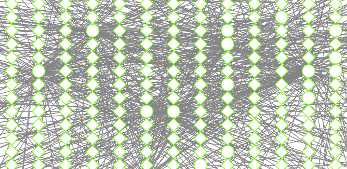
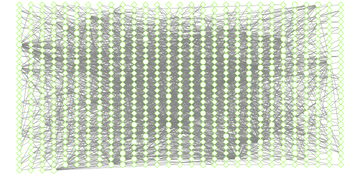
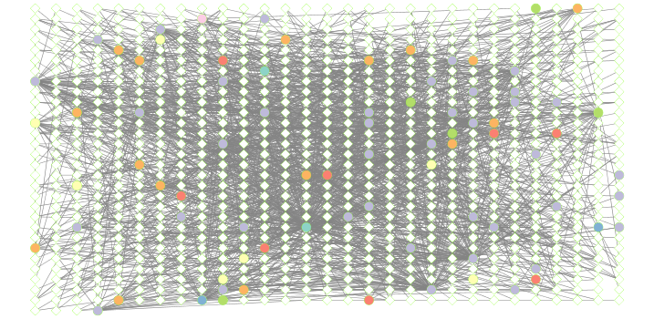
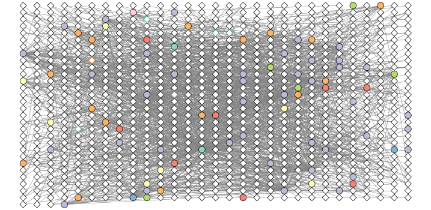
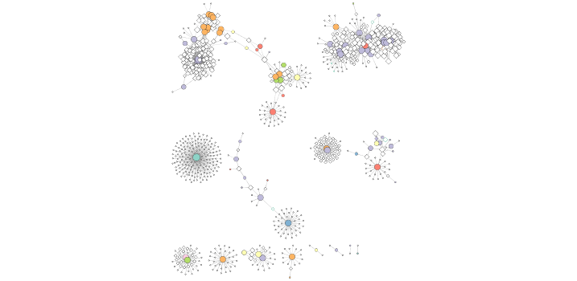

```{r setup, include=FALSE}
knitr::opts_chunk$set(echo = TRUE)
```

## Network Analysis Part II

Here we look at metagenomics co-occurrence networks. We will use R and Cytoscape. This will include the `igraph` and `RCy3` packages.

```{r}
library(RCy3)
library(igraph)
library(RColorBrewer)
```

Two of these are CRAN packages and `RCy3` is from bioconductor. 


```{r}
# CRAN packages
#install.packages( c("igraph", "RColorBrewer") )

# Bioconductor package
#source("https://bioconductor.org/biocLite.R")
#biocLite("RCy3")
```

## First Contact

These functions are a convenient way to verify a connection to Cytoscape and for logging the versions of CyREST and Cytoscape in your scripts.

```{r}
library(RCy3)
cwd <- demoSimpleGraph()

```

We can use R to drive cytoscape also

```{r}
layoutNetwork(cwd, 'force-directed')
```

Lets try one more

```{r}
setVisualStyle(cwd, "Marquee")
```

We can save the nice image from cytoscape here in our Rmd document...

```{r}
saveImage(cwd,
          file.name="demo_marquee",
          image.type="png",
          h=350)
```

```{r}
library(knitr)
include_graphics("./demo_marquee.png")
```

# Setup our metagenomics network in R

Here we examine data from the TARA oceans expedition. TARA sampled ocean water from around the world and conducted 18S metabarcoding and metagenomics to infer species composition (De Vargas et al. 2015)

Import a tsv (i.e. tab separated value file) species co-occurrence matrix. 

```{r}
prok_vir_cor <- read.delim("./data/virus_prok_cor_abundant.tsv", stringsAsFactors = FALSE)

## Have a peak at the first 6 rows
head(prok_vir_cor)
```

Here we will use the igraph package to convert the co-occurrence dataframe into a network that we can send to Cytoscape. In this case our graph is undirected (so we will set directed = FALSE) since we do not have any information about the direction of the interactions from this type of data.

```{r}
library(igraph)
g <- graph.data.frame(prok_vir_cor, directed = FALSE)
```


We can check the class of our new object g and see that is is of class igraph. Therefor the print.igraph() function will be called when we type it’s name allowing us have an informative overview of the graph structure.

```{r}
g
```

Our current graph is a little too dense in terms of node labels etc. to have a useful ‘default’ plot figure. But we can have a look anyway.

```{r}
plot(g)
```

This is a hot-mess! Lets turn of the blue text labels

```{r}
plot(g, vertex.label=NA)
```


The nodes/vertex are too big. Lets make them smaller...

```{r}
plot(g, vertex.size=3, vertex.label=NA)
```

To find out more about igraph network plot options see <http://igraph.org/r/doc/plot.common.html>.

## Network community detection

Community structure detection algorithms try to find dense subgraphs within larger network graphs (i.e. clusters of well connected nodes that are densely connected themselves but sparsely connected to other nodes outside the cluster) . Here we use the classic Girvan & Newman betweenness clustering method. The igraph package has lots of different community detection algorithms (i.e. different methods for finding communities).

```{r}
cb <- cluster_edge_betweenness(g)
cb
```

```{r}
plot(cb, y=g, vertex.label=NA,  vertex.size=3)
```


You can extract a cluster/community membership vector for further inspection with the **membership()** function:

```{r}
head( membership(cb) )
```


## Node degree
The degree of a node or vertex is its most basic structural property, the number of its adjacent edges. Here we calculate and plot the node degree distribution. 

> Note again the scale-free nature of this network with a small number of nodes with high degree values and many nodes with low degree values.


```{r}
# Calculate and plot node degree of our network
d <- degree(g)
hist(d, breaks=30, col="lightblue", main ="Node Degree Distribution")
```

For the **degree_distribution()** function a numeric vector of the same length as the maximum degree plus one is returned. The first element is the relative frequency zero degree vertices, the second vertices with degree one, etc.

```{r}
plot( degree_distribution(g), type="h" )
```


## Centrality analysis
Centrality gives an estimation on how important a node or edge is for the connectivity (or the information flow) of a network. It is a particularly useful parameter in signaling networks and it is often used when trying to find drug targets for example.  

Centrality analysis often aims to answer the following question: Which nodes are the most important and why?

One centrality method that you can often find in publications is the Google PageRank score. For the explanation of the PageRank algorithm, see the following webpage: http://infolab.stanford.edu/~backrub/google.html

```{r}
pr <- page_rank(g)
head(pr$vector)
```

Lets plot our network with nodes size scaled via this page rank centrality scores.


```{r}
# Make a size vector btwn 2 and 20 for node plotting size
v.size <- BBmisc::normalize(pr$vector, range=c(2,20), method="range")
plot(g, vertex.size=v.size, vertex.label=NA)

```

One of the simplest centrality scores is of course degree that we calculated previously and stored as the object `d`. Lets plot this one out also

```{r}
v.size <- BBmisc::normalize(d, range=c(2,20), method="range")
plot(g, vertex.size=v.size, vertex.label=NA)

```

Another very common centrality score is betweenness. The vertex and edge betweenness are (roughly) defined by the number of geodesics (shortest paths) going through a vertex or an edge.

```{r}
b <- betweenness(g)
v.size <- BBmisc::normalize(b, range=c(2,20), method="range")
plot(g, vertex.size=v.size, vertex.label=NA)
```


## Read in taxonomic classification

Since these are data from small, microscopic organisms that were sequenced using shotgun sequencing, we rely on the classification of the sequences to know what kind of organisms are in the samples. In this case the bacterial viruses (bacteriophage), were classified by Basic Local Alignment Search Tool (BLAST http://blast.ncbi.nlm.nih.gov/Blast.cgi) by searching for their closest sequence in the RefSeq database (see methods in Brum et al. (2015)). The prokaryotic taxonomic classifications were determined using the SILVA database.


```{r}
phage_id_affiliation <- read.delim("./data/phage_ids_with_affiliation.tsv")
head(phage_id_affiliation)
```

```{r}
bac_id_affi <- read.delim("./data/prok_tax_from_silva.tsv", stringsAsFactors = FALSE)
head(bac_id_affi)
```

## Add tax data to network

In preparation for sending the networks to Cytoscape we will add in the taxonomic data. Some of the organisms do not have taxonomic classifications associated with them so we have described them as “not_class” for not classified. We do that because we have had problems sending “NA”s to Cytoscape from RCy3. The RCy3 package is under active development currently so this issue will hopefully be resolved soon.


```{r}
## Extract out our vertex names
genenet.nodes <- as.data.frame(vertex.attributes(g), stringsAsFactors=FALSE)
head(genenet.nodes)
```

How may phage (i.e. *ph_*) entries do we have?
```{r}
length( grep("^ph_",genenet.nodes[,1]) )
```

Therefore we have `r nrow(genenet.nodes) - length( grep("^ph_",genenet.nodes[,1]) )` non phage nodes.

Now lets **merge()** these with the annotation data

```{r}
# We dont need all annotation data so lets make a reduced table 'z' for merging
z <- bac_id_affi[,c("Accession_ID", "Kingdom", "Phylum", "Class")]
n <- merge(genenet.nodes, z, by.x="name", by.y="Accession_ID", all.x=TRUE)
head(n)
```

```{r}
# Check on the column names before deciding what to merge
colnames(n)
colnames(phage_id_affiliation)
```

```{r}
# Again we only need a subset of `phage_id_affiliation` for our purposes
y <- phage_id_affiliation[, c("first_sheet.Phage_id_network", "phage_affiliation","Tax_order", "Tax_subfamily")]

# Add the little phage annotation that we have
x <- merge(x=n, y=y, by.x="name", by.y="first_sheet.Phage_id_network", all.x=TRUE)

## Remove duplicates from multiple matches
x <- x[!duplicated( (x$name) ),]
head(x)
```


```{r}
genenet.nodes <- x
```


Add to the network the data related to the connections between the organisms, the edge data, and then prepare to send the nodes and edges to Cytoscape using the function **cyPlot()**.

```{r}
genenet.edges <- data.frame(igraph::as_edgelist(g))
names(genenet.edges) <- c("name.1", "name.2")

genenet.edges$Weight <- igraph::edge_attr(g)[[1]]

genenet.edges$name.1 <- as.character(genenet.edges$name.1)
genenet.edges$name.2 <- as.character(genenet.edges$name.2)
genenet.nodes$name <- as.character(genenet.nodes$name)

ug <- cyPlot(genenet.nodes,genenet.edges)
```


### Send network to Cytoscape using RCy3

```{r}
# Open a new connection and delete any existing windows/networks in Cy
cy <- CytoscapeConnection()
deleteAllWindows(cy)
```

```{r}
cw <- CytoscapeWindow("Tara oceans",
                      graph = ug,
                      overwriteWindow = TRUE)
```

If you tun back to your Cytoscape window you should now see a new Network window listed as “Tara oceans”. However, as of yet there will be no network graph displayed as we have not called the displayGraph() function to Cytoscape yet.


```{r}
displayGraph(cw)
layoutNetwork(cw)
fitContent(cw)

```


Lets take a pic of this mess from cytoscape

```{r}
saveImage(cw,
          file.name="net1",
          image.type="png",
          h=350)
```

```{r}
library(knitr)

```

## Color network by prokaryotic phylum

We would like to get an overview of the different phylum of bacteria that are in the network. One way is to color the different nodes based on their phylum classification. The package Rcolorbrewer will be used to generate a set of good colors for the nodes.


```{r}
families_to_colour <- unique(genenet.nodes$Phylum)
families_to_colour <- families_to_colour[!is.na(families_to_colour)]

node.colour <- RColorBrewer::brewer.pal(length(families_to_colour), "Set3")
```

Color things up

```{r}
setNodeColorRule(cw,
                 "Phylum",
                 families_to_colour,
                 node.colour,
                 "lookup",
                 default.color = "#ffffff")
```

And take a pic

```{r}
saveImage(cw,
          file.name="net2",
          image.type="png",
          h=350)
```

```{r}
library(knitr)

```

## Set node shape to reflect virus or prokaryote

Next we would like to change the shape of the node to reflect whether the nodes are viral or prokaryotic in origin. In this dataset all of the viral node names start with "ph_", thus we can set the viral nodes to be diamond-shaped by looking for all the nodes that start with "ph" in the network. 
```{r}
shapes_for_nodes <- c("DIAMOND")

phage_names <- grep("ph_",
                    genenet.nodes$name,
                    value = TRUE)
setNodeShapeRule(cw,
                 "label",
                 phage_names,
                 shapes_for_nodes)
```

```{r, message=FALSE, results="hide"}
displayGraph(cw)
fitContent(cw)
```

```{r}
saveImage(cw,
          "co-occur1",
          "png",
          h=350)

```

## Colour edges of phage nodes

The classification of the viral data was done in a very conservative manner so not many of the viral nodes were identified. However, if we do want to add some of this information to our visualization we can color the edges of the viral nodes by family. The main families that were identified in this dataset are the *Podoviridae*, the *Siphoviridae* and the *Myoviridae* (for more info see [NCBI Podoviridae](http://www.ncbi.nlm.nih.gov/Taxonomy/Browser/wwwtax.cgi?mode=Info&id=10744&lvl=3&p=7&lin=f&keep=1&srchmode=1&unlock), [NCBI Myoviridae](http://www.ncbi.nlm.nih.gov/Taxonomy/Browser/wwwtax.cgi?mode=Tree&id=10662&lvl=3&p=7&lin=f&keep=1&srchmode=1&unlock), and [NCBI Siphoviridae](http://www.ncbi.nlm.nih.gov/Taxonomy/Browser/wwwtax.cgi?mode=Tree&id=10699&lvl=3&p=7&lin=f&keep=1&srchmode=1&unlock))


```{r}
setDefaultNodeBorderWidth(cw, 5)
families_to_colour <- c("Podoviridae",
                        "Siphoviridae",
                        "Myoviridae")

node.colour <- RColorBrewer::brewer.pal(length(families_to_colour),
                          "Dark2")
setNodeBorderColorRule(cw,
                       "Tax_subfamily",
                       families_to_colour,
                       node.colour,
                       "lookup", 
                       default.color = "#000000")
```

```{r, message=FALSE, results="hide"}
displayGraph(cw)
fitContent(cw)
```

```{r, echo=FALSE}
saveImage(cw,
          "co-occur2",
          "png",
          h=350)

```

## Side-note: fine grained control of layout to minimize overlap of nodes. 

After doing all of this coloring to the network we would like to layout the network in a way that allows us to more easily see which nodes are connected without overlap. To do this we will change the layout. 

When using RCy3 to drive Cytoscape, if we are not sure what the current values are for a layout or we are not sure what kinds of values are accepted for the different parameters of our layout, we can investigate using the RCy3 functions `getLayoutPropertyNames()` and then `getLayoutPropertyValue()`.

```{r}
getLayoutNames(cw)
```

```{r}
getLayoutPropertyNames(cw, layout.name="force-directed")
getLayoutPropertyValue(cw, "force-directed", "defaultSpringLength") 
getLayoutPropertyValue(cw, "force-directed", "numIterations")  
```

Change the layout

```{r}
layoutNetwork(cw, layout.name = "force-directed")
fitContent(cw)
```

# Look at network properties

One thing that might be interesting to visualize is nodes that are connected to many different nodes and nodes that are connected to few other nodes. The number of other nodes to which one node is connected is called **degree**. We can use a gradient of size to quickly visualize nodes that have high degree. 

```{r}
## initiate a new node attribute
ug2 <- initNodeAttribute(graph = ug,
                          "degree",
                          "numeric",
                          0.0) 

## degree from graph package for undirected graphs not working well,
## so instead using igraph to calculate this from the original graph
nodeData(ug2, nodes(ug2), "degree") <- igraph::degree(g)

cw2 <- CytoscapeWindow("Tara oceans with degree",
                      graph = ug2,
                      overwriteWindow = TRUE)
```

```{r, message=FALSE, results="hide"}
displayGraph(cw2)
layoutNetwork(cw2)
```

# Size by degree

# Change this to use the degree and other cool things we have already calculated!

```{r}
degree_control_points <- c(min(igraph::degree(g)),
                           mean(igraph::degree(g)),
                           max(igraph::degree(g)))
node_sizes <- c(20,
                20,
                80,
                100,
                110) # number of control points in interpolation mode,
                     # the first and the last are for sizes "below" and "above" the attribute seen.

setNodeSizeRule(cw2,
                "degree",
                degree_control_points,
                node_sizes,
                mode = "interpolate")

layoutNetwork(cw2,
              "force-directed")
```


```{r, echo=FALSE}
fitContent(cw2)
Sys.sleep(10) # to make sure content is fit before taking an image
fitContent(cw2)
saveImage(cw2,
          "co-occur_degree",
          "png", h=350)
```


```{r, echo=FALSE}

```


## Publishing your network to NDEx-
The new [NDEx (Network Data Exchange) web server](http://www.ndexbio.org/) provides an open-source framework where scientists and organizations can share, store, manipulate, and publish biological network knowledge (Pillich et al. 2017). It is developed here at UCSD in close collaboration with the Cytoscape development team. Once you have an account on the web server you can upload your networks directly from Cytoscape or use the bioconductor R package **ndexR**.

Visit the NDEx homepage <http://www.ndexbio.org> and create a new account for yourself. You will need to recall your username and password in a later step.

### Exporting from Cytoscape
Back in Cytoscape with your final (for now) network displayed. Click on **File** > **Export** > **Network to NDXe...**. On the window that appears make sure you are logged in by entering your NDEx username and password (see red box number 1 in figure below). Then fill in as much annotation as you can add. It is important that you make your network Public (see red box number 2 in figure). When you are ready click the **Save** button.  

Now return to your web browser and on the NDEx home page click your username in the top tool-bar and find your network under the **My Networks** tab. You can share the URL of your network with others you work with.

Now anyone can search or browse to find your network and then use it in their research together with the full history and attribution of your contributions to the network. This is particularly useful if you are publishing papers and reports with network analysis included.

Feel free to explore features of the NDEx website. There is a [Quick Start Guide](http://www.home.ndexbio.org/quick-start/) and other great documentation online. 

Some networks you might like to explore on NDEx include the [Signor](http://www.ndexbio.org/#/user/0db1f2dc-103f-11e8-b939-0ac135e8bacf) signaling pathways and those from [NDEx Butler](http://www.ndexbio.org/#/user/08cd9aae-08af-11e6-b550-06603eb7f303). Note that as well as viewing online you can clone these to your own account and open them in your local Cytoscape via the appropriate buttons on the bottom toolbar.

Remind Barry to give a tour of NDEx features and the associated R package that will allow you to interface with NDEx from within R itself (including uploading and downloading networks etc.). 


## Session setup

```{r}
sessionInfo()
```


