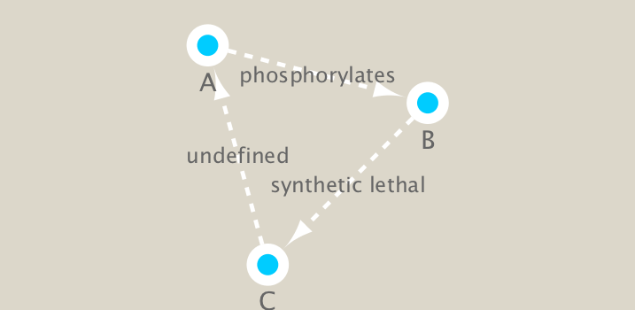
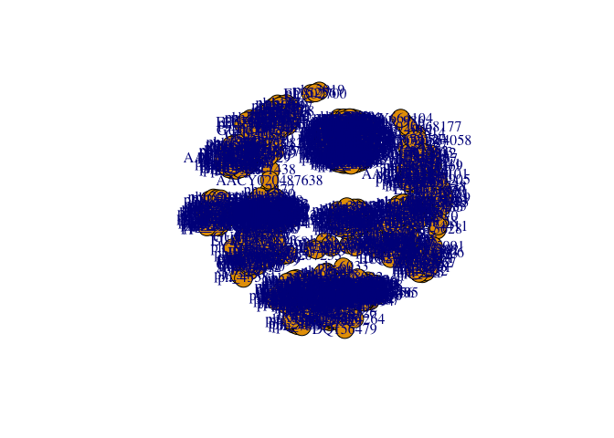
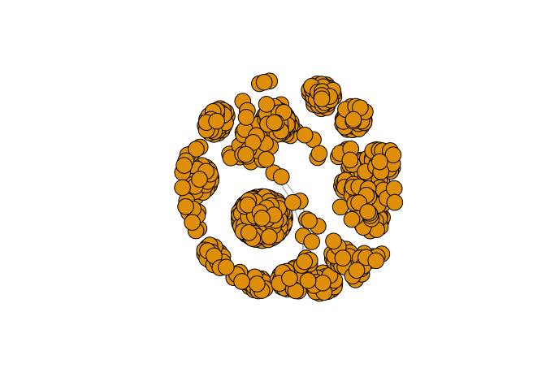
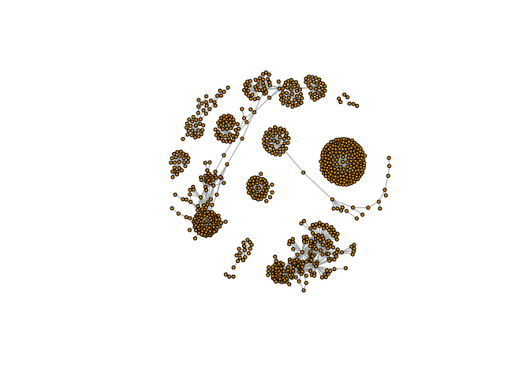
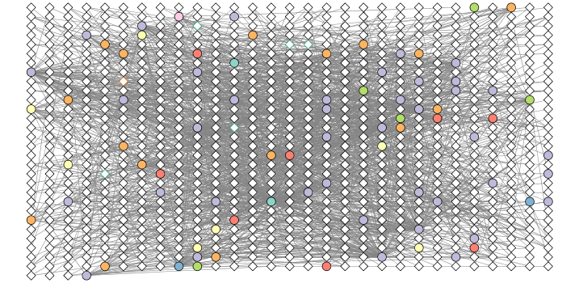

Bioinformatics Class17
================

Network Analysis Part II
------------------------

Here we look at metagenomics co-occurrence networks. We will use R and Cytoscape. This will include the `igraph` and `RCy3` packages.

``` r
library(RCy3)
```

    ## Warning: package 'RCy3' was built under R version 3.4.2

    ## Loading required package: graph

    ## Warning: package 'graph' was built under R version 3.4.2

    ## Loading required package: BiocGenerics

    ## Warning: package 'BiocGenerics' was built under R version 3.4.2

    ## Loading required package: parallel

    ## 
    ## Attaching package: 'BiocGenerics'

    ## The following objects are masked from 'package:parallel':
    ## 
    ##     clusterApply, clusterApplyLB, clusterCall, clusterEvalQ,
    ##     clusterExport, clusterMap, parApply, parCapply, parLapply,
    ##     parLapplyLB, parRapply, parSapply, parSapplyLB

    ## The following objects are masked from 'package:stats':
    ## 
    ##     IQR, mad, sd, var, xtabs

    ## The following objects are masked from 'package:base':
    ## 
    ##     anyDuplicated, append, as.data.frame, cbind, colMeans,
    ##     colnames, colSums, do.call, duplicated, eval, evalq, Filter,
    ##     Find, get, grep, grepl, intersect, is.unsorted, lapply,
    ##     lengths, Map, mapply, match, mget, order, paste, pmax,
    ##     pmax.int, pmin, pmin.int, Position, rank, rbind, Reduce,
    ##     rowMeans, rownames, rowSums, sapply, setdiff, sort, table,
    ##     tapply, union, unique, unsplit, which, which.max, which.min

``` r
library(igraph)
```

    ## 
    ## Attaching package: 'igraph'

    ## The following objects are masked from 'package:graph':
    ## 
    ##     degree, edges, intersection, union

    ## The following objects are masked from 'package:BiocGenerics':
    ## 
    ##     normalize, union

    ## The following objects are masked from 'package:stats':
    ## 
    ##     decompose, spectrum

    ## The following object is masked from 'package:base':
    ## 
    ##     union

``` r
library(RColorBrewer)
```

Two of these are CRAN packages and `RCy3` is from bioconductor.

``` r
# CRAN packages
#install.packages( c("igraph", "RColorBrewer") )

# Bioconductor package
#source("https://bioconductor.org/biocLite.R")
#biocLite("RCy3")
```

First Contact
-------------

These functions are a convenient way to verify a connection to Cytoscape and for logging the versions of CyREST and Cytoscape in your scripts.

``` r
library(RCy3)
cwd <- demoSimpleGraph()
```

    ## [1] "type"
    ## [1] "lfc"
    ## [1] "label"
    ## [1] "count"
    ## [1] "edgeType"
    ## [1] "score"
    ## [1] "misc"
    ## Successfully set rule.
    ## Successfully set rule.
    ## Locked node dimensions successfully even if the check box is not ticked.
    ## Locked node dimensions successfully even if the check box is not ticked.
    ## Successfully set rule.
    ## Successfully set rule.

We can use R to drive cytoscape also

``` r
layoutNetwork(cwd, 'force-directed')
```

Lets try one more

``` r
setVisualStyle(cwd, "Marquee")
```

    ## network visual style has been set to "Marquee"

``` r
saveImage(cwd,
          file.name="demo",
          image.type="png",
          h=350)
```

``` r
library(knitr)
```

    ## Warning: package 'knitr' was built under R version 3.4.3

``` r

```


Setup our metagenomics network in R
===================================

Import a tsv (i.e. tab separated value file) species co-occurrence matrix.

``` r
prok_vir_cor <- read.delim("./data/virus_prok_cor_abundant.tsv", stringsAsFactors = FALSE)

## Have a peak at the first 6 rows
head(prok_vir_cor)
```

    ##       Var1          Var2    weight
    ## 1  ph_1061 AACY020068177 0.8555342
    ## 2  ph_1258 AACY020207233 0.8055750
    ## 3  ph_3164 AACY020207233 0.8122517
    ## 4  ph_1033 AACY020255495 0.8487498
    ## 5 ph_10996 AACY020255495 0.8734617
    ## 6 ph_11038 AACY020255495 0.8740782

Here we will use the igraph package to convert the co-occurrence dataframe into a network that we can send to Cytoscape. In this case our graph is undirected (so we will set directed = FALSE) since we do not have any information about the direction of the interactions from this type of data.

``` r
library(igraph)
g <- graph.data.frame(prok_vir_cor, directed = FALSE)
```

We can check the class of our new object g and see that is is of class igraph. Therefor the print.igraph() function will be called when we type it’s name allowing us have an informative overview of the graph structure.

``` r
g
```

    ## IGRAPH c91a022 UNW- 845 1544 -- 
    ## + attr: name (v/c), weight (e/n)
    ## + edges from c91a022 (vertex names):
    ##  [1] ph_1061 --AACY020068177 ph_1258 --AACY020207233
    ##  [3] ph_3164 --AACY020207233 ph_1033 --AACY020255495
    ##  [5] ph_10996--AACY020255495 ph_11038--AACY020255495
    ##  [7] ph_11040--AACY020255495 ph_11048--AACY020255495
    ##  [9] ph_11096--AACY020255495 ph_1113 --AACY020255495
    ## [11] ph_1208 --AACY020255495 ph_13207--AACY020255495
    ## [13] ph_1346 --AACY020255495 ph_14679--AACY020255495
    ## [15] ph_1572 --AACY020255495 ph_16045--AACY020255495
    ## + ... omitted several edges

Our current graph is a little too dense in terms of node labels etc. to have a useful ‘default’ plot figure. But we can have a look anyway.

``` r
plot(g)
```



This is a hot-mess! Lets turn of the blue text labels

``` r
plot(g, vertex.label=NA)
```



The nodes/vertex are too big. Lets make them smaller...

``` r
plot(g, vertex.size=3, vertex.label=NA)
```



Read in taxonomic classification
--------------------------------

Since these are data from small, microscopic organisms that were sequenced using shotgun sequencing, we rely on the classification of the sequences to know what kind of organisms are in the samples. In this case the bacterial viruses (bacteriophage), were classified by Basic Local Alignment Search Tool (BLAST <http://blast.ncbi.nlm.nih.gov/Blast.cgi>) by searching for their closest sequence in the RefSeq database (see methods in Brum et al. (2015)). The prokaryotic taxonomic classifications were determined using the SILVA database.

``` r
phage_id_affiliation <- read.delim("./data/phage_ids_with_affiliation.tsv")
head(phage_id_affiliation)
```

    ##   first_sheet.Phage_id first_sheet.Phage_id_network phage_affiliation
    ## 1        109DCM_115804                       ph_775              <NA>
    ## 2        109DCM_115804                       ph_775              <NA>
    ## 3        109DCM_115804                       ph_775              <NA>
    ## 4        109DCM_115804                       ph_775              <NA>
    ## 5        109DCM_115804                       ph_775              <NA>
    ## 6        109DCM_115804                       ph_775              <NA>
    ##   Domain DNA_or_RNA Tax_order Tax_subfamily Tax_family Tax_genus
    ## 1   <NA>       <NA>      <NA>          <NA>       <NA>      <NA>
    ## 2   <NA>       <NA>      <NA>          <NA>       <NA>      <NA>
    ## 3   <NA>       <NA>      <NA>          <NA>       <NA>      <NA>
    ## 4   <NA>       <NA>      <NA>          <NA>       <NA>      <NA>
    ## 5   <NA>       <NA>      <NA>          <NA>       <NA>      <NA>
    ## 6   <NA>       <NA>      <NA>          <NA>       <NA>      <NA>
    ##   Tax_species
    ## 1        <NA>
    ## 2        <NA>
    ## 3        <NA>
    ## 4        <NA>
    ## 5        <NA>
    ## 6        <NA>

``` r
bac_id_affi <- read.delim("./data/prok_tax_from_silva.tsv")
head(bac_id_affi)
```

    ##    Accession_ID  Kingdom         Phylum          Class             Order
    ## 1 AACY020068177 Bacteria    Chloroflexi   SAR202 clade marine metagenome
    ## 2 AACY020125842  Archaea  Euryarchaeota Thermoplasmata Thermoplasmatales
    ## 3 AACY020187844  Archaea  Euryarchaeota Thermoplasmata Thermoplasmatales
    ## 4 AACY020105546 Bacteria Actinobacteria Actinobacteria             PeM15
    ## 5 AACY020281370  Archaea  Euryarchaeota Thermoplasmata Thermoplasmatales
    ## 6 AACY020147130  Archaea  Euryarchaeota Thermoplasmata Thermoplasmatales
    ##              Family             Genus Species
    ## 1              <NA>              <NA>    <NA>
    ## 2   Marine Group II marine metagenome    <NA>
    ## 3   Marine Group II marine metagenome    <NA>
    ## 4 marine metagenome              <NA>    <NA>
    ## 5   Marine Group II marine metagenome    <NA>
    ## 6   Marine Group II marine metagenome    <NA>

Add tax data to network
-----------------------

In preparation for sending the networks to Cytoscape we will add in the taxonomic data. Some of the organisms do not have taxonomic classifications associated with them so we have described them as “not\_class” for not classified. We do that because we have had problems sending “NA”s to Cytoscape from RCy3. The RCy3 package is under active development currently so this issue will hopefully be resolved soon.

``` r
genenet.nodes <- as.data.frame(vertex.attributes(g))

## not all have classification, so create empty columns
genenet.nodes$phage_aff <- rep("not_class", nrow(genenet.nodes))
genenet.nodes$Tax_order <- rep("not_class", nrow(genenet.nodes))
genenet.nodes$Tax_subfamily <- rep("not_class", nrow(genenet.nodes))

for (row in seq_along(1:nrow(genenet.nodes))){
  if (genenet.nodes$name[row] %in% phage_id_affiliation$first_sheet.Phage_id_network){
    id_name <- as.character(genenet.nodes$name[row])
    aff_to_add <- unique(subset(phage_id_affiliation,
                                first_sheet.Phage_id_network == id_name,
                                select = c(phage_affiliation,
                                           Tax_order,
                                           Tax_subfamily)))
    genenet.nodes$phage_aff[row] <- as.character(aff_to_add$phage_affiliation)
    genenet.nodes$Tax_order[row] <- as.character(aff_to_add$Tax_order)
    genenet.nodes$Tax_subfamily[row] <- as.character(aff_to_add$Tax_subfamily)
  }
}
```

``` r
## do the same for proks
genenet.nodes$prok_king <- rep("not_class", nrow(genenet.nodes))
genenet.nodes$prok_tax_phylum <- rep("not_class", nrow(genenet.nodes))
genenet.nodes$prok_tax_class <- rep("not_class", nrow(genenet.nodes))

for (row in seq_along(1:nrow(genenet.nodes))){
  if (genenet.nodes$name[row] %in% bac_id_affi$Accession_ID){
    aff_to_add <- unique(subset(bac_id_affi,
                                Accession_ID == as.character(genenet.nodes$name[row]),
                                select = c(Kingdom,
                                           Phylum,
                                           Class)))
    
    genenet.nodes$prok_king[row] <- as.character(aff_to_add$Kingdom)
    genenet.nodes$prok_tax_phylum[row] <- as.character(aff_to_add$Phylum)
    genenet.nodes$prok_tax_class[row] <- as.character(aff_to_add$Class)
  }
}
```

Add to the network the data related to the connections between the organisms, the edge data, and then prepare to send the nodes and edges to Cytoscape using the function **cyPlot()**.

``` r
genenet.edges <- data.frame(igraph::as_edgelist(g))
names(genenet.edges) <- c("name.1", "name.2")

genenet.edges$Weight <- igraph::edge_attr(g)[[1]]

genenet.edges$name.1 <- as.character(genenet.edges$name.1)
genenet.edges$name.2 <- as.character(genenet.edges$name.2)
genenet.nodes$name <- as.character(genenet.nodes$name)

ug <- cyPlot(genenet.nodes,genenet.edges)
```

### Send network to Cytoscape using RCy3

``` r
# Open a new connection and delete any existing windows/networks in Cy
cy <- CytoscapeConnection()
deleteAllWindows(cy)
```

``` r
cw <- CytoscapeWindow("Tara oceans",
                      graph = ug,
                      overwriteWindow = TRUE)
```

If you tun back to your Cytoscape window you should now see a new Network window listed as “Tara oceans”. However, as of yet there will be no network graph displayed as we have not called the displayGraph() function to Cytoscape yet.

``` r
displayGraph(cw)
```

    ## [1] "phage_aff"
    ## [1] "Tax_order"
    ## [1] "Tax_subfamily"
    ## [1] "prok_king"
    ## [1] "prok_tax_phylum"
    ## [1] "prok_tax_class"
    ## [1] "label"
    ## [1] "Weight"

``` r
layoutNetwork(cw)
fitContent(cw)
```

Lets take a pic of this mess from cytoscape

``` r
saveImage(cw,
          file.name="net1",
          image.type="png",
          h=350)
```

``` r
library(knitr)
include_graphics("./net1.png")
```


Color network by prokaryotic phylum
-----------------------------------

We would like to get an overview of the different phylum of bacteria that are in the network. One way is to color the different nodes based on their phylum classification. The package Rcolorbrewer will be used to generate a set of good colors for the nodes.

``` r
families_to_colour <- unique(genenet.nodes$prok_tax_phylum)
families_to_colour <- families_to_colour[!families_to_colour %in% "not_class"]
node.colour <- RColorBrewer::brewer.pal(length(families_to_colour), "Set3")
```

Color things up

``` r
setNodeColorRule(cw,
                 "prok_tax_phylum",
                 families_to_colour,
                 node.colour,
                 "lookup",
                 default.color = "#ffffff")
```

    ## Successfully set rule.

And take a pic

``` r
saveImage(cw,
          file.name="net2",
          image.type="png",
          h=350)
```

``` r
library(knitr)
include_graphics("./net2.png")
```


Set node shape to reflect virus or prokaryote
---------------------------------------------

Next we would like to change the shape of the node to reflect whether the nodes are viral or prokaryotic in origin. In this dataset all of the viral node names start with "ph\_", thus we can set the viral nodes to be diamond-shaped by looking for all the nodes that start with "ph" in the network.

``` r
shapes_for_nodes <- c("DIAMOND")

phage_names <- grep("ph_",
                    genenet.nodes$name,
                    value = TRUE)
setNodeShapeRule(cw,
                 "label",
                 phage_names,
                 shapes_for_nodes)
```

    ## Successfully set rule.

``` r
displayGraph(cw)
fitContent(cw)
```

``` r
saveImage(cw,
          "co-occur1",
          "png",
          h=350)
knitr::include_graphics("co-occur1.png")
```


Colour edges of phage nodes
---------------------------

The classification of the viral data was done in a very conservative manner so not many of the viral nodes were identified. However, if we do want to add some of this information to our visualization we can color the edges of the viral nodes by family. The main families that were identified in this dataset are the *Podoviridae*, the *Siphoviridae* and the *Myoviridae* (for more info see [NCBI Podoviridae](http://www.ncbi.nlm.nih.gov/Taxonomy/Browser/wwwtax.cgi?mode=Info&id=10744&lvl=3&p=7&lin=f&keep=1&srchmode=1&unlock), [NCBI Myoviridae](http://www.ncbi.nlm.nih.gov/Taxonomy/Browser/wwwtax.cgi?mode=Tree&id=10662&lvl=3&p=7&lin=f&keep=1&srchmode=1&unlock), and [NCBI Siphoviridae](http://www.ncbi.nlm.nih.gov/Taxonomy/Browser/wwwtax.cgi?mode=Tree&id=10699&lvl=3&p=7&lin=f&keep=1&srchmode=1&unlock))

``` r
setDefaultNodeBorderWidth(cw, 5)
families_to_colour <- c(" Podoviridae",
                        " Siphoviridae",
                        " Myoviridae")
node.colour <- RColorBrewer::brewer.pal(length(families_to_colour),
                          "Dark2")
setNodeBorderColorRule(cw,
                       "Tax_subfamily",
                       families_to_colour,
                       node.colour,
                       "lookup", 
                       default.color = "#000000")
```

    ## Successfully set rule.

``` r
displayGraph(cw)
fitContent(cw)
```



Side-note: fine grained control of layout to minimize overlap of nodes.
-----------------------------------------------------------------------

After doing all of this coloring to the network we would like to layout the network in a way that allows us to more easily see which nodes are connected without overlap. To do this we will change the layout.

When using RCy3 to drive Cytoscape, if we are not sure what the current values are for a layout or we are not sure what kinds of values are accepted for the different parameters of our layout, we can investigate using the RCy3 functions `getLayoutPropertyNames()` and then `getLayoutPropertyValue()`.

``` r
getLayoutNames(cw)
```

    ##  [1] "attribute-circle"      "stacked-node-layout"  
    ##  [3] "degree-circle"         "circular"             
    ##  [5] "attributes-layout"     "kamada-kawai"         
    ##  [7] "force-directed"        "cose"                 
    ##  [9] "grid"                  "hierarchical"         
    ## [11] "fruchterman-rheingold" "isom"                 
    ## [13] "force-directed-cl"

``` r
getLayoutPropertyNames(cw, layout.name="force-directed")
```

    ## [1] "numIterations"            "defaultSpringCoefficient"
    ## [3] "defaultSpringLength"      "defaultNodeMass"         
    ## [5] "isDeterministic"          "singlePartition"

``` r
getLayoutPropertyValue(cw, "force-directed", "defaultSpringLength") 
```

    ## [1] 50

``` r
getLayoutPropertyValue(cw, "force-directed", "numIterations")  
```

    ## [1] 100

Change the layout

``` r
layoutNetwork(cw, layout.name = "force-directed")
fitContent(cw)
```

Look at network properties
==========================

One thing that might be interesting to visualize is nodes that are connected to many different nodes and nodes that are connected to few other nodes. The number of other nodes to which one node is connected is called **degree**. We can use a gradient of size to quickly visualize nodes that have high degree.

``` r
## initiate a new node attribute
ug2 <- initNodeAttribute(graph = ug,
                          "degree",
                          "numeric",
                          0.0) 

## degree from graph package for undirected graphs not working well,
## so instead using igraph to calculate this from the original graph
nodeData(ug2, nodes(ug2), "degree") <- igraph::degree(g)

cw2 <- CytoscapeWindow("Tara oceans with degree",
                      graph = ug2,
                      overwriteWindow = TRUE)
```

``` r
displayGraph(cw2)
layoutNetwork(cw2)
```

Size by degree
==============

``` r
degree_control_points <- c(min(igraph::degree(g)),
                           mean(igraph::degree(g)),
                           max(igraph::degree(g)))
node_sizes <- c(20,
                20,
                80,
                100,
                110) # number of control points in interpolation mode,
                     # the first and the last are for sizes "below" and "above" the attribute seen.

setNodeSizeRule(cw2,
                "degree",
                degree_control_points,
                node_sizes,
                mode = "interpolate")
```

    ## Locked node dimensions successfully even if the check box is not ticked.
    ## Locked node dimensions successfully even if the check box is not ticked.
    ## Successfully set rule.

``` r
layoutNetwork(cw2,
              "force-directed")
```


Session setup
-------------

``` r
sessionInfo()
```

    ## R version 3.4.1 (2017-06-30)
    ## Platform: x86_64-apple-darwin15.6.0 (64-bit)
    ## Running under: macOS High Sierra 10.13.4
    ## 
    ## Matrix products: default
    ## BLAS: /Library/Frameworks/R.framework/Versions/3.4/Resources/lib/libRblas.0.dylib
    ## LAPACK: /Library/Frameworks/R.framework/Versions/3.4/Resources/lib/libRlapack.dylib
    ## 
    ## locale:
    ## [1] en_US.UTF-8/en_US.UTF-8/en_US.UTF-8/C/en_US.UTF-8/en_US.UTF-8
    ## 
    ## attached base packages:
    ## [1] parallel  stats     graphics  grDevices utils     datasets  methods  
    ## [8] base     
    ## 
    ## other attached packages:
    ## [1] knitr_1.20          RColorBrewer_1.1-2  igraph_1.1.2       
    ## [4] RCy3_1.8.0          graph_1.56.0        BiocGenerics_0.24.0
    ## 
    ## loaded via a namespace (and not attached):
    ##  [1] Rcpp_0.12.16    magrittr_1.5    R6_2.2.2        stringr_1.3.0  
    ##  [5] httr_1.3.1      tools_3.4.1     png_0.1-7       htmltools_0.3.6
    ##  [9] yaml_2.1.18     rprojroot_1.3-2 digest_0.6.14   RJSONIO_1.3-0  
    ## [13] bitops_1.0-6    RCurl_1.95-4.10 curl_3.1        evaluate_0.10.1
    ## [17] rmarkdown_1.9   stringi_1.1.7   compiler_3.4.1  backports_1.1.2
    ## [21] stats4_3.4.1    pkgconfig_2.0.1
